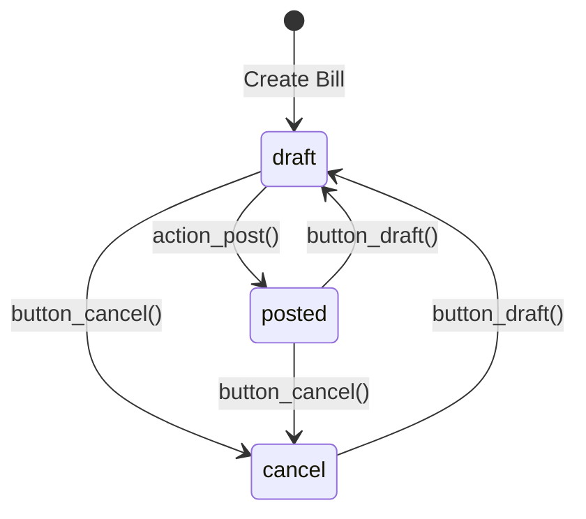
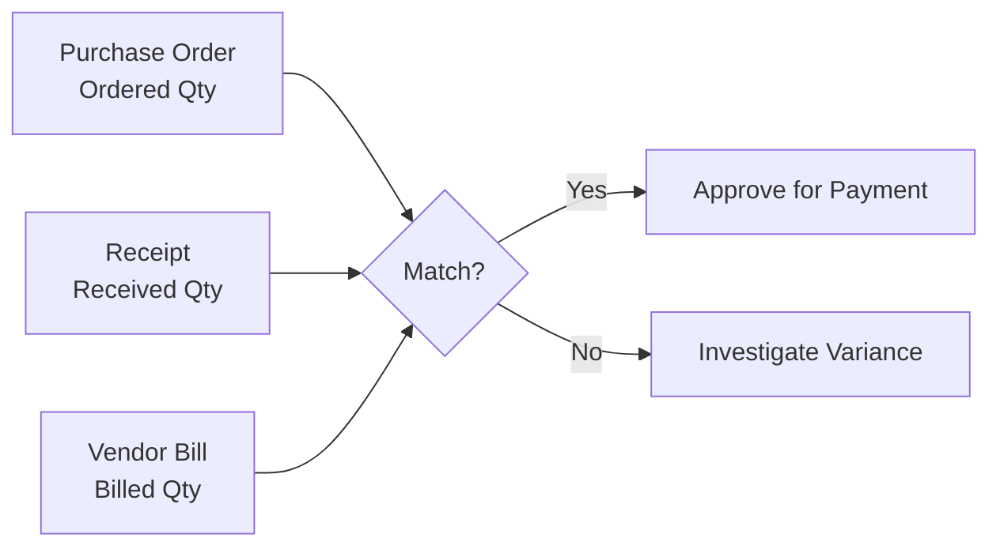
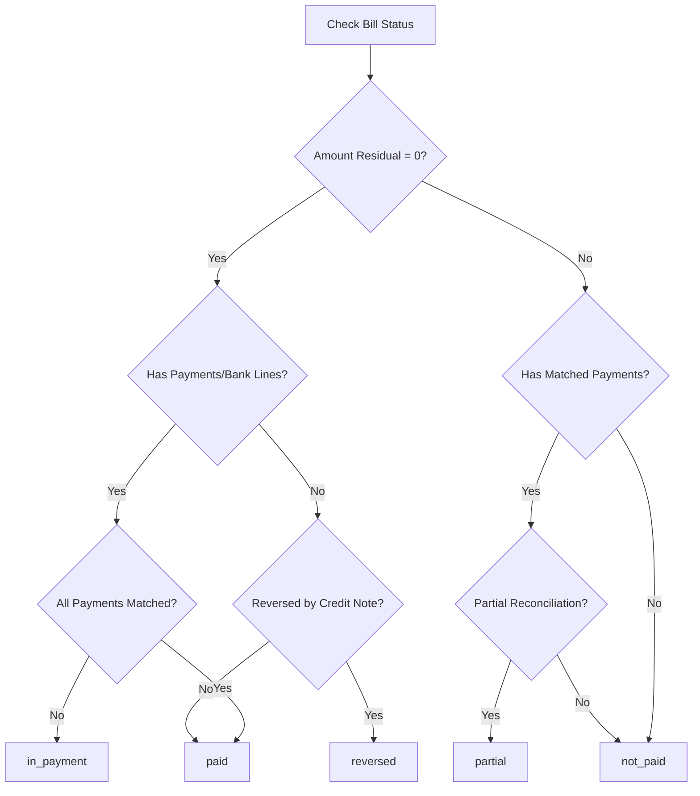
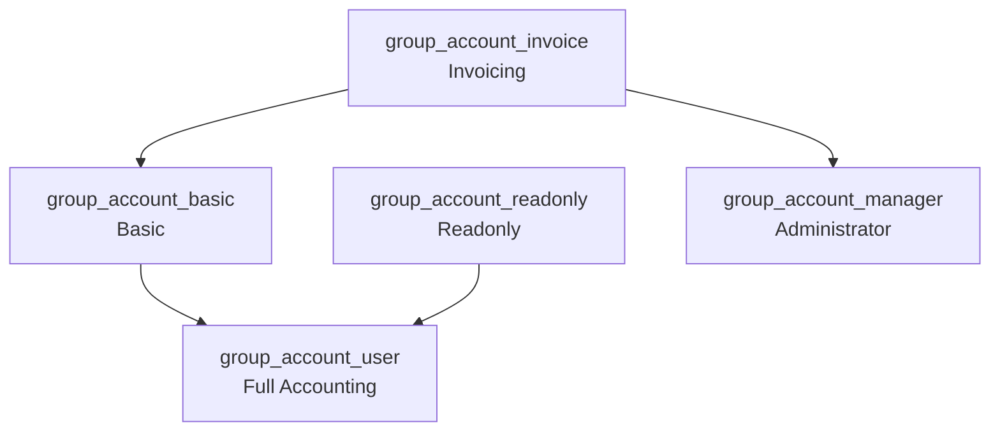

# Vendor Bill and Payment Business Rules

## Overview

This document describes the business rules governing the Vendor Bill and Payment workflow in Odoo 19.0. Vendor bills represent invoices received from suppliers/vendors for goods or services purchased. This documentation covers validation logic, state transitions, duplicate detection, three-way matching, and access control rules.

**Target Audience:** Customer support teams and business analysts who need to understand how vendor bill processing works in Odoo.

**Related Flow Document:** [Vendor Bill and Payment Flow](../02-user-flows/07-vendor-bill-payment/flow-document.md)

---

## 1. Move Type Classifications

### 1.1 Vendor Bill Move Types

Odoo uses the `move_type` field to classify different types of accounting documents. For vendor bills, the following move types apply:

| Move Type | Display Name | Description |
|-----------|--------------|-------------|
| `in_invoice` | Vendor Bill | Standard bill received from a vendor for purchases |
| `in_refund` | Vendor Credit Note | Credit memo received from a vendor (reduces amount owed) |
| `in_receipt` | Purchase Receipt | Simplified receipt document for purchases |

**Source:** `addons/account/models/account_move.py:141-158`

### 1.2 Document Type Reversal Mapping

When creating reversals or credit notes, Odoo automatically determines the appropriate reverse document type using the `TYPE_REVERSE_MAP`:

| Original Type | Reverse Type | Business Scenario |
|---------------|--------------|-------------------|
| `in_invoice` | `in_refund` | Vendor Bill → Vendor Credit Note |
| `in_refund` | `in_invoice` | Vendor Credit Note → Vendor Bill |
| `in_receipt` | `in_refund` | Purchase Receipt → Vendor Credit Note |

**Source:** `addons/account/models/account_move.py:57-65`

### 1.3 Document Type Detection Methods

The system provides helper methods to identify vendor documents:

- **`is_purchase_document()`**: Returns `True` if the move is of type `in_invoice`, `in_refund`, or optionally `in_receipt`
- **`is_invoice()`**: Returns `True` for any invoice type (both sales and purchase documents)
- **`get_purchase_types()`**: Returns the list `['in_invoice', 'in_refund']` (plus `in_receipt` if receipts are included)

**Source:** `addons/account/models/account_move.py:6320-6325`

---

## 2. Vendor Bill State Management

### 2.1 State Field Definition

Vendor bills follow the same state progression as other accounting moves:

| State | Display Name | Description |
|-------|--------------|-------------|
| `draft` | Draft | Bill is being created/edited, not yet validated |
| `posted` | Posted | Bill is confirmed and posted to the ledger |
| `cancel` | Cancelled | Bill has been cancelled |

**Source:** `addons/account/models/account_move.py:128-140`

### 2.2 State Transition Rules



**Transition Rules:**

| From State | To State | Action Method | Validation Requirements |
|------------|----------|---------------|------------------------|
| Draft | Posted | `action_post()` | Partner required, Bill date required, Lines must exist, Amount must be non-negative |
| Posted | Draft | `button_draft()` | Entry not hash-locked, No exchange difference entry, No tax cash basis entry |
| Draft | Cancelled | `button_cancel()` | Remove reconciliations, Cancel related payments |
| Posted | Cancelled | `button_cancel()` | Goes through Draft first via `button_draft()` |
| Cancelled | Draft | `button_draft()` | Standard validation |

**Source:** `addons/account/models/account_move.py:5954-6134`

### 2.3 Posting Validation Rules

When posting a vendor bill (`action_post()`), the following validations are enforced:

1. **Vendor Required**: The `partner_id` field must be set - the error message states "The field 'Vendor' is required, please complete it to validate the Vendor Bill."

2. **Bill/Refund Date Required**: The `invoice_date` field must be set for purchase documents - the error "The Bill/Refund date is required to validate this document" is raised if missing.

3. **Non-Negative Total**: Bills with negative totals cannot be posted. Users see the message "You cannot validate an invoice with a negative total amount. You should create a credit note instead."

4. **Journal Active**: The journal associated with the bill must be active.

5. **Currency Active**: The currency used on the bill must be active.

6. **Account Active**: All accounts used on bill lines must be active.

7. **User Permission**: User must belong to `account.group_account_invoice` security group.

**Source:** `addons/account/models/account_move.py:5473-5562`

---

## 3. Duplicate Bill Detection

### 3.1 Duplicate Detection Overview

Odoo automatically detects potential duplicate vendor bills to prevent double payment. The `duplicated_ref_ids` field is computed based on matching criteria, and the system displays a warning when duplicates are found.

**Source:** `addons/account/models/account_move.py:752-753`

### 3.2 Duplicate Detection Criteria

For vendor bills (`in_invoice` and `in_refund`), the system checks for duplicates using two matching scenarios:

#### Scenario 1: Same Reference in Same Year

A bill is considered a potential duplicate if:
- Same `ref` (vendor reference) field value
- Same company
- Same commercial partner (vendor)
- Same move type (`in_invoice` or `in_refund`)
- Either: no invoice date set, OR invoice dates fall within the same calendar year

#### Scenario 2: Same Partner, Amount, and Date

A bill is considered a potential duplicate if:
- Same `commercial_partner_id` (vendor)
- Same `amount_total` (and amount is not zero)
- Same `invoice_date`
- Same company
- Same move type

**Source:** `addons/account/models/account_move.py:2108-2133`

### 3.3 Duplicate Detection States

The system only matches against bills in specific states:
- **Draft** bills are matched
- **Posted** bills are matched
- **Cancelled** bills are NOT matched

This ensures cancelled bills don't trigger false positive duplicate warnings.

**Source:** `addons/account/models/account_move.py:2064`

### 3.4 Reference Field Importance

The `ref` field (Vendor Reference) is critical for vendor bill management:

| Field | Purpose | Impact on Duplicates |
|-------|---------|---------------------|
| `ref` | Stores the vendor's invoice/bill number | Primary matching criterion for duplicate detection |
| `invoice_date` | Vendor bill date | Used with ref for year-based matching |
| `partner_id` | Vendor | Required match for duplicate detection |

**Best Practice:** Always enter the vendor's original invoice number in the Reference (`ref`) field. This helps prevent duplicate bills and enables easier bill tracking and reconciliation.

**Source:** `addons/account/models/account_move.py:115-120`

---

## 4. Purchase Order Integration

### 4.1 Invoice Status on Purchase Orders

Purchase orders track their billing status through the `invoice_status` field:

| Status | Display Name | Meaning |
|--------|--------------|---------|
| `no` | Nothing to Bill | PO is not yet confirmed, or no quantities to bill |
| `to invoice` | Waiting Bills | PO has been confirmed and has quantities ready to be billed |
| `invoiced` | Fully Billed | All PO lines have been fully invoiced |

**Computation Logic:**
- If PO state is not `purchase`: status = `no`
- If any line has `qty_to_invoice` > 0: status = `to invoice`
- If all lines have `qty_to_invoice` = 0 AND invoices exist: status = `invoiced`
- Otherwise: status = `no`

**Source:** `addons/purchase/models/purchase_order.py:46-68`, `127-131`

### 4.2 Bill Creation from Purchase Order

When creating a vendor bill from a purchase order, the `action_create_invoice()` method prepares the bill with the following values:

| Bill Field | Source | Description |
|------------|--------|-------------|
| `move_type` | Context default | Set to `'in_invoice'` by default |
| `partner_id` | PO partner invoice address | Vendor's invoice address |
| `currency_id` | PO currency | Currency from the purchase order |
| `fiscal_position_id` | PO fiscal position | Tax position for the vendor |
| `partner_bank_id` | Vendor's bank account | First bank account of the commercial partner |
| `invoice_origin` | PO name(s) | Reference to source purchase order(s) |
| `invoice_payment_term_id` | PO payment terms | Payment terms from the PO |
| `company_id` | PO company | Company of the purchase order |
| `narration` | PO notes | Terms and conditions from PO |

**Source:** `addons/purchase/models/purchase_order.py:922-943`

### 4.3 Automatic Credit Note Conversion

When creating a bill from a purchase order, if the total amount is negative, Odoo automatically converts the bill to a vendor credit note:

```python
# After invoice creation:
invoices.filtered(lambda m: m.currency_id.round(m.amount_total) < 0).action_switch_move_type()
```

This handles scenarios such as:
- Negative price adjustments
- Return transactions
- Quantity reversals

**Source:** `addons/purchase/models/purchase_order.py:816`

---

## 5. Three-Way Matching

### 5.1 Three-Way Matching Overview

Three-way matching ensures that vendor bills are only paid when the Purchase Order, Receipt, and Bill all agree. This is a fundamental accounts payable control.



### 5.2 Quantity Tracking Fields

On purchase order lines, the following fields track the three-way matching:

| Field | Type | Description |
|-------|------|-------------|
| `product_qty` | Decimal | Ordered quantity on the PO line |
| `qty_received` | Computed | Total quantity received via stock pickings |
| `qty_invoiced` | Computed | Total quantity already invoiced |
| `qty_to_invoice` | Computed | Quantity remaining to be invoiced |

**Source:** `addons/purchase/models/purchase_order_line.py:58-68`

### 5.3 Quantity to Invoice Calculation

The `qty_to_invoice` computation depends on the product's billing policy:

```python
if line.order_id.state == 'purchase':
    if line.product_id.purchase_method == 'purchase':
        line.qty_to_invoice = line.product_qty - line.qty_invoiced
    else:
        line.qty_to_invoice = line.qty_received - line.qty_invoiced
else:
    line.qty_to_invoice = 0
```

| Billing Policy | Formula | Business Scenario |
|----------------|---------|-------------------|
| On Ordered Quantities (`purchase`) | `qty_to_invoice = product_qty - qty_invoiced` | Bill for what was ordered, regardless of receipt |
| On Received Quantities (default) | `qty_to_invoice = qty_received - qty_invoiced` | Bill only for what was physically received |

**Source:** `addons/purchase/models/purchase_order_line.py:163-176`

### 5.4 Invoiced Quantity Tracking

The `qty_invoiced` field tracks the total quantity that has been billed:

- For `in_invoice` (vendor bills): Adds to the invoiced quantity
- For `in_refund` (vendor credit notes): Subtracts from the invoiced quantity
- Cancelled invoices are excluded from the calculation

**Source:** `addons/purchase/models/purchase_order_line.py:189-199`

---

## 6. Payment State Management

### 6.1 Payment State Values

Vendor bills track their payment status through the `payment_state` field:

| State | Display Name | Description |
|-------|--------------|-------------|
| `not_paid` | Not Paid | Bill has not been paid |
| `in_payment` | In Payment | Payment has been initiated but not fully reconciled |
| `paid` | Paid | Bill has been fully paid |
| `partial` | Partially Paid | Bill has been partially paid |
| `reversed` | Reversed | Bill has been fully reversed with credit notes |
| `blocked` | Blocked | Bill is blocked from payment |
| `invoicing_legacy` | Invoicing App Legacy | Legacy state from older versions |

**Source:** `addons/account/models/account_move.py:47-55`

### 6.2 Payment State Computation Logic

The payment state is automatically computed based on reconciliation status:



**Key Rules:**
1. If `amount_residual` equals zero and payments exist → `paid` or `in_payment`
2. If `amount_residual` equals zero through credit notes only → `reversed`
3. If partial reconciliation exists but amount due remains → `partial`
4. If matching payment exists but not yet reconciled → `in_payment`
5. Otherwise → `not_paid`

**Source:** `addons/account/models/account_move.py:1227-1319`

### 6.3 Payment Blocking

Bills can be manually blocked from payment using the `action_toggle_block_payment()` method:

- **Block Rule**: Cannot block bills that are already `paid` or `in_payment`
- **Unblock Rule**: Sets payment state back to `not_paid` and triggers recomputation

**Source:** `addons/account/models/account_move.py:6136-6144`

---

## 7. Bill Payment Processing

### 7.1 Payment Registration

Vendor bills use the same payment registration workflow as customer invoices. Payment is initiated through the `action_register_payment()` method:

**Prerequisites:**
- Bill must be in `posted` state
- Bill must not be blocked

**Process:**
1. User clicks "Register Payment" button
2. Payment wizard opens with pre-filled amount
3. User selects payment method and confirms
4. Payment is created and reconciled with the bill

**Source:** `addons/account/models/account_move.py:5875-5878`

### 7.2 Outstanding Credits Widget

The `invoice_outstanding_credits_debits_widget` field displays available credits and payments that can be applied to the bill:

- Shows outstanding payments from the same partner
- Shows available credit notes
- Allows quick reconciliation through the widget

**Groups Required:** `account.group_account_invoice` or `account.group_account_readonly`

**Source:** `addons/account/models/account_move.py:491-499`

---

## 8. Access Control Rules

### 8.1 Security Groups for Vendor Bills

Access to vendor bill functionality is controlled by the following security groups:

| Group | XML ID | Permissions |
|-------|--------|-------------|
| Invoicing | `account.group_account_invoice` | Create, edit, and post vendor bills. Basic invoice operations. |
| Show Accounting Features - Readonly | `account.group_account_readonly` | Read-only access to all accounting documents including vendor bills. |
| Show Full Accounting Features | `account.group_account_user` | Full accountant access including bank reconciliation. Implies `group_account_basic` and `group_account_readonly`. |
| Administrator | `account.group_account_manager` | Full administrative access including configuration. Implies `group_account_invoice`. |
| Basic | `account.group_account_basic` | Basic accounting features. Implies `group_account_invoice`. |

**Source:** `addons/account/security/account_security.xml:50-80`

### 8.2 Group Hierarchy



**Key Points:**
- `group_account_invoice` is the minimum required to create and post vendor bills
- `group_account_manager` has full access and implies `group_account_invoice`
- `group_account_readonly` can view but not modify vendor bills
- `group_account_user` is for full accountants with complete access

**Source:** `addons/account/security/account_security.xml:3-38`

### 8.3 Record Rules for Vendor Bills

Multi-company record rules ensure users can only access vendor bills from their assigned companies:

- Bills are filtered by `company_id` matching user's allowed companies
- Company field cannot be changed once the bill has been posted
- Portal users can access posted invoices for their commercial partner

**Source:** `addons/account/security/account_security.xml` (noupdate="1" section)

---

## 9. Validation Constraints

### 9.1 Journal Type Constraint

Vendor bills must be created in a purchase journal:

```python
@api.constrains('journal_id', 'move_type')
def _check_journal_move_type(self):
    # Validates that in_invoice and in_refund use purchase journals
```

**Error:** If a vendor bill is attempted in a non-purchase journal, the system raises a validation error.

**Source:** `addons/account/models/account_move.py:2816-2817`

### 9.2 Currency Rate Validation

The `invoice_currency_rate` field must be positive:

```python
@api.constrains('invoice_currency_rate')
def _check_invoice_currency_rate(self):
    # Ensures rate > 0
```

**Source:** `addons/account/models/account_move.py:2839-2840`

### 9.3 Balanced Entry Constraint

All journal entries, including vendor bills, must be balanced (debits = credits):

```python
def _check_balanced(self, container):
    # Verifies that move is balanced before posting
```

**Source:** `addons/account/models/account_move.py:2749`

### 9.4 Fiscal Lock Date Validation

Bills cannot be posted to periods that are locked:

```python
def _check_fiscal_lock_dates(self):
    # Prevents posting to locked fiscal periods
```

**Source:** `addons/account/models/account_move.py:2790`

---

## 10. Abnormal Bill Detection

### 10.1 Abnormal Amount Warning

For draft vendor bills, Odoo analyzes historical data to detect potentially abnormal amounts:

- Compares current bill amount against the last 10-30 invoices from the same vendor
- Uses statistical analysis (normal distribution) to identify outliers
- Displays `abnormal_amount_warning` if the amount is significantly different

**Conditions for Analysis:**
- Bill must be a purchase document (`is_purchase_document()`)
- Bill must be in `draft` state
- Bill must have a non-zero `amount_total`
- Partner must not have `ignore_abnormal_invoice_amount` set

**Source:** `addons/account/models/account_move.py:2219-2240`

### 10.2 Abnormal Date Warning

Similarly, the system detects unusual gaps between bills:

- Analyzes the typical time interval between invoices from the vendor
- Warns if the current bill date is outside the expected range
- Displays `abnormal_date_warning` if the date pattern is unusual

**Conditions for Analysis:**
- Same as abnormal amount, plus
- Partner must not have `ignore_abnormal_invoice_date` set

**Source:** `addons/account/models/account_move.py:2219-2240`

---

## 11. Integration Points

### 11.1 Stock Integration

When the `purchase_stock` module is installed:

- `qty_received` is automatically computed from validated stock moves
- Three-way matching becomes fully automated
- Bills can reference delivery receipts

### 11.2 Accounting Integration

Vendor bills automatically:

- Create journal entries in the purchase journal
- Post to accounts payable (liability_payable account type)
- Update partner balance and aging reports

### 11.3 Payment Integration

Integration with the payment system includes:

- `account.payment` model for payment registration
- `account.partial.reconcile` for reconciliation tracking
- Bank reconciliation support for matching payments

---

## 12. Quick Reference: Common Business Scenarios

### Scenario 1: Create Bill from Purchase Order

1. Navigate to Purchase Order in `purchase` state
2. Click "Create Bill" button
3. System creates bill with `move_type='in_invoice'`
4. Bill pre-populated with PO data and line items
5. Enter vendor reference in `ref` field
6. Confirm and post the bill

### Scenario 2: Handle Duplicate Warning

1. System detects potential duplicate based on reference or amount/date
2. `duplicated_ref_ids` field populated with matching bills
3. Review existing bills before proceeding
4. Option to delete duplicates via `action_delete_duplicates()`

### Scenario 3: Process Vendor Credit Note

1. Create bill from return or negative adjustment
2. If `amount_total < 0`, system prompts for conversion
3. `action_switch_move_type()` converts to `in_refund`
4. Credit note reduces amount owed to vendor

### Scenario 4: Three-Way Matching Discrepancy

1. Check `qty_to_invoice` on PO lines
2. Compare `qty_received` vs `qty_invoiced`
3. If variance exists, investigate:
   - Under-receipt: Wait for remaining delivery
   - Over-billing: Request credit note from vendor
   - Price variance: Create adjustment entry

---

## Document Information

| Attribute | Value |
|-----------|-------|
| **Module** | `account`, `purchase` |
| **Version** | Odoo 19.0 |
| **Last Updated** | Documentation generated from source code analysis |
| **Primary Model** | `account.move` |
| **Related Models** | `account.move.line`, `purchase.order`, `purchase.order.line`, `account.payment` |

**Source Citations:**
- `addons/account/models/account_move.py`
- `addons/purchase/models/purchase_order.py`
- `addons/purchase/models/purchase_order_line.py`
- `addons/account/security/account_security.xml`
