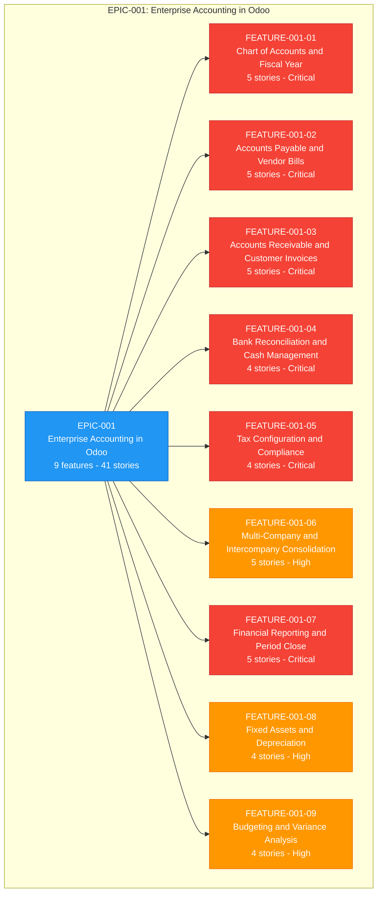
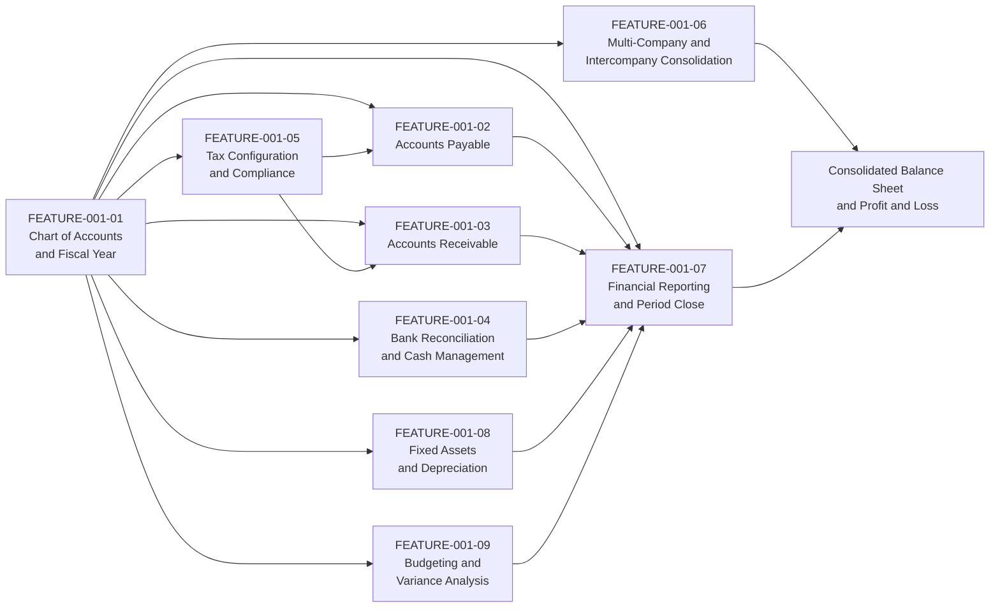
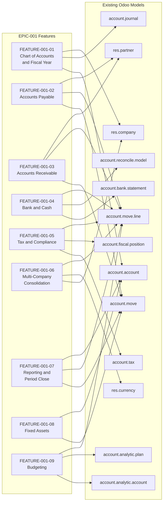

# EPIC-001: Implement Enterprise-Grade Accounting in Odoo to Deliver Multi-Entity Financial Operations, Compliance Reporting, and Real-Time Financial Visibility

---

## Metadata

| Attribute | Value |
|-----------|-------|
| **Epic ID** | `EPIC-001` |
| **Title** | Implement Enterprise-Grade Accounting in Odoo to Deliver Multi-Entity Financial Operations, Compliance Reporting, and Real-Time Financial Visibility |
| **Status** | Draft |
| **Version** | 2.1.0 |
| **Last Updated** | 2026-08-13 |
| **Owner/Author** | Blitzy Platform — Finance Transformation Programme |
| **Target Completion** | 2027-Q2 |
| **Target Platform** | Odoo 19.0 Community is the baseline present in this repository; the programme platform target (version and edition) is an open decision recorded in [§10.1.1](#1011-platform-version-and-edition-lock-in) |
| **Total Features** | 9 |
| **Total Stories** | 41 |
| **Reporting Currency** | Each company posts in its own currency; group reporting currency is USD, with all amounts rounded to the currency's decimal precision (2 decimal places for USD and EUR) |

---

## Table of Contents

1. [Executive Summary](#1-executive-summary)
2. [Business Context](#2-business-context)
3. [Target Users](#3-target-users)
4. [Success Metrics](#4-success-metrics)
5. [Features](#5-features)
6. [Epic-Feature Relationship Diagram](#6-epic-feature-relationship-diagram)
7. [Constraints](#7-constraints)
8. [Out of Scope](#8-out-of-scope)
9. [Discovery Notes](#9-discovery-notes)
10. [Dependencies](#10-dependencies)
11. [References](#11-references)
12. [Navigation](#12-navigation)
13. [Epic-Level Definition of Done](#13-epic-level-definition-of-done)
14. [Revision History](#14-revision-history)

- [Appendix A: Glossary](#appendix-a-glossary)
- [Appendix B: Open Decisions Register](#appendix-b-open-decisions-register)
- [Appendix C: Legacy Retirement and Migration Map](#appendix-c-legacy-retirement-and-migration-map)
- [Appendix D: Legacy Backlog Carry-Forward Register](#appendix-d-legacy-backlog-carry-forward-register)

---

## 1. Executive Summary

### 1.1 Overview

**Programme objective (stated verbatim by the requesting stakeholder):**

> Implement enterprise-grade accounting capabilities in Odoo to support multi-entity financial operations, compliance reporting, and real-time visibility into organizational financial health for finance teams and executive stakeholders.

This epic delivers that objective as nine features and forty-one user stories that turn Odoo's invoicing layer into a full accounting platform for a multi-entity group: a governed chart of accounts and fiscal calendar, accounts payable and accounts receivable with balanced posting, bank and cash reconciliation, tax determination and statutory filing, intercompany accounting with group consolidation, statutory and management reporting with a controlled period close, fixed-asset depreciation, and budget-versus-actual analysis. The programme is measured on three quantified outcomes: the month-end close shortens from 10 business days to 5 business days per legal entity; the named statutory and management report set is available within 24 hours of period close with each statement generated in under 5 minutes against a 2-to-4-hour manual baseline; and post-close audit adjustments fall by 50% because every posted journal entry balances (total debits minus total credits equals 0.00 in the company currency) and every report line ties to its sub-ledger. Bank statement lines auto-match at a rate of 95% or higher, 100% of depreciation entries post from their schedule, and all monetary outcomes are stated with an explicit currency and rounded to that currency's decimal precision (2 decimal places for USD and EUR).

### 1.2 Key Business Value

Finance teams gain a single posted source of truth per legal entity and for the group; executive stakeholders gain financial health indicators that are current as of the last posted entry rather than as of the last spreadsheet refresh. The quantified value case is:

| Value Lever | Baseline | Target | Unit / Basis |
|-------------|----------|--------|--------------|
| Month-end close cycle per legal entity | 10 business days | 5 business days | Business days from period end to lock date applied |
| Statutory and management report availability | 3 to 10 business days after period end | Within 24 hours of period close | Hours from period close to report publication |
| Named statement generation time (Balance Sheet, Profit & Loss, Cash Flow Statement) | 2 to 4 hours manual compilation | Under 5 minutes | Minutes of elapsed generation time per statement |
| Post-close audit adjustments | 12-month pre-implementation average | 50% reduction | Count of auditor-proposed adjusting entries per close |
| Bank statement line matching | Manual line-by-line matching | 95% or higher auto-matched | Percentage of imported statement lines matched without manual intervention |
| Depreciation posting | Manual schedules maintained outside the ledger | 100% posted from schedule | Percentage of scheduled depreciation entries posted by the scheduled job |
| Consolidated group statements | Spreadsheet consolidation after all entities close | Within 48 hours of the last entity close | Hours from final entity close to consolidated Balance Sheet and Profit & Loss |
| Overdue receivables (Days Sales Outstanding) | Current DSO baseline in days | 15% to 25% improvement | Percentage change in DSO measured quarterly |

Compliance value is expressed as controls rather than sentiment: every VAT/Tax Return reconciles its tax code, base amount and tax amount to the tax control accounts with a 0.00 difference; every intercompany balance is eliminated in consolidation with a residual of at most 0.02 in the group reporting currency from currency rounding; and every posted period carries a lock date and an immutable audit trail for the External Auditor.

### 1.3 Target Completion Timeframe

| Milestone | Target Date | Description |
|-----------|-------------|-------------|
| Planning Complete | 2026-08-12 | All 9 features and 41 stories written, estimated in Fibonacci points and prioritized |
| Development Start | 2026-09-07 | FEATURE-001-01 (Chart of Accounts & Fiscal Year) begins implementation |
| MVP Release | 2027-01-29 | Transaction backbone live: chart of accounts, fiscal calendar, accounts payable, accounts receivable, bank reconciliation and tax determination for the lead legal entity |
| Full Release | 2027-06-30 | All 9 features accepted for every in-scope legal entity, including group consolidation, period close, fixed assets and budgeting |

**Milestone dependency:** the MVP boundary is drawn where posted transaction data first becomes complete enough to produce a Trial Balance that ties to the sub-ledgers; consolidation, period close, fixed assets and budgeting consume that posted data and therefore follow it.

---

## 2. Business Context

### 2.1 Problem Statement

Finance teams operating multiple legal entities on this repository's accounting layer cannot run a governed accounting close, cannot evidence statutory and tax compliance from the system of record, and cannot give executive stakeholders a current view of group financial health.

The baseline is not bare invoicing, and this epic does not commission work that already exists. Three layers are verified present in `addons/`:

| Baseline Layer | Modules Verified Present | What It Already Supplies |
|----------------|--------------------------|--------------------------|
| Core invoicing and payments | `account` 1.4 ("Invoicing", LGPL-3), `account_payment` 2.0, `account_debit_note` 1.0, `analytic` 1.2 | Customer invoices, vendor bills, payment registration and allocation, credit and debit notes, journals, taxes, fiscal positions, bank-statement objects, reconciliation models, lock-date fields, analytic dimensions |
| Electronic invoicing | `account_edi` 1.0, `account_edi_ubl_cii` 1.0, `account_edi_proxy_client` 1.0, `account_peppol` 1.2 (all LGPL-3) | Document build and parse for UBL Bis 3, NLCIUS, E-FFF, EHF3, Factur-X (CII) and XRechnung (UBL), plus PEPPOL participant registration and PEPPOL BIS Billing 3.0 send and receive over an authenticated proxy |
| Prior-phase Community accounting add-ons | `account_financial_report_ce` 19.0.1.1.0, `account_bank_reconciliation_ce` 19.0.1.0.0, `account_asset_management` 19.0.1.0.0, `account_budget_management` 19.0.1.0.0, `account_deferred_revenue` 19.0.1.0.0, `account_payment_followup` 19.0.1.0.0 (all AGPL-3) | **Partial** implementations of the statutory report set, multi-format statement import and matching, the fixed-asset register and depreciation board, budget definition and variance, deferral schedules and cut-off entries, and dunning levels with reminder mail and action history |

What the baseline does not supply is the governed, multi-entity, audit-evidenced operation of that capability, and no consolidation implementation is present at all. [D-003](#93-d-003-reuse-of-the-existing-community-edition-accounting-add-ons) records the verified residual gap feature by feature and makes the story-level capability comparison a precondition of development. The consequences compound at every period end:

- **The close is ungoverned rather than missing.** `account` carries the journal-entry and tax lock-date fields and `account_deferred_revenue` enforces lock dates on its cut-off entries, but no close checklist, no per-company close ownership and no retained cutoff evidence set exist, so postings continue to land in periods that have already been reported.
- **The statutory report set is not tied to the ledger.** `account_financial_report_ce` implements Balance Sheet, Profit & Loss, Cash Flow, General Ledger, Trial Balance and Aged Receivable and Payable reports, and no tie-out of those reports to the sub-ledgers is retained as close evidence, so the numbers presented to lenders, boards and auditors remain spreadsheet copies that drift from the ledger.
- **No group view.** No consolidation module is present in `addons/`: intercompany balances are matched offline and eliminated in spreadsheets, so a consolidated Balance Sheet and Profit & Loss for the group takes days and carries no elimination proof.
- **The tax evidence chain stops before the filing.** `account` computes tax on transactions and the electronic-invoicing modules can build and transmit UBL, CII and PEPPOL documents, and no VAT/Tax Return, no reconciliation of tax code, base amount and tax amount to the tax control accounts, and no retained submission and acknowledgement record exist, so filing positions cannot be defended from the system of record.
- **Asset and budget control stops at the register.** `account_asset_management` and `account_budget_management` hold depreciation schedules and budgets inside Odoo, and neither is reconciled to the general ledger asset, accumulated-depreciation and expense accounts nor proven across companies, so net book values and budget variances are restated manually each month.

### 2.2 Business Impact

| Impact Area | Current State | Consequence |
|-------------|---------------|-------------|
| Period close | Close run without a checklist; the lock-date fields `account` provides are not administered per company | 10 business days per legal entity; postings arrive after reporting, forcing restatement |
| Statutory reporting | `account_financial_report_ce` renders each statement, and its output is re-keyed into spreadsheets because no report line is tied out to the sub-ledger | 2 to 4 hours per statement; 40+ hours per quarter across the report set |
| Group consolidation | No consolidation module present; intercompany matching and elimination performed offline | Consolidated statements delayed by 5 or more business days; no retained elimination proof |
| Tax compliance | `account` computes transaction tax, and the return, its reconciliation and its filing evidence are assembled outside the ledger | Filing positions unsupported by a reconciled base-and-tax audit trail; exposure to penalty assessment |
| Bank and cash | `account_bank_reconciliation_ce` matching is unproven for these entities, so statement lines are matched by hand | 5 to 10 business days to identify statement discrepancies; cash position stale |
| Fixed assets | `account_asset_management` holds the register, and a parallel spreadsheet register is maintained because the module is not reconciled to the ledger | Net book value diverges from the general ledger asset and accumulated-depreciation accounts; audit findings |
| Budget control | `account_budget_management` holds budgets, and variance is compiled by hand at month end because no variance publication runs on the close calendar | Overspend is detected after commitment, not before |
| Audit readiness | Report figures cannot be traced to sub-ledger detail | Extended audit fieldwork and a recurring population of auditor-proposed adjusting entries |

### 2.3 Proposed Solution

Deliver enterprise accounting capability in Odoo as nine independently deliverable features, each decomposed into accountant-facing user stories that describe the workflow outcome and its accounting proof rather than a technical design. The solution establishes accounting foundations first — a governed chart of accounts, fiscal calendar and lock dates — then layers the transaction backbone (accounts payable with three-way match, accounts receivable with dunning, bank and cash reconciliation) and tax determination on top of it, then adds the group layer (company hierarchy, intercompany posting, consolidation rules and eliminations) and the reporting layer (Balance Sheet, Profit & Loss, Cash Flow Statement, General Ledger, Trial Balance, Aged Receivables, Aged Payables, VAT/Tax Return, budget-versus-actual), with fixed assets and budgeting completing the sub-ledger set.

Delivery is reuse-first. Where a module verified present in §2.1 already covers part of a feature, the story is satisfied by extending or hardening that module rather than by rebuilding it, and the extend-refactor-replace decision per module is taken in [D-003](#93-d-003-reuse-of-the-existing-community-edition-accounting-add-ons) with the reason recorded. Bespoke build is reserved for the residual gap that D-003 proves.

Three design commitments run through every story:

1. **Every accounting outcome is proved, not asserted.** A posting story is done when its journal entry is balanced (total debits equal total credits) and its account codes are named; a report story is done when the report, its date-range parameter and at least one expected line value are stated and the line ties to the sub-ledger.
2. **Every monetary outcome carries a currency and a rounding rule.** Amounts are expressed in the posting company's currency with the currency's decimal precision, and multi-currency outcomes state the rate source and the resulting exchange difference treatment.
3. **Every multi-entity outcome names the company whose books are affected.** No criterion is satisfied by "the group" alone; the entity, its journal and its accounts are identified.

### 2.4 Strategic Alignment

| Strategic Goal | Alignment |
|----------------|-----------|
| Multi-entity financial operations | FEATURE-001-06 establishes the company hierarchy, intercompany posting and elimination model; every transaction feature posts per company with the affected entity named |
| Compliance reporting | FEATURE-001-05 and FEATURE-001-07 deliver the VAT/Tax Return, e-invoicing submission and the statutory statement set with GAAP and IFRS presentation and an auditable trail to sub-ledger detail |
| Real-time visibility into financial health | Posted-data reporting replaces spreadsheet compilation, so the Balance Sheet, Profit & Loss, Cash Flow Statement and budget-versus-actual views reflect the last posted entry |
| Audit and control readiness | Lock dates, balanced-entry enforcement, reconciliation gates and retained elimination proofs give the External Auditor a single evidence path per assertion |
| Cost of finance operations | Automation of depreciation, dunning, statement matching and report generation redirects finance effort from compilation to analysis |
| Scalable entity onboarding | Localization packs, chart-of-accounts templates and master-data readiness gates make each additional legal entity a configuration exercise rather than a project |

---

## 3. Target Users

### 3.1 User Personas

Every persona below is a named finance role. Story authors draw the WHO of each user story from this list.

| Persona | Role Description | Primary Needs | Features of Interest |
|---------|------------------|---------------|---------------------|
| **Chief Accountant** | Owns the general ledger, the chart of accounts and the integrity of every posted entry | Governed account hierarchy, fiscal calendar, lock dates, balanced postings | FEATURE-001-01, FEATURE-001-07 |
| **Financial Reporting Manager** | Produces statutory and management statements for each entity and the group | Named statements with date-range parameters, sub-ledger tie-out, comparative periods | FEATURE-001-07, FEATURE-001-06 |
| **Accounts Payable Clerk** | Captures vendor bills, runs three-way match and prepares payment runs | Bill capture, purchase-order and receipt matching, payment batching, credit notes | FEATURE-001-02 |
| **Accounts Receivable Specialist** | Issues customer invoices, allocates receipts and manages collections | Invoice posting, payment allocation, credit notes, dunning, Aged Receivables | FEATURE-001-03 |
| **Treasury Analyst** | Owns bank and cash positions and statement reconciliation | Statement import, automatic and manual matching, cash register control | FEATURE-001-04 |
| **Tax Accountant** | Determines tax on transactions and files statutory returns | Tax codes, fiscal positions, base-and-tax split, VAT/Tax Return, e-invoicing | FEATURE-001-05 |
| **Group Controller** | Governs group accounting policy and approves the consolidated result | Company hierarchy, intercompany policy, consolidated Balance Sheet and Profit & Loss | FEATURE-001-06, FEATURE-001-07 |
| **Consolidation Accountant** | Executes consolidation runs, eliminations and currency translation | Consolidation rules, intercompany elimination proof, translation differences | FEATURE-001-06 |
| **Fixed-Asset Accountant** | Maintains the asset register and depreciation schedules | Asset registration, depreciation methods and board, disposal gain/loss | FEATURE-001-08 |
| **FP&A Analyst** | Builds budgets and explains variances to management | Budget definition, period allocation, budget-versus-actual, variance alerts | FEATURE-001-09 |
| **External Auditor** | Tests balances and controls and issues the audit opinion | Immutable audit trail, drill-down from statement line to journal item, elimination and reconciliation evidence | FEATURE-001-07, FEATURE-001-06, FEATURE-001-01 |
| **CFO / Finance Director** | Executive stakeholder accountable for financial health and compliance | Current group financial position, close status, cash and receivables health, compliance status | FEATURE-001-07, FEATURE-001-06, FEATURE-001-09 |

### 3.2 Persona Notes

- **Named roles only.** A story's WHO is one of the twelve roles above; the generic label is not permitted, because acceptance criteria must be demonstrable to an identified role with identified permissions.
- **Every feature maps to at least one primary persona,** and every persona above is the primary persona of at least one story, so no role is documented without work and no work is documented without an owner.
- **Executive personas consume, they do not post.** The CFO / Finance Director and the Group Controller are read-and-approve personas for reporting and consolidation outcomes; posting workflows belong to the operational roles.
- **The External Auditor is a first-class persona,** not a review afterthought: audit-trail and drill-down outcomes are authored as stories with the auditor as WHO.
- **Segregation of duties is a persona constraint.** Stories that create a payment run and stories that approve or post it name different personas, so access rights derived from these stories preserve the separation.

### 3.3 Stakeholder Impact

| Stakeholder Group | Impact | Benefit |
|-------------------|--------|---------|
| Finance Teams (Chief Accountant, AP, AR, Treasury) | High | Manual compilation removed from the close; postings, matching and dunning run from the ledger |
| Group Finance (Group Controller, Consolidation Accountant) | High | Consolidated Balance Sheet and Profit & Loss within 48 hours of the last entity close, with retained elimination proof |
| Executive Leadership (CFO / Finance Director) | High | Group financial position current as of the last posted entry; close status and compliance status visible without a data request |
| Local Statutory Accountants | High | Country localization packs supply the statutory chart of accounts, tax codes and statutory report layouts per entity |
| External Auditors | Medium | One evidence path per assertion: statement line to sub-ledger to journal item, with lock dates and balanced-entry proof |
| Tax Authorities | Medium | Returns and e-invoices submitted from the system of record with a reconciled base-and-tax audit trail |
| IT Operations | Medium | One accounting platform to operate; integration surface limited to bank formats, tax endpoints and exchange-rate sources |
| Customers and Vendors | Low | Predictable invoicing, dunning and remittance communications generated from posted balances |

---

## 4. Success Metrics

### 4.1 Measurable Outcomes

| Metric ID | Success Metric | Target | Measurement Method |
|-----------|----------------|--------|-------------------|
| **SM-001** | Statutory and management statement coverage (Balance Sheet, Profit & Loss, Cash Flow Statement, General Ledger, Trial Balance, Aged Receivables, Aged Payables) | 100% of the seven named reports producible per entity and per period | Report-by-report acceptance checklist executed against one closed period |
| **SM-002** | Bank statement line matching rate | 95% or higher of imported statement lines auto-matched | Auto-matched line count divided by imported line count, per statement import |
| **SM-003** | Month-end close cycle time per legal entity | 5 business days or fewer | Business days elapsed from period end to the period lock date being applied |
| **SM-004** | Statutory and management report availability after close | Within 24 hours of period close | Timestamp difference between lock-date application and report publication |
| **SM-005** | Named statement generation time | Under 5 minutes per statement | Elapsed generation time recorded for a 12-period fiscal year on production data volumes |
| **SM-006** | Trial balance integrity across companies and periods | 100% of company-and-period combinations with total debits equal to total credits and zero unexplained suspense balances | Trial Balance run per company per period with the difference column asserted at 0.00 |
| **SM-007** | Accounts payable three-way match coverage | 100% of purchase-order-backed vendor bills matched to purchase order and receipt; posting blocked beyond a 2% price or quantity variance tolerance | Vendor bill population report segmented by match status |
| **SM-008** | Depreciation posting automation | 100% of scheduled depreciation entries posted by the scheduled job | Scheduled job execution log compared with the depreciation board |
| **SM-009** | Fixed-asset register agreement to the general ledger | 0.00 difference between total asset net book value and the general ledger asset and accumulated-depreciation account balances | Asset register total compared with the Trial Balance account balances at period end |
| **SM-010** | Tax return accuracy | 0.00 difference between VAT/Tax Return tax amount and the tax control account balances for the same date range | VAT/Tax Return reconciliation worksheet per jurisdiction per filing period |
| **SM-011** | E-invoicing first-submission acceptance rate | 98% or higher accepted on first submission at the tax-authority endpoint | Accepted submissions divided by total submissions, per jurisdiction per month |
| **SM-012** | Intercompany elimination completeness | 100% of intercompany balances eliminated, with a residual of at most 0.02 in the group reporting currency (USD) from currency rounding | Post-elimination intercompany account balances in the consolidation run report |
| **SM-013** | Consolidated statement production | Consolidated Balance Sheet and Profit & Loss within 48 hours of the last entity close | Hours elapsed from the final entity lock date to consolidated statement publication |
| **SM-014** | Budget variance report availability | Within 24 hours of period close, and on demand for the open period | Timestamp difference between lock-date application and budget-versus-actual publication |
| **SM-015** | Revenue and expense deferral compliance | 100% of deferral schedules recognized in the period they belong to, with the standard applied by deferral type: deferred **revenue** per ASC 606 and IFRS 15; prepaid and deferred **expense** per ASC 340-10 under US GAAP and per IAS 1 presentation with the applicable asset standard under IFRS; costs of obtaining or fulfilling a customer contract per ASC 340-40 and IFRS 15 paragraphs 91 to 104 | Deferral schedule report reconciled at each close to the recognized revenue accounts for revenue deferrals and, as a separate tie-out, to the prepaid and deferred-expense accounts for expense deferrals |
| **SM-016** | Post-close audit adjustments | 50% reduction against the 12-month pre-implementation average | Count of auditor-proposed adjusting entries per close |
| **SM-017** | Overdue receivables and collection effectiveness | 15% to 25% improvement in Days Sales Outstanding | DSO computed quarterly from Aged Receivables and compared with the pre-implementation baseline |

### 4.2 Key Performance Indicators

| KPI | Baseline | Target | Timeline |
|-----|----------|--------|----------|
| Time to generate the Balance Sheet | Manual compilation, 2 to 4 hours | Automated, under 5 minutes | Per reporting period |
| Bank reconciliation completion | Manual matching of every line | 95% or higher auto-matched, remainder resolved same day | Daily reconciliation |
| Month-end close duration | 10 business days per entity | 5 business days per entity | Monthly |
| Consolidated group reporting | Spreadsheet consolidation, 5 or more business days | Within 48 hours of the last entity close | Monthly and quarterly |
| Budget variance visibility | End-of-month manual compilation | Continuous from posted data, published within 24 hours of close | Continuous |
| Depreciation accuracy | Manual spreadsheet calculation | 100% posted from schedule, 0.00 difference to the general ledger | Monthly |
| Tax filing preparation | Manual extraction and reconciliation, 8 to 16 hours per jurisdiction | Under 2 hours per jurisdiction from the VAT/Tax Return | Per filing period |
| Collection effectiveness (DSO) | Current DSO baseline in days | 15% to 25% improvement | Quarterly |
| Audit fieldwork support requests | Ad-hoc extracts prepared per request | Self-service drill-down from statement line to journal item | Per audit cycle |

### 4.3 Success Metric Guidelines

- **Outcome-focused, not output-focused.** Each metric states a finance outcome (a closed period, a reconciled balance, an accepted filing), never a delivery artifact.
- **Objectively measurable.** Every metric names its unit (business days, hours, minutes, percentage, currency amount) and the artifact the measurement is taken from.
- **Leading and lagging indicators are both present.** Process indicators (SM-002, SM-007, SM-008, SM-011) predict the lagging outcomes (SM-003, SM-013, SM-016, SM-017).
- **Every feature carries at least one metric,** so no feature can be accepted without a measurable claim: FEATURE-001-01 (SM-006), FEATURE-001-02 (SM-007), FEATURE-001-03 (SM-017), FEATURE-001-04 (SM-002), FEATURE-001-05 (SM-010, SM-011), FEATURE-001-06 (SM-012, SM-013), FEATURE-001-07 (SM-001, SM-003, SM-004, SM-005, SM-015), FEATURE-001-08 (SM-008, SM-009), FEATURE-001-09 (SM-014).
- **Monetary tolerances are explicit.** Where a metric asserts agreement between two figures, the permitted difference is stated as an amount (0.00, or at most 0.02 in the group reporting currency for consolidation rounding) rather than as a qualitative judgement.

---

## 5. Features

This epic comprises nine features, each aligned to a distinct accounting sub-domain and each decomposed into user stories authored to the INVEST model (Independent, Negotiable, Valuable, Estimable, Small, Testable) with Given/When/Then acceptance criteria.

### 5.1 Feature Summary

| Feature ID | Feature Name | Story Count | Priority | Status | Link |
|------------|--------------|-------------|----------|--------|------|
| `FEATURE-001-01` | Chart of Accounts & Fiscal Year | 5 stories | Critical | Not Started | [FEATURE-001-01-chart-of-accounts-fiscal-year.md](./EPIC-001/FEATURE-001-01-chart-of-accounts-fiscal-year.md) |
| `FEATURE-001-02` | Accounts Payable & Vendor Bills | 5 stories | Critical | Not Started | [FEATURE-001-02-accounts-payable-vendor-bills.md](./EPIC-001/FEATURE-001-02-accounts-payable-vendor-bills.md) |
| `FEATURE-001-03` | Accounts Receivable & Customer Invoices | 5 stories | Critical | Not Started | [FEATURE-001-03-accounts-receivable-customer-invoices.md](./EPIC-001/FEATURE-001-03-accounts-receivable-customer-invoices.md) |
| `FEATURE-001-04` | Bank Reconciliation & Cash Management | 4 stories | Critical | Not Started | [FEATURE-001-04-bank-reconciliation-cash-management.md](./EPIC-001/FEATURE-001-04-bank-reconciliation-cash-management.md) |
| `FEATURE-001-05` | Tax Configuration & Compliance | 4 stories | Critical | Not Started | [FEATURE-001-05-tax-configuration-compliance.md](./EPIC-001/FEATURE-001-05-tax-configuration-compliance.md) |
| `FEATURE-001-06` | Multi-Company & Intercompany Consolidation | 5 stories | High | Not Started | [FEATURE-001-06-multi-company-consolidation.md](./EPIC-001/FEATURE-001-06-multi-company-consolidation.md) |
| `FEATURE-001-07` | Financial Reporting & Period Close | 5 stories | Critical | Not Started | [FEATURE-001-07-financial-reporting-period-close.md](./EPIC-001/FEATURE-001-07-financial-reporting-period-close.md) |
| `FEATURE-001-08` | Fixed Assets & Depreciation | 4 stories | High | Not Started | [FEATURE-001-08-fixed-assets-depreciation.md](./EPIC-001/FEATURE-001-08-fixed-assets-depreciation.md) |
| `FEATURE-001-09` | Budgeting & Variance Analysis | 4 stories | High | Not Started | [FEATURE-001-09-budgeting-variance-analysis.md](./EPIC-001/FEATURE-001-09-budgeting-variance-analysis.md) |

**Total Stories:** 41 stories across 9 features

Story counts by feature, in feature order: 5, 5, 5, 4, 4, 5, 5, 4, 4. Each Feature file declares the same count in its own metadata and indexes exactly that many story files under `./EPIC-001/FEATURE-001-NN/`.

### 5.2 Priority Definitions

| Priority | Definition | Criteria |
|----------|------------|----------|
| **Critical** | Must have for the MVP | Core accounting function; blocks a closed period, a statutory statement or a tax filing |
| **High** | Important for the initial release | Significant finance value that consumes posted data produced by Critical features |
| **Medium** | Desired for the complete solution | Extends analysis or automation once the accounting record is complete |
| **Low** | Future consideration | Deferrable to a later release without affecting the close or a filing |

**Priority assignment for this epic.** Six features are Critical because a closed, compliant period is impossible without them: the chart of accounts and fiscal calendar (FEATURE-001-01) govern where and when everything posts; accounts payable (FEATURE-001-02), accounts receivable (FEATURE-001-03) and bank reconciliation (FEATURE-001-04) create and settle the balances; tax configuration and compliance (FEATURE-001-05) determines the filing position; and financial reporting with period close (FEATURE-001-07) publishes and locks the result. Three features are High because they consume the posted record rather than create it: consolidation (FEATURE-001-06), fixed assets (FEATURE-001-08) and budgeting (FEATURE-001-09). No feature is Medium or Low — every one of the nine is required for the full release. The nine priorities recorded here are the single source of truth and are restated without change in the navigation index and in each Feature file's metadata.

### 5.3 Feature and Story Decomposition Guidelines

This backlog is bounded as follows, and these bounds govern the tree:

| Level | Bound | Applied in this epic |
|-------|-------|----------------------|
| Epics | Exactly 1 | EPIC-001 |
| Features per epic | 3 to 9 | 9 features |
| Stories per feature | 2 to 5 | 4 or 5 stories per feature, totalling 41 |
| Acceptance criteria per story | 4 to 8 Given/When/Then criteria | Coverage distribution required per story: at least one valid-input posting or report, one invalid or incomplete input, one error-handling case, and one accounting edge case. Where a story ingests an external file, document, endpoint response or run-time filter value, its invalid-input and error-handling criteria are written as the hostile-input cases C-022 requires in [§7.7](#77-security-and-untrusted-input-handling) |
| Estimation scale | Fibonacci: 1, 2, 3, 5, 8, 13 | Every story carries Effort, Complexity and Uncertainty guidance plus a Fibonacci point value |

Authoring rules applied to every story in this tree:

- **INVEST conformance.** Each story is Independent (deliverable without waiting on a sibling story beyond declared prerequisites), Negotiable (states outcome, not design), Valuable (names the finance benefit), Estimable (bounded enough to size in Fibonacci points), Small (one workflow or configuration outcome) and Testable (criteria are demonstrable).
- **Demonstrability.** Every story is demonstrable in the Odoo user interface, or through its public API, to the Finance Controller and Product Owner.
- **Named finance persona.** The WHO of every story is one of the twelve roles in [§3.1](#31-user-personas).
- **Accounting determinism.** Criteria cite deterministic account codes (for example Accounts Payable 2000 and Expense 6100), journal types and report names; monetary assertions state currency, amount and rounding; journal-entry criteria assert that total debits equal total credits; tax criteria separate tax code, base amount and tax amount; report criteria name the report, a date-range parameter and at least one expected line value; and multi-company criteria name the company whose books are affected.
- **Concrete language.** Acceptance criteria avoid vague qualifiers and state measurable conditions instead, so each criterion has exactly one pass or fail interpretation.
- **Carried legacy requirements.** Requirements migrated from the superseded flat-layout backlog are assigned to named stories in [Appendix D](#appendix-d-legacy-backlog-carry-forward-register). A story named there carries its assigned requirement inside its own 4-to-8 criteria budget and inside its Definition of Done; the assignment is part of that story's scope, not an optional extra.

### 5.4 Odoo Module Scope

The modules below are the capability boundary of this epic. Naming them here is a scope statement, not an installation instruction: whether a capability arrives through an Odoo Enterprise subscription or through Odoo Community Association (OCA) add-ons is the open decision recorded in [§10.1.1](#1011-platform-version-and-edition-lock-in).

**Modules in scope:**

| Odoo Module | Availability in this repository | Features Served |
|-------------|--------------------------------|-----------------|
| `account` | Present — "Invoicing", version 1.4, category `Accounting/Accounting`, licence LGPL-3 | All nine features; supplies `account.move`, `account.move.line`, `account.account`, `account.journal`, `account.tax` |
| `account_payment` | Present — "Payment - Account", version 2.0, licence LGPL-3 | FEATURE-001-02, FEATURE-001-03, FEATURE-001-04 |
| `l10n_*` (country localization packs) | Present — 209 localization modules | FEATURE-001-01 (statutory chart of accounts), FEATURE-001-05 (tax codes, statutory tax reports) |
| `account_reports` | Absent — Enterprise capability | FEATURE-001-07 (Balance Sheet, Profit & Loss, Cash Flow Statement, General Ledger, Trial Balance, Aged Receivables, Aged Payables) |
| `account_asset` | Absent — Enterprise capability | FEATURE-001-08 (asset register, depreciation board, disposal) |
| `account_budget` | Absent — Enterprise capability | FEATURE-001-09 (budget definition, allocation, budget-versus-actual) |
| `account_consolidation` | Absent — Enterprise capability | FEATURE-001-06 (consolidation rules, eliminations, consolidated statements) |

**Modules out of scope:**

| Excluded Domain | Odoo Module Family | Boundary |
|-----------------|--------------------|----------|
| Payroll accounting | `hr_payroll` and payroll localizations | Payroll results are consumed as imported journal entries; payroll calculation, payslips and payroll tax filing are not in this epic |
| Inventory costing and stock valuation | `stock_account` | Product revenue and expense posting from invoices is in scope; valuation layers, landed costs and cost-method recalculation are not |

### 5.5 Scope Consolidation Note

Deferred revenue and deferred expense capability is **absorbed into FEATURE-001-07 (Financial Reporting & Period Close)** as part of the period-end revenue and expense cutoff, rather than standing as a tenth feature. Two consequences follow: the feature count stays at nine, inside the 3-to-9 bound in [§5.3](#53-feature-and-story-decomposition-guidelines); and each recognition outcome is accepted where it is actually proved — inside the close, against the deferral schedule and the accounts it affects. The two deferral types are held apart there: deferred **revenue** is proved against the recognized revenue accounts under ASC 606 and IFRS 15, while prepaid and deferred **expense** is proved against the prepaid and deferred-expense accounts under ASC 340-10 (US GAAP) and under IAS 1 presentation with the applicable asset standard (IFRS), with ASC 340-40 and IFRS 15 paragraphs 91 to 104 applied only where the deferred cost is a cost of obtaining or fulfilling a customer contract (SM-015).

---

## 6. Epic-Feature Relationship Diagram

### 6.1 Feature Hierarchy

### 6.2 Inter-Feature Ordering

The edges below are content-level prerequisites recorded inside the tickets: a story in the target feature cannot be demonstrated until the source feature's configuration or posted data exists.

**Ordering statements recorded for downstream planning:**

| Ordering Rule | Prerequisite | Dependent Work | Reason |
|---------------|--------------|----------------|--------|
| **ORD-001** | FEATURE-001-01 (Chart of Accounts & Fiscal Year) | Every journal-posting story in FEATURE-001-02, FEATURE-001-03 and FEATURE-001-07 | An entry cannot post without its accounts, its journal and an open fiscal period |
| **ORD-002** | FEATURE-001-05 (Tax Configuration & Compliance) | Every tax-bearing transaction story in FEATURE-001-02 and FEATURE-001-03 | Tax code, base amount and tax amount cannot be asserted before tax codes and fiscal positions exist |
| **ORD-003** | FEATURE-001-06 company hierarchy stories | The consolidation stories inside FEATURE-001-06 (consolidation rules, eliminations, consolidated statements) | Consolidation requires the parent-subsidiary structure, the group reporting currency and the intercompany partner mapping |
| **ORD-004** | FEATURE-001-02, FEATURE-001-03, FEATURE-001-04, FEATURE-001-08 and FEATURE-001-09 | FEATURE-001-07 reporting and period-close stories | Reports and the close checklist consume posted data from the sub-ledgers; a report line cannot tie to a sub-ledger that has no postings |
| **ORD-005** | FEATURE-001-07 period close per entity | The group consolidated Balance Sheet and Profit & Loss in FEATURE-001-06 | Consolidation consumes closed, locked entity results so the group result is reproducible |

### 6.3 Implementation Sequence

| Phase | Features | Rationale |
|-------|----------|-----------|
| **Phase 1 — Foundations** | FEATURE-001-01, FEATURE-001-05 | Accounts, fiscal calendar, lock dates, tax codes and fiscal positions govern every later posting |
| **Phase 2 — Transaction backbone** | FEATURE-001-02, FEATURE-001-03, FEATURE-001-04 | Create and settle payables, receivables, bank and cash balances; produces the posted data reporting needs |
| **Phase 3 — Reporting and close** | FEATURE-001-07 | Publishes the statutory and management report set and locks the period with the close checklist |
| **Phase 4 — Group and sub-ledgers** | FEATURE-001-06, FEATURE-001-08, FEATURE-001-09 | Consolidates closed entity results and completes the fixed-asset and budget sub-ledgers |

---

## 7. Constraints

All work under this epic adheres to the constraints below. Feature files inherit this constraint set by reference and story-level Definitions of Done cite it.

### 7.1 License Requirements

| Constraint | Requirement | Rationale |
|------------|-------------|-----------|
| **C-001** | New modules are distributed under an AGPL-3.0 compatible licence | Keeps delivered accounting code redistributable and contributable to the community, matching the licence used by the existing Community-edition accounting add-ons in this repository (AGPL-3) |
| **C-002** | Integration with the existing `account` module respects its LGPL-3 licence | `addons/account/__manifest__.py` declares `'license': 'LGPL-3'`; derived and dependent code must remain licence-compatible with it |

**Acceptance Criterion:** every delivered module declares a licence in its manifest that is compatible with AGPL-3.0 and with the LGPL-3 licence of `account`.

### 7.2 Dependency Restrictions

| Constraint | Requirement | Rationale |
|------------|-------------|-----------|
| **C-003** | The edition source for Enterprise-only capability is an **open decision** and must be confirmed before FEATURE-001-06, FEATURE-001-07, FEATURE-001-08 and FEATURE-001-09 enter development | Four in-scope modules (`account_reports`, `account_asset`, `account_budget`, `account_consolidation`) and the `account_accountant` application are Enterprise modules and are absent from this repository's `addons/`; the capability must come either from an Odoo Enterprise subscription or from OCA add-ons. The decision changes licensing, cost and implementation approach, so it is recorded as DEC-002 in [Appendix B](#appendix-b-open-decisions-register) rather than presumed |
| **C-004** | Whichever edition path is chosen, delivered code stays compatible with the OCA add-on ecosystem | Preserves the option to consume `account_financial_report`, `account_reconcile_oca` and `mis_builder`, and keeps the six Community-edition accounting add-ons already present in this repository usable |

**Acceptance Criterion:** the edition decision (DEC-002) is recorded with its licensing and cost consequences, and every module manifest declares dependencies that exist in the chosen platform configuration.

### 7.3 Coding Standards

| Constraint | Requirement | Rationale |
|------------|-------------|-----------|
| **C-005** | Odoo and OCA coding standards, including PEP 8 for Python | Keeps delivered code reviewable by the Odoo community and eligible for OCA contribution |
| **C-006** | Static analysis passes with the repository's configured tooling and OCA quality checks | Defects are caught before review; `ruff.toml` at the repository root defines the lint configuration in force |

**Acceptance Criterion:** delivered code passes the repository lint configuration and OCA quality checks (pre-commit hooks, pylint-odoo) with zero violations.

### 7.4 Test Coverage

| Constraint | Requirement | Rationale |
|------------|-------------|-----------|
| **C-007** | Minimum 80% test coverage for new functionality | Enterprise-grade assurance for code that posts to the general ledger |
| **C-008** | Unit, integration and acceptance tests, with each acceptance test traceable to a Given/When/Then criterion | Makes each story's criteria executable rather than declarative |
| **C-009** | Accounting assertions are tested numerically: total debits equal total credits, tax amounts reconcile to tax control accounts, report lines tie to sub-ledger totals | Balance and reconciliation are the accounting contract; they are asserted as amounts, not inspected by eye |

**Acceptance Criterion:** each delivered module reports 80% or higher coverage for new functionality, and every acceptance criterion maps to at least one automated test.

### 7.5 Version Compatibility

| Constraint | Requirement | Rationale |
|------------|-------------|-----------|
| **C-010** | The platform version target is an **open decision** (DEC-001) | The request targets Odoo 17, this repository is Odoo 19.0 (`version_info = (19, 0, 0, FINAL, 0, '')` in `odoo/release.py`), and the prior backlog targeted 18.0. The three targets imply different APIs and migration effort, so the target is confirmed with stakeholders rather than assumed — see [§10.1.1](#1011-platform-version-and-edition-lock-in) |
| **C-011** | Python and PostgreSQL versions follow the confirmed platform target | The Odoo 19.0 baseline in this repository declares `MIN_PY_VERSION = (3, 10)`, `MAX_PY_VERSION = (3, 13)` and `MIN_PG_VERSION = 13` in `odoo/release.py`; an earlier platform target carries a different supported matrix |

**Acceptance Criterion:** the confirmed platform version and edition are recorded in this epic and restated in every Feature file, and delivered modules install on that platform without version-compatibility errors.

### 7.6 Integration Constraints

| Constraint | Requirement | Rationale |
|------------|-------------|-----------|
| **C-012** | Build on the existing accounting models `account.move`, `account.move.line`, `account.account`, `account.journal`, `account.tax` and `account.fiscal.position` rather than parallel structures | Preserves one ledger, one audit trail and Odoo's own posting and reconciliation semantics |
| **C-013** | Use `account.analytic.account` and `account.analytic.plan` for budget and cost-centre dimensions | The analytic layer already provides multi-dimensional allocation used by budgeting and variance analysis |
| **C-014** | Respect the Odoo security model, record rules and multi-company access rights, including company-dependent record isolation | Multi-entity operation requires that each persona sees and posts only in permitted companies, and that segregation of duties survives implementation |

**Acceptance Criterion:** no delivered feature duplicates an existing accounting model, and multi-company record rules are exercised by tests that prove one company's postings are not visible to a persona restricted to another company.

### 7.7 Security and Untrusted-Input Handling

Every capability in this epic that admits data from outside its trust boundary inherits the constraints below. The surfaces are enumerated here so that no Feature and no Story can treat them as another ticket's concern: bank statement files in CAMT.053, OFX, QIF and CSV form (FEATURE-001-04); vendor-bill capture attachments and the field data extracted from them (FEATURE-001-02); UBL, CII, Factur-X and PEPPOL invoice documents travelling in both directions, together with the tax-authority and proxy endpoint responses that accompany them (FEATURE-001-05); legacy chart-of-accounts, opening-balance and open-item extracts loaded at migration (FEATURE-001-01); exchange-rate feed responses (FEATURE-001-06); dunning email bodies and report templates that render partner-supplied text through QWeb (FEATURE-001-03, FEATURE-001-07); report filter and date-range values supplied at run time (FEATURE-001-07, FEATURE-001-09); and the credentials, API keys and signing certificates those integrations require (FEATURE-001-05).

| Constraint | Requirement | Rationale |
|------------|-------------|-----------|
| **C-015** | Every file entering through statement import, vendor-bill capture, migration load or report re-import is checked at the ingestion boundary against an allowlist of permitted MIME types and extensions and against a declared maximum size, and is rejected with a named validation error when either check fails | Statement files, bill attachments and legacy extracts arrive from banks, vendors and retired systems outside this system's trust boundary; an unchecked type or size reaches a parser it was never meant for and exhausts server resources (CWE-20, CWE-434, CWE-409) |
| **C-016** | XML documents — CAMT.053 statements and UBL, CII, Factur-X and PEPPOL invoice documents, inbound and outbound — are parsed with DTD processing and external-entity resolution disabled and entity expansion bounded, and every inbound document is validated against the schema for its declared format before any field is read | External-entity and entity-expansion attacks on an inbound invoice or statement path disclose server files or exhaust memory (CWE-611, CWE-776); validating against the schema before field access stops a malformed document short of the posting logic |
| **C-017** | Values written to CSV and XLSX exports are neutralized against formula injection: a cell value beginning with `=`, `+`, `-`, `@`, a tab or a carriage return is escaped or prefixed so the spreadsheet application treats it as text, and the same check is applied to partner names, references and memo text arriving by import | Report export to PDF and XLSX is a mandated capability of FEATURE-001-07 and lands on finance and auditor desktops; one unescaped cell turns a financial report into code that executes in the recipient's spreadsheet (CWE-1236) |
| **C-018** | Text originating outside the system — partner names, invoice references, statement line labels and memo fields — is sanitized and context-encoded before it is rendered into a QWeb template, a dunning email body or a PDF report, and templates render such values as escaped text rather than as raw markup | Dunning email and report rendering compose supplier- and customer-controlled text into documents that leave the organization; unencoded output admits script and markup injection into those documents (CWE-79, CWE-116) |
| **C-019** | All data access is expressed through the Odoo ORM or parameterized SQL, with no string-concatenated query construction and no invocation of a shell or operating-system command from accounting code; a file path is never derived from an uploaded document's name and then opened on disk | Statement import, migration and report filters carry externally supplied values into search domains and queries; concatenation, shell invocation and name-derived paths convert those values into injection and traversal paths (CWE-89, CWE-78, CWE-22) |
| **C-020** | Validation and integration failures return an error naming the rejected document, the check that failed and the remedial action, and disclose no stack trace, SQL, file-system path, credential, certificate or complete authority-response payload; diagnostic detail goes to the server log under an access-controlled channel | Import and e-invoicing errors are read by finance personas and, on rejection, sometimes by counterparties; a verbose failure leaks internal structure (CWE-209, CWE-532), while naming the failed check keeps the message actionable |
| **C-021** | Endpoint credentials, API keys, signing certificates and private keys are held outside module source and outside version control — in Odoo system parameters, the `certificate` store `account_edi_proxy_client` already depends on, or an external secret manager — scoped per company, with a recorded rotation owner and rotation interval, and are never written to logs, fixtures or exports | FEATURE-001-05 requires authority credentials and signing certificates per jurisdiction, and `account_edi_proxy_client` binds an `edi_proxy_user` per company and proxy type; a secret committed to source or emitted to a log is disclosed to everyone holding repository or log access (CWE-798, CWE-522) |
| **C-022** | Every story that ingests an external file, document, endpoint response or run-time filter value carries at least one acceptance test submitting hostile input — a malformed document, a schema-invalid document, an oversized file, a disallowed type, an external-entity payload, a formula-injection value and an over-long field — and asserts that the input is rejected with a named error, that no journal entry is created, and that the service stays available | C-015 through C-021 are proved only by tests that attempt the attack; this makes the security baseline executable under C-008 rather than declarative, and it discharges the invalid-input and error-handling coverage that [§5.3](#53-feature-and-story-decomposition-guidelines) already requires of every story |

**Acceptance Criterion:** every Feature file restates C-015 through C-022, every story touching an external file, document, endpoint, credential or rendered template carries the hostile-input tests required by C-022, and each such test asserts a named rejection error together with a ledger unchanged by the rejected input.

---

## 8. Out of Scope

### 8.1 Explicitly Excluded Items

The following items are **explicitly out of scope** for this epic:

| Excluded Item | Rationale |
|---------------|-----------|
| **Payroll accounting** (`hr_payroll`, payroll localizations, payslip calculation, payroll tax filing) | Payroll is a separate programme with its own personas and statutory calendar; this epic consumes payroll results as imported journal entries and posts them to the general ledger, and nothing more |
| **Inventory costing and stock valuation** (`stock_account` valuation layers, landed costs, standard and average-cost recalculation) | Inventory valuation policy is owned by the supply-chain programme; this epic posts product revenue and expense from invoices and bills, and consumes inventory valuation entries as given |
| **Native mobile applications** (iOS and Android accounting clients) | Odoo's responsive web interface is the delivery channel for all forty-one stories; a native client is a separate delivery decision |
| **Lease accounting and financial-instrument accounting** (IFRS 16 lease liabilities, hedge accounting, derivative valuation) | These require their own measurement models and disclosure sets; the fixed-asset scope here is owned tangible and intangible assets with depreciation |
| **Income-tax provision and deferred-tax computation** | The tax scope here is transaction taxes (VAT and equivalent) and their statutory returns; corporate income-tax provisioning is a separate reporting cycle |
| **Non-controlling interest and equity-method accounting** | The consolidation scope here is full consolidation of controlled entities with intercompany elimination; minority-interest allocation and associate accounting are deferred to a later epic |

**Multi-company consolidation is IN scope for this epic.** This reverses the position taken by the prior, superseded backlog, which excluded multi-company consolidation with intercompany eliminations and declared single-company operation as its boundary. The objective in [§1.1](#11-overview) is explicitly multi-entity, and FEATURE-001-06 delivers the company hierarchy, intercompany posting, consolidation rules, eliminations and consolidated statements, with SM-012 and SM-013 measuring the result.

### 8.2 Boundary Conditions

| Boundary | In Scope | Out of Scope |
|----------|----------|--------------|
| Company structure | Multi-entity operation: company hierarchy, intercompany transactions, consolidation rules, intercompany elimination, consolidated Balance Sheet and Profit & Loss | Non-controlling interest allocation; equity-method investments; statutory group audit opinion issuance |
| Bank statement import | CAMT.053 (ISO 20022), OFX, QIF and CSV files, each treated as untrusted input under C-015, C-016 and C-019 | Bank feed aggregator API subscriptions (Plaid, Yodlee, Saltedge) and the contracts they require |
| Payment execution | SEPA credit transfer payment file generation and payment batching | Direct bank host-to-host connectivity certification and payment-scheme membership |
| Tax determination and filing | Tax codes, fiscal positions, base-and-tax split, VAT/Tax Return, e-invoicing submission to authority endpoints, with inbound and outbound documents parsed under C-016 and endpoint credentials and certificates held under C-021 | Third-party tax engines (AvaTax, TaxCloud); income-tax provision; transfer-pricing documentation |
| Asset depreciation | Straight-line, declining balance and units-of-production methods; disposal with gain or loss | Formula-driven bespoke depreciation models; component depreciation under lease standards |
| Budgeting | Manual budget definition, period allocation, budget-versus-actual reporting and variance alerts | Statistical or machine-learning forecasting and driver-based planning models |
| Vendor bill capture | Digitized capture of bill header and line data, three-way match against purchase order and receipt, with the uploaded attachment checked under C-015 and its extracted text encoded under C-018 | Machine-learning invoice recognition models and the infrastructure to train them |
| Payroll | Posting imported payroll journal entries to the general ledger | Payroll calculation, payslips, payroll tax filing |
| Inventory | Product-level revenue and expense posting from invoices and bills | Stock valuation layers, landed costs, cost-method recalculation |
| Report output | On-screen reports with drill-down, PDF and XLSX export, with exported cells neutralized under C-017 and rendered text encoded under C-018 | External business-intelligence platform integration and warehouse replication |
| Collections communication | Email dunning generated from posted receivable balances, with partner-supplied text sanitized and encoded under C-018 before it is rendered into the QWeb mail body | SMS, instant-messaging and mobile push channels |

**Boundary guidance.** Exclusions above prevent scope expansion during implementation, and each is a candidate for a later epic rather than a rejection of the capability. If a stakeholder requirement crosses one of these boundaries, the boundary is renegotiated in this section before the affected story is accepted.

---

## 9. Discovery Notes

> **Purpose:** these notes direct the implementing agent's codebase analysis before design decisions are made. User stories describe WHAT and WHY; HOW emerges from the discovery recorded here. Every fact below was verified against this repository.

### 9.1 D-001: Platform Baseline and Existing Accounting Layer

**Discovery requirement:** establish what accounting capability already exists before proposing new modules.

Verified baseline:

- `odoo/release.py` declares `version_info = (19, 0, 0, FINAL, 0, '')`, `MIN_PY_VERSION = (3, 10)`, `MAX_PY_VERSION = (3, 13)` and `MIN_PG_VERSION = 13`; the repository licence is LGPL-3.
- `addons/account/__manifest__.py` declares `'name': 'Invoicing'`, `'version': '1.4'`, `'category': 'Accounting/Accounting'` and `'license': 'LGPL-3'`, with `depends` on `base_setup`, `onboarding`, `product`, `analytic`, `portal` and `digest`. This is the **basic invoicing and payments layer, not the full Enterprise Accounting application**.
- Present Community accounting add-ons: `account` (1.4), `account_payment` (2.0), `account_debit_note` (1.0) and `analytic` (1.2).
- Present Community electronic-invoicing add-ons, all LGPL-3: `account_edi` (1.0, "Import/Export Invoices From XML/PDF", `depends: ['account']`), `account_edi_ubl_cii` (1.0, "Import/Export electronic invoices with UBL/CII", `depends: ['account']`), `account_edi_proxy_client` (1.0, "Proxy features for account_edi", `depends: ['account', 'certificate']`) and `account_peppol` (1.2, "Peppol", `depends: ['account_edi_proxy_client', 'account_edi_ubl_cii']`). Their declared coverage is recorded in [D-011](#911-d-011-electronic-invoicing-capability-already-present) and is the reason FEATURE-001-05 e-invoicing is scoped as an extension rather than a bespoke build.
- Present prior-phase Community accounting add-ons, all AGPL-3: the six modules tabulated in [D-003](#93-d-003-reuse-of-the-existing-community-edition-accounting-add-ons).

**Analysis areas:**

- [ ] Model structures and inheritance patterns in `addons/account/models/`
- [ ] View and action architecture in `addons/account/views/`
- [ ] Wizard conventions in `addons/account/wizard/`
- [ ] Report patterns in `addons/account/report/`
- [ ] Whether each capability is a new module or an extension of `account`

### 9.2 D-002: Edition Capability Gap

**Discovery requirement:** confirm, capability by capability, what the chosen edition path supplies and what must be built.

Verified: `account_reports`, `account_asset`, `account_budget`, `account_consolidation` and `account_accountant` are **absent** from `addons/`. Every capability that FEATURE-001-06 through FEATURE-001-09 assumes therefore arrives from an Odoo Enterprise subscription, from OCA add-ons, or from bespoke development.

**Analysis areas:**

- [ ] Map each of the nine features to the module that will deliver it under each edition option
- [ ] Record the licence of every candidate add-on and check it against C-001 and C-002
- [ ] Quantify the bespoke development remaining under the OCA option
- [ ] Feed the result into DEC-002 before FEATURE-001-06 through FEATURE-001-09 start

### 9.3 D-003: Reuse of the Existing Community-Edition Accounting Add-ons

**Discovery requirement:** assess prior-phase work in this repository before rebuilding capability.

Verified add-ons present in `addons/`, all licensed AGPL-3. Coverage below was verified from each module's `__manifest__.py` and its `models/` and `report/` file inventory; the story-by-story comparison is the first analysis area of this discovery note:

| Module | Version | Verified Coverage Present | Serves |
|--------|---------|---------------------------|--------|
| `account_financial_report_ce` | 19.0.1.1.0 | `models/`: `balance_sheet`, `profit_loss`, `cash_flow`, `general_ledger`, `trial_balance`, `aged_partner_balance`, `financial_report`; `report/`: a QWeb report object per statement, including `report_aged_partner_balance` covering aged receivable **and** payable | FEATURE-001-07 statutory reports; the aged reports also serve FEATURE-001-03 and FEATURE-001-02 |
| `account_bank_reconciliation_ce` | 19.0.1.0.0 | `models/`: `bank_statement_import` (CSV, OFX, QIF, CAMT.053), `reconciliation_matching_engine` with confidence scoring, `reconciliation_rule` with regex and amount matching, `partial_reconcile_ext`; `report/reconciliation_report` | FEATURE-001-04 statement import, matching, manual and partial reconciliation |
| `account_asset_management` | 19.0.1.0.0 | `models/`: `account_asset`, `account_asset_category`, `account_asset_depreciation_line`, plus `account_move` and `account_move_line` extensions; declared methods straight-line, declining balance and units of production, depreciation board, scheduled posting, revaluation | FEATURE-001-08 asset register and depreciation |
| `account_budget_management` | 19.0.1.0.0 | `models/`: `budget_budget`, `budget_budget_line`, `budget_period`, `budget_alert`, plus `account_analytic_account` and `account_move` extensions; `report/budget_vs_actual_report` | FEATURE-001-09 budgets, variance and threshold alerts |
| `account_deferred_revenue` | 19.0.1.0.0 | `models/`: `account_deferred_schedule`, `account_deferred_line`, plus `account_move` and `account_move_line` extensions; invoice-driven schedules, straight-line, date-based and manual allocation, cut-off generation with lock-date enforcement, recognition dashboard | FEATURE-001-07 revenue and expense cutoff |
| `account_payment_followup` | 19.0.1.0.0 | `models/`: `account_followup_level`, `account_followup_line`, `account_followup_history`, `res_partner`, plus `account_move` and `account_move_line` extensions; `report/followup_report`; escalation levels, `ir.cron` reminder mail, immutable action history, per-partner overdue classification | FEATURE-001-03 dunning |

**Verified residual gap per feature.** The gap below is what remains after the coverage above is credited. It is stated at manifest and module-inventory level; the story-level comparison confirms or narrows it before development starts, and no bespoke build is authorized for a capability this table does not list as residual:

| Feature | Residual Gap After Crediting the Present Add-ons |
|---------|--------------------------------------------------|
| FEATURE-001-01 Chart of Accounts and Fiscal Year | No add-on addresses this feature. Group chart-of-accounts policy, IFRS and GAAP taxonomy mapping, fiscal-year and period calendar governance, legacy chart import with opening balances, and lock-date administration are all residual, built on `account`'s existing `account.account`, fiscal-year and lock-date fields |
| FEATURE-001-02 Accounts Payable and Vendor Bills | Bill capture and digitization workflow, three-way match against purchase order and receipt, batch vendor payment runs on the SEPA `pain.001` file, and the Aged Payables view that drives the payment run are residual; bill posting and payment registration reuse `account` and `account_payment`, and the aged presentation reuses `account_financial_report_ce` |
| FEATURE-001-03 Accounts Receivable and Customer Invoices | Invoice-to-cash workflow governance, payment allocation across multiple invoices, credit-note and refund handling, and the reconciliation of the Aged Receivables report to the receivable control account are residual; dunning levels, reminder mail and action history reuse `account_payment_followup`, which needs multi-company proof, dispute exclusion and partial-payment behaviour verified against the story criteria |
| FEATURE-001-04 Bank Reconciliation and Cash Management | Cash register and petty-cash handling is residual, as is multi-company proof, the untrusted-file hardening C-015 through C-022 require of the import and matching paths, and the statement-to-ledger tie-out evidence; import, matching, rules, manual and partial reconciliation reuse `account_bank_reconciliation_ce` |
| FEATURE-001-05 Tax Configuration and Compliance | Fiscal-position and tax-code configuration governance, the VAT/Tax Return report with its tax-code, base-amount and tax-amount reconciliation to the tax control accounts, authority-specific filing and submission outside the formats listed in D-011, certificate and credential onboarding per jurisdiction, and the retained submission-and-acknowledgement record are residual; document build, parse and PEPPOL transmission reuse the four electronic-invoicing modules |
| FEATURE-001-06 Multi-Company and Intercompany Consolidation | Entirely residual. No consolidation module is present in `addons/`: company hierarchy and ownership, intercompany transaction posting and pairing, consolidation rules, elimination entries and consolidated statement production all require build under either edition option |
| FEATURE-001-07 Financial Reporting and Period Close | The governed close itself is residual: close checklist, per-company ownership, sub-ledger tie-out evidence per statement, comparative and multi-company report parameters, and the shared export and drill-down convention. Statement rendering reuses `account_financial_report_ce`; deferral schedules and cut-off entries reuse `account_deferred_revenue`, whose lock-date enforcement and rounding behaviour need proof against the story criteria |
| FEATURE-001-08 Fixed Assets and Depreciation | Asset disposal with gain or loss on sale, scrapping and write-off, impairment and impairment reversal, partial disposal, and the register-to-ledger tie-out at 0.00 difference are residual; registration, categories, methods, board and scheduled posting reuse `account_asset_management` |
| FEATURE-001-09 Budgeting and Variance Analysis | Budget-history load for comparatives, multi-company budget scope, and variance explanation retained as close evidence are residual; definition, period allocation, budget-versus-actual reporting and threshold alerts reuse `account_budget_management` |

**Analysis areas:**

- [ ] Compare each add-on's model and report coverage against the story acceptance criteria it would satisfy, and record the comparison as the evidence that confirms or narrows the residual gap above
- [ ] Decide extend, refactor or replace per module, and record the reason
- [ ] Confirm the residual gap that no present add-on covers: the FEATURE-001-01 chart and fiscal-calendar governance set, three-way match and batch payment runs, the VAT/Tax Return and its authority-specific filing, company hierarchy, consolidation and elimination, asset disposal and impairment, and the governed close and its tie-out evidence
- [ ] Confirm licence compatibility of every extension against C-001 and C-002 before extending an AGPL-3 module

### 9.4 D-004: Report Engine and Drill-Down Decision

**Discovery requirement:** decide whether the statutory report set extends Odoo's reporting infrastructure or uses a dedicated engine.

**Analysis areas:**

- [ ] Existing QWeb report templates and `ir.actions.report` definitions in `addons/account/`
- [ ] SQL-view analytics patterns, for example `addons/account/report/account_invoice_report.py`
- [ ] Drill-down implementation: statement line to account balance to journal item
- [ ] Export paths for PDF and XLSX, and the generation-time budget set by SM-005 (under 5 minutes per statement)
- [ ] Caching and indexing strategy for multi-period, multi-company report queries

### 9.5 D-005: Data Model Extensions

**Discovery requirement:** determine extension versus new model for every planned object.

Verified model locations: `addons/account/models/account_move.py`, `account_move_line.py`, `account_account.py`, `account_journal.py`, `account_tax.py`, `account_bank_statement.py` and `account_reconcile_model.py`; `account.fiscal.position` is declared in `addons/account/models/partner.py`; analytic models are in `addons/analytic/models/analytic_account.py` and `analytic_plan.py`; `res.company`, `res.currency` and `res.partner` are in `odoo/addons/base/models/`.

**Analysis areas:**

- [ ] Which of asset, budget, consolidation and deferral objects are new models and which are extensions
- [ ] How new registers relate to `account.move` and `account.move.line` so the ledger stays the single source of truth
- [ ] Computed fields and indexes needed to meet SM-005 and SM-013
- [ ] Backward compatibility for entities already transacting

### 9.6 D-006: Localization Pack Selection

**Discovery requirement:** enumerate the operating countries and select their localization packs.

Verified: **209** `addons/l10n_*` localization modules are present in this repository.

**Analysis areas:**

- [ ] List every legal entity, its country and its statutory reporting language and currency
- [ ] Select the `l10n_*` pack per country and record the statutory chart of accounts, tax codes and statutory report layouts it installs
- [ ] Identify countries with no pack coverage and size the bespoke configuration
- [ ] Reconcile each statutory chart against the group chart-of-accounts policy from FEATURE-001-01

### 9.7 D-007: Multi-Company Security and Record Rules

**Discovery requirement:** establish how company isolation and segregation of duties are enforced.

**Analysis areas:**

- [ ] Company-dependent fields, record rules and the allowed-companies mechanism in `res.company` and the accounting security data
- [ ] Access-right groups implied by the twelve personas in [§3.1](#31-user-personas), including the split between preparing and approving a payment run
- [ ] Intercompany posting rights: which persona may post in more than one company
- [ ] Test design that proves a persona restricted to one company cannot read or post another company's entries (C-014)

### 9.8 D-008: Interactive Reconciliation and Close Interfaces

**Discovery requirement:** assess the front-end patterns available for the reconciliation and close workflows.

**Analysis areas:**

- [ ] OWL component patterns already used in accounting views, including the journal dashboard and reconciliation views
- [ ] Interaction model for matching a statement line against one or many journal items, including partial matching
- [ ] Close-checklist presentation: task state, ownership and lock-date application
- [ ] Accessibility and keyboard-driven entry for high-volume matching work

### 9.9 D-009: Deterministic Test Fixtures

**Discovery requirement:** reuse the repository's existing fixtures instead of inventing test data.

Verified fixtures, to be read and never modified: `test_data/bank_statements/sample.xml` (CAMT.053), `test_data/bank_statements/sample.ofx`, `test_data/bank_statements/sample.qif`, `test_data/bank_statements/sample.csv` and `test_data/financial_reports/sample_journal_entries.csv`.

**Analysis areas:**

- [ ] Map each fixture to the stories whose criteria it can demonstrate (FEATURE-001-04 import and matching; FEATURE-001-07 report tie-out)
- [ ] Identify fixture gaps for multi-company, tax, asset and budget scenarios and define new fixtures alongside, not inside, the existing files
- [ ] Ensure fixture amounts and currencies match the rounding assertions in the acceptance criteria
- [ ] Build the hostile-input fixture set C-022 requires alongside the valid fixtures: a malformed and a schema-invalid CAMT.053, an external-entity payload, an oversized file, a disallowed file type, a formula-injection cell value and an over-long field. These fixtures are held apart from the valid ones so a hostile document is never mistaken for sample data, and every one of them is expected to be rejected rather than parsed

### 9.10 D-010: Migration Reconciliation Approach

**Discovery requirement:** define how legacy balances are proved after migration.

**Analysis areas:**

- [ ] Extract format and mapping from legacy accounts to the target chart of accounts
- [ ] Opening-balance journal design, per company, posted as a balanced entry (total debits equal total credits, difference 0.00 in the company currency)
- [ ] Tie-out worksheet comparing the migrated Trial Balance with the legacy trial balance, line by line, with a stated 0.00 tolerance
- [ ] Treatment of open items: unpaid vendor bills, unpaid customer invoices, unreconciled bank lines, asset net book values and accumulated depreciation
- [ ] Sign-off record retained as migration evidence for the External Auditor

### 9.11 D-011: Electronic-Invoicing Capability Already Present

**Discovery requirement:** establish, format by format and jurisdiction by jurisdiction, what the four electronic-invoicing modules present in `addons/` already deliver, so FEATURE-001-05 commissions only the residual work.

Verified present in `addons/`, all LGPL-3, from each module's `__manifest__.py`:

| Module | Version | Depends On | Declared Capability |
|--------|---------|-----------|---------------------|
| `account_edi` | 1.0 | `account` | "Import/Export Invoices From XML/PDF": the framework for importing and exporting invoices in electronic formats and transmitting them to other companies and to governments |
| `account_edi_ubl_cii` | 1.0 | `account` | "Import/Export electronic invoices with UBL/CII": export and import of E-FFF, UBL Bis 3, EHF3, NLCIUS, Factur-X (CII) and XRechnung (UBL); the PDF is embedded inside the XML for the UBL formats so a receiver can retrieve the PDF from the XML alone; EHF3 is served by the UBL Bis 3 implementation |
| `account_edi_proxy_client` | 1.0 | `account`, `certificate` | "Proxy features for account_edi": registers the database on a proxy that receives data by web-service request; an `edi_proxy_user` holds a unique identification on a proxy type, for example `l10n_it_edi` or `peppol`, bound to one company on one database; provides the encryption features for that exchange |
| `account_peppol` | 1.2 | `account_edi_proxy_client`, `account_edi_ubl_cii` | "Peppol": registration as a PEPPOL participant and sending and receiving of documents over the PEPPOL network in PEPPOL BIS Billing 3.0 |

**Consequence for FEATURE-001-05.** Document build, document parse, format conformance for the formats listed above, participant registration and PEPPOL transmission are **reuse, not build**. The residual e-invoicing work is bounded to:

1. **Jurisdictions whose format is not among those listed above** — the format is identified per operating country in D-006 alongside its `l10n_*` pack, and only an uncovered format is built.
2. **Authority-specific filing and submission** where the authority is not reachable over PEPPOL and is not served by an existing `l10n_*` transmission implementation, including the submission status, rejection reason and acknowledgement record retained against the invoice.
3. **Certificate and credential onboarding per jurisdiction**, including `edi_proxy_user` registration per company, the sandbox or test endpoint that proves acceptance before production filing (SM-011), and certificate custody and rotation under C-021.
4. **The VAT/Tax Return itself**, which is a tax-report and filing capability rather than an invoice-document capability and is not supplied by any module present here.
5. **Any gap proven by the capability comparison below** — an item enters scope when the comparison records it as uncovered, and not before.

**Analysis areas:**

- [ ] Capability comparison: for each operating country, record the mandated invoice format and profile, the module that supplies it, and the residual gap, with the module version that was tested
- [ ] Confirm the profile and version permitted per jurisdiction for the hybrid PDF-and-XML profile and for the UBL and CII syntaxes, since profile choice determines conformance
- [ ] Establish whether the authority is reachable over PEPPOL through `account_peppol`, or requires a jurisdiction-specific channel
- [ ] Record the `edi_proxy_user` registration path, certificate custody and rotation procedure per company against C-021, and confirm the inbound document path is parsed under C-016
- [ ] Record the retained submission and acknowledgement evidence required for SM-011 and for the External Auditor

---

## 10. Dependencies

### 10.1 External Dependencies

Five dependency groups gate this epic. Each names its owner and the readiness evidence required before the dependent features start.

#### 10.1.1 Platform Version and Edition Lock-In

**This is an open decision, flagged for stakeholder confirmation. It is not resolved by this epic.**

*Version target (DEC-001).* Three different platform targets are on record and they are mutually exclusive:

| Option | Evidence | Consequence if Chosen |
|--------|----------|----------------------|
| **Odoo 17** | The programme request names Odoo 17 (Community or Enterprise) | Delivery targets an older API surface than the repository provides; the accounting code in this repository would have to be back-ported, and the 209 localization packs present here are 19.0-series |
| **Odoo 18.0** | The prior, superseded backlog targeted 18.0 | Neither the request nor the repository is served; a migration is required in both directions |
| **Odoo 19.0** | This repository is Odoo 19.0: `version_info = (19, 0, 0, FINAL, 0, '')` in `odoo/release.py` | Delivery targets the platform actually present, with `MIN_PY_VERSION = (3, 10)`, `MAX_PY_VERSION = (3, 13)` and `MIN_PG_VERSION = 13`; the request's stated version is not honoured and must be formally superseded |

*Edition target (DEC-002).* The epic's in-scope module list includes Enterprise modules that are absent from this repository's `addons/`: `account_reports`, `account_asset`, `account_budget` and `account_consolidation`, alongside the `account_accountant` application. The decision is therefore about the statutory report set, fixed assets, budgets and consolidation. It is **not** about electronic invoicing: `account_edi`, `account_edi_ubl_cii`, `account_edi_proxy_client` and `account_peppol` are present here under LGPL-3 and serve FEATURE-001-05 under either option, as recorded in [D-011](#911-d-011-electronic-invoicing-capability-already-present). Two delivery paths exist:

| Option | What It Supplies | What It Requires |
|--------|------------------|------------------|
| **Odoo Enterprise subscription** | Dynamic financial reports, fixed-asset depreciation, budgets, consolidation and the full accounting application as supported product | Per-user subscription cost; proprietary licence terms alongside the AGPL-3.0 expectation in C-001; hosting and upgrade alignment with the subscription; a decision per capability on whether the present AGPL-3 add-on is retired in favour of the subscription module or retained, since running both against the same accounts duplicates postings |
| **OCA community add-ons** | `account_financial_report` for the statutory report set, `account_reconcile_oca` for reconciliation, `mis_builder` for management and budget reporting, plus the six Community-edition accounting add-ons already present in this repository | Bespoke development for the residual gap recorded in [D-003](#93-d-003-reuse-of-the-existing-community-edition-accounting-add-ons): chart and fiscal-calendar governance, three-way match and batch payment runs, the VAT/Tax Return with its authority-specific filing and certificate onboarding per D-011, company hierarchy, consolidation and elimination, asset disposal and impairment, and the governed close with its tie-out evidence; community support model; per-add-on version compatibility with the confirmed platform target |

**Gate:** DEC-001 and DEC-002 are confirmed and recorded in [Appendix B](#appendix-b-open-decisions-register) before FEATURE-001-06, FEATURE-001-07, FEATURE-001-08 and FEATURE-001-09 enter development. Owner: Group Controller with the CFO / Finance Director and IT Operations.

#### 10.1.2 Country Localization Packs

| Dependency | Detail | Gate |
|------------|--------|------|
| `l10n_*` localization pack per operating country | 209 `addons/l10n_*` modules are present in this repository. Each legal entity requires its country's pack installed to obtain the statutory chart of accounts, the statutory tax codes and the statutory report layouts for that jurisdiction | Every in-scope country is enumerated during discovery (D-006), its pack identified and installed in a test database, and its statutory chart reconciled to the group chart-of-accounts policy from FEATURE-001-01. Owner: Local Statutory Accountant per entity |
| Statutory reporting language and presentation currency per entity | Determines report layout, tax report naming and the currency in which statutory statements are filed | Recorded per entity before FEATURE-001-05 and FEATURE-001-07 stories for that entity are accepted |
| Jurisdictions without pack coverage | Chart of accounts, tax codes and report layouts configured by hand | Sized during discovery and scheduled before the entity's first posting period |

#### 10.1.3 Data Migration

| Dependency | Detail | Gate |
|------------|--------|------|
| Legacy chart of accounts | Account codes, names, types and hierarchy, mapped to the target chart per FEATURE-001-01 | Mapping signed off by the Chief Accountant; the count of unmapped legacy accounts is zero before cutover |
| Opening balances | One opening journal entry per company, posted as a **balanced** entry: total debits equal total credits with a difference of 0.00 in the company currency | Migrated Trial Balance ties to the legacy trial balance line by line at a 0.00 tolerance (SM-006), evidence retained |
| Open accounts payable and accounts receivable items | Unpaid vendor bills and customer invoices with original dates, due dates, currencies and partner references, so ageing buckets and dunning start from the legacy dates, currencies and balances | Aged Payables and Aged Receivables at cutover reconcile to the legacy ageing at a 0.00 tolerance |
| Fixed-asset register | Asset cost, in-service date, method, useful life, accumulated depreciation and net book value | Register total agrees to the migrated general ledger asset and accumulated-depreciation account balances at 0.00 difference (SM-009) |
| Budget history | Prior-period budgets and actuals needed for comparative variance analysis | Loaded before the first FEATURE-001-09 variance report is accepted |
| Unreconciled bank items | Outstanding statement lines and in-transit payments at cutover | Bank reconciliation at cutover agrees each account's reconciled balance to its statement closing balance |

#### 10.1.4 Banking and Tax-Authority Integrations

| Dependency Type | Name | Version / Standard | Purpose |
|-----------------|------|--------------------|---------|
| Bank statement format | CAMT.053 | ISO 20022 bank-to-customer statement | Statement import for European and ISO 20022 banks (FEATURE-001-04) |
| Bank statement format | OFX | 2.3 | Statement import for North American banks |
| Bank statement format | QIF | Quicken Interchange Format | Legacy statement import |
| Bank statement format | CSV | Per-bank column mapping | Statement import where no structured format is offered |
| Payment file format | SEPA credit transfer | ISO 20022 `pain.001` | Vendor payment batches (FEATURE-001-02) |
| E-invoicing and tax submission | Tax-authority endpoint per jurisdiction | The syntax and profile the jurisdiction accepts, confirmed per country in [D-011](#911-d-011-electronic-invoicing-capability-already-present): UBL 2.1, PEPPOL BIS Billing 3.0, the Factur-X / ZUGFeRD hybrid PDF-and-XML profile, or a local schema | Statutory e-invoice issuance and VAT/tax submission (FEATURE-001-05) |
| Exchange rates | Central-bank or commercial rate feed | Daily rate publication | Multi-currency posting, revaluation and consolidation translation (FEATURE-001-06) |

**Prerequisites treated as dependencies, not implementation detail:** endpoint credentials and signing certificates per jurisdiction, issued into the custody arrangement C-021 mandates with a named rotation owner and rotation interval before the first submission is attempted; a sandbox or test endpoint per authority so e-invoicing acceptance can be demonstrated before production filing (SM-011); bank-side confirmation of statement and payment file specifications per account, including the allowlisted type and size bounds C-015 checks against; and an agreed rate source per company so translation differences are reproducible. Owner: Tax Accountant for authority endpoints, Treasury Analyst for bank formats and rate sources.

Every dependency in this table is an external-input surface. Statement and payment files, invoice documents, authority responses and rate-feed responses all cross the trust boundary and are therefore governed by C-015 through C-022 in [§7.7](#77-security-and-untrusted-input-handling); no story consuming one of them is accepted on its accounting assertions alone.

#### 10.1.5 Master Data Readiness

| Master Data Set | Content | Owner | Readiness Gate |
|-----------------|---------|-------|----------------|
| Chart of accounts | Account codes, types, hierarchy, currency and reconciliation flags, including the deterministic codes cited by stories such as Accounts Payable 2000 and Expense 6100 | Chief Accountant | Approved and loaded before any posting story is demonstrated (ORD-001) |
| Journals | Sales, purchase, bank, cash and miscellaneous journals per company, with sequences and default accounts | Chief Accountant | Complete per company before that company's first posting |
| Fiscal years, periods and lock dates | Fiscal year definition, period calendar, and the journal-entry and tax lock dates | Chief Accountant | Configured before FEATURE-001-07 close stories |
| Tax codes and fiscal positions | Tax code, rate, base and tax account mapping, and the fiscal position rules that select them by partner and geography | Tax Accountant | Complete before tax-bearing transaction stories (ORD-002) |
| Currencies and exchange-rate configuration | Active currencies, decimal precision per currency, rate source and revaluation accounts | Treasury Analyst | Complete before multi-currency and consolidation stories |
| Company hierarchy | Parent and subsidiary structure, ownership, group reporting currency (USD) and intercompany partner mapping | Group Controller | Complete before FEATURE-001-06 consolidation stories (ORD-003) |
| Partners | Customers and vendors with tax identifiers, payment terms, bank accounts and dunning eligibility | AP Clerk and AR Specialist | Complete per entity before its first bill or invoice story |
| Analytic accounts and plans | Cost centres and analytic plans used for budget allocation and variance analysis | FP&A Analyst | Complete before FEATURE-001-09 stories |
| Payment terms and dunning levels | Due-date computation rules and follow-up level schedule with escalation days | AR Specialist | Complete before dunning stories |
| Asset categories | Asset class, depreciation method, useful life, asset and accumulated-depreciation accounts, expense account | Fixed-Asset Accountant | Complete before FEATURE-001-08 stories |

#### 10.1.6 Accounting Standards and Formats

| Dependency Type | Name | Version / Standard | Purpose |
|-----------------|------|--------------------|---------|
| Accounting standard | GAAP | US FASB Accounting Standards Codification | Statement presentation for US entities |
| Accounting standard | IFRS | IFRS Foundation Standards | Statement presentation and group reporting taxonomy |
| Revenue recognition | ASC 606 / IFRS 15 | Current | Deferred **revenue** recognition inside the period close (SM-015). These two standards govern revenue from contracts with customers and are not applied to expense deferrals |
| Prepaid and deferred expense | ASC 340-10 under US GAAP; IAS 1 presentation with the applicable asset standard under IFRS | Current | Recognition of prepaid expense and other deferred costs inside the period close, by transaction type: prepaid insurance, rent, subscriptions and maintenance amortized over the service period; preproduction costs on long-term supply arrangements per ASC 340-10 (SM-015) |
| Contract acquisition and fulfilment costs | ASC 340-40 under US GAAP; IFRS 15 paragraphs 91 to 104 under IFRS | Current | Capitalization and amortization of the incremental costs of obtaining a customer contract, such as sales commission, and of costs to fulfil that contract, where they relate directly to the contract, generate or enhance a resource used to satisfy future performance obligations and are expected to be recovered; scope is bounded to those cost types and excludes general prepaid expense (SM-015) |
| Consolidation | IFRS 10 | Consolidated Financial Statements | Full consolidation of controlled entities and elimination of intercompany balances |
| Currency translation | IAS 21 | The Effects of Changes in Foreign Exchange Rates | Translation of subsidiary results into the group reporting currency |
| Transaction tax | Jurisdiction VAT and equivalent legislation | Per country | Tax determination, VAT/Tax Return content and filing calendar |

### 10.2 Internal Dependencies

| Module | Version | Integration Points |
|--------|---------|-------------------|
| `account` | 1.4 (LGPL-3, "Invoicing", category `Accounting/Accounting`) | The accounting foundation for all nine features: `account.move`, `account.move.line`, `account.account`, `account.journal`, `account.tax`, `account.fiscal.position`, `account.bank.statement`, `account.reconcile.model`. This is the basic invoicing layer, **not** the full Enterprise Accounting application |
| `analytic` | 1.2 (LGPL-3, "Analytic Accounting") | `account.analytic.account` and `account.analytic.plan` for budget allocation, cost centres and variance dimensions (FEATURE-001-09) |
| `base` | 1.3 | `res.company` for the company hierarchy and company-dependent isolation, `res.currency` for currencies and rates, `res.partner` for customers, vendors and intercompany counterparties |
| `mail` | 1.19 ("Discuss") | Mail templates and message logging for dunning letters, remittance advice and close-task notifications |
| `portal` | Bundled with the platform ("Customer Portal") | External access to invoices and statements for customers |
| `account_payment` | 2.0 (LGPL-3) | Payment registration, allocation and payment-method handling for FEATURE-001-02, FEATURE-001-03 and FEATURE-001-04 |
| `account_edi` | 1.0 (LGPL-3, "Import/Export Invoices From XML/PDF") | Electronic invoice import and export framework underpinning FEATURE-001-05 e-invoicing |
| `account_edi_ubl_cii` | 1.0 (LGPL-3, "Import/Export electronic invoices with UBL/CII") | Document build and parse for E-FFF, UBL Bis 3, EHF3, NLCIUS, Factur-X (CII) and XRechnung (UBL) in FEATURE-001-05; the PDF is embedded inside the XML for the UBL formats. Untrusted inbound documents arriving on this path are parsed under C-016 with DTD processing and external-entity resolution disabled and validated against their declared schema before any field is read |
| `account_edi_proxy_client` | 1.0 (LGPL-3, `depends: ['account', 'certificate']`) | Proxy registration and the `edi_proxy_user` identity per company and proxy type, with the encryption features for authority and network exchange in FEATURE-001-05. Certificate and credential custody on this path is governed by C-021, and the authority responses it returns are governed by C-016 and C-020 |
| `account_peppol` | 1.2 (LGPL-3, `depends: ['account_edi_proxy_client', 'account_edi_ubl_cii']`) | PEPPOL participant registration and PEPPOL BIS Billing 3.0 send and receive for FEATURE-001-05, including inbound documents that arrive without an invoice being raised in Odoo first |
| `account_debit_note` | 1.0 (LGPL-3) | Debit-note handling alongside credit notes in the payable and receivable features |

**Core models the programme integrates with:** `account.move`, `account.move.line`, `account.account`, `account.journal`, `account.tax`, `account.fiscal.position`, `res.company`, `res.currency`, `account.analytic.account` and `account.analytic.plan`.

### 10.3 Integration Points

### 10.4 Cross-Feature Dependency Summary

| Dependent Feature | Depends On | Nature of the Dependency |
|-------------------|-----------|--------------------------|
| FEATURE-001-02 Accounts Payable | FEATURE-001-01, FEATURE-001-05 | Accounts, journals and open periods to post into; tax codes and fiscal positions to determine tax on bills |
| FEATURE-001-03 Accounts Receivable | FEATURE-001-01, FEATURE-001-05 | Accounts, journals and open periods; tax determination on invoices |
| FEATURE-001-04 Bank Reconciliation | FEATURE-001-01, FEATURE-001-02, FEATURE-001-03 | Bank journals and accounts; payable and receivable postings to match statement lines against |
| FEATURE-001-05 Tax Configuration | FEATURE-001-01 | Tax base and tax control accounts must exist before tax codes map to them |
| FEATURE-001-06 Multi-Company Consolidation | FEATURE-001-01, FEATURE-001-07 | A consistent chart across entities; closed and locked entity results to consolidate |
| FEATURE-001-07 Reporting and Period Close | FEATURE-001-01 through FEATURE-001-05, FEATURE-001-08, FEATURE-001-09 | Posted sub-ledger data so every report line ties to its source |
| FEATURE-001-08 Fixed Assets | FEATURE-001-01, FEATURE-001-02 | Asset, accumulated-depreciation and expense accounts; capitalized vendor bills as the asset source |
| FEATURE-001-09 Budgeting | FEATURE-001-01, analytic master data | Accounts and analytic plans to budget against; posted actuals for comparison |

---

## 11. References

### 11.1 OCA Repository References

| Repository | URL | Relevance |
|------------|-----|-----------|
| OCA/account-financial-reporting | <https://github.com/OCA/account-financial-reporting> | `account_financial_report` patterns for General Ledger, Trial Balance and Aged Partner Balance (FEATURE-001-07, FEATURE-001-03) |
| OCA/account-reconcile | <https://github.com/OCA/account-reconcile> | `account_reconcile_oca` reconciliation interface and matching-rule patterns (FEATURE-001-04) |
| OCA/mis-builder | <https://github.com/OCA/mis-builder> | `mis_builder` management and budget reporting patterns (FEATURE-001-09, FEATURE-001-07) |
| OCA/account-financial-tools | <https://github.com/OCA/account-financial-tools> | Asset management and financial control tooling (FEATURE-001-08) |
| OCA/account-payment | <https://github.com/OCA/account-payment> | Payment processing and follow-up patterns (FEATURE-001-02, FEATURE-001-03) |
| OCA/account-invoicing | <https://github.com/OCA/account-invoicing> | Vendor bill and invoicing workflow extensions, including matching helpers (FEATURE-001-02) |
| OCA/account-consolidation | <https://github.com/OCA/account-consolidation> | Community consolidation patterns for group reporting (FEATURE-001-06) |
| OCA/l10n-* country repositories | <https://github.com/OCA> | Country-specific tax, e-invoicing and statutory report extensions (FEATURE-001-05) |

### 11.2 Official Odoo Documentation

| Document | URL | Purpose |
|----------|-----|---------|
| Odoo editions comparison | <https://www.odoo.com/page/editions> | Authority for the Community versus Enterprise capability split underpinning DEC-002 |
| Odoo Accounting user documentation | <https://www.odoo.com/documentation/19.0/applications/finance/accounting.html> | Functional behaviour of the accounting application referenced by acceptance criteria |
| Odoo Developer documentation | <https://www.odoo.com/documentation/19.0/developer.html> | Development guidelines for the delivered modules |
| Odoo Fiscal localizations | <https://www.odoo.com/documentation/19.0/applications/finance/fiscal_localizations.html> | Localization pack behaviour per country (D-006) |
| OCA contribution and development guidelines | <https://github.com/OCA/odoo-community.org/blob/master/website/Contribution/CONTRIBUTING.rst> | Coding standards required by C-005. This GitHub-hosted document is the maintained source and is cited in place of the former association website guidelines page, which is no longer served |
| OCA maintainer quality tooling | <https://github.com/OCA/maintainer-quality-tools> | The lint and test tooling the OCA quality checks in Epic Definition of Done item 9 are run with |

Documentation URLs above cite the 19.0 series because that is the repository baseline; if DEC-001 confirms a different platform version, every URL and API reference is restated for that version.

### 11.3 Accounting Standards

| Standard | Reference | Application |
|----------|-----------|-------------|
| **GAAP** | US FASB Accounting Standards Codification | Balance Sheet, Profit & Loss and Cash Flow Statement presentation for US entities |
| **IFRS** | IFRS Foundation Standards | Group presentation and the reporting taxonomy accounts are mapped to in FEATURE-001-01 |
| **ASC 606 / IFRS 15** | Revenue from Contracts with Customers | Deferred **revenue** recognition within the period close (FEATURE-001-07). Scope is revenue from customer contracts; expense deferrals are not within these standards |
| **ASC 340-10** | Other Assets and Deferred Costs — Overall | Prepaid expense and other deferred costs under US GAAP: the prepayment is recognized as an asset and charged to expense over the period the asset is used or the service is received; also covers preproduction costs on long-term supply arrangements (FEATURE-001-07) |
| **ASC 340-40 / IFRS 15.91-104** | Other Assets and Deferred Costs — Contracts with Customers; IFRS 15 contract-cost paragraphs | Costs of obtaining a customer contract, such as incremental sales commission, and costs to fulfil that contract: capitalized where they relate directly to the contract, generate or enhance a resource used to satisfy future performance obligations and are expected to be recovered, then amortized consistently with transfer of the goods or services and tested for impairment. Applied only to those cost types, and not to general prepaid expense (FEATURE-001-07) |
| **IAS 1** | Presentation of Financial Statements | Statement presentation and the current-versus-non-current classification of prepayments and deferred income under IFRS (FEATURE-001-07) |
| **IFRS 10** | Consolidated Financial Statements | Full consolidation and intercompany elimination (FEATURE-001-06) |
| **IAS 21** | The Effects of Changes in Foreign Exchange Rates | Currency translation and translation differences in consolidation |
| **IAS 16 / IAS 38** | Property, Plant and Equipment; Intangible Assets | Asset capitalization, depreciation and amortization policy (FEATURE-001-08) |

### 11.4 Data Formats and Messaging Standards

| Format | Standard | Description |
|--------|----------|-------------|
| **CAMT.053** | ISO 20022 | Bank-to-customer statement message used for statement import |
| **pain.001** | ISO 20022 | SEPA credit transfer initiation message used for vendor payment batches |
| **OFX** | Open Financial Exchange 2.3 | North American statement exchange format |
| **QIF** | Quicken Interchange Format | Legacy statement import format |
| **CSV** | Per-bank column mapping | Generic statement import where no structured format exists |
| **UBL 2.1** | OASIS Universal Business Language | Electronic invoice document format; one of the two syntaxes EN 16931 permits |
| **PEPPOL BIS Billing 3.0** | OpenPEPPOL | Cross-border e-invoicing profile for network delivery, supplied by `account_peppol` |
| **EN 16931** | European standard for the semantic data model of the core invoice | The semantic model the UBL and CII syntaxes below express; conformance is asserted against a stated profile |
| **Factur-X / ZUGFeRD** | Franco-German hybrid invoice: a PDF/A-3 container carrying an embedded UN/CEFACT CII XML document, published as one specification under two names by FNFE-MPE and FeRD, implementing EN 16931 | An **accepted, EN 16931-conformant** hybrid PDF-and-XML profile rather than a universally mandated format: a jurisdiction may accept it alongside other syntaxes, may require a different syntax for a given channel, and constrains which profile is conformant. Applicability, the permitted profile and the permitted version are confirmed per jurisdiction in D-011 before FEATURE-001-05 stories for that jurisdiction are accepted |

### 11.5 Internal Code References

| Path | Description |
|------|-------------|
| `odoo/release.py` | Platform version and support matrix: `version_info = (19, 0, 0, FINAL, 0, '')`, `MIN_PY_VERSION = (3, 10)`, `MAX_PY_VERSION = (3, 13)`, `MIN_PG_VERSION = 13` |
| `addons/account/__manifest__.py` | "Invoicing" module manifest: version 1.4, category `Accounting/Accounting`, licence LGPL-3 |
| `addons/account/models/account_move.py` | Journal entry model — the posting contract every transaction story depends on |
| `addons/account/models/account_move_line.py` | Journal item model — debit and credit lines, reconciliation state, analytic distribution |
| `addons/account/models/account_account.py` | Chart of accounts model — account type and code structure for FEATURE-001-01 |
| `addons/account/models/account_journal.py` | Journal model — journal types and sequences |
| `addons/account/models/account_tax.py` | Tax model — tax computation, base and tax account mapping for FEATURE-001-05 |
| `addons/account/models/partner.py` | Declares `account.fiscal.position` and partner accounting fields used by tax determination |
| `addons/account/models/account_bank_statement.py` | Bank statement model for FEATURE-001-04 |
| `addons/account/models/account_reconcile_model.py` | Reconciliation rule model for automatic matching |
| `addons/analytic/models/analytic_account.py` | Analytic account model for budget and cost-centre dimensions |
| `addons/analytic/models/analytic_plan.py` | Analytic plan model for multi-dimensional budgeting |
| `odoo/addons/base/models/res_company.py` | Company model underpinning the multi-entity hierarchy |
| `odoo/addons/base/models/res_currency.py` | Currency and rate model for multi-currency posting and translation |
| `test_data/bank_statements/` | Deterministic statement fixtures (`sample.xml` CAMT.053, `sample.ofx`, `sample.qif`, `sample.csv`) — read-only |
| `test_data/financial_reports/sample_journal_entries.csv` | Deterministic journal-entry fixture for report tie-out tests — read-only |
| `ruff.toml` | Repository lint configuration in force for delivered Python code (C-006) |

---

## 12. Navigation

### 12.1 Feature Specification Links

| Feature | Priority | Stories | Specification Document |
|---------|----------|:-------:|----------------------|
| Chart of Accounts & Fiscal Year | Critical | 5 | [FEATURE-001-01-chart-of-accounts-fiscal-year.md](./EPIC-001/FEATURE-001-01-chart-of-accounts-fiscal-year.md) |
| Accounts Payable & Vendor Bills | Critical | 5 | [FEATURE-001-02-accounts-payable-vendor-bills.md](./EPIC-001/FEATURE-001-02-accounts-payable-vendor-bills.md) |
| Accounts Receivable & Customer Invoices | Critical | 5 | [FEATURE-001-03-accounts-receivable-customer-invoices.md](./EPIC-001/FEATURE-001-03-accounts-receivable-customer-invoices.md) |
| Bank Reconciliation & Cash Management | Critical | 4 | [FEATURE-001-04-bank-reconciliation-cash-management.md](./EPIC-001/FEATURE-001-04-bank-reconciliation-cash-management.md) |
| Tax Configuration & Compliance | Critical | 4 | [FEATURE-001-05-tax-configuration-compliance.md](./EPIC-001/FEATURE-001-05-tax-configuration-compliance.md) |
| Multi-Company & Intercompany Consolidation | High | 5 | [FEATURE-001-06-multi-company-consolidation.md](./EPIC-001/FEATURE-001-06-multi-company-consolidation.md) |
| Financial Reporting & Period Close | Critical | 5 | [FEATURE-001-07-financial-reporting-period-close.md](./EPIC-001/FEATURE-001-07-financial-reporting-period-close.md) |
| Fixed Assets & Depreciation | High | 4 | [FEATURE-001-08-fixed-assets-depreciation.md](./EPIC-001/FEATURE-001-08-fixed-assets-depreciation.md) |
| Budgeting & Variance Analysis | High | 4 | [FEATURE-001-09-budgeting-variance-analysis.md](./EPIC-001/FEATURE-001-09-budgeting-variance-analysis.md) |

**Total:** 9 feature specifications indexing 41 user stories.

### 12.2 Story Directory Links

| Feature | Story Count | Story Directory |
|---------|:-----------:|----------------|
| Chart of Accounts & Fiscal Year | 5 | [EPIC-001/FEATURE-001-01/](./EPIC-001/FEATURE-001-01/) |
| Accounts Payable & Vendor Bills | 5 | [EPIC-001/FEATURE-001-02/](./EPIC-001/FEATURE-001-02/) |
| Accounts Receivable & Customer Invoices | 5 | [EPIC-001/FEATURE-001-03/](./EPIC-001/FEATURE-001-03/) |
| Bank Reconciliation & Cash Management | 4 | [EPIC-001/FEATURE-001-04/](./EPIC-001/FEATURE-001-04/) |
| Tax Configuration & Compliance | 4 | [EPIC-001/FEATURE-001-05/](./EPIC-001/FEATURE-001-05/) |
| Multi-Company & Intercompany Consolidation | 5 | [EPIC-001/FEATURE-001-06/](./EPIC-001/FEATURE-001-06/) |
| Financial Reporting & Period Close | 5 | [EPIC-001/FEATURE-001-07/](./EPIC-001/FEATURE-001-07/) |
| Fixed Assets & Depreciation | 4 | [EPIC-001/FEATURE-001-08/](./EPIC-001/FEATURE-001-08/) |
| Budgeting & Variance Analysis | 4 | [EPIC-001/FEATURE-001-09/](./EPIC-001/FEATURE-001-09/) |

Story files are named `STORY-001-NN-SS-slug.md`, where `NN` is the feature number and `SS` is the story number within that feature, both zero-padded.

### 12.3 Structure References

| Document | Purpose |
|----------|---------|
| [templates/epic-template.md](./templates/epic-template.md) | Section structure this Epic conforms to |
| [templates/feature-template.md](./templates/feature-template.md) | Section structure every Feature file conforms to |
| [README.md](./README.md) | Navigation index for the whole ticket tree |

---

## 13. Epic-Level Definition of Done

This epic is Done when every one of the following ten statements is objectively verified. Each is an epic-level assertion, evidenced once for the programme rather than restated per story.

- [ ] **1. Backlog delivered in full.** All 9 Features are accepted and all 41 User Stories are Done, with every acceptance criterion demonstrated in the Odoo user interface or through its public API to the Finance Controller and Product Owner, and with the accepted story count per feature matching 5, 5, 5, 4, 4, 5, 5, 4, 4.
- [ ] **2. Statutory and management report set produced for a closed period.** Balance Sheet, Profit & Loss, Cash Flow Statement, General Ledger, Trial Balance, Aged Receivables and Aged Payables are each generated for a named date range for every in-scope company, each in under 5 minutes, and each report line ties to its sub-ledger detail with a 0.00 difference (SM-001, SM-004, SM-005).
- [ ] **3. Consolidated group statements produced.** A consolidated Balance Sheet and a consolidated Profit & Loss are produced for the group in the group reporting currency (USD) within 48 hours of the last entity close, with intercompany balances eliminated and the elimination working retained as evidence (SM-012, SM-013).
- [ ] **4. Trial balance integrity proved across every company and period.** For every company-and-period combination, total debits equal total credits with a difference of 0.00 in the company currency, and every suspense or clearing account balance is either 0.00 or explained in a retained reconciliation (SM-006).
- [ ] **5. Tax compliance demonstrated end to end.** A VAT/Tax Return is generated per jurisdiction for a named filing period in which tax code, base amount and tax amount reconcile to the tax control account balances at a 0.00 difference, and an e-invoice is accepted by the target tax-authority endpoint or its sandbox (SM-010, SM-011).
- [ ] **6. Period close executed against the close checklist.** One full period close is completed for every in-scope company: checklist tasks signed off; deferred **revenue** cutoff entries posted per ASC 606 and IFRS 15 and prepaid and deferred **expense** cutoff entries posted per ASC 340-10, with ASC 340-40 and IFRS 15 paragraphs 91 to 104 applied to any capitalized cost of obtaining or fulfilling a customer contract; journal-entry and tax lock dates applied; and post-lock posting attempts blocked (SM-003, SM-015).
- [ ] **7. Bank and cash reconciled for the closed period.** Every bank account's reconciled balance agrees to its statement closing balance at a 0.00 difference, every cash register is counted and reconciled, and 95% or more of imported statement lines were auto-matched with the remainder resolved and evidenced (SM-002).
- [ ] **8. Fixed-asset and budget sub-ledgers live and tied out.** Depreciation for the closed period is posted from the depreciation board for 100% of active assets, total asset net book value agrees to the general ledger asset and accumulated-depreciation account balances at a 0.00 difference, and budget-versus-actual reporting with variance analysis is published for the same period (SM-008, SM-009, SM-014).
- [ ] **9. Quality, security and compliance gates met.** All delivered functionality reports 80% or higher test coverage with every acceptance criterion mapped to an automated test, code passes the repository lint configuration and OCA quality checks with zero violations, licence compatibility is verified per C-001 and C-002, every external-input surface enumerated in [§7.7](#77-security-and-untrusted-input-handling) has passing hostile-input tests under C-022 with no credential or certificate present in source, logs, fixtures or exports per C-021, and the migration tie-out to the legacy trial balance is signed off by the Chief Accountant.
- [ ] **10. Governance closed.** DEC-001 (platform version) and DEC-002 (Enterprise subscription versus OCA add-ons) are confirmed by stakeholders and recorded in [Appendix B](#appendix-b-open-decisions-register), the epic is signed off by the Finance Controller and Product Owner, and the External Auditor accepts the audit trail from statement line to journal item for the closed period.

---

## 14. Revision History

| Version | Date | Author | Changes |
|---------|------|--------|---------|
| 1.0.0 | 2024 | Blitzy Platform | Initial epic: Community-edition accounting backlog of 6 features and 32 user stories in a flat directory layout; single-company scope; Enterprise dependencies prohibited outright. Superseded by version 2.0.0 |
| 2.0.0 | 2026-08-12 | Blitzy Platform — Finance Transformation Programme | Rewritten for the multi-entity enterprise objective: 9 features and 41 user stories in the nested `EPIC-001/FEATURE-001-NN/` layout; multi-company consolidation moved into scope; the Enterprise-module prohibition restated as open decision DEC-002; platform version recorded as open decision DEC-001; success metrics extended to SM-001 through SM-017; personas replaced with twelve named finance roles; deferred revenue absorbed into FEATURE-001-07; ten-item Epic Definition of Done added |
| 2.1.0 | 2026-08-13 | Blitzy Platform — Finance Transformation Programme | Review remediation, with no change to feature count, story count or story naming. Repository baseline in [§2.1](#21-problem-statement) corrected to state the six prior-phase Community accounting add-ons as partial implementations, with a per-feature residual-gap assessment added at [D-003](#93-d-003-reuse-of-the-existing-community-edition-accounting-add-ons); the four LGPL-3 e-invoicing add-ons recorded in the new [D-011](#911-d-011-electronic-invoicing-capability-already-present), which narrows bespoke e-invoicing work to five bounded categories. Deferral accounting standards separated by type: ASC 606 and IFRS 15 for revenue, ASC 340-10 with IAS 1 presentation for prepaid and deferred expense, and ASC 340-40 with IFRS 15 paragraphs 91 to 104 for contract acquisition and fulfilment costs. New security constraint set C-015 to C-022 in [§7.7](#77-security-and-untrusted-input-handling), inherited by every Feature and Story that admits external input. New [Appendix C](#appendix-c-legacy-retirement-and-migration-map) mapping all 39 retired flat-layout artifacts to their destinations, with DEC-003 recorded as decided. New [Appendix D](#appendix-d-legacy-backlog-carry-forward-register), the Legacy Backlog Carry-Forward Register, which assigns nine element-level requirements of the superseded backlog to named stories: Aged Payables reporting (CF-001); the cash-flow currency effect with the interest-classification choice, the cash-equivalent policy and the non-cash disclosure (CF-002); journal-entry creation inside manual bank reconciliation (CF-003); budget trend and year-to-date variance with explanation notes and the alert dashboard (CF-004); the On Hold recognition state (CF-005); the follow-up collections report capability set (CF-006); aged receivable presentation, filtering and export (CF-007); follow-up action-history retention at a seven-year default under GDPR, SOX and jurisdiction-specific tax retention (CF-008); and the governance questions inherited from the follow-up stories (CF-009), recorded as DEC-005 through DEC-010 in [Appendix B](#appendix-b-open-decisions-register). Glossary extended with ASC 230, ASC 340-10, ASC 340-40, CAN-SPAM, EN 16931, GDPR, IAS 1, IAS 7 and SOX. Feature count, story count, story distribution, module scope and platform target are unchanged; metric identifiers remain SM-001 through SM-017 and the Definition of Done remains ten items |

**Revision guidelines.** The version number changes for any change to feature count, story count, scope boundary, constraint set or platform target. Scope and priority changes are recorded here with their date and author so the audit trail of the backlog itself is preserved.

**Epic numbering note.** `EPIC-001` is deliberately reused for continuity with the preceding backlog and to match the identifier used in the programme request. If stakeholders later prefer a distinct epic number (DEC-004), only this file's name and the relative links inside the ticket tree change; feature numbering, story numbering and all content remain as authored.

---

## Appendix A: Glossary

| Term | Definition |
|------|------------|
| **AGPL-3.0** | Affero General Public License version 3.0; copyleft licence requiring source distribution, including for network use |
| **AP** | Accounts Payable; amounts owed to vendors, controlled by account 2000 in the deterministic examples used across the stories |
| **AR** | Accounts Receivable; amounts owed by customers |
| **ASC 230** | FASB Accounting Standards Codification Topic 230, Statement of Cash Flows; source of the operating classification of interest and of the non-cash disclosure requirement |
| **ASC 340-10** | FASB Accounting Standards Codification Subtopic 340-10, Other Assets and Deferred Costs — Overall; the US GAAP guidance on prepaid expense and other deferred costs, and on preproduction costs under long-term supply arrangements |
| **ASC 340-40** | FASB Accounting Standards Codification Subtopic 340-40, Other Assets and Deferred Costs — Contracts with Customers; the US GAAP guidance on capitalizing and amortizing the incremental costs of obtaining a customer contract and the costs of fulfilling it. Its IFRS counterpart is IFRS 15 paragraphs 91 to 104 |
| **ASC 606** | FASB Accounting Standards Codification Topic 606, Revenue from Contracts with Customers; governs **revenue** recognition, and is not the guidance for expense deferrals |
| **BDD** | Behavior-Driven Development; the Given/When/Then specification grammar used for every acceptance criterion |
| **CAMT.053** | ISO 20022 bank-to-customer statement message |
| **CAN-SPAM** | United States act governing commercial electronic mail; applied to the automated customer email sent from the follow-up ladder |
| **DSO** | Days Sales Outstanding; average collection period measured from receivable balances and revenue |
| **Elimination** | Removal of intercompany balances and transactions so a consolidated statement presents only external activity |
| **EN 16931** | The European standard defining the semantic data model of the core electronic invoice, expressed in either the UBL or the CII syntax |
| **Factur-X / ZUGFeRD** | One Franco-German hybrid electronic-invoice specification published under two names, by FNFE-MPE as Factur-X and by FeRD as ZUGFeRD: a PDF/A-3 container carrying an embedded UN/CEFACT CII XML document, implementing the EN 16931 semantic model. It is an accepted, EN 16931-conformant profile where a jurisdiction admits it; applicability, the permitted profile and the permitted version are confirmed per jurisdiction rather than assumed |
| **Fibonacci points** | The estimation scale 1, 2, 3, 5, 8, 13 used for every story estimate |
| **Fiscal position** | Odoo configuration that substitutes taxes and accounts based on partner geography and status |
| **FX** | Foreign exchange; currency conversion, revaluation and translation |
| **GAAP** | Generally Accepted Accounting Principles (United States) |
| **GDPR** | General Data Protection Regulation; governs the handling and export of the personal data held in collection and communication history |
| **General Ledger** | The complete record of posted journal items by account, and the report of that record |
| **IAS 1** | International Accounting Standard 1, Presentation of Financial Statements; governs statement presentation and the current-versus-non-current classification of prepayments and deferred income |
| **IAS 7** | International Accounting Standard 7, Statement of Cash Flows; permits interest to be classified as operating, investing or financing when applied consistently |
| **IAS 21** | International Accounting Standard 21, The Effects of Changes in Foreign Exchange Rates |
| **IFRS** | International Financial Reporting Standards |
| **IFRS 10** | International Financial Reporting Standard 10, Consolidated Financial Statements |
| **IFRS 15** | International Financial Reporting Standard 15, Revenue from Contracts with Customers; governs **revenue** recognition, with paragraphs 91 to 104 covering contract acquisition and fulfilment costs |
| **Intercompany transaction** | A transaction between two companies inside the same group, requiring matched postings in both sets of books |
| **INVEST** | Independent, Negotiable, Valuable, Estimable, Small, Testable; the story quality model applied to all 41 stories |
| **LGPL-3** | Lesser General Public License version 3.0; the licence of the `account` module |
| **Lock date** | The date before which posting is blocked, applied per company for journal entries and for tax |
| **NBV** | Net Book Value; asset cost less accumulated depreciation |
| **OCA** | Odoo Community Association; maintainer of community Odoo add-ons |
| **OFX** | Open Financial Exchange; statement exchange format |
| **P&L** | Profit & Loss statement, also called the Income Statement |
| **pain.001** | ISO 20022 customer credit transfer initiation message used for SEPA payment files |
| **PEPPOL BIS Billing 3.0** | OpenPEPPOL business interoperability specification for cross-border e-invoicing |
| **QIF** | Quicken Interchange Format; legacy statement format |
| **QWeb** | Odoo's templating engine used for report rendering |
| **SEPA** | Single Euro Payments Area; the euro payment scheme used for credit transfer files |
| **SOX** | Sarbanes-Oxley Act; the audit-trail and record-retention regime applied to United States entities |
| **Three-way match** | Agreement of purchase order, goods receipt and vendor bill in quantity and price before the bill posts |
| **Trial Balance** | Report of debit and credit balances per account, whose totals must be equal |
| **UBL 2.1** | OASIS Universal Business Language 2.1 electronic document standard |
| **VAT** | Value Added Tax; the transaction tax family in scope, together with equivalent jurisdictional taxes |

---

## Appendix B: Open Decisions Register

These decisions are surfaced deliberately rather than presumed. Each is owned, has a stated gate, and blocks the work named in its row until it is confirmed and recorded here. A decision that has been taken stays in this register with its outcome rather than being deleted, so the register is the audit trail of what was decided as well as the list of what is still open. DEC-001, DEC-002 and DEC-004 are open at epic level, DEC-005 through DEC-010 are open at story level, and DEC-003 is closed.

| Decision ID | Decision | Options | Owner | Gate — Blocks Until Confirmed |
|-------------|----------|---------|-------|-------------------------------|
| **DEC-001** | Platform version target | Odoo 17 (as requested) / Odoo 18.0 (prior backlog) / Odoo 19.0 (this repository, `version_info = (19, 0, 0, FINAL, 0, '')`) | Group Controller with IT Operations | All module development; the API surface, localization pack series and Python and PostgreSQL support matrix follow from it (C-010, C-011) |
| **DEC-002** | Edition source for Enterprise-only capability | Odoo Enterprise subscription / OCA add-ons (`account_financial_report`, `account_reconcile_oca`, `mis_builder`) plus bespoke development for gaps | CFO / Finance Director with Group Controller | FEATURE-001-06, FEATURE-001-07, FEATURE-001-08 and FEATURE-001-09 (C-003, C-004) |
| **DEC-003** | Disposition of the superseded flat-layout backlog | **DECIDED — Remove.** Chosen: remove the superseded files so the tree presents one coherent backlog whose file names all follow the mandated convention. Rejected: retain them as a read-only archive, because two parallel backlogs invite work against retired identifiers | Product Owner — recorded 2026-08-12 | **Closed. Nothing is blocked.** The decision was executed in the same commit that introduced this epic: all 39 flat-layout files were removed, and each one's destination and carried-forward content is recorded in [Appendix C](#appendix-c-legacy-retirement-and-migration-map) |
| **DEC-004** | Epic numbering | Reuse `EPIC-001` for continuity with the preceding backlog and the programme request / allocate a new epic number to preserve history | Product Owner | Nothing, while `EPIC-001` stands; a change alters only this file's name and the relative links inside the ticket tree |
| **DEC-005** | Validity dates on follow-up levels | Levels stay in force from the moment they are saved until they are archived / each level carries a valid-from and valid-to date so a collections campaign can run for a stated window | Accounts Receivable Specialist with the Product Owner | Nothing, while levels stay in force until archived; confirmation adds validity dates to the level-configuration criterion of `EPIC-001/FEATURE-001-03/STORY-001-03-04-configure-payment-followups.md`, which carries this question in its notes until then (CF-009) |
| **DEC-006** | Repeat reminders inside one follow-up level | One contact per level, so escalation is the only way a customer is contacted again / a level repeats its reminder on a stated cadence, for example every 7 days, until the level is left | Accounts Receivable Specialist with the Group Controller | Nothing, while one contact per level stands; confirmation adds a cadence field and a repeat-suppression rule to `STORY-001-03-04`, which carries this question in its notes until then (CF-009) |
| **DEC-007** | Action-history look-back window in the follow-up report drill-down | The drill-down shows the full retained history / the drill-down shows a bounded window, for example the most recent 24 months, with older activity reachable from the customer record | Chief Accountant with the External Auditor | Nothing, while the full retained history is shown. This decision is the origin of the 24-month figure that appeared in drafting; it governs presentation only and never shortens the seven-year retention default recorded in CF-008 |
| **DEC-008** | Scheduled issue of the follow-up report | The report is produced on request only / the report is issued on a stated schedule, for example weekly to the CFO / Finance Director, with the recipient list and the schedule recorded | CFO / Finance Director with the Financial Reporting Manager | Nothing, while the report is produced on request; confirmation adds a delivery schedule and recipient list to `STORY-001-03-04` (CF-009) |
| **DEC-009** | Comparative reporting beyond the preceding period | The effectiveness summary compares the stated date range with the preceding comparable period only, as CF-006 requires / the report also offers year-on-year and rolling-quarter comparisons | Financial Reporting Manager with the CFO / Finance Director | Nothing, because the preceding-period comparison is already mandatory under CF-006; confirmation extends the comparison set in `STORY-001-03-04` (CF-009) |
| **DEC-010** | Refresh cadence of the follow-up effectiveness metrics | Metrics are computed when the report is requested / metrics are computed by an overnight run and the report states the computation timestamp | Accounts Receivable Specialist with IT Operations | Nothing, while metrics are computed on request; confirmation adds a stated computation timestamp to the effectiveness summary in `STORY-001-03-04` (CF-009) |

**Decision hygiene.** When a decision is confirmed, its row is updated with the chosen option, the confirming stakeholder and the date, and the constraint that referenced it (C-003, C-004, C-010, C-011) is restated as settled. Epic-level Definition of Done item 10 is not satisfiable while DEC-001 or DEC-002 remains open. DEC-005 through DEC-010 are story-level decisions: each is gated at the acceptance of the story named in its row rather than at epic sign-off, and each stays visible in that story's notes until it is confirmed, so no question inherited from the superseded backlog is lost by being left open.

**On DEC-003 specifically.** This decision is recorded as closed because the repository already reflects it — the 39 flat-layout files are gone. Leaving it open would have described a state the tree does not have, and the removal would have stood without a record of what was carried forward. [Appendix C](#appendix-c-legacy-retirement-and-migration-map) is that record and is the authority for the removal; the Product Owner countersigns it at the next backlog review, and reversal means restoring the 39 paths it lists from version control. DEC-001, DEC-002 and DEC-004 remain genuinely open and are not affected.

---

## Appendix C: Legacy Retirement and Migration Map

The backlog that preceded this epic held 39 files: one Epic, six Feature files under `tickets/features/` and thirty-two Story files under `tickets/stories/`. All 39 were removed under DEC-003 in the commit that introduced this epic. This appendix is the reason that removal is a migration rather than a deletion: it names every retired file, the destination that now owns its content, and the specific behaviour that destination is obliged to carry.

Without this map the retired work is recoverable only by reading version-control history, and behaviour that lived in a merged story — aged payables, report export and drill-down, follow-up action history, asset revaluation and impairment, partial reconciliation — would be at risk of quietly disappearing between one layout and the next. Every row below is therefore a commitment on the destination ticket, not a historical note.

### C.1 How to Read This Map

| Column | Meaning |
|--------|---------|
| **Retired Artifact** | The exact path removed from the repository, with its legacy identifier. These 39 paths are the complete removal set — no other file was retired |
| **Destination** | The exact path in the nested backlog that now owns the content. Where content splits, every destination is named. These paths are fixed: nine Feature files and forty-one Story files, with per-feature story counts of 5, 5, 5, 4, 4, 5, 5, 4, 4 |
| **Carried Forward** | The behaviour, scenarios, personas and domain detail the destination is obliged to preserve. A destination ticket is incomplete until each item here is expressed as an acceptance criterion or an edge case |
| **Disposition** | Whether the artifact rehomes one-to-one, merges with a sibling, splits across destinations, or is absorbed into a larger ticket, and what changed in the process |

Two conventions apply throughout. First, personas are preserved by name: a retired story's finance role reappears in its destination rather than being generalized. Second, where a merge combines retired stories, the destination inherits the union of their scenarios; a merge reduces file count, never scope.

### C.2 Retirement Map — All 39 Retired Artifacts

| # | Retired Artifact | Destination | Carried Forward | Disposition |
|---|------------------|-------------|-----------------|-------------|
| 1 | `tickets/EPIC-001-enterprise-accounting.md` (EPIC-001, flat layout) | `tickets/EPIC-001-enterprise-accounting-odoo.md` — this file | Problem statement, business value, target users, stakeholder impact, KPIs, feature summary and details, feature hierarchy diagram, feature dependencies, implementation sequence, licence constraints (now C-001, C-002), technical constraints, integration constraints, acceptance-criteria constraint | **Renamed and rewritten** as version 2.0.0: 6 features became 9 and 32 stories became 41; single-company scope replaced by multi-entity scope ([§8.1](#81-explicitly-excluded-items)); the outright Enterprise-module prohibition restated as open decision DEC-002 |
| 2 | `tickets/features/FEATURE-001-financial-reporting.md` (Priority Critical) | `./EPIC-001/FEATURE-001-07-financial-reporting-period-close.md`, with aged-receivables presentation crossing to `./EPIC-001/FEATURE-001-03-accounts-receivable-customer-invoices.md` | Purpose and business value, problem statement, key capabilities, feature-level success criteria, persona mapping, story dependency ordering, report-specific acceptance criteria, implementation-sequence recommendation, cross-cutting concerns, integration requirements | **Split.** Statement production and period close stay in FEATURE-001-07; aged receivables move to FEATURE-001-03 (row 33); deferred-revenue content from FEATURE-005 merges in (row 6) |
| 3 | `tickets/features/FEATURE-002-bank-reconciliation.md` (Priority Critical) | `./EPIC-001/FEATURE-001-04-bank-reconciliation-cash-management.md` | Purpose and business value, problem statement, key capabilities, success criteria, the Accountant and Bookkeeper primary-persona detail, persona-to-story mapping, recommended implementation order, acceptance criteria, cross-cutting concerns, integration requirements | **Rehomed one-to-one.** Its five stories become four (rows 14-18), and cash-register handling is added as new scope (see [C.4](#c4-destinations-with-no-legacy-source)) |
| 4 | `tickets/features/FEATURE-003-budget-management.md` (Priority High) | `./EPIC-001/FEATURE-001-09-budgeting-variance-analysis.md` | Purpose and business value, problem statement, key capabilities, success criteria, persona priority, persona-to-story mapping guidelines, recommended implementation order, acceptance criteria, cross-cutting concerns, integration requirements | **Rehomed one-to-one.** Its five stories become four (rows 19-23) |
| 5 | `tickets/features/FEATURE-004-asset-management.md` (Priority High) | `./EPIC-001/FEATURE-001-08-fixed-assets-depreciation.md` | Purpose and business value, problem statement, key capabilities, success criteria, persona mapping, story ordering, acceptance criteria, performance requirements, licence requirements, cross-cutting concerns, integration requirements | **Rehomed one-to-one.** Its six stories become four (rows 8-13); the performance requirements are restated through the success metrics and C-007 to C-009, and the licence requirements through C-001 and C-002 |
| 6 | `tickets/features/FEATURE-005-deferred-revenue.md` (Priority High) | `./EPIC-001/FEATURE-001-07-financial-reporting-period-close.md` | Purpose and business value, problem statement, key capabilities, success criteria, persona mapping, story ordering, deferral-type-specific acceptance criteria, implementation-sequence recommendation, cross-cutting concerns, integration requirements | **Absorbed**, so no tenth feature exists; [§5.5](#55-scope-consolidation-note) records the consolidation. Its accounting-standard citations are corrected on the way in: ASC 606 and IFRS 15 for revenue only, ASC 340-10 with IAS 1 presentation for prepaid and deferred expense, and ASC 340-40 with IFRS 15 paragraphs 91 to 104 only for contract acquisition and fulfilment costs ([§11.3](#113-accounting-standards)) |
| 7 | `tickets/features/FEATURE-006-payment-followups.md` (Priority High) | `./EPIC-001/FEATURE-001-03-accounts-receivable-customer-invoices.md` | Purpose and business value, problem statement, key capabilities, success criteria, persona mapping, story ordering, acceptance criteria, performance requirements, licence requirements, cross-cutting concerns, integration requirements | **Absorbed** into accounts receivable as its dunning capability; its five stories become one (rows 35-39), and report mechanics inherit the FEATURE-001-07 conventions in [C.3.2](#c32-fr-007--the-export-and-drill-down-fan-out) |
| 8 | `tickets/stories/asset-management/AM-001-asset-registration.md` (Accountant) | `./EPIC-001/FEATURE-001-08/STORY-001-08-01-register-fixed-assets.md` | Six scenarios: creating an asset with required fields; the acquisition journal entry raised on confirmation; category assignment with inherited defaults; unique asset reference generation; vendor and purchase-invoice linkage; validation of required accounts before confirmation | **Rehomed one-to-one.** The acquisition entry gains an explicit debits-equal-credits assertion under C-009 |
| 9 | `tickets/stories/asset-management/AM-002-depreciation-configuration.md` (Accountant, High, size M) | `./EPIC-001/FEATURE-001-08/STORY-001-08-02-configure-depreciation-methods.md` | Straight-line by years and by months, declining balance, units of production; depreciation start-date options; category templates with defaults; validation of configuration completeness; the documented depreciation calculation formulas and the declining-balance switch-to-straight-line logic | **Merged** with AM-003 (row 10). The formulas and the switch-over logic are the detail most at risk in this merge and are named here so they survive it |
| 10 | `tickets/stories/asset-management/AM-003-depreciation-board.md` (Accountant, High, size M) | `./EPIC-001/FEATURE-001-08/STORY-001-08-02-configure-depreciation-methods.md` | Full schedule display; accumulated-depreciation running total; net book value per period; posted versus pending lines; filter and sort by date range or fiscal period; spreadsheet export | **Merged** into STORY-001-08-02: the board is the visible form of the configured method, so configuration and its schedule are demonstrated together. Its export inherits the [C.3.2](#c32-fr-007--the-export-and-drill-down-fan-out) convention and C-017 |
| 11 | `tickets/stories/asset-management/AM-004-automatic-depreciation-entries.md` (Accountant, Critical, size L) | `./EPIC-001/FEATURE-001-08/STORY-001-08-03-post-depreciation-entries.md` | Automatic generation on the scheduled date; batch processing at period end; draft versus automatic posting; prorated depreciation for mid-period acquisitions; notification and logging; error handling for a locked period or missing configuration | **Rehomed one-to-one.** The locked-period case is retained as the accounting edge case its destination requires |
| 12 | `tickets/stories/asset-management/AM-005-asset-modification.md` (Accountant, Medium, size L) | `./EPIC-001/FEATURE-001-08/STORY-001-08-04-dispose-assets.md` | Revaluation increase crediting the revaluation reserve; impairment decrease debiting impairment loss; automatic recalculation of the remaining schedule; adjustment journal entries; a complete audit trail with effective dates; reversal of impairment when conditions change | **Merged** with AM-006 (row 13) — a high-risk merge recorded in [C.3.5](#c35-the-bank-budget-and-asset-mergers), because revaluation, impairment and impairment reversal are measurement events distinct from disposal and are the content most likely to be dropped |
| 13 | `tickets/stories/asset-management/AM-006-asset-disposal.md` (Accountant, High, size L) | `./EPIC-001/FEATURE-001-08/STORY-001-08-04-dispose-assets.md` | Sale with proceeds; scrapping at zero proceeds; write-off; automatic gain or loss computed on net book value against proceeds; partial disposal; disposal-date validation against the depreciation schedule | **Merged** with AM-005. The zero-proceeds scrapping case doubles as the zero-amount edge case the destination requires |
| 14 | `tickets/stories/bank-reconciliation/BR-001-statement-import.md` (Accountant and Bookkeeper, Critical, size L) | `./EPIC-001/FEATURE-001-04/STORY-001-04-01-import-bank-statements.md` | Import of CSV, OFX, legacy QIF and CAMT.053 ISO 20022 files; duplicate transaction detection; import error handling | **Rehomed one-to-one**, and now governed as an untrusted-input surface by C-015, C-016, C-019 and C-022 ([§7.7](#77-security-and-untrusted-input-handling)) — a requirement the retired story did not carry |
| 15 | `tickets/stories/bank-reconciliation/BR-002-algorithmic-matching.md` (Accountant and Bookkeeper, Critical, size XL) | `./EPIC-001/FEATURE-001-04/STORY-001-04-02-auto-match-statement-lines.md` | Exact amount-and-reference match; partner-based matching; multiple candidate matches; batch acceptance of high-confidence suggestions; rule-based matching enhancement; identification of unmatched lines; the documented matching-algorithm considerations and confidence-scoring approach | **Merged** with BR-004 (row 17). Its XL size is restated on the Fibonacci scale, and the merge is bounded so the destination stays estimable at 13 points or fewer |
| 16 | `tickets/stories/bank-reconciliation/BR-003-manual-reconciliation.md` (Accountant and Bookkeeper, Critical, size L) | `./EPIC-001/FEATURE-001-04/STORY-001-04-03-manual-reconciliation.md` | Searching for matching journal items; reconciling a single match; reconciling against multiple journal items; creating a write-off entry during reconciliation; creating a new entry during reconciliation; undoing a manual reconciliation | **Merged** with BR-005 (row 18) |
| 17 | `tickets/stories/bank-reconciliation/BR-004-reconciliation-rules.md` (Accountant and Bookkeeper, High, size L) | `./EPIC-001/FEATURE-001-04/STORY-001-04-02-auto-match-statement-lines.md` | Pattern-based matching rules; auto-reconcile rule configuration; a write-off amount defined in a rule; regular-expression label matching; testing a rule against historical transactions; rule priority and sequence management | **Merged** into STORY-001-04-02. Rule precedence and the test-against-history capability are named because they are the parts a merge tends to lose; expression validation and complexity bounds now fall under C-019 and C-022 |
| 18 | `tickets/stories/bank-reconciliation/BR-005-partial-reconciliation.md` (Accountant and Bookkeeper, High, size L) | `./EPIC-001/FEATURE-001-04/STORY-001-04-03-manual-reconciliation.md` | Partial payment against a single invoice; a single payment against multiple invoices; partial match with write-off; partial reconciliation status; unreconciling a partial match; multi-currency partial reconciliation | **Merged** into STORY-001-04-03 — high-risk, recorded in [C.3.5](#c35-the-bank-budget-and-asset-mergers). Partial unreconciliation and the multi-currency case are the behaviours most at risk |
| 19 | `tickets/stories/budget-management/BM-001-budget-definition.md` (Controller, Finance Director, CFO; Critical) | `./EPIC-001/FEATURE-001-09/STORY-001-09-01-define-budgets.md` | Creating a budget record; assignment to general-ledger accounts; assignment to analytic dimensions; validation before activation; duplicating an existing budget; budget naming and identification; its licence, dependency, coding-standard and test-coverage sub-sections | **Rehomed one-to-one.** Its "TBD" story-point value is replaced by a Fibonacci estimate, and its four constraint sub-sections are replaced by references to C-001 to C-008 |
| 20 | `tickets/stories/budget-management/BM-002-budget-period-allocation.md` (Controller, Finance Director, CFO; Critical) | `./EPIC-001/FEATURE-001-09/STORY-001-09-02-allocate-budget-periods.md` | Monthly allocation; quarterly allocation; equal-distribution method; custom manual method; modifying allocated amounts; copying an allocation from a previous budget | **Rehomed one-to-one.** Leap-year handling and final-period rounding are retained as the edge cases, with rounding stated against the currency's decimal precision per [§2.3](#23-proposed-solution) |
| 21 | `tickets/stories/budget-management/BM-003-actual-vs-budget-reporting.md` (Controller, Finance Director, CFO; Critical) | `./EPIC-001/FEATURE-001-09/STORY-001-09-03-report-budget-vs-actual.md` | Basic comparison report; report by analytic-account hierarchy; multi-period comparison; filtering and export; percentage consumed; drill-down to transaction detail | **Rehomed one-to-one.** Its export and drill-down inherit the [C.3.2](#c32-fr-007--the-export-and-drill-down-fan-out) convention and C-017 rather than restating them |
| 22 | `tickets/stories/budget-management/BM-004-variance-analysis.md` (Controller, Finance Director, CFO; High) | `./EPIC-001/FEATURE-001-09/STORY-001-09-04-analyze-variances.md` | Basic variance calculation; variance by analytic dimension; favourable versus unfavourable identification; trend variance across periods; variance explanation notes; drill-down from a variance to its source transactions | **Merged** with BM-005 (row 23) |
| 23 | `tickets/stories/budget-management/BM-005-budget-alerts.md` (Controller, Finance Director; High) | `./EPIC-001/FEATURE-001-09/STORY-001-09-04-analyze-variances.md` | Threshold-based alert configuration; a warning alert at the first threshold; a critical alert once the threshold is exceeded; alert recipients; alert history; the budget-alert dashboard summary | **Merged** into STORY-001-09-04 — high-risk, recorded in [C.3.5](#c35-the-bank-budget-and-asset-mergers). Two alert severities, configurable recipients, retained alert history and the dashboard are named because a variance-analysis story can absorb the analysis and drop the alerting |
| 24 | `tickets/stories/deferred-revenue/DR-001-deferral-schedule-definition.md` (CFO and Finance Director) | `./EPIC-001/FEATURE-001-07/STORY-001-07-05-execute-period-close-deferrals.md` | Creating a deferral schedule from an invoice; defining recognition-period parameters; configuring deferral accounts; creating a manual deferral schedule; validating recognition-period bounds; linking a schedule to analytic accounts | **Merged** into one story with DR-002, DR-003 and DR-004 — a four-into-one consolidation recorded in [C.3.4](#c34-dr-001-to-dr-004--four-stories-into-one) |
| 25 | `tickets/stories/deferred-revenue/DR-002-automatic-period-allocation.md` (Accountant and Bookkeeper, High, size M) | `./EPIC-001/FEATURE-001-07/STORY-001-07-05-execute-period-close-deferrals.md` | Straight-line allocation across equal periods; date-based allocation across unequal periods; viewing the allocation schedule before activation; recalculation when a schedule is modified; multi-currency deferrals; respecting fiscal-year boundaries | **Merged** into STORY-001-07-05. The three allocation methods, the multi-currency case and the fiscal-year boundary are named individually because they are separate testable behaviours |
| 26 | `tickets/stories/deferred-revenue/DR-003-cutoff-entry-generation.md` (Accountant and Bookkeeper, High, size M) | `./EPIC-001/FEATURE-001-07/STORY-001-07-05-execute-period-close-deferrals.md` | Generating cut-off entries for a single period; previewing entries before posting; batch generation; partial-period recognition; the reversal entry for the following period; respecting lock-date constraints; the documented entry components and worked example cut-off entry | **Merged** into STORY-001-07-05. Preview-before-post, the next-period reversal and lock-date enforcement are retained as distinct criteria, each entry asserting debits equal credits under C-009 |
| 27 | `tickets/stories/deferred-revenue/DR-004-recognition-dashboard.md` (CFO and Finance Director, Medium, size M) | `./EPIC-001/FEATURE-001-07/STORY-001-07-05-execute-period-close-deferrals.md` | Pending-deferrals summary; upcoming recognitions by period; filtering by date range; drill-down to source transactions; recognition completion status; the summary cards, period view, status distribution and recognition timeline that composed the dashboard layout | **Merged** into STORY-001-07-05. This is the row most exposed by the four-into-one merge, because a close-execution story can satisfy its criteria without ever surfacing the forward view the CFO used |
| 28 | `tickets/stories/financial-reporting/FR-001-balance-sheet-report.md` (CFO, Critical) | `./EPIC-001/FEATURE-001-07/STORY-001-07-01-generate-balance-sheet.md` | Generating the statement for a reporting date; asset classification; liability classification; the equity section including retained earnings; a comparative Balance Sheet; the balance validation that assets equal liabilities plus equity | **Rehomed one-to-one**, with two corrections applied: a vague qualifier is removed from its criteria under the concrete-language rule in [§5.3](#53-feature-and-story-decomposition-guidelines), and its monetary assertions gain currency, amount and rounding per [§2.3](#23-proposed-solution) |
| 29 | `tickets/stories/financial-reporting/FR-002-profit-loss-statement.md` (CFO, Critical) | `./EPIC-001/FEATURE-001-07/STORY-001-07-02-generate-profit-loss.md` | Generating the statement for a reporting period; comparative period analysis; expense classification by nature; expense classification by function; filtering by analytic account; gross-margin calculation | **Rehomed one-to-one.** Both classification views are retained, since presenting by nature and by function are separate statutory choices |
| 30 | `tickets/stories/financial-reporting/FR-003-cash-flow-statement.md` (CFO, with a secondary persona; Critical) | `./EPIC-001/FEATURE-001-07/STORY-001-07-03-generate-cash-flow-statement.md` | The indirect method; the direct method; operating-activities presentation; investing-activities presentation; financing-activities presentation; the cash reconciliation that verifies the statement against movement in cash | **Rehomed one-to-one.** Both methods are retained, and the secondary persona is preserved as a named finance role drawn from [§3.1](#31-user-personas) |
| 31 | `tickets/stories/financial-reporting/FR-004-general-ledger-report.md` (Accountant, High, size M) | `./EPIC-001/FEATURE-001-07/STORY-001-07-04-generate-general-ledger-trial-balance.md` | Generating the ledger for a date range; filtering by specific accounts; opening-balance presentation; partner information display; journal-entry reference linking; centralized journal consolidation | **Merged** with FR-005 (row 32) |
| 32 | `tickets/stories/financial-reporting/FR-005-trial-balance-report.md` (Accountant, High, size M) | `./EPIC-001/FEATURE-001-07/STORY-001-07-04-generate-general-ledger-trial-balance.md` | Generating the report for a period; verifying debit and credit equality; including opening balances; filtering by account type; the option to show zero-balance accounts; a comparative Trial Balance | **Merged** into STORY-001-07-04: the two reports read the same posted journal items at different levels of aggregation, so they are demonstrated together and tie to each other. Debit-and-credit equality becomes a numeric assertion under C-009, and the show-zero-balance option is retained as the zero-amount edge case |
| 33 | `tickets/stories/financial-reporting/FR-006-aged-reports.md` (Business Owner, High, size M) | **Split three ways:** aged receivables to `./EPIC-001/FEATURE-001-03/STORY-001-03-05-report-aged-receivables.md`; aged **payables** to `./EPIC-001/FEATURE-001-02-accounts-payable-vendor-bills.md`, with its report criteria anchored in `./EPIC-001/FEATURE-001-02/STORY-001-02-04-batch-vendor-payments.md`; the shared presentation conventions to `./EPIC-001/FEATURE-001-07-financial-reporting-period-close.md` | Aged receivables and aged payables by bucket; the standard buckets Current, 1-30, 31-60, 61-90, 91-120 and Over 120 days; bucket customization, whose worked example was 0-15, 16-30, 31-45, 46-60 and Over 60; partner-level detail expansion showing invoice number, invoice date, due date and amount; multi-currency presentation converting to the company currency while showing the original currency alongside; filtering by partner type or category | **Split** — the highest-risk migration in this map, recorded in full in [C.3.1](#c31-fr-006--the-aged-reports-split). One retired story owned both aged reports; the nested backlog has an explicit destination for receivables but none named for payables, so payables ownership is assigned here rather than left to inference |
| 34 | `tickets/stories/financial-reporting/FR-007-report-export-drilldown.md` (External Auditor, High, size M) | **Fanned out** as a convention owned by `./EPIC-001/FEATURE-001-07-financial-reporting-period-close.md` and inherited by `STORY-001-07-01`, `STORY-001-07-02`, `STORY-001-07-03`, `STORY-001-07-04`, `STORY-001-03-05`, `STORY-001-09-03` and `STORY-001-05-03` | Export to PDF; export to Excel; drill-down from a summary line to its journal entries; drill-down that preserves the active filters; exports that include the drilled-down detail; drill-down navigation with breadcrumbs | **Fanned out** — recorded in [C.3.2](#c32-fr-007--the-export-and-drill-down-fan-out). No single destination story exists for it, so it becomes a feature-level convention every report-bearing story inherits; export is additionally governed by C-017 |
| 35 | `tickets/stories/payment-followups/PF-001-followup-level-configuration.md` (Accountant, High) | `./EPIC-001/FEATURE-001-03/STORY-001-03-04-configure-payment-followups.md` | Creating a follow-up level; configuring the default level set; associating an email template with a level; manual versus automatic actions; level-specific actions; a minimum overdue-amount threshold; its design considerations and integration points | **Merged** into one story with PF-002 to PF-005 — a five-into-one consolidation recorded in [C.3.3](#c33-pf-001-to-pf-005--five-stories-into-one) |
| 36 | `tickets/stories/payment-followups/PF-002-automated-email-generation.md` (Accountant, High) | `./EPIC-001/FEATURE-001-03/STORY-001-03-04-configure-payment-followups.md` | Eight scenarios: automatic generation driven by follow-up level; template personalization; attaching overdue invoice documents; previewing before sending; a manual trigger; delivery tracking; bulk generation; a template carrying a payment link | **Merged** into STORY-001-03-04. Scheduled generation runs through `ir.cron`; the rendering of partner-supplied text into the mail body is now governed by C-018 |
| 37 | `tickets/stories/payment-followups/PF-003-followup-report-generation.md` (Credit Controller, High) | `./EPIC-001/FEATURE-001-03/STORY-001-03-04-configure-payment-followups.md`, with aged-receivables presentation routed to `./EPIC-001/FEATURE-001-03/STORY-001-03-05-report-aged-receivables.md` and export mechanics to the [C.3.2](#c32-fr-007--the-export-and-drill-down-fan-out) convention | Eight scenarios: the aged-receivables follow-up report; filtering by follow-up level; drill-down to customer detail; export to PDF; export to Excel; a follow-up effectiveness summary; filtering by date range and amount threshold; grouping by salesperson or region | **Merged and routed.** The Credit Controller persona is preserved by name; the effectiveness summary is the metric content most at risk and is named so it is not lost between the report and the dunning configuration |
| 38 | `tickets/stories/payment-followups/PF-004-action-history-tracking.md` (Accountant, Medium) | `./EPIC-001/FEATURE-001-03/STORY-001-03-04-configure-payment-followups.md` | Eight scenarios: automatic action logging; viewing a customer's action history; filtering history by type; linking actions to specific invoices; recording manual follow-up activity; exporting the history; viewing the sent email content within the history; tracking payment promises | **Merged** into STORY-001-03-04. Immutability of the logged history and the tracking of payment promises are the facts at risk here: both are audit evidence, and a configuration-focused story can satisfy its criteria without either |
| 39 | `tickets/stories/payment-followups/PF-005-overdue-calculation.md` (Accountant, High) | `./EPIC-001/FEATURE-001-03/STORY-001-03-04-configure-payment-followups.md` | Calculating days overdue; assigning a customer's follow-up level; calculating aging buckets; excluding disputed invoices from level assignment; handling partial payments; recalculation when an invoice or payment changes; its key-field and method analysis, performance considerations and OCA module compatibility notes | **Merged** into STORY-001-03-04. Dispute exclusion and partial-payment handling are named because they change which customers a dunning run contacts, and bucket computation is shared with row 33 |

### C.3 High-Risk Migrations Recorded in Full

Five migrations in the table above cannot be understood from a single row, because content moved somewhere no reader would predict or landed in a ticket that could satisfy its own criteria while dropping the migrated behaviour. Each is recorded here in full.

#### C.3.1 FR-006 — The Aged Reports Split

One retired story owned **both** aged reports for a Business Owner. The nested backlog names `STORY-001-03-05-report-aged-receivables.md` for receivables, and names no story anywhere in the forty-one for aged **payables**. That asymmetry is the single largest loss risk in this retirement, so ownership is assigned here rather than left to inference:

| Content | Owner | Reason |
|---------|-------|--------|
| Aged **receivables** by bucket, with partner drill-in | `./EPIC-001/FEATURE-001-03/STORY-001-03-05-report-aged-receivables.md` | The destination named for it; the Business Owner persona is preserved and joined by the Credit Controller who consumes it in the dunning workflow (row 37) |
| Aged **payables** by bucket, per vendor | `./EPIC-001/FEATURE-001-02-accounts-payable-vendor-bills.md`, with report criteria anchored in `./EPIC-001/FEATURE-001-02/STORY-001-02-04-batch-vendor-payments.md` | The payment run is driven by exactly the data this report presents — outstanding amount per vendor by due-date bucket. An Accounts Payable Clerk selecting bills for a run is reading the ageing, so making the ageing a criterion of the payment-run story keeps the report demonstrable without adding a forty-second story |
| Bucket definitions, bucket customization, partner-level detail expansion, multi-currency presentation, partner-type and category filtering | `./EPIC-001/FEATURE-001-07-financial-reporting-period-close.md`, as a shared convention | Receivables and payables must age on identical rules. Divergence between the two is a defect, not a variation, so the rules live in one place and both reports inherit them |

The shared convention fixes the standard buckets as Current, 1-30, 31-60, 61-90, 91-120 and Over 120 days; keeps bucket customization configurable, with 0-15, 16-30, 31-45, 46-60 and Over 60 as the worked example carried from the retired story; requires partner-level expansion to show invoice number, invoice date, due date and amount; and requires multi-currency balances to be converted to the company currency with the original currency shown alongside, each amount rounded to that currency's decimal precision.

**Verification obligation.** Aged payables is demonstrable in the Odoo UI from the vendor payment-run screen, and its total reconciles to the Accounts Payable control account 2000 at a difference of 0.00 in the company currency. Aged receivables reconciles the same way to the Accounts Receivable control account. Neither report is accepted on its layout alone.

#### C.3.2 FR-007 — The Export and Drill-Down Fan-Out

The retired FR-007 was a single External Auditor story covering export and drill-down for **every** report in the backlog. No destination story exists for it, and inventing one would breach the fixed forty-one-story budget. It therefore becomes a convention owned by `./EPIC-001/FEATURE-001-07-financial-reporting-period-close.md`, expressed once and inherited by every report-bearing story:

- Export to PDF and to XLSX from every report.
- Export preserves the filters active on screen, so the file matches what was viewed.
- Export contains the expanded detail rather than the collapsed summary.
- Every summary line drills down to the journal items behind it.
- Drill-down preserves the active filters.
- Drill-down navigation carries breadcrumbs back to the summary it came from.

**Inheriting stories:** `STORY-001-07-01`, `STORY-001-07-02`, `STORY-001-07-03` and `STORY-001-07-04` (the four statements); `STORY-001-03-05` (aged receivables); `STORY-001-09-03` (budget versus actual); `STORY-001-05-03` (the VAT/Tax Return); and the aged-payables criteria anchored in `STORY-001-02-04` under [C.3.1](#c31-fr-006--the-aged-reports-split).

The **External Auditor** persona is preserved as the persona of the drill-down criteria wherever they appear, because audit traceability is why the capability exists at all — Epic Definition of Done item 10 requires that auditor to accept the trail from statement line to journal item. Export is additionally governed by C-017, which the retired story did not carry.

#### C.3.3 PF-001 to PF-005 — Five Stories Into One

Five retired stories carrying thirty-six scenarios between them land on one destination, `./EPIC-001/FEATURE-001-03/STORY-001-03-04-configure-payment-followups.md`, because FEATURE-001-03 is fixed at five stories and this is the one allocated to dunning. The destination is bounded by allocating each retired story to a distinct band of its content:

| Retired story | Band it owns in the destination |
|---------------|-------------------------------|
| PF-001 | Escalation levels, the default level set, the email template bound to each level, manual versus automatic action mode, and the minimum overdue-amount threshold |
| PF-002 | Generation of the reminder itself: an `ir.cron` schedule per level, template personalization, overdue invoices attached, preview before sending, a manual trigger, and delivery tracking |
| PF-003 | The follow-up report with its level filter and effectiveness metrics; aged-receivables presentation routes to `STORY-001-03-05`, and export mechanics inherit [C.3.2](#c32-fr-007--the-export-and-drill-down-fan-out) |
| PF-004 | An immutable action log linked to specific invoices, retaining the email content that was sent, and tracking payment promises |
| PF-005 | Days overdue, follow-up level assignment, bucket computation, exclusion of disputed invoices, partial-payment handling, and recalculation when an invoice or payment changes |

Four to eight acceptance criteria cannot express thirty-six scenarios one-for-one. The destination therefore carries the configuration, generation and computation bands as acceptance criteria, and the remainder as sub-tasks and edge cases, with its Fibonacci estimate reflecting the combined scope at the top of the scale. If refinement shows the combined scope exceeds 13 points, that is raised as a backlog change against FEATURE-001-03's fixed five-story budget rather than absorbed silently or trimmed. Personas are preserved: **Accounts Receivable Accountant** for the PF-001, PF-002, PF-004 and PF-005 bands, and **Credit Controller** for the PF-003 reporting band.

Two behaviours are called out because a configuration-focused story can satisfy every criterion without them: the **immutability** of the action history, and the **tracking of payment promises**. Both are audit evidence, and both are obligations of the destination.

#### C.3.4 DR-001 to DR-004 — Four Stories Into One

Four retired deferral stories land on `./EPIC-001/FEATURE-001-07/STORY-001-07-05-execute-period-close-deferrals.md`. FEATURE-001-07 is fixed at five stories and four are allocated to the statements, so this is the only destination available. Its bands:

| Retired story | Band it owns in the destination |
|---------------|-------------------------------|
| DR-001 | Schedule definition from an invoice or by hand, recognition-period parameters, deferral account configuration, period-bound validation, and analytic linkage |
| DR-002 | Allocation across periods: straight-line over equal periods, date-based over unequal periods, preview before activation, recalculation on change, multi-currency, and fiscal-year boundaries |
| DR-003 | Cut-off entry generation: single period and batch, preview before posting, partial-period recognition, the next-period reversal, and lock-date enforcement |
| DR-004 | The recognition dashboard: pending deferrals, upcoming recognitions by period, date-range filtering, drill-down to source transactions, and completion status |

The **DR-004 band is the exposed one**. A close-execution story can post every cut-off entry and satisfy its criteria while never surfacing the forward view the CFO used, so the pending-deferrals summary and the upcoming-recognitions view are required criteria rather than optional extras, and the CFO and Finance Director persona is preserved for them.

Two corrections apply on the way in. Every cut-off entry asserts that total debits equal total credits at a difference of 0.00 in the company currency under C-009, with currency and rounding stated per [§2.3](#23-proposed-solution). And the retired stories' blanket citation of ASC 606 and IFRS 15 across all deferral types is **not** carried forward: revenue deferrals cite ASC 606 and IFRS 15; prepaid and deferred expense cites ASC 340-10 with IAS 1 presentation; contract acquisition and fulfilment costs cite ASC 340-40 and IFRS 15 paragraphs 91 to 104 ([§11.3](#113-accounting-standards)).

#### C.3.5 The Bank, Budget and Asset Mergers

Five further merges each fold a sibling story into a destination that could pass its own review while dropping the folded content. The obligation column is what prevents that.

| Merge | Destination | Behaviour at risk | Obligation on the destination |
|-------|-------------|-------------------|-------------------------------|
| BR-002 + BR-004 | `STORY-001-04-02-auto-match-statement-lines.md` | Rule precedence and sequence; testing a rule against historical transactions before it runs live; confidence scoring that ranks competing candidates | Rule ordering and the test-against-history capability are each a named criterion. Expression validation and complexity bounds fall under C-019 and C-022 |
| BR-003 + BR-005 | `STORY-001-04-03-manual-reconciliation.md` | Partial reconciliation status; undoing a partial match; multi-currency partial reconciliation; creating a write-off during matching | Partial and full matching are demonstrated separately; unreconciliation is a criterion rather than an assumption; the multi-currency case serves as the FX rounding edge case |
| BM-004 + BM-005 | `STORY-001-09-04-analyze-variances.md` | Two alert severities at distinct thresholds; configurable recipients; retained alert history; the dashboard summary | Alerting is criteria of the destination alongside the variance analysis, with the warning threshold and the exceeded threshold asserted as distinct amounts in the budget currency |
| AM-002 + AM-003 | `STORY-001-08-02-configure-depreciation-methods.md` | The three depreciation methods; start-date options; the declining-balance switch to straight-line; the board's accumulated total and net book value per period | Configuration and the resulting board are demonstrated together, and the switch-over point is asserted numerically rather than described |
| AM-005 + AM-006 | `STORY-001-08-04-dispose-assets.md` | Revaluation crediting the reserve; impairment debiting the loss; impairment reversal; remaining-schedule recalculation; the audit trail with effective dates; partial disposal | Revaluation, impairment and impairment reversal are measurement events and are criteria distinct from disposal. Each adjusting entry asserts debits equal credits at a difference of 0.00 |

### C.4 Destinations With No Legacy Source

Nineteen of the forty-one stories receive retired content. The remaining twenty-two originate with this epic and have no predecessor to migrate, which is recorded here so that a missing source row is a known fact rather than a suspected gap in this map:

| Destination | Stories | Why there is no source |
|-------------|---------|------------------------|
| FEATURE-001-01 Chart of Accounts & Fiscal Year | 5 | The retired backlog assumed a configured chart of accounts and fiscal calendar and never planned them; this epic makes them explicit prerequisites (ORD-001) |
| FEATURE-001-05 Tax Configuration & Compliance | 4 | Tax configuration, the VAT/Tax Return and e-invoicing were outside the retired Community-only scope; `STORY-001-05-03` still inherits the export convention from [C.3.2](#c32-fr-007--the-export-and-drill-down-fan-out) |
| FEATURE-001-06 Multi-Company & Intercompany Consolidation | 5 | The retired backlog declared single-company operation as its boundary; multi-entity scope is new to this epic ([§8.1](#81-explicitly-excluded-items)) |
| FEATURE-001-02, stories 01, 02, 03 and 05 | 4 | Vendor bill capture, three-way match, bill posting and vendor credit notes were unplanned; only the aged-payables criteria in `STORY-001-02-04` inherit retired content (row 33) |
| FEATURE-001-03, stories 01, 02 and 03 | 3 | Customer invoicing, payment registration and customer credit notes were unplanned; the retired feature covered only dunning |
| `STORY-001-04-04-manage-cash-registers.md` | 1 | Cash registers and petty cash had no retired story; the capability enters with this epic |

Nineteen receiving plus twenty-two originating accounts for all forty-one stories, and the per-feature counts stay at 5, 5, 5, 4, 4, 5, 5, 4, 4.

### C.5 Conventions Deliberately Superseded

Each convention below was dropped on purpose. Recording them keeps a reader from restoring a retired file in the belief that something was lost by accident:

| Retired convention | Replaced by | Why |
|--------------------|-------------|-----|
| Flat `tickets/features/` and `tickets/stories/<slug>/` layout | Nested `tickets/EPIC-001/FEATURE-001-NN/STORY-001-NN-SS-slug.md` | A path now states its own parentage, so the tree documents the Epic, Feature and Story hierarchy without a separate index |
| Per-domain story identifiers FR, BR, BM, AM, DR and PF | `STORY-001-NN-SS` | An identifier now names its epic and feature. The retired prefixes are preserved in [C.2](#c2-retirement-map--all-39-retired-artifacts) so a reference to "FR-004" in an older commit message or meeting note still resolves |
| T-shirt sizes S, M, L and XL, and story points left as "TBD" | Fibonacci points 1, 2, 3, 5, 8, 13 | One scale across the backlog, and no estimate left unstated |
| Priority labels carried independently on each Feature file | The nine priorities in [§5.2](#52-priority-definitions) as the single source of truth, restated without change | Priority is declared once instead of drifting between files |
| 3 to 6 acceptance criteria per story | 4 to 8 with the mandated coverage distribution in [§5.3](#53-feature-and-story-decomposition-guidelines) | Every story now proves a happy path, an invalid input, an error path and an accounting edge case |
| Odoo 18.0 stated as the target | Platform target recorded as open decision DEC-001 | This repository is 19.0 and the programme request named 17; asserting any one of the three would have been a guess |
| Community-only scope with Enterprise dependencies prohibited outright | Edition source recorded as open decision DEC-002 | The capability has to come from somewhere, and the choice between an Enterprise subscription and OCA add-ons carries cost and licensing consequences that belong to the CFO |
| Single-company operation as the boundary | Multi-entity scope, with FEATURE-001-06 delivering consolidation ([§8.1](#81-explicitly-excluded-items)) | The programme objective is explicitly multi-entity |
| No inherited requirements on external-input surfaces | C-015 to C-022 in [§7.7](#77-security-and-untrusted-input-handling) | Statement files, invoice documents, endpoint responses and rendered templates all cross a trust boundary and now carry stated requirements |

### C.6 Authoring Sequence

The destinations are authored in the order below, which follows the content prerequisites already recorded in this epic rather than any calendar:

1. **FEATURE-001-01** — the chart of accounts, fiscal calendar and lock dates every later posting story references (ORD-001). No retired artifact maps here.
2. **FEATURE-001-05** — tax codes and fiscal positions, which precede every tax-bearing transaction story (ORD-002). No retired artifact maps here.
3. **FEATURE-001-02 and FEATURE-001-03** — the transaction stories. [C.3.1](#c31-fr-006--the-aged-reports-split) and [C.3.3](#c33-pf-001-to-pf-005--five-stories-into-one) must be settled before these are authored, because rows 33 and 35 to 39 land in them.
4. **FEATURE-001-04** — the bank stories receiving rows 14 to 18.
5. **FEATURE-001-06** — the company hierarchy, which precedes the consolidation stories.
6. **FEATURE-001-07** — the four statements, the deferral merge from rows 24 to 27, and the conventions of [C.3.1](#c31-fr-006--the-aged-reports-split) and [C.3.2](#c32-fr-007--the-export-and-drill-down-fan-out).
7. **FEATURE-001-08 and FEATURE-001-09** — the asset and budget sub-ledgers receiving rows 8 to 13 and 19 to 23.

One ordering obligation overrides the list. The FEATURE-001-07 presentation and export conventions — shared ageing buckets from [C.3.1](#c31-fr-006--the-aged-reports-split) and export with drill-down from [C.3.2](#c32-fr-007--the-export-and-drill-down-fan-out) — are written before any story inherits them, because a story cannot inherit a convention that does not yet exist. Where the numbered order above would put an inheriting story first, the convention is authored into FEATURE-001-07 ahead of it and referenced forward.

**Closing obligation.** No destination ticket is accepted until every item in its Carried Forward column is expressed in it as an acceptance criterion, an edge case or a sub-task. Until then the rows above are open obligations, and this map is the checklist the review runs against. Element-level requirements that a row's Carried Forward column leaves at risk are additionally assigned to a named story in [Appendix D](#appendix-d-legacy-backlog-carry-forward-register), which is read together with this map.

---

## Appendix D: Legacy Backlog Carry-Forward Register

The nine features and forty-one stories of this epic replace a superseded flat-layout backlog of one epic, six features and thirty-two stories. Most of that content maps onto a story in this tree one for one, or through a merger declared by the story that absorbs it. This register exists for the remainder: requirements a migration can lose without anyone noticing, because the file that stated them is removed while the story that inherits them is authored afterwards.

Each entry names the requirement, the exact story that owns it, and the evidence that closes it. The entries are obligations. Every Feature and Story file in this tree declares this epic as a governing input, and a story named below is not Done while a requirement assigned to it here is absent from its acceptance criteria and its Definition of Done. [Appendix C](#appendix-c-legacy-retirement-and-migration-map) records the file-level destination of every retired artifact; this register carries the element-level requirements inside those artifacts that a file-level mapping can still lose, and the two are read together.

Three boundaries apply to every entry:

- **No file is added.** The tree stays at 9 features and 41 stories with the per-feature counts in [§5.1](#51-feature-summary). Each entry is absorbed inside its destination story's existing 4-to-8 criteria budget, its business rules or its edge-case table, and where an entry needs room it states which existing criterion makes that room.
- **Naming a destination proves nothing about it.** The stories named here are authored after this register is written. A destination path recorded below establishes the obligation; it is not evidence that the file exists, that it already carries the requirement, or that any migration has been proved.
- **Where a draft and this register disagree, this register governs.** A destination draft that states a shorter retention period, a narrower state model or a softer requirement than an entry below is corrected to the entry, because the entry is what the superseded source required.

### Register Summary

| ID | Requirement carried forward | Destination (path under `tickets/`) | Superseded source |
|----|------------------------------|-------------------------------------|-------------------|
| **CF-001** | Aged Payables reporting workflow | `EPIC-001/FEATURE-001-02/STORY-001-02-04-batch-vendor-payments.md` | Aged receivable and payable report story, payables half |
| **CF-002** | Cash-flow currency effect, interest classification, cash-equivalent policy and non-cash disclosure | `EPIC-001/FEATURE-001-07/STORY-001-07-03-generate-cash-flow-statement.md` | Cash Flow Statement story |
| **CF-003** | Journal entry created inside manual bank reconciliation | `EPIC-001/FEATURE-001-04/STORY-001-04-03-manual-reconciliation.md` | Manual bank-reconciliation story |
| **CF-004** | Budget trend and year-to-date variance, explanation notes and the alert dashboard | `EPIC-001/FEATURE-001-09/STORY-001-09-04-analyze-variances.md` | Variance-analysis story and budget-alert story |
| **CF-005** | On Hold recognition state for deferral schedules | `EPIC-001/FEATURE-001-07/STORY-001-07-05-execute-period-close-deferrals.md` | Deferred-revenue recognition dashboard story |
| **CF-006** | Follow-up collections report capability set | `EPIC-001/FEATURE-001-03/STORY-001-03-04-configure-payment-followups.md` | Follow-up report story |
| **CF-007** | Aged receivable presentation, filtering and export | `EPIC-001/FEATURE-001-03/STORY-001-03-05-report-aged-receivables.md` | Aged receivable and payable report story, receivables half |
| **CF-008** | Follow-up action-history retention and the compliance regimes it answers to | `EPIC-001/FEATURE-001-03/STORY-001-03-04-configure-payment-followups.md` | Follow-up action-history story |
| **CF-009** | Unresolved governance questions inherited from the follow-up stories | [Appendix B](#appendix-b-open-decisions-register), DEC-005 through DEC-010 | Follow-up level-configuration story and follow-up report story |

### CF-001: Aged Payables Reporting Workflow

**Owner:** `EPIC-001/FEATURE-001-02/STORY-001-02-04-batch-vendor-payments.md`

The superseded backlog produced aged receivable and aged payable balances from a single story. In this tree the receivable half belongs to `EPIC-001/FEATURE-001-03/STORY-001-03-05-report-aged-receivables.md`, which is receivable-only by design, so the payable half is assigned here: the payment run is where vendor aging is consumed, with the Accounts Payable Clerk prioritizing which bills enter the run and the Treasury Analyst releasing it, and FEATURE-001-02 already claims Aged Payable at feature level. Vendor aging also carries programme weight — SM-001 counts Aged Payables among the seven reports that must be producible per entity and per period, and Definition of Done item 2 requires it for a closed period.

**Carried requirements, mandatory in the owning story:**

- The report is named **Aged Payables**, takes an as-of date parameter, and names the company whose books it presents.
- Open vendor balances are distributed across the six buckets Current, 1-30, 31-60, 61-90, 91-120 and Over 120 days, measured from the bill due date (`invoice_date_due` on `account.move`, `date_maturity` on `account.move.line`) and never from the bill date. The boundaries are deterministic: a bill due 30 days before the as-of date falls in 1-30, one due 31 days before falls in 31-60, one due 121 days before falls in Over 120, and one due on or after the as-of date falls in Current.
- A configurable bucket set stands alongside the six standard buckets, for example 0-15, 16-30, 31-45, 46-60 and Over 60 days, and the report states which set produced the columns shown.
- A vendor row expands to the individual open bills behind each bucket, each showing bill number, bill date, due date and amount.
- Bucket amounts are open residuals (`amount_residual`), so a partial payment reduces the amount and a bill settled in full leaves the report; a vendor credit note reduces the vendor's total, with the credit-note behaviour authored in `EPIC-001/FEATURE-001-02/STORY-001-02-05-manage-vendor-credit-notes.md`.
- Multi-currency presentation states the amount converted into the company currency alongside the original amount with its ISO 4217 code, the conversion rate and the rate date. Every amount is stated to 2 decimal places and rounded half-up at the currency's rounding increment of 0.01.
- Vendor category filtering is offered, and every export carries the as-of date and the filters that produced it.
- The report posts nothing, and its total ties to the **Accounts Payable 2000** closing balance in the Trial Balance for the same as-of date with a difference of 0.00 in the company currency.

**Evidence that closes this entry:** an acceptance criterion of the owning story names the Aged Payables report, its as-of date and at least one expected bucket line value; the story's reconciliation gate records the 0.00 tie-out to Accounts Payable 2000; and the Trial Balance the tie-out runs against is the one authored in `EPIC-001/FEATURE-001-07/STORY-001-07-04-generate-general-ledger-trial-balance.md`.

### CF-002: Cash-Flow Currency Effect, Classification Policy and Non-Cash Disclosure

**Owner:** `EPIC-001/FEATURE-001-07/STORY-001-07-03-generate-cash-flow-statement.md`

The superseded cash-flow story stated its cash reconciliation as beginning cash plus net change plus the effect of exchange-rate changes equals ending cash, and its standards notes required a classification choice for interest, a stated cash-equivalent policy and a disclosure of non-cash investing and financing activity. A statement that reconciles opening cash plus net change to closing cash alone cannot present a multi-entity group's cash position, because the translation effect has nowhere to sit and the reconciliation stops balancing as soon as one entity reports in another currency.

**Carried requirements, mandatory in the owning story:**

- **The currency effect is its own line.** The statement reconciles beginning cash and cash equivalents, plus the net change from operating, investing and financing activities, plus the effect of exchange-rate changes on cash, to ending cash and cash equivalents. That effect is a separately stated line and is never folded into the net change or into an activity subtotal.
- **Both ends agree to the Balance Sheet.** The beginning balance agrees to the prior period's Balance Sheet cash and cash-equivalent lines and the ending balance to the current period's, each amount carrying its ISO 4217 currency code, stated to 2 decimal places and rounded half-up at the currency's rounding increment of 0.01, with a difference of 0.00 in the reporting currency.
- **Interest classification is a configured choice tied to its standard.** Under US GAAP (ASC 230) interest paid and interest received are operating activities. Under IFRS (IAS 7) either may be classified as operating, investing or financing, and the classification chosen is applied consistently across periods. The story names the configuration, the standard each option serves and the consistency requirement.
- **The cash-equivalent policy is stated.** The accounts treated as cash equivalents are configured, and the qualifying test is stated: a short-term, highly liquid investment convertible into a known amount of cash whose maturity is three months or less at acquisition, such as a treasury bill, a money-market fund or commercial paper.
- **Non-cash activity is disclosed separately.** A supplementary disclosure presents significant non-cash investing and financing activity outside the statement itself, as ASC 230-10-50 and IAS 7.43 require, covering at least an asset acquired against debt or equity issuance, a conversion of debt to equity, and an asset exchange.

**Evidence that closes this entry:** the owning story's criteria name the Cash Flow Statement, a date-range parameter and at least one expected line value; the currency-effect line is asserted with its own amount inside the reconciliation; and the interest classification, the cash-equivalent policy and the non-cash disclosure each stand as a criterion or a named business rule rather than as commentary.

### CF-003: Journal Entry Created Inside Manual Bank Reconciliation

**Owner:** `EPIC-001/FEATURE-001-04/STORY-001-04-03-manual-reconciliation.md`

The superseded manual-reconciliation story carried two ways of settling a statement line that existing journal items cannot explain. One is the write-off of a small difference against a bank-charges account; the other is the creation of a whole journal entry from inside the reconciliation, for a receipt or a charge that was never recorded — a bank fee, an interest credit, a direct debit no one raised a bill for. Only the write-off survived into the destination plan, which leaves the reconciling accountant with no way to clear a line that has no counterpart at all, and a statement whose closing balance cannot be reached.

**Carried requirements, mandatory in the owning story:**

- Given a statement line with no counterpart among existing journal items, the Treasury Analyst creates a journal entry from inside the reconciliation view, choosing the counterpart account and the journal, and that entry posts and reconciles against the statement line in one step.
- The created entry is balanced: total debits equal total credits, both totals stated with their ISO 4217 currency code to 2 decimal places and rounded half-up at the currency's rounding increment of 0.01, and the company whose books receive the entry is named.
- This case stays distinct from the write-off of a difference on a line that does have a counterpart. The write-off posts only the difference to a named bank-charges account; the entry described here carries the full statement-line amount.
- The entry and its reconciliation are traceable from the statement line to the journal item, and unreconciling the line reverses the entry the reconciliation generated.
- The owning story plans seven criteria, so this requirement is authored as its eighth, inside the 4-to-8 ceiling. If the author instead folds it into the manual-match criterion, the account, the journal, the company and the equal debit and credit totals are still stated there.

**Evidence that closes this entry:** a criterion of the owning story creates an entry during reconciliation with the counterpart account and journal named, asserts total debits equal to total credits, names the company, and asserts that the statement line ends reconciled; the story's audit-trail statement covers the generated entry and its reversal on unreconcile.

### CF-004: Budget Trend and Year-to-Date Variance, Explanation Notes and the Alert Dashboard

**Owner:** `EPIC-001/FEATURE-001-09/STORY-001-09-04-analyze-variances.md`

This story absorbs two superseded stories — variance analysis and budget alerting — which is why FEATURE-001-09 carries four stories rather than five. Three requirements of those sources sit at the edge of that compression: multi-period trend analysis with year-to-date totals, variance explanation notes that survive a regeneration of the report, and the color-coded alert dashboard. Treating them as optional would make the merger a reduction, and the dashboard is the one diagram semantic of the superseded backlog with no other home.

**Carried requirements, mandatory in the owning story:**

- **Trend and year-to-date variance.** Variance progression across consecutive periods at a selectable granularity — monthly, quarterly or a custom range — with budget, actual, variance amount and variance percentage per period; cumulative year-to-date budget, actual, variance and variance percentage; and a trend direction per line of improving, stable or deteriorating. Period columns follow the fiscal calendar, and a period without activity reads 0.00 in the company currency. Monetary figures carry their ISO 4217 currency code to 2 decimal places rounded half-up at 0.01, and percentages are stated to 2 decimal places.
- **Variance explanation notes.** A note recorded against a variance line carries its text, its author and its timestamp, and references the budget line it explains. More than one note per line is supported, notes remain visible when the same range is run again, they are editable and deletable under permission with an edit history retained, and variance lines can be filtered by whether a note is present.
- **The budget alert dashboard.** Consumption bands of green below 75%, amber from 75% to 89%, orange from 90% to 99% and red at 100% and above; budgets past a threshold ordered ahead of the rest; each line showing the budget name, the consumption percentage, the budget amount against the actual amount in the company currency to 2 decimal places, the latest alert state and the days remaining in the budget period; and drill-down from a line to the budget behind it.
- **The story keeps eight criteria and the feature keeps four stories.** Room for the three requirements above comes from inside the story, not from a fifth file: the account-type signing rule is asserted within the primary variance criterion that already flags an income line and an expense line rather than standing as a criterion of its own, and the zero-budget percentage guard is carried in the story's mandatory edge-case table, where the zero-amount case is required in any event. The invalid-threshold criterion, the breach-and-notification criterion, the duplicate-suppression criterion and the reversing-entry criterion stay as planned.

**Evidence that closes this entry:** the owning story states eight criteria in which trend and year-to-date variance, note persistence and the dashboard bands each appear; its notes record that the four-story feature count follows from the merger; and FEATURE-001-09 still indexes four stories.

### CF-005: On Hold Recognition State for Deferral Schedules

**Owner:** `EPIC-001/FEATURE-001-07/STORY-001-07-05-execute-period-close-deferrals.md`

The superseded recognition dashboard carried three states — Active, Completed and On Hold — and On Hold is the one that changes what posts. A schedule under commercial dispute, or one whose contract is suspended, has to stop recognizing without being completed and without losing its balance. A two-state model cannot express that: the schedule either keeps recognizing revenue that is not earned or is closed early, and both outcomes misstate the period.

**Carried requirements, mandatory in the owning story:**

- The state model carries three states: **Active**, showing the amount left to recognize; **Completed**, fully recognized; and **On Hold**, recognition suspended.
- A schedule On Hold posts no recognition entry for any period while it is suspended, and the close run reports it as suspended rather than as missing.
- While suspended, the unrecognized balance stays on its deferred balance-sheet account — Deferred Revenue 2300 for revenue and Prepaid Expense 1400 for expense — and no amount reaches Revenue 4000 or Expense 6100. Amounts carry their ISO 4217 currency code, stated to 2 decimal places and rounded half-up at the currency's rounding increment of 0.01.
- Suspension and resumption are both open to the Chief Accountant who owns the close. On resumption the schedule recognizes from the period of resumption, and the periods skipped while suspended are recognized in that period as a catch-up amount, so the schedule's total and its end date do not move. The story states this rule and names the company whose books are affected.
- The close view filters by all three states and reports the remaining balance per state, so a suspended balance is visible at close rather than silent.

**Evidence that closes this entry:** the owning story names the three states, asserts that a suspended schedule posts nothing for the period, and asserts the remaining balance staying on Deferred Revenue 2300 or Prepaid Expense 1400 with the catch-up rule on resumption stated.

### CF-006: Follow-Up Collections Report Capability Set

**Owner:** `EPIC-001/FEATURE-001-03/STORY-001-03-04-configure-payment-followups.md`

The superseded backlog gave the collections report a story of its own, with filtering, drill-down, two export formats, effectiveness measurement and grouping. In this tree the follow-up ladder, its automated run, its action history and its report are one story, and the report is asserted there as an outcome of the run rather than as a separate deliverable. That compression is deliberate; losing the report's capability set inside it is not. The capabilities below belong to the owning story's report requirement, carried in its business rules and asserted through the criteria it already has, without a ninth criterion.

**Carried requirements, mandatory in the owning story:**

- **Follow-up level filter.** Multi-select across the configured levels, plus a selection for customers who hold overdue invoices and have no level assigned. The applied filter is named in the report header, the totals recompute for the filtered set, and the filter can be cleared back to the full customer list.
- **Date-range and amount filters.** From and to due date, a minimum overdue amount and a maximum overdue amount — each stated in the company currency to 2 decimal places and rounded half-up at the rounding increment of 0.01 — combined with AND logic, with the from date validated as earlier than the to date.
- **Customer drill-down.** A customer row opens that customer's overdue invoices with their amounts and due dates, the aging breakdown by bucket, the complete action-history timeline (date, action type, responsible user and outcome), the contact details, the payment terms and the credit limit, and the payment promises recorded against earlier actions. Returning to the summary preserves the filter selection, and moving to the next or previous customer stays inside the filtered set.
- **Export to PDF and to Excel.** Each export carries the report title, the company, the generation date, the applied filters, the on-screen column structure and the totals. The PDF repeats column headers across pages; the Excel export types its columns, with dates as dates and amounts as numbers carrying their ISO 4217 currency, and completes for a population of 1,000 rows or more.
- **Effectiveness summary for a stated date range.** Total overdue, total overdue recovered, recovery rate, average days from follow-up action to payment receipt, response rate per follow-up level, and the count of customers standing at each level. Monetary figures are stated in the company currency to 2 decimal places and rounded half-up at the rounding increment of 0.01, and the same measures for the preceding comparable period are shown alongside, so a change in collection performance is readable without a second report run.
- **Grouping with subtotals.** By salesperson, sales team, region or territory, follow-up level and aging bucket, each group showing its total overdue and its customer count, expandable and collapsible, and combinable with the filters above.

**Evidence that closes this entry:** the owning story's report requirement names the report, an as-of date and at least one expected line value, and its business rules carry the six capability groups above. The story keeps its eight acceptance criteria and FEATURE-001-03 keeps its five stories.

### CF-007: Aged Receivable Presentation, Filtering and Export

**Owner:** `EPIC-001/FEATURE-001-03/STORY-001-03-05-report-aged-receivables.md`

This entry is the other half of the division CF-006 begins. Its purpose is to make that split explicit rather than implied, so no capability of the superseded reporting content falls between the two reports.

**Carried requirements, mandatory in the owning story:**

- The six buckets Current, 1-30, 31-60, 61-90, 91-120 and Over 120 days with the same deterministic boundaries as CF-001, measured from the invoice due date and never from the invoice date, and a configurable bucket set alongside them.
- A customer row expands to the individual open invoices behind each bucket, each showing invoice number, invoice date, due date and amount.
- Bucket amounts are open residuals, so partial receipts and credit notes reduce them and an invoice settled in full leaves the report.
- Multi-currency presentation states the amount converted into the company currency alongside the original amount with its ISO 4217 code, the conversion rate and the rate date, each amount to 2 decimal places and rounded half-up at the currency's rounding increment of 0.01.
- Partner-category filtering, export to PDF and to XLSX carrying the as-of date and the applied filters, and drill-down to the Customer Statement and onward to the source journal items.
- The report posts nothing, and its total ties to the **Accounts Receivable 1200** closing balance in the Trial Balance for the same as-of date with a difference of 0.00 in the company currency.

**Boundary between the two reports.** Follow-up level filtering, the action-history drill-down, the effectiveness measures and the salesperson, team and region grouping belong to CF-006 and to the follow-up story; the aged receivable report does not carry them. Vendor aging belongs to CF-001. Every capability of the superseded reporting content therefore has one named owner, which is what closes the reporting gap rather than moving it.

**Evidence that closes this entry:** the owning story asserts the bucket boundaries, the residual basis, the currency presentation, the filtered export and the 0.00 tie-out to Accounts Receivable 1200, and its notes record that vendor aging sits with CF-001.

### CF-008: Follow-Up Action-History Retention and the Compliance Regimes It Answers To

**Owner:** `EPIC-001/FEATURE-001-03/STORY-001-03-04-configure-payment-followups.md`

The superseded action-history story required archival to be configurable with a default of **seven years**, and named three regimes behind that number: GDPR for the personal data held in communication history, the Sarbanes-Oxley Act for the audit trail of United States entities, and jurisdiction-specific tax-record retention, which differs by country. Drafting of the destination story reduced the window to twenty-four months and named GDPR alone. Nothing in this epic authorizes that reduction, and a shortened retention window is a compliance exposure rather than a simplification, so the source position is restored here.

**Carried requirements, mandatory in the owning story:**

- Follow-up action history is immutable once written: it is neither edited nor deleted, and it survives cancellation of the invoice it refers to.
- Archival is configurable and its default is **seven years**.
- Retention is jurisdiction-driven. Where the tax or corporate law of a company's jurisdiction requires a period longer than seven years, that period governs for that company, and the story names the company and its period in the multi-company statement.
- The three regimes are named and carried: **GDPR** for the handling and export of the personal data inside communication history; **SOX** for audit-trail retention in United States entities; and **jurisdiction-specific tax-record retention** for the country of each company. CAN-SPAM continues to govern the automated customer email itself.
- No archival or retention action removes history that a named regime still requires, and the Definition of Done records that.
- Twenty-four months is not a retention period. That figure originates in an unresolved question about how far back the report's action-history drill-down reaches, recorded as DEC-007 in [Appendix B](#appendix-b-open-decisions-register). Retention and the drill-down window are separate settings and are stated separately, so narrowing a view never shortens the record.

**Evidence that closes this entry:** the owning story's constraints state the seven-year default, the jurisdiction override and the three regimes by name; its Definition of Done states that no retention action removes history a regime requires; and the figure of twenty-four months appears in that story only as the drill-down question governed by DEC-007.

### CF-009: Unresolved Governance Questions Inherited From the Follow-Up Stories

**Owner:** [Appendix B](#appendix-b-open-decisions-register), rows DEC-005 through DEC-010, each naming the story that keeps it visible.

The superseded follow-up stories left seven questions open and answered none of them. An open question is not a defect; an open question with no owner and no home is, because it disappears at the moment its file is removed. Six of the seven are recorded as decisions with options, an owner and a gate:

| Decision | Question inherited | Story that carries it until confirmed |
|----------|--------------------|---------------------------------------|
| DEC-005 | Whether a follow-up level carries validity dates | `STORY-001-03-04` |
| DEC-006 | Whether a level repeats its reminder on a cadence instead of contacting once | `STORY-001-03-04` |
| DEC-007 | How far back the follow-up report's action-history drill-down reaches | `STORY-001-03-04` |
| DEC-008 | Whether the follow-up report is issued on a schedule to named recipients | `STORY-001-03-04` |
| DEC-009 | Whether period comparison extends beyond the preceding comparable period | `STORY-001-03-04` |
| DEC-010 | Whether the effectiveness measures are computed on request or by an overnight run | `STORY-001-03-04` |

The seventh question — whether a disputed invoice appears in collections output — is settled rather than carried, and the disposition is recorded here so it is visible: the owning story excludes a disputed invoice from follow-up level assignment while keeping it visible in aging with a dispute marker.

**Evidence that closes this entry:** the six rows stand in [Appendix B](#appendix-b-open-decisions-register) with owner, options and gate, and the owning story repeats them in its notes until each is confirmed and recorded.

### Register Closure

An entry closes when the story named in it carries the requirement inside its own acceptance criteria, business rules or edge cases, and when its Definition of Done can be evidenced against that requirement. Until then the entry stays open, whatever state the destination file is in.

Closure is checked twice: when the destination story is accepted, and again at Definition of Done item 1, which requires all 41 stories to be Done — a story with an open entry against it is not Done. This register is amended, with a revision-history row, if a further requirement of the superseded backlog is found without a home.

---

- **Document Status:** Draft
- **Last Updated:** 2026-08-13
- **Maintained By:** Blitzy Platform — Finance Transformation Programme
