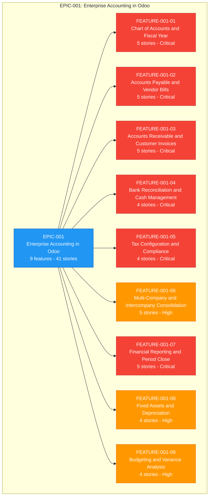
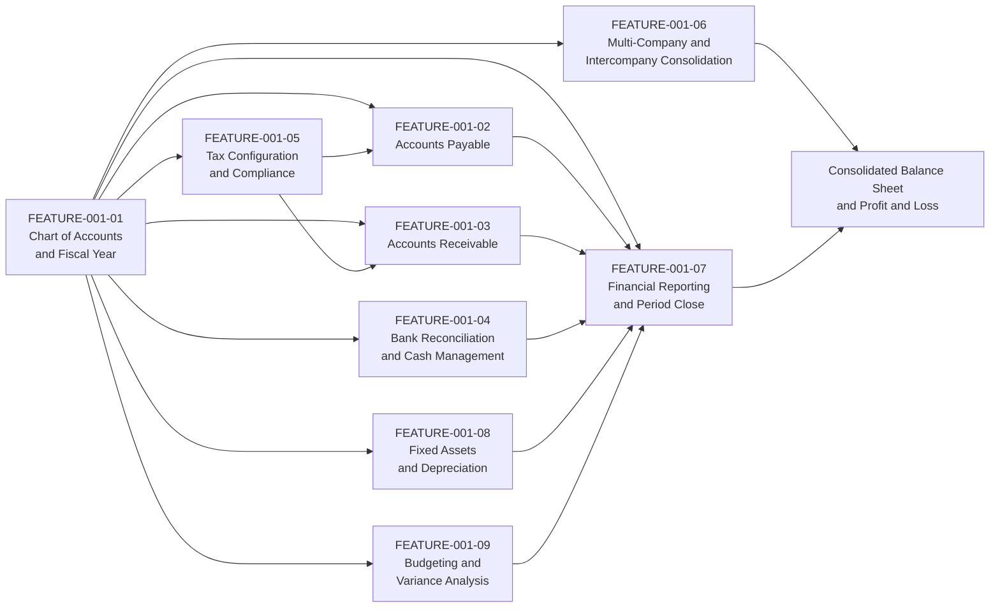
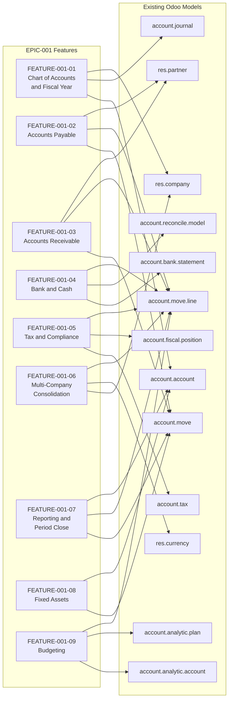

# EPIC-001: Implement Enterprise-Grade Accounting in Odoo to Deliver Multi-Entity Financial Operations, Compliance Reporting, and Real-Time Financial Visibility

---

## Metadata

| Attribute | Value |
|-----------|-------|
| **Epic ID** | `EPIC-001` |
| **Title** | Implement Enterprise-Grade Accounting in Odoo to Deliver Multi-Entity Financial Operations, Compliance Reporting, and Real-Time Financial Visibility |
| **Status** | Draft |
| **Version** | 2.0.0 |
| **Last Updated** | 2026-08-12 |
| **Owner/Author** | Blitzy Platform — Finance Transformation Programme |
| **Target Completion** | 2027-Q2 |
| **Target Platform** | Odoo 19.0 Community is the baseline present in this repository; the programme platform target (version and edition) is an open decision recorded in [§10.1.1](#1011-platform-version-and-edition-lock-in) |
| **Total Features** | 9 |
| **Total Stories** | 41 |
| **Reporting Currency** | Each company posts in its own currency; group reporting currency is USD, with all amounts rounded to the currency's decimal precision (2 decimal places for USD and EUR) |

---

## Table of Contents

1. [Executive Summary](#1-executive-summary)
2. [Business Context](#2-business-context)
3. [Target Users](#3-target-users)
4. [Success Metrics](#4-success-metrics)
5. [Features](#5-features)
6. [Epic-Feature Relationship Diagram](#6-epic-feature-relationship-diagram)
7. [Constraints](#7-constraints)
8. [Out of Scope](#8-out-of-scope)
9. [Discovery Notes](#9-discovery-notes)
10. [Dependencies](#10-dependencies)
11. [References](#11-references)
12. [Navigation](#12-navigation)
13. [Epic-Level Definition of Done](#13-epic-level-definition-of-done)
14. [Revision History](#14-revision-history)

- [Appendix A: Glossary](#appendix-a-glossary)
- [Appendix B: Open Decisions Register](#appendix-b-open-decisions-register)

---

## 1. Executive Summary

### 1.1 Overview

**Programme objective (stated verbatim by the requesting stakeholder):**

> Implement enterprise-grade accounting capabilities in Odoo to support multi-entity financial operations, compliance reporting, and real-time visibility into organizational financial health for finance teams and executive stakeholders.

This epic delivers that objective as nine features and forty-one user stories that turn Odoo's invoicing layer into a full accounting platform for a multi-entity group: a governed chart of accounts and fiscal calendar, accounts payable and accounts receivable with balanced posting, bank and cash reconciliation, tax determination and statutory filing, intercompany accounting with group consolidation, statutory and management reporting with a controlled period close, fixed-asset depreciation, and budget-versus-actual analysis. The programme is measured on three quantified outcomes: the month-end close shortens from 10 business days to 5 business days per legal entity; the named statutory and management report set is available within 24 hours of period close with each statement generated in under 5 minutes against a 2-to-4-hour manual baseline; and post-close audit adjustments fall by 50% because every posted journal entry balances (total debits minus total credits equals 0.00 in the company currency) and every report line ties to its sub-ledger. Bank statement lines auto-match at a rate of 95% or higher, 100% of depreciation entries post from their schedule, and all monetary outcomes are stated with an explicit currency and rounded to that currency's decimal precision (2 decimal places for USD and EUR).

### 1.2 Key Business Value

Finance teams gain a single posted source of truth per legal entity and for the group; executive stakeholders gain financial health indicators that are current as of the last posted entry rather than as of the last spreadsheet refresh. The quantified value case is:

| Value Lever | Baseline | Target | Unit / Basis |
|-------------|----------|--------|--------------|
| Month-end close cycle per legal entity | 10 business days | 5 business days | Business days from period end to lock date applied |
| Statutory and management report availability | 3 to 10 business days after period end | Within 24 hours of period close | Hours from period close to report publication |
| Named statement generation time (Balance Sheet, Profit & Loss, Cash Flow Statement) | 2 to 4 hours manual compilation | Under 5 minutes | Minutes of elapsed generation time per statement |
| Post-close audit adjustments | 12-month pre-implementation average | 50% reduction | Count of auditor-proposed adjusting entries per close |
| Bank statement line matching | Manual line-by-line matching | 95% or higher auto-matched | Percentage of imported statement lines matched without manual intervention |
| Depreciation posting | Manual schedules maintained outside the ledger | 100% posted from schedule | Percentage of scheduled depreciation entries posted by the scheduled job |
| Consolidated group statements | Spreadsheet consolidation after all entities close | Within 48 hours of the last entity close | Hours from final entity close to consolidated Balance Sheet and Profit & Loss |
| Overdue receivables (Days Sales Outstanding) | Current DSO baseline in days | 15% to 25% improvement | Percentage change in DSO measured quarterly |

Compliance value is expressed as controls rather than sentiment: every VAT/Tax Return reconciles its tax code, base amount and tax amount to the tax control accounts with a 0.00 difference; every intercompany balance is eliminated in consolidation with a residual of at most 0.02 in the group reporting currency from currency rounding; and every posted period carries a lock date and an immutable audit trail for the External Auditor.

### 1.3 Target Completion Timeframe

| Milestone | Target Date | Description |
|-----------|-------------|-------------|
| Planning Complete | 2026-08-12 | All 9 features and 41 stories written, estimated in Fibonacci points and prioritized |
| Development Start | 2026-09-07 | FEATURE-001-01 (Chart of Accounts & Fiscal Year) begins implementation |
| MVP Release | 2027-01-29 | Transaction backbone live: chart of accounts, fiscal calendar, accounts payable, accounts receivable, bank reconciliation and tax determination for the lead legal entity |
| Full Release | 2027-06-30 | All 9 features accepted for every in-scope legal entity, including group consolidation, period close, fixed assets and budgeting |

**Milestone dependency:** the MVP boundary is drawn where posted transaction data first becomes complete enough to produce a Trial Balance that ties to the sub-ledgers; consolidation, period close, fixed assets and budgeting consume that posted data and therefore follow it.

---

## 2. Business Context

### 2.1 Problem Statement

Finance teams operating multiple legal entities on Odoo's invoicing layer cannot run a governed accounting close, cannot evidence statutory and tax compliance from the system of record, and cannot give executive stakeholders a current view of group financial health, because the platform baseline in this repository provides invoice, bill, payment and basic bank-statement handling only. The consequences compound at every period end:

- **No governed close.** There is no close checklist, no lock-date discipline and no revenue/expense cutoff, so postings continue to land in periods that have already been reported.
- **No statutory report set.** Balance Sheet, Profit & Loss, Cash Flow Statement, General Ledger, Trial Balance, Aged Receivables and Aged Payables are compiled by hand into spreadsheets, so numbers presented to lenders, boards and auditors are point-in-time copies that drift from the ledger.
- **No group view.** Intercompany balances are matched offline and eliminated in spreadsheets, so a consolidated Balance Sheet and Profit & Loss for the group takes days and carries no elimination proof.
- **No tax evidence chain.** Tax code, base amount and tax amount are not reconciled to tax control accounts, and e-invoicing submissions are tracked outside the ledger, so filing positions cannot be defended from the system of record.
- **No asset or budget control.** Depreciation schedules and budgets live in spreadsheets, so net book values and budget variances are restated manually each month.

### 2.2 Business Impact

| Impact Area | Current State | Consequence |
|-------------|---------------|-------------|
| Period close | Manual close with no lock dates | 10 business days per legal entity; postings arrive after reporting, forcing restatement |
| Statutory reporting | Spreadsheet compilation of each statement | 2 to 4 hours per statement; 40+ hours per quarter across the report set |
| Group consolidation | Offline intercompany matching and elimination | Consolidated statements delayed by 5 or more business days; no retained elimination proof |
| Tax compliance | Tax figures assembled outside the ledger | Filing positions unsupported by a reconciled base-and-tax audit trail; exposure to penalty assessment |
| Bank and cash | Line-by-line manual matching | 5 to 10 business days to identify statement discrepancies; cash position stale |
| Fixed assets | Spreadsheet depreciation registers | Net book value diverges from the general ledger asset and accumulated-depreciation accounts; audit findings |
| Budget control | End-of-month manual variance compilation | Overspend is detected after commitment, not before |
| Audit readiness | Report figures cannot be traced to sub-ledger detail | Extended audit fieldwork and a recurring population of auditor-proposed adjusting entries |

### 2.3 Proposed Solution

Deliver enterprise accounting capability in Odoo as nine independently deliverable features, each decomposed into accountant-facing user stories that describe the workflow outcome and its accounting proof rather than a technical design. The solution establishes accounting foundations first — a governed chart of accounts, fiscal calendar and lock dates — then layers the transaction backbone (accounts payable with three-way match, accounts receivable with dunning, bank and cash reconciliation) and tax determination on top of it, then adds the group layer (company hierarchy, intercompany posting, consolidation rules and eliminations) and the reporting layer (Balance Sheet, Profit & Loss, Cash Flow Statement, General Ledger, Trial Balance, Aged Receivables, Aged Payables, VAT/Tax Return, budget-versus-actual), with fixed assets and budgeting completing the sub-ledger set.

Three design commitments run through every story:

1. **Every accounting outcome is proved, not asserted.** A posting story is done when its journal entry is balanced (total debits equal total credits) and its account codes are named; a report story is done when the report, its date-range parameter and at least one expected line value are stated and the line ties to the sub-ledger.
2. **Every monetary outcome carries a currency and a rounding rule.** Amounts are expressed in the posting company's currency with the currency's decimal precision, and multi-currency outcomes state the rate source and the resulting exchange difference treatment.
3. **Every multi-entity outcome names the company whose books are affected.** No criterion is satisfied by "the group" alone; the entity, its journal and its accounts are identified.

### 2.4 Strategic Alignment

| Strategic Goal | Alignment |
|----------------|-----------|
| Multi-entity financial operations | FEATURE-001-06 establishes the company hierarchy, intercompany posting and elimination model; every transaction feature posts per company with the affected entity named |
| Compliance reporting | FEATURE-001-05 and FEATURE-001-07 deliver the VAT/Tax Return, e-invoicing submission and the statutory statement set with GAAP and IFRS presentation and an auditable trail to sub-ledger detail |
| Real-time visibility into financial health | Posted-data reporting replaces spreadsheet compilation, so the Balance Sheet, Profit & Loss, Cash Flow Statement and budget-versus-actual views reflect the last posted entry |
| Audit and control readiness | Lock dates, balanced-entry enforcement, reconciliation gates and retained elimination proofs give the External Auditor a single evidence path per assertion |
| Cost of finance operations | Automation of depreciation, dunning, statement matching and report generation redirects finance effort from compilation to analysis |
| Scalable entity onboarding | Localization packs, chart-of-accounts templates and master-data readiness gates make each additional legal entity a configuration exercise rather than a project |

---

## 3. Target Users

### 3.1 User Personas

Every persona below is a named finance role. Story authors draw the WHO of each user story from this list.

| Persona | Role Description | Primary Needs | Features of Interest |
|---------|------------------|---------------|---------------------|
| **Chief Accountant** | Owns the general ledger, the chart of accounts and the integrity of every posted entry | Governed account hierarchy, fiscal calendar, lock dates, balanced postings | FEATURE-001-01, FEATURE-001-07 |
| **Financial Reporting Manager** | Produces statutory and management statements for each entity and the group | Named statements with date-range parameters, sub-ledger tie-out, comparative periods | FEATURE-001-07, FEATURE-001-06 |
| **Accounts Payable Clerk** | Captures vendor bills, runs three-way match and prepares payment runs | Bill capture, purchase-order and receipt matching, payment batching, credit notes | FEATURE-001-02 |
| **Accounts Receivable Specialist** | Issues customer invoices, allocates receipts and manages collections | Invoice posting, payment allocation, credit notes, dunning, Aged Receivables | FEATURE-001-03 |
| **Treasury Analyst** | Owns bank and cash positions and statement reconciliation | Statement import, automatic and manual matching, cash register control | FEATURE-001-04 |
| **Tax Accountant** | Determines tax on transactions and files statutory returns | Tax codes, fiscal positions, base-and-tax split, VAT/Tax Return, e-invoicing | FEATURE-001-05 |
| **Group Controller** | Governs group accounting policy and approves the consolidated result | Company hierarchy, intercompany policy, consolidated Balance Sheet and Profit & Loss | FEATURE-001-06, FEATURE-001-07 |
| **Consolidation Accountant** | Executes consolidation runs, eliminations and currency translation | Consolidation rules, intercompany elimination proof, translation differences | FEATURE-001-06 |
| **Fixed-Asset Accountant** | Maintains the asset register and depreciation schedules | Asset registration, depreciation methods and board, disposal gain/loss | FEATURE-001-08 |
| **FP&A Analyst** | Builds budgets and explains variances to management | Budget definition, period allocation, budget-versus-actual, variance alerts | FEATURE-001-09 |
| **External Auditor** | Tests balances and controls and issues the audit opinion | Immutable audit trail, drill-down from statement line to journal item, elimination and reconciliation evidence | FEATURE-001-07, FEATURE-001-06, FEATURE-001-01 |
| **CFO / Finance Director** | Executive stakeholder accountable for financial health and compliance | Current group financial position, close status, cash and receivables health, compliance status | FEATURE-001-07, FEATURE-001-06, FEATURE-001-09 |

### 3.2 Persona Notes

- **Named roles only.** A story's WHO is one of the twelve roles above; the generic label is not permitted, because acceptance criteria must be demonstrable to an identified role with identified permissions.
- **Every feature maps to at least one primary persona,** and every persona above is the primary persona of at least one story, so no role is documented without work and no work is documented without an owner.
- **Executive personas consume, they do not post.** The CFO / Finance Director and the Group Controller are read-and-approve personas for reporting and consolidation outcomes; posting workflows belong to the operational roles.
- **The External Auditor is a first-class persona,** not a review afterthought: audit-trail and drill-down outcomes are authored as stories with the auditor as WHO.
- **Segregation of duties is a persona constraint.** Stories that create a payment run and stories that approve or post it name different personas, so access rights derived from these stories preserve the separation.

### 3.3 Stakeholder Impact

| Stakeholder Group | Impact | Benefit |
|-------------------|--------|---------|
| Finance Teams (Chief Accountant, AP, AR, Treasury) | High | Manual compilation removed from the close; postings, matching and dunning run from the ledger |
| Group Finance (Group Controller, Consolidation Accountant) | High | Consolidated Balance Sheet and Profit & Loss within 48 hours of the last entity close, with retained elimination proof |
| Executive Leadership (CFO / Finance Director) | High | Group financial position current as of the last posted entry; close status and compliance status visible without a data request |
| Local Statutory Accountants | High | Country localization packs supply the statutory chart of accounts, tax codes and statutory report layouts per entity |
| External Auditors | Medium | One evidence path per assertion: statement line to sub-ledger to journal item, with lock dates and balanced-entry proof |
| Tax Authorities | Medium | Returns and e-invoices submitted from the system of record with a reconciled base-and-tax audit trail |
| IT Operations | Medium | One accounting platform to operate; integration surface limited to bank formats, tax endpoints and exchange-rate sources |
| Customers and Vendors | Low | Predictable invoicing, dunning and remittance communications generated from posted balances |

---

## 4. Success Metrics

### 4.1 Measurable Outcomes

| Metric ID | Success Metric | Target | Measurement Method |
|-----------|----------------|--------|-------------------|
| **SM-001** | Statutory and management statement coverage (Balance Sheet, Profit & Loss, Cash Flow Statement, General Ledger, Trial Balance, Aged Receivables, Aged Payables) | 100% of the seven named reports producible per entity and per period | Report-by-report acceptance checklist executed against one closed period |
| **SM-002** | Bank statement line matching rate | 95% or higher of imported statement lines auto-matched | Auto-matched line count divided by imported line count, per statement import |
| **SM-003** | Month-end close cycle time per legal entity | 5 business days or fewer | Business days elapsed from period end to the period lock date being applied |
| **SM-004** | Statutory and management report availability after close | Within 24 hours of period close | Timestamp difference between lock-date application and report publication |
| **SM-005** | Named statement generation time | Under 5 minutes per statement | Elapsed generation time recorded for a 12-period fiscal year on production data volumes |
| **SM-006** | Trial balance integrity across companies and periods | 100% of company-and-period combinations with total debits equal to total credits and zero unexplained suspense balances | Trial Balance run per company per period with the difference column asserted at 0.00 |
| **SM-007** | Accounts payable three-way match coverage | 100% of purchase-order-backed vendor bills matched to purchase order and receipt; posting blocked beyond a 2% price or quantity variance tolerance | Vendor bill population report segmented by match status |
| **SM-008** | Depreciation posting automation | 100% of scheduled depreciation entries posted by the scheduled job | Scheduled job execution log compared with the depreciation board |
| **SM-009** | Fixed-asset register agreement to the general ledger | 0.00 difference between total asset net book value and the general ledger asset and accumulated-depreciation account balances | Asset register total compared with the Trial Balance account balances at period end |
| **SM-010** | Tax return accuracy | 0.00 difference between VAT/Tax Return tax amount and the tax control account balances for the same date range | VAT/Tax Return reconciliation worksheet per jurisdiction per filing period |
| **SM-011** | E-invoicing first-submission acceptance rate | 98% or higher accepted on first submission at the tax-authority endpoint | Accepted submissions divided by total submissions, per jurisdiction per month |
| **SM-012** | Intercompany elimination completeness | 100% of intercompany balances eliminated, with a residual of at most 0.02 in the group reporting currency (USD) from currency rounding | Post-elimination intercompany account balances in the consolidation run report |
| **SM-013** | Consolidated statement production | Consolidated Balance Sheet and Profit & Loss within 48 hours of the last entity close | Hours elapsed from the final entity lock date to consolidated statement publication |
| **SM-014** | Budget variance report availability | Within 24 hours of period close, and on demand for the open period | Timestamp difference between lock-date application and budget-versus-actual publication |
| **SM-015** | Revenue and expense deferral compliance | 100% of deferral schedules recognized in the period they belong to, per ASC 606 and IFRS 15 | Deferral schedule report reconciled to recognized revenue and expense accounts at each close |
| **SM-016** | Post-close audit adjustments | 50% reduction against the 12-month pre-implementation average | Count of auditor-proposed adjusting entries per close |
| **SM-017** | Overdue receivables and collection effectiveness | 15% to 25% improvement in Days Sales Outstanding | DSO computed quarterly from Aged Receivables and compared with the pre-implementation baseline |

### 4.2 Key Performance Indicators

| KPI | Baseline | Target | Timeline |
|-----|----------|--------|----------|
| Time to generate the Balance Sheet | Manual compilation, 2 to 4 hours | Automated, under 5 minutes | Per reporting period |
| Bank reconciliation completion | Manual matching of every line | 95% or higher auto-matched, remainder resolved same day | Daily reconciliation |
| Month-end close duration | 10 business days per entity | 5 business days per entity | Monthly |
| Consolidated group reporting | Spreadsheet consolidation, 5 or more business days | Within 48 hours of the last entity close | Monthly and quarterly |
| Budget variance visibility | End-of-month manual compilation | Continuous from posted data, published within 24 hours of close | Continuous |
| Depreciation accuracy | Manual spreadsheet calculation | 100% posted from schedule, 0.00 difference to the general ledger | Monthly |
| Tax filing preparation | Manual extraction and reconciliation, 8 to 16 hours per jurisdiction | Under 2 hours per jurisdiction from the VAT/Tax Return | Per filing period |
| Collection effectiveness (DSO) | Current DSO baseline in days | 15% to 25% improvement | Quarterly |
| Audit fieldwork support requests | Ad-hoc extracts prepared per request | Self-service drill-down from statement line to journal item | Per audit cycle |

### 4.3 Success Metric Guidelines

- **Outcome-focused, not output-focused.** Each metric states a finance outcome (a closed period, a reconciled balance, an accepted filing), never a delivery artifact.
- **Objectively measurable.** Every metric names its unit (business days, hours, minutes, percentage, currency amount) and the artifact the measurement is taken from.
- **Leading and lagging indicators are both present.** Process indicators (SM-002, SM-007, SM-008, SM-011) predict the lagging outcomes (SM-003, SM-013, SM-016, SM-017).
- **Every feature carries at least one metric,** so no feature can be accepted without a measurable claim: FEATURE-001-01 (SM-006), FEATURE-001-02 (SM-007), FEATURE-001-03 (SM-017), FEATURE-001-04 (SM-002), FEATURE-001-05 (SM-010, SM-011), FEATURE-001-06 (SM-012, SM-013), FEATURE-001-07 (SM-001, SM-003, SM-004, SM-005, SM-015), FEATURE-001-08 (SM-008, SM-009), FEATURE-001-09 (SM-014).
- **Monetary tolerances are explicit.** Where a metric asserts agreement between two figures, the permitted difference is stated as an amount (0.00, or at most 0.02 in the group reporting currency for consolidation rounding) rather than as a qualitative judgement.

---

## 5. Features

This epic comprises nine features, each aligned to a distinct accounting sub-domain and each decomposed into user stories authored to the INVEST model (Independent, Negotiable, Valuable, Estimable, Small, Testable) with Given/When/Then acceptance criteria.

### 5.1 Feature Summary

| Feature ID | Feature Name | Story Count | Priority | Status | Link |
|------------|--------------|-------------|----------|--------|------|
| `FEATURE-001-01` | Chart of Accounts & Fiscal Year | 5 stories | Critical | Not Started | [FEATURE-001-01-chart-of-accounts-fiscal-year.md](./EPIC-001/FEATURE-001-01-chart-of-accounts-fiscal-year.md) |
| `FEATURE-001-02` | Accounts Payable & Vendor Bills | 5 stories | Critical | Not Started | [FEATURE-001-02-accounts-payable-vendor-bills.md](./EPIC-001/FEATURE-001-02-accounts-payable-vendor-bills.md) |
| `FEATURE-001-03` | Accounts Receivable & Customer Invoices | 5 stories | Critical | Not Started | [FEATURE-001-03-accounts-receivable-customer-invoices.md](./EPIC-001/FEATURE-001-03-accounts-receivable-customer-invoices.md) |
| `FEATURE-001-04` | Bank Reconciliation & Cash Management | 4 stories | Critical | Not Started | [FEATURE-001-04-bank-reconciliation-cash-management.md](./EPIC-001/FEATURE-001-04-bank-reconciliation-cash-management.md) |
| `FEATURE-001-05` | Tax Configuration & Compliance | 4 stories | Critical | Not Started | [FEATURE-001-05-tax-configuration-compliance.md](./EPIC-001/FEATURE-001-05-tax-configuration-compliance.md) |
| `FEATURE-001-06` | Multi-Company & Intercompany Consolidation | 5 stories | High | Not Started | [FEATURE-001-06-multi-company-consolidation.md](./EPIC-001/FEATURE-001-06-multi-company-consolidation.md) |
| `FEATURE-001-07` | Financial Reporting & Period Close | 5 stories | Critical | Not Started | [FEATURE-001-07-financial-reporting-period-close.md](./EPIC-001/FEATURE-001-07-financial-reporting-period-close.md) |
| `FEATURE-001-08` | Fixed Assets & Depreciation | 4 stories | High | Not Started | [FEATURE-001-08-fixed-assets-depreciation.md](./EPIC-001/FEATURE-001-08-fixed-assets-depreciation.md) |
| `FEATURE-001-09` | Budgeting & Variance Analysis | 4 stories | High | Not Started | [FEATURE-001-09-budgeting-variance-analysis.md](./EPIC-001/FEATURE-001-09-budgeting-variance-analysis.md) |

**Total Stories:** 41 stories across 9 features

Story counts by feature, in feature order: 5, 5, 5, 4, 4, 5, 5, 4, 4. Each Feature file declares the same count in its own metadata and indexes exactly that many story files under `./EPIC-001/FEATURE-001-NN/`.

### 5.2 Priority Definitions

| Priority | Definition | Criteria |
|----------|------------|----------|
| **Critical** | Must have for the MVP | Core accounting function; blocks a closed period, a statutory statement or a tax filing |
| **High** | Important for the initial release | Significant finance value that consumes posted data produced by Critical features |
| **Medium** | Desired for the complete solution | Extends analysis or automation once the accounting record is complete |
| **Low** | Future consideration | Deferrable to a later release without affecting the close or a filing |

**Priority assignment for this epic.** Six features are Critical because a closed, compliant period is impossible without them: the chart of accounts and fiscal calendar (FEATURE-001-01) govern where and when everything posts; accounts payable (FEATURE-001-02), accounts receivable (FEATURE-001-03) and bank reconciliation (FEATURE-001-04) create and settle the balances; tax configuration and compliance (FEATURE-001-05) determines the filing position; and financial reporting with period close (FEATURE-001-07) publishes and locks the result. Three features are High because they consume the posted record rather than create it: consolidation (FEATURE-001-06), fixed assets (FEATURE-001-08) and budgeting (FEATURE-001-09). No feature is Medium or Low — every one of the nine is required for the full release. The nine priorities recorded here are the single source of truth and are restated without change in the navigation index and in each Feature file's metadata.

### 5.3 Feature and Story Decomposition Guidelines

This backlog is bounded as follows, and these bounds govern the tree:

| Level | Bound | Applied in this epic |
|-------|-------|----------------------|
| Epics | Exactly 1 | EPIC-001 |
| Features per epic | 3 to 9 | 9 features |
| Stories per feature | 2 to 5 | 4 or 5 stories per feature, totalling 41 |
| Acceptance criteria per story | 4 to 8 Given/When/Then criteria | Coverage distribution required per story: at least one valid-input posting or report, one invalid or incomplete input, one error-handling case, and one accounting edge case |
| Estimation scale | Fibonacci: 1, 2, 3, 5, 8, 13 | Every story carries Effort, Complexity and Uncertainty guidance plus a Fibonacci point value |

Authoring rules applied to every story in this tree:

- **INVEST conformance.** Each story is Independent (deliverable without waiting on a sibling story beyond declared prerequisites), Negotiable (states outcome, not design), Valuable (names the finance benefit), Estimable (bounded enough to size in Fibonacci points), Small (one workflow or configuration outcome) and Testable (criteria are demonstrable).
- **Demonstrability.** Every story is demonstrable in the Odoo user interface, or through its public API, to the Finance Controller and Product Owner.
- **Named finance persona.** The WHO of every story is one of the twelve roles in [§3.1](#31-user-personas).
- **Accounting determinism.** Criteria cite deterministic account codes (for example Accounts Payable 2000 and Expense 6100), journal types and report names; monetary assertions state currency, amount and rounding; journal-entry criteria assert that total debits equal total credits; tax criteria separate tax code, base amount and tax amount; report criteria name the report, a date-range parameter and at least one expected line value; and multi-company criteria name the company whose books are affected.
- **Concrete language.** Acceptance criteria avoid vague qualifiers and state measurable conditions instead, so each criterion has exactly one pass or fail interpretation.

### 5.4 Odoo Module Scope

The modules below are the capability boundary of this epic. Naming them here is a scope statement, not an installation instruction: whether a capability arrives through an Odoo Enterprise subscription or through Odoo Community Association (OCA) add-ons is the open decision recorded in [§10.1.1](#1011-platform-version-and-edition-lock-in).

**Modules in scope:**

| Odoo Module | Availability in this repository | Features Served |
|-------------|--------------------------------|-----------------|
| `account` | Present — "Invoicing", version 1.4, category `Accounting/Accounting`, licence LGPL-3 | All nine features; supplies `account.move`, `account.move.line`, `account.account`, `account.journal`, `account.tax` |
| `account_payment` | Present — "Payment - Account", version 2.0, licence LGPL-3 | FEATURE-001-02, FEATURE-001-03, FEATURE-001-04 |
| `l10n_*` (country localization packs) | Present — 209 localization modules | FEATURE-001-01 (statutory chart of accounts), FEATURE-001-05 (tax codes, statutory tax reports) |
| `account_reports` | Absent — Enterprise capability | FEATURE-001-07 (Balance Sheet, Profit & Loss, Cash Flow Statement, General Ledger, Trial Balance, Aged Receivables, Aged Payables) |
| `account_asset` | Absent — Enterprise capability | FEATURE-001-08 (asset register, depreciation board, disposal) |
| `account_budget` | Absent — Enterprise capability | FEATURE-001-09 (budget definition, allocation, budget-versus-actual) |
| `account_consolidation` | Absent — Enterprise capability | FEATURE-001-06 (consolidation rules, eliminations, consolidated statements) |

**Modules out of scope:**

| Excluded Domain | Odoo Module Family | Boundary |
|-----------------|--------------------|----------|
| Payroll accounting | `hr_payroll` and payroll localizations | Payroll results are consumed as imported journal entries; payroll calculation, payslips and payroll tax filing are not in this epic |
| Inventory costing and stock valuation | `stock_account` | Product revenue and expense posting from invoices is in scope; valuation layers, landed costs and cost-method recalculation are not |

### 5.5 Scope Consolidation Note

Deferred revenue and deferred expense capability is **absorbed into FEATURE-001-07 (Financial Reporting & Period Close)** as part of the period-end revenue and expense cutoff, rather than standing as a tenth feature. Two consequences follow: the feature count stays at nine, inside the 3-to-9 bound in [§5.3](#53-feature-and-story-decomposition-guidelines); and the ASC 606 and IFRS 15 recognition outcomes are accepted where they are actually proved — inside the close, against the deferral schedule and the recognized revenue and expense accounts (SM-015).

---

## 6. Epic-Feature Relationship Diagram

### 6.1 Feature Hierarchy

### 6.2 Inter-Feature Ordering

The edges below are content-level prerequisites recorded inside the tickets: a story in the target feature cannot be demonstrated until the source feature's configuration or posted data exists.

**Ordering statements recorded for downstream planning:**

| Ordering Rule | Prerequisite | Dependent Work | Reason |
|---------------|--------------|----------------|--------|
| **ORD-001** | FEATURE-001-01 (Chart of Accounts & Fiscal Year) | Every journal-posting story in FEATURE-001-02, FEATURE-001-03 and FEATURE-001-07 | An entry cannot post without its accounts, its journal and an open fiscal period |
| **ORD-002** | FEATURE-001-05 (Tax Configuration & Compliance) | Every tax-bearing transaction story in FEATURE-001-02 and FEATURE-001-03 | Tax code, base amount and tax amount cannot be asserted before tax codes and fiscal positions exist |
| **ORD-003** | FEATURE-001-06 company hierarchy stories | The consolidation stories inside FEATURE-001-06 (consolidation rules, eliminations, consolidated statements) | Consolidation requires the parent-subsidiary structure, the group reporting currency and the intercompany partner mapping |
| **ORD-004** | FEATURE-001-02, FEATURE-001-03, FEATURE-001-04, FEATURE-001-08 and FEATURE-001-09 | FEATURE-001-07 reporting and period-close stories | Reports and the close checklist consume posted data from the sub-ledgers; a report line cannot tie to a sub-ledger that has no postings |
| **ORD-005** | FEATURE-001-07 period close per entity | The group consolidated Balance Sheet and Profit & Loss in FEATURE-001-06 | Consolidation consumes closed, locked entity results so the group result is reproducible |

### 6.3 Implementation Sequence

| Phase | Features | Rationale |
|-------|----------|-----------|
| **Phase 1 — Foundations** | FEATURE-001-01, FEATURE-001-05 | Accounts, fiscal calendar, lock dates, tax codes and fiscal positions govern every later posting |
| **Phase 2 — Transaction backbone** | FEATURE-001-02, FEATURE-001-03, FEATURE-001-04 | Create and settle payables, receivables, bank and cash balances; produces the posted data reporting needs |
| **Phase 3 — Reporting and close** | FEATURE-001-07 | Publishes the statutory and management report set and locks the period with the close checklist |
| **Phase 4 — Group and sub-ledgers** | FEATURE-001-06, FEATURE-001-08, FEATURE-001-09 | Consolidates closed entity results and completes the fixed-asset and budget sub-ledgers |

---

## 7. Constraints

All work under this epic adheres to the constraints below. Feature files inherit this constraint set by reference and story-level Definitions of Done cite it.

### 7.1 License Requirements

| Constraint | Requirement | Rationale |
|------------|-------------|-----------|
| **C-001** | New modules are distributed under an AGPL-3.0 compatible licence | Keeps delivered accounting code redistributable and contributable to the community, matching the licence used by the existing Community-edition accounting add-ons in this repository (AGPL-3) |
| **C-002** | Integration with the existing `account` module respects its LGPL-3 licence | `addons/account/__manifest__.py` declares `'license': 'LGPL-3'`; derived and dependent code must remain licence-compatible with it |

**Acceptance Criterion:** every delivered module declares a licence in its manifest that is compatible with AGPL-3.0 and with the LGPL-3 licence of `account`.

### 7.2 Dependency Restrictions

| Constraint | Requirement | Rationale |
|------------|-------------|-----------|
| **C-003** | The edition source for Enterprise-only capability is an **open decision** and must be confirmed before FEATURE-001-06, FEATURE-001-07, FEATURE-001-08 and FEATURE-001-09 enter development | Four in-scope modules (`account_reports`, `account_asset`, `account_budget`, `account_consolidation`) and the `account_accountant` application are Enterprise modules and are absent from this repository's `addons/`; the capability must come either from an Odoo Enterprise subscription or from OCA add-ons. The decision changes licensing, cost and implementation approach, so it is recorded as DEC-002 in [Appendix B](#appendix-b-open-decisions-register) rather than presumed |
| **C-004** | Whichever edition path is chosen, delivered code stays compatible with the OCA add-on ecosystem | Preserves the option to consume `account_financial_report`, `account_reconcile_oca` and `mis_builder`, and keeps the six Community-edition accounting add-ons already present in this repository usable |

**Acceptance Criterion:** the edition decision (DEC-002) is recorded with its licensing and cost consequences, and every module manifest declares dependencies that exist in the chosen platform configuration.

### 7.3 Coding Standards

| Constraint | Requirement | Rationale |
|------------|-------------|-----------|
| **C-005** | Odoo and OCA coding standards, including PEP 8 for Python | Keeps delivered code reviewable by the Odoo community and eligible for OCA contribution |
| **C-006** | Static analysis passes with the repository's configured tooling and OCA quality checks | Defects are caught before review; `ruff.toml` at the repository root defines the lint configuration in force |

**Acceptance Criterion:** delivered code passes the repository lint configuration and OCA quality checks (pre-commit hooks, pylint-odoo) with zero violations.

### 7.4 Test Coverage

| Constraint | Requirement | Rationale |
|------------|-------------|-----------|
| **C-007** | Minimum 80% test coverage for new functionality | Enterprise-grade assurance for code that posts to the general ledger |
| **C-008** | Unit, integration and acceptance tests, with each acceptance test traceable to a Given/When/Then criterion | Makes each story's criteria executable rather than declarative |
| **C-009** | Accounting assertions are tested numerically: total debits equal total credits, tax amounts reconcile to tax control accounts, report lines tie to sub-ledger totals | Balance and reconciliation are the accounting contract; they are asserted as amounts, not inspected by eye |

**Acceptance Criterion:** each delivered module reports 80% or higher coverage for new functionality, and every acceptance criterion maps to at least one automated test.

### 7.5 Version Compatibility

| Constraint | Requirement | Rationale |
|------------|-------------|-----------|
| **C-010** | The platform version target is an **open decision** (DEC-001) | The request targets Odoo 17, this repository is Odoo 19.0 (`version_info = (19, 0, 0, FINAL, 0, '')` in `odoo/release.py`), and the prior backlog targeted 18.0. The three targets imply different APIs and migration effort, so the target is confirmed with stakeholders rather than assumed — see [§10.1.1](#1011-platform-version-and-edition-lock-in) |
| **C-011** | Python and PostgreSQL versions follow the confirmed platform target | The Odoo 19.0 baseline in this repository declares `MIN_PY_VERSION = (3, 10)`, `MAX_PY_VERSION = (3, 13)` and `MIN_PG_VERSION = 13` in `odoo/release.py`; an earlier platform target carries a different supported matrix |

**Acceptance Criterion:** the confirmed platform version and edition are recorded in this epic and restated in every Feature file, and delivered modules install on that platform without version-compatibility errors.

### 7.6 Integration Constraints

| Constraint | Requirement | Rationale |
|------------|-------------|-----------|
| **C-012** | Build on the existing accounting models `account.move`, `account.move.line`, `account.account`, `account.journal`, `account.tax` and `account.fiscal.position` rather than parallel structures | Preserves one ledger, one audit trail and Odoo's own posting and reconciliation semantics |
| **C-013** | Use `account.analytic.account` and `account.analytic.plan` for budget and cost-centre dimensions | The analytic layer already provides multi-dimensional allocation used by budgeting and variance analysis |
| **C-014** | Respect the Odoo security model, record rules and multi-company access rights, including company-dependent record isolation | Multi-entity operation requires that each persona sees and posts only in permitted companies, and that segregation of duties survives implementation |

**Acceptance Criterion:** no delivered feature duplicates an existing accounting model, and multi-company record rules are exercised by tests that prove one company's postings are not visible to a persona restricted to another company.

---

## 8. Out of Scope

### 8.1 Explicitly Excluded Items

The following items are **explicitly out of scope** for this epic:

| Excluded Item | Rationale |
|---------------|-----------|
| **Payroll accounting** (`hr_payroll`, payroll localizations, payslip calculation, payroll tax filing) | Payroll is a separate programme with its own personas and statutory calendar; this epic consumes payroll results as imported journal entries and posts them to the general ledger, and nothing more |
| **Inventory costing and stock valuation** (`stock_account` valuation layers, landed costs, standard and average-cost recalculation) | Inventory valuation policy is owned by the supply-chain programme; this epic posts product revenue and expense from invoices and bills, and consumes inventory valuation entries as given |
| **Native mobile applications** (iOS and Android accounting clients) | Odoo's responsive web interface is the delivery channel for all forty-one stories; a native client is a separate delivery decision |
| **Lease accounting and financial-instrument accounting** (IFRS 16 lease liabilities, hedge accounting, derivative valuation) | These require their own measurement models and disclosure sets; the fixed-asset scope here is owned tangible and intangible assets with depreciation |
| **Income-tax provision and deferred-tax computation** | The tax scope here is transaction taxes (VAT and equivalent) and their statutory returns; corporate income-tax provisioning is a separate reporting cycle |
| **Non-controlling interest and equity-method accounting** | The consolidation scope here is full consolidation of controlled entities with intercompany elimination; minority-interest allocation and associate accounting are deferred to a later epic |

**Multi-company consolidation is IN scope for this epic.** This reverses the position taken by the prior, superseded backlog, which excluded multi-company consolidation with intercompany eliminations and declared single-company operation as its boundary. The objective in [§1.1](#11-overview) is explicitly multi-entity, and FEATURE-001-06 delivers the company hierarchy, intercompany posting, consolidation rules, eliminations and consolidated statements, with SM-012 and SM-013 measuring the result.

### 8.2 Boundary Conditions

| Boundary | In Scope | Out of Scope |
|----------|----------|--------------|
| Company structure | Multi-entity operation: company hierarchy, intercompany transactions, consolidation rules, intercompany elimination, consolidated Balance Sheet and Profit & Loss | Non-controlling interest allocation; equity-method investments; statutory group audit opinion issuance |
| Bank statement import | CAMT.053 (ISO 20022), OFX, QIF and CSV files | Bank feed aggregator API subscriptions (Plaid, Yodlee, Saltedge) and the contracts they require |
| Payment execution | SEPA credit transfer payment file generation and payment batching | Direct bank host-to-host connectivity certification and payment-scheme membership |
| Tax determination and filing | Tax codes, fiscal positions, base-and-tax split, VAT/Tax Return, e-invoicing submission to authority endpoints | Third-party tax engines (AvaTax, TaxCloud); income-tax provision; transfer-pricing documentation |
| Asset depreciation | Straight-line, declining balance and units-of-production methods; disposal with gain or loss | Formula-driven bespoke depreciation models; component depreciation under lease standards |
| Budgeting | Manual budget definition, period allocation, budget-versus-actual reporting and variance alerts | Statistical or machine-learning forecasting and driver-based planning models |
| Vendor bill capture | Digitized capture of bill header and line data, three-way match against purchase order and receipt | Machine-learning invoice recognition models and the infrastructure to train them |
| Payroll | Posting imported payroll journal entries to the general ledger | Payroll calculation, payslips, payroll tax filing |
| Inventory | Product-level revenue and expense posting from invoices and bills | Stock valuation layers, landed costs, cost-method recalculation |
| Report output | On-screen reports with drill-down, PDF and XLSX export | External business-intelligence platform integration and warehouse replication |
| Collections communication | Email dunning generated from posted receivable balances | SMS, instant-messaging and mobile push channels |

**Boundary guidance.** Exclusions above prevent scope expansion during implementation, and each is a candidate for a later epic rather than a rejection of the capability. If a stakeholder requirement crosses one of these boundaries, the boundary is renegotiated in this section before the affected story is accepted.

---

## 9. Discovery Notes

> **Purpose:** these notes direct the implementing agent's codebase analysis before design decisions are made. User stories describe WHAT and WHY; HOW emerges from the discovery recorded here. Every fact below was verified against this repository.

### 9.1 D-001: Platform Baseline and Existing Accounting Layer

**Discovery requirement:** establish what accounting capability already exists before proposing new modules.

Verified baseline:

- `odoo/release.py` declares `version_info = (19, 0, 0, FINAL, 0, '')`, `MIN_PY_VERSION = (3, 10)`, `MAX_PY_VERSION = (3, 13)` and `MIN_PG_VERSION = 13`; the repository licence is LGPL-3.
- `addons/account/__manifest__.py` declares `'name': 'Invoicing'`, `'version': '1.4'`, `'category': 'Accounting/Accounting'` and `'license': 'LGPL-3'`, with `depends` on `base_setup`, `onboarding`, `product`, `analytic`, `portal` and `digest`. This is the **basic invoicing and payments layer, not the full Enterprise Accounting application**.
- Present Community accounting add-ons: `account` (1.4), `account_payment` (2.0), `account_edi` (1.0), `account_debit_note` (1.0) and `analytic` (1.2).

**Analysis areas:**

- [ ] Model structures and inheritance patterns in `addons/account/models/`
- [ ] View and action architecture in `addons/account/views/`
- [ ] Wizard conventions in `addons/account/wizard/`
- [ ] Report patterns in `addons/account/report/`
- [ ] Whether each capability is a new module or an extension of `account`

### 9.2 D-002: Edition Capability Gap

**Discovery requirement:** confirm, capability by capability, what the chosen edition path supplies and what must be built.

Verified: `account_reports`, `account_asset`, `account_budget`, `account_consolidation` and `account_accountant` are **absent** from `addons/`. Every capability that FEATURE-001-06 through FEATURE-001-09 assumes therefore arrives from an Odoo Enterprise subscription, from OCA add-ons, or from bespoke development.

**Analysis areas:**

- [ ] Map each of the nine features to the module that will deliver it under each edition option
- [ ] Record the licence of every candidate add-on and check it against C-001 and C-002
- [ ] Quantify the bespoke development remaining under the OCA option
- [ ] Feed the result into DEC-002 before FEATURE-001-06 through FEATURE-001-09 start

### 9.3 D-003: Reuse of the Existing Community-Edition Accounting Add-ons

**Discovery requirement:** assess prior-phase work in this repository before rebuilding capability.

Verified add-ons present in `addons/`, all licensed AGPL-3:

| Module | Version | Capability Relevant To |
|--------|---------|------------------------|
| `account_financial_report_ce` | 19.0.1.1.0 | FEATURE-001-07 statutory reports |
| `account_bank_reconciliation_ce` | 19.0.1.0.0 | FEATURE-001-04 statement import and matching |
| `account_asset_management` | 19.0.1.0.0 | FEATURE-001-08 asset register and depreciation |
| `account_budget_management` | 19.0.1.0.0 | FEATURE-001-09 budgets and variance |
| `account_deferred_revenue` | 19.0.1.0.0 | FEATURE-001-07 revenue and expense cutoff |
| `account_payment_followup` | 19.0.1.0.0 | FEATURE-001-03 dunning |

**Analysis areas:**

- [ ] Compare each add-on's model and report coverage against the story acceptance criteria it would satisfy
- [ ] Decide extend, refactor or replace per module, and record the reason
- [ ] Identify gaps that no present add-on covers: three-way match, tax return and e-invoicing, company hierarchy, consolidation and elimination

### 9.4 D-004: Report Engine and Drill-Down Decision

**Discovery requirement:** decide whether the statutory report set extends Odoo's reporting infrastructure or uses a dedicated engine.

**Analysis areas:**

- [ ] Existing QWeb report templates and `ir.actions.report` definitions in `addons/account/`
- [ ] SQL-view analytics patterns, for example `addons/account/report/account_invoice_report.py`
- [ ] Drill-down implementation: statement line to account balance to journal item
- [ ] Export paths for PDF and XLSX, and the generation-time budget set by SM-005 (under 5 minutes per statement)
- [ ] Caching and indexing strategy for multi-period, multi-company report queries

### 9.5 D-005: Data Model Extensions

**Discovery requirement:** determine extension versus new model for every planned object.

Verified model locations: `addons/account/models/account_move.py`, `account_move_line.py`, `account_account.py`, `account_journal.py`, `account_tax.py`, `account_bank_statement.py` and `account_reconcile_model.py`; `account.fiscal.position` is declared in `addons/account/models/partner.py`; analytic models are in `addons/analytic/models/analytic_account.py` and `analytic_plan.py`; `res.company`, `res.currency` and `res.partner` are in `odoo/addons/base/models/`.

**Analysis areas:**

- [ ] Which of asset, budget, consolidation and deferral objects are new models and which are extensions
- [ ] How new registers relate to `account.move` and `account.move.line` so the ledger stays the single source of truth
- [ ] Computed fields and indexes needed to meet SM-005 and SM-013
- [ ] Backward compatibility for entities already transacting

### 9.6 D-006: Localization Pack Selection

**Discovery requirement:** enumerate the operating countries and select their localization packs.

Verified: **209** `addons/l10n_*` localization modules are present in this repository.

**Analysis areas:**

- [ ] List every legal entity, its country and its statutory reporting language and currency
- [ ] Select the `l10n_*` pack per country and record the statutory chart of accounts, tax codes and statutory report layouts it installs
- [ ] Identify countries with no pack coverage and size the bespoke configuration
- [ ] Reconcile each statutory chart against the group chart-of-accounts policy from FEATURE-001-01

### 9.7 D-007: Multi-Company Security and Record Rules

**Discovery requirement:** establish how company isolation and segregation of duties are enforced.

**Analysis areas:**

- [ ] Company-dependent fields, record rules and the allowed-companies mechanism in `res.company` and the accounting security data
- [ ] Access-right groups implied by the twelve personas in [§3.1](#31-user-personas), including the split between preparing and approving a payment run
- [ ] Intercompany posting rights: which persona may post in more than one company
- [ ] Test design that proves a persona restricted to one company cannot read or post another company's entries (C-014)

### 9.8 D-008: Interactive Reconciliation and Close Interfaces

**Discovery requirement:** assess the front-end patterns available for the reconciliation and close workflows.

**Analysis areas:**

- [ ] OWL component patterns already used in accounting views, including the journal dashboard and reconciliation views
- [ ] Interaction model for matching a statement line against one or many journal items, including partial matching
- [ ] Close-checklist presentation: task state, ownership and lock-date application
- [ ] Accessibility and keyboard-driven entry for high-volume matching work

### 9.9 D-009: Deterministic Test Fixtures

**Discovery requirement:** reuse the repository's existing fixtures instead of inventing test data.

Verified fixtures, to be read and never modified: `test_data/bank_statements/sample.xml` (CAMT.053), `test_data/bank_statements/sample.ofx`, `test_data/bank_statements/sample.qif`, `test_data/bank_statements/sample.csv` and `test_data/financial_reports/sample_journal_entries.csv`.

**Analysis areas:**

- [ ] Map each fixture to the stories whose criteria it can demonstrate (FEATURE-001-04 import and matching; FEATURE-001-07 report tie-out)
- [ ] Identify fixture gaps for multi-company, tax, asset and budget scenarios and define new fixtures alongside, not inside, the existing files
- [ ] Ensure fixture amounts and currencies match the rounding assertions in the acceptance criteria

### 9.10 D-010: Migration Reconciliation Approach

**Discovery requirement:** define how legacy balances are proved after migration.

**Analysis areas:**

- [ ] Extract format and mapping from legacy accounts to the target chart of accounts
- [ ] Opening-balance journal design, per company, posted as a balanced entry (total debits equal total credits, difference 0.00 in the company currency)
- [ ] Tie-out worksheet comparing the migrated Trial Balance with the legacy trial balance, line by line, with a stated 0.00 tolerance
- [ ] Treatment of open items: unpaid vendor bills, unpaid customer invoices, unreconciled bank lines, asset net book values and accumulated depreciation
- [ ] Sign-off record retained as migration evidence for the External Auditor

---

## 10. Dependencies

### 10.1 External Dependencies

Five dependency groups gate this epic. Each names its owner and the readiness evidence required before the dependent features start.

#### 10.1.1 Platform Version and Edition Lock-In

**This is an open decision, flagged for stakeholder confirmation. It is not resolved by this epic.**

*Version target (DEC-001).* Three different platform targets are on record and they are mutually exclusive:

| Option | Evidence | Consequence if Chosen |
|--------|----------|----------------------|
| **Odoo 17** | The programme request names Odoo 17 (Community or Enterprise) | Delivery targets an older API surface than the repository provides; the accounting code in this repository would have to be back-ported, and the 209 localization packs present here are 19.0-series |
| **Odoo 18.0** | The prior, superseded backlog targeted 18.0 | Neither the request nor the repository is served; a migration is required in both directions |
| **Odoo 19.0** | This repository is Odoo 19.0: `version_info = (19, 0, 0, FINAL, 0, '')` in `odoo/release.py` | Delivery targets the platform actually present, with `MIN_PY_VERSION = (3, 10)`, `MAX_PY_VERSION = (3, 13)` and `MIN_PG_VERSION = 13`; the request's stated version is not honoured and must be formally superseded |

*Edition target (DEC-002).* The epic's in-scope module list includes Enterprise modules that are absent from this repository's `addons/`: `account_reports`, `account_asset`, `account_budget` and `account_consolidation`, alongside the `account_accountant` application. Two delivery paths exist:

| Option | What It Supplies | What It Requires |
|--------|------------------|------------------|
| **Odoo Enterprise subscription** | Dynamic financial reports, fixed-asset depreciation, budgets, consolidation and the full accounting application as supported product | Per-user subscription cost; proprietary licence terms alongside the AGPL-3.0 expectation in C-001; hosting and upgrade alignment with the subscription |
| **OCA community add-ons** | `account_financial_report` for the statutory report set, `account_reconcile_oca` for reconciliation, `mis_builder` for management and budget reporting, plus the six Community-edition accounting add-ons already present in this repository | Bespoke development for gaps (three-way match, tax return and e-invoicing, company hierarchy, consolidation and elimination); community support model; per-add-on version compatibility with the confirmed platform target |

**Gate:** DEC-001 and DEC-002 are confirmed and recorded in [Appendix B](#appendix-b-open-decisions-register) before FEATURE-001-06, FEATURE-001-07, FEATURE-001-08 and FEATURE-001-09 enter development. Owner: Group Controller with the CFO / Finance Director and IT Operations.

#### 10.1.2 Country Localization Packs

| Dependency | Detail | Gate |
|------------|--------|------|
| `l10n_*` localization pack per operating country | 209 `addons/l10n_*` modules are present in this repository. Each legal entity requires its country's pack installed to obtain the statutory chart of accounts, the statutory tax codes and the statutory report layouts for that jurisdiction | Every in-scope country is enumerated during discovery (D-006), its pack identified and installed in a test database, and its statutory chart reconciled to the group chart-of-accounts policy from FEATURE-001-01. Owner: Local Statutory Accountant per entity |
| Statutory reporting language and presentation currency per entity | Determines report layout, tax report naming and the currency in which statutory statements are filed | Recorded per entity before FEATURE-001-05 and FEATURE-001-07 stories for that entity are accepted |
| Jurisdictions without pack coverage | Chart of accounts, tax codes and report layouts configured by hand | Sized during discovery and scheduled before the entity's first posting period |

#### 10.1.3 Data Migration

| Dependency | Detail | Gate |
|------------|--------|------|
| Legacy chart of accounts | Account codes, names, types and hierarchy, mapped to the target chart per FEATURE-001-01 | Mapping signed off by the Chief Accountant; unmapped legacy accounts is zero before cutover |
| Opening balances | One opening journal entry per company, posted as a **balanced** entry: total debits equal total credits with a difference of 0.00 in the company currency | Migrated Trial Balance ties to the legacy trial balance line by line at a 0.00 tolerance (SM-006), evidence retained |
| Open accounts payable and accounts receivable items | Unpaid vendor bills and customer invoices with original dates, due dates, currencies and partner references, so ageing buckets and dunning start from the legacy dates, currencies and balances | Aged Payables and Aged Receivables at cutover reconcile to the legacy ageing at a 0.00 tolerance |
| Fixed-asset register | Asset cost, in-service date, method, useful life, accumulated depreciation and net book value | Register total agrees to the migrated general ledger asset and accumulated-depreciation account balances at 0.00 difference (SM-009) |
| Budget history | Prior-period budgets and actuals needed for comparative variance analysis | Loaded before the first FEATURE-001-09 variance report is accepted |
| Unreconciled bank items | Outstanding statement lines and in-transit payments at cutover | Bank reconciliation at cutover agrees each account's reconciled balance to its statement closing balance |

#### 10.1.4 Banking and Tax-Authority Integrations

| Dependency Type | Name | Version / Standard | Purpose |
|-----------------|------|--------------------|---------|
| Bank statement format | CAMT.053 | ISO 20022 bank-to-customer statement | Statement import for European and ISO 20022 banks (FEATURE-001-04) |
| Bank statement format | OFX | 2.3 | Statement import for North American banks |
| Bank statement format | QIF | Quicken Interchange Format | Legacy statement import |
| Bank statement format | CSV | Per-bank column mapping | Statement import where no structured format is offered |
| Payment file format | SEPA credit transfer | ISO 20022 `pain.001` | Vendor payment batches (FEATURE-001-02) |
| E-invoicing and tax submission | Tax-authority endpoint per jurisdiction | UBL 2.1, PEPPOL BIS Billing 3.0, Factur-X / ZUGFeRD or the local mandated schema | Statutory e-invoice issuance and VAT/tax submission (FEATURE-001-05) |
| Exchange rates | Central-bank or commercial rate feed | Daily rate publication | Multi-currency posting, revaluation and consolidation translation (FEATURE-001-06) |

**Prerequisites treated as dependencies, not implementation detail:** endpoint credentials and signing certificates per jurisdiction; a sandbox or test endpoint per authority so e-invoicing acceptance can be demonstrated before production filing (SM-011); bank-side confirmation of statement and payment file specifications per account; and an agreed rate source per company so translation differences are reproducible. Owner: Tax Accountant for authority endpoints, Treasury Analyst for bank formats and rate sources.

#### 10.1.5 Master Data Readiness

| Master Data Set | Content | Owner | Readiness Gate |
|-----------------|---------|-------|----------------|
| Chart of accounts | Account codes, types, hierarchy, currency and reconciliation flags, including the deterministic codes cited by stories such as Accounts Payable 2000 and Expense 6100 | Chief Accountant | Approved and loaded before any posting story is demonstrated (ORD-001) |
| Journals | Sales, purchase, bank, cash and miscellaneous journals per company, with sequences and default accounts | Chief Accountant | Complete per company before that company's first posting |
| Fiscal years, periods and lock dates | Fiscal year definition, period calendar, and the journal-entry and tax lock dates | Chief Accountant | Configured before FEATURE-001-07 close stories |
| Tax codes and fiscal positions | Tax code, rate, base and tax account mapping, and the fiscal position rules that select them by partner and geography | Tax Accountant | Complete before tax-bearing transaction stories (ORD-002) |
| Currencies and exchange-rate configuration | Active currencies, decimal precision per currency, rate source and revaluation accounts | Treasury Analyst | Complete before multi-currency and consolidation stories |
| Company hierarchy | Parent and subsidiary structure, ownership, group reporting currency (USD) and intercompany partner mapping | Group Controller | Complete before FEATURE-001-06 consolidation stories (ORD-003) |
| Partners | Customers and vendors with tax identifiers, payment terms, bank accounts and dunning eligibility | AP Clerk and AR Specialist | Complete per entity before its first bill or invoice story |
| Analytic accounts and plans | Cost centres and analytic plans used for budget allocation and variance analysis | FP&A Analyst | Complete before FEATURE-001-09 stories |
| Payment terms and dunning levels | Due-date computation rules and follow-up level schedule with escalation days | AR Specialist | Complete before dunning stories |
| Asset categories | Asset class, depreciation method, useful life, asset and accumulated-depreciation accounts, expense account | Fixed-Asset Accountant | Complete before FEATURE-001-08 stories |

#### 10.1.6 Accounting Standards and Formats

| Dependency Type | Name | Version / Standard | Purpose |
|-----------------|------|--------------------|---------|
| Accounting standard | GAAP | US FASB Accounting Standards Codification | Statement presentation for US entities |
| Accounting standard | IFRS | IFRS Foundation Standards | Statement presentation and group reporting taxonomy |
| Revenue recognition | ASC 606 / IFRS 15 | Current | Deferred revenue and expense recognition inside the period close (SM-015) |
| Consolidation | IFRS 10 | Consolidated Financial Statements | Full consolidation of controlled entities and elimination of intercompany balances |
| Currency translation | IAS 21 | The Effects of Changes in Foreign Exchange Rates | Translation of subsidiary results into the group reporting currency |
| Transaction tax | Jurisdiction VAT and equivalent legislation | Per country | Tax determination, VAT/Tax Return content and filing calendar |

### 10.2 Internal Dependencies

| Module | Version | Integration Points |
|--------|---------|-------------------|
| `account` | 1.4 (LGPL-3, "Invoicing", category `Accounting/Accounting`) | The accounting foundation for all nine features: `account.move`, `account.move.line`, `account.account`, `account.journal`, `account.tax`, `account.fiscal.position`, `account.bank.statement`, `account.reconcile.model`. This is the basic invoicing layer, **not** the full Enterprise Accounting application |
| `analytic` | 1.2 (LGPL-3, "Analytic Accounting") | `account.analytic.account` and `account.analytic.plan` for budget allocation, cost centres and variance dimensions (FEATURE-001-09) |
| `base` | 1.3 | `res.company` for the company hierarchy and company-dependent isolation, `res.currency` for currencies and rates, `res.partner` for customers, vendors and intercompany counterparties |
| `mail` | 1.19 ("Discuss") | Mail templates and message logging for dunning letters, remittance advice and close-task notifications |
| `portal` | Bundled with the platform ("Customer Portal") | External access to invoices and statements for customers |
| `account_payment` | 2.0 (LGPL-3) | Payment registration, allocation and payment-method handling for FEATURE-001-02, FEATURE-001-03 and FEATURE-001-04 |
| `account_edi` | 1.0 (LGPL-3) | Electronic invoice import and export framework underpinning FEATURE-001-05 e-invoicing |
| `account_debit_note` | 1.0 (LGPL-3) | Debit-note handling alongside credit notes in the payable and receivable features |

**Core models the programme integrates with:** `account.move`, `account.move.line`, `account.account`, `account.journal`, `account.tax`, `account.fiscal.position`, `res.company`, `res.currency`, `account.analytic.account` and `account.analytic.plan`.

### 10.3 Integration Points

### 10.4 Cross-Feature Dependency Summary

| Dependent Feature | Depends On | Nature of the Dependency |
|-------------------|-----------|--------------------------|
| FEATURE-001-02 Accounts Payable | FEATURE-001-01, FEATURE-001-05 | Accounts, journals and open periods to post into; tax codes and fiscal positions to determine tax on bills |
| FEATURE-001-03 Accounts Receivable | FEATURE-001-01, FEATURE-001-05 | Accounts, journals and open periods; tax determination on invoices |
| FEATURE-001-04 Bank Reconciliation | FEATURE-001-01, FEATURE-001-02, FEATURE-001-03 | Bank journals and accounts; payable and receivable postings to match statement lines against |
| FEATURE-001-05 Tax Configuration | FEATURE-001-01 | Tax base and tax control accounts must exist before tax codes map to them |
| FEATURE-001-06 Multi-Company Consolidation | FEATURE-001-01, FEATURE-001-07 | A consistent chart across entities; closed and locked entity results to consolidate |
| FEATURE-001-07 Reporting and Period Close | FEATURE-001-01 through FEATURE-001-05, FEATURE-001-08, FEATURE-001-09 | Posted sub-ledger data so every report line ties to its source |
| FEATURE-001-08 Fixed Assets | FEATURE-001-01, FEATURE-001-02 | Asset, accumulated-depreciation and expense accounts; capitalized vendor bills as the asset source |
| FEATURE-001-09 Budgeting | FEATURE-001-01, analytic master data | Accounts and analytic plans to budget against; posted actuals for comparison |

---

## 11. References

### 11.1 OCA Repository References

| Repository | URL | Relevance |
|------------|-----|-----------|
| OCA/account-financial-reporting | <https://github.com/OCA/account-financial-reporting> | `account_financial_report` patterns for General Ledger, Trial Balance and Aged Partner Balance (FEATURE-001-07, FEATURE-001-03) |
| OCA/account-reconcile | <https://github.com/OCA/account-reconcile> | `account_reconcile_oca` reconciliation interface and matching-rule patterns (FEATURE-001-04) |
| OCA/mis-builder | <https://github.com/OCA/mis-builder> | `mis_builder` management and budget reporting patterns (FEATURE-001-09, FEATURE-001-07) |
| OCA/account-financial-tools | <https://github.com/OCA/account-financial-tools> | Asset management and financial control tooling (FEATURE-001-08) |
| OCA/account-payment | <https://github.com/OCA/account-payment> | Payment processing and follow-up patterns (FEATURE-001-02, FEATURE-001-03) |
| OCA/account-invoicing | <https://github.com/OCA/account-invoicing> | Vendor bill and invoicing workflow extensions, including matching helpers (FEATURE-001-02) |
| OCA/account-consolidation | <https://github.com/OCA/account-consolidation> | Community consolidation patterns for group reporting (FEATURE-001-06) |
| OCA/l10n-* country repositories | <https://github.com/OCA> | Country-specific tax, e-invoicing and statutory report extensions (FEATURE-001-05) |

### 11.2 Official Odoo Documentation

| Document | URL | Purpose |
|----------|-----|---------|
| Odoo editions comparison | <https://www.odoo.com/page/editions> | Authority for the Community versus Enterprise capability split underpinning DEC-002 |
| Odoo Accounting user documentation | <https://www.odoo.com/documentation/19.0/applications/finance/accounting.html> | Functional behaviour of the accounting application referenced by acceptance criteria |
| Odoo Developer documentation | <https://www.odoo.com/documentation/19.0/developer.html> | Development guidelines for the delivered modules |
| Odoo Fiscal localizations | <https://www.odoo.com/documentation/19.0/applications/finance/fiscal_localizations.html> | Localization pack behaviour per country (D-006) |
| OCA development guidelines | <https://odoo-community.org/page/development-guidelines> | Coding standards required by C-005 |

Documentation URLs above cite the 19.0 series because that is the repository baseline; if DEC-001 confirms a different platform version, every URL and API reference is restated for that version.

### 11.3 Accounting Standards

| Standard | Reference | Application |
|----------|-----------|-------------|
| **GAAP** | US FASB Accounting Standards Codification | Balance Sheet, Profit & Loss and Cash Flow Statement presentation for US entities |
| **IFRS** | IFRS Foundation Standards | Group presentation and the reporting taxonomy accounts are mapped to in FEATURE-001-01 |
| **ASC 606 / IFRS 15** | Revenue from Contracts with Customers | Deferred revenue and expense recognition within the period close (FEATURE-001-07) |
| **IFRS 10** | Consolidated Financial Statements | Full consolidation and intercompany elimination (FEATURE-001-06) |
| **IAS 21** | The Effects of Changes in Foreign Exchange Rates | Currency translation and translation differences in consolidation |
| **IAS 16 / IAS 38** | Property, Plant and Equipment; Intangible Assets | Asset capitalization, depreciation and amortization policy (FEATURE-001-08) |

### 11.4 Data Formats and Messaging Standards

| Format | Standard | Description |
|--------|----------|-------------|
| **CAMT.053** | ISO 20022 | Bank-to-customer statement message used for statement import |
| **pain.001** | ISO 20022 | SEPA credit transfer initiation message used for vendor payment batches |
| **OFX** | Open Financial Exchange 2.3 | North American statement exchange format |
| **QIF** | Quicken Interchange Format | Legacy statement import format |
| **CSV** | Per-bank column mapping | Generic statement import where no structured format exists |
| **UBL 2.1** | OASIS Universal Business Language | Electronic invoice document format |
| **PEPPOL BIS Billing 3.0** | OpenPEPPOL | Cross-border e-invoicing profile for network delivery |
| **Factur-X / ZUGFeRD** | Hybrid PDF and XML invoice | Jurisdictions mandating hybrid e-invoice delivery |

### 11.5 Internal Code References

| Path | Description |
|------|-------------|
| `odoo/release.py` | Platform version and support matrix: `version_info = (19, 0, 0, FINAL, 0, '')`, `MIN_PY_VERSION = (3, 10)`, `MAX_PY_VERSION = (3, 13)`, `MIN_PG_VERSION = 13` |
| `addons/account/__manifest__.py` | "Invoicing" module manifest: version 1.4, category `Accounting/Accounting`, licence LGPL-3 |
| `addons/account/models/account_move.py` | Journal entry model — the posting contract every transaction story depends on |
| `addons/account/models/account_move_line.py` | Journal item model — debit and credit lines, reconciliation state, analytic distribution |
| `addons/account/models/account_account.py` | Chart of accounts model — account type and code structure for FEATURE-001-01 |
| `addons/account/models/account_journal.py` | Journal model — journal types and sequences |
| `addons/account/models/account_tax.py` | Tax model — tax computation, base and tax account mapping for FEATURE-001-05 |
| `addons/account/models/partner.py` | Declares `account.fiscal.position` and partner accounting fields used by tax determination |
| `addons/account/models/account_bank_statement.py` | Bank statement model for FEATURE-001-04 |
| `addons/account/models/account_reconcile_model.py` | Reconciliation rule model for automatic matching |
| `addons/analytic/models/analytic_account.py` | Analytic account model for budget and cost-centre dimensions |
| `addons/analytic/models/analytic_plan.py` | Analytic plan model for multi-dimensional budgeting |
| `odoo/addons/base/models/res_company.py` | Company model underpinning the multi-entity hierarchy |
| `odoo/addons/base/models/res_currency.py` | Currency and rate model for multi-currency posting and translation |
| `test_data/bank_statements/` | Deterministic statement fixtures (`sample.xml` CAMT.053, `sample.ofx`, `sample.qif`, `sample.csv`) — read-only |
| `test_data/financial_reports/sample_journal_entries.csv` | Deterministic journal-entry fixture for report tie-out tests — read-only |
| `ruff.toml` | Repository lint configuration in force for delivered Python code (C-006) |

---

## 12. Navigation

### 12.1 Feature Specification Links

| Feature | Priority | Stories | Specification Document |
|---------|----------|:-------:|----------------------|
| Chart of Accounts & Fiscal Year | Critical | 5 | [FEATURE-001-01-chart-of-accounts-fiscal-year.md](./EPIC-001/FEATURE-001-01-chart-of-accounts-fiscal-year.md) |
| Accounts Payable & Vendor Bills | Critical | 5 | [FEATURE-001-02-accounts-payable-vendor-bills.md](./EPIC-001/FEATURE-001-02-accounts-payable-vendor-bills.md) |
| Accounts Receivable & Customer Invoices | Critical | 5 | [FEATURE-001-03-accounts-receivable-customer-invoices.md](./EPIC-001/FEATURE-001-03-accounts-receivable-customer-invoices.md) |
| Bank Reconciliation & Cash Management | Critical | 4 | [FEATURE-001-04-bank-reconciliation-cash-management.md](./EPIC-001/FEATURE-001-04-bank-reconciliation-cash-management.md) |
| Tax Configuration & Compliance | Critical | 4 | [FEATURE-001-05-tax-configuration-compliance.md](./EPIC-001/FEATURE-001-05-tax-configuration-compliance.md) |
| Multi-Company & Intercompany Consolidation | High | 5 | [FEATURE-001-06-multi-company-consolidation.md](./EPIC-001/FEATURE-001-06-multi-company-consolidation.md) |
| Financial Reporting & Period Close | Critical | 5 | [FEATURE-001-07-financial-reporting-period-close.md](./EPIC-001/FEATURE-001-07-financial-reporting-period-close.md) |
| Fixed Assets & Depreciation | High | 4 | [FEATURE-001-08-fixed-assets-depreciation.md](./EPIC-001/FEATURE-001-08-fixed-assets-depreciation.md) |
| Budgeting & Variance Analysis | High | 4 | [FEATURE-001-09-budgeting-variance-analysis.md](./EPIC-001/FEATURE-001-09-budgeting-variance-analysis.md) |

**Total:** 9 feature specifications indexing 41 user stories.

### 12.2 Story Directory Links

| Feature | Story Count | Story Directory |
|---------|:-----------:|----------------|
| Chart of Accounts & Fiscal Year | 5 | [EPIC-001/FEATURE-001-01/](./EPIC-001/FEATURE-001-01/) |
| Accounts Payable & Vendor Bills | 5 | [EPIC-001/FEATURE-001-02/](./EPIC-001/FEATURE-001-02/) |
| Accounts Receivable & Customer Invoices | 5 | [EPIC-001/FEATURE-001-03/](./EPIC-001/FEATURE-001-03/) |
| Bank Reconciliation & Cash Management | 4 | [EPIC-001/FEATURE-001-04/](./EPIC-001/FEATURE-001-04/) |
| Tax Configuration & Compliance | 4 | [EPIC-001/FEATURE-001-05/](./EPIC-001/FEATURE-001-05/) |
| Multi-Company & Intercompany Consolidation | 5 | [EPIC-001/FEATURE-001-06/](./EPIC-001/FEATURE-001-06/) |
| Financial Reporting & Period Close | 5 | [EPIC-001/FEATURE-001-07/](./EPIC-001/FEATURE-001-07/) |
| Fixed Assets & Depreciation | 4 | [EPIC-001/FEATURE-001-08/](./EPIC-001/FEATURE-001-08/) |
| Budgeting & Variance Analysis | 4 | [EPIC-001/FEATURE-001-09/](./EPIC-001/FEATURE-001-09/) |

Story files are named `STORY-001-NN-SS-slug.md`, where `NN` is the feature number and `SS` is the story number within that feature, both zero-padded.

### 12.3 Structure References

| Document | Purpose |
|----------|---------|
| [templates/epic-template.md](./templates/epic-template.md) | Section structure this Epic conforms to |
| [templates/feature-template.md](./templates/feature-template.md) | Section structure every Feature file conforms to |
| [README.md](./README.md) | Navigation index for the whole ticket tree |

---

## 13. Epic-Level Definition of Done

This epic is Done when every one of the following ten statements is objectively verified. Each is an epic-level assertion, evidenced once for the programme rather than restated per story.

- [ ] **1. Backlog delivered in full.** All 9 Features are accepted and all 41 User Stories are Done, with every acceptance criterion demonstrated in the Odoo user interface or through its public API to the Finance Controller and Product Owner, and with the accepted story count per feature matching 5, 5, 5, 4, 4, 5, 5, 4, 4.
- [ ] **2. Statutory and management report set produced for a closed period.** Balance Sheet, Profit & Loss, Cash Flow Statement, General Ledger, Trial Balance, Aged Receivables and Aged Payables are each generated for a named date range for every in-scope company, each in under 5 minutes, and each report line ties to its sub-ledger detail with a 0.00 difference (SM-001, SM-004, SM-005).
- [ ] **3. Consolidated group statements produced.** A consolidated Balance Sheet and a consolidated Profit & Loss are produced for the group in the group reporting currency (USD) within 48 hours of the last entity close, with intercompany balances eliminated and the elimination working retained as evidence (SM-012, SM-013).
- [ ] **4. Trial balance integrity proved across every company and period.** For every company-and-period combination, total debits equal total credits with a difference of 0.00 in the company currency, and every suspense or clearing account balance is either 0.00 or explained in a retained reconciliation (SM-006).
- [ ] **5. Tax compliance demonstrated end to end.** A VAT/Tax Return is generated per jurisdiction for a named filing period in which tax code, base amount and tax amount reconcile to the tax control account balances at a 0.00 difference, and an e-invoice is accepted by the target tax-authority endpoint or its sandbox (SM-010, SM-011).
- [ ] **6. Period close executed against the close checklist.** One full period close is completed for every in-scope company: checklist tasks signed off, deferred revenue and expense cutoff entries posted per ASC 606 and IFRS 15, journal-entry and tax lock dates applied, and post-lock posting attempts blocked (SM-003, SM-015).
- [ ] **7. Bank and cash reconciled for the closed period.** Every bank account's reconciled balance agrees to its statement closing balance at a 0.00 difference, every cash register is counted and reconciled, and 95% or more of imported statement lines were auto-matched with the remainder resolved and evidenced (SM-002).
- [ ] **8. Fixed-asset and budget sub-ledgers live and tied out.** Depreciation for the closed period is posted from the depreciation board for 100% of active assets, total asset net book value agrees to the general ledger asset and accumulated-depreciation account balances at a 0.00 difference, and budget-versus-actual reporting with variance analysis is published for the same period (SM-008, SM-009, SM-014).
- [ ] **9. Quality and compliance gates met.** All delivered functionality reports 80% or higher test coverage with every acceptance criterion mapped to an automated test, code passes the repository lint configuration and OCA quality checks with zero violations, licence compatibility is verified per C-001 and C-002, and the migration tie-out to the legacy trial balance is signed off by the Chief Accountant.
- [ ] **10. Governance closed.** DEC-001 (platform version) and DEC-002 (Enterprise subscription versus OCA add-ons) are confirmed by stakeholders and recorded in [Appendix B](#appendix-b-open-decisions-register), the epic is signed off by the Finance Controller and Product Owner, and the External Auditor accepts the audit trail from statement line to journal item for the closed period.

---

## 14. Revision History

| Version | Date | Author | Changes |
|---------|------|--------|---------|
| 1.0.0 | 2024 | Blitzy Platform | Initial epic: Community-edition accounting backlog of 6 features and 32 user stories in a flat directory layout; single-company scope; Enterprise dependencies prohibited outright. Superseded by version 2.0.0 |
| 2.0.0 | 2026-08-12 | Blitzy Platform — Finance Transformation Programme | Rewritten for the multi-entity enterprise objective: 9 features and 41 user stories in the nested `EPIC-001/FEATURE-001-NN/` layout; multi-company consolidation moved into scope; the Enterprise-module prohibition restated as open decision DEC-002; platform version recorded as open decision DEC-001; success metrics extended to SM-001 through SM-017; personas replaced with twelve named finance roles; deferred revenue absorbed into FEATURE-001-07; ten-item Epic Definition of Done added |

**Revision guidelines.** The version number changes for any change to feature count, story count, scope boundary, constraint set or platform target. Scope and priority changes are recorded here with their date and author so the audit trail of the backlog itself is preserved.

**Epic numbering note.** `EPIC-001` is deliberately reused for continuity with the preceding backlog and to match the identifier used in the programme request. If stakeholders later prefer a distinct epic number (DEC-004), only this file's name and the relative links inside the ticket tree change; feature numbering, story numbering and all content remain as authored.

---

## Appendix A: Glossary

| Term | Definition |
|------|------------|
| **AGPL-3.0** | Affero General Public License version 3.0; copyleft licence requiring source distribution, including for network use |
| **AP** | Accounts Payable; amounts owed to vendors, controlled by account 2000 in the deterministic examples used across the stories |
| **AR** | Accounts Receivable; amounts owed by customers |
| **ASC 606** | FASB Accounting Standards Codification Topic 606, Revenue from Contracts with Customers |
| **BDD** | Behavior-Driven Development; the Given/When/Then specification grammar used for every acceptance criterion |
| **CAMT.053** | ISO 20022 bank-to-customer statement message |
| **DSO** | Days Sales Outstanding; average collection period measured from receivable balances and revenue |
| **Elimination** | Removal of intercompany balances and transactions so a consolidated statement presents only external activity |
| **Factur-X / ZUGFeRD** | Hybrid PDF-and-XML electronic invoice formats mandated in some jurisdictions |
| **Fibonacci points** | The estimation scale 1, 2, 3, 5, 8, 13 used for every story estimate |
| **Fiscal position** | Odoo configuration that substitutes taxes and accounts based on partner geography and status |
| **FX** | Foreign exchange; currency conversion, revaluation and translation |
| **GAAP** | Generally Accepted Accounting Principles (United States) |
| **General Ledger** | The complete record of posted journal items by account, and the report of that record |
| **IAS 21** | International Accounting Standard 21, The Effects of Changes in Foreign Exchange Rates |
| **IFRS** | International Financial Reporting Standards |
| **IFRS 10** | International Financial Reporting Standard 10, Consolidated Financial Statements |
| **IFRS 15** | International Financial Reporting Standard 15, Revenue from Contracts with Customers |
| **Intercompany transaction** | A transaction between two companies inside the same group, requiring matched postings in both sets of books |
| **INVEST** | Independent, Negotiable, Valuable, Estimable, Small, Testable; the story quality model applied to all 41 stories |
| **LGPL-3** | Lesser General Public License version 3.0; the licence of the `account` module |
| **Lock date** | The date before which posting is blocked, applied per company for journal entries and for tax |
| **NBV** | Net Book Value; asset cost less accumulated depreciation |
| **OCA** | Odoo Community Association; maintainer of community Odoo add-ons |
| **OFX** | Open Financial Exchange; statement exchange format |
| **P&L** | Profit & Loss statement, also called the Income Statement |
| **pain.001** | ISO 20022 customer credit transfer initiation message used for SEPA payment files |
| **PEPPOL BIS Billing 3.0** | OpenPEPPOL business interoperability specification for cross-border e-invoicing |
| **QIF** | Quicken Interchange Format; legacy statement format |
| **QWeb** | Odoo's templating engine used for report rendering |
| **SEPA** | Single Euro Payments Area; the euro payment scheme used for credit transfer files |
| **Three-way match** | Agreement of purchase order, goods receipt and vendor bill in quantity and price before the bill posts |
| **Trial Balance** | Report of debit and credit balances per account, whose totals must be equal |
| **UBL 2.1** | OASIS Universal Business Language 2.1 electronic document standard |
| **VAT** | Value Added Tax; the transaction tax family in scope, together with equivalent jurisdictional taxes |

---

## Appendix B: Open Decisions Register

These decisions are surfaced deliberately rather than presumed. Each is owned, has a stated gate, and blocks the work named in its row until it is confirmed and recorded here.

| Decision ID | Decision | Options | Owner | Gate — Blocks Until Confirmed |
|-------------|----------|---------|-------|-------------------------------|
| **DEC-001** | Platform version target | Odoo 17 (as requested) / Odoo 18.0 (prior backlog) / Odoo 19.0 (this repository, `version_info = (19, 0, 0, FINAL, 0, '')`) | Group Controller with IT Operations | All module development; the API surface, localization pack series and Python and PostgreSQL support matrix follow from it (C-010, C-011) |
| **DEC-002** | Edition source for Enterprise-only capability | Odoo Enterprise subscription / OCA add-ons (`account_financial_report`, `account_reconcile_oca`, `mis_builder`) plus bespoke development for gaps | CFO / Finance Director with Group Controller | FEATURE-001-06, FEATURE-001-07, FEATURE-001-08 and FEATURE-001-09 (C-003, C-004) |
| **DEC-003** | Disposition of the superseded flat-layout backlog | Remove the superseded files so the tree presents one coherent backlog whose file names all follow the mandated convention / retain them as a read-only archive | Product Owner | The navigation index is finalized; the recommendation is removal, because two parallel backlogs invite work against the retired identifiers |
| **DEC-004** | Epic numbering | Reuse `EPIC-001` for continuity with the preceding backlog and the programme request / allocate a new epic number to preserve history | Product Owner | Nothing, while `EPIC-001` stands; a change alters only this file's name and the relative links inside the ticket tree |

**Decision hygiene.** When a decision is confirmed, its row is updated with the chosen option, the confirming stakeholder and the date, and the constraint that referenced it (C-003, C-004, C-010, C-011) is restated as settled. Epic-level Definition of Done item 10 is not satisfiable while DEC-001 or DEC-002 remains open.

---

- **Document Status:** Draft
- **Last Updated:** 2026-08-12
- **Maintained By:** Blitzy Platform — Finance Transformation Programme
