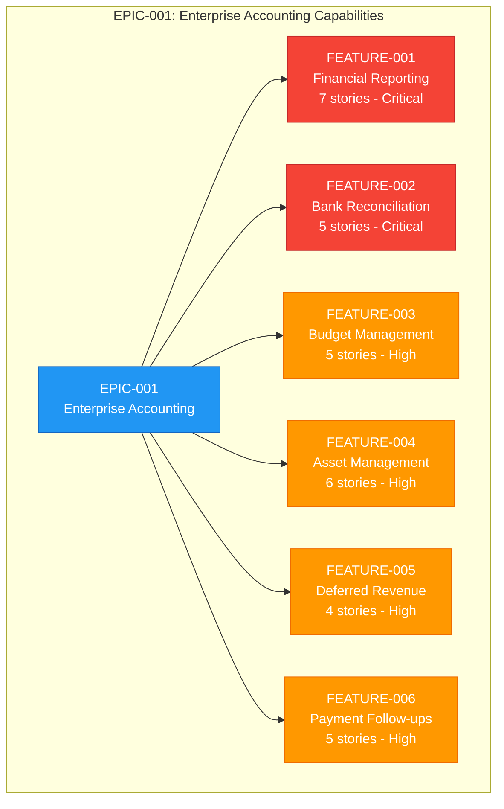
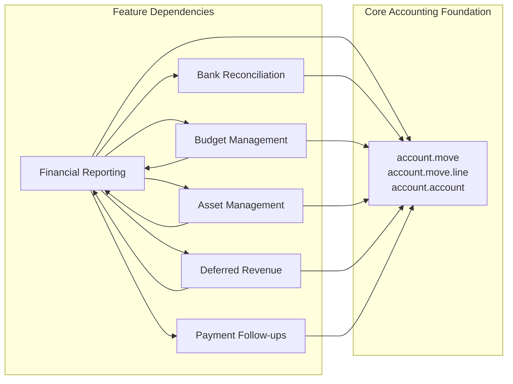

# EPIC-001: Enterprise Accounting Capabilities for Odoo Community Edition

| Field | Value |
|-------|-------|
| **Epic ID** | EPIC-001 |
| **Title** | Enterprise Accounting Capabilities |
| **Status** | Draft |
| **Version** | 1.0.0 |
| **Created** | 2024 |
| **Target Platform** | Odoo Community Edition |
| **Total Features** | 6 |
| **Total Stories** | 32 |

---

## Table of Contents

1. [Business Context](#1-business-context)
2. [Success Metrics](#2-success-metrics)
3. [Features Overview](#3-features-overview)
4. [Epic-Feature Relationship](#4-epic-feature-relationship)
5. [Constraints](#5-constraints)
6. [Out of Scope](#6-out-of-scope)
7. [Discovery Notes](#7-discovery-notes)
8. [References](#8-references)
9. [Related Documentation](#9-related-documentation)

---

## 1. Business Context

### 1.1 Problem Statement

Small and Medium Enterprises (SMEs) using Odoo Community Edition face significant limitations in financial management capabilities. Currently, these organizations **cannot produce standard financial reports** required for:

- **Regulatory Compliance**: Statutory reporting requirements (GAAP, IFRS)
- **Investor Reporting**: Financial statements for stakeholders and board meetings
- **Bank Loan Applications**: Audited financial documents required by financial institutions
- **Internal Financial Management**: Decision-making reports for executive leadership

The gap between Odoo Community Edition and Enterprise Edition creates a barrier for SMEs that need enterprise-grade accounting features but cannot afford or justify Enterprise licensing costs.

### 1.2 Business Value

This epic delivers **enterprise-grade accounting capabilities** to Odoo Community Edition users, effectively bridging the Community/Enterprise gap for core financial management features. The implementation will enable SMEs to:

- Generate GAAP/IFRS-compliant financial statements
- Automate bank reconciliation with algorithmic matching
- Implement comprehensive budget management and variance analysis
- Track fixed assets with automated depreciation schedules
- Manage deferred revenue and expenses per accounting standards
- Automate payment follow-ups to improve cash flow

### 1.3 Target Users

| Persona | Role Description | Primary Features | Key Objectives |
|---------|------------------|------------------|----------------|
| **CFO / Finance Director** | Executive responsible for financial strategy and reporting | Financial Reporting, Budget Management, Deferred Revenue | Strategic reporting, regulatory compliance, cash flow visibility |
| **Accountant / Bookkeeper** | Professional managing day-to-day financial transactions | All Features | Daily operations, transaction processing, period close activities |
| **Controller** | Manager overseeing budget performance and variance analysis | Budget Management | Variance analysis, budget monitoring, cost control |
| **Auditor** | Internal or external professional verifying financial records | Financial Reporting | Transaction trail verification, data integrity validation |
| **Business Owner** | Executive requiring financial visibility for decision-making | Financial Reporting, Payment Follow-ups | Cash flow statements, accounts receivable management |

### 1.4 Stakeholder Impact

| Stakeholder Group | Impact | Benefit |
|-------------------|--------|---------|
| Finance Teams | High | Reduced manual work, automated reporting, improved accuracy |
| Executive Leadership | High | Better visibility, faster decision-making, compliance assurance |
| External Auditors | Medium | Clear audit trails, standardized reports, easier verification |
| IT Operations | Medium | Community-based solution, reduced licensing complexity |
| Customers/Partners | Low | Faster invoice processing, automated communications |

---

## 2. Success Metrics

The following measurable outcomes define success for this epic:

| Metric ID | Success Metric | Target | Measurement Method |
|-----------|----------------|--------|-------------------|
| **SM-001** | All standard financial statements (Balance Sheet, P&L, Cash Flow) producible | 100% coverage | Feature completion verification |
| **SM-002** | Bank reconciliation matching accuracy with algorithmic suggestions | ≥95% accuracy | Automated matching test scenarios |
| **SM-003** | Budget variance reports available after period close | Within 24 hours | Report generation timing tests |
| **SM-004** | Asset depreciation entries generated automatically per schedule | 100% automation | Scheduled job verification |
| **SM-005** | Deferred revenue schedules execute per ASC 606 / IFRS 15 requirements | 100% compliance | Standard compliance validation |
| **SM-006** | Overdue receivables reduced through automated follow-ups | 15-25% reduction | Pre/post implementation comparison |

### 2.1 Key Performance Indicators (KPIs)

| KPI | Baseline | Target | Timeline |
|-----|----------|--------|----------|
| Time to generate Balance Sheet | Manual (2-4 hours) | Automated (<5 minutes) | Per reporting period |
| Bank reconciliation completion rate | Manual matching only | 95%+ auto-matched | Daily reconciliation |
| Budget variance visibility | End of month manual | Real-time automated | Continuous |
| Asset depreciation accuracy | Manual calculation | 100% automated | Monthly |
| Collection effectiveness (DSO) | Baseline DSO | 15-25% improvement | Quarterly |

---

## 3. Features Overview

This epic comprises six features, each decomposed into user stories following INVEST principles (Independent, Negotiable, Valuable, Estimable, Small, Testable).

### 3.1 Feature Summary

| Feature ID | Feature Name | Stories | Priority | Description |
|------------|--------------|---------|----------|-------------|
| [FEATURE-001](features/FEATURE-001-financial-reporting.md) | Financial Reporting | 7 | **Critical** | GAAP/IFRS-compliant financial statements including Balance Sheet, P&L, Cash Flow, General Ledger, Trial Balance, and Aged Reports |
| [FEATURE-002](features/FEATURE-002-bank-reconciliation.md) | Bank Reconciliation | 5 | **Critical** | Bank statement import, algorithmic matching, reconciliation rules, and partial reconciliation capabilities |
| [FEATURE-003](features/FEATURE-003-budget-management.md) | Budget Management | 5 | **High** | Budget definition, period allocation, actual vs. budget reporting, variance analysis, and alerts |
| [FEATURE-004](features/FEATURE-004-asset-management.md) | Asset Management | 6 | **High** | Asset registration, depreciation configuration, depreciation board, automatic entries, modifications, and disposal |
| [FEATURE-005](features/FEATURE-005-deferred-revenue.md) | Deferred Revenue/Expenses | 4 | **High** | Deferral schedule definition, automatic period allocation, cut-off entry generation, and recognition dashboard |
| [FEATURE-006](features/FEATURE-006-payment-followups.md) | Payment Follow-ups | 5 | **High** | Follow-up level configuration, automated email generation, follow-up reporting, action history, and overdue calculation |

### 3.2 Feature Details

#### Feature 1: Financial Reporting (Critical)

**Objective**: Enable generation of GAAP/IFRS-compliant financial statements with comparative periods and drill-down capabilities.

| Story ID | Story Title | Persona |
|----------|-------------|---------|
| FR-001 | Balance Sheet Report | CFO |
| FR-002 | Profit & Loss Statement | CFO |
| FR-003 | Cash Flow Statement | CFO |
| FR-004 | General Ledger Report | Accountant |
| FR-005 | Trial Balance Report | Accountant |
| FR-006 | Aged Receivable/Payable Reports | Business Owner |
| FR-007 | Report Export & Drill-down | Auditor |

#### Feature 2: Bank Reconciliation (Critical)

**Objective**: Provide efficient bank reconciliation workflow with algorithmic matching suggestions and reconciliation rules.

| Story ID | Story Title | Persona |
|----------|-------------|---------|
| BR-001 | Statement Import | Accountant |
| BR-002 | Algorithmic Matching | Accountant |
| BR-003 | Manual Reconciliation | Accountant |
| BR-004 | Reconciliation Rules | Accountant |
| BR-005 | Partial Reconciliation | Accountant |

#### Feature 3: Budget Management (High)

**Objective**: Enable comprehensive budget lifecycle management including definition, allocation, monitoring, and variance analysis.

| Story ID | Story Title | Persona |
|----------|-------------|---------|
| BM-001 | Budget Definition | CFO |
| BM-002 | Budget Period Allocation | Controller |
| BM-003 | Actual vs Budget Reporting | Controller |
| BM-004 | Variance Analysis | Controller |
| BM-005 | Budget Alerts | Controller |

#### Feature 4: Asset Management (High)

**Objective**: Track fixed assets throughout their lifecycle with automated depreciation scheduling and proper disposal handling.

| Story ID | Story Title | Persona |
|----------|-------------|---------|
| AM-001 | Asset Registration | Accountant |
| AM-002 | Depreciation Configuration | Accountant |
| AM-003 | Depreciation Board | Accountant |
| AM-004 | Automatic Depreciation Entries | Accountant |
| AM-005 | Asset Modification | Accountant |
| AM-006 | Asset Disposal | Accountant |

#### Feature 5: Deferred Revenue/Expenses (High)

**Objective**: Implement revenue recognition and expense deferral per ASC 606/IFRS 15 accounting standards.

| Story ID | Story Title | Persona |
|----------|-------------|---------|
| DR-001 | Deferral Schedule Definition | CFO |
| DR-002 | Automatic Period Allocation | Accountant |
| DR-003 | Cut-off Entry Generation | Accountant |
| DR-004 | Recognition Dashboard | CFO |

#### Feature 6: Payment Follow-ups (High)

**Objective**: Automate customer payment reminders to improve collection effectiveness and reduce overdue receivables.

| Story ID | Story Title | Persona |
|----------|-------------|---------|
| PF-001 | Follow-up Level Configuration | Accountant |
| PF-002 | Automated Email Generation | Accountant |
| PF-003 | Follow-up Report Generation | Accountant |
| PF-004 | Action History Tracking | Accountant |
| PF-005 | Overdue Calculation | Accountant |

---

## 4. Epic-Feature Relationship

### 4.1 Feature Hierarchy Diagram



### 4.2 Feature Dependencies



### 4.3 Implementation Sequence

| Phase | Features | Rationale |
|-------|----------|-----------|
| **Phase 1** | Financial Reporting, Bank Reconciliation | Critical priority; foundational capabilities |
| **Phase 2** | Budget Management, Asset Management | High priority; depends on reporting infrastructure |
| **Phase 3** | Deferred Revenue, Payment Follow-ups | High priority; utilizes established patterns |

---

## 5. Constraints

All implementations under this epic must adhere to the following constraints:

### 5.1 License Constraints

| Constraint | Requirement | Rationale |
|------------|-------------|-----------|
| **C-001** | AGPL-3.0 license compatibility required | New modules must be compatible with AGPL-3.0 license to allow free redistribution |
| **C-002** | LGPL-3 compatibility with existing `account` module | Integration with existing module (license: LGPL-3) must maintain license compatibility |

### 5.2 Technical Constraints

| Constraint | Requirement | Rationale |
|------------|-------------|-----------|
| **C-003** | No dependencies on Odoo Enterprise modules | Solution must work standalone on Community Edition without Enterprise features |
| **C-004** | Adherence to Odoo and OCA (Odoo Community Association) coding standards | Ensure code quality, maintainability, and community contribution eligibility |
| **C-005** | Target version: Odoo 18.0 | User requirement specification (note: repository is currently Odoo 19.0; version compatibility considerations required) |
| **C-006** | Minimum 80% test coverage for new functionality | Enterprise-grade quality assurance requirement |

### 5.3 Integration Constraints

| Constraint | Requirement | Rationale |
|------------|-------------|-----------|
| **C-007** | Integration with existing `account.move`, `account.move.line`, `account.account` models | Leverage existing accounting foundation; avoid duplication |
| **C-008** | Integration with `account.analytic.account` and `account.analytic.plan` for budget allocation | Utilize multi-dimensional analytic accounting infrastructure |
| **C-009** | Compatibility with existing Odoo security model and access rights | Ensure proper data isolation and user permissions |

### 5.4 Acceptance Criteria Constraint

All user stories must include the following constraints as acceptance criteria:

```
- Module distributed under AGPL-3.0 compatible license
- No imports or dependencies on Odoo Enterprise edition modules
- Implementation follows Odoo and OCA coding standards
- Implementation achieves minimum 80% test coverage
```

---

## 6. Out of Scope

The following items are explicitly **excluded** from this epic:

### 6.1 Excluded Features

| Item | Reason for Exclusion |
|------|---------------------|
| **Real-time bank feed API integrations** (Plaid, Yodlee, Saltedge) | Requires third-party service agreements and ongoing maintenance; file-based import provides adequate coverage |
| **AI/ML-powered OCR invoice recognition** | Requires specialized ML infrastructure; out of scope for accounting-focused epic |
| **Multi-company consolidation with intercompany eliminations** | Complex enterprise feature requiring significant additional development; may be separate epic |
| **Tax service integrations** (TaxCloud, AvaTax) | Third-party service dependencies; jurisdiction-specific requirements |
| **Mobile-specific interfaces** | Standard Odoo responsive design provides mobile access; native mobile development out of scope |

### 6.2 Boundary Conditions

| Boundary | In Scope | Out of Scope |
|----------|----------|--------------|
| Bank Statement Import | CSV, OFX, QIF, CAMT.053 file formats | Real-time API feeds |
| Asset Depreciation | Straight-line, declining balance, units of production | Custom formula-based depreciation |
| Budget Management | Manual budget definition and allocation | AI-based budget forecasting |
| Company Structure | Single-company operation | Multi-company consolidation |
| Follow-up Communications | Email-based automated reminders | SMS, WhatsApp, or mobile push notifications |
| Report Formats | PDF, Excel export | Custom reporting engines or BI integrations |

---

## 7. Discovery Notes

The following areas require codebase analysis before implementation decisions. User stories intentionally describe **WHAT** and **WHY** without prescribing **HOW**—implementation details emerge from agent discovery of the codebase.

### 7.1 D-001: Existing Patterns Analysis

**Analysis Required:**
- Analyze current `account` module structure in `addons/account/`
- Review model inheritance patterns in `addons/account/models/`
- Study view architecture patterns in `addons/account/views/`
- Examine wizard conventions in `addons/account/wizard/`
- Understand report patterns in `addons/account/report/`

**Key Questions:**
- Should new features be implemented as new modules or extensions to existing `account` module?
- What inheritance patterns (classical, delegation, prototype) are used in the codebase?
- How are wizards structured for multi-step workflows?

**Reference Files:**
- `addons/account/__manifest__.py` - Module dependencies: `base_setup`, `onboarding`, `product`, `analytic`, `portal`, `digest`
- `addons/account/models/account_move.py` - Core journal entry model
- `addons/account/models/account_bank_statement.py` - Bank statement model

### 7.2 D-002: OCA Compatibility Strategy

**Analysis Required:**
- Review OCA modules from `OCA/account-financial-reporting` for financial report patterns
- Analyze `OCA/account-reconcile` for bank reconciliation interface approaches
- Study `OCA/mis-builder` for budget/MIS reporting patterns
- Evaluate `OCA/account-financial-tools` for asset management patterns

**Key Questions:**
- Should implementation integrate with existing OCA modules or implement independent solutions?
- What level of compatibility with OCA module APIs is required?
- Are there OCA patterns that should be adopted for consistency?

**OCA Repository References:**
| Repository | Module | Relevance |
|------------|--------|-----------|
| OCA/account-financial-reporting | `account_financial_report` | General Ledger, Trial Balance, Aged Partner Balance patterns |
| OCA/account-reconcile | `account_reconcile_oca` | Bank reconciliation interface patterns |
| OCA/mis-builder | `mis_builder` | Management Information System / Budget reporting |
| OCA/account-financial-tools | Various | Asset management and financial tools |

### 7.3 D-003: Report Engine Decision

**Analysis Required:**
- Evaluate existing Odoo reporting infrastructure (`ir.actions.report`, QWeb templates)
- Review `addons/account/report/account_invoice_report.py` for SQL-view analytics patterns
- Assess QWeb report template patterns in `addons/account/views/report_invoice.xml`
- Analyze whether dedicated financial report engine is beneficial

**Key Questions:**
- Should financial reports extend existing Odoo reporting infrastructure or implement dedicated engine?
- How should drill-down functionality be implemented (server-side vs client-side)?
- What caching strategies are appropriate for complex financial calculations?

### 7.4 D-004: UI Component Patterns

**Analysis Required:**
- Assess current OWL component patterns in accounting views
- Review `addons/account/static/src/components/` for existing component architecture
- Analyze reconciliation and statement views for interaction patterns
- Study journal dashboard patterns in `addons/account/views/account_journal_dashboard_view.xml`

**Key Questions:**
- What OWL component patterns should be used for reconciliation interface?
- How should real-time updates be handled in reporting interfaces?
- What accessibility standards must be met?

### 7.5 D-005: Data Model Extensions

**Analysis Required:**
- Analyze existing `account.move`, `account.move.line`, `account.bank.statement` structures
- Review `account.account` for account type categorization (assets, liabilities, equity, income, expense)
- Study `account.analytic.account` and `account.analytic.plan` for multi-dimensional analysis
- Understand `account.reconcile.model` for reconciliation rule patterns

**Key Questions:**
- What new models are required vs. extensions to existing models?
- How should asset register data relate to existing journal entry models?
- What indexes and computed fields are needed for performance?

**Reference Models:**
```
account.move              - Journal entries
account.move.line         - Journal entry lines
account.account           - Chart of accounts
account.bank.statement    - Bank statements
account.reconcile.model   - Reconciliation rules
account.analytic.account  - Analytic accounts
account.analytic.plan     - Analytic plans
```

---

## 8. References

### 8.1 OCA Repository References

| Repository | URL | Description |
|------------|-----|-------------|
| OCA/account-financial-reporting | https://github.com/OCA/account-financial-reporting | Financial report implementations (General Ledger, Trial Balance, Aged Reports) |
| OCA/account-reconcile | https://github.com/OCA/account-reconcile | Bank reconciliation tools and interfaces |
| OCA/mis-builder | https://github.com/OCA/mis-builder | Management Information System and budget reporting |
| OCA/account-financial-tools | https://github.com/OCA/account-financial-tools | Asset management and financial utilities |
| OCA/account-payment | https://github.com/OCA/account-payment | Payment processing and follow-up tools |

### 8.2 Odoo Documentation

| Resource | URL | Description |
|----------|-----|-------------|
| Odoo Developer Documentation | https://www.odoo.com/documentation/18.0/developer.html | Official development guidelines |
| Odoo Accounting Documentation | https://www.odoo.com/documentation/18.0/applications/finance/accounting.html | Accounting module user documentation |
| OCA Development Guidelines | https://odoo-community.org/page/development-guidelines | OCA coding standards and best practices |
| Odoo Contributing Guidelines | https://github.com/odoo/odoo/blob/master/CONTRIBUTING.md | Contribution workflow and standards |

### 8.3 Accounting Standards

| Standard | Description | Applicable Features |
|----------|-------------|---------------------|
| **GAAP** (US Generally Accepted Accounting Principles) | US accounting standards framework | Financial Reporting (FR-001, FR-002, FR-003) |
| **IFRS** (International Financial Reporting Standards) | International accounting standards | Financial Reporting (FR-001, FR-002, FR-003) |
| **ASC 606** | Revenue from Contracts with Customers (US GAAP) | Deferred Revenue (DR-001, DR-002, DR-003) |
| **IFRS 15** | Revenue from Contracts with Customers (IFRS) | Deferred Revenue (DR-001, DR-002, DR-003) |

### 8.4 Bank Statement Formats

| Format | Standard | Description |
|--------|----------|-------------|
| **CSV** | Generic | Universal comma-separated values format |
| **OFX** | Open Financial Exchange | US banking data exchange standard |
| **QIF** | Quicken Interchange Format | Legacy Quicken data format |
| **CAMT.053** | ISO 20022 | European banking statement standard (Bank-to-Customer Statement) |

### 8.5 Internal Code References

| File Path | Description |
|-----------|-------------|
| `addons/account/__manifest__.py` | Account module manifest (version 1.4, license LGPL-3) |
| `addons/account/models/account_move.py` | Core journal entry model implementation |
| `addons/account/models/account_bank_statement.py` | Bank statement model for reconciliation |
| `addons/account/models/account_reconcile_model.py` | Reconciliation rules model |
| `addons/account/wizard/account_automatic_entry_wizard.py` | Automatic entry wizard patterns |
| `addons/account/data/mail_template_data.xml` | Email template patterns for follow-ups |
| `addons/analytic/models/analytic_account.py` | Analytic account model for budget integration |
| `addons/analytic/models/analytic_plan.py` | Analytic plan model for multi-dimensional budgeting |

---

## 9. Related Documentation

### 9.1 Feature Specifications

| Feature | Documentation Path |
|---------|-------------------|
| Financial Reporting | [features/FEATURE-001-financial-reporting.md](features/FEATURE-001-financial-reporting.md) |
| Bank Reconciliation | [features/FEATURE-002-bank-reconciliation.md](features/FEATURE-002-bank-reconciliation.md) |
| Budget Management | [features/FEATURE-003-budget-management.md](features/FEATURE-003-budget-management.md) |
| Asset Management | [features/FEATURE-004-asset-management.md](features/FEATURE-004-asset-management.md) |
| Deferred Revenue/Expenses | [features/FEATURE-005-deferred-revenue.md](features/FEATURE-005-deferred-revenue.md) |
| Payment Follow-ups | [features/FEATURE-006-payment-followups.md](features/FEATURE-006-payment-followups.md) |

### 9.2 User Stories by Feature

#### Financial Reporting Stories
| Story | Path |
|-------|------|
| FR-001: Balance Sheet Report | [stories/financial-reporting/FR-001-balance-sheet-report.md](stories/financial-reporting/FR-001-balance-sheet-report.md) |
| FR-002: Profit & Loss Statement | [stories/financial-reporting/FR-002-profit-loss-statement.md](stories/financial-reporting/FR-002-profit-loss-statement.md) |
| FR-003: Cash Flow Statement | [stories/financial-reporting/FR-003-cash-flow-statement.md](stories/financial-reporting/FR-003-cash-flow-statement.md) |
| FR-004: General Ledger Report | [stories/financial-reporting/FR-004-general-ledger-report.md](stories/financial-reporting/FR-004-general-ledger-report.md) |
| FR-005: Trial Balance Report | [stories/financial-reporting/FR-005-trial-balance-report.md](stories/financial-reporting/FR-005-trial-balance-report.md) |
| FR-006: Aged Reports | [stories/financial-reporting/FR-006-aged-reports.md](stories/financial-reporting/FR-006-aged-reports.md) |
| FR-007: Report Export & Drill-down | [stories/financial-reporting/FR-007-report-export-drilldown.md](stories/financial-reporting/FR-007-report-export-drilldown.md) |

#### Bank Reconciliation Stories
| Story | Path |
|-------|------|
| BR-001: Statement Import | [stories/bank-reconciliation/BR-001-statement-import.md](stories/bank-reconciliation/BR-001-statement-import.md) |
| BR-002: Algorithmic Matching | [stories/bank-reconciliation/BR-002-algorithmic-matching.md](stories/bank-reconciliation/BR-002-algorithmic-matching.md) |
| BR-003: Manual Reconciliation | [stories/bank-reconciliation/BR-003-manual-reconciliation.md](stories/bank-reconciliation/BR-003-manual-reconciliation.md) |
| BR-004: Reconciliation Rules | [stories/bank-reconciliation/BR-004-reconciliation-rules.md](stories/bank-reconciliation/BR-004-reconciliation-rules.md) |
| BR-005: Partial Reconciliation | [stories/bank-reconciliation/BR-005-partial-reconciliation.md](stories/bank-reconciliation/BR-005-partial-reconciliation.md) |

#### Budget Management Stories
| Story | Path |
|-------|------|
| BM-001: Budget Definition | [stories/budget-management/BM-001-budget-definition.md](stories/budget-management/BM-001-budget-definition.md) |
| BM-002: Budget Period Allocation | [stories/budget-management/BM-002-budget-period-allocation.md](stories/budget-management/BM-002-budget-period-allocation.md) |
| BM-003: Actual vs Budget Reporting | [stories/budget-management/BM-003-actual-vs-budget-reporting.md](stories/budget-management/BM-003-actual-vs-budget-reporting.md) |
| BM-004: Variance Analysis | [stories/budget-management/BM-004-variance-analysis.md](stories/budget-management/BM-004-variance-analysis.md) |
| BM-005: Budget Alerts | [stories/budget-management/BM-005-budget-alerts.md](stories/budget-management/BM-005-budget-alerts.md) |

#### Asset Management Stories
| Story | Path |
|-------|------|
| AM-001: Asset Registration | [stories/asset-management/AM-001-asset-registration.md](stories/asset-management/AM-001-asset-registration.md) |
| AM-002: Depreciation Configuration | [stories/asset-management/AM-002-depreciation-configuration.md](stories/asset-management/AM-002-depreciation-configuration.md) |
| AM-003: Depreciation Board | [stories/asset-management/AM-003-depreciation-board.md](stories/asset-management/AM-003-depreciation-board.md) |
| AM-004: Automatic Depreciation Entries | [stories/asset-management/AM-004-automatic-depreciation-entries.md](stories/asset-management/AM-004-automatic-depreciation-entries.md) |
| AM-005: Asset Modification | [stories/asset-management/AM-005-asset-modification.md](stories/asset-management/AM-005-asset-modification.md) |
| AM-006: Asset Disposal | [stories/asset-management/AM-006-asset-disposal.md](stories/asset-management/AM-006-asset-disposal.md) |

#### Deferred Revenue Stories
| Story | Path |
|-------|------|
| DR-001: Deferral Schedule Definition | [stories/deferred-revenue/DR-001-deferral-schedule-definition.md](stories/deferred-revenue/DR-001-deferral-schedule-definition.md) |
| DR-002: Automatic Period Allocation | [stories/deferred-revenue/DR-002-automatic-period-allocation.md](stories/deferred-revenue/DR-002-automatic-period-allocation.md) |
| DR-003: Cut-off Entry Generation | [stories/deferred-revenue/DR-003-cutoff-entry-generation.md](stories/deferred-revenue/DR-003-cutoff-entry-generation.md) |
| DR-004: Recognition Dashboard | [stories/deferred-revenue/DR-004-recognition-dashboard.md](stories/deferred-revenue/DR-004-recognition-dashboard.md) |

#### Payment Follow-ups Stories
| Story | Path |
|-------|------|
| PF-001: Follow-up Level Configuration | [stories/payment-followups/PF-001-followup-level-configuration.md](stories/payment-followups/PF-001-followup-level-configuration.md) |
| PF-002: Automated Email Generation | [stories/payment-followups/PF-002-automated-email-generation.md](stories/payment-followups/PF-002-automated-email-generation.md) |
| PF-003: Follow-up Report Generation | [stories/payment-followups/PF-003-followup-report-generation.md](stories/payment-followups/PF-003-followup-report-generation.md) |
| PF-004: Action History Tracking | [stories/payment-followups/PF-004-action-history-tracking.md](stories/payment-followups/PF-004-action-history-tracking.md) |
| PF-005: Overdue Calculation | [stories/payment-followups/PF-005-overdue-calculation.md](stories/payment-followups/PF-005-overdue-calculation.md) |

### 9.3 Templates

| Template | Path | Purpose |
|----------|------|---------|
| Epic Template | [templates/epic-template.md](templates/epic-template.md) | Reusable template for creating new epics |
| Feature Template | [templates/feature-template.md](templates/feature-template.md) | Reusable template for feature specifications |
| Story Template | [templates/story-template.md](templates/story-template.md) | Reusable template for user stories with BDD acceptance criteria |

---

## Appendix A: Glossary

| Term | Definition |
|------|------------|
| **AGPL-3.0** | Affero General Public License version 3.0; copyleft license requiring source code distribution |
| **ASC 606** | Accounting Standards Codification Topic 606 (Revenue from Contracts with Customers) |
| **BDD** | Behavior-Driven Development; specification methodology using Given/When/Then format |
| **CAMT.053** | ISO 20022 Bank-to-Customer Statement message format |
| **DSO** | Days Sales Outstanding; measure of average collection period |
| **GAAP** | Generally Accepted Accounting Principles (US accounting standards) |
| **IFRS** | International Financial Reporting Standards |
| **INVEST** | Independent, Negotiable, Valuable, Estimable, Small, Testable (user story quality criteria) |
| **LGPL-3** | Lesser General Public License version 3.0; permissive copyleft license |
| **OCA** | Odoo Community Association; organization maintaining community Odoo modules |
| **OFX** | Open Financial Exchange; standard for electronic exchange of financial data |
| **P&L** | Profit and Loss Statement (Income Statement) |
| **QIF** | Quicken Interchange Format; file format for financial data exchange |
| **QWeb** | Odoo's templating engine for reports and web pages |

---

## Appendix B: Version History

| Version | Date | Author | Changes |
|---------|------|--------|---------|
| 1.0.0 | 2024 | Blitzy Platform | Initial epic creation with 6 features and 32 user stories |

---

**Document Status:** Draft  
**Last Updated:** 2024  
**Next Review:** Prior to implementation phase kickoff
