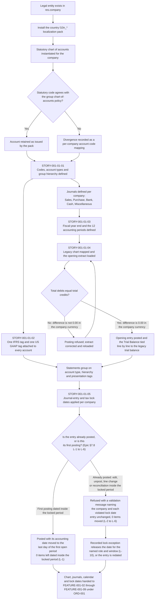
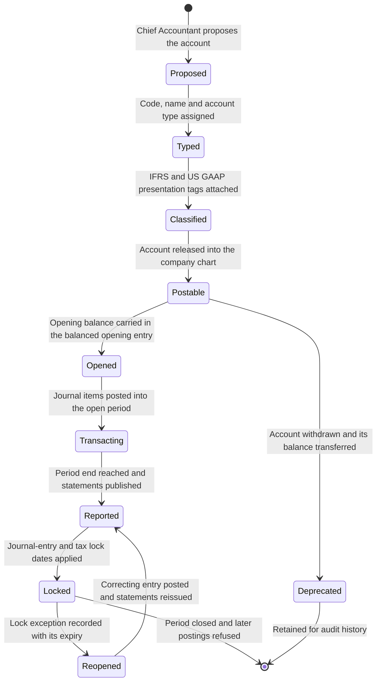

# FEATURE-001-01: Chart of Accounts & Fiscal Year

---

## Metadata

| Attribute | Value |
|-----------|-------|
| **Feature ID** | `FEATURE-001-01` |
| **Title** | Chart of Accounts & Fiscal Year |
| **Parent Epic** | [EPIC-001: Enterprise Accounting in Odoo](../EPIC-001-enterprise-accounting-odoo.md) |
| **Status** | Draft |
| **Priority** | 🔴 Critical |
| **Story Count** | 5 stories |
| **Last Updated** | 2026-08-16 |
| **Owner/Author** | Enterprise Accounting Team |

---

## 1. Feature Overview

### 1.1 Purpose and Business Value

This feature enables the **Chief Accountant**, the **Financial Reporting Manager** and the **Group Controller** to establish the accounting foundations that every other feature of EPIC-001 posts into: a multi-level Chart of Accounts governed across all legal entities, an IFRS and US GAAP reporting taxonomy carried on each account, a fiscal calendar per company, a migrated set of opening balances, and the period-lock controls that close a reported period to further posting.

It is delivered against two module families that are present in this repository:

- **`account`** — the "Invoicing" application, version 1.4, category `Accounting/Accounting`, licence LGPL-3. It supplies `account.account` with its `code`, `name` and `account_type` structure, `account.group` for hierarchy, `account.account.tag` for taxonomy tagging, `account.code.mapping` for per-company code divergence, `account.journal` for the journal set, `account.move` and `account.move.line` for the opening entry, and the fiscal-year and lock-date fields on `res.company`.
- **`l10n_*`** — the country localization modules, **209** of which are present in this repository. Each supplies the statutory chart of accounts, the statutory account codes and the statutory presentation for one jurisdiction, which this feature reconciles against the group chart-of-accounts policy.

**Business Value Statement:**

> One governed account structure and one fiscal calendar per legal entity make the group's books comparable line by line. Every posting lands on an account whose type, hierarchy position and reporting taxonomy tags are already defined, so the Balance Sheet, the Profit & Loss and the Trial Balance are generated from posted data in under 5 minutes per statement against the Epic's manual baseline of 2 to 4 hours per statement, and every company-and-period Trial Balance reports total debits equal to total credits with a difference of 0.00 in the company currency (SM-006).

This feature is the direct foundation of the Epic's three objectives:

| Epic Objective | Contribution of This Feature |
|----------------|------------------------------|
| Multi-entity financial operations | One account hierarchy and one account-type taxonomy applied across every legal entity, with each statutory divergence recorded as a per-company account code mapping rather than as a separate chart |
| Compliance reporting | Each account carries an IFRS presentation tag and a US GAAP presentation tag, so one posted balance is presented under both frameworks without a manual restatement step |
| Real-time financial visibility | Financial-health figures are read from posted journal items grouped by account type and hierarchy, so they are current as of the last posted entry rather than as of the last spreadsheet refresh |

Ordering rule **ORD-001** in the Epic records this feature as the prerequisite of every journal-posting story in FEATURE-001-02, FEATURE-001-03 and FEATURE-001-07, and the Epic's implementation sequence places it in **Phase 1 — Foundations** alongside FEATURE-001-05. Sharing that phase with FEATURE-001-05 does not make the two peers: the Epic's dependency summary records FEATURE-001-05 as depending on this feature, because a tax code or fiscal position can only point at an account that already exists, so this feature is that feature's prerequisite inside the shared phase and the account-readiness hand-over of §4.3 is the gate between them.

### 1.2 Problem Statement

Each legal entity in the group numbers and names its accounts on its own convention, and no entity has a governed fiscal calendar inside the accounting system. Five consequences follow, and each of them recurs at every period end:

- **Consolidation cannot map like to like.** Two entities that both hold trade receivables record them under different codes with different account types, so a group balance can only be assembled by a manual mapping step performed outside the ledger, and that step is repeated and re-audited every month.
- **Statements cannot be produced to one taxonomy.** No account carries the presentation tag a statement generator needs, so the Balance Sheet and the Profit & Loss are assembled by hand: 2 to 4 hours of manual compilation per statement against the Epic's target of under 5 minutes per statement (SM-005). The compilation exists because the account structure does not carry the classification the statement needs.
- **Closed periods stay writable.** With no journal-entry lock date and no tax lock date administered per company, an entry dated into a period that has already been reported still posts, so a figure given to a lender, a board or an auditor stops agreeing with the ledger and restatement risk persists (SM-016).
- **Migration has no target structure.** Legacy balances cannot be loaded until every legacy account maps to a target account, and without that mapping an opening entry cannot be proved: a load that does not post total debits equal to total credits leaves an unexplained suspense balance in the first reported period.
- **Localization is unreconciled.** Country packs install a statutory chart per jurisdiction, and with no group policy to reconcile against, the statutory chart and the group reporting chart drift apart, so the statutory filing and the group statements are prepared from two different structures.

### 1.3 Key Capabilities

| Capability ID | Capability Description | Related Stories |
|---------------|------------------------|-----------------|
| CAP-001 | Define a multi-level Chart of Accounts with account types, codes and hierarchy across all legal entities | STORY-001-01-01 |
| CAP-002 | Map every account to the IFRS and US-GAAP reporting taxonomy used by the statement generators | STORY-001-01-02 |
| CAP-003 | Define the fiscal year, its accounting periods and the fiscal-year-end date per company | STORY-001-01-03 |
| CAP-004 | Import a legacy chart of accounts and its opening balances as a balanced journal entry | STORY-001-01-04 |
| CAP-005 | Configure period lock dates and closing controls that keep a closed period's reported figures fixed — late activity posts forward into the first open period and no posted entry inside the closed period can be amended, unposted or reconciled (Epic [§7.8](../EPIC-001-enterprise-accounting-odoo.md#78-lock-date-behaviour-contract)) | STORY-001-01-05 |

The five capabilities are cumulative: CAP-001 creates the accounts, CAP-002 classifies them for presentation, CAP-003 defines the calendar they are posted against, CAP-004 loads their opening position, and CAP-005 protects a reported period from further posting.

### 1.4 Success Criteria at Feature Level

| Criterion | Target | Verification Method |
|-----------|--------|---------------------|
| Account definition completeness | 100% of accounts in every in-scope company carry a code, a name, an `account_type` value and a position in the account hierarchy; the count of untyped accounts is 0 | Chart of Accounts completeness report per company, with the untyped count asserted at 0 |
| Deterministic group code baseline | 10 of 10 group codes exist per company with their stated types: Bank 1010, Accounts Receivable 1200, Fixed Assets 1500, Accumulated Depreciation 1590, Accounts Payable 2000, Tax Payable 2200, Share Capital 3000, Retained Earnings 3100, Revenue 4000, Expense 6100 | Trial Balance run per company listing all ten codes, compared against the group chart-of-accounts policy |
| Reporting taxonomy coverage | 100% of accounts carry one IFRS presentation tag and one US GAAP presentation tag; the count of untagged accounts is 0 | Tagging completeness report listing every account with no presentation tag, with the count asserted at 0 (supports SM-001) |
| Journal set per company | 5 of 5 journal types exist per company — Sales, Purchase, Bank, Cash and Miscellaneous — each with its own sequence and default accounts | Journal configuration checklist per company, signed off by the Chief Accountant |
| Fiscal calendar definition | Fiscal-year-end day and month plus a 12-period accounting calendar recorded for 100% of in-scope companies | Configuration checklist per company, cross-checked against the group close calendar |
| Opening-balance load balances | The opening journal entry posts with total debits of `$4,875,300.00 USD` equal to total credits of `$4,875,300.00 USD`, a difference of `0.00 USD`, each amount rounded to 2 decimal places at the USD rounding increment of 0.01; a company reporting in another currency posts the same assertion in its own functional currency at that currency's decimal precision | Trial Balance reconciliation against the legacy trial balance, line by line, at a `0.00 USD` tolerance, with the tie-out worksheet retained as migration evidence (SM-006, D-010) |
| Legacy mapping completeness | The count of legacy accounts with no target account is 0 before cutover | Mapping worksheet signed off by the Chief Accountant, with the unmapped count asserted at 0 |
| Locked-period control outcome | 100% of operations against a locked period produce the outcome the Epic's [lock-date behaviour contract](../EPIC-001-enterprise-accounting-odoo.md#78-lock-date-behaviour-contract) fixes for that operation: a first posting (L-1) is posted with its accounting date moved to the first open period, leaving 0 journal items dated inside the locked period, while an edit, an unpost, a line change, a tax-bearing operation or a reconciliation against a posted entry (L-2 to L-6) is refused with an Odoo validation message that names the company and each violated lock date | Test executed per company for each administered lock-date field, asserting the re-dated accounting date for L-1 and the named refusal for L-2 to L-6 |
| Statutory chart reconciliation | Every in-scope `l10n_*` statutory chart reconciled to the group chart-of-accounts policy, with each divergence recorded as a per-company account code mapping | Reconciliation worksheet per country, produced during localization discovery (D-006) |
| Test coverage | ≥80% for all 5 story implementations, with the accounting assertions tested numerically | Coverage tooling in the repository's configured test run (C-007, C-009) |
| Demonstrability | 5 of 5 stories demonstrated in the Odoo user interface, or over the **JSON web-service surface [Epic §7.9](../EPIC-001-enterprise-accounting-odoo.md#79-external-interface-and-access-contract) governs under C-023** — a bearer key on a dedicated named integration principal per story, holding no authority its human counterpart lacks — to the Finance Controller and the Product Owner | Recorded acceptance walkthrough per story, with the principal, its scope and its rate ceiling named |

---

## 2. User Personas

### 2.1 Persona Mapping

Every persona below is a named finance role drawn from the Epic's persona register. The five roles marked applicable take a configuration or verification action inside this feature; the roles marked not applicable consume the accounts, the calendar and the lock dates it produces, and their work is specified in the features named against them.

| Persona | Role Description | Primary Use Cases | Applicable |
|---------|------------------|-------------------|------------|
| **Chief Accountant** | Owns the general ledger, the chart of accounts and the integrity of every posted entry | Defines the account hierarchy, types and codes; approves the legacy-to-target account mapping; defines the fiscal-year end and the accounting periods; posts and proves the opening-balance entry | ☑ Yes |
| **Financial Reporting Manager** | Produces statutory and management statements for each entity and the group | Assigns the IFRS and US GAAP presentation tags that the Balance Sheet, Profit & Loss and Trial Balance group on; verifies that every account resolves to exactly one statement section under each framework | ☑ Yes |
| **Group Controller** | Governs group accounting policy and approves the consolidated result | Owns the group chart-of-accounts policy the entity charts reconcile to; sets the journal-entry and tax lock dates per company; approves each lock-date exception and its expiry | ☑ Yes |
| **External Auditor** | Tests balances and controls and issues the audit opinion | Verifies that lock dates were applied, that a late first posting landed in the first open period rather than in the closed one, and that an amendment to an entry posted inside the closed period was refused (Epic §7.8 L-1 to L-6); reads the account hierarchy, the opening-entry tie-out worksheet and the lock-date change history as audit evidence | ☑ Yes |
| **Tax Accountant** | Determines tax on transactions and files statutory returns | Confirms that the `l10n_*` statutory chart for each operating country is installed and reconciled, and that the tax base and tax control accounts (Tax Payable 2200) exist before tax codes are mapped onto them in FEATURE-001-05 | ☑ Yes |
| Accounts Payable Clerk | Captures vendor bills, runs three-way match and prepares payment runs | Posts to Accounts Payable 2000 and Expense 6100 in FEATURE-001-02; takes no configuration action in this feature | ☐ No |
| Accounts Receivable Specialist | Issues customer invoices, allocates receipts and manages collections | Posts to Accounts Receivable 1200 and Revenue 4000 in FEATURE-001-03; takes no configuration action in this feature | ☐ No |
| Treasury Analyst | Owns bank and cash positions and statement reconciliation | Reconciles against Bank 1010 through the Bank and Cash journals in FEATURE-001-04; takes no configuration action in this feature | ☐ No |
| CFO / Finance Director | Executive stakeholder accountable for financial health and compliance | Consumes the statements that this feature's taxonomy makes producible, in FEATURE-001-07; confirms the open platform and edition decisions recorded in §5.2 and §5.5 | ☐ No |

### 2.2 Persona-to-Story Mapping

Each story carries exactly one primary persona in its WHO statement. Secondary personas review or consume the outcome and are named so that access rights derived from these stories keep the preparing role and the approving role apart.

| Story | Primary Persona | Secondary Personas |
|-------|-----------------|--------------------|
| STORY-001-01-01 Configure Multi-Level Chart of Accounts Hierarchy | Chief Accountant | Group Controller (policy approval), Tax Accountant (statutory chart reconciliation) |
| STORY-001-01-02 Map Accounts to IFRS and GAAP Reporting Taxonomy | Financial Reporting Manager | Chief Accountant (account ownership), External Auditor (presentation evidence) |
| STORY-001-01-03 Define Fiscal Year and Accounting Periods | Chief Accountant | Group Controller (group close calendar), Financial Reporting Manager (comparative periods) |
| STORY-001-01-04 Import Legacy Chart of Accounts and Opening Balances | Chief Accountant | External Auditor (migration evidence), Financial Reporting Manager (opening statement tie-out) |
| STORY-001-01-05 Configure Period Lock Dates and Closing Controls | Group Controller | Chief Accountant (close execution), External Auditor (control testing) |

---

## 3. Story List

### 3.1 User Stories

| Story ID | Story Title | Persona | Priority | Status | Link |
|----------|-------------|---------|----------|--------|------|
| STORY-001-01-01 | Configure Multi-Level Chart of Accounts Hierarchy | Chief Accountant | 🔴 Critical | Draft | [STORY-001-01-01](./FEATURE-001-01/STORY-001-01-01-configure-coa-hierarchy.md) |
| STORY-001-01-02 | Map Accounts to IFRS and GAAP Reporting Taxonomy | Financial Reporting Manager | 🔴 Critical | Draft | [STORY-001-01-02](./FEATURE-001-01/STORY-001-01-02-map-accounts-ifrs-gaap-taxonomy.md) |
| STORY-001-01-03 | Define Fiscal Year and Accounting Periods | Chief Accountant | 🔴 Critical | Draft | [STORY-001-01-03](./FEATURE-001-01/STORY-001-01-03-define-fiscal-year-periods.md) |
| STORY-001-01-04 | Import Legacy Chart of Accounts and Opening Balances | Chief Accountant | 🟠 High | Draft | [STORY-001-01-04](./FEATURE-001-01/STORY-001-01-04-import-legacy-coa.md) |
| STORY-001-01-05 | Configure Period Lock Dates and Closing Controls | Group Controller | 🟠 High | Draft | [STORY-001-01-05](./FEATURE-001-01/STORY-001-01-05-configure-period-lock-dates.md) |

**Priority legend:** 🔴 Critical — a closed, compliant period is impossible without it; 🟠 High — significant finance value that consumes what the Critical stories create.

### 3.2 Story Count Assessment

| Count | Assessment | Status |
|-------|------------|--------|
| **5 stories** | Within the mandated range of 2 to 5 stories per feature | ✓ Feature is scoped for independent delivery |

This feature carries **5 stories**, which is the upper bound of the 2-to-5 range recorded in the Epic's decomposition guidelines. The earlier 3-to-7 guidance carried by the feature template is superseded by that bound and is not applied here. The count is stated identically in four places, and the four must stay equal: the Story Count row in §Metadata, this assessment, the 5 rows of §3.1, and the 5 links of §9.2. The Epic's feature summary declares the same count of 5 stories for `FEATURE-001-01`.

Splitting further would produce stories too small to carry an accounting proof of their own — a taxonomy tag has nothing to prove without the accounts it is attached to. Merging would produce stories that fail the Small criterion of INVEST, because the chart, the calendar, the migration load and the lock controls are each demonstrated by a different persona against a different artifact.

### 3.3 Story Dependency Ordering

Each of the five stories delivers an outcome demonstrable on its own, which keeps them Independent under INVEST. The rows below are sequencing prerequisites — configuration that must already exist for the dependent story to be demonstrated — and not shared implementation.

| Story | Depends On | Notes |
|-------|-----------|-------|
| STORY-001-01-01 (Chart of Accounts Hierarchy) | None within this feature | Foundation story; the accounts and their types are the object every later story acts on |
| STORY-001-01-02 (IFRS and GAAP Taxonomy) | STORY-001-01-01 | A presentation tag is attached to an account record, so the accounts exist before the taxonomy is mapped onto them |
| STORY-001-01-03 (Fiscal Year and Periods) | None within this feature | The fiscal calendar is defined on the company and can be configured in parallel with the chart |
| STORY-001-01-04 (Legacy Chart and Opening Balances) | STORY-001-01-01, STORY-001-01-03 | The opening entry needs target accounts to debit and credit, and an open period dated before the first transaction period to post into |
| STORY-001-01-05 (Period Lock Dates) | STORY-001-01-03 | A lock date is a date on the fiscal calendar; the period boundaries must exist before a boundary can be locked |

### 3.4 Recommended Implementation Order

```text
1. STORY-001-01-01  Configure Multi-Level Chart of Accounts Hierarchy
   Foundation: account codes, account types and the account group hierarchy per company
        |
        +--> 2. STORY-001-01-02  Map Accounts to IFRS and GAAP Reporting Taxonomy
        |       Classification: one IFRS tag and one US GAAP tag on every account
        |
3. STORY-001-01-03  Define Fiscal Year and Accounting Periods
   Calendar: fiscal-year end and the 12-period calendar per company
   May be built in parallel with step 1, and is required before steps 4 and 5
        |
        v
4. STORY-001-01-04  Import Legacy Chart of Accounts and Opening Balances
   Migration: one balanced opening entry per company, tied out to the legacy trial balance
        |
        v
5. STORY-001-01-05  Configure Period Lock Dates and Closing Controls
   Control: journal-entry and tax lock dates per company; a first post-lock posting is re-dated
   into the first open period, and an edit or unpost of a posted entry is refused (L-1 to L-6)
```

Steps 1 and 3 have no prerequisite inside this feature and may be delivered concurrently. Step 2 follows step 1. Steps 4 and 5 both wait on step 3, and step 4 additionally waits on step 1. The whole feature is a prerequisite of the posting features under ORD-001, so it is sequenced first in the Epic's Phase 1 — Foundations.

---

## 4. Acceptance Criteria Summary

### 4.1 Feature-Level Acceptance Criteria

**This section is this feature's Feature Definition of Done.** That is the name the programme's planning standard gives the completion gate every feature file carries, and the Epic publishes the three-level vocabulary once in [§5.3](../EPIC-001-enterprise-accounting-odoo.md#53-feature-and-story-decomposition-guidelines): the Epic-Level Definition of Done is [§13 of the Epic](../EPIC-001-enterprise-accounting-odoo.md#13-epic-level-definition-of-done), this section is the Feature Definition of Done, and each story closes on its own `Definition of Done`. The heading keeps the wording `Feature-Level Acceptance Criteria`, and so keeps its anchor `#41-feature-level-acceptance-criteria`, because links across this tree resolve to it — the two names denote one gate, and this file carries no second list of feature-completion conditions.

These are feature-level gates. The Given/When/Then acceptance criteria live in the five story files, where each is written against one workflow with 4 to 8 criteria.

The feature is considered complete when:

- [ ] All 5 stories within this feature have status "Done"
- [ ] All 5 stories achieve minimum 80% test coverage (C-007)
- [ ] Feature-level integration tests pass, with every accounting assertion tested as an amount rather than inspected by eye (C-009)
- [ ] Each of the 5 stories has been demonstrated in the Odoo user interface, or over the C-023 JSON web-service surface under its own dedicated named integration principal — `coa-hierarchy-read`, `coa-taxonomy-read`, `fiscal-calendar-read`, `coa-legacy-load` and `lock-date-config-read` — to the Finance Controller and the Product Owner, and the walkthrough is recorded against the story
- [ ] Every account in every in-scope company carries a code, a name, an `account_type` value and a position in the account hierarchy, and the count of untyped accounts is 0
- [ ] The ten deterministic group codes exist per company with their stated types: Bank 1010 (Bank and Cash), Accounts Receivable 1200 (Receivable, reconcilable), Fixed Assets 1500 (Fixed Assets), Accumulated Depreciation 1590 (Fixed Assets, contra), Accounts Payable 2000 (Payable, reconcilable), Tax Payable 2200 (Current Liabilities), Share Capital 3000 (Equity), Retained Earnings 3100 (Equity), Revenue 4000 (Income), Expense 6100 (Expenses)
- [ ] Every account carries one IFRS presentation tag and one US GAAP presentation tag, and the count of untagged accounts is 0
- [ ] The five journal types exist per company — Sales, Purchase, Bank, Cash and Miscellaneous — each with its own sequence and default accounts
- [ ] The fiscal-year end and a 12-period accounting calendar are recorded for every in-scope company, and the fiscal-year end agrees with the group close calendar
- [ ] The opening-balance entry posts balanced for every migrated company: total debits of `$4,875,300.00 USD` equal total credits of `$4,875,300.00 USD`, a difference of `0.00 USD`, each amount rounded to 2 decimal places at the USD rounding increment of 0.01, with the same assertion made in the functional currency of any company that does not report in USD
- [ ] The migrated Trial Balance ties to the legacy trial balance line by line at a `0.00 USD` tolerance, and the tie-out worksheet is retained as migration evidence for the External Auditor (SM-006, D-010)
- [ ] The legacy-to-target account mapping is signed off by the Chief Accountant with 0 legacy accounts left unmapped
- [ ] Each lock-date outcome matches the Epic's [lock-date behaviour contract](../EPIC-001-enterprise-accounting-odoo.md#78-lock-date-behaviour-contract): posting a draft entry dated on or before a company's journal-entry lock date posts it with its accounting date moved to the last day of the first open period (L-1), so the count of journal items left dated inside the locked period is 0; and amending the date, unposting, changing a line of, or reconciling an already posted entry inside that period is refused with an Odoo validation message naming the company and each violated lock date, leaving the entry unchanged (L-2 to L-6)
- [ ] The Balance Sheet, the Trial Balance and the General Ledger run after a lock date is applied reproduce the same figures as the runs taken before it, for the same company and the same date range
- [ ] A legacy chart, opening-balance or open-item file whose type or size falls outside the declared allowlist is rejected at the ingestion boundary with an error naming the file and the check that failed, and the rejection creates no journal entry (C-015, C-020, C-022)
- [ ] Every statutory chart installed by an in-scope `l10n_*` pack is reconciled to the group chart-of-accounts policy, and each divergence is recorded as a per-company account code mapping rather than as a parallel chart
- [ ] The chart, the journal set, the fiscal calendar and the lock dates are handed to FEATURE-001-02 through FEATURE-001-09 as the configuration their stories post into, and the hand-over is recorded against ORD-001

### 4.2 Cross-Cutting Concerns

Every story in this feature inherits the criteria below from the Epic's constraint set.

| Concern | Acceptance Criterion |
|---------|----------------------|
| License | New modules are distributed under an AGPL-3.0 compatible licence, and integration with `account` respects its LGPL-3 licence (C-001, C-002) |
| Dependencies | Every declared module dependency exists in the platform configuration confirmed by DEC-002, and delivered code stays compatible with the OCA add-on ecosystem (C-003, C-004) |
| Coding Standards | Python follows Odoo and OCA standards including PEP 8, and static analysis passes with the repository's configured tooling in `ruff.toml` (C-005, C-006) |
| Test Coverage | Each story achieves minimum 80% test coverage, and each acceptance test is traceable to one Given/When/Then criterion (C-007, C-008) |
| Documentation | Public methods and models are documented with docstrings, and the group chart-of-accounts policy is recorded alongside the code that enforces it |
| Security | Access rights are defined per finance role and verified by an access-rights test matrix: the Chief Accountant maintains the chart and the calendar, the Group Controller sets and releases lock dates, the External Auditor holds read-only access to accounts, entries and lock-date history, and no role reads or posts in a company outside its allowed companies (C-014) |
| Multi-company isolation | Every criterion that touches more than one company names the company whose books are affected, and a test proves that a role restricted to one company can neither read nor post another company's entries (C-014, D-007) |
| Untrusted input | The legacy chart, opening-balance and open-item extracts loaded by STORY-001-01-04 cross the trust boundary: file type and size are checked against an allowlist, values written to and read from CSV are neutralized against formula injection, data access is expressed through the ORM or parameterized SQL, and a hostile-input test asserts rejection with no journal entry created (C-015, C-017, C-019, C-020, C-022) |
| Rendering of imported text | Account names, account codes, legacy cross-reference values, partner references and the labels of migration audit records all originate in the legacy extract and are therefore untrusted text. Wherever this feature renders one of them — an account form, a chart tree, the Trial Balance and General Ledger read for the migration tie-out, a CSV or XLSX export of either, and the migration audit log — it is sanitized and context-encoded for the surface it is rendered into, and the template emits it as escaped text rather than as raw markup (C-018). Two tests hold this: an account whose imported name carries script or HTML markup renders with the markup inert and unexecuted on every one of those surfaces, and the same value survives a round trip through export and re-import without the markup ever becoming active. C-018 applies to the values that were accepted, which is why it is stated separately from the C-022 rejection test above — a rejected file renders nothing, so rejection alone leaves this exposure untested |
| Audit trail | Changes to an account, to the fiscal-year definition and to a lock date are recorded with their author and timestamp, and the record is readable by the External Auditor without a data request |
| Performance | The targets in §4.4 are met on a chart of 2,000 accounts and a migration load of 2,000 lines |

### 4.3 Integration Requirements

| Integration Point | Requirement | Verification |
|-------------------|-------------|--------------|
| `account.account` | Define and extend: every account carries `code`, `name`, `account_type`, `company_ids` and, where the account is settled against open items, the reconciliation flag | Chart completeness report per company with the untyped and uncoded counts asserted at 0 |
| `account.group` | Define: the account hierarchy is expressed as account groups with code prefixes, so a statement section aggregates its accounts without a manual list | Hierarchy walk from each group to its child accounts, with orphan accounts asserted at 0 |
| `account.account.tag` | Define: IFRS and US GAAP presentation tags with `accounts` applicability are created and attached to every account | Tagging completeness report; each account resolves to exactly one statement section per framework |
| `account.code.mapping` | Write: where a statutory chart requires a different code for the same account in a given company, the divergence is recorded as a per-company code mapping | Per-company code listing compared against the group chart-of-accounts policy |
| `account.journal` | Define: Sales, Purchase, Bank, Cash and Miscellaneous journals per company, each with its sequence and default accounts | Journal configuration checklist per company |
| `account.move` and `account.move.line` | Write: one opening journal entry per company whose lines debit and credit the migrated accounts, posted only when total debits equal total credits | Posted opening entry inspected for a difference of `0.00` in the company currency, and tied out to the legacy trial balance |
| `res.company` | Read and write: the fiscal-year end day and month, the opening-entry date, and the journal-entry and tax lock dates are held per company | Company configuration report listing each field per company, cross-checked against the group close calendar |
| `account.fiscal.position` | Read: the fiscal positions that FEATURE-001-05 configures select the accounts defined here, so the tax base and tax control accounts (Tax Payable 2200) exist before a fiscal position maps onto them | Hand-over checklist to FEATURE-001-05 confirming that every account a fiscal position needs is present |
| FEATURE-001-02 Accounts Payable | Consumes Accounts Payable 2000, Expense 6100, the Purchase journal and an open fiscal period as the target of every vendor-bill posting | Vendor-bill posting test executed against this feature's configuration (ORD-001) |
| FEATURE-001-03 Accounts Receivable | Consumes Accounts Receivable 1200, Revenue 4000, the Sales journal and an open fiscal period as the target of every customer-invoice posting | Customer-invoice posting test executed against this feature's configuration (ORD-001) |
| FEATURE-001-04 Bank Reconciliation | Consumes Bank 1010 and the Bank and Cash journals as the accounts statement lines reconcile against | Statement-line reconciliation test executed against this feature's journals |
| FEATURE-001-07 Reporting and Period Close | Consumes the account types, the account hierarchy and the presentation tags to group statement lines, and the lock dates to close the period | Balance Sheet, Profit & Loss, Trial Balance and General Ledger runs whose section totals reconcile to the account hierarchy |

### 4.4 Performance Requirements

| Metric | Requirement | Measurement Method |
|--------|-------------|--------------------|
| Chart of Accounts hierarchy render | Under 3 seconds for a chart of 2,000 accounts | Timed load of the Chart of Accounts view grouped by account group, on a seeded 2,000-account company |
| Opening-balance import | Under 60 seconds for a load of 2,000 lines, ending in one posted balanced entry | Timed import of a 2,000-line opening-balance extract, with the posted difference asserted at `0.00` in the company currency |
| Lock-date validation overhead | Under 200 ms added to a single posting | Timed posting with lock dates administered, compared against the same posting with no lock date set |
| Taxonomy tag assignment | Under 30 seconds to assign presentation tags across 2,000 accounts | Timed bulk tag assignment on a seeded 2,000-account company |
| Statement grouping readiness | The account hierarchy and tag structure support the Epic's budget of under 5 minutes per statement (SM-005) | Trial Balance run for a 12-period fiscal year on the seeded company, timed; the statement set itself is accepted in FEATURE-001-07 |

---

## 5. Constraints (Inherited from Epic)

The constraint identifiers below are the Epic's own. They are restated here in the terms of this feature rather than renumbered, so a reviewer reads one constraint set across the whole tree.

### 5.1 License Requirements

| Constraint | Requirement | Rationale |
|------------|-------------|-----------|
| **C-001 — Licence compatibility** | New modules delivering the chart-of-accounts policy, the taxonomy mapping, the fiscal calendar and the lock-date administration are distributed under an AGPL-3.0 compatible licence | Matches the licence of the Community-edition accounting add-ons already present in this repository, so the delivered configuration layer stays redistributable and contributable |
| **C-002 — Existing licence respected** | Extension of `account` respects its LGPL-3 licence, declared in `addons/account/__manifest__.py` | `account.account`, `account.group`, `account.journal` and the fiscal-year and lock-date fields on `res.company` are LGPL-3 code; derived and dependent code must remain licence-compatible with it |

**Acceptance Criterion:** every module delivered by this feature declares an AGPL-3.0 compatible licence in its manifest, and no derived work misstates the licence of the `account` code it extends.

### 5.2 Dependency and Edition Considerations

| Constraint | Requirement | Rationale |
|------------|-------------|-----------|
| **C-003 — Edition source is an open decision** | The edition that supplies the Enterprise-only capability set is **not decided**. It is recorded as DEC-002 in the Epic's open decisions register, owned by the CFO / Finance Director with the Group Controller, and it gates FEATURE-001-06 through FEATURE-001-09 | The two candidate paths are an Odoo Enterprise subscription, which supplies dynamic financial reports, fixed assets, budgets and consolidation as supported product, and the OCA add-on path — `account_financial_report`, `account_reconcile_oca` and `mis_builder` alongside the six Community-edition accounting add-ons already present — with bespoke development for the residual gap. The paths differ in licensing, cost and implementation approach, so the choice is confirmed with stakeholders rather than presumed |
| **C-004 — OCA ecosystem compatibility** | Whichever edition path is confirmed, the account structure, the tag scheme and the fiscal-calendar configuration delivered here stay consumable by OCA add-ons | Preserves the option to render the statement set with `account_financial_report` or `mis_builder`, and keeps the present `account_financial_report_ce` add-on usable against the same accounts |
| **This feature is not blocked by DEC-002** | The capability set of FEATURE-001-01 is served by `account` and the `l10n_*` packs, both present in this repository under LGPL-3, so delivery can start before DEC-002 is confirmed | The Epic gates only FEATURE-001-06 through FEATURE-001-09 on the edition decision. The dependency runs the other way: the presentation tags defined here are consumed by whichever statement generator is chosen, so the tag scheme is expressed as data on `account.account.tag` rather than against one generator's internal structure |

**Acceptance Criterion:** the presentation-tag scheme and the account hierarchy are demonstrated against a statement generator under each candidate edition path, and no module delivered by this feature declares a dependency on a module that is absent from the configuration DEC-002 confirms.

### 5.3 Coding Standards

| Constraint | Requirement | Rationale |
|------------|-------------|-----------|
| **C-005 — Odoo and OCA standards** | Python follows Odoo and OCA module guidelines, including PEP 8 | Keeps the delivered code reviewable by the Odoo community and eligible for OCA contribution |
| **C-006 — Static analysis** | Static analysis passes with the repository's configured tooling; `ruff.toml` at the repository root defines the lint configuration in force | Defects in the configuration layer are caught before review, where a defect propagates to every posting that uses the chart |
| **C-012 — Build on the existing models** | The chart, the hierarchy, the taxonomy tags, the journal set and the opening entry are expressed on `account.account`, `account.group`, `account.account.tag`, `account.journal`, `account.move` and `account.move.line` rather than on parallel structures | Preserves one ledger, one audit trail and Odoo's own posting semantics, so a statement generated from the accounts and a Trial Balance read from the ledger cannot disagree |

**Acceptance Criterion:** static analysis reports zero violations for the delivered modules, and no new model duplicates a field or a relation that the existing accounting models already provide.

### 5.4 Test Coverage

| Constraint | Requirement | Rationale |
|------------|-------------|-----------|
| **C-007 — Minimum coverage** | Minimum 80% test coverage for each of the five story implementations | Enterprise-grade assurance for the configuration layer that every general-ledger posting depends on |
| **C-008 — Test types and traceability** | Unit, integration and acceptance tests, with each acceptance test traceable to one Given/When/Then criterion in its story file | Makes each story's criteria executable rather than declarative |
| **C-009 — Numeric accounting assertions** | The accounting assertions of this feature are tested as amounts: the opening entry's total debits equal its total credits with a difference of `0.00` in the company currency, and each migrated account balance equals its legacy balance to the cent | Balance is the accounting contract; it is asserted numerically, not inspected by eye |
| **C-022 — Hostile-input tests** | STORY-001-01-04 carries at least one acceptance test that submits a malformed extract, an oversized file and a disallowed file type, and asserts rejection with a named error, no journal entry created, and the service still available | The ingestion constraints C-015 through C-021 are proved only by tests that attempt the failure |

**Acceptance Criterion:** each story implementation reports coverage of 80% or higher from the repository's coverage tooling, and the balanced-entry and tie-out assertions are present as numeric test assertions.

### 5.5 Version Compatibility

The platform target is an **open decision** and is stated here as the Epic states it. Three targets are on record and they are mutually exclusive:

| Constraint | Requirement | Notes |
|------------|-------------|-------|
| **C-010 — Platform version target** | Recorded as DEC-001 and confirmed with stakeholders before development, not chosen inside this feature | The originating programme request names **Odoo 17**; this repository is **Odoo 19.0 Community**, where `odoo/release.py` declares `version_info = (19, 0, 0, FINAL, 0, '')`; and the prior, superseded backlog targeted **18.0**. The three targets imply different API surfaces, different `l10n_*` pack series and different migration effort |
| **C-011 — Language and database versions** | Python and PostgreSQL versions follow the confirmed platform target | The Odoo 19.0 baseline in this repository declares `MIN_PY_VERSION = (3, 10)`, `MAX_PY_VERSION = (3, 13)` and `MIN_PG_VERSION = 13` in `odoo/release.py`; an earlier platform target carries a different supported matrix |
| **Edition baseline** | The `account` module present here is the "Invoicing" application at version 1.4 under LGPL-3, and 209 `l10n_*` localization packs are present in the 19.0 series | The statutory chart of accounts this feature reconciles against is supplied by those packs, so a change of platform version changes the pack series that supplies it |

**Impact on this feature if DEC-001 resolves to a version other than 19.0:** the field names this feature configures are restated for the confirmed version, the `l10n_*` pack series that supplies each statutory chart is re-selected for that version, and the per-company code-mapping mechanism is re-checked, since account code storage per company differs across the three candidate releases. The decision is recorded in the Epic's open decisions register and is not resolved here.

### 5.6 Security, Interface and Reliability Contracts

The Epic's [§7.7](../EPIC-001-enterprise-accounting-odoo.md#77-security-and-untrusted-input-handling), [§7.9](../EPIC-001-enterprise-accounting-odoo.md#79-external-interface-and-access-contract), [§7.10](../EPIC-001-enterprise-accounting-odoo.md#710-artifact-evidence-and-retention-contract), [§7.11](../EPIC-001-enterprise-accounting-odoo.md#711-operational-resilience-and-durable-identity) and [§7.12](../EPIC-001-enterprise-accounting-odoo.md#712-resource-ceilings-for-reports-exports-and-files) publish constraints C-015 to C-029. Each one is restated below in this feature's terms, **including the ones this feature's surfaces do not reach**: a constraint stated with the reason it does not apply and the evidence for that reading can be reviewed, while an omitted row cannot be told apart from an overlooked one.

| Constraint | How it applies to FEATURE-001-01 |
|------------|----------------------------------|
| **C-015 — Ingestion allowlist and size ceiling** | **Applies** to the legacy chart, opening-balance and open-item extracts of STORY-001-01-04. Type is verified by byte signature rather than by extension, extension and MIME type are checked against the declared allowlist, and size is checked against the declared maximum before a row is parsed |
| **C-016 — XML parsing hardening and schema validation** | **Applies in part, and the part that does not apply is named.** No CAMT.053, UBL, CII, Factur-X or PEPPOL document reaches any surface of this feature: the extract formats STORY-001-01-04 accepts are delimited text (CSV) and spreadsheet workbooks (XLSX, ODS) read through `addons/base_import` (`base_import.py`, `odf_ods_reader.py`), and the statutory charts arrive from installed `l10n_*` packs, which are platform data loaded at module install rather than documents crossing a trust boundary. **The hardening half does apply**, because XLSX and ODS are ZIP containers whose parts are XML: the workbook reader runs with DTD processing and external-entity resolution disabled and entity expansion bounded, and the archive is bounded on member count, declared member size and compression ratio before any part is parsed, so a compression-ratio payload is refused at the same boundary C-015 checks. **The schema-validation half has no counterpart here** — a migration workbook has no published business-document schema against which it could be validated — so its place is taken by the import definition's column and row-level validation, which every field value passes before it is read, asserted by the named tests of STORY-001-01-04 |
| **C-017 — Formula-injection neutralization, applied by cell type** | **Applies** to every CSV and XLSX export this feature produces: the chart of accounts, the legacy-to-target mapping workbook, the tie-out worksheet, the Trial Balance and the General Ledger. Neutralization is applied **by cell type, not by inspecting the rendered string**, because the two are different rules. A cell written from an **untrusted text** value — an account name, an account code, a legacy cross-reference, a partner reference, a label or a memo — whose first character is `=`, `+`, `-`, `@`, a tab or a carriage return is escaped or prefixed on write so the spreadsheet application treats it as text, and the legitimate account name `-Reserved- Suspense Clearing` round-trips unchanged as text. A cell written from a **numeric, date, datetime or boolean** value keeps its type and is **never coerced to text**, so a credit balance, a negative opening balance and a negative variance stay negative **numbers** that still participate in the recipient's arithmetic, and the count of numeric cells written as text is **0** — a Trial Balance whose figures were escaped into text would stop adding up, which is the failure the typed rule exists to prevent. The stored value itself is never altered by either half |
| **C-018 — Context-encoded output** | **Applies** to account names, account codes, legacy cross-reference values and migration audit-record labels, all of which originate in the retired system's extract and are rendered into list views, reports and the rejection report as escaped text rather than as markup |
| **C-019 — Data access discipline and governed origins** | **Applies in part.** Legacy codes, target codes and account names reach search domains and queries through the Odoo ORM or parameterized SQL, no shell is invoked, and no file path is derived from the extract's own file name. The outbound-request half **does not apply**: this feature issues no outbound request, since the extract is uploaded to the system rather than fetched from an origin, so there is no destination for an allowlist to govern |
| **C-020 — Non-disclosing errors** | **Applies** to every rejection this feature raises — a failed ingestion check, an out-of-balance opening entry, a duplicate legacy code, a fiscal-calendar conflict and a lock-date refusal — each naming the rejected file, row or record, the check that failed and the remedial action, with diagnostics on the access-controlled channel |
| **C-021 — Secret custody** | **Does not apply.** This feature holds no endpoint credential, API key, signing certificate or private key: it configures accounts, journals, tags, fiscal periods and lock dates, and its one ingestion surface is a file a persona uploads. The evidence is the dependency set in §7.2, which names `account` and the `l10n_*` packs and no integration client |
| **C-022 — Hostile-input tests** | **Applies** to STORY-001-01-04, which carries the six named rejection tests and the three accepted-data output-protection tests recorded in its Test Requirements, each asserting one outcome with `0` accounts and `0` journal entries created |
| **C-023 — Programmatic access** | **Applies** to every headless demonstration and acceptance test of this feature's five stories: they run over the platform's current JSON web-service endpoint under a bearer API key held by a dedicated named integration principal scoped to the companies and models the story names, executing under access rights and record rules, and never over the deprecated XML-RPC or JSON-RPC transports. The chart, the tag scheme and the fiscal calendar are configuration data, so the principal for this feature is scoped to read them and to write only through the import definition of STORY-001-01-04 |
| **C-024 — Portal and shared-link access** | **Does not apply.** This feature issues no document to a recipient outside the organization: its outputs are the configured chart, the fiscal calendar, the lock-date administration, the mapping workbook and the tie-out worksheet, each read inside the system by a named finance persona or an External Auditor holding an internal login. The evidence is §2.1, whose persona set contains no external recipient |
| **C-025 — Artifact lifecycle** | **Applies** to the retained legacy extract, the mapping workbook, the tie-out worksheet and the exported chart. Each is stored as an `ir.attachment` owned by the migration record and the company it belongs to, is served only after an authorization check on that parent record, carries a system-fixed filename, records its downloads and deletions, and is retained under the migration-evidence retention class with a legal hold while the opening balances remain within the statutory retention window — the extract is the evidence behind the opening entry, so it outlives the import run |
| **C-026 — Audit-evidence immutability** | **Applies** to the migration audit records: the per-row accept and reject decisions, the legacy-to-target mapping as applied, the tie-out result and the lock-date administration history are append-only, each row snapshots the values as they stood at the event, and a correction is an appended row referencing the row it corrects rather than an edit |
| **C-027 — Resilience** | **Applies in the scheduled-run and long-operation sense rather than the external-call sense.** This feature calls no external system, so no timeout, retry, breaker or outbox governs an outbound call. The import of STORY-001-01-04 and the opening-entry generation are long operations that can be interrupted: each declares a maximum duration, reaches a named terminal state on failure that is visible with its reason and is resumable only by a recorded explicit action, and leaves no half-created chart or half-posted opening entry behind after a restart |
| **C-028 — Durable identity and concurrency** | **Applies.** The import run carries a durable identity over its business episode key — company, extract, and run version — enforced in the database, so re-submitting the same extract creates no second set of accounts and no second opening entry and instead returns the original run; the run takes an explicit lock on the company's chart for the read-decide-write window and revalidates the account population inside that lock before posting the opening entry; and the duplicate-legacy-code refusal is not overridable by the persona running the import |
| **C-029 — Resource ceilings** | **Applies** to the chart export, the mapping workbook, the tie-out worksheet, the Trial Balance and the General Ledger this feature produces, each declaring its maximum row count, date range, page count and file size, running asynchronously above the declared threshold, cancellable, and published atomically so a truncated worksheet is never downloadable |

**Acceptance Criterion:** each row above is delivered or evidenced as stated; the C-016 hardening tests for the workbook reader — DTD processing disabled, external-entity resolution disabled, bounded entity expansion, and a bounded ZIP member count, member size and compression ratio — are present in STORY-001-01-04 alongside its other hostile-input tests; and each row marked "does not apply" is re-reviewed if this feature's surfaces change.

---

## 6. Technical Discovery Notes

> **Purpose:** these notes direct the codebase analysis that precedes implementation. This feature records what to investigate and what the outcome must prove; it does not choose the implementation.

### 6.1 Codebase Analysis Areas

| Analysis Area | Purpose | Key Questions |
|---------------|---------|---------------|
| `addons/account/models/account_account.py` | The chart-of-accounts model: `code`, `name`, `account_type`, `company_ids`, `currency_id`, the reconciliation flag, `tag_ids`, `group_id` and `root_id`, plus the `account.group` model declared in the same file | Which of the nineteen `account_type` values does each group code map to, and which types carry the balance forward across a fiscal year? How is `code` stored and searched when it differs per company? How is the hierarchy derived from group code prefixes? |
| `addons/account/models/account_account_tag.py` | The `account.account.tag` model, whose `applicability` selection distinguishes tags for accounts, taxes and products | Can one account carry an IFRS tag and a US GAAP tag at the same time without ambiguity? Does a country-scoped tag behave differently from a group-wide tag? |
| `addons/account/models/account_code_mapping.py` | The `account.code.mapping` model, described in the source as the mapping of account codes per company | Does this mechanism express a statutory code divergence for one account across companies, and what does it imply for reports that group on code rather than on type? |
| `addons/account/models/chart_template.py` and the 209 `addons/l10n_*` packs | How a country chart template is instantiated into a company, and what it creates: accounts, groups, taxes, fiscal positions and journals | What does a pack create that the group policy must reconcile, and what does it leave for manual configuration? What happens when a pack is installed into a company that already holds postings? |
| `addons/account/models/company.py` | The `res.company` accounting extension: `fiscalyear_last_day`, `fiscalyear_last_month`, `account_opening_move_id`, `account_opening_journal_id`, `account_opening_date`, and the lock-date fields `fiscalyear_lock_date`, `tax_lock_date`, `sale_lock_date`, `purchase_lock_date` and `hard_lock_date` | How is an accounting period derived when no fiscal-year record model exists? Which lock-date field blocks which document type, and which of them can be moved backwards once set? |
| `addons/account/wizard/setup_wizards.py` | The `account.financial.year.op` wizard, described in the source as the opening balance of the financial year, which writes the opening date and the fiscal-year end and maintains the company's opening move | Is this the pattern the legacy load extends, and how does it behave when the opening move is already posted? |
| `addons/account/models/account_lock_exception.py` | The `account.lock_exception` model, which records a controlled exception to a lock date | Who may create an exception, what does it record, and how is its expiry evidenced to the External Auditor? |
| `addons/account/models/account_journal.py` | The journal model and its `type` selection: Sales, Purchase, Cash, Bank, Credit Card and Miscellaneous | What sequence and default accounts does each journal type require per company, and which journal carries the opening entry? |
| `addons/account_financial_report_ce/models/` | The present Community-edition statement implementations — `balance_sheet.py`, `profit_loss.py`, `cash_flow.py`, `general_ledger.py`, `trial_balance.py`, `aged_partner_balance.py` — which classify by the `account_type` selection on `account.account` | Which classification do these reports already rely on, so that a change to the hierarchy or the tag scheme does not silently move a statement line? |

### 6.2 Existing Odoo Modules to Examine

| Module | Path | Relevance to This Feature |
|--------|------|---------------------------|
| `account` | `addons/account/` | "Invoicing", version 1.4, licence LGPL-3: supplies every model this feature configures — accounts, groups, tags, code mappings, journals, moves and the company fiscal-year and lock-date fields |
| `l10n_*` | `addons/l10n_*/` | 209 localization packs; each supplies one jurisdiction's statutory chart of accounts, statutory codes and statutory presentation, which the group policy reconciles against |
| `analytic` | `addons/analytic/` | Analytic accounts and plans, the second dimension alongside the general-ledger account; consumed by FEATURE-001-09 and relevant here only where an account is expected to carry an analytic distribution |
| `base` | `odoo/addons/base/` | `res.company` and `res.currency`: the company hierarchy this chart is applied across and the currency decimal precision every monetary assertion is rounded to |
| `account_financial_report_ce` | `addons/account_financial_report_ce/` | Version 19.0.1.1.0, AGPL-3: the statement implementations already present, which group on `account_type`; the reference point for how this feature's structure reaches a statement line |

### 6.3 OCA Module Compatibility Considerations

| OCA Module | Repository | Consideration |
|------------|------------|---------------|
| `account_financial_report` | OCA/account-financial-reporting | Renders General Ledger, Trial Balance and Balance Sheet from account types and hierarchy; determine whether the tag scheme defined here feeds it without a translation layer under the OCA path of DEC-002 |
| `mis_builder` | OCA/mis-builder | Builds management statements from account code expressions rather than from types; determine whether the group code baseline is stable enough to be referenced in its expressions, and how per-company code mappings affect them |
| `account_chart_update` | OCA/account-financial-tools | Compares an installed chart against its country template and applies template changes; determine whether it is the mechanism that keeps a statutory chart reconciled to its pack, and how it interacts with a group policy that deliberately diverges from the template |

The decision to integrate, extend or replace any add-on above belongs to DEC-002 in the Epic and is not taken in this feature.

### 6.4 Integration Points

| Integration Point | Model/Module | Integration Type | Notes |
|-------------------|--------------|------------------|-------|
| Account definition and hierarchy | `account.account`, `account.group` | Define and extend | Codes, names, types, hierarchy position and the reconciliation flag per company |
| Reporting taxonomy | `account.account.tag` | Define | IFRS and US GAAP presentation tags with `accounts` applicability, attached to every account |
| Per-company code divergence | `account.code.mapping` | Write | One account, a different statutory code in a named company |
| Journal set | `account.journal` | Define | Sales, Purchase, Bank, Cash and Miscellaneous per company, with sequences and default accounts |
| Opening balances | `account.move`, `account.move.line` | Write | One balanced opening entry per company, posted through the company's opening move |
| Fiscal calendar and locks | `res.company` | Read and write | Fiscal-year end day and month, opening-entry date, journal-entry and tax lock dates |
| Lock exceptions | `account.lock_exception` | Read and write | A recorded, expiring exception to a lock date, attributable to the role that granted it |
| Tax determination hand-over | `account.fiscal.position` | Read | The tax base and tax control accounts a fiscal position selects must exist before FEATURE-001-05 maps onto them |
| Currency precision | `res.currency` | Read | The decimal precision each monetary assertion is rounded to, per company currency |

### 6.5 Discovery vs. Prescription Guidelines

> **Important:** this feature and its five stories describe WHAT configuration outcome is needed and WHY finance needs it. They do not prescribe HOW it is built.

**Not specified by this feature or its stories:**

- New model names, field definitions or database schema decisions
- Whether a capability is delivered by extending an existing model or by adding a new one
- View architecture, including the choice between an OWL component and a server-rendered view
- The specific Odoo API methods used to create accounts, tags, journals or the opening entry
- Module structure and file organization

**Deferred to agent discovery, under the Epic's discovery notes:**

- **D-003** — the residual gap for this feature: no add-on present in this repository addresses group chart-of-accounts policy, IFRS and GAAP taxonomy mapping, fiscal-calendar governance, legacy chart import with opening balances, or lock-date administration; each is built on the existing `account` fields
- **D-005** — extension versus new model for every object this feature configures
- **D-006** — the operating-country list, the `l10n_*` pack per country, and the reconciliation of each statutory chart to the group policy
- **D-007** — company isolation, record rules and the access-right groups implied by the five personas of §2.1
- **D-009** — reuse of the repository's deterministic fixtures, and the hostile-input fixture set the migration load is tested against
- **D-010** — the migration reconciliation approach: extract mapping, opening-balance journal design where total debits equal total credits, the line-by-line tie-out worksheet at a `0.00` tolerance stated in the company's functional currency and rounded to that currency's decimal precision, and the retained sign-off

---

## 7. Dependencies

### 7.1 Related Features

| Feature | ID | Relationship | Notes |
|---------|----|--------------|-------|
| Accounts Payable & Vendor Bills | FEATURE-001-02 | Successor | Every vendor-bill posting debits Expense 6100 and credits Accounts Payable 2000 through the Purchase journal, into a fiscal period opened here (ORD-001) |
| Accounts Receivable & Customer Invoices | FEATURE-001-03 | Successor | Every customer-invoice posting debits Accounts Receivable 1200 and credits Revenue 4000 through the Sales journal, into a fiscal period opened here (ORD-001) |
| Bank Reconciliation & Cash Management | FEATURE-001-04 | Successor | Statement lines and cash movements are reconciled against Bank 1010 through the Bank and Cash journals defined here |
| Tax Configuration & Compliance | FEATURE-001-05 | Successor | Tax codes and fiscal positions map onto the accounts defined here — the tax control account Tax Payable 2200, Input Tax Receivable 1290, Revenue 4000 and Expense 6100 — and post through the Sales, Purchase and Miscellaneous journals defined here. The Epic's dependency summary records FEATURE-001-05 as depending on FEATURE-001-01 for exactly that reason, and that feature names this one a **Prerequisite** in the matching row. Both sit in the Epic's Phase 1 — Foundations and may be delivered in the same phase, but the account-readiness gate holds inside it and is not relaxed by the shared phase: a tax code cannot be registered against an account that does not yet exist, so each account a tax code or fiscal position points at is released from this feature first |
| Multi-Company & Intercompany Consolidation | FEATURE-001-06 | Successor | Consolidation maps each entity chart onto the group taxonomy, which is possible only where the account structure, the account types and the presentation tags are consistent across entities |
| Financial Reporting & Period Close | FEATURE-001-07 | Successor | Statements group their lines on the account type, the account hierarchy and the presentation tags defined here, and the close applies the lock dates configured here |
| Fixed Assets & Depreciation | FEATURE-001-08 | Successor | The asset register posts to Fixed Assets 1500, Accumulated Depreciation 1590 and a depreciation expense account, all of which come from this chart |
| Budgeting & Variance Analysis | FEATURE-001-09 | Successor | Budgets are defined against these accounts and against the analytic plans that accompany them, and variance compares budget to actuals posted on the same accounts |

### 7.2 Required Odoo Modules

| Module | Technical Name | Dependency Type | Purpose |
|--------|----------------|-----------------|---------|
| Invoicing | `account` | Required | Supplies `account.account`, `account.group`, `account.account.tag`, `account.code.mapping`, `account.journal`, `account.move`, `account.move.line`, and the fiscal-year and lock-date fields on `res.company`; present in this repository at version 1.4 under LGPL-3 |
| Country localization packs | `l10n_*` | Required, one per operating country | Supplies each jurisdiction's statutory chart of accounts, statutory codes and statutory presentation; 209 packs are present in this repository, and the pack per country is selected during localization discovery |
| Analytic Accounting | `analytic` | Optional | Supplies the analytic dimension that accompanies the general-ledger account where cost-centre reporting is required; consumed mainly by FEATURE-001-09 |

### 7.3 External Standards and Specifications

| Standard | Reference | Application to This Feature |
|----------|-----------|-----------------------------|
| IFRS | IFRS Foundation Standards | The group reporting taxonomy that accounts are mapped to; each account resolves to exactly one IFRS statement caption, which is what makes a group statement producible without a manual restatement |
| US GAAP | US FASB Accounting Standards Codification | Account classification for US entities; each account resolves to exactly one Codification statement caption, carried as the second presentation tag on the account |
| IAS 1 | Presentation of Financial Statements | The current-versus-non-current split that the account type and the presentation tag together carry, so a Balance Sheet section order is derived from the chart rather than re-entered |
| Country statutory chart of accounts | The `l10n_*` localization pack of each operating country | Each jurisdiction's statutory chart, statutory account codes and statutory presentation are supplied by its pack rather than authored by hand; the group policy reconciles to the pack, and each divergence is recorded as a per-company account code mapping |

### 7.4 Group Chart-of-Accounts Extension Registry

This feature owns the group chart, so it also owns the allocation of any code added to it. Later features need accounts the base chart does not carry — currency translation and foreign-exchange accounts for consolidation, revaluation and disposal accounts for fixed assets — and each was previously chosen inside the feature that needed it. That produced a collision: codes 3200 and 7200 were each bound to two different accounts by two different features, so a Trial Balance line, a consolidation elimination and an asset disposal entry could not all be read against one chart. The registry below is the single place a code beyond the base chart is claimed, and the Epic's [master-data readiness gate](../EPIC-001-enterprise-accounting-odoo.md#1015-master-data-readiness) points here for that reason.

**The base chart is the ten-account baseline, and nothing else.** The base chart this feature approves and creates in every company is exactly the ten codes [STORY-001-01-01](./FEATURE-001-01/STORY-001-01-01-configure-coa-hierarchy.md) releases — **Bank 1010, Accounts Receivable 1200, Fixed Assets 1500, Accumulated Depreciation 1590, Accounts Payable 2000, Tax Payable 2200, Share Capital 3000, Retained Earnings 3100, Revenue 4000 and Expense 6100**. Those ten are not re-registered here. **Every other code in use across the nine features is an extension and carries a row below**, including Prepaid / Deferred Expense 1400, Deferred Revenue 2300 and Depreciation Expense 6500, which are claimed by FEATURE-001-07, FEATURE-001-07 and FEATURE-001-08 rather than created by the baseline. The Epic's [canonical group chart of accounts](../EPIC-001-enterprise-accounting-odoo.md#e2-canonical-group-chart-of-accounts) lists all **31** codes with their Odoo `account_type` and account group and marks the same ten as baseline; this registry holds the remaining **21**. The two are **set-equal by construction** — the codes in this table are precisely the codes that appendix does not mark baseline, and every shared row carries the same code, the same account name and the same owning feature. A feature that needs a new code adds its row in both places in the same change.

| Code | Account Name | Type | Allocated To | Purpose |
|------|--------------|------|--------------|---------|
| 1000 | Cash | Asset | FEATURE-001-04 | The cash register and petty-cash account, held per legal entity |
| 1015 | Bank EUR | Asset | STORY-001-01-01 | The group's foreign-currency bank account, carried at the EUR currency on the account so a EUR settlement is held without a company-currency conversion on the account itself |
| 1020 | Petty Cash | Asset | STORY-001-01-04 | The petty-cash float carried forward by the legacy migration and operated by FEATURE-001-04 |
| 1099 | Suspense / Outstanding Payments | Asset | FEATURE-001-04 | The clearing account holding a payment or receipt that has been issued or received but not yet matched to a bank statement line |
| 1100 | Inventory | Asset | STORY-001-01-04 | The inventory balance carried forward by the legacy migration; inventory costing itself is outside the Epic's scope and the account is read by FEATURE-001-07 presentation only |
| 1210 | Trade Receivables — Retail | Asset | STORY-001-01-02 | The retail-channel receivable sub-account created to carry a second presentation mapping under one receivable caption; reconcilable, and read by STORY-001-01-04 |
| 1290 | Input Tax Receivable | Asset | FEATURE-001-05 | The deductible input-tax control account a purchase tax code posts to, held apart from the Tax Payable 2200 output-tax control account so a return separates the two positions; posted by FEATURE-001-02 |
| 1300 | Intercompany Receivable | Asset | FEATURE-001-06 | The receivable leg of an intercompany transaction, eliminated on consolidation against 2100 |
| 1400 | Prepaid / Deferred Expense | Asset | FEATURE-001-07 | The deferred-expense carrier the period-close cutoff debits and releases across the periods the cost belongs to; read by STORY-001-01-04 as a migrated opening balance |
| 1700 | Investment in Subsidiary | Asset | FEATURE-001-06 | The parent's carrying amount of a subsidiary, eliminated on consolidation against the subsidiary's equity |
| 2100 | Intercompany Payable | Liability | FEATURE-001-06 | The payable leg of an intercompany transaction, eliminated on consolidation against 1300 |
| 2300 | Deferred Revenue | Liability | FEATURE-001-07 | The deferred-revenue carrier the period-close cutoff credits and releases to Revenue 4000 across the recognition schedule; read by FEATURE-001-03 |
| 3200 | Currency Translation Adjustment | Equity | FEATURE-001-06 | The cumulative translation adjustment arising when a subsidiary's functional currency is translated into the group presentation currency; an equity account because the adjustment is not a period result |
| 3210 | Revaluation Reserve | Equity | FEATURE-001-08 | The reserve carrying an upward revaluation of a fixed asset above depreciated cost, held in equity rather than in income |
| 6500 | Depreciation Expense | Expense | FEATURE-001-08 | The period depreciation charge posted against Accumulated Depreciation 1590; read by FEATURE-001-07 and FEATURE-001-09 |
| 6510 | Impairment Loss | Expense | FEATURE-001-08 | The impairment charge recognized when an asset's recoverable amount falls below its carrying amount, held apart from the systematic depreciation charge at 6500; read by FEATURE-001-07 |
| 6800 | Bank Charges | Expense | FEATURE-001-04 | The bank fee absorbed on a statement line that carries no matching journal item; read by FEATURE-001-07 |
| 6900 | Bad Debt Expense | Expense | FEATURE-001-03 | The write-off of an uncollectible receivable approved on the dunning ladder; read by FEATURE-001-07 |
| 7100 | FX Gain/Loss on Settlement | Income / Expense | FEATURE-001-04 | The realized exchange difference absorbed when a foreign-currency invoice or bill is settled at a rate other than the rate it was recorded at |
| 7200 | Foreign Exchange Gain/Loss | Income / Expense | FEATURE-001-06 | Unrealized exchange differences on the closing-rate remeasurement and translation of any monetary balance, including the foreign-currency portion of a bank or cash account, which is a distinct event from the settlement difference taken to 7100 |
| 7210 | Gain/Loss on Disposal | Income / Expense | FEATURE-001-08 | The gain or loss recognized when an asset's disposal proceeds differ from its net book value at the disposal date |

**Allocation rules.** A code appears once in this registry and carries one meaning across the whole tree. A feature that needs a new account adds a row here first — code, account name, type, owning feature and purpose — and only then references the code in a criterion, a posting table, a mapping or a diagram. Where two features need the same concept they share the registered code rather than each allocating one; where they need distinct concepts they take distinct codes even if the concepts read as adjacent, which is why revaluation does not share 3200 with translation, disposal does not share 7200 with exchange differences, and a settlement difference at 7100 stays separate from a remeasurement difference at 7200. When two features have already claimed one code, the lower-numbered feature keeps it and the later claimant moves, so a code never changes meaning once a story has posted to it. The base chart this feature approves is the ten baseline codes [STORY-001-01-01](./FEATURE-001-01/STORY-001-01-01-configure-coa-hierarchy.md) creates in every company — Bank 1010, Accounts Receivable 1200, Fixed Assets 1500, Accumulated Depreciation 1590, Accounts Payable 2000, Tax Payable 2200, Share Capital 3000, Retained Earnings 3100, Revenue 4000 and Expense 6100 — and those ten are not re-registered here; only additions to them are. Prepaid / Deferred Expense 1400, Deferred Revenue 2300 and Depreciation Expense 6500 are **not** baseline codes: each is an addition owned by the feature registered against it in the table above, which is the same ownership the Epic's [canonical group chart of accounts](../EPIC-001-enterprise-accounting-odoo.md#e2-canonical-group-chart-of-accounts) records.

**Registry completeness.** The twenty-one rows above are every code the nine features use beyond the ten baseline codes, so the registry and the Epic's canonical chart of accounts hold the same thirty-one codes with the same names, the same owners and the same account groups. A criterion, posting table, mapping or diagram anywhere in this tree that names a code absent from both is wrong rather than the registries, and the code is either registered here in the same change or the reference is replaced with a registered code.

---

## 8. Feature Workflow Diagram

### 8.1 Configuration Workflow



### 8.2 Account and Period Lifecycle



---

## 9. Related Documentation

### 9.1 Epic Reference

| Document | Link |
|----------|------|
| Parent Epic | [EPIC-001: Enterprise Accounting in Odoo](../EPIC-001-enterprise-accounting-odoo.md) |
| Epic success metric SM-006, which this feature is measured on | [EPIC-001 §4.1 Measurable Outcomes](../EPIC-001-enterprise-accounting-odoo.md#41-measurable-outcomes) |
| Ordering rule ORD-001, which makes this feature a prerequisite of the posting features | [EPIC-001 §6.2 Inter-Feature Ordering](../EPIC-001-enterprise-accounting-odoo.md#62-inter-feature-ordering) |
| Constraint set C-001 to C-029, restated for this feature in §5, with the security, interface and reliability contracts C-015 to C-029 restated row by row in [§5.6](#56-security-interface-and-reliability-contracts) | [EPIC-001 §7 Constraints](../EPIC-001-enterprise-accounting-odoo.md#7-constraints) |
| Open decisions DEC-001 (platform version) and DEC-002 (edition source) | [EPIC-001 Appendix B: Open Decisions Register](../EPIC-001-enterprise-accounting-odoo.md#appendix-b-open-decisions-register) |

### 9.2 Story Files

| Story | Link |
|-------|------|
| STORY-001-01-01: Configure Multi-Level Chart of Accounts Hierarchy | [STORY-001-01-01](./FEATURE-001-01/STORY-001-01-01-configure-coa-hierarchy.md) |
| STORY-001-01-02: Map Accounts to IFRS and GAAP Reporting Taxonomy | [STORY-001-01-02](./FEATURE-001-01/STORY-001-01-02-map-accounts-ifrs-gaap-taxonomy.md) |
| STORY-001-01-03: Define Fiscal Year and Accounting Periods | [STORY-001-01-03](./FEATURE-001-01/STORY-001-01-03-define-fiscal-year-periods.md) |
| STORY-001-01-04: Import Legacy Chart of Accounts and Opening Balances | [STORY-001-01-04](./FEATURE-001-01/STORY-001-01-04-import-legacy-coa.md) |
| STORY-001-01-05: Configure Period Lock Dates and Closing Controls | [STORY-001-01-05](./FEATURE-001-01/STORY-001-01-05-configure-period-lock-dates.md) |

### 9.3 External References

| Resource | URL | Purpose |
|----------|-----|---------|
| Odoo Fiscal localizations documentation | <https://www.odoo.com/documentation/19.0/applications/finance/fiscal_localizations.html> | Behaviour of the `l10n_*` packs that supply each statutory chart of accounts |
| Odoo Accounting user documentation | <https://www.odoo.com/documentation/19.0/applications/finance/accounting.html> | Functional behaviour of the chart of accounts, journals, fiscal-year settings and lock dates |
| IFRS Foundation list of standards | <https://www.ifrs.org/issued-standards/list-of-standards/> | Source of the IFRS presentation taxonomy accounts are tagged against |
| FASB Accounting Standards Codification | <https://asc.fasb.org/> | Source of the US GAAP classification accounts are tagged against |
| OCA/account-financial-reporting | <https://github.com/OCA/account-financial-reporting> | `account_financial_report` grouping patterns that consume account types and hierarchy |
| OCA/account-financial-tools | <https://github.com/OCA/account-financial-tools> | `account_chart_update` patterns for keeping an installed chart reconciled with its country template |

---

## 10. Revision History

| Version | Date | Author | Changes |
|---------|------|--------|---------|
| 0.1 | 2026-08-13 | Enterprise Accounting Team | Initial draft: 5 stories indexed under `./FEATURE-001-01/`, capabilities CAP-001 to CAP-005 mapped to those stories, feature success criteria tied to SM-006, constraints restated from C-001 to C-022 — the range as at that revision, **superseded**: the register now runs to **C-001 to C-029**, and §5 of this file restates the current set including the external-interface, artifact-and-evidence, resilience-and-durable-identity and resource-ceiling contracts C-023 to C-029, and the platform-version and edition decisions carried forward as DEC-001 and DEC-002 |
| 0.2 | 2026-08-13 | Enterprise Accounting Team | Review remediation. Cross-Cutting Concerns in §4.2 gains a rendering row that restates C-018 at the legacy-import trust boundary: account names, codes, legacy cross-reference values, partner references and migration audit labels are context-encoded on every surface this feature renders them into, held by a hostile-markup test and an export-and-re-import round trip, stated separately from the C-022 rejection test because a rejected file renders nothing. New §7.4 Group Chart-of-Accounts Extension Registry, the single place a code beyond the approved base chart is claimed, which resolves the collision that had bound codes 3200 and 7200 to two accounts each: 3200 Currency Translation Adjustment and 7200 Foreign Exchange Gain/Loss stay with FEATURE-001-06, and FEATURE-001-08 moves to 3210 Revaluation Reserve and 7210 Gain/Loss on Disposal. Registry also records the codes added by FEATURE-001-04 and FEATURE-001-06 so every addition to the group chart is visible in one table. Trailing blank line removed at end of file |
| 0.3 | 2026-08-15 | Blitzy Platform — Finance Transformation Programme | Code-review remediation of the cross-cutting contracts this feature owns. **CAP-005 and the locked-period success criterion are restated against the Epic's [lock-date behaviour contract](../EPIC-001-enterprise-accounting-odoo.md#78-lock-date-behaviour-contract)**: a lock keeps a closed period's reported figures fixed rather than refusing every post-lock operation, so a **first** posting of a draft entry is re-dated forward into the first open period (L-1) while an edit, an unpost, a line change or a reconciliation inside a locked period is refused (L-2 to L-6). The External Auditor's verification, the §8 workflow diagram and the feature-level checklist each cite the row that governs them instead of asserting a blanket refusal. **§7.4 publishes the group chart-of-accounts extension registry** — twenty-one codes beyond the ten baseline codes, each with one name, one type, one owning story or feature and one stated meaning, including the four codes downstream features consumed without a definition (**1290** Input Tax Receivable, **6510** Impairment Loss, **6800** Bank Charges and **6900** Bad Debt Expense) — with an allocation rule that a code appears once and means one thing tree-wide, and a completeness statement tying the registry to the Epic's canonical chart. The FEATURE-001-05 successor row now names the tax control accounts on both sides of the tax split. |
| 0.4 | 2026-08-16 | Blitzy Platform — Finance Transformation Programme | Code-review remediation of the inherited security contract set. New [§5.6](#56-security-interface-and-reliability-contracts) restates C-015 to C-029 row by row in this feature's terms, **including every constraint this feature's surfaces do not reach**, so a non-applicable constraint is now stated with its reason and its evidence rather than omitted. **C-016 is the row that changes the work:** the earlier omission read as an oversight, and the corrected reading separates the constraint's two halves — no CAMT.053, UBL, CII, Factur-X or PEPPOL document reaches this feature, and the statutory charts arrive as installed `l10n_*` platform data, so the schema-validation half has no counterpart and the import definition's column and row-level validation stands in its place; but the XLSX and ODS extract formats of STORY-001-01-04 are ZIP containers whose parts are XML, so the hardening half **does** apply and the workbook reader runs with DTD processing and external-entity resolution disabled, entity expansion bounded, and the archive bounded on member count, declared member size and compression ratio before a part is parsed. STORY-001-01-04 gains the two tests that prove it, taking its hostile-input set from six tests to eight. C-021 and C-024 are recorded as not applying, each with the evidence for that reading. The constraint-set reference in §9.1 now reads C-001 to C-029 |
| 0.5 | 2026-08-16 | Blitzy Platform — Finance Transformation Programme | Residual demonstrability wording closed against MJ-01. The §1.4 Demonstrability row and the Definition of Done bullet that each read "or through its public API" now state the **C-023 JSON web-service surface** at `/json/2/<model>/<method>`, reached with a bearer API key held by one of five dedicated named integration principals — `coa-hierarchy-read`, `coa-taxonomy-read`, `fiscal-calendar-read`, `coa-legacy-load` and `lock-date-config-read` — each with a recorded owner, a declared expiry and rotation interval, revocation effective on its next call, scope confined to the companies, models and methods its story needs, execution under its own access rights and record rules rather than `sudo`, a per-principal rate ceiling and a per-call audit line, holding no authority its human counterpart lacks; the deprecated XML-RPC and JSON-RPC transports are excluded from every acceptance path. No criterion, story count, capability mapping or fixture amount changed |
| 0.6 | 2026-08-16 | Blitzy Platform — Finance Transformation Programme | Code-review remediation of the C-017 export-neutralization semantics, with no change to story count, capability mapping, criteria count or any figure. The §5 **C-017** row carried the semantic that Epic revision 2.12.0 superseded. The superseded wording escaped by the **rendered first character**, which would coerce every negative amount into a text cell — so an exported statement would stop adding up and the mitigation would corrupt the report it protects (CWE-1236 mitigated at the cost of financial integrity). The corrected rule states two halves apart: a cell written from an **untrusted text** value whose first character is `=`, `+`, `-`, `@`, a tab or a carriage return is escaped or prefixed so the spreadsheet treats it as text, while a cell written from a **numeric, date, datetime or boolean** value keeps its type and is **never coerced to text**, so the count of numeric cells written as text is **0**. The row now states both halves for every export this feature produces — the chart, the mapping workbook, the tie-out worksheet, the Trial Balance and the General Ledger — names the value classes each half applies to, keeps the `-Reserved- Suspense Clearing` round-trip as the text-half fixture, and records that a Trial Balance whose figures were escaped into text would stop adding up. Three matching statements in [STORY-001-01-04](./FEATURE-001-01/STORY-001-01-04-import-legacy-coa.md) were corrected in the same change. The authoritative wording is the Epic's [C-017](../EPIC-001-enterprise-accounting-odoo.md#7-constraints) |
| 0.7 | 2026-08-16 | Blitzy Platform — Finance Transformation Programme | Code-review remediation of the constraint-register range drift. This file's normative declaration in [§9.1](#91-epic-reference) already carried **C-001 to C-029** and its §5.6 already restated C-023 to C-029 contract by contract, so no normative text changed; what changed is the revision 0.1 narrative row, which recorded the constraint set as C-001 to C-022 without saying so of that revision only. That mention is now qualified as the range as at that revision and marked **superseded**, with the current range **C-001 to C-029** named beside it, so the audit trail of what revision 0.1 actually restated is preserved without a reader inferring a governing set that stops at C-022. No capability, story index entry, success criterion or acceptance criterion changed |
| 0.8 | 2026-08-16 | Blitzy Platform — Finance Transformation Programme | Code-review remediation of the Definition-of-Done naming gap. Section 4.1 carried the completion gate every feature file must have but never used the programme's name for it, so a reader searching this tree for a **Feature Definition of Done** found none in any of the nine feature files. Section 4.1 is now labelled in place as this feature's Feature Definition of Done, and the label states the three-level vocabulary — Epic-Level Definition of Done at [§13 of the Epic](../EPIC-001-enterprise-accounting-odoo.md#13-epic-level-definition-of-done), this section, and each story's own `Definition of Done`. The heading text is deliberately unchanged so its anchor `#41-feature-level-acceptance-criteria` keeps resolving for the links across this tree that target it; the two names denote one gate and this file carries no second list of completion conditions. No gate item, capability, story index entry, success criterion or amount changed |
