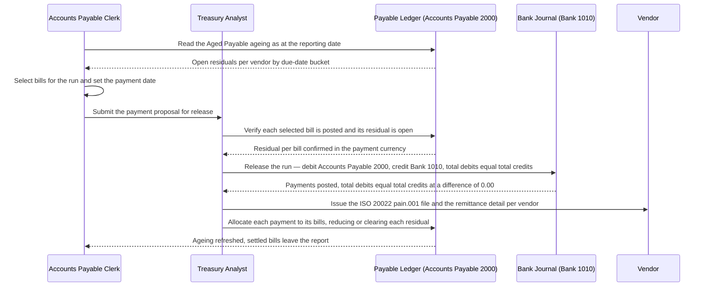

# FEATURE-001-02: Accounts Payable & Vendor Bills

---

## Metadata

| Attribute | Value |
|-----------|-------|
| **Feature ID** | `FEATURE-001-02` |
| **Title** | Accounts Payable & Vendor Bills |
| **Parent Epic** | [EPIC-001: Enterprise Accounting in Odoo](../EPIC-001-enterprise-accounting-odoo.md) |
| **Status** | Draft |
| **Priority** | 🔴 Critical |
| **Story Count** | 5 stories |
| **Last Updated** | 2026-08-13 |
| **Owner/Author** | Enterprise Accounting Team |

---

## 1. Feature Overview

### 1.1 Purpose and Business Value

This feature enables the **Accounts Payable Clerk**, the **Chief Accountant** and the **Treasury Analyst** to run the purchase-to-pay side of the ledger inside Odoo: capture and digitize a vendor bill, match it against its purchase order and its goods receipt, post it as a balanced journal entry, release payment for it in a scheduled batch, and process the vendor credit notes and refunds that reverse it. The **Tax Accountant** determines the input tax and the reverse charge those bills carry, and the **External Auditor** reads the match evidence and the approval trail the workflow leaves behind.

It is delivered against two modules that are present in this repository:

- **`account`** — the "Invoicing" application, version 1.4, category `Accounting/Accounting`, licence LGPL-3. It supplies `account.move` with its `in_invoice` and `in_refund` document types and its draft-posted-cancelled state machine, `account.move.line` for the expense, tax and payable lines, `account.journal` for the Purchase and Bank journals, `account.payment.term` for the due-date schedule, the reconciliation models that allocate a payment or a credit note against an open bill, and the `purchase_lock_date` field on `res.company` that closes a reported purchase period to further posting.
- **`account_payment`** — "Payment - Account", version 2.0, licence LGPL-3, declaring `account` and `payment` as its dependencies. It supplies the payment-method lines and the payment registration and allocation surface through which an outgoing vendor payment becomes a posted journal entry against Bank 1010.

**Business Value Statement:**

> Every vendor obligation is recorded once, matched against what was ordered and what was received, and settled from a payment run that reads the ledger rather than a spreadsheet. Three-way match coverage reaches 100% of purchase-order-backed vendor bills, with posting blocked beyond a 2% price or quantity variance tolerance (SM-007); duplicate-bill detection on the vendor and the vendor reference reaches 100% coverage, so the same obligation is not paid twice; and the Aged Payable report ties to the Accounts Payable 2000 sub-ledger at a difference of `0.00 USD`, so the cash-out forecast the Treasury Analyst releases payment against is the ledger position and not a restatement of it. Because the payable sub-ledger is complete and balanced when the period ends, this feature carries part of the Epic's reduction of the close from 10 business days to 5 business days per legal entity (SM-003) and part of its 50% reduction in post-close audit adjustments (SM-016).

This feature serves the Epic's three objectives as follows:

| Epic Objective | Contribution of This Feature |
|----------------|------------------------------|
| Multi-entity financial operations | Each legal entity captures, matches, posts and pays its own vendor bills in its own books and its own functional currency, through its own Purchase and Bank journals, with the affected company named on every criterion that spans more than one entity |
| Compliance reporting | Every posted bill records the tax code, the base amount and the tax amount as three separate values, so the input-tax position reaching the Tax Report (VAT Return) in FEATURE-001-05 is evidenced from the bill rather than reconstructed; the three-way-match result and the approval trail are retained as internal-control evidence for the External Auditor |
| Real-time financial visibility | The payable position, the Aged Payable ageing and the committed spend are read from posted journal items, so they are current as of the last posted bill and payment rather than as of the last spreadsheet refresh |

Ordering rule **ORD-001** in the Epic makes FEATURE-001-01 the prerequisite of every journal-posting story here, because a bill cannot post without Accounts Payable 2000, Expense 6100, the Purchase journal and an open fiscal period. Ordering rule **ORD-002** makes FEATURE-001-05 the prerequisite of every tax-bearing story here, because a tax code, a base amount and a tax amount cannot be asserted on a bill before the tax codes and fiscal positions that determine them exist. Ordering rule **ORD-004** makes this feature a prerequisite of FEATURE-001-07, whose statements and Aged Payable report consume the postings created here. The Epic's implementation sequence places this feature in **Phase 2 — Transaction backbone** alongside FEATURE-001-03 and FEATURE-001-04.

### 1.2 Problem Statement

Vendor obligations are recorded after the fact and settled outside the ledger, so the payable balance is a reconstruction rather than a record. Five consequences follow, and each of them recurs in every payment cycle:

- **Bills are re-keyed by hand.** A vendor bill arrives as a PDF or a scanned document and its header and line data are typed into the system a second time, so the same obligation is transcribed twice: once by the vendor and once by the Accounts Payable Clerk. Transcription is where a wrong amount, a wrong date and a wrong account assignment enter the ledger, and the source document is not attached to the entry it produced, so the error is found at audit rather than at capture.
- **No systematic three-way match, so overbilling is paid.** Nothing compares the billed quantity and the billed price against the purchase order and against the goods receipt before posting. A vendor that bills 100 units when 96 were received, or bills `$39.00 USD` per unit against an ordered `$37.50 USD` — each amount stated to 2 decimal places at the USD rounding increment of 0.01 — is paid the difference, because the comparison depends on a clerk remembering to make it. The Epic sets the tolerance at 2% of price or quantity (SM-007); today no tolerance is enforced, because no comparison is made to enforce it against.
- **The same bill is paid twice.** With no check on the vendor and the vendor reference together, a bill received by email and again by post enters the ledger as two obligations. The duplicate is recovered from the vendor after payment, if it is found at all, and the recovery is a credit note negotiated months later rather than a payment that never left.
- **Payment runs are assembled in spreadsheets.** The Treasury Analyst exports open bills, sorts them by due date in a spreadsheet, decides the run there, and then registers each payment by hand. The run carries no remittance detail back to the vendor, the decision leaves no record inside the system, and the spreadsheet becomes the only statement of what was released and why — which is the control the External Auditor is asked to test and cannot.
- **Credit notes are tracked off-system and the ageing is unusable.** A returned line or a disputed charge is recorded in correspondence rather than as a vendor credit note allocated against the open bill, so the bill stays outstanding at its full amount. The consequence is an Aged Payable position that overstates what is owed and cannot be tied to Accounts Payable 2000, which makes it useless for the cash-out forecast the payment run is supposed to be driven by.

### 1.3 Key Capabilities

| Capability ID | Capability Description | Related Stories |
|---------------|------------------------|-----------------|
| CAP-001 | Capture and digitize vendor bills with vendor, dates, currency, lines and tax codes | STORY-001-02-01 |
| CAP-002 | Match a vendor bill against its purchase order and goods receipt with a tolerance policy | STORY-001-02-02 |
| CAP-003 | Post a vendor bill as a balanced journal entry to Accounts Payable 2000 and Expense 6100 | STORY-001-02-03 |
| CAP-004 | Schedule and batch outgoing vendor payments with a payment run and remittance detail | STORY-001-02-04 |
| CAP-005 | Process vendor credit notes and refunds and allocate them against open bills | STORY-001-02-05 |

The five capabilities are sequential across one obligation's life: CAP-001 records the obligation, CAP-002 proves it against what was ordered and received, CAP-003 commits it to the ledger as a balanced entry, CAP-004 settles it in cash, and CAP-005 reverses the part of it that the vendor credits back.

### 1.4 Success Criteria at Feature Level

| Criterion | Target | Verification Method |
|-----------|--------|---------------------|
| Balanced posting of the worked vendor bill | A vendor bill in `US-01` held in Draft with three line items of `$7,200.00 USD`, `$3,750.00 USD` and `$1,500.00 USD` totalling `$12,450.00 USD`, confirmed by the Accounts Payable Clerk, posts one journal entry in the Purchase journal that debits Expense 6100 `$12,450.00 USD` and credits Accounts Payable 2000 `$12,450.00 USD`, so total debits of `$12,450.00 USD` equal total credits of `$12,450.00 USD` at a difference of `0.00 USD`, each amount rounded to 2 decimal places at the USD rounding increment of 0.01 | Posted entry inspected line by line, with the debit-minus-credit difference asserted at `0.00 USD`, and the entry reconciled against the bill total (C-009) |
| Balanced posting of a tax-bearing vendor bill | A vendor bill in `NL-01` carrying a base amount of `€10,000.00 EUR` at tax code `VAT-21-P` bears a tax amount of `€2,100.00 EUR` and posts in the Purchase journal as debit Expense 6100 `€10,000.00 EUR`, debit Input Tax Receivable 1290 `€2,100.00 EUR` and credit Accounts Payable 2000 `€12,100.00 EUR`, so total debits of `€12,100.00 EUR` equal total credits of `€12,100.00 EUR` at a difference of `0.00 EUR`, each amount rounded to 2 decimal places at the EUR rounding increment of 0.01 | Posted entry inspected line by line with the difference asserted at `0.00 EUR`, and the tax line matched to the tax code, base amount and tax amount recorded on the bill (SM-010, C-009) |
| Three-way match coverage | 100% of purchase-order-backed vendor bills carry a recorded match result against the purchase order and the goods receipt, and the count of posted purchase-order-backed bills with no match result is 0 | Vendor bill population report for the period segmented by match status, with the unmatched posted count asserted at 0 (SM-007) |
| Tolerance enforcement on a match exception | 100% of confirmation attempts on a bill whose price or quantity variance exceeds 2% against the purchase order or the goods receipt are blocked with an Odoo validation message naming the bill, the line and the measured variance, and no journal entry is created by the blocked attempt; a variance at or below 2% is matched and posts without intervention | Negative test on a line billed at `$39.00 USD` against an ordered `$37.50 USD`, a variance of `$1.50 USD` per unit or 4.00%, paired with a positive test at `$38.00 USD`, a variance of `$0.50 USD` per unit or 1.33%, each amount stated to 2 decimal places at the USD rounding increment of 0.01 (SM-007) |
| Duplicate vendor-bill detection | 100% coverage of the vendor and vendor-reference pair: a second Draft bill for the same vendor and the same vendor reference is flagged against the existing bill before confirmation, and the count of posted bills sharing a vendor and vendor reference is 0 | Duplicate-population query over posted vendor bills per company, with the duplicate count asserted at 0, plus a capture test presenting vendor reference `INV-2025-0042` for the same vendor twice |
| Balanced settlement of a paid bill | Payment of the worked bill posts in the Bank journal as debit Accounts Payable 2000 `$12,450.00 USD` and credit Bank 1010 `$12,450.00 USD`, so total debits of `$12,450.00 USD` equal total credits of `$12,450.00 USD` at a difference of `0.00 USD`, each amount rounded to 2 decimal places at the USD rounding increment of 0.01, and the bill's residual falls to `$0.00 USD` | Posted payment entry inspected line by line with the difference asserted at `0.00 USD`, and the bill's open residual asserted at `$0.00 USD` after allocation |
| Balanced vendor credit note and allocation | A vendor credit note of `$1,500.00 USD` in `US-01` posts in the Purchase journal as debit Accounts Payable 2000 `$1,500.00 USD` and credit Expense 6100 `$1,500.00 USD`, so total debits of `$1,500.00 USD` equal total credits of `$1,500.00 USD` at a difference of `0.00 USD`, and its allocation reduces the worked bill's residual from `$12,450.00 USD` to `$10,950.00 USD`, each amount rounded to 2 decimal places at the USD rounding increment of 0.01 | Posted credit note inspected line by line with the difference asserted at `0.00 USD`, and the allocated residual asserted at `$10,950.00 USD` |
| Aged Payable agreement to the sub-ledger | For `US-01` and the date-range parameter as at 2025-03-31, the Aged Payable report presents Current `$482,300.00 USD`, 1-30 days `$196,450.00 USD`, 31-60 days `$88,200.00 USD`, 61-90 days `$34,750.00 USD`, 91-120 days `$12,450.00 USD` and Over 120 days `$6,300.00 USD`, a total of `$820,450.00 USD` that equals the Accounts Payable 2000 balance for the same date at a difference of `0.00 USD`, each amount rounded to 2 decimal places at the USD rounding increment of 0.01 | Report-to-ledger reconciliation worksheet per company per period, retained as close evidence (SM-001, CF-001) |
| Trial Balance agreement for the payable and expense accounts | For `US-01` and the date-range parameter 2025-01-01 to 2025-03-31, the Trial Balance presents Accounts Payable 2000 with a closing credit balance of `$820,450.00 USD` that equals the Aged Payable total for 2025-03-31 at a difference of `0.00 USD`, and presents the period's vendor-bill charges in the Expense 6100 debit column, so that across the whole report total debits equal total credits at a difference of `0.00 USD`, each amount rounded to 2 decimal places at the USD rounding increment of 0.01 | Trial Balance run for the period compared line by line to the Accounts Payable 2000 and Expense 6100 sub-ledgers, retained as close evidence (SM-001) |
| Payment-run completeness and remittance | Every payment released in a run is allocated to one or more posted bills with no unallocated residual on the run, and each vendor in the run receives remittance detail listing the bill number, the bill date and the allocated amount in the payment currency | Payment-run report reconciled to the allocated bills, with the unallocated run amount asserted at `0.00` in the payment currency |
| Refusal of posting into a locked purchase period | 100% of attempts to post a vendor bill or a vendor credit note dated on or before the company's `purchase_lock_date` are refused with an Odoo validation message naming the company and the lock date, and no journal entry is created by the refused attempt | Negative test executed per company after the purchase lock date is applied |
| Hostile-input rejection on the capture path | 100% of captured attachments that are malformed, schema-invalid, oversized, of a disallowed type or carrying an external-entity payload are rejected with an error naming the document and the check that failed, with no journal entry created and the service still available | Hostile-input test set executed against the bill-capture attachment path (C-015, C-016, C-020, C-022) |
| Test coverage | ≥80% for all 5 story implementations, with the balance, tax and ageing assertions tested numerically | Coverage tooling in the repository's configured test run (C-007, C-009) |
| Demonstrability | 5 of 5 stories demonstrated in the Odoo user interface, or through its public API, to the Finance Controller and the Product Owner | Recorded acceptance walkthrough per story |

---

## 2. User Personas

### 2.1 Persona Mapping

Every persona below is a named finance role drawn from the Epic's persona register. The five roles marked applicable take a capture, match, posting, payment or review action inside this feature. The roles marked not applicable consume the payable balances and the payment movements this feature produces, and their work is specified in the features named against them.

| Persona | Role Description | Primary Use Cases | Applicable |
|---------|------------------|-------------------|------------|
| **Accounts Payable Clerk** | Captures vendor bills, runs three-way match and prepares payment runs | Captures and digitizes the bill header, lines, currency and tax codes; resolves a duplicate flagged on the vendor and vendor reference; runs the three-way match against the purchase order and the goods receipt and clears or escalates each exception; prepares the payment proposal from the Aged Payable ageing; raises and allocates vendor credit notes against open bills | ☑ Yes |
| **Chief Accountant** | Owns the general ledger, the chart of accounts and the integrity of every posted entry | Approves the account assignment on the expense lines; confirms that every bill and credit note posts as a balanced entry to Accounts Payable 2000 and Expense 6100 through the Purchase journal; administers the `purchase_lock_date` that closes a reported purchase period; approves the accrual cut-off for goods received and not yet billed | ☑ Yes |
| **Treasury Analyst** | Owns bank and cash positions and statement reconciliation | Reads the Aged Payable ageing to decide the payment date; releases the payment batch against Bank 1010 and the available cash position; confirms the ISO 20022 credit-transfer file and the remittance detail sent to each vendor; hands the released payments to FEATURE-001-04 for statement matching | ☑ Yes |
| **Tax Accountant** | Determines tax on transactions and files statutory returns | Confirms that each bill records the tax code, the base amount and the tax amount as three separate values; confirms that recoverable input tax posts to Input Tax Receivable 1290 rather than to Expense 6100; confirms that a reverse-charge acquisition raises the tax amount on both Input Tax Receivable 1290 and Tax Payable 2200; confirms that a credit note reverses the tax line as well as the base line | ☑ Yes |
| **External Auditor** | Tests balances and controls and issues the audit opinion | Reads the retained three-way-match evidence per bill, the recorded variance and its disposition, the segregation between the role that prepared a payment run and the role that released it, and the drill-down from an Aged Payable line to the journal items behind it | ☑ Yes |
| Accounts Receivable Specialist | Issues customer invoices, allocates receipts and manages collections | Works the mirror-image receivable workflow in FEATURE-001-03; takes no action on a vendor bill or a vendor payment | ☐ No |
| Financial Reporting Manager | Produces statutory and management statements for each entity and the group | Presents the Accounts Payable 2000 balance and the Expense 6100 movement in the statements produced by FEATURE-001-07; takes no action inside the payable workflow | ☐ No |
| Fixed-Asset Accountant | Maintains the asset register and depreciation schedules | Consumes a capitalized vendor bill as the source of an asset record in FEATURE-001-08; does not capture, match or pay the bill itself | ☐ No |
| FP&A Analyst | Builds budgets and explains variances to management | Reads committed and posted spend against budget in FEATURE-001-09; takes no action inside the payable workflow | ☐ No |
| CFO / Finance Director | Executive stakeholder accountable for financial health and compliance | Consumes the payable position and the cash-out forecast; confirms the open platform and edition decisions recorded in §5.2 and §5.5 | ☐ No |

### 2.2 Persona-to-Story Mapping

Each story carries exactly one primary persona in its WHO statement. Secondary personas approve, review or consume the outcome, and they are named so that the access rights derived from these stories keep the preparing role and the releasing role apart: the Accounts Payable Clerk prepares the payment proposal in STORY-001-02-04 and the Treasury Analyst releases it, which is the segregation of duties the Epic requires of its personas.

| Story | Primary Persona | Secondary Personas |
|-------|-----------------|--------------------|
| STORY-001-02-01 Capture and Digitize Vendor Bills | Accounts Payable Clerk | Chief Accountant (account assignment), Tax Accountant (tax code on each line), External Auditor (source document retained against the entry) |
| STORY-001-02-02 Perform Three-Way Match Across Purchase Order, Receipt and Bill | Accounts Payable Clerk | Chief Accountant (tolerance policy and exception approval), External Auditor (match evidence and disposition trail) |
| STORY-001-02-03 Post Vendor Bill Journal Entries | Chief Accountant | Accounts Payable Clerk (confirmation), Tax Accountant (input tax and reverse charge), External Auditor (balanced-entry and lock-date evidence) |
| STORY-001-02-04 Schedule and Batch Vendor Payments | Treasury Analyst | Accounts Payable Clerk (payment proposal from the ageing), Chief Accountant (bank account and journal), External Auditor (release approval and remittance record) |
| STORY-001-02-05 Manage Vendor Credit Notes and Refunds | Accounts Payable Clerk | Chief Accountant (reversal account assignment), Tax Accountant (tax reversal), External Auditor (allocation trail) |

---

## 3. Story List

### 3.1 User Stories

| Story ID | Story Title | Persona | Priority | Status | Link |
|----------|-------------|---------|----------|--------|------|
| STORY-001-02-01 | Capture and Digitize Vendor Bills | Accounts Payable Clerk | 🔴 Critical | Draft | [STORY-001-02-01](./FEATURE-001-02/STORY-001-02-01-capture-vendor-bills.md) |
| STORY-001-02-02 | Perform Three-Way Match Across Purchase Order, Receipt and Bill | Accounts Payable Clerk | 🟠 High | Draft | [STORY-001-02-02](./FEATURE-001-02/STORY-001-02-02-three-way-match.md) |
| STORY-001-02-03 | Post Vendor Bill Journal Entries | Chief Accountant | 🔴 Critical | Draft | [STORY-001-02-03](./FEATURE-001-02/STORY-001-02-03-post-vendor-bill-entries.md) |
| STORY-001-02-04 | Schedule and Batch Vendor Payments | Treasury Analyst | 🟠 High | Draft | [STORY-001-02-04](./FEATURE-001-02/STORY-001-02-04-batch-vendor-payments.md) |
| STORY-001-02-05 | Manage Vendor Credit Notes and Refunds | Accounts Payable Clerk | 🟠 High | Draft | [STORY-001-02-05](./FEATURE-001-02/STORY-001-02-05-manage-vendor-credit-notes.md) |

**Priority legend:** 🔴 Critical — a closed, compliant period is impossible without it; 🟠 High — significant finance value that consumes what the Critical stories create.

### 3.2 Story Count Assessment

| Count | Assessment | Status |
|-------|------------|--------|
| **5 stories** | Within the mandated range of 2 to 5 stories per feature | ✓ Feature is scoped for independent delivery |

This feature carries **5 stories**, which is the upper bound of the 2-to-5 range recorded in the Epic's decomposition guidelines. The earlier 3-to-7 guidance carried by the feature template is superseded by that bound and is not applied here. The count is stated identically in four places, and the four must stay equal: the Story Count row in §Metadata, this assessment, the 5 rows of §3.1, and the 5 links of §9.2. The Epic's feature summary declares the same count of 5 stories for `FEATURE-001-02`.

Splitting further would produce stories with no accounting proof of their own — a match result has nothing to assert until a bill exists to match, and a remittance advice has nothing to report until a payment is allocated. Merging would breach the Small criterion of INVEST, because capture, match, posting, payment and credit notes are each demonstrated by a different persona against a different artifact: a captured Draft bill, a recorded match result, a posted balanced entry, a released payment batch, and an allocated credit note.

### 3.3 Story Dependency Ordering

Each of the five stories delivers an outcome demonstrable on its own, which keeps them Independent under INVEST. The rows below are sequencing prerequisites — the record or configuration that must already exist for the dependent story to be demonstrated — and not shared implementation.

| Story | Depends On | Notes |
|-------|-----------|-------|
| STORY-001-02-01 (Capture and Digitize Vendor Bills) | None within this feature | Foundation story; the Draft bill is the object every later story in this feature acts on |
| STORY-001-02-02 (Three-Way Match) | STORY-001-02-01 | A bill must exist before it can be matched: the match compares the billed quantity and billed price on a captured bill against the purchase order and the goods receipt |
| STORY-001-02-03 (Post Vendor Bill Journal Entries) | STORY-001-02-01, STORY-001-02-02 | Posting follows capture and match approval: the entry is created from the captured bill, and a bill whose variance exceeds the 2% tolerance is held out of posting until its exception is cleared |
| STORY-001-02-04 (Schedule and Batch Vendor Payments) | STORY-001-02-03 | Only posted bills are payable: the payment run reads open residuals on posted payable lines, and the Aged Payable ageing it is selected from exists only once bills are posted |
| STORY-001-02-05 (Manage Vendor Credit Notes and Refunds) | STORY-001-02-03 | A credit note reverses a posted bill: the reversal is allocated against an open payable residual, which exists only after the bill is posted |

Outside this feature, FEATURE-001-01 is a prerequisite of every posting story under ORD-001 and FEATURE-001-05 is a prerequisite of every tax-bearing story under ORD-002; both are recorded in §7.1.

### 3.4 Recommended Implementation Order

```text
1. STORY-001-02-01  Capture and Digitize Vendor Bills
   Foundation: vendor, bill date, due date, currency, lines and tax codes on a Draft bill,
   with the source document retained against it and duplicates flagged on vendor + reference
        |
        v
2. STORY-001-02-02  Perform Three-Way Match Across Purchase Order, Receipt and Bill
   Control: billed quantity and price compared with the order and the receipt,
   variance measured and the 2% tolerance enforced before posting is allowed
        |
        v
3. STORY-001-02-03  Post Vendor Bill Journal Entries
   Ledger: one balanced entry per bill in the Purchase journal —
   debit Expense 6100, debit Input Tax Receivable 1290 where tax is recoverable,
   credit Accounts Payable 2000, total debits equal total credits
        |
        +--> 4. STORY-001-02-04  Schedule and Batch Vendor Payments
        |       Settlement: payment run selected from the Aged Payable ageing,
        |       released against Bank 1010 with remittance detail per vendor
        |
        +--> 5. STORY-001-02-05  Manage Vendor Credit Notes and Refunds
                Reversal: vendor credit note posted in the Purchase journal and
                allocated against the open payable residual of the original bill
```

Steps 1, 2 and 3 are strictly sequential because each acts on the artifact the previous step produced. Steps 4 and 5 both wait on step 3 and have no dependency on one another, so they may be delivered concurrently once bills post. The whole feature is a prerequisite of FEATURE-001-07 under ORD-004, which is why the Epic sequences it in Phase 2 — Transaction backbone rather than after reporting.

---

## 4. Acceptance Criteria Summary

### 4.1 Feature-Level Acceptance Criteria

These are feature-level gates. The Given/When/Then acceptance criteria live in the five story files, where each is written against one workflow with 4 to 8 criteria and the coverage distribution the Epic requires.

The feature is considered complete when:

- [ ] All 5 stories within this feature have status "Done"
- [ ] All 5 stories achieve minimum 80% test coverage (C-007)
- [ ] Feature-level integration tests pass, with every balance, tax and ageing assertion tested as an amount rather than inspected by eye (C-009)
- [ ] Each of the 5 stories has been demonstrated in the Odoo user interface, or through its public API, to the Finance Controller and the Product Owner, and the walkthrough is recorded against the story
- [ ] **The worked vendor bill posts balanced.** In `US-01`, a vendor bill held in Draft with three line items of `$7,200.00 USD`, `$3,750.00 USD` and `$1,500.00 USD` totalling `$12,450.00 USD`, confirmed by the Accounts Payable Clerk, posts one journal entry in the Purchase journal that debits Expense 6100 `$12,450.00 USD` and credits Accounts Payable 2000 `$12,450.00 USD`, so total debits of `$12,450.00 USD` equal total credits of `$12,450.00 USD` at a difference of `0.00 USD`, each amount rounded to 2 decimal places at the USD rounding increment of 0.01
- [ ] **A tax-bearing vendor bill splits the tax triple and posts balanced.** In `NL-01`, a base amount of `€10,000.00 EUR` at tax code `VAT-21-P` bears a tax amount of `€2,100.00 EUR`, recorded on the bill as three separate values — tax code, base amount and tax amount — and the entry posts in the Purchase journal as debit Expense 6100 `€10,000.00 EUR`, debit Input Tax Receivable 1290 `€2,100.00 EUR` and credit Accounts Payable 2000 `€12,100.00 EUR`, so total debits of `€12,100.00 EUR` equal total credits of `€12,100.00 EUR` at a difference of `0.00 EUR`, each amount rounded to 2 decimal places at the EUR rounding increment of 0.01
- [ ] **A reverse-charge acquisition raises tax on both sides and stays balanced.** In `NL-01`, a base amount of `€40,000.00 EUR` at tax code `VAT-21-RC` bears a tax amount of `€8,400.00 EUR` recorded twice, and the entry posts in the Purchase journal as debit Expense 6100 `€40,000.00 EUR`, debit Input Tax Receivable 1290 `€8,400.00 EUR`, credit Accounts Payable 2000 `€40,000.00 EUR` and credit Tax Payable 2200 `€8,400.00 EUR`, so total debits of `€48,400.00 EUR` equal total credits of `€48,400.00 EUR` at a difference of `0.00 EUR`, each amount rounded to 2 decimal places at the EUR rounding increment of 0.01
- [ ] **A non-recoverable tax amount is not posted to Input Tax Receivable 1290.** Where the fiscal position of the acquiring company makes the tax non-recoverable, the tax amount is added to the expense rather than to the tax receivable, and the bill still records the tax code, the base amount and the tax amount as three separate values so the treatment is evidenced rather than inferred
- [ ] Every posted vendor bill and vendor credit note carries the tax code, the base amount and the tax amount as three separate values, and the count of posted bill tax lines with a null tax code or a null base amount is 0
- [ ] **Three-way match coverage is complete.** 100% of purchase-order-backed vendor bills carry a recorded match result against the purchase order and the goods receipt, with the matched quantity, the matched price and the measured variance retained against the bill, and the count of posted purchase-order-backed bills with no match result is 0 (SM-007)
- [ ] **A variance beyond tolerance blocks posting.** A confirmation attempt on a line billed at `$39.00 USD` against an ordered `$37.50 USD` — a variance of `$1.50 USD` per unit, or 4.00%, above the 2% tolerance, each amount stated to 2 decimal places at the USD rounding increment of 0.01 — is refused with an Odoo validation message that names the bill, the line and the measured variance, and no journal entry is created by the refused attempt
- [ ] **A variance within tolerance posts without intervention.** The same line billed at `$38.00 USD` against an ordered `$37.50 USD` — a variance of `$0.50 USD` per unit, or 1.33%, at or below the 2% tolerance, each amount stated to 2 decimal places at the USD rounding increment of 0.01 — is matched and posts, and the accepted variance is recorded against the bill
- [ ] **An over-billed quantity is blocked.** A bill for 100 units against a goods receipt of 96 units — an over-billing of 4 units, or 4.00%, above the 2% tolerance — is refused with an Odoo validation message naming the bill, the line, the received quantity and the billed quantity, and no journal entry is created by the refused attempt
- [ ] **A bill with no purchase order is routed rather than silently posted.** A bill that references no purchase order is held for the account assignment and approval its amount requires, and its disposition is recorded, so the absence of a match is an evidenced decision rather than a gap in the population report
- [ ] **Duplicate detection reaches 100% coverage.** A second Draft bill for the same vendor and the same vendor reference — vendor reference `INV-2025-0042` presented twice for the same vendor — is flagged against the existing bill before confirmation, and the count of posted bills sharing a vendor and vendor reference is 0
- [ ] **The paid bill settles balanced.** Payment of the worked bill posts in the Bank journal as debit Accounts Payable 2000 `$12,450.00 USD` and credit Bank 1010 `$12,450.00 USD`, so total debits of `$12,450.00 USD` equal total credits of `$12,450.00 USD` at a difference of `0.00 USD`, each amount rounded to 2 decimal places at the USD rounding increment of 0.01, and the bill's open residual falls to `$0.00 USD`
- [ ] **A partial payment leaves a proved residual.** A payment of `$5,000.00 USD` against the worked bill posts as debit Accounts Payable 2000 `$5,000.00 USD` and credit Bank 1010 `$5,000.00 USD`, so total debits equal total credits at a difference of `0.00 USD`, and the bill's open residual falls from `$12,450.00 USD` to `$7,450.00 USD`, each amount rounded to 2 decimal places at the USD rounding increment of 0.01
- [ ] **The vendor credit note posts balanced and allocates.** A vendor credit note of `$1,500.00 USD` in `US-01` posts in the Purchase journal as debit Accounts Payable 2000 `$1,500.00 USD` and credit Expense 6100 `$1,500.00 USD`, so total debits of `$1,500.00 USD` equal total credits of `$1,500.00 USD` at a difference of `0.00 USD`, and its allocation reduces the worked bill's residual from `$12,450.00 USD` to `$10,950.00 USD`, each amount rounded to 2 decimal places at the USD rounding increment of 0.01
- [ ] A vendor credit note that carries tax reverses the tax line as well as the base line: the credit note records the same tax code as the bill it reverses, its own base amount and its own tax amount, and the reversal moves Input Tax Receivable 1290 in the opposite direction to the original bill
- [ ] **The Aged Payable report ties to the sub-ledger.** For `US-01` and the date-range parameter as at 2025-03-31, the report presents Current `$482,300.00 USD`, 1-30 days `$196,450.00 USD`, 31-60 days `$88,200.00 USD`, 61-90 days `$34,750.00 USD`, 91-120 days `$12,450.00 USD` and Over 120 days `$6,300.00 USD`, a total of `$820,450.00 USD` that equals the Accounts Payable 2000 balance at that date at a difference of `0.00 USD`, each amount rounded to 2 decimal places at the USD rounding increment of 0.01 (SM-001, CF-001)
- [ ] Aged Payable bucket amounts are open residuals, so a partial payment reduces the vendor's bucket amount, a bill settled in full leaves the report, and an allocated vendor credit note reduces the vendor's total; each of the three movements is proved against the Accounts Payable 2000 balance for the same date at a difference of `0.00 USD`
- [ ] Every Aged Payable line drills down to the journal items behind it with the filters preserved, and the report exports to PDF and to XLSX with every exported cell neutralized against formula injection (C-017)
- [ ] **The Trial Balance agrees with the payable sub-ledger.** For `US-01` and the date-range parameter 2025-01-01 to 2025-03-31, the Trial Balance presents Accounts Payable 2000 with a closing credit balance of `$820,450.00 USD` that equals the Aged Payable total for 2025-03-31 at a difference of `0.00 USD`, presents the period's vendor-bill charges in the Expense 6100 debit column, and reports across the whole report that total debits equal total credits at a difference of `0.00 USD`, each amount rounded to 2 decimal places at the USD rounding increment of 0.01 (SM-001, CF-001)
- [ ] **The payment run is complete and evidenced.** Every payment released in a run is allocated to one or more posted bills with an unallocated run amount of `0.00` in the payment currency, each vendor receives remittance detail listing the bill number, the bill date and the allocated amount in the payment currency, and the role that prepared the run is recorded separately from the role that released it
- [ ] The outgoing credit-transfer file generated for a payment run conforms to ISO 20022 `pain.001`, and the sum of its instructed amounts equals the sum of the allocated payments at a difference of `0.00` in the payment currency
- [ ] **A posting into a locked purchase period is refused.** An attempt to post a vendor bill or a vendor credit note dated on or before the company's `purchase_lock_date` is refused with an Odoo validation message that names the company and the lock date, and no journal entry is created by the refused attempt
- [ ] A bill line of `$0.00 USD`, stated to 2 decimal places at the USD rounding increment of 0.01, is either rejected at confirmation with a message naming the line, or posted with an explicit zero-amount treatment recorded against it, so a zero-amount line never produces an unbalanced entry or a silent omission from the payable total
- [ ] A vendor bill in a currency other than the company's functional currency records the transaction amount in the bill currency and the posted amount in the functional currency at the rate of the bill date, and the entry balances in the functional currency at a difference of `0.00` in that currency with each amount rounded to that currency's decimal precision
- [ ] **A captured attachment that fails ingestion is rejected.** A bill attachment that is malformed, schema-invalid, oversized, of a disallowed MIME type or extension, or carrying an external-entity payload is rejected with an error naming the document and the check that failed, the rejection creates no journal entry and no Draft bill, and the service stays available (C-015, C-016, C-019, C-020, C-022)
- [ ] Goods received and not yet billed at period end are carried as an accrual whose reversal in the following period is recorded, so the expense falls in the period the goods were received and the accrual and its reversal each post as a balanced entry at a difference of `0.00` in the company currency
- [ ] The posted Accounts Payable 2000 and Expense 6100 balances, the released payments and the Aged Payable ageing are handed to FEATURE-001-04, FEATURE-001-07, FEATURE-001-08 and FEATURE-001-09 as the posted data their stories consume, and the hand-over is recorded against ORD-004

### 4.2 Cross-Cutting Concerns

Every story in this feature inherits the criteria below from the Epic's constraint set.

| Concern | Acceptance Criterion |
|---------|----------------------|
| License | New modules are distributed under an AGPL-3.0 compatible licence, and extension of `account` and `account_payment` respects their LGPL-3 licence (C-001, C-002) |
| Dependencies | Every declared module dependency exists in the platform configuration confirmed by DEC-002, and delivered code stays compatible with the OCA add-on ecosystem (C-003, C-004) |
| Coding Standards | Python follows Odoo and OCA standards including PEP 8, and static analysis passes with the repository's configured tooling in `ruff.toml` (C-005, C-006) |
| Test Coverage | Each story achieves minimum 80% test coverage, and each acceptance test is traceable to one Given/When/Then criterion (C-007, C-008) |
| Documentation | Public methods and models are documented with docstrings, and the three-way-match tolerance policy, the duplicate-detection rule and the payment-release authority are recorded alongside the code that enforces them |
| Security | Access rights are defined per finance role and verified by an access-rights test matrix: the Accounts Payable Clerk captures bills, runs the match and prepares the payment proposal without releasing it; the Chief Accountant approves account assignment, posts and administers the `purchase_lock_date`; the Treasury Analyst alone releases a payment batch and the outgoing credit-transfer file; the Tax Accountant maintains the tax determination the bill consumes without altering the bill; the External Auditor holds read-only access to bills, match evidence, payment runs and the Aged Payable report; and no role reads or posts vendor bills in a company outside its allowed companies (C-014) |
| Segregation of duties | The role that prepares a payment run and the role that releases it are distinct, and a test proves that the preparing role cannot release a run and that the releasing role cannot alter a bill amount after posting (C-014) |
| Multi-company isolation | Every criterion that touches more than one company names the company whose books are affected — `NL-01`, `GB-01` or `US-01` — and a test proves that a role restricted to one company can neither read nor pay another company's vendor bills (C-014, D-007) |
| Untrusted input | Vendor-bill capture attachments and the field data extracted from them cross the trust boundary: file type and size are checked at the ingestion boundary against an allowlist, an XML document is parsed with DTD processing and external-entity resolution disabled and entity expansion bounded and is validated against its declared schema before any field is read, vendor names and references are context-encoded before they are rendered into a remittance advice or a report, values written to CSV and XLSX exports are neutralized against formula injection, data access is expressed through the ORM or parameterized SQL, failures disclose no stack trace or file-system path, and a hostile-input test asserts rejection with no journal entry created (C-015 through C-022) |
| Credential custody | Bank-channel credentials and any signing material used to submit an outgoing payment file are held outside module source and outside version control, scoped per company, with a named rotation owner and rotation interval, and appear in no log, fixture or export (C-021) |
| Audit trail | The capture of a bill, the recorded match result and its variance disposition, the account assignment, the posting, the payment release and the credit-note allocation are each recorded with their author and timestamp, and the record is readable by the External Auditor without a data request |
| Performance | The targets in §4.4 are met on a 50-line vendor bill, a payment batch of 500 bills and an Aged Payable population of 100,000 payable lines |

### 4.3 Integration Requirements

| Integration Point | Requirement | Verification |
|-------------------|-------------|--------------|
| `account.move` | Write: vendor bills and vendor credit notes are created in the Purchase journal as `in_invoice` and `in_refund` documents and move through the draft, posted and cancelled states; the vendor reference is held on the bill so duplicate detection can compare it with the vendor | Document-type and state assertions per created bill and credit note, with a duplicate-population query asserting 0 posted duplicates on the vendor and vendor-reference pair |
| `account.move.line` | Write: each bill produces expense lines, tax lines and one payable line, and the entry is posted only when total debits equal total credits at a difference of `0.00` in the company currency | Posted entry inspected line by line with the debit-minus-credit difference asserted at `0.00` in the company currency (C-009) |
| `account.journal` | Read: the Purchase journal carries the bills and credit notes and the Bank journal carries the payments, each with its own sequence and default accounts as configured in FEATURE-001-01 | Journal assignment asserted per posted document, with the journal type checked against the document type |
| `account.payment` and `account_payment` | Write: an outgoing vendor payment is registered against Bank 1010, allocated to one or more posted payable lines, and grouped into a released payment run with remittance detail per vendor | Payment-run report reconciled to the allocated bills, with the unallocated run amount asserted at `0.00` in the payment currency |
| `account.payment.term` | Read: the vendor's payment term derives the due date the Aged Payable ageing buckets on and the payment run schedules against | Due-date computation asserted per bill against the vendor's term, and the bucket placement asserted against the due date for the reporting date |
| `res.partner` | Read: the vendor record, its payable account, its payment term and its bank details supply the counterparty of the bill and the destination of the payment | Vendor resolution asserted per bill, and payment destination asserted against the vendor's bank account with a duplicate-bank check on the vendor |
| `account.tax` | Read: purchase tax codes and fiscal positions configured in FEATURE-001-05 determine the tax code, the base amount and the tax amount on each bill line, and route recoverable input tax to Input Tax Receivable 1290 | Tax-triple completeness asserted per posted bill, with the tax amount recomputed from the base amount and the code's rate and compared to the cent (ORD-002) |
| `purchase.order` and `purchase.order.line` | Read: the ordered quantity and the ordered price are the first two of the three points the match compares, and the billed quantity is written back so an over-billed order is visible on the order itself | Match result asserted per purchase-order-backed bill line, with the measured price and quantity variance compared against the 2% tolerance (SM-007) |
| Goods receipt records | Read: the received quantity is the third point of the match, and a bill quantity above the received quantity beyond the 2% tolerance blocks posting | Negative test billing 100 units against a receipt of 96 units, asserting refusal with a named validation message and no journal entry created |
| `res.company` | Read: the functional currency each bill is posted in and the `purchase_lock_date` that closes a reported purchase period to further posting | Per-company posting test after the purchase lock date is applied, asserting refusal with the company and the lock date named |
| FEATURE-001-04 Bank Reconciliation & Cash Management | Every released vendor payment appears as a bank movement to be matched against the imported statement line, so the payment is cleared in the ledger rather than tracked outside it | Statement-line reconciliation test executed against payments released by a run in this feature |
| FEATURE-001-07 Financial Reporting & Period Close | Posted bills and payments supply the Accounts Payable 2000 and Expense 6100 balances presented in the Balance Sheet and the Profit & Loss, and the Aged Payable report is one of the seven statements SM-001 counts | Statement section totals and the Aged Payable total reconciled to the Accounts Payable 2000 sub-ledger at a difference of `0.00` in the company currency (ORD-004) |
| FEATURE-001-08 Fixed Assets & Depreciation | A capitalized vendor bill is the source record of an asset, so the expense line of such a bill is directed to Fixed Assets 1500 rather than to Expense 6100 and the asset register traces back to the bill | Asset-creation test from a capitalized bill, asserting that the asset cost equals the capitalized bill line amount at a difference of `0.00` in the company currency |
| FEATURE-001-09 Budgeting & Variance Analysis | Committed and posted spend on the expense accounts and analytic distributions carried by bill lines is the actual side of budget-versus-actual | Budget-versus-actual test whose actual column equals the posted Expense 6100 movement for the same period and analytic account at a difference of `0.00` in the company currency |

### 4.4 Performance Requirements

| Metric | Requirement | Measurement Method |
|--------|-------------|--------------------|
| Vendor bill posting | Under 3 seconds to post a 50-line vendor bill, including tax computation and the balance check | Timed confirmation of a seeded 50-line bill in `US-01`, measured from confirmation to posted state |
| Three-way match evaluation | Under 5 seconds to evaluate the match of a 50-line bill against its purchase order and goods receipt | Timed match evaluation on a seeded 50-line bill with a matching order and receipt |
| Duplicate detection | Under 1 second to flag a duplicate on the vendor and vendor reference within a population of 100,000 posted bills | Timed capture of a bill whose vendor and vendor reference already exist in the seeded population |
| Payment batch generation | Under 60 seconds to generate a payment batch covering 500 posted bills, including allocation and the outgoing credit-transfer file | Timed payment-run generation over 500 seeded open bills, with the unallocated run amount asserted at `0.00` in the payment currency |
| Aged Payable report render | Under 30 seconds over 100,000 payable lines | Timed Aged Payable run for `US-01` as at a fixed reporting date on a seeded 100,000-line population |
| Bill capture ingestion | Under 10 seconds from attachment upload to a Draft bill with header and line data populated, for a document within the declared size allowlist | Timed capture of a seeded document, measured from upload to the Draft bill being readable |

---

## 5. Constraints (Inherited from Epic)

The constraint identifiers below are the Epic's own. They are restated here in the terms of this feature rather than renumbered, so a reviewer reads one constraint set across the whole tree.

### 5.1 License Requirements

| Constraint | Requirement | Rationale |
|------------|-------------|-----------|
| **C-001 — Licence compatibility** | New modules delivering bill capture, the three-way-match control, the payment run with its remittance detail and the Aged Payable view are distributed under an AGPL-3.0 compatible licence | Matches the licence of the Community-edition accounting add-ons already present in this repository, so the delivered payable layer stays redistributable and contributable |
| **C-002 — Existing licence respected** | Extension of `account` and `account_payment` respects their LGPL-3 licence, declared in `addons/account/__manifest__.py` and `addons/account_payment/__manifest__.py` | `account.move`, `account.move.line`, `account.journal`, `account.payment.term` and the payment registration surface are LGPL-3 code; derived and dependent code must remain licence-compatible with it, and an AGPL-3 extension of an LGPL-3 module is checked before it is written |

**Acceptance Criterion:** every module delivered by this feature declares an AGPL-3.0 compatible licence in its manifest, and no derived work misstates the licence of the `account` or `account_payment` code it extends.

### 5.2 Dependency and Edition Considerations

| Constraint | Requirement | Rationale |
|------------|-------------|-----------|
| **C-003 — Edition source is an open decision** | The edition that supplies the Enterprise-only capability set is **not decided**. It is recorded as DEC-002 in the Epic's open decisions register, owned by the CFO / Finance Director with the Group Controller, and it is a stakeholder-confirmation item rather than a settled position | The two candidate paths are an Odoo Enterprise subscription, which supplies the dynamic financial report engine, fixed assets, budgets and consolidation as supported product, and the OCA add-on path — `account_financial_report` for the statutory report set including the aged partner balance, `account_reconcile_oca` for reconciliation and `mis_builder` for management reporting, alongside the six Community-edition accounting add-ons already present — with bespoke development for the residual gap. The paths differ in licensing, cost and implementation approach, so the choice is confirmed with stakeholders. **There is no blanket prohibition on Enterprise dependencies**: the outright ban carried by the superseded backlog is withdrawn and replaced by this open decision |
| **C-004 — OCA ecosystem compatibility** | Whichever edition path is confirmed, the vendor bills, the recorded match results, the payment allocations and the payable residuals delivered here stay consumable by OCA add-ons | Preserves the option to render the Aged Payable presentation with `account_financial_report` or with the `account_financial_report_ce` add-on already present at version 19.0.1.1.0, and to adopt an OCA reconciliation or invoicing extension without restating this feature's records |
| **This feature is not gated by DEC-002** | Delivery of FEATURE-001-02 can start before DEC-002 is confirmed. The Epic gates only FEATURE-001-06 through FEATURE-001-09 on the edition decision | Every module this feature depends on is present in this repository under LGPL-3: `account` supplies the bill, line, journal and reconciliation models, `account_payment` supplies payment registration and allocation, and `purchase` with `purchase_stock` supplies the order and receipt quantities the match compares. What the decision does affect is how the Aged Payable presentation is rendered, so that report is specified here by its buckets, its date-range parameter and its tie-out to Accounts Payable 2000 rather than against one engine's internal structure |
| **Absent modules that bound the residual scope** | `account_batch_payment` and `account_sepa` are **absent** from this repository's `addons/`, so payment batching and the ISO 20022 `pain.001` credit-transfer file are residual work under either edition path | The Epic's D-003 records bill capture, three-way match, batch payment runs on the `pain.001` file and the Aged Payable view driving the run as the residual gap for this feature, while bill posting and payment registration reuse `account` and `account_payment` rather than being rebuilt |

**Acceptance Criterion:** the Aged Payable presentation and the payment-batch file generation are demonstrated under each candidate edition path, and no module delivered by this feature declares a dependency on a module absent from the configuration DEC-002 confirms.

### 5.3 Coding Standards

| Constraint | Requirement | Rationale |
|------------|-------------|-----------|
| **C-005 — Odoo and OCA standards** | Python follows Odoo and OCA module guidelines, including PEP 8 | Keeps the delivered code reviewable by the Odoo community and eligible for OCA contribution |
| **C-006 — Static analysis** | Static analysis passes with the repository's configured tooling; `ruff.toml` at the repository root defines the lint configuration in force | A defect in the posting or allocation path propagates to every obligation recorded against it, so it is caught before review rather than at payment |
| **C-012 — Build on the existing models** | Bills, credit notes, their lines, the payment registration and the reconciliation that allocates a payment or a credit note against a bill are expressed on `account.move`, `account.move.line`, `account.payment` and the existing full and partial reconciliation models rather than on parallel structures, and the match reads `purchase.order.line` and the receipt quantities rather than copying them | Preserves one ledger, one payable audit trail and Odoo's own posting and reconciliation semantics, so an Aged Payable line and the Accounts Payable 2000 balance cannot disagree |
| **C-019 — Data access discipline** | All data access in capture, matching, posting, allocation and reporting is expressed through the Odoo ORM or parameterized SQL, with no string-concatenated query construction, no shell invocation, and no file path derived from a captured attachment's name | Vendor names, references and report filters carry externally supplied values into search domains and file operations; concatenation and name-derived paths convert those values into injection and traversal paths |

**Acceptance Criterion:** static analysis reports zero violations for the delivered modules, no new model duplicates a field or a relation the existing accounting models already provide, and no query in the delivered code is assembled by string concatenation.

### 5.4 Test Coverage

| Constraint | Requirement | Rationale |
|------------|-------------|-----------|
| **C-007 — Minimum coverage** | Minimum 80% test coverage for each of the five story implementations | Enterprise-grade assurance for the layer that commits cash obligations to the general ledger and releases payment against them |
| **C-008 — Test types and traceability** | Unit, integration and acceptance tests, with each acceptance test traceable to one Given/When/Then criterion in its story file | Makes each story's criteria executable rather than declarative |
| **C-009 — Numeric accounting assertions** | The accounting assertions of this feature are tested as amounts: on the worked bill, total debits of `$12,450.00 USD` equal total credits of `$12,450.00 USD` at a difference of `0.00 USD`; on the tax-bearing bill in `NL-01`, a base amount of `€10,000.00 EUR` at tax code `VAT-21-P` computes a tax amount of `€2,100.00 EUR` to the cent and total debits equal total credits at a difference of `0.00 EUR`; on the payment and on the credit note, total debits equal total credits at a difference of `0.00` in the company currency; and the Aged Payable total of `$820,450.00 USD` equals the Accounts Payable 2000 balance at a difference of `0.00 USD`. Every amount in this row is rounded to 2 decimal places at its currency's rounding increment of 0.01 | Balance and reconciliation are the accounting contract; they are asserted numerically, not inspected by eye |
| **C-022 — Hostile-input tests** | `STORY-001-02-01` carries at least one acceptance test per hostile case on the capture path — a malformed document, a schema-invalid document, an external-entity payload, an oversized file, a disallowed file type and an over-long field — and `STORY-001-02-04` carries at least one test submitting hostile filter and date-range values to the Aged Payable selection; each asserts rejection with a named error, no journal entry created, and the service still available | The ingestion constraints C-015 through C-021 are proved only by tests that attempt the failure, and these tests discharge the invalid-input and error-handling coverage the Epic requires of every story |

**Acceptance Criterion:** each story implementation reports coverage of 80% or higher from the repository's coverage tooling, and the balanced-entry, tax-computation, allocation and ageing tie-out assertions are present as numeric test assertions rather than as narrative statements.

### 5.5 Version Compatibility

The platform target is an **open decision** and is stated here as the Epic states it. Three targets are on record and they are mutually exclusive:

| Constraint | Requirement | Notes |
|------------|-------------|-------|
| **C-010 — Platform version target** | Recorded as DEC-001 and confirmed with stakeholders before development, not chosen inside this feature | The originating programme request names **Odoo 17**; this repository is **Odoo 19.0 Community**, where `odoo/release.py` declares `version_info = (19, 0, 0, FINAL, 0, '')`; and the prior, superseded backlog targeted **18.0**. The three targets imply different `account.move` and `account.payment` field surfaces, different bill-to-order matching mechanisms and different migration effort |
| **C-011 — Language and database versions** | Python and PostgreSQL versions follow the confirmed platform target | The Odoo 19.0 baseline in this repository declares `MIN_PY_VERSION = (3, 10)`, `MAX_PY_VERSION = (3, 13)` and `MIN_PG_VERSION = 13` in `odoo/release.py`; an earlier platform target carries a different supported matrix |
| **Edition baseline** | The `account` module present here is the "Invoicing" application at version 1.4 under LGPL-3, `account_payment` is "Payment - Account" at version 2.0 under LGPL-3, and `purchase` at version 1.2 with `purchase_stock` and `stock` supply the order and receipt sides of the match; `account_debit_note` at version 1.0 is present as adjacent Community context | The models this feature configures and the matching surface it reads are supplied by those modules, so a change of platform version changes the field names and the matching mechanism this feature is specified against |

**Impact on this feature if DEC-001 resolves to a version other than 19.0:** the `account.move` and `account.move.line` field names cited in §6.1 are restated for the confirmed version; the bill-to-order matching surface is re-identified, because the dedicated matching view present in the 19.0 baseline does not exist in the same form in every candidate release and the match would then be expressed against the order and receipt quantities directly; the duplicate-detection fields are re-checked, since duplicate handling on the vendor and vendor reference changed across those releases; and the purchase lock-date behaviour is re-verified, because lock-date administration differs across the three candidate releases. The decision is recorded in the Epic's open decisions register and is not resolved here.

---

## 6. Technical Discovery Notes

> **Purpose:** these notes direct the codebase analysis that precedes implementation. This feature records what to investigate and what the outcome must prove; it does not choose the implementation.

### 6.1 Codebase Analysis Areas

| Analysis Area | Purpose | Key Questions |
|---------------|---------|---------------|
| `addons/account/models/account_move.py` | The document model behind a vendor bill and a vendor credit note: the `state` selection with its `draft`, `posted` and `cancel` values, the `move_type` selection carrying `in_invoice` for a vendor bill and `in_refund` for a vendor credit note, the `payment_state` selection with its `not_paid`, `in_payment`, `paid`, `partial` and `reversed` values, and the reverse-type map that pairs a bill with its credit note | Which transitions does the state machine permit, and which of them are reversible once an entry is posted? How does `payment_state` move as allocations accumulate, and is `partial` reached by amount or by count? Which validation raises when the entry does not balance, and what does its message name? |
| `addons/account/models/account_move.py` duplicate detection | The `duplicated_ref_ids` computed relation and the `is_draft_duplicated_ref_ids` flag, which compare a bill against existing moves on the vendor and the vendor reference | Does the existing computation cover the whole population or only the open one, and does it warn or block? What does it do when the vendor reference is empty, and is that the case the 100% coverage target must close? |
| `addons/account/models/account_move_line.py` | The journal-item model that carries the expense line, the tax line and the payable line, the residual fields the Aged Payable buckets read, and the reconciliation linkage | How is the open residual computed and stored per line, and which field the ageing buckets on — the due date on the line or the due date on the document? What happens to the residual when a credit note is allocated rather than a payment? |
| `addons/account/models/account_document_import_mixin.py` | The document-import surface behind bill capture: MIME-type guessing, XML parsing through `lxml`, embedded-PDF extraction and the redirect raised when a document cannot be interpreted | Where is the ingestion boundary at which the C-015 type and size allowlist is enforced, and is XML parsing already configured with DTD processing and external-entity resolution disabled? Which failures reach the Accounts Payable Clerk, and do their messages disclose a path or a stack trace? |
| `addons/account/wizard/account_payment_register.py` | The payment registration wizard: the payment method line, the destination journal and account, the grouping of multiple bills into one payment, and the write-off of a residual difference | Is this the surface a payment run extends, or does a run coordinate many registrations? How does it group by vendor, currency and bank account, and what does it do when a vendor has more than one bank account? |
| `addons/account_payment/models/` | `account_payment.py`, `account_payment_method.py`, `account_payment_method_line.py`, `payment_provider.py` and `payment_transaction.py`: the payment-method configuration and the provider and transaction records available at version 2.0 | Which outbound payment methods are configurable per journal, and what does the module supply towards a batched credit-transfer file against the `pain.001` requirement? What remains residual given that `account_batch_payment` and `account_sepa` are absent? |
| `addons/account/models/account_full_reconcile.py` and `account_partial_reconcile.py` | The reconciliation models that allocate a payment or a credit note against an open payable line, in full or in part | How is a partial allocation represented, and how does an unallocation behave once the period is locked? Which of the two models the Aged Payable residual reads from? |
| `addons/account/models/account_payment_term.py` and `addons/account/models/partner.py` | The vendor's payment term that derives the due date, and the partner fields `property_account_payable_id`, `property_supplier_payment_term_id`, `bank_ids` and the duplicate-bank relation | How does a multi-line payment term distribute one bill across more than one due date, and how does the ageing bucket a bill whose term produces two due dates? What does the duplicate-bank relation warn on, and is that warning enough of a control before a payment is released? |
| `addons/purchase/models/purchase_bill_line_match.py` | The `purchase.bill.line.match` model, declared with `_auto = False` as a matching view joining `purchase.order.line` to `account.move.line`, exposing `line_qty`, `qty_invoiced`, `qty_to_invoice`, `billed_amount_untaxed` and `purchase_amount_untaxed` | Is this view the three-way-match surface to extend, or a presentation over it? Does it expose the received quantity as well as the ordered and billed quantities, and where is the price variance derived from? What does it do for a bill line with no matching order line? |
| `addons/purchase/models/purchase_order_line.py` and `addons/purchase_stock/` | The ordered, received and billed quantities: `qty_received` with its computation method, `qty_invoiced` and `qty_to_invoice`, and the stock side that supplies the receipt quantity | Which of the three quantities is stored and which computed, and how does the receipt quantity behave for a service line with no stock move? How is an over-billed quantity currently represented, and does anything block it today? |
| `addons/purchase/models/product.py` and `addons/purchase/models/res_company.py` | The `purchase_method` control policy on the product with its ordered-quantity and received-quantity options, and the company purchase controls `po_lock`, `po_double_validation` and `po_double_validation_amount` | Does the control policy already express the two-way against three-way match distinction per product, and how should the 2% tolerance interact with it? Do the existing double-validation controls give the approval trail the External Auditor tests, or is a separate bill-approval record needed? |
| `addons/account/models/company.py` | The lock-date fields `fiscalyear_lock_date`, `tax_lock_date`, `purchase_lock_date` and `hard_lock_date`, and their per-user computed counterparts | Which lock-date field refuses a vendor bill and which refuses its tax line, and what does the refusal message name? How does the hard lock date differ in reversibility from the purchase lock date? |
| `addons/account/wizard/account_move_reversal.py` and `addons/account/wizard/accrued_orders.py` | The reversal wizard that produces a credit note from a posted bill, and the accrued-order wizard that raises the cut-off entry for goods received and not yet billed | Does the reversal wizard produce a full or partial credit note, and does it allocate against the original bill automatically? What does the accrued-order wizard post and reverse, and is it the mechanism behind the period-end accrual criterion in §4.1? |
| `addons/account/wizard/account_autopost_bills_wizard.py` | The wizard that enables automatic posting of vendor bills for a trusted vendor | Under what conditions is automatic posting acceptable given the three-way-match control, and does automatic posting bypass the tolerance check or run it first? |
| `addons/account_financial_report_ce/` and `addons/account_debit_note/` | The Community-edition aged partner balance implementation at version 19.0.1.1.0, which covers aged receivable and payable, and the debit-note module at version 1.0 as adjacent Community context | Does the present aged partner balance already bucket by open residual and reconcile to Accounts Payable 2000, and what is the residual gap against the buckets in §4.1? Where does a vendor debit note belong relative to a vendor credit note in the payable workflow? |

### 6.2 Existing Odoo Modules to Examine

| Module | Path | Relevance to This Feature |
|--------|------|---------------------------|
| `account` | `addons/account/` | "Invoicing", version 1.4, licence LGPL-3: supplies the vendor bill and credit-note documents, their journal items, the journals, the payment terms, the reconciliation models, the document-import surface and the `purchase_lock_date` field on `res.company` |
| `account_payment` | `addons/account_payment/` | "Payment - Account", version 2.0, licence LGPL-3, depending on `account` and `payment`: supplies the payment-method lines and the registration and allocation surface an outgoing vendor payment posts through |
| `purchase` | `addons/purchase/` | "Purchase", version 1.2, licence LGPL-3: supplies the purchase order and its lines, the ordered and billed quantities, the bill-to-order matching view and the product control policy the match reads |
| `purchase_stock` and `stock` | `addons/purchase_stock/`, `addons/stock/` | Supply the goods-receipt side of the three-way match, from which the received quantity that the billed quantity is compared against is derived |
| `account_debit_note` | `addons/account_debit_note/` | Version 1.0, licence LGPL-3: adjacent Community context for the debit-note counterpart of the vendor credit note, which determines whether a vendor adjustment is raised as a credit note or a debit note |
| `account_financial_report_ce` | `addons/account_financial_report_ce/` | Version 19.0.1.1.0, AGPL-3: the present aged partner balance implementation covering receivable and payable, and the reference point for how a payable residual reaches an Aged Payable line |
| `analytic` | `addons/analytic/` | "Analytic Accounting", version 1.2, licence LGPL-3: the analytic distribution carried on a bill's expense lines, consumed by FEATURE-001-09 for budget-versus-actual |
| `base` | `odoo/addons/base/` | `res.partner`, `res.partner.bank`, `res.company` and `res.currency`: the vendor and its bank details, the posting company, and the currency decimal precision every monetary assertion is rounded to |

### 6.3 OCA Module Compatibility Considerations

| OCA Module | Repository | Consideration |
|------------|------------|---------------|
| `account_invoice_triple_discount` and the matching helpers in the invoicing set | OCA/account-invoicing | Vendor-bill workflow extensions, including bill-to-order matching helpers; determine whether an existing helper covers the tolerance policy in §4.1 or whether the tolerance is a bespoke control on top of it |
| `account_payment_order` and `account_banking_sepa_credit_transfer` | OCA/bank-payment | Payment orders with batching, paired with the SEPA credit-transfer export that renders the ISO 20022 `pain.001` file; determine whether the pair supplies the file and the remittance detail the payment run needs, given that `account_batch_payment` and `account_sepa` are absent from this repository. Confirm which repository is read before a dependency is declared: these two modules are held in OCA/bank-payment, not in OCA/account-payment |
| `account_payment_batch_process` and the payment-method extension set | OCA/account-payment | Batch-process and payment-method extensions layered on the built-in `account.payment` surface; determine whether one of them covers the payment-run selection and grouping behaviour in §4.1 without the payment-order data model |
| `account_reconcile_oca` | OCA/account-reconcile | Reconciliation interface for allocating payments and credit notes against open payable lines; determine whether it is adopted for the allocation surface or whether the built-in reconciliation is extended |
| `account_financial_report` | OCA/account-financial-reporting | Renders the aged partner balance from open residuals; determine whether the Aged Payable buckets in §4.1 are produced by it, by the `account_financial_report_ce` add-on already present, or by the engine DEC-002 confirms |
| `edi_account_oca` and the OCA EDI set | OCA/edi | Inbound vendor-invoice document handling; determine whether an OCA channel supplements the capture path, and confirm that any adopted parser satisfies C-016 before it reads a field |

The decision to integrate, extend or replace any add-on above belongs to DEC-002 in the Epic and is not taken in this feature.

### 6.4 Integration Points

| Integration Point | Model/Module | Integration Type | Notes |
|-------------------|--------------|------------------|-------|
| Vendor bill and vendor credit note | `account.move` | Write | `in_invoice` and `in_refund` documents in the Purchase journal, moving through draft, posted and cancelled |
| Expense, tax and payable lines | `account.move.line` | Write | Expense 6100, Input Tax Receivable 1290 where tax is recoverable, and the Accounts Payable 2000 line whose residual the ageing reads |
| Journal selection | `account.journal` | Read | Purchase journal for bills and credit notes, Bank journal for payments, each as configured in FEATURE-001-01 |
| Payment registration and batching | `account.payment`, `account_payment` | Write | Outgoing payment against Bank 1010, allocated to posted payable lines and grouped into a released run |
| Allocation of payments and credit notes | Full and partial reconciliation models in `account` | Write | Full settlement, partial settlement and credit-note allocation against an open payable residual |
| Due-date derivation | `account.payment.term` | Read | The vendor's term derives the due date the ageing buckets on and the run schedules against |
| Vendor master data | `res.partner`, `res.partner.bank` | Read | Vendor identity, payable account, supplier payment term and bank details, with the duplicate-bank relation checked before release |
| Tax determination | `account.tax`, `account.fiscal.position` | Read | Purchase tax codes and fiscal positions from FEATURE-001-05 supply the tax code, base amount and tax amount, and route recoverable input tax to Input Tax Receivable 1290 |
| Order and receipt quantities | `purchase.order.line`, `purchase.bill.line.match`, the stock receipt records | Read | The ordered price and quantity and the received quantity, which are the two points the billed line is compared against |
| Capture attachment | The document-import surface in `account`, `ir.attachment` | Read and write | The source document retained against the bill, checked at the ingestion boundary under C-015 and C-016 |
| Company currency and purchase lock | `res.company`, `res.currency` | Read | The functional currency each amount is rounded to, and the `purchase_lock_date` that refuses a posting into a reported purchase period |
| Analytic distribution | `account.analytic.account`, `account.analytic.plan` | Write | The analytic dimension carried on expense lines, consumed by FEATURE-001-09 |

### 6.5 Discovery vs. Prescription Guidelines

> **Important:** this feature and its five stories describe WHAT payable outcome is needed and WHY finance needs it. They do not prescribe HOW it is built.

**Not specified by this feature or its stories:**

- New model names, field definitions or database schema decisions
- Whether a capability is delivered by extending an existing model or by adding a new one
- Whether the three-way match is expressed on the existing bill-to-order matching view, on a new comparison record, or as a validation on the bill itself
- Whether bill capture reads a structured electronic document, extracts text from a scanned attachment, or accepts a manual entry with the attachment retained against it
- Whether the payment run is a new batching record or a coordination of existing payment registrations, and which library produces the credit-transfer file
- View architecture, including the choice between an OWL component and a server-rendered view
- The specific Odoo API methods used to create, match, post, pay or reverse a bill
- Module structure and file organization

**Deferred to agent discovery, under the Epic's discovery notes:**

- **D-002** — which edition path supplies the report engine that renders the Aged Payable presentation, and what remains bespoke under each option
- **D-003** — the residual gap for this feature: the bill capture and digitization workflow, the three-way match against purchase order and receipt, the batch vendor payment run on the ISO 20022 `pain.001` file, and the Aged Payable view that drives the run. Bill posting and payment registration reuse `account` and `account_payment`, and the aged presentation reuses `account_financial_report_ce`; no bespoke build is authorized for a capability that record does not list as residual
- **D-005** — extension versus new model for the match record, the payment run and the capture staging area
- **D-007** — company isolation, record rules and the access-right groups implied by the five applicable personas of §2.1, including the separation of the role that prepares a payment run from the role that releases it
- **D-009** — the deterministic fixture set for the worked bill, its purchase order and its goods receipt, the 500-bill payment batch and the 100,000-line Aged Payable population, held apart from the hostile-input fixtures C-022 requires on the capture path so a hostile document is never mistaken for sample data
- **D-010** — the migration treatment of open vendor items at cutover, so a legacy open bill enters the Aged Payable ageing at its original due date rather than at the migration date

---

## 7. Dependencies

### 7.1 Related Features

| Feature | ID | Relationship | Notes |
|---------|----|--------------|-------|
| Chart of Accounts & Fiscal Year | FEATURE-001-01 | Prerequisite | Every vendor bill posts into accounts and a journal defined there — Accounts Payable 2000, Expense 6100, Input Tax Receivable 1290, Bank 1010 and Tax Payable 2200, through the Purchase and Bank journals — and into a fiscal period opened there, with the `purchase_lock_date` administered there refusing a posting into a reported period. A bill cannot post without its accounts, its journal and an open period, which is ordering rule ORD-001 |
| Tax Configuration & Compliance | FEATURE-001-05 | Prerequisite | The purchase tax codes and fiscal positions defined there determine the tax on every tax-bearing bill: `VAT-21-P` posts recoverable input tax to Input Tax Receivable 1290 and `VAT-21-RC` raises the reverse-charge tax amount on both Input Tax Receivable 1290 and Tax Payable 2200. A tax code, a base amount and a tax amount cannot be asserted on a bill before the codes and fiscal positions exist, which is ordering rule ORD-002 |
| Bank Reconciliation & Cash Management | FEATURE-001-04 | Successor | Every vendor payment released by a run here becomes a bank movement matched against an imported statement line there, so the credit to Bank 1010 is cleared in the ledger rather than tracked outside it. That feature also consumes the payment reference and the remittance detail as matching keys |
| Financial Reporting & Period Close | FEATURE-001-07 | Successor | Posted bills and payments supply the Accounts Payable 2000 balance presented in the Balance Sheet and the Expense 6100 movement presented in the Profit & Loss, and the Aged Payable report is one of the seven statements SM-001 counts as producible per entity and per period. The close checklist there also consumes the period-end accrual for goods received and not yet billed, and that feature owns the shared export and drill-down convention the Aged Payable presentation inherits rather than redefines (ORD-004) |
| Fixed Assets & Depreciation | FEATURE-001-08 | Successor | A capitalized vendor bill is the source record of an asset, so its expense line is directed to Fixed Assets 1500 rather than to Expense 6100 and the asset register traces back to the bill that created it |
| Budgeting & Variance Analysis | FEATURE-001-09 | Successor | Committed and posted spend on the expense accounts and analytic distributions carried by bill lines is the actual side of budget-versus-actual, so an overspend is visible against a commitment rather than only after payment |
| Multi-Company & Intercompany Consolidation | FEATURE-001-06 | Related | An intercompany purchase raises a vendor bill in the acquiring entity against a customer invoice in the supplying entity — for example a bill in `US-01` against an invoice in `NL-01` — and each entity records the obligation in its own books. Consolidation eliminates the intercompany payable and receivable pair there while each entity's payable position stays intact |
| Accounts Receivable & Customer Invoices | FEATURE-001-03 | Parallel | The mirror-image receivable workflow, delivered alongside this feature in the Epic's Phase 2 — Transaction backbone. The two features share the payment-registration and reconciliation surface and the aged-report presentation convention, and are held apart so that the payable and receivable positions are each proved against their own control account |

### 7.2 Required Odoo Modules

| Module | Technical Name | Dependency Type | Purpose |
|--------|----------------|-----------------|---------|
| Invoicing | `account` | Required | Supplies `account.move` with its `in_invoice` and `in_refund` document types, `account.move.line`, `account.journal`, `account.payment.term`, the full and partial reconciliation models, the document-import surface behind bill capture and the `purchase_lock_date` field on `res.company`; present in this repository at version 1.4 under LGPL-3 |
| Payment - Account | `account_payment` | Required | Supplies the payment-method lines and the payment registration and allocation surface through which an outgoing vendor payment posts against Bank 1010; present at version 2.0 under LGPL-3, depending on `account` and `payment` |
| Purchase | `purchase` | Required for the three-way match | Supplies `purchase.order` and `purchase.order.line` with the ordered price and quantity, the billed quantity, the bill-to-order matching view and the product control policy the match reads; present at version 1.2 under LGPL-3. CAP-002 cannot be delivered without the order side of the match |
| Purchase Stock and Inventory | `purchase_stock`, `stock` | Required for the receipt side of the match | Supply the goods receipt from which the received quantity is derived, which is the third point the billed quantity is compared against; both present in this repository. A service line with no receipt is matched on the ordered quantity alone, which is why the control policy per product is read rather than assumed |
| Analytic Accounting | `analytic` | Optional | Supplies the analytic distribution carried on a bill's expense lines where cost-centre reporting is required; consumed mainly by FEATURE-001-09 for budget-versus-actual. Present at version 1.2 under LGPL-3 |
| Debit Notes | `account_debit_note` | Optional | Adjacent Community context at version 1.0 under LGPL-3 for the debit-note counterpart of a vendor credit note, read during discovery to decide which instrument a vendor adjustment is raised as |

### 7.3 External Standards and Specifications

| Standard | Reference | Application to This Feature |
|----------|-----------|-----------------------------|
| US GAAP | US FASB Accounting Standards Codification | Expense recognition and the accrual basis behind the period-end cut-off: an expense is recognized in the period the goods or services were received rather than the period the bill arrived or the payment left, which is what the accrual for goods received and not yet billed in §4.1 records |
| IFRS | IFRS Foundation Standards | The same accrual basis under the international framework, with the trade payable presented as a financial liability measured at the amount payable; the current-versus-non-current split of the Accounts Payable 2000 balance is carried into the statements produced by FEATURE-001-07 |
| IAS 1 | Presentation of Financial Statements | The accrual basis of accounting and the offsetting prohibition: a vendor payable and a vendor receivable arising from a credit note are presented on their own terms, and a credit note is allocated against the payable it reverses rather than netted off outside the ledger |
| ISO 20022 | `pain.001` — Customer Credit Transfer Initiation | The message the outgoing payment batch is generated as, whose instructed amounts sum to the sum of the allocated payments at a difference of `0.00` in the payment currency. `account_batch_payment` and `account_sepa` are absent from this repository, so the generation of this message is residual work under D-003 |
| SEPA Credit Transfer | EPC SEPA Credit Transfer scheme rulebook, carried inside ISO 20022 `pain.001` | The euro-area scheme applied where the paying entity and the vendor are both reachable in it, which is the case for payments released from `NL-01`; a payment released from `US-01` or `GB-01` to a vendor outside the scheme uses that jurisdiction's credit-transfer channel and the same `pain.001` message structure where the bank accepts it |
| Internal-control frameworks | COSO Internal Control — Integrated Framework, and the internal-control-over-financial-reporting expectations built on it | The three-way match is a preventive control, so its evidence is retained per bill: the ordered price and quantity, the received quantity, the billed values, the measured variance and its disposition. The framework also requires that the role preparing a payment run is separate from the role releasing it, which is the segregation recorded in §4.2 and tested per §2.2 |
| ISO 4217 | Currency codes and minor units | The decimal precision behind every rounding assertion in this feature: 2 decimal places at a rounding increment of 0.01 for USD, EUR and GBP, applied to every bill amount, tax amount, payment amount and ageing bucket |

---

## 8. Feature Workflow Diagram

### 8.1 Purchase-to-Pay Workflow

```mermaid
flowchart TD
    A["Vendor document received:<br/>attachment or structured electronic invoice"] --> B{"Type and size within the<br/>declared ingestion allowlist?"}
    B -->|"No"| C["Rejected with an error naming the document<br/>and the failed check; no Draft bill, no journal entry"]
    B -->|"Yes"| D["STORY-001-02-01<br/>Draft vendor bill captured: vendor, bill date, due date,<br/>currency, lines and tax codes, source document retained"]
    D --> E{"Vendor and vendor reference<br/>already on an existing bill?"}
    E -->|"Yes"| F["Duplicate flagged against the existing bill;<br/>Accounts Payable Clerk resolves before confirmation"]
    E -->|"No"| G{"Bill references a purchase order?"}
    F --> G
    G -->|"No"| H["Held for account assignment and approval;<br/>disposition recorded against the bill"]
    G -->|"Yes"| I["STORY-001-02-02<br/>Three-way match: billed quantity and price compared with<br/>the ordered values and the received quantity"]
    I --> J{"Price or quantity variance<br/>within the 2% tolerance?"}
    J -->|"No: 4.00% variance"| K["Confirmation refused with a validation message naming<br/>the bill, the line and the measured variance;<br/>no journal entry created"]
    J -->|"Yes: 1.33% variance"| L["Match result and accepted variance<br/>recorded against the bill"]
    K --> M["Exception cleared by the Chief Accountant,<br/>or the bill is corrected and re-matched"]
    M --> I
    H --> N["STORY-001-02-03<br/>Bill confirmed by the Accounts Payable Clerk"]
    L --> N
    N --> O{"Bill date on or before the<br/>company purchase lock date?"}
    O -->|"Yes"| P["Posting refused with a validation message naming<br/>the company and the lock date"]
    O -->|"No"| Q{"Total debits equal total credits?"}
    Q -->|"No"| R["Posting refused; the bill stays in Draft<br/>until the difference is 0.00 in the company currency"]
    R --> N
    Q -->|"Yes"| S["Posted in the Purchase journal:<br/>debit Expense 6100, debit Input Tax Receivable 1290<br/>where tax is recoverable, credit Accounts Payable 2000;<br/>total debits equal total credits at a difference of 0.00"]
    S --> T["Open payable residual enters the<br/>Aged Payable ageing by due date"]
    T --> U["STORY-001-02-04<br/>Payment proposal prepared by the Accounts Payable Clerk<br/>from the ageing, released by the Treasury Analyst"]
    U --> V["Payment posted in the Bank journal:<br/>debit Accounts Payable 2000, credit Bank 1010,<br/>total debits equal total credits at a difference of 0.00;<br/>ISO 20022 pain.001 file and remittance detail issued"]
    T --> W["STORY-001-02-05<br/>Vendor credit note posted in the Purchase journal:<br/>debit Accounts Payable 2000, credit Expense 6100;<br/>total debits equal total credits at a difference of 0.00"]
    W --> X["Credit note allocated against the open bill;<br/>residual and ageing bucket reduced"]
    V --> Y["Residual reduced or cleared;<br/>payment handed to FEATURE-001-04 for statement matching"]
    X --> Z["Aged Payable total ties to Accounts Payable 2000<br/>at a difference of 0.00; handed to FEATURE-001-07"]
    Y --> Z
```



### 8.2 Vendor Bill Lifecycle

```mermaid
stateDiagram-v2
    [*] --> Captured : Document ingested and a Draft bill created
    Captured --> DuplicateHeld : Vendor and vendor reference match an existing bill
    DuplicateHeld --> Captured : Duplicate dismissed with the reason recorded
    DuplicateHeld --> [*] : Duplicate confirmed and the Draft bill discarded
    Captured --> Matched : Billed quantity and price within the 2% tolerance
    Captured --> MatchException : Variance above the 2% tolerance measured and recorded
    MatchException --> Matched : Exception cleared by the Chief Accountant
    MatchException --> Captured : Bill corrected and re-matched
    Captured --> Unmatched : No purchase order referenced; approval route recorded
    Matched --> Posted : Balanced entry posted, total debits equal total credits
    Unmatched --> Posted : Balanced entry posted after approval
    Posted --> PartiallyPaid : Payment or credit note allocated in part
    PartiallyPaid --> PartiallyPaid : Further allocation reduces the residual
    PartiallyPaid --> Paid : Residual reduced to 0.00 in the company currency
    Posted --> Paid : Full payment allocated in one release
    Posted --> Credited : Vendor credit note posted and allocated
    Credited --> PartiallyPaid : Residual remains after the credit
    Credited --> Paid : Credit clears the residual in full
    Paid --> Reconciled : Bank movement matched to the statement line in FEATURE-001-04
    Reconciled --> Reported : Balance presented and the Aged Payable report tied out
    Reported --> Locked : Purchase lock date applied; later postings refused
    Locked --> [*] : Period closed with the payable position proved
```



### 8.3 Payment Run Release



---

## 9. Related Documentation

### 9.1 Epic Reference

| Document | Link |
|----------|------|
| Parent Epic | [EPIC-001: Enterprise Accounting in Odoo](../EPIC-001-enterprise-accounting-odoo.md) |
| Epic success metric SM-007, which this feature is measured on | [EPIC-001 §4.1 Measurable Outcomes](../EPIC-001-enterprise-accounting-odoo.md#41-measurable-outcomes) |
| Ordering rules ORD-001, ORD-002 and ORD-004, which place this feature after the foundations and before reporting | [EPIC-001 §6.2 Inter-Feature Ordering](../EPIC-001-enterprise-accounting-odoo.md#62-inter-feature-ordering) |
| Constraint set C-001 to C-022, restated for this feature in §5 | [EPIC-001 §7 Constraints](../EPIC-001-enterprise-accounting-odoo.md#7-constraints) |
| Discovery note D-003, which records the residual gap this feature builds | [EPIC-001 §9.3 D-003](../EPIC-001-enterprise-accounting-odoo.md#93-d-003-reuse-of-the-existing-community-edition-accounting-add-ons) |
| Open decisions DEC-001 (platform version) and DEC-002 (edition source) | [EPIC-001 Appendix B: Open Decisions Register](../EPIC-001-enterprise-accounting-odoo.md#appendix-b-open-decisions-register) |
| Carry-forward CF-001, the Aged Payables reporting workflow anchored in STORY-001-02-04 | [EPIC-001 Appendix D: Legacy Backlog Carry-Forward Register](../EPIC-001-enterprise-accounting-odoo.md#appendix-d-legacy-backlog-carry-forward-register) |
| Prerequisite feature — accounts, journals, fiscal periods and lock dates | [FEATURE-001-01: Chart of Accounts & Fiscal Year](./FEATURE-001-01-chart-of-accounts-fiscal-year.md) |
| Prerequisite feature — purchase tax codes and fiscal positions | [FEATURE-001-05: Tax Configuration & Compliance](./FEATURE-001-05-tax-configuration-compliance.md) |

### 9.2 Story Files

| Story | Link |
|-------|------|
| STORY-001-02-01: Capture and Digitize Vendor Bills | [STORY-001-02-01](./FEATURE-001-02/STORY-001-02-01-capture-vendor-bills.md) |
| STORY-001-02-02: Perform Three-Way Match Across Purchase Order, Receipt and Bill | [STORY-001-02-02](./FEATURE-001-02/STORY-001-02-02-three-way-match.md) |
| STORY-001-02-03: Post Vendor Bill Journal Entries | [STORY-001-02-03](./FEATURE-001-02/STORY-001-02-03-post-vendor-bill-entries.md) |
| STORY-001-02-04: Schedule and Batch Vendor Payments | [STORY-001-02-04](./FEATURE-001-02/STORY-001-02-04-batch-vendor-payments.md) |
| STORY-001-02-05: Manage Vendor Credit Notes and Refunds | [STORY-001-02-05](./FEATURE-001-02/STORY-001-02-05-manage-vendor-credit-notes.md) |

### 9.3 External References

| Resource | URL | Purpose |
|----------|-----|---------|
| Odoo vendor bill documentation | <https://www.odoo.com/documentation/19.0/applications/finance/accounting/vendor_bills.html> | Functional behaviour of vendor bill capture, confirmation and posting in the baseline release |
| Odoo payments documentation | <https://www.odoo.com/documentation/19.0/applications/finance/accounting/payments.html> | Payment registration, allocation and batching behaviour against a bank journal |
| Odoo purchase documentation | <https://www.odoo.com/documentation/19.0/applications/inventory_and_mrp/purchase.html> | Purchase order, receipt and bill control-policy behaviour the three-way match reads |
| OCA/bank-payment | <https://github.com/OCA/bank-payment> | Home of `account_payment_order` and `account_banking_sepa_credit_transfer`: the payment-order batching and ISO 20022 credit-transfer export patterns evaluated under DEC-002 |
| OCA/account-payment | <https://github.com/OCA/account-payment> | Payment-method and batch-process extensions layered on `account.payment`, assessed alongside the payment run under DEC-002 |
| OCA/account-invoicing | <https://github.com/OCA/account-invoicing> | Vendor bill workflow and bill-to-order matching helpers evaluated under DEC-002 |
| OCA/account-financial-reporting | <https://github.com/OCA/account-financial-reporting> | `account_financial_report` aged partner balance patterns for the Aged Payable presentation |
| ISO 20022 message catalogue | <https://www.iso20022.org/iso-20022-message-definitions> | Definition of the `pain.001` Customer Credit Transfer Initiation message the payment batch is generated as |
| European Payments Council SEPA scheme rulebooks | <https://www.europeanpaymentscouncil.eu/document-library> | SEPA Credit Transfer scheme rules applied to euro-area payment releases |
| FASB Accounting Standards Codification | <https://asc.fasb.org/> | US GAAP expense recognition and accrual basis behind the period-end cut-off |
| IFRS Foundation list of standards | <https://www.ifrs.org/issued-standards/list-of-standards/> | IFRS presentation and measurement of trade payables |
| COSO Internal Control — Integrated Framework | <https://www.coso.org/guidance-on-ic> | Control expectations behind the three-way match and the segregation of payment preparation from payment release |

---

## 10. Revision History

| Version | Date | Author | Changes |
|---------|------|--------|---------|
| 0.1 | 2026-08-13 | Enterprise Accounting Team | Initial draft: 5 stories indexed under `./FEATURE-001-02/`, capabilities CAP-001 to CAP-005 mapped to those stories, feature success criteria tied to SM-007 and to the Aged Payable carry-forward CF-001, the worked `$12,450.00 USD` three-line vendor bill — rounded to 2 decimal places at the USD rounding increment of 0.01 — fixed as the balanced-posting archetype against Expense 6100 and Accounts Payable 2000, constraints restated from C-001 to C-022, and the platform-version and edition decisions carried forward as DEC-001 and DEC-002 |
