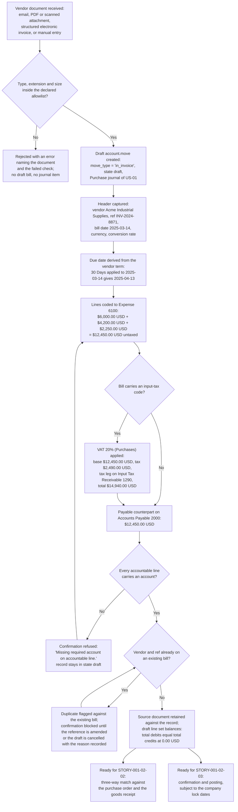

# STORY-001-02-01: Capture and Digitize Vendor Bills

---

## Metadata

| Attribute | Value |
|-----------|-------|
| **Story ID** | `STORY-001-02-01` |
| **Title** | Capture and Digitize Vendor Bills |
| **Parent Feature** | [FEATURE-001-02: Accounts Payable & Vendor Bills](../FEATURE-001-02-accounts-payable-vendor-bills.md) |
| **Parent Epic** | [EPIC-001: Enterprise Accounting in Odoo](../../EPIC-001-enterprise-accounting-odoo.md) |
| **Feature Capability** | CAP-001 — capture and digitize vendor bills with vendor, dates, currency, lines and tax codes |
| **Status** | Draft |
| **Priority** | 🔴 Critical |
| **Estimate** | 5 (Fibonacci) |
| **Persona** | Accounts Payable Clerk |
| **Secondary Personas** | Chief Accountant (expense account assignment), Tax Accountant (the tax code carried on each line), External Auditor (the source document retained against the record) |
| **Platform Target** | Open decision DEC-001 — see [Version Compatibility](#version-compatibility) |
| **Last Updated** | 2026-08-13 |
| **Owner/Author** | Enterprise Accounting Team |

> **Platform target.** This story states no platform version of its own. The target is the Epic's open decision **DEC-001** in the [Open Decisions Register](../../EPIC-001-enterprise-accounting-odoo.md#appendix-b-open-decisions-register): the originating programme request names Odoo 17, the superseded flat backlog named 18.0, and the baseline this story was written and verified against is **Odoo 19.0 Community**, where `odoo/release.py` declares `version_info = (19, 0, 0, FINAL, 0, '')`. The three candidates carry different `account.move` field surfaces and different duplicate-reference handling, so the mismatch is surfaced for stakeholder confirmation rather than settled inside this story.
>
> **Scope of this story.** This story captures a vendor bill and holds it in state `draft`. Confirmation and posting are the subject of [STORY-001-02-03](./STORY-001-02-03-post-vendor-bill-entries.md), so every balance assertion below is made against the **draft** `account.move` line set rather than against a posted entry. Where a criterion states that a confirmation is refused, the refusal is the capture-side control that keeps an incomplete record out of the ledger.

---

## User Story

**As an** Accounts Payable Clerk

**I want** to capture each vendor bill received by email, PDF or manual entry as a draft `account.move` (`move_type = 'in_invoice'`) in the Purchase journal, with the vendor, the bill reference, the bill date, the due date derived from the vendor's payment terms, line items coded to Expense 6100 and any input-tax code the bill carries

**So that** every payables obligation appears in the ledger on the day it is received, the Accounts Payable 2000 balance reflects the company's committed liabilities, and no vendor reference is entered twice.

---

## INVEST Principles Compliance

| Principle | Compliance | Notes |
|-----------|------------|-------|
| **Independent** | ✅ | Bill capture needs two things only: the chart of accounts supplying Accounts Payable 2000 and Expense 6100, and a Purchase journal to hold the record. Both come from [FEATURE-001-01](../FEATURE-001-01-chart-of-accounts-fiscal-year.md) and both are satisfiable as demo data in a test company, so no sibling story in FEATURE-001-02 has to complete first. This story is the foundation of its feature: the three-way match, the posting, the payment run and the credit note each act on the draft bill created here, and none of them is a prerequisite of it |
| **Negotiable** | ✅ | States the capture outcome required — one draft `account.move` per vendor obligation, carrying the vendor, the reference, the dates, the currency, the coded lines and the tax code, with the source document retained against it — and leaves to implementation discovery whether the record is built from a structured electronic document, from text extracted from a scanned attachment, or from a manual entry with the attachment retained (D-003, D-005) |
| **Valuable** | ✅ | Ends the second transcription of a vendor bill. The obligation enters the ledger on the day of receipt rather than at the next reconciliation, the source document travels with the record so the External Auditor reads it without a data request, and duplicate detection on the vendor and the vendor reference reaches 100% coverage so the same `$12,450.00 USD` obligation — rounded half-up to 2 decimal places at the USD rounding increment of `0.01` — is not recorded twice and therefore not paid twice. A complete, dated payable sub-ledger is what lets the close fall from 10 business days to 5 per legal entity (SM-003) and cuts post-close audit adjustments by half (SM-016) |
| **Estimable** | ✅ | The artifact count is fixed and inspectable: one `account.move` in one Purchase journal, three coded lines plus one payable counterpart, one input-tax variant, one duplicate-reference control and one foreign-currency variant, all expressed on models already present in this repository under LGPL-3. Effort, complexity and uncertainty are assessable — see [Estimation](#estimation) |
| **Small** | ✅ | One workflow outcome — a draft vendor bill that a Chief Accountant would accept for confirmation — sized at 5 story points and completable inside one iteration. Matching against the purchase order and the goods receipt is [STORY-001-02-02](./STORY-001-02-02-three-way-match.md); posting the entry is [STORY-001-02-03](./STORY-001-02-03-post-vendor-bill-entries.md); paying it and crediting it are STORY-001-02-04 and STORY-001-02-05 |
| **Testable** | ✅ | All six criteria are objectively pass or fail. Each names the record (`account.move` with `move_type = 'in_invoice'` in state `draft`), states every amount with its currency and its rounding rule, asserts total debits against total credits on the draft line set, and either produces a named artifact or a named refusal — see [Acceptance Test Mapping](#acceptance-test-mapping) |

---

## Acceptance Criteria

### The Canonical Vendor-Bill Fixture

This story owns the worked vendor bill that the five stories of FEATURE-001-02 cite, so that a match result, a posted entry, a payment allocation and a credit note are all proved against one record rather than against four unrelated examples. Every figure below is stated to 2 decimal places and rounded half-up at its currency's rounding increment of `0.01`.

| Element | Value |
|---------|-------|
| Company | `US-01` — the United States operating entity, functional currency USD |
| Vendor (`res.partner`) | `Acme Industrial Supplies`, supplier payment term `30 Days` |
| Record | `account.move`, `move_type = 'in_invoice'`, state `draft` |
| Journal (`account.journal`) | **Purchase** |
| Vendor reference (`ref`) | `INV-2024-8871` |
| Bill date | `2025-03-14` |
| Due date | `2025-04-13` — the `30 Days` term applied to the bill date |
| Line 1 (`account.move.line`) | Consulting services — 40.00 hours × `$150.00 USD` = `$6,000.00 USD`, coded to **Expense 6100** |
| Line 2 (`account.move.line`) | Software subscription — 1.00 × `$4,200.00 USD` = `$4,200.00 USD`, coded to **Expense 6100** |
| Line 3 (`account.move.line`) | On-site support — 15.00 hours × `$150.00 USD` = `$2,250.00 USD`, coded to **Expense 6100** |
| Untaxed total | **`$12,450.00 USD`** — `$6,000.00 USD` + `$4,200.00 USD` + `$2,250.00 USD` |
| Payable counterpart | **Accounts Payable 2000** |
| Input-tax variant (`account.tax`) | Tax code `VAT 20% (Purchases)` → base amount `$12,450.00 USD`, tax amount `$2,490.00 USD`, bill total `$14,940.00 USD`, tax leg on **Input Tax Receivable 1290** |
| Rounding demonstrator | A rate of `8.375%` on a base of `$12,450.00 USD` yields `1,042.6875`, which rounds half-up at `0.01` to **`$1,042.69 USD`** |
| Multi-currency demonstrator | `EUR 10,000.00` at a bill-date rate of `1.0800 USD/EUR` converts to **`$10,800.00 USD`** in company currency |

### Coverage Distribution

Six criteria, inside the mandated band of 4 to 8. Each carries one non-compound **When**, and each **Then** asserts only what the Accounts Payable Clerk, the Chief Accountant, the Tax Accountant or the External Auditor observes in the Odoo user interface or reads back over the public API. Every monetary figure states its currency, its amount and its rounding rule; every input-tax figure is stated as the three separate values tax code, base amount and tax amount; and every criterion that touches journal-entry lines states both the total debits and the total credits of the draft line set and asserts the relation between them.

| Scenario | Coverage class |
|----------|----------------|
| 1 | Valid input — happy-path capture of the three-line bill as a draft |
| 2 | Valid input — happy-path input-tax capture with the base and tax split |
| 3 | Invalid or incomplete input — a line with no expense account |
| 4 | Error handling — a duplicate vendor reference blocks confirmation |
| 5 | Accounting edge case — a zero-amount line, and a zero-total bill |
| 6 | Accounting edge case — a foreign-currency bill converted at the bill-date rate |
| 7 | Valid input — the refused bill corrected and confirmed balanced, which is the second trigger removed from Scenario 3 |

### Scenario 1: Three-line vendor bill captured as a draft in the Purchase journal

- **Given** company `US-01` (the United States operating entity, functional currency USD) holds a **Purchase** journal and the chart of accounts delivered by [FEATURE-001-01](../FEATURE-001-01-chart-of-accounts-fiscal-year.md) supplies **Expense 6100** and **Accounts Payable 2000**, and the vendor `Acme Industrial Supplies` exists as a `res.partner` carrying the supplier payment term `30 Days`
- **When** the Accounts Payable Clerk saves a vendor bill for `Acme Industrial Supplies` in the **Purchase** journal of `US-01` with the vendor reference `INV-2024-8871`, the bill date `2025-03-14` and three lines — consulting services of 40.00 hours at `$150.00 USD`, one software subscription at `$4,200.00 USD`, and on-site support of 15.00 hours at `$150.00 USD` — each coded to **Expense 6100**
- **Then** the record exists as an `account.move` with `move_type = 'in_invoice'` in state `draft` in the **Purchase** journal of `US-01`; the due date computes to `2025-04-13` from the `30 Days` term applied to the bill date `2025-03-14`; the three `account.move.line` rows read `$6,000.00 USD`, `$4,200.00 USD` and `$2,250.00 USD` against **Expense 6100**; the untaxed total reads `$12,450.00 USD`; the payable counterpart of `$12,450.00 USD` stands against **Accounts Payable 2000**; the draft line set balances, with total debits of `$12,450.00 USD` equal to total credits of `$12,450.00 USD` at a difference of `0.00 USD`; the source document is retained against the record so the External Auditor reads the bill and the entry together without a data request; and every amount in this criterion is rounded half-up to 2 decimal places at the USD rounding increment of `0.01`

### Scenario 2: Input tax captured as tax code, base amount and tax amount

- **Given** the Scenario 1 draft bill exists in `US-01` at an untaxed total of `$12,450.00 USD`, and the purchase tax code `VAT 20% (Purchases)` exists as an `account.tax` record available to `US-01` through the foreign VAT registration recorded on its fiscal position by [STORY-001-05-01](../FEATURE-001-05/STORY-001-05-01-configure-tax-codes-fiscal-positions.md), with its tax line directed to **Input Tax Receivable 1290**
- **When** the Accounts Payable Clerk applies the tax code `VAT 20% (Purchases)` to all three lines of that draft bill
- **Then** the bill records three separate values — tax code `VAT 20% (Purchases)`, base amount `$12,450.00 USD` and tax amount `$2,490.00 USD` — for a bill total of `$14,940.00 USD`; the base lines debit **Expense 6100** by `$12,450.00 USD` in total; the tax leg debits **Input Tax Receivable 1290** by `$2,490.00 USD` rather than adding that amount to **Expense 6100**; the payable counterpart against **Accounts Payable 2000** reads `$14,940.00 USD`; the draft line set balances, with total debits of `$14,940.00 USD` equal to total credits of `$14,940.00 USD` at a difference of `0.00 USD`; and every amount in this criterion is rounded half-up to 2 decimal places at the USD rounding increment of `0.01`, the tax amount being the base amount multiplied by the code's rate of 20.0000 percent and rounded at that increment

### Scenario 3: A line with no expense account is refused at confirmation

- **Given** a draft `account.move` with `move_type = 'in_invoice'` for `Acme Industrial Supplies` in the **Purchase** journal of `US-01` whose first line of `$6,000.00 USD` and third line of `$2,250.00 USD` are coded to **Expense 6100**, and whose second line — the software subscription of `$4,200.00 USD` — carries no expense account
- **When** the Accounts Payable Clerk attempts to confirm that bill
- **Then** confirmation is refused with the Odoo validation message `Missing required account on accountable line.`, which names the line that carries no account; the record stays in state `draft`; no `account.move.line` is written to the ledger, so the movement this bill contributes to the **Accounts Payable 2000** balance of `US-01` measures `$0.00 USD`; and the refusal is explained by the draft line set itself, whose accountable debits of `$8,250.00 USD` fall short of its payable credits of `$12,450.00 USD` by `$4,200.00 USD` and therefore do not balance — every amount in this criterion rounded half-up to 2 decimal places at the USD rounding increment of `0.01`. The correction is a second trigger and is asserted separately as Scenario 7

### Scenario 4: Duplicate vendor reference is flagged against the existing bill before confirmation

- **Given** a bill for `Acme Industrial Supplies` carrying the vendor reference `INV-2024-8871` already exists in the **Purchase** journal of `US-01` at an untaxed total of `$12,450.00 USD`, rounded half-up to 2 decimal places at the USD rounding increment of `0.01`
- **When** the Accounts Payable Clerk saves a second draft bill for the vendor `Acme Industrial Supplies` carrying that same vendor reference `INV-2024-8871`
- **Then** the second draft is flagged against the first and names the existing record, so the Clerk reads which bill it duplicates rather than searching for it; confirmation of the second draft is blocked until the Clerk either amends the reference or cancels the draft; the count of bills in `US-01` sharing the vendor `Acme Industrial Supplies` and the reference `INV-2024-8871` outside state `draft` stays at 1; the **Accounts Payable 2000** balance of `US-01` stays at its prior figure of `$12,450.00 USD`; the first bill's draft line set is left intact and still balances, with total debits of `$12,450.00 USD` equal to total credits of `$12,450.00 USD` at a difference of `0.00 USD`; and the flag is raised in 1 second or less within a population of 100,000 recorded vendor bills — every amount in this criterion rounded half-up to 2 decimal places at the USD rounding increment of `0.01`

### Scenario 5: A zero-amount line leaves the total intact, and a zero-total bill is refused

- **Given** the archetype draft bill in `US-01` carrying its three lines of `$6,000.00 USD`, `$4,200.00 USD` and `$2,250.00 USD` against **Expense 6100**, plus a fourth line for a waived delivery charge entered with a quantity of `0.00` and a unit price of `$0.00 USD`
- **When** the Accounts Payable Clerk saves that draft bill
- **Then** the fourth line contributes `$0.00 USD` to the bill and stays visible on it, so the waived charge is evidenced rather than absent from the record; the untaxed total stays at `$12,450.00 USD`; the payable counterpart against **Accounts Payable 2000** stays at `$12,450.00 USD`; the draft line set balances, with total debits of `$12,450.00 USD` equal to total credits of `$12,450.00 USD` at a difference of `0.00 USD`; and a bill whose own total is `$0.00 USD` is refused at confirmation with an Odoo validation message naming the record, leaving that record in state `draft` with no journal item written — every amount in this criterion rounded half-up to 2 decimal places at the USD rounding increment of `0.01`

### Scenario 6: A foreign-currency bill is converted at the bill-date rate and balances in both currencies

- **Given** company `US-01` carries the functional currency USD, the vendor bill is denominated at `EUR 10,000.00`, and the rate in force on the bill date `2025-03-14` is `1.0800 USD/EUR`
- **When** the Accounts Payable Clerk saves that draft bill in EUR in the **Purchase** journal of `US-01`
- **Then** the bill retains `EUR 10,000.00` as its document amount, rounded half-up to 2 decimal places at the EUR rounding increment of `0.01`; the company-currency amount reads `$10,800.00 USD`, rounded half-up to 2 decimal places at the USD rounding increment of `0.01`; the rate of `1.0800 USD/EUR` and the bill date `2025-03-14` it was taken from are both recorded on the bill, so the External Auditor reads the conversion without recomputing it; the document-currency line set balances, with total debits of `EUR 10,000.00` equal to total credits of `EUR 10,000.00` at a difference of `EUR 0.00`; and the company-currency line set balances, with total debits of `$10,800.00 USD` equal to total credits of `$10,800.00 USD` at a difference of `0.00 USD`

### Scenario 7: The refused bill is coded and confirms balanced

- **Given** the bill refused in Scenario 3 stands in state `draft` in the **Purchase** journal of `US-01` for `Acme Industrial Supplies` with vendor reference `INV-2024-8871`, its first line of `$6,000.00 USD` and third line of `$2,250.00 USD` coded to **Expense 6100** and its second line of `$4,200.00 USD` still carrying no expense account, so its accountable debits of `$8,250.00 USD` fall short of its payable credits of `$12,450.00 USD` by `$4,200.00 USD`
- **When** the Accounts Payable Clerk codes that second line to **Expense 6100** and confirms the bill
- **Then** the bill moves to state `posted` and its journal entry debits **Expense 6100** by `$12,450.00 USD` against a credit of `$12,450.00 USD` to **Accounts Payable 2000**, so its **total debits of `$12,450.00 USD` equal its total credits of `$12,450.00 USD`** at a difference of `0.00 USD`; the three lines carry `$6,000.00 USD`, `$4,200.00 USD` and `$2,250.00 USD` and sum to the `$12,450.00 USD` untaxed total at a difference of `0.00 USD`; the movement this bill contributes to the **Accounts Payable 2000** balance of `US-01` measures `$12,450.00 USD` credit where it measured `$0.00 USD` before the correction; and the validation message of Scenario 3 is no longer raised, so the refusal is shown to have been attributable to the missing account and to nothing else — every amount in this criterion rounded half-up to 2 decimal places at the USD rounding increment of `0.01`

---

## Sub-Tasks

- [ ] **@functional-consultant** — Document the bill intake channels — vendor email, PDF or scanned attachment, structured electronic invoice, and manual keying — and the field mapping from each vendor document to the `account.move` header and `account.move.line` rows: vendor, vendor reference, bill date, due date, document currency, line label, quantity, unit price, expense account and tax code
- [ ] **@functional-consultant** — Document the coding policy that decides whether a captured line is routed to **Expense 6100** or capitalized to **Fixed Assets 1500** for FEATURE-001-08, and the disposition procedure the Accounts Payable Clerk follows when a duplicate is flagged on the vendor and the vendor reference: amend the reference, or cancel the draft with the reason recorded
- [ ] **@developer** — Configure the **Purchase** journal defaults for `US-01`, `NL-01` and `GB-01` and surface the duplicate-reference indicator on the draft bill form, so a second draft carrying an existing vendor-and-reference pair names the bill it duplicates and its confirmation is blocked until the Clerk resolves it
- [ ] **@developer** — Deliver the capture path from intake to a draft `account.move` with `move_type = 'in_invoice'`: the ingestion boundary that checks MIME type, extension and declared maximum size against the allowlist (C-015), the hardened XML parse with DTD processing and external-entity resolution disabled and entity expansion bounded together with schema validation before any field is read (C-016), and failure messages that name the rejected document and the check that failed without disclosing a stack trace or a file-system path (C-020)
- [ ] **@developer** — Deliver the deterministic fixture set for the canonical `$12,450.00 USD` bill — vendor `Acme Industrial Supplies`, reference `INV-2024-8871`, the three **Expense 6100** lines, the `VAT 20% (Purchases)` variant and the `EUR 10,000.00` variant — held apart from the hostile-input fixtures under D-009 so a hostile document is never mistaken for sample data
- [ ] **@qa-engineer** — Build the acceptance suite covering all six scenarios, including the `$12,450.00 USD` fixture, with every amount asserted numerically to the cent and every draft line set asserted for total debits against total credits at a difference of `0.00 USD` (C-008, C-009)
- [ ] **@qa-engineer** — Build the hostile-input test set C-022 requires of this story on the capture path — a malformed document, a schema-invalid document, an external-entity payload, an oversized file, a disallowed file type detected by byte signature, a mismatched declared encoding, an over-long field, a file name carrying a path-traversal sequence or a control character, and a vendor name carrying script markup with a formula-injection prefix — each asserting **rejection** with a named error, no draft bill, no journal entry created, 0 temporary artifacts left behind and the service still available. Build the accepted-value tests separately, because a rejected document renders and exports nothing: `-Reserved- Freight Recovery` stored verbatim and neutralized on every CSV and XLSX export (C-017), and `Fell & Sons <Holdings>` rendered inert on the bill form, the bill list, the Aged Payable report, a remittance advice and an email body (C-018)
- [ ] **@finance-sme** — Confirm the **Expense 6100** coding of the three archetype lines and the `VAT 20% (Purchases)` tax code with its route to **Input Tax Receivable 1290** against the group accounting policy, and sign off that the retained source document plus the recorded vendor, reference and dates form the evidence set the External Auditor reads for a captured obligation

---

## Edge Cases

- **Zero-amount or null line.** A line entered with a quantity of `0.00` and a unit price of `$0.00 USD` — for example a waived delivery charge on the archetype bill — contributes `$0.00 USD`, leaves the untaxed total at `$12,450.00 USD` and leaves the draft line set balanced with total debits of `$12,450.00 USD` equal to total credits of `$12,450.00 USD` at a difference of `0.00 USD`, each amount rounded half-up to 2 decimal places at the USD rounding increment of `0.01`. The line stays on the record so the waived charge is evidenced rather than silently dropped. **Control:** a bill whose own total is `$0.00 USD` is refused at confirmation with an Odoo validation message naming the record, which keeps a null obligation out of the payable sub-ledger while allowing a `$0.00 USD` line inside a bill that carries value.
- **Bill dated inside a locked fiscal period.** A vendor bill received late and dated `2025-03-14` while the `fiscalyear_lock_date` of `US-01` stands at `2025-03-31` is still captured as a draft `account.move` with `move_type = 'in_invoice'`, because capture records the obligation and posts nothing. **Control:** confirmation is refused for as long as the lock date covers the bill date, with an Odoo validation message naming the company `US-01` and the lock date, and no journal item is written — so the movement this bill contributes to the **Accounts Payable 2000** balance measures `$0.00 USD`, rounded half-up to 2 decimal places at the USD rounding increment of `0.01`, until the obligation is dated into an open period. The choice between moving the accounting date into the open period and reopening the closed one is a lock-date decision, not a capture decision, and it is deferred to [STORY-001-01-05](../FEATURE-001-01/STORY-001-01-05-configure-period-lock-dates.md).
- **Multi-currency rounding.** A bill of `EUR 10,000.00` captured in `US-01` at a bill-date rate of `1.0800 USD/EUR` carries a company-currency amount of `$10,800.00 USD`, rounded half-up at the USD rounding increment of `0.01`, and both line sets balance — `EUR 10,000.00` against `EUR 10,000.00` at a difference of `EUR 0.00` in the document currency, and `$10,800.00 USD` against `$10,800.00 USD` at a difference of `0.00 USD` in company currency. Where a rate or a tax rate produces a fraction of a cent — a rate of `8.375%` on a base of `$12,450.00 USD` yields `1,042.6875`, which rounds half-up at `0.01` to `$1,042.69 USD` — the rounded figure is carried whole on the line that produced it. **Control:** the residual cent is never split across lines and never absorbed into a balancing plug; the conversion rate and the bill date it was read from are recorded on the bill so the company-currency figure is reproducible from the document.
- **Duplicate vendor reference.** A bill for `Acme Industrial Supplies` carrying the reference `INV-2024-8871` that already exists in `US-01` is surfaced against the existing record at save time, before confirmation, naming the bill it duplicates. **Control:** confirmation of the second draft is blocked until the Clerk amends the reference or cancels the draft with the reason recorded, so the count of bills in `US-01` sharing that vendor-and-reference pair outside state `draft` stays at 1 and the **Accounts Payable 2000** balance stays at its prior figure of `$12,450.00 USD`, rounded half-up to 2 decimal places at the USD rounding increment of `0.01`. The pair is compared for every captured bill rather than only for the open population, because a duplicate of a settled bill is the case that produces a second payment.

---

## Constraints

The constraint identifiers below are the Epic's own, restated in the terms of this story rather than renumbered, so one constraint set reads across the whole ticket tree. The full text is held in [EPIC-001 §7 Constraints](../../EPIC-001-enterprise-accounting-odoo.md#7-constraints).

### License and Compliance

- [x] **C-001 — AGPL-3.0 compatibility**: any module delivering the bill-capture path, its field mapping and its duplicate-reference control is distributed under an AGPL-3.0 compatible licence, matching the licence of the Community-edition accounting add-ons already present in this repository
- [x] **C-002 — Existing licence respected**: extension of `account` — the "Invoicing" application, version 1.4, licence LGPL-3 — respects that licence, and an AGPL-3 extension of LGPL-3 code is licence-checked before it is written
- [x] **C-003 — The edition source is an open decision (DEC-002), not a prohibition**: the blanket ban on Enterprise dependencies carried by the superseded flat backlog is **withdrawn**. Where a capability sits beyond the `account` module, the edition or add-on that supplies it — an Odoo Enterprise subscription, or the OCA path of `account_financial_report`, `account_reconcile_oca` and `mis_builder` with bespoke development for the residual — is the Epic's open **edition lock-in** dependency DEC-002, owned by the CFO / Finance Director with the Group Controller and recorded in the [Open Decisions Register](../../EPIC-001-enterprise-accounting-odoo.md#appendix-b-open-decisions-register). It is flagged for stakeholder confirmation, not resolved here
- [x] **This story is not gated by DEC-002**: every model the capture path writes to — `account.move`, `account.move.line`, `account.journal`, `res.partner`, `account.tax` — is present in this repository under LGPL-3, so development can start before the edition decision is confirmed
- [x] **C-004 — OCA ecosystem compatibility**: whichever edition path DEC-002 confirms, a bill captured by this story stays consumable by OCA add-ons, including an OCA invoice-capture or reconciliation extension adopted later, without the record being restated
- [x] **C-005 / C-006 — Odoo and OCA coding standards**: Python follows Odoo and OCA module guidelines including PEP 8, and static analysis passes with the repository's configured tooling, whose lint configuration is `ruff.toml` at the repository root
- [x] **C-012 — Build on the existing models**: the captured bill is an `account.move` with `move_type = 'in_invoice'` and its lines are `account.move.line` rows, rather than a parallel staging structure that would hold a second version of the obligation and could disagree with the ledger
- [x] **C-014 — Access rights and company isolation**: the Accounts Payable Clerk who captures a bill is distinguishable from the Chief Accountant who approves its account assignment and from the Treasury Analyst who releases payment for it, and a role restricted to `US-01` can neither read nor amend a vendor bill captured in `NL-01` or `GB-01`

### Accounting Standards Compliance

- [x] **Double-entry integrity**: the captured draft carries a balanced `account.move.line` set — the **Expense 6100** debits, any **Input Tax Receivable 1290** debit and the **Accounts Payable 2000** credit — so total debits of `$12,450.00 USD` equal total credits of `$12,450.00 USD` at a difference of `0.00 USD` before the record is offered for confirmation, each amount rounded half-up to 2 decimal places at the USD rounding increment of `0.01`
- [x] **The input-tax base and tax amount stay separate**: a tax-bearing line records the tax code, the base amount and the tax amount as three distinct values — `VAT 20% (Purchases)`, `$12,450.00 USD` and `$2,490.00 USD` — with the tax amount on its own `account.move.line` against **Input Tax Receivable 1290**, so the recoverable position reaching the Tax Report (VAT Return) in FEATURE-001-05 is read from the bill rather than reconstructed from it
- [x] **Company-currency conversion at the bill-date rate**: a bill denominated outside the company's functional currency retains its document amount and carries a company-currency amount converted at the rate in force on the bill date — `EUR 10,000.00` at `1.0800 USD/EUR` giving `$10,800.00 USD`, rounded half-up to 2 decimal places at the USD rounding increment of `0.01` — with the rate and the date recorded on the record
- [x] **Accrual basis, US GAAP and IFRS**: capture on the day of receipt is what makes the accrual basis operable, because the obligation is dated to the period in which the goods or services were received rather than to the period the document was keyed; the trade payable is presented as a financial liability at the amount payable under IAS 1
- [x] **ISO 4217 minor units**: every amount is rounded half-up to its currency's decimal precision — 2 decimal places at a rounding increment of `0.01` for USD, EUR and GBP — and no residual cent is split across lines

### Untrusted-Input Handling

Bill capture is one of the surfaces the Epic names in [§7.7 Security and Untrusted-Input Handling](../../EPIC-001-enterprise-accounting-odoo.md#77-security-and-untrusted-input-handling), because a vendor document and the field data extracted from it cross the trust boundary before anything is written to the ledger.

- [x] **C-015 — Ingestion boundary**: file type, extension and size are checked against a declared allowlist and a declared maximum at the point of intake, and a document failing either check is rejected with a named validation error and produces no draft bill
- [x] **C-016 — Hardened document parsing**: an XML vendor document is parsed with DTD processing and external-entity resolution disabled and entity expansion bounded, and is validated against the schema for its declared format before any field is read
- [x] **C-018 — Context-encoded output**: a vendor name, a vendor reference or a line label captured from a document is sanitized and context-encoded before it is rendered into the bill form, the vendor-bill list, the Aged Payable report, a remittance advice or an email body, and the template emits it as escaped text rather than as raw markup, so partner-supplied text is presented as text on every one of those five surfaces. The file name of a captured document is canonicalized and context-encoded on the same basis before it appears in a validation message, a rejection report or a log line, and each rejection is written as one structured log record with the run identifier, the failed check and the canonicalized name as discrete fields
- [x] **C-019 — Data access discipline**: the duplicate-reference lookup and every other read are expressed through the Odoo ORM or parameterized SQL, with no string-concatenated query construction, and no file path is derived from an uploaded document's name and then opened on disk
- [x] **C-020 — Non-disclosing failures**: a rejection names the document and the check that failed and discloses no stack trace, no SQL and no file-system path; diagnostic detail goes to the server log under an access-controlled channel
- [x] **C-022 — Hostile-input tests are part of this story**: the Epic names `STORY-001-02-01` as carrying at least one acceptance test per hostile case on the capture path, each asserting **rejection** with a named error, no journal entry created, 0 temporary artifacts left behind and the service still available — see [Integration Test Considerations](#integration-test-considerations). Rejection is the only outcome those tests admit. Neutralization under C-017 and context encoding under C-018 apply to values that were **accepted**, and are asserted by their own tests, because a test that passes on either rejection or neutralization proves neither

### Version Compatibility

- [x] **C-010 — Platform version target is open decision DEC-001**: the originating programme request names Odoo 17, the superseded flat backlog named 18.0, and this repository is **Odoo 19.0 Community**, where `odoo/release.py` declares `version_info = (19, 0, 0, FINAL, 0, '')`. The mismatch is recorded and confirmed with stakeholders before development rather than chosen inside this story
- [x] **C-011 — Language and database versions follow the confirmed target**: the 19.0 baseline present here declares `MIN_PY_VERSION = (3, 10)`, `MAX_PY_VERSION = (3, 13)` and `MIN_PG_VERSION = 13` in `odoo/release.py`; an earlier platform target carries a different supported matrix
- [x] **Impact if DEC-001 resolves away from 19.0**: the `account.move` and `account.move.line` field names cited in [Technical Discovery Notes](#technical-discovery-notes) are restated for the confirmed version; the duplicate-reference surface is re-identified, because the computed duplicate relation and the partial index on the vendor reference do not exist in the same form in every candidate release; and the document-import surface behind capture is re-verified, since the intake path changed across the three candidate releases

---

## Technical Discovery Notes

> **Purpose:** these notes direct the codebase analysis that precedes implementation. They record what to investigate and what the outcome must prove; they do not choose the implementation. Every path below was read in this repository at the Odoo 19.0 Community baseline, so the implementing agent starts from verified ground rather than from assumption.

### Codebase Analysis Areas

| Area | Files/Modules to Examine | Analysis Focus |
|------|--------------------------|----------------|
| Draft vendor-bill creation | `addons/account/models/account_move.py` | The `move_type` selection, in which `'in_invoice'` carries the label **"Vendor Bill"**, and the `state` machine whose `draft` value holds a captured obligation before confirmation. Which header fields must be populated for a record to be savable as a draft as against confirmable, and which of them are computed rather than keyed? |
| Header fields the capture path populates | `addons/account/models/account_move.py` | `ref` for the vendor reference, `invoice_date` for the bill date, `invoice_date_due` for the due date, `invoice_payment_term_id` for the term that derives it, `currency_id` for the document currency and `invoice_currency_rate`, documented as the rate from company currency to document currency. Which of the date and rate fields are recomputed when the bill date is amended, and in which direction is the rate held, so that `EUR 10,000.00` at `1.0800 USD/EUR` presents as `$10,800.00 USD` rather than as its reciprocal? |
| Duplicate-reference detection | `addons/account/models/account_move.py` | The `duplicated_ref_ids` computed relation and the `is_draft_duplicated_ref_ids` computed flag, together with the partial index `_duplicate_bills_idx` declared as `(ref) WHERE (move_type IN ('in_invoice', 'in_refund'))`, and the auto-post path that disables automatic posting when a potential duplicate is detected. Does the existing computation cover the whole recorded population or only the draft one; does it warn or block; what does it do when the vendor reference is empty; and is the empty-reference case the gap the 100% coverage target must close? |
| Line debit, credit and account assignment | `addons/account/models/account_move_line.py` | The `account_id`, `debit`, `credit`, `balance` and `amount_currency` fields, the `_compute_account_id` derivation that proposes an account before the Clerk overrides it, and the SQL constraints `_check_credit_debit` and `_check_accountable_required_fields`, the latter carrying the message **'Missing required account on accountable line.'** asserted in Scenario 3. Which lines are accountable and which are presentation-only, and how is the payable counterpart derived rather than keyed? |
| Tax computation on a captured line | `addons/account/models/account_move_line.py` | The `tax_ids` relation and the `tax_base_amount` field that hold the tax code and the base amount, and the derivation of the purchase-side tax candidates from the account rather than from the product alone. Where is the tax amount stored as its own journal item, and how is the three-value split — tax code, base amount, tax amount — read back from a draft record before posting? |
| Journal selection | `addons/account/models/account_journal.py` | The journal `type` selection, whose `'purchase'` value carries the label **"Purchase"**, and the default account derivation that maps a purchase journal to expense accounts. Which journal defaults reach the captured lines, and how does a company with more than one Purchase journal resolve the one a captured bill lands in? |
| Vendor payment terms driving the due date | `addons/account/models/partner.py` and `addons/account/models/account_payment_term.py` | `property_supplier_payment_term_id` and `property_account_payable_id` on the partner, and the term model's `_compute_terms` with its line-level `delay_type` and `nb_days`. How does the `30 Days` term applied to a bill date of `2025-03-14` derive `2025-04-13`, and how does a multi-line term distribute one bill across more than one due date — which is the case the ageing in STORY-001-02-04 must bucket? |
| Document intake surface | `addons/account/models/account_document_import_mixin.py` | The document-import path behind capture: MIME-type guessing, XML parsing, embedded-PDF extraction and the redirect raised when a document cannot be interpreted. Where exactly is the boundary at which the C-015 type and size allowlist is enforced; is XML parsing already configured with DTD processing and external-entity resolution disabled; and do the failures that reach the Accounts Payable Clerk disclose a path or a stack trace? |
| Lock dates that refuse a confirmation | `addons/account/models/company.py` | `fiscalyear_lock_date`, `tax_lock_date`, `purchase_lock_date` and `hard_lock_date` with their per-role computed counterparts, and the message pattern "You cannot add/modify entries prior to and inclusive of: …". Which of the four refuses a vendor bill and which refuses only its tax line, and what does each refusal message name — because the second edge case above depends on the answer |
| Currency precision and rounding | `odoo/addons/base/models/res_currency.py` | The `rounding` factor, whose shipped default is `0.01`, and `decimal_places`, computed as the ceiling of the base-10 logarithm of the reciprocal of that factor — giving 2 decimal places for USD, EUR and GBP. Establish where rounding is applied on a captured line so that `1,042.6875` becomes `$1,042.69 USD` on the line that produced it and no residual cent is redistributed |
| Attachment retention | `addons/account/models/account_move.py` and `ir.attachment` | How the source document is retained against the record it produced, and how it travels with the record through confirmation, payment and audit. Is retention automatic on the capture path, or is it a control this story must add so the External Auditor reads the document and the entry together? |

### Relevant Existing Modules

| Module | Path | Relevance to this story |
|--------|------|------------------------|
| `account` | `addons/account/` | "Invoicing", version 1.4, category `Accounting/Accounting`, licence LGPL-3. Supplies `account.move` with its `in_invoice` document type and its draft state, `account.move.line` for the expense, tax and payable lines, `account.journal` for the Purchase journal, `account.payment.term` for the due-date derivation, the document-import mixin behind intake, and the lock-date fields on `res.company` |
| `account_payment` | `addons/account_payment/` | "Payment - Account", version 2.0, licence LGPL-3, declaring `account` and `payment` as dependencies. Not written by this story, but the payment-method and registration surface that consumes the captured obligation in STORY-001-02-04, so the fields the payment run reads are known before capture is designed |
| `account_edi` and `account_edi_ubl_cii` | `addons/account_edi/`, `addons/account_edi_ubl_cii/` | Adjacent Community context for a structured electronic vendor invoice arriving as UBL or CII rather than as a scanned attachment. Whether either supplements the intake channel is a discovery question under D-003 and D-011, not a decision taken here |
| `base` | `odoo/addons/base/` | `res.partner` for the vendor, its payable account, its supplier payment term and its bank details; `res.company` for the capturing entity, its functional currency and its lock dates; `res.currency` for the decimal precision every amount is rounded to; `ir.attachment` for the retained source document |
| `account_financial_report_ce` | `addons/account_financial_report_ce/` | Version 19.0.1.1.0, AGPL-3. Where the **Accounts Payable 2000** balance built from captured and posted bills surfaces as an aged partner balance, which is the tie-out FEATURE-001-07 and STORY-001-02-04 depend on |

### OCA Module Compatibility

| OCA Repository | Module | Compatibility consideration |
|----------------|--------|-----------------------------|
| OCA/edi | `account_invoice_import` with its format companions `account_invoice_import_ubl`, `account_invoice_import_facturx` and `account_invoice_import_simple_pdf` | The inbound vendor-invoice channel, held in OCA/edi rather than in OCA/account-invoicing: `account_invoice_import` is the base wizard that creates a draft vendor bill from an XML or PDF document and the companions add the formats. Determine whether it produces a draft `account.move` with the header and line mapping this story requires, and confirm it satisfies C-016 before it reads a field. Availability on the branch DEC-001 confirms is verified before adoption. The repository's `edi_account_oca` glue module is deliberately **not** listed as a candidate dependency: it declares itself an alpha version not for production use, so the EDI-framework route enters as a tracked risk with a bespoke fallback rather than as a declared dependency (C-003, C-004) |
| OCA/account-invoicing | The vendor-bill workflow extension set | Workflow extensions over a captured bill — discount handling, reference and matching helpers — evaluated for whether one already covers the duplicate handling on the vendor-and-reference pair this story asserts, and whether adopting it is integration or replacement under DEC-002. The capture wizard itself is **not** here: `account_invoice_import` belongs to OCA/edi, the row above, and citing it against this repository was the coordinate error corrected in version 1.1 |
| OCA/account-financial-tools | `account_move_line_purchase_info` and the move-line information extension set | Determine whether an existing extension already carries the order and receipt context that STORY-001-02-02 matches against, so capture records what the match will need rather than a second copy of it. **Availability is not assumed:** this module is ported per Odoo version, so the branch DEC-001 confirms is checked before adoption, and OCA issue 2017 records that from 16.0 it interferes with the automated stock revaluation Odoo runs when a bill price differs from the purchase price under FIFO costing — so adoption on a 16.0-or-later branch carries that regression as a tracked risk with a bespoke alternative held in reserve (C-003, C-004) |

### Discovery versus Prescription

This story describes WHAT capture outcome finance needs and WHY. It does not prescribe HOW it is built. Not specified here: new model names, field definitions or schema decisions; whether a capability extends an existing model or adds a new one (D-005); whether capture reads a structured electronic document, extracts text from a scanned attachment, or accepts a manual entry with the attachment retained; which library performs any extraction; view architecture, including the choice between an OWL component and a server-rendered view; the Odoo API methods used to create a draft bill; and module structure. Deferred to agent discovery: **D-003** (the residual capture gap against what `account` already supplies), **D-005** (extension against new model for any capture staging area), **D-007** (company isolation, record rules and the access-right groups implied by the personas), **D-009** (the deterministic and hostile-input fixture sets, held apart from one another) and **D-010** (the treatment of legacy open vendor items loaded at cutover, so a migrated bill carries its original due date rather than the migration date).

---

## Dependencies

### Story Dependencies

| Dependency Type | Story ID | Story Title | Relationship |
|-----------------|----------|-------------|--------------|
| Parent Feature | [FEATURE-001-02](../FEATURE-001-02-accounts-payable-vendor-bills.md) | Accounts Payable & Vendor Bills | This story is story 1 of the 5 in this feature and delivers its capability CAP-001 |
| Blocked By | [STORY-001-01-01](../FEATURE-001-01/STORY-001-01-01-configure-coa-hierarchy.md) | Configure Multi-Level Chart of Accounts Hierarchy | Supplies **Expense 6100** and **Accounts Payable 2000** with the **Purchase** journal a captured bill is held in. A sequencing prerequisite under ordering rule ORD-001, satisfiable as demo data in a test company, so this story stays developable standalone |
| Blocked By | [STORY-001-05-01](../FEATURE-001-05/STORY-001-05-01-configure-tax-codes-fiscal-positions.md) | Configure Tax Codes and Fiscal Positions | Supplies the purchase tax code `VAT 20% (Purchases)` and its route to **Input Tax Receivable 1290**, without which Scenario 2 has no code to apply. A sequencing prerequisite under ordering rule ORD-002; Scenarios 1, 3, 4, 5 and 6 carry no tax and are demonstrable before it lands |
| Blocks | [STORY-001-02-02](./STORY-001-02-02-three-way-match.md) | Perform Three-Way Match Across Purchase Order, Receipt and Bill | A bill must exist before its billed quantity and price can be compared against the purchase order and the goods receipt |
| Blocks | [STORY-001-02-03](./STORY-001-02-03-post-vendor-bill-entries.md) | Post Vendor Bill Journal Entries | The posted entry is created from the draft record captured here, and the balance this story proves on the draft line set is the balance that story posts |
| Related | [FEATURE-001-01](../FEATURE-001-01-chart-of-accounts-fiscal-year.md) | Chart of Accounts & Fiscal Year | Its [STORY-001-01-05](../FEATURE-001-01/STORY-001-01-05-configure-period-lock-dates.md) administers the `fiscalyear_lock_date` and `purchase_lock_date` behind the second edge case above, and owns the accounting-date decision this story defers rather than takes |
| Related | [FEATURE-001-05](../FEATURE-001-05-tax-configuration-compliance.md) | Tax Configuration & Compliance | Consumes the tax code, base amount and tax amount recorded on a captured bill as the input-tax population its statutory return is read from (ORD-002) |

### External Dependencies

| Dependency | Type | Notes |
|------------|------|-------|
| Vendor document formats | External data format | The set of formats vendors submit — PDF, scanned image, UBL, CII, Factur-X and plain email body — is confirmed per vendor population before the intake allowlist is fixed, because the allowlist is what C-015 checks a document against |
| OCR or e-invoice intake channel | Platform or third-party dependency | Whether a captured document is interpreted by an extraction service, by a structured-document reader or by manual keying with the attachment retained is a discovery decision under D-003. `addons/account_edi/` and `addons/account_edi_ubl_cii/` are named as adjacent Community context already present in this repository; no external service is committed to by this story |
| Vendor master data | Master data | The vendor exists as a `res.partner` with its payable account, its supplier payment term and its bank details before a bill is captured against it, so the due date is derived rather than keyed and the payment destination is known before STORY-001-02-04 |
| ISO 4217 | Standard | Currency codes and minor units, which fix the 2-decimal precision at a rounding increment of `0.01` behind every amount asserted in this story |
| Foreign-exchange rate source | External data feed | The rate in force on the bill date — `1.0800 USD/EUR` in Scenario 6 — comes from the rate table maintained for the group; its feed and its refresh cadence are owned by FEATURE-001-06, and this story records which rate and which date were applied rather than sourcing them |
| Group coding policy sign-off | Governance | The routing of a captured line to **Expense 6100** rather than to **Fixed Assets 1500**, and the treatment of a flagged duplicate, are approved by the Chief Accountant before the capture path is released |

### Integration Points

| Odoo Model/Module | Integration Type | Purpose |
|-------------------|------------------|---------|
| `account.move` | Write | The captured vendor bill itself: `move_type = 'in_invoice'`, state `draft`, with the vendor reference, bill date, due date, document currency and conversion rate on the header |
| `account.move.line` | Write | The **Expense 6100** lines, the **Input Tax Receivable 1290** tax line where the bill carries recoverable input tax, and the **Accounts Payable 2000** counterpart whose residual the ageing later reads |
| `account.journal` | Read | The **Purchase** journal of the capturing company, resolved from the company and the document type, with its sequence and default accounts as configured in FEATURE-001-01 |
| `res.partner` | Read | The vendor `Acme Industrial Supplies`: its identity, its payable account, its supplier payment term `30 Days` that derives the due date `2025-04-13`, and its bank details, which are read here and used by STORY-001-02-04 |
| `account.tax` | Read | The purchase tax code `VAT 20% (Purchases)` configured in FEATURE-001-05, which supplies the rate behind the base amount of `$12,450.00 USD` and the tax amount of `$2,490.00 USD` and directs the tax leg to **Input Tax Receivable 1290** |
| `account.payment.term` | Read | The term whose day count converts the bill date `2025-03-14` into the due date `2025-04-13`, and whose multi-line form can produce more than one due date on one bill |
| `res.company` | Read | The capturing entity `US-01`, its functional currency USD, and the lock dates whose coverage of the bill date refuses a confirmation |
| `res.currency` | Read | The decimal precision and the rounding increment of `0.01` every amount on the bill is rounded half-up to, and the rate applied to a document denominated outside the functional currency |
| `ir.attachment` | Write | The retained source document, held against the record it produced so the External Auditor reads the bill and the entry together |

---

## Estimation

| Dimension | Rating | Justification |
|-----------|--------|---------------|
| **Effort** | Medium | The delivered surface spans an intake boundary with its type and size allowlist, a field mapping from a vendor document to the `account.move` header and its `account.move.line` rows, a duplicate-reference control surfaced on the draft form, and a foreign-currency variant — but every artifact is a record on a model `account` already provides rather than new posting machinery |
| **Complexity** | Medium | Three points carry real accounting consequence: the due-date derivation from a supplier payment term, the input-tax split into tax code, base amount and tax amount with the tax leg on **Input Tax Receivable 1290**, and the company-currency conversion at the bill-date rate with no residual cent redistributed. None of them requires a new posting engine, and the balance itself is enforced by the platform rather than reimplemented |
| **Uncertainty** | Low | The whole surface is inspectable before development starts: `move_type = 'in_invoice'` is labelled "Vendor Bill" in `account_move.py`, the duplicate relation `duplicated_ref_ids`, the flag `is_draft_duplicated_ref_ids` and the partial index `_duplicate_bills_idx` are present, the refusal message `Missing required account on accountable line.` is a declared SQL constraint, and `account_document_import_mixin.py` already exists as the intake surface. The residual unknown is which extraction path D-003 confirms, and that unknown is bounded by the manual-keying fallback, which needs no external service |
| **Story Points** | **5** | Fibonacci scale (1, 2, 3, 5, 8, 13). Above a 3 because the story covers intake, field mapping, tax capture, duplicate control and a currency variant rather than one field on one record, and because the hostile-input tests C-022 requires of the capture path are part of its delivery; below an 8 because no posting, no matching, no payment and no report is built here — those are STORY-001-02-02, STORY-001-02-03 and STORY-001-02-04 |

---

## Test Requirements

### Coverage Requirement

| Metric | Requirement | Notes |
|--------|-------------|-------|
| **Minimum Test Coverage** | **80%** | Mandatory for all new functionality delivered by this story (C-007) |
| Unit Test Coverage | 80%+ | Header field derivation, line coding, the due-date computation, the tax split, the duplicate lookup and the currency conversion |
| Integration Test Coverage | 80%+ | Intake through to a saved draft `account.move` in the **Purchase** journal of a named company, with its lines, its tax code and its retained source document |
| Assertion style | Numeric | Every amount is asserted to the cent, and every draft line set is asserted for total debits against total credits with the difference stated (C-009) |
| Traceability | 1 test : 1 criterion | Each acceptance test maps to exactly one Given/When/Then criterion in this file (C-008) |
| Hostile-input tests | Mandatory for this story | The Epic names `STORY-001-02-01` under C-022 as carrying at least one acceptance test per hostile case on the capture path |

### Unit Test Scenarios

| Acceptance Scenario | Unit test focus | Key assertions |
|---------------------|-----------------|----------------|
| Scenario 1 | Draft creation, line coding and due-date derivation | The record carries `move_type = 'in_invoice'`, state `draft` and the **Purchase** journal of `US-01`; the `30 Days` term applied to `2025-03-14` derives `2025-04-13`; the three lines read `$6,000.00 USD`, `$4,200.00 USD` and `$2,250.00 USD` against **Expense 6100**; the untaxed total reads `$12,450.00 USD`; total debits of `$12,450.00 USD` equal total credits of `$12,450.00 USD` at a difference of `0.00 USD`, each amount rounded half-up to 2 decimal places at the USD rounding increment of `0.01` |
| Scenario 2 | Input-tax split and tax-leg routing | The bill records tax code `VAT 20% (Purchases)`, base amount `$12,450.00 USD` and tax amount `$2,490.00 USD` as three separate values for a total of `$14,940.00 USD`; the tax amount lands on **Input Tax Receivable 1290** and not on **Expense 6100**; the tax amount recomputed from the base amount at the code's rate of 20.0000 percent matches to the cent; total debits of `$14,940.00 USD` equal total credits of `$14,940.00 USD` at a difference of `0.00 USD` |
| Scenario 3 | Missing-account refusal | Confirming a bill whose second line carries no account raises the validation message `Missing required account on accountable line.`; the record's state stays `draft`; the count of journal items written against **Accounts Payable 2000** by the attempt is 0; the accountable debits of `$8,250.00 USD` against payable credits of `$12,450.00 USD` differ by `$4,200.00 USD`, and once the account is supplied both totals read `$12,450.00 USD` at a difference of `0.00 USD` |
| Scenario 4 | Duplicate vendor-reference detection | A second draft for the vendor `Acme Industrial Supplies` with the reference `INV-2024-8871` reports the existing bill as its duplicate; its confirmation is blocked; the count of bills in `US-01` with that vendor-and-reference pair outside state `draft` stays at 1; the **Accounts Payable 2000** balance stays at `$12,450.00 USD`, rounded half-up to 2 decimal places at the USD rounding increment of `0.01` |
| Scenario 5 | Zero-amount line and zero-total refusal | A fourth line at a quantity of `0.00` and a unit price of `$0.00 USD` contributes `$0.00 USD` and stays on the record; the untaxed total stays at `$12,450.00 USD`; total debits of `$12,450.00 USD` equal total credits of `$12,450.00 USD` at a difference of `0.00 USD`; and confirming a bill whose total is `$0.00 USD` raises a validation message naming the record and leaves it in state `draft` |
| Scenario 6 | Foreign-currency conversion at the bill-date rate | The document amount stays `EUR 10,000.00`; the company-currency amount reads `$10,800.00 USD`; the rate `1.0800 USD/EUR` and the bill date `2025-03-14` are both readable on the record; the document-currency totals read `EUR 10,000.00` against `EUR 10,000.00` at a difference of `EUR 0.00` and the company-currency totals read `$10,800.00 USD` against `$10,800.00 USD` at a difference of `0.00 USD`, each amount rounded half-up to 2 decimal places at its currency's rounding increment of `0.01` |
| Rounding behaviour (shared) | Half-up rounding at the minor unit | A rate of `8.375%` applied to a base of `$12,450.00 USD` produces `1,042.6875` and is stored as `$1,042.69 USD`; the residual fraction is carried on the line that produced it and the count of lines whose amount was adjusted to force a balance is 0 |

### Integration Test Considerations

- [ ] Capture the canonical bill end to end in the **Purchase** journal of `US-01` — vendor `Acme Industrial Supplies`, reference `INV-2024-8871`, bill date `2025-03-14` — and assert the saved draft carries the due date `2025-04-13`, three **Expense 6100** lines of `$6,000.00 USD`, `$4,200.00 USD` and `$2,250.00 USD`, an untaxed total of `$12,450.00 USD` and a balanced line set with total debits of `$12,450.00 USD` against total credits of `$12,450.00 USD` at a difference of `0.00 USD`.
- [ ] Apply `VAT 20% (Purchases)` to the captured bill and assert the tax code, the base amount of `$12,450.00 USD` and the tax amount of `$2,490.00 USD` are readable as three separate values, that the tax amount lands on **Input Tax Receivable 1290**, and that the line set balances at `$14,940.00 USD` on both sides at a difference of `0.00 USD`.
- [ ] Assert the retained source document is attached to the draft record and stays attached through confirmation, so an audit read of the record returns both the entry and the document it came from.
- [ ] Assert company isolation: a role restricted to `US-01` can neither read nor amend a vendor bill captured in `NL-01` or `GB-01` (C-014, D-007).
- [ ] Attempt a confirmation of a bill dated inside the `fiscalyear_lock_date` coverage of `US-01` and assert refusal with a message naming the company and the lock date, with the record left in state `draft` and no journal item written.
- [ ] Capture a bill of `EUR 10,000.00` in `US-01` at a bill-date rate of `1.0800 USD/EUR` and assert the company-currency amount of `$10,800.00 USD`, the recorded rate and date, and that no line amount was adjusted to absorb a residual cent.
- [ ] Time the duplicate-reference flag against a seeded population of 100,000 recorded vendor bills and assert it is raised in 1 second or less; time the intake path from attachment upload to a readable draft bill and assert it completes in 10 seconds or less, per the budgets the parent Feature sets in its performance section.
- [ ] **Hostile-input set required by C-022**, every member of which asserts **rejection** and no other outcome — an error naming the document and the failed check, no draft bill and no journal item created, no stack trace or file-system path disclosed, no temporary artifact left behind, and the service still available: a malformed document that is not parseable; a schema-invalid structured invoice; an XML document carrying an external-entity payload; an oversized file above the declared maximum; a file of a disallowed MIME type or extension identified by byte signature rather than by extension alone; a document whose declared character encoding does not match its content; an over-long vendor name or reference field; a document whose own file name carries a path-traversal sequence or a control character; and a vendor name carrying script markup alongside a formula-injection prefix.
- [ ] **Accepted-value protections, asserted separately from the rejections above** because a rejected document produces nothing to render or export. **C-017:** a legitimately captured vendor name beginning with `-` — `-Reserved- Freight Recovery` — is stored verbatim, and every CSV and XLSX export of the vendor-bill list, the Aged Payable report and the payables ledger emits it escaped or prefixed so the spreadsheet opens it as text, with a re-import reproducing the stored value unchanged. **C-018:** a legitimately captured vendor name containing `&` and angle brackets — `Fell & Sons <Holdings>` — renders as visible inert text on the bill form, the vendor-bill list, the Aged Payable report, a remittance advice and a dunning or notification email body, and the same holds for a name carrying a script tag, on every one of those five surfaces and after an export-and-re-import round trip. **CWE-459:** 0 temporary artifacts remain in the data directory after a successful capture, a failed capture and a rejected document.

### Acceptance Test Mapping

| BDD Scenario | Test Method Name | Test Type |
|--------------|------------------|-----------|
| Scenario 1: Three-line vendor bill captured as a draft in the Purchase journal | `test_capture_three_line_vendor_bill_as_draft_balances_at_12450_usd` | Acceptance |
| Scenario 2: Input tax captured as tax code, base amount and tax amount | `test_capture_input_tax_splits_base_and_tax_to_input_tax_receivable_1290` | Acceptance |
| Scenario 3: A line with no expense account is refused at confirmation | `test_line_without_expense_account_is_refused_and_bill_stays_draft` | Acceptance |
| Scenario 4: Duplicate vendor reference is flagged against the existing bill before confirmation | `test_duplicate_vendor_reference_is_flagged_and_confirmation_blocked` | Acceptance |
| Scenario 5: A zero-amount line leaves the total intact, and a zero-total bill is refused | `test_zero_amount_line_keeps_total_and_zero_total_bill_is_refused` | Acceptance |
| Scenario 6: A foreign-currency bill is converted at the bill-date rate and balances in both currencies | `test_foreign_currency_bill_converts_at_bill_date_rate_and_balances` | Acceptance |
| Rounding behaviour asserted across scenarios | `test_half_up_rounding_at_minor_unit_carries_residual_on_source_line` | Acceptance |
| Hostile-input set required by C-022 | `test_hostile_capture_input_rejected_without_draft_bill_or_journal_entry` | Acceptance (security) |

---

## Definition of Done

### Implementation Checklist

- [ ] All 6 acceptance criteria scenarios pass
- [ ] **80% minimum test coverage achieved** for the delivered functionality (C-007)
- [ ] Unit tests written and passing, with every amount asserted to the cent (C-009)
- [ ] Integration tests written and passing, covering intake through to a saved draft `account.move` in the **Purchase** journal of a named company
- [ ] The hostile-input tests C-022 requires of the capture path are written and passing, each asserting a named rejection with no draft bill and no journal item created
- [ ] Every captured bill carries a vendor, a vendor reference, a bill date, a due date, a document currency and at least one coded line; the count of captured bills missing any one of those is 0
- [ ] The source document is retained against every captured record; the count of captured bills with no retained document, where a document was submitted, is 0
- [ ] Static analysis reports zero violations for the delivered modules under the repository's `ruff.toml` configuration (C-006)

### Accounting Reconciliation Gate

- [ ] **Debits equal credits on the captured draft entry.** The draft `account.move` line set balances before the record is offered for confirmation: total debits of `$12,450.00 USD` equal total credits of `$12,450.00 USD` at a difference of `0.00 USD` on the untaxed archetype, and total debits of `$14,940.00 USD` equal total credits of `$14,940.00 USD` at a difference of `0.00 USD` on its `VAT 20% (Purchases)` variant, each amount rounded half-up to 2 decimal places at the USD rounding increment of `0.01`. A draft that does not balance is held out of confirmation rather than adjusted by a plug
- [ ] **Tax amounts match.** Every tax amount equals the base amount multiplied by the rate configured on its tax code, rounded half-up at the currency's rounding increment of `0.01`: `$12,450.00 USD` at 20.0000 percent yields `$2,490.00 USD` to the cent, and the tax code, the base amount and the tax amount remain three separate readable values on the record rather than one gross figure
- [ ] **Report lines tie to the sub-ledger only once the obligation is posted.** A captured bill in state `draft` is absent from the Aged Payables report and contributes `$0.00 USD` to the **Accounts Payable 2000** balance, so the payable position never reflects an unconfirmed obligation. Once posted, the same bill's `$12,450.00 USD` residual appears in its due-date bucket and the report total ties to **Accounts Payable 2000** at a difference of `0.00 USD` — that tie-out is owned by [STORY-001-02-03](./STORY-001-02-03-post-vendor-bill-entries.md), and this story's obligation is to leave a record that can satisfy it
- [ ] **Zero and null values are present, not absent.** A line of `$0.00 USD` stays on the record so a waived charge is evidenced, while a bill whose own total is `$0.00 USD` is refused at confirmation; the count of captured lines with a null amount that were silently discarded is 0
- [ ] **Currency conversion is reproducible.** Every bill denominated outside the functional currency carries its document amount, its company-currency amount, the rate applied and the date the rate was read from — `EUR 10,000.00` at `1.0800 USD/EUR` on `2025-03-14` giving `$10,800.00 USD` — so the conversion is recomputed from the record without reference to an external worksheet, each amount rounded half-up to 2 decimal places at its currency's rounding increment of `0.01`

### Compliance Checklist

- [ ] AGPL-3.0 licence compliance verified for delivered modules, and the LGPL-3 licence of the `account` code being extended is respected (C-001, C-002)
- [ ] Code follows Odoo and OCA coding standards (C-005)
- [ ] The edition lock-in decision DEC-002 is cited rather than pre-empted, and no module declares a dependency on a module absent from the configuration DEC-002 confirms (C-003)
- [ ] Access rights separate the role that captures a bill from the role that approves its account assignment and from the role that releases payment for it, and company isolation is proven by test (C-014, D-007)
- [ ] The intake boundary enforces the declared type, extension and size allowlist; XML parsing runs with DTD processing and external-entity resolution disabled and entity expansion bounded, with schema validation before field access (C-015, C-016)
- [ ] Code reviewed and approved by the Chief Accountant for the expense account assignment, and by the Tax Accountant for the tax code carried on each line

### Documentation Checklist

- [ ] Docstrings complete for the public methods and models delivered by this story
- [ ] The capture runbook is published: the intake channels, the field mapping from vendor document to `account.move` and `account.move.line`, the coding policy that routes a line to **Expense 6100** rather than **Fixed Assets 1500**, and the disposition procedure for a flagged duplicate
- [ ] The intake allowlist — permitted MIME types, permitted extensions and the declared maximum size — is recorded alongside the code that enforces it
- [ ] Every capture, amendment and duplicate disposition is recorded with its author and timestamp, readable by the External Auditor without a data request

### Quality Checklist

- [ ] No critical or high-severity defects open against the delivered capture path
- [ ] Intake completes in 10 seconds or less from attachment upload to a readable draft bill for a document inside the declared size allowlist, and the duplicate-reference flag is raised in 1 second or less within a population of 100,000 recorded bills
- [ ] Rejection messages name the document and the failed check and disclose no stack trace, SQL statement or file-system path (C-020)
- [ ] No credential, endpoint secret or signing certificate appears in module source, fixtures, logs or exports (C-021)
- [ ] The deterministic fixtures are held apart from the hostile-input fixtures, so a hostile document cannot be mistaken for sample data (D-009)

---

## Demonstration Path

This story is demonstrated to the **Finance Controller** and the **Product Owner** in the Odoo user interface by the Accounts Payable Clerk, along the menu path **Accounting → Vendors → Bills → New**: the Clerk selects the vendor `Acme Industrial Supplies`, enters the vendor reference `INV-2024-8871` and the bill date `2025-03-14`, watches the due date derive to `2025-04-13` from the `30 Days` term, adds the three lines of `$6,000.00 USD`, `$4,200.00 USD` and `$2,250.00 USD` coded to **Expense 6100**, and shows the untaxed total of `$12,450.00 USD` standing against the **Accounts Payable 2000** counterpart with total debits of `$12,450.00 USD` equal to total credits of `$12,450.00 USD` at a difference of `0.00 USD`, each amount rounded half-up to 2 decimal places at the USD rounding increment of `0.01`. The Clerk then applies `VAT 20% (Purchases)` to show the tax code, the base amount of `$12,450.00 USD` and the tax amount of `$2,490.00 USD` as three separate values with the tax leg on **Input Tax Receivable 1290**, and re-enters the same vendor and reference on a second bill to show the duplicate flagged against the first and its confirmation blocked. The refusals matter as much as the successes, so the walkthrough also removes the account from the second line and shows confirmation refused with `Missing required account on accountable line.` while the record stays in state `draft`.

For a headless environment, the same acceptance is available over the public API without interactive access: create an `account.move` with `move_type = 'in_invoice'` in the **Purchase** journal of `US-01` over XML-RPC or JSON-RPC, with the vendor, the reference `INV-2024-8871`, the bill date `2025-03-14` and the three `account.move.line` rows, then read the record back and present the derived due date `2025-04-13`, the untaxed total of `$12,450.00 USD`, the tax triple after `VAT 20% (Purchases)` is applied, the duplicate relation reported against the second bill, and the debit and credit totals of the draft line set. The walkthrough — interface or API — is recorded against this story as its acceptance evidence.

---

## Workflow Diagram

---

## References

### Odoo Developer Documentation

- **Vendor bills** — <https://www.odoo.com/documentation/19.0/applications/finance/accounting/vendor_bills.html> — the functional behaviour of vendor bill capture, the draft state and confirmation in the baseline release
- **Customer invoices and vendor bills in the ORM** — <https://www.odoo.com/documentation/19.0/developer/reference/backend/orm.html> — the record, field and constraint semantics behind `account.move` and `account.move.line`, including how a declared SQL constraint surfaces as a validation message
- **External API** — <https://www.odoo.com/documentation/19.0/developer/reference/external_api.html> — the XML-RPC and JSON-RPC surface behind the alternative demonstration path in [Demonstration Path](#demonstration-path)
- **Payment terms** — <https://www.odoo.com/documentation/19.0/applications/finance/accounting/customer_invoices/payment_terms.html> — how a term derives a due date, which is the mechanism behind `2025-03-14` plus `30 Days` giving `2025-04-13`

### OCA Guidelines and Modules

- **OCA module development guidelines** — <https://github.com/OCA/odoo-community.org/blob/master/website/Contribution/CONTRIBUTING.rst> — the coding and contribution standards C-005 requires of delivered modules
- **OCA/account-invoicing** — <https://github.com/OCA/account-invoicing> — the invoice-capture and vendor-bill workflow extension set assessed as an alternative to a bespoke capture path under DEC-002
- **OCA/edi** — <https://github.com/OCA/edi> — inbound electronic invoice document handling assessed as a supplementary intake channel, subject to C-016 before any field is read
- **OCA/account-financial-tools** — <https://github.com/OCA/account-financial-tools> — move-line information extensions assessed for the order and receipt context STORY-001-02-02 matches against

### Accounting Standards

- **US GAAP** — <https://asc.fasb.org/> — expense recognition on the accrual basis, which capture on the day of receipt is what makes operable
- **IFRS and IAS 1** — <https://www.ifrs.org/issued-standards/list-of-standards/> — presentation of a trade payable as a financial liability at the amount payable, and the accrual basis of accounting
- **ISO 4217** — currency codes and minor units, the source of the 2-decimal precision at a rounding increment of `0.01` applied to every USD, EUR and GBP amount in this story

### Source Code References

All paths below were read in this repository at the Odoo 19.0 Community baseline.

- `odoo/release.py` — `version_info = (19, 0, 0, FINAL, 0, '')`, plus the `MIN_PY_VERSION`, `MAX_PY_VERSION` and `MIN_PG_VERSION` matrix behind C-011
- `addons/account/__manifest__.py` — "Invoicing", version 1.4, category `Accounting/Accounting`, licence LGPL-3
- `addons/account/models/account_move.py` — the `move_type` selection where `'in_invoice'` carries the label "Vendor Bill"; the header fields `ref`, `invoice_date`, `invoice_date_due`, `invoice_payment_term_id`, `currency_id` and `invoice_currency_rate`; the duplicate-detection surface `duplicated_ref_ids`, `is_draft_duplicated_ref_ids` and the partial index `_duplicate_bills_idx` declared as `(ref) WHERE (move_type IN ('in_invoice', 'in_refund'))`; the balance check that raises "The entry is not balanced."; and the confirmation-time messages "The field 'Vendor' is required, please complete it to validate the Vendor Bill.", "The Bill/Refund date is required to validate this document." and "You cannot add/modify entries prior to and inclusive of: …"
- `addons/account/models/account_move_line.py` — `account_id`, `debit`, `credit`, `balance`, `amount_currency`, `tax_ids` and `tax_base_amount`, with the SQL constraints `_check_credit_debit` ("Wrong credit or debit value in accounting entry!") and `_check_accountable_required_fields` ("Missing required account on accountable line.")
- `addons/account/models/account_journal.py` — the journal `type` selection where `'purchase'` carries the label "Purchase", and the expense-account default derivation for a purchase journal
- `addons/account/models/account_payment_term.py` — the term model with `_compute_terms` and its line-level `delay_type` and `nb_days`, which derive the due date from the bill date
- `addons/account/models/partner.py` — `property_account_payable_id` and `property_supplier_payment_term_id` on the vendor record
- `addons/account/models/account_document_import_mixin.py` — the document-import surface behind intake, examined for where the C-015 and C-016 boundaries are enforced
- `addons/account/models/company.py` — the lock-date fields `fiscalyear_lock_date`, `tax_lock_date`, `purchase_lock_date` and `hard_lock_date` with their per-role computed counterparts
- `odoo/addons/base/models/res_currency.py` — the `rounding` factor with its shipped default of `0.01` and `decimal_places` computed from it, giving 2 decimal places for USD, EUR and GBP
- `addons/account_payment/__manifest__.py`, `addons/account_edi/` and `addons/account_edi_ubl_cii/` — the payment and electronic-document modules present as adjacent Community context
- `ruff.toml` — the static-analysis configuration in force under C-006

---

## Revision History

| Version | Date | Author | Changes |
|---------|------|--------|---------|
| 1.0 | 2026-08-13 | Enterprise Accounting Team | Initial story creation. Six Given/When/Then criteria covering happy-path capture of the three-line `$12,450.00 USD` bill, happy-path input-tax capture with the tax code, base amount and tax amount split, a line with no expense account refused at confirmation, a duplicate vendor reference blocked before confirmation, a zero-amount line with a zero-total refusal, and a foreign-currency bill converted at the bill-date rate. The canonical vendor-bill fixture the five stories of FEATURE-001-02 cite is fixed here; sub-tasks across four assignees, four edge cases, an estimation table concluding at 5 Fibonacci points, the C-022 hostile-input test set and an accounting-reconciliation gate were added to the template structure; nested relative links adopted in place of the template's flat convention; and the platform version and edition decisions carried forward as DEC-001 and DEC-002 rather than settled |
| 1.1 | 2026-08-13 | Enterprise Accounting Team | Review remediation. **Dependency coordinates corrected (C-003, C-004).** `account_invoice_import` was cited against OCA/account-invoicing; it belongs to OCA/edi, together with its format companions `account_invoice_import_ubl`, `account_invoice_import_facturx` and `account_invoice_import_simple_pdf`, and the OCA/account-invoicing row now carries the vendor-bill workflow extensions that repository actually holds. `edi_account_oca` is withdrawn as a candidate dependency because it declares itself an alpha version not for production use; the EDI-framework route is retained as a tracked risk with a bespoke fallback. `account_move_line_purchase_info` keeps its correct OCA/account-financial-tools attribution and now states that availability on the branch DEC-001 confirms is verified before adoption, and that OCA issue 2017 records interference with Odoo's automated stock revaluation from 16.0 onward. **Single-trigger criteria.** Scenario 3 asserted both the refusal of an uncoded line and the successful confirmation after the correction. The correction is a second trigger and is now Scenario 7, taking the story from six criteria to seven, still inside the 4-to-8 bound; the coverage-distribution table gained the matching row. **Security outcomes made deterministic.** The hostile-input set previously contained one member — a vendor name beginning with `=` — that was to be *neutralized* while every other member was to be *rejected*, so a test could pass on either behaviour and prove neither. The C-022 set is now rejection-only and gains a byte-signature type check, a declared-encoding mismatch and a hostile file name; the accepted-value protections are asserted by their own items with their own fixtures — `-Reserved- Freight Recovery` for C-017 export neutralization and `Fell & Sons <Holdings>` for C-018 context-encoded rendering across five named surfaces — and a CWE-459 item requires 0 temporary artifacts after a successful, failed and rejected capture. C-018 now also covers canonicalizing and context-encoding the document file name before it reaches a message or a log, with structured log records. **Fixture divergence closed.** The parent Feature now states this story's line composition, so the reconciliation row records the divergence as closed rather than as accepted. `## Change History` renamed to `## Revision History`; demonstrability heading normalized to `## Demonstration Path`. No monetary value changed: the bill still totals `$12,450.00 USD` on lines of `$6,000.00 USD`, `$4,200.00 USD` and `$2,250.00 USD` |

---

## Notes

### Business Context

A vendor bill arrives today as a PDF or a scanned document and is typed into the system a second time, so the same obligation is transcribed twice — once by the vendor and once by the Accounts Payable Clerk. Transcription is where a wrong amount, a wrong date and a wrong account assignment enter the ledger, and because the source document is not attached to the record it produced, the error surfaces at audit rather than at capture. Nothing compares a bill against the vendor and reference of a bill already recorded, so a document received by email and again by post becomes two obligations and is paid twice, with recovery negotiated months later if it is found at all.

This story is the point where that stops. Capture on the day of receipt makes the payable sub-ledger a record rather than a reconstruction: the obligation is dated to the period the goods or services were received, the source document travels with the record, and the vendor-and-reference pair is compared for every captured bill rather than only for the open population — because a duplicate of a settled bill is the case that produces the second payment. Everything downstream in FEATURE-001-02 acts on the record created here, and a complete, balanced payable sub-ledger at period end is part of what takes the close from 10 business days to 5 per legal entity (SM-003) and halves post-close audit adjustments (SM-016).

### Persona Usage Patterns

| Persona | Usage pattern in this story |
|---------|----------------------------|
| **Accounts Payable Clerk** (primary) | Captures the bill header, the coded lines, the currency and the tax code; reads the derived due date; resolves a duplicate flagged on the vendor and the reference by amending the reference or cancelling the draft with the reason recorded; and is the actor in all six acceptance criteria |
| **Chief Accountant** (secondary) | Approves the expense account assignment on the captured lines and the coding policy that routes a line to **Expense 6100** rather than capitalizing it to **Fixed Assets 1500**; administers the lock dates whose coverage of a bill date refuses a confirmation |
| **Tax Accountant** (secondary) | Confirms that each tax-bearing line records the tax code, the base amount and the tax amount as three separate values, and that recoverable input tax is directed to **Input Tax Receivable 1290** rather than absorbed into **Expense 6100** |
| **External Auditor** (secondary) | Reads the retained source document against the record it produced, together with the capture author, the timestamp and the duplicate disposition, as control evidence without raising a data request |
| **Finance Controller** and **Product Owner** | Witness the demonstration described in [Demonstration Path](#demonstration-path) and accept the story |

### Deterministic Artifact Set

The entity code, accounts, journal, tax code, vendor, dates and rounding rule used above are the parent Feature's fixed artifact set, so all five stories of FEATURE-001-02 read on one vocabulary and no assertion depends on an unnamed placeholder. Inherited: entities `US-01` (United States, functional currency USD), `NL-01` (Netherlands, EUR) and `GB-01` (United Kingdom, GBP); accounts **Accounts Payable 2000**, **Expense 6100**, **Input Tax Receivable 1290**, **Tax Payable 2200**, **Bank 1010** and **Fixed Assets 1500**; journals **Purchase** and **Bank**; and rounding half-up at 2 decimal places to an increment of `0.01`.

Two reconciliations are recorded rather than resolved silently:

| Item | Statement in this story | Statement elsewhere | Reconciliation |
|------|------------------------|---------------------|----------------|
| Line composition of the worked bill | `$6,000.00 USD` (40.00 hours × `$150.00 USD`) + `$4,200.00 USD` (1.00 × `$4,200.00 USD`) + `$2,250.00 USD` (15.00 hours × `$150.00 USD`) | The parent Feature states the same composition | **Closed.** The parent Feature previously stated a different three-line split — `$7,200.00 USD` + `$3,750.00 USD` + `$1,500.00 USD` — at the same `$12,450.00 USD` total, so a reader comparing the two could not tell which lines a test should build. The parent now states the composition above. It was chosen as the canonical one because each line is derivable from a quantity and a unit price, which makes the total checkable rather than merely stated, and because it is the composition the stories of this feature and the three-way-match tolerance arithmetic already cite. The invariants were never in dispute and are unchanged: coding to **Expense 6100**, the **Accounts Payable 2000** counterpart, USD rounding half-up at `0.01`, and total debits equal to total credits at a difference of `0.00 USD`. The programme brief fixes the `$12,450.00 USD` total and the two account codes, not the line split, so neither composition was ever mandated by it |
| Availability of `VAT 20% (Purchases)` in a USD-functional entity | Applied in `US-01`, whose functional currency is USD, so the base amount, the tax amount and the total are stated in USD | [STORY-001-05-01](../FEATURE-001-05/STORY-001-05-01-configure-tax-codes-fiscal-positions.md) configures the 20 percent standard rate against `GB-01`, whose functional currency is GBP | The code reaches `US-01` through the foreign VAT registration recorded on that entity's fiscal position, which is one of the cases STORY-001-05-01 configures. The bill itself is denominated in USD, so the three tax values are stated in the functional currency of the capturing entity. Which operating entities hold a foreign registration is a localization discovery item under D-006 |

### Open Questions

| Question | Status | Owner |
|----------|--------|-------|
| Platform version target — Odoo 17 as requested, 18.0 as the superseded backlog named, or 19.0 as this repository is | Open, recorded as **DEC-001** in the Epic's [Open Decisions Register](../../EPIC-001-enterprise-accounting-odoo.md#appendix-b-open-decisions-register). It changes the `account.move` field surface, the duplicate-reference mechanism and the document-import path this story is specified against, so it is confirmed before development rather than assumed here | Group Controller with IT Operations |
| Edition source for the capability set beyond `account` | Open, recorded as **DEC-002**. It does not gate this story, because every model the capture path writes to is present under LGPL-3; the superseded backlog's blanket prohibition on Enterprise dependencies is withdrawn in favour of this decision | CFO / Finance Director with Group Controller |
| Which intake path is adopted — a structured electronic document reader, an extraction service over scanned attachments, or manual keying with the attachment retained | Open pending discovery **D-003**. `addons/account_edi/` and `addons/account_edi_ubl_cii/` are present, and `addons/account/models/account_document_import_mixin.py` already provides an intake surface, so the residual gap is established from the code before any external service is committed to | Accounts Payable Clerk with the Functional Consultant |
| Treatment of a captured bill that carries no vendor reference, which is the case duplicate detection on the vendor-and-reference pair cannot cover | Open. Candidate resolutions are to require a reference at capture, or to derive a deterministic surrogate from the vendor, the bill date and the amount. The choice sets whether 100% duplicate coverage is achievable by the pair alone | Chief Accountant with the Accounts Payable Clerk |
| Whether a captured line is routed to **Expense 6100** or capitalized to **Fixed Assets 1500** for FEATURE-001-08, and who decides at capture time | Open. The routing changes which sub-ledger the obligation reaches, so the policy is fixed and recorded before the capture path is released | Chief Accountant with the Fixed-Asset Accountant |
