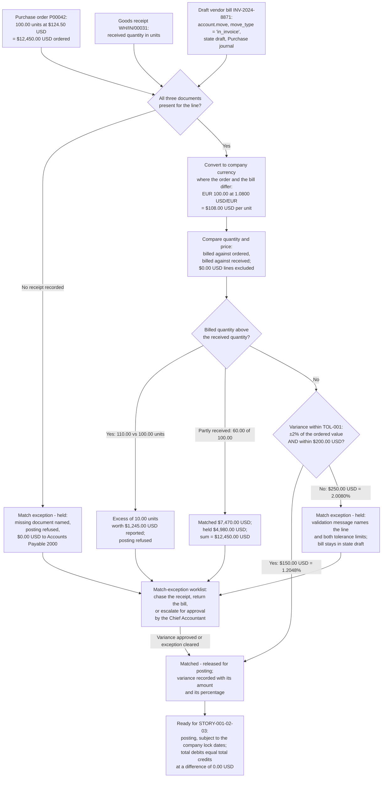

# STORY-001-02-02: Perform Three-Way Match Across Purchase Order, Receipt and Bill

---

## Metadata

| Attribute | Value |
|-----------|-------|
| **Story ID** | `STORY-001-02-02` |
| **Title** | Perform Three-Way Match Across Purchase Order, Receipt and Bill |
| **Parent Feature** | [FEATURE-001-02: Accounts Payable & Vendor Bills](../FEATURE-001-02-accounts-payable-vendor-bills.md) |
| **Parent Epic** | [EPIC-001: Enterprise Accounting in Odoo](../../EPIC-001-enterprise-accounting-odoo.md) |
| **Feature Capability** | CAP-002 — match a vendor bill against its purchase order and goods receipt with a tolerance policy |
| **Status** | Draft |
| **Priority** | 🟠 High |
| **Estimate** | 8 (Fibonacci) |
| **Persona** | Accounts Payable Clerk |
| **Secondary Personas** | Chief Accountant (the tolerance policy and the approval of a recorded variance), External Auditor (the retained match evidence and the disposition trail) |
| **Platform Target** | Open decision DEC-001 — see [Version Compatibility](#version-compatibility) |
| **Last Updated** | 2026-08-13 |
| **Owner/Author** | Enterprise Accounting Team |

> **Platform target.** This story states no platform version of its own. The target is the Epic's open decision **DEC-001** in the [Open Decisions Register](../../EPIC-001-enterprise-accounting-odoo.md#appendix-b-open-decisions-register): the originating programme request names Odoo 17, the superseded flat backlog named 18.0, and the baseline this story was written and verified against is **Odoo 19.0 Community**, where `odoo/release.py` declares `version_info = (19, 0, 0, FINAL, 0, '')`. The three candidates expose the ordered, received and billed quantities through different surfaces, so the mismatch is surfaced for stakeholder confirmation rather than settled inside this story.
>
> **Scope of this story.** The match compares three documents that already exist and records one outcome against the bill. It posts nothing: the bill it acts on is an `account.move` with `move_type = 'in_invoice'` in state `draft`, and it stays in that state whether the match releases it or holds it. Every balance figure below is therefore asserted against the **draft** `account.move.line` set, and the posting of the released bill belongs to [STORY-001-02-03](./STORY-001-02-03-post-vendor-bill-entries.md). Where a criterion states that posting is refused, the refusal is this story's control: the release gate that keeps an unmatched obligation out of **Accounts Payable 2000**.

---

## User Story

**As an** Accounts Payable Clerk

**I want** each draft vendor bill compared against its purchase order and its goods receipt, with the quantity variance and the price variance measured against a stated tolerance before the bill becomes eligible for posting

**So that** the company pays only for goods and services it ordered and received, and the **Accounts Payable 2000** balance carries no unauthorised obligation.

---

## INVEST Principles Compliance

| Principle | Compliance | Notes |
|-----------|------------|-------|
| **Independent** | ✅ | The match reads three records and writes one outcome. It needs a draft bill from [STORY-001-02-01](./STORY-001-02-01-capture-vendor-bills.md) and the two procurement documents, all three of which are seedable as fixtures in a test company, so no other story in FEATURE-001-02 has to be delivered first. It neither posts an entry nor pays one, so [STORY-001-02-03](./STORY-001-02-03-post-vendor-bill-entries.md), STORY-001-02-04 and STORY-001-02-05 are its consumers rather than its prerequisites |
| **Negotiable** | ✅ | States the control outcome required — every purchase-order-backed bill carries a recorded match result naming the compared quantity, the compared price and the measured variance, and no bill breaching the tolerance is eligible for posting — and leaves to implementation discovery whether the comparison is expressed on the matching view already present in `purchase`, on a new comparison record, or as a release check on the bill itself (D-003, D-005) |
| **Valuable** | ✅ | Converts a comparison that depends on a clerk remembering to make it into a control that is made on 100% of purchase-order-backed bills (SM-007). A vendor billing `$12,700.00 USD` against an ordered `$12,450.00 USD` is stopped at a variance of `$250.00 USD`, rounded half-up to 2 decimal places at the USD rounding increment of `0.01`, before the obligation reaches **Accounts Payable 2000** — rather than recovered by credit note months later. The retained match result is also the internal-control evidence the External Auditor reads over the purchase-to-pay cycle, which is part of the Epic's halving of post-close audit adjustments (SM-016) |
| **Estimable** | ✅ | The compared surface is bounded and inspectable: one purchase order line, one goods-receipt quantity and one bill line, three measured figures (billed quantity, billed unit price, billed line value), two tolerance limits and two outcomes. Every field it reads exists in this repository under LGPL-3. Effort, complexity and uncertainty are assessable — see [Estimation](#estimation) |
| **Small** | ✅ | The story stays inside one sprint because it compares three documents that already exist and records an outcome against one of them; it builds no procurement. The purchase order and the goods receipt are read, never authored — ordering, receiving and warehouse operation stay outside this backlog. Sized at 8 story points, one increment above the capture story it depends on |
| **Testable** | ✅ | All six criteria are objectively pass or fail. Each names the three documents by identifier, states every amount with its currency and its rounding rule, pairs every percentage with the money figure it derives from, asserts the draft line set's total debits against its total credits, and ends in one of exactly two recorded outcomes — released for posting, or held as a match exception — see [Acceptance Test Mapping](#acceptance-test-mapping) |

---

## Acceptance Criteria

### The Three-Way Match Fixture

The bill below is the canonical vendor bill fixed by [STORY-001-02-01](./STORY-001-02-01-capture-vendor-bills.md); this story extends that fixture with the two procurement documents it is matched against, so one worked example carries the whole feature. Every figure is stated to 2 decimal places and rounded half-up at its currency's rounding increment of `0.01`; every percentage is stated to 4 decimal places against the money figure it derives from.

| Element | Value |
|---------|-------|
| Company | `US-01` — the United States operating entity, functional currency USD |
| Vendor (`res.partner`) | `Acme Industrial Supplies`, supplier payment term `30 Days` |
| Purchase order | **`P00042`** — 100.00 units at `$124.50 USD` per unit, an ordered line value of **`$12,450.00 USD`** (100.00 × 124.50 = 12,450.00) |
| Goods receipt | **`WH/IN/00031`** — 100.00 units received in the clean case |
| Vendor bill | **`INV-2024-8871`** — `account.move`, `move_type = 'in_invoice'`, state `draft`, **Purchase** journal, `$12,450.00 USD` untaxed |
| Bill lines (`account.move.line`) | Coded to **Expense 6100**, with the payable counterpart of `$12,450.00 USD` on **Accounts Payable 2000** |
| Bill date / due date | `2025-03-14` / `2025-04-13` — the `30 Days` term applied to the bill date |
| Input-tax variant (`account.tax`) | Tax code `VAT 20% (Purchases)` → base amount `$12,450.00 USD`, tax amount `$2,490.00 USD`, bill total `$14,940.00 USD`, tax leg on **Input Tax Receivable 1290** |
| Price-variance case, inside tolerance | Billed unit price `$126.00 USD` → billed value `$12,600.00 USD`, variance `$150.00 USD` = `1.2048%` of `$12,450.00 USD` |
| Price-variance case, outside tolerance | Billed unit price `$127.00 USD` → billed value `$12,700.00 USD`, variance `$250.00 USD` = `2.0080%` of `$12,450.00 USD` |
| Partial-receipt case | 60.00 of 100.00 units received → matchable value `$7,470.00 USD` (60.00 × 124.50), held value `$4,980.00 USD` (40.00 × 124.50), the two summing to `$12,450.00 USD` |
| Over-billing case | Bill claims 110.00 units = `$13,695.00 USD` (110.00 × 124.50) against 100.00 units received → an excess of 10.00 units worth `$1,245.00 USD` |
| Multi-currency case | Purchase order in EUR at `EUR 100.00` per unit, bill converted at `1.0800 USD/EUR` → `$108.00 USD` per unit and `$10,800.00 USD` per 100.00 units in company currency |

### The Tolerance Policy (TOL-001)

The tolerance is a stated numeric rule, not a judgement:

> A measured variance passes when it is **within ±2% of the ordered line value** **and** **within `$200.00 USD`**. The tighter of the two limits governs.

Applied to the fixture's ordered line value of `$12,450.00 USD`, the percentage limit computes to `$249.00 USD` (2% of `$12,450.00 USD`) while the absolute limit stands at `$200.00 USD`, so **`$200.00 USD` is the binding limit on this line**, which equals `1.6064%` of `$12,450.00 USD`. The two limits cross at an ordered line value of `$10,000.00 USD`, where 2% computes to `$200.00 USD` exactly: below that value the percentage limit binds, above it the `$200.00 USD` cap binds. A quantity variance is governed by the same pair, measured as the value of the excess at the ordered unit price. Every limit and every measured figure is computed at 2 decimal places with half-up rounding at the USD rounding increment of `0.01`.

The match ends in exactly one of two recorded outcomes, and both are readable on the bill by the Accounts Payable Clerk:

| Outcome | Meaning |
|---------|---------|
| **Matched — released for posting** | The three documents agree within TOL-001. Any variance inside the limits is recorded on the bill with its amount in USD and its percentage, and the bill becomes eligible for the posting owned by [STORY-001-02-03](./STORY-001-02-03-post-vendor-bill-entries.md) |
| **Match exception — held** | A variance breaches TOL-001, a compared document is absent, or a billed quantity stands above the received quantity. The bill stays in state `draft`, posting is refused, and the exception carries the measured figures and both tolerance limits so the Chief Accountant either approves the variance or returns the bill to the vendor |

### Coverage Distribution

Six criteria, inside the mandated band of 4 to 8. Each carries one non-compound **When**, and each **Then** asserts only what the Accounts Payable Clerk, the Chief Accountant or the External Auditor observes in the Odoo user interface or reads back over the public API. Every monetary figure states its currency, its amount and its rounding rule; every percentage is paired with the money figure it derives from; and every criterion that touches journal-entry lines states both the total debits and the total credits of the draft line set and asserts the relation between them.

| Scenario | Coverage class |
|----------|----------------|
| 1 | Valid input — happy-path clean match across all three documents releases the bill |
| 2 | Valid input — a price variance inside both tolerance limits is recorded and released |
| 3 | Error handling — a price variance outside both limits refuses posting with a named Odoo validation message |
| 4 | Invalid or incomplete input — a bill with no linked goods receipt cannot be matched |
| 5 | Accounting edge case — a partial goods receipt limits the matchable value |
| 6 | Accounting edge case — a billed quantity above the received quantity is refused |

### Scenario 1: Clean three-way match across all three documents releases the bill

- **Given** purchase order `P00042` in company `US-01` orders 100.00 units at `$124.50 USD` per unit for an ordered line value of `$12,450.00 USD`, goods receipt `WH/IN/00031` records 100.00 units received against that order, and draft bill `INV-2024-8871` from `Acme Industrial Supplies` — an `account.move` with `move_type = 'in_invoice'` in state `draft` in the **Purchase** journal — carries 100.00 units at `$124.50 USD` per unit coded to **Expense 6100**
- **When** the Accounts Payable Clerk runs the three-way match on draft bill `INV-2024-8871`
- **Then** the recorded match result reads **Matched — released for posting**, naming all three documents `P00042`, `WH/IN/00031` and `INV-2024-8871`; the three documents agree on quantity at 100.00 units and on value at `$12,450.00 USD`, so the measured price variance is `$0.00 USD` (`0.0000%` of `$12,450.00 USD`) and the measured quantity variance is 0.00 units; the bill is marked eligible for posting; its draft `account.move.line` set balances, with total debits of `$12,450.00 USD` equal to total credits of `$12,450.00 USD` at a difference of `0.00 USD`; the bill stays in state `draft` because this story releases the bill and does not post it; and every amount in this criterion is rounded half-up to 2 decimal places at the USD rounding increment of `0.01`

### Scenario 2: A price variance inside both tolerance limits is recorded rather than blocked

- **Given** purchase order `P00042` in `US-01` orders 100.00 units at `$124.50 USD` per unit for an ordered line value of `$12,450.00 USD`, goods receipt `WH/IN/00031` records 100.00 units received, and draft bill `INV-2024-8871` bills the same 100.00 units at `$126.00 USD` per unit for a billed value of `$12,600.00 USD`
- **When** the Accounts Payable Clerk runs the three-way match on that draft bill
- **Then** the recorded match result reads **Matched — released for posting**; the measured price variance reads `$150.00 USD`, which is `1.2048%` of the ordered line value of `$12,450.00 USD`, and both figures are readable on the bill; the variance is inside both limits of TOL-001, being below the ±2% limit of `$249.00 USD` and below the `$200.00 USD` cap that binds this line; the bill is marked eligible for posting with the variance recorded against it as its amount in USD and its percentage, so the accepted difference is evidenced rather than absorbed; where the bill carries the tax code `VAT 20% (Purchases)`, the comparison is made on the base amount of `$12,600.00 USD` and the tax amount of `$2,520.00 USD` is excluded from the variance arithmetic, giving a bill total of `$15,120.00 USD` with the tax leg on **Input Tax Receivable 1290**; its draft `account.move.line` set balances, with total debits of `$12,600.00 USD` equal to total credits of `$12,600.00 USD` at a difference of `0.00 USD` on the untaxed bill; and every amount in this criterion is rounded half-up to 2 decimal places at the USD rounding increment of `0.01`

### Scenario 3: A price variance outside both tolerance limits refuses posting

- **Given** purchase order `P00042` in `US-01` orders 100.00 units at `$124.50 USD` per unit for an ordered line value of `$12,450.00 USD`, goods receipt `WH/IN/00031` records 100.00 units received, and draft bill `INV-2024-8871` bills the same 100.00 units at `$127.00 USD` per unit for a billed value of `$12,700.00 USD`
- **When** the Accounts Payable Clerk attempts to post that draft bill after the three-way match has run
- **Then** posting is refused with an Odoo validation message that names the varying bill line, the measured variance and both tolerance limits — the ±2% limit of `$249.00 USD` and the `$200.00 USD` cap; the measured price variance reads `$250.00 USD`, which is `2.0080%` of the ordered line value of `$12,450.00 USD`, breaching both limits; the recorded match result reads **Match exception — held**; the bill stays in state `draft`; no `account.move.line` is written to the ledger, so the movement this bill contributes to the **Accounts Payable 2000** balance of `US-01` measures `$0.00 USD` and that balance is unchanged by the refused attempt; the exception is readable on the bill together with the three document identifiers, so the Chief Accountant either approves the variance or returns the bill to `Acme Industrial Supplies`; the draft line set itself is left intact and balances, with total debits of `$12,700.00 USD` equal to total credits of `$12,700.00 USD` at a difference of `0.00 USD`; and every amount in this criterion is rounded half-up to 2 decimal places at the USD rounding increment of `0.01`

### Scenario 4: A bill with no linked goods receipt cannot be matched

- **Given** draft bill `INV-2024-8871` in `US-01` for `$12,450.00 USD` is linked to purchase order `P00042` for 100.00 units at `$124.50 USD` per unit, and no goods receipt has been recorded against that order, so `WH/IN/00031` does not exist and the received quantity stands at 0.00 units
- **When** the Accounts Payable Clerk runs the three-way match on that draft bill
- **Then** the match returns an incomplete result that names the missing document as the goods receipt for purchase order `P00042` and states the received quantity of 0.00 units against the billed quantity of 100.00 units; the recorded match result reads **Match exception — held**, so a two-document comparison is never reported as a three-way match; the bill stays in state `draft` and posting stays refused, which keeps `$12,450.00 USD` of unreceived obligation out of the **Accounts Payable 2000** balance of `US-01`, leaving that balance unchanged; the exception appears on the match-exception worklist with the bill, the order and the missing document named, so the Clerk chases the receipt rather than searching for the cause; the draft line set is left intact and balances, with total debits of `$12,450.00 USD` equal to total credits of `$12,450.00 USD` at a difference of `0.00 USD`; and every amount in this criterion is rounded half-up to 2 decimal places at the USD rounding increment of `0.01`

### Scenario 5: A partial goods receipt limits the matchable value

- **Given** purchase order `P00042` in `US-01` orders 100.00 units at `$124.50 USD` per unit for an ordered line value of `$12,450.00 USD`, goods receipt `WH/IN/00031` records 60.00 of those 100.00 units as received, and draft bill `INV-2024-8871` bills the full 100.00 units for `$12,450.00 USD`
- **When** the Accounts Payable Clerk runs the three-way match on that draft bill
- **Then** `$7,470.00 USD` is matched against the 60.00 units received (60.00 × 124.50 = 7,470.00) and `$4,980.00 USD` is held pending the remaining 40.00 units (40.00 × 124.50 = 4,980.00); the two figures sum to the bill total of `$12,450.00 USD`, so no value is lost between the matched and held parts; the recorded match result reads **Match exception — held** for the `$4,980.00 USD` held portion, naming the 40.00 units not yet received, and posting of the bill stays refused while that portion is open; the price comparison on the matched portion measures a variance of `$0.00 USD` (`0.0000%` of `$7,470.00 USD`), so the hold is a quantity matter and not a price matter; the draft line set is left intact and balances, with total debits of `$12,450.00 USD` equal to total credits of `$12,450.00 USD` at a difference of `0.00 USD`; and each of `$7,470.00 USD`, `$4,980.00 USD` and `$12,450.00 USD` is stated at 2 decimal places with half-up rounding at the USD rounding increment of `0.01`

### Scenario 6: A billed quantity above the received quantity is refused

- **Given** purchase order `P00042` in `US-01` orders 100.00 units at `$124.50 USD` per unit, goods receipt `WH/IN/00031` records 100.00 units received, and draft bill `INV-2024-8871` claims 110.00 units at `$124.50 USD` per unit for a billed value of `$13,695.00 USD` (110.00 × 124.50 = 13,695.00)
- **When** the Accounts Payable Clerk attempts to post that draft bill after the three-way match has run
- **Then** the excess of 10.00 units is reported with its value of `$1,245.00 USD` (10.00 × 124.50 = 1,245.00), which is `10.0000%` of the ordered quantity of 100.00 units and `10.0000%` of the ordered line value of `$12,450.00 USD`, breaching both the ±2% limit of `$249.00 USD` and the `$200.00 USD` cap; posting is refused with an Odoo validation message naming the bill line, the billed quantity of 110.00 units, the received quantity of 100.00 units and the excess value of `$1,245.00 USD`; the recorded match result reads **Match exception — held** and the bill stays in state `draft`; no amount reaches **Accounts Payable 2000**, so the movement this bill contributes to that balance in `US-01` measures `$0.00 USD` and the balance is unchanged; the draft line set is left intact and balances, with total debits of `$13,695.00 USD` equal to total credits of `$13,695.00 USD` at a difference of `0.00 USD`; and every amount in this criterion is rounded half-up to 2 decimal places at the USD rounding increment of `0.01`

---

## Sub-Tasks

- [ ] **@finance-sme** — Sign off the tolerance policy TOL-001 as an approved internal control: the ±2% limit, the `$200.00 USD` cap, the rule that the tighter limit governs, the crossover at an ordered line value of `$10,000.00 USD`, the measurement of a quantity variance as the value of the excess at the ordered unit price, and the rule that a variance inside the limits is recorded on the bill rather than absorbed. Confirm which role approves a recorded exception and up to what amount, and confirm that the comparison is made on the untaxed base amount so a tax-rate change is never reported as a price variance
- [ ] **@functional-consultant** — Specify the match-exception worklist: the fields the Accounts Payable Clerk reads on each open exception — bill, purchase order, goods receipt, billed quantity, received quantity, ordered unit price, billed unit price, measured variance in USD, measured variance as a percentage, and both tolerance limits — together with the disposition each exception can take (chase the receipt, return the bill to the vendor, or escalate for the Chief Accountant's approval of the variance) and the record each disposition leaves for the External Auditor
- [ ] **@functional-consultant** — Document the three-document data map: which field of the purchase order supplies the ordered quantity and the ordered unit price, which record supplies the received quantity, and which field of the bill line supplies the billed quantity and the billed unit price; include the treatment of a service line that carries no goods receipt, of a bill line that matches no order line, and of an order line billed across more than one bill
- [ ] **@developer** — Deliver the comparison itself against the records already present: read the ordered quantity and ordered unit price from `purchase.order.line`, the received quantity from the goods-receipt side, and the billed quantity, unit price and line value from `account.move.line`, without copying any of the three into a parallel structure (C-012), and record the outcome, the measured variances and the three document identifiers against the bill
- [ ] **@developer** — Deliver the tolerance arithmetic and the release gate: evaluate both limits of TOL-001 with half-up rounding at the USD rounding increment of `0.01`, take the tighter, apply it after currency conversion where the order and the bill are denominated differently, and refuse posting on a breach with a validation message naming the line, the measured variance and both limits while leaving the bill in state `draft` and writing no journal item
- [ ] **@developer** — Deliver the partial-receipt split so that a receipt of 60.00 of 100.00 units yields a matched value of `$7,470.00 USD` and a held value of `$4,980.00 USD` whose sum equals the bill total of `$12,450.00 USD`, and extend the deterministic fixture set of [STORY-001-02-01](./STORY-001-02-01-capture-vendor-bills.md) with purchase order `P00042`, goods receipt `WH/IN/00031` and the five variants — clean, inside tolerance, outside tolerance, partial receipt and over-billed (D-009)
- [ ] **@qa-engineer** — Build the acceptance suite covering all six scenarios, one test per criterion (C-008), with every amount asserted numerically to the cent, every percentage asserted to 4 decimal places, and every draft line set asserted for total debits against total credits at a difference of `0.00 USD` (C-009)
- [ ] **@qa-engineer** — Build the tolerance-boundary suite at the four limit points — a variance of exactly `$249.00 USD` (`2.0000%` of `$12,450.00 USD`, which still breaches the binding `$200.00 USD` cap), a variance of exactly `$200.00 USD` (`1.6064%`, which passes), a variance of `$200.01 USD` (`1.6065%`, which breaches), and on a `$5,000.00 USD` ordered line a variance of exactly `$100.00 USD` (`2.0000%`, which passes) against `$100.01 USD` (`2.0002%`, which breaches) — and assert the match of a 50-line bill against its order and receipt completes in 5 seconds or less, per the budget the parent Feature sets in its performance section

---

## Edge Cases

- **A quantity or price variance outside tolerance.** A variance is reported with both its amount in USD and its percentage of the ordered line value — `$250.00 USD` and `2.0080%` of `$12,450.00 USD` on the price side, `$1,245.00 USD` and `10.0000%` on the quantity side — each amount rounded half-up to 2 decimal places at the USD rounding increment of `0.01`. **Control:** the recorded outcome reads **Match exception — held**, posting is refused with an Odoo validation message naming the line, the measured variance and both tolerance limits, the bill stays in state `draft`, and the movement it contributes to the **Accounts Payable 2000** balance measures `$0.00 USD` until the Chief Accountant approves the variance or the vendor issues a corrected bill. A variance inside the limits is recorded on the bill rather than discarded, so an accepted `$150.00 USD` at `1.2048%` is still visible to the External Auditor.
- **A partial goods receipt.** Where `WH/IN/00031` records 60.00 of the 100.00 units ordered on `P00042`, only the received value of `$7,470.00 USD` is matchable and the remaining `$4,980.00 USD` is held pending the outstanding 40.00 units, the two summing to the bill total of `$12,450.00 USD` at 2 decimal places with half-up rounding at the USD rounding increment of `0.01`. **Control:** the held portion keeps the bill out of posting while it is open, so the company does not recognise an obligation for goods short by 40.00 units; the matched and held values are both recorded, so a later receipt closes the exception against a figure that was fixed when the shortfall was found rather than recomputed from a changed order.
- **A zero-amount or null line on the bill.** A bill line entered with a quantity of `0.00` and a unit price of `$0.00 USD` — a waived freight charge, for instance — contributes `$0.00 USD` to the billed value, is excluded from the variance arithmetic because it carries neither a quantity nor a price to compare, and leaves the match outcome for the bill unchanged. **Control:** the line stays on the record so the waived charge is evidenced rather than absent, and its exclusion is recorded on the match result, so a `$0.00 USD` line can never turn a clean match into an exception or a breach into a pass. The bill total against which the tolerance is measured stays at `$12,450.00 USD`, rounded half-up to 2 decimal places at the USD rounding increment of `0.01`.
- **A bill dated inside a locked fiscal period.** The match itself may run on a bill dated `2025-03-14` while the `fiscalyear_lock_date` of `US-01` stands at `2025-03-31`, because the match reads three documents and posts nothing. **Control:** release for posting still respects the lock date, so a bill the match released is refused at posting for as long as the lock covers its accounting date, with an Odoo validation message naming the company `US-01` and the lock date, and no journal item written — the movement it contributes to the **Accounts Payable 2000** balance measures `$0.00 USD`, rounded half-up to 2 decimal places at the USD rounding increment of `0.01`. The choice between moving the accounting date into an open period and reopening the closed one is a lock-date decision owned by [STORY-001-01-05](../FEATURE-001-01/STORY-001-01-05-configure-period-lock-dates.md), not a match decision.
- **Multi-currency rounding.** Where purchase order `P00042` is denominated in EUR at `EUR 100.00` per unit and the bill is converted at `1.0800 USD/EUR`, the comparison is made in the company currency of `US-01` at `$108.00 USD` per unit and `$10,800.00 USD` per 100.00 units, each figure rounded half-up to 2 decimal places at the USD rounding increment of `0.01`. **Control:** the tolerance is applied **after** conversion, never before, so the two sides are compared in one currency; and because a rounding residual of `$0.01 USD` stands far below the binding `$200.00 USD` cap — which is `1.8519%` of `$10,800.00 USD`, the cap binding here because `$10,800.00 USD` exceeds the `$10,000.00 USD` crossover — a residual cent never raises an exception. The rate applied and the date it was read from are recorded on the match result so the External Auditor recomputes the comparison from the record.

---

## Constraints

The constraint identifiers below are the Epic's own, restated in the terms of this story rather than renumbered, so one constraint set reads across the whole ticket tree. The full text is held in [EPIC-001 §7 Constraints](../../EPIC-001-enterprise-accounting-odoo.md#7-constraints).

### License and Compliance

- [x] **C-001 — AGPL-3.0 compatibility**: any module delivering the three-way-match comparison, the tolerance evaluation, the release gate and the match-exception worklist is distributed under an AGPL-3.0 compatible licence, matching the licence of the Community-edition accounting add-ons already present in this repository
- [x] **C-002 — Existing licence respected**: extension of `account` — the "Invoicing" application, version 1.4, licence LGPL-3 — and of `purchase` — version 1.2, licence LGPL-3 — respects those licences, and an AGPL-3 extension of LGPL-3 code is licence-checked before it is written
- [x] **C-003 — The edition source is an open decision (DEC-002), not a prohibition**: the blanket ban on Enterprise dependencies carried by the superseded flat backlog is **withdrawn**. Where a capability sits beyond the `account` module, the edition or add-on that supplies it — an Odoo Enterprise subscription, or the OCA path of `account_financial_report`, `account_reconcile_oca` and `mis_builder` with bespoke development for the residual — is the Epic's open **edition lock-in** dependency DEC-002, owned by the CFO / Finance Director with the Group Controller and recorded in the [Open Decisions Register](../../EPIC-001-enterprise-accounting-odoo.md#appendix-b-open-decisions-register). It is flagged for stakeholder confirmation, not resolved here (AAP §0.8.3)
- [x] **This story is not gated by DEC-002**: every record the match reads is present in this repository under LGPL-3 — `account.move` and `account.move.line` from `account`, `purchase.order` and `purchase.order.line` from `purchase`, and the receipt quantities from `purchase_stock` with `stock` — so development can start before the edition decision is confirmed. What the decision affects downstream is the engine that renders the **Aged Payables** report for `US-01` as of `2025-03-31`, which the matched bill's `$12,450.00 USD` residual later ties to
- [x] **C-004 — OCA ecosystem compatibility**: whichever edition path DEC-002 confirms, a match result recorded by this story stays consumable by OCA add-ons, including an OCA purchase-invoice-matching or reconciliation extension adopted later, without the bill or the match result being restated
- [x] **C-005 / C-006 — Odoo and OCA coding standards**: Python follows Odoo and OCA module guidelines including PEP 8, and static analysis passes with the repository's configured tooling, whose lint configuration is `ruff.toml` at the repository root
- [x] **C-012 — Build on the existing models**: the match reads the ordered quantity and price from `purchase.order.line`, the received quantity from the goods-receipt records and the billed quantity, unit price and line value from `account.move.line`, rather than copying any of them into a parallel structure that could later disagree with its source
- [x] **C-014 — Access rights and company isolation**: the Accounts Payable Clerk who runs the match is distinguishable from the Chief Accountant who approves a recorded variance, and a role restricted to `US-01` can neither read nor clear a match exception raised on a vendor bill in `NL-01` or `GB-01`
- [x] **C-019 — Data access discipline**: the lookups that resolve a bill line to its order line and its receipt are expressed through the Odoo ORM or parameterized SQL, with no string-concatenated query construction
- [x] **C-020 — Non-disclosing failures**: a refusal names the bill, the line, the measured variance and both tolerance limits, and discloses no stack trace, no SQL statement and no file-system path; diagnostic detail goes to the server log under an access-controlled channel

### Accounting Standards Compliance

- [x] **Three-way match is a documented internal control over the purchase-to-pay cycle**: the comparison of what was ordered, what was received and what was billed is the control that prevents payment for goods that were neither ordered nor received. It is documented, it is applied to 100% of purchase-order-backed bills (SM-007), and its result is retained against the bill as evidence the External Auditor tests rather than re-performs
- [x] **No obligation is recognised in Accounts Payable 2000 without an approved match or a recorded, approved variance**: a bill whose measured variance breaches TOL-001, whose goods receipt is absent, or whose billed quantity stands above the received quantity is held in state `draft` and contributes `$0.00 USD` to the **Accounts Payable 2000** balance, rounded half-up to 2 decimal places at the USD rounding increment of `0.01`, until the exception is cleared or the variance is approved by the Chief Accountant with the approval recorded
- [x] **Double-entry integrity of the draft line set**: the match leaves the bill's `account.move.line` set balanced — the **Expense 6100** debits against the **Accounts Payable 2000** credit — so total debits of `$12,450.00 USD` equal total credits of `$12,450.00 USD` at a difference of `0.00 USD` on the archetype, and no line amount is adjusted to make a variance disappear. The posting of that balanced set belongs to [STORY-001-02-03](./STORY-001-02-03-post-vendor-bill-entries.md)
- [x] **The comparison is made on the untaxed base amount**: where a bill carries the tax code `VAT 20% (Purchases)` with a base amount of `$12,450.00 USD` and a tax amount of `$2,490.00 USD` for a total of `$14,940.00 USD`, the variance is measured on the base amount and the tax amount is excluded, so a change of tax rate is never reported as a price variance and the recoverable tax on **Input Tax Receivable 1290** is determined by FEATURE-001-05 rather than by this control
- [x] **Accrual basis, US GAAP and IFRS**: the received quantity is what evidences that the expense belongs to the period, which is the accrual basis made operable; goods received and not yet billed at period end are carried as an accrual by FEATURE-001-07 rather than by a bill this story released
- [x] **ISO 4217 minor units**: every amount is rounded half-up to its currency's decimal precision — 2 decimal places at a rounding increment of `0.01` for USD and EUR — and the tolerance is evaluated on those rounded figures so the same input always produces the same outcome

### Version Compatibility

- [x] **C-010 — Platform version target is open decision DEC-001**: the originating programme request names Odoo 17, the superseded flat backlog named 18.0, and this repository is **Odoo 19.0 Community**, where `odoo/release.py` declares `version_info = (19, 0, 0, FINAL, 0, '')`. The mismatch is recorded and confirmed with stakeholders before development rather than chosen inside this story
- [x] **C-011 — Language and database versions follow the confirmed target**: the 19.0 baseline present here declares `MIN_PY_VERSION = (3, 10)`, `MAX_PY_VERSION = (3, 13)` and `MIN_PG_VERSION = 13` in `odoo/release.py`; an earlier platform target carries a different supported matrix
- [x] **Impact if DEC-001 resolves away from 19.0**: the matching surface is re-identified, because the `purchase.bill.line.match` view present in the 19.0 baseline does not exist in the same form in every candidate release and the comparison would then be expressed against the order and receipt quantities directly; the `account.move` and `account.move.line` field names cited in [Technical Discovery Notes](#technical-discovery-notes) are restated for the confirmed version; and the lock-date behaviour behind the fourth edge case is re-verified, because lock-date administration differs across the three candidate releases

---

## Technical Discovery Notes

> **Purpose:** these notes direct the codebase analysis that precedes implementation. They record what to investigate and what the outcome must prove; they do not choose the implementation. Every path below was read in this repository at the Odoo 19.0 Community baseline, so the implementing agent starts from verified ground rather than from assumption.

### Codebase Analysis Areas

| Area | Files/Modules to Examine | Analysis Focus |
|------|--------------------------|----------------|
| The bill the match acts on | `addons/account/models/account_move.py` | The `move_type` selection, in which `'in_invoice'` carries the label **"Vendor Bill"**, and the `state` machine whose `draft` value holds the bill while the match runs. Which transition is the release gate attached to, and what does the platform already refuse at that transition before this control adds anything? |
| An existing review flag on the bill | `addons/account/models/account_move.py` | The `checked` Boolean with its `_compute_checked` derivation, which sets it from `state == 'posted'` together with a general journal or the reviewing right, and the partial index `_checked_idx` declared as `(journal_id) WHERE (checked IS NOT TRUE)`, alongside `button_set_checked` and `set_moves_checked`. Determine whether this posted-stage review flag can carry a draft-stage match outcome, or whether the match result needs its own record (D-005) — and if it is extended, what the index implies for the worklist query |
| The billed side of the comparison | `addons/account/models/account_move_line.py` | The `quantity`, `price_unit` and `price_subtotal` fields that supply the billed quantity, the billed unit price and the billed line value, and `tax_base_amount`, which is the figure the variance is measured on when the bill carries tax. Which of the three is stored and which computed, and how is a line expressed in a unit of measure other than the order's own reconciled before a quantity is compared? |
| The ordered side of the comparison | `addons/purchase/models/purchase_order_line.py` | `product_qty` for the ordered quantity, `price_unit` for the ordered unit price, `qty_invoiced` labelled "Billed Qty", `qty_received` labelled "Received Qty" with its `_compute_qty_received` derivation and its `_inverse_qty_received`, and `qty_to_invoice`, whose computation branches on the product's control policy — ordered quantity less billed against received quantity less billed. Which branch does a three-way match require, and what does the existing computation already refuse? |
| The received side of the comparison | `addons/purchase_stock/models/purchase_order_line.py` and `addons/stock/` | The `qty_received_method` selection extended with `'stock_moves'`, and the receipt records whose warehouse operation type carries the sequence code `IN` behind a receipt named in the `WH/IN/00031` form. How is the received quantity derived for a stocked line, and what supplies the third point of the match for a service line that produces no stock move? |
| The existing matching view | `addons/purchase/models/purchase_bill_line_match.py` | The `purchase.bill.line.match` model, declared with `_auto = False` and described as the "Purchase Line and Vendor Bill line matching view", joining `purchase.order.line` to `account.move.line` and exposing `line_qty`, `qty_invoiced`, `qty_to_invoice`, `line_amount_untaxed`, `billed_amount_untaxed`, `purchase_amount_untaxed`, `product_uom_qty` and `product_uom_price`. Note that it exposes **no received quantity**, so the third point of the match is not present in the view today: determine whether the view is extended to carry it, whether the received quantity is read from the order line alongside the view, and where the price variance is derived from |
| The product control policy | `addons/purchase/models/product.py` | The `purchase_method` field labelled "Control Policy" with its `_compute_purchase_method` derivation and its ordered-quantity and received-quantity options. Determine whether this field already expresses the two-document against three-document distinction per product, how TOL-001 interacts with it, and what the match reports for a product configured on ordered quantity |
| The approval trail the auditor tests | `addons/purchase/models/res_company.py` | The purchase controls `po_lock`, `po_double_validation` and `po_double_validation_amount`. Determine whether the existing double-validation controls already carry the approval record the External Auditor reads for an approved variance, or whether the exception disposition needs a record of its own |
| Lock dates that refuse a release | `addons/account/models/company.py` | `fiscalyear_lock_date`, `tax_lock_date`, `purchase_lock_date` and `hard_lock_date` with their per-role computed counterparts, and the message pattern "You cannot add/modify entries prior to and inclusive of: …". Which of the four refuses a vendor bill, and what does its message name — the fourth edge case above depends on the answer |
| Currency precision the tolerance is evaluated on | `odoo/addons/base/models/res_currency.py` | The `rounding` factor, whose shipped default is `0.01`, and `decimal_places` derived from it, giving 2 decimal places for USD and EUR. Establish where the conversion of an order denominated outside the company currency happens relative to the tolerance evaluation, so the comparison is always made after conversion and a `$0.01 USD` residual never raises an exception |

### Relevant Existing Modules

| Module | Path | Relevance to this story |
|--------|------|------------------------|
| `account` | `addons/account/` | "Invoicing", version 1.4, category `Accounting/Accounting`, licence LGPL-3. Supplies `account.move` with its `in_invoice` document type and its `draft` state, `account.move.line` with the billed quantity, unit price and line value the match reads, the `checked` review flag examined above, and the lock-date fields on `res.company` that govern release |
| `account_payment` | `addons/account_payment/` | "Payment - Account", version 2.0, licence LGPL-3, declaring `account` and `payment` as dependencies. Not written by this story, but the payment surface that settles a released bill in STORY-001-02-04, so the match records the outcome that run depends on before a payment is prepared |
| `purchase` | `addons/purchase/` | "Purchase", version 1.2, licence LGPL-3, depending on `account`. Supplies the purchase order and its lines, the ordered, received and billed quantities, the `purchase.bill.line.match` view and the product control policy. The purchase order originates **outside** `account`, so whether this module is present in the confirmed configuration is an integration question for discovery rather than an assumption of this story |
| `purchase_stock` and `stock` | `addons/purchase_stock/`, `addons/stock/` | Supply the goods-receipt side of the match: the received quantity and the receipt document named in the `WH/IN/00031` form. As with `purchase`, their presence in the confirmed configuration is confirmed in discovery, and a configuration without them leaves the match with two documents rather than three — a case the match must report rather than pass |
| `base` | `odoo/addons/base/` | `res.partner` for the vendor `Acme Industrial Supplies`, `res.company` for the matching entity and its lock dates, and `res.currency` for the decimal precision and rounding increment the tolerance is evaluated at |
| `account_financial_report_ce` | `addons/account_financial_report_ce/` | Version 19.0.1.1.0, AGPL-3. Where the **Accounts Payable 2000** balance built from matched and posted bills surfaces as an aged partner balance, which is the tie-out named in the [Accounting Reconciliation Gate](#accounting-reconciliation-gate) |

### OCA Module Compatibility

| OCA Repository | Module | Compatibility consideration |
|----------------|--------|-----------------------------|
| OCA/account-invoicing | The purchase-invoice matching option in the invoicing extension set | The leading alternative to a bespoke comparison: determine whether it compares all three documents or only the order and the bill, whether its tolerance is expressible as the TOL-001 pair with the tighter limit governing, whether it records the measured variance with both its amount and its percentage, and whether adopting it is integration or replacement under DEC-002 |
| OCA/account-financial-tools | `account_move_line_purchase_info` and the move-line information extension set | Determine whether an existing extension already carries the order and receipt context on the bill line, so the match reads one linkage rather than reconstructing it per comparison |
| OCA/purchase-workflow | The purchase-order approval and quantity-control extension set | Determine whether an existing extension already supplies the exception worklist and the variance-approval record the External Auditor reads, and how its approval thresholds relate to the `$200.00 USD` cap of TOL-001 |

### Discovery versus Prescription

This story describes WHAT match outcome finance needs and WHY. It does not prescribe HOW it is built. Not specified here: new model names, field definitions or schema decisions; whether the comparison extends the existing `purchase.bill.line.match` view, adds a comparison record, or is a release check on the bill (D-005); where the match result and the measured variance are stored; view architecture, including the choice between an OWL component and a server-rendered view; the Odoo API methods used to read the three documents or to refuse a posting; and module structure. Deferred to agent discovery: **D-003** (the residual gap against what `account` and `purchase` already supply, which records the three-way match as residual work), **D-005** (extension against new model for the match result), **D-007** (company isolation, record rules and the access-right groups that keep the Clerk who runs the match apart from the Chief Accountant who approves a variance) and **D-009** (the deterministic fixture set extended with `P00042` and `WH/IN/00031`).

---

## Dependencies

### Story Dependencies

| Dependency Type | Story ID | Story Title | Relationship |
|-----------------|----------|-------------|--------------|
| Parent Feature | [FEATURE-001-02](../FEATURE-001-02-accounts-payable-vendor-bills.md) | Accounts Payable & Vendor Bills | This story is story 2 of the 5 in this feature and delivers its capability CAP-002 |
| Blocked By | [STORY-001-02-01](./STORY-001-02-01-capture-vendor-bills.md) | Capture and Digitize Vendor Bills | A bill must exist before its billed quantity and price can be compared against the purchase order and the goods receipt. That story fixes the canonical `$12,450.00 USD` bill `INV-2024-8871` this one matches |
| Blocks | [STORY-001-02-03](./STORY-001-02-03-post-vendor-bill-entries.md) | Post Vendor Bill Journal Entries | Posting follows the match: a bill held as a match exception is refused at posting, and a released bill carries the recorded outcome that story posts against |
| Related | [STORY-001-07-04](../FEATURE-001-07/STORY-001-07-04-generate-general-ledger-trial-balance.md) | Generate General Ledger and Trial Balance | The ledger tie-out for the obligations this control admits: the **Accounts Payable 2000** closing balance presented there is built only from bills the match released and posted |
| Related | [FEATURE-001-01](../FEATURE-001-01-chart-of-accounts-fiscal-year.md) | Chart of Accounts & Fiscal Year | Supplies **Expense 6100**, **Accounts Payable 2000** and the **Purchase** journal the compared bill is held in, and its [STORY-001-01-05](../FEATURE-001-01/STORY-001-01-05-configure-period-lock-dates.md) administers the `fiscalyear_lock_date` behind the fourth edge case. A sequencing prerequisite under ordering rule ORD-001 |

### External Dependencies

| Dependency | Type | Notes |
|------------|------|-------|
| Purchase order document | Source record | The ordered quantity of 100.00 units and the ordered unit price of `$124.50 USD` on `P00042` are the first point of the match. The order originates outside `account`, so its availability in the confirmed configuration is an integration question settled in discovery rather than assumed by this story |
| Goods receipt document | Source record | The received quantity on `WH/IN/00031` is the third point of the match. A configuration in which no receipt document exists leaves a two-document comparison, which this story reports as an exception rather than passing as a match |
| Tolerance policy TOL-001 | Approved internal control | The ±2% limit, the `$200.00 USD` cap and the rule that the tighter limit governs are approved by the Chief Accountant with the Finance Controller before the release gate is enabled, because the gate refuses payment obligations on the strength of that policy |
| Variance approval authority | Governance | The role that may approve a recorded variance, and the amount up to which it may do so, are confirmed before the exception worklist is released, so an exception has a named route to closure rather than an open queue |
| Foreign-exchange rate source | External data feed | The rate applied when the order and the bill are denominated differently — `1.0800 USD/EUR` in the fifth edge case — comes from the rate table maintained for the group by FEATURE-001-06; this story records which rate and which date were applied rather than sourcing them |
| ISO 4217 | Standard | Currency codes and minor units, which fix the 2-decimal precision at a rounding increment of `0.01` behind every amount and every tolerance limit asserted here |

### Integration Points

| Odoo Model/Module | Integration Type | Purpose |
|-------------------|------------------|---------|
| `account.move` | Read and write | The draft vendor bill `INV-2024-8871` with `move_type = 'in_invoice'` in state `draft`: read to obtain its lines and its linked order, written only to carry the recorded match outcome, the measured variances and the release or hold status |
| `account.move.line` | Read | The billed quantity, the billed unit price and the billed line value per line, plus the tax base amount where the bill carries tax, and the **Expense 6100** and **Accounts Payable 2000** legs whose balance the match leaves intact |
| Purchase order document (`purchase.order`, `purchase.order.line`) | Read | The ordered quantity of 100.00 units and the ordered unit price of `$124.50 USD` on `P00042`, and the billed-quantity counter that shows an order billed beyond what it ordered |
| Goods receipt document | Read | The received quantity on `WH/IN/00031`, which is the point of the match that neither the order nor the bill can supply |
| `res.partner` | Read | The vendor `Acme Industrial Supplies`, whose identity ties the three documents to one counterparty and to whom a bill outside tolerance is returned |
| `res.company` | Read | The matching entity `US-01`, its functional currency USD that the comparison is made in, and the lock dates that refuse a release |
| `res.currency` | Read | The `0.01` rounding increment and the 2 decimal places every measured variance and every tolerance limit is rounded half-up to, and the rate applied before the tolerance is evaluated |
| `account.tax` | Read | The tax code `VAT 20% (Purchases)` whose base amount of `$12,450.00 USD` is the figure compared and whose tax amount of `$2,490.00 USD` is excluded from the variance arithmetic |

---

## Estimation

| Dimension | Rating | Justification |
|-----------|--------|---------------|
| **Effort** | Medium-High | Three documents are compared rather than one record validated, and they live across module boundaries: the bill in `account`, the order in `purchase`, the received quantity on the stock side. The delivered surface adds the tolerance evaluation, the recorded outcome with its two measured variances, the release gate on posting, and the exception worklist the Clerk works from — while writing no procurement of its own |
| **Complexity** | Medium-High | Four points carry real accounting consequence: the tolerance pair, where the tighter of ±2% and `$200.00 USD` governs and the two cross at an ordered line value of `$10,000.00 USD`; the partial-receipt split into a matched `$7,470.00 USD` and a held `$4,980.00 USD` summing to `$12,450.00 USD`; the currency conversion that must precede the tolerance evaluation so a `$0.01 USD` residual is never an exception; and the exclusion of the tax amount so the variance is measured on the base amount of `$12,450.00 USD` alone. None of them requires a posting engine, because the match posts nothing |
| **Uncertainty** | Medium | Two sides are inspectable before development starts: `account.move.line` supplies `quantity`, `price_unit` and `price_subtotal`, and `purchase.order.line` supplies `product_qty`, `price_unit`, `qty_received`, `qty_invoiced` and `qty_to_invoice` with its control-policy branch. The residual unknown is where the third point lives, because the `purchase.bill.line.match` view exposes no received quantity, so whether that view is extended or the order line is read alongside it is settled in discovery (D-005). A second unknown is whether the purchase and stock documents are present in the configuration DEC-001 and DEC-002 confirm |
| **Story Points** | **8** | Fibonacci scale (1, 2, 3, 5, 8, 13). Above the 5 of [STORY-001-02-01](./STORY-001-02-01-capture-vendor-bills.md) because this story reconciles three documents across three modules rather than capturing one, carries the two-limit tolerance arithmetic with its crossover and its post-conversion evaluation, splits a partial receipt into a matched and a held value, and gates posting on the result. Below a 13 because it compares records that already exist and records an outcome: it builds no procurement, writes no journal entry, and reuses the quantity and price fields the platform already computes |

---

## Test Requirements

### Coverage Requirement

| Metric | Requirement | Notes |
|--------|-------------|-------|
| **Minimum Test Coverage** | **80%** | Mandatory for all new functionality delivered by this story (C-007) |
| Unit Test Coverage | 80%+ | The variance arithmetic, the two-limit tolerance evaluation, the partial-receipt split, the currency conversion that precedes evaluation, and the exclusion of tax and zero-amount lines |
| Integration Test Coverage | 80%+ | The match across a purchase order, a goods receipt and a draft bill in a named company, through to the release or the refusal of posting |
| Assertion style | Numeric | Every amount is asserted to the cent, every percentage to 4 decimal places, and every draft line set is asserted for total debits against total credits with the difference stated (C-009) |
| Traceability | 1 test : 1 criterion | Each acceptance test maps to exactly one Given/When/Then criterion in this file (C-008) |

### Unit Test Scenarios

| Acceptance Scenario | Unit test focus | Key assertions |
|---------------------|-----------------|----------------|
| Scenario 1 | Clean comparison across the three documents | The ordered value computes to `$12,450.00 USD` from 100.00 units at `$124.50 USD`; the received quantity reads 100.00 units; the price variance reads `$0.00 USD` (`0.0000%`) and the quantity variance 0.00 units; the outcome reads **Matched — released for posting**; total debits of `$12,450.00 USD` equal total credits of `$12,450.00 USD` at a difference of `0.00 USD`, each amount rounded half-up to 2 decimal places at the USD rounding increment of `0.01` |
| Scenario 2 | Variance inside both limits | 100.00 units at `$126.00 USD` gives `$12,600.00 USD`; the variance computes to `$150.00 USD` and to `1.2048%` of `$12,450.00 USD`; both limits are evaluated and both pass, the ±2% limit standing at `$249.00 USD` and the cap at `$200.00 USD`; the recorded variance is readable as amount and percentage; the outcome reads **Matched — released for posting** |
| Scenario 3 | Variance outside both limits | 100.00 units at `$127.00 USD` gives `$12,700.00 USD`; the variance computes to `$250.00 USD` and to `2.0080%`; posting raises a validation message naming the line, the variance and both limits; the bill's state stays `draft`; the count of journal items written against **Accounts Payable 2000** by the attempt is 0; the draft totals read `$12,700.00 USD` on both sides at a difference of `0.00 USD` |
| Scenario 4 | Missing goods receipt | With no receipt recorded, the received quantity reads 0.00 units against a billed 100.00 units; the outcome reads **Match exception — held** with the missing document named; the release flag is false; the draft totals read `$12,450.00 USD` on both sides at a difference of `0.00 USD` |
| Scenario 5 | Partial-receipt split | 60.00 units received gives a matched value of `$7,470.00 USD` and a held value of `$4,980.00 USD`; their sum equals the bill total of `$12,450.00 USD` to the cent; the price variance on the matched portion reads `$0.00 USD` (`0.0000%` of `$7,470.00 USD`); the outcome reads **Match exception — held** for the 40.00 units outstanding |
| Scenario 6 | Over-billed quantity | 110.00 units at `$124.50 USD` gives `$13,695.00 USD`; the excess computes to 10.00 units and `$1,245.00 USD`, which is `10.0000%` of both the ordered quantity and the ordered line value; posting raises a validation message naming the billed and received quantities and the excess value; no amount reaches **Accounts Payable 2000**; the draft totals read `$13,695.00 USD` on both sides at a difference of `0.00 USD` |
| Tolerance boundary (shared) | Both limits at and beyond their edges | A variance of exactly `$249.00 USD`, which is exactly `2.0000%` of `$12,450.00 USD`, is refused because it breaches the binding `$200.00 USD` cap; a variance of exactly `$200.00 USD`, which is `1.6064%`, passes; a variance of `$200.01 USD`, which is `1.6065%`, is refused; on an ordered line value of `$5,000.00 USD` the percentage limit binds instead, so a variance of exactly `$100.00 USD` (`2.0000%`) passes and `$100.01 USD` (`2.0002%`) is refused; and the crossover at an ordered line value of `$10,000.00 USD`, where 2% equals `$200.00 USD`, is asserted directly |
| Rounding and currency (shared) | Conversion before evaluation | An order at `EUR 100.00` per unit against a bill converted at `1.0800 USD/EUR` compares at `$108.00 USD` per unit and `$10,800.00 USD` per 100.00 units; the tolerance is evaluated after conversion, where the binding limit is the `$200.00 USD` cap because 2% of `$10,800.00 USD` computes to `$216.00 USD`; a residual of `$0.01 USD` produces no exception; the count of lines whose amount was adjusted to make a variance disappear is 0 |
| Exclusions (shared) | Zero-amount lines and tax | A line at a quantity of `0.00` and a unit price of `$0.00 USD` contributes `$0.00 USD` and is excluded from the variance arithmetic without changing the outcome; on the `VAT 20% (Purchases)` variant the variance is measured on the base amount of `$12,450.00 USD` and the tax amount of `$2,490.00 USD` is excluded, the bill total of `$14,940.00 USD` never being the compared figure |

### Integration Test Considerations

- [ ] Seed purchase order `P00042` for 100.00 units at `$124.50 USD`, goods receipt `WH/IN/00031` for 100.00 units and draft bill `INV-2024-8871` for `$12,450.00 USD` in `US-01`, run the match end to end, and assert the outcome **Matched — released for posting** with all three document identifiers recorded on the bill and a draft line set balancing at `$12,450.00 USD` on both sides at a difference of `0.00 USD`.
- [ ] Re-run the same fixture at billed unit prices of `$126.00 USD` and `$127.00 USD` and assert the released outcome with a recorded `$150.00 USD` (`1.2048%`) variance in the first case, and the refusal with a `$250.00 USD` (`2.0080%`) variance naming both tolerance limits in the second, with the bill left in state `draft` and no journal item written in either case.
- [ ] Remove the goods receipt from the fixture and assert the incomplete result names the missing receipt, the outcome reads **Match exception — held**, and the exception appears on the worklist with the bill, the order and the missing document named.
- [ ] Reduce the receipt to 60.00 units and assert a matched value of `$7,470.00 USD`, a held value of `$4,980.00 USD` and a sum equal to the bill total of `$12,450.00 USD`; then complete the receipt to 100.00 units and assert the exception closes against the figures recorded when the shortfall was found.
- [ ] Raise the billed quantity to 110.00 units and assert the refusal names the excess of 10.00 units worth `$1,245.00 USD`, with the **Accounts Payable 2000** balance of `US-01` unchanged.
- [ ] Assert company isolation: a role restricted to `US-01` can neither read nor clear a match exception raised on a vendor bill in `NL-01` or `GB-01` (C-014, D-007), and a role that runs the match cannot approve a variance it raised (segregation between the Accounts Payable Clerk and the Chief Accountant).
- [ ] Apply the `fiscalyear_lock_date` of `2025-03-31` to `US-01`, run the match on the bill dated `2025-03-14`, and assert the match still returns a result while the release for posting is refused with a message naming the company and the lock date, no journal item being written.
- [ ] Denominate `P00042` in EUR at `EUR 100.00` per unit, convert the bill at `1.0800 USD/EUR`, and assert the comparison is made at `$10,800.00 USD` per 100.00 units with the rate and its date recorded on the match result, and that a `$0.01 USD` residual raises no exception.
- [ ] Time the match of a seeded 50-line bill against its purchase order and goods receipt and assert it completes in 5 seconds or less, per the budget the parent Feature sets in its performance section.
- [ ] Assert the coverage claim: over a seeded population of purchase-order-backed vendor bills, the count of bills posted with no recorded match result is 0 (SM-007).

### Acceptance Test Mapping

| BDD Scenario | Test Method Name | Test Type |
|--------------|------------------|-----------|
| Scenario 1: Clean three-way match across all three documents releases the bill | `test_clean_three_way_match_releases_bill_at_12450_usd` | Acceptance |
| Scenario 2: A price variance inside both tolerance limits is recorded rather than blocked | `test_price_variance_150_usd_inside_tolerance_is_recorded_and_released` | Acceptance |
| Scenario 3: A price variance outside both tolerance limits refuses posting | `test_price_variance_250_usd_outside_tolerance_blocks_posting` | Acceptance |
| Scenario 4: A bill with no linked goods receipt cannot be matched | `test_bill_without_goods_receipt_is_held_as_match_exception` | Acceptance |
| Scenario 5: A partial goods receipt limits the matchable value | `test_partial_receipt_matches_7470_usd_and_holds_4980_usd` | Acceptance |
| Scenario 6: A billed quantity above the received quantity is refused | `test_over_billed_quantity_of_ten_units_is_refused_at_1245_usd` | Acceptance |
| Tolerance boundaries asserted across scenarios | `test_tolerance_pair_binds_at_200_usd_cap_and_two_percent_limit` | Acceptance |
| Currency conversion before tolerance evaluation | `test_tolerance_applied_after_conversion_at_1_0800_usd_per_eur` | Acceptance |
| Zero-amount line and tax amount excluded from the variance | `test_zero_amount_line_and_tax_amount_excluded_from_variance` | Acceptance |

---

## Definition of Done

### Implementation Checklist

- [ ] All 6 acceptance criteria scenarios pass
- [ ] **80% minimum test coverage achieved** for the delivered functionality (C-007)
- [ ] Unit tests written and passing, with every amount asserted to the cent and every percentage to 4 decimal places (C-009)
- [ ] Integration tests written and passing, covering the match across a purchase order, a goods receipt and a draft bill in a named company, through to release or refusal
- [ ] The tolerance-boundary tests pass at `$249.00 USD` (`2.0000%`), at `$200.00 USD` (`1.6064%`), at `$200.01 USD` (`1.6065%`) and at the `$10,000.00 USD` crossover where the two limits are equal
- [ ] Every purchase-order-backed vendor bill carries a recorded match result naming the compared documents, the compared quantities, the compared prices and the measured variances; the count of posted purchase-order-backed bills with no recorded match result is 0 (SM-007)
- [ ] The match of a 50-line bill against its order and receipt completes in 5 seconds or less
- [ ] Static analysis reports zero violations for the delivered modules under the repository's `ruff.toml` configuration (C-006)

### Accounting Reconciliation Gate

- [ ] **Debits equal credits on the bill the match releases.** A bill released by the match posts a balanced entry: total debits of `$12,450.00 USD` equal total credits of `$12,450.00 USD` at a difference of `0.00 USD` on the untaxed archetype, and total debits of `$14,940.00 USD` equal total credits of `$14,940.00 USD` at a difference of `0.00 USD` on its `VAT 20% (Purchases)` variant, each amount rounded half-up to 2 decimal places at the USD rounding increment of `0.01`. The match itself leaves the draft line set balanced and adjusts no line amount, so the entry [STORY-001-02-03](./STORY-001-02-03-post-vendor-bill-entries.md) posts is the set this story proved
- [ ] **Every recorded variance is traceable to the ordered value.** A recorded variance is reproducible from the three documents without an external worksheet: `$150.00 USD` is `$12,600.00 USD` billed less `$12,450.00 USD` ordered, and `1.2048%` is that difference over the ordered value, each figure computed at 2 decimal places with half-up rounding at the USD rounding increment of `0.01` and the percentage stated to 4 decimal places. The count of recorded variances that cannot be recomputed from the ordered value is 0
- [ ] **Tax amounts match and stay out of the comparison.** Where the bill carries tax, the tax code, the base amount and the tax amount remain three separate readable values — `VAT 20% (Purchases)`, `$12,450.00 USD` and `$2,490.00 USD` — the tax amount equals the base amount at the code's rate of 20.0000 percent to the cent, and the variance is measured on the base amount alone
- [ ] **Report lines tie to the sub-ledger.** Once released and posted, the matched bill's `$12,450.00 USD` residual is presented in the not-yet-due **Current** bucket of the **Aged Payables** report for `US-01` as of `2025-03-31`, because its due date of `2025-04-13` falls after that as-of date, and the report total of `$820,450.00 USD` equals the **Accounts Payable 2000** balance for the same date at a difference of `0.00 USD`. A bill held as a match exception contributes `$0.00 USD` to that report and to that balance, so the payable position never carries an unmatched obligation (SM-001, CF-001)
- [ ] **Held value is never lost.** On a partial receipt, the matched value of `$7,470.00 USD` and the held value of `$4,980.00 USD` sum to the bill total of `$12,450.00 USD` at a difference of `0.00 USD`, and the count of bills whose matched and held values fail to reconcile to the bill total is 0

### Compliance Checklist

- [ ] AGPL-3.0 licence compliance verified for delivered modules, and the LGPL-3 licences of the `account` and `purchase` code being extended are respected (C-001, C-002)
- [ ] Code follows Odoo and OCA coding standards (C-005)
- [ ] The edition lock-in decision DEC-002 is cited rather than pre-empted, and no module declares a dependency on a module absent from the configuration DEC-002 confirms (C-003)
- [ ] Access rights keep the role that runs the match apart from the role that approves a recorded variance, and company isolation is proven by test (C-014, D-007)
- [ ] Data access in the match is expressed through the Odoo ORM or parameterized SQL, and a refusal discloses no stack trace, SQL statement or file-system path (C-019, C-020)
- [ ] The tolerance policy TOL-001 is signed off by the Chief Accountant with the Finance Controller before the release gate is enabled, and the variance-approval authority is recorded

### Documentation Checklist

- [ ] Docstrings complete for the public methods and models delivered by this story
- [ ] The three-way-match runbook is published: the three-document data map, the tolerance policy TOL-001 with both limits and the rule that the tighter governs, the two recorded outcomes, and the disposition procedure for each exception class — variance beyond tolerance, missing receipt, partial receipt, over-billed quantity
- [ ] TOL-001 is recorded alongside the code that enforces it, so the limits a refusal names are the limits the policy states
- [ ] Every match run, every recorded variance and every exception disposition is recorded with its author and timestamp, readable by the External Auditor without a data request

### Quality Checklist

- [ ] No critical or high-severity defects open against the delivered match path
- [ ] The match of a 50-line bill completes in 5 seconds or less, and the exception worklist opens in 3 seconds or less over a population of 100,000 recorded vendor bills
- [ ] A refusal names the bill, the line, the measured variance and both tolerance limits, so the Accounts Payable Clerk acts on the message without opening the policy document (C-020)
- [ ] No credential or endpoint secret appears in module source, fixtures, logs or exports (C-021)
- [ ] The deterministic fixtures extending `P00042` and `WH/IN/00031` are held apart from the hostile-input fixtures of [STORY-001-02-01](./STORY-001-02-01-capture-vendor-bills.md), so a hostile document is never mistaken for sample data (D-009)

---

## Demo Path

This story is demonstrated to the **Finance Controller** and the **Product Owner** in the Odoo user interface by the Accounts Payable Clerk, along the menu path **Accounting → Vendors → Bills**: the Clerk opens the draft bill `INV-2024-8871` from `Acme Industrial Supplies` for `$12,450.00 USD` in `US-01`, runs the three-way match, and shows the recorded outcome **Matched — released for posting** against purchase order `P00042` for 100.00 units at `$124.50 USD` and goods receipt `WH/IN/00031` for 100.00 units, with the price variance reading `$0.00 USD` and the draft line set balancing at total debits of `$12,450.00 USD` against total credits of `$12,450.00 USD` at a difference of `0.00 USD`. The Clerk then walks the three refusals and the one accepted variance on the same fixture: the billed unit price raised to `$126.00 USD` shows a recorded variance of `$150.00 USD` at `1.2048%` inside both limits with the bill released; raised to `$127.00 USD` it shows `$250.00 USD` at `2.0080%` with posting refused by a validation message naming the line and both tolerance limits and the bill left in state `draft`; the receipt cut to 60.00 units shows `$7,470.00 USD` matched and `$4,980.00 USD` held; and the billed quantity raised to 110.00 units shows the excess of 10.00 units worth `$1,245.00 USD` refused with no amount reaching **Accounts Payable 2000**. Every amount shown is rounded half-up to 2 decimal places at the USD rounding increment of `0.01`, and the refusals matter as much as the release, because the control is what the walkthrough is accepting.

For a headless environment, the same acceptance is available over the public API without interactive access: read the draft `account.move` with `move_type = 'in_invoice'` for `INV-2024-8871` over XML-RPC or JSON-RPC together with its linked purchase order `P00042` and its goods receipt `WH/IN/00031`, then present the ordered quantity and unit price, the received quantity, the billed quantity and unit price, the measured variance as both an amount in USD and a percentage of the ordered line value, the recorded outcome, and the debit and credit totals of the draft line set — followed by the refused posting attempt on the `$127.00 USD` variant, which returns the validation message and leaves the record in state `draft`. The walkthrough — interface or API — is recorded against this story as its acceptance evidence.

---

## Workflow Diagram

---

## References

### Odoo Developer Documentation

- **Vendor bills** — <https://www.odoo.com/documentation/19.0/applications/finance/accounting/vendor_bills.html> — the functional behaviour of the draft vendor bill this story matches and releases
- **Purchase agreements, receipts and bill control** — <https://www.odoo.com/documentation/19.0/applications/inventory_and_mrp/purchase/manage_deals/manage.html> — the ordered, received and billed quantities and the control policy that decides which of them a bill is checked against
- **ORM reference** — <https://www.odoo.com/documentation/19.0/developer/reference/backend/orm.html> — the record, field and constraint semantics behind `account.move`, `account.move.line` and `purchase.order.line`, including how a declared constraint surfaces as a validation message
- **External API** — <https://www.odoo.com/documentation/19.0/developer/reference/external_api.html> — the XML-RPC and JSON-RPC surface behind the alternative demonstration path in [Demo Path](#demo-path)

### OCA Guidelines and Modules

- **OCA module development guidelines** — <https://github.com/OCA/odoo-community.org/blob/master/website/Contribution/CONTRIBUTING.rst> — the coding and contribution standards C-005 requires of delivered modules
- **OCA/account-invoicing** — <https://github.com/OCA/account-invoicing> — the purchase-invoice matching option assessed as an alternative to a bespoke comparison under DEC-002
- **OCA/purchase-workflow** — <https://github.com/OCA/purchase-workflow> — purchase-order approval and quantity-control extensions assessed for the exception worklist and the variance-approval record
- **OCA/account-financial-tools** — <https://github.com/OCA/account-financial-tools> — move-line information extensions assessed for the order and receipt context carried on a bill line

### Internal Control and Accounting Standards

- **COSO Internal Control — Integrated Framework** — <https://www.coso.org/guidance-on-ic> — the control-activity framework under which three-way match is documented as a preventive control over the purchase-to-pay cycle
- **Sarbanes-Oxley Act section 404** — <https://www.sec.gov/rules/final/33-8238.htm> — management's assessment of internal control over financial reporting, which is what makes the retained match evidence and its disposition trail testable rather than anecdotal
- **US GAAP** — <https://asc.fasb.org/> — expense recognition on the accrual basis, evidenced by the received quantity the match compares against
- **IFRS and IAS 1** — <https://www.ifrs.org/issued-standards/list-of-standards/> — presentation of a trade payable as a financial liability at the amount payable, which is the amount this control admits
- **ISO 4217** — currency codes and minor units, the source of the 2-decimal precision at a rounding increment of `0.01` applied to every amount and every tolerance limit in this story

### Source Code References

All paths below were read in this repository at the Odoo 19.0 Community baseline.

- `odoo/release.py` — `version_info = (19, 0, 0, FINAL, 0, '')`, plus the `MIN_PY_VERSION`, `MAX_PY_VERSION` and `MIN_PG_VERSION` matrix behind C-011
- `addons/account/__manifest__.py` — "Invoicing", version 1.4, category `Accounting/Accounting`, licence LGPL-3
- `addons/account/models/account_move.py` — the `move_type` selection where `'in_invoice'` carries the label "Vendor Bill"; the `state` machine holding the bill in `draft` while the match runs; the `checked` Boolean with its `_compute_checked` derivation from `state == 'posted'`, the partial index `_checked_idx` declared as `(journal_id) WHERE (checked IS NOT TRUE)`, and `button_set_checked` with `set_moves_checked`, examined as an existing review flag against a purpose-built match record
- `addons/account/models/account_move_line.py` — `quantity`, `price_unit` and `price_subtotal` supplying the billed quantity, unit price and line value, and `tax_base_amount` supplying the base amount the variance is measured on
- `addons/purchase/__manifest__.py` — "Purchase", version 1.2, licence LGPL-3, depending on `account`
- `addons/purchase/models/purchase_order_line.py` — `product_qty`, `price_unit`, `qty_invoiced` ("Billed Qty"), `qty_received` ("Received Qty") with `_compute_qty_received` and `_inverse_qty_received`, and `qty_to_invoice`, whose computation branches between ordered quantity less billed and received quantity less billed
- `addons/purchase/models/purchase_bill_line_match.py` — the `purchase.bill.line.match` model, `_auto = False`, "Purchase Line and Vendor Bill line matching view", exposing `line_qty`, `qty_invoiced`, `qty_to_invoice`, `line_amount_untaxed`, `billed_amount_untaxed`, `purchase_amount_untaxed`, `product_uom_qty` and `product_uom_price` — and exposing no received quantity, which is the gap recorded in [Technical Discovery Notes](#technical-discovery-notes)
- `addons/purchase/models/product.py` — `purchase_method`, the "Control Policy" selection with its `_compute_purchase_method` derivation
- `addons/purchase/models/res_company.py` — `po_lock`, `po_double_validation` and `po_double_validation_amount`, examined for the approval record the External Auditor tests
- `addons/purchase_stock/models/purchase_order_line.py` and `addons/stock/models/stock_warehouse.py` — the `qty_received_method` value `'stock_moves'` and the warehouse operation type carrying the sequence code `IN`, behind a receipt named in the `WH/IN/00031` form
- `addons/account/models/company.py` — the lock-date fields `fiscalyear_lock_date`, `tax_lock_date`, `purchase_lock_date` and `hard_lock_date` with their per-role computed counterparts
- `odoo/addons/base/models/res_currency.py` — the `rounding` factor with its shipped default of `0.01` and `decimal_places` derived from it, giving 2 decimal places for USD and EUR
- `addons/account_payment/__manifest__.py` and `addons/account_financial_report_ce/` — the payment surface that settles a released bill and the Community-edition aged partner balance at version 19.0.1.1.0 behind the **Aged Payables** tie-out
- `ruff.toml` — the static-analysis configuration in force under C-006

---

## Change History

| Version | Date | Author | Changes |
|---------|------|--------|---------|
| 1.0 | 2026-08-13 | Enterprise Accounting Team | Initial story creation. Six Given/When/Then criteria covering a clean three-way match across purchase order `P00042`, goods receipt `WH/IN/00031` and draft bill `INV-2024-8871`, a `$150.00 USD` variance inside tolerance released with the variance recorded, a `$250.00 USD` variance outside tolerance refused with both limits named, a bill with no linked receipt held as an incomplete match, a partial receipt split into `$7,470.00 USD` matched and `$4,980.00 USD` held, and an over-billed 110.00 units refused at an excess of `$1,245.00 USD`. The tolerance policy TOL-001 is fixed here as ±2% of the ordered line value and `$200.00 USD` with the tighter limit governing and the crossover at an ordered line value of `$10,000.00 USD`; the canonical `$12,450.00 USD` bill fixture is reused from [STORY-001-02-01](./STORY-001-02-01-capture-vendor-bills.md) and extended with the two procurement documents. Eight sub-tasks across four assignees, five edge cases, an estimation table concluding at 8 Fibonacci points, and an accounting-reconciliation gate were added to the template structure; nested relative links adopted in place of the template's flat convention; and the platform version and edition decisions carried forward as DEC-001 and DEC-002 rather than settled |

---

## Notes

The match is a **control**, not a calculation, and two consequences follow for whoever implements it. First, the outcome is recorded whether it passes or fails: a released bill carries its measured variance just as a held one carries its exception, because a control that leaves no trace when it passes cannot be tested by the External Auditor. Second, the tolerance is a policy figure and not a constant of the code — TOL-001 is stated as ±2% of the ordered line value and `$200.00 USD` with the tighter limit governing, and the refusal message names both limits so the Accounts Payable Clerk reads the policy from the refusal itself.

One structural finding from discovery is worth carrying into implementation: the `purchase.bill.line.match` view present in this repository joins the order line to the bill line but exposes no received quantity, so the third point of a three-way match is not available from that view alone. Whether the view is extended, or the received quantity is read from `qty_received` on the order line alongside it, is a discovery decision under D-005 — but the gap is real and is the main reason this story is estimated at 8 rather than 5 points.

