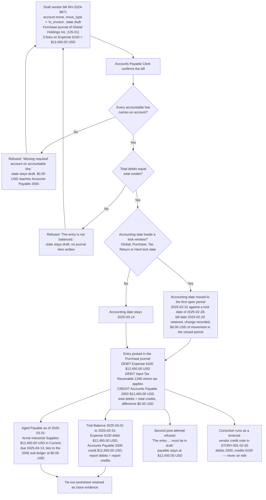

# STORY-001-02-03: Post Vendor Bill Journal Entries

---

## Metadata

| Attribute | Value |
|-----------|-------|
| **Story ID** | `STORY-001-02-03` |
| **Title** | Post Vendor Bill Journal Entries |
| **Parent Feature** | [FEATURE-001-02: Accounts Payable & Vendor Bills](../FEATURE-001-02-accounts-payable-vendor-bills.md) |
| **Parent Epic** | [EPIC-001: Enterprise Accounting in Odoo](../../EPIC-001-enterprise-accounting-odoo.md) |
| **Status** | Draft |
| **Priority** | 🔴 Critical |
| **Estimate** | 5 (Fibonacci) |
| **Persona** | Chief Accountant |
| **Feature Capability** | CAP-003 — post a vendor bill as a balanced journal entry to **Accounts Payable 2000** and **Expense 6100** |
| **Epic Success Metrics** | SM-006 — every company-and-period combination presents total debits equal to total credits, which is the metric each posting in this story either upholds or breaks; SM-010 — the tax amount recorded on a bill is the figure the VAT/Tax Return reconciles to at a difference of `0.00 USD`; SM-003 and SM-016 — a payable sub-ledger that is complete and balanced at period end is what lets the close run in 5 business days and carries part of the 50% reduction in post-close audit adjustments |
| **Secondary Personas** | Accounts Payable Clerk (confirms the bill, which is the trigger that produces the entry), Tax Accountant (the input-tax split and the account the tax leg lands on), External Auditor (the balanced-entry evidence, the lock-date evidence and the drill-down from a report line to the journal items behind it) |
| **Platform Target** | Open decision DEC-001 — see [Version Compatibility](#version-compatibility) |
| **Last Updated** | 2026-08-16 |
| **Owner/Author** | Enterprise Accounting Team |

This is **story 3 of the 5** in FEATURE-001-02 and the point at which an obligation stops being a document and becomes a ledger position. [STORY-001-02-01](./STORY-001-02-01-capture-vendor-bills.md) records the bill and [STORY-001-02-02](./STORY-001-02-02-three-way-match.md) proves it against the purchase order and the goods receipt; both leave the `account.move` in state `draft`, where it moves no balance. This story performs the single state transition `draft` → `posted` and fixes what that transition must produce: one journal entry in the **Purchase** journal that debits **Expense 6100**, debits **Input Tax Receivable 1290** where the bill carries recoverable input tax, credits **Accounts Payable 2000**, and whose total debits equal its total credits. [STORY-001-02-04](./STORY-001-02-04-batch-vendor-payments.md) settles what this story posts and [STORY-001-02-05](./STORY-001-02-05-manage-vendor-credit-notes.md) reverses it, so both are consumers of this story rather than prerequisites of it.

> **Persona note — two roles, one story, no substitution.** The **WHO** of this story is the **Chief Accountant**, who owns the general ledger, the account assignment and the integrity of every posted entry, and who answers for the state of the period's books. The **Accounts Payable Clerk** appears inside the criteria as the role that confirms a captured bill, which is the trigger that produces the entry. The two are named separately throughout and neither stands in for the other; the segregation is what the parent Feature's access-rights matrix and C-014 require. No criterion in this file is written against an unnamed actor.

> **Platform target.** This story states no platform version of its own. The target is the Epic's open decision **DEC-001** in the [Open Decisions Register](../../EPIC-001-enterprise-accounting-odoo.md#appendix-b-open-decisions-register): the originating programme request names Odoo 17, the superseded flat backlog named 18.0, and the baseline every field name, state value and validation message below was read against is **Odoo 19.0 Community**, where `odoo/release.py` declares `version_info = (19, 0, 0, FINAL, 0, '')`. The posting surface differs across the three candidates — most of all in what a lock date does to an entry dated inside a closed period — so the mismatch is surfaced for stakeholder confirmation rather than settled here.

> **Monetary and date conventions used throughout this ticket.** Every amount is stated in the currency it is denominated in, carried to 2 decimal places, and rounded **half-up at that currency's rounding increment of `0.01`** — the USD rounding increment for the books of Global Holdings Inc. (`US-01`) and the EUR rounding increment for a document denominated in EUR. Every computed figure — a tax amount, a currency conversion, a residual — states that rule at the point it is computed rather than inheriting it silently. Dates are written `YYYY-MM-DD`. The **bill date** is the vendor document's own date (`invoice_date`); the **accounting date** is the date the journal entry is recognised on (`date`); the two are distinct fields and this story asserts each by name.

---

## User Story

**As the** Chief Accountant

**I want** every confirmed vendor bill to post a balanced journal entry in the **Purchase** journal that debits **Expense 6100** and credits **Accounts Payable 2000**, with recoverable input tax carried to **Input Tax Receivable 1290** as its own line under its own tax code

**So that** the payables ledger of **Global Holdings Inc. (`US-01`)** states the company's liabilities to the cent, the books stay in double-entry balance with total debits equal to total credits on every posted entry, and the **Trial Balance** and **Aged Payable** reports tie to the **Accounts Payable 2000** sub-ledger at a difference of `0.00 USD` at every period end.

---

## INVEST Principles Compliance

| Principle | Compliance | Notes |
|-----------|------------|-------|
| **Independent** | ✅ | Posting needs exactly two things that exist before it: a captured draft bill and the chart of accounts. The draft comes from [STORY-001-02-01](./STORY-001-02-01-capture-vendor-bills.md) and is seedable as a fixture in a test company, and **Accounts Payable 2000**, **Expense 6100**, **Input Tax Receivable 1290** and the **Purchase** journal come from [FEATURE-001-01](../FEATURE-001-01-chart-of-accounts-fiscal-year.md) as configuration rather than as code. Nothing else in FEATURE-001-02 has to be delivered first: the match of [STORY-001-02-02](./STORY-001-02-02-three-way-match.md) is a release gate in front of this transition and a bill with no purchase order reaches it without one, while payment and credit notes read what this story writes |
| **Negotiable** | ✅ | The outcome is fixed and the mechanism is open. What is fixed: one entry per confirmed bill, in the **Purchase** journal of the named company, debiting **Expense 6100** and crediting **Accounts Payable 2000**, with the tax leg on **Input Tax Receivable 1290**, with total debits equal to total credits, and with nothing dated into a closed period. What is left to implementation discovery: whether the balance and the lock window are enforced by the platform's own posting path or by an extension of it, where the posting-direction policy is recorded, and how the tie-out worksheet is produced (D-003, D-005) |
| **Valuable** | ✅ | This is the transition that turns a document into a liability. Without it the payable position is a spreadsheet reconstruction: `$12,450.00 USD` of obligation to `Acme Industrial Supplies` is visible on a bill but absent from **Accounts Payable 2000**, so the cash-out forecast, the Aged Payable ageing and the Balance Sheet each state a different number. With it, one entry carries the whole obligation — `$12,450.00 USD` of expense against `$12,450.00 USD` of payable, each rounded half-up to 2 decimal places at the USD rounding increment of `0.01` — and the ledger, the ageing and the statements read the same figure. The balance itself is the Epic's SM-006 metric, and a payable sub-ledger that ties at period end is part of SM-003 and SM-016 |
| **Estimable** | ✅ | The delivered surface is countable and inspectable: 1 state transition (`draft` → `posted`), 3 accounts, 1 journal type, 4 posting shapes (untaxed, taxed, fractional-cent tax, foreign currency), 2 refusal paths and 5 lock-date fields, of which the 4 that bind a vendor bill are asserted, all on models this repository already carries under LGPL-3. Effort, complexity and uncertainty are assessed in [Estimation](#estimation) |
| **Small** | ✅ | One sprint-sized outcome: a state transition and the two-sided entry it produces. It builds no capture path, no three-way match, no payment run, no credit note and no report engine — those are the other four stories of this feature and FEATURE-001-07. Sized at 5 story points, level with the capture story and below the 8 of the match story |
| **Testable** | ✅ | Every posting outcome is a checkable debit and credit pair, so every criterion resolves to an amount, an account code, a date, a state value or a named refusal. Each of the seven criteria states both the total debits and the total credits of the entry it produces and asserts their equality with the difference stated at `0.00 USD`, which is a numeric assertion rather than an inspection (C-009); each refusal names the Odoo validation message it is refused with; and each maps to exactly one acceptance test in [Acceptance Test Mapping](#acceptance-test-mapping) (C-008) |

---

## Acceptance Criteria

### The Posting Fixture

The bill posted below is the canonical vendor bill owned by [STORY-001-02-01](./STORY-001-02-01-capture-vendor-bills.md) and matched by [STORY-001-02-02](./STORY-001-02-02-three-way-match.md), reused without alteration so that capture, match, posting, payment and credit note are all proved against one record. Every figure is stated to 2 decimal places and rounded half-up at its currency's rounding increment of `0.01`.

| Element | Value |
|---------|-------|
| Company (`res.company`) | **Global Holdings Inc. (`US-01`)** — the United States parent, functional currency USD, per the Epic's [canonical legal-entity register](../../EPIC-001-enterprise-accounting-odoo.md#e4-canonical-legal-entity-register) |
| Vendor (`res.partner`) | `Acme Industrial Supplies`, supplier payment term `30 Days` |
| Record | `account.move` with `move_type = 'in_invoice'` (labelled "Vendor Bill"), entering in state `draft` |
| State path | `draft` → `posted` → `cancel` (the three values of `account.move.state`, labelled Draft, Posted and Cancelled) |
| Journal (`account.journal`) | **Purchase** — journal type `purchase` |
| Vendor reference (`ref`) | `INV-2024-8871` |
| Bill date (`invoice_date`) | `2025-03-14` |
| Due date | `2025-04-13` — the `30 Days` term applied to the bill date |
| Line 1 (`account.move.line`) | Consulting services — 40.00 hours × `$150.00 USD` = `$6,000.00 USD`, coded to **Expense 6100** |
| Line 2 (`account.move.line`) | Software subscription — 1.00 × `$4,200.00 USD` = `$4,200.00 USD`, coded to **Expense 6100** |
| Line 3 (`account.move.line`) | On-site support — 15.00 hours × `$150.00 USD` = `$2,250.00 USD`, coded to **Expense 6100** |
| Untaxed total | **`$12,450.00 USD`** — `$6,000.00 USD` + `$4,200.00 USD` + `$2,250.00 USD` |
| Payable counterpart | **Accounts Payable 2000** at `$12,450.00 USD` credit |
| Input-tax variant (`account.tax`) | Tax code `VAT-20-P`, labelled `VAT 20% (Purchases)`, rate 20.0000 percent → base amount `$12,450.00 USD`, tax amount `$2,490.00 USD`, bill total `$14,940.00 USD`, tax leg on **Input Tax Receivable 1290** |
| Fractional-cent tax variant (`account.tax`) | Use-tax code `ST-US-08375` at 8.375% → base amount `$12,450.00 USD`, computed tax `1,042.6875`, recorded tax amount `$1,042.69 USD`, bill total `$13,492.69 USD` |
| Foreign-currency variant | `EUR 10,000.00` at the bill-date rate `1.0800 USD/EUR` → company-currency amount `$10,800.00 USD` |
| Locked-period variant | `fiscalyear_lock_date` of `US-01` set to `2025-02-28`, against a bill dated `2025-02-20` |
| Tie-out reports | **Trial Balance** for the date range `2025-03-01` to `2025-03-31`; **Aged Payable** as of `2025-03-31`, where this bill's residual sits in the **Current** bucket because its due date `2025-04-13` falls after the as-of date. The parent Feature and the Epic's statement set write this report's name as **Aged Payable**, and the Epic's SM-001 metric names the same report in the plural as one of its seven statements; this ticket uses the singular form throughout so one report name reads across the tree |

### Register Reconciliation and Figure-Set Ownership

Four identity questions are settled here so that no criterion below has to carry a caveat:

- **The posting company is named from the register.** The Epic's [canonical legal-entity register](../../EPIC-001-enterprise-accounting-odoo.md#e4-canonical-legal-entity-register) makes `US-01` **Global Holdings Inc.**, and rule R-E5 of that appendix keeps an entity that is absent from the register out of every criterion. The provisional name `Northwind US Inc.` carried by this story's authoring brief is therefore superseded: it stands on no register row, and `Northwind Trading` is already a **customer** of `US-01` in [FEATURE-001-03](../FEATURE-001-03-accounts-receivable-customer-invoices.md), so keeping the provisional name would put one name on two parties. The definitive legal-entity hierarchy — the parent, the three subsidiaries, their functional currencies and their ownership — is owned by [FEATURE-001-06](../FEATURE-001-06-multi-company-consolidation.md) and configured by [STORY-001-06-01](../FEATURE-001-06/STORY-001-06-01-configure-company-hierarchy.md); this story consumes those names and defines none.
- **The account codes are the register's.** **Accounts Payable 2000** (`liability_payable`, reconcilable), **Expense 6100** (`expense`) and **Input Tax Receivable 1290** (`asset_current`) are register rows, written as concept-plus-code under rule R-E3 so a reader never resolves a bare number.
- **Tax-code identity belongs to FEATURE-001-05.** `VAT-20-P` is a register code of [FEATURE-001-05](../FEATURE-001-05-tax-configuration-compliance.md), reachable from `US-01` through the foreign VAT registration recorded on its fiscal position by [STORY-001-05-01](../FEATURE-001-05/STORY-001-05-01-configure-tax-codes-fiscal-positions.md). The fractional-cent code `ST-US-08375` is **registered**: it carries a row in [TAX-REG-001](../FEATURE-001-05-tax-configuration-compliance.md#111-authoritative-tax-code-register-tax-reg-001) as the combined state-and-local use tax of `US-01` at 8.3750%, self-assessed on an out-of-state purchase with its recoverable tax amount posting to Input Tax Receivable **1290**, and this story is named there as the ticket that reads it. Both codes are therefore governed identities rather than story-local labels.
- **This story asserts its own movement, never a population total.** The **Trial Balance** population for `US-01` over `2025-01-01` to `2025-03-31` is owned by [STORY-001-07-04](../FEATURE-001-07/STORY-001-07-04-generate-general-ledger-trial-balance.md), and the **Aged Payable** population as at `2025-03-31` is owned by [FEATURE-001-02 §1.4](../FEATURE-001-02-accounts-payable-vendor-bills.md#14-success-criteria-at-feature-level). Criterion 7 below asserts the movement **this bill** contributes to those reports and the reports' own debit-to-credit equality, so it can never contradict either owner's totals.

### Coverage Distribution

Seven criteria, inside the mandated band of 4 to 8. Each carries one non-compound **When**. Each **Then** asserts only what the Chief Accountant, the Accounts Payable Clerk, the Tax Accountant or the External Auditor observes in the Odoo user interface or reads back over the JSON web-service surface C-023 governs — no database statement, no method name and no widget language. Every monetary figure states its currency, its amount and its rounding rule; every tax figure is stated as the three separate values tax code, base amount and tax amount; every criterion that names a company names it because company scope decides which books are affected; and **every criterion that posts states both the total debits and the total credits of the resulting entry and asserts their equality at a difference of `0.00 USD`**.

| Scenario | Coverage class | What it proves |
|----------|----------------|----------------|
| 1 | Valid input — happy-path posting | The three-line archetype bill posts one balanced entry: debit **Expense 6100** `$12,450.00 USD`, credit **Accounts Payable 2000** `$12,450.00 USD` |
| 2 | Valid input — happy-path posting with tax | Input tax posts as its own line on **Input Tax Receivable 1290** with the tax code, base amount and tax amount recorded as three separate values |
| 3 | Accounting edge case | A tax computation that lands on a fraction of a cent resolves half-up at `0.01` and the entry still balances |
| 4 | Invalid or incomplete input — and a blocked posting with a named Odoo validation message | A bill whose line carries no account cannot post; nothing reaches **Accounts Payable 2000** |
| 5 | Error handling — the lock-date control | No journal item is admitted into a closed period; the accounting date is moved to the first open period, the change is recorded, and a later attempt to move it back is refused with a named message |
| 6 | Accounting edge case | A foreign-currency bill posts at the bill-date rate and balances in the document currency and in the company currency |
| 7 | Valid input — reporting tie-out | The posted entry ties to the **Trial Balance** for a named date range and to the **Aged Payable** report as of a named date |

### Scenario 1: The three-line archetype bill posts one balanced entry to Expense 6100 and Accounts Payable 2000

- **Given** vendor bill `INV-2024-8871` stands in state `draft` as an `account.move` with `move_type = 'in_invoice'` in the **Purchase** journal of **Global Holdings Inc. (`US-01`)**, raised from `Acme Industrial Supplies` with the bill date `2025-03-14` and the due date `2025-04-13`, carrying three line items of `$6,000.00 USD`, `$4,200.00 USD` and `$2,250.00 USD` that total `$12,450.00 USD` and are each coded to **Expense 6100**, with no tax code applied, and the fiscal period holding `2025-03-14` is open in that company because its `fiscalyear_lock_date`, `purchase_lock_date`, `tax_lock_date` and `hard_lock_date` all stand earlier than `2025-03-01` or are empty — every amount in this criterion stated to 2 decimal places and rounded half-up at the USD rounding increment of `0.01`
- **When** the **Accounts Payable Clerk** confirms bill `INV-2024-8871`
- **Then** the `account.move` moves from state `draft` to state `posted` and one journal entry exists for it in the **Purchase** journal of **Global Holdings Inc. (`US-01`)**, carrying the accounting date `2025-03-14`, the reference `INV-2024-8871` and a sequence number issued by that journal
  - **And** the entry **debits Expense 6100 by `$12,450.00 USD`** across the three `account.move.line` rows of `$6,000.00 USD`, `$4,200.00 USD` and `$2,250.00 USD`, whose sum equals the untaxed total of `$12,450.00 USD` at a difference of `0.00 USD`
  - **And** the entry **credits Accounts Payable 2000 by `$12,450.00 USD`** on one payable `account.move.line` carrying the vendor `Acme Industrial Supplies` and the due date `2025-04-13`, which is the line the Aged Payable ageing and the payment run of [STORY-001-02-04](./STORY-001-02-04-batch-vendor-payments.md) later read
  - **And** the entry balances: **total debits of `$12,450.00 USD` equal total credits of `$12,450.00 USD`** at a difference of `0.00 USD`, each amount rounded half-up to 2 decimal places at the USD rounding increment of `0.01`
  - **And** the movement this bill contributes to the **Accounts Payable 2000** balance of **Global Holdings Inc. (`US-01`)** measures `$12,450.00 USD` credit, where it measured `$0.00 USD` while the bill stood in state `draft`, and the bill's `payment_state` reads Not Paid with an open residual of `$12,450.00 USD`

### Scenario 2: A bill bearing input tax posts the base amount and the tax amount as two separate lines

- **Given** bill `INV-2024-8871` stands in state `draft` in the **Purchase** journal of **Global Holdings Inc. (`US-01`)** with its three lines totalling a base amount of `$12,450.00 USD` against **Expense 6100**, and every line carries the purchase tax code `VAT-20-P` — labelled `VAT 20% (Purchases)`, rate 20.0000 percent — which is available to that company through the foreign VAT registration recorded on its fiscal position by [STORY-001-05-01](../FEATURE-001-05/STORY-001-05-01-configure-tax-codes-fiscal-positions.md) and whose tax line is directed to **Input Tax Receivable 1290**
- **When** the **Accounts Payable Clerk** confirms that bill
- **Then** the posted entry records the tax as **three separate readable values** — tax code `VAT-20-P` (`VAT 20% (Purchases)`), base amount `$12,450.00 USD` and tax amount `$2,490.00 USD` — rather than one gross figure, the tax amount being the base amount multiplied by the code's rate of 20.0000 percent and rounded half-up at the USD rounding increment of `0.01`
  - **And** the entry **debits Expense 6100 by `$12,450.00 USD`** for the base amount and **debits Input Tax Receivable 1290 by `$2,490.00 USD`** for the tax amount on its own `account.move.line` attributed to `VAT-20-P`, so recoverable input tax is carried as an asset of the company and is not added to **Expense 6100**
  - **And** the entry **credits Accounts Payable 2000 by `$14,940.00 USD`**, which is the amount owed to `Acme Industrial Supplies` — the base amount of `$12,450.00 USD` plus the tax amount of `$2,490.00 USD`
  - **And** the entry balances: **total debits of `$14,940.00 USD` equal total credits of `$14,940.00 USD`** at a difference of `0.00 USD`, each amount rounded half-up to 2 decimal places at the USD rounding increment of `0.01`
  - **And** the `$2,490.00 USD` recorded against `VAT-20-P` is the figure the Tax Accountant reads into the Tax Report (VAT Return) of [FEATURE-001-05](../FEATURE-001-05-tax-configuration-compliance.md) for the period holding `2025-03-14`, and it reconciles to the **Input Tax Receivable 1290** balance for the same date range at a difference of `0.00 USD` (SM-010)

### Scenario 3: A tax amount landing on a fraction of a cent resolves half-up and the entry still balances

- **Given** bill `INV-2024-8871` stands in state `draft` in the **Purchase** journal of **Global Holdings Inc. (`US-01`)** with a base amount of `$12,450.00 USD` against **Expense 6100**, and its lines carry the combined state-and-local use-tax code `ST-US-08375` at a rate of 8.375% whose tax line is directed to **Input Tax Receivable 1290**
- **When** the **Accounts Payable Clerk** confirms that bill
- **Then** the tax computation `12,450.00 × 8.375% = 1,042.6875` is resolved by rounding **half-up at the USD rounding increment of `0.01`** to a recorded tax amount of **`$1,042.69 USD`**, so the fraction of a cent is carried upward rather than truncated downward, and the three separate values recorded on the entry read tax code `ST-US-08375`, base amount `$12,450.00 USD` and tax amount `$1,042.69 USD`
  - **And** the entry **debits Expense 6100 by `$12,450.00 USD`** and **debits Input Tax Receivable 1290 by `$1,042.69 USD`**, and **credits Accounts Payable 2000 by `$13,492.69 USD`** — the base amount plus the rounded tax amount
  - **And** the entry balances: **total debits of `$13,492.69 USD` equal total credits of `$13,492.69 USD`** at a difference of `0.00 USD`, each amount rounded half-up to 2 decimal places at the USD rounding increment of `0.01`
  - **And** the rounding difference of `0.0025` is absorbed **whole on the tax line that produced it**: no base line's amount is altered to force the balance, and the count of lines whose amount was adjusted for that reason is 0, so the same input always produces the same entry and the External Auditor recomputes `$1,042.69 USD` from the base amount and the rate without reference to a worksheet

### Scenario 4: A bill whose line carries no account cannot post, and nothing reaches Accounts Payable 2000

- **Given** a bill stands in state `draft` as an `account.move` with `move_type = 'in_invoice'` in the **Purchase** journal of **Global Holdings Inc. (`US-01`)** for `Acme Industrial Supplies` with the bill date `2025-03-14`, whose first line of `$6,000.00 USD` and second line of `$4,200.00 USD` are coded to **Expense 6100** and whose **third line — on-site support of `$2,250.00 USD` — carries no account**, every amount stated to 2 decimal places and rounded half-up at the USD rounding increment of `0.01`
- **When** the **Chief Accountant** attempts to post that bill
- **Then** posting is refused with the Odoo validation message **`Missing required account on accountable line.`**, which identifies the accountable line carrying no account, and the record stays in state `draft`
  - **And** no `account.move.line` is written to the ledger by the refused attempt, so the movement this bill contributes to the **Accounts Payable 2000** balance of **Global Holdings Inc. (`US-01`)** measures `$0.00 USD` and that balance stands unchanged at its prior figure
  - **And** the refusal is explained arithmetically by the draft line set itself, whose accountable debits of `$10,200.00 USD` (`$6,000.00 USD` + `$4,200.00 USD`) fall short of its payable credits of `$12,450.00 USD` by `$2,250.00 USD`, so its total debits do not equal its total credits and a half-coded obligation is kept out of the payable sub-ledger rather than posted at the wrong amount
  - **And** the remedy available to the Chief Accountant is to code the third line to **Expense 6100** and post again, which then yields total debits of `$12,450.00 USD` equal to total credits of `$12,450.00 USD` at a difference of `0.00 USD`

### Scenario 5: A bill dated inside a closed period is kept out of that period and accounted in the first open one

- **Given** the `fiscalyear_lock_date` of **Global Holdings Inc. (`US-01`)** — the Global Lock Date — stands at `2025-02-28` because the February 2025 figures of that company have been reported, its `hard_lock_date` is empty, and a bill for `Acme Industrial Supplies` stands in state `draft` in the **Purchase** journal of that company with the bill date `2025-02-20` and three lines totalling `$12,450.00 USD` against **Expense 6100**, each amount rounded half-up to 2 decimal places at the USD rounding increment of `0.01`
- **When** the **Chief Accountant** posts that bill
- **Then** no journal item is admitted into the closed February period: the entry's **accounting date is moved out of the locked window to `2025-03-31`**, the last day of the first open period, while the **bill date stays `2025-02-20`** so the vendor document's own date is retained on the record and the two dates remain separately readable
  - **And** the date change is announced rather than silent: before posting, the bill states the Odoo message **`The date is being set prior to: Global Lock Date (02/28/2025). The Journal Entry will be accounted on 03/31/2025 upon posting.`**, and after posting the change of accounting date is recorded against the entry with its author and timestamp for the External Auditor to read
  - **And** the movement this bill contributes to the **Accounts Payable 2000** balance of **Global Holdings Inc. (`US-01`)** for any date on or before `2025-02-28` measures `$0.00 USD`, so the February figures the company has already reported are unchanged by a bill received late
  - **And** the entry posts and balances on its new accounting date of `2025-03-31`: it debits **Expense 6100** by `$12,450.00 USD`, credits **Accounts Payable 2000** by `$12,450.00 USD`, and its **total debits of `$12,450.00 USD` equal its total credits of `$12,450.00 USD`** at a difference of `0.00 USD`, each amount rounded half-up to 2 decimal places at the USD rounding increment of `0.01`
  - **And** where the bill carries a tax code, the `tax_lock_date` of that company is evaluated alongside the Global Lock Date and the accounting date is moved past the latest lock date in force, so a filed tax period is protected on the same terms as a reported accounting period
  - **And** the closed period stays closed after posting as well as during it: an attempt to write the accounting date of that posted entry back to `2025-02-20` is refused with the Odoo validation message **`You cannot add/modify entries prior to and inclusive of: Global Lock Date (02/28/2025).`**, the entry stays in state `posted`, and the Chief Accountant's route to recognising the obligation in February is a lock-date change or a recorded lock exception administered under [STORY-001-01-05](../FEATURE-001-01/STORY-001-01-05-configure-period-lock-dates.md) — never an edit of a posted entry.

### Scenario 6: A foreign-currency bill posts at the bill-date rate and balances in both currencies

- **Given** **Global Holdings Inc. (`US-01`)** keeps its books in USD, a bill from a euro-denominated supplier stands in state `draft` in the **Purchase** journal of that company denominated at **`EUR 10,000.00`** with its lines coded to **Expense 6100**, and the rate in force on the bill date `2025-03-14` is **`1.0800 USD/EUR`**
- **When** the **Accounts Payable Clerk** confirms that bill
- **Then** the posted entry **debits Expense 6100 by `$10,800.00 USD`** and **credits Accounts Payable 2000 by `$10,800.00 USD`** in the company currency, the conversion `10,000.00 × 1.0800 = 10,800.00` being rounded half-up at the USD rounding increment of `0.01`, while the document amount of **`EUR 10,000.00`** is retained on the same lines and rounded half-up at the EUR rounding increment of `0.01`
  - **And** the entry balances in **both** currencies: total debits of `$10,800.00 USD` equal total credits of `$10,800.00 USD` at a difference of `0.00 USD` in the company currency, and total debits of `EUR 10,000.00` equal total credits of `EUR 10,000.00` at a difference of `EUR 0.00` in the document currency
  - **And** the rate `1.0800 USD/EUR` and the date `2025-03-14` it was read from are both recorded on the entry, so the company-currency figure is recomputed from the record rather than from an external worksheet
  - **And** any residual cent arising from the conversion is assigned **whole to a single line** and is never split across lines or absorbed into a balancing plug; the count of lines whose amount was adjusted to force the balance is 0
  - **And** the payable line keeps its `EUR 10,000.00` document amount open, so the difference between the rate booked here and the rate at which the payable is settled is measured at settlement in [STORY-001-02-04](./STORY-001-02-04-batch-vendor-payments.md) and recognised on **FX Gain/Loss 7100**, the realized-settlement-difference account of the Epic's [canonical chart](../../EPIC-001-enterprise-accounting-odoo.md#e2-canonical-group-chart-of-accounts); this story books the obligation and measures no settlement difference

### Scenario 7: The posted bill ties to the Trial Balance for a named range and to the Aged Payable report as of a named date

- **Given** the archetype bill `INV-2024-8871` of `Acme Industrial Supplies` stands in state `posted` in the **Purchase** journal of **Global Holdings Inc. (`US-01`)** with the accounting date `2025-03-14`, a debit of `$12,450.00 USD` on **Expense 6100**, a credit of `$12,450.00 USD` on **Accounts Payable 2000** and an open residual of `$12,450.00 USD` due on `2025-04-13`, each amount rounded half-up to 2 decimal places at the USD rounding increment of `0.01`
- **When** the **Chief Accountant** runs the **Trial Balance** for company `US-01` with the date-range parameters `2025-03-01` to `2025-03-31`
- **Then** the report presents an **Expense 6100** row carrying this bill's debit movement of **`$12,450.00 USD`** and an **Accounts Payable 2000** row carrying this bill's credit movement of **`$12,450.00 USD`** for that range, and selecting either row presents the journal items behind it, among them the three expense lines and the one payable line of entry `INV-2024-8871`
  - **And** the report's **total debits equal its total credits** at a difference of `$0.00 USD`, which holds both where this bill is the only posted document of the range — in which case the two rows read exactly `$12,450.00 USD` each and the report totals read `$12,450.00 USD` against `$12,450.00 USD` — and where the range carries the wider seeded population whose row totals are owned by [STORY-001-07-04](../FEATURE-001-07/STORY-001-07-04-generate-general-ledger-trial-balance.md)
  - **And** the **Aged Payable** report of company `US-01` run with the as-of-date parameter `2025-03-31` lists `Acme Industrial Supplies` at **`$12,450.00 USD` in the Current bucket** and at `$0.00 USD` in each of the 1-30 days, 31-60 days, 61-90 days, 91-120 days and Over 120 days buckets for this bill, because the due date of `2025-04-13` falls after the as-of date;
  - **And** the `$12,450.00 USD` this bill places in the Current bucket equals the movement it placed on the **Accounts Payable 2000** sub-ledger at a difference of `0.00 USD`, each amount rounded half-up to 2 decimal places at the USD rounding increment of `0.01`, which is the tie-out the [Accounting Reconciliation Gate](#accounting-reconciliation-gate) requires and the evidence the External Auditor reads instead of re-performing the ageing

---

## Sub-Tasks

- [ ] **@finance-sme** — Sign off the **posting direction** as group accounting policy: a vendor bill **debits Expense 6100** and **credits Accounts Payable 2000**, never the reverse; recoverable input tax **debits Input Tax Receivable 1290** as its own line rather than inflating **Expense 6100**; a capitalizable line is directed to **Fixed Assets 1500** for [FEATURE-001-08](../FEATURE-001-08-fixed-assets-depreciation.md) instead of **Expense 6100**; and a posted entry is reversed by a credit note or a reversing entry rather than edited. Record the sign-off against this story so the direction is evidenced rather than inferred from a screenshot
- [ ] **@finance-sme** — Confirm the **accounting-date policy** for a bill that arrives dated inside a closed period: that the obligation is recognised in the first open period with the bill date retained, that the recorded date change is the evidence the External Auditor reads, and the amount above which the Group Controller is asked for a lock exception under [STORY-001-01-05](../FEATURE-001-01/STORY-001-01-05-configure-period-lock-dates.md) instead. Sign off the tie-out worksheet — **Trial Balance** for a stated range and **Aged Payable** as of a stated date, each reconciled to **Accounts Payable 2000** at a difference of `0.00 USD` — as retained close evidence
- [ ] **@functional-consultant** — Document the **account-determination map** the posting consumes: which field of the bill line supplies the expense account, how the payable account is resolved from the vendor's `res.partner` record and its company-dependent payable setting, how the tax leg's account is resolved from the `account.tax` record, and what the platform falls back to when a line carries a product with no account of its own. Include the treatment of a line whose account belongs to another company
- [ ] **@functional-consultant** — Specify the **refusal set the Chief Accountant sees and the remedy for each**: an accountable line with no account (`Missing required account on accountable line.`), a line set that does not balance (`The entry is not balanced.`), a document with no accountable line (`Even magicians can't post nothing!`), a vendor bill with no bill date (`The Bill/Refund date is required to validate this document.`), a bill with no vendor (`The field 'Vendor' is required, please complete it to validate the Vendor Bill.`), a negative total, an archived journal and an archived account. Each entry states the message, the cause and the action, and none of them discloses a stack trace or a file-system path (C-020)
- [ ] **@developer** — Deliver the **posting transition** on the models this repository already carries rather than a parallel structure (C-012): the `account.move` state change `draft` → `posted` in the **Purchase** journal of the bill's own company, the expense lines from the captured bill, one payable line resolved from the vendor, the tax lines from `account.tax`, the journal sequence issued on posting, and the residual and `payment_state` the payment run later reads
- [ ] **@developer** — Deliver the **tax and rounding arithmetic**: the tax amount is the base amount multiplied by the rate recorded on its tax code and rounded half-up at the currency's rounding increment of `0.01`; the residual fraction is carried whole on the line that produced it with no other line altered; and a bill denominated outside the company's functional currency is converted at the rate in force on the bill date, with the rate and that date recorded on the entry
- [ ] **@developer** — Deliver the **lock-window behaviour and its evidence**: evaluate the Global (`fiscalyear_lock_date`), Purchase (`purchase_lock_date`), Tax Return (`tax_lock_date`) and Hard (`hard_lock_date`) lock dates of the posting company against the accounting date; where a lock is in force, recognise the entry in the first open period, retain the bill date, announce the change before posting and record it with author and timestamp after posting; and refuse a later write that would move a posted entry's accounting date back inside the closed window
- [ ] **@qa-engineer** — Build the **acceptance suite covering all 7 scenarios**, one test per criterion (C-008), and assert **total debits against total credits at a difference of `0.00 USD` on every scenario that posts** — Scenarios 1, 2, 3, 5, 6 and 7 — together with the `$0.00 USD` movement asserted on the two refusal paths, every amount asserted numerically to the cent and every account asserted by code (C-009)
- [ ] **@qa-engineer** — Build the **boundary, idempotency and performance suite**: a second posting attempt on a bill already in state `posted` refused with `The entry … must be in draft.`; two concurrent confirmations yielding exactly one posted entry of `$12,450.00 USD` and one sequence number; a `$0.00 USD` line that changes no total; a bill whose own total is `$0.00 USD` held out of the ledger; the fractional-cent cross-check on the register code `ST-CA-0725` at 7.25%, where `12,450.00 × 7.25% = 902.625` rounds half-up at `0.01` to `$902.63 USD` for a payable of `$13,352.63 USD` with debits equal to credits at a difference of `0.00 USD`; and a 50-line vendor bill posting in 3 seconds or less, which is the budget the parent Feature sets in [§4.4 Performance Requirements](../FEATURE-001-02-accounts-payable-vendor-bills.md#44-performance-requirements)

---

## Edge Cases

- **Zero-amount or null line.** A line carried at a quantity of `0.00` and a unit price of `$0.00 USD` — a waived delivery charge, for instance — posts **no debit and no credit**: it contributes `$0.00 USD` to the entry, the entry total stays at `$12,450.00 USD`, and total debits of `$12,450.00 USD` still equal total credits of `$12,450.00 USD` at a difference of `0.00 USD`, each amount rounded half-up to 2 decimal places at the USD rounding increment of `0.01`. **Control:** the line stays on the posted entry so the waived charge is evidenced rather than absent, while a bill whose **own total is `$0.00 USD`** is held out of the ledger — a document carrying no accountable line at all is refused by the platform with `Even magicians can't post nothing!`, and a document whose lines net to `$0.00 USD` is refused by this story's own control, which admits no zero-value obligation to the payable sub-ledger, with the refusal naming the record and leaving it in state `draft`.
- **Locked fiscal period.** While the Global Lock Date (`fiscalyear_lock_date`) or the Hard Lock Date (`hard_lock_date`) of **Global Holdings Inc. (`US-01`)** covers a bill's accounting date, no journal item of that bill is admitted to the covered period; where the bill carries tax, the Tax Return Lock Date (`tax_lock_date`) constrains it on the same terms, and a bill in the **Purchase** journal is additionally constrained by the Purchase Lock Date (`purchase_lock_date`). **Control:** the obligation is recognised in the first open period — `2025-03-31` against a Global Lock Date of `2025-02-28` — the bill date `2025-02-20` is retained, the change is announced before posting and recorded after it, and the movement inside the closed period measures `$0.00 USD`. Once posted, an attempt to move that entry's accounting date back into the closed window is refused with `You cannot add/modify entries prior to and inclusive of: Global Lock Date (02/28/2025).`, so a reported period cannot be restated by an edit; reopening it is a lock-date decision owned by [STORY-001-01-05](../FEATURE-001-01/STORY-001-01-05-configure-period-lock-dates.md), not a posting decision.
- **Multi-currency rounding.** A bill of `EUR 10,000.00` posted in the USD-functional books of **Global Holdings Inc. (`US-01`)** at a bill-date rate of `1.0800 USD/EUR` is carried at `$10,800.00 USD`, rounded half-up at the USD rounding increment of `0.01`, and balances on both sides in both currencies — `$10,800.00 USD` against `$10,800.00 USD` at a difference of `0.00 USD`, and `EUR 10,000.00` against `EUR 10,000.00` at a difference of `EUR 0.00`. **Control:** a residual cent is assigned **whole to one line** and never split across lines or absorbed into a balancing plug, and the rate together with the date it was read from is recorded on the entry, so the company-currency figure is reproducible from the record alone. The same rule governs a tax computation that lands on a fraction of a cent: `1,042.6875` becomes `$1,042.69 USD` on the tax line that produced it, and the count of other lines altered is 0.
- **Duplicate posting attempt.** A bill already in state `posted` cannot be posted a second time: the attempt is refused with `The entry … must be in draft.`, naming the entry, and the **Accounts Payable 2000** balance of **Global Holdings Inc. (`US-01`)** stays at the `$12,450.00 USD` the first posting created rather than doubling to `$24,900.00 USD`, each amount rounded half-up to 2 decimal places at the USD rounding increment of `0.01`. **Control:** the transition is one-way and idempotent from the caller's side — one bill yields one entry and one journal sequence number — and the way to undo a posted obligation is a reversal, which runs through [STORY-001-02-05](./STORY-001-02-05-manage-vendor-credit-notes.md) as a vendor credit note that debits **Accounts Payable 2000** and credits **Expense 6100**, never a silent deletion or a second post.
- **Concurrent confirmation.** Two confirmations of the same draft bill issued at the same moment — the Accounts Payable Clerk in the interface and a scheduled or API-driven post — yield **exactly one** posted entry of `$12,450.00 USD` with one sequence number and no gap in the journal's sequence; the second attempt is refused rather than producing a second obligation, and the **Accounts Payable 2000** movement measures `$12,450.00 USD` credit once. **Control:** the losing attempt reports the refusal to its caller instead of failing silently, so a payment run never selects a payable that was created twice; the outcome is asserted by test rather than assumed, because a duplicated payable is discovered at reconciliation, months after it is paid.

---

## Constraints

The constraint identifiers below are the Epic's own, restated in the terms of this story rather than renumbered, so one constraint set reads across the whole ticket tree. The full text is held in [EPIC-001 §7 Constraints](../../EPIC-001-enterprise-accounting-odoo.md#7-constraints).

### License and Compliance

- [x] **C-001 — AGPL-3.0 compatibility**: any module delivering the posting transition, the tax and rounding arithmetic, the lock-window evidence and the tie-out worksheet is distributed under an AGPL-3.0 compatible licence, matching the licence of the Community-edition accounting add-ons already present in this repository
- [x] **C-002 — Existing licence respected**: extension of `account` — the "Invoicing" application, version 1.4, category `Accounting/Accounting`, licence LGPL-3 — respects that licence, and an AGPL-3 extension of LGPL-3 code is licence-checked before it is written
- [x] **C-003 — The edition source is an open decision (DEC-002), not a prohibition**: the blanket ban on Enterprise dependencies carried by the superseded flat backlog is **withdrawn**. Where a capability sits beyond the `account` module, the edition or add-on that supplies it — an Odoo Enterprise subscription, or the OCA path of `account_financial_report`, `account_reconcile_oca` and `mis_builder` with bespoke development for the residual — is the Epic's open **edition lock-in** decision DEC-002, owned by the CFO / Finance Director with the Group Controller and recorded in the [Open Decisions Register](../../EPIC-001-enterprise-accounting-odoo.md#appendix-b-open-decisions-register). It is flagged for stakeholder confirmation rather than resolved here (AAP §0.8.3)
- [x] **This story is not gated by DEC-002**: every model the posting writes is present in this repository under LGPL-3 — `account.move`, `account.move.line`, `account.journal`, `account.tax` and `res.company` — so development can start before the edition decision is confirmed. What the decision affects is the **engine that renders** the **Trial Balance** and the **Aged Payable** report of Criterion 7, which is why that criterion is written against the reports' parameters, rows and tie-out rather than against one engine's internal structure
- [x] **C-004 — OCA ecosystem compatibility**: whichever edition path DEC-002 confirms, the entries posted by this story stay consumable by OCA add-ons — including `account_financial_report` and the `account_financial_report_ce` add-on already present at version 19.0.1.1.0 for the aged partner balance — without a posted entry being restated
- [x] **C-005 / C-006 — Odoo and OCA coding standards**: Python follows Odoo and OCA module guidelines including PEP 8, and static analysis passes with the repository's configured tooling, whose lint configuration is `ruff.toml` at the repository root
- [x] **C-012 — Build on the existing models**: the entry is one `account.move` with its `account.move.line` rows in an `account.journal` of type `purchase`, with tax determined by `account.tax`; no parallel posting structure, no shadow payable table and no second ledger is introduced, so there is one audit trail
- [x] **C-014 — Access rights and company isolation**: the Accounts Payable Clerk who confirms a bill is distinguishable from the Chief Accountant who owns the account assignment and the lock dates and from the Treasury Analyst who releases payment; a role restricted to `US-01` can neither post a bill nor read a posted entry in `NL-01` or `GB-01`, and the isolation is proven by test (D-007)
- [x] **C-019 — Data access discipline**: every read behind a posting, a balance check or a tie-out is expressed through the Odoo ORM or parameterized SQL, with no string-concatenated query construction
- [x] **C-020 — Non-disclosing failures**: a refusal names the bill, the line and the check that failed — `Missing required account on accountable line.`, `The entry is not balanced.`, `You cannot add/modify entries prior to and inclusive of: …` — and discloses no stack trace, no database statement and no file-system path; diagnostic detail goes to the server log under an access-controlled channel
- [x] **C-021 — No secrets in source**: this story integrates with no external endpoint and requires no credential, certificate or key; none appears in its modules, fixtures, logs or exports

### Accounting Standards Compliance

- [x] **Double-entry integrity on every posted entry**: an entry posts only when its total debits equal its total credits at a difference of `0.00` in the company currency. That is the platform's own guard — an unbalanced line set is refused with `The entry is not balanced.` — and this story adds the requirement that the equality is **asserted numerically** in every test rather than inspected (C-009), because SM-006 measures exactly this across every company and period
- [x] **The base amount and the tax amount stay separate**: a tax-bearing bill records the tax code, the base amount and the tax amount as three distinct readable values, with the tax amount on its own `account.move.line` against **Input Tax Receivable 1290**, so recoverable input tax is an asset of the company and the figure reaching the Tax Report (VAT Return) is evidenced from the entry rather than reconstructed (SM-010, ORD-002)
- [x] **Accrual basis, US GAAP and IFRS**: the expense is recognised in the period the goods or services belong to and the obligation is recognised at the same moment, which is the accrual basis made operable. Goods received and not yet billed at period end are carried as an accrual by [FEATURE-001-07](../FEATURE-001-07-financial-reporting-period-close.md) rather than by a bill posted here
- [x] **Company-currency conversion at the transaction-date rate**: a bill denominated outside the functional currency is recorded at the rate in force on the bill date, in the manner IAS 21 and ASC 830 require of a foreign-currency transaction, with the document amount retained alongside the company-currency amount and the rate and its date recorded on the entry. The **realized** difference on settlement belongs to **FX Gain/Loss 7100** and is measured when the payable is paid, not when it is booked
- [x] **ISO 4217 minor units**: every amount is rounded **half-up** to its currency's decimal precision — 2 decimal places at a rounding increment of `0.01` for USD and EUR — and a residual fraction is carried whole on the line that produced it, so the same input always yields the same entry
- [x] **Nothing is posted into a closed period**: while a lock date covers a date, no journal item of this story is recognised on it; the obligation is recognised in the first open period with the bill date retained and the change recorded, which keeps a reported period as it was reported
- [x] **A posted entry is immutable and is reversed rather than edited**: after posting, the amounts and the account assignment of the entry are not rewritten; an error is corrected by a vendor credit note or a reversing entry under [STORY-001-02-05](./STORY-001-02-05-manage-vendor-credit-notes.md), so the ledger keeps both the original statement and its correction
- [x] **Audit trail**: the confirmation, the posting, the sequence number issued, any accounting-date change and the account assignment are each recorded with their author and timestamp and are readable by the External Auditor without a data request

- [x] **C-023 to C-029 — the interface, artifact, resilience and ceiling contracts, each stated for this story.** **C-023 applies**: the headless posting route named in the Demonstration Path runs over the platform's current JSON web-service endpoint under a bearer API key held by the dedicated integration principal `ap-bill-posting`, scoped to **Global Holdings Inc. (`US-01`)** and to the move, move-line, journal and tax models it posts through, executing under that principal's access rights and record rules with no privilege escalation, rate-limited and audit-logged, with the deprecated XML-RPC and JSON-RPC transports excluded — and the principal holds the posting right only where the segregation C-014 states allows it. **C-024 does not apply**: no document is issued to an external recipient here. **C-025 applies** to the posted entry's supporting attachment carried forward from capture and to any journal export, each authorized on its parent record, system-named, audited, published atomically and retained under the vendor-invoice evidence retention period. **C-026 applies** to the posting history: the accounting date derived, the lock dates read, the sequence consumed, the tax code applied and the acting principal are appended and snapshotted rather than re-derived. **C-027 applies in the long-operation sense**: a bulk posting declares its maximum duration, reaches a named terminal state on failure and leaves no half-posted entry after a restart; no outbound call is made. **C-028 applies**: the posting carries a durable identity over company, journal and vendor reference so a replayed post creates no second entry and consumes no second sequence number, the residual and lock-date preconditions are revalidated inside the lock immediately before the commit, and neither the duplicate-post refusal nor the balance refusal is overrideable by the **Chief Accountant** posting the entry. **C-029 applies** to the journal and entry exports, each with its declared maxima, defaults, asynchronous threshold, cancellation and atomic publication

### Version Compatibility

- [x] **C-010 — Platform version target is open decision DEC-001**: the originating programme request names Odoo 17, the superseded flat backlog named 18.0, and this repository is **Odoo 19.0 Community**, where `odoo/release.py` declares `version_info = (19, 0, 0, FINAL, 0, '')`. The mismatch is recorded and confirmed with stakeholders before development rather than chosen inside this story
- [x] **C-011 — Language and database versions follow the confirmed target**: the 19.0 baseline present here declares `MIN_PY_VERSION = (3, 10)`, `MAX_PY_VERSION = (3, 13)` and `MIN_PG_VERSION = 13` in `odoo/release.py`; an earlier platform target carries a different supported matrix
- [x] **Impact if DEC-001 resolves away from 19.0**: three statements in this file are re-verified against the confirmed release before development. First, the **lock-date contract** of Criterion 5 — the 19.0 baseline recognises a locked-period bill in the first open period rather than refusing it, and the earlier candidates differ in both the behaviour and the message text. Second, the **field and state names** cited in [Technical Discovery Notes](#technical-discovery-notes) — the `account.move.state` values `draft`, `posted` and `cancel`, `move_type = 'in_invoice'`, the `payment_state` value set and the five lock-date fields on `res.company` — are restated for the confirmed version. Third, the **validation message texts** quoted in the criteria are re-read from the confirmed release's own source, because a message is acceptance evidence only while it is the message the platform emits

---

## Technical Discovery Notes

> **Purpose:** these notes direct the codebase analysis that precedes implementation. They record what to investigate and what the outcome must prove; they do not choose the implementation. Every path below was read in this repository at the Odoo 19.0 Community baseline, so the implementing agent starts from verified ground rather than from assumption.

### Codebase Analysis Areas

| Area | Files/Modules to Examine | Analysis Focus |
|------|--------------------------|----------------|
| The document and its state path | `addons/account/models/account_move.py` | The `state` selection, whose three values are `draft`, `posted` and `cancel` with the labels Draft, Posted and Cancelled, and the `move_type` selection, in which `'in_invoice'` carries the label "Vendor Bill". Establish which transition this story owns, what the platform already refuses at that transition before any extension is written, and what the cancelled state does to an entry that has already moved a balance |
| The refusal set raised at posting | `addons/account/models/account_move.py` | The validation set assembled before an entry is posted and raised as one message — a purchase document with no bill date, a bill with no vendor, a negative total, a document with no accountable line, an archived journal and an archived account — together with the balance guard that raises `The entry is not balanced.` Determine which of these refusals already evidences a criterion above on its own and which needs a message of its own, and confirm that none of them discloses a stack trace or a path (C-020) |
| Accounting date against bill date | `addons/account/models/account_move.py` | The two distinct dates on the document — `invoice_date`, the vendor's own bill date, and `date`, the accounting date the entry is recognised on — and the derivation that resolves the second from the first while a lock date is in force, moving the accounting date to the first open period and leaving the bill date untouched. Establish where that derivation runs relative to posting, what the pre-posting message states, and how the change is recorded for the External Auditor. **This is the single most version-sensitive behaviour in the story** and is re-verified against whichever release DEC-001 confirms |
| Sequence numbering of the posted entry | `addons/account/models/account_move.py` | How the journal sequence is issued at posting, how its reset period is deduced from the highest existing name, and how a gap in the sequence is detected. Determine what the sequence reset implies for the accounting date an entry re-dated out of a locked period lands on, since the two derivations read the same information |
| Payment status carried forward | `addons/account/models/account_move.py` | The `payment_state` computation and its value set — Not Paid, In Payment, Paid, Partially Paid, Reversed, Blocked — and the residual it is derived from. Determine what a freshly posted bill reads and what the payment run of STORY-001-02-04 and the ageing of the Aged Payable report depend on |
| Debit, credit and balance on the line | `addons/account/models/account_move_line.py` | The `debit` and `credit` fields with their shared computation, the `balance` they are derived from, the company-currency field they are measured in, and `amount_currency`, which carries the document amount of a foreign-currency bill. Establish how a single stored figure produces the two-column presentation the Chief Accountant reads, and where the rounding to the currency's increment happens |
| The required-account guard | `addons/account/models/account_move_line.py` | The database constraint whose message is `Missing required account on accountable line.` and its companion constraint that forbids a balance or an account on a non-accountable line. Determine which of the two governs Criterion 4 and how a section, subsection or note line is excluded from the debit and credit totals |
| The tax leg and its attribution | `addons/account/models/account_move_line.py` and `addons/account/models/account_tax.py` | How a tax line is produced from the base lines, how it is attributed back to the tax code that raised it, how the base figure the tax was computed on is retained on the line, and how the account the tax lands on is resolved so that recoverable input tax reaches **Input Tax Receivable 1290** rather than **Expense 6100**. Determine what a reverse-charge code produces, since the parent Feature assigns that determination to FEATURE-001-05 |
| The journal and its default account | `addons/account/models/account_journal.py` | The `type` selection, in which `'purchase'` carries the label Purchase, the `default_account_id` labelled Default Account, and the journal's own sequence. Establish which account the Purchase journal supplies by default, which account the vendor's own record supplies for the payable line, and which of the two governs when they disagree |
| The posting window | `addons/account/models/company.py` | The five lock-date fields on `res.company` — the Global Lock Date (`fiscalyear_lock_date`), the Tax Return Lock Date (`tax_lock_date`), the Sales Lock Date (`sale_lock_date`), the Purchase Lock Date (`purchase_lock_date`) and the Hard Lock Date (`hard_lock_date`) — their per-role resolution, the rule that selects the purchase lock date for a journal of type `purchase` and the tax lock date only for a move that affects the tax report, the ordering that decides which lock date the message names, and the refusal `You cannot add/modify entries prior to and inclusive of: …` raised when a posted entry's date or state is written inside the covered window |
| Currency precision and conversion | `odoo/addons/base/models/res_currency.py` | The `rounding` factor, whose shipped default is `0.01`, the `decimal_places` derived from it — 2 for USD and EUR — and the rate lookup that resolves the bill-date rate. Establish where conversion happens relative to the balance check, so a residual cent is carried whole on one line rather than split, and confirm that the rate and its date are readable on the posted entry |
| The payable counterpart | `odoo/addons/base/models/res_partner.py` and the partner extension in `addons/account/` | Where the vendor's payable account is held, whether it is company-dependent, and what the platform falls back to when the vendor carries none. Determine how one payable line per bill is guaranteed and how it is made reconcilable, since the payment run and the credit-note allocation both depend on that property |

### The Expected Journal Entry

The block below states the taxed archetype line by line, so an implementing agent and a reviewer compare an actual posted entry against a fixed expectation rather than against prose. The untaxed archetype is the same block without the **Input Tax Receivable 1290** line and with the payable at `$12,450.00 USD`, rounded half-up at the USD rounding increment of `0.01` like every figure in it.

```text
Vendor bill INV-2024-8871 — Acme Industrial Supplies
Company        : Global Holdings Inc. (US-01), functional currency USD
Journal        : Purchase                Document : account.move, move_type = 'in_invoice'
State path     : draft -> posted         Bill date: 2025-03-14   Accounting date: 2025-03-14
Due date       : 2025-04-13 (30 Days)    Tax code : VAT-20-P "VAT 20% (Purchases)", 20.0000%
Rounding       : half-up at the USD rounding increment of 0.01

  account.move.line                          Account                  Debit USD   Credit USD
  -----------------------------------------------------------------------------------------
  Consulting services   40.00 h x 150.00     Expense 6100              6,000.00         0.00
  Software subscription  1.00 x 4,200.00     Expense 6100              4,200.00         0.00
  On-site support       15.00 h x 150.00     Expense 6100              2,250.00         0.00
  Input tax on base 12,450.00 at 20.0000%    Input Tax Receivable 1290 2,490.00         0.00
  Payable to Acme Industrial Supplies        Accounts Payable 2000         0.00    14,940.00
  -----------------------------------------------------------------------------------------
  TOTAL                                                                14,940.00    14,940.00
  Difference (total debits - total credits)                                              0.00

  Base amount 12,450.00 USD + tax amount 2,490.00 USD = payable 14,940.00 USD
  Fractional-cent variant : ST-US-08375 at 8.375% -> 12,450.00 x 8.375% = 1,042.6875
                            recorded tax 1,042.69 USD, payable 13,492.69 USD, difference 0.00
  Foreign-currency variant: EUR 10,000.00 at 1.0800 USD/EUR -> 10,800.00 USD both sides,
                            difference 0.00 USD and EUR 0.00
```

### Relevant Existing Modules

| Module | Path | Relevance to this story |
|--------|------|------------------------|
| `account` | `addons/account/` | "Invoicing", version 1.4, category `Accounting/Accounting`, licence LGPL-3. Supplies everything this story writes: `account.move` with its `in_invoice` document type and its `draft`, `posted` and `cancel` states, `account.move.line` with the debit, credit, balance and document-currency fields, `account.journal` of type `purchase`, `account.tax` for the base-and-tax split, and the five lock-date fields on `res.company` that bound the posting window |
| `account_payment` | `addons/account_payment/` | "Payment - Account", version 2.0, licence LGPL-3, declaring `account` and `payment` as dependencies. Not written by this story, but the surface that settles the payable line posted here; the residual and payment status this story leaves are what a payment registered there consumes, which is why the payable line is one reconcilable line per bill |
| `base` | `odoo/addons/base/` | `res.company` for the posting company and its lock dates, `res.partner` for the vendor and its payable account, and `res.currency` for the `0.01` rounding increment, the 2 decimal places and the bill-date rate the foreign-currency criterion converts at |
| `account_financial_report_ce` | `addons/account_financial_report_ce/` | Version 19.0.1.1.0, AGPL-3. A present Community-edition candidate for rendering the aged partner balance that Criterion 7 ties to **Accounts Payable 2000**; whether the tie-out report comes from here, from an Enterprise engine or from an OCA add-on follows DEC-002 |
| `purchase` | `addons/purchase/` | Version 1.2, licence LGPL-3. Read only, and only indirectly: a bill released by the three-way match of STORY-001-02-02 carries the order linkage, and posting must leave that linkage intact so an over-billed order stays visible on the order itself |

### OCA Module Compatibility

| OCA Repository | Module | Compatibility consideration |
|----------------|--------|-----------------------------|
| OCA/account-financial-reporting | `account_financial_report` | The leading Community-edition alternative for the statutory report set, including the aged partner balance and the trial balance Criterion 7 ties to. Determine whether its trial balance accepts a date range as two parameters and presents period debit and period credit columns per account, whether its aged partner balance buckets on the due date the payable line carries, and whether adopting it is integration or replacement under DEC-002. Availability is confirmed for the branch DEC-001 names before adoption |
| OCA/account-reconcile | `account_reconcile_oca` | Relevant to what happens after posting: the payable line this story creates must be reconcilable by whichever reconciliation surface is adopted, so determine that the line's account, partner and residual are the fields that surface expects, and that no bespoke field is required for a posted payable to be matched |
| OCA/account-financial-tools | The lock-date and journal-entry control extension set | Determine whether an existing extension already supplies the lock-exception record and the change history the Chief Accountant needs when a bill arrives dated inside a closed period, and how that relates to the per-role lock-date resolution the platform already carries. **Availability is not assumed:** these modules are ported per Odoo version, so the branch DEC-001 confirms is checked, and a bespoke alternative is held in reserve (C-003, C-004) |

### Discovery versus Prescription

This story describes WHAT a posted vendor bill must look like and WHY. It does not prescribe HOW it is built. Not specified here: new model names, field definitions or schema decisions; whether the balance, the rounding and the lock window are enforced by the platform's own posting path or by an extension of it; where the posting-direction policy and the tie-out worksheet are stored; view architecture, including the choice between an OWL component and a server-rendered view; the Odoo API methods called to post an entry or to read its lines; and module structure. Deferred to agent discovery: **D-003** (the residual gap against what `account` already supplies, which decides how much of this story is configuration rather than code), **D-005** (extension against new model for the tie-out evidence and the recorded date change), **D-007** (company isolation, record rules and the access-right groups that keep the confirming Clerk apart from the posting Chief Accountant) and **D-009** (the deterministic fixture set, extended here with the taxed, fractional-cent, foreign-currency and locked-period variants of `INV-2024-8871`).

---

## Dependencies

### Story Dependencies

| Dependency Type | Story ID | Story Title | Relationship |
|-----------------|----------|-------------|--------------|
| Parent Feature | [FEATURE-001-02](../FEATURE-001-02-accounts-payable-vendor-bills.md) | Accounts Payable & Vendor Bills | This story is story 3 of the 5 in this feature and delivers its capability CAP-003 |
| Blocked By | [STORY-001-02-01](./STORY-001-02-01-capture-vendor-bills.md) | Capture and Digitize Vendor Bills | A bill must exist as a draft `account.move` before it can be posted. That story owns the canonical `$12,450.00 USD` bill `INV-2024-8871`, its three **Expense 6100** lines, its `VAT-20-P` variant and its `EUR 10,000.00` variant, all of which this story posts unchanged |
| Blocked By | [STORY-001-02-02](./STORY-001-02-02-three-way-match.md) | Perform Three-Way Match Across Purchase Order, Receipt and Bill | The release gate in front of this transition: a purchase-order-backed bill held as a match exception is not eligible for posting, so the match outcome decides which bills reach this story. A bill with no purchase order reaches it without a match result |
| Blocks | [STORY-001-02-04](./STORY-001-02-04-batch-vendor-payments.md) | Schedule and Batch Vendor Payments | Only posted bills are payable: the payment run reads the open residual on the payable line this story writes, and the Aged Payable ageing it selects from exists only once bills are posted |
| Blocks | [STORY-001-02-05](./STORY-001-02-05-manage-vendor-credit-notes.md) | Manage Vendor Credit Notes and Refunds | A credit note reverses a posted bill and is allocated against the open payable residual created here; it is also the only route by which a posted entry is corrected, because a posted entry is reversed rather than edited |
| Related | [STORY-001-05-02](../FEATURE-001-05/STORY-001-05-02-compute-transaction-tax.md) | Compute Tax on Transactions with Base and Tax Split | Determines the tax code, the base amount and the tax amount this story posts as two separate lines, and owns the arithmetic that produces `$2,490.00 USD` from `$12,450.00 USD` at 20.0000 percent (ORD-002) |
| Related | [STORY-001-07-04](../FEATURE-001-07/STORY-001-07-04-generate-general-ledger-trial-balance.md) | Generate General Ledger and Trial Balance | The ledger tie-out for what this story posts: the **Trial Balance** of Criterion 7 and its debit-to-credit equality are that story's instrument, and it owns the population totals this story's movement contributes to (ORD-004) |
| Related | [FEATURE-001-06](../FEATURE-001-06-multi-company-consolidation.md) | Multi-Company & Intercompany Consolidation | Owner of the legal-entity hierarchy whose company names this story cites — **Global Holdings Inc. (`US-01`)** and its sister entities — configured by [STORY-001-06-01](../FEATURE-001-06/STORY-001-06-01-configure-company-hierarchy.md). Where a vendor bill is raised against a group company, the pair of entries it creates is an intercompany pair whose elimination belongs there and not here |

### External Dependencies

| Dependency | Type | Notes |
|------------|------|-------|
| Chart of accounts and the **Purchase** journal | Configuration — [FEATURE-001-01](../FEATURE-001-01-chart-of-accounts-fiscal-year.md) | **Accounts Payable 2000**, **Expense 6100** and **Input Tax Receivable 1290** must exist in the posting company with their account types and the payable's reconcilable flag set, and the company must hold a journal of type `purchase` with its sequence. Ordering rule ORD-001 makes this a prerequisite of every posting story: an entry cannot be posted to accounts that do not exist |
| Lock-date policy and its administration | Configuration — [STORY-001-01-05](../FEATURE-001-01/STORY-001-01-05-configure-period-lock-dates.md) | The Global, Tax Return, Purchase and Hard lock dates of the posting company, the role permitted to change them and the recorded lock exception are administered there. This story reads the window and honours it; it neither sets a lock date nor reopens a period |
| Purchase tax codes and fiscal positions | Configuration — [FEATURE-001-05](../FEATURE-001-05-tax-configuration-compliance.md) | `VAT-20-P` labelled `VAT 20% (Purchases)` with its rate and its route to **Input Tax Receivable 1290**, reachable from `US-01` through the foreign VAT registration on its fiscal position, plus the fractional-cent code `ST-US-08375` this story claims against that register. Ordering rule ORD-002 makes this a prerequisite of every tax-bearing criterion |
| Vendor master data | Master data — Epic [§10.1.5](../../EPIC-001-enterprise-accounting-odoo.md#101-external-dependencies) | `Acme Industrial Supplies` as a `res.partner` with its payable account and the `30 Days` term that derives the due date the Aged Payable report buckets on |
| Currency rates | Master data | The `1.0800 USD/EUR` rate in force on `2025-03-14`, held as a dated rate on the currency record. The rate feed itself and its refresh are owned by FEATURE-001-06; this story reads the rate of the bill date and records it on the entry |
| Report engine for the tie-out | Open decision — DEC-002 | The engine that renders the **Trial Balance** and the **Aged Payable** report of Criterion 7 follows the edition decision. The criterion is written against parameters, rows and the tie-out difference so it holds for either path |

### Integration Points

| Odoo Model/Module | Integration Type | Purpose |
|-------------------|------------------|---------|
| `account.move` | Write | The vendor bill itself: `move_type = 'in_invoice'` moving from state `draft` to state `posted`, carrying the bill date, the accounting date, the reference `INV-2024-8871`, the journal sequence issued at posting and the payment status the payment run reads |
| `account.move.line` | Write | The lines the entry is made of: three **Expense 6100** debits, one **Input Tax Receivable 1290** debit where the bill bears recoverable input tax, and one reconcilable **Accounts Payable 2000** credit carrying the vendor and the due date, with the document amount retained on a foreign-currency bill |
| `account.journal` | Read | The **Purchase** journal of the posting company, its type, its default account and the sequence that numbers the posted entry |
| `account.tax` | Read | The tax code that supplies the rate, the base amount the tax is computed on and the account the tax leg lands on, so the tax code, base amount and tax amount are recorded as three separate values |
| `res.company` | Read | The functional currency the entry is measured in and the four lock dates that bound the accounting date: Global, Tax Return, Purchase and Hard |
| `res.partner` | Read | The vendor of the bill, its payable account and its payment term, which together produce the single payable line and its due date |
| `res.currency` | Read | The `0.01` rounding increment and 2 decimal places every amount is rounded half-up to, and the bill-date rate a foreign-currency bill is converted at |

---

## Estimation

| Dimension | Rating | Justification |
|-----------|--------|---------------|
| **Effort** | Low to Medium | The delivered surface is narrow: one state transition, `draft` → `posted`, that produces one two-sided entry. There is no intake path to build, no comparison to make, no payment file to generate and no report engine to write. What has to be delivered around the transition is the evidence — the recorded accounting-date change, the tie-out worksheet and the fixture variants — rather than new posting machinery, because the platform's own posting path already carries the balance guard and the lock-date derivation this story asserts |
| **Complexity** | Medium | Three points carry accounting consequence out of proportion to their size. The **tax split** must place the base amount on **Expense 6100** and the tax amount on **Input Tax Receivable 1290** under its own tax code, so a change of rate never moves expense. The **rounding rule** must resolve `1,042.6875` to `$1,042.69 USD` half-up at `0.01` and carry the residual whole on the line that produced it, because a cent redistributed across lines is a plug. The **lock window** must evaluate four lock dates, recognise the obligation in the first open period, retain the bill date and record the change — and it must do all of that without letting a single journal item touch a period the company has already reported |
| **Uncertainty** | Medium | The models, the field names, the state values and the validation messages are all inspectable in this repository before development starts, which removes most of the unknown. What remains is version-bound rather than design-bound: the accounting-date behaviour under a lock date is the most release-sensitive part of the story, and DEC-001 has not named the release. A resolution away from Odoo 19.0 changes Criterion 5's mechanics and its message text, so that criterion is re-verified against the confirmed release. The second open item is small: the identifier of the fractional-cent tax code, which FEATURE-001-05 confirms |
| **Story Points** | **`5`** | Fibonacci scale (1, 2, 3, 5, 8, 13). Above a 3 because the story is not one field on one record: it covers four posting shapes — untaxed, taxed, fractional-cent tax and foreign currency — two refusal paths, a four-field lock window with recorded evidence, and a two-report tie-out, each of which has to be asserted numerically. Below an 8 because the scope is a single state transition on an existing model with the platform enforcing the balance, and because no capture, no match, no payment run, no credit note and no report engine is built here — the 8 of [STORY-001-02-02](./STORY-001-02-02-three-way-match.md) reflects the three-document comparison and the tolerance policy this story has neither of. Level with the 5 of [STORY-001-02-01](./STORY-001-02-01-capture-vendor-bills.md): narrower in surface, and heavier in the precision demanded of tax, rounding and lock dates |

---

## Test Requirements

### Coverage Requirement

| Metric | Requirement | Notes |
|--------|-------------|-------|
| **Minimum Test Coverage** | **80%** | Mandatory for all new functionality delivered by this story (C-007) |
| Unit Test Coverage | 80%+ | The tax and rounding arithmetic, the debit and credit assignment per line, the accounting-date derivation under each lock date, and the refusal paths |
| Integration Test Coverage | 80%+ | A captured draft bill posted end to end in the **Purchase** journal of a named company, through to the **Trial Balance** and **Aged Payable** tie-out |
| Assertion style | Numeric | Every amount is asserted to the cent, every account is asserted by code, and **every posted entry is asserted for total debits against total credits with the difference stated at `0.00` in the company currency** (C-009) |
| Traceability | 1 test : 1 criterion | Each acceptance test maps to exactly one Given/When/Then criterion in this file (C-008) |
| Hostile-input tests | Not applicable to this story | This story ingests no external file, document, endpoint response or run-time filter value; C-022 binds the capture path of STORY-001-02-01 and the report parameters of FEATURE-001-07. Its own refusal paths are asserted as validation tests rather than as security tests |

### Unit Test Scenarios

| Acceptance Scenario | Unit test focus | Key assertions |
|---------------------|-----------------|----------------|
| Scenario 1 | The untaxed posting and its two sides | The record moves from state `draft` to state `posted`; the entry carries the accounting date `2025-03-14`, the reference `INV-2024-8871` and the **Purchase** journal of `US-01`; three lines debit **Expense 6100** by `$6,000.00 USD`, `$4,200.00 USD` and `$2,250.00 USD` for `$12,450.00 USD`; one reconcilable line credits **Accounts Payable 2000** by `$12,450.00 USD` with the due date `2025-04-13`; total debits of `$12,450.00 USD` equal total credits of `$12,450.00 USD` at a difference of `0.00 USD`, each amount rounded half-up to 2 decimal places at the USD rounding increment of `0.01` |
| Scenario 2 | The base-and-tax split and the tax leg's account | Tax code `VAT-20-P`, base amount `$12,450.00 USD` and tax amount `$2,490.00 USD` are three separately readable values; the tax amount recomputed from the base amount at 20.0000 percent matches to the cent; the tax line's account is **Input Tax Receivable 1290** and the **Expense 6100** total stays `$12,450.00 USD`; **Accounts Payable 2000** is credited `$14,940.00 USD`; total debits of `$14,940.00 USD` equal total credits of `$14,940.00 USD` at a difference of `0.00 USD` |
| Scenario 3 | Half-up rounding of a fractional-cent tax | `12,450.00 × 8.375% = 1,042.6875` is recorded as `$1,042.69 USD` and not as `$1,042.68 USD`; **Accounts Payable 2000** is credited `$13,492.69 USD`; total debits of `$13,492.69 USD` equal total credits of `$13,492.69 USD` at a difference of `0.00 USD`; the count of non-tax lines whose amount was altered to force the balance is 0. Cross-check on the register code `ST-CA-0725`: `12,450.00 × 7.25% = 902.625` is recorded as `$902.63 USD` for a payable of `$13,352.63 USD` with a difference of `0.00 USD` |
| Scenario 4 | The missing-account refusal | Posting raises `Missing required account on accountable line.`; the record's state stays `draft`; the count of journal items written against **Accounts Payable 2000** by the attempt is 0 and that balance is unchanged; the draft accountable debits of `$10,200.00 USD` fall short of the payable credits of `$12,450.00 USD` by `$2,250.00 USD`; after the third line is coded to **Expense 6100**, both totals read `$12,450.00 USD` at a difference of `0.00 USD` |
| Scenario 5 | The accounting-date derivation under a lock date | With the Global Lock Date at `2025-02-28` and a bill date of `2025-02-20`: the pre-posting message reads `The date is being set prior to: Global Lock Date (02/28/2025). The Journal Entry will be accounted on 03/31/2025 upon posting.`; the posted accounting date reads `2025-03-31` while the bill date still reads `2025-02-20`; the movement on **Accounts Payable 2000** for dates on or before `2025-02-28` measures `$0.00 USD`; the entry's total debits of `$12,450.00 USD` equal its total credits of `$12,450.00 USD` at a difference of `0.00 USD`; a write moving the posted entry's accounting date back to `2025-02-20` raises `You cannot add/modify entries prior to and inclusive of: Global Lock Date (02/28/2025).` and the entry stays in state `posted`. The Tax Return Lock Date is asserted on the tax-bearing variant and the Hard Lock Date on its own fixture |
| Scenario 6 | Conversion at the bill-date rate | The document amount stays `EUR 10,000.00`; the company-currency amount reads `$10,800.00 USD` from `10,000.00 × 1.0800`; the rate `1.0800 USD/EUR` and the date `2025-03-14` are readable on the entry; company-currency totals read `$10,800.00 USD` against `$10,800.00 USD` at a difference of `0.00 USD` and document-currency totals read `EUR 10,000.00` against `EUR 10,000.00` at a difference of `EUR 0.00`; the count of lines altered to absorb a residual cent is 0 |
| Scenario 7 | The report tie-out | For company `US-01` and the range `2025-03-01` to `2025-03-31`, the **Trial Balance** carries this bill's `$12,450.00 USD` debit movement on **Expense 6100** and its `$12,450.00 USD` credit movement on **Accounts Payable 2000**, the report's total debits equal its total credits at a difference of `$0.00 USD`, and the drill-down from either row returns the four lines of entry `INV-2024-8871`; the **Aged Payable** report as of `2025-03-31` presents `Acme Industrial Supplies` at `$12,450.00 USD` in **Current** and `$0.00 USD` in every other bucket for this bill, tying to the **Accounts Payable 2000** movement at a difference of `0.00 USD` |
| Idempotency and concurrency | One bill, one entry | A second posting attempt on a bill in state `posted` raises `The entry … must be in draft.` and the **Accounts Payable 2000** balance stays at `$12,450.00 USD` rather than `$24,900.00 USD`; two concurrent confirmations produce exactly 1 posted entry, 1 sequence number and no sequence gap |
| Zero values | Present, not absent | A line at a quantity of `0.00` and a unit price of `$0.00 USD` posts a debit of `$0.00 USD` and a credit of `$0.00 USD`, leaves the entry total at `$12,450.00 USD` and leaves both totals equal at a difference of `0.00 USD`; a bill whose own total is `$0.00 USD` produces no journal item and stays in state `draft` |

### Integration Test Considerations

- [ ] Post the canonical bill end to end in the **Purchase** journal of `US-01` — vendor `Acme Industrial Supplies`, reference `INV-2024-8871`, bill date `2025-03-14` — and assert the posted entry's four figures line by line: **Expense 6100** debits of `$6,000.00 USD`, `$4,200.00 USD` and `$2,250.00 USD` and the **Accounts Payable 2000** credit of `$12,450.00 USD`, with total debits equal to total credits at a difference of `0.00 USD`.
- [ ] Post the `VAT-20-P` variant and assert the tax code, the base amount of `$12,450.00 USD` and the tax amount of `$2,490.00 USD` as three separate values, the tax line's account as **Input Tax Receivable 1290**, the payable of `$14,940.00 USD`, and the entry's balance at a difference of `0.00 USD`.
- [ ] Post the `ST-US-08375` variant and assert the recorded tax amount of `$1,042.69 USD`, the payable of `$13,492.69 USD`, the balance at a difference of `0.00 USD`, and that no base line's amount was altered.
- [ ] Post the `EUR 10,000.00` variant at the `1.0800 USD/EUR` bill-date rate and assert `$10,800.00 USD` on both sides in company currency, `EUR 10,000.00` on both sides in document currency, and the recorded rate and date.
- [ ] Apply a Global Lock Date of `2025-02-28` to `US-01`, post a bill dated `2025-02-20`, and assert the accounting date of `2025-03-31`, the retained bill date of `2025-02-20`, `$0.00 USD` of February movement on **Accounts Payable 2000**, the recorded date change with its author and timestamp, and the refusal that follows an attempt to move the posted date back.
- [ ] Run the **Trial Balance** for `US-01` over `2025-03-01` to `2025-03-31` and the **Aged Payable** report as of `2025-03-31` against the posted population, and assert the tie-out worksheet: report total debits equal report total credits at a difference of `$0.00 USD`, and the Current-bucket figure for `Acme Industrial Supplies` equals its **Accounts Payable 2000** movement at a difference of `0.00 USD`.
- [ ] Assert company isolation: a role restricted to `US-01` can neither post a vendor bill nor read a posted vendor-bill entry in `NL-01` or `GB-01` (C-014, D-007).
- [ ] Assert the segregation of duties: the role that confirms a bill and the role that administers the lock dates are distinct, and neither can alter the amounts of a posted entry.
- [ ] Time the posting of a seeded 50-line vendor bill in `US-01`, including tax computation and the balance check, and assert it completes in 3 seconds or less, per the budget in [FEATURE-001-02 §4.4](../FEATURE-001-02-accounts-payable-vendor-bills.md#44-performance-requirements).
- [ ] Post a bill in `NL-01` — functional currency EUR — and assert that the rounding rule, the base-and-tax separation and the balance assertion all hold at the EUR rounding increment of `0.01`, so the story is not USD-specific.

### Acceptance Test Mapping

| BDD Scenario | Test Method Name | Test Type |
|--------------|------------------|-----------|
| Scenario 1: The three-line archetype bill posts one balanced entry | `test_post_three_line_bill_debits_expense_6100_and_credits_payable_2000` | Acceptance |
| Scenario 2: A bill bearing input tax posts base and tax as two lines | `test_post_taxed_bill_splits_base_and_tax_to_input_tax_receivable_1290` | Acceptance |
| Scenario 3: A fractional-cent tax resolves half-up | `test_post_bill_rounds_fractional_cent_tax_half_up_and_entry_balances` | Acceptance |
| Scenario 4: A line with no account cannot post | `test_post_refused_for_uncoded_line_and_bill_stays_draft` | Acceptance |
| Scenario 5: A bill dated inside a closed period is accounted in the first open one | `test_post_in_locked_period_accounts_entry_on_first_open_period_end` | Acceptance |
| Scenario 5, second trigger: the posted date cannot return to the closed period | `test_posted_entry_date_cannot_be_moved_back_inside_lock_window` | Acceptance |
| Scenario 6: A foreign-currency bill posts at the bill-date rate | `test_post_eur_bill_at_bill_date_rate_balances_in_both_currencies` | Acceptance |
| Scenario 7: The posted bill ties to the Trial Balance | `test_posted_bill_movement_ties_to_trial_balance_for_march_2025` | Acceptance |
| Scenario 7, second trigger: the Aged Payable ageing | `test_posted_bill_sits_in_aged_payable_current_bucket_at_2025_03_31` | Acceptance |
| Edge case: duplicate posting attempt | `test_second_post_attempt_on_posted_bill_is_refused` | Acceptance |
| Edge case: concurrent confirmation | `test_concurrent_confirmations_produce_exactly_one_posted_entry` | Acceptance |
| Edge case: zero-amount line and zero-total bill | `test_zero_amount_line_posts_nothing_and_zero_total_bill_is_held` | Acceptance |
| Performance budget | `test_fifty_line_bill_posts_within_three_seconds` | Acceptance (performance) |

---

## Definition of Done

### Implementation Checklist

- [ ] All 7 acceptance criteria scenarios pass, together with the two second-trigger tests they name
- [ ] **80% minimum test coverage achieved** for the delivered functionality (C-007)
- [ ] Unit tests written and passing, with every amount asserted to the cent and every account asserted by code (C-009)
- [ ] Integration tests written and passing, covering a captured draft bill through posting to the **Trial Balance** and **Aged Payable** tie-out
- [ ] Every posted vendor bill carries exactly one reconcilable **Accounts Payable 2000** line with the vendor and the due date on it; the count of posted bills with no payable line, or with more than one, is 0
- [ ] The count of posted vendor bills whose accounting date falls inside a lock window in force at posting is 0, and every accounting-date change is recorded with its author and timestamp
- [ ] The count of posted entries where a line amount was altered to force a balance is 0
- [ ] Static analysis reports zero violations for the delivered modules under the repository's `ruff.toml` configuration (C-006)

### Accounting Reconciliation Gate

This gate is the heart of this ticket. The four requirements the Epic's reconciliation gate mandates are stated first, followed by two this story adds, and every one of the six is asserted as an amount or a count rather than inspected:

- [ ] **Total debits equal total credits on every posted entry.** For each of the four posting shapes: `$12,450.00 USD` against `$12,450.00 USD` on the untaxed archetype; `$14,940.00 USD` against `$14,940.00 USD` on the `VAT-20-P` variant; `$13,492.69 USD` against `$13,492.69 USD` on the `ST-US-08375` variant; and `$10,800.00 USD` against `$10,800.00 USD` in company currency with `EUR 10,000.00` against `EUR 10,000.00` in document currency on the foreign-currency variant — each pair at a difference of `0.00` in its currency, each amount rounded half-up to 2 decimal places at that currency's rounding increment of `0.01`. An entry that does not balance is not posted and is not made to balance by a plug
- [ ] **The tax amount equals the rate applied to the base amount, rounded half-up at `0.01`.** `$12,450.00 USD` at 20.0000 percent yields `$2,490.00 USD`; `$12,450.00 USD` at 8.375% yields `1,042.6875` and is recorded as `$1,042.69 USD`; the register cross-check `$12,450.00 USD` at 7.25% yields `902.625` and is recorded as `$902.63 USD`. The tax code, the base amount and the tax amount stay three separate readable values, the tax amount stands on **Input Tax Receivable 1290**, and the figure reconciles to the Tax Report (VAT Return) for the same date range at a difference of `0.00 USD` (SM-010)
- [ ] **The Trial Balance for `2025-03-01` to `2025-03-31` balances and carries this bill's movements.** For company `US-01`, the report's total debits equal its total credits at a difference of `$0.00 USD`, its **Expense 6100** row carries the `$12,450.00 USD` debit movement of `INV-2024-8871` and its **Accounts Payable 2000** row carries the matching `$12,450.00 USD` credit movement, and the drill-down from either row returns the journal items behind it (SM-006)
- [ ] **The Aged Payable report as of `2025-03-31` ties to the Accounts Payable 2000 sub-ledger to the cent.** `Acme Industrial Supplies` appears at `$12,450.00 USD` in the **Current** bucket, because the due date `2025-04-13` falls after the as-of date, and the report figure equals the **Accounts Payable 2000** movement this bill created at a difference of `0.00 USD`. The reconciliation is retained per company per period as close evidence
- [ ] **Nothing is recognised in a closed period.** For every company, the movement posted by this story into a period covered by a lock date in force measures `$0.00` in that company's functional currency, the bill date of a re-dated obligation is retained, and the recorded date change is readable without a data request
- [ ] **One bill produces one entry.** The count of posted entries per confirmed bill is 1, under sequential and concurrent confirmation alike, and a correction is a reversal rather than a second posting or an edit

### Compliance Checklist

- [ ] AGPL-3.0 licence compliance verified for delivered modules, and the LGPL-3 licence of the `account` code being extended is respected (C-001, C-002)
- [ ] Code follows Odoo and OCA coding standards, including PEP 8 (C-005)
- [ ] The edition lock-in decision DEC-002 is cited rather than pre-empted, and no module declares a dependency on a module absent from the configuration DEC-002 confirms (C-003)
- [ ] The platform version decision DEC-001 is cited rather than pre-empted, and the lock-date behaviour, field names and message texts asserted here are re-verified against the confirmed release (C-010, C-011)
- [ ] No parallel posting structure, shadow payable table or second ledger is introduced; the entry is one `account.move` with its `account.move.line` rows (C-012)
- [ ] Access rights separate the Accounts Payable Clerk who confirms a bill from the Chief Accountant who owns the account assignment and the lock dates, and company isolation is proven by test (C-014, D-007)
- [ ] Every read behind a posting, a balance check or a tie-out is expressed through the ORM or parameterized SQL (C-019), and every refusal names the check that failed without disclosing a stack trace, a database statement or a file-system path (C-020)
- [ ] Code reviewed and approved by the Chief Accountant for the posting direction and the account assignment, and by the Tax Accountant for the tax code, the base amount and the tax amount recorded on the entry

### Documentation Checklist

- [ ] Docstrings complete for the public methods and models delivered by this story
- [ ] The posting runbook is published: the posting direction with its worked entry, the account-determination map, the rounding rule, the lock-window behaviour with the accounting-date policy, and the refusal set with the remedy for each message
- [ ] The tie-out procedure is published: which reports are run, with which parameters, what each is compared against, and where the retained worksheet is filed as close evidence
- [ ] The rule that a posted entry is reversed rather than edited is documented alongside the route to a reversal in [STORY-001-02-05](./STORY-001-02-05-manage-vendor-credit-notes.md)

### Quality Checklist

- [ ] No critical or high-severity defects open against the delivered posting path
- [ ] A 50-line vendor bill posts in 3 seconds or less, including tax computation and the balance check, and posting a batch of bills degrades no faster than linearly in the count of lines
- [ ] Refusal messages name the bill, the line and the failed check, and disclose no stack trace, database statement or file-system path (C-020)
- [ ] No credential, endpoint secret or signing certificate appears in module source, fixtures, logs or exports (C-021)
- [ ] The deterministic fixture variants — untaxed, taxed, fractional-cent, foreign-currency and locked-period — are held together as one named set so a reviewer reproduces every criterion from the fixtures alone (D-009)

---

## Demonstration Path

**Demo path.** This story is demonstrated to the **Finance Controller** and the **Product Owner** in the Odoo user interface along the menu path **Accounting → Vendors → Bills**: the walkthrough opens vendor bill `INV-2024-8871` of `Acme Industrial Supplies` in company **Global Holdings Inc. (`US-01`)**, shows it in state Draft with its three lines of `$6,000.00 USD`, `$4,200.00 USD` and `$2,250.00 USD` coded to **Expense 6100** and its untaxed total of `$12,450.00 USD`, and has the **Accounts Payable Clerk** confirm it. The resulting entry is then opened through **Accounting → Accounting → Journal Entries**, where the **Chief Accountant** shows the two sides of the balance line by line: a debit of `$12,450.00 USD` on **Expense 6100** against a credit of `$12,450.00 USD` on **Accounts Payable 2000**, total debits equal to total credits at a difference of `0.00 USD`, each amount rounded half-up to 2 decimal places at the USD rounding increment of `0.01`. The same entry list shows the `VAT-20-P` variant, where the base amount of `$12,450.00 USD` on **Expense 6100** and the tax amount of `$2,490.00 USD` on **Input Tax Receivable 1290** stand against a payable of `$14,940.00 USD`. The refusals are demonstrated as deliberately as the successes: a bill whose third line carries no account is refused with `Missing required account on accountable line.` and stays in state Draft, and a bill dated `2025-02-20` against a Global Lock Date of `2025-02-28` is shown announcing its accounting date of `2025-03-31` before posting and carrying it afterwards, with `$0.00 USD` of February movement on **Accounts Payable 2000**. The walkthrough closes in **Accounting → Reporting** with the **Trial Balance** for `2025-03-01` to `2025-03-31` and the **Aged Payable** report as of `2025-03-31`, where the bill's `$12,450.00 USD` appears in the **Current** bucket and ties to the sub-ledger at a difference of `0.00 USD`.

**Headless alternative, on the access contract C-023 fixes.** The same acceptance is available without interactive access over the platform's current JSON web-service endpoint — `/json/2/<model>/<method>` on the Odoo 19.0 baseline, restated for whichever version DEC-001 confirms — authenticated with a **bearer API key issued to the dedicated integration principal `ap-bill-posting`**, scoped to **Global Holdings Inc. (`US-01`)** and to the move, move-line, journal and tax models this story posts through, with a recorded key owner, expiry, rotation interval and revocation path under C-021. The call executes under that principal's access rights and record rules, with no privilege escalation and no administrative account, and every call is audit-logged with the principal, the company, the model, the method, the record count and the outcome. **The deprecated XML-RPC and JSON-RPC endpoints are not used**: they are deprecated on the 19.0 baseline and scheduled for removal in the following major series, so no criterion, test or demonstration in this story is written against them. Post the `account.move` with `move_type = 'in_invoice'` in the **Purchase** journal of `US-01` on that surface, then read its `account.move.line` rows back and present the account code, the debit and the credit of each line, the two totals and their difference, the accounting date against the bill date, and the tax code, base amount and tax amount of the taxed variant. Either walkthrough — interface or web service — is recorded against this story as its acceptance evidence, and the headless route is the one the acceptance suite uses, so the demonstration and the test assert the same values.

---

## Workflow Diagram



---

## References

### Odoo Developer Documentation

- **Vendor bills** — <https://www.odoo.com/documentation/19.0/applications/finance/accounting/vendor_bills.html> — the functional behaviour of confirming a vendor bill and the journal entry the confirmation produces in the baseline release
- **Journal entries and the general ledger** — <https://www.odoo.com/documentation/19.0/applications/finance/accounting.html> — the double-entry model behind the debit and credit columns the Chief Accountant reads on a posted entry
- **Fiscal periods and lock dates** — <https://www.odoo.com/documentation/19.0/applications/finance/accounting/reporting/year_end.html> — the closing controls behind the Global, Tax Return, Purchase and Hard lock dates, and what each closes to further posting
- **Taxes** — <https://www.odoo.com/documentation/19.0/applications/finance/accounting/taxes.html> — how a tax code produces a tax line, which is the mechanism behind the base amount and tax amount standing on two separate lines
- **Multi-currency accounting** — <https://www.odoo.com/documentation/19.0/applications/finance/accounting/get_started/multi_currency.html> — dated exchange rates and the company-currency conversion behind `EUR 10,000.00` at `1.0800 USD/EUR` giving `$10,800.00 USD`
- **ORM reference** — <https://www.odoo.com/documentation/19.0/developer/reference/backend/orm.html> — the record, field and constraint semantics behind `account.move` and `account.move.line`, including how a declared SQL constraint surfaces as a validation message
- **External API** — <https://www.odoo.com/documentation/19.0/developer/reference/external_api.html> — the JSON web-service surface (`/json/2`) behind the headless demonstration path in [Demonstration Path](#demonstration-path). The same page records the legacy XML-RPC and JSON-RPC endpoints as deprecated on this baseline and scheduled for removal in the following major series, which is why C-023 excludes them from every acceptance path in this backlog

### OCA Guidelines and Modules

- **OCA module development guidelines** — <https://github.com/OCA/odoo-community.org/blob/master/website/Contribution/CONTRIBUTING.rst> — the coding and contribution standards C-005 requires of delivered modules
- **OCA/account-financial-reporting** — <https://github.com/OCA/account-financial-reporting> — home of `account_financial_report`, the Community-edition candidate for the **Trial Balance** and the aged partner balance Criterion 7 ties to
- **OCA/account-reconcile** — <https://github.com/OCA/account-reconcile> — home of `account_reconcile_oca`, which consumes the reconcilable **Accounts Payable 2000** line this story posts
- **OCA/account-financial-tools** — <https://github.com/OCA/account-financial-tools> — the lock-date and journal-entry control extension set assessed for the lock-exception record and its change history

### Accounting Standards

- **Double-entry bookkeeping** — every transaction is recorded as equal debits and credits, so the accounting equation holds after each entry; this is the principle the balance assertion in every criterion above measures
- **US GAAP** — <https://asc.fasb.org/> — expense recognition and liability recognition on the accrual basis, which posting the bill in the period the goods or services belong to is what makes operable
- **IFRS and IAS 1** — <https://www.ifrs.org/issued-standards/list-of-standards/> — presentation of a trade payable as a financial liability at the amount payable, and the accrual basis of accounting
- **IAS 21 and ASC 830** — foreign-currency transactions recorded at the rate in force on the transaction date, with the realized difference recognised on settlement rather than on recognition, which is the rule behind Criterion 6
- **ISO 4217** — currency codes and minor units, the source of the 2-decimal precision at a rounding increment of `0.01` applied to every USD and EUR amount in this story

### Source Code References

All paths below were read in this repository at the Odoo 19.0 Community baseline.

- `odoo/release.py` — `version_info = (19, 0, 0, FINAL, 0, '')`, plus the `MIN_PY_VERSION`, `MAX_PY_VERSION` and `MIN_PG_VERSION` matrix behind C-011
- `addons/account/__manifest__.py` — "Invoicing", version 1.4, category `Accounting/Accounting`, licence LGPL-3
- `addons/account/models/account_move.py` — the `state` selection with its `draft`, `posted` and `cancel` values labelled Draft, Posted and Cancelled; the `move_type` selection where `'in_invoice'` carries the label "Vendor Bill"; the separation of `invoice_date` from the accounting date `date` and the derivation that moves the accounting date out of a lock window while retaining the bill date; the pre-posting lock-date message "The date is being set prior to: … The Journal Entry will be accounted on … upon posting."; the refusal "You cannot add/modify entries prior to and inclusive of: …" raised when a posted entry's date or state is written inside a covered window; the balance guard that raises "The entry is not balanced."; the posting-time refusals "The entry … must be in draft.", "Even magicians can't post nothing!", "The field 'Vendor' is required, please complete it to validate the Vendor Bill." and "The Bill/Refund date is required to validate this document."; and the `payment_state` computation with its Not Paid, In Payment, Paid, Partially Paid, Reversed and Blocked values
- `addons/account/models/account_move_line.py` — `account_id`, `debit`, `credit` and `balance` measured in the company currency, `amount_currency` for the document amount, `tax_ids` and `tax_base_amount` for the tax attribution, and the constraint "Missing required account on accountable line." with its companion constraint on non-accountable lines
- `addons/account/models/account_journal.py` — the journal `type` selection where `'purchase'` carries the label "Purchase", the `default_account_id` labelled "Default Account", and the sequence that numbers a posted entry
- `addons/account/models/company.py` — the five lock-date fields `fiscalyear_lock_date`, `tax_lock_date`, `sale_lock_date`, `purchase_lock_date` and `hard_lock_date` with their per-role computed counterparts, the rule that selects the purchase lock date for a journal of type `purchase` and the tax lock date for a move that affects the tax report, and the formatting that names the violated lock date in a message
- `addons/account/models/account_tax.py` and `addons/account/models/partner.py` — the rate and account resolution behind a tax line, and the vendor's payable account behind the single **Accounts Payable 2000** line
- `odoo/addons/base/models/res_currency.py` — the `rounding` factor with its shipped default of `0.01` and `decimal_places` computed from it, giving 2 decimal places for USD and EUR
- `addons/account_payment/__manifest__.py` — "Payment - Account", version 2.0, licence LGPL-3, the module that settles the payable line posted here
- `addons/account_financial_report_ce/` — version 19.0.1.1.0, AGPL-3, a present Community-edition candidate for the tie-out reports of Criterion 7
- `ruff.toml` — the static-analysis configuration in force under C-006

---

## Revision History

This table is the change history of this ticket: version 1.0 is its initial authoring, and every later amendment adds a row here rather than editing an existing one.

| Version | Date | Author | Changes |
|---------|------|--------|---------|
| 1.0 | 2026-08-13 | Enterprise Accounting Team | Initial story creation. Seven Given/When/Then criteria covering the happy-path posting of the three-line `$12,450.00 USD` archetype bill as a debit to **Expense 6100** against a credit to **Accounts Payable 2000**, the input-tax split that carries `$2,490.00 USD` to **Input Tax Receivable 1290** for a payable of `$14,940.00 USD`, the half-up resolution of a fractional-cent tax at `$1,042.69 USD` for a payable of `$13,492.69 USD`, the refusal of a bill whose line carries no account, the lock-window control that recognises a bill dated `2025-02-20` on `2025-03-31` with `$0.00 USD` of movement in the closed period, the foreign-currency posting of `EUR 10,000.00` at `1.0800 USD/EUR` giving `$10,800.00 USD` on both sides, and the tie-out to the **Trial Balance** for `2025-03-01` to `2025-03-31` and the **Aged Payable** report as of `2025-03-31`. Every posting criterion states both totals and asserts their equality at a difference of `0.00`. Nine sub-tasks across four assignees, five edge cases, an estimation table concluding at 5 Fibonacci points, an accounting-reconciliation gate and a 13-row acceptance-test mapping were added to the template structure; the section order follows `tickets/templates/story-template.md` with Sub-Tasks, Edge Cases and Estimation added; nested relative links replace the template's flat convention; the platform version and edition questions are carried forward as DEC-001 and DEC-002 rather than settled; and the posting company is named from the Epic's canonical legal-entity register, with the reconciliations recorded in [Deterministic Artifact Set](#deterministic-artifact-set) |
| 1.1 | 2026-08-15 | Enterprise Accounting Team | Review remediation. **The fractional-cent tax code is now registered rather than claimed.** `ST-US-08375` was used here as a deterministic identity while this file's own open questions admitted it stood on no register and offered `ST-CA-0725` as a fallback. The code is now published in the authoritative register [TAX-REG-001](../FEATURE-001-05-tax-configuration-compliance.md#111-authoritative-tax-code-register-tax-reg-001) as **Use Tax — Combined State and Local (8.375%)**, input use tax self-assessed by `US-01` with its tax amount on **Input Tax Receivable 1290**; both open-question rows are closed by that registration, carrying the arithmetic `12,450.00 × 8.375% = 1,042.6875 → $1,042.69 USD` and a payable of `$13,492.69 USD`, and the `ST-CA-0725` fallback is withdrawn because that code is an output sales tax and cannot carry a self-assessed input charge. **Acceptance criteria carry no authoring commentary:** the three criteria that named a test method or referred to a later scenario now state only the observable trigger and outcome, the traceability living in § Acceptance Test Mapping. No fixture amount, no criterion count and no estimate changed: the untaxed entry still balances at `$12,450.00 USD` on both sides and the estimate stays 5 Fibonacci points |
| 1.2 | 2026-08-16 | Blitzy Platform — Finance Transformation Programme | Code-review remediation of the inherited contracts, with no change to the accounting-date derivation, the lock-date outcomes, the amounts or the estimate. The headless posting route now runs over the platform's current JSON web-service endpoint under a bearer API key held by the dedicated integration principal `ap-bill-posting` with its scope, key lifecycle and per-call audit stated, and the deprecated XML-RPC and JSON-RPC transports are excluded from every criterion, test and demonstration and recorded as deprecated in the reference list. C-023 to C-029 are restated for this story: the supporting attachment and every journal export become governed artifacts, the posting history becomes append-only evidence snapshotting the accounting date derived and the lock dates read, a bulk posting declares its duration and terminal state, the posting gains a database-enforced identity so a replay consumes no second sequence number and revalidates its preconditions inside the lock before committing, and the exports carry their ceilings |
| 1.3 | 2026-08-16 | Blitzy Platform — Finance Transformation Programme | Code-review remediation of the carried lock-date open question, with no change to any criterion, amount, account, journal, date or estimate in this story. **The divergence this story documented is now closed rather than carried.** Revision 1.2 identified that the capture story asserted a refusal where this story's Criterion 5 asserts re-dating, resolved it correctly for itself, and then declined to fix the source — recording the divergence as "an open question rather than edited into another story's file". A review confirmed the open question was unmanaged: it appeared in no Epic carry-forward or open-decision register, so nothing would have surfaced it again. The Resolved-Questions row is rewritten to state the closure: the Epic's [§7.8 contract](../../EPIC-001-enterprise-accounting-odoo.md#78-lock-date-behaviour-contract) is the single authority, its **L-1** row fixes a first posting as posted-and-re-dated, and both sibling stories — `STORY-001-02-01` and `STORY-001-02-02` — were corrected in the same change to assert the L-1 outcome. The row also records why no pre-posting guard is added on the capture or match path, and names the one place in this feature that does need one: the payment release of `STORY-001-02-04`, which cites **L-11** and asserts the guard's own message |

---

## Notes

### Business Context

Until a vendor bill is posted, the obligation on it exists as a document and not as a liability. The consequence is a payable position that has to be rebuilt every time somebody asks for it: `$12,450.00 USD` owed to `Acme Industrial Supplies` is visible on a bill, absent from **Accounts Payable 2000**, missing from the Balance Sheet and invisible to the cash-out forecast, so the ledger, the ageing and the statements each state a different number and the difference between them is settled by argument rather than by arithmetic. Period end is where that becomes expensive: a sub-ledger that cannot be tied to a report is an audit adjustment waiting to be proposed.

This story is the transition that fixes it, and its whole value is in the precision of the two sides. One confirmed bill produces one entry whose debits equal its credits, whose expense sits on **Expense 6100**, whose recoverable tax sits on **Input Tax Receivable 1290** under its own code, and whose obligation sits on one reconcilable **Accounts Payable 2000** line carrying the vendor and the due date the ageing buckets on. Because the entry balances, the Trial Balance balances (SM-006); because the payable line carries a due date, the Aged Payable report ties to the sub-ledger; and because nothing lands in a closed period, a reported month stays as it was reported. Those three properties are what make the close achievable in 5 business days per entity (SM-003) and what remove the adjustments SM-016 counts.

### Persona Usage Patterns

| Persona | Usage pattern in this story |
|---------|----------------------------|
| **Chief Accountant** (primary) | Owns the posting direction, the account assignment and the state of the period's books; posts a bill directly where confirmation is not the Clerk's to make; reads the two-sided balance on every posted entry; runs the **Trial Balance** and the **Aged Payable** tie-out; and decides, when a bill arrives dated inside a closed period, between recognising it in the first open period and asking for a lock exception |
| **Accounts Payable Clerk** (secondary) | Confirms the captured bill, which is the trigger that produces the entry in Criteria 1, 2, 3 and 6; sees the refusal when a line carries no account and codes it; never administers a lock date and never alters a posted entry |
| **Tax Accountant** (secondary) | Confirms that the tax code, the base amount and the tax amount are three separate readable values on the posted entry and that recoverable input tax stands on **Input Tax Receivable 1290** rather than in **Expense 6100**; reads the `$2,490.00 USD` into the Tax Report (VAT Return) of FEATURE-001-05 |
| **Treasury Analyst** (consumer) | Reads the open residual on the payable line this story posts to build the payment run of [STORY-001-02-04](./STORY-001-02-04-batch-vendor-payments.md); takes no action inside this story |
| **External Auditor** (secondary) | Reads the balanced-entry evidence, the recorded accounting-date change, the retained tie-out worksheet and the drill-down from a report line to the journal items behind it, as control evidence rather than as a data request |
| **Finance Controller** and **Product Owner** | Witness the demonstration described in [Demonstration Path](#demonstration-path) and accept the story |

### Deterministic Artifact Set

The entity, accounts, journal, tax codes, vendor, dates, reports and rounding rule used above are the parent Feature's fixed artifact set, so all five stories of FEATURE-001-02 read on one vocabulary and no assertion rests on an unnamed placeholder. Inherited: entities **Global Holdings Inc. (`US-01`)** (United States, functional currency USD), **Global Europe SARL (`NL-01`)** (Netherlands, EUR) and **Global UK Ltd (`GB-01`)** (United Kingdom, GBP); accounts **Accounts Payable 2000**, **Expense 6100**, **Input Tax Receivable 1290**, **Tax Payable 2200**, **Bank 1010**, **Fixed Assets 1500** and **FX Gain/Loss 7100**; the **Purchase** journal; the reports **Trial Balance** and **Aged Payable**; and rounding half-up at 2 decimal places to an increment of `0.01`.

Five identity and contract items are recorded here rather than resolved silently:

| Item | Statement in this story | Statement elsewhere | Reconciliation |
|------|------------------------|---------------------|----------------|
| Name of the posting company | **Global Holdings Inc. (`US-01`)** in every criterion | This story's authoring brief carried the provisional name `Northwind US Inc.`, and the Epic's [canonical legal-entity register](../../EPIC-001-enterprise-accounting-odoo.md#e4-canonical-legal-entity-register) carries `US-01` = Global Holdings Inc. | **Closed in favour of the register.** Rule R-E5 of that appendix keeps an entity absent from the register out of every criterion, and the appendix states that a file disagreeing with it is wrong rather than the table. The provisional name also collides with the customer **Northwind Trading**, which [FEATURE-001-03](../FEATURE-001-03-accounts-receivable-customer-invoices.md) already bills in `US-01`, so retaining it would put one name on two parties. No amount, account, date or tie-out changes with the name: the archetype is still `$12,450.00 USD` debited to **Expense 6100** against `$12,450.00 USD` credited to **Accounts Payable 2000**. The legal-entity hierarchy itself remains owned by [FEATURE-001-06](../FEATURE-001-06-multi-company-consolidation.md) |
| Behaviour of a lock date at posting | The obligation is **recognised in the first open period** — `2025-03-31` against a Global Lock Date of `2025-02-28` — with the bill date retained, the change announced before posting and recorded after it, and `$0.00 USD` of movement inside the closed period | [STORY-001-02-01](./STORY-001-02-01-capture-vendor-bills.md) and [STORY-001-02-02](./STORY-001-02-02-three-way-match.md) each stated that confirmation is **refused** while a lock date covers the bill date, while [STORY-001-01-05](../FEATURE-001-01/STORY-001-01-05-configure-period-lock-dates.md), [STORY-001-03-02](../FEATURE-001-03/STORY-001-03-02-register-customer-payments.md) and this story's own Criterion 5 state the re-dating contract | **Recorded as an open item, resolved here in favour of the platform.** At the Odoo 19.0 Community baseline in this repository, posting resolves the violated lock dates and moves the entry's accounting date to the first open period rather than refusing the document, and the same derivation runs on a draft purchase document when its bill date changes. A criterion asserting a refusal would therefore be untestable on this baseline, which is why Criterion 5 asserts the outcome the platform produces and the control that matters — that no journal item is recognised in a period the company has reported. The refusal message `You cannot add/modify entries prior to and inclusive of: …` is asserted where the platform does raise it: on a write that would move a posted entry's date back inside the covered window. The **accounting outcome is identical** under either mechanism. **The divergence is now closed rather than carried.** The Epic's [lock-date behaviour contract](../../EPIC-001-enterprise-accounting-odoo.md#78-lock-date-behaviour-contract) is the single authority for every lock outcome in this tree, its **L-1** row fixes a first posting as posted-and-re-dated, and its consequence list states that "the posting is refused" is only ever written about L-2 through L-8 or about a guard under L-11. Both sibling stories were therefore corrected to assert the L-1 re-dated accounting date and the empty locked period: the edge case of `STORY-001-02-01` and the edge case of `STORY-001-02-02` now assert the same contract this row and Criterion 5 assert, each on its own fixture — those two work a bill dated 2025-03-14 under a Global Lock Date of 2025-03-31 re-dating to 2025-04-30, while Criterion 5 works a bill dated 2025-02-20 under a Global Lock Date of 2025-02-28 re-dating to 2025-03-31. Two fixtures, one mechanism, and no story now asserts a refusal the platform does not raise. No pre-posting guard is introduced on the capture or match path, because neither needs one — an obligation recognised one period later than the vendor's document date is the correct accounting outcome, and nothing in this feature depends on the entry keeping its original date. Where a story of this feature does need an entry stopped before construction — the payment release of [STORY-001-02-04](./STORY-001-02-04-batch-vendor-payments.md), where a released instruction file must not exist for a period that cannot accept it — that story cites **L-11** and asserts the guard's own message |
| Identifier of the fractional-cent tax code | `ST-US-08375`, labelled **Use Tax — Combined State and Local (8.375%)**, applied to the base of `$12,450.00 USD` | It is a registered code: [TAX-REG-001](../FEATURE-001-05-tax-configuration-compliance.md#111-authoritative-tax-code-register-tax-reg-001) carries it at 8.3750% for `US-01`, self-assessed on an out-of-state purchase with its recoverable tax amount posting to Input Tax Receivable **1290**, and names this story as its reader | **Closed by registration.** The identifier is governed rather than story-local, and the arithmetic it labels is unchanged: `12,450.00 × 8.375% = 1,042.6875`, recorded as `$1,042.69 USD` under half-up rounding at the USD increment of `0.01`, for a payable of `$13,492.69 USD`. No fallback to `ST-CA-0725` is needed and none is asserted |
| Label against code for the 20 percent purchase tax | Tax code `VAT-20-P`, labelled `VAT 20% (Purchases)` | [STORY-001-02-01](./STORY-001-02-01-capture-vendor-bills.md) and [STORY-001-02-02](./STORY-001-02-02-three-way-match.md) write the label alone; [FEATURE-001-05](../FEATURE-001-05-tax-configuration-compliance.md) writes the code alone | **Closed by writing both.** The code is the register identifier and the label is what the Chief Accountant and the Tax Accountant read on the bill, so this story states the pair and neither file has to be reinterpreted. Availability of the code in the USD-functional books of `US-01` comes from the foreign VAT registration on that entity's fiscal position, configured by [STORY-001-05-01](../FEATURE-001-05/STORY-001-05-01-configure-tax-codes-fiscal-positions.md) |
| Report figures asserted | This bill's own movement — `$12,450.00 USD` debit on **Expense 6100**, `$12,450.00 USD` credit on **Accounts Payable 2000**, `$12,450.00 USD` in the **Current** bucket — plus the reports' own debit-to-credit equality | [STORY-001-07-04](../FEATURE-001-07/STORY-001-07-04-generate-general-ledger-trial-balance.md) owns the **Trial Balance** population for `US-01` over `2025-01-01` to `2025-03-31`, and [FEATURE-001-02 §1.4](../FEATURE-001-02-accounts-payable-vendor-bills.md#14-success-criteria-at-feature-level) owns the **Aged Payable** population as at `2025-03-31` | **Closed by scope.** A story that posts one bill asserts the movement that bill creates, never a population total it does not control, so Criterion 7 holds against an empty company and against the seeded quarter alike and cannot contradict either owner. The `$12,450.00 USD` this bill places in the **Current** bucket is a different line from the `$12,450.00 USD` the feature-level ageing shows in its 91-120 days bucket for the wider population; the amounts coincide and the lines do not |

### Open Questions

| Question | Status | Owner |
|----------|--------|-------|
| Platform version target — Odoo 17 as requested, 18.0 as the superseded backlog named, or 19.0 as this repository is | Open, recorded as **DEC-001** in the Epic's [Open Decisions Register](../../EPIC-001-enterprise-accounting-odoo.md#appendix-b-open-decisions-register). It governs the most version-sensitive claim in this story — what a lock date does to an entry dated inside a closed period — together with the field names, state values and message texts the criteria quote, so it is confirmed before development rather than assumed here | Group Controller with IT Operations |
| Edition source for the capability set beyond `account` | Open, recorded as **DEC-002**. It does not gate this story, because every model the posting writes is present under LGPL-3; what it decides is the engine that renders the **Trial Balance** and **Aged Payable** reports of Criterion 7, which is why that criterion is written against parameters, rows and the tie-out difference | CFO / Finance Director with Group Controller |
| Whether the group's policy is to **recognise** a late bill in the first open period or to **refuse** it until it is re-dated by hand | Open. The platform recognises it in the first open period and records the change, which is what Criterion 5 asserts; a policy of refusal would be an added control rather than platform behaviour, and it would also close the divergence with the wording of [STORY-001-02-01](./STORY-001-02-01-capture-vendor-bills.md). The accounting outcome — `$0.00` of movement in the closed period — is the same either way | Chief Accountant with the Group Controller |
| Register identifier for the 8.375% use-tax code named `ST-US-08375` here | **Closed.** The code is registered in [TAX-REG-001](../FEATURE-001-05-tax-configuration-compliance.md#111-authoritative-tax-code-register-tax-reg-001) for `US-01` at 8.3750%, with its recoverable tax amount posting to Input Tax Receivable **1290** and this story named as its reader; the rate and the half-up rounding at `0.01` were already settled, and no cross-check on `ST-CA-0725` is required | Tax Accountant with the Functional Consultant |
| Treatment of a bill whose own total is `$0.00 USD` — held out of the ledger as a control, or posted as a zero-value entry for completeness | Open. This story holds it out, on the ground that a zero-value obligation adds nothing to the payable sub-ledger and cannot be paid; a document carrying no accountable line at all is refused by the platform in either case. A policy of posting it would need the reason recorded on the entry | Chief Accountant with the Accounts Payable Clerk |
| Where the retained tie-out worksheet is filed, and for how long | Open. Criterion 7 and the [Accounting Reconciliation Gate](#accounting-reconciliation-gate) require the worksheet per company per period as close evidence; the retention period and the store follow the group's records-retention policy rather than this story | Chief Accountant with the External Auditor |
