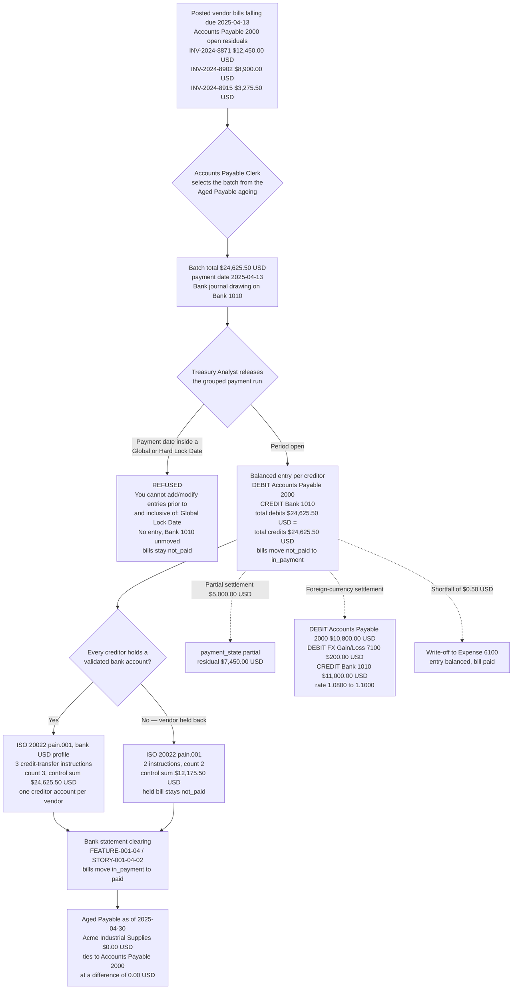

# STORY-001-02-04: Schedule and Batch Vendor Payments

---

## Metadata

| Attribute | Value |
|-----------|-------|
| **Story ID** | `STORY-001-02-04` |
| **Title** | Schedule and Batch Vendor Payments |
| **Parent Feature** | [FEATURE-001-02: Accounts Payable & Vendor Bills](../FEATURE-001-02-accounts-payable-vendor-bills.md) |
| **Parent Epic** | [EPIC-001: Enterprise Accounting in Odoo](../../EPIC-001-enterprise-accounting-odoo.md) |
| **Status** | Draft |
| **Priority** | 🟠 High |
| **Estimate** | 8 (Fibonacci) |
| **Persona** | Treasury Analyst |
| **Feature Capability** | CAP-004 — schedule and batch outgoing vendor payments with a payment run and remittance detail |
| **Epic Success Metrics** | SM-006 — every company-and-period combination presents total debits equal to total credits with no unexplained suspense balance, which every payment entry released by this run either upholds or breaks; SM-002 — the released payment is the ledger movement a statement line clears, so the 95% auto-match rate of FEATURE-001-04 depends on this run leaving a matchable journal item behind; SM-003 and SM-016 — a payable sub-ledger settled to the cent before the period ends is what lets the close run in 5 business days and carries part of the 50% reduction in post-close audit adjustments |
| **Secondary Personas** | Accounts Payable Clerk (prepares the payment proposal from the Aged Payable ageing and never releases it), Chief Accountant (the Bank journal, the bank account and the write-off account a payment difference lands on), External Auditor (the release approval, the segregation between preparer and releaser, and the retained remittance record) |
| **Platform Target** | Open decision DEC-001 — see [Version Compatibility](#version-compatibility) |
| **Capability Source** | Open decision DEC-002 — the ISO 20022 `pain.001` generator has **no supporting module in this repository**; see [License and Compliance](#license-and-compliance) |
| **Last Updated** | 2026-08-15 |
| **Owner/Author** | Enterprise Accounting Team |

This is **story 4 of the 5** in FEATURE-001-02 and the point at which a recorded liability becomes cash that has left the company. [STORY-001-02-01](./STORY-001-02-01-capture-vendor-bills.md) captures the bill, [STORY-001-02-02](./STORY-001-02-02-three-way-match.md) proves it against the purchase order and the goods receipt, and [STORY-001-02-03](./STORY-001-02-03-post-vendor-bill-entries.md) posts it as a balanced entry in the **Purchase** journal that credits **Accounts Payable 2000** and leaves an open residual. Only a posted bill is payable, so this story begins where that one ends: it selects open payable residuals that fall due, settles them in one release through the **Bank** journal against **Bank 1010**, and produces the ISO 20022 `pain.001` instruction file the bank acts on. [STORY-001-02-05](./STORY-001-02-05-manage-vendor-credit-notes.md) reduces what is payable before a run is assembled, and [STORY-001-04-02](../FEATURE-001-04/STORY-001-04-02-auto-match-statement-lines.md) clears what this run releases when the bank presents it on a statement.

> **Persona note — one story, three roles, no substitution.** The **WHO** of this story is the **Treasury Analyst**, who owns the bank and cash position and is the only role that releases a payment. The **Accounts Payable Clerk** appears inside the criteria as the role that assembles the payment proposal from the Aged Payable ageing, and the **Chief Accountant** as the role that owns the Bank journal, the bank account and the account a payment difference is written off to. The separation of the preparing role from the releasing role is the segregation of duties the parent Feature's access-rights matrix requires under C-014, and it is why the three roles are named separately throughout and none stands in for another. No criterion in this file is written against an unnamed actor.

> **Identity note — the paying company is named from the register.** The Epic's [canonical legal-entity register](../../EPIC-001-enterprise-accounting-odoo.md#e4-canonical-legal-entity-register) binds `US-01` to **Global Holdings Inc.**, the United States parent whose functional currency is USD and which is also the group presentation currency. Rule R-E5 of that appendix keeps an entity absent from the register out of every criterion, and rule R-E4 requires the registered name, the entity code, or both. The provisional name `Northwind US Inc.` carried by this story's authoring brief is therefore **superseded**: it stands on no register row, and `Northwind Trading` is already a **customer** of `US-01` in [FEATURE-001-03](../FEATURE-001-03-accounts-receivable-customer-invoices.md), so retaining it would put one name on two parties. The same supersession was applied by [STORY-001-02-03](./STORY-001-02-03-post-vendor-bill-entries.md), so one entity name reads across this Feature. The legal-entity hierarchy itself is owned by [FEATURE-001-06](../FEATURE-001-06-multi-company-consolidation.md); this story consumes those names and defines none.

> **Identity note — the accounts are the register's.** **Accounts Payable 2000** (`liability_payable`, reconcilable), **Bank 1010** (`asset_cash`), **Expense 6100** (`expense`), **Suspense / Outstanding Payments 1099** (`asset_current`) and **FX Gain/Loss 7100** (`income_other`) are rows of the Epic's [canonical group chart of accounts](../../EPIC-001-enterprise-accounting-odoo.md#e2-canonical-group-chart-of-accounts), written as concept-plus-code under rule R-E3 so a reader never resolves a bare number. **FX Gain/Loss 7100** is the register's **realized settlement difference** code — the difference arising when a foreign-currency payable is settled at a rate other than the rate it was booked at — and it is reached in Odoo through the `expense_currency_exchange_account_id` and `income_currency_exchange_account_id` fields of `res.company`. It is distinct from Foreign Exchange Gain/Loss 7200, which receives the IAS 21 remeasurement and translation difference of FEATURE-001-06, and from Gain/Loss on Disposal 7210. This story posts a settlement difference and therefore names 7100 and never the other two.

> **Report-name note.** This ticket writes the payables ageing report as **Aged Payable**, which is the canonical display label the Epic publishes for it in its [Canonical Report Display Labels](../../EPIC-001-enterprise-accounting-odoo.md#e7-canonical-report-display-labels) register — the single place where every report's label and every retained variant is recorded. The label reads the same here, in the parent Feature, in the Epic's SM-001 statement set and in carry-forward CF-001, so one report name reads across the tree.

> **Monetary and date conventions used throughout this ticket.** Every amount is stated in the currency it is denominated in, carried to 2 decimal places, and rounded **half-up at that currency's rounding increment of `0.01`** — the USD rounding increment for the books of **Global Holdings Inc. (`US-01`)** and the EUR rounding increment for a document denominated in EUR. Every computed figure — a batch total, a control sum, a currency conversion, a residual, a realized exchange difference — states that rule at the point it is computed rather than inheriting it silently. Dates are written `YYYY-MM-DD`. The **payment date** is the date the payment is dated and its journal entry recognised on; the **due date** is the date the bill's payable line matures. The worked run pays on the due date, so the two coincide at `2025-04-13`.

---

## User Story

**As a** Treasury Analyst

**I want** to select the posted vendor bills of **Global Holdings Inc. (`US-01`)** that fall due, settle them in one grouped payment release through the **Bank** journal drawing on **Bank 1010**, and produce an ISO 20022 `pain.001` instruction file for the bank

**So that** **Global Holdings Inc. (`US-01`)** pays each vendor on the due date in a single controlled run rather than one payment at a time from a spreadsheet, the **Bank 1010** balance states the cash the company has committed, and the **Accounts Payable 2000** sub-ledger clears to the cent so the Aged Payable ageing the next run is selected from is the ledger position and not a restatement of it.

---

## INVEST Principles Compliance

| Principle | Compliance | Notes |
|-----------|------------|-------|
| **Independent** | ✅ | A payment run needs exactly two things that exist before it: open payable residuals and a Bank journal. The residuals come from [STORY-001-02-03](./STORY-001-02-03-post-vendor-bill-entries.md) and are seedable as posted fixtures in a test company, and **Bank 1010** together with the **Bank** journal comes from [FEATURE-001-01](../FEATURE-001-01-chart-of-accounts-fiscal-year.md) as configuration rather than as code. Nothing else in FEATURE-001-02 has to be delivered first: capture and three-way match sit behind the posting this story consumes, and vendor credit notes in [STORY-001-02-05](./STORY-001-02-05-manage-vendor-credit-notes.md) change the residual a run selects without changing how the run settles it. The statement clearing of [STORY-001-04-02](../FEATURE-001-04/STORY-001-04-02-auto-match-statement-lines.md) reads what this run writes and is therefore a consumer, not a prerequisite |
| **Negotiable** | ✅ | The outcome is fixed and the mechanism is open. What is fixed: one release per run in the **Bank** journal of the named company, debiting **Accounts Payable 2000** and crediting **Bank 1010** for the run total of `$24,625.50 USD`, with total debits equal to total credits on every entry the run posts; one `pain.001` message whose control sum equals the run total to the cent and whose transaction count equals its instruction count; a vendor with no validated bank account held back rather than paid blind; and nothing dated into a locked period. What is left to implementation discovery: whether the run selection, the grouping and the file generation extend the shipped `account.payment.register` surface or arrive through an add-on, where the release authority and the write-off policy are recorded, and how the remittance advice is rendered (D-003, D-005) |
| **Valuable** | ✅ | This is the transition that turns a recorded liability into cash that has left the company, and it is the point at which the payable sub-ledger is either cleared or left overstated. Without it the run is assembled in a spreadsheet: `$24,625.50 USD` of obligation is released with no record inside the system of what was selected or why, the remittance detail reaches the vendor by hand or not at all, and the control the External Auditor is asked to test does not exist. With it, one release settles the run, relieves **Accounts Payable 2000** by `$24,625.50 USD`, commits `$24,625.50 USD` of **Bank 1010**, issues one instruction file whose control sum is the same `$24,625.50 USD`, and leaves a matchable journal item for the bank statement to clear. The balance itself is the Epic's SM-006 metric, and the matchable item it leaves is what SM-002 measures |
| **Estimable** | ✅ | The delivered surface is countable and inspectable: 1 run selection over open payable residuals, 1 grouping rule keyed on the vendor and its bank account, 3 general-ledger accounts in the base path plus 1 write-off account and 1 exchange-difference account, 1 journal type, 4 settlement shapes (full, partial, short-paid with a write-off, foreign-currency), 1 instruction-file contract with 3 asserted values, 4 `payment_state` values and 2 refusal paths, all on models this repository already carries under LGPL-3. The single genuinely open quantity is the source of the file generator, which is why the estimate is 8 rather than 5; the assessment is in [Estimation](#estimation) |
| **Small** | ✅ | One sprint-sized outcome. The story covers **selecting posted bills that fall due, producing one payment entry per creditor within one run, and producing one instruction file** — and nothing beyond that. It is **not** a treasury-management platform: it builds no cash-flow forecast, no bank-connectivity channel, no dealing or hedging function, no payment-approval workflow engine and no bank-statement matching. The forecast belongs to [STORY-001-07-03](../FEATURE-001-07/STORY-001-07-03-generate-cash-flow-statement.md), the statement matching to [FEATURE-001-04](../FEATURE-001-04-bank-reconciliation-cash-management.md), and the ageing that feeds the selection to the parent Feature's Aged Payable report. Sized at 8 story points, above the 5 of the posting story and level with the match story |
| **Testable** | ✅ | Every outcome is a checkable figure, state value, count or named refusal. Each of the eight criteria asserts either both the total debits and the total credits of the entry it produces with their equality stated at a difference of `0.00 USD`, or — on the two criteria that create nothing — a `$0.00 USD` movement together with the refusal that produced it, which is a numeric assertion rather than an inspection (C-009); the instruction file is asserted on three countable values — instruction count, transaction count and control sum; each refusal names the Odoo validation message it is refused with; and each criterion maps to exactly one acceptance test in [Acceptance Test Mapping](#acceptance-test-mapping) (C-008) |

---

## Acceptance Criteria

### The Payment Fixture

The three bills settled below are posted vendor bills of **Global Holdings Inc. (`US-01`)**, each one the product of [STORY-001-02-03](./STORY-001-02-03-post-vendor-bill-entries.md). `INV-2024-8871` is the canonical bill of this Feature, reused without alteration so that capture, match, posting, settlement and credit note are all proved against one record; its `30 Days` payment term applied to the bill date `2025-03-14` matures it on `2025-04-13`, which is the date this run pays. Every figure is stated to 2 decimal places and rounded half-up at its currency's rounding increment of `0.01`.

| Element | Value |
|---------|-------|
| Company (`res.company`) | **Global Holdings Inc. (`US-01`)** — functional currency USD, per the Epic's [canonical legal-entity register](../../EPIC-001-enterprise-accounting-odoo.md#e4-canonical-legal-entity-register) |
| Journal (`account.journal`) | **Bank** — journal type `bank`, drawing on **Bank 1010**. The bills being settled were posted in the **Purchase** journal, journal type `purchase` |
| Payment date | `2025-04-13` — the maturity date of all three payable lines |
| Run reference | `PMT-RUN-2025-04-13` |
| Bill 1 (`account.move`, `move_type = 'in_invoice'`) | `INV-2024-8871` — `Acme Industrial Supplies` — **`$12,450.00 USD`** — due `2025-04-13` |
| Bill 2 (`account.move`, `move_type = 'in_invoice'`) | `INV-2024-8902` — `Cascade Freight Systems` — **`$8,900.00 USD`** — due `2025-04-13` |
| Bill 3 (`account.move`, `move_type = 'in_invoice'`) | `INV-2024-8915` — `Lumen Office Interiors` — **`$3,275.50 USD`** — due `2025-04-13` |
| Batch total | **`$24,625.50 USD`** — `$12,450.00 USD` + `$8,900.00 USD` + `$3,275.50 USD`, rounded half-up at the USD rounding increment of `0.01` |
| Run posting | **DEBIT Accounts Payable 2000 `$24,625.50 USD`** against **CREDIT Bank 1010 `$24,625.50 USD`** — total debits `$24,625.50 USD` equal total credits `$24,625.50 USD` at a difference of `0.00 USD` |
| Instruction file | One **ISO 20022 `pain.001`** Customer Credit Transfer Initiation message carrying **3 credit-transfer instructions** in the **bank's own `pain.001` profile for United States dollar payments**, a control sum of **`$24,625.50 USD`** and a transaction count of **3**, with one creditor account per vendor drawn from `res.partner.bank`. These are **not SEPA Credit Transfers**: the SEPA Credit Transfer scheme is a euro-denominated scheme, and this run is released in USD from `US-01`, so it uses that jurisdiction's credit-transfer channel carried in the same `pain.001` message structure — the scoping rule the parent feature already records |
| `payment_state` path | `not_paid` → `in_payment` on release → `paid` once the bank presents the payment on a statement; `partial` where a payable line is settled in part |
| Partial-settlement variant | `$5,000.00 USD` paid against `INV-2024-8871` → `payment_state` `partial`, residual **`$7,450.00 USD`** (`$12,450.00 USD` − `$5,000.00 USD`), the entry balanced at `$5,000.00 USD` on both sides |
| Held-back variant | `Acme Industrial Supplies` has no validated bank account, so the file carries **2** instructions and a control sum of **`$12,175.50 USD`** (`$8,900.00 USD` + `$3,275.50 USD`) |
| Payment-difference variant | A shortfall of **`$0.50 USD`** written off to **Expense 6100**, the entry staying balanced and the bill reaching `payment_state` `paid` |
| Foreign-currency variant | A payable booked at `EUR 10,000.00` and `$10,800.00 USD` at the rate `1.0800 USD/EUR`, settled at `1.1000 USD/EUR` for `$11,000.00 USD`, giving a realized difference of **`$200.00 USD`** to **FX Gain/Loss 7100** |
| Locked-period variant | `fiscalyear_lock_date` of `US-01` set to `2025-03-31`, against a payment dated `2025-03-20` |
| Tie-out report | **Aged Payable** for `US-01` with the as-of-date parameter `2025-04-30`, where `Acme Industrial Supplies` reads `$0.00 USD` across every bucket once `INV-2024-8871` is settled in full. Buckets are Current, 1-30 days, 31-60 days, 61-90 days, 91-120 days and Over 120 days, aged from the payable line's maturity date against the as-of date |

### How Grouping Works, and What "One Run" Therefore Means

One statement is settled here so that no criterion below has to carry a caveat. Grouping in Odoo is keyed on the creditor, not on the run: the shipped `account.payment.register` surface batches selected payable lines by vendor, payable account, currency, vendor bank account and partner type, and its **Group Payments** option states its own effect as producing one payment per partner and bank account instead of one per bill. Three bills owed to three different vendors therefore settle as **three payments inside one release** — one per creditor, which is also what the instruction file needs, because a credit transfer is addressed to a creditor account and `Acme Industrial Supplies` cannot be held back in Scenario 3 unless its instruction is its own.

Consequently:

- **Each payment entry balances in its own right** — `$12,450.00 USD`, `$8,900.00 USD` and `$3,275.50 USD`, each debiting **Accounts Payable 2000** and crediting **Bank 1010** for its own amount.
- **The run carries the control total.** Across the release, total debits of `$24,625.50 USD` equal total credits of `$24,625.50 USD` at a difference of `0.00 USD`, and that figure is the same one the instruction file's control sum states. Every criterion below asserts the run total and, where a single creditor is in view, that creditor's own balanced entry.
- **Where one vendor holds more than one due bill**, grouping collapses those bills into one payment for that vendor and one instruction, and the payment is allocated across the bills it settles, so each bill's residual moves on its own terms while the vendor is paid once.

### Where the Credit to Bank 1010 Lands, and Why `in_payment` Exists

A released payment is money the company has committed but the bank has not yet presented, and that gap is what the `payment_state` value `in_payment` records. Two routings produce it and this story is written against both, so no **Bank 1010** movement is counted twice — the same two routings [FEATURE-001-04](../FEATURE-001-04-bank-reconciliation-cash-management.md) documents:

- **Direct routing.** Where the **Bank** journal's outgoing payment method line carries no outstanding-payments account, the release posts in one leg — debit **Accounts Payable 2000**, credit **Bank 1010** — and reconciling the statement line creates no further entry, only marking the line and the journal item reconciled. This is the routing FEATURE-001-04 gives the worked `$12,450.00 USD` vendor payment as statement line `L-0318`.
- **Suspense routing.** Where that method line carries **Suspense / Outstanding Payments 1099**, the release posts debit **Accounts Payable 2000** against credit **Suspense / Outstanding Payments 1099**, the bill reads `in_payment` while the payment is in flight, and clearing the statement line posts the second leg — debit **Suspense / Outstanding Payments 1099**, credit **Bank 1010** — at which point the bill reads `paid`.

Either routing relieves **Accounts Payable 2000** by `$24,625.50 USD` and credits **Bank 1010** by `$24,625.50 USD` by the time the run is presented, and each leg balances on its own with total debits equal to total credits at a difference of `0.00 USD`. The criteria below assert the run's own release and name **Bank 1010** as the account the cash leaves; the clearing leg and its statement evidence belong to [STORY-001-04-02](../FEATURE-001-04/STORY-001-04-02-auto-match-statement-lines.md).

### Coverage Distribution

Eight criteria, inside the mandated band of 4 to 8. Each carries one non-compound **When**. Each **Then** asserts only what the Treasury Analyst, the Accounts Payable Clerk, the Chief Accountant or the External Auditor observes in the Odoo user interface or reads back over the public API — no database statement, no method name and no widget language. Every monetary figure states its currency, its amount and its rounding rule; every criterion that names a company names it because company scope decides which books are affected; and **every criterion that posts states both the total debits and the total credits of the resulting entry and asserts their equality at a difference of `0.00 USD`**.

| Scenario | Coverage class | What it proves |
|----------|----------------|----------------|
| 1 | Valid input — happy-path payment run | Three due bills totalling `$24,625.50 USD` settle in one release: debit **Accounts Payable 2000**, credit **Bank 1010**, each bill moving `not_paid` → `in_payment` |
| 2 | Valid input — the instruction-file contract | One `pain.001` message carries 3 credit-transfer instructions in the bank's USD `pain.001` profile, a control sum of `$24,625.50 USD` and a transaction count of 3 |
| 3 | Invalid or incomplete input | A vendor with no validated bank account is held back with a named Odoo validation message; the file carries 2 instructions and `$12,175.50 USD`, and the held bill stays `not_paid` |
| 4 | Error handling — a blocked payment with a named Odoo validation message | No payment is admitted into a locked period; **Bank 1010** is untouched and every bill stays `not_paid` |
| 5 | Accounting edge case | A partial settlement leaves a stated residual of `$7,450.00 USD` and the bill reads `partial` |
| 6 | Accounting edge case | A realized exchange difference of `$200.00 USD` reaches **FX Gain/Loss 7100** and the entry still balances |
| 7 | Valid input — reporting tie-out | The **Aged Payable** report as of `2025-04-30` clears to `$0.00 USD` for the settled vendor and ties to the **Accounts Payable 2000** sub-ledger |
| 8 | Error handling — hostile input on the report selection | Hostile filter and date-range values are each refused with a named message, 0 `account.move` and 0 `account.payment` records are created, **Accounts Payable 2000** and **Bank 1010** move by `$0.00 USD`, and the report answers the next valid submission (C-022) |

### Scenario 1: Three due bills settle in one grouped payment run against Bank 1010

- **Given** three vendor bills stand in state `posted` in the **Purchase** journal of **Global Holdings Inc. (`US-01`)** with open payable residuals on **Accounts Payable 2000**, each maturing on `2025-04-13` — `INV-2024-8871` of `Acme Industrial Supplies` at `$12,450.00 USD`, `INV-2024-8902` of `Cascade Freight Systems` at `$8,900.00 USD` and `INV-2024-8915` of `Lumen Office Interiors` at `$3,275.50 USD`, a batch total of `$24,625.50 USD` — each vendor holds one validated bank account on `res.partner.bank`, the **Bank** journal of that company draws on **Bank 1010**, every bill reads `payment_state` `not_paid`, and the period holding `2025-04-13` is open in that company because its `fiscalyear_lock_date` and `hard_lock_date` both stand earlier than `2025-04-01` or are empty — every amount in this criterion stated to 2 decimal places and rounded half-up at the USD rounding increment of `0.01`
- **When** the **Treasury Analyst** releases run `PMT-RUN-2025-04-13` as one grouped payment dated `2025-04-13` in the **Bank** journal
- **Then** the release **debits Accounts Payable 2000 by `$24,625.50 USD`** and **credits Bank 1010 by `$24,625.50 USD`** in the books of **Global Holdings Inc. (`US-01`)**, so its **total debits of `$24,625.50 USD` equal total credits of `$24,625.50 USD`** at a difference of `0.00 USD`, each amount rounded half-up to 2 decimal places at the USD rounding increment of `0.01`
  - **And** grouping produces **one payment per creditor** inside that one release — `$12,450.00 USD` to `Acme Industrial Supplies`, `$8,900.00 USD` to `Cascade Freight Systems` and `$3,275.50 USD` to `Lumen Office Interiors` — and each of the three entries balances in its own right, debiting **Accounts Payable 2000** and crediting **Bank 1010** for its own amount with its total debits equal to its total credits at a difference of `0.00 USD`
  - **And** the three payment amounts sum to the run total: `$12,450.00 USD` + `$8,900.00 USD` + `$3,275.50 USD` = `$24,625.50 USD` at a difference of `0.00 USD`, so the release carries no unallocated amount and the count of payable lines in the run that are not allocated to a payment is 0
  - **And** each bill's `payment_state` moves from **`not_paid`** to **`in_payment`**, because the payment is released but the bank has not yet presented it; the open residual of each bill falls to `$0.00 USD` and the movement the run contributes to the **Accounts Payable 2000** balance of **Global Holdings Inc. (`US-01`)** measures `$24,625.50 USD` debit
  - **And** each payment carries the remittance detail its vendor receives — the bill number, the bill date and the allocated amount in USD to 2 decimal places — and the release records that the **Accounts Payable Clerk** prepared the proposal and the **Treasury Analyst** released it, which is the segregation the External Auditor reads without a data request

### Scenario 2: The run produces one ISO 20022 pain.001 message whose control sum equals the batch total

- **Given** run `PMT-RUN-2025-04-13` has been released in the **Bank** journal of **Global Holdings Inc. (`US-01`)** as three payments of `$12,450.00 USD`, `$8,900.00 USD` and `$3,275.50 USD` totalling `$24,625.50 USD`, the debtor account of the message is the bank account behind **Bank 1010**, and each of `Acme Industrial Supplies`, `Cascade Freight Systems` and `Lumen Office Interiors` holds one validated creditor account on `res.partner.bank` carrying an IBAN
- **When** the **Treasury Analyst** generates the instruction file for that run
- **Then** **one** ISO 20022 `pain.001` Customer Credit Transfer Initiation message is produced for the run in the **bank's USD credit-transfer profile** — not under the euro-only SEPA Credit Transfer scheme — carrying **3 credit-transfer instructions**, one per creditor, a **transaction count of 3** and a **control sum of `$24,625.50 USD`** stated to 2 decimal places and rounded half-up at the USD rounding increment of `0.01`
  - **And** the control sum equals the run's **Bank 1010** credit of `$24,625.50 USD` at a difference of `0.00 USD`, and the transaction count of 3 equals the number of instructions the message carries, so the file can be reconciled to the ledger without opening it a second time
  - **And** the run the file instructs is the balanced run: its **total debits of `$24,625.50 USD` equal its total credits of `$24,625.50 USD`** at a difference of `0.00 USD`, so the amount instructed to the bank, the amount credited to **Bank 1010** and the amount debited to **Accounts Payable 2000** are one figure and not three, each rounded half-up to 2 decimal places at the USD rounding increment of `0.01`
  - **And** each instruction carries its creditor's name, its creditor account taken from that vendor's `res.partner.bank` record, its own instructed amount in USD to 2 decimal places — `$12,450.00 USD`, `$8,900.00 USD` and `$3,275.50 USD` — and the remittance reference of the bill or bills it settles, so the vendor can allocate the receipt without a query
  - **And** the requested execution date of the message is `2025-04-13`, the same date the payment entries are dated, so the cash committed in the ledger and the cash instructed to the bank fall in one period
  - **And** the generated file is retained against the run with its author and timestamp, and generating it a second time for the same run does not duplicate an instruction: the count of instructions the bank receives for run `PMT-RUN-2025-04-13` stays at 3 and the control sum stays at `$24,625.50 USD`

### Scenario 3: A vendor with no validated bank account is held back and reported

- **Given** run `PMT-RUN-2025-04-13` has been **released** in the **Bank** journal of **Global Holdings Inc. (`US-01`)** over the same three bills — so the payment entries of the payable vendors are already posted before this criterion begins — and `Acme Industrial Supplies` holds **no validated bank account** — either no `res.partner.bank` record with an IBAN exists for it, or the record that exists has not been validated for outgoing payment — while `Cascade Freight Systems` and `Lumen Office Interiors` each hold one validated creditor account
- **When** the **Treasury Analyst** generates the instruction file for that already-released run
- **Then** the `$12,450.00 USD` instruction for `Acme Industrial Supplies` is **omitted from the file and reported back** with a validation message that names the vendor `Acme Industrial Supplies` and states that its recipient bank account must be validated before a payment can be recorded against it, rather than failing the whole run silently. The exact wording belongs to the generator DEC-002 selects — the euro-area OCA module raises `To record payments with SEPA Credit Transfer, the recipient bank account must be manually validated. You should go on the partner bank account of Acme Industrial Supplies in order to validate it.`, and any generator chosen for the bank's USD profile is required to name the same two facts
  - **And** the file carries **2 instructions**, a **transaction count of 2** and a **control sum of `$12,175.50 USD`** — `$8,900.00 USD` + `$3,275.50 USD`, rounded half-up at the USD rounding increment of `0.01` — so the amount instructed to the bank equals the amount released to vendors that can be paid, at a difference of `0.00 USD`
  - **And** bill `INV-2024-8871` stays at `payment_state` **`not_paid`** with its open residual unchanged at `$12,450.00 USD`, and the movement the run contributes to the **Accounts Payable 2000** balance of **Global Holdings Inc. (`US-01`)** measures `$12,175.50 USD` debit rather than `$24,625.50 USD`, so an unpayable obligation stays visible on the ageing instead of being reported as settled
  - **And** the payment entries the **release** already posted for the two payable vendors stand balanced and unchanged by this generation: they debit **Accounts Payable 2000** by `$12,175.50 USD` and credit **Bank 1010** by `$12,175.50 USD`, with **total debits of `$12,175.50 USD` equal to total credits of `$12,175.50 USD`** at a difference of `0.00 USD`, each amount rounded half-up to 2 decimal places at the USD rounding increment of `0.01`. Generating a file writes no journal item of its own: the count of `account.move` records created by this generation is **0**, because posting belongs to the release and generation only serializes what the release produced
  - **And** the held-back bill is listed as an exception on the run with the check that failed, so the **Accounts Payable Clerk** can obtain and validate the bank account and include the bill in the next run; validating a bank account is a master-data change recorded with its author and timestamp, never a step the file generator performs on its own

### Scenario 4: A payment dated inside a locked period is refused and Bank 1010 is untouched

- **Given** the `fiscalyear_lock_date` of **Global Holdings Inc. (`US-01`)** — the Global Lock Date — stands at `2025-03-31` because the March 2025 figures of that company have been reported, and the same three posted bills stand with open residuals on **Accounts Payable 2000** totalling `$24,625.50 USD`, each amount rounded half-up to 2 decimal places at the USD rounding increment of `0.01`
- **When** the **Treasury Analyst** dates the run `2025-03-20` and attempts to release it in the **Bank** journal
- **Then** the release is **refused** with the Odoo validation message **`You cannot add/modify entries prior to and inclusive of: Global Lock Date (03/31/2025).`**, which names the lock date in force; the count of `account.payment` records the refused attempt leaves in state `in_process` or `paid` is **0** — those being the two states of `account.payment.state` that mean a payment has been released, the selection carrying only `draft`, `in_process`, `paid`, `canceled` and `rejected` and no `posted` value at all — and the count of `account.move` records it leaves in state `posted` is **0**
  - **And** **no journal item touches Bank 1010**: the movement the refused attempt contributes to the **Bank 1010** balance of **Global Holdings Inc. (`US-01`)** measures `$0.00 USD` and that balance stands unchanged at its prior figure, and the same holds for **Accounts Payable 2000**, so a reported period cannot be restated by a payment released into it
  - **And** because the refusal creates no entry, there is nothing posted to balance: the **total debits of `$0.00 USD` equal the total credits of `$0.00 USD`** contributed by the refused attempt, at a difference of `0.00 USD`, each amount stated to 2 decimal places at the USD rounding increment of `0.01` — the refusal is a complete rollback rather than a half-written entry
  - **And** all three bills stay at `payment_state` **`not_paid`** with their open residuals unchanged at `$12,450.00 USD`, `$8,900.00 USD` and `$3,275.50 USD`, and no instruction file is generated for the refused run, so the bank is never instructed to move cash the ledger has refused to record
  - **And** the remedy available to the **Treasury Analyst** is to date the run on or after `2025-04-01`; changing the lock date is not a treasury action but a controlled change owned by the **Chief Accountant** under [STORY-001-01-05](../FEATURE-001-01/STORY-001-01-05-configure-period-lock-dates.md)
  - **And** where the `hard_lock_date` of that company covers the payment date, the refusal stands on the same terms and admits no exception at all, so the irreversible lock behaves as its name states

### Scenario 5: A partial settlement leaves a stated residual and the bill reads partial

- **Given** bill `INV-2024-8871` of `Acme Industrial Supplies` stands in state `posted` in the **Purchase** journal of **Global Holdings Inc. (`US-01`)** with an open residual of `$12,450.00 USD` on **Accounts Payable 2000** maturing `2025-04-13`, the vendor holds one validated bank account, and the period holding `2025-04-13` is open in that company
- **When** the **Treasury Analyst** releases a payment of `$5,000.00 USD` dated `2025-04-13` against that bill
- **Then** the payment entry **debits Accounts Payable 2000 by `$5,000.00 USD`** and **credits Bank 1010 by `$5,000.00 USD`**, so its **total debits of `$5,000.00 USD` equal total credits of `$5,000.00 USD`** at a difference of `0.00 USD`, each amount rounded half-up to 2 decimal places at the USD rounding increment of `0.01`
  - **And** the bill's `payment_state` becomes **`partial`** rather than `in_payment` or `paid`, so the ageing and the next payment run both read the bill as part-settled rather than as closed
  - **And** the residual reads **`$7,450.00 USD`** — `$12,450.00 USD` − `$5,000.00 USD`, stated to 2 decimal places and rounded half-up at the USD rounding increment of `0.01` — and that residual is the amount the next run selects for this vendor, so no part of the obligation is settled twice and none is lost
  - **And** the instruction file for this release carries **1 instruction**, a transaction count of 1 and a control sum of `$5,000.00 USD`, equal to the payment's **Bank 1010** credit at a difference of `0.00 USD`
  - **And** the payment is allocated to `INV-2024-8871` and to no other bill, so the `$7,450.00 USD` residual is attributable to that bill alone and the **Accounts Payable 2000** balance of **Global Holdings Inc. (`US-01`)** for that vendor falls by exactly `$5,000.00 USD`

### Scenario 6: A foreign-currency settlement recognises a realized exchange difference on FX Gain/Loss 7100

- **Given** **Global Holdings Inc. (`US-01`)** keeps its books in USD and holds a posted payable to a euro-denominated supplier booked at **`EUR 10,000.00`** and **`$10,800.00 USD`**, the company-currency amount being the conversion `10,000.00 × 1.0800 = 10,800.00` at the rate of `1.0800 USD/EUR` in force on the bill date, and the rate in force on the payment date `2025-04-13` is **`1.1000 USD/EUR`**, every amount stated to 2 decimal places and rounded half-up at its currency's rounding increment of `0.01`
- **When** the **Treasury Analyst** releases a payment settling that payable in full at the payment-date rate
- **Then** the payment costs **`$11,000.00 USD`** — the conversion `10,000.00 × 1.1000 = 11,000.00` rounded half-up at the USD rounding increment of `0.01` — and the entry **debits Accounts Payable 2000 by `$10,800.00 USD`**, which is the amount the liability was carried at, **debits FX Gain/Loss 7100 by `$200.00 USD`** and **credits Bank 1010 by `$11,000.00 USD`**, so its **total debits of `$11,000.00 USD` equal total credits of `$11,000.00 USD`** at a difference of `0.00 USD`
  - **And** the realized difference of **`$200.00 USD`** is arithmetically traceable to the rate movement alone: `$11,000.00 USD` − `$10,800.00 USD` = `$200.00 USD`, equivalently `EUR 10,000.00 × (1.1000 − 1.0800)`, and it is recognised in the period holding the payment date `2025-04-13` rather than in the period the bill was booked
  - **And** **FX Gain/Loss 7100** is reached as the account configured on **Global Holdings Inc. (`US-01`)** for a settlement loss, so the difference lands on the register's realized-settlement-difference code and never on Foreign Exchange Gain/Loss 7200, which carries the IAS 21 remeasurement and translation difference of [FEATURE-001-06](../FEATURE-001-06-multi-company-consolidation.md), and never on Gain/Loss on Disposal 7210
  - **And** the payable's document amount of `EUR 10,000.00` is settled in full, so its residual reads `EUR 0.00` and `$0.00 USD` and its `payment_state` follows the same `in_payment` → `paid` path as a domestic settlement
  - **And** both rates and the dates they were read from are recorded on the entry, so the External Auditor recomputes `$10,800.00 USD`, `$11,000.00 USD` and the `$200.00 USD` difference from the record rather than from a worksheet, and any residual cent arising from a conversion is assigned **whole to a single line** with the count of other lines altered to force the balance being 0

### Scenario 7: The Aged Payable report clears for the settled vendor and ties to the Accounts Payable 2000 sub-ledger

This criterion is the whole of the **Aged Payable** reporting workflow the Epic's [CF-001 carry-forward entry](../../EPIC-001-enterprise-accounting-odoo.md#cf-001-aged-payable-reporting-workflow) makes mandatory in this story, and the whole of the export-and-drill-down convention **CAP-X01** that [FEATURE-001-07 §4.1](../FEATURE-001-07-financial-reporting-period-close.md#41-feature-level-acceptance-criteria) owns and this story inherits. Both are asserted here rather than referenced, so nothing in either contract is discharged by a pointer. The presentation rules the buckets follow are **CAP-X02**, which the same feature owns so that payables and receivables age on identical rules — the divergence between the two being a defect rather than a variation.

- **Given** run `PMT-RUN-2025-04-13` has settled all three bills in full on `2025-04-13` in **Global Holdings Inc. (`US-01`)** for a run total of `$24,625.50 USD`, the bank has presented each payment on the statement so the clearing of [STORY-001-04-02](../FEATURE-001-04/STORY-001-04-02-auto-match-statement-lines.md) is complete, and `Acme Industrial Supplies` holds no other open bill in that company
  - **And** three further vendors hold open payable residuals in `US-01` at that date, seeded so that every bucket boundary is exercised deterministically: `Northwind Fabrication Ltd`, in the vendor category **Direct Materials**, holds four open bills — `INV-2025-3301` billed `2025-03-31` and due **`2025-04-30`** for `$18,000.00 USD`, `INV-2025-3302` billed `2025-03-01` and due **`2025-03-31`** for `$24,000.00 USD`, `INV-2025-3303` billed `2025-02-28` and due **`2025-03-30`** for `$9,600.00 USD`, and `INV-2024-2210` billed `2024-11-30` and due **`2024-12-30`** for `$4,200.00 USD`; `Rhein Werkzeug GmbH`, also in **Direct Materials**, holds one open bill `INV-2025-3410` billed `2025-03-16` and due `2025-04-15` for **`€20,000.00 EUR`**, against a published rate of **1.0850 USD per EUR on `2025-04-30`**; and `Acme Industrial Supplies` stands in the vendor category **Indirect Services**
  - **And** the configurable bucket set **0-15, 16-30, 31-45, 46-60 and Over 60 days** is defined alongside the six standard buckets, each amount rounded half-up to 2 decimal places at its currency's rounding increment of `0.01`
- **When** the **Treasury Analyst** runs the **Aged Payable** report for company `US-01` with the as-of-date parameter `2025-04-30`, the standard bucket set selected and no filter applied
- **Then** the report presents `Acme Industrial Supplies` at **`$0.00 USD`** in every bucket — Current, 1-30 days, 31-60 days, 61-90 days, 91-120 days and Over 120 days — and at a vendor total of `$0.00 USD`, because the `$12,450.00 USD` residual that stood before the run has been settled in full
  - **And** the report's total for that as-of date **equals the Accounts Payable 2000 balance of Global Holdings Inc. (`US-01`) at `2025-04-30` at a difference of `0.00 USD`**, each amount rounded half-up to 2 decimal places at the USD rounding increment of `0.01`, which is the tie-out the [Accounting Reconciliation Gate](#accounting-reconciliation-gate) requires and the evidence the External Auditor reads instead of re-performing the ageing
  - **And** all three settled bills read `payment_state` **`paid`**, having moved `not_paid` → `in_payment` on release and `in_payment` → `paid` on presentation, so a bill shown as settled in the ageing is a bill the bank has confirmed
  - **And** the `$24,625.50 USD` the run removed from the ageing equals the `$24,625.50 USD` it debited to **Accounts Payable 2000** at a difference of `0.00 USD`, and the run that removed it balanced when it posted — its **total debits of `$24,625.50 USD` equal its total credits of `$24,625.50 USD`** at a difference of `0.00 USD` — so the movement in the report, the movement in the sub-ledger and the movement in the bank account are one figure rather than three, each rounded half-up to 2 decimal places at the USD rounding increment of `0.01`
  - **And** every **bucket boundary is measured from the bill due date** and never from the bill date, so a bill due 30 days before the as-of date sits in 1-30 days, one due 31 days before sits in 31-60 days and one due 121 days before sits in Over 120 days, and each bucket amount is the **open residual** rather than the original bill amount
  - **And** a vendor row **expands to the individual open bills** behind each bucket, every expanded line showing its bill number, its bill date, its due date and its open residual amount, and the expanded lines of a row sum to that row's bucket amounts at a difference of `0.00 USD`, so a bucket total is read as the bills that compose it rather than as a single figure
  - **And** the report **states which bucket set produced its columns**, and a **configurable bucket set** stands alongside the six standard ones: run for the same company and the same as-of date with the set 0-15, 16-30, 31-45, 46-60 and Over 60 days, the report names that set in its header, redistributes the same open residuals across the five columns and reports the same total, still equal to the **Accounts Payable 2000** balance at that date at a difference of `0.00 USD`
  - **And** a **foreign-currency open bill** is presented at its company-currency amount beside its original amount with that currency's ISO 4217 code, the conversion rate and the rate date that produced it: on the `EUR 10,000.00` payable this story works in Scenario 6, the row reads `$10,800.00 USD` beside `EUR 10,000.00` at the rate `1.0800 USD/EUR` of `2025-03-14`, each amount rounded half-up to 2 decimal places at that currency's rounding increment of `0.01`
  - **And** **vendor-category filtering** narrows the report to one vendor category, the report states the filter it applied, and the filtered total equals the sum of the vendor totals it shows at a difference of `0.00 USD`; the unfiltered total is the figure that ties to **Accounts Payable 2000**
  - **And** the report inherits the export and drill-down convention owned by [FEATURE-001-07](../FEATURE-001-07-financial-reporting-period-close.md) and recorded in the Epic's [FR-007 fan-out](../../EPIC-001-enterprise-accounting-odoo.md#c32-fr-007--the-export-and-drill-down-fan-out): it exports to **PDF** and to **XLSX**, each export carries the as-of date, the bucket set and the filters active on screen, each export contains the **expanded** bill detail rather than the collapsed vendor summary, and the exported total equals the on-screen total at a difference of `0.00 USD`
  - **And** selecting a vendor row drills down to the journal items behind it **with the as-of date, the bucket set and the active filters preserved**, and the drill-down carries **breadcrumbs** back to the summary it came from, so a bucket amount is traced to the payable lines and the payments that settled them and the reader returns to the same filtered view
  - **And** the report **posts nothing**: the count of `account.move` records created by running it, exporting it or drilling into it is **0**, in every bucket set and under every filter

### Scenario 8: Hostile filter and date-range values submitted to the Aged Payable selection are refused and the ledger is untouched

- **Given** the books of **Global Holdings Inc. (`US-01`)** stand as Scenario 7 left them — run `PMT-RUN-2025-04-13` released for `$24,625.50 USD`, its 3 payment records and their 3 balanced journal entries posted — and the **Aged Payable** selection is open for that company with its as-of-date parameter and its vendor-category and vendor-name filters exposed to entry
- **When** the **Treasury Analyst** submits that selection carrying the hostile parameter set: the non-existent calendar date `2025-04-31`, the out-of-range as-of date `1899-12-31`, the as-of date `' OR 1=1 --`, the inverted range `2025-04-30` to `2025-04-01`, the vendor-category filter `'); DROP TABLE account_move_line; --`, and a vendor-name filter of 10,000 characters
- **Then** every submission in that set is **refused with a named validation message** stating the parameter it rejected, the check that failed and the action to take — a value that is not a calendar date is refused as a date, a date that resolves to no fiscal period of `US-01` is refused against the fiscal calendar, an end date earlier than its start is refused as a range, a category value that resolves to no vendor category is refused as an unknown category, and a filter above its stated maximum length is refused against that maximum — and **no report, no export and no drill-down is produced** for any of them
  - **And** the ledger and the payment set are **unchanged by every refusal**: the count of `account.move` records in `US-01` after the last refusal equals the count before the first at a difference of **0 records**, the count of `account.payment` records likewise at a difference of **0 records**, and the **Accounts Payable 2000** and **Bank 1010** balances each move by **`$0.00 USD`**, stated to 2 decimal places at the USD rounding increment of `0.01`, because the report is a read and a refused read writes nothing
  - **And** the submitted value is carried as a **search value** rather than as query text: the table `account_move_line` still exists after the category submission and its row count is unchanged at a difference of **0 rows**, which is the observable form of the ORM-and-parameterized-query discipline C-019 requires
  - **And** each refusal message discloses **no stack trace, no SQL, no file-system path and no credential**, the diagnostic detail being written instead as one structured log record carrying the company, the submitted parameter and the failed check as discrete fields on an access-controlled channel (C-020)
  - **And** the **service remains available**: immediately after the last refusal, the same selection submitted for `US-01` with the valid as-of date `2025-04-30` returns the Scenario 7 report — `Acme Industrial Supplies` at `$0.00 USD` in every bucket and a total equal to the **Accounts Payable 2000** balance at that date at a difference of `0.00 USD` — so a rejected parameter costs the reader nothing beyond the rejected submission (C-022)

---

## Sub-Tasks

- [ ] **@finance-sme** — Sign off the **write-off policy for a payment difference** as group treasury policy: the threshold below which a shortfall on a vendor payment is closed rather than left as an open residual, that the named destination of such a write-off is **Expense 6100**, that the worked `$0.50 USD` shortfall is inside that threshold, and who authorises a write-off above it. Record the signed threshold against this story so the disposition of a difference is evidenced rather than decided at the keyboard, and confirm that the two dispositions the shipped register surface offers — keep the balance open, or close it to a stated account — are the only two the run exposes
- [ ] **@finance-sme** — Confirm the **release authority and the segregation of duties**: that the **Accounts Payable Clerk** assembles the payment proposal from the Aged Payable ageing and cannot release it, that the **Treasury Analyst** alone releases a run and generates its instruction file, that the **Chief Accountant** owns the Bank journal and the bank account the run draws on, and the run value above which a second release approval is required. Sign off the tie-out worksheet — **Aged Payable** as of a stated date reconciled to **Accounts Payable 2000** at a difference of `0.00 USD` — as retained close evidence
- [ ] **@functional-consultant** — Document the **bank's ISO 20022 `pain.001` profile and the vendor bank-detail prerequisites**: the `pain.001` version and schema the receiving bank accepts, its file-naming and delivery channel, its rules for the control sum and transaction count, its character-set and field-length restrictions, whether it accepts a mixed-currency message or requires one message per currency, and the debtor identification it expects. Against that profile, document what a vendor must hold before it can be paid — a `res.partner.bank` record carrying an IBAN, validated for outgoing payment, in the currency of the run — and the exception path for a vendor that does not, which is the behaviour Scenario 3 asserts
- [ ] **@functional-consultant** — Specify the **run-selection and grouping rules the Treasury Analyst sees, together with the refusal set and the remedy for each**. Selection and grouping: which open payable residuals are offered for a stated payment date, how they are filtered by company, vendor, due date, currency and bank journal, how a vendor holding more than one due bill is collapsed into one payment and one instruction while each bill's residual moves on its own terms, how an allocated vendor credit note from [STORY-001-02-05](./STORY-001-02-05-manage-vendor-credit-notes.md) reduces the amount offered, and how an early-payment discount changes the amount released without breaking the debit-equals-credit assertion. Refusals: a recipient bank account that is not validated for outgoing payment, a payment dated inside a lock date the company has in force, a payment of `$0.00 USD`, a negative payment amount, a selection spanning more than one company, a selection with nothing left to pay, and a Bank journal whose outgoing payment method has no account configured to receive the credit — each stating the message, the cause and the action, and none of them disclosing a stack trace or a file-system path (C-020)
- [ ] **@developer** — Deliver the **run release on the models this repository already carries** rather than a parallel structure (C-012): the selection over open payable lines on **Accounts Payable 2000**, the grouping keyed on the creditor and its bank account, one `account.payment` per creditor with its `account.move` and `account.move.line` rows in an `account.journal` of type `bank`, the allocation of each payment to the bills it settles, and the `payment_state` transitions `not_paid` → `in_payment` → `paid` and `not_paid` → `partial` that the ageing and the next run read
- [ ] **@developer** — Deliver the **instruction-file generation and its control values**: one ISO 20022 `pain.001` message per run carrying one credit-transfer instruction per creditor in the profile that entity's scheme requires, each creditor account read from `res.partner.bank`, a transaction count equal to the instruction count, a control sum equal to the sum of the instructed amounts to the cent, the requested execution date equal to the payment date, and idempotent regeneration that does not duplicate an instruction. Hold the bank channel's credentials and any signing material outside module source and outside version control, scoped per company (C-021)
- [ ] **@developer** — Deliver the **settlement arithmetic and the lock-window refusal**: full settlement, partial settlement with the residual carried to the cent, a payment difference written off to the account the policy names, and the realized exchange difference on a foreign-currency payable computed as the settled company-currency amount less the carried company-currency amount and posted to **FX Gain/Loss 7100** through the exchange-difference accounts configured on the company; and refuse a payment whose date falls on or before the company's Global Lock Date or Hard Lock Date, creating no journal item by the refused attempt
- [ ] **@developer** — Deliver **parameter validation on the Aged Payable selection** so a hostile value is refused before a query runs: the as-of date and each end of a date range parsed as calendar dates with an end earlier than its start refused as a range, the vendor-category filter resolved against an existing vendor category and refused where it resolves to none, every free-text filter bounded by a stated maximum length, and every accepted value carried through the ORM or a parameterized query rather than concatenated into one (C-019). Each refusal names the parameter, the failed check and the action to take, creates no journal item and no payment record, and discloses no stack trace, no SQL, no file-system path and no credential, with the diagnostic detail written as one structured log record on an access-controlled channel (C-020, C-022)
- [ ] **@qa-engineer** — Build the **acceptance suite covering all 8 scenarios**, one test per criterion (C-008), and assert **total debits against total credits at a difference of `0.00 USD` on every scenario that posts** — Scenarios 1, 3, 5, 6 and 7 — together with the `$0.00 USD` movement asserted on the refusal path of Scenario 4 and the three control values of the instruction file in Scenario 2, every amount asserted numerically to the cent and every account asserted by code (C-009). Cover Scenario 8 with the hostile-parameter tests named in [§ Hostile-Input Test Requirements](#hostile-input-test-requirements-c-022), each asserting a named refusal, **0** `account.move` and **0** `account.payment` records created, a `$0.00 USD` movement on **Accounts Payable 2000** and on **Bank 1010**, and the report answering the next valid submission, and cover the accepted-value paths a refusal test cannot reach with the tests named in [§ Accepted-Data Output-Protection Test Requirements](#accepted-data-output-protection-test-requirements-c-017-c-018) (C-017, C-018, C-022)
- [ ] **@qa-engineer** — Build the **boundary, concurrency and performance suite**: two runs launched at the same moment settling `INV-2024-8871` once only for `$12,450.00 USD` with the second attempt refused; a payment of `$0.00 USD` refused with no entry created; a negative payment amount refused by the shipped constraint; a `$0.50 USD` shortfall written off to **Expense 6100** with the entry balanced and the bill reaching `paid`; regeneration of the instruction file leaving the count at 3 and the control sum at `$24,625.50 USD`; and a run of 500 posted bills released with its instruction file in 60 seconds or less, which is the budget the parent Feature sets in [§4.4 Performance Requirements](../FEATURE-001-02-accounts-payable-vendor-bills.md#44-performance-requirements), with the unallocated run amount asserted at `0.00` in the payment currency

---

## Edge Cases

- **Concurrent payment of the same bill.** Two payment runs launched at the same moment over an overlapping selection — the **Treasury Analyst** in the interface and a scheduled or API-driven release — settle `INV-2024-8871` **once only, for `$12,450.00 USD`**, stated to 2 decimal places and rounded half-up at the USD rounding increment of `0.01`. **Control:** the second attempt is refused rather than relieving **Accounts Payable 2000** a second time, so the vendor's payable movement measures `$12,450.00 USD` debit once and not `$24,900.00 USD`, and the bank receives one instruction for that bill rather than two. The losing attempt reports the refusal to its caller instead of failing silently, and the outcome is asserted by test rather than assumed, because a doubled payment is discovered when the vendor is asked for a refund — after the cash has left.
- **Zero-amount or null payment.** A payment of **`$0.00 USD`**, stated to 2 decimal places at the USD rounding increment of `0.01`, is **refused with an Odoo validation message and creates no journal entry**, so the payable sub-ledger admits no zero-value settlement and the bank receives no instruction to move nothing. **Control:** the same refusal covers a payable line whose residual has already fallen to `$0.00 USD` and is selected again — the shipped register surface reports that there is nothing left to pay on the selection rather than creating an empty payment — and a **negative** payment amount is refused by the shipped constraint whose message reads `The payment amount cannot be negative.`, so the direction of a payment cannot be inverted by keying a minus sign. In every case the **Bank 1010** movement measures `$0.00 USD`.
- **Locked fiscal period.** While the Global Lock Date (`fiscalyear_lock_date`) or the Hard Lock Date (`hard_lock_date`) of **Global Holdings Inc. (`US-01`)** covers a run's payment date, the release is **refused** with `You cannot add/modify entries prior to and inclusive of: Global Lock Date (03/31/2025).` and no journal item is created. **Control:** a payment is refused rather than postponed to the first open period, which is the point at which this story differs from [STORY-001-02-03](./STORY-001-02-03-post-vendor-bill-entries.md) — a bill that arrives dated inside a closed period is recognised in the first open period with its bill date retained, whereas a payment date states when cash actually moved and cannot be re-dated without misstating the bank position. The remedy is to date the run inside an open period; reopening a closed one is a lock-date decision owned by [STORY-001-01-05](../FEATURE-001-01/STORY-001-01-05-configure-period-lock-dates.md), and the Hard Lock Date admits no exception at all.
- **Multi-currency rounding and the realized difference.** A payable carried at `EUR 10,000.00` and `$10,800.00 USD` at `1.0800 USD/EUR` and settled at `1.1000 USD/EUR` costs `$11,000.00 USD`, so a realized difference of **`$200.00 USD`** is recognised in the period holding the payment date and posted to **FX Gain/Loss 7100**, every amount rounded half-up to 2 decimal places at its currency's rounding increment of `0.01`. **Control:** the difference is computed from the two stated rates and the two dates they were read from, both recorded on the entry, so it is reproducible without a worksheet; a residual cent arising from a conversion is assigned **whole to a single line** and never split across lines or absorbed into a balancing plug, with the count of lines altered to force the balance being 0; and the entry balances at `$11,000.00 USD` on both sides at a difference of `0.00 USD`. The settlement difference stays on 7100 and never reaches Foreign Exchange Gain/Loss 7200 or Gain/Loss on Disposal 7210.
- **Payment difference on a short settlement.** A vendor payment that falls **`$0.50 USD`** short of the bill's residual — a bank charge deducted at source, or a rounding difference in the vendor's own statement — is settled as a **write-off to Expense 6100** where the amount is inside the threshold the finance policy states: the entry debits **Accounts Payable 2000** by the full residual, debits **Expense 6100** by `$0.50 USD` and credits **Bank 1010** by the amount actually paid, so total debits equal total credits at a difference of `0.00 USD` and the bill reaches `payment_state` **`paid`** rather than carrying a `$0.50 USD` residual forever. **Control:** the alternative disposition — leaving the `$0.50 USD` open as a residual — stays available and is the default above the signed threshold, so closing a difference is a policy decision recorded with its author and timestamp rather than a silent adjustment; either way the shortfall is visible, never absorbed into the vendor's payable balance without a line of its own.

---

## Constraints

The constraint identifiers below are the Epic's own, restated in the terms of this story rather than renumbered, so one constraint set reads across the whole ticket tree. The full text is held in [EPIC-001 §7 Constraints](../../EPIC-001-enterprise-accounting-odoo.md#7-constraints).

### License and Compliance

- [x] **C-001 — AGPL-3.0 compatibility**: any module delivering the run selection, the grouping, the instruction file, the settlement arithmetic and the lock-window refusal is distributed under an AGPL-3.0 compatible licence, matching the licence of the Community-edition accounting add-ons already present in this repository
- [x] **C-002 — Existing licence respected**: extension of `account` — the "Invoicing" application, version 1.4, category `Accounting/Accounting`, licence LGPL-3 — and of `account_payment` — "Payment - Account", version 2.0, licence LGPL-3, declaring `account` and `payment` as its dependencies — respects those licences, and an AGPL-3 extension of LGPL-3 code is licence-checked before it is written
- [x] **C-003 / C-004 — The `pain.001` capability has no module in this repository, and its source is open decision DEC-002.** This is the most consequential constraint on this story and it is recorded plainly rather than assumed away. A search of `addons/` in the present baseline finds **no ISO 20022 `pain.001` or SEPA Credit Transfer file generator at all**: `account_batch_payment`, `account_sepa` and `l10n_sepa` are **absent**, as are `account_iso20022` and `account_sepa_direct_debit`, and the only SEPA-named modules present are `account_qr_code_sepa` and `account_qr_code_emv`, which render a payment QR code for a payer to scan and generate no credit-transfer initiation message. `account` and `account_payment` supply the payment record, the payment method lines, the allocation surface and the grouping option, and neither supplies a `pain.001` writer. The capability source is therefore the Epic's open **edition lock-in** decision **DEC-002** — an Odoo Enterprise subscription, or the OCA path with bespoke development for the residual — owned by the CFO / Finance Director with the Group Controller and recorded in the [Open Decisions Register](../../EPIC-001-enterprise-accounting-odoo.md#appendix-b-open-decisions-register). It is flagged for stakeholder confirmation rather than resolved here, per AAP §0.8.3. **Nothing in this ticket assumes the capability is present.**
- [x] **What DEC-002 does and does not gate in this story**: the payable models the run reads and the payment records it writes are all present under LGPL-3 — `account.payment`, `account.move`, `account.move.line`, `account.journal`, `res.partner` and `res.partner.bank` — so Scenarios 1, 3, 4, 5, 6, 7 and 8 can be developed and demonstrated before the edition decision is confirmed. What DEC-002 gates is the **generator behind Scenario 2**, which is why that criterion is written against the message's countable contract — one message, 3 instructions, a transaction count of 3, a control sum of `$24,625.50 USD`, one creditor account per vendor — rather than against one generator's internal structure. Any of the candidate sources satisfies the criterion if it produces those values
- [x] **C-004 — OCA ecosystem compatibility**: whichever path DEC-002 confirms, the payments posted by this run stay consumable by OCA add-ons — including `account_reconcile_oca` for the allocation surface and `account_financial_report` for the aged partner balance — without a posted payment being restated. Naming an OCA repository asserts precedent rather than installability: a branch is stated before a dependency is declared, and where no port exists on the branch DEC-001 confirms, the work is recorded as bespoke scope under DEC-002
- [x] **C-005 / C-006 — Odoo and OCA coding standards**: Python follows Odoo and OCA module guidelines including PEP 8, and static analysis passes with the repository's configured tooling, whose lint configuration is `ruff.toml` at the repository root
- [x] **C-012 — Build on the existing models**: the release is `account.payment` records with their `account.move` and `account.move.line` rows in an `account.journal` of type `bank`, allocated against payable lines on **Accounts Payable 2000**; no parallel payment table, no shadow bank ledger and no second cash position is introduced, so there is one audit trail
- [x] **C-014 — Access rights, segregation of duties and company isolation**: the **Accounts Payable Clerk** who prepares the proposal cannot release a run or generate its instruction file; the **Treasury Analyst** who releases it cannot alter a bill amount after posting; the **Chief Accountant** owns the Bank journal, the bank account and the write-off account; the **External Auditor** holds read-only access to the run, its approvals and its remittance record; and a role restricted to `US-01` can neither release a payment nor read a payment record in `NL-01` or `GB-01`. Each of these is proven by an access-rights test (D-007)
- [x] **C-015 through C-020 — Untrusted input on the payment path**: vendor bank details are master data that decides where cash goes, so an IBAN is validated for structure and check digits before it is accepted and validated for outgoing payment by a recorded human action before it can be paid; a creditor name is context-encoded before it is written into an instruction file or a remittance advice; values written to CSV and XLSX exports of a run are neutralized against formula injection; data access is expressed through the ORM or parameterized SQL; and a failure discloses no stack trace and no file-system path, with diagnostic detail going to the server log under an access-controlled channel
- [x] **C-021 — No secrets in source**: the bank channel's credentials, certificates and any signing material used to submit a `pain.001` message are held outside module source and outside version control, scoped per company, with a named rotation owner and rotation interval, and appear in no log, fixture, test or export. A change of vendor bank details is treated as a fraud-relevant event and is recorded with its author, its timestamp and the prior value
- [x] **C-022 — Hostile-input tests are executable on the report selection**: the parent Feature names this story as the surface that carries hostile filter and date-range values into the **Aged Payable** selection, so at least one acceptance test per hostile case in [§ Hostile-Input Test Requirements](#hostile-input-test-requirements-c-022) submits that value and asserts a **named refusal**, **0** `account.move` records created, **0** `account.payment` records created, a `$0.00 USD` movement on **Accounts Payable 2000** and on **Bank 1010**, and the service still answering the next valid submission. Rejection is the only outcome those tests record; **neutralization** is a separate obligation that runs on values the report **accepted** and is asserted separately in [§ Accepted-Data Output-Protection Test Requirements](#accepted-data-output-protection-test-requirements-c-017-c-018), so no test can be satisfied by either of two behaviours

### Accounting Standards Compliance

- [x] **A payment relieves the payable and reduces cash in one balanced entry**: every payment this story releases debits **Accounts Payable 2000** and credits **Bank 1010** — or credits **Suspense / Outstanding Payments 1099** and then **Bank 1010** on the second leg where the journal's payment method routes through it — and posts only when its total debits equal its total credits at a difference of `0.00` in the company currency. That equality is **asserted numerically** in every test rather than inspected (C-009), because SM-006 measures exactly this across every company and period
- [x] **Cash is never counted twice**: exactly one of the two routings applies to a given payment, and the **Bank 1010** movement is recognised once — either at release or at statement clearing, never at both. Where the payment posts straight to **Bank 1010**, reconciling the statement line creates no journal entry and only marks the line and the journal item reconciled; where it routes through **Suspense / Outstanding Payments 1099**, that account returns to `$0.00 USD` when the statement clears, so no unexplained suspense balance survives the period (SM-006)
- [x] **Realized exchange differences are recognised in the period of payment**: the difference between the company-currency amount a foreign-currency payable was carried at and the company-currency amount it was settled for is realized on settlement, in the manner IAS 21 and ASC 830 require, and is recognised in the period holding the payment date on **FX Gain/Loss 7100**. The unrealized retranslation of an open balance at a closing rate is a different event and belongs to FEATURE-001-06 on Foreign Exchange Gain/Loss 7200
- [x] **Settlement is allocation, not overwriting**: a payment is allocated against the payable lines it settles, so a bill's residual is the arithmetic result of its original amount less the amounts allocated to it — `$12,450.00 USD` − `$5,000.00 USD` = `$7,450.00 USD` — and a bill is never rewritten to record that it has been paid. A payment released in error is reversed or unreconciled with the reversal recorded, never deleted
- [x] **A payment difference is disclosed, never absorbed**: a shortfall is either carried as an open residual or written off to a named account — **Expense 6100** for the worked `$0.50 USD` case — on its own journal line, so the difference is readable on the entry rather than hidden inside the payable balance
- [x] **ISO 4217 minor units**: every amount is rounded **half-up** to its currency's decimal precision — 2 decimal places at a rounding increment of `0.01` for USD and EUR — a residual fraction is carried whole on a single line, and the instruction file's control sum is stated at the same precision as the amounts it sums
- [x] **Nothing is posted into a closed period**: while a lock date covers a payment date, no journal item of this story is recognised on it and no instruction file is issued for the refused run, which keeps a reported period as it was reported and keeps the bank from being instructed to move cash the ledger has refused
- [x] **Audit trail**: the assembly of the proposal, the release, the sequence number issued, the instruction file generated, each allocation, each write-off and each change of vendor bank details are recorded with their author and timestamp and are readable by the External Auditor without a data request

### Version Compatibility

- [x] **C-010 — Platform version target is open decision DEC-001**: this story states no platform version of its own. The originating programme request names Odoo 17, the superseded flat backlog named 18.0, and the baseline every field name, state value and validation message in this ticket was read against is **Odoo 19.0 Community**, where `odoo/release.py` declares `version_info = (19, 0, 0, FINAL, 0, '')`. The mismatch is recorded and confirmed with stakeholders before development rather than chosen inside this story. The fixed single-version compatibility line carried by the superseded story template is therefore **not** restated here: this ticket asserts no version requirement of its own and defers entirely to DEC-001, which is what §0.7.2 of the governing constraint set requires of a story that supersedes prior art
- [x] **C-011 — Language and database versions follow the confirmed target**: the 19.0 baseline present here declares `MIN_PY_VERSION = (3, 10)`, `MAX_PY_VERSION = (3, 13)` and `MIN_PG_VERSION = 13` in `odoo/release.py`; an earlier platform target carries a different supported matrix
- [x] **Impact if DEC-001 resolves away from 19.0**: three statements in this file are re-verified against the confirmed release before development. First, the **lock-date contract of Scenario 4** — in the 19.0 baseline a payment dated inside a locked period is refused because the payment path carries no postponement of its own, while the invoice path postpones instead; the earlier candidates differ in both the behaviour and the message text. Second, the **field and state names** cited in [Technical Discovery Notes](#technical-discovery-notes) — the `payment_state` values `not_paid`, `in_payment`, `partial` and `paid`, the grouping and difference-handling fields of the payment register, the outstanding-account field on the payment, `allow_out_payment` on the vendor bank account, and the exchange-difference and lock-date fields on the company — are restated for the confirmed version. Third, the **validation message texts** quoted in the criteria are re-read from the confirmed release's own source, because a message is acceptance evidence only while it is the message the platform emits

---

## Technical Discovery Notes

> **Purpose:** these notes direct the codebase analysis that precedes implementation. They record what to investigate and what the outcome must prove; they do not choose the implementation. Every path and field below was read in this repository at the Odoo 19.0 Community baseline, so the implementing agent starts from verified ground rather than from assumption.

### Codebase Analysis Areas

| Area | Files/Modules to Examine | Analysis Focus |
|------|--------------------------|----------------|
| The payment record and its accounting legs | `addons/account/models/account_payment.py` | How a payment becomes a journal entry: the liquidity line, the counterpart line, and the `outstanding_account_id` field that decides whether the credit rests in **Suspense / Outstanding Payments 1099** or lands straight on **Bank 1010** — the field is computed from the payment method line's own account, and the platform refuses to create a payment when neither the company nor that method line supplies one, with the message `You can't create a new payment without an outstanding payments/receipts account set either on the company or the … payment method in the … journal.` Establish which routing the group's Bank journals are configured for, because that choice decides whether a bill reads `in_payment` or `paid` on release. Note also the constraint that refuses a negative amount, whose message reads `The payment amount cannot be negative.`, and the outbound guard that refuses a payment whose recipient bank account has not been validated |
| Payment methods and the account behind each | `addons/account/models/account_payment_method.py` | The payment method and payment method line structure, and the account field on the method line that supplies the outstanding-payments account for a journal. Establish which outbound methods the group's Bank journals offer, what each one's account is set to, and whether a credit-transfer method is added for the run or an existing method is reused — this is the seam at which a `pain.001` generator would attach, so it is analysed before the generator's source is chosen |
| The grouping and difference-handling surface that already exists | `addons/account/wizard/account_payment_register.py` | The shipped registration surface and the four fields that decide the shape of a run: `group_payment`, whose own help text states that it produces one payment per partner and bank account instead of one per bill; `can_group_payments`, which decides whether grouping is offered for a selection at all; `payment_difference_handling`, whose two values keep a difference open or close it to a stated account, paired with the difference-account and journal-item-label fields; and `early_payment_discount_mode`, which changes the amount released when a discount applies. Establish the batching key this surface groups by — it keys on the vendor, the payable account, the currency, the vendor bank account and the partner type — and decide whether the run extends this surface or wraps it, since that key is what makes one payment per creditor, and therefore one instruction per creditor, the natural unit of the file |
| Settlement state as the bill reads it | `addons/account/models/account_move.py` | The `payment_state` selection and the computation behind it: the values this story asserts are `not_paid`, `in_payment`, `partial` and `paid`, and the selection also carries `reversed`, `blocked` and a legacy value. Establish precisely which condition yields `in_payment` rather than `paid` — it turns on whether every matched payment has reached the bank rather than on the amount — and which yields `partial`, because Scenarios 1, 5 and 7 assert three different values on the same bill population. Establish also the lock-date guard that runs before an entry is posted and raises `You cannot add/modify entries prior to and inclusive of: …`, and confirm which lock dates it evaluates for a journal of type `bank` |
| The creditor account the instruction is addressed to | `addons/account/models/res_partner_bank.py` | The vendor bank account: its account-number field, the partner it belongs to, and the `allow_out_payment` flag that must be set by a recorded human action before money can be sent to it — its own help text explains the flag as a control against invoice-fraud and account-number substitution. Establish how an IBAN is sanitized and validated, how the recipient account is selected for a payment from the vendor's available accounts, when the platform treats the recipient account as required, and what the interface presents when it is missing, since that is the evidence Scenario 3 asserts |
| Company-level accounts and lock dates | `addons/account/models/company.py` | The two exchange-difference account fields on the company — one for a gain and one for a loss — which are the configuration through which a realized settlement difference reaches **FX Gain/Loss 7100**, and the five lock-date fields with their interface labels: Global Lock Date, Tax Return Lock Date, Sales Lock Date, Purchase Lock date and Hard Lock Date. Establish which of the five bind a payment in a journal of type `bank` — the Global and Hard lock dates do, while the sales and purchase locks bind their own journal types — and how the violated lock dates are formatted into the refusal message Scenario 4 quotes |
| Allocation and partial reconciliation | `addons/account/models/account_move_line.py` and the reconciliation models of `addons/account/` | How a payment is allocated against one or more payable lines, how a partial allocation leaves a residual, and how an allocation is undone. Establish where the residual Scenario 5 asserts at `$7,450.00 USD` is read from, how an allocation across more than one bill for one grouped vendor payment is recorded, and how the reversal path behaves so that a payment released in error is reversed rather than deleted |

### Relevant Existing Modules

- **`addons/account/`** — the "Invoicing" application, version 1.4, category `Accounting/Accounting`, licence LGPL-3. It supplies everything the run reads and writes on the ledger side: `account.payment` with its journal entry and its outstanding-account routing, the payment method and payment method line structure, the registration surface with its grouping and difference-handling options, `account.move` with the `payment_state` values this story asserts, `account.move.line` and the reconciliation models that allocate a payment against open payable lines, `account.journal` for the **Bank** journal, `res.partner.bank` for the creditor account and its outgoing-payment validation flag, and the company-level exchange-difference accounts and lock dates.
- **`addons/account_payment/`** — "Payment - Account", version 2.0, licence LGPL-3, declaring `account` and `payment` as its dependencies. It supplies the payment-method lines and the registration and allocation surface through which an outgoing vendor payment becomes a posted journal entry against **Bank 1010**, and the payments held awaiting clearance that FEATURE-001-04 later reconciles.
- **No `pain.001` or SEPA credit-transfer generator is present in this repository.** This is stated plainly because the story's second criterion depends on it: `account_batch_payment`, `account_sepa`, `l10n_sepa`, `account_iso20022` and `account_sepa_direct_debit` are all **absent** from `addons/`, and a search of the add-ons tree for the `pain.001` message identifier returns no match. The two SEPA-named modules that are present — `account_qr_code_sepa` and `account_qr_code_emv` — render a payment QR code for a payer to scan and are **not** credit-transfer initiation generators; neither is a substitute. The generator's source is open decision DEC-002 and the first discovery task is to confirm which candidate supplies it on the branch DEC-001 confirms.
- **`addons/account_edi_ubl_cii/` and `addons/account_peppol/`** — present under LGPL-3 and worth reading for **precedent rather than reuse**: they show how this codebase builds, validates and transmits a standards-bound XML document, which is the same shape of problem a `pain.001` writer solves. They handle invoice documents, not payment initiation, so they contribute a pattern and no capability.

### OCA Module Compatibility

| OCA Repository | Module | Compatibility Consideration |
|----------------|--------|----------------------------|
| OCA/bank-payment | `account_payment_order` | The payment-order data model with batching: a candidate for the run selection, the grouping and the release. Determine whether adopting it means taking on its payment-order objects alongside `account.payment`, and whether the two coexist without a second cash position; confirm a port exists on the branch DEC-001 confirms before it is declared |
| OCA/bank-payment | `account_banking_sepa_credit_transfer` | The SEPA credit-transfer export that renders the ISO 20022 `pain.001` message, layered on `account_payment_order`. The leading candidate for the capability the repository lacks. Determine which `pain.001` versions it emits, whether they match the receiving bank's profile documented in the sub-tasks, and how its control sum and transaction count are produced, since those are the values Scenario 2 asserts |
| OCA/bank-payment | `account_banking_pain_base` | The shared PAIN message-building base beneath the credit-transfer export. Determine whether it can be used on its own for a bespoke writer if the full payment-order model is not adopted, which is the middle path between adopting the pair above and writing a generator from nothing |
| OCA/account-payment | The payment-method extension set | Payment-method extensions layered on the built-in `account.payment` surface. Determine whether one covers the run selection and grouping behaviour without adopting the payment-order data model. Batching in the OCA estate is delivered by `account_payment_order` in OCA/bank-payment, not by a batch-process module here |
| OCA/account-reconcile | `account_reconcile_oca` | The reconciliation interface for allocating payments against open payable lines and for undoing an allocation. Determine whether it is adopted for the allocation surface or whether the built-in reconciliation is extended, and confirm that a payment released by this run stays reconcilable by FEATURE-001-04 either way |
| OCA/account-financial-reporting | `account_financial_report` | Renders the aged partner balance from open residuals. Determine whether the **Aged Payable** buckets Scenario 7 ties out against are produced by it, by the `account_financial_report_ce` add-on already present in this repository, or by the engine DEC-002 confirms |

Naming a repository above asserts precedent, not installability. A branch is stated before any dependency is declared, and where no port exists on the branch DEC-001 confirms, the work is recorded as bespoke scope under DEC-002 (C-003, C-004). The decision to integrate, extend or replace any add-on above belongs to DEC-002 in the Epic and is not taken in this story.

---

## Dependencies

### Story Dependencies

| Dependency Type | Story ID | Story Title | Relationship |
|-----------------|----------|-------------|--------------|
| Parent Feature | [FEATURE-001-02](../FEATURE-001-02-accounts-payable-vendor-bills.md) | Accounts Payable & Vendor Bills | This story is story 4 of the 5 in this feature and delivers its capability CAP-004 |
| **Blocked By** | [STORY-001-02-03](./STORY-001-02-03-post-vendor-bill-entries.md) | Post Vendor Bill Journal Entries | Only a posted bill is payable. The run selects open payable residuals on **Accounts Payable 2000**, and those residuals — together with the Aged Payable ageing the proposal is assembled from — exist only once bills are posted |
| Related | [STORY-001-02-05](./STORY-001-02-05-manage-vendor-credit-notes.md) | Manage Vendor Credit Notes and Refunds | A vendor credit note allocated against an open bill **reduces the amount payable before a run is assembled**, so the residual this run selects is the bill amount net of any allocated credit note; the two stories share the payable residual and have no ordering dependency on one another |
| Related | [STORY-001-04-02](../FEATURE-001-04/STORY-001-04-02-auto-match-statement-lines.md) | Auto-Match Statement Lines with Reconciliation Rules | **The payment clears on the bank statement there, not here.** This run leaves the matchable journal item and the `in_payment` state; that story presents it on a statement, completes the `in_payment` → `paid` transition and closes any **Suspense / Outstanding Payments 1099** balance the routing created |
| Related | [STORY-001-01-05](../FEATURE-001-01/STORY-001-01-05-configure-period-lock-dates.md) | Configure Period Lock Dates and Closing Controls | Supplies the Global Lock Date and Hard Lock Date that Scenario 4 asserts against. Changing a lock date to admit a payment into a closed period is a control decision owned there, never a treasury action taken here |
| Related | [STORY-001-07-03](../FEATURE-001-07/STORY-001-07-03-generate-cash-flow-statement.md) | Generate Cash Flow Statement | Consumes the **Bank 1010** movements this run creates as operating cash outflows. The forecast and the statement belong there; this story commits the cash and asserts the ledger movement, and builds no forecast of its own |
| Related | [FEATURE-001-01](../FEATURE-001-01-chart-of-accounts-fiscal-year.md) | Chart of Accounts & Fiscal Year | Supplies **Accounts Payable 2000**, **Bank 1010**, **Expense 6100** and the **Bank** journal per company as configuration, under ordering rule ORD-001 |

### External Dependencies

| Dependency | Type | Notes |
|------------|------|-------|
| ISO 20022 `pain.001` — Customer Credit Transfer Initiation | Standard | The message the run's instruction file is generated as. Its control sum must equal the sum of the instructed amounts and its transaction count must equal the instruction count, which are two of the three values Scenario 2 asserts |
| The receiving bank's own `pain.001` profile | External system contract | **A blocking prerequisite for Scenario 2.** The bank states the message version and schema it accepts, its file-naming and delivery channel, its character-set and field-length restrictions, whether it accepts a mixed-currency message, and the debtor identification it expects. The file is acceptance-tested against that profile, not against the standard alone, because a message that is schema-valid and profile-invalid is rejected by the bank |
| SEPA Credit Transfer scheme rules | Standard | The EPC scheme rulebook, carried inside `pain.001`. It applies only to **euro** payments where the paying entity and the vendor are both reachable in the scheme, which is the case for payments released from `NL-01`. The worked run of this story is released in **USD from `US-01`**, so it is **not** a SEPA Credit Transfer: it uses that jurisdiction's credit-transfer channel in the bank's own `pain.001` profile, and the scheme rulebook is cited here as the euro-area variant the same message structure also serves |
| Vendor IBAN and bank-account master data | Master data | **A blocking prerequisite for every instruction.** Each vendor to be paid must hold a `res.partner.bank` record carrying an IBAN, in the currency of the run, validated for outgoing payment by a recorded human action. A vendor that does not is held back as Scenario 3 asserts. Because a substituted account number is the mechanism of invoice fraud, a change to these details is treated as a fraud-relevant event with its author, timestamp and prior value retained |
| **The unresolved edition and add-on decision for file generation — DEC-002** | Open programme decision | **The one genuinely unresolved dependency of this story.** No `pain.001` or SEPA credit-transfer generator exists in this repository, so the capability arrives either with an Odoo Enterprise subscription or through the OCA path — `account_payment_order` with `account_banking_sepa_credit_transfer`, or `account_banking_pain_base` beneath a bespoke writer — with bespoke development for whatever residual remains. Owned by the CFO / Finance Director with the Group Controller and flagged for stakeholder confirmation per AAP §0.8.3; it gates Scenario 2 and nothing else in this story |
| Odoo platform version and edition — DEC-001 | Open programme decision | Owned by the Group Controller with IT Operations. The field names, state values and validation messages quoted in this ticket were read at the Odoo 19.0 Community baseline and are re-verified against the confirmed release (C-010, C-011) |
| Bank channel credentials and signing material | Credential custody | Held outside module source and outside version control, scoped per company, with a named rotation owner and rotation interval, and appearing in no log, fixture or export (C-021) |
| ISO 4217 | Standard | Currency codes and minor units: 2 decimal places at a rounding increment of `0.01` for USD and EUR, applied to every payment amount, residual, control sum and exchange difference in this ticket |
| IAS 21 and ASC 830 | Accounting standard | Recognition of the realized exchange difference on settlement of a foreign-currency payable in the period of payment, which is the treatment Scenario 6 asserts on **FX Gain/Loss 7100** |

### Integration Points

| Odoo Model/Module | Integration Type | Purpose |
|-------------------|------------------|---------|
| `account.payment` | Write | The payment record the run creates, one per creditor, carrying its amount, its payment date, its journal, its recipient bank account and its outstanding-account routing |
| `account.move` | Read / Write | Read as the posted vendor bill whose residual is selected and whose `payment_state` moves `not_paid` → `in_payment` → `paid` or `not_paid` → `partial`; written as the journal entry each payment posts |
| `account.move.line` | Read / Write | Read as the open payable line on **Accounts Payable 2000** the run selects and allocates against; written as the debit to **Accounts Payable 2000**, the credit to **Bank 1010** or **Suspense / Outstanding Payments 1099**, the write-off line on **Expense 6100** and the difference line on **FX Gain/Loss 7100** |
| `account.journal` | Read | The **Bank** journal of the paying company, its bank account, its outgoing payment methods and the sequence the payment entry takes its number from |
| `res.partner` | Read | The vendor being paid: its name on the instruction and the remittance advice, and its payable account |
| `res.partner.bank` | Read | The creditor account each credit-transfer instruction is addressed to, its account identifier, and its validation for outgoing payment |
| `res.company` | Read | The paying company, its functional currency, the exchange-difference accounts behind **FX Gain/Loss 7100**, and the Global and Hard lock dates the payment date is checked against |
| `res.currency` and its rate records | Read | The rate in force on the payment date, used to convert a foreign-currency settlement and to measure the realized difference of `$200.00 USD` |

---

## Estimation

| Dimension | Assessment | Rationale |
|-----------|------------|-----------|
| **Effort** | Medium-High | Four deliverable surfaces rather than one: the run selection over open payable residuals with its grouping key; the release posting one balanced entry per creditor with its allocation; the ISO 20022 `pain.001` message with its three control values and idempotent regeneration; and the settlement arithmetic covering full, partial, short-paid and foreign-currency cases. The ledger side extends models this repository already carries, which contains the effort; the file side has no starting point here at all, which is where the effort concentrates |
| **Complexity** | High | The story spans three couplings that each have to hold at once. **Grouping**: the batching key is the creditor and its bank account, so a run is one release, N payments and N instructions, and the run total, the per-payment totals and the control sum must agree to the cent — `$12,450.00 USD` + `$8,900.00 USD` + `$3,275.50 USD` = `$24,625.50 USD`. **State**: one bill population has to produce `not_paid`, `in_payment`, `partial` and `paid` under the right conditions, and the `in_payment` value depends on the journal's outstanding-account routing rather than on the amount. **Exception handling that must not be all-or-nothing**: a vendor with no validated bank account is held back while the rest of the run proceeds, which means the file's control sum changes from `$24,625.50 USD` to `$12,175.50 USD` and the posting changes with it, so partial success is a designed outcome rather than a failure mode. The realized-exchange treatment adds a third account to a two-account entry and must land on **FX Gain/Loss 7100** and nowhere else |
| **Uncertainty** | High | Dominated by one open question: **there is no `pain.001` generator in this repository**, so the source of the capability is unresolved until DEC-002 is confirmed, and the three candidate paths — Enterprise, the OCA payment-order pair, or a bespoke writer over the PAIN base — carry materially different integration work and materially different data models. Layered on it, the receiving bank's own profile is an external contract that is not knowable from the codebase and can invalidate an otherwise schema-valid message. Two smaller uncertainties: the write-off threshold for a payment difference awaits finance sign-off, and the platform target is DEC-001. Everything else is pinned — the accounts are register rows, the amounts are fixed, and the field names and validation messages were read from the baseline source |

**Story Points: `8` (Fibonacci).**

Eight rather than 5 because four things compound in one sprint-sized outcome: grouping a release across more than one bill and more than one creditor while keeping the run total, the per-payment totals and the file's control sum equal to the cent; an instruction-file contract owed to an external party, with countable values that must hold on regeneration; partial settlement with a residual proved arithmetically at `$7,450.00 USD`; and the realized-exchange treatment that puts `$200.00 USD` on a third account while the entry still balances at `$11,000.00 USD` on both sides. The decisive addition is the **unresolved capability source**: the generator behind Scenario 2 has no module in this repository, so its integration path is not knowable until DEC-002 is confirmed, and that uncertainty is carried in the estimate rather than discovered mid-sprint.

Eight rather than 13 because the scope is bounded and the boundaries are named: the story selects posted bills, produces one payment entry per creditor and one instruction file, and stops. It builds no cash-flow forecast, no bank-connectivity channel, no approval-workflow engine and no statement matching, and it defines no accounts, no companies and no vendors of its own. It sits above the 5 of [STORY-001-02-03](./STORY-001-02-03-post-vendor-bill-entries.md), which performs one state transition on models entirely present here, and level with the 8 of [STORY-001-02-02](./STORY-001-02-02-three-way-match.md), which carries a comparable tolerance-and-exception surface.

**Contingency:** if DEC-002 resolves toward a bespoke writer over the PAIN base rather than toward Enterprise or the full OCA payment-order model, Scenario 2 is a candidate for its own follow-on story and the remaining seven criteria stand at `5` points. That split is recorded here so the estimate degrades transparently rather than being silently exceeded.

---

## Test Requirements

### Coverage Requirement

| Metric | Requirement | Notes |
|--------|-------------|-------|
| **Minimum Test Coverage** | **80%** | Mandatory for all new functionality delivered by this story (C-007) |
| Unit Test Coverage | 80%+ | Batch total and control-sum arithmetic, grouping key, `payment_state` transitions, residual computation, exchange-difference computation, lock-date evaluation |
| Integration Test Coverage | 80%+ | Run release end to end, instruction-file generation against the bank profile, allocation against payable lines, the **Aged Payable** tie-out, and the hand-off to bank reconciliation |
| Acceptance test traceability | 1 test per criterion | Each of the 8 Given/When/Then criteria maps to exactly one named acceptance test (C-008) |
| Hostile-input coverage | Mandatory | The **Aged Payable** selection carries externally supplied filter and date-range values, so the tests named under [§ Hostile-Input Test Requirements](#hostile-input-test-requirements-c-022) are part of this story's coverage rather than an optional extra (C-022) |

### Unit Test Scenarios

| Acceptance Scenario | Unit Test Focus | Key Assertions |
|---------------------|-----------------|----------------|
| Scenario 1 | Batch total and run balance | `12,450.00 + 8,900.00 + 3,275.50` equals `24,625.50` to the cent, rounded half-up at `0.01`; the run's total debits equal its total credits at a difference of `0.00 USD`; each of the three per-creditor entries balances on its own; the unallocated run amount is `0.00 USD` |
| Scenario 1 | Grouping key | A selection spanning three vendors yields three payments; a selection of two due bills for one vendor yields one payment allocated across both, with each bill's residual moving on its own terms; a selection spanning two companies is refused |
| Scenario 1 and 7 | `payment_state` transitions | `not_paid` → `in_payment` on release and `in_payment` → `paid` on presentation; the value is decided by the routing rather than by the amount, asserted under both the direct and the suspense routing |
| Scenario 2 | Control sum and transaction count | The control sum equals the sum of the instructed amounts at `24,625.50` and equals the run's **Bank 1010** credit at a difference of `0.00 USD`; the transaction count equals the instruction count at 3; the requested execution date equals the payment date `2025-04-13`; regeneration leaves both values unchanged |
| Scenario 3 | Held-back arithmetic | With one vendor held back, `8,900.00 + 3,275.50` equals `12,175.50` to the cent; the instruction count falls to 2; the posted debit to **Accounts Payable 2000** is `12,175.50` and not `24,625.50`; the held bill's residual stays `12,450.00` |
| Scenario 4 | Lock-date evaluation | A payment date on or before the Global Lock Date is refused and a date after it is admitted, asserted at the boundary dates `2025-03-31` and `2025-04-01`; the Hard Lock Date refuses with no exception; a Sales or Purchase lock date alone does not refuse a payment in a journal of type `bank` |
| Scenario 5 | Residual computation | `12,450.00 − 5,000.00` equals `7,450.00` to the cent; `payment_state` reads `partial`; the residual is attributable to `INV-2024-8871` alone; a second payment of `7,450.00` closes it to `0.00` and moves the state on |
| Scenario 6 | Exchange-difference arithmetic | `10,000.00 × 1.0800` equals `10,800.00` and `10,000.00 × 1.1000` equals `11,000.00`, each rounded half-up at `0.01`; the difference equals `200.00`; the entry balances at `11,000.00` on both sides; the difference lands on **FX Gain/Loss 7100** and on no other account; a favourable rate movement produces a gain on the same account with the entry still balanced |
| Scenario 8 | Report-parameter validation | `2025-04-31` is rejected as a date because April has 30 days; a range whose end `2025-04-01` precedes its start `2025-04-30` is rejected as a range; a filter of 10,000 characters is rejected against its stated maximum; a category value resolving to 0 vendor categories is rejected as unknown; each refusal leaves the `account.move` count and the `account.payment` count changed by 0 records and the **Accounts Payable 2000** and **Bank 1010** balances changed by `0.00 USD` |
| Edge cases | Boundary and refusal arithmetic | A payment of `0.00 USD` creates no entry; a negative amount is refused by the shipped constraint; a `0.50 USD` shortfall written off to **Expense 6100** leaves the entry balanced and the bill `paid`; a residual cent from a conversion is carried whole on one line with the count of other lines altered being 0 |

### Integration Test Considerations

- [ ] Test the full run release against `account.payment`, `account.move` and `account.move.line`, asserting one payment per creditor, the allocation of each payment to the bills it settles, and the run's debit-to-credit equality at a difference of `0.00 USD`
- [ ] Test both outstanding-account routings: the direct routing crediting **Bank 1010** in one leg, and the suspense routing crediting **Suspense / Outstanding Payments 1099** and clearing to **Bank 1010** on the second leg, asserting that the **Bank 1010** movement is recognised once and only once under each
- [ ] Test the **Aged Payable** tie-out for `US-01` with the as-of-date parameter `2025-04-30`: `Acme Industrial Supplies` at `$0.00 USD` in every bucket, the report total equal to the **Accounts Payable 2000** balance at that date at a difference of `0.00 USD`, and the settled bills reading `paid`
- [ ] Test the hand-off to bank reconciliation: the payment leaves a journal item that [STORY-001-04-02](../FEATURE-001-04/STORY-001-04-02-auto-match-statement-lines.md) can match against a statement line of the same amount and date, and clearing it completes the `in_payment` → `paid` transition without creating a duplicate **Bank 1010** movement
- [ ] Test the interaction with [STORY-001-02-05](./STORY-001-02-05-manage-vendor-credit-notes.md): a vendor credit note allocated against `INV-2024-8871` before the run reduces the residual the run selects, and the run settles the reduced amount with its totals still equal
- [ ] Test the instruction file against the receiving bank's stated `pain.001` profile as well as against the schema, including the character-set and field-length restrictions and the debtor identification the profile requires
- [ ] Test multi-company isolation: a role restricted to `US-01` can neither release a payment nor read a payment record in `NL-01` or `GB-01`, and a run cannot span two companies
- [ ] Test the access-rights matrix: the **Accounts Payable Clerk** can assemble a proposal and cannot release it or generate its file; the **Treasury Analyst** can release and generate and cannot alter a posted bill amount; the **External Auditor** holds read-only access to the run, its approvals and its remittance record
- [ ] Test export neutralization: values written to CSV and XLSX exports of a run — vendor names among them — are neutralized against formula injection (C-017)
- [ ] Test the performance budget: a run of 500 posted bills released with its instruction file in 60 seconds or less, with the unallocated run amount asserted at `0.00` in the payment currency

### Hostile-Input Test Requirements (C-022)

The **Aged Payable** selection carries externally supplied values into a date computation, a search domain and an export, so the tests below are mandatory and **each asserts a refusal** together with a ledger and a payment set left unchanged. Refusal is the only outcome recorded here. Neutralization is not an alternative to it and is not tested here: it applies to values the report **accepted**, and is asserted separately in [§ Accepted-Data Output-Protection Test Requirements](#accepted-data-output-protection-test-requirements-c-017-c-018) below.

| Hostile Input | Test Method Name | Key Assertions |
|---------------|------------------|----------------|
| An as-of date that is not a calendar date — `2025-04-31`, in a month of 30 days | `test_nonexistent_as_of_date_refused_before_query` | The submission is refused with a message naming the as-of-date parameter and the calendar check; no report, no export and no drill-down is produced; 0 `account.move` and 0 `account.payment` records are created; **Accounts Payable 2000** and **Bank 1010** each move `$0.00 USD` |
| An as-of date carrying a SQL payload — `' OR 1=1 --` | `test_sql_payload_in_as_of_date_refused_as_a_date` | The value is refused as a date rather than reaching a query; the row count of `account_move_line` is unchanged at a difference of 0 rows; 0 records are created; the message names the parameter and the check and carries no SQL |
| A date range whose end precedes its start — `2025-04-30` to `2025-04-01` | `test_inverted_date_range_refused_with_named_message` | The submission is refused with a message naming the range and the ordering check and stating the action to take; no report is produced; 0 records are created |
| An as-of date outside every fiscal period of the company — `1899-12-31` | `test_out_of_range_as_of_date_refused_with_named_message` | The submission is refused with a message naming the as-of-date parameter and the fiscal-period-resolution check as two separate values; no report is produced; 0 records are created; the request is not coerced to the nearest resolvable date |
| A vendor-category filter carrying a SQL payload — `'); DROP TABLE account_move_line; --` | `test_sql_payload_in_vendor_category_filter_refused_as_unknown_category` | The value resolves to 0 vendor categories and is refused as an unknown category; the table `account_move_line` still exists and its row count is unchanged at a difference of 0 rows; the value was carried as a search value through the ORM or a parameterized query and appears in no concatenated statement (C-019); 0 records are created |
| A free-text vendor-name filter of 10,000 characters | `test_overlong_filter_value_refused_against_stated_maximum` | The submission is refused against the stated maximum length before a query runs, with server memory and time bounded; 0 records are created; the report answers the next valid submission |
| A refusal message inspected for disclosure | `test_report_refusal_message_discloses_no_internal_detail` | The message names the rejected parameter, the failed check and the remedial action and contains no stack trace, no SQL, no file-system path and no credential; the diagnostic detail is present instead as one structured log record carrying the company, the parameter and the check as discrete fields (C-020) |
| The valid submission that follows the hostile set | `test_aged_payable_available_immediately_after_refusals` | The **Aged Payable** report for `US-01` as at `2025-04-30` is produced immediately after the last refusal, presenting `Acme Industrial Supplies` at `$0.00 USD` in every bucket with its total equal to the **Accounts Payable 2000** balance at that date at a difference of `0.00 USD` (C-022) |

### Accepted-Data Output-Protection Test Requirements (C-017, C-018)

The tests above all end in a refusal, and a refused submission renders nothing and exports nothing. The obligations below therefore run on values the system **accepted** — a vendor name is master data the report reads rather than a parameter the reader types — which is the only state in which an export, a rendered row or an instruction file exists to protect. Each row names a legitimate value, so neither table can be satisfied by the other's outcome.

| Accepted value | Test Method Name | Key Assertions |
|----------------|------------------|----------------|
| The legitimate vendor name `-Retired- Cascade Freight Systems`, whose leading hyphen is part of the name | `test_accepted_leading_hyphen_vendor_name_escaped_on_report_export` | The name is stored verbatim with its leading hyphen intact; the CSV and XLSX exports of the **Aged Payable** report and of the payment run each emit it escaped or prefixed so a spreadsheet opens it as text; re-importing that export reproduces the stored value at a difference of 0 characters; the exported total still equals the on-screen total at a difference of `0.00 USD` (C-017) |
| The legitimate vendor name `Ridge & Vale <Holdings>` | `test_accepted_markup_vendor_name_rendered_inert_on_every_surface` | The name renders as visible text with the ampersand and angle brackets inert on all 4 surfaces — the payment record, the **Aged Payable** row, the remittance advice and the run's audit log — and is context-encoded inside the `pain.001` message so the file stays schema-valid and its control sum stays `$24,625.50 USD` at a difference of `0.00 USD` (C-018) |
| Any refused submission, any produced report and any export | `test_no_temporary_artifact_survives_any_report_outcome` | 0 temporary artifacts remain in the data directory after a refused submission, after a produced report and after an export, and 0 `account.move` records are created by any of the three (CWE-459) |

### Acceptance Test Mapping

| BDD Scenario | Test Method Name | Test Type |
|--------------|------------------|-----------|
| Scenario 1: Three due bills settle in one grouped payment run against Bank 1010 | `test_grouped_payment_run_settles_three_due_bills_balanced` | Acceptance |
| Scenario 2: The run produces one ISO 20022 pain.001 message whose control sum equals the batch total | `test_pain001_control_sum_and_transaction_count_match_run_total` | Acceptance |
| Scenario 3: A vendor with no validated bank account is held back and reported | `test_vendor_without_validated_bank_account_held_back_with_message` | Acceptance |
| Scenario 4: A payment dated inside a locked period is refused and Bank 1010 is untouched | `test_payment_in_locked_period_refused_and_bank_untouched` | Acceptance |
| Scenario 5: A partial settlement leaves a stated residual and the bill reads partial | `test_partial_settlement_leaves_stated_residual_and_partial_state` | Acceptance |
| Scenario 6: A foreign-currency settlement recognises a realized exchange difference on FX Gain/Loss 7100 | `test_realized_exchange_difference_posts_to_fx_gain_loss_7100` | Acceptance |
| Scenario 7: The Aged Payable report clears for the settled vendor and ties to the Accounts Payable 2000 sub-ledger | `test_aged_payable_clears_and_ties_to_accounts_payable_subledger` | Acceptance |
| Scenario 8: Hostile filter and date-range values submitted to the Aged Payable selection are refused and the ledger is untouched | `test_hostile_report_parameters_refused_and_ledger_untouched` | Acceptance |
| Edge case: concurrent payment of the same bill | `test_concurrent_runs_settle_bill_once_only` | Boundary |
| Edge case: zero-amount and negative payment | `test_zero_and_negative_payment_refused_no_entry_created` | Boundary |
| Edge case: payment difference written off to Expense 6100 | `test_short_payment_difference_written_off_entry_balanced` | Boundary |
| Edge case: idempotent instruction-file regeneration | `test_instruction_file_regeneration_does_not_duplicate_instruction` | Boundary |
| Performance: 500-bill run inside the feature budget | `test_payment_run_500_bills_within_sixty_seconds` | Performance |

---

## Definition of Done

### Implementation Checklist

- [ ] All 8 acceptance criteria scenarios pass, each asserted numerically to the cent rather than inspected
- [ ] **80% minimum test coverage achieved** (C-007)
- [ ] Unit tests written and passing, including the batch total, the control sum, the `payment_state` transitions, the residual computation and the exchange-difference arithmetic
- [ ] Integration tests written and passing, including the **Aged Payable** tie-out and the hand-off to bank reconciliation
- [ ] **The CF-001 Aged Payable contract is delivered in full and tested clause by clause**: the report named and taking an as-of-date parameter that names the company whose books it presents; deterministic bucket boundaries measured from the due date at 0, 30, 31 and 121 days past the as-of date; a configurable bucket set alongside the six standard buckets with the set that produced the columns stated on the report and the `$55,800.00 USD` vendor total and the report total unchanged between the two sets at a difference of `0.00 USD`; a vendor row expanding to each open bill with its bill number, bill date, due date and amount as four values summing to the vendor total at `0.00 USD`; bucket amounts as open residuals proved against **Accounts Payable 2000** across a partial payment, a full settlement and an allocated credit note; the `€20,000.00 EUR` bill presented at a converted `$21,700.00 USD` alongside its original amount with its ISO 4217 code, the rate of 1.0850 USD per EUR and the rate date `2025-04-30`; vendor-category filtering giving `$77,500.00 USD` with `0` bills re-bucketed by the filter; the report posting nothing; and the total tying to **Accounts Payable 2000** at `2025-04-30` at a difference of `0.00 USD` (CF-001)
- [ ] **The inherited CAP-X01 convention is delivered in full and tested as six clauses**: PDF export carrying title, company, as-of date, bucket set, filter, generation timestamp and page numbers; XLSX export with numeric cells as numbers and headers identical to the on-screen labels; both exports preserving the on-screen filters; both carrying the expanded bill detail rather than the collapsed summary; drill-down from a vendor row to its journal items with the as-of date, bucket set and filter preserved and the items summing to the row at `0.00 USD`; and drill-down breadcrumbs restoring the as-of date, the bucket set, the filter and the expanded vendor section on return without regenerating the report. Every exported cell value is neutralized against formula injection (C-017, CAP-X01)
- [ ] **The C-022 hostile-parameter suite of Scenario 8 passes as independent rejection tests, one per fixture class** — the non-calendar as-of date `2025-04-31`, the out-of-range as-of date `1899-12-31`, the as-of date carrying `' OR 1=1 --`, the inverted range `2025-04-30` to `2025-04-01`, the vendor-category value `'); DROP TABLE account_move_line; --` and the 10,000-character vendor-name filter, as tabulated under [§ Hostile-Input Test Requirements](#hostile-input-test-requirements-c-022) — each asserting a named error that identifies the parameter and the failing check as two separate values, `0` reports produced, `0` files written, `0` payments and `0` journal entries created, `$0.00 USD` movement on **Accounts Payable 2000** and on **Bank 1010**, `0` payable lines read for the adversarial value because it is matched against the stored vendor-category set rather than interpolated, `0` requests accepted after coercion to a default, no disclosure of a stack trace, query text, file-system path or credential, and the valid selection for `US-01` as at `2025-04-30` producing the Scenario 7 report immediately afterwards
- [ ] All 5 edge cases covered by tests: concurrent payment, zero-amount and negative payment, locked fiscal period, multi-currency rounding with its realized difference, and the payment difference written off to **Expense 6100**
- [ ] The performance budget met: a run of 500 posted bills released with its instruction file in 60 seconds or less, with an unallocated run amount of `0.00` in the payment currency
- [ ] The 8 hostile-input tests under [§ Hostile-Input Test Requirements](#hostile-input-test-requirements-c-022) pass, each asserting a named **refusal** with **0** `account.move` records, **0** `account.payment` records and a `$0.00 USD` movement on **Accounts Payable 2000** and on **Bank 1010**, and the 3 tests under [§ Accepted-Data Output-Protection Test Requirements](#accepted-data-output-protection-test-requirements-c-017-c-018) pass on values the system **accepted**, so no test is satisfied by either of two outcomes (C-017, C-018, C-022, CWE-459)

### Compliance Checklist

- [ ] AGPL-3.0 licence compliance verified for every module delivered, and the LGPL-3 licence of `account` and `account_payment` respected where they are extended (C-001, C-002)
- [ ] The capability source for the ISO 20022 `pain.001` generator is confirmed under DEC-002 and recorded in the Epic's Open Decisions Register, with the branch of any adopted add-on stated and any residual recorded as bespoke scope (C-003, C-004)
- [ ] The platform version target is confirmed under DEC-001, and every field name, state value and validation message quoted in this ticket is re-verified against the confirmed release (C-010, C-011)
- [ ] Code follows Odoo and OCA coding standards including PEP 8, and static analysis passes with the repository's configured tooling (C-005, C-006)
- [ ] Access rights and the segregation of the preparing role from the releasing role are implemented and proven by test, and multi-company isolation is proven for `US-01`, `NL-01` and `GB-01` (C-014, D-007)
- [ ] Untrusted-input handling on the payment path is implemented and tested: IBAN structure and check-digit validation, validation for outgoing payment by a recorded human action, context-encoding of creditor names in the file and the remittance advice, and neutralization of CSV and XLSX exports against formula injection (C-015 through C-020)
- [ ] Parameter validation on the **Aged Payable** selection is implemented and proven by the hostile-input tests: an unparseable or non-existent date, an inverted range, an unknown vendor category and an over-long filter are each refused with a named message before a query runs, with no record created and no internal detail disclosed (C-019, C-020, C-022)
- [ ] No credential, certificate or signing key appears in module source, version control, logs, fixtures, tests or exports; the rotation owner and rotation interval are recorded per company (C-021)
- [ ] Code reviewed and approved

### Documentation Checklist

- [ ] Public methods and models documented with docstrings
- [ ] The receiving bank's `pain.001` profile and the vendor bank-detail prerequisites are documented alongside the code that consumes them
- [ ] The write-off policy for a payment difference — its threshold, its destination of **Expense 6100** and its approval path above the threshold — is recorded with the finance sign-off that authorised it
- [ ] The release authority and the segregation of duties between the **Accounts Payable Clerk**, the **Treasury Analyst** and the **Chief Accountant** are documented alongside the access rights that enforce them
- [ ] The outstanding-account routing chosen for each company's Bank journal is documented, so a reader knows whether a released payment reads `in_payment` or `paid` in that company
- [ ] User-facing documentation for the payment run and the instruction file updated

### Quality Checklist

- [ ] No critical or high-severity bugs
- [ ] Performance verified against the parent Feature's [§4.4 budget](../FEATURE-001-02-accounts-payable-vendor-bills.md#44-performance-requirements) for a 500-bill run
- [ ] Security considerations addressed: release authority, vendor bank-detail change control as a fraud-relevant event, and credential custody outside source
- [ ] The run is idempotent from the caller's side: a bill is settled once, and regenerating an instruction file does not duplicate an instruction

### Accounting Reconciliation Gate

This gate is additional to the checklists above and is satisfied by evidence retained against the story, not by inspection.

- [ ] **Total debits equal total credits on every payment entry.** Each of the three per-creditor entries balances on its own, and across run `PMT-RUN-2025-04-13` total debits of `$24,625.50 USD` equal total credits of `$24,625.50 USD` at a difference of `0.00 USD`. The same equality is asserted on the partial settlement at `$5,000.00 USD` on both sides, on the held-back run at `$12,175.50 USD` on both sides, and on the foreign-currency settlement at `$11,000.00 USD` on both sides — every amount rounded half-up to 2 decimal places at the USD rounding increment of `0.01`
- [ ] **The instruction-file control sum equals the payment total to the cent.** The `pain.001` control sum reads **`$24,625.50 USD`**, equal to the run's **Bank 1010** credit at a difference of `0.00 USD`, and the **transaction count equals the number of instructions the message carries**, which is 3. Where a vendor is held back the two values move together to `$12,175.50 USD` and 2, so the file and the ledger never disagree
- [ ] **The Aged Payable report ties to the Accounts Payable 2000 sub-ledger after the run.** For `US-01` with the as-of-date parameter **`2025-04-30`**, the report presents `Acme Industrial Supplies` at `$0.00 USD` across every bucket and a report total equal to the **Accounts Payable 2000** balance at that date at a difference of `0.00 USD`, each amount rounded half-up to 2 decimal places at the USD rounding increment of `0.01`. The tie-out worksheet is retained as close evidence (SM-001)
- [ ] **The realized exchange difference is traceable to the rate movement.** The `$200.00 USD` recognised on **FX Gain/Loss 7100** is recomputed from the record alone as `$11,000.00 USD` − `$10,800.00 USD`, the two company-currency amounts being `EUR 10,000.00` converted at **`1.0800`** and at **`1.1000`** respectively, each rounded half-up at the USD rounding increment of `0.01`, with both rates and the dates they were read from recorded on the entries
- [ ] **No unexplained suspense balance survives the run.** Where the suspense routing applies, the **Suspense / Outstanding Payments 1099** balance created by the run returns to `$0.00 USD` once every payment has been presented on a statement and cleared by [STORY-001-04-02](../FEATURE-001-04/STORY-001-04-02-auto-match-statement-lines.md) (SM-006)

---

## Demonstration Path

The story is demonstrated to the **Finance Controller** and the **Product Owner** in the Odoo user interface, in one sitting, by the **Treasury Analyst**.

Open **Accounting → Vendors → Bills** and filter the posted bills of **Global Holdings Inc. (`US-01`)** falling due on `2025-04-13`, showing the three open payable residuals — `INV-2024-8871` at `$12,450.00 USD`, `INV-2024-8902` at `$8,900.00 USD` and `INV-2024-8915` at `$3,275.50 USD`, a batch total of `$24,625.50 USD` — each reading `payment_state` `not_paid`. **Select the three posted bills and register a grouped payment** dated `2025-04-13` in the **Bank** journal with the grouping option enabled. Then open **Accounting → Vendors → Payments** to show the released run: one payment per creditor, each reading its own amount, and each bill now reading `in_payment`. **Show the balanced entry** by opening a payment's journal entry and reading its two lines — debit **Accounts Payable 2000**, credit **Bank 1010** — and confirm on the run that total debits of `$24,625.50 USD` equal total credits of `$24,625.50 USD` at a difference of `0.00 USD`. **Show the generated instruction file**: one ISO 20022 `pain.001` message carrying 3 credit-transfer instructions in the bank's own `pain.001` profile for United States dollar payments — not SEPA Credit Transfers, which are a euro-denominated scheme — a transaction count of 3 and a control sum of `$24,625.50 USD`, with each creditor account read from the vendor's `res.partner.bank` record. Close by running **Aged Payable** for `US-01` with the as-of date `2025-04-30` and showing `Acme Industrial Supplies` at `$0.00 USD` in every bucket, tying the report total to the **Accounts Payable 2000** balance at a difference of `0.00 USD`.

The refusal paths are demonstrated in the same sitting because they are the controls the Finance Controller is being asked to accept: clear the validation on `Acme Industrial Supplies`' bank account and regenerate the file to show 2 instructions and a control sum of `$12,175.50 USD` with the held bill still `not_paid`; set the Global Lock Date to `2025-03-31`, date a run `2025-03-20` and show the refusal message `You cannot add/modify entries prior to and inclusive of: Global Lock Date (03/31/2025).` with **Bank 1010** unmoved; and submit the **Aged Payable** selection with the as-of date `2025-04-31` and then with a vendor-name filter of 10,000 characters, showing each refused by name with no report produced, then re-run it with `2025-04-30` to show the report answering immediately afterwards and the payment records untouched.

**API alternative.** Every step above is reproducible over the public API without the interface: call the payment-registration surface `account.payment.register` in the context of the three posted `account.move` records with the grouped-payment option set, the payment date `2025-04-13` and the **Bank** journal, then read back the created `account.payment` records, their `account.move` and `account.move.line` rows, the `payment_state` of each bill, and the generated instruction file with its control sum and transaction count. The API route is the one used by the acceptance tests, so the demonstration and the test assert the same values.

---

## Workflow Diagram

---

## References

### Odoo Platform Documentation

- Odoo Developer Documentation — ORM, model and field reference used to read the payment, move, journal and partner-bank surfaces this story integrates with: `https://www.odoo.com/documentation/19.0/developer.html`
- Odoo Accounting Documentation — vendor bills, outgoing payments, batch payments and bank reconciliation as the platform describes them: `https://www.odoo.com/documentation/19.0/applications/finance/accounting.html`
- Odoo Editions Comparison — the Community-versus-Enterprise capability split that underlies open decision DEC-002 and this story's capability-source statement: `https://www.odoo.com/page/editions`

### OCA Guidelines and Repositories

- OCA Guidelines — module structure, coding conventions and contribution rules applied under C-005 and C-006: `https://github.com/OCA/odoo-community.org/blob/master/website/Contribution/CONTRIBUTING.rst`
- OCA/bank-payment — `account_payment_order`, `account_banking_sepa_credit_transfer` and `account_banking_pain_base`, the candidate sources for the run and the `pain.001` message: `https://github.com/OCA/bank-payment`
- OCA/account-payment — payment-method extensions layered on the built-in payment surface: `https://github.com/OCA/account-payment`
- OCA/account-reconcile — `account_reconcile_oca`, the candidate allocation surface: `https://github.com/OCA/account-reconcile`
- OCA/account-financial-reporting — `account_financial_report`, one candidate renderer of the **Aged Payable** buckets: `https://github.com/OCA/account-financial-reporting`

### Standards

- ISO 20022 — the message catalogue containing `pain.001`, Customer Credit Transfer Initiation, the message the run's instruction file is generated as: `https://www.iso20022.org/iso-20022-message-definitions`
- European Payments Council — SEPA Credit Transfer scheme rulebook and its implementation guidelines, carried inside `pain.001`: `https://www.europeanpaymentscouncil.eu/what-we-do/sepa-credit-transfer`
- ISO 4217 — currency codes and minor units, the basis of the 2-decimal precision and the `0.01` rounding increment asserted throughout: `https://www.iso.org/iso-4217-currency-codes.html`
- IAS 21, *The Effects of Changes in Foreign Exchange Rates* — recognition of the realized exchange difference on settlement in the period of payment: `https://www.ifrs.org/issued-standards/list-of-standards/ias-21-the-effects-of-changes-in-foreign-exchange-rates/`
- FASB ASC 830, *Foreign Currency Matters* — the US GAAP treatment of the same settlement difference
- COSO *Internal Control — Integrated Framework* — the control basis for separating the role that prepares a payment run from the role that releases it

### Source References Read in This Repository

- `addons/account/models/account_payment.py` — the payment record, its journal entry, its outstanding-account routing, its recipient bank account and the guards that refuse a negative amount and an unvalidated recipient account
- `addons/account/wizard/account_payment_register.py` — the shipped registration surface: the grouping option and its per-partner batching key, the difference-handling options with their difference account and journal-item label, and the early-payment-discount mode
- `addons/account/models/account_payment_method.py` — payment methods, payment method lines and the account behind each, which is the seam a credit-transfer method attaches to
- `addons/account/models/account_move.py` — the `payment_state` selection and its computation, and the lock-date guard evaluated before an entry is posted
- `addons/account/models/res_partner_bank.py` — the creditor account, its number, and the flag that must be set before money can be sent to it
- `addons/account/models/company.py` — the two exchange-difference account fields behind **FX Gain/Loss 7100** and the five lock-date fields with their interface labels
- `addons/account/__manifest__.py` and `addons/account_payment/__manifest__.py` — the module names, versions and licences quoted in [Constraints](#license-and-compliance)
- `odoo/release.py` — the platform baseline quoted under DEC-001

### Ticket Tree

- [EPIC-001: Enterprise Accounting in Odoo](../../EPIC-001-enterprise-accounting-odoo.md) — the parent epic, its success metrics, its constraint set, its [canonical account and legal-entity registers](../../EPIC-001-enterprise-accounting-odoo.md#appendix-e-canonical-account-and-legal-entity-registers) and its [open decisions register](../../EPIC-001-enterprise-accounting-odoo.md#appendix-b-open-decisions-register)
- [FEATURE-001-02: Accounts Payable & Vendor Bills](../FEATURE-001-02-accounts-payable-vendor-bills.md) — the parent feature, its capability CAP-004, its persona mapping and its performance budget
- [FEATURE-001-04: Bank Reconciliation & Cash Management](../FEATURE-001-04-bank-reconciliation-cash-management.md) — where the released payment is presented on a statement and cleared

---

## Revision History

| Version | Date | Author | Changes |
|---------|------|--------|---------|
| 1.0 | 2026-08-13 | Enterprise Accounting Team | Initial story creation. Story 4 of the 5 in FEATURE-001-02, delivering capability CAP-004: a grouped vendor payment run of `$24,625.50 USD` released in the **Bank** journal of **Global Holdings Inc. (`US-01`)** against **Bank 1010**, with an ISO 20022 `pain.001` instruction file carrying 3 SEPA Credit Transfer instructions and a matching control sum. Seven Given/When/Then criteria covering a happy-path run, the instruction-file contract, a vendor held back for want of a validated bank account, a payment refused by the Global Lock Date, a partial settlement leaving `$7,450.00 USD`, a realized exchange difference of `$200.00 USD` on **FX Gain/Loss 7100**, and the **Aged Payable** tie-out as of `2025-04-30`. Estimated at 8 Fibonacci points. Records four reconciliations against the Epic's registers: the paying company named **Global Holdings Inc. (`US-01`)** in place of the provisional `Northwind US Inc.`, which stands on no register row; the realized settlement difference posted to **FX Gain/Loss 7100** rather than to an unnamed exchange account; the ageing report written in the singular as **Aged Payable**; and grouping stated as one payment per creditor within one run, which is the batching key the platform actually uses. Records the capability gap plainly: no ISO 20022 `pain.001` or SEPA credit-transfer generator exists in this repository, so the generator's source is the Epic's open edition lock-in decision DEC-002, flagged for stakeholder confirmation, and the platform target is open decision DEC-001 in place of a hard-coded version line |
| 1.1 | 2026-08-15 | Enterprise Accounting Team | Review remediation. **Payment-scheme label corrected:** the USD run's instructions are stated as the paying bank's own `pain.001` credit-transfer profile for United States dollar payments and no longer as SEPA Credit Transfers, since the SEPA Credit Transfer scheme is euro-denominated and reaches neither a USD payment nor a US-domiciled debtor; the fixture row, the coverage row, Scenario 2, Scenario 3's quoted message, the `res.partner.bank` row, the workflow diagram, the standards row, the developer sub-task and the Demonstration Path all now name that profile, and the euro-area scheme is cited only where `NL-01` releases a euro payment. **Single-trigger criteria:** Scenario 3's Given now states that the run has already been **released**, so its When is the single act of generating the file for that released run, and its And-clause asserts that the generation creates **0** `account.move` records because posting belongs to the release. **Payment states corrected against the source:** `account.payment.state` in the 19.0 baseline carries `draft`, `in_process`, `paid`, `canceled` and `rejected` and no `posted` value at all (`addons/account/models/account_payment.py`), so Scenario 4's refusal is asserted as counts — 0 payments left in `in_process` or `paid` and 0 `account.move` records left in `posted` — rather than against a state the platform does not define. **Scenario 7 completed against CF-001 and FR-007:** the Aged Payable criterion now asserts the report's own contract — due-date bucket boundaries measured on the open residual, vendor rows expanding to their individual bills and summing to the bucket amounts at a difference of `0.00 USD`, the bucket set named in the header with a configurable set reporting the same total, a foreign-currency row carrying its original amount with its ISO 4217 code, rate and rate date, vendor-category filtering with the filter stated, PDF and XLSX export carrying the as-of date, bucket set and active filters with the expanded detail, drill-down preserving those parameters with breadcrumbs, and **0** `account.move` records created by running, exporting or drilling. **New Scenario 8 discharges C-022 on the report selection**, which the parent Feature assigns to this story: a non-existent date, a SQL payload in the date parameter, an inverted range, a SQL payload in the vendor-category filter and a 10,000-character filter are each refused by name with 0 `account.move` and 0 `account.payment` records created, a `$0.00 USD` movement on **Accounts Payable 2000** and **Bank 1010**, no internal detail disclosed, and the report answering the next valid submission; § Hostile-Input Test Requirements names 7 refusal tests and § Accepted-Data Output-Protection Test Requirements names 3 tests on values the system accepted, so no test can pass on either of two outcomes. Criteria count moves from seven to **eight**, inside the mandated band of 4 to 8, with the coverage distribution, the INVEST Testable row, the sub-tasks, the coverage requirement, the unit-test table, the acceptance-test mapping and the Definition of Done realigned. No fixture amount, no total and no estimate changed: the run total stays `$24,625.50 USD`, the held-back run `$12,175.50 USD`, the residual `$7,450.00 USD`, the realized difference `$200.00 USD` on **FX Gain/Loss 7100**, and the estimate 8 Fibonacci points |
| 1.2 | 2026-08-15 | Blitzy Platform — Finance Transformation Programme | Code-review remediation of finding X-012, which requires an acceptance criterion to carry business-observable behaviour rather than a test identifier or a pointer at a test section. The hostile parameter set of Scenario 8 is stated in the criterion itself rather than by a link into the story’s test section; the values are unchanged. No figure, account, company, date, trigger or scenario count changes, and every named test named before this pass is still named in § Test Requirements or § Acceptance Test Mapping. |
