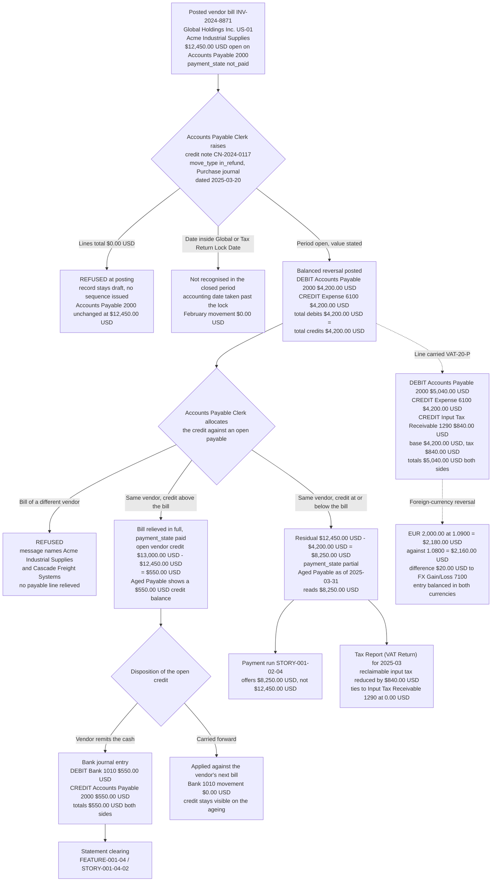

# STORY-001-02-05: Manage Vendor Credit Notes and Refunds

---

## Metadata

| Attribute | Value |
|-----------|-------|
| **Story ID** | `STORY-001-02-05` |
| **Title** | Manage Vendor Credit Notes and Refunds |
| **Parent Feature** | [FEATURE-001-02: Accounts Payable & Vendor Bills](../FEATURE-001-02-accounts-payable-vendor-bills.md) |
| **Parent Epic** | [EPIC-001: Enterprise Accounting in Odoo](../../EPIC-001-enterprise-accounting-odoo.md) |
| **Status** | Draft |
| **Priority** | 🟠 High |
| **Estimate** | 3 (Fibonacci) |
| **Persona** | Accounts Payable Clerk |
| **Feature Capability** | CAP-005 — process vendor credit notes and refunds and allocate them against open bills |
| **Epic Success Metrics** | SM-006 — every company-and-period combination presents total debits equal to total credits, which the credit note and the cash refund each either uphold or break; SM-010 — the input tax reversed here is the figure the **Tax Report (VAT Return)** reconciles to at a difference of `0.00 USD`; SM-001 — the **Aged Payable** report is one of the seven statements that must be producible per entity and per period, and a credit note that is never allocated overstates it; SM-003 and SM-016 — a payable sub-ledger that states only what is still owed is what lets the close run in 5 business days and carries part of the 50% reduction in post-close audit adjustments |
| **Secondary Personas** | Chief Accountant (approves the reversal account assignment and administers the lock dates), Tax Accountant (the input-tax reversal and the tax code it is reported under), External Auditor (the allocation trail from a credit note to the bill it relieved) |
| **Platform Target** | Open decision DEC-001 — see [Version Compatibility](#version-compatibility) |
| **Last Updated** | 2026-08-15 |
| **Owner/Author** | Enterprise Accounting Team |

This is **story 5 of the 5** in FEATURE-001-02 and the point at which an obligation is reduced without being rewritten. [STORY-001-02-01](./STORY-001-02-01-capture-vendor-bills.md) records the bill, [STORY-001-02-02](./STORY-001-02-02-three-way-match.md) proves it against the purchase order and the goods receipt, and [STORY-001-02-03](./STORY-001-02-03-post-vendor-bill-entries.md) commits it to the ledger as one balanced entry that debits **Expense 6100** and credits **Accounts Payable 2000**. This story raises the inverse of that entry as a vendor credit note, reverses the input tax with it, allocates it against the open payable so the residual falls by the credited amount, and records the cash refund where the vendor returns money rather than offsetting a future bill. It is the only route by which a posted vendor bill is reduced: a posted entry is reversed, never edited, which is the rule [STORY-001-02-03](./STORY-001-02-03-post-vendor-bill-entries.md) states and this story delivers. [STORY-001-02-04](./STORY-001-02-04-batch-vendor-payments.md) settles what remains after the allocation, so the two stories act on the same residual from opposite directions and neither is a prerequisite of the other.

> **Persona note — one actor, three reviewers, no substitution.** The **WHO** of this story is the **Accounts Payable Clerk**, who receives the vendor's credit-note document, raises the credit note against the bill it reverses, allocates it against the open payable and records the refund when the money arrives. The **Chief Accountant** appears inside the criteria as the role that approves the account the reversal is credited to and administers the lock dates a credit note is dated against; the **Tax Accountant** confirms that the reversed tax amount carries the same tax code as the bill and reaches the **Tax Report (VAT Return)** in the period of the credit note; and the **External Auditor** reads the allocation trail from the credit note to the payable line it relieved. Each of the four is named where it acts, none stands in for another, and no criterion in this file is written against an unnamed actor.

> **Identity note — the company and the accounts are the register's.** The Epic's [canonical legal-entity register](../../EPIC-001-enterprise-accounting-odoo.md#e4-canonical-legal-entity-register) binds `US-01` to **Global Holdings Inc.**, the United States parent whose functional currency is USD and which is also the group presentation currency. Rule R-E5 of that appendix keeps an entity absent from the register out of every criterion, and rule R-E4 requires the registered name, the entity code, or both. The provisional name `Northwind US Inc.` carried by this story's authoring brief is therefore **superseded**: it stands on no register row, and `Northwind Trading` is already a **customer** of `US-01` in [FEATURE-001-03](../FEATURE-001-03-accounts-receivable-customer-invoices.md), so retaining it would put one name on two parties. The same supersession was applied by [STORY-001-02-03](./STORY-001-02-03-post-vendor-bill-entries.md) and [STORY-001-02-04](./STORY-001-02-04-batch-vendor-payments.md), so one entity name reads across this Feature. **Accounts Payable 2000** (`liability_payable`, reconcilable), **Expense 6100** (`expense`), **Input Tax Receivable 1290** (`asset_current`), **Bank 1010** (`asset_cash`) and **FX Gain/Loss 7100** (`income_other`) are rows of the Epic's [canonical group chart of accounts](../../EPIC-001-enterprise-accounting-odoo.md#e2-canonical-group-chart-of-accounts), written as concept-plus-code under rule R-E3 so a reader never resolves a bare number. The legal-entity hierarchy itself is owned by [FEATURE-001-06](../FEATURE-001-06-multi-company-consolidation.md); this story consumes those names and defines none.

> **Report-name note — one report, one label.** The ageing this story moves is written **Aged Payable** throughout, which is the canonical display label the Epic publishes for it in its [Canonical Report Display Labels](../../EPIC-001-enterprise-accounting-odoo.md#e7-canonical-report-display-labels) register. The same label is used by the parent Feature in [§1.4](../FEATURE-001-02-accounts-payable-vendor-bills.md#14-success-criteria-at-feature-level) and [§4.1](../FEATURE-001-02-accounts-payable-vendor-bills.md#41-feature-level-acceptance-criteria), by [STORY-001-02-03](./STORY-001-02-03-post-vendor-bill-entries.md) and [STORY-001-02-04](./STORY-001-02-04-batch-vendor-payments.md), by the Epic's SM-001 statement set and by carry-forward [CF-001](../../EPIC-001-enterprise-accounting-odoo.md#cf-001-aged-payable-reporting-workflow), so there is one label for one report rather than a family of forms. The report's own criteria — its buckets, its as-of-date parameter and its tie-out to **Accounts Payable 2000** — are owned by [STORY-001-02-04](./STORY-001-02-04-batch-vendor-payments.md) under CF-001. What this story owns is the movement CF-001 assigns to it by name: **a vendor credit note reduces the vendor's total**, and an unallocated credit note leaves that total overstated.

> **Monetary and date conventions used throughout this ticket.** Every amount is stated in the currency it is denominated in, carried to 2 decimal places, and rounded **half-up at that currency's rounding increment of `0.01`** — the USD rounding increment for the books of Global Holdings Inc. (`US-01`) and the EUR rounding increment for a document denominated in EUR. Every computed figure — a reversed tax amount, a currency conversion, a residual, an open credit — states that rule at the point it is computed rather than inheriting it silently. Dates are written `YYYY-MM-DD`. The **credit-note date** is the vendor document's own date (`invoice_date`); the **accounting date** is the date the reversal is recognised on (`date`); the two are distinct fields and this story asserts each by name.

---

## User Story

**As an** Accounts Payable Clerk

**I want** to raise a vendor credit note against a posted bill, reverse the expense and the input tax it carried, allocate the credit against the open payable, and record any cash refund the vendor remits

**So that** the **Accounts Payable 2000** balance of **Global Holdings Inc. (`US-01`)** states only what the company still owes, the input tax reclaimed on the **Tax Report (VAT Return)** matches the goods and services actually retained, and no payment run releases cash for an amount that has already been credited.

---

## INVEST Principles Compliance

| Principle | Compliance | Notes |
|-----------|------------|-------|
| **Independent** | ✅ | A credit note needs exactly one thing that exists before it: a posted vendor bill carrying an open payable line. That bill comes from [STORY-001-02-03](./STORY-001-02-03-post-vendor-bill-entries.md) and is seedable as a fixture in a test company, and **Accounts Payable 2000**, **Expense 6100**, **Input Tax Receivable 1290**, **Bank 1010** and the **Purchase** and **Bank** journals come from [FEATURE-001-01](../FEATURE-001-01-chart-of-accounts-fiscal-year.md) as configuration rather than as code. Nothing else in FEATURE-001-02 has to be delivered first: capture and the three-way match sit in front of the bill rather than in front of its reversal, and the payment run of [STORY-001-02-04](./STORY-001-02-04-batch-vendor-payments.md) reads the residual this story reduces rather than producing anything this story needs |
| **Negotiable** | ✅ | The outcome is fixed and the mechanism is open. What is fixed: one `account.move` with `move_type = 'in_refund'` per credited amount, in the **Purchase** journal of the named company, debiting **Accounts Payable 2000**, crediting **Expense 6100** and crediting **Input Tax Receivable 1290** for the reversed tax, allocated against the payable line of the bill it reverses, with total debits equal to total credits, and with nothing recognised inside a locked period. What is left to implementation discovery: whether the credit note is produced by the shipped reversal wizard, by an extension of it, or by a document raised directly; whether the allocation is performed on the shipped reconciliation surface or on an extension of it; and where the partner-match control and the refund-routing policy are recorded (D-003, D-005) |
| **Valuable** | ✅ | Without it, a returned line stays inside the payable balance and is paid. The archetype bill carries `$12,450.00 USD` of obligation to `Acme Industrial Supplies`, of which `$4,200.00 USD` is a returned software subscription; with no credit note the payment run of [STORY-001-02-04](./STORY-001-02-04-batch-vendor-payments.md) releases the full `$12,450.00 USD` and the company recovers the difference by negotiation months later, if at all. With it, the payable falls to `$8,250.00 USD` before the run is assembled, the `$840.00 USD` of input tax on the credited base is given back rather than reclaimed on goods no longer held, and the **Aged Payable** ageing states an obligation the ledger can prove — each amount rounded half-up to 2 decimal places at the USD rounding increment of `0.01` |
| **Estimable** | ✅ | The delivered surface is countable and inspectable: 1 document type (`in_refund`), 1 state transition (`draft` → `posted`), 4 accounts, 2 journal types, 3 arithmetic outcomes (the reversed tax, the reduced residual, the open credit), 2 refusal paths and 2 `payment_state` values, all on models this repository already carries under LGPL-3. Effort, complexity and uncertainty are assessed in [Estimation](#estimation) |
| **Small** | ✅ | This is the **smallest story in FEATURE-001-02, and it carries the folder's lowest estimate of 3 points, because it reverses an entry that already exists and then reconciles the result**. The posting shape is the exact inverse of one already specified and tested in [STORY-001-02-03](./STORY-001-02-03-post-vendor-bill-entries.md), the accounts are the same four, the fixture is the same bill, and the allocation runs on the same reconciliation surface the payment run of [STORY-001-02-04](./STORY-001-02-04-batch-vendor-payments.md) already uses. It builds no capture path, no match, no payment run, no instruction file and no report engine. One sprint-sized outcome: a balanced reversal, its allocation, and the cash refund of whatever is left over |
| **Testable** | ✅ | Every outcome is a checkable debit and credit pair or a stated residual, so every criterion resolves to an amount, an account code, a date, a state value or a named refusal. Each of the seven criteria that moves a journal line states both the total debits and the total credits of the entry it produces and asserts their equality at a difference of `0.00 USD`, which is a numeric assertion rather than an inspection (C-009); each refusal names the message it is refused with; and each maps to exactly one acceptance test in [Acceptance Test Mapping](#acceptance-test-mapping) (C-008) |

---

## Acceptance Criteria

### The Credit-Note Fixture

The bill reversed below is the canonical vendor bill captured by [STORY-001-02-01](./STORY-001-02-01-capture-vendor-bills.md), matched by [STORY-001-02-02](./STORY-001-02-02-three-way-match.md) and posted by [STORY-001-02-03](./STORY-001-02-03-post-vendor-bill-entries.md), reused without alteration so that capture, match, posting, payment and reversal are all proved against one record. The credited amount is **line 2 of that bill** rather than a new figure, so the reversal is traceable to a line a reader can see. Every figure is stated to 2 decimal places and rounded half-up at its currency's rounding increment of `0.01`.

| Element | Value |
|---------|-------|
| Company (`res.company`) | **Global Holdings Inc. (`US-01`)** — the United States parent, functional currency USD, per the Epic's [canonical legal-entity register](../../EPIC-001-enterprise-accounting-odoo.md#e4-canonical-legal-entity-register) |
| Vendor (`res.partner`) | `Acme Industrial Supplies`, supplier payment term `30 Days` |
| Original bill (`account.move`, `move_type = 'in_invoice'`) | `INV-2024-8871`, state `posted`, **Purchase** journal, bill date `2025-03-14`, due date `2025-04-13`, untaxed total **`$12,450.00 USD`** across three lines of `$6,000.00 USD`, `$4,200.00 USD` and `$2,250.00 USD` coded to **Expense 6100** |
| Credited line | Line 2 of that bill — the software subscription, 1.00 × `$4,200.00 USD`, returned to the vendor and no longer held |
| Credit note (`account.move`, `move_type = 'in_refund'`) | **`CN-2024-0117`**, labelled "Vendor Credit Note", **Purchase** journal — journal type `purchase` — credit-note date `2025-03-20`, accounting date `2025-03-20` |
| State path | Stored values `draft` → `posted` → `cancel` — the three values `account.move.state` carries in this baseline, displayed as Draft, Posted and Cancelled. This ticket writes the stored value where it asserts a state and the label only where it names what the Clerk reads on screen |
| Untaxed reversal | DEBIT **Accounts Payable 2000** `$4,200.00 USD`; CREDIT **Expense 6100** `$4,200.00 USD`; **total debits `$4,200.00 USD` = total credits `$4,200.00 USD`** |
| Tax code (`account.tax`) | `VAT-20-P`, labelled `VAT 20% (Purchases)`, rate 20.0000 percent, tax line directed to **Input Tax Receivable 1290** |
| Taxed reversal | base amount `$4,200.00 USD`, tax amount `$840.00 USD` (`4,200.00 × 20% = 840.00`); DEBIT **Accounts Payable 2000** `$5,040.00 USD`; CREDIT **Expense 6100** `$4,200.00 USD`; CREDIT **Input Tax Receivable 1290** `$840.00 USD`; **total debits `$5,040.00 USD` = total credits `$5,040.00 USD`** |
| Allocation against the bill | `$4,200.00 USD` of the payable relieved, leaving a residual of **`$8,250.00 USD`** (`12,450.00 − 4,200.00 = 8,250.00`) and a `payment_state` of **`partial`** ("Partially Paid") on `INV-2024-8871` |
| Over-credit variant | A credit note of **`$13,000.00 USD`** against the `$12,450.00 USD` bill relieves `$12,450.00 USD`, moves the bill to `payment_state` **`paid`**, and leaves an open vendor credit of **`$550.00 USD`** (`13,000.00 − 12,450.00 = 550.00`) |
| Cash refund | The vendor remits the `$550.00 USD` open credit on `2025-04-02`, recorded as its own receipt rather than as part of the allocation: **Bank** journal — journal type `bank` — DEBIT **Bank 1010** `$550.00 USD`; CREDIT **Accounts Payable 2000** `$550.00 USD`; **total debits `$550.00 USD` = total credits `$550.00 USD`** |
| Zero-value variant | A draft credit note whose lines total **`$0.00 USD`**, used to prove that no zero-value reversal reaches the payable sub-ledger |
| Partner-mismatch variant | Posted bill `INV-2024-8902` of `Cascade Freight Systems` at **`$8,900.00 USD`**, the second bill of the payment-run fixture in [STORY-001-02-04](./STORY-001-02-04-batch-vendor-payments.md), used as the wrong counterparty for `CN-2024-0117` |
| Foreign-currency variant | A credit note of **`EUR 2,000.00`** converted at `1.0900 USD/EUR` to `$2,180.00 USD` against an original recognition at `1.0800 USD/EUR` of `$2,160.00 USD`, giving a realized difference of **`$20.00 USD`** to **FX Gain/Loss 7100** |
| Locked-period variant | `fiscalyear_lock_date` of `US-01` — the **Global Lock Date** — set to `2025-02-28`, against a credit note dated `2025-02-25` |
| Tie-out reports | **Aged Payable** as of `2025-03-31`, where `Acme Industrial Supplies` reads `$8,250.00 USD` after the allocation and a credit balance of `$550.00 USD` under the over-credit variant; **Trial Balance** for the date range `2025-03-01` to `2025-03-31`; **Tax Report (VAT Return)** for the period holding `2025-03-20` |

### Register Reconciliation and Figure-Set Ownership

Four identity questions are settled here so that no criterion below has to carry a caveat:

- **The reversing company is named from the register.** `US-01` is **Global Holdings Inc.**, and the provisional `Northwind US Inc.` of this story's authoring brief stands on no register row, so it is superseded on the same terms [STORY-001-02-03](./STORY-001-02-03-post-vendor-bill-entries.md) and [STORY-001-02-04](./STORY-001-02-04-batch-vendor-payments.md) superseded it. No amount, account, date or tie-out changes with the name.
- **The exchange difference lands on a register code, not on an unnamed account.** The brief's "currency-exchange difference account" is reached in Odoo through the `expense_currency_exchange_account_id` and `income_currency_exchange_account_id` fields of `res.company`, and the account those fields point at for a settlement difference is **FX Gain/Loss 7100**, the register's realized-settlement-difference code. Relieving a foreign-currency payable by allocating a credit note against it is a settlement event, so the difference stays on 7100 and never reaches **Foreign Exchange Gain/Loss 7200**, which carries the IAS 21 remeasurement and translation difference of [FEATURE-001-06](../FEATURE-001-06-multi-company-consolidation.md), or **Gain/Loss on Disposal 7210**. [STORY-001-02-04](./STORY-001-02-04-batch-vendor-payments.md) set the same treatment for a settlement by cash.
- **This story's figure set and the Feature's illustration are the same shape at two amounts.** The parent Feature illustrates a credit note at `$1,500.00 USD` reducing the residual from `$12,450.00 USD` to `$10,950.00 USD` in [§4.1](../FEATURE-001-02-accounts-payable-vendor-bills.md#41-feature-level-acceptance-criteria). This story works at `$4,200.00 USD` reducing the residual to `$8,250.00 USD`, chosen because `$4,200.00 USD` is **line 2 of the archetype bill** and is therefore checkable against a line rather than against an illustration. Both figures satisfy the same arithmetic — `12,450.00 − 1,500.00 = 10,950.00` and `12,450.00 − 4,200.00 = 8,250.00` — and both post the identical shape, debit **Accounts Payable 2000** against credit **Expense 6100** with total debits equal to total credits at a difference of `0.00 USD`. The Feature's illustration is not contradicted; this story states which figures its tests build.
- **This story asserts its own movement, never a population total.** The **Aged Payable** population for `US-01` as at `2025-03-31` — a total of `$820,450.00 USD` across the six buckets — is owned by [FEATURE-001-02 §1.4](../FEATURE-001-02-accounts-payable-vendor-bills.md#14-success-criteria-at-feature-level) and its report criteria by [STORY-001-02-04](./STORY-001-02-04-batch-vendor-payments.md) under CF-001, and the **Trial Balance** population over `2025-01-01` to `2025-03-31` is owned by [STORY-001-07-04](../FEATURE-001-07/STORY-001-07-04-generate-general-ledger-trial-balance.md). The criteria below assert the movement **this credit note** contributes to those reports and the reports' own debit-to-credit equality, so they can never contradict either owner's totals.

### Coverage Distribution

Seven criteria, inside the mandated band of 4 to 8. Each carries exactly one non-compound `When` clause, so the count of `When` clauses in this file equals the count of scenarios. Each `Then` asserts only what the **Accounts Payable Clerk**, the **Chief Accountant**, the **Tax Accountant** or the **External Auditor** observes in the Odoo user interface or reads back over the public API — no database statement, no method name and no widget language. Every monetary figure states its currency, its amount and its rounding rule; every tax figure is stated as the three separate values tax code, base amount and tax amount; every criterion that names a company names it because company scope decides which books are affected; and **every criterion that moves a journal line states both the total debits and the total credits of the resulting entry and asserts their equality at a difference of `0.00 USD`**.

| Scenario | Coverage class | What it proves |
|----------|----------------|----------------|
| 1 | Valid input — happy-path reversal | The returned line reverses as one balanced credit note: debit **Accounts Payable 2000** `$4,200.00 USD`, credit **Expense 6100** `$4,200.00 USD` |
| 2 | Valid input — happy-path reversal with tax | The input tax comes back as its own line on **Input Tax Receivable 1290**, with the tax code, base amount and tax amount recorded as three separate values |
| 3 | Valid input — allocation and reporting tie-out | The allocation reduces the residual to `$8,250.00 USD`, moves the bill to `payment_state` `partial`, and moves the **Aged Payable** line for the vendor |
| 4 | Invalid or incomplete input | A credit note carrying no value cannot post, and nothing reaches **Accounts Payable 2000** |
| 5 | Error handling — a refused allocation with a named validation message | A credit note cannot relieve a payable belonging to a different vendor; no payable line moves |
| 6 | Accounting edge case | A credit note larger than the bill relieves it in full and leaves an open vendor credit of `$550.00 USD`, the allocation itself creating 0 entries and moving `$0.00 USD` of cash |
| 7 | Valid input — the cash disposition of that credit | The open vendor credit is refunded in cash as one balanced **Bank** journal entry debiting **Bank 1010** and crediting **Accounts Payable 2000** by `$550.00 USD`, closing the credit note to `$0.00 USD` |

### Scenario 1: The returned line reverses as one balanced credit note against Accounts Payable 2000 and Expense 6100

- **Given** vendor bill `INV-2024-8871` stands in state `posted` as an `account.move` with `move_type = 'in_invoice'` in the **Purchase** journal of **Global Holdings Inc. (`US-01`)**, raised from `Acme Industrial Supplies` with the bill date `2025-03-14` and the due date `2025-04-13`, carrying three lines of `$6,000.00 USD`, `$4,200.00 USD` and `$2,250.00 USD` that total `$12,450.00 USD` against **Expense 6100** and one open payable line of `$12,450.00 USD` on **Accounts Payable 2000**, with no tax code applied; the software subscription of line 2 at `$4,200.00 USD` has been returned to the vendor and the vendor has issued its own credit-note document for that amount; and the fiscal period holding `2025-03-20` is open in that company because its `fiscalyear_lock_date`, `purchase_lock_date`, `tax_lock_date` and `hard_lock_date` all stand earlier than `2025-03-01` or are empty — every amount in this criterion stated to 2 decimal places and rounded half-up at the USD rounding increment of `0.01`
- **When** the **Accounts Payable Clerk** posts vendor credit note `CN-2024-0117` for `$4,200.00 USD` against bill `INV-2024-8871`, dated `2025-03-20`
- **Then** an `account.move` with **`move_type = 'in_refund'`** — labelled "Vendor Credit Note" — exists in the **Purchase** journal of **Global Holdings Inc. (`US-01`)** in state `posted`, carrying the accounting date `2025-03-20`, a reference that names the bill it reverses, and a sequence number issued by that journal
  - **And** the entry **debits Accounts Payable 2000 by `$4,200.00 USD`** on one payable `account.move.line` carrying the vendor `Acme Industrial Supplies`, which is the line the allocation of Scenario 3 later consumes
  - **And** the entry **credits Expense 6100 by `$4,200.00 USD`**, giving back the charge the bill had recognised, so the expense of the period is reduced rather than an unrelated account being charged
  - **And** the entry balances: **total debits of `$4,200.00 USD` equal total credits of `$4,200.00 USD`** at a difference of `0.00 USD`, each amount rounded half-up to 2 decimal places at the USD rounding increment of `0.01`
  - **And** the direction is the exact inverse of the bill posting in [STORY-001-02-03](./STORY-001-02-03-post-vendor-bill-entries.md), which debited **Expense 6100** and credited **Accounts Payable 2000**; the original entry is left untouched in state `posted`, so the ledger holds both the obligation as first recorded and the reversal that reduced it, and neither figure is rewritten
  - **And** the credit note is readable from the bill and the bill from the credit note, so the **External Auditor** reaches one record from the other without a data request, and the credit-note date `2025-03-20` and the accounting date `2025-03-20` are separately readable fields on the record

### Scenario 2: The input tax comes back with the tax code, base amount and tax amount recorded separately

- **Given** the credited line of bill `INV-2024-8871` in the **Purchase** journal of **Global Holdings Inc. (`US-01`)** carried the purchase tax code `VAT-20-P` — labelled `VAT 20% (Purchases)`, rate 20.0000 percent — which is available to that company through the foreign VAT registration recorded on its fiscal position by [STORY-001-05-01](../FEATURE-001-05/STORY-001-05-01-configure-tax-codes-fiscal-positions.md) and whose tax line is directed to **Input Tax Receivable 1290**, so the bill had recognised a base amount of `$4,200.00 USD` and a tax amount of `$840.00 USD` on that line, and the `tax_lock_date` of that company stands earlier than `2025-03-01` or is empty
- **When** the **Accounts Payable Clerk** posts credit note `CN-2024-0117` for that line, dated `2025-03-20`
- **Then** the posted credit note records the reversal as **three separate readable values** — tax code `VAT-20-P` (`VAT 20% (Purchases)`), base amount `$4,200.00 USD` and tax amount `$840.00 USD` — rather than one gross figure, the tax amount being the base amount multiplied by the code's rate of 20.0000 percent and rounded half-up at the USD rounding increment of `0.01`, so that `4,200.00 × 20% = 840.00`
  - **And** the entry **credits Input Tax Receivable 1290 by `$840.00 USD`** on its own `account.move.line` attributed to `VAT-20-P`, moving that account in the opposite direction to the original bill, so input tax is given back on the base no longer held rather than being reclaimed on it
  - **And** the entry **credits Expense 6100 by `$4,200.00 USD`** for the base amount and **debits Accounts Payable 2000 by `$5,040.00 USD`**, which is the amount no longer owed to `Acme Industrial Supplies` — the base amount of `$4,200.00 USD` plus the tax amount of `$840.00 USD`
  - **And** the entry balances: **total debits of `$5,040.00 USD` equal total credits of `$5,040.00 USD`** at a difference of `0.00 USD`, each amount rounded half-up to 2 decimal places at the USD rounding increment of `0.01`
  - **And** the reversed `$840.00 USD` **equals the tax amount the bill charged on the same base of `$4,200.00 USD`** at a difference of `0.00 USD`, so the reversal is a mirror of the original charge and not a recomputation that could drift by a cent
  - **And** the `$840.00 USD` recorded against `VAT-20-P` is the figure the **Tax Accountant** reads into the **Tax Report (VAT Return)** of [STORY-001-05-03](../FEATURE-001-05/STORY-001-05-03-generate-vat-return.md) for the period holding the credit-note date `2025-03-20` — the period of the reversal, not the period of the original bill — and it reconciles to the **Input Tax Receivable 1290** movement for the same date range at a difference of `0.00 USD` (SM-010)

### Scenario 3: The allocation reduces the payable to a stated residual and moves the Aged Payable line

- **Given** credit note `CN-2024-0117` stands in state `posted` in the **Purchase** journal of **Global Holdings Inc. (`US-01`)** with an open `$4,200.00 USD` debit on **Accounts Payable 2000** for `Acme Industrial Supplies`, and bill `INV-2024-8871` stands in state `posted` in the same company with an open `$12,450.00 USD` credit on the same account for the same vendor and a `payment_state` of Not Paid, each amount rounded half-up to 2 decimal places at the USD rounding increment of `0.01`
- **When** the **Accounts Payable Clerk** allocates credit note `CN-2024-0117` against bill `INV-2024-8871`
- **Then** `$4,200.00 USD` of the payable is relieved and the bill's **open residual reads `$8,250.00 USD`** at 2 decimal places, the arithmetic `12,450.00 − 4,200.00 = 8,250.00` being rounded half-up at the USD rounding increment of `0.01`
  - **And** the bill's **`payment_state` becomes `partial`** ("Partially Paid") while its state stays `posted`, and the credit note's own payable line reads a residual of `$0.00 USD` because it has been consumed in full
  - **And** the allocation is a reconciliation between the two payable lines rather than an edit of either document: neither the bill's `$12,450.00 USD` nor the credit note's `$4,200.00 USD` is rewritten, and the **External Auditor** reads the link from the credit note to the payable line it relieved
  - **And** the **Aged Payable** report of company `US-01`, run with the as-of-date parameter `2025-03-31`, lists `Acme Industrial Supplies` at **`$8,250.00 USD` in the Current bucket** and at `$0.00 USD` in each of the 1-30 days, 31-60 days, 61-90 days, 91-120 days and Over 120 days buckets for this bill, because the due date of `2025-04-13` falls after the as-of date; the vendor's total falls by `$4,200.00 USD` against the `$12,450.00 USD` it read before the allocation, which is the movement carry-forward [CF-001](../../EPIC-001-enterprise-accounting-odoo.md#cf-001-aged-payable-reporting-workflow) assigns to this story by name
  - **And** the `$8,250.00 USD` that report shows for this bill equals the net movement the bill and the credit note together left on the **Accounts Payable 2000** sub-ledger of that company at a difference of `0.00 USD`, and the same `$8,250.00 USD` is the residual the payment run of [STORY-001-02-04](./STORY-001-02-04-batch-vendor-payments.md) offers for release rather than the original `$12,450.00 USD`, so no cash is released for an amount already credited
  - **And** the credit note appears in the **Trial Balance** of company `US-01` for the date-range parameters `2025-03-01` to `2025-03-31` as a `$4,200.00 USD` debit movement on **Accounts Payable 2000** and a `$4,200.00 USD` credit movement on **Expense 6100**, and that report's **total debits equal its total credits** at a difference of `0.00 USD`, the wider population of the range being owned by [STORY-001-07-04](../FEATURE-001-07/STORY-001-07-04-generate-general-ledger-trial-balance.md)

### Scenario 4: A credit note carrying no value cannot post and nothing reaches Accounts Payable 2000

- **Given** a credit note stands in state `draft` as an `account.move` with `move_type = 'in_refund'` in the **Purchase** journal of **Global Holdings Inc. (`US-01`)** for `Acme Industrial Supplies`, dated `2025-03-20`, whose lines total **`$0.00 USD`** — because every line was keyed at a quantity of 0.00, at a unit price of `$0.00 USD`, or was left with no amount at all — stated to 2 decimal places at the USD rounding increment of `0.01`, and bill `INV-2024-8871` stands in state `posted` in that company with an open payable of `$12,450.00 USD`
- **When** the **Accounts Payable Clerk** attempts to post that credit note
- **Then** posting is **refused with a validation message that names the credit note and the check that failed**, telling the Clerk that a vendor credit note of `$0.00 USD` carries nothing to reverse and that the credited quantity or amount is to be stated before it can post
  - **And** the record **stays in state `draft`**, no journal item is created, and no sequence number is issued by the **Purchase** journal
  - **And** the **Accounts Payable 2000** balance of **Global Holdings Inc. (`US-01`)** is **unchanged at `$12,450.00 USD`** credit for this vendor, the bill's `payment_state` still reads Not Paid, and the movement the refused attempt contributed measures `$0.00 USD`
  - **And** the **Aged Payable** report of that company as of `2025-03-31` still lists `Acme Industrial Supplies` at `$12,450.00 USD` in the Current bucket for this bill, so a credit note that carries no value cannot flatter the ageing
  - **And** the refusal message discloses no stack trace and no file-system path (C-020), and the remedy is stated to the Clerk: state the credited quantity and the credited amount, then post
  - **And** the same refusal covers the empty document as well as the zero-value one — a credit note carrying no line at all is refused by the shipped guard whose message reads `Even magicians can't post nothing!` — so neither route reaches the payable sub-ledger

### Scenario 5: A credit note cannot relieve a payable belonging to a different vendor

- **Given** credit note `CN-2024-0117` stands in state `posted` for `Acme Industrial Supplies` in the **Purchase** journal of **Global Holdings Inc. (`US-01`)** with an open `$4,200.00 USD` debit on **Accounts Payable 2000**, and bill `INV-2024-8902` stands in state `posted` in the same company and on the same account for a **different vendor**, `Cascade Freight Systems`, with an open credit of `$8,900.00 USD` due `2025-04-13`, each amount rounded half-up to 2 decimal places at the USD rounding increment of `0.01`
- **When** the **Accounts Payable Clerk** attempts to allocate credit note `CN-2024-0117` against bill `INV-2024-8902`
- **Then** the allocation is **refused with a validation message that names both counterparties** — the credit note's vendor `Acme Industrial Supplies` and the bill's vendor `Cascade Freight Systems` — and states that a vendor credit note is allocated against a bill of the same vendor
  - **And** **no payable line is relieved**: the credit note keeps its open `$4,200.00 USD` debit, bill `INV-2024-8902` keeps its open `$8,900.00 USD` credit and its `payment_state` of Not Paid, and bill `INV-2024-8871` keeps its open `$12,450.00 USD` credit
  - **And** the **Accounts Payable 2000** balance of that company is unchanged by the refused attempt, whose movement measures `$0.00 USD`, and the **Aged Payable** report as of `2025-03-31` still reads `$8,900.00 USD` for `Cascade Freight Systems` and `$12,450.00 USD` for `Acme Industrial Supplies` in the Current bucket for those two bills
  - **And** the refusal is one of a stated set the Clerk is told apart: an allocation whose two lines sit on **different accounts** is refused by the shipped guard `Entries are not from the same account: %s`; one whose lines belong to **different companies** by `Entries don't belong to the same company: %s`; one whose lines are **already allocated** by `You are trying to reconcile some entries that are already reconciled.`; and one involving an entry whose stored state is **`cancel`** — displayed as Cancelled — by `You can not reconcile cancelled entries.` The partner refusal asserted here is the control this story delivers on top of that set, and the message names the mismatched vendor rather than the account
  - **And** the remedy is stated rather than implied: `Acme Industrial Supplies` has an open bill of its own at `$12,450.00 USD`, so the credit is allocated there, or it is left open and refunded in cash under Scenario 6 — never applied across counterparties, which would relieve one vendor's payable with another vendor's credit and misstate both vendors' balances

### Scenario 6: A credit note larger than the bill relieves it in full and leaves an open vendor credit

- **Given** bill `INV-2024-8871` stands in state `posted` in the **Purchase** journal of **Global Holdings Inc. (`US-01`)** with an open payable of **`$12,450.00 USD`** for `Acme Industrial Supplies`, and a vendor credit note of **`$13,000.00 USD`** for that vendor stands in state `posted` in the same journal of the same company — the vendor having credited the whole engagement rather than one line — with the **Bank** journal of that company drawing on **Bank 1010** and the fiscal period holding `2025-03-20` open, each amount rounded half-up to 2 decimal places at the USD rounding increment of `0.01`
- **When** the **Accounts Payable Clerk** allocates that `$13,000.00 USD` credit note against bill `INV-2024-8871`
- **Then** **`$12,450.00 USD` of the payable is relieved in full**, the bill's open residual falls to `$0.00 USD`, and its **`payment_state` reads `paid`** while its state stays `posted`
  - **And** an **open vendor credit of `$550.00 USD`** remains on the credit note's payable line, the arithmetic `13,000.00 − 12,450.00 = 550.00` being rounded half-up at the USD rounding increment of `0.01`, so the excess is carried as a debit balance the company is owed rather than being netted away outside the ledger
  - **And** the **Aged Payable** report of company `US-01` as of `2025-03-31`, read while the credit stands unrefunded, presents `Acme Industrial Supplies` as a **credit balance of `$550.00 USD`** — a negative payable, being an amount the vendor owes the company — rather than omitting the vendor, and that `$550.00 USD` equals the net movement the bill and the credit note left on the **Accounts Payable 2000** sub-ledger at that date at a difference of `0.00 USD`
  - **And** the allocation **moves no cash and creates no entry**: the **Bank 1010** movement arising from it measures `$0.00 USD`, stated to 2 decimal places at the USD rounding increment of `0.01`, and the count of `account.move` records this allocation creates is **0**, because it matches two lines that were already posted — the credit note's own entry balancing at `$13,000.00 USD` on both sides at a difference of `0.00 USD` before the allocation begins
  - **And** the disposition of the `$550.00 USD` is a **recorded decision with two outcomes and no third**: it is taken back in cash, which [Scenario 7](#scenario-7-the-open-vendor-credit-is-refunded-in-cash-and-closes-against-bank-1010) asserts as one balanced entry in the **Bank** journal, or it is left open and applied to the next bill from that vendor, in which case **Bank 1010** measures `$0.00 USD` of movement and the credit stays visible as a credit balance on the ageing until it is applied. Either way the decision is recorded with its author and its timestamp, and the `$550.00 USD` is recognised **once** rather than as both cash and carry-forward

### Scenario 7: The open vendor credit is refunded in cash and closes against Bank 1010

- **Given** the allocation of Scenario 6 has left an **open vendor credit of `$550.00 USD`** on the credit note's payable line in **Global Holdings Inc. (`US-01`)** with bill `INV-2024-8871` at `payment_state` `paid`, the **Chief Accountant** has recorded the disposition decision to take that credit back in cash rather than apply it to the vendor's next bill, the **Bank** journal of that company draws on **Bank 1010**, and the fiscal period holding `2025-04-02` is open with no lock date of that company covering it, each amount rounded half-up to 2 decimal places at the USD rounding increment of `0.01`
- **When** the **Accounts Payable Clerk** registers the vendor's refund receipt of `$550.00 USD` in the **Bank** journal of that company dated `2025-04-02` against that open vendor credit
- **Then** the receipt posts as **one** entry in the **Bank** journal of **Global Holdings Inc. (`US-01`)** that **debits Bank 1010 by `$550.00 USD`** and **credits Accounts Payable 2000 by `$550.00 USD`**, so **total debits of `$550.00 USD` equal total credits of `$550.00 USD`** at a difference of `0.00 USD`, each amount rounded half-up to 2 decimal places at the USD rounding increment of `0.01` — the exact inverse of a vendor payment, which debits **Accounts Payable 2000** and credits **Bank 1010** in [STORY-001-02-04](./STORY-001-02-04-batch-vendor-payments.md)
  - **And** the receipt is **allocated against the open vendor credit** rather than left unmatched, so the credit note's residual falls to `$0.00 USD` and the position `Acme Industrial Supplies` holds from this bill and this credit note on the **Aged Payable** report of `US-01` as of `2025-04-30` reads `$0.00 USD` in every bucket, equal to the net movement those two documents and this receipt left on **Accounts Payable 2000** at that date at a difference of `0.00 USD`
  - **And** the `$550.00 USD` is recognised **once**: the count of **Bank 1010** movements arising from this credit is **1**, and the credit is not also carried forward against the vendor's next bill, so cash and carry-forward remain alternatives rather than both
  - **And** where the recorded decision goes the other way the entry of this criterion **does not exist**: the count of `account.move` records in the **Bank** journal arising from this credit is **0**, the **Bank 1010** movement measures `$0.00 USD`, and the `$550.00 USD` stays readable as a credit balance on the ageing until a later bill absorbs it — which is why the disposition is recorded with its author and its timestamp rather than decided at the keyboard
  - **And** the refund receipt is **traceable to the credit it settles** without a worksheet: the **External Auditor** reads the chain from bill `INV-2024-8871`, through credit note `CN-2024-0117` and its allocation, to this receipt and its allocation, each step carrying its author and its timestamp

---

## Sub-Tasks

- [ ] **@finance-sme** — Sign off the **tax-reversal treatment against the Tax Report (VAT Return)**: that a credit note reverses the tax line as well as the base line; that the reversed tax amount of `$840.00 USD` on a credited base of `$4,200.00 USD` under `VAT-20-P` **equals the amount the bill charged** rather than being recomputed and allowed to drift by a cent; that the reversal is reported in the period holding the credit-note date `2025-03-20` and not in the period of the original bill; that a credit note raised after the tax period is filed is dated into the first open tax period rather than back into the filed one; and that a non-recoverable input tax is reversed against the expense rather than against **Input Tax Receivable 1290**. Record the sign-off against this story, and confirm with [STORY-001-05-03](../FEATURE-001-05/STORY-001-05-03-generate-vat-return.md) that the reversal reaches the return as a reduction of reclaimable input tax under the same tax code (SM-010)
- [ ] **@finance-sme** — Sign off the **disposition policy for an open vendor credit**: the window inside which an unapplied credit of `$550.00 USD` is pursued as a cash refund rather than carried against the vendor's next bill, who authorises each route, the ageing at which an unapplied credit is escalated, and the treatment of a credit against a vendor with no further trading expected. Sign off the tie-out worksheet — **Aged Payable** as of a stated date reconciled to **Accounts Payable 2000** at a difference of `0.00 USD` with vendor credit balances presented rather than suppressed — as retained close evidence, and confirm that the offsetting prohibition of IAS 1 is respected: a vendor credit is presented on its own terms and never netted outside the ledger
- [ ] **@functional-consultant** — Specify the **credit-note raising and allocation surface the Accounts Payable Clerk sees, with the refusal set and the remedy for each**. Raising: how a credit note is started from a posted bill so the reversal inherits the bill's vendor, currency, lines, tax codes and account assignment; how a partial reversal of one line at `$4,200.00 USD` is distinguished from a full reversal at `$12,450.00 USD`; which date fields are offered and which of them the accounting date follows; and whether the reversal cancels the original entry or leaves it posted, which for a vendor credit note is the latter. Refusals: a credit note of `$0.00 USD`, a credit note with no line, a credit note dated inside a lock date the company has in force, an allocation against a bill of a different vendor, an allocation against a line on a different account or in a different company, an allocation of a line already allocated, and an allocation involving a cancelled entry — each stating the message, the cause and the action, and none disclosing a stack trace or a file-system path (C-020)
- [ ] **@functional-consultant** — Document the **vendor credit-note document and the refund channel as external inputs**: what the vendor's own credit-note reference is recorded against, how it is retained as the source document behind the reversal for the **External Auditor**, how a returned quantity is reconciled back to the goods receipt and the purchase order so the reversal and the three-way-match evidence of [STORY-001-02-02](./STORY-001-02-02-three-way-match.md) stay consistent, and how an inbound refund remittance is identified on the bank statement so the statement-matching story `STORY-001-04-02` of [FEATURE-001-04](../FEATURE-001-04-bank-reconciliation-cash-management.md) can match the **Bank 1010** movement rather than leaving it unexplained
- [ ] **@developer** — Deliver the **reversal on the models this repository already carries** rather than a parallel structure (C-012): an `account.move` with `move_type = 'in_refund'` in an `account.journal` of type `purchase`, its `account.move.line` rows debiting **Accounts Payable 2000** and crediting **Expense 6100** and **Input Tax Receivable 1290**, the single state transition `draft` → `posted` with `cancel` — displayed as Cancelled — available for a credit note raised in error, and the allocation expressed on the existing full and partial reconciliation models so the residual and the `payment_state` values `partial` and `paid` are computed by the platform rather than written by hand
- [ ] **@developer** — Deliver the **arithmetic, the counterparty control and the lock-date behaviour**: the tax reversal taken from the amount the bill charged on the credited base rather than recomputed; the residual falling to `$8,250.00 USD` on a `$4,200.00 USD` allocation and to `$0.00 USD` with a `$550.00 USD` open credit on a `$13,000.00 USD` allocation; the cash refund posting as debit **Bank 1010** against credit **Accounts Payable 2000**; the realized exchange difference on a foreign-currency credit note computed as the credited company-currency amount less the amount the payable was carried at and posted to **FX Gain/Loss 7100** through the exchange-difference accounts configured on the company; the refusal of an allocation whose two payable lines carry different vendors, with both vendors named in the message; and the refusal of a credit note carrying `$0.00 USD`, creating no journal item by either refused attempt
- [ ] **@qa-engineer** — Build the **acceptance suite covering all 7 scenarios**, one test per criterion (C-008), and **assert total debits against total credits at a difference of `0.00 USD` on every entry this story produces — the untaxed credit note at `$4,200.00 USD` on both sides, the taxed credit note at `$5,040.00 USD` on both sides, and the cash refund entry at `$550.00 USD` on both sides** — together with the `$0.00 USD` movement asserted on the two refusal paths, every amount asserted numerically to the cent and every account asserted by code (C-009)
- [ ] **@qa-engineer** — Build the **boundary, concurrency and isolation suite**: a credit note of `$0.00 USD` and a credit note with no line each refused with no entry created; a credit note dated `2025-02-25` against a Global Lock Date of `2025-02-28` recognised outside the closed period, with the February movement on **Accounts Payable 2000** asserted at `$0.00 USD`; two allocations of the same credit note launched at the same moment relieving the payable **once only** for `$4,200.00 USD` rather than `$8,400.00 USD`, with the second attempt refused; a credit note of `EUR 2,000.00` at `1.0900` against a recognition at `1.0800` placing `$20.00 USD` on **FX Gain/Loss 7100** with the entry balanced; a credit note against a bill already at `payment_state` `paid` leaving an open vendor credit rather than a negative residual; and a role restricted to `US-01` unable to raise or allocate a credit note in `NL-01` or `GB-01` (C-014, D-007)

---

## Edge Cases

- **Zero-amount or null credit-note line.** A credit-note line of **`$0.00 USD`** — a returned quantity of 0.00, a unit price of `$0.00 USD`, or a line left with no amount at all — contributes `$0.00 USD` to the credit total and leaves that total unchanged, and a credit note whose lines total `$0.00 USD` is **refused at posting** with a message naming the credit note and the check that failed, so no zero-value reversal reaches **Accounts Payable 2000**. **Control:** the refusal is a delivered control rather than an inherited one. In the Odoo 19.0 baseline read for this ticket, a document carrying **no line at all** is refused by the shipped guard `Even magicians can't post nothing!` and a **negative** total is refused by `You cannot validate an invoice with a negative total amount. You should create a credit note instead. Use the action menu to transform it into a credit note or refund.`, but a document whose lines are present and sum to zero carries **no shipped refusal**, so the zero-total check is scope this story delivers. That is the branch the parent Feature's zero-amount criterion in [§4.1](../FEATURE-001-02-accounts-payable-vendor-bills.md#41-feature-level-acceptance-criteria) permits — rejection at confirmation with a message naming the line — and it is chosen over silent posting because a `$0.00 USD` credit note consumes a journal sequence number and appears in the allocation list while relieving nothing. Either way the **Accounts Payable 2000** movement of the refused attempt measures `$0.00 USD`.
- **Locked fiscal period.** A credit note dated **`2025-02-25`** while the `fiscalyear_lock_date` of **Global Holdings Inc. (`US-01`)** — the **Global Lock Date** — stands at **`2025-02-28`** is **not recognised inside that closed period**: no journal item of this story lands on or before `2025-02-28`, so the February figures the company has already reported are unchanged by a credit note received late, and the movement this credit note contributes to **Accounts Payable 2000** for any date on or before `2025-02-28` measures `$0.00 USD`. **Control:** where the credit note carries the tax code `VAT-20-P`, the **`tax_lock_date`** — the **Tax Return Lock Date** — is evaluated alongside the Global Lock Date, because a reversal of input tax moves a figure a filed return has already reported, and the accounting date is taken past the latest lock date in force. The **`hard_lock_date`** admits no exception at all, and the **`purchase_lock_date`** binds this document because a credit note is raised in a journal of type `purchase`. The remedy is to date the credit note inside an open period while retaining the vendor document's own date on the record, exactly as [STORY-001-02-03](./STORY-001-02-03-post-vendor-bill-entries.md) does for a bill; reopening a closed period is a lock-date decision owned by [STORY-001-01-05](../FEATURE-001-01/STORY-001-01-05-configure-period-lock-dates.md), and an attempt to write the accounting date of a posted credit note back into the locked window is refused with `You cannot add/modify entries prior to and inclusive of: Global Lock Date (02/28/2025).`
- **Multi-currency rounding on the reversal.** A credit note of **`EUR 2,000.00`** converted at the credit-note-date rate of **`1.0900 USD/EUR`** measures **`$2,180.00 USD`**, while the bill line it reverses was recognised at **`1.0800 USD/EUR`** and measures **`$2,160.00 USD`**, so relieving the payable realizes a difference of **`$20.00 USD`** — the arithmetic being `2,000.00 × 1.0900 = 2,180.00` against `2,000.00 × 1.0800 = 2,160.00`, each conversion rounded half-up at the USD rounding increment of `0.01` and the document amounts rounded half-up at the EUR rounding increment of `0.01`. That `$20.00 USD` is posted to **FX Gain/Loss 7100**, the register's realized-settlement-difference code, reached through the `expense_currency_exchange_account_id` and `income_currency_exchange_account_id` fields configured on **Global Holdings Inc. (`US-01`)**. **Control:** the entry stays balanced with the difference line included — total debits equal total credits at a difference of `0.00 USD` in the company currency and at a difference of `EUR 0.00` in the document currency — and both rates with the dates they were read from are recorded on the entries, so the figure is recomputed from the record rather than from a worksheet. A residual cent arising from a conversion is assigned **whole to a single line** and never split across lines or absorbed into a balancing plug, with the count of lines altered to force the balance being 0. The difference stays on 7100 and never reaches **Foreign Exchange Gain/Loss 7200**, which carries the IAS 21 retranslation of an open balance, or **Gain/Loss on Disposal 7210**.
- **Credit note against a bill already settled in full.** Where bill `INV-2024-8871` already reads `payment_state` **`paid`** because the payment run of [STORY-001-02-04](./STORY-001-02-04-batch-vendor-payments.md) released its `$12,450.00 USD`, a credit note of `$4,200.00 USD` **leaves an open vendor credit of `$4,200.00 USD` rather than a residual payable**: there is nothing left on the bill to relieve, so the credit stands as a debit balance on **Accounts Payable 2000** that the vendor owes the company, and the **Aged Payable** report as of `2025-03-31` presents it as a credit balance for that vendor rather than omitting the vendor. **Control:** the credit is never applied backwards onto a settled bill, which would reopen a `paid` document and misstate a period already closed; it is disposed of by exactly one of two routes, each recorded with its author and timestamp — applied against the vendor's next bill, or refunded in cash with the **Bank** journal entry debiting **Bank 1010** and crediting **Accounts Payable 2000** so total debits equal total credits at a difference of `0.00 USD`. Unreconciling the original payment to force the credit onto the bill is refused where the payment sits inside a locked period, and where it is permitted it is recorded as an unallocation with its author and timestamp rather than performed silently.

---

## Constraints

The constraint identifiers below are the Epic's own, restated in the terms of this story rather than renumbered, so one constraint set reads across the whole ticket tree. The full text is held in [EPIC-001 §7 Constraints](../../EPIC-001-enterprise-accounting-odoo.md#7-constraints).

### License and Compliance

- [x] **C-001 — AGPL-3.0 compatibility**: any module delivering the credit-note raising path, the zero-value refusal, the counterparty control on allocation, the refund routing and the exchange-difference treatment is distributed under an AGPL-3.0 compatible licence, matching the licence of the Community-edition accounting add-ons already present in this repository
- [x] **C-002 — Existing licence respected**: extension of `account` — the "Invoicing" application, version 1.4, category `Accounting/Accounting`, licence LGPL-3 — and of `account_payment` — "Payment - Account", version 2.0, licence LGPL-3, declaring `account` and `payment` as its dependencies — respects those licences, and an AGPL-3 extension of LGPL-3 code is licence-checked before it is written
- [x] **C-003 — Edition source for any capability beyond `account` is the Epic's open decision DEC-002**: this story's whole surface is supplied by modules present here under LGPL-3 — `account.move` with its `in_refund` document type, `account.move.line`, `account.journal`, `account.tax`, the full and partial reconciliation models, the reversal wizard and the lock-date and exchange-difference fields on `res.company` — so **no part of it waits on the edition decision**, and FEATURE-001-02 is explicitly not gated by DEC-002. Where a capability beyond `account` is adopted — a richer allocation interface, or the engine that renders the **Aged Payable** presentation this story moves — its source is the Epic's open **edition lock-in** decision **DEC-002**, an Odoo Enterprise subscription or the OCA path with bespoke development for the residual, owned by the CFO / Finance Director with the Group Controller and recorded in the [Open Decisions Register](../../EPIC-001-enterprise-accounting-odoo.md#appendix-b-open-decisions-register). It is flagged for stakeholder confirmation rather than resolved here, per AAP §0.8.3. The blanket prohibition on Enterprise dependencies carried by the superseded backlog is withdrawn and replaced by this open decision
- [x] **Adjacent Community context — the inverse instrument**: `addons/account_debit_note/` is present at version 1.0 under LGPL-3, depending on `account`, and its own description records that a debit note increases the amount of an existing invoice or in some cases cancels a credit note, raised through a wizard built on the same pattern as the credit note. It is read during discovery so the choice of instrument is deliberate: a vendor adjustment that **reduces** what is owed is a credit note under `move_type = 'in_refund'`, which is this story; one that **increases** it is a debit note, which this story does not deliver and does not preclude
- [x] **C-004 — OCA ecosystem compatibility**: whichever path DEC-002 confirms, the credit notes and allocations recorded here stay consumable by OCA add-ons — including `account_reconcile_oca` for the allocation surface and `account_financial_report` for the aged partner balance — without a posted credit note being restated. Naming an OCA repository asserts precedent rather than installability: a branch is stated before a dependency is declared, and where no port exists on the branch DEC-001 confirms, the work is recorded as bespoke scope under DEC-002
- [x] **C-005 / C-006 — Odoo and OCA coding standards**: Python follows Odoo and OCA module guidelines including PEP 8, and static analysis passes with the repository's configured tooling, whose lint configuration is `ruff.toml` at the repository root
- [x] **C-012 — Build on the existing models**: the credit note is an `account.move` with `move_type = 'in_refund'` and its `account.move.line` rows, and the allocation is expressed on the existing full and partial reconciliation models; no parallel credit-note table, no shadow payable ledger and no second residual is introduced, so an **Aged Payable** line and the **Accounts Payable 2000** balance cannot disagree
- [x] **C-014 — Access rights, segregation of duties and company isolation**: the **Accounts Payable Clerk** raises and allocates a credit note and cannot release the cash refund, which is the **Treasury Analyst**'s act in the **Bank** journal; the **Chief Accountant** approves the account the reversal is credited to and administers the lock dates; the **Tax Accountant** confirms the tax reversal without altering the credit note; the **External Auditor** holds read-only access to the credit note, its source document and its allocation trail; and a role restricted to `US-01` can neither raise nor allocate a credit note in `NL-01` or `GB-01`. Each is proven by an access-rights test (D-007)
- [x] **C-015 through C-020 — Untrusted input on the reversal path**: the vendor's credit-note document and its reference cross the trust boundary, so an attachment is checked for type and size at the ingestion boundary against an allowlist, an XML document is parsed with DTD processing and external-entity resolution disabled and entity expansion bounded and is validated against its declared schema before any field is read, the vendor name and the credit-note reference are context-encoded before they are rendered into a report or a remittance, values written to CSV and XLSX exports are neutralized against formula injection, data access is expressed through the ORM or parameterized SQL, and a failure discloses no stack trace and no file-system path
- [x] **C-021 — No secrets in source**: no credential, certificate or signing key used to receive or acknowledge a refund appears in module source, version control, logs, fixtures, tests or exports. A change to the vendor bank details a refund is received against is treated as a fraud-relevant event and is recorded with its author, its timestamp and the prior value

### Accounting Standards Compliance

- [x] **A posted bill is reversed by a credit note, never edited**: after posting, the amounts and the account assignment of the original entry are not rewritten. The reduction is a separate `account.move` with `move_type = 'in_refund'` allocated against the payable line, so the ledger holds both the obligation as first recorded and the reversal that reduced it, and the **External Auditor** reads the correction rather than inferring it from a changed figure. This is the rule [STORY-001-02-03](./STORY-001-02-03-post-vendor-bill-entries.md) states and this story is the route that satisfies it
- [x] **The reversed tax amount equals the tax originally charged, and is reported in the period of the credit note**: the `$840.00 USD` reversed under `VAT-20-P` on a credited base of `$4,200.00 USD` is the amount the bill charged on that base rather than a recomputation, and it is recognised in the period holding the credit-note date `2025-03-20`. A reversal is never back-dated into a filed tax period; where the original period is closed, the reversal falls in the first open one, which keeps the filed return as filed and puts the adjustment in the period it was agreed (SM-010)
- [x] **Reduction is allocation, not overwriting**: a bill's residual is the arithmetic result of its original amount less the amounts allocated to it — `$12,450.00 USD` − `$4,200.00 USD` = `$8,250.00 USD` — and a credit note is allocated against the payable it reverses rather than netted off outside the ledger, which is the offsetting position IAS 1 requires. A credit note raised in error is cancelled or reversed with the reversal recorded, never deleted
- [x] **A credit note may not post into a locked fiscal period**: while the Global Lock Date, the Tax Return Lock Date, the Purchase Lock date or the Hard Lock Date of the company covers the accounting date, no journal item of this story is recognised on it, which keeps a reported period as it was reported and a filed return as it was filed
- [x] **An excess credit is disclosed as a balance owed to the company, never suppressed**: a credit note larger than the bill leaves an open vendor credit of `$550.00 USD` presented on the **Aged Payable** report as a credit balance for that vendor, and it is discharged by a cash refund through **Bank 1010** or by application against the vendor's next bill — recognised once, on exactly one of those two routes
- [x] **Realized exchange differences on a foreign-currency reversal are recognised in the period of the credit note**: the difference between the company-currency amount the payable was carried at and the company-currency amount the credit relieves is realized when the allocation is made, in the manner IAS 21 and ASC 830 require, and is recognised on **FX Gain/Loss 7100**. The unrealized retranslation of an open balance at a closing rate is a different event and belongs to FEATURE-001-06 on **Foreign Exchange Gain/Loss 7200**
- [x] **ISO 4217 minor units**: every amount is rounded **half-up** to its currency's decimal precision — 2 decimal places at a rounding increment of `0.01` for USD and EUR — and a residual fraction arising from a conversion is carried whole on a single line rather than split
- [x] **Expense recognition follows the return, not the paperwork**: the credit reduces **Expense 6100** in the period the credit note is agreed, on the accrual basis US GAAP and IFRS require, and a return that straddles a period end is dealt with by the period-end cut-off of [FEATURE-001-07](../FEATURE-001-07-financial-reporting-period-close.md) rather than by dating the credit note into a closed period
- [x] **Audit trail**: the receipt of the vendor's credit-note document, the raising of the credit note, the account assignment, the posting, each allocation and each unallocation, the disposition chosen for an open credit, and any change to the vendor bank details a refund is received against are each recorded with their author and timestamp and are readable by the **External Auditor** without a data request

### Version Compatibility

- [x] **C-010 — Platform version target is open decision DEC-001**: this story states no platform version of its own. The originating programme request names Odoo 17, the superseded flat backlog named 18.0, and the baseline every field name, state value and validation message in this ticket was read against is **Odoo 19.0 Community**, where `odoo/release.py` declares `version_info = (19, 0, 0, FINAL, 0, '')`. The mismatch is recorded and confirmed with stakeholders before development rather than chosen inside this story. The fixed single-version compatibility line carried by the superseded story template — a hard "Odoo 18.0" target — is therefore **not** restated here: this ticket asserts no version requirement of its own and defers entirely to DEC-001, which is what §0.7.2 of the governing constraint set requires of a story that supersedes prior art
- [x] **C-011 — Language and database versions follow the confirmed target**: the 19.0 baseline present here declares `MIN_PY_VERSION = (3, 10)`, `MAX_PY_VERSION = (3, 13)` and `MIN_PG_VERSION = 13` in `odoo/release.py`; an earlier platform target carries a different supported matrix
- [x] **Impact if DEC-001 resolves away from 19.0**: four statements in this file are re-verified against the confirmed release before development. First, the **reversal surface** — the `account.move.reversal` wizard's `date`, `reason` and `journal_id` fields and its refund-against-modify behaviour differ across the candidate releases, and the wizard's own journal-type guard is re-read. Second, the **field and state names** cited in [Technical Discovery Notes](#technical-discovery-notes) — `move_type = 'in_refund'`, the `state` values `draft`, `posted` and `cancel`, the `payment_state` values `partial` and `paid`, the residual fields on the journal item, and the lock-date and exchange-difference fields on the company — are restated for the confirmed version. Third, the **validation message texts** quoted in the criteria and the edge cases are re-read from the confirmed release's own source, because a message is acceptance evidence only while it is the message the platform emits. Fourth, the **shipped guard set on reconciliation** is re-enumerated, because the control this story adds is defined as what the platform does not already refuse

---

## Technical Discovery Notes

> **Purpose:** these notes direct the codebase analysis that precedes implementation. They record what to investigate and what the outcome must prove; they do not choose the implementation. Every path and field below was read in this repository at the Odoo 19.0 Community baseline, so the implementing agent starts from verified ground rather than from assumption.

### Codebase Analysis Areas

| Analysis Area | Purpose | Key Questions |
|---------------|---------|---------------|
| `addons/account/wizard/account_move_reversal.py` | The existing credit-note surface. `account.move.reversal` is a transient model whose `move_ids` relation is domained to `state = 'posted'`, and it carries exactly three inputs the Clerk fills — `date` labelled "Reversal date", `reason` labelled "Reason displayed on Credit Note", and `journal_id` whose help states that an empty value uses the journal of the entry being reversed — alongside the computed `residual`, `currency_id` and `move_type`. Its two entry points are `refund_moves()` and `modify_moves()`, and the reference it writes onto the new document is built from the reversed entry's name and the stated reason | Is this wizard the surface a vendor credit note is raised through, or a starting point that an extension replaces? It reverses a **whole** entry — how is the partial reversal of one `$4,200.00 USD` line out of a `$12,450.00 USD` bill expressed against it? Does it allocate the new document against the original payable line, or does the allocation remain a separate act the Clerk performs? What does the difference between `refund_moves()` and `modify_moves()` mean for a vendor bill, given that this story leaves the original entry `posted` rather than cancelling it? Its guards are `To reverse a journal entry, it has to be posted first.`, `All selected moves for reversal must belong to the same company.` and `Journal should be the same type as the reversed entry.` — which of the refusals this story asserts are already covered by them, and which are not? |
| `addons/account/models/account_move.py` | The document model behind a vendor credit note: the `move_type` selection carrying `('in_refund', 'Vendor Credit Note')` beside `('in_invoice', 'Vendor Bill')`, the reverse-type map that pairs `in_invoice` with `in_refund` in both directions, the `state` selection with its `draft`, `posted` and `cancel` values labelled Draft, Posted and Cancelled, and the `payment_state` selection whose values include `partial` labelled "Partially Paid" and `paid` labelled "Paid" | How is `payment_state` computed as allocations accumulate, and is `partial` reached by amount or by count? What does it read on a bill whose credit note **exceeds** it — does the excess appear as a negative residual on the bill or as an open balance on the credit note, which is the distinction Scenario 6 turns on? The posting path admits a document whose lines total zero — the shipped refusals cover a move with **no** line (`Even magicians can't post nothing!`), a move already `posted` (`The entry %(name)s (id %(id)s) must be in draft.`) and a **negative** total, but not a zero total; where is the zero-total check added so it refuses before a sequence number is issued? |
| `addons/account/models/account_move.py` lock-date path | The lock-date evaluation performed as an entry is posted: violated lock dates are collected and the entry's accounting date is then moved out of the closed window, while an attempt to write a date back into it is refused with `You cannot add/modify entries prior to and inclusive of: %(lock_date_info)s.` | Which of the five lock dates bind a document in a journal of type `purchase`, and which of them bind the **tax line** of a credit note as distinct from its base line? Does the posting path announce the date change to the Clerk before posting, as it does for a vendor bill in [STORY-001-02-03](./STORY-001-02-03-post-vendor-bill-entries.md)? How does the Hard Lock Date differ in reversibility from the Global Lock Date, and what is the recorded route to an exception? |
| `addons/account/models/account_move_line.py` | The journal-item model that carries the reversal's expense, tax and payable lines, and the residual and reconciliation state the ageing reads: `amount_residual`, `amount_residual_currency` and the stored computed `reconciled` flag | How is the open residual computed and stored per line, and what happens to it when a **credit note** rather than a payment is allocated? Which reconciliation model represents a partial allocation, and how does an unallocation behave once the period is locked? Does the residual carry the document currency alongside the company currency, which is what the foreign-currency edge case depends on? |
| `addons/account/models/account_move_line.py` reconciliation guards | The exigibility checks performed before lines are allocated. They raise `You are trying to reconcile some entries that are already reconciled.`, `You can not reconcile cancelled entries.`, `Entries are not from the same account: %s`, `Entries don't belong to the same company: %s` and `Account %s does not allow reconciliation. First change the configuration of this account to allow it.` | **There is no shipped guard on the counterparty.** The reconciliation plan only *sorts* by partner when more than one is present, so two payable lines of two different vendors on the same **Accounts Payable 2000** account pass every check above. Where is the partner control of Scenario 5 added so it refuses before any partial is written, and what does its message name? Is the control absolute, or does it admit a recorded exception for a vendor group whose members are billed interchangeably? |
| `addons/account/models/company.py` | The company-level configuration this story is bounded by: the five lock-date fields `fiscalyear_lock_date` ("Global Lock Date"), `tax_lock_date` ("Tax Return Lock Date"), `sale_lock_date` ("Sales Lock Date"), `purchase_lock_date` ("Purchase Lock date") and `hard_lock_date` ("Hard Lock Date", documented as irreversible and admitting no exception), each with a per-user computed counterpart; and the exchange-difference configuration `income_currency_exchange_account_id` ("Gain Exchange Rate Account"), `expense_currency_exchange_account_id` ("Loss Exchange Rate Account") and `currency_exchange_journal_id` ("Exchange Gain or Loss Journal") | Which two of the five lock dates a credit note in a `purchase` journal is evaluated against, and which additionally binds its tax line? Do the two exchange-difference account fields resolve to **FX Gain/Loss 7100** in the chart [FEATURE-001-01](../FEATURE-001-01-chart-of-accounts-fiscal-year.md) creates, and is the gain side distinct from the loss side in that chart? Is the exchange journal a third journal in the entry, or is the difference carried inside the reversal itself? |
| `addons/account/models/account_tax.py` and the tax lines of the reversed document | The tax determination behind the reversal: the tax code, its rate, its repartition onto **Input Tax Receivable 1290**, and the base-and-tax split recorded on the document | Is the reversed tax amount taken from the amount recorded on the bill, or recomputed from the base and the rate at reversal time? The two agree at `$840.00 USD` for a clean 20.0000 percent rate on `$4,200.00 USD`, but they can diverge by a cent where the original bill's tax was itself rounded — which behaviour does the platform exhibit, and which does the **Tax Accountant** require? How is a non-recoverable input tax reversed, given that it was added to the expense rather than to the tax receivable? |
| `addons/account_debit_note/` | The inverse instrument, present at version 1.0 under LGPL-3 with a wizard the module itself describes as built on the same pattern as the credit note | Where does a vendor **debit note** belong relative to a vendor credit note in the payable workflow, and does the presence of this module change how a vendor adjustment is raised? Its description records that a debit note is used in some jurisdictions to cancel a credit note — what does that imply for the cancellation route of a credit note raised in error, as against the stored `cancel` state? |

### The Expected Journal Entry

The two variants below are the reversal this story produces, stated in full so an implementing agent has a target rather than a description. Both reverse **line 2 of `INV-2024-8871`** in the **Purchase** journal of **Global Holdings Inc. (`US-01`)** on the accounting date `2025-03-20`, and every amount is rounded half-up to 2 decimal places at the USD rounding increment of `0.01`.

**Variant A — untaxed reversal (`CN-2024-0117`, `move_type = 'in_refund'`):**

| Account | Debit | Credit | Line detail |
|---------|-------|--------|-------------|
| **Accounts Payable 2000** | `$4,200.00 USD` | — | Payable line, vendor `Acme Industrial Supplies`; the line the allocation consumes |
| **Expense 6100** | — | `$4,200.00 USD` | Reversal of the returned software subscription |
| **Totals** | **`$4,200.00 USD`** | **`$4,200.00 USD`** | Difference `0.00 USD` |

**Variant B — reversal bearing input tax under `VAT-20-P`:**

| Account | Debit | Credit | Line detail |
|---------|-------|--------|-------------|
| **Accounts Payable 2000** | `$5,040.00 USD` | — | Payable line, vendor `Acme Industrial Supplies`; base `$4,200.00 USD` plus tax `$840.00 USD` |
| **Expense 6100** | — | `$4,200.00 USD` | Base amount reversed |
| **Input Tax Receivable 1290** | — | `$840.00 USD` | Tax line attributed to `VAT-20-P`, rate 20.0000 percent |
| **Totals** | **`$5,040.00 USD`** | **`$5,040.00 USD`** | Difference `0.00 USD` |

**Variant C — cash refund of the `$550.00 USD` open credit, in the Bank journal:**

| Account | Debit | Credit | Line detail |
|---------|-------|--------|-------------|
| **Bank 1010** | `$550.00 USD` | — | Cash received from `Acme Industrial Supplies` |
| **Accounts Payable 2000** | — | `$550.00 USD` | Discharge of the open vendor credit |
| **Totals** | **`$550.00 USD`** | **`$550.00 USD`** | Difference `0.00 USD` |

### Relevant Existing Modules

| Module | Path | Relevance to This Story |
|--------|------|-------------------------|
| `account` | `addons/account/` | "Invoicing", version 1.4, category `Accounting/Accounting`, licence LGPL-3: supplies `account.move` with its `in_refund` document type and its `draft` → `posted` → `cancel` state machine, those three stored values being displayed as Draft, Posted and Cancelled, `account.move.line` with its residual fields, `account.journal` for the Purchase and Bank journals, `account.tax` for the tax reversal, the reversal wizard, the full and partial reconciliation models behind the allocation, and the lock-date and exchange-difference fields on `res.company`. Every model this story writes is here |
| `account_payment` | `addons/account_payment/` | "Payment - Account", version 2.0, licence LGPL-3, depending on `account` and `payment`: supplies the payment-method lines and the registration and allocation surface through which the inbound cash refund posts against **Bank 1010**, which is the same surface the outgoing payment run of [STORY-001-02-04](./STORY-001-02-04-batch-vendor-payments.md) uses in the opposite direction |
| `account_debit_note` | `addons/account_debit_note/` | Version 1.0, licence LGPL-3, depending on `account`: adjacent Community context for the debit-note counterpart of a vendor credit note, read so the choice between the two instruments is deliberate and so the jurisdictional use of a debit note to cancel a credit note is understood before the cancellation route is designed |
| `account_financial_report_ce` | `addons/account_financial_report_ce/` | Version 19.0.1.1.0, AGPL-3: the present aged partner balance implementation covering receivable and payable, and the reference point for whether a **vendor credit balance** of `$550.00 USD` is presented on the ageing or suppressed by it |
| `base` | `odoo/addons/base/` | `res.partner` for the vendor identity the counterparty control compares, `res.company` for the posting company and its lock dates, and `res.currency` for the decimal precision and `0.01` rounding increment every monetary assertion is rounded to |

### OCA Module Compatibility

| OCA Module | Repository | Consideration |
|------------|------------|---------------|
| `account_reconcile_oca` | OCA/account-reconcile | The candidate allocation interface for matching a vendor credit note against an open payable line. Determine whether it is adopted for the allocation surface or whether the built-in reconciliation is extended, and whether adopting it would carry the counterparty control of Scenario 5 or leave it to be added on top; confirm a port exists on the branch DEC-001 confirms before a dependency is declared (C-003, C-004) |
| `account_invoice_refund_link` and the credit-note helpers of the invoicing set | OCA/account-invoicing | Extensions that record and present the link between a credit note and the invoice or bill it reverses. Determine whether one covers the bill-to-credit-note traceability Scenario 1 asserts and the partial-reversal case, or whether the shipped reversal reference is enough; branch availability under DEC-001 is verified before adoption |
| `account_financial_report` | OCA/account-financial-reporting | Renders the aged partner balance from open residuals. Determine whether the **Aged Payable** movement this story causes — a vendor total reduced by an allocated credit note, and a vendor presented as a credit balance where the credit exceeds the bills — is produced by it, by the `account_financial_report_ce` add-on already present, or by the engine DEC-002 confirms |

### Discovery versus Prescription

> **Important:** this story describes WHAT reversal outcome finance needs and WHY. It does not prescribe HOW it is built.

**Not specified by this story:** new model names, field definitions or schema decisions; whether the credit note is raised by the shipped reversal wizard, by an extension of it, or by a document created directly; whether the counterparty control is a model constraint, a guard on the allocation path or a validation on the wizard; whether the zero-total refusal is a constraint or a posting-time check; whether the allocation surface is the built-in reconciliation, an OCA interface or an extension; view architecture; the specific API methods used to raise, post, allocate or refund; and module structure.

**Deferred to agent discovery, under the Epic's discovery notes:** **D-003** — the residual gap for this feature, against which the reversal path is reuse of `account` rather than a bespoke build, so no new engine is authorized here; **D-005** — extension against new model for the counterparty control and the credit-note-to-bill link; **D-007** — company isolation, record rules and the access-right groups implied by the four personas of this story, including the separation of the role that raises a credit note from the role that releases the cash refund; **D-009** — the deterministic fixture set for `CN-2024-0117`, its `$13,000.00 USD` over-credit variant, its `EUR 2,000.00` variant and the `INV-2024-8902` partner-mismatch counterparty; **D-010** — the migration treatment of a legacy open vendor credit at cutover, so it enters the ageing at its original date rather than at the migration date.

---

## Dependencies

### Story Dependencies

| Dependency Type | Story ID | Story Title | Relationship |
|-----------------|----------|-------------|--------------|
| Parent Feature | [FEATURE-001-02](../FEATURE-001-02-accounts-payable-vendor-bills.md) | Accounts Payable & Vendor Bills | This story is story 5 of the 5 in that feature and delivers its capability CAP-005 |
| Blocked By | [STORY-001-02-03](./STORY-001-02-03-post-vendor-bill-entries.md) | Post Vendor Bill Journal Entries | A credit note reverses a **posted** bill: the payable line it is allocated against, and the tax amount it reverses, exist only once the bill has moved `draft` → `posted`. The reversal wizard's own relation is domained to `state = 'posted'`, so this is a platform prerequisite as well as an accounting one |
| Related | [STORY-001-02-04](./STORY-001-02-04-batch-vendor-payments.md) | Schedule and Batch Vendor Payments | The two act on the same residual from opposite directions and neither blocks the other. An allocated credit note reduces what a payment run settles — `$8,250.00 USD` rather than `$12,450.00 USD` — so a run assembled before the allocation would release cash for an amount already credited; and a credit note raised against a bill that run has already settled leaves an open vendor credit rather than a residual payable |
| Related | [STORY-001-05-03](../FEATURE-001-05/STORY-001-05-03-generate-vat-return.md) | Generate VAT Return Report | The `$840.00 USD` of input tax reversed under `VAT-20-P` flows to the **Tax Report (VAT Return)** for the period holding the credit-note date as a reduction of reclaimable input tax, and reconciles to the **Input Tax Receivable 1290** movement for the same range at a difference of `0.00 USD` (SM-010, ORD-002) |
| Related | [STORY-001-07-04](../FEATURE-001-07/STORY-001-07-04-generate-general-ledger-trial-balance.md) | Generate General Ledger and Trial Balance | The credit note appears in the **Trial Balance** of the period as a debit movement on **Accounts Payable 2000** against a credit movement on **Expense 6100**, and that report owns the population totals this story's movement sits inside (ORD-004, SM-006) |
| Related | [STORY-001-01-05](../FEATURE-001-01/STORY-001-01-05-configure-period-lock-dates.md) | Configure Period Lock Dates and Closing Controls | The five lock-date fields administered there decide whether a credit note dated `2025-02-25` is recognised in February or in the first open period, and they are the only route to a recorded exception (ORD-001) |
| Related | [FEATURE-001-04](../FEATURE-001-04-bank-reconciliation-cash-management.md) | Bank Reconciliation & Cash Management — statement matching, indexed there as `STORY-001-04-02` | The inbound `$550.00 USD` refund leaves a **Bank 1010** movement that is matched against the imported statement line there, so the refund is cleared in the ledger rather than tracked outside it |

### External Dependencies

| Dependency | Type | Notes |
|------------|------|-------|
| The vendor's own credit-note document | External document | The credit note this story raises records an agreement reached with `Acme Industrial Supplies`. The vendor's document and its reference are retained against the reversal as the source evidence the **External Auditor** reads, and they cross the trust boundary, so they are checked at the ingestion boundary under C-015 and C-016 before any field is read |
| The returned goods or cancelled service | External event | The `$4,200.00 USD` software subscription was returned; the return is reconciled back to the goods receipt and the purchase order so the reversal and the three-way-match evidence of [STORY-001-02-02](./STORY-001-02-02-three-way-match.md) state the same quantity |
| The refund remittance from the vendor | External payment | The `$550.00 USD` arrives through the banking channel and is identified on the statement so the **Bank 1010** movement is matched rather than left unexplained. The vendor bank details the refund is expected against are master data whose change is a fraud-relevant event under C-021 |
| Lock-date policy of the company | Internal policy, external to this story | The Global, Tax Return, Purchase and Hard lock dates in force on `US-01` are set by [STORY-001-01-05](../FEATURE-001-01/STORY-001-01-05-configure-period-lock-dates.md); this story consumes them and sets none |
| Tax-code configuration and the fiscal position | Internal configuration, external to this story | `VAT-20-P` and its repartition onto **Input Tax Receivable 1290** are configured by [STORY-001-05-01](../FEATURE-001-05/STORY-001-05-01-configure-tax-codes-fiscal-positions.md) under ORD-002; this story reverses tax under that code and defines no code of its own |
| Exchange rates | External data | The rates `1.0800 USD/EUR` and `1.0900 USD/EUR` and the dates they were read from are recorded on the entries, so the `$20.00 USD` realized difference is recomputed from the record |
| Platform version and edition decisions | Open decisions | DEC-001 and DEC-002 in the Epic's [Open Decisions Register](../../EPIC-001-enterprise-accounting-odoo.md#appendix-b-open-decisions-register); this story is not gated by DEC-002 because every model it writes is present under LGPL-3 |

### Integration Points

| Odoo Model/Module | Integration Type | Purpose |
|-------------------|------------------|---------|
| `account.move` | Write | The credit note itself: `move_type = 'in_refund'` labelled "Vendor Credit Note", raised in stored state `draft`, moved to `posted`, and available to be moved to the stored state `cancel` displayed as Cancelled; its `payment_state` and the `partial` and `paid` values it drives onto the bill it reverses |
| `account.move.line` | Read / Write | Read as the open payable line of the bill on **Accounts Payable 2000** that the credit is allocated against; written as the debit to **Accounts Payable 2000**, the credit to **Expense 6100**, the tax credit to **Input Tax Receivable 1290**, the exchange difference on **FX Gain/Loss 7100** and the refund's debit to **Bank 1010**. The residual fields on these lines are what the ageing and the payment run read |
| `account.journal` | Read | The **Purchase** journal — type `purchase` — carries the credit note and issues its sequence number; the **Bank** journal — type `bank` — carries the cash refund. Both are configured by [FEATURE-001-01](../FEATURE-001-01-chart-of-accounts-fiscal-year.md) |
| `account.tax` | Read | The purchase tax code `VAT-20-P` at 20.0000 percent, its repartition onto **Input Tax Receivable 1290**, and the base-and-tax split the reversal records as three separate values |
| `res.partner` | Read | The vendor identity on both payable lines, which is what the counterparty control of Scenario 5 compares, and the bank details the refund is received against |
| `res.company` | Read | The posting company **Global Holdings Inc. (`US-01`)**, its functional currency, its five lock dates and the exchange-difference accounts behind **FX Gain/Loss 7100** |
| Full and partial reconciliation models in `account` | Write | The allocation of the credit note against the open payable, in full or in part, and the unallocation route where a credit note is applied in error |
| `account.move.reversal` | Read / Write | The shipped wizard evaluated as the raising surface, with its `date`, `reason` and `journal_id` inputs and its `state = 'posted'` domain |
| `ir.attachment` | Read / Write | The vendor's credit-note document retained against the reversal, checked at the ingestion boundary under C-015 and C-016 |

---

## Estimation

| Dimension | Assessment | Rationale |
|-----------|------------|-----------|
| **Effort** | Low-Medium | One document type and one state transition on models that are all present here, plus an allocation on a reconciliation surface the payment run already uses. The posting shape is the inverse of one already specified and tested in [STORY-001-02-03](./STORY-001-02-03-post-vendor-bill-entries.md), the four accounts are the same four, and the fixture is the same bill, so the delivery is a reversal path, two guards and a refund route rather than a new subsystem. The effort that does exist concentrates in two places: the partial reversal of one line out of a three-line bill, which the shipped wizard does not express, and the counterparty guard, which the platform does not carry at all |
| **Complexity** | Medium | Three couplings have to hold at once, and each is small on its own. **The tax reversal** must return the amount the bill charged rather than a fresh computation, so that `$840.00 USD` comes back as `$840.00 USD` and the **Tax Report (VAT Return)** ties at `0.00 USD` even where the original figure was itself rounded. **The residual arithmetic** must produce `$8,250.00 USD` on a `$4,200.00 USD` allocation and a `payment_state` of `partial`, and must switch cleanly to `paid` with a `$550.00 USD` open credit when the credit exceeds the bill — the over-credit case being the one where a naive implementation leaves a negative residual on the bill instead of a balance on the credit note. **The direction** must not invert: a credit note debits **Accounts Payable 2000** and credits **Expense 6100**, and a refund debits **Bank 1010** and credits **Accounts Payable 2000**, each the mirror of an entry specified elsewhere in this feature |
| **Uncertainty** | Low | Nothing material is unresolved. Every model, field, state value and validation message quoted here was read in this repository at the 19.0 baseline; the accounts are register rows; the amounts derive from a bill line rather than from an illustration; and the feature is not gated by DEC-002 because no capability beyond `account` is required. Two known gaps are already sized rather than discovered: the platform carries **no zero-total posting refusal** and **no counterparty guard on reconciliation**, so both are stated as scope in [Sub-Tasks](#sub-tasks) instead of surfacing mid-sprint. The residual uncertainties are the platform target under DEC-001 and the finance sign-off on the disposition window for an unapplied credit, neither of which changes an amount in this file |

**Story Points: `3` (Fibonacci).**

Three rather than 5 because the scope is narrow in exactly the way the **Small** row of [INVEST Principles Compliance](#invest-principles-compliance) records: this story **reverses a posted entry that already exists and reconciles the result**. It defines no accounts, no journals, no companies, no vendors and no tax codes; it builds no capture path, no match, no payment run, no instruction file and no report engine; and the entry it produces is the arithmetic inverse of one already specified, so the design work is bounded to two guards, a partial-reversal path and a refund route. That is why it carries **the lowest estimate in FEATURE-001-02**, below the 5 of [STORY-001-02-01](./STORY-001-02-01-capture-vendor-bills.md) and [STORY-001-02-03](./STORY-001-02-03-post-vendor-bill-entries.md) and well below the 8 of [STORY-001-02-02](./STORY-001-02-02-three-way-match.md) and [STORY-001-02-04](./STORY-001-02-04-batch-vendor-payments.md).

Three rather than 2 because two of the seven criteria need care that a pure mirror-image posting would not. The **tax reversal** has to give back the amount charged rather than a recomputation, which is a deliberate choice with a `0.00 USD` tie-out to the **Tax Report (VAT Return)** riding on it; and the **over-credit case** changes the shape of the outcome rather than its size, moving the balance from the bill onto the credit note, presenting it on the **Aged Payable** report as a vendor credit balance of `$550.00 USD`, and then discharging it through a second entry in a second journal. Added to those, the counterparty control of Scenario 5 has no shipped guard to extend, so it is built rather than configured.

**Contingency:** if the partial reversal of a single bill line cannot be expressed against the shipped reversal wizard and a raising surface has to be built rather than extended, the estimate moves to `5` points with the six criteria unchanged. That path is recorded here so the estimate degrades transparently rather than being silently exceeded.

---

## Test Requirements

### Coverage Requirement

| Metric | Requirement | Notes |
|--------|-------------|-------|
| **Minimum Test Coverage** | **80%** | Mandatory for all new functionality delivered by this story (C-007) |
| Unit Test Coverage | 80%+ | Tax-reversal arithmetic, residual computation, open-credit remainder, `payment_state` transitions, counterparty comparison, zero-total evaluation, exchange-difference computation |
| Integration Test Coverage | 80%+ | Credit note posted and allocated end to end, the **Aged Payable** tie-out, the **Tax Report (VAT Return)** hand-off, the **Trial Balance** presentation, and the refund hand-off to bank reconciliation |
| Acceptance test traceability | 1 test per criterion | Each of the 7 Given/When/Then criteria maps to exactly one named acceptance test (C-008) |

### Unit Test Scenarios

| Acceptance Scenario | Unit Test Focus | Key Assertions |
|---------------------|-----------------|----------------|
| Scenario 1 | Reversal direction and balance | The credit note **debits** **Accounts Payable 2000** by `4,200.00` and **credits** **Expense 6100** by `4,200.00` and not the reverse; total debits equal total credits at a difference of `0.00 USD`; `move_type` reads `in_refund`; the journal is of type `purchase`; the original entry stays in state `posted` and its own amounts are unchanged |
| Scenario 2 | Tax-reversal arithmetic | `4,200.00 × 20% = 840.00` to the cent, rounded half-up at `0.01`; `4,200.00 + 840.00 = 5,040.00`; the reversed `840.00` **equals the amount the bill charged** on the same base at a difference of `0.00 USD` rather than being recomputed; the tax line lands on **Input Tax Receivable 1290** attributed to `VAT-20-P` and on no other account; total debits equal total credits at `5,040.00` on both sides |
| Scenario 3 | Residual arithmetic and state | `12,450.00 − 4,200.00 = 8,250.00` to the cent, rounded half-up at `0.01`; the bill's `payment_state` reads `partial`; the credit note's own residual falls to `0.00`; the residual is attributable to `INV-2024-8871` alone; neither document's stated amount is rewritten by the allocation |
| Scenario 4 | Zero-total evaluation | Lines totalling `0.00` are refused at posting with no journal item created and no sequence number issued; the record stays `draft`; a document with no line at all is refused by the shipped guard; a document totalling `0.01` posts, which fixes the boundary; the **Accounts Payable 2000** movement of every refused attempt is `0.00` |
| Scenario 5 | Counterparty comparison | Two payable lines on the same account carrying **different** vendors are refused before any partial is written; the message names both vendors; two lines carrying the **same** vendor are admitted; the shipped guards on account, company, already-reconciled and cancelled state are each exercised separately so the partner refusal is distinguishable from them |
| Scenario 6 | Over-credit remainder | `13,000.00 − 12,450.00 = 550.00` to the cent, rounded half-up at `0.01`; the bill's residual falls to `0.00` and its `payment_state` reads `paid`; the `550.00` stands as an open balance on the **credit note** and not as a negative residual on the bill; the allocation creates 0 `account.move` records and moves `0.00` on **Bank 1010** |
| Scenario 7 | Refund arithmetic and disposition | The refund entry debits **Bank 1010** by `550.00` and credits **Accounts Payable 2000** by `550.00` with total debits equal to total credits at a difference of `0.00 USD`; allocating it drives the credit note's residual to `0.00`; the count of **Bank 1010** movements arising from the credit is 1 under the cash disposition and 0 under the carry-forward disposition, so the two cannot both be recorded |
| Edge cases | Boundary, lock and conversion arithmetic | A credit note dated `2025-02-25` against a Global Lock Date of `2025-02-28` contributes `0.00` to February, asserted at the boundary dates `2025-02-28` and `2025-03-01`; the Tax Return Lock Date is evaluated as well for a tax-bearing reversal and the Hard Lock Date admits no exception; `2,000.00 × 1.0900 = 2,180.00` and `2,000.00 × 1.0800 = 2,160.00` giving a difference of `20.00` that lands on **FX Gain/Loss 7100** and nowhere else, with the entry balanced in both currencies; a residual cent from a conversion is carried whole on one line with the count of other lines altered being 0; two allocations of one credit note launched at the same moment relieve the payable once only for `4,200.00` and not `8,400.00` |

### Integration Test Considerations

- [ ] Test the full reversal against `account.move` and `account.move.line`: one `in_refund` document in the **Purchase** journal of `US-01`, its three lines under the taxed variant, its debit-to-credit equality at a difference of `0.00 USD`, and its readable link to and from `INV-2024-8871`
- [ ] Test the allocation on the full and partial reconciliation models: `$4,200.00 USD` relieved, residual `$8,250.00 USD`, `payment_state` `partial`, and an unallocation that restores the residual to `$12,450.00 USD` with the unallocation recorded
- [ ] Test the **Aged Payable** tie-out for `US-01` with the as-of-date parameter `2025-03-31`: `Acme Industrial Supplies` at `$8,250.00 USD` in the Current bucket after the allocation, and at a credit balance of `$550.00 USD` under the over-credit variant, with the report total equal to the **Accounts Payable 2000** balance at that date at a difference of `0.00 USD`
- [ ] Test the **Tax Report (VAT Return)** hand-off with [STORY-001-05-03](../FEATURE-001-05/STORY-001-05-03-generate-vat-return.md): the `$840.00 USD` reversed under `VAT-20-P` reduces reclaimable input tax for the period holding `2025-03-20`, appears in that period and not in the period of the original bill, and reconciles to the **Input Tax Receivable 1290** movement for the same range at a difference of `0.00 USD` (SM-010)
- [ ] Test the **Trial Balance** presentation with [STORY-001-07-04](../FEATURE-001-07/STORY-001-07-04-generate-general-ledger-trial-balance.md) for the range `2025-03-01` to `2025-03-31`: a `$4,200.00 USD` debit movement on **Accounts Payable 2000** against a `$4,200.00 USD` credit movement on **Expense 6100**, with the report's total debits equal to its total credits at a difference of `0.00 USD` (SM-006)
- [ ] Test the interaction with [STORY-001-02-04](./STORY-001-02-04-batch-vendor-payments.md) in both orders: a credit note allocated **before** a run reduces the amount the run offers to `$8,250.00 USD`, and a credit note raised **after** the run has settled the bill leaves an open vendor credit rather than reopening a `paid` document
- [ ] Test the refund hand-off to bank reconciliation: the `$550.00 USD` debit to **Bank 1010** is matched against an imported statement line of the same amount and date by the statement-matching story `STORY-001-04-02` of [FEATURE-001-04](../FEATURE-001-04-bank-reconciliation-cash-management.md) without creating a duplicate **Bank 1010** movement
- [ ] Test the lock-date interaction with [STORY-001-01-05](../FEATURE-001-01/STORY-001-01-05-configure-period-lock-dates.md) against the Epic's [lock-date behaviour contract](../../EPIC-001-enterprise-accounting-odoo.md#78-lock-date-behaviour-contract): a draft credit note dated inside the Global Lock Date window posts at the last day of the first open period with its document date retained (L-1) rather than being refused, a tax-bearing reversal is evaluated against the Tax Return Lock Date as well, and writing a posted credit note's accounting date back into the closed window is refused with each violated lock date named (L-2, and L-5 where the line bears tax)
- [ ] Test multi-company isolation: a role restricted to `US-01` can neither raise nor allocate a credit note in `NL-01` or `GB-01`, and an allocation whose two lines belong to two companies is refused (C-014, D-007)
- [ ] Test the access-rights matrix: the **Accounts Payable Clerk** raises and allocates and cannot release the cash refund; the **Chief Accountant** approves the reversal account and administers the lock dates; the **Tax Accountant** confirms the tax reversal without altering the credit note; the **External Auditor** holds read-only access to the credit note, its source document and its allocation trail
- [ ] Test untrusted-input handling on the source document: a malformed, schema-invalid, oversized or disallowed attachment, and one carrying an external-entity payload, are each rejected with an error naming the document and the check that failed, with no credit note created and the service still available; and vendor names and credit-note references written to CSV and XLSX exports are neutralized against formula injection (C-015 through C-020)

### Acceptance Test Mapping

| BDD Scenario | Test Method Name | Test Type |
|--------------|------------------|-----------|
| Scenario 1: The returned line reverses as one balanced credit note against Accounts Payable 2000 and Expense 6100 | `test_vendor_credit_note_reverses_bill_line_balanced` | Acceptance |
| Scenario 2: The input tax comes back with the tax code, base amount and tax amount recorded separately | `test_input_tax_reversal_splits_code_base_and_tax_amount` | Acceptance |
| Scenario 3: The allocation reduces the payable to a stated residual and moves the Aged Payable line | `test_credit_note_allocation_leaves_stated_residual_and_partial_state` | Acceptance |
| Scenario 4: A credit note carrying no value cannot post and nothing reaches Accounts Payable 2000 | `test_zero_value_credit_note_refused_no_entry_created` | Acceptance |
| Scenario 5: A credit note cannot relieve a payable belonging to a different vendor | `test_cross_vendor_allocation_refused_naming_both_partners` | Acceptance |
| Scenario 6: A credit note larger than the bill relieves it in full and leaves an open vendor credit | `test_over_credit_relieves_bill_and_leaves_open_vendor_credit` | Acceptance |
| Scenario 7: The open vendor credit is refunded in cash and closes against Bank 1010 | `test_open_vendor_credit_refund_posts_balanced_and_closes_credit_note` | Acceptance |
| Edge case: credit note dated inside a locked fiscal period | `test_credit_note_in_locked_period_not_recognised_in_closed_month` | Boundary |
| Edge case: multi-currency reversal and the realized difference | `test_foreign_currency_credit_note_difference_posts_to_fx_gain_loss_7100` | Boundary |
| Edge case: credit note against a bill already settled in full | `test_credit_note_against_paid_bill_leaves_open_vendor_credit` | Boundary |
| Edge case: concurrent allocation of one credit note | `test_concurrent_allocations_relieve_payable_once_only` | Boundary |
| Company isolation on the reversal path | `test_credit_note_company_isolation_enforced_per_entity` | Security |

---

## Definition of Done

### Implementation Checklist

- [ ] All 7 acceptance criteria scenarios pass, each asserted numerically to the cent rather than inspected
- [ ] **80% minimum test coverage achieved** (C-007)
- [ ] Unit tests written and passing, including the tax-reversal arithmetic `4,200.00 × 20% = 840.00`, the residual arithmetic `12,450.00 − 4,200.00 = 8,250.00`, the over-credit remainder `13,000.00 − 12,450.00 = 550.00` and the `payment_state` transitions to `partial` and `paid`
- [ ] Integration tests written and passing, including the **Aged Payable** tie-out, the **Tax Report (VAT Return)** hand-off, the **Trial Balance** presentation and the refund hand-off to bank reconciliation
- [ ] All 4 edge cases covered by tests: the zero-amount or null credit-note line, the locked fiscal period, the multi-currency reversal with its realized difference on **FX Gain/Loss 7100**, and the credit note against a bill already settled in full
- [ ] The two controls the platform does not ship are delivered and tested: the refusal of a credit note totalling `$0.00 USD`, and the refusal of an allocation across two vendors with both vendors named in the message

### Compliance Checklist

- [ ] AGPL-3.0 licence compliance verified for every module delivered, and the LGPL-3 licence of `account`, `account_payment` and `account_debit_note` respected where they are extended or read (C-001, C-002)
- [ ] The source of any capability adopted beyond `account` is confirmed under DEC-002 and recorded in the Epic's Open Decisions Register, with the branch of any adopted add-on stated and any residual recorded as bespoke scope (C-003, C-004)
- [ ] The platform version target is confirmed under DEC-001, and every field name, state value and validation message quoted in this ticket is re-verified against the confirmed release (C-010, C-011)
- [ ] Code follows Odoo and OCA coding standards including PEP 8, and static analysis passes with the repository's configured tooling (C-005, C-006)
- [ ] Access rights are implemented and proven by test, with the role that raises a credit note separated from the role that releases the cash refund, and multi-company isolation proven for `US-01`, `NL-01` and `GB-01` (C-014, D-007)
- [ ] Untrusted-input handling on the source-document path is implemented and tested, and exports are neutralized against formula injection (C-015 through C-020)
- [ ] No credential or signing key used to receive or acknowledge a refund appears in module source, version control, logs, fixtures, tests or exports, and a change to the vendor's bank details is recorded with its author, its timestamp and the prior value (C-021)
- [ ] Code reviewed and approved

### Documentation Checklist

- [ ] Public methods and models documented with docstrings
- [ ] The tax-reversal treatment — that the reversed amount equals the amount charged rather than a recomputation, and that it is reported in the period of the credit note — is recorded with the finance sign-off that authorised it
- [ ] The disposition policy for an open vendor credit — the window inside which it is pursued as a cash refund against carried to the next bill, and who authorises each route — is documented alongside the code that enforces it
- [ ] The counterparty control is documented as a control this story adds rather than one the platform ships, together with the shipped guard set it sits beside, so a later reader does not remove it as redundant
- [ ] The rule that a posted bill is reversed rather than edited is documented alongside this story as the route that satisfies it, cross-referenced from [STORY-001-02-03](./STORY-001-02-03-post-vendor-bill-entries.md)
- [ ] User-facing documentation for raising a vendor credit note, allocating it and recording a refund is updated

### Quality Checklist

- [ ] No critical or high-severity bugs
- [ ] Performance verified against the parent Feature's [§4.4 budget](../FEATURE-001-02-accounts-payable-vendor-bills.md#44-performance-requirements): a reversal of a 50-line bill posts inside the 3-second posting budget, and the **Aged Payable** render stays inside its 30-second budget over 100,000 payable lines after the allocation
- [ ] Security considerations addressed: the counterparty control, the separation of raising from refunding, and vendor bank-detail change control as a fraud-relevant event
- [ ] The allocation is idempotent from the caller's side: one credit note relieves a payable once, and a repeated allocation attempt is refused rather than relieving it twice

### Accounting Reconciliation Gate

This gate is additional to the checklists above and is satisfied by evidence retained against the story, not by inspection.

- [ ] **Total debits equal total credits on the credit note and on the refund entry.** The untaxed reversal balances at **`$4,200.00 USD` on both sides**, the taxed reversal at **`$5,040.00 USD` on both sides**, and the cash refund of the open vendor credit at **`$550.00 USD` on both sides**, each at a difference of `0.00 USD` and each amount rounded half-up to 2 decimal places at the USD rounding increment of `0.01`. The foreign-currency reversal balances at a difference of `0.00 USD` in the company currency and `EUR 0.00` in the document currency with the `$20.00 USD` difference line on **FX Gain/Loss 7100** included (SM-006)
- [ ] **The reversed tax amount equals the tax originally charged and flows to the return.** The **`$840.00 USD`** reversed under tax code `VAT-20-P` equals the tax the bill charged on the credited base of **`$4,200.00 USD`** at a difference of `0.00 USD`, rounded half-up at the USD rounding increment of `0.01`, and it is presented in the **Tax Report (VAT Return)** for the period holding the credit-note date `2025-03-20` as a reduction of reclaimable input tax, reconciling to the **Input Tax Receivable 1290** movement for the same date range at a difference of `0.00 USD`. The return-to-ledger worksheet is retained as filing evidence (SM-010)
- [ ] **The residual after allocation ties to the Accounts Payable 2000 sub-ledger in the Aged Payable report.** For `US-01` with the as-of-date parameter **`2025-03-31`**, the **Aged Payable** report presents `Acme Industrial Supplies` at **`$8,250.00 USD`** in the Current bucket for bill `INV-2024-8871`, and that figure equals the net movement the bill and the credit note left on the **Accounts Payable 2000** sub-ledger at that date at a difference of `0.00 USD`. Under the over-credit variant the same report presents the vendor as a credit balance of **`$550.00 USD`** and ties on the same terms. The tie-out worksheet is retained as close evidence (SM-001, CF-001)
- [ ] **The credit note appears in the period's Trial Balance without disturbing its debit-to-credit equality.** For `US-01` over the date range **`2025-03-01` to `2025-03-31`**, the **Trial Balance** presents this credit note's `$4,200.00 USD` debit movement on **Accounts Payable 2000** and its `$4,200.00 USD` credit movement on **Expense 6100**, and across the whole report **total debits equal total credits at a difference of `0.00 USD`**, each amount rounded half-up to 2 decimal places at the USD rounding increment of `0.01` (SM-006)
- [ ] **No credited amount is paid and no open credit is lost.** The residual the payment run of [STORY-001-02-04](./STORY-001-02-04-batch-vendor-payments.md) offers for `INV-2024-8871` after the allocation is `$8,250.00 USD` rather than `$12,450.00 USD`, and every open vendor credit is discharged on exactly one route — applied to a later bill, or refunded through **Bank 1010** — with the disposition recorded with its author and timestamp
- [ ] **Nothing was recognised inside a closed period.** The movement this story contributed to **Accounts Payable 2000**, **Expense 6100** and **Input Tax Receivable 1290** for any date on or before the company's Global Lock Date and Tax Return Lock Date measures `$0.00 USD`, so a reported period and a filed return each stand as they were issued

---

## Demonstration Path

The story is demonstrated to the **Finance Controller** and the **Product Owner** in the Odoo user interface, in one sitting, by the **Accounts Payable Clerk**.

Open **Accounting → Vendors → Refunds** — or raise the credit note directly from the credit-note action on posted bill `INV-2024-8871` — and show credit note **`CN-2024-0117`** for **Global Holdings Inc. (`US-01`)**, dated `2025-03-20`, in the **Purchase** journal, reversing the returned software-subscription line of `$4,200.00 USD`. **Show the posted `in_refund` entry** by opening its journal entry and reading its lines: debit **Accounts Payable 2000** `$4,200.00 USD` against credit **Expense 6100** `$4,200.00 USD` on the untaxed variant, and debit **Accounts Payable 2000** `$5,040.00 USD` against credit **Expense 6100** `$4,200.00 USD` plus credit **Input Tax Receivable 1290** `$840.00 USD` on the variant bearing `VAT-20-P` — confirming on each that total debits equal total credits at a difference of `0.00 USD`, and reading the tax code, the base amount of `$4,200.00 USD` and the tax amount of `$840.00 USD` as three separate values on the document. **Then show the allocation against the original bill and the residual**: allocate `CN-2024-0117` against `INV-2024-8871`, open the bill, and read its residual falling from `$12,450.00 USD` to **`$8,250.00 USD`** with its `payment_state` moving to **`partial`**, then follow the allocation link from the bill back to the credit note. Close by running **Aged Payable** for `US-01` with the as-of date `2025-03-31` and showing `Acme Industrial Supplies` at `$8,250.00 USD` in the Current bucket, tied to the **Accounts Payable 2000** balance at a difference of `0.00 USD`.

The refusal paths and the over-credit case are demonstrated in the same sitting because they are the controls the Finance Controller is being asked to accept: attempt to post a draft credit note whose lines total `$0.00 USD` and show the refusal with the record still in state `draft` and **Accounts Payable 2000** unchanged at `$12,450.00 USD`; attempt to allocate `CN-2024-0117` against `INV-2024-8902` of `Cascade Freight Systems` and show the refusal naming both vendors with no payable line relieved; and allocate a `$13,000.00 USD` credit note instead, showing the bill reach `payment_state` **`paid`**, an open vendor credit of **`$550.00 USD`** presented on the ageing as a credit balance, and the **Bank** journal entry that debits **Bank 1010** `$550.00 USD` against credit **Accounts Payable 2000** `$550.00 USD` when the vendor remits it.

**API alternative.** Every step above is reproducible over the public API without the interface: call the shipped reversal surface `account.move.reversal` in the context of the posted `account.move` record `INV-2024-8871` with the reversal date `2025-03-20`, the reason to be shown on the credit note, and the **Purchase** journal, then read back the created `account.move` with its `move_type` of `in_refund`, its `state`, its `account.move.line` rows with their debits and credits, the allocation against the bill's payable line, the bill's `amount_residual` and `payment_state`, and the **Bank 1010** movement of the refund. The API route is the one used by the acceptance tests, so the demonstration and the test assert the same values.

---

## Workflow Diagram

---

## References

### Odoo Developer Documentation

- Odoo Developer Documentation — ORM, model and field reference used to read the move, move-line, journal, tax and company surfaces this story integrates with: `https://www.odoo.com/documentation/19.0/developer.html`
- Odoo Accounting Documentation — vendor bills, credit notes and refunds, and outstanding-balance allocation as the platform describes them: `https://www.odoo.com/documentation/19.0/applications/finance/accounting.html`
- Odoo Vendor Bills Documentation — the vendor-bill lifecycle this story reverses: `https://www.odoo.com/documentation/19.0/applications/finance/accounting/vendor_bills.html`
- Odoo Editions Comparison — the Community-versus-Enterprise capability split that underlies open decision DEC-002: `https://www.odoo.com/page/editions`

### OCA Guidelines and Repositories

- OCA Guidelines — module structure, coding conventions and contribution rules applied under C-005 and C-006: `https://github.com/OCA/odoo-community.org/blob/master/website/Contribution/CONTRIBUTING.rst`
- OCA/account-reconcile — `account_reconcile_oca`, the candidate allocation surface for matching a credit note against an open payable: `https://github.com/OCA/account-reconcile`
- OCA/account-invoicing — credit-note and refund-link extensions evaluated for the bill-to-credit-note traceability and the partial-reversal case: `https://github.com/OCA/account-invoicing`
- OCA/account-financial-reporting — `account_financial_report`, one candidate renderer of the **Aged Payable** buckets and of a vendor credit balance: `https://github.com/OCA/account-financial-reporting`

### Accounting Standards

- IAS 1, *Presentation of Financial Statements* — the accrual basis and the offsetting prohibition behind allocating a credit note against the payable it reverses rather than netting it outside the ledger, and behind presenting a vendor credit balance on its own terms: `https://www.ifrs.org/issued-standards/list-of-standards/ias-1-presentation-of-financial-statements/`
- IAS 37, *Provisions, Contingent Liabilities and Contingent Assets* — derecognition of a recognised liability when the obligation is extinguished or ceases to exist, which is what a vendor credit note records for the credited portion of a trade payable: `https://www.ifrs.org/issued-standards/list-of-standards/ias-37-provisions-contingent-liabilities-and-contingent-assets/`
- FASB Accounting Standards Codification — US GAAP expense recognition on the accrual basis, and the extinguishment of a recognised liability, behind reducing **Expense 6100** in the period the credit is agreed: `https://asc.fasb.org/`
- IAS 21, *The Effects of Changes in Foreign Exchange Rates* — recognition of the realized exchange difference when a foreign-currency payable is relieved at a rate other than the rate it was carried at, which is the treatment the multi-currency edge case asserts on **FX Gain/Loss 7100**: `https://www.ifrs.org/issued-standards/list-of-standards/ias-21-the-effects-of-changes-in-foreign-exchange-rates/`
- FASB ASC 830, *Foreign Currency Matters* — the US GAAP treatment of the same difference
- ISO 4217 — currency codes and minor units, the basis of the 2-decimal precision and the `0.01` rounding increment asserted throughout: `https://www.iso.org/iso-4217-currency-codes.html`

### Source References Read in This Repository

- `addons/account/wizard/account_move_reversal.py` — the `account.move.reversal` wizard: its `state = 'posted'` domain, its `date`, `reason` and `journal_id` inputs, its computed residual, its `refund_moves()` and `modify_moves()` entry points, and its guards on posted state, single company and journal type
- `addons/account/models/account_move.py` — `move_type = 'in_refund'` labelled "Vendor Credit Note", the reverse-type map pairing it with `in_invoice`, the `draft` → `posted` → `cancel` state selection, the `payment_state` selection carrying `partial` and `paid`, the posting-time validation set, and the lock-date evaluation performed as an entry is posted
- `addons/account/models/account_move_line.py` — the residual fields and the stored `reconciled` flag the ageing reads, and the reconciliation exigibility guards on already-reconciled lines, cancelled entries, differing accounts, differing companies and non-reconcilable accounts
- `addons/account/models/company.py` — the five lock-date fields with their interface labels Global Lock Date, Tax Return Lock Date, Sales Lock Date, Purchase Lock date and Hard Lock Date, and the exchange-difference accounts and journal behind **FX Gain/Loss 7100**
- `addons/account/__manifest__.py`, `addons/account_payment/__manifest__.py` and `addons/account_debit_note/__manifest__.py` — the module names, versions and licences quoted in [Constraints](#license-and-compliance)
- `odoo/release.py` — the platform baseline quoted under DEC-001

### Ticket Tree

- [EPIC-001: Enterprise Accounting in Odoo](../../EPIC-001-enterprise-accounting-odoo.md) — the parent epic, its success metrics, its constraint set, its [canonical account and legal-entity registers](../../EPIC-001-enterprise-accounting-odoo.md#appendix-e-canonical-account-and-legal-entity-registers), its [open decisions register](../../EPIC-001-enterprise-accounting-odoo.md#appendix-b-open-decisions-register) and carry-forward [CF-001](../../EPIC-001-enterprise-accounting-odoo.md#cf-001-aged-payable-reporting-workflow)
- [FEATURE-001-02: Accounts Payable & Vendor Bills](../FEATURE-001-02-accounts-payable-vendor-bills.md) — the parent feature, its capability CAP-005, its persona mapping and its performance budget
- [STORY-001-02-03: Post Vendor Bill Journal Entries](./STORY-001-02-03-post-vendor-bill-entries.md) — the posted bill this story reverses, and the source of the rule that a posted entry is reversed rather than edited
- [STORY-001-02-04: Schedule and Batch Vendor Payments](./STORY-001-02-04-batch-vendor-payments.md) — the settlement of what remains after the allocation, and the owner of the **Aged Payable** report criteria under CF-001
- [FEATURE-001-05: Tax Configuration & Compliance](../FEATURE-001-05-tax-configuration-compliance.md) — the `VAT-20-P` tax code and the fiscal position the reversal is determined under

---

## Revision History

| Version | Date | Author | Changes |
|---------|------|--------|---------|
| 1.0 | 2026-08-13 | Enterprise Accounting Team | Initial story creation. Story 5 of the 5 in FEATURE-001-02, delivering capability CAP-005: vendor credit note `CN-2024-0117` raised against posted bill `INV-2024-8871` in the **Purchase** journal of **Global Holdings Inc. (`US-01`)**, reversing the returned `$4,200.00 USD` software-subscription line as debit **Accounts Payable 2000** against credit **Expense 6100**, reversing `$840.00 USD` of input tax under `VAT-20-P` to **Input Tax Receivable 1290** for a taxed total of `$5,040.00 USD` on both sides, allocating the credit to leave a residual of `$8,250.00 USD` and a `payment_state` of `partial`, and refunding a `$550.00 USD` over-credit through the **Bank** journal as debit **Bank 1010** against credit **Accounts Payable 2000**. Six Given/When/Then criteria covering the untaxed reversal, the base-and-tax split, the allocation with its **Aged Payable** and **Trial Balance** tie-out, a refused `$0.00 USD` credit note, a refused cross-vendor allocation, and the over-credit with its cash refund. Four edge cases covering the zero-amount line, the locked fiscal period, the `EUR 2,000.00` reversal placing `$20.00 USD` on **FX Gain/Loss 7100**, and a credit note against a bill already `paid`. Estimated at 3 Fibonacci points, the lowest in this feature, because the story reverses an entry that already exists and reconciles the result. Records four reconciliations against the Epic's registers: the reversing company named **Global Holdings Inc. (`US-01`)** in place of the provisional `Northwind US Inc.`, which stands on no register row; the realized reversal difference posted to **FX Gain/Loss 7100** rather than to an unnamed exchange account; the ageing report written in the singular as **Aged Payable**, with the Epic's plural **Aged Payable** recorded as the same report; and this story's `$4,200.00 USD` / `$8,250.00 USD` figure set stated beside the parent Feature's `$1,500.00 USD` / `$10,950.00 USD` illustration as the same posting shape traced to a bill line. Records two capability gaps plainly: the 19.0 baseline carries **no refusal of a document whose lines total zero** and **no counterparty guard on reconciliation**, so both controls are scope this story delivers rather than behaviour it inherits. The platform target is open decision DEC-001 in place of a hard-coded version line, and the edition source of any capability beyond `account` is open decision DEC-002, on which this story is not gated |
| 1.1 | 2026-08-15 | Enterprise Accounting Team | Review remediation. **The cash refund is now its own criterion.** Scenario 6 previously asserted the allocation of a `$13,000.00 USD` credit note **and** a later vendor cash remittance with its own **Bank** journal entry, so one `When` carried two triggers. Scenario 6 now stops where the allocation stops — the bill relieved in full at `payment_state` `paid`, an open vendor credit of `$550.00 USD`, the `2025-03-31` ageing presenting that credit while it stands unrefunded, **0** `account.move` records created by the allocation and `$0.00 USD` of **Bank 1010** movement — and hands the disposition to the **new Scenario 7**, which registers the vendor's `$550.00 USD` refund receipt of `2025-04-02` as one balanced entry debiting **Bank 1010** and crediting **Accounts Payable 2000**, allocates it against the open credit, drives the credit note's residual to `$0.00 USD`, reads `$0.00 USD` in every bucket of the `2025-04-30` ageing, and states the carry-forward disposition as the alternative under which that entry does not exist. Criteria count moves from six to **seven**, inside the mandated band of 4 to 8, with the coverage distribution, the INVEST Testable row, the `@qa-engineer` sub-task, the coverage requirement, the unit-test table, the acceptance-test mapping and the Definition of Done realigned; the Scenario 6 heading no longer claims the refund. **Stored state values separated from display labels:** `account.move.state` carries `draft`, `posted` and `cancel` in this baseline (`addons/account/models/account_move.py`), displayed as Draft, Posted and Cancelled, so the state-path row, the reconciliation-refusal set, the `account.move` integration row and the module row now write the stored value where they assert a state and the label only where they name what the Clerk reads. No fixture amount, no total and no estimate changed: the untaxed reversal stays `$4,200.00 USD` on both sides, the taxed reversal `$5,040.00 USD` on both sides, the residual `$8,250.00 USD`, the open vendor credit `$550.00 USD`, and the estimate 3 Fibonacci points, the split reassigning an outcome the story already carried rather than adding scope |
| 1.2 | 2026-08-15 | Blitzy Platform — Finance Transformation Programme | Code-review remediation of finding F02-010 at the two sites the first pass missed. The stored value of `account.move.state` is `cancel`, whose interface label is Cancelled (`addons/account/models/account_move.py`), so the delivery sub-task now reads `draft` → `posted` with `cancel` — displayed as Cancelled — available for a credit note raised in error, and the `account_debit_note` discovery question now asks about the stored `cancel` state. No figure, account, company, date or scenario changes. |
