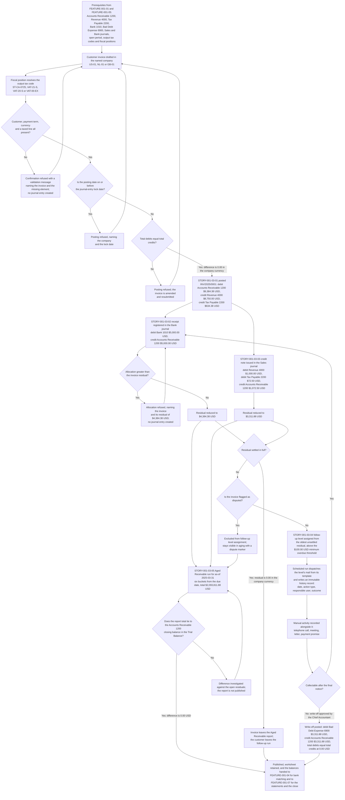
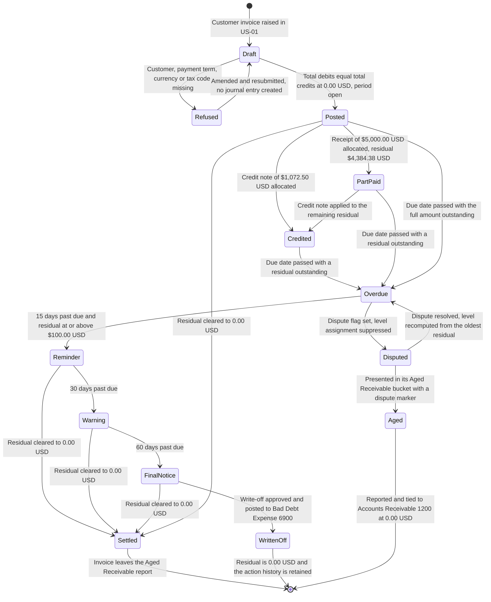

# FEATURE-001-03: Accounts Receivable & Customer Invoices

---

## Metadata

| Attribute | Value |
|-----------|-------|
| **Feature ID** | `FEATURE-001-03` |
| **Title** | Accounts Receivable & Customer Invoices |
| **Parent Epic** | [EPIC-001: Enterprise Accounting in Odoo](../EPIC-001-enterprise-accounting-odoo.md) |
| **Status** | Draft |
| **Priority** | 🔴 Critical |
| **Story Count** | 5 stories |
| **Last Updated** | 2026-08-13 |
| **Owner/Author** | Enterprise Accounting Team |

---

## 1. Feature Overview

### 1.1 Purpose and Business Value

This feature enables the **Accounts Receivable Specialist**, the **Chief Accountant** and the **Treasury Analyst** to run the invoice-to-cash cycle inside the ledger rather than alongside it: to issue and post customer invoices carrying lines, payment terms, currency and output tax; to register customer receipts and allocate them across open invoices including partial settlement; to issue credit notes and refunds and allocate them against open invoices; to run an automated follow-up ladder that contacts every customer holding an overdue balance and records what was done; and to report **Aged Receivable** so the collectable position is read from posted residuals instead of assembled by hand.

It is delivered against two modules that are present in this repository, with a third present as prior-phase Community context:

- **`account`** — the "Invoicing" application, version 1.4, category `Accounting/Accounting`, licence LGPL-3. It supplies `account.move` in its `out_invoice` and `out_refund` forms, `account.move.line` with the `amount_residual` and `date_maturity` fields that aging and allocation are computed from, `account.journal` for the Sales and Bank journals, `account.payment.term` for the due dates the ladder measures against, `account.tax` for the output tax carried on each line, and the `res.partner` credit fields `credit`, `credit_limit`, `trust`, `days_sales_outstanding`, `property_payment_term_id` and `total_invoiced`.
- **`account_payment`** — "Payment - Account", version 2.0, licence LGPL-3. It supplies receipt registration, the payment-method handling behind a customer receipt, and the allocation of one receipt across more than one open invoice.
- **`account_payment_followup`** — present in this repository at version 19.0.1.0.0 under AGPL-3, depending on `account` and `mail`. It already implements follow-up levels, follow-up lines, an immutable follow-up history, the `res.partner` extension that carries a customer's level, an `ir.cron` reminder mail and a follow-up report. Under [D-003](../EPIC-001-enterprise-accounting-odoo.md#93-d-003-reuse-of-the-existing-community-edition-accounting-add-ons) the dunning ladder, the reminder mail and the action history are therefore **reuse rather than build**; what this feature commissions on that path is multi-company proof, dispute exclusion and partial-payment behaviour verified against the story criteria.

**Business Value Statement:**

> Cash that has been invoiced but not collected is the largest single asset this group cannot see. Reading the receivable position from posted residuals turns collection from a monthly reconstruction into a daily operation: every overdue invoice is assigned a follow-up level, so 100% of the overdue population is contacted on a stated schedule rather than the part of it someone remembered; the manual tracking effort the Epic baselines at 10 or more hours per week is removed; and Days Sales Outstanding improves by 15% to 25% against the pre-implementation baseline of 58.0 days, to between 43.5 and 49.3 days (SM-017). The **Aged Receivable** report for as-of 2025-03-31 in `US-01` ties to the Accounts Receivable 1200 closing balance in the Trial Balance at a difference of `0.00 USD`, so the collectable figure given to the CFO / Finance Director is the ledger figure.

This feature carries all three of the Epic's objectives:

| Epic Objective | Contribution of This Feature |
|----------------|------------------------------|
| Multi-entity financial operations | A customer invoice is raised in a named legal entity, posts to that entity's Accounts Receivable 1200 and Revenue 4000 through that entity's Sales journal, and is collected through that entity's Bank journal. Every criterion in this feature names the company whose books are affected, and a follow-up run contacts a customer on behalf of the entity that raised the invoice rather than on behalf of the group |
| Compliance reporting | Receivable balances and revenue are presented under one taxonomy in the statements produced by FEATURE-001-07, output tax reaches Tax Payable 2200 with its tax code, base amount and tax amount recorded as three separate values, and the follow-up action history is retained as audit evidence readable by the External Auditor without a data request |
| Real-time financial visibility | The Aged Receivable position, the residual on every invoice and each customer's follow-up level are derived from posted journal items, so the collectable figure is current as of the last posted receipt rather than as of the last spreadsheet refresh |

Ordering rules **ORD-001** and **ORD-002** in the Epic place this feature after FEATURE-001-01, whose accounts, journals and open periods every invoice posts into, and after FEATURE-001-05, whose tax codes and fiscal positions determine the output tax an invoice carries. The Epic's implementation sequence places it in **Phase 2 — Transaction backbone** alongside FEATURE-001-02 and FEATURE-001-04.

**Deterministic artifacts referenced by this feature's criteria.** The five stories and the criteria below are written against one fixed artifact set, so a reviewer reads the same accounts, journals, reports and amounts throughout and no assertion depends on an unnamed value:

| Artifact Class | Values | Role in This Feature |
|----------------|--------|----------------------|
| Legal entities | The entities of the Epic's canonical legal-entity register ([Appendix E.4](../EPIC-001-enterprise-accounting-odoo.md#e4-canonical-legal-entity-register)) this feature's criteria are worked in: **Global Holdings Inc.** (`US-01`, United States parent, functional currency USD, which is also the group presentation currency), **Global Europe SARL** (`NL-01`, Netherlands operating subsidiary, functional currency EUR) and **Global UK Ltd** (`GB-01`, United Kingdom operating subsidiary, functional currency GBP, incorporated 2025-04-01, so its criteria here are the undated company-isolation and sterling-posting cases) | Every multi-company criterion names the entity whose books are affected by registered name, entity code or both; no criterion is satisfied by "the group" alone, and no entity code carries a second legal identity anywhere in the backlog |
| General ledger accounts | Accounts Receivable 1200 (the receivable control account), Revenue 4000, Tax Payable 2200 (output tax control), Bank 1010, Bad Debt Expense 6900 | Accounts Receivable 1200, Revenue 4000, Tax Payable 2200 and Bank 1010 are defined in FEATURE-001-01; Bad Debt Expense 6900 is added to that chart for the write-off path this feature owns, and is registered through FEATURE-001-01's chart-of-accounts policy rather than created as a parallel account |
| Journals | **Sales** (customer invoices and customer credit notes) and **Bank** (customer receipts and refunds) | Named on every posting assertion so the entry is traceable to one journal per company |
| Output tax codes | `ST-CA-0725` (California state sales tax, 7.25%, output tax to Tax Payable 2200), `ST-CA-0800` (California sales tax including a district add-on, 8.00%, output tax to Tax Payable 2200), `VAT-21-S` (Netherlands standard rate, 21%), `VAT-20-S` (United Kingdom standard rate, 20%), `VAT-00-EX` (exempt supply, 0%) | Defined in FEATURE-001-05; this feature consumes them and never redefines a rate. Every tax assertion states the tax code, the base amount and the tax amount as three separate values |
| Reports | **Aged Receivable**, run with an as-of-date parameter — 2025-03-31 is the worked as-of date used throughout; **Customer Statement**, run with a date-range parameter — 2025-01-01 to 2025-03-31 is the worked range; **Follow-Up Collections Report**, run with an as-of-date parameter | The three named reports this feature produces. For the worked as-of date of 2025-03-31 in `US-01`, Aged Receivable presents a total of `$2,093,811.88 USD` and Customer Statement a closing balance of `$3,311.88 USD`, each reconciling to Accounts Receivable 1200 at a difference of `0.00 USD` and each rounded to 2 decimal places at the USD rounding increment of 0.01; the Follow-Up Collections Report presents the same residuals grouped by follow-up level |
| Aging buckets | Current, 1-30 days, 31-60 days, 61-90 days, 91-120 days, Over 120 days, measured from the invoice **due date** and never from the invoice date, with a configurable bucket set standing alongside them | The six standard buckets carried forward under [CF-007](../EPIC-001-enterprise-accounting-odoo.md#cf-007-aged-receivable-presentation-filtering-and-export). Boundaries are deterministic: an invoice due 30 days before the as-of date falls in 1-30, one due 31 days before falls in 31-60, one due 121 days before falls in Over 120, and one due on or after the as-of date falls in Current |
| Follow-up ladder | Level 1 **reminder** at 15 days past due, Level 2 **warning** at 30 days past due, Level 3 **final notice** at 60 days past due, each with a minimum overdue threshold of `$100.00 USD` in `US-01`, stated to 2 decimal places at the USD rounding increment of 0.01 | The three-level escalation the ladder assigns from days overdue; the thresholds are configuration values, and the level a customer stands at is derived from the oldest unsettled residual |
| Worked invoice | `INV/2025/0001` in `US-01`: a base amount of `$8,750.00 USD` on Revenue 4000 at tax code `ST-CA-0725` bearing a tax amount of `$634.38 USD`, giving a debit to Accounts Receivable 1200 of `$9,384.38 USD`, each amount rounded to 2 decimal places at the USD rounding increment of 0.01 | The single document the invoice, receipt, credit-note, aging and write-off assertions all follow, so the residual can be traced from `$9,384.38 USD` to `$0.00 USD` — each residual stated to 2 decimal places at the USD rounding increment of 0.01 — across the feature |
| Rounding | 2 decimal places at a rounding increment of 0.01, rounded half-up, for USD, EUR and GBP | Applied to every amount asserted anywhere in this feature. The worked tax computation exercises it: `$8,750.00 USD` at 7.25% is `634.375`, which is stated as `$634.38 USD` |


#### Authoritative output-tax fixtures for this feature

Two Californian output-tax rates are in use across the receivable stories, and until now each story stated its own without a reconciliation, so a reader comparing the feature-level worked invoice with a story-level one could not tell whether the difference was a variant or a defect. Both are variants. The table below is the authoritative list: a story asserting a United States output tax uses one of these rows verbatim, and no story introduces a rate or a code that is not here. Every code is defined by [FEATURE-001-05](./FEATURE-001-05-tax-configuration-compliance.md) and consumed here.

| Fixture | Company | Tax Code | Rate | Base Amount | Tax Amount | Gross to Accounts Receivable 1200 | Used By |
|---------|---------|----------|-----:|------------:|-----------:|----------------------------------:|---------|
| AR-TAX-1 | `US-01` | `ST-CA-0725` | 7.25% | `$8,750.00 USD` | `$634.38 USD` | `$9,384.38 USD` | The feature-level worked document `INV/2025/0001`, whose residual is traced from `$9,384.38 USD` to `$0.00 USD` through §1.4, §4.1 and §8 |
| AR-TAX-2 | `US-01` | `ST-CA-0800` | 8.00% | `$12,450.00 USD` | `$996.00 USD` | `$13,446.00 USD` | [STORY-001-03-01](./FEATURE-001-03/STORY-001-03-01-generate-customer-invoices.md) for invoice creation and the credit-exposure check, and [STORY-001-03-02](./FEATURE-001-03/STORY-001-03-02-register-customer-payments.md) for the allocation and residual walk that consumes it |
| AR-TAX-3 | `NL-01` | `VAT-21-S` | 21% | `€333.33 EUR` | `€70.00 EUR` | `€403.33 EUR` | [STORY-001-03-01](./FEATURE-001-03/STORY-001-03-01-generate-customer-invoices.md) for the foreign-currency half-minor-unit rounding case |

Each row is arithmetically closed at the rounding stated above: `$8,750.00` × 7.25% = `$634.375`, half-up to `$634.38`; `$12,450.00` × 8.00% = `$996.00` exactly; `€333.33` × 21% = `€69.9993`, half-up to `€70.00`. AR-TAX-2 is the fixture the invoice-to-cash walk of the two authored stories is built on, so its gross of `$13,446.00 USD` is the figure their residual arithmetic reduces; AR-TAX-1 is the feature-level illustration and is not an alternative statement of the same document.
### 1.2 Problem Statement

Customer collection in this group is run from a spreadsheet of overdue invoices that one person maintains and refreshes by hand. Six consequences follow, and each of them recurs every month:

- **Follow-up timing is set by whoever has capacity.** With no ladder configured in the system, one customer is contacted 8 days after the due date and another 40 days after, for the same amount and the same payment terms. Collection is delayed by the gap rather than by the customer, and the delay is invisible because nothing records when contact was due.
- **There is no standardized escalation.** Moving a customer from a reminder to a warning and then to a final notice is a judgement made per case with no stated threshold, so a customer who has ignored three reminders receives a fourth while another receives a final notice on a first miss. The group cannot state what its collection policy is, which means it cannot enforce one.
- **The administrative burden is carried by hand.** Determining who needs contact requires re-deriving days overdue for every open invoice, netting partial receipts and credit notes against it, and cross-checking payment terms — work the Epic baselines at 10 or more hours per week, repeated because none of it is retained.
- **Revenue is lost to invoices that fall out of manual tracking.** An invoice omitted from the spreadsheet is an invoice nobody chases. It ages past every threshold and is discovered at year-end, when the remaining option is a write-off to Bad Debt Expense 6900 rather than a collection.
- **There is no audit trail of collection activity.** A telephone call, a meeting and a payment promise leave no record, so neither the Chief Accountant nor the External Auditor can establish what was done before an amount was written off, and a receivable provision cannot be evidenced.
- **Days Sales Outstanding cannot be managed.** DSO is computed once a quarter from a manual extract and stands at a baseline of 58.0 days. Because no intervention is scheduled and no action is recorded, the figure cannot be attributed to any cause, so the 15% to 25% improvement the Epic targets in SM-017 has nothing to act on.

### 1.3 Key Capabilities

| Capability ID | Capability Description | Related Stories |
|---------------|------------------------|-----------------|
| CAP-001 | Generate and post customer invoices with lines, payment terms, currency and output tax | STORY-001-03-01 |
| CAP-002 | Register customer receipts and allocate them across open invoices including partial settlement | STORY-001-03-02 |
| CAP-003 | Issue customer credit notes and refunds and allocate them against open invoices | STORY-001-03-03 |
| CAP-004 | Configure an automated follow-up ladder with reminder, warning and final-notice levels and record every action | STORY-001-03-04 |
| CAP-005 | Report Aged Receivable across the Current / 1-30 / 31-60 / 61-90 / 91-120 / Over 120 day buckets | STORY-001-03-05 |

The five capabilities are cumulative, and they are the reason the story order in [§3.4](#34-recommended-implementation-order) is what it is: CAP-001 creates the receivable and the revenue, CAP-002 settles it in cash, CAP-003 reduces it by credit rather than by cash, CAP-004 acts on whatever residual the first three leave unsettled, and CAP-005 presents that residual by age and proves it against the receivable control account.

### 1.4 Success Criteria at Feature Level

| Criterion | Target | Verification Method |
|-----------|--------|---------------------|
| Balanced posting of a customer invoice | `INV/2025/0001` in `US-01` carries tax code `ST-CA-0725` on a base amount of `$8,750.00 USD` bearing a tax amount of `$634.38 USD` — three separate values — and posts through the **Sales** journal as debit Accounts Receivable 1200 `$9,384.38 USD`, credit Revenue 4000 `$8,750.00 USD` and credit Tax Payable 2200 `$634.38 USD`, so total debits of `$9,384.38 USD` equal total credits of `$9,384.38 USD` at a difference of `0.00 USD`, each amount rounded to 2 decimal places at the USD rounding increment of 0.01 | Posted entry inspected line by line, with the debit-minus-credit difference asserted at `0.00 USD` (C-009) |
| Output tax recorded as a separated triple | The invoice line records tax code `ST-CA-0725`, base amount `$8,750.00 USD` and tax amount `$634.38 USD` as three separate values, the tax amount being `634.375` rounded half-up to 2 decimal places at the USD rounding increment of 0.01; the count of posted receivable-side tax lines with a null tax code or a null base amount is 0 | Tax-line completeness query over the posted invoice population for the period, with the null count asserted at 0 |
| Invoice posting completeness | 100% of confirmed customer invoices carry a customer, a payment term, a currency and at least one line with a tax code; the count of confirmed invoices missing any of the four is 0 | Invoice-completeness report per company, with the incomplete count asserted at 0 |
| Balanced posting of a customer receipt | A receipt of `$5,000.00 USD` against `INV/2025/0001` posts through the **Bank** journal as debit Bank 1010 `$5,000.00 USD` and credit Accounts Receivable 1200 `$5,000.00 USD`, so total debits equal total credits at a difference of `0.00 USD`, and the invoice residual becomes `$4,384.38 USD`, each amount rounded to 2 decimal places at the USD rounding increment of 0.01 | Posted receipt inspected line by line, with the residual recomputed and compared to `$4,384.38 USD` |
| Refusal of an over-allocation | 100% of attempts to allocate a receipt amount greater than the invoice residual of `$4,384.38 USD`, that residual being stated to 2 decimal places at the USD rounding increment of 0.01, are refused with an Odoo validation message naming the invoice and its residual, and no journal entry is created by the refused attempt | Negative test per company in `US-01`, `NL-01` and `GB-01` |
| Balanced posting of a customer credit note | A credit note against `INV/2025/0001` in `US-01` for a base amount of `$1,000.00 USD` at tax code `ST-CA-0725` bearing a tax amount of `$72.50 USD` posts through the **Sales** journal as debit Revenue 4000 `$1,000.00 USD`, debit Tax Payable 2200 `$72.50 USD` and credit Accounts Receivable 1200 `$1,072.50 USD`, so total debits of `$1,072.50 USD` equal total credits of `$1,072.50 USD` at a difference of `0.00 USD`, and the invoice residual becomes `$3,311.88 USD`, each amount rounded to 2 decimal places at the USD rounding increment of 0.01 | Posted credit note inspected line by line, with the residual recomputed and compared to `$3,311.88 USD` |
| Balanced write-off to bad debt | A write-off of the remaining residual in `US-01` posts as debit Bad Debt Expense 6900 `$3,311.88 USD` and credit Accounts Receivable 1200 `$3,311.88 USD`, so total debits equal total credits at a difference of `0.00 USD`; the residual becomes `$0.00 USD` and the invoice leaves the **Aged Receivable** report for any later as-of date | Posted write-off inspected line by line, with the residual asserted at `$0.00 USD` and the report re-run |
| Follow-up level coverage | 100% of invoices whose residual is overdue by 15 days or more and whose residual is `$100.00 USD` or greater in `US-01`, that threshold being stated to 2 decimal places at the USD rounding increment of 0.01, are assigned a follow-up level; the count of overdue invoices with no assigned level is 0, and an invoice flagged as disputed is excluded from level assignment while staying visible in aging with a dispute marker | Follow-up coverage report per company, with the unassigned count asserted at 0 (SM-017) |
| Follow-up action history completeness | 100% of follow-up actions — the automated reminder, warning and final-notice mails and the manually recorded telephone calls, meetings, letters and payment promises — are written to an immutable history carrying date, action type, responsible user and outcome, and the history survives cancellation of the invoice it refers to | Action-history audit per customer, cross-checked against the mail dispatch log and the recorded manual actions |
| **Aged Receivable** reconciliation to the sub-ledger | For `US-01` and the as-of date 2025-03-31 the report presents Current `$1,240,000.00 USD`, 1-30 days `$486,000.00 USD`, 31-60 days `$212,500.00 USD`, 61-90 days `$94,000.00 USD`, 91-120 days `$38,000.00 USD` and Over 120 days `$23,311.88 USD`, a total of `$2,093,811.88 USD` that ties to the Accounts Receivable 1200 closing balance in the Trial Balance for the same as-of date at a difference of `0.00 USD`, each amount rounded to 2 decimal places at the USD rounding increment of 0.01 | Report-to-ledger reconciliation worksheet per company per period, retained as close evidence (SM-001, CF-007) |
| **Customer Statement** agreement to the receivable ledger | For the customer behind `INV/2025/0001` in `US-01` and the date range 2025-01-01 to 2025-03-31 the statement presents the invoice of `$9,384.38 USD`, the receipt of `$5,000.00 USD`, the credit note of `$1,072.50 USD` and a closing balance of `$3,311.88 USD` that equals that customer's Accounts Receivable 1200 residual at a difference of `0.00 USD`, each amount rounded to 2 decimal places at the USD rounding increment of 0.01 | Statement-to-ledger comparison per customer for the stated date range |
| **Follow-Up Collections Report** measurement | For `US-01` and the as-of date 2025-03-31 the report presents total overdue of `$853,811.88 USD` across 128 customers, of which the final-notice level carries `$23,311.88 USD`, each amount rounded to 2 decimal places at the USD rounding increment of 0.01, together with the recovery rate and the average days from follow-up action to receipt for the stated range and for the preceding comparable period | Collections effectiveness worksheet for the stated as-of date, compared with the preceding comparable period (CF-006) |
| Days Sales Outstanding improvement | 15% to 25% improvement against the pre-implementation baseline of 58.0 days, giving a DSO of between 43.5 and 49.3 days | DSO computed quarterly from the Aged Receivable report and compared with the baseline (SM-017) |
| Refusal of a posting into a locked period | 100% of attempts to post a customer invoice, receipt or credit note dated on or before the company's journal-entry lock date are refused with an Odoo validation message naming the company and the lock date, and no journal entry is created by the refused attempt | Negative test executed per company after FEATURE-001-01's lock date is applied |
| Hostile-input rejection on the dunning and export paths | 100% of partner-supplied values rendered into a reminder mail body, a QWeb report template or a PDF are escaped as text rather than as markup, 100% of cells written to a CSV or XLSX export are neutralized against formula injection, and each rejected input produces a named error with no journal entry created and the service still available | Hostile-input test set executed against the mail-rendering and export paths (C-017, C-018, C-020, C-022) |
| Test coverage | ≥80% for all 5 story implementations, with the balance, residual and reconciliation assertions tested numerically | Coverage tooling in the repository's configured test run (C-007, C-009) |
| Demonstrability | 5 of 5 stories demonstrated in the Odoo user interface, or through its public API, to the Finance Controller and the Product Owner | Recorded acceptance walkthrough per story |

---

## 2. User Personas

### 2.1 Persona Mapping

Every persona below is a named finance role drawn from the Epic's persona register. The five roles marked applicable take an issuing, allocating, collecting or verification action inside this feature; the roles marked not applicable consume the receivable balances, the revenue or the collections outcome, and their work is specified in the features named against them.

| Persona | Role Description | Primary Use Cases | Applicable |
|---------|------------------|-------------------|------------|
| **Accounts Receivable Specialist** | Issues customer invoices, allocates receipts and manages collections | Raises and confirms customer invoices in the **Sales** journal with their lines, payment terms, currency and output tax code; registers customer receipts in the **Bank** journal and allocates each one across the open invoices it settles, in full or in part; issues credit notes and refunds and allocates them against open invoices; configures the reminder, warning and final-notice levels with their day thresholds and their minimum overdue amount; records the telephone calls, meetings and payment promises the ladder cannot generate; works the **Follow-Up Collections Report** customer by customer | ☑ Yes |
| **Chief Accountant** | Owns the general ledger, the chart of accounts and the integrity of every posted entry | Approves that a customer invoice debits Accounts Receivable 1200 and credits Revenue 4000 and Tax Payable 2200 and that total debits equal total credits at a difference of `0.00` in the company currency; approves Bad Debt Expense 6900 and the evidence a write-off requires before the residual leaves Accounts Receivable 1200; verifies that a receipt allocation reduces the residual rather than creating a second balance; administers the journal-entry lock date that refuses a receivable posting into a reported period | ☑ Yes |
| **Treasury Analyst** | Owns bank and cash positions and statement reconciliation | Reads the **Aged Receivable** buckets as the collections forecast that feeds the cash position; monitors Days Sales Outstanding against the 58.0-day baseline and the 43.5-to-49.3-day target; confirms that each receipt posted to Bank 1010 in this feature is the movement matched against the bank statement in FEATURE-001-04; escalates a customer whose credit limit is exceeded before a further invoice is raised | ☑ Yes |
| **Financial Reporting Manager** | Produces statutory and management statements for each entity and the group | Owns the presentation of the **Aged Receivable** report — its six buckets, its configurable bucket set, its partner-category filtering, its multi-currency columns and its PDF and XLSX exports; proves the report total of `$2,093,811.88 USD` for the as-of date 2025-03-31 against the Accounts Receivable 1200 closing balance in the Trial Balance for that same as-of date at a difference of `0.00 USD`, rounded to 2 decimal places at the USD rounding increment of 0.01; carries the receivable and revenue balances into the statements and the close in FEATURE-001-07 | ☑ Yes |
| **External Auditor** | Tests balances and controls and issues the audit opinion | Traces an **Aged Receivable** bucket line to the open invoices behind it and from an invoice to its journal items; tests that a receipt allocation is evidenced and that a partial allocation left the stated residual; reads the immutable follow-up action history, the payment promises recorded against it and the write-off approval as the evidence behind a receivable provision, without requesting an extract | ☑ Yes |
| Tax Accountant | Determines tax on transactions and files statutory returns | Owns the output tax codes `ST-CA-0725`, `VAT-21-S`, `VAT-20-S` and `VAT-00-EX` and the fiscal positions that select them, in FEATURE-001-05; this feature consumes that configuration and records the resulting tax code, base amount and tax amount, but defines no rate | ☐ No |
| Accounts Payable Clerk | Captures vendor bills, runs three-way match and prepares payment runs | Works the mirror-image payable cycle against Accounts Payable 2000 and Expense 6100 in FEATURE-001-02, including the Aged Payables half of the retired aged report under CF-001; takes no receivable action in this feature | ☐ No |
| Group Controller | Governs group accounting policy and approves the consolidated result | Approves group credit and collection policy and the receivable provision, and consumes the consolidated receivable position; an intercompany customer invoice between `US-01` and `NL-01` is eliminated in FEATURE-001-06 rather than here | ☐ No |
| CFO / Finance Director | Executive stakeholder accountable for financial health and compliance | Consumes the receivables health figure and the DSO trend, and confirms the open platform and edition decisions recorded in §5.2 and §5.5; does not raise, allocate or write off | ☐ No |

### 2.2 Persona-to-Story Mapping

Each story carries exactly one primary persona in its WHO statement. Secondary personas originate an input, approve the posting or verify the outcome, and they are named so that the access rights derived from these stories keep the issuing role, the cash-application role and the write-off approval role distinguishable.

| Story | Primary Persona | Secondary Personas |
|-------|-----------------|--------------------|
| STORY-001-03-01 Generate and Post Customer Invoices | Accounts Receivable Specialist | Chief Accountant (balanced posting to Accounts Receivable 1200 and Revenue 4000), Tax Accountant (output tax code selected by the fiscal position), Treasury Analyst (credit limit before a further invoice is raised) |
| STORY-001-03-02 Register Customer Payments and Allocations | Accounts Receivable Specialist | Treasury Analyst (the Bank 1010 movement reconciled in FEATURE-001-04), Chief Accountant (residual integrity after a partial allocation), External Auditor (allocation evidence) |
| STORY-001-03-03 Manage Customer Credit Notes and Refunds | Accounts Receivable Specialist | Chief Accountant (reversal of Revenue 4000 and Tax Payable 2200 and approval of a write-off to Bad Debt Expense 6900), External Auditor (credit-note and write-off audit trail) |
| STORY-001-03-04 Configure Automated Payment Follow-Ups | Accounts Receivable Specialist | Chief Accountant (dispute exclusion and the retention of action history), Treasury Analyst (collections forecast and DSO), External Auditor (immutable action history and recorded payment promises), CFO / Finance Director (collections effectiveness) |
| STORY-001-03-05 Generate Aged Receivables Report | Financial Reporting Manager | Accounts Receivable Specialist (bucket detail worked customer by customer), Treasury Analyst (collections forecast), External Auditor (bucket-to-invoice-to-journal-item drill-down) |

---

## 3. Story List

### 3.1 User Stories

| Story ID | Story Title | Persona | Priority | Status | Link |
|----------|-------------|---------|----------|--------|------|
| STORY-001-03-01 | Generate and Post Customer Invoices | Accounts Receivable Specialist | 🔴 Critical | Draft | [STORY-001-03-01](./FEATURE-001-03/STORY-001-03-01-generate-customer-invoices.md) |
| STORY-001-03-02 | Register Customer Payments and Allocations | Accounts Receivable Specialist | 🔴 Critical | Draft | [STORY-001-03-02](./FEATURE-001-03/STORY-001-03-02-register-customer-payments.md) |
| STORY-001-03-03 | Manage Customer Credit Notes and Refunds | Accounts Receivable Specialist | 🟠 High | Draft | [STORY-001-03-03](./FEATURE-001-03/STORY-001-03-03-manage-customer-credit-notes.md) |
| STORY-001-03-04 | Configure Automated Payment Follow-Ups | Accounts Receivable Specialist | 🟠 High | Draft | [STORY-001-03-04](./FEATURE-001-03/STORY-001-03-04-configure-payment-followups.md) |
| STORY-001-03-05 | Generate Aged Receivables Report | Financial Reporting Manager | 🟠 High | Draft | [STORY-001-03-05](./FEATURE-001-03/STORY-001-03-05-report-aged-receivables.md) |

**Priority legend:** 🔴 Critical — a closed, compliant period is impossible without it, and the Epic records this feature as Critical because invoicing and cash application create and settle the receivable balance a close depends on; 🟠 High — significant finance value that consumes the posted receivable the Critical stories create.

The **Accounts Receivable Specialist** is the primary persona of four of the five stories because one role owns the invoice-to-cash cycle end to end. `STORY-001-03-05` is the exception: the **Financial Reporting Manager** owns the Aged Receivable report because its presentation, its bucket set, its multi-currency columns and its tie-out to Accounts Receivable 1200 follow the reporting conventions that FEATURE-001-07 governs rather than the collections workflow.

### 3.2 Story Count Assessment

| Count | Assessment | Status |
|-------|------------|--------|
| **5 stories** | Within the mandated range of 2 to 5 stories per feature | ✓ Feature is scoped for independent delivery |

This feature carries **5 stories**, at the upper bound of the 2-to-5 range recorded in the Epic's decomposition guidelines. The earlier 3-to-7 guidance carried by the feature template is superseded by that bound and is not applied here. The count is stated identically in four places, and the four must stay equal: the Story Count row in §Metadata, this assessment, the 5 rows of §3.1, and the 5 links of [§9.2](#92-story-files). The Epic's feature summary declares the same count of 5 stories for `FEATURE-001-03`.

The count is fixed at five, and that ceiling is the reason two consolidations were made rather than avoided. The five retired follow-up stories of the superseded backlog land on `STORY-001-03-04` alone, and the receivable half of the retired aged report lands on `STORY-001-03-05`; both consolidations, and the capability sets they oblige those stories to carry, are recorded in the Epic at [CF-006](../EPIC-001-enterprise-accounting-odoo.md#cf-006-follow-up-collections-report-capability-set), [CF-007](../EPIC-001-enterprise-accounting-odoo.md#cf-007-aged-receivable-presentation-filtering-and-export) and [CF-008](../EPIC-001-enterprise-accounting-odoo.md#cf-008-follow-up-action-history-retention-and-the-compliance-regimes-it-answers-to). If refinement shows that the combined scope of `STORY-001-03-04` exceeds 13 Fibonacci points, that is raised as a backlog change against this five-story budget rather than absorbed silently or trimmed.

Splitting further would produce stories with no accounting proof of their own — an allocation separated from the invoice it settles has no residual to reduce, and a bucket separated from the residuals behind it has nothing to age. Merging would breach the Small criterion of INVEST, because each of the five is demonstrated by a different artifact: a posted invoice whose debits equal its credits, a receipt whose allocation leaves a stated residual, a credit note that reverses revenue and output tax, a follow-up level with a dispatched mail and a recorded action, and the Aged Receivable report tied to Accounts Receivable 1200 at `0.00`.

### 3.3 Story Dependency Ordering

Each of the five stories delivers an outcome demonstrable on its own, which keeps them Independent under INVEST. The rows below are sequencing prerequisites — posted data or configuration that must already exist for the dependent story to be demonstrated — and not shared implementation.

| Story | Depends On | Notes |
|-------|-----------|-------|
| STORY-001-03-01 (Generate and Post Customer Invoices) | None within this feature | Foundation story. Outside this feature it depends on FEATURE-001-01 for Accounts Receivable 1200, Revenue 4000, the Sales journal and an open period, and on FEATURE-001-05 for the output tax code the fiscal position selects |
| STORY-001-03-02 (Register Customer Payments and Allocations) | STORY-001-03-01 | A receipt allocates to a posted invoice. Without a posted receivable there is no residual to reduce and no allocation to prove, so the `$5,000.00 USD` receipt and the resulting `$4,384.38 USD` residual, each stated to 2 decimal places at the USD rounding increment of 0.01, cannot be asserted |
| STORY-001-03-03 (Manage Customer Credit Notes and Refunds) | STORY-001-03-01 | A credit note reverses a posted invoice, debiting Revenue 4000 and Tax Payable 2200 and crediting Accounts Receivable 1200. It does not depend on STORY-001-03-02: a credit note is issued against an invoice whether or not a receipt has been allocated to it |
| STORY-001-03-04 (Configure Automated Payment Follow-Ups) | STORY-001-03-01, STORY-001-03-02 | Overdue status derives from posted invoices net of allocations. A ladder cannot assign a level without a due date from a posted invoice, and it would contact a customer who has already paid without the allocation that cleared the residual |
| STORY-001-03-05 (Generate Aged Receivables Report) | STORY-001-03-01, STORY-001-03-02, STORY-001-03-03 | Aging is computed on residuals after receipts and credit notes. All three must post before a bucket line value can be asserted or the report total of `$2,093,811.88 USD` for the as-of date 2025-03-31 tied to Accounts Receivable 1200 at a difference of `0.00 USD`, rounded to 2 decimal places at the USD rounding increment of 0.01. It does not depend on STORY-001-03-04, because a bucket is an age and not a follow-up level |

### 3.4 Recommended Implementation Order

```text
0. FEATURE-001-01 and FEATURE-001-05 (external prerequisites)
   Accounts Receivable 1200, Revenue 4000, Tax Payable 2200 and Bank 1010 exist,
   the Sales and Bank journals exist per company, the period is open, and the
   output tax codes and fiscal positions are configured
        |
        v
1. STORY-001-03-01  Generate and Post Customer Invoices
   Creates the receivable: INV/2025/0001 posts debit Accounts Receivable 1200
   $9,384.38 USD against credit Revenue 4000 $8,750.00 USD and credit
   Tax Payable 2200 $634.38 USD, total debits equal total credits
        |
        +--> 2. STORY-001-03-02  Register Customer Payments and Allocations
        |       Settles it in cash: receipt $5,000.00 USD through the Bank
        |       journal leaves a residual of $4,384.38 USD
        |            |
        |            v
        |    4. STORY-001-03-04  Configure Automated Payment Follow-Ups
        |       Acts on the residual: reminder at 15 days, warning at 30,
        |       final notice at 60, with every action recorded
        |
        +--> 3. STORY-001-03-03  Manage Customer Credit Notes and Refunds
                Reduces it by credit: credit note $1,072.50 USD leaves a
                residual of $3,311.88 USD
                     |
                     v
             5. STORY-001-03-05  Generate Aged Receivables Report
                Presents and proves the residual: six buckets for as-of
                2025-03-31 totalling $2,093,811.88 USD, tied to the
                Accounts Receivable 1200 closing balance at 0.00 USD
```

Steps 2 and 3 both wait on step 1 and have no dependency on one another, so they may be delivered concurrently once the invoice posts. Step 4 waits on steps 1 and 2; step 5 waits on steps 1, 2 and 3 and is delivered last because its tie-out is only meaningful once receipts and credit notes have moved the residuals it ages. The whole feature precedes FEATURE-001-04, which matches the Bank 1010 receipts against imported statement lines, and FEATURE-001-07, whose statements and close consume the receivable and revenue balances, under ORD-004.

---


## 4. Acceptance Criteria Summary

### 4.1 Feature-Level Acceptance Criteria

These are feature-level gates. The Given/When/Then acceptance criteria live in the five story files, where each is written against one workflow with 4 to 8 criteria and the coverage distribution the Epic requires.

The feature is considered complete when:

- [ ] All 5 stories within this feature have status "Done"
- [ ] All 5 stories achieve minimum 80% test coverage (C-007)
- [ ] Feature-level integration tests pass, with every balance, residual and reconciliation assertion tested as an amount rather than inspected by eye (C-009)
- [ ] Each of the 5 stories has been demonstrated in the Odoo user interface, or through its public API, to the Finance Controller and the Product Owner, and the walkthrough is recorded against the story
- [ ] **The customer invoice posts balanced, with its tax stated as a triple.** `INV/2025/0001` in `US-01` records tax code `ST-CA-0725`, a base amount of `$8,750.00 USD` and a tax amount of `$634.38 USD` as three separate values, and posts through the **Sales** journal as debit Accounts Receivable 1200 `$9,384.38 USD`, credit Revenue 4000 `$8,750.00 USD` and credit Tax Payable 2200 `$634.38 USD`, so total debits of `$9,384.38 USD` equal total credits of `$9,384.38 USD` at a difference of `0.00 USD`, each amount rounded to 2 decimal places at the USD rounding increment of 0.01
- [ ] **The output tax is recorded as a separated triple.** The invoice line records tax code `ST-CA-0725`, base amount `$8,750.00 USD` and tax amount `$634.38 USD` as three separate values, the tax amount being `634.375` rounded half-up to 2 decimal places at the USD rounding increment of 0.01, and the tax amount reaches Tax Payable 2200 rather than Revenue 4000
- [ ] **A euro-area entity posts on the same rule.** In `NL-01`, an invoice carrying tax code `VAT-21-S` on a base amount of `€10,000.00 EUR` with a tax amount of `€2,100.00 EUR` posts through the **Sales** journal as debit Accounts Receivable 1200 `€12,100.00 EUR`, credit Revenue 4000 `€10,000.00 EUR` and credit Tax Payable 2200 `€2,100.00 EUR`, so total debits of `€12,100.00 EUR` equal total credits of `€12,100.00 EUR` at a difference of `0.00 EUR`, each amount rounded to 2 decimal places at the EUR rounding increment of 0.01
- [ ] **A sterling entity posts on the same rule.** In `GB-01`, an invoice carrying tax code `VAT-20-S` on a base amount of `£50,000.00 GBP` with a tax amount of `£10,000.00 GBP` posts through the **Sales** journal as debit Accounts Receivable 1200 `£60,000.00 GBP`, credit Revenue 4000 `£50,000.00 GBP` and credit Tax Payable 2200 `£10,000.00 GBP`, so total debits of `£60,000.00 GBP` equal total credits of `£60,000.00 GBP` at a difference of `0.00 GBP`, each amount rounded to 2 decimal places at the GBP rounding increment of 0.01
- [ ] **An exempt supply reaches the ledger with a zero tax amount rather than no tax line.** In `NL-01`, an invoice carrying tax code `VAT-00-EX` on a base amount of `€25,000.00 EUR` records a tax amount of `€0.00 EUR`, posts no movement to Tax Payable 2200, and posts as debit Accounts Receivable 1200 `€25,000.00 EUR` against credit Revenue 4000 `€25,000.00 EUR`, so total debits equal total credits at a difference of `0.00 EUR`, each amount rounded to 2 decimal places at the EUR rounding increment of 0.01
- [ ] **A confirmation attempt on an incomplete invoice is refused.** An invoice with no customer, no payment term, no currency, no line, or a line carrying no tax code is refused at confirmation with an Odoo validation message naming the invoice and the missing element, and no journal entry is created by the refused attempt
- [ ] **A zero-amount line does not produce an unbalanced entry.** An invoice line priced at `$0.00 USD` in `US-01` either posts a journal item of `$0.00 USD` on both the receivable and the revenue side or is excluded from the entry, and in each case total debits equal total credits at a difference of `0.00 USD`
- [ ] **The customer receipt posts balanced and reduces the residual.** A receipt of `$5,000.00 USD` against `INV/2025/0001` posts through the **Bank** journal as debit Bank 1010 `$5,000.00 USD` and credit Accounts Receivable 1200 `$5,000.00 USD`, so total debits equal total credits at a difference of `0.00 USD`, and the invoice residual becomes `$4,384.38 USD`, each amount rounded to 2 decimal places at the USD rounding increment of 0.01
- [ ] **One receipt allocates across more than one open invoice.** A receipt of `$12,000.00 USD` in `US-01` allocated across three open invoices settles the first two in full and leaves a stated residual on the third; the sum of the allocated amounts equals `$12,000.00 USD` at a difference of `0.00 USD`, and the unallocated remainder, if any, is held on account rather than applied to an arbitrary invoice
- [ ] **An over-allocation is refused.** An attempt to allocate more than the invoice residual of `$4,384.38 USD`, that residual being stated to 2 decimal places at the USD rounding increment of 0.01, is refused with an Odoo validation message naming the invoice and its residual, and no journal entry is created by the refused attempt
- [ ] **The customer credit note posts balanced and reduces the residual.** A credit note against `INV/2025/0001` in `US-01` for a base amount of `$1,000.00 USD` at tax code `ST-CA-0725` bearing a tax amount of `$72.50 USD` posts through the **Sales** journal as debit Revenue 4000 `$1,000.00 USD`, debit Tax Payable 2200 `$72.50 USD` and credit Accounts Receivable 1200 `$1,072.50 USD`, so total debits of `$1,072.50 USD` equal total credits of `$1,072.50 USD` at a difference of `0.00 USD`, and the invoice residual becomes `$3,311.88 USD`, each amount rounded to 2 decimal places at the USD rounding increment of 0.01
- [ ] **A refund of a credit note settles it in cash without reopening the invoice.** A refund of `$1,072.50 USD` paid through the **Bank** journal posts as debit Accounts Receivable 1200 `$1,072.50 USD` and credit Bank 1010 `$1,072.50 USD`, so total debits equal total credits at a difference of `0.00 USD`, and the credit note residual becomes `$0.00 USD`
- [ ] **A write-off to bad debt posts balanced and is approved.** A write-off of the remaining residual in `US-01` posts as debit Bad Debt Expense 6900 `$3,311.88 USD` and credit Accounts Receivable 1200 `$3,311.88 USD`, so total debits equal total credits at a difference of `0.00 USD`; the residual becomes `$0.00 USD`, the invoice leaves the **Aged Receivable** report for any later as-of date, and the Chief Accountant's approval and the follow-up action history behind it are retained as the evidence for the write-off
- [ ] **The follow-up ladder is configured and assigns a level.** Level 1 reminder at 15 days past due, Level 2 warning at 30 days past due and Level 3 final notice at 60 days past due each exist per company with a minimum overdue threshold of `$100.00 USD` in `US-01`, that threshold being stated to 2 decimal places at the USD rounding increment of 0.01; the level a customer stands at is derived from the oldest unsettled residual; and the count of overdue invoices at or above the threshold with no assigned level is 0
- [ ] **The scheduled follow-up run dispatches from a template and records what it did.** The run generates the reminder, warning or final-notice mail from the level's mail template, personalizes it with the customer name and the overdue amount stated in the company currency to 2 decimal places at the rounding increment of 0.01, attaches the overdue invoice documents, includes the unsubscribe and company-identification footer elements, and writes one immutable history record per dispatch carrying date, action type, responsible user and outcome
- [ ] **Manual collection activity is recorded alongside the automated activity.** A telephone call, a meeting, a letter and a payment promise are each recorded against the customer with date, action type, responsible user and outcome, and a recorded payment promise carries its promised amount in the company currency to 2 decimal places at the rounding increment of 0.01 and its promised date
- [ ] **A disputed invoice is excluded from level assignment and stays visible in aging.** An invoice flagged as disputed is not assigned a follow-up level and generates no reminder, and it continues to appear in its **Aged Receivable** bucket carrying a dispute marker, so the amount is neither chased nor hidden
- [ ] **A partial receipt moves the ladder rather than resetting it.** After the `$5,000.00 USD` receipt, the residual of `$4,384.38 USD` continues to age from the original due date and the customer's level is recomputed from that residual; a receipt that clears the residual to `$0.00 USD` removes the customer from the run, each amount stated to 2 decimal places at the USD rounding increment of 0.01
- [ ] **Action history is immutable and retained under the named regimes.** A written history record is neither edited nor deleted and survives cancellation of the invoice it refers to; archival is configurable with a default of **seven years**; where the tax or corporate law of a company's jurisdiction requires a longer period, that period governs for that named company; and GDPR, the Sarbanes-Oxley Act and jurisdiction-specific tax-record retention are each carried by name, with CAN-SPAM governing the automated customer mail itself (CF-008)
- [ ] **The Aged Receivable report ties to the sub-ledger.** For `US-01` and the as-of date 2025-03-31 the report presents Current `$1,240,000.00 USD`, 1-30 days `$486,000.00 USD`, 31-60 days `$212,500.00 USD`, 61-90 days `$94,000.00 USD`, 91-120 days `$38,000.00 USD` and Over 120 days `$23,311.88 USD`, a total of `$2,093,811.88 USD` that ties to the Accounts Receivable 1200 closing balance in the Trial Balance for the same as-of date at a difference of `0.00 USD`, each amount rounded to 2 decimal places at the USD rounding increment of 0.01 (SM-001)
- [ ] **The bucket boundaries are deterministic and measured from the due date.** An invoice due 30 days before the as-of date falls in 1-30, one due 31 days before falls in 31-60, one due 121 days before falls in Over 120, and one due on or after the as-of date falls in Current; the basis is the due date and never the invoice date; and a configurable bucket set — for example 0-15, 16-30, 31-45, 46-60 and Over 60 days — stands alongside the six standard buckets, with the report stating which set produced the columns shown (CF-007)
- [ ] **Bucket amounts are open residuals.** A partial receipt reduces a bucket amount, a credit note reduces the customer total, and an invoice settled in full leaves the report; the report itself posts nothing
- [ ] **A customer row expands to the invoices behind each bucket.** Expanding a customer shows every open invoice contributing to each bucket with its invoice number, invoice date, due date and amount, and drills down to the **Customer Statement** for the date range 2025-01-01 to 2025-03-31 — whose closing balance of `$3,311.88 USD`, rounded to 2 decimal places at the USD rounding increment of 0.01, equals that customer's bucket total — and onward to the source journal items with the filters preserved
- [ ] **Multi-currency aging is presented in both currencies.** An invoice raised in EUR and held by a company reporting in USD is presented at its amount converted into the company currency alongside the original amount with its ISO 4217 code, the conversion rate and the rate date, each amount stated to 2 decimal places and rounded half-up at that currency's rounding increment of 0.01
- [ ] **The Customer Statement agrees to the receivable ledger.** For the customer behind `INV/2025/0001` in `US-01` and the date range 2025-01-01 to 2025-03-31 the statement presents the invoice of `$9,384.38 USD`, the receipt of `$5,000.00 USD`, the credit note of `$1,072.50 USD` and a closing balance of `$3,311.88 USD` that equals that customer's Accounts Receivable 1200 residual at a difference of `0.00 USD`, each amount rounded to 2 decimal places at the USD rounding increment of 0.01
- [ ] **The Follow-Up Collections Report carries its full capability set.** For `US-01` and the as-of date 2025-03-31 the report presents total overdue of `$853,811.88 USD` across 128 customers, of which the final-notice level carries `$23,311.88 USD`; it offers a multi-select follow-up-level filter including a selection for customers holding overdue invoices with no level assigned, from-and-to due-date and minimum-and-maximum overdue-amount filters combined with AND logic, customer drill-down to the overdue invoices and the complete action-history timeline, grouping with subtotals by salesperson, sales team, region, follow-up level and aging bucket, PDF and XLSX export carrying the applied filters, and an effectiveness summary — total overdue, total recovered, recovery rate, average days from action to receipt, response rate per level and the customer count at each level — shown alongside the preceding comparable period, every amount in the company currency to 2 decimal places rounded half-up at the rounding increment of 0.01 (CF-006)
- [ ] **A locked period refuses a receivable posting.** A customer invoice, receipt or credit note dated on or before the company's journal-entry lock date is refused with an Odoo validation message naming the company and the lock date, and no journal entry is created by the refused attempt
- [ ] **Partner-supplied text and exported cells are neutralized.** A customer name, invoice reference or memo field rendered into a reminder mail body, a QWeb report template or a PDF is escaped as text rather than as markup, and a cell value written to a CSV or XLSX export beginning with `=`, `+`, `-`, `@`, a tab or a carriage return is escaped or prefixed so the spreadsheet application treats it as text (C-017, C-018)
- [ ] **Hostile input is rejected with a named error and an unchanged ledger.** A hostile value presented on the mail-rendering, report-filter or export path is rejected with an error naming the rejected value and the check that failed, discloses no stack trace, file-system path or credential, creates no journal entry, and leaves the service available (C-020, C-022)
- [ ] **Multi-company isolation holds.** A role restricted to `US-01` can neither read `NL-01` receivable lines nor dispatch a follow-up mail on behalf of `NL-01`, and each criterion above that touches more than one company names the company whose books are affected (C-014)
- [ ] **The hand-overs are recorded.** The Bank 1010 receipts produced here are handed to FEATURE-001-04 as the movements matched against imported statement lines, and the Accounts Receivable 1200 and Revenue 4000 balances are handed to FEATURE-001-07 for presentation in the statements and reconciliation at period close, under ORD-004
- [ ] **The boundary with the payable side is respected.** Aged **Payables** is not delivered here: it belongs to FEATURE-001-02 under [CF-001](../EPIC-001-enterprise-accounting-odoo.md#cf-001-aged-payables-reporting-workflow), and this feature's report is receivable-only by design
- [ ] **The story-level open decisions stay visible.** DEC-005 through DEC-010 are carried in the notes of `STORY-001-03-04` until each is confirmed and recorded in the Epic's open decisions register, and none of them is closed by assumption inside this feature (CF-009)

### 4.2 Cross-Cutting Concerns

Every story in this feature inherits the criteria below from the Epic's constraint set.

| Concern | Acceptance Criterion |
|---------|----------------------|
| License | New modules are distributed under an AGPL-3.0 compatible licence, and extension of `account` and `account_payment` respects their LGPL-3 licence; extension of the AGPL-3 `account_payment_followup` already present here stays AGPL-3 compatible (C-001, C-002) |
| Dependencies | Every declared module dependency exists in the platform configuration confirmed by DEC-002, and delivered code stays compatible with the OCA add-on ecosystem (C-003, C-004) |
| Coding Standards | Python follows Odoo and OCA standards including PEP 8, and static analysis passes with the repository's configured tooling in `ruff.toml` (C-005, C-006) |
| Test Coverage | Each story achieves minimum 80% test coverage, and each acceptance test is traceable to one Given/When/Then criterion (C-007, C-008) |
| Documentation | Public methods and models are documented with docstrings, and the credit and collection policy — the level thresholds, the minimum overdue amount, the dispute rule and the write-off approval path — is recorded alongside the configuration that enforces it, per company |
| Security | Access rights are defined per finance role and verified by an access-rights test matrix: the Accounts Receivable Specialist raises invoices, allocates receipts and issues credit notes; the Chief Accountant approves a write-off to Bad Debt Expense 6900 and administers the journal-entry lock date; the Treasury Analyst reads the aging and DSO figures without posting; the Financial Reporting Manager runs and exports the Aged Receivable report without altering a residual; the External Auditor holds read-only access to the invoices, the allocations, the action history and the reconciliation worksheet; and no role posts to, or reads receivable lines of, a company outside its allowed companies. The role that issues a credit note and the role that approves a write-off are distinct, so segregation of duties survives implementation (C-014) |
| Multi-company isolation | Every criterion that touches more than one company names the company whose books are affected — `US-01`, `NL-01` or `GB-01` — and a test proves that a role restricted to one company can neither read that company's receivable lines from another company nor dispatch a follow-up mail on its behalf (C-014, D-007) |
| Untrusted input | The dunning mail body, the QWeb report templates and the report filter values handled by this feature cross the trust boundary. Customer names, invoice references and memo text are sanitized and context-encoded before they are rendered into a mail body, a template or a PDF, and are rendered as escaped text rather than as raw markup; values written to CSV and XLSX exports are neutralized against formula injection; report filter and date-range values supplied at run time reach queries only through the Odoo ORM or parameterized SQL; a customer-supplied attachment name never becomes a file path opened on disk; failures disclose no stack trace, SQL, file-system path or credential; and a hostile-input test asserts rejection with a named error, no journal entry created and the service still available (C-015 through C-022) |
| Credential custody | Outbound mail-server credentials and any collections or payment-gateway keys used by this feature are held in Odoo system parameters or an external secret manager, scoped per company, with a recorded rotation owner and rotation interval, and appear in no module source, version control, log, fixture or export (C-021) |
| Audit trail | A change to a follow-up level, a threshold, a dispute flag or a customer credit limit is recorded with its author and timestamp; every allocation records which receipt settled which invoice and for how much; the follow-up action history is immutable and retained per CF-008; and each Aged Receivable run retains its as-of date, its bucket set, its filters, its output and its reconciliation worksheet, readable by the External Auditor without a data request |
| Performance | The targets in §4.4 are met on a 50-line invoice, on a follow-up population of 500 partners and on a receivable population of 100,000 open lines |

### 4.3 Integration Requirements

| Integration Point | Requirement | Verification |
|-------------------|-------------|--------------|
| `account.move` | Write: customer invoices as `out_invoice` and customer credit notes as `out_refund`, both in the **Sales** journal, each posting only when total debits equal total credits | Posted document inspected line by line, with the debit-minus-credit difference asserted at `0.00` in the company currency |
| `account.move.line` | Write and read: the receivable, revenue and tax journal items, and the `amount_residual` and `date_maturity` values that allocation and aging are computed from | Residual recomputed after each allocation and compared with the stated amount; aging recomputed from `date_maturity` against the as-of date |
| `account.payment` and `account_payment` | Write: receipt registration through the **Bank** journal and the allocation of one receipt across one or more open invoices, including partial settlement and an unallocated remainder held on account | Allocation report per receipt showing the invoices settled and the residual left, with the allocated total asserted equal to the receipt amount at `0.00` |
| `account.payment.term` | Read: the payment term that determines the due date every aging bucket and every follow-up threshold is measured from | Due-date derivation test per payment term, including a multi-instalment term whose instalments age independently |
| `res.partner` | Read and write: the payment term, credit limit, trust level and Days Sales Outstanding already present on the model, plus the customer's current follow-up level and last follow-up date | Customer record inspected against the computed residual, level and DSO; a credit-limit breach raised before a further invoice is confirmed |
| `mail.template` and the scheduled-action mechanism | Read and extend: the reminder, warning and final-notice templates and the scheduled run that dispatches them, with partner-supplied text context-encoded before rendering | Dispatch log per run compared with the assigned levels; a rendering test asserting that markup in a customer name is emitted as escaped text |
| `account.tax` | Read: the output tax code selected by the fiscal position, and the tax code, base amount and tax amount recorded as three separate values on the posted entry | Customer-invoice posting test executed against FEATURE-001-05's configuration (ORD-002) |
| `account.account` and `account.journal` | Read: Accounts Receivable 1200, Revenue 4000, Tax Payable 2200, Bank 1010 and Bad Debt Expense 6900, and the **Sales** and **Bank** journals, all defined in FEATURE-001-01 | Hand-over checklist from FEATURE-001-01 confirming every account and journal this feature posts to is present, with Bad Debt Expense 6900 registered through its chart policy |
| `res.company` and `res.currency` | Read: the company whose books carry the entry, its functional currency, its journal-entry lock date, and the decimal precision and rounding increment every amount is rounded to | Negative posting test executed per company after the lock date is applied; rounding test per currency at 2 decimal places and an increment of 0.01 |
| FEATURE-001-04 Bank Reconciliation & Cash Management | Successor: every customer receipt posted to Bank 1010 here is a movement matched and reconciled against an imported bank statement line there, so cash application and bank reconciliation resolve to the same figure | Statement-line matching test executed against the receipts this feature posts, with the reconciled balance agreeing to the statement closing balance at `0.00` |
| FEATURE-001-07 Financial Reporting & Period Close | Successor: the Accounts Receivable 1200 and Revenue 4000 balances are presented in the Balance Sheet and the Profit & Loss and reconciled at period close, and the Aged Receivable report inherits that feature's shared export and drill-down convention rather than redefining it | Close-time reconciliation of Accounts Receivable 1200 to the Aged Receivable total at a `0.00` difference in the company currency |
| FEATURE-001-06 Multi-Company & Intercompany Consolidation | Related: an intercompany customer invoice raised by `US-01` on `NL-01` posts in the issuing entity's books here and is eliminated in the consolidation run there, so the group receivable is not overstated | Cross-entity test naming both the issuing company and the counterparty company, with the elimination proved in the consolidation working |

### 4.4 Performance Requirements

| Metric | Requirement | Measurement Method |
|--------|-------------|--------------------|
| Customer invoice posting | Under 3 seconds to confirm and post a 50-line customer invoice carrying output tax | Timed confirmation of a seeded 50-line invoice in `US-01` |
| Follow-Up Collections Report generation | Under 10 seconds for a population of 500 partners | Timed report run for `US-01` at the as-of date 2025-03-31 on a seeded 500-partner population |
| Aged Receivable report generation | Under 30 seconds over 100,000 open receivable lines | Timed report run for `US-01` at the as-of date 2025-03-31 on a seeded 100,000-line receivable population |
| Scheduled follow-up run | Due reminders dispatched within 1 hour of the scheduled time, with the run's outcome persisted before it is considered finished | Dispatch timestamps compared with the scheduled time across consecutive runs, including a run interrupted and resumed |
| Follow-up level recomputation | Under 5 minutes to recompute levels and overdue amounts across 1,000 partners | Timed batch recomputation on a seeded 1,000-partner population |
| Reminder mail generation | Under 30 seconds to generate 100 reminder mails from their templates | Timed bulk generation for a seeded overdue population |
| Receipt allocation | Under 2 seconds to allocate one receipt across 20 open invoices and recompute every affected residual | Timed allocation with the residuals asserted against their expected amounts |
| Query efficiency | No repeated per-record query pattern in follow-up processing, aging computation or report rendering; the query count stays constant as the partner population grows from 100 to 1,000 | Query count captured at both population sizes and compared |
| Report-to-ledger reconciliation | Under 30 seconds to produce the Aged Receivable reconciliation worksheet for the same 100,000-line population, with the difference asserted at `0.00` in the company currency | Timed worksheet generation immediately after the report run |

---


## 5. Constraints (Inherited from Epic)

The constraint identifiers below are the Epic's own. They are restated here in the terms of this feature rather than renumbered, so a reviewer reads one constraint set across the whole tree.

### 5.1 License Requirements

| Constraint | Requirement | Rationale |
|------------|-------------|-----------|
| **C-001 — Licence compatibility** | New modules delivering invoice-to-cash governance, receipt allocation, credit-note and write-off handling, the dunning ladder and the Aged Receivable reconciliation are distributed under an AGPL-3.0 compatible licence | Matches the licence of the Community-edition accounting add-ons already present in this repository, including the AGPL-3 `account_payment_followup` this feature extends, so the delivered receivable layer stays redistributable and contributable |
| **C-002 — Existing licence respected** | Extension of `account` and `account_payment` respects their LGPL-3 licence | `account.move`, `account.move.line`, `account.payment.term`, `res.partner` and the payment models are LGPL-3 code; derived and dependent code must remain licence-compatible with it, and an AGPL-3 extension of an LGPL-3 module is checked before it is written |

**Acceptance Criterion:** every module delivered by this feature declares an AGPL-3.0 compatible licence in its manifest, and no derived work misstates the licence of the `account`, `account_payment` or `account_payment_followup` code it extends.

### 5.2 Dependency and Edition Considerations

| Constraint | Requirement | Rationale |
|------------|-------------|-----------|
| **C-003 — Edition source is an open decision** | The edition that supplies the Enterprise-only capability set is **not decided**. It is recorded as DEC-002 in the Epic's open decisions register, owned by the CFO / Finance Director with the Group Controller, and it is a stakeholder-confirmation item rather than a settled position | The two candidate paths are an Odoo Enterprise subscription, which supplies the dynamic financial report engine, fixed assets, budgets and consolidation as supported product, and the OCA add-on path — `account_financial_report` for the statutory and aged report set, `account_reconcile_oca` for reconciliation and `mis_builder` for management reporting, alongside the six Community-edition accounting add-ons already present — with bespoke development for the residual gap. The paths differ in licensing, cost and implementation approach, so the choice is confirmed with stakeholders. **There is no blanket prohibition on Enterprise dependencies**: the outright ban carried by the superseded backlog, which named the Enterprise `account_followup` module explicitly, is withdrawn and replaced by this open decision |
| **C-004 — OCA ecosystem compatibility** | Whichever edition path is confirmed, the posted receivable lines, the allocations and the follow-up levels delivered here stay consumable by OCA add-ons — `account_credit_control` and `account_invoice_overdue_reminder` in OCA/credit-control, and `partner_statement` in OCA/account-financial-reporting, are the closest neighbours, each subject to the branch check DEC-001 gates | Preserves the option to render the Aged Receivable report or the Customer Statement with an OCA engine, or to adopt an OCA collections extension, without restating this feature's configuration |
| **This feature is not gated by DEC-002** | Delivery of FEATURE-001-03 can start before DEC-002 is confirmed. The Epic gates only FEATURE-001-06 through FEATURE-001-09 on the edition decision | Every module this feature depends on is present in this repository: `account` 1.4 and `account_payment` 2.0 under LGPL-3 supply the invoice, allocation and payment-term models, and `account_payment_followup` 19.0.1.0.0 under AGPL-3 already supplies the dunning ladder, the reminder mail and the action history. What the decision does affect is how the **Aged Receivable** report and the **Customer Statement** are rendered — an Enterprise report engine, an OCA engine, or the `aged_partner_balance` implementation already present in `account_financial_report_ce` — so both reports are specified by their parameters, their expected line values and their tie-out rather than against one engine's internal structure |

**Acceptance Criterion:** the Aged Receivable and Customer Statement specifications are demonstrated against a report engine under each candidate edition path, and no module delivered by this feature declares a dependency on a module absent from the configuration DEC-002 confirms.

### 5.3 Coding Standards

| Constraint | Requirement | Rationale |
|------------|-------------|-----------|
| **C-005 — Odoo and OCA standards** | Python follows Odoo and OCA module guidelines, including PEP 8 | Keeps the delivered code reviewable by the Odoo community and eligible for OCA contribution |
| **C-006 — Static analysis** | Static analysis passes with the repository's configured tooling; `ruff.toml` at the repository root defines the lint configuration in force | A defect in residual computation or level assignment propagates to every customer the ladder contacts, so it is caught before review rather than by a customer |
| **C-012 — Build on the existing models** | Invoices, credit notes, allocations, residuals and aging are expressed on `account.move`, `account.move.line`, `account.payment`, `account.payment.term` and `res.partner` rather than on parallel structures, and the dunning ladder extends `account_payment_followup` rather than opening a second follow-up path | Preserves one ledger, one receivable audit trail and Odoo's own reconciliation semantics, so an Aged Receivable total read from residuals and a Trial Balance read from the ledger cannot disagree |
| **C-019 — Data access discipline** | All data access in aging computation, allocation, report aggregation and follow-up processing is expressed through the Odoo ORM or parameterized SQL, with no string-concatenated query construction, no shell invocation, and no file path derived from a customer-supplied attachment name | Report as-of dates, bucket definitions, partner-category filters and amount thresholds carry externally supplied values into search domains and queries; concatenation and name-derived paths convert those values into injection and traversal paths |

**Acceptance Criterion:** static analysis reports zero violations for the delivered modules, no new model duplicates a field or a relation the existing receivable, payment or follow-up models already provide, and no query in the delivered code is assembled by string concatenation.

### 5.4 Test Coverage

| Constraint | Requirement | Rationale |
|------------|-------------|-----------|
| **C-007 — Minimum coverage** | Minimum 80% test coverage for each of the five story implementations | Enterprise-grade assurance for the layer that posts to the general ledger and sends documents to customers |
| **C-008 — Test types and traceability** | Unit, integration and acceptance tests, with each acceptance test traceable to one Given/When/Then criterion in its story file | Makes each story's criteria executable rather than declarative |
| **C-009 — Numeric accounting assertions** | The accounting assertions of this feature are tested as amounts: a base amount of `$8,750.00 USD` at tax code `ST-CA-0725` computes a tax amount of `$634.38 USD` to the cent from `634.375` rounded half-up to 2 decimal places at the USD rounding increment of 0.01; every invoice, receipt, credit note, refund and write-off posts with total debits equal to total credits at a difference of `0.00` in the company currency; the residual walks from `$9,384.38 USD` to `$4,384.38 USD` to `$3,311.88 USD` to `$0.00 USD` across the receipt, credit note and write-off; and the **Aged Receivable** total of `$2,093,811.88 USD` equals the Accounts Receivable 1200 closing balance in the Trial Balance for the same as-of date at a difference of `0.00 USD` | Balance, residual and report tie-out are the accounting contract; they are asserted numerically, not inspected by eye |
| **C-022 — Hostile-input tests** | `STORY-001-03-04` carries at least one acceptance test per hostile case on the mail-rendering path — markup and script in a customer name, an over-long field, and a value that would execute if rendered as raw markup — and `STORY-001-03-05` carries at least one test submitting hostile report-filter, as-of-date and bucket-definition values together with a formula-injection value written to a CSV and XLSX export; each asserts rejection or neutralization with a named error, no journal entry created, and the service still available | The rendering and export constraints C-017 through C-021 are proved only by tests that attempt the failure, and these tests discharge the invalid-input and error-handling coverage the Epic requires of every story |

**Acceptance Criterion:** each story implementation reports coverage of 80% or higher from the repository's coverage tooling, and the balanced-entry, residual-walk and report-to-ledger assertions are present as numeric test assertions rather than as narrative statements.

### 5.5 Version Compatibility

The platform target is an **open decision** and is stated here as the Epic states it. Three targets are on record and they are mutually exclusive:

| Constraint | Requirement | Notes |
|------------|-------------|-------|
| **C-010 — Platform version target** | Recorded as DEC-001 and confirmed with stakeholders before development, not chosen inside this feature | The originating programme request names **Odoo 17**; this repository is **Odoo 19.0 Community**, where `odoo/release.py` declares `version_info = (19, 0, 0, FINAL, 0, '')`; and the prior, superseded backlog targeted **18.0**. The three targets imply different `account.move` and `account.move.line` field surfaces, different reconciliation and residual semantics, and different mail and scheduled-action APIs (AAP §0.8.3) |
| **C-011 — Language and database versions** | Python and PostgreSQL versions follow the confirmed platform target | The Odoo 19.0 baseline in this repository declares `MIN_PY_VERSION = (3, 10)`, `MAX_PY_VERSION = (3, 13)` and `MIN_PG_VERSION = 13` in `odoo/release.py`; an earlier platform target carries a different supported matrix |
| **Edition baseline** | The modules this feature is delivered against, as present in this repository: `account` — "Invoicing", version 1.4, LGPL-3; `account_payment` — "Payment - Account", version 2.0, LGPL-3; and `account_payment_followup` — "Payment Follow-ups", version 19.0.1.0.0, AGPL-3, depending on `account` and `mail`. `account_financial_report_ce` 19.0.1.1.0 (AGPL-3) is present and already implements an aged partner balance | The follow-up ladder, the reminder mail and the action history are reuse under D-003, and the aged partner balance is a candidate base for the Aged Receivable report; a change of platform version changes the version of every one of these modules |

**Impact on this feature if DEC-001 resolves to a version other than 19.0:** the `amount_residual`, `date_maturity` and `payment_state` semantics cited in [§6.1](#61-codebase-analysis-areas) are restated for the confirmed version, because partial-reconciliation behaviour differs across the three candidate releases; the `res.partner` credit fields `credit`, `credit_limit`, `trust` and `days_sales_outstanding` are re-confirmed, since their presence and computation changed across those releases; the scheduled-action and mail-template APIs behind the reminder dispatch are re-verified; and the version of `account_payment_followup` and of the aged partner balance in `account_financial_report_ce` is re-selected for that series. The decision is recorded in the Epic's open decisions register and is not resolved here.

---


## 6. Technical Discovery Notes

> **Purpose:** these notes direct the codebase analysis that precedes implementation. This feature records what to investigate and what the outcome must prove; it does not choose the implementation.

### 6.1 Codebase Analysis Areas

| Analysis Area | Purpose | Key Questions |
|---------------|---------|---------------|
| `addons/account/models/account_move.py` — the `out_invoice` and `out_refund` flow | How a customer invoice and a customer credit note move from draft to posted, and where the document-level residual and payment state are held | Which state transitions exist between draft, posted and cancelled, and which of them a confirmed invoice can still take? How is the document-level residual derived from its lines, and what does the payment state express that the residual does not — in particular for a document that is part-paid and part-credited? What refuses the posting when the entry is unbalanced or the period is locked? |
| `addons/account/models/account_move_line.py` — `amount_residual` and `date_maturity` | The two values every aging bucket and every allocation depend on | How is `amount_residual` maintained as partial reconciliations are added and removed, and is it stored or computed? Which field is authoritative for aging when the document carries a multi-instalment payment term — `date_maturity` per line or `invoice_date_due` on the document? What happens to the residual of a line reconciled in a currency other than the company currency? |
| `addons/account/models/account_partial_reconcile.py` and the reconciliation path | How one receipt settles more than one invoice, and how a partial settlement is represented | Is a partial allocation a distinct record or a reduced full one, and what is created when a receipt is allocated across three invoices? How is an allocation reversed, and does reversing it restore the original residual exactly? Where does the exchange-rate difference on a foreign-currency settlement post, and does that difference belong to this feature or to FEATURE-001-06? |
| `addons/account/models/partner.py` — the customer credit fields | The credit data the ladder and the credit-limit check consume | What do `credit`, `credit_limit`, `trust`, `days_sales_outstanding`, `property_payment_term_id` and `total_invoiced` actually compute over, and are they company-scoped or global? Does `credit` net credit notes and unallocated receipts, and is `days_sales_outstanding` computed on a basis that supports the SM-017 measurement? Which of them is a stored field that a report can group on? |
| `addons/account/models/account_payment_term.py` | How the due date every threshold is measured from is derived | How does a multi-instalment term distribute a single invoice across more than one due date, and does each instalment age and escalate independently? What is the due date when no term is set on the customer or the document? |
| `addons/account_payment_followup/models/` | The ladder already present: `account_followup_level`, `account_followup_line`, `account_followup_history`, the `res_partner` extension, and the `account_move` and `account_move_line` extensions | Which of the five retired follow-up stories are already satisfied by this module, and which of the three residual concerns D-003 names — multi-company proof, dispute exclusion and partial-payment behaviour — does its current implementation not yet demonstrate? Is the history model immutable in fact, and does it survive cancellation of the invoice it refers to? How is a level assigned when a customer holds invoices at three different ages? |
| `addons/account_payment_followup/report/followup_report.py` and its `wizard/` | The follow-up report already present, against the capability set CF-006 obliges the owning story to carry | Which of the CF-006 capabilities — level filtering including customers with no level, date-range and amount filters, customer drill-down to the action-history timeline, PDF and XLSX export, the effectiveness summary with its preceding-period comparison, and grouping with subtotals — does the existing report already produce, and which are residual? Where would the effectiveness measures be computed, given that DEC-010 leaves on-request versus overnight computation open? |
| `addons/account_payment_followup/data/` and the `ir.cron` reminder | The scheduled dispatch and the mail templates behind it | How is the scheduled run defined, is it per company, and what happens when a run is interrupted part way through a population? Where is dispatch outcome persisted so a partial run is resumable and not repeated? How are the unsubscribe and company-identification footer elements carried into the template body? |
| `addons/account/data/mail_template_data.xml` and `addons/mail/models/` | The existing template patterns the reminder mails follow | Which rendering constructs are used for the dynamic sender, the customer name, the formatted amount and the sender signature, and which of them escape their output by default? Where must sanitization be applied so a customer name containing markup is emitted as escaped text under C-018? |
| `addons/account/report/account_invoice_report.py` | The aggregation and multi-currency patterns a bucket computation can follow | Is the SQL-view pattern used here a workable basis for a bucket computation over 100,000 open lines within the 30-second target, or does the bucket boundary logic force a different aggregation? How is company-currency conversion expressed alongside the original currency, and where do the conversion rate and rate date come from? |
| `addons/account_financial_report_ce/models/` — the aged partner balance | The aged report already present, and the base the Aged Receivable report may extend | Does the existing aged partner balance produce the six buckets CF-007 requires from the due date rather than the invoice date, and does it support a configurable bucket set? It covers receivable **and** payable; how is the receivable-only presentation this feature owns separated from the payable half that belongs to FEATURE-001-02 under CF-001? Does its total tie to Accounts Receivable 1200 at `0.00`? |
| `addons/account/models/company.py` — the journal-entry lock date | The control that refuses a receivable posting into a reported period | Which of the lock-date fields blocks a customer invoice as distinct from a receipt, and is a lock exception evidenced to the External Auditor? What happens to a scheduled follow-up run whose dispatch would fall inside a locked period — is dispatch a posting at all? |
| `addons/account/security/` and the record rules | The company isolation and role separation the five personas imply | Which existing groups already separate invoice issuance from cash application, and what is needed to keep credit-note issuance apart from write-off approval? How is a company-restricted role prevented from reading another company's receivable lines or dispatching mail on its behalf? |

### 6.2 Existing Odoo Modules to Examine

| Module | Path | Relevance to This Feature |
|--------|------|---------------------------|
| `account` | `addons/account/` | "Invoicing", version 1.4, licence LGPL-3: supplies `account.move` in its `out_invoice` and `out_refund` forms, `account.move.line` with `amount_residual` and `date_maturity`, the partial-reconciliation path, `account.payment.term`, the `res.partner` credit fields, `account.tax`, `account.journal`, `account.account`, the invoice report patterns and the lock-date fields on `res.company` |
| `account_payment` | `addons/account_payment/` | Version 2.0, licence LGPL-3: receipt registration, payment-method handling and the allocation of a receipt across open invoices |
| `account_payment_followup` | `addons/account_payment_followup/` | Version 19.0.1.0.0, AGPL-3, depends on `account` and `mail`: follow-up levels, follow-up lines, immutable follow-up history, the `res.partner` level extension, the `ir.cron` reminder mail and the follow-up report. Reuse under D-003, with multi-company proof, dispute exclusion and partial-payment behaviour as the residual work |
| `account_financial_report_ce` | `addons/account_financial_report_ce/` | Version 19.0.1.1.0, AGPL-3, depends on `account` and `analytic`: the aged partner balance and its QWeb report object, a candidate base for the Aged Receivable report and the point at which the receivable-only presentation must be separated from the payable half |
| `mail` | `addons/mail/` | The template engine, the rendering constructs and the message-logging path the reminder, warning and final-notice mails are dispatched through |
| `account_debit_note` | `addons/account_debit_note/` | Version 1.0, LGPL-3: debit-note handling alongside credit notes on the receivable side, examined so a debit note is not implemented twice |
| `portal` | Bundled with the platform | External customer access to an invoice and a statement, which bounds what a portal user may read of the documents this feature posts |
| `analytic` | `addons/analytic/` | Version 1.2, LGPL-3: the analytic dimension a revenue line may carry, consumed by FEATURE-001-09 rather than defined here |
| `base` | `odoo/addons/base/` | `res.company` (the entity whose books carry the entry and its lock dates), `res.currency` (the decimal precision and rounding increment every amount is rounded to), `res.partner` (the customer and its category) and the scheduled-action mechanism |

### 6.3 OCA Module Compatibility Considerations

| OCA Module | Repository | Consideration |
|------------|------------|---------------|
| `account_credit_control` | OCA/credit-control | The closest OCA equivalent of the dunning ladder, with its own level, run and communication models. It is held in OCA/credit-control, the repository dedicated to collections, rather than in OCA/account-financial-tools where an earlier draft of this feature placed it. Determine whether the residual work D-003 names is better delivered by adopting it or by extending the `account_payment_followup` **already present in this repository** at `addons/account_payment_followup/`, and record which choice was made and why. Availability on the branch DEC-001 confirms is verified before adoption; the local add-on carries no such risk, which is one argument for extending it (C-003, C-004) |
| `account_invoice_overdue_reminder` | OCA/credit-control | A lighter reminder implementation held alongside `account_credit_control` in the collections repository, not in OCA/account-invoicing; useful as a pattern reference for the scheduled dispatch and the mail body, and as a fallback if the fuller ladder is deferred. Availability on the branch DEC-001 confirms is verified before it is relied on (C-003, C-004) |
| `partner_statement` | OCA/account-financial-reporting | Customer activity and outstanding-statement generation; determine whether the **Customer Statement** this feature names can be expressed through it, including its date-range parameter and its tie-out to the customer's Accounts Receivable 1200 residual |
| `account_financial_report` | OCA/account-financial-reporting | Supplies an Aged Partner Balance under the OCA path of DEC-002; determine whether the Aged Receivable report is expressed through it, through the `account_financial_report_ce` implementation already present, or through an Enterprise engine |
| `account_reconcile_oca` | OCA/account-reconcile | Named by the Epic as part of the OCA edition path; relevant here where a customer receipt is matched against the bank movement, which belongs to FEATURE-001-04 |

The decision to integrate, extend or replace any add-on above belongs to DEC-002 in the Epic and is not taken in this feature.

### 6.4 Integration Points

| Integration Point | Model/Module | Integration Type | Notes |
|-------------------|--------------|------------------|-------|
| Customer invoice and credit note | `account.move` | Write | `out_invoice` and `out_refund` in the **Sales** journal, posting only when total debits equal total credits |
| Receivable, revenue and tax journal items | `account.move.line` | Write and read | The three lines of the posted entry, plus the `amount_residual` and `date_maturity` values allocation and aging are computed from |
| Receipt registration and allocation | `account.payment`, `account_payment` | Write | Receipts through the **Bank** journal, allocated across one or more open invoices including partial settlement and an unallocated remainder |
| Partial settlement | The partial-reconciliation path in `addons/account/` | Write and read | The representation of a receipt or credit note that settles part of an invoice, and the reversal that restores the residual |
| Due-date derivation | `account.payment.term` | Read | The term that produces the due date every bucket boundary and every follow-up threshold is measured from, including multi-instalment terms |
| Customer credit and collection state | `res.partner` | Read and write | Payment term, credit limit, trust level and Days Sales Outstanding already present, plus the customer's current follow-up level and last follow-up date |
| Follow-up levels, lines and history | `account_payment_followup` | Reuse and extend | Levels and thresholds, the assignment of a level from the oldest unsettled residual, and the immutable history record per action |
| Reminder dispatch | `mail.template` and the scheduled-action mechanism | Read and extend | Template rendering per level with partner-supplied text context-encoded, and the scheduled run that dispatches due reminders |
| Output tax | `account.tax` | Read | The tax code selected by the fiscal position from FEATURE-001-05, recorded with its base amount and tax amount as three separate values |
| Accounts and journals | `account.account`, `account.journal` | Read | Accounts Receivable 1200, Revenue 4000, Tax Payable 2200, Bank 1010 and Bad Debt Expense 6900, and the **Sales** and **Bank** journals from FEATURE-001-01 |
| Aged report rendering | The aged partner balance in `account_financial_report_ce` | Read and extend | A candidate base for the Aged Receivable report, its bucket set and its as-of-date parameter, with the receivable-only presentation separated from the payable half |
| Entity, currency and lock date | `res.company`, `res.currency` | Read | The company whose books carry the entry, its functional currency, its decimal precision and rounding increment, and the journal-entry lock date that refuses a posting into a reported period |
| Customer document access | `portal` | Read | External access to an invoice and a statement for a customer, bounded by the record rules the personas imply |

### 6.5 Discovery vs. Prescription Guidelines

> **Important:** this feature and its five stories describe WHAT receivable outcome is needed and WHY finance needs it. They do not prescribe HOW it is built.

**Not specified by this feature or its stories:**

- New model names, field definitions or database schema decisions
- Whether a capability is delivered by extending an existing model or by adding a new one, and whether the dunning ladder extends `account_payment_followup` or adopts an OCA equivalent
- Which report engine renders the Aged Receivable report, the Customer Statement and the Follow-Up Collections Report, and whether the bucket computation is expressed as an SQL view or as an ORM aggregation
- View architecture, including the choice between an OWL component and a server-rendered view
- The specific Odoo API methods used to post an invoice, allocate a receipt, reverse a reconciliation, render a mail template or schedule a run
- Module structure and file organization

**Deferred to agent discovery, under the Epic's discovery notes:**

- **D-002** — which edition path supplies the report engine that renders the Aged Receivable report and the Customer Statement, and what remains bespoke under each option
- **D-003** — the residual gap for this feature: invoice-to-cash workflow governance, payment allocation across multiple invoices, credit-note and refund handling, and the reconciliation of the Aged Receivable report to Accounts Receivable 1200. The dunning ladder, the reminder mail and the action history reuse `account_payment_followup`, whose residual concerns are multi-company proof, dispute exclusion and partial-payment behaviour. No bespoke build is authorized for a capability that assessment does not list as residual
- **D-004** — the drill-down path from an Aged Receivable bucket line to the open invoices behind it and onward to the journal items, and the export convention it inherits from FEATURE-001-07
- **D-005** — extension versus new model for the collections layer, the allocation evidence and the write-off approval record
- **D-007** — company isolation, record rules and the access-right groups implied by the five applicable personas of [§2.1](#21-persona-mapping), including the separation of credit-note issuance from write-off approval
- **D-009** — the deterministic fixture set for the invoice, receipt, credit-note and write-off walk, the seeded 500-partner, 1,000-partner and 100,000-line populations the performance targets are measured on, and the hostile-input fixtures C-022 requires on the mail-rendering and export paths, held apart from the valid fixtures
- **DEC-005 through DEC-010** — the six governance questions inherited from the superseded follow-up stories: level validity dates, repeat reminders inside one level, the action-history look-back window in the report drill-down, scheduled issue of the report, comparison beyond the preceding period, and the refresh cadence of the effectiveness measures. Each is carried in the notes of `STORY-001-03-04` until confirmed (CF-009); the 24-month figure attached to DEC-007 governs presentation only and never shortens the seven-year retention default recorded in CF-008

---

## 7. Dependencies

### 7.1 Related Features

| Feature | ID | Relationship | Notes |
|---------|----|--------------|-------|
| Chart of Accounts & Fiscal Year | [FEATURE-001-01](./FEATURE-001-01-chart-of-accounts-fiscal-year.md) | Prerequisite | Every customer invoice, receipt, credit note and write-off posts onto accounts defined there — Accounts Receivable 1200, Revenue 4000, Tax Payable 2200, Bank 1010 and Bad Debt Expense 6900 — through the **Sales** and **Bank** journals defined there, into a period whose journal-entry lock date is administered there. An invoice cannot post to an account that does not exist or into a locked period, so the chart, the journal set and the fiscal calendar precede this feature (ORD-001) |
| Tax Configuration & Compliance | [FEATURE-001-05](./FEATURE-001-05-tax-configuration-compliance.md) | Prerequisite | The output tax code a customer invoice carries, and the fiscal position that selects it from the customer's geography, are defined there. This feature records the tax code, the base amount and the tax amount as three separate values and posts the tax amount to Tax Payable 2200, but defines no rate and no fiscal position (ORD-002) |
| Bank Reconciliation & Cash Management | FEATURE-001-04 | Successor | Every customer receipt posted to Bank 1010 here is matched and reconciled against an imported bank statement line there, so cash application and bank reconciliation resolve to the same figure and the reconciled bank balance agrees to the statement closing balance at `0.00` in the company currency |
| Financial Reporting & Period Close | FEATURE-001-07 | Successor | The Accounts Receivable 1200 and Revenue 4000 balances produced here are presented in the Balance Sheet and the Profit & Loss and reconciled at period close, and Aged Receivables is one of the seven reports SM-001 requires per entity and per period. That feature also owns the shared export and drill-down convention the Aged Receivable report inherits rather than redefines |
| Accounts Payable & Vendor Bills | FEATURE-001-02 | Related | The mirror-image payable cycle. The boundary is explicit: Aged **Payables** belongs there under [CF-001](../EPIC-001-enterprise-accounting-odoo.md#cf-001-aged-payables-reporting-workflow), and the Aged Receivable report delivered here is receivable-only by design, so no bucket of the retired aged report is left without an owner |
| Multi-Company & Intercompany Consolidation | FEATURE-001-06 | Related | An intercompany customer invoice raised by `US-01` on `NL-01` posts in the issuing entity's books here and is eliminated in the consolidation run there, so the group receivable is not overstated. The exchange-rate difference arising on a foreign-currency settlement is translated there rather than here |

### 7.2 Required Odoo Modules

| Module | Technical Name | Dependency Type | Purpose |
|--------|----------------|-----------------|---------|
| Invoicing | `account` | Required | Supplies `account.move` in its `out_invoice` and `out_refund` forms, `account.move.line` with `amount_residual` and `date_maturity`, the partial-reconciliation path, `account.payment.term`, `account.tax`, `account.journal`, `account.account`, the `res.partner` credit fields and the lock-date fields on `res.company`; present in this repository at version 1.4 under LGPL-3 |
| Payment - Account | `account_payment` | Required | Supplies customer receipt registration, payment-method handling and the allocation of one receipt across one or more open invoices including partial settlement; present at version 2.0 under LGPL-3 |
| Discuss | `mail` | Required | Supplies the template engine, the rendering constructs and the message-logging path the reminder, warning and final-notice mails are dispatched through, and the scheduled-action mechanism the run is driven by |
| Payment Follow-ups | `account_payment_followup` | Required — present Community implementation | Supplies the follow-up levels, follow-up lines, immutable follow-up history, the `res.partner` level extension, the `ir.cron` reminder mail and the follow-up report that the dunning ladder reuses under D-003; present at version 19.0.1.0.0 under AGPL-3 |
| Financial Reports for Community Edition | `account_financial_report_ce` | Optional — candidate report base | Supplies an aged partner balance and its QWeb report object, a candidate base for the Aged Receivable report; present at version 19.0.1.1.0 under AGPL-3. Whether it is extended is part of DEC-002 |
| Customer Portal | `portal` | Optional | Gives a customer external access to an invoice and a statement, bounded by the record rules the personas imply; required only where customer self-service is in scope for an entity |
| Analytic Accounting | `analytic` | Optional | Carries the analytic dimension a revenue line may hold for the variance analysis in FEATURE-001-09; present at version 1.2 under LGPL-3 and not defined by this feature |
| Debit Notes | `account_debit_note` | Optional | Supplies receivable-side debit-note handling alongside credit notes; present at version 1.0 under LGPL-3, examined so a debit note is not implemented a second time |

### 7.3 External Standards and Specifications

| Standard | Reference | Application to This Feature |
|----------|-----------|-----------------------------|
| US GAAP — receivables and revenue presentation | FASB ASC 310 (Receivables) with ASC 326 for expected credit losses, presented under ASC 210 | The classification of the Accounts Receivable 1200 balance as a current asset, its presentation net of an allowance, and the recognition of the write-off to Bad Debt Expense 6900 against that allowance. The Aged Receivable buckets are the evidence base for the loss estimate, which is why the report must tie to the control account at `0.00` in the company currency |
| IFRS — receivables and revenue presentation | IFRS 9 for the expected-credit-loss model on trade receivables, with IAS 1 presentation | The international equivalent of the same classification and provisioning treatment; each account carries both an IFRS and a US GAAP presentation tag from FEATURE-001-01, so one posted receivable balance is presented under both frameworks without a manual restatement |
| ASC 606 and IFRS 15 | FASB ASC 606 and IFRS 15, Revenue from Contracts with Customers | Applied where a customer invoice is raised before or after the performance obligation it relates to is satisfied. This feature raises and posts the invoice; the deferral and the period-end recognition cutoff belong to the period-close story of FEATURE-001-07 under SM-015, and are cross-referenced rather than duplicated here |
| GDPR | Regulation (EU) 2016/679 | Governs the personal data held in the follow-up action history and in the communication record: its lawful basis, its export on a subject request, and its retention. The seven-year archival default and the jurisdiction override recorded in CF-008 are stated so that no retention action removes history a named regime still requires |
| CAN-SPAM Act | US FTC rule implementing the CAN-SPAM Act of 2003 | Governs the automated reminder, warning and final-notice mail itself: a truthful subject line and sender identity, a physical postal address for the sending entity, and a working opt-out mechanism honoured within the statutory period. The template body carries the unsubscribe and company-identification footer elements for that reason |
| Sarbanes-Oxley Act | Sections 302 and 404, with the record-retention requirement of Section 802 | Governs audit-trail retention for United States entities: the immutability of the follow-up action history, the evidence behind a write-off approval, and the retention window that CF-008 sets at a seven-year default and lengthens where a jurisdiction requires more |
| Dunning practice | Established collections and dunning escalation convention | The basis of the three-level ladder — reminder, then warning, then final notice — its day thresholds of 15, 30 and 60 days past due, its minimum overdue threshold, and the convention that escalation is driven by the oldest unsettled residual rather than by the newest document |
| ISO 4217 | Currency codes and minor units | The decimal precision behind every rounding assertion in this feature: 2 decimal places at a rounding increment of 0.01 for USD, EUR and GBP, applied to every invoice, tax, receipt, credit-note, residual and bucket amount, and the code shown alongside an original-currency amount in the multi-currency aging presentation |

---


## 8. Feature Workflow Diagram

### 8.1 Invoice-to-Cash and Collections Workflow



### 8.2 Customer Invoice and Follow-Up Lifecycle



---

## 9. Related Documentation

### 9.1 Epic Reference

| Document | Link |
|----------|------|
| Parent Epic | [EPIC-001: Enterprise Accounting in Odoo](../EPIC-001-enterprise-accounting-odoo.md) |
| Epic success metric SM-017, the Days Sales Outstanding improvement this feature is measured on, together with SM-001 which counts Aged Receivables among the seven required reports | [EPIC-001 §4.1 Measurable Outcomes](../EPIC-001-enterprise-accounting-odoo.md#41-measurable-outcomes) |
| Feature summary declaring `FEATURE-001-03` at 5 stories and Critical priority | [EPIC-001 §5.1 Feature Summary](../EPIC-001-enterprise-accounting-odoo.md#51-feature-summary) |
| Decomposition bounds — 2 to 5 stories per feature, 4 to 8 criteria per story, Fibonacci estimation | [EPIC-001 §5.3 Feature and Story Decomposition Guidelines](../EPIC-001-enterprise-accounting-odoo.md#53-feature-and-story-decomposition-guidelines) |
| Ordering rules ORD-001, ORD-002 and ORD-004, which place this feature after the chart and the tax configuration and before reporting and close | [EPIC-001 §6.2 Inter-Feature Ordering](../EPIC-001-enterprise-accounting-odoo.md#62-inter-feature-ordering) |
| Constraint set C-001 to C-022, restated for this feature in §5 and §4.2 | [EPIC-001 §7 Constraints](../EPIC-001-enterprise-accounting-odoo.md#7-constraints) |
| Security and untrusted-input constraints C-015 to C-022, which name this feature's dunning-mail and report-template surfaces | [EPIC-001 §7.7 Security and Untrusted-Input Handling](../EPIC-001-enterprise-accounting-odoo.md#77-security-and-untrusted-input-handling) |
| D-003, which records the dunning ladder as reuse and names this feature's residual gap | [EPIC-001 §9.3 D-003](../EPIC-001-enterprise-accounting-odoo.md#93-d-003-reuse-of-the-existing-community-edition-accounting-add-ons) |
| Cross-feature dependency summary confirming FEATURE-001-01 and FEATURE-001-05 as this feature's prerequisites | [EPIC-001 §10.4 Cross-Feature Dependency Summary](../EPIC-001-enterprise-accounting-odoo.md#104-cross-feature-dependency-summary) |
| Epic Definition of Done items 1, 2 and 9 — the story-completion, report-set and quality gates this feature contributes to | [EPIC-001 §13 Epic-Level Definition of Done](../EPIC-001-enterprise-accounting-odoo.md#13-epic-level-definition-of-done) |
| Open decisions DEC-001 (platform version), DEC-002 (edition source) and DEC-005 to DEC-010 (the six collections questions carried by `STORY-001-03-04`) | [EPIC-001 Appendix B: Open Decisions Register](../EPIC-001-enterprise-accounting-odoo.md#appendix-b-open-decisions-register) |
| CF-006, the follow-up collections report capability set this feature's dunning story must carry | [EPIC-001 CF-006](../EPIC-001-enterprise-accounting-odoo.md#cf-006-follow-up-collections-report-capability-set) |
| CF-007, the Aged Receivable presentation, filtering and export requirements, with the boundary against CF-001 | [EPIC-001 CF-007](../EPIC-001-enterprise-accounting-odoo.md#cf-007-aged-receivable-presentation-filtering-and-export) |
| CF-008, the seven-year action-history retention default and the GDPR, SOX and jurisdiction-specific regimes behind it | [EPIC-001 CF-008](../EPIC-001-enterprise-accounting-odoo.md#cf-008-follow-up-action-history-retention-and-the-compliance-regimes-it-answers-to) |
| CF-009, the six governance questions inherited from the superseded follow-up stories | [EPIC-001 CF-009](../EPIC-001-enterprise-accounting-odoo.md#cf-009-unresolved-governance-questions-inherited-from-the-follow-up-stories) |
| Sibling feature supplying the accounts, journals and lock dates this feature posts into | [FEATURE-001-01: Chart of Accounts & Fiscal Year](./FEATURE-001-01-chart-of-accounts-fiscal-year.md) |
| Sibling feature supplying the output tax codes and fiscal positions this feature's invoices carry | [FEATURE-001-05: Tax Configuration & Compliance](./FEATURE-001-05-tax-configuration-compliance.md) |

### 9.2 Story Files

| Story | Link |
|-------|------|
| STORY-001-03-01: Generate and Post Customer Invoices | [STORY-001-03-01](./FEATURE-001-03/STORY-001-03-01-generate-customer-invoices.md) |
| STORY-001-03-02: Register Customer Payments and Allocations | [STORY-001-03-02](./FEATURE-001-03/STORY-001-03-02-register-customer-payments.md) |
| STORY-001-03-03: Manage Customer Credit Notes and Refunds | [STORY-001-03-03](./FEATURE-001-03/STORY-001-03-03-manage-customer-credit-notes.md) |
| STORY-001-03-04: Configure Automated Payment Follow-Ups | [STORY-001-03-04](./FEATURE-001-03/STORY-001-03-04-configure-payment-followups.md) |
| STORY-001-03-05: Generate Aged Receivables Report | [STORY-001-03-05](./FEATURE-001-03/STORY-001-03-05-report-aged-receivables.md) |

### 9.3 External References

| Resource | URL | Purpose |
|----------|-----|---------|
| Odoo Accounting — customer invoices | <https://www.odoo.com/documentation/19.0/applications/finance/accounting/customer_invoices.html> | Functional behaviour of the customer invoice, its payment terms, its due date and its residual |
| Odoo Accounting — payments and follow-up | <https://www.odoo.com/documentation/19.0/applications/finance/accounting/payments.html> | Functional behaviour of receipt registration, allocation across open invoices and partial settlement |
| Odoo Accounting — reporting | <https://www.odoo.com/documentation/19.0/applications/finance/accounting/reporting.html> | Behaviour of the aged partner reports and the report parameters the Aged Receivable report is specified against |
| FASB Accounting Standards Codification | <https://asc.fasb.org/> | ASC 310 receivables, ASC 326 expected credit losses and ASC 606 revenue, behind the receivable classification, the allowance and the write-off treatment |
| IFRS Foundation standards | <https://www.ifrs.org/issued-standards/list-of-standards/> | IFRS 9 expected credit losses, IFRS 15 revenue and IAS 1 presentation, the international counterparts of the same treatment |
| EUR-Lex — Regulation (EU) 2016/679 (GDPR) | <https://eur-lex.europa.eu/eli/reg/2016/679/oj> | The personal-data basis, export and retention rules governing the follow-up action history |
| US FTC — CAN-SPAM compliance guide | <https://www.ftc.gov/business-guidance/resources/can-spam-act-compliance-guide-business> | The sender-identity, postal-address and opt-out requirements the reminder mail templates carry |
| OCA/credit-control | <https://github.com/OCA/credit-control> | `account_credit_control` and `account_invoice_overdue_reminder` collections patterns, evaluated against the `account_payment_followup` ladder already present at `addons/account_payment_followup/` in this repository |
| OCA/account-invoicing | <https://github.com/OCA/account-invoicing> | Customer-invoicing workflow extensions evaluated for the credit-note and write-off surfaces; the overdue-reminder pattern is in OCA/credit-control, the row above |
| OCA/account-financial-reporting | <https://github.com/OCA/account-financial-reporting> | `account_financial_report` Aged Partner Balance and `partner_statement` patterns evaluated for the Aged Receivable report and the Customer Statement under the OCA path of DEC-002 |
| ISO 4217 currency codes | <https://www.iso.org/iso-4217-currency-codes.html> | The minor-unit precision behind the 2-decimal-place, 0.01-increment rounding applied to every amount in this feature |

---

## 10. Revision History

| Version | Date | Author | Changes |
|---------|------|--------|---------|
| 0.1 | 2026-08-13 | Enterprise Accounting Team | Initial draft: 5 stories indexed under `./FEATURE-001-03/`, capabilities CAP-001 to CAP-005 mapped to those stories, feature success criteria tied to SM-017 and SM-001, and the deterministic entity, account, journal, tax-code, report, bucket, ladder and rounding set fixed in §1.1. The worked residual walk — `INV/2025/0001` posting debit Accounts Receivable 1200 `$9,384.38 USD` against credit Revenue 4000 `$8,750.00 USD` and credit Tax Payable 2200 `$634.38 USD`, then reduced by a `$5,000.00 USD` receipt to `$4,384.38 USD`, by a `$1,072.50 USD` credit note to `$3,311.88 USD`, and cleared by a write-off to Bad Debt Expense 6900 — is carried through §1.4, §4.1 and §8, with every entry asserting total debits equal to total credits at a difference of `0.00` in the company currency. The **Aged Receivable** report is specified with its as-of-date parameter, its six due-date-based buckets and its `$2,093,811.88 USD` tie-out to Accounts Receivable 1200; the **Customer Statement** and the **Follow-Up Collections Report** are specified with their parameters and expected line values. Content migrated by re-authoring from the retired flat-layout payment-follow-ups feature and from the receivable half of the retired flat-layout aged-reports story, both identified by path in the Epic's legacy retirement map: the three-level ladder, the scheduled reminder mail, the immutable action history, the overdue computation net of partial payments and credit notes, the partner credit fields, and the collections targets. Constraints restated from C-001 to C-022 with the dunning-mail and export surfaces of C-017 and C-018 named, `account_payment_followup` 19.0.1.0.0 recorded as reuse under D-003, carry-forward entries CF-006, CF-007, CF-008 and CF-009 carried to their owning stories, and the platform-version and edition decisions carried forward as DEC-001 and DEC-002 with DEC-005 to DEC-010 held open in `STORY-001-03-04` |
| 0.2 | 2026-08-13 | Enterprise Accounting Team | Review remediation. **Authoritative output-tax fixtures published** in §1.1: a table of three fixtures — AR-TAX-1 (`ST-CA-0725`, 7.25%, `$8,750.00` base, `$634.38` tax, `$9,384.38` gross), AR-TAX-2 (`ST-CA-0800`, 8.00%, `$12,450.00` base, `$996.00` tax, `$13,446.00` gross) and AR-TAX-3 (`VAT-21-S`, 21%, `€333.33` base, `€70.00` tax) — each naming its company, its arithmetic and the stories that use it. The feature-level worked document and the story-level one were previously stated at different rates with no reconciliation, so a reader could not tell whether the difference was a variant or a defect; both are variants, and the table says which is which. `ST-CA-0800` added to the output tax-code list, matching the extension of the governed set in FEATURE-001-05. **Dependency coordinates corrected (C-003, C-004).** `account_credit_control` and `account_invoice_overdue_reminder` are held in OCA/credit-control, not in OCA/account-financial-tools and OCA/account-invoicing where this feature placed them; `partner_statement` is attributed to OCA/account-financial-reporting; and `account_payment_followup` is identified as the local add-on at `addons/account_payment_followup/` in this repository rather than as an OCA module, which is one argument for extending it since it carries no branch-availability risk. Every remaining OCA row now requires availability on the branch DEC-001 confirms to be verified before adoption. **Broken repository path corrected:** `odoo/addons/mail/models/` to `addons/mail/models/`, which is where the mail module lives on disk. Trailing blank line removed at end of file. No monetary amount, bucket definition, ladder threshold or tie-out figure changed |
