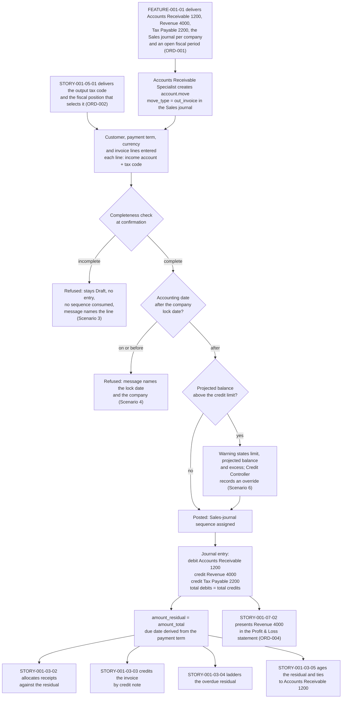

# STORY-001-03-01: Generate and Post Customer Invoices

---

## Metadata

| Attribute | Value |
|-----------|-------|
| **Story ID** | `STORY-001-03-01` |
| **Title** | Generate and Post Customer Invoices |
| **Parent Feature** | [FEATURE-001-03: Accounts Receivable & Customer Invoices](../FEATURE-001-03-accounts-receivable-customer-invoices.md) |
| **Parent Epic** | [EPIC-001: Enterprise Accounting in Odoo](../../EPIC-001-enterprise-accounting-odoo.md) |
| **Feature Capability** | CAP-001 — generate and post customer invoices with lines, payment terms, currency and output tax |
| **Status** | Draft |
| **Priority** | 🔴 Critical |
| **Estimate** | 5 story points (Fibonacci) |
| **Primary Persona** | Accounts Receivable Specialist |
| **Secondary Personas** | Chief Accountant (approves the balanced posting to Accounts Receivable 1200, Revenue 4000 and Tax Payable 2200 and administers the period lock date), Tax Accountant (owns the output tax code the fiscal position selects), Credit Controller (records the credit-limit override), Treasury Analyst (reads the receivable the invoice creates as a collections forecast), External Auditor (traces a posted invoice to its journal items), Finance Controller and Product Owner (accept the demonstration) |
| **Story Position** | Story 1 of the 5 in FEATURE-001-03; blocks the other four |
| **Platform Target** | Open decision DEC-001 — see [Version Compatibility](#version-compatibility) |
| **Last Updated** | 2026-08-13 |
| **Owner/Author** | Enterprise Accounting Team |

> **Platform target.** This story fixes no platform version of its own. The target is the Epic's open decision **DEC-001** in the [Open Decisions Register](../../EPIC-001-enterprise-accounting-odoo.md#appendix-b-open-decisions-register): the originating programme request names Odoo 17, the superseded prior backlog named 18.0, and the baseline this story was written and verified against is **Odoo 19.0 Community**, where `odoo/release.py` declares `version_info = (19, 0, 0, FINAL, 0, '')`. The three candidate releases carry different `account.move` and `account.move.line` field surfaces and different lock-date administration, so the mismatch is surfaced for stakeholder confirmation rather than settled inside this story (AAP §0.8.2, §0.8.3).

---

## User Story

**As an** Accounts Receivable Specialist

**I want** to raise a customer invoice as an `account.move` record of type `out_invoice` — carrying its customer, its invoice lines, its currency, its payment term and its output tax code — and confirm it so that it posts through the **Sales** journal of the company whose books it belongs to, as one journal entry whose total debits equal its total credits

**So that** the receivable and the revenue it earns are recognised in the accounting period they belong to, the residual on the invoice is the amount the group is owed from the moment it posts, and the **Aged Receivable** report and the **Profit & Loss** statement are read from posted journal items rather than assembled from a spreadsheet — which is the condition Days Sales Outstanding must be measured under before the 15% to 25% improvement targeted by SM-017 against the 58.0-day baseline can be attributed to any collection action.

---

## Business Value

### Value Statement

> A customer invoice is the document that creates the receivable, recognises the revenue and records the output tax, and everything downstream in this feature settles, reduces, chases or reports the balance it leaves behind. When the invoice posts as a balanced entry — debit Accounts Receivable 1200, credit Revenue 4000 and credit Tax Payable 2200 — three figures become derivable instead of negotiable: what the group is owed, what it earned, and what it owes the tax authority. This story is therefore the first place in the programme where the ledger, not a spreadsheet, becomes the source of the receivable position. It is also the cheapest place to enforce the controls that protect it: an invoice that cannot post into a locked period cannot restate a reported result, an invoice whose line lacks an income account cannot land revenue in a suspense balance, and a customer whose exposure would pass the credit limit is surfaced to the Credit Controller before the receivable exists rather than after it has aged.

### Success Metrics

| Metric | Baseline | Target | Measurement Method |
|--------|----------|--------|--------------------|
| Invoice creation to posting, elapsed clerical time | Keyed into a spreadsheet, then re-keyed at month end | Under 2 minutes for a three-line invoice raised by the Accounts Receivable Specialist | Timed walkthrough of the Scenario 1 invoice, from record creation to the Posted state |
| Invoice posting time, system | Not measured | Under 3 seconds to confirm and post a 50-line customer invoice carrying output tax, matching the parent Feature's §4.4 budget | Timed confirmation of a seeded 50-line invoice in company `US-01` |
| Sequence-number coverage on posted invoices | Manual reference numbers, gaps unexplained | 100% of posted customer invoices carry a **Sales**-journal sequence number; the count of posted invoices with no sequence number is 0 | Query over the posted `out_invoice` population per company per period |
| Balanced-entry integrity | Unproven | 0 unbalanced posted invoice entries; total debits minus total credits asserted at `0.00` in the company's functional currency on every posted entry (SM-006, C-009) | Posted entry inspected line by line, with the difference asserted numerically |
| Output tax recorded as a separated triple | Tax embedded in one gross figure | 100% of posted invoice tax lines carry a tax code, a base amount and a tax amount as three separate values; the count with a null tax code or a null base amount is 0 | Tax-line completeness query over the posted invoice population for the period |
| Residual initialisation | Derived by hand at month end | `amount_residual` equals `amount_total` on 100% of invoices at the moment they post, at a difference of `0.00` in the invoice currency | Residual compared with the total on the posted population, before any receipt is allocated |
| Refused postings leave no trace | Partial documents posted and reversed | 100% of refused confirmations create no journal entry and consume no **Sales**-journal sequence number | Negative tests for the incomplete-line and locked-period paths, with the entry count and the sequence high-water mark asserted unchanged |
| Contribution to receivable visibility | Receivable position reconstructed monthly | The Accounts Receivable 1200 balance equals the sum of open invoice residuals at a difference of `0.00 USD` in `US-01`, which is the tie-out the **Aged Receivable** report of `STORY-001-03-05` depends on (SM-001) | Trial Balance compared with the sum of residuals for the same as-of date |
| Contribution to Days Sales Outstanding | DSO 58.0 days, computed quarterly from a manual extract | Posted due dates and residuals available continuously, so DSO is computed from the ledger and the 15% to 25% improvement to between 43.5 and 49.3 days becomes measurable (SM-017) | DSO computed from posted residuals and compared with the 58.0-day baseline |

### Business Rules

| Rule ID | Rule | Consequence If Broken |
|---------|------|-----------------------|
| **BR-001** | A customer invoice posts only from the Draft state. A posted invoice is amended by a credit note under [STORY-001-03-03](./STORY-001-03-03-manage-customer-credit-notes.md) and never by editing the posted document | An edited posted invoice restates a reported period and breaks the audit trail the External Auditor reads |
| **BR-002** | The **Sales**-journal sequence number is assigned when the invoice posts, not when the record is created, and a refused confirmation consumes no number | Unexplained gaps in the invoice sequence are a statutory numbering defect in every jurisdiction that requires an unbroken invoice sequence, and the gap cannot be evidenced away afterwards |
| **BR-003** | Every invoice line carries an income account and a tax code before the invoice is confirmed; output tax posts to Tax Payable 2200 and never to Revenue 4000 | Revenue lands in a suspense balance, or tax is reported as revenue and the statutory return no longer ties to the tax control account |
| **BR-004** | The due date is derived from the customer's payment term held on `res.partner` — Net 30 on an invoice dated 2025-02-10 giving a due date of 2025-03-12 — and an invoice with no payment term is refused at confirmation | Aging buckets and the follow-up ladder measure from a date nobody agreed, so an invoice is chased early or late by construction |
| **BR-005** | Posting is refused when the invoice's accounting date falls on or before the journal-entry lock date of the company whose books it belongs to, and the refusal message names both the company and the lock date | A reported period is restated after it was filed, and the close of that period stops being reproducible |
| **BR-006** | `amount_residual` equals `amount_total` at the moment of posting. Reducing the residual is the business of [STORY-001-03-02](./STORY-001-03-02-register-customer-payments.md) and [STORY-001-03-03](./STORY-001-03-03-manage-customer-credit-notes.md), never of this story | The receivable position is overstated or understated from the first day of its life, and every downstream aging figure inherits the error |
| **BR-007** | Total debits equal total credits on every posted invoice entry, both totals stated and their difference asserted at `0.00` in the company's functional currency | An unbalanced entry cannot be presented in a Trial Balance and blocks the close for the whole company (SM-006) |
| **BR-008** | Every monetary figure is rounded half-up to 2 decimal places at its currency's 0.01 rounding precision, and the company's tax-rounding method is stated alongside a multi-line tax figure | A one-minor-unit divergence between the document total and the sum of its journal items is enough to fail the debits-equal-credits check |
| **BR-009** | A projected receivable balance above the customer's credit limit raises a warning that states the limit, the projected balance and the excess, and the invoice posts only once the Credit Controller records an override against it, retained with its author and timestamp | Credit exposure grows with no decision recorded anywhere, and the Treasury Analyst cannot show why an over-limit invoice was allowed |
| **BR-010** | Revenue is recognised in the period the performance obligation is satisfied, per ASC 606 and IFRS 15, so the invoice's accounting date governs the period rather than the date the document was keyed | Revenue is recognised in the wrong period, which is a restatement risk rather than a clerical one |

---

## Acceptance Criteria

Six criteria, inside the mandated band of 4 to 8. Each carries one non-compound **When**, and each **Then** asserts only what the Accounts Receivable Specialist, the Chief Accountant, the Credit Controller or the External Auditor can observe on the document, on the journal entry or in a named report — no interface gesture, no query and no implementation internal appears in a criterion. Every monetary figure states its currency as an ISO 4217 code, its amount to 2 decimal places and the rounding rule applied to it; every tax assertion states the **tax code**, the **base amount** and the **tax amount** as three separate values; every journal entry described states its total debits and its total credits as equal amounts; and every criterion touching more than one company names the company whose books are affected.

| Scenario | Coverage class |
|----------|----------------|
| 1 | Valid input — happy-path posting with a balanced journal entry |
| 2 | Valid input — accounting determinism, the tax code, base amount and tax amount recorded as three separate values |
| 3 | Invalid or incomplete input — an invoice line missing its income account and its unit price |
| 4 | Error handling — posting refused in a locked fiscal period with a named validation message |
| 5 | Accounting edge case — a zero-amount line together with foreign-currency tax rounding |
| 6 | Accounting edge case — a credit-limit breach surfaced before the receivable exists |

### Scenario 1: Post a customer invoice with a balanced journal entry

- **Given** a Draft customer invoice exists as an `account.move` record whose `move_type` is `out_invoice`, raised for customer **Northwind Trading** in the **Sales** journal of company `US-01` (the United States parent, functional currency USD), dated 2025-02-10, carrying the customer's payment term of Net 30 and three invoice lines of 7,200.00 USD, 3,750.00 USD and 1,500.00 USD that total a net amount of **12,450.00 USD**, each line pointed at Revenue 4000 and each carrying output tax code **S-8** at 8%, so the invoice records a base amount of 12,450.00 USD, a tax amount of **996.00 USD** and an `amount_total` of **13,446.00 USD** — every amount in this criterion rounded half-up to 2 decimal places per the USD 0.01 rounding precision
- **When** the Accounts Receivable Specialist confirms the invoice
- **Then** the invoice state changes from Draft to Posted
  - **And** a **Sales**-journal sequence number is assigned to the invoice and is visible on the document
  - **And** one journal entry is created whose `account.move.line` records debit **Accounts Receivable 1200** 13,446.00 USD, credit **Revenue 4000** 12,450.00 USD and credit **Tax Payable 2200** 996.00 USD, so **total debits of 13,446.00 USD equal total credits of 13,446.00 USD** at a difference of 0.00 USD
  - **And** `amount_residual` on the posted invoice equals `amount_total` at 13,446.00 USD, because no receipt has been allocated to it
  - **And** the due date is 2025-03-12, derived from the customer's payment term of Net 30 against the invoice date of 2025-02-10
  - **And** the books of `US-01` are the only books affected, and every amount above is rounded half-up to 2 decimal places per the USD 0.01 rounding precision

### Scenario 2: Tax code, base amount and tax amount are reported as three separate values

- **Given** the posted customer invoice of Scenario 1 in company `US-01`, carrying output tax code **S-8** at 8% on three lines that total a base amount of 12,450.00 USD, each amount rounded half-up to 2 decimal places per the USD 0.01 rounding precision
- **When** the Accounts Receivable Specialist opens the invoice's tax summary
- **Then** the summary presents one tax line showing tax code **S-8**, base amount **12,450.00 USD** and tax amount **996.00 USD** as three distinct values, none of them combined into a gross figure
  - **And** the tax amount of 996.00 USD equals the base amount of 12,450.00 USD multiplied by 8%, rounded half-up to 2 decimal places per the USD 0.01 rounding precision, with the tax-rounding method in force on `US-01` stated alongside the figure
  - **And** that same tax amount of 996.00 USD is the balance posted to **Tax Payable 2200** by the entry of Scenario 1, so no part of the 996.00 USD reaches Revenue 4000
  - **And** the base amount of 12,450.00 USD equals the sum of the three revenue lines of 7,200.00 USD, 3,750.00 USD and 1,500.00 USD, each rounded half-up to 2 decimal places per the USD 0.01 rounding precision
  - **And** the tax code, the base amount and the tax amount stay readable from the posted journal items without reconstruction, so the External Auditor traces the triple from the tax summary to the ledger

### Scenario 3: An invoice carrying an incomplete line is not posted

- **Given** a Draft customer invoice as an `account.move` record of type `out_invoice` for customer Northwind Trading in the **Sales** journal of company `US-01`, whose first and third lines each carry a product, a quantity, a unit price and Revenue 4000, and whose **second line** carries a product and a quantity of 4.00 units but no income account and no unit price
- **When** the Accounts Receivable Specialist attempts to confirm the invoice
- **Then** the invoice remains in the Draft state
  - **And** no journal entry is created, so the balance of Accounts Receivable 1200 in `US-01` moves by 0.00 USD, rounded half-up to 2 decimal places per the USD 0.01 rounding precision
  - **And** no **Sales**-journal sequence number is consumed, so the sequence high-water mark of the **Sales** journal of `US-01` is unchanged and the next invoice that posts takes the number this attempt did not
  - **And** the returned message identifies the incomplete line by its line number — line 2 — and names the two missing elements, the income account and the unit price, so the Accounts Receivable Specialist resolves the document without inspecting every line
  - **And** the first and third lines retain the values that were entered, so the work already keyed is not discarded by the refusal

### Scenario 4: Posting into a locked fiscal period is blocked with a validation message

- **Given** the journal-entry lock date of company **Northwind Group NV** — the legal entity behind register code `NL-01`, the Netherlands operating entity whose functional currency is EUR — is set to 2025-03-31, and a Draft customer invoice of type `out_invoice` for customer Atlantia SRL exists in the **Sales** journal of Northwind Group NV carrying an accounting date of 2025-03-15, which falls on or before that lock date
- **When** the Accounts Receivable Specialist attempts to confirm the invoice
- **Then** posting is blocked and no journal entry is created
  - **And** an Odoo validation message names the lock date **2025-03-31** and the affected company **Northwind Group NV**, and states that the accounting date of 2025-03-15 falls inside the locked period
  - **And** the invoice stays in the Draft state and keeps its accounting date of 2025-03-15 until a finance role changes it, so the refusal does not silently re-date the document into an open period
  - **And** the balance of **Accounts Receivable 1200** in Northwind Group NV is unchanged, moving by 0.00 EUR, rounded half-up to 2 decimal places per the EUR 0.01 rounding precision
  - **And** no **Sales**-journal sequence number of Northwind Group NV is consumed, and the books of `US-01` and `GB-01` are untouched by the refused attempt
  - **And** the message discloses no stack trace, no file-system path and no credential (C-020)

### Scenario 5: A zero-amount line and foreign-currency tax rounding

- **Given** a Draft customer invoice of type `out_invoice` in **EUR** for customer **Atlantia SRL** in the **Sales** journal of company Northwind Group NV (`NL-01`), whose accounting date of 2025-04-30 falls after that company's journal-entry lock date of 2025-03-31, containing one line of **0.00 EUR** for a no-charge item pointed at Revenue 4000 and one line of **333.33 EUR** pointed at Revenue 4000 and carrying output tax code **S-21** at 21%, for which the untruncated tax computation is 69.9993 EUR
- **When** the Accounts Receivable Specialist confirms the invoice
- **Then** the tax amount posted to **Tax Payable 2200** is **70.00 EUR**, being 69.9993 EUR rounded half-up to 2 decimal places per the EUR 0.01 rounding precision, recorded against tax code **S-21** on a base amount of **333.33 EUR** as three separate values
  - **And** the zero-amount line is retained on the invoice rather than dropped, contributes **0.00 EUR** to the entry, and keeps its account so it stays part of the invoice-line population any later analysis reads
  - **And** the journal entry records debit **Accounts Receivable 1200** 403.33 EUR against credit **Revenue 4000** 333.33 EUR and credit **Tax Payable 2200** 70.00 EUR, so **total debits of 403.33 EUR equal total credits of 403.33 EUR** at a difference of 0.00 EUR
  - **And** `amount_total` and `amount_residual` on the posted invoice both read 403.33 EUR
  - **And** the books of Northwind Group NV are the only books affected, and every amount above is rounded half-up to 2 decimal places per the EUR 0.01 rounding precision, with the tax-rounding method in force on that company stated alongside the tax figure

### Scenario 6: A credit-limit breach is surfaced before the invoice posts

- **Given** customer **Northwind Trading** carries a credit limit of **25,000.00 USD** recorded on its `res.partner` record in company `US-01` and holds an open receivable balance of **18,000.00 USD** against Accounts Receivable 1200, each amount rounded half-up to 2 decimal places per the USD 0.01 rounding precision
- **When** the Accounts Receivable Specialist confirms a further Draft customer invoice of type `out_invoice` for that customer with an `amount_total` of **13,446.00 USD**, which would take the customer's open receivable balance to **31,446.00 USD**
- **Then** a credit-limit warning is raised against the invoice stating the limit of **25,000.00 USD**, the projected balance of **31,446.00 USD** and the excess of **6,446.00 USD** as three separate values, each rounded half-up to 2 decimal places per the USD 0.01 rounding precision
  - **And** the invoice is posted only after the **Credit Controller** records an override against that invoice, and the override is retained with its author, its timestamp and the excess amount of 6,446.00 USD it authorised
  - **And** where no override is recorded the invoice stays in the Draft state, no journal entry is created, and the balance of Accounts Receivable 1200 in `US-01` moves by 0.00 USD
  - **And** once the override is recorded and the invoice posts, the entry records debit Accounts Receivable 1200 13,446.00 USD against credit Revenue 4000 12,450.00 USD and credit Tax Payable 2200 996.00 USD, so total debits of 13,446.00 USD equal total credits of 13,446.00 USD at a difference of 0.00 USD
  - **And** the customer's open receivable balance after posting reads 31,446.00 USD, which is the figure the Treasury Analyst reads as exposure against the 25,000.00 USD limit

---

## Sub-Tasks

- [ ] Confirm the invoice-line-to-account mapping with the Chief Accountant and record it: which product and line categories reach **Revenue 4000**, which control account carries the receivable (**Accounts Receivable 1200**), and which account receives output tax (**Tax Payable 2200**) — then sign the mapping off against the Trial Balance presentation the close depends on — `@finance-sme`
- [ ] Specify the Draft-to-Posted transition: the completeness checks that run at confirmation (customer, payment term, currency, at least one line, an income account and a tax code on every line), the wording of each refusal message including the line number it names, and the point at which the **Sales**-journal sequence number is consumed — `@functional-consultant`
- [ ] Specify the credit-limit control: where the limit is held on `res.partner`, how the projected balance and the excess are presented as three separate values, what the Credit Controller's override record carries (author, timestamp, authorised excess) and how long it is retained — `@functional-consultant`
- [ ] Deliver the posting behaviour: the balanced entry across Accounts Receivable 1200, Revenue 4000 and Tax Payable 2200; the initialisation of `amount_residual` to `amount_total`; the derivation of the due date from the payment term; and half-up rounding to 2 decimal places at each currency's 0.01 rounding precision on every amount written to a journal item — `@developer`
- [ ] Deliver the refusal paths so that an incomplete line and a locked-period accounting date each leave the invoice in Draft with no journal entry created and no sequence number consumed, and so that each message names the failing element, the company and the lock date without disclosing a stack trace, a file path or a credential (C-020) — `@developer`
- [ ] Deliver the deterministic fixtures this story is demonstrated from — customer Northwind Trading in `US-01` with its 25,000.00 USD credit limit and Net 30 term, customer Atlantia SRL in Northwind Group NV (`NL-01`), output tax codes **S-8** and **S-21**, and the 2025-03-31 lock date — held apart from the hostile-input fixtures so a hostile record is never mistaken for sample data (D-009) — `@developer`
- [ ] Author the tests for all six acceptance criteria: the balanced-entry assertion with both totals compared numerically, the tax triple, the 69.9993-to-70.00 EUR rounding case, the zero-amount line, the two refusals and the credit-limit warning — mapping one test to one criterion (C-008) and linting every criterion for banned vague terms — `@qa-engineer`
- [ ] Validate the posted entry against the ledger: agree the Scenario 1 entry to the Trial Balance of `US-01`, and agree the sum of open invoice residuals to the Accounts Receivable 1200 balance at a difference of `0.00 USD`, which is the tie-out the **Aged Receivable** report of `STORY-001-03-05` inherits — `@finance-sme`

---

## Edge Cases

| Edge Case | Expected Behaviour |
|-----------|--------------------|
| **Zero-amount invoice line.** A line priced at 0.00 EUR for a no-charge item sits alongside chargeable lines on the same invoice | The line is retained on the invoice rather than dropped, keeps its income account and its tax code, and contributes 0.00 EUR to the journal entry. The entry still balances: total debits of 403.33 EUR equal total credits of 403.33 EUR at a difference of 0.00 EUR, rounded half-up to 2 decimal places per the EUR 0.01 rounding precision. A zero-amount line is never a silent deletion, because the no-charge item is part of what was delivered and the customer document must show it (Scenario 5) |
| **Posting into a locked fiscal period.** An invoice dated 2025-03-15 is confirmed after the journal-entry lock date of Northwind Group NV (`NL-01`) has been set to 2025-03-31 | Posting is refused with an Odoo validation message naming the lock date 2025-03-31 and the company Northwind Group NV; the invoice stays in Draft with its accounting date intact; no journal entry is created and no **Sales**-journal sequence number is consumed; the Accounts Receivable 1200 balance of that company moves by 0.00 EUR. Re-dating the document into an open period is a decision a finance role records, not an automatic correction, and any lock-date exception is retained with its author, its timestamp and its expiry for the External Auditor (Scenario 4) |
| **Foreign-currency tax that rounds on the half-minor-unit.** A line of 333.33 EUR at output tax code S-21 (21%) computes an untruncated tax of 69.9993 EUR, and the parent Feature's worked United States case computes 634.375 USD on a base of 8,750.00 USD | The posted tax amount is 70.00 EUR — 69.9993 EUR rounded half-up to 2 decimal places per the EUR 0.01 rounding precision — and 634.38 USD on the United States case under the same half-up rule at the USD 0.01 rounding precision. The company's tax-rounding method is stated alongside the figure, because rounding once per tax and rounding once per line can differ by one minor unit on a multi-line document, and a one-minor-unit divergence is enough to fail the debits-equal-credits check. Where the invoice currency differs from the company's functional currency, the transaction amount, the converted amount, the conversion rate and the rate date are each recorded, and both amounts are rounded half-up at their own currency's 0.01 rounding precision |
| **Customer whose exposure would pass the credit limit.** Northwind Trading holds an open receivable of 18,000.00 USD against a credit limit of 25,000.00 USD when an invoice of 13,446.00 USD is confirmed | A warning states the limit of 25,000.00 USD, the projected balance of 31,446.00 USD and the excess of 6,446.00 USD as three separate values, each rounded half-up to 2 decimal places per the USD 0.01 rounding precision. The invoice is neither posted silently nor blocked silently: it posts once the Credit Controller records an override retained with author, timestamp and the authorised excess, and it stays in Draft with no journal entry while no override exists. The projected balance of 31,446.00 USD is the exposure figure the Treasury Analyst then reads against the limit (Scenario 6) |

---

## Estimation

| Dimension | Rating | Justification |
|-----------|--------|---------------|
| **Effort** | Medium | The delivered surface is one document lifecycle — Draft to Posted — with its completeness checks, its due-date derivation, its residual initialisation, its two refusal paths and its credit-limit control, all expressed on `account.move` and `account.move.line`, which this repository already provides under LGPL-3 rather than requiring new machinery |
| **Complexity** | Medium | Three behaviours each carry an accounting consequence: the entry must balance to `0.00` in the company's functional currency after half-up rounding at the currency's 0.01 rounding precision; the tax code, base amount and tax amount must stay separate journal-item values; and a refusal must leave no entry and consume no sequence number. None of them requires a new report engine, a new posting engine or an external integration |
| **Uncertainty** | Low | The behaviour can be inspected before development starts: `addons/account/models/account_move.py` holds the state field, the posting entry points, the sequence mixin, the balance check and the lock-date check, and `addons/account/models/partner.py` holds the credit-limit fields. The one open question is the shape of the Credit Controller override, because the shipped control is a Draft-state warning rather than a block — recorded in [Open Questions](#open-questions) |
| **Story Points** | **5** | Fibonacci scale (1, 2, 3, 5, 8, 13). Above a **3** because the story delivers a posting path with two refusal paths, a residual and due-date derivation, a tax triple and a credit-control gate across two companies and two currencies rather than one field or one screen. Below an **8** because receipt allocation, credit notes, the dunning ladder and the Aged Receivable report are the other four stories of this feature — `STORY-001-03-02` through `STORY-001-03-05` — and no report engine or external integration is built here |

---

## INVEST Principles Compliance

| Principle | Compliance | Justification |
|-----------|------------|---------------|
| **Independent** | ✅ | This story stands alone: everything it needs is a chart of accounts holding Accounts Receivable 1200, Revenue 4000 and Tax Payable 2200, a **Sales** journal, an open fiscal period and one output tax code — all satisfiable as demo data in a test company. It **blocks** the other four stories of FEATURE-001-03 and is **blocked by** none of them, because a receipt, a credit note, a follow-up level and an aging bucket each need a posted receivable while a posted receivable needs none of them |
| **Negotiable** | ✅ | The criteria state the accounting outcome required — a balanced entry across three named accounts, a separated tax triple, a residual equal to the total, a named refusal — and leave the model, field, view and method decisions to implementation discovery under D-005, so how the outcome is reached stays open for negotiation between the Accounts Receivable Specialist and the delivery team |
| **Valuable** | ✅ | It is the story that creates the receivable and recognises the revenue, so it is the precondition of every figure this feature reports: the Accounts Receivable 1200 tie-out behind SM-001, and the posted due dates and residuals that make the SM-017 improvement from 58.0 days to between 43.5 and 49.3 days measurable at all |
| **Estimable** | ✅ | The artifact count is fixed and inspectable: one document type (`out_invoice`), one journal (**Sales**), three general ledger accounts, two output tax codes, two companies, two currencies and two refusal paths, all on models already present in this repository — which is why the Effort, Complexity and Uncertainty ratings above could be assigned from evidence rather than from guesswork |
| **Small** | ✅ | One accountant-facing workflow — raise an invoice and confirm it — sized at 5 story points and completable inside one iteration. Cash application, credit notes, dunning and aging are deliberately outside it and are carried by `STORY-001-03-02`, `STORY-001-03-03`, `STORY-001-03-04` and `STORY-001-03-05` |
| **Testable** | ✅ | Every one of the six criteria is objectively pass or fail: each states amounts to the minor unit with the rounding rule applied, each posting criterion states a debit total and an equal credit total, each refusal names the message content and asserts an unchanged ledger and an unconsumed sequence, and each maps to exactly one automated test in [Acceptance Test Mapping](#acceptance-test-mapping) |

---

## Demo Path

Demonstrated in the Odoo user interface to the **Finance Controller** and the **Product Owner**, in this order, with the walkthrough recorded against this story:

- [ ] **The happy path.** **Accounting → Customers → Invoices → New**: select customer Northwind Trading in company `US-01`, confirm the Net 30 payment term is carried from the customer record, add the three lines of 7,200.00 USD, 3,750.00 USD and 1,500.00 USD against Revenue 4000 with output tax code **S-8**, and observe the document total of 13,446.00 USD. Then **Confirm**. Observable result: the status moves from Draft to **Posted**, a **Sales**-journal sequence number appears on the document, the due date reads 2025-03-12, and the amount due reads 13,446.00 USD — every amount rounded half-up to 2 decimal places per the USD 0.01 rounding precision
- [ ] **The balanced entry.** From the posted invoice open **Journal Items** (also reachable at **Accounting → Accounting → Journal Entries**): the entry shows debit Accounts Receivable 1200 13,446.00 USD, credit Revenue 4000 12,450.00 USD and credit Tax Payable 2200 996.00 USD, with total debits of 13,446.00 USD equal to total credits of 13,446.00 USD
- [ ] **The tax triple.** On the same invoice, the tax summary presents tax code **S-8**, base amount 12,450.00 USD and tax amount 996.00 USD as three separate values, and the 996.00 USD is traced to the Tax Payable 2200 journal item
- [ ] **The refusals.** Attempt to confirm an invoice whose second line has no income account and no unit price, and observe the document stay in Draft with a message naming line 2 and the missing elements. Then, in company **Northwind Group NV** (`NL-01`) with its journal-entry lock date at 2025-03-31, attempt to confirm an invoice dated 2025-03-15 and observe the validation message naming the lock date and the company, with the document still in Draft
- [ ] **The credit-control gate.** On an invoice for Northwind Trading that would take the customer's open receivable to 31,446.00 USD, observe the warning stating the 25,000.00 USD limit, the 31,446.00 USD projected balance and the 6,446.00 USD excess, then observe the invoice post once the Credit Controller's override is recorded against it
- [ ] **Headless alternative.** Where interactive access is not available, the same evidence is presented by reading `account.move` (state, sequence name, `amount_total`, `amount_residual`, `invoice_date_due`) and its `account.move.line` records over the public API by XML-RPC or JSON-RPC, so acceptance never depends on a graphical session

---

## Constraints

The constraint identifiers below are the Epic's own, restated in the terms of this story rather than renumbered, so one constraint set reads across the whole ticket tree.

### License and Compliance

- [ ] **C-001 — AGPL-3.0 compatibility**: any module delivering the invoice completeness checks, the credit-control gate and the override record is distributed under an AGPL-3.0 compatible licence, matching the Community-edition accounting add-ons already present in this repository
- [ ] **C-002 — Existing licence respected**: extension of `account` — the "Invoicing" application, version 1.4, category `Accounting/Accounting`, licence LGPL-3 — and of `account_payment` (version 2.0, LGPL-3) respects those licences, and an AGPL-3 extension of LGPL-3 code is licence-checked before it is written
- [ ] **C-005 / C-006 — Odoo and OCA coding standards**: Python follows the Odoo and OCA module guidelines including PEP 8, and static analysis reports zero violations under the repository's lint configuration at `ruff.toml`
- [ ] **C-012 — Build on the existing models**: the invoice, its lines, its tax and its receivable are expressed on `account.move`, `account.move.line`, `account.tax`, `account.journal` and `res.partner` rather than on parallel structures, so one ledger and one audit trail exist
- [ ] **C-014 — Access rights and company isolation**: the role that raises an invoice is distinguishable from the role that approves a credit-limit override and from the role that administers the lock date, and a role restricted to `US-01` can neither read nor post receivable lines of Northwind Group NV (`NL-01`)
- [ ] **C-018 — External text is context-encoded**: a customer name, an invoice reference or a memo field rendered into a customer-facing invoice document is emitted as escaped text rather than as markup
- [ ] **C-019 — Data access discipline**: reads of the receivable balance, the residual and the credit exposure are expressed through the Odoo ORM or parameterized SQL, with no string-concatenated query construction
- [ ] **C-020 — Failure messages disclose nothing**: the incomplete-line and locked-period refusals name the rejected document, the check that failed and the remedial action, and disclose no stack trace, SQL, file-system path or credential
- [ ] **C-021 — No credentials in source**: no credential, endpoint secret or signing certificate appears in module source, fixtures, logs or exports produced by this story

### Accounting Standards Compliance

- [ ] **ASC 606 and IFRS 15 — revenue recognition timing**: revenue reaches Revenue 4000 in the period the performance obligation is satisfied, which is why the invoice's accounting date governs the period rather than the date the document was keyed (BR-010). Where the invoice date and the satisfaction of the obligation fall in different periods, the cutoff entry belongs to the period-close story `STORY-001-07-05` and not to this one
- [ ] **ISO 4217 minor units**: every amount asserted in this story is rounded half-up to its currency's decimal precision — 2 decimal places at a 0.01 rounding precision for USD and EUR — and the currency code is stated with the amount
- [ ] **Debits equal credits**: the double-entry identity is asserted numerically on every posted invoice entry, with both totals stated and their difference asserted at `0.00` in the company's functional currency (C-009, SM-006)
- [ ] **Output tax is a liability, not revenue**: the tax amount reaches Tax Payable 2200 and no part of it reaches Revenue 4000, so the statutory return of FEATURE-001-05 ties to the tax control account rather than to a revenue balance

### Dependency and Edition Considerations

- [ ] **C-003 — Edition source is an open decision (DEC-002), not a prohibition**: the blanket ban on Enterprise dependencies carried by the superseded backlog is withdrawn. The choice between an Odoo Enterprise subscription and the OCA add-on path plus bespoke development for the residual gap is owned by the CFO / Finance Director with the Group Controller and is recorded in the Epic's [Open Decisions Register](../../EPIC-001-enterprise-accounting-odoo.md#appendix-b-open-decisions-register)
- [ ] **This story is not gated by DEC-002**: `account.move`, `account.move.line`, `account.tax`, `account.journal` and the `res.partner` credit fields are all present in this repository under LGPL-3, so customer invoicing can be delivered and demonstrated before the edition decision is confirmed. What DEC-002 affects is how the **Profit & Loss** and **Aged Receivable** presentations that consume this posting are rendered, which is FEATURE-001-07 and `STORY-001-03-05`
- [ ] **C-004 — OCA ecosystem compatibility**: whichever edition path is confirmed, the posted invoice, its lines and its tax triple stay consumable by the OCA add-ons named in the Epic without restatement
- [ ] **Enterprise modules are target capabilities, not installed dependencies**: `account_accountant`, `account_reports`, `account_asset`, `account_budget` and `account_consolidation` are absent from this repository's `addons/`, and no module delivered by this story declares a dependency on any of them while DEC-002 is open

### Version Compatibility

- [ ] **C-010 — Platform version target is open decision DEC-001**: the programme request names Odoo 17, the superseded backlog named 18.0, and this repository is **Odoo 19.0 Community** (`odoo/release.py` declares `version_info = (19, 0, 0, FINAL, 0, '')`). The target is confirmed with stakeholders before development rather than chosen inside this story
- [ ] **C-011 — Language and database versions follow the confirmed target**: the 19.0 baseline present here declares `MIN_PY_VERSION = (3, 10)`, `MAX_PY_VERSION = (3, 13)` and `MIN_PG_VERSION = 13` in `odoo/release.py`; an earlier platform target carries a different supported matrix
- [ ] **Impact if DEC-001 resolves away from 19.0**: the `account.move`, `account.move.line` and `res.partner` field names cited in [Technical Discovery Notes](#technical-discovery-notes) are restated for the confirmed release, the lock-date behaviour is re-verified because lock-date administration differs across the three candidates, and the credit-limit field surface is re-checked because the company-level switch behind it was introduced at a stated release

---

## Technical Discovery Notes

> **Purpose:** these notes direct the codebase analysis that precedes implementation. They record what to investigate and what the outcome must prove; they do not choose the implementation. Naming an account code, a journal type or a report name is a business outcome required by the parent Feature's artifact register, not an implementation decision.

### Codebase Analysis Areas

| Area | Files/Modules to Examine | Analysis Focus |
|------|--------------------------|----------------|
| Invoice state and the posting entry points | `addons/account/models/account_move.py` | The `state` field and its Draft, Posted and Cancelled values, the confirmation entry point and the internal posting method behind it. Which completeness checks run before the state changes, which of them raise and which warn, and what the returned message contains for an invoice whose line lacks an income account or a unit price (Scenario 3) |
| Sequence assignment | `addons/account/models/account_move.py` | The sequence mixin the model inherits and its journal-scoped sequence index. Establish the exact point at which a **Sales**-journal number is consumed, whether a refused confirmation leaves a gap, and how the number is presented on the posted document |
| Balance enforcement | `addons/account/models/account_move.py` | The balance check that groups journal items by move and by currency decimal places and raises when the rounded sum of line balances is non-zero. Determine which write paths run inside that check, so the debits-equal-credits assertion of Scenarios 1, 5 and 6 is tested on the path the implementation actually takes |
| Totals, residual and due date | `addons/account/models/account_move.py` and `addons/account/models/account_move_line.py` | `amount_total`, `amount_residual`, `invoice_date_due` and `invoice_payment_term_id` on the document, and `amount_residual` and `date_maturity` on the line. How is the residual initialised at posting, how does a payment term produce the maturity date behind the 2025-03-12 due date, and how does a multi-instalment term distribute maturities across lines |
| Tax computation and the base amount | `addons/account/models/account_tax.py` and `addons/account/models/account_move_line.py` | The tax relation on the line and the field that carries the taxable base on the tax line. Where the base amount is stored so the tax code, base amount and tax amount are readable as three separate values (Scenario 2), and how the company tax-rounding method changes the result on a multi-line document |
| Credit-limit control | `addons/account/models/partner.py` and `addons/account/models/account_move.py` | The partner credit fields — the limit, the per-partner override flag, the visibility flag and the Days Sales Outstanding computation — together with the invoice-side warning field, its compute method and the message builder behind it. In this baseline the shipped control is a **Draft-state warning on an `out_invoice`, gated by a company-level switch, and not a block**; determine what an override record must add so Scenario 6 is satisfied without weakening the shipped warning |
| Lock-date refusal | `addons/account/models/account_move.py` and `addons/account/models/company.py` | The fiscal lock-date check on the move and the company method that returns the violated lock dates for the fiscal-year, sales, purchase and tax controls, together with the context key that bypasses the check. Which lock applies to a **Sales**-journal document, what the message names, and how an exception is evidenced to the External Auditor (Scenario 4) |
| Rounding levers | `odoo/addons/base/models/res_currency.py` and `addons/account/models/company.py` | The currency rounding factor and the decimal precision derived from it — 0.01 giving 2 decimal places for USD and EUR — and the company tax-calculation rounding method. Establish which method each company files under, because rounding once per tax and once per line can differ by one minor unit on a multi-line document |
| Multi-company isolation | `addons/account/models/account_move.py`, `addons/account/models/account_journal.py` and the security definitions of `addons/account/` | How the company on the document, its journal and its accounts are constrained to one another, and which record rules keep a role restricted to `US-01` from reading or posting the receivable lines of Northwind Group NV (`NL-01`) — C-014 and D-007 |

### Relevant Existing Modules

| Module | Path | Relevance to this story |
|--------|------|------------------------|
| `account` | `addons/account/` | "Invoicing", version 1.4, category `Accounting/Accounting`, licence LGPL-3. Supplies `account.move` in its `out_invoice` form, `account.move.line` with the residual and maturity fields, `account.journal` for the **Sales** journal, `account.payment.term` for the due date, `account.tax` for the output tax carried on each line, and the `res.partner` credit fields the credit-control gate reads |
| `account_payment` | `addons/account_payment/` | "Payment - Account", version 2.0, licence LGPL-3. Not exercised by this story, which posts the receivable rather than settling it, but named because `STORY-001-03-02` allocates receipts against the residual this story initialises |
| `base` | `odoo/addons/base/` | `res.company` for the company whose books carry the entry, its functional currency and its lock dates; `res.currency` for the decimal precision and the 0.01 rounding increment every amount is rounded at; `res.partner` for the customer, its payment term and its credit limit |
| `account_financial_report_ce` | `addons/account_financial_report_ce/` | Version 19.0.1.1.0, AGPL-3, present from a prior programme phase. Where the Accounts Receivable 1200 and Revenue 4000 balances produced by this posting surface for the close reconciliation owned by FEATURE-001-07 — examined for its report-to-ledger tie-out pattern rather than extended here |
| `account_payment_followup` | `addons/account_payment_followup/` | Version 19.0.1.0.0, AGPL-3, present from a prior programme phase. Consumes the due date and the residual this story writes; named so the due-date derivation is verified against what the ladder of `STORY-001-03-04` measures from (D-003) |
| Enterprise accounting modules | absent from `addons/` | `account_accountant`, `account_reports`, `account_asset`, `account_budget` and `account_consolidation` are named in the Epic as target capabilities and are **not present** in this repository. No module delivered by this story depends on them while DEC-002 is open |

### OCA Module Compatibility

| OCA Repository | Module | Compatibility consideration |
|----------------|--------|-----------------------------|
| [OCA/account-invoicing](https://github.com/OCA/account-invoicing) | Invoicing workflow extensions | Determine whether an existing extension already supplies the invoice completeness checks and the line-level validation messages this story specifies, so bespoke code covers only the residual |
| [OCA/account-payment](https://github.com/OCA/account-payment) | Payment and credit-control extensions | Determine whether the credit-limit gate and its override record are expressible through an existing extension, and whether that extension's exposure computation agrees with the partner credit fields in `addons/account/models/partner.py` |
| [OCA/account-financial-reporting](https://github.com/OCA/account-financial-reporting) | `account_financial_report` | Under the OCA path of DEC-002 it renders the General Ledger, Trial Balance and Aged Partner Balance that consume this posting; determine whether it reads the tax code, base amount and tax amount as posted here without restating them |

### Discovery versus Prescription

This story states WHAT the Accounts Receivable Specialist needs and WHY. It does not prescribe HOW it is built. Not specified here: new model names, field definitions or schema decisions; whether a capability extends an existing model or adds a new one (D-005); view architecture or form layout; the report engine behind any customer-facing document; and module structure. Deferred to agent discovery: **D-003** (the residual gap left by the Community-edition add-ons already present), **D-005** (model extension approach), **D-007** (company isolation, record rules and the access-right groups implied by the personas) and **D-009** (the deterministic and hostile-input fixture sets, held apart from one another).

---

## Dependencies

### Story Dependencies

| Dependency Type | Story / Feature | Title | Relationship |
|-----------------|-----------------|-------|--------------|
| Parent Feature | [FEATURE-001-03](../FEATURE-001-03-accounts-receivable-customer-invoices.md) | Accounts Receivable & Customer Invoices | This story is story 1 of the 5 in this feature and delivers its capability CAP-001 |
| Parent Epic | [EPIC-001](../../EPIC-001-enterprise-accounting-odoo.md) | Enterprise Accounting in Odoo | Contributes the receivable and revenue postings the Epic's report, close and consolidation outcomes are computed from |
| Blocks | [STORY-001-03-02](./STORY-001-03-02-register-customer-payments.md) | Register Customer Payments and Allocations | A receipt allocates against a posted invoice: without the residual this story initialises there is nothing to reduce and no allocation to prove |
| Blocks | [STORY-001-03-03](./STORY-001-03-03-manage-customer-credit-notes.md) | Manage Customer Credit Notes and Refunds | A credit note reverses a posted invoice, so the invoice must exist as a posted entry across Accounts Receivable 1200, Revenue 4000 and Tax Payable 2200 first |
| Blocks | [STORY-001-03-04](./STORY-001-03-04-configure-payment-followups.md) | Configure Automated Payment Follow-Ups | The follow-up ladder measures days overdue from the due date this story derives from the payment term, and acts on the residual it initialises |
| Blocks | [STORY-001-03-05](./STORY-001-03-05-report-aged-receivables.md) | Generate Aged Receivables Report | An aging bucket is an age applied to an open residual; with no posted invoice there is no residual to age and no Accounts Receivable 1200 balance to tie the report to |
| Blocked By | — | — | Nothing inside FEATURE-001-03. The accounts, the **Sales** journal, the open period and the output tax code it posts against are satisfiable as demo data in a test company, which is what keeps this story Independent |
| Related | [FEATURE-001-01](../FEATURE-001-01-chart-of-accounts-fiscal-year.md) | Chart of Accounts & Fiscal Year | Supplies Accounts Receivable 1200, Revenue 4000 and Tax Payable 2200, the **Sales** journal per company, the fiscal year and its open periods, and the journal-entry lock date that Scenario 4 is refused against — the sequencing prerequisite recorded as ORD-001 |
| Related | [STORY-001-05-01](../FEATURE-001-05/STORY-001-05-01-configure-tax-codes-fiscal-positions.md) | Configure Tax Codes and Fiscal Positions | Supplies the output tax codes and the fiscal positions that select them, so the tax code, base amount and tax amount of Scenario 2 can be asserted rather than assumed — the sequencing prerequisite recorded as ORD-002 |
| Related | [STORY-001-07-02](../FEATURE-001-07/STORY-001-07-02-generate-profit-loss.md) | Generate Profit & Loss Statement | The downstream consumer of Revenue 4000: the revenue this story recognises is the revenue that statement presents, and the statement line ties to the posted invoice lines behind it (ORD-004) |

### External Dependencies

| Dependency | Type | Notes |
|------------|------|-------|
| ISO 4217 | Standard | Currency codes and minor units, the source of the 2-decimal precision and the 0.01 rounding increment every amount in this story is rounded half-up to |
| ASC 606 and IFRS 15 | Accounting standard | Revenue from Contracts with Customers: the timing rule behind BR-010, under which revenue reaches Revenue 4000 in the period the performance obligation is satisfied. Cutoff entries where invoice date and satisfaction fall in different periods belong to the period-close story, not to this one |
| Customer master data | Master data | Each customer's payment term, credit limit, currency and tax registration are confirmed and loaded before the invoices that derive their due date and their credit exposure from them are raised |
| Output tax configuration | Internal platform prerequisite | The output tax codes and fiscal positions delivered by `STORY-001-05-01`; until they exist, a tax code can be named in a criterion but not asserted against a posted line (ORD-002) |
| Statutory invoice numbering | Statutory requirement | The jurisdictions of the in-scope entities require an unbroken invoice sequence per journal, which is why BR-002 forbids a refused confirmation from consuming a number |
| Group credit policy sign-off | Governance | The credit limit per customer and the authority to override it are approved by the Credit Controller with the Chief Accountant before the gate of Scenario 6 is released |

### Integration Points

| Odoo Model/Module | Integration Type | Purpose |
|-------------------|------------------|---------|
| `account.move` | Write and extend | The customer invoice itself as `move_type = out_invoice`: its state transition from Draft to Posted, its **Sales**-journal sequence number, its `amount_total`, its `amount_residual` at posting and its derived due date |
| `account.move.line` | Write and read | The receivable, revenue and tax journal items of the posted entry, including the residual and maturity values that allocation and aging are later computed from, and the base amount that keeps the tax triple readable |
| `account.tax` | Read | The output tax code carried on each invoice line and the tax amount it computes on the stated base amount, consumed from the configuration of `STORY-001-05-01` rather than defined here |
| `res.partner` | Read and extend | The customer, its payment term, its credit limit and its open receivable balance; extended by the Credit Controller override the credit-control gate records |
| `account.journal` | Read | The **Sales** journal of the company whose books carry the entry, and the sequence it assigns at posting |
| `account.payment.term` | Read | The payment term that produces the due date of 2025-03-12 from an invoice date of 2025-02-10 under Net 30, including the multi-instalment case |
| `res.company` | Read | The company whose books carry the entry — `US-01` or Northwind Group NV (`NL-01`) — its functional currency, its journal-entry lock date and its tax-rounding method |
| `res.currency` | Read | The decimal precision and the 0.01 rounding increment every amount is rounded half-up to, and the rate and rate date recorded when the invoice currency differs from the functional currency |

---

## Test Requirements

### Coverage Requirement

| Metric | Requirement | Notes |
|--------|-------------|-------|
| **Minimum Test Coverage** | **80%** | Mandatory for all new functionality delivered by this story (C-007) |
| Unit Test Coverage | 80%+ | Completeness checks, due-date derivation, residual initialisation, tax computation and rounding, credit-exposure computation |
| Integration Test Coverage | 80%+ | Draft invoice through to a posted, balanced entry in a named company, and the two refusal paths that leave the ledger untouched |
| Assertion style | Numeric | Every amount is asserted to the minor unit, and every balanced-entry assertion compares total debits with total credits at a stated difference of `0.00` in the company's functional currency (C-009) |
| Traceability | 1 test : 1 criterion | Each acceptance test maps to exactly one Given/When/Then criterion in this file (C-008) |

### Unit Test Scenarios

| Acceptance Scenario | Unit test focus | Key assertions |
|---------------------|-----------------|----------------|
| Scenario 1 | Posting a complete invoice and initialising its receivable | State moves Draft to Posted; a **Sales**-journal sequence number is present; the entry holds debit Accounts Receivable 1200 13,446.00 USD, credit Revenue 4000 12,450.00 USD and credit Tax Payable 2200 996.00 USD; total debits equal total credits at a difference of 0.00 USD; `amount_residual` equals `amount_total` at 13,446.00 USD; the due date reads 2025-03-12 — each amount rounded half-up to 2 decimal places per the USD 0.01 rounding precision |
| Scenario 2 | Tax triple and tax arithmetic | The tax summary yields tax code `S-8`, base amount 12,450.00 USD and tax amount 996.00 USD as three separate values; 12,450.00 USD at 8% rounds half-up to 996.00 USD at the USD 0.01 rounding precision; the Tax Payable 2200 journal item equals 996.00 USD; the Revenue 4000 journal item equals 12,450.00 USD and carries no part of the tax |
| Scenario 3 | Completeness refusal at line level | The invoice state stays Draft; the created-entry count for the attempt is 0; the **Sales**-journal sequence high-water mark of `US-01` is unchanged; the message names line 2 and both missing elements; the values on lines 1 and 3 are unchanged after the refusal |
| Scenario 4 | Lock-date refusal | Confirmation raises rather than posts; the message contains the lock date 2025-03-31 and the company name Northwind Group NV; the invoice state stays Draft and its accounting date stays 2025-03-15; the Accounts Receivable 1200 balance of that company moves by 0.00 EUR; the message contains no stack trace, path or credential |
| Scenario 5 | Zero-amount line and half-up rounding at the minor unit | The 0.00 EUR line is present on the posted document and contributes 0.00 EUR to the entry; 69.9993 EUR rounds half-up to 70.00 EUR at the EUR 0.01 rounding precision; the entry holds debit Accounts Receivable 1200 403.33 EUR against credit Revenue 4000 333.33 EUR and credit Tax Payable 2200 70.00 EUR with total debits equal to total credits at a difference of 0.00 EUR; `amount_total` and `amount_residual` both read 403.33 EUR |
| Scenario 6 | Credit exposure, warning content and override | The warning states 25,000.00 USD, 31,446.00 USD and 6,446.00 USD as three separate values; with no override the state stays Draft and the created-entry count is 0; with an override recorded the invoice posts with total debits of 13,446.00 USD equal to total credits of 13,446.00 USD; the override record carries author, timestamp and the authorised excess of 6,446.00 USD; the customer's open receivable then reads 31,446.00 USD |

### Integration Test Considerations

- [ ] Post the Scenario 1 invoice in the **Sales** journal of `US-01` and assert the posted entry line by line, with total debits of 13,446.00 USD compared to total credits of 13,446.00 USD at a difference of 0.00 USD, each amount rounded half-up to 2 decimal places per the USD 0.01 rounding precision.
- [ ] Run a Trial Balance for `US-01` immediately after that posting and assert that the movement on Accounts Receivable 1200 is 13,446.00 USD, on Revenue 4000 is 12,450.00 USD and on Tax Payable 2200 is 996.00 USD, so the entry ties to the ledger presentation the close reads (SM-006).
- [ ] Assert that the sum of open invoice residuals for `US-01` equals the Accounts Receivable 1200 balance at a difference of 0.00 USD, which is the sub-ledger tie-out `STORY-001-03-05` inherits (SM-001).
- [ ] Post an invoice against a multi-instalment payment term and assert one maturity date per instalment, each derived from the invoice date, with the sum of the instalment amounts equal to `amount_total` at a difference of 0.00 USD.
- [ ] Post the Scenario 5 invoice in the **Sales** journal of Northwind Group NV (`NL-01`) in EUR and assert the 70.00 EUR tax amount, the retained 0.00 EUR line and total debits of 403.33 EUR equal to total credits of 403.33 EUR at a difference of 0.00 EUR.
- [ ] Post an invoice whose currency differs from the company's functional currency and assert that the transaction amount, the converted amount, the rate and the rate date are each recorded, with both amounts rounded half-up at their own currency's 0.01 rounding precision.
- [ ] Apply a journal-entry lock date of 2025-03-31 to Northwind Group NV, attempt to confirm an invoice dated 2025-03-15, and assert refusal, an unchanged state, an unchanged Accounts Receivable 1200 balance and an unconsumed sequence number.
- [ ] Confirm a 50-line invoice carrying output tax in `US-01` and assert the posting completes in under 3 seconds, matching the parent Feature's §4.4 budget, with the query count held constant as the line count grows from 5 to 50.
- [ ] Assert company isolation: a role restricted to `US-01` can neither read nor post the receivable lines of Northwind Group NV, and an invoice cannot pair a journal of one company with an account of another (C-014, D-007).
- [ ] Submit hostile input on the customer-facing document path — markup and a formula-leading string in the customer name, the invoice reference and a line label — and assert the value is emitted as escaped text on the rendered document, that any exported cell beginning with `=`, `+`, `-`, `@`, a tab or a carriage return is neutralized, that the rejection names the failing check without disclosing a stack trace or a path, and that no journal entry is created (C-017, C-018, C-020, C-022).

### Acceptance Test Mapping

| BDD Scenario | Test Method Name | Test Type |
|--------------|------------------|-----------|
| Scenario 1: Post a customer invoice with a balanced journal entry | `test_post_customer_invoice_balanced_entry_and_residual` | Acceptance |
| Scenario 2: Tax code, base amount and tax amount are reported as three separate values | `test_invoice_tax_summary_reports_code_base_and_tax_separately` | Acceptance |
| Scenario 3: An invoice carrying an incomplete line is not posted | `test_incomplete_invoice_line_blocks_posting_and_keeps_sequence` | Acceptance |
| Scenario 4: Posting into a locked fiscal period is blocked with a validation message | `test_locked_period_refuses_invoice_posting_naming_company_and_lock_date` | Acceptance |
| Scenario 5: A zero-amount line and foreign-currency tax rounding | `test_zero_amount_line_and_eur_tax_rounds_half_up_to_two_decimals` | Acceptance |
| Scenario 6: A credit-limit breach is surfaced before the invoice posts | `test_credit_limit_breach_warns_and_posts_only_after_override` | Acceptance |

---

## Definition of Done

### Implementation Checklist

- [ ] All 6 acceptance criteria scenarios pass
- [ ] **80% minimum test coverage achieved** for the functionality delivered by this story (C-007)
- [ ] Unit tests written and passing, with every amount asserted to the minor unit (C-009)
- [ ] Integration tests written and passing, covering a Draft invoice through to a posted balanced entry in a named company and both refusal paths
- [ ] Every posted invoice carries a customer, a payment term, a currency, at least one line, an income account and a tax code on every line; the count of posted invoices missing any one of those is 0
- [ ] `amount_residual` equals `amount_total` on 100% of invoices at the moment they post, at a difference of `0.00` in the invoice currency
- [ ] A refused confirmation creates no journal entry and consumes no **Sales**-journal sequence number, proven by an unchanged entry count and an unchanged sequence high-water mark
- [ ] A 50-line customer invoice carrying output tax confirms and posts in under 3 seconds in `US-01`
- [ ] Static analysis reports zero violations for the delivered modules under the repository's `ruff.toml` configuration (C-006)

### Accounting Reconciliation Gate

- [ ] **Debits equal credits.** Every posted customer invoice entry carries total debits equal to total credits, both totals stated and their difference asserted at `0.00` in the company's functional currency — 13,446.00 USD against 13,446.00 USD for the Scenario 1 and Scenario 6 invoices in `US-01`, and 403.33 EUR against 403.33 EUR for the Scenario 5 invoice in Northwind Group NV (`NL-01`) — each amount rounded half-up to 2 decimal places per that currency's 0.01 rounding precision
- [ ] **Tax amounts match.** The tax amount posted to **Tax Payable 2200** equals the base amount multiplied by the rate configured on the tax code, rounded half-up to 2 decimal places at the currency's 0.01 rounding precision — 996.00 USD from a base of 12,450.00 USD at tax code `S-8`, and 70.00 EUR from a base of 333.33 EUR at tax code `S-21` — with the company's tax-rounding method stated alongside the figure, and the same amount reconciles to the tax line of the **Tax Report (VAT Return)** for the same date range at a difference of `0.00` in the filing entity's functional currency (SM-010)
- [ ] **Report lines tie to the AR sub-ledger.** The sum of open invoice residuals equals the **Accounts Receivable 1200** balance in the **Trial Balance** for the same as-of date at a difference of `0.00 USD` in `US-01`, and that same total is what the **Aged Receivable** report of `STORY-001-03-05` presents for that as-of date; the Revenue 4000 movement posted here equals the revenue presented by the **Profit & Loss** statement of `STORY-001-07-02` for the same date range at a difference of `0.00 USD` (SM-001, ORD-004)
- [ ] **Base and tax stay separate.** The revenue line and the tax line remain separate journal items, so the tax code, the base amount and the tax amount are readable from the ledger without reconstruction; the count of posted invoice tax lines carrying a null tax code or a null base amount is 0
- [ ] **Zero-value lines are present, not absent.** A 0.00 line is retained on the posted document and contributes 0.00 to the entry rather than being dropped, and the entry still balances at a difference of `0.00` in the invoice currency
- [ ] **The tie-out worksheet is retained.** The reconciliation of the posted entry to the Trial Balance, and of the residual total to Accounts Receivable 1200, is retained as close evidence readable by the External Auditor without a data request

### Compliance Checklist

- [ ] AGPL-3.0 licence compliance verified for delivered modules, and the LGPL-3 licence of the `account` and `account_payment` code being extended is respected (C-001, C-002)
- [ ] Code follows Odoo and OCA coding standards including PEP 8 (C-005)
- [ ] The edition decision DEC-002 is cited rather than pre-empted, and no delivered module declares a dependency on an Enterprise module absent from this repository (C-003)
- [ ] Access rights separate the role that raises an invoice from the role that records a credit-limit override and from the role that administers the lock date, and company isolation between `US-01` and Northwind Group NV (`NL-01`) is proven by test (C-014, D-007)
- [ ] Revenue recognition timing is signed off against ASC 606 and IFRS 15 by the Chief Accountant, and the accounts each invoice line posts to are approved before release (BR-010)
- [ ] Code reviewed and approved, with the accounting behaviour reviewed by the Chief Accountant rather than by the delivery team alone

### Documentation Checklist

- [ ] Docstrings complete for the public methods and models delivered by this story
- [ ] The customer-invoicing runbook is published: the line-to-account mapping, the completeness checks and their message wording, the due-date derivation per payment term, the lock-date refusal path and the credit-limit override path
- [ ] Finance-facing procedure notes updated for the Accounts Receivable Specialist and the Credit Controller, stating what each role does when a confirmation is refused and when an override is requested
- [ ] Every credit-limit override is recorded with its author, its timestamp and the authorised excess amount, readable by the External Auditor without a data request

### Quality Checklist

- [ ] No critical or high-severity defect open against the invoice posting path
- [ ] The posting path holds its stated budgets: under 3 seconds for a 50-line invoice, with no repeated per-record query pattern and a query count that stays constant as the line count grows from 5 to 50
- [ ] No credential, endpoint secret or signing certificate appears in module source, fixtures, logs or exports (C-021)
- [ ] Hostile input on the customer-facing document and export paths is rejected with a named error, no journal entry created and the service still available (C-017, C-018, C-020, C-022)
- [ ] The deterministic fixtures are held apart from the hostile-input fixtures, so a hostile record cannot be mistaken for sample data (D-009)
- [ ] The demonstration in [Demo Path](#demo-path) has been given to the Finance Controller and the Product Owner, including the two refusals and the credit-limit gate, and the walkthrough is recorded against this story

---

## Workflow Diagram

---

## References

### Accounting Standards

- **ASC 606 / IFRS 15** — Revenue from Contracts with Customers: the timing rule under which the revenue credited to Revenue 4000 belongs to the period the performance obligation is satisfied (BR-010)
- **ISO 4217** — currency codes and minor units: the source of the 2-decimal precision and the 0.01 rounding increment applied half-up to every USD and EUR amount asserted in this story
- **Double-entry identity** — total debits equal total credits on every posted entry, asserted numerically with both totals stated (C-009, SM-006)
- **Statutory invoice numbering** — an unbroken sequence per journal, which is why a refused confirmation consumes no number (BR-002)

### OCA Modules (Reference)

- [OCA/account-invoicing](https://github.com/OCA/account-invoicing) — invoicing workflow extensions, examined for existing completeness checks and line-level validation patterns
- [OCA/account-payment](https://github.com/OCA/account-payment) — payment and credit-control extensions, examined for an existing credit-limit gate and exposure computation
- [OCA/account-financial-reporting](https://github.com/OCA/account-financial-reporting) — `account_financial_report`, examined for how the General Ledger, Trial Balance and Aged Partner Balance consume the posting this story produces under the OCA path of DEC-002

### Source Code References

All paths below were read in this repository at the Odoo 19.0 Community baseline and are cited so the implementing agent starts from verified ground rather than from assumption.

- `odoo/release.py` — `version_info = (19, 0, 0, FINAL, 0, '')`, with `MIN_PY_VERSION = (3, 10)`, `MAX_PY_VERSION = (3, 13)` and `MIN_PG_VERSION = 13` behind C-010 and C-011
- `addons/account/__manifest__.py` — "Invoicing", version 1.4, category `Accounting/Accounting`, licence LGPL-3
- `addons/account/models/account_move.py` — the invoice state field, the confirmation and posting entry points, the journal-scoped sequence mixin, `amount_total`, `amount_residual`, `invoice_date_due`, `invoice_payment_term_id`, the partner credit-warning field with its compute method and message builder, the balance check that raises when the rounded sum of line balances is non-zero, and the fiscal lock-date check with the context key that bypasses it
- `addons/account/models/account_move_line.py` — the tax relation on the line, the field carrying the taxable base on the tax line, and the residual and maturity fields that allocation and aging are computed from
- `addons/account/models/account_tax.py` — tax type, computation method, rate and the distribution that routes output tax to its control account
- `addons/account/models/partner.py` — `credit_limit`, the per-partner override flag, the credit-limit visibility flag, the Days Sales Outstanding computation and the company-dependent customer payment term
- `addons/account/models/company.py` — the lock-date set whose violations the posting check reads, and the tax-calculation rounding method
- `addons/account/models/account_journal.py` — the journal type set whose labels include Sales and Bank
- `odoo/addons/base/models/res_currency.py` — the rounding factor with its shipped default of 0.01 and the decimal precision derived from it, giving 2 decimal places for USD and EUR
- `addons/account_payment/__manifest__.py` — "Payment - Account", version 2.0, licence LGPL-3
- `addons/account_payment_followup/__manifest__.py` — "Payment Follow-ups", version 19.0.1.0.0, licence AGPL-3, depending on `account` and `mail`; consumes the due date and residual this story writes (D-003)
- `addons/account_financial_report_ce/__manifest__.py` — "Financial Reports for Community Edition", version 19.0.1.1.0, licence AGPL-3, depending on `account` and `analytic`; where the Accounts Receivable 1200 and Revenue 4000 balances surface at close
- `ruff.toml` — the static-analysis configuration in force under C-006

### Ticket References

- [EPIC-001: Enterprise Accounting in Odoo](../../EPIC-001-enterprise-accounting-odoo.md) — programme objective, success metrics, constraint set, ordering rules and the [Open Decisions Register](../../EPIC-001-enterprise-accounting-odoo.md#appendix-b-open-decisions-register)
- [FEATURE-001-03: Accounts Receivable & Customer Invoices](../FEATURE-001-03-accounts-receivable-customer-invoices.md) — parent feature, its deterministic artifact register and its capability CAP-001
- [FEATURE-001-01: Chart of Accounts & Fiscal Year](../FEATURE-001-01-chart-of-accounts-fiscal-year.md) — the accounts, the **Sales** journal, the fiscal periods and the lock dates this story posts against
- [FEATURE-001-05: Tax Configuration & Compliance](../FEATURE-001-05-tax-configuration-compliance.md) and [STORY-001-05-01: Configure Tax Codes and Fiscal Positions](../FEATURE-001-05/STORY-001-05-01-configure-tax-codes-fiscal-positions.md) — the output tax codes and fiscal positions consumed here
- Sibling stories: [STORY-001-03-02](./STORY-001-03-02-register-customer-payments.md), [STORY-001-03-03](./STORY-001-03-03-manage-customer-credit-notes.md), [STORY-001-03-04](./STORY-001-03-04-configure-payment-followups.md), [STORY-001-03-05](./STORY-001-03-05-report-aged-receivables.md)
- Downstream consumer: [STORY-001-07-02: Generate Profit & Loss Statement](../FEATURE-001-07/STORY-001-07-02-generate-profit-loss.md)

---

## Revision History

| Version | Date | Author | Changes |
|---------|------|--------|---------|
| 1.0 | 2026-08-13 | Enterprise Accounting Team | Initial story creation. Six Given/When/Then criteria covering a balanced happy-path posting, the tax code / base amount / tax amount triple, an incomplete-line refusal, a locked-period refusal, a zero-amount line with half-up foreign-currency tax rounding, and a credit-limit breach with a recorded override; monetary precision, the rounding rule and the debit and credit totals stated on every assertion; business rules BR-001 to BR-010, seven sub-tasks with assignee handles, four edge cases, a Fibonacci estimate of 5, the INVEST table and the demonstration path added to the template structure; nested relative links adopted in place of the template's flat convention; the platform version and edition questions carried forward as DEC-001 and DEC-002 rather than settled |

---

## Notes

### Business Context

Today a customer invoice in this group is produced as a document and recorded in the ledger as an afterthought, which is why the receivable position has to be reconstructed at month end from a spreadsheet rather than read from the books. Three figures are unavailable between reconstructions: what the group is owed, what it earned in the period, and what output tax it owes. This story closes that gap at its source — the moment of confirmation — by making the invoice both the customer document and the journal entry, so the receivable, the revenue and the tax liability come into existence together and balance to `0.00` in the company's functional currency.

Its value is realised through the stories it blocks rather than only in itself. `STORY-001-03-02` needs the residual to allocate against, `STORY-001-03-03` needs the posted entry to reverse, `STORY-001-03-04` needs the derived due date to measure days overdue from, and `STORY-001-03-05` needs the open residual to age and the Accounts Receivable 1200 balance to tie to. That is also why the controls sit here and not downstream: a period lock that refuses a posting protects a reported result, and a credit-limit warning raised before the receivable exists is a decision, while the same warning raised afterwards is a report.

### Persona Usage Patterns

| Persona | Usage pattern in this story |
|---------|----------------------------|
| **Accounts Receivable Specialist** (primary) | Raises the invoice, enters its lines, confirms it, and resolves the two refusals — an incomplete line and a locked accounting date. The actor in all six acceptance criteria |
| **Chief Accountant** (secondary) | Approves the line-to-account mapping and the accounts the entry posts to, verifies that total debits equal total credits at a difference of `0.00` in the company's functional currency, administers the journal-entry lock date behind Scenario 4, and signs off the ASC 606 and IFRS 15 timing rule |
| **Tax Accountant** (secondary) | Owns the output tax codes and fiscal positions this story consumes from `STORY-001-05-01`; verifies that the tax code, base amount and tax amount are recorded as three separate values and that the tax reaches Tax Payable 2200 rather than Revenue 4000 |
| **Credit Controller** (secondary) | Reviews the credit-limit warning of Scenario 6 and records the override that allows the invoice to post, with author, timestamp and the authorised excess retained |
| **Treasury Analyst** (secondary) | Reads the posted receivable and the customer's projected balance of 31,446.00 USD as exposure against the 25,000.00 USD limit, and takes the due dates this story derives as the collections forecast feeding the cash position |
| **External Auditor** (secondary) | Traces a posted invoice to its journal items and its tax triple, and reads the credit-limit override and any lock-date exception as control evidence without raising a data request |
| **Finance Controller** and **Product Owner** | Witness the demonstration described in [Demo Path](#demo-path) and accept the story |

### Deterministic Artifact Set

The general ledger accounts, the journal and the rounding rule used above are inherited unchanged from the parent Feature's fixed artifact register, so the five stories of FEATURE-001-03 read on one vocabulary: **Accounts Receivable 1200**, **Revenue 4000** and **Tax Payable 2200**; the **Sales** journal; the entity register codes `US-01` (United States parent, functional currency USD, also the group reporting currency), `NL-01` (Netherlands operating entity, EUR) and `GB-01` (United Kingdom operating entity, GBP); and rounding half-up to 2 decimal places at each currency's 0.01 rounding precision. No alternative account code is introduced by this story.

The worked data set below is story-local: it instantiates the receivable-side archetype the programme request supplies — a Draft document with three lines totalling 12,450.00 USD, confirmed by a named finance role, producing a balanced entry — which is the mirror image of the payable-side archetype carried by FEATURE-001-02 across Expense 6100 and Accounts Payable 2000. The parent Feature's own worked invoice `INV/2025/0001` (a base of 8,750.00 USD at 7.25% giving a tax amount of 634.38 USD and a debit to Accounts Receivable 1200 of 9,384.38 USD, each amount rounded half-up to 2 decimal places per the USD 0.01 rounding precision) exercises the same posting shape and the same rounding rule at different figures; both are kept because the feature-level tie-out chain is stated against `INV/2025/0001` while the archetype figures make the payable-to-receivable parallel explicit.

| Story-local artifact | Value | Alignment with the parent Feature's register |
|----------------------|-------|---------------------------------------------|
| Company `US-01` | The United States parent, functional currency USD | Inherited unchanged; the books affected by Scenarios 1, 2, 3 and 6 |
| Company **Northwind Group NV** | The legal entity behind register code `NL-01`, the Netherlands operating entity, functional currency EUR | The named legal entity for register code `NL-01`; the books affected by Scenarios 4 and 5. Naming it is what satisfies the requirement that a multi-company clause identify the company whose books are affected |
| Customer **Northwind Trading** | A USD-billed customer of `US-01` with a Net 30 payment term and a credit limit of 25,000.00 USD, rounded half-up to 2 decimal places per the USD 0.01 rounding precision | New at story level; the register fixes companies, accounts, journals and reports rather than customer names |
| Customer **Atlantia SRL** | A EUR-billed customer of Northwind Group NV (`NL-01`) | New at story level, on the same basis |
| Output tax code **S-8** | A United States output sales-tax code at 8%, posting to Tax Payable 2200 | Story-local shorthand. The register's United States output code is `ST-CA-0725` at 7.25%; the two are the same class of artifact at different rates, and the naming alignment is an open item below rather than an assertion of identity |
| Output tax code **S-21** | A standard-rate output code at 21%, posting to Tax Payable 2200 | Story-local shorthand for the Netherlands standard rate, which the register carries as `VAT-21-S` at the same 21%; the naming alignment is the same open item |
| Journal-entry lock date | 2025-03-31 on Northwind Group NV | Consumes the lock-date administration delivered by FEATURE-001-01 rather than defining a second control |
| Worked dates | Invoice date 2025-02-10 with Net 30 giving a due date of 2025-03-12; a refused accounting date of 2025-03-15; a Scenario 5 accounting date of 2025-04-30 | Chosen so the locked-period refusal and the successful EUR posting sit on opposite sides of the 2025-03-31 lock date without contradicting each other |

### Open Questions

| Question | Status | Owner |
|----------|--------|-------|
| Platform version target — Odoo 17 as requested, 18.0 as the superseded backlog named, or 19.0 as this repository is | Open, recorded as **DEC-001** in the Epic's [Open Decisions Register](../../EPIC-001-enterprise-accounting-odoo.md#appendix-b-open-decisions-register). It changes the `account.move` and `account.move.line` field surface, the lock-date administration behind Scenario 4 and the credit-limit field surface behind Scenario 6, so it is confirmed before development rather than assumed here (AAP §0.8.3) | Group Controller with IT Operations |
| Edition source for the Enterprise-only capability set | Open, recorded as **DEC-002**. It does not gate this story, because every model it posts to is present under LGPL-3; it gates how the **Profit & Loss** and **Aged Receivable** presentations that consume this posting are rendered | CFO / Finance Director with Group Controller |
| Whether the credit-limit gate blocks posting or warns and records an override | Open. In this baseline the shipped control is a Draft-state warning on an `out_invoice`, gated by a company-level switch, and it does not block. Scenario 6 requires the warning **and** a recorded override before posting; whether the override is per invoice, per customer for a stated window, or per amount band is confirmed with the Credit Controller before development | Credit Controller with the Chief Accountant |
| Output tax-code naming alignment between this story (`S-8`, `S-21`) and FEATURE-001-05 (`ST-CA-0725`, `VAT-21-S`) | Open. One naming convention is adopted across the tree when the tax configuration of `STORY-001-05-01` is released, and the criteria here are restated against the released codes at that point; the rate, the base amount and the tax amount asserted in each criterion are unaffected by the renaming | Tax Accountant with the Product Owner |
| Which tax-calculation rounding method each company files under — once per tax or once per line | Open. The two can differ by one minor unit on a multi-line invoice, which is enough to fail the debits-equal-credits check, so the method is fixed per company and stated alongside every tax figure in the reconciliation worksheet | Tax Accountant with the Chief Accountant |
| Revenue-recognition cutoff where the invoice date and the satisfaction of the performance obligation fall in different periods | Open at programme level. This story recognises revenue on the invoice's accounting date under BR-010; the deferral and cutoff entries that move revenue between periods belong to the period-close story `STORY-001-07-05` and are not authored here (SM-015) | Chief Accountant with the Financial Reporting Manager |
