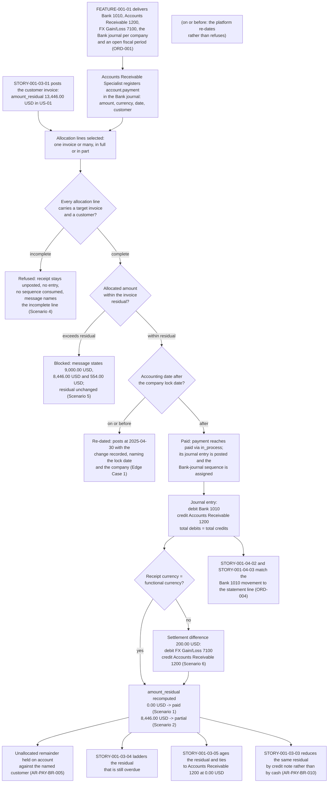

# STORY-001-03-02: Register Customer Payments and Allocations

---

## Metadata

| Attribute | Value |
|-----------|-------|
| **Story ID** | `STORY-001-03-02` |
| **Title** | Register Customer Payments and Allocations |
| **Parent Feature** | [FEATURE-001-03: Accounts Receivable & Customer Invoices](../FEATURE-001-03-accounts-receivable-customer-invoices.md) |
| **Parent Epic** | [EPIC-001: Enterprise Accounting in Odoo](../../EPIC-001-enterprise-accounting-odoo.md) |
| **Status** | Draft |
| **Priority** | 🔴 Critical |
| **Estimate** | 5 story points (Fibonacci) |
| **Persona** | Accounts Receivable Specialist |
| **Secondary Personas** | Cash Application Analyst (keys the daily receipt batch and reports the unallocated remainder), Treasury Analyst (owns the Bank 1010 movement this story creates and matches it against the imported statement in FEATURE-001-04), Chief Accountant (approves residual integrity after a partial allocation, names the account that receives a settlement difference and administers the period lock date), External Auditor (reads the allocation evidence that ties a receipt to the invoices it settled), Finance Controller and Product Owner (accept the demonstration). Persona governance: the **Cash Application Analyst** named above is a registered named secondary role rather than a thirteenth persona: the Epic's [§3.2](../../EPIC-001-enterprise-accounting-odoo.md#32-persona-notes) records it as a stakeholder who keys and reports rather than the WHO of a story, mapping onto the **Accounts Receivable Specialist** for allocation work and the **Treasury Analyst** for bank work |
| **Story Position** | Story 2 of the 5 in FEATURE-001-03; blocked by STORY-001-03-01, blocks STORY-001-03-04 and STORY-001-03-05 |
| **Platform Target** | Open decision DEC-001 — see [Version Compatibility](#version-compatibility) |
| **Last Updated** | 2026-08-16 |
| **Owner/Author** | Enterprise Accounting Team |

> **Platform target.** This story fixes no platform version of its own. The target is the Epic's open decision **DEC-001** in the [Open Decisions Register](../../EPIC-001-enterprise-accounting-odoo.md#appendix-b-open-decisions-register): the originating programme request names Odoo 17, the superseded prior backlog named 18.0, and the baseline this story was written and verified against is **Odoo 19.0 Community**, where `odoo/release.py` declares `version_info = (19, 0, 0, FINAL, 0, '')`. Partial-reconciliation semantics, the `account.move.line.amount_residual` computation and the `payment_state` value set differ across the three candidate releases, so the mismatch is surfaced for stakeholder confirmation rather than settled inside this story (AAP §0.8.2, §0.8.3).

---

## User Story

**As an** Accounts Receivable Specialist

**I want** to register a customer receipt as an `account.payment` record in the **Bank** journal of the company whose books carry the receivable, and allocate it against one posted customer invoice or across more than one — in full, or in part with the unsettled amount left visible as a residual

**So that** cash is applied on the day it lands rather than at month end, the open receivable position is the amount still owed instead of the gross amount ever invoiced, and the **Aged Receivable** report of [STORY-001-03-05](./STORY-001-03-05-report-aged-receivables.md) and the follow-up ladder of [STORY-001-03-04](./STORY-001-03-04-configure-payment-followups.md) both measure from `amount_residual` after allocation rather than from invoice totals — the condition under which the 15% to 25% Days Sales Outstanding improvement targeted by SM-017 against the 58.0-day baseline can be measured at all.

---

## Business Value

### Value Statement

> A receipt that is banked but not applied leaves two figures wrong at once: the customer is chased for money the group already holds, and the receivable balance overstates what is collectible. This story is where the ledger learns that the cash arrived. It debits **Bank 1010**, credits **Accounts Receivable 1200** and reduces `amount_residual` on the invoices the payment settles, so a single number — the residual — becomes the authority for what is owed, what is overdue and what is presented in each aging bucket. The three controls that protect that number sit here as well: an allocation greater than the residual is refused before it can create a negative receivable, a partial allocation states the residual it leaves rather than closing the invoice, and a receipt whose accounting date falls in a locked period cannot restate a reported result. Everything downstream inherits the residual this story writes: the dunning ladder of `STORY-001-03-04` acts on it, the buckets of `STORY-001-03-05` age it, and the statement match of [STORY-001-04-02](../FEATURE-001-04/STORY-001-04-02-auto-match-statement-lines.md) clears the bank side of the same movement.

### Success Metrics

| Metric | Baseline | Target | Measurement Method |
|--------|----------|--------|--------------------|
| Cash application elapsed time | Receipts applied in a month-end batch from a spreadsheet of bank credits | Applied within 1 business day of the value date on the bank credit | Value date on the statement credit compared with the accounting date of the posted `account.payment` |
| Balanced-entry integrity on receipts | Unproven | 0 unbalanced posted receipt entries; total debits minus total credits asserted at `0.00` in the company's functional currency on every posted receipt (SM-006, C-009) | Posted entry inspected line by line with the difference asserted numerically |
| Residual after a full allocation | Derived by hand and disputed | `amount_residual` equals `0.00 USD` on 100% of fully allocated invoices in `US-01`, rounded half-up to 2 decimal places per the USD 0.01 rounding precision, with `payment_state` reading paid | Residual read from the posted invoice after allocation and compared with `0.00 USD` |
| Residual after a partial allocation | Invoice closed or left at its gross amount | The residual equals the invoice total minus the allocated amount to the cent — 13,446.00 USD minus 5,000.00 USD giving 8,446.00 USD — and `payment_state` reads partial | Residual recomputed after the partial allocation and compared with 8,446.00 USD |
| Allocation completeness of a receipt | Unallocated cash held in a suspense balance for weeks | The sum of the allocated amounts equals the receipt amount at a difference of `0.00` in the receipt currency, or the remainder is held on account against the named customer rather than applied to an unselected invoice | Allocation report per receipt, with the allocated total compared with the receipt amount |
| Refused allocations leave no trace | Over-payments posted and reversed later | 100% of refused allocations create no journal entry, consume no **Bank**-journal sequence number and leave the invoice residual unchanged | Negative tests for the missing-target and over-allocation paths, with the entry count and the residual asserted unchanged |
| Sub-ledger tie-out contributed by allocation | Receivable position reconstructed monthly | The sum of open invoice residuals equals the **Accounts Receivable 1200** balance in the **Trial Balance** for the same as-of date at a difference of `0.00 USD` in `US-01` after every allocation (SM-001) | Trial Balance compared with the sum of residuals immediately after the allocation run |
| Bank-side agreement | Bank credits reconciled once a month by eye | The posted receipts equal the movement on **Bank 1010** for the period at a difference of `0.00 USD`, which is the population `STORY-001-04-02` matches against imported statement lines (SM-002) | Bank 1010 movement compared with the posted receipt population for the same date range |
| Allocation throughput | Not measured | Under 2 seconds to allocate one receipt across 20 open invoices and recompute every affected residual, matching the parent Feature's §4.4 budget | Timed allocation with each resulting residual compared with its expected amount |
| Contribution to Days Sales Outstanding | DSO 58.0 days, computed quarterly from a manual extract | Residuals maintained continuously, so DSO is computed from the ledger and the improvement to between 43.5 and 49.3 days becomes measurable (SM-017) | DSO computed from posted residuals and compared with the 58.0-day baseline |

### Business Rules

Rule identifiers carry the `AR-PAY-BR-` prefix so that a rule of this story is unambiguous beside the rules of [STORY-001-03-01](./STORY-001-03-01-generate-customer-invoices.md), which uses `AR-INV-BR-`, and so that the bare `BR-001` through `BR-005` identifiers stay reserved for the retired bank-reconciliation stories the Epic's [retirement map](../../EPIC-001-enterprise-accounting-odoo.md#appendix-c-legacy-retirement-and-migration-map) traces. No identifier below is issued anywhere else in the backlog.

| Rule ID | Rule | Consequence If Broken |
|---------|------|-----------------------|
| **AR-PAY-BR-001** | A receipt is allocated only against a **posted** customer invoice. A Draft invoice carries no receivable journal item and therefore no residual to reduce | Cash is applied to a document that does not exist in the ledger, so the bank balance and the receivable balance disagree with no entry to explain the gap |
| **AR-PAY-BR-002** | The amount allocated to one invoice never exceeds that invoice's `amount_residual`. An attempt to allocate more is refused with a message stating the allocation, the available residual and the excess as three separate amounts | A negative receivable is created on the customer, and the **Aged Receivable** report presents a credit balance in an aging bucket that no invoice supports |
| **AR-PAY-BR-003** | A partial allocation leaves the invoice open at a stated residual — 13,446.00 USD reduced by a receipt of 5,000.00 USD leaves 8,446.00 USD, each amount rounded half-up to 2 decimal places per the USD 0.01 rounding precision — and the invoice keeps ageing from its original due date | An invoice closed on a part-payment stops being chased for the balance, and one left at its gross amount is chased for money already received |
| **AR-PAY-BR-004** | An invoice whose residual reaches `0.00` in the invoice currency moves to `payment_state = paid`; an invoice whose residual stands above `0.00` in the invoice currency with at least one allocation against it moves to `payment_state = partial`, each residual rounded half-up to 2 decimal places at that currency's 0.01 rounding precision | The follow-up ladder of `STORY-001-03-04` and the buckets of `STORY-001-03-05` cannot tell a settled invoice from an unsettled one, so a paid customer is sent a reminder |
| **AR-PAY-BR-005** | One receipt may settle more than one invoice of the same customer in the same company, and the sum of its allocations equals the receipt amount at a difference of `0.00` in the receipt currency. Any remainder is held on account against that customer and is never applied to an invoice the Accounts Receivable Specialist did not select | Cash is spread across invoices nobody chose, which destroys the audit trail from a bank credit to the invoices it settled and produces disputes the group cannot answer |
| **AR-PAY-BR-006** | Every posted receipt entry debits **Bank 1010** and credits **Accounts Receivable 1200** in the **Bank** journal of the company whose books carry the receivable, with total debits and total credits stated and their difference asserted at `0.00` in that company's functional currency | An unbalanced entry cannot be presented in a Trial Balance and blocks the close for the whole company (SM-006) |
| **AR-PAY-BR-007** | Allocation happens inside one company. A receipt in the **Bank** journal of `US-01` settles invoices of `US-01` only; an invoice held by **Global Europe SARL** is settled by a receipt in that company's own **Bank** journal | One entry spanning two sets of books cannot be presented in either company's Trial Balance, and the intercompany elimination owned by FEATURE-001-06 has no pair of entries to work from |
| **AR-PAY-BR-008** | A receipt whose accounting date falls on or before the journal-entry lock date of the company whose books it belongs to does not post into that closed period: `account.move._post` re-dates the entry it generates to the last day of the first open period, and the change is recorded on the entry naming both the company and the lock date. Refusal is reserved for a change to an already-posted entry inside a locked period and for the tax lock, as [STORY-001-01-05](../FEATURE-001-01/STORY-001-01-05-configure-period-lock-dates.md) administers | A reported and filed period is restated by a cash-application entry, and the close of that period stops being reproducible |
| **AR-PAY-BR-009** | Where the receipt currency and the company's functional currency differ, the transaction amount, the converted amount, the conversion rate and the rate date are each recorded, and the difference between the receivable as booked and the cash as received is posted as a settlement exchange difference to **FX Gain/Loss 7100** in a balanced entry. Translation of a foreign entity's balances into the group reporting currency is not this story's business and belongs to FEATURE-001-06 under IAS 21 | The residual never reaches `0.00` in the invoice currency, leaving a permanent stub in an aging bucket that no collection action can clear, or the rate movement is absorbed into revenue and the margin is misstated |
| **AR-PAY-BR-010** | A receipt and a credit note both reduce `amount_residual`, and they stay separate documents: cash received is an `account.payment` recorded here, while a credit granted is an `out_refund` recorded by [STORY-001-03-03](./STORY-001-03-03-manage-customer-credit-notes.md). Neither is used to record the other | A credit note booked as cash overstates the bank balance, and a receipt booked as a credit note understates revenue — both are restatements rather than clerical slips |
| **AR-PAY-BR-011** | An allocation is reversible. Undoing it restores the invoice residual to the amount it held before the allocation, to the cent, and the reversal is retained with its author and timestamp rather than replacing the original record | A mis-applied receipt cannot be undone without a manual journal, and the audit trail from bank credit to invoice is lost at the moment it matters most |
| **AR-PAY-BR-012** | A shortfall between the receipt and the residual is either left open as a residual or written off to the account the Chief Accountant names, and the tolerance under which a write-off is allowed is a recorded policy rather than a per-case judgement | Small differences are absorbed silently into whichever account is at hand, so the receivable ledger drifts from the cash actually collected with nothing to evidence why |

---

## Acceptance Criteria

Six criteria, inside the mandated band of 4 to 8. Each carries one non-compound **When**, and each **Then** asserts only what the Accounts Receivable Specialist, the Cash Application Analyst, the Chief Accountant, the Treasury Analyst or the External Auditor can observe on the receipt, on the invoice, on the journal entry or in a named report — no interface gesture, no query and no implementation internal appears in a criterion. Every monetary figure states its currency as an ISO 4217 code, its amount to 2 decimal places and the rounding rule applied to it; every journal entry described states its total debits and its total credits as equal amounts; every residual is stated as an amount rather than as a state of settlement; and every criterion touching more than one company names the company whose books are affected.

| Scenario | Coverage class |
|----------|----------------|
| 1 | Valid input — happy-path full allocation clearing the invoice with a balanced entry |
| 2 | Valid input — partial reconciliation leaving a stated residual on an open invoice |
| 3 | Valid input — one receipt allocated across three invoices of one customer |
| 4 | Invalid or incomplete input — an allocation line with no target invoice and no customer |
| 5 | Error handling — an over-allocation blocked with an Odoo validation message |
| 6 | Accounting edge case — a foreign-currency receipt producing a stated settlement exchange difference |

### Scenario 1: Full allocation clears the invoice and posts a balanced receipt

- **Given** the posted customer invoice raised by [STORY-001-03-01](./STORY-001-03-01-generate-customer-invoices.md) for customer **Northwind Trading** in company `US-01` (the United States parent, functional currency USD) is open with `amount_residual` of **13,446.00 USD** and `payment_state` of not paid, and the **Bank** journal of `US-01` posts to **Bank 1010**, with every amount in this criterion rounded half-up to 2 decimal places per the USD 0.01 rounding precision
- **When** the Accounts Receivable Specialist registers a receipt of **13,446.00 USD** against that invoice in the **Bank** journal of `US-01` with an accounting date of 2025-04-10
- **Then** an `account.payment` record exists in the **`paid`** state — reached from `draft` through `in_process`, which are the states `account.payment.state` actually offers in this platform, there being no `posted` value on that field — carrying the customer Northwind Trading, the amount 13,446.00 USD, the accounting date 2025-04-10 and the **Bank** journal of `US-01`
  - **And** the journal entry the receipt generated stands separately in the **`posted`** state on `account.move`, which is where a posted state does exist, so the payment's own lifecycle state and the state of its accounting entry are asserted as two distinct facts rather than conflated into one
  - **And** its journal entry debits **Bank 1010** with **13,446.00 USD** and credits **Accounts Receivable 1200** with **13,446.00 USD**, so **total debits of 13,446.00 USD equal total credits of 13,446.00 USD** at a difference of 0.00 USD
  - **And** the invoice `amount_residual` becomes **0.00 USD**, rounded half-up to 2 decimal places per the USD 0.01 rounding precision
  - **And** the invoice `payment_state` becomes paid, and the **Aged Receivable** report of Global Holdings Inc. (`US-01`) run with the as-of-date parameter **2025-04-30** presents customer **Northwind Trading** at **0.00 USD** in every bucket — Current, 1-30 days, 31-60 days, 61-90 days, 91-120 days and Over 120 days — for a customer total of **0.00 USD**, each amount rounded half-up to 2 decimal places per the USD 0.01 rounding precision, so the settled invoice contributes 0.00 USD to the open receivable position on any as-of date on or after 2025-04-10
  - **And** the receipt records which invoice it settled and for how much, so the External Auditor traces the 13,446.00 USD from the bank movement to the invoice without a data request
  - **And** the books of `US-01` are the only books affected

### Scenario 2: Partial allocation leaves a stated residual and keeps the invoice open

- **Given** the same posted customer invoice for **Northwind Trading** in company `US-01` is open with `amount_residual` of **13,446.00 USD**, a due date of 2025-03-12 derived from the customer's Net 30 payment term held on `res.partner`, and every amount in this criterion rounded half-up to 2 decimal places per the USD 0.01 rounding precision
- **When** the Accounts Receivable Specialist registers a receipt of **5,000.00 USD** against that invoice in the **Bank** journal of `US-01`
- **Then** the receipt's journal entry debits **Bank 1010** with **5,000.00 USD** and credits **Accounts Receivable 1200** with **5,000.00 USD**, so **total debits of 5,000.00 USD equal total credits of 5,000.00 USD** at a difference of 0.00 USD
  - **And** the invoice `amount_residual` becomes **8,446.00 USD**, being 13,446.00 USD less the allocated 5,000.00 USD, rounded half-up to 2 decimal places per the USD 0.01 rounding precision
  - **And** the invoice `payment_state` becomes partial and the invoice stays open, so it remains available to the follow-up ladder of `STORY-001-03-04` and to the aging buckets of `STORY-001-03-05`
  - **And** the invoice continues to age from its original due date of 2025-03-12 rather than from the receipt date, so the partial receipt moves the amount overdue and not the age of the debt
  - **And** the partial allocation is recorded as its own allocation record, so undoing it restores the residual to **13,446.00 USD** to the cent
  - **And** the books of `US-01` are the only books affected

### Scenario 3: One receipt is allocated across three open invoices of one customer

- **Given** customer **Atlantia SRL** holds three posted customer invoices in company **Global Europe SARL** (the Netherlands operating entity behind register code `NL-01`, functional currency EUR) with `amount_residual` of **1,200.00 EUR**, **2,300.00 EUR** and **500.00 EUR**, each rounded half-up to 2 decimal places per the EUR 0.01 rounding precision, and the **Bank** journal of Global Europe SARL posts to **Bank 1010**
- **When** the Accounts Receivable Specialist registers a single receipt of **4,000.00 EUR** in the **Bank** journal of Global Europe SARL, allocating **1,200.00 EUR**, **2,300.00 EUR** and **500.00 EUR** to those three invoices respectively in that one act
- **Then** one journal entry debits **Bank 1010** with **4,000.00 EUR** and credits **Accounts Receivable 1200** with **4,000.00 EUR**, so **total debits of 4,000.00 EUR equal total credits of 4,000.00 EUR** at a difference of 0.00 EUR
  - **And** all three invoices show `amount_residual` of **0.00 EUR** and `payment_state` of paid, each amount rounded half-up to 2 decimal places per the EUR 0.01 rounding precision
  - **And** the receipt shows an unallocated amount of **0.00 EUR**, because the three allocations of 1,200.00 EUR, 2,300.00 EUR and 500.00 EUR sum to the receipt amount of 4,000.00 EUR at a difference of 0.00 EUR
  - **And** the receipt records one allocation line per settled invoice with its invoice number and its allocated amount, so a bank credit of 4,000.00 EUR is traceable to the three invoices it cleared
  - **And** the books of **Global Europe SARL** are the only books affected, and the receivable of `US-01` moves by 0.00 USD, rounded half-up to 2 decimal places per the USD 0.01 rounding precision

### Scenario 4: An allocation with no target invoice is rejected

- **Given** a receipt of **900.00 USD** entered for customer **Northwind Trading** in the **Bank** journal of company `US-01`, rounded half-up to 2 decimal places per the USD 0.01 rounding precision, with no invoice selected for allocation and one allocation line carrying neither a target invoice nor a customer
- **When** the Accounts Receivable Specialist attempts to confirm the allocation
- **Then** the allocation is not recorded and the receipt remains unposted in the Draft state
  - **And** no journal entry is created, so the balance of **Accounts Receivable 1200** in `US-01` moves by **0.00 USD** and the balance of **Bank 1010** in `US-01` moves by **0.00 USD**, each amount rounded half-up to 2 decimal places per the USD 0.01 rounding precision
  - **And** no **Bank**-journal sequence number of `US-01` is consumed, so the sequence high-water mark is unchanged and the next receipt that posts takes the number this attempt did not
  - **And** the returned message identifies the allocation line that lacks a target invoice by its line number and names the two absent elements — the target invoice and the customer — so the Accounts Receivable Specialist resolves the receipt without inspecting every line
  - **And** the 900.00 USD amount and the customer already keyed on the receipt are retained, so the refusal discards no work
  - **And** the message discloses no stack trace, no file-system path and no credential (C-020)

### Scenario 5: An over-allocation is blocked with a validation message

- **Given** the posted customer invoice for **Northwind Trading** in company `US-01` is open with `amount_residual` of **8,446.00 USD** after the partial receipt of Scenario 2, rounded half-up to 2 decimal places per the USD 0.01 rounding precision
- **When** the Accounts Receivable Specialist attempts to allocate **9,000.00 USD** to that invoice
- **Then** the allocation is blocked and an Odoo validation message states the attempted allocation of **9,000.00 USD**, the available residual of **8,446.00 USD** and the excess of **554.00 USD** as three separate amounts, each rounded half-up to 2 decimal places per the USD 0.01 rounding precision
  - **And** no journal entry is created and no **Bank**-journal sequence number of `US-01` is consumed
  - **And** the invoice `amount_residual` is unchanged at **8,446.00 USD** and its `payment_state` stays partial
  - **And** the balance of **Accounts Receivable 1200** in `US-01` is unchanged, moving by **0.00 USD** rounded half-up to 2 decimal places per the USD 0.01 rounding precision, so no negative receivable is created on the customer
  - **And** the message names the invoice the excess was attempted against and states the remedies available to the Accounts Receivable Specialist — allocate 8,446.00 USD and hold the remaining 554.00 USD on account against Northwind Trading, or allocate the excess to another open invoice of that customer
  - **And** the message discloses no stack trace, no file-system path and no credential (C-020)

### Scenario 6: A foreign-currency receipt posts a stated settlement exchange difference

- **Given** a posted customer invoice of **10,000.00 EUR** raised on the group's Netherlands entity **Global Europe SARL** as the customer of record and held in the books of company `US-01`, whose functional currency is USD, recorded at an invoice-date rate of **1.1000 USD per EUR** and therefore carried as a receivable of **11,000.00 USD** against **Accounts Receivable 1200**, with every amount in this criterion rounded half-up to 2 decimal places per its own currency's 0.01 rounding precision
- **When** the Accounts Receivable Specialist registers a receipt of **10,000.00 EUR** against that invoice in the **Bank** journal of `US-01` at a payment-date rate of **1.0800 USD per EUR**, worth **10,800.00 USD** in the functional currency
- **Then** the invoice `amount_residual` becomes **0.00 EUR** and its residual in the functional currency becomes **0.00 USD**, each rounded half-up to 2 decimal places per that currency's 0.01 rounding precision, and the invoice `payment_state` becomes paid
  - **And** the receipt entry debits **Bank 1010** with **10,800.00 USD** and credits **Accounts Receivable 1200** with **10,800.00 USD**, so total debits of 10,800.00 USD equal total credits of 10,800.00 USD at a difference of 0.00 USD
  - **And** a settlement exchange difference of **200.00 USD**, being the receivable of 11,000.00 USD less the cash of 10,800.00 USD, rounded half-up to 2 decimal places per the USD 0.01 rounding precision, is posted as a debit to **FX Gain/Loss 7100** against a credit of **200.00 USD** to **Accounts Receivable 1200**, so that entry balances at a difference of 0.00 USD
  - **And** taken together the receipt and the exchange-difference entry record **total debits of 11,000.00 USD equal to total credits of 11,000.00 USD** at a difference of 0.00 USD, which is the receivable amount the invoice was booked at
  - **And** the transaction amount of 10,000.00 EUR, the converted amount of 10,800.00 USD, the rate of 1.0800 USD per EUR and the rate date of the receipt are each recorded on the receipt, and the invoice-date rate of 1.1000 USD per EUR stays readable on the invoice
  - **And** the affected company `US-01` and the counterparty **Global Europe SARL** are both named on the receipt entry and on the exchange-difference entry, and the books of **Global Europe SARL** are moved only by that entity's own mirror-side entry, whose elimination belongs to FEATURE-001-06

---

## Sub-Tasks

- [ ] Confirm the cash-application policy with the Chief Accountant and record it: which **Bank** journal receives customer receipts per company, the order in which a receipt is applied when a customer holds more than one open invoice, whether an unallocated remainder is held on account or refunded, and the **write-off tolerance** — the amount below which a shortfall may be written off to the account the Chief Accountant names rather than left as a residual (AR-PAY-BR-012, DEC-011) — `@finance-sme`
- [ ] Specify the allocation and partial-reconciliation behaviour: how one receipt is allocated across more than one invoice, what a partial allocation leaves on the invoice and in which `payment_state`, how the unallocated remainder is presented, how an allocation is undone and the residual restored to the cent, and the exact wording of the missing-target and over-allocation refusals including the three amounts the over-allocation message states — `@functional-consultant`
- [ ] Specify the foreign-currency settlement path: which rate and rate date are recorded, where the settlement exchange difference is posted (**FX Gain/Loss 7100**), which journal carries it, and the boundary against the translation work owned by FEATURE-001-06 under IAS 21 — `@functional-consultant`
- [ ] Deliver the receipt posting and residual recomputation: the balanced entry across **Bank 1010** and **Accounts Receivable 1200** in the **Bank** journal of the company whose books carry the receivable, the recomputation of `amount_residual` and `payment_state` on every affected invoice, half-up rounding to 2 decimal places at each currency's 0.01 rounding precision on every amount written to a journal item, and the settlement exchange difference where the currencies differ — `@developer`
- [ ] Deliver the refusal paths so that a missing target invoice and an over-allocation each leave the receipt unposted with no journal entry created, no **Bank**-journal sequence number consumed and every invoice residual unchanged, and the lock-date path so that an accounting date inside a locked period is re-dated to the last day of the first open period with the change recorded on the entry, each message or recorded note naming the failing element or the lock date and the company without disclosing a stack trace, a file path or a credential (C-020) — `@developer`
- [ ] Author the tests for all six acceptance criteria plus the four edge cases: full and partial allocation with the residual walk from 13,446.00 USD to 8,446.00 USD to 0.00 USD, the three-invoice allocation in EUR, the two refusals, the 200.00 USD exchange difference, the locked-period refusal, the over-payment above the total open residual, and the cross-company allocation attempt — one test per criterion (C-008), with every amount asserted numerically (C-009) and every criterion linted for the banned vague terms — `@qa-engineer`
- [ ] Reconcile the demonstration data set after the allocations: agree the **Bank 1010** movement to the posted receipt population, agree the sum of open invoice residuals to the **Accounts Receivable 1200** balance in the **Trial Balance** at a difference of `0.00 USD` in `US-01`, and retain the worksheet as the close evidence `STORY-001-03-05` inherits — `@finance-sme`

---

## Edge Cases

| Edge Case | Expected Behaviour |
|-----------|--------------------|
| **Receipt dated inside a locked period.** A receipt for Atlantia SRL carries an accounting date of 2025-03-15 while the journal-entry lock date of **Global Europe SARL** stands at 2025-03-31 | The receipt is **not** refused. `account.move._post` moves the accounting date of the entry it generates to **2025-04-30**, the last day of the first period open after the lock date, and posts — so the closed period is protected by where the receipt lands, not by the registration failing. The date change is recorded on the entry naming the lock date **2025-03-31** and the company **Global Europe SARL**, the movement on **Bank 1010** and **Accounts Receivable 1200** of that company for 2025-03-01 to 2025-03-31 is 0.00 EUR, and the same movement appears in the period 2025-04-01 to 2025-04-30 with total debits equal to total credits at a difference of 0.00 EUR. No entry of that receipt reaches the closed period, so the **Accounts Receivable 1200** balance of that company for 2025-03-01 to 2025-03-31 moves by **0.00 EUR**, rounded half-up to 2 decimal places per the EUR 0.01 rounding precision. Where the receipt has to settle inside March, the boundary is released first through a recorded lock exception under [STORY-001-01-05](../FEATURE-001-01/STORY-001-01-05-configure-period-lock-dates.md), which is a decision a finance role records rather than a silent correction, and any lock-date exception is retained with its author, its timestamp and its expiry for the External Auditor (AR-PAY-BR-008) |
| **Over-payment above the total open residual.** Northwind Trading remits **9,000.00 USD** while its only open invoice carries a residual of **8,446.00 USD**, leaving **554.00 USD** with no invoice to settle, each amount rounded half-up to 2 decimal places per the USD 0.01 rounding precision | The 8,446.00 USD that has a target is allocated and takes that invoice to a residual of **0.00 USD** and `payment_state` paid; the remaining **554.00 USD** is held on account against Northwind Trading as an unallocated receipt amount, visible to the Cash Application Analyst, and is neither applied to an invoice nobody selected nor written off without authority. Allocating 9,000.00 USD to the single 8,446.00 USD invoice stays blocked under Scenario 5, so an over-payment becomes cash on account rather than a negative receivable. Where policy allows a shortfall in the opposite direction to be closed, the written-off amount reaches the account the Chief Accountant names under the recorded tolerance and the entry still balances at a difference of `0.00 USD` (AR-PAY-BR-002, AR-PAY-BR-005, AR-PAY-BR-012) |
| **Foreign-currency receipt creating a settlement exchange difference.** A receivable of 10,000.00 EUR booked at 1.1000 USD per EUR, worth **11,000.00 USD**, is settled by a receipt of 10,000.00 EUR at 1.0800 USD per EUR, worth **10,800.00 USD** | The residual reaches **0.00 EUR**, rounded half-up to 2 decimal places per the EUR 0.01 rounding precision, rather than leaving a stub of 200.00 USD that no collection action can clear. The **200.00 USD** difference, rounded half-up to 2 decimal places per the USD 0.01 rounding precision, is posted to **FX Gain/Loss 7100** against **Accounts Receivable 1200**, and the receipt and difference entries together record total debits of 11,000.00 USD equal to total credits of 11,000.00 USD. The transaction amount, the converted amount, the rate and the rate date are each recorded, and both amounts are rounded half-up at their own currency's 0.01 rounding precision. The realized difference on settlement is recognized here; the translation of a foreign entity's balances into the group reporting currency is recognized in FEATURE-001-06 under IAS 21 (AR-PAY-BR-009, Scenario 6) |
| **One receipt offered against invoices of two different companies.** A remittance covers an invoice held by `US-01` and an invoice held by **Global Europe SARL** | The allocation is refused with a message naming both companies and stating that a receipt settles invoices of one company only, and no journal entry is created in either set of books. The Accounts Receivable Specialist records two receipts, one in the **Bank** journal of `US-01` for the invoice held there and one in the **Bank** journal of Global Europe SARL for that entity's invoice, so each company's Trial Balance carries its own balanced entry and the **Accounts Receivable 1200** balance of each company is reduced only by cash received into its own **Bank 1010**. Where the two invoices are intercompany, the elimination of the pair belongs to FEATURE-001-06 rather than to this allocation (AR-PAY-BR-007, C-014) |

---

## Estimation

| Dimension | Rating | Justification |
|-----------|--------|---------------|
| **Effort** | Medium | The delivered surface is one document lifecycle — an `account.payment` from `draft` through `in_process` to `paid`, with the journal entry it generates reaching `posted` on `account.move` — with its allocation across one or more invoices, its residual recomputation, its `payment_state` transitions, its three refusal paths and its foreign-currency settlement path, all expressed on `account.payment`, `account.move`, `account.move.line` and the partial-reconciliation records this repository already provides under LGPL-3 rather than requiring new machinery |
| **Complexity** | Medium | Three behaviours each carry an accounting consequence beyond a simple write. A partial allocation must leave `amount_residual` exact to the cent and leave the invoice ageing from its original due date. A refusal must leave no entry, no sequence number and no residual movement. A foreign-currency settlement must clear the residual to `0.00` in the invoice currency while posting the rate movement to **FX Gain/Loss 7100** in a balanced entry — the one case where the cash received and the receivable relieved are different amounts by design |
| **Uncertainty** | Low to medium | The mechanism can be inspected before development starts: `addons/account/models/account_payment.py` holds the payment record, `addons/account/models/account_move_line.py` holds `amount_residual` and its recomputation from the matched debit and credit records, `addons/account/models/account_partial_reconcile.py` holds the partial allocation together with the exchange-difference entry it can carry, and `addons/account/wizard/account_payment_register.py` holds the difference handling and the difference account. Two open items carry the residual uncertainty: the write-off tolerance behind AR-PAY-BR-012, and whether the shipped difference handling can be shaped into the outright refusal Scenario 5 requires — both recorded in [Open Questions](#open-questions) |
| **Story Points** | **5** | Fibonacci scale (1, 2, 3, 5, 8, 13). Above a **3** because partial reconciliation, multi-invoice allocation and a settlement exchange difference each have to be proved numerically across two companies and two currencies, and because three refusal paths must leave the ledger untouched — none of which a single-entry posting story carries. Below an **8** because the posting itself is one well-understood entry across two accounts, no report engine, statement parser or external integration is built here, and statement matching, credit notes, dunning and aging are the other four stories of this feature and FEATURE-001-04 |

---

## INVEST Principles Compliance

| Principle | Compliance | Justification |
|-----------|------------|---------------|
| **Independent** | ✅ | Qualified honestly. Everything this story needs beyond one posted customer invoice is configuration: **Bank 1010**, **Accounts Receivable 1200**, a **Bank** journal and an open fiscal period, all satisfiable as demo data in a test company. What it cannot manufacture is the receivable itself, which is why it declares [STORY-001-03-01](./STORY-001-03-01-generate-customer-invoices.md) as a blocking dependency rather than absorbing invoice creation into its own scope. Given one posted invoice it is demonstrable on its own, and it depends on no sibling other than that one |
| **Negotiable** | ✅ | The criteria state the accounting outcome required — a balanced entry across two named accounts, a residual stated to the cent, a named refusal, a settlement difference in a named account — and leave the model, field, view and wizard decisions to implementation discovery under D-005, so how the outcome is reached stays open between the Accounts Receivable Specialist and the delivery team |
| **Valuable** | ✅ | It is the story that turns a bank credit into an applied receipt, so it is the precondition of every collectible figure this feature reports: the **Accounts Receivable 1200** tie-out behind SM-001, the residual the dunning ladder of `STORY-001-03-04` acts on, the buckets `STORY-001-03-05` ages, and the **Bank 1010** population `STORY-001-04-02` matches against imported statement lines |
| **Estimable** | ✅ | The artifact count is fixed and inspectable: one document type (`account.payment`), one journal (**Bank**), three general ledger accounts (Bank 1010, Accounts Receivable 1200, FX Gain/Loss 7100), two companies, two currencies, three refusal paths and one exchange-difference path, all on models already present in this repository — which is why the Effort, Complexity and Uncertainty ratings above were assigned from evidence rather than from guesswork |
| **Small** | ✅ | One accountant-facing workflow — receive cash and apply it — sized at 5 story points and completable inside one iteration. Statement import and matching, credit notes, dunning and aging are deliberately outside it and are carried by `STORY-001-04-01` through `STORY-001-04-03`, `STORY-001-03-03`, `STORY-001-03-04` and `STORY-001-03-05` |
| **Testable** | ✅ | Every one of the six criteria is objectively pass or fail: each states amounts to the minor unit with the rounding rule applied, each posting criterion states a debit total and an equal credit total, each residual is asserted as an amount rather than as a description, each refusal names the message content and asserts an unchanged ledger and an unconsumed sequence, and each maps to exactly one automated test in [Acceptance Test Mapping](#acceptance-test-mapping) |

---

## Demonstration Path

Demonstrated in the Odoo user interface to the **Finance Controller** and the **Product Owner**, in this order, with the walkthrough recorded against this story:

- [ ] **The full allocation.** **Accounting → Customers → Invoices**: open the posted invoice for Northwind Trading in company `US-01` and observe the amount due of 13,446.00 USD. Choose **Register Payment**, select the **Bank** journal, keep the amount at 13,446.00 USD, set the date to 2025-04-10 and confirm. Observable result: the invoice shows a payment status of **Paid** and an amount due of 0.00 USD, each amount rounded half-up to 2 decimal places per the USD 0.01 rounding precision
- [ ] **The receipt record.** **Accounting → Customers → Payments**: the receipt appears in the **Paid** state — the `paid` value of `account.payment.state`, reached through `in_process` — carrying the customer Northwind Trading, the amount 13,446.00 USD, the date 2025-04-10 and the **Bank** journal of `US-01`, and it lists the invoice it settled; opening its journal entry shows that entry in the **Posted** state, which is the state that lives on `account.move`
- [ ] **The balanced entry and the residual.** From the invoice open **Journal Items**, and from the receipt open its own journal entry: the receipt entry shows debit **Bank 1010** 13,446.00 USD against credit **Accounts Receivable 1200** 13,446.00 USD, with total debits of 13,446.00 USD equal to total credits of 13,446.00 USD, and the receivable journal item of the invoice shows a residual of 0.00 USD
- [ ] **The partial allocation.** On a second posted invoice of 13,446.00 USD, register a receipt of 5,000.00 USD and observe the payment status move to **Partially Paid** with an amount due of 8,446.00 USD, the due date still reading 2025-03-12, and the receivable journal item showing a residual of 8,446.00 USD
- [ ] **The multi-invoice allocation.** In company **Global Europe SARL**, select the three open invoices of Atlantia SRL carrying residuals of 1,200.00 EUR, 2,300.00 EUR and 500.00 EUR, register one receipt of 4,000.00 EUR against them, and observe all three reach an amount due of 0.00 EUR with the receipt showing nothing left unallocated
- [ ] **The refusals.** Attempt to confirm a receipt of 900.00 USD whose allocation line carries no target invoice and no customer, and observe the receipt stay unposted with a message naming that line. Then attempt to allocate 9,000.00 USD to the invoice whose residual is 8,446.00 USD, and observe the validation message stating 9,000.00 USD, 8,446.00 USD and 554.00 USD, with the amount due still reading 8,446.00 USD
- [ ] **The exchange difference.** On the 10,000.00 EUR receivable booked at 1.1000 USD per EUR in `US-01`, register the receipt of 10,000.00 EUR at 1.0800 USD per EUR and observe the amount due reach 0.00 EUR, the receipt entry post 10,800.00 USD across **Bank 1010** and **Accounts Receivable 1200**, and the exchange-difference entry post 200.00 USD as a debit to **FX Gain/Loss 7100** against **Accounts Receivable 1200**
- [ ] **Headless alternative, on the access contract C-023 fixes.** Where interactive access is not available, the same evidence is presented over the platform's current JSON web-service endpoint — `/json/2/<model>/<method>` on the Odoo 19.0 baseline, restated for whichever version DEC-001 confirms — authenticated with a bearer API key issued to the dedicated integration principal `ar-payment`, scoped to the companies and models this story names, with a recorded key owner, expiry, rotation interval and revocation path under C-021, executing under that principal's access rights and record rules with no privilege escalation, rate-limited and audit-logged per call. The deprecated XML-RPC and JSON-RPC endpoints are deprecated on this baseline and scheduled for removal in the following major series, so no criterion, test or demonstration here is written against them. The evidence is presented by reading `account.payment` (state, amount, date, journal, reconciled invoices) and the `account.move.line` records of the affected invoices (`amount_residual`, `amount_residual_currency`) together with the invoice `payment_state`, **over that same C-023 surface under the `ar-payment` principal**, so acceptance never depends on a graphical session and no evidence is read over a deprecated transport

---

## Constraints

The constraint identifiers below are the Epic's own, restated in the terms of this story rather than renumbered, so one constraint set reads across the whole ticket tree.

### License and Compliance

- [ ] **C-001 — AGPL-3.0 compatibility**: any module delivering the allocation controls, the refusal paths and the settlement-difference handling is distributed under an AGPL-3.0 compatible licence, matching the Community-edition accounting add-ons already present in this repository
- [ ] **C-002 — Existing licence respected**: extension of `account` — the "Invoicing" application, version 1.4, category `Accounting/Accounting`, licence LGPL-3 — and of `account_payment` (version 2.0, LGPL-3, depending on `account` and `payment`) respects those licences, and an AGPL-3 extension of LGPL-3 code is licence-checked before it is written
- [ ] **C-005 / C-006 — Odoo and OCA coding standards**: Python follows the Odoo and OCA module guidelines including PEP 8, and static analysis reports zero violations under the repository's lint configuration at `ruff.toml`
- [ ] **C-012 — Build on the existing models**: the receipt, its allocations and the residuals it moves are expressed on `account.payment`, `account.move`, `account.move.line`, the partial-reconciliation records and `account.journal` rather than on a parallel cash-application structure, so one ledger and one audit trail exist and a residual read from the sub-ledger cannot disagree with the **Accounts Receivable 1200** balance read from the Trial Balance
- [ ] **C-014 — Access rights and company isolation**: the role that registers a receipt is distinguishable from the role that authorises a write-off of a shortfall and from the role that administers the lock date, and a role restricted to `US-01` can neither read nor allocate against the receivable lines of **Global Europe SARL** (`NL-01`); an allocation never spans two companies (AR-PAY-BR-007)
- [ ] **C-018 — External text is context-encoded**: a customer name, a payment reference or a memo taken from a remittance advice and rendered into a receipt document or an allocation report is emitted as escaped text rather than as markup
- [ ] **C-019 — Data access discipline**: reads of open residuals, of the allocation candidates for a customer and of the **Bank 1010** movement are expressed through the Odoo ORM or parameterized SQL, with no string-concatenated query construction
- [ ] **C-020 — Failure messages disclose nothing**: the missing-target, over-allocation, cross-company and locked-period refusals name the rejected receipt, the check that failed and the remedial action, and disclose no stack trace, SQL, file-system path or credential
- [ ] **C-021 — No credentials in source**: no bank-connector credential, endpoint secret or signing certificate appears in module source, fixtures, logs or exports produced by this story

### Accounting Standards Compliance

- [ ] **Debits equal credits**: the double-entry identity is asserted numerically on every posted receipt and on every exchange-difference entry, with both totals stated and their difference asserted at `0.00` in the company's functional currency (C-009, SM-006)
- [ ] **ISO 4217 minor units**: every amount asserted in this story is rounded half-up to its currency's decimal precision — 2 decimal places at a 0.01 rounding precision for USD and EUR — and the currency code is stated with the amount
- [ ] **IAS 21 — settlement versus translation**: the exchange difference arising when a foreign-currency receivable is settled at a rate other than the rate it was booked at is a realized difference and is recognized here, in the books of the company holding the receivable, against **FX Gain/Loss 7100**. The translation of a foreign operation's balances into the group reporting currency, and the translation reserve it produces, belong to FEATURE-001-06 and are not posted by this story
- [ ] **Cash is applied, never created**: an allocation moves a receivable to cash and never recognises revenue. Revenue recognition belongs to `STORY-001-03-01` and revenue reduction to `STORY-001-03-03`, so no allocation in this story touches Revenue 4000 or Tax Payable 2200
- [ ] **Residual integrity**: the sum of open invoice residuals equals the **Accounts Receivable 1200** balance for the same as-of date at a difference of `0.00` in the company's functional currency after every allocation, which is the sub-ledger contract `STORY-001-03-05` reports against (SM-001)

### Dependency and Edition Considerations

- [ ] **C-003 — Edition source is an open decision (DEC-002), not a prohibition**: the blanket ban on Enterprise dependencies carried by the superseded backlog is withdrawn. The choice between an Odoo Enterprise subscription and the OCA add-on path plus bespoke development for the residual gap is owned by the CFO / Finance Director with the Group Controller and is recorded in the Epic's [Open Decisions Register](../../EPIC-001-enterprise-accounting-odoo.md#appendix-b-open-decisions-register)
- [ ] **This story is not gated by DEC-002**: `account.payment`, `account.move`, `account.move.line`, the partial-reconciliation records and the payment-register wizard are all present in this repository under LGPL-3, so cash application can be delivered and demonstrated before the edition decision is confirmed. What DEC-002 affects is how the **Aged Receivable** presentation that consumes these residuals is rendered, which is `STORY-001-03-05` and FEATURE-001-07
- [ ] **C-004 — OCA ecosystem compatibility**: whichever edition path is confirmed, the posted receipt, its allocations and the residuals it leaves stay consumable by the OCA reconciliation and reporting add-ons named in the Epic without restatement
- [ ] **Enterprise modules are target capabilities, not installed dependencies**: `account_accountant`, `account_reports`, `account_asset`, `account_budget` and `account_consolidation` are absent from this repository's `addons/`, and no module delivered by this story declares a dependency on any of them while DEC-002 is open

- [ ] **C-023 to C-029 — the interface, artifact, resilience and ceiling contracts, stated for this story.** **C-023 applies**: the headless route runs over the platform's current JSON web-service endpoint under a bearer API key held by the dedicated integration principal `ar-payment`, scoped per company and per model, with its key lifecycle under C-021, executing under access rights and record rules with no privilege escalation, rate-limited and audit-logged, and the deprecated XML-RPC and JSON-RPC transports excluded. **C-024 applies** where a payment is initiated by the customer from a portal link, which is scoped to one invoice and company, short-lived, revocable, invalidated on settlement, kept out of referrer and log surfaces, CSRF-protected on every state-changing post, and answered by one cause-free denial with the attempt recorded. **C-025 applies** to the receipt or remittance document and every allocation export: authorized on its parent record, system-named, published atomically, audited and retained under the receipts-evidence retention period. **C-026 applies** to the allocation history — the amount and currency received, the rate applied, the invoices allocated and the residual left, the write-off disposition and the acting principal — appended and snapshotted. **C-027 applies** to any payment-provider or bank-feed call behind a receipt: declared timeouts, bounded retry with jitter, a breaker, a parked terminal state with an operator alert, and a transactional outbox coupling the posting to the acknowledgement. **C-028 applies**: a unique constraint over company, customer, receipt reference and value date gives the receipt its identity so a replayed registration allocates nothing further and records the attempt, the residuals are revalidated inside the lock immediately before the allocation commits, and the write-off tolerance of DEC-011 is applied by the authority that owns it rather than by the registering role. **C-029 applies** to every allocation and receipt export, each with its declared maxima, defaults, asynchronous threshold, cancellation and atomic publication

### Version Compatibility

- [ ] **C-010 — Platform version target is open decision DEC-001**: the programme request names Odoo 17, the superseded backlog named 18.0, and this repository is **Odoo 19.0 Community** (`odoo/release.py` declares `version_info = (19, 0, 0, FINAL, 0, '')`). The target is confirmed with stakeholders before development rather than chosen inside this story
- [ ] **C-011 — Language and database versions follow the confirmed target**: the 19.0 baseline present here declares `MIN_PY_VERSION = (3, 10)`, `MAX_PY_VERSION = (3, 13)` and `MIN_PG_VERSION = 13` in `odoo/release.py`; an earlier platform target carries a different supported matrix
- [ ] **Impact if DEC-001 resolves away from 19.0**: the `amount_residual` and `amount_residual_currency` computation cited in [Technical Discovery Notes](#technical-discovery-notes) is restated for the confirmed release because partial-reconciliation semantics differ across the three candidates; the `payment_state` value set is re-checked, since the in-payment value and its dependence on an outstanding-receipts account on the **Bank** journal change what Scenario 1 observes; and the difference-handling and difference-account fields of the payment-register wizard are re-verified for that series

---

## Technical Discovery Notes

> **Purpose:** these notes direct the codebase analysis that precedes implementation. They record what to investigate and what the outcome must prove; they do not choose the implementation. Naming an account code, a journal type, `amount_residual` as an observable field or `payment_state` as an observable status is a business outcome required by the parent Feature's artifact register, not an implementation decision.

### Codebase Analysis Areas

| Area | Files/Modules to Examine | Analysis Focus |
|------|--------------------------|----------------|
| The receipt record and its posting | `addons/account/models/account_payment.py` | The payment record and the fields an acceptance test reads: the amount and its currency, the accounting date, the journal, the company, the customer, the inbound payment type and customer partner type, the generated journal entry, the reconciled-invoice relation and the reconciled and matched flags. Establish which of them is authoritative for "this receipt settled that invoice", and where the outstanding-account and destination-account choice decides whether the entry lands directly on **Bank 1010** |
| Residual computation and partial reconciliation | `addons/account/models/account_move_line.py` | `amount_residual` and `amount_residual_currency`, their stored computation and the matched debit and credit relations it depends on, together with the reconciled flag and the full-reconciliation link. Determine exactly when a residual is recomputed, what it holds after a partial allocation of 5,000.00 USD against 13,446.00 USD, and how the residual behaves when the line's currency differs from the company's functional currency |
| The allocation record itself | `addons/account/models/account_partial_reconcile.py` | The partial-allocation record linking a debit line to a credit line with its amount and its per-currency amounts, the full-reconciliation link it creates when nothing is left, and the exchange-difference entry it can carry. Determine what is created when one receipt is allocated across three invoices, and confirm that removing an allocation reverses the exchange-difference entry and restores the original residual to the cent (AR-PAY-BR-011) |
| Difference handling on registration | `addons/account/wizard/account_payment_register.py` | The register wizard's amount, its grouping of payments, its computed payment difference and the two shipped ways of handling it — keep the balance open, or mark the invoice fully paid and post the difference to a named difference account with a labelled journal item — together with the flag that routes a difference to an exchange account. This is the surface Scenario 5 has to change: the shipped wizard treats a difference as something to book, so establish where an outright refusal of an over-allocation belongs and what it must state |
| Journal and sequence behaviour | `addons/account/models/account_journal.py` | The journal type set whose labels include Bank, the sequence a posted receipt consumes, and the accounts configured on the **Bank** journal. Establish the point at which a **Bank**-journal number is consumed, so the refusal criteria of Scenarios 4 and 5 can assert an unchanged sequence high-water mark |
| Foreign-currency settlement | `addons/account/models/company.py` and `odoo/addons/base/models/res_currency.py` | The company's exchange gain-or-loss journal and its two exchange-difference accounts, alongside the currency rounding factor and the decimal precision derived from it — 0.01 giving 2 decimal places for USD and EUR. Establish which account receives a loss on settlement so it can be mapped to **FX Gain/Loss 7100**, and which rate and rate date are recorded on the settlement |
| Payment status transitions | `addons/account/models/account_move.py` | The payment-status field and its value set, which includes a not-paid, an in-payment, a partial and a paid value. Establish under which configuration a fully allocated invoice reaches paid immediately and under which it rests at in-payment until the receipt is matched on a bank statement by `STORY-001-04-02`, because Scenario 1 asserts paid and the difference is a **Bank**-journal configuration choice rather than a defect |
| Customer master data behind the allocation | `addons/account/models/partner.py` | The customer payment term that produced the invoice due date the residual continues to age from, the receivable balance and the Days Sales Outstanding computation. Establish which of these are recomputed by an allocation, so the SM-017 measurement reads the same residuals the buckets do |
| Multi-company isolation | `addons/account/models/account_payment.py`, `addons/account/models/account_journal.py` and the security definitions of `addons/account/` | How the company on the receipt, its journal and the invoices it may settle are constrained to one another, and which record rules keep a role restricted to `US-01` from allocating against receivable lines of **Global Europe SARL** (`NL-01`) — C-014, AR-PAY-BR-007 and D-007 |

### Relevant Existing Modules

| Module | Path | Relevance to this story |
|--------|------|------------------------|
| `account` | `addons/account/` | "Invoicing", version 1.4, category `Accounting/Accounting`, licence LGPL-3. Supplies `account.payment` for the receipt, `account.move` for its journal entry, `account.move.line` with `amount_residual` and `amount_residual_currency`, the partial-reconciliation records that represent an allocation, `account.journal` for the **Bank** journal, the payment-register wizard with its difference handling, and the `res.company` exchange journal and exchange-difference accounts |
| `account_payment` | `addons/account_payment/` | "Payment - Account", version 2.0, licence LGPL-3, depending on `account` and `payment`. Supplies the payment-method handling behind a customer receipt and the portal payment path by which a customer settles an invoice without a clerk keying it; examined for how a payment created outside the back office reaches the same allocation and the same residual |
| `base` | `odoo/addons/base/` | `res.company` for the company whose books carry the entry, its functional currency and its journal-entry lock date; `res.currency` for the decimal precision and the 0.01 rounding increment every amount is rounded at, and for the rate and rate date recorded on a foreign-currency settlement; `res.partner` for the customer and its payment term |
| `account_payment_followup` | `addons/account_payment_followup/` | Version 19.0.1.0.0, AGPL-3, present from a prior programme phase. The consumer of the residual this story writes: its overdue computation must read the residual after allocation rather than the invoice total, and a receipt that clears a residual to `0.00` in the invoice currency must remove that invoice from the ladder of `STORY-001-03-04` (D-003) |
| `account_bank_reconciliation_ce` | `addons/account_bank_reconciliation_ce/` | Version 19.0.1.0.0, AGPL-3, present from a prior programme phase. Where the **Bank 1010** movements this story posts are matched against imported statement lines by `STORY-001-04-02` and `STORY-001-04-03`; examined for the matching semantics it expects of a posted receipt rather than extended here |
| `account_financial_report_ce` | `addons/account_financial_report_ce/` | Version 19.0.1.1.0, AGPL-3, present from a prior programme phase, already implementing an aged partner balance. Where the residuals this story leaves surface as aging buckets and as the **Accounts Receivable 1200** tie-out that `STORY-001-03-05` and FEATURE-001-07 read — examined for its report-to-ledger tie-out pattern rather than extended here |
| Enterprise accounting modules | absent from `addons/` | `account_accountant`, `account_reports`, `account_asset`, `account_budget` and `account_consolidation` are named in the Epic as target capabilities and are **not present** in this repository. No module delivered by this story depends on them while DEC-002 is open |

### OCA Module Compatibility

| OCA Repository | Module | Compatibility consideration |
|----------------|--------|-----------------------------|
| [OCA/account-reconcile](https://github.com/OCA/account-reconcile) | `account_reconcile_oca` | The OCA reconciliation family named in the Epic's edition decision. Determine whether its allocation and partial-reconciliation interface already satisfies the multi-invoice allocation of Scenario 3 and the undo behaviour of AR-PAY-BR-011, so bespoke code covers only the residual — and whether its residuals are the same values `STORY-001-03-05` ages |
| [OCA/account-payment](https://github.com/OCA/account-payment) | Payment and cash-application extensions | Determine whether an existing extension already supplies the over-allocation refusal of Scenario 5 and the on-account handling of an unallocated remainder, and whether its treatment of a customer's open items agrees with the residuals maintained on `account.move.line` |
| [OCA/account-financial-tools](https://github.com/OCA/account-financial-tools) | Write-off and difference-handling extensions | Determine whether the write-off tolerance behind AR-PAY-BR-012 is expressible through an existing extension, and whether the account it posts a difference to can be constrained to the account the Chief Accountant names rather than chosen per case |

### Discovery versus Prescription

This story states WHAT the Accounts Receivable Specialist needs and WHY. It does not prescribe HOW it is built. Not specified here: new model names, field definitions or schema decisions; whether a capability extends an existing model, a wizard or adds a new one (D-005); view architecture or form layout; and module structure. Deferred to agent discovery: **D-003** (the residual gap left by the Community-edition add-ons already present), **D-005** (model extension approach), **D-007** (company isolation, record rules and the access-right groups implied by the personas) and **D-009** (the deterministic and hostile-input fixture sets, held apart from one another).

---

## Dependencies

### Story Dependencies

| Dependency Type | Story / Feature | Title | Relationship |
|-----------------|-----------------|-------|--------------|
| Parent Feature | [FEATURE-001-03](../FEATURE-001-03-accounts-receivable-customer-invoices.md) | Accounts Receivable & Customer Invoices | This story is story 2 of the 5 in this feature and delivers its capability CAP-002 |
| Parent Epic | [EPIC-001](../../EPIC-001-enterprise-accounting-odoo.md) | Enterprise Accounting in Odoo | Contributes the cash-application postings and the maintained residuals the Epic's receivable, report and close outcomes are computed from |
| Blocked By | [STORY-001-03-01](./STORY-001-03-01-generate-customer-invoices.md) | Generate and Post Customer Invoices | A receipt allocates against a posted invoice. Without the receivable that story creates and the `amount_residual` of 13,446.00 USD it initialises, there is nothing to reduce and no allocation to prove |
| Blocks | [STORY-001-03-04](./STORY-001-03-04-configure-payment-followups.md) | Configure Automated Payment Follow-Ups | The ladder measures the amount overdue from the residual after allocation, so without this story it would contact a customer for cash the group already banked, and an invoice cleared to `0.00` in the invoice currency would still be chased |
| Blocks | [STORY-001-03-05](./STORY-001-03-05-report-aged-receivables.md) | Generate Aged Receivables Report | An aging bucket is an age applied to an open residual. The bucket amounts and the tie-out to **Accounts Receivable 1200** are only assertable once receipts have moved the residuals this story maintains |
| Related | [STORY-001-03-03](./STORY-001-03-03-manage-customer-credit-notes.md) | Manage Customer Credit Notes and Refunds | The other way a residual is reduced. A receipt records cash received and a credit note records credit granted; both reduce `amount_residual` and they stay distinct documents (AR-PAY-BR-010), and a refund of a credit note settles it in cash through the same **Bank** journal |
| Related | [FEATURE-001-01](../FEATURE-001-01-chart-of-accounts-fiscal-year.md) | Chart of Accounts & Fiscal Year | Supplies **Bank 1010** and **Accounts Receivable 1200** from its ten deterministic group codes, registers **FX Gain/Loss 7100** into the same chart through its chart-of-accounts policy, defines the **Bank** journal per company, and administers the journal-entry lock date the locked-period edge case is refused against — the sequencing prerequisite recorded as ORD-001 |
| Related | [STORY-001-04-02](../FEATURE-001-04/STORY-001-04-02-auto-match-statement-lines.md) | Auto-Match Statement Lines with Reconciliation Rules | The bank side of the same movement: a receipt posted here to **Bank 1010** is the counterpart an imported statement line is matched against there, which is why this story stops at posting the receipt and does not duplicate statement matching (SM-002, ORD-004) |
| Related | [STORY-001-04-03](../FEATURE-001-04/STORY-001-04-03-manual-reconciliation.md) | Manually Reconcile Unmatched and Partial Lines | Where a receipt posted here is matched by hand, partially matched, or unmatched and restored. That story owns the statement-side partial match and the write-off created during matching; this story owns the invoice-side allocation and the residual it leaves |

### External Dependencies

| Dependency | Type | Notes |
|------------|------|-------|
| ISO 4217 | Standard | Currency codes and minor units, the source of the 2-decimal precision and the 0.01 rounding increment every amount in this story is rounded half-up to, and of the currency code stated with each amount |
| IAS 21 | Accounting standard | The Effects of Changes in Foreign Exchange Rates: the basis for recognising the 200.00 USD settlement difference of Scenario 6 in profit through **FX Gain/Loss 7100**, and for leaving the translation of a foreign operation's balances to FEATURE-001-06 |
| ISO 20022 — CAMT.053 | Standard | The bank-to-customer statement format in which the credit behind a receipt is later presented and matched by `STORY-001-04-02`; named here because the value date and the structured remittance reference it carries are what tie a statement line back to the receipt this story posts |
| Published exchange rates | Master data | The rate table behind the 1.1000 USD per EUR invoice-date rate and the 1.0800 USD per EUR payment-date rate, loaded with its rate dates before a foreign-currency settlement is demonstrated |
| Customer master data | Master data | Each customer's payment term, currency and receivable account are confirmed and loaded before receipts are allocated against their invoices, because the due date the residual continues to age from is derived from the term |
| Cash-application and write-off policy sign-off | Governance | The application order across a customer's open invoices, the treatment of an unallocated remainder and the write-off tolerance behind AR-PAY-BR-012 are approved by the Chief Accountant before the difference handling is released |

### Integration Points

| Odoo Model/Module | Integration Type | Purpose |
|-------------------|------------------|---------|
| `account.payment` | Write | The customer receipt itself: its amount and currency, its accounting date, its **Bank** journal, its company, its customer, its allocations across open invoices and the unallocated remainder it may hold on account |
| `account.move` | Write and read | The journal entry the receipt posts, and the customer invoice whose `payment_state` moves to partial or paid as its residual falls; also the separate exchange-difference entry a foreign-currency settlement produces |
| `account.move.line` | Write and read | The **Bank 1010** and **Accounts Receivable 1200** journal items of the receipt entry, and the receivable line of each settled invoice whose `amount_residual` and `amount_residual_currency` the allocation reduces through partial reconciliation |
| `account.journal` | Read | The **Bank** journal of the company whose books carry the receivable, the accounts configured on it, and the sequence a posted receipt consumes |
| `res.partner` | Read | The customer the receipt is registered for, its payment term — the source of the due date the residual continues to age from — and its receivable position after allocation |
| `res.company` | Read | The company whose books carry the entry — `US-01` or **Global Europe SARL** (`NL-01`) — its functional currency, its journal-entry lock date, and the exchange journal and exchange-difference account behind **FX Gain/Loss 7100** |
| `res.currency` | Read | The decimal precision and the 0.01 rounding increment every amount is rounded half-up to, and the rate and rate date recorded when the receipt currency differs from the functional currency |
| `account_payment` | Read and extend | The payment-method handling behind a customer receipt and the portal path by which a customer pays an invoice directly, so a payment created outside the back office reaches the same allocation and the same residual |

---

## Test Requirements

### Coverage Requirement

| Metric | Requirement | Notes |
|--------|-------------|-------|
| **Minimum Test Coverage** | **80%** | Mandatory for all new functionality delivered by this story (C-007) |
| Unit Test Coverage | 80%+ | Allocation arithmetic, residual recomputation, `payment_state` transitions, the three refusal paths and the settlement-difference computation |
| Integration Test Coverage | 80%+ | A posted invoice through to an applied receipt in a named company, the multi-invoice allocation, the foreign-currency settlement, and each refusal proved to leave the ledger untouched |
| Assertion style | Numeric | Every amount is asserted to the minor unit, every residual is asserted as an amount rather than as a status alone, and every balanced-entry assertion compares total debits with total credits at a stated difference of `0.00` in the company's functional currency (C-009) |
| Traceability | 1 test : 1 criterion | Each acceptance test maps to exactly one Given/When/Then criterion in this file (C-008) |

### Unit Test Scenarios

| Acceptance Scenario | Unit test focus | Key assertions |
|---------------------|-----------------|----------------|
| Scenario 1 | Full allocation and residual clearance | The receipt posts with debit **Bank 1010** 13,446.00 USD against credit **Accounts Receivable 1200** 13,446.00 USD; total debits equal total credits at a difference of 0.00 USD; the invoice `amount_residual` reads 0.00 USD; `payment_state` reads paid; the receipt's reconciled-invoice relation names the settled invoice; the **Aged Receivable** report for `US-01` as of 2025-04-30 reports Northwind Trading at 0.00 USD in every bucket and a customer total of 0.00 USD — each amount rounded half-up to 2 decimal places per the USD 0.01 rounding precision |
| Scenario 2 | Partial allocation and residual arithmetic | 13,446.00 USD less 5,000.00 USD leaves `amount_residual` at 8,446.00 USD to the cent; `payment_state` reads partial; the invoice due date stays 2025-03-12; the entry holds debit Bank 1010 5,000.00 USD against credit Accounts Receivable 1200 5,000.00 USD with total debits equal to total credits at a difference of 0.00 USD; removing the allocation restores the residual to 13,446.00 USD |
| Scenario 3 | Multi-invoice allocation in EUR | One entry holds debit Bank 1010 4,000.00 EUR against credit Accounts Receivable 1200 4,000.00 EUR; the three allocations of 1,200.00 EUR, 2,300.00 EUR and 500.00 EUR sum to 4,000.00 EUR at a difference of 0.00 EUR; all three invoices read `amount_residual` 0.00 EUR and `payment_state` paid; the receipt's unallocated amount reads 0.00 EUR; the company on every journal item is **Global Europe SARL** |
| Scenario 4 | Refusal on an incomplete allocation line | The receipt state stays Draft; the created-entry count for the attempt is 0; the **Bank**-journal sequence high-water mark of `US-01` is unchanged; the message names the offending allocation line and both absent elements; the keyed amount of 900.00 USD and the customer are unchanged after the refusal; the message contains no stack trace, path or credential |
| Scenario 5 | Refusal on an over-allocation | The attempt raises rather than posts; the message contains 9,000.00 USD, 8,446.00 USD and 554.00 USD as three separate amounts; the invoice `amount_residual` stays 8,446.00 USD and `payment_state` stays partial; the **Accounts Receivable 1200** balance of `US-01` moves by 0.00 USD; the created-entry count is 0; 9,000.00 USD less 8,446.00 USD is asserted as 554.00 USD |
| Scenario 6 | Settlement exchange difference | The invoice `amount_residual` reaches 0.00 EUR and 0.00 USD; the receipt entry holds 10,800.00 USD on both sides; the exchange-difference entry holds debit **FX Gain/Loss 7100** 200.00 USD against credit **Accounts Receivable 1200** 200.00 USD; 11,000.00 USD less 10,800.00 USD is asserted as 200.00 USD; the combined debits of 11,000.00 USD equal the combined credits of 11,000.00 USD; the rate 1.0800, its rate date, the transaction amount of 10,000.00 EUR and the converted amount of 10,800.00 USD are each recorded |

### Integration Test Considerations

- [ ] Post the Scenario 1 receipt in the **Bank** journal of `US-01` and assert the entry line by line, with total debits of 13,446.00 USD compared with total credits of 13,446.00 USD at a difference of 0.00 USD, each amount rounded half-up to 2 decimal places per the USD 0.01 rounding precision.
- [ ] Run a **Trial Balance** for `US-01` immediately after that allocation and assert that the movement on **Bank 1010** is 13,446.00 USD and the movement on **Accounts Receivable 1200** is 13,446.00 USD on the credit side, so the receipt ties to the ledger presentation the close reads (SM-006).
- [ ] Assert that the sum of open invoice residuals for `US-01` equals the **Accounts Receivable 1200** balance at a difference of 0.00 USD after each of the full, partial and multi-invoice allocations, which is the sub-ledger tie-out `STORY-001-03-05` inherits (SM-001).
- [ ] Walk the residual across a sequence of allocations on one invoice — 13,446.00 USD, then 8,446.00 USD after 5,000.00 USD, then 0.00 USD after the remaining 8,446.00 USD — and assert `payment_state` reads not paid, partial and paid at those three points.
- [ ] Allocate one receipt across the three EUR invoices of Atlantia SRL in **Global Europe SARL** and assert one balanced entry of 4,000.00 EUR, three residuals of 0.00 EUR and an unallocated amount of 0.00 EUR.
- [ ] Undo a partial allocation and assert the invoice residual is restored to 13,446.00 USD to the cent, the `payment_state` returns to not paid, and the reversal is retained with its author and timestamp (AR-PAY-BR-011).
- [ ] Register a receipt of 10,000.00 EUR against the 11,000.00 USD receivable in `US-01` at 1.0800 USD per EUR and assert the residual reaches 0.00 EUR, the 200.00 USD difference reaches **FX Gain/Loss 7100**, and the combined entries balance at 11,000.00 USD on each side.
- [ ] Apply a journal-entry lock date of 2025-03-31 to **Global Europe SARL**, register a receipt dated 2025-03-15, and assert the posted accounting date of 2025-04-30, the recorded date change, a **Bank 1010** and **Accounts Receivable 1200** movement of 0.00 EUR over 2025-03-01 to 2025-03-31 and the same movement present over 2025-04-01 to 2025-04-30.
- [ ] Attempt one allocation spanning an invoice of `US-01` and an invoice of **Global Europe SARL** and assert refusal with both companies named and no entry created in either set of books (AR-PAY-BR-007).
- [ ] Assert company isolation: a role restricted to `US-01` can neither read nor allocate against the receivable lines of **Global Europe SARL**, and a receipt cannot pair a journal of one company with an invoice of another (C-014, D-007).
- [ ] Allocate one receipt across 20 open invoices in `US-01` and assert the allocation completes in under 2 seconds with all 20 residuals equal to their expected amounts, matching the parent Feature's §4.4 budget, and with the query count held constant as the invoice count grows from 5 to 20.
- [ ] Hand the posted receipt population to the statement-matching path and assert that the **Bank 1010** movement for the period equals the posted receipt total at a difference of 0.00 USD, which is the population `STORY-001-04-02` matches against imported statement lines (SM-002, ORD-004).
- [ ] Submit the **hostile** fixture set on the remittance-facing fields — an over-long payment reference, a memo carrying a control character, and a payment reference carrying a script payload alongside a formula-leading prefix — and assert for every member the single outcome of **rejection**: a named error identifying the failing check, no `account.payment` and no journal entry created, no **Bank**-journal sequence number consumed, no stack trace, file-system path or credential disclosed, and the service still answering the next request (C-020, C-022).
- [ ] Separately, submit the **legitimate** fixture set, because a rejected remittance renders and exports nothing and so leaves the output protections untested. Assert that payment reference `-REM-2025-04-10` and memo `Fell & Sons <settlement>` are stored verbatim; that each renders as inert visible text on the payment form, the payment list, a remittance advice, the allocation report and the Aged Receivable report, with markup never active on any of those five surfaces (C-018); and that each is escaped or prefixed in every CSV and XLSX export so the spreadsheet opens it as text, with a re-import reproducing the stored value unchanged (C-017).

### Acceptance Test Mapping

| BDD Scenario | Test Method Name | Test Type |
|--------------|------------------|-----------|
| Scenario 1: Full allocation clears the invoice and posts a balanced receipt | `test_full_allocation_clears_residual_and_posts_balanced_receipt` | Acceptance |
| Scenario 2: Partial allocation leaves a stated residual and keeps the invoice open | `test_partial_allocation_leaves_stated_residual_and_partial_state` | Acceptance |
| Scenario 3: One receipt is allocated across three open invoices of one customer | `test_single_receipt_allocated_across_three_invoices_in_eur` | Acceptance |
| Scenario 4: An allocation with no target invoice is rejected | `test_allocation_without_target_invoice_is_rejected_unposted` | Acceptance |
| Scenario 5: An over-allocation is blocked with a validation message | `test_over_allocation_blocked_naming_allocation_residual_and_excess` | Acceptance |
| Scenario 6: A foreign-currency receipt posts a stated settlement exchange difference | `test_foreign_currency_receipt_posts_exchange_difference_to_fx_7100` | Acceptance |

---

## Definition of Done

### Implementation Checklist

- [ ] All 6 acceptance criteria scenarios pass
- [ ] **80% minimum test coverage achieved** for the functionality delivered by this story (C-007)
- [ ] Unit tests written and passing, with every amount asserted to the minor unit and every residual asserted as an amount (C-009)
- [ ] Integration tests written and passing, covering a posted invoice through to an applied receipt in a named company, the multi-invoice allocation, the foreign-currency settlement and all three refusal paths
- [ ] Every posted receipt carries a customer, an amount, a currency, an accounting date, a **Bank** journal and at least one allocation or a stated on-account remainder; the count of posted receipts missing any one of those is 0
- [ ] `amount_residual` equals the invoice total less the sum of its allocations on 100% of allocated invoices, at a difference of `0.00` in the invoice currency, and `payment_state` reads paid at a residual of `0.00` in the invoice currency and partial above it
- [ ] A refused allocation creates no journal entry and consumes no **Bank**-journal sequence number, proven by an unchanged entry count and an unchanged sequence high-water mark
- [ ] Undoing an allocation restores the invoice residual to its prior amount to the cent, and the reversal is retained with its author and timestamp (AR-PAY-BR-011)
- [ ] One receipt allocates across 20 open invoices in under 2 seconds with every affected residual recomputed, and the query count stays constant as the invoice count grows from 5 to 20
- [ ] Static analysis reports zero violations for the delivered modules under the repository's `ruff.toml` configuration (C-006)

### Accounting Reconciliation Gate

- [ ] **Debits equal credits.** Every posted receipt entry carries total debits equal to total credits, both totals stated and their difference asserted at `0.00` in the company's functional currency — 13,446.00 USD against 13,446.00 USD for the Scenario 1 receipt and 5,000.00 USD against 5,000.00 USD for the Scenario 2 receipt in `US-01`, and 4,000.00 EUR against 4,000.00 EUR for the Scenario 3 receipt in **Global Europe SARL** — each amount rounded half-up to 2 decimal places per that currency's 0.01 rounding precision
- [ ] **Open residuals tie to the receivable control account.** The sum of open invoice residuals equals the **Accounts Receivable 1200** balance in the **Trial Balance** for the same as-of date at a difference of `0.00 USD` in `US-01` and `0.00 EUR` in **Global Europe SARL**, asserted after every allocation, and that same total is what the **Aged Receivable** report of `STORY-001-03-05` presents for that as-of date (SM-001)
- [ ] **Bank-side amounts agree with the bank control account.** The posted receipts for the period equal the movement on **Bank 1010** for the same date range at a difference of `0.00` in the company's functional currency, so the population handed to `STORY-001-04-02` for statement matching is the same population the ledger holds (SM-002, ORD-004)
- [ ] **Exchange differences are named and balanced.** The 200.00 USD settlement difference of Scenario 6 is posted to **FX Gain/Loss 7100** against **Accounts Receivable 1200** and leaves its entry balanced at a difference of `0.00 USD`, with the receipt and difference entries together recording total debits of 11,000.00 USD equal to total credits of 11,000.00 USD; no exchange difference is absorbed into Revenue 4000, and no translation adjustment is posted here — that belongs to FEATURE-001-06 under IAS 21
- [ ] **No negative receivable exists.** After every allocation the count of customer receivable lines whose residual carries a sign opposite to the invoice it belongs to is 0, and an over-payment is held on account rather than driving a residual below `0.00` in the invoice currency (AR-PAY-BR-002, AR-PAY-BR-005)
- [ ] **Write-offs are authorised and balanced.** Any shortfall closed under the recorded tolerance reaches the account the Chief Accountant named, is retained with its author, timestamp and amount, and leaves its entry balanced at a difference of `0.00` in the company's functional currency (AR-PAY-BR-012)
- [ ] **The tie-out worksheet is retained.** The reconciliation of the posted receipts to **Bank 1010**, and of the residual total to **Accounts Receivable 1200**, is retained as close evidence readable by the External Auditor without a data request

### Compliance Checklist

- [ ] AGPL-3.0 licence compliance verified for delivered modules, and the LGPL-3 licence of the `account` and `account_payment` code being extended is respected (C-001, C-002)
- [ ] Code follows Odoo and OCA coding standards including PEP 8 (C-005)
- [ ] The edition decision DEC-002 is cited rather than pre-empted, and no delivered module declares a dependency on an Enterprise module absent from this repository (C-003)
- [ ] Access rights separate the role that registers a receipt from the role that authorises a write-off and from the role that administers the lock date, and company isolation between `US-01` and **Global Europe SARL** (`NL-01`) is proven by test (C-014, D-007)
- [ ] The cash-application policy — the application order across a customer's open invoices, the treatment of an unallocated remainder and the write-off tolerance — is signed off by the Chief Accountant before release (AR-PAY-BR-012)
- [ ] Code reviewed and approved, with the accounting behaviour reviewed by the Chief Accountant rather than by the delivery team alone

### Documentation Checklist

- [ ] Docstrings complete for the public methods and models delivered by this story
- [ ] The cash-application runbook is published: how a receipt is registered per company, how it is allocated across one or more invoices, what a partial allocation leaves behind, how an unallocated remainder is held on account, how an allocation is undone, and how a foreign-currency settlement difference reaches **FX Gain/Loss 7100**
- [ ] Finance-facing procedure notes updated for the Accounts Receivable Specialist and the Cash Application Analyst, stating what each role does when an allocation is refused and when a remittance covers invoices of two companies
- [ ] Every allocation, reversal and write-off is recorded with its author, its timestamp and its amount, readable by the External Auditor without a data request

### Quality Checklist

- [ ] No critical or high-severity defect open against the receipt registration or allocation path
- [ ] The allocation path holds its stated budget of under 2 seconds across 20 open invoices, with no repeated per-record query pattern
- [ ] No credential, endpoint secret or signing certificate appears in module source, fixtures, logs or exports (C-021)
- [ ] Hostile input on the payment-reference and memo paths is **rejected** with a named error, no `account.payment` and no journal entry created, no **Bank**-journal sequence consumed, and the service still available — rejection being the only outcome those tests admit (C-020, C-022)
- [ ] Legitimate remittance text containing markup or a formula-leading character is **accepted**, stored verbatim, rendered inert on the payment form, the payment list, a remittance advice, the allocation report and the Aged Receivable report (C-018), and neutralized on every CSV and XLSX export (C-017) — asserted by its own tests, because a test that passes on either rejection or neutralization proves neither
- [ ] The deterministic fixtures are held apart from the hostile-input fixtures, so a hostile record cannot be mistaken for sample data (D-009)
- [ ] The demonstration in [Demonstration Path](#demonstration-path) has been given to the Finance Controller and the Product Owner, including both refusals and the exchange difference, and the walkthrough is recorded against this story

---

## Workflow Diagram

---

## References

### Accounting Standards

- **IAS 21** — The Effects of Changes in Foreign Exchange Rates: the basis for recognising the 200.00 USD realized difference on settlement through **FX Gain/Loss 7100**, and for leaving the translation of a foreign operation's balances and its translation reserve to FEATURE-001-06
- **ISO 4217** — currency codes and minor units: the source of the 2-decimal precision and the 0.01 rounding increment applied half-up to every USD and EUR amount asserted in this story
- **ISO 20022 — CAMT.053** — the bank-to-customer statement message in which the credit behind a posted receipt is later presented, whose value date and structured remittance reference tie a statement line back to the receipt (`STORY-001-04-02`)
- **Double-entry identity** — total debits equal total credits on every posted receipt and every exchange-difference entry, asserted numerically with both totals stated (C-009, SM-006)
- **Sub-ledger to control-account agreement** — the sum of open receivable residuals equals the **Accounts Receivable 1200** balance for the same as-of date at a difference of `0.00` in the company's functional currency (SM-001)

### OCA Modules (Reference)

- [OCA/account-reconcile](https://github.com/OCA/account-reconcile) — `account_reconcile_oca`, examined for an existing allocation and partial-reconciliation interface and for whether its residuals are the values the aged report reads
- [OCA/account-payment](https://github.com/OCA/account-payment) — payment and cash-application extensions, examined for an existing over-allocation refusal and on-account handling of an unallocated remainder
- [OCA/account-financial-tools](https://github.com/OCA/account-financial-tools) — write-off and difference-handling extensions, examined against the write-off tolerance of AR-PAY-BR-012

### Source Code References

All paths below were read in this repository at the Odoo 19.0 Community baseline and are cited so the implementing agent starts from verified ground rather than from assumption.

- `odoo/release.py` — `version_info = (19, 0, 0, FINAL, 0, '')`, with `MIN_PY_VERSION = (3, 10)`, `MAX_PY_VERSION = (3, 13)` and `MIN_PG_VERSION = 13` behind C-010 and C-011
- `addons/account/__manifest__.py` — "Invoicing", version 1.4, category `Accounting/Accounting`, licence LGPL-3
- `addons/account/models/account_payment.py` — the payment record: amount and currency, accounting date, journal, company, customer, inbound payment type and customer partner type, the generated journal entry, the outstanding and destination account fields, the reconciled and matched flags, and the reconciled-invoice relation an allocation writes
- `addons/account/models/account_move_line.py` — `amount_residual` and `amount_residual_currency` with their stored computation, the reconciled flag, the full-reconciliation link and the matched debit and credit relations a partial allocation adds to
- `addons/account/models/account_partial_reconcile.py` — the allocation record itself: its debit and credit lines, its amount and per-currency amounts, the full-reconciliation link it creates when nothing is left, and the exchange-difference entry it carries and reverses when the allocation is removed
- `addons/account/wizard/account_payment_register.py` — the register wizard: the amount, the grouping of payments, the computed payment difference, the two shipped ways of handling it (keep the balance open, or mark the invoice fully paid and post the difference to a named difference account with a labelled journal item) and the flag that routes a difference to an exchange account
- `addons/account/models/account_move.py` — the payment-status field whose value set includes a not-paid, an in-payment, a partial and a paid value, and the fiscal lock-date check a receipt's accounting date is tested against
- `addons/account/models/account_journal.py` — the journal type set whose labels include Bank, and the accounts configured on a bank journal
- `addons/account/models/company.py` — the exchange gain-or-loss journal and the two exchange-difference accounts behind **FX Gain/Loss 7100**, and the lock-date set whose violations the posting check reads
- `addons/account/models/partner.py` — the customer payment term behind the due date the residual continues to age from, the receivable balance and the Days Sales Outstanding computation
- `odoo/addons/base/models/res_currency.py` — the rounding factor with its shipped default of 0.01 and the decimal precision derived from it, giving 2 decimal places for USD and EUR, and the rate lookup behind the 1.1000 and 1.0800 USD per EUR rates
- `addons/account_payment/__manifest__.py` — "Payment - Account", version 2.0, licence LGPL-3, depending on `account` and `payment`
- `addons/account_bank_reconciliation_ce/__manifest__.py` — version 19.0.1.0.0, licence AGPL-3; the statement-matching side that consumes the **Bank 1010** movements posted here
- `addons/account_payment_followup/__manifest__.py` — "Payment Follow-ups", version 19.0.1.0.0, licence AGPL-3, depending on `account` and `mail`; consumes the residual this story maintains (D-003)
- `addons/account_financial_report_ce/__manifest__.py` — "Financial Reports for Community Edition", version 19.0.1.1.0, licence AGPL-3; where the residuals surface as aging buckets and as the **Accounts Receivable 1200** tie-out
- `ruff.toml` — the static-analysis configuration in force under C-006

### Ticket References

- [EPIC-001: Enterprise Accounting in Odoo](../../EPIC-001-enterprise-accounting-odoo.md) — programme objective, success metrics, constraint set, ordering rules and the [Open Decisions Register](../../EPIC-001-enterprise-accounting-odoo.md#appendix-b-open-decisions-register)
- [FEATURE-001-03: Accounts Receivable & Customer Invoices](../FEATURE-001-03-accounts-receivable-customer-invoices.md) — parent feature, its deterministic artifact register, its §4.4 performance budgets and its capability CAP-002
- [FEATURE-001-01: Chart of Accounts & Fiscal Year](../FEATURE-001-01-chart-of-accounts-fiscal-year.md) — **Bank 1010** and **Accounts Receivable 1200** from the ten deterministic group codes, the registration of **FX Gain/Loss 7100** into the same chart, the **Bank** journal per company and the lock dates this story is refused against
- Blocking predecessor: [STORY-001-03-01: Generate and Post Customer Invoices](./STORY-001-03-01-generate-customer-invoices.md)
- Dependent successors: [STORY-001-03-04: Configure Automated Payment Follow-Ups](./STORY-001-03-04-configure-payment-followups.md) and [STORY-001-03-05: Generate Aged Receivables Report](./STORY-001-03-05-report-aged-receivables.md)
- Sibling on the other residual-reducing path: [STORY-001-03-03: Manage Customer Credit Notes and Refunds](./STORY-001-03-03-manage-customer-credit-notes.md)
- Bank-side counterparts: [STORY-001-04-02: Auto-Match Statement Lines with Reconciliation Rules](../FEATURE-001-04/STORY-001-04-02-auto-match-statement-lines.md) and [STORY-001-04-03: Manually Reconcile Unmatched and Partial Lines](../FEATURE-001-04/STORY-001-04-03-manual-reconciliation.md)

---

## Revision History

| Version | Date | Author | Changes |
|---------|------|--------|---------|
| 1.0 | 2026-08-13 | Enterprise Accounting Team | Initial story creation. Six Given/When/Then criteria covering a full allocation that clears the invoice, a partial allocation that leaves a stated residual, one receipt allocated across three invoices, a refusal on an allocation line with no target invoice, a blocked over-allocation naming the allocation, the residual and the excess, and a foreign-currency settlement posting a stated exchange difference to FX Gain/Loss 7100; monetary precision, the rounding rule and equal debit and credit totals stated on every assertion; the residual walk 13,446.00 USD to 8,446.00 USD to 0.00 USD carried through the criteria, the tests and the reconciliation gate; business rules AR-PAY-BR-001 to AR-PAY-BR-012, seven sub-tasks with assignee handles, four edge cases, a Fibonacci estimate of 5, the INVEST table and the demonstration path added to the template structure; nested relative links adopted in place of the template's flat convention; the write-off tolerance opened as DEC-011 and the platform version and edition questions carried forward as DEC-001 and DEC-002 rather than settled |
| 1.1 | 2026-08-13 | Enterprise Accounting Team | Review remediation. **Payment state corrected to the platform's own value set.** Scenario 1, the estimation note, the demonstration step and the workflow diagram asserted an `account.payment` in a **Posted** state. `account.payment.state` offers `draft`, `in_process`, `paid`, `canceled` and `rejected`; there is no `posted` value on that field. The receipt now reaches **`paid`** through `in_process`, and the **posted** state is asserted separately against `account.move`, which is the model that has one — two distinct facts rather than one conflated claim. **DEC-011 reference now resolves.** This story cited **DEC-011** in a sub-task, in its revision history and in its open questions before any such row existed in the Epic's Open Decisions Register, so the reference resolved to nothing. The row is now carried in the Epic with its four options, its owner and its gate, and the open-question row records that. The owner recorded in the Epic matches the Chief Accountant with the Group Controller stated here. **Lock-date contract corrected.** The locked-period edge case asserted that a receipt dated inside a closed period is refused; `account.move._post` re-dates the entry it generates to **2025-04-30**, the last day of the first open period, and posts. The edge case now asserts the re-dating, the recorded date change, 0.00 EUR of movement in the closed period and the movement appearing in April with debits equal to credits; the workflow diagram node is realigned and the release path through a recorded lock exception is named. **Security outcomes made deterministic.** The hostile-input test and the quality-checklist item required an input to be "rejected or neutralized", which no single test can assert. Rejection is now the only outcome of the C-022 set, and the accepted-value protections have their own items and fixtures: `-REM-2025-04-10` and `Fell & Sons <settlement>` rendered inert on the payment form, the payment list, a remittance advice, the allocation report and the Aged Receivable report (C-018) and neutralized on every CSV and XLSX export (C-017). **Entity register alignment.** Company `NL-01` is named **Global Europe SARL** per the Epic's canonical legal-entity register (Appendix E.4), in place of **Northwind Group NV**; customer **Northwind Trading** is a different party and is unchanged. Demonstrability heading normalized to `## Demonstration Path` with its in-document anchor updated. No monetary amount changed: the residual walk is still 13,446.00 USD to 8,446.00 USD to 0.00 USD, and the settlement difference is still 200.00 USD to FX Gain/Loss 7100. **Rule identifiers namespaced.** The twelve story-local business rules are carried as `AR-PAY-BR-001` to `AR-PAY-BR-012`, so no rule identifier collides with the sibling invoice story's set and the retired `BR-001` to `BR-005` bank stories keep their identifiers for Appendix C traceability alone |
| 1.2 | 2026-08-15 | Enterprise Accounting Team | Review remediation. **Persona governance stated.** The **Cash Application Analyst** named among the secondary personas is a registered named secondary role rather than a thirteenth persona: the metadata row now records that the Epic's [§3.2](../../EPIC-001-enterprise-accounting-odoo.md#32-persona-notes) holds it as a stakeholder who keys the daily receipt batch and reports the unallocated remainder, never the WHO of a story, mapping onto the **Accounts Receivable Specialist** for allocation work and the **Treasury Analyst** for bank work. No criterion, no fixture amount, no count and no estimate changed |
| 1.3 | 2026-08-16 | Blitzy Platform — Finance Transformation Programme | Code-review remediation of the inherited contract set, with no change to the allocation arithmetic, the residuals, the write-off treatment or the estimate. The headless route moves onto the C-023 contract under the dedicated integration principal `ar-payment` with its scope, key lifecycle and per-call audit stated, and the deprecated XML-RPC and JSON-RPC transports are excluded from every criterion, test and demonstration. C-023 to C-029 are restated for this story: a customer-initiated portal payment is bound to the C-024 token contract, the receipt document and every allocation export become governed artifacts, the allocation history becomes append-only evidence snapshotting the amount, rate, invoices allocated and disposition, any payment-provider call becomes a bounded breaker-protected outbox-coupled integration, the receipt gains a database-enforced identity with its residuals revalidated inside the lock before the allocation commits, and the exports carry their ceilings |
| 1.4 | 2026-08-16 | Blitzy Platform — Finance Transformation Programme | Residual demonstrability wording closed against MJ-01. The headless-demonstration bullet already stated the C-023 surface and the `ar-payment` principal, but its trailing clause still read "over the public API by XML-RPC or JSON-RPC" and so contradicted its own lead; the read-back of the posted records now happens **over that same C-023 surface under the `ar-payment` principal**, and the deprecated XML-RPC and JSON-RPC transports are excluded from every acceptance path. No acceptance criterion, edge case, estimate or fixture amount changed |
| 1.5 | 2026-08-16 | Blitzy Platform — Finance Transformation Programme | Metadata correction of the `Last Updated` field, which still read **2026-08-15** while revision **1.4** of **2026-08-16** was already recorded above it, so a reader comparing the field with the history was given two dates for one state of the file and could not tell which revision the field described. The field now carries the date of the newest revision row, and this row records the correction so the discrepancy is visible in the history rather than silently overwritten. No acceptance criterion, edge case, estimate, fixture amount, constraint or link in this file changed |

---

## Notes

### Business Context

Cash arrives at the bank continuously and, in this group today, is applied to invoices once a month from a spreadsheet of bank credits. Two costs follow directly. Customers are chased for money already received, because the ladder reads invoice totals rather than what is still owed; and the receivable balance overstates what is collectible, because nothing has reduced it. Both costs are removed by the same act: applying the receipt to the invoice on the day it lands, so `amount_residual` becomes the single authority for what is owed.

That is why this story is short in surface and heavy in consequence. It posts one entry across two accounts — debit **Bank 1010**, credit **Accounts Receivable 1200** — and then maintains a number that four other stories read. `STORY-001-03-04` measures days overdue against it, `STORY-001-03-05` ages it and ties its total to the receivable control account, `STORY-001-03-03` reduces the same number by credit instead of cash, and `STORY-001-04-02` clears the bank side of the very movement posted here. The controls sit here for the same reason: an over-allocation refused before it posts cannot create a negative receivable that an aging bucket would then present, and a partial allocation that states its residual keeps an invoice chaseable for the balance rather than closing it on a part payment.

### Persona Usage Patterns

| Persona | Usage pattern in this story |
|---------|----------------------------|
| **Accounts Receivable Specialist** (primary) | Registers the receipt, chooses the invoices it settles, allocates in full or in part, resolves the missing-target and over-allocation refusals, and decides whether a remainder is held on account. The actor in all six acceptance criteria |
| **Cash Application Analyst** (secondary) | Keys the daily receipt batch from the bank credits, reports the unallocated remainder held on account — the 554.00 USD of the over-payment edge case — and hands unmatched cash to the Accounts Receivable Specialist rather than applying it to an unselected invoice |
| **Treasury Analyst** (secondary) | Owns the **Bank 1010** movement this story creates, confirms it equals the posted receipt population for the period at a difference of `0.00` in that company's functional currency, and carries that population into the statement matching of `STORY-001-04-02`; reads the falling residuals as the collections outcome behind the Days Sales Outstanding trend |
| **Chief Accountant** (secondary) | Approves that a receipt debits Bank 1010 and credits Accounts Receivable 1200 with total debits equal to total credits at a difference of `0.00` in the company currency, that an allocation reduces a residual rather than creating a second balance, names the account a settlement difference or an authorised write-off reaches, fixes the write-off tolerance of AR-PAY-BR-012, and administers the journal-entry lock date behind the locked-period edge case |
| **External Auditor** (secondary) | Reads the allocation evidence: which receipt settled which invoice and for how much, what a partial allocation left, which reversals were made and by whom, and how an authorised write-off was evidenced — without raising a data request |
| **Finance Controller** and **Product Owner** | Witness the demonstration described in [Demonstration Path](#demonstration-path) and accept the story |

### Deterministic Artifact Set

The general ledger accounts, the journal and the rounding rule used above are inherited rather than invented, so the five stories of FEATURE-001-03 read on one vocabulary: **Accounts Receivable 1200** and **Bank 1010** from the ten deterministic group codes of FEATURE-001-01; the **Bank** journal that FEATURE-001-04 posts its statement work through; **FX Gain/Loss 7100**, the settlement exchange-difference account of the Epic's [canonical account register](../../EPIC-001-enterprise-accounting-odoo.md#e2-canonical-group-chart-of-accounts), introduced by FEATURE-001-04, allocated to it by the [FEATURE-001-01 §7.4 Group Chart-of-Accounts Extension Registry](../FEATURE-001-01-chart-of-accounts-fiscal-year.md#74-group-chart-of-accounts-extension-registry) and registered into the chart through FEATURE-001-01's chart-of-accounts policy — distinct from Foreign Exchange Gain/Loss 7200, which FEATURE-001-06 uses for the IAS 21 retranslation of intercompany monetary items; the entities of the Epic's [canonical legal-entity register](../../EPIC-001-enterprise-accounting-odoo.md#e4-canonical-legal-entity-register) — **Global Holdings Inc.** (`US-01`, United States parent, functional currency USD, also the group presentation currency), **Global Europe SARL** (`NL-01`, Netherlands operating subsidiary, EUR) and **Global UK Ltd** (`GB-01`, United Kingdom operating subsidiary, GBP, incorporated 2025-04-01); and rounding half-up to 2 decimal places at each currency's 0.01 rounding precision. No alternative account code and no alternative company identity is introduced by this story.

The worked data set continues the one `STORY-001-03-01` posted, so the folder reads as one narrative rather than as five unrelated examples: the invoice of **13,446.00 USD** for customer **Northwind Trading** in `US-01`, dated 2025-02-10 on Net 30 with a due date of 2025-03-12, is the invoice this story settles — in full in Scenario 1, in part in Scenario 2, and over-allocated against in Scenario 5. Customer **Atlantia SRL** and company **Global Europe SARL** are likewise carried over for the EUR cases. Scenario 6 states the same two names in the other arrangement, and the arrangement is deliberate: the EUR-denominated receivable sits in the USD-functional books of `US-01` with **Global Europe SARL** as the counterparty on the invoice, because that is the only arrangement in which a 10,000.00 EUR receivable is booked at 11,000.00 USD and settled at 10,800.00 USD — Global Europe SARL's own books are kept in EUR by the inherited register, so a EUR receipt against a EUR receivable there would produce no difference to recognise. The pair of entries this creates is an intercompany pair, whose elimination the parent Feature assigns to FEATURE-001-06 rather than to cash application. The parent Feature's own worked chain runs at different figures — `INV/2025/0001` posting a receivable of `$9,384.38 USD`, reduced by a receipt of `$5,000.00 USD` to `$4,384.38 USD` — and exercises the same posting shape, the same partial-reconciliation mechanism and the same rounding rule; both sets are kept because the feature-level tie-out chain is stated against `INV/2025/0001` while the story-level figures keep this folder continuous.

| Story-local artifact | Value | Alignment with the inherited registers |
|----------------------|-------|---------------------------------------|
| Company **Global Holdings Inc.** (`US-01`) | The United States parent of the Epic register, functional currency USD, which is also the group presentation currency | Inherited unchanged from Appendix E.4; the books affected by Scenarios 1, 2, 4, 5 and 6 |
| Company **Global Europe SARL** (`NL-01`) | The legal entity the Epic register holds against entity code `NL-01`, the Netherlands operating subsidiary, functional currency EUR | The same legal entity `STORY-001-03-01` names for `NL-01`; the books affected by Scenario 3, the counterparty named on both entries of Scenario 6, and the company named in the locked-period and cross-company edge cases |
| Customer **Northwind Trading** | A USD-billed customer of `US-01` on Net 30, holding the 13,446.00 USD invoice this story settles | Carried unchanged from `STORY-001-03-01` |
| Customer **Atlantia SRL** | A EUR-billed customer of **Global Europe SARL**, holding the three invoices of 1,200.00 EUR, 2,300.00 EUR and 500.00 EUR | Carried from `STORY-001-03-01`; the three residuals are new at story level and were chosen to sum to the 4,000.00 EUR receipt at a difference of 0.00 EUR |
| **Bank 1010** and the **Bank** journal | The bank control account and the journal every customer receipt posts through | Bank 1010 is one of FEATURE-001-01's ten group codes and the account FEATURE-001-04 reconciles against; the **Bank** journal is one of the journal types FEATURE-001-01 defines per company |
| **FX Gain/Loss 7100** | The account receiving the 200.00 USD realized settlement difference of Scenario 6 | The realized settlement-difference code in the Epic's canonical account register, introduced by FEATURE-001-04, allocated to it by the [FEATURE-001-01 §7.4 registry](../FEATURE-001-01-chart-of-accounts-fiscal-year.md#74-group-chart-of-accounts-extension-registry) and registered into FEATURE-001-01's chart policy. The retranslation of intercompany monetary items under IAS 21 in FEATURE-001-06 reaches Foreign Exchange Gain/Loss 7200, the translation reserve is Currency Translation Adjustment 3200 and the asset derecognition result is Gain/Loss on Disposal 7210, so none of the three shares this code |
| Worked rates | Invoice-date rate 1.1000 USD per EUR giving 11,000.00 USD; payment-date rate 1.0800 USD per EUR giving 10,800.00 USD; difference 200.00 USD | Story-local. Chosen so the difference is a whole cent amount at both currencies' 0.01 rounding precision and the combined entries balance at 11,000.00 USD on each side |
| Worked dates | Receipt accounting date 2025-04-10, after the 2025-03-31 lock date of **Global Europe SARL**; a receipt dated 2025-03-15 re-dated on posting to 2025-04-30 | Chosen so the successful allocations and the locked-period refusal sit on opposite sides of the lock date `STORY-001-03-01` already used, without contradicting it |

### Open Questions

| Question | Status | Owner |
|----------|--------|-------|
| Write-off tolerance on a short payment — the amount below which a shortfall may be closed to a named account instead of being left as a residual, and whether the tolerance is a fixed amount per company, a percentage of the invoice, or both | Open, and now carried as row **DEC-011** in the Epic's [Open Decisions Register](../../EPIC-001-enterprise-accounting-odoo.md#appendix-b-open-decisions-register) with its option set, its owner and its gate recorded there — this story referenced the identifier before the row existed, so the reference resolved to nothing. The shipped register wizard already offers two ways to treat a difference — keep the balance open, or mark the invoice fully paid and post the difference to a named difference account — so what is missing is the policy that decides between them and the authority to apply it, not the mechanism. Until it is confirmed, AR-PAY-BR-012 stands as written: a shortfall is left open unless the Chief Accountant authorises the write-off case by case | Chief Accountant with the Group Controller |
| Platform version target — Odoo 17 as requested, 18.0 as the superseded backlog named, or 19.0 as this repository is | Open, recorded as **DEC-001**. It changes the partial-reconciliation semantics behind `amount_residual`, the payment-status value set behind Scenarios 1 and 2, and the difference-handling fields of the register wizard, so it is confirmed before development rather than assumed here (AAP §0.8.3) | Group Controller with IT Operations |
| Edition source for the Enterprise-only capability set | Open, recorded as **DEC-002**. It does not gate this story, because every model it posts to and every field it reads is present under LGPL-3; it gates how the **Aged Receivable** presentation that consumes these residuals is rendered | CFO / Finance Director with Group Controller |
| Whether a fully allocated invoice reaches the paid status immediately or rests at in-payment until the bank statement is matched | Open. The distinction is a **Bank**-journal configuration choice: where the journal routes a receipt through an outstanding-receipts account — the Suspense / Outstanding Payments 1099 account fixed by FEATURE-001-04 — the shipped behaviour holds the invoice at in-payment until the receipt is matched by `STORY-001-04-02`. Scenario 1 asserts paid on the configuration where the receipt reaches **Bank 1010** directly; which configuration each company adopts is confirmed with the Treasury Analyst, and the criterion is restated against the confirmed choice if it changes | Treasury Analyst with the Chief Accountant |
| Which account a settlement exchange difference reaches, and the boundary against consolidation translation | **Closed** by the Epic's [canonical account register](../../EPIC-001-enterprise-accounting-odoo.md#e2-canonical-group-chart-of-accounts). A **realized settlement difference** reaches **FX Gain/Loss 7100** — the difference asserted here and by FEATURE-001-04. The **IAS 21 remeasurement and translation difference** of FEATURE-001-06 reaches **Foreign Exchange Gain/Loss 7200**, **Currency Translation Adjustment 3200** carries only the IAS 21 translation reserve on consolidation, which this story does not post, and **Gain/Loss on Disposal 7210** carries only asset derecognition. The boundary is therefore an account-level contract rather than an open naming question | Chief Accountant with the Group Controller — recorded as decided |
| Application order when a customer holds more than one open invoice and the receipt names none of them | Open. Candidates are oldest due date first, oldest invoice date first, or no automatic order with the Accounts Receivable Specialist selecting every allocation by hand. AR-PAY-BR-005 already forbids applying cash to an invoice nobody selected, so until this is confirmed an unallocated receipt is held on account rather than distributed | Accounts Receivable Specialist with the Chief Accountant |
