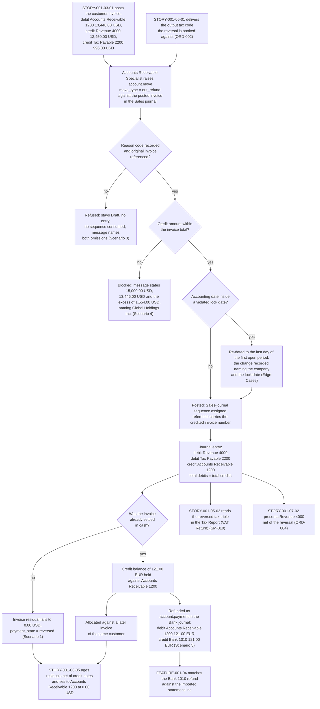

# STORY-001-03-03: Manage Customer Credit Notes and Refunds

---

## Metadata

| Attribute | Value |
|-----------|-------|
| **Story ID** | `STORY-001-03-03` |
| **Title** | Manage Customer Credit Notes and Refunds |
| **Parent Feature** | [FEATURE-001-03: Accounts Receivable & Customer Invoices](../FEATURE-001-03-accounts-receivable-customer-invoices.md) |
| **Parent Epic** | [EPIC-001: Enterprise Accounting in Odoo](../../EPIC-001-enterprise-accounting-odoo.md) |
| **Status** | Draft |
| **Priority** | 🟠 High |
| **Estimate** | 5 story points (Fibonacci) |
| **Persona** | Accounts Receivable Specialist |
| **Feature Capability** | CAP-003 — issue customer credit notes and refunds, allocate them against open invoices, and write off an approved uncollectible balance to Bad Debt Expense 6900 |
| **Secondary Personas** | Chief Accountant (approves the reversal of Revenue 4000 and Tax Payable 2200, owns the boundary between a credit note and a write-off to Bad Debt Expense 6900, and administers the period lock dates), Tax Accountant (owns the output tax code the reversal is booked against and reconciles the credited tax to the **Tax Report (VAT Return)**), Credit Controller (approves a credit above the recorded threshold and reads the exposure the credit releases), Treasury Analyst (owns the Bank 1010 movement a cash refund creates and matches it in FEATURE-001-04), External Auditor (traces a credit note to the invoice it reverses and reads the reason code behind it), Finance Controller and Product Owner (accept the demonstration). Persona governance: the **Credit Controller** named above is a registered named secondary role rather than a thirteenth persona: the Epic's [§3.2](../../EPIC-001-enterprise-accounting-odoo.md#32-persona-notes) records it as a stakeholder who approves rather than the WHO of a story, mapping onto the **Accounts Receivable Specialist** for access rights |
| **Story Position** | Story 3 of the 5 in FEATURE-001-03; blocked by STORY-001-03-01, blocks STORY-001-03-05, and independent of STORY-001-03-02. It owns every **non-cash reduction of a receivable** — the credit note, the refund of the credit balance a credit leaves, and the approved write-off of an uncollectible residual to **Bad Debt Expense 6900** — so [STORY-001-03-04](./STORY-001-03-04-configure-payment-followups.md) configures and runs the dunning ladder and posts nothing at all |
| **Platform Target** | Open decision DEC-001 — see [Version Compatibility](#version-compatibility) |
| **Last Updated** | 2026-08-15 |
| **Owner/Author** | Enterprise Accounting Team |

> **Platform target.** This story fixes no platform version of its own. The target is the Epic's open decision **DEC-001** in the [Open Decisions Register](../../EPIC-001-enterprise-accounting-odoo.md#appendix-b-open-decisions-register): the originating programme request names Odoo 17, the superseded prior backlog named 18.0, and the baseline this story was written and verified against is **Odoo 19.0 Community**, where `odoo/release.py` declares `version_info = (19, 0, 0, FINAL, 0, '')`. The reversal path differs across the three candidate releases in the fields of the credit-note wizard, in the `account.move.payment_state` value set that records a fully reversed invoice, and in the lock-date resolution applied when a reversal is posted, so the mismatch is surfaced for stakeholder confirmation rather than settled inside this story (AAP §0.8.2, §0.8.3).

---

## User Story

**As an** Accounts Receivable Specialist

**I want** to issue a credit note against a posted customer invoice as an `account.move` record of type `out_refund` in the **Sales** journal — in full or in part, carrying a reason code and a reference to the invoice it reverses — and to settle any credit balance it leaves either against a later invoice of the same customer or as a cash refund through the **Bank** journal

**So that** a return, a price adjustment or a settled dispute is reversed in the books on the day it is agreed rather than at the next close, with the output tax reversed against the same tax code that carried it, so that the receivable is the amount still collectable, the revenue is the amount actually earned, and the **Aged Receivable** report of [STORY-001-03-05](./STORY-001-03-05-report-aged-receivables.md) ages residuals that no longer include amounts the group has already agreed to give back.

---

## Business Value

### Value Statement

> A credit note is the only instrument that reduces a receivable without cash arriving, and every figure it touches is a reported figure: the receivable in the Balance Sheet, the revenue in the Profit & Loss, and the output tax in the statutory return. Issued as a reversal of the invoice it credits, it keeps three balances true at once — the customer owes 13,446.00 USD less, Revenue 4000 carries 12,450.00 USD less, and Tax Payable 2200 owes the tax authority 996.00 USD less, each amount rounded half-up to 2 decimal places per the USD 0.01 rounding precision. Issued as a free-standing document with no reason code and no link to an invoice, the same credit becomes an unexplained reduction that the External Auditor cannot trace and the Tax Accountant cannot reconcile, because the credited tax no longer nets against the tax it was meant to reverse. This story is therefore where two controls are cheapest to enforce: a credit is granted against a named posted invoice for a recorded reason, and a credit that leaves the customer in funds is either applied to a later invoice or refunded through the **Bank** journal instead of sitting in aging as a credit nobody owns.

### Success Metrics

| Metric | Baseline | Target | Measurement Method |
|--------|----------|--------|--------------------|
| Reason-code coverage on posted credit notes | Reasons recorded in a free-text note when they are recorded at all | 100% of posted credit notes carry a reason code from the governed list; the count of posted credit notes with a null reason code is 0 | Reason-code completeness query over the posted `out_refund` population per company per period |
| Reversal traceability to the original invoice | Credit notes raised as stand-alone documents, matched to invoices by hand at close | 100% of posted credit notes carry the original invoice number in their reference and a stored link to the invoice they reverse; the count with no reference is 0 | Reference-completeness query over the posted `out_refund` population, cross-checked against the invoices credited |
| Credited tax equal to the tax originally posted | Tax reversed as a lump sum, reconciled at filing time | The credited tax for a tax code equals the tax originally posted for that code at a difference of `0.00` in the filing entity's functional currency — 996.00 USD credited against 996.00 USD posted at tax code `ST-CA-0800` — so the pair nets to 0.00 USD on the **Tax Report (VAT Return)** for the period (SM-010) | Tax-code reconciliation of the invoice and its credit note over the filing date range, with the net asserted at 0.00 |
| Balanced-entry integrity on reversals | Unproven | 0 unbalanced posted credit-note or refund entries; total debits minus total credits asserted at `0.00` in the company's functional currency on every posted entry — 0.00 USD in Global Holdings Inc. (`US-01`) and 0.00 EUR in Global Europe SARL (`NL-01`), each rounded half-up to 2 decimal places at that currency's 0.01 rounding precision (SM-006, C-009) | Posted entry inspected line by line, with the difference asserted numerically |
| Time from approved credit to posted credit note | Raised when the month-end review finds the dispute, measured in weeks | Within 2 business days of the approval of a return, a price adjustment or a dispute settlement | Approval timestamp compared with the credit note's posting timestamp across the population for the period |
| Credit balances left unsettled | Credit notes parked against the customer with no owner | 100% of credit notes leaving a credit balance are either allocated to a later invoice of the same customer in the same company or refunded through the **Bank** journal within 5 business days; the count open beyond 5 business days is 0 | Ageing of unallocated `out_refund` residuals per customer per company |
| Refused credit notes leave no trace | Partial documents posted and then reversed again | 100% of refused confirmations create no journal entry and consume no **Sales**-journal sequence number | Negative tests for the missing-reason-code and over-credit paths, with the entry count and the sequence high-water mark asserted unchanged |
| Residual integrity after crediting | Residual recomputed by hand when a credit is remembered | The credited invoice's `amount_residual` equals its total less the credits and receipts allocated against it at a difference of `0.00` in the invoice currency — 13,446.00 USD less a full credit of 13,446.00 USD giving 0.00 USD | Residual recomputed after each credit note and compared with the stated amount |
| Contribution to receivable visibility | Receivable position reconstructed monthly, credit notes netted by hand | The **Accounts Receivable 1200** balance equals the sum of open residuals net of posted credit notes at a difference of `0.00 USD` in `US-01`, which is the tie-out the **Aged Receivable** report of `STORY-001-03-05` depends on (SM-001) | Trial Balance compared with the sum of residuals for the same as-of date |
| Credit-note posting time, system | Not measured | Under 3 seconds to confirm and post a 50-line credit note carrying output tax in `US-01`, matching the parent Feature's §4.4 budget for the same document shape | Timed confirmation of a seeded 50-line credit note |

### Business Rules

Rule identifiers carry the `AR-CRN-BR-` prefix so that a rule of this story is unambiguous beside the rules of [STORY-001-03-01](./STORY-001-03-01-generate-customer-invoices.md), which uses `AR-INV-BR-`, and of [STORY-001-03-02](./STORY-001-03-02-register-customer-payments.md), which uses `AR-PAY-BR-`, and so that the bare `BR-001` through `BR-005` identifiers stay reserved for the retired bank-reconciliation stories the Epic's [retirement map](../../EPIC-001-enterprise-accounting-odoo.md#appendix-c-legacy-retirement-and-migration-map) traces. No identifier below is issued anywhere else in the backlog.

| Rule ID | Rule | Consequence If Broken |
|---------|------|-----------------------|
| **AR-CRN-BR-001** | A credit note is issued only against a **posted** customer invoice. A Draft invoice carries no receivable journal item, so there is nothing to reverse and no residual to reduce | A credit is granted against a document that does not exist in the ledger, so the revenue reversal has no invoice behind it and the receivable balance cannot be explained |
| **AR-CRN-BR-002** | A reason code drawn from the governed list — `RET-01 Goods returned`, `PRC-01 Price adjustment`, `DSP-01 Dispute settled`, `QLY-01 Quality claim`, `ADM-01 Administrative error` — is recorded before the credit note is confirmed, is carried onto the document, and appears in the reference the credit note is posted with | A reduction of revenue with no recorded cause cannot be analysed, cannot be defended to the External Auditor, and cannot be aggregated to show which cause the group is losing revenue to |
| **AR-CRN-BR-003** | The credit note references the invoice it reverses by number, and the link between the two documents is stored rather than derived from a memo field | Matching a credit to its invoice becomes a monthly manual exercise, and a tax authority that requires a credit note to cite the original invoice number receives a document it can reject |
| **AR-CRN-BR-004** | A credit note never exceeds the original invoice total — the residual plus the amounts already settled against it. An attempt states the credit, the invoice total and the excess as three separate amounts and posts nothing | A credit larger than the invoice creates a receivable the customer never owed, and the **Aged Receivable** report presents a credit balance in a bucket that no invoice supports |
| **AR-CRN-BR-005** | The credit note reverses the original tax code: the same code, its base amount and its tax amount are recorded as three separate values with the sign reversed, the tax reaches **Tax Payable 2200** as a debit, and no part of it reaches **Revenue 4000** | The statutory return no longer ties to the tax control account, so the group either over-declares output tax it has refunded or under-declares tax it still owes |
| **AR-CRN-BR-006** | Every posted credit-note entry debits **Revenue 4000** and **Tax Payable 2200** and credits **Accounts Receivable 1200** in the **Sales** journal of the company whose books carry the receivable, with both totals stated and their difference asserted at `0.00` in that company's functional currency — 0.00 USD in `US-01` and 0.00 EUR in Global Europe SARL, each rounded half-up to 2 decimal places at that currency's 0.01 rounding precision | An unbalanced entry cannot be presented in a Trial Balance and blocks the close for the whole company (SM-006) |
| **AR-CRN-BR-007** | A credit balance left after crediting is either allocated to a later invoice of the same customer in the same company or refunded in cash. A cash refund is an `account.payment` in the **Bank** journal that debits **Accounts Receivable 1200** and credits **Bank 1010**, and it is never recorded as a second credit note | A credit balance with no owner sits against the customer indefinitely, the customer chases a refund the ledger says was already granted, and a credit recorded twice understates revenue twice |
| **AR-CRN-BR-008** | A credit note reduces the customer's total receivable and does not clear another invoice's aging. Only the invoice a credit is allocated against changes bucket; every other invoice of that customer keeps ageing from its own due date | The buckets of `STORY-001-03-05` stop being ages of individual debts, so a customer with one credited invoice appears current on invoices nobody has settled |
| **AR-CRN-BR-009** | Every monetary figure is rounded half-up to 2 decimal places at its currency's 0.01 rounding precision — a 0.01 USD increment for amounts in USD and a 0.01 EUR increment for amounts in EUR — and the company's tax-rounding method is stated alongside a multi-line tax figure, because rounding once per tax and once per line can differ by one minor unit on a multi-line credit note | A one-minor-unit divergence between the credit-note total and the sum of its journal items is enough to fail the debits-equal-credits check |
| **AR-CRN-BR-010** | A write-off is not a credit note, and this story delivers both as separate instruments. An uncollectible residual is cleared to **Bad Debt Expense 6900** against **Accounts Receivable 1200** in the **Miscellaneous** journal on the Credit Controller's confirmation and the Chief Accountant's recorded approval, reversing no revenue and no output tax, while a credit note is an `out_refund` in the **Sales** journal that does reverse both; the role that issues a credit note is distinct from the role that approves a write-off (C-014), and the escalation evidence a write-off stands on is the immutable action history of [STORY-001-03-04](./STORY-001-03-04-configure-payment-followups.md) | A bad debt disguised as a credit note removes revenue that was genuinely earned, so the loss is hidden inside a revenue reduction and the provision history the External Auditor reads disappears |
| **AR-CRN-BR-011** | A credit note whose accounting date falls on or before a violated lock date of the company whose books it belongs to does not post into that closed period: `account.move._post` re-dates the entry to the last day of the first open period before the state becomes Posted, and the change is recorded on the entry naming the company and the lock date. Because a credit note carrying tax affects the tax report, the **tax lock date** is one of the dates resolved alongside the fiscal-year, sale-journal and hard locks. Refusal is reserved for a change to an already-posted entry, as [STORY-001-01-05](../FEATURE-001-01/STORY-001-01-05-configure-period-lock-dates.md) administers | A filed period is restated by a reversal, the return that was filed from it no longer agrees with the ledger, and the close of that period stops being reproducible |
| **AR-CRN-BR-012** | Crediting happens inside one company. A credit note against an invoice of `US-01` posts in the **Sales** journal of `US-01`; an invoice held by **Global Europe SARL** is credited in that company's own **Sales** journal, and its refund is paid from that company's own **Bank** journal | One entry spanning two sets of books cannot be presented in either company's Trial Balance, and the intercompany elimination owned by FEATURE-001-06 has no pair of entries to work from |
| **AR-CRN-BR-013** | The revenue reversal is recognised in the period the credit is granted, on the credit note's accounting date, per ASC 606 and IFRS 15. A credit granted after a period is reported is a reversal in the current period and not a restatement of the reported one | Revenue is restated in a period already presented to stakeholders, which is a reporting event rather than a clerical one |

---

## Acceptance Criteria

Seven criteria, inside the mandated band of 4 to 8. Each carries one non-compound **When**, and each **Then** asserts only what the Accounts Receivable Specialist, the Chief Accountant, the Tax Accountant, the Treasury Analyst or the External Auditor can observe on the document, on the journal entry or in a named report — no interface gesture, no query and no implementation internal appears in a criterion. Every monetary figure states its currency as an ISO 4217 code, its amount to 2 decimal places and the rounding rule applied to it; every tax assertion states the **tax code**, the **base amount** and the **tax amount** as three separate values; every journal entry described states its total debits and its total credits as equal amounts; and every criterion touching more than one company names the company whose books are affected.

| Scenario | Coverage class |
|----------|----------------|
| 1 | Valid input — happy-path full credit note reversing a posted invoice with a balanced journal entry |
| 2 | Valid input — accounting determinism, the tax code, base amount and tax amount reversed as three separate values |
| 3 | Invalid or incomplete input — a credit note carrying no reason code and no reference to the invoice it credits |
| 4 | Error handling — a credit larger than the invoice total blocked with a named validation message |
| 5 | Accounting edge case — the cash refund of the credit balance a partial credit left on a paid foreign-currency invoice carrying half-minor-unit tax |
| 6 | Valid input — the refused credit re-keyed at the invoice total posts, the ceiling proving to be a limit rather than a block |
| 7 | Valid input — the approved write-off of an uncollectible balance to Bad Debt Expense 6900, recorded as an impairment and not as a credit note |

### Scenario 1: A full credit note reverses a posted invoice and closes its residual

- **Given** the posted customer invoice raised by [STORY-001-03-01](./STORY-001-03-01-generate-customer-invoices.md) for customer **Northwind Trading** in company **Global Holdings Inc.** (`US-01`, the United States parent, functional currency USD), dated 2025-02-10, is open with `amount_residual` of **13,446.00 USD** and `payment_state` of not paid, no receipt having been allocated against it, and carries a base amount of **12,450.00 USD** on **Revenue 4000** with output tax code **`ST-CA-0800`** at 8.00% bearing a tax amount of **996.00 USD** credited to **Tax Payable 2200** — fixture **AR-TAX-2** of the parent Feature's authoritative output-tax table — with every amount in this criterion rounded half-up to 2 decimal places per the USD 0.01 rounding precision
- **When** the Accounts Receivable Specialist confirms a full credit note against that invoice — an `account.move` record whose `move_type` is `out_refund` — in the **Sales** journal of `US-01`, dated 2025-04-15 and carrying reason code **`RET-01 Goods returned`**
- **Then** the credit note state changes from Draft to Posted and a **Sales**-journal sequence number is assigned to it and is visible on the document
  - **And** one journal entry is created whose `account.move.line` records debit **Revenue 4000** 12,450.00 USD, debit **Tax Payable 2200** 996.00 USD and credit **Accounts Receivable 1200** 13,446.00 USD, so **total debits of 13,446.00 USD equal total credits of 13,446.00 USD** at a difference of 0.00 USD, each amount rounded half-up to 2 decimal places per the USD 0.01 rounding precision
  - **And** the invoice `amount_residual` becomes **0.00 USD**, rounded half-up to 2 decimal places per the USD 0.01 rounding precision, and the credit note's own `amount_residual` becomes **0.00 USD** on the same rounding, because the two documents are reconciled against one another
  - **And** the invoice `payment_state` becomes **`reversed`** and not `paid`, because the residual reached 0.00 USD through reconciliation with an `out_refund` rather than through cash received — the platform holds those as two distinct values, and a statement reading `paid` on an invoice no cash ever settled would misstate what happened to the 13,446.00 USD
  - **And** the credit note carries the number of the invoice it reverses in its reference together with a stored link to that invoice, so the External Auditor traces the 13,446.00 USD reversal to the document that created the receivable without a data request
  - **And** the reason code `RET-01 Goods returned` is readable on the posted credit note and travels with it into the reference the document is posted under
  - **And** the books of **Global Holdings Inc.** (`US-01`) are the only books affected, and every amount above is rounded half-up to 2 decimal places per the USD 0.01 rounding precision

### Scenario 2: Tax code, base amount and tax amount are reversed as three separate values

- **Given** the posted credit note of Scenario 1 in company **Global Holdings Inc.** (`US-01`), reversing output tax code **`ST-CA-0800`** at 8.00% on a base amount of **12,450.00 USD**, each amount rounded half-up to 2 decimal places per the USD 0.01 rounding precision
- **When** the Accounts Receivable Specialist opens the credit note's tax summary
- **Then** the summary presents one tax line showing tax code **`ST-CA-0800`**, base amount **12,450.00 USD** and tax amount **996.00 USD** as three distinct values, each carrying the sign opposite to the same triple on the invoice, and none of the three combined into a gross figure, each amount rounded half-up to 2 decimal places per the USD 0.01 rounding precision
  - **And** the tax amount of 996.00 USD equals the base amount of 12,450.00 USD multiplied by 8.00%, rounded half-up to 2 decimal places per the USD 0.01 rounding precision, with the tax-rounding method in force on `US-01` stated alongside the figure
  - **And** the amount debited to **Tax Payable 2200** by the entry of Scenario 1 is **996.00 USD**, which equals the **996.00 USD** credited to that same account when the invoice posted, so the tax the group declared and the tax it reversed are one amount rather than two amounts that happen to be close
  - **And** the **Tax Report (VAT Return)** for `US-01` run with the date-range parameter **2025-01-01 to 2025-06-30** — a range containing both the invoice of 2025-02-10 and the credit note of 2025-04-15 — presents tax code `ST-CA-0800` with a base amount of **0.00 USD** and a tax amount of **0.00 USD**, being 12,450.00 USD less 12,450.00 USD and 996.00 USD less 996.00 USD, each rounded half-up to 2 decimal places per the USD 0.01 rounding precision
  - **And** the same pair read one filing period at a time is not netted but split: the return for **2025-01-01 to 2025-03-31** carries the invoice tax of **996.00 USD** and the return for **2025-04-01 to 2025-06-30** carries the credited tax of **996.00 USD** as a reduction, so the netting above is a property of the range and not of a single filing
  - **And** no part of the 996.00 USD reaches **Revenue 4000**, whose debit in the same entry is 12,450.00 USD, so the reversal of revenue and the reversal of tax stay separate journal items the Tax Accountant can reconcile to the tax control account (SM-010)

### Scenario 3: A credit note carrying no reason code and no invoice reference is not posted

- **Given** a Draft credit note as an `account.move` record of type `out_refund` for **500.00 USD** in the **Sales** journal of `US-01` for customer **Northwind Trading**, raised against a posted customer invoice of that customer but carrying no reason code and no reference to that invoice, the 500.00 USD rounded half-up to 2 decimal places per the USD 0.01 rounding precision
- **When** the Accounts Receivable Specialist attempts to confirm it
- **Then** the credit note remains in the Draft state
  - **And** no journal entry is created, so the balance of **Accounts Receivable 1200** in `US-01` moves by **0.00 USD**, rounded half-up to 2 decimal places per the USD 0.01 rounding precision, and **Revenue 4000** and **Tax Payable 2200** each move by **0.00 USD** on the same rounding
  - **And** no **Sales**-journal sequence number is consumed, so the sequence high-water mark of the **Sales** journal of `US-01` is unchanged and the next credit note that posts takes the number this attempt did not
  - **And** the returned message names both missing elements — the reason code and the reference to the original invoice — so the Accounts Receivable Specialist resolves the document in one pass instead of one refusal per omission
  - **And** the 500.00 USD amount and the lines already keyed are retained on the Draft document, so the work is not discarded by the refusal
  - **And** the message discloses no stack trace, no file-system path and no credential (C-020)

### Scenario 4: A credit larger than the invoice total is blocked

- **Given** a posted customer invoice of **13,446.00 USD** for customer **Northwind Trading** in company **Global Holdings Inc.** (`US-01`), the entity the Epic's canonical register ([Appendix E.4](../../EPIC-001-enterprise-accounting-odoo.md#e4-canonical-legal-entity-register)) holds against entity code `US-01`, with every amount in this criterion rounded half-up to 2 decimal places per the USD 0.01 rounding precision
- **When** the Accounts Receivable Specialist attempts to confirm a credit note of **15,000.00 USD** against that invoice in the **Sales** journal of `US-01`
- **Then** the posting is blocked and the credit note stays in the Draft state
  - **And** an Odoo validation message states the credit of **15,000.00 USD**, the invoice total of **13,446.00 USD** and the excess of **1,554.00 USD** as three separate amounts, each rounded half-up to 2 decimal places per the USD 0.01 rounding precision
  - **And** that message names the affected company **Global Holdings Inc.** (`US-01`), so in an installation holding four companies the Accounts Receivable Specialist reads which set of books the refusal protected
  - **And** no journal entry is created: **Revenue 4000**, **Tax Payable 2200** and **Accounts Receivable 1200** in `US-01` each move by **0.00 USD**, rounded half-up to 2 decimal places per the USD 0.01 rounding precision, and no **Sales**-journal sequence number is consumed
  - **And** the ceiling is a **limit at the invoice total rather than a block on crediting**, which [Scenario 6](#scenario-6-the-refused-credit-re-keyed-at-the-invoice-total-posts-and-takes-the-next-sequence-number) asserts on its own trigger by re-keying this same credit note to the invoice total and confirming it
  - **And** the message discloses no stack trace, no file-system path and no credential (C-020)

### Scenario 5: A refund settles the credit balance a partial credit leaves on a paid foreign-currency invoice

- **Given** the posted customer invoice for customer **Atlantia SRL** in company **Global Europe SARL** (`NL-01`, the Netherlands operating subsidiary, functional currency EUR), with an accounting date of 2025-04-30 and an `amount_total` of **403.33 EUR** — a base amount of 333.33 EUR on **Revenue 4000** and a tax amount of 70.00 EUR at output tax code **`VAT-21-S`** (21%), fixture **AR-TAX-3** — is settled in full, so its `amount_residual` is **0.00 EUR** and its `payment_state` is paid; and a partial credit note of type `out_refund` for two returned lines of **33.33 EUR** and **66.67 EUR**, a net of **100.00 EUR** at that same output tax code **`VAT-21-S`** (21%) for which the untruncated per-line tax computations are **6.9993 EUR** and **14.0007 EUR**, is posted in the **Sales** journal of Global Europe SARL dated 2025-05-12 — its credited tax standing at **21.00 EUR**, being 6.9993 EUR and 14.0007 EUR each rounded half-up to 2 decimal places per the EUR 0.01 rounding precision to 7.00 EUR and 14.00 EUR, which the round-globally method on the same 100.00 EUR base at 21% also yields, and its entry debiting **Revenue 4000** 100.00 EUR and **Tax Payable 2200** 21.00 EUR against a credit to **Accounts Receivable 1200** of 121.00 EUR, so **total debits of 121.00 EUR equal total credits of 121.00 EUR** at a difference of 0.00 EUR with its tax line carrying tax code **`VAT-21-S`**, base amount **100.00 EUR** and tax amount **21.00 EUR** as three separate values — leaving the customer holding a credit balance of **121.00 EUR** against **Accounts Receivable 1200**; every amount in this criterion rounded half-up to 2 decimal places per the EUR 0.01 rounding precision
- **When** the Accounts Receivable Specialist registers a refund of that credit balance to Atlantia SRL in the **Bank** journal of Global Europe SARL, dated 2025-05-15
- **Then** an `account.payment` record exists in the **`paid`** state — reached from `draft` through `in_process`, which are the states `account.payment.state` offers in this platform, there being no `posted` value on that field — carrying the customer Atlantia SRL, the amount **121.00 EUR** and the **Bank** journal of Global Europe SARL, while the journal entry it generated stands separately in the **`posted`** state on `account.move`
  - **And** that refund entry debits **Accounts Receivable 1200** with **121.00 EUR** and credits **Bank 1010** with **121.00 EUR**, so **total debits of 121.00 EUR equal total credits of 121.00 EUR** at a difference of 0.00 EUR, each amount rounded half-up to 2 decimal places per the EUR 0.01 rounding precision
  - **And** the refund is allocated against the credit balance the Given established, so the **121.00 EUR** it pays is the same 121.00 EUR that credit note placed on **Accounts Receivable 1200** — its base of 100.00 EUR and its tax of 21.00 EUR at tax code **`VAT-21-S`** — and the cash leaving the company equals the credit it settles at a difference of 0.00 EUR
  - **And** the credit note `amount_residual` becomes **0.00 EUR** and the customer's open balance on **Accounts Receivable 1200** in Global Europe SARL returns to **0.00 EUR**, each rounded half-up to 2 decimal places per the EUR 0.01 rounding precision, so the credit is settled in cash rather than parked against the customer
  - **And** the invoice of 403.33 EUR keeps its `payment_state` of paid and its `amount_residual` of **0.00 EUR**, because the partial credit was settled by refund and was not allocated back onto a document already settled in cash
  - **And** the books of **Global Europe SARL** (`NL-01`) are the only books affected, and the refund is paid from that company's own **Bank** journal rather than from the parent's

### Scenario 6: The refused credit re-keyed at the invoice total posts and takes the next sequence number

- **Given** the state [Scenario 4](#scenario-4-a-credit-larger-than-the-invoice-total-is-blocked) leaves: the credit note for customer **Northwind Trading** in company **Global Holdings Inc.** (`US-01`) stands in the Draft state at **15,000.00 USD** after its refused confirmation, no journal entry was created by that attempt, the **Sales**-journal sequence high-water mark is unchanged, and the posted invoice it credits still carries an `amount_residual` of **13,446.00 USD** with a base amount of 12,450.00 USD on **Revenue 4000** and a tax amount of 996.00 USD at output tax code **`ST-CA-0800`**; this criterion and [Scenario 1](#scenario-1-a-full-credit-note-reverses-a-posted-invoice-and-closes-its-residual) are alternative branches over that one invoice, so exactly one credit note is posted against it in either branch; every amount rounded half-up to 2 decimal places per the USD 0.01 rounding precision
- **When** the Accounts Receivable Specialist re-keys that credit note to **13,446.00 USD**, the invoice total, and confirms it
- **Then** the credit note moves to the Posted state, so the ceiling of AR-CRN-BR-004 is a **limit at the invoice total and not a block on crediting**
  - **And** the entry debits **Revenue 4000** with **12,450.00 USD** and **Tax Payable 2200** with **996.00 USD** and credits **Accounts Receivable 1200** with **13,446.00 USD**, so **total debits of 13,446.00 USD equal total credits of 13,446.00 USD** at a difference of **0.00 USD**, each amount rounded half-up to 2 decimal places per the USD 0.01 rounding precision
  - **And** the posted document takes the **next** **Sales**-journal number with no gap left by the refused attempt, so the refusal consumed no number and the statutory sequence stays unbroken (AR-CRN-BR-002)
  - **And** the credited invoice's `amount_residual` becomes **0.00 USD** and its `payment_state` reads `reversed`, and the customer's line for that invoice leaves the **Aged Receivable** report of `US-01` for an as-of date on or after the credit-note date, reading **0.00 USD** in every bucket for it
  - **And** the tax reversal is recorded as three separate values — tax code **`ST-CA-0800`**, base amount **12,450.00 USD** and tax amount **996.00 USD** — with the sign opposite to the invoice, so the **Tax Report (VAT Return)** movement on **Tax Payable 2200** for a range covering both documents nets to **0.00 USD**
  - **And** a credit note re-keyed to **13,446.01 USD**, one cent above the invoice total, is refused again with the same three amounts stated, so the boundary is the invoice total exactly

### Scenario 7: An approved uncollectible balance is written off to Bad Debt Expense 6900

- **Given** customer **Riverside Manufacturing** in company **Global Europe SARL** (`NL-01`, the Netherlands operating subsidiary, functional currency EUR) holds one posted customer invoice whose receivable line on **Accounts Receivable 1200** carries an `amount_residual` of **2,300.00 EUR** and a `date_maturity` of 2025-02-20; the dunning ladder of [STORY-001-03-04](./STORY-001-03-04-configure-payment-followups.md) has taken that customer to the **Final Notice** level and its immutable action history records the escalation, the **Credit Controller** has confirmed the balance uncollectible under the recorded escalation policy and the **Chief Accountant** has approved the posting, no lock date of that company covers the write-off date of 2025-04-30, and every amount is rounded half-up to 2 decimal places per the EUR 0.01 rounding precision
- **When** the Accounts Receivable Specialist posts that write-off in the **Miscellaneous** journal of **Global Europe SARL** dated 2025-04-30
- **Then** the entry debits **Bad Debt Expense 6900** with **2,300.00 EUR** and credits **Accounts Receivable 1200** with **2,300.00 EUR**, so **total debits of 2,300.00 EUR equal total credits of 2,300.00 EUR** at a difference of **0.00 EUR**, each amount rounded half-up to 2 decimal places per the EUR 0.01 rounding precision
  - **And** the write-off is recorded as a **write-off and never as a credit note**: its document is not an `out_refund`, it carries no reason code from the credit-note list, it reverses no revenue and no output tax — the movement it contributes to **Revenue 4000** and to **Tax Payable 2200** in `NL-01` is **0.00 EUR** each — because an uncollectible balance is an impairment of a receivable that remains due and not a cancellation of the sale (AR-CRN-BR-010, IFRS 9, ASC 326)
  - **And** the invoice `amount_residual` becomes **0.00 EUR**, it leaves the **Aged Receivable** report of `NL-01` for an as-of date on or after 2025-04-30 reading **0.00 EUR** in every bucket, and the customer leaves the follow-up ladder of that company with an overdue total of **0.00 EUR**
  - **And** the approval evidence is retained and readable by the **External Auditor** without a data request: the Credit Controller's confirmation, the Chief Accountant's approval, the written-off amount of **2,300.00 EUR**, the author and the timestamp, together with the action history of the ladder that produced the escalation, which survives any later cancellation of the invoice it refers to
  - **And** the books of **Global Holdings Inc.** (`US-01`) are untouched: the count of journal items this write-off adds to `US-01` is **0** and the balances of **Bad Debt Expense 6900** and **Accounts Receivable 1200** in `US-01` each move by **0.00 USD** (C-014, D-007)
  - **And** a write-off attempted with **no recorded approval** is refused with a message naming the missing approval, creates **0** journal entries, and leaves the residual at **2,300.00 EUR**, so the control is the approval and not the keystroke

---

## Sub-Tasks

- [ ] Fix the credit policy and record it: the governed reason-code list (`RET-01 Goods returned`, `PRC-01 Price adjustment`, `DSP-01 Dispute settled`, `QLY-01 Quality claim`, `ADM-01 Administrative error`), the amount above which the Credit Controller approves a credit before it is confirmed, and the boundary that keeps an uncollectable balance out of this path — a write-off reaches **Bad Debt Expense 6900** on the Chief Accountant's approval and is not recorded as a credit note (AR-CRN-BR-002, AR-CRN-BR-010) — `@finance-sme`
- [ ] Specify the credit-note behaviour: what a full credit and a partial credit each produce, the ceiling that holds a credit at the original invoice total and the three amounts its refusal message states, the wording of the refusal that names a missing reason code and a missing invoice reference together, and the point at which the **Sales**-journal sequence number is consumed — `@functional-consultant`
- [ ] Specify the settlement of a credit balance: allocation against a later invoice of the same customer in the same company, or a cash refund as an `account.payment` in the **Bank** journal debiting **Accounts Receivable 1200** and crediting **Bank 1010**; state which document each path leaves open, what the customer statement shows in each case, and how the lock-date re-dating of a reversal is recorded on the entry naming the company and the lock date — `@functional-consultant`
- [ ] Deliver the reversal and the settlement: the balanced credit-note entry across **Revenue 4000**, **Tax Payable 2200** and **Accounts Receivable 1200**; the stored link and the reference that carry the original invoice number and the reason code; the reconciliation that moves the credited invoice to an `amount_residual` of 0.00 in the invoice currency — 0.00 USD on the `US-01` fixture and 0.00 EUR on the Global Europe SARL fixture — and to `payment_state` `reversed`; the refund posting; and half-up rounding to 2 decimal places at each currency's 0.01 rounding precision on every amount written to a journal item — together with the deterministic fixtures this story is demonstrated from (fixture **AR-TAX-2** in `US-01` and fixture **AR-TAX-3** in Global Europe SARL, held apart from the hostile-input fixtures so a hostile record is never mistaken for sample data, D-009) — `@developer`
- [ ] Author the tests for all seven acceptance criteria: the balanced reversal with both totals compared numerically, the reversed tax triple, the 6.9993 EUR and 14.0007 EUR half-up rounding case under both tax-rounding methods, the two refusals with the ledger and the sequence asserted unchanged, and the refund that returns the customer balance to 0.00 EUR — mapping one test to one criterion (C-008) and linting every criterion for banned vague terms — `@qa-engineer`
- [ ] Fix and record the **write-off authority** with the Credit Controller and the Chief Accountant: who confirms a balance uncollectible, who approves the posting, the amount above which a second approval is required, that the destination is **Bad Debt Expense 6900** and the journal is **Miscellaneous**, and that the evidence retained is the confirmation, the approval and the dunning action history of [STORY-001-03-04](./STORY-001-03-04-configure-payment-followups.md) — `@finance-sme`
- [ ] Deliver the **write-off path**: the balanced entry debiting **Bad Debt Expense 6900** and crediting **Accounts Receivable 1200** in the **Miscellaneous** journal of the named company, its allocation against the receivable line so the residual reaches 0.00 in the invoice currency, the refusal of a write-off carrying no recorded approval, and the retention of the approval trail — with no revenue and no tax line written, so an impairment is never recorded as a revenue reversal — `@developer`
- [ ] Verify the reversal against the ledger and the return: agree the credited tax of 996.00 USD at tax code `ST-CA-0800` to the **Tax Report (VAT Return)** movement on **Tax Payable 2200** for the same date range at a difference of `0.00 USD`, and agree the sum of open residuals net of posted credit notes to the **Accounts Receivable 1200** balance in the **Trial Balance** at a difference of `0.00 USD`, which is the tie-out the **Aged Receivable** report of `STORY-001-03-05` inherits — `@finance-sme`

---

## Edge Cases

| Edge Case | Expected Behaviour |
|-----------|--------------------|
| **A credit note dated inside a locked period.** A credit note against an invoice of Global Europe SARL (`NL-01`) is dated 2025-03-15, on or before that company's journal-entry lock date of 2025-03-31, and it carries output tax | The credit note posts with its **accounting date moved to the last day of the first open period**, and the change is recorded on the entry naming the lock date 2025-03-31 and the company Global Europe SARL. Re-dating is what the platform performs rather than what a finance role chooses: `account.move._post` resolves the violated lock dates through `_get_accounting_date` before the state becomes Posted, and because the reversal carries tax the **tax lock date** is resolved alongside the fiscal-year, sale-journal and hard locks. The closed period is proved untouched — the **Accounts Receivable 1200** balance of that company for 2025-03-01 to 2025-03-31 moves by 0.00 EUR, rounded half-up to 2 decimal places per the EUR 0.01 rounding precision — and the entry that does post carries total debits equal to total credits at a difference of 0.00 EUR. Where the credit has to land in the closed period because a filed return depends on it, the boundary is released first through a recorded lock exception retained with its author, its timestamp and its expiry for the External Auditor, which [STORY-001-01-05](../FEATURE-001-01/STORY-001-01-05-configure-period-lock-dates.md) administers (AR-CRN-BR-011) |
| **A credit note against an invoice already settled in cash.** The invoice of 403.33 EUR for Atlantia SRL is paid in full when a partial credit of 121.00 EUR is granted | The credit does not reopen the settled invoice. It leaves the customer holding a credit balance of 121.00 EUR against **Accounts Receivable 1200** in Global Europe SARL, and that balance is settled one of two ways: allocated against a later invoice of the same customer in the same company, or refunded in cash as an `account.payment` in the **Bank** journal debiting **Accounts Receivable 1200** 121.00 EUR and crediting **Bank 1010** 121.00 EUR, with total debits equal to total credits at a difference of 0.00 EUR. Until one of the two happens the credit note's `amount_residual` reads 121.00 EUR and the customer is shown as holding funds rather than as owing them, each amount rounded half-up to 2 decimal places per the EUR 0.01 rounding precision (Scenario 5, AR-CRN-BR-007) |
| **A credited tax that falls below the minor unit on a multi-line credit note.** Two returned lines of 33.33 EUR and 66.67 EUR at output tax code `VAT-21-S` (21%) compute untruncated per-line tax of 6.9993 EUR and 14.0007 EUR | The posted tax amount is 21.00 EUR: 6.9993 EUR rounds half-up to 7.00 EUR and 14.0007 EUR rounds half-up to 14.00 EUR at the EUR 0.01 rounding precision, and the two sum to 21.00 EUR; the round-globally method applied to the 100.00 EUR base gives the same 21.00 EUR, so both methods agree here. The company's tax-rounding method is stated alongside the figure regardless, because on a credit note with more lines the two methods can differ by one minor unit, and a one-minor-unit divergence between the document total and the sum of its journal items is enough to fail the debits-equal-credits check. Where the credit-note currency differs from the company's functional currency, the transaction amount, the converted amount, the conversion rate and the rate date are each recorded, and both amounts are rounded half-up at their own currency's 0.01 rounding precision (AR-CRN-BR-009) |
| **A write-off attempted inside a locked period.** The write-off of the 2,300.00 EUR residual of Riverside Manufacturing is dated 2025-03-20, on or before the journal-entry lock date of 2025-03-31 in Global Europe SARL (`NL-01`) | The write-off is a first posting, so it is **re-dated** rather than refused: `account.move._post` moves its accounting date to the last day of the first open period under the Epic's [lock-date behaviour contract](../../EPIC-001-enterprise-accounting-odoo.md#78-lock-date-behaviour-contract) row L-1, the locked period receives 0 journal items and its **Bad Debt Expense 6900** movement measures 0.00 EUR, and the entry that does post carries total debits of 2,300.00 EUR equal to total credits of 2,300.00 EUR at a difference of 0.00 EUR. Amending, unposting or reconciling an already-posted write-off inside that period is refused instead, naming the company and the violated lock date (L-2 to L-6) |
| **A credit note whose amount would exceed the original invoice total.** A credit of 15,000.00 USD is confirmed against an invoice of 13,446.00 USD in Global Holdings Inc. (`US-01`) | The posting is blocked with a validation message stating the credit of 15,000.00 USD, the invoice total of 13,446.00 USD and the excess of 1,554.00 USD as three separate amounts, each rounded half-up to 2 decimal places per the USD 0.01 rounding precision, and naming the affected company Global Holdings Inc. No journal entry is created and no **Sales**-journal sequence number is consumed, so the ledger and the invoice sequence are both untouched by the attempt. The ceiling is the invoice total rather than the residual, because a credit is granted against what was invoiced and remains admissible after a receipt has been allocated — a credit of 13,446.00 USD or less against the same invoice posts (Scenario 4, AR-CRN-BR-004) |

---

## Estimation

| Dimension | Rating | Justification |
|-----------|--------|---------------|
| **Effort** | Low to Medium | The reversal reuses the invoice posting path this repository already provides under LGPL-3: `account.move` in its `out_refund` form, the reversal wizard that carries a date, a journal and a reason onto the new document, and the reconciliation that closes the credited invoice. What is added is bounded — a governed reason-code list where the platform offers free text, the ceiling check at the invoice total, the allocation-or-refund settlement of a credit balance, and the refund posting through the **Bank** journal |
| **Complexity** | Medium | Three behaviours carry an accounting consequence rather than a clerical one: the reversed entry must balance to `0.00` in the company's functional currency — 0.00 USD in Global Holdings Inc. and 0.00 EUR in Global Europe SARL — after half-up rounding at that currency's 0.01 rounding precision; the credited tax must reverse against the same tax code with base and tax held as separate journal items so the **Tax Report (VAT Return)** still ties to **Tax Payable 2200**; and a credit balance on a settled invoice must not reopen it. None of the three needs a new report engine, a new posting engine or an external integration |
| **Uncertainty** | Low | The behaviour can be inspected before development starts: `addons/account/models/account_move.py` holds the reverse-entry link, the reversal-aware payment state and the lock-date resolution applied at posting, `addons/account/wizard/account_move_reversal.py` holds the credit-note wizard with its posted-invoice domain and its reason field, and `addons/account/models/account_tax.py` holds the refund repartition that routes credited tax. The one open question is how a governed reason code is held, because the shipped field is free text — recorded in [Open Questions](#open-questions) |
| **Story Points** | **5** | Fibonacci scale (1, 2, 3, 5, 8, 13). Five rather than the 3 this story carried before the write-off was authored here: it now delivers **three instruments** rather than one — the credit note in the **Sales** journal, the refund in the **Bank** journal and the approved write-off to **Bad Debt Expense 6900** in the **Miscellaneous** journal — across seven criteria, five general ledger accounts and three refusal or boundary paths, with an approval control that must block a posting when its evidence is absent. Level with the 5 points of `STORY-001-03-01` and `STORY-001-03-02`, and below the 8 of `STORY-001-03-04`, which carries the ladder, the scheduled run and the collections report. Above a **2** because the story delivers a posting path with two refusals, a tax reversal that must tie to the statutory return, and further documents in further journals, rather than one field or one validation. Below a **5** because it reverses a posting path that `STORY-001-03-01` already delivers instead of creating one: no due-date derivation, no credit-limit gate, no allocation across more than one invoice, no report and no external integration are built here. At 3 points it is the smallest estimate in FEATURE-001-03 beside the 5 points of `STORY-001-03-01` and the 5 points of `STORY-001-03-02` |

---

## INVEST Principles Compliance

| Principle | Compliance | Justification |
|-----------|------------|---------------|
| **Independent** | ✅ | Beyond a posted invoice to reverse, this story needs nothing from its siblings: it is **blocked by** `STORY-001-03-01` alone and is explicitly independent of `STORY-001-03-02`, because a credit note is issued against an invoice whether or not a receipt has been allocated to it — which is why the parent Feature's §3.4 places the two as concurrent branches off the same predecessor. The accounts, the **Sales** and **Bank** journals, the open period and the output tax code it posts against are all satisfiable as demo data in a test company |
| **Negotiable** | ✅ | The criteria state the accounting outcome required — a balanced reversal across three named accounts, a reversed tax triple, a credited invoice residual of 0.00 USD, a `reversed` payment state, a refund that returns the customer balance to 0.00 EUR, each amount rounded half-up to 2 decimal places at that currency's 0.01 rounding precision — and leave the model, field, view and wizard decisions to implementation discovery under D-005, so how a governed reason code is held and how the ceiling check is expressed stay open for negotiation between the Accounts Receivable Specialist and the delivery team |
| **Valuable** | ✅ | It is the only instrument that reduces a receivable without cash arriving, so it is what keeps three reported figures true at once: the receivable in the Balance Sheet, the revenue presented by the **Profit & Loss** statement of `STORY-001-07-02`, and the output tax the **Tax Report (VAT Return)** declares under SM-010. Without it the aging of `STORY-001-03-05` chases amounts the group has already agreed to give back |
| **Estimable** | ✅ | The artifact count is fixed and inspectable: one document type (`out_refund`), two journals (**Sales** and **Bank**), four general ledger accounts (**Revenue 4000**, **Tax Payable 2200**, **Accounts Receivable 1200**, **Bank 1010**), two output tax codes, two companies, two currencies, two refusal paths and one refund, all on models already present in this repository — which is why the Effort, Complexity and Uncertainty ratings above were assigned from evidence rather than from guesswork |
| **Small** | ✅ | One accountant-facing workflow — reduce a receivable **without cash arriving from the customer**, by credit note, by refunding the credit balance that leaves, or by writing an approved uncollectible residual off to **Bad Debt Expense 6900** — sized at **5 story points**, level with `STORY-001-03-01` and `STORY-001-03-02`, and completable inside one iteration. What it is not: it configures no dunning ladder, runs no scheduled job and renders no collections report, all of which belong to `STORY-001-03-04`. Cash application, the dunning ladder, the Aged Receivable report and the write-off to **Bad Debt Expense 6900** are deliberately outside it |
| **Testable** | ✅ | Every one of the seven criteria is objectively pass or fail: each states amounts to the minor unit with the rounding rule applied, each posting criterion states a debit total and an equal credit total, each refusal names the message content and asserts an unchanged ledger and an unconsumed sequence, the tax assertion is a code with a base and a tax amount that nets to 0.00 USD over a stated date range, and each maps to exactly one automated test in [Acceptance Test Mapping](#acceptance-test-mapping) |

---

## Demonstration Path

Demonstrated in the Odoo user interface to the **Finance Controller** and the **Product Owner**, in this order, with the walkthrough recorded against this story:

- [ ] **The posted invoice being credited.** **Accounting → Customers → Invoices**: open the posted invoice of customer Northwind Trading in company `US-01` and observe the amount due of 13,446.00 USD, its base amount of 12,450.00 USD on Revenue 4000 and its tax amount of 996.00 USD at output tax code **`ST-CA-0800`**, each amount rounded half-up to 2 decimal places per the USD 0.01 rounding precision
- [ ] **The credit note.** From that invoice use **Credit Note**, set the reversal date to 2025-04-15, the **Sales** journal of `US-01` and reason code **`RET-01 Goods returned`**, and confirm the resulting document. Observable result: the credit note appears under **Accounting → Customers → Credit Notes** in the **Posted** state with a **Sales**-journal sequence number, and its reference carries the number of the invoice it reverses
- [ ] **The balanced reversal and the updated residual.** From the credit note open **Journal Items** (also reachable at **Accounting → Accounting → Journal Entries**): the entry shows debit Revenue 4000 12,450.00 USD, debit Tax Payable 2200 996.00 USD and credit Accounts Receivable 1200 13,446.00 USD, with total debits of 13,446.00 USD equal to total credits of 13,446.00 USD. Return to the invoice and observe an amount due of 0.00 USD and a payment status of **Reversed** rather than Paid, with the credit note listed against it
- [ ] **The reversed tax triple.** On the credit note, the tax summary presents tax code **`ST-CA-0800`**, base amount 12,450.00 USD and tax amount 996.00 USD as three separate values with the sign opposite to the invoice, and the 996.00 USD is traced to the Tax Payable 2200 journal item. Then run **Accounting → Reporting → Tax Report (VAT Return)** for `US-01` over 2025-01-01 to 2025-06-30 and observe 0.00 USD of base and 0.00 USD of tax for that code across the pair
- [ ] **The refusals.** Attempt to confirm a credit note of 500.00 USD with no reason code and no invoice reference, and observe the document stay in Draft with a message naming both omissions. Then attempt a credit note of 15,000.00 USD against the 13,446.00 USD invoice and observe the block with the excess of 1,554.00 USD stated and the company Global Holdings Inc. named, with no journal entry created in either case
- [ ] **The refund of a credit balance.** In company **Global Europe SARL** (`NL-01`), on the partial credit note of 121.00 EUR against the settled 403.33 EUR invoice of Atlantia SRL, use **Register Payment** in the **Bank** journal dated 2025-05-15 and observe the payment reach **Paid**, its entry debit Accounts Receivable 1200 121.00 EUR against credit Bank 1010 121.00 EUR with equal totals, the credit note's amount due fall to 0.00 EUR, and the customer's open balance return to 0.00 EUR
- [ ] **The approved write-off.** In company **Global Europe SARL** (`NL-01`), open the 2,300.00 EUR overdue invoice of Riverside Manufacturing standing at the **Final Notice** level, show the Credit Controller's uncollectibility confirmation and the Chief Accountant's approval recorded against it, then post the write-off in the **Miscellaneous** journal dated 2025-04-30. Observable result: the entry shows debit **Bad Debt Expense 6900** 2,300.00 EUR and credit **Accounts Receivable 1200** 2,300.00 EUR with total debits equal to total credits at a difference of 0.00 EUR, the invoice residual reads 0.00 EUR, **Revenue 4000** and **Tax Payable 2200** are unmoved at 0.00 EUR each, and the customer disappears from the **Aged Receivable** report of `NL-01` for 2025-04-30. Then attempt the same posting on a second balance with no approval recorded and observe the refusal with 0 entries created
- [ ] **Headless alternative.** Where interactive access is not available, the same evidence is presented by reading `account.move` (`move_type`, `state`, `payment_state`, `amount_total`, `amount_residual`, the reference and the reverse-entry link), its `account.move.line` records and the related `account.payment` over the public API by XML-RPC or JSON-RPC, so acceptance never depends on a graphical session

---

## Constraints

The constraint identifiers below are the Epic's own, restated in the terms of this story rather than renumbered, so one constraint set reads across the whole ticket tree.

### License and Compliance

- [ ] **C-001 — AGPL-3.0 compatibility**: any module delivering the governed reason-code list, the credit ceiling and the settlement of a credit balance is distributed under an AGPL-3.0 compatible licence, matching the Community-edition accounting add-ons already present in this repository
- [ ] **C-002 — Existing licence respected**: extension of `account` — the "Invoicing" application, version 1.4, category `Accounting/Accounting`, licence LGPL-3 — and of `account_payment` (version 2.0, LGPL-3) respects those licences, and an AGPL-3 extension of LGPL-3 code is licence-checked before it is written
- [ ] **C-005 / C-006 — Odoo and OCA coding standards**: Python follows the Odoo and OCA module guidelines including PEP 8, and static analysis reports zero violations under the repository's lint configuration at `ruff.toml`
- [ ] **C-012 — Build on the existing models**: the credit note, its reversal linkage, its tax reversal and its refund are expressed on `account.move`, `account.move.line`, `account.tax`, `account.payment`, `account.journal` and `res.partner` rather than on parallel structures, so one ledger and one receivable audit trail exist
- [ ] **C-014 — Access rights and segregation of duties**: the role that issues a credit note is distinguishable from the role that approves a credit above the recorded threshold and from the role that approves a write-off to **Bad Debt Expense 6900**, and a role restricted to `US-01` can neither read nor post the receivable lines of Global Europe SARL (`NL-01`)
- [ ] **C-018 — External text is context-encoded**: a customer name, a return reference or a credit-note memo rendered into a customer-facing credit-note document is emitted as escaped text rather than as markup
- [ ] **C-019 — Data access discipline**: reads of the invoice total, the residual and the credit balance are expressed through the Odoo ORM or parameterized SQL, with no string-concatenated query construction
- [ ] **C-020 — Failure messages disclose nothing**: the missing-reason-code and over-credit refusals name the rejected document, the check that failed and the remedial action, and disclose no stack trace, SQL, file-system path or credential
- [ ] **C-021 — No credentials in source**: no credential, endpoint secret or signing certificate appears in module source, fixtures, logs or exports produced by this story

### Accounting Standards Compliance

- [ ] **IFRS 9 and ASC 326 — credit losses**: an uncollectible receivable is written off to **Bad Debt Expense 6900** as an impairment of a financial asset, in the period the write-off is approved, and never as a reduction of **Revenue 4000**, so the loss is presented as a credit loss rather than as revenue that was never earned
- [ ] **ASC 606 and IFRS 15 — revenue reversal timing**: the reduction of **Revenue 4000** is recognised on the credit note's accounting date, in the period the credit is granted, so a credit agreed after a period is reported reduces revenue in the current period rather than restating the reported one (AR-CRN-BR-013)
- [ ] **ISO 4217 minor units**: every amount asserted in this story is rounded half-up to its currency's decimal precision — 2 decimal places at a 0.01 rounding precision for USD and EUR — and the currency code is stated with the amount
- [ ] **Debits equal credits**: the double-entry identity is asserted numerically on the credit-note entry and on the refund entry, with both totals stated and their difference asserted at `0.00` in the company's functional currency — 0.00 USD in Global Holdings Inc. (`US-01`) and 0.00 EUR in Global Europe SARL (`NL-01`) (C-009, SM-006)
- [ ] **Output tax reversal reduces a liability, not revenue**: the credited tax debits **Tax Payable 2200** and no part of it reaches **Revenue 4000**, so the statutory return of FEATURE-001-05 still ties to the tax control account after the reversal (SM-010)
- [ ] **Credit notes cite the document they reverse**: the jurisdictions of the in-scope entities require a credit note to reference the original invoice, which is why the reference and the stored reverse-entry link are acceptance criteria rather than conveniences (AR-CRN-BR-003)

### Dependency and Edition Considerations

- [ ] **C-003 — Edition source is an open decision (DEC-002), not a prohibition**: the blanket ban on Enterprise dependencies carried by the superseded backlog is withdrawn. The choice between an Odoo Enterprise subscription and the OCA add-on path plus bespoke development for the residual gap is owned by the CFO / Finance Director with the Group Controller and is recorded in the Epic's [Open Decisions Register](../../EPIC-001-enterprise-accounting-odoo.md#appendix-b-open-decisions-register)
- [ ] **This story is not gated by DEC-002**: `account.move` in its `out_refund` form, the reversal wizard, `account.move.line`, `account.tax`, `account.payment` and `account.journal` are all present in this repository under LGPL-3, so crediting and refunding can be delivered and demonstrated before the edition decision is confirmed. What DEC-002 affects is how the **Tax Report (VAT Return)**, the **Profit & Loss** statement and the **Aged Receivable** report that consume this reversal are rendered, which is FEATURE-001-05, FEATURE-001-07 and `STORY-001-03-05`
- [ ] **C-004 — OCA ecosystem compatibility**: whichever edition path is confirmed, the posted credit note, its reversal linkage and its tax triple stay consumable by the OCA add-ons named in the Epic without restatement
- [ ] **Enterprise modules are target capabilities, not installed dependencies**: `account_accountant`, `account_reports`, `account_asset`, `account_budget` and `account_consolidation` are absent from this repository's `addons/`, and no module delivered by this story declares a dependency on any of them while DEC-002 is open

### Version Compatibility

- [ ] **C-010 — Platform version target is open decision DEC-001**: the programme request names Odoo 17, the superseded backlog named 18.0, and this repository is **Odoo 19.0 Community** (`odoo/release.py` declares `version_info = (19, 0, 0, FINAL, 0, '')`). The target is confirmed with stakeholders before development rather than chosen inside this story
- [ ] **C-011 — Language and database versions follow the confirmed target**: the 19.0 baseline present here declares `MIN_PY_VERSION = (3, 10)`, `MAX_PY_VERSION = (3, 13)` and `MIN_PG_VERSION = 13` in `odoo/release.py`; an earlier platform target carries a different supported matrix
- [ ] **Impact if DEC-001 resolves away from 19.0**: the credit-note wizard's field set is re-checked because the reason, journal and date fields differ across the three candidates; the `payment_state` value that records a fully reversed invoice is re-verified because the `reversed` value and the conditions that produce it are release-dependent; and the lock-date resolution applied when a reversal posts is re-verified because lock administration differs across the three candidates

---

## Technical Discovery Notes

> **Purpose:** these notes direct the codebase analysis that precedes implementation. They record what to investigate and what the outcome must prove; they do not choose the implementation. Naming an account code, a journal type or a report name is a business outcome required by the parent Feature's artifact register, not an implementation decision.

### Codebase Analysis Areas

| Area | Files/Modules to Examine | Analysis Focus |
|------|--------------------------|----------------|
| Credit-note creation from a posted invoice | `addons/account/wizard/account_move_reversal.py` | The wizard that produces an `out_refund` from an invoice: the domain that restricts it to documents already posted, its reversal date, its journal selection and its computed residual, its free-text reason field, and the difference between reversing, refunding and modifying. Establish where the reason travels to on the created document and what a governed reason code must add so AR-CRN-BR-002 is satisfied without a parallel field (Scenarios 1 and 3) |
| Reversal linkage and the reversal-aware payment state | `addons/account/models/account_move.py` | The reverse-entry link a credit note carries to the invoice it credits and its inverse collection on the invoice; the payment-state computation that yields **`reversed`** rather than `paid` when a receivable residual reaches zero through reconciliation with an `out_refund` and no payment or statement line is involved; and the reconciliation performed at posting when a draft reversal's origin is already posted. Determine which of those are stored and which computed, because Scenario 1 asserts all three (Scenario 1) |
| Balance enforcement on a reversal | `addons/account/models/account_move.py` | The balance check that groups journal items by move and by currency decimal places and raises when the rounded sum of line balances is non-zero. Determine which write paths run inside that check so the debits-equal-credits assertions of Scenarios 1 and 5 are tested on the path the implementation takes |
| Residual, allocation and the credit balance | `addons/account/models/account_move_line.py` | `amount_residual` on the line and on the document, and the partial-reconciliation path that allocates a credit note against an invoice or leaves it open. How does a credit note against an already settled invoice hold its own residual, and what does the platform present for a customer whose net balance is a credit rather than a debt (Scenario 5) |
| Tax reversal and repartition | `addons/account/models/account_tax.py` and `addons/account/models/account_move_line_tax_details.py` | The refund repartition set a credit note uses as distinct from the invoice repartition set, and the base-to-tax linkage the statutory report aggregates on. Confirm that the tax code, base amount and tax amount stay three separate values on a **partial** credit note, and that the credited tax reaches **Tax Payable 2200** with the sign opposite to the invoice (Scenarios 2 and 5) |
| Lock-date resolution when a reversal posts | `addons/account/models/account_move.py` and `addons/account/models/company.py` | The posting path resolves the violated lock dates and re-dates the move to the last day of the first open period before the state becomes Posted; the company-side resolution considers the fiscal-year lock, the journal-type lock for a sale journal, the **tax lock** where the document affects the tax report, and the hard lock. Confirm which of them a tax-bearing credit note violates, where the date change is recorded, and how a lock exception is evidenced to the External Auditor (Edge Cases) |
| Refund of a credit balance | `addons/account/models/account_payment.py` and `addons/account/wizard/account_payment_register.py` | The outbound customer payment that settles a credit note through the **Bank** journal: its state set of draft, in process, paid, canceled and rejected, the journal entry it generates and the state that entry carries, and how the payment is reconciled against the credit note so the credit-note residual reaches 0.00 EUR (Scenario 5) |
| Rounding levers | `odoo/addons/base/models/res_currency.py` and `addons/account/models/company.py` | The currency rounding factor and the decimal precision derived from it — 0.01 giving 2 decimal places for USD and EUR — and the company tax-calculation rounding method. Establish which method each company files under, because rounding once per tax and once per line can differ by one minor unit on a multi-line credit note |
| Multi-company isolation | `addons/account/models/account_move.py`, `addons/account/models/account_journal.py` and the security definitions of `addons/account/` | How the company on the credit note, its journal and its accounts are constrained to one another, and which record rules keep a role restricted to `US-01` from reading or crediting the receivable lines of Global Europe SARL (`NL-01`) — C-014 and D-007 |

### Relevant Existing Modules

| Module | Path | Relevance to this story |
|--------|------|------------------------|
| `account` | `addons/account/` | "Invoicing", version 1.4, category `Accounting/Accounting`, licence LGPL-3. Supplies `account.move` in its `out_refund` form and the wizard that creates it from a posted invoice, `account.move.line` with the residual and the partial-reconciliation path, `account.journal` for the **Sales** and **Bank** journals, `account.tax` with its refund repartition, and `account.payment` for the cash refund |
| `account_payment` | `addons/account_payment/` | "Payment - Account", version 2.0, licence LGPL-3. Relevant to the refund path of Scenario 5, where a credit balance is settled outbound through the **Bank** journal rather than by allocation against a later invoice |
| `account_debit_note` | `addons/account_debit_note/` | Version 1.0, LGPL-3. Debit-note handling alongside credit notes on the receivable side; examined so the reverse case is not implemented a second time and so a debit note and a credit note do not both claim the same reference field |
| `base` | `odoo/addons/base/` | `res.company` for the company whose books carry the reversal, its functional currency, its lock dates and its tax-rounding method; `res.currency` for the decimal precision and the rounding increment every amount is rounded at, which is 0.01 USD for amounts in USD and 0.01 EUR for amounts in EUR; `res.partner` for the customer whose balance the credit changes |
| `account_financial_report_ce` | `addons/account_financial_report_ce/` | Version 19.0.1.1.0, AGPL-3, present from a prior programme phase. Where the **Revenue 4000**, **Tax Payable 2200** and **Accounts Receivable 1200** balances left by a reversal surface for the close reconciliation owned by FEATURE-001-07 — examined for its report-to-ledger tie-out pattern rather than extended here |
| `account_payment_followup` | `addons/account_payment_followup/` | Version 19.0.1.0.0, AGPL-3, present from a prior programme phase. Consumes residuals net of credit notes; named so the overdue amount the ladder of `STORY-001-03-04` acts on is verified to exclude credited amounts (D-003) |
| Enterprise accounting modules | absent from `addons/` | `account_accountant`, `account_reports`, `account_asset`, `account_budget` and `account_consolidation` are named in the Epic as target capabilities and are **not present** in this repository. No module delivered by this story depends on them while DEC-002 is open |

### OCA Module Compatibility

| OCA Repository | Module | Compatibility consideration |
|----------------|--------|-----------------------------|
| [OCA/account-invoicing](https://github.com/OCA/account-invoicing) | Credit-note and invoicing workflow extensions | Determine whether an existing extension already supplies a governed reason list on a credit note and a link back to the credited invoice, so bespoke code covers only the residual |
| [OCA/account-payment](https://github.com/OCA/account-payment) | Payment and refund extensions | Determine whether the outbound refund of a customer credit balance is expressible through an existing extension, and whether its allocation model agrees with the partial-reconciliation path in `addons/account/` |
| [OCA/account-financial-reporting](https://github.com/OCA/account-financial-reporting) | `account_financial_report` | Under the OCA path of DEC-002 it renders the General Ledger, Trial Balance and Aged Partner Balance that consume this reversal; determine whether it reads a credit note's tax code, base amount and tax amount as posted here without restating them |

### Discovery versus Prescription

This story states WHAT the Accounts Receivable Specialist needs and WHY. It does not prescribe HOW it is built. Not specified here: new model names, field definitions or schema decisions; whether a capability extends an existing model or adds a new one (D-005); view architecture or form layout; the report engine behind any customer-facing credit-note document; and module structure. Deferred to agent discovery: **D-003** (the residual gap left by the Community-edition add-ons already present), **D-005** (model extension approach), **D-007** (company isolation, record rules and the access-right groups implied by the personas) and **D-009** (the deterministic and hostile-input fixture sets, held apart from one another).

---

## Dependencies

### Story Dependencies

| Dependency Type | Story / Feature | Title | Relationship |
|-----------------|-----------------|-------|--------------|
| Parent Feature | [FEATURE-001-03](../FEATURE-001-03-accounts-receivable-customer-invoices.md) | Accounts Receivable & Customer Invoices | This story is story 3 of the 5 in this feature and delivers its capability CAP-003 |
| Parent Epic | [EPIC-001](../../EPIC-001-enterprise-accounting-odoo.md) | Enterprise Accounting in Odoo | Keeps the receivable, revenue and output-tax balances the Epic's report, close and consolidation outcomes are computed from equal to what is collectable, earned and owed |
| Blocked By | [STORY-001-03-01](./STORY-001-03-01-generate-customer-invoices.md) | Generate and Post Customer Invoices | A credit note reverses a posted invoice, so the invoice must first exist as a posted entry across Accounts Receivable 1200, Revenue 4000 and Tax Payable 2200 |
| Blocks | [STORY-001-03-05](./STORY-001-03-05-report-aged-receivables.md) | Generate Aged Receivables Report | Aging is computed on residuals after credit notes, so the bucket amounts and the tie-out to Accounts Receivable 1200 can only be asserted once a credit note can post and reduce a residual |
| Related | [STORY-001-03-02](./STORY-001-03-02-register-customer-payments.md) | Register Customer Payments and Allocations | Both reduce `amount_residual` and the two stay separate documents: cash received is an `account.payment` recorded there, a credit granted is an `out_refund` recorded here (AR-PAY-BR-010). There is no dependency in either direction — a credit note is issued whether or not a receipt has been allocated |
| Related | [STORY-001-03-04](./STORY-001-03-04-configure-payment-followups.md) | Configure Automated Payment Follow-Ups | The ladder measures days overdue on the residual left after crediting, so an invoice fully credited leaves the ladder and a partially credited one is chased for the reduced amount |
| Related | [STORY-001-05-01](../FEATURE-001-05/STORY-001-05-01-configure-tax-codes-fiscal-positions.md) | Configure Tax Codes and Fiscal Positions | Supplies the output tax codes `ST-CA-0800` and `VAT-21-S` this story reverses against; the reversal consumes the configured code rather than redefining a rate — the sequencing prerequisite recorded as ORD-002 |
| Related | [STORY-001-07-02](../FEATURE-001-07/STORY-001-07-02-generate-profit-loss.md) | Generate Profit & Loss Statement | The downstream consumer of Revenue 4000: the revenue this story reverses is revenue that statement no longer presents, and the statement line ties to the posted credit-note lines behind it (ORD-004) |
| Related | [FEATURE-001-01](../FEATURE-001-01-chart-of-accounts-fiscal-year.md) and [STORY-001-01-05](../FEATURE-001-01/STORY-001-01-05-configure-period-lock-dates.md) | Chart of Accounts & Fiscal Year; Configure Period Lock Dates and Closing Controls | Supply Accounts Receivable 1200, Revenue 4000, Tax Payable 2200 and Bank 1010, the **Sales** and **Bank** journals per company, and the lock dates whose resolution re-dates a reversal into the first open period — the sequencing prerequisite recorded as ORD-001 |
| Related | [FEATURE-001-04](../FEATURE-001-04-bank-reconciliation-cash-management.md) | Bank Reconciliation & Cash Management | The Bank 1010 movement a cash refund creates is matched against an imported bank statement line there, so the refund paid here and the statement line reconciled there resolve to the same 121.00 EUR |

### External Dependencies

| Dependency | Type | Notes |
|------------|------|-------|
| ISO 4217 | Standard | Currency codes and minor units, the source of the 2-decimal precision and of the rounding increment of 0.01 USD and 0.01 EUR every amount in this story is rounded half-up to |
| ASC 606 and IFRS 15 | Accounting standard | Revenue from Contracts with Customers: the timing rule behind AR-CRN-BR-013, under which a reduction of Revenue 4000 belongs to the period the credit is granted rather than to the period the invoice was raised |
| Statutory credit-note referencing | Statutory requirement | The jurisdictions of the in-scope entities require a credit note to identify the invoice it corrects, which is why AR-CRN-BR-003 makes the reference and the stored link acceptance criteria; the electronic-invoicing formats the group files under carry the same reference field |
| Output tax configuration | Internal platform prerequisite | The output tax codes and fiscal positions delivered by `STORY-001-05-01`; until they exist a credited tax code can be named in a criterion but not asserted against a posted line (ORD-002) |
| Returns and credit policy sign-off | Governance | The governed reason-code list, the amount above which the Credit Controller approves a credit, and the boundary between a credit note and a write-off to Bad Debt Expense 6900 are approved by the Chief Accountant with the Credit Controller before this story is released |
| Customer master data | Master data | Each customer's currency, tax registration and bank details are confirmed before a refund is paid to them, because a refund pays money out and a wrong bank detail is a cash loss rather than a clerical error |

### Integration Points

| Odoo Model/Module | Integration Type | Purpose |
|-------------------|------------------|---------|
| `account.move` | Write and extend | The credit note itself as `move_type = out_refund`: its state transition from Draft to Posted, its **Sales**-journal sequence number, its reference carrying the credited invoice number, its stored reverse-entry link, its `amount_total` and its `amount_residual`; and on the credited invoice, the `payment_state` value of `reversed` |
| `account.move.line` | Write and read | The revenue, tax and receivable journal items of the reversal, and the `amount_residual` the credited invoice and the credit note each carry after reconciliation |
| `account.tax` | Read | The output tax code the reversal is booked against and the refund repartition that routes the credited tax to Tax Payable 2200, consumed from the configuration of `STORY-001-05-01` rather than defined here |
| `account.payment` | Write | The outbound customer refund in the **Bank** journal that settles a credit balance, its state set and the journal entry it generates |
| `res.partner` | Read | The customer whose receivable the credit reduces, whose credit balance a refund settles, and whose bank details a refund is paid to |
| `account.journal` | Read | The **Sales** journal of the company whose books carry the receivable, and the **Bank** journal the refund is paid from |
| `res.company` | Read | The company whose books carry the reversal — Global Holdings Inc. (`US-01`) or Global Europe SARL (`NL-01`) — its functional currency, its lock dates and its tax-rounding method |
| `res.currency` | Read | The decimal precision and the rounding increment of 0.01 USD and 0.01 EUR every amount is rounded half-up to, and the rate and rate date recorded when the credit-note currency differs from the functional currency |

---

## Test Requirements

### Coverage Requirement

| Metric | Requirement | Notes |
|--------|-------------|-------|
| **Minimum Test Coverage** | **80%** | Mandatory for all new functionality delivered by this story (C-007) |
| Unit Test Coverage | 80%+ | The reason-code check, the credit ceiling at the invoice total, the tax reversal and its rounding, the residual and payment-state outcomes, and the refund posting |
| Integration Test Coverage | 80%+ | A posted invoice through to a balanced credit note in a named company, the credit balance a partial credit leaves on a settled invoice, its cash refund, and the two refusal paths that leave the ledger untouched |
| Assertion style | Numeric | Every amount is asserted to the minor unit, and every balanced-entry assertion compares total debits with total credits at a stated difference of `0.00` in the company's functional currency — 0.00 USD in `US-01` and 0.00 EUR in Global Europe SARL (C-009) |
| Traceability | 1 test : 1 criterion | Each acceptance test maps to exactly one Given/When/Then criterion in this file (C-008) |

### Unit Test Scenarios

| Acceptance Scenario | Unit test focus | Key assertions |
|---------------------|-----------------|----------------|
| Scenario 1 | Full reversal of a posted invoice | The credit note state moves Draft to Posted with a **Sales**-journal sequence number present; the entry holds debit Revenue 4000 12,450.00 USD, debit Tax Payable 2200 996.00 USD and credit Accounts Receivable 1200 13,446.00 USD; total debits equal total credits at a difference of 0.00 USD; the invoice `amount_residual` and the credit note `amount_residual` both read 0.00 USD; the invoice `payment_state` reads `reversed` and not `paid`; the reference carries the credited invoice number and the reverse-entry link resolves to it; the reason code reads `RET-01 Goods returned` — each amount rounded half-up to 2 decimal places per the USD 0.01 rounding precision |
| Scenario 2 | Reversed tax triple and tax arithmetic | The tax summary yields tax code `ST-CA-0800`, base amount 12,450.00 USD and tax amount 996.00 USD as three separate values with the sign opposite to the invoice; 12,450.00 USD at 8.00% rounds half-up to 996.00 USD at the USD 0.01 rounding precision; the Tax Payable 2200 debit equals the 996.00 USD credited when the invoice posted; the **Tax Report (VAT Return)** for 2025-01-01 to 2025-06-30 reads 0.00 USD of base and 0.00 USD of tax for that code, while the two filing periods 2025-01-01 to 2025-03-31 and 2025-04-01 to 2025-06-30 each carry 996.00 USD in opposite directions; the Revenue 4000 debit equals 12,450.00 USD and carries no part of the tax |
| Scenario 3 | Refusal on a missing reason code and a missing invoice reference | The credit note state stays Draft; the created-entry count for the attempt is 0; the movement on Accounts Receivable 1200, Revenue 4000 and Tax Payable 2200 in `US-01` is 0.00 USD each; the **Sales**-journal sequence high-water mark of `US-01` is unchanged; the message names both the reason code and the invoice reference; the 500.00 USD amount and the keyed lines survive the refusal; the message contains no stack trace, file path or credential |
| Scenario 4 | Credit ceiling at the invoice total | Confirmation raises rather than posts; the message states 15,000.00 USD, 13,446.00 USD and 1,554.00 USD as three separate values; the created-entry count is 0 and the sequence high-water mark is unchanged; the company name Global Holdings Inc. appears in the message; a credit note of 13,446.00 USD against the same invoice posts, proving the control is a ceiling and not a block — each amount rounded half-up to 2 decimal places per the USD 0.01 rounding precision |
| Scenario 5 | Half-minor-unit tax rounding, the credit balance and its refund | 6.9993 EUR and 14.0007 EUR round half-up to 7.00 EUR and 14.00 EUR at the EUR 0.01 rounding precision and sum to 21.00 EUR, and the round-globally method on the 100.00 EUR base yields the same 21.00 EUR; the credit-note entry holds debit Revenue 4000 100.00 EUR, debit Tax Payable 2200 21.00 EUR and credit Accounts Receivable 1200 121.00 EUR with total debits equal to total credits at 121.00 EUR; the `account.payment` reaches `paid` through `in_process` while its entry reads `posted`; the refund entry holds debit Accounts Receivable 1200 121.00 EUR against credit Bank 1010 121.00 EUR with equal totals; the credit note `amount_residual` reads 0.00 EUR, the customer's open balance reads 0.00 EUR, and the settled invoice keeps `payment_state` paid with `amount_residual` 0.00 EUR |

| Scenario 6 | The ceiling at its boundary | A credit of 13,446.00 USD is admitted and a credit of 13,446.01 USD is refused, so the limit is the invoice total exactly; the posted document takes the next **Sales**-journal number with a gap count of 0 after the refused attempt; the entry holds total debits of 13,446.00 USD equal to total credits of 13,446.00 USD at a difference of 0.00 USD; the credited invoice reaches `amount_residual` 0.00 USD and `payment_state` `reversed` |
| Scenario 7 | Write-off arithmetic, approval control and instrument identity | The entry holds debit **Bad Debt Expense 6900** 2,300.00 EUR against credit **Accounts Receivable 1200** 2,300.00 EUR with total debits equal to total credits at a difference of 0.00 EUR; the movement on **Revenue 4000** and on **Tax Payable 2200** is 0.00 EUR each and the document is not an `out_refund`; with no approval recorded the created-entry count is 0 and the residual stays 2,300.00 EUR; the `US-01` movement on both accounts is 0.00 USD |

### Integration Test Considerations

- [ ] Post the Scenario 1 credit note in the **Sales** journal of `US-01` and assert the posted entry line by line, with total debits of 13,446.00 USD compared to total credits of 13,446.00 USD at a difference of 0.00 USD, each amount rounded half-up to 2 decimal places per the USD 0.01 rounding precision.
- [ ] Run a **Trial Balance** for `US-01` immediately after that posting and assert that the movement on Revenue 4000 is 12,450.00 USD, on Tax Payable 2200 is 996.00 USD and on Accounts Receivable 1200 is 13,446.00 USD in the reversing direction, each amount rounded half-up to 2 decimal places per the USD 0.01 rounding precision, so the credit note ties to the ledger presentation the close reads (SM-006).
- [ ] Assert that the sum of open invoice residuals net of posted credit notes for `US-01` equals the **Accounts Receivable 1200** balance at a difference of 0.00 USD, rounded half-up to 2 decimal places per the USD 0.01 rounding precision, which is the sub-ledger tie-out `STORY-001-03-05` inherits (SM-001).
- [ ] Run the **Tax Report (VAT Return)** for `US-01` over 2025-01-01 to 2025-06-30 and assert 0.00 USD of base amount and 0.00 USD of tax amount for tax code `ST-CA-0800` across the invoice and its credit note, then run the two filing periods separately and assert 996.00 USD in each direction, each amount rounded half-up to 2 decimal places per the USD 0.01 rounding precision (SM-010).
- [ ] Post a **partial** credit note against a partly settled invoice and assert the residual walks to the stated amount, the invoice `payment_state` reads `partial` rather than `reversed`, and the invoice keeps ageing from its original due date so no other invoice of that customer changes bucket (AR-CRN-BR-008).
- [ ] Post the Scenario 5 credit note in the **Sales** journal of Global Europe SARL (`NL-01`) in EUR, assert the 21.00 EUR credited tax under both tax-rounding methods, then register the refund in that company's **Bank** journal and assert debit Accounts Receivable 1200 121.00 EUR against credit Bank 1010 121.00 EUR with equal totals and a customer open balance of 0.00 EUR.
- [ ] Allocate a credit balance against a later invoice of the same customer instead of refunding it, and assert that the later invoice's residual falls by the allocated amount, that the credit note residual reaches 0.00 in the invoice currency, which is 0.00 USD on the `US-01` fixture, and that no Bank 1010 movement is created by the allocation.
- [ ] Apply a journal-entry lock date of 2025-03-31 to Global Europe SARL, confirm a credit note dated 2025-03-15, and assert the posted accounting date is the last day of the first open period, the recorded date change names the lock date and the company, the Accounts Receivable 1200 movement over 2025-03-01 to 2025-03-31 is 0.00 EUR, and total debits equal total credits at 0.00 EUR on the entry that does post.
- [ ] Apply a **tax lock date** covering a filed period, confirm a tax-bearing credit note dated inside it, and assert the same re-dating outcome, so a filed return is not restated by a reversal.
- [ ] Confirm a 50-line credit note carrying output tax in `US-01` and assert the posting completes in under 3 seconds, matching the parent Feature's §4.4 budget for the same document shape, with the query count held constant as the line count grows from 5 to 50.
- [ ] Assert company isolation: a role restricted to `US-01` can neither read nor credit the receivable lines of Global Europe SARL, and a credit note cannot pair a journal of one company with an account of another (C-014, D-007).
- [ ] Post the Scenario 7 write-off in the **Miscellaneous** journal of Global Europe SARL and assert the entry line by line — debit **Bad Debt Expense 6900** 2,300.00 EUR against credit **Accounts Receivable 1200** 2,300.00 EUR at a difference of 0.00 EUR — then re-run the **Aged Receivable** report of `NL-01` for 2025-04-30 and assert 0.00 EUR in every bucket for that customer, and assert the **Tax Report (VAT Return)** movement for the same range is unchanged at 0.00 EUR because a write-off reverses no tax.
- [ ] Attempt the same write-off with no recorded approval and with the dunning action history absent, and assert each attempt is refused with a named message, creates 0 `account.move` records and leaves the residual at 2,300.00 EUR.
- [ ] Assert segregation of duties: the role that issues a credit note cannot approve a write-off to **Bad Debt Expense 6900**, and a credit above the recorded approval threshold posts only once the Credit Controller's approval is recorded with its author and timestamp (C-014, AR-CRN-BR-010).
- [ ] Submit the **hostile** fixture set on the customer-facing credit-note path — an over-long customer name, a return reference carrying a control character, and a credit-note memo carrying a script payload alongside a formula-leading prefix — and assert for every member the single outcome of **rejection**: a named error identifying the failing check, no `account.move` and no `account.move.line` created, no stack trace, file-system path or credential disclosed, and the service still answering the next request (C-020, C-022).

### Acceptance Test Mapping

| BDD Scenario | Test Method Name | Test Type |
|--------------|------------------|-----------|
| Scenario 1: A full credit note reverses a posted invoice and closes its residual | `test_full_credit_note_reverses_invoice_and_sets_payment_state_reversed` | Acceptance |
| Scenario 2: Tax code, base amount and tax amount are reversed as three separate values | `test_credit_note_tax_summary_reverses_code_base_and_tax_separately` | Acceptance |
| Scenario 3: A credit note carrying no reason code and no invoice reference is not posted | `test_credit_note_without_reason_code_or_reference_blocks_posting` | Acceptance |
| Scenario 4: A credit larger than the invoice total is blocked | `test_credit_exceeding_invoice_total_blocked_with_excess_stated` | Acceptance |
| Scenario 5: A refund settles the credit balance a partial credit leaves on a paid foreign-currency invoice | `test_partial_credit_eur_tax_rounds_half_up_and_refund_clears_balance` | Acceptance |
| Scenario 6: The refused credit re-keyed at the invoice total posts and takes the next sequence number | `test_credit_at_invoice_total_posts_and_consumes_next_sequence` | Acceptance |
| Scenario 7: An approved uncollectible balance is written off to Bad Debt Expense 6900 | `test_approved_write_off_posts_balanced_to_bad_debt_expense_6900` | Acceptance |

---

## Definition of Done

### Implementation Checklist

- [ ] All 7 acceptance criteria scenarios pass
- [ ] **80% minimum test coverage achieved** for the functionality delivered by this story (C-007)
- [ ] Unit tests written and passing, with every amount asserted to the minor unit (C-009)
- [ ] Integration tests written and passing, covering a posted invoice through to a balanced credit note in a named company, the refund of a credit balance, and both refusal paths
- [ ] Every posted credit note carries a reason code from the governed list, the credited invoice's number in its reference and a stored link to that invoice; the count of posted credit notes missing any one of the three is 0
- [ ] A credit note never exceeds the credited invoice total, proven by the refusal test that states the credit, the total and the excess as three separate amounts
- [ ] A refused confirmation creates no journal entry and consumes no **Sales**-journal sequence number, proven by an unchanged entry count and an unchanged sequence high-water mark
- [ ] Every credit balance left by a credit note is either allocated against a later invoice of the same customer in the same company or refunded through the **Bank** journal, and the count left unsettled beyond 5 business days is 0
- [ ] Every posted write-off carries the Credit Controller's uncollectibility confirmation and the Chief Accountant's approval, and the count of write-offs posted to **Bad Debt Expense 6900** with either missing is 0
- [ ] No write-off reverses revenue or output tax: the count of write-off entries carrying a line on **Revenue 4000** or **Tax Payable 2200** is 0, so an impairment is never presented as a revenue reduction (IFRS 9, ASC 326)
- [ ] A 50-line credit note carrying output tax confirms and posts in under 3 seconds in `US-01`
- [ ] Static analysis reports zero violations for the delivered modules under the repository's `ruff.toml` configuration (C-006)

### Accounting Reconciliation Gate

- [ ] **Debits equal credits on the credit note.** Every posted credit-note entry carries total debits equal to total credits, both totals stated and their difference asserted at `0.00` in the company's functional currency — 13,446.00 USD against 13,446.00 USD for the Scenario 1 reversal in Global Holdings Inc. (`US-01`), and 121.00 EUR against 121.00 EUR for the Scenario 5 partial credit in Global Europe SARL (`NL-01`) — each amount rounded half-up to 2 decimal places per that currency's 0.01 rounding precision
- [ ] **Debits equal credits on the refund.** Every posted refund entry carries total debits equal to total credits at a difference of `0.00` in the company's functional currency — debit **Accounts Receivable 1200** 121.00 EUR against credit **Bank 1010** 121.00 EUR in Global Europe SARL — and the credit note it settles reaches an `amount_residual` of 0.00 EUR on the same rounding
- [ ] **Debits equal credits on the write-off.** Every posted write-off entry carries total debits equal to total credits at a difference of `0.00` in the company's functional currency — debit **Bad Debt Expense 6900** 2,300.00 EUR against credit **Accounts Receivable 1200** 2,300.00 EUR in Global Europe SARL — each amount rounded half-up to 2 decimal places per that currency's 0.01 rounding precision, and the residual it clears reads 0.00 EUR afterwards (C-009, SM-006)
- [ ] **The credited tax equals the tax originally posted.** For each credited tax code the amount debited to **Tax Payable 2200** equals the amount credited to it when the invoice posted, at a difference of `0.00` in the filing entity's functional currency — 996.00 USD against 996.00 USD at tax code `ST-CA-0800`, and 21.00 EUR computed from a base of 100.00 EUR at tax code `VAT-21-S` — with the company's tax-rounding method stated alongside the figure, and the pair nets to 0.00 on the **Tax Report (VAT Return)** for a date range containing both documents (SM-010)
- [ ] **Open residuals tie to the receivable control account.** The sum of open invoice residuals net of posted credit notes equals the **Accounts Receivable 1200** balance in the **Trial Balance** for the same as-of date at a difference of `0.00 USD` in `US-01`, and that same total is what the **Aged Receivable** report of `STORY-001-03-05` presents for that as-of date; the Revenue 4000 reversal posted here reduces the revenue presented by the **Profit & Loss** statement of `STORY-001-07-02` for the same date range at a difference of `0.00 USD` (SM-001, ORD-004)
- [ ] **Base and tax stay separate on the reversal.** The revenue line and the tax line remain separate journal items on the credit note, so the tax code, the base amount and the tax amount are readable from the ledger without reconstruction; the count of posted credit-note tax lines carrying a null tax code or a null base amount is 0
- [ ] **A credit note does not age another invoice.** Only the invoice a credit is allocated against changes residual and bucket; every other invoice of that customer keeps its own residual and its own age, proven by comparing the customer's bucket profile before and after the credit (AR-CRN-BR-008)
- [ ] **The tie-out worksheet is retained.** The reconciliation of the credit note to the Trial Balance, of the credited tax to the **Tax Report (VAT Return)**, and of the residual total to Accounts Receivable 1200 is retained as close evidence readable by the External Auditor without a data request

### Compliance Checklist

- [ ] AGPL-3.0 licence compliance verified for delivered modules, and the LGPL-3 licence of the `account` and `account_payment` code being extended is respected (C-001, C-002)
- [ ] Code follows Odoo and OCA coding standards including PEP 8 (C-005)
- [ ] The edition decision DEC-002 is cited rather than pre-empted, and no delivered module declares a dependency on an Enterprise module absent from this repository (C-003)
- [ ] Access rights separate the role that issues a credit note from the role that approves a credit above the recorded threshold and from the role that approves a write-off to **Bad Debt Expense 6900**, and company isolation between `US-01` and Global Europe SARL (`NL-01`) is proven by test (C-014, D-007)
- [ ] The revenue-reversal timing is signed off against ASC 606 and IFRS 15 by the Chief Accountant, and the governed reason-code list is approved before release (AR-CRN-BR-002, AR-CRN-BR-013)
- [ ] Code reviewed and approved, with the accounting behaviour reviewed by the Chief Accountant and the tax reversal reviewed by the Tax Accountant rather than by the delivery team alone

### Documentation Checklist

- [ ] Docstrings complete for the public methods and models delivered by this story
- [ ] The credit-note runbook is published: the governed reason-code list, the approval threshold, the credit ceiling and its message wording, the choice between allocating a credit balance and refunding it, and the boundary that sends an uncollectable balance to **Bad Debt Expense 6900** instead
- [ ] Finance-facing procedure notes updated for the Accounts Receivable Specialist and the Credit Controller, stating what each role does when a credit is refused and when a credit balance stays unsettled
- [ ] Every credit above the approval threshold and every lock-date exception is recorded with its author and its timestamp, readable by the External Auditor without a data request

### Quality Checklist

- [ ] No critical or high-severity defect open against the credit-note or refund path
- [ ] The posting path holds its stated budget: under 3 seconds for a 50-line credit note, with no repeated per-record query pattern and a query count that stays constant as the line count grows from 5 to 50
- [ ] No credential, endpoint secret or signing certificate appears in module source, fixtures, logs or exports (C-021)
- [ ] Hostile input on the customer-facing credit-note path is **rejected** with a named error, no journal entry created, and the service still available — rejection being the only outcome those tests admit (C-020, C-022)
- [ ] Legitimate customer-supplied text that contains markup or a formula-leading character is **accepted**, stored verbatim, rendered inert on the credit-note PDF, the credit-note form, the customer statement and the Aged Receivable report (C-018), and neutralized on every CSV and XLSX export (C-017) — asserted by its own tests, because a test that passes on either rejection or neutralization proves neither
- [ ] The deterministic fixtures are held apart from the hostile-input fixtures, so a hostile record cannot be mistaken for sample data (D-009)
- [ ] The demonstration in [Demonstration Path](#demonstration-path) has been given to the Finance Controller and the Product Owner, including both refusals and the cash refund, and the walkthrough is recorded against this story

---

## Workflow Diagram

---

## References

### Accounting Standards

- **IFRS 9 / ASC 326** — Financial Instruments and Credit Losses: the basis on which an uncollectible receivable is written off to Bad Debt Expense 6900 as an impairment rather than as a revenue reversal, which is the distinction AR-CRN-BR-010 enforces and Scenario 7 asserts.
- **ASC 606 / IFRS 15** — Revenue from Contracts with Customers: the timing rule under which a reduction of Revenue 4000 belongs to the period the credit is granted (AR-CRN-BR-013)
- **ISO 4217** — currency codes and minor units: the source of the 2-decimal precision and the 0.01 rounding increment applied half-up to every USD and EUR amount asserted in this story
- **Double-entry identity** — total debits equal total credits on the credit-note entry and on the refund entry, asserted numerically with both totals stated (C-009, SM-006)
- **Statutory credit-note referencing** — a credit note identifies the invoice it corrects, which is why the reference and the stored reverse-entry link are acceptance criteria (AR-CRN-BR-003)

### OCA Modules (Reference)

- [OCA/account-invoicing](https://github.com/OCA/account-invoicing) — credit-note and invoicing workflow extensions, examined for an existing governed reason list and an existing link back to the credited invoice
- [OCA/account-payment](https://github.com/OCA/account-payment) — payment and refund extensions, examined for an existing outbound refund of a customer credit balance
- [OCA/account-financial-reporting](https://github.com/OCA/account-financial-reporting) — `account_financial_report`, examined for how the General Ledger, Trial Balance and Aged Partner Balance consume a posted credit note under the OCA path of DEC-002

### Source Code References

All paths below were read in this repository at the Odoo 19.0 Community baseline and are cited so the implementing agent starts from verified ground rather than from assumption.

- `odoo/release.py` — `version_info = (19, 0, 0, FINAL, 0, '')`, with `MIN_PY_VERSION = (3, 10)`, `MAX_PY_VERSION = (3, 13)` and `MIN_PG_VERSION = 13` behind C-010 and C-011
- `addons/account/__manifest__.py` — "Invoicing", version 1.4, category `Accounting/Accounting`, licence LGPL-3
- `addons/account/wizard/account_move_reversal.py` — the credit-note wizard: its move selection restricted to posted documents, its reversal date, its journal selection, its computed residual and its free-text reason, together with the reference the created document is given and the distinction between reversing, refunding and modifying
- `addons/account/models/account_move.py` — the `out_refund` document type and the reverse-entry link with its inverse collection; the payment-state value set that includes `reversed` and the computation that selects it when a receivable residual reaches zero against an `out_refund` rather than against cash; the reconciliation performed at posting for a draft reversal whose origin is posted; the balance check that raises when the rounded sum of line balances is non-zero; and the lock-date resolution that re-dates a move to the first open period before its state becomes Posted
- `addons/account/models/account_move_line.py` — the residual and maturity fields the credited invoice and the credit note each carry, and the partial-reconciliation path an allocation is recorded through
- `addons/account/models/account_tax.py` — tax type, computation method, rate, and the **refund** repartition set a credit note uses as distinct from the invoice repartition set
- `addons/account/models/account_move_line_tax_details.py` — the base-to-tax linkage the statutory tax report aggregates on, which is what keeps the tax code, base amount and tax amount readable as three separate values on a partial credit note
- `addons/account/models/account_payment.py` — the payment state set of draft, in process, paid, canceled and rejected, and the journal entry a payment generates, behind the refund assertions of Scenario 5
- `addons/account/models/company.py` — the lock-date set resolved when a move posts, covering the fiscal-year lock, the journal-type lock for a sale journal, the tax lock where the document affects the tax report, and the hard lock; and the tax-calculation rounding method
- `addons/account/models/account_journal.py` — the journal type set whose labels include Sales and Bank
- `odoo/addons/base/models/res_currency.py` — the rounding factor with its shipped default of 0.01 and the decimal precision derived from it, giving 2 decimal places for USD and EUR
- `addons/account_payment/__manifest__.py` — "Payment - Account", version 2.0, licence LGPL-3
- `addons/account_debit_note/__manifest__.py` — "Debit Notes", version 1.0, licence LGPL-3, examined so the debit-note counterpart is not implemented a second time
- `addons/account_financial_report_ce/__manifest__.py` — "Financial Reports for Community Edition", version 19.0.1.1.0, licence AGPL-3; where the Revenue 4000, Tax Payable 2200 and Accounts Receivable 1200 balances left by a reversal surface at close
- `addons/account_payment_followup/__manifest__.py` — "Payment Follow-ups", version 19.0.1.0.0, licence AGPL-3; consumes residuals net of credit notes (D-003)
- `ruff.toml` — the static-analysis configuration in force under C-006

### Ticket References

- [EPIC-001: Enterprise Accounting in Odoo](../../EPIC-001-enterprise-accounting-odoo.md) — programme objective, success metrics, constraint set, ordering rules, the [Open Decisions Register](../../EPIC-001-enterprise-accounting-odoo.md#appendix-b-open-decisions-register), the [canonical account register](../../EPIC-001-enterprise-accounting-odoo.md#e2-canonical-group-chart-of-accounts) and the [canonical legal-entity register](../../EPIC-001-enterprise-accounting-odoo.md#e4-canonical-legal-entity-register)
- [FEATURE-001-03: Accounts Receivable & Customer Invoices](../FEATURE-001-03-accounts-receivable-customer-invoices.md) — parent feature, its deterministic artifact register, its authoritative output-tax fixture table and its capability CAP-003
- [FEATURE-001-01: Chart of Accounts & Fiscal Year](../FEATURE-001-01-chart-of-accounts-fiscal-year.md) and [STORY-001-01-05: Configure Period Lock Dates and Closing Controls](../FEATURE-001-01/STORY-001-01-05-configure-period-lock-dates.md) — the accounts, the **Sales** and **Bank** journals, the fiscal periods and the lock dates a reversal is resolved against
- [FEATURE-001-05: Tax Configuration & Compliance](../FEATURE-001-05-tax-configuration-compliance.md) and [STORY-001-05-01: Configure Tax Codes and Fiscal Positions](../FEATURE-001-05/STORY-001-05-01-configure-tax-codes-fiscal-positions.md) — the output tax codes the reversal is booked against and the **Tax Report (VAT Return)** the credited tax reconciles to
- [FEATURE-001-04: Bank Reconciliation & Cash Management](../FEATURE-001-04-bank-reconciliation-cash-management.md) — where the Bank 1010 movement created by a cash refund is matched against the imported statement line
- Sibling stories: [STORY-001-03-01](./STORY-001-03-01-generate-customer-invoices.md), [STORY-001-03-02](./STORY-001-03-02-register-customer-payments.md), [STORY-001-03-04](./STORY-001-03-04-configure-payment-followups.md), [STORY-001-03-05](./STORY-001-03-05-report-aged-receivables.md)
- Downstream consumer: [STORY-001-07-02: Generate Profit & Loss Statement](../FEATURE-001-07/STORY-001-07-02-generate-profit-loss.md)

---

## Revision History

| Version | Date | Author | Changes |
|---------|------|--------|---------|
| 1.0 | 2026-08-13 | Enterprise Accounting Team | Initial story creation. Five Given/When/Then criteria covering a full reversal of a posted invoice with a balanced entry, the reversed tax triple with its netting over a stated date range, a refusal on a missing reason code and a missing invoice reference, a block on a credit exceeding the invoice total, and a partial credit on a settled foreign-currency invoice whose credit balance is refunded through the **Bank** journal; monetary precision, the rounding rule and the debit and credit totals stated on every assertion; business rules AR-CRN-BR-001 to AR-CRN-BR-013 under a prefix that collides with neither `AR-INV-BR-*` nor `AR-PAY-BR-*` nor the retired `BR-*` identifiers; six sub-tasks with assignee handles, four edge cases, a Fibonacci estimate of 3, the INVEST table, the demonstration path, the accounting-reconciliation gate and the 80% coverage gate added to the template structure; nested relative links adopted in place of the template's flat convention; the platform version and edition questions carried forward as DEC-001 and DEC-002 rather than settled. **Governed vocabulary adopted at authoring time**, so this story never carried the retired shorthand: the output tax codes are `ST-CA-0800` and `VAT-21-S` from the parent Feature's authoritative fixture table (AR-TAX-2 and AR-TAX-3) rather than the story-local `S-8` and `S-21` that [STORY-001-03-01](./STORY-001-03-01-generate-customer-invoices.md) retired, and the company whose books Scenario 4 protects is **Global Holdings Inc.** (`US-01`) from the Epic's canonical legal-entity register rather than the divergent name that register replaced. **Arithmetic closed rather than asserted**: the half-minor-unit rounding case of Scenario 5 is carried by two returned lines of 33.33 EUR and 66.67 EUR, whose untruncated per-line tax of 6.9993 EUR and 14.0007 EUR rounds half-up to 7.00 EUR and 14.00 EUR and sums to the credited tax of 21.00 EUR, because a single line of 100.00 EUR at 21% computes exactly 21.00 EUR with no fraction of a cent left to round — the credit-note total of 121.00 EUR, the refund of 121.00 EUR and the closing customer balance of 0.00 EUR are unchanged by that construction. **Platform behaviour verified before it was asserted**: the fully credited invoice reaches `payment_state = reversed` rather than `paid`; the credit note's reference and its stored reverse-entry link are what carry the original invoice number; and a credit note dated inside a violated lock date is re-dated to the first open period rather than refused, with the tax lock resolved alongside the fiscal-year, sale-journal and hard locks because a tax-bearing reversal affects the tax report |
| 1.1 | 2026-08-15 | Enterprise Accounting Team | Review remediation. **Two criteria added, and the story now owns every non-cash reduction of a receivable.** New **Scenario 6** carries the boundary success that Scenario 4 previously asserted inside its refusal: the refused `$15,000.00 USD` credit re-keyed to the invoice total of `$13,446.00 USD` posts, takes the next **Sales**-journal number with a gap count of 0, balances at `$13,446.00 USD` on both sides, drives the credited invoice to `amount_residual` `0.00 USD` and `payment_state` `reversed`, and is refused again at `$13,446.01 USD`, so the ceiling is a limit at the invoice total rather than a block on crediting. New **Scenario 7** authors the **write-off of an approved uncollectible balance** — `2,300.00 EUR` debited to **Bad Debt Expense 6900** against **Accounts Receivable 1200** in the **Miscellaneous** journal of `NL-01`, balanced at a difference of `0.00 EUR`, reversing no revenue and no output tax, refused outright where no approval is recorded — which closes this file's own open question and gives the parent Feature's §1.4 and §4.1 write-off gates an owner; the escalation evidence it stands on is produced by [STORY-001-03-04](./STORY-001-03-04-configure-payment-followups.md), which posts nothing. **One trigger per criterion:** Scenario 5's `When` registered a refund while its `Then` re-proved the credit note behind it, so the credit note's `21.00 EUR` tax and its balanced `121.00 EUR` entry are now established in the **Given** and the `Then` asserts only what the refund produces. Criteria count moves from five to **seven**, inside the mandated band of 4 to 8; the estimate moves from 3 to **5** points for the third instrument and the approval control; AR-CRN-BR-010 now states both instruments and their boundary; a fifth edge case carries the write-off dated inside a locked period, which is re-dated under the Epic's [§7.8](../../EPIC-001-enterprise-accounting-odoo.md#78-lock-date-behaviour-contract) row L-1; IFRS 9 and ASC 326 are cited for the impairment; and the sub-tasks, unit tests, integration tests, acceptance-test mapping, Definition of Done, reconciliation gate and Demonstration Path all carry the two new criteria. **Persona governance:** the Credit Controller is recorded as a registered named secondary role mapping onto the Accounts Receivable Specialist. No existing fixture amount changed: the credit note still balances at `13,446.00 USD` and the refund at `121.00 EUR` |

---

## Notes

### Business Context

A credit note is the instrument the group reaches for when the invoice was right and the outcome was not: goods came back, a price was agreed down, a dispute settled, a quality claim was accepted. Today those events are recorded as a note against the customer and cleared at the next close, which produces three defects at once. The receivable overstates what is collectable, so collections chase amounts the group has already agreed to give back. Revenue overstates what was earned, because the reduction lands in whichever period somebody remembered it. And the output tax stays declared, because a lump-sum tax adjustment made outside the tax code that carried it cannot be reconciled to the return that reported it.

This story closes those three at their source by making the credit a reversal of the document it credits: the same accounts, the same tax code, the opposite sign. What it deliberately does not do is absorb the neighbouring paths. Cash arriving is `STORY-001-03-02`. Ageing what is left is `STORY-001-03-05`. Chasing it is `STORY-001-03-04`. Writing off a residual nobody will ever pay is a separate decision with a separate approver and a separate account — **Bad Debt Expense 6900** — because a bad debt disguised as a credit note removes revenue that was genuinely earned and hides a loss inside a revenue reduction.

### Persona Usage Patterns

| Persona | Usage pattern in this story |
|---------|----------------------------|
| **Accounts Receivable Specialist** (primary) | Raises the credit note against the posted invoice, records its reason code, resolves the two refusals, and settles the credit balance either by allocation or by refund. The actor in all five acceptance criteria |
| **Chief Accountant** (secondary) | Approves the accounts the reversal posts to, verifies that total debits equal total credits at a difference of `0.00` in the company's functional currency — 0.00 USD in `US-01` and 0.00 EUR in Global Europe SARL — owns the boundary that sends an uncollectable balance to Bad Debt Expense 6900 instead of to a credit note, administers the lock dates behind the re-dating case, and signs off the ASC 606 and IFRS 15 timing rule |
| **Tax Accountant** (secondary) | Owns the output tax code the reversal is booked against, verifies that the tax code, base amount and tax amount are reversed as three separate values, and reconciles the credited 996.00 USD to the **Tax Report (VAT Return)** movement on Tax Payable 2200 for the same date range (SM-010) |
| **Credit Controller** (secondary) | Approves a credit above the recorded threshold before it is confirmed, and reads the exposure a credit releases against the customer's credit limit |
| **Treasury Analyst** (secondary) | Owns the Bank 1010 movement a cash refund creates, plans it as an outflow, and matches it against the imported statement line in FEATURE-001-04 |
| **External Auditor** (secondary) | Traces a credit note to the invoice it reverses through the stored link and the reference, reads the reason code behind the reduction of revenue, and reads any recorded credit approval or lock exception as control evidence without raising a data request |
| **Finance Controller** and **Product Owner** | Witness the demonstration described in [Demonstration Path](#demonstration-path) and accept the story |

### Deterministic Artifact Set

The general ledger accounts, the journals, the tax codes and the rounding rule used above are inherited unchanged from the parent Feature's fixed artifact register, so the five stories of FEATURE-001-03 read on one vocabulary: **Accounts Receivable 1200**, **Revenue 4000**, **Tax Payable 2200** and **Bank 1010**; the **Sales** journal for the credit note and the **Bank** journal for the refund; the entities of the Epic's canonical legal-entity register ([Appendix E.4](../../EPIC-001-enterprise-accounting-odoo.md#e4-canonical-legal-entity-register)) — **Global Holdings Inc.** (`US-01`, United States parent, functional currency USD, also the group presentation currency) and **Global Europe SARL** (`NL-01`, Netherlands operating subsidiary, EUR); and rounding half-up to 2 decimal places at each currency's 0.01 rounding precision. No alternative account code and no alternative company identity is introduced by this story: every code resolves through the Epic's [canonical account register](../../EPIC-001-enterprise-accounting-odoo.md#e2-canonical-group-chart-of-accounts) and every entity code through Appendix E.4.

| Story-local artifact | Value | Alignment with the parent Feature's register |
|----------------------|-------|---------------------------------------------|
| Credited invoice, United States | The posted invoice of fixture **AR-TAX-2**: base amount 12,450.00 USD on Revenue 4000, output tax code **`ST-CA-0800`** at 8.00% bearing 996.00 USD, `amount_total` 13,446.00 USD, each amount rounded half-up to 2 decimal places per the USD 0.01 rounding precision | Used verbatim from the parent Feature's authoritative output-tax fixture table, which is the invoice `STORY-001-03-01` posts and `STORY-001-03-02` allocates against; the arithmetic is closed at 12,450.00 + 996.00 = 13,446.00 |
| Credited invoice, Netherlands | The posted invoice of fixture **AR-TAX-3**: base amount 333.33 EUR on Revenue 4000, output tax code **`VAT-21-S`** at 21% bearing 70.00 EUR, `amount_total` 403.33 EUR, settled in full before the partial credit is granted | Used verbatim from the same table; the partial credit reuses its tax code and rate at a partial base of 100.00 EUR and introduces no new code and no new rate |
| Reason codes | `RET-01 Goods returned`, `PRC-01 Price adjustment`, `DSP-01 Dispute settled`, `QLY-01 Quality claim`, `ADM-01 Administrative error` | New at story level. The register fixes accounts, journals, tax codes, reports and amounts; the reason taxonomy is a configuration value this story introduces and the Chief Accountant approves |
| Worked dates | Invoice date 2025-02-10; credit note 2025-04-15 in `US-01`; the Netherlands invoice at 2025-04-30 with its partial credit at 2025-05-12 and its refund at 2025-05-15 | Chosen so every posting in this story falls after Global Europe SARL's 2025-03-31 journal-entry lock date, leaving the locked-period case to the Edge Cases table where it is asserted deliberately rather than by accident |
| Worked amounts of the refusals | A Draft credit note of 500.00 USD with no reason code and no reference; a credit of 15,000.00 USD against a 13,446.00 USD invoice leaving an excess of 1,554.00 USD | New at story level, with the arithmetic closed at 15,000.00 − 13,446.00 = 1,554.00, each amount rounded half-up to 2 decimal places per the USD 0.01 rounding precision |
| Refund artifact | An `account.payment` of 121.00 EUR in the **Bank** journal of Global Europe SARL, debiting Accounts Receivable 1200 and crediting Bank 1010 | Consumes the **Bank** journal the register fixes for customer receipts and refunds; the movement is the one FEATURE-001-04 matches against a statement line |

### Open Questions

| Question | Status | Owner |
|----------|--------|-------|
| Platform version target — Odoo 17 as requested, 18.0 as the superseded backlog named, or 19.0 as this repository is | Open, recorded as **DEC-001** in the Epic's [Open Decisions Register](../../EPIC-001-enterprise-accounting-odoo.md#appendix-b-open-decisions-register). It changes the credit-note wizard's field set, the payment-state value that records a fully reversed invoice and the lock-date resolution applied when a reversal posts, so it is confirmed before development rather than assumed here (AAP §0.8.3) | Group Controller with IT Operations |
| Edition source for the Enterprise-only capability set | Open, recorded as **DEC-002**. It does not gate this story, because every model the reversal and the refund post to is present under LGPL-3; it gates how the **Tax Report (VAT Return)**, the **Profit & Loss** statement and the **Aged Receivable** report that consume the reversal are rendered | CFO / Finance Director with Group Controller |
| How a governed reason code is held, given the platform ships a free-text reason on the credit-note wizard | Open. AR-CRN-BR-002 requires a code from an approved list on every posted credit note; whether that is a selection on the wizard, a configured record referenced by it, or a validated value written into the document reference is an implementation choice confirmed with the Chief Accountant before development (D-005) | Chief Accountant with the Product Owner |
| The amount above which a credit requires the Credit Controller's approval | Open. The threshold is a policy value rather than a technical one, and it is recorded per company because a material credit in Global Europe SARL is not the same amount as a material credit in Global Holdings Inc. | Credit Controller with the Chief Accountant |
| Which story delivers the write-off to **Bad Debt Expense 6900** | **Closed.** It is authored here, as Scenario 7, because a write-off is a non-cash reduction of a receivable and this story owns that family: the credit note, the refund of the credit balance a credit leaves, and the write-off. The parent Feature's §1.4 and §4.1 gates name this story and its Scenario 7 as their owner, [STORY-001-03-04](./STORY-001-03-04-configure-payment-followups.md) posts nothing at all, and AR-CRN-BR-010 keeps the two instruments distinct: a write-off reverses no revenue and no output tax. FEATURE-001-07 remains the consumer of the resulting **Bad Debt Expense 6900** balance rather than its author | Chief Accountant with the Product Owner |
| Whether the parent Feature's §1.4 and §4.1 statement that a posting into a locked period is *refused* is restated as re-dating | Open at feature level. The platform re-dates a first posting to the last day of the first open period and reserves refusal for a change to an already-posted entry, which is what AR-CRN-BR-011 and the Edge Cases table assert here, in step with [STORY-001-03-01](./STORY-001-03-01-generate-customer-invoices.md) and [STORY-001-01-05](../FEATURE-001-01/STORY-001-01-05-configure-period-lock-dates.md). The feature-level wording is aligned rather than each story restating it differently | Financial Reporting Manager with the Chief Accountant |
| Which tax-calculation rounding method each company files under — once per tax or once per line | Open. The two agree at 21.00 EUR on the two-line credit note of Scenario 5, but they can differ by one minor unit on a credit note with more lines, which is enough to fail the debits-equal-credits check, so the method is fixed per company and stated alongside every tax figure in the reconciliation worksheet | Tax Accountant with the Chief Accountant |
