# STORY-001-03-04: Configure Automated Payment Follow-Ups

---

## Metadata

| Attribute | Value |
|-----------|-------|
| **Story ID** | `STORY-001-03-04` |
| **Title** | Configure Automated Payment Follow-Ups |
| **Parent Feature** | [FEATURE-001-03: Accounts Receivable & Customer Invoices](../FEATURE-001-03-accounts-receivable-customer-invoices.md) |
| **Parent Epic** | [EPIC-001: Enterprise Accounting in Odoo](../../EPIC-001-enterprise-accounting-odoo.md) |
| **Status** | Draft |
| **Priority** | 🟠 High |
| **Estimate** | 8 story points (Fibonacci) |
| **Persona** | Accounts Receivable Specialist |
| **Secondary Personas** | Credit Controller (fixes the escalation policy, the tone of each level and the authority under which an uncollectible balance is written off), Collections Analyst (works the daily worklist and approves every action a Manual level queues), Chief Accountant (owns the dispute exclusion, the retention of the action history and the approval of a posting to Bad Debt Expense 6900), Treasury Analyst (reads the collections forecast and the Days Sales Outstanding trend), External Auditor (reads the immutable action history and the recorded payment promises as provision evidence), CFO / Finance Director (reads collections effectiveness), Finance Controller and Product Owner (accept the demonstration). Persona governance: the **Credit Controller** and the **Collections Analyst** named above are registered named secondary roles rather than thirteenth and fourteenth personas: the Epic's [§3.2](../../EPIC-001-enterprise-accounting-odoo.md#32-persona-notes) records both as stakeholders who set policy and approve queued actions, never the WHO of a story, each mapping onto the **Accounts Receivable Specialist** for access rights |
| **Story Position** | Story 4 of the 5 in FEATURE-001-03; blocked by [STORY-001-03-01](./STORY-001-03-01-generate-customer-invoices.md) and [STORY-001-03-02](./STORY-001-03-02-register-customer-payments.md); blocks no sibling |
| **Carried Epic Register Entries** | [CF-006](../../EPIC-001-enterprise-accounting-odoo.md#cf-006-follow-up-collections-report-capability-set) — the Follow-Up Collections Report capability set, whose level totals are fixed by the parent Feature's [§1.4.1 AR-LADDER-001](../FEATURE-001-03-accounts-receivable-customer-invoices.md#141-collections-ladder-population-ar-ladder-001); [CF-008](../../EPIC-001-enterprise-accounting-odoo.md#cf-008-follow-up-action-history-retention-and-the-compliance-regimes-it-answers-to) — action-history retention and its compliance regimes; [CF-009](../../EPIC-001-enterprise-accounting-odoo.md#cf-009-unresolved-governance-questions-inherited-from-the-follow-up-stories) — the six governance questions DEC-005 through DEC-010 |
| **Platform Target** | Open decision DEC-001 — see [Version Compatibility](#version-compatibility) |
| **Last Updated** | 2026-08-16 |
| **Owner/Author** | Enterprise Accounting Team |

> **Platform target.** This story fixes no platform version of its own. The target is the Epic's open decision **DEC-001** in the [Open Decisions Register](../../EPIC-001-enterprise-accounting-odoo.md#appendix-b-open-decisions-register): the originating programme request names Odoo 17, the superseded prior backlog named 18.0, and the baseline this story was written and verified against is **Odoo 19.0 Community**, where `odoo/release.py` declares `version_info = (19, 0, 0, FINAL, 0, '')`. The `account.move.line.amount_residual` computation the overdue calculation reads, the `mail.template` rendering path the reminder is produced through and the scheduled-action model that drives the run each differ across the three candidate releases, so the mismatch is surfaced for stakeholder confirmation rather than settled inside this story (AAP §0.8.2, §0.8.3).

> **Scope of the consolidation.** The superseded backlog carried collections as five separate stories — level configuration, reminder generation, the collections report, action-history tracking and the overdue calculation. FEATURE-001-03 is fixed at five stories and this is the one allocated to dunning, so all five land here as one workflow: the ladder is configured, a scheduled run acts on it, every action it takes is written to an immutable history, and the **Follow-Up Collections Report** presents the result. What does **not** land here is the one posting a collections decision leads to: the approved write-off of an uncollectible balance to **Bad Debt Expense 6900** is authored as Scenario 7 of [STORY-001-03-03](./STORY-001-03-03-manage-customer-credit-notes.md), beside the credit note and the refund, because that story owns every non-cash reduction of a receivable. This story therefore creates **0** journal entries in every company, which is the invariant AR-FUP-BR-016 states and every criterion asserts. The report, the history and the overdue arithmetic are expressed as observable outcomes of that one workflow rather than as separate deliverables, which is what keeps the consolidation INVEST-conformant at 8 points. The obligations that consolidation carries are registered in the Epic at [CF-006](../../EPIC-001-enterprise-accounting-odoo.md#cf-006-follow-up-collections-report-capability-set), [CF-008](../../EPIC-001-enterprise-accounting-odoo.md#cf-008-follow-up-action-history-retention-and-the-compliance-regimes-it-answers-to) and [CF-009](../../EPIC-001-enterprise-accounting-odoo.md#cf-009-unresolved-governance-questions-inherited-from-the-follow-up-stories).

---

## User Story

**As an** Accounts Receivable Specialist

**I want** to configure an escalating follow-up ladder per company — a reminder, a warning and a final notice, each with its delay in days after the due date, its minimum overdue amount, its action type and its `mail.template` — and to have every customer holding an overdue residual contacted from that ladder by a scheduled run that writes what it did to an immutable action history and feeds the **Follow-Up Collections Report**

**So that** collection becomes a daily operation measured from `account.move.line.amount_residual` rather than a monthly reconstruction from a spreadsheet: overdue receivables fall by 15% to 25% as Days Sales Outstanding moves from the 58.0-day baseline to between 43.5 and 49.3 days (SM-017), the 10 or more hours per week the Epic baselines for manual chasing return to the team, and 100% of overdue invoices carry a tracked collection action instead of the part of the population somebody remembered.

---

## Business Value

### Value Statement

> A receivable nobody chases is a receivable nobody collects, and the group cannot tell the two apart while the chasing lives in a spreadsheet. This story turns the escalation policy into configuration the ledger can act on: three levels with stated delays and a stated minimum overdue amount, a scheduled run that contacts every qualifying customer of the company that raised the invoice, and one immutable history row per action so the External Auditor reads what was done, when, by whom and with what outcome without raising a data request. Three properties make the outcome provable rather than asserted. The amount chased is `amount_residual` after receipts and credit notes, so a customer who has paid is not contacted and a customer who has part-paid is contacted for the balance alone. A disputed invoice is left out of level assignment while staying visible in aging with a dispute marker, so a commercial argument never escalates into a final notice by default. And nothing in the run posts: a reminder, a level change and a worklist entry move no balance, which is why the only entry this story creates is the write-off that closes an uncollectible balance — debit **Bad Debt Expense 6900**, credit **Accounts Receivable 1200**, total debits equal to total credits, approved before it posts.

### Success Metrics

| Metric | Baseline | Target | Measurement Method |
|--------|----------|--------|--------------------|
| Overdue receivables and Days Sales Outstanding | DSO 58.0 days, computed quarterly from a manual extract | 15% to 25% improvement, giving a DSO of between 43.5 and 49.3 days (SM-017) | DSO computed quarterly from the **Aged Receivable** report of [STORY-001-03-05](./STORY-001-03-05-report-aged-receivables.md) and compared with the 58.0-day baseline |
| Overdue population under active follow-up | An unmeasured share of overdue invoices chased by hand | 100% of invoices whose residual is overdue by 15 days or more and whose residual is `100.00 USD` or greater in `US-01` — that threshold stated to 2 decimal places and rounded half-up at the USD rounding increment of 0.01 — carry an assigned follow-up level; the count of overdue invoices with no assigned level is 0 | Follow-up coverage report per company, with the unassigned count asserted at 0 |
| Manual collections effort | 10 or more hours per week spent assembling overdue lists and typing reminders | 10 or more hours per week returned to the Accounts Receivable Specialist and the Collections Analyst, who work an assigned worklist instead of building one | Time-on-task record for the collections cycle before and after release |
| Action-history completeness | Contact history held in mailboxes and personal notes | 100% of follow-up actions — the automated reminder and warning mails, the queued final notice once approved, the level changes, and the telephone calls, meetings, letters and payment promises recorded by hand — are written to an immutable history carrying timestamp, action type, responsible user, level applied, partner, content summary and related invoices | Action-history audit per customer, cross-checked against the mail dispatch record and the recorded manual actions |
| Reminder delivery | Delivery unknown once a mail leaves a mailbox | Delivery success above 98% of dispatched reminders, with every failure visible against the customer and routed to the worklist rather than lost | Delivery status read per dispatched mail and aggregated per run |
| Dispatch latency | Reminders typed when somebody had time | Dispatch within 24 hours of a level becoming due for a qualifying customer | Level due date compared with the action-history timestamp of the dispatched or queued action |
| **Follow-Up Collections Report** measurement | Collections position reconstructed by hand from an aged listing | For `US-01` and the as-of date 2025-03-31 the report presents total overdue of `853,811.88 USD` across 128 customers distributed across the ladder exactly as AR-LADDER-001 fixes it — so the **Final Notice** level carries `150,311.88 USD` across 26 customers, that level spanning the 61-90, 91-120 and Over-120-days buckets less the `5,000.00 USD` disputed invoice, rather than the `23,311.88 USD` of the Over-120-days bucket alone — and lists customer **Northwind Trading** at the **Reminder** level with a total overdue of `8,446.00 USD`, each amount stated to 2 decimal places and rounded half-up at the USD rounding increment of 0.01, together with the recovery rate and the average days from follow-up action to receipt for the stated range and for the preceding comparable period | Collections effectiveness worksheet for the stated as-of date, compared with the preceding comparable period (CF-006) |
| Report generation time | Not measured | Under 10 seconds for a population of 500 partners, matching the parent Feature's §4.4 budget | Timed report run for `US-01` at the as-of date 2025-03-31 on a seeded 500-partner population |
| Reminder generation throughput | Not measured | Under 30 seconds to generate 100 reminder mails from their templates, matching the parent Feature's §4.4 budget | Timed bulk generation over a seeded overdue population |
| Escalation evidence for an uncollectible balance | A write-off posted from a manual journal with no standing evidence | 100% of write-offs posted by [STORY-001-03-03](./STORY-001-03-03-manage-customer-credit-notes.md) Scenario 7 stand on evidence this story produced: the immutable action history of the escalation, the level the customer reached and the Credit Controller's confirmation; the count of write-offs whose escalation history is absent is 0, and this story itself posts 0 journal entries (SM-006, C-009) | Posted write-off inspected line by line, with the difference asserted numerically and the approval read from the action history |
| Postings created by the run itself | Reminder handling mixed with manual ledger corrections | 0 journal entries created by a follow-up run: the count of `account.move` records whose origin is a reminder dispatch, a queued action or a level change is 0 | Entry count in each affected company compared before and after a run for the same date range |

### Business Rules

Rule identifiers carry the `AR-FUP-BR-` prefix so that a rule of this story is unambiguous beside the `AR-INV-BR-` rules of [STORY-001-03-01](./STORY-001-03-01-generate-customer-invoices.md) and the `AR-PAY-BR-` rules of [STORY-001-03-02](./STORY-001-03-02-register-customer-payments.md), and so that the bare `BR-001` through `BR-005` identifiers stay reserved for the retired bank-reconciliation stories the Epic's [retirement map](../../EPIC-001-enterprise-accounting-odoo.md#appendix-c-legacy-retirement-and-migration-map) traces. No identifier below is issued anywhere else in the backlog.

| Rule ID | Rule | Consequence If Broken |
|---------|------|-----------------------|
| **AR-FUP-BR-001** | The group's escalation ladder is three levels in every company: **Reminder** at 15 days past the due date, **Warning** at 30 days and **Final Notice** at 60 days, as the parent Feature's deterministic artifact set fixes them. A level carries a name, a sequence, a delay in days, an action type, a minimum overdue amount and a `mail.template` where it sends | Escalation becomes a per-case judgement, so one customer receives a fourth reminder while another receives a final notice on the same age of debt, and the collections position cannot be compared across entities |
| **AR-FUP-BR-002** | A level's sequence is unique inside its company, its delay is 0 days or greater, and a lower sequence carries a lower delay, so the ladder reads in one order. Between 2 and 10 levels are supported per company; the group ladder uses 3 | A ladder with a repeated sequence or a delay that falls as the sequence rises has no defined next step, so the level a customer stands at depends on evaluation order rather than on the age of the debt |
| **AR-FUP-BR-003** | Each level carries a minimum overdue amount that is 0.00 or greater and is evaluated in the company's base currency — `100.00 USD` in `US-01` and `100.00 EUR` in **Global Europe SARL** (`NL-01`), each stated to 2 decimal places and rounded half-up at that currency's rounding increment of 0.01. A customer whose overdue total stands below the level's minimum is left out of that level's actions and is not escalated by it | Immaterial balances consume the collections cycle, and the cost of chasing a 3.00 USD residual exceeds the cash it recovers |
| **AR-FUP-BR-004** | At least one level is in force in a company before a follow-up run executes there. A run in a company with no level in force performs no action and reports that the ladder is undefined for that company by name | A run that silently does nothing is read as a run that found nothing overdue, so a whole entity drops out of collections without anybody being told |
| **AR-FUP-BR-005** | A level's action type is **Automatic** or **Manual**. Automatic dispatches the level's mail without intervention when the scheduled run reaches it; Manual places the action on an approval queue and dispatches nothing until the Collections Analyst approves it. The group ladder sets Reminder and Warning to Automatic and Final Notice to Manual | A final notice leaves for a strategic customer with no human decision behind it, or a reminder waits on an approval nobody is expecting and the 24-hour dispatch target is missed |
| **AR-FUP-BR-006** | A level may carry side actions beside its mail: adding the customer to the collection worklist, notifying the assigned salesperson, blocking new sales orders for that customer, and setting the `res.partner` `trust` value to bad debtor. Each side action is recorded against the level and written to the action history when it fires | Sales continues to sell to a customer already at final notice, or a trust downgrade happens with no record of which level caused it and no way to reverse it on evidence |
| **AR-FUP-BR-007** | Only a **posted** customer invoice — an `account.move` of type `out_invoice` in the **Sales** journal — enters the overdue population. A Draft invoice carries no receivable journal item, so it has no residual and no maturity date to measure from | A customer is chased for a document that does not exist in the ledger, and the overdue total disagrees with **Accounts Receivable 1200** with no entry to explain the gap |
| **AR-FUP-BR-008** | The amount chased is `account.move.line.amount_residual` after every receipt and credit note, not the invoice total. An invoice whose residual reaches 0.00 in its own currency leaves the overdue population, and an invoice whose residual stands above 0.00 is chased for that residual alone | A customer who has paid is sent a reminder, and a customer who has part-paid is chased for money the group already holds — the two failures that destroy the credibility of the whole ladder |
| **AR-FUP-BR-009** | Days overdue is the as-of date less the `date_maturity` of the receivable line, is never negative, and is measured from the maturity date and never from the invoice date. An invoice maturing on or after the as-of date is not overdue and is not laddered | An invoice is escalated before it is due, or a part-paid invoice restarts its age from the receipt date and never reaches the level its debt has earned |
| **AR-FUP-BR-010** | A customer's follow-up level is the highest level whose delay is met by the oldest unsettled residual of that customer in that company, provided the customer's overdue total meets that level's minimum overdue amount. One customer holds one level per company at a time | A customer with an invoice 90 days overdue is treated as a first reminder because a newer invoice was evaluated instead, so escalation stalls on the customers that need it most |
| **AR-FUP-BR-011** | An invoice flagged as disputed is left out of level assignment and generates no reminder, and it stays visible in the **Aged Receivable** view with a dispute marker and in the customer's total open receivable. The level is then derived from that customer's undisputed residuals alone | A commercial dispute escalates to a final notice by automation, which turns a solvable argument into a lost customer, or the disputed amount disappears from the receivable position and the provision is understated |
| **AR-FUP-BR-012** | The overdue position and the level assignment are recomputed when a payment is recorded, when an invoice's maturity date or amount changes, when an invoice is cancelled and when a new overdue invoice is posted, so the position read is the position as at the last posted movement | The ladder acts on a stale position: cash applied this morning is chased this afternoon, and the credibility of every reminder the run sends is spent on the one that should not have gone |
| **AR-FUP-BR-013** | One consolidated message per customer per run, listing every overdue invoice with its number, its amount and ISO 4217 currency, its due date and its days overdue, plus the customer's total overdue, the payment instructions, a portal payment link and the **signature and contact block of the legal entity that raised the invoices**. That block carries five stated elements: the sending company's registered name exactly as the Epic's [canonical legal-entity register](../../EPIC-001-enterprise-accounting-odoo.md#e4-canonical-legal-entity-register) holds it, its registered postal address, the accounts-receivable reply-to email address the customer answers, that entity's telephone number, and its company registration or tax identification number — each read from that company's own `res.company` record. The block is the sending entity's alone and never the group's: a message released from **Global Europe SARL** (`NL-01`) carries the `NL-01` identity and 0 contact details of **Global Holdings Inc.** (`US-01`) or **Global UK Ltd** (`GB-01`). The message is rendered from the level's `mail.template` in the language held on the customer record, the signature and contact block in that same language, and where the level attaches invoice copies each attachment is named for its invoice number and the total attachment size is checked against the outgoing mail server's limit before dispatch | A customer receives one mail per invoice and answers none of them, or an oversized dispatch fails at the mail server with the failure visible nowhere and the customer never contacted. Where the signature and contact block is absent, the demand names no legal entity and offers no postal address or reply path: the customer cannot tell a genuine demand from a fraudulent one, has nowhere to dispute the amount other than the payment link, and the dispatch misses the sender-identification and physical-address requirements this story records under [CAN-SPAM](#data-protection-and-communication-compliance) — and a subsidiary's reminder signed by the parent asks the customer to answer an entity that holds none of the receivable |
| **AR-FUP-BR-014** | A customer that qualifies for a level and holds no email address on `res.partner` is routed to the collection worklist with the missing email address recorded as the reason, and the run continues through every other qualifying customer without interruption | One incomplete customer record stops the whole run, so a data-quality gap becomes a collections outage |
| **AR-FUP-BR-015** | Follow-up action history is immutable once written: it is neither edited nor deleted, it survives cancellation of the invoice it refers to, and each row carries the timestamp, the action type — mail sent, **dispatch skipped**, **dispatch failed**, telephone call, letter, meeting, level change, payment promise — the responsible user, the level applied, the partner, the company, the content summary, the related invoices, any promised payment date and promised amount, and any attachment. Archival is configurable and its default is **seven years**; where the tax or corporate law of a company's jurisdiction requires longer, that period governs for that company (CF-008) | The evidence behind a receivable provision, a write-off or a dispute is editable after the fact, so it is worth nothing to the External Auditor and nothing to a court |
| **AR-FUP-BR-016** | Every act of this story posts **no journal entry at all**: a reminder dispatch, a queued action, its approval, a worklist entry, a trust change, a level change and the collections report each create 0 `account.move` records, so the count of journal entries this story creates in any company is 0. The write-off of an uncollectible balance — debit **Bad Debt Expense 6900**, credit **Accounts Receivable 1200**, through the **Miscellaneous** journal of the company holding the receivable, with total debits and total credits stated and their difference asserted at `0.00` in that company's functional currency — is posted by [STORY-001-03-03](./STORY-001-03-03-manage-customer-credit-notes.md) Scenario 7 on the evidence this story's action history provides | Collections activity moves balances that no accounting event supports, and the one posting a collections decision leads to is recorded twice — once here and once where it belongs — or not at all |
| **AR-FUP-BR-017** | A write-off stands on evidence this story produces, and is posted by [STORY-001-03-03](./STORY-001-03-03-manage-customer-credit-notes.md) Scenario 7 rather than here: the Credit Controller confirms the balance is uncollectible under the recorded escalation policy and the Chief Accountant approves the posting to **Bad Debt Expense 6900**, and both the approval and the posted amount are written to the action history. The write-off tolerance that governs a short payment is the separate policy recorded as **DEC-011** | A receivable leaves **Accounts Receivable 1200** on one person's judgement with no evidence, which is the control failure an auditor looks for first |
| **AR-FUP-BR-018** | Collections runs and their output are company-scoped. A run in `US-01` contacts customers of `US-01` on behalf of **Global Holdings Inc.** and touches no level, no history row and no report line of **Global Europe SARL** (`NL-01`) or **Global UK Ltd** (`GB-01`); every criterion and every report line names the company whose books are affected | A customer is chased on behalf of the group rather than the entity that raised the invoice, and the collections position of one entity is presented inside another's books |
| **AR-FUP-BR-019** | The **Follow-Up Collections Report** carries the capability set the Epic registers at CF-006: a multi-select follow-up level filter including a selection for customers holding overdue invoices with no level assigned, with the applied filter named in the report header, the totals recomputed for the filtered set and the filter clearable back to the full customer list; from and to due-date filters with a minimum and a maximum overdue amount stated in the company currency to 2 decimal places and rounded half-up at the rounding increment of 0.01, combined with AND logic and the from date validated as earlier than the to date; and grouping with subtotals by salesperson, sales team, region or territory, follow-up level and aging bucket, each group showing its total overdue and its customer count, expandable and collapsible and combinable with those filters | The report becomes a list rather than a working tool: a collections meeting cannot ask which customers stand at final notice above 10,000.00 USD, and the capability the superseded reporting story carried is lost inside the consolidation |
| **AR-FUP-BR-020** | The report drills down from a customer row to that customer's overdue invoices with their amounts and due dates, the aging breakdown by bucket, the complete action-history timeline with date, action type, responsible user and outcome, the contact details, the payment terms, the `credit_limit` and the payment promises recorded against earlier actions; returning to the summary preserves the filter selection, and moving to the next or the previous customer stays inside the filtered set (CF-006) | The Collections Analyst leaves the report to assemble the customer's story from four other screens, which is the manual reconstruction this story exists to remove |
| **AR-FUP-BR-021** | The report exports to PDF and to Excel, each export carrying the report title, the company, the generation date, the applied filters, the on-screen column structure and the totals; the PDF repeats its column headers across pages, and the Excel export types its columns with dates as dates and amounts as numbers carrying their ISO 4217 currency and completes for a population of 1,000 rows or more (CF-006) | The collections pack circulated to the CFO / Finance Director cannot state which population it describes, and an export whose amounts are text cannot be totalled by the recipient |
| **AR-FUP-BR-022** | For a stated date range the report presents an effectiveness summary — total overdue, total overdue recovered, recovery rate, average days from follow-up action to payment receipt, response rate per follow-up level and the count of customers standing at each level — with every monetary figure in the company currency to 2 decimal places rounded half-up at the rounding increment of 0.01, and the same measures for the preceding comparable period alongside (CF-006) | Collections performance is claimed rather than measured, and a change in the recovery rate is invisible without running a second report over a second period and comparing by hand |

---

## Acceptance Criteria

Eight criteria, at the ceiling of the mandated band of 4 to 8. Each carries one non-compound **When**, and each **Then** asserts only what the Accounts Receivable Specialist, the Collections Analyst, the Credit Controller, the Chief Accountant or the External Auditor can observe on the level record, on the customer record, on the dispatched or queued action, in the action history, on a journal entry or in a named report — no interface gesture, no template internal and no schedule expression appears in a criterion. Every monetary figure states its ISO 4217 currency, its amount to 2 decimal places and the rounding rule applied to it; every journal entry described states its total debits and its total credits as equal amounts; every overdue figure is stated as an amount rather than as a state of lateness; and every criterion touching more than one company names the company whose books are affected.

| Scenario | Coverage class |
|----------|----------------|
| 1 | Valid input — happy-path configuration of the three-level ladder in a named company |
| 2 | Valid input — overdue amount and level derived from residuals at a stated as-of date |
| 3 | Valid input — an Automatic level dispatches one consolidated reminder and writes its history row |
| 4 | Behaviour branch — a Manual level queues for approval and dispatches nothing |
| 5 | Invalid or incomplete input — a level saved with no name, a negative delay and a negative minimum amount |
| 6 | Error handling — a qualifying customer with no email address is routed to manual action and the run continues |
| 7 | Accounting edge case — a disputed invoice is left out of level assignment and stays visible in aging |
| 8 | Valid input — a queued Manual action approved by the Collections Analyst is dispatched and recorded in exactly one immutable history row |

### Scenario 1: The three-level escalation ladder is configured in a named company

- **Given** company **Global Holdings Inc.** (`US-01`, the United States parent of the Epic's canonical legal-entity register, functional currency USD, which is also the group presentation currency) carries no follow-up level in force, the four levels the shipped Community follow-up data set installs at 7, 14, 21 and 30 days past due having been archived so the group's escalation policy can be adopted in their place, and every amount in this criterion is rounded half-up to 2 decimal places per the USD 0.01 rounding precision
- **When** the Accounts Receivable Specialist saves the group ladder for `US-01` as three levels — **Reminder** at sequence 10 with a delay of 15 days after the due date and an action type of Automatic, **Warning** at sequence 20 with a delay of 30 days and an action type of Automatic, and **Final Notice** at sequence 30 with a delay of 60 days and an action type of Manual — each carrying a `mail.template` and a minimum overdue amount of **100.00 USD** evaluated in the company's base currency
- **Then** the three levels are listed in sequence order for **Global Holdings Inc.** — Reminder, then Warning, then Final Notice — each showing its delay in days, its action type and its minimum overdue amount of **100.00 USD** rounded half-up to 2 decimal places per the USD 0.01 rounding precision
  - **And** each sequence value is unique inside `US-01` and each delay rises with its sequence, so the ladder reads 15 days, then 30 days, then 60 days with no repeated sequence and no delay that falls as the sequence rises (AR-FUP-BR-002)
  - **And** the levels of **Global Europe SARL** (`NL-01`) and of **Global UK Ltd** (`GB-01`) are unchanged, the count of levels altered outside `US-01` being 0, so a ladder saved in the parent entity does not restate the escalation policy of a subsidiary (AR-FUP-BR-018)
  - **And** no journal entry is created by the configuration, so the balance of **Accounts Receivable 1200** in `US-01` moves by **0.00 USD**, rounded half-up to 2 decimal places per the USD 0.01 rounding precision (AR-FUP-BR-016)
  - **And** the change to each level is retained with its author and its timestamp, so the Credit Controller reads which delay or minimum amount was altered and by whom

### Scenario 2: The overdue amount and the follow-up level are derived from open residuals

- **Given** customer **Northwind Trading** in company `US-01` holds the posted customer invoice of [STORY-001-03-01](./STORY-001-03-01-generate-customer-invoices.md) as an `account.move` of type `out_invoice` in the **Sales** journal, whose receivable line on **Accounts Receivable 1200** carries a `date_maturity` of **2025-03-12** derived from the customer's Net 30 payment term and an `amount_residual` of **8,446.00 USD** after the partial receipt of **5,000.00 USD** that [STORY-001-03-02](./STORY-001-03-02-register-customer-payments.md) applied on 2025-03-20, and a second posted invoice of that customer settled in full to an `amount_residual` of **0.00 USD**, with the ladder of Scenario 1 in force, the as-of date **2025-03-31**, and every amount rounded half-up to 2 decimal places per the USD 0.01 rounding precision
- **When** the follow-up computation runs for **Global Holdings Inc.** (`US-01`) at the as-of date 2025-03-31
- **Then** the overdue total recorded against **Northwind Trading** is **8,446.00 USD**, rounded half-up to 2 decimal places per the USD 0.01 rounding precision, which is the residual of the open invoice and not its gross amount of 13,446.00 USD
  - **And** the days overdue recorded against that invoice is **19**, being the as-of date of 2025-03-31 less the `date_maturity` of 2025-03-12, measured from the maturity date and never from the invoice date of 2025-02-10 (AR-FUP-BR-009)
  - **And** the invoice settled to **0.00 USD** is left out of the overdue population, so it contributes **0.00 USD** to the customer's overdue total (AR-FUP-BR-008)
  - **And** the customer stands at the **Reminder** level, being the highest level whose delay of 15 days is met at 19 days overdue, the **Warning** level's delay of 30 days not being reached, and the overdue total of 8,446.00 USD standing above that level's minimum overdue amount of 100.00 USD (AR-FUP-BR-010)
  - **And** the level assignment names **Global Holdings Inc.** as the company whose books hold the receivable, and no customer of **Global Europe SARL** (`NL-01`) is assigned a level by this run (AR-FUP-BR-018)
  - **And** the computation posts nothing, so the balance of **Accounts Receivable 1200** in `US-01` for the period ending 2025-03-31 moves by **0.00 USD**, rounded half-up to 2 decimal places per the USD 0.01 rounding precision (AR-FUP-BR-016)

#### Report assertion carried by Scenario 2

The collections report is asserted once, here, as the readable outcome of the computation above rather than as a ninth criterion, which is the boundary [CF-006](../../EPIC-001-enterprise-accounting-odoo.md#cf-006-follow-up-collections-report-capability-set) sets for this consolidation:

- The **Follow-Up Collections Report**, run for company **Global Holdings Inc.** (`US-01`) with the as-of-date parameter **2025-03-31**, lists customer **Northwind Trading** at the **Reminder** level with a total overdue line value of **8,446.00 USD**, an oldest overdue date of 2025-03-12, 19 days since that oldest overdue date and an overdue invoice count of 1, each amount rounded half-up to 2 decimal places per the USD 0.01 rounding precision.
- The same run presents a total overdue of **853,811.88 USD** across **128 customers**, distributed across the ladder exactly as the parent Feature's [§1.4.1 AR-LADDER-001](../FEATURE-001-03-accounts-receivable-customer-invoices.md#141-collections-ladder-population-ar-ladder-001) fixes it — **Reminder 318,400.00 USD** across 47 customers, **Warning 212,500.00 USD** across 38, **Final Notice 150,311.88 USD** across 26, no level yet chased **167,600.00 USD** across 16, and disputed and excluded **5,000.00 USD** for 1 — each amount rounded half-up to 2 decimal places per the USD 0.01 rounding precision. The five rows sum to the 853,811.88 USD total at a difference of **0.00 USD**, and that total ties to the sum of open residuals on **Accounts Receivable 1200** in `US-01` that are overdue at the same as-of date at a difference of **0.00 USD**. The **Final Notice** figure is the three oldest ageing buckets less the disputed invoice — `94,000.00 + 38,000.00 + 23,311.88 − 5,000.00` — because the level begins at 60 days past due and not at 121, so it is never read off the Over 120 days bucket alone.
- Rows are sortable on every presented column and sort by total overdue descending by default, with footer totals per presented column.
- Only customers of **Global Holdings Inc.** (`US-01`) appear: the count of rows belonging to **Global Europe SARL** (`NL-01`) or **Global UK Ltd** (`GB-01`) is 0.
- The run completes in under 10 seconds on a seeded population of 500 partners, matching the parent Feature's §4.4 budget, and the report posts nothing.

### Scenario 3: An Automatic level dispatches one consolidated reminder and records it

- **Given** customer **Northwind Trading** in company `US-01` stands at the **Reminder** level assigned in Scenario 2 with an overdue total of **8,446.00 USD** rounded half-up to 2 decimal places per the USD 0.01 rounding precision, holds an email address and a configured language on its `res.partner` record, and that level carries an action type of Automatic with an assigned `mail.template`
- **When** the scheduled action **Payment Follow-up: Send Reminders** executes for **Global Holdings Inc.** (`US-01`) at the as-of date 2025-03-31
- **Then** exactly one consolidated message is dispatched to that customer, listing each overdue invoice with its invoice number, its amount in USD, its due date of 2025-03-12 and its 19 days overdue, a total overdue of **8,446.00 USD** rounded half-up to 2 decimal places per the USD 0.01 rounding precision, the payment instructions of `US-01`, a portal payment link and the signature and contact block of **Global Holdings Inc.**, rendered from the level's `mail.template` in the language held on the customer record
  - **And** the signature and contact block carries the five elements AR-FUP-BR-013 states for the entity that raised the invoice — the registered name **Global Holdings Inc.**, its registered postal address, its accounts-receivable reply-to email address, its telephone number and its company registration or tax identification number — each read from the `res.company` record of `US-01`, so the customer reads which legal entity is asking for the 8,446.00 USD and how to answer it without leaving the message (AR-FUP-BR-013)
  - **And** the identity carried in that block is the sending company's alone: the count of contact details of **Global Europe SARL** (`NL-01`) or **Global UK Ltd** (`GB-01`) appearing in a message released from **Global Holdings Inc.** (`US-01`) is 0, so the customer answers the entity whose books hold the receivable (AR-FUP-BR-013, AR-FUP-BR-018)
  - **And** one action-history row is written carrying the dispatch timestamp, the action type of mail sent, the responsible user, the **Reminder** level, the partner **Northwind Trading**, the company **Global Holdings Inc.**, the content summary and the related overdue invoice, and that row is not editable and not deletable once written (AR-FUP-BR-015)
  - **And** the delivery status of the dispatch is recorded against that row, so a failure is visible against the customer rather than lost after the message leaves the mail server
  - **And** the customer's second invoice, settled to **0.00 USD**, is absent from the message, so the customer is asked for the 8,446.00 USD still owed and for nothing already paid
  - **And** **no journal entry is created by the follow-up run**: the count of `account.move` records in `US-01` whose origin is this dispatch is 0, and the balances of **Accounts Receivable 1200**, **Revenue 4000** and **Bad Debt Expense 6900** in `US-01` each move by **0.00 USD**, rounded half-up to 2 decimal places per the USD 0.01 rounding precision (AR-FUP-BR-016)
  - **And** the dispatch timestamp stands within 24 hours of the level becoming due for that customer

### Scenario 4: A Manual level queues its action for approval and dispatches nothing

- **Given** the **Final Notice** level of company **Global Europe SARL** (`NL-01`, the Netherlands operating subsidiary, functional currency EUR) carries an action type of Manual, and customer **Atlantia SRL** holds three posted customer invoices in that company with `amount_residual` of **1,200.00 EUR**, **2,300.00 EUR** and **500.00 EUR** — an overdue total of **4,000.00 EUR** — whose oldest receivable line carries a `date_maturity` of 2025-01-20, giving 70 days overdue at the as-of date of 2025-03-31, with every amount rounded half-up to 2 decimal places per the EUR 0.01 rounding precision
- **When** the scheduled action **Payment Follow-up: Send Reminders** executes for **Global Europe SARL** (`NL-01`) at the as-of date 2025-03-31
- **Then** no message is dispatched to **Atlantia SRL**: the count of follow-up mails sent to that customer by this run is 0
  - **And** the action is placed on the approval queue of **Global Europe SARL**, naming the customer **Atlantia SRL**, the **Final Notice** level, the overdue total of **4,000.00 EUR** and the three invoices behind it at **1,200.00 EUR**, **2,300.00 EUR** and **500.00 EUR**, each rounded half-up to 2 decimal places per the EUR 0.01 rounding precision
  - **And** **no action-history row exists for that queued action** while it stands unapproved, and the count of history rows the run writes for it is **0**, because a queued action is a proposal and the history records what was done rather than what was proposed (AR-FUP-BR-005, AR-FUP-BR-015). The approval, its dispatch and the single history row they produce are a separate trigger and are asserted in [Scenario 8](#scenario-8-a-queued-action-approved-by-the-collections-analyst-is-dispatched-and-recorded-once)
  - **And** the customer stays at the **Final Notice** level derived from the 70 days overdue on its oldest unsettled residual, so a pending approval delays the contact and never resets the level
  - **And** the books of **Global Europe SARL** are unmoved by the queueing: the count of `account.move` records this run creates in `NL-01` is **0** and the balance of **Accounts Receivable 1200** in `NL-01` moves by **0.00 EUR**, rounded half-up to 2 decimal places per the EUR 0.01 rounding precision (AR-FUP-BR-016)

### Scenario 5: A level saved with an incomplete definition is rejected

- **Given** the Accounts Receivable Specialist is defining a fourth follow-up level in company **Global Holdings Inc.** (`US-01`) at a sequence not yet in use, with every amount in this criterion rounded half-up to 2 decimal places per the USD 0.01 rounding precision
- **When** the Accounts Receivable Specialist attempts to save that level with no name, a delay of **-3** days and a minimum overdue amount of **-100.00 USD**
- **Then** the level is not saved and no level exists in `US-01` at that sequence, so the ladder still reads Reminder at 15 days, Warning at 30 days and Final Notice at 60 days
  - **And** the returned message names all three failing elements as three separate reasons — the missing level name, the delay of -3 days against the rule that a delay is 0 days or greater, and the minimum overdue amount of -100.00 USD against the rule that a minimum overdue amount is 0.00 USD or greater (AR-FUP-BR-002, AR-FUP-BR-003)
  - **And** the values already keyed on the level are retained, so the refusal discards no work
  - **And** no follow-up run behaviour changes: a run at the same as-of date assigns the same levels it assigned before the attempt, and the count of customers whose level changed as a result of the refused save is 0
  - **And** the message discloses no stack trace, no file-system path and no credential (C-020)

### Scenario 6: A qualifying customer with no email address is routed to manual action

- **Given** customer **Riverside Manufacturing** in company **Global Europe SARL** (`NL-01`) holds one posted customer invoice whose receivable line on **Accounts Receivable 1200** carries a `date_maturity` of 2025-02-20 and an `amount_residual` of **2,300.00 EUR**, giving 39 days overdue and qualifying the customer for the **Warning** level at the as-of date of 2025-03-31, holds no email address on its `res.partner` record, and 11 other customers of that company also qualify for a level in the same run, with every amount rounded half-up to 2 decimal places per the EUR 0.01 rounding precision
- **When** the scheduled action **Payment Follow-up: Send Reminders** executes for **Global Europe SARL** (`NL-01`) at the as-of date 2025-03-31
- **Then** no message is dispatched to **Riverside Manufacturing**: the count of follow-up mails sent to that customer by this run is 0
  - **And** the run completes for the 11 other qualifying customers of **Global Europe SARL** without interruption, so one incomplete customer record does not stop the run (AR-FUP-BR-014)
  - **And** **Riverside Manufacturing** is added to the collection worklist of **Global Europe SARL** at the **Warning** level with an overdue total of **2,300.00 EUR**, rounded half-up to 2 decimal places per the EUR 0.01 rounding precision, and with the missing email address recorded as the reason it was routed there
  - **And** one action-history row captures the skipped dispatch under the action type **dispatch skipped**, not under level change, carrying the run timestamp, the responsible user, the **Warning** level, the partner, the company **Global Europe SARL** and the missing email address as the outcome, so the history evidences the event that occurred rather than one that did not (AR-FUP-BR-015)
  - **And** the run reports the count of customers routed to manual action for a missing email address as 1 for **Global Europe SARL**, so the data-quality gap is visible to the Collections Analyst on the day it occurs
  - **And** no journal entry is created, so the balance of **Accounts Receivable 1200** in `NL-01` moves by **0.00 EUR**, rounded half-up to 2 decimal places per the EUR 0.01 rounding precision (AR-FUP-BR-016)

### Scenario 7: A disputed invoice is left out of level assignment and stays visible in aging

- **Given** customer **Cascade Retail Inc.** in company `US-01` holds two posted customer invoices on **Accounts Receivable 1200** — one of **5,000.00 USD** with a `date_maturity` of 2025-01-15, giving 75 days overdue at the as-of date of 2025-03-31 and flagged as disputed, and one of **1,200.00 USD** with a `date_maturity` of 2025-02-25, giving 34 days overdue and not flagged as disputed — with the ladder of Scenario 1 in force and every amount rounded half-up to 2 decimal places per the USD 0.01 rounding precision
- **When** the follow-up computation runs for **Global Holdings Inc.** (`US-01`) at the as-of date 2025-03-31
- **Then** the customer's follow-up level is derived from the undisputed invoice of **1,200.00 USD** alone and reads **Warning**, being the highest level whose delay of 30 days is met at 34 days overdue, rather than the **Final Notice** the disputed invoice's 75 days overdue would otherwise have produced (AR-FUP-BR-011)
  - **And** the disputed invoice of **5,000.00 USD** is left out of the level calculation and generates no reminder, and it stays visible in the **Aged Receivable** view of `US-01` at the as-of date 2025-03-31 in the **61-90 days** bucket — 75 days past a `date_maturity` of 2025-01-15 falls in 61-90 and not in Over 120, which begins at 121 days — with a dispute marker against it, and it is the `$5,000.00 USD` the parent Feature's [§1.4.1 AR-LADDER-001](../FEATURE-001-03-accounts-receivable-customer-invoices.md#141-collections-ladder-population-ar-ladder-001) holds on its disputed row
  - **And** the customer's total open receivable is reported as **6,200.00 USD**, being the disputed 5,000.00 USD plus the undisputed 1,200.00 USD, rounded half-up to 2 decimal places per the USD 0.01 rounding precision, so the disputed amount is excluded from escalation without disappearing from the receivable position
  - **And** the amount that drives the level is stated separately from the total open receivable — 1,200.00 USD against 6,200.00 USD — so the Chief Accountant reads why the customer stands at Warning
  - **And** the dispute flag, its author and its timestamp are readable against the invoice, and clearing the flag returns the 5,000.00 USD to level assignment at the next computation, taking the customer to **Final Notice** on 75 days overdue
  - **And** the computation posts nothing, so the balance of **Accounts Receivable 1200** in `US-01` moves by **0.00 USD**, rounded half-up to 2 decimal places per the USD 0.01 rounding precision (AR-FUP-BR-016)

### Scenario 8: A queued action approved by the Collections Analyst is dispatched and recorded once

- **Given** the state Scenario 4 leaves: the **Final Notice** action for customer **Atlantia SRL** stands on the approval queue of **Global Europe SARL** (`NL-01`) naming the overdue total of **4,000.00 EUR** and the three invoices behind it at **1,200.00 EUR**, **2,300.00 EUR** and **500.00 EUR**, the count of follow-up mails sent to that customer is **0**, the count of action-history rows for that queued action is **0**, the customer holds an email address and a configured language on its `res.partner` record, and the **Final Notice** level carries its `mail.template`; every amount is rounded half-up to 2 decimal places per the EUR 0.01 rounding precision
- **When** the **Collections Analyst** approves that queued action
- **Then** exactly **one** consolidated final-notice message is dispatched to **Atlantia SRL**, listing each of the three overdue invoices with its number, its amount in EUR and its due date, a total overdue of **4,000.00 EUR** rounded half-up to 2 decimal places per the EUR 0.01 rounding precision, the payment instructions of `NL-01`, a portal payment link and the signature and contact block of **Global Europe SARL**, rendered from the **Final Notice** level's `mail.template` in that customer's configured language
  - **And** that signature and contact block carries the five elements AR-FUP-BR-013 states for the entity that raised the three invoices — the registered name **Global Europe SARL**, its registered postal address, its accounts-receivable reply-to email address, its telephone number and its company registration or tax identification number — each read from the `res.company` record of `NL-01` and rendered in the same language as the body, so a final notice, which is the last contact before the balance is declared uncollectible, names the legal entity making it and the postal route by which the customer can answer or dispute it (AR-FUP-BR-013)
  - **And** exactly **one** immutable action-history row is written for the approved action, carrying the approval timestamp, the approving user, the action type of **mail sent**, the **Final Notice** level, the partner **Atlantia SRL**, the company **Global Europe SARL**, the three related invoices and the delivery status as its outcome; the count of history rows for that action is **1** rather than 2, so the approval and the dispatch it releases are one recorded event and neither is inferred from the other (AR-FUP-BR-005, AR-FUP-BR-015)
  - **And** the queued action leaves the approval queue of `NL-01`, so the count of pending queued actions for **Atlantia SRL** falls to **0** and one approval releases one dispatch rather than re-arming the queue
  - **And** the customer stays at the **Final Notice** level derived from the 70 days overdue on its oldest unsettled residual, so the wait for approval delayed the contact and never reset the level
  - **And** the books of **Global Europe SARL** are unmoved by the approval and by the dispatch: the count of `account.move` records they create in `NL-01` is **0** and the balances of **Accounts Receivable 1200** and **Revenue 4000** in `NL-01` each move by **0.00 EUR**, rounded half-up to 2 decimal places per the EUR 0.01 rounding precision (AR-FUP-BR-016)
  - **And** no customer of **Global Holdings Inc.** (`US-01`) or **Global UK Ltd** (`GB-01`) is contacted by this approval: the count of mails it sends outside `NL-01` is **0**, and the count of `US-01` or `GB-01` contact details carried inside the dispatched final notice is **0**, so the entity signing the demand is the entity whose books hold the 4,000.00 EUR (AR-FUP-BR-013, AR-FUP-BR-018)
  - **And** where the uncollectibility of that balance is what the ladder concludes instead, the write-off that follows is **not** posted by this story: it is authored as Scenario 7 of [STORY-001-03-03](./STORY-001-03-03-manage-customer-credit-notes.md), which posts it on the evidence of this action history, and the count of `account.move` records this story creates in any company stays **0**

---

## Sub-Tasks

- [ ] Agree and record the credit and collection policy with the Credit Controller: the three levels and their delays of 15, 30 and 60 days past due, the tone of the reminder, the warning and the final notice, the minimum overdue amount per company — `100.00 USD` in `US-01` and `100.00 EUR` in **Global Europe SARL** (`NL-01`), each to 2 decimal places at that currency's 0.01 rounding increment — which levels carry a side action, and the authority under which an uncollectible balance is written off to **Bad Debt Expense 6900** and by whom it is approved — `@finance-sme`
- [ ] Specify the level configuration and the approval queue: the fields a level carries, the uniqueness of its sequence inside a company, the delay and minimum-amount validations and the exact wording of the refusal that names all three failing elements, the Automatic and Manual action types, and how a Manual action is presented to the Collections Analyst, approved, and only then written to the action history — `@functional-consultant`
- [ ] Author the message content for each level and its multi-language handling: the reminder, the warning and the final-notice bodies, the invoice table carrying number, amount with ISO 4217 currency, due date and days overdue, the total overdue, the payment instructions per company, the portal payment link, the **signature and contact block of the sending legal entity** — its registered name as the Epic's legal-entity register holds it, its registered postal address, its accounts-receivable reply-to email address, its telephone number and its company registration or tax identification number, each sourced from that company's `res.company` record and translated with the body so **Global Holdings Inc.** (`US-01`) and **Global Europe SARL** (`NL-01`) each sign their own mail — the naming of attached invoice copies and the attachment-size check against the outgoing mail server's limit — `@functional-consultant`
- [ ] Specify the **Follow-Up Collections Report** to the capability set the Epic registers at CF-006: the level filter including customers with no level assigned, the due-date and minimum and maximum overdue-amount filters with their AND logic and from-before-to validation, the customer drill-down through overdue invoices, aging buckets, the action-history timeline, contact details, payment terms, `credit_limit` and payment promises, the PDF and Excel exports with their headers and totals, the effectiveness summary against the preceding comparable period, and the grouping with subtotals by salesperson, sales team, region or territory, level and aging bucket — `@functional-consultant`
- [ ] Deliver the overdue computation, the scheduled run and the history writing: days overdue from `date_maturity` with no negative value, the overdue amount from `account.move.line.amount_residual` over posted `out_invoice` documents only, the level as the highest whose delay is met by the oldest unsettled residual above the level's minimum amount, the dispute exclusion, recomputation on payment, on maturity-date or amount change, on cancellation and on a new overdue posting, one consolidated dispatch per customer per run through the level's `mail.template` with its delivery status recorded, the side actions including the `res.partner` `trust` change, and one immutable history row per action with its seven-year configurable archival — `@developer`
- [ ] Supply the **write-off evidence** this story owns and post no entry: the level reached, the immutable escalation history, the Credit Controller's uncollectibility confirmation and the Chief Accountant's approval, each readable against the customer and the invoice so [STORY-001-03-03](./STORY-001-03-03-manage-customer-credit-notes.md) Scenario 7 can post the balanced entry debiting **Bad Debt Expense 6900** and crediting **Accounts Receivable 1200** in the **Miscellaneous** journal of the company holding the receivable, the recorded Credit Controller confirmation and Chief Accountant approval written to the action history, the removal of the customer from the ladder once its residual reaches 0.00 in the invoice currency, and the lock-date behaviour by which an entry dated inside a closed period is re-dated to the first open period with the change recorded on the entry — `@developer`
- [ ] Author the tests for all eight acceptance criteria plus the four edge cases: the dispute exclusion that holds a customer at Warning on 1,200.00 USD while 5,000.00 USD stays visible in aging, the partial payment that takes a residual below the level's minimum overdue amount, the 500-partner report run inside the 10-second budget, multi-company isolation between `US-01`, `NL-01` and `GB-01`, the missing-email routing, the balanced write-off of 2,300.00 EUR, and the hostile-input cases on the mail-rendering and export paths — one test per criterion (C-008), every amount asserted numerically (C-009), and every criterion linted for the banned vague terms — `@qa-engineer`
- [ ] Confirm the data-protection and communication position before release: the GDPR basis for holding and exporting the personal data inside the communication history and the subject-access path over it, the SOX audit-trail retention for the United States entity, the tax-record retention period of each company's jurisdiction against the seven-year default, and the CAN-SPAM requirements the automated customer mail answers — identification of the sender, a physical postal address and an honoured opt-out that never suppresses the legal notice a debt requires — `@finance-sme`

---

## Edge Cases

| Edge Case | Expected Behaviour |
|-----------|--------------------|
| **Qualifying customer with no email address on file.** **Riverside Manufacturing** in **Global Europe SARL** (`NL-01`) qualifies for the **Warning** level with an overdue total of **2,300.00 EUR**, rounded half-up to 2 decimal places per the EUR 0.01 rounding precision, and holds no email address on `res.partner` | No mail is dispatched to that customer and the run continues through every other qualifying customer of that company without interruption. The customer is added to the collection worklist of **Global Europe SARL** at the **Warning** level with the missing email address recorded as the reason, one action-history row captures the skipped dispatch, and the run reports the count of customers routed to manual action for a missing address so the gap is worked the same day. Where the customer holds a postal address alone, the level's letter action is recorded by hand against the same history (AR-FUP-BR-014, Scenario 6) |
| **Invoice under dispute.** **Cascade Retail Inc.** in `US-01` holds a disputed invoice of **5,000.00 USD** at 75 days overdue beside an undisputed invoice of **1,200.00 USD** at 34 days overdue, each rounded half-up to 2 decimal places per the USD 0.01 rounding precision | The level is derived from the undisputed **1,200.00 USD** alone and reads **Warning** rather than the **Final Notice** the disputed invoice's age would produce; the disputed invoice generates no reminder yet stays visible in the **Aged Receivable** view of `US-01` at the as-of date 2025-03-31 with a dispute marker, and the customer's total open receivable stays at **6,200.00 USD**. The Chief Accountant owns the flag: clearing it returns the 5,000.00 USD to level assignment at the next computation and takes the customer to **Final Notice**. The dispute is a suppression of escalation and never a reduction of the receivable — a reduction requires the credit note of [STORY-001-03-03](./STORY-001-03-03-manage-customer-credit-notes.md) or the write-off of Scenario 8 (AR-FUP-BR-011, Scenario 7) |
| **Partial payment that takes the residual below the level's minimum overdue amount.** A customer of `US-01` at the **Warning** level with an overdue total of **150.00 USD** remits **80.00 USD**, leaving a residual of **70.00 USD** against a minimum overdue amount of **100.00 USD**, each rounded half-up to 2 decimal places per the USD 0.01 rounding precision | The recomputation triggered by the receipt leaves the customer out of that level's actions, because the overdue total of 70.00 USD stands below the level's minimum of 100.00 USD, and no further reminder is dispatched for it. The invoice stays open at **70.00 USD** and keeps ageing from its original `date_maturity`, so it stays visible in the **Aged Receivable** view and in the report's selection for customers holding overdue invoices with no level assigned; the residual is not written off by the run, since closing it requires the recorded tolerance of **DEC-011** and an approval. Where a later invoice takes the customer's overdue total back above 100.00 USD, the level is reassigned from the oldest unsettled residual and the escalation resumes at the age the debt has reached rather than at the first level (AR-FUP-BR-003, AR-FUP-BR-008, AR-FUP-BR-012) |
| **One customer overdue in two companies.** **Atlantia SRL** is a customer of both **Global Europe SARL** (`NL-01`), where it holds **4,000.00 EUR** overdue at 70 days, and **Global Holdings Inc.** (`US-01`), where it holds **900.00 USD** overdue at 12 days, each amount rounded half-up to 2 decimal places per its own currency's 0.01 rounding precision | Each company ladders its own receivable: the customer stands at **Final Notice** in **Global Europe SARL** on the 70 days overdue behind the 4,000.00 EUR, and holds no level in **Global Holdings Inc.**, whose 12 days overdue has not reached the 15-day **Reminder** delay. Two separate contacts are recorded — one per company, each naming the entity that raised the invoices and using that entity's payment instructions — and the two action histories, the two worklists and the two report populations stay separate, the count of `US-01` rows appearing in the `NL-01` report being 0. No level, threshold or history row of one company is read or altered while acting in the other, and the same isolation holds for **Global UK Ltd** (`GB-01`), whose ladder is configured and asserted without a dated posting because it is incorporated on 2025-04-01 (AR-FUP-BR-018, C-014) |
| **A queued action left unapproved across a run boundary.** The **Final Notice** action queued for **Atlantia SRL** in `NL-01` stands unapproved when the next scheduled run executes | The action is **not duplicated**: the count of queued actions for that customer and level stays 1, the count of mails sent stays 0, the count of action-history rows for it stays 0, and the customer keeps the **Final Notice** level derived from its oldest unsettled residual. The run reports the queue depth so an ageing approval is visible to the Collections Analyst, and the books of `NL-01` stay unmoved with **Accounts Receivable 1200** moving 0.00 EUR |

---

## Estimation

| Dimension | Rating | Justification |
|-----------|--------|---------------|
| **Effort** | High | Five bands of delivered surface sit inside one workflow: the level configuration with its validations and its approval queue, the overdue computation over posted `out_invoice` residuals with its recomputation triggers, the scheduled run with its consolidated multi-language dispatch and delivery tracking, the immutable action history with its seven-year archival, and the **Follow-Up Collections Report** with the filter, drill-down, export, effectiveness and grouping set the Epic registers at CF-006. The shipped `account_payment_followup` add-on already carries level, line and history models, a reminder mail and a report, so a material part of the effort is proving multi-company behaviour, dispute exclusion, partial-payment behaviour and the performance budget against the criteria above rather than building from nothing |
| **Complexity** | Medium to high | The arithmetic is small and the interactions are not. The amount chased is a residual that three other stories move, so the level a customer stands at changes on a receipt, a credit note, a cancellation and a new posting; the dispute rule has to suppress escalation without removing the amount from the receivable position; the run has to complete for every other customer when one customer's record is incomplete; and the history has to be immutable while the report reads across it. One accounting consequence sits in the whole story — the write-off — and it is the only entry, which is why the criteria state explicitly that a reminder, a level change and a worklist entry post nothing |
| **Uncertainty** | Low to medium | The mechanism can be read before development starts in this repository: `addons/account_payment_followup/models/` holds the level, line and history models with their sequence, delay, action-type, minimum-amount and trigger fields, `addons/account/models/account_move_line.py` holds `amount_residual` and `date_maturity`, `addons/account/models/partner.py` holds `credit_limit`, `trust` and `days_sales_outstanding`, and `addons/mail/` holds the template rendering and the delivery tracking. The residual uncertainty is governance rather than mechanism: the six questions DEC-005 through DEC-010 and the write-off tolerance of DEC-011 are open, and each is carried in [Open Questions](#open-questions) instead of being presumed here |
| **Story Points** | **8** | Fibonacci scale (1, 2, 3, 5, 8, 13). Above a **5** because five bands of the superseded backlog land in one story: configuration, a scheduled run, a templated multi-language consolidated mail, an immutable history with a retention regime and a report carrying a registered capability set with a 10-second budget over 500 partners — where a sibling at 5 points delivers one posted document and its refusals. Below a **13** because it is one workflow with **no accounting event at all**: the ladder is configured, the run acts on it, the history records it and the report reads it, while every posting a collections decision leads to — the approved write-off among them — belongs to [STORY-001-03-03](./STORY-001-03-03-manage-customer-credit-notes.md), so the count of journal entries this story creates is 0. If refinement shows the combined scope above 13 points, the parent Feature requires that to be raised as a backlog change against its fixed five-story budget rather than trimmed inside this file |

---

## INVEST Principles Compliance

| Principle | Compliance | Justification |
|-----------|------------|---------------|
| **Independent** | ✅ | Qualified honestly. Everything the ladder needs beyond posted overdue receivables is configuration — the levels, their templates, an outgoing mail server and a company base currency — all satisfiable as demo data. What it cannot manufacture is an overdue residual, which is why it declares [STORY-001-03-01](./STORY-001-03-01-generate-customer-invoices.md) and [STORY-001-03-02](./STORY-001-03-02-register-customer-payments.md) as blocking dependencies rather than absorbing invoicing and cash application into its own scope. Given one posted invoice and one applied receipt it is demonstrable on its own, and it blocks no sibling |
| **Negotiable** | ✅ | The criteria state collections outcomes — a ladder listed in sequence order, an overdue amount read from a residual, one consolidated contact per customer, an immutable history row, a report line at a stated amount, a balanced write-off — and leave the model, field, view, template and scheduling decisions to implementation discovery under D-005. How the run is scheduled and how the report is rendered stay open between the Accounts Receivable Specialist, the Credit Controller and the delivery team |
| **Valuable** | ✅ | It is the story that turns the receivable position into collected cash: it carries the Days Sales Outstanding improvement of SM-017 from the 58.0-day baseline to between 43.5 and 49.3 days, returns the 10 or more hours per week the Epic baselines for manual chasing, and gives the CFO / Finance Director and the Treasury Analyst a collections figure read from posted residuals. Value is stated as measurable movement in the Success Metrics table rather than as capability delivered |
| **Estimable** | ✅ | The models, fields and budgets are inspectable in this repository before development starts, the deterministic fixture set is fixed by the parent Feature, and the performance targets are stated as numbers — under 10 seconds for 500 partners, under 30 seconds for 100 reminder mails. The open items that would otherwise defeat estimation are named as decisions with owners rather than left as unknowns |
| **Small** | ✅ | Stated honestly rather than claimed. At **8 points** this is the largest story in FEATURE-001-03 and 8 is the upper bound the team accepts for one iteration; the five retired follow-up stories were consolidated here because the Feature is fixed at five stories and this is the one allocated to dunning. One split was considered: separating the **Follow-Up Collections Report** into its own story. It was rejected because the report reads the ladder's own level assignment — its level filter, its per-level totals, its effectiveness measures per level and its action-history drill-down are all projections of the run this story performs, so a report story would hold no acceptance proof of its own and the two would have to be delivered together in any case. Aged-receivable presentation, which does stand alone, is a separate story at [STORY-001-03-05](./STORY-001-03-05-report-aged-receivables.md) |
| **Testable** | ✅ | Every criterion is an objective pass or fail: three levels listed in sequence order with a stated minimum amount, an overdue total of 8,446.00 USD at 19 days, one consolidated dispatch with one history row and zero journal entries, a queued action with no dispatch, a refusal naming three reasons, a run that completes for 11 other customers, a level of Warning derived from 1,200.00 USD while 6,200.00 USD stays visible in the 61-90 days bucket, and an approved queued action that dispatches exactly one mail and writes exactly one history row while creating 0 journal entries. Each maps to exactly one acceptance test in [Acceptance Test Mapping](#acceptance-test-mapping) |

---

## Demonstration Path

Demonstrated in the Odoo user interface to the **Finance Controller** and the **Product Owner**, in this order, with the walkthrough recorded against this story:

- [ ] **The ladder.** **Accounting → Configuration → Payment Follow-ups**: in company **Global Holdings Inc.** (`US-01`) show the three levels in sequence order — **Reminder** at 15 days with an action type of Automatic, **Warning** at 30 days Automatic and **Final Notice** at 60 days Manual — each carrying its `mail.template` and a minimum overdue amount of 100.00 USD. Switch to **Global Europe SARL** (`NL-01`) and show that its ladder is its own, with its minimum overdue amount stated as 100.00 EUR
- [ ] **The refused level.** Attempt to save a fourth level with no name, a delay of -3 days and a minimum overdue amount of -100.00 USD, and observe the level stay unsaved with a message naming all three reasons and the ladder still reading 15, 30 and 60 days
- [ ] **The customer position.** **Accounting → Customers → Customers**: open **Northwind Trading** and, on its Follow-up tab, observe the total overdue of 8,446.00 USD, the 19 days overdue against the due date of 2025-03-12, the assigned **Reminder** level, the `credit_limit` of 25,000.00 USD and the `trust` and Days Sales Outstanding values held on the customer record
- [ ] **The run.** Trigger the scheduled action **Payment Follow-up: Send Reminders** by hand for `US-01` at the as-of date 2025-03-31, and observe one consolidated message queued for **Northwind Trading** listing the overdue invoice with its number, its amount in USD, its due date and its 19 days overdue, a total overdue of 8,446.00 USD, the payment instructions, the portal payment link and the signature and contact block of **Global Holdings Inc.** carrying its registered name, its registered postal address, its accounts-receivable reply-to email address, its telephone number and its company registration or tax identification number, rendered in the language held on the customer record. Open the queued message of an `NL-01` customer beside it and observe the same block resolve to **Global Europe SARL**, with 0 `US-01` contact details in it
- [ ] **The history.** On the same customer, open the follow-up action history and observe one row carrying the timestamp, the action type of mail sent, the responsible user, the **Reminder** level, the related invoice and the delivery status; attempt to edit and to delete that row and observe both refused. Record a telephone call with a promised payment date and a promised amount by hand, and observe it stand as a second row
- [ ] **The approval queue.** In **Global Europe SARL**, run the same scheduled action at the as-of date 2025-03-31 and observe **Atlantia SRL** placed on the approval queue at **Final Notice** with an overdue total of 4,000.00 EUR and no mail dispatched; approve it as the Collections Analyst and observe the history row appear at that moment
- [ ] **The missing address and the dispute.** Observe **Riverside Manufacturing** routed to the collection worklist with the missing email address as the reason while the rest of the run completes, then in `US-01` open **Cascade Retail Inc.** and observe the **Warning** level derived from the undisputed 1,200.00 USD, the disputed 5,000.00 USD carrying its marker in the **Aged Receivable** view, and the total open receivable of 6,200.00 USD
- [ ] **The report.** **Accounting → Reporting → Follow-Up Collections Report**: run it for `US-01` at the as-of date 2025-03-31 and observe **Northwind Trading** at the **Reminder** level with a total overdue of 8,446.00 USD, a report total of 853,811.88 USD across 128 customers with 150,311.88 USD across 26 customers at the **Final Notice** level per [§1.4.1 AR-LADDER-001](../FEATURE-001-03-accounts-receivable-customer-invoices.md#141-collections-ladder-population-ar-ladder-001) — the 61-90, 91-120 and Over-120-days buckets less the disputed 5,000.00 USD, and not the 23,311.88 USD of the Over-120-days bucket alone — the default sort by total overdue descending, the level filter, the due-date and amount filters, the drill-down into one customer's invoices, buckets and action history, the effectiveness summary beside the preceding comparable period, and the PDF and Excel exports carrying the applied filters and the totals
- [ ] **The approval that releases the queued final notice.** In **Global Europe SARL**, open the approval queue, show the **Final Notice** action for **Atlantia SRL** at 4,000.00 EUR across its three invoices with 0 mails sent and 0 history rows, then approve it as the **Collections Analyst**. Observable result: exactly one consolidated final notice is dispatched, exactly one action-history row appears carrying the approving user and the delivery status, the pending-queue count for that customer falls to 0, the customer stays at **Final Notice** on 70 days overdue, and **Accounts Receivable 1200** in `NL-01` is unmoved at 0.00 EUR with 0 journal entries created. Then show where the uncollectibility route leads: the evidence retained here — the level reached, the immutable escalation history and the Credit Controller's confirmation — is what [STORY-001-03-03](./STORY-001-03-03-manage-customer-credit-notes.md) Scenario 7 posts the write-off on, and no journal entry of it is created by this story.
- [ ] **Headless alternative, on the access contract C-023 fixes.** Where interactive access is not available, the same evidence is presented over the platform's current JSON web-service endpoint — `/json/2/<model>/<method>` on the Odoo 19.0 baseline, restated for whichever version DEC-001 confirms — authenticated with a bearer API key issued to the dedicated integration principal `ar-followup-run`, scoped to the companies and models this story names, with a recorded key owner, expiry, rotation interval and revocation path under C-021, executing under that principal's access rights and record rules with no privilege escalation, rate-limited and audit-logged per call. The deprecated XML-RPC and JSON-RPC endpoints are deprecated on this baseline and scheduled for removal in the following major series, so no criterion, test or demonstration here is written against them. The evidence is presented by reading the follow-up level records with their sequence, delay, action type and minimum amount per company; the `res.partner` follow-up level, total overdue and `credit_limit`; the action-history rows with their timestamp, type, user, level and related invoices; the `account.move.line` values of `amount_residual` and `date_maturity` behind each overdue figure; and the journal items of the write-off entry — so acceptance never depends on a graphical session

---

## Constraints

The constraint identifiers below are the Epic's own, restated in the terms of this story rather than renumbered, so one constraint set reads across the whole ticket tree.

### License and Compliance

- [ ] **C-001 — AGPL-3.0 compatibility**: any module delivering the ladder, the scheduled run, the action history and the collections report is distributed under an AGPL-3.0 compatible licence, matching the Community-edition accounting add-ons already present in this repository
- [ ] **C-002 — Existing licence respected**: extension of `account` — the "Invoicing" application, version 1.4, category `Accounting/Accounting`, licence LGPL-3 — and of `mail`, and reuse of `account_payment_followup` (version 19.0.1.0.0, AGPL-3, depending on `account` and `mail`), respects those licences, and an AGPL-3 extension of LGPL-3 code is licence-checked before it is written
- [ ] **C-005 / C-006 — Odoo and OCA coding standards**: Python follows the Odoo and OCA module guidelines including PEP 8, and static analysis reports zero violations under the repository's lint configuration at `ruff.toml`
- [ ] **C-012 — Build on the existing models**: levels, overdue positions, history rows and report lines are expressed on `account.move`, `account.move.line`, `res.partner`, `mail.template` and the follow-up models already present rather than on a parallel collections structure, so an overdue total read from the ladder cannot disagree with the **Accounts Receivable 1200** balance read from the Trial Balance
- [ ] **C-014 — Access rights and company isolation**: the role that configures a level is distinguishable from the role that approves a queued action, and both are distinguishable from the role that approves the write-off [STORY-001-03-03](./STORY-001-03-03-manage-customer-credit-notes.md) posts to **Bad Debt Expense 6900**; a role restricted to `US-01` can neither read nor alter the levels, the history rows or the report population of **Global Europe SARL** (`NL-01`) or **Global UK Ltd** (`GB-01`) (AR-FUP-BR-018)
- [ ] **C-017 — Exports are neutralized**: every cell written to a CSV or XLSX export of the collections report is neutralized against formula injection, including a customer name or a history note that begins with a formula-leading character
- [ ] **C-018 — External text is context-encoded**: a customer name, a contact name, a payment reference or a history note rendered into a reminder mail body, a QWeb report template or a PDF is emitted as escaped text rather than as markup
- [ ] **C-019 — Data access discipline**: reads of open residuals, of the overdue population per company and of the report aggregation are expressed through the Odoo ORM or parameterized SQL, with no string-concatenated query construction
- [ ] **C-020 — Failure messages disclose nothing**: the level-validation refusal, the undefined-ladder report and the dispatch failure name the rejected element, the check that failed and the remedial action, and disclose no stack trace, SQL, file-system path or credential
- [ ] **C-021 — No credentials in source**: no mail-server credential, portal signing secret or API token appears in module source, fixtures, logs or exports produced by this story
- [ ] **C-022 — Hostile-input tests on the dunning path, with the two outcomes enumerated separately**: this story carries at least one acceptance test per case, and **rejection and neutralization are never alternatives for the same case**, so no test can pass on either behaviour and prove neither. *Rejected*, each with a named error, **0** messages dispatched, **0** journal entries created and the run continuing for every other qualifying customer: an **over-long contact value** measured against its stated maximum length, and an **over-sized attachment set** measured against the outgoing mail server's limit, with the customer routed to the collection worklist and the reason recorded. *Accepted, then neutralized*, on values that are legitimate and are stored verbatim: a customer name carrying markup such as `Ridge & Vale <Holdings>` is **rendered inert** in the reminder body, in the QWeb template and in the PDF (C-018), and a history note beginning with `=`, `+`, `-`, `@`, a tab or a carriage return is **escaped or prefixed** in every CSV and XLSX export so a spreadsheet treats it as text, surviving an export-and-re-import round trip unchanged (C-017). A rejected value never reaches a render or an export, so neutralization is never the outcome of a rejected case

- [ ] **C-023 — Programmatic access to this story's surfaces**: the headless route named in the Demonstration Path and used by the acceptance suite runs over the platform's current JSON web-service endpoint — `/json/2/<model>/<method>` on the Odoo 19.0 baseline, restated for whichever version DEC-001 confirms — authenticated with a bearer API key issued to the dedicated integration principal `ar-followup-run`, scoped to the companies and to the move, move-line, partner, template, follow-up and history models this story names, carrying a recorded owner, expiry, rotation interval and revocation path under C-021, executing under that principal's access rights and record rules with no privilege escalation, rate-limited per principal and audit-logged per call. The deprecated XML-RPC and JSON-RPC transports are used by no criterion, test or demonstration here. The principal that runs the ladder does **not** hold the level-approval right or the write-off approval right, so the segregation of C-014 binds it as it binds a person
- [ ] **C-024 — The portal payment link a reminder carries is the access-control boundary of this story.** A reminder offers the customer a link to the invoice it names, and that link is what stands between an external recipient and a customer's balance, so: it resolves through an **authenticated portal session** or through an **access token scoped to that one invoice and that one company**, short-lived against a declared lifetime, **revocable**, and **invalidated when the invoice is settled, credited, superseded or erased**; it is transported over HTTPS; it is not carried anywhere it leaks by onward navigation or telemetry — not in a query string that reaches a `Referer` header, a web-server access log, an analytics call or an error report, with log writers scrubbing it; portal session cookies are issued `Secure`, `HttpOnly` and `SameSite`, every state-changing portal request carries a CSRF token, and the session is re-established rather than extended after an identity change. A token that is expired, revoked, malformed or presented for **another customer's invoice** yields **one generic denial** that distinguishes no cause and discloses no amount, no customer name and no invoice reference, and the attempt is recorded with its timestamp, its source and the document it named. Authorization is re-evaluated **when the link is opened** as well as when the reminder was sent, so a customer who has since been erased or whose invoice has been credited reaches the denial rather than the document. **A token is single-use per issuance**: each reminder a level sends issues a fresh token and **invalidates the token the previous reminder carried at the moment of issue**, so the newest link is the only one that resolves and a copy of an older reminder — forwarded, archived in a mailbox or captured in transit — reaches the denial; the customer may still open the current link more than once, because a payment page a customer cannot revisit is a collections defect rather than a control. **Four named tests prove it**: `test_followup_portal_token_scoped_revocable_and_expiring`, `test_followup_portal_token_for_another_customers_invoice_denied_generically`, `test_followup_portal_token_not_leaked_to_referrer_or_logs` and `test_followup_portal_token_rotated_on_reissue_invalidates_predecessor`
- [ ] **C-025 — Every attachment a reminder carries, and every export of the report, is a governed artifact**: an invoice copy or statement of account attached to a reminder is stored as an `ir.attachment` owned by the record and company it belongs to, served only after an authorization check on that parent record — the reminder's recipient reaching it only through the C-024 path — from storage the web server will not execute, under a filename the system fixes from the invoice reference rather than from any customer-supplied text, with its creation, download and deletion recorded, published atomically so a truncated statement is never delivered, and retained under the collections-evidence retention class with the seven-year default and its jurisdiction override. The **Follow-Up Collections Report** PDF and XLSX are published the same way, with C-017 neutralization applied to every cell
- [ ] **C-026 — The action history is audit evidence, and the immutability claimed for it is stated in full**: every history row — a dispatch, a queued action, an approval, a denial, a bounce, a dispute flag, a `trust` change and a level change — is **append-only** for every persona, every portal path and every C-023 principal, and a correction is an appended row referencing the row it corrects rather than an edit. Each row holds an **evidentiary snapshot** of the values as they stood at the event: the recipient address the message was sent to, the invoice numbers, amounts and currencies listed, the total overdue, the days overdue, the level and its day threshold, the template version rendered and the acting principal — none of them re-derived later from a customer record that has since changed. **The retention lock does not cascade in either direction**: a GDPR erasure or anonymization of the customer record neither deletes the history nor rewrites its snapshot, and a retention lock on the history neither blocks nor undoes that erasure — the row survives with its personal data minimised as the data-protection note states while its accounting evidence stays legible; conversely, an archival or purge of history under the seven-year default removes no business record. Purge and anonymization run only through the governed retention job, which records who ran it, what it covered and which rows a legal hold or a named regime retained, and **the full history including failed and bounced attempts is exportable for the External Auditor in one operation**
- [ ] **C-027 — The dispatch path is a governed integration, so a reminder is neither lost nor sent twice**: the mail dispatch declares connect and read timeouts, retries a bounded number of times with exponential backoff and randomized jitter behind a circuit breaker that opens after a declared consecutive-failure count for a declared cool-down, and parks work that exhausts its retries in a named terminal state visible to an operator with the failure reason rather than retrying silently or dropping it. The message is dispatched from a **transactional outbox** written in the same transaction as the history row, so a recorded dispatch that never left and a message that left without a history row are both impossible; breaker openings and parked work raise an operator alert; and a restart mid-run resumes from its recorded position or abandons its in-flight attempt under C-028 without sending a customer the same reminder twice
- [ ] **C-028 — One run, one message per customer, enforced in the database**: the run carries a durable identity over company, as-of date and run sequence, and each dispatch over company, customer, level and run, enforced by a unique constraint — so a replayed run, a double-triggered scheduled action or a second call over the C-023 surface dispatches **0** further messages and writes **0** further history rows, and records the duplicate attempt. The run takes an explicit lock on the customer's follow-up position across the read-decide-write window and revalidates the open residual and the level inside that lock immediately before dispatching, skipping a customer whose residual reached `0.00` in the meantime; a lease left by a crashed worker is reclaimed after the declared stale interval with the abandoned attempt recorded; and the suppression of an escalation on a disputed invoice is not overrideable by the **Collections Analyst** it constrains — that override is the **Credit Controller**'s recorded authority
- [ ] **C-029 — The report and its exports carry hard ceilings**: the **Follow-Up Collections Report** and every export declare their maximum date-range span, company count, customer-row count, output page count and produced file size with stated defaults; a request beyond a ceiling is refused with a named message stating the ceiling and the breaching parameter **before** any query runs; a request over the declared threshold runs asynchronously under a per-user concurrent-job ceiling and a declared queue depth, with a full queue refusing new work rather than accepting it; a running report is cancellable by the persona who started it and by an operator, releasing its resources and leaving no artifact; results stream rather than materializing whole; each run declares a timeout that stops it in a recorded state; and output is published atomically, so a truncated collections report can never be downloaded and read as the collections position. The 500-partner run of the parent Feature's §4.4 budget sits inside these ceilings

### Accounting Standards Compliance

- [ ] **Nothing to balance, because nothing posts**: this story creates no journal entry, so the double-entry identity it upholds is asserted as a count — 0 `account.move` records created by a configuration change, a computation, a dispatch, an approval, a worklist entry, a trust change or a report — and the balanced write-off entry of 2,300.00 EUR against 2,300.00 EUR in **Global Europe SARL** is asserted where it is posted, in [STORY-001-03-03](./STORY-001-03-03-manage-customer-credit-notes.md) Scenario 7 (C-009, SM-006)
- [ ] **ISO 4217 minor units**: every amount asserted in this story is rounded half-up to its currency's decimal precision — 2 decimal places at a 0.01 rounding increment for USD and EUR — and the currency code is stated with the amount, including each level's minimum overdue amount and each report line value
- [ ] **The collections run recognises nothing**: a reminder, a warning, a queued final notice, a worklist entry, a `trust` change and a level change post no journal entry and move no balance. The receivable is reduced by cash in [STORY-001-03-02](./STORY-001-03-02-register-customer-payments.md), by credit in [STORY-001-03-03](./STORY-001-03-03-manage-customer-credit-notes.md), and by the approved write-off of Scenario 8 — and by nothing else in this story (AR-FUP-BR-016)
- [ ] **IFRS 9 and ASC 326 — credit losses**: the escalation history and the Credit Controller's confirmation this story retains are the evidence on which the derecognition of a receivable judged uncollectible, posted to **Bad Debt Expense 6900** against **Accounts Receivable 1200**. The measurement of an expected-credit-loss allowance across the receivable population, and its presentation, belong to the statements of FEATURE-001-07; the evidence this story retains — the action history, the recorded payment promises and the approval trail — is the support that measurement is made from
- [ ] **Sub-ledger agreement**: each customer's overdue total equals the sum of that customer's open residuals on **Accounts Receivable 1200** that are overdue at the same as-of date, at a difference of `0.00` in the company's functional currency, and the report total ties to that same population — the contract the **Aged Receivable** report of [STORY-001-03-05](./STORY-001-03-05-report-aged-receivables.md) reports against (SM-001)
- [ ] **Period integrity**: this story posts nothing into any period, open or closed, so its runs cannot restate a reported figure; the re-dating of a write-off dated inside a closed period is asserted where the write-off is posted, and a write-off dated inside a closed period is re-dated to the first open period rather than restating a reported result, and the date change is recorded on the entry naming the company and the lock date administered by [STORY-001-01-05](../FEATURE-001-01/STORY-001-01-05-configure-period-lock-dates.md)

### Dependency and Edition Considerations

- [ ] **C-003 — Edition source is an open decision (DEC-002), not a prohibition**: the blanket ban on Enterprise dependencies carried by the superseded backlog is withdrawn. The choice between an Odoo Enterprise subscription and the OCA add-on path plus bespoke development for the residual gap is owned by the CFO / Finance Director with the Group Controller and is recorded in the Epic's [Open Decisions Register](../../EPIC-001-enterprise-accounting-odoo.md#appendix-b-open-decisions-register)
- [ ] **The Enterprise capability is named, not presumed**: the dunning ladder is delivered as `account_followup` in the Odoo Enterprise edition, and that module is **absent** from this repository's `addons/`. Whether the group licenses it or extends the Community substitute is part of DEC-002 and is recorded here rather than settled in this story
- [ ] **The Community substitute present in this repository is `account_payment_followup`**: version 19.0.1.0.0 under AGPL-3, depending on `account` and `mail`, carrying follow-up level, line and history models, a `res.partner` extension holding a customer's level, a scheduled reminder mail and a follow-up report from a prior programme phase. Under [D-003](../../EPIC-001-enterprise-accounting-odoo.md#93-d-003-reuse-of-the-existing-community-edition-accounting-add-ons) the ladder, the reminder and the history are **reuse rather than build**, and what this story commissions on that path is multi-company proof, dispute exclusion, partial-payment behaviour, the registered report capability set and the stated performance budgets
- [ ] **C-004 — OCA ecosystem compatibility**: whichever edition path is confirmed, the levels, the overdue positions and the history rows stay consumable by the OCA credit-control and reporting add-ons named in the Epic without restatement
- [ ] **This story is not gated by DEC-002**: `account.move`, `account.move.line`, `res.partner`, `mail.template`, the scheduled-action model and the follow-up models are all present in this repository, so the ladder and its run can be delivered and demonstrated before the edition decision is confirmed

### Data Protection and Communication Compliance

- [ ] **GDPR — personal data inside the communication history**: the action history holds names, contact details and the content of messages sent to identified people, so its lawful basis, its subject-access and export path, and its minimisation are recorded before release, and an export of one customer's history is producible without exposing another customer's data (CF-008)
- [ ] **Retention default of seven years, and jurisdiction governs where it is longer**: archival of the action history is configurable and its default is **seven years**. Where the tax or corporate law of a company's jurisdiction requires a longer period, that period governs for that company and is recorded against it — the United States retention of **Global Holdings Inc.** (`US-01`), the Netherlands retention of **Global Europe SARL** (`NL-01`), the United Kingdom retention of **Global UK Ltd** (`GB-01`). No archival or retention action removes history that a named regime still requires (CF-008)
- [ ] **SOX — audit-trail retention in the United States entity**: Sections 302 and 404 with the record-retention requirement of Section 802 govern the immutability of the action history and the evidence behind a write-off approval for `US-01`, so a history row is neither edited nor deleted and the approval trail is readable by the External Auditor without a data request (CF-008)
- [ ] **Jurisdiction-specific tax-record retention**: the retention period of each company's tax authority is confirmed per entity and held against the seven-year default, and the longer of the two governs for that entity (CF-008)
- [ ] **The 24-month figure is a presentation question, not a retention period**: the look-back window of the report's action-history drill-down is the open decision **DEC-007**, whose options are the full retained history or a bounded window such as the most recent 24 months with older activity reachable from the customer record. Narrowing a view never shortens the record, and the two settings are stated separately (CF-008, DEC-007)
- [ ] **CAN-SPAM — the automated customer mail itself**: each dispatched reminder identifies the sending entity, carries a valid physical postal address for that entity, describes its subject without a misleading header or subject line, and honours a recorded contact preference; a suppression of marketing contact never suppresses the legal notice a debt requires, and the two contact classes are held apart
- [ ] **Dunning practice**: the three-level escalation — a reminder, then a warning, then a final notice — with stated day thresholds and a stated minimum overdue amount follows established collections and dunning convention, so a customer is escalated on the age and size of the debt rather than on the judgement of the day, and the escalation policy is signed off by the Credit Controller before release

### Version Compatibility

- [ ] **C-010 — Platform version target is open decision DEC-001**: the programme request names Odoo 17, the superseded backlog named 18.0, and this repository is **Odoo 19.0 Community** (`odoo/release.py` declares `version_info = (19, 0, 0, FINAL, 0, '')`). The target is confirmed with stakeholders before development rather than chosen inside this story
- [ ] **C-011 — Language and database versions follow the confirmed target**: the 19.0 baseline present here declares `MIN_PY_VERSION = (3, 10)`, `MAX_PY_VERSION = (3, 13)` and `MIN_PG_VERSION = 13` in `odoo/release.py`; an earlier platform target carries a different supported matrix
- [ ] **Impact if DEC-001 resolves away from 19.0**: the `amount_residual` computation the overdue arithmetic reads is restated for the confirmed release, because partial-reconciliation semantics differ across the three candidates; the `mail.template` rendering and delivery-tracking surface behind the consolidated reminder is re-verified, since the tracking model changed across those series; and the scheduled-action fields behind the run are re-checked, since the legacy call-count field is absent from the 19.0 schema present here

---

## Technical Discovery Notes

Per the Epic's discovery discipline (D-001 through D-005) this section states **what to analyse**, not what to implement. Every row is a question the implementing agent answers from the code in this repository; none of them is a decision taken here.

### Codebase Analysis Areas

| Area | Files/Modules to Examine | Analysis Focus |
|------|-------------------------|----------------|
| Customer credit and collection state | `addons/account/models/partner.py` | Which credit values the platform already maintains on `res.partner` — `credit`, `credit_limit`, `trust` and `days_sales_outstanding` — how each is computed and whether it is company-dependent, so the ladder reads them instead of recomputing a second version of the same figure |
| Overdue arithmetic | `addons/account/models/account_move_line.py` and `addons/account/models/account_move.py` | How `amount_residual` and `amount_residual_currency` are computed and stored, how `date_maturity` is derived from the payment term against `invoice_date_due`, which payment-status values the platform offers, and which of those recomputations are triggered by a receipt, a credit note, a cancellation or a maturity-date change — the triggers AR-FUP-BR-012 depends on |
| Existing follow-up implementation | `addons/account_payment_followup/models/` and its `data/` set | What the present Community add-on already carries: the level model with its sequence, delay, action type, minimum amount, template and side-action fields and its uniqueness and non-negativity constraints; the follow-up line; the history model with its action type, outcome, promised date and amount and attachment relations; the `res.partner` extension holding a customer's level, total overdue, aging buckets and maximum days overdue; the dispute flag on `account.move`; and the four levels its shipped data set installs at 7, 14, 21 and 30 days past due with a minimum amount of 0.00 — so the group's three-level policy ladder is reached as configuration rather than as a second implementation |
| Message rendering and delivery | `addons/mail/` | How `mail.template` renders a body and a subject per record, how a language is selected per recipient, how attachments are carried and sized, and what delivery state the platform records once a message leaves — the surface behind the consolidated reminder and its recorded delivery status |
| Scheduled execution | `addons/account_payment_followup/data/` and the platform's scheduled-action model | How a scheduled action is declared, how it is triggered by hand for a demonstration, how a run reports what it did, and how a failure on one record is contained so the run continues — the behaviour Scenario 6 asserts |
| Portal payment link | `addons/portal/` and `addons/account_payment/` | How an invoice is exposed to a customer over the portal and which link a reminder can carry, so the message offers a payment route rather than a statement of debt alone |
| Report presentation and export | `addons/account_payment_followup/report/` and its report wizard | What the present report renders and exports, how its as-of date and its filters are parameterised, how an XLSX export is produced, and what has to be added to reach the CF-006 capability set — while aged-receivable presentation stays with `STORY-001-03-05` |
| Write-off posting and period control | `addons/account/models/account_move.py` and `addons/account/models/company.py` | How an entry is posted to a named journal and account pair, which lock-date fields the posting check reads, and how the platform re-dates an entry whose accounting date falls inside a closed period — the behaviour the locked-period edge case asserts |

### Relevant Existing Modules

- `addons/account/` — the "Invoicing" application, version 1.4, licence LGPL-3: `account.move` in its `out_invoice` form, `account.move.line` with `amount_residual` and `date_maturity`, `account.journal` for the **Sales** and **Miscellaneous** journals, `account.payment.term` behind the due date every delay is measured from, and the `res.partner` credit fields the ladder reads
- `addons/account_payment/` — "Payment - Account", version 2.0, licence LGPL-3: the receipt registration whose allocations move the residual the ladder measures, and the payment surface behind a portal payment
- `addons/mail/` — template rendering per record and per language, message dispatch and the delivery state recorded against a sent message
- `addons/portal/` — the customer-facing view of an invoice behind the payment link a reminder carries
- `addons/account_payment_followup/` — the Community follow-up add-on present from a prior programme phase, version 19.0.1.0.0, AGPL-3: levels, lines, immutable history, the `res.partner` level extension, the scheduled reminder mail and the follow-up report (D-003)
- `addons/account_financial_report_ce/` — where receivable residuals surface as aging buckets and as the **Accounts Receivable 1200** tie-out the report is proved against

### OCA Module Compatibility

| OCA Repository | Module | Compatibility Consideration |
|----------------|--------|----------------------------|
| [OCA/credit-control](https://github.com/OCA/credit-control) | `account_credit_control` | Examined for an existing multi-level credit-control policy with per-level delays, thresholds and communication channels, and for whether its run records the per-action evidence CF-008 requires — integration against the present Community add-on rather than a parallel ladder |
| [OCA/credit-control](https://github.com/OCA/credit-control) | `account_invoice_overdue_reminder` | Examined for an existing consolidated overdue reminder per customer with its language handling and its attachment behaviour, and for how it records what was sent |
| [OCA/account-financial-reporting](https://github.com/OCA/account-financial-reporting) | `account_financial_report` | Examined for the aged-receivable computation the collections report's aging breakdown reads, so one aging engine serves both this report and `STORY-001-03-05` |
| [OCA/reporting-engine](https://github.com/OCA/reporting-engine) | `report_xlsx` | Examined for a typed XLSX export path carrying dates as dates and amounts as numbers with their ISO 4217 currency, against the export requirement of AR-FUP-BR-021 |

Naming a repository asserts precedent rather than installability: C-003 and C-004 are met only where a branch is stated for the confirmed platform target, and where no port exists the gap is recorded as bespoke scope.

### Discovery versus Prescription

The criteria above state collections outcomes and accounting consequences. They do not name a model to add, a field to create, a view or wizard architecture, a report engine, a scheduling interval or a database index. Where this file names an existing model, field, journal, account or add-on, it does so because that artifact is present in this repository and was read at the 19.0 Community baseline, so the implementing agent starts from verified ground rather than from assumption.

---

## Dependencies

### Story Dependencies

| Dependency Type | Story ID | Story Title | Relationship |
|-----------------|----------|-------------|--------------|
| Parent Feature | [FEATURE-001-03](../FEATURE-001-03-accounts-receivable-customer-invoices.md) | Accounts Receivable & Customer Invoices | This story is story 4 of the 5 in that feature and delivers its capability CAP-004 |
| Blocked By | [STORY-001-03-01](./STORY-001-03-01-generate-customer-invoices.md) | Generate and Post Customer Invoices | A ladder cannot assign a level without a posted receivable and a `date_maturity` to measure days overdue from; the invoice of 13,446.00 USD for **Northwind Trading**, dated 2025-02-10 on Net 30 with a due date of 2025-03-12, is the document this story chases |
| Blocked By | [STORY-001-03-02](./STORY-001-03-02-register-customer-payments.md) | Register Customer Payments and Allocations | The amount chased is `amount_residual` after allocation. Without cash application the ladder would contact a customer who has already paid, and the residual of 8,446.00 USD that Scenario 2 reads is the residual that story leaves (AR-FUP-BR-008) |
| Related | [STORY-001-03-03](./STORY-001-03-03-manage-customer-credit-notes.md) | Manage Customer Credit Notes and Refunds — and the **write-off** this story's escalation evidence supports, posted there as its Scenario 7 | A credit note reduces the residual the ladder measures, so a credited invoice leaves or falls down the ladder at the next computation; that story also carries the write-off of the feature-level worked document, while the write-off asserted here is the terminal step of the ladder in **Global Europe SARL** |
| Related | [STORY-001-03-05](./STORY-001-03-05-report-aged-receivables.md) | Generate Aged Receivables Report | Both read the same open residuals: the aging buckets and the dispute marker this story's criteria observe are that report's presentation, and the boundary between the two reports is registered at CF-006 and CF-007 |
| Related | [FEATURE-001-01](../FEATURE-001-01-chart-of-accounts-fiscal-year.md) | Chart of Accounts & Fiscal Year | **Accounts Receivable 1200** and **Bad Debt Expense 6900**, the **Sales** and **Miscellaneous** journals per company, and the five lock-date fields the write-off is dated against are all defined there; the lock-date behaviour itself is administered by [STORY-001-01-05](../FEATURE-001-01/STORY-001-01-05-configure-period-lock-dates.md) |
| Related | [STORY-001-07-05](../FEATURE-001-07/STORY-001-07-05-execute-period-close-deferrals.md) | Execute Period Close and Deferrals | The timing of a write-off at period end sits inside the close checklist, and the receivable position this story maintains is one of the balances that close proves |

### External Dependencies

| Dependency | Type | Notes |
|------------|------|-------|
| Outgoing mail server | System | Every automated reminder leaves through a configured outgoing mail server whose attachment-size limit the dispatch is checked against, and whose delivery response is what the recorded delivery status reads |
| Customer portal | System | The payment link a reminder carries resolves to the portal view of the invoice, so a customer can settle from the message rather than answering it |
| GDPR | Standard | Governs the personal data held inside the communication history: its lawful basis, its minimisation, the subject-access and export path over it, and the retention window recorded against it (CF-008) |
| CAN-SPAM | Standard | Governs the automated customer mail itself: sender identification, a valid physical postal address, a subject line that is not misleading, and an honoured contact preference that never suppresses a required legal notice |
| Sarbanes-Oxley Act | Standard | Sections 302 and 404 with the record-retention requirement of Section 802 govern audit-trail retention for the United States entity **Global Holdings Inc.** (`US-01`) (CF-008) |
| Jurisdiction-specific tax-record retention | Standard | The retention period of each company's tax authority is confirmed per entity and governs where it is longer than the seven-year default (CF-008) |
| ISO 4217 | Standard | Currency codes and minor units: the source of the 2-decimal precision and the 0.01 rounding increment applied half-up to every USD and EUR amount asserted here, including each level's minimum overdue amount |
| Established dunning practice | Convention | The basis of the three-level escalation and of the day thresholds of 15, 30 and 60 days past due, signed off by the Credit Controller as the group's collections policy |

### Integration Points

| Odoo Model/Module | Integration Type | Purpose |
|-------------------|------------------|---------|
| `res.partner` | Read and write | Read the payment term, `credit_limit`, `trust` and `days_sales_outstanding` already held on the customer; write the customer's follow-up level, its next action date and the `trust` change a level's side action fires |
| `account.move` | Read | The posted customer invoice as `move_type = out_invoice`: its number, its currency, its payment status and its dispute flag, which together decide whether the document enters the overdue population and whether it is laddered |
| `account.move.line` | Read | `amount_residual` as the amount chased and `date_maturity` as the date days overdue is measured from, on the receivable lines of **Accounts Receivable 1200** |
| `mail.template` | Read and extend | The per-level template the consolidated reminder is rendered from, in the language held on the customer record, carrying the invoice table, the total overdue, the payment instructions, the portal payment link and the signature and contact block of the sending legal entity (AR-FUP-BR-013) |
| `res.company` | Read | The identity the signature and contact block is rendered from: the registered name held against the entity code of the Epic's [legal-entity register](../../EPIC-001-enterprise-accounting-odoo.md#e4-canonical-legal-entity-register), the registered postal address, the accounts-receivable reply-to email address, the telephone number and the company registration or tax identification number — resolved per sending company, so the block of an `NL-01` reminder is **Global Europe SARL**'s and carries 0 details of **Global Holdings Inc.** (`US-01`). It is also the company scope that bounds every level, every run, every history row and every report line (AR-FUP-BR-018) |
| Scheduled action — **Payment Follow-up: Send Reminders** | Reuse and extend | The daily run that evaluates the ladder per company, dispatches an Automatic level, queues a Manual one, fires the side actions and writes the history; also triggered by hand for the demonstration |
| Follow-up level, line and history models | Reuse and extend | The ladder itself, the per-customer follow-up line and the immutable action history row per action, all present in `account_payment_followup` under D-003 |
| `account.payment` | Read | A recorded receipt is one of the four events that recompute the overdue position and the assigned level (AR-FUP-BR-012) |
| `account.journal` and `account.account` | Read only, since this story writes no journal item | The **Sales** journal that raised the overdue invoices, the **Miscellaneous** journal the write-off posts through, and **Accounts Receivable 1200** and **Bad Debt Expense 6900** as the account pair that write-off moves — all defined in FEATURE-001-01 |

---

## Test Requirements

### Coverage Requirement

| Metric | Requirement | Notes |
|--------|-------------|-------|
| **Minimum Test Coverage** | **80%** | Mandatory for all new functionality delivered by this story (C-007) |
| Unit Test Coverage | 80%+ | Level validation, days-overdue arithmetic, residual-based overdue totals, level selection from the oldest unsettled residual against the minimum overdue amount, dispute exclusion, recomputation triggers, message assembly and the history row written per action |
| Integration Test Coverage | 80%+ | A posted invoice with an applied receipt through to a dispatched reminder, a queued Manual action through to its approval, the missing-address routing inside a multi-customer run, the report against a seeded population, and the write-off through to a residual of 0.00 in the invoice currency |
| Assertion style | Numeric | Every amount is asserted to the minor unit with its ISO 4217 currency, every days-overdue value is asserted as an integer, every overdue total is asserted as an amount rather than as a state of lateness, and the write-off assertion compares total debits with total credits at a stated difference of `0.00 EUR` (C-009) |
| Traceability | 1 test : 1 criterion | Each acceptance test maps to exactly one Given/When/Then criterion in this file (C-008) |

### Unit Test Scenarios

| Acceptance Scenario | Unit Test Focus | Key Assertions |
|---------------------|-----------------|----------------|
| Scenario 1 | Level creation and ordering per company | Three levels exist in `US-01` at sequences 10, 20 and 30 with delays of 15, 30 and 60 days, action types Automatic, Automatic and Manual, and a minimum overdue amount of 100.00 USD each; the count of levels altered in `NL-01` and `GB-01` is 0; the entry count in `US-01` is unchanged |
| Scenario 2 | Days-overdue and overdue-total computation from residuals | Overdue total 8,446.00 USD; days overdue 19 from a `date_maturity` of 2025-03-12 at an as-of date of 2025-03-31; the invoice at 0.00 USD residual excluded; assigned level Reminder; days overdue never negative for an invoice maturing on or after the as-of date |
| Scenario 2 (report) | Report line, totals, sort and isolation | The Northwind Trading row reads the Reminder level and 8,446.00 USD; the run total reads 853,811.88 USD across 128 customers with 150,311.88 USD across 26 customers at Final Notice, per AR-LADDER-001, and the five level rows sum to that total at a difference of 0.00 USD; default sort is total overdue descending; the count of rows from `NL-01` or `GB-01` is 0 |
| Scenario 3 | Consolidated message assembly and the history row | One message per customer per run; the invoice table carries number, amount in USD, due date and days overdue; the total reads 8,446.00 USD; the language is the one held on the customer; the signature and contact block resolves to **Global Holdings Inc.** with its registered name, registered postal address, accounts-receivable reply-to email address, telephone number and registration or tax identification number present, and the count of `NL-01` or `GB-01` contact details in the rendered body is 0; one history row carries timestamp, type, user, level and related invoice; the row rejects edit and delete; the `account.move` count created by the run is 0 |
| Scenario 4 | Manual action type and the approval gate | No mail dispatched; a queue entry names Atlantia SRL, the Final Notice level, 4,000.00 EUR and the three invoices at 1,200.00 EUR, 2,300.00 EUR and 500.00 EUR; no history row before approval and exactly one after it; the level stays Final Notice while the approval is pending |
| Scenario 5 | Level validation refusal | The level is not saved; the message names the missing name, the delay of -3 days and the minimum overdue amount of -100.00 USD as three reasons; the ladder still reads 15, 30 and 60 days; the message carries no stack trace, path or credential |
| Scenario 6 | Missing-address routing and run containment | No mail to Riverside Manufacturing; 11 other qualifying customers processed; a worklist entry at the Warning level with 2,300.00 EUR and the missing address as the reason; one history row for the skipped dispatch; the reported count of customers routed to manual action is 1 |
| Scenario 7 | Dispute exclusion | The level reads Warning from the undisputed 1,200.00 USD and not Final Notice from the disputed 5,000.00 USD; the disputed invoice generates no reminder and appears in the Over 120 days bucket with its marker; total open receivable reads 6,200.00 USD; clearing the flag moves the level to Final Notice at the next computation |
| Scenario 8 | Approval releases one dispatch and one history row | Approving the queued **Final Notice** action for Atlantia SRL sends exactly 1 mail listing the three invoices at 1,200.00 EUR, 2,300.00 EUR and 500.00 EUR with a total of 4,000.00 EUR and signed with the **Global Europe SARL** contact block — registered name, registered postal address, reply-to email address, telephone number and registration or tax identification number present, and 0 `US-01` or `GB-01` contact details in the rendered body — writes exactly 1 action-history row carrying the approving user and the delivery status, takes the pending-queue count for that customer to 0, leaves the level at **Final Notice** on 70 days overdue, and creates 0 `account.move` records with **Accounts Receivable 1200** in `NL-01` moving 0.00 EUR; a second approval of the same action sends 0 further mails |

### Integration Test Considerations

- [ ] A posted invoice from `STORY-001-03-01` with the partial receipt of `STORY-001-03-02` applied, through the computation, to a dispatched reminder — proving the overdue total of 8,446.00 USD is read from the residual and not from the invoice total of 13,446.00 USD
- [ ] Recomputation triggered by each of the four events of AR-FUP-BR-012 — a receipt recorded, a maturity date or amount changed, an invoice cancelled and a new overdue invoice posted — with the level reasserted after each
- [ ] A credit note from `STORY-001-03-03` taking a residual below its level's minimum overdue amount, with the customer leaving that level's actions at the next computation
- [ ] **Performance:** the **Follow-Up Collections Report** for `US-01` at the as-of date 2025-03-31 over a seeded population of **500 partners** completing in under 10 seconds, with the query count held constant as the population grows from 50 to 500 partners, and 100 reminder mails generated from their templates in under 30 seconds
- [ ] **Multi-company isolation:** a run in `US-01` altering no level, no history row and no worklist entry of `NL-01` or `GB-01`; a role restricted to `US-01` unable to read the `NL-01` report population; and the same customer laddered separately in two companies as the multi-company edge case states
- [ ] The append-only history surviving cancellation of the invoice it refers to and erasure of the customer it names, with its snapshot values unchanged in both cases, and an archival run leaving intact every row a named retention regime still requires (C-026)
- [ ] The portal payment link exercised end to end: issued in a reminder, opened by the customer it was issued to, then refused after revocation, after settlement of the invoice and when presented for another customer's invoice — each refusal generic, recorded, and disclosing no amount, customer name or invoice reference (C-024)
- [ ] The dispatch path exercised under failure: a mail server that times out, one that fails the declared consecutive-failure count and opens the breaker, and a restart mid-run — with the message dispatched exactly once per customer per level per run and no history row without its dispatch (C-027, C-028)
- [ ] Hostile input under C-022, tested as two separate sets so no case admits two outcomes. **Rejection set:** an over-long contact value and an over-sized attachment set are each refused with a named error, dispatch 0 messages, create 0 journal entries, route the customer to the worklist with the reason recorded, and leave the run answering for every other qualifying customer. **Accepted-value set:** a legitimate customer name carrying markup is rendered inert in the message body, the QWeb template and the PDF, and a legitimate history note beginning with a formula-leading character is escaped or prefixed in the CSV and XLSX exports and survives a round trip unchanged, with the stored value never altered
- [ ] A queued action approved after the run that created it dispatches exactly one mail and writes exactly one action-history row, and a second approval of the same action dispatches none, with the `account.move` count in `NL-01` asserted at 0 throughout
- [ ] The report drill-down, the PDF and XLSX exports and the effectiveness summary against the preceding comparable period, proved over a population of 1,000 rows or more

### Acceptance Test Mapping

| BDD Scenario | Test Method Name | Test Type |
|--------------|------------------|-----------|
| Scenario 1: The three-level escalation ladder is configured in a named company | `test_followup_ladder_configured_in_named_company` | Acceptance |
| Scenario 2: The overdue amount and the follow-up level are derived from open residuals | `test_overdue_total_and_level_from_residuals` | Acceptance |
| Scenario 2 report assertion: Follow-Up Collections Report line and totals | `test_followup_collections_report_line_and_totals` | Acceptance |
| Scenario 3: An Automatic level dispatches one consolidated reminder and records it | `test_automatic_level_dispatches_consolidated_reminder_and_records_history` | Acceptance |
| Scenario 4: A Manual level queues its action for approval and dispatches nothing | `test_manual_level_queues_action_for_approval` | Acceptance |
| Scenario 5: A level saved with an incomplete definition is rejected | `test_incomplete_level_definition_rejected` | Acceptance |
| Scenario 6: A qualifying customer with no email address is routed to manual action | `test_customer_without_email_routed_to_manual_action` | Acceptance |
| Scenario 7: A disputed invoice is left out of level assignment and stays visible in aging | `test_disputed_invoice_excluded_from_level_assignment` | Acceptance |
| Contract (C-024): a portal payment link is scoped to one invoice, short-lived and revocable | `test_followup_portal_token_scoped_revocable_and_expiring` | Acceptance |
| Contract (C-024): a token presented for another customer's invoice, or after revocation or settlement, yields one generic denial with the attempt recorded | `test_followup_portal_token_for_another_customers_invoice_denied_generically` | Acceptance |
| Contract (C-024): the token never reaches a referrer header, an access log, an analytics call or an error report | `test_followup_portal_token_not_leaked_to_referrer_or_logs` | Acceptance |
| Contract (C-024): reissuing a reminder rotates the portal token and invalidates the token the previous reminder carried, while the current link stays openable more than once | `test_followup_portal_token_rotated_on_reissue_invalidates_predecessor` | Acceptance |
| Contract (C-025): a reminder attachment is served only after an authorization check on its parent record and never as a partial file | `test_reminder_attachment_authorized_on_parent_and_published_atomically` | Acceptance |
| Contract (C-026): the action history is append-only for every persona, portal path and integration principal | `test_action_history_append_only_for_every_actor` | Acceptance |
| Contract (C-026): a GDPR erasure of the customer leaves the history row and its snapshot values intact, and a retention lock blocks no erasure | `test_customer_erasure_leaves_history_snapshot_intact_without_cascade` | Acceptance |
| Contract (C-026): the full history including bounced and failed attempts exports in one operation | `test_full_action_history_including_failures_exports_in_one_operation` | Acceptance |
| Contract (C-027): mail dispatch retries are bounded with jitter, the breaker opens on the declared threshold and exhausted work parks with its reason | `test_dispatch_retry_bounded_breaker_opens_and_work_parks` | Acceptance |
| Contract (C-027): the history row and the dispatch commit together, so neither can exist without the other | `test_history_row_and_dispatch_commit_through_transactional_outbox` | Acceptance |
| Contract (C-028): a replayed or double-triggered run dispatches 0 further messages and writes 0 further history rows | `test_replayed_followup_run_dispatches_nothing_further` | Acceptance |
| Contract (C-028): a residual that reached 0.00 inside the lock skips the customer rather than dispatching a stale reminder | `test_residual_cleared_inside_lock_skips_customer` | Acceptance |
| Contract (C-029): a report request beyond a declared ceiling is refused before any query and leaves no artifact | `test_collections_report_beyond_ceiling_refused_with_no_artifact` | Acceptance |
| Scenario 8: A queued action approved by the Collections Analyst is dispatched and recorded once | `test_approved_queued_action_dispatches_once_and_writes_one_history_row` | Acceptance |

---

## Definition of Done

### Implementation Checklist

- [ ] All 8 acceptance criteria scenarios pass, together with the report assertion carried by Scenario 2
- [ ] **80% minimum test coverage achieved** for the functionality delivered by this story (C-007)
- [ ] Unit tests written and passing, with every amount asserted to the minor unit with its ISO 4217 currency and every days-overdue value asserted as an integer (C-009)
- [ ] Integration tests written and passing across the invoice-to-reminder path, the approval gate, the missing-address routing, the report population and the write-off
- [ ] Every follow-up level carries a name, a unique sequence inside its company, a delay of 0 days or greater, an action type and a minimum overdue amount of 0.00 or greater in the company's base currency; the count of levels missing any one of those is 0
- [ ] 100% of invoices overdue by 15 days or more whose residual is 100.00 USD or greater in `US-01` carry an assigned follow-up level, and the count of overdue invoices with no assigned level is 0
- [ ] 100% of follow-up actions are written to the immutable history with timestamp, action type, responsible user, level, partner, company, content summary and related invoices; the count of history rows edited or deleted after creation is 0
- [ ] The count of `account.move` records created by a follow-up run is 0 in every company, proved by an entry count taken before and after a run for the same date range
- [ ] The **Follow-Up Collections Report** carries the CF-006 capability set — the level filter including customers with no level assigned, the due-date and amount filters with AND logic and from-before-to validation, the customer drill-down, the PDF and Excel exports, the effectiveness summary beside the preceding comparable period, and the grouping with subtotals
- [ ] The report holds its stated budget of under 10 seconds for 500 partners, and 100 reminder mails generate in under 30 seconds, both measured on a seeded population
- [ ] Static analysis reports zero violations for the delivered modules under the repository's `ruff.toml` configuration (C-006)

### Accounting Reconciliation Gate

- [ ] **The escalation evidence a write-off stands on is complete.** For every balance [STORY-001-03-03](./STORY-001-03-03-manage-customer-credit-notes.md) Scenario 7 writes off, this story has retained the level the customer reached, the immutable escalation history behind it and the Credit Controller's uncollectibility confirmation, so the count of write-offs posted without that evidence is 0; and the count of `account.move` records this story creates in **Global Europe SARL** (`NL-01`), in `US-01` and in `GB-01` is 0, each balance it touches moving by 0.00 in that company's functional currency, rounded half-up to 2 decimal places at its 0.01 rounding increment.
- [ ] **Each customer's overdue total equals that customer's open residuals on the receivable control account.** For every laddered customer the overdue total equals the sum of that customer's open `amount_residual` values on **Accounts Receivable 1200** that are overdue at the same as-of date, at a difference of `0.00` in the company's functional currency — 8,446.00 USD for **Northwind Trading** in `US-01` and 4,000.00 EUR for **Atlantia SRL** in **Global Europe SARL** at the as-of date 2025-03-31
- [ ] **The report total ties to the receivable sub-ledger.** The **Follow-Up Collections Report** total of **853,811.88 USD** for `US-01` at the as-of date 2025-03-31 equals the overdue population of **Accounts Receivable 1200** for that same as-of date at a difference of **0.00 USD**, and the sum of its per-level totals as AR-LADDER-001 fixes them — Reminder **167,600.00 USD**, Warning **318,400.00 USD**, no level assigned **212,500.00 USD**, Final Notice **150,311.88 USD** and disputed-and-excluded **5,000.00 USD** — equals that report total at a difference of **0.00 USD**. The Final Notice level is derived rather than quoted: it is the 61-90, 91-120 and Over-120-days buckets of the **Aged Receivable** report less the disputed invoice, `94,000.00 + 38,000.00 + 23,311.88 − 5,000.00`, which is why the Over-120-days bucket figure of `23,311.88 USD` is one component of that level and never the level total (SM-001, CF-006)
- [ ] **A disputed amount is suppressed from escalation and never from the ledger.** The disputed 5,000.00 USD of Scenario 7 is absent from level assignment and present in the customer's total open receivable of **6,200.00 USD** and in the **Aged Receivable** report for the same as-of date, so the count of amounts removed from **Accounts Receivable 1200** by a dispute flag is 0
- [ ] **The collections run posts nothing.** The balances of **Accounts Receivable 1200**, **Revenue 4000** and **Bad Debt Expense 6900** in each company move by `0.00` in that company's functional currency across a full run in which reminders were dispatched, actions queued, worklist entries created and levels changed
- [ ] **One approval releases one dispatch, and nothing is dispatched without one.** Every Manual-level action dispatches only after the Collections Analyst's approval is recorded, exactly one action-history row is written per approved action, the count of mails sent for an unapproved queued action is 0, and the count of duplicate dispatches produced by re-approving an action already released is 0. The approval and the confirmation a write-off stands on are retained in the same history, so the movement on **Accounts Receivable 1200** this story causes stays `0.00` in the company's functional currency
- [ ] **The tie-out worksheet is retained.** The reconciliation of each customer's overdue total to its open residuals, and of the report total to the **Accounts Receivable 1200** overdue population, is retained as close evidence readable by the External Auditor without a data request

### Compliance Checklist

- [ ] AGPL-3.0 licence compliance verified for delivered modules, and the LGPL-3 licence of the `account` and `mail` code being extended, together with the AGPL-3 licence of `account_payment_followup`, is respected (C-001, C-002)
- [ ] Code follows Odoo and OCA coding standards including PEP 8 (C-005)
- [ ] The edition decision DEC-002 is cited rather than pre-empted: `account_followup` is named as the Enterprise capability absent from this repository, and no delivered module declares a dependency on it or on any other Enterprise module while DEC-002 is open (C-003)
- [ ] Access rights separate the role that configures a level from the role that approves a queued action, and both from the role that approves the write-off posted in [STORY-001-03-03](./STORY-001-03-03-manage-customer-credit-notes.md), and company isolation between `US-01`, **Global Europe SARL** (`NL-01`) and **Global UK Ltd** (`GB-01`) is proven by test (C-014)
- [ ] The escalation policy — the three levels, their delays, their minimum overdue amounts, their side actions and the write-off authority — is signed off by the Credit Controller and the Chief Accountant before release (AR-FUP-BR-001, AR-FUP-BR-017)
- [ ] **No retention action removes history that a named regime still requires**: the seven-year archival default, the jurisdiction override where longer, and the GDPR, SOX and tax-record retention positions are recorded per company, and the DEC-007 drill-down window is stated separately from the retention period (CF-008)
- [ ] The CAN-SPAM position on the automated customer mail is recorded: sender identification, a valid physical postal address, a subject line that is not misleading, and a contact preference honoured without suppressing a required legal notice. Sender identification and the postal address are proved on the dispatch itself rather than only in policy: every message a run releases carries the signature and contact block of the company whose books hold the receivable, with its registered name, registered postal address, accounts-receivable reply-to email address, telephone number and registration or tax identification number present, so the count of dispatched messages carrying no identified sending entity or no postal address is 0 (AR-FUP-BR-013)
- [ ] Code reviewed and approved, with the escalation evidence a write-off will stand on reviewed by the Chief Accountant and the collections behaviour by the Credit Controller rather than by the delivery team alone

### Documentation Checklist

- [ ] Docstrings complete for the public methods and models delivered by this story
- [ ] The collections runbook is published: how a level is configured per company, what each delay and minimum overdue amount means, how an Automatic level differs from a Manual one, how a queued action is approved, how a call, a letter or a payment promise is recorded by hand, how a dispute flag suppresses escalation, and how a write-off is confirmed, approved and posted
- [ ] The credit and collection policy is recorded alongside the runbook — the day thresholds of 15, 30 and 60 days past due, the minimum overdue amounts of 100.00 USD in `US-01` and 100.00 EUR in **Global Europe SARL**, the dispute rule and the write-off approval path
- [ ] The data-protection note is published: the GDPR basis for the communication history, the seven-year archival default with its jurisdiction override, the SOX and tax-record retention positions per company, and the CAN-SPAM requirements each dispatched reminder answers
- [ ] Finance-facing procedure notes updated for the Accounts Receivable Specialist and the Collections Analyst, stating what each role does when a dispatch fails, when a customer holds no email address and when a customer disputes an invoice
- [ ] Every level change, dispute flag, approval and write-off is recorded with its author, its timestamp and its amount, readable by the External Auditor without a data request

### Quality Checklist

- [ ] No critical or high-severity defect open against the ladder, the run, the history or the report
- [ ] The report holds its stated budget of under 10 seconds across 500 partners with no repeated per-record query pattern, and a run over a 500-partner overdue population completes without a per-customer query multiplier
- [ ] No credential, endpoint secret or signing certificate appears in module source, fixtures, logs or exports (C-021)
- [ ] Hostile input on the mail-rendering path is **rejected** with a named error, no message dispatched, no history row written beyond the recorded failure, and the run still available for every other customer — rejection being the only outcome those tests admit (C-020, C-022)
- [ ] Legitimate customer text containing markup or a formula-leading character is **accepted**, stored verbatim, rendered inert in the message body, the PDF and the report (C-018) and neutralized on every CSV and XLSX export (C-017) — asserted by its own tests, because a test that passes on either rejection or neutralization proves neither
- [ ] The deterministic fixtures are held apart from the hostile-input fixtures, so a hostile record cannot be mistaken for sample data
- [ ] The demonstration in [Demonstration Path](#demonstration-path) has been given to the Finance Controller and the Product Owner, including the refused level, the queued approval, the dispute case and the write-off, and the walkthrough is recorded against this story

---

## Workflow Diagram

```mermaid
flowchart TD
    A["Ladder configured per company:<br/>Reminder 15 days, Warning 30 days, Final Notice 60 days,<br/>minimum overdue 100.00 USD in US-01 and 100.00 EUR in NL-01"]
    A --> B{"At least one level<br/>in force in the company?"}
    B -->|"No"| B1["Run performs no action and reports<br/>the ladder as undefined for that company"]
    B -->|"Yes"| C["Scheduled action 'Payment Follow-up: Send Reminders'<br/>runs for the company at the as-of date"]
    C --> D["Overdue population read from posted out_invoice<br/>receivable lines on Accounts Receivable 1200:<br/>amount_residual above 0.00, date_maturity before the as-of date"]
    D --> E{"Invoice flagged<br/>as disputed?"}
    E -->|"Yes"| E1["Left out of level assignment;<br/>stays visible in Aged Receivable<br/>with a dispute marker"]
    E -->|"No"| F["Days overdue computed from date_maturity;<br/>customer overdue total summed from residuals"]
    F --> G{"Overdue total at or above<br/>the level minimum amount?"}
    G -->|"No"| G1["No level assigned;<br/>customer listed under<br/>'overdue with no level assigned'"]
    G -->|"Yes"| H["Level assigned: highest level whose delay is met<br/>by the oldest unsettled residual"]
    H --> I{"Email address held<br/>on res.partner?"}
    I -->|"No"| I1["Routed to the collection worklist,<br/>reason recorded as a missing email address;<br/>run continues for other customers"]
    I -->|"Yes"| J{"Level action type"}
    J -->|"Automatic"| K["One consolidated message rendered from the level<br/>mail.template in the customer language:<br/>invoices, amounts, due dates, days overdue,<br/>total overdue, portal payment link,<br/>and the sending entity signature and contact block<br/>read from its own res.company record"]
    J -->|"Manual"| L["Action queued for approval by<br/>the Collections Analyst; nothing dispatched"]
    L --> M["Approved"]
    K --> N["Immutable action-history row written:<br/>timestamp, action type, responsible user,<br/>level, partner, company, related invoices,<br/>delivery status. No journal entry created"]
    M --> N
    I1 --> N
    E1 --> N
    G1 --> N
    N --> O["Follow-Up Collections Report, as-of 2025-03-31 in US-01:<br/>Northwind Trading at Reminder with 8,446.00 USD;<br/>total 853,811.88 USD across 128 customers;<br/>ladder per AR-LADDER-001: Reminder 167,600.00 USD,<br/>Warning 318,400.00 USD, unassigned 212,500.00 USD,<br/>Final Notice 150,311.88 USD across 26 customers,<br/>disputed and excluded 5,000.00 USD"]
    O --> P{"Customer pays or<br/>escalation exhausted?"}
    P -->|"Receipt or credit note posted"| Q["Residual recomputed; level reassessed;<br/>customer leaves the ladder at a residual of 0.00"]
    P -->|"Uncollectible, confirmed by the Credit Controller<br/>and approved by the Chief Accountant"| R["Escalation evidence handed to STORY-001-03-03 Scenario 7,<br/>which posts the write-off in the Miscellaneous journal:<br/>debit Bad Debt Expense 6900 2,300.00 EUR,<br/>credit Accounts Receivable 1200 2,300.00 EUR,<br/>total debits equal total credits at 0.00 EUR.<br/>This story posts 0 journal entries"]
    R --> S["Residual 0.00 EUR; customer leaves the ladder;<br/>the write-off approval written to the action history<br/>held for Global Europe SARL"]
```

---

## References

### Accounting Standards

- **IFRS 9** — Financial Instruments, expected credit losses on trade receivables: the framework the provision evidence retained in this action history supports, and on which [STORY-001-03-03](./STORY-001-03-03-manage-customer-credit-notes.md) Scenario 7 posts the write-off to **Bad Debt Expense 6900**. The allowance measurement itself is presented by FEATURE-001-07
- **FASB ASC 310 and ASC 326** — receivables and credit losses under United States GAAP, presented under ASC 210: the parallel basis for the same evidence in **Global Holdings Inc.** (`US-01`), where the write-off itself is again posted by `STORY-001-03-03`
- **ISO 4217** — currency codes and minor units: the source of the 2-decimal precision and the 0.01 rounding increment applied half-up to every USD and EUR amount asserted in this story, including each level's minimum overdue amount and each report line value
- **Double-entry identity** — upheld here as a count rather than as a balance, because this story posts nothing: 0 journal entries created by a configuration change, a computation, a dispatch, an approval, a worklist entry, a trust change or a report, with the balanced write-off entry asserted where it is posted, in [STORY-001-03-03](./STORY-001-03-03-manage-customer-credit-notes.md) Scenario 7 (C-009, SM-006)
- **Sub-ledger to control-account agreement** — each customer's overdue total equals that customer's open overdue residuals on **Accounts Receivable 1200** at the same as-of date, and the report total equals that population, each at a difference of `0.00` in the company's functional currency (SM-001)
- **GDPR, Sarbanes-Oxley Act sections 302, 404 and 802, and jurisdiction-specific tax-record retention** — the three regimes behind the seven-year archival default and its jurisdiction override, with CAN-SPAM governing the automated customer mail itself (CF-008)

### OCA Modules (Reference)

- [OCA/credit-control](https://github.com/OCA/credit-control) — `account_credit_control` and `account_invoice_overdue_reminder`, examined for an existing multi-level policy, a consolidated overdue reminder and the per-action record the history requires
- [OCA/account-financial-reporting](https://github.com/OCA/account-financial-reporting) — `account_financial_report`, examined for the aged-receivable computation the report's aging breakdown reads
- [OCA/reporting-engine](https://github.com/OCA/reporting-engine) — `report_xlsx`, examined for a typed XLSX export carrying dates as dates and amounts as numbers with their ISO 4217 currency

### Source Code References

All paths below were read in this repository at the Odoo 19.0 Community baseline and are cited so the implementing agent starts from verified ground rather than from assumption.

- `odoo/release.py` — `version_info = (19, 0, 0, FINAL, 0, '')`, with `MIN_PY_VERSION = (3, 10)`, `MAX_PY_VERSION = (3, 13)` and `MIN_PG_VERSION = 13` behind C-010 and C-011
- `addons/account/__manifest__.py` — "Invoicing", version 1.4, category `Accounting/Accounting`, licence LGPL-3
- `addons/account/models/partner.py` — the customer credit surface the ladder reads: the receivable balance, `credit_limit`, `trust` and `days_sales_outstanding`, together with the payment term behind each due date
- `addons/account/models/account_move_line.py` — `amount_residual` and `amount_residual_currency` with their stored computation, and `date_maturity` as the date days overdue is measured from
- `addons/account/models/account_move.py` — the customer invoice as `out_invoice`, its payment-status field, and the lock-date check that re-dates an entry whose accounting date falls inside a closed period
- `addons/account/models/account_journal.py` — the journal type set whose labels include Sales and Miscellaneous, and the accounts configured per journal
- `addons/account_payment_followup/__manifest__.py` — "Payment Follow-ups", version 19.0.1.0.0, licence AGPL-3, depending on `account` and `mail`; the Community substitute reused under D-003
- `addons/account_payment_followup/models/` — the follow-up level model with its sequence, delay, action-type, minimum-amount, template and side-action fields and its uniqueness and non-negativity constraints; the follow-up line; the immutable history model with its action type, outcome, promised date and amount and attachment relations; the `res.partner` extension holding a customer's level, total overdue, aging buckets and maximum days overdue; and the dispute flag added to `account.move`
- `addons/account_payment_followup/data/` — the four levels the shipped data set installs at 7, 14, 21 and 30 days past due with a minimum amount of 0.00, and the scheduled action **Payment Follow-up: Send Reminders** that drives the daily run
- `addons/account_payment_followup/report/` and its report wizard — the follow-up report and export surface examined against the CF-006 capability set
- `addons/mail/` — `mail.template` rendering per record and per language, message dispatch and the delivery state recorded against a sent message
- `addons/portal/` — the customer-facing invoice view behind the portal payment link a reminder carries
- `odoo/addons/base/models/res_currency.py` — the rounding factor with its shipped default of 0.01 and the decimal precision derived from it, giving 2 decimal places for USD and EUR
- `ruff.toml` — the static-analysis configuration in force under C-006

### Ticket References

- [EPIC-001: Enterprise Accounting in Odoo](../../EPIC-001-enterprise-accounting-odoo.md) — programme objective, success metrics, constraint set, ordering rules, the [Open Decisions Register](../../EPIC-001-enterprise-accounting-odoo.md#appendix-b-open-decisions-register), the [canonical account and legal-entity registers](../../EPIC-001-enterprise-accounting-odoo.md#appendix-e-canonical-account-and-legal-entity-registers) and the carried entries CF-006, CF-008 and CF-009
- [FEATURE-001-03: Accounts Receivable & Customer Invoices](../FEATURE-001-03-accounts-receivable-customer-invoices.md) — parent feature, its deterministic artifact register, its §4.4 performance budgets and its capability CAP-004
- [FEATURE-001-01: Chart of Accounts & Fiscal Year](../FEATURE-001-01-chart-of-accounts-fiscal-year.md) — **Accounts Receivable 1200** from the ten deterministic group codes, the registration of **Bad Debt Expense 6900** into the same chart, the **Sales** and **Miscellaneous** journals per company and the lock dates a write-off is dated against
- Blocking predecessors: [STORY-001-03-01: Generate and Post Customer Invoices](./STORY-001-03-01-generate-customer-invoices.md) and [STORY-001-03-02: Register Customer Payments and Allocations](./STORY-001-03-02-register-customer-payments.md)
- Siblings on the same residual: [STORY-001-03-03: Manage Customer Credit Notes and Refunds](./STORY-001-03-03-manage-customer-credit-notes.md) and [STORY-001-03-05: Generate Aged Receivables Report](./STORY-001-03-05-report-aged-receivables.md)
- Period-control counterparts: [STORY-001-01-05: Configure Period Lock Dates and Closing Controls](../FEATURE-001-01/STORY-001-01-05-configure-period-lock-dates.md) and [STORY-001-07-05: Execute Period Close and Deferrals](../FEATURE-001-07/STORY-001-07-05-execute-period-close-deferrals.md)

---

## Revision History

| Version | Date | Author | Changes |
|---------|------|--------|---------|
| 1.0 | 2026-08-13 | Enterprise Accounting Team | Initial story: 8 acceptance criteria inside the mandated band of 4 to 8, covering ladder configuration, residual-based overdue computation, the Automatic dispatch with its history row and its zero postings, the Manual approval gate, the level-validation refusal, the missing-address routing, the dispute exclusion and the balanced write-off; the **Follow-Up Collections Report** asserted once as the outcome of Scenario 2 rather than as a ninth criterion; 22 business rules under the `AR-FUP-BR-` namespace so the bare `BR-*` identifiers stay reserved for the retired bank-reconciliation stories; the five retired follow-up stories of the superseded backlog consolidated here per the Epic's [retirement map](../../EPIC-001-enterprise-accounting-odoo.md#appendix-c-legacy-retirement-and-migration-map), with their carried obligations taken from CF-006, CF-008 and CF-009 |
| 1.1 | 2026-08-13 | Enterprise Accounting Team | Reconciliation pass applied before publication, recorded in [Fixture Reconciliation With the Published Registers](#fixture-reconciliation-with-the-published-registers): companies named from the Epic's canonical legal-entity register as **Global Holdings Inc.** (`US-01`) and **Global Europe SARL** (`NL-01`) rather than an off-register name; the escalation ladder authored as the parent Feature's published three levels at 15, 30 and 60 days past due with a minimum overdue amount of `100.00 USD` in `US-01`, with the four levels of the shipped Community data set at 7, 14, 21 and 30 days recorded as the platform baseline the policy ladder replaces; the action-history archival default stated as **seven years** with its jurisdiction override and the GDPR, SOX and tax-record retention regimes named, the 24-month figure carried only as the DEC-007 drill-down question per CF-008; and the report named as the **Follow-Up Collections Report** of the Feature's artifact register |
| 1.2 | 2026-08-15 | Enterprise Accounting Team | Review remediation. **The story is narrowed to one workflow that posts nothing.** It previously merged ladder configuration, overdue computation, dispatch, approval, history, the collections report **and** a journal-posting write-off, and its Scenario 4 asserted the approval and its history row inside the trigger that only queued the action. The write-off moves out: it is authored as Scenario 7 of [STORY-001-03-03](./STORY-001-03-03-manage-customer-credit-notes.md), and this story now creates **0** `account.move` records in every company — the invariant AR-FUP-BR-016 states, that every criterion asserts and that the Definition of Done, the accounting-standards block, the estimate rationale, the references and the workflow diagram now read consistently. What this story keeps is the evidence a write-off stands on: the level reached, the immutable escalation history and the Credit Controller's uncollectibility confirmation. **One trigger per criterion:** Scenario 4 now asserts queue creation alone with **0** history rows written, and new **Scenario 8** carries the approval — the Collections Analyst approving the queued `4,000.00 EUR` **Final Notice** action for Atlantia SRL, which dispatches exactly 1 consolidated message, writes exactly 1 immutable history row, takes the pending-queue count to 0, leaves the level at Final Notice on 70 days overdue and creates 0 journal entries; the criteria count stays at **eight**, inside the mandated band. **A 75-day invoice is in the 61-90 bucket, not Over 120:** Scenario 7's disputed `$5,000.00 USD` invoice, 75 days past a `date_maturity` of 2025-01-15, now reads 61-90 days, matching the disputed row of the parent Feature's [§1.4.1 AR-LADDER-001](../FEATURE-001-03-accounts-receivable-customer-invoices.md#141-collections-ladder-population-ar-ladder-001). **The collections figures are stated by level:** the report assertion carried by Scenario 2 now presents Reminder `318,400.00 USD`, Warning `212,500.00 USD`, **Final Notice `150,311.88 USD`**, no level `167,600.00 USD` and disputed `5,000.00 USD`, summing to `853,811.88 USD` at a difference of `0.00 USD`, in place of equating the final-notice level to the Over 120 days bucket. **A skipped dispatch is recorded as one:** the action type is now **dispatch skipped** rather than level change, and the history's action-type list carries dispatch skipped and dispatch failed. The fifth edge case is now a queued action left unapproved across a run boundary, which duplicates nothing. **Persona governance:** the Credit Controller and the Collections Analyst are recorded as registered named secondary roles. The estimate stays at **8** points: one criterion replaced another and a posting left the story |
| 1.3 | 2026-08-16 | Blitzy Platform — Finance Transformation Programme | Code-review remediation of the portal, history, dispatch and ceiling contracts, and of the stale ladder figure, with no change to the level thresholds, the overdue computation or the estimate. **The Final Notice figure is corrected in three places** — the success-metric row, the Scenario 2 test-figure row and the workflow diagram read `150,311.88 USD` across 26 customers per AR-LADDER-001 rather than the `23,311.88 USD` Over-120-days bucket, and the reconciliation gate now lists all five level totals and shows how the level is derived. **C-024 is stated as this story's access-control boundary**: the portal payment link a reminder carries is scoped to one invoice and company, short-lived, revocable, invalidated on settlement, credit or erasure, kept out of referrer, log, analytics and error-report surfaces, CSRF-protected with `Secure`, `HttpOnly` and `SameSite` cookies, answered by one cause-free denial with the attempt recorded, and re-authorized at open time. **C-026 replaces an unqualified immutability claim with a stated contract**: the action history is append-only for every persona, portal path and integration principal, each row snapshots the recipient address, invoice list, amounts, level and template version as they stood, a GDPR erasure of the customer leaves the row and its snapshot intact while blocking neither the erasure nor the retention, purge runs only through the governed retention job, and the full history including bounces and failures exports in one operation. **C-025 and C-027** govern the reminder attachment and the dispatch path, which now carries declared timeouts, bounded retry with jitter, a circuit breaker, a parked terminal state with an operator alert and a transactional outbox coupling the history row to the send; **C-028** gives the run and each dispatch a database-enforced identity with a lock and a residual revalidation, and states that the dispute suppression is not overridable by the Collections Analyst it constrains; **C-029** puts hard ceilings on the report and its exports. Twelve contract tests join the acceptance mapping, three integration considerations are added, and the headless route moves onto the C-023 contract under the dedicated principal `ar-followup-run` |
| 1.4 | 2026-08-16 | Blitzy Platform — Finance Transformation Programme | MJ-02 completed on the one property the portal-link contract had left unstated. A token is now **single-use per issuance**: every reminder a level sends issues a fresh token and invalidates the token the previous reminder carried at the moment of issue, so a forwarded, archived or intercepted copy of an older reminder reaches the generic denial, while the current link stays openable more than once because a payment page a customer cannot revisit would be a collections defect rather than a control. The C-024 bullet now names **four** proving tests rather than two, and the traceability table carries the new `test_followup_portal_token_rotated_on_reissue_invalidates_predecessor` row. No acceptance criterion, edge case, estimate, ladder amount or persona changed |
| 1.5 | 2026-08-16 | Enterprise Accounting Team | Review remediation of one migration gap, with no change to the criteria count, the estimate, the business-rule namespace or any amount. **The consolidated message now names the entity that is asking.** The superseded follow-up story listed the sending company's signature and contact information among the personalised message components, and that component was absent from every statement of the message contract in this story, which left the CAN-SPAM sender-identification and physical-address position recorded in [Data Protection and Communication Compliance](#data-protection-and-communication-compliance) with nothing in the contract to prove it against. **AR-FUP-BR-013** now carries the signature and contact block as a stated message component with five elements — the sending company's registered name as the Epic's [legal-entity register](../../EPIC-001-enterprise-accounting-odoo.md#e4-canonical-legal-entity-register) holds it, its registered postal address, its accounts-receivable reply-to email address, its telephone number and its company registration or tax identification number, each read from that company's own `res.company` record — together with the consequence of omitting it. **Scenario 3** asserts the block for **Global Holdings Inc.** (`US-01`) with 0 `NL-01` or `GB-01` contact details in the body, and **Scenario 8** asserts it for **Global Europe SARL** (`NL-01`) with 0 `US-01` or `GB-01` details; both are new **And** clauses inside the existing criteria, so the count stays at **eight**, inside the mandated band of 4 to 8. The message-authoring sub-task, the Demonstration Path run step, the Scenario 3 and Scenario 8 unit-test assertions and the workflow diagram's dispatch node state the same block, and a `res.company` row is added to [Integration Points](#integration-points) as the identity it is read from. No account code, journal, entity, amount, rounding rule, persona or link target changed |
| 1.6 | 2026-08-16 | Enterprise Accounting Team | Consistency alignment of the last ladder figure, with no change to a criterion, a scenario count, a test, an estimate, an account code or a persona. The **Demonstration Path** report step still asked the demonstrator to observe `23,311.88 USD` at final notice — the Over-120-days bucket figure — while the success metric, Scenario 2's report assertion, its unit-test row, the reconciliation gate and the workflow diagram all read the **Final Notice** level total of `150,311.88 USD` across 26 customers that the parent Feature's [§1.4.1 AR-LADDER-001](../FEATURE-001-03-accounts-receivable-customer-invoices.md#141-collections-ladder-population-ar-ladder-001) fixes. The demo step now reads that level total and states its derivation — the 61-90, 91-120 and Over-120-days buckets less the disputed `5,000.00 USD` — so every statement of the ladder in this story derives from the one register |

---

## Notes

### Business Context

Collections is the one receivable activity where doing nothing has a measurable price. An invoice that ages past every threshold without a contact is discovered at year end, when the remaining option is a write-off, and the group cannot tell that outcome from a genuine credit loss because no evidence of what was attempted survives. This story removes the judgement of the day from that process. The ladder states when a customer is contacted and at what size of debt; the run contacts every qualifying customer of the entity that raised the invoice; the history states what was done, by whom and with what outcome; and the report states where the population stands, per level, against the preceding period. What makes it enterprise-grade rather than a mail merge is that every figure is read from posted residuals: the amount chased is `amount_residual`, the age is measured from `date_maturity`, and the total on the report ties to **Accounts Receivable 1200**. The credibility of the whole ladder rests on that — a single reminder sent to a customer who has already paid costs more goodwill than the reminder recovers.

### Persona Usage Patterns

| Persona | Usage Pattern |
|---------|---------------|
| **Accounts Receivable Specialist** (primary) | Configures the levels with their delays, minimum overdue amounts, action types and templates per company; works the collection worklist the run produces; records the telephone calls, meetings, letters and payment promises the run cannot generate; and posts the write-off once it is confirmed and approved |
| **Credit Controller** (secondary) | Fixes the escalation policy the ladder expresses — the day thresholds, the tone of each level, which levels carry a side action, and the authority under which a balance is declared uncollectible — and confirms that declaration before a write-off is posted |
| **Collections Analyst** (secondary) | Works the daily worklist and approves every action a Manual level queues, so a final notice leaves only on a human decision; reads the report's customer drill-down as the single view of one customer's position and history |
| **Chief Accountant** (secondary) | Owns the dispute flag that suppresses escalation, owns the retention of the action history as audit evidence, and approves the posting to **Bad Debt Expense 6900** before a residual leaves **Accounts Receivable 1200** |
| **Treasury Analyst** (secondary) | Reads the per-level overdue totals as the collections forecast that feeds the cash position, and monitors Days Sales Outstanding against the 58.0-day baseline and the 43.5-to-49.3-day target |
| **External Auditor** (secondary) | Reads the immutable action history, the recorded payment promises and the write-off approval trail as the evidence behind a receivable provision, without raising a data request |
| **CFO / Finance Director** (secondary) | Reads the effectiveness summary — recovery rate, average days from action to receipt and response rate per level against the preceding comparable period — and confirms the open decisions DEC-001 and DEC-002 |
| **Finance Controller** and **Product Owner** | Witness the demonstration described in [Demonstration Path](#demonstration-path) and accept the story |

### Deterministic Artifact Set

The accounts, journals, entities, reports and rounding rule used above are inherited rather than invented, so the five stories of FEATURE-001-03 read on one vocabulary: **Accounts Receivable 1200** and **Bad Debt Expense 6900** from the Epic's [canonical account register](../../EPIC-001-enterprise-accounting-odoo.md#e2-canonical-group-chart-of-accounts), both registered into the chart of FEATURE-001-01; the **Sales** journal that raised the overdue invoices and the **Miscellaneous** journal the write-off posts through, from the five journal types FEATURE-001-01 defines per company; and the **Follow-Up Collections Report** and **Aged Receivable** report names from the parent Feature's report register.

| Story-local artifact | Value | Alignment with the inherited registers |
|----------------------|-------|---------------------------------------|
| Company **Global Holdings Inc.** (`US-01`) | The United States parent, functional currency USD, which is also the group presentation currency | Inherited unchanged from [Appendix E.4](../../EPIC-001-enterprise-accounting-odoo.md#e4-canonical-legal-entity-register); the books affected by Scenarios 1, 2, 3, 5 and 7 and by the report assertion |
| Company **Global Europe SARL** (`NL-01`) | The Netherlands operating subsidiary, functional currency EUR | Inherited unchanged from Appendix E.4; the books affected by Scenarios 4, 6 and 8 |
| Company **Global UK Ltd** (`GB-01`) | The United Kingdom subsidiary, functional currency GBP, incorporated 2025-04-01 | Named only in the undated configuration-isolation clauses, as Appendix E.4 requires of that entity, so no criterion presumes a company that does not yet exist at the worked as-of date |
| Customer **Northwind Trading** | A USD-billed customer of `US-01` on Net 30 with a `credit_limit` of 25,000.00 USD, holding the invoice of 13,446.00 USD dated 2025-02-10 with a due date of 2025-03-12, whose residual after the partial receipt of 5,000.00 USD is 8,446.00 USD | Carried unchanged from `STORY-001-03-01` and `STORY-001-03-02`; this story ladders the residual those two leave |
| Customer **Atlantia SRL** | A EUR-billed customer of **Global Europe SARL** holding the three invoices of 1,200.00 EUR, 2,300.00 EUR and 500.00 EUR — 4,000.00 EUR overdue, oldest maturity 2025-01-20 | The same three residuals `STORY-001-03-02` clears with one receipt dated 2025-04-10, so they stand open and overdue at the worked as-of date of 2025-03-31 without contradicting that story |
| Customer **Riverside Manufacturing** | A EUR-billed customer of **Global Europe SARL** holding one invoice of 2,300.00 EUR with a maturity date of 2025-02-20, no email address and a `trust` value of bad debtor | Story-local, introduced here for the missing-address and write-off paths. Its amount matches one of the Atlantia residuals only in value; the two are separate customers of the same entity |
| Customer **Cascade Retail Inc.** | A USD-billed customer of `US-01` holding a disputed invoice of 5,000.00 USD maturing 2025-01-15 and an undisputed invoice of 1,200.00 USD maturing 2025-02-25, a total open receivable of 6,200.00 USD | Story-local, introduced here so the dispute case has its own customer and cannot be read against **Northwind Trading**'s 8,446.00 USD |
| Follow-up ladder | **Reminder** at 15 days past due, **Warning** at 30 days, **Final Notice** at 60 days, each with a minimum overdue amount of 100.00 USD in `US-01` and 100.00 EUR in **Global Europe SARL** | The three-level ladder of the parent Feature's deterministic artifact set, configured here as the group's collections policy |
| Worked as-of date | 2025-03-31 for the run, the computation and the report; 2025-04-30 for the approval that releases the queued final notice, and for the write-off [STORY-001-03-03](./STORY-001-03-03-manage-customer-credit-notes.md) Scenario 7 posts on this story's evidence | The as-of date the parent Feature works throughout, and the first open period after the 2025-03-31 journal-entry lock date of **Global Europe SARL** that `STORY-001-03-01` and `STORY-001-03-02` already use |
| Rounding | 2 decimal places at a rounding increment of 0.01, rounded half-up, for USD and EUR | The rounding rule of the parent Feature, applied to every amount asserted here including each level's minimum overdue amount |

### Fixture Reconciliation With the Published Registers

Four figures carried by the drafting brief for this story were reconciled against contracts that are already published in this tree. Each reconciliation is recorded here rather than applied silently, because the tree's rule is that a ticket disagreeing with a register is corrected rather than the register.

| Drafting figure | Authored value | Basis for the reconciliation |
|-----------------|----------------|------------------------------|
| An off-register company name for the affected entity | **Global Holdings Inc.** (`US-01`) for the USD criteria and **Global Europe SARL** (`NL-01`) for the EUR criteria | [Appendix E.4](../../EPIC-001-enterprise-accounting-odoo.md#e4-canonical-legal-entity-register) with rules R-E4 and R-E5: a multi-company criterion names an entity of the register by registered name or entity code, and an entity absent from the register does not appear in a criterion. The appendix governs on conflict |
| A four-level ladder at 7, 14, 21 and 30 days past due with a minimum overdue amount of 500.00 USD | The parent Feature's three levels — **Reminder** 15 days, **Warning** 30 days, **Final Notice** 60 days — each with a minimum overdue amount of 100.00 USD in `US-01` | The four-level set is the platform default installed by the shipped `account_payment_followup` data set and is recorded as such in the business rules and the discovery notes; the three-level ladder is the group's policy, published in the parent Feature's deterministic artifact table, its feature-level success criteria and its Definition of Done, and it is the ladder the Feature's final-notice report line of 23,311.88 USD is measured against. Authoring the policy ladder is what makes the Feature provable by this story |
| A 24-month retention window for the action history | Archival configurable with a default of **seven years**, a jurisdiction override where longer, and GDPR, SOX and tax-record retention named | [CF-008](../../EPIC-001-enterprise-accounting-odoo.md#cf-008-follow-up-action-history-retention-and-the-compliance-regimes-it-answers-to) restores the source position and states that 24 months is not a retention period. The figure is carried here only as the DEC-007 drill-down question, and retention and the drill-down window are stated separately |
| A report named "Payment Follow-up" | The **Follow-Up Collections Report** | The parent Feature's report register names the three reports of this feature, and the Epic registers this report's capability set at CF-006 against that name |

One further alignment is not a reconciliation but a continuation: the worked days-overdue figure of **19** follows from the due date of 2025-03-12 that `STORY-001-03-01` derives from the customer's Net 30 payment term against an invoice date of 2025-02-10, read at the as-of date of 2025-03-31. The level that follows from 19 days is the **Reminder** level, because the **Warning** delay of 30 days is not reached.

### Open Questions

| Question | Status | Owner |
|----------|--------|-------|
| Validity dates on follow-up levels — whether a level stays in force from the moment it is saved until it is archived, or carries a valid-from and valid-to date so a collections campaign can run for a stated window | Open, recorded as **DEC-005**. Nothing is blocked while levels stay in force until archived; confirmation adds validity dates to the level-configuration criterion of this story (CF-009) | Accounts Receivable Specialist with the Product Owner |
| Repeat reminders inside one level — whether a customer is contacted once per level, so escalation is the only way a further contact happens, or a level repeats its reminder on a stated cadence until the level is left | Open, recorded as **DEC-006**. Nothing is blocked while one contact per level stands; confirmation adds a cadence and a repeat-suppression rule to this story (CF-009) | Accounts Receivable Specialist with the Group Controller |
| Action-history look-back window in the report drill-down — whether the drill-down shows the full retained history or a bounded window such as the most recent 24 months with older activity reachable from the customer record | Open, recorded as **DEC-007**. It governs presentation only and never shortens the seven-year retention default of CF-008, and the two settings are stated separately in [Data Protection and Communication Compliance](#data-protection-and-communication-compliance) | Chief Accountant with the External Auditor |
| Scheduled issue of the report — whether it is produced on request only, or issued on a stated schedule to a recorded recipient list | Open, recorded as **DEC-008**. Nothing is blocked while it is produced on request; confirmation adds a delivery schedule and recipient list to this story (CF-009) | CFO / Finance Director with the Financial Reporting Manager |
| Comparative reporting beyond the preceding period — whether the effectiveness summary compares the stated range with the preceding comparable period alone, as CF-006 requires, or also offers year-on-year and rolling-quarter comparisons | Open, recorded as **DEC-009**. The preceding-period comparison is already mandatory, so confirmation extends the comparison set rather than adding the first one (CF-009) | Financial Reporting Manager with the CFO / Finance Director |
| Refresh cadence of the effectiveness measures — whether they are computed when the report is requested, or by an overnight run whose computation timestamp the report states | Open, recorded as **DEC-010**. Nothing is blocked while they are computed on request; confirmation adds a stated computation timestamp to the effectiveness summary (CF-009) | Accounts Receivable Specialist with IT Operations |
| Write-off tolerance on a short customer payment — the amount below which a shortfall is closed to a named account instead of being left as an open residual | Open, recorded as **DEC-011**. It gates follow-up eligibility here, because whether a short-paid invoice stays open decides whether its customer is laddered at all, and it gates the write-off branch of cash application in `STORY-001-03-02` | Chief Accountant with the Group Controller |
| Platform version target — Odoo 17 as requested, 18.0 as the superseded backlog named, or 19.0 as this repository is | Open, recorded as **DEC-001**. It changes the `amount_residual` computation the overdue arithmetic reads, the `mail.template` rendering and delivery-tracking surface behind the reminder, and the scheduled-action fields behind the run, so it is confirmed before development rather than assumed here (AAP §0.8.2, §0.8.3) | Group Controller with IT Operations |
| Edition source for the Enterprise-only capability set — an Odoo Enterprise subscription carrying `account_followup`, or the Community substitute `account_payment_followup` present here extended under the OCA path | Open, recorded as **DEC-002**. It does not gate this story, because every model the ladder reads and every field it writes is present in this repository; what it decides is whether the dunning ladder is licensed or extended (D-003, C-003) | CFO / Finance Director with Group Controller |

---

- **Document Status:** Draft
- **Last Updated:** 2026-08-16
- **Maintained By:** Enterprise Accounting Team
