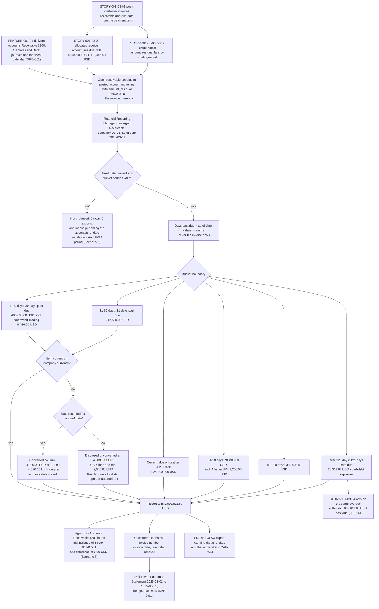

# STORY-001-03-05: Generate Aged Receivables Report

---

## Metadata

| Attribute | Value |
|-----------|-------|
| **Story ID** | `STORY-001-03-05` |
| **Title** | Generate Aged Receivables Report |
| **Parent Feature** | [FEATURE-001-03: Accounts Receivable & Customer Invoices](../FEATURE-001-03-accounts-receivable-customer-invoices.md) |
| **Parent Epic** | [EPIC-001: Enterprise Accounting in Odoo](../../EPIC-001-enterprise-accounting-odoo.md) |
| **Status** | Draft |
| **Priority** | 🟠 High |
| **Estimate** | 5 story points (Fibonacci) |
| **Persona** | Financial Reporting Manager |
| **Secondary Personas** | Accounts Receivable Specialist (works the bucket detail customer by customer and acts on the oldest balances first), Credit Controller (sets the collection priority the buckets rank and reads the Over 120 days column as the credit-risk signal), Treasury Analyst (reads the buckets as the collections forecast behind the cash position and the Days Sales Outstanding trend), Chief Accountant (owns the **Accounts Receivable 1200** control account the report total is agreed to, and the bad-debt reserve estimated from the oldest bucket), Group Controller (approves the aging presentation used in the group receivables review), External Auditor (traces a bucket line to the open invoices behind it and from an invoice to its journal items), CFO / Finance Director (reads the receivables health of the group), Finance Controller and Product Owner (accept the demonstration). Persona governance: the **Credit Controller** named above is a registered named secondary role rather than a thirteenth persona: the Epic's [§3.2](../../EPIC-001-enterprise-accounting-odoo.md#32-persona-notes) records it as a stakeholder who reads the ageing as a credit-risk signal rather than the WHO of a story, mapping onto the **Accounts Receivable Specialist** for access rights |
| **Story Position** | Story 5 of the 5 in FEATURE-001-03; blocked by [STORY-001-03-01](./STORY-001-03-01-generate-customer-invoices.md), [STORY-001-03-02](./STORY-001-03-02-register-customer-payments.md) and [STORY-001-03-03](./STORY-001-03-03-manage-customer-credit-notes.md); blocks no sibling |
| **Carried Epic Register Entries** | [CF-007](../../EPIC-001-enterprise-accounting-odoo.md#cf-007-aged-receivable-presentation-filtering-and-export) — Aged Receivable presentation, filtering and export, the receivables half of the retired combined aged report |
| **Inherited Conventions** | **CAP-X01** export and drill-down, and **CAP-X02** ageing-bucket presentation, both owned by [FEATURE-001-07](../FEATURE-001-07-financial-reporting-period-close.md) and inherited here rather than restated as a local variant |
| **Platform Target** | Open decision DEC-001 — see [Version Compatibility](#version-compatibility) |
| **Last Updated** | 2026-08-15 |
| **Owner/Author** | Enterprise Accounting Team |

> **Platform target.** This story fixes no platform version of its own. The target is the Epic's open decision **DEC-001** in the [Open Decisions Register](../../EPIC-001-enterprise-accounting-odoo.md#appendix-b-open-decisions-register): the originating programme request names Odoo 17, the superseded prior backlog named 18.0, and the baseline this story was written and verified against is **Odoo 19.0 Community**, where `odoo/release.py` declares `version_info = (19, 0, 0, FINAL, 0, '')`. The `account.move.line.amount_residual` computation the buckets are built from, the `date_maturity` and `invoice_date_due` fields the ageing is measured against, and the rate lookup on `res.currency` behind the conversion column each differ across the three candidate releases, so the mismatch is surfaced for stakeholder confirmation rather than settled inside this story (AAP §0.8.2, §0.8.3).
>
> **This report writes nothing.** The Aged Receivable report is a read of posted journal items. It creates, alters and reverses no journal entry: the journal-entry count, the `payment_state` of every invoice and the balance of every account in the reported company and date range are identical before and after a run. The double-entry requirement is therefore satisfied here by an agreement rather than by a posting — the report total for an as-of date equals the **Accounts Receivable 1200** closing balance the **Trial Balance** of [STORY-001-07-04](../FEATURE-001-07/STORY-001-07-04-generate-general-ledger-trial-balance.md) reports for the same company and the same date, and each invoice, receipt and credit note behind a bucket amount is itself a posted entry whose total debits equal its total credits. No entry is invented for this story to balance.
>
> **Monetary, date and naming conventions used throughout this ticket.** Every monetary figure states its currency as an ISO 4217 code, carries 2 decimal places, and is rounded half-up at that currency's rounding increment of 0.01 — `USD` and `EUR` both. Every date is an explicit calendar date in ISO 8601 form; **2025-03-31** is the worked as-of date of this feature and **2025-01-01 to 2025-03-31** the worked Customer Statement range. Accounts are named by the code of the mandated chart: **Accounts Receivable 1200** (the receivable control account this report is agreed to), **Bank 1010**, **Revenue 4000**, **Tax Payable 2200** and **Bad Debt Expense 6900**. Companies are named from the Epic's [canonical legal-entity register](../../EPIC-001-enterprise-accounting-odoo.md#e4-canonical-legal-entity-register): **Global Holdings Inc.** (`US-01`, the United States parent, functional currency USD, which is also the group presentation currency) and **Global Europe SARL** (`NL-01`, the Netherlands operating subsidiary, functional currency EUR).

---

## User Story

**As a** Financial Reporting Manager

**I want** the **Aged Receivable** report produced for one named company and one as-of date, distributing every open customer balance across the six buckets Current, 1-30, 31-60, 61-90, 91-120 and Over 120 days measured from each invoice's due date and valued at its open residual — with a configurable bucket set alongside the standard one, a customer row that expands to the invoices behind each bucket, a company-currency column beside the original currency for a balance held in another currency, partner-category filtering, export to PDF and to XLSX, and a drill-down to the **Customer Statement** and onward to the journal items

**So that** collection effort is ranked by age instead of by whoever complained last, the bad-debt reserve is estimated from a stated Over 120 days figure rather than from judgement, and the receivable carried in the Balance Sheet is explained line by line and agreed to **Accounts Receivable 1200** at a difference of `$0.00 USD` — which is what makes the Days Sales Outstanding improvement of 15% to 25% against the 58.0-day baseline measurable at all (SM-017), and what supplies 1 of the 7 reports SM-001 requires for every entity and every period.

---

## Business Value

### Value Statement

> A receivable balance of `$2,093,811.88 USD` tells the group how much it is owed and nothing about whether it will arrive. The Aged Receivable report is the instrument that turns one number into a decision: `$1,240,000.00 USD` not yet due needs no action, `$486,000.00 USD` between 1 and 30 days past due needs a reminder, and `$23,311.88 USD` beyond 120 days is the bad-debt exposure a reserve has to cover. Three properties make that ranking trustworthy rather than indicative. The age is measured from the invoice **due date**, so a customer on 90-day terms is not reported as delinquent for using the terms it was granted. The amount is the open **residual**, so a receipt allocated by [STORY-001-03-02](./STORY-001-03-02-register-customer-payments.md) and a credit note issued by [STORY-001-03-03](./STORY-001-03-03-manage-customer-credit-notes.md) reduce the bucket the moment they post and a settled invoice leaves the report altogether. And the total is agreed to the control account, so the aging and the Balance Sheet cannot tell two different stories about the same asset. The report itself moves no balance; its whole value is that it explains one.

### Success Metrics

| Metric | Baseline | Target | Measurement Method |
|--------|----------|--------|--------------------|
| Sub-ledger agreement of the report total | Receivable ageing rebuilt in a spreadsheet each month, agreeing to the ledger by coincidence | The report total for `US-01` at the as-of date 2025-03-31 equals the **Accounts Receivable 1200** closing balance of `$2,093,811.88 USD` in the **Trial Balance** for the same date at a difference of `$0.00 USD`, rounded half-up to 2 decimal places at the USD rounding increment of 0.01 (SM-001, SM-006, C-009) | Report total compared numerically with the Trial Balance closing line for the same company and as-of date |
| Bucket completeness | Invoices dropped or double-counted between spreadsheet revisions | 100% of open invoices of the reported company appear in exactly one bucket; the count of open invoices in no bucket is 0 and the count in more than one bucket is 0 | Open-invoice population counted against the sum of the per-bucket invoice counts |
| Column arithmetic | Bucket columns and partner totals reconciled by eye | The six bucket columns sum to each partner total, and the partner totals sum to the report total, each at a difference of `$0.00 USD` | Row-wise and column-wise summation asserted numerically on the reported figure set |
| Ageing basis correctness | Ageing measured from the invoice date, reporting customers on extended terms as overdue | 100% of bucket assignments derived from `invoice_date_due` on `account.move` and `date_maturity` on `account.move.line`; the count of assignments derived from the invoice date is 0 | Bucket assignment recomputed from the due date and compared with the reported bucket, invoice by invoice |
| Residual basis correctness | Gross invoice amounts aged, so part-paid invoices overstated the exposure | 100% of bucket amounts equal to `amount_residual` on the unreconciled receivable line; an invoice whose residual is `$0.00 USD` appears in no bucket | Bucket amount compared with the residual read from the invoice's receivable journal item |
| Report generation time | 2 to 4 hours of manual compilation per entity | Under 30 seconds over a population of 100,000 open receivable lines, matching the parent Feature's §4.4 budget, and under 5 minutes on production volumes (SM-005) | Timed report run for `US-01` at the as-of date 2025-03-31 on the seeded 100,000-line population |
| Reconciliation worksheet time | Produced by hand, days after the close | Under 30 seconds to produce the report-to-ledger worksheet for the same population, with the difference asserted at `$0.00 USD` | Timed worksheet generation immediately after the report run |
| Bucket customization neutrality | A changed bucket set changed the total, so two runs disagreed | A configured set of 0-15, 16-30, 31-45, 46-60 and Over 60 days returns the same report total of `$2,093,811.88 USD` for `US-01` at 2025-03-31 as the standard set, at a difference of `$0.00 USD`, because customization redistributes columns and never the total (CAP-X02) | Standard-set total compared with the configured-set total for the same company and as-of date |
| Multi-currency disclosure | Foreign balances converted at an unrecorded rate | 100% of balances held in a currency other than the company currency present the converted company-currency amount, the original amount with its ISO 4217 code, the conversion rate and the rate date | Converted column recomputed from the recorded rate and compared with the reported amount |
| Contribution to Days Sales Outstanding | DSO 58.0 days, computed quarterly from a manual extract | DSO computed quarterly from this report, so the 15% to 25% improvement to between 43.5 and 49.3 days is measured from the ledger rather than estimated (SM-017) | DSO computed from the reported buckets and compared with the 58.0-day baseline |
| Drill-down integrity | An aged figure could not be traced to a document | 100% of bucket lines open the invoices behind them, and 100% of those invoices open the journal items behind them, whose signed sum equals the line at a difference of `$0.00 USD` (CAP-X01) | Drill-down total compared with the line it was opened from, at both levels |

### Business Rules

Rule identifiers carry the `AR-AGE-BR-` prefix so that a rule of this story is unambiguous beside `AR-INV-BR-` in [STORY-001-03-01](./STORY-001-03-01-generate-customer-invoices.md), `AR-PAY-BR-` in [STORY-001-03-02](./STORY-001-03-02-register-customer-payments.md), `AR-CRN-BR-` in [STORY-001-03-03](./STORY-001-03-03-manage-customer-credit-notes.md) and `AR-FUP-BR-` in [STORY-001-03-04](./STORY-001-03-04-configure-payment-followups.md). No identifier below is issued anywhere else in the backlog.

| Rule ID | Rule | Consequence If Broken |
|---------|------|-----------------------|
| **AR-AGE-BR-001** | Ageing is measured from the invoice **due date** — `invoice_date_due` on `account.move`, `date_maturity` on the receivable `account.move.line` — against the as-of date, and never from the invoice date | A customer granted 90-day terms is reported as 60 days delinquent for honouring those terms, so the collection ladder chases a customer who owes nothing yet and the bad-debt reserve is built on an age that is not the age of the debt |
| **AR-AGE-BR-002** | The bucket boundaries are deterministic and stated: an invoice due **30** days before the as-of date falls in **1-30 days**; one due **31** days before falls in **31-60 days**; one due **121** days before falls in **Over 120 days**; and one whose due date falls **on or after** the as-of date falls in **Current** | Two runs of the same population on the same date return different columns, the reserve percentage applied to each bucket is applied to a shifting base, and no bucket line value can be asserted in a test |
| **AR-AGE-BR-003** | The amount in a bucket is the open residual `amount_residual` of the unreconciled receivable line, so an allocated receipt and an allocated credit note reduce it, and an invoice whose residual is `0.00` in the invoice currency appears in no bucket | The gross amount ever invoiced is aged instead of the amount still owed, so the report overstates the collectable asset and disagrees with **Accounts Receivable 1200** by the value of every receipt ever applied |
| **AR-AGE-BR-004** | Every open invoice appears in exactly one bucket, and the six bucket columns sum to the partner total while the partner totals sum to the report total, each at a difference of `0.00` in the company currency | A balance counted twice or dropped makes the report disagree with the control account, and the difference cannot be located because no column arithmetic holds |
| **AR-AGE-BR-005** | Only **posted** entries are read. A Draft invoice or a Draft credit note carries no receivable journal item and contributes nothing to any bucket | The report presents a receivable the ledger does not hold, so the aging leads the Balance Sheet and the two can never be agreed |
| **AR-AGE-BR-006** | The report total for an as-of date equals the **Accounts Receivable 1200** closing balance in the **Trial Balance** for the same company and the same as-of date at a difference of `0.00` in the company currency. The report posts nothing to reach that agreement | An unexplained difference between the sub-ledger and the control account is a close blocker for the whole company and an audit finding on the receivable balance (SM-001, SM-006) |
| **AR-AGE-BR-007** | The report is produced for one named company at a time. A balance held by **Global Europe SARL** (`NL-01`) never appears in a run for **Global Holdings Inc.** (`US-01`), and the total of each run is agreed to the **Accounts Receivable 1200** balance of that company alone | One report spanning two sets of books cannot be agreed to either company's Trial Balance, and a role restricted to one entity reads balances it has no right to see (C-014, D-007) |
| **AR-AGE-BR-008** | A balance held in a currency other than the company's functional currency is presented as the converted company-currency amount **and** the original amount with its ISO 4217 code, together with the conversion rate and the rate date, each amount rounded half-up to 2 decimal places at its own currency's rounding increment of 0.01 | The converted figure cannot be reproduced or challenged, and a rate movement between two runs looks like a change in the receivable rather than a change in the rate |
| **AR-AGE-BR-009** | The bucket set is configurable. A configured set — 0-15, 16-30, 31-45, 46-60 and Over 60 days is the worked example — redistributes the columns and returns the same report total as the standard set at a difference of `0.00` in the company currency, and a configured set whose bounds overlap or invert is refused before a report is produced | A configured set that changes the total makes the report unusable as evidence, because the reserve and the control-account agreement then depend on which column layout was chosen |
| **AR-AGE-BR-010** | A customer row expands to the individual open invoices behind each bucket, each showing invoice number, invoice date, due date and amount, and each invoice opens the **Customer Statement** and onward the journal items whose signed sum equals the line at a difference of `0.00` in the company currency (CAP-X01) | An aged figure that cannot be traced to a document is a number the External Auditor has to test by data request, which is the cost Epic Definition of Done item 10 exists to remove |
| **AR-AGE-BR-011** | Filtering — by partner category, or to a named set of customers — restricts which rows are presented without changing how any remaining invoice is bucketed, and every export carries the as-of date and the filters that were active (CAP-X01, CAP-X02) | A filtered export read as an unfiltered one understates the receivable, and a filter that re-buckets what it keeps makes two views of one population disagree |
| **AR-AGE-BR-012** | An invoice flagged as disputed keeps its bucket and its amount and carries a dispute marker. The dispute changes the collection action taken by [STORY-001-03-04](./STORY-001-03-04-configure-payment-followups.md), never the aged total | A disputed balance hidden from the aging removes it from the reserve calculation and from the control-account agreement, so a commercial argument silently reduces the reported asset |
| **AR-AGE-BR-013** | A customer whose credit notes exceed its open invoices is presented at its net negative total in the bucket of the item that carries it, with the sign shown, rather than being suppressed or floored at `0.00` in the company currency | A hidden credit balance leaves the sum of partner totals above the control-account balance, so the `0.00` agreement of AR-AGE-BR-006 fails for a reason the report does not disclose |
| **AR-AGE-BR-014** | A run whose as-of date falls inside a locked period is produced without objection, because reading a closed period alters nothing in it. The lock date governs posting, which this report does not do | Refusing to report on a closed period removes the aging evidence for exactly the periods an audit examines, and would make the close its own blind spot |

---

## Acceptance Criteria

Seven criteria, inside the mandated band of 4 to 8. Each carries one non-compound **When**, and each **Then** asserts only what the Financial Reporting Manager, the Credit Controller, the Chief Accountant or the External Auditor can observe on the report, on an expanded invoice line, on an exported file or in the reconciliation worksheet — no query, no report-engine internal and no interface gesture appears in a criterion. Every monetary figure states its ISO 4217 currency code, its amount to 2 decimal places and the rounding rule applied to it; every bucket assertion states the bucket by name; every criterion names the company whose books are reported; and because the report posts nothing, the double-entry requirement is discharged by the sub-ledger agreement of Scenario 3 rather than by a fabricated journal entry.

| Scenario | Coverage class |
|----------|----------------|
| 1 | Valid input — happy-path report for a named company and as-of date, with stated bucket line values |
| 2 | Accounting edge case — deterministic bucket boundaries at 30, 31 and 121 days past due |
| 3 | Valid input — the report total agreed to the **Accounts Receivable 1200** sub-ledger at `$0.00 USD`, with nothing posted |
| 4 | Accounting edge case — residual basis, so an allocated receipt and a credit note reduce the bucket |
| 5 | Accounting edge case — multi-currency presentation with a stated rate and rate date |
| 6 | Invalid or incomplete input — a missing as-of date together with an inverted configured bucket period |
| 7 | Error handling — a filtered export with no recorded rate for one currency on the as-of date |

### Scenario 1: The Aged Receivable report distributes open balances across the six buckets for a named as-of date

- **Given** the reference receivable population of company **Global Holdings Inc.** (`US-01`, the United States parent, functional currency USD) stands posted, and within it customer **Northwind Trading** holds one open invoice whose receivable line on **Accounts Receivable 1200** carries an `amount_residual` of **8,446.00 USD** and a `date_maturity` of 2025-03-12 — the Net 30 due date [STORY-001-03-01](./STORY-001-03-01-generate-customer-invoices.md) derived from an invoice date of 2025-02-10, being 19 days before the as-of date — while customer **Atlantia SRL** holds one open USD-billed invoice with an `amount_residual` of **1,200.00 USD** and a `date_maturity` of 2025-01-20, being 70 days before the as-of date, with every amount in this criterion rounded half-up to 2 decimal places at the USD rounding increment of 0.01 and the standard six-bucket set in force
- **When** the Financial Reporting Manager runs the **Aged Receivable** report for **Global Holdings Inc.** (`US-01`) with an as-of date of **2025-03-31**
- **Then** the row for **Northwind Trading** presents **8,446.00 USD** in the **1-30 days** bucket and **0.00 USD** in each of the other five buckets, and the row for **Atlantia SRL** presents **1,200.00 USD** in the **61-90 days** bucket and **0.00 USD** in each of the other five, each amount rounded half-up to 2 decimal places at the USD rounding increment of 0.01
  - **And** those two customer rows sum to **9,646.00 USD**, being 8,446.00 USD plus 1,200.00 USD
  - **And** the report presents the six bucket totals for that company and as-of date as **Current 1,240,000.00 USD**, **1-30 days 486,000.00 USD**, **31-60 days 212,500.00 USD**, **61-90 days 94,000.00 USD**, **91-120 days 38,000.00 USD** and **Over 120 days 23,311.88 USD**, and a report total of **2,093,811.88 USD**, each amount rounded half-up to 2 decimal places at the USD rounding increment of 0.01
  - **And** the report header states the as-of date **2025-03-31** and the company **Global Holdings Inc.** (`US-01`), so a printed copy is identifiable without its parameters being restated
  - **And** no balance of **Global Europe SARL** (`NL-01`) appears in the run, and the books of **Global Holdings Inc.** are the only books read
  - **And** the run creates no journal entry: the journal-entry count of `US-01`, the `payment_state` of every invoice read and the balance of **Accounts Receivable 1200** are identical before and after it

### Scenario 2: The bucket boundaries are deterministic at 30, 31 and 121 days past due

- **Given** the boundary fixture of company **Global Holdings Inc.** (`US-01`) holds three open USD-billed invoices for customer **Riverside Manufacturing** — **1,000.00 USD** with a `date_maturity` of 2025-03-01, being exactly 30 days before the as-of date; **2,000.00 USD** with a `date_maturity` of 2025-02-28, being exactly 31 days before; and **3,000.00 USD** with a `date_maturity` of 2024-11-30, being exactly 121 days before — with the standard six-bucket set in force and every amount rounded half-up to 2 decimal places at the USD rounding increment of 0.01
- **When** the Financial Reporting Manager runs the **Aged Receivable** report for that fixture of **Global Holdings Inc.** (`US-01`) with an as-of date of **2025-03-31**
- **Then** the **1,000.00 USD** invoice is presented in the **1-30 days** bucket, the **2,000.00 USD** invoice in the **31-60 days** bucket and the **3,000.00 USD** invoice in the **Over 120 days** bucket
  - **And** each invoice is presented in exactly one bucket: the count of the three that appear in no bucket is **0** and the count that appear in more than one is **0**
  - **And** the **Current**, **61-90 days** and **91-120 days** buckets of that customer each present **0.00 USD**
  - **And** the customer total for **Riverside Manufacturing** is **6,000.00 USD**, being 1,000.00 USD plus 2,000.00 USD plus 3,000.00 USD, rounded half-up to 2 decimal places at the USD rounding increment of 0.01
  - **And** the same three invoices return the same three buckets when the report is run again on the same as-of date, so the boundary is a stated rule rather than an artefact of the run

### Scenario 3: The report total is agreed to the Accounts Receivable 1200 sub-ledger and nothing is posted

- **Given** the reference receivable population of company **Global Holdings Inc.** (`US-01`) as at 2025-03-31 consists of posted customer invoices, posted customer receipts and posted customer credit notes, each entry carrying total debits equal to total credits at a difference of **0.00 USD**; and the **Trial Balance** of [STORY-001-07-04](../FEATURE-001-07/STORY-001-07-04-generate-general-ledger-trial-balance.md) for that company and the range 2025-01-01 to 2025-03-31 reports **Accounts Receivable 1200** opening at **2,000,000.00 USD** debit, period debits of **1,911,195.00 USD**, period credits of **1,817,383.12 USD** and a closing balance of **2,093,811.88 USD** debit, each amount rounded half-up to 2 decimal places at the USD rounding increment of 0.01
- **When** the Financial Reporting Manager produces the Aged Receivable report-to-ledger reconciliation worksheet for **Global Holdings Inc.** (`US-01`) at the as-of date **2025-03-31**
- **Then** the six bucket columns of each customer row sum to that customer's total at a difference of **0.00 USD**, and the customer totals sum to the report total of **2,093,811.88 USD** at a difference of **0.00 USD**, each amount rounded half-up to 2 decimal places at the USD rounding increment of 0.01
  - **And** that report total equals the **Accounts Receivable 1200** closing balance of **2,093,811.88 USD** the Trial Balance reports for the same company and the same as-of date, at a difference of **0.00 USD**
  - **And** the same worksheet restricted to customers **Northwind Trading** and **Atlantia SRL** reports a subtotal of **9,646.00 USD**, which equals the sum of those two customers' open receivable residuals of 8,446.00 USD and 1,200.00 USD at a difference of **0.00 USD**
  - **And** every invoice behind a bucket amount resolves to a posted journal entry whose total debits equal its total credits at a difference of **0.00 USD**, so the balance the report ages is a balanced one
  - **And** the worksheet creates no journal entry and consumes no journal sequence number: the journal-entry count of `US-01` and the closing balance of **Accounts Receivable 1200** are identical before and after it, which is why this agreement — and not a posting invented for a report — is how this story satisfies the balanced-entry requirement
  - **And** the worksheet is retained as close evidence readable by the **External Auditor** without a data request

### Scenario 4: An allocated receipt and an allocated credit note reduce the bucket amount

- **Given** in the reference receivable population of company **Global Holdings Inc.** (`US-01`) the invoice of customer **Northwind Trading** was raised at **13,446.00 USD** against **Accounts Receivable 1200** with a `date_maturity` of 2025-03-12, a receipt of **5,000.00 USD** has been allocated against it by [STORY-001-03-02](./STORY-001-03-02-register-customer-payments.md) leaving an `amount_residual` of **8,446.00 USD**, and a second invoice of that customer for **500.00 USD** has been fully offset by an allocated credit note of **500.00 USD** raised by [STORY-001-03-03](./STORY-001-03-03-manage-customer-credit-notes.md) leaving an `amount_residual` of **0.00 USD**, with every amount rounded half-up to 2 decimal places at the USD rounding increment of 0.01
- **When** the Financial Reporting Manager runs the **Aged Receivable** report for **Global Holdings Inc.** (`US-01`) with an as-of date of **2025-03-31**
- **Then** the first invoice contributes **8,446.00 USD** to the **1-30 days** bucket and not its original **13,446.00 USD**, so the bucket carries the amount still owed rather than the amount ever invoiced
  - **And** the allocated receipt of **5,000.00 USD** is presented as a reduction of that residual rather than as a row of its own, so no negative line appears in any bucket for it
  - **And** the fully offset **500.00 USD** invoice is present in no bucket, because its residual is **0.00 USD**, and it is excluded from the customer total
  - **And** the customer total for **Northwind Trading** is **8,446.00 USD**, rounded half-up to 2 decimal places at the USD rounding increment of 0.01
  - **And** the surviving invoice is bucketed on its `date_maturity` of 2025-03-12, 19 days before the as-of date, rather than on the date the receipt was allocated, so a part payment moved the amount overdue and not the age of the debt

### Scenario 5: A balance held in another currency is presented with its conversion rate and rate date

- **Given** the currency variant of the reference receivable population of company **Global Holdings Inc.** (`US-01`, functional currency USD) additionally holds one open invoice of customer **Atlantia SRL** for **4,000.00 EUR** with a `date_maturity` of 2025-02-10, being 49 days before the as-of date, and `res.currency` holds a closing rate of **1.0800 USD per EUR** dated 2025-03-31, with each amount rounded half-up to 2 decimal places at its own currency's rounding increment of 0.01
- **When** the Financial Reporting Manager runs the **Aged Receivable** report for **Global Holdings Inc.** (`US-01`) with an as-of date of **2025-03-31**
- **Then** the **31-60 days** bucket presents that invoice at **4,320.00 USD** in the company currency, being 4,000.00 EUR converted at 1.0800 USD per EUR, rounded half-up to 2 decimal places at the USD rounding increment of 0.01
  - **And** the original amount of **4,000.00 EUR** is presented alongside the converted figure with its ISO 4217 code `EUR`, rounded half-up to 2 decimal places at the EUR rounding increment of 0.01
  - **And** the conversion rate of **1.0800 USD per EUR** and its rate date of **2025-03-31** are both stated on the report, so the converted figure can be reproduced from the report itself
  - **And** on that variant the **31-60 days** bucket total becomes **216,820.00 USD**, being 212,500.00 USD plus 4,320.00 USD, and the report total becomes **2,098,131.88 USD**, being 2,093,811.88 USD plus 4,320.00 USD, each agreeing with the **Accounts Receivable 1200** closing balance of the variant at a difference of **0.00 USD**
  - **And** the invoice is bucketed on its `date_maturity` of 2025-02-10 irrespective of its currency, so conversion changes the amount presented and never the bucket it is presented in

### Scenario 6: A report requested with no as-of date and an inverted bucket period is not produced

- **Given** the Financial Reporting Manager has opened the **Aged Receivable** report parameters for company **Global Holdings Inc.** (`US-01`) with the as-of date left empty and a configured bucket set whose second period carries a lower bound of **30** days and an upper bound of **15** days
- **When** the Financial Reporting Manager requests the report
- **Then** no report is produced and no aged data is presented: the count of customer rows returned is **0** and the count of exported files produced is **0**
  - **And** the returned message names both reasons separately — the absent as-of date, and the configured period whose upper bound of 15 days falls below its lower bound of 30 days — so the Financial Reporting Manager resolves both without a second attempt to discover the first
  - **And** the company already selected and the remaining bucket bounds already keyed are retained on the parameters, so the refusal discards no work
  - **And** no journal entry is created and the balance of **Accounts Receivable 1200** in `US-01` moves by **0.00 USD**, rounded half-up to 2 decimal places at the USD rounding increment of 0.01
  - **And** the message discloses no stack trace, no file-system path and no credential (C-020)

### Scenario 7: A filtered export carries its parameters and an unavailable rate is reported rather than assumed

- **Given** the currency variant of the **Aged Receivable** report stands produced for company **Global Holdings Inc.** (`US-01`) at the as-of date **2025-03-31**, filtered to the partner category **Key Accounts**, which holds exactly customer **Northwind Trading** and customer **Atlantia SRL**, **with both customer rows expanded to the individual open invoices behind their buckets** as AR-AGE-BR-010 provides, and `res.currency` holds no rate for `EUR` on 2025-03-31
- **When** the Financial Reporting Manager exports the produced report
- **Then** the PDF carries the report title **Aged Receivable**, the company **Global Holdings Inc.** (`US-01`), the as-of date **2025-03-31**, the **Key Accounts** filter, the generation timestamp and page numbers, and the XLSX carries the same as-of date and the same filter with numeric cells written as numbers rather than as text and column headers identical to the on-screen labels
  - **And** both files carry every bucket column visible on screen and the **expanded invoice detail** — each invoice with its number, its invoice date, its due date and its open residual — rather than the collapsed customer summary. That is a property of the export rather than of the screen: re-exporting the same report with both customer rows **collapsed** produces the same expanded invoice detail and the same totals at a difference of `0.00 USD`, so an export is never narrower than the population it was run over (CAP-X01)
  - **And** a message names the currency `EUR` and the date **2025-03-31** for which no rate is recorded, and states the remedial action of loading that rate before the converted column is relied upon
  - **And** the affected invoice is listed with its original amount of **4,000.00 EUR**, rounded half-up to 2 decimal places at the EUR rounding increment of 0.01, and with no converted figure, so an unconverted balance is disclosed rather than presented at a rate that was not recorded
  - **And** the USD-denominated lines are still reported and the **Key Accounts** total of **9,646.00 USD** — Northwind Trading at **8,446.00 USD** plus Atlantia SRL at **1,200.00 USD** — is still presented, rounded half-up to 2 decimal places at the USD rounding increment of 0.01, so one missing rate suppresses one line and not the whole report
  - **And** the message discloses no stack trace, no file-system path and no credential (C-020)

---

## Sub-Tasks

- [ ] Confirm and record the aging policy: that the standard bucket set is Current, 1-30, 31-60, 61-90, 91-120 and Over 120 days measured from the due date; that the boundaries fall as AR-AGE-BR-002 states them at 30, 31 and 121 days past due; which configured sets are offered alongside the standard one; and the reserve percentage the Chief Accountant applies to each bucket so the **Over 120 days** figure of `23,311.88 USD` becomes the bad-debt estimate rather than a curiosity — `@finance-sme`
- [ ] Specify the report parameters and their refusals: the mandatory as-of date, the single-company selection, the partner-category and named-customer filters, the configured bucket set with its overlap and inversion checks, and the exact wording of the missing-as-of-date and inverted-period refusals including that both reasons are named in one message — `@functional-consultant`
- [ ] Specify the presentation inherited from **CAP-X02** and **CAP-X01** rather than restated: the six columns with a total row and sortable columns, the customer expansion showing invoice number, invoice date, due date and amount, the company-currency column beside the original currency with the rate and rate date, the dispute marker that leaves the bucket unchanged, the PDF and XLSX exports carrying the as-of date and the active filters, and the drill-down to the **Customer Statement** for 2025-01-01 to 2025-03-31 and onward to the journal items with breadcrumbs back — `@functional-consultant`
- [ ] Deliver the bucket assignment and the amount basis: the days-past-due computation from `invoice_date_due` on `account.move` and `date_maturity` on `account.move.line` against the as-of date, the assignment of each open item to exactly one bucket under the stated boundaries, the residual basis on `amount_residual` with fully settled items excluded, the single-company restriction, and half-up rounding to 2 decimal places at each currency's 0.01 rounding increment on every presented amount — `@developer`
- [ ] Deliver the currency presentation and the missing-rate path: the conversion of a foreign-currency residual into the company currency at the as-of-date rate held on `res.currency`, the original amount with its ISO 4217 code, the stated rate and rate date, and the disclosure — rather than the assumption — of a rate that is not recorded, with the remaining lines and the company-currency total still reported — `@developer`
- [ ] Author the tests for all seven acceptance criteria plus the five edge cases: the boundary triple at 30, 31 and 121 days past due; the residual walk from 13,446.00 USD to 8,446.00 USD and the fully offset 500.00 USD invoice; the 4,000.00 EUR conversion to 4,320.00 USD; the two refusals; the filtered export; the `0.00 USD` agreement of the report total to **Accounts Receivable 1200**; the equality of the configured-set and standard-set totals; and the hostile-input set on the report filter, the as-of date and the bucket definition together with a formula-injection value written to a CSV and an XLSX export — one test per criterion (C-008), every amount asserted numerically (C-009), and every criterion linted for the banned vague terms — `@qa-engineer`
- [ ] Reconcile the report to the ledger on the demonstration data set and sign the tie-out off: agree the report total of `2,093,811.88 USD` to the **Accounts Receivable 1200** closing balance in the **Trial Balance** at the as-of date 2025-03-31 at a difference of `0.00 USD`, agree the six bucket columns to each partner total and the partner totals to the report total, confirm the overdue portion of `853,811.88 USD` against the Follow-Up Collections Report of [STORY-001-03-04](./STORY-001-03-04-configure-payment-followups.md), and retain the worksheet as the close evidence the **External Auditor** reads — `@finance-sme`

---

## Edge Cases

| Edge Case | Expected Behaviour |
|-----------|--------------------|
| **An invoice due exactly on a bucket boundary.** An invoice of **1,000.00 USD** for **Riverside Manufacturing** in **Global Holdings Inc.** (`US-01`) carries a `date_maturity` of 2025-03-01, exactly 30 days before the as-of date of 2025-03-31, and a second of **2,000.00 USD** carries 2025-02-28, exactly 31 days before, each amount rounded half-up to 2 decimal places at the USD rounding increment of 0.01 | The boundary is inclusive at the upper edge of the lower bucket: 30 days past due falls in **1-30 days** and 31 days past due falls in **31-60 days**, and 121 days past due falls in **Over 120 days**. Each invoice occupies exactly one bucket, so the columns sum to the customer total of 6,000.00 USD and to the report total without a rounding or an overlap residual. The rule is stated in the report definition rather than inferred from a run, so the same population returns the same columns on every run of the same as-of date (AR-AGE-BR-002, AR-AGE-BR-004, Scenario 2) |
| **An invoice settled in full on the as-of date itself.** A receipt allocated on 2025-03-31 takes an invoice's `amount_residual` to **0.00 USD**, rounded half-up to 2 decimal places at the USD rounding increment of 0.01, on the same date the report is run for | The invoice leaves the report: it appears in no bucket, contributes 0.00 USD to its customer total, and its customer disappears from the report where it held nothing else. The agreement of AR-AGE-BR-006 still holds, because the same allocation reduced **Accounts Receivable 1200** by the same amount on the same date, so the report total and the control-account balance move together. Where the customer is retained on screen for continuity it is shown at a total of 0.00 USD in every bucket rather than at a blank, so a settled customer is visibly settled instead of silently absent (AR-AGE-BR-003, AR-AGE-BR-005) |
| **A credit note larger than the invoice it offsets, giving a negative customer balance.** Customer **Atlantia SRL** in **Global Holdings Inc.** (`US-01`) holds one open invoice of **1,200.00 USD** and an unallocated credit balance of **1,500.00 USD**, leaving a net position of **-300.00 USD**, each amount rounded half-up to 2 decimal places at the USD rounding increment of 0.01 | The net **-300.00 USD** is presented with its sign in the bucket of the item that carries it rather than being suppressed, floored at 0.00 USD or moved to a separate report. Presenting it is what keeps the sum of customer totals equal to the **Accounts Receivable 1200** balance at a difference of 0.00 USD, because the ledger carries the credit on the same control account. The **Credit Controller** reads the negative row as cash held on account or a credit awaiting a refund — the refund path belongs to [STORY-001-03-03](./STORY-001-03-03-manage-customer-credit-notes.md) — and the row is excluded from the collection ranking rather than chased (AR-AGE-BR-013, AR-AGE-BR-006) |
| **One customer holding balances in two currencies.** Customer **Atlantia SRL** holds **1,200.00 USD** due 2025-01-20 and **4,000.00 EUR** due 2025-02-10 in the books of **Global Holdings Inc.** (`US-01`), whose functional currency is USD, at a 2025-03-31 rate of **1.0800 USD per EUR** | One customer row is presented, with each open item bucketed on its own due date — the USD item in **61-90 days** and the EUR item in **31-60 days** — and each foreign item carrying the converted amount of **4,320.00 USD** alongside the original **4,000.00 EUR** with its ISO 4217 code, the rate of 1.0800 and the rate date of 2025-03-31. The customer total is stated in the company currency alone at **5,520.00 USD**, being 1,200.00 USD plus 4,320.00 USD, rounded half-up to 2 decimal places at the USD rounding increment of 0.01, because a total across currencies has no meaning until it is converted. Where no rate exists for the as-of date the foreign item is disclosed unconverted and excluded from the converted total rather than valued at an unrecorded rate (AR-AGE-BR-008, Scenario 5, Scenario 7) |
| **An as-of date inside a locked period, and a hostile filter value.** The report is requested for **Global Europe SARL** (`NL-01`) at an as-of date of 2025-03-15 while that company's journal-entry lock date stands at 2025-03-31; and separately a report filter, an as-of-date field and a bucket bound are submitted carrying an over-long value, a script payload and a formula-leading prefix | The locked period is reported without objection. Reading a closed period changes nothing in it, so the report is produced for 2025-03-15, the journal-entry count and the **Accounts Receivable 1200** balance of **Global Europe SARL** for that period move by **0.00 EUR**, rounded half-up to 2 decimal places at the EUR rounding increment of 0.01, and the lock date is stated on the report as context rather than as a refusal — the lock governs posting, which this report does not do (AR-AGE-BR-014). The hostile values are **rejected**: a named error identifies the failing check, no report is produced, no file is written, no journal entry is created, no stack trace, file-system path or credential is disclosed, and the service answers the next request (C-019, C-020, C-022). Legitimate text carrying markup or a formula-leading character is a separate case with its own fixtures: it is accepted, stored verbatim, rendered as inert visible text on the report and neutralized in every CSV and XLSX export (C-017, C-018) |

---

## Estimation

| Dimension | Rating | Justification |
|-----------|--------|---------------|
| **Effort** | Medium | The delivered surface is one read-only report over a population the ledger already maintains: a days-past-due computation, an assignment into six columns, a residual sum per customer, a conversion column, a customer expansion, two export formats and a two-level drill-down. Nothing is posted, no document lifecycle is introduced, and `addons/account_financial_report_ce/models/aged_partner_balance.py` already implements a configurable-bucket aged partner balance in this repository, so the effort concentrates on tightening an existing surface to the stated boundaries, the stated currency disclosure and the stated agreement rather than on building a report engine |
| **Complexity** | Medium | Four behaviours carry consequence beyond a summation. The boundary rule has to be exact at 30, 31 and 121 days past due, because a reserve percentage is applied to each column. The amount has to be the residual after allocation, which makes the report dependent on the partial-reconciliation records the two sibling stories write. The conversion has to state its rate and rate date and to disclose rather than assume a rate that is absent. And the total has to agree to **Accounts Receivable 1200** at `0.00 USD`, which is an assertion about the whole population rather than about one row — the one property that cannot be proved by inspecting a single line |
| **Uncertainty** | Low to medium | The mechanism can be read before development starts: `addons/account/models/partner.py` holds the receivable aggregation by receivable account type, `addons/account/models/account_move_line.py` holds `amount_residual` and `date_maturity`, `addons/account/models/account_move.py` holds `invoice_date_due` and the payment status, `addons/account/report/account_invoice_report.py` holds the aggregation and company-currency patterns, and the Community-edition add-on already present holds a working bucket classifier with a stated target of under 30 seconds over 100,000 move lines. Two open items carry the residual uncertainty: whether that add-on is extended or replaced under **D-003** and **DEC-002**, and whether a short-paid invoice stays open or is closed under **DEC-011**, which changes which bucket carries the remainder |
| **Story Points** | **5** | Fibonacci scale (1, 2, 3, 5, 8, 13). Above a **3** because the story owns four assertions that each need their own proof — the deterministic boundary triple, the residual basis across receipts and credit notes, the currency presentation with its rate and its missing-rate disclosure, and the `0.00 USD` agreement of the whole report total to the control account — and because [CF-007](../../EPIC-001-enterprise-accounting-odoo.md#cf-007-aged-receivable-presentation-filtering-and-export) obliges it to carry the filtering, the expansion, the export and the drill-down that the retired combined report held. Below an **8** because it posts nothing, introduces no document lifecycle, no statement parser and no external integration; because the buckets, the export convention and the drill-down convention are inherited from **CAP-X02** and **CAP-X01** rather than designed here; and because the sibling that had to consolidate five retired stories, [STORY-001-03-04](./STORY-001-03-04-configure-payment-followups.md), is the 8 in this folder and this story is visibly smaller than it |

---

## INVEST Principles Compliance

| Principle | Compliance | Justification |
|-----------|------------|---------------|
| **Independent** | ✅ | Qualified honestly. Everything this story needs beyond a posted receivable population is configuration — **Accounts Receivable 1200**, the **Sales** and **Bank** journals, an open fiscal calendar and a partner category — all satisfiable as demo data in a test company. What it cannot manufacture is the population itself: a bucket is an age applied to an open residual, and residuals are created by [STORY-001-03-01](./STORY-001-03-01-generate-customer-invoices.md) and moved by [STORY-001-03-02](./STORY-001-03-02-register-customer-payments.md) and [STORY-001-03-03](./STORY-001-03-03-manage-customer-credit-notes.md). Those three are therefore declared as blockers rather than absorbed into this story's scope, and once a seeded set of posted invoices, receipts and credit notes exists the report is demonstrable on its own and depends on no other sibling |
| **Negotiable** | ✅ | The criteria state the reporting outcome required — six named buckets from the due date, residual amounts, a stated conversion with its rate date, a filtered export, a two-level drill-down and a `0.00 USD` agreement to a named control account — and leave the model, field, view and rendering decisions to implementation discovery under **D-004** and **D-005**. Whether the existing `account.aged.partner.balance.report` is extended, an OCA report is adopted or a new presentation is built stays open between the Financial Reporting Manager and the delivery team |
| **Valuable** | ✅ | It converts one receivable balance into a ranked collection decision and a defensible bad-debt estimate, and it is the instrument three programme measures are read from: **SM-001**, which requires Aged Receivable among the seven reports producible per entity and per period; **SM-017**, whose Days Sales Outstanding improvement of 15% to 25% is computed from these buckets; and the receivable half of **SM-006**, because the `0.00 USD` agreement to **Accounts Receivable 1200** is what lets a close proceed. The **Credit Controller** reads the Over 120 days column, the **Treasury Analyst** reads the whole set as the collections forecast, and the **External Auditor** reads the drill-down as receivable evidence |
| **Estimable** | ✅ | The artifact count is fixed and inspectable: one report with one date parameter, six standard buckets and one configurable set, one control account, one company at a time, two currencies, two export formats, one two-level drill-down and two refusal paths, over models already present in this repository — with an existing Community-edition implementation to measure the gap against. The Effort, Complexity and Uncertainty ratings above were assigned from that evidence rather than from guesswork |
| **Small** | ✅ | One accountant-facing outcome — produce and agree the receivable ageing for one company and one date — sized at 5 story points and completable inside one iteration. Aged **payables** is deliberately outside it and belongs to [CF-001](../../EPIC-001-enterprise-accounting-odoo.md#cf-001-aged-payable-reporting-workflow) and `STORY-001-02-04`; follow-up levels, action history, effectiveness measures and salesperson grouping are outside it and belong to [CF-006](../../EPIC-001-enterprise-accounting-odoo.md#cf-006-follow-up-collections-report-capability-set) and `STORY-001-03-04`; the Balance Sheet, Trial Balance and General Ledger are outside it and belong to FEATURE-001-07 |
| **Testable** | ✅ | Every one of the seven criteria is objectively pass or fail: each amount is stated to the minor unit with its rounding rule, each bucket is named, each boundary is stated as a day count, the agreement to **Accounts Receivable 1200** is stated as a difference of `0.00 USD`, each refusal names the message content and asserts an unchanged ledger, and each criterion maps to exactly one automated test in [Acceptance Test Mapping](#acceptance-test-mapping) (C-008, C-009) |

---

## Demonstration Path

Demonstrated in the Odoo interface to the **Finance Controller** and the **Product Owner**, in this order, against the seeded population named in [Test Requirements](#test-requirements) and with the walkthrough recorded against this story:

- [ ] **The report and its parameters.** **Accounting → Reporting → Partner Reports → Aged Receivable**: select company **Global Holdings Inc.** (`US-01`), set the as-of date to **2025-03-31** and produce the report. Observable result: the six columns present Current 1,240,000.00 USD, 1-30 days 486,000.00 USD, 31-60 days 212,500.00 USD, 61-90 days 94,000.00 USD, 91-120 days 38,000.00 USD and Over 120 days 23,311.88 USD, with a total row of 2,093,811.88 USD, and the header states the as-of date and the company
- [ ] **The stated line values.** Locate customer **Northwind Trading** and observe 8,446.00 USD in the **1-30 days** column against its due date of 2025-03-12, then customer **Atlantia SRL** and observe 1,200.00 USD in the **61-90 days** column against its due date of 2025-01-20 — the two rows summing to 9,646.00 USD
- [ ] **The customer expansion.** Expand the **Northwind Trading** row and observe the individual open invoices behind the bucket, each showing its invoice number, its invoice date, its due date and its amount, with the 13,446.00 USD invoice presented at its open residual of 8,446.00 USD and the fully offset 500.00 USD invoice absent
- [ ] **The boundary triple.** In the boundary fixture, observe the three invoices of **Riverside Manufacturing** land in **1-30 days** at 1,000.00 USD for a due date exactly 30 days before the as-of date, in **31-60 days** at 2,000.00 USD for 31 days before, and in **Over 120 days** at 3,000.00 USD for 121 days before, for a customer total of 6,000.00 USD
- [ ] **The configured bucket set.** Re-run with the configured set 0-15, 16-30, 31-45, 46-60 and Over 60 days and observe the columns redistribute while the report total stays 2,093,811.88 USD, so customization moves columns and never the total
- [ ] **The currency presentation.** On the currency variant, observe the 4,000.00 EUR invoice of **Atlantia SRL** presented in **31-60 days** at 4,320.00 USD in the company currency with the original 4,000.00 EUR alongside it, the rate of 1.0800 USD per EUR and the rate date of 2025-03-31 both stated
- [ ] **The drill-down.** From the expanded **Northwind Trading** invoice open the **Customer Statement** for 2025-01-01 to 2025-03-31, then from a statement line open the journal items behind it and observe their signed sum equal the line at a difference of 0.00 USD, with breadcrumbs returning to the aged report with its expansion and its position intact (CAP-X01)
- [ ] **The exports.** Filter the report to the partner category **Key Accounts** and export to **PDF** and to **XLSX**. Observable result: both files carry the as-of date 2025-03-31, the Key Accounts filter and every visible bucket column, the PDF carries the title, company, parameters, timestamp and page numbers, and the XLSX writes its numeric cells as numbers under headers identical to the on-screen labels
- [ ] **The refusals.** Request the report with the as-of date cleared and a configured period whose upper bound of 15 days sits below its lower bound of 30 days, and observe no report produced with one message naming both reasons. Then remove the `EUR` rate for 2025-03-31 and export again, observing the message name the currency and the date, the affected invoice listed at 4,000.00 EUR with no converted figure, and the Key Accounts total of 9,646.00 USD still reported
- [ ] **The tie-out.** Run the **Trial Balance** of [STORY-001-07-04](../FEATURE-001-07/STORY-001-07-04-generate-general-ledger-trial-balance.md) for the same company and 2025-01-01 to 2025-03-31 and observe the **Accounts Receivable 1200** closing balance of 2,093,811.88 USD equal the aged report total at a difference of 0.00 USD, with the journal-entry count of `US-01` unchanged by either run
- [ ] **Headless alternative, on the access contract C-023 fixes.** Where interactive access is not available, the same evidence is presented over the platform's current JSON web-service endpoint — `/json/2/<model>/<method>` on the Odoo 19.0 baseline, restated for whichever version DEC-001 confirms — authenticated with a bearer API key issued to the dedicated integration principal `ar-aged-report`, scoped to the companies and models this story names, with a recorded key owner, expiry, rotation interval and revocation path under C-021, executing under that principal's access rights and record rules with no privilege escalation, rate-limited and audit-logged per call. The deprecated XML-RPC and JSON-RPC endpoints are deprecated on this baseline and scheduled for removal in the following major series, so no criterion, test or demonstration here is written against them. The evidence is presented by reading the report record with its as-of date, company and filters; its computed bucket totals; the `account.move.line` records behind a bucket with their `amount_residual` and `date_maturity`; and the **Accounts Receivable 1200** balance the total is compared with — so acceptance never depends on a graphical session

---

## Constraints

The constraint identifiers below are the Epic's own, restated in the terms of this story rather than renumbered, so one constraint set reads across the whole ticket tree.

### License and Compliance

- [ ] **C-001 — AGPL-3.0 compatibility**: any module delivering the bucket assignment, the currency presentation, the filtering, the exports or the drill-down is distributed under an AGPL-3.0 compatible licence, matching the Community-edition accounting add-ons already present in this repository
- [ ] **C-002 — Existing licence respected**: extension of `account` — the "Invoicing" application, version 1.4, category `Accounting/Accounting`, licence LGPL-3 — and of `account_financial_report_ce` (version 19.0.1.1.0, AGPL-3, which already carries an aged partner balance) respects those licences, and an AGPL-3 extension of LGPL-3 code is licence-checked before it is written
- [ ] **C-005 / C-006 — Odoo and OCA coding standards**: Python follows the Odoo and OCA module guidelines including PEP 8, and static analysis reports zero violations under the repository's lint configuration at `ruff.toml`
- [ ] **C-012 — Build on the existing models**: the ageing is computed from `account.move`, `account.move.line`, `account.account`, `res.partner` and `res.currency` rather than from a parallel receivable store, so a bucket amount read from the report and the **Accounts Receivable 1200** balance read from the Trial Balance cannot disagree by construction
- [ ] **C-014 — Access rights and company isolation**: a role restricted to `US-01` neither reads nor exports the receivable lines of **Global Europe SARL** (`NL-01`), a run is produced for one company at a time, and the role that reads the ageing is distinguishable from the role that posts a write-off against a balance it presents
- [ ] **C-017 — Exports are neutralized by cell type**: an **untrusted text** cell — a customer name, a document reference, a label or an echoed filter value — whose first character is `=`, `+`, `-`, `@`, a tab or a carriage return is escaped or prefixed in every CSV and XLSX export so the spreadsheet opens it as text, while a numeric, date or boolean cell keeps its type and is never coerced to text so a credit balance stays a negative number, and a re-import reproduces the stored value unchanged
- [ ] **C-018 — External text is context-encoded**: a customer name, an invoice reference or a memo drawn from a partner record or an invoice and rendered into the on-screen report, the PDF or the Customer Statement is emitted as escaped text rather than as active markup
- [ ] **C-019 — Data access discipline**: the reads behind the buckets, the customer expansion and the reconciliation worksheet are expressed through the Odoo ORM or parameterized SQL, with no string-concatenated query construction and no run-time filter value interpolated into a query
- [ ] **C-020 — Failure messages disclose nothing**: the missing-as-of-date, inverted-bucket and missing-rate messages name the rejected parameter or the absent rate, the check that failed and the remedial action, and disclose no stack trace, SQL, file-system path or credential
- [ ] **C-021 — No credentials in source**: no credential, endpoint secret or signing certificate appears in module source, fixtures, logs or in any file this report exports
- [ ] **C-022 — Hostile-input tests**: at least one test submits hostile report-filter, as-of-date and bucket-definition values, and one submits a formula-injection value written to a CSV and an XLSX export; the hostile values are **rejected** with a named error and the legitimate values carrying markup or a formula-leading character are **accepted and neutralized**, each proved by its own fixtures so that neither outcome can stand in for the other

### Accounting and Reporting Standards

- [ ] **Nothing is posted**: the report creates, alters and reverses no journal entry, so the journal-entry count, every `payment_state` and every account balance of the reported company are identical before and after a run. The balanced-entry requirement is discharged by the sub-ledger agreement below and by the fact that every entry behind a bucket amount is itself balanced (C-009)
- [ ] **Sub-ledger to control-account agreement**: the report total for an as-of date equals the **Accounts Receivable 1200** closing balance in the **Trial Balance** for the same company and the same date at a difference of `0.00` in the company currency — `$2,093,811.88 USD` for `US-01` at 2025-03-31 (SM-001, SM-006, AR-AGE-BR-006)
- [ ] **GAAP and IFRS ageing presentation**: the standard bucket set follows the generally accepted presentation of Current, 1-30, 31-60, 61-90, 91-120 and Over 120 days measured from the due date, which is the base a bad-debt allowance under ASC 310 and the expected-credit-loss provision matrix under IFRS 9 are applied to, and the Over 120 days column is the exposure the reserve discussion starts from
- [ ] **ISO 4217 minor units**: every amount is rounded half-up to its currency's decimal precision — 2 decimal places at a 0.01 rounding increment for USD and EUR — and the currency code is stated with the amount, on screen and in every export
- [ ] **Conversion is disclosed, never assumed**: a balance held in another currency carries its converted company-currency amount, its original amount with its ISO 4217 code, the conversion rate and the rate date; where no rate is recorded for the as-of date the balance is disclosed unconverted rather than valued at a rate that was not recorded
- [ ] **Ageing measured from the due date**: `invoice_date_due` on `account.move` and `date_maturity` on `account.move.line` are the basis, never the invoice date, so a customer on extended terms is not presented as delinquent for using them (AR-AGE-BR-001)
- [ ] **Receivables only**: this report presents customer balances on **Accounts Receivable 1200**. Vendor ageing on **Accounts Payable 2000** belongs to [CF-001](../../EPIC-001-enterprise-accounting-odoo.md#cf-001-aged-payable-reporting-workflow) and to `STORY-001-02-04`, and both reports age on the identical rules of **CAP-X02** so divergence between them is a defect rather than a variation

### Dependency and Edition Considerations

- [ ] **C-003 — Edition source is an open decision (DEC-002), not a prohibition**: the blanket ban on Enterprise dependencies carried by the superseded backlog is withdrawn. The choice between an Odoo Enterprise subscription and the OCA add-on path plus bespoke development for the residual gap is owned by the CFO / Finance Director with the Group Controller and is recorded in the Epic's [Open Decisions Register](../../EPIC-001-enterprise-accounting-odoo.md#appendix-b-open-decisions-register)
- [ ] **`account_reports` is a target capability, not an installed dependency**: the Enterprise module that renders dynamic partner reports is **absent** from this repository's `addons/`, and its substitution — Enterprise, the OCA `account_financial_report` family, or the `account_financial_report_ce` add-on already present here — is the open Epic-level decision **DEC-002**. No module delivered by this story declares a dependency on `account_reports`, `account_accountant`, `account_asset`, `account_budget` or `account_consolidation` while that decision is open
- [ ] **This story is not blocked by DEC-002**: `account.move`, `account.move.line`, `res.partner`, `res.currency` and `account.account` are all present under LGPL-3, and `addons/account_financial_report_ce/models/aged_partner_balance.py` already implements a configurable-bucket aged partner balance under AGPL-3, so the ageing can be delivered and demonstrated before the edition decision is confirmed. What DEC-002 affects is which presentation layer renders it and whether the existing add-on is extended or replaced (**D-003**, **D-004**)
- [ ] **C-004 — OCA ecosystem compatibility**: whichever edition path is confirmed, the bucket definitions, the residual basis and the reconciliation worksheet stay consumable by `account_financial_report`, `mis_builder`, `report_xlsx` and `report_py3o` without restatement

- [ ] **C-023 to C-029 — the interface, artifact, resilience and ceiling contracts, stated for this story.** **C-023 applies**: the headless route runs over the platform's current JSON web-service endpoint under a bearer API key held by the dedicated integration principal `ar-aged-report`, scoped to the companies and report models this story names, with its key lifecycle under C-021, executing under access rights and record rules with no privilege escalation, rate-limited and audit-logged, and the deprecated XML-RPC and JSON-RPC transports excluded. **C-024 does not apply**: the **Aged Receivable** report is an internal instrument read by the Financial Reporting Manager, the Chief Accountant and the External Auditor, and it is issued to no recipient outside the organization; the row is stated so the reading can be reviewed if the report is later published to a lender or an auditor portal. **C-025 applies** to the report's PDF and XLSX output: owned by the company it presents, served only after an authorization check on the report record, system-named from the company and as-of date, published atomically so a truncated ageing is never downloadable, audited on every download, and retained under the reporting-evidence retention class. **C-026 applies** to the run history — the as-of date, the company, the filters applied, the bucket boundaries in force and the totals produced — appended and snapshotted, so a report reproduced later is recognisably the same run or recognisably a different one. **C-027 applies in the scheduled-run sense**: a scheduled issue of the report declares its maximum duration and reaches a named terminal state with an operator alert rather than failing silently; no outbound call is made. **C-028 applies**: a run carries a durable identity over company, as-of date and filter set, so a replayed request returns the run already produced rather than duplicating the work and its artifact. **C-029 is the constraint this story leans on hardest**: the report declares hard maxima on its date-range span, company count, customer and invoice row count, output page count and produced file size, each a configuration value with a stated default; a request beyond a ceiling is refused with a named message stating the ceiling and the breaching parameter **before any query runs**; a request over the declared threshold runs asynchronously under a per-user concurrent-job ceiling and a declared queue depth, with a full queue refusing new work; a running report is cancellable by its requester and by an operator, releasing resources and leaving no artifact; results stream rather than materializing whole; the run declares a timeout that stops it in a recorded state; and output is published atomically, because a truncated **Aged Receivable** still looks like an **Aged Receivable** to whoever downloads it

### Version Compatibility

- [ ] **C-010 — Platform version target is open decision DEC-001**: the programme request names Odoo 17, the superseded backlog named 18.0, and this repository is **Odoo 19.0 Community** (`odoo/release.py` declares `version_info = (19, 0, 0, FINAL, 0, '')`). The target is confirmed with stakeholders before development rather than chosen inside this story
- [ ] **C-011 — Language and database versions follow the confirmed target**: the 19.0 baseline present here declares `MIN_PY_VERSION = (3, 10)`, `MAX_PY_VERSION = (3, 13)` and `MIN_PG_VERSION = 13` in `odoo/release.py`; an earlier platform target carries a different supported matrix
- [ ] **Impact if DEC-001 resolves away from 19.0**: the `amount_residual` computation the bucket amounts are read from is restated for the confirmed release, because partial-reconciliation semantics differ across the three candidates; the `date_maturity` and `invoice_date_due` fields and the payment-status value set are re-checked for that series; the rate lookup on `res.currency` behind the conversion column and its rate-date semantics are re-verified; and the existing `account_financial_report_ce` add-on, pinned at `19.0.1.1.0`, is re-based on the confirmed series before it is extended

---

## Technical Discovery Notes

> **Purpose:** these notes direct the codebase analysis that precedes implementation. They record what to investigate and what the outcome must prove; they do not choose the implementation. Naming an account code, a report name, a bucket boundary or `amount_residual` as an observable field is a business outcome required by the parent Feature's artifact register and by [CF-007](../../EPIC-001-enterprise-accounting-odoo.md#cf-007-aged-receivable-presentation-filtering-and-export), not an implementation decision.

### Codebase Analysis Areas

| Area | Files/Modules to Examine | Analysis Focus |
|------|--------------------------|----------------|
| Receivable aggregation by account type | `addons/account/models/partner.py` | The `_credit_debit_get` computation that aggregates open residuals by receivable account type, and the `credit`, `total_invoiced` and `days_sales_outstanding` fields beside it. Establish which population it selects, whether that population is the same set of lines a bucket must age, and whether the Days Sales Outstanding computation reads the residuals this report presents — because SM-017 is measured from both |
| Due date and payment status on the document | `addons/account/models/account_move.py` | `invoice_date_due`, the payment-status field and its value set, and the `move_type` values `out_invoice` and `out_refund`. Establish which combination identifies an open customer item, and confirm that the due date rather than the invoice date is the field an age is measured from |
| Residual and maturity on the journal item | `addons/account/models/account_move_line.py` | `amount_residual` and `amount_residual_currency` with their stored computation, `date_maturity`, the reconciled flag and the matched debit and credit relations. Determine exactly when a residual is recomputed after an allocation, what an instalment payment term does to `date_maturity` across more than one line of one invoice, and how a residual behaves when the line currency differs from the company currency |
| Aggregation and currency-conversion patterns | `addons/account/report/account_invoice_report.py` | The report view's aggregation by partner and its treatment of `currency_id` against the company currency. Establish the pattern for presenting a company-currency figure beside an original-currency one, and whether that pattern holds a rate and a rate date the report can state |
| The aged partner balance already present | `addons/account_financial_report_ce/models/aged_partner_balance.py` and `addons/account_financial_report_ce/report/aged_partner_balance_report.xml` | The `account.aged.partner.balance.report` transient model already in this repository: its receivable and payable selection, its configurable bucket-day fields defaulting to 30, 60, 90 and 120, its per-bucket totals and its `date_maturity`-based classification. Establish which of the CF-007 requirements it already satisfies, where its boundary treatment sits against AR-AGE-BR-002, and reconcile its `120+ Days` column label with the canonical **Over 120 days** label this backlog uses — so bespoke work covers only the gap (**D-003**) |
| Partner categories behind the filter | `odoo/addons/base/models/res_partner.py` | The partner category and commercial-partner fields, and how a child contact rolls up to the invoicing partner. Establish which record a category filter applies to, and confirm that filtering restricts the rows presented without changing how a retained invoice is bucketed (AR-AGE-BR-011) |
| Rate lookup and rounding | `odoo/addons/base/models/res_currency.py` | The rate lookup by date and company, the rounding factor with its shipped default of 0.01 and the decimal precision derived from it. Establish which rate a report dated 2025-03-31 selects, what the lookup returns when no rate exists for that date, and confirm that the absence is surfaced rather than silently substituted (Scenario 7) |
| Report parameters, export and drill-down | `addons/account_financial_report_ce/models/financial_report.py` and the report definitions beside it | How an as-of date, a company and a filter set reach a report record; how a PDF and an XLSX are produced from it; and how a summary line opens the journal items behind it. Establish whether the inherited **CAP-X01** convention — filters preserved, expanded detail exported, breadcrumbs on return — is already met, and what has to change to meet it |
| Company isolation on a report run | the security definitions of `addons/account/` together with `addons/account/models/account_account.py` | The record rules that scope receivable lines to a company, and the receivable account type on `account.account`. Establish that a run for `US-01` cannot read a line of **Global Europe SARL** (`NL-01`) and that a role restricted to one entity cannot export the other's ageing — C-014, AR-AGE-BR-007 and **D-007** |
| Query shape at volume | the report implementations above, read together with `addons/account/models/account_move_line.py` | Where a per-record query pattern would arise as the partner population grows, and how the bucket aggregation can hold the parent Feature's §4.4 budget of under 30 seconds over 100,000 open receivable lines with the query count constant as the population grows from 100 to 1,000 partners |

### Relevant Existing Modules

| Module | Path | Relevance to this story |
|--------|------|------------------------|
| `account` | `addons/account/` | "Invoicing", version 1.4, category `Accounting/Accounting`, licence LGPL-3. Supplies `account.move` with `invoice_date_due` and the payment status, `account.move.line` with `amount_residual`, `amount_residual_currency` and `date_maturity`, `account.account` with the receivable account type, the partner receivable aggregation in `models/partner.py`, and the partner-based report patterns in `report/account_invoice_report.py` |
| `account_financial_report_ce` | `addons/account_financial_report_ce/` | "Financial Reports for Community Edition", version 19.0.1.1.0, licence AGPL-3, present from a prior programme phase. **The primary reuse candidate**: it already implements `account.aged.partner.balance.report` with configurable bucket days, a receivable-or-payable selection, per-bucket totals and a `date_maturity` classification, alongside the Balance Sheet, Profit & Loss, Cash Flow, General Ledger and Trial Balance reports FEATURE-001-07 consumes. Examined to size the gap against CF-007 rather than assumed to close it |
| `account_payment_followup` | `addons/account_payment_followup/` | "Payment Follow-ups", version 19.0.1.0.0, licence AGPL-3, present from a prior programme phase. The consumer of the same overdue arithmetic: its level assignment must read the residuals this report ages, so one definition of days past due serves both and the Follow-Up Collections Report of `STORY-001-03-04` cannot disagree with these buckets (**D-003**) |
| `base` | `odoo/addons/base/` | `res.partner` for the customer, its category and its commercial-partner roll-up; `res.currency` for the rate lookup by date, the 0.01 rounding increment and the decimal precision every amount is rounded at; `res.company` for the reported company, its functional currency and its lock dates |
| Enterprise accounting modules | absent from `addons/` | `account_reports`, `account_accountant`, `account_asset`, `account_budget` and `account_consolidation` are named in the Epic as target capabilities and are **not present** in this repository. `account_reports` is the module that would render this report in the Enterprise edition; its substitution is the open decision **DEC-002**, and no module delivered by this story depends on it while that decision stands |

### OCA Module Compatibility

| OCA Repository | Module | Compatibility consideration |
|----------------|--------|-----------------------------|
| [OCA/account-financial-reporting](https://github.com/OCA/account-financial-reporting) | `account_financial_report` — the Aged Partner Balance report | The community pattern named in the Epic's edition decision, and the closest external precedent for this story. Determine whether its bucket model, its partner expansion, its currency columns and its PDF and XLSX output already satisfy CF-007, how its boundary treatment compares with AR-AGE-BR-002, and whether adopting it or extending the `account_financial_report_ce` add-on already present is the shorter path to the `0.00 USD` agreement |
| [OCA/account-financial-reporting](https://github.com/OCA/account-financial-reporting) | `mis_builder` | Determine whether the reconciliation worksheet that agrees the report total to **Accounts Receivable 1200** is expressible as a managed report there, so the tie-out is maintained as configuration rather than as bespoke code |
| [OCA/reporting-engine](https://github.com/OCA/reporting-engine) | `report_xlsx` | Determine whether the XLSX export required by **CAP-X01** — numeric cells written as numbers, headers identical to the on-screen labels, filters and as-of date carried into the file — is delivered by this engine, and whether its cell writer already neutralizes a formula-leading value as C-017 requires |
| [OCA/account-reconcile](https://github.com/OCA/account-reconcile) | `account_reconcile_oca` | Not a report, but the source of the residuals this story ages where that path is confirmed for cash application. Determine whether the residuals it maintains are the same values these buckets read, so the ageing cannot drift from the allocation |

### Discovery versus Prescription

This story states WHAT the Financial Reporting Manager needs and WHY. It does not prescribe HOW it is built. Not specified here: new model names, field definitions or schema decisions; whether the capability extends the existing `account.aged.partner.balance.report`, adopts an OCA report or introduces a new presentation (**D-004**, **D-005**); view architecture or column layout; and the report engine behind the PDF. Deferred to agent discovery: **D-003** (the residual gap left by the Community-edition add-ons already present), **D-004** (report engine and drill-down), **D-005** (model extension approach), **D-007** (company isolation, record rules and the access-right groups implied by the personas) and **D-009** (the deterministic and hostile-input fixture sets, held apart from one another).

---

## Dependencies

### Story Dependencies

| Dependency Type | Story / Feature | Title | Relationship |
|-----------------|-----------------|-------|--------------|
| Parent Feature | [FEATURE-001-03](../FEATURE-001-03-accounts-receivable-customer-invoices.md) | Accounts Receivable & Customer Invoices | This story is story 5 of the 5 in this feature and delivers its capability **CAP-005** |
| Parent Epic | [EPIC-001](../../EPIC-001-enterprise-accounting-odoo.md) | Enterprise Accounting in Odoo | Contributes Aged Receivable, 1 of the 7 reports **SM-001** requires per entity and per period, and the measurement instrument behind **SM-017**; carries the Epic register entry [CF-007](../../EPIC-001-enterprise-accounting-odoo.md#cf-007-aged-receivable-presentation-filtering-and-export) |
| Blocked By | [STORY-001-03-01](./STORY-001-03-01-generate-customer-invoices.md) | Generate and Post Customer Invoices | A bucket is an age applied to an open receivable. Without the posted invoices that story creates — and the due dates its payment terms derive, such as 2025-03-12 from an invoice date of 2025-02-10 under Net 30 — there is nothing to age and no bucket line value can be asserted |
| Blocked By | [STORY-001-03-02](./STORY-001-03-02-register-customer-payments.md) | Register Customer Payments and Allocations | Bucket amounts are open residuals. Without the allocations that story writes, the report would age gross invoice amounts, the 13,446.00 USD invoice would be presented at its original amount instead of at 8,446.00 USD, and the `0.00 USD` agreement to **Accounts Receivable 1200** could not hold |
| Blocked By | [STORY-001-03-03](./STORY-001-03-03-manage-customer-credit-notes.md) | Manage Customer Credit Notes and Refunds | The other way a residual falls. Without posted credit notes the fully offset invoice of Scenario 4 and the net negative customer balance of the credit-balance edge case cannot be produced, so the residual basis of AR-AGE-BR-003 would be proved on half its population |
| Related | [STORY-001-03-04](./STORY-001-03-04-configure-payment-followups.md) | Configure Automated Payment Follow-Ups | Consumes the same overdue arithmetic from the other side: its ladder acts on days past due while this report presents them. The boundary is registered — follow-up level filtering, the action history, the effectiveness measures and salesperson, team and region grouping belong to [CF-006](../../EPIC-001-enterprise-accounting-odoo.md#cf-006-follow-up-collections-report-capability-set) and to that story, never here — and the two must agree: the overdue portion of this report, `853,811.88 USD` for `US-01` at 2025-03-31, is the population its Follow-Up Collections Report totals |
| Related | [FEATURE-001-01](../FEATURE-001-01-chart-of-accounts-fiscal-year.md) | Chart of Accounts & Fiscal Year | Supplies **Accounts Receivable 1200** as the receivable control account this report is agreed to, together with the fiscal calendar the as-of date sits in and the lock dates the locked-period edge case reports across — the sequencing prerequisite recorded as **ORD-001** |
| Related | [STORY-001-07-04](../FEATURE-001-07/STORY-001-07-04-generate-general-ledger-trial-balance.md) | Generate General Ledger and Trial Balance | The counterparty of the tie-out. Its **Trial Balance** reports the **Accounts Receivable 1200** closing balance of `$2,093,811.88 USD` for `US-01` at 2025-03-31, which is the figure this report's total is compared with at a difference of `0.00 USD`; its General Ledger is where a drill-down from a bucket ends |
| Related | [STORY-001-07-01](../FEATURE-001-07/STORY-001-07-01-generate-balance-sheet.md) | Generate Balance Sheet | Presents the same receivable as one asset line. This report is the explanation of that line by age and by customer; the Balance Sheet is not restated here and its own reconciliation runs through the Trial Balance rather than through this report |
| Related | [FEATURE-001-07](../FEATURE-001-07-financial-reporting-period-close.md) | Financial Reporting & Period Close | Owns the two conventions this story inherits rather than redefines: **CAP-X01** export and drill-down, and **CAP-X02** ageing-bucket presentation. A local variant of either would be a defect |
| Related | `STORY-001-02-04` in [FEATURE-001-02](../FEATURE-001-02-accounts-payable-vendor-bills.md) | Schedule and Batch Vendor Payments | Holds the vendor half of the retired combined aged report under [CF-001](../../EPIC-001-enterprise-accounting-odoo.md#cf-001-aged-payable-reporting-workflow), which records the owning path. **Aged Payable** is not this story's concern; both reports age on the identical **CAP-X02** rules, so a change to a bucket boundary here is a change there |

### External Dependencies

| Dependency | Type | Notes |
|------------|------|-------|
| ISO 4217 | Standard | Currency codes and minor units: the source of the 2-decimal precision and the 0.01 rounding increment every amount in this story is rounded half-up to, and of the code stated beside every original-currency figure |
| GAAP and IFRS ageing presentation | Accounting convention | The generally accepted receivable ageing presentation — Current, 1-30, 31-60, 61-90, 91-120 and Over 120 days from the due date — which the allowance for doubtful accounts under **ASC 310** and the expected-credit-loss provision matrix under **IFRS 9** are applied to. The report supplies the base; the reserve percentages are the Chief Accountant's policy |
| Published exchange rates | Master data | The rate table behind the 2025-03-31 closing rate of 1.0800 USD per EUR, loaded with its rate dates before a multi-currency ageing is demonstrated. Its absence is the condition Scenario 7 reports rather than works around |
| Customer master data | Master data | Each customer's receivable account, payment term and partner category are confirmed and loaded, because the due date the ageing is measured from is derived from the term and the category is what the filter of Scenario 7 restricts on |
| Ageing policy and reserve sign-off | Governance | The standard bucket set, the configured sets offered alongside it and the reserve percentage applied to each bucket are approved by the Chief Accountant with the Credit Controller before the report is relied upon for the bad-debt estimate |

### Integration Points

| Odoo Model/Module | Integration Type | Purpose |
|-------------------|------------------|---------|
| `account.move` | Read | The customer invoices and credit notes behind the ageing — `move_type` values `out_invoice` and `out_refund` — with `invoice_date_due` as the ageing basis, the invoice number and invoice date shown in the customer expansion, and the payment status that distinguishes an open item from a settled one. Read only: no move is created, altered or reversed |
| `account.move.line` | Read | The receivable journal items the buckets are built from: `amount_residual` and `amount_residual_currency` as the bucket amount, `date_maturity` as the ageing basis at line level including an instalment term, and the reconciled flag that excludes a settled item. The drill-down target behind every bucket line |
| `res.partner` | Read | The customer the row belongs to, its commercial-partner roll-up, and the partner category the filter of Scenario 7 restricts on |
| `res.currency` | Read | The rate and rate date behind the converted column, and the 0.01 rounding increment and decimal precision every amount is rounded half-up at |
| `account.account` | Read | The receivable account type that selects the population, and **Accounts Receivable 1200** as the control account the report total is agreed to |
| `res.company` | Read | The single company each run is produced for, its functional currency, and the lock date stated as context on a run whose as-of date falls inside a closed period |
| `account_financial_report_ce` | Read and extend | The aged partner balance, the Trial Balance and the report parameter, export and drill-down surfaces already present under AGPL-3 in this repository, examined and extended to the CF-007 requirements rather than duplicated (**D-003**) |

---

## Test Requirements

### Coverage Requirement

| Metric | Requirement | Notes |
|--------|-------------|-------|
| **Minimum Test Coverage** | **80%** | Mandatory for all new functionality delivered by this story (C-007) |
| Unit Test Coverage | 80%+ | Days-past-due computation, bucket assignment at the stated boundaries, residual arithmetic, currency conversion and rounding, bucket-set validation, and the two refusal paths |
| Integration Test Coverage | 80%+ | A posted invoice, receipt and credit-note population through to a produced report; the `0.00 USD` agreement to **Accounts Receivable 1200**; the customer expansion and the two-level drill-down; the filtered PDF and XLSX exports; and multi-company isolation |
| Assertion style | Numeric | Every amount is asserted to the minor unit with its rounding rule, every bucket is asserted by name, every count assertion is asserted as an integer, and every agreement is asserted as a difference of `0.00` in the company currency (C-009) |
| Traceability | 1 test : 1 criterion | Each acceptance test maps to exactly one Given/When/Then criterion in this file (C-008) |

### Unit Test Scenarios

| Acceptance Scenario | Unit test focus | Key assertions |
|---------------------|-----------------|----------------|
| Scenario 1 | Bucket assignment and presentation for a named company and as-of date | Northwind Trading reads 8,446.00 USD in 1-30 days and 0.00 USD elsewhere; Atlantia SRL reads 1,200.00 USD in 61-90 days and 0.00 USD elsewhere; the two rows sum to 9,646.00 USD; the six bucket totals read 1,240,000.00 USD, 486,000.00 USD, 212,500.00 USD, 94,000.00 USD, 38,000.00 USD and 23,311.88 USD; the report total reads 2,093,811.88 USD; the header carries 2025-03-31 and `US-01`; the journal-entry count of `US-01` is unchanged |
| Scenario 2 | Boundary assignment at 30, 31 and 121 days past due | 1,000.00 USD due 2025-03-01 lands in 1-30 days; 2,000.00 USD due 2025-02-28 lands in 31-60 days; 3,000.00 USD due 2024-11-30 lands in Over 120 days; the count in no bucket is 0 and the count in more than one is 0; Current, 61-90 and 91-120 each read 0.00 USD; the customer total reads 6,000.00 USD; a repeat run returns the identical assignment |
| Scenario 3 | Sub-ledger agreement and read-only behaviour | Bucket columns sum to each customer total at 0.00 USD; customer totals sum to 2,093,811.88 USD at 0.00 USD; that total equals the **Accounts Receivable 1200** closing balance of 2,093,811.88 USD at 0.00 USD; the two-customer subtotal reads 9,646.00 USD and equals 8,446.00 USD plus 1,200.00 USD; every entry behind a bucket carries equal debit and credit totals; the journal-entry count and the AR 1200 balance are identical before and after |
| Scenario 4 | Residual basis after a receipt and a credit note | The 13,446.00 USD invoice contributes 8,446.00 USD after the 5,000.00 USD allocation and never 13,446.00 USD; 13,446.00 USD less 5,000.00 USD is asserted as 8,446.00 USD; the 500.00 USD fully offset invoice appears in no bucket; the customer total reads 8,446.00 USD; the bucket is derived from `date_maturity` 2025-03-12 rather than from the allocation date |
| Scenario 5 | Currency conversion, disclosure and bucket stability | 4,000.00 EUR at the rate of 1.0800 USD per EUR is asserted as 4,320.00 USD; the original 4,000.00 EUR is present with the code `EUR`; the rate 1.0800 and the rate date 2025-03-31 are present; the 31-60 total reads 216,820.00 USD and the variant report total reads 2,098,131.88 USD, each agreeing with the variant AR 1200 balance at 0.00 USD; the bucket follows `date_maturity` 2025-02-10 and not the currency |
| Scenario 6 | Parameter validation | The row count returned is 0 and the export count is 0; the message contains both the absent as-of date and the inverted period with its bounds of 30 and 15 days; the retained parameters are unchanged after the refusal; the AR 1200 balance moves by 0.00 USD; the message contains no stack trace, path or credential |
| Scenario 7 | Filtered export and missing-rate disclosure | The PDF carries the title, company, as-of date 2025-03-31, Key Accounts filter, timestamp and page numbers; the XLSX carries the same as-of date and filter with numeric cells typed as numbers; both carry every visible bucket column and the expanded detail; the message names `EUR` and 2025-03-31; the affected invoice reads 4,000.00 EUR with no converted figure; the Key Accounts total reads 9,646.00 USD; the message contains no stack trace, path or credential |

### Integration Test Considerations

- [ ] Seed the reference population for `US-01`, run the report at the as-of date 2025-03-31 and assert the six bucket totals and the report total of 2,093,811.88 USD, each amount rounded half-up to 2 decimal places at the USD rounding increment of 0.01.
- [ ] Run the **Trial Balance** of `STORY-001-07-04` for `US-01` over 2025-01-01 to 2025-03-31 immediately afterwards and assert the **Accounts Receivable 1200** closing balance of 2,093,811.88 USD equals the aged report total at a difference of 0.00 USD (SM-001, SM-006).
- [ ] Assert the report is read-only: capture the journal-entry count, every invoice `payment_state` and the **Accounts Receivable 1200** balance of `US-01` before and after a run and assert each identical, and assert no journal sequence number of any journal of `US-01` was consumed.
- [ ] Walk one invoice across the population changes the siblings make — 13,446.00 USD open, then 8,446.00 USD after the 5,000.00 USD allocation, then absent after the residual reaches 0.00 USD — and assert the bucket amount and the customer total at each of the three points, with the bucket itself unchanged at 1-30 days while the invoice remains open.
- [ ] Assert bucket-set neutrality: run the standard set and the configured set 0-15, 16-30, 31-45, 46-60 and Over 60 days over the same population and as-of date, and assert both report totals read 2,093,811.88 USD at a difference of 0.00 USD while the column distribution differs (AR-AGE-BR-009, CAP-X02).
- [ ] Assert agreement with the collections view: the overdue portion of the report — the five past-due buckets summing to 853,811.88 USD for `US-01` at 2025-03-31 — equals the total overdue the Follow-Up Collections Report of `STORY-001-03-04` presents for the same company and date at a difference of 0.00 USD, and the five ladder levels of the parent Feature's [§1.4.1 AR-LADDER-001](../FEATURE-001-03-accounts-receivable-customer-invoices.md#141-collections-ladder-population-ar-ladder-001) — 167,600.00, 318,400.00, 212,500.00, 150,311.88 and 5,000.00 USD — sum to the same 853,811.88 USD at a difference of 0.00 USD. Assert the **Final Notice** total of 150,311.88 USD against the three oldest buckets less the disputed 5,000.00 USD, and assert that it is **not** the Over 120 days figure of 23,311.88 USD, because a level begins at 60 days past due while that bucket begins at 121.
- [ ] Expand a customer row and assert each open invoice presents its invoice number, invoice date, due date and amount, that those amounts sum to the customer total at a difference of 0.00 USD, and that a settled invoice is absent from the expansion.
- [ ] Drill from an expanded invoice to the **Customer Statement** for 2025-01-01 to 2025-03-31 and onward to the journal items, and assert the signed sum of those items equals the line the drill-down started from at a difference of 0.00 USD, that the active filters are preserved at both levels, and that returning restores the report's expansion and position without a regeneration (CAP-X01).
- [ ] Export the filtered report to PDF and to XLSX and assert both carry the as-of date, the Key Accounts filter and the expanded detail; assert the XLSX writes numeric cells as numbers and its headers match the on-screen labels; and assert a re-import of the XLSX reproduces the stored values unchanged.
- [ ] Remove the `EUR` rate for 2025-03-31, re-run and re-export, and assert the message names the currency and the date, the affected invoice is listed at 4,000.00 EUR with no converted figure, and the USD lines and the 9,646.00 USD Key Accounts total are still reported.
- [ ] Assert multi-company isolation: a run for `US-01` presents no balance of **Global Europe SARL** (`NL-01`), a run for **Global Europe SARL** agrees to that company's own **Accounts Receivable 1200** balance in EUR, and a role restricted to `US-01` can neither read nor export the other company's ageing (C-014, D-007).
- [ ] Run the report for **Global Europe SARL** at an as-of date of 2025-03-15 while that company's journal-entry lock date stands at 2025-03-31, and assert the report is produced, the lock date is stated as context, and the journal-entry count and **Accounts Receivable 1200** balance of that company move by 0.00 EUR (AR-AGE-BR-014).
- [ ] Assert the performance budget: the report completes in under 30 seconds over a seeded 100,000-line open receivable population for `US-01` at 2025-03-31, the reconciliation worksheet completes in under 30 seconds on the same population with the difference asserted at 0.00 USD, and the query count stays constant as the partner population grows from 100 to 1,000 (parent Feature §4.4).
- [ ] Submit the **hostile** fixture set on the run-time parameters — an over-long partner-category filter value, a bucket bound carrying a script payload, an as-of date carrying a non-date payload, and a filter value carrying a formula-leading prefix — and assert for every member the single outcome of **rejection**: a named error identifying the failing check, no report produced, no file written, no journal entry created, no stack trace, file-system path or credential disclosed, and the service answering the next request (C-019, C-020, C-022).
- [ ] Separately, submit the **legitimate** fixture set, because a rejected parameter renders and exports nothing and so leaves the output protections untested. Assert that customer name `Fell & Sons <trading>` and invoice reference `-INV-2025-0042` are stored verbatim; that each renders as inert visible text on the aged report, in the customer expansion, on the Customer Statement and in the PDF, with markup never active on any of those four surfaces (C-018); and that each is escaped or prefixed in every CSV and XLSX export so the spreadsheet opens it as text, with a re-import reproducing the stored value unchanged (C-017).

### Acceptance Test Mapping

| BDD Scenario | Test Method Name | Test Type |
|--------------|------------------|-----------|
| Scenario 1: The Aged Receivable report distributes open balances across the six buckets for a named as-of date | `test_aged_receivable_buckets_for_named_company_and_as_of_date` | Acceptance |
| Scenario 2: The bucket boundaries are deterministic at 30, 31 and 121 days past due | `test_bucket_boundaries_deterministic_at_30_31_and_121_days_past_due` | Acceptance |
| Scenario 3: The report total is agreed to the Accounts Receivable 1200 sub-ledger and nothing is posted | `test_report_total_ties_to_accounts_receivable_1200_and_posts_nothing` | Acceptance |
| Scenario 4: An allocated receipt and an allocated credit note reduce the bucket amount | `test_bucket_amount_is_residual_after_receipt_and_credit_note` | Acceptance |
| Scenario 5: A balance held in another currency is presented with its conversion rate and rate date | `test_foreign_currency_balance_presented_with_rate_and_rate_date` | Acceptance |
| Scenario 6: A report requested with no as-of date and an inverted bucket period is not produced | `test_missing_as_of_date_and_inverted_bucket_period_are_refused` | Acceptance |
| Scenario 7: A filtered export carries its parameters and an unavailable rate is reported rather than assumed | `test_filtered_export_retains_parameters_and_reports_missing_rate` | Acceptance |

---

## Definition of Done

### Implementation Checklist

- [ ] All 7 acceptance criteria scenarios pass
- [ ] **80% minimum test coverage achieved** for the functionality delivered by this story (C-007)
- [ ] Unit tests written and passing, with every amount asserted to the minor unit, every bucket asserted by name and every count asserted as an integer (C-009)
- [ ] Integration tests written and passing, covering a seeded posted population through to a produced report, the sub-ledger agreement, the customer expansion, the two-level drill-down, the filtered PDF and XLSX exports and multi-company isolation
- [ ] Every open invoice of the reported company appears in exactly one bucket: the count in no bucket is 0 and the count in more than one is 0
- [ ] Every bucket assignment is derived from `invoice_date_due` on `account.move` or `date_maturity` on `account.move.line`; the count of assignments derived from the invoice date is 0 (AR-AGE-BR-001)
- [ ] Every bucket amount equals `amount_residual` on the unreconciled receivable line, and no invoice whose residual is `0.00` in the invoice currency appears in any bucket (AR-AGE-BR-003)
- [ ] The configured bucket set 0-15, 16-30, 31-45, 46-60 and Over 60 days returns the same report total as the standard set at a difference of `0.00 USD`, and a configured set with overlapping or inverted bounds is refused before a report is produced (AR-AGE-BR-009)
- [ ] Every foreign-currency balance presents its converted amount, its original amount with its ISO 4217 code, its conversion rate and its rate date; the count of converted amounts presented without a stated rate and rate date is 0 (AR-AGE-BR-008)
- [ ] The report completes in under 30 seconds over 100,000 open receivable lines and the reconciliation worksheet in under 30 seconds on the same population, with the query count constant as the partner population grows from 100 to 1,000 (parent Feature §4.4, SM-005)
- [ ] The inherited **CAP-X01** and **CAP-X02** conventions are satisfied without a local variant: PDF and XLSX export with filters and as-of date preserved and expanded detail included, every summary line drilling to its journal items, breadcrumbs on return, and the six standard buckets with a configurable set
- [ ] Static analysis reports zero violations for the delivered modules under the repository's `ruff.toml` configuration (C-006)

### Accounting Reconciliation Gate

- [ ] **The report posts nothing.** The journal-entry count, every invoice `payment_state` and every account balance of the reported company and date range are identical before and after a run, and no journal sequence number is consumed. The double-entry requirement is discharged by the agreements below, not by an entry invented for a report (AR-AGE-BR-006)
- [ ] **Bucket columns sum to the partner total.** For every customer row the six bucket amounts sum to that customer's total at a difference of `0.00` in the company currency, asserted row by row rather than on the total row alone (AR-AGE-BR-004)
- [ ] **Partner totals sum to the report total.** The customer totals sum to the report total of `$2,093,811.88 USD` for `US-01` at the as-of date 2025-03-31 at a difference of `0.00 USD`, each amount rounded half-up to 2 decimal places at the USD rounding increment of 0.01
- [ ] **The report total ties to the receivable control account.** That report total equals the **Accounts Receivable 1200** closing balance of `$2,093,811.88 USD` that the **Trial Balance** of [STORY-001-07-04](../FEATURE-001-07/STORY-001-07-04-generate-general-ledger-trial-balance.md) reports for the same company and the same as-of date, at a difference of `0.00 USD` (SM-001, SM-006, C-009)
- [ ] **Every expanded invoice line traces to a posted, balanced entry.** Each invoice behind a bucket amount resolves to a posted `account.move` whose total debits equal its total credits at a difference of `0.00` in the company currency, and the journal items behind a drilled line sum to that line at a difference of `0.00` in the company currency
- [ ] **The overdue portion agrees with the collections view.** The five past-due buckets sum to `$853,811.88 USD` for `US-01` at 2025-03-31 — equal to the total overdue the Follow-Up Collections Report of [STORY-001-03-04](./STORY-001-03-04-configure-payment-followups.md) presents for the same company and date at a difference of `0.00 USD` — and the five ladder levels the parent Feature fixes at [§1.4.1 AR-LADDER-001](../FEATURE-001-03-accounts-receivable-customer-invoices.md#141-collections-ladder-population-ar-ladder-001) sum to that same figure at a difference of `0.00 USD`, with **Final Notice** at `$150,311.88 USD` — the 61-90, 91-120 and Over 120 days buckets less the disputed `$5,000.00 USD` — rather than the `$23,311.88 USD` of the Over 120 days bucket alone, so one overdue arithmetic serves both
- [ ] **Multi-currency agreement holds per currency.** A converted amount recomputed from the stated rate and rate date equals the reported figure at a difference of `0.00` in the company currency, and a balance with no recorded rate for the as-of date is disclosed unconverted and excluded from the converted total rather than valued at an unrecorded rate
- [ ] **No balance is hidden to make the agreement work.** A net negative customer position is presented with its sign and a disputed invoice keeps its bucket and its amount, because suppressing either would leave the sum of customer totals disagreeing with **Accounts Receivable 1200** for a reason the report does not disclose (AR-AGE-BR-012, AR-AGE-BR-013)
- [ ] **The tie-out worksheet is retained.** The reconciliation of the report total to **Accounts Receivable 1200** for the stated company and as-of date is retained as close evidence readable by the **External Auditor** without a data request

### Compliance Checklist

- [ ] AGPL-3.0 licence compliance verified for delivered modules, and the LGPL-3 licence of the `account` code and the AGPL-3 licence of the `account_financial_report_ce` code being extended are respected (C-001, C-002)
- [ ] Code follows Odoo and OCA coding standards including PEP 8 (C-005)
- [ ] The edition decision **DEC-002** is cited rather than pre-empted, and no delivered module declares a dependency on `account_reports` or any other Enterprise module absent from this repository (C-003)
- [ ] Access rights and company isolation proven by test: a role restricted to `US-01` neither reads nor exports the receivable lines of **Global Europe SARL** (`NL-01`), and a run covers one company at a time (C-014, D-007, AR-AGE-BR-007)
- [ ] The ageing policy — the standard bucket set, the configured sets offered alongside it and the reserve percentage applied to each bucket — is signed off by the Chief Accountant with the Credit Controller before the report is relied upon for the bad-debt estimate
- [ ] Code reviewed and approved, with the ageing and reserve presentation reviewed by the Chief Accountant rather than by the delivery team alone

### Documentation Checklist

- [ ] Docstrings complete for the public methods and models delivered by this story
- [ ] The Aged Receivable runbook is published: how the report is produced per company and as-of date, what each bucket means and where its boundary falls, how a configured bucket set is defined, how a customer row is expanded and drilled, how a filtered export is produced, and how the total is agreed to **Accounts Receivable 1200**
- [ ] Finance-facing procedure notes updated for the Financial Reporting Manager, the Credit Controller and the Accounts Receivable Specialist, stating what each role does when a rate is missing for the as-of date, when a customer shows a net credit balance, and when the report total and the control account disagree
- [ ] The notes record that **Aged Payable** is not delivered here and belongs to [CF-001](../../EPIC-001-enterprise-accounting-odoo.md#cf-001-aged-payable-reporting-workflow) and `STORY-001-02-04`, and that the follow-up level, action-history and effectiveness capabilities belong to [CF-006](../../EPIC-001-enterprise-accounting-odoo.md#cf-006-follow-up-collections-report-capability-set) and `STORY-001-03-04`
- [ ] Each produced report and each export is recorded with its parameters — company, as-of date, bucket set and active filters — its author and its timestamp, so a printed copy can be reproduced

### Quality Checklist

- [ ] No critical or high-severity defect open against the ageing computation, the currency presentation, the export or the drill-down
- [ ] The report holds its stated budget of under 30 seconds over 100,000 open receivable lines, with no repeated per-record query pattern
- [ ] No credential, endpoint secret or certificate appears in module source, fixtures, logs or in any exported file (C-021)
- [ ] Hostile input on the report filter, the as-of date and the bucket definition is **rejected** with a named error, no report produced, no file written, no journal entry created and the service still available — rejection being the only outcome those tests admit (C-019, C-020, C-022)
- [ ] Legitimate text containing markup or a formula-leading character is **accepted**, stored verbatim, rendered inert on the aged report, in the customer expansion, on the Customer Statement and in the PDF (C-018), and neutralized in every CSV and XLSX export (C-017) — asserted by its own tests, because a test that passes on either rejection or neutralization proves neither
- [ ] The deterministic fixtures are held apart from the hostile-input fixtures, so a hostile record cannot be mistaken for sample data (D-009)
- [ ] The demonstration in [Demonstration Path](#demonstration-path) has been given to the Finance Controller and the Product Owner, including the boundary triple, the configured bucket set, the missing-rate disclosure and the tie-out, and the walkthrough is recorded against this story

---

## Workflow Diagram

---

## References

### Accounting Standards

- **Sub-ledger to control-account agreement** — the report total for an as-of date equals the **Accounts Receivable 1200** closing balance for the same company and date at a difference of `0.00` in the company currency, which is the receivable half of SM-006 and the evidence SM-001 requires of an Aged Receivable report
- **Double-entry identity** — every invoice, receipt and credit note behind a bucket amount is a posted entry whose total debits equal its total credits, asserted numerically; this report adds no entry of its own (C-009)
- **ASC 310** — receivables: the ageing presentation this report produces is the base the allowance for doubtful accounts is estimated from, with the **Over 120 days** column as the starting exposure
- **IFRS 9** — financial instruments: the expected-credit-loss provision matrix is applied to ageing buckets, which is why the boundaries have to be deterministic rather than indicative
- **ISO 4217** — currency codes and minor units: the source of the 2-decimal precision and the 0.01 rounding increment applied half-up to every USD and EUR amount asserted in this story

### OCA Modules (Reference)

- [OCA/account-financial-reporting](https://github.com/OCA/account-financial-reporting) — `account_financial_report`, whose Aged Partner Balance is the community precedent examined against CF-007 and AR-AGE-BR-002, and `mis_builder`, examined for maintaining the tie-out worksheet as configuration
- [OCA/reporting-engine](https://github.com/OCA/reporting-engine) — `report_xlsx`, examined for the XLSX export required by CAP-X01 and for whether its cell writer neutralizes a formula-leading value as C-017 requires
- [OCA/account-reconcile](https://github.com/OCA/account-reconcile) — `account_reconcile_oca`, examined so the residuals it maintains are the same values these buckets read

### Source Code References

All paths below were read in this repository at the Odoo 19.0 Community baseline and are cited so the implementing agent starts from verified ground rather than from assumption.

- `odoo/release.py` — `version_info = (19, 0, 0, FINAL, 0, '')`, with `MIN_PY_VERSION = (3, 10)`, `MAX_PY_VERSION = (3, 13)` and `MIN_PG_VERSION = 13` behind C-010 and C-011
- `addons/account/__manifest__.py` — "Invoicing", version 1.4, category `Accounting/Accounting`, licence LGPL-3
- `addons/account/models/partner.py` — the `_credit_debit_get` aggregation of open residuals by receivable account type, and the `credit`, `total_invoiced` and `days_sales_outstanding` fields the SM-017 measurement reads
- `addons/account/models/account_move.py` — `invoice_date_due` as the ageing basis at document level, the payment-status field and its value set, and the `out_invoice` and `out_refund` move types this report reads
- `addons/account/models/account_move_line.py` — `amount_residual` and `amount_residual_currency` with their stored computation, `date_maturity` as the ageing basis at line level, and the reconciled flag that excludes a settled item
- `addons/account/models/account_account.py` — the account type that identifies a receivable account, and **Accounts Receivable 1200** as the control account the total is agreed to
- `addons/account/report/account_invoice_report.py` — the partner-level aggregation and company-currency patterns examined for the converted column
- `addons/account_financial_report_ce/models/aged_partner_balance.py` — the `account.aged.partner.balance.report` transient model already present: its receivable and payable selection, its configurable bucket-day fields defaulting to 30, 60, 90 and 120, its per-bucket totals and its `date_maturity`-based classification with a stated target of under 30 seconds over 100,000 move lines
- `addons/account_financial_report_ce/report/aged_partner_balance_report.xml` and `addons/account_financial_report_ce/report/report_aged_partner_balance.py` — the existing rendering surface examined against the CAP-X01 export and drill-down convention
- `addons/account_financial_report_ce/models/financial_report.py` and `addons/account_financial_report_ce/models/trial_balance.py` — the shared report-parameter surface, and the Trial Balance this report is agreed to
- `addons/account_financial_report_ce/__manifest__.py` — "Financial Reports for Community Edition", version 19.0.1.1.0, licence AGPL-3
- `addons/account_payment_followup/__manifest__.py` — "Payment Follow-ups", version 19.0.1.0.0, licence AGPL-3; the consumer of the same overdue arithmetic (D-003)
- `odoo/addons/base/models/res_partner.py` — the partner category behind the filter of Scenario 7 and the commercial-partner roll-up a customer row is presented at
- `odoo/addons/base/models/res_currency.py` — the rate lookup by date behind the 1.0800 USD per EUR conversion, and the rounding factor with its shipped default of 0.01 giving 2 decimal places for USD and EUR
- `ruff.toml` — the static-analysis configuration in force under C-006

### Ticket References

- [EPIC-001: Enterprise Accounting in Odoo](../../EPIC-001-enterprise-accounting-odoo.md) — programme objective, the twelve canonical personas, success metrics, constraint set, ordering rules, the [Open Decisions Register](../../EPIC-001-enterprise-accounting-odoo.md#appendix-b-open-decisions-register), the [canonical account register](../../EPIC-001-enterprise-accounting-odoo.md#e2-canonical-group-chart-of-accounts) and the [canonical legal-entity register](../../EPIC-001-enterprise-accounting-odoo.md#e4-canonical-legal-entity-register)
- [EPIC-001 CF-007](../../EPIC-001-enterprise-accounting-odoo.md#cf-007-aged-receivable-presentation-filtering-and-export) — the carry-forward register entry this story is the named owner of, and the authority for its presentation, filtering, export and tie-out requirements
- [EPIC-001 CF-001](../../EPIC-001-enterprise-accounting-odoo.md#cf-001-aged-payable-reporting-workflow) — where **Aged Payable**, deliberately outside this story, is owned
- [FEATURE-001-03: Accounts Receivable & Customer Invoices](../FEATURE-001-03-accounts-receivable-customer-invoices.md) — parent feature, its deterministic artifact register, its §4.4 performance budgets and its capability CAP-005
- [FEATURE-001-01: Chart of Accounts & Fiscal Year](../FEATURE-001-01-chart-of-accounts-fiscal-year.md) — **Accounts Receivable 1200**, the fiscal calendar the as-of date sits in and the lock dates the locked-period edge case reports across
- [FEATURE-001-07: Financial Reporting & Period Close](../FEATURE-001-07-financial-reporting-period-close.md) — owner of the **CAP-X01** export and drill-down convention and the **CAP-X02** ageing-bucket presentation convention this story inherits
- Blocking predecessors: [STORY-001-03-01: Generate and Post Customer Invoices](./STORY-001-03-01-generate-customer-invoices.md), [STORY-001-03-02: Register Customer Payments and Allocations](./STORY-001-03-02-register-customer-payments.md) and [STORY-001-03-03: Manage Customer Credit Notes and Refunds](./STORY-001-03-03-manage-customer-credit-notes.md)
- Sibling consuming the same overdue arithmetic: [STORY-001-03-04: Configure Automated Payment Follow-Ups](./STORY-001-03-04-configure-payment-followups.md)
- Tie-out counterparties: [STORY-001-07-04: Generate General Ledger and Trial Balance](../FEATURE-001-07/STORY-001-07-04-generate-general-ledger-trial-balance.md) and [STORY-001-07-01: Generate Balance Sheet](../FEATURE-001-07/STORY-001-07-01-generate-balance-sheet.md)

---

## Revision History

| Version | Date | Author | Changes |
|---------|------|--------|---------|
| 1.0 | 2026-08-13 | Enterprise Accounting Team | Initial story creation, and the destination of the receivables half of the retired combined aged receivable and payable report under [CF-007](../../EPIC-001-enterprise-accounting-odoo.md#cf-007-aged-receivable-presentation-filtering-and-export). Seven Given/When/Then criteria covering the six-bucket report for a named company and as-of date with stated line values, the deterministic boundaries at 30, 31 and 121 days past due, the `0.00 USD` agreement of the report total to **Accounts Receivable 1200** with nothing posted, the residual basis after an allocated receipt and an allocated credit note, the multi-currency presentation with its stated rate and rate date, the refusal of a run with no as-of date and an inverted bucket period, and the filtered export with an unrecorded rate disclosed rather than assumed. Monetary precision, the rounding rule and the sub-ledger agreement stated on every assertion; business rules AR-AGE-BR-001 to AR-AGE-BR-014; seven sub-tasks with assignee handles; five edge cases; a Fibonacci estimate of 5; the INVEST table, the demonstration path, the workflow diagram and the reconciliation gate added to the template structure; nested relative links adopted in place of the template's flat convention. **Prior-art conventions superseded** in line with §0.7.2 iii of the governing plan: the retired identifier is replaced by `STORY-001-03-05` and appears nowhere in this file; the persona moves from the retired report's Business Owner — a label the Epic's §3.1 register of twelve named finance roles does not carry — to the **Financial Reporting Manager**, whose executive consuming interest is preserved through the **CFO / Finance Director** row of [Persona Usage Patterns](#persona-usage-patterns) and whose collections interest is carried by the **Credit Controller** that [Appendix C.3.1](../../EPIC-001-enterprise-accounting-odoo.md#c31-fr-006--the-aged-reports-split) requires alongside it, with the Treasury Analyst and the External Auditor named as the remaining consuming roles; the criteria count moves from the template's 3-to-6 advice to the mandated 4-to-8 band; and the scope narrows to **receivables only**, aged payables having been assigned to [CF-001](../../EPIC-001-enterprise-accounting-odoo.md#cf-001-aged-payable-reporting-workflow) and `STORY-001-02-04`. **Provisional figures in the authoring brief reconciled to the governing registers** rather than carried through unchanged, each recorded in [Deterministic Artifact Set](#deterministic-artifact-set): the company name is taken from the Epic's canonical legal-entity register; the worked due date is taken from the folder's own Net 30 term; the report total is the register's `$2,093,811.88 USD` with the brief's `9,646.00 USD` retained as the worked two-customer subtotal; and the demonstration heading follows the tree-wide `## Demonstration Path` convention. The platform version and edition questions are carried forward as **DEC-001** and **DEC-002** rather than settled |
| 1.1 | 2026-08-15 | Enterprise Accounting Team | Review remediation. **The export contract no longer depends on unstated screen state.** Scenario 7 asserted that both files carry the expanded invoice detail while neither its Given nor its When established that any row was expanded. The Given now states that both customer rows stand expanded to their individual open invoices as AR-AGE-BR-010 provides, and the assertion is restated as a property of the export rather than of the screen: re-exporting the same report with the rows **collapsed** produces the same expanded detail — invoice number, invoice date, due date and open residual — and the same totals at a difference of `0.00 USD`, so an export is never narrower than the population it was run over. **The collections agreement is stated by ladder level.** The integration test and the Definition of Done previously equated the Follow-Up Collections Report's final-notice total to this report's **Over 120 days** figure of `$23,311.88 USD`; both now reconcile to the five levels of the parent Feature's [§1.4.1 AR-LADDER-001](../FEATURE-001-03-accounts-receivable-customer-invoices.md#141-collections-ladder-population-ar-ladder-001), with **Final Notice** at `$150,311.88 USD` — the 61-90, 91-120 and Over 120 buckets less the disputed `$5,000.00 USD` — because a level begins at 60 days past due while that bucket begins at 121. The five levels still sum to the `$853,811.88 USD` overdue total at a difference of `0.00 USD`. **Persona governance:** the Credit Controller is recorded as a registered named secondary role. No bucket figure, no criterion count and no estimate changed |
| 1.2 | 2026-08-16 | Blitzy Platform — Finance Transformation Programme | Code-review remediation of the inherited contract set, with no change to the bucket boundaries, the reference population or the estimate. The headless route moves onto the C-023 contract under the dedicated integration principal `ar-aged-report` with its scope, key lifecycle and per-call audit stated, and the deprecated XML-RPC and JSON-RPC transports are excluded from every criterion, test and demonstration. C-023 to C-029 are restated for this story, with **C-029 carrying the most weight**: the report declares hard maxima on date-range span, company count, customer and invoice rows, output pages and file size as configuration values with stated defaults, refuses a request beyond a ceiling before any query with the ceiling and the breaching parameter named, runs asynchronously above its declared threshold under a per-user job ceiling and queue depth, is cancellable leaving no artifact, streams rather than materializing whole, declares a timeout and publishes atomically — because a truncated ageing still reads as an ageing. C-025 governs the report output, C-026 the run history, C-028 the run identity, and C-024 is recorded as not applying with its evidence |

---

## Notes

### Business Context

The group knows what it is owed and does not know what it will collect. A receivable of `$2,093,811.88 USD` is a single number that has to be turned into a plan, and today that conversion happens in a spreadsheet rebuilt each month from an extract: two to four hours of work whose output nobody can agree to the ledger, which is why Days Sales Outstanding is computed quarterly at 58.0 days and treated as an estimate rather than a measurement.

The Aged Receivable report replaces that reconstruction with a read. The same posted journal items that produce the Balance Sheet are distributed across six columns by how far past due each item is, valued at what is still owed rather than at what was once invoiced, and totalled to a figure that has to equal **Accounts Receivable 1200** to the cent. What the columns then buy is specific. `$1,240,000.00 USD` sitting in **Current** is a customer base honouring its terms and needs no contact. `$486,000.00 USD` in **1-30 days** is the population [STORY-001-03-04](./STORY-001-03-04-configure-payment-followups.md) reminds. `$23,311.88 USD` beyond 120 days is the exposure the bad-debt allowance has to cover, and it is the number the Credit Controller takes to a credit-limit conversation.

Three design choices carry the whole story. Measuring from the **due date** stops the report accusing a customer of lateness for using terms the group granted it. Valuing at the **residual** ties the report to the two sibling stories that move it, so a receipt applied this morning is reflected this afternoon and a settled invoice disappears. And agreeing the total to the **control account** is what makes the report evidence rather than commentary: the aging and the Balance Sheet cannot describe the same asset differently. The report itself writes nothing at all — its entire value is that it explains a balance somebody else posted.

### Persona Usage Patterns

| Persona | Usage pattern in this story |
|---------|----------------------------|
| **Financial Reporting Manager** (primary) | Owns the report: its parameters, its bucket set, its currency columns, its filters and its exports, and the agreement of its total to **Accounts Receivable 1200**. The actor in all seven acceptance criteria |
| **Accounts Receivable Specialist** (secondary) | Works the bucket detail customer by customer, expands a row to see which invoices sit in which bucket, and acts on the oldest balances first. The primary persona of the other four stories of this feature, and the role whose postings this report presents |
| **Credit Controller** (secondary) | Reads the **Over 120 days** column as the credit-risk signal, ranks collection calls by bucket rather than by memory, and brings the aged position to a credit-limit review. Sets the escalation policy that `STORY-001-03-04` automates |
| **Treasury Analyst** (secondary) | Reads the whole bucket set as the collections forecast behind the cash position, and tracks Days Sales Outstanding against the 58.0-day baseline and the 43.5-to-49.3-day target (SM-017) |
| **Chief Accountant** (secondary) | Owns **Accounts Receivable 1200** and therefore the agreement this report is accepted on, approves the bucket set and the reserve percentage applied to each column, and decides when an Over 120 days balance becomes a write-off to **Bad Debt Expense 6900** — a posting that belongs to `STORY-001-03-04`, not here |
| **Group Controller** (secondary) | Approves the ageing presentation used in the group receivables review, and reads it per entity because a run covers one company at a time |
| **External Auditor** (secondary) | Tests the receivable balance from this report: bucket line to open invoice to journal item, with each drilled total equal to the line it came from at `$0.00 USD`, which is the trail Epic Definition of Done item 10 requires without a data request |
| **CFO / Finance Director** (secondary) | Reads the receivables health of the group — how much is current, how much is at risk, and whether collection is improving |
| **Finance Controller** and **Product Owner** | Witness the demonstration described in [Demonstration Path](#demonstration-path) and accept the story |

### Deterministic Artifact Set

The accounts, companies, report names, buckets, dates and rounding rule used above are inherited rather than invented, so the five stories of FEATURE-001-03 read on one vocabulary: **Accounts Receivable 1200** from the ten deterministic group codes of [FEATURE-001-01](../FEATURE-001-01-chart-of-accounts-fiscal-year.md); the entities of the Epic's [canonical legal-entity register](../../EPIC-001-enterprise-accounting-odoo.md#e4-canonical-legal-entity-register) — **Global Holdings Inc.** (`US-01`, United States parent, functional currency USD, also the group presentation currency) and **Global Europe SARL** (`NL-01`, Netherlands operating subsidiary, EUR); the **Aged Receivable** report with its as-of-date parameter and the **Customer Statement** with its date-range parameter, both fixed by the parent Feature; the worked as-of date **2025-03-31** and the worked statement range **2025-01-01 to 2025-03-31**; the six standard buckets and the configured set 0-15, 16-30, 31-45, 46-60 and Over 60 days from **CAP-X02**; and rounding half-up to 2 decimal places at each currency's 0.01 rounding increment. No alternative account code, company identity, report name or bucket set is introduced here.

**The four fixture layers this story is written against.** They are held apart deliberately, so a boundary test cannot move a reported total and a currency variant cannot be mistaken for the reference set (**D-009**):

| Layer | Content | Role |
|-------|---------|------|
| **Reference population** | The full posted receivable population of `US-01` at 2025-03-31, presenting Current `$1,240,000.00 USD`, 1-30 days `$486,000.00 USD`, 31-60 days `$212,500.00 USD`, 61-90 days `$94,000.00 USD`, 91-120 days `$38,000.00 USD` and Over 120 days `$23,311.88 USD` for a total of `$2,093,811.88 USD` | Inherited unchanged from the parent Feature and from the **Trial Balance** of `STORY-001-07-04`, which reports the same figure as the **Accounts Receivable 1200** closing balance. The set Scenarios 1, 3 and 4 are asserted against, and the source of the `$853,811.88 USD` overdue portion `STORY-001-03-04` totals and the `$23,311.88 USD` its final-notice level carries |
| **Worked pair** | Customer **Northwind Trading** at `8,446.00 USD` due 2025-03-12, 19 days past due, in **1-30 days**; customer **Atlantia SRL** at `1,200.00 USD` due 2025-01-20, 70 days past due, in **61-90 days**; subtotal `9,646.00 USD` | Two customer rows **inside** the reference population, reached by the partner category **Key Accounts** which holds exactly these two. The stated line values of Scenarios 1, 3, 4 and 7. Northwind Trading's residual is the arithmetic consequence of the folder's own postings: the `13,446.00 USD` invoice of `STORY-001-03-01` less the `5,000.00 USD` receipt of `STORY-001-03-02` |
| **Boundary fixture** | Customer **Riverside Manufacturing** in `US-01` with `1,000.00 USD` due 2025-03-01 (exactly 30 days), `2,000.00 USD` due 2025-02-28 (exactly 31 days) and `3,000.00 USD` due 2024-11-30 (exactly 121 days); customer total `6,000.00 USD` | Story-local, seeded in its own demonstration database so its three invoices do not perturb the reference total. The set Scenario 2 is asserted against. Riverside Manufacturing is also a EUR-billed customer of **Global Europe SARL** in `STORY-001-03-04`; these are USD-billed invoices of a different company, and the two sets never appear in one run because a run covers one company |
| **Currency variant** | The reference population plus one invoice of **Atlantia SRL** for `4,000.00 EUR` due 2025-02-10, 49 days past due, held in the USD books of `US-01`, converted at the 2025-03-31 closing rate of `1.0800 USD per EUR` to `4,320.00 USD`; 31-60 days becomes `$216,820.00 USD` and the total becomes `$2,098,131.88 USD` | Story-local. Uses the arrangement `STORY-001-03-02` Scenario 6 established — a EUR-denominated receivable inside USD-functional books — because that is the only arrangement in which a conversion column has anything to convert. The set Scenarios 5 and 7 are asserted against |

**Reconciliations recorded rather than left implicit.** Five provisional values in the authoring brief for this file disagreed with the registers the Epic and the parent Feature had already published. Each is resolved to the register, because [Appendix D](../../EPIC-001-enterprise-accounting-odoo.md#appendix-d-legacy-backlog-carry-forward-register) states that where a draft and the register disagree the register governs, and each is recorded here so the difference is a decision rather than a discrepancy:

| Provisional value | Value used | Why |
|-------------------|------------|-----|
| Company **Northwind Group NV** | **Global Holdings Inc.** (`US-01`) | The Epic's canonical legal-entity register carries no such entity, and `STORY-001-03-01` and `STORY-001-03-02` both recorded the same substitution when they were reviewed. `US-01` is the USD-functional company, which is what the USD figures require. Customer **Northwind Trading** is a different party and is unchanged |
| Due date **2025-03-11** for the Northwind Trading invoice | **2025-03-12** | The folder's own invoice is dated 2025-02-10 on Net 30, which `STORY-001-03-01` derives as 2025-03-12 and `STORY-001-03-02` ages from. At the as-of date of 2025-03-31 both dates fall in **1-30 days** — 19 days past due rather than 20 — so the asserted bucket and the asserted amount of `8,446.00 USD` are unchanged |
| Report total **9,646.00 USD** | Report total **`$2,093,811.88 USD`**, with `9,646.00 USD` retained as the **worked-pair subtotal** | The parent Feature and the **Trial Balance** of `STORY-001-07-04` both publish `$2,093,811.88 USD` as this report's total and as the **Accounts Receivable 1200** closing balance it is agreed to. `9,646.00 USD` is exactly the two named customers' contribution, so it is kept as the **Key Accounts** subtotal and both agreements are asserted at `0.00 USD` — the unfiltered total against the control account, and the filtered subtotal against those two customers' residuals |
| Render budget **10 seconds for 500 customers** | **Under 30 seconds over 100,000 open receivable lines** | The parent Feature's §4.4 budget for this report. The 10-second, 500-partner budget belongs to the Follow-Up Collections Report of `STORY-001-03-04`, a different report |
| Heading **`## Demo Path`** | **`## Demonstration Path`** | The heading every story file in this tree uses, and the anchor the sibling stories link to |

One further story-local element is recorded to prevent a false collision: the **500.00 USD** invoice fully offset by a credit note in Scenario 4 is new at story level and is a different document from the **500.00 USD** Draft credit note that `STORY-001-03-03` refuses for carrying no reason code, which never posts and therefore never reaches a bucket.

**Aged payables sits elsewhere.** This report is receivables only. Vendor ageing on **Accounts Payable 2000** is owned by [CF-001](../../EPIC-001-enterprise-accounting-odoo.md#cf-001-aged-payable-reporting-workflow) and anchored in `STORY-001-02-04`, where the payment run consumes it, and both reports age on the identical **CAP-X02** rules so a divergence between them is a defect rather than a variation. The follow-up level filtering, the action-history drill-down, the effectiveness measures and the salesperson, team and region grouping of the retired reporting content are owned by [CF-006](../../EPIC-001-enterprise-accounting-odoo.md#cf-006-follow-up-collections-report-capability-set) and `STORY-001-03-04`, and none of them appears here.

### Open Questions

| Question | Status | Owner |
|----------|--------|-------|
| Platform version target — Odoo 17 as requested, 18.0 as the superseded backlog named, or 19.0 as this repository is | Open, recorded as **DEC-001**. It changes the `amount_residual` computation the bucket amounts are read from, the `date_maturity` and `invoice_date_due` semantics the ageing is measured against, and the rate-lookup behaviour behind the converted column, so it is confirmed before development rather than assumed here (AAP §0.8.3) | Group Controller with IT Operations |
| Edition source for the Enterprise-only capability set, and therefore which layer renders this report | Open, recorded as **DEC-002**. `account_reports` is the Enterprise module that would render a dynamic partner report and is absent from this repository; the alternatives are the OCA `account_financial_report` Aged Partner Balance and the `account_financial_report_ce` add-on already present here at `19.0.1.1.0`. The ageing itself is deliverable under either path because every model it reads is present under LGPL-3, so the decision governs the presentation rather than the capability (**D-003**, **D-004**) | CFO / Finance Director with Group Controller |
| Write-off tolerance on a short customer payment | Open, recorded as **DEC-011**, and it reaches this report directly: whether a short-paid invoice stays open at its remaining residual or is closed to a named write-off account decides whether that remainder appears in a bucket at all. Until it is confirmed, AR-AGE-BR-003 stands as written and every open residual is aged | Chief Accountant with the Group Controller |
| Reserve percentage applied to each bucket | Open. The report supplies the base — `$23,311.88 USD` beyond 120 days and `$38,000.00 USD` between 91 and 120 — and the percentages applied to each column under ASC 310 and the IFRS 9 provision matrix are a policy the report presents rather than computes. Whether the reserve is shown as a column on this report or held in the provision working papers is the open part | Chief Accountant with the Credit Controller |
| Whether the standard bucket set or a configured set is the default presentation per entity | Open. AR-AGE-BR-009 already guarantees that either returns the same total at a difference of `0.00` in the company currency, so this is a presentation default per company rather than a correctness question; local statutory practice in a jurisdiction may prefer a shorter first bucket | Financial Reporting Manager with the local statutory accountants |
| Which rate a converted balance is presented at when the as-of date carries no rate but an earlier date does | Open. Scenario 7 fixes the behaviour that matters — the balance is disclosed unconverted and excluded from the converted total rather than valued at a rate that was not recorded — and what remains open is whether the most recent earlier rate may be offered as a stated alternative alongside that disclosure, which is a disclosure decision rather than a defect | Chief Accountant with the Financial Reporting Manager |
