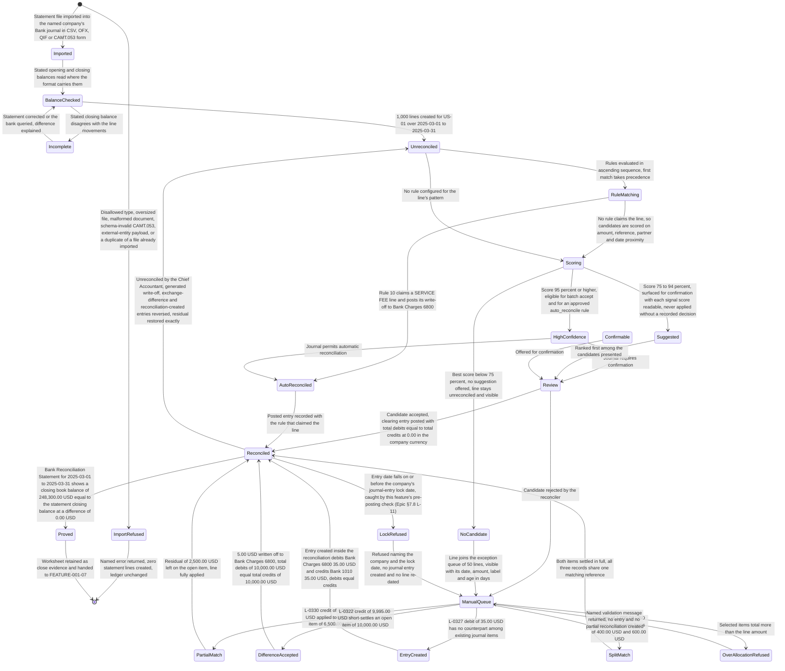

# FEATURE-001-04: Bank Reconciliation & Cash Management

---

## Metadata

| Attribute | Value |
|-----------|-------|
| **Feature ID** | `FEATURE-001-04` |
| **Title** | Bank Reconciliation & Cash Management |
| **Parent Epic** | [EPIC-001: Enterprise Accounting in Odoo](../EPIC-001-enterprise-accounting-odoo.md) |
| **Status** | Draft |
| **Priority** | 🔴 Critical |
| **Story Count** | 4 stories |
| **Last Updated** | 2026-08-16 |
| **Owner/Author** | Enterprise Accounting Team |

---

## 1. Feature Overview

### 1.1 Purpose and Business Value

This feature enables the **Treasury Analyst** and the **Chief Accountant** to close the gap between what the bank says happened and what the ledger says happened: to import a bank statement in CSV, OFX, QIF or CAMT.053 form without re-keying a line of it; to have every imported statement line matched against the open journal items it settles, on amount, date, reference and partner, driven by reusable reconciliation rules that carry their own precedence; to reconcile the exceptions by hand — including a partial settlement, a difference written off to bank charges, and a statement line that has no counterpart in the ledger at all; and to run cash registers and petty-cash floats whose opening, counting and closing are posted rather than recorded on paper. The outcome is a bank and cash position that is read from posted, reconciled journal items and a **Bank Reconciliation Statement** that ties the book balance to the statement balance for a named company and a stated date range.

It is delivered against two modules that are present in this repository, with a third present as prior-phase Community context:

- **`account`** — the "Invoicing" application, version 1.4, category `Accounting/Accounting`, licence LGPL-3. It supplies `account.bank.statement` and `account.bank.statement.line` as the objects an imported statement becomes, `account.move` and `account.move.line` as the journal items a statement line is matched against, the `amount_residual` field that a partial match reduces, the partial-reconciliation path that records which line settled which item and for how much, `account.reconcile.model` as the existing shape of a reconciliation rule, `account.journal` for the Bank and Cash journals held per company, and the lock-date fields on `res.company` that refuse a reconciliation posting into a reported period.
- **`account_payment`** — "Payment - Account", version 2.0, licence LGPL-3. It supplies the customer receipts and vendor payments that sit awaiting clearance in Suspense / Outstanding Payments 1099 until a statement line presents them, and the allocation of one payment across more than one open item that a partial match has to respect.
- **`account_bank_reconciliation_ce`** — present in this repository at version 19.0.1.0.0 under AGPL-3, category `Accounting/Reconciliation`, depending on `account` alone. It already implements multi-format statement import (`models/bank_statement_import.py`), a matching engine with confidence scoring (`models/reconciliation_matching_engine.py`), reconciliation rules with expression and amount matching (`models/reconciliation_rule.py`), a partial-reconciliation extension (`models/partial_reconcile_ext.py`), a reconciliation report (`report/reconciliation_report.py`) and the import and reconciliation wizards under `wizard/`. Under [D-003](../EPIC-001-enterprise-accounting-odoo.md#93-d-003-reuse-of-the-existing-community-edition-accounting-add-ons) import, matching, rules, manual reconciliation and partial reconciliation are therefore **reuse rather than build**; what this feature commissions on that path is cash-register and petty-cash handling, multi-company proof, the untrusted-file hardening that C-015 through C-022 require of the import and matching paths, and the statement-to-ledger tie-out evidence.

**Business Value Statement:**

> Cash is the one balance a lender, a board and an auditor all test first, and today it is proved by hand. Matching every imported statement line against the open journal items it settles lifts matching accuracy to **95% or higher** with algorithmic suggestions and cuts manual reconciliation effort by **70% to 80%**, so the Treasury Analyst spends the day on the 50 exceptions rather than on all 1,000 lines. For `US-01`, the Bank journal and the date-range parameter 2025-03-01 to 2025-03-31, the **Bank Reconciliation Statement** presents a closing book balance of `$248,300.00 USD` that equals the bank's statement closing balance of `$248,300.00 USD` at a difference of `0.00 USD`, each amount rounded to 2 decimal places at the USD rounding increment of 0.01 — which is what allows the close in FEATURE-001-07 to start on day one of the following period instead of waiting on reconciliation, and what removes bank reconciliation from the list of items the External Auditor has to reconstruct.

This feature carries all three of the Epic's objectives:

| Epic Objective | Contribution of This Feature |
|----------------|------------------------------|
| Multi-entity financial operations | Each legal entity holds its own Bank and Cash journals and its own Bank 1010, Cash 1000 and Suspense / Outstanding Payments 1099 balances, and a statement is imported into, matched inside and reconciled for one named company. Every criterion in this feature names the company whose books are affected, and a statement file belonging to `NL-01` is refused on an `US-01` bank journal rather than silently absorbed |
| Compliance reporting | Every reconciliation decision leaves a posted, balanced journal entry and a traceable link from statement line to journal item, so the internal-control expectation that each bank account is reconciled every period is evidenced from the system of record. 100% of unreconciled items stay visible with their age and their reason rather than being netted into a balancing figure |
| Real-time financial visibility | The bank and cash position is derived from posted, reconciled journal items rather than from a statement someone downloaded, so the cash figure the CFO / Finance Director reads is current as of the last reconciled statement line |

Ordering rule **ORD-001** in the Epic places this feature after FEATURE-001-01, which defines Bank 1010, the Bank and Cash journals and the lock dates every reconciliation posting lands inside, and the Epic's cross-feature dependency summary places it after FEATURE-001-02 and FEATURE-001-03, which post the vendor payments and customer receipts a statement line clears. **ORD-004** places it before FEATURE-001-07, whose Cash Flow Statement and period-close checklist consume the reconciled cash balance. The Epic's implementation sequence puts it in **Phase 2 — Transaction backbone** alongside FEATURE-001-02 and FEATURE-001-03.

**Deterministic artifacts referenced by this feature's criteria.** The four stories and the criteria below are written against one fixed artifact set, so a reviewer reads the same accounts, journals, statements, rules and amounts throughout and no assertion depends on an unnamed value:

| Artifact Class | Values | Role in This Feature |
|----------------|--------|----------------------|
| Legal entities | The entities of the Epic's canonical legal-entity register ([Appendix E.4](../EPIC-001-enterprise-accounting-odoo.md#e4-canonical-legal-entity-register)) this feature's criteria are worked in: **Global Holdings Inc.** (`US-01`, United States parent, functional currency USD, which is also the group presentation currency), **Global Europe SARL** (`NL-01`, Netherlands operating subsidiary, functional currency EUR) and **Global UK Ltd** (`GB-01`, United Kingdom operating subsidiary, functional currency GBP, incorporated 2025-04-01, so its statements and journals are exercised on undated criteria rather than inside the worked March 2025 period) | Each entity holds its own Bank and Cash journals and reconciles its own statements. Every multi-company criterion names the entity whose books are affected by registered name, entity code or both; no criterion is satisfied by "the group" alone, and no entity code carries a second legal identity anywhere in the backlog |
| General ledger accounts | Bank 1010 (the bank control account), Cash 1000 (the cash register and petty-cash account), Suspense / Outstanding Payments 1099 (payments and receipts issued or received but not yet presented by the bank, and cash in transit), Accounts Receivable 1200, Accounts Payable 2000, Bank Charges 6800, FX Gain/Loss on Settlement 7100 | Bank 1010, Accounts Receivable 1200 and Accounts Payable 2000 are three of the ten group codes defined in FEATURE-001-01. Cash 1000, Suspense / Outstanding Payments 1099, Bank Charges 6800 and FX Gain/Loss on Settlement 7100 are added to that same chart for the cash-register, clearing, write-off and exchange-difference paths this feature owns, and are registered through FEATURE-001-01's chart-of-accounts policy rather than created as parallel accounts. Every code here is a row of the Epic's canonical account register ([Appendix E.2](../EPIC-001-enterprise-accounting-odoo.md#e2-canonical-group-chart-of-accounts)); **FX Gain/Loss on Settlement 7100** is allocated to this feature by the [FEATURE-001-01 §7.4 Group Chart-of-Accounts Extension Registry](./FEATURE-001-01-chart-of-accounts-fiscal-year.md#74-group-chart-of-accounts-extension-registry) as the **realized settlement difference** code, which FEATURE-001-03 also posts to when a foreign-currency receivable is settled at another rate, while the IAS 21 remeasurement and translation difference of FEATURE-001-06 reaches Foreign Exchange Gain/Loss 7200, Currency Translation Adjustment 3200 carries only the consolidation translation reserve and Gain/Loss on Disposal 7210 only asset derecognition |
| Journals | **Bank** (statement lines, clearing entries, write-offs and the banking of cash) and **Cash** (cash-register receipts, cash payments and the register's closing entry) | Two of the five journal types FEATURE-001-01 defines per company. Named on every posting assertion so the entry is traceable to one journal in one company |
| Statement fixtures | `test_data/bank_statements/sample.csv`, `sample.ofx`, `sample.qif` and `sample.xml`, read-only under [D-009](../EPIC-001-enterprise-accounting-odoo.md#99-d-009-deterministic-test-fixtures). All four mirror one another over 2024-02-01 to 2024-02-28: 8 transactions, 4 credits totalling `$6,862.50 USD` and 4 debits totalling `$1,531.50 USD`, a net movement of `$5,331.00 USD`, each amount rounded to 2 decimal places at the USD rounding increment of 0.01 | The import test corpus, one fixture per supported format. `sample.xml` carries an opening balance (OPBD) of `$10,000.00 USD` and a closing balance (CLBD) of `$15,331.00 USD`, which the balance equation `10,000.00 + 6,862.50 − 1,531.50 = 15,331.00` proves; `sample.ofx` carries a ledger balance of `$5,331.00 USD` as of 2024-02-28. Cross-format import of the four fixtures must therefore produce the same 8 lines and the same totals |
| Worked reconciliation period | `US-01`, the **Bank** journal, the date-range parameter 2025-03-01 to 2025-03-31: an opening book balance of `$231,450.00 USD`, reconciled receipts of `$41,620.00 USD`, reconciled payments of `$24,770.00 USD` and a closing book balance of `$248,300.00 USD`, each amount rounded to 2 decimal places at the USD rounding increment of 0.01 | The single period the matching, manual-reconciliation, tie-out and reporting assertions all follow. 1,000 statement lines are imported for the period, of which 950 are auto-matched — a matching rate of 95.0%, at the SM-002 target of 95% or higher — leaving 50 lines for the manual work of `STORY-001-04-03` |
| Worked statement lines | `L-0312` a credit of `$3,200.00 USD`; `L-0318` a debit of `$12,450.00 USD`; `L-0322` a credit of `$9,995.00 USD` against an open item of `$10,000.00 USD`; `L-0325` a debit of `$6,300.00 USD`; `L-0327` a debit of `$35.00 USD` with no counterpart in the ledger; `L-0330` a credit of `$4,000.00 USD` against an open item of `$6,500.00 USD`; `L-0331` a credit of `$820.00 USD` banking the cash register, each amount rounded to 2 decimal places at the USD rounding increment of 0.01 | Seven named lines that exercise, in order: a one-to-one clearing match out of Suspense / Outstanding Payments 1099, the reconciliation of the `$12,450.00 USD` vendor payment FEATURE-001-02 posts directly against Bank 1010, a short settlement whose `$5.00 USD` difference is written off to Bank Charges 6800, the clearing of a vendor payment routed through Suspense / Outstanding Payments 1099, the creation of a journal entry from inside the reconciliation for a line with no counterpart, a partial match leaving a residual of `$2,500.00 USD`, and the clearing of cash in transit |
| Reconciliation rules | Sequence 10 **Bank service fee** (label contains `SERVICE FEE`, amount between `-$100.00 USD` and `$0.00 USD`, a 100% write-off to Bank Charges 6800, trigger automatic); sequence 20 **Payroll** (label contains `PAYROLL`, amount between `-$50,000.00 USD` and `-$10,000.00 USD`, trigger manual); sequence 30 **Invoice reference** (label matching the regular expression `(INV(OICE)?-\d+)`, trigger manual), each amount stated to 2 decimal places at the USD rounding increment of 0.01 | The three rules every rule-precedence, expression-validation and write-off assertion is written against. Evaluation runs in ascending sequence and the first rule whose conditions are met takes precedence, so a `-$35.00 USD` service-fee line is claimed by rule 10 and never reaches rule 30 |
| Report | **Bank Reconciliation Statement**, run with a date-range parameter — 2025-03-01 to 2025-03-31 is the worked range throughout, and 2024-02-01 to 2024-02-28 is the fixture range | The one report this feature produces. For the worked range in `US-01` it presents the closing book balance of `$248,300.00 USD` against the statement closing balance of `$248,300.00 USD` at a difference of `0.00 USD`, each amount rounded to 2 decimal places at the USD rounding increment of 0.01, together with the count of unreconciled lines and the Suspense / Outstanding Payments 1099 balance behind them |
| Confidence bands | **High — 95% or higher**: eligible for batch accept and for a rule whose `trigger` is `auto_reconcile`. **Medium — 75% to 94%**: surfaced to the reconciling role for confirmation with each contributing signal's score readable alongside the total, and never applied without a decision recorded against it. **Low — below 75%**: not surfaced as a suggestion; the line is presented with the status "No Match Found", keeps a reconciled state of false and stays visible on the **Bank Reconciliation Statement**. This is the one band set that governs the feature, published in full at [STORY-001-04-02 § Confidence Bands](./FEATURE-001-04/STORY-001-04-02-auto-match-statement-lines.md#confidence-bands) | The bands that decide whether a candidate is eligible for automatic or batch reconciliation, offered for confirmation, or withheld so the line stays unreconciled and visible. The 95% high floor is the floor behind the 950-of-1,000 auto-match rate this feature is measured on as SM-002 |
| Cash register month roll-up | Register `PETTY-US-01` on the **Cash** journal of `US-01`, rolled up across **2025-03** as `PETTY-US-01-2025-03` and closed at the register's final March session `CASH-US-01-S07` on 2025-03-31: an opening float of `$500.00 USD`, cash receipts of `$1,250.00 USD`, cash payments of `$430.00 USD`, an expected closing balance of `$1,320.00 USD` and a counted closing balance of `$1,320.00 USD`, each amount rounded to 2 decimal places at the USD rounding increment of 0.01 | The month roll-up every feature-level cash-register gate is written against, and it is a roll-up rather than one session: `500.00 + 1,250.00 − 430.00 = 1,320.00` holds at a difference of `0.00 USD`, `$820.00 USD` is banked above the retained float of `$500.00 USD` at that final close, and the counted-difference control is worked on the same close at a counted `$1,317.50 USD` against the expected `$1,320.00 USD`, a difference of `$2.50 USD`. The month's payments of `$430.00 USD` are the `$82.40 USD` disbursement of session `CASH-US-01-S03` dated 2025-03-03 plus `$347.60 USD` across the register's later March sessions; [STORY-001-04-04](./FEATURE-001-04/STORY-001-04-04-manage-cash-registers.md) works `CASH-US-01-S03` session by session, with its own counted shortage of `$5.00 USD`. That shortage and the custodian's `$5.00 USD` reimbursement on review net to zero inside the month and are neither a receipt nor a payment of the register, which is why the month's expected and counted balances agree at `$1,320.00 USD` |
| Rate basis | The closing rate of the statement line's own transaction date, held as a synthetic fixture value rather than a provider observation for that date, applied as units of the foreign currency per unit of the company's functional currency: 1.0850 USD per EUR on 2025-03-20 | The single rate basis behind every converted amount in this feature. `EUR 900.00` allocated at that rate settles `USD 976.50` of a `USD 1,000.00` item, rounded half-up to 2 decimal places at each currency's rounding increment of 0.01, and the rate together with its rate date is recorded on the reconciliation |
| Rounding | 2 decimal places at a rounding increment of 0.01, rounded half-up, for USD, EUR and GBP | Applied to every amount asserted anywhere in this feature, including every converted amount and every residual |

**A note on the two senses of debit and credit.** On a bank statement a *credit* is money into the account and a *debit* is money out of it, and that is the sense in which every statement line, every fixture total and every format's credit-and-debit indicator is described in this feature. In a journal entry a debit and a credit are the two sides of one posting, and every posting asserted anywhere in this feature carries total debits equal to total credits at a difference of `0.00` in the company currency, stated to 2 decimal places at that currency's rounding increment of 0.01. Where both senses meet in one sentence, the statement side is named as a statement line and the ledger side as a posting.

**A note on where a payment sits before the bank presents it.** Two routings exist and this feature demonstrates both, so that no Bank 1010 movement is counted twice. Where a journal's payment method routes through an outstanding-payments account, a payment posts debit Accounts Payable 2000 against credit Suspense / Outstanding Payments 1099 — or, for a receipt, debit Suspense / Outstanding Payments 1099 against credit Accounts Receivable 1200 — and reconciling the statement line posts the second leg to Bank 1010, with total debits equal to total credits at a difference of `0.00` in the company currency; statement lines `L-0312` and `L-0325` follow this routing. Where a payment or receipt is instead posted straight against Bank 1010, as the worked vendor payment of `$12,450.00 USD` in FEATURE-001-02 and the worked customer receipt in FEATURE-001-03 are, the Bank 1010 movement already exists, so reconciling the statement line creates no journal entry at all and only marks the line and the journal item reconciled under one matching reference; statement line `L-0318` follows this routing. [§4.1](#41-feature-level-acceptance-criteria) carries a criterion for each, and both amounts are stated to 2 decimal places at the USD rounding increment of 0.01.

### 1.2 Problem Statement

Bank reconciliation in this group is a monthly act of transcription. A statement is downloaded, printed or pasted into a spreadsheet, and each line is looked up against the ledger by eye. Six consequences follow, and each of them recurs every month for every bank account in every entity:

- **Every statement line is matched by hand.** A 1,000-line month is 1,000 lookups, each one a search for an amount, a reference or a partner name that the reconciler holds in their head. Nothing about the work is retained, so next month it is done again from the beginning, and the effort scales with transaction volume rather than with exceptions.
- **Period close waits on reconciliation.** The Cash Flow Statement, the Balance Sheet cash line and the close checklist in FEATURE-001-07 cannot be signed while the bank balance is unproved, so a reconciliation that takes 5 to 10 business days pushes the whole close out by the same amount. The Epic baselines the close at 10 business days per legal entity against a target of 5, and unproved cash is one of the reasons it is not already 5.
- **Matching errors go undetected.** A line matched to the wrong journal item still leaves a reconciled statement and a plausible balance, because two offsetting errors net to zero. The error surfaces months later as an unexplained residual on a customer or vendor account, at which point the statement it came from has been archived and the person who matched it has moved on.
- **There is no audit trail of reconciliation decisions.** Nothing records why a line was matched to a particular item, who matched it, what difference was accepted, or which account absorbed it. The External Auditor therefore re-performs the reconciliation from the statement rather than testing the control, and a difference written off cannot be distinguished from a difference nobody noticed.
- **Unreconciled items disappear into a balancing figure.** With no place to hold a line that has no counterpart, the reconciler forces it against the nearest plausible item or absorbs it into a manual adjustment. Either way the item stops being visible, so a duplicate payment, a bank error and a receipt from an unknown payer all end up looking the same: reconciled.
- **Cash registers and petty-cash floats sit outside the ledger entirely.** A float is counted on a sheet of paper, a shortfall is settled by whoever is standing there, and Cash 1000 is adjusted at month end to whatever the sheet says. There is no opening balance, no posted receipt or payment, no counted close and no approval of a difference, so the cash on hand is unauditable by construction.

### 1.3 Key Capabilities

| Capability ID | Capability Description | Related Stories |
|---------------|------------------------|-----------------|
| CAP-001 | Import bank statements in CSV, OFX, QIF and CAMT.053 with duplicate detection and rollback on failure | STORY-001-04-01 |
| CAP-002 | Auto-match statement lines to open journal items on amount, date, reference and partner, driven by reusable reconciliation rules | STORY-001-04-02 |
| CAP-003 | Reconcile unmatched and partially matched lines by hand, with write-off, split allocation and undo | STORY-001-04-03 |
| CAP-004 | Operate cash registers and petty-cash floats with opening, counting and balanced closing entries | STORY-001-04-04 |

The four capabilities are sequential on the bank side and parallel on the cash side, and that is the reason the story order in [§3.4](#34-recommended-implementation-order) is what it is: CAP-001 brings the bank's version of events into the system as statement lines, CAP-002 resolves 95% of those lines against the ledger without a line-by-line lookup — claimed by an `auto_reconcile` rule or released in one batch decision — CAP-003 resolves the remainder — the partial settlements, the differences and the lines with no counterpart — and CAP-004 brings the cash that never touches a bank statement under the same posted, balanced, counted discipline. CAP-001 through CAP-003 together produce the reconciled Bank 1010 balance that the **Bank Reconciliation Statement** proves; CAP-004 produces the Cash 1000 balance and hands its banked surplus back to CAP-002 through Suspense / Outstanding Payments 1099.

### 1.4 Success Criteria at Feature Level

| Criterion | Target | Verification Method |
|-----------|--------|---------------------|
| Import coverage across all four formats | 4 of 4 formats import without data loss: each of `test_data/bank_statements/sample.csv`, `sample.ofx`, `sample.qif` and `sample.xml` produces the same 8 statement lines, the same 4 credits totalling `$6,862.50 USD` and the same 4 debits totalling `$1,531.50 USD`, each amount rounded to 2 decimal places at the USD rounding increment of 0.01 | Cross-format import test importing each fixture into a `US-01` Bank journal and comparing the resulting line sets field by field |
| Statement balance integrity on import | The CAMT.053 fixture's `OPBD` of `$10,000.00 USD` is recorded as the imported statement's Starting Balance and its `CLBD` of `$15,331.00 USD` as the Ending Balance, satisfying `10,000.00 + 6,862.50 − 1,531.50 = 15,331.00` at a difference of `0.00 USD`; the OFX fixture's `LEDGERBAL/BALAMT` of `$5,331.00 USD` as of 2024-02-28 is recorded as an absolute closing balance in the Ending Balance and never added to the Starting Balance, so on a journal with no preceding statement `0.00 + 6,862.50 − 1,531.50 = 5,331.00` holds at a difference of `0.00 USD`, each amount rounded to 2 decimal places at the USD rounding increment of 0.01 | Balance-equation assertion executed on the imported statement for each format that states a closing balance, comparing the Computed Balance against the stated Ending Balance |
| Duplicate import refused | 100% of attempts to re-import a statement file already imported into the same `US-01` Bank journal are refused with an Odoo validation message naming the file, the journal and the count of matching lines, and the count of statement lines created by the refused attempt is 0 | Negative test re-importing each of the four fixtures, with the created-line count asserted at 0 |
| Auto-match accuracy | 95.0% or higher of imported statement lines auto-matched: 950 of the 1,000 lines imported for `US-01` over 2025-03-01 to 2025-03-31, measured as auto-matched lines divided by imported lines | Scored matching test over a corpus of known statement-line-to-journal-item pairs, with the rate asserted against the 95% floor (SM-002) |
| Manual reconciliation effort reduction | 70% to 80% reduction against the pre-implementation baseline of matching every line by hand, measured as the count of lines needing a human decision divided by the count of lines imported | Effort comparison over one full period per company, recorded before and after implementation |
| Balanced clearing of a presented payment | Statement line `L-0312`, a credit of `$3,200.00 USD` in `US-01`, matched to a customer receipt of `$3,200.00 USD` held in Suspense / Outstanding Payments 1099, posts through the **Bank** journal as debit Bank 1010 `$3,200.00 USD` and credit Suspense / Outstanding Payments 1099 `$3,200.00 USD`, so total debits of `$3,200.00 USD` equal total credits of `$3,200.00 USD` at a difference of `0.00 USD`, each amount rounded to 2 decimal places at the USD rounding increment of 0.01 | Posted entry inspected line by line, with the debit-minus-credit difference asserted at `0.00 USD` (C-009) |
| Reconciliation of a payment already posted against Bank 1010 | Statement line `L-0318`, a debit of `$12,450.00 USD` in `US-01`, matches the vendor payment FEATURE-001-02 posts directly through the **Bank** journal as debit Accounts Payable 2000 `$12,450.00 USD` and credit Bank 1010 `$12,450.00 USD`, total debits of `$12,450.00 USD` equal to total credits of `$12,450.00 USD` at a difference of `0.00 USD`; because that Bank 1010 movement already exists, reconciling the line creates no further journal entry, marks the line and the journal item reconciled under one matching reference, and leaves the Bank 1010 balance unchanged, each amount rounded to 2 decimal places at the USD rounding increment of 0.01 | Journal-entry count before and after the match asserted as equal, with the Bank 1010 balance asserted unchanged and both records asserted reconciled |
| Balanced clearing of a payment routed through suspense | Statement line `L-0325`, a debit of `$6,300.00 USD` in `US-01`, matched to a vendor payment of `$6,300.00 USD` posted as debit Accounts Payable 2000 `$6,300.00 USD` and credit Suspense / Outstanding Payments 1099 `$6,300.00 USD`, posts the second leg through the **Bank** journal as debit Suspense / Outstanding Payments 1099 `$6,300.00 USD` and credit Bank 1010 `$6,300.00 USD`, so total debits of `$6,300.00 USD` equal total credits of `$6,300.00 USD` at a difference of `0.00 USD`, each amount rounded to 2 decimal places at the USD rounding increment of 0.01 | Posted entry inspected line by line, with the difference asserted at `0.00 USD` and the payment's Suspense / Outstanding Payments 1099 balance asserted at `$0.00 USD` (C-009) |
| Balanced write-off of a settlement difference | Statement line `L-0322`, a credit of `$9,995.00 USD` in `US-01` against an open Accounts Receivable 1200 item of `$10,000.00 USD`, reconciles with a `$5.00 USD` write-off and posts through the **Bank** journal as debit Bank 1010 `$9,995.00 USD` and debit Bank Charges 6800 `$5.00 USD` against credit Accounts Receivable 1200 `$10,000.00 USD`, so total debits of `$10,000.00 USD` equal total credits of `$10,000.00 USD` at a difference of `0.00 USD`, each amount rounded to 2 decimal places at the USD rounding increment of 0.01, and the item's residual becomes `$0.00 USD` | Posted write-off inspected line by line, with the difference asserted at `0.00 USD` and the residual asserted at `$0.00 USD` |
| Balanced entry created inside the reconciliation | Statement line `L-0327`, a debit of `$35.00 USD` in `US-01` with no counterpart among existing journal items, is cleared by a journal entry created from inside the reconciliation that posts through the **Bank** journal as debit Bank Charges 6800 `$35.00 USD` and credit Bank 1010 `$35.00 USD`, so total debits of `$35.00 USD` equal total credits of `$35.00 USD` at a difference of `0.00 USD`, each amount rounded to 2 decimal places at the USD rounding increment of 0.01; unreconciling the line reverses that entry | Posted entry inspected line by line, then unreconciled and the reversal asserted ([CF-003](../EPIC-001-enterprise-accounting-odoo.md#cf-003-journal-entry-created-inside-manual-bank-reconciliation)) |
| Partial match leaves a stated residual | Statement line `L-0330`, a credit of `$4,000.00 USD` in `US-01` against an open Accounts Receivable 1200 item of `$6,500.00 USD`, records a partial reconciliation of `$4,000.00 USD` and leaves a residual of `$2,500.00 USD`, each amount rounded to 2 decimal places at the USD rounding increment of 0.01; unreconciling that one partial match restores the residual to `$6,500.00 USD` and leaves every other partial match on the item intact | Residual recomputed after the partial match and after its reversal, and compared with `$2,500.00 USD` and `$6,500.00 USD` |
| Balanced multi-currency reconciliation with its rate basis | In `NL-01`, whose functional currency is EUR, a statement line of `EUR 900.00` dated 2025-03-20 allocated against a `USD 1,000.00` Accounts Receivable 1200 item carried at `EUR 909.09` records the company-currency amount `EUR 900.00`, the debit-side amount `EUR 900.00` and the credit-side amount `USD 976.50` at the closing rate of 1.0850 USD per EUR held for that transaction date; the settlement posts as debit Bank 1010 `EUR 900.00` against credit Accounts Receivable 1200 `EUR 900.00` at a difference of `EUR 0.00`, and the realized exchange difference posts as debit Accounts Receivable 1200 `EUR 12.27` against credit FX Gain/Loss on Settlement 7100 `EUR 12.27` at a difference of `EUR 0.00`, each amount rounded half-up to 2 decimal places at the EUR rounding increment of 0.01. [STORY-001-04-03](./FEATURE-001-04/STORY-001-04-03-manual-reconciliation.md) Criterion 7 is the one place this settlement is asserted | Posted entries inspected line by line for `NL-01`, with the converted amount recomputed from the stated rate and its rate date and each difference asserted at `EUR 0.00` |
| Balanced cash-register closing entry | For roll-up `PETTY-US-01-2025-03` in `US-01`, closed at session `CASH-US-01-S07` on 2025-03-31, an opening float of `$500.00 USD` plus cash receipts of `$1,250.00 USD` less cash payments of `$430.00 USD` gives an expected closing balance of `$1,320.00 USD`; against a counted closing balance of `$1,320.00 USD` the session closes by banking `$820.00 USD` above the retained float, posting through the **Cash** journal as debit Suspense / Outstanding Payments 1099 `$820.00 USD` and credit Cash 1000 `$820.00 USD`, so total debits of `$820.00 USD` equal total credits of `$820.00 USD` at a difference of `0.00 USD`, each amount rounded to 2 decimal places at the USD rounding increment of 0.01 | Posted closing entry inspected line by line, with the expected balance recomputed from the float and the session movements and the difference asserted at `0.00 USD` |
| Cash in transit clears against the statement | Statement line `L-0331`, a credit of `$820.00 USD` in `US-01`, clears the banked cash by posting through the **Bank** journal as debit Bank 1010 `$820.00 USD` and credit Suspense / Outstanding Payments 1099 `$820.00 USD`, so total debits equal total credits at a difference of `0.00 USD`, and the Suspense / Outstanding Payments 1099 balance for the register returns to `$0.00 USD`, each amount rounded to 2 decimal places at the USD rounding increment of 0.01 | Posted clearing entry inspected line by line, with the suspense balance asserted at `$0.00 USD` |
| Counted difference posted to an interim account, its clearing gated by approval | Closing register `PETTY-US-01` at a counted balance of `$1,317.50 USD` against an expected balance of `$1,320.00 USD` posts the counted cash to the ledger and routes the difference of `$2.50 USD` to Suspense / Outstanding Payments 1099 in a balanced entry, raising it for Chief Accountant review with the company, the register, both balances and the difference of `$2.50 USD` named, each amount stated to 2 decimal places at the USD rounding increment of 0.01. 100% of attempts to clear that interim `$2.50 USD` out of Suspense / Outstanding Payments 1099 to a final account are refused with an Odoo validation message until the Chief Accountant approves the difference and names the account that receives it, and the approval, its approver, the named account and its date are retained with the session | Negative test per company on the clearing path, with the created-clearing-entry count asserted at 0 before approval and the interim Suspense / Outstanding Payments 1099 balance asserted at `$2.50 USD` |
| **Bank Reconciliation Statement** tie-out to the bank | For `US-01`, the **Bank** journal and the date-range parameter 2025-03-01 to 2025-03-31, the report presents an opening book balance of `$231,450.00 USD`, reconciled receipts of `$41,620.00 USD`, reconciled payments of `$24,770.00 USD` and a closing book balance of `$248,300.00 USD` that equals the bank's statement closing balance of `$248,300.00 USD` at a difference of `0.00 USD`, with an unreconciled-line count of 0 and a Suspense / Outstanding Payments 1099 balance of `$0.00 USD`, each amount rounded to 2 decimal places at the USD rounding increment of 0.01 | Report-to-statement reconciliation worksheet per company per period, retained as close evidence (SM-002, SM-006) |
| Unreconciled-item traceability | 100% of unreconciled statement lines remain visible on the **Bank Reconciliation Statement** for the same date range with their date, amount, label and age in days, and are traceable from the report to the statement line and onward to the candidate journal items considered; the count of unreconciled lines absorbed into a balancing figure is 0 | Report run mid-period with 50 lines outstanding, each one traced from the report to its statement line |
| Reconciliation coverage per period | 100% of bank accounts in `US-01`, `NL-01` and `GB-01` carry a completed reconciliation for the period, evidenced by a retained **Bank Reconciliation Statement** whose difference is `0.00` in the company currency, stated to 2 decimal places at that currency's rounding increment of 0.01 | Per-company reconciliation checklist executed at period close, signed off by the Chief Accountant |
| Hostile-input rejection on the import path | 100% of malformed, schema-invalid, oversized, disallowed-type and external-entity statement files are rejected with a named error that names the rejected file and the check that failed, disclose no stack trace, file-system path or credential, create no statement line and no journal entry, and leave the service available | Hostile-input fixture set executed against the import path for each format (C-015, C-016, C-019, C-020, C-022) |
| Test coverage | ≥80% for all 4 story implementations, with every balance, residual, rate and tie-out assertion tested numerically | Coverage tooling in the repository's configured test run (C-007, C-009) |
| Demonstrability | 4 of 4 stories demonstrated in the Odoo user interface, or over the JSON web-service surface C-023 governs, to the Finance Controller and the Product Owner | Recorded acceptance walkthrough per story |

---

## 2. User Personas

### 2.1 Persona Mapping

Every persona below is a named finance role drawn from the Epic's persona register. The five roles marked applicable import a statement, decide a match, post a reconciliation entry, count a cash register or test the resulting evidence; the roles marked not applicable consume the reconciled cash balance, and their work is specified in the features named against them.

| Persona | Role Description | Primary Use Cases | Applicable |
|---------|------------------|-------------------|------------|
| **Treasury Analyst** | Owns bank and cash positions and statement reconciliation | Imports the day's or the month's statement into the named company's **Bank** journal in CSV, OFX, QIF or CAMT.053 form and confirms the opening and closing balances it carries; runs matching over the imported lines and reviews the ranked suggestions band by band; authors, sequences and tests the reconciliation rules — `SERVICE FEE` at sequence 10, `PAYROLL` at 20, the `(INV(OICE)?-\d+)` expression at 30 — against historical unreconciled lines before letting one run live; opens register `PETTY-US-01` with its `$500.00 USD` float, records its cash receipts and payments, counts it and banks the `$820.00 USD` surplus; runs the **Bank Reconciliation Statement** for 2025-03-01 to 2025-03-31 and works the unreconciled list down to 0, with every amount in this row stated to 2 decimal places at the USD rounding increment of 0.01 | ☑ Yes |
| **Chief Accountant** | Owns the general ledger, the chart of accounts and the integrity of every posted entry | Approves that every reconciliation posting is balanced — total debits equal total credits at a difference of `0.00` in the company currency — for the clearing entry, the write-off, the entry created inside the reconciliation and the cash-register closing entry; approves Bank Charges 6800 as the destination of an accepted settlement difference and FX Gain/Loss on Settlement 7100 as the destination of an exchange difference; clears Suspense / Outstanding Payments 1099 to `$0.00 USD` so no unexplained suspense balance survives the period (SM-006); approves a counted cash difference of `$2.50 USD` and names the account that receives it before the register can close; administers the journal-entry lock date that this feature's own pre-posting check reads before a reconciliation entry is built, so a late entry is refused rather than silently re-dated (Epic [§7.8](../EPIC-001-enterprise-accounting-odoo.md#78-lock-date-behaviour-contract) L-11), while the platform itself refuses the reconciliation of an item already posted inside the locked period (L-6); every amount in this row is stated to 2 decimal places at its currency's rounding increment of 0.01 | ☑ Yes |
| **Accounts Receivable Specialist** | Issues customer invoices, allocates receipts and manages collections | Confirms that a customer receipt posted in FEATURE-001-03 and held in Suspense / Outstanding Payments 1099 is the movement statement line `L-0312` clears, so cash application and bank reconciliation resolve to one figure; works the partial match on `L-0330` that leaves an Accounts Receivable 1200 residual of `$2,500.00 USD` and confirms the residual is the collectable balance the aged report will present; investigates a statement receipt from an unidentified payer rather than letting it be forced against the nearest open invoice, with every amount in this row stated to 2 decimal places at the USD rounding increment of 0.01 | ☑ Yes |
| **Accounts Payable Clerk** | Captures vendor bills, runs three-way match and prepares payment runs | Confirms that the `$12,450.00 USD` vendor payment posted in FEATURE-001-02 directly against Bank 1010 is the movement statement line `L-0318` reconciles, and that the `$6,300.00 USD` payment routed through Suspense / Outstanding Payments 1099 is the movement statement line `L-0325` clears, so a payment shown as issued in the ledger is shown as presented by the bank under either routing and neither is counted twice; identifies a payment that has been outstanding beyond the expected presentation window as a candidate for cancellation and reissue rather than a reconciliation difference; confirms that a duplicate presentation of the same payment is refused rather than matched twice, with every amount in this row stated to 2 decimal places at the USD rounding increment of 0.01 | ☑ Yes |
| **External Auditor** | Tests balances and controls and issues the audit opinion | Reads the retained **Bank Reconciliation Statement** for `US-01` and 2025-03-01 to 2025-03-31 as the evidence that the closing book balance of `$248,300.00 USD` equals the bank's statement closing balance at a difference of `0.00 USD`; traces a reconciled line from the report to the statement line and onward to the journal item it settled and the role that accepted the match; tests that each accepted difference is evidenced and posted to a named account rather than absorbed; tests that 100% of unreconciled items are visible with their age rather than netted into a balancing figure; tests the cash-count evidence and the approval behind any counted difference, with every amount in this row stated to 2 decimal places at the USD rounding increment of 0.01 | ☑ Yes |
| Financial Reporting Manager | Produces statutory and management statements for each entity and the group | Consumes the reconciled Bank 1010 and Cash 1000 balances as the cash line of the Balance Sheet and the opening and closing cash of the Cash Flow Statement, and owns the shared export and drill-down convention the **Bank Reconciliation Statement** inherits — both in FEATURE-001-07 rather than here | ☐ No |
| Group Controller | Governs group accounting policy and approves the consolidated result | Approves the group treasury and reconciliation policy and consumes the consolidated cash position; an intercompany transfer between `US-01` and `NL-01` is eliminated in FEATURE-001-06 rather than here, although each leg is reconciled against its own entity's statement here | ☐ No |
| CFO / Finance Director | Executive stakeholder accountable for financial health and compliance | Reads the reconciled cash position and the reconciliation status of each bank account at close, and confirms the open platform and edition decisions recorded in [§5.2](#52-dependency-and-edition-considerations) and [§5.5](#55-version-compatibility); imports nothing and reconciles nothing | ☐ No |

### 2.2 Persona-to-Story Mapping

Each story carries exactly one primary persona in its WHO statement. Secondary personas originate the movement being cleared, approve the posting or test the evidence, and they are named so that the access rights derived from these stories keep the importing role, the matching role and the difference-approval role distinguishable.

| Story | Primary Persona | Secondary Personas |
|-------|-----------------|--------------------|
| STORY-001-04-01 Import Bank Statements in CSV, OFX, QIF and CAMT.053 | Treasury Analyst | Chief Accountant (the journal and period an imported statement lands in), External Auditor (the retained source file and the import audit trail) |
| STORY-001-04-02 Auto-Match Statement Lines with Reconciliation Rules | Treasury Analyst | Chief Accountant (the balanced clearing entry and the write-off account a rule names), Accounts Receivable Specialist (receipts cleared through Suspense / Outstanding Payments 1099), Accounts Payable Clerk (payments cleared through the same account), External Auditor (why a line was matched and by which rule) |
| STORY-001-04-03 Manually Reconcile Unmatched and Partial Lines | Chief Accountant | Treasury Analyst (the exception queue worked line by line), Accounts Receivable Specialist (the Accounts Receivable 1200 residual a partial match leaves), External Auditor (the accepted difference, the entry created inside the reconciliation, and the reversal on unreconcile) |
| STORY-001-04-04 Manage Cash Registers and Petty Cash | Treasury Analyst | Chief Accountant (approval of a counted difference and the balanced closing entry), External Auditor (the cash-count evidence and the approval trail) |

---

## 3. Story List

### 3.1 User Stories

| Story ID | Story Title | Persona | Priority | Status | Link |
|----------|-------------|---------|----------|--------|------|
| STORY-001-04-01 | Import Bank Statements in CSV, OFX, QIF and CAMT.053 | Treasury Analyst | 🔴 Critical | Draft | [STORY-001-04-01](./FEATURE-001-04/STORY-001-04-01-import-bank-statements.md) |
| STORY-001-04-02 | Auto-Match Statement Lines with Reconciliation Rules | Treasury Analyst | 🔴 Critical | Draft | [STORY-001-04-02](./FEATURE-001-04/STORY-001-04-02-auto-match-statement-lines.md) |
| STORY-001-04-03 | Manually Reconcile Unmatched and Partial Lines | Chief Accountant | 🟠 High | Draft | [STORY-001-04-03](./FEATURE-001-04/STORY-001-04-03-manual-reconciliation.md) |
| STORY-001-04-04 | Manage Cash Registers and Petty Cash | Treasury Analyst | 🟠 High | Draft | [STORY-001-04-04](./FEATURE-001-04/STORY-001-04-04-manage-cash-registers.md) |

**Priority legend:** 🔴 Critical — a closed, compliant period is impossible without it, and the Epic records this feature as Critical because an unproved bank balance blocks the close; 🟠 High — significant finance value that resolves what the Critical stories leave outstanding, or that brings a balance outside the bank statement under the same discipline.

The **Treasury Analyst** is the primary persona of three of the four stories because one role owns the bank and cash position end to end. `STORY-001-04-03` is the exception: the **Chief Accountant** owns manual reconciliation because every decision it contains changes the general ledger — accepting a difference into Bank Charges 6800, creating a journal entry from inside the reconciliation, and reversing a partial match — and those are general-ledger approvals rather than treasury operations.

### 3.2 Story Count Assessment

| Count | Assessment | Status |
|-------|------------|--------|
| **4 stories** | Within the mandated range of 2 to 5 stories per feature | ✓ Feature is scoped for independent delivery |

This feature carries **4 stories**, inside the 2-to-5 bound recorded in the Epic's decomposition guidelines. The earlier 3-to-7 guidance carried by the feature template is superseded by that bound and is not applied here. The count is stated identically in four places, and the four must stay equal: the Story Count row in §Metadata, this assessment, the 4 rows of [§3.1](#31-user-stories), and the 4 links of [§9.2](#92-story-files). The Epic's feature summary declares the same count of 4 stories for `FEATURE-001-04`.

The count is four rather than five because the superseded flat-layout backlog's five bank-reconciliation stories were compressed into three, and a fourth story was added for scope that backlog never planned. Two merges and one addition account for the difference, and each is recorded in the Epic's retirement map:

| Change | Destination | What the destination is obliged to carry |
|--------|-------------|------------------------------------------|
| The retired algorithmic-matching and reconciliation-rules stories merge | `STORY-001-04-02` | Rule ordering and the ability to test a rule against historical transactions before it runs live are each a **named criterion**, because they are the parts a merge tends to lose; expression validation and complexity bounds fall under C-019 and C-022 ([C.3.5](../EPIC-001-enterprise-accounting-odoo.md#c35-the-bank-budget-and-asset-mergers)) |
| The retired manual-reconciliation and partial-reconciliation stories merge | `STORY-001-04-03` | Partial and full matching are demonstrated **separately**; unreconciling a partial match is a criterion rather than an assumption; the multi-currency case serves as the exchange-rounding edge case; and the journal entry created from inside the reconciliation is carried as its own criterion under [CF-003](../EPIC-001-enterprise-accounting-odoo.md#cf-003-journal-entry-created-inside-manual-bank-reconciliation) ([C.3.5](../EPIC-001-enterprise-accounting-odoo.md#c35-the-bank-budget-and-asset-mergers)) |
| Cash registers and petty cash are added as new scope | `STORY-001-04-04` | The capability has no predecessor in the retired backlog and enters with this Epic ([C.4](../EPIC-001-enterprise-accounting-odoo.md#c4-destinations-with-no-legacy-source)); it carries the opening float, the session receipts and payments, the counted close, the balanced closing entry and the approval of a counted difference |

Splitting further would produce stories with no accounting proof of their own — a matching engine separated from imported statement lines has nothing to match, and a write-off separated from the line whose difference it absorbs has no difference to post. Merging would breach the Small criterion of INVEST, because each of the four is demonstrated by a different artifact: an imported statement whose balance equation holds, a matching run whose rate is 950 of 1,000 lines, a reconciled exception whose entry balances at `0.00 USD`, and a counted register whose closing entry banks `$820.00 USD` — that amount and the `0.00 USD` difference each stated to 2 decimal places at the USD rounding increment of 0.01. If refinement shows that the combined scope of `STORY-001-04-02` or `STORY-001-04-03` exceeds 13 Fibonacci points, that is raised as a backlog change against this four-story budget rather than absorbed silently or trimmed.

### 3.3 Story Dependency Ordering

Each of the four stories delivers an outcome demonstrable on its own, which keeps them Independent under INVEST. The rows below are sequencing prerequisites — imported data or configuration that must already exist for the dependent story to be demonstrated — and not shared implementation.

| Story | Depends On | Notes |
|-------|-----------|-------|
| STORY-001-04-01 (Import Bank Statements in CSV, OFX, QIF and CAMT.053) | None within this feature | Foundation story. Outside this feature it depends on FEATURE-001-01 for Bank 1010 and the **Bank** journal per company, and on the read-only fixtures in `test_data/bank_statements/` as its import corpus |
| STORY-001-04-02 (Auto-Match Statement Lines with Reconciliation Rules) | STORY-001-04-01 | Matching operates on imported statement lines. Without them there is nothing to score, no rate of 950 of 1,000 to assert and no rule to evaluate. Outside this feature it depends on FEATURE-001-02 and FEATURE-001-03 for the payments and receipts held in Suspense / Outstanding Payments 1099 that a line clears |
| STORY-001-04-03 (Manually Reconcile Unmatched and Partial Lines) | STORY-001-04-01, STORY-001-04-02 | Manual work handles what the rules leave. The 50 lines it resolves are the residue of the 1,000 imported by `STORY-001-04-01` and the 950 matched by `STORY-001-04-02`, so both must run before the exception queue exists. It is not a fallback for a failed match: the partial settlement, the accepted difference and the line with no counterpart are outcomes the rules are not permitted to decide unaided |
| STORY-001-04-04 (Manage Cash Registers and Petty Cash) | None within this feature | Independent of `STORY-001-04-01` through `STORY-001-04-03`: a cash register is opened, transacted, counted and closed without any bank statement. It shares the **Cash** journal with no other story in this feature and shares the balanced-closing-entry discipline and the Suspense / Outstanding Payments 1099 account with them, which is why its banked `$820.00 USD`, stated to 2 decimal places at the USD rounding increment of 0.01, becomes statement line `L-0331` for `STORY-001-04-02` to clear. Outside this feature it depends on FEATURE-001-01 for Cash 1000 and the **Cash** journal per company |

### 3.4 Recommended Implementation Order

```text
0. FEATURE-001-01, FEATURE-001-02 and FEATURE-001-03 (external prerequisites)
   Bank 1010, Cash 1000, Suspense / Outstanding Payments 1099, Bank Charges 6800
   FX Gain/Loss on Settlement 7100 and Foreign Exchange Gain/Loss 7200 exist; the Bank and Cash journals exist per company;
   the period is open; and the vendor payments and customer receipts that a
   statement line clears are posted and awaiting presentation
        |
        v
1. STORY-001-04-01  Import Bank Statements in CSV, OFX, QIF and CAMT.053
   Brings the bank's version of events in: the four fixtures each produce
   8 lines, credits of $6,862.50 USD and debits of $1,531.50 USD, and the
   CAMT.053 balance equation 10,000.00 + 6,862.50 - 1,531.50 = 15,331.00 holds
        |
        v
2. STORY-001-04-02  Auto-Match Statement Lines with Reconciliation Rules
   Resolves 950 of 1,000 lines for 2025-03-01 to 2025-03-31 without a human
   decision: L-0312 clears $3,200.00 USD and L-0325 clears $6,300.00 USD
   through Suspense / Outstanding Payments 1099, L-0318 reconciles the
   $12,450.00 USD payment already sitting on Bank 1010 without a second
   entry, rules 10, 20 and 30 evaluate
   in ascending sequence, and the first matching rule takes precedence
        |
        v
3. STORY-001-04-03  Manually Reconcile Unmatched and Partial Lines
   Resolves the remaining 50: L-0322 writes $5.00 USD off to Bank Charges 6800,
   L-0327 is cleared by an entry created inside the reconciliation, and L-0330
   partially matches, leaving a residual of $2,500.00 USD
        |
        v
   Bank Reconciliation Statement for US-01, 2025-03-01 to 2025-03-31:
   closing book balance $248,300.00 USD equals the statement closing balance
   of $248,300.00 USD at a difference of 0.00 USD, unreconciled lines 0

4. STORY-001-04-04  Manage Cash Registers and Petty Cash   (parallel track)
   Runs from the start of the feature without waiting on steps 1 to 3: float
   $500.00 USD, receipts $1,250.00 USD, payments $430.00 USD, expected and
   counted close $1,320.00 USD, and $820.00 USD banked as debit Suspense /
   Outstanding Payments 1099 against credit Cash 1000
        |
        +--> feeds statement line L-0331 of $820.00 USD back into step 2
```

Steps 1, 2 and 3 are strictly sequential because each consumes what the previous one produced. Step 4 has no dependency on them and may be delivered concurrently from the first day of the feature; its only coupling is the Suspense / Outstanding Payments 1099 balance it hands back for step 2 to clear, which is why it is drawn as a parallel track rather than as a fourth stage. The whole feature precedes FEATURE-001-07, whose Cash Flow Statement, Balance Sheet cash line and period-close checklist consume the reconciled Bank 1010 and Cash 1000 balances, under ORD-004.

---

## 4. Acceptance Criteria Summary

### 4.1 Feature-Level Acceptance Criteria

**This section is this feature's Feature Definition of Done.** That is the name the programme's planning standard gives the completion gate every feature file carries, and the Epic publishes the three-level vocabulary once in [§5.3](../EPIC-001-enterprise-accounting-odoo.md#53-feature-and-story-decomposition-guidelines): the Epic-Level Definition of Done is [§13 of the Epic](../EPIC-001-enterprise-accounting-odoo.md#13-epic-level-definition-of-done), this section is the Feature Definition of Done, and each story closes on its own `Definition of Done`. The heading keeps the wording `Feature-Level Acceptance Criteria`, and so keeps its anchor `#41-feature-level-acceptance-criteria`, because links across this tree resolve to it — the two names denote one gate, and this file carries no second list of feature-completion conditions.

These are feature-level gates. The Given/When/Then acceptance criteria live in the four story files, where each is written against one workflow with 4 to 8 criteria and the coverage distribution the Epic requires — at least one valid-input posting or report, one invalid or incomplete input, one error-handling case and one accounting edge case.

The feature is considered complete when:

- [ ] All 4 stories within this feature have status "Done"
- [ ] All 4 stories achieve minimum 80% test coverage (C-007)
- [ ] Feature-level integration tests pass, with every balance, residual, converted amount and tie-out assertion tested as an amount rather than inspected by eye (C-009)
- [ ] Each of the 4 stories has been demonstrated in the Odoo user interface, or over the JSON web-service surface C-023 governs, to the Finance Controller and the Product Owner, and the walkthrough is recorded against the story
- [ ] **All four formats import without data loss.** Each of `test_data/bank_statements/sample.csv`, `sample.ofx`, `sample.qif` and `sample.xml` imported into a `US-01` **Bank** journal produces the same 8 statement lines with the same dates, labels, references and partner names, the same 4 credits totalling `$6,862.50 USD` and the same 4 debits totalling `$1,531.50 USD`, each amount rounded to 2 decimal places at the USD rounding increment of 0.01
- [ ] **An imported statement carries and proves its balances.** The CAMT.053 fixture records a Starting Balance of `$10,000.00 USD` from its `OPBD` and an Ending Balance of `$15,331.00 USD` from its `CLBD` and satisfies `10,000.00 + 6,862.50 − 1,531.50 = 15,331.00` at a difference of `0.00 USD`; the OFX fixture records its `LEDGERBAL/BALAMT` of `$5,331.00 USD` as of 2024-02-28 as an absolute closing balance in the Ending Balance, which against its `$0.00 USD` Starting Balance satisfies `0.00 + 6,862.50 − 1,531.50 = 5,331.00` at a difference of `0.00 USD`, each amount rounded to 2 decimal places at the USD rounding increment of 0.01; a statement whose stated Ending Balance disagrees with its Starting Balance plus its line movements is flagged as not complete rather than imported as complete
- [ ] **A re-import of the same file is refused rather than duplicated.** Re-importing a statement file already imported into the same `US-01` **Bank** journal is refused with an Odoo validation message naming the file, the journal and the count of matching lines, and the count of statement lines created by the refused attempt is 0; duplicate detection compares the transaction date, the amount and the reference of each line
- [ ] **A malformed or incomplete file creates nothing.** A file with a missing required field, an unparseable date, a truncated document or an unrecognized structure is rejected with an error naming the file, the line or element at fault and the check that failed, and the import is rolled back so the count of statement lines and journal entries it created is 0 — no partial statement survives a failed import
- [ ] **A statement is refused on the wrong journal or the wrong company.** A statement whose account identifier belongs to `NL-01` presented against a `US-01` **Bank** journal is refused with a validation message naming both the file's account identifier and the journal's, and no statement line is created
- [ ] **Auto-matching reaches the required rate.** For `US-01` and 2025-03-01 to 2025-03-31, 950 of 1,000 imported statement lines are auto-matched — a rate of 95.0%, at or above the SM-002 floor of 95% — measured as auto-matched lines divided by imported lines for that statement import
- [ ] **Candidates are scored on stated factors and ranked.** A candidate is scored on exact amount, reference match, partner identification, date proximity inside a configured window, a partial or expression-based reference match, and an amount inside a configured tolerance; candidates are presented in descending score order; and a score of 95% or higher is eligible for batch accept and for a rule whose `trigger` is `auto_reconcile` where the journal enables it, 75% to 94% is surfaced for confirmation with each contributing signal's score readable alongside the total, and below 75% no suggestion is offered
- [ ] **The same inputs produce the same ranking.** Two matching runs over the same statement lines and the same open journal items produce the same candidates in the same order with the same scores, so a reviewer can reproduce a match decision after the fact
- [ ] **A presented payment clears through suspense in a balanced entry.** Statement line `L-0312`, a credit of `$3,200.00 USD` in `US-01` matched to a customer receipt of `$3,200.00 USD` held in Suspense / Outstanding Payments 1099, posts through the **Bank** journal as debit Bank 1010 `$3,200.00 USD` and credit Suspense / Outstanding Payments 1099 `$3,200.00 USD`, so total debits of `$3,200.00 USD` equal total credits of `$3,200.00 USD` at a difference of `0.00 USD`, each amount rounded to 2 decimal places at the USD rounding increment of 0.01
- [ ] **A vendor payment routed through suspense clears the same way.** Statement line `L-0325`, a debit of `$6,300.00 USD` in `US-01` matched to a vendor payment posted as debit Accounts Payable 2000 `$6,300.00 USD` and credit Suspense / Outstanding Payments 1099 `$6,300.00 USD`, posts the second leg through the **Bank** journal as debit Suspense / Outstanding Payments 1099 `$6,300.00 USD` and credit Bank 1010 `$6,300.00 USD`, so total debits of `$6,300.00 USD` equal total credits of `$6,300.00 USD` at a difference of `0.00 USD`, each amount rounded to 2 decimal places at the USD rounding increment of 0.01
- [ ] **A payment already posted against Bank 1010 reconciles without a second entry.** The vendor payment FEATURE-001-02 posts in `US-01` — debit Accounts Payable 2000 `$12,450.00 USD` and credit Bank 1010 `$12,450.00 USD`, total debits equal to total credits at a difference of `0.00 USD` — already carries its Bank 1010 movement, so matching statement line `L-0318` to that journal item creates no further journal entry, marks the line and the item reconciled under one matching reference, and leaves the Bank 1010 balance unchanged, each amount rounded to 2 decimal places at the USD rounding increment of 0.01
- [ ] **Rules evaluate in sequence and the first match wins.** Rule 10 **Bank service fee** (label contains `SERVICE FEE`, amount between `-$100.00 USD` and `$0.00 USD`, a 100% write-off to Bank Charges 6800, trigger automatic), rule 20 **Payroll** (label contains `PAYROLL`, amount between `-$50,000.00 USD` and `-$10,000.00 USD`) and rule 30 **Invoice reference** (label matching `(INV(OICE)?-\d+)`) are evaluated in ascending sequence; a `-$35.00 USD` line labelled `MONTHLY BANK SERVICE FEE` is claimed by rule 10 and never reaches rule 30; and reordering the sequence changes which rule claims a line that more than one rule could match; every threshold amount named here is stated to 2 decimal places at the USD rounding increment of 0.01
- [ ] **A rule is tested against history before it runs live.** Previewing a rule against the existing unreconciled statement lines of `US-01` returns the exact set of lines the rule would claim, with their dates, labels and amounts, and the preview creates no reconciliation and no journal entry
- [ ] **A rule that carries a write-off posts a balanced entry.** Rule 10 applied to a `-$35.00 USD` service-fee line posts through the **Bank** journal as debit Bank Charges 6800 `$35.00 USD` and credit Bank 1010 `$35.00 USD`, so total debits equal total credits at a difference of `0.00 USD`, each amount rounded to 2 decimal places at the USD rounding increment of 0.01
- [ ] **An invalid rule expression is refused at save.** A label expression that does not compile — for example `[invalid(` — is refused with an Odoo validation message naming the expression and the compilation failure, the rule is not saved, and the count of rules created by the refused attempt is 0
- [ ] **A rule expression cannot exhaust the server.** Every stored expression is bounded in length and in evaluation time, and an expression whose evaluation against a statement-line label exceeds the configured bound is abandoned with a named error that leaves the line unreconciled and the service available, rather than holding the matching run open (C-019, C-022)
- [ ] **A rule with no conditions is a deliberate catch-all, not an accident.** Saving a rule with no label, amount, partner or journal condition requires an explicit confirmation naming the count of unreconciled lines it would claim in the company, so a blank rule cannot silently reconcile a whole statement
- [ ] **A line with no candidate above the floor stays unreconciled and visible.** A statement line whose best candidate scores below 75% receives no suggestion, keeps an unreconciled state, and appears on the **Bank Reconciliation Statement** for the period with its date, amount, label and age in days
- [ ] **A settlement difference is written off in a balanced entry.** Statement line `L-0322`, a credit of `$9,995.00 USD` in `US-01` against an open Accounts Receivable 1200 item of `$10,000.00 USD`, reconciles with a `$5.00 USD` write-off and posts through the **Bank** journal as debit Bank 1010 `$9,995.00 USD` and debit Bank Charges 6800 `$5.00 USD` against credit Accounts Receivable 1200 `$10,000.00 USD`, so total debits of `$10,000.00 USD` equal total credits of `$10,000.00 USD` at a difference of `0.00 USD`, the item's residual becomes `$0.00 USD`, and every amount is rounded to 2 decimal places at the USD rounding increment of 0.01
- [ ] **A line with no counterpart is cleared by an entry created inside the reconciliation.** Statement line `L-0327`, a debit of `$35.00 USD` in `US-01` with no counterpart among existing journal items, is cleared by a journal entry created from inside the reconciliation view with its counterpart account and journal named — debit Bank Charges 6800 `$35.00 USD` and credit Bank 1010 `$35.00 USD`, so total debits equal total credits at a difference of `0.00 USD`, each amount rounded to 2 decimal places at the USD rounding increment of 0.01 — carrying the **full** statement-line amount rather than a difference, and the line ends reconciled. **The counterpart account is governed rather than free**: the reconciling role may select only from the allowlist of counterpart accounts approved for reconciliation write-offs in that company — Bank Charges 6800, Expense 6100, FX Gain/Loss on Settlement 7100 and the other codes the allowlist names — the allowlist itself is maintained by the **Chief Accountant**, an account outside it is refused with a message naming the account and the allowlist, an entry above the per-entry approval threshold the Chief Accountant sets posts only once that approval is recorded with its author and timestamp, and a revenue or receivable account is never selectable on this path so a shortfall cannot be dressed as income. Unreconciling it reverses the generated entry ([CF-003](../EPIC-001-enterprise-accounting-odoo.md#cf-003-journal-entry-created-inside-manual-bank-reconciliation))
- [ ] **One statement line reconciles against more than one journal item.** A credit of `$1,000.00 USD` in `US-01` matched against two open Accounts Receivable 1200 items of `$400.00 USD` and `$600.00 USD` reconciles both in full, leaves the statement line fully matched at `$1,000.00 USD`, and gives all three records the same matching reference, each amount rounded to 2 decimal places at the USD rounding increment of 0.01
- [ ] **A partial match leaves a stated residual and does not close the item.** Statement line `L-0330`, a credit of `$4,000.00 USD` in `US-01` against an open Accounts Receivable 1200 item of `$6,500.00 USD`, records a partial reconciliation of `$4,000.00 USD` and leaves a residual of `$2,500.00 USD`; the item stays open, its partial matches are listed with their amounts and dates, and every amount is rounded to 2 decimal places at the USD rounding increment of 0.01
- [ ] **Unreconciling one partial match leaves the others intact.** Reversing the `$4,000.00 USD` partial match on that item restores its residual to `$6,500.00 USD` exactly, each amount stated to 2 decimal places at the USD rounding increment of 0.01, leaves every other partial match on the item unchanged, returns the statement line to an unreconciled state, and reverses any write-off or exchange-difference entry the reconciliation generated
- [ ] **A multi-currency match states its rate basis and posts balanced.** In `NL-01`, whose functional currency is EUR, a statement line of `EUR 900.00` dated 2025-03-20 allocated against a `USD 1,000.00` Accounts Receivable 1200 item carried at `EUR 909.09` records three amounts — the company-currency `EUR 900.00`, the debit-side `EUR 900.00` and the credit-side `USD 976.50` — at the closing rate of 1.0850 USD per EUR held for that transaction date; the settlement posts as debit Bank 1010 `EUR 900.00` against credit Accounts Receivable 1200 `EUR 900.00` and the realized exchange difference posts as debit Accounts Receivable 1200 `EUR 12.27` against credit FX Gain/Loss on Settlement 7100 `EUR 12.27`, each entry carrying total debits equal to total credits at a difference of `EUR 0.00`, each amount rounded half-up to 2 decimal places at the EUR rounding increment of 0.01; the rate and its rate date are recorded on the reconciliation
- [ ] **A zero-amount statement line is handled without an unbalanced entry.** A statement line of `$0.00 USD` in `US-01` — a memo entry or a reversed fee — either reconciles with no journal entry at all or posts a journal entry of `$0.00 USD` on both sides, and in each case total debits equal total credits at a difference of `0.00 USD`, each amount rounded to 2 decimal places at the USD rounding increment of 0.01; it is never left in a state that blocks the statement from being completed
- [ ] **An over-allocation is refused.** An attempt to reconcile a statement line against journal items whose total exceeds the line amount is refused with an Odoo validation message naming the line, its amount and the attempted total, and no journal entry and no partial reconciliation are created by the refused attempt
- [ ] **A locked period refuses a reconciliation posting, and the refusal is this feature's own.** A clearing entry, write-off, entry created inside the reconciliation or cash-register closing entry whose date falls on or before the company's journal-entry lock date is refused by the pre-posting guard this feature delivers, the guard the Epic's [lock-date behaviour contract](../EPIC-001-enterprise-accounting-odoo.md#78-lock-date-behaviour-contract) governs as **L-11** — refused **before the entry is constructed**, with the guard's **own** message naming the company, the violated lock date and the remedial action rather than the platform text of L-2, so the count of journal entries created is **0**, the count of journal items dated inside the locked period is **0**, and **no journal sequence number is consumed**; the check exists because the platform would otherwise post the entry re-dated into the first open period (L-1) and a reconciliation entry re-dated out of its statement period would break the statement tie-out. Un-reconciling or re-reconciling an item already posted inside the locked period is refused by the platform itself (L-6)
- [ ] **The cash count is independent of the custody of the cash.** The person who transacted the session — the **Treasury Analyst** holding the float — does not close it on their own count: the closing count is performed by a second person who did not transact that session, or is witnessed and countersigned by one, and the counter's identity and the count time are recorded on the session beside the counted balance. The count of sessions closed on a count performed and attested by the transacting custodian alone is **0**, and that control is not overridable by the custodian — a genuine single-handed close is an exception the **Chief Accountant** authorizes and records with its reason
- [ ] **A cash register opens, transacts, counts and closes with balanced entries.** For roll-up `PETTY-US-01-2025-03` in `US-01`, closed at session `CASH-US-01-S07` on 2025-03-31, an opening float of `$500.00 USD` plus cash receipts of `$1,250.00 USD` less cash payments of `$430.00 USD` gives an expected closing balance of `$1,320.00 USD`; each session receipt and payment posts through the **Cash** journal with total debits equal to total credits at a difference of `0.00 USD`; and against a counted closing balance of `$1,320.00 USD` the session closes by banking `$820.00 USD` above the retained float as debit Suspense / Outstanding Payments 1099 `$820.00 USD` and credit Cash 1000 `$820.00 USD`, total debits equal to total credits at a difference of `0.00 USD`, each amount rounded to 2 decimal places at the USD rounding increment of 0.01
- [ ] **Banked cash clears against the bank statement.** Statement line `L-0331`, a credit of `$820.00 USD` in `US-01`, clears the cash in transit as debit Bank 1010 `$820.00 USD` and credit Suspense / Outstanding Payments 1099 `$820.00 USD`, so total debits equal total credits at a difference of `0.00 USD` and the register's Suspense / Outstanding Payments 1099 balance returns to `$0.00 USD`, each amount rounded to 2 decimal places at the USD rounding increment of 0.01
- [ ] **A counted difference is posted to an interim account and cannot be cleared until it is approved.** Closing register `PETTY-US-01` at a counted balance of `$1,317.50 USD` against an expected balance of `$1,320.00 USD` posts the counted cash and routes the difference of `$2.50 USD` to Suspense / Outstanding Payments 1099 in a balanced entry, raising it for Chief Accountant review with the company, the register, both balances and the difference of `$2.50 USD` named, each amount stated to 2 decimal places at the USD rounding increment of 0.01; the count of entries clearing that `$2.50 USD` to a final account before the Chief Accountant approves the difference and names that account is 0, and the approval, the approver, the named account and its date are retained with the session
- [ ] **A second open session on one register is refused.** An attempt to open a second session on `PETTY-US-01` while one is open is refused with a validation message naming the register and the open session, so a float cannot be counted twice or transacted from two places at once
- [ ] **The Bank Reconciliation Statement ties the books to the bank.** For `US-01`, the **Bank** journal and the date-range parameter 2025-03-01 to 2025-03-31, the report presents an opening book balance of `$231,450.00 USD`, reconciled receipts of `$41,620.00 USD`, reconciled payments of `$24,770.00 USD` and a closing book balance of `$248,300.00 USD` that equals the bank's statement closing balance of `$248,300.00 USD` at a difference of `0.00 USD`, with an unreconciled-line count of 0 and a Suspense / Outstanding Payments 1099 balance of `$0.00 USD`, each amount rounded to 2 decimal places at the USD rounding increment of 0.01 (SM-002, SM-006)
- [ ] **The same report shows the work outstanding while work remains.** Run mid-period for the same company and date range with 50 lines outstanding, the report presents the count and total of unreconciled lines and the Suspense / Outstanding Payments 1099 balance behind them rather than a `0.00 USD` difference stated to 2 decimal places at the USD rounding increment of 0.01, so 100% of unreconciled items are visible and traceable and none is absorbed into a balancing figure
- [ ] **Every bank account in every entity is reconciled each period.** `US-01`, `NL-01` and `GB-01` each hold a completed reconciliation for the period per bank account, evidenced by a retained **Bank Reconciliation Statement** whose difference is `0.00` in that company's currency, stated to 2 decimal places at that currency's rounding increment of 0.01, and countersigned by the Chief Accountant
- [ ] **An imported file is checked at the boundary before it is parsed.** A statement file is accepted only if its type and extension are on the permitted list and its size is within the declared maximum; a disallowed type and an oversized file are each rejected with a named validation error, and no statement line is created (C-015)
- [ ] **CAMT.053 documents are parsed with entity resolution disabled and validated against their schema.** A CAMT.053 file carrying a document type definition, an external-entity reference or a recursive entity expansion is rejected with a named error before any field is read, and a document that is well formed but schema-invalid is rejected against the schema for its declared version rather than partially parsed (C-016)
- [ ] **Statement text is neutralized before it is rendered or exported.** A statement line label, partner name or memo carrying markup is rendered as escaped text in the reconciliation view, in the **Bank Reconciliation Statement** and in any PDF, and, in a CSV or XLSX export, an **untrusted text** cell whose first character is `=`, `+`, `-`, `@`, a tab or a carriage return is escaped or prefixed so the spreadsheet application treats it as text, while a numeric, date or boolean cell keeps its type and is never coerced to text so a negative statement amount stays a negative number (C-017, C-018)
- [ ] **Hostile input is rejected with a named error and an unchanged ledger.** Each of a malformed document, a schema-invalid document, an oversized file, a disallowed type, an external-entity payload, a formula-injection value and an over-long field is rejected with an error naming the rejected file and the check that failed, discloses no stack trace, file-system path or credential, creates no statement line and no journal entry, and leaves the service available (C-020, C-022)
- [ ] **Multi-company isolation holds.** A role restricted to `US-01` can neither read `NL-01` statement lines nor import a statement into, reconcile against, or open a cash register in `NL-01`, and each criterion above that touches more than one company names the company whose books are affected (C-014)
- [ ] **Every reconciliation decision is traceable.** A reconciled line is traceable from the **Bank Reconciliation Statement** to the statement line, to the journal item it settled, to the rule or the person that decided the match, and to the score the candidate carried; the retained source file stays attached to the statement it produced; and unreconciling a line records who reversed it and when
- [ ] **The hand-overs are recorded.** The reconciled Bank 1010 and Cash 1000 balances are handed to FEATURE-001-07 for the Balance Sheet cash line, the Cash Flow Statement and the period-close checklist, and the reconciled state of each journal item is handed to the General Ledger presentation there, under ORD-004

### 4.2 Cross-Cutting Concerns

Every story in this feature inherits the criteria below from the Epic's constraint set.

| Concern | Acceptance Criterion |
|---------|----------------------|
| License | New modules are distributed under an AGPL-3.0 compatible licence, and extension of `account` and `account_payment` respects their LGPL-3 licence; extension of the AGPL-3 `account_bank_reconciliation_ce` already present here stays AGPL-3 compatible (C-001, C-002) |
| Dependencies | Every declared module dependency exists in the platform configuration confirmed by DEC-002, and delivered code stays compatible with the OCA add-on ecosystem (C-003, C-004) |
| Coding Standards | Python follows Odoo and OCA standards including PEP 8, and static analysis passes with the repository's configured tooling in `ruff.toml` (C-005, C-006) |
| Test Coverage | Each story achieves minimum 80% test coverage, and each acceptance test is traceable to one Given/When/Then criterion (C-007, C-008) |
| Documentation | Public methods and models are documented with docstrings, and the reconciliation policy — the confidence bands and their thresholds, the rule sequence, the accounts that receive an accepted difference and an exchange difference, the write-off tolerance and the cash-difference approval path — is recorded alongside the configuration that enforces it, per company |
| Security | Access rights are defined per finance role and verified by an access-rights test matrix: the Treasury Analyst imports statements, runs matching, authors and sequences rules and operates a cash register; the Chief Accountant approves an accepted difference, the account that receives it and a counted cash difference, and administers the journal-entry lock date; the Accounts Receivable Specialist and the Accounts Payable Clerk read the clearing of their own receipts and payments without altering a reconciliation; the External Auditor holds read-only access to the statements, the matches, the accepted differences and the retained reconciliation statements; and no role imports into, reconciles in, or reads statement lines of a company outside its allowed companies. The role that proposes an accepted difference and the role that approves it are distinct, so segregation of duties survives implementation (C-014) |
| Multi-company isolation | Every criterion that touches more than one company names the company whose books are affected — `US-01`, `NL-01` or `GB-01` — each company holds its own Bank and Cash journals, and a test proves that a role restricted to one company can neither import a statement for another nor read its statement lines (C-014, D-007) |
| Untrusted input | Bank statement files in CSV, OFX, QIF and CAMT.053 form are named by the Epic as a trust boundary of this feature. Every file is checked at ingestion against a permitted type and extension list and a declared maximum size; CAMT.053 documents are parsed with document type definitions and external-entity resolution disabled and entity expansion bounded, and validated against the schema for their declared version before any field is read; statement labels, partner names and memo text are sanitized and context-encoded before they reach a view, a template or a PDF; export cells are neutralized against formula injection; rule expressions are compiled under a length and evaluation-time bound; all data access runs through the Odoo ORM or parameterized SQL with no string-concatenated query and no file path derived from an uploaded file's name; failures disclose no stack trace, SQL, file-system path or credential; and a hostile-input test asserts rejection with a named error, no statement line and no journal entry created, and the service still available (C-015 through C-022) |
| Credential custody | Any bank-feed or statement-retrieval credential, API key or certificate used to obtain a statement is held in Odoo system parameters or an external secret manager, scoped per company, with a recorded rotation owner and rotation interval, and appears in no module source, version control, log, fixture or export (C-021) |
| Audit trail | Every import records the file, its checksum, the importing role, the target journal and company, and the resulting line count, with the source file retained as an attachment; every match records the candidate score, the rule that claimed the line where one did, the deciding role and the timestamp; every accepted difference records its amount, the account that received it and the approver; every unreconcile records who reversed it, when, and which generated entries were reversed; and each **Bank Reconciliation Statement** run retains its company, journal, date range, output and difference, readable by the External Auditor without a data request |
| Performance | The targets in [§4.4](#44-performance-requirements) are met on a 1,000-line statement, a 5,000-line CAMT.053 statement and a bank journal holding 100,000 open journal items |

### 4.3 Integration Requirements

| Integration Point | Requirement | Verification |
|-------------------|-------------|--------------|
| `account.bank.statement` | Write: one statement record per imported file, carrying its journal, company, date range, opening balance and closing balance, with the source file retained as an attachment and the balance equation of the imported lines asserted against the stated closing balance | Balance-equation assertion on the imported statement, and the attachment compared byte for byte with the uploaded file |
| `account.bank.statement.line` | Write: one line per parsed transaction, carrying transaction date, value date where the format supplies one, amount with its sign, label, reference, partner name and account identifier, each line linked to its statement and to no other | Cross-format import test comparing the 8 lines produced by each of the four fixtures field by field, and a duplicate-detection test on transaction date, amount and reference |
| `account.move` and `account.move.line` | Read and write: the open journal items a statement line is matched against, and the entries reconciliation creates — the clearing entry, the write-off to Bank Charges 6800, the exchange difference to FX Gain/Loss on Settlement 7100, the entry created inside the reconciliation, and the cash-register closing entry — each posting only when total debits equal total credits. Read and write `amount_residual`, which a partial match reduces and an unreconcile restores | Posted entry inspected line by line with the debit-minus-credit difference asserted at `0.00` in the company currency and stated to 2 decimal places at that currency's rounding increment of 0.01, and the residual recomputed after each partial match and each reversal |
| The partial-reconciliation path in `addons/account/` | Write and read: the record of which statement line settled which journal item and for how much, so a partial settlement is represented as a partial match rather than as a reduced full one, and reversing one partial match leaves the others intact | Residual walk from `$6,500.00 USD` to `$2,500.00 USD` and back to `$6,500.00 USD`, each amount stated to 2 decimal places at the USD rounding increment of 0.01, with the other partial matches on the item asserted unchanged |
| `account.reconcile.model` | Read and extend: the existing shape of a reconciliation rule — its trigger, its label condition including an expression form, its amount condition including a range, its partner and journal restrictions, its sequence, and its write-off line configuration | Rule-precedence test over rules 10, 20 and 30, a preview test against historical unreconciled lines, and a validation test refusing an expression that does not compile |
| `account.journal` | Read: the **Bank** and **Cash** journals held per company, the bank account identifier a statement is checked against, and the journal-level setting that permits automatic reconciliation of a high-confidence candidate | Journal-mismatch test refusing an `NL-01` statement on a `US-01` **Bank** journal, and an automatic-reconciliation test executed with the setting on and off |
| `account.payment` and `account_payment` | Read: the payment method a journal applies, which decides whether a payment waits in Suspense / Outstanding Payments 1099 for the bank to present it or lands on Bank 1010 at once; the receipts and payments held in that suspense account; and the allocation of one payment across more than one open item that a partial match must respect | Clearing test on `L-0312` and `L-0325` with the Suspense / Outstanding Payments 1099 balance asserted at `$0.00 USD`, stated to 2 decimal places at the USD rounding increment of 0.01, once both are presented, alongside a no-new-entry test on `L-0318` |
| `res.partner` | Read: the partner a statement line names, matched against the partner on a candidate journal item as one of the scoring factors, without the match overwriting a partner the ledger already holds | Partner-matching test scoring a line naming a known partner against one naming an unknown payer |
| `res.currency` | Read: the rate applied to a statement line in a currency other than the company's functional currency, its rate date, and the decimal precision and rounding increment every amount is rounded to | Conversion test recomputing `USD 976.50` from `EUR 900.00` at 1.0850 USD per EUR on 2025-03-20, and a rounding test per currency at 2 decimal places and an increment of 0.01 |
| `res.company` | Read: the company whose books carry the entry, its functional currency and its journal-entry lock date | Negative posting test executed per company after FEATURE-001-01's lock date is applied |
| `ir.attachment` | Write and read: the retained statement file, stored against the statement it produced, with its name never used to derive a path opened on disk | Attachment retention test, and a traversal test on a file named to escape its directory |
| FEATURE-001-02 Accounts Payable & Vendor Bills | Prerequisite: the vendor payments posted there are the movements a debit statement line presents. The `$12,450.00 USD` worked payment lands on Bank 1010 when it is posted, so statement line `L-0318` reconciles it without a further entry; a payment routed through the outstanding-payments account waits in Suspense / Outstanding Payments 1099 until statement line `L-0325` clears it | Reconciliation test on `L-0318` asserting an unchanged journal-entry count and Bank 1010 balance, and a clearing test on `L-0325` asserting the payment's Suspense / Outstanding Payments 1099 balance at `$0.00 USD` after presentation, each amount stated to 2 decimal places at the USD rounding increment of 0.01 |
| FEATURE-001-03 Accounts Receivable & Customer Invoices | Prerequisite: the customer receipts posted there sit in Suspense / Outstanding Payments 1099 until a statement line presents them, and a partial match here leaves the Accounts Receivable 1200 residual the aged report presents there | Clearing test on `L-0312`, and a residual comparison between the partial match here and the aged receivable presentation there |
| FEATURE-001-07 Financial Reporting & Period Close | Successor: the reconciled Bank 1010 and Cash 1000 balances are the Balance Sheet cash line and the opening and closing cash of the Cash Flow Statement, the reconciled state of each journal item is shown in the General Ledger, and a completed reconciliation per bank account is a task on the close checklist. The **Bank Reconciliation Statement** inherits that feature's shared export and drill-down convention rather than redefining it | Close-time reconciliation of Bank 1010 to the reconciled statement closing balance at a `0.00` difference in the company currency, stated to 2 decimal places at that currency's rounding increment of 0.01, retained as close evidence |
| FEATURE-001-06 Multi-Company & Intercompany Consolidation | Related: each company reconciles its own bank journal, so an intercompany transfer is reconciled twice — once in each entity — and eliminated there rather than here; the exchange difference arising on translation of a foreign-currency bank balance is translated there, while the exchange difference arising on settlement is posted to FX Gain/Loss on Settlement 7100 here | Cross-entity test naming both companies, with each leg reconciled in its own entity and the elimination proved in the consolidation working |

**Supported statement formats.** Four formats are in scope, each with one read-only fixture in `test_data/bank_statements/` serving as its import test corpus under [D-009](../EPIC-001-enterprise-accounting-odoo.md#99-d-009-deterministic-test-fixtures). All four fixtures describe the same 8 transactions over 2024-02-01 to 2024-02-28, so a cross-format import must produce the same lines and the same totals from each of them:

| Format | Standard | Notes | Fixture |
|--------|----------|-------|---------|
| **CSV** | Generic, delimiter-separated per RFC 4180 with a per-bank column mapping | Configurable column mapping for date, label, amount, reference and partner; header-row detection; more than one accepted date format; a stated character encoding; and multi-currency handling where the file carries a currency column | `test_data/bank_statements/sample.csv` |
| **OFX** | Open Financial Exchange | Versions 1.x and 2.x, covering the tag-based and the XML-conformant forms used by United States and Canadian banks; transaction-type mapping to a signed amount; unique transaction identifiers carried through to the statement line for duplicate detection; and extraction of the one absolute closing balance the file states, which is recorded as the statement's Ending Balance and never added to its Starting Balance | `test_data/bank_statements/sample.ofx` |
| **QIF** | Quicken Interchange Format | Legacy line-prefixed text format carrying no balances: date, amount, payee, reference and memo are mapped from their field prefixes, the account type header is read, and the absence of a stated closing balance is recorded rather than inferred | `test_data/bank_statements/sample.qif` |
| **CAMT.053** | ISO 20022 | Bank-to-customer statement used by European SEPA banks; the namespace of the declared version identifies the format; entries are read at both entry and detail level; structured end-to-end and servicing references and unstructured remittance information are extracted; debtor and creditor names feed partner matching; the credit and debit indicator is applied to the absolute amount the standard carries; and the opening and closing balances are read and proved against the entry movements | `test_data/bank_statements/sample.xml` |

### 4.4 Performance Requirements

| Metric | Requirement | Measurement Method |
|--------|-------------|--------------------|
| Auto-matching run | Under 5 seconds per 1,000 statement lines | Timed matching run over the 1,000 lines imported for `US-01` and 2025-03-01 to 2025-03-31 against a bank journal holding 100,000 open journal items |
| Single reconciliation rule evaluation | Under 1 second per rule application | Timed evaluation of rules 10, 20 and 30 against one statement line and against a 1,000-line batch, with the per-rule figure derived from the batch |
| Large CAMT.053 import | Under 120 seconds for a 5,000-line statement | Timed import of a seeded 5,000-entry CAMT.053 document into a `US-01` **Bank** journal, including balance validation and duplicate detection |
| Standard statement import | Under 10 seconds for a 500-line statement in any of the four formats | Timed import of a seeded 500-line file per format |
| **Bank Reconciliation Statement** rendering | Under 15 seconds | Timed report run for `US-01`, the **Bank** journal and the date range 2025-03-01 to 2025-03-31 on the same 100,000-item population |
| Manual reconciliation action | Under 2 seconds per action, covering a candidate search, a match, a write-off and an unreconcile | Timed sequence of the four actions on the exception queue of 50 lines |
| Cash-register session close | Under 5 seconds to compute the expected closing balance and post the closing entry | Timed close of register `PETTY-US-01` after a session of 200 cash receipts and payments |
| Query efficiency | No repeated per-record query pattern in parsing, candidate search, rule evaluation or report rendering; the query count stays constant as the statement grows from 100 lines to 1,000 lines | Query count captured at both statement sizes and compared |
| Rollback of a failed import | Under 10 seconds to roll a failed 5,000-line import back to zero created records | Timed failure injection part way through a seeded 5,000-entry import, with the created-record count asserted at 0 |

---

## 5. Constraints (Inherited from Epic)

The constraint identifiers below are the Epic's own. They are restated here in the terms of this feature rather than renumbered, so a reviewer reads one constraint set across the whole tree. No user-specified implementation rules accompany this work; the Epic's constraint set and the programme's output requirements are the governing constraints in their place.

### 5.1 License Requirements

| Constraint | Requirement | Rationale |
|------------|-------------|-----------|
| **C-001 — Licence compatibility** | New modules delivering cash-register handling, multi-company reconciliation proof, the untrusted-file hardening of the import path and the statement-to-ledger tie-out evidence are distributed under an AGPL-3.0 compatible licence | Matches the licence of the Community-edition accounting add-ons already present in this repository, including the AGPL-3 `account_bank_reconciliation_ce` this feature extends, so the delivered reconciliation layer stays redistributable and contributable |
| **C-002 — Existing licence respected** | Extension of `account` and `account_payment` respects their LGPL-3 licence | `account.bank.statement`, `account.bank.statement.line`, `account.move`, `account.move.line`, `account.reconcile.model`, `account.journal` and the payment models are LGPL-3 code; derived and dependent code must remain licence-compatible with it, and an AGPL-3 extension of an LGPL-3 module is checked before it is written |

**Acceptance Criterion:** every module delivered by this feature declares an AGPL-3.0 compatible licence in its manifest, and no derived work misstates the licence of the `account`, `account_payment` or `account_bank_reconciliation_ce` code it extends.

### 5.2 Dependency and Edition Considerations

| Constraint | Requirement | Rationale |
|------------|-------------|-----------|
| **C-003 — Edition source is an open decision** | The edition that supplies the Enterprise-only capability set is **not decided**. It is recorded as DEC-002 in the Epic's open decisions register, owned by the CFO / Finance Director with the Group Controller, and it is a stakeholder-confirmation item rather than a settled position | The two candidate paths are an Odoo Enterprise subscription, which supplies the reconciliation interface of the full accounting application and the dynamic report engine as supported product, and the OCA add-on path — `account_reconcile_oca` for the reconciliation interface and matching rules, `account_financial_report` for the statutory and reconciliation report set, and `mis_builder` for management reporting — alongside the `account_bank_reconciliation_ce` already present, with bespoke development for the residual gap. The paths differ in licensing, cost and implementation approach, so the choice is confirmed with stakeholders. **There is no blanket prohibition on Enterprise dependencies**: the outright ban carried by the superseded backlog, which named an Enterprise accounting module explicitly as a forbidden dependency of bank reconciliation, is withdrawn and replaced by this open decision |
| **C-004 — OCA ecosystem compatibility** | Whichever edition path is confirmed, the imported statements, the matches, the partial reconciliations and the reconciliation rules delivered here stay consumable by OCA add-ons — `account_reconcile_oca` and the OCA statement-import family are the closest neighbours | Preserves the option to adopt an OCA reconciliation interface, or to render the **Bank Reconciliation Statement** with an OCA engine, without restating this feature's configuration or re-importing its statements |
| **This feature is not gated by DEC-002** | Delivery of FEATURE-001-04 can start before DEC-002 is confirmed. The Epic gates only FEATURE-001-06 through FEATURE-001-09 on the edition decision | Every module this feature depends on is present in this repository: `account` 1.4 and `account_payment` 2.0 under LGPL-3 supply the statement, journal-item, reconciliation-model and payment objects, and `account_bank_reconciliation_ce` 19.0.1.0.0 under AGPL-3 already supplies multi-format import, the matching engine, the rule model, the partial-reconciliation extension and a reconciliation report. What the decision does affect is which engine renders the **Bank Reconciliation Statement** and which interface the reconciliation work is performed in, so both are specified by their parameters, their expected line values and their tie-out rather than against one engine's internal structure |

**Acceptance Criterion:** the **Bank Reconciliation Statement** specification and the reconciliation interaction are demonstrated against an implementation under each candidate edition path, and no module delivered by this feature declares a dependency on a module absent from the configuration DEC-002 confirms.

### 5.3 Coding Standards

| Constraint | Requirement | Rationale |
|------------|-------------|-----------|
| **C-005 — Odoo and OCA standards** | Python follows Odoo and OCA module guidelines, including PEP 8 | Keeps the delivered code reviewable by the Odoo community and eligible for OCA contribution |
| **C-006 — Static analysis** | Static analysis passes with the repository's configured tooling; `ruff.toml` at the repository root defines the lint configuration in force | A defect in a parser, a scoring factor or a residual computation reaches every statement line it touches, so it is caught before review rather than by a reconciler |
| **C-012 — Build on the existing models** | Statements, statement lines, matches, partial settlements and rules are expressed on `account.bank.statement`, `account.bank.statement.line`, `account.move`, `account.move.line`, the partial-reconciliation path and `account.reconcile.model` rather than on parallel structures, and the delivered work extends `account_bank_reconciliation_ce` rather than opening a second import and matching path | Preserves one ledger, one reconciliation audit trail and Odoo's own reconciliation semantics, so a Bank 1010 balance read from reconciled journal items and a Trial Balance read from the ledger cannot disagree, and two import paths cannot both claim the same statement file |
| **C-019 — Data access and expression discipline** | All data access in parsing, candidate search, rule evaluation, report aggregation and residual computation is expressed through the Odoo ORM or parameterized SQL, with no string-concatenated query construction and no shell invocation; a file path is never derived from an uploaded statement file's name; and a stored rule expression is compiled under an explicit length and evaluation-time bound | Statement labels, references, rule expressions and report date ranges carry externally supplied values into search domains, queries and expression evaluation; concatenation, name-derived paths and unbounded expression evaluation convert those values into injection, traversal and denial-of-service paths |

**Acceptance Criterion:** static analysis reports zero violations for the delivered modules, no new model duplicates a field or a relation the existing statement, journal-item or reconciliation-model objects already provide, no query in the delivered code is assembled by string concatenation, and every stored rule expression is bounded in length and in evaluation time.

### 5.4 Test Coverage

| Constraint | Requirement | Rationale |
|------------|-------------|-----------|
| **C-007 — Minimum coverage** | Minimum 80% test coverage for each of the four story implementations | Enterprise-grade assurance for the layer that admits external files into the system and posts to the general ledger |
| **C-008 — Test types and traceability** | Unit, integration and acceptance tests, with each acceptance test traceable to one Given/When/Then criterion in its story file | Makes each story's criteria executable rather than declarative |
| **C-009 — Numeric accounting assertions** | The accounting assertions of this feature are tested as amounts. Cross-format import of the four fixtures yields 4 credits totalling `$6,862.50 USD` and 4 debits totalling `$1,531.50 USD`, and the CAMT.053 balance equation `10,000.00 + 6,862.50 − 1,531.50 = 15,331.00` holds at a difference of `0.00 USD`. Every clearing entry, write-off, entry created inside the reconciliation, exchange-difference entry and cash-register closing entry posts with total debits equal to total credits at a difference of `0.00` in the company currency. The residual walks from `$6,500.00 USD` to `$2,500.00 USD` and back to `$6,500.00 USD` across the partial match and its reversal. The converted amount `USD 976.50` is recomputed from `EUR 900.00` at 1.0850 USD per EUR and rounded half-up to 2 decimal places at each currency's rounding increment of 0.01, leaving a realized exchange difference of `EUR 12.27` against the `EUR 909.09` at which the settled portion was carried. The auto-match rate is asserted at 950 of 1,000 lines, and the **Bank Reconciliation Statement** closing book balance of `$248,300.00 USD` is asserted equal to the statement closing balance at a difference of `0.00 USD` | Balance, residual, conversion, matching rate and statement tie-out are the accounting contract; they are asserted numerically, not inspected by eye |
| **C-022 — Hostile-input tests** | `STORY-001-04-01` carries at least one acceptance test per hostile case on the import path — a malformed document, a schema-invalid CAMT.053, an oversized file, a disallowed type, an external-entity payload, a formula-injection value in a label and an over-long field — and `STORY-001-04-02` carries at least one test submitting a rule expression that does not compile and one whose evaluation exceeds the configured bound; each asserts rejection with a named error, no statement line and no journal entry created, and the service still available | The ingestion and expression constraints C-015 through C-021 are proved only by tests that attempt the failure, and these tests discharge the invalid-input and error-handling coverage the Epic requires of every story |

**Acceptance Criterion:** each story implementation reports coverage of 80% or higher from the repository's coverage tooling, and the balanced-entry, residual-walk, conversion, matching-rate and statement tie-out assertions are present as numeric test assertions rather than as narrative statements.

### 5.5 Version Compatibility

The platform target is an **open decision** and is stated here as the Epic states it. Three targets are on record and they are mutually exclusive:

| Constraint | Requirement | Notes |
|------------|-------------|-------|
| **C-010 — Platform version target** | Recorded as DEC-001 and confirmed with stakeholders before development, not chosen inside this feature | The originating programme request names **Odoo 17**; this repository is **Odoo 19.0 Community**, where `odoo/release.py` declares `version_info = (19, 0, 0, FINAL, 0, '')`; and the prior, superseded backlog targeted **18.0**. The three targets imply different `account.bank.statement` and `account.bank.statement.line` field surfaces, different reconciliation and residual semantics, and a different `account.reconcile.model` condition set (AAP §0.8.3) |
| **C-011 — Language and database versions** | Python and PostgreSQL versions follow the confirmed platform target | The Odoo 19.0 baseline in this repository declares `MIN_PY_VERSION = (3, 10)`, `MAX_PY_VERSION = (3, 13)` and `MIN_PG_VERSION = 13` in `odoo/release.py`; an earlier platform target carries a different supported matrix |
| **Edition baseline** | The modules this feature is delivered against, as present in this repository: `account` — "Invoicing", version 1.4, category `Accounting/Accounting`, LGPL-3; `account_payment` — "Payment - Account", version 2.0, LGPL-3; and `account_bank_reconciliation_ce` — "Bank Reconciliation for Community Edition", version 19.0.1.0.0, AGPL-3, category `Accounting/Reconciliation`, depending on `account` alone | Import, matching, rules, manual reconciliation and partial reconciliation are reuse under D-003; a change of platform version changes the version of every one of these modules and re-opens the reuse assessment |

**Impact on this feature if DEC-001 resolves to a version other than 19.0:** the statement and statement-line field surface cited in [§6.1](#61-codebase-analysis-areas) is restated for the confirmed version, because the fields a parser writes and the state a line carries differ across the three candidate releases; the `amount_residual` and partial-reconciliation semantics are re-confirmed, since partial-settlement behaviour and exchange-difference handling changed across those releases; the `account.reconcile.model` condition and write-off line surface is re-verified, since the available conditions differ; the reconciliation interaction assessed under [D-008](../EPIC-001-enterprise-accounting-odoo.md#98-d-008-interactive-reconciliation-and-close-interfaces) is re-assessed against that version's front-end patterns; and the version of `account_bank_reconciliation_ce` is re-selected for that series. The decision is recorded in the Epic's open decisions register and is not resolved here.

### 5.6 Security, Interface and Reliability Contracts

The Epic's [§7.7](../EPIC-001-enterprise-accounting-odoo.md#77-security-and-untrusted-input-handling), [§7.9](../EPIC-001-enterprise-accounting-odoo.md#79-external-interface-and-access-contract), [§7.10](../EPIC-001-enterprise-accounting-odoo.md#710-artifact-evidence-and-retention-contract), [§7.11](../EPIC-001-enterprise-accounting-odoo.md#711-operational-resilience-and-durable-identity) and [§7.12](../EPIC-001-enterprise-accounting-odoo.md#712-resource-ceilings-for-reports-exports-and-files) publish C-015 to C-029. This feature admits the largest untrusted-file surface in the programme, so every constraint is restated below in its terms — **including the ones its surfaces do not reach**, since a constraint stated with its reason and evidence can be reviewed while an omitted one reads as an oversight.

| Constraint | How it applies to FEATURE-001-04 |
|------------|----------------------------------|
| **C-015 — Ingestion allowlist and size ceiling** | **Applies** to every statement file in CSV, OFX, QIF and CAMT.053 form: type verified by byte signature rather than by extension, extension and MIME type checked against the declared allowlist, and size checked against the declared maximum before a line is parsed |
| **C-016 — XML parsing hardening and schema validation** | **Applies in full to two of the four formats.** A CAMT.053 document and an OFX 2.x document are XML, so both are parsed with DTD processing and external-entity resolution disabled and entity expansion bounded, and each is validated against the schema for its declared format — the `urn:iso:std:iso:20022:tech:xsd:camt.053.001.02` namespace for CAMT.053 — **before any field is read**. OFX 1.x is tag-based SGML rather than XML and is parsed by a reader that resolves no external entity and no document-type declaration at all; CSV and QIF are line-oriented text, so the hardening half has nothing to disable and the schema half has no schema, and their place is taken by the column-mapping and row-level validation Scenario 6 asserts |
| **C-017 — Formula-injection neutralization** | **Applies** to every CSV and XLSX export of a statement, a reconciliation working or the **Bank Reconciliation Statement**, including statement-line labels and counterparty names, which arrive from the bank rather than from a persona |
| **C-018 — Context-encoded output** | **Applies** to every statement-line label, counterparty name and memo rendered into a reconciliation view, a QWeb report or a PDF, each emitted as escaped text rather than as markup |
| **C-019 — Data access discipline and governed origins** | **Applies in full, and its expression clause is this feature's own.** Parsing, candidate retrieval, scoring and rule evaluation run through the Odoo ORM or parameterized SQL, no shell is invoked, and no file path is derived from an uploaded statement's name. **Rule expressions run under a bounded, non-backtracking regime**: the stored dialect refuses nested quantifiers, back-references and look-around at save, every expression is compiled and bounded in length and nesting depth at save, and evaluation against a label runs under a hard step-and-time ceiling enforced by the matcher, so an evaluation that reaches the ceiling is abandoned against its own line, recorded, and neither ends the run nor holds a worker. Where a statement is fetched from a bank feed, the destination comes from the governed origin allowlist with its resolved address validated before the request |
| **C-020 — Non-disclosing errors** | **Applies** to every refusal here: a failed ingestion check, a malformed statement, a replayed provider document, a counterpart account outside the allowlist, a lock-date guard refusal and an abandoned expression evaluation, each naming the file, line, account or check and the remedial action, with tracebacks and resolved addresses on the access-controlled diagnostic channel alone |
| **C-021 — Secret custody** | **Applies** to bank-feed credentials and any signing material: outside module source and version control, scoped per company, with a recorded rotation owner and interval, absent from every log, fixture, test and export, and never transmitted to an off-allowlist origin |
| **C-022 — Hostile-input tests** | **Applies** to `STORY-001-04-01` on the four file formats — malformed, schema-invalid, oversized, disallowed type, external-entity payload — and to `STORY-001-04-02` on the expression fixture set, each asserting a named refusal with 0 statement lines and 0 journal entries created |
| **C-023 — Programmatic access** | **Applies to all four stories**, each naming its own dedicated integration principal — `bank-statement-import`, `bank-auto-match`, `bank-manual-reconcile` and `cash-register-ops` — on the platform's current JSON web-service endpoint under a bearer API key scoped per company, model and method with a recorded owner, expiry, rotation interval and revocation path, executing under access rights and record rules with no privilege escalation, rate-limited and audit-logged per call. **The deprecated XML-RPC and JSON-RPC transports are excluded from every criterion, test and demonstration in this feature.** No principal holds an authority its human counterpart lacks: `bank-statement-import` cannot waive a replay refusal or restate a statement, `bank-auto-match` cannot activate a rule, `bank-manual-reconcile` cannot widen the write-off allowlist, and `cash-register-ops` cannot approve a counted difference |
| **C-024 — Portal and shared-link access** | **Does not apply.** This feature issues no document to a recipient outside the organization: statements arrive from the bank, and every artifact it produces — the reconciliation working, the **Bank Reconciliation Statement**, the count sheet — is read inside the system by a named finance persona or by the External Auditor holding an internal login. The row is stated so the reading can be reviewed if a bank or auditor portal is later added |
| **C-025 — Artifact lifecycle** | **Applies to three artifact classes**: *retained statement files* in all four formats, which are the bank's own record behind every reconciliation; *reconciliation and register outputs* including the **Bank Reconciliation Statement**, the count sheet and the session close report; and *rule previews and matching-run exports*. Each is stored as an `ir.attachment` owned by its record and company, held where the web server will not execute it, served only after an authorization check on the parent record, under a system-fixed filename and the content type the ingestion check established, with creation, download and deletion recorded, published atomically, and retained under the bank-evidence, cash-evidence or reporting-evidence class with its legal hold, purged only through the governed retention job |
| **C-026 — Audit-evidence immutability** | **Applies to four histories**: the import history including every rejection, replay refusal and restatement authorization; the matching decision record with its per-signal scores, band and claiming rule version; the reconciliation and un-reconciliation record with its allocations, accepted differences and approvals; and the cash-session history with its counted balance, counter identity, count time and difference approval. Each is append-only for every persona and every C-023 principal, each row snapshots the values as they stood at the event, corrections are appended rows, and deleting or anonymizing a partner leaves every history and snapshot intact. The full history including refused attempts is exportable for the External Auditor in one operation |
| **C-027 — Resilience** | **Applies to the bank-feed path and to every scheduled run.** A fetched statement declares connect and read timeouts, bounded retry with exponential backoff and jitter behind a circuit breaker with a declared threshold and cool-down, a named parked state on exhaustion with an operator alert, and a transactional outbox so a fetched statement and its acknowledgement cannot diverge. The matching run, the month roll-up and any scheduled reconciliation declare a maximum duration, reach a named terminal state on failure, and resume or safely abandon after a restart without double-posting a clearing entry, a write-off or a closing entry |
| **C-028 — Durable identity and concurrency** | **Applies to every repeatable operation, and it is the backbone of three criteria.** Database unique constraints give each episode its identity: company, journal, bank account and the provider's own document identifier for a statement import; company, journal and run for a matching run, with company and statement line for each match; company, statement line and allocation version for a manual allocation; company, register and session sequence for a cash session, with company, register and period for a roll-up. A replay from the interface, a schedule or the C-023 surface creates nothing further and records the attempt. Each posting operation takes an explicit lock across its read-decide-write window and revalidates the residuals, candidates or session transactions inside that lock immediately before the commit, aborting or skipping with a named outcome where they moved; a lease left by a crashed worker is reclaimed after the declared stale interval. **No guard is overridable by the actor it constrains**: the replay refusal and the restatement are the **Chief Accountant**'s, rule activation is the **Chief Accountant**'s and never the authoring **Treasury Analyst**'s, the write-off allowlist and its threshold are the **Chief Accountant**'s, and the independent count and the counted-difference approval are never the transacting custodian's |
| **C-029 — Resource ceilings** | **Applies to the import, the matching run, both reports and every export.** Each declares its maximum file size, line count, date-range span, company count, result rows, output pages and produced file size as configuration values with stated defaults; a request beyond a ceiling is refused with a named message stating the ceiling and the breaching parameter before parsing or querying begins; work over the declared threshold runs asynchronously under a per-user concurrent-job ceiling and a declared queue depth; a running import, run or report is cancellable by its requester and by an operator, releasing resources and leaving no partial statement and no artifact; results stream rather than materializing whole; each run declares a timeout that stops it in a recorded state; and output is published atomically, because a truncated **Bank Reconciliation Statement** still reads as a reconciled position. The 1,000-line and 5-second budgets of [§4.4](#44-performance-requirements) sit inside these ceilings |

**Acceptance Criterion:** every row above is delivered or evidenced as stated; each story names the C-023 principal and scope behind its headless demonstration; the C-028 non-self-overridable guards are proved by tests in which the constraining actor is denied and the named authority succeeds; and each row marked "does not apply" is re-reviewed if this feature's surfaces change.

---

## 6. Technical Discovery Notes

> **Purpose:** these notes direct the codebase analysis that precedes implementation. This feature records what to investigate and what the outcome must prove; it does not choose the implementation.

### 6.1 Codebase Analysis Areas

| Analysis Area | Purpose | Key Questions |
|---------------|---------|---------------|
| `addons/account/models/account_bank_statement.py` | The statement object an imported file becomes, and the balances it carries | Which fields hold the opening balance, the stated closing balance and the computed closing balance, and which computed field expresses whether the statement is complete and internally consistent? How are statements sequenced against one another so a gap between two statements on the same journal is detectable? What links a statement to its journal and therefore to its company? |
| `addons/account/models/account_bank_statement_line.py` | The line object every match, write-off and partial settlement acts on | Which fields hold the label, the amount and its sign, the transaction and value dates, the partner name and the counterparty account identifier, and which of them can a parser write? How is a line's reconciled state represented, and is it stored or computed? Does a statement line inherit from the journal-entry model, and if so what does reconciling one actually post? |
| `addons/account/models/account_document_import_mixin.py` | The document-import pipeline the four parsers can be built on | What does the existing pipeline supply for attachment handling, file-data extraction and transaction-safe record creation, and where is a failure rolled back? Where would a per-format parser register itself, and how is the format of an uploaded file detected rather than declared? What already enforces a size or type check, and what remains to be added for C-015? |
| `addons/account/models/account_journal.py` | The Bank and Cash journals a statement is imported into and a register is opened on | How does a journal declare the statement sources available to it, and how is a file's account identifier checked against the journal's own? Which journal-level settings govern automatic reconciliation and the suspense account a line lands in before it is matched? What differs between a journal of type bank and one of type cash for the purposes of a register session? |
| `addons/account/models/account_reconcile_model.py` | The existing rule object rules 10, 20 and 30 are expressed on | Which label conditions exist beyond a contains test, and how is an expression condition stored and validated at save? Which amount conditions exist, and can a range be expressed with both bounds? How is evaluation order determined, and is the first matching rule the only one applied? What does a write-off line configuration permit — a fixed amount, a proportion, or a value extracted from the label — and which of the three the worked rules need |
| `addons/account/models/account_partial_reconcile.py` and `account_full_reconcile.py` | How a partial settlement is represented and how a full match is closed out | Is a partial settlement a distinct record or a reduced full one, and what exists after a `$4,000.00 USD` line is matched against a `$6,500.00 USD` item, each amount stated to 2 decimal places at the USD rounding increment of 0.01? How is one partial match reversed without disturbing the others on the same item, and does reversal restore the residual exactly? Where does the exchange difference on a foreign-currency settlement post, and how are the company-currency and both transaction-currency amounts held on the same record? |
| `addons/account/models/company.py` | The lock-date fields the pre-posting check reads before a reconciliation entry is built (Epic §7.8 L-11), and the platform refusal that already guards an item posted inside a locked period (L-6) | Which lock-date field the check consults for a clearing entry as distinct from a write-off or a cash-register closing entry, and how a lock exception (L-10) is evidenced. The automatic matching run skips the affected lines and reports them rather than refusing the whole run, and the skipped count is asserted |
| `odoo/addons/base/models/res_currency.py` | Rate application and rounding behind every converted amount | How is a rate selected for a given date, and is it expressed as units of the foreign currency per unit of the company currency or the reverse — which determines whether `EUR 900.00` at 1.0850 settles `USD 976.50` or `USD 829.49`? Which rounding method does the currency's rounding increment apply, and does it round half-up? Where is the rate date recorded so a reconciliation can be reproduced later? |
| `addons/account/views/account_bank_statement_views.xml` and `account_reconcile_model_views.xml` | The presentation patterns the import and rule configuration follow | How is a statement and its lines presented and edited today, and where does an import wizard attach itself? How is a rule's condition set shown, with which fields hidden until a condition type is chosen, and how is the sequence reordered? |
| `addons/account/wizard/` | The wizard patterns an import and a reconciliation step can follow | Which existing wizards perform a multi-step operation with a file upload, a mapping step and a confirmation step, and which of them roll back cleanly on failure? Which wizard pattern is used where a reconciler must choose between candidates before an entry is posted? |
| Expression safety for rule patterns | Bounding evaluation of a stored expression so a rule cannot exhaust the server | Where is a stored expression compiled today, and is compilation the only validation performed? What bounds the input length an expression is evaluated against, and what bounds the evaluation itself in time so a pattern with nested quantifiers over a long label cannot hold a matching run open? How is an abandoned evaluation surfaced — as a named error on that line, leaving the rest of the run intact? |
| `addons/account/security/` and the record rules | The company isolation and role separation the five personas imply | Which existing groups already separate a treasury action from a general-ledger approval, and what is needed to keep the proposal of an accepted difference apart from its approval? How is a company-restricted role prevented from importing a statement for, or reading the statement lines of, another company? Which group may open and close a cash register, and is that the same group that approves a counted difference? |
| `addons/account_bank_reconciliation_ce/` — the implementation already present | The reuse baseline D-003 records, and the residual gap this feature commissions | Which of the four story scopes does the existing implementation already satisfy, module file by module file: `models/bank_statement_import.py` for the four formats, `models/reconciliation_matching_engine.py` for scoring, `models/reconciliation_rule.py` for rules, `models/partial_reconcile_ext.py` for partial settlement, `report/reconciliation_report.py` for the statement, and the wizards under `wizard/`? Which of the four residual concerns D-003 names — cash-register and petty-cash handling, multi-company proof, the C-015 to C-022 hardening of the import and matching paths, and the statement-to-ledger tie-out evidence — does it not yet demonstrate? Does its existing test suite under `tests/` already cover the criteria of `STORY-001-04-01` through `STORY-001-04-03`, and where does its `test_files/` corpus differ from the read-only fixtures in `test_data/bank_statements/`? |
| `test_data/bank_statements/` — the read-only fixture corpus | The import test corpus, one fixture per format | Do all four fixtures parse to the identical 8 lines with identical dates, labels, references, partner names and signed amounts, and where do the formats differ in what they can carry — the balances CAMT.053 and OFX state and QIF does not, the unique transaction identifier OFX carries, the structured references CAMT.053 carries? Which hostile-input fixtures must be authored alongside them, and where are they held so a hostile document is never mistaken for sample data (D-009)? |

### 6.2 Existing Odoo Modules to Examine

| Module | Path | Relevance to This Feature |
|--------|------|---------------------------|
| `account` | `addons/account/` | "Invoicing", version 1.4, licence LGPL-3: supplies `account.bank.statement`, `account.bank.statement.line`, the document-import mixin, `account.move` and `account.move.line` with `amount_residual`, the partial and full reconciliation records, `account.reconcile.model`, `account.journal`, `account.account`, the statement and rule views, the wizard patterns, and the lock-date fields on `res.company` |
| `account_payment` | `addons/account_payment/` | Version 2.0, licence LGPL-3: the customer receipts and vendor payments held in Suspense / Outstanding Payments 1099 until a statement line presents them, and the allocation of one payment across more than one open item that a partial match must respect |
| `account_bank_reconciliation_ce` | `addons/account_bank_reconciliation_ce/` | Version 19.0.1.0.0, AGPL-3, category `Accounting/Reconciliation`, depends on `account` alone: multi-format statement import, a matching engine with confidence scoring, a reconciliation rule model with expression and amount matching, a partial-reconciliation extension, a reconciliation report, and import and reconciliation wizards, with a test suite and a statement fixture corpus of its own. Reuse under D-003, with cash registers, multi-company proof, untrusted-file hardening and tie-out evidence as the residual work |
| `base_import` | `addons/base_import/` | The generic import patterns behind column mapping, delimiter and encoding handling, and header-row detection that the CSV parser can follow rather than reimplement |
| `account_financial_report_ce` | `addons/account_financial_report_ce/` | Version 19.0.1.1.0, AGPL-3: the Community report set already present, examined so the **Bank Reconciliation Statement** follows the same report object and export conventions as the statements FEATURE-001-07 owns rather than inventing a second convention |
| `account_debit_note` | `addons/account_debit_note/` | Version 1.0, LGPL-3: a debit note is one of the counterparts a statement line may settle, examined so a reconciliation against one behaves as it does against an invoice |
| `analytic` | `addons/analytic/` | Version 1.2, LGPL-3: the analytic dimension a bank-charge or cash-payment line may carry, consumed by FEATURE-001-09 rather than defined here |
| `base` | `odoo/addons/base/` | `res.company` (the entity whose books carry the entry and its lock dates), `res.currency` (rate selection, decimal precision and rounding increment), `res.partner` (the counterparty a statement line names) and `ir.attachment` (the retained statement file) |

### 6.3 OCA Module Compatibility Considerations

| OCA Module | Repository | Consideration |
|------------|------------|---------------|
| `account_reconcile_oca` | OCA/account-reconcile | The closest OCA equivalent of the reconciliation interface and its matching rules, named by the Epic as part of the OCA edition path. Determine whether the residual work D-003 names is better delivered by adopting it or by extending the `account_bank_reconciliation_ce` already present, and record which choice was made and why |
| `account_statement_import_base` with `account_statement_import_file` | OCA/bank-statement-import | The base import framework and the generic file-import layer over it; determine whether the four parsers register against them or against the document-import mixin in `addons/account/`. There is no module named plainly `account_statement_import` in the current family — the pre-14.0 generation used the `account_bank_statement_import_*` names — so the base is this pair. Availability is not assumed: the family is maintained per Odoo version on separate branches — present on 16.0, 17.0 and 18.0 with only partial coverage on 19.0 — so the branch DEC-001 confirms is checked before adoption, and any format with no port on that branch is delivered as bespoke scope under DEC-002 rather than carried as an assumed dependency (C-003, C-004) |
| `account_statement_import_ofx` | OCA/bank-statement-import | An existing OFX parser covering both the tag-based 1.x and the XML-conformant 2.x forms; evaluate its handling of the unique transaction identifier and the stated ledger balance against the fixture |
| `account_statement_import_qif` | OCA/bank-statement-import | An existing QIF parser; evaluate its field-prefix mapping and its behaviour where the format states no closing balance. Of the four formats this is the one whose port history is thinnest, so it is the most likely to fall to bespoke scope on a recent branch |
| `account_statement_import_camt` | OCA/bank-statement-import | An existing CAMT.053 parser, with `account_statement_import_camt54` alongside it for the CAMT.054 payment-detail message; evaluate its namespace handling per declared version, its entry and detail level extraction, and whether it parses with external-entity resolution disabled as C-016 requires |
| `account_financial_report` | OCA/account-financial-reporting | Supplies a report set under the OCA path of DEC-002; determine whether the **Bank Reconciliation Statement** is expressed through it, through the `account_financial_report_ce` implementation already present, or through an Enterprise engine |
| `mis_builder` | OCA/mis-builder | Named by the Epic as part of the OCA edition path; relevant here only where a management view of the reconciled cash position is built on top of this feature's output rather than inside it |

The decision to integrate, extend or replace any add-on above belongs to DEC-002 in the Epic and is not taken in this feature.

### 6.4 Integration Points

| Integration Point | Model/Module | Integration Type | Notes |
|-------------------|--------------|------------------|-------|
| Imported statement | `account.bank.statement` | Write | One statement per imported file, carrying its journal, company, date range and stated balances, with the source file retained |
| Imported statement lines | `account.bank.statement.line` | Write | One line per parsed transaction with its dates, signed amount, label, reference, partner name and account identifier |
| Open journal items and reconciliation entries | `account.move`, `account.move.line` | Read and write | The candidates a line is matched against, and the clearing, write-off, exchange-difference, reconciliation-created and cash-register closing entries, each posting only when total debits equal total credits |
| Residual and partial settlement | `amount_residual` and the partial-reconciliation path in `addons/account/` | Read and write | The residual a partial match reduces and an unreconcile restores, and the record of which line settled which item and for how much |
| Reconciliation rules | `account.reconcile.model` | Read and extend | Trigger, label and amount conditions, partner and journal restrictions, sequence ordering with first-match precedence, and the write-off line a rule carries |
| Bank and Cash journals | `account.journal` | Read | The journals held per company, the bank account identifier a statement is checked against, and the setting that permits automatic reconciliation |
| Payments awaiting clearance | `account.payment`, `account_payment` | Read | The receipts and payments held in Suspense / Outstanding Payments 1099 until presented, and their allocation across open items |
| Counterparty identification | `res.partner` | Read | The partner a statement line names, scored against the partner on a candidate item without overwriting the ledger's own |
| Rate and rounding | `res.currency` | Read | The rate and rate date applied to a foreign-currency line, and the decimal precision and rounding increment every amount is rounded to |
| Entity and lock date | `res.company` | Read | The company whose books carry the entry, its functional currency and the journal-entry lock date the pre-posting check reads before a reconciliation entry is built (Epic §7.8 L-11), together with the platform refusal on an item already posted inside a locked period (L-6) |
| Retained source file | `ir.attachment` | Write and read | The imported file stored against its statement, with its name never used to derive a path opened on disk |
| Reconciliation report | The report objects in `account_bank_reconciliation_ce` and `account_financial_report_ce` | Read and extend | Candidate bases for the **Bank Reconciliation Statement**, its date-range parameter and its export, aligned with the convention FEATURE-001-07 owns |

### 6.5 Discovery vs. Prescription Guidelines

> **Important:** this feature and its four stories describe WHAT bank and cash outcome is needed and WHY finance needs it. They do not prescribe HOW it is built.

**Not specified by this feature or its stories:**

- New model names, field definitions or database schema decisions
- Whether a capability is delivered by extending an existing model or by adding a new one, and whether the delivered work extends `account_bank_reconciliation_ce` or adopts an OCA equivalent
- The internal form of the scoring function behind the confidence bands, and whether it is expressed in Python, in SQL or as a stored computation
- Which report engine renders the **Bank Reconciliation Statement**, and whether its aggregation is expressed as an SQL view or as an ORM aggregation
- View architecture, including the choice between an OWL component and a server-rendered view for the reconciliation interaction
- The specific Odoo API methods used to parse a file, create a statement, post a reconciliation, reverse a partial match or open a register session
- Module structure and file organization

**Deferred to agent discovery, under the Epic's discovery notes:**

- **D-002** — which edition path supplies the reconciliation interface and the engine that renders the **Bank Reconciliation Statement**, and what remains bespoke under each option
- **D-003** — the residual gap for this feature: cash-register and petty-cash handling, multi-company proof, the untrusted-file hardening C-015 through C-022 require of the import and matching paths, and the statement-to-ledger tie-out evidence. Import, matching, rules, manual reconciliation and partial reconciliation reuse `account_bank_reconciliation_ce`, and no bespoke build is authorized for a capability that assessment does not list as residual
- **D-005** — extension versus new model for the register session, the counted-difference approval record and the accepted-difference evidence
- **D-007** — company isolation, record rules and the access-right groups implied by the five applicable personas of [§2.1](#21-persona-mapping), including the separation of proposing an accepted difference from approving it
- **D-008** — the interaction model for matching one statement line against one or many journal items, including partial matching, the presentation of ranked candidates and their scores, and keyboard-driven entry for high-volume matching work
- **D-009** — the read-only fixtures in `test_data/bank_statements/` as the import corpus, the seeded 500-line, 1,000-line and 5,000-line populations and the 100,000-open-item journal the performance targets are measured on, and the hostile-input fixture set C-022 requires, held apart from the valid fixtures
- **DEC-001 and DEC-002** — the platform version and the edition source, both open in the Epic's register and neither closed by assumption inside this feature

---

## 7. Dependencies

### 7.1 Related Features

| Feature | ID | Relationship | Notes |
|---------|----|--------------|-------|
| Chart of Accounts & Fiscal Year | [FEATURE-001-01](./FEATURE-001-01-chart-of-accounts-fiscal-year.md) | Prerequisite | Every account and journal this feature posts to is defined there: Bank 1010 as one of the ten deterministic group codes, and Cash 1000, Suspense / Outstanding Payments 1099, Bank Charges 6800, FX Gain/Loss on Settlement 7100 and Foreign Exchange Gain/Loss 7200 registered into the same chart through its chart-of-accounts policy; the **Bank** and **Cash** journals as two of the five journal types it defines per company; and the journal-entry lock date it administers, which this feature's pre-posting check reads before a reconciliation entry is built (Epic §7.8 L-11) and which the platform itself enforces on an item already posted inside a locked period (L-6). A statement line cannot be reconciled onto an account that does not exist or into a locked period, so the chart, the journal set and the fiscal calendar precede this feature (ORD-001) |
| Accounts Payable & Vendor Bills | [FEATURE-001-02](./FEATURE-001-02-accounts-payable-vendor-bills.md) | Prerequisite | The vendor payments posted there are the movements a statement line presents. The worked payment of `$12,450.00 USD`, stated to 2 decimal places at the USD rounding increment of 0.01, is posted there as debit Accounts Payable 2000 against credit Bank 1010, total debits equal to total credits at a difference of `0.00 USD`, so statement line `L-0318` reconciles it without a second entry, while a payment routed through the outstanding-payments account waits in Suspense / Outstanding Payments 1099 until statement line `L-0325` clears it; without a posted payment there is nothing for a debit line to match, and the Epic's cross-feature dependency summary records this edge |
| Accounts Receivable & Customer Invoices | [FEATURE-001-03](./FEATURE-001-03-accounts-receivable-customer-invoices.md) | Prerequisite | The customer receipts posted there are the movements a credit line presents. The worked receipt of `$3,200.00 USD`, stated to 2 decimal places at the USD rounding increment of 0.01, sits in Suspense / Outstanding Payments 1099 until statement line `L-0312` clears it, and a partial match here leaves the Accounts Receivable 1200 residual that the Aged Receivable report there presents, so cash application and bank reconciliation resolve to one figure |
| Financial Reporting & Period Close | FEATURE-001-07 | Successor | The reconciled Bank 1010 and Cash 1000 balances are the Balance Sheet cash line and the opening and closing cash of the Cash Flow Statement; the reconciled state of each journal item is shown in the General Ledger; and a completed reconciliation per bank account, evidenced by a retained **Bank Reconciliation Statement** whose difference is `0.00` in the company currency and stated to 2 decimal places at that currency's rounding increment of 0.01, is a task on the period-close checklist (ORD-004). That feature also owns the shared export and drill-down convention this feature's report inherits rather than redefines |
| Multi-Company & Intercompany Consolidation | FEATURE-001-06 | Related | Each legal entity holds its own **Bank** journal and reconciles its own statements, so an intercompany transfer between `US-01` and `NL-01` is reconciled twice — once in each entity, against that entity's statement — and eliminated in the consolidation run there rather than here. Translation of a foreign-currency bank balance at the group reporting rate belongs there; the exchange difference arising on settlement is posted to FX Gain/Loss on Settlement 7100 here |
| Tax Configuration & Compliance | [FEATURE-001-05](./FEATURE-001-05-tax-configuration-compliance.md) | Related | A bank charge or interest credit cleared here may carry a tax treatment defined there. This feature posts the amount the statement presents and consumes any tax code the rule's write-off line carries, and it defines no rate and no fiscal position |

### 7.2 Required Odoo Modules

| Module | Technical Name | Dependency Type | Purpose |
|--------|----------------|-----------------|---------|
| Invoicing | `account` | Required | Supplies `account.bank.statement` and `account.bank.statement.line`, the document-import pipeline, `account.move` and `account.move.line` with `amount_residual`, the partial and full reconciliation records, `account.reconcile.model`, `account.journal`, `account.account`, the statement and rule views and the lock-date fields on `res.company`; present in this repository at version 1.4 under LGPL-3 |
| Payment - Account | `account_payment` | Required | Supplies the customer receipts and vendor payments held in Suspense / Outstanding Payments 1099 until a statement line presents them, and the allocation of one payment across more than one open item; present at version 2.0 under LGPL-3 |
| Base | `base` | Required | Supplies `res.currency` for rate selection, decimal precision and the rounding increment every amount is rounded to, `res.company` for the entity and its lock dates, `res.partner` for the counterparty a statement line names, and `ir.attachment` for the retained source file; multi-currency support is required because `NL-01` and `GB-01` post in EUR and GBP against a USD group reporting currency |
| Bank Reconciliation for Community Edition | `account_bank_reconciliation_ce` | Required — present Community implementation | Supplies the multi-format import, the matching engine with confidence scoring, the reconciliation rule model, the partial-reconciliation extension, the reconciliation report and the import and reconciliation wizards that this feature reuses under D-003; present at version 19.0.1.0.0 under AGPL-3, depending on `account` alone |
| Base Import | `base_import` | Optional | Supplies the generic column-mapping, delimiter, encoding and header-detection patterns the CSV parser follows rather than reimplements |
| Financial Reports for Community Edition | `account_financial_report_ce` | Optional — candidate report base | Supplies the Community report objects and export conventions the **Bank Reconciliation Statement** aligns with; present at version 19.0.1.1.0 under AGPL-3. Whether it is extended is part of DEC-002 |
| Analytic Accounting | `analytic` | Optional | Carries the analytic dimension a bank-charge or cash-payment line may hold for the variance analysis in FEATURE-001-09; present at version 1.2 under LGPL-3 and not defined by this feature |

### 7.3 External Standards and Specifications

| Standard | Reference | Application to This Feature |
|----------|-----------|-----------------------------|
| ISO 20022 — CAMT.053 | Bank-to-customer statement message, `camt.053` | The structured statement format used by European SEPA banks and increasingly beyond them. The declared version's namespace identifies the format on import; entries are read at both entry and detail level; the credit and debit indicator is applied to the absolute amount the standard carries; structured end-to-end and account-servicing references and unstructured remittance information feed reference matching; debtor and creditor names feed partner matching; and the stated opening and closing balances are proved against the entry movements, as the fixture's `10,000.00 + 6,862.50 − 1,531.50 = 15,331.00` demonstrates |
| Open Financial Exchange | OFX specification, versions 1.x and 2.x | The statement format used by United States and Canadian banks. Both the tag-based 1.x form and the XML-conformant 2.x form are accepted; the transaction type is mapped to a signed amount; the unique transaction identifier is carried onto the statement line so a duplicate presentation is detectable; and the stated ledger balance in `LEDGERBAL/BALAMT` — `$5,331.00 USD` as of 2024-02-28 in the fixture, stated to 2 decimal places at the USD rounding increment of 0.01 — is the absolute balance of the account at that date and is recorded as the statement's Ending Balance, never added to its Starting Balance |
| Quicken Interchange Format | QIF specification | The legacy text format still exported by older banking systems. Date, amount, payee, reference and memo are mapped from their field prefixes and the account type header is read. The format states no closing balance, so a QIF import records the absence rather than inferring a balance, and its statement is marked as carrying no bank-stated closing figure |
| CSV | RFC 4180, with a per-bank column mapping | The universal fallback where no structured format is offered. The column mapping, the accepted date formats, the character encoding and the header-row rule are configuration of the import rather than assumptions of the parser, so one bank's export layout does not become the definition of the format |
| ISO 4217 | Currency codes and minor units | The decimal precision behind every rounding assertion in this feature: 2 decimal places at a rounding increment of 0.01 for USD, EUR and GBP, applied to every statement line, clearing entry, write-off, residual, converted amount and counted cash balance, and the code shown alongside an original-currency amount |
| Internal control over cash | Established internal-control expectation carried by the frameworks the Epic already cites for audit-trail and control evidence, including the Sarbanes-Oxley Act for United States entities | Every bank account of every legal entity is reconciled each period, the reconciliation is evidenced by a retained **Bank Reconciliation Statement** whose difference is `0.00` in the company currency and stated to 2 decimal places at that currency's rounding increment of 0.01, an accepted difference is approved and posted to a named account, a counted cash difference is approved before the register can close, and the person who reconciles is not the only person who approves — which is why [§4.2](#42-cross-cutting-concerns) separates the role that proposes an accepted difference from the role that approves it |

---

## 8. Feature Workflow Diagram

> **Amounts shown in the diagrams below** restate criteria already stated in [§1.4](#14-success-criteria-at-feature-level) and [§4.1](#41-feature-level-acceptance-criteria). Each is expressed in its company's currency with its ISO 4217 code and is rounded half-up to 2 decimal places at that currency's rounding increment of 0.01.

### 8.1 Statement Line Reconciliation Lifecycle



### 8.2 Cash Register Session and Its Hand-Over to Bank Reconciliation

```mermaid
flowchart TD
    A["Prerequisites from FEATURE-001-01:<br/>Cash 1000, Bank 1010,<br/>Suspense / Outstanding Payments 1099,<br/>Cash and Bank journals per company, open period"] --> B["Register PETTY-US-01 opened in US-01<br/>with a float of $500.00 USD"]
    B --> C{"Is a session already open<br/>on this register?"}
    C -->|"Yes"| D["Opening refused, naming the register<br/>and the open session;<br/>no journal entry created"]
    D --> B
    C -->|"No"| E["Session transacts through the Cash journal:<br/>cash receipts $1,250.00 USD debit Cash 1000,<br/>cash payments $430.00 USD credit Cash 1000,<br/>each entry with debits equal to credits at 0.00 USD"]
    E --> F["Expected closing balance computed:<br/>$500.00 USD + $1,250.00 USD - $430.00 USD<br/>= $1,320.00 USD"]
    F --> G["Cash counted by the Treasury Analyst"]
    G --> H{"Counted balance equals<br/>the expected balance?"}
    H -->|"No: counted $1,317.50 USD,<br/>difference $2.50 USD"| I["Close posts the counted cash and routes the<br/>$2.50 USD difference to Suspense / Outstanding Payments 1099<br/>in a balanced entry; variance raised for review"]
    I --> J{"Chief Accountant approves the difference<br/>and names the receiving account?"}
    J -->|"No"| IW["Interim $2.50 USD stays in Suspense / Outstanding<br/>Payments 1099 with its age;<br/>0 clearing entries created"]
    IW --> J
    J -->|"Yes"| K["Approval, approver, named account and date retained;<br/>the $2.50 USD is cleared out of suspense to the<br/>named account in a balanced entry"]
    H -->|"Yes: counted $1,320.00 USD"| L["Session closed. $820.00 USD banked above the<br/>retained $500.00 USD float:<br/>debit Suspense / Outstanding Payments 1099 $820.00 USD,<br/>credit Cash 1000 $820.00 USD,<br/>debits equal credits at 0.00 USD"]
    K --> L
    L --> M["Cash in transit awaits presentation by the bank"]
    M --> N["Statement line L-0331 of $820.00 USD imported<br/>by STORY-001-04-01 and matched by STORY-001-04-02"]
    N --> O["Clearing entry posted in the Bank journal:<br/>debit Bank 1010 $820.00 USD,<br/>credit Suspense / Outstanding Payments 1099 $820.00 USD,<br/>debits equal credits at 0.00 USD"]
    O --> P{"Suspense / Outstanding Payments 1099<br/>balance for the register is $0.00 USD?"}
    P -->|"No"| Q["Investigated as cash in transit not yet presented;<br/>the amount stays visible on the<br/>Bank Reconciliation Statement with its age in days"]
    Q --> N
    P -->|"Yes"| R["Cash 1000 and Bank 1010 balances proved and handed<br/>to FEATURE-001-07 for the Balance Sheet cash line,<br/>the Cash Flow Statement and the close checklist"]
```



---

## 9. Related Documentation

### 9.1 Epic Reference

| Document | Link |
|----------|------|
| Parent Epic | [EPIC-001: Enterprise Accounting in Odoo](../EPIC-001-enterprise-accounting-odoo.md) |
| Epic success metric SM-002, the 95%-or-higher bank statement line matching rate this feature is measured on, together with SM-006, whose requirement of zero unexplained suspense balances this feature discharges by clearing Suspense / Outstanding Payments 1099 | [EPIC-001 §4.1 Measurable Outcomes](../EPIC-001-enterprise-accounting-odoo.md#41-measurable-outcomes) |
| Feature summary declaring `FEATURE-001-04` at 4 stories and Critical priority | [EPIC-001 §5.1 Feature Summary](../EPIC-001-enterprise-accounting-odoo.md#51-feature-summary) |
| Decomposition bounds — 2 to 5 stories per feature, 4 to 8 criteria per story with its required coverage distribution, named finance personas, accounting determinism, and Fibonacci estimation | [EPIC-001 §5.3 Feature and Story Decomposition Guidelines](../EPIC-001-enterprise-accounting-odoo.md#53-feature-and-story-decomposition-guidelines) |
| Ordering rules ORD-001 and ORD-004, which place this feature after the chart of accounts and before reporting and close | [EPIC-001 §6.2 Inter-Feature Ordering](../EPIC-001-enterprise-accounting-odoo.md#62-inter-feature-ordering) |
| Implementation sequence placing this feature in Phase 2, the transaction backbone, alongside FEATURE-001-02 and FEATURE-001-03 | [EPIC-001 §6.3 Implementation Sequence](../EPIC-001-enterprise-accounting-odoo.md#63-implementation-sequence) |
| Constraint set C-001 to C-029, restated for this feature in §5 and [§4.2](#42-cross-cutting-concerns), with the security, interface, artifact, resilience and ceiling contracts C-015 to C-029 restated row by row in [§5.6](#56-security-interface-and-reliability-contracts) | [EPIC-001 §7 Constraints](../EPIC-001-enterprise-accounting-odoo.md#7-constraints) |
| The interface, artifact, resilience and ceiling contracts C-023 to C-029, which govern this feature's programmatic access, retained statement files, reconciliation and cash-session evidence, import and matching resilience, statement-episode identity and reconciliation-report ceilings | [EPIC-001 §7.9](../EPIC-001-enterprise-accounting-odoo.md#79-external-interface-and-access-contract), [§7.10](../EPIC-001-enterprise-accounting-odoo.md#710-artifact-evidence-and-retention-contract), [§7.11](../EPIC-001-enterprise-accounting-odoo.md#711-operational-resilience-and-durable-identity), [§7.12](../EPIC-001-enterprise-accounting-odoo.md#712-resource-ceilings-for-reports-exports-and-files) |
| Security and untrusted-input constraints C-015 to C-022, which name this feature's CAMT.053, OFX, QIF and CSV statement files as a trust boundary | [EPIC-001 §7.7 Security and Untrusted-Input Handling](../EPIC-001-enterprise-accounting-odoo.md#77-security-and-untrusted-input-handling) |
| D-003, which records import, matching, rules, manual and partial reconciliation as reuse of `account_bank_reconciliation_ce` and names this feature's residual gap | [EPIC-001 §9.3 D-003](../EPIC-001-enterprise-accounting-odoo.md#93-d-003-reuse-of-the-existing-community-edition-accounting-add-ons) |
| D-008, the assessment of the reconciliation interaction and the close interfaces | [EPIC-001 §9.8 D-008](../EPIC-001-enterprise-accounting-odoo.md#98-d-008-interactive-reconciliation-and-close-interfaces) |
| D-009, the read-only statement fixtures that form this feature's import corpus and the hostile-input fixture set held alongside them | [EPIC-001 §9.9 D-009](../EPIC-001-enterprise-accounting-odoo.md#99-d-009-deterministic-test-fixtures) |
| Platform version and edition lock-in, the two decisions restated in [§5.5](#55-version-compatibility) and [§5.2](#52-dependency-and-edition-considerations) | [EPIC-001 §10.1.1 Platform Version and Edition Lock-In](../EPIC-001-enterprise-accounting-odoo.md#1011-platform-version-and-edition-lock-in) |
| Cross-feature dependency summary confirming FEATURE-001-01, FEATURE-001-02 and FEATURE-001-03 as this feature's prerequisites | [EPIC-001 §10.4 Cross-Feature Dependency Summary](../EPIC-001-enterprise-accounting-odoo.md#104-cross-feature-dependency-summary) |
| Data format and messaging standards, including CAMT.053, OFX, QIF and CSV as the four statement formats in scope | [EPIC-001 §11.4 Data Formats and Messaging Standards](../EPIC-001-enterprise-accounting-odoo.md#114-data-formats-and-messaging-standards) |
| Epic Definition of Done items covering story completion, the balanced-posting and tie-out gates, and the quality gates this feature contributes to | [EPIC-001 §13 Epic-Level Definition of Done](../EPIC-001-enterprise-accounting-odoo.md#13-epic-level-definition-of-done) |
| Open decisions DEC-001 (platform version) and DEC-002 (edition source), neither of which is closed by assumption inside this feature | [EPIC-001 Appendix B: Open Decisions Register](../EPIC-001-enterprise-accounting-odoo.md#appendix-b-open-decisions-register) |
| C.3.5, the two high-risk merges that reduced five retired bank-reconciliation stories to three, and the obligations they place on `STORY-001-04-02` and `STORY-001-04-03` | [EPIC-001 C.3.5](../EPIC-001-enterprise-accounting-odoo.md#c35-the-bank-budget-and-asset-mergers) |
| C.4, which records `STORY-001-04-04` as new scope with no predecessor in the retired backlog | [EPIC-001 C.4](../EPIC-001-enterprise-accounting-odoo.md#c4-destinations-with-no-legacy-source) |
| CF-003, the journal entry created inside manual bank reconciliation, carried as a criterion of `STORY-001-04-03` | [EPIC-001 CF-003](../EPIC-001-enterprise-accounting-odoo.md#cf-003-journal-entry-created-inside-manual-bank-reconciliation) |
| Sibling feature supplying the accounts, journals and lock dates this feature reconciles against | [FEATURE-001-01: Chart of Accounts & Fiscal Year](./FEATURE-001-01-chart-of-accounts-fiscal-year.md) |
| Sibling feature supplying the vendor payments a statement line presents | [FEATURE-001-02: Accounts Payable & Vendor Bills](./FEATURE-001-02-accounts-payable-vendor-bills.md) |
| Sibling feature supplying the customer receipts a statement line presents | [FEATURE-001-03: Accounts Receivable & Customer Invoices](./FEATURE-001-03-accounts-receivable-customer-invoices.md) |

### 9.2 Story Files

| Story | Link |
|-------|------|
| STORY-001-04-01: Import Bank Statements in CSV, OFX, QIF and CAMT.053 | [STORY-001-04-01](./FEATURE-001-04/STORY-001-04-01-import-bank-statements.md) |
| STORY-001-04-02: Auto-Match Statement Lines with Reconciliation Rules | [STORY-001-04-02](./FEATURE-001-04/STORY-001-04-02-auto-match-statement-lines.md) |
| STORY-001-04-03: Manually Reconcile Unmatched and Partial Lines | [STORY-001-04-03](./FEATURE-001-04/STORY-001-04-03-manual-reconciliation.md) |
| STORY-001-04-04: Manage Cash Registers and Petty Cash | [STORY-001-04-04](./FEATURE-001-04/STORY-001-04-04-manage-cash-registers.md) |

### 9.3 External References

| Resource | URL | Purpose |
|----------|-----|---------|
| Odoo Accounting — bank and cash | <https://www.odoo.com/documentation/19.0/applications/finance/accounting/bank.html> | Functional behaviour of the bank journal, the statement object and the cash register that this feature's outcomes are specified against |
| Odoo Accounting — bank reconciliation | <https://www.odoo.com/documentation/19.0/applications/finance/accounting/bank/reconciliation.html> | Functional behaviour of the reconciliation workflow, the candidate presentation and the write-off of a difference |
| Odoo Accounting — reconciliation models | <https://www.odoo.com/documentation/19.0/applications/finance/accounting/bank/reconciliation_models.html> | Functional behaviour of a reconciliation rule, its conditions, its sequence and its write-off line, which rules 10, 20 and 30 are expressed against |
| Odoo Accounting — bank statement transactions | <https://www.odoo.com/documentation/19.0/applications/finance/accounting/bank/transactions.html> | Statement import behaviour per format and the handling of a statement line that carries no counterpart |
| ISO 20022 message catalogue | <https://www.iso20022.org/iso-20022-message-definitions> | The CAMT.053 bank-to-customer statement definition behind the namespace detection, the entry and detail level extraction and the balance codes read on import |
| Open Financial Exchange | <https://financialdataexchange.org/about-fdx/ofx-work-group/> | The OFX 1.x and 2.x specification behind the transaction-type mapping, the unique transaction identifier and the absolute ledger balance read on import. The OFX consortium joined the Financial Data Exchange (FDX) in 2019 and its OFX Work Group publishes the current specification, OFX Banking 2.3 |
| OCA/account-reconcile | <https://github.com/OCA/account-reconcile> | `account_reconcile_oca` reconciliation interface and matching-rule patterns, evaluated under the OCA path of DEC-002. This repository holds the reconciliation **interface**; it does not hold the statement parsers |
| OCA/bank-statement-import | <https://github.com/OCA/bank-statement-import> | The statement-import family covering CSV, OFX, QIF and CAMT.053 — `account_statement_import_base`, `account_statement_import_file`, `account_statement_import_ofx`, `account_statement_import_qif`, `account_statement_import_camt` and `account_statement_import_camt54` — evaluated under the OCA path of DEC-002 against the branch DEC-001 confirms |
| OCA/account-financial-reporting | <https://github.com/OCA/account-financial-reporting> | `account_financial_report` patterns evaluated for rendering the **Bank Reconciliation Statement** under the OCA path of DEC-002 |
| OWASP — XML external entity prevention | <https://cheatsheetseries.owasp.org/cheatsheets/XML_External_Entity_Prevention_Cheat_Sheet.html> | The parser configuration C-016 requires of the CAMT.053 path: document type definitions and external-entity resolution disabled, entity expansion bounded |
| OWASP — CSV injection | <https://owasp.org/www-community/attacks/CSV_Injection> | The neutralization C-017 requires of statement labels and partner names written to a CSV or XLSX export |
| ISO 4217 currency codes | <https://www.iso.org/iso-4217-currency-codes.html> | The minor-unit precision behind the 2-decimal-place, 0.01-increment rounding applied to every amount in this feature |
| RFC 4180 — comma-separated values | <https://www.rfc-editor.org/rfc/rfc4180> | The delimiter, quoting and record-separation rules the CSV parser follows beneath its per-bank column mapping |

---

## 10. Revision History

| Version | Date | Author | Changes |
|---------|------|--------|---------|
| 0.1 | 2026-08-13 | Enterprise Accounting Team | Initial draft: 4 stories indexed under `./FEATURE-001-04/`, capabilities CAP-001 to CAP-004 mapped to those stories, feature success criteria tied to SM-002 and SM-006, and the deterministic entity, account, journal, fixture, statement-line, rule, report, confidence-band, cash-register, rate and rounding set fixed in §1.1. The worked reconciliation walk for `US-01` and the date range 2025-03-01 to 2025-03-31 — 1,000 imported lines, 950 auto-matched at 95.0%, `L-0312` clearing `$3,200.00 USD` and `L-0325` clearing `$6,300.00 USD` through Suspense / Outstanding Payments 1099, `L-0318` reconciling the `$12,450.00 USD` payment FEATURE-001-02 posts straight to Bank 1010 without a second entry, `L-0322` writing `$5.00 USD` off to Bank Charges 6800, `L-0327` cleared by an entry created inside the reconciliation, `L-0330` leaving a residual of `$2,500.00 USD`, and `L-0331` clearing the `$820.00 USD` banked from register `PETTY-US-01` — is carried through §1.4, §4.1 and §8, with every entry asserting total debits equal to total credits at a difference of `0.00` in the company currency and every amount stated to 2 decimal places at its currency's rounding increment of 0.01. The **Bank Reconciliation Statement** is specified with its date-range parameter and its expected line values, its closing book balance of `$248,300.00 USD` tied to the bank's statement closing balance at a difference of `0.00 USD` for the named company, and its mid-period form retaining 100% visibility of unreconciled items. The four supported formats are specified against their standards and against the four read-only fixtures in `test_data/bank_statements/`, whose cross-format totals of `$6,862.50 USD` in credits and `$1,531.50 USD` in debits and whose CAMT.053 balance equation `10,000.00 + 6,862.50 − 1,531.50 = 15,331.00` are asserted. Content migrated by re-authoring from the retired flat-layout bank-reconciliation feature and its five stories, all identified by path in the Epic's legacy retirement map: the four import formats and their parsing elements, duplicate detection and rollback, the matching factors, their priority order and the four confidence bands, reusable rules with expression and amount-range conditions and sequence precedence, rule preview against historical lines, manual candidate search and multi-item matching, write-off of a difference, the entry created inside the reconciliation, undo, partial settlement and its reversal, and the multi-currency case. Five retired stories become four: the matching and rules stories merge into `STORY-001-04-02` with rule ordering and test-against-history as named criteria, the manual and partial stories merge into `STORY-001-04-03` with partial and full matching demonstrated separately and CF-003 carried, and cash registers and petty cash enter as new scope in `STORY-001-04-04`. Constraints restated from C-001 to C-022 with the statement-file ingestion surface of C-015, C-016, C-019 and C-020 named and rule-expression bounding added under C-019; `account_bank_reconciliation_ce` 19.0.1.0.0 recorded as reuse under D-003; the superseded backlog's blanket prohibition on Enterprise dependencies withdrawn and replaced by the open edition decision DEC-002; and the platform-version ambiguity carried forward as DEC-001. No user-specified implementation rules were provided for this work, so the Epic's constraint set and the programme's output requirements govern in their place |
| 0.2 | 2026-08-13 | Enterprise Accounting Team | Review remediation. **Statement-import coordinates corrected (C-003, C-004).** The four format parsers were attributed to OCA/account-reconcile; that repository holds the reconciliation **interface** (`account_reconcile_oca`, which keeps its correct attribution here) and not the parsers. They belong to **OCA/bank-statement-import**, added as its own row in the references table alongside the corrected OCA/account-reconcile row. The module named plainly `account_statement_import` does not exist in the current family — the pre-14.0 generation used the `account_bank_statement_import_*` names — so the base is the pair `account_statement_import_base` with `account_statement_import_file`, and `account_statement_import_camt54` is named alongside the CAMT.053 parser for the CAMT.054 payment-detail message. Every row now requires availability on the branch DEC-001 confirms to be verified before adoption, records that the family is present on 16.0, 17.0 and 18.0 with only partial coverage on 19.0, and names bespoke scope under DEC-002 as the fallback where a format has no port; QIF is flagged as the thinnest port history and therefore the most likely to fall to bespoke scope. No acceptance criterion, fixture value, bucket or tie-out figure changed |
| 0.3 | 2026-08-15 | Blitzy Platform — Finance Transformation Programme | Review remediation (second pass). **One confidence-band set governs the feature** — high 95% or higher, medium 75% to 94%, low below 75%, published in [STORY-001-04-02 § Confidence Bands](./FEATURE-001-04/STORY-001-04-02-auto-match-statement-lines.md#confidence-bands); the four-tier draft of 90-to-100, 70-to-89, 50-to-69 and no suggestion below 50 is withdrawn from the artifact table and from both Definition-of-Done rows. **The SM-002 rate is stated honestly**: 950 of 1,000 lines resolved without a *line-by-line lookup*, each claimed by an `auto_reconcile` rule or released in one batch decision, rather than "without a human decision" when a high-confidence suggestion needs an acceptance. **The multi-currency gate and its Definition-of-Done row now cite the one place the settlement is asserted**, `STORY-001-04-03` Criterion 7, with that story's own figures — `EUR 900.00` at 1.0850 USD per EUR settling `USD 976.50` of a `USD 1,000.00` item and an exchange difference of `EUR 12.27` — and the rate-basis artifact row follows them; the retired `$5,000.00`-to-`€4,608.29` example is gone from the tree. **The cash-register fixture is identified as the month roll-up `PETTY-US-01-2025-03`**, closed at session `CASH-US-01-S07` on 2025-03-31, with its composition stated exactly against session `CASH-US-01-S03` of `STORY-001-04-04`. **The counted-difference control is settled as post-and-clear**: the close posts the counted cash and routes the difference to Suspense / Outstanding Payments 1099, and the Chief Accountant's approval gates the *clearing* of that interim balance — applied to the gate row, the Definition-of-Done row and the session-lifecycle diagram. **The OFX balance contract is corrected**: `LEDGERBAL/BALAMT` is the absolute closing balance recorded as the statement's Ending Balance and never added to its Starting Balance, restated in the balance-integrity gate, the Definition-of-Done row, the format row and the glossary; the retired `ofx.net` download lander is replaced by the FDX OFX Work Group reference. Account 7100 carries its registry name **FX Gain/Loss on Settlement** throughout. |
| 0.4 | 2026-08-16 | Blitzy Platform — Finance Transformation Programme | Code-review remediation of the lock-date citation, three internal conflicts and the inherited contract set, with no change to story count, capability set, fixture amounts or the 95% matching target. **The refusal this feature raises now has its own contract row**: every citation of L-9 — which the Epic defines as a preflight that reports and never refuses — is replaced by **L-11**, the programme-delivered pre-posting guard, and the §4.1 criterion now asserts the guard's own message with 0 entries created, 0 items dated inside the locked period and no sequence number consumed; the platform's own refusals stay cited as L-6, and L-1 re-dating is named as what the guard exists to prevent. **Three internal conflicts are closed.** The §8 matching state diagram carried a second confidence-band set (90-100 / 70-89 / 50-69 / below 50) against the single authority of §1.4; it now reads high 95% or higher, medium 75% to 94% and no suggestion below 75%. **The cash count is now independent of cash custody**: a session is not closed on a count performed and attested by the transacting custodian alone, the counter's identity and count time are recorded, and a single-handed close is a **Chief Accountant** exception. **A counterpart account on an entry created inside the reconciliation is now governed**: the reconciling role selects only from the Chief Accountant's approved allowlist, an account outside it is refused by name, an entry above the approval threshold posts only on a recorded approval, and a revenue or receivable account is never selectable, so a shortfall cannot be dressed as income. **The foreign-currency account split is corrected**: the closing-rate remeasurement of a monetary balance belongs to **Foreign Exchange Gain/Loss 7200** per the canonical chart, while **FX Gain/Loss on Settlement 7100** carries the realized difference, and both accounts are now named in the prerequisite list. **New [§5.6](#56-security-interface-and-reliability-contracts)** restates C-015 to C-029 for this feature — the four-format C-016 reading, the bounded non-backtracking expression regime, the three artifact classes, the four append-only histories, the bank-feed resilience contract, the four episode identities with their locks, the four named authorities no constrained actor may override, and the ceilings on the import, the matching run, both reports and every export |
| 0.5 | 2026-08-16 | Blitzy Platform — Finance Transformation Programme | Constraint-range reference corrected in [§9.1](#91-epic-reference). The Epic constraint set is stated as **C-001 to C-029** rather than C-001 to C-022, carrying a pointer to this feature's own row-by-row restatement in [§5.6](#56-security-interface-and-reliability-contracts), and a row is added for the Epic's §7.9 to §7.12 contracts C-023 to C-029 that govern this feature's programmatic access, retained statement files, reconciliation and cash-session evidence, import and matching resilience, statement-episode identity and reconciliation-report ceilings. The §7.7 row keeps its accurate C-015 to C-022 range, since that section publishes exactly those eight. No criterion, story count or fixture amount changed |
| 0.6 | 2026-08-16 | Blitzy Platform — Finance Transformation Programme | Documentation-consistency revision carrying this feature's `Last Updated` to the date of its newest revision, and recording the child-story remediation this feature's contracts already anticipated. Nothing in this file's own criteria, amounts, fixtures, story count or capability mapping changed. Three child stories were corrected against contracts this feature already stated in the form the Epic requires. The [§4.1](#41-feature-level-acceptance-criteria) criterion that binds a locked-period refusal to this feature's own pre-posting guard under Epic §7.8 **L-11** — refused before construction, with the guard's own message rather than the platform text of L-2 — is now asserted in that form by [STORY-001-04-01](./FEATURE-001-04/STORY-001-04-01-import-bank-statements.md) Scenario 8, [STORY-001-04-02](./FEATURE-001-04/STORY-001-04-02-auto-match-statement-lines.md) Edge Case 5 and [STORY-001-04-03](./FEATURE-001-04/STORY-001-04-03-manual-reconciliation.md) Edge Case 2, each of which previously asserted an Odoo validation message for a refusal raised before any entry existed; the same criterion's L-6 clause for un-reconciling an already-posted item is now stated in STORY-001-04-03 as the separate row it is. The three "establish refusal or re-dating against DEC-001" discovery items those stories carried are closed, because the Epic's contract settles the outcome on every candidate branch. Separately, the CAMT.053 statement criteria of STORY-001-04-01 now take the `US-01` account identifier from the Epic's new [bank-account identifier register](../EPIC-001-enterprise-accounting-odoo.md#e8-canonical-bank-account-identifier-register) — a 9-digit ABA routing number with the account number, and no IBAN element — rather than fixing it locally, which is what reconciles the inbound statement side with the outbound payment instruction of [STORY-001-02-04](./FEATURE-001-02/STORY-001-02-04-batch-vendor-payments.md) over the same physical account. The delivered fixture itself was **not** re-identified by that revision, a claim this row previously made and revision 0.8 withdraws |
| 0.7 | 2026-08-16 | Blitzy Platform — Finance Transformation Programme | Code-review remediation of the Definition-of-Done naming gap. Section 4.1 carried the completion gate every feature file must have but never used the programme's name for it, so a reader searching this tree for a **Feature Definition of Done** found none in any of the nine feature files. Section 4.1 is now labelled in place as this feature's Feature Definition of Done, and the label states the three-level vocabulary — Epic-Level Definition of Done at [§13 of the Epic](../EPIC-001-enterprise-accounting-odoo.md#13-epic-level-definition-of-done), this section, and each story's own `Definition of Done`. The heading text is deliberately unchanged so its anchor `#41-feature-level-acceptance-criteria` keeps resolving for the links across this tree that target it; the two names denote one gate and this file carries no second list of completion conditions. No gate item, capability, story index entry, success criterion or amount changed |
| 0.8 | 2026-08-16 | Blitzy Platform — Finance Transformation Programme | QA remediation of finding `F-GROUND-01`, with no change to this feature's criteria, amounts, fixtures, story count or capability mapping. The revision 0.6 row above stated that the CAMT.053 statement fixture of [STORY-001-04-01](./FEATURE-001-04/STORY-001-04-01-import-bank-statements.md) "now identifies the `US-01` account by routing number and account number" — the fixture was never amended by that revision, and `test_data/bank_statements/sample.xml` still identifies the account at `Acct/Id/IBAN` beside `Acct/Svcr/FinInstnId/BIC`, read-only under Epic [D-009](../EPIC-001-enterprise-accounting-odoo.md#99-d-009-deterministic-test-fixtures). The row is restated to say what did change — the **criteria** take their identifier from the Epic's [bank-account identifier register](../EPIC-001-enterprise-accounting-odoo.md#e8-canonical-bank-account-identifier-register) instead of fixing it locally — and the child story now states the file as delivered, asserts the R-E7 consequence that a presented identifier is read and reported but never adopted, and carries the re-identification as prerequisite **FIX-001** with its owner and sub-tasks. This feature's own CAP-001 capability statement, its §4.1 Feature Definition of Done and its performance and tie-out criteria are unchanged |
| 0.9 | 2026-08-16 | Blitzy Platform — Finance Transformation Programme | QA remediation of vague-qualifier wording in this file's own revision history, with no change to any criterion, criteria count, amount, account, journal, date, persona, estimate or Definition-of-Done item. The narrative of revision 0.6 described this feature's own contracts using one of the qualifiers `tickets/README.md` bans from acceptance criteria. It now states the substance: the three child stories were corrected against contracts this feature had already stated in the form the Epic requires. No criterion, amount, fixture, story count or capability mapping changed |
