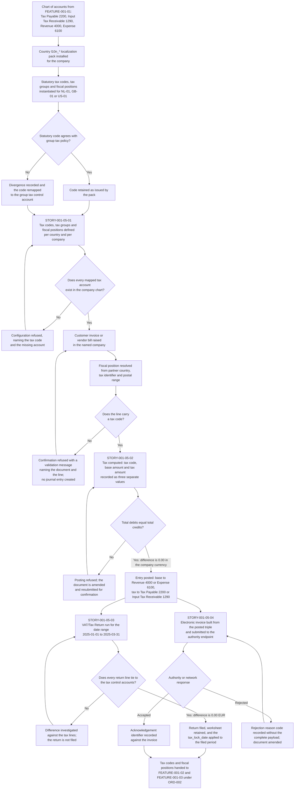
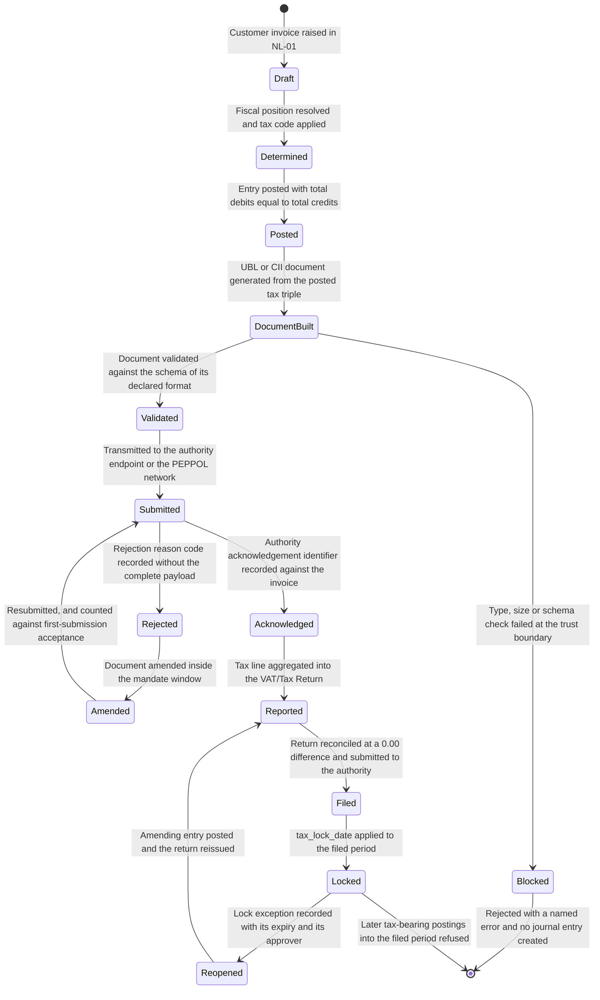

# FEATURE-001-05: Tax Configuration & Compliance

---

## Metadata

| Attribute | Value |
|-----------|-------|
| **Feature ID** | `FEATURE-001-05` |
| **Title** | Tax Configuration & Compliance |
| **Parent Epic** | [EPIC-001: Enterprise Accounting in Odoo](../EPIC-001-enterprise-accounting-odoo.md) |
| **Status** | Draft |
| **Priority** | 🔴 Critical |
| **Story Count** | 4 stories |
| **Last Updated** | 2026-08-16 |
| **Owner/Author** | Enterprise Accounting Team |

---

## 1. Feature Overview

### 1.1 Purpose and Business Value

This feature enables the **Tax Accountant** and the **Chief Accountant** to govern transaction tax from configuration through to filing: to define tax codes, tax groups and fiscal positions per country and per company; to compute tax on every customer and vendor transaction with the tax code, the base amount and the tax amount recorded as three separate values on the posted entry; to produce the statutory return from the ledger rather than reconstruct it outside the system; and to submit electronic invoices to tax-authority endpoints and retain the acknowledgement as filing evidence.

It is delivered against three module families, all present in this repository:

- **`account`** — the "Invoicing" application, version 1.4, category `Accounting/Accounting`, licence LGPL-3. It supplies `account.tax` with its `type_tax_use`, `amount_type`, `amount`, `tax_scope`, `price_include` and repartition-line structure, `account.tax.group` for grouping and for the tax accounts a group posts to, `account.fiscal.position` with its account and tax mapping, `account.move` and `account.move.line` for the posted base and tax lines, and the `tax_lock_date` field on `res.company` that closes a filed period to further tax movement.
- **`l10n_*`** — the country localization modules, **209** of which are present in this repository. Each one ships a jurisdiction's statutory tax codes, tax groups, fiscal positions and statutory tax-report layout, so a country's tax configuration starts from its pack and is then reconciled to group policy rather than authored from a blank form.
- **`account_edi` 1.0** — the present Community electronic-invoicing framework ("Import/Export Invoices From XML/PDF"), licence LGPL-3, which builds, parses and transmits invoice documents. It is accompanied here by `account_edi_ubl_cii` 1.0 (E-FFF, UBL Bis 3, EHF3, NLCIUS, Factur-X (CII) and XRechnung (UBL)), `account_edi_proxy_client` 1.0 (the `edi_proxy_user` identity per company and proxy type, with the encryption for that exchange) and `account_peppol` 1.2 (PEPPOL participant registration with PEPPOL BIS Billing 3.0 send and receive). Under [D-011](../EPIC-001-enterprise-accounting-odoo.md#911-d-011-electronic-invoicing-capability-already-present) document build, document parse and PEPPOL transmission are **reuse rather than build**, so this feature commissions only the residual work those four modules leave.

**Business Value Statement:**

> One governed tax configuration turns a statutory filing into a report run instead of a reconstruction. Tax-return preparation falls from the Epic's manual baseline of 8 to 16 hours per jurisdiction per filing period to under 2 hours, because the **VAT/Tax Return** is read from posted tax lines whose tax code, base amount and tax amount reconcile to the tax control accounts Tax Payable 2200 and Input Tax Receivable 1290 at a difference of `0.00` in the filing entity's functional currency (SM-010), and because 98% or more of electronic invoices are accepted at the tax-authority endpoint on first submission (SM-011).

This feature carries two of the Epic's three objectives directly and the third by consequence:

| Epic Objective | Contribution of This Feature |
|----------------|------------------------------|
| Compliance reporting | The statutory VAT/Tax Return is produced per jurisdiction for a stated date range from posted tax lines, and every one of its lines ties to the tax control accounts at a `0.00` difference in the filing entity's functional currency; electronic invoices are submitted to the authority endpoint and their acknowledgement identifiers are retained against the invoice |
| Multi-entity financial operations | A fiscal position is configured per legal entity and per partner geography, so the entity that raises the document determines the tax treatment, and every criterion names the company whose books carry the resulting tax line |
| Real-time financial visibility | The tax liability is read from posted journal items rather than accumulated in a spreadsheet, so the filing position is current as of the last posted entry and is defensible at any point inside an open period |

Ordering rule **ORD-002** in the Epic records this feature as the prerequisite of every tax-bearing transaction story in FEATURE-001-02 and FEATURE-001-03: a tax code, a base amount and a tax amount cannot be asserted on a vendor bill or a customer invoice before the codes and fiscal positions that determine them exist. The Epic's implementation sequence therefore places this feature in **Phase 1 — Foundations** alongside FEATURE-001-01, whose accounts every tax code maps onto.

**Deterministic artifacts referenced by this feature's criteria.** The four stories and the criteria below are written against one fixed artifact set, so a reviewer reads the same codes, accounts and entities throughout and no assertion depends on an unnamed placeholder value:

| Artifact Class | Values | Role in This Feature |
|----------------|--------|----------------------|
| Legal entities | The entities of the Epic's canonical legal-entity register ([Appendix E.4](../EPIC-001-enterprise-accounting-odoo.md#e4-canonical-legal-entity-register)) this feature's criteria are worked in: **Global Europe SARL** (`NL-01`, Netherlands operating subsidiary, functional currency EUR, statutory pack `l10n_nl`), **Global UK Ltd** (`GB-01`, United Kingdom operating subsidiary, functional currency GBP, statutory pack `l10n_uk`, incorporated 2025-04-01, so its tax configuration is asserted without a date inside the worked filing quarter) and **Global Holdings Inc.** (`US-01`, United States parent, functional currency USD, which is also the group presentation currency, statutory pack `l10n_us`) | Every multi-company criterion names the entity whose books are affected by registered name, entity code or both; no criterion is satisfied by "the group" alone, and no entity code carries a second legal identity anywhere in the backlog |
| Tax codes | The complete governed set of **fourteen** codes, published as the authoritative register [TAX-REG-001](#111-authoritative-tax-code-register-tax-reg-001) below | Each code carries its label, its rate, its treatment, the control account its tax amount posts to, its owning jurisdiction and entity, and the tickets that read it. No ticket in this backlog introduces or renames a tax code outside that register |
| Tax groups | `NL VAT`, `GB VAT`, `US Sales Tax` | The aggregation level the statutory return groups its lines on |
| General ledger accounts | Revenue 4000, Expense 6100, Accounts Receivable 1200, Accounts Payable 2000, Tax Payable 2200 (output and payable tax control), Input Tax Receivable 1290 (input and recoverable tax control) | Defined in FEATURE-001-01; this feature maps tax codes onto them and never creates a parallel account |
| Journals | Sales, Purchase, Miscellaneous | Sales carries output tax, Purchase carries input tax, and Miscellaneous carries the filing and tax-payment entries |
| Report | **VAT/Tax Return**, run with a date-range parameter — 2025-01-01 to 2025-03-31 is the worked filing period used throughout | The single named statutory report this feature produces and reconciles |
| Rounding | 2 decimal places at a rounding increment of 0.01 for EUR, GBP and USD | Applied to every base amount and every tax amount asserted anywhere in this feature |

#### 1.1.1 Authoritative Tax-Code Register (TAX-REG-001)

This register is the single governed source of tax-code identity for the whole backlog. Every criterion in any feature that names a tax code names one of the codes below, and states its **code**, its **base amount** and its **tax amount** as three separate values — never a combined figure. Where a ticket needs a label it uses the Label column verbatim; the Code column is the identity, and a label is never used as a code.

| Code | Label | Rate | Treatment | Control account for the tax amount | Owning jurisdiction and entity | Read by |
|------|-------|-----:|-----------|------------------------------------|--------------------------------|---------|
| `VAT-21-S` | VAT 21% (Sales) | 21.0000% | Output tax, standard rate | Tax Payable **2200** | Netherlands, `NL-01` (`l10n_nl`) | STORY-001-05-01, STORY-001-05-03, STORY-001-06-02 |
| `VAT-21-P` | VAT 21% (Purchases) | 21.0000% | Input tax, standard rate, recoverable | Input Tax Receivable **1290** | Netherlands, `NL-01` | STORY-001-05-01, STORY-001-05-03 |
| `VAT-09-S` | VAT 9% (Sales, Reduced) | 9.0000% | Output tax, reduced rate | Tax Payable **2200** | Netherlands, `NL-01` | STORY-001-05-01 |
| `VAT-21-RC` | VAT 21% (Intra-Community Acquisition, Reverse Charge) | 21.0000% | Self-assessed acquisition: the acquirer records an output leg and a recoverable input leg of the same amount | Tax Payable **2200** for the output leg and Input Tax Receivable **1290** for the input leg | Netherlands, `NL-01` | STORY-001-05-01, STORY-001-05-02, STORY-001-06-02 |
| `VAT-00-RC` | VAT 0% (Intra-Community Supply, Reverse Charge) | 0.0000% | Supply side of a reverse charge: a **non-zero base amount** with a tax amount of 0.00, reported on its own return line | None — no tax amount is posted | Netherlands, `NL-01` | STORY-001-05-01, STORY-001-05-02, STORY-001-05-03, STORY-001-05-04 |
| `VAT-00-ZR` | VAT 0% (Zero-Rated) | 0.0000% | Taxable at 0 percent: a **non-zero base amount** with a tax amount of 0.00, on a different return line from an exempt supply | None | Netherlands, `NL-01` | STORY-001-05-01, STORY-001-05-03, STORY-001-05-04 |
| `VAT-00-EX` | VAT Exempt | 0.0000% | Outside the charge: a **non-zero base amount** with a tax amount of 0.00, and no input-tax recovery attaches to it | None | Netherlands, `NL-01` | STORY-001-05-01, STORY-001-05-04, FEATURE-001-03 |
| `VAT-20-S` | VAT 20% (Sales) | 20.0000% | Output tax, standard rate, tax-exclusive pricing | Tax Payable **2200** | United Kingdom, `GB-01` (`l10n_uk`) | STORY-001-05-01, STORY-001-05-02, STORY-001-05-03, STORY-001-05-04, FEATURE-001-03 |
| `VAT-20-P` | VAT 20% (Purchases) | 20.0000% | Input tax, standard rate, recoverable | Input Tax Receivable **1290** | United Kingdom, `GB-01` | STORY-001-05-02, STORY-001-05-03, STORY-001-02-01, STORY-001-02-02, STORY-001-02-03, STORY-001-02-05 |
| `VAT-20-S-INC` | VAT 20% (Sales, Tax Included) | 20.0000% | Output tax on a **tax-inclusive** unit price, which is why it is a second standard-rate code rather than a flag on `VAT-20-S` | Tax Payable **2200** | United Kingdom, `GB-01` | STORY-001-05-01, STORY-001-05-02 |
| `VAT-20-S-NOTAG` | VAT 20% (Sales, Untagged) | 20.0000% | Output tax carrying **no tax-report tag**: a deliberate configuration defect used to prove the unmapped-tax disclosure, never a code any correct configuration ships | Tax Payable **2200** | United Kingdom, `GB-01` | STORY-001-05-03 |
| `ST-CA-0725` | Sales Tax — California State (7.25%) | 7.2500% | Output sales tax, statewide base rate | Tax Payable **2200** | United States, `US-01` (`l10n_us`) | FEATURE-001-03, STORY-001-07-05 |
| `ST-CA-0800` | Sales Tax — California with District Add-On (8.00%) | 8.0000% | Output sales tax, statewide rate plus a district add-on | Tax Payable **2200** | United States, `US-01` | STORY-001-03-01, STORY-001-03-03 |
| `ST-US-08375` | Use Tax — Combined State and Local (8.375%) | 8.3750% | Input **use** tax, self-assessed on an out-of-state purchase, recoverable | Input Tax Receivable **1290** | United States, `US-01` | STORY-001-02-03 |

Three rules govern the register:

- **One code, one meaning, one owner.** A code appears once, and the feature named in "Read by" reads the identity from here rather than restating a rate or a label of its own. A ticket that needs a code the register does not carry adds the row here in the same change, with its rate, treatment, control account and owning entity.
- **A zero rate is not a zero base.** `VAT-00-RC`, `VAT-00-ZR` and `VAT-00-EX` each carry a non-zero base amount with a tax amount of 0.00 in the document currency, and each reports on its own return line. They are three different treatments, not one, and none of them is the same as a line with no tax code.
- **`VAT-20-S-NOTAG` exists to fail.** It is the untagged-tax fixture behind the unmapped-tax disclosure of [STORY-001-05-03](./FEATURE-001-05/STORY-001-05-03-generate-vat-return.md), so it is never presented as part of a released configuration and never appears on a return's net line.

### 1.2 Problem Statement

Transaction tax in this group is determined by the person keying the document and defended after the fact from working papers held outside the accounting system. Five consequences follow, and each of them recurs at every filing deadline:

- **Tax is computed per transaction by hand.** With no governed tax-code set and no fiscal position selecting it, the rate applied to a line is whatever the preparer believed applied on the day. Two customers in the same jurisdiction receive different treatments on the same product, and the error is discovered by the authority rather than by the ledger.
- **The return cannot be tied to the sub-ledger.** Base and tax are captured as one gross figure on many documents, so no query can restate the return from posted data. Preparation runs to the Epic's baseline of 8 to 16 hours per jurisdiction per filing period, and the resulting figure agrees with the Tax Payable 2200 balance only by coincidence — the difference that SM-010 requires to be `0.00` is neither computed nor evidenced.
- **Cross-border and reverse-charge treatments are inconsistent.** An intra-Community acquisition has to raise a tax amount on both sides of the entry, an exempt supply has to reach the return with a base amount and a tax amount of zero, and neither behaviour is expressible without a fiscal position and a repartition rule. Preparers estimate the treatment by hand, and the group's filing position differs between entities that face the same transaction.
- **E-invoicing mandates cannot be met per country.** Each jurisdiction accepts its own syntax and profile and issues its own credentials and signing certificates. With no per-jurisdiction configuration, no `edi_proxy_user` registration path and no retained acknowledgement, a mandate arriving in one country stops invoicing in that country until a bespoke exchange is assembled under deadline.
- **A filed period stays open to tax movement.** The `tax_lock_date` field exists on `res.company` and is not administered, so a tax-bearing entry dated into a period whose return has already been submitted still posts. The submitted return and the ledger then disagree, and the remedy is a voluntary disclosure rather than a journal entry.

### 1.3 Key Capabilities

| Capability ID | Capability Description | Related Stories |
|---------------|------------------------|-----------------|
| CAP-001 | Configure tax codes, tax groups and fiscal positions per country and per company | STORY-001-05-01 |
| CAP-002 | Compute tax on customer and vendor transactions with tax code, base amount and tax amount recorded separately | STORY-001-05-02 |
| CAP-003 | Generate the statutory VAT/Tax Return for a date range and tie every line to the sub-ledger | STORY-001-05-03 |
| CAP-004 | Submit electronic invoices to tax-authority endpoints and record the acknowledgement | STORY-001-05-04 |

The four capabilities are cumulative and they are the reason the story order in [§3.4](#34-recommended-implementation-order) is what it is: CAP-001 creates the determinants, CAP-002 applies them to a transaction and records the resulting triple on the posted entry, CAP-003 aggregates those posted triples into the statutory return and proves the aggregate against the tax control accounts, and CAP-004 carries the same triple out of the system to the authority in the syntax that jurisdiction accepts.

### 1.3.1 Per-Code `type_tax_use` and Tax-Report-Tag Behaviour

[TAX-REG-001 in §1.1.1](#111-authoritative-tax-code-register-tax-reg-001) is the authoritative register of tax-code identity for the whole of EPIC-001 — the code, its label, its rate, its treatment, the control account its tax amount moves, its owning jurisdiction and entity, and the stories that read it. This section adds the two platform attributes a configuration task needs and restates none of them: the `type_tax_use` value each code is created with, and the tax-report-tag behaviour that decides which line of the VAT/Tax Return its base amount and its tax amount reach. Where this section and TAX-REG-001 could be read as disagreeing, TAX-REG-001 governs. Three rules govern both:

- **R-T1 — Nothing off-register.** A tax code absent from this table does not appear in a criterion. A story that needs a treatment this table does not express raises a row here first, in the same change, and only then asserts against it.
- **R-T2 — One code, one treatment.** No code carries two rates, two uses or two control accounts, and no treatment is expressed at two codes. `VAT-21-RC` is the acquisition side of an intra-Community transaction and `VAT-00-RC` is the supply side; `VAT-00-EX` is an exemption outside the charge and `VAT-00-ZR` is a supply taxable at zero; `VAT-20-S` is tax-exclusive and `VAT-20-S-INC` is the tax-inclusive override of the same rate. Each pair is two treatments at two codes rather than one code doing two jobs.
- **R-T3 — The triple is always three values.** Every criterion asserting tax states the tax code, the base amount and the tax amount as three separate values and never adds a base amount to a tax amount.

| Code | `type_tax_use` | Tax-report-tag behaviour |
|------|----------------|--------------------------|
| `VAT-21-S` | `sale` | Carries the standard-rate output tag; base and tax reach the standard-rate output line of the VAT/Tax Return |
| `VAT-21-P` | `purchase` | Carries the standard-rate input tag; base and tax reach the standard-rate input line |
| `VAT-09-S` | `sale` | Carries the reduced-rate output tag; reported on its own return line rather than merged with the standard rate |
| `VAT-21-RC` | `purchase` | Carries both an input tag and an output tag, so the acquisition appears on both the input and the output side of the return and nets to `0.00` in the filing currency |
| `VAT-00-RC` | `sale` | Carries the intra-Community-supply tag; the **base amount only** reaches its own return line, and the tax amount of `0.00` in the filing currency is reported rather than omitted. It is the supply-side counterpart of `VAT-21-RC`, whose acquisition side the customer accounts for |
| `VAT-00-EX` | `sale` | Carries the exempt-supplies tag; the base amount reaches the exempt-supplies line with a tax amount of `0.00` in the filing currency. Exempt means outside the charge, which is why it does not share a code or a line with `VAT-00-ZR` |
| `VAT-00-ZR` | `sale` | Carries the zero-rated tag; the base amount reaches the zero-rated line with a tax amount of `0.00` in the filing currency. A zero-rated supply is taxable at 0 percent and so is recoverable-input-bearing, unlike an exemption, which is why it reports on a different line from `VAT-00-EX` |
| `VAT-20-S` | `sale` | Carries the standard-rate output tag; base and tax reach the standard-rate output line. Prices are **tax-exclusive** |
| `VAT-20-P` | `purchase` | Carries the standard-rate input tag; base and tax reach the standard-rate input line |
| `VAT-20-S-INC` | `sale` | Identical tagging and return lines to `VAT-20-S`; it exists as a separate code because it carries the **Tax Included** price override, so a line priced gross is split into its base amount and its tax amount before posting. Two codes rather than a per-document switch, so a document's pricing basis is readable from the code it carries |
| `VAT-20-S-NOTAG` | `sale` | **Deliberately carries no tax-report tag.** It is the governed misconfiguration fixture: its base and tax amounts reach the unmapped-tax section of the VAT/Tax Return rather than any return line, and a period holding it is withheld from filing until the tag is supplied. It is registered rather than improvised so the untagged case is reproducible instead of depending on a story breaking a configuration by hand |
| `ST-CA-0725` | `sale` | Carries the output-tax tag of the United States sales-tax group; reported on the state line of the sales-tax return |
| `ST-CA-0800` | `sale` | Carries the same output-tax tag with its own district rate; a jurisdiction with district add-ons resolves to more than one combined rate, so the register carries both rather than leaving a story to name a rate of its own |
| `ST-US-08375` | `purchase` | Carries the input-tax tag of the United States sales-tax group. Its rate is the register's **fractional-cent case**: a base amount of `$12,450.00 USD` computes `1,042.6875`, recorded as a tax amount of `$1,042.69 USD` rounded half-up at the USD rounding increment of 0.01, which is the rounding behaviour [STORY-001-02-03](./FEATURE-001-02/STORY-001-02-03-post-vendor-bill-entries.md) asserts |

**Foreign registrations, and which entity applies which code.** The owning jurisdiction of each code is the one TAX-REG-001 records. Two applications cross an entity boundary and are stated here so that no criterion has to infer them: **Global Holdings Inc. (`US-01`)** applies `VAT-20-S`, `VAT-20-P`, `VAT-20-S-INC`, `VAT-20-S-NOTAG` and `VAT-00-ZR` under the **United Kingdom foreign registration its fiscal position carries**, which is why a United States parent files a United Kingdom return position in [STORY-001-05-03](./FEATURE-001-05/STORY-001-05-03-generate-vat-return.md); and **Global UK Ltd (`GB-01`)** is the United Kingdom entity those codes are owned by under pack `l10n_uk`, while the Netherlands codes are owned by **Global Europe SARL (`NL-01`)** under pack `l10n_nl` and the United States codes by `US-01` under pack `l10n_us`.

**Where each code is asserted.** `VAT-21-S`, `VAT-21-P`, `VAT-09-S`, `VAT-21-RC`, `VAT-00-EX`, `VAT-00-RC`, `VAT-00-ZR` and `VAT-20-S-INC` are exercised by [STORY-001-05-01](./FEATURE-001-05/STORY-001-05-01-configure-tax-codes-fiscal-positions.md) and [STORY-001-05-02](./FEATURE-001-05/STORY-001-05-02-compute-transaction-tax.md); `VAT-20-S`, `VAT-20-P`, `VAT-00-ZR` and `VAT-20-S-NOTAG` by [STORY-001-05-03](./FEATURE-001-05/STORY-001-05-03-generate-vat-return.md); `VAT-00-RC` and `VAT-00-ZR` again by [STORY-001-05-04](./FEATURE-001-05/STORY-001-05-04-submit-einvoicing.md); `VAT-21-P`, `VAT-21-RC`, `VAT-20-P` and `ST-US-08375` by [FEATURE-001-02](./FEATURE-001-02-accounts-payable-vendor-bills.md); and `ST-CA-0725` and `ST-CA-0800` by [FEATURE-001-03](./FEATURE-001-03-accounts-receivable-customer-invoices.md) and [FEATURE-001-07](./FEATURE-001-07-financial-reporting-period-close.md). The only identifier outside this register that appears anywhere in the tree is `VAT-STD-21`, and it appears solely in a change-history row of [STORY-001-01-02](./FEATURE-001-01/STORY-001-01-02-map-accounts-ifrs-gaap-taxonomy.md) recording that it was **replaced** by `VAT-21-S`; it is a retired identifier rather than a governed code.

### 1.4 Success Criteria at Feature Level

| Criterion | Target | Verification Method |
|-----------|--------|---------------------|
| Tax-code definition completeness | 100% of tax codes carry a tax group, a rate, a `type_tax_use` value and a named tax account; the count of tax codes with no group or no rate is 0 | Tax-configuration completeness report per company, with the incomplete count asserted at 0 |
| Fiscal-position coverage | Every operating country of every in-scope entity resolves to one fiscal position; the count of in-scope partner-and-entity combinations with no resolvable fiscal position is 0 | Fiscal-position resolution report run across the partner master for `NL-01`, `GB-01` and `US-01` |
| Posted tax-line triple completeness | 100% of posted tax lines record the triple — tax code, base amount and tax amount — as three separate values; the count of tax lines with a null tax code or a null base amount is 0 | Tax-line completeness query over `account.move.line` for the filing period, with the null count asserted at 0 |
| Tax computation accuracy on a standard-rate supply | A base amount of `€10,000.00 EUR` at tax code `VAT-21-S` yields a tax amount of `€2,100.00 EUR`, each rounded to 2 decimal places at the EUR rounding increment of 0.01; the equivalent United States assertion is a base amount of `$10,000.00 USD` at `ST-CA-0725` yielding `$725.00 USD`, each rounded to 2 decimal places at the USD rounding increment of 0.01 | Computation test per tax code against the stated base amount, comparing the computed tax amount to the expected value to the cent |
| Balanced posting of the tax-bearing entry | The customer invoice in `NL-01` posts through the Sales journal as debit Accounts Receivable 1200 `€12,100.00 EUR`, credit Revenue 4000 `€10,000.00 EUR` and credit Tax Payable 2200 `€2,100.00 EUR`, so total debits of `€12,100.00 EUR` equal total credits of `€12,100.00 EUR` at a difference of `0.00 EUR`, each amount rounded to 2 decimal places at the EUR rounding increment of 0.01 | Posted entry inspected line by line, with the debit-minus-credit difference asserted at `0.00 EUR` (C-009) |
| VAT/Tax Return reconciliation to the sub-ledger | For `NL-01` and the date range 2025-01-01 to 2025-03-31 the return reports output VAT at the standard rate (`VAT-21-S`) on a base amount of `€1,480,000.00 EUR` with a tax amount of `€310,800.00 EUR`, input VAT at the standard rate (`VAT-21-P`) on a base amount of `€880,000.00 EUR` with a tax amount of `€184,800.00 EUR`, and net VAT payable of `€126,000.00 EUR`; each line ties to the Tax Payable 2200 and Input Tax Receivable 1290 movements for the same date range at a difference of `0.00 EUR`, all amounts rounded to 2 decimal places at the EUR rounding increment of 0.01 | Report-to-ledger reconciliation worksheet per jurisdiction per filing period, retained as filing evidence (SM-010) |
| Refusal of a transaction with no tax code | 100% of attempts to confirm a tax-bearing document whose line carries no tax code are refused with an Odoo validation message that names the document and the line, and no journal entry is created by the refused attempt | Negative test per document type in `NL-01`, `GB-01` and `US-01` |
| Filed tax period stays reproducible | 100% of operations against a filed, tax-locked period produce the outcome the Epic's [lock-date behaviour contract](../EPIC-001-enterprise-accounting-odoo.md#78-lock-date-behaviour-contract) fixes: posting a **draft** tax-bearing entry dated on or before the company's `tax_lock_date` posts it with its accounting date moved to the last day of the first open period (L-1), so the filed period gains 0 tax-bearing journal items and the tax base and tax amount it reported are unchanged; and any operation on a tax-bearing line of an entry **already posted** inside that period is refused with the Odoo tax-statement validation message naming each violated lock date (L-5) | Per-company test after the filing period is locked, asserting the re-dated accounting date for L-1, the named refusal for L-5, and the re-run of the filed return at a `0.00` difference |
| Electronic-invoice acknowledgement retention | An authority or network acknowledgement identifier is recorded against 100% of accepted documents, and a rejection reason code is recorded against 100% of rejected documents | Submission register per jurisdiction, reconciled to the posted invoice population for the filing period (SM-011) |
| First-submission acceptance rate | 98% or higher of electronic invoices accepted on first submission at the jurisdiction's endpoint or its sandbox | Accepted submissions divided by total submissions, per jurisdiction per month (SM-011) |
| Hostile-input rejection on the document and endpoint paths | 100% of malformed, schema-invalid, oversized, disallowed-type and external-entity payloads presented on the inbound document or authority-response path are rejected with a named error, with no journal entry created and the service still available | Hostile-input test set executed against the inbound document and endpoint-response paths (C-015, C-016, C-020, C-022) |
| Test coverage | ≥80% for all 4 story implementations, with the tax and balance assertions tested numerically | Coverage tooling in the repository's configured test run (C-007, C-009) |
| Demonstrability | 4 of 4 stories demonstrated in the Odoo user interface, or over the JSON web-service surface the Epic's C-023 contract governs under a dedicated named integration principal, to the Finance Controller and the Product Owner | Recorded acceptance walkthrough per story |

---

## 2. User Personas

### 2.1 Persona Mapping

Every persona below is a named finance role drawn from the Epic's persona register. The six roles marked applicable take a configuration, preparation, approval, posting or verification action inside this feature; the roles marked not applicable consume the tax configuration, the posted tax lines or the filed return, and their work is specified in the features named against them.

| Persona | Role Description | Primary Use Cases | Applicable |
|---------|------------------|-------------------|------------|
| **Tax Accountant** | Determines tax on transactions and files statutory returns | Owns the tax codes, the tax groups and the fiscal positions per country and per company; confirms the rate and the tax account behind each code; prepares the VAT/Tax Return for the filing date range and reconciles it to Tax Payable 2200 and Input Tax Receivable 1290; owns the authority endpoint, its credentials and its signing certificate per jurisdiction. Under TAX-SOD-001 this role **configures and prepares but does not approve**: a tax-code or fiscal-position version it authors is released only on the Chief Accountant's recorded approval, and a return it prepares is filed only against a version the Group Controller has approved | ☑ Yes |
| **Chief Accountant** | Owns the general ledger, the chart of accounts and the integrity of every posted entry | Approves each tax-code, rate, tax-account and fiscal-position **version** before it is released, so an unapproved version computes tax on 0 transactions, and never approves a version it authored itself; approves the general ledger accounts a tax code posts to before the code is released; verifies that each tax-bearing entry posts with total debits equal to total credits and that the base line and the tax line are recorded as separate journal items; administers the `tax_lock_date` that closes a filed period to further tax movement | ☑ Yes |
| **Accounts Receivable Specialist** | Issues customer invoices, allocates receipts and manages collections | Raises customer invoices whose fiscal position selects the output tax code, checks the base-and-tax split shown on the invoice before confirmation, and submits the electronic invoice to the authority endpoint or the PEPPOL network and reads back its acknowledgement or rejection reason | ☑ Yes |
| **Accounts Payable Clerk** | Captures vendor bills, runs three-way match and prepares payment runs | Captures vendor bills carrying input tax against `VAT-21-P` or `VAT-20-P`, applies the reverse-charge code `VAT-21-RC` to an intra-Community acquisition, and confirms that the recoverable tax lands in Input Tax Receivable 1290 rather than in the expense account | ☑ Yes |
| **External Auditor** | Tests balances and controls and issues the audit opinion | Traces a return line to the tax lines behind it and from a tax line to its journal entry; reads the retained report-to-ledger reconciliation worksheet, the submission-and-acknowledgement register and the `tax_lock_date` history as audit evidence, without requesting an extract | ☑ Yes |
| Financial Reporting Manager | Produces statutory and management statements for each entity and the group | Presents the Tax Payable 2200 and Input Tax Receivable 1290 balances in the Balance Sheet and reconciles them at close in FEATURE-001-07; takes no tax-configuration action in this feature | ☐ No |
| **Group Controller** | Governs group accounting policy and approves the consolidated result | Approves the group tax policy and the per-entity fiscal-position set; under TAX-SOD-001 records the **approval of a prepared VAT return version** before that version may be filed, which is the second-person control that makes the count of returns approved by their own preparer 0; consumes the filing status per jurisdiction, while the configuration and the preparation are executed by the Tax Accountant | ☑ Yes |
| Treasury Analyst | Owns bank and cash positions and statement reconciliation | Settles the net VAT payable of `€126,000.00 EUR` for `NL-01`, rounded to 2 decimal places at the EUR rounding increment of 0.01, through the Bank journal in FEATURE-001-04; takes no tax-configuration action in this feature | ☐ No |
| CFO / Finance Director | Executive stakeholder accountable for financial health and compliance | Consumes the compliance status per jurisdiction and confirms the open platform and edition decisions recorded in §5.2 and §5.5; does not configure or file | ☐ No |

### 2.2 Persona-to-Story Mapping

Each story carries exactly one primary persona in its WHO statement. Secondary personas prepare an input, approve a change, post against the configuration or verify the outcome, and they are named so that the access rights derived from these stories keep the four TAX-SOD-001 permissions — configure, approve a configuration, prepare a return, and approve-and-file a return — held by distinguishable roles.

| Story | Primary Persona | Secondary Personas |
|-------|-----------------|--------------------|
| STORY-001-05-01 Configure Tax Codes and Fiscal Positions | Tax Accountant (authors the configuration version) | Chief Accountant (approves the version and the accounts each tax code posts to; cannot approve a version it authored), External Auditor (configuration change and approval evidence) |
| STORY-001-05-02 Compute Tax on Transactions with Base and Tax Split | Tax Accountant | Chief Accountant (balanced posting and the separation of base and tax lines), Accounts Receivable Specialist (customer-side output tax), Accounts Payable Clerk (vendor-side input tax and reverse charge) |
| STORY-001-05-03 Generate VAT Return Report | Tax Accountant (prepares the return) | Group Controller (approves the prepared return version before it may be filed; cannot approve a return it prepared), Chief Accountant (posts the VAT closing entry, reconciles the tax control accounts and sets the filed-period lock), External Auditor (return-to-ledger traceability and drill-down) |
| STORY-001-05-04 Submit E-Invoicing to Tax-Authority Endpoints | Tax Accountant (transmits an approved document) | Accounts Receivable Specialist (submission and resubmission of the customer document), Chief Accountant (authorizes a re-issue and any reset of a transmitted version's idempotency key), External Auditor (submission and acknowledgement evidence) |

---

## 3. Story List

### 3.1 User Stories

| Story ID | Story Title | Persona | Priority | Status | Link |
|----------|-------------|---------|----------|--------|------|
| STORY-001-05-01 | Configure Tax Codes and Fiscal Positions | Tax Accountant | 🔴 Critical | Draft | [STORY-001-05-01](./FEATURE-001-05/STORY-001-05-01-configure-tax-codes-fiscal-positions.md) |
| STORY-001-05-02 | Compute Tax on Transactions with Base and Tax Split | Tax Accountant | 🔴 Critical | Draft | [STORY-001-05-02](./FEATURE-001-05/STORY-001-05-02-compute-transaction-tax.md) |
| STORY-001-05-03 | Generate VAT Return Report | Tax Accountant | 🔴 Critical | Draft | [STORY-001-05-03](./FEATURE-001-05/STORY-001-05-03-generate-vat-return.md) |
| STORY-001-05-04 | Submit E-Invoicing to Tax-Authority Endpoints | Tax Accountant | 🟠 High | Draft | [STORY-001-05-04](./FEATURE-001-05/STORY-001-05-04-submit-einvoicing.md) |

**Priority legend:** 🔴 Critical — a compliant filing is impossible without it, and the Epic records this feature as Critical for exactly that reason; 🟠 High — significant compliance value that consumes the tax triple the Critical stories create, and whose urgency is set per jurisdiction by the mandate date rather than by the close calendar.

The **Tax Accountant** is the primary persona of all four stories because a single role owns the tax determinants, the return and the filing relationship with the authority. The secondary personas in [§2.2](#22-persona-to-story-mapping) are what keep the stories distinguishable in practice: the Chief Accountant proves the posting, the Accounts Receivable Specialist and the Accounts Payable Clerk originate the documents, and the External Auditor tests the trail.

### 3.2 Story Count Assessment

| Count | Assessment | Status |
|-------|------------|--------|
| **4 stories** | Within the mandated range of 2 to 5 stories per feature | ✓ Feature is scoped for independent delivery |

This feature carries **4 stories**, inside the 2-to-5 bound recorded in the Epic's decomposition guidelines. The earlier 3-to-7 guidance carried by the feature template is superseded by that bound and is not applied here. The count is stated identically in four places, and the four must stay equal: the Story Count row in §Metadata, this assessment, the 4 rows of §3.1, and the 4 links of [§9.2](#92-story-files). The Epic's feature summary declares the same count of 4 stories for `FEATURE-001-05`.

Splitting further would produce stories with no accounting proof of their own — a tax group separated from the codes inside it has nothing to compute, and a submission separated from the document it carries has nothing to submit. Merging would breach the Small criterion of INVEST, because configuration, computation, statutory reporting and authority submission are each demonstrated by a different artifact: a tax-code and fiscal-position record, a posted journal entry whose debits equal its credits, the VAT/Tax Return for a stated date range, and an acknowledgement identifier returned by an endpoint.

### 3.3 Story Dependency Ordering

Each of the four stories delivers an outcome demonstrable on its own, which keeps them Independent under INVEST. The rows below are sequencing prerequisites — configuration or posted data that must already exist for the dependent story to be demonstrated — and not shared implementation.

| Story | Depends On | Notes |
|-------|-----------|-------|
| STORY-001-05-01 (Tax Codes and Fiscal Positions) | None within this feature | Foundation story. It depends outside this feature on FEATURE-001-01, because Tax Payable 2200 and Input Tax Receivable 1290 must exist before a tax code or a fiscal position maps onto them |
| STORY-001-05-02 (Tax Computation with Base and Tax Split) | STORY-001-05-01 | Tax cannot be computed before the codes and the fiscal positions that determine it exist; the rate, the tax account and the repartition rule are all attributes of the configuration this story consumes |
| STORY-001-05-03 (Generate VAT Return Report) | STORY-001-05-02 | The return aggregates posted tax lines. Without the tax code, base amount and tax amount recorded on those lines there is nothing to aggregate and nothing to reconcile to Tax Payable 2200 |
| STORY-001-05-04 (E-Invoicing Submission) | STORY-001-05-02 | An electronic invoice carries the computed tax triple in its document body, so the triple exists before the document is built and transmitted. This story does not depend on STORY-001-05-03: a document is submitted per invoice, while the return is filed per period |

### 3.4 Recommended Implementation Order

```text
0. FEATURE-001-01 (external prerequisite)
   Tax Payable 2200 and Input Tax Receivable 1290 exist in the chart of accounts,
   and the Sales, Purchase and Miscellaneous journals exist per company
        |
        v
1. STORY-001-05-01  Configure Tax Codes and Fiscal Positions
   Determinants: tax codes with a group, a rate and a named tax account;
   fiscal positions per country and per partner geography for NL-01, GB-01 and US-01
        |
        v
2. STORY-001-05-02  Compute Tax on Transactions with Base and Tax Split
   Application: tax code, base amount and tax amount recorded as three separate
   values on a posted entry whose total debits equal its total credits
        |
        +--> 3. STORY-001-05-03  Generate VAT Return Report
        |       Statutory reporting: VAT/Tax Return for a date range,
        |       reconciled line by line to the tax control accounts at 0.00
        |
        +--> 4. STORY-001-05-04  Submit E-Invoicing to Tax-Authority Endpoints
                Transmission: the same triple carried to the authority in the
                jurisdiction's syntax, with the acknowledgement retained
```

Steps 3 and 4 both wait on step 2 and have no dependency on one another, so they may be delivered concurrently once the tax triple is posted. The whole feature is a prerequisite of the tax-bearing transaction stories in FEATURE-001-02 and FEATURE-001-03 under ORD-002, which is why the Epic sequences it in Phase 1 — Foundations rather than after the transaction backbone.

---

## 4. Acceptance Criteria Summary

### 4.1 Feature-Level Acceptance Criteria

**This section is this feature's Feature Definition of Done.** That is the name the programme's planning standard gives the completion gate every feature file carries, and the Epic publishes the three-level vocabulary once in [§5.3](../EPIC-001-enterprise-accounting-odoo.md#53-feature-and-story-decomposition-guidelines): the Epic-Level Definition of Done is [§13 of the Epic](../EPIC-001-enterprise-accounting-odoo.md#13-epic-level-definition-of-done), this section is the Feature Definition of Done, and each story closes on its own `Definition of Done`. The heading keeps the wording `Feature-Level Acceptance Criteria`, and so keeps its anchor `#41-feature-level-acceptance-criteria`, because links across this tree resolve to it — the two names denote one gate, and this file carries no second list of feature-completion conditions.

These are feature-level gates. The Given/When/Then acceptance criteria live in the four story files, where each is written against one workflow with 4 to 8 criteria and the coverage distribution the Epic requires.

The feature is considered complete when:

- [ ] All 4 stories within this feature have status "Done"
- [ ] All 4 stories achieve minimum 80% test coverage (C-007)
- [ ] Feature-level integration tests pass, with every tax and balance assertion tested as an amount rather than inspected by eye (C-009)
- [ ] Each of the 4 stories has been demonstrated in the Odoo user interface, or over the JSON web-service surface the Epic's C-023 contract governs under a dedicated named integration principal holding no authority its human counterpart lacks, to the Finance Controller and the Product Owner, and the walkthrough is recorded against the story
- [ ] Every tax code in every in-scope company carries a tax group, a rate, a `type_tax_use` value and a named tax account, and the count of tax codes with no group, no rate or no tax account is 0
- [ ] **The authoritative tax-code register [TAX-REG-001](#111-authoritative-tax-code-register-tax-reg-001) exists in full and governs the whole backlog, with the per-code `type_tax_use` and tax-report-tag behaviour of [§1.3.1](#131-per-code-type_tax_use-and-tax-report-tag-behaviour) beside it.** All fourteen codes exist with the rate, `type_tax_use` value, owning jurisdiction and entity, control account and tax-report-tag behaviour that register states: `VAT-21-S` (21%, `sale`, output tax to Tax Payable 2200), `VAT-21-P` (21%, `purchase`, input tax to Input Tax Receivable 1290), `VAT-09-S` (9%, `sale`, reduced-rate output tax to Tax Payable 2200 on its own return line), `VAT-21-RC` (21%, `purchase`, intra-Community acquisition recording the same tax amount to both Input Tax Receivable 1290 and Tax Payable 2200), `VAT-00-RC` (0%, `sale`, intra-Community supply, no control-account movement, base-only return line), `VAT-00-EX` (0%, `sale`, exempt supply, no control-account movement, exempt-supplies line), `VAT-00-ZR` (0%, `sale`, zero-rated supply, no control-account movement, zero-rated line distinct from the exempt line), `VAT-20-S` and `VAT-20-P` (20%, United Kingdom `sale` and `purchase`, tax-exclusive), `VAT-20-S-INC` (20%, `sale`, the Tax Included price override of the same rate), `VAT-20-S-NOTAG` (20%, `sale`, carrying **no** tax-report tag as the governed untagged fixture that reaches the unmapped-tax section), `ST-CA-0725` (7.25%, `sale`, output tax to Tax Payable 2200), `ST-CA-0800` (8.00%, `sale`, district-augmented output tax to Tax Payable 2200) and `ST-US-08375` (8.375%, `purchase`, combined state-and-local use tax to Input Tax Receivable 1290, carrying the register's fractional-cent rounding case). The count of tax codes asserted anywhere in EPIC-001 that are absent from that register is **0** (R-T1), and the count of codes carrying two rates, two `type_tax_use` values or two control accounts is **0** (R-T2)
- [ ] A fiscal position exists per operating country and resolves per partner for `NL-01`, `GB-01` and `US-01`, mapping both the tax code and the general ledger account, and the count of in-scope partner-and-entity combinations with no resolvable fiscal position is 0
- [ ] Every posted tax line records the triple — tax code, base amount and tax amount — as three separate values, and the count of posted tax lines with a null tax code or a null base amount is 0
- [ ] **The tax-inclusive posting gate holds on a customer invoice.** In `NL-01`, a base amount of `€10,000.00 EUR` at tax code `VAT-21-S` bears a tax amount of `€2,100.00 EUR`, and the entry posts through the Sales journal as debit Accounts Receivable 1200 `€12,100.00 EUR`, credit Revenue 4000 `€10,000.00 EUR` and credit Tax Payable 2200 `€2,100.00 EUR`, so total debits of `€12,100.00 EUR` equal total credits of `€12,100.00 EUR` at a difference of `0.00 EUR`, each amount rounded to 2 decimal places at the EUR rounding increment of 0.01
- [ ] **The tax-inclusive posting gate holds on a vendor bill.** In `NL-01`, a base amount of `€10,000.00 EUR` at tax code `VAT-21-P` bears a tax amount of `€2,100.00 EUR`, and the entry posts through the Purchase journal as debit Expense 6100 `€10,000.00 EUR`, debit Input Tax Receivable 1290 `€2,100.00 EUR` and credit Accounts Payable 2000 `€12,100.00 EUR`, so total debits of `€12,100.00 EUR` equal total credits of `€12,100.00 EUR` at a difference of `0.00 EUR`, each amount rounded to 2 decimal places at the EUR rounding increment of 0.01
- [ ] **The reverse-charge acquisition raises tax on both sides and stays balanced.** In `NL-01`, a base amount of `€40,000.00 EUR` at tax code `VAT-21-RC` bears a tax amount of `€8,400.00 EUR` recorded twice, and the entry posts through the Purchase journal as debit Expense 6100 `€40,000.00 EUR`, debit Input Tax Receivable 1290 `€8,400.00 EUR`, credit Accounts Payable 2000 `€40,000.00 EUR` and credit Tax Payable 2200 `€8,400.00 EUR`, so total debits of `€48,400.00 EUR` equal total credits of `€48,400.00 EUR` at a difference of `0.00 EUR`, each amount rounded to 2 decimal places at the EUR rounding increment of 0.01
- [ ] **A tax-inclusive price is split into base and tax before posting.** In `NL-01`, a line priced at `€12,100.00 EUR` inclusive of tax at code `VAT-21-S` resolves to a base amount of `€10,000.00 EUR` and a tax amount of `€2,100.00 EUR`, each rounded to 2 decimal places at the EUR rounding increment of 0.01, and the posted entry carries the base and the tax as separate journal items whose total debits equal their total credits at a difference of `0.00 EUR`
- [ ] **A jurisdiction outside the euro area posts on the same rule.** In `GB-01`, a base amount of `£50,000.00 GBP` at tax code `VAT-20-S` bears a tax amount of `£10,000.00 GBP`, and the entry posts through the Sales journal as debit Accounts Receivable 1200 `£60,000.00 GBP`, credit Revenue 4000 `£50,000.00 GBP` and credit Tax Payable 2200 `£10,000.00 GBP`, so total debits of `£60,000.00 GBP` equal total credits of `£60,000.00 GBP` at a difference of `0.00 GBP`, each amount rounded to 2 decimal places at the GBP rounding increment of 0.01
- [ ] **A sales-tax jurisdiction posts on the same rule.** In `US-01`, a base amount of `$10,000.00 USD` at tax code `ST-CA-0725` bears a tax amount of `$725.00 USD`, and the entry posts through the Sales journal as debit Accounts Receivable 1200 `$10,725.00 USD`, credit Revenue 4000 `$10,000.00 USD` and credit Tax Payable 2200 `$725.00 USD`, so total debits of `$10,725.00 USD` equal total credits of `$10,725.00 USD` at a difference of `0.00 USD`, each amount rounded to 2 decimal places at the USD rounding increment of 0.01
- [ ] **An exempt supply reaches the return with a zero tax amount rather than being omitted.** In `NL-01`, a base amount of `€25,000.00 EUR` at tax code `VAT-00-EX` bears a tax amount of `€0.00 EUR`, no movement is posted to Tax Payable 2200, and the base amount appears on the exempt-supplies line of the VAT/Tax Return for the filing period, each amount rounded to 2 decimal places at the EUR rounding increment of 0.01
- [ ] **The VAT/Tax Return ties to the sub-ledger.** For `NL-01` and the date-range parameter 2025-01-01 to 2025-03-31 the report presents output VAT at the standard rate (`VAT-21-S`) on a base amount of `€1,480,000.00 EUR` with a tax amount of `€310,800.00 EUR`, input VAT at the standard rate (`VAT-21-P`) on a base amount of `€880,000.00 EUR` with a tax amount of `€184,800.00 EUR`, and net VAT payable of `€126,000.00 EUR`; the output line ties to the Tax Payable 2200 credit movement of `€310,800.00 EUR` and the input line to the Input Tax Receivable 1290 debit movement of `€184,800.00 EUR` for the same date range, each at a difference of `0.00 EUR` and each rounded to 2 decimal places at the EUR rounding increment of 0.01 (SM-010)
- [ ] The report-to-ledger reconciliation worksheet is retained per jurisdiction per filing period as filing evidence for the External Auditor, and the return figures are reproducible from posted data after the period is locked
- [ ] **The net VAT settlement entry balances.** The filing entry for `NL-01` posts through the Miscellaneous journal as debit Tax Payable 2200 `€310,800.00 EUR`, credit Input Tax Receivable 1290 `€184,800.00 EUR` and credit the VAT payable-to-authority line `€126,000.00 EUR`, so total debits of `€310,800.00 EUR` equal total credits of `€310,800.00 EUR` at a difference of `0.00 EUR`, each amount rounded to 2 decimal places at the EUR rounding increment of 0.01
- [ ] A confirmation attempt on a tax-bearing document whose line carries no tax code is refused with an Odoo validation message that names the document and the line, and no journal entry is created by the refused attempt
- [ ] A **draft** tax-bearing entry dated on or before the company's `tax_lock_date` posts with its accounting date moved to the last day of the first open period (Epic §7.8 L-1), and any operation on a tax-bearing line already posted inside that period is refused with the Odoo tax-statement validation message naming the company and each violated lock date (Epic §7.8 L-5), so the return already filed for that period stays reproducible and its tax base and tax amount are unchanged
- [ ] A fiscal position that maps a tax code to an account absent from the company's chart of accounts is refused at configuration time with an error that names the tax code and the missing account, so no transaction can post against an unmappable code
- [ ] An electronic invoice submitted from `NL-01` records the authority or network acknowledgement identifier against the invoice on acceptance, and records the rejection reason code without disclosing the complete authority-response payload on rejection (C-020)
- [ ] Electronic invoices reach 98% or higher first-submission acceptance at each jurisdiction's endpoint or its sandbox, measured per jurisdiction per month (SM-011)
- [ ] Endpoint credentials, API keys and signing certificates are held outside module source and outside version control, scoped per company, with a recorded rotation owner and rotation interval, and appear in no log, fixture or export (C-021)
- [ ] **Every outbound request leaves for an approved origin.** The scheme, host and port of each authority or access-point endpoint are held in a canonical **origin allowlist** governed as configuration rather than derived from a document, a partner record or an authority response; a registration naming an origin outside the allowlist is refused at configuration time with the origin named; each resolved IP address is checked before the request is made and a private, loopback, link-local, multicast or unspecified address is refused; the address that was validated is the address connected to, so a name that re-resolves between check and connect cannot redirect the request; and HTTP redirects are not followed — a redirect is either refused or its target revalidated against the allowlist before any credential, signing certificate or document body is sent (C-019, C-021, CWE-918)
- [ ] An inbound or outbound document and an authority response that is malformed, schema-invalid, oversized, of a disallowed type, or carries an external-entity payload is rejected with an error naming the document and the check that failed, the rejection creates no journal entry, and the service stays available (C-015, C-016, C-019, C-020, C-022)
- [ ] `STORY-001-05-03` satisfies the export and drill-down convention owned by FEATURE-001-07: the VAT/Tax Return exports to PDF and to XLSX with the on-screen filters preserved and the expanded detail included, every return line drills down to the journal items behind it with the filters preserved and breadcrumbs back to the summary, and every exported cell is neutralized against formula injection (C-017)
- [ ] The tax codes, the tax groups and the fiscal positions are handed to FEATURE-001-02 and FEATURE-001-03 as the determinants their tax-bearing transaction stories post against, and the hand-over is recorded against ORD-002
- [ ] **The four tax permissions are separate, and self-approval is denied by test (TAX-SOD-001).** A configuration change to a tax code's rate, its tax account or a fiscal-position mapping is authored by the **Tax Accountant** as a new **version** that stays inert until the **Chief Accountant** records an approval naming that version — the count of transactions computed against an unapproved version is **0**, and an edit to an approved version creates a further inert version rather than changing the live one. A VAT return is prepared by the **Tax Accountant** and approved by the **Group Controller** before it may be filed, so the count of returns approved by their own preparer is **0** and the count of filings made without a recorded approval of the filed version is **0**. Each denial is asserted with the constraining actor refused and the named authority succeeding, over the user interface and over the JSON web-service surface C-023 governs
- [ ] The Tax Payable 2200 and Input Tax Receivable 1290 balances produced by this feature are handed to FEATURE-001-07 for presentation in the statements and for reconciliation at period close

### 4.2 Cross-Cutting Concerns

Every story in this feature inherits the criteria below from the Epic's constraint set.

| Concern | Acceptance Criterion |
|---------|----------------------|
| License | New modules are distributed under an AGPL-3.0 compatible licence, and extension of `account`, `account_edi`, `account_edi_ubl_cii`, `account_edi_proxy_client` and `account_peppol` respects their LGPL-3 licence (C-001, C-002) |
| Dependencies | Every declared module dependency exists in the platform configuration confirmed by DEC-002, and delivered code stays compatible with the OCA add-on ecosystem including the country `l10n_*` extensions published by OCA (C-003, C-004) |
| Coding Standards | Python follows Odoo and OCA standards including PEP 8, and static analysis passes with the repository's configured tooling in `ruff.toml` (C-005, C-006) |
| Test Coverage | Each story achieves minimum 80% test coverage, and each acceptance test is traceable to one Given/When/Then criterion (C-007, C-008) |
| Documentation | Public methods and models are documented with docstrings, and the tax-code, tax-group and fiscal-position policy is recorded alongside the configuration that enforces it, per jurisdiction |
| Security | Access rights are defined per finance role and verified by an access-rights test matrix. **Four permissions are separate and no role holds two of them over the same object** (TAX-SOD-001): **configure** a tax code, a rate, a tax account or a fiscal-position mapping; **approve** that configuration change; **prepare** a VAT return for a period; and **approve-and-file** that return. The **Tax Accountant** configures and prepares; the **Chief Accountant** approves a configuration change and administers the `tax_lock_date`; the **Group Controller** approves a prepared return before it is filed; and the filing right is exercised only against an approved return version. **Self-approval is refused rather than discouraged**: the count of configuration versions approved by their own author is 0, the count of returns approved by their own preparer is 0, and the count of returns filed with no recorded approval of the version being filed is 0 — each proved by a named denial test. The same separation binds a C-023 integration principal, so no principal holds two of the four permissions. Beyond that, the Accounts Receivable Specialist and the Accounts Payable Clerk raise documents against the configuration without altering it, the External Auditor holds read-only access to the configuration, the tax lines, the reconciliation worksheet and the submission register, and no role files a return or reads tax lines for a company outside its allowed companies (C-014) |
| Multi-company isolation | Every criterion that touches more than one company names the company whose books are affected — `NL-01`, `GB-01` or `US-01` — and a test proves that a role restricted to one company can neither read that company's tax lines from another company nor file its return (C-014, D-007) |
| Untrusted input | The inbound and outbound UBL, CII, Factur-X and PEPPOL documents and the tax-authority and proxy endpoint responses handled by this feature cross the trust boundary: file type and size are checked against an allowlist, XML is parsed with DTD processing and external-entity resolution disabled and entity expansion bounded and is validated against its declared schema before any field is read, values written to CSV and XLSX exports are neutralized against formula injection, partner-supplied text is context-encoded before it is rendered, data access is expressed through the ORM or parameterized SQL, failures disclose no stack trace or complete response payload, and a hostile-input test asserts rejection with no journal entry created (C-015 through C-022) |
| Credential custody | Authority credentials, API keys, signing certificates and private keys live in Odoo system parameters, in the `certificate` store that `account_edi_proxy_client` already depends on, or in an external secret manager — scoped per company, never in module source, version control, logs, fixtures or exports, with a named rotation owner and rotation interval (C-021) |
| Endpoint origin control | The destination of an outbound submission is configuration, never data: scheme, host and port come from a canonical origin allowlist, a registration outside it is refused at configuration time, resolved private, loopback, link-local, multicast and unspecified addresses are refused, the validated address is the one connected to, and redirects are not followed without revalidation — so a hostile document, partner record or authority response cannot steer a credentialed request at an internal service (CWE-918) |
| Audit trail | A change to a tax code, a tax group, a fiscal position or a `tax_lock_date` is recorded with its author and timestamp, and each filed return retains its parameters, its output, its reconciliation worksheet and its submission acknowledgements, readable by the External Auditor without a data request |
| Performance | The targets in §4.4 are met on a 50-line invoice and on a filing period containing 50,000 tax lines |

### 4.3 Integration Requirements

| Integration Point | Requirement | Verification |
|-------------------|-------------|--------------|
| `account.tax` | Define and extend: tax codes with their `type_tax_use`, `amount_type`, `amount`, `tax_scope`, tax group and the tax accounts reached through their repartition lines, including the reverse-charge pattern that raises the same tax amount on both sides | Tax-configuration completeness report per company, with the count of codes lacking a group, a rate or a tax account asserted at 0 |
| `account.tax.group` | Define: `NL VAT`, `GB VAT` and `US Sales Tax`, each naming the tax payable and tax receivable accounts its member codes post to | Group-to-account listing per company, cross-checked against Tax Payable 2200 and Input Tax Receivable 1290 |
| `account.fiscal.position` | Define: per-country and per-partner mapping of both accounts and taxes, including automatic detection by partner country and tax identifier and the foreign registration case | Fiscal-position resolution report across the partner master for `NL-01`, `GB-01` and `US-01`, with the unresolvable count asserted at 0 |
| `account.move` and `account.move.line` | Write: the base line and the tax line are separate journal items carrying the tax code, the base amount and the tax amount, and the entry posts only when total debits equal total credits | Posted entry inspected line by line, with the debit-minus-credit difference asserted at `0.00` in the company currency |
| `res.company` | Read and write: the company whose return is filed, its functional currency and its `tax_lock_date`, which closes a filed period to further tax movement | Company configuration report listing the tax lock date per company, with a negative posting test executed after the lock is applied |
| `account_edi` | Extend: document submission and the retained submission state, acknowledgement identifier and rejection reason per document, on top of the build-and-parse framework the module already provides | Submission register per jurisdiction reconciled to the posted invoice population for the filing period |
| `account_edi_ubl_cii`, `account_edi_proxy_client`, `account_peppol` | Reuse and extend: document syntax for the formats these modules already cover, `edi_proxy_user` registration per company and proxy type, and PEPPOL BIS Billing 3.0 transmission; bespoke work is limited to the formats and channels the D-011 comparison records as uncovered | Capability comparison per operating country recording the format, the module that supplies it and the residual gap, with the tested module version stated |
| FEATURE-001-01 Chart of Accounts & Fiscal Year | Read: Tax Payable 2200, Input Tax Receivable 1290, Revenue 4000, Expense 6100 and the Sales, Purchase and Miscellaneous journals exist before a tax code or a fiscal position maps onto them | Hand-over checklist from FEATURE-001-01 confirming every account and journal a tax code and a fiscal position needs is present |
| FEATURE-001-02 Accounts Payable & Vendor Bills | Consumes the purchase tax codes and fiscal positions so a vendor bill records its tax code, base amount and tax amount and posts recoverable tax to Input Tax Receivable 1290 | Vendor-bill posting test executed against this feature's configuration (ORD-002) |
| FEATURE-001-03 Accounts Receivable & Customer Invoices | Consumes the sales tax codes and fiscal positions so a customer invoice records its tax code, base amount and tax amount and posts output tax to Tax Payable 2200, and so the invoice can be transmitted electronically | Customer-invoice posting and submission test executed against this feature's configuration (ORD-002) |
| FEATURE-001-06 Multi-Company & Intercompany Consolidation | Related: each entity carries its own fiscal-position set, and an intercompany supply between `NL-01` and `GB-01` is treated under the fiscal position of the entity that raises the document | Cross-entity determination test naming the company whose books carry the resulting tax line |
| FEATURE-001-07 Financial Reporting & Period Close | Successor: the Tax Payable 2200 and Input Tax Receivable 1290 balances are presented in the statements and reconciled at close, and the VAT/Tax Return inherits the shared export and drill-down convention this feature does not redefine | Close-time reconciliation of the tax control accounts to the filed return at a `0.00` difference in the company currency |

### 4.4 Performance Requirements

| Metric | Requirement | Measurement Method |
|--------|-------------|--------------------|
| Tax computation on a document | Under 500 ms added to a 50-line invoice, measured from line entry to the displayed base-and-tax summary | Timed confirmation of a seeded 50-line invoice in `NL-01`, compared with the same invoice carrying no tax code |
| Fiscal-position resolution | Under 100 ms per partner-and-company pair, including automatic detection by country and tax identifier | Timed resolution across a seeded partner master of 5,000 partners |
| VAT/Tax Return generation | Under 30 seconds for a quarter containing 50,000 tax lines | Timed report run for `NL-01` over the date range 2025-01-01 to 2025-03-31 on a seeded 50,000-line period |
| Report-to-ledger reconciliation | Under 30 seconds to produce the reconciliation worksheet for the same 50,000-line period, with the difference asserted at `0.00` in the company currency | Timed worksheet generation immediately after the report run |
| Electronic-invoice submission | An acknowledgement or a recorded failure returned within 60 seconds per document, with the outcome persisted against the invoice before the request is considered finished | Timed submission against the jurisdiction's sandbox endpoint, including the induced timeout and rejection paths |
| Tax-lock-date validation overhead | Under 200 ms added to a single tax-bearing posting | Timed posting with the tax lock date administered, compared against the same posting with no tax lock date set |

---

## 5. Constraints (Inherited from Epic)

The constraint identifiers below are the Epic's own. They are restated here in the terms of this feature rather than renumbered, so a reviewer reads one constraint set across the whole tree.

### 5.1 License Requirements

| Constraint | Requirement | Rationale |
|------------|-------------|-----------|
| **C-001 — Licence compatibility** | New modules delivering tax-configuration governance, the VAT/Tax Return and the authority submission-and-acknowledgement record are distributed under an AGPL-3.0 compatible licence | Matches the licence of the Community-edition accounting add-ons already present in this repository, so the delivered tax layer stays redistributable and contributable |
| **C-002 — Existing licence respected** | Extension of `account`, `account_edi`, `account_edi_ubl_cii`, `account_edi_proxy_client` and `account_peppol` respects their LGPL-3 licence | `account.tax`, `account.tax.group`, `account.fiscal.position` and the four electronic-invoicing modules are LGPL-3 code; derived and dependent code must remain licence-compatible with it, and an AGPL-3 extension of an LGPL-3 module is checked before it is written |

**Acceptance Criterion:** every module delivered by this feature declares an AGPL-3.0 compatible licence in its manifest, and no derived work misstates the licence of the `account` or electronic-invoicing code it extends.

### 5.2 Dependency and Edition Considerations

| Constraint | Requirement | Rationale |
|------------|-------------|-----------|
| **C-003 — Edition source is an open decision** | The edition that supplies the Enterprise-only capability set is **not decided**. It is recorded as DEC-002 in the Epic's open decisions register, owned by the CFO / Finance Director with the Group Controller, and it is a stakeholder-confirmation item rather than a settled position | The two candidate paths are an Odoo Enterprise subscription, which supplies the dynamic financial report engine, fixed assets, budgets and consolidation as supported product, and the OCA add-on path — `account_financial_report` for the statutory report set, `account_reconcile_oca` for reconciliation and `mis_builder` for management and budget reporting, alongside the six Community-edition accounting add-ons already present — with bespoke development for the residual gap. The paths differ in licensing, cost and implementation approach, so the choice is confirmed with stakeholders. **There is no blanket prohibition on Enterprise dependencies**: the outright ban carried by the superseded backlog is withdrawn and replaced by this open decision |
| **C-004 — OCA ecosystem compatibility** | Whichever edition path is confirmed, the tax codes, tax groups, fiscal positions and posted tax triples delivered here stay consumable by OCA add-ons and by the country `l10n_*` extensions published by OCA | Preserves the option to render the statutory tax report with an OCA report engine and to adopt a country-specific OCA tax or e-invoicing extension without restating this feature's configuration |
| **This feature is not gated by DEC-002** | Delivery of FEATURE-001-05 can start before DEC-002 is confirmed. The Epic gates only FEATURE-001-06 through FEATURE-001-09 on the edition decision | Every module this feature depends on is present in this repository under LGPL-3: `account` supplies the tax and fiscal-position models, the 209 `l10n_*` packs supply the statutory tax templates, and the four electronic-invoicing modules supply document build, parse and PEPPOL transmission. The Epic states explicitly that DEC-002 is **not** about electronic invoicing. What the decision does affect is how the VAT/Tax Return is rendered — an Enterprise report engine, an OCA engine, or a build on the `account.report` model present in `account` — so the report is specified by its lines, its date-range parameter and its tie-out rather than against one engine's internal structure |

**Acceptance Criterion:** the VAT/Tax Return specification and the tax-code and fiscal-position configuration are demonstrated against a report engine under each candidate edition path, and no module delivered by this feature declares a dependency on a module absent from the configuration DEC-002 confirms.

### 5.3 Coding Standards

| Constraint | Requirement | Rationale |
|------------|-------------|-----------|
| **C-005 — Odoo and OCA standards** | Python follows Odoo and OCA module guidelines, including PEP 8 | Keeps the delivered code reviewable by the Odoo community and eligible for OCA contribution |
| **C-006 — Static analysis** | Static analysis passes with the repository's configured tooling; `ruff.toml` at the repository root defines the lint configuration in force | A defect in tax determination propagates to every document posted against the affected code, so it is caught before review rather than at filing |
| **C-012 — Build on the existing models** | Tax codes, tax groups, repartition rules, fiscal positions and the posted tax lines are expressed on `account.tax`, `account.tax.group`, `account.tax.repartition.line`, `account.fiscal.position`, `account.move` and `account.move.line` rather than on parallel structures, and electronic invoicing extends `account_edi` rather than opening a second document path | Preserves one ledger, one tax audit trail and Odoo's own tax-computation semantics, so a return read from posted tax lines and a Trial Balance read from the ledger cannot disagree |
| **C-019 — Data access discipline** | All data access in tax determination, report aggregation and document handling is expressed through the Odoo ORM or parameterized SQL, with no string-concatenated query construction, no shell invocation, and no file path derived from an inbound document's name | Report date ranges, jurisdiction filters and document file names carry externally supplied values into queries and file operations; concatenation and name-derived paths convert those values into injection and traversal paths |

**Acceptance Criterion:** static analysis reports zero violations for the delivered modules, no new model duplicates a field or a relation the existing tax models already provide, and no query in the delivered code is assembled by string concatenation.

### 5.4 Test Coverage

| Constraint | Requirement | Rationale |
|------------|-------------|-----------|
| **C-007 — Minimum coverage** | Minimum 80% test coverage for each of the four story implementations | Enterprise-grade assurance for the layer that determines a statutory filing position |
| **C-008 — Test types and traceability** | Unit, integration and acceptance tests, with each acceptance test traceable to one Given/When/Then criterion in its story file | Makes each story's criteria executable rather than declarative |
| **C-009 — Numeric accounting assertions** | The accounting assertions of this feature are tested as amounts: a base amount of `€10,000.00 EUR` at `VAT-21-S` computes a tax amount of `€2,100.00 EUR` to the cent; each tax-bearing entry posts with total debits equal to total credits at a difference of `0.00` in the company currency; and each VAT/Tax Return line equals the movement on Tax Payable 2200 or Input Tax Receivable 1290 for the same date range at a difference of `0.00` in the filing entity's functional currency | Tax accuracy and balance are the accounting contract; they are asserted numerically, not inspected by eye |
| **C-022 — Hostile-input tests** | `STORY-001-05-04` carries at least one acceptance test per hostile case — a malformed document, a schema-invalid document, an external-entity payload, an oversized file, a disallowed file type, an over-long field, an endpoint registration naming an origin outside the allowlist, an origin resolving to a private or loopback address, a name that re-resolves between validation and connection, and a redirect to an origin outside the allowlist — and `STORY-001-05-03` carries at least one test submitting hostile run-time filter and date-range values; each asserts rejection with a named error, no journal entry created, and the service still available | The ingestion and endpoint constraints C-015 through C-021 are proved only by tests that attempt the failure, and these tests discharge the invalid-input and error-handling coverage the Epic requires of every story |

**Acceptance Criterion:** each story implementation reports coverage of 80% or higher from the repository's coverage tooling, and the tax-computation, balanced-entry and report-to-ledger assertions are present as numeric test assertions rather than as narrative statements.

### 5.5 Version Compatibility

The platform target is an **open decision** and is stated here as the Epic states it. Three targets are on record and they are mutually exclusive:

| Constraint | Requirement | Notes |
|------------|-------------|-------|
| **C-010 — Platform version target** | Recorded as DEC-001 and confirmed with stakeholders before development, not chosen inside this feature | The originating programme request names **Odoo 17**; this repository is **Odoo 19.0 Community**, where `odoo/release.py` declares `version_info = (19, 0, 0, FINAL, 0, '')`; and the prior, superseded backlog targeted **18.0**. The three targets imply different tax-model field surfaces, different `l10n_*` pack series and different electronic-invoicing module versions |
| **C-011 — Language and database versions** | Python and PostgreSQL versions follow the confirmed platform target | The Odoo 19.0 baseline in this repository declares `MIN_PY_VERSION = (3, 10)`, `MAX_PY_VERSION = (3, 13)` and `MIN_PG_VERSION = 13` in `odoo/release.py`; an earlier platform target carries a different supported matrix |
| **Edition baseline** | The `account` module present here is the "Invoicing" application at version 1.4 under LGPL-3; 209 `l10n_*` localization packs are present in the 19.0 series; and the electronic-invoicing set present is `account_edi` 1.0, `account_edi_ubl_cii` 1.0, `account_edi_proxy_client` 1.0 and `account_peppol` 1.2, all LGPL-3 | The statutory tax codes, tax groups and statutory tax-report layouts this feature configures are supplied by those packs, and the document syntaxes it transmits are supplied by those modules, so a change of platform version changes both series |

**Impact on this feature if DEC-001 resolves to a version other than 19.0:** the `account.tax` and `account.fiscal.position` field names cited in [§6.1](#61-codebase-analysis-areas) are restated for the confirmed version; the `l10n_*` pack series that supplies each jurisdiction's statutory tax codes and statutory return layout is re-selected for that version; the electronic-invoicing module versions and the document profiles they implement are re-confirmed per jurisdiction, since format coverage differs across the three candidate releases; and the `tax_lock_date` behaviour is re-verified, because lock-date administration changed across those releases. The decision is recorded in the Epic's open decisions register and is not resolved here.

---

### 5.6 Security, Interface and Reliability Contracts

The Epic's constraint register runs to **C-029**, and the Epic's [§7.7 acceptance criterion](../EPIC-001-enterprise-accounting-odoo.md#77-security-and-untrusted-input-handling) requires a feature to restate every constraint that reaches it **and** to record the reason and the evidence for one that does not — because an absent row cannot be told apart from an overlooked one. Every row below is therefore present, and the two that do not apply say so with the evidence.

| Constraint | Applies to this feature | How it is discharged, or why it does not apply |
|------------|-------------------------|-----------------------------------------------|
| **C-015 — Payload type and size validation** | Yes | Two trust boundaries carry it: the spreadsheet or CSV offered to tax-code and fiscal-position import in [STORY-001-05-01](./FEATURE-001-05/STORY-001-05-01-configure-tax-codes-fiscal-positions.md), and the outbound document plus the authority response in [STORY-001-05-04](./FEATURE-001-05/STORY-001-05-04-submit-einvoicing.md), whose maximum size is dimensioned to allow for the PDF embedded inside the UBL XML |
| **C-016 — XML parsing is hardened, and a document is validated before it is read** | Yes, in both halves, and the halves are separate | The **schema-validation** half applies to [STORY-001-05-04](./FEATURE-001-05/STORY-001-05-04-submit-einvoicing.md) in both directions: an outbound UBL 2.1 document and every inbound document or authority response are validated against the pinned artefact release — UBL 2.1 XSD, then the EN 16931 Schematron, then the Peppol Schematron — before a field is read from them. The **hardening** half applies to the same path and to the workbook import of [STORY-001-05-01](./FEATURE-001-05/STORY-001-05-01-configure-tax-codes-fiscal-positions.md), because an XLSX or ODS file is a ZIP container whose parts are XML: document-type-declaration processing off, external-entity resolution off, entity expansion bounded, and bounded ZIP member count, declared member size and compression ratio |
| **C-017 — Export and drill-down convention** | Yes | The VAT/Tax Return of [STORY-001-05-03](./FEATURE-001-05/STORY-001-05-03-generate-vat-return.md) inherits the export and drill-down convention, and every exported cell is neutralized against formula injection with a numeric negative left numeric |
| **C-018 — Output encoding of untrusted text** | Yes | Partner-supplied and vendor-supplied text reaches the return, the export and the outbound document body, and is context-encoded at the point of rendering rather than at the point of storage |
| **C-019 — The destination is configuration, and the data access is parameterized** | Yes | The submission origin of [STORY-001-05-04](./FEATURE-001-05/STORY-001-05-04-submit-einvoicing.md) is drawn from a governed allowlist, never from a document, a partner record or an authority response; every resolved address is validated before connection and the validated address is the one connected to; redirects are refused or revalidated before a credential is sent; and every configuration read and report query is expressed through the ORM or parameterized SQL |
| **C-020 — A failure discloses the outcome, not the machinery** | Yes | An origin rejection names the configured host and the **class** of the rejected address — that it resolved to an address in a private range, or to a loopback address — and never the resolved address, the ports probed, the allowlist contents or the resolution chain. A rejected authority response discloses its reason code and the failed check, never the complete payload. A scheduled-run failure reports the run, the company, the record set and the terminal state to an **operator** and the business outcome with its remedy to the persona, with no traceback, cron definition, interval, worker identifier or queue state on any persona-facing channel, the two correlated by an opaque reference |
| **C-021 — Credential custody per company** | Yes | Endpoint credentials, API keys, signing certificates and private keys are held per company in system parameters, in the `certificate` store or in an external secret manager, with a named rotation owner and interval, and appear in no module source, fixture, log or export. The C-023 integration principals' bearer keys are held on the same terms |
| **C-022 — Hostile-input tests are part of the stories, not a later pass** | Yes | Every trust boundary in this feature carries at least one acceptance test per hostile case: the four run-time report parameters of [STORY-001-05-03](./FEATURE-001-05/STORY-001-05-03-generate-vat-return.md), and the malformed, schema-invalid, external-entity, oversized, disallowed-media-type and over-long-field cases plus the four endpoint-origin cases of [STORY-001-05-04](./FEATURE-001-05/STORY-001-05-04-submit-einvoicing.md) |
| **C-023 — External interface and access contract** | Yes | Every programmatic surface in this feature is reached over the JSON web-service surface under a dedicated named integration principal — `tax-config-read`, `tax-computation-read`, `vat-return-read` and `einvoice-transmission-read` — each with a recorded owner, a declared expiry and rotation interval, a revocation effective on its next call, a scope confined to its companies, models and methods, execution under access rights and record rules rather than `sudo`, a per-principal rate ceiling and a per-call audit. No principal holds two of the four TAX-SOD-001 permissions, and the deprecated XML-RPC and JSON-RPC transports carry no criterion, demonstration, test or integration of this feature |
| **C-024 — Portal and shared-link access** | **No** — and the reason is the absence of a portal surface, not an omission | No story in this feature exposes a document, a report or a return to an unauthenticated or portal-authenticated party. Tax configuration, tax computation and the statutory return are internal surfaces reached by the Tax Accountant, the Chief Accountant, the Group Controller and the External Auditor, each holding an internal authenticated session; and the electronic invoice of [STORY-001-05-04](./FEATURE-001-05/STORY-001-05-04-submit-einvoicing.md) travels over the Peppol network to a registered participant under C-019 and C-021 rather than over a shared link. The portal payment link a customer follows belongs to [FEATURE-001-03](./FEATURE-001-03-accounts-receivable-customer-invoices.md), which carries C-024. This row becomes applicable if a return, a filing artifact or an invoice is ever published to a portal or a shared link |
| **C-025 — Artifact lifecycle** | Yes | The import workbook, the produced return with its PDF and XLSX, the tie-out worksheet, the outbound UBL document, each transport receipt and business response, and every inbound document are stored with a declared media type recorded separately from the file name, served with a non-executing content disposition and a sanitized name, addressed by an unguessable identifier, readable only inside the owning company, retained for the statutory filing-evidence period of the filing jurisdiction, and deleted by a governed purge |
| **C-026 — Audit-evidence immutability** | Yes | The configuration-version history, the return's prepare-approve-file history and the submission register are append-only, with a correction appended as a row citing the row it corrects, an evidentiary snapshot of each filed version, a retention lock that does **not** cascade onto the tax records or journal items it describes, and a full auditor export per company and date range |
| **C-027 — Operational resilience** | Yes | A configuration import, a document confirmation, a return run, the VAT closing entry and the transmission path each carry a declared timeout, a bounded retry budget with backoff and jitter, a named terminal state an operator is alerted on, crash recovery, and — on the transmission path — the transactional outbox, the circuit breaker and the named **parked** state TRX-001 fixes |
| **C-028 — Durable operation identity** | Yes | Four episode identities are held by database unique constraints with a row or advisory lock across the read-decide-write window and revalidation inside the lock: the configuration-import episode over company, file digest and target version; the document confirmation over company and document; the return run over company, date range and ledger revision; and the transmission over company, document and version, keyed on the TRX-001 UUID. None of the four guards is overridable by the role it constrains |
| **C-029 — Resource ceilings for reports, exports and files** | Yes | The configuration import and listing, the bulk confirmation, the VAT/Tax Return with its expansions and exports, and the batch transmission with the register export each declare a hard maximum refused before work begins with the ceiling and the requested magnitude named as two values, a synchronous threshold above which the work is queued under a per-user quota and a queue-depth ceiling and stays cancellable, streamed rather than in-memory production, and atomic publication of the produced file |

---

## 6. Technical Discovery Notes

> **Purpose:** these notes direct the codebase analysis that precedes implementation. This feature records what to investigate and what the outcome must prove; it does not choose the implementation.

### 6.1 Codebase Analysis Areas

| Analysis Area | Purpose | Key Questions |
|---------------|---------|---------------|
| `addons/account/models/account_tax.py` — the `account.tax` model | Tax computation: `type_tax_use`, `tax_scope`, `amount_type` (default `percent`), `amount` stored at `digits=(16, 4)`, `include_base_amount`, `tax_group_id` and `country_id` | Which `amount_type` value expresses each of the deterministic codes in §1.1, and how does a fixed-amount or division-based computation differ from a percentage at the rounding boundary? What does `amount` at four decimal places imply when the posted tax amount is rounded to 2 decimal places at the currency's rounding increment? What does `include_base_amount` change for a second tax applied over the first? |
| `addons/account/models/account_tax.py` — repartition lines | How the computed tax amount is directed to a general ledger account: `invoice_repartition_line_ids`, `refund_repartition_line_ids` and `repartition_line_ids`, all `account.tax.repartition.line` | How does the repartition set send output tax to Tax Payable 2200 and input tax to Input Tax Receivable 1290, and how does the `+100 / -100` repartition pattern the source comments describe express the reverse charge that `VAT-21-RC` requires on both sides? What happens to the repartition on a credit note, which uses the refund set rather than the invoice set? |
| `addons/account/models/account_tax.py` — tax-inclusive pricing | `price_include`, which is computed, together with `price_include_override` and the company-level `company_price_include` | When a line is priced inclusive of tax, which value is stored as the base amount on the posted journal item, and does the return then aggregate the inclusive or the exclusive figure? Which of the three fields wins when they disagree? |
| `addons/account/models/account_tax.py` — the `account.tax.group` model | Grouping for presentation and for the tax accounts a group posts to; its `country_id` is computed from the company's `account_fiscal_country_id` | Which accounts does a tax group name, and is the group or the repartition line the authoritative source of the posting account? Does the computed country on the group constrain which companies may use it? |
| `addons/account/models/partner.py` — the `account.fiscal.position` model | Per-country and per-partner mapping: `account_ids` (`account.fiscal.position.account`), `tax_ids`, `auto_apply`, `vat_required`, `country_id`, `country_group_id`, `state_ids`, `zip_from` and `zip_to`, and `foreign_vat` with its uniqueness constraint per country | In what order are candidate fiscal positions evaluated when more than one matches a partner, and which wins? What does a `foreign_vat` registration change about the jurisdiction whose return the entity files? What happens when a mapped tax or account does not exist in the company's configuration? |
| `addons/account/models/account_move_line_tax_details.py` | How a tax line is linked back to the base line it was computed from | Is this the linkage the VAT/Tax Return aggregates on, and does it hold for a partial credit note, a discounted line and a line carrying two taxes? |
| `addons/account/models/account_report.py` | The report-engine model present in Community, and the tax-grid mechanism the localization packs populate | Can the statutory return be expressed as an `account.report` with tax-grid lines against this baseline, and what does the Enterprise report engine add beyond it? Which `l10n_*` packs already ship a return definition that can be adopted rather than authored? |
| `addons/account/models/chart_template.py` and the 209 `addons/l10n_*` packs | How a country pack instantiates tax codes, tax groups, fiscal positions and the statutory return layout into a company | What does a pack create that group tax policy must reconcile to, and what does it leave for manual configuration? What happens when a pack is installed into a company that already holds posted tax lines? |
| `addons/account/models/company.py` — `tax_lock_date` | The control that closes a filed period to further tax movement, with `user_tax_lock_date` derived from it | Which document types does the tax lock block as distinct from the journal-entry lock, can the date be moved backwards once a return is filed, and how is a lock exception evidenced to the External Auditor? |
| `addons/account_edi/` | The document framework: how a format registers, the states a document moves through, and where the transmission outcome is persisted | Where does a jurisdiction-specific format register itself, what document states exist, and where are the acknowledgement identifier and the rejection reason stored so they survive a resubmission? |
| `addons/account_edi_ubl_cii/` | Format coverage already present: E-FFF, UBL Bis 3, EHF3, NLCIUS, Factur-X (CII) and XRechnung (UBL) | Which of the in-scope jurisdictions is served by a format already implemented here, and at which profile and version? Where does the PDF embedded inside the UBL XML affect the size and type checks C-015 applies? |
| `addons/account_edi_proxy_client/` | Proxy registration and identity: the `edi_proxy_user` bound to one company and one proxy type, with the module's `certificate` dependency | What is the registration path per company and per jurisdiction, where is the signing certificate held, and how does that custody satisfy C-021 including rotation? |
| `addons/account_peppol/` | PEPPOL participant registration and PEPPOL BIS Billing 3.0 send and receive | Is each target authority reachable over PEPPOL, and how is an inbound document handled when it arrives before any invoice exists in Odoo for it? |

### 6.2 Existing Odoo Modules to Examine

| Module | Path | Relevance to This Feature |
|--------|------|---------------------------|
| `account` | `addons/account/` | "Invoicing", version 1.4, licence LGPL-3: supplies `account.tax`, `account.tax.group`, `account.tax.repartition.line`, `account.fiscal.position`, `account.move`, `account.move.line`, the tax-detail linkage, the report-engine model and the `tax_lock_date` field on `res.company` |
| `l10n_*` | `addons/l10n_*/` | 209 localization packs; each supplies one jurisdiction's statutory tax codes, tax groups, fiscal positions and statutory return layout, which group tax policy reconciles to |
| `account_edi` | `addons/account_edi/` | Version 1.0, LGPL-3: the document build, parse and transmission framework this feature extends for submission state and acknowledgement retention |
| `account_edi_ubl_cii` | `addons/account_edi_ubl_cii/` | Version 1.0, LGPL-3: the document syntaxes already implemented, which bound the residual format work under D-011 |
| `account_edi_proxy_client` | `addons/account_edi_proxy_client/` | Version 1.0, LGPL-3, depends on `account` and `certificate`: the `edi_proxy_user` identity per company and proxy type, and the encryption for authority exchange |
| `account_peppol` | `addons/account_peppol/` | Version 1.2, LGPL-3: PEPPOL participant registration and PEPPOL BIS Billing 3.0 transmission |
| `account_payment` | `addons/account_payment/` | Version 2.0, LGPL-3: settlement of the net VAT payable to the authority, and the payment side of the documents that carry tax |
| `base` | `odoo/addons/base/` | `res.company` (the filing entity, its fiscal country and its allowed-company isolation), `res.country` and `res.country.group` (the geography a fiscal position matches on) and `res.currency` (the decimal precision every tax amount is rounded to) |
| `account_financial_report_ce` | `addons/account_financial_report_ce/` | Version 19.0.1.1.0, AGPL-3: the statement implementations already present, which is where the Tax Payable 2200 and Input Tax Receivable 1290 balances surface for the close reconciliation in FEATURE-001-07 |

### 6.3 OCA Module Compatibility Considerations

| OCA Module | Repository | Consideration |
|------------|------------|---------------|
| `account_financial_report` | OCA/account-financial-reporting | Renders statutory reports from account and tax data; determine whether the VAT/Tax Return can be expressed through it under the OCA path of DEC-002, or whether the return remains a bespoke report reading the posted tax triple |
| `mis_builder` | OCA/mis-builder | Builds statements from account and balance expressions; determine whether a tax-control-account reconciliation view is worth expressing there for close use, and how per-company code divergence affects those expressions |
| `account_reconcile_oca` | OCA/account-reconcile | Named by the Epic as part of the OCA edition path; relevant here only where the settlement of the net VAT payable is reconciled against the bank movement, which belongs to FEATURE-001-04 |
| Country tax and electronic-invoicing extensions | OCA `l10n-*` country repositories | For each operating country, determine whether an OCA extension already supplies the statutory return layout or the mandated document syntax, so bespoke work is commissioned only for what neither the `l10n_*` pack nor the OCA extension covers |

The decision to integrate, extend or replace any add-on above belongs to DEC-002 in the Epic and is not taken in this feature.

### 6.4 Integration Points

| Integration Point | Model/Module | Integration Type | Notes |
|-------------------|--------------|------------------|-------|
| Tax code definition | `account.tax` | Define and extend | Rate, computation type, scope, tax group and the repartition rules that direct the tax amount to its control account |
| Tax grouping and control accounts | `account.tax.group` | Define | `NL VAT`, `GB VAT` and `US Sales Tax`, each naming the payable and receivable tax accounts its codes post to |
| Tax repartition | `account.tax.repartition.line` | Define | Directs the computed tax amount to Tax Payable 2200 or Input Tax Receivable 1290, and expresses the reverse charge that raises tax on both sides |
| Tax and account mapping | `account.fiscal.position` and `account.fiscal.position.account` | Define | Per-country and per-partner substitution of both tax code and general ledger account, including automatic detection and the foreign-registration case |
| Posted tax lines | `account.move`, `account.move.line` | Write | The base line and the tax line as separate journal items carrying the tax code, the base amount and the tax amount, in an entry whose debits equal its credits |
| Tax-to-base linkage | The tax-detail linkage in `addons/account/models/account_move_line_tax_details.py` | Read | The join the statutory return aggregates on, and the path the External Auditor drills down through |
| Filing entity and lock | `res.company` | Read and write | The company whose return is filed, its functional currency, its fiscal country and its `tax_lock_date` |
| Statutory return rendering | The report-engine model in `addons/account/models/account_report.py` | Read and extend | The VAT/Tax Return definition, its date-range parameter and its tax-grid lines |
| Document build and transmission | `account_edi`, `account_edi_ubl_cii`, `account_peppol` | Reuse and extend | Document syntax and network transmission are reused; submission state, acknowledgement identifier and rejection reason are the extension |
| Authority identity and credentials | `account_edi_proxy_client` and the `certificate` store it depends on | Read and extend | `edi_proxy_user` per company and proxy type, with certificate custody and rotation under C-021 |
| Geography matching | `res.country`, `res.country.group` | Read | The country, country group, state and postal range a fiscal position matches a partner on |
| Currency precision | `res.currency` | Read | The decimal precision and rounding increment every base amount and tax amount is rounded to, per company currency |

### 6.5 Discovery vs. Prescription Guidelines

> **Important:** this feature and its four stories describe WHAT tax outcome is needed and WHY finance needs it. They do not prescribe HOW it is built.

**Not specified by this feature or its stories:**

- New model names, field definitions or database schema decisions
- Whether a capability is delivered by extending an existing model or by adding a new one
- Which report engine renders the VAT/Tax Return, and whether its lines are expressed as tax grids or as a bespoke aggregation
- View architecture, including the choice between an OWL component and a server-rendered view
- The specific Odoo API methods used to compute tax, resolve a fiscal position, build a document or transmit it
- Module structure and file organization

**Deferred to agent discovery, under the Epic's discovery notes:**

- **D-002** — which edition path supplies the report engine that renders the statutory return, and what remains bespoke under each option
- **D-003** — the residual gap for this feature: fiscal-position and tax-code configuration governance, the VAT/Tax Return with its tax-code, base-amount and tax-amount reconciliation to the tax control accounts, authority-specific filing outside the formats D-011 records as covered, certificate and credential onboarding per jurisdiction, and the retained submission-and-acknowledgement record. No bespoke build is authorized for a capability that table does not list as residual
- **D-005** — extension versus new model for the tax-configuration governance layer and for the submission register
- **D-006** — the operating-country list, the `l10n_*` pack per country, the statutory tax codes and statutory return layout each pack installs, and the statutory reporting language and presentation currency per entity
- **D-007** — company isolation, record rules and the access-right groups implied by the six applicable personas of [§2.1](#21-persona-mapping), including the four separated TAX-SOD-001 permissions: the role that configures a tax code, the role that approves that configuration, the role that prepares a return and the role that approves it for filing
- **D-009** — the deterministic fixture set for tax determination, and the hostile-input fixtures C-022 requires on the document and endpoint paths, held apart from the valid fixtures so a hostile document is never mistaken for sample data
- **D-011** — the capability comparison per operating country: the mandated invoice format and profile, the module version that supplies it, whether the authority is reachable over PEPPOL or needs a jurisdiction-specific channel, the `edi_proxy_user` registration and certificate rotation path, and the retained submission evidence SM-011 is measured from

---

## 7. Dependencies

### 7.1 Related Features

| Feature | ID | Relationship | Notes |
|---------|----|--------------|-------|
| Chart of Accounts & Fiscal Year | FEATURE-001-01 | Prerequisite | Every tax code and every fiscal position maps onto accounts defined there — Tax Payable 2200, Input Tax Receivable 1290, Revenue 4000 and Expense 6100 — and posts through the Sales, Purchase and Miscellaneous journals defined there. A tax code cannot map onto an account that does not exist, so the chart and the journal set precede this feature's configuration |
| Accounts Payable & Vendor Bills | FEATURE-001-02 | Successor | Every tax-bearing vendor bill determines its tax from the codes and fiscal positions defined here, records the tax code, the base amount and the tax amount, and posts recoverable input tax to Input Tax Receivable 1290 rather than to Expense 6100 (ORD-002) |
| Accounts Receivable & Customer Invoices | FEATURE-001-03 | Successor | Every tax-bearing customer invoice determines its tax here and posts output tax to Tax Payable 2200; that same invoice is the document `STORY-001-05-04` transmits to the authority or over the PEPPOL network (ORD-002) |
| Bank Reconciliation & Cash Management | FEATURE-001-04 | Related | Settlement of the net VAT payable — `€126,000.00 EUR` for `NL-01` over the worked filing period, rounded to 2 decimal places at the EUR rounding increment of 0.01 — appears as a bank movement matched and reconciled there, so the tax liability is cleared in the ledger rather than tracked outside it |
| Multi-Company & Intercompany Consolidation | FEATURE-001-06 | Related | Each legal entity carries its own fiscal-position set, so an intercompany supply between `NL-01` and `GB-01` is treated under the fiscal position of the entity that raises the document, and the tax line is recorded in that entity's books. Group consolidation eliminates the intercompany base while each entity's tax position stays intact |
| Financial Reporting & Period Close | FEATURE-001-07 | Successor | The Tax Payable 2200 and Input Tax Receivable 1290 balances are presented in the statements and reconciled to the filed return at close. That feature also owns the shared export and drill-down convention that `STORY-001-05-03` inherits rather than redefines |

### 7.2 Required Odoo Modules

| Module | Technical Name | Dependency Type | Purpose |
|--------|----------------|-----------------|---------|
| Invoicing | `account` | Required | Supplies `account.tax`, `account.tax.group`, `account.tax.repartition.line`, `account.fiscal.position`, `account.fiscal.position.account`, `account.move`, `account.move.line`, the tax-detail linkage, the report-engine model and the `tax_lock_date` field on `res.company`; present in this repository at version 1.4 under LGPL-3 |
| Country localization packs | `l10n_*` | Required, one per operating country | Supplies each jurisdiction's statutory tax codes, tax groups, fiscal positions and statutory return layout; 209 packs are present in this repository, and the pack per country is selected during localization discovery (D-006) |
| Import/Export Invoices From XML/PDF | `account_edi` | Optional — present Community EDI framework | The document build, parse and transmission framework this feature extends with submission state, acknowledgement identifier and rejection reason; present at version 1.0 under LGPL-3. Required only for the jurisdictions whose stories include electronic submission |
| Import/Export electronic invoices with UBL/CII | `account_edi_ubl_cii` | Optional | Supplies the E-FFF, UBL Bis 3, EHF3, NLCIUS, Factur-X (CII) and XRechnung (UBL) syntaxes already implemented here at version 1.0 under LGPL-3, which bound the residual format work under D-011 |
| Proxy features for account_edi | `account_edi_proxy_client` | Optional | Supplies the `edi_proxy_user` identity per company and proxy type and the encryption for authority exchange; depends on `account` and `certificate`, and the certificate store it depends on is where C-021 custody is satisfied |
| Peppol | `account_peppol` | Optional | Supplies PEPPOL participant registration and PEPPOL BIS Billing 3.0 send and receive at version 1.2 under LGPL-3; required for the jurisdictions reachable over the PEPPOL network |
| Payment - Account | `account_payment` | Optional | Settles the net VAT payable to the authority and the payment side of the documents that carry tax; present at version 2.0 under LGPL-3 |

### 7.3 External Standards and Specifications

| Standard | Reference | Application to This Feature |
|----------|-----------|-----------------------------|
| EU VAT Directive | Council Directive 2006/112/EC on the common system of value added tax | The treatment behind the deterministic code set: the standard and reduced rates carried by `VAT-21-S`, `VAT-21-P` and `VAT-09-S`; the exemption carried by `VAT-00-EX`, which reaches the return with a base amount and a tax amount of `€0.00 EUR`; and the reverse charge carried by `VAT-21-RC`, under which the acquirer rather than the supplier accounts for the tax, which is why the entry raises `€8,400.00 EUR` on both sides, with every amount in this row stated to 2 decimal places at the EUR rounding increment of 0.01 |
| EN 16931 | Electronic invoicing — Part 1: Semantic data model of the core elements of an electronic invoice, published by CEN/TC 434 | The semantic model an outbound electronic invoice is asserted against, and the model whose tax breakdown carries the same tax code, base amount and tax amount as the posted entry. The edition in force is **EN 16931-1:2017+A1:2019** (amendment A1 published 2019-11-13, amended by the corrigendum EN 16931-1:2017+A1:2019/AC:2020), published by CEN through CEN/TC 434. The revision **prEN 16931-1** (draft, July 2025) is under CEN enquiry and will supersede it once published, so it is not asserted against here. In practice a document is validated against a pinned artefact release — Peppol BIS Billing **3.0.20** (published 2025-11-24, mandatory from 2026-02-23) adopting **EN 16931 validation artefacts 1.3.15** with code lists dated 2025-10-23, plus the **3.0.20-hotfix** of 2026-01-27 — and the edition in force, the Core Invoice Usage Specification permitted per jurisdiction and the artefact release under test are confirmed in D-011 before that jurisdiction's submission story is accepted |
| UBL 2.1 | OASIS Universal Business Language 2.1 | One of the two syntaxes EN 16931 binds to, and the syntax `account_edi_ubl_cii` already implements for the UBL formats; the PDF is embedded inside the XML for those formats, which is what the size and type checks under C-015 are dimensioned against |
| PEPPOL BIS Billing 3.0 | OpenPEPPOL BIS Billing 3.0, built on UBL 2.1 | The cross-border profile used for network delivery, supplied here by `account_peppol` over `account_edi_proxy_client`; the profile identifiers it carries state which rule set the document was validated against |
| Factur-X / ZUGFeRD | Franco-German hybrid invoice: a PDF/A-3 container carrying an embedded UN/CEFACT CII document, published under two names by FNFE-MPE and FeRD | An accepted EN 16931-conformant hybrid profile rather than a universally mandated format. A jurisdiction may accept it alongside another syntax, may require a different syntax for a given channel, and constrains which profile is conformant, so applicability, permitted profile and permitted version are confirmed per jurisdiction in D-011 |
| Country statutory tax return | The `l10n_*` localization pack of each operating country | Each jurisdiction's statutory return layout, its line definitions and its filing channel are supplied by its pack rather than authored by hand. The VAT/Tax Return specification in this feature reconciles to the pack's layout, and each divergence is recorded rather than silently absorbed |
| ISO 4217 | Currency codes and minor units | The decimal precision behind every rounding assertion in this feature: 2 decimal places at a rounding increment of 0.01 for EUR, GBP and USD, applied to every base amount and every tax amount |

---

## 8. Feature Workflow Diagram

### 8.1 Tax Determination, Return and Filing Workflow



### 8.2 Electronic Invoice and Tax Line Lifecycle



---

## 9. Related Documentation

### 9.1 Epic Reference

| Document | Link |
|----------|------|
| Parent Epic | [EPIC-001: Enterprise Accounting in Odoo](../EPIC-001-enterprise-accounting-odoo.md) |
| Epic success metrics SM-010 and SM-011, which this feature is measured on | [EPIC-001 §4.1 Measurable Outcomes](../EPIC-001-enterprise-accounting-odoo.md#41-measurable-outcomes) |
| Ordering rule ORD-002, which makes this feature a prerequisite of the tax-bearing transaction stories | [EPIC-001 §6.2 Inter-Feature Ordering](../EPIC-001-enterprise-accounting-odoo.md#62-inter-feature-ordering) |
| Constraint set C-001 to C-029, restated for this feature in §5, including §5.6 | [EPIC-001 §7 Constraints](../EPIC-001-enterprise-accounting-odoo.md#7-constraints) |
| Security and untrusted-input constraints C-015 to C-022, which name this feature's document and endpoint surfaces | [EPIC-001 §7.7 Security and Untrusted-Input Handling](../EPIC-001-enterprise-accounting-odoo.md#77-security-and-untrusted-input-handling) |
| D-011, which bounds the residual electronic-invoicing work to five categories | [EPIC-001 §9.11 D-011](../EPIC-001-enterprise-accounting-odoo.md#911-d-011-electronic-invoicing-capability-already-present) |
| Tax-authority endpoint, credential and sandbox dependencies owned by the Tax Accountant | [EPIC-001 §10.1.4 Banking and Tax-Authority Integrations](../EPIC-001-enterprise-accounting-odoo.md#1014-banking-and-tax-authority-integrations) |
| The export and drill-down convention `STORY-001-05-03` inherits | [EPIC-001 Appendix C.3.2](../EPIC-001-enterprise-accounting-odoo.md#c32-fr-007--the-export-and-drill-down-fan-out) |
| Open decisions DEC-001 (platform version) and DEC-002 (edition source) | [EPIC-001 Appendix B: Open Decisions Register](../EPIC-001-enterprise-accounting-odoo.md#appendix-b-open-decisions-register) |
| Epic Definition of Done item 5, the end-to-end tax compliance gate | [EPIC-001 §13 Epic-Level Definition of Done](../EPIC-001-enterprise-accounting-odoo.md#13-epic-level-definition-of-done) |
| Sibling feature that supplies the accounts and journals this feature maps onto | [FEATURE-001-01: Chart of Accounts & Fiscal Year](./FEATURE-001-01-chart-of-accounts-fiscal-year.md) |

### 9.2 Story Files

| Story | Link |
|-------|------|
| STORY-001-05-01: Configure Tax Codes and Fiscal Positions | [STORY-001-05-01](./FEATURE-001-05/STORY-001-05-01-configure-tax-codes-fiscal-positions.md) |
| STORY-001-05-02: Compute Tax on Transactions with Base and Tax Split | [STORY-001-05-02](./FEATURE-001-05/STORY-001-05-02-compute-transaction-tax.md) |
| STORY-001-05-03: Generate VAT Return Report | [STORY-001-05-03](./FEATURE-001-05/STORY-001-05-03-generate-vat-return.md) |
| STORY-001-05-04: Submit E-Invoicing to Tax-Authority Endpoints | [STORY-001-05-04](./FEATURE-001-05/STORY-001-05-04-submit-einvoicing.md) |

### 9.3 External References

| Resource | URL | Purpose |
|----------|-----|---------|
| Odoo Accounting user documentation | <https://www.odoo.com/documentation/19.0/applications/finance/accounting.html> | Functional behaviour of tax codes, tax groups, fiscal positions and the tax lock date |
| Odoo Fiscal localizations documentation | <https://www.odoo.com/documentation/19.0/applications/finance/fiscal_localizations.html> | Behaviour of the `l10n_*` packs that supply each jurisdiction's statutory tax codes and statutory return layout |
| EUR-Lex — Council Directive 2006/112/EC | <https://eur-lex.europa.eu/eli/dir/2006/112/oj> | Source of the VAT treatment behind the standard, reduced, exempt and reverse-charge codes |
| European Commission — compliance with the eInvoicing standard | <https://ec.europa.eu/digital-building-blocks/sites/spaces/DIGITAL/pages/467108926/Compliance+with+eInvoicing+standard> | EN 16931 semantic data model, its two syntax bindings and the Core Invoice Usage Specification concept |
| OpenPEPPOL BIS Billing 3.0 | <https://docs.peppol.eu/poacc/billing/3.0/> | The profile `account_peppol` transmits, including its rule set and profile identifiers |
| OASIS Universal Business Language 2.1 | <https://docs.oasis-open.org/ubl/UBL-2.1.html> | The UBL syntax `account_edi_ubl_cii` implements for the UBL formats |
| FNFE-MPE — Factur-X | <https://fnfe-mpe.org/factur-x/> | The hybrid PDF/A-3 and CII profile, its versions and its conformance levels |
| OCA/account-financial-reporting | <https://github.com/OCA/account-financial-reporting> | Report-engine patterns evaluated for rendering the statutory return under the OCA path of DEC-002 |
| OCA country repositories | <https://github.com/OCA> | Country-specific tax, statutory return and electronic-invoicing extensions assessed per operating country |

---

## 10. Revision History

| Version | Date | Author | Changes |
|---------|------|--------|---------|
| 0.1 | 2026-08-13 | Enterprise Accounting Team | Initial draft: 4 stories indexed under `./FEATURE-001-05/`, capabilities CAP-001 to CAP-004 mapped to those stories, feature success criteria tied to SM-010 and SM-011, the deterministic tax-code, account, entity and rounding set fixed in §1.1, the tax triple (tax code, base amount, tax amount) and the balanced-posting gate carried through §1.4 and §4.1, the VAT/Tax Return specified with its date-range parameter and its expected line values, constraints restated from C-001 to C-022 — the range as at that revision, **superseded**: the register now runs to **C-001 to C-029**, and §5 of this file restates the current set including the external-interface, artifact-and-evidence, resilience-and-durable-identity and resource-ceiling contracts C-023 to C-029 with the electronic-invoicing reuse boundary from D-011, and the platform-version and edition decisions carried forward as DEC-001 and DEC-002 |
| 0.2 | 2026-08-13 | Enterprise Accounting Team | Code-review remediation. The legal-entity register in §1 now carries the legal names the Epic's [Appendix E group entity register](../EPIC-001-enterprise-accounting-odoo.md#e4-canonical-legal-entity-register) publishes — `NL-01` Global Europe SARL, `GB-01` Global UK Ltd, `US-01` Global Holdings Inc. — so this feature names the same entity as FEATURE-001-03, FEATURE-001-06 and FEATURE-001-07 and a shared automated fixture resolves one legal name per entity code. The governed tax-code set was extended with `ST-CA-0800`, output tax at 8.00% posting to Tax Payable 2200, beside the existing `ST-CA-0725` at 7.25%, because a Californian jurisdiction carrying district add-ons resolves to more than one combined rate; the accounts-receivable fixtures published by [FEATURE-001-03 §1.1](./FEATURE-001-03-accounts-receivable-customer-invoices.md) draw both codes from this set, and no monetary amount changed anywhere as a result. |
| 0.3 | 2026-08-15 | Enterprise Accounting Team | Review remediation. **The authoritative tax-code register TAX-REG-001 is published here as §1.1.1**, replacing the prose list that named some codes and left others to be inferred by their consumers. It carries all **fourteen** governed codes — `VAT-21-S`, `VAT-21-P`, `VAT-09-S`, `VAT-21-RC`, `VAT-00-RC`, `VAT-00-ZR`, `VAT-00-EX`, `VAT-20-S`, `VAT-20-P`, `VAT-20-S-INC`, `VAT-20-S-NOTAG`, `ST-CA-0725`, `ST-CA-0800` and `ST-US-08375` — each with one label, one rate, one treatment, one control account for the tax amount, one owning jurisdiction and entity, and the stories that read it, under three governing rules: one code carries one meaning and one owner; a zero rate is not a zero base, so `VAT-00-RC`, `VAT-00-ZR` and `VAT-00-EX` each state a non-zero base amount with a tax amount of 0.00 for a different reason; and `VAT-20-S-NOTAG` exists to fail, being the untagged code a reporting-completeness check is required to catch. Registration closes the identity questions previously left open in FEATURE-001-02 and FEATURE-001-03, and every downstream criterion now cites the register instead of restating a code's meaning. **Filed-period statements aligned to the verified platform contract**, citing the Epic's [§7.8 lock-date behaviour contract](../EPIC-001-enterprise-accounting-odoo.md#78-lock-date-behaviour-contract) rather than asserting a refusal the platform performs only for an already-posted entry. No story count, no capability mapping and no fixture amount changed |
| 0.4 | 2026-08-15 | Blitzy Platform — Finance Transformation Programme | Review remediation (F05-014). **Endpoint-origin governance added.** The Feature required credentials per company and hostile-input tests on the document and response paths, but nothing bound an outbound submission to an approved destination, so a registration, a partner record or an authority response could steer a credentialed statutory filing at an internal service. A Definition-of-Done item and an Endpoint origin control row in the quality attributes now require a governed origin allowlist for scheme, host and port, refusal of a registration naming an origin outside it, refusal of resolved private, loopback, link-local, multicast and unspecified addresses, connection to the address that passed validation so a re-resolution cannot redirect the request, and refusal or revalidation of a redirect before any credential, signing certificate or document body is sent (C-019, C-021, CWE-918). The C-022 row now names the four endpoint-origin cases alongside the six document and response cases. |
| 0.5 | 2026-08-16 | Enterprise Accounting Team | Code-review remediation of CR-01, MJ-13 and MJ-23. **TAX-SOD-001 published**: the four tax permissions — configure a tax code or fiscal-position mapping, approve that configuration, prepare a VAT return, and approve-and-file that return — are separated, and no human role or integration principal holds two of them over the same object. The §4.2 Security row now carries the matrix, a new §4.1 criterion asserts the separation with the counts it holds at 0, the Tax Accountant persona row is restated as configure-and-prepare rather than configure-prepare-and-file, the **Group Controller** becomes an applicable persona as the second-person approver of a prepared return, and the four persona-to-story rows name the approving role in each. **§5.6 Security, Interface and Reliability Contracts added**, restating C-015 to C-029 with C-024 recorded as not applicable with its evidence and the row that would make it applicable, and the §9.1 constraint-set reference moved from C-001 to C-022 to C-001 to C-029. **Demonstrability restated** on the C-023 JSON web-service surface under a dedicated named integration principal in place of the phrase "public API". CR-01 verified rather than changed: this feature cites **L-1** for a re-dated draft and **L-5** for an operation on an already-posted entry, and carries 0 citations of L-9, so no refusal claim required re-pointing to L-11. **EN 16931 metadata corrected** in the standards row. No story count, no capability mapping and no fixture amount changed |
| 0.6 | 2026-08-16 | Blitzy Platform — Finance Transformation Programme | Code-review remediation of the constraint-register range drift. This file's normative declaration in [§9.1](#91-epic-reference) already carried **C-001 to C-029** and its §5.6 already restated C-023 to C-029 contract by contract, so no normative text changed; what changed is the revision 0.1 narrative row, which recorded the constraint set as C-001 to C-022 without saying so of that revision only. That mention is now qualified as the range as at that revision and marked **superseded**, with the current range **C-001 to C-029** named beside it, so the audit trail of what revision 0.1 actually restated is preserved without a reader inferring a governing set that stops at C-022. No capability, story index entry, success criterion or acceptance criterion changed |
| 0.7 | 2026-08-16 | Blitzy Platform — Finance Transformation Programme | Code-review remediation of the Definition-of-Done naming gap. Section 4.1 carried the completion gate every feature file must have but never used the programme's name for it, so a reader searching this tree for a **Feature Definition of Done** found none in any of the nine feature files. Section 4.1 is now labelled in place as this feature's Feature Definition of Done, and the label states the three-level vocabulary — Epic-Level Definition of Done at [§13 of the Epic](../EPIC-001-enterprise-accounting-odoo.md#13-epic-level-definition-of-done), this section, and each story's own `Definition of Done`. The heading text is deliberately unchanged so its anchor `#41-feature-level-acceptance-criteria` keeps resolving for the links across this tree that target it; the two names denote one gate and this file carries no second list of completion conditions. No gate item, capability, story index entry, success criterion or amount changed |
| 0.8 | 2026-08-16 | Blitzy Platform — Finance Transformation Programme | QA remediation of finding `F-VOCAB-01`, with no change to any amount, tax code, base or tax amount, account, company, date, journal entry, scenario count or estimate. Twenty-nine occurrences in this file were written as `Tax Report (VAT Return)`, a form the Epic's [canonical report-label register](../EPIC-001-enterprise-accounting-odoo.md#e7-canonical-report-display-labels) does not publish and its compatibility note does not admit, which under rule **R-E6** made one report read as two. Every one of them now reads **VAT/Tax Return**, the label E.7 publishes for the report that states tax base and tax amount per tax code for a company and a tax period. The two Mermaid node labels that spelled the form without its parentheses (`Tax Report VAT Return`, in the story-flow diagram and the e-invoicing state diagram) carry the canonical label as well — `/` is ordinary text in a Mermaid label, as the diagrams of four other features already show — and the story-dependency row that abbreviated `STORY-001-05-03` to `(VAT Return Report)` now names its exact title, **Generate VAT Return Report**. |
