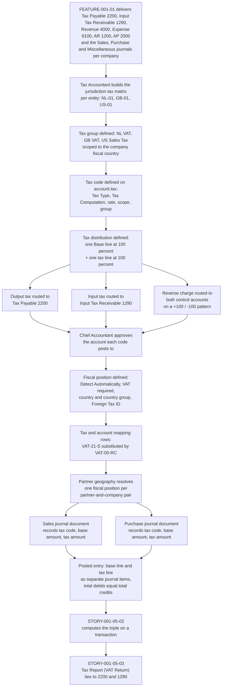

# STORY-001-05-01: Configure Tax Codes and Fiscal Positions

---

## Metadata

| Attribute | Value |
|-----------|-------|
| **Story ID** | `STORY-001-05-01` |
| **Title** | Configure Tax Codes and Fiscal Positions |
| **Parent Feature** | [FEATURE-001-05: Tax Configuration & Compliance](../FEATURE-001-05-tax-configuration-compliance.md) |
| **Parent Epic** | [EPIC-001: Enterprise Accounting in Odoo](../../EPIC-001-enterprise-accounting-odoo.md) |
| **Status** | Draft |
| **Priority** | 🔴 Critical |
| **Estimate** | 5 story points (Fibonacci) |
| **Persona** | Tax Accountant |
| **Feature Capability** | CAP-001 — configure tax codes, tax groups and fiscal positions per country and per company |
| **Secondary Personas** | Chief Accountant (approves each configuration version and the accounts each tax code posts to, and cannot approve a version it authored), External Auditor (configuration change and approval evidence) |
| **Platform Target** | Open decision DEC-001 — see [Version Compatibility](#version-compatibility) |
| **Last Updated** | 2026-08-15 |
| **Owner/Author** | Enterprise Accounting Team |

> **Platform target.** This story states no platform version of its own. The target is the Epic's open decision **DEC-001** in the [Open Decisions Register](../../EPIC-001-enterprise-accounting-odoo.md#appendix-b-open-decisions-register): the originating programme request names Odoo 17, the superseded prior backlog named 18.0, and the baseline this story was written and verified against is **Odoo 19.0 Community**, where `odoo/release.py` declares `version_info = (19, 0, 0, FINAL, 0, '')`. The three candidates carry different `account.tax` and `account.fiscal.position` field surfaces and different `l10n_*` pack series, so the mismatch is surfaced for stakeholder confirmation rather than settled inside this story.

---

## User Story

**As a** Tax Accountant

**I want** to configure jurisdiction-specific tax codes, tax groups and fiscal positions that route output tax to Tax Payable 2200 and input tax to Input Tax Receivable 1290 in each legal entity

**So that** every downstream vendor bill and customer invoice derives its tax code, its base amount and its tax amount from one controlled configuration, and the Tax Report (VAT Return) is filed from the ledger without a manual adjustment.

---

## INVEST Principles Compliance

| Principle | Compliance | Notes |
|-----------|------------|-------|
| **Independent** | ✅ | This story **blocks** `STORY-001-05-02`, yet it is itself developable and demonstrable standalone. Its only external need is that Tax Payable 2200, Input Tax Receivable 1290, Revenue 4000, Expense 6100, Accounts Receivable 1200 and Accounts Payable 2000 exist with the Sales, Purchase and Miscellaneous journals — supplied by FEATURE-001-01 and satisfiable as demo data in a test company, so no sibling story has to complete first |
| **Negotiable** | ✅ | States the tax outcome required — a tax code, a base amount and a tax amount determined by governed configuration and routed to a named control account — and leaves the model, field and view decisions to implementation discovery under D-003 and D-005 |
| **Valuable** | ✅ | Removes per-transaction tax judgement from the preparer. It is the determinant layer behind SM-010: tax-return preparation falls from 8 to 16 hours per jurisdiction per filing period to under 2 hours because the return is read from posted tax lines that tie to Tax Payable 2200 and Input Tax Receivable 1290 at a difference of `0.00` in the filing entity's functional currency |
| **Estimable** | ✅ | The artifact count is fixed: 6 statutory treatments, 3 tax groups, 3 legal entities and the fiscal-position set that resolves a partner's geography to a treatment — all expressed on models already present in this repository under LGPL-3, so effort, complexity and uncertainty are assessable — see [Estimation](#estimation) |
| **Small** | ✅ | One configuration outcome sized at 5 story points and completable inside one iteration. Computation on a transaction, the statutory return and authority submission are `STORY-001-05-02`, `STORY-001-05-03` and `STORY-001-05-04` respectively |
| **Testable** | ✅ | All seven criteria are objectively pass or fail: each names a tax code, a base amount and a tax amount as three separate values, states the currency and the rounding rule, and asserts either the configuration a save leaves behind with the values the tax engine resolves from it, or a named refusal with a created-record count, a released-version count or an override-route count of 0 — see [Acceptance Test Mapping](#acceptance-test-mapping) |

---

## Acceptance Criteria

Seven criteria, inside the mandated band of 4 to 8. Each has one non-compound **When**, and each **Then** asserts only what the Tax Accountant, the Chief Accountant or the External Auditor can observe. This story is a **configuration** story, so the boundary of every criterion is drawn at the configuration and at what the tax engine resolves from it — the code, its selectability, its distribution, its mapping, and the base and tax amounts it computes. The posted journal entry those amounts eventually reach is a downstream transaction owned by [STORY-001-05-02](./STORY-001-05-02-compute-transaction-tax.md); asserting a posting here would give the criterion a second trigger, since a configuration save and a document confirmation are two acts by two roles at two times. The postings are asserted as configuration-verification probes in § Test Requirements and in full by that story. Every tax assertion states the **tax code**, the **base amount** and the **tax amount** as three separate values; every monetary figure states its currency, its amount and its rounding rule; and every entry described asserts total debits equal to total credits with both totals stated.

| Scenario | Coverage class |
|----------|----------------|
| 1 | Valid input — happy-path output tax code configuration |
| 2 | Valid input — happy-path input tax code and fiscal-position mapping |
| 3 | Invalid or incomplete input |
| 4 | Error handling |
| 5 | Accounting edge case — zero-rated versus exempt treatment |
| 6 | Accounting edge case — tax-included pricing |
| 7 | Error handling — separation of configure and approve, self-approval denied |

### TAX-SOD-001 — The Separation of Configure and Approve in This Story

Every save described below produces a **configuration version**, not a live configuration, and the two are separated because the role that decides what a tax code does is not the role that decides it may be used. This story is where that separation is delivered, so the contract is stated once here and each criterion is read against it.

**A version is inert until a second named person approves it.** A save by the **Tax Accountant** writes a version carrying its author, its timestamp, the fields it changes and the values it changes them from and to. Until the **Chief Accountant** records an approval naming that version identifier, the version is not resolvable by the tax engine: the count of documents on which an unapproved version computes a base amount or a tax amount is **0**, the count of journal items it moves on Tax Payable 2200 or Input Tax Receivable 1290 is **0**, and the code the engine resolves stays the last approved version. Approval is recorded against the version identifier rather than against the tax code, so approving one version never approves a later edit of it.

**The author cannot be the approver.** The approval action is refused when the recorded approver is the version's own author, with a message naming the version and the separation it violates; the count of released versions whose approver equals their author is **0**. The refusal is a control rather than a warning — the constraining role holds no override, and the only route to release is an approval by a different person holding the approve permission. Where the Chief Accountant is the person who must author a change, release requires an approval by a second holder of that permission, and the count of releases with one distinct human in both fields stays **0**.

**An edit after approval is a new version, not a change to the released one.** Amending an approved version writes a further version in the unapproved state and leaves the released one resolvable, so a configuration in use never changes shape between two documents without an approval standing behind the change. The version history is append-only: a superseded version is retained with its author, approver and effective window as the evidence the **External Auditor** reads, and a correction is an appended version rather than an amendment of a recorded one (C-026).

**The separation binds machine access identically.** A version authored through the JSON web-service surface C-023 governs is inert on the same terms, the approval call is refused for the authoring principal on the same terms, and no integration principal holds both the configure and the approve permission — the count of principals holding both is **0**. The four TAX-SOD-001 permissions are named in the [feature-level authority matrix](../FEATURE-001-05-tax-configuration-compliance.md#42-cross-cutting-concerns); this story delivers the first two of them, and the third and fourth — prepare a return and approve-and-file it — are delivered by [STORY-001-05-03](./STORY-001-05-03-generate-vat-return.md).

### Scenario 1: Output tax code defined and routed to Tax Payable 2200

- **Given** the chart of accounts delivered by FEATURE-001-01 holds Tax Payable 2200, Accounts Receivable 1200 and Revenue 4000 in company **Global UK Ltd** (`GB-01`, the United Kingdom operating subsidiary of the Epic's canonical legal-entity register ([Appendix E.4](../../EPIC-001-enterprise-accounting-odoo.md#e4-canonical-legal-entity-register)), functional currency GBP), a Sales journal exists in `GB-01`, and the tax group `GB VAT` exists with its fiscal country set to United Kingdom
- **When** the Tax Accountant saves tax code `VAT-20-S`, named "VAT 20% (Sales)", with Tax Type Sales, Tax Computation Percentage of Price, an amount of 20.0000, the tax group `GB VAT`, and an invoice distribution of one Base line at a factor of 100 percent plus one tax line at a factor of 100 percent posting to Tax Payable 2200 and flagged as a Tax Closing Entry
- **Then** `VAT-20-S` is selectable on documents raised in the Sales journal of `GB-01`; a taxable line of GBP 10,000.00 records tax code `VAT-20-S`, a base amount of GBP 10,000.00 and a tax amount of GBP 2,000.00 as three separate values, each amount rounded half-up to 2 decimal places at the GBP rounding increment of 0.01. The posted journal entry that carries these values is a downstream transaction and belongs to [STORY-001-05-02](./STORY-001-05-02-compute-transaction-tax.md), which owns transaction tax computation and posting; it is asserted there rather than folded into this configuration criterion, whose trigger is the save

### Scenario 2: Fiscal position maps the output code for an intra-Community supply while the input code keeps its route to Input Tax Receivable 1290

- **Given** company **Global Europe SARL** (`NL-01`, the Netherlands operating subsidiary of the Epic's canonical legal-entity register, functional currency EUR) holds tax code `VAT-21-P` — named "VAT 21% (Purchases)", 21.0000 percent, tax group `NL VAT`, one tax line at a factor of 100 percent posting to Input Tax Receivable 1290 — alongside `VAT-21-S` ("VAT 21% (Sales)", 21.0000 percent, output tax to Tax Payable 2200) and `VAT-00-RC` ("VAT 0% (Intra-Community Supply, Reverse Charge)", 0.0000 percent, no tax account movement), with a Sales journal and a Purchase journal in `NL-01`
- **When** the Tax Accountant saves the fiscal position `EU B2B Reverse Charge` in `NL-01` with Detect Automatically enabled, VAT required enabled, the Europe country group set, and one tax mapping row substituting `VAT-21-S` with `VAT-00-RC`
- **Then** a customer established in Germany that holds a validated VAT number resolves to the fiscal position `EU B2B Reverse Charge` in `NL-01`; a sales line of EUR 5,000.00 raised for that customer records tax code `VAT-00-RC`, a base amount of EUR 5,000.00 and a tax amount of EUR 0.00 as three separate values with no movement posted to Tax Payable 2200; and the saved fiscal position holds exactly one tax mapping row, so `VAT-21-P` carries no mapping row of its own and a purchase in the Purchase journal of `NL-01` still resolves to `VAT-21-P` with its 100 percent tax line routed to Input Tax Receivable 1290 rather than to a substituted code — every amount in this criterion rounded half-up to 2 decimal places at the EUR rounding increment of 0.01. What that purchase code then computes on a document is transaction tax computation and belongs to [STORY-001-05-02](./STORY-001-05-02-compute-transaction-tax.md), which asserts the `VAT-21-P` base and tax amounts in full; this criterion asserts the mapping the save resolves and nothing beyond it. The posted journal entry that carries these values is a downstream transaction and belongs to [STORY-001-05-02](./STORY-001-05-02-compute-transaction-tax.md), which owns transaction tax computation and posting; it is asserted there rather than folded into this configuration criterion, whose trigger is the save

### Scenario 3: Tax distribution that does not total 100 percent is refused

- **Given** the Tax Accountant is defining tax code `VAT-20-S`, named "VAT 20% (Sales)", in company `GB-01` with the tax group `GB VAT` and its tax line pointed at Tax Payable 2200, and no tax named "VAT 20% (Sales)" yet exists in `GB-01`
- **When** the Tax Accountant saves that tax with an invoice distribution whose positive tax factors total 90 percent instead of the 100 percent required
- **Then** the record is not saved; a validation message states that the invoice and credit note distribution must reach a total factor of 100 and reports the total of 90 percent that was supplied; `VAT-20-S` is absent from the tax list of `GB-01` and is not selectable on documents raised in its Sales journal; and the refused attempt writes no journal item to Tax Payable 2200, whose balance in `GB-01` is unchanged at GBP 0.00, rounded half-up to 2 decimal places at the GBP rounding increment of 0.01

### Scenario 4: Duplicate tax definition is blocked and the released configuration is left intact

- **Given** tax code `VAT-20-S`, named "VAT 20% (Sales)", already exists in company `GB-01` with Tax Type Sales, an empty Tax Scope, fiscal country United Kingdom and one tax line at a factor of 100 percent posting to Tax Payable 2200
- **When** the Tax Accountant saves a second tax carrying that same name "VAT 20% (Sales)", the same Tax Type Sales, the same empty Tax Scope and the same fiscal country United Kingdom in `GB-01`
- **Then** the save is blocked with a validation message stating that tax names must be unique and naming the conflicting tax "VAT 20% (Sales)" together with the company `GB-01`; the released `VAT-20-S` retains its 100 percent tax line to Tax Payable 2200 and still resolves a base amount of GBP 10,000.00 to a tax amount of GBP 2,000.00 on a taxable line of GBP 10,000.00, each amount rounded half-up to 2 decimal places at the GBP rounding increment of 0.01; and the tax list of `GB-01` holds one tax named "VAT 20% (Sales)" rather than two, so a refused save leaves the released configuration exactly as it stood

### Scenario 5: Zero-rated and exempt codes are saved with separate report tags so the two treatments never share a line

- **Given** tax codes `VAT-00-ZR`, named "VAT 0% (Zero-Rated)", and `VAT-00-EX`, named "VAT Exempt", both exist in company `NL-01` at an amount of 0.0000 percent in the tax group `NL VAT`, each carrying its own Tax Grids tag so the two bases aggregate to different lines of the statutory return, and a Sales journal exists in `NL-01`
- **When** the Tax Accountant saves `VAT-00-EX` with its own Tax Grids tag, distinct from the tag already carried by `VAT-00-ZR`, in company `NL-01`
- **Then** both codes are selectable on documents raised in the Sales journal of `NL-01` and each carries a different Tax Grids tag, so the count of report tags shared between `VAT-00-ZR` and `VAT-00-EX` is 0; a sales line of EUR 4,000.00 at `VAT-00-ZR` resolves tax code `VAT-00-ZR`, a base amount of EUR 4,000.00 and a tax amount of EUR 0.00 as three separate values, and a sales line of EUR 4,000.00 at `VAT-00-EX` resolves tax code `VAT-00-EX`, a base amount of EUR 4,000.00 and a tax amount of EUR 0.00, each base being non-zero while each tax amount is zero; and neither code carries a tax line that would move Tax Payable 2200, so the count of tax-account distribution lines on each is 0 — every amount in this criterion rounded half-up to 2 decimal places at the EUR rounding increment of 0.01. Which lines of the statutory return those two tags aggregate to is report behaviour owned by [STORY-001-05-03](./STORY-001-05-03-generate-vat-return.md), which asserts the zero-rated base and the exempt base on two separate lines; running the report is a second trigger and is not folded into this save. The posted journal entry that carries these values is a downstream transaction and belongs to [STORY-001-05-02](./STORY-001-05-02-compute-transaction-tax.md), which owns transaction tax computation and posting; it is asserted there rather than folded into this configuration criterion, whose trigger is the save

### Scenario 6: A tax-included code is saved, splits the gross price it resolves and leaves the company default in force

- **Given** tax code `VAT-20-S-INC`, named "VAT 20% (Sales, Tax Included)", exists in company `GB-01` at an amount of 20.0000 percent in the tax group `GB VAT` with one tax line at a factor of 100 percent posting to Tax Payable 2200, its Included in Price override reads Tax Included, and the Default Sales Price Include of `GB-01` reads Tax Excluded — the effective price-inclusive behaviour of a tax being derived from that per-tax override together with the company default rather than held independently of them
- **When** the Tax Accountant saves `VAT-20-S-INC` in `GB-01` with its Included in Price override set to Tax Included, leaving the Default Sales Price Include of `GB-01` at Tax Excluded
- **Then** `VAT-20-S-INC` is selectable on documents raised in the Sales journal of `GB-01` and a sales line at that code whose gross unit price is GBP 120.00 resolves tax code `VAT-20-S-INC`, a base amount of GBP 100.00 and a tax amount of GBP 20.00 as three separate values; the gross price of GBP 120.00 is therefore split into its base and its tax rather than treated as the base; and the Default Sales Price Include of `GB-01` still reads Tax Excluded, so `VAT-20-S` continues to resolve a base amount of GBP 10,000.00 and a tax amount of GBP 2,000.00 on a line priced at GBP 10,000.00, which is what makes the inclusive code an addition to the configuration rather than a change of the company default — every amount in this criterion rounded half-up to 2 decimal places at the GBP rounding increment of 0.01. The posted journal entry that carries these values is a downstream transaction and belongs to [STORY-001-05-02](./STORY-001-05-02-compute-transaction-tax.md), which owns transaction tax computation and posting; it is asserted there rather than folded into this configuration criterion, whose trigger is the save

### Scenario 7: A rate change authored by the Tax Accountant is inert until the Chief Accountant approves it, and self-approval is refused

- **Given** tax code `VAT-20-S` is released in company `GB-01` at an amount of 20.0000 percent with one tax line at a factor of 100 percent posting to Tax Payable 2200, and the Tax Accountant has saved a version of that code changing the amount to 22.5000 percent which carries the author, the timestamp and the from-and-to values of the changed field and stands in the unapproved state
- **When** the Tax Accountant who authored that version records an approval of it
- **Then** the approval is refused with a message naming the version identifier and stating that a configuration version is approved by a person other than its author; the count of released versions of `VAT-20-S` whose approver equals their author is 0; the Tax Accountant holds no override of that refusal, so the count of routes by which the authoring role can release its own version is 0; the unapproved version stays unapproved and unresolvable, so a taxable line of GBP 10,000.00 in the Sales journal of `GB-01` still resolves tax code `VAT-20-S`, a base amount of GBP 10,000.00 and a tax amount of GBP 2,000.00 as three separate values at the released 20.0000 percent rather than GBP 2,250.00 at the unapproved 22.5000 percent, each amount rounded half-up to 2 decimal places at the GBP rounding increment of 0.01; the refused approval is appended to the version history with its actor, its timestamp and its outcome rather than discarded; and when the Chief Accountant then records an approval of that same version identifier the release succeeds and the same line resolves a tax amount of GBP 2,250.00 at the same rounding, which is what shows the refusal to be a separation of duties rather than a block on the change. The same refusal and the same success are asserted over the JSON web-service surface C-023 governs, so the count of releases achieved by an authoring integration principal is 0

---

## Sub-Tasks

- [ ] Build the jurisdiction tax matrix for `NL-01`, `GB-01` and `US-01` — one row per statutory treatment (standard rate, reduced rate, zero-rated, exempt, intra-Community reverse charge and United States sales tax) naming the tax code, the rate, the tax group and the control account that treatment posts to — and agree every row with the Finance SME before a record is created — `@functional-consultant`
- [ ] Draft the fiscal-position mapping table per operating country and per partner geography, stating the detection criteria (country, country group, VAT-number requirement, foreign registration) and the tax and account substitutions each position applies — `@functional-consultant`
- [ ] Deliver the tax-code, tax-group and tax-distribution configuration so that output tax reaches Tax Payable 2200 and input tax reaches Input Tax Receivable 1290 in every in-scope company, with the tax closing flag set on the distribution lines the statutory return aggregates — `@developer`
- [ ] Deliver the TAX-SOD-001 configuration-version and approval machinery: a version record carrying author, timestamp and from-and-to values per changed field; the guard that keeps an unapproved version unresolvable by the tax engine; the approval action that refuses an approver equal to the author with no override for the authoring role; the append-only version history retained for the External Auditor under C-026; and the permission split that stops any human role or C-023 integration principal from holding both configure and approve — `@developer`
- [ ] Deliver the fiscal-position configuration with automatic detection, the VAT-number requirement, country and country-group scoping and the foreign registration case, including the guard that refuses a mapping onto a tax or an account absent from the company's own configuration — `@developer`
- [ ] Deliver the deterministic configuration data set for `NL-01`, `GB-01` and `US-01` as reusable fixtures, held apart from the hostile-input fixtures under D-009 so a hostile record is never mistaken for sample data — `@developer`
- [ ] Write the unit and integration tests for all seven acceptance scenarios, including the TAX-SOD-001 self-approval denial over both the user interface and the C-023 surface, assert every base amount and tax amount numerically to the minor unit under C-009, and review the criteria for banned vague terms and for the tax-code, base-amount and tax-amount triple — `@qa-engineer`
- [ ] Sign off that each tax code posts to Tax Payable 2200 or Input Tax Receivable 1290 as its jurisdiction requires, and that each code aggregates to the intended line of that jurisdiction's Tax Report (VAT Return) — `@finance-sme`
- [ ] Write the tax-configuration runbook: the jurisdiction matrix, the fiscal-position mapping table, the change-approval path through the Chief Accountant, and the evidence set the External Auditor reads without raising a data request — `@technical-writer`

---

## Edge Cases

- **Zero-amount taxable line.** A sales line of EUR 0.00 at tax code `VAT-21-S` in `NL-01` records tax code `VAT-21-S`, a base amount of EUR 0.00 and a tax amount of EUR 0.00, each rounded half-up to 2 decimal places at the EUR rounding increment of 0.01, and the tax code stays recorded on the line so the line remains part of the Tax Report (VAT Return) population instead of dropping out of the return.
- **Configuration change against a filed period.** A change to a tax code whose posted tax lines fall on or before the Tax Return Lock Date of `NL-01` takes effect from the change forward and does not restate a closed period: the filed Tax Report (VAT Return) for 2025-01-01 to 2025-03-31 stays reproducible with the figures that were filed, and a tax-bearing entry dated into the locked period is refused with a message naming the company and the lock date. The Tax Return Lock Date is administered separately from the Global, Sales, Purchase and Hard Lock Dates on the same company, and each exception is recorded with its author, its timestamp and its expiry for the External Auditor.
- **One rate across two currencies, plus translation.** The 21 percent rate on a base of EUR 10,000.00 in `NL-01` yields a tax amount of EUR 2,100.00 and the 20 percent rate on a base of GBP 10,000.00 in `GB-01` yields a tax amount of GBP 2,000.00, each rounded half-up to 2 decimal places at its own currency's rounding increment of 0.01. Where the document currency differs from the entity's functional currency the translated figures are stated separately from the transaction figures — a base of EUR 10,000.00 with a tax amount of EUR 2,100.00 recorded in `US-01` at 1 EUR = 1.1000 USD is carried at a base of USD 11,000.00 and a tax amount of USD 2,310.00, each rounded half-up to 2 decimal places at the USD rounding increment of 0.01 — and the tax-rounding method in force on the company is stated with the figures, because Round per Tax and Round per Line can differ by one minor unit on a multi-line document.
- **Partner geography amended after posting.** When a partner's country or VAT number is amended after documents have posted, the fiscal position resolved at the moment each document was confirmed stays attached to the posted entry: no posted line has its tax code, base amount or tax amount re-mapped, the Tax Report (VAT Return) for a filed period reproduces the figures that were filed, and the amended geography takes effect only on documents confirmed after the amendment. Where a posted document was determined under the wrong geography the correction path is a credit note and a re-issue rather than a silent substitution.

---

## Estimation

| Dimension | Rating | Justification |
|-----------|--------|---------------|
| **Effort** | Medium | The configuration surface spans tax codes, tax groups, tax-distribution lines and fiscal positions across three legal entities and six statutory treatments, but every artifact is a record on a model `account` already provides rather than new machinery |
| **Complexity** | Medium | The distribution rules that route output tax to Tax Payable 2200 and input tax to Input Tax Receivable 1290, the evaluation order among candidate fiscal positions, and the derivation of price-inclusive behaviour from a per-tax override plus a company default each carry an accounting consequence — and none of them requires a new posting engine or a new report engine |
| **Uncertainty** | Low | `account.tax`, `account.tax.group`, `account.tax.repartition.line` and `account.fiscal.position` are present in this repository under LGPL-3 and the 209 `l10n_*` packs supply the statutory starting point per jurisdiction, so the field surface and the refusal behaviour asserted in Scenarios 3 and 4 are inspectable before development starts |
| **Story Points** | **5** | Fibonacci scale (1, 2, 3, 5, 8, 13). Above a 3 because the story covers codes, groups, distribution routing and fiscal positions in three entities rather than one record type in one company; below an 8 because no posting engine, no statutory report and no external integration is built here — those are `STORY-001-05-02`, `STORY-001-05-03` and `STORY-001-05-04` |

---

## Constraints

The constraint identifiers below are the Epic's own, restated for this story rather than renumbered, so one constraint set reads across the whole ticket tree.

### License and Compliance

- [x] **C-001 — AGPL-3.0 compatibility**: any module delivering the tax-configuration governance layer, its jurisdiction matrix and its change-approval trail is distributed under an AGPL-3.0 compatible licence, matching the Community-edition accounting add-ons already present in this repository
- [x] **C-002 — Existing licence respected**: extension of `account` — the "Invoicing" application, version 1.4, licence LGPL-3 — respects that licence, and an AGPL-3 extension of LGPL-3 code is licence-checked before it is written
- [x] **C-005 / C-006 — Odoo and OCA coding standards**: Python follows Odoo and OCA module guidelines including PEP 8, and static analysis passes with the repository's configured tooling, whose lint configuration is `ruff.toml` at the repository root
- [x] **C-012 — Build on the existing models**: tax codes, tax groups, distribution rules and fiscal positions are expressed on `account.tax`, `account.tax.group`, `account.tax.repartition.line`, `account.fiscal.position`, `account.fiscal.position.tax` and `account.fiscal.position.account` rather than on parallel structures, so one tax audit trail exists
- [x] **C-014 — Access rights and company isolation**: the role that maintains a tax code is distinguishable from the role that approves the account it posts to and from the role that files the return, and a role restricted to one company can neither read nor amend another company's tax configuration
- [x] **C-019 — Data access discipline**: configuration reads and the resolution of a fiscal position are expressed through the Odoo ORM or parameterized SQL, with no string-concatenated query construction

### Accounting Standards Compliance

- [x] **EU VAT Directive 2006/112/EC**: the treatment taxonomy this story configures comes from the Directive — the standard rate carried by `VAT-21-S`, `VAT-21-P`, `VAT-20-S` and `VAT-20-P`; the reduced rate carried by `VAT-09-S`; the zero rate carried by `VAT-00-ZR`, which reaches the return with a base amount and a tax amount of EUR 0.00; the exemption carried by `VAT-00-EX`, which also reaches the return with a base amount and a tax amount of EUR 0.00 but on a different return line; and the reverse charge carried by `VAT-00-RC` on the supply side and `VAT-21-RC` on the acquisition side, under which the acquirer rather than the supplier accounts for the tax, with every amount in this row rounded half-up to 2 decimal places at the EUR rounding increment of 0.01
- [x] **Zero-rated and exempt are distinct treatments**: a zero-rated supply is taxable at 0 percent while an exempt supply is outside the charge, so the two bases are reported on separate lines of the Tax Report (VAT Return) and are never combined into one figure
- [x] **ISO 4217 minor units**: every base amount and tax amount is rounded half-up to its currency's decimal precision — 2 decimal places at a rounding increment of 0.01 for EUR, GBP and USD
- [x] **Statutory layout is inherited, not invented**: where a jurisdiction's `l10n_*` pack already ships the statutory tax codes, tax groups, fiscal positions and return layout, that pack is the starting point and each divergence from group tax policy is recorded rather than silently absorbed (D-006)

### Dependency and Edition Considerations

- [x] **C-003 — Edition source is an open decision (DEC-002), not a prohibition**: the outright ban on Enterprise dependencies carried by the superseded backlog is **withdrawn**. The choice between an Odoo Enterprise subscription and the OCA add-on path — `account_financial_report`, `account_reconcile_oca` and `mis_builder` plus bespoke development for the residual gap — is owned by the CFO / Finance Director with the Group Controller and is recorded in the [Open Decisions Register](../../EPIC-001-enterprise-accounting-odoo.md#appendix-b-open-decisions-register)
- [x] **This story is not gated by DEC-002**: every model it configures is present in this repository under LGPL-3, and the 209 `l10n_*` localization packs supply the statutory templates, so development can start before the edition decision is confirmed. What DEC-002 affects downstream is how the Tax Report (VAT Return) is rendered, which is `STORY-001-05-03`
- [x] **C-004 — OCA ecosystem compatibility**: whichever edition path is confirmed, the tax codes, tax groups, distribution routing and fiscal positions delivered here stay consumable by OCA add-ons and by the country `l10n_*` extensions published by OCA

### Interface, Artifact, Evidence and Resilience Contracts

- [x] **C-023 — Machine access is a named principal, not a shared key**: every programmatic read or write of a tax code, a tax group, a distribution line, a fiscal position or a configuration version happens over the JSON web-service surface C-023 governs under a dedicated named integration principal with a recorded owner, a declared expiry and rotation interval, a revocation effective on its next call, and a scope confined to the companies, models and methods it needs. It executes under access rights and record rules rather than `sudo`, is bounded by a per-principal rate ceiling, and is audited per call. No principal holds both the configure and the approve permission of TAX-SOD-001, and the deprecated XML-RPC and JSON-RPC transports carry no criterion, test or integration of this story
- [x] **C-025 — The import file is an artifact with a lifecycle**: a spreadsheet or CSV of tax codes or fiscal-position mappings offered to this configuration is checked against a media-type allowlist and a declared maximum size before a byte is parsed, stored with its declared type recorded separately from the extension it arrived with, served with a non-executing content disposition, scanned by the platform's own hardened reader rather than a bespoke one, retained for the declared configuration-evidence period, and deleted by a governed purge rather than an ad-hoc one. The count of imported files retained past their declared period without a recorded governance decision is 0
- [x] **C-026 — The configuration history is evidence, so it is append-only**: every configuration version, every approval, every refused approval and every supersession is appended with its actor, its timestamp, its before-and-after values and its outcome. A row is never edited or removed in place, a correction is an appended row citing the row it corrects, the history carries a retention lock that does **not** cascade onto the tax records it describes, and the External Auditor can export the whole of it for a company and a date range without a data request. The count of history rows modified in place is 0
- [x] **C-027 — A configuration import that fails part-way leaves no half-applied configuration**: the import runs with a declared timeout, a bounded retry budget with backoff and jitter, and a named terminal state that an operator is alerted on; a run that neither completes nor reaches that state is recovered rather than left in progress; and a partially applied import is reverted to the last approved configuration so the tax engine never resolves a code the import left half-written. The count of tax codes left in a partially imported state after a failed run is 0
- [x] **C-028 — A configuration import is applied once**: the import episode carries a durable identity over the company, the file digest and the version it targets, held by a database unique constraint, with a row or advisory lock across the read-decide-write window and revalidation inside the lock against the recorded configuration revision. A stale lease is reclaimed rather than blocking indefinitely, and the guard is **not** overridable by the role it constrains — a re-import of the same file is a new episode authorized by the Chief Accountant
- [x] **C-029 — The configuration list and its exports are bounded**: a request to list, export or import tax codes and fiscal positions is refused before work begins when it exceeds the declared maximum row count, file size or column count, with the ceiling and the requested magnitude named as two values; a request above the synchronous threshold is queued under a per-user quota and a queue-depth ceiling and is cancellable; an export streams rather than materializing in memory; and a produced file is published atomically so a reader never sees a partial one
- [x] **C-020 — A failure names the host and the class of address, never the address**: where a configuration import reaches a configured origin, a rejection names the configured host and the class of the rejected address — that it resolved to an address in a private range, or to a loopback address — and never the resolved address, the ports probed, the allowlist contents or the resolution chain. A scheduled import failure reports the run name, the company, the record set and the terminal state to an **operator** and the business outcome with its remedy to the **Tax Accountant**, with no traceback, cron definition, interval, worker identifier or queue state on any persona-facing channel; the two are correlated by an opaque reference

### Version Compatibility

- [x] **C-010 — Platform version target is open decision DEC-001**: the programme request names Odoo 17, the superseded backlog named 18.0, and this repository is **Odoo 19.0 Community** (`odoo/release.py` → `version_info = (19, 0, 0, FINAL, 0, '')`). The target is confirmed with stakeholders before development rather than chosen here
- [x] **C-011 — Language and database versions follow the confirmed target**: the 19.0 baseline present here declares `MIN_PY_VERSION = (3, 10)`, `MAX_PY_VERSION = (3, 13)` and `MIN_PG_VERSION = 13` in `odoo/release.py`; an earlier platform target carries a different supported matrix
- [x] **Impact if DEC-001 resolves away from 19.0**: the `account.tax` and `account.fiscal.position` field names cited in [Technical Discovery Notes](#technical-discovery-notes) are restated for the confirmed version, the `l10n_*` pack series supplying each jurisdiction's statutory codes and return layout is re-selected for that version, and the Tax Return Lock Date behaviour is re-verified because lock-date administration changed across the three candidate releases

---

## Technical Discovery Notes

> **Purpose:** these notes direct the codebase analysis that precedes implementation. They record what to investigate and what the outcome must prove; they do not choose the implementation.

### Codebase Analysis Areas

| Area | Files/Modules to Examine | Analysis Focus |
|------|--------------------------|----------------|
| `account.tax` definition | `addons/account/models/account_tax.py` | Tax Type (`type_tax_use`, default `sale`), Tax Computation (`amount_type`, default `percent`), the rate field stored at four decimal places, Tax Scope, and the tax-group relation whose domain and validation admit only a group carrying the same country as the tax using it, or no country at all. Which computation type expresses each treatment in the jurisdiction matrix, and what does a rate held at four decimal places imply when the posted tax amount is rounded to the currency's 2 decimal places? |
| `account.tax` distribution lines | `addons/account/models/account_tax.py` | The invoice, refund and combined distribution collections, whose lines carry an account, a sequence, a factor percentage, a Tax Closing Entry flag and Tax Grids tags. How does the distribution send output tax to Tax Payable 2200 and input tax to Input Tax Receivable 1290; how does the `+100 / -100` pattern the source comments describe express a reverse charge that raises the same tax amount on both sides; and what changes on a credit note, which uses the refund collection rather than the invoice collection? |
| `account.tax` validation behaviour | `addons/account/models/account_tax.py` | The constraint that rejects a distribution whose positive factors do not total 100 and the constraint on company, name, tax type, tax scope and country that rejects a duplicate tax while naming the conflicting tax and its company. Scenarios 3 and 4 assert exactly these refusals, so confirm the message content and the transaction boundary before writing the negative tests |
| Tax-inclusive pricing | `addons/account/models/account_tax.py` and `addons/account/models/company.py` | The effective price-inclusive flag is **computed** from a per-tax Included in Price override together with the company-level Default Sales Price Include, whose own default is Tax Excluded. Which value is stored as the base amount on the posted journal item when a line is priced inclusive of tax, and which input wins when the two disagree? |
| `account.fiscal.position` | `addons/account/models/partner.py` | Detect Automatically, VAT required, country and country-group scoping, state and postal-range scoping, the tax and account mapping children, and Foreign Tax ID with its country-validation constraint. In what order are candidate positions evaluated when more than one matches a partner, which one wins, and what happens when a mapped tax or account is absent from the company's configuration? |
| Country statutory templates | The **209** `addons/l10n_*` packs — **95** of which declare a statutory tax report on `account.report` rooted on `account.generic_tax_report`, **88** of them shipping it as a dedicated `*tax_report*` data file, for example `addons/l10n_uk/data/account_tax_report_data.xml` with its Balance column and its hierarchical box lines such as "[BOX 1] VAT due on sales and other outputs" | Determine per operating country whether the pack already supplies the tax codes, tax groups, fiscal positions and return layout the jurisdiction matrix calls for, so bespoke configuration is commissioned only for the residual. `addons/l10n_nl` and `addons/l10n_uk` are the packs behind the `NL-01` and `GB-01` scenarios above |
| Rounding levers | `addons/account/models/company.py` and `odoo/addons/base/models/res_currency.py` | The company tax-calculation rounding method, whose options are Round per Tax (the shipped default) and Round per Line, and the currency decimal precision derived from the rounding factor as the ceiling of the base-10 logarithm of its reciprocal — 0.01 giving 2 decimal places for EUR, GBP and USD. Establish which method each entity files under, because the two can differ by one minor unit on a multi-line document |
| Filed-period lock | `addons/account/models/company.py` | The Tax Return Lock Date and the per-role value derived from it, administered separately from the four sibling controls on the same company — Global Lock Date, Sales Lock Date, Purchase Lock date and Hard Lock Date — and set when the tax closing entry posts. Which document types does the tax lock block, can it be moved backwards once a return is filed, and how is an exception evidenced to the External Auditor? |

### Relevant Existing Modules

| Module | Path | Relevance to this story |
|--------|------|------------------------|
| `account` | `addons/account/` | "Invoicing", version 1.4, category `Accounting/Accounting`, licence LGPL-3. Supplies `account.tax`, `account.tax.group`, `account.tax.repartition.line`, `account.fiscal.position`, `account.fiscal.position.tax`, `account.fiscal.position.account`, the journal type set whose labels are Sales, Purchase, Cash, Bank, Credit Card and Miscellaneous, and the Tax Return Lock Date on the company |
| `l10n_*` | `addons/l10n_*/` | 209 localization packs. Each supplies one jurisdiction's statutory tax codes, tax groups, fiscal positions and statutory return layout, which group tax policy reconciles to instead of replacing |
| `base` | `odoo/addons/base/` | `res.company` for the filing entity, its functional currency and its fiscal country; `res.country` and `res.country.group` for the geography a fiscal position matches a partner on; `res.currency` for the decimal precision every base amount and tax amount is rounded to |
| `account_financial_report_ce` | `addons/account_financial_report_ce/` | Version 19.0.1.1.0, AGPL-3. Where the Tax Payable 2200 and Input Tax Receivable 1290 balances produced by this configuration surface for the close reconciliation owned by FEATURE-001-07 |

### OCA Module Compatibility

| OCA Repository | Module | Compatibility consideration |
|----------------|--------|-----------------------------|
| OCA/account-financial-reporting | `account_financial_report` | Under the OCA path of DEC-002 it renders statutory reports from account and tax data; determine whether it consumes the tax codes and Tax Grids tags configured here without restating them |
| OCA/mis-builder | `mis_builder` | Determine whether a tax-control-account reconciliation view is worth expressing there for close use, and how per-company account-code divergence affects those expressions |
| OCA `l10n-*` country repositories | Country tax extensions | Per operating country, determine whether an OCA extension already supplies the statutory return layout or a tax treatment the `l10n_*` pack leaves out, so bespoke configuration covers only what neither supplies |

### Discovery versus Prescription

This story describes WHAT tax configuration finance needs and WHY. It does not prescribe HOW it is built. Not specified here: new model names, field definitions or schema decisions; whether a capability extends an existing model or adds a new one (D-005); view architecture; the Odoo API methods used to resolve a fiscal position or compute a tax; and module structure. Deferred to agent discovery: **D-003** (the residual configuration-governance gap), **D-006** (the operating-country list and the `l10n_*` pack per country), **D-007** (company isolation, record rules and the access-right groups implied by the personas) and **D-009** (the deterministic and hostile-input fixture sets, held apart from one another).

---

## Dependencies

### Story Dependencies

| Dependency Type | Story ID | Story Title | Relationship |
|-----------------|----------|-------------|--------------|
| Parent Feature | [FEATURE-001-05](../FEATURE-001-05-tax-configuration-compliance.md) | Tax Configuration & Compliance | This story is story 1 of the 4 in this feature and delivers its capability CAP-001 |
| Blocks | [STORY-001-05-02](./STORY-001-05-02-compute-transaction-tax.md) | Compute Tax on Transactions with Base and Tax Split | Tax cannot be computed on a transaction before the codes, groups, distribution rules and fiscal positions that determine it exist |
| Blocked By | — | — | Nothing inside FEATURE-001-05. Outside it, the accounts and journals this story maps onto come from [FEATURE-001-01](../FEATURE-001-01-chart-of-accounts-fiscal-year.md), and they are satisfiable as demo data in a test company, so this story is developable standalone |
| Related | [FEATURE-001-01](../FEATURE-001-01-chart-of-accounts-fiscal-year.md) | Chart of Accounts & Fiscal Year | Supplies Tax Payable 2200, Input Tax Receivable 1290, Revenue 4000, Expense 6100, Accounts Receivable 1200 and Accounts Payable 2000 with the Sales, Purchase and Miscellaneous journals; its `STORY-001-01-05` administers the lock dates the second edge case above depends on |
| Related | [STORY-001-02-03](../FEATURE-001-02/STORY-001-02-03-post-vendor-bill-entries.md) | Post Vendor Bill Journal Entries | Consumes the purchase tax codes defined here so a vendor bill records its tax code, base amount and tax amount and posts recoverable input tax to Input Tax Receivable 1290 rather than to Expense 6100 (ORD-002) |
| Related | [STORY-001-03-01](../FEATURE-001-03/STORY-001-03-01-generate-customer-invoices.md) | Generate and Post Customer Invoices | Consumes the sales tax codes and fiscal positions defined here so a customer invoice records its tax code, base amount and tax amount and posts output tax to Tax Payable 2200 (ORD-002) |

### External Dependencies

| Dependency | Type | Notes |
|------------|------|-------|
| Council Directive 2006/112/EC | Accounting and tax standard | The EU VAT Directive supplies the treatment taxonomy behind the standard, reduced, zero-rated, exempt and reverse-charge codes configured here |
| Per-country VAT registration and rate schedule | Statutory registration | Each operating entity's registration number, its registered rates and its filing frequency are confirmed per jurisdiction before that jurisdiction's codes are released; a foreign registration is configured through the Foreign Tax ID on a fiscal position |
| `l10n_*` localization pack per operating country | Platform dependency | The pack for each operating country is identified and installed in a test database before configuration begins, so its statutory codes, groups, positions and return layout are the starting point (D-006) |
| ISO 4217 | Standard | Currency codes and minor units, which fix the 2-decimal precision every rounding assertion in this story states |
| Group tax policy sign-off | Governance | The jurisdiction tax matrix and the account each code posts to are approved by the Chief Accountant before a code is released for posting |

### Integration Points

| Odoo Model/Module | Integration Type | Purpose |
|-------------------|------------------|---------|
| `account.tax` | Define and extend | The tax code itself: its type, computation, rate, scope, group and effective price-inclusive behaviour |
| `account.tax.repartition.line` | Define | Directs the computed tax amount to Tax Payable 2200 or Input Tax Receivable 1290, carries the Tax Closing Entry flag and the Tax Grids tags, and expresses the reverse charge that raises tax on both sides |
| `account.tax.group` | Define | `NL VAT`, `GB VAT` and `US Sales Tax` — the aggregation level the statutory return groups its lines on, and the level that names the tax payable and tax receivable accounts its member codes post to |
| `account.fiscal.position` | Define | Per-country and per-partner determination: automatic detection, VAT-number requirement, country and country-group scoping, and the foreign registration case |
| `account.fiscal.position.tax` | Define | The tax substitution rows, such as `VAT-21-S` to `VAT-00-RC` for an intra-Community supply |
| `account.fiscal.position.account` | Define | The general ledger account substitution rows that accompany a tax substitution |
| `res.company` | Read | The filing entity, its functional currency, its fiscal country, its tax-calculation rounding method and its Tax Return Lock Date |
| `res.partner` | Read | The partner country, country group and VAT number that automatic detection resolves a fiscal position from |
| `res.currency` | Read | The decimal precision and rounding increment every base amount and tax amount is rounded to |
| `account.move`, `account.move.line` | Read | The posted base line and tax line that evidence the configuration, kept as separate journal items in an entry whose debits equal its credits |

---

## Test Requirements

### Coverage Requirement

| Metric | Requirement | Notes |
|--------|-------------|-------|
| **Minimum Test Coverage** | **80%** | Mandatory for all new functionality delivered by this story (C-007) |
| Unit Test Coverage | 80%+ | Tax-code attributes, distribution routing, tax-group constraint, fiscal-position resolution, price-inclusive derivation |
| Integration Test Coverage | 80%+ | Configuration to posted entry: the tax code, base amount and tax amount recorded on a document raised in the Sales or Purchase journal of a named company |
| Assertion style | Numeric | Every base amount and every tax amount is asserted to the minor unit, and every balanced-entry assertion compares total debits with total credits at a stated difference (C-009) |
| Traceability | 1 test : 1 criterion | Each acceptance test maps to exactly one Given/When/Then criterion in this file (C-008) |

### Unit Test Scenarios

| Acceptance Scenario | Unit test focus | Key assertions |
|---------------------|-----------------|----------------|
| Scenario 1 | Output tax-code definition and distribution routing | `VAT-20-S` carries Tax Type Sales, Tax Computation Percentage of Price and an amount of 20.0000 in the tax group `GB VAT`; its invoice distribution holds exactly one Base line and one tax line, each at a factor of 100 percent, with the tax line pointed at Tax Payable 2200 and flagged as a Tax Closing Entry; a base of GBP 10,000.00 computes a tax amount of GBP 2,000.00, each amount rounded half-up to 2 decimal places at the GBP rounding increment of 0.01 |
| Scenario 2 | Fiscal-position resolution and tax substitution | The `EU B2B Reverse Charge` position in `NL-01` has Detect Automatically and VAT required enabled, the Europe country group set and exactly one tax mapping row; a German partner holding a validated VAT number resolves to it; the saved mapping substitutes `VAT-00-RC` for `VAT-21-S` on a sales line and leaves the purchase-side code `VAT-21-P` unsubstituted with its tax line still routed to Input Tax Receivable 1290. What each code then computes on a posted document is asserted by [STORY-001-05-02](./STORY-001-05-02-compute-transaction-tax.md) and, for this configuration, by the release probe under [Integration Test Considerations](#integration-test-considerations) |
| Scenario 3 | Distribution-total validation | Saving a tax whose positive tax factors total 90 percent raises a validation error naming the required total of 100; the record count for taxes named "VAT 20% (Sales)" in `GB-01` stays at 0; no journal item exists against Tax Payable 2200 |
| Scenario 4 | Duplicate-definition constraint | Saving a second tax with the same name, tax type, tax scope and fiscal country in `GB-01` raises a validation error naming the conflicting tax and its company; the record count for that name in `GB-01` stays at 1; the surviving tax's distribution still points at Tax Payable 2200 |
| Scenario 5 | Zero-rated versus exempt tagging | `VAT-00-ZR` and `VAT-00-EX` both compute a tax amount of EUR 0.00 on a base of EUR 4,000.00; the two codes carry different Tax Grids tags; neither code's distribution names Tax Payable 2200, with each amount rounded half-up to 2 decimal places at the EUR rounding increment of 0.01 |
| Scenario 6 | Price-inclusive derivation | With the per-tax Included in Price override reading Tax Included and the company Default Sales Price Include reading Tax Excluded, `VAT-20-S-INC` splits a gross price of GBP 120.00 into a base of GBP 100.00 and a tax of GBP 20.00; the company default value is unchanged after the computation; `VAT-20-S` still splits GBP 10,000.00 into a base of GBP 10,000.00 and a tax of GBP 2,000.00, each amount rounded half-up to 2 decimal places at the GBP rounding increment of 0.01 |
| Scenario 7 | Version approval separation | An unapproved version of `VAT-20-S` at 22.5000 percent computes a tax amount of GBP 0.00 on 0 documents and the engine still resolves 20.0000 percent, so a base of GBP 10,000.00 yields GBP 2,000.00; the approval call by the version's author raises a validation error naming the version and the separation, and the count of released versions whose approver equals their author stays 0; the refused attempt is appended to the version history; an approval by the Chief Accountant releases the version and the same base then yields GBP 2,250.00, each amount rounded half-up to 2 decimal places at the GBP rounding increment of 0.01 |

### Integration Test Considerations

- [ ] Verify each released configuration by the posting it produces, which is the evidence removed from the criteria so they keep one trigger each. For `VAT-20-S` in `GB-01`: a taxable line of GBP 10,000.00 posts through the Sales journal as debit Accounts Receivable 1200 GBP 12,000.00, credit Revenue 4000 GBP 10,000.00 and credit Tax Payable 2200 GBP 2,000.00, with total debits of GBP 12,000.00 equal to total credits of GBP 12,000.00 at a difference of GBP 0.00. For the unmapped `VAT-21-P` in `NL-01`: a vendor bill of EUR 5,000.00 posts through the Purchase journal as debit Expense 6100 EUR 5,000.00, debit Input Tax Receivable 1290 EUR 1,050.00 and credit Accounts Payable 2000 EUR 6,050.00, with total debits of EUR 6,050.00 equal to total credits of EUR 6,050.00 at a difference of EUR 0.00. For `VAT-20-S-INC` in `GB-01`: a line priced at GBP 120.00 inclusive posts as debit Accounts Receivable 1200 GBP 120.00, credit Revenue 4000 GBP 100.00 and credit Tax Payable 2200 GBP 20.00, with total debits of GBP 120.00 equal to total credits of GBP 120.00 at a difference of GBP 0.00. Each amount is rounded half-up to 2 decimal places at its currency's rounding increment of 0.01, and each posting is cross-checked against the assertion [STORY-001-05-02](./STORY-001-05-02-compute-transaction-tax.md) makes of the same configuration so the two stories cannot drift apart.
- [ ] Post a document in the Sales journal of `GB-01` at `VAT-20-S` and assert the posted entry carries debit Accounts Receivable 1200 GBP 12,000.00, credit Revenue 4000 GBP 10,000.00 and credit Tax Payable 2200 GBP 2,000.00 with total debits equal to total credits at a difference of GBP 0.00, each amount rounded half-up to 2 decimal places at the GBP rounding increment of 0.01.
- [ ] Post a vendor bill in the Purchase journal of `NL-01` at `VAT-21-P` and assert the recoverable tax amount of EUR 1,050.00 lands on Input Tax Receivable 1290 rather than on Expense 6100, with total debits of EUR 6,050.00 equal to total credits of EUR 6,050.00 at a difference of EUR 0.00, each amount rounded half-up to 2 decimal places at the EUR rounding increment of 0.01.
- [ ] Resolve a fiscal position across a seeded partner master spanning the Netherlands, Germany, the United Kingdom and the United States, and assert that the count of in-scope partner-and-entity combinations with no resolvable position is 0.
- [ ] Install `addons/l10n_nl` and `addons/l10n_uk` into test companies and assert that every statutory code either matches the jurisdiction matrix or is recorded as a documented divergence, with no parallel tax-code set created.
- [ ] **Configuration-verification probe for the Scenario 5 tags.** Post one document in the Sales journal of `NL-01` carrying a first line of EUR 4,000.00 at `VAT-00-ZR` and a second line of EUR 4,000.00 at `VAT-00-EX` — debit Accounts Receivable 1200 EUR 8,000.00 against credit Revenue 4000 EUR 8,000.00, total debits of EUR 8,000.00 equal to total credits of EUR 8,000.00 at a difference of EUR 0.00 with no movement on Tax Payable 2200 — then run the **Tax Report (VAT Return)** for `NL-01` over 2025-01-01 to 2025-03-31 and assert the zero-rated base of EUR 4,000.00 and the exempt base of EUR 4,000.00 appear on two separate lines rather than as one base of EUR 8,000.00, each amount rounded half-up to 2 decimal places at the EUR rounding increment of 0.01. The posting and the report run are the two triggers this probe adds beyond the Scenario 5 save.
- [ ] Post a draft tax-bearing entry in `NL-01` dated on or before the Tax Return Lock Date and assert it posts with its accounting date moved to the last day of the first open period (Epic §7.8 L-1), leaving the filed period's tax base and tax amount unchanged; then attempt an operation on a tax-bearing line of an entry already posted inside that period and assert the tax-statement refusal naming the company and each violated lock date (L-5).
- [ ] Assert company isolation: a role restricted to `GB-01` can neither read nor amend the tax codes or fiscal positions of `NL-01` (C-014, D-007).
- [ ] Assert that a fiscal position mapping onto a tax or an account absent from the company's configuration is refused at configuration time with an error naming the tax code and the missing target.

### Acceptance Test Mapping

| BDD Scenario | Test Method Name | Test Type |
|--------------|------------------|-----------|
| Scenario 1: Output tax code defined and routed to Tax Payable 2200 | `test_output_tax_code_routes_to_tax_payable_2200` | Acceptance |
| Scenario 2: Fiscal position maps the output code for an intra-Community supply | `test_fiscal_position_maps_intra_community_supply_reverse_charge` | Acceptance |
| Scenario 3: Tax distribution that does not total 100 percent is refused | `test_tax_distribution_below_one_hundred_percent_is_refused` | Acceptance |
| Scenario 4: Duplicate tax definition is blocked | `test_duplicate_tax_definition_is_blocked_and_existing_code_intact` | Acceptance |
| Scenario 5: Zero-rated and exempt codes are saved with separate report tags | `test_zero_rated_and_exempt_codes_saved_with_separate_report_tags` | Acceptance |
| Scenario 6: A tax-included code is saved and splits the gross price it resolves | `test_tax_included_code_saved_splits_gross_price_without_changing_default` | Acceptance |
| Scenario 7: A rate change is inert until approved and self-approval is refused | `test_unapproved_tax_version_inert_and_self_approval_refused` | Acceptance |
| Scenario 7: The same separation holds over the C-023 surface | `test_tax_version_self_approval_refused_over_json_web_service` | Acceptance |

---

## Definition of Done

### Implementation Checklist

- [ ] All 7 acceptance criteria scenarios pass
- [ ] **80% minimum test coverage achieved** for the delivered functionality (C-007)
- [ ] Unit tests written and passing, with every base amount and tax amount asserted to the minor unit (C-009)
- [ ] Integration tests written and passing, covering configuration through to a posted entry in a named company
- [ ] The jurisdiction tax matrix and the fiscal-position mapping table are recorded alongside the configuration that enforces them, per operating country
- [ ] Every tax code carries a tax group, a rate, a Tax Type value and a named tax account; the count of codes missing any one of those is 0
- [ ] Static analysis reports zero violations for the delivered modules under the repository's `ruff.toml` configuration (C-006)

### Accounting Reconciliation Gate

- [ ] **Debits equal credits.** Every journal entry produced against this configuration posts with total debits equal to total credits, both totals stated and their difference asserted at `0.00` in the company's functional currency — GBP 12,000.00 against GBP 12,000.00 for the Scenario 1 sale, EUR 6,050.00 against EUR 6,050.00 for the Scenario 2 vendor bill, EUR 8,000.00 against EUR 8,000.00 for the Scenario 5 document and GBP 120.00 against GBP 120.00 for the Scenario 6 tax-inclusive line, each amount rounded half-up to its currency's decimal places at that currency's rounding increment of 0.01
- [ ] **Tax amounts match.** Every tax amount equals its base amount multiplied by the rate configured on its tax code, rounded half-up to the currency's decimal places at that currency's rounding increment of 0.01, with the company's tax-calculation rounding method stated alongside the figure
- [ ] **Report lines tie to the sub-ledger.** The tax codes' distribution accounts — Tax Payable 2200 for output tax and Input Tax Receivable 1290 for input tax — tie to the corresponding lines of the Tax Report (VAT Return) and to the underlying journal items for the same date range at a difference of `0.00` in the filing entity's functional currency, each figure rounded half-up to that currency's decimal places at its rounding increment of 0.01, and the tie-out worksheet is retained as filing evidence (SM-010)
- [ ] **Base and tax stay separate.** The base line and the tax line remain separate journal items so the triple — tax code, base amount, tax amount — is readable from the ledger without reconstruction, and the count of posted tax lines with a null tax code or a null base amount is 0
- [ ] **Zero-value treatments are present, not absent.** A zero-rated or exempt supply reaches the return on its own return line with a base amount and a tax amount of `0.00`, each figure rounded half-up to that currency's decimal places at its rounding increment of 0.01, rather than being omitted from the return population

### Compliance Checklist

- [ ] AGPL-3.0 licence compliance verified for delivered modules, and the LGPL-3 licence of the `account` code being extended is respected (C-001, C-002)
- [ ] Code follows Odoo and OCA coding standards (C-005)
- [ ] The edition lock-in decision DEC-002 is cited rather than pre-empted; no module declares a dependency on a module absent from the configuration DEC-002 confirms (C-003)
- [ ] Access rights separate the role that maintains a tax code from the role that approves its posting account and from the role that files the return, and company isolation is proven by test (C-014, D-007)
- [ ] **TAX-SOD-001 is proven, not asserted.** The count of tax-configuration versions released with an approver equal to their author is 0, the count of documents on which an unapproved version computed a base amount or a tax amount is 0, the count of human roles holding both the configure and the approve permission is 0, and the count of C-023 integration principals holding both is 0 — each proved by a named denial test that exercises the user interface and the JSON web-service surface
- [ ] Code reviewed and approved by the Chief Accountant for the accounts each tax code posts to

### Documentation Checklist

- [ ] Docstrings complete for public methods and models delivered by this story
- [ ] The tax-configuration runbook is published: jurisdiction matrix, fiscal-position mapping table, change-approval path and the divergences recorded against each `l10n_*` pack
- [ ] Every configuration change to a tax code, a tax group, a fiscal position or the Tax Return Lock Date is recorded with its author and timestamp, readable by the External Auditor without a data request

### Quality Checklist

- [ ] No critical or high-severity defects open against the delivered configuration
- [ ] Fiscal-position resolution completes within the feature's stated budget of under 100 ms per partner-and-company pair
- [ ] No credential, endpoint secret or signing certificate appears in module source, fixtures, logs or exports (C-021)
- [ ] The deterministic fixtures are held apart from the hostile-input fixtures, so a hostile record cannot be mistaken for sample data (D-009)

## Demonstration Path

- [ ] Demonstrated to the **Finance Controller** and the **Product Owner** in the Odoo user interface: **Accounting → Configuration → Taxes** for `VAT-20-S`, `VAT-21-P`, `VAT-00-RC`, `VAT-00-ZR`, `VAT-00-EX` and `VAT-20-S-INC` with their distribution lines and control accounts, then **Accounting → Configuration → Fiscal Positions** for `EU B2B Reverse Charge` with its detection criteria and its single tax mapping row, then a document raised in the Sales journal of `GB-01` showing the tax code, the base amount of GBP 10,000.00 and the tax amount of GBP 2,000.00 as three separate values, each amount rounded half-up to 2 decimal places at the GBP rounding increment of 0.01
- [ ] Alternative demonstration path for a headless environment: the demonstration is driven over the **JSON web-service surface the Epic's C-023 contract governs** (`/json/2/<model>/<method>` on the platform baseline, restated once DEC-001 confirms the version), authenticated by a bearer API key held on the dedicated named integration principal **`tax-config-read`** — never a persona's personal key, never the administrator and never a key shared with another integration. The principal has a recorded owner, a declared expiry and rotation interval, and a revocation that takes effect on its next call; its key is held under C-021 and appears in no module source, fixture, log or export. Its scope is confined to companies `GB-01`, `NL-01` and `US-01` and to the models and methods this demonstration reads, it executes under the same access rights and record rules as its human counterpart so it holds no authority that counterpart lacks and no `sudo` escalation, each call is audited with the principal, the company, the model, the method, the record count and the outcome, and it is bounded by a per-principal rate ceiling. The deprecated XML-RPC and JSON-RPC transports are written against by no criterion, demonstration, test or integration in this story. Over that surface the demonstration reads `account.tax` with its distribution lines, `account.fiscal.position` with its tax mapping rows, and the configuration-version records with their author, approver and state, and presents the same seven scenarios' codes, the same distribution accounts, the same resolved position and the same TAX-SOD-001 refusal, so acceptance does not depend on interactive access. The principal holds the configure permission or the approve permission but never both, so the count of releases it can complete alone is 0
- [ ] The walkthrough is recorded against this story, and the refusals in Scenarios 3 and 4 are demonstrated as well as the successes

---

## Workflow Diagram

---

## References

### Accounting Standards

- **EU VAT Directive**: Council Directive 2006/112/EC on the common system of value added tax — the source of the standard-rate, reduced-rate, zero-rated, exempt and reverse-charge treatments this story configures
- **ISO 4217**: currency codes and minor units — the source of the 2-decimal precision at a rounding increment of 0.01 applied to every EUR, GBP and USD base amount and tax amount in this story
- **Country statutory return**: each operating country's statutory return layout and line definitions, supplied by that country's `l10n_*` localization pack rather than authored by hand

### OCA Modules (Reference)

- [OCA/account-financial-reporting](https://github.com/OCA/account-financial-reporting) — report-engine patterns evaluated for rendering the statutory return under the OCA path of DEC-002
- [OCA/mis-builder](https://github.com/OCA/mis-builder) — expression-based statement building, assessed for a tax-control-account reconciliation view at close
- [OCA](https://github.com/OCA) country `l10n-*` repositories — country-specific tax and statutory-return extensions assessed per operating country

### Source Code References

All paths below were read in this repository at the Odoo 19.0 Community baseline and are cited so the implementing agent starts from verified ground rather than from assumption.

- `odoo/release.py` — `version_info = (19, 0, 0, FINAL, 0, '')`, plus the Python and PostgreSQL support matrix behind C-011
- `addons/account/__manifest__.py` — "Invoicing", version 1.4, category `Accounting/Accounting`, licence LGPL-3
- `addons/account/models/account_tax.py` — the tax model (Tax Type, Tax Computation, rate at four decimal places, Tax Scope, tax group), the distribution-line model (account, sequence, factor percentage, Tax Closing Entry flag, Tax Grids tags), the computed price-inclusive behaviour and its per-tax override, the constraint requiring a distribution total factor of 100, the uniqueness constraint on company, name, tax type, tax scope and country, and the source comment describing the `+100 / -100` reverse-charge distribution
- `addons/account/models/partner.py` — the fiscal-position model: Detect Automatically, VAT required, country and country-group scoping, Foreign Tax ID with its country validation, and the tax and account mapping children
- `addons/account/models/account_journal.py` — the journal type labels Sales, Purchase, Cash, Bank, Credit Card and Miscellaneous
- `addons/account/models/company.py` — the Tax Return Lock Date and its per-role derivation, the tax-calculation rounding method with Round per Tax as the shipped default and Round per Line as the alternative, and the company Default Sales Price Include whose shipped default is Tax Excluded
- `odoo/addons/base/models/res_currency.py` — the rounding factor with its shipped default of 0.01 and the decimal precision computed from it, giving 2 decimal places for EUR, GBP and USD
- `addons/l10n_nl/` and `addons/l10n_uk/` — the localization packs behind the `NL-01` and `GB-01` scenarios; `addons/l10n_uk/data/account_tax_report_data.xml` shows a statutory tax report declared on `account.report` with a Balance column and hierarchical box lines such as "[BOX 1] VAT due on sales and other outputs"
- `ruff.toml` — the static-analysis configuration in force under C-006

---

## Revision History

| Version | Date | Author | Changes |
|---------|------|--------|---------|
| 1.0 | 2026-08-13 | Enterprise Accounting Team | Initial story creation. Six Given/When/Then criteria covering happy-path output-tax configuration, happy-path input-tax and fiscal-position mapping, a refused distribution total, a blocked duplicate definition, zero-rated versus exempt treatment and tax-included pricing; the tax code, base amount and tax amount stated as three separate values throughout; sub-tasks, four edge cases and a Fibonacci estimate of 5 added to the template structure; nested relative links adopted in place of the template's flat convention; the platform version and edition decisions carried forward as DEC-001 and DEC-002 rather than settled |
| 1.1 | 2026-08-13 | Enterprise Accounting Team | Code-review remediation. Four criteria that folded a downstream posting demonstration into a configuration outcome now assert the configuration alone, their trigger being the save; the postings they carried are asserted by [STORY-001-05-02](./STORY-001-05-02-compute-transaction-tax.md), which owns transaction tax computation and posting, and — as a configuration-verification probe — by a named integration test in § Test Requirements that reproduces all three journal entries in full with debits equal to credits. The boundary between a configuration outcome and a transaction outcome is stated in the criteria preamble. The criteria count is unchanged at six, inside the 4-to-8 bound, and the coverage distribution is unchanged. Demonstrability heading normalized to `## Demonstration Path`. |
| 1.2 | 2026-08-15 | Blitzy Platform — Finance Transformation Programme | Review remediation (F05-001, F05-003, F05-004, F05-005). **Inherited codes reconciled with the register.** The inherited-code list named three codes while the criteria read ten, and the story claimed to define codes that TAX-REG-001 governs; the list is now complete and pointed at the register, and the story states that it configures rather than defines. **Scope of Scenario 2 narrowed** to the saved mapping resolution, with the tax computation it also asserted moved to STORY-001-05-02 where the computation is owned. **Scenarios 5 and 6 re-triggered on the save** that this configuration story can observe, instead of on a document confirmation, with the report-line assertion moved to STORY-001-05-03; the Testable row, two mapping rows and the integration probe were realigned to match. |
| 1.3 | 2026-08-15 | Blitzy Platform — Finance Transformation Programme | Code-review remediation of finding X-012, which requires an acceptance criterion to carry business-observable behaviour rather than a test identifier or a pointer at a test section. All four configuration criteria state that transaction computation is asserted by STORY-001-05-02 without also citing this story’s configuration-verification probe in § Test Requirements. No figure, account, company, date, trigger or scenario count changes, and every named test named before this pass is still named in § Test Requirements or § Acceptance Test Mapping. |
| 1.4 | 2026-08-16 | Blitzy Platform — Finance Transformation Programme | Code-review remediation of CR-01, MJ-01 and MJ-13. **TAX-SOD-001 delivered here**: a new contract section before Scenario 1 makes every save a configuration **version** that is inert until a second named person approves it, refuses an approval whose approver equals the author with no override for the authoring role, makes an edit after approval a further version rather than a change to the released one, keeps the version history append-only under C-026, and binds machine access on identical terms. **New Scenario 7** asserts the whole of it: an unapproved 22.5000 percent version computes on 0 documents while GBP 10,000.00 still resolves GBP 2,000.00, the author's own approval is refused with the version named, the refused attempt is appended to the history, and the Chief Accountant's approval then yields GBP 2,250.00 — criteria count 6 to 7, inside the mandated band. **MJ-01**: the headless demonstration is restated on the C-023 JSON web-service surface under the named integration principal `tax-config-read`, replacing the deprecated XML-RPC and JSON-RPC transports. **Interface, Artifact, Evidence and Resilience Contracts added** for C-023, C-025, C-026, C-027, C-028, C-029 and the hardened C-020. CR-01 verified rather than changed: the lock-date test cites L-1 for a re-dated draft and L-5 for an already-posted entry, with 0 citations of L-9. Two developer sub-tasks, one QA sub-task, one unit-test row, two acceptance-mapping rows and one Definition-of-Done gate added; no figure, account, company or date changed |

---

## Notes

### Business Context

Transaction tax in this group is presently determined by the person keying the document and defended afterwards from working papers held outside the accounting system. Two customers in the same jurisdiction can receive different treatments on the same product, and the discrepancy surfaces at the authority rather than in the ledger. This story is the determinant layer that ends that: once a tax code carries its rate, its group and its control account, and once a fiscal position resolves a partner's geography to a treatment, the tax on a document stops being a judgement and becomes a lookup. Everything downstream depends on it — the computation in `STORY-001-05-02`, the statutory return in `STORY-001-05-03`, the transmitted document in `STORY-001-05-04`, and the vendor-bill and customer-invoice postings in FEATURE-001-02 and FEATURE-001-03 under ordering rule ORD-002.

The value is measured through SM-010: with the determinants governed, tax-return preparation falls from a manual baseline of 8 to 16 hours per jurisdiction per filing period to under 2 hours, because the return is read from posted tax lines that reconcile to Tax Payable 2200 and Input Tax Receivable 1290 at a difference of `0.00` in the filing entity's functional currency.

### Persona Usage Patterns

| Persona | Usage pattern in this story |
|---------|----------------------------|
| **Tax Accountant** (primary) | Owns the jurisdiction tax matrix and the fiscal-position mapping table. Creates and amends the tax codes, tax groups and fiscal positions per country and per company; confirms the rate and the control account behind each code; and is the actor in six of the seven acceptance criteria, the seventh being the criterion in which its own approval of a version it authored is refused and the Chief Accountant's approval releases it |
| **Chief Accountant** (secondary) | Approves the general ledger account each tax code posts to before that code is released for posting, verifies that the base line and the tax line post as separate journal items in a balanced entry, and administers the Tax Return Lock Date that closes a filed period to further tax movement |
| **External Auditor** (secondary) | Reads the configuration change history — author, timestamp and approval — together with the retained jurisdiction matrix and the recorded divergences from each `l10n_*` pack, as control evidence, without raising a data request |
| **Finance Controller** and **Product Owner** | Witness the demonstration described in [Demonstration Path](#demonstration-path) and accept the story |

### Deterministic Artifact Set

The entity codes, tax codes, tax groups, general ledger accounts, journals, report name and rounding rule used above are inherited from the parent Feature's fixed artifact set, so all four stories of FEATURE-001-05 read on one vocabulary and no assertion depends on an unnamed placeholder. Inherited from the Epic's canonical legal-entity register ([Appendix E.4](../../EPIC-001-enterprise-accounting-odoo.md#e4-canonical-legal-entity-register)): entities **Global Europe SARL** (`NL-01`, Netherlands, functional currency EUR), **Global UK Ltd** (`GB-01`, United Kingdom, GBP, incorporated 2025-04-01) and **Global Holdings Inc.** (`US-01`, United States parent, USD, also the group presentation currency); the tax codes this story exercises, every one of them read from the parent feature's authoritative register [TAX-REG-001](../FEATURE-001-05-tax-configuration-compliance.md#111-authoritative-tax-code-register-tax-reg-001) rather than defined here — `VAT-21-S`, `VAT-21-P`, `VAT-09-S`, `VAT-21-RC`, `VAT-00-RC`, `VAT-00-ZR`, `VAT-00-EX`, `VAT-20-S`, `VAT-20-P` and `VAT-20-S-INC`, with `ST-CA-0725` named only where the United States configuration is described; tax groups `NL VAT`, `GB VAT` and `US Sales Tax`; accounts Tax Payable 2200 and Input Tax Receivable 1290 owned by this feature, with Revenue 4000, Expense 6100, Accounts Receivable 1200 and Accounts Payable 2000 cited by cross-reference to FEATURE-001-01, FEATURE-001-02 and FEATURE-001-03; journals Sales, Purchase and Miscellaneous; the **Tax Report (VAT Return)** with its worked filing range of 2025-01-01 to 2025-03-31; and rounding at 2 decimal places to an increment of 0.01.

No code is defined in this story. The three codes below are the register rows this story exercises beyond the standard-rate and exempt set, listed here with the reason each is a code of its own; their label, rate, treatment, control account and owning entity are read from [TAX-REG-001](../FEATURE-001-05-tax-configuration-compliance.md#111-authoritative-tax-code-register-tax-reg-001) and are not restated:

| Code | Name in TAX-REG-001 | Why it is a code of its own |
|------|---------------------|-----------------------------|
| `VAT-00-RC` | VAT 0% (Intra-Community Supply, Reverse Charge) | The supply-side target of the fiscal-position substitution in Scenario 2. `VAT-21-RC` is the acquisition side, where the acquirer records an output leg and a recoverable input leg of the same amount; the supply side carries a non-zero base with a tax amount of 0.00 and reports on its own return line |
| `VAT-00-ZR` | VAT 0% (Zero-Rated) | Scenario 5 contrasts a zero-rated supply with an exempt supply. `VAT-00-EX` is the exemption; a zero-rated supply is taxable at 0 percent rather than outside the charge, so it carries its own non-zero base with a tax amount of 0.00 on a different return line |
| `VAT-20-S-INC` | VAT 20% (Sales, Tax Included) | Scenario 6 exercises tax-inclusive pricing against a company whose default is tax-exclusive, which is why the register carries a second United Kingdom standard-rate code with the Tax Included override rather than a flag on `VAT-20-S` |

### Open Questions

| Question | Status | Owner |
|----------|--------|-------|
| Platform version target — Odoo 17 as requested, 18.0 as the superseded backlog named, or 19.0 as this repository is | Open, recorded as **DEC-001** in the Epic's [Open Decisions Register](../../EPIC-001-enterprise-accounting-odoo.md#appendix-b-open-decisions-register). It changes the `account.tax` and `account.fiscal.position` field surface, the `l10n_*` pack series and the Tax Return Lock Date behaviour, so it is confirmed before development rather than assumed here | Group Controller with IT Operations |
| Edition source for the Enterprise-only capability set | Open, recorded as **DEC-002**. It does not gate this story, because every model configured here is present under LGPL-3; it gates how the statutory return is rendered in `STORY-001-05-03`. The superseded backlog's blanket prohibition on Enterprise dependencies is withdrawn in favour of this decision | CFO / Finance Director with Group Controller |
| Whether each operating country's `l10n_*` pack already supplies the statutory codes, groups, positions and return layout the jurisdiction matrix calls for | Open pending localization discovery **D-006**. 209 packs are present in this repository and 95 of them declare a statutory tax report, so the answer is established per country before any bespoke code is configured | Tax Accountant with the Local Statutory Accountant per entity |
| Which tax-calculation rounding method each filing entity adopts — Round per Tax, the shipped default, or Round per Line | Open. The two can differ by one minor unit on a multi-line document, so the method is fixed per entity and stated with the figures in every reconciliation worksheet | Tax Accountant with the Chief Accountant |
