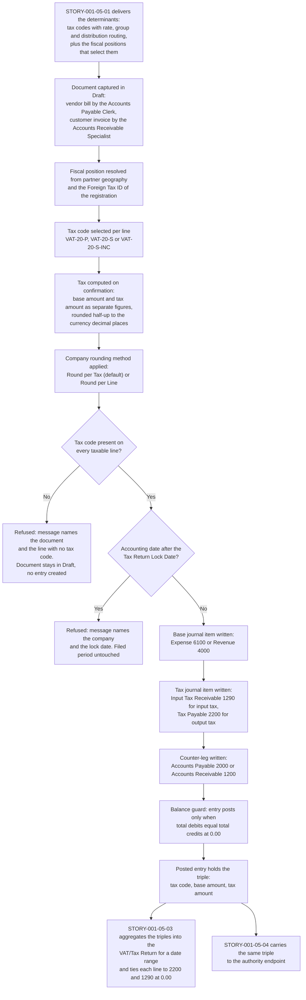

# STORY-001-05-02: Compute Tax on Transactions with Base and Tax Split

---

## Metadata

| Attribute | Value |
|-----------|-------|
| **Story ID** | `STORY-001-05-02` |
| **Title** | Compute Tax on Transactions with Base and Tax Split |
| **Parent Feature** | [FEATURE-001-05: Tax Configuration & Compliance](../FEATURE-001-05-tax-configuration-compliance.md) |
| **Parent Epic** | [EPIC-001: Enterprise Accounting in Odoo](../../EPIC-001-enterprise-accounting-odoo.md) |
| **Status** | Draft |
| **Priority** | 🔴 Critical |
| **Estimate** | 5 story points (Fibonacci) |
| **Persona** | Tax Accountant |
| **Secondary Personas** | Chief Accountant (balanced posting and the separation of the base line from the tax line), Accounts Payable Clerk (captures the vendor bill), Accounts Receivable Specialist (captures the customer invoice), Finance Controller (reviews the posted result and witnesses the demonstration) |
| **Platform Target** | Open decision DEC-001 — see [Version Compatibility](#version-compatibility) |
| **Last Updated** | 2026-08-16 |
| **Owner/Author** | Enterprise Accounting Team |

> **Platform target.** This story states no platform version of its own. The target is the Epic's open decision **DEC-001** in the [Open Decisions Register](../../EPIC-001-enterprise-accounting-odoo.md#appendix-b-open-decisions-register): the originating programme request names Odoo 17, the superseded prior backlog named 18.0, and the baseline this story was written and verified against is **Odoo 19.0 Community**, where `odoo/release.py` declares `version_info = (19, 0, 0, FINAL, 0, '')`. The three candidates differ in how the tax computation returns its base and tax amounts, in how the tax-inclusive flag is derived, and in how the Tax Return Lock Date guards a filed period, so the mismatch is surfaced for stakeholder confirmation rather than settled inside this story.

---

## User Story

**As a** Tax Accountant

**I want** every posted vendor bill and customer invoice to record its tax code, its base amount and its tax amount as three separate values that post to Tax Payable 2200 for output tax or Input Tax Receivable 1290 for input tax inside a journal entry whose total debits equal its total credits

**So that** the VAT/Tax Return and the general ledger agree to the cent for the same date range without a manual reconciliation step, and the figure filed with the authority is the figure the ledger holds.

---

## INVEST Principles Compliance

| Principle | Compliance | Notes |
|-----------|------------|-------|
| **Independent** | ✅ | Honest statement of the coupling: the tax codes, the tax distribution routing and the fiscal positions from [STORY-001-05-01](./STORY-001-05-01-configure-tax-codes-fiscal-positions.md) are a **demo-data prerequisite of this story, not a code coupling**. They are satisfiable as fixture records in a test company, so the computation layer is developable and demonstrable on its own once those records exist, and it shares no module, model or method with the configuration story |
| **Negotiable** | ✅ | States the posting outcome required — a tax code, a base amount and a tax amount recorded separately on a balanced entry that reaches a named control account — and leaves the computation entry point, the model extension question (D-005) and the view treatment to implementation discovery |
| **Valuable** | ✅ | This is the story that makes SM-010 measurable. Every downstream statutory figure is an aggregate of the triple posted here, so tax-return preparation falls from the Epic's manual baseline of 8 to 16 hours per jurisdiction per filing period to under 2 hours, and the difference between the return and the tax control accounts is `0.00` in the filing entity's functional currency because both read the same journal items |
| **Estimable** | ✅ | The artifact count is fixed: two document types, one rate, two control accounts, two rounding methods and one lock-date guard, all expressed on models present in this repository under LGPL-3 — see [Estimation](#estimation) |
| **Small** | ✅ | One computation-and-posting outcome sized at 5 story points and completable inside one iteration. Defining the determinants is `STORY-001-05-01`; aggregating the posted triples into the statutory return is `STORY-001-05-03`; carrying them to the authority is `STORY-001-05-04` |
| **Testable** | ✅ | All seven criteria are objectively pass or fail: each states a tax code, a base amount and a tax amount as three separate values, each states its currency and its rounding rule, and each either lists every leg of the entry with both totals or asserts a named refusal with the control-account balance unchanged — see [Acceptance Test Mapping](#acceptance-test-mapping) |

---

## Acceptance Criteria

Seven criteria, inside the mandated band of 4 to 8. Each has exactly one non-compound **When**, and each **Then** asserts only what the Tax Accountant, the Chief Accountant or the Finance Controller can observe on the document, on the posted entry or on the account balance. Three rules hold across all seven: every tax assertion states the **tax code**, the **base amount** and the **tax amount** as three separate values; every monetary figure states its currency, its amount and its rounding rule; and every criterion that produces a journal entry lists each leg with its account code and amount and asserts total debits equal to total credits with both totals stated.

| Scenario | Coverage class |
|----------|----------------|
| 1 | Valid input — happy-path purchase-side posting |
| 2 | Valid input — happy-path sales-side posting |
| 3 | Invalid or incomplete input — no tax code on a revenue line |
| 4 | Error handling — filed period closed by the Tax Return Lock Date |
| 5 | Accounting edge case — zero-amount taxable line |
| 6 | Accounting edge case — foreign-currency document and its translated equivalents |
| 7 | Accounting edge case — tax-inclusive pricing and the company rounding method |

All seven criteria run in company `US-01` (**Global Holdings Inc.**), the United States parent of the Epic's canonical legal-entity register ([Appendix E.4](../../EPIC-001-enterprise-accounting-odoo.md#e4-canonical-legal-entity-register)) and the entity the parent Feature works its own criteria in, whose functional currency is USD and which is also the group presentation currency. The tax codes `VAT-20-P` ("VAT 20% (Purchases)") and `VAT-20-S` ("VAT 20% (Sales)") are the 20 percent standard-rate codes defined in `STORY-001-05-01`, instantiated in `US-01` under the foreign registration that Odoo expresses as a Foreign Tax ID on a fiscal position — see [Deterministic Artifact Set](#deterministic-artifact-set) for why the books stay in USD while those codes apply.

### Scenario 1: Vendor bill posts input tax to Input Tax Receivable 1290 on a balanced entry

- **Given** a vendor bill stands in Draft in company `US-01` (**Global Holdings Inc.**, functional currency USD) on the **Purchase** journal, carrying three line items whose net amounts total USD 12,450.00, each line carrying tax code `VAT-20-P` ("VAT 20% (Purchases)") at a rate of 20.0000 percent whose tax distribution routes the computed tax to Input Tax Receivable 1290, and the tax-calculation rounding method of `US-01` reads **Round per Tax**
- **When** the Accounts Payable Clerk confirms that vendor bill
- **Then** the posted journal entry records tax code `VAT-20-P`, a base amount of USD 12,450.00 and a tax amount of USD 2,490.00 as three separate values, each amount rounded half-up to 2 decimal places at the USD rounding increment of 0.01, and the entry carries the legs debit Expense 6100 USD 12,450.00, debit Input Tax Receivable 1290 USD 2,490.00 and credit Accounts Payable 2000 USD 14,940.00, so total debits of USD 14,940.00 equal total credits of USD 14,940.00 at a difference of USD 0.00, with the base amount and the tax amount held on separate journal items of the same entry

### Scenario 2: Customer invoice posts output tax to Tax Payable 2200 on a balanced entry

- **Given** a customer invoice stands in Draft in company `US-01` (**Global Holdings Inc.**, functional currency USD) on the **Sales** journal, carrying a single line of USD 10,000.00 at tax code `VAT-20-S` ("VAT 20% (Sales)") at a rate of 20.0000 percent whose tax distribution routes the computed tax to Tax Payable 2200, and the tax-calculation rounding method of `US-01` reads **Round per Tax**
- **When** the Accounts Receivable Specialist confirms that customer invoice
- **Then** the posted journal entry records tax code `VAT-20-S`, a base amount of USD 10,000.00 and a tax amount of USD 2,000.00 as three separate values, each amount rounded half-up to 2 decimal places at the USD rounding increment of 0.01, and the entry carries the legs debit Accounts Receivable 1200 USD 12,000.00, credit Revenue 4000 USD 10,000.00 and credit Tax Payable 2200 USD 2,000.00, so total debits of USD 12,000.00 equal total credits of USD 12,000.00 at a difference of USD 0.00, with the tax amount reaching Tax Payable 2200 rather than Revenue 4000

### Scenario 3: A revenue line carrying no tax code is refused at confirmation

- **Given** a customer invoice stands in Draft in company `US-01` (**Global Holdings Inc.**, functional currency USD) on the **Sales** journal whose single revenue line of USD 10,000.00 carries no tax code, while the tax policy in force for `US-01` requires a tax code on every revenue line, and the balance of Tax Payable 2200 in `US-01` stands at USD 0.00, rounded half-up to 2 decimal places at the USD rounding increment of 0.01
- **When** the Tax Accountant attempts to confirm that customer invoice
- **Then** confirmation is refused with a validation message that names the invoice and identifies the revenue line of USD 10,000.00 as the line holding no tax code, the invoice remains in Draft, and none of the three values a compliant line would carry is produced — no tax code such as `VAT-20-S`, no base amount of USD 10,000.00 and no tax amount of USD 2,000.00 are recorded anywhere against the invoice — so no journal entry exists for it in the Sales journal of `US-01` and the balance of Tax Payable 2200 in `US-01` is unchanged at USD 0.00, every amount in this criterion rounded half-up to 2 decimal places at the USD rounding increment of 0.01

### Scenario 4: A tax-bearing entry dated inside a filed period is refused

- **Given** company `US-01` (**Global Holdings Inc.**, functional currency USD) carries a Tax Return Lock Date of 2025-03-31 because the Q1 2025 return has been filed, and the Tax Accountant holds a vendor bill on the **Purchase** journal of `US-01` whose accounting date is held at 2025-03-15 rather than allowed to move to the first open period, recording tax code `VAT-20-P` ("VAT 20% (Purchases)"), a base amount of USD 12,450.00 and a tax amount of USD 2,490.00, each amount rounded half-up to 2 decimal places at the USD rounding increment of 0.01
- **When** the Tax Accountant attempts to post that vendor bill at the accounting date 2025-03-15
- **Then** the attempt is refused with a validation message stating that the operation would affect an already-issued tax statement and naming the Tax Return Lock Date of 2025-03-31 together with the company `US-01`, no journal entry is created in the Purchase journal of `US-01` for that bill, the Q1 2025 movement on Input Tax Receivable 1290 in `US-01` is unchanged with a difference of USD 0.00 against the balance the filed return was prepared from, and the filed VAT/Tax Return for `US-01` over the date range 2025-01-01 to 2025-03-31 stays reproducible with the figures that were filed, every amount rounded half-up to 2 decimal places at the USD rounding increment of 0.01

### Scenario 5: A zero-amount taxable line keeps its tax code and leaves the document total intact

- **Given** a customer invoice stands in Draft in company `US-01` (**Global Holdings Inc.**, functional currency USD) on the **Sales** journal, carrying a first line of USD 10,000.00 at tax code `VAT-20-S` ("VAT 20% (Sales)") and a second line of USD 0.00 at that same tax code `VAT-20-S`, each amount rounded half-up to 2 decimal places at the USD rounding increment of 0.01
- **When** the Accounts Receivable Specialist confirms that customer invoice
- **Then** the second line records tax code `VAT-20-S`, a base amount of USD 0.00 and a tax amount of USD 0.00 as three separate values and stays in the tax population of the document rather than being dropped from it, the document records tax code `VAT-20-S`, a base amount of USD 10,000.00 and a tax amount of USD 2,000.00 for an invoice total of USD 12,000.00, and the posted entry carries the legs debit Accounts Receivable 1200 USD 12,000.00, credit Revenue 4000 USD 10,000.00 and credit Tax Payable 2200 USD 2,000.00, so total debits of USD 12,000.00 equal total credits of USD 12,000.00 at a difference of USD 0.00, every amount rounded half-up to 2 decimal places at the USD rounding increment of 0.01

### Scenario 6: A foreign-currency invoice records the tax triple twice — in document currency and in functional currency

- **Given** company `US-01` (**Global Holdings Inc.**) keeps its books in its functional currency USD and holds a customer invoice in Draft on the **Sales** journal denominated in EUR, carrying a single line of EUR 1,000.00 — rounded half-up to 2 decimal places at the EUR rounding increment of 0.01 — at tax code `VAT-20-S` ("VAT 20% (Sales)") at a rate of 20.0000 percent, with the exchange rate in force on the invoice date recorded as 1.0850 USD per EUR
- **When** the Accounts Receivable Specialist confirms that customer invoice
- **Then** the posted entry records tax code `VAT-20-S`, a base amount of EUR 1,000.00 and a tax amount of EUR 200.00 as three separate values in the document currency, each rounded half-up to 2 decimal places at the EUR rounding increment of 0.01, and the functional-currency equivalents of that same triple are a base amount of USD 1,085.00 and a tax amount of USD 217.00, each rounded half-up to 2 decimal places at the USD rounding increment of 0.01, and the entry carries the legs debit Accounts Receivable 1200 USD 1,302.00 (EUR 1,200.00), credit Revenue 4000 USD 1,085.00 (EUR 1,000.00) and credit Tax Payable 2200 USD 217.00 (EUR 200.00), so total debits of USD 1,302.00 equal total credits of USD 1,302.00 at a difference of USD 0.00

### Scenario 7: Tax-inclusive pricing splits each gross line, and the rounding method behind the result is stated

- **Given** the tax-calculation rounding method of company `US-01` (**Global Holdings Inc.**, functional currency USD) reads **Round per Tax** — the shipped default of the two available methods — and a customer invoice stands in Draft on the **Sales** journal carrying five lines whose gross price is USD 120.00 each at tax code `VAT-20-S-INC` ("VAT 20% (Sales, Tax Included)"), whose effective price-inclusive behaviour is derived from its own Included in Price override reading Tax Included together with the Default Sales Price Include of `US-01` reading Tax Excluded rather than from a value held on the document
- **When** the Accounts Receivable Specialist confirms that customer invoice
- **Then** each of the five lines records tax code `VAT-20-S-INC`, a base amount of USD 100.00 and a tax amount of USD 20.00 as three separate values, the document records tax code `VAT-20-S-INC`, a base amount of USD 500.00 and a tax amount of USD 100.00 for an invoice total of USD 600.00, the entry carries the legs debit Accounts Receivable 1200 USD 600.00, credit Revenue 4000 USD 500.00 and credit Tax Payable 2200 USD 100.00, so total debits of USD 600.00 equal total credits of USD 600.00 at a difference of USD 0.00, and the criterion records that **Round per Tax** produced this result while **Round per Line**, the alternative method, returns the same figures on this document because each line's tax amount of USD 20.00 is exact at 2 decimal places and leaves no residual to distribute, every amount rounded half-up to 2 decimal places at the USD rounding increment of 0.01

---

## Sub-Tasks

- [ ] Map every in-scope transaction type — customer invoice, customer credit note, vendor bill, vendor refund and the foreign-currency and tax-inclusive variants of each — to its tax treatment and to the posting shape it must produce, naming the control account each treatment reaches and the leg pattern the Chief Accountant will verify, and agree the map with the Finance SME before development starts — `@functional-consultant`
- [ ] Deliver the tax computation on document confirmation so that the tax code, the base amount and the tax amount are produced as three separate values from the tax code's own rate and its tax distribution, with output tax reaching Tax Payable 2200 and input tax reaching Input Tax Receivable 1290 — `@developer`
- [ ] Deliver the base and tax journal items as separate lines of one entry, so the triple is readable from the ledger without reconstruction and the entry posts only when total debits equal total credits — `@developer`
- [ ] Deliver rounding-method handling for both company methods, Round per Tax and Round per Line, together with the foreign-currency path that records the triple in the document currency and its functional-currency equivalent, and fix which leg absorbs a residual minor unit — `@developer`
- [ ] Deliver the filed-period guard so that a tax-bearing entry dated on or before the company's Tax Return Lock Date is refused with a message naming the company and that date, and record which document states are guarded rather than date-shifted — `@developer`
- [ ] Write the unit and integration tests for all seven acceptance scenarios, asserting every base amount and every tax amount to the minor unit and every entry's total debits against its total credits at a stated difference, and review the criteria for banned vague terms and for the tax-code, base-amount and tax-amount triple — `@qa-engineer`
- [ ] Sign off that the posted tax lines tie to Tax Payable 2200 for output tax and to Input Tax Receivable 1290 for input tax, that every entry in the seven scenarios posts with total debits equal to total credits, and that the resulting balances tie to the VAT/Tax Return population for the same date range — `@finance-sme`
- [ ] Write the posting-behaviour reference for the finance team: the leg pattern per transaction type, the rounding method in force per entity, the foreign-currency translation rule and the refusal messages a preparer will meet — `@technical-writer`

---

## Edge Cases

- **Zero-amount and null taxable line.** A taxable line of USD 0.00 keeps its tax code with a base amount of USD 0.00 and a tax amount of USD 0.00 so it stays in the return population, and a document carrying no taxable line at all posts as a balanced entry with no tax line and no movement on Tax Payable 2200 or Input Tax Receivable 1290, every amount rounded half-up to 2 decimal places at the USD rounding increment of 0.01.
- **Fiscal-period lock.** A document dated inside a period closed by the company's Tax Return Lock Date has two admissible outcomes that must be distinguished before development — the accounting date is moved forward to the last day of the first open period and the document tells the preparer the date it will take, or the attempt is refused because the date is held inside the locked period — and the outcome chosen is stated per document state so the Q1 2025 balances behind a filed return are never restated.
- **Multi-currency rounding residual.** Where a multi-line foreign-currency document leaves a residual of USD 0.01 between the tax computed per tax code under Round per Tax and the sum of the taxes computed per line under Round per Line, the method in force on the entity decides the figure, the residual is absorbed on the tax leg of the entry rather than spread across the base legs so the base amount reported to the authority is untouched, and total debits still equal total credits at a difference of USD 0.00.
- **Intra-Community reverse charge.** An EU business-to-business **supply** raised by `NL-01` on an EU business customer carries tax code `VAT-00-RC` ("VAT 0% (Intra-Community Supply, Reverse Charge)") and records a base amount of EUR 5,000.00 with a tax amount of EUR 0.00, each rounded half-up to 2 decimal places at the EUR rounding increment of 0.01, and that base amount still reaches its own line of the VAT/Tax Return rather than dropping out of the return. The mirror case, where `NL-01` is the **acquirer**, carries `VAT-21-RC` instead: on a base amount of EUR 5,000.00 it raises a tax amount of EUR 1,050.00 twice — an output leg credited to Tax Payable 2200 and a recoverable input leg debited to Input Tax Receivable 1290 — so the posting stays balanced at a difference of EUR 0.00 and the net effect on the net VAT line is EUR 0.00.
- **Statutory rate change mid-period.** A document dated before a statutory rate change retains the rate in force on its own document date rather than the rate in force when it is keyed, so a base amount of USD 12,450.00 dated before the change keeps a tax amount of USD 2,490.00 at 20.0000 percent, each rounded half-up to 2 decimal places at the USD rounding increment of 0.01, and a filed period is never restated by a later rate.

---

## Estimation

| Dimension | Rating | Justification |
|-----------|--------|---------------|
| **Effort** | Medium | Two document types, two control accounts, two rounding methods, a foreign-currency path and a lock-date guard — a contained surface, but each one carries its own test set and each must be proven on a posted entry rather than on a computed preview |
| **Complexity** | Medium | The accounting consequence sits in the detail: which leg absorbs a residual minor unit, how a tax-inclusive gross price is split before it becomes a base amount, and how the document-currency triple and its functional-currency equivalent stay consistent on one entry. None of it requires a new posting engine, because `account.move` already refuses an unbalanced entry |
| **Uncertainty** | Low | The computation, the tax distribution, the rounding methods and the Tax Return Lock Date guard are all present in this repository under LGPL-3 and were read at the 19.0 baseline, and the determinants this story consumes are fixed by `STORY-001-05-01`, so the behaviour is inspectable before development starts |
| **Story Points** | **5** | Fibonacci scale (1, 2, 3, 5, 8, 13). Above a 3 because the posting shapes are multiplied by the multi-currency and rounding-method interactions, which add real test surface rather than repetition; below an 8 because the posting shapes themselves are well understood, the configuration already exists from `STORY-001-05-01`, and no statutory report or external integration is built here |

---

## Constraints

The constraint identifiers below are the Epic's own, restated for this story rather than renumbered, so one constraint set reads across the whole ticket tree.

### License and Compliance

- [x] **C-001 — AGPL-3.0 compatibility**: any module delivering the tax computation, the base-and-tax line split or the filed-period guard is distributed under an AGPL-3.0 compatible licence, matching the Community-edition accounting add-ons already present in this repository
- [x] **C-002 — Existing licence respected**: extension of `account` — the "Invoicing" application, version 1.4, licence LGPL-3 — respects that licence, and an AGPL-3 extension of LGPL-3 code is licence-checked before it is written
- [x] **C-005 / C-006 — Odoo and OCA coding standards**: Python follows Odoo and OCA module guidelines including PEP 8, and static analysis passes with the repository's configured tooling, whose lint configuration is `ruff.toml` at the repository root
- [x] **C-009 — Numeric assertion**: every base amount, every tax amount and every debit-against-credit total in the seven criteria is asserted as an amount in test code rather than inspected by eye, with the difference stated
- [x] **C-012 — Build on the existing models**: the computation and its posted result are expressed on `account.move`, `account.move.line`, `account.tax` and `account.tax.repartition.line` rather than on parallel structures, so one ledger and one tax audit trail exist
- [x] **C-014 — Access rights and company isolation**: the role that captures a document is distinguishable from the role that owns the tax determinants and from the role that files the return, and a role restricted to one company can read neither the tax lines nor the control-account balances of another company
- [x] **C-019 — Data access discipline**: reads of the posted base and tax lines are expressed through the Odoo ORM or parameterized SQL, with no string-concatenated query construction

### Accounting Standards Compliance

- [x] **EU VAT Directive 2006/112/EC — base and tax are separable**: the Directive requires the taxable amount and the tax due on it to be identifiable per supply, which is why this story records the tax code, the base amount and the tax amount as three separate values on the posted entry instead of one gross figure
- [x] **EU VAT Directive 2006/112/EC — reverse charge and exemption**: an intra-Community treatment carries a base amount with a tax amount of 0.00 that still reaches its own return line, and an acquisition under reverse charge raises the same tax amount on both sides of the entry so the acquirer accounts for the tax without unbalancing the posting
- [x] **Double-entry integrity**: every entry produced by this story posts with total debits equal to total credits at a difference of `0.00` in the company's functional currency, and the base line and the tax line are separate journal items of that one entry
- [x] **ISO 4217 minor units**: every base amount and tax amount is rounded half-up to its currency's decimal precision — 2 decimal places at a rounding increment of 0.01 for USD and EUR — and the company tax-calculation rounding method in force is stated alongside the figures wherever it can change the result
- [x] **Rate in force on the document date**: the rate applied to a base amount is the rate in force on the document's own date, so a filed period is not restated by a later statutory change

### Dependency and Edition Considerations

- [x] **C-003 — Edition source is an open decision (DEC-002), not a prohibition**: the outright ban on Enterprise dependencies carried by the superseded backlog is **withdrawn**. The choice between an Odoo Enterprise subscription and the OCA add-on path — `account_financial_report`, `account_reconcile_oca` and `mis_builder` plus bespoke development for the residual gap — is owned by the CFO / Finance Director with the Group Controller and is recorded in the [Open Decisions Register](../../EPIC-001-enterprise-accounting-odoo.md#appendix-b-open-decisions-register)
- [x] **This story is not gated by DEC-002**: `account.tax`, `account.tax.repartition.line`, `account.move` and `account.move.line` are all present in this repository under LGPL-3, so the computation and its posting can be built before the edition decision is confirmed. What DEC-002 affects downstream is how the statutory return is rendered, which is `STORY-001-05-03`
- [x] **C-004 — OCA ecosystem compatibility**: whichever edition path is confirmed, the posted triple stays consumable by OCA add-ons and by the country `l10n_*` extensions published by OCA, so no reporting layer has to recompute tax from gross amounts

### Interface, Artifact, Evidence and Resilience Contracts

- [x] **C-023 — Machine access is a named principal, not a shared key**: every programmatic read of a posted document, its base line or its tax line happens over the JSON web-service surface C-023 governs under a dedicated named integration principal with a recorded owner, a declared expiry and rotation interval, a revocation effective on its next call, and a scope confined to the companies, models and methods it needs. It executes under access rights and record rules rather than `sudo`, is bounded by a per-principal rate ceiling, and is audited per call; it holds no authority the Accounts Receivable Specialist or Accounts Payable Clerk it stands in for lacks, so it can neither release a tax configuration nor file a return. The deprecated XML-RPC and JSON-RPC transports carry no criterion, test or integration of this story
- [x] **C-026 — The computation trail is evidence, so it is append-only**: the tax code, the base amount, the tax amount, the fiscal position resolved and the configuration version in force at confirmation are appended to the document's own history with actor and timestamp, and a row is never edited in place. A correction is a credit note and a re-issue that append their own rows citing the original, the history carries a retention lock that does **not** cascade onto the journal items it describes, and the count of history rows modified in place is 0
- [x] **C-027 — A tax computation that fails part-way posts nothing**: the confirmation of a document is atomic across the base line, the tax line and their journal items, so a failure inside it leaves 0 journal items and no consumed sequence number rather than an unbalanced or tax-less entry; a batch confirmation runs with a declared timeout and a bounded retry budget with backoff and jitter, reaches a named terminal state an operator is alerted on, and is recoverable after a crash with each member either wholly posted or wholly untouched
- [x] **C-028 — A document is confirmed once**: the confirmation episode carries a durable identity over the company and the document, held by a database unique constraint, with a row lock across the read-compute-post window and revalidation inside the lock against the configuration version and the rate in force. A stale lease is reclaimed, and the guard is **not** overridable by the confirming role, so a replayed confirmation produces 1 posted entry rather than 2 and the count of duplicate tax lines it creates is 0
- [x] **C-029 — A bulk confirmation and its listings are bounded**: a request to confirm or to list documents beyond the declared maximum record count is refused before work begins with the ceiling and the requested magnitude named as two values, a request above the synchronous threshold is queued under a per-user quota and a queue-depth ceiling and is cancellable, and a listing export streams and is published atomically
- [x] **C-020 — A failure discloses the outcome, not the machinery**: a refused confirmation names the failed check, the company and the remedial action, and discloses no traceback, no query text, no file-system path and no cron definition, interval, worker identifier or queue state; a scheduled batch failure reports the run name, the company, the record set and the terminal state to an **operator** and the business outcome to the persona, correlated by an opaque reference

### Version Compatibility

- [x] **C-010 — Platform version target is open decision DEC-001**: the programme request names Odoo 17, the superseded backlog named 18.0, and this repository is **Odoo 19.0 Community** (`odoo/release.py` → `version_info = (19, 0, 0, FINAL, 0, '')`). The target is confirmed with stakeholders before development rather than chosen here
- [x] **C-011 — Language and database versions follow the confirmed target**: the 19.0 baseline present here declares `MIN_PY_VERSION = (3, 10)`, `MAX_PY_VERSION = (3, 13)` and `MIN_PG_VERSION = 13` in `odoo/release.py`; an earlier platform target carries a different supported matrix
- [x] **Impact if DEC-001 resolves away from 19.0**: the computation entry point and the shape it returns are restated for the confirmed version, the derivation of the tax-inclusive flag is re-verified because it moved from a stored value to a computed one across the candidate releases, and the Tax Return Lock Date behaviour is re-verified because lock-date administration and the date-shift-versus-refusal split changed across those releases

---

## Technical Discovery Notes

> **Purpose:** these notes direct the codebase analysis that precedes implementation. They record what to investigate and what the outcome must prove; they do not choose the implementation.

### Codebase Analysis Areas

| Area | Files/Modules to Examine | Analysis Focus |
|------|--------------------------|----------------|
| Tax computation and document totals | `addons/account/models/account_tax.py` | The computation type on a tax code and the rate it holds, the tax group the code aggregates under, and the distribution collections that differ by document type — the invoice collection against the refund collection — each of whose lines carries an account, a factor percentage and a tax-closing flag. Which computation type yields the base amount and the tax amount as two separate figures for each of the seven criteria, what the refund collection changes on a credit note, and which distribution lines the statutory return is entitled to aggregate |
| Journal entries and tax lines | `addons/account/models/account_move.py` and `addons/account/models/account_move_line.py` | How the base journal item and the tax journal item are produced from one document line, how the tax base amount is carried on the tax line so the triple is readable without recomputation, and how the balance guard rejects an entry whose summed line balances do not round to zero at the currency's decimal places. Establish where in the confirmation path the tax lines are materialized, because that is where the seven criteria are proven |
| Rounding levers | `addons/account/models/company.py` and `odoo/addons/base/models/res_currency.py` | The company tax-calculation rounding method, whose two options are **Round per Tax** — the shipped default — and **Round per Line**, and the currency decimal precision derived from the rounding factor as the ceiling of the base-10 logarithm of its reciprocal, giving 2 decimal places at a factor of 0.01 for USD and EUR. Establish which method each filing entity adopts, and on which leg a residual minor unit lands when the two methods disagree on a multi-line document |
| Filed-period lock | `addons/account/models/company.py` | The Tax Return Lock Date and the per-role value derived from it, administered separately from the four sibling controls on the same company — Global Lock Date, Sales Lock Date, Purchase Lock date and Hard Lock Date — and set when the tax closing entry posts. The guard is evaluated with a tax flag distinct from the fiscal-year, sales and purchase flags, and two behaviours coexist: the accounting date of a draft document is moved to the first open period and the document announces the date it will take, while writing a tax-affecting line at a date inside the locked period is refused. Establish which behaviour applies in which document state, because Scenario 4 asserts the refusal |
| Foreign currency and translation | `odoo/addons/base/models/res_currency.py` and `addons/account/models/account_move_line.py` | How a document-currency amount and its functional-currency equivalent are held on the same journal item, and which rate date governs the translation. Establish whether the tax amount is translated from the document-currency tax amount or recomputed on the translated base amount, because the two can differ by a minor unit — Scenario 6 asserts the pair EUR 200.00 and USD 217.00 at a rate of 1.0850, each rounded half-up to 2 decimal places at its currency's rounding increment of 0.01 |
| Tax country and foreign registration | `addons/account/models/partner.py` and `addons/account/models/account_move.py` | The Foreign Tax ID held on a fiscal position with its country and its country validation, and the document tax country derived from that Foreign Tax ID in preference to the company's own fiscal country. Establish how a document raised in `US-01` is attributed to the registration whose codes it carries, which is what lets a USD-functional entity post a 20 percent VAT line |
| Journals | `addons/account/models/account_journal.py` | The journal type labels **Sales**, **Purchase**, Cash, Bank, Credit Card and **Miscellaneous**. Confirm that output tax is raised through Sales, input tax through Purchase, and any manual tax adjustment through Miscellaneous, so no criterion names a journal type the platform does not carry |

### Relevant Existing Modules

| Module | Path | Relevance to this story |
|--------|------|------------------------|
| `account` | `addons/account/` | "Invoicing", version 1.4, category `Accounting/Accounting`, licence LGPL-3. Supplies the tax computation, the tax distribution lines that route a computed amount to a control account, `account.move` and `account.move.line` with the balance guard that refuses an unbalanced entry, the journal type labels, the company tax-calculation rounding method and the Tax Return Lock Date |
| `account_payment` | `addons/account_payment/` | The settlement layer that follows the postings this story produces. It is cited so the tax legs on Tax Payable 2200 and Input Tax Receivable 1290 are known to survive payment registration untouched, and no reconciliation step is allowed to alter a posted tax amount |
| `l10n_*` | `addons/l10n_*/` | 209 localization packs, each supplying one jurisdiction's statutory tax codes and return layout. This story computes against whichever codes the pack and group tax policy released in `STORY-001-05-01`, so no rate is authored here |
| `base` | `odoo/addons/base/` | `res.currency` for the decimal precision and rounding factor every amount is rounded to and for the rate applied in Scenario 6; `res.company` for the entity, its functional currency and its lock dates |
| `account_financial_report_ce` | `addons/account_financial_report_ce/` | Version 19.0.1.1.0, AGPL-3. Where the Tax Payable 2200 and Input Tax Receivable 1290 balances produced by these postings surface for the close reconciliation owned by FEATURE-001-07 |

### OCA Module Compatibility

| OCA Repository | Module | Compatibility consideration |
|----------------|--------|-----------------------------|
| OCA/account-financial-reporting | `account_financial_report` | Under the OCA path of DEC-002 it reads posted journal items directly; determine whether it consumes the separate base and tax lines produced here without recomputing tax from a gross amount |
| OCA/account-reconcile | `account_reconcile_oca` | Determine that reconciling a payment against an invoice leaves the posted tax legs untouched, so a settled invoice reports the same tax amount as an open one |
| OCA `l10n-*` country repositories | Country tax extensions | Per operating country, determine whether an OCA extension changes the computation or the distribution routing that this story relies on, so a jurisdiction's divergence is recorded rather than discovered at filing |

### Discovery versus Prescription

This story describes WHAT the finance function needs the posted entry to contain and WHY. It does not prescribe HOW that is built. Not specified here: new model names, field definitions or schema decisions; whether the computation extends an existing model or adds a new one (D-005); view architecture; the API methods invoked to compute a tax; and module structure. Deferred to agent discovery: **D-005** (model extension approach), **D-007** (company isolation, record rules and the access-right groups implied by the personas) and **D-009** (the deterministic and hostile-input fixture sets, held apart from one another).

---

## Dependencies

### Story Dependencies

| Dependency Type | Story ID | Story Title | Relationship |
|-----------------|----------|-------------|--------------|
| Parent Feature | [FEATURE-001-05](../FEATURE-001-05-tax-configuration-compliance.md) | Tax Configuration & Compliance | This story is story 2 of the 4 in this feature and delivers its capability CAP-002 |
| Blocked By | [STORY-001-05-01](./STORY-001-05-01-configure-tax-codes-fiscal-positions.md) | Configure Tax Codes and Fiscal Positions | The tax codes, their rates, their distribution routing to Tax Payable 2200 and Input Tax Receivable 1290, and the fiscal positions that select them must exist before a tax amount can be computed on a transaction |
| Blocks | [STORY-001-05-03](./STORY-001-05-03-generate-vat-return.md) | Generate VAT Return Report | The return aggregates the posted triples this story records; with no tax code, base amount and tax amount on the tax lines there is nothing to aggregate and nothing to tie to the control accounts |
| Blocks | [STORY-001-05-04](./STORY-001-05-04-submit-einvoicing.md) | Submit E-Invoicing to Tax-Authority Endpoints | An electronic invoice carries the computed triple in its document body, so the triple exists on the posted document before it is built and transmitted |
| Related | [STORY-001-02-03](../FEATURE-001-02/STORY-001-02-03-post-vendor-bill-entries.md) | Post Vendor Bill Journal Entries | The vendor-bill posting whose tax leg this story governs. It owns the archetype extended in Scenarios 1 and 4 — a Draft bill of USD 12,450.00 — rounded half-up to 2 decimal places at the USD rounding increment of 0.01 — across three lines confirmed by the Accounts Payable Clerk, debit Expense 6100 against credit Accounts Payable 2000 (ORD-002) |
| Related | [STORY-001-03-01](../FEATURE-001-03/STORY-001-03-01-generate-customer-invoices.md) | Generate and Post Customer Invoices | The customer-invoice posting whose tax leg this story governs, carrying debit Accounts Receivable 1200 against credit Revenue 4000 with output tax to Tax Payable 2200 (ORD-002) |
| Related | [FEATURE-001-01](../FEATURE-001-01-chart-of-accounts-fiscal-year.md) | Chart of Accounts & Fiscal Year | Supplies Accounts Receivable 1200, Accounts Payable 2000, Revenue 4000, Expense 6100 and Tax Payable 2200 with the Sales, Purchase and Miscellaneous journals, and administers the lock dates that Scenario 4 and the second edge case depend on |

### External Dependencies

| Dependency | Type | Notes |
|------------|------|-------|
| Council Directive 2006/112/EC | Accounting and tax standard | The EU VAT Directive requires the taxable amount and the tax due on it to be identifiable per supply, which is the source of the base-and-tax split, the reverse-charge treatment and the zero-rate treatment asserted here |
| Per-jurisdiction statutory rate schedule | Statutory reference | The rate in force on a document date, and its effective-from date, are confirmed per jurisdiction before a rate change is configured, so a filed period is never restated by a later rate |
| Exchange-rate source | Data feed | The rate applied in Scenario 6 — 1.0850 USD per 1.00 EUR — comes from the group's declared rate source with a stated rate date, so the functional-currency equivalents of a foreign-currency tax triple are reproducible |
| ISO 4217 | Standard | Currency codes and minor units, which fix the 2-decimal precision at a rounding increment of 0.01 that every rounding assertion in this story states for USD and EUR |
| Group rounding-method policy | Governance | The tax-calculation rounding method adopted per filing entity — Round per Tax or Round per Line — is confirmed by the Chief Accountant, because the two can differ by one minor unit on a multi-line document |

### Integration Points

| Odoo Model/Module | Integration Type | Purpose |
|-------------------|------------------|---------|
| `account.move` | Read and write | The document and its posted entry: the journal, the accounting date, the document currency and the balance guard that refuses an entry whose debits do not equal its credits |
| `account.move.line` | Read and write | The base journal item and the tax journal item as separate lines, each carrying its account, its amount, its tax code and — on the tax line — the base amount the tax was computed on |
| `account.tax` | Read | The rate, the computation type, the tax group and the derived price-inclusive behaviour that turn a line amount into a base amount and a tax amount |
| `account.tax.repartition.line` | Read | Directs the computed tax amount to Tax Payable 2200 or Input Tax Receivable 1290, carries the tax-closing flag and the report tags, and expresses the reverse charge that raises tax on both sides |
| `account.fiscal.position` | Read | Selects the tax code applied to a document from the partner's geography, and carries the Foreign Tax ID under which `US-01` posts the 20 percent codes |
| `account.journal` | Read | The Sales, Purchase and Miscellaneous journals through which output tax, input tax and manual tax adjustments post |
| `res.company` | Read | The entity whose books carry the entry, its functional currency, its tax-calculation rounding method and its Tax Return Lock Date |
| `res.currency` | Read | The decimal precision and rounding increment every base amount and tax amount is rounded to, and the rate that translates a foreign-currency triple into the functional currency |

---

## Test Requirements

### Coverage Requirement

| Metric | Requirement | Notes |
|--------|-------------|-------|
| **Minimum Test Coverage** | **80%** | Mandatory for all new functionality delivered by this story (C-007) |
| Unit Test Coverage | 80%+ | Tax computation per line, base-and-tax split, rounding-method handling, foreign-currency translation, lock-date guard |
| Integration Test Coverage | 80%+ | Document confirmation through to a posted entry in a named company, with the tax legs read from the ledger |
| Assertion style | Numeric | Every base amount and tax amount is asserted to the minor unit, and every balanced-entry assertion compares total debits with total credits at a stated difference of `0.00` (C-009) |
| Traceability | 1 test : 1 criterion | Each acceptance test maps to exactly one Given/When/Then criterion in this file (C-008) |

### Unit Test Scenarios

| Acceptance Scenario | Unit test focus | Key assertions |
|---------------------|-----------------|----------------|
| Scenario 1 | Purchase-side computation and distribution routing | Tax code `VAT-20-P` on a base amount of USD 12,450.00 computes a tax amount of USD 2,490.00; the tax leg lands on Input Tax Receivable 1290 and not on Expense 6100; the three legs sum to total debits of USD 14,940.00 against total credits of USD 14,940.00 at a difference of USD 0.00, each amount rounded half-up to 2 decimal places at the USD rounding increment of 0.01 |
| Scenario 2 | Sales-side computation and distribution routing | Tax code `VAT-20-S` on a base amount of USD 10,000.00 computes a tax amount of USD 2,000.00; the tax leg lands on Tax Payable 2200 and not on Revenue 4000; total debits of USD 12,000.00 equal total credits of USD 12,000.00 at a difference of USD 0.00, each amount rounded half-up to 2 decimal places at the USD rounding increment of 0.01 |
| Scenario 3 | Missing-tax-code refusal | Confirming an invoice whose revenue line of USD 10,000.00 holds no tax code raises a validation error naming the invoice and that line; the posted-entry count for the invoice stays at 0; the balance of Tax Payable 2200 in `US-01` stays at USD 0.00, each amount rounded half-up to 2 decimal places at the USD rounding increment of 0.01 |
| Scenario 4 | Filed-period guard | Posting a tax-bearing bill whose accounting date is held at 2025-03-15 against a Tax Return Lock Date of 2025-03-31 raises a validation error naming the company `US-01` and that lock date; the posted-entry count in the Purchase journal for that bill stays at 0; the Q1 2025 movement on Input Tax Receivable 1290 is unchanged at a difference of USD 0.00, each amount rounded half-up to 2 decimal places at the USD rounding increment of 0.01 |
| Scenario 5 | Zero-amount taxable line | The USD 0.00 line records tax code `VAT-20-S` with a base amount of USD 0.00 and a tax amount of USD 0.00 and stays in the document's tax population; the document tax amount stays at USD 2,000.00 on a base amount of USD 10,000.00; total debits of USD 12,000.00 equal total credits of USD 12,000.00 at a difference of USD 0.00, each amount rounded half-up to 2 decimal places at the USD rounding increment of 0.01 |
| Scenario 6 | Foreign-currency translation of the triple | The document-currency triple is `VAT-20-S`, EUR 1,000.00 and EUR 200.00; the functional-currency equivalents at a rate of 1.0850 are USD 1,085.00 and USD 217.00; total debits of USD 1,302.00 equal total credits of USD 1,302.00 at a difference of USD 0.00, each amount rounded half-up to 2 decimal places at its currency's rounding increment of 0.01 |
| Scenario 7 | Tax-inclusive split and rounding method | Each of the five lines splits a gross price of USD 120.00 into a base amount of USD 100.00 and a tax amount of USD 20.00; the document totals a base amount of USD 500.00 and a tax amount of USD 100.00; total debits of USD 600.00 equal total credits of USD 600.00 at a difference of USD 0.00; the same figures are returned under Round per Tax and under Round per Line, and the method in force is recorded with the result |

### Integration Test Considerations

- [ ] Confirm a vendor bill of USD 12,450.00 at `VAT-20-P` in the Purchase journal of `US-01` and read the posted entry from the ledger, asserting the three legs, the triple and total debits of USD 14,940.00 against total credits of USD 14,940.00 at a difference of USD 0.00, each amount rounded half-up to 2 decimal places at the USD rounding increment of 0.01.
- [ ] Confirm a customer invoice of USD 10,000.00 at `VAT-20-S` in the Sales journal of `US-01` and assert that the tax amount of USD 2,000.00 lands on Tax Payable 2200 while Revenue 4000 carries exactly the base amount of USD 10,000.00, each amount rounded half-up to 2 decimal places at the USD rounding increment of 0.01.
- [ ] Post a credit note against the Scenario 2 invoice and assert that the refund distribution reverses the same triple — tax code `VAT-20-S`, base amount USD 10,000.00, tax amount USD 2,000.00 — leaving a net movement on Tax Payable 2200 of USD 0.00 for the pair, each amount rounded half-up to 2 decimal places at the USD rounding increment of 0.01.
- [ ] Register a payment against the Scenario 2 invoice through `account_payment` and assert that the posted tax leg on Tax Payable 2200 is unchanged at USD 2,000.00 after settlement, rounded half-up to 2 decimal places at the USD rounding increment of 0.01.
- [ ] Run the same posting under both company tax-calculation rounding methods on a multi-line foreign-currency document and assert which method is in force, which figure results, and that any residual minor unit lands on the tax leg while total debits still equal total credits at a difference of USD 0.00.
- [ ] Post the Scenario 4 entry after the Tax Return Lock Date of `US-01` is applied and assert its accounting date is moved to the last day of the first open period with the document date retained (Epic §7.8 L-1) and the filed period's tax base and tax amount unchanged; then attempt to change that posted tax-bearing line and assert the tax-statement refusal naming the company and each violated lock date (L-5).
- [ ] Aggregate the posted tax lines for `US-01` over the date range 2025-01-01 to 2025-03-31 and assert that the Tax Payable 2200 and Input Tax Receivable 1290 movements tie to that aggregate at a difference of USD 0.00, rounded half-up to 2 decimal places at the USD rounding increment of 0.01, which is the hand-over `STORY-001-05-03` consumes.
- [ ] Assert company isolation: a role restricted to `NL-01` can read neither the tax lines nor the control-account balances that these postings create in `US-01` (C-014, D-007).

### Acceptance Test Mapping

| BDD Scenario | Test Method Name | Test Type |
|--------------|------------------|-----------|
| Scenario 1: Vendor bill posts input tax to Input Tax Receivable 1290 | `test_vendor_bill_posts_input_tax_to_1290_balanced` | Acceptance |
| Scenario 2: Customer invoice posts output tax to Tax Payable 2200 | `test_customer_invoice_posts_output_tax_to_2200_balanced` | Acceptance |
| Scenario 3: A revenue line carrying no tax code is refused | `test_revenue_line_without_tax_code_is_refused` | Acceptance |
| Scenario 4: A tax-bearing entry dated inside a filed period is refused | `test_tax_bearing_entry_in_filed_period_is_refused` | Acceptance |
| Scenario 5: A zero-amount taxable line keeps its tax code | `test_zero_amount_taxable_line_keeps_tax_code_and_total` | Acceptance |
| Scenario 6: A foreign-currency invoice records the triple twice | `test_foreign_currency_invoice_records_triple_in_both_currencies` | Acceptance |
| Scenario 7: Tax-inclusive pricing splits each gross line | `test_tax_inclusive_lines_split_gross_price_under_round_per_tax` | Acceptance |

---

## Definition of Done

### Implementation Checklist

- [ ] All 7 acceptance criteria scenarios pass
- [ ] **80% minimum test coverage achieved** for the delivered functionality (C-007)
- [ ] Unit tests written and passing, with every base amount and tax amount asserted to the minor unit (C-009)
- [ ] Integration tests written and passing, covering document confirmation through to a posted entry read back from the ledger in a named company
- [ ] The posting-behaviour reference is published: the leg pattern per transaction type, the rounding method in force per entity, the foreign-currency translation rule and the refusal messages a preparer will meet
- [ ] The tax-calculation rounding method adopted by each filing entity is recorded, and the leg that absorbs a residual minor unit is stated
- [ ] Static analysis reports zero violations for the delivered modules under the repository's `ruff.toml` configuration (C-006)

### Accounting Reconciliation Gate

- [ ] **Debits equal credits.** Every journal entry produced by this story posts with total debits equal to total credits, both totals stated and their difference asserted at `0.00` in the company's functional currency — USD 14,940.00 against USD 14,940.00 for the Scenario 1 vendor bill, USD 12,000.00 against USD 12,000.00 for the Scenario 2 invoice and again for the Scenario 5 document, USD 1,302.00 against USD 1,302.00 for the Scenario 6 foreign-currency invoice, and USD 600.00 against USD 600.00 for the Scenario 7 tax-inclusive invoice, each amount rounded half-up to 2 decimal places at the USD rounding increment of 0.01
- [ ] **Tax amounts match.** Every tax amount equals its base amount multiplied by the rate configured on its tax code, rounded half-up to the currency's decimal places at that currency's rounding increment of 0.01, with the company's tax-calculation rounding method stated alongside the figure — USD 12,450.00 at 20.0000 percent giving USD 2,490.00, USD 10,000.00 giving USD 2,000.00, EUR 1,000.00 giving EUR 200.00, and a tax-inclusive gross of USD 120.00 giving a base amount of USD 100.00 with a tax amount of USD 20.00
- [ ] **Report lines tie to the sub-ledger.** The Tax Payable 2200 and Input Tax Receivable 1290 movements created by these postings tie to the corresponding lines of the VAT/Tax Return and to the underlying journal items for the same date range at a difference of `0.00` in the filing entity's functional currency, each figure rounded half-up to that currency's decimal places at its rounding increment of 0.01, and the tie-out worksheet is retained as filing evidence (SM-010)
- [ ] **Base and tax stay separate.** The base line and the tax line remain separate journal items of one entry, so the triple — tax code, base amount, tax amount — is readable from the ledger without recomputation, and the count of posted tax lines with a null tax code or a null base amount is 0
- [ ] **Zero-value and zero-rate treatments are present, not absent.** A taxable line of `0.00` and a zero-rated or reverse-charge line keep their tax code and reach the return population with a base amount and a tax amount of `0.00`, each figure rounded half-up to that currency's decimal places at its rounding increment of 0.01, rather than being omitted
- [ ] **A filed period stays filed.** No posting produced or amended by this story alters a period on or before the company's Tax Return Lock Date, and the return already filed for that period reproduces the figures that were filed at a difference of `0.00`

### Compliance Checklist

- [ ] AGPL-3.0 licence compliance verified for delivered modules, and the LGPL-3 licence of the `account` code being extended is respected (C-001, C-002)
- [ ] Code follows Odoo and OCA coding standards (C-005)
- [ ] The edition lock-in decision DEC-002 is cited rather than pre-empted; no module declares a dependency on a module absent from the configuration DEC-002 confirms (C-003)
- [ ] Access rights separate the role that captures a document from the role that owns the tax determinants and from the role that files the return, and company isolation is proven by test (C-014, D-007)
- [ ] Code reviewed and approved by the Chief Accountant for the leg pattern each transaction type produces

### Documentation Checklist

- [ ] Docstrings complete for public methods and models delivered by this story
- [ ] The transaction-type-to-posting-shape map is recorded alongside the code that produces it, per document type
- [ ] The foreign-currency translation rule and the rate date it uses are documented with the worked Scenario 6 figures
- [ ] Every refusal message a preparer can meet is documented with the condition that raises it, so a blocked posting is self-explanatory at the desk

### Quality Checklist

- [ ] No critical or high-severity defects open against the delivered computation
- [ ] Tax computation and posting of a 50-line invoice completes within the parent Feature's stated performance budget
- [ ] No credential, endpoint secret or signing certificate appears in module source, fixtures, logs or exports (C-021)
- [ ] The deterministic fixtures are held apart from the hostile-input fixtures, so a hostile record cannot be mistaken for sample data (D-009)

## Demonstration Path

- [ ] Demonstrated to the **Finance Controller** and the **Product Owner** in the Odoo user interface: **Accounting → Vendors → Bills** for the Scenario 1 bill in `US-01`, showing tax code `VAT-20-P`, a base amount of USD 12,450.00 and a tax amount of USD 2,490.00 as three separate values, then its journal-entry view showing debit Expense 6100 USD 12,450.00, debit Input Tax Receivable 1290 USD 2,490.00 and credit Accounts Payable 2000 USD 14,940.00 with total debits of USD 14,940.00 equal to total credits of USD 14,940.00; then **Accounting → Customers → Invoices** for the Scenario 2 invoice and its journal-entry view showing debit Accounts Receivable 1200 USD 12,000.00, credit Revenue 4000 USD 10,000.00 and credit Tax Payable 2200 USD 2,000.00 with total debits of USD 12,000.00 equal to total credits of USD 12,000.00, every amount rounded half-up to 2 decimal places at the USD rounding increment of 0.01
- [ ] Alternative demonstration path for a headless environment: the demonstration is driven over the **JSON web-service surface the Epic's C-023 contract governs** (`/json/2/<model>/<method>` on the platform baseline, restated once DEC-001 confirms the version), authenticated by a bearer API key held on the dedicated named integration principal **`tax-computation-read`** — never a persona's personal key, never the administrator and never a key shared with another integration. The principal has a recorded owner, a declared expiry and rotation interval, and a revocation that takes effect on its next call; its key is held under C-021 and appears in no module source, fixture, log or export. Its scope is confined to companies `US-01` and `NL-01` and to the models and methods this demonstration reads, it executes under the same access rights and record rules as its human counterpart so it holds no authority that counterpart lacks and no `sudo` escalation, each call is audited with the principal, the company, the model, the method, the record count and the outcome, and it is bounded by a per-principal rate ceiling. The deprecated XML-RPC and JSON-RPC transports are written against by no criterion, demonstration, test or integration in this story. Over that surface the demonstration reads `account.move` with its `account.move.line` children for both posted documents and presents the base line and the tax line as separate records carrying the tax code, the base amount and the tax amount, together with the debit and credit totals and their difference, so acceptance does not depend on interactive access
- [ ] The walkthrough is recorded against this story, and the refusals in Scenarios 3 and 4 are demonstrated alongside the successful postings

---

## Workflow Diagram

---

## References

### Accounting Standards

- **EU VAT Directive**: Council Directive 2006/112/EC on the common system of value added tax — the source of the requirement that the taxable amount and the tax due on it be identifiable per supply, which is the base-and-tax split this story posts, together with the reverse-charge and zero-rate treatments the edge cases carry
- **ISO 4217**: currency codes and minor units — the source of the 2-decimal precision at a rounding increment of 0.01 applied to every USD and EUR base amount and tax amount in this story
- **Double-entry principle**: every entry produced here posts with total debits equal to total credits, which the platform enforces by refusing an entry whose summed line balances do not round to zero at the currency's decimal places

### OCA Modules (Reference)

- [OCA/account-financial-reporting](https://github.com/OCA/account-financial-reporting) — evaluated under the OCA path of DEC-002 for whether it reads the separate base and tax lines posted here without recomputing tax from a gross amount
- [OCA/account-reconcile](https://github.com/OCA/account-reconcile) — assessed so that reconciling a payment leaves a posted tax leg unchanged
- [OCA](https://github.com/OCA) country `l10n-*` repositories — assessed per operating country for extensions that alter the computation or the distribution routing this story relies on

### Source Code References

All paths below were read in this repository at the Odoo 19.0 Community baseline and are cited so the implementing agent starts from verified ground rather than from assumption.

- `odoo/release.py` — `version_info = (19, 0, 0, FINAL, 0, '')`, plus `MIN_PY_VERSION = (3, 10)`, `MAX_PY_VERSION = (3, 13)` and `MIN_PG_VERSION = 13` behind C-011
- `addons/account/__manifest__.py` — "Invoicing", version 1.4, category `Accounting/Accounting`, licence LGPL-3
- `addons/account/models/account_tax.py` — the tax computation and its rate held at four decimal places, the tax group relation, the invoice and refund distribution collections whose lines carry an account, a sequence, a factor percentage, a tax-closing flag and report tags, and the price-inclusive behaviour computed from a per-tax override rather than stored on the document
- `addons/account/models/account_move.py` — the balance guard that refuses an unbalanced entry by summing line balances rounded to the currency's decimal places, the tax-lock message that announces the accounting date a draft document will take on posting, and the accounting-date derivation that moves a locked date to the first open period
- `addons/account/models/account_move_line.py` — the tax base amount carried on the tax journal item, and the tax-lock guard that refuses an operation which would affect an already-issued tax statement, naming the lock date in force
- `addons/account/models/company.py` — the tax-calculation rounding method with Round per Tax as the shipped default and Round per Line as the alternative, the Tax Return Lock Date with its automatic setting when the tax closing entry posts, and the lock-date violation check evaluated with a tax flag distinct from the fiscal-year, sales and purchase flags
- `addons/account/models/account_journal.py` — the journal type labels Sales, Purchase, Cash, Bank, Credit Card and Miscellaneous
- `addons/account/models/partner.py` — the fiscal-position Foreign Tax ID with its country and country validation, which is how a USD-functional entity carries another jurisdiction's tax codes
- `odoo/addons/base/models/res_currency.py` — the rounding factor with its shipped default of 0.01 and the decimal precision computed from it as the ceiling of the base-10 logarithm of its reciprocal, giving 2 decimal places for USD and EUR
- `addons/l10n_uk/data/account_tax_report_data.xml` — a statutory tax report declared on `account.report` with a Balance column and hierarchical box lines, showing the shape the triples posted here are aggregated into downstream
- `ruff.toml` — the static-analysis configuration in force under C-006

---

## Revision History

| Version | Date | Author | Changes |
|---------|------|--------|---------|
| 1.0 | 2026-08-13 | Enterprise Accounting Team | Initial story creation. Seven Given/When/Then criteria covering happy-path purchase-side and sales-side postings, a refused revenue line with no tax code, a refused posting inside a filed period, a zero-amount taxable line, a foreign-currency document with its translated equivalents, and tax-inclusive pricing with the rounding method behind the result; the tax code, base amount and tax amount stated as three separate values throughout, and every entry listed leg by leg with both totals; sub-tasks, five edge cases and a Fibonacci estimate of 5 added to the template structure; nested relative links adopted in place of the template's flat convention; the platform version and edition decisions carried forward as DEC-001 and DEC-002 rather than settled |
| 1.1 | 2026-08-13 | Enterprise Accounting Team | Code-review remediation. The United States parent is renamed from `Odoo US Inc` to **Global Holdings Inc.** on all ten lines that named it, binding entity code `US-01` to the single legal name the Epic's [Appendix E group entity register](../../EPIC-001-enterprise-accounting-odoo.md#e4-canonical-legal-entity-register) publishes, so a shared automated fixture built from this story and from [STORY-001-06-01](../FEATURE-001-06/STORY-001-06-01-configure-company-hierarchy.md) names one entity rather than two. No tax code, rate, base amount, tax amount or account changed. Demonstrability heading normalized to `## Demonstration Path`. |
| 1.2 | 2026-08-15 | Blitzy Platform — Finance Transformation Programme | Review remediation (F05-001, F05-002, F05-011). Pointed at the authoritative tax-code register TAX-REG-001 in the parent Feature rather than restating a partial code list. The reverse-charge edge case was corrected to the supply-side code `VAT-00-RC` with its mirror acquisition at `VAT-21-RC` raising EUR 1,050.00 on both legs, and the zero-rate cases now carry a non-zero base with a tax amount of EUR 0.00 rather than a zero base. The Accounts Receivable persona was renamed to the canonical **Accounts Receivable Specialist** the Epic register carries. |
| 1.3 | 2026-08-16 | Blitzy Platform — Finance Transformation Programme | Code-review remediation of CR-01 and MJ-01. **MJ-01**: the headless demonstration is restated on the C-023 JSON web-service surface under the named integration principal `tax-computation-read` — recorded owner, declared expiry and rotation, revocation effective next call, scope confined to `US-01` and `NL-01`, execution under access rights rather than `sudo`, per-principal rate ceiling and per-call audit — and the deprecated XML-RPC and JSON-RPC transports carry no criterion, test or integration of this story. **Interface, Artifact, Evidence and Resilience Contracts added**: C-023 machine access, C-026 append-only computation trail with a non-cascading retention lock, C-027 atomic confirmation and recoverable batch, C-028 confirm-once episode identity not overridable by the confirming role, C-029 bulk ceilings, and the hardened C-020 outcome-not-machinery disclosure. CR-01 verified rather than changed: the lock-date test cites L-1 for the re-dated posting and L-5 for the change to a posted tax-bearing line, with 0 citations of L-9. No figure, account, company, date, scenario count or trigger changed |
| 1.4 | 2026-08-16 | Blitzy Platform — Finance Transformation Programme | Metadata correction of the `Last Updated` field, which still read **2026-08-15** while revision **1.3** of **2026-08-16** was already recorded above it, so a reader comparing the field with the history was given two dates for one state of the file and could not tell which revision the field described. The field now carries the date of the newest revision row, and this row records the correction so the discrepancy is visible in the history rather than silently overwritten. No acceptance criterion, edge case, estimate, fixture amount, constraint or link in this file changed |
| 1.5 | 2026-08-16 | Blitzy Platform — Finance Transformation Programme | QA remediation of finding `F-VOCAB-01`, with no change to any amount, tax code, base or tax amount, account, company, date, journal entry, scenario count or estimate. Seven occurrences in this file were written as `Tax Report (VAT Return)`, a form the Epic's [canonical report-label register](../../EPIC-001-enterprise-accounting-odoo.md#e7-canonical-report-display-labels) does not publish and its compatibility note does not admit, which under rule **R-E6** made one report read as two. Every one of them now reads **VAT/Tax Return**, the label E.7 publishes for the report that states tax base and tax amount per tax code for a company and a tax period. |

---

## Notes

### Business Context

Base and tax are captured as one gross figure on many of this group's documents today, so no query can restate a statutory return from posted data. Preparation runs to the Epic's baseline of 8 to 16 hours per jurisdiction per filing period, and the figure filed agrees with the Tax Payable 2200 balance only by coincidence — the difference SM-010 requires to be `0.00` is neither computed nor evidenced. This story is where that changes: once every posted document carries its tax code, its base amount and its tax amount as three separate journal-item values inside an entry whose debits equal its credits, the return in `STORY-001-05-03` becomes a query over the ledger and the electronic invoice in `STORY-001-05-04` becomes a projection of the same triple. It is also what makes the vendor-bill and customer-invoice postings in FEATURE-001-02 and FEATURE-001-03 defensible under ordering rule ORD-002, because those stories assert a tax leg that this story is responsible for producing.

### Persona Usage Patterns

| Persona | Usage pattern in this story |
|---------|----------------------------|
| **Tax Accountant** (primary) | Owns the outcome: the treatment applied per transaction type, the rounding method in force per entity, and the tie-out between the tax control accounts and the return. Is the actor in Scenarios 3 and 4, where a determination is refused, and reviews the postings produced by every other scenario |
| **Accounts Payable Clerk** (secondary) | Captures the vendor bill and confirms it. Does not choose the tax treatment — the tax code arrives from the configuration and the fiscal position — and verifies that recoverable input tax lands on Input Tax Receivable 1290 rather than inflating Expense 6100 |
| **Accounts Receivable Specialist** (secondary) | Captures the customer invoice and confirms it, checking the base-and-tax split shown on the document before confirmation. The role is named exactly as the Epic's persona register carries it |
| **Chief Accountant** (secondary) | Verifies that each entry posts with total debits equal to total credits and that the base amount and the tax amount are held on separate journal items, and administers the Tax Return Lock Date that Scenario 4 exercises |
| **Finance Controller** and **Product Owner** | Witness the demonstration described in [Demonstration Path](#demonstration-path) and accept the story |

### Deterministic Artifact Set

The entity code, general ledger accounts, journals, report name and rounding rule used above are inherited from the parent Feature's fixed artifact set, and every tax code named above — `VAT-20-S`, `VAT-20-P`, `VAT-20-S-INC`, `VAT-21-RC` and `VAT-00-RC` — is read from its authoritative register [TAX-REG-001](../FEATURE-001-05-tax-configuration-compliance.md#111-authoritative-tax-code-register-tax-reg-001) rather than defined here, so all four stories of FEATURE-001-05 read on one vocabulary and no assertion depends on an unnamed placeholder. Inherited from the Epic's canonical legal-entity register ([Appendix E.4](../../EPIC-001-enterprise-accounting-odoo.md#e4-canonical-legal-entity-register)): the entity **Global Holdings Inc.** (`US-01`, United States parent, functional currency USD, also the group presentation currency) alongside **Global Europe SARL** (`NL-01`, EUR) and **Global UK Ltd** (`GB-01`, GBP, incorporated 2025-04-01); the 20 percent standard-rate codes `VAT-20-S` ("VAT 20% (Sales)") and `VAT-20-P` ("VAT 20% (Purchases)"); the reverse-charge codes `VAT-00-RC` ("VAT 0% (Intra-Community Supply, Reverse Charge)") on the supply side and `VAT-21-RC` on the acquisition side; the tax-inclusive code `VAT-20-S-INC` ("VAT 20% (Sales, Tax Included)"); the control accounts Tax Payable 2200 and Input Tax Receivable 1290 owned by this feature, with Accounts Receivable 1200, Accounts Payable 2000, Revenue 4000 and Expense 6100 cited by cross-reference to FEATURE-001-01, FEATURE-001-02 and FEATURE-001-03; the Sales, Purchase and Miscellaneous journals; the **VAT/Tax Return** with its worked filing range of 2025-01-01 to 2025-03-31; and rounding at 2 decimal places to an increment of 0.01.

**Why the criteria run in `US-01` while carrying 20 percent VAT codes.** The worked figures in this story descend from the programme request's own archetype — a Draft vendor bill of USD 12,450.00, rounded half-up to 2 decimal places at the USD rounding increment of 0.01, across three line items confirmed by the Accounts Payable Clerk — so the entity that carries them is the USD-functional one, `US-01` (**Global Holdings Inc.**). A USD-functional entity carries another jurisdiction's VAT codes through the foreign registration that Odoo expresses as a **Foreign Tax ID** on a fiscal position: the document's tax country is then derived from that registration in preference to the company's own fiscal country, while the journal items stay in the entity's functional currency. Because a tax record is scoped to one company, the `US-01` instances of `VAT-20-S` and `VAT-20-P` coexist with the `GB-01` instances without breaching the per-company uniqueness rule that `STORY-001-05-01` asserts. The domestic sales-tax code `ST-CA-0725` (7.25 percent) is exercised at feature level rather than in this story, because sales tax has no base-and-tax-recovery split for this story to demonstrate.

### Worked Example

The archetype extended by Scenarios 1 and 4, reproduced so the arithmetic can be checked without leaving this file. Company `US-01` (**Global Holdings Inc.**), functional currency USD, tax-calculation rounding method Round per Tax; every amount rounded half-up to 2 decimal places at the USD rounding increment of 0.01.

| Step | Figure |
|------|--------|
| Three vendor-bill line items, net | USD 4,150.00 + USD 4,150.00 + USD 4,150.00 = USD 12,450.00 |
| Tax code | `VAT-20-P` ("VAT 20% (Purchases)"), rate 20.0000 percent |
| Base amount | USD 12,450.00 |
| Tax amount | USD 12,450.00 × 20.0000 percent = USD 2,490.00 |
| Debit Expense 6100 | USD 12,450.00 |
| Debit Input Tax Receivable 1290 | USD 2,490.00 |
| Credit Accounts Payable 2000 | USD 14,940.00 |
| Total debits | USD 12,450.00 + USD 2,490.00 = USD 14,940.00 |
| Total credits | USD 14,940.00 |
| Difference | USD 0.00 |

The sales-side counterpart in Scenario 2 runs the same way: a base amount of USD 10,000.00 at `VAT-20-S` bears a tax amount of USD 2,000.00, debit Accounts Receivable 1200 USD 12,000.00 against credit Revenue 4000 USD 10,000.00 and credit Tax Payable 2200 USD 2,000.00, so total debits of USD 12,000.00 equal total credits of USD 12,000.00 at a difference of USD 0.00. Scenario 7 inverts the arithmetic: a tax-inclusive gross of USD 120.00 resolves to a base amount of USD 100.00 and a tax amount of USD 20.00, and five such lines total a base amount of USD 500.00 with a tax amount of USD 100.00 for an invoice total of USD 600.00 — every amount in this paragraph rounded half-up to 2 decimal places at the USD rounding increment of 0.01.

### Open Questions

| Question | Status | Owner |
|----------|--------|-------|
| Platform version target — Odoo 17 as requested, 18.0 as the superseded backlog named, or 19.0 as this repository is | Open, recorded as **DEC-001** in the Epic's [Open Decisions Register](../../EPIC-001-enterprise-accounting-odoo.md#appendix-b-open-decisions-register). It changes the computation entry point, the derivation of the tax-inclusive flag and the Tax Return Lock Date behaviour, so it is confirmed before development rather than assumed here | Group Controller with IT Operations |
| Edition source for the Enterprise-only capability set | Open, recorded as **DEC-002**. It does not gate this story, because every model the computation touches is present under LGPL-3; it gates how the statutory return is rendered in `STORY-001-05-03` | CFO / Finance Director with Group Controller |
| Which tax-calculation rounding method each filing entity adopts — Round per Tax, the shipped default, or Round per Line | Open. The two can differ by one minor unit on a multi-line document, so the method is fixed per entity before go-live and stated with the figures in every reconciliation worksheet | Tax Accountant with the Chief Accountant |
| Which leg absorbs a residual minor unit when the two rounding methods disagree | Open. This story's position is that the residual lands on the tax leg so the base amount reported to the authority is untouched; confirmation is needed against each jurisdiction's filing rules before the rule is fixed in code | Tax Accountant with the Local Statutory Accountant per entity |
| Whether a tax-bearing document dated inside a locked period is date-shifted or refused, per document state | Open. The platform carries both behaviours — the accounting date of a draft document moves to the first open period, while writing a tax-affecting line at a locked date is refused — and the group's policy per document state is confirmed so a preparer meets one predictable outcome | Chief Accountant with the Tax Accountant |
