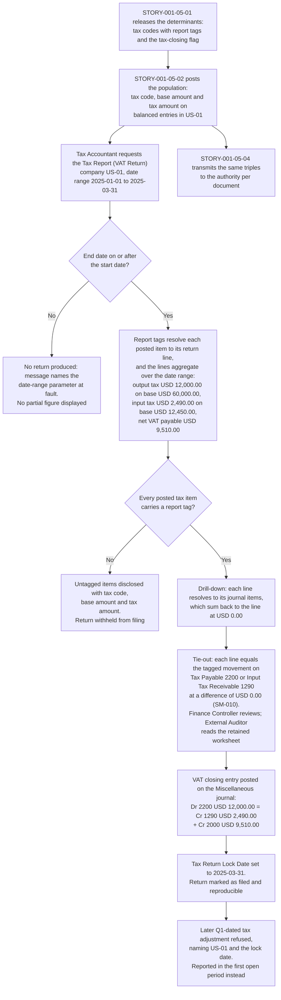

# STORY-001-05-03: Generate VAT Return Report

---

## Metadata

| Attribute | Value |
|-----------|-------|
| **Story ID** | `STORY-001-05-03` |
| **Title** | Generate VAT Return Report |
| **Parent Feature** | [FEATURE-001-05: Tax Configuration & Compliance](../FEATURE-001-05-tax-configuration-compliance.md) |
| **Parent Epic** | [EPIC-001: Enterprise Accounting in Odoo](../../EPIC-001-enterprise-accounting-odoo.md) |
| **Status** | Draft |
| **Priority** | 🔴 Critical |
| **Estimate** | 8 story points (Fibonacci) |
| **Persona** | Tax Accountant |
| **Feature Capability** | CAP-003 — generate the statutory Tax Report (VAT Return) for a date range and tie every line of it to the sub-ledger |
| **Epic Success Metric** | SM-010 — a difference of `0.00` in the filing entity's functional currency between the tax amount the return reports and the tax control account movements for the same date range, evidenced by the report-to-ledger reconciliation worksheet retained per jurisdiction per filing period |
| **Secondary Personas** | Chief Accountant (reconciles Tax Payable 2200 and Input Tax Receivable 1290 to the return, and administers the Tax Return Lock Date that closes a filed period), External Auditor (relies on the return-to-ledger tie-out and on the drill-down from a return line to the journal items behind it), Finance Controller (reviews the prepared return and witnesses the demonstration), Product Owner (accepts the story) |
| **Platform Target** | Open decision DEC-001 — see [Version Compatibility](#version-compatibility) |
| **Last Updated** | 2026-08-15 |
| **Owner/Author** | Enterprise Accounting Team |

> **Platform target.** This story states no platform version of its own. The target is the Epic's open decision **DEC-001** in the [Open Decisions Register](../../EPIC-001-enterprise-accounting-odoo.md#appendix-b-open-decisions-register): the originating programme request names Odoo 17, the superseded prior backlog named 18.0, and the baseline this story was written and verified against is **Odoo 19.0 Community**, where `odoo/release.py` declares `version_info = (19, 0, 0, FINAL, 0, '')`. The three candidates differ in how a statutory report is declared on the report models, in how the tax-tags engine resolves a report line to journal items, and in how the Tax Return Lock Date is set when a tax closing entry posts, so the mismatch is surfaced for stakeholder confirmation rather than settled inside this story.

---

## User Story

**As a** Tax Accountant

**I want** to generate the Tax Report (VAT Return) for a chosen date range, with an output-tax line, an input-tax line and a net VAT line that each state a tax code, a base amount and a tax amount as three separate values and each tie to the Tax Payable 2200 and Input Tax Receivable 1290 sub-ledger movements of the same date range

**So that** the statutory return is filed from the ledger rather than from an off-system spreadsheet, and every figure filed can be traced back to a posted journal item when the External Auditor asks where it came from.

> **What this story carries, and what it does not.** It carries **report generation**: the aggregation of posted tax lines into the return's lines over a stated date range, the box-to-tag map that decides which line a code reaches, the drill-down from a line to the journal items behind it under the Epic's inherited [export and drill-down convention](../../EPIC-001-enterprise-accounting-odoo.md#c32-fr-007--the-export-and-drill-down-fan-out), and the balanced VAT closing entry the report itself generates from the figures it reports. It does **not** carry filing administration, and the criteria below assert none of it: the Tax Return Lock Date that closes a filed period is administered by [STORY-001-01-05](../FEATURE-001-01/STORY-001-01-05-configure-period-lock-dates.md); the settlement of the net VAT payable through a bank payment is [FEATURE-001-04](../FEATURE-001-04-bank-reconciliation-cash-management.md); the period-close checklist that sequences the filing among the other close tasks is [STORY-001-07-05](../FEATURE-001-07/STORY-001-07-05-execute-period-close-deferrals.md); and the electronic transmission of documents to an authority endpoint is [STORY-001-05-04](./STORY-001-05-04-submit-einvoicing.md). Where a criterion needs one of those as a precondition it is stated in the **Given** and asserted by a named test rather than by the criterion.

---

## INVEST Principles Compliance

| Principle | Compliance | Notes |
|-----------|------------|-------|
| **Independent** | ✅ | Honest statement of the coupling: the posted transactions of [STORY-001-05-02](./STORY-001-05-02-compute-transaction-tax.md) and the tax codes and report tags of [STORY-001-05-01](./STORY-001-05-01-configure-tax-codes-fiscal-positions.md) are a **demo-data prerequisite of this story, not a code coupling**. Both are satisfiable as fixture records and fixture postings in a test company, so the aggregation, the drill-down and the closing entry are developable and demonstrable on their own once that population exists, and this story shares no model or method with either sibling |
| **Negotiable** | ✅ | States the reporting outcome required — named lines carrying a tax code, a base amount and a tax amount for a stated date range, each tying to a named control account, with a balanced closing entry — and leaves the report declaration, the per-jurisdiction box mapping and the presentation layer to implementation discovery under D-004 |
| **Valuable** | ✅ | This is the story that makes SM-010 evidenced rather than asserted. Return preparation falls from the Epic's manual baseline of 8 to 16 hours per jurisdiction per filing period to under 2 hours, and the difference between the filed figure and the tax control account movements is `0.00` in the filing entity's functional currency because both are read from the same journal items |
| **Estimable** | ✅ | The artifact count is fixed: one report with three reported lines plus a base-only line, one date range, two control accounts, one closing entry on one journal and one lock-date guard, all expressed on models present in this repository under LGPL-3 — see [Estimation](#estimation) |
| **Small** | ✅ | One reporting-and-settlement outcome sized at 8 story points and completable inside one iteration. Defining the tax codes and their report tags is `STORY-001-05-01`; posting the triples this report aggregates is `STORY-001-05-02`; transmitting a document to the authority is [STORY-001-05-04](./STORY-001-05-04-submit-einvoicing.md) |
| **Testable** | ✅ | All eight criteria are objectively pass or fail: each of the seven reporting criteria names the report and its date-range parameter and states at least one expected line value with its currency and rounding rule, each tax assertion states the tax code, the base amount and the tax amount as three separate values, the closing-entry criterion lists every leg with both totals, and the hostile-parameter criterion of Scenario 8 resolves to a rejection with a named failed check together with counts of `0` produced returns, `0` written files, `0` retained filing records and `0` journal items — see [Acceptance Test Mapping](#acceptance-test-mapping) |

---

## Acceptance Criteria

Eight criteria, at the top of the mandated band of 4 to 8 recorded in the Epic's [decomposition guidelines](../../EPIC-001-enterprise-accounting-odoo.md#53-feature-and-story-decomposition-guidelines). Each has exactly one non-compound **When**, and each **Then** asserts only what the Tax Accountant, the Chief Accountant, the Finance Controller or the External Auditor can observe on the report, on the posted entry or on the account movement. Four rules hold across the seven reporting criteria, and Scenario 8 asserts a refusal rather than a reported figure, so it names the report and its parameters and states the line values that must **not** appear: every criterion names the report **Tax Report (VAT Return)** together with its date-range parameter and at least one expected line value; every tax assertion states the **tax code**, the **base amount** and the **tax amount** as three separate values; every monetary figure states its currency, its amount and its rounding rule; and the criterion that produces a journal entry lists each leg with its account code and amount and asserts total debits equal to total credits with both totals stated.

| Scenario | Coverage class |
|----------|----------------|
| 1 | Valid input — happy-path generation of the return over a stated date range |
| 2 | Valid input — sub-ledger tie-out by drill-down from a return line to its journal items |
| 3 | Invalid or incomplete input — a date range whose end date precedes its start date |
| 4 | Error handling — a posted document whose tax code carries no tax-report tag |
| 5 | Accounting edge case — the VAT closing entry that settles the period, listed leg by leg |
| 6 | Accounting edge case — a customer credit note inside the reported period |
| 7 | Accounting edge case — a zero-rated base-only line and a period closed by the Tax Return Lock Date |
| 8 | Error handling — hostile run-time report parameters, each rejected with a named failed check (C-022) |

All eight criteria run in company `US-01` (**Global Holdings Inc.**), the United States parent of the Epic's canonical legal-entity register ([Appendix E.4](../../EPIC-001-enterprise-accounting-odoo.md#e4-canonical-legal-entity-register)), whose functional currency is USD and which is also the group presentation currency. The return filed in these criteria is the one belonging to the 20 percent VAT registration under which `US-01` posts the codes `VAT-20-S` ("VAT 20% (Sales)") and `VAT-20-P` ("VAT 20% (Purchases)") — the foreign registration Odoo expresses as a Foreign Tax ID on a fiscal position, which is why a USD-functional entity files a VAT return at all. The population it reports is therefore the journal items carrying the report tags of those codes, and not every movement that reaches the same control accounts; see [Tie-Out Scope](#tie-out-scope) for the consequence and for how the domestic sales-tax population is kept apart from this one. Scenarios 5 and 6 each read the Scenario 1 population; the credit note introduced in Scenario 6 is not present in the population Scenario 5 settles.

### Scenario 1: The return presents output tax, input tax and net VAT for a stated date range

- **Given** company `US-01` (**Global Holdings Inc.**, functional currency USD, tax-calculation rounding method **Round per Tax**) holds posted Q1 2025 sales carrying tax code `VAT-20-S` ("VAT 20% (Sales)") at 20.0000 percent whose report tag routes them to the output-tax line, with a base amount of USD 60,000.00 and a tax amount of USD 12,000.00, and posted Q1 2025 purchases carrying tax code `VAT-20-P` ("VAT 20% (Purchases)") at 20.0000 percent whose report tag routes them to the input-tax line, with a base amount of USD 12,450.00 and a tax amount of USD 2,490.00
- **When** the Tax Accountant requests the **Tax Report (VAT Return)** for company `US-01` over the date range 2025-01-01 to 2025-03-31
- **Then** the report presents an output-tax line stating tax code `VAT-20-S`, a base amount of USD 60,000.00 and a tax amount of USD 12,000.00, an input-tax line stating tax code `VAT-20-P`, a base amount of USD 12,450.00 and a tax amount of USD 2,490.00, and a net VAT payable line of USD 9,510.00 equal to the output tax of USD 12,000.00 less the input tax of USD 2,490.00, the date range 2025-01-01 to 2025-03-31 and the company `US-01` are stated on the output beside those figures, and every amount in this criterion is rounded half-up to 2 decimal places at the USD rounding increment of 0.01

### Scenario 2: A return line resolves to the journal items behind it, and those items tie to the control account

- **Given** the **Tax Report (VAT Return)** of Scenario 1 stands produced for company `US-01` over the date range 2025-01-01 to 2025-03-31, its output-tax line reading a base amount of USD 60,000.00 with a tax amount of USD 12,000.00, and the External Auditor holds read access to the books of `US-01`
- **When** the Tax Accountant opens the journal items behind that output-tax line
- **Then** the listed journal items each state their tax code `VAT-20-S`, the base amount they were computed on and the tax amount computed from it as three separate values; their tax amounts sum to USD 12,000.00 and their base amounts to USD 60,000.00, equal to the line they were opened from at a difference of USD 0.00; that same USD 12,000.00 equals the 2025-01-01 to 2025-03-31 credit movement on **Tax Payable 2200** in `US-01` carrying the report tag of the output-tax line, again at a difference of USD 0.00; the company and date-range parameters that produced the line govern the detail, so no item dated outside 2025-01-01 to 2025-03-31 and no item of another company is present; the detail carries the path back to the return it came from; and no journal entry is created, altered or reversed by opening it — every amount in this criterion rounded half-up to 2 decimal places at the USD rounding increment of 0.01

### Scenario 3: A date range whose end date precedes its start date produces no return

- **Given** the Tax Accountant is preparing the **Tax Report (VAT Return)** of company `US-01` (**Global Holdings Inc.**, functional currency USD) for a filing quarter whose stated date range is 2025-01-01 to 2025-03-31
- **When** the Tax Accountant requests that report for the date range 2025-03-01 to 2025-01-31
- **Then** no return is produced; a validation message names the date-range parameter at fault and reports the end date 2025-01-31 as preceding the start date 2025-03-01; no partial figure is displayed, so neither the output-tax line — tax code `VAT-20-S`, base amount USD 60,000.00, tax amount USD 12,000.00 — nor the input-tax line — tax code `VAT-20-P`, base amount USD 12,450.00, tax amount USD 2,490.00 — nor the net VAT payable line of USD 9,510.00 that the range 2025-01-01 to 2025-03-31 produces appears on any output, each of those amounts rounded half-up to 2 decimal places at the USD rounding increment of 0.01; and no journal entry and no filing record is created by the refused request

### Scenario 4: A tax code carrying no report tag is disclosed and withheld from the net VAT line

- **Given** company `US-01` (**Global Holdings Inc.**, functional currency USD) holds, alongside the Scenario 1 population, one posted Q1 2025 customer invoice carrying tax code `VAT-20-S-NOTAG` ("VAT 20% (Sales, Untagged)") at 20.0000 percent, with a base amount of USD 4,000.00 and a tax amount of USD 800.00, whose tax distribution lines carry no tax-report tag
- **When** the Tax Accountant requests the **Tax Report (VAT Return)** for company `US-01` over the date range 2025-01-01 to 2025-03-31
- **Then** the report presents that invoice in an unmapped-tax section stating its tax code `VAT-20-S-NOTAG`, its base amount of USD 4,000.00 and its tax amount of USD 800.00 as three separate values together with the reference of the document; the output-tax line still reads a base amount of USD 60,000.00 with a tax amount of USD 12,000.00 and the net VAT payable line still reads USD 9,510.00, so the unmapped base amount of USD 4,000.00 and the unmapped tax amount of USD 800.00 are excluded from both; and the report states that the return of `US-01` for 2025-01-01 to 2025-03-31 is withheld from filing until `VAT-20-S-NOTAG` carries a tax-report tag — every amount in this criterion rounded half-up to 2 decimal places at the USD rounding increment of 0.01

### Scenario 5: The VAT closing entry settles the period with total debits equal to total credits

- **Given** the **Tax Report (VAT Return)** of company `US-01` (**Global Holdings Inc.**, functional currency USD) over the date range 2025-01-01 to 2025-03-31 reads an output-tax line stating tax code `VAT-20-S`, a base amount of USD 60,000.00 and a tax amount of USD 12,000.00, an input-tax line stating tax code `VAT-20-P`, a base amount of USD 12,450.00 and a tax amount of USD 2,490.00, and a net VAT payable line of USD 9,510.00, the tax distribution lines of both codes are flagged for use in tax closing, and no unmapped-tax item stands against the period
- **When** the Tax Accountant posts the VAT closing entry for that date range on the **Miscellaneous** journal of `US-01`
- **Then** the posted entry carries the legs debit **Tax Payable 2200** USD 12,000.00, credit **Input Tax Receivable 1290** USD 2,490.00 and credit **Accounts Payable 2000** USD 9,510.00 against the tax authority as the counterparty, so total debits of USD 12,000.00 equal total credits of USD 12,000.00 at a difference of USD 0.00; the credited USD 9,510.00 equals the net VAT payable line of the return at a difference of USD 0.00; the return for 2025-01-01 to 2025-03-31 is marked as filed and stays reproducible with the figures that were filed; and every amount in this criterion is rounded half-up to 2 decimal places at the USD rounding increment of 0.01

### Scenario 6: A credit note inside the reported period reduces the output-tax and net VAT lines

- **Given** company `US-01` (**Global Holdings Inc.**, functional currency USD) holds, alongside the Scenario 1 population, one posted Q1 2025 customer credit note that reverses tax code `VAT-20-S` ("VAT 20% (Sales)") through its refund distribution with a base amount of −USD 1,000.00 and a tax amount of −USD 200.00, each rounded half-up to 2 decimal places at the USD rounding increment of 0.01
- **When** the Tax Accountant requests the **Tax Report (VAT Return)** for company `US-01` over the date range 2025-01-01 to 2025-03-31
- **Then** the output-tax line states tax code `VAT-20-S`, a base amount of USD 59,000.00 and a tax amount of USD 11,800.00, the input-tax line is unchanged at tax code `VAT-20-P`, a base amount of USD 12,450.00 and a tax amount of USD 2,490.00, and the net VAT payable line reads USD 9,310.00 equal to the output tax of USD 11,800.00 less the input tax of USD 2,490.00; the credit note is presented as a reduction of the period rather than as a separate positive line; and every amount in this criterion is rounded half-up to 2 decimal places at the USD rounding increment of 0.01

### Scenario 7: A zero-rated supply reaches a base-only line of the return rather than dropping out of it

- **Given** company `US-01` (**Global Holdings Inc.**, functional currency USD) holds, alongside the Scenario 1 population, one posted Q1 2025 zero-rated sale carrying tax code `VAT-00-ZR` ("VAT 0% (Zero-Rated)") with a base amount of USD 4,000.00 and a tax amount of USD 0.00, whose tax code carries its own report tag distinct from the tag of `VAT-20-S`, each amount rounded half-up to 2 decimal places at the USD rounding increment of 0.01
- **When** the Tax Accountant requests the **Tax Report (VAT Return)** for company `US-01` over the date range 2025-01-01 to 2025-03-31
- **Then** the zero-rated supply occupies a base-only line of its own stating tax code `VAT-00-ZR`, a base amount of USD 4,000.00 and a tax amount of USD 0.00 as three separate values, so a zero rate reaches the return rather than dropping out of it and is never merged into the standard-rate base; the output-tax line still reads tax code `VAT-20-S` with a base amount of USD 60,000.00 and a tax amount of USD 12,000.00, the input-tax line still reads tax code `VAT-20-P` with a base amount of USD 12,450.00 and a tax amount of USD 2,490.00, and the net VAT payable line still reads USD 9,510.00, so the zero-rated base changes no other line; and every amount in this criterion is rounded half-up to 2 decimal places at the USD rounding increment of 0.01. The refusal of a further adjustment inside a period already filed is a different trigger and belongs to the Tax Return Lock Date administered by [STORY-001-01-05](../FEATURE-001-01/STORY-001-01-05-configure-period-lock-dates.md) under the Epic's [lock-date behaviour contract](../../EPIC-001-enterprise-accounting-odoo.md#78-lock-date-behaviour-contract) L-5, which stands outside this report criterion

### Scenario 8: Hostile run-time report parameters are each rejected with the failing check named, and the return service answers the next request

This is the criterion **C-022** assigns to this story, and its four fixtures are hostile parameter values rather than legitimate text. **Rejection is the only outcome it admits**: nothing here may be accepted, sanitized, coerced to a default or neutralized and then run, because a report that runs on a coerced parameter produces a filing position nobody requested. Legitimate text that merely *looks* dangerous — a partner name carrying markup, a jurisdiction label beginning `=` — is a different fixture class handled by [STORY-001-05-04](./STORY-001-05-04-submit-einvoicing.md) on the outbound document path and by [STORY-001-03-05](../FEATURE-001-03/STORY-001-03-05-report-aged-receivables.md) on the report-output path; neither outcome may stand in for the other.

- **Given** the **Tax Report (VAT Return)** of company `US-01` (**Global Holdings Inc.**, functional currency USD) is producible for the filing range 2025-01-01 to 2025-03-31, where it presents an output-tax line of tax code `VAT-20-S` on a base amount of USD 60,000.00 with a tax amount of USD 12,000.00, an input-tax line of tax code `VAT-20-P` on a base amount of USD 12,450.00 with a tax amount of USD 2,490.00 and a net VAT payable line of USD 9,510.00, each amount rounded half-up to 2 decimal places at the USD rounding increment of 0.01; the count of retained filing records for `US-01` and that range, the count of posted journal entries in `US-01`, and the Tax Payable **2200** and Input Tax Receivable **1290** balances of `US-01` are each recorded before the attempt; and a hostile fixture set of **four** run-time parameter values is held apart from the deterministic fixtures under **D-009** so a hostile value cannot be mistaken for sample data — (a) a **malformed** date value `2025-13-45` supplied as the range start date, (b) an **out-of-range** date value `1899-01-01` supplied as the range start date, resolving to no fiscal period of `US-01`, (c) an **over-long** jurisdiction filter value of 10,000 characters against a field bounded well below that length, and (d) an **adversarial query value** `NL-01' OR 1=1 --` supplied as the company-scope filter
- **When** the Tax Accountant requests the **Tax Report (VAT Return)** once for each of those four parameter values in turn, the other parameters left at the valid filing range 2025-01-01 to 2025-03-31 for company `US-01`
- **Then** each of the four requests is **rejected** before any query runs, and for every one of the four: **no return is produced** and no partial figure is displayed, so neither the USD 12,000.00 output-tax line, nor the USD 2,490.00 input-tax line, nor the USD 9,510.00 net VAT payable line appears on any output; **no file is written** in any format; the retained filing-record count for `US-01` and 2025-01-01 to 2025-03-31 is **unchanged** from the count recorded before the attempt, so a rejected request leaves no filing history; **no journal entry is created, altered or reversed** — the posted journal-entry count of `US-01` is unchanged and the Tax Payable **2200** and Input Tax Receivable **1290** balances of `US-01` each move by **USD 0.00**, rounded half-up to 2 decimal places at the USD rounding increment of 0.01
  - **And** the message returned for each names the **parameter at fault and the check it failed** as two separate values — the start-date parameter failing the date-format check for `2025-13-45`, the start-date parameter failing the fiscal-period-resolution check for `1899-01-01`, the jurisdiction-filter parameter failing the maximum-length check for the 10,000-character value, and the company-scope parameter failing the allowed-value check for `NL-01' OR 1=1 --` — so the Tax Accountant corrects the request without a second attempt to discover which value was refused
  - **And** no message discloses a stack trace, query text, file-system path or credential, and none echoes the rejected value back in full (C-019, C-020)
  - **And** the adversarial company-scope value resolves to **no** company rather than to `NL-01`, `US-01` or every company: the count of companies whose journal items are read by that request is **0**, because the parameter is matched against the allowed-company set of the requesting persona rather than interpolated into a query as text (C-019)
  - **And** the count of rejected requests that produced a return, wrote a file, retained a filing record or created a journal item is **0**, and the count that were instead accepted after coercion to a default range, a default jurisdiction or a default company scope is also **0**
  - **And** the service stays available: immediately after the fourth rejection the same **Tax Report (VAT Return)** requested for company `US-01` over the valid range 2025-01-01 to 2025-03-31 is produced and again presents the output-tax line of USD 12,000.00 against a base amount of USD 60,000.00 at tax code `VAT-20-S`, the input-tax line of USD 2,490.00 against a base amount of USD 12,450.00 at tax code `VAT-20-P` and the net VAT payable line of USD 9,510.00, each rounded half-up to 2 decimal places at the USD rounding increment of 0.01, so a refused parameter does not deny the filing itself

---

## Sub-Tasks

- [ ] Map the return of each in-scope jurisdiction to its statutory boxes, and each box to the tax codes and tax-report tags that feed it, recording per jurisdiction whether the localization pack already ships the box structure before any bespoke report is considered, and agree the map with the Finance SME before development starts — `@functional-consultant`
- [ ] Deliver the line aggregation over a date-range parameter so that each reported line carries a tax code, a base amount and a tax amount as three separate values for a named company, including the base-only treatment of a zero rate, the refund treatment of a credit note, and the unmapped-tax disclosure that lists a document whose tax code carries no report tag, excludes it from the net VAT line and withholds the return from filing until the tag exists — `@developer`
- [ ] Deliver the drill-down from a reported line to the journal items that compose it, preserving the company and date-range parameters, carrying the path back to the summary, and creating no journal entry when it is opened — `@developer`
- [ ] Deliver the PDF and XLSX export of the return under the inherited export convention, with the on-screen parameters preserved, the expanded detail included and every exported cell neutralized against formula injection — `@developer`
- [ ] Deliver the VAT closing entry on the Miscellaneous journal from the reported figures, posting debit Tax Payable 2200, credit Input Tax Receivable 1290 and credit Accounts Payable 2000 for the net, together with the guard that refuses a later tax-bearing posting dated on or before the Tax Return Lock Date — `@developer`
- [ ] Write the unit and integration tests for all eight acceptance scenarios, asserting each reported line against the sum of its journal items and against the tagged control-account movement as amounts, asserting the closing entry's total debits against its total credits at a stated difference, and reviewing every criterion for banned vague terms and for the tax-code, base-amount and tax-amount triple — `@qa-engineer`
- [ ] Build the **C-022 hostile-parameter suite of Scenario 8** as four independent tests over the run-time report parameters — a malformed start date `2025-13-45`, an out-of-range start date `1899-01-01`, a 10,000-character jurisdiction filter value and the adversarial company-scope value `NL-01' OR 1=1 --` — held in a fixture set kept apart from the deterministic fixtures (D-009). Assert for **every** member the single outcome of **rejection**: the parameter and the failed check named as two values, `0` returns produced, `0` files written, the retained filing-record count unchanged, `0` journal entries created, `USD 0.00` movement on Tax Payable 2200 and Input Tax Receivable 1290, `0` companies read for the adversarial scope value, no stack trace, query text, file-system path or credential disclosed, and a valid request for 2025-01-01 to 2025-03-31 succeeding immediately afterwards. Assert additionally that `0` of the four were accepted after coercion to a default range, jurisdiction or company scope, because a test that passes on either rejection or coercion proves neither (C-015, C-019, C-020, C-022) — `@qa-engineer`
- [ ] Sign off that each reported line ties to the Tax Payable 2200 and Input Tax Receivable 1290 movements carrying its report tag for the same date range at a difference of `0.00` in the filing entity's functional currency, that the closing entry posts with total debits equal to total credits, and that the retained reconciliation worksheet is filing evidence the External Auditor can read without a data request — `@finance-sme`
- [ ] Write the filing runbook per jurisdiction: the return parameters, the box-to-tag map, the review and sign-off steps, the closing-entry posting, the lock-date administration and the refusal messages a preparer will meet — `@technical-writer`

---

## Edge Cases

- **Zero-amount and null population.** A filing period in which `US-01` posted no taxable transaction returns a **Tax Report (VAT Return)** whose output-tax, input-tax and net VAT lines each read USD 0.00, rounded half-up to 2 decimal places at the USD rounding increment of 0.01, rather than an empty page, so a nil return is filed as a nil return rather than as a missing one.
- **Fiscal-period lock after filing.** An adjustment dated inside a period already closed by the Tax Return Lock Date of `US-01` is refused with a message naming the company and that date, so the filed figures of USD 12,000.00 output tax, USD 2,490.00 input tax and USD 9,510.00 net VAT payable stay reproducible, and the later adjustment is carried into the first open period instead of restating the filed one.
- **Multi-currency rounding residual.** A foreign-currency document is converted at the rate in force on its own document date before it reaches the return, and where a residual of USD 0.01 arises between the tax computed per tax code under **Round per Tax** and the sum of the taxes computed per line under **Round per Line**, the method in force on the entity decides the reported figure, the residual is disclosed on the reconciliation worksheet rather than absorbed silently into a base amount, and the worksheet difference is still stated as an amount.
- **Intra-Community reverse charge.** An EU business-to-business **supply** raised by `NL-01` carrying tax code `VAT-00-RC` ("VAT 0% (Intra-Community Supply, Reverse Charge)") with a base amount of EUR 5,000.00 and a tax amount of EUR 0.00, each rounded half-up to 2 decimal places at the EUR rounding increment of 0.01, reaches the return on its own base-bearing line. The **acquisition** side, where `NL-01` is the buyer, carries `VAT-21-RC` on the same base amount of EUR 5,000.00 and is reported on both an output line and an input line at a tax amount of EUR 1,050.00 each, so the net effect of the pair on the net VAT line is EUR 0.00.
- **Late-arriving document.** An invoice for `US-01` posted after the return for 2025-01-01 to 2025-03-31 was filed is reported in the first open period rather than by restating the filed period, the reconciliation worksheet of the filed period is left as it was retained, and the document's tax code, base amount and tax amount are stated on the later return that carries it.

---

## Estimation

| Dimension | Rating | Justification |
|-----------|--------|---------------|
| **Effort** | Medium to high | Three deliverables sit behind one report: line aggregation over a date range, drill-down from a line to its journal items with the parameters preserved, and the balanced closing entry the report itself generates, over a per-jurisdiction box-to-tag map. Each carries its own test set, and the tie-out has to be proven against the control-account movements rather than against the report's own subtotal |
| **Complexity** | Medium | The reporting mechanics are declarative, but the accounting consequence sits in the detail: which population a line is entitled to aggregate, how a zero rate reaches a base-only line, how a refund distribution reduces a period rather than adding to it, which tax codes are flagged for use in tax closing, and how a filed period is protected once the lock date is set. None of it requires a new posting engine, because the entry the closing produces is refused by the platform if it does not balance |
| **Uncertainty** | Medium | The report models, the tax-tags engine, the closing flag and the Tax Return Lock Date are all present in this repository under LGPL-3 and were read at the 19.0 baseline, which removes the platform risk. What stays open is per-jurisdiction: which localization pack already ships the statutory boxes, and how the packaged reporting presentation is sourced under DEC-002 |
| **Story Points** | **8** | Fibonacci scale (1, 2, 3, 5, 8, 13). Above the 5 carried by `STORY-001-05-02` because that story delivers one computation-and-posting shape, while this one adds aggregation over a date range, a drill-down path with parameter and breadcrumb behaviour, a generated closing entry that must balance, an unmapped-tax disclosure and a per-jurisdiction box mapping — materially more surface rather than repetition. Below a 13 because no external endpoint, no authority credential and no new posting engine is involved, and the aggregation reads a population `STORY-001-05-02` has already made deterministic. The hostile run-time parameter suite of Scenario 8 adds four independent rejection tests over the report parameters rather than a new reporting mechanism, so it sits inside this estimate rather than pushing it to the next Fibonacci value of 13 |

---

## Constraints

The constraint identifiers below are the Epic's own, restated for this story rather than renumbered, so one constraint set reads across the whole ticket tree.

### License and Compliance

- [x] **C-001 — AGPL-3.0 compatibility**: any module delivering the return, its drill-down, its export or its closing entry is distributed under an AGPL-3.0 compatible licence, matching the Community-edition accounting add-ons already present in this repository
- [x] **C-002 — Existing licence respected**: extension of `account` — the "Invoicing" application, version 1.4, licence LGPL-3 — respects that licence, and an AGPL-3 extension of LGPL-3 code is licence-checked before it is written
- [x] **C-005 / C-006 — Odoo and OCA coding standards**: Python follows Odoo and OCA module guidelines including PEP 8, and static analysis passes with the repository's configured tooling, whose lint configuration is `ruff.toml` at the repository root
- [x] **C-008 / C-009 — Traceable numeric assertion**: each acceptance test maps to exactly one criterion in this file, and every base amount, tax amount, net figure and debit-against-credit total is asserted as an amount in test code rather than inspected by eye, with the difference stated
- [x] **C-012 — Build on the existing models**: the return is expressed on `account.report` with its line, expression and column models over `account.move.line`, rather than on a parallel reporting structure, so one ledger and one tax audit trail exist
- [x] **C-014 — Access rights and company isolation**: the role that files the return is distinguishable from the role that owns the tax determinants and from the role that captures a document, and a role restricted to one company can neither produce that company's return from another company nor read the journal items behind its lines
- [x] **C-017 — Export neutralization**: every cell written to a CSV or XLSX export of the return is neutralized against formula injection, including partner names, document references and memo text
- [x] **C-019 — Data access discipline**: reads of the reported population are expressed through the Odoo ORM or parameterized SQL, with no string-concatenated query construction, and every run-time report parameter — the company scope, the date range and each filter value — is validated against its declared type, its declared bounds and its allowed-value set **before** it reaches a query, never interpolated into one as text
- [x] **C-020 — Failure messages disclose nothing**: every refusal a preparer can meet names the parameter at fault and the check it failed as two separate values and discloses no stack trace, query text, file-system path or credential, and none echoes a rejected value back in full — asserted for the reversed range of Scenario 3 and for each of the four hostile parameter values of Scenario 8
- [ ] **C-022 — Hostile-input tests**: the hostile run-time parameter set of [Scenario 8](#scenario-8-hostile-run-time-report-parameters-are-each-rejected-with-the-failing-check-named-and-the-return-service-answers-the-next-request) is delivered as four independent tests — a malformed start date, an out-of-range start date, an over-long jurisdiction filter value and an adversarial company-scope value — and **rejection is the only outcome any of the four admits**: a named error identifying the failing check, `0` returns produced, `0` files written, the retained filing-record count unchanged, `0` journal entries created and the service answering the next request. Coercion of a hostile value to a default range, jurisdiction or company scope is a failure of the test rather than a pass, and legitimate text carrying markup or a formula-leading character is a separate fixture class owned elsewhere, so neither outcome can stand in for the other
- [x] **Inherited export and drill-down convention**: this story is named as an inheriting story of the Epic's [export and drill-down fan-out](../../EPIC-001-enterprise-accounting-odoo.md#c32-fr-007--the-export-and-drill-down-fan-out) owned by FEATURE-001-07 — PDF and XLSX export, on-screen parameters preserved, expanded detail included, every summary line drilling down to its journal items with breadcrumbs back — and restates none of it as a local invention

### Accounting Standards Compliance

- [x] **EU VAT Directive 2006/112/EC — content of the return**: the Directive requires a return stating the taxable amount and the tax due for the period, which is why each reported line carries its base amount and its tax amount as separate values and why the net VAT payable line is derived from the two rather than entered
- [x] **EU VAT Directive 2006/112/EC — zero-rated, exempt and reverse-charge treatments**: a zero-rated supply reaches its own base-only line with a tax amount of `0.00` in the filing entity's functional currency, an exempt supply reaches its own line, and a reverse-charge acquisition is reported on both sides where the jurisdiction requires self-accounting, so no treatment disappears from the return by having no tax to report
- [x] **Audit trail**: every figure the return reports is traceable to a posted journal item through the drill-down, and the parameters, the output and the reconciliation worksheet of each filed return are retained so the External Auditor reads the evidence without a data request
- [x] **Double-entry integrity**: the VAT closing entry posts with total debits equal to total credits at a difference of `0.00` in the filing entity's functional currency, and the platform refuses it otherwise
- [x] **ISO 4217 minor units**: every reported and settled amount is rounded half-up to its currency's decimal precision — 2 decimal places at a rounding increment of 0.01 for USD and EUR — and the company tax-calculation rounding method in force is stated alongside the figures wherever it can change the result
- [x] **A filed period stays filed**: once the Tax Return Lock Date is set for the period, the return reproduces the figures that were filed, and a later document is reported in the first open period instead

### Dependency and Edition Considerations

- [x] **C-003 — Edition source is an open decision (DEC-002), not a prohibition**: the outright ban on Enterprise dependencies carried by the superseded backlog is **withdrawn**. The choice between an Odoo Enterprise subscription and the OCA add-on path — `account_financial_report`, `account_reconcile_oca` and `mis_builder` plus bespoke development for the residual gap — is owned by the CFO / Finance Director with the Group Controller and is recorded in the [Open Decisions Register](../../EPIC-001-enterprise-accounting-odoo.md#appendix-b-open-decisions-register)
- [x] **This story is the one DEC-002 touches most directly**: the report *data model* is present in this repository under LGPL-3 — `account.report`, `account.report.line`, `account.report.expression` and `account.report.column` are defined in `addons/account/models/account_report.py`, a generic tax report root record ships in `addons/account`, and the localization packs supply the statutory boxes — while the packaged reporting user interface that renders and exports them is the Enterprise-or-OCA question. The declaration and the tie-out are therefore developable before DEC-002 is confirmed; the presentation and export surface is sequenced after it
- [x] **C-004 — OCA ecosystem compatibility**: whichever edition path is confirmed, the reported population stays the posted journal items and their report tags, so an OCA reporting add-on or a country `l10n_*` extension consumes the same data without recomputing tax from gross amounts

### Version Compatibility

- [x] **C-010 — Platform version target is open decision DEC-001**: the programme request names Odoo 17, the superseded backlog named 18.0, and this repository is **Odoo 19.0 Community** (`odoo/release.py` → `version_info = (19, 0, 0, FINAL, 0, '')`). The target is confirmed with stakeholders before development rather than chosen here
- [x] **C-011 — Language and database versions follow the confirmed target**: the 19.0 baseline present here declares `MIN_PY_VERSION = (3, 10)`, `MAX_PY_VERSION = (3, 13)` and `MIN_PG_VERSION = 13` in `odoo/release.py`; an earlier platform target carries a different supported matrix
- [x] **Impact if DEC-001 resolves away from 19.0**: the report declaration and its expression engines are re-verified for the confirmed release, the localization pack series that ships each jurisdiction's boxes changes with it, and the Tax Return Lock Date behaviour is re-verified because lock-date administration and the date-shift-versus-refusal split changed across the candidate releases

---

## Technical Discovery Notes

> **Purpose:** these notes direct the codebase analysis that precedes implementation. They record what to investigate and what the outcome must prove; they do not choose the implementation.

### Codebase Analysis Areas

| Area | Files/Modules to Examine | Analysis Focus |
|------|--------------------------|----------------|
| Report definition model | `addons/account/models/account_report.py` | The report model with its line, expression and column children, the option filters a report carries — country scope, availability condition, date-range filter, multi-company filter and the tax-exigibility restriction — and the way a country report attaches itself to a root report and inherits its behaviour. Establish which of the six computation engines each reported line needs, and confirm that a date-range parameter is an attribute of the report rather than a bespoke wizard |
| The generic tax report root | `addons/account/data/` report data of `addons/account` | The generic tax report root record, its two monetary columns — a **Net** column and a **Tax** column — and the grouped variants that root themselves on it. Establish that the base amount and the tax amount are separate columns of the shipped structure, because that is what lets a reported line state the pair without a bespoke field, and record how a per-country report replaces those columns with the statutory ones |
| Country return boxes | `addons/l10n_uk/data/account_tax_report_data.xml` and the localization packs that ship an equivalent file | The real box structure of a statutory return: a report scoped to one country, allowing foreign VAT, carrying a single **Balance** column, and holding hierarchical lines such as "[BOX 1] VAT due on sales and other outputs" and "[BOX 2] VAT due on acquisitions of goods made in Northern Ireland from EU member states", each resolved by the **tax-tags** engine while the parent line carries an aggregation formula over its children's codes. Of the 209 `l10n_*` packs present in this repository, 95 ship a report definition of this kind and 99 carry tax-tag expressions, so the first question per jurisdiction is whether the required boxes already exist before a bespoke report is considered. Treat the box labels as localization-supplied and this story's line names as the worked example for the installed pack |
| Tax closing and report tags | `addons/account/models/account_tax.py` | The tax distribution line with its account, its factor, its **tax-closing flag** and its **report tags** — the field pair that connects a tax code both to the return line it feeds and to the closing entry that settles it — together with the invoice and refund distribution collections that make a credit note reduce a period rather than add to it. Establish which distribution lines the closing entry is entitled to consume, and what a line with no tag must do to the return |
| Lock dates | `addons/account/models/company.py` | The **Tax Return Lock Date** on the company, administered separately from the fiscal-year, sales, purchase and hard lock dates, set when the tax closing entry posts, and evaluated with a tax-specific flag. Establish the refusal path Scenario 7 asserts and the per-role derivation of the effective date |
| Rounding levers | `addons/account/models/company.py` and `odoo/addons/base/models/res_currency.py` | The company tax-calculation rounding method, whose two options are **Round per Tax** — the shipped default — and **Round per Line**, and the currency decimal precision derived from the rounding factor, giving 2 decimal places at a factor of 0.01 for USD and EUR. Establish which method each filing entity adopts and how a residual minor unit is disclosed on the reconciliation worksheet |
| Reported population and drill-down | `addons/account/models/account_move_line.py` | The tax tags carried on a journal item and the base amount held on the tax item, which together are what a reported line resolves to and what the drill-down of Scenario 2 lists. Establish the query path from a report line to its journal items so the parameters in force on the line govern the detail, and confirm that opening the detail writes nothing |

### Relevant Existing Modules

| Module | Path | Relevance to this story |
|--------|------|------------------------|
| `account` | `addons/account/` | "Invoicing", version 1.4, category `Accounting/Accounting`, licence LGPL-3. Supplies the report, report-line, report-expression and report-column models, the generic tax report root with its Net and Tax columns, the tax-tags engine, the tax distribution lines with their closing flag and report tags, the Tax Return Lock Date and the balance guard that refuses an unbalanced closing entry |
| `l10n_*` | `addons/l10n_*/` | 209 localization packs, 95 of which ship a statutory report definition rooted on the generic tax report. Each supplies one jurisdiction's box structure and the tags that resolve it, so this story maps to boxes rather than inventing them |
| `account_payment` | `addons/account_payment/` | The settlement layer that follows the closing entry. Cited so the net VAT payable of USD 9,510.00 credited to Accounts Payable 2000 is known to be settled through the Bank journal by FEATURE-001-04 without altering a reported tax amount, rounded half-up to 2 decimal places at the USD rounding increment of 0.01 |
| `account_financial_report_ce` | `addons/account_financial_report_ce/` | Version 19.0.1.1.0, AGPL-3. The in-repository Community-edition reporting add-on from the preceding programme phase, and the place the Tax Payable 2200 and Input Tax Receivable 1290 balances surface for the close reconciliation owned by FEATURE-001-07 |
| `base` | `odoo/addons/base/` | `res.currency` for the decimal precision and rounding increment every reported amount is rounded to and for the document-date rate a foreign-currency document is converted at; `res.company` for the filing entity, its functional currency and its Tax Return Lock Date |

### OCA Module Compatibility

| OCA Repository | Module | Compatibility consideration |
|----------------|--------|-----------------------------|
| OCA/account-financial-reporting | `account_financial_report` | Under the OCA path of DEC-002 this is a candidate presentation layer. Determine whether its reports consume the posted tax tags and the separate base and tax values without recomputing tax from a gross amount, and whether its export path can be neutralized under C-017 |
| OCA/mis-builder | `mis_builder` | Determine whether a return expressed as a report template can reproduce the box hierarchy and its aggregation formula, and whether a template line can resolve to the journal items behind it so the tie-out of Scenario 2 survives the choice |
| OCA `l10n-*` country repositories | Country tax-report extensions | Per operating country, determine whether an OCA extension supplies or alters the statutory boxes and the tags this story maps to, so a jurisdiction's divergence is recorded before filing rather than discovered at it |

### Discovery versus Prescription

This story describes WHAT the finance function needs the return to present and WHY. It does not prescribe HOW that is built. Not specified here: new model names, field definitions or schema decisions; whether the return extends a shipped report or declares a new one, which is the report-engine question the Epic records as **D-004**; the presentation and export architecture; and module structure. Deferred to agent discovery: **D-004** (report engine and drill-down), **D-007** (company isolation, record rules and the access-right groups implied by the personas) and **D-009** (the deterministic and hostile-input fixture sets, held apart from one another).

---

## Dependencies

### Story Dependencies

| Dependency Type | Story ID | Story Title | Relationship |
|-----------------|----------|-------------|--------------|
| Parent Feature | [FEATURE-001-05](../FEATURE-001-05-tax-configuration-compliance.md) | Tax Configuration & Compliance | This story is story 3 of the 4 in this feature and delivers its capability CAP-003 |
| Blocked By | [STORY-001-05-02](./STORY-001-05-02-compute-transaction-tax.md) | Compute Tax on Transactions with Base and Tax Split | Supplies the posted population this return aggregates. Without a tax code, a base amount and a tax amount on the tax lines there is nothing to aggregate and nothing to tie to the control accounts; the purchase pair of a base amount of USD 12,450.00 and a tax amount of USD 2,490.00 asserted here is that story's own posted figure, rounded half-up to 2 decimal places at the USD rounding increment of 0.01 |
| Blocked By | [STORY-001-05-01](./STORY-001-05-01-configure-tax-codes-fiscal-positions.md) | Configure Tax Codes and Fiscal Positions | Configuration prerequisite: the tax-report tags that route a code to a return line, and the tax-closing flag the settlement entry consumes, are attributes of the codes that story releases |
| Related | [STORY-001-05-04](./STORY-001-05-04-submit-einvoicing.md) | Submit E-Invoicing to Tax-Authority Endpoints | Carries the same tax triples to the authority per document while this story reports them per period, so the two are filed on different cadences from one population and must agree document by document |
| Related | [STORY-001-07-04](../FEATURE-001-07/STORY-001-07-04-generate-general-ledger-trial-balance.md) | Generate General Ledger and Trial Balance | The sub-ledger surface the reported lines tie to. Its General Ledger and Trial Balance present the Tax Payable 2200 and Input Tax Receivable 1290 movements this story reconciles against, and its drill-down convention is the one Scenario 2 follows |
| Related | [STORY-001-07-05](../FEATURE-001-07/STORY-001-07-05-execute-period-close-deferrals.md) | Execute Period Close and Deferrals | Period-close sequencing: the return is prepared and its closing entry posted before the period is locked, so the close reads a tax position that is already settled and the lock dates are applied once |
| Related | [FEATURE-001-01](../FEATURE-001-01-chart-of-accounts-fiscal-year.md) | Chart of Accounts & Fiscal Year | Supplies Tax Payable 2200, Input Tax Receivable 1290 and Accounts Payable 2000 with the Miscellaneous journal the closing entry posts through, and administers the lock dates Scenario 7 depends on |
| Related | [STORY-001-02-03](../FEATURE-001-02/STORY-001-02-03-post-vendor-bill-entries.md) | Post Vendor Bill Journal Entries | Origin of the input-tax population: the vendor-bill postings whose tax legs reach Input Tax Receivable 1290 and are aggregated into the input-tax line of this return (ORD-002) |
| Related | [STORY-001-03-01](../FEATURE-001-03/STORY-001-03-01-generate-customer-invoices.md) | Generate and Post Customer Invoices | Origin of the output-tax population: the customer-invoice postings whose tax legs reach Tax Payable 2200 and are aggregated into the output-tax line of this return (ORD-002) |

### External Dependencies

| Dependency | Type | Notes |
|------------|------|-------|
| Council Directive 2006/112/EC | Accounting and tax standard | The EU VAT Directive requires a periodic return stating the taxable amount and the tax due, and governs the zero-rated, exempt and reverse-charge treatments the criteria and edge cases carry |
| Tax authority return schema and filing calendar | Statutory reference | The box structure, the submission channel and the filing deadline per jurisdiction, confirmed per authority before a return is mapped, because the boxes are the authority's and not the group's |
| Localization pack per country | Platform data | The pack that ships each jurisdiction's statutory boxes and their tags. Whether the required boxes already exist in the pack is confirmed per jurisdiction before bespoke report work is scheduled |
| ISO 4217 | Standard | Currency codes and minor units, which fix the 2-decimal precision at a rounding increment of 0.01 that every rounding assertion in this story states for USD and EUR |
| Group rounding-method policy | Governance | The tax-calculation rounding method adopted per filing entity — Round per Tax or Round per Line — is confirmed by the Chief Accountant, because the two can differ by one minor unit and the return states the figure the method produced |
| Retention policy for filing evidence | Governance | The retention period for a filed return's parameters, its output and its reconciliation worksheet, which is what makes a filed period defensible to the External Auditor after the books are locked |

### Integration Points

| Odoo Model/Module | Integration Type | Purpose |
|-------------------|------------------|---------|
| `account.report` | Read and declare | The return itself: its country scope, its date-range parameter, its multi-company filter and its tax-exigibility restriction |
| `account.report.line` | Read and declare | The reported lines and their hierarchy — output tax, input tax, the net VAT line and the base-only line a zero rate reaches |
| `account.report.expression` | Read and declare | The formula and engine behind each line, including the tax-tags engine that resolves a line from the report tags on posted journal items and the aggregation that derives a parent from its children |
| `account.report.column` | Read and declare | The columns that carry a reported line's base amount and tax amount as separate values rather than one combined figure |
| `account.move` | Read and write | Read for the reported population; write once, for the VAT closing entry posted on the Miscellaneous journal, which the platform refuses unless its debits equal its credits |
| `account.move.line` | Read | The journal items behind each reported line, carrying the account, the tax code, the base amount, the tax amount and the report tags the drill-down of Scenario 2 lists |
| `account.tax` | Read | The tax code, its rate and the group it aggregates under, which is what a reported line names alongside its base amount and tax amount |
| `account.tax.repartition.line` | Read | The report tags that route a computed tax amount to a return line, and the tax-closing flag the settlement entry consumes |
| `res.company` | Read and write | The filing entity, its functional currency, its tax-calculation rounding method, and its Tax Return Lock Date, which the closing entry sets and the L-5 refusal asserted under [Test Requirements](#test-requirements) names |
| `res.currency` | Read | The decimal precision and rounding increment every reported amount is rounded to, and the document-date rate a foreign-currency document is converted at before it reaches the return |

---

## Test Requirements

### Coverage Requirement

| Metric | Requirement | Notes |
|--------|-------------|-------|
| **Minimum Test Coverage** | **80%** | Mandatory for all new functionality delivered by this story (C-007) |
| Unit Test Coverage | 80%+ | Line aggregation over a date range, the base-only treatment of a zero rate, the refund treatment of a credit note, the unmapped-tax disclosure, the net VAT derivation, the closing-entry legs and the lock-date guard |
| Integration Test Coverage | 80%+ | Posted documents through to a produced return in a named company, its drill-down read back from the ledger, and the closing entry posted and read back from the Miscellaneous journal |
| Assertion style | Numeric | Every base amount, tax amount and net figure is asserted to the minor unit, and the closing entry compares total debits with total credits at a stated difference of `0.00` (C-009) |
| Traceability | 1 test : 1 criterion | Each acceptance test maps to exactly one Given/When/Then criterion in this file (C-008) |

### Unit Test Scenarios

| Acceptance Scenario | Unit test focus | Key assertions |
|---------------------|-----------------|----------------|
| Scenario 1 | Line aggregation and net derivation over a date range | For `US-01` and 2025-01-01 to 2025-03-31 the output-tax line reads tax code `VAT-20-S`, a base amount of USD 60,000.00 and a tax amount of USD 12,000.00; the input-tax line reads tax code `VAT-20-P`, a base amount of USD 12,450.00 and a tax amount of USD 2,490.00; the net VAT payable line reads USD 9,510.00, equal to USD 12,000.00 less USD 2,490.00, each amount rounded half-up to 2 decimal places at the USD rounding increment of 0.01 |
| Scenario 2 | Drill-down composition and the tagged control-account tie-out | The journal items behind the output-tax line sum to a tax amount of USD 12,000.00 on a base amount of USD 60,000.00 at a difference of USD 0.00 from the line; that tax total equals the 2025-01-01 to 2025-03-31 credit movement on Tax Payable 2200 in `US-01` carrying the line's report tag at a difference of USD 0.00; no item outside the date range and no item of another company is present; the posted-entry count of `US-01` is identical before and after the detail is opened |
| Scenario 3 | Date-range validation | Requesting the return with the start date 2025-03-01 and the end date 2025-01-31 raises a validation error naming the date-range parameter; the produced-report count stays at 0; no figure of the valid range — USD 12,000.00, USD 2,490.00 or USD 9,510.00 — is present on any output, each amount rounded half-up to 2 decimal places at the USD rounding increment of 0.01 |
| Scenario 4 | Unmapped-tax disclosure and exclusion | The untagged invoice at tax code `VAT-20-S-NOTAG` is listed with a base amount of USD 4,000.00 and a tax amount of USD 800.00; the output-tax line stays at USD 12,000.00 and the net VAT payable line at USD 9,510.00, so the untagged figures are excluded from both; the return's filing-ready state reads false, each amount rounded half-up to 2 decimal places at the USD rounding increment of 0.01 |
| Scenario 5 | Closing-entry generation and balance | The entry generated for 2025-01-01 to 2025-03-31 on the Miscellaneous journal of `US-01` carries debit Tax Payable 2200 USD 12,000.00, credit Input Tax Receivable 1290 USD 2,490.00 and credit Accounts Payable 2000 USD 9,510.00; total debits of USD 12,000.00 equal total credits of USD 12,000.00 at a difference of USD 0.00; the credited net equals the reported net VAT payable line at a difference of USD 0.00; the Tax Return Lock Date of `US-01` reads 2025-03-31 after the entry posts |
| Scenario 6 | Refund distribution reduces the period | With the credit note of a base amount of −USD 1,000.00 and a tax amount of −USD 200.00 in the population, the output-tax line reads a base amount of USD 59,000.00 with a tax amount of USD 11,800.00 and the net VAT payable line reads USD 9,310.00; the input-tax line is unchanged at USD 2,490.00 on a base amount of USD 12,450.00, each amount rounded half-up to 2 decimal places at the USD rounding increment of 0.01 |
| Scenario 7 | Base-only zero-rate line | The zero-rated supply occupies a line of its own reading tax code `VAT-00-ZR`, a base amount of USD 4,000.00 and a tax amount of USD 0.00 as three separate values, and that line is present rather than omitted; the output-tax line stays at a base amount of USD 60,000.00 with a tax amount of USD 12,000.00 and the net VAT payable line at USD 9,510.00, each amount rounded half-up to 2 decimal places at the USD rounding increment of 0.01 |
| Scenario 8 | Hostile run-time parameter rejection (C-022) | Each of the malformed start date `2025-13-45`, the out-of-range start date `1899-01-01`, the 10,000-character jurisdiction filter value and the adversarial company-scope value `NL-01' OR 1=1 --` is refused with the parameter and the failed check named as two values; `0` returns produced, `0` files written, the retained filing-record count for `US-01` and 2025-01-01 to 2025-03-31 unchanged, `0` journal entries created, `USD 0.00` movement on Tax Payable 2200 and on Input Tax Receivable 1290, `0` companies read for the adversarial scope value, `0` of the four accepted after coercion to a default, and the valid range 2025-01-01 to 2025-03-31 producing the return with its USD 12,000.00 output-tax line immediately afterwards |
| Tax Return Lock Date guard (no acceptance scenario) | Refusal on a filed period | A tax adjustment dated 2025-03-15 against a Tax Return Lock Date of 2025-03-31 raises the validation error the Epic records as **L-5**, naming `US-01` and that date; the created-entry count stays at 0; the filed figures of USD 12,000.00, USD 2,490.00 and USD 9,510.00 are reproduced unchanged, each amount rounded half-up to 2 decimal places at the USD rounding increment of 0.01 |

### Integration Test Considerations

- [ ] Seed the Q1 2025 population of `US-01` from the postings of `STORY-001-05-02`, produce the **Tax Report (VAT Return)** for 2025-01-01 to 2025-03-31 and assert the three reported lines against USD 60,000.00 / USD 12,000.00, USD 12,450.00 / USD 2,490.00 and USD 9,510.00, each amount rounded half-up to 2 decimal places at the USD rounding increment of 0.01.
- [ ] **Tie-out test.** Assert that each reported line equals both the sum of the journal items the drill-down lists and the movement of its control account carrying the same report tag for the same date range — the output-tax line against the Tax Payable 2200 credit movement of USD 12,000.00 and the input-tax line against the Input Tax Receivable 1290 debit movement of USD 2,490.00 — each at a difference of USD 0.00, which is the assertion SM-010 is measured by.
- [ ] Post the VAT closing entry on the Miscellaneous journal of `US-01`, read it back from the ledger and assert the three legs, total debits of USD 12,000.00 against total credits of USD 12,000.00 at a difference of USD 0.00, and the Tax Return Lock Date of 2025-03-31 recorded on the company afterwards.
- [ ] Reproduce the parent Feature's own filing gate in `NL-01` (**Global Europe SARL**, functional currency EUR) for 2025-01-01 to 2025-03-31: an output line at `VAT-21-S` reading a base amount of EUR 1,480,000.00 with a tax amount of EUR 310,800.00, an input line at `VAT-21-P` reading a base amount of EUR 880,000.00 with a tax amount of EUR 184,800.00, a net VAT payable of EUR 126,000.00, and a settlement entry of debit Tax Payable 2200 EUR 310,800.00 against credit Input Tax Receivable 1290 EUR 184,800.00 and credit Accounts Payable 2000 EUR 126,000.00, so total debits of EUR 310,800.00 equal total credits of EUR 310,800.00 at a difference of EUR 0.00, each amount rounded half-up to 2 decimal places at the EUR rounding increment of 0.01.
- [ ] Produce the return for a period in which `US-01` posted no taxable transaction and assert that the output-tax, input-tax and net VAT lines each read USD 0.00 rather than the report returning an empty page.
- [ ] Export the produced return to PDF and to XLSX, asserting that the company and date-range parameters on screen are carried into the file, that the expanded detail is present, and that a cell value beginning with `=`, `+`, `-`, `@`, a tab or a carriage return is escaped so the spreadsheet application treats it as text (C-017).
- [ ] Run the return over a period holding a foreign-currency document under both company rounding methods and assert which method is in force, which figure results, and that the residual minor unit is disclosed on the reconciliation worksheet with the difference stated as an amount.
- [ ] Assert company isolation: a role restricted to `NL-01` can neither produce the return of `US-01` nor read the journal items behind its lines (C-014, D-007).
- [ ] Assert the performance budget the parent Feature sets: the return for a quarter containing 50,000 tax lines is produced in under 30 seconds, and its reconciliation worksheet in under 30 seconds.
- [ ] **The filed-period refusal, asserted as its own test.** With the Tax Return Lock Date of `US-01` standing at 2025-03-31 and the return for 2025-01-01 to 2025-03-31 already filed at an output-tax line of USD 12,000.00, an input-tax line of USD 2,490.00 and a net VAT payable line of USD 9,510.00, attempt a tax adjustment on a posted tax-bearing line dated 2025-03-15 and assert the refusal the Epic's lock-date contract records as **L-5**, naming the company `US-01` and its Tax Return Lock Date of 2025-03-31, with 0 journal entries created and every filed figure reproduced unchanged, each amount rounded half-up to 2 decimal places at the USD rounding increment of 0.01.

### Hostile-Input Test Requirements (C-022)

The return is run from operator-supplied parameters, so the parameter surface is an untrusted-input surface and C-022 requires a test per hostile case. Each of the tests below submits the exact value stated, and each asserts the **single** outcome of refusal: a validation message naming the rejected parameter and the check it failed, 0 return documents produced, 0 journal entries created, 0 VAT closing entries created, the Tax Payable 2200 and Input Tax Receivable 1290 balances of `US-01` unchanged at a difference of USD 0.00, no stack trace, SQL, file-system path or credential in the message (C-020), and the report service still answering the next request:

| # | Hostile parameter value | Required refusal |
|---|-------------------------|------------------|
| 1 | Start date `2025-02-30` | Named as a date that does not exist, with the parameter named |
| 2 | End date `' OR 1=1 --` | Named as an unparsable date value, with no fragment of it reaching a query (C-019) |
| 3 | Date range inverted — start `2025-03-31`, end `2025-01-01` | Named as an end date preceding its start date, which is the refusal Scenario 3 asserts, here proved on the hostile path as well |
| 4 | Company filter `US-01'); DROP TABLE account_move_line; --` | Named as an unrecognized company, with no fragment of it reaching a query (C-019) |
| 5 | Tax-code filter of 10,000 characters | Named as a filter value above the configured maximum length |
| 6 | Tax-grid filter naming a report tag that belongs to no configured tax code | Named as an unrecognized report tag, the return not falling back to an unfiltered population |

- [ ] **A valid run follows every refusal.** After the six refusals above, the same **Tax Report (VAT Return)** requested for `US-01` over 2025-01-01 to 2025-03-31 produces the output-tax line of USD 12,000.00, the input-tax line of USD 2,490.00 and the net VAT payable line of USD 9,510.00 unchanged, each amount rounded half-up to 2 decimal places at the USD rounding increment of 0.01, so no refusal leaves the report surface degraded.

### Accepted-Data Output-Protection Test Requirements (C-017, C-018)

Refusal protects nothing about values that were **accepted**, so these tests are separate from the refusals above and use legitimate data:

- [ ] A partner name of `-Reserved- Ridge & Vale <Holdings>` and a document reference of `=SUM(A1:A9)` reaching the return through posted journal items are stored verbatim, render as inert visible text on the return, on its drill-down list and in its PDF, and are escaped or prefixed in every CSV and XLSX export so the spreadsheet opens each as text, with a re-import reproducing the stored value unchanged (C-017, C-018).
- [ ] The refusals above leave 0 temporary artifacts in the data directory (CWE-459), and no rejected parameter value is written to the return, to an export or to a log line without canonicalization and context encoding (C-018).

### Acceptance Test Mapping

| BDD Scenario | Test Method Name | Test Type |
|--------------|------------------|-----------|
| Scenario 1: The return presents output tax, input tax and net VAT for a stated date range | `test_vat_return_presents_output_input_and_net_for_date_range` | Acceptance |
| Scenario 2: A return line resolves to the journal items behind it | `test_return_line_drills_down_and_ties_to_tax_payable_2200` | Acceptance |
| Scenario 3: A date range whose end date precedes its start date produces no return | `test_reversed_date_range_produces_no_vat_return` | Acceptance |
| Scenario 4: A tax code carrying no report tag is disclosed and withheld | `test_untagged_tax_code_disclosed_and_excluded_from_net_vat` | Acceptance |
| Scenario 5: The VAT closing entry settles the period | `test_vat_closing_entry_balances_on_miscellaneous_journal` | Acceptance |
| Scenario 6: A credit note inside the reported period reduces the lines | `test_credit_note_reduces_output_tax_and_net_vat_lines` | Acceptance |
| Scenario 7: A zero-rated supply reaches a base-only line of the return rather than dropping out of it | `test_zero_rated_supply_reaches_base_only_return_line` | Acceptance |
| Scenario 8: Hostile run-time report parameters are each rejected with the failing check named | `test_hostile_vat_return_parameters_rejected_no_return_no_filing_record` | Acceptance |
| Tax Return Lock Date guard: a filed period refuses a tax adjustment (L-5) | `test_tax_return_lock_date_refuses_adjustment_on_filed_period` | Regression |

---

## Definition of Done

### Implementation Checklist

- [ ] All 8 acceptance criteria scenarios pass
- [ ] **80% minimum test coverage achieved** for the delivered functionality (C-007)
- [ ] Unit tests written and passing, with every base amount, tax amount and net figure asserted to the minor unit (C-009)
- [ ] Integration tests written and passing, covering a posted population through to a produced return, its drill-down, its export and its closing entry read back from the ledger in a named company
- [ ] The box-to-tag map is published per jurisdiction, recording for each in-scope country whether the statutory boxes come from the installed localization pack or from bespoke work
- [ ] The filing runbook is published: the return parameters, the review and sign-off steps, the closing-entry posting, the lock-date administration and the refusal messages a preparer will meet
- [ ] Static analysis reports zero violations for the delivered modules under the repository's `ruff.toml` configuration (C-006)

### Accounting Reconciliation Gate

- [ ] **Report lines tie to the sub-ledger.** This is the central acceptance idea of the story rather than a closing formality: for the same date range 2025-01-01 to 2025-03-31 and the same company `US-01`, the output-tax line of USD 12,000.00 equals the credit movement on **Tax Payable 2200** carrying that line's report tag, and the input-tax line of USD 2,490.00 equals the debit movement on **Input Tax Receivable 1290** carrying its own, each at a difference of USD 0.00 and each rounded half-up to 2 decimal places at the USD rounding increment of 0.01. Each line also equals the sum of the journal items its drill-down lists, so the tie-out holds at both the account level and the item level, and the worksheet evidencing it is retained per jurisdiction per filing period (SM-010)
- [ ] **Debits equal credits.** The VAT closing entry posts with total debits of USD 12,000.00 equal to total credits of USD 12,000.00 at a difference of USD 0.00 — debit Tax Payable 2200 USD 12,000.00 against credit Input Tax Receivable 1290 USD 2,490.00 and credit Accounts Payable 2000 USD 9,510.00 — with both totals stated on the entry and every amount rounded half-up to 2 decimal places at the USD rounding increment of 0.01
- [ ] **Tax amounts match.** Every reported tax amount equals its base amount multiplied by the rate configured on its tax code, rounded half-up to the currency's decimal places at that currency's rounding increment of 0.01, with the company's tax-calculation rounding method stated alongside the figure — USD 60,000.00 at 20.0000 percent giving USD 12,000.00, USD 12,450.00 giving USD 2,490.00, a revised base amount of USD 59,000.00 giving USD 11,800.00, and a zero-rated base amount of USD 4,000.00 giving USD 0.00
- [ ] **The net line is derived, never entered.** The net VAT payable line equals the reported output tax less the reported input tax — USD 12,000.00 less USD 2,490.00 giving USD 9,510.00, and USD 11,800.00 less USD 2,490.00 giving USD 9,310.00 after the credit note — and the settled amount credited to Accounts Payable 2000 equals that line at a difference of USD 0.00
- [ ] **No treatment disappears for having no tax.** A zero-rated base amount of USD 4,000.00 with a tax amount of USD 0.00, an exempt base amount and a reverse-charge base amount each reach a return line rather than being omitted, and the count of posted tax items in the period that reach no return line and no unmapped-tax disclosure is 0
- [ ] **A filed period stays filed.** No posting produced by this story alters a period on or before the Tax Return Lock Date of the filing entity, and the return already filed for 2025-01-01 to 2025-03-31 reproduces the figures that were filed at a difference of USD 0.00

### Compliance Checklist

- [ ] AGPL-3.0 licence compliance verified for delivered modules, and the LGPL-3 licence of the `account` code being extended is respected (C-001, C-002)
- [ ] Code follows Odoo and OCA coding standards (C-005)
- [ ] The edition lock-in decision DEC-002 is cited rather than pre-empted; no module declares a dependency on a module absent from the configuration DEC-002 confirms (C-003)
- [ ] Export cells are neutralized against formula injection, and the inherited export and drill-down convention is satisfied rather than restated (C-017)
- [ ] Access rights separate the filing role from the role that owns the tax determinants and from the role that captures a document, and company isolation is proven by test (C-014, D-007)
- [ ] Reviewed and approved by the Chief Accountant for the closing-entry legs and by the Tax Accountant for the box-to-tag map of each jurisdiction

### Documentation Checklist

- [ ] Docstrings complete for public methods and models delivered by this story
- [ ] The box-to-tag map is recorded alongside the report declaration that enforces it, per jurisdiction
- [ ] The reconciliation worksheet's format and its retention location are documented, with the worked figures of USD 12,000.00, USD 2,490.00 and USD 9,510.00 as the example
- [ ] Every refusal message a preparer can meet — the reversed date range, the untagged tax code, the locked period and each of the four hostile run-time parameter classes of Scenario 8 — is documented with the condition that raises it and with the parameter and failed check it names

### Quality Checklist

- [ ] No critical or high-severity defects open against the delivered report
- [ ] The return for a quarter containing 50,000 tax lines is produced within the parent Feature's stated budget of 30 seconds, and its reconciliation worksheet within 30 seconds
- [ ] No credential, endpoint secret or signing certificate appears in module source, fixtures, logs or exports (C-021)
- [ ] The deterministic fixtures are held apart from the hostile-input fixtures, so a hostile record cannot be mistaken for sample data (D-009)
- [ ] The C-022 hostile run-time parameter tests of Scenario 8 pass, each asserting **rejection** with a named failed check, `0` returns produced, `0` files written, `0` retained filing records, `0` journal entries created and the service still available — rejection being the only outcome those four tests admit

## Demonstration Path

- [ ] Demonstrated to the **Finance Controller** and the **Product Owner** in the Odoo user interface: **Accounting → Reporting → Tax Report**, with the company set to `US-01` (**Global Holdings Inc.**) and the date range set to 2025-01-01 to 2025-03-31, showing the output-tax line at tax code `VAT-20-S` with a base amount of USD 60,000.00 and a tax amount of USD 12,000.00, the input-tax line at tax code `VAT-20-P` with a base amount of USD 12,450.00 and a tax amount of USD 2,490.00 and the net VAT payable line of USD 9,510.00; then drilling from the output-tax line down to its journal items and showing that they sum back to USD 12,000.00; then the posted VAT closing entry on the **Miscellaneous** journal showing debit Tax Payable 2200 USD 12,000.00, credit Input Tax Receivable 1290 USD 2,490.00 and credit Accounts Payable 2000 USD 9,510.00 with total debits of USD 12,000.00 equal to total credits of USD 12,000.00, every amount rounded half-up to 2 decimal places at the USD rounding increment of 0.01
- [ ] Alternative demonstration path for a headless environment: read the report lines and their expressions over the public API by XML-RPC or JSON-RPC for the same company and date range, and present each line's tax code, base amount and tax amount beside the journal items it resolves to and the control-account movement it ties to, so acceptance does not depend on interactive access
- [ ] The **External Auditor** witnesses the same drill-down and reads the retained reconciliation worksheet, and the refusals of Scenarios 3, 4, 7 and 8 are demonstrated alongside the successful run — the four hostile parameter values of Scenario 8 each refused with its failing check named, no return shown, no file written and no filing record retained, followed by the valid range producing the return
- [ ] The walkthrough is recorded against this story

---

## Workflow Diagram

---

## VAT Return Structure

The worked return of company `US-01` (**Global Holdings Inc.**) for the date-range parameter 2025-01-01 to 2025-03-31. The base amount and the tax amount are separate columns of the structure rather than one combined figure, which is what the shipped generic tax report expresses as its **Net** and **Tax** columns. Every amount is rounded half-up to 2 decimal places at the USD rounding increment of 0.01, computed under the **Round per Tax** method in force on `US-01`.

| Return line | Tax code | Base amount (USD) | Tax amount (USD) | Ties to |
|-------------|----------|------------------:|-----------------:|---------|
| Output tax — standard-rated supplies | `VAT-20-S` ("VAT 20% (Sales)", 20.0000%) | 60,000.00 | 12,000.00 | Tax Payable **2200**, tagged credit movement of the range |
| Output tax — zero-rated supplies (base only) | `VAT-00-ZR` ("VAT 0% (Zero-Rated)", 0.0000%) | 4,000.00 | 0.00 | No control-account movement; base reported |
| Input tax — standard-rated purchases | `VAT-20-P` ("VAT 20% (Purchases)", 20.0000%) | 12,450.00 | 2,490.00 | Input Tax Receivable **1290**, tagged debit movement of the range |
| **Net VAT payable** | Derived | — | **9,510.00** | Accounts Payable **2000**, credited by the closing entry |
| Unmapped tax — withheld from the net line | `VAT-20-S-NOTAG` (Scenario 4 only) | 4,000.00 | 800.00 | Disclosed, tied to nothing until a report tag exists |
| Output tax after the Scenario 6 credit note | `VAT-20-S` | 59,000.00 | 11,800.00 | Net VAT payable becomes USD 9,310.00 |

---

## References

### Accounting Standards

- **EU VAT Directive**: Council Directive 2006/112/EC on the common system of value added tax — the source of the periodic return stating the taxable amount and the tax due, and of the zero-rated, exempt and reverse-charge treatments this story reports rather than omits
- **ISO 4217**: currency codes and minor units — the source of the 2-decimal precision at a rounding increment of 0.01 applied to every USD and EUR amount in this story
- **Double-entry principle**: the VAT closing entry posts with total debits equal to total credits, which the platform enforces by refusing an entry whose summed line balances do not round to zero at the currency's decimal places
- **Audit-trail expectation**: every reported figure resolves to a posted journal item, which is what makes a filed return defensible after the period is locked

### OCA Modules (Reference)

- [OCA/account-financial-reporting](https://github.com/OCA/account-financial-reporting) — `account_financial_report`, evaluated under the OCA path of DEC-002 as a presentation layer that must consume posted tax tags without recomputing tax from gross amounts
- [OCA/mis-builder](https://github.com/OCA/mis-builder) — `mis_builder`, evaluated for whether a template can reproduce the statutory box hierarchy and still resolve a line to its journal items
- [OCA](https://github.com/OCA) country `l10n-*` repositories — assessed per operating country for extensions that supply or alter the statutory boxes and the tags this story maps to

### Source Code References

All paths below were read in this repository at the Odoo 19.0 Community baseline and are cited so the implementing agent starts from verified ground rather than from assumption.

- `odoo/release.py` — `version_info = (19, 0, 0, FINAL, 0, '')`, plus `MIN_PY_VERSION = (3, 10)`, `MAX_PY_VERSION = (3, 13)` and `MIN_PG_VERSION = 13` behind C-011
- `addons/account/__manifest__.py` — "Invoicing", version 1.4, category `Accounting/Accounting`, licence LGPL-3
- `addons/account/models/account_report.py` — the report model with its country scope, availability condition, date-range filter, multi-company filter and tax-exigibility restriction, its line, expression and column children, and the six computation engines including the tax-tags engine and the aggregation of other formulas
- `addons/account/data/account_reports_data.xml` — the generic tax report root with its two monetary columns, **Net** and **Tax**, and the grouped variants rooted on it, which is the shipped structure a country return extends
- `addons/l10n_uk/data/account_tax_report_data.xml` — a statutory return declared as a country-scoped report on that root, allowing foreign VAT, carrying a single **Balance** column and hierarchical lines including "[BOX 1] VAT due on sales and other outputs" and "[BOX 2] VAT due on acquisitions of goods made in Northern Ireland from EU member states", each resolved by the tax-tags engine under a parent line carrying an aggregation formula
- `addons/l10n_*` — 209 localization packs are present; 95 ship a report definition rooted on the generic tax report and 99 carry tax-tag expressions, counted by the presence of those records at this baseline. The figure moves with the counting method, so the discovery task restates it for the platform version DEC-001 confirms
- `addons/account/models/account_tax.py` — the tax distribution lines whose Tax Grids tags route a computed amount to a return line and whose tax-closing flag the settlement entry consumes, together with the invoice and refund distribution collections that make a credit note reduce a period
- `addons/account/models/account_move_line.py` — the tax tags carried on a journal item and the base amount held on the tax item, which is what a reported line resolves to in the drill-down
- `addons/account/models/company.py` — the **Tax Return Lock Date**, administered alongside the fiscal-year, sales, purchase and hard lock dates, automatically set when the tax closing entry posts, together with the tax-calculation rounding method whose options are Round per Tax and Round per Line
- `addons/account/models/account_journal.py` — the journal type labels Sales, Purchase, Cash, Bank, Credit Card and **Miscellaneous**, which is where the VAT closing entry belongs
- `odoo/addons/base/models/res_currency.py` — the rounding factor and the decimal precision derived from it, giving 2 decimal places for USD and EUR
- `addons/account_financial_report_ce/` — version 19.0.1.1.0, AGPL-3, the in-repository Community-edition reporting add-on from the preceding programme phase
- `ruff.toml` — the static-analysis configuration in force under C-006

---

## Revision History

| Version | Date | Author | Changes |
|---------|------|--------|---------|
| 1.0 | 2026-08-13 | Enterprise Accounting Team | Initial story creation. Seven Given/When/Then criteria covering the happy-path return over a stated date range, the drill-down tie-out to Tax Payable 2200, a reversed date range, an untagged tax code, the balanced VAT closing entry on the Miscellaneous journal, a credit note inside the period, and a zero-rated base-only line beside a period closed by the Tax Return Lock Date; every criterion names the report, its date-range parameter and at least one expected line value, states each tax assertion as a tax code, a base amount and a tax amount, and carries its currency and rounding rule. Sub-tasks, five edge cases and a Fibonacci estimate of 8 added to the template structure; nested relative links adopted in place of the template's flat convention; the platform version and edition decisions carried forward as DEC-001 and DEC-002 rather than settled. Three drafting decisions are recorded rather than left implicit: the filing entity is named `US-01` (**Global Holdings Inc.**) from the Epic's canonical register rather than by an ad-hoc company name, matching the remediation already applied to `STORY-001-05-02`; the localization counts are stated as measured in this repository, with the counting method given; and the zero-rate and lock-date edge cases share one criterion with a single trigger rather than being written as a compound one |
| 1.1 | 2026-08-15 | Blitzy Platform — Finance Transformation Programme | Review remediation (F05-001, F05-006, F05-007, F05-011, F05-013). **Scope boundary published** under the User Story: report generation and the balanced VAT closing entry are in scope; lock-date administration, settlement, the close checklist and transmission are named out with the story that owns each, and the Effort rating was restated accordingly. **Scenario 7 reduced to one trigger** — the zero-rated base-only line on the report request — with the filed-period L-5 refusal moved to its own named regression test, its own unit-test row and its own mapping row. The inherited-code paragraph now cites TAX-REG-001 and the `VAT-20-S-NOTAG` label was corrected to the register’s. **Hostile-Input Test Requirements (C-022)** added: six named refusal cases on the parameter surface plus a valid run after every refusal, alongside Accepted-Data Output-Protection requirements (C-017, C-018). |
| 1.2 | 2026-08-15 | Blitzy Platform — Finance Transformation Programme | Code-review remediation of finding X-012, which requires an acceptance criterion to carry business-observable behaviour rather than a test identifier or a pointer at a test section. Criterion 7 states the L-5 filed-period refusal as standing outside the report criterion without citing the test that carries it. No figure, account, company, date, trigger or scenario count changes, and every named test named before this pass is still named in § Test Requirements or § Acceptance Test Mapping. |
| 1.3 | 2026-08-16 | Blitzy Platform — Finance Transformation Programme | Code-review remediation of the C-022 obligation [FEATURE-001-05 §6.1](../FEATURE-001-05-tax-configuration-compliance.md) assigns to this story. The only hostile-parameter case the story carried was a reversed but validly formatted date range, so new **Scenario 8** covers the four parameter classes that reach the report from outside it — the malformed start date `2025-13-45`, the out-of-range start date `1899-01-01`, a 10,000-character jurisdiction filter and the adversarial company-scope value `NL-01' OR 1=1 --`. It is **rejection-only** by construction: each request is refused before any query runs with the parameter and the failed check named as two separate values, `0` returns produced, `0` files written, the retained filing-record count unchanged, `0` journal entries created, `USD 0.00` movement on Tax Payable **2200** and Input Tax Receivable **1290**, `0` companies read for the adversarial value, `0` requests accepted after coercion to a default, and the valid range producing the return immediately afterwards. Criterion count moves from seven to eight, inside the mandated 4-to-8 band, with the coverage distribution, the unit-test and acceptance-test tables, the traceability gate, the Definition of Done and the demonstration path aligned to eight and the estimate held at 8 points |

---

## Notes

### Business Context

The group prepares its returns today by exporting posted data into a spreadsheet, re-keying it into the authority's boxes and reconciling the result by hand. Preparation runs to the Epic's baseline of 8 to 16 hours per jurisdiction per filing period, the figure filed agrees with the tax control accounts only by inspection, and a question from the External Auditor about where a box came from is answered by a person rather than by the system. This story is where the return becomes a query over the ledger: the population is the posted triples of `STORY-001-05-02`, the routing is the report tags of `STORY-001-05-01`, and the evidence is the drill-down and the retained reconciliation worksheet. That is what makes SM-010 measurable, and it is why the story is Critical — a compliant filing is not possible without it.

### Persona Usage Patterns

| Persona | Usage pattern in this story |
|---------|----------------------------|
| **Tax Accountant** (primary) | Owns the outcome: the return parameters, the box-to-tag map per jurisdiction, the review of the reported figures, the closing entry that settles the period and the filing relationship with the authority. Is the actor in all seven criteria |
| **Chief Accountant** (secondary) | Reconciles Tax Payable 2200 and Input Tax Receivable 1290 to the reported lines, approves the closing-entry legs, and administers the Tax Return Lock Date whose refusal the L-5 regression test exercises |
| **External Auditor** (secondary) | Relies on the tie-out: traces a return line to the journal items behind it through the drill-down of Scenario 2 and reads the retained reconciliation worksheet as filing evidence, without requesting an extract |
| **Finance Controller** and **Product Owner** | Review the prepared return and witness the demonstration described in [Demonstration Path](#demonstration-path), and accept the story |
| **Treasury Analyst** (downstream) | Settles the net VAT payable of USD 9,510.00 credited to Accounts Payable 2000, rounded half-up to 2 decimal places at the USD rounding increment of 0.01, through the Bank journal in FEATURE-001-04. Takes no action inside this story |

### Deterministic Artifact Set

The entity code, tax codes, general ledger accounts, journal, report name, date range and rounding rule used above are inherited from the parent Feature's fixed artifact set, so all four stories of FEATURE-001-05 read on one vocabulary and no assertion depends on an unnamed placeholder. Inherited from the Epic's canonical legal-entity register ([Appendix E.4](../../EPIC-001-enterprise-accounting-odoo.md#e4-canonical-legal-entity-register)): the filing entity **Global Holdings Inc.** (`US-01`, United States parent, functional currency USD, also the group presentation currency) alongside **Global Europe SARL** (`NL-01`, EUR), whose own filing figures are exercised as an integration test so this story agrees with the parent Feature's gate. Read from the parent feature's authoritative register [TAX-REG-001](../FEATURE-001-05-tax-configuration-compliance.md#111-authoritative-tax-code-register-tax-reg-001), which defines every code this story names and is the only place a code is defined: `VAT-20-S` ("VAT 20% (Sales)"), `VAT-20-P` ("VAT 20% (Purchases)"), `VAT-00-ZR` ("VAT 0% (Zero-Rated)"), `VAT-20-S-NOTAG` ("VAT 20% (Sales, Untagged)", the register row that exists to fail, which Scenario 4 uses as its untagged case), and — in the `NL-01` integration test only — `VAT-21-S`, `VAT-21-P` and `VAT-00-RC`; the control accounts Tax Payable **2200** and Input Tax Receivable **1290** owned by this feature, with Accounts Payable **2000** cited by cross-reference to FEATURE-001-02 for the settlement leg; the **Miscellaneous** journal the closing entry posts through; the **Tax Report (VAT Return)** with its worked filing range of 2025-01-01 to 2025-03-31; and rounding at 2 decimal places to an increment of 0.01. The 20 percent codes apply in a USD-functional entity through the foreign registration Odoo expresses as a Foreign Tax ID on a fiscal position, which `STORY-001-05-02` records in full and this story consumes without restating.

### Worked Example

Reproduced so the arithmetic can be checked without leaving this file. Company `US-01` (**Global Holdings Inc.**), functional currency USD, rounding method Round per Tax; every amount rounded half-up to 2 decimal places at the USD rounding increment of 0.01; date range 2025-01-01 to 2025-03-31.

| Step | Figure |
|------|--------|
| Output tax base at `VAT-20-S` | USD 60,000.00 |
| Output tax amount | USD 60,000.00 × 20.0000% = USD 12,000.00 |
| Input tax base at `VAT-20-P` | USD 12,450.00 |
| Input tax amount | USD 12,450.00 × 20.0000% = USD 2,490.00 |
| Net VAT payable | USD 12,000.00 − USD 2,490.00 = USD 9,510.00 |
| Closing entry, debit Tax Payable 2200 | USD 12,000.00 |
| Closing entry, credit Input Tax Receivable 1290 | USD 2,490.00 |
| Closing entry, credit Accounts Payable 2000 | USD 9,510.00 |
| Total debits against total credits | USD 12,000.00 = USD 2,490.00 + USD 9,510.00 = USD 12,000.00, difference USD 0.00 |
| Scenario 6 credit note | base −USD 1,000.00, tax −USD 200.00 |
| Revised output tax | USD 60,000.00 − USD 1,000.00 = USD 59,000.00 base, USD 12,000.00 − USD 200.00 = USD 11,800.00 tax |
| Revised net VAT payable | USD 11,800.00 − USD 2,490.00 = USD 9,310.00 |
| Scenario 4 untagged item, excluded from the net | base USD 4,000.00, tax USD 800.00 |
| Scenario 7 zero-rated item, base only | base USD 4,000.00, tax USD 0.00 |

### Tie-Out Scope

A reported line is resolved by the tax-tags engine from the report tags carried on posted journal items, so the movement it ties to is the movement of its control account **carrying that line's tag** rather than every movement that reaches the account. This is stated plainly because one control account serves more than one registration: Tax Payable 2200 in `US-01` carries the output tax of this VAT registration and, in the same period, the domestic sales tax that the Trial Balance figure set of [STORY-001-07-04](../FEATURE-001-07/STORY-001-07-04-generate-general-ledger-trial-balance.md) reports at a tax amount of USD 129,195.00 on a base amount of USD 1,782,000.00 under tax code `ST-CA-0725`. The two populations are filed on two returns, so the tie-out is asserted per tag — which keeps each return's evidence complete without either restating the other — and where both populations exist in one period the account's total movement is the sum of the tagged subsets. The fixture consequence is recorded as an open question below rather than left for the implementing agent to discover.

### Jurisdiction Variability

The line names used above are the worked example for the installed localization pack, not a statutory vocabulary. Each authority names, orders and numbers its own boxes — the United Kingdom pack in this repository presents "[BOX 1] VAT due on sales and other outputs" and "[BOX 2] VAT due on acquisitions of goods made in Northern Ireland from EU member states" under a parent line whose balance is an aggregation of its children — and 95 of the 209 packs present ship a definition of that kind. The mapping task is therefore per jurisdiction: confirm which boxes the pack already supplies, map each one to the tax codes and tags that feed it, and schedule bespoke report work only for a box no pack provides. The filing calendar, the submission channel and the treatment of a zero rate against an exemption also differ per authority, so the runbook is written per jurisdiction rather than once.

### Open Questions

| Question | Status | Owner |
|----------|--------|-------|
| Platform version target — Odoo 17 as requested, 18.0 as the superseded backlog named, or 19.0 as this repository is | Open, recorded as **DEC-001** in the Epic's [Open Decisions Register](../../EPIC-001-enterprise-accounting-odoo.md#appendix-b-open-decisions-register). It changes the report declaration, the expression engines and the localization pack series, so it is confirmed before development rather than assumed here | Group Controller with IT Operations |
| Edition source for the packaged reporting presentation | Open, recorded as **DEC-002**. The report data model and the statutory boxes are present in this repository under LGPL-3, so the declaration and the tie-out are buildable now; the rendered and exported presentation is what the decision gates | CFO / Finance Director with Group Controller |
| Which tax populations the `US-01` Q1 2025 control-account movements carry in the demonstration fixture — the domestic sales-tax population published in the Trial Balance figure set of `STORY-001-07-04` at a tax amount of USD 129,195.00, the VAT-registration population worked here at USD 12,000.00, or both together | Open. Either the fixture holds both, in which case the account's period movement is the sum of the tagged subsets and both stories' assertions stand as tag-scoped, or the two are seeded in separate fixture periods. The decision is taken when the fixture is built, and it changes no reported figure in this story | Tax Accountant with the Chief Accountant |
| Whether a return is filed per legal entity or per tax unit where a jurisdiction permits grouped filing | Open. The shipped report carries a multi-company filter expressed in tax units, so grouped filing is possible; whether the group adopts it per jurisdiction is a policy question with an audit-trail consequence for the tie-out, which would then be asserted per unit as well as per entity | Tax Accountant with the Group Controller |
| How an amendment to a filed period is presented to the authority — as a later-period adjustment or as an amended return where the jurisdiction allows one | Open. This story's position is the later-period adjustment, because it leaves a filed period reproducible; an amended return is confirmed per jurisdiction before it is offered to a preparer | Tax Accountant with the Local Statutory Accountant per entity |
