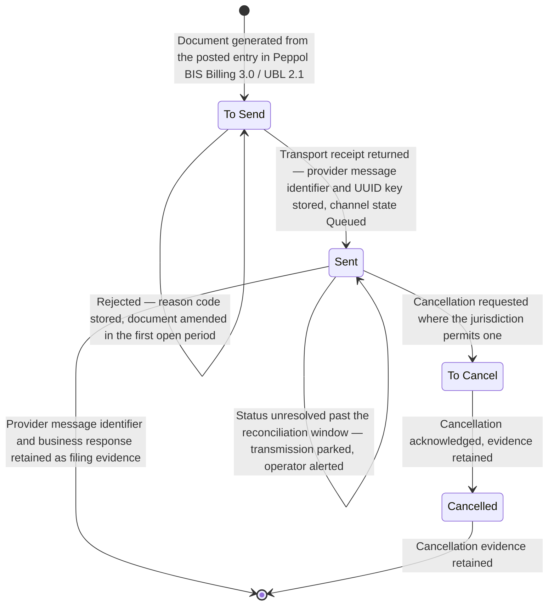

# STORY-001-05-04: Submit E-Invoicing to Tax-Authority Endpoints

---

## Metadata

| Attribute | Value |
|-----------|-------|
| **Story ID** | `STORY-001-05-04` |
| **Title** | Submit E-Invoicing to Tax-Authority Endpoints |
| **Parent Feature** | [FEATURE-001-05: Tax Configuration & Compliance](../FEATURE-001-05-tax-configuration-compliance.md) |
| **Parent Epic** | [EPIC-001: Enterprise Accounting in Odoo](../../EPIC-001-enterprise-accounting-odoo.md) |
| **Status** | Draft |
| **Priority** | 🟠 High |
| **Estimate** | 8 story points (Fibonacci) |
| **Persona** | Tax Accountant |
| **Secondary Personas** | Accounts Receivable Specialist — named as the Epic's persona register carries it — who originates the customer document and resubmits it after a rejection; Chief Accountant (confirms that no transmission outcome alters a posted entry and administers the Tax Return Lock Date that bounds a correction); External Auditor (reads the submission-and-acknowledgement register as filing evidence); Finance Controller and Product Owner (approve the story and witness the demonstration) |
| **Story Position** | Story 4 of the 4 in FEATURE-001-05; the last story in this feature, blocked by `STORY-001-05-02` and independent of `STORY-001-05-03` |
| **Platform Target** | Open decision DEC-001 — see [Version Compatibility](#version-compatibility) |
| **Last Updated** | 2026-08-16 |
| **Owner/Author** | Enterprise Accounting Team |

> **Platform target.** This story states no platform version of its own. The target is the Epic's open decision **DEC-001** in the [Open Decisions Register](../../EPIC-001-enterprise-accounting-odoo.md#appendix-b-open-decisions-register): the originating programme request names Odoo 17, the superseded prior backlog named 18.0, and the baseline this story was written and verified against is **Odoo 19.0 Community**, where `odoo/release.py` declares `version_info = (19, 0, 0, FINAL, 0, '')`. The three candidates differ in which electronic-invoice formats ship, in the document states and error fields the electronic-document model carries, in the proxy-registration path an authority identity is created through, and in the Peppol module version, so the mismatch is surfaced for stakeholder confirmation under AAP §0.8.3 rather than settled inside this story.

---

## User Story

**As a** Tax Accountant

**I want** every posted customer invoice and customer credit note of the Netherlands entity to be serialized into an EN 16931-conformant Peppol BIS Billing 3.0 document under the NLCIUS Core Invoice Usage Specification, carrying its tax code, its base amount and its tax amount as three separate values, and transmitted over the Peppol network with the returned acknowledgement identifier stored against the document

**So that** the Netherlands e-invoicing mandate is met from the posted ledger without re-keying an invoice into an authority portal, and every submission — accepted, rejected or retried — can be evidenced from Odoo during an audit.

---

## INVEST Principles Compliance

| Principle | Compliance | Notes |
|-----------|------------|-------|
| **Independent** | ✅ | The coupling is stated rather than hidden: a posted tax triple on a customer invoice of `NL-01` is a **data prerequisite, not a code coupling**, and it is satisfiable as a posted fixture invoice. The capability that produces it is [STORY-001-05-02](./STORY-001-05-02-compute-transaction-tax.md), whose own worked scenarios are in `US-01`; the `NL-01` posting at `VAT-21-S` this story serializes is the parent Feature’s own acceptance gate — a base amount of EUR 10,000.00 bearing a tax amount of EUR 2,100.00 for a total of EUR 12,100.00 — and [STORY-001-03-01](../FEATURE-001-03/STORY-001-03-01-generate-customer-invoices.md) already raises `NL-01` invoices at that code. This story shares no model or method with the statutory return in [STORY-001-05-03](./STORY-001-05-03-generate-vat-return.md) — a document is submitted per invoice while a return is filed per period — which is why the parent Feature sequences the two concurrently after the triple exists |
| **Negotiable** | ✅ | States the outcome required — a conformant document carrying the ledger's own tax code, base amount and tax amount, a stored document state, and a stored acknowledgement identifier or rejection reason — and leaves the serializer, the transport client, the retry mechanism and the credential store to implementation discovery under D-011, which already records document build, document parse and Peppol transmission as reuse rather than build |
| **Valuable** | ✅ | This is the story that makes **SM-011** measurable: 98% or more of electronic invoices accepted at the Peppol access point on first submission, with an acknowledgement identifier retained against 100% of accepted documents and a rejection reason code against 100% of rejected ones. Without it the Netherlands mandate stops invoicing in that country until a bespoke exchange is assembled under deadline |
| **Estimable** | ✅ | The artifact count is fixed and inspectable before development: **one jurisdiction** (the Netherlands) reached over **one channel** (the Peppol network, profile Peppol BIS Billing 3.0 under the NLCIUS Core Invoice Usage Specification), two document types, four persisted electronic-document states, one 30-second per-attempt timeout, the attempt budget fixed by [ATT-001](#att-001--the-transmission-attempt-contract), one idempotency key, and the shipped format list to compare the profile against — see [Estimation](#estimation) |
| **Small** | ✅ | Sized at **8 story points**, matching [STORY-001-05-03](./STORY-001-05-03-generate-vat-return.md) as the largest story in FEATURE-001-05. It is bounded by **one jurisdiction and one channel**: the Netherlands entity `NL-01` transmitting Peppol BIS Billing 3.0 over the Peppol network. Generation, transport and evidence stay in one story because a submission separated from the document it carries has nothing to submit, and because all three are exercised by the same seven criteria. A second mandate with a different format or a different channel does not widen this story: it becomes its own story per jurisdiction, and that rule is recorded in [Estimation](#estimation) rather than left implicit |
| **Testable** | ✅ | All seven criteria are objectively pass or fail: each names the document, the company and the tax code, base amount and tax amount as three separate values with the currency and the rounding rule; each asserts only a stored document state, an attached document, a stored acknowledgement identifier or a recorded error; and each failure path asserts that the posted entry is unchanged — see [Acceptance Test Mapping](#acceptance-test-mapping) |

---

## Acceptance Criteria

Seven criteria, inside the mandated band of 4 to 8. Each has exactly one non-compound **When**, and each **Then** asserts only what the Tax Accountant, the Accounts Receivable Specialist, the External Auditor or the Finance Controller can observe on the document, on its attached electronic document, on the stored submission record or on the posted entry. An internal transport call is never asserted; a stored state and a stored acknowledgement identifier are.

| Scenario | Coverage class |
|----------|----------------|
| 1 | Valid input — happy-path transmission and acknowledgement |
| 2 | Invalid or incomplete input — buyer VAT identifier absent |
| 3 | Error handling — access point unavailable, with the next attempt scheduled inside a bounded budget |
| 4 | Accounting edge case — credit note as a corrective document |
| 5 | Accounting edge case — cross-border reverse charge and its exemption reason |
| 6 | Accounting edge case — foreign-currency document and its functional-currency equivalents |
| 7 | Accounting edge case — zero-total document, and the participant registration held per company |

The mandated distribution is present and then exceeded: one valid-input criterion (1), one invalid-or-incomplete-input criterion (2), one error-handling criterion (3), and the three mandated accounting edge-case categories — **zero-amount** in Scenario 7, **multi-currency rounding** in Scenario 6 and **zero-tax cross-border treatment** in Scenario 5. Scenario 4 is a **fourth** accounting edge case rather than a substitute for any of the three: a corrective document is the one case where a new filing must reference an earlier acknowledged one, and leaving it out would leave the credit-note path in [STORY-001-03-03](../FEATURE-001-03/STORY-001-03-03-manage-customer-credit-notes.md) untransmittable. The **fiscal-period lock** category is carried in [Edge Cases](#edge-cases) rather than as a criterion, because the lock constrains the *correction* of a rejected filing and not the submission this story triggers.

Four rules hold across all seven criteria:

- **Every tax assertion states the tax code, the base amount and the tax amount as three separate values**, both on the posted entry and inside the transmitted document, so the serialized figures are the ledger's figures rather than a recomputation (R-K).
- **Every monetary figure states its currency, its amount and its rounding rule** — rounded half-up to 2 decimal places at the rounding increment of 0.01 for USD and for EUR (R-D).
- **Transmission posts nothing.** Building, transmitting, retrying or failing a document creates and alters no journal entry, so every failure path asserts that the posted entry and the tax control-account balances are unchanged (R-E). The one entry these criteria describe is the already-posted invoice entry restated in Scenario 1, listed leg by leg with both totals.
- **Every criterion names the company whose books and whose credentials are involved.** The submitting entity throughout is `NL-01` (**Global Europe SARL**, functional currency EUR) from the Epic’s canonical legal-entity register ([Appendix E.4](../../EPIC-001-enterprise-accounting-odoo.md#e4-canonical-legal-entity-register)); `US-01` (**Global Holdings Inc.**) is named only where a criterion proves that no other company’s credentials are used, because a transmission identity is held per company and per proxy type, so an unnamed company would leave the submitting identity undetermined (R-K, R-E4).

The documents below are raised on the **Sales** journal of `NL-01`, and the 5-digit sequence and the `R` prefix on a credit note are the platform’s own — see [Deterministic Artifact Set](#deterministic-artifact-set). `NL-01` is a Netherlands entity filing under a Netherlands registration and reachable over the Peppol network, so its standard-rate output code is `VAT-21-S` ("VAT 21% (Sales)") at 21.0000 percent, which is the code [TAX-REG-001](../FEATURE-001-05-tax-configuration-compliance.md#111-authoritative-tax-code-register-tax-reg-001) registers to `NL-01`, and its posting archetype is the parent Feature’s own: a base amount of EUR 10,000.00 bearing a tax amount of EUR 2,100.00 for a total of EUR 12,100.00.

### ATT-001 — The Transmission Attempt Contract

One contract governs how many times a document is sent and what each send is called, so "attempt" and "retry" mean one thing across this story:

| Term | Definition |
|------|------------|
| **Initial attempt** | Attempt 1: the transmission the Tax Accountant’s own submission triggers |
| **Retry** | A transmission the platform schedules after an attempt fails. There are **3** of them — retry 1, retry 2 and retry 3 — which are attempts 2, 3 and 4 |
| **Attempt budget** | **4 transmission attempts in total** for one document: the initial attempt plus 3 retries |
| **Per-attempt timeout** | **30 seconds**, the value `account_edi_proxy_client` already applies as its request timeout |
| **Retry schedule** | 5 minutes, 25 minutes and 125 minutes after the attempt that failed — a five-fold backoff |
| **Retry eligibility** | A failed attempt records its error at blocking level **Warning**. An error recorded at blocking level **Error** is a refusal, not a failure, and consumes no retry: the shipped web-service pass excludes documents at that blocking level from its selection |
| **Budget spent** | When retry 3 fails, the budget is spent. The document stays in its persisted **To Send** state carrying its error and its 4 recorded attempts, and it is not attempted again until the Tax Accountant submits it afresh, which opens a new budget |
| **Idempotency** | The **UUID version 4 key TRX-001 assigns to the document version** is stored and presented on all 4 attempts and on every status-reconciliation call, held by a database unique constraint over company, document and version, so no attempt and no replay becomes a second statutory filing. A corrected document is a new version with a new UUID that references the original, and the key of a transmitted version is not resettable by the submitting **Tax Accountant** |
| **First-submission acceptance (SM-011)** | Measured on the **initial attempt** only, so a document accepted on retry 2 counts against the 98% target rather than towards it |

The cadence is scheduling this story delivers, not a platform default: the shipped job "EDI: Perform web services operations" runs at a 1-day interval and is inactive by default. Scenario 3 asserts the initial attempt and the schedule it stores; the 3 retries that follow it, and the spent budget they end in, are asserted by their own named test in [Acceptance Test Mapping](#acceptance-test-mapping).

### TRX-001 — The Transmission State, Identity and Reconciliation Contract

ATT-001 fixes how many times a document is sent. TRX-001 fixes **what a state means, what evidence moves it, and what identity the network deduplicates on**, because a filing that the ledger believes was accepted and the network never delivered is the failure this story exists to prevent. Three statements govern every criterion below.

**First — two state fields, and neither of them means "the buyer accepted it".** The platform carries the `account_edi` electronic-document state (**To Send**, **Sent**, **To Cancel**, **Cancelled**) *and* the `account_peppol` channel state (**Ready to send**, **Queued**, **Pending Reception**, **Done**, **Error**) as two separate fields, and network progress is read from the second:

| Channel state | What it means, and the evidence that moves the document into it |
|---------------|----------------------------------------------------------------|
| **Ready to send** | The document is generated and validated locally against the pinned Peppol artefact release. No request has been made. Local evidence only |
| **Queued** | The access point has taken the document for delivery and has returned its **own transport-level receipt** — the signed AS4 receipt or message-level response — carrying the **provider message identifier**, which is stored against the invoice. This is a transport handover and **not** an acceptance by the buyer or by a tax authority; the `account_edi` state reads **Sent** from this point |
| **Pending Reception** | The provider reports the document as in transit to, or awaiting a business-level response from, the receiver's access point. Evidence is the provider's own status for the stored provider message identifier |
| **Done** | The provider reports delivery confirmed and, where the receiver returns one, a **business-level response** — a Peppol Invoice Response or Message Level Response — carrying acceptance. The business response identifier and its status code are stored beside the provider message identifier as two distinct values |
| **Error** | Either a transport failure inside the ATT-001 budget, or a **business-level rejection** whose reason code is stored without the complete response payload. A rejection is not a delivery: the document stays out of **Done** and the filing is not evidenced |

**No state advances on local optimism.** A channel state moves only on evidence the provider returned for the stored provider message identifier; the system never writes **Done** because a request did not raise an error. Where the provider's status cannot be obtained, the document stays in the state its last evidence supports.

**Second — the identity the network deduplicates on is a stored UUID.** Each **document version** is assigned a **UUID version 4 idempotency key** at generation, stored against that version, and presented on the initial attempt, on all 3 ATT-001 retries and on every status-reconciliation call. A database unique constraint over company, document and version holds it (C-028), so a resubmission of the same version resolves to the transmission already made and creates no second filing — the count of statutory filings for one document version is **1** under every replay, and the duplicate attempt is recorded. A **corrected document is a new version with a new UUID** that references the original document rather than reusing its key, and no persona — the submitting **Tax Accountant** included — can reset or re-issue the key of a version already transmitted; that authorization belongs to the **Chief Accountant** and is recorded with its reason.

**Third — the status is reconciled from the provider, and the send is coupled to the commit.** A scheduled **status reconciliation** runs against the provider for every document whose channel state is **Queued** or **Pending Reception**, presenting the stored provider message identifier and the UUID key, and applies the provider's authoritative status to the channel state, storing each business-level response with its identifier, its status code and its timestamp as appended evidence (C-026). The submission itself is dispatched from a **transactional outbox** written in the same transaction as the local state change (C-027), so a document recorded as sent that was never handed over, and a hand-over with no local record, are both impossible. A document whose status stays unresolved beyond the declared reconciliation window enters the named **parked** state with an operator alert, keeping its last evidenced state rather than being retried without bound or quietly marked **Done**.

### Scenario 1: A posted invoice is transmitted, its provider receipt is stored, and its business-level outcome is reconciled rather than assumed

- **Given** invoice `INV/2025/00042` stands posted on the **Sales** journal of company `NL-01` (**Global Europe SARL**, functional currency EUR) recording tax code `VAT-21-S` ("VAT 21% (Sales)"), a base amount of EUR 10,000.00 and a tax amount of EUR 2,100.00 as three separate values for an invoice total of EUR 12,100.00 — the entry carrying debit Accounts Receivable 1200 EUR 12,100.00, credit Revenue 4000 EUR 10,000.00 and credit Tax Payable 2200 EUR 2,100.00, so total debits of EUR 12,100.00 equal total credits of EUR 12,100.00 at a difference of EUR 0.00 — the buyer holding a validated VAT identifier and a resolvable Peppol Endpoint ID, and `NL-01` holding its own validated Peppol participant registration, every amount rounded half-up to 2 decimal places at the EUR rounding increment of 0.01
- **When** the Tax Accountant submits invoice `INV/2025/00042` over the Peppol network
- **Then** an EN 16931-conformant Peppol BIS Billing 3.0 document is attached to `INV/2025/00042` carrying tax code `VAT-21-S`, a base amount of EUR 10,000.00, a tax amount of EUR 2,100.00 and a document total of EUR 12,100.00 as separate values that equal the posted entry’s amounts to the cent, the `account_edi` electronic-document state reads **Sent** and the `account_peppol` channel state reads **Queued**, because what the access point returned is its **own transport-level receipt** — the signed AS4 receipt or message-level response — whose **provider message identifier** is stored against the invoice together with the document version's stored **UUID idempotency key**, both readable by the External Auditor without a data request; and the posted entry is unchanged with Tax Payable 2200 in `NL-01` still carrying the credit of EUR 2,100.00 — every amount rounded half-up to 2 decimal places at the EUR rounding increment of 0.01
  - **And** **that receipt is not an acceptance**: the count of documents whose channel state reads **Done** on the strength of a transport receipt alone is **0**, and nothing in the invoice, the ledger or the audit trail states that the buyer or a tax authority has accepted the document at this point
  - **And** the outcome is **reconciled from the provider rather than assumed**: the scheduled status reconciliation presents the stored provider message identifier and the UUID key, the provider reports the document in transit and the channel state moves to **Pending Reception**, and when the receiver returns a business-level response — a Peppol Invoice Response or Message Level Response carrying acceptance — the channel state moves to **Done** with that **business response identifier and its status code stored beside** the provider message identifier as two distinct values, each with its timestamp, appended rather than overwritten
  - **And** a **replay changes nothing**: resubmitting the same document version — from the interface, the scheduled job or the C-023 web-service surface — presents the same stored UUID key, resolves to the transmission already made, records the duplicate attempt with its actor and timestamp, and leaves the count of statutory filings for `INV/2025/00042` version 1 at **1**; and the key of a transmitted version is not resettable by the submitting **Tax Accountant**, that authorization belonging to the **Chief Accountant** and being recorded with its reason
  - **And** the participant the document was addressed to was **verified before transmission, not assumed from the partner record**: the buyer's Peppol participant identifier — its ISO 6523 scheme identifier and value — was resolved through the network's own service-metadata lookup, that lookup confirmed the participant is registered **and advertises the invoice document type and the Peppol BIS Billing 3.0 profile being sent**, and the access-point endpoint the request was made to is the one that lookup returned, checked against the governed origin allowlist and its resolved addresses under C-019 before any credential or document body left the system

### Scenario 2: A document whose buyer holds no VAT identifier is refused before transmission

- **Given** invoice `INV/2025/00043` stands posted on the **Sales** journal of company `NL-01` (**Global Europe SARL**, functional currency EUR) recording tax code `VAT-21-S` ("VAT 21% (Sales)"), a base amount of EUR 8,000.00 and a tax amount of EUR 1,680.00 as three separate values for an invoice total of EUR 9,680.00, addressed to a business customer whose VAT identifier is absent from the partner record, and the electronic-document state reads **To Send**, every amount rounded half-up to 2 decimal places at the EUR rounding increment of 0.01
- **When** the Tax Accountant submits invoice `INV/2025/00043` over the Peppol network
- **Then** document generation is refused with a validation message that names `INV/2025/00043` and identifies the absent buyer VAT identifier as the check that failed, no document is transmitted and none is attached to the invoice, the electronic-document state remains **To Send**, and the posted entry is unchanged — tax code `VAT-21-S`, base amount EUR 8,000.00 and tax amount EUR 1,680.00 still recorded as three separate values, with the Tax Payable 2200 credit in `NL-01` unchanged at EUR 1,680.00 and no journal entry created or altered by the refusal, every amount rounded half-up to 2 decimal places at the EUR rounding increment of 0.01

### Scenario 3: An unavailable access point records its error and schedules the next attempt inside the ATT-001 budget

- **Given** invoice `INV/2025/00042` for company `NL-01` (**Global Europe SARL**, functional currency EUR) carries an attached EN 16931-conformant Peppol BIS Billing 3.0 document holding tax code `VAT-21-S` ("VAT 21% (Sales)"), a base amount of EUR 10,000.00 and a tax amount of EUR 2,100.00 as three separate values, the electronic-document state reads **To Send**, and the Peppol access point answers every request with a service-unavailable response, every amount rounded half-up to 2 decimal places at the EUR rounding increment of 0.01
- **When** the transmission attempt for `INV/2025/00042` reaches its 30-second timeout
- **Then** the electronic-document state remains **To Send** with the access point’s error message recorded against the document at a blocking level of Warning and with no stack trace and no complete authority-response payload disclosed, the failed attempt is recorded against `INV/2025/00042` as **attempt 1** of the [ATT-001](#att-001--the-transmission-attempt-contract) budget with its own timestamp, the stored next-attempt time is 5 minutes after that timestamp and the remaining retry count reads 3, the transmission identifier and idempotency key already stored against `INV/2025/00042` are the ones the recorded attempt presented so the access point recognizes a repeat of one filing rather than a second filing, the outcome is persisted against the invoice inside the parent Feature’s 60-second per-document budget, and no journal entry is created or altered — the posted base amount of EUR 10,000.00, the tax amount of EUR 2,100.00 and the Tax Payable 2200 credit of EUR 2,100.00 in `NL-01` all unchanged, every amount rounded half-up to 2 decimal places at the EUR rounding increment of 0.01

### Scenario 4: A credit note is transmitted as a corrective document referencing the acknowledged invoice

- **Given** invoice `INV/2025/00042` for company `NL-01` (**Global Europe SARL**, functional currency EUR) has been acknowledged by the access point with its acknowledgement identifier stored and its electronic-document state reading **Sent**, and credit note `RINV/2025/00007` stands posted on the **Sales** journal of `NL-01` reversing part of that invoice with tax code `VAT-21-S` ("VAT 21% (Sales)"), a base amount of −EUR 1,000.00 and a tax amount of −EUR 210.00 recorded as three separate values for a credit-note total of −EUR 1,210.00, every amount rounded half-up to 2 decimal places at the EUR rounding increment of 0.01
- **When** the Tax Accountant submits credit note `RINV/2025/00007` over the Peppol network
- **Then** the transmitted document is typed as a corrective document that cites **the original invoice's own business identifier `INV/2025/00042`** — the document identifier the invoice carries in the semantic model, populated as the preceding-invoice reference of the credit note — as the document it corrects, **not** the transport-level provider message identifier or the business response identifier of that earlier transmission, which are network correlation values the receiver's ledger cannot resolve and which are retained internally beside the correction rather than transmitted as the reference; it carries tax code `VAT-21-S`, a base amount of −EUR 1,000.00 and a tax amount of −EUR 210.00 as three separate values equal to the credit note’s posted amounts to the cent, the electronic document already acknowledged for `INV/2025/00042` is neither rebuilt nor resubmitted and its state stays **Sent** under its original acknowledgement identifier, and `RINV/2025/00007` receives its own acknowledgement identifier stored against it — every amount rounded half-up to 2 decimal places at the EUR rounding increment of 0.01

### Scenario 5: A cross-border reverse-charge supply is transmitted with its exemption reason

- **Given** invoice `INV/2025/00044` stands posted on the **Sales** journal of company `NL-01` (**Global Europe SARL**, functional currency EUR), addressed to a German business customer holding a validated VAT number that resolves to the fiscal position `EU B2B Reverse Charge`, recording tax code `VAT-00-RC` ("VAT 0% (Intra-Community Supply, Reverse Charge)"), a base amount of EUR 5,000.00 and a tax amount of EUR 0.00 as three separate values with no movement posted to Tax Payable 2200 in `NL-01`, and `NL-01` holding its own validated Peppol participant registration, every amount rounded half-up to 2 decimal places at the EUR rounding increment of 0.01
- **When** the Tax Accountant submits invoice `INV/2025/00044` over the Peppol network
- **Then** the transmitted document carries tax code `VAT-00-RC`, a base amount of EUR 5,000.00 and a tax amount of EUR 0.00 as three separate values, it carries the exemption reason that a zero-tax intra-Community supply requires under EU VAT Directive 2006/112/EC rather than a bare tax amount of EUR 0.00, it carries the buyer's validated VAT number as the evidence the reverse charge rests on, and the electronic-document state reads **Sent** with the network acknowledgement identifier stored against the invoice — every amount rounded half-up to 2 decimal places at the EUR rounding increment of 0.01

### Scenario 6: A document denominated in a foreign currency states both the document-currency and the functional-currency figures

- **Given** company `NL-01` (**Global Europe SARL**) keeps its books in its functional currency EUR and invoice `INV/2025/00045` stands posted on its **Sales** journal denominated in USD, recording tax code `VAT-21-S` ("VAT 21% (Sales)"), a base amount of USD 1,000.00 and a tax amount of USD 210.00 as three separate values in the document currency — each rounded half-up to 2 decimal places at the USD rounding increment of 0.01 — whose functional-currency equivalents at the recorded rate of 1.0850 USD per 1.00 EUR are a base amount of EUR 921.66 and a tax amount of EUR 193.55, each rounded half-up to 2 decimal places at the EUR rounding increment of 0.01
- **When** the Tax Accountant submits invoice `INV/2025/00045` over the Peppol network
- **Then** the transmitted document states its document currency as USD with tax code `VAT-21-S`, a base amount of USD 1,000.00 and a tax amount of USD 210.00 as three separate values, it states the functional-currency equivalents as a base amount of EUR 921.66 and a tax amount of EUR 193.55 together with the rate of 1.0850 USD per 1.00 EUR and the rate date they were translated on, those four figures equal the amounts held on the posted journal entry of `INV/2025/00045` to the cent, and the electronic-document state reads **Sent** with the acknowledgement identifier stored against the invoice — every amount rounded half-up to 2 decimal places at its own currency’s rounding increment of 0.01

### Scenario 7: A zero-total document is refused, and no other company’s registration or credentials are used

- **Given** company `NL-01` (**Global Europe SARL**, functional currency EUR) holds the only Peppol participant registration and the only transmission credentials in this scope, company `US-01` (**Global Holdings Inc.**, functional currency USD) holds none, and document `INV/2025/00046` stands posted on the **Sales** journal of `NL-01` with a document total of EUR 0.00, recording tax code `VAT-21-S` ("VAT 21% (Sales)"), a base amount of EUR 0.00 and a tax amount of EUR 0.00 as three separate values, every amount rounded half-up to 2 decimal places at the EUR rounding increment of 0.01
- **When** the Tax Accountant submits document `INV/2025/00046` over the Peppol network
- **Then** submission is refused with a validation message that names `INV/2025/00046` and states the document total of EUR 0.00 as the reason the mandate accepts no filing for it, the electronic-document state remains **To Send**, no request is made under the credentials or the participant registration of any other company and the count of submission records created against a company other than `NL-01` is 0, and the posted entry for `INV/2025/00046` is unchanged with tax code `VAT-21-S`, a base amount of EUR 0.00 and a tax amount of EUR 0.00 still recorded as three separate values so the line stays inside the **Tax Report (VAT Return)** population for `NL-01` rather than dropping out of it — every amount rounded half-up to 2 decimal places at the EUR rounding increment of 0.01

---

## Sub-Tasks

- [ ] Record the in-scope mandate before any code is written: the Netherlands mandate served from `NL-01`, its format and profile (Peppol BIS Billing 3.0 under the NLCIUS Core Invoice Usage Specification), its channel (the Peppol network), the exemption-reason code set the jurisdiction publishes for zero-rated, exempt and reverse-charge supplies, its mandate date, and the Peppol test access point that proves acceptance before a production filing. State which part is served by a format already shipped in this repository and which is residual, and agree it with the Finance SME. A second jurisdiction is out of scope for this story — see [Jurisdiction Scope Boundary](#jurisdiction-scope-boundary) — `@functional-consultant`
- [ ] Deliver electronic-document generation from the **posted** entry, so the document's tax code, base amount and tax amount are read from the posted journal items rather than recomputed from a gross total, with the pre-transmission validation that refuses a document whose buyer tax identifier is absent or whose total is zero — USD 0.00 or EUR 0.00, each rounded half-up to 2 decimal places at that currency's rounding increment of 0.01 — naming the document and the failed check — `@developer`
- [ ] Deliver Peppol transmission with the [ATT-001](#att-001--the-transmission-attempt-contract) attempt budget — a 30-second per-attempt timeout, one initial attempt and 3 scheduled retries at 5, 25 and 125 minutes after the attempt that failed — and an **idempotency key** stored against the document and presented on every one of the 4 attempts, so a retry after an acknowledgement that was received but not recorded resolves to the original filing instead of a duplicate one — `@developer`
- [ ] Deliver the retained submission record: the persisted document state, the acknowledgement identifier on acceptance, the rejection reason code on rejection, the attempt number of each attempt inside the ATT-001 budget and the timestamp of each, all held against the invoice and readable by the External Auditor without a data request — `@developer`
- [ ] Write the unit and integration tests for all seven acceptance criteria against the **Peppol test access point**, including the timeout, service-unavailable, rejection, retry and duplicate-submission paths and the hostile-input set C-022 names, asserting every base amount and tax amount to the cent against the posted entry; and review the criteria for banned vague terms, for the tax-code, base-amount and tax-amount triple, and for the named company on every multi-company assertion — `@qa-engineer`
- [ ] Sign off that the base amount and tax amount serialized into each transmitted document equal the posted entry’s amounts to the cent for all seven scenarios, that the exemption reason carried on a zero-tax supply is the code the Netherlands mandate expects, that a corrective credit note cites the acknowledgement identifier of the document it corrects, and that no transmission outcome moves Tax Payable 2200 or Input Tax Receivable 1290 — `@finance-sme`
- [ ] Review credential custody and the transport surface: credentials, API keys and signing certificates scoped per company and held in Odoo system parameters, in the `certificate` store, or in an external secret manager with a named rotation owner and rotation interval and never in module source, version control, logs, fixtures or exports; transport-layer security with server-certificate verification on every request; and payload type, size and content validation on the outbound document and on the authority response, following the type-and-size-limit and field-sanitization pattern the bank-statement import prior art established at the same trust boundary (C-015, C-016, C-020, C-021) — `@security-reviewer`
- [ ] Write the submission and error-triage runbook: how a document is submitted and resubmitted, what each document state means, which validation message maps to which remedy, how a rejection is corrected when the correction date falls inside a period closed by the Tax Return Lock Date, and how the acknowledgement register is read as filing evidence — `@technical-writer`

---

## Edge Cases

- **Zero-amount and null tax code.** A document whose total is EUR 0.00 — base amount EUR 0.00 and tax amount EUR 0.00 at tax code `VAT-21-S` — is refused for submission with the zero total named as the reason while the posted line stays inside the return population, and a line carrying a null tax code is refused at document generation with the line named, because a document body with no tax code has no tax breakdown for the access point to validate; every amount rounded half-up to 2 decimal places at the EUR rounding increment of 0.01.
- **Fiscal-period lock on a correction.** When a rejected document's correction would carry an accounting date inside a period already closed by the company's Tax Return Lock Date, the correcting credit note or corrective invoice is issued in the first open period and cites the acknowledgement identifier of the rejected filing, so the filed period is never reopened to satisfy an authority correction and the return already filed for that period stays reproducible at a difference of USD 0.00, rounded half-up to 2 decimal places at the USD rounding increment of 0.01.
- **Multi-currency rounding residual.** Where the document-currency tax amount translated at the recorded rate and the functional-currency tax amount held on the posted entry differ by one minor unit, the document states both figures with the rate and the rate date, the figure the access point validates its own tax breakdown against is the **document-currency** figure, and the functional-currency figure is carried as the accounting equivalent — so the USD 210.00 document tax amount of Scenario 6 and its EUR 193.55 functional equivalent at a rate of 1.0850 USD per 1.00 EUR are transmitted as a matched pair rather than one being derived at the access point, each rounded half-up to 2 decimal places at its currency’s rounding increment of 0.01.
- **Reverse charge, exempt and zero-rated are three different zeros.** What is zero in each of the three is the **tax amount**, never the base: a base amount of EUR 0.00 would be an unreportable line. In the books of `NL-01` (**Global Europe SARL**) the three are transmitted as a base amount of EUR 5,000.00 with a tax amount of EUR 0.00 at `VAT-00-RC` for an intra-Community supply, a base amount of EUR 3,200.00 with a tax amount of EUR 0.00 at `VAT-00-EX` for an exempt supply, and a base amount of EUR 1,750.00 with a tax amount of EUR 0.00 at `VAT-00-ZR` for a zero-rated supply, each amount rounded half-up to 2 decimal places at the EUR rounding increment of 0.01, each code carrying its base and its tax as two separate values, and each reporting on its own return line rather than being netted into one zero. Each also requires its own exemption reason in the transmitted document — a bare tax amount of 0.00 with no reason is a schema-valid document that the authority rejects, so the reason code set for the Netherlands mandate is fixed before the first submission.
- **Duplicate transmission after an unrecorded acknowledgement.** When an acknowledgement is returned by the access point but not persisted — a timeout after the network has already accepted the filing — the next attempt presents the stored idempotency key and the transmission identifier, so the access point resolves it to the original filing and returns the original acknowledgement identifier instead of creating a second declared invoice, and the reconciliation of the submission register against the posted invoice population for the period detects any document left without an acknowledgement.

---

## Estimation

| Dimension | Rating | Justification |
|-----------|--------|---------------|
| **Effort** | Medium to high | Three workstreams that cannot be collapsed into one: document generation from the posted entry, transport with a per-attempt timeout and a bounded attempt budget, and the retained state-and-acknowledgement record with credential onboarding for the one submitting company. Each carries its own test set, and the transport and retry paths must be proved against the Peppol test access point rather than a stub, which is where the calendar time goes. What holds it below High: the mandate is a single jurisdiction on a single channel, so there is no per-country matrix to build |
| **Complexity** | Medium to high | The accounting consequence is thin — no entry is posted — but the correctness surface is wide: the serialized base and tax amounts must equal the posted entry’s amounts to the cent in both the document currency and the functional currency, a corrective document must cite the acknowledgement identifier of the document it corrects, three different zero-tax treatments each need their own exemption reason, and the retry path must be idempotent so a repeat attempt is never a second statutory filing |
| **Uncertainty** | High | The Peppol access point is outside the team’s control. Its availability, its schema edition, its acknowledgement semantics, its rejection reason vocabulary and the quality of its test environment are discovered rather than specified, and the conformance edition of EN 16931 and the NLCIUS revision the Netherlands permits are confirmed in D-011 before this story is accepted. What lowers it: `account_edi`, `account_edi_ubl_cii`, `account_edi_proxy_client` and `account_peppol` are all present in this repository under LGPL-3 and were read at the 19.0 baseline, so the document build, the format coverage, the proxy identity and the Peppol channel are inspectable before development starts |
| **Story Points** | **8** | Fibonacci scale (1, 2, 3, 5, 8, 13). **8** rather than 5 for three reasons that compound: an external access point outside the team’s control, credential and certificate handling with a named rotation owner, and an asynchronous bounded attempt budget with acknowledgement reconciliation that has to be idempotent to be safe. **8** rather than 13 because the story is bounded to **one jurisdiction on one channel**, which removes the per-country mandate matrix, the per-country channel choice and the foreign-registration derivation entirely, and because document build, format conformance and Peppol transmission are reuse rather than build under D-011. **Split rule:** this estimate covers the Netherlands over the Peppol network. A second mandate with a different format or a different channel becomes its own story per jurisdiction rather than a re-estimate of this one — see [Jurisdiction Scope Boundary](#jurisdiction-scope-boundary) |

---

## Constraints

The constraint identifiers below are the Epic's own, restated for this story rather than renumbered, so one constraint set reads across the whole ticket tree.

### License and Compliance

- [x] **C-001 — AGPL-3.0 compatibility**: any module delivering the submission record, the acknowledgement retention or a residual format is distributed under an AGPL-3.0 compatible licence, matching the Community-edition accounting add-ons already present in this repository
- [x] **C-002 — Existing licence respected**: extension of `account` ("Invoicing", version 1.4, LGPL-3), `account_edi` (version 1.0, LGPL-3), `account_edi_ubl_cii` (version 1.0, LGPL-3), `account_edi_proxy_client` (version 1.0, LGPL-3) and `account_peppol` (version 1.2, LGPL-3) respects those licences, and an AGPL-3 extension of LGPL-3 code is licence-checked before it is written
- [x] **C-005 / C-006 — Odoo and OCA coding standards**: Python follows Odoo and OCA module guidelines including PEP 8, and static analysis passes with the repository's configured tooling, whose lint configuration is `ruff.toml` at the repository root
- [x] **C-008 — One test per criterion**: each of the seven criteria maps to exactly one acceptance test, named in [Acceptance Test Mapping](#acceptance-test-mapping)
- [x] **C-009 — Numeric assertion**: every base amount, every tax amount and every document total in the seven criteria is asserted as an amount in test code against the posted entry rather than inspected by eye, with the difference stated
- [x] **C-012 — Build on the existing framework**: submission extends the electronic-document model that `account_edi` already provides rather than opening a second document path, so one document audit trail exists per invoice
- [x] **C-014 — Access rights and company isolation**: the role that raises the document, the role that submits it and the role that reads the acknowledgement register are distinguishable, and a role restricted to one company can neither submit that company's documents from another company nor read its submission records
- [x] **C-019 — Data access discipline**: reads of the posted base and tax lines and of the submission register are expressed through the Odoo ORM or parameterized SQL, and no file path is derived from an inbound document's own name

### Standards Compliance

- [x] **EN 16931 — semantic data model, with its edition stated as published rather than as expected.** The outbound document is asserted against **EN 16931-1:2017+A1:2019**, *Electronic invoicing — Part 1: Semantic data model of the core elements of an electronic invoice*, published by **CEN** through technical committee **CEN/TC 434** (ICS 35.240.20 and 35.240.63), whose amendment **A1** was published on **2019-11-13** and which is amended by the corrigendum **EN 16931-1:2017+A1:2019/AC:2020**. That edition is **the one in force**: its tax breakdown carries the same tax code, base amount and tax amount as the posted entry. A revision is in progress and is **not** in force — **prEN 16931-1**, a draft European Standard dated **July 2025**, was circulated to CEN members for enquiry and states that it *will* supersede EN 16931-1:2017+A1:2019; a catalogue entry carrying a 2026 designation for that revision is a **draft record and not a published superseding edition**, so no criterion in this story asserts conformance against it. The conformance edition in force at submission, together with the Core Invoice Usage Specification permitted per jurisdiction — **NLCIUS** for the Netherlands mandate — is confirmed in D-011 before that jurisdiction's submission is accepted, and is restated here when the revision is published and adopted into the Peppol validation artefacts
- [x] **What a document is actually validated against is a pinned artefact release, not a standard's date.** Peppol BIS Billing 3.0 is a Core Invoice Usage Specification of EN 16931 expressed in **OASIS UBL 2.1 (ISO/IEC 19845:2015)**, and a document is validated in **three ordered layers**: the UBL 2.1 XSD for structure; the **EN 16931 Schematron** business rules (`BR-*`, `BR-CL-*`, `BR-CO-*`) published as a versioned validation-artefact release; and the **Peppol Schematron** rules (`PEPPOL-EN16931-*`, `PEPPOL-COMMON-*`) layered above them, delivered as `PEPPOL-EN16931-UBL.sch` for the UBL syntax. **The releases this story is delivered against are pinned by identifier and date, held as configuration rather than in code**: Peppol BIS Billing **3.0.20**, published **2025-11-24** and mandatory to use from **2026-02-23**, which adopts **EN 16931 validation artefacts release 1.3.15** with code lists published **2025-10-23**, together with the **3.0.20-hotfix** released **2026-01-27** that adds EAS and ICD code `0245`; and the **NLCIUS** artefact release confirmed for the Netherlands mandate in D-011. The document carries the profile identifiers that state which rule set it was validated against — CustomizationID `urn:cen.eu:en16931:2017#compliant#urn:fdc:peppol.eu:2017:poacc:billing:3.0` and ProfileID `urn:fdc:peppol.eu:2017:poacc:billing:01:1.0`. **OpenPeppol publishes semi-annually, in May and November, each release carrying its own "mandatory to use from" date**, so the pinned release is refreshed each cycle, the release under test is named in the acceptance evidence, and a document is never validated against an artefact release older than the one in force on the network at submission
- [x] **UBL 2.1 — syntax**: OASIS Universal Business Language 2.1 is the syntax the criteria assert, and it is the syntax `account_edi_ubl_cii` already implements for its UBL formats; the invoice PDF is embedded inside the XML for those formats, which is what the size and type checks under C-015 are dimensioned against
- [x] **Peppol BIS Billing 3.0 — four-corner network delivery**: OpenPeppol BIS Billing 3.0, built on UBL 2.1, is the cross-border profile used for network delivery in Scenario 5, supplied here by `account_peppol` over `account_edi_proxy_client`; the profile identifiers the document carries state which rule set it was validated against, and the buyer's Endpoint ID is the participant address it is routed to
- [x] **EU VAT Directive 2006/112/EC — invoice content and exemption reasons**: the Directive fixes the content an invoice must carry and requires the taxable amount and the tax due on it to be identifiable per supply, which is why the transmitted document carries the tax code, the base amount and the tax amount as three separate values; and it is the source of the exemption reason that a reverse-charge, exempt or zero-rated supply carries instead of a bare tax amount of 0.00 in the document currency, rounded half-up to that currency's decimal places at its rounding increment of 0.01
- [x] **ISO 4217 minor units**: every amount serialized into the document is rounded half-up to its currency's decimal precision — 2 decimal places at a rounding increment of 0.01 for USD and EUR — and a foreign-currency document states the document-currency figures, the functional-currency equivalents, the rate and the rate date
- [x] **Double-entry integrity is preserved by not touching it**: transmission creates and alters no journal entry. The one entry these criteria describe — the posted `INV/2025/00042` entry of debit Accounts Receivable 1200 EUR 12,100.00, credit Revenue 4000 EUR 10,000.00 and credit Tax Payable 2200 EUR 2,100.00, total debits EUR 12,100.00 against total credits EUR 12,100.00 at a difference of EUR 0.00 — is the parent Feature’s own worked posting, raised by [STORY-001-03-01](../FEATURE-001-03/STORY-001-03-01-generate-customer-invoices.md) with its tax computed by [STORY-001-05-02](./STORY-001-05-02-compute-transaction-tax.md) and only read here, and every failure path asserts it unchanged (R-E).

### Security and Data Protection

- [x] **C-021 — Credential custody per company**: endpoint credentials, API keys, signing certificates and private keys live in Odoo system parameters, in the `certificate` store that `account_edi_proxy_client` already depends on, or in an external secret manager — scoped per company, with a named rotation owner and rotation interval, and present in no module source, no version-controlled file, no log, no fixture and no export. `US-01` and `NL-01` hold separate credentials, and Scenario 7 asserts that a refusal in one company makes no request under the other's
- [x] **C-019 — The destination is not derived from data**: the scheme, host and port an outbound submission may reach are held in a canonical **origin allowlist** governed as configuration, never derived from a document, a partner record or an authority response. The platform sets the precedent to follow: `account_peppol` reaches only the two origins declared in module code — `https://peppol.api.odoo.com` in production mode and `https://peppol.test.odoo.com` in test mode — selected by the operating mode rather than typed in by an operator. A registration naming an origin outside the allowlist is refused at configuration time with the origin named, and the refusal creates no journal entry
- [x] **C-019 — Resolved-address validation and DNS rebinding**: before a request is made, every IP address the allowlisted host resolves to is checked, and a private, loopback, link-local, multicast or unspecified address is refused with the resolved address named; the address that passed validation is the address connected to, so a host name that re-resolves between the check and the connection cannot redirect a credentialed request at an internal service (CWE-918)
- [x] **C-021 — Redirects are not followed blindly**: the transmission request carries the company’s own credentials, so a followed cross-origin redirect would hand them to an unapproved origin. Redirects are disabled on the submission path, or the redirect target is revalidated against the origin allowlist and its resolved addresses before any credential, signing certificate or document body is sent. The platform default is the hazard this closes: the shipped proxy client issues its request with redirect following left at the library default while attaching its signed authentication
- [x] **Transport security**: every request to the Peppol access point is made over a transport-layer-secured channel with server-certificate verification enabled, and a certificate-verification failure is treated as a transmission failure that leaves the document in **To Send** rather than as a condition to bypass
- [x] **C-015 — Payload type and size validation**: the outbound document and the authority response are checked at the trust boundary against an allowlist of permitted media types and against a declared maximum size, dimensioned to allow for the PDF embedded inside the UBL XML, and either check failing rejects the payload with a named validation error
- [x] **C-016 — Response parsing**: an authority or network response is parsed with document-type-declaration processing and external-entity resolution disabled and entity expansion bounded, and is validated against its declared schema before any field is read from it
- [x] **C-018 / C-020 — Output encoding and error disclosure**: partner-supplied text carried into the document body is context-encoded before it is rendered, and a failure discloses no stack trace and no complete authority-response payload — the rejection reason code and a message naming the failed check are recorded, and nothing more
- [x] **C-022 — Hostile-input tests are part of this story**: at least one acceptance test per hostile case — including the four endpoint-origin cases enumerated in [Endpoint-Origin Test Requirements (C-019, C-021)](#endpoint-origin-test-requirements-c-019-c-021) alongside a malformed document, a schema-invalid document, an external-entity payload, an oversized payload, a disallowed media type and an over-long field — each asserting rejection with a named error, no journal entry created, and the service still available
- [x] **Audit trail**: each submission retains its document, its state, its attempt timestamps, its acknowledgement identifier or its rejection reason code and the acting role, readable by the External Auditor without a data request
- [x] **TAX-SOD-001 — the transmitting role holds neither the configure nor the approve permission**: the four tax permissions named in the [feature-level authority matrix](../FEATURE-001-05-tax-configuration-compliance.md#42-cross-cutting-concerns) are separate, and transmission is the exercise of none of them over its own inputs. A document is transmitted only after it is **posted**, so the tax determinants it carries were released by a configuration version the **Chief Accountant** approved under [STORY-001-05-01](./STORY-001-05-01-configure-tax-codes-fiscal-positions.md) — the count of documents transmitted whose tax codes resolve to an unapproved configuration version is **0**, and the transmitting **Tax Accountant** can neither author nor approve that configuration on the transmission path. A re-issue of a transmitted version, and any reset of that version's idempotency key, is the **Chief Accountant**'s recorded authorization under [TRX-001](#trx-001--the-transmission-state-identity-and-reconciliation-contract) rather than the transmitting role's own act, so the count of re-issues self-authorized by the transmitting role is **0**. The same counts hold for a C-023 integration principal, and no principal on this path holds a configure or an approve permission

### Dependency and Edition Considerations

- [x] **C-003 — Edition source is an open decision (DEC-002), not a prohibition**: the outright ban on Enterprise dependencies carried by the superseded backlog is **withdrawn**. The choice between an Odoo Enterprise subscription and the OCA add-on path is owned by the CFO / Finance Director with the Group Controller and is recorded in the [Open Decisions Register](../../EPIC-001-enterprise-accounting-odoo.md#appendix-b-open-decisions-register)
- [x] **This story is not gated by DEC-002**: the Epic states explicitly that DEC-002 is **not** about electronic invoicing. `account_edi`, `account_edi_ubl_cii`, `account_edi_proxy_client` and `account_peppol` are present in this repository under LGPL-3, so document build, format conformance, proxy identity and Peppol transmission can be built before the edition decision is confirmed
- [x] **D-011 — Reuse before build**: document build, document parse, format conformance for the six formats `account_edi_ubl_cii` ships, participant registration and Peppol transmission are reuse rather than build. No bespoke serializer or transport client is authorized for a capability the D-011 capability comparison does not record as uncovered
- [x] **`account_peppol_advanced_fields` is excluded**: the module is present in `addons/`, but its own manifest names it "[DEPRECATED] Account Peppol Advanced Fields" and states it should not be used. It is cited here so the exclusion is deliberate and recorded, and no delivered module declares a dependency on it
- [x] **C-004 — OCA ecosystem compatibility**: whichever edition path is confirmed, the submission record stays readable by OCA add-ons and by the country `l10n_*` extensions published by OCA, so no downstream layer has to reconstruct a filing history from attachments

### Interface, Artifact, Evidence and Resilience Contracts

- [x] **C-023 — Machine access is a named principal, not a shared key**: every programmatic read or write of an invoice, its electronic-document record or its transmission state happens over the JSON web-service surface C-023 governs under a dedicated named integration principal with a recorded owner, a declared expiry and rotation interval, a revocation effective on its next call, and a scope confined to the company, models and methods it needs. It executes under access rights and record rules rather than `sudo`, is bounded by a per-principal rate ceiling, and is audited per call; it holds neither the configure nor the approve permission of TAX-SOD-001 and cannot self-authorize a re-issue. The deprecated XML-RPC and JSON-RPC transports carry no criterion, test or integration of this story
- [x] **C-025 — The transmitted document, the authority response and the received document are artifacts with a lifecycle**: the outbound UBL XML with its embedded PDF, the transport-level receipt, each business-level response and every inbound document are stored with the declared media type recorded separately from the file name, served with a non-executing content disposition and a sanitized file name, addressed by an unguessable identifier, readable only by a role entitled to the owning company, retained for the statutory e-invoicing retention period of the filing jurisdiction, and deleted by a governed purge. An inbound document is treated as untrusted until it has passed the C-015 type-and-size checks and the C-016 parse-and-schema checks, and it is never rendered from its own declared file name. The count of transmission artifacts reachable by a role outside the owning company is 0
- [x] **C-026 — The submission register is evidence, so it is append-only**: every attempt, its timestamp, its channel state, its provider message identifier, each business response with its identifier and status code, every rejection reason code, every reconciliation result, every parked state and every re-issue authorization is appended with its actor and outcome. A row is never edited in place, a correction is an appended row citing the row it corrects, the retention lock on the register does **not** cascade onto the invoices it describes, and the External Auditor exports the whole register for a company and a date range without a data request. The count of register rows modified in place is 0
- [x] **C-027 — The dispatch path is resilient by contract, not by hope**: the submission is dispatched from the transactional outbox TRX-001 establishes, written in the same transaction as the local state change so a committed intent is never lost and an uncommitted one is never sent; each attempt carries the ATT-001 30-second timeout inside the ATT-001 budget of an initial attempt plus 3 retries at the five-fold 5, 25 and 125-minute backoff with jitter applied so a provider outage does not synchronize every company's retry; a circuit breaker opens on repeated provider failure and is recorded rather than silently retried past; a document whose budget is spent rests in **To Send** and a document whose status is unresolved past the declared window enters the named **parked** state; and every terminal and parked state raises an operator alert naming the run, the company and the document count. A crash mid-dispatch leaves the document in a state the next run can resume from, and the count of documents left in a non-resumable in-flight state is 0
- [x] **C-028 — A document version is transmitted once**: the TRX-001 UUID version 4 idempotency key is the durable episode identity, held by a database unique constraint over company, document and version, with a row lock across the read-decide-send window and revalidation inside the lock against the recorded channel state. A stale lease is reclaimed rather than blocking dispatch indefinitely, and the guard is **not** overridable by the transmitting Tax Accountant — a reset is the Chief Accountant's recorded authorization, so the count of statutory filings per document version stays 1
- [x] **C-029 — A batch transmission and the register's exports are bounded**: a request to transmit or to export beyond the declared maximum document count, payload size or file size is refused before work begins with the ceiling and the requested magnitude named as two values; a batch above the synchronous threshold is queued under a per-user quota and a queue-depth ceiling and is cancellable; a register export streams and is published atomically; and each ceiling is configuration with a stated default
- [x] **C-020 — An origin failure names the host and the class of address, never the address**: a rejection on the endpoint path names the configured host and the class of the rejected address — that it resolved to an address in a private range, or to a loopback address — and never the resolved address, the ports probed, the allowlist contents or the resolution chain. A rejected authority response discloses its reason code and the failed check and never the complete payload or a traceback. A scheduled transmission failure reports the run name, the company, the document set and the terminal state to an **operator** and the business outcome with its remedy to the **Tax Accountant**, with no cron definition, interval, worker identifier or queue state on any persona-facing channel, the two correlated by an opaque reference

### Version Compatibility

- [x] **C-010 — Platform version target is open decision DEC-001**: the programme request names Odoo 17, the superseded backlog named 18.0, and this repository is **Odoo 19.0 Community** (`odoo/release.py` → `version_info = (19, 0, 0, FINAL, 0, '')`). The target is confirmed with stakeholders before development rather than chosen here, and the mismatch is the AAP §0.8.3 stakeholder-confirmation item
- [x] **C-011 — Language and database versions follow the confirmed target**: the 19.0 baseline present here declares `MIN_PY_VERSION = (3, 10)`, `MAX_PY_VERSION = (3, 13)` and `MIN_PG_VERSION = 13` in `odoo/release.py`; an earlier platform target carries a different supported matrix
- [x] **Impact if DEC-001 resolves away from 19.0**: the shipped format list is re-verified, because format coverage and its country restrictions change per release; the electronic-document states and error fields are re-verified, because the state vocabulary the criteria assert is the platform's own; the proxy-registration path is re-verified, because the identity model and its certificate dependency changed across the candidate releases; and the Peppol module version is re-verified, because the version present here is 1.2

---

## Technical Discovery Notes

> **Purpose:** these notes direct the codebase analysis that precedes implementation. They record what to investigate and what the outcome must prove; they do not choose the implementation.

### Codebase Analysis Areas

| Area | Files/Modules to Examine | Analysis Focus |
|------|--------------------------|----------------|
| Electronic-document framework | `addons/account_edi/` — "Import/Export Invoices From XML/PDF", version 1.0, licence LGPL-3, depending on `account`, shipping an electronic-document model, an electronic-format model, invoice and journal view extensions and a scheduled-job data file | The document lifecycle states the model carries — **To Send**, **Sent**, **To Cancel** and **Cancelled** — which are the states the seven criteria assert; the error field that holds the text of the last failure and the blocking level (Info, Warning, Error) that decides whether the document is held back; and how the scheduled job drives the web-service pass. Establish where the acknowledgement identifier and the rejection reason code are stored so both survive a resubmission, and whether the job's own selection of documents awaiting transmission is where the bounded retry belongs |
| Retry cadence and job configuration | `addons/account_edi/data/cron.xml` and the web-service pass on the electronic-document model | The shipped job is named "EDI: Perform web services operations", runs against the electronic-document model, is configured at a 1-day interval, is **inactive by default**, and processes documents in a bounded batch while skipping any document whose blocking level is Error. Establish what the job must become for the 5-, 25- and 125-minute retry cadence the criteria assert, whether the cadence is expressed as job frequency or as a next-attempt timestamp on the document, and who activates the job per environment |
| Format coverage before any bespoke serializer | `addons/account_edi_ubl_cii/` — "Import/Export electronic invoices with UBL/CII", version 1.0, licence LGPL-3 | The six formats shipped — **E-FFF, UBL Bis 3, EHF3, NLCIUS, Factur-X (CII), XRechnung (UBL)** — with their restrictions recorded in the module's own manifest: E-FFF, NLCIUS and XRechnung are available to Belgian, Dutch and German companies respectively; UBL Bis 3 is available to companies whose country is in the Peppol EAS list; EHF3 is fully implemented by the UBL Bis 3 implementation; the PDF is embedded inside the XML for the UBL formats; and the format is chosen on the journal's advanced settings. Establish which shipped format satisfies each mandate in the matrix **before** any bespoke serializer is considered, and which partner-level format selection drives the choice per customer |
| Endpoint origin and redirect handling | `addons/account_edi_proxy_client/models/account_edi_proxy_user.py` and `addons/account_peppol/tools/peppol_iap_connector.py` | Where the destination comes from and what the request does with a redirect: the proxy URL map that returns one origin per proxy type and operating mode, the two declared Peppol origins `https://peppol.api.odoo.com` and `https://peppol.test.odoo.com`, the 30-second request timeout, and the fact that the request is issued with signed authentication attached and redirect following left at the library default. Establish where the origin allowlist, the resolved-address check and the redirect policy C-019 and C-021 require attach without forking the shipped transport |
| Transport identity and credentials | `addons/account_edi_proxy_client/` — "Proxy features for account_edi", version 1.0, licence LGPL-3, depending on `account` and `certificate` | The `edi_proxy_user` identity, unique per proxy type and bound to one company on one database, and the encryption it provides for the exchange. Establish the registration path per company and per jurisdiction, where the signing certificate is held, and how that custody satisfies C-021 including the rotation owner and interval |
| Network channel and participant addressing | `addons/account_peppol/` — "Peppol", version 1.2, licence LGPL-3, depending on `account_edi_proxy_client` and `account_edi_ubl_cii`, carrying a country allowlist held in step with the Peppol default-country list on the company model | Participant registration and Peppol BIS Billing 3.0 send and receive, and the Endpoint ID that addresses a participant. Establish whether each target authority is reachable over the network or needs a jurisdiction-specific channel, and how an inbound document is handled when it arrives before any invoice exists in Odoo for it |
| Deprecated module to exclude | `addons/account_peppol_advanced_fields/` | The module's manifest names it "[DEPRECATED] Account Peppol Advanced Fields" and states it should not be used. Confirm it is excluded from the dependency set of every delivered module, and record the exclusion rather than discovering it during installation |
| The figures that must be serialized | `addons/account/models/account_tax.py` and `addons/account/models/account_move_line.py` | Where the base amount and the tax amount live once a document is posted: the tax journal item carries the base amount the tax was computed on, and the distribution lines carry the account and the report tags. Establish that the document body reads these posted values rather than recomputing tax from a gross total, because equality to the cent with the posted entry is the reconciliation gate of this story |
| Document identity and numbering | `addons/account/models/account_move.py` | The starting-sequence derivation for a sale journal on a calendar fiscal year, which yields a 5-digit padded number of the form `INV/2025/00000`, and the `R` prefix prepended for a refund when the journal's refund sequence is enabled — the source of `INV/2025/00042` and `RINV/2025/00007`. Establish which stored identifier the authority treats as the invoice number, and which one carries into the corrective-document reference |
| Correction window and the tax lock | `addons/account/models/company.py` | The Tax Return Lock Date on the company, administered alongside the Global, Sales, Purchase and Hard lock dates, with the per-role value derived from it and the guard that refuses a tax-affecting operation inside a locked period. Establish which period a correction to a rejected document is issued in when its natural date falls inside the locked period, because that is the fiscal-period edge case |

### Relevant Existing Modules

| Module | Path | Relevance to this story |
|--------|------|------------------------|
| `account_edi` | `addons/account_edi/` | Version 1.0, LGPL-3. The document build, parse and transmission framework this story extends with the submission state, the acknowledgement identifier and the rejection reason; the source of the four document states the criteria assert and of the scheduled web-service pass |
| `account_edi_ubl_cii` | `addons/account_edi_ubl_cii/` | Version 1.0, LGPL-3. The six shipped syntaxes and their country restrictions, which bound the residual format work under D-011 and decide whether a mandate needs any bespoke serializer at all |
| `account_edi_proxy_client` | `addons/account_edi_proxy_client/` | Version 1.0, LGPL-3, depending on `account` and `certificate`. The `edi_proxy_user` identity per company and per proxy type and the encryption for the authority exchange — the module against which C-021 custody is satisfied |
| `account_peppol` | `addons/account_peppol/` | Version 1.2, LGPL-3. Participant registration and Peppol BIS Billing 3.0 transmission, the channel Scenario 5 submits over, with a country allowlist that decides where the network is available |
| `account` | `addons/account/` | "Invoicing", version 1.4, LGPL-3. Supplies the posted base and tax journal items whose amounts are serialized, the fiscal position that resolves the treatment, the Sales journal and its numbering, and the Tax Return Lock Date that bounds a correction |
| `account_peppol_advanced_fields` | `addons/account_peppol_advanced_fields/` | Present but manifest-marked deprecated and not to be used. Listed so the exclusion is explicit; no delivered module depends on it |
| `l10n_*` | `addons/l10n_*/` | 209 localization packs. Each supplies a jurisdiction's statutory tax codes and, where one exists, its own transmission implementation — checked per country in the mandate matrix before a channel is treated as residual |

### OCA Module Compatibility

| OCA Repository | Module | Compatibility consideration |
|----------------|--------|-----------------------------|
| OCA/edi | `base_edi`, `edi_oca` and its backend modules | Determine whether the OCA exchange-record framework duplicates the submission state and acknowledgement record this story adds to `account_edi`, and if it does, whether the delivered work should sit on that framework instead of alongside it. Naming the repository asserts precedent rather than installability: a branch matching the target DEC-001 confirms must exist, and where no port exists the work is recorded as bespoke |
| OCA/account-financial-reporting | `account_financial_report` | Under the OCA path of DEC-002, determine that the submission register and the posted tax lines stay independently readable, so a filing history is never reconstructed from report output |
| OCA `l10n-*` country repositories | Country e-invoicing extensions | Per operating country, determine whether an OCA extension already implements the mandated channel or format, so a jurisdiction's divergence is recorded in the mandate matrix rather than discovered at the mandate date |

### Discovery versus Prescription

This story describes WHAT the finance function needs a transmitted document and its retained evidence to contain, and WHY. It does not prescribe HOW that is built. Not specified here: new model names, field definitions or schema decisions; whether the submission record extends the existing electronic-document model or adds a related one (D-005); the transport library; the mechanism that schedules a retry; and module structure. Deferred to agent discovery: **D-003** (the residual gap this story is authorized inside), **D-005** (model extension approach), **D-007** (company isolation, record rules and the access-right groups implied by the personas), **D-009** (deterministic and hostile-input fixture sets, held apart from one another) and **D-011** (the per-country capability comparison that decides what is reuse and what is residual).

---

## Dependencies

### Story Dependencies

| Dependency Type | Story ID | Story Title | Relationship |
|-----------------|----------|-------------|--------------|
| Parent Feature | [FEATURE-001-05](../FEATURE-001-05-tax-configuration-compliance.md) | Tax Configuration & Compliance | This story is story 4 of the 4 in this feature and delivers its capability CAP-004 |
| Blocked By | [STORY-001-05-02](./STORY-001-05-02-compute-transaction-tax.md) | Compute Tax on Transactions with Base and Tax Split | The tax code, base amount and tax amount serialized into the document are the values that story’s capability posts. With no triple on the posted tax lines there is nothing to serialize, and the equality-to-the-cent gate has nothing to compare against. What this story consumes is that capability applied to an `NL-01` customer invoice at `VAT-21-S`, not the `US-01` figures STORY-001-05-02 works its own scenarios in |
| Blocked By | [STORY-001-05-01](./STORY-001-05-01-configure-tax-codes-fiscal-positions.md) | Configure Tax Codes and Fiscal Positions | Configuration prerequisite: the tax codes and the fiscal positions determine the treatment, and therefore the exemption reason a zero-tax supply carries — `VAT-00-RC` and the fiscal position `EU B2B Reverse Charge` used in Scenario 5 are defined there |
| Related | [STORY-001-05-03](./STORY-001-05-03-generate-vat-return.md) | Generate VAT Return Report | The same posted triples, aggregated per period for the statutory return instead of transmitted per document. Neither story blocks the other: a document is submitted per invoice while a return is filed per period, and the two may be delivered concurrently |
| Related | [STORY-001-03-01](../FEATURE-001-03/STORY-001-03-01-generate-customer-invoices.md) | Generate and Post Customer Invoices | Produces the posted `NL-01` customer invoices this story transmits, already raised at output tax code `VAT-21-S` and carrying debit Accounts Receivable 1200 against credit Revenue 4000 with output tax to Tax Payable 2200 (ORD-002) |
| Related | [STORY-001-03-03](../FEATURE-001-03/STORY-001-03-03-manage-customer-credit-notes.md) | Manage Customer Credit Notes and Refunds | Produces the posted credit notes this story transmits as corrective documents, including the partial reversal asserted in Scenario 4 |
| Related | [FEATURE-001-01](../FEATURE-001-01-chart-of-accounts-fiscal-year.md) | Chart of Accounts & Fiscal Year | Supplies Accounts Receivable 1200, Revenue 4000 and Tax Payable 2200 with the Sales journal, and administers the lock dates — including the Tax Return Lock Date — that bound the period a correction to a rejected document is issued in |

### External Dependencies

| Dependency | Type | Notes |
|------------|------|-------|
| Peppol access point for the Netherlands mandate | External system | The production access point and its **test access point**, the latter required so acceptance can be demonstrated before a production filing (SM-011). Its availability, its schema edition, its acknowledgement semantics and its rejection reason vocabulary are outside the team’s control, which is what the Uncertainty rating in [Estimation](#estimation) prices |
| Peppol access-point origins | Configuration and governance | The approved origins of the origin allowlist, held as configuration per operating mode — the shipped production and test origins are `https://peppol.api.odoo.com` and `https://peppol.test.odoo.com` — with a named owner for any change, because the destination of a credentialed statutory filing is a governed setting rather than data |
| Peppol access-point provider and participant registration | External service | The access point `account_peppol` transmits through, the participant registration for each submitting company, and the buyer's Endpoint ID that addresses the recipient. Registration is a prerequisite of Scenario 5, not part of it |
| Endpoint credentials and signing certificates | Governance and secrets | Issued per company into the custody arrangement C-021 mandates, with a named rotation owner and rotation interval, before the first submission is attempted. `US-01` and `NL-01` hold separate credentials |
| EN 16931-1:2017+A1:2019 (with corrigendum /AC:2020) | Standard | The semantic data model the document is asserted against, published by **CEN** through **CEN/TC 434**, amendment A1 dated **2019-11-13**. This is the edition in force. The revision **prEN 16931-1** (draft, **July 2025**) is under CEN enquiry and will supersede it once published; it is not asserted against here. The edition in force at submission, and the Core Invoice Usage Specification permitted per jurisdiction (**NLCIUS** for the Netherlands), are confirmed in D-011 before submission is accepted, because a document valid against one edition is not automatically valid against another |
| UBL 2.1 | Standard | The OASIS syntax the criteria assert and the one `account_edi_ubl_cii` implements for its UBL formats |
| Peppol BIS Billing 3.0 — release **3.0.20** (published 2025-11-24, mandatory from 2026-02-23) with **3.0.20-hotfix** (2026-01-27) | Standard and network profile | The OpenPeppol Core Invoice Usage Specification of EN 16931, expressed in **OASIS UBL 2.1 (ISO/IEC 19845:2015)** and used for the delivery in Scenario 5. The pinned release adopts **EN 16931 validation artefacts 1.3.15** with code lists dated **2025-10-23**, and validation runs in three ordered layers — UBL 2.1 XSD, the EN 16931 Schematron (`BR-*`, `BR-CL-*`, `BR-CO-*`), then the Peppol Schematron (`PEPPOL-EN16931-*`, `PEPPOL-COMMON-*`, delivered as `PEPPOL-EN16931-UBL.sch`). The document carries CustomizationID `urn:cen.eu:en16931:2017#compliant#urn:fdc:peppol.eu:2017:poacc:billing:3.0` and ProfileID `urn:fdc:peppol.eu:2017:poacc:billing:01:1.0`. OpenPeppol publishes in **May and November**, each release with its own mandatory-from date, so the pinned release is held as configuration, refreshed each cycle, and named in the acceptance evidence |
| Council Directive 2006/112/EC | Tax standard | The EU VAT Directive: the invoice content required, the identifiability of the taxable amount and the tax due per supply, and the exemption reasons a reverse-charge, exempt or zero-rated supply carries |
| Netherlands mandate calendar | Statutory reference | The Netherlands mandate date sets the urgency of this story, which is why the parent Feature prices it 🟠 High rather than by the close calendar. A mandate arriving in a second country is its own story — see [Jurisdiction Scope Boundary](#jurisdiction-scope-boundary) |
| Exchange-rate source | Data feed | The rate applied in Scenario 6 — 1.0850 USD per 1.00 EUR — comes from the group's declared rate source with a stated rate date, so the functional-currency equivalents carried in the document are reproducible |
| ISO 4217 | Standard | Currency codes and minor units, fixing the 2-decimal precision at a rounding increment of 0.01 that every amount in this story states for USD and EUR |

### Integration Points

| Odoo Model/Module | Integration Type | Purpose |
|-------------------|------------------|---------|
| `account.move` | Read and write | The posted document being transmitted: its journal, its number, its currency, its totals and its partner; written only to hold the submission state, the acknowledgement identifier and the rejection reason, never to alter a posted amount |
| `account.move.line` | Read | The posted base journal item and tax journal item whose tax code, base amount and tax amount are serialized into the document body |
| `account.tax` | Read | The tax code, its rate and its tax group, which give the document's tax breakdown its category and its rate |
| `account.fiscal.position` | Read | The treatment resolved from the partner's geography — including the `EU B2B Reverse Charge` position of Scenario 5 — which determines the exemption reason the document carries, and the Foreign Tax ID that fixes the tax country a `US-01` document is addressed under |
| `res.company` | Read | The submitting entity, its functional currency, its transmission credentials and its Tax Return Lock Date. Credentials are held per company, which is what Scenario 7 asserts |
| `res.partner` | Read | The buyer's tax identifier, country, Endpoint ID and per-customer electronic-format selection — the absent tax identifier of Scenario 2 and the validated VAT number of Scenario 5 |
| `res.currency` | Read | The decimal precision and rounding increment every serialized amount is rounded to, and the rate and rate date carried in Scenario 6 |
| Electronic-document model provided by `account_edi` | Read, write and extend | The document attachment, its state, its error text and blocking level, and — as this story's extension — the acknowledgement identifier, the rejection reason code, the attempt count and the idempotency key |
| `edi_proxy_user` provided by `account_edi_proxy_client` | Read | The transmission identity per company and per proxy type, and the certificate custody the exchange is signed with |

---

## Test Requirements

### Coverage Requirement

| Metric | Requirement | Notes |
|--------|-------------|-------|
| **Minimum Test Coverage** | **80%** | Mandatory for all new functionality delivered by this story (C-007) |
| Unit Test Coverage | 80%+ | Document generation from the posted entry, pre-transmission validation, exemption-reason selection, currency translation, state transitions and idempotency-key handling |
| Integration Test Coverage | 80%+ | Submission of a posted document against the **Peppol test access point**, with the resulting state, acknowledgement identifier or rejection reason read back from the stored record rather than from the response object |
| Assertion style | Numeric | Every base amount, tax amount and document total is asserted to the cent against the posted entry, and every debit-against-credit total quoted from a posted entry is asserted with its difference stated at `0.00` (C-009) |
| Traceability | 1 test : 1 criterion | Each acceptance test maps to exactly one Given/When/Then criterion in this file (C-008) |
| Hostile-input tests | 10 cases minimum | The six document and response cases — a malformed document, a schema-invalid document, an external-entity payload, an oversized payload, a disallowed media type and an over-long field — plus the four endpoint-origin cases enumerated in [Endpoint-Origin Test Requirements (C-019, C-021)](#endpoint-origin-test-requirements-c-019-c-021), each asserting rejection with a named error, no journal entry created and the service still available (C-022) |

### Unit Test Scenarios

| Acceptance Scenario | Unit test focus | Key assertions |
|---------------------|-----------------|----------------|
| Scenario 1 | Document generation from the posted entry, and acknowledgement storage | The generated document is EN 16931-conformant Peppol BIS Billing 3.0 and carries tax code `VAT-21-S`, a base amount of EUR 10,000.00, a tax amount of EUR 2,100.00 and a total of EUR 12,100.00, each equal to the posted entry to the cent; the state reads **Sent**; the acknowledgement identifier stored against the invoice is non-empty; the Tax Payable 2200 credit in `NL-01` is unchanged at EUR 2,100.00; the created-journal-entry count is 0 |
| Scenario 2 | Pre-transmission validation of the buyer VAT identifier | Submitting `INV/2025/00043` raises a validation error naming the document and the absent buyer VAT identifier; the attachment count for the document is 0; the transmitted-request count is 0; the state stays **To Send**; the posted base amount of EUR 8,000.00, tax amount of EUR 1,680.00 and Tax Payable 2200 credit of EUR 1,680.00 in `NL-01` are unchanged; the created-journal-entry count is 0 |
| Scenario 3 | Timeout handling, the ATT-001 attempt budget and idempotency | A service-unavailable response at the 30-second timeout leaves the state at **To Send** with the error recorded at a blocking level of Warning; the recorded attempt number is 1, the remaining retry count is 3 and the stored next-attempt offset is 5 minutes; the idempotency key presented is the one stored against the document; the posted-entry count and the Tax Payable 2200 balance in `NL-01` are unchanged with a difference of EUR 0.00 rounded half-up to 2 decimal places at the EUR rounding increment of 0.01; no stack trace and no complete response payload is persisted |
| Scenario 4 | Corrective-document typing and reference | The document built for `RINV/2025/00007` is typed as a corrective document and cites the stored acknowledgement identifier of `INV/2025/00042`; it carries tax code `VAT-21-S`, a base amount of −EUR 1,000.00 and a tax amount of −EUR 210.00 equal to the posted credit note to the cent; the state of the `INV/2025/00042` document is still **Sent** under its original acknowledgement identifier and its rebuild count is 0 |
| Scenario 5 | Exemption-reason selection for a reverse-charge supply | The document for `INV/2025/00044` in `NL-01` carries tax code `VAT-00-RC`, a base amount of EUR 5,000.00 and a tax amount of EUR 0.00; a non-empty exemption reason is present and equals the code the jurisdiction's mandate matrix declares for an intra-Community supply; the buyer's validated VAT number is present; the state reads **Sent**, each amount rounded half-up to 2 decimal places at the EUR rounding increment of 0.01 |
| Scenario 6 | Dual-currency serialization of the tax breakdown | The document for `INV/2025/00045` states the document currency USD with a base amount of USD 1,000.00 and a tax amount of USD 210.00, and the functional-currency equivalents EUR 921.66 and EUR 193.55 with the rate 1.0850 USD per 1.00 EUR and its rate date; all four figures equal the posted entry to the cent; EUR 921.66 + EUR 193.55 = EUR 1,115.21 equals the translated document total |
| Scenario 7 | Zero-total refusal and per-company registration isolation | Submitting `INV/2025/00046` raises a validation error naming the document and its total of EUR 0.00; the state stays **To Send**; the request count is 0; the count of submission records created against a company other than `NL-01` is 0; the posted line at a base amount of EUR 0.00 and a tax amount of EUR 0.00 is still inside the **Tax Report (VAT Return)** population for `NL-01` |

### Integration Test Considerations

- [ ] Submit the Scenario 1 invoice from `NL-01` against the **Peppol test access point** and read the stored record back from the database, asserting the state **Sent**, a non-empty acknowledgement identifier, an attached Peppol BIS Billing 3.0 document whose tax code, base amount of EUR 10,000.00 and tax amount of EUR 2,100.00 equal the posted entry to the cent, and a created-journal-entry count of 0.
- [ ] **Equality gate as an explicit test:** for every one of the seven documents, parse the generated document body and assert that its tax code, its base amount and its tax amount equal the tax code, base amount and tax amount held on the posted journal items of the same document, to the cent, with the difference asserted at `0.00` in the document currency and in the company's functional currency.
- [ ] Simulate a **service-unavailable** response and a **connection timeout at 30 seconds** and assert the state stays **To Send**, the error is recorded at a blocking level of Warning, the recorded attempt number is 1 and the stored next-attempt offset is 5 minutes.
- [ ] Simulate an **acknowledgement returned but not persisted** — a timeout after acceptance — then run the next attempt and assert that the stored idempotency key resolves it to the original filing, that the original acknowledgement identifier is stored, and that the count of declared filings for the invoice at the endpoint stays at 1.
- [ ] Submit the Scenario 5 invoice from `NL-01` over the **Peppol test access point** and assert the network acknowledgement identifier is stored, the exemption reason is present, and the transmitted base amount of EUR 5,000.00 with a tax amount of EUR 0.00 equals the posted entry to the cent, each amount rounded half-up to 2 decimal places at the EUR rounding increment of 0.01.
- [ ] **Cross-story test `test_transmission_leaves_vat_return_lines_unchanged`.** The **Tax Report (VAT Return)** is generated by [STORY-001-05-03](./STORY-001-05-03-generate-vat-return.md), not here, so this story asserts only that transmission does not disturb it: run the return for `NL-01` over the date range 2025-01-01 to 2025-03-31 **before** any submission and record its lines; run every submission, refusal, rejection and retry in this story; then run the same return again and assert line for line that the reported tax codes, base amounts and tax amounts are identical at a difference of EUR 0.00, including the `VAT-00-RC` base amount of EUR 5,000.00 with its tax amount of EUR 0.00 and the `VAT-21-S` zero-total line of EUR 0.00, each amount rounded half-up to 2 decimal places at the EUR rounding increment of 0.01.
- [ ] Submit an endpoint **rejection** and assert that the rejection reason code is stored, that the complete authority-response payload is not persisted or displayed (C-020), that the document can be amended and resubmitted, and that the resubmission is counted against the first-submission acceptance measure (SM-011).
- [ ] Attempt a **correction whose accounting date falls inside a period closed by the Tax Return Lock Date** of `NL-01` and assert the two distinct outcomes the Epic’s lock-date contract fixes, rather than one blurred outcome. First, the **draft** corrective document dated into the closed period posts with its accounting date moved to the last day of the first open period while its document date is retained (**L-1**), so the closed period gains 0 tax-bearing journal items and the filed return for that period reproduces its lines at a difference of EUR 0.00. Second, an operation on a tax-bearing line of the **already-posted** original inside that period is refused with the Odoo tax-statement validation message naming `NL-01` and each violated lock date (**L-5**), with 0 journal entries created. Where the programme's own pre-posting guard is configured to stop the corrective document instead of re-dating it, that refusal is **L-11**: it is raised before the entry is constructed, so no `account.move` exists, no journal sequence number is consumed, the source document keeps its state, and the message is the guard's own naming the company, the violated lock date and the remedial action — the platform text of L-2 is not asserted for it.
- [ ] Execute the **C-022 hostile-input set** against the outbound document path and the authority-response path: a malformed payload, a schema-invalid payload, a payload carrying an external entity, a payload above the declared maximum size, a disallowed media type and an over-long field. Assert rejection with a named error, a posted-entry count unchanged at its starting value, and the service still answering the next request.
- [ ] Assert **company isolation**: a role restricted to `US-01` can neither submit an `NL-01` document nor read the `NL-01` submission register, and no request is ever made under another company’s credentials or participant registration (C-014, D-007).
- [ ] Assert **credential hygiene** by scanning module source, fixtures, logs and exports for the test-access-point credential values used in these tests and asserting zero occurrences (C-021).

### Endpoint-Origin Test Requirements (C-019, C-021)

The destination of a credentialed statutory filing is configuration, so the four cases below are tested by attempting them, discharging the C-019 and C-021 obligations the Epic records for an outbound request. Each asserts the **single** outcome of refusal: 0 requests leave the database, 0 credentials and 0 signing certificates are transmitted, 0 submission records and 0 journal entries are created, the error names the origin or the resolved address rather than disclosing internal detail (C-020), and the submission service stays available for a valid run afterwards.

| # | Attempt | Required refusal | Test method name |
|---|---------|------------------|------------------|
| 1 | An endpoint registration naming `https://evil.example.net/api/peppol` — an origin absent from the origin allowlist | Refused at configuration time with the origin named; the registration is not stored | `test_registration_outside_origin_allowlist_refused` |
| 2 | An allowlisted host resolving to `127.0.0.1`, and separately to `169.254.169.254` and to `10.0.0.5` | Refused before the request with the resolved address named, for each of the three addresses | `test_private_loopback_and_link_local_addresses_refused` |
| 3 | An allowlisted host that resolves to an approved address at validation and to `127.0.0.1` at connection time | Refused: the address that passed validation is the address connected to, so the second resolution is never used (DNS rebinding, CWE-918) | `test_address_revalidation_blocks_dns_rebinding` |
| 4 | The access point answering `302 Found` with a `Location` outside the allowlist | Refused, or the target revalidated against the allowlist before any credential, signing certificate or document body is sent — asserted by observing that 0 bytes of the payload and 0 authentication headers reached the redirect target | `test_offsite_redirect_not_followed_with_credentials` |

- [ ] **A valid submission follows every refusal.** After the four refusals above, `INV/2025/00042` in `NL-01` submits over the **Peppol test access point** and reaches the persisted state **Sent** with its acknowledgement identifier stored, so no refusal leaves the submission path degraded.

### Acceptance Test Mapping

| BDD Scenario | Test Method Name | Test Type |
|--------------|------------------|-----------|
| Scenario 1: A posted invoice is transmitted and its acknowledgement identifier is stored | `test_posted_invoice_transmitted_and_acknowledgement_stored` | Acceptance |
| Scenario 2: A document whose buyer holds no VAT identifier is refused before transmission | `test_missing_buyer_vat_identifier_refused_before_transmission` | Acceptance |
| Scenario 3: An unavailable access point records its error and schedules the next attempt inside the ATT-001 budget | `test_unavailable_access_point_records_error_and_schedules_next_attempt` | Acceptance |
| ATT-001 budget: the 3 scheduled retries run and the budget is then spent | `test_attempt_budget_runs_three_retries_then_stops` | Regression |
| No acceptance scenario — transmission leaves the VAT Return of `NL-01` unchanged | `test_transmission_leaves_vat_return_lines_unchanged` | Cross-story |
| No acceptance scenario — endpoint registration outside the origin allowlist (C-019) | `test_registration_outside_origin_allowlist_refused` | Security |
| No acceptance scenario — allowlisted host resolving to a private, loopback or link-local address | `test_private_loopback_and_link_local_addresses_refused` | Security |
| No acceptance scenario — DNS rebinding between validation and connection | `test_address_revalidation_blocks_dns_rebinding` | Security |
| No acceptance scenario — off-site redirect must not carry the credentials | `test_offsite_redirect_not_followed_with_credentials` | Security |
| Scenario 4: A credit note is transmitted as a corrective document referencing the acknowledged invoice | `test_credit_note_transmitted_as_corrective_document_referencing_invoice` | Acceptance |
| Scenario 5: A cross-border reverse-charge supply is transmitted with its exemption reason | `test_reverse_charge_supply_transmitted_with_exemption_reason` | Acceptance |
| Scenario 6: A document denominated in a foreign currency states both the document-currency and the functional-currency figures | `test_foreign_currency_document_states_both_currency_tax_breakdowns` | Acceptance |
| Scenario 7: A zero-total document is refused, and no other company’s registration or credentials are used | `test_zero_total_document_refused_and_credentials_stay_per_company` | Acceptance |

---

## Definition of Done

### Implementation Checklist

- [ ] All 7 acceptance criteria scenarios pass
- [ ] **80% minimum test coverage achieved** for the delivered functionality (C-007)
- [ ] Unit tests written and passing, with every serialized base amount and tax amount asserted to the cent against the posted entry (C-009)
- [ ] Integration tests written and passing against the **Peppol test access point**, covering the acceptance, rejection, timeout, retry and duplicate-submission paths
- [ ] The in-scope mandate statement is published: the Netherlands format, profile, channel, exemption-reason code set, mandate date and test access point, with the residual gap recorded against D-011 and the out-of-scope jurisdictions named in [Jurisdiction Scope Boundary](#jurisdiction-scope-boundary)
- [ ] The ATT-001 attempt budget is delivered with its cadence stated — one initial attempt plus 3 scheduled retries at 5, 25 and 125 minutes after the attempt that failed, 4 attempts in total — and the scheduled job that drives it is configured and activated per environment, because the shipped job runs at a 1-day interval and is inactive by default
- [ ] The idempotency key is stored against the document and presented on every one of the 4 ATT-001 attempts, so no retry becomes a second statutory filing
- [ ] Static analysis reports zero violations for the delivered modules under the repository's `ruff.toml` configuration (C-006)
- [ ] The story has been demonstrated per [Demonstration Path](#demonstration-path) and the walkthrough is recorded against it

### Accounting Reconciliation Gate

- [ ] **The transmitted figures equal the posted figures to the cent.** For every document in the seven scenarios, the tax code, base amount and tax amount inside the transmitted document equal the tax code, base amount and tax amount on the posted journal entry, asserted as amounts in test code rather than by eye, with EUR rounded half-up to 2 decimal places at the EUR rounding increment of 0.01 and the document-currency figures of Scenario 6 rounded at the USD rounding increment of 0.01.
- [ ] **Debits equal credits on every entry described.** The one entry this story describes is the posted `INV/2025/00042` entry: debit Accounts Receivable 1200 EUR 12,100.00, credit Revenue 4000 EUR 10,000.00 and credit Tax Payable 2200 EUR 2,100.00, so total debits of EUR 12,100.00 equal total credits of EUR 12,100.00 at a difference of EUR 0.00. Transmission neither creates nor alters it.
- [ ] **A failed, rejected or retried transmission leaves the ledger unchanged.** After every failure path — the refusals of Scenarios 2 and 7, the Scenario 3 timeout and every one of the 3 scheduled retries that follow it under ATT-001, and an access-point rejection — the posted journal entry, the Tax Payable 2200 and Input Tax Receivable 1290 balances and the posted-entry count are unchanged at a difference of `0.00` in the company’s functional currency, each figure rounded half-up to that currency’s decimal places at its rounding increment of 0.01, and no journal entry is created, amended or reversed by the transmission layer
- [ ] **The VAT-return figures are unchanged by transmission.** The Tax Report (VAT Return) for `NL-01` over the date range 2025-01-01 to 2025-03-31 returns the same lines and the same amounts before and after every submission, refusal, rejection and retry in this story, each amount rounded half-up to 2 decimal places at the EUR rounding increment of 0.01. The return itself is generated by [STORY-001-05-03](./STORY-001-05-03-generate-vat-return.md); what is asserted here is only that transmission leaves it unchanged.
- [ ] **Zero-tax and zero-total lines stay in the population.** The reverse-charge base amount of EUR 5,000.00 at `VAT-00-RC` and the zero-total line of EUR 0.00 at `VAT-21-S`, both in `NL-01`, remain inside the Tax Report (VAT Return) population for 2025-01-01 to 2025-03-31 rather than dropping out of it, each amount rounded half-up to 2 decimal places at the EUR rounding increment of 0.01.
- [ ] **Every accepted document has an acknowledgement and every rejected one a reason.** The submission register reconciles to the posted invoice population for the filing period per company: an acknowledgement identifier against 100% of accepted documents, a rejection reason code against 100% of rejected ones, and a count of 0 accepted documents with no stored acknowledgement identifier (SM-011)

### Compliance Checklist

- [ ] AGPL-3.0 licence compliance verified for delivered modules, and the LGPL-3 licence of `account`, `account_edi`, `account_edi_ubl_cii`, `account_edi_proxy_client` and `account_peppol` respected (C-001, C-002)
- [ ] Code follows Odoo and OCA coding standards (C-005)
- [ ] The edition lock-in decision DEC-002 is cited rather than pre-empted, and no delivered module declares a dependency on a module absent from the configuration DEC-002 confirms — nor on the deprecated `account_peppol_advanced_fields` (C-003)
- [ ] Submission extends the electronic-document framework `account_edi` provides rather than opening a second document path (C-012)
- [ ] The transmitted document is validated against the EN 16931 conformance edition and the Core Invoice Usage Specification confirmed for the jurisdiction in D-011, and against the Peppol BIS Billing 3.0 rule set where the network is the channel
- [ ] The document carries the invoice content and the exemption reason EU VAT Directive 2006/112/EC requires for the treatment it declares
- [ ] The submission from `NL-01` records its network acknowledgement identifier, satisfying the parent Feature's e-invoicing acceptance gate
- [ ] Code reviewed and approved, with the Finance SME signing off the exemption-reason codes and the Chief Accountant confirming that no transmission outcome alters a posted entry

### Security Checklist

- [ ] Endpoint credentials, API keys, signing certificates and private keys are held per company in Odoo system parameters, in the `certificate` store or in an external secret manager, with a named rotation owner and rotation interval, and appear in no module source, version-controlled file, log, fixture or export (C-021)
- [ ] No request is made under another company's credentials, proven by the Scenario 7 test and by the company-isolation test (C-014, D-007)
- [ ] Every request is made over a transport-layer-secured channel with server-certificate verification enabled, and a verification failure is handled as a transmission failure rather than bypassed
- [ ] Every outbound request leaves for an origin on the origin allowlist: an endpoint registration naming an origin outside it is refused at configuration time with the origin named; a resolved private, loopback, link-local, multicast or unspecified address is refused with the address named; the validated address is the address connected to; and a redirect is either refused or revalidated against the allowlist before any credential, signing certificate or document body is sent (CWE-918)
- [ ] Outbound payloads and authority responses are checked against a media-type allowlist and a declared maximum size, dimensioned for the PDF embedded inside the UBL XML (C-015)
- [ ] Authority responses are parsed with document-type-declaration processing and external-entity resolution disabled and entity expansion bounded, and are schema-validated before any field is read (C-016)
- [ ] Partner-supplied text carried into the document body is context-encoded before rendering, and failures disclose no stack trace and no complete authority-response payload (C-018, C-020)
- [ ] The C-022 hostile-input test set passes: malformed, schema-invalid, external-entity, oversized, disallowed-type and over-long-field cases each rejected with a named error, no journal entry created, and the service still available
- [ ] The deterministic fixtures are held apart from the hostile-input fixtures, so a hostile record cannot be mistaken for sample data (D-009)

### Documentation Checklist

- [ ] Docstrings complete for public methods and models delivered by this story
- [ ] The submission and error-triage runbook is published: how to submit and resubmit, what each document state means, which validation message maps to which remedy, and how a correction is issued when the natural date falls inside a period closed by the Tax Return Lock Date
- [ ] The in-scope mandate statement is documented alongside the code that implements it, with the module version tested for the Peppol BIS Billing 3.0 / NLCIUS format and the Peppol channel
- [ ] The credential custody arrangement, its rotation owner and its rotation interval are documented per company, with no credential value in the documentation itself
- [ ] The acknowledgement register is documented as audit evidence, with the fields the External Auditor reads and how a filing is traced from the return line to the transmitted document

### Quality Checklist

- [ ] No critical or high-severity defects open against the delivered submission path
- [ ] An acknowledgement or a recorded failure is returned within the parent Feature's budget of 60 seconds per document, with the outcome persisted against the invoice before the request is considered finished, and the per-attempt transmission timeout held at 30 seconds
- [ ] First-submission acceptance measured against the **Peppol test access point** reaches 98% or higher for the Netherlands mandate, per month, counted on the ATT-001 initial attempt only (SM-011)
- [ ] Every validation message a preparer can meet names the document and the check that failed, so a blocked submission is self-explanatory at the desk
- [ ] No credential, endpoint secret or signing certificate appears in module source, fixtures, logs or exports (C-021)

## Demonstration Path

- [ ] Demonstrated to the **Finance Controller** and the **Product Owner** in the Odoo user interface: **Accounting → Customers → Invoices** for `INV/2025/00042` in `NL-01` (**Global Europe SARL**), showing tax code `VAT-21-S`, a base amount of EUR 10,000.00 and a tax amount of EUR 2,100.00 as three separate values for a total of EUR 12,100.00, then the invoice’s electronic-document status reading **Sent** with the stored acknowledgement identifier and the attached Peppol BIS Billing 3.0 UBL 2.1 XML opened to show the same three values inside the document body; then the queue view listing the documents whose state is **To Send**, holding `INV/2025/00043` after its refusal in Scenario 2 and `INV/2025/00046` after its refusal in Scenario 7 with the recorded reason on each; then `INV/2025/00044` in `NL-01` showing tax code `VAT-00-RC`, a base amount of EUR 5,000.00, a tax amount of EUR 0.00 and its exemption reason, with the network acknowledgement identifier stored — every amount rounded half-up to 2 decimal places at its currency’s rounding increment of 0.01
- [ ] The walkthrough runs against the **Peppol test access point**, so acceptance is witnessed without a production filing, and the Scenario 3 timeout and the scheduled retries are demonstrated by pointing the test configuration at an unavailable address and showing the error text, the blocking level and the scheduled next attempt on the document
- [ ] Alternative demonstration path for a headless environment: the demonstration is driven over the **JSON web-service surface the Epic's C-023 contract governs** (`/json/2/<model>/<method>` on the platform baseline, restated once DEC-001 confirms the version), authenticated by a bearer API key held on the dedicated named integration principal **`einvoice-transmission-read`** — never a persona's personal key, never the administrator and never a key shared with another integration. The principal has a recorded owner, a declared expiry and rotation interval, and a revocation that takes effect on its next call; its key is held under C-021 and appears in no module source, fixture, log or export. Its scope is confined to company `NL-01` and to the models and methods this demonstration reads, it executes under the same access rights and record rules as its human counterpart so it holds no authority that counterpart lacks and no `sudo` escalation, each call is audited with the principal, the company, the model, the method, the record count and the outcome, and it is bounded by a per-principal rate ceiling. The deprecated XML-RPC and JSON-RPC transports are written against by no criterion, demonstration, test or integration in this story. Over that surface the demonstration reads the invoice and its electronic-document record and presents the `account_edi` state, the channel state, the provider message identifier, the business-response identifier and status code as two distinct values, the TRX-001 idempotency key, the attached document and the serialized tax code, base amount and tax amount alongside the posted journal items, so acceptance does not depend on interactive access. The principal holds neither the configure nor the approve permission of TAX-SOD-001, so the count of configuration versions it can release and the count of re-issues it can self-authorize are each 0
- [ ] The **External Auditor** is shown the submission-and-acknowledgement register for the filing period and traces one accepted document from its stored acknowledgement identifier back to the posted journal items behind it, without a data request

---

## Workflow Diagram

---

## Electronic Document Lifecycle

Two different things are recorded when a document is submitted, and they are not the same kind of thing. A **persisted state** is a stored field value with a fixed selection list. A **recorded outcome** is what happened on an attempt — held as error text, a blocking level, a rejection reason code and an attempt number — while the document stays in one of the persisted states. Refused, timed out, budget spent, rejected, amended and corrected are recorded outcomes; none of them is a state value, and asserting one as a state would assert a field that does not exist.

### Persisted State Values

| Field | Persisted values | Notes |
|-------|------------------|-------|
| Electronic-document state on the document, aggregated onto the invoice | **To Send**, **Sent**, **To Cancel**, **Cancelled** | The four values `account_edi` carries. The aggregate on the invoice is **unset** until a document that needs a web service exists, which is the state before generation |
| Peppol channel state on the invoice | **Ready to send**, **Queued**, **Pending Reception**, **Done**, **Error** | The channel’s own separate selection, carried by `account_peppol` alongside the four values above rather than instead of them. It is the field the Tax Accountant reads for network progress |
| Accounting state of the invoice itself | **Draft**, **Posted**, **Cancelled** | Owned by `account.move` and untouched by this story: transmission neither posts nor cancels an entry |

### Recorded Outcomes, and the State Each Leaves Behind

| Recorded outcome | Where it is recorded | Persisted state the document is left in |
|------------------|----------------------|----------------------------------------|
| Refused before transmission (Scenarios 2 and 7) | Validation message to the Tax Accountant; error text on the document at blocking level **Error** | **To Send** |
| Blocked at the trust boundary (type, size or schema) | Error text on the document at blocking level **Error** | **To Send** |
| Attempt timed out or access point unavailable (Scenario 3) | Error text at blocking level **Warning**, attempt number and next-attempt time | **To Send** |
| ATT-001 budget spent after retry 3 | The 4 recorded attempts and the last error | **To Send** |
| Rejected by the access point | Rejection reason code, stored without the complete payload | **To Send** |
| Amended in the first open period and resubmitted | A new attempt record against the amended document | **To Send**, then **Sent** on acceptance |
| Transport receipt returned by the access point | Provider message identifier and the version's UUID key stored against the invoice; the receipt is a hand-over and not an acceptance | **Sent**, channel state **Queued** |
| Provider reports the document in transit or awaiting a business-level response | The provider's status for the stored provider message identifier, appended with its timestamp | **Sent**, channel state **Pending Reception** |
| Business-level response carrying acceptance | Business response identifier and status code stored beside the provider message identifier, appended with its timestamp | **Sent**, channel state **Done** |
| Business-level response carrying rejection | Reason code stored without the complete payload, appended | **Sent**, channel state **Error**; the filing is not evidenced and the document is corrected as a new version |
| Provider status unresolved beyond the declared reconciliation window | The reconciliation attempts and the last evidenced status, with an operator alert | **Sent**, channel state unchanged, transmission **parked** |
| Corrected by a credit note (Scenario 4) | The corrective document's own provider message identifier and business response, citing the **original invoice's business identifier** as its preceding-invoice reference | The original stays **Sent** at its evidenced channel state; the credit note reaches **Sent** and its own channel state on its own evidence |
| Cancellation acknowledged, where the jurisdiction permits one | Cancellation evidence retained | **To Cancel**, then **Cancelled** |

The diagram below therefore shows **only** the four persisted electronic-document states; every recorded outcome appears as a labelled transition into the state it leaves the document in, including the self-transitions that leave it where it was.

A corrective credit note is not a transition of the invoice’s own document: `RINV/2025/00007` carries its own electronic document through the same four states while the document already acknowledged for `INV/2025/00042` stays **Sent** under its original acknowledgement identifier and is neither rebuilt nor resubmitted.

---

## References

### Accounting and E-Invoicing Standards

- **EN 16931** — Electronic invoicing, Part 1: semantic data model of the core elements of an electronic invoice, published by CEN/TC 434. The model the transmitted document is asserted against, and whose tax breakdown carries the same tax code, base amount and tax amount as the posted entry. The edition in force is **EN 16931-1:2017+A1:2019** (amendment A1 published **2019-11-13**, amended by the corrigendum **EN 16931-1:2017+A1:2019/AC:2020**), published by **CEN** through **CEN/TC 434**. A revision is under way and is **not** in force: **prEN 16931-1**, a draft dated **July 2025**, was circulated to CEN members for enquiry and states that it will supersede the 2017+A1:2019 edition, so a catalogue entry carrying a 2026 designation for it is a draft record rather than a published superseding edition. What a document is validated against in practice is the **pinned artefact release** — Peppol BIS Billing **3.0.20** (published 2025-11-24, mandatory from 2026-02-23) adopting **EN 16931 validation artefacts 1.3.15** with code lists dated 2025-10-23, plus the **3.0.20-hotfix** of 2026-01-27 — and the edition in force together with the Core Invoice Usage Specification permitted per jurisdiction are confirmed in D-011 before submission is accepted
- **UBL 2.1** — OASIS Universal Business Language 2.1: one of the two syntaxes EN 16931 binds to, and the syntax `account_edi_ubl_cii` implements for its UBL formats, with the invoice PDF embedded inside the XML
- **Peppol BIS Billing 3.0** — OpenPeppol BIS Billing 3.0, built on UBL 2.1: the four-corner network profile used for the cross-border delivery in Scenario 5, supplied by `account_peppol` over `account_edi_proxy_client`, whose profile identifiers state the rule set the document was validated against
- **Factur-X / ZUGFeRD** — the Franco-German hybrid profile: a PDF/A-3 container carrying an embedded UN/CEFACT CII document. An accepted EN 16931-conformant profile rather than a universally mandated one; applicability, permitted profile and permitted version are confirmed per jurisdiction in D-011
- **EU VAT Directive** — Council Directive 2006/112/EC on the common system of value added tax: the invoice content required, the requirement that the taxable amount and the tax due on it be identifiable per supply, and the exemption reasons a reverse-charge, exempt or zero-rated supply carries instead of a bare tax amount of 0.00 in the document currency, rounded half-up to that currency's decimal places at its rounding increment of 0.01
- **ISO 4217** — currency codes and minor units: the source of the 2-decimal precision at a rounding increment of 0.01 applied to every USD and EUR amount serialized in this story

### OCA Modules (Reference)

- [OCA/edi](https://github.com/OCA/edi) — the community exchange-record framework, assessed against the submission state and acknowledgement record this story adds to `account_edi`, so the two are not built twice. Naming a repository asserts precedent rather than installability: a branch matching the target DEC-001 confirms must exist, and where no port exists the work is recorded as bespoke
- [OCA/account-financial-reporting](https://github.com/OCA/account-financial-reporting) — assessed under the OCA path of DEC-002 so the submission register and the posted tax lines stay independently readable
- [OCA](https://github.com/OCA) country `l10n-*` repositories — assessed per operating country for an extension that already implements the mandated channel or format, so a jurisdiction's divergence is recorded in the mandate matrix rather than met at the mandate date

### Source Code References

All paths below were read in this repository at the Odoo 19.0 Community baseline and are cited so the implementing agent starts from verified ground rather than from assumption.

- `odoo/release.py` — `version_info = (19, 0, 0, FINAL, 0, '')`, with `MIN_PY_VERSION = (3, 10)`, `MAX_PY_VERSION = (3, 13)` and `MIN_PG_VERSION = 13` behind C-011
- `addons/account/__manifest__.py` — "Invoicing", version 1.4, category `Accounting/Accounting`, licence LGPL-3
- `addons/account_edi/__manifest__.py` — "Import/Export Invoices From XML/PDF", version 1.0, licence LGPL-3, depending on `account`
- `addons/account_edi/models/account_edi_document.py` — the electronic-document model: its state selection **To Send**, **Sent**, **To Cancel** and **Cancelled**; its move, format and attachment relations; the error field holding the text of the last failure; the blocking level with values Info, Warning and Error; and the web-service pass that processes documents awaiting transmission while skipping any whose blocking level is Error
- `addons/account_edi/models/account_edi_format.py` and `account_move_send.py` — how a format registers itself and how a document is built and dispatched for a move
- `addons/account_edi/data/cron.xml` — the scheduled job "EDI: Perform web services operations" on the electronic-document model, running a bounded batch, configured at a 1-day interval and **inactive by default**, which is the mechanism the bounded retry cadence is expressed through
- `addons/account_edi_ubl_cii/__manifest__.py` — "Import/Export electronic invoices with UBL/CII", version 1.0, licence LGPL-3: the formats E-FFF, UBL Bis 3, EHF3, NLCIUS, Factur-X (CII) and XRechnung (UBL); the PDF embedded inside the XML for the UBL formats; EHF3 implemented by UBL Bis 3; E-FFF, NLCIUS and XRechnung restricted to Belgian, Dutch and German companies; UBL Bis 3 restricted to countries in the Peppol EAS list; the format selected on the journal's advanced settings; and the Factur-X PDF/A-3 option that validates against the Factur-X and Chorus Pro rules
- `addons/account_edi_ubl_cii/models/res_partner.py` — the per-partner electronic-format selection with its shipped values for France (FacturX), the EU standard (Peppol Bis 3.0), Germany (XRechnung), the Netherlands (NLCIUS), Australia and Singapore, together with the Peppol Endpoint ID that addresses a participant
- `addons/account_edi_proxy_client/__manifest__.py` — "Proxy features for account_edi", version 1.0, licence LGPL-3, depending on `account` and `certificate`: the `edi_proxy_user` identity unique per proxy type and bound to one company on one database, with the encryption for that exchange
- `addons/account_peppol/__manifest__.py` and `addons/account_peppol_advanced_fields/__manifest__.py` — "Peppol", version 1.2, licence LGPL-3, depending on `account_edi_proxy_client` and `account_edi_ubl_cii`, with a country allowlist held in step with the Peppol default-country list on the company model; and, in the second file, the manifest name "[DEPRECATED] Account Peppol Advanced Fields" with a summary stating it should not be used, cited so its exclusion from the dependency set is deliberate
- `addons/account/models/account_move.py` and `addons/account/models/account_move_line.py` — the starting-sequence derivation that yields a 5-digit padded number of the form `INV/2025/00000` for a sale journal on a calendar fiscal year, and the `R` prefix prepended for a refund when the journal's refund sequence is enabled, which is where `INV/2025/00042` and `RINV/2025/00007` come from; and the tax base amount carried on the tax journal item, which is the base amount serialized into the document body
- `addons/account/models/company.py` — the Tax Return Lock Date with its per-role derived value, administered alongside the Global, Sales, Purchase and Hard lock dates, and the Peppol default-country list the Peppol module's allowlist is held in step with
- `ruff.toml` — the static-analysis configuration in force under C-006

---

## Revision History

| Version | Date | Author | Changes |
|---------|------|--------|---------|
| 1.0 | 2026-08-13 | Enterprise Accounting Team | Initial story creation. Seven Given/When/Then criteria covering a happy-path transmission with a stored acknowledgement identifier, a refusal for an absent buyer tax identifier, an unavailable endpoint with a 30-second timeout and 3 bounded retries, a credit note transmitted as a corrective document, a cross-border reverse-charge supply with its exemption reason, a foreign-currency document stating both currency views of its tax breakdown, and a zero-total document refused with credentials held per company. Every tax assertion states the tax code, the base amount and the tax amount as three separate values; every amount states its currency and its rounding rule; every failure path asserts the posted entry unchanged, since transmission posts nothing. Sub-tasks, five edge cases and a Fibonacci estimate of 13 added to the template structure, with the split-per-jurisdiction rule recorded as the honest limit of the INVEST *Small* claim; nested relative links adopted in place of the template's flat convention; the platform version and edition decisions carried forward as DEC-001 and DEC-002 rather than settled. Entity identity taken from the Epic's canonical legal-entity register — `US-01` (**Global Holdings Inc.**) and `NL-01` (**Global Europe SARL**) — and the tax codes `VAT-20-S` and `VAT-00-RC` taken from the sibling stories, so the figures transmitted here are the figures those stories post |
| 1.1 | 2026-08-15 | Blitzy Platform — Finance Transformation Programme | Review remediation (F05-002, F05-008, F05-009, F05-010, F05-012, F05-014). **Narrowed to one jurisdiction and one channel.** The story spanned an unspecified United States authority and Netherlands Peppol while claiming to be delivered against one jurisdiction, and its first open question asked which jurisdiction was in scope. The submitting entity is now `NL-01` throughout, transmitting Peppol BIS Billing 3.0 under NLCIUS over the Peppol network — the channel this repository ships an implementation for and the entity the parent Feature’s own e-invoicing gate already names — with `VAT-21-S` and the parent’s EUR 10,000.00 / EUR 2,100.00 / EUR 12,100.00 archetype replacing the `VAT-20-S` figures a United States entity carried through a foreign registration. Every criterion, edge case, test row, checklist item, worked example and diagram was re-homed, the out-of-scope jurisdictions are named in a Jurisdiction Scope Boundary section, and the estimate was restated from 13 to **8** points because the per-country mandate matrix, the per-country channel choice and the foreign-registration derivation all leave scope. **ATT-001 published**: one initial attempt plus 3 scheduled retries, 4 attempts in total, with the 30-second per-attempt timeout, the 5 / 25 / 125-minute schedule, the Warning-level eligibility rule, the spent-budget terminal condition and the SM-011 counting rule, replacing text that alternated between three attempts and three retries; Scenario 3 now asserts the initial attempt and the schedule it stores, and the retries have their own named test. **The Tax Report aggregation left Scenario 5** for a named cross-story test, because the return is generated by STORY-001-05-03. **Persisted states separated from recorded outcomes**: the lifecycle presents only the four persisted electronic-document states, with a table mapping each recorded outcome to the state it leaves the document in and a note on the separate Peppol channel state. **Endpoint-origin controls added** under C-019 and C-021 with four named refusal tests for an off-allowlist origin, a private or loopback resolved address, DNS rebinding between validation and connection, and an off-site redirect that must not carry credentials (CWE-918). |
| 1.2 | 2026-08-16 | Blitzy Platform — Finance Transformation Programme | Code-review remediation of MJ-01, MJ-03, MJ-04, MJ-10, MJ-13 and MN-01, completing the pass that resolved CR-04 and MJ-23. **MJ-01**: the headless demonstration moves to the C-023 JSON web-service surface under the named integration principal `einvoice-transmission-read`, which holds neither the configure nor the approve permission and can self-authorize 0 re-issues; the deprecated XML-RPC and JSON-RPC transports carry no criterion, test or integration. **MJ-03**: C-025 gives the outbound UBL document, the transport receipt, each business response and every inbound document a lifecycle — declared media type held apart from the file name, non-executing disposition, sanitized name, unguessable identifier, company-scoped readability, jurisdictional retention and governed purge — and C-026 makes the submission register append-only with a non-cascading retention lock and a full auditor export. **MJ-04**: C-027 binds the transactional outbox, the ATT-001 timeout and retry budget with jitter, a circuit breaker, the named parked state, operator alerting and crash resumption to the dispatch path, and C-028 makes the TRX-001 UUID the database-enforced transmit-once identity that the transmitting role cannot override. **MJ-10 and MN-01**: an origin rejection names the configured host and the **class** of rejected address and never the address, the ports probed, the allowlist or the resolution chain, and a scheduled-run failure splits operator detail from persona outcome behind an opaque correlation reference. **MJ-13**: the transmitting role is bound to hold neither the configure nor the approve permission of TAX-SOD-001. The **lock-date test was made precise**, separating the L-1 re-dated corrective draft from the L-5 refusal on an already-posted original and naming **L-11** for the programme's own pre-posting guard. C-029 ceilings added for batch transmission and register export. No figure, account, company, date or scenario count changed |
| 1.3 | 2026-08-16 | Blitzy Platform — Finance Transformation Programme | Metadata correction of the `Last Updated` field, which still read **2026-08-15** while revision **1.2** of **2026-08-16** was already recorded above it, so a reader comparing the field with the history was given two dates for one state of the file and could not tell which revision the field described. The field now carries the date of the newest revision row, and this row records the correction so the discrepancy is visible in the history rather than silently overwritten. No acceptance criterion, edge case, estimate, fixture amount, constraint or link in this file changed |

---

## Notes

### Business Context

This group meets an e-invoicing mandate today by re-keying a posted invoice into an authority portal and keeping the confirmation in an inbox. Two consequences follow. First, the figure filed and the figure posted agree only by the care of the person typing, and no query can prove they agree — which is the same defect the parent Feature records for the statutory return, one step further out. Second, a mandate arriving in a new country stops invoicing in that country until a bespoke exchange is assembled under deadline, because there is no per-jurisdiction configuration, no registered transmission identity per company and no retained acknowledgement.

This story closes both. Once the electronic document is generated from the **posted** entry, the transmitted tax code, base amount and tax amount are the ledger's own values by construction rather than by transcription, and the acknowledgement identifier stored against the invoice is the filing evidence an auditor asks for. It is the last story of FEATURE-001-05 and the outward-facing one: `STORY-001-05-01` defines the determinants, `STORY-001-05-02` posts the triple, `STORY-001-05-03` aggregates the triples into the periodic return, and this story carries the same triple out of the system per document. Because all four read one ledger, the return and the filings cannot disagree — which is what makes **SM-011**, 98% or more accepted on first submission, a measurement rather than an aspiration.

### Persona Usage Patterns

| Persona | Usage pattern in this story |
|---------|----------------------------|
| **Tax Accountant** (primary) | Owns the outcome: the Netherlands mandate statement, the Peppol access-point relationship and its credentials, the exemption-reason codes, and the filing evidence. Is the actor in all seven criteria and the role the validation messages are written for |
| **Accounts Receivable Specialist** (secondary) | Originates the customer invoice and the credit note that are transmitted — the canonical role name the Epic’s persona register carries and the name every sibling story uses — and resubmits a document after a rejection has been corrected. Does not hold the endpoint credentials |
| **Chief Accountant** (secondary) | Confirms that no transmission outcome creates, amends or reverses a journal entry, and administers the Tax Return Lock Date that decides which period a correction to a rejected document is issued in |
| **External Auditor** (secondary) | Reads the submission-and-acknowledgement register as filing evidence and traces one accepted document back to the posted journal items behind it, with read-only access and without a data request |
| **Finance Controller** and **Product Owner** | Witness the test-access-point demonstration described in [Demonstration Path](#demonstration-path) and accept the story |

### Deterministic Artifact Set

The entity codes, tax codes, general ledger accounts, journal, report name and rounding rule used above are inherited rather than invented, so all four stories of FEATURE-001-05 read on one vocabulary and no assertion depends on an unnamed placeholder.

- **Entities**, from the Epic’s canonical legal-entity register ([Appendix E.4](../../EPIC-001-enterprise-accounting-odoo.md#e4-canonical-legal-entity-register)): `NL-01` (**Global Europe SARL**, Netherlands, functional currency EUR) is the submitting entity in every criterion, and `US-01` (**Global Holdings Inc.**, United States parent, functional currency USD, which is also the group presentation currency) is named only where a criterion proves that no other company’s credentials or participant registration are used, because a transmission identity is held per company.
- **Tax codes**, from [TAX-REG-001](../FEATURE-001-05-tax-configuration-compliance.md#111-authoritative-tax-code-register-tax-reg-001) as configured by [STORY-001-05-01](./STORY-001-05-01-configure-tax-codes-fiscal-positions.md): `VAT-21-S` ("VAT 21% (Sales)") at 21.0000 percent with its tax amount routed to Tax Payable 2200, which is the standard-rate output code the register assigns to `NL-01`, and `VAT-00-RC` ("VAT 0% (Intra-Community Supply, Reverse Charge)") at 0.0000 percent with no movement to Tax Payable 2200. The sibling zero-rate codes `VAT-00-ZR` ("VAT 0% (Zero-Rated)") and `VAT-00-EX` ("VAT Exempt") appear only in [Edge Cases](#edge-cases), where the point is that three zeros need three different exemption reasons.
- **Fiscal position**: `EU B2B Reverse Charge` in `NL-01`, which detects a European business customer holding a validated VAT number and substitutes the standard-rate sales code with `VAT-00-RC`.
- **Accounts**: Tax Payable 2200 and Input Tax Receivable 1290 are owned by this feature; Accounts Receivable 1200 and Revenue 4000 are cited by cross-reference to FEATURE-001-01 and FEATURE-001-03. No account beyond these four appears in this story, and none is created here.
- **Journal**: **Sales**, which is the journal type customer invoices and customer credit notes sit on.
- **Report**: the **Tax Report (VAT Return)** with its worked filing range of 2025-01-01 to 2025-03-31, named where this story asserts that transmission leaves the return unchanged.
- **Document numbers**: `INV/2025/00042`, `INV/2025/00043`, `INV/2025/00044`, `INV/2025/00045` and `INV/2025/00046`, with the credit note `RINV/2025/00007`. The 5-digit padding and the `R` prefix are the platform's own, derived in `addons/account/models/account_move.py` for a sale journal on a calendar fiscal year. A sequence belongs to one journal in one company, so a number identifies a document only together with the company named alongside it.
- **Rounding**: half-up to 2 decimal places at a rounding increment of 0.01 for EUR, and for the USD document currency of Scenario 6, stated on every amount.
- **Posting archetype**: the base amount of EUR 10,000.00, tax amount of EUR 2,100.00 and total of EUR 12,100.00 are the parent Feature’s own acceptance gate for an `NL-01` customer invoice at `VAT-21-S`, restated here rather than invented, so the figures this story serializes are the figures the feature already commits to.

**Why `NL-01` is the submitting entity, and which channel its documents travel.** `NL-01` is a Netherlands entity filing under a Netherlands registration, so its standard-rate output code is `VAT-21-S` — the code [TAX-REG-001](../FEATURE-001-05-tax-configuration-compliance.md#111-authoritative-tax-code-register-tax-reg-001) registers to it — and its posting archetype is the parent Feature’s own gate: a base amount of EUR 10,000.00 bearing a tax amount of EUR 2,100.00 for a total of EUR 12,100.00. It needs no foreign-registration construction to reach an authority, and it is reachable over the **Peppol network**, which is the one channel this repository ships an implementation for: `account_peppol` (version 1.2, LGPL-3) transmitting through `account_edi_proxy_client` to the Odoo access point, with `account_edi_ubl_cii` supplying both the **Peppol Bis 3.0** and the **NLCIUS** formats for the Netherlands. That is why the parent Feature’s e-invoicing acceptance gate is itself written against `NL-01`, and why this story is scoped to it.

### Worked Example

Reproduced so the arithmetic can be checked without leaving this file. Every amount is rounded half-up to 2 decimal places at its currency's rounding increment of 0.01.

| Step | Figure |
|------|--------|
| Company and journal | `NL-01` (**Global Europe SARL**), functional currency EUR, **Sales** journal |
| Document | `INV/2025/00042`, posted |
| Tax code | `VAT-21-S` ("VAT 21% (Sales)"), rate 21.0000 percent |
| Base amount | EUR 10,000.00 |
| Tax amount | EUR 10,000.00 × 21.0000 percent = EUR 2,100.00 |
| Document total | EUR 10,000.00 + EUR 2,100.00 = EUR 12,100.00 |
| Posted legs | Debit Accounts Receivable 1200 EUR 12,100.00; credit Revenue 4000 EUR 10,000.00; credit Tax Payable 2200 EUR 2,100.00 |
| Total debits / total credits / difference | EUR 12,100.00 / EUR 12,100.00 / EUR 0.00 |
| Serialized into the document | Tax code `VAT-21-S`, base amount EUR 10,000.00, tax amount EUR 2,100.00, total EUR 12,100.00 — equal to the posted entry to the cent |

The other documents follow the same rule. `INV/2025/00043` carries a base amount of EUR 8,000.00 with a tax amount of EUR 1,680.00 for a total of EUR 9,680.00 and is refused before transmission. `RINV/2025/00007` reverses part of `INV/2025/00042` with a base amount of −EUR 1,000.00 and a tax amount of −EUR 210.00 for a total of −EUR 1,210.00. `INV/2025/00044` carries a base amount of EUR 5,000.00 with a tax amount of EUR 0.00 at `VAT-00-RC`. `INV/2025/00045` is denominated in USD with a base amount of USD 1,000.00 and a tax amount of USD 210.00 for a total of USD 1,210.00, whose functional-currency equivalents at 1.0850 USD per 1.00 EUR are USD 1,000.00 ÷ 1.0850 = EUR 921.66 and USD 210.00 ÷ 1.0850 = EUR 193.55, which sum to EUR 1,115.21 — the same figure as USD 1,210.00 ÷ 1.0850. `INV/2025/00046` carries a base amount of EUR 0.00 with a tax amount of EUR 0.00 for a total of EUR 0.00 and is refused. Every amount in this paragraph is rounded half-up to 2 decimal places at its own currency’s rounding increment of 0.01.

### Jurisdiction Scope Boundary

"Done" for this story is a statement about **one jurisdiction on one channel**: the Netherlands mandate served from `NL-01` over the **Peppol network**, profile **Peppol BIS Billing 3.0** under the **NLCIUS** Core Invoice Usage Specification. Every other jurisdiction is out of scope here and becomes its own story, because four axes vary independently per country and each one changes the deliverable rather than extending it: the **syntax and profile** the authority accepts, which is why `account_edi_ubl_cii` ships six formats with three of them restricted by company country and one restricted to the Peppol EAS list; the **channel**, which is the Peppol network for some authorities and a jurisdiction-specific endpoint for others; the **exemption-reason vocabulary**, which decides what a zero-tax supply must carry beyond a tax amount of 0.00 in the document currency, rounded half-up to that currency’s decimal places at its rounding increment of 0.01; and the **mandate date**, which sets the urgency per country and is the reason the parent Feature prices this story 🟠 High rather than by the close calendar. A fifth axis is the **conformance edition** of EN 16931 and the Core Invoice Usage Specification a jurisdiction permits — for the Netherlands, confirmed in D-011 before submission is accepted, because a document valid against one edition is not automatically valid against another. Only the part of the Netherlands mandate the D-011 capability comparison records as uncovered is built here; everything else is reuse.

### Security Considerations

This story crosses the trust boundary in both directions, which is why it carries the whole untrusted-input constraint set enumerated in [Security and Data Protection](#security-and-data-protection) and the whole [Security Checklist](#security-checklist) rather than a subset. Three points are worth stating beyond those lists:

- **The inbound pattern transfers to the outbound direction.** The guardrails the bank-statement import prior art established for a file arriving from a bank — a media-type allowlist, a declared maximum size, sanitization of text fields before they are used, and an audit trail of every ingestion — apply unchanged to a document leaving for an authority and to the response coming back. An outbound path is not a trusted path merely because this system composed the payload.
- **Credentials are the sharpest edge here**, because they are held per company and they authorize a statutory filing rather than a read. Scenario 7 asserts the isolation directly and by observation: a refusal in `NL-01` makes no request under the credentials or the participant registration of any other company, and the count of submission records created against a company other than `NL-01` is 0.
- **The destination is configuration, not data.** A submission carries the company’s credentials, so whoever controls where the request goes controls where those credentials go. Three things therefore never come from a document, a partner record or an authority response: the origin (allowlisted scheme, host and port), the address actually connected to (validated, and the same one the check passed), and the response to a redirect (refused, or revalidated before anything is sent). The shipped Peppol transport already models the first of the three by declaring its two origins in module code rather than accepting a typed-in URL; C-019 extends that discipline to the resolved address and the redirect, which the shipped transport leaves at the library default (CWE-918).
- **The audit trail is the deliverable, not a by-product.** The document, its state, each attempt with its timestamp, the acknowledgement identifier or the rejection reason code, and the acting role are what the External Auditor reads instead of asking for an extract — so retention is designed in, not added when the first audit request arrives.

### Open Questions

| Question | Status | Owner |
|----------|--------|-------|
| Platform version target — Odoo 17 as requested, 18.0 as the superseded backlog named, or 19.0 as this repository is | Open, recorded as **DEC-001** in the Epic's [Open Decisions Register](../../EPIC-001-enterprise-accounting-odoo.md#appendix-b-open-decisions-register) and flagged under AAP §0.8.3. It changes the shipped format list, the electronic-document state vocabulary, the proxy-registration path and the Peppol module version, so it is confirmed before development rather than assumed here | Group Controller with IT Operations |
| Edition source for the Enterprise-only capability set | Open, recorded as **DEC-002**. It does not gate this story: the Epic states DEC-002 is not about electronic invoicing, and the four modules this story extends are present under LGPL-3 | CFO / Finance Director with Group Controller |
| Which conformance revision of NLCIUS the Netherlands mandate requires, and whether the buyer’s Peppol Endpoint ID is resolvable for every in-scope customer | Open, resolved by the D-011 capability comparison against the shipped **NLCIUS** and **Peppol Bis 3.0** formats. The jurisdiction and the channel themselves are **settled**: the Netherlands over the Peppol network — see [Jurisdiction Scope Boundary](#jurisdiction-scope-boundary). A second mandate with a different format or channel is its own story rather than a widening of this one | Tax Accountant with the Group Controller and IT Operations |
| Which EN 16931 conformance edition and which pinned artefact release the Netherlands mandate permits | Open. **EN 16931-1:2017+A1:2019 with its /AC:2020 corrigendum is the edition in force**, while **prEN 16931-1** (draft, July 2025) is under CEN enquiry and will supersede it once published; and a document is validated against a **pinned Peppol artefact release** — 3.0.20 with EN 16931 validation artefacts 1.3.15, plus the 3.0.20-hotfix — refreshed on the semi-annual May and November cycle. The permitted edition, the NLCIUS release and the artefact release under test are confirmed before submission is accepted, because a document valid against one release is not automatically valid against another | Tax Accountant with the Local Statutory Accountant for `NL-01` |
| Whether a rejected document is corrected by amendment or by a credit note plus a fresh invoice | Open. The choice interacts with the Tax Return Lock Date of `NL-01`, because a correction dated inside a filed period must be issued in the first open period instead | Tax Accountant with the Chief Accountant |
| Who owns credential rotation for `NL-01`, and at what interval | Open, and required by C-021 before the first submission is attempted. Credentials and the participant registration are held per company, so the answer is recorded against `NL-01` rather than once for the group | Tax Accountant with IT Operations |
