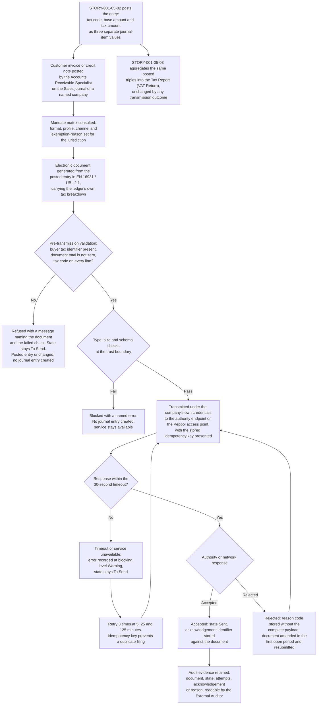
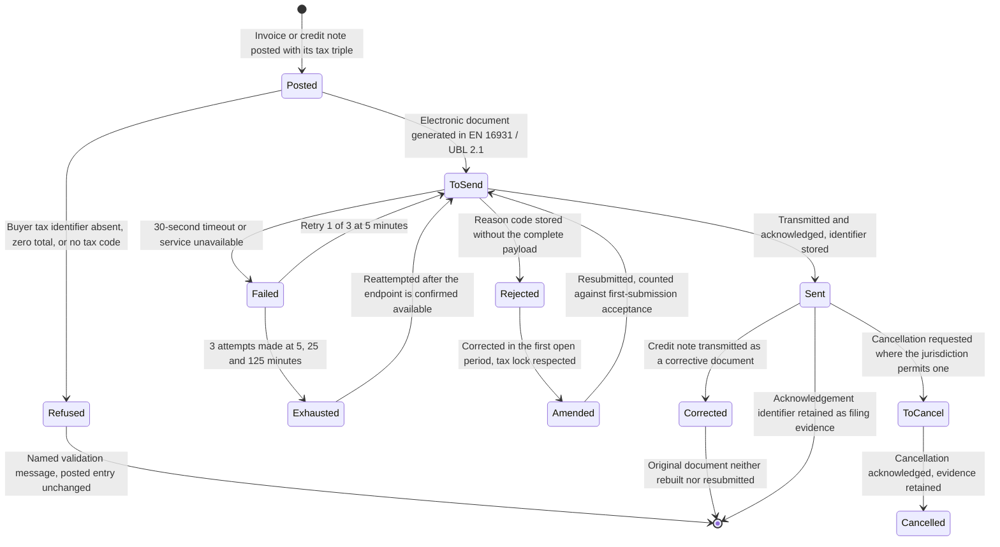

# STORY-001-05-04: Submit E-Invoicing to Tax-Authority Endpoints

---

## Metadata

| Attribute | Value |
|-----------|-------|
| **Story ID** | `STORY-001-05-04` |
| **Title** | Submit E-Invoicing to Tax-Authority Endpoints |
| **Parent Feature** | [FEATURE-001-05: Tax Configuration & Compliance](../FEATURE-001-05-tax-configuration-compliance.md) |
| **Parent Epic** | [EPIC-001: Enterprise Accounting in Odoo](../../EPIC-001-enterprise-accounting-odoo.md) |
| **Feature Capability** | CAP-004 — submit electronic invoices to tax-authority endpoints and record the acknowledgement against the invoice |
| **Status** | Draft |
| **Priority** | 🟠 High |
| **Estimate** | 13 story points (Fibonacci) |
| **Persona** | Tax Accountant |
| **Secondary Personas** | Accounts Receivable Specialist — the same finance role the sibling stories call the Accounts Receivable Accountant — who originates the customer document and resubmits it after a rejection; Chief Accountant (confirms that no transmission outcome alters a posted entry and administers the Tax Return Lock Date that bounds a correction); External Auditor (reads the submission-and-acknowledgement register as filing evidence); Finance Controller and Product Owner (approve the story and witness the demonstration) |
| **Story Position** | Story 4 of the 4 in FEATURE-001-05; the last story in this feature, blocked by `STORY-001-05-02` and independent of `STORY-001-05-03` |
| **Platform Target** | Open decision DEC-001 — see [Version Compatibility](#version-compatibility) |
| **Last Updated** | 2026-08-13 |
| **Owner/Author** | Enterprise Accounting Team |

> **Platform target.** This story states no platform version of its own. The target is the Epic's open decision **DEC-001** in the [Open Decisions Register](../../EPIC-001-enterprise-accounting-odoo.md#appendix-b-open-decisions-register): the originating programme request names Odoo 17, the superseded prior backlog named 18.0, and the baseline this story was written and verified against is **Odoo 19.0 Community**, where `odoo/release.py` declares `version_info = (19, 0, 0, FINAL, 0, '')`. The three candidates differ in which electronic-invoice formats ship, in the document states and error fields the electronic-document model carries, in the proxy-registration path an authority identity is created through, and in the Peppol module version, so the mismatch is surfaced for stakeholder confirmation under AAP §0.8.3 rather than settled inside this story.

---

## User Story

**As a** Tax Accountant

**I want** every posted customer invoice and customer credit note to be serialized into an EN 16931-conformant electronic document that carries its tax code, its base amount and its tax amount as three separate values, and transmitted to the jurisdiction's tax-authority endpoint or to its Peppol access point with the returned acknowledgement identifier stored against the document

**So that** each statutory e-invoicing mandate is met from the posted ledger without re-keying an invoice into an authority portal, and every submission — accepted, rejected or retried — can be evidenced from Odoo during an audit.

---

## INVEST Principles Compliance

| Principle | Compliance | Notes |
|-----------|------------|-------|
| **Independent** | ✅ | The coupling is stated rather than hidden: the posted tax triple from [STORY-001-05-02](./STORY-001-05-02-compute-transaction-tax.md) is a **data prerequisite, not a code coupling**, and it is satisfiable as a posted fixture invoice in a test company. This story shares no model or method with the statutory return in [STORY-001-05-03](./STORY-001-05-03-generate-vat-return.md) — a document is submitted per invoice while a return is filed per period — which is why the parent Feature sequences the two concurrently after the triple exists |
| **Negotiable** | ✅ | States the outcome required — a conformant document carrying the ledger's own tax code, base amount and tax amount, a stored document state, and a stored acknowledgement identifier or rejection reason — and leaves the serializer, the transport client, the retry mechanism and the credential store to implementation discovery under D-011, which already records document build, document parse and Peppol transmission as reuse rather than build |
| **Valuable** | ✅ | This is the story that makes **SM-011** measurable: 98% or more of electronic invoices accepted at the jurisdiction's endpoint on first submission, with an acknowledgement identifier retained against 100% of accepted documents and a rejection reason code against 100% of rejected ones. Without it a mandate arriving in one country stops invoicing in that country until a bespoke exchange is assembled under deadline |
| **Estimable** | ✅ | The artifact count is fixed and inspectable before development: two document types, one document state machine of four states, one 30-second transmission timeout, 3 bounded retry attempts, one idempotency key, two companies each holding their own credentials, and six shipped formats to compare a mandate against — see [Estimation](#estimation) |
| **Small** | ⚠️ ✅ | Candid: **13 points is the top of the Fibonacci band this backlog uses**, and this is the largest story in FEATURE-001-05. It is not smaller because the outcome depends on an **external endpoint outside the team's control** — its availability, its schema, its acknowledgement semantics and its sandbox — which no amount of internal decomposition removes. It stays one story because a submission separated from the document it carries has nothing to submit. It is delivered against **one jurisdiction**; the moment a second mandate with a different format or channel enters scope, the story is split per jurisdiction, and that split is recorded in [Estimation](#estimation) rather than left implicit |
| **Testable** | ✅ | All seven criteria are objectively pass or fail: each names the document, the company and the tax code, base amount and tax amount as three separate values with the currency and the rounding rule; each asserts only a stored document state, an attached document, a stored acknowledgement identifier or a recorded error; and each failure path asserts that the posted entry is unchanged — see [Acceptance Test Mapping](#acceptance-test-mapping) |

---

## Acceptance Criteria

Seven criteria, inside the mandated band of 4 to 8. Each has exactly one non-compound **When**, and each **Then** asserts only what the Tax Accountant, the Accounts Receivable Specialist, the External Auditor or the Finance Controller can observe on the document, on its attached electronic document, on the stored submission record or on the posted entry. An internal transport call is never asserted; a stored state and a stored acknowledgement identifier are.

| Scenario | Coverage class |
|----------|----------------|
| 1 | Valid input — happy-path transmission and acknowledgement |
| 2 | Invalid or incomplete input — buyer tax identifier absent |
| 3 | Error handling — endpoint unavailable, with a bounded retry |
| 4 | Accounting edge case — credit note as a corrective document |
| 5 | Accounting edge case — cross-border reverse charge and its exemption reason |
| 6 | Accounting edge case — foreign-currency document and its functional-currency equivalents |
| 7 | Accounting edge case — zero-total document, and credentials held per company |

The mandated distribution is present and then exceeded: one valid-input criterion (1), one invalid-or-incomplete-input criterion (2), one error-handling criterion (3), and the three mandated accounting edge-case categories — **zero-amount** in Scenario 7, **multi-currency rounding** in Scenario 6 and **zero-tax cross-border treatment** in Scenario 5. Scenario 4 is a **fourth** accounting edge case rather than a substitute for any of the three: a corrective document is the one case where a new filing must reference an earlier acknowledged one, and leaving it out would leave the credit-note path in [STORY-001-03-03](../FEATURE-001-03/STORY-001-03-03-manage-customer-credit-notes.md) untransmittable. The **fiscal-period lock** category is carried in [Edge Cases](#edge-cases) rather than as a criterion, because the lock constrains the *correction* of a rejected filing and not the submission this story triggers.

Four rules hold across all seven criteria:

- **Every tax assertion states the tax code, the base amount and the tax amount as three separate values**, both on the posted entry and inside the transmitted document, so the serialized figures are the ledger's figures rather than a recomputation (R-K).
- **Every monetary figure states its currency, its amount and its rounding rule** — rounded half-up to 2 decimal places at the rounding increment of 0.01 for USD and for EUR (R-D).
- **Transmission posts nothing.** Building, transmitting, retrying or failing a document creates and alters no journal entry, so every failure path asserts that the posted entry and the tax control-account balances are unchanged (R-E). The one entry these criteria describe is the already-posted invoice entry restated in Scenario 1, listed leg by leg with both totals.
- **Every criterion names the company whose books and whose credentials are involved** — `US-01` (**Global Holdings Inc.**) or `NL-01` (**Global Europe SARL**) from the Epic's canonical legal-entity register ([Appendix E.4](../../EPIC-001-enterprise-accounting-odoo.md#e4-canonical-legal-entity-register)) — because a transmission identity is held per company and per proxy type, so an unnamed company would leave the submitting identity undetermined (R-K, R-E4).

The documents below are raised on the **Sales** journal of the named company, and the 5-digit sequence and the `R` prefix on a credit note are the platform's own — see [Deterministic Artifact Set](#deterministic-artifact-set). Company `US-01` carries the 20 percent codes under the foreign registration that [STORY-001-05-02](./STORY-001-05-02-compute-transaction-tax.md) establishes, which is also what fixes the authority its documents are addressed to.

### Scenario 1: A posted invoice is transmitted and its acknowledgement identifier is stored

- **Given** invoice `INV/2025/00042` stands posted on the **Sales** journal of company `US-01` (**Global Holdings Inc.**, functional currency USD) recording tax code `VAT-20-S` ("VAT 20% (Sales)"), a base amount of USD 10,000.00 and a tax amount of USD 2,000.00 as three separate values for an invoice total of USD 12,000.00 — the entry carrying debit Accounts Receivable 1200 USD 12,000.00, credit Revenue 4000 USD 10,000.00 and credit Tax Payable 2200 USD 2,000.00, so total debits of USD 12,000.00 equal total credits of USD 12,000.00 at a difference of USD 0.00 — the buyer holding a validated tax identifier, and `US-01` holding its own validated transmission credentials for that jurisdiction's endpoint, every amount rounded half-up to 2 decimal places at the USD rounding increment of 0.01
- **When** the Tax Accountant submits invoice `INV/2025/00042` to the tax-authority endpoint
- **Then** an EN 16931-conformant UBL 2.1 document is attached to `INV/2025/00042` carrying tax code `VAT-20-S`, a base amount of USD 10,000.00, a tax amount of USD 2,000.00 and a document total of USD 12,000.00 as separate values that equal the posted entry's amounts to the cent, the electronic-document state reads **Sent**, the acknowledgement identifier returned by the endpoint is stored against the invoice and is readable by the External Auditor without a data request, and the posted entry is unchanged with Tax Payable 2200 in `US-01` still carrying the credit of USD 2,000.00 — every amount rounded half-up to 2 decimal places at the USD rounding increment of 0.01

### Scenario 2: A document whose buyer holds no tax identifier is refused before transmission

- **Given** invoice `INV/2025/00043` stands posted on the **Sales** journal of company `US-01` (**Global Holdings Inc.**, functional currency USD) recording tax code `VAT-20-S` ("VAT 20% (Sales)"), a base amount of USD 8,000.00 and a tax amount of USD 1,600.00 as three separate values for an invoice total of USD 9,600.00, addressed to a business customer whose tax identifier is absent from the partner record, and the electronic-document state reads **To Send**, every amount rounded half-up to 2 decimal places at the USD rounding increment of 0.01
- **When** the Tax Accountant submits invoice `INV/2025/00043` to the tax-authority endpoint
- **Then** document generation is refused with a validation message that names `INV/2025/00043` and identifies the absent buyer tax identifier as the check that failed, no document is transmitted and none is attached to the invoice, the electronic-document state remains **To Send**, and the posted entry is unchanged — tax code `VAT-20-S`, base amount USD 8,000.00 and tax amount USD 1,600.00 still recorded as three separate values, with the Tax Payable 2200 credit in `US-01` unchanged at USD 1,600.00 and no journal entry created or altered by the refusal, every amount rounded half-up to 2 decimal places at the USD rounding increment of 0.01

### Scenario 3: An unavailable endpoint records its error and the transmission is retried within a fixed bound

- **Given** invoice `INV/2025/00042` for company `US-01` (**Global Holdings Inc.**, functional currency USD) carries an attached EN 16931-conformant UBL 2.1 document holding tax code `VAT-20-S` ("VAT 20% (Sales)"), a base amount of USD 10,000.00 and a tax amount of USD 2,000.00 as three separate values, the electronic-document state reads **To Send**, and the jurisdiction's endpoint answers every request with a service-unavailable response, every amount rounded half-up to 2 decimal places at the USD rounding increment of 0.01
- **When** the transmission attempt for `INV/2025/00042` reaches its 30-second timeout
- **Then** the electronic-document state remains **To Send** with the endpoint's error message recorded against the document at a blocking level of Warning and with no stack trace and no complete authority-response payload disclosed, the transmission is retried up to 3 further attempts scheduled 5 minutes, 25 minutes and 125 minutes after the failure, the transmission identifier already stored against `INV/2025/00042` is presented on each attempt so the endpoint recognizes a repeat of one filing rather than a second filing, the outcome of each attempt is persisted against the invoice inside the parent Feature's 60-second per-document budget, and no journal entry is created or altered — the posted base amount of USD 10,000.00, the tax amount of USD 2,000.00 and the Tax Payable 2200 credit of USD 2,000.00 in `US-01` all unchanged, every amount rounded half-up to 2 decimal places at the USD rounding increment of 0.01

### Scenario 4: A credit note is transmitted as a corrective document referencing the acknowledged invoice

- **Given** invoice `INV/2025/00042` for company `US-01` (**Global Holdings Inc.**, functional currency USD) has been acknowledged by the endpoint with its acknowledgement identifier stored and its electronic-document state reading **Sent**, and credit note `RINV/2025/00007` stands posted on the **Sales** journal of `US-01` reversing part of that invoice with tax code `VAT-20-S` ("VAT 20% (Sales)"), a base amount of −USD 1,000.00 and a tax amount of −USD 200.00 recorded as three separate values for a credit-note total of −USD 1,200.00, every amount rounded half-up to 2 decimal places at the USD rounding increment of 0.01
- **When** the Tax Accountant submits credit note `RINV/2025/00007` to the tax-authority endpoint
- **Then** the transmitted document is typed as a corrective document that cites the stored acknowledgement identifier of `INV/2025/00042` as the document it corrects, it carries tax code `VAT-20-S`, a base amount of −USD 1,000.00 and a tax amount of −USD 200.00 as three separate values equal to the credit note's posted amounts to the cent, the electronic document already acknowledged for `INV/2025/00042` is neither rebuilt nor resubmitted and its state stays **Sent** under its original acknowledgement identifier, and `RINV/2025/00007` receives its own acknowledgement identifier stored against it — every amount rounded half-up to 2 decimal places at the USD rounding increment of 0.01

### Scenario 5: A cross-border reverse-charge supply is transmitted with its exemption reason

- **Given** invoice `INV/2025/00044` stands posted on the **Sales** journal of company `NL-01` (**Global Europe SARL**, functional currency EUR), addressed to a German business customer holding a validated VAT number that resolves to the fiscal position `EU B2B Reverse Charge`, recording tax code `VAT-00-RC` ("VAT 0% (Intra-Community Supply, Reverse Charge)"), a base amount of EUR 5,000.00 and a tax amount of EUR 0.00 as three separate values with no movement posted to Tax Payable 2200 in `NL-01`, and `NL-01` holding its own validated Peppol participant registration, every amount rounded half-up to 2 decimal places at the EUR rounding increment of 0.01
- **When** the Tax Accountant submits invoice `INV/2025/00044` over the Peppol network
- **Then** the transmitted document carries tax code `VAT-00-RC`, a base amount of EUR 5,000.00 and a tax amount of EUR 0.00 as three separate values, it carries the exemption reason that a zero-tax intra-Community supply requires under EU VAT Directive 2006/112/EC rather than a bare tax amount of EUR 0.00, it carries the buyer's validated VAT number as the evidence the reverse charge rests on, the electronic-document state reads **Sent** with the network acknowledgement identifier stored against the invoice, and the base amount of EUR 5,000.00 still reaches its own line of the **Tax Report (VAT Return)** for `NL-01` over the date range 2025-01-01 to 2025-03-31 rather than dropping out of the return — every amount rounded half-up to 2 decimal places at the EUR rounding increment of 0.01

### Scenario 6: A foreign-currency document states both the document-currency and the functional-currency figures

- **Given** company `US-01` (**Global Holdings Inc.**) keeps its books in its functional currency USD and invoice `INV/2025/00045` stands posted on its **Sales** journal denominated in EUR, recording tax code `VAT-20-S` ("VAT 20% (Sales)"), a base amount of EUR 1,000.00 and a tax amount of EUR 200.00 as three separate values in the document currency — each rounded half-up to 2 decimal places at the EUR rounding increment of 0.01 — whose functional-currency equivalents at the recorded rate of 1.0850 USD per 1.00 EUR are a base amount of USD 1,085.00 and a tax amount of USD 217.00, each rounded half-up to 2 decimal places at the USD rounding increment of 0.01
- **When** the Tax Accountant submits invoice `INV/2025/00045` to the tax-authority endpoint
- **Then** the transmitted document states its document currency as EUR with tax code `VAT-20-S`, a base amount of EUR 1,000.00 and a tax amount of EUR 200.00 as three separate values, it states the functional-currency equivalents as a base amount of USD 1,085.00 and a tax amount of USD 217.00 together with the rate of 1.0850 USD per 1.00 EUR and the rate date they were translated on, those four figures equal the amounts held on the posted journal entry of `INV/2025/00045` to the cent, and the electronic-document state reads **Sent** with the acknowledgement identifier stored against the invoice — every amount rounded half-up to 2 decimal places at its own currency's rounding increment of 0.01

### Scenario 7: A zero-total document is refused, and no other company's credentials are used

- **Given** company `US-01` (**Global Holdings Inc.**, functional currency USD) and company `NL-01` (**Global Europe SARL**, functional currency EUR) each hold their own transmission credentials for their own jurisdiction, and document `INV/2025/00046` stands posted on the **Sales** journal of `US-01` with a document total of USD 0.00, recording tax code `VAT-20-S` ("VAT 20% (Sales)"), a base amount of USD 0.00 and a tax amount of USD 0.00 as three separate values, every amount rounded half-up to 2 decimal places at the USD rounding increment of 0.01
- **When** the Tax Accountant submits document `INV/2025/00046` to the tax-authority endpoint
- **Then** submission is refused with a validation message that names `INV/2025/00046` and states the document total of USD 0.00 as the reason the jurisdiction accepts no filing for it, the electronic-document state remains **To Send**, no request is made under the credentials of `NL-01` and no submission record is created against `NL-01`, and the posted entry for `INV/2025/00046` is unchanged with tax code `VAT-20-S`, a base amount of USD 0.00 and a tax amount of USD 0.00 still recorded as three separate values so the line stays inside the **Tax Report (VAT Return)** population for `US-01` rather than dropping out of it — every amount rounded half-up to 2 decimal places at the USD rounding increment of 0.01

---

## Sub-Tasks

- [ ] Build the per-country mandate matrix before any code is written: for each operating country, the invoice format and profile the authority mandates, the channel it is reachable on — the Peppol network or a jurisdiction-specific endpoint — the exemption-reason code set the jurisdiction publishes for zero-rated, exempt and reverse-charge supplies, the mandate date, and the sandbox that proves acceptance before production filing. Record which mandate is served by a format already shipped in this repository and which is residual, and agree the matrix with the Finance SME — `@functional-consultant`
- [ ] Deliver electronic-document generation from the **posted** entry, so the document's tax code, base amount and tax amount are read from the posted journal items rather than recomputed from a gross total, with the pre-transmission validation that refuses a document whose buyer tax identifier is absent or whose total is zero — USD 0.00 or EUR 0.00, each rounded half-up to 2 decimal places at that currency's rounding increment of 0.01 — naming the document and the failed check — `@developer`
- [ ] Deliver endpoint transmission with a 30-second per-attempt timeout, 3 bounded retry attempts at 5, 25 and 125 minutes after a failure, and an **idempotency key** stored against the document and presented on every attempt, so a retry after an acknowledgement that was received but not recorded resolves to the original filing instead of a duplicate one — `@developer`
- [ ] Deliver the retained submission record: the document state, the acknowledgement identifier on acceptance, the rejection reason code on rejection, the attempt count and the timestamp of each attempt, all held against the invoice and readable by the External Auditor, with the error text stored at a blocking level and with no stack trace and no complete authority-response payload persisted or displayed (C-020) — `@developer`
- [ ] Write the unit and integration tests for all seven acceptance criteria against the jurisdiction's sandbox endpoint, including the timeout, service-unavailable, rejection, retry and duplicate-submission paths and the hostile-input set C-022 names, asserting every base amount and tax amount to the cent against the posted entry; and review the criteria for banned vague terms, for the tax-code, base-amount and tax-amount triple, and for the named company on every multi-company assertion — `@qa-engineer`
- [ ] Sign off that the base amount and tax amount serialized into each transmitted document equal the posted entry's amounts to the cent for all seven scenarios, that the exemption reason carried on a zero-tax supply is the code the jurisdiction expects, that a corrective credit note cites the acknowledgement identifier of the document it corrects, and that no transmission outcome moves Tax Payable 2200 or Input Tax Receivable 1290 — `@finance-sme`
- [ ] Review credential custody and the transport surface: credentials, API keys and signing certificates scoped per company and held in Odoo system parameters, in the `certificate` store, or in an external secret manager with a named rotation owner and rotation interval and never in module source, version control, logs, fixtures or exports; transport-layer security with server-certificate verification on every request; and payload type, size and content validation on the outbound document and on the authority response, following the type-and-size-limit and field-sanitization pattern the bank-statement import prior art established at the same trust boundary (C-015, C-016, C-020, C-021) — `@security-reviewer`
- [ ] Write the submission and error-triage runbook: how a document is submitted and resubmitted, what each document state means, which validation message maps to which remedy, how a rejection is corrected when the correction date falls inside a period closed by the Tax Return Lock Date, and how the acknowledgement register is read as filing evidence — `@technical-writer`

---

## Edge Cases

- **Zero-amount and null tax code.** A document whose total is USD 0.00 — base amount USD 0.00 and tax amount USD 0.00 at tax code `VAT-20-S` — is refused for submission with the zero total named as the reason while the posted line stays inside the return population, and a line carrying a null tax code is refused at document generation with the line named, because a document body with no tax code has no tax breakdown for the authority to validate; every amount rounded half-up to 2 decimal places at the USD rounding increment of 0.01.
- **Fiscal-period lock on a correction.** When a rejected document's correction would carry an accounting date inside a period already closed by the company's Tax Return Lock Date, the correcting credit note or corrective invoice is issued in the first open period and cites the acknowledgement identifier of the rejected filing, so the filed period is never reopened to satisfy an authority correction and the return already filed for that period stays reproducible at a difference of USD 0.00, rounded half-up to 2 decimal places at the USD rounding increment of 0.01.
- **Multi-currency rounding residual.** Where the document-currency tax amount translated at the recorded rate and the functional-currency tax amount held on the posted entry differ by one minor unit, the document states both figures with the rate and the rate date, the figure the endpoint validates its own tax breakdown against is the **document-currency** figure, and the functional-currency figure is carried as the accounting equivalent — so EUR 200.00 and USD 217.00 at a rate of 1.0850 are transmitted as a matched pair rather than one being derived at the endpoint, each rounded half-up to 2 decimal places at its currency's rounding increment of 0.01.
- **Reverse charge, exempt and zero-rated are three different zeros.** A reverse-charge supply at `VAT-00-RC`, an exempt supply at `VAT-00-EX` and a zero-rated supply at `VAT-00-ZR` each carry a base amount and a tax amount of EUR 0.00 in the books of `NL-01` (**Global Europe SARL**), rounded half-up to 2 decimal places at the EUR rounding increment of 0.01, and each requires its own exemption reason in the transmitted document — a bare tax amount of 0.00 with no reason is a schema-valid document that the authority rejects, so the reason code set is fixed per jurisdiction in the mandate matrix before the first submission.
- **Duplicate transmission after an unrecorded acknowledgement.** When an acknowledgement is returned by the endpoint but not persisted — a timeout after the authority has already accepted the filing — the next attempt presents the stored idempotency key and the transmission identifier, so the endpoint resolves it to the original filing and returns the original acknowledgement identifier instead of creating a second declared invoice, and the reconciliation of the submission register against the posted invoice population for the period detects any document left without an acknowledgement.

---

## Estimation

| Dimension | Rating | Justification |
|-----------|--------|---------------|
| **Effort** | High | Four workstreams that cannot be collapsed into one: document generation from the posted entry, transport with timeout and bounded retry, the retained state-and-acknowledgement record, and credential onboarding per company. Each carries its own test set, and the transport and retry paths must be proved against a sandbox endpoint rather than a stub, which is where the calendar time goes |
| **Complexity** | High | The accounting consequence is thin — no entry is posted — but the correctness surface is wide: the serialized base and tax amounts must equal the posted entry's amounts to the cent in both the document currency and the functional currency, a corrective document must cite the acknowledgement identifier of the document it corrects, three different zero-tax treatments each need their own exemption reason, and the retry path must be idempotent so a repeat attempt is never a second statutory filing |
| **Uncertainty** | High | The endpoint is outside the team's control. Its availability, its schema edition, its acknowledgement semantics, its rejection reason vocabulary and the quality of its sandbox are discovered rather than specified, and the conformance edition of EN 16931 and the Core Invoice Usage Specification permitted per jurisdiction are confirmed in D-011 before this story is accepted. What lowers it: `account_edi`, `account_edi_ubl_cii`, `account_edi_proxy_client` and `account_peppol` are all present in this repository under LGPL-3 and were read at the 19.0 baseline, so the document build, the format coverage, the proxy identity and the Peppol channel are inspectable before development starts |
| **Story Points** | **13** | Fibonacci scale (1, 2, 3, 5, 8, 13). **13** rather than 8 for four reasons that compound: an external endpoint outside the team's control, per-jurisdiction mandates and formats that make "done" a per-country statement, credential and certificate handling scoped per company with rotation, and asynchronous retry with acknowledgement reconciliation that has to be idempotent to be safe. Not higher, because 13 is the top of the band this backlog uses and because document build, format conformance and Peppol transmission are reuse rather than build under D-011. **Split rule:** this estimate covers **one jurisdiction**. If the mandate scope widens to a second jurisdiction with a different format or a different channel, the story is split into one story per jurisdiction rather than re-estimated upward — that is the honest limit of the INVEST *Small* claim recorded in [INVEST Principles Compliance](#invest-principles-compliance) |

---

## Constraints

The constraint identifiers below are the Epic's own, restated for this story rather than renumbered, so one constraint set reads across the whole ticket tree.

### License and Compliance

- [x] **C-001 — AGPL-3.0 compatibility**: any module delivering the submission record, the acknowledgement retention or a residual format is distributed under an AGPL-3.0 compatible licence, matching the Community-edition accounting add-ons already present in this repository
- [x] **C-002 — Existing licence respected**: extension of `account` ("Invoicing", version 1.4, LGPL-3), `account_edi` (version 1.0, LGPL-3), `account_edi_ubl_cii` (version 1.0, LGPL-3), `account_edi_proxy_client` (version 1.0, LGPL-3) and `account_peppol` (version 1.2, LGPL-3) respects those licences, and an AGPL-3 extension of LGPL-3 code is licence-checked before it is written
- [x] **C-005 / C-006 — Odoo and OCA coding standards**: Python follows Odoo and OCA module guidelines including PEP 8, and static analysis passes with the repository's configured tooling, whose lint configuration is `ruff.toml` at the repository root
- [x] **C-008 — One test per criterion**: each of the seven criteria maps to exactly one acceptance test, named in [Acceptance Test Mapping](#acceptance-test-mapping)
- [x] **C-009 — Numeric assertion**: every base amount, every tax amount and every document total in the seven criteria is asserted as an amount in test code against the posted entry rather than inspected by eye, with the difference stated
- [x] **C-012 — Build on the existing framework**: submission extends the electronic-document model that `account_edi` already provides rather than opening a second document path, so one document audit trail exists per invoice
- [x] **C-014 — Access rights and company isolation**: the role that raises the document, the role that submits it and the role that reads the acknowledgement register are distinguishable, and a role restricted to one company can neither submit that company's documents from another company nor read its submission records
- [x] **C-019 — Data access discipline**: reads of the posted base and tax lines and of the submission register are expressed through the Odoo ORM or parameterized SQL, and no file path is derived from an inbound document's own name

### Standards Compliance

- [x] **EN 16931 — semantic data model**: the outbound document is asserted against the CEN/TC 434 semantic data model for the core elements of an electronic invoice, whose tax breakdown carries the same tax code, base amount and tax amount as the posted entry. CEN approved a revision, **EN 16931-1:2026**, whose definitive text was issued on 18 March 2026 and which supersedes the 2017 edition; the conformance edition and the Core Invoice Usage Specification permitted per jurisdiction are confirmed in D-011 before that jurisdiction's submission is accepted
- [x] **UBL 2.1 — syntax**: OASIS Universal Business Language 2.1 is the syntax the criteria assert, and it is the syntax `account_edi_ubl_cii` already implements for its UBL formats; the invoice PDF is embedded inside the XML for those formats, which is what the size and type checks under C-015 are dimensioned against
- [x] **Peppol BIS Billing 3.0 — four-corner network delivery**: OpenPeppol BIS Billing 3.0, built on UBL 2.1, is the cross-border profile used for network delivery in Scenario 5, supplied here by `account_peppol` over `account_edi_proxy_client`; the profile identifiers the document carries state which rule set it was validated against, and the buyer's Endpoint ID is the participant address it is routed to
- [x] **EU VAT Directive 2006/112/EC — invoice content and exemption reasons**: the Directive fixes the content an invoice must carry and requires the taxable amount and the tax due on it to be identifiable per supply, which is why the transmitted document carries the tax code, the base amount and the tax amount as three separate values; and it is the source of the exemption reason that a reverse-charge, exempt or zero-rated supply carries instead of a bare tax amount of 0.00 in the document currency, rounded half-up to that currency's decimal places at its rounding increment of 0.01
- [x] **ISO 4217 minor units**: every amount serialized into the document is rounded half-up to its currency's decimal precision — 2 decimal places at a rounding increment of 0.01 for USD and EUR — and a foreign-currency document states the document-currency figures, the functional-currency equivalents, the rate and the rate date
- [x] **Double-entry integrity is preserved by not touching it**: transmission creates and alters no journal entry. The one entry these criteria describe — the posted `INV/2025/00042` entry of debit Accounts Receivable 1200 USD 12,000.00, credit Revenue 4000 USD 10,000.00 and credit Tax Payable 2200 USD 2,000.00 — posts with total debits of USD 12,000.00 equal to total credits of USD 12,000.00 at a difference of USD 0.00 — every amount rounded half-up to 2 decimal places at the USD rounding increment of 0.01 — and every failure path in this story asserts that it is unchanged

### Security and Data Protection

- [x] **C-021 — Credential custody per company**: endpoint credentials, API keys, signing certificates and private keys live in Odoo system parameters, in the `certificate` store that `account_edi_proxy_client` already depends on, or in an external secret manager — scoped per company, with a named rotation owner and rotation interval, and present in no module source, no version-controlled file, no log, no fixture and no export. `US-01` and `NL-01` hold separate credentials, and Scenario 7 asserts that a refusal in one company makes no request under the other's
- [x] **Transport security**: every request to an authority endpoint or Peppol access point is made over a transport-layer-secured channel with server-certificate verification enabled, and a certificate-verification failure is treated as a transmission failure that leaves the document in **To Send** rather than as a condition to bypass
- [x] **C-015 — Payload type and size validation**: the outbound document and the authority response are checked at the trust boundary against an allowlist of permitted media types and against a declared maximum size, dimensioned to allow for the PDF embedded inside the UBL XML, and either check failing rejects the payload with a named validation error
- [x] **C-016 — Response parsing**: an authority or network response is parsed with document-type-declaration processing and external-entity resolution disabled and entity expansion bounded, and is validated against its declared schema before any field is read from it
- [x] **C-018 / C-020 — Output encoding and error disclosure**: partner-supplied text carried into the document body is context-encoded before it is rendered, and a failure discloses no stack trace and no complete authority-response payload — the rejection reason code and a message naming the failed check are recorded, and nothing more
- [x] **C-022 — Hostile-input tests are part of this story**: at least one acceptance test per hostile case — a malformed document, a schema-invalid document, an external-entity payload, an oversized payload, a disallowed media type and an over-long field — each asserting rejection with a named error, no journal entry created, and the service still available
- [x] **Audit trail**: each submission retains its document, its state, its attempt timestamps, its acknowledgement identifier or its rejection reason code and the acting role, readable by the External Auditor without a data request

### Dependency and Edition Considerations

- [x] **C-003 — Edition source is an open decision (DEC-002), not a prohibition**: the outright ban on Enterprise dependencies carried by the superseded backlog is **withdrawn**. The choice between an Odoo Enterprise subscription and the OCA add-on path is owned by the CFO / Finance Director with the Group Controller and is recorded in the [Open Decisions Register](../../EPIC-001-enterprise-accounting-odoo.md#appendix-b-open-decisions-register)
- [x] **This story is not gated by DEC-002**: the Epic states explicitly that DEC-002 is **not** about electronic invoicing. `account_edi`, `account_edi_ubl_cii`, `account_edi_proxy_client` and `account_peppol` are present in this repository under LGPL-3, so document build, format conformance, proxy identity and Peppol transmission can be built before the edition decision is confirmed
- [x] **D-011 — Reuse before build**: document build, document parse, format conformance for the six formats `account_edi_ubl_cii` ships, participant registration and Peppol transmission are reuse rather than build. No bespoke serializer or transport client is authorized for a capability the D-011 capability comparison does not record as uncovered
- [x] **`account_peppol_advanced_fields` is excluded**: the module is present in `addons/`, but its own manifest names it "[DEPRECATED] Account Peppol Advanced Fields" and states it should not be used. It is cited here so the exclusion is deliberate and recorded, and no delivered module declares a dependency on it
- [x] **C-004 — OCA ecosystem compatibility**: whichever edition path is confirmed, the submission record stays readable by OCA add-ons and by the country `l10n_*` extensions published by OCA, so no downstream layer has to reconstruct a filing history from attachments

### Version Compatibility

- [x] **C-010 — Platform version target is open decision DEC-001**: the programme request names Odoo 17, the superseded backlog named 18.0, and this repository is **Odoo 19.0 Community** (`odoo/release.py` → `version_info = (19, 0, 0, FINAL, 0, '')`). The target is confirmed with stakeholders before development rather than chosen here, and the mismatch is the AAP §0.8.3 stakeholder-confirmation item
- [x] **C-011 — Language and database versions follow the confirmed target**: the 19.0 baseline present here declares `MIN_PY_VERSION = (3, 10)`, `MAX_PY_VERSION = (3, 13)` and `MIN_PG_VERSION = 13` in `odoo/release.py`; an earlier platform target carries a different supported matrix
- [x] **Impact if DEC-001 resolves away from 19.0**: the shipped format list is re-verified, because format coverage and its country restrictions change per release; the electronic-document states and error fields are re-verified, because the state vocabulary the criteria assert is the platform's own; the proxy-registration path is re-verified, because the identity model and its certificate dependency changed across the candidate releases; and the Peppol module version is re-verified, because the version present here is 1.2

---

## Technical Discovery Notes

> **Purpose:** these notes direct the codebase analysis that precedes implementation. They record what to investigate and what the outcome must prove; they do not choose the implementation.

### Codebase Analysis Areas

| Area | Files/Modules to Examine | Analysis Focus |
|------|--------------------------|----------------|
| Electronic-document framework | `addons/account_edi/` — "Import/Export Invoices From XML/PDF", version 1.0, licence LGPL-3, depending on `account`, shipping an electronic-document model, an electronic-format model, invoice and journal view extensions and a scheduled-job data file | The document lifecycle states the model carries — **To Send**, **Sent**, **To Cancel** and **Cancelled** — which are the states the seven criteria assert; the error field that holds the text of the last failure and the blocking level (Info, Warning, Error) that decides whether the document is held back; and how the scheduled job drives the web-service pass. Establish where the acknowledgement identifier and the rejection reason code are stored so both survive a resubmission, and whether the job's own selection of documents awaiting transmission is where the bounded retry belongs |
| Retry cadence and job configuration | `addons/account_edi/data/cron.xml` and the web-service pass on the electronic-document model | The shipped job is named "EDI: Perform web services operations", runs against the electronic-document model, is configured at a 1-day interval, is **inactive by default**, and processes documents in a bounded batch while skipping any document whose blocking level is Error. Establish what the job must become for the 5-, 25- and 125-minute retry cadence the criteria assert, whether the cadence is expressed as job frequency or as a next-attempt timestamp on the document, and who activates the job per environment |
| Format coverage before any bespoke serializer | `addons/account_edi_ubl_cii/` — "Import/Export electronic invoices with UBL/CII", version 1.0, licence LGPL-3 | The six formats shipped — **E-FFF, UBL Bis 3, EHF3, NLCIUS, Factur-X (CII), XRechnung (UBL)** — with their restrictions recorded in the module's own manifest: E-FFF, NLCIUS and XRechnung are available to Belgian, Dutch and German companies respectively; UBL Bis 3 is available to companies whose country is in the Peppol EAS list; EHF3 is fully implemented by the UBL Bis 3 implementation; the PDF is embedded inside the XML for the UBL formats; and the format is chosen on the journal's advanced settings. Establish which shipped format satisfies each mandate in the matrix **before** any bespoke serializer is considered, and which partner-level format selection drives the choice per customer |
| Transport identity and credentials | `addons/account_edi_proxy_client/` — "Proxy features for account_edi", version 1.0, licence LGPL-3, depending on `account` and `certificate` | The `edi_proxy_user` identity, unique per proxy type and bound to one company on one database, and the encryption it provides for the exchange. Establish the registration path per company and per jurisdiction, where the signing certificate is held, and how that custody satisfies C-021 including the rotation owner and interval |
| Network channel and participant addressing | `addons/account_peppol/` — "Peppol", version 1.2, licence LGPL-3, depending on `account_edi_proxy_client` and `account_edi_ubl_cii`, carrying a country allowlist held in step with the Peppol default-country list on the company model | Participant registration and Peppol BIS Billing 3.0 send and receive, and the Endpoint ID that addresses a participant. Establish whether each target authority is reachable over the network or needs a jurisdiction-specific channel, and how an inbound document is handled when it arrives before any invoice exists in Odoo for it |
| Deprecated module to exclude | `addons/account_peppol_advanced_fields/` | The module's manifest names it "[DEPRECATED] Account Peppol Advanced Fields" and states it should not be used. Confirm it is excluded from the dependency set of every delivered module, and record the exclusion rather than discovering it during installation |
| The figures that must be serialized | `addons/account/models/account_tax.py` and `addons/account/models/account_move_line.py` | Where the base amount and the tax amount live once a document is posted: the tax journal item carries the base amount the tax was computed on, and the distribution lines carry the account and the report tags. Establish that the document body reads these posted values rather than recomputing tax from a gross total, because equality to the cent with the posted entry is the reconciliation gate of this story |
| Document identity and numbering | `addons/account/models/account_move.py` | The starting-sequence derivation for a sale journal on a calendar fiscal year, which yields a 5-digit padded number of the form `INV/2025/00000`, and the `R` prefix prepended for a refund when the journal's refund sequence is enabled — the source of `INV/2025/00042` and `RINV/2025/00007`. Establish which stored identifier the authority treats as the invoice number, and which one carries into the corrective-document reference |
| Correction window and the tax lock | `addons/account/models/company.py` | The Tax Return Lock Date on the company, administered alongside the Global, Sales, Purchase and Hard lock dates, with the per-role value derived from it and the guard that refuses a tax-affecting operation inside a locked period. Establish which period a correction to a rejected document is issued in when its natural date falls inside the locked period, because that is the fiscal-period edge case |

### Relevant Existing Modules

| Module | Path | Relevance to this story |
|--------|------|------------------------|
| `account_edi` | `addons/account_edi/` | Version 1.0, LGPL-3. The document build, parse and transmission framework this story extends with the submission state, the acknowledgement identifier and the rejection reason; the source of the four document states the criteria assert and of the scheduled web-service pass |
| `account_edi_ubl_cii` | `addons/account_edi_ubl_cii/` | Version 1.0, LGPL-3. The six shipped syntaxes and their country restrictions, which bound the residual format work under D-011 and decide whether a mandate needs any bespoke serializer at all |
| `account_edi_proxy_client` | `addons/account_edi_proxy_client/` | Version 1.0, LGPL-3, depending on `account` and `certificate`. The `edi_proxy_user` identity per company and per proxy type and the encryption for the authority exchange — the module against which C-021 custody is satisfied |
| `account_peppol` | `addons/account_peppol/` | Version 1.2, LGPL-3. Participant registration and Peppol BIS Billing 3.0 transmission, the channel Scenario 5 submits over, with a country allowlist that decides where the network is available |
| `account` | `addons/account/` | "Invoicing", version 1.4, LGPL-3. Supplies the posted base and tax journal items whose amounts are serialized, the fiscal position that resolves the treatment, the Sales journal and its numbering, and the Tax Return Lock Date that bounds a correction |
| `account_peppol_advanced_fields` | `addons/account_peppol_advanced_fields/` | Present but manifest-marked deprecated and not to be used. Listed so the exclusion is explicit; no delivered module depends on it |
| `l10n_*` | `addons/l10n_*/` | 209 localization packs. Each supplies a jurisdiction's statutory tax codes and, where one exists, its own transmission implementation — checked per country in the mandate matrix before a channel is treated as residual |

### OCA Module Compatibility

| OCA Repository | Module | Compatibility consideration |
|----------------|--------|-----------------------------|
| OCA/edi | `base_edi`, `edi_oca` and its backend modules | Determine whether the OCA exchange-record framework duplicates the submission state and acknowledgement record this story adds to `account_edi`, and if it does, whether the delivered work should sit on that framework instead of alongside it. Naming the repository asserts precedent rather than installability: a branch matching the target DEC-001 confirms must exist, and where no port exists the work is recorded as bespoke |
| OCA/account-financial-reporting | `account_financial_report` | Under the OCA path of DEC-002, determine that the submission register and the posted tax lines stay independently readable, so a filing history is never reconstructed from report output |
| OCA `l10n-*` country repositories | Country e-invoicing extensions | Per operating country, determine whether an OCA extension already implements the mandated channel or format, so a jurisdiction's divergence is recorded in the mandate matrix rather than discovered at the mandate date |

### Discovery versus Prescription

This story describes WHAT the finance function needs a transmitted document and its retained evidence to contain, and WHY. It does not prescribe HOW that is built. Not specified here: new model names, field definitions or schema decisions; whether the submission record extends the existing electronic-document model or adds a related one (D-005); the transport library; the mechanism that schedules a retry; and module structure. Deferred to agent discovery: **D-003** (the residual gap this story is authorized inside), **D-005** (model extension approach), **D-007** (company isolation, record rules and the access-right groups implied by the personas), **D-009** (deterministic and hostile-input fixture sets, held apart from one another) and **D-011** (the per-country capability comparison that decides what is reuse and what is residual).

---

## Dependencies

### Story Dependencies

| Dependency Type | Story ID | Story Title | Relationship |
|-----------------|----------|-------------|--------------|
| Parent Feature | [FEATURE-001-05](../FEATURE-001-05-tax-configuration-compliance.md) | Tax Configuration & Compliance | This story is story 4 of the 4 in this feature and delivers its capability CAP-004 |
| Blocked By | [STORY-001-05-02](./STORY-001-05-02-compute-transaction-tax.md) | Compute Tax on Transactions with Base and Tax Split | The tax code, base amount and tax amount serialized into the document are the values that story posts. With no triple on the posted tax lines there is nothing to serialize, and the equality-to-the-cent gate has nothing to compare against |
| Blocked By | [STORY-001-05-01](./STORY-001-05-01-configure-tax-codes-fiscal-positions.md) | Configure Tax Codes and Fiscal Positions | Configuration prerequisite: the tax codes and the fiscal positions determine the treatment, and therefore the exemption reason a zero-tax supply carries — `VAT-00-RC` and the fiscal position `EU B2B Reverse Charge` used in Scenario 5 are defined there |
| Related | [STORY-001-05-03](./STORY-001-05-03-generate-vat-return.md) | Generate VAT Return Report | The same posted triples, aggregated per period for the statutory return instead of transmitted per document. Neither story blocks the other: a document is submitted per invoice while a return is filed per period, and the two may be delivered concurrently |
| Related | [STORY-001-03-01](../FEATURE-001-03/STORY-001-03-01-generate-customer-invoices.md) | Generate and Post Customer Invoices | Produces the posted customer invoices this story transmits, carrying debit Accounts Receivable 1200 against credit Revenue 4000 with output tax to Tax Payable 2200 (ORD-002) |
| Related | [STORY-001-03-03](../FEATURE-001-03/STORY-001-03-03-manage-customer-credit-notes.md) | Manage Customer Credit Notes and Refunds | Produces the posted credit notes this story transmits as corrective documents, including the partial reversal asserted in Scenario 4 |
| Related | [FEATURE-001-01](../FEATURE-001-01-chart-of-accounts-fiscal-year.md) | Chart of Accounts & Fiscal Year | Supplies Accounts Receivable 1200, Revenue 4000 and Tax Payable 2200 with the Sales journal, and administers the lock dates — including the Tax Return Lock Date — that bound the period a correction to a rejected document is issued in |

### External Dependencies

| Dependency | Type | Notes |
|------------|------|-------|
| Tax-authority endpoints per jurisdiction | External system | The production endpoint and its **sandbox or test endpoint**, the latter required so acceptance can be demonstrated before a production filing (SM-011). Availability, schema edition and acknowledgement semantics are outside the team's control, which is the principal source of this story's uncertainty rating |
| Peppol access-point provider and participant registration | External service | The access point `account_peppol` transmits through, the participant registration for each submitting company, and the buyer's Endpoint ID that addresses the recipient. Registration is a prerequisite of Scenario 5, not part of it |
| Endpoint credentials and signing certificates | Governance and secrets | Issued per company into the custody arrangement C-021 mandates, with a named rotation owner and rotation interval, before the first submission is attempted. `US-01` and `NL-01` hold separate credentials |
| EN 16931 | Standard | The semantic data model the document is asserted against, published by CEN/TC 434. The conformance edition — the 2017 edition or the EN 16931-1:2026 revision whose definitive text was issued on 18 March 2026 — and the Core Invoice Usage Specification permitted per jurisdiction are confirmed in D-011 |
| UBL 2.1 | Standard | The OASIS syntax the criteria assert and the one `account_edi_ubl_cii` implements for its UBL formats |
| Peppol BIS Billing 3.0 | Standard and network profile | The OpenPeppol profile, built on UBL 2.1, used for the cross-border delivery in Scenario 5, including its rule set and its profile identifiers |
| Council Directive 2006/112/EC | Tax standard | The EU VAT Directive: the invoice content required, the identifiability of the taxable amount and the tax due per supply, and the exemption reasons a reverse-charge, exempt or zero-rated supply carries |
| Per-country mandate calendars | Statutory reference | The mandate date per jurisdiction sets the urgency of this story per country, which is why the parent Feature prices it 🟠 High rather than by the close calendar |
| Exchange-rate source | Data feed | The rate applied in Scenario 6 — 1.0850 USD per 1.00 EUR — comes from the group's declared rate source with a stated rate date, so the functional-currency equivalents carried in the document are reproducible |
| ISO 4217 | Standard | Currency codes and minor units, fixing the 2-decimal precision at a rounding increment of 0.01 that every amount in this story states for USD and EUR |

### Integration Points

| Odoo Model/Module | Integration Type | Purpose |
|-------------------|------------------|---------|
| `account.move` | Read and write | The posted document being transmitted: its journal, its number, its currency, its totals and its partner; written only to hold the submission state, the acknowledgement identifier and the rejection reason, never to alter a posted amount |
| `account.move.line` | Read | The posted base journal item and tax journal item whose tax code, base amount and tax amount are serialized into the document body |
| `account.tax` | Read | The tax code, its rate and its tax group, which give the document's tax breakdown its category and its rate |
| `account.fiscal.position` | Read | The treatment resolved from the partner's geography — including the `EU B2B Reverse Charge` position of Scenario 5 — which determines the exemption reason the document carries, and the Foreign Tax ID that fixes the tax country a `US-01` document is addressed under |
| `res.company` | Read | The submitting entity, its functional currency, its transmission credentials and its Tax Return Lock Date. Credentials are held per company, which is what Scenario 7 asserts |
| `res.partner` | Read | The buyer's tax identifier, country, Endpoint ID and per-customer electronic-format selection — the absent tax identifier of Scenario 2 and the validated VAT number of Scenario 5 |
| `res.currency` | Read | The decimal precision and rounding increment every serialized amount is rounded to, and the rate and rate date carried in Scenario 6 |
| Electronic-document model provided by `account_edi` | Read, write and extend | The document attachment, its state, its error text and blocking level, and — as this story's extension — the acknowledgement identifier, the rejection reason code, the attempt count and the idempotency key |
| `edi_proxy_user` provided by `account_edi_proxy_client` | Read | The transmission identity per company and per proxy type, and the certificate custody the exchange is signed with |

---

## Test Requirements

### Coverage Requirement

| Metric | Requirement | Notes |
|--------|-------------|-------|
| **Minimum Test Coverage** | **80%** | Mandatory for all new functionality delivered by this story (C-007) |
| Unit Test Coverage | 80%+ | Document generation from the posted entry, pre-transmission validation, exemption-reason selection, currency translation, state transitions and idempotency-key handling |
| Integration Test Coverage | 80%+ | Submission of a posted document against the jurisdiction's sandbox endpoint, with the resulting state, acknowledgement identifier or rejection reason read back from the stored record |
| Assertion style | Numeric | Every base amount, tax amount and document total is asserted to the cent against the posted entry, and every debit-against-credit total quoted from a posted entry is asserted with its difference stated at `0.00` (C-009) |
| Traceability | 1 test : 1 criterion | Each acceptance test maps to exactly one Given/When/Then criterion in this file (C-008) |
| Hostile-input tests | 6 cases minimum | A malformed document, a schema-invalid document, an external-entity payload, an oversized payload, a disallowed media type and an over-long field, each asserting rejection with a named error, no journal entry created and the service still available (C-022) |

### Unit Test Scenarios

| Acceptance Scenario | Unit test focus | Key assertions |
|---------------------|-----------------|----------------|
| Scenario 1 | Document generation from the posted entry, and acknowledgement storage | The generated document is EN 16931-conformant UBL 2.1 and carries tax code `VAT-20-S`, a base amount of USD 10,000.00, a tax amount of USD 2,000.00 and a total of USD 12,000.00 as separate values equal to the posted entry to the cent; the state moves to **Sent**; the acknowledgement identifier is stored and non-empty; each amount rounded half-up to 2 decimal places at the USD rounding increment of 0.01 |
| Scenario 2 | Pre-transmission validation of the buyer tax identifier | Submitting `INV/2025/00043` raises a validation error naming the document and the absent buyer tax identifier; the attachment count for the document stays at 0; the state stays **To Send**; the posted base amount of USD 8,000.00, tax amount of USD 1,600.00 and the Tax Payable 2200 credit of USD 1,600.00 in `US-01` are unchanged, each rounded half-up to 2 decimal places at the USD rounding increment of 0.01 |
| Scenario 3 | Timeout handling, bounded retry and idempotency | A service-unavailable response at the 30-second timeout leaves the state at **To Send** with the endpoint error recorded at a blocking level of Warning; the scheduled attempt count reaches 3 with next-attempt offsets of 5, 25 and 125 minutes and stops there; the same transmission identifier is presented on every attempt; the posted-entry count and the Tax Payable 2200 balance in `US-01` are unchanged with a difference of USD 0.00 rounded half-up to 2 decimal places at the USD rounding increment of 0.01; no stack trace and no complete response payload is persisted |
| Scenario 4 | Corrective-document typing and reference | The document built for `RINV/2025/00007` is typed as a corrective document and cites the stored acknowledgement identifier of `INV/2025/00042`; it carries tax code `VAT-20-S`, a base amount of −USD 1,000.00 and a tax amount of −USD 200.00 equal to the credit note's posted amounts to the cent; the document of `INV/2025/00042` is not rebuilt and its state and acknowledgement identifier are unchanged, each amount rounded half-up to 2 decimal places at the USD rounding increment of 0.01 |
| Scenario 5 | Exemption-reason selection for a reverse-charge supply | The document for `INV/2025/00044` in `NL-01` carries tax code `VAT-00-RC`, a base amount of EUR 5,000.00 and a tax amount of EUR 0.00; a non-empty exemption reason is present and equals the code the jurisdiction's mandate matrix declares for an intra-Community supply; the buyer's validated VAT number is present; the state reads **Sent**, each amount rounded half-up to 2 decimal places at the EUR rounding increment of 0.01 |
| Scenario 6 | Dual-currency serialization of the tax breakdown | The document for `INV/2025/00045` states the document currency EUR with a base amount of EUR 1,000.00 and a tax amount of EUR 200.00, and the functional-currency equivalents USD 1,085.00 and USD 217.00 with the rate 1.0850 and its rate date; all four figures equal the posted journal entry's amounts to the cent, each rounded half-up to 2 decimal places at its own currency's rounding increment of 0.01 |
| Scenario 7 | Zero-total refusal and per-company credential isolation | Submitting `INV/2025/00046` raises a validation error naming the document and its total of USD 0.00; the state stays **To Send**; the request count made under the credentials of `NL-01` is 0 and the submission-record count against `NL-01` is 0; the posted line keeps tax code `VAT-20-S` with a base amount of USD 0.00 and a tax amount of USD 0.00 and stays in the return population for `US-01`, each amount rounded half-up to 2 decimal places at the USD rounding increment of 0.01 |

### Integration Test Considerations

- [ ] Submit the Scenario 1 invoice against the jurisdiction's **sandbox endpoint** and read the stored record back from the database, asserting the state **Sent**, a non-empty acknowledgement identifier, an attached document, and the serialized base amount of USD 10,000.00 and tax amount of USD 2,000.00 equal to the posted entry to the cent.
- [ ] **Equality gate as an explicit test:** for every one of the seven documents, parse the generated document body and assert that its tax code, its base amount and its tax amount equal the tax code, base amount and tax amount held on the posted journal items of the same document, to the cent, with the difference asserted at `0.00` in the document currency and in the company's functional currency.
- [ ] Simulate a **service-unavailable** response and a **connection timeout at 30 seconds** and assert the state stays **To Send**, the error is recorded at a blocking level of Warning, and the retry attempts are scheduled at 5, 25 and 125 minutes and stop after 3.
- [ ] Simulate an **acknowledgement returned but not persisted** — a timeout after acceptance — then run the next attempt and assert that the stored idempotency key resolves it to the original filing, that the original acknowledgement identifier is stored, and that the count of declared filings for the invoice at the endpoint stays at 1.
- [ ] Submit the Scenario 5 invoice from `NL-01` over the Peppol sandbox and assert the network acknowledgement identifier is stored, the exemption reason is present, and the base amount of EUR 5,000.00 — rounded half-up to 2 decimal places at the EUR rounding increment of 0.01 — still appears on its own line of the Tax Report (VAT Return) for `NL-01` over 2025-01-01 to 2025-03-31.
- [ ] Submit an endpoint **rejection** and assert that the rejection reason code is stored, that the complete authority-response payload is not persisted or displayed (C-020), that the document can be amended and resubmitted, and that the resubmission is counted against the first-submission acceptance measure (SM-011).
- [ ] Attempt a **correction whose accounting date falls inside a period closed by the Tax Return Lock Date** of `US-01` and assert that the correction is issued in the first open period, that no posting enters the locked period, and that the return already filed for that period reproduces its filed figures at a difference of USD 0.00, rounded half-up to 2 decimal places at the USD rounding increment of 0.01.
- [ ] Execute the **C-022 hostile-input set** against the outbound document path and the authority-response path: a malformed payload, a schema-invalid payload, a payload carrying an external entity, a payload above the declared maximum size, a disallowed media type and an over-long field. Assert rejection with a named error, a posted-entry count unchanged at its starting value, and the service still answering the next request.
- [ ] Assert **company isolation**: a role restricted to `NL-01` can neither submit a `US-01` document nor read the `US-01` submission register, and no request is ever made under another company's credentials (C-014, D-007).
- [ ] Assert **credential hygiene** by scanning module source, fixtures, logs and exports for the sandbox credential values used in these tests and asserting zero occurrences (C-021).

### Acceptance Test Mapping

| BDD Scenario | Test Method Name | Test Type |
|--------------|------------------|-----------|
| Scenario 1: A posted invoice is transmitted and its acknowledgement identifier is stored | `test_posted_invoice_transmitted_and_acknowledgement_stored` | Acceptance |
| Scenario 2: A document whose buyer holds no tax identifier is refused before transmission | `test_missing_buyer_tax_identifier_refused_before_transmission` | Acceptance |
| Scenario 3: An unavailable endpoint records its error and the transmission is retried within a fixed bound | `test_endpoint_unavailable_records_error_and_retries_three_times` | Acceptance |
| Scenario 4: A credit note is transmitted as a corrective document referencing the acknowledged invoice | `test_credit_note_transmitted_as_corrective_document_referencing_invoice` | Acceptance |
| Scenario 5: A cross-border reverse-charge supply is transmitted with its exemption reason | `test_reverse_charge_supply_transmitted_with_exemption_reason` | Acceptance |
| Scenario 6: A foreign-currency document states both the document-currency and the functional-currency figures | `test_foreign_currency_document_states_both_currency_tax_breakdowns` | Acceptance |
| Scenario 7: A zero-total document is refused, and no other company's credentials are used | `test_zero_total_document_refused_and_credentials_stay_per_company` | Acceptance |

---

## Definition of Done

### Implementation Checklist

- [ ] All 7 acceptance criteria scenarios pass
- [ ] **80% minimum test coverage achieved** for the delivered functionality (C-007)
- [ ] Unit tests written and passing, with every serialized base amount and tax amount asserted to the cent against the posted entry (C-009)
- [ ] Integration tests written and passing against the jurisdiction's sandbox endpoint, covering the acceptance, rejection, timeout, retry and duplicate-submission paths
- [ ] The per-country mandate matrix is published: format, profile, channel, exemption-reason code set, mandate date and sandbox per jurisdiction, with the residual gap recorded against D-011
- [ ] The bounded retry is delivered with its cadence stated — 3 attempts at 5, 25 and 125 minutes after a failure — and the scheduled job that drives it is configured and activated per environment
- [ ] The idempotency key is stored against the document and presented on every attempt, so no retry becomes a second statutory filing
- [ ] Static analysis reports zero violations for the delivered modules under the repository's `ruff.toml` configuration (C-006)
- [ ] The story has been demonstrated per [Demonstration Path](#demonstration-path) and the walkthrough is recorded against it

### Accounting Reconciliation Gate

- [ ] **The transmitted figures equal the posted figures to the cent.** For every document in the seven scenarios, the tax code, base amount and tax amount inside the transmitted document equal the tax code, base amount and tax amount on the posted journal items of the same document, with the difference asserted at `0.00` — USD 10,000.00 and USD 2,000.00 for `INV/2025/00042`, USD 8,000.00 and USD 1,600.00 for `INV/2025/00043`, −USD 1,000.00 and −USD 200.00 for `RINV/2025/00007`, EUR 5,000.00 and EUR 0.00 for `INV/2025/00044`, EUR 1,000.00 and EUR 200.00 with the functional-currency equivalents USD 1,085.00 and USD 217.00 for `INV/2025/00045`, and USD 0.00 and USD 0.00 for `INV/2025/00046`, each rounded half-up to 2 decimal places at its currency's rounding increment of 0.01
- [ ] **Debits equal credits on every entry described.** The one entry this story describes is the posted `INV/2025/00042` entry: debit Accounts Receivable 1200 USD 12,000.00, credit Revenue 4000 USD 10,000.00 and credit Tax Payable 2200 USD 2,000.00, so total debits of USD 12,000.00 equal total credits of USD 12,000.00 at a difference of USD 0.00, each amount rounded half-up to 2 decimal places at the USD rounding increment of 0.01. This story creates no entry of its own, and the check confirms it created none
- [ ] **A failed, rejected or retried transmission leaves the ledger unchanged.** After every failure path — the refusals of Scenarios 2 and 7, the timeout and 3 retries of Scenario 3, and an endpoint rejection — the posted journal entry, the Tax Payable 2200 and Input Tax Receivable 1290 balances and the posted-entry count are unchanged at a difference of `0.00` in the company's functional currency, each figure rounded half-up to that currency's decimal places at its rounding increment of 0.01, and no journal entry is created, amended or reversed by the transmission layer
- [ ] **The VAT-return figures are unchanged by transmission.** The Tax Report (VAT Return) for `US-01` and for `NL-01` over the date range 2025-01-01 to 2025-03-31 returns the same lines and the same amounts before and after submission, so a filing to the authority and the periodic return read the same ledger and cannot disagree (SM-010, SM-011)
- [ ] **Zero-tax and zero-total lines stay in the population.** The reverse-charge base amount of EUR 5,000.00 in `NL-01` and the zero-total line of USD 0.00 in `US-01` remain inside the Tax Report (VAT Return) population with their tax codes intact, each rounded half-up to 2 decimal places at its currency's rounding increment of 0.01, rather than being dropped because their tax amount is 0.00
- [ ] **Every accepted document has an acknowledgement and every rejected one a reason.** The submission register reconciles to the posted invoice population for the filing period per company: an acknowledgement identifier against 100% of accepted documents, a rejection reason code against 100% of rejected ones, and a count of 0 accepted documents with no stored acknowledgement identifier (SM-011)

### Compliance Checklist

- [ ] AGPL-3.0 licence compliance verified for delivered modules, and the LGPL-3 licence of `account`, `account_edi`, `account_edi_ubl_cii`, `account_edi_proxy_client` and `account_peppol` respected (C-001, C-002)
- [ ] Code follows Odoo and OCA coding standards (C-005)
- [ ] The edition lock-in decision DEC-002 is cited rather than pre-empted, and no delivered module declares a dependency on a module absent from the configuration DEC-002 confirms — nor on the deprecated `account_peppol_advanced_fields` (C-003)
- [ ] Submission extends the electronic-document framework `account_edi` provides rather than opening a second document path (C-012)
- [ ] The transmitted document is validated against the EN 16931 conformance edition and the Core Invoice Usage Specification confirmed for the jurisdiction in D-011, and against the Peppol BIS Billing 3.0 rule set where the network is the channel
- [ ] The document carries the invoice content and the exemption reason EU VAT Directive 2006/112/EC requires for the treatment it declares
- [ ] The submission from `NL-01` records its network acknowledgement identifier, satisfying the parent Feature's e-invoicing acceptance gate
- [ ] Code reviewed and approved, with the Finance SME signing off the exemption-reason codes and the Chief Accountant confirming that no transmission outcome alters a posted entry

### Security Checklist

- [ ] Endpoint credentials, API keys, signing certificates and private keys are held per company in Odoo system parameters, in the `certificate` store or in an external secret manager, with a named rotation owner and rotation interval, and appear in no module source, version-controlled file, log, fixture or export (C-021)
- [ ] No request is made under another company's credentials, proven by the Scenario 7 test and by the company-isolation test (C-014, D-007)
- [ ] Every request is made over a transport-layer-secured channel with server-certificate verification enabled, and a verification failure is handled as a transmission failure rather than bypassed
- [ ] Outbound payloads and authority responses are checked against a media-type allowlist and a declared maximum size, dimensioned for the PDF embedded inside the UBL XML (C-015)
- [ ] Authority responses are parsed with document-type-declaration processing and external-entity resolution disabled and entity expansion bounded, and are schema-validated before any field is read (C-016)
- [ ] Partner-supplied text carried into the document body is context-encoded before rendering, and failures disclose no stack trace and no complete authority-response payload (C-018, C-020)
- [ ] The C-022 hostile-input test set passes: malformed, schema-invalid, external-entity, oversized, disallowed-type and over-long-field cases each rejected with a named error, no journal entry created, and the service still available
- [ ] The deterministic fixtures are held apart from the hostile-input fixtures, so a hostile record cannot be mistaken for sample data (D-009)

### Documentation Checklist

- [ ] Docstrings complete for public methods and models delivered by this story
- [ ] The submission and error-triage runbook is published: how to submit and resubmit, what each document state means, which validation message maps to which remedy, and how a correction is issued when the natural date falls inside a period closed by the Tax Return Lock Date
- [ ] The per-country mandate matrix is documented alongside the code that implements it, with the module version tested per format and channel
- [ ] The credential custody arrangement, its rotation owner and its rotation interval are documented per company, with no credential value in the documentation itself
- [ ] The acknowledgement register is documented as audit evidence, with the fields the External Auditor reads and how a filing is traced from the return line to the transmitted document

### Quality Checklist

- [ ] No critical or high-severity defects open against the delivered submission path
- [ ] An acknowledgement or a recorded failure is returned within the parent Feature's budget of 60 seconds per document, with the outcome persisted against the invoice before the request is considered finished, and the per-attempt transmission timeout held at 30 seconds
- [ ] First-submission acceptance measured against the sandbox reaches 98% or higher for the jurisdiction in scope, per month (SM-011)
- [ ] Every validation message a preparer can meet names the document and the check that failed, so a blocked submission is self-explanatory at the desk
- [ ] No credential, endpoint secret or signing certificate appears in module source, fixtures, logs or exports (C-021)

## Demonstration Path

- [ ] Demonstrated to the **Finance Controller** and the **Product Owner** in the Odoo user interface: **Accounting → Customers → Invoices** for `INV/2025/00042` in `US-01` (**Global Holdings Inc.**), showing tax code `VAT-20-S`, a base amount of USD 10,000.00 and a tax amount of USD 2,000.00 as three separate values for a total of USD 12,000.00, then the invoice's electronic-document status reading **Sent** with the stored acknowledgement identifier and the attached UBL 2.1 XML opened to show the same three values inside the document body; then the queue view listing the documents whose state is **To Send**, holding `INV/2025/00043` after its refusal in Scenario 2 and `INV/2025/00046` after its refusal in Scenario 7 with the recorded reason on each; then `INV/2025/00044` in `NL-01` (**Global Europe SARL**) showing tax code `VAT-00-RC`, a base amount of EUR 5,000.00, a tax amount of EUR 0.00 and its exemption reason, with the network acknowledgement identifier stored — every amount rounded half-up to 2 decimal places at its currency's rounding increment of 0.01
- [ ] The walkthrough runs against the jurisdiction's **sandbox endpoint**, so acceptance is witnessed without a production filing, and the Scenario 3 timeout and retry are demonstrated by pointing the sandbox at an unavailable address and showing the error text, the blocking level and the scheduled next attempt on the document
- [ ] Alternative demonstration path for a headless environment: read the invoice and its electronic-document record over the public API by XML-RPC or JSON-RPC and present the document state, the stored acknowledgement identifier, the attached document and the serialized tax code, base amount and tax amount alongside the posted journal items, so acceptance does not depend on interactive access
- [ ] The **External Auditor** is shown the submission-and-acknowledgement register for the filing period and traces one accepted document from its stored acknowledgement identifier back to the posted journal items behind it, without a data request

---

## Workflow Diagram

---

## Electronic Document Lifecycle

The states below are the electronic-document states the platform already carries — **To Send**, **Sent**, **To Cancel** and **Cancelled** — which is why the acceptance criteria assert them by name. The diagram is the submission-side view of the parent Feature's wider document-and-tax-line lifecycle.

---

## References

### Accounting and E-Invoicing Standards

- **EN 16931** — Electronic invoicing, Part 1: semantic data model of the core elements of an electronic invoice, published by CEN/TC 434. The model the transmitted document is asserted against, and whose tax breakdown carries the same tax code, base amount and tax amount as the posted entry. CEN approved a revision, **EN 16931-1:2026**, whose definitive text was issued on 18 March 2026 and which supersedes the 2017 edition; the conformance edition and the Core Invoice Usage Specification permitted per jurisdiction are confirmed in D-011 before submission is accepted
- **UBL 2.1** — OASIS Universal Business Language 2.1: one of the two syntaxes EN 16931 binds to, and the syntax `account_edi_ubl_cii` implements for its UBL formats, with the invoice PDF embedded inside the XML
- **Peppol BIS Billing 3.0** — OpenPeppol BIS Billing 3.0, built on UBL 2.1: the four-corner network profile used for the cross-border delivery in Scenario 5, supplied by `account_peppol` over `account_edi_proxy_client`, whose profile identifiers state the rule set the document was validated against
- **Factur-X / ZUGFeRD** — the Franco-German hybrid profile: a PDF/A-3 container carrying an embedded UN/CEFACT CII document. An accepted EN 16931-conformant profile rather than a universally mandated one; applicability, permitted profile and permitted version are confirmed per jurisdiction in D-011
- **EU VAT Directive** — Council Directive 2006/112/EC on the common system of value added tax: the invoice content required, the requirement that the taxable amount and the tax due on it be identifiable per supply, and the exemption reasons a reverse-charge, exempt or zero-rated supply carries instead of a bare tax amount of 0.00 in the document currency, rounded half-up to that currency's decimal places at its rounding increment of 0.01
- **ISO 4217** — currency codes and minor units: the source of the 2-decimal precision at a rounding increment of 0.01 applied to every USD and EUR amount serialized in this story

### OCA Modules (Reference)

- [OCA/edi](https://github.com/OCA/edi) — the community exchange-record framework, assessed against the submission state and acknowledgement record this story adds to `account_edi`, so the two are not built twice. Naming a repository asserts precedent rather than installability: a branch matching the target DEC-001 confirms must exist, and where no port exists the work is recorded as bespoke
- [OCA/account-financial-reporting](https://github.com/OCA/account-financial-reporting) — assessed under the OCA path of DEC-002 so the submission register and the posted tax lines stay independently readable
- [OCA](https://github.com/OCA) country `l10n-*` repositories — assessed per operating country for an extension that already implements the mandated channel or format, so a jurisdiction's divergence is recorded in the mandate matrix rather than met at the mandate date

### Source Code References

All paths below were read in this repository at the Odoo 19.0 Community baseline and are cited so the implementing agent starts from verified ground rather than from assumption.

- `odoo/release.py` — `version_info = (19, 0, 0, FINAL, 0, '')`, with `MIN_PY_VERSION = (3, 10)`, `MAX_PY_VERSION = (3, 13)` and `MIN_PG_VERSION = 13` behind C-011
- `addons/account/__manifest__.py` — "Invoicing", version 1.4, category `Accounting/Accounting`, licence LGPL-3
- `addons/account_edi/__manifest__.py` — "Import/Export Invoices From XML/PDF", version 1.0, licence LGPL-3, depending on `account`
- `addons/account_edi/models/account_edi_document.py` — the electronic-document model: its state selection **To Send**, **Sent**, **To Cancel** and **Cancelled**; its move, format and attachment relations; the error field holding the text of the last failure; the blocking level with values Info, Warning and Error; and the web-service pass that processes documents awaiting transmission while skipping any whose blocking level is Error
- `addons/account_edi/models/account_edi_format.py` and `account_move_send.py` — how a format registers itself and how a document is built and dispatched for a move
- `addons/account_edi/data/cron.xml` — the scheduled job "EDI: Perform web services operations" on the electronic-document model, running a bounded batch, configured at a 1-day interval and **inactive by default**, which is the mechanism the bounded retry cadence is expressed through
- `addons/account_edi_ubl_cii/__manifest__.py` — "Import/Export electronic invoices with UBL/CII", version 1.0, licence LGPL-3: the formats E-FFF, UBL Bis 3, EHF3, NLCIUS, Factur-X (CII) and XRechnung (UBL); the PDF embedded inside the XML for the UBL formats; EHF3 implemented by UBL Bis 3; E-FFF, NLCIUS and XRechnung restricted to Belgian, Dutch and German companies; UBL Bis 3 restricted to countries in the Peppol EAS list; the format selected on the journal's advanced settings; and the Factur-X PDF/A-3 option that validates against the Factur-X and Chorus Pro rules
- `addons/account_edi_ubl_cii/models/res_partner.py` — the per-partner electronic-format selection with its shipped values for France (FacturX), the EU standard (Peppol Bis 3.0), Germany (XRechnung), the Netherlands (NLCIUS), Australia and Singapore, together with the Peppol Endpoint ID that addresses a participant
- `addons/account_edi_proxy_client/__manifest__.py` — "Proxy features for account_edi", version 1.0, licence LGPL-3, depending on `account` and `certificate`: the `edi_proxy_user` identity unique per proxy type and bound to one company on one database, with the encryption for that exchange
- `addons/account_peppol/__manifest__.py` and `addons/account_peppol_advanced_fields/__manifest__.py` — "Peppol", version 1.2, licence LGPL-3, depending on `account_edi_proxy_client` and `account_edi_ubl_cii`, with a country allowlist held in step with the Peppol default-country list on the company model; and, in the second file, the manifest name "[DEPRECATED] Account Peppol Advanced Fields" with a summary stating it should not be used, cited so its exclusion from the dependency set is deliberate
- `addons/account/models/account_move.py` and `addons/account/models/account_move_line.py` — the starting-sequence derivation that yields a 5-digit padded number of the form `INV/2025/00000` for a sale journal on a calendar fiscal year, and the `R` prefix prepended for a refund when the journal's refund sequence is enabled, which is where `INV/2025/00042` and `RINV/2025/00007` come from; and the tax base amount carried on the tax journal item, which is the base amount serialized into the document body
- `addons/account/models/company.py` — the Tax Return Lock Date with its per-role derived value, administered alongside the Global, Sales, Purchase and Hard lock dates, and the Peppol default-country list the Peppol module's allowlist is held in step with
- `ruff.toml` — the static-analysis configuration in force under C-006

---

## Revision History

| Version | Date | Author | Changes |
|---------|------|--------|---------|
| 1.0 | 2026-08-13 | Enterprise Accounting Team | Initial story creation. Seven Given/When/Then criteria covering a happy-path transmission with a stored acknowledgement identifier, a refusal for an absent buyer tax identifier, an unavailable endpoint with a 30-second timeout and 3 bounded retries, a credit note transmitted as a corrective document, a cross-border reverse-charge supply with its exemption reason, a foreign-currency document stating both currency views of its tax breakdown, and a zero-total document refused with credentials held per company. Every tax assertion states the tax code, the base amount and the tax amount as three separate values; every amount states its currency and its rounding rule; every failure path asserts the posted entry unchanged, since transmission posts nothing. Sub-tasks, five edge cases and a Fibonacci estimate of 13 added to the template structure, with the split-per-jurisdiction rule recorded as the honest limit of the INVEST *Small* claim; nested relative links adopted in place of the template's flat convention; the platform version and edition decisions carried forward as DEC-001 and DEC-002 rather than settled. Entity identity taken from the Epic's canonical legal-entity register — `US-01` (**Global Holdings Inc.**) and `NL-01` (**Global Europe SARL**) — and the tax codes `VAT-20-S` and `VAT-00-RC` taken from the sibling stories, so the figures transmitted here are the figures those stories post |

---

## Notes

### Business Context

This group meets an e-invoicing mandate today by re-keying a posted invoice into an authority portal and keeping the confirmation in an inbox. Two consequences follow. First, the figure filed and the figure posted agree only by the care of the person typing, and no query can prove they agree — which is the same defect the parent Feature records for the statutory return, one step further out. Second, a mandate arriving in a new country stops invoicing in that country until a bespoke exchange is assembled under deadline, because there is no per-jurisdiction configuration, no registered transmission identity per company and no retained acknowledgement.

This story closes both. Once the electronic document is generated from the **posted** entry, the transmitted tax code, base amount and tax amount are the ledger's own values by construction rather than by transcription, and the acknowledgement identifier stored against the invoice is the filing evidence an auditor asks for. It is the last story of FEATURE-001-05 and the outward-facing one: `STORY-001-05-01` defines the determinants, `STORY-001-05-02` posts the triple, `STORY-001-05-03` aggregates the triples into the periodic return, and this story carries the same triple out of the system per document. Because all four read one ledger, the return and the filings cannot disagree — which is what makes **SM-011**, 98% or more accepted on first submission, a measurement rather than an aspiration.

### Persona Usage Patterns

| Persona | Usage pattern in this story |
|---------|----------------------------|
| **Tax Accountant** (primary) | Owns the outcome: the mandate matrix per jurisdiction, the endpoint relationship and its credentials, the exemption-reason codes, and the filing evidence. Is the actor in all seven criteria, including the three refusal and failure paths |
| **Accounts Receivable Specialist** (secondary) | Originates the customer invoice and the credit note that are transmitted — the same finance role the sibling stories call the Accounts Receivable Accountant — and resubmits a document after a rejection has been corrected. Does not hold the endpoint credentials |
| **Chief Accountant** (secondary) | Confirms that no transmission outcome creates, amends or reverses a journal entry, and administers the Tax Return Lock Date that decides which period a correction to a rejected document is issued in |
| **External Auditor** (secondary) | Reads the submission-and-acknowledgement register as filing evidence and traces one accepted document back to the posted journal items behind it, with read-only access and without a data request |
| **Finance Controller** and **Product Owner** | Witness the sandbox demonstration described in [Demonstration Path](#demonstration-path) and accept the story |

### Deterministic Artifact Set

The entity codes, tax codes, general ledger accounts, journal, report name and rounding rule used above are inherited rather than invented, so all four stories of FEATURE-001-05 read on one vocabulary and no assertion depends on an unnamed placeholder.

- **Entities**, from the Epic's canonical legal-entity register ([Appendix E.4](../../EPIC-001-enterprise-accounting-odoo.md#e4-canonical-legal-entity-register)): `US-01` (**Global Holdings Inc.**, United States parent, functional currency USD, which is also the group presentation currency) and `NL-01` (**Global Europe SARL**, Netherlands, functional currency EUR). Every multi-company criterion names one of them, because a transmission identity is held per company.
- **Tax codes**, from [STORY-001-05-01](./STORY-001-05-01-configure-tax-codes-fiscal-positions.md): `VAT-20-S` ("VAT 20% (Sales)") at 20.0000 percent with its tax amount routed to Tax Payable 2200, and `VAT-00-RC` ("VAT 0% (Intra-Community Supply, Reverse Charge)") at 0.0000 percent with no movement to Tax Payable 2200. The sibling zero-rate codes `VAT-00-ZR` ("VAT 0% (Zero-Rated)") and `VAT-00-EX` ("VAT Exempt") appear only in [Edge Cases](#edge-cases), where the point is that three zeros need three different exemption reasons.
- **Fiscal position**: `EU B2B Reverse Charge` in `NL-01`, which detects a European business customer holding a validated VAT number and substitutes the standard-rate sales code with `VAT-00-RC`.
- **Accounts**: Tax Payable 2200 and Input Tax Receivable 1290 are owned by this feature; Accounts Receivable 1200 and Revenue 4000 are cited by cross-reference to FEATURE-001-01 and FEATURE-001-03. No account beyond these four appears in this story, and none is created here.
- **Journal**: **Sales**, which is the journal type customer invoices and customer credit notes sit on.
- **Report**: the **Tax Report (VAT Return)** with its worked filing range of 2025-01-01 to 2025-03-31, named where this story asserts that transmission leaves the return unchanged.
- **Document numbers**: `INV/2025/00042`, `INV/2025/00043`, `INV/2025/00044`, `INV/2025/00045` and `INV/2025/00046`, with the credit note `RINV/2025/00007`. The 5-digit padding and the `R` prefix are the platform's own, derived in `addons/account/models/account_move.py` for a sale journal on a calendar fiscal year. A sequence belongs to one journal in one company, so a number identifies a document only together with the company named alongside it.
- **Rounding**: half-up to 2 decimal places at a rounding increment of 0.01 for USD and for EUR, stated on every amount.

**Why the `US-01` criteria carry 20 percent VAT codes, and which authority they are addressed to.** The worked figures descend from the archetype [STORY-001-05-02](./STORY-001-05-02-compute-transaction-tax.md) posts — a base amount of USD 10,000.00 at `VAT-20-S` bearing a tax amount of USD 2,000.00, each rounded half-up to 2 decimal places at the USD rounding increment of 0.01 — so the entity carrying them is the USD-functional one. A USD-functional entity carries another jurisdiction's VAT codes through the foreign registration Odoo expresses as a **Foreign Tax ID** on a fiscal position, and the document's tax country is then derived from that registration in preference to the company's own fiscal country. That derived tax country is what fixes which authority endpoint a `US-01` document is submitted to, and it is why the happy path is a VAT filing rather than a sales-tax one. `NL-01` needs no such construction: it is a Netherlands entity filing under a Netherlands registration, reachable over the Peppol network, which is why Scenario 5 runs there.

### Worked Example

Reproduced so the arithmetic can be checked without leaving this file. Every amount is rounded half-up to 2 decimal places at its currency's rounding increment of 0.01.

| Step | Figure |
|------|--------|
| Company and journal | `US-01` (**Global Holdings Inc.**), functional currency USD, **Sales** journal |
| Document | `INV/2025/00042`, posted |
| Tax code | `VAT-20-S` ("VAT 20% (Sales)"), rate 20.0000 percent |
| Base amount | USD 10,000.00 |
| Tax amount | USD 10,000.00 × 20.0000 percent = USD 2,000.00 |
| Document total | USD 10,000.00 + USD 2,000.00 = USD 12,000.00 |
| Posted legs | Debit Accounts Receivable 1200 USD 12,000.00; credit Revenue 4000 USD 10,000.00; credit Tax Payable 2200 USD 2,000.00 |
| Total debits / total credits / difference | USD 12,000.00 / USD 12,000.00 / USD 0.00 |
| Serialized into the document | Tax code `VAT-20-S`, base amount USD 10,000.00, tax amount USD 2,000.00, total USD 12,000.00 — equal to the posted entry to the cent |

The other documents follow the same rule. `INV/2025/00043` carries a base amount of USD 8,000.00 with a tax amount of USD 1,600.00 for a total of USD 9,600.00 and is refused before transmission. `RINV/2025/00007` reverses part of `INV/2025/00042` with a base amount of −USD 1,000.00 and a tax amount of −USD 200.00 for a total of −USD 1,200.00. `INV/2025/00044` in `NL-01` carries a base amount of EUR 5,000.00 with a tax amount of EUR 0.00 at `VAT-00-RC`. `INV/2025/00045` carries a base amount of EUR 1,000.00 with a tax amount of EUR 200.00, whose functional-currency equivalents at 1.0850 USD per 1.00 EUR are EUR 1,000.00 × 1.0850 = USD 1,085.00 and EUR 200.00 × 1.0850 = USD 217.00. `INV/2025/00046` carries a base amount of USD 0.00 with a tax amount of USD 0.00 for a total of USD 0.00 and is refused. Every amount in this paragraph is rounded half-up to 2 decimal places at its own currency's rounding increment of 0.01.

### Jurisdiction Mandate Variability

"Done" for this story is a statement about one jurisdiction, and the mandate matrix is what makes that explicit rather than convenient. Four axes vary independently per country: the **syntax and profile** the authority accepts, which is why `account_edi_ubl_cii` ships six formats with three of them restricted by company country and one restricted to the Peppol EAS list; the **channel**, which is the Peppol network for some authorities and a jurisdiction-specific endpoint for others; the **exemption-reason vocabulary**, which decides what a zero-tax supply must carry beyond a tax amount of 0.00 in the document currency, rounded half-up to that currency's decimal places at its rounding increment of 0.01; and the **mandate date**, which sets the urgency per country and is the reason the parent Feature prices this story 🟠 High rather than by the close calendar. A fifth axis is the **conformance edition** of EN 16931 and the Core Invoice Usage Specification a jurisdiction permits — confirmed in D-011 before that jurisdiction's submission is accepted, because a document valid against one edition is not automatically valid against another. Only a mandate the D-011 capability comparison records as uncovered is built here; everything else is reuse.

### Security Considerations

This story crosses the trust boundary in both directions, which is why it carries the whole untrusted-input constraint set enumerated in [Security and Data Protection](#security-and-data-protection) and the whole [Security Checklist](#security-checklist) rather than a subset. Three points are worth stating beyond those lists:

- **The inbound pattern transfers to the outbound direction.** The guardrails the bank-statement import prior art established for a file arriving from a bank — a media-type allowlist, a declared maximum size, sanitization of text fields before they are used, and an audit trail of every ingestion — apply unchanged to a document leaving for an authority and to the response coming back. An outbound path is not a trusted path merely because this system composed the payload.
- **Credentials are the sharpest edge here**, because they are held per company and they authorize a statutory filing rather than a read. Scenario 7 asserts the isolation directly and by observation: a refusal in `US-01` makes no request under the credentials of `NL-01`, and no submission record appears against `NL-01`.
- **The audit trail is the deliverable, not a by-product.** The document, its state, each attempt with its timestamp, the acknowledgement identifier or the rejection reason code, and the acting role are what the External Auditor reads instead of asking for an extract — so retention is designed in, not added when the first audit request arrives.

### Open Questions

| Question | Status | Owner |
|----------|--------|-------|
| Platform version target — Odoo 17 as requested, 18.0 as the superseded backlog named, or 19.0 as this repository is | Open, recorded as **DEC-001** in the Epic's [Open Decisions Register](../../EPIC-001-enterprise-accounting-odoo.md#appendix-b-open-decisions-register) and flagged under AAP §0.8.3. It changes the shipped format list, the electronic-document state vocabulary, the proxy-registration path and the Peppol module version, so it is confirmed before development rather than assumed here | Group Controller with IT Operations |
| Edition source for the Enterprise-only capability set | Open, recorded as **DEC-002**. It does not gate this story: the Epic states DEC-002 is not about electronic invoicing, and the four modules this story extends are present under LGPL-3 | CFO / Finance Director with Group Controller |
| Which jurisdiction is in scope for the first submission, and whether each target authority is reachable over the Peppol network or needs a jurisdiction-specific channel | Open, resolved per country by the D-011 capability comparison, which also decides whether `account_peppol` is the transport or a residual channel has to be built. The 13-point estimate is priced for **one** jurisdiction; a second mandate with a different format or channel splits the story per jurisdiction rather than raising the estimate | Tax Accountant with the Group Controller and IT Operations |
| Which EN 16931 conformance edition and which Core Invoice Usage Specification each jurisdiction permits | Open. The 2017 edition and the EN 16931-1:2026 revision are both in circulation, and a document valid against one is not automatically valid against the other, so the permitted edition is confirmed per jurisdiction before submission is accepted | Tax Accountant with the Local Statutory Accountant per entity |
| Whether a rejected document is corrected by amendment or by a credit note plus a fresh invoice, per jurisdiction | Open. The choice interacts with the Tax Return Lock Date, because a correction dated inside a filed period must be issued in the first open period instead | Tax Accountant with the Chief Accountant |
| Who owns credential rotation per company, and at what interval | Open, and required by C-021 before the first submission is attempted. `US-01` and `NL-01` hold separate credentials, so the answer is recorded per company rather than once for the group | Tax Accountant with IT Operations |
