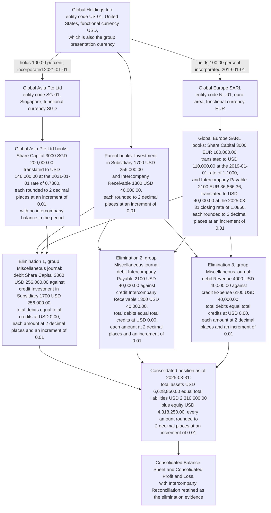

# FEATURE-001-06: Multi-Company & Intercompany Consolidation

---

## Metadata

| Attribute | Value |
|-----------|-------|
| **Feature ID** | `FEATURE-001-06` |
| **Title** | Multi-Company & Intercompany Consolidation |
| **Parent Epic** | [EPIC-001: Enterprise Accounting in Odoo](../EPIC-001-enterprise-accounting-odoo.md) |
| **Status** | Draft |
| **Priority** | 🟠 High |
| **Story Count** | 5 stories |
| **Last Updated** | 2026-08-16 |
| **Owner/Author** | Enterprise Accounting Team |

---

## 1. Feature Overview

### 1.1 Purpose and Business Value

This feature enables the **Group Controller** and the **Consolidation Accountant** to operate the group as one accounting entity while each legal entity keeps its own books: to define the parent-and-subsidiary company hierarchy with its functional and presentation currencies and its ownership percentages; to post an intercompany transaction that lands as a balanced entry in each participating company's books; to define the consolidation rules that map every entity's accounts onto the group taxonomy under a stated translation-rate policy; to eliminate intercompany receivables, payables, revenue and cost with a retained elimination working; and to produce the **Consolidated Balance Sheet** and the **Consolidated Profit & Loss** for the group in the group reporting currency.

It is delivered against two modules, and their availability differs:

- **`account`** — the "Invoicing" application, version 1.4, category `Accounting/Accounting`, licence LGPL-3, present in this repository. It supplies the ledger this feature consolidates: `account.move` and `account.move.line` carry the intercompany and elimination entries per company together with their transaction-currency amounts, `account.account` carries each entity's chart, `account.journal` carries the per-company Miscellaneous, Sales and Purchase journals, and the journal-entry lock date on `res.company` closes a consolidated period to further movement.
- **`account_consolidation`** — **absent from `addons/` in this repository**. Consolidation rules, elimination entries and consolidated statement production are an Enterprise capability, reachable either through an Odoo Enterprise subscription or through Odoo Community Association add-ons such as those in OCA/account-consolidation. The Epic's [D-002](../EPIC-001-enterprise-accounting-odoo.md#92-d-002-edition-capability-gap) records the module's absence as a verified fact, and that absence is exactly what makes the edition lock-in decision in [§5.2](#52-dependency-and-edition-considerations) material to this feature rather than academic. No consolidation implementation is present to extend, so this feature is the one place in the Epic where the whole capability is residual.

**Business Value Statement:**

> Group reporting stops being a spreadsheet exercise and becomes a ledger run. The consolidated Balance Sheet and Profit & Loss are produced within 48 hours of the last entity close instead of the 5 or more business days a spreadsheet consolidation takes (SM-013), and 100% of intercompany balances are eliminated with a retained proof, leaving a residual of at most `$0.02 USD` from currency rounding rather than an unexplained difference absorbed into equity (SM-012).

This feature carries the Epic's multi-entity objective directly, and the other two by consequence:

| Epic Objective | Contribution of This Feature |
|----------------|------------------------------|
| Multi-entity financial operations | The company hierarchy, the intercompany posting model and the elimination rule set are defined here, and every criterion in this feature names the company whose books are affected — Global Holdings Inc., Global Europe SARL or Global Asia Pte Ltd — so no outcome is satisfied by "the group" alone |
| Compliance reporting | Consolidated statements are presented under IFRS 10 with subsidiary results translated under IAS 21, the translation difference carried in Currency Translation Adjustment 3200, and the elimination working retained as audit evidence for the External Auditor |
| Real-time financial visibility | The group position is read from posted entity data and a reproducible elimination run, so the consolidated result is current as of the last posted entry in the last entity rather than as of the last spreadsheet refresh |

Three of the Epic's ordering rules govern this feature. **ORD-003** places the company-hierarchy story ahead of the consolidation stories inside this feature, because consolidation needs the parent-subsidiary structure, the group reporting currency and the intercompany partner mapping before a rule can be written. **ORD-005** places FEATURE-001-07's per-entity period close, through and including each participating company's lock dates, ahead of every group step that reads entity balances — translation, elimination and the consolidated pack alike — because a group result is reproducible only when the entity results behind it are closed and locked. **ORD-006** records the one thing that travels back the other way as a non-blocking hand-off: the consolidated pack is presented through the report presentation, export and drill-down convention FEATURE-001-07 owns, so this feature inherits a convention rather than becoming a prerequisite of the feature that owns it. The Epic therefore sequences this feature in **Phase 4 — Group and sub-ledgers**, after the transaction backbone and the entity close it consumes.

**Deterministic artifacts referenced by this feature's criteria.** The five stories and the criteria below are written against one fixed group, one fixed account set and one fixed rate set, so every assertion in this feature is checkable and no criterion depends on an unnamed value:

| Artifact Class | Values | Role in This Feature |
|----------------|--------|----------------------|
| Legal entities | The three entities of the Epic's canonical register ([Appendix E.4](../EPIC-001-enterprise-accounting-odoo.md#e4-canonical-legal-entity-register)) that exist at the 2025-03-31 worked reporting date: **Global Holdings Inc.** (entity code `US-01`, United States parent, functional currency USD, which is also the group presentation currency); **Global Europe SARL** (entity code `NL-01`, Netherlands subsidiary, functional currency EUR, wholly owned at 100.00%, incorporated by the parent on 2019-01-01); **Global Asia Pte Ltd** (entity code `SG-01`, Singapore subsidiary, functional currency SGD, wholly owned at 100.00%, incorporated by the parent on 2021-01-01). The register's fourth entity, **Global UK Ltd** (`GB-01`, United Kingdom, functional currency GBP, wholly owned at 100.00%), is incorporated by the parent on 2025-04-01 and therefore enters the consolidated statements from the quarter beginning 2025-04-01 | Every cross-entity criterion names the affected company by name. The entity codes are the Epic register's codes, which FEATURE-001-02, FEATURE-001-03, FEATURE-001-05, FEATURE-001-07, FEATURE-001-08 and this feature all read, so a reader moving between them reads one group. Because Global UK Ltd holds no balance and no transaction at 2025-03-31, the three entities named here are the complete consolidation scope of the worked quarter rather than a selection from it |
| Consolidation scope and method | Full consolidation of the two wholly owned subsidiaries in existence at the 2025-03-31 worked reporting date, and of Global UK Ltd on the same basis once it enters the group on 2025-04-01. Because each subsidiary was incorporated by Global Holdings Inc. at subscription value, no goodwill arises and no non-controlling interest exists; non-controlling-interest allocation and equity-method accounting are outside the Epic's scope ([§8.1](../EPIC-001-enterprise-accounting-odoo.md#81-explicitly-excluded-items)) | Keeps the elimination arithmetic provable and keeps the feature inside the Epic's stated boundary |
| Group ledger accounts added by this feature | Intercompany Receivable 1300, Intercompany Payable 2100, Investment in Subsidiary 1700, Currency Translation Adjustment 3200, Foreign Exchange Gain/Loss 7200 | Five codes this feature requires in addition to FEATURE-001-01's ten-code group baseline. They are recorded as an addition to the group chart-of-accounts policy owned there, never as a parallel chart. All five are **allocated to this feature** by the [FEATURE-001-01 §7.4 Group Chart-of-Accounts Extension Registry](./FEATURE-001-01-chart-of-accounts-fiscal-year.md#74-group-chart-of-accounts-extension-registry), which holds one meaning per code across the whole tree: 3200 is Currency Translation Adjustment and 7200 is Foreign Exchange Gain/Loss here and nowhere else, while the revaluation reserve and the disposal gain or loss of FEATURE-001-08 carry the distinct codes 3210 and 7210. Each of the five is also a row of the Epic's canonical account register ([Appendix E.2](../EPIC-001-enterprise-accounting-odoo.md#e2-canonical-group-chart-of-accounts)), which carries the same one-concept-per-code contract. No posting, report line, mapping or diagram in this feature reads 3200 or 7200 as anything other than the two accounts named above |
| Group ledger accounts consumed unchanged | Share Capital 3000, Retained Earnings 3100, Revenue 4000, Expense 6100 | Defined in FEATURE-001-01; the investment, balance and trading eliminations post against these codes |
| Journals | **Miscellaneous** per company for elimination, translation and revaluation entries; **Sales** and **Purchase** per company for intercompany trading | The journal is named on every posting assertion, per company |
| Currencies and rounding | USD, EUR and SGD, each carrying 2 decimal places at a rounding increment of 0.01 | Applied to every amount asserted anywhere in this feature |
| Exchange rates — **synthetic fixture rates**, not provider observations | Every rate below is a fixture value chosen so the worked figures close arithmetically; it is published in the Epic's [Appendix F.7](../EPIC-001-enterprise-accounting-odoo.md#f7-group-aggregation-for-the-worked-consolidation-quarter) and is deliberately not presented as a European Central Bank or other provider quotation for its date. EUR closing rate at 2025-03-31: 1.0850 USD/EUR. EUR average rate for 2025-01-01 to 2025-03-31: 1.0720 USD/EUR. EUR rate at the 2019-01-01 incorporation of Global Europe SARL: 1.1000 USD/EUR. SGD closing rate at 2025-03-31: 0.7450 USD/SGD. SGD average rate for the same quarter: 0.7380 USD/SGD. SGD rate at the 2021-01-01 incorporation of Global Asia Pte Ltd: 0.7300 USD/SGD | Every translated amount names the rate and the rate date it was translated at, so no figure is a bare conversion |
| Reports | **Consolidated Balance Sheet** (as-of-date parameter, worked at 2025-03-31); **Consolidated Profit & Loss** (date-range parameter, worked at 2025-01-01 to 2025-03-31); **Intercompany Reconciliation** (as-of-date parameter, worked at 2025-03-31) | The three named outputs of this feature, each asserted with at least one expected line value |

### 1.2 Problem Statement

Each legal entity in this group keeps a complete set of books and the group keeps none. Consolidation happens in a spreadsheet after the fact, and five consequences follow at every period end:

- **No group structure exists in the system of record.** No parent-subsidiary relationship, no ownership percentage and no group presentation currency are held against Global Holdings Inc., Global Europe SARL or Global Asia Pte Ltd, so there is nothing for a consolidation run to read. The group's composition lives in a workbook tab, and an entity added mid-year reaches the group statements only when someone remembers to extend the formula range.
- **Intercompany trading inflates the group result.** A shared-services charge of `$40,000.00 USD` raised by Global Holdings Inc. on Global Europe SARL is revenue in one set of books and cost in the other, each amount rounded to 2 decimal places at the rounding increment of 0.01 for its currency. Added together without elimination it overstates group revenue and group cost by the same figure, so margin analysis, revenue-based covenants and management incentives are all computed on a number that includes the group trading with itself.
- **Intercompany balances double-count.** The same charge stands as Intercompany Receivable 1300 in Global Holdings Inc. and as Intercompany Payable 2100 in Global Europe SARL. With no matched pairing and no elimination, group assets and group liabilities are each overstated by `$40,000.00 USD`, rounded to 2 decimal places at the USD rounding increment of 0.01, and a balance that one side has written off while the other still carries is discovered by the auditor rather than by the ledger.
- **Subsidiary results in other currencies are translated without a policy.** Global Europe SARL reports in EUR and Global Asia Pte Ltd in SGD. Nothing records which rate applies to which line — closing rate for assets and liabilities, average rate for income and expense, historical rate for subscribed capital — so the translation differs from one month to the next, and the residual is plugged into retained earnings instead of being presented in Currency Translation Adjustment 3200 as IAS 21 requires.
- **The group cannot present a consolidated position on demand.** Lenders, investors and regulators ask for a consolidated Balance Sheet and Profit & Loss. Producing them takes 5 or more business days after the last entity closes, the elimination working is a spreadsheet nobody retains, and no drill-down exists from a consolidated line back to the entity journal item behind it, so the External Auditor tests the group numbers by re-performing the consolidation rather than by reading its evidence.

### 1.3 Key Capabilities

| Capability ID | Capability Description | Related Stories |
|---------------|------------------------|-----------------|
| CAP-001 | Define the parent and subsidiary company hierarchy with functional and presentation currencies and ownership percentages | STORY-001-06-01 |
| CAP-002 | Post intercompany transactions producing a balanced entry in each participating company's books | STORY-001-06-02 |
| CAP-003 | Define consolidation rules mapping entity accounts to the group taxonomy with a translation-rate policy | STORY-001-06-03 |
| CAP-004 | Eliminate intercompany receivables, payables, revenue and cost, and reconcile any residual difference | STORY-001-06-04 |
| CAP-005 | Generate the Consolidated Balance Sheet and Consolidated Profit & Loss for the group | STORY-001-06-05 |

The five capabilities are cumulative, and that is why the story order in [§3.4](#34-recommended-implementation-order) is what it is. CAP-001 establishes who is in the group and in which currency each entity measures itself. CAP-002 creates the intercompany population that consolidation later has to remove, and proves it balances in both sets of books at the point of posting rather than at the point of elimination. CAP-003 states how an entity account reaches a group line and which rate translates it. CAP-004 removes the group's trading with itself and proves the removal. CAP-005 presents what remains as the group's own statements, with each line traceable to the entity journal items behind it.

### 1.4 Success Criteria at Feature Level

The worked figures below are one internally consistent quarter for the three named entities. They are stated in full because a consolidation is accepted on whether its numbers tie, not on whether its steps ran.

| Criterion | Target | Verification Method |
|-----------|--------|---------------------|
| Group hierarchy defined | Global Holdings Inc. (`US-01`, functional currency USD, group presentation currency USD) is the parent of Global Europe SARL (`NL-01`, functional currency EUR, ownership 100.00%) and Global Asia Pte Ltd (`SG-01`, functional currency SGD, ownership 100.00%), each carrying its functional currency, its ownership percentage and full consolidation as its method; across the three entities in the consolidation scope at 2025-03-31 the count with no parent link, no functional currency or no ownership percentage is 0 | Configuration checklist executed per entity, with the incomplete count asserted at 0 |
| Intercompany transaction balanced in each set of books | The shared-services charge of `$40,000.00 USD` from Global Holdings Inc. to Global Europe SARL, dated 2025-03-31, posts in Global Holdings Inc.'s Sales journal as debit Intercompany Receivable 1300 `$40,000.00 USD` and credit Revenue 4000 `$40,000.00 USD`, so total debits of `$40,000.00 USD` equal total credits of `$40,000.00 USD` at a difference of `0.00 USD`; and it posts in Global Europe SARL's Purchase journal at the 2025-03-31 transaction-date rate of 1.0850 USD/EUR as debit Expense 6100 `€36,866.36 EUR` and credit Intercompany Payable 2100 `€36,866.36 EUR`, so total debits of `€36,866.36 EUR` equal total credits of `€36,866.36 EUR` at a difference of `0.00 EUR`; each amount is rounded to 2 decimal places at the rounding increment of 0.01 for its currency | Both entries inspected line by line, with the debit-minus-credit difference asserted at `0.00` in each company's functional currency (C-009) |
| Intercompany pair nets to zero at group level | Intercompany Receivable 1300 of `$40,000.00 USD` in Global Holdings Inc. matches Intercompany Payable 2100 of `€36,866.36 EUR` in Global Europe SARL, which translates at the 2025-03-31 closing rate of 1.0850 USD/EUR to `$40,000.00 USD`, rounded to 2 decimal places at the USD rounding increment of 0.01; the pair nets to `$0.00 USD`, and the arithmetic residual before rounding stays inside the `$0.02 USD` tolerance | **Intercompany Reconciliation** report run with the as-of-date parameter 2025-03-31, showing the matched pair with both company names and a residual line of `$0.00 USD` (SM-012) |
| Currency translation of the euro-area subsidiary | Global Europe SARL's total assets of `€850,000.00 EUR` translate at the 2025-03-31 closing rate of 1.0850 USD/EUR to `$922,250.00 USD` and its total liabilities of `€336,866.36 EUR` to `$365,500.00 USD`; Revenue 4000 of `€420,000.00 EUR` and third-party Expense 6100 of `€360,000.00 EUR` translate at the quarter average rate of 1.0720 USD/EUR to `$450,240.00 USD` and `$385,920.00 USD`; Share Capital 3000 of `€100,000.00 EUR` translates at the 2019-01-01 incorporation rate of 1.1000 USD/EUR to `$110,000.00 USD`, and opening Retained Earnings 3100 of `€390,000.00 EUR` is carried forward at `$421,200.00 USD` from the prior period's translated statements; the residual of `$1,230.00 USD` is credited to Currency Translation Adjustment 3200; every amount is rounded to 2 decimal places at the rounding increment of 0.01 for its currency | Translation reconciliation for Global Europe SARL: translated net assets of `$556,750.00 USD` equal translated equity components of `$555,520.00 USD` plus Currency Translation Adjustment 3200 of `$1,230.00 USD`, asserted at a difference of `0.00 USD` |
| Currency translation of the Singapore subsidiary | Global Asia Pte Ltd's total assets of `S$1,200,000.00 SGD` translate at the 2025-03-31 closing rate of 0.7450 USD/SGD to `$894,000.00 USD` and its total liabilities of `S$500,000.00 SGD` to `$372,500.00 USD`; its profit for the quarter of `S$80,000.00 SGD` translates at the average rate of 0.7380 USD/SGD to `$59,040.00 USD`; Share Capital 3000 of `S$200,000.00 SGD` translates at the 2021-01-01 incorporation rate of 0.7300 USD/SGD to `$146,000.00 USD`, and opening Retained Earnings 3100 of `S$420,000.00 SGD` is carried forward at `$306,600.00 USD`; the residual of `$9,860.00 USD` is credited to Currency Translation Adjustment 3200; every amount is rounded to 2 decimal places at the rounding increment of 0.01 for its currency | Translation reconciliation for Global Asia Pte Ltd: translated net assets of `$521,500.00 USD` equal translated equity components of `$511,640.00 USD` plus Currency Translation Adjustment 3200 of `$9,860.00 USD`, asserted at a difference of `0.00 USD` |
| Elimination entries balanced | Three elimination entries post through the group Miscellaneous journal of `GRP-01` (**Global Group Consolidation**), one entry per elimination, leaving the statutory ledgers of Global Holdings Inc., Global Europe SARL and Global Asia Pte Ltd untouched, each with total debits equal to total credits at a difference of `0.00 USD`: the investment elimination, debit Share Capital 3000 `$256,000.00 USD` and credit Investment in Subsidiary 1700 `$256,000.00 USD`, being `$110,000.00 USD` for Global Europe SARL and `$146,000.00 USD` for Global Asia Pte Ltd; the balance elimination, debit Intercompany Payable 2100 `$40,000.00 USD` and credit Intercompany Receivable 1300 `$40,000.00 USD` between Global Holdings Inc. and Global Europe SARL; and the trading elimination, debit Revenue 4000 `$40,000.00 USD` and credit Expense 6100 `$40,000.00 USD` for the same charge; every amount rounded to 2 decimal places at the USD rounding increment of 0.01 | Each entry inspected line by line with the debit-minus-credit difference asserted at `0.00 USD`, and the elimination working retained as evidence for the External Auditor (C-009, Epic Definition of Done item 3) |
| Intercompany trading removed from the group result | After elimination the `$40,000.00 USD` shared-services charge between Global Holdings Inc. and Global Europe SARL contributes `$0.00 USD` to consolidated Revenue 4000 and `$0.00 USD` to consolidated Expense 6100, rounded to 2 decimal places at the USD rounding increment of 0.01 | Aggregate revenue and cost before elimination compared with the **Consolidated Profit & Loss** for the date range 2025-01-01 to 2025-03-31, with the difference asserted at exactly the eliminated amount |
| Consolidated Balance Sheet balances | Run with the as-of-date parameter 2025-03-31 in the group presentation currency USD, the report presents total assets of `$6,628,850.00 USD` equal to total liabilities of `$2,310,600.00 USD` plus total equity of `$4,318,250.00 USD` at a difference of `0.00 USD`; Intercompany Receivable 1300 and Intercompany Payable 2100 each present `$0.00 USD`; Investment in Subsidiary 1700 presents `$0.00 USD`; Share Capital 3000 presents the parent's `$2,256,000.00 USD`; and Currency Translation Adjustment 3200 presents `$11,090.00 USD`, being `$1,230.00 USD` for Global Europe SARL and `$9,860.00 USD` for Global Asia Pte Ltd; every amount rounded to 2 decimal places at the USD rounding increment of 0.01 | Report reconciliation: the assets-minus-liabilities-and-equity difference asserted at `0.00 USD`, and each presented line agreed to the aggregated entity balances net of the retained elimination working (SM-013) |
| Consolidated Profit & Loss ties to consolidated equity | Run with the date-range parameter 2025-01-01 to 2025-03-31 in USD, the report presents Revenue 4000 of `$2,513,640.00 USD`, Expense 6100 of `$1,940,830.00 USD`, Depreciation Expense 6500 of `$144,000.00 USD`, Foreign Exchange Gain/Loss 7200 of `$5,450.00 USD` and profit for the period of `$423,360.00 USD`, which equals the profit line inside consolidated equity on the Consolidated Balance Sheet as of 2025-03-31 at a difference of `0.00 USD`; every amount rounded to 2 decimal places at the USD rounding increment of 0.01 | Report-to-report reconciliation between the two consolidated statements, with the profit difference asserted at `0.00 USD` |
| Consolidation refused while an entity holds unposted entries | 100% of consolidation runs covering a period in which Global Asia Pte Ltd holds draft journal entries are refused with an Odoo validation message that names Global Asia Pte Ltd and the period, and the refused run creates no elimination entry | Negative test executed with one draft entry left open in Global Asia Pte Ltd |
| Consolidation refused when a translation rate is missing | 100% of consolidation runs are refused with an Odoo validation message naming the currency and the as-of date when no closing rate exists for SGD at 2025-03-31, and no partially translated result is published | Negative test executed with the 2025-03-31 SGD rate removed from the rate table |
| Residual intercompany difference reported rather than absorbed | An intercompany invoice posted in Global Holdings Inc. with no counterpart in Global Asia Pte Ltd is listed as an unmatched item on the **Intercompany Reconciliation** report as of 2025-03-31, naming Global Holdings Inc. and Global Asia Pte Ltd and stating the unmatched amount in USD rounded to 2 decimal places at the USD rounding increment of 0.01; the consolidation run reports the residual instead of clearing it to equity | Report inspection after seeding one unmatched intercompany invoice (SM-012) |
| Elimination refused in a locked period by the run's own guard | 100% of attempts to post an elimination entry dated on or before a company's journal-entry lock date are refused by the pre-posting guard the elimination run delivers (Epic §7.8 **L-11**) — the guard inspecting the lock dates **before the journal entry is constructed**, so 0 `account.move` records are created, 0 journal items are written, no journal sequence number is consumed, and the message is the guard's own naming the company, the violated lock date and the remedial action rather than the platform text of L-2. The guard is required because the platform would otherwise post the elimination re-dated into the first open period (L-1), and an elimination re-dated out of the consolidation period would leave the published group result unreproducible | Per-company test after the period lock is applied, asserting 0 created entries, 0 consumed sequence numbers, the guard's own named refusal, and the re-run of the published consolidated statements at a `0.00 USD` difference |
| Company isolation preserved | A persona whose allowed companies are limited to Global Europe SARL can neither read nor post journal items belonging to Global Asia Pte Ltd or to Global Holdings Inc., and the consolidation run itself executes only for a persona holding all three companies | Access-rights test matrix executed per persona and per company (C-014) |
| Test coverage | ≥80% for all 5 story implementations, with the translation, balance and elimination assertions tested as amounts | Coverage tooling in the repository's configured test run (C-007, C-009) |
| Demonstrability | 5 of 5 stories demonstrated in the Odoo user interface, or over the JSON web-service surface the Epic's C-023 contract governs under a dedicated named integration principal, to the Finance Controller and the Product Owner | Recorded acceptance walkthrough per story |
| Consolidated statement production time | The Consolidated Balance Sheet and the Consolidated Profit & Loss are published within 48 hours of the last of the three entities applying its period lock date | Hours elapsed from the final entity lock date to consolidated statement publication (SM-013) |

---

## 2. User Personas

### 2.1 Persona Mapping

Every persona below is a named finance role drawn from the Epic's persona register. The five roles marked applicable take a configuration, posting, presentation or verification action inside this feature; the roles marked not applicable supply an input to it or consume its output, and the feature that owns their work is named against them.

| Persona | Role Description | Primary Use Cases | Applicable |
|---------|------------------|-------------------|------------|
| **Group Controller** | Governs group accounting policy and approves the consolidated result | Owns the group structure: defines Global Holdings Inc. as parent of Global Europe SARL and Global Asia Pte Ltd, sets each entity's functional currency, its ownership percentage of 100.00% and full consolidation as its method, and fixes USD as the group presentation currency. Owns the consolidation policy: which rate translates which class of line, how an entity account maps onto the group taxonomy, and which intercompany pairs are in scope for elimination. Approves the consolidated result before it is issued | ☑ **Primary** |
| **Consolidation Accountant** | Executes consolidation runs, eliminations and currency translation | Runs the consolidation for the period, posts the intercompany trading and balance entries where the group operates them centrally, executes the investment, balance and trading eliminations through each company's Miscellaneous journal, proves each elimination entry balances at a difference of `0.00 USD`, and investigates any residual on the Intercompany Reconciliation report instead of clearing it to equity | ☑ Yes |
| **Chief Accountant** | Owns the general ledger, the chart of accounts and the integrity of every posted entry | Owns the entity-level books that feed the group: confirms that Intercompany Receivable 1300, Intercompany Payable 2100, Investment in Subsidiary 1700, Currency Translation Adjustment 3200 and Foreign Exchange Gain/Loss 7200 exist in each company's chart before a consolidation rule points at them, verifies that each intercompany entry posts with total debits equal to total credits in that company's functional currency, and administers the journal-entry lock date that closes a consolidated period | ☑ Yes |
| **Financial Reporting Manager** | Produces statutory and management statements for each entity and the group | Presents the group result: runs the Consolidated Balance Sheet as of 2025-03-31 and the Consolidated Profit & Loss for 2025-01-01 to 2025-03-31 in USD, confirms that consolidated assets equal consolidated liabilities plus equity at a difference of `0.00 USD`, presents Currency Translation Adjustment 3200 of `$11,090.00 USD` as a separate equity component, and reconciles the consolidated profit line between the two statements | ☑ Yes |
| **External Auditor** | Tests balances and controls and issues the audit opinion | Tests the group without re-performing it: reads the retained elimination working, traces a consolidated line to the entity journal items behind it in the named company, checks the translation reconciliation for Global Europe SARL and Global Asia Pte Ltd against the stated rates and rate dates, and reads the Intercompany Reconciliation report and the lock-date history as evidence | ☑ Yes |
| Accounts Receivable Specialist | Issues customer invoices, allocates receipts and manages collections | Raises the intercompany sales document in the selling company under FEATURE-001-03's conventions; the pairing of that document with its counterpart and its later elimination are specified here rather than there | ☐ No |
| Accounts Payable Clerk | Captures vendor bills, runs three-way match and prepares payment runs | Captures the intercompany purchase document in the buying company under FEATURE-001-02's conventions; this feature consumes the resulting Intercompany Payable 2100 balance without changing how the bill is captured | ☐ No |
| Treasury Analyst | Owns bank and cash positions and statement reconciliation | Owns the exchange-rate source and the currency configuration this feature translates with, as recorded in the Epic's master-data readiness gate, and settles intercompany balances through the bank in FEATURE-001-04; takes no consolidation action here | ☐ No |
| Tax Accountant | Determines tax on transactions and files statutory returns | Configures the per-entity fiscal positions that determine tax on an intercompany supply in FEATURE-001-05; group elimination removes the intercompany base and cost while each entity's tax position stays intact | ☐ No |
| CFO / Finance Director | Executive stakeholder accountable for financial health and compliance | Consumes the consolidated group position and confirms the open platform and edition decisions recorded in [§5.2](#52-dependency-and-edition-considerations) and [§5.5](#55-version-compatibility); does not configure, post or eliminate | ☐ No |

### 2.2 Persona-to-Story Mapping

Each story carries exactly one primary persona in its WHO statement. Secondary personas supply an input, prove a posting or verify the outcome, and they are named so that the access rights derived from these stories keep the role that governs group policy, the role that executes the run and the role that owns the entity books distinguishable.

| Story | Primary Persona | Secondary Personas |
|-------|-----------------|--------------------|
| STORY-001-06-01 Configure Company Hierarchy and Currencies | Group Controller | Chief Accountant (the chart and journals each entity contributes), Treasury Analyst (currency configuration and rate source), External Auditor (structure and ownership evidence) |
| STORY-001-06-02 Post Intercompany Transactions | Consolidation Accountant | Chief Accountant (balanced posting in each company's books), Accounts Receivable Specialist and Accounts Payable Clerk (the documents raised in the selling and buying companies), External Auditor (both-sides traceability) |
| STORY-001-06-03 Define Consolidation Rules | Group Controller | Chief Accountant (account mapping onto the group taxonomy), Financial Reporting Manager (group taxonomy presentation), Treasury Analyst (the closing, average and historical rates the policy names) |
| STORY-001-06-04 Eliminate Intercompany Balances | Consolidation Accountant | Group Controller (approval of the elimination policy and of any residual treatment), Chief Accountant (lock-date administration), External Auditor (the retained elimination working) |
| STORY-001-06-05 Generate Consolidated Financial Statements | Financial Reporting Manager | Group Controller (approval before issue), Consolidation Accountant (the run behind the statements), External Auditor (drill-down from a consolidated line to the entity journal item), CFO / Finance Director (consumes the issued statements) |

---

## 3. Story List

### 3.1 User Stories

| Story ID | Story Title | Persona | Priority | Status | Link |
|----------|-------------|---------|----------|--------|------|
| STORY-001-06-01 | Configure Company Hierarchy and Currencies | Group Controller | 🔴 Critical | Draft | [STORY-001-06-01](./FEATURE-001-06/STORY-001-06-01-configure-company-hierarchy.md) |
| STORY-001-06-02 | Post Intercompany Transactions | Consolidation Accountant | 🟠 High | Draft | [STORY-001-06-02](./FEATURE-001-06/STORY-001-06-02-post-intercompany-transactions.md) |
| STORY-001-06-03 | Define Consolidation Rules | Group Controller | 🔴 Critical | Draft | [STORY-001-06-03](./FEATURE-001-06/STORY-001-06-03-define-consolidation-rules.md) |
| STORY-001-06-04 | Eliminate Intercompany Balances | Consolidation Accountant | 🔴 Critical | Draft | [STORY-001-06-04](./FEATURE-001-06/STORY-001-06-04-eliminate-intercompany-balances.md) |
| STORY-001-06-05 | Generate Consolidated Financial Statements | Financial Reporting Manager | 🔴 Critical | Draft | [STORY-001-06-05](./FEATURE-001-06/STORY-001-06-05-generate-consolidated-financials.md) |

**Priority legend:** 🔴 Critical — the group result cannot be produced or defended without it, so four of the five stories carry it; 🟠 High — significant group value whose timing follows the transaction features that already raise intercompany documents.

**Feature priority.** This feature's own metadata priority is **🟠 High**, taken without change from the Epic's feature summary, where the nine feature priorities are declared the single source of truth. The Epic assigns High because consolidation consumes the posted record rather than creating it: entity postings, the entity close and the entity lock dates all exist before a group result is meaningful. Story-level priorities inside the feature are set independently of that, which is why four Critical stories sit inside a High feature — once the group is being consolidated at all, the hierarchy, the rule set, the elimination and the statements are each indispensable to the outcome.

### 3.2 Story Count Assessment

| Count | Assessment | Status |
|-------|------------|--------|
| **5 stories** | Within the mandated range of 2 to 5 stories per feature | ✓ Feature is scoped for independent delivery |

This feature carries **5 stories**, at the upper bound of the 2-to-5 range recorded in the Epic's decomposition guidelines. The earlier 3-to-7 guidance carried by the feature template is superseded by that bound and is not applied here. The count is stated identically in four places, and the four must stay equal: the Story Count row in §Metadata, this assessment, the 5 rows of [§3.1](#31-user-stories), and the 5 links of [§9.2](#92-story-files). The Epic's feature summary declares the same count of 5 stories for `FEATURE-001-06`.

Splitting further would produce stories with no accounting proof of their own: a translation policy separated from the rule set it belongs to has nothing to translate, and an elimination separated from the intercompany population has nothing to remove. Merging would breach the Small criterion of INVEST, because each of the five outcomes is demonstrated by a different artifact — a company hierarchy record carrying a functional currency and an ownership percentage, a pair of balanced journal entries in two companies' books, a consolidation rule set naming the rate per line class, three balanced elimination entries with a retained working, and two consolidated statements that tie to each other at a difference of `0.00 USD`.

### 3.3 Story Dependency Ordering

Each of the five stories delivers an outcome demonstrable on its own, which keeps them Independent under INVEST. The rows below are sequencing prerequisites — configuration or posted data that must already exist for the dependent story to be demonstrated — and not shared implementation.

| Story | Depends On | Notes |
|-------|-----------|-------|
| STORY-001-06-01 (Company Hierarchy and Currencies) | None within this feature | Foundation story. Outside this feature it depends on FEATURE-001-01 for each entity's chart of accounts and journals, and on the currency and rate configuration the Epic's master-data gate assigns to the Treasury Analyst |
| STORY-001-06-02 (Post Intercompany Transactions) | STORY-001-06-01 | An intercompany entry needs both companies defined before it can be raised: the selling company, the buying company, the intercompany counterparty mapping between them, and the functional currency each side measures the transaction in. Without the hierarchy there is no second set of books to post the counterpart into |
| STORY-001-06-03 (Define Consolidation Rules) | STORY-001-06-01 | The rules map each entity's chart onto the group taxonomy and name the rate that translates each class of line, so the entities, their functional currencies and the group presentation currency must exist first. This story does not depend on STORY-001-06-02: a mapping is defined against accounts, not against postings |
| STORY-001-06-04 (Eliminate Intercompany Balances) | STORY-001-06-02, STORY-001-06-03 | Elimination consumes both inputs: the intercompany postings created by STORY-001-06-02 give it the balances and the trading to remove, and the rule set from STORY-001-06-03 tells it which group lines those amounts land on and at which rate they were translated |
| STORY-001-06-05 (Generate Consolidated Financial Statements) | STORY-001-06-03, STORY-001-06-04 | The consolidated pack is produced after mapping and elimination: the rule set determines the statement lines and the translation, and the elimination determines what remains to present. It also depends outside this feature on FEATURE-001-07, because ORD-005 requires closed and locked entity results before a group statement is reproducible |

### 3.4 Recommended Implementation Order

```text
0. FEATURE-001-01 and FEATURE-001-07 (external prerequisites)
   Each entity's chart of accounts and journals exist, the five group codes this
   feature adds are approved into the chart, and each entity's period is closed
   and locked before a group result is reproducible (ORD-001 for the chart,
   ORD-005 for the closed and locked entity period)
        |
        v
1. STORY-001-06-01  Configure Company Hierarchy and Currencies
   Structure: Global Holdings Inc. as parent of Global Europe SARL and
   Global Asia Pte Ltd, each with its functional currency, its ownership
   percentage of 100.00% and USD as the group presentation currency (ORD-003)
        |
        +--> 2. STORY-001-06-02  Post Intercompany Transactions
        |       Population: a balanced entry in each participating company's
        |       books, with the counterpart identified for later pairing
        |            |
        +--> 3. STORY-001-06-03  Define Consolidation Rules
        |       Policy: entity accounts mapped onto the group taxonomy, with
        |       closing, average and historical rates named per line class
        |            |
        |            v
        +-------> 4. STORY-001-06-04  Eliminate Intercompany Balances
                    Proof: investment, balance and trading eliminations posted
                    balanced, with any residual reported rather than absorbed
                         |
                         v
                 5. STORY-001-06-05  Generate Consolidated Financial Statements
                    Presentation: Consolidated Balance Sheet as of 2025-03-31 and
                    Consolidated Profit & Loss for 2025-01-01 to 2025-03-31 in USD
```

**Where step 0 ends and step 4 begins.** ORD-005 places the whole group layer — the translation of entity balances, the elimination run of step 4 and the consolidated pack of step 5 — after the **last** participating entity has closed its period and applied its lock dates, not inside any entity's close. Recomputing an elimination against balances an entity can still restate is the failure this ordering removes. The consequence for step 4 is that its entries are dated inside a period every operating company has already locked, so the ledger those entries post into, and the lock that governs them, are the subject of the open consolidation-ledger question recorded in [§6.5 Discovery vs. Prescription Guidelines](#65-discovery-vs-prescription-guidelines) — "where elimination entries are posted so no statutory entity ledger is contaminated" — and carried in [STORY-001-06-04](./FEATURE-001-06/STORY-001-06-04-eliminate-intercompany-balances.md). The refusal behaviour asserted there is the refusal of the ledger that carries the elimination, and it is settled together with that question rather than assumed here.

Steps 2 and 3 both wait only on step 1 and have no dependency on one another, so they may be delivered concurrently: one creates the intercompany population while the other states the mapping and translation policy. Step 4 consumes both, and step 5 consumes step 4 together with the locked entity results FEATURE-001-07 produces.

---

## 4. Acceptance Criteria Summary

### 4.1 Feature-Level Acceptance Criteria

**This section is this feature's Feature Definition of Done.** That is the name the programme's planning standard gives the completion gate every feature file carries, and the Epic publishes the three-level vocabulary once in [§5.3](../EPIC-001-enterprise-accounting-odoo.md#53-feature-and-story-decomposition-guidelines): the Epic-Level Definition of Done is [§13 of the Epic](../EPIC-001-enterprise-accounting-odoo.md#13-epic-level-definition-of-done), this section is the Feature Definition of Done, and each story closes on its own `Definition of Done`. The heading keeps the wording `Feature-Level Acceptance Criteria`, and so keeps its anchor `#41-feature-level-acceptance-criteria`, because links across this tree resolve to it — the two names denote one gate, and this file carries no second list of feature-completion conditions.

These are feature-level gates. The Given/When/Then acceptance criteria live in the five story files, where each is written against one workflow with 4 to 8 criteria and the coverage distribution the Epic requires.

The feature is considered complete when:

- [ ] All 5 stories within this feature have status "Done"
- [ ] All 5 stories achieve minimum 80% test coverage (C-007)
- [ ] Feature-level integration tests pass, with every translation, balance and elimination assertion tested as an amount rather than inspected by eye (C-009)
- [ ] Each of the 5 stories has been demonstrated in the Odoo user interface, or over the JSON web-service surface the Epic's C-023 contract governs under a dedicated named integration principal holding no authority its human counterpart lacks, to the Finance Controller and the Product Owner, and the walkthrough is recorded against the story
- [ ] The group hierarchy is configured with Global Holdings Inc. (`US-01`) as parent of Global Europe SARL (`NL-01`) and Global Asia Pte Ltd (`SG-01`), each subsidiary carrying its functional currency, an ownership percentage of 100.00% and full consolidation as its method, with USD fixed as the group presentation currency; the count of in-scope entities with no parent link, no functional currency or no ownership percentage is 0
- [ ] The five group codes this feature adds — Intercompany Receivable 1300, Intercompany Payable 2100, Investment in Subsidiary 1700, Currency Translation Adjustment 3200 and Foreign Exchange Gain/Loss 7200, each allocated to this feature by the [FEATURE-001-01 §7.4 Group Chart-of-Accounts Extension Registry](./FEATURE-001-01-chart-of-accounts-fiscal-year.md#74-group-chart-of-accounts-extension-registry) and carrying that one meaning across the tree — exist in the chart of every one of the three companies, approved into the group chart-of-accounts policy owned by FEATURE-001-01, with no parallel chart created, each standing as a row of the Epic's canonical account register ([Appendix E.2](../EPIC-001-enterprise-accounting-odoo.md#e2-canonical-group-chart-of-accounts))
- [ ] **The intercompany transaction balances in each company's books.** The shared-services charge of `$40,000.00 USD` dated 2025-03-31 posts in Global Holdings Inc.'s Sales journal as debit Intercompany Receivable 1300 `$40,000.00 USD` and credit Revenue 4000 `$40,000.00 USD`, so total debits of `$40,000.00 USD` equal total credits of `$40,000.00 USD` at a difference of `0.00 USD`; and in Global Europe SARL's Purchase journal, at the 2025-03-31 transaction-date rate of 1.0850 USD/EUR, as debit Expense 6100 `€36,866.36 EUR` and credit Intercompany Payable 2100 `€36,866.36 EUR`, so total debits of `€36,866.36 EUR` equal total credits of `€36,866.36 EUR` at a difference of `0.00 EUR`; each amount is rounded to 2 decimal places at the rounding increment of 0.01 for its currency
- [ ] **The intercompany counterpart is identified at posting time, not at elimination time.** The entry in Global Holdings Inc. names Global Europe SARL as its counterparty and the entry in Global Europe SARL names Global Holdings Inc., so the pair is matched by counterparty and document reference rather than by amount alone
- [ ] **No pair is left silently half-recorded, and one person never authorizes both of its legs (ICP-001, [§4.5](#45-grp-01-authorization-matrix)).** A pair carries one immutable UUID version 4 identifier recorded on both legs and held by a database unique constraint over the two companies and that identifier, so a replayed mirroring resolves to the existing pair and produces 1 buying leg rather than 2, and the count of posted legs whose identifier was changed after posting is **0**. Where both companies are ready the two entries are written **inside one database transaction**, so a failure between them leaves 0 journal entries in Global Holdings Inc.'s books and 0 in Global Europe SARL's books. Where the second leg cannot be written, the pair enters the named **Intercompany In-Transit** state carrying its identifier, both company names, the amount of `$40,000.00 USD`, the accounting date, the absent leg, the reason and a named owner; it appears on the **Intercompany Reconciliation** report as of every date it is open, so the count of open in-transit pairs absent from that report is **0**; it blocks the elimination run for that pair and the close of the companies it spans; and it closes only by posting the absent leg against the same identifier or reversing the posted leg — never by writing a difference to Retained Earnings 3100, Currency Translation Adjustment 3200 or Foreign Exchange Gain/Loss 7200. The count of pairs whose two legs were authorized by one person is **0**, and the count of legs posted by a role holding no posting right in that leg's own company is **0**, each proved by a named denial test
- [ ] **An elimination run is executed and approved by two different people, and a pack is issued only from an approved version ([§4.5](#45-grp-01-authorization-matrix)).** The **Consolidation Accountant** executes a run; the **Group Controller** approves the resulting elimination version and cannot approve a version it executed itself, so the count of versions approved by their own executor is **0**; the **Financial Reporting Manager** issues a consolidated pack only against a version carrying a recorded approval, so the count of packs issued from an unapproved or superseded version is **0**. Holding all three companies among a persona's allowed companies permits the cross-company read a run needs and confers no posting right in any of them, so the count of entity journal items written by a run is **0**
- [ ] **The intercompany pair nets to zero at group level.** Intercompany Receivable 1300 of `$40,000.00 USD` in Global Holdings Inc. and Intercompany Payable 2100 of `€36,866.36 EUR` in Global Europe SARL, translated at the 2025-03-31 closing rate of 1.0850 USD/EUR to `$40,000.00 USD` and rounded to 2 decimal places at the USD rounding increment of 0.01, net to `$0.00 USD`, with the arithmetic residual before rounding inside the `$0.02 USD` tolerance SM-012 states
- [ ] **A rate, a rule and a group-structure change are each released by a person other than their author, and a feed outage degrades in a declared way ([RATE-001](./FEATURE-001-06/STORY-001-06-01-configure-company-hierarchy.md#rate-001--the-rate-authority-availability-and-fallback-contract)).** The **Treasury Analyst** authors a rate version and the **Group Controller** approves it; the **Consolidation Accountant** authors a consolidation-rule version and the Group Controller approves it; the Group Controller authors a group-structure change and the **CFO / Finance Director** approves it. In each case an approval recorded by the version's own author is refused with the version and the separation named, the count of released versions whose approver equals their author is **0**, and the authoring role holds no override; an unapproved version resolves nothing, so the count of translations, elimination entries and consolidated packs produced against one is **0**. A rate fetch carries a declared per-attempt timeout, a bounded retry budget with exponential backoff and jitter, a circuit breaker that is recorded and alerted on, and a named terminal state; a run at a rate older than the declared maximum age for its rate type is refused with the currency pair, the rate date, the rate's age and the maximum named as four values, so the count of packs issued at an over-age rate is **0**; and a hand-entered rate is marked manually sourced with its enterer, its published reference, its timestamp and a declared expiry, requires the Group Controller's approval, and is named on every statement, pack and elimination working produced while it is in force, so the count of packs translated at an undisclosed manual rate is **0**
- [ ] **The consolidation rule set names a rate for every class of line.** Assets and liabilities translate at the closing rate for the as-of date, third-party income and expense at the average rate for the reporting date range, subscribed capital at the rate on the incorporation date of the entity that subscribed it, and intercompany income and expense at the rate on the date of the intercompany transaction so that both legs eliminate at one amount; the policy is recorded against the rule set rather than left to the run
- [ ] **The euro-area subsidiary translates on that policy.** Global Europe SARL's total assets of `€850,000.00 EUR` translate at the 2025-03-31 closing rate of 1.0850 USD/EUR to `$922,250.00 USD`, its total liabilities of `€336,866.36 EUR` to `$365,500.00 USD`, its Revenue 4000 of `€420,000.00 EUR` and third-party Expense 6100 of `€360,000.00 EUR` at the quarter average rate of 1.0720 USD/EUR to `$450,240.00 USD` and `$385,920.00 USD`, and its Share Capital 3000 of `€100,000.00 EUR` at the 2019-01-01 incorporation rate of 1.1000 USD/EUR to `$110,000.00 USD`, with opening Retained Earnings 3100 of `€390,000.00 EUR` carried forward at `$421,200.00 USD`; translated net assets of `$556,750.00 USD` equal translated equity components of `$555,520.00 USD` plus Currency Translation Adjustment 3200 of `$1,230.00 USD` at a difference of `0.00 USD`, every amount rounded to 2 decimal places at the rounding increment of 0.01 for its currency
- [ ] **The Singapore subsidiary translates on the same policy in a third currency.** Global Asia Pte Ltd's total assets of `S$1,200,000.00 SGD` translate at the 2025-03-31 closing rate of 0.7450 USD/SGD to `$894,000.00 USD`, its total liabilities of `S$500,000.00 SGD` to `$372,500.00 USD`, its profit of `S$80,000.00 SGD` at the average rate of 0.7380 USD/SGD to `$59,040.00 USD`, and its Share Capital 3000 of `S$200,000.00 SGD` at the 2021-01-01 incorporation rate of 0.7300 USD/SGD to `$146,000.00 USD`, with opening Retained Earnings 3100 of `S$420,000.00 SGD` carried forward at `$306,600.00 USD`; translated net assets of `$521,500.00 USD` equal translated equity components of `$511,640.00 USD` plus Currency Translation Adjustment 3200 of `$9,860.00 USD` at a difference of `0.00 USD`, every amount rounded to 2 decimal places at the rounding increment of 0.01 for its currency
- [ ] **A rate movement between transaction date and closing date is recognized, not hidden.** Where the same charge is dated 2025-03-15 at the transaction-date rate of 1.0800 USD/EUR, Global Europe SARL records Intercompany Payable 2100 at `€37,037.04 EUR` and retranslates the USD-denominated monetary item at the 2025-03-31 closing rate of 1.0850 USD/EUR to `€36,866.36 EUR`, posting the `€170.68 EUR` exchange difference through its Miscellaneous journal as debit Intercompany Payable 2100 `€170.68 EUR` and credit Foreign Exchange Gain/Loss 7200 `€170.68 EUR`, so total debits of `€170.68 EUR` equal total credits of `€170.68 EUR` at a difference of `0.00 EUR`; after retranslation the pair nets to `$0.00 USD` at the closing rate, each amount rounded to 2 decimal places at the rounding increment of 0.01 for its currency (IAS 21)
- [ ] **The three eliminations post balanced through the group Miscellaneous journal of `GRP-01`, one entry each, and no statutory ledger is written.** Investment elimination: debit Share Capital 3000 `$256,000.00 USD` and credit Investment in Subsidiary 1700 `$256,000.00 USD`, being `$110,000.00 USD` for Global Europe SARL and `$146,000.00 USD` for Global Asia Pte Ltd. Balance elimination: debit Intercompany Payable 2100 `$40,000.00 USD` and credit Intercompany Receivable 1300 `$40,000.00 USD` between Global Holdings Inc. and Global Europe SARL. Trading elimination: debit Revenue 4000 `$40,000.00 USD` and credit Expense 6100 `$40,000.00 USD` for the same charge. Each entry carries total debits equal to total credits at a difference of `0.00 USD`, every amount rounded to 2 decimal places at the USD rounding increment of 0.01
- [ ] After elimination the `$40,000.00 USD` charge between Global Holdings Inc. and Global Europe SARL contributes `$0.00 USD` to consolidated Revenue 4000 and `$0.00 USD` to consolidated Expense 6100, each amount rounded to 2 decimal places at the USD rounding increment of 0.01
- [ ] **The Consolidated Balance Sheet balances.** Run with the as-of-date parameter 2025-03-31 in USD, it presents total assets of `$6,628,850.00 USD` equal to total liabilities of `$2,310,600.00 USD` plus total equity of `$4,318,250.00 USD` at a difference of `0.00 USD`, with Intercompany Receivable 1300, Intercompany Payable 2100 and Investment in Subsidiary 1700 each at `$0.00 USD`, Share Capital 3000 at the parent's `$2,256,000.00 USD` and Currency Translation Adjustment 3200 at `$11,090.00 USD`, every amount rounded to 2 decimal places at the USD rounding increment of 0.01
- [ ] **The Consolidated Profit & Loss ties to consolidated equity.** Run with the date-range parameter 2025-01-01 to 2025-03-31 in USD, it presents Revenue 4000 of `$2,513,640.00 USD`, Expense 6100 of `$1,940,830.00 USD`, Depreciation Expense 6500 of `$144,000.00 USD`, Foreign Exchange Gain/Loss 7200 of `$5,450.00 USD` and profit for the period of `$423,360.00 USD`, which equals the profit line inside consolidated equity on the Consolidated Balance Sheet as of 2025-03-31 at a difference of `0.00 USD`
- [ ] **The Intercompany Reconciliation report accounts for every pair.** Run with the as-of-date parameter 2025-03-31, it lists the matched pair between Global Holdings Inc. and Global Europe SARL with a residual of `$0.00 USD`, and lists any unmatched item — for instance an intercompany invoice posted in Global Holdings Inc. with no counterpart in Global Asia Pte Ltd — naming both companies and stating the unmatched amount in USD rounded to 2 decimal places at the USD rounding increment of 0.01; no residual is cleared to equity by the run
- [ ] A consolidation run covering a period in which Global Asia Pte Ltd holds draft journal entries is refused with an Odoo validation message that names Global Asia Pte Ltd and the period, and the refused run creates no elimination entry
- [ ] A consolidation run is refused with an Odoo validation message naming the currency and the as-of date when no closing rate exists for SGD at 2025-03-31, and no partially translated result is published
- [ ] An attempt to post an elimination entry dated on or before a company's journal-entry lock date is refused by the elimination run's own pre-posting guard (Epic §7.8 **L-11**) before the journal entry is constructed, so 0 `account.move` records exist for the attempt, 0 journal items are written, no journal sequence number is consumed and no entry is re-dated into another period; the message is the guard's own, naming the company, the violated lock date and the remedial action rather than the platform text of L-2; and the consolidated result already published for that period stays reproducible
- [ ] A persona whose allowed companies are limited to Global Europe SARL can neither read nor post journal items belonging to Global Asia Pte Ltd or Global Holdings Inc., and the consolidation run executes only for a persona holding all three companies (C-014)
- [ ] A hostile **consolidated-report parameter** — a non-existent as-of date, an SQL payload in a date parameter, an inverted reporting date range, a presentation currency outside the group, a malformed currency code, an entity outside the scope at the requested date, or an oversized entity-scope value — is refused with a message naming the parameter; 0 statements are produced and no partial group position is presented, no journal entry and no rate record is created, the elimination-entry count for the period stays 3, and the report surface stays available (C-019, C-020, C-022)
- [ ] An exchange-rate feed response that is malformed, schema-invalid, oversized, of a disallowed type, or carries an external-entity payload is rejected with an error naming the response and the check that failed; no rate record is written, no journal entry is created, the last confirmed rate stays in force, the service stays available, and 0 temporary artifacts remain (C-015, C-016, C-019, C-020, C-022, CWE-459)
- [ ] A response that passes every parsing check is still refused unless its **origin, authenticity and freshness** are established, because a well-formed payload is not evidence of a genuine rate (CWE-345): the endpoint is an allowlisted provider named in configuration and reached over TLS with certificate-chain, hostname and pinned-authority verification; the payload's signature or message authentication code verifies against the provider's published key; its publication timestamp falls inside the staleness window the group's rate policy states for the rate date; and its provider, currency pair, rate date and sequence tuple has not been seen before. Each of the four refusals writes no rate record, creates no journal entry, leaves the last confirmed rate in force, records a structured audit entry naming the provider, the currency pair, the rate date and the outcome, and leaves the service available. **The refusal text discloses the configured host and the class of a rejected address and nothing further (C-020, CWE-209):** an origin rejection states that the configured host resolved to an address in a private range, or to a loopback address, and never the resolved address itself, the ports probed, the contents of the allowlist or the resolution chain; a scheduled fetch failure reports the run name, the currency pair, the rate date and the terminal state to an **operator** and the business outcome with its remedy to the **Group Controller**, with no traceback, complete payload, cron definition, retry interval, worker identifier or queue state on any persona-facing channel, the two correlated by an opaque reference
- [ ] A provider revision of a rate whose period is locked and whose consolidated pack has been issued does **not** overwrite the stored rate: it is held pending, requires the Group Controller's approval with the Chief Accountant informed, and is stored as a new dated revision retaining the superseded rate and its approval record, so every figure in an issued pack stays reproducible from the rate it was translated at
- [ ] The elimination working, the translation reconciliation per subsidiary and the Intercompany Reconciliation output are retained per consolidation run, and every consolidated statement line drills down to the entity journal items behind it with the affected company named, readable by the External Auditor without a data request
- [ ] The consolidated statements and the elimination working are handed to FEATURE-001-07 for presentation alongside the entity statements and for the group close calendar, and the hand-over is recorded against ORD-006 as a result hand-off, the entity-close prerequisite it consumed being recorded against ORD-005

### 4.2 Cross-Cutting Concerns

Every story in this feature inherits the criteria below from the Epic's constraint set.

| Concern | Acceptance Criterion |
|---------|----------------------|
| License | New modules delivering the company hierarchy, the consolidation rule set, the elimination run and the consolidated statements are distributed under an AGPL-3.0 compatible licence, and extension of `account` and of `base` respects their LGPL-3 licence (C-001, C-002) |
| Dependencies | Every declared module dependency exists in the platform configuration confirmed by DEC-002, and delivered code stays compatible with the OCA add-on ecosystem including OCA/account-consolidation (C-003, C-004) |
| Coding Standards | Python follows Odoo and OCA standards including PEP 8, and static analysis passes with the repository's configured tooling in `ruff.toml` (C-005, C-006) |
| Test Coverage | Each of the 5 stories achieves minimum 80% test coverage, and each acceptance test is traceable to one Given/When/Then criterion in its story file (C-007, C-008) |
| Documentation | Public methods and models are documented with docstrings, and the group consolidation policy — scope, method, ownership percentages and the rate applied to each class of line — is recorded alongside the rule set that enforces it |
| Security | Access rights are defined per finance role and verified by an access-rights test matrix: the Group Controller maintains the hierarchy and the consolidation policy, the Consolidation Accountant executes runs and posts eliminations, the Chief Accountant administers each entity's lock date, the Financial Reporting Manager issues the consolidated statements without altering the rule set, the External Auditor holds read-only access to the statements, the elimination working and the reconciliation output, and no role reads or posts journal items for a company outside its allowed companies (C-014) |
| Multi-company isolation | Every criterion that touches more than one company names the company whose books are affected — Global Holdings Inc., Global Europe SARL or Global Asia Pte Ltd — and a test proves that a role restricted to one company can neither read another company's entries nor include that company in a consolidation run (C-014, D-007) |
| Untrusted input | The exchange-rate feed response this feature consumes crosses the trust boundary: the endpoint is an allowlisted trusted provider reached over TLS with certificate-chain, hostname and pinned-authority verification; the payload's signature verifies against the provider's published key, its publication timestamp is inside the stated staleness window and its sequence has not been seen before, so a forged, stale or replayed response is refused before a rate is stored (CWE-345); response type and size are checked against an allowlist, XML is parsed with DTD processing and external-entity resolution disabled and entity expansion bounded and is validated against its declared schema before any field is read; values written to CSV and XLSX exports of the consolidated statements are neutralized against formula injection; data access is expressed through the ORM or parameterized SQL; failures disclose no stack trace or complete response payload; a revision published for a locked rate date is held pending the Group Controller's approval rather than applied; and a hostile-input test per case asserts rejection with no rate record written and no journal entry created (C-015 through C-022) |
| Audit trail | A change to the company hierarchy, an ownership percentage, a consolidation rule, a translation rate or a lock date is recorded with its author and timestamp, and each consolidation run retains its parameters, its translated entity balances, its elimination entries and its reconciliation output |
| Performance | The targets in [§4.4](#44-performance-requirements) are met on a group of 3 companies holding 250,000 journal lines for the reporting date range |

### 4.3 Integration Requirements

| Integration Point | Requirement | Verification |
|-------------------|-------------|--------------|
| `res.company` | Define and extend: Global Holdings Inc., Global Europe SARL and Global Asia Pte Ltd are each held as a **top-level company carrying its own functional currency**, while the consolidation parent, the group presentation currency USD, the ownership percentage of 100.00% per subsidiary, the consolidation method and the membership date are held on the consolidation-scope record beside the company. The relationship is **not** carried by `parent_id`: the platform refuses to change a company's parent after creation and constrains a child's currency to its root's, so a EUR and an SGD entity cannot sit beneath a USD parent — the contract is fixed in [STORY-001-06-01](./FEATURE-001-06/STORY-001-06-01-configure-company-hierarchy.md) | Consolidation-scope report listing consolidation parent, functional currency, ownership percentage, method and membership date per entity, with the incomplete count asserted at 0 and the count of members holding an Odoo parent company asserted at 0 |
| `res.currency` and its rate records | Read: the closing rate at the as-of date, the average rate for the reporting date range and the historical rate at an entity's incorporation date, together with each currency's decimal precision and rounding increment | Rate-availability check per currency and per required rate date executed before the run, refusing the run and naming the currency and date when a rate is absent |
| `account.account` | Read: each entity's chart, mapped onto the group taxonomy by the consolidation rule set, including the five group codes this feature adds to FEATURE-001-01's baseline | Mapping-completeness report per company, with the count of entity accounts that reach no group line asserted at 0 |
| `account.move` and `account.move.line` | Write: the intercompany entries in each participating company’s books and the three elimination entries in the group Miscellaneous journal of `GRP-01`, each posting only when total debits equal total credits. Read: each entity's period balances, in both the company currency and the transaction currency, as the input to translation | Posted entries inspected line by line with the debit-minus-credit difference asserted at `0.00` in the posting company's currency, and translated balances agreed to the entity Trial Balance for the same date range |
| `account.journal` | Read: the per-company Miscellaneous journal used for elimination, translation and revaluation entries, and the per-company Sales and Purchase journals used for intercompany trading | Journal-existence checklist per company executed before the first intercompany posting and before the first elimination |
| `account.fiscal.position` | Read: the per-entity tax treatment configured in FEATURE-001-05, so an intercompany supply between Global Holdings Inc. and Global Europe SARL is treated under the fiscal position of the entity that raises the document while group elimination removes the intercompany base and cost | Cross-entity determination test naming the company whose books carry the resulting tax line, executed against FEATURE-001-05's configuration |
| FEATURE-001-01 Chart of Accounts & Fiscal Year | Read: Share Capital 3000, Retained Earnings 3100, Revenue 4000 and Expense 6100 exist per company, and the five codes this feature adds are approved into the group chart-of-accounts policy before a consolidation rule points at them | Hand-over checklist from FEATURE-001-01 confirming all fifteen codes and the journal set are present in each of the three companies |
| FEATURE-001-02 Accounts Payable & Vendor Bills and FEATURE-001-03 Accounts Receivable & Customer Invoices | Read: the intercompany bill and the intercompany invoice raised in the buying and selling companies, which are the population this feature pairs and eliminates; neither capture workflow is redefined here | Intercompany population report per company pair, reconciled to the documents those features posted for the same date range |
| FEATURE-001-07 Financial Reporting & Period Close | Prerequisite under ORD-005: the group close calendar reads the per-entity lock dates, and no group figure is computed until every participating entity is closed and locked. The presentation direction is a non-blocking hand-off under ORD-006: the consolidated statements are presented alongside the entity statements through the export and drill-down convention owned there, inherited rather than redefined | Group close run in which the consolidated pack is produced only after all three entities are closed and locked, with each consolidated line drilling down to its entity journal items |

### 4.4 Performance Requirements

| Metric | Requirement | Measurement Method |
|--------|-------------|--------------------|
| Consolidation run | Under 10 minutes across 3 companies holding 250,000 journal lines for the reporting date range, including translation, pairing and elimination | Timed run for Global Holdings Inc., Global Europe SARL and Global Asia Pte Ltd over 2025-01-01 to 2025-03-31 on a seeded 250,000-line dataset |
| Intercompany matching | Under 60 seconds to pair the open intercompany items of two entities and report the residual | Timed matching between Global Holdings Inc. and Global Europe SARL on a seeded population of 10,000 open intercompany items |
| Consolidated Balance Sheet rendering | Under 60 seconds for the as-of date 2025-03-31 in USD | Timed report run against the same 250,000-line dataset |
| Currency translation | Under 30 seconds for a trial balance of 2,000 accounts | Timed translation of Global Europe SARL's 2,000-account trial balance at the 2025-03-31 closing rate |
| Elimination posting | Under 5 seconds per elimination entry, including the balance check that refuses an unbalanced entry | Timed posting of the investment, balance and trading eliminations through the group Miscellaneous journal |
| Consolidated line drill-down | Under 5 seconds to load the entity journal items behind a consolidated line, with the affected company named | Timed drill-down from the consolidated Revenue 4000 line into the entity journal items of each of the three companies |

---

### 4.5 GRP-01 Authorization Matrix

Consolidation spans four ledgers — the three entity books and the `GRP-01` (**Global Group Consolidation**) consolidation ledger — and the review of this feature found the authority over them stated only by implication. It is stated here explicitly, and every story implements the rows that touch it. Two rules govern the whole matrix, and both are refusals rather than conventions:

- **No single human authorizes both legs of one intercompany pair, and no single human both executes and approves one consolidation run.** The counts held at **0** are: pairs whose two legs were authorized by one person; elimination runs whose executor is also its approver; consolidated packs issued with no recorded approval of the elimination version they present; and journal items written into an entity book by a role holding no posting right in that company.
- **The right is per company, and it is never inferred from group scope.** Holding all three companies among a persona's allowed companies (C-014) permits a **cross-company read** for a run; it confers no posting right in any of them. A C-023 integration principal is scoped to a single company for a write, so the count of principals able to write into two entity books is **0**.

| Action | `US-01` Global Holdings Inc. | `NL-01` Global Europe SARL | `SG-01` Global Asia Pte Ltd | `GRP-01` Global Group Consolidation |
|--------|------------------------------|----------------------------|-----------------------------|-------------------------------------|
| Define the group structure, ownership percentages and functional currencies | — | — | — | **Group Controller** authors; a change is a version the **CFO / Finance Director** approves, and the author cannot approve it |
| Maintain an exchange-rate record | **Treasury Analyst** authors | **Treasury Analyst** authors | **Treasury Analyst** authors | Rate class and hierarchy authored by the **Treasury Analyst**; each rate version is approved by the **Group Controller**, who did not author it |
| Author or amend a consolidation rule | — | — | — | **Consolidation Accountant** authors the version; the **Group Controller** approves it and cannot approve one it authored |
| Post a leg of an intercompany pair | **Chief Accountant** of `US-01`, or a role holding the posting right in `US-01` | posting right in `NL-01` | posting right in `SG-01` | Not permitted — an entity transaction is never written into the consolidation ledger |
| Authorize the second leg of a pair already authorized in the first company | Refused for the person who authorized the first leg | Refused for the person who authorized the first leg | Refused for the person who authorized the first leg | — |
| Execute an elimination run | Cross-company **read** only | Cross-company **read** only | Cross-company **read** only | **Consolidation Accountant** executes; entity books are never written by the run |
| Approve an elimination version for issue | — | — | — | **Group Controller** approves; the count of versions approved by their own executor is 0 |
| Issue a consolidated pack | — | — | — | **Financial Reporting Manager** issues, and only against an elimination version carrying a recorded approval |
| Reopen a locked period so an elimination may be posted into it | **Chief Accountant** of `US-01` administers the recorded lock-date exception (L-10) | **Chief Accountant** of `NL-01` | **Chief Accountant** of `SG-01` | — |
| Read the retained elimination working, the pair history and the run history | Read | Read | Read | **External Auditor** reads all four without raising a data request |

Every action above is recorded with its actor, its timestamp, the company it was exercised in and its outcome, appended rather than overwritten (C-026), so the matrix is auditable from the ledger rather than from a document describing it.

---

## 5. Constraints (Inherited from Epic)

The constraint identifiers below are the Epic's own. They are restated here in the terms of this feature rather than renumbered, so a reviewer reads one constraint set across the whole tree.

### 5.1 License Requirements

| Constraint | Requirement | Rationale |
|------------|-------------|-----------|
| **C-001 — Licence compatibility** | New modules delivering the company hierarchy, the consolidation rule set, the elimination run and the consolidated statements are distributed under an AGPL-3.0 compatible licence | Matches the licence of the Community-edition accounting add-ons already present in this repository, so the delivered group layer stays redistributable and contributable |
| **C-002 — Existing licence respected** | Extension of `account` and of the `base` company, currency and partner models respects their LGPL-3 licence | `res.company`, `res.currency`, `account.move` and `account.account` are LGPL-3 code; derived and dependent code must remain licence-compatible with it, and an AGPL-3 extension of an LGPL-3 module is checked before it is written |

**Acceptance Criterion:** every module delivered by this feature declares an AGPL-3.0 compatible licence in its manifest, and no derived work misstates the licence of the `account` or `base` code it extends.

### 5.2 Dependency and Edition Considerations

| Constraint | Requirement | Rationale |
|------------|-------------|-----------|
| **C-003 — Edition source is an open decision, and this feature is gated by it** | The edition that supplies consolidation capability is **not decided**. It is recorded as DEC-002 in the Epic's open decisions register, owned by the CFO / Finance Director with the Group Controller, and the Epic gates FEATURE-001-06 through FEATURE-001-09 on its confirmation. Development of this feature starts after DEC-002 is recorded | `account_consolidation` is **absent from `addons/`** in this repository, verified in the Epic's [D-002](../EPIC-001-enterprise-accounting-odoo.md#92-d-002-edition-capability-gap), and no consolidation implementation is present to extend. The capability therefore arrives from an Odoo Enterprise subscription, from OCA add-ons such as those in OCA/account-consolidation and OCA/multi-company, or from bespoke development on the `account` models already present. The three paths differ in licensing, cost and the volume of build remaining, so the choice belongs to stakeholders |
| **C-004 — OCA ecosystem compatibility** | Whichever edition path is confirmed, the company hierarchy, the intercompany pairing data, the consolidation rule set and the elimination entries delivered here stay consumable by OCA add-ons | Preserves the option to render the consolidated statements with an OCA reporting engine such as `mis_builder`, and to adopt an OCA intercompany document module, without restating this feature's configuration |
| **The prior prohibition is withdrawn, not restated** | The superseded backlog placed multi-company consolidation **out of scope** and fixed single-company operation as the programme boundary, and it prohibited Enterprise dependencies outright. Both positions are superseded: consolidation is in scope because the Epic's objective is multi-entity financial operations, and the blanket prohibition is replaced by the open edition decision above | The Epic states the reversal explicitly in [§8.1](../EPIC-001-enterprise-accounting-odoo.md#81-explicitly-excluded-items) and records the retired conventions in Appendix C.5. The absence of `account_consolidation` from this repository is a fact to plan around, not a rule forbidding its use, and asserting either edition here would pre-empt a decision that carries cost and licensing consequences |
| **Scope boundary retained from the Epic** | Full consolidation of controlled entities with intercompany elimination is in scope. Non-controlling-interest allocation, equity-method accounting for associates and statutory group audit opinion issuance are out of scope, which is why both subsidiaries in this feature's worked group are wholly owned at 100.00% and no goodwill arises | Keeps the feature inside the Epic's stated boundary and keeps the elimination arithmetic provable; a partly owned entity would require a minority-interest measurement model the Epic defers to a later epic |

**Acceptance Criterion:** DEC-002 is recorded with its licensing and cost consequences before this feature enters development, no module delivered here declares a dependency on a module absent from the configuration DEC-002 confirms, and the consolidation rule set and elimination working are demonstrated against a reporting engine under each candidate edition path.

### 5.3 Coding Standards

| Constraint | Requirement | Rationale |
|------------|-------------|-----------|
| **C-005 — Odoo and OCA standards** | Python follows Odoo and OCA module guidelines, including PEP 8 | Keeps the delivered code reviewable by the Odoo community and eligible for OCA contribution |
| **C-006 — Static analysis** | Static analysis passes with the repository's configured tooling; `ruff.toml` at the repository root defines the lint configuration in force | A defect in translation or elimination propagates to every group statement issued from the run, so it is caught before review rather than at the audit |
| **C-012 — Build on the existing models** | The group's composition is expressed against `res.company`, each member referenced as a company record rather than duplicated and its consolidation attributes held on a scope record beside it; currencies on `res.currency` with the transactional rates left on `res.currency.rate` and the typed closing, average and historical rates held in the structure [STORY-001-06-01](./FEATURE-001-06/STORY-001-06-01-configure-company-hierarchy.md) settles; entity charts on `account.account`; and intercompany and elimination entries on `account.move` and `account.move.line` through `account.journal`, rather than on parallel structures | Preserves one ledger, one audit trail and Odoo's own posting semantics, so a consolidated statement and an entity Trial Balance read from the same journal items cannot disagree |
| **C-014 — Multi-company access model** | Company isolation, record rules and the allowed-companies mechanism are respected rather than bypassed; a consolidation run reads across companies through an explicit, audited elevation rather than by disabling record rules | Multi-entity operation requires that each persona reads and posts only in permitted companies; a run that silently ignores record rules would make the group layer the hole in the group's own segregation of duties |
| **C-019 — Data access discipline** | All data access in translation, pairing, elimination and consolidated reporting is expressed through the Odoo ORM or parameterized SQL, with no string-concatenated query construction and no shell invocation | Consolidation date ranges, company filters and rate-feed values carry externally supplied values into queries; concatenation converts those values into injection paths |

**Acceptance Criterion:** static analysis reports zero violations for the delivered modules, no new model duplicates a field or relation the existing company, currency or accounting models already provide, no query in the delivered code is assembled by string concatenation, and the cross-company read performed by a consolidation run is explicit and logged.

### 5.4 Test Coverage

| Constraint | Requirement | Rationale |
|------------|-------------|-----------|
| **C-007 — Minimum coverage** | Minimum 80% test coverage for each of the five story implementations | Enterprise-grade assurance for the layer that produces the statements issued to lenders, investors and regulators |
| **C-008 — Test types and traceability** | Unit, integration and acceptance tests, with each acceptance test traceable to one Given/When/Then criterion in its story file | Makes each story's criteria executable rather than declarative |
| **C-009 — Numeric accounting assertions** | The accounting assertions of this feature are tested as amounts: each intercompany entry posts with total debits equal to total credits at a difference of `0.00` in the posting company's functional currency; each elimination entry posts with total debits equal to total credits at a difference of `0.00 USD`; Global Europe SARL's translated net assets of `$556,750.00 USD` equal its translated equity components of `$555,520.00 USD` plus Currency Translation Adjustment 3200 of `$1,230.00 USD`, and Global Asia Pte Ltd's translated net assets of `$521,500.00 USD` equal its translated equity components of `$511,640.00 USD` plus Currency Translation Adjustment 3200 of `$9,860.00 USD`; the Consolidated Balance Sheet as of 2025-03-31 asserts total assets of `$6,628,850.00 USD` against total liabilities and equity of `$6,628,850.00 USD`; and the intercompany pair nets to `$0.00 USD` within the `$0.02 USD` rounding tolerance | Balance, translation and elimination are the accounting contract of a consolidation; they are asserted numerically, not inspected by eye |
| **C-022 — Hostile-input tests** | `STORY-001-06-01` and `STORY-001-06-03` carry at least one acceptance test per hostile case on the exchange-rate feed path — a malformed response, a schema-invalid response, an external-entity payload, an oversized response, a disallowed content type and an out-of-range rate value — and `STORY-001-06-05` carries seven named tests on the **report-parameter** surface it owns — a non-existent as-of date, an SQL payload in the as-of date, an inverted reporting date range, a presentation currency outside the group, a malformed currency code, an entity outside the scope at the requested date, and an oversized entity-scope value — alongside the separate obligation to neutralize **accepted** values on export and in the rendered statement (C-017, C-018); each rejection test asserts a named error, 0 statements produced, no rate record written, no journal entry created, the elimination-entry count for the period unchanged at 3, and the service still available | The ingestion constraints C-015 through C-021 are proved only by tests that attempt the failure, and these tests discharge the invalid-input and error-handling coverage the Epic requires of every story |

**Acceptance Criterion:** each story implementation reports coverage of 80% or higher from the repository's coverage tooling, and the balanced-entry, translation and elimination assertions are present as numeric test assertions rather than as narrative statements.

### 5.5 Version Compatibility

The platform target is an **open decision** and is stated here as the Epic states it. Three targets are on record and they are mutually exclusive:

| Constraint | Requirement | Notes |
|------------|-------------|-------|
| **C-010 — Platform version target** | Recorded as DEC-001 and confirmed with stakeholders before development, not chosen inside this feature | The originating programme request names **Odoo 17**; this repository is **Odoo 19.0 Community**, where `odoo/release.py` declares `version_info = (19, 0, 0, FINAL, 0, '')`; and the prior, superseded backlog targeted **18.0**. The three targets imply different company-hierarchy field surfaces, different multi-company record-rule behaviour and different currency-rate structures |
| **C-011 — Language and database versions** | Python and PostgreSQL versions follow the confirmed platform target | The Odoo 19.0 baseline in this repository declares `MIN_PY_VERSION = (3, 10)`, `MAX_PY_VERSION = (3, 13)` and `MIN_PG_VERSION = 13` in `odoo/release.py`; an earlier platform target carries a different supported matrix |
| **Edition baseline** | The `account` module present here is the "Invoicing" application at version 1.4 under LGPL-3, `base` is at version 1.3, and 209 `l10n_*` localization packs are present in the 19.0 series; `account_consolidation` is absent under every one of the three candidate versions of this repository's Community edition | The hierarchy, currency and ledger models this feature builds on come from those present modules, while the consolidation capability itself depends on DEC-002 |

**Impact on this feature if DEC-001 resolves to a version other than 19.0:** the `res.company` hierarchy fields cited in [§6.1](#61-codebase-analysis-areas) are restated for the confirmed version, because the parent-child mechanism and the fields computed from it changed across those releases; the multi-company record-rule and allowed-companies behaviour is re-verified, since what a cross-company read requires differs by release; the `account.account` company-sharing model is re-checked, because whether one account record can serve more than one company determines how an entity chart maps onto the group taxonomy; the currency-rate structure and the direction in which a stored rate is expressed are re-confirmed, since every translation assertion depends on it; and the lock-date fields that refuse an elimination entry in a closed period are re-verified. The decision is recorded in the Epic's open decisions register and is not resolved here.

---

### 5.6 Security, Interface and Reliability Contracts

The Epic's constraint register runs to **C-029**, and the Epic's [§7.7 acceptance criterion](../EPIC-001-enterprise-accounting-odoo.md#77-security-and-untrusted-input-handling) requires a feature to restate every constraint that reaches it **and** to record the reason and the evidence for one that does not — because an absent row cannot be told apart from an overlooked one. Every row below is therefore present, and the one that does not apply says so with the evidence.

| Constraint | Applies to this feature | How it is discharged, or why it does not apply |
|------------|-------------------------|-----------------------------------------------|
| **C-015 — Payload type and size validation** | Yes | Two boundaries carry it: the exchange-rate feed response of [STORY-001-06-01](./FEATURE-001-06/STORY-001-06-01-configure-company-hierarchy.md), checked against a media-type allowlist and a declared maximum size before a field is read, and the mapping workbook offered to [STORY-001-06-03](./FEATURE-001-06/STORY-001-06-03-define-consolidation-rules.md) |
| **C-016 — XML parsing is hardened, and a document is validated before it is read** | Yes, in both halves | An XML rate-feed response is parsed with document-type-declaration processing and external-entity resolution disabled and entity expansion bounded, and is validated against its declared schema before any field is read. The same hardening covers the XLSX or ODS mapping workbook of [STORY-001-06-03](./FEATURE-001-06/STORY-001-06-03-define-consolidation-rules.md), because such a file is a ZIP container whose parts are XML — with bounded ZIP member count, declared member size and compression ratio added |
| **C-017 — Export and drill-down convention** | Yes | The consolidated statements, the translation reconciliation and the Intercompany Reconciliation report of [STORY-001-06-05](./FEATURE-001-06/STORY-001-06-05-generate-consolidated-financials.md) and [STORY-001-06-04](./FEATURE-001-06/STORY-001-06-04-eliminate-intercompany-balances.md) inherit the export and drill-down convention, each consolidated line drilling to the entity journal items behind it with the affected company named, and every exported cell neutralized against formula injection with a numeric negative left numeric |
| **C-018 — Output encoding of untrusted text** | Yes | Company names, partner names, rate sources and rule descriptions reach the statements and their exports, and are context-encoded at the point of rendering |
| **C-019 — The destination is configuration, and the data access is parameterized** | Yes | The rate-feed origin is an allowlisted provider named in configuration, never derived from a payload; every resolved address is validated before connection and the validated address is the one connected to; redirects are refused or revalidated before a credential is sent; and every balance aggregation and report query is expressed through the ORM or parameterized SQL |
| **C-020 — A failure discloses the outcome, not the machinery** | Yes | An origin rejection on the rate-feed path names the configured host and the **class** of the rejected address — that it resolved to an address in a private range, or to a loopback address — and never the resolved address, the ports probed, the allowlist contents or the resolution chain. A scheduled fetch, mirroring or elimination failure reports the run, the companies, the period and the terminal state to an **operator** and the business outcome with its remedy to the persona, with no traceback, complete payload, cron definition, retry interval, worker identifier or queue state on any persona-facing channel, the two correlated by an opaque reference |
| **C-021 — Credential custody per company** | Yes | The rate-provider credentials and the pinned certificate authority are held in configuration or an external secret manager with a named rotation owner and interval, and appear in no module source, fixture, log or export. The C-023 integration principals' bearer keys are held on the same terms |
| **C-022 — Hostile-input tests are part of the stories, not a later pass** | Yes | The rate-feed path carries one acceptance test per hostile case — malformed, schema-invalid, oversized, disallowed media type, external-entity payload, out-of-range value — alongside the CWE-345 authenticity, freshness, replay and post-lock-revision cases, and the consolidated-report parameter surface carries its own hostile-parameter set |
| **C-023 — External interface and access contract** | Yes | Each story is reachable over the JSON web-service surface under a dedicated named integration principal — `group-structure-read`, `intercompany-pair-read`, `consolidation-rules-read`, `elimination-run-read` and `consolidated-pack-read` — each with a recorded owner, a declared expiry and rotation interval, a revocation effective on its next call, a scope confined to its companies, models and methods, execution under access rights and record rules rather than `sudo`, a per-principal rate ceiling and a per-call audit. A write is scoped to a single company, so the count of principals able to authorize both legs of a pair, or to hold both sides of a maker-checker separation, is 0; the deprecated XML-RPC and JSON-RPC transports carry no criterion, demonstration, test or integration of this feature |
| **C-024 — Portal and shared-link access** | **No** — and the reason is the absence of a portal surface, not an omission | No story in this feature exposes a company record, a rate, an elimination working or a consolidated pack to an unauthenticated or portal-authenticated party. Group structure, rules, eliminations and the consolidated statements are internal surfaces reached by the Group Controller, the Consolidation Accountant, the Chief Accountant, the Financial Reporting Manager and the External Auditor, each holding an internal authenticated session scoped by C-014. The portal surfaces of this programme belong to [FEATURE-001-03](./FEATURE-001-03-accounts-receivable-customer-invoices.md). This row becomes applicable if a consolidated pack is ever published to a portal, an investor extranet or a shared link |
| **C-025 — Artifact lifecycle** | Yes | The rate-feed response, the mapping workbook, a supporting document attached to an intercompany leg, the retained elimination working and every issued consolidated pack and export are held with a declared media type recorded separately from the file name, served with a non-executing content disposition and a sanitized name, addressed by an unguessable identifier, readable only inside the entitled companies, retained for the declared statutory or group-evidence period, and deleted by a governed purge |
| **C-026 — Audit-evidence immutability** | Yes | The structure-and-rate history, the pair history, the rule-set version history, the elimination run history and the issued-pack register are append-only, with a correction appended as a row citing the row it corrects, an evidentiary snapshot of each issued pack, a retention lock that does **not** cascade onto the companies, rates or journal items described, and a full auditor export |
| **C-027 — Operational resilience** | Yes | The rate fetch, the mirroring of a pair, the elimination run and the statement run each carry a declared timeout, a bounded retry budget with backoff and jitter, a circuit breaker on the external feed, a named terminal state an operator is alerted on, atomic write semantics and crash recovery; and the RATE-001 maximum-age refusal plus the governed manual fallback keep an outage from silently producing an over-age group position |
| **C-028 — Durable operation identity** | Yes | Five episode identities are held by database unique constraints with a row or advisory lock across the read-decide-write window and revalidation inside the lock: the rate ingestion over provider, currency pair, rate date and sequence; the mirroring over the ICP-001 pair identifier; the rule version over scope and version number; the elimination run over the ELM-001 scope, period end date and version; and the pack issue over scope, statement, parameters and elimination version. None of the five guards is overridable by the role it constrains |
| **C-029 — Resource ceilings for reports, exports and files** | Yes | The configuration listings, the pair listings, the Intercompany Reconciliation report, the elimination run and the consolidated statements with their PDF and XLSX exports each declare a hard maximum refused before work begins with the ceiling and the requested magnitude named as two values, a synchronous threshold above which the work is queued under a per-user quota and a queue-depth ceiling and stays cancellable, streamed rather than in-memory production, and atomic publication |

---

## 6. Technical Discovery Notes

This section records **what the implementing agent must find out**, together with the repository evidence that frames each question. It prescribes no design. Every field, file and model named below was read in this repository at Odoo 19.0 Community and is cited so the agent starts from fact rather than from assumption; each is re-verified against the platform target DEC-001 confirms.

### 6.1 Codebase Analysis Areas

| Analysis Area | Repository Evidence Read | What the Implementing Agent Must Determine |
|---------------|--------------------------|--------------------------------------------|
| Company hierarchy | `odoo/addons/base/models/res_company.py` declares `parent_id` as a `Many2one` to `res.company` labelled "Parent Company" with `ondelete='restrict'`, `child_ids` as the reciprocal `One2many` **labelled "Branches"**, plus `all_child_ids`, an indexed `parent_path`, a computed `parent_ids` and a computed `root_id`; `currency_id` is a required `Many2one` to `res.currency` | The mechanism question is **answered, not open**: it does not express a group of separate legal entities. `write()` refuses any `parent_id` value with `The company hierarchy cannot be changed.` and the constraint `_check_root_delegated_fields` forces a child's `currency_id` to its root's, so Global Europe SARL and Global Asia Pte Ltd are top-level companies and the group relationship lives on a consolidation-scope record beside them, as [STORY-001-06-01](./FEATURE-001-06/STORY-001-06-01-configure-company-hierarchy.md) fixes. What remains for discovery is how that record references the three companies, which guard refuses a circular scope, and where the 100.00% ownership percentage and the group-membership flag are held if the mechanism carries no ownership concept; and what `root_id` implies for records that default to the root company of a hierarchy |
| Multi-company access | `addons/account/security/account_security.xml` declares the multi-company record rules, including `account_move_comp_rule`; `odoo/addons/base/models/res_users.py` declares `company_id` as required with a default of the current company and `company_ids` as a `Many2many` through `res_company_users_rel`; `allowed_company_ids` is referenced twelve times across the `base` and `account` models | How a consolidation run reads the ledgers of Global Holdings Inc., Global Europe SARL and Global Asia Pte Ltd together while the Chief Accountant of Global Europe SARL stays confined to that company's books; whether the read is performed by granting the Consolidation Accountant all three companies in `company_ids`, by an audited elevation inside the run, or by a group-level read model; and what the run must log so the External Auditor can see which companies were read and by whom |
| Currency and rate structure | `odoo/addons/base/models/res_currency.py` declares a computed `rate`, `rate_ids` as a `One2many` to `res.currency.rate`, `rounding` as a `Float` labelled "Rounding Factor" with `digits=(12, 6)` and a default of `0.01`, and a computed, stored `decimal_places`; `res.currency.rate` carries `rate`, `company_rate` and `inverse_company_rate` | Which direction a stored rate expresses, since every translation assertion in this feature depends on it; how a **closing rate as of 2025-03-31** of 1.0850 USD/EUR and 0.7450 USD/SGD and a **period average rate** for 2025-01-01 to 2025-03-31 of 1.0720 USD/EUR and 0.7380 USD/SGD are each derived from dated rate records; how a historical rate at the incorporation date of Global Europe SARL, 2019-01-01 at 1.1000 USD/EUR, and of Global Asia Pte Ltd, 2021-01-01 at 0.7300 USD/SGD, is retrieved for share capital; and at which step the result is rounded to 2 decimal places at the USD rounding increment of 0.01 |
| Entity chart onto the group taxonomy | `addons/account/models/account_account.py` declares `company_ids` as a required `Many2many` to `res.company`, `code` as computed over a `code_store` field marked `company_dependent=True`, plus `account_type`, `currency_id` and `reconcile`; the account-side `company_id` defaults to the root company of the current company | Whether one account record can be shared across Global Holdings Inc., Global Europe SARL and Global Asia Pte Ltd while carrying a per-company code — which would make account sharing itself the mapping mechanism — or whether the consolidation rule set of `STORY-001-06-03` needs a mapping model of its own; and how a mapping stays stable when an entity adds a statutory account mid-year |
| Cross-company posting | `addons/account/models/account_move.py` declares `journal_id`, `company_id` and `company_currency_id`; no field of the kind Odoo uses to drive automatic generation of a counterpart document in another company is present anywhere under `addons/*/models` in this repository | The constraint that stops one journal entry spanning two companies, and therefore how the intercompany shared-services charge of `$40,000.00 USD` rounded to 2 decimal places becomes **one balanced entry in Global Holdings Inc.'s books** — debit Intercompany Receivable 1300, credit Revenue 4000, total debits equal to total credits — and **one balanced entry in Global Europe SARL's books** — debit Expense 6100, credit Intercompany Payable 2100, total debits equal to total credits; where the pairing between the two entries is recorded so `STORY-001-06-04` can match them; and whether the counterpart is generated by the platform or authored by the Chief Accountant of the receiving company |
| Where elimination entries live | `addons/account/models/account_report.py` declares the `account.report` model, so a report engine is present in Community; the journals of each company are `account.journal` records owned by that company | Whether the three elimination entries — debit Share Capital 3000 `$256,000.00 USD` against credit Investment in Subsidiary 1700 `$256,000.00 USD`, debit Intercompany Payable 2100 `$40,000.00 USD` against credit Intercompany Receivable 1300 `$40,000.00 USD`, and debit Revenue 4000 `$40,000.00 USD` against credit Expense 6100 `$40,000.00 USD`, every amount rounded to 2 decimal places at the USD rounding increment of 0.01 and each entry balanced with total debits equal to total credits — are posted to a group-only ledger, to a Miscellaneous journal in Global Holdings Inc. flagged as consolidation-only, or held in a consolidation model outside `account.move`; and how the chosen home keeps the statutory Trial Balance of Global Holdings Inc. free of group-only entries |
| Period locks against a group run | `addons/account/models/company.py` declares `fiscalyear_lock_date`, `tax_lock_date` and `hard_lock_date`, together with the computed `user_fiscalyear_lock_date`, `user_tax_lock_date` and `user_hard_lock_date` | Which of those locks refuses an elimination entry dated 2025-03-31, and with which message; whether a group period can be locked while an entity period stays open, and the reverse; and how a re-run after a subsidiary posts a late entry is handled once the group period is locked |
| Localization interaction | 209 `addons/l10n_*` localization packs are present | How statutory charts from different countries — a United States pack for Global Holdings Inc., a euro-area pack for Global Europe SARL and a Singapore pack for Global Asia Pte Ltd — reconcile onto the single group taxonomy established by FEATURE-001-01; and what the mapping does where two packs issue the same numeric code for accounts of different `account_type`, which would otherwise merge unrelated balances into one consolidated line |
| Per-entity tax treatment | `account.fiscal.position` records per company, delivered by FEATURE-001-05 | The treatment is settled: the charge resolves to `VAT-21-RC` at 21.0000%, raising `€7,777.78 EUR` (`$8,400.00 USD` at 1.0800 USD/EUR) as two self-assessed legs in Global Europe SARL — debit Input Tax Receivable 1290 and credit Tax Payable 2200 — which net to `€0.00 EUR` and never enter Revenue 4000 or Expense 6100, so the `$40,000.00 USD` trading elimination is the base amount alone. What remains to establish is how those two tax legs are presented on the **Intercompany Reconciliation** report, which reads the base-amount pair rather than the tax |
| Consolidated statement rendering | `account.report` in `addons/account`, and the Community statement layer already present in `addons/account_financial_report_ce` | Where the **Consolidated Balance Sheet**, **Consolidated Profit & Loss** and **Intercompany Reconciliation** are expressed under each candidate edition path, whether a group column set can extend the engine already present rather than adding a parallel one, and how a consolidated line drills down into the entity journal items of a named company |

### 6.2 Existing Odoo Modules to Examine

| Module | Location | Why This Feature Reads It |
|--------|----------|---------------------------|
| `base` (version 1.3, LGPL-3) | `odoo/addons/base` | Supplies the company hierarchy, `res.currency` and `res.currency.rate`, the user-to-company assignment and the record-rule machinery this feature depends on |
| `account` (version 1.4, LGPL-3, the "Invoicing" application) | `addons/account` | Supplies `account.account`, `account.journal`, `account.move`, `account.move.line`, the lock dates, the multi-company record rules and the `account.report` engine |
| `account_payment` | `addons/account_payment` | Settlement of the paired intercompany balances between Global Holdings Inc. and Global Europe SARL, where the group settles rather than nets the pair |
| `l10n_*` (209 packs) | `addons/l10n_*` | Statutory chart, tax and reporting content per country of incorporation for each entity in the group |
| `account_financial_report_ce` | `addons/account_financial_report_ce` | The Community statement layer that FEATURE-001-07 builds on; the consolidated pack extends this presentation rather than duplicating it |
| `account_asset_management`, `account_budget_management`, `account_deferred_revenue`, `account_bank_reconciliation_ce`, `account_payment_followup` | `addons/` | Per-entity sub-ledgers whose balances roll up into the consolidated statements; each is read to confirm its records are company-scoped before a group run aggregates them |
| `account_consolidation` | **Absent from `addons/`** | The capability this feature needs and this repository does not contain; its absence is the substance of the DEC-002 edition decision in §5.2 |

### 6.3 OCA Module Compatibility

| Repository or Module | What to Assess |
|----------------------|----------------|
| OCA/account-consolidation, recorded in the Epic's reference list | **Not a candidate for delivery on any platform branch under consideration.** The repository exists, but `account_consolidation` is published for the 6.1, 12.0 and 15.0 series only, its default-branch README is an un-generated placeholder, it depends on `currency_monthly_rate` for a rate held outside the daily rate table, and it produces **unposted** consolidation entries. What remains for discovery is therefore narrower and stated as such: what its group-structure and rule-set shape teaches about CAP-003, CAP-004 and CAP-005 as a **design precedent**, and — the real question — which of the two viable sources delivers them, an Odoo Enterprise subscription carrying `account_consolidation`, or bespoke delivery on the company, currency and accounting models present in this repository. DEC-002 decides between those two; the Odoo Community Association route supplies neighbouring capability only, the intercompany pair in OCA/multi-company and the rate tooling in OCA/currency, each verified for the branch DEC-001 confirms before adoption |
| OCA/multi-company, which publishes intercompany document modules including `account_invoice_inter_company` and `purchase_sale_inter_company` | Whether generating the counterpart document in the other company's books satisfies CAP-002 without bespoke code, and whether the generated pair carries a link the elimination run of `STORY-001-06-04` can match on |
| OCA/mis-builder (`mis_builder`) | Whether a group column set over three companies renders the **Consolidated Balance Sheet** and **Consolidated Profit & Loss** with drill-down into the entity journal items of a named company |
| OCA/account-financial-reporting (`account_financial_report`) | Whether the statement definitions FEATURE-001-07 adopts accept a multi-company scope and an elimination column, so the consolidated pack reuses one report engine |
| Branch alignment for every candidate | Whether each candidate module publishes a branch matching the platform target DEC-001 confirms; a module published only for an earlier series carries a migration assessment, and that assessment belongs in the estimate of the story that depends on it |

### 6.4 Integration Points

- **Inbound from FEATURE-001-01** — the group chart of accounts and its taxonomy, the fiscal year and the period lock dates. The five group-only codes this feature adds (Intercompany Receivable 1300, Intercompany Payable 2100, Investment in Subsidiary 1700, Currency Translation Adjustment 3200 and Foreign Exchange Gain/Loss 7200) extend that chart rather than forming a second one, and each is claimed through the [FEATURE-001-01 §7.4 Group Chart-of-Accounts Extension Registry](./FEATURE-001-01-chart-of-accounts-fiscal-year.md#74-group-chart-of-accounts-extension-registry) so that no other feature can bind the same code to a second meaning, and each stands as a row of the Epic's canonical account register ([Appendix E.2](../EPIC-001-enterprise-accounting-odoo.md#e2-canonical-group-chart-of-accounts)).
- **Inbound from FEATURE-001-02 and FEATURE-001-03** — the vendor bill and customer invoice flows that create the intercompany trading being eliminated. A charge raised in Global Holdings Inc. against Global Europe SARL is an ordinary sales document in one company and an ordinary purchase document in the other; this feature adds the pairing and the elimination, not a separate document type.
- **Inbound from FEATURE-001-05** — the per-entity fiscal position and tax codes that determine whether an intercompany charge carries tax, with its tax code, base amount and tax amount separated.
- **Inbound external** — the exchange-rate feed that supplies the closing and average rates. It is an untrusted boundary: the Epic names exchange-rate feed responses as this feature's untrusted input surface, so response size, content type, schema and rate range are validated **and the provider's identity, the payload's signature, its publication timestamp and its sequence are verified** before a rate record is written. A rejected response leaves the prior rate in force, writes no journal entry and leaves a structured audit entry; a revision arriving for a rate date already locked is held pending the Group Controller's approval rather than applied.
- **Outbound to FEATURE-001-07** — the consolidated statements and the group close calendar. Each entity closes and locks first under ORD-005, then the group run produces the pack inside the 48-hour window of SM-013, and the pack is presented through that feature's export and drill-down convention under the non-blocking hand-off ORD-006. This outbound edge carries a result, not a prerequisite: it does not make this feature a dependency of FEATURE-001-07.
- **Outbound to FEATURE-001-08 and FEATURE-001-09** — asset registers and budgets are held per entity and roll up through the same mapping, so a group capital-expenditure or budget view reads the mapping this feature defines.
- **Master data prerequisite** — the company hierarchy, ownership, group reporting currency of USD and the intercompany partner mapping are master data the Group Controller completes before the consolidation stories start, as recorded in the Epic's master-data readiness list.

### 6.5 Discovery vs. Prescription Guidelines

**Specified by this feature and its stories, and not open to redesign:** the group and its three named companies with their functional currencies and the USD group reporting currency; the deterministic account codes, journal types and report names listed in §1.1; the worked amounts, rates and rate dates carried through §1.4, §4.1 and §5.4; that every intercompany transaction posts a balanced entry in each participating company's books; that every elimination entry posts balanced with total debits equal to total credits; that the intercompany pair nets to `$0.00 USD` within a `$0.02 USD` rounding tolerance with any residual reported on the **Intercompany Reconciliation** report rather than absorbed silently; that the **Consolidated Balance Sheet** as of a given date balances; and the Definition of Done in §4.1 including the 80% coverage gate and demonstrability in the Odoo UI or through the API.

**Deferred to agent discovery, to be settled from the codebase at implementation time** — and no longer including the carrier of the group relationship, which the platform decides and [STORY-001-06-01](./FEATURE-001-06/STORY-001-06-01-configure-company-hierarchy.md) fixes as a consolidation-scope record beside three top-level companies: how that scope record references the companies and which guard refuses a circular scope; whether the typed closing, average and historical rates are held on a dedicated consolidation-rate model or on an extension of `res.currency.rate` under a stated migration contract; where consolidation rules and mappings are stored; where elimination entries are posted so no statutory entity ledger is contaminated; how the cross-company read is authorized and logged; which rate direction and which stored rate types serve the closing, average and historical translations; whether the consolidated statements extend the report engine already present or arrive with the module DEC-002 confirms; and the field-level and view-level design of every model this feature touches.

**Not specified by this feature or its stories, and out of its scope:** non-controlling-interest allocation and equity-method accounting for associates; goodwill recognition and impairment; consolidated cash-flow presentation, which sits with FEATURE-001-07; statutory group audit opinion issuance; hedge accounting on intercompany balances; transfer-pricing determination, as opposed to recording and eliminating the charge that results from it; and stock or inventory valuation, which the Epic excludes and which is why the worked intercompany transaction is a shared-services charge carrying no unrealized inventory margin.

---

## 7. Dependencies

### 7.1 Related Features

| Feature | Relationship | Nature of the Dependency |
|---------|--------------|--------------------------|
| [FEATURE-001-01: Chart of Accounts & Fiscal Year](./FEATURE-001-01-chart-of-accounts-fiscal-year.md) | **Prerequisite** | Supplies the group chart of accounts and the reporting taxonomy that every entity chart maps into, together with the fiscal year, the accounting periods and the lock dates a group run respects. The five group-only codes this feature adds — Intercompany Receivable 1300, Intercompany Payable 2100, Investment in Subsidiary 1700, Currency Translation Adjustment 3200 and Foreign Exchange Gain/Loss 7200 — extend that chart, and the four codes this feature consumes — Share Capital 3000, Retained Earnings 3100, Revenue 4000 and Expense 6100 — are defined there. The Epic records this ordering, so the hierarchy and rule stories start only once the group taxonomy exists |
| [FEATURE-001-02: Accounts Payable & Vendor Bills](./FEATURE-001-02-accounts-payable-vendor-bills.md) | **Prerequisite** | Creates the purchase side of the intercompany trading this feature eliminates. The shared-services charge received by Global Europe SARL is an ordinary vendor bill in that company, debiting Expense 6100 and crediting Intercompany Payable 2100 in a balanced entry with total debits equal to total credits; this feature adds the pairing and the elimination rather than a separate document type |
| [FEATURE-001-03: Accounts Receivable & Customer Invoices](./FEATURE-001-03-accounts-receivable-customer-invoices.md) | **Prerequisite** | Creates the sales side of the same trading. The charge raised by Global Holdings Inc. is an ordinary customer invoice in that company, debiting Intercompany Receivable 1300 and crediting Revenue 4000 in a balanced entry with total debits equal to total credits, and its `$40,000.00 USD` amount rounded to 2 decimal places is the figure the elimination removes from consolidated revenue and consolidated cost |
| [FEATURE-001-05: Tax Configuration & Compliance](./FEATURE-001-05-tax-configuration-compliance.md) | **Related** | Supplies the per-entity fiscal positions and tax codes that determine whether the intercompany charge between Global Holdings Inc. and Global Europe SARL carries tax, with its tax code, base amount and tax amount held apart. Where it does, that tax is excluded from the elimination of Revenue 4000 and Expense 6100 and is presented on the **Intercompany Reconciliation** report |
| [FEATURE-001-07: Financial Reporting & Period Close](./FEATURE-001-07-financial-reporting-period-close.md) | **Prerequisite** | ORD-005: every participating entity closes its period and applies its journal-entry and tax lock dates before the group layer of this feature reads a single balance, so the translation run, the intercompany elimination run and the consolidated pack all sit after the last entity lock, and the group run produces the **Consolidated Balance Sheet** and **Consolidated Profit & Loss** inside the 48-hour window the Epic sets. What travels in the opposite direction is a result, not a prerequisite: the consolidated pack produced here is presented through the report presentation, export and drill-down convention that feature owns, inherited rather than redefined, which the Epic records as the non-blocking hand-off ORD-006 — no story of FEATURE-001-07 waits on this feature |
| [FEATURE-001-08: Fixed Assets & Depreciation](./FEATURE-001-08-fixed-assets-depreciation.md) | **Related** | Asset registers are held per entity. A group view of capital expenditure and of accumulated depreciation reads through the same account mapping this feature defines, so an asset held by Global Asia Pte Ltd rolls into the consolidated position at the translated amount rather than at its SGD carrying amount |
| [FEATURE-001-09: Budgeting & Variance Analysis](./FEATURE-001-09-budgeting-variance-analysis.md) | **Related** | Budgets are held per entity and roll up through the same mapping. A group budget-versus-actual view compares budgeted and actual amounts in the group reporting currency of USD, which requires this feature's translation policy to be settled first |

**Reconciliation with the Epic's dependency summary.** The Epic's cross-feature dependency summary records this feature as depending on FEATURE-001-01, FEATURE-001-02, FEATURE-001-03 and FEATURE-001-07 — a consistent chart across entities, the posted intercompany documents that form the population to pair, and closed and locked entity results to consolidate. FEATURE-001-02 and FEATURE-001-03 matter here because they are what creates that population: with no posted customer invoice in Global Holdings Inc. and no posted vendor bill in Global Europe SARL, there is no charge of `$40,000.00 USD`, rounded to 2 decimal places at an increment of 0.01, for `STORY-001-06-04` to eliminate. The two statements are one ordering read at different grain — the Epic states what the group layer needs to exist, and this feature states which documents supply it.

**The dependency on FEATURE-001-07 runs in one direction only.** No row of the Epic's cross-feature dependency summary names this feature as a dependency of FEATURE-001-07, and none of that feature's five stories is blocked by any story here: each of its statements is run for one named company against that company's own record and functional currency, which needs neither the consolidation scope record nor the ownership percentages nor the group presentation currency this feature adds. The consolidated pack this feature produces travels back as a **result presented through** that feature's convention under ORD-006, so the pair forms no cycle: ORD-005 is the only blocking edge between them, and it points from FEATURE-001-07 to this feature.

### 7.2 Required Odoo Modules

| Module | Requirement Level | What This Feature Needs From It |
|--------|-------------------|---------------------------------|
| `account` | **Required** | The chart of accounts, journals including the Miscellaneous journal used for eliminations and the Sales and Purchase journals used for intercompany trading, `account.move` and `account.move.line` for every balanced entry, the lock dates, the multi-company record rules and the `account.report` engine. Present in this repository at version 1.4 under LGPL-3 |
| `account_consolidation` | **Required capability — Enterprise or OCA, absent from this repository** | The consolidation rule set, the elimination run and the consolidated statement definitions. No module of this name is present under `addons/`, so the capability arrives with the edition DEC-002 confirms or is built on the models already present. Recording the absence is a planning fact; it is not an assertion that either edition path has been chosen |
| `base` multi-company support | **Required** | The `res.company` model holding Global Holdings Inc., Global Europe SARL and Global Asia Pte Ltd as three top-level companies with their own functional currencies — the consolidation relationship itself living on the scope record [STORY-001-06-01](./FEATURE-001-06/STORY-001-06-01-configure-company-hierarchy.md) defines, because a company parent link cannot be changed after creation and forces a child's currency to its root's — `res.currency` with its rounding factor and decimal places, `res.currency.rate` for transactional rates with the typed consolidation rates held in the structure that story settles, the user-to-company assignment that scopes each persona, and the record-rule machinery that keeps one entity's books out of another's view. Present in this repository at version 1.3 under LGPL-3 |
| `l10n_*` | **Required, one per country of incorporation** | The statutory chart, tax and reporting content for each entity's jurisdiction — a United States pack for Global Holdings Inc., a euro-area pack for Global Europe SARL and a Singapore pack for Global Asia Pte Ltd — each of which must reconcile onto the one group taxonomy. 209 packs are present in this repository |

Two further modules present in this repository are read but not required by this feature: `account_payment`, where the group settles an intercompany balance in cash rather than netting it, and `account_financial_report_ce`, the Community statement layer whose presentation the consolidated pack extends through FEATURE-001-07.

### 7.3 External Standards

| Standard | Relevance to This Feature |
|----------|---------------------------|
| **IFRS 10 — Consolidated Financial Statements** | Defines control and therefore the consolidation scope. Global Europe SARL and Global Asia Pte Ltd are wholly owned at 100.00% and are consolidated in full, which is why the elimination of Investment in Subsidiary 1700 against Share Capital 3000 at `$256,000.00 USD`, rounded to 2 decimal places at the USD rounding increment of 0.01, leaves no non-controlling interest to measure. It also requires uniform accounting policies across the group, which is what the account mapping of `STORY-001-06-03` enforces |
| **IAS 21 — The Effects of Changes in Foreign Exchange Rates** | Governs functional currency, the translation of a foreign operation and the presentation of the translation difference. It is the basis for translating assets and liabilities at the 2025-03-31 closing rate, income and expense at the quarter average rate, share capital at the historical rate on incorporation, and for carrying the residual to Currency Translation Adjustment 3200 rather than to profit. It also governs the retranslation of the monetary intercompany balance, whose `€170.68 EUR` movement, rounded to 2 decimal places at the EUR rounding increment of 0.01, is taken to Foreign Exchange Gain/Loss 7200 in Global Europe SARL's books in a balanced entry with total debits equal to total credits |
| **IFRS 12 — Disclosure of Interests in Other Entities** | Sets the disclosure of the composition of the group, which is why the hierarchy of `STORY-001-06-01` records the ownership percentage, the functional currency and the country of each entity as reportable configuration rather than as informal notes |
| **US GAAP ASC 810 — Consolidation** | The United States equivalent framework for consolidation scope and for the elimination of intercompany balances and transactions. Global Holdings Inc. reports in USD, so the group pack is read by United States stakeholders under this framework while the euro-area and Singapore entities report locally under theirs; the dual IFRS and US GAAP taxonomy mapping established by FEATURE-001-01 is what lets one entity chart serve both, and the elimination set is identical under either framework |
| **US GAAP ASC 830 — Foreign Currency Matters** | The United States equivalent framework for translation and for the cumulative translation adjustment, aligning with the treatment of Currency Translation Adjustment 3200 in the consolidated equity of `$4,318,250.00 USD`, rounded to 2 decimal places at the USD rounding increment of 0.01 |

---

## 8. Feature Workflow Diagram

### 8.1 Consolidation Run: Entity Books to Consolidated Pack

```mermaid
flowchart TD
    A["Group chart of accounts and taxonomy from FEATURE-001-01:<br/>Share Capital 3000, Retained Earnings 3100, Revenue 4000, Expense 6100,<br/>extended by this feature with Intercompany Receivable 1300,<br/>Intercompany Payable 2100, Investment in Subsidiary 1700,<br/>Currency Translation Adjustment 3200 and Foreign Exchange Gain/Loss 7200"] --> B["STORY-001-06-01<br/>Company hierarchy defined: Global Holdings Inc. as parent in USD,<br/>Global Europe SARL in EUR and Global Asia Pte Ltd in SGD,<br/>each wholly owned at 100.00 percent"]
    B --> C{"Does every company carry a functional currency,<br/>an ownership percentage and a group-membership flag?"}
    C -->|"No"| D["Configuration refused with a validation message<br/>naming the company and the missing value"]
    D --> B
    C -->|"Yes"| E["Group reporting currency fixed as USD<br/>and the intercompany partner mapping recorded"]
    E --> F["STORY-001-06-02<br/>Intercompany shared-services charge of USD 40,000.00,<br/>rounded to 2 decimal places at an increment of 0.01,<br/>raised by Global Holdings Inc. on Global Europe SARL"]
    F --> G{"Total debits equal total credits<br/>in each participating company's books?"}
    G -->|"No"| H["Posting refused in the company that fails the check;<br/>no entry is created in either company's books"]
    H --> F
    G -->|"Yes: difference is 0.00 in each company's functional currency"| I["Balanced entry in Global Holdings Inc.:<br/>debit Intercompany Receivable 1300, credit Revenue 4000.<br/>Balanced entry in Global Europe SARL:<br/>debit Expense 6100, credit Intercompany Payable 2100"]
    J["Exchange-rate feed response received"] --> K{"Content type, size, schema and rate range valid?"}
    K -->|"No"| L["Response rejected with a named error:<br/>no rate record written, the prior rate stays in force<br/>and no journal entry is created"]
    K -->|"Yes"| M["Rates recorded: closing 1.0850 USD/EUR and 0.7450 USD/SGD<br/>as of 2025-03-31, quarter average 1.0720 USD/EUR<br/>and 0.7380 USD/SGD for 2025-01-01 to 2025-03-31"]
    I --> N{"Has every company posted, closed and locked<br/>its 2025-03-31 period under ORD-005?"}
    M --> N
    N -->|"No"| O["Consolidation run blocked with a validation message naming<br/>Global Asia Pte Ltd, its unposted entry count and its missing lock date"]
    O --> N
    N -->|"Yes"| P["STORY-001-06-03<br/>Consolidation rules applied: each entity account mapped to the<br/>group taxonomy and the translation-rate policy resolved per account type"]
    P --> Q["Translation to USD: Global Europe SARL total assets EUR 850,000.00<br/>to USD 922,250.00 at the 2025-03-31 closing rate of 1.0850,<br/>Global Asia Pte Ltd total assets SGD 1,200,000.00 to USD 894,000.00<br/>at 0.7450, each rounded to 2 decimal places at an increment of 0.01"]
    Q --> R["Currency Translation Adjustment 3200 carries USD 1,230.00<br/>for Global Europe SARL and USD 9,860.00 for Global Asia Pte Ltd,<br/>each rounded to 2 decimal places at an increment of 0.01"]
    R --> S["STORY-001-06-04<br/>Intercompany Receivable 1300 in Global Holdings Inc. matched to<br/>Intercompany Payable 2100 in Global Europe SARL"]
    S --> T{"Does the matched pair agree, at 2 decimal places<br/>and an increment of 0.01 in USD?"}
    T -->|"Difference above USD 0.02 at 2 decimal places"| U["Residual reported on the Intercompany Reconciliation report<br/>naming Global Holdings Inc. and Global Europe SARL;<br/>the consolidated pack is not issued"]
    U --> S
    T -->|"Difference from USD 0.00 to USD 0.02 arising from rounding"| V{"Is the group period<br/>locked at 2025-03-31?"}
    V -->|"Yes"| W["Elimination refused with a validation message naming the lock date;<br/>a lock exception is recorded with its approver and its expiry<br/>before the run is repeated"]
    W --> V
    V -->|"No"| X["Three elimination entries posted through the group Miscellaneous journal,<br/>each balanced with total debits equal to total credits at USD 0.00:<br/>Share Capital 3000 against Investment in Subsidiary 1700 for USD 256,000.00,<br/>Intercompany Payable 2100 against Intercompany Receivable 1300 for USD 40,000.00,<br/>Revenue 4000 against Expense 6100 for USD 40,000.00,<br/>each rounded to 2 decimal places at an increment of 0.01"]
    X --> Y["STORY-001-06-05<br/>Consolidated Balance Sheet as of 2025-03-31 and<br/>Consolidated Profit and Loss for 2025-01-01 to 2025-03-31 produced"]
    Y --> Z{"Do the consolidated statements reconcile?"}
    Z -->|"No"| AA["Difference investigated against the elimination working;<br/>the pack is not issued and the run is repeated"]
    AA --> Y
    Z -->|"Yes: total assets USD 6,628,850.00 equal total liabilities USD 2,310,600.00<br/>plus equity USD 4,318,250.00, and consolidated profit USD 423,360.00<br/>ties to the equity movement at USD 0.00,<br/>every amount at 2 decimal places and an increment of 0.01"| AB["Pack issued inside 48 hours of the last entity close,<br/>with the elimination working retained as audit evidence<br/>for the External Auditor"]
    AB --> AC["Handed to FEATURE-001-07 for group statement presentation<br/>and the group close calendar"]
```



### 8.2 Group Structure and Elimination Map



**Reading the diagrams.** Diagram 8.1 is the run: the hierarchy and the rate feed are inputs, each entity closes before the group aggregates, translation precedes matching because a pair is matched in the group reporting currency, and elimination precedes the pack. Every refusal path returns to the step that produced the defect rather than continuing, so no unbalanced entry, unvalidated rate, unposted entity period or unexplained residual reaches a statement issued to a lender, an investor or a regulator. Diagram 8.2 is the structure: it shows which books hold which balance before elimination and which two accounts each elimination pairs, which is the working the External Auditor traces from a consolidated line back to the named company that produced it.

---

## 9. Related Documentation

### 9.1 Epic Reference

| Document | Link |
|----------|------|
| Parent Epic | [EPIC-001: Enterprise Accounting in Odoo](../EPIC-001-enterprise-accounting-odoo.md) |
| Epic success metrics SM-012 and SM-013, which this feature is measured on | [EPIC-001 §4.1 Measurable Outcomes](../EPIC-001-enterprise-accounting-odoo.md#41-measurable-outcomes) |
| Ordering rules ORD-003, which puts the hierarchy stories before the consolidation stories, and ORD-005, which puts each entity close before the group statements | [EPIC-001 §6.2 Inter-Feature Ordering](../EPIC-001-enterprise-accounting-odoo.md#62-inter-feature-ordering) |
| Constraint set C-001 to C-029, restated for this feature in §5, including §5.6 | [EPIC-001 §7 Constraints](../EPIC-001-enterprise-accounting-odoo.md#7-constraints) |
| Security and untrusted-input constraints C-015 to C-022, which name exchange-rate feed responses as this feature's untrusted input surface | [EPIC-001 §7.7 Security and Untrusted-Input Handling](../EPIC-001-enterprise-accounting-odoo.md#77-security-and-untrusted-input-handling) |
| D-002, the edition capability gap that makes the DEC-002 decision in §5.2 material to this feature | [EPIC-001 §9.2 D-002](../EPIC-001-enterprise-accounting-odoo.md#92-d-002-edition-capability-gap) |
| D-003, which assesses this feature's work as entirely residual because no consolidation add-on is present in `addons/` | [EPIC-001 §9.3 D-003](../EPIC-001-enterprise-accounting-odoo.md#93-d-003-reuse-of-the-existing-community-edition-accounting-add-ons) |
| D-007, multi-company security and record rules, which frames the cross-company read a consolidation run performs | [EPIC-001 §9.7 D-007](../EPIC-001-enterprise-accounting-odoo.md#97-d-007-multi-company-security-and-record-rules) |
| The scope statement that puts multi-company consolidation in scope and keeps non-controlling interests and equity-method accounting out of it | [EPIC-001 §8.1 Explicitly Excluded Items](../EPIC-001-enterprise-accounting-odoo.md#81-explicitly-excluded-items) |
| Platform version and edition lock-in, the source of the ambiguity restated in §5.5 | [EPIC-001 §10.1.1 Platform Version and Edition Lock-In](../EPIC-001-enterprise-accounting-odoo.md#1011-platform-version-and-edition-lock-in) |
| Master-data readiness, which assigns the company hierarchy, ownership, group reporting currency and intercompany partner mapping to the Group Controller before the consolidation stories start | [EPIC-001 §10.1.5 Master Data Readiness](../EPIC-001-enterprise-accounting-odoo.md#1015-master-data-readiness) |
| Open decisions DEC-001 (platform version) and DEC-002 (edition source), both of which gate this feature | [EPIC-001 Appendix B: Open Decisions Register](../EPIC-001-enterprise-accounting-odoo.md#appendix-b-open-decisions-register) |
| The retirement map for the superseded flat-layout backlog, which records the single-company boundary this feature reverses | [EPIC-001 Appendix C: Legacy Retirement and Migration Map](../EPIC-001-enterprise-accounting-odoo.md#appendix-c-legacy-retirement-and-migration-map) |
| Epic Definition of Done item 3, the consolidated-statement and elimination-evidence gate | [EPIC-001 §13 Epic-Level Definition of Done](../EPIC-001-enterprise-accounting-odoo.md#13-epic-level-definition-of-done) |
| Sibling feature that supplies the group chart, the taxonomy, the fiscal year and the lock dates | [FEATURE-001-01: Chart of Accounts & Fiscal Year](./FEATURE-001-01-chart-of-accounts-fiscal-year.md) |
| Sibling features that create the intercompany trading this feature eliminates | [FEATURE-001-02: Accounts Payable & Vendor Bills](./FEATURE-001-02-accounts-payable-vendor-bills.md) and [FEATURE-001-03: Accounts Receivable & Customer Invoices](./FEATURE-001-03-accounts-receivable-customer-invoices.md) |
| Sibling feature that supplies the per-entity fiscal positions and tax treatment | [FEATURE-001-05: Tax Configuration & Compliance](./FEATURE-001-05-tax-configuration-compliance.md) |
| Sibling feature that presents the consolidated pack and owns the group close calendar | [FEATURE-001-07: Financial Reporting & Period Close](./FEATURE-001-07-financial-reporting-period-close.md) |

### 9.2 Story Files

| Story | Link |
|-------|------|
| STORY-001-06-01: Configure Company Hierarchy and Currencies | [STORY-001-06-01](./FEATURE-001-06/STORY-001-06-01-configure-company-hierarchy.md) |
| STORY-001-06-02: Post Intercompany Transactions | [STORY-001-06-02](./FEATURE-001-06/STORY-001-06-02-post-intercompany-transactions.md) |
| STORY-001-06-03: Define Consolidation Rules | [STORY-001-06-03](./FEATURE-001-06/STORY-001-06-03-define-consolidation-rules.md) |
| STORY-001-06-04: Eliminate Intercompany Balances | [STORY-001-06-04](./FEATURE-001-06/STORY-001-06-04-eliminate-intercompany-balances.md) |
| STORY-001-06-05: Generate Consolidated Financial Statements | [STORY-001-06-05](./FEATURE-001-06/STORY-001-06-05-generate-consolidated-financials.md) |

### 9.3 External References

| Resource | URL | Purpose |
|----------|-----|---------|
| Odoo Accounting user documentation | <https://www.odoo.com/documentation/19.0/applications/finance/accounting.html> | Functional behaviour of journals, journal entries, currencies and rates, and the lock dates a group run respects |
| Odoo developer documentation | <https://www.odoo.com/documentation/19.0/developer.html> | ORM reference for the company, currency and accounting models named in §6.1, and for the record-rule mechanism that scopes a cross-company read |
| Odoo Fiscal localizations documentation | <https://www.odoo.com/documentation/19.0/applications/finance/fiscal_localizations.html> | Behaviour of the `l10n_*` packs that supply each entity's statutory chart, which the group taxonomy must reconcile |
| Odoo editions comparison | <https://www.odoo.com/page/editions> | Authority for the Community versus Enterprise capability split that DEC-002 in §5.2 resolves |
| OCA/account-consolidation | <https://github.com/OCA/account-consolidation> | Consolidation model, rule set and elimination working read as a **design precedent** only: the add-on is published for the 6.1, 12.0 and 15.0 series, so it is unavailable on every candidate platform branch, and DEC-002 therefore chooses between an Odoo Enterprise subscription and bespoke delivery |
| OCA/multi-company | <https://github.com/OCA/multi-company> | Intercompany document modules, including invoice and order counterpart generation, assessed for CAP-002 |
| OCA/mis-builder | <https://github.com/OCA/mis-builder> | Group reporting engine assessed for rendering the consolidated statements with drill-down into a named company's journal items |
| OCA/account-financial-reporting | <https://github.com/OCA/account-financial-reporting> | Statement definitions FEATURE-001-07 adopts, assessed for a multi-company scope and an elimination column |
| IFRS Foundation — list of issued standards | <https://www.ifrs.org/issued-standards/list-of-standards/> | Authority for IFRS 10 consolidation scope, IAS 21 translation and the treatment of the translation difference, and IFRS 12 disclosure of interests in other entities |
| FASB Accounting Standards Codification | <https://asc.fasb.org/> | Authority for ASC 810 consolidation and ASC 830 foreign currency matters, the United States equivalents applied to the USD group pack |
| European Central Bank — euro foreign exchange reference rates | <https://www.ecb.europa.eu/stats/policy_and_exchange_rates/euro_reference_exchange_rates/html/index.en.html> | Candidate provider for the EUR closing and average rates **in the delivered system**; the rates in this feature's fixtures are synthetic values and are not ECB observations for their dates, the reference against which an ingested rate is range-checked, and — where it is the confirmed provider — the origin whose endpoint is allowlisted, whose transport is verified and whose publication timestamp is read for the freshness check |

---

## 10. Revision History

| Version | Date | Author | Changes |
|---------|------|--------|---------|
| 0.1 | 2026-08-13 | Enterprise Accounting Team | Initial draft: 5 stories indexed under `./FEATURE-001-06/`, capabilities CAP-001 to CAP-005 mapped to those stories, feature success criteria tied to SM-012 and SM-013, the deterministic company, account, journal, rate and report set fixed in §1.1, the worked group of Global Holdings Inc., Global Europe SARL and Global Asia Pte Ltd carried through §1.4, §4.1, §5.4 and §8 with balanced intercompany entries in each company's books and three balanced eliminations, the Consolidated Balance Sheet and Consolidated Profit & Loss specified with their date parameters and expected line values, the Intercompany Reconciliation report specified as the home of any residual inside the `$0.02 USD` tolerance, constraints restated from C-001 to C-022 with the edition decision recorded as open DEC-002 and the platform target as open DEC-001, and the superseded single-company boundary of the retired backlog stated as reversed in §5.2 and §7.1 |
| 0.2 | 2026-08-13 | Enterprise Accounting Team | Code-review remediation. (1) The five group codes this feature adds are now claimed through the [FEATURE-001-01 §7.4 Group Chart-of-Accounts Extension Registry](./FEATURE-001-01-chart-of-accounts-fiscal-year.md#74-group-chart-of-accounts-extension-registry), which resolves the collision that had bound 3200 and 7200 to two accounts each: **this feature keeps 3200 Currency Translation Adjustment and 7200 Foreign Exchange Gain/Loss**, and the revaluation reserve and disposal gain or loss of FEATURE-001-08 move to the distinct codes 3210 and 7210. The allocation is stated at the code declaration in §1, in the inbound-dependency note of §6 and in the Definition of Done, so one meaning per code is readable wherever the codes appear. (2) OCA/account-consolidation is recorded as **unavailable on every candidate platform branch** — published for the 6.1, 12.0 and 15.0 series only, with an un-generated default-branch README, a dependency on `currency_monthly_rate` and unposted consolidation entries — and retained as a design precedent; the two viable sources are named as an Odoo Enterprise subscription or bespoke delivery under DEC-002, with the Odoo Community Association route scoped to neighbouring capability (OCA/multi-company for intercompany, OCA/currency for rates) verified per DEC-001 before adoption. (3) Rate-feed validation gains the CWE-345 controls that parsing checks cannot supply: an allowlisted provider, TLS with certificate-chain, hostname and pinned-authority verification, payload signature verification, publication-timestamp freshness, replay rejection by provider, currency pair, rate date and sequence, a structured audit entry per refusal, and a provider revision for a locked rate date held pending the Group Controller's approval as a new dated revision that retains the superseded rate. Stated in the acceptance criteria of §4, the security row of §5, the inbound external boundary of §6 and the rate-source reference in §9. (4) The group-structure mechanism is corrected in the five places this feature asserted it — the `res.company` integration row, C-012, the §6.1 codebase-analysis row, the §6.5 discovery boundary and the `base` external-dependency row: the three entities are top-level companies with their own functional currencies and the consolidation relationship sits on a scope record beside them, because `res.company.write()` refuses any `parent_id` change and `_check_root_delegated_fields` forces a child's currency to its root's. The contract is fixed in [STORY-001-06-01](./FEATURE-001-06/STORY-001-06-01-configure-company-hierarchy.md) and this feature now states it consistently rather than deferring it. No monetary amount, translation rate or account code value changed |
| 0.3 | 2026-08-15 | Blitzy Platform — Finance Transformation Programme | Review remediation (F06-001, F06-002, F06-018, F06-019). **Every consolidated figure recomputed** against the Epic’s canonical worked population: total assets `$6,628,850.00 USD`, total liabilities `$2,310,600.00 USD`, total equity `$4,318,250.00 USD`, Revenue 4000 `$2,513,640.00 USD`, Expense 6100 `$1,940,830.00 USD`, Depreciation Expense 6500 `$144,000.00 USD`, Foreign Exchange Gain/Loss 7200 `$5,450.00 USD` and profit for the period `$423,360.00 USD`, replacing a set that had drifted from the Epic by the whole of the parent’s own contribution; the parent’s Share Capital 3000 is `$2,256,000.00 USD`. **The consolidation ledger is named**: the three eliminations post as three entries in the group Miscellaneous journal of `GRP-01` (**Global Group Consolidation**), leaving the statutory ledgers of `US-01`, `NL-01` and `SG-01` untouched. **The intercompany tax treatment is settled**: `VAT-21-RC` raises `€7,777.78 EUR` (`$8,400.00 USD` at 1.0800 USD/EUR) on two self-assessed legs that never enter Revenue 4000 or Expense 6100. **Hostile report-parameter tests are assigned and enumerated** on the seven named cases `STORY-001-06-05` now carries, with the neutralization obligation on accepted values kept separate. |
| 0.4 | 2026-08-15 | Blitzy Platform — Finance Transformation Programme | Consolidated Expense 6100 restated to `$1,940,830.00 USD` and a `$5,450.00 USD` **Foreign Exchange Gain/Loss 7200** line added beside it, following the Epic Appendix F.2 correction that carries the `US-01` closing-rate remeasurement on 7200 rather than inside Expense 6100. Profit for the period is unchanged at `$423,360.00 USD`, and the balance identity, the eliminated column and every translated figure are untouched. |
| 0.5 | 2026-08-16 | Enterprise Accounting Team | Code-review remediation of CR-01, CR-05, MJ-01, MJ-03, MJ-06, MJ-09, MJ-10, MJ-14 and MN-01. **CR-01**: both refusal statements — the §1.4 success-criteria row and the §4.1 criterion — now cite the Epic's new **L-11** pre-posting-guard row instead of L-9, and each states what L-11 means in practice: the guard inspects the lock dates before the journal entry is constructed, so 0 `account.move` records exist for the attempt, 0 journal items are written, no journal sequence number is consumed, and the message is the guard's own naming the company, the violated lock date and the remedial action rather than the platform text of L-2. L-1 is retained where the platform's re-dating behaviour is the point. **CR-05**: the new **§4.5 GRP-01 Authorization Matrix** publishes, per ledger, who may define the group structure, maintain a rate, author a rule, post a leg, authorize the second leg, execute an elimination, approve a version, issue a pack and reopen a locked period — with the four 0-counts it holds and the rule that group scope confers a cross-company read and no posting right. Two new §4.1 criteria carry the pair contract (immutable UUID under a database unique constraint, atomic two-leg write, the named **Intercompany In-Transit** state with its owner, report presentation and blocking effect, and 0 pairs authorized end-to-end by one person) and the run-approval separation (0 versions approved by their own executor, 0 packs from an unapproved version, 0 entity journal items written by a run). **MJ-14**: a new §4.1 criterion binds rate, rule and structure changes to independent approval and binds the feed to a declared timeout, bounded retry with backoff and jitter, a circuit breaker, a maximum rate age and a governed manual fallback that must be disclosed on every pack. **MJ-10 and MN-01**: the CWE-345 criterion now fixes the disclosure boundary — configured host and the class of a rejected address only, with operator detail split from persona outcome behind an opaque reference. **MJ-01**: the demonstrability metric and its DoD item moved from "public API" to the C-023 JSON web-service surface under a dedicated named integration principal. **§5.6 Security, Interface and Reliability Contracts added** restating C-015 to C-029, with C-024 recorded not applicable with its evidence and the five C-028 episode identities named; §9.1 moved from C-001 to C-022 to C-001 to C-029. No story count, no capability mapping and no fixture amount changed |
| 0.6 | 2026-08-16 | Enterprise Accounting Team | Documentation-consistency revision carrying this feature's `Last Updated` to the date of its newest revision and recording the child-story remediation its own contracts anticipated. Nothing in this file's criteria, amounts, rates, eliminations, story count or capability mapping changed. Two child stories were corrected against the lock-date contract this feature already cited in the form the Epic requires: [STORY-001-06-02](./FEATURE-001-06/STORY-001-06-02-post-intercompany-transactions.md) Edge Case 2, which stated the asymmetric-lock refusal with no L-row citation and no attribution of the message while Criterion 4 of the same file stated it under **L-11** with the guard named, together with that story's developer sub-task and the negative walkthrough of its demonstration path; and [STORY-001-06-01](./FEATURE-001-06/STORY-001-06-01-configure-company-hierarchy.md), whose edge case attributed to "an Odoo validation message" a refusal raised by a guard **that story delivers** — the company currency field carries no lock-date check in the platform baseline. Both now assert the guard's own message with the company, the violated lock date and the remedy, and both exclude the platform text of L-2, which belongs to a write against an already-posted entry |
| 0.7 | 2026-08-16 | Blitzy Platform — Finance Transformation Programme | Code-review remediation of the Definition-of-Done naming gap. Section 4.1 carried the completion gate every feature file must have but never used the programme's name for it, so a reader searching this tree for a **Feature Definition of Done** found none in any of the nine feature files. Section 4.1 is now labelled in place as this feature's Feature Definition of Done, and the label states the three-level vocabulary — Epic-Level Definition of Done at [§13 of the Epic](../EPIC-001-enterprise-accounting-odoo.md#13-epic-level-definition-of-done), this section, and each story's own `Definition of Done`. The heading text is deliberately unchanged so its anchor `#41-feature-level-acceptance-criteria` keeps resolving for the links across this tree that target it; the two names denote one gate and this file carries no second list of completion conditions. No gate item, capability, story index entry, success criterion or amount changed |
| 0.8 | 2026-08-16 | Blitzy Platform — Finance Transformation Programme | QA remediation of vague-qualifier wording in this file's own revision history, with no change to any criterion, criteria count, amount, account, journal, date, persona, estimate or Definition-of-Done item. The narrative of revision 0.6 used one of the qualifiers `tickets/README.md` bans from acceptance criteria twice — once of the lock-date contract this feature cites and once of Criterion 4 of a child story. Both now state the substance: the contract was cited in the form the Epic requires, and the criterion named the guard and attributed the message to it. No criterion, amount, rate, elimination, story count or capability mapping changed |
