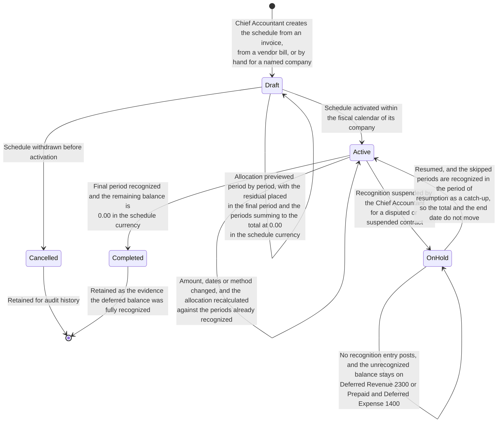

# FEATURE-001-07: Financial Reporting & Period Close

---

## Metadata

| Attribute | Value |
|-----------|-------|
| **Feature ID** | `FEATURE-001-07` |
| **Title** | Financial Reporting & Period Close |
| **Parent Epic** | [EPIC-001: Enterprise Accounting in Odoo](../EPIC-001-enterprise-accounting-odoo.md) |
| **Status** | Draft |
| **Priority** | 🔴 Critical |
| **Story Count** | 5 stories |
| **Last Updated** | 2026-08-13 |
| **Owner/Author** | Enterprise Accounting Team |

---

## 1. Feature Overview

### 1.1 Purpose and Business Value

This feature enables the **Financial Reporting Manager**, the **Chief Accountant** and the **Group Controller** to publish the statutory and management statements of each legal entity from posted accounting data instead of from a spreadsheet: the **Balance Sheet**, the **Profit & Loss**, the **Cash Flow Statement**, the **General Ledger** and the **Trial Balance**, each run for a named company with an as-of date or a date range and each comparable against a prior period. It gives the **External Auditor** a path from any statement line down to the journal items that compose it, it delivers every statement to PDF and to XLSX, and it puts the period-end close under control: a checklist with named owners, revenue and expense cutoff against deferral schedules, the closing entry to Retained Earnings 3100, and the lock date that makes the published result final.

It is delivered against two module families, and their availability in this repository differs:

- **`account`** — the "Invoicing" application, version 1.4, category `Accounting/Accounting`, licence LGPL-3, **present** in `addons/`. It supplies `account.move` and `account.move.line`, the posted journal items every statement line aggregates, and `account.account` with the `account_type` selection that decides which section of which statement a balance is presented in.
- **`account_reports`** — the dynamic statement capability named in the Epic's module scope for the seven reports of SM-001. It is **absent from `addons/`** in this repository and is an Odoo Enterprise capability. That absence is recorded here as a platform fact, and it is resolved by decision **DEC-002** in the Epic rather than by this feature. Two paths carry it: an Odoo Enterprise subscription, or the Odoo Community Association route with `account_financial_report` and `mis_builder` for the statements and `report_xlsx` or `report_py3o` for the spreadsheet export.

Two Community-edition add-ons from earlier programme phases are **present** in this repository and are credited before any bespoke build is authorized, under discovery note **D-003**:

- **`account_financial_report_ce`**, version 19.0.1.1.0 under AGPL-3, `depends` of `account` and `analytic`, carrying a model and a QWeb report object per statement — `balance_sheet`, `profit_loss`, `cash_flow`, `general_ledger`, `trial_balance`, `aged_partner_balance` and the shared `financial_report`.
- **`account_deferred_revenue`**, version 19.0.1.0.0 under AGPL-3, `depends` of `account`, carrying `account.deferred.schedule` and `account.deferred.line` with `account.move` and `account.move.line` extensions, invoice-driven schedules, straight-line, date-based and manual allocation, cutoff generation with lock-date enforcement, and a recognition dashboard.

The deterministic report fixture is `test_data/financial_reports/sample_journal_entries.csv`, recorded under **D-009** and read but never modified; it carries dated journal lines with account code, account name, partner, label, debit and credit columns, which is the shape a statement tie-out is demonstrated against.

**Business Value Statement:**

> The statements stop being a compilation and become a read of the ledger. A Balance Sheet that took 2 to 4 hours to assemble by hand is generated in under 5 minutes for a named company and a named as-of date (SM-005), and the whole statutory set — Balance Sheet, Profit & Loss, Cash Flow Statement, General Ledger, Trial Balance, Aged Receivables and Aged Payables — is producible per entity and per period (SM-001) and published within 24 hours of the period lock date being applied (SM-004). Because every line is aggregated from posted journal entries whose total debits equal their total credits at a difference of `0.00` in the company currency, and because every line drills through to those journal items, the figure a lender, a board or a regulator reads is the ledger itself rather than a restatement of it. The governed close — checklist, cutoff, closing entry and lock date — is what carries the Epic's reduction of the close from 10 business days to 5 business days per legal entity (SM-003) and its 50% reduction in post-close audit adjustments (SM-016), and the deferral cutoff is what puts revenue and expense in the period they belong to (SM-015).

This feature carries all three of the Epic's objectives:

| Epic Objective | Contribution of This Feature |
|----------------|------------------------------|
| Compliance reporting | The statutory statement set is presented under US GAAP and IFRS, the Cash Flow Statement classifies across operating, investing and financing activities under IAS 7, deferred revenue is recognized under ASC 606 and IFRS 15 while prepaid and deferred expense is recognized under ASC 340-10 with IAS 1 presentation, and every published line carries an auditable trail to the journal items behind it |
| Real-time visibility into financial health | Statements are compiled from posted journal items at the moment they are run, so the position is current as of the last posted entry; the open period is reportable without waiting for the close, and the closed period is reportable within 24 hours of its lock date |
| Multi-entity financial operations | Every statement is run for a named company — Global Holdings Inc. (`US-01`), Global Europe SARL (`NL-01`) or Global Asia Pte Ltd (`SG-01`) — in that company's currency and against its own fiscal calendar and lock dates, and each entity close is what FEATURE-001-06 consolidates under ORD-005 |

Two ordering rules in the Epic govern this feature. **ORD-004** places FEATURE-001-02, FEATURE-001-03, FEATURE-001-04, FEATURE-001-08 and FEATURE-001-09 ahead of it, because a statement line cannot tie to a sub-ledger that holds no postings. **ORD-005** places this feature's per-entity close ahead of the group consolidated statements in FEATURE-001-06, because a group result is reproducible only when the entity results behind it are closed and locked. The Epic's implementation sequence places this feature in **Phase 3 — Reporting and close**.

This feature also owns two conventions that other features inherit rather than restate, both assigned to it by the Epic's retirement map: the **export and drill-down convention** in §4.1, inherited by `STORY-001-07-01` through `STORY-001-07-04`, `STORY-001-03-05`, `STORY-001-09-03`, `STORY-001-05-03` and the aged-payables criteria anchored in `STORY-001-02-04`; and the **ageing-bucket presentation convention** in §4.1, inherited by the Aged Receivable report in FEATURE-001-03 and the Aged Payable report in FEATURE-001-02, so receivables and payables age on one set of rules.

### 1.2 Problem Statement

Each period end, the statements are built by hand. Six consequences follow, and every one of them recurs:

- **Compilation consumes the reporting window.** Balances are exported from the ledger, re-keyed into spreadsheets and formatted into statements at a cost of 40 or more hours per quarter, which is time spent assembling the numbers rather than reviewing them, and it pushes delivery past the date the recipients need.
- **Manual aggregation carries arithmetic risk.** Every export, paste and formula is a place where a balance can be dropped, a sign inverted, a new account left out of a range or a subtotal left stale, and nothing in the workflow forces the statement to agree with the ledger it came from.
- **Delivery to lenders and regulators is late.** Covenant reporting, statutory filing and board packs wait on the compilation, so the organization reports its position weeks after the period it describes and negotiates from figures it cannot yet evidence.
- **Presentation does not survive audit.** A spreadsheet statement carries no fixed section mapping, so the same account can land under a different caption from one period to the next, and a period-on-period comparison then measures the formatting rather than the business.
- **A figure cannot be traced to its source.** There is no path from a statement line to the journal items that compose it, so verifying one balance means an ad-hoc extract prepared by the finance team for every audit question, and the audit trail is reconstructed rather than read.
- **Cutoff entries are prepared by hand, so revenue and expense land in the wrong period.** Deferral schedules are tracked outside the system and their recognition entries are typed at period end, so a missed schedule leaves revenue in the ledger that has not been earned, an over-recognized schedule leaves a deferred balance that no longer reconciles, and neither error is visible until an auditor tests the deferred accounts.

### 1.3 Key Capabilities

| Capability ID | Capability Description | Related Stories |
|---------------|------------------------|-----------------|
| CAP-001 | Generate the Balance Sheet with Assets, Liabilities and Equity sections and comparative periods | STORY-001-07-01 |
| CAP-002 | Generate the Profit & Loss statement with Revenue, Expense and Net Income sections and comparative periods | STORY-001-07-02 |
| CAP-003 | Generate the Cash Flow Statement across Operating, Investing and Financing activities | STORY-001-07-03 |
| CAP-004 | Generate the General Ledger and the Trial Balance with debit and credit verification | STORY-001-07-04 |
| CAP-005 | Execute the period-end close checklist including deferred revenue and expense cutoff | STORY-001-07-05 |

Two capabilities cut across the five stories rather than belonging to one of them, and both are stated once in §4.1 so no story redefines them:

| Cross-Cutting Capability | Capability Description | Inherited By |
|--------------------------|------------------------|--------------|
| CAP-X01 | Drill down from any report line to the journal items that compose it, and export every report to PDF and to XLSX with the on-screen filters preserved | CAP-001, CAP-002, CAP-003 and CAP-004 within this feature; and `STORY-001-03-05`, `STORY-001-09-03`, `STORY-001-05-03` and the aged-payables criteria of `STORY-001-02-04` outside it |
| CAP-X02 | Present partner ageing on one set of buckets, with configurable bucket boundaries, partner-level expansion and multi-currency columns | The Aged Receivable report in FEATURE-001-03 and the Aged Payable report in FEATURE-001-02 |

**Aged Receivable reporting is not delivered here.** The report itself belongs to [FEATURE-001-03](./FEATURE-001-03-accounts-receivable-customer-invoices.md), where `STORY-001-03-05` produces it and reconciles it to Accounts Receivable 1200; Aged Payable belongs to [FEATURE-001-02](./FEATURE-001-02-accounts-payable-vendor-bills.md), anchored in `STORY-001-02-04` and reconciled to Accounts Payable 2000. What this feature owns for both is the presentation convention of CAP-X02, so the two reports age identically. Both remain part of the seven reports SM-001 counts per entity and per period, and both are evidence items of the close this feature runs.

### 1.4 Success Criteria at Feature Level

Every figure below is stated for **Global Holdings Inc. (`US-01`)**, the group's United States parent, whose currency is USD. The worked set is internally consistent: the Profit & Loss net income is the current-year-earnings line of the Balance Sheet, the Cash Flow closing cash is the Balance Sheet Bank 1010 line, and the Trial Balance totals are the same balances aggregated at account level.

| Criterion | Target | Verification Method |
|-----------|--------|---------------------|
| Statement coverage per entity and per period | 100% of the seven reports SM-001 names are producible for a named company and a named period: Balance Sheet, Profit & Loss, Cash Flow Statement, General Ledger and Trial Balance from this feature, with Aged Receivables from FEATURE-001-03 and Aged Payables from FEATURE-001-02 | Report-by-report acceptance checklist executed against one closed period per in-scope company (SM-001) |
| Balance Sheet generation time against the manual baseline | The **Balance Sheet** as of 2025-03-31 for company `US-01` generates in under 5 minutes, against a manual compilation baseline of 2 to 4 hours | Elapsed generation time recorded for a 12-period fiscal year at production data volumes (SM-005) |
| Balance Sheet balances and its total is asserted | That statement reports total assets of `$4,812,600.00 USD`, rounded to 2 decimal places half-up at the USD rounding increment of 0.01, equal to total liabilities of `$1,612,600.00 USD` plus total equity of `$3,200,000.00 USD` at a difference of `$0.00 USD` | Report reconciliation to the **General Ledger** for the same company and as-of date, with the accounting equation asserted numerically (C-009) |
| Statement sections follow account type, not judgement | A balance is presented under **Current Assets** when its account type is receivable, bank, current asset or prepayment, and under **Non-current Assets** when its account type is fixed asset or non-current asset; under **Current Liabilities** when its account type is payable, credit card or current liability, and under **Non-current Liabilities** when it is non-current; and in the **Equity** section for equity account types, where the unaffected-earnings type presents Retained Earnings 3100 | Section-mapping test asserting one account of each account type into its named section, repeated for the Profit & Loss income and expense types |
| Profit & Loss ties to the equity movement | The **Profit & Loss** for the date range 2025-01-01 to 2025-03-31 for company `US-01` reports Revenue 4000 of `$1,842,000.00 USD`, Expense 6100 of `$1,398,000.00 USD`, Depreciation Expense 6500 of `$144,000.00 USD` and net income of `$300,000.00 USD`, each rounded to 2 decimal places at the USD rounding increment of 0.01, and that net income equals the current-year-earnings line of the Balance Sheet as of 2025-03-31 at a difference of `$0.00 USD` | Statement-to-statement reconciliation for the same company and period, retained as close evidence |
| Trial Balance proves the books are in balance | The **Trial Balance** for the date range 2025-01-01 to 2025-03-31 for company `US-01` reports total debits of `$8,284,600.00 USD` equal to total credits of `$8,284,600.00 USD`, with the difference column asserted at `$0.00 USD`, each amount rounded to 2 decimal places at the USD rounding increment of 0.01 | Report reconciliation with the difference column asserted numerically per company and per period (SM-006, C-009) |
| Cash Flow Statement reconciles to the cash line | The **Cash Flow Statement** for 2025-01-01 to 2025-03-31 for company `US-01` reconciles beginning cash and cash equivalents of `$196,450.00 USD`, plus net cash from operating activities of `$412,300.00 USD`, less net cash used in investing activities of `$265,000.00 USD`, less net cash used in financing activities of `$90,000.00 USD`, less an exchange-rate effect on cash of `$5,450.00 USD`, to ending cash and cash equivalents of `$248,300.00 USD`, which equals the Bank 1010 line of the Balance Sheet as of 2025-03-31 at a difference of `$0.00 USD`, each amount rounded to 2 decimal places half-up at the USD rounding increment of 0.01 | Reconciliation worksheet comparing both ends of the statement with the Balance Sheet cash lines, with the exchange-rate effect asserted as its own amount (CF-002) |
| Every statement line drills to its journal items | 100% of report lines in the Balance Sheet, Profit & Loss, Cash Flow Statement, General Ledger and Trial Balance open the journal items that compose them, and the sum of those items equals the line it was opened from at a difference of `$0.00 USD` | Drill-down traversal per statement, with the drilled total asserted against the summary figure and the External Auditor recording acceptance (Epic Definition of Done item 10) |
| Every statement exports to PDF and to XLSX | Each of the five reports exports to PDF and to XLSX with the on-screen filters preserved, the expanded detail included, numeric cells written as numbers rather than as text, and every line value identical to the value displayed | Export comparison per report and per format, cell value against screen value, including a cell whose text begins with `=` to prove the formula-injection guard (C-017) |
| Deferral recognition is arithmetically closed | A deferral of `$24,000.00 USD` over 12 monthly periods recognizes `$2,000.00 USD` per period, rounded to 2 decimal places half-up at the USD rounding increment of 0.01; a deferral of `$10,000.00 USD` over 3 periods recognizes `$3,333.33 USD`, `$3,333.33 USD` and `$3,333.34 USD`, with the rounding residual placed in the final period, so each schedule's periods sum to its total at a difference of `$0.00 USD` | Schedule-to-total reconciliation for both cases, repeated for a EUR schedule at the EUR rounding increment of 0.01 |
| Every cutoff entry posts balanced | The period-end cutoff entry for a revenue deferral in company `US-01` posts in the **Miscellaneous** journal, debiting Deferred Revenue 2300 `$2,000.00 USD` and crediting Revenue 4000 `$2,000.00 USD`, so total debits equal total credits at a difference of `$0.00 USD`; the expense form debits Expense 6100 and credits Prepaid / Deferred Expense 1400 for the same amount and the same balance, each amount rounded to 2 decimal places half-up at the USD rounding increment of 0.01 | Posted entry inspected line by line with the difference asserted at `$0.00 USD`, and the deferred balance remaining on 2300 or 1400 reconciled to the **Deferred Revenue Recognition Schedule** (SM-015, C-009) |
| Deferred balances tie to the schedule | The **Deferred Revenue Recognition Schedule** as of 2025-03-31 for company `US-01` reports a remaining deferred balance equal to Deferred Revenue 2300 of `$141,400.00 USD` on the Balance Sheet for the same as-of date, at a difference of `$0.00 USD`, rounded to 2 decimal places at the USD rounding increment of 0.01 | Schedule-to-ledger reconciliation retained as close evidence, run per company and per period |
| The closing entry posts balanced | The fiscal-year 2025 closing entry for company `US-01`, dated 2025-12-31 in the **Miscellaneous** journal, debits Revenue 4000 `$7,368,000.00 USD` and credits Expense 6100 `$5,592,000.00 USD`, Depreciation Expense 6500 `$576,000.00 USD` and Retained Earnings 3100 `$1,200,000.00 USD`, so total debits of `$7,368,000.00 USD` equal total credits of `$7,368,000.00 USD` at a difference of `$0.00 USD`, each amount rounded to 2 decimal places half-up at the USD rounding increment of 0.01 | Posted closing entry inspected line by line, with the movement on Retained Earnings 3100 reconciled to the full-year Profit & Loss net income at a `$0.00 USD` difference |
| A locked period refuses a cutoff entry | A cutoff entry dated inside a period whose journal-entry lock date has been applied is refused with an Odoo validation message naming the entry date, the lock date and the company `US-01`, and no journal entry is created by the refused attempt | Negative test executed per company against a date inside the locked range, with the journal-entry count unchanged by the refusal |
| Close cycle time per entity | The period close completes within 5 business days of period end for each in-scope company, against a baseline of 10 business days, with every checklist task signed off by its named owner before the lock date is applied | Business days elapsed from period end to lock-date application, per company per period (SM-003) |
| Report availability after close | The statement set is published within 24 hours of the period lock date being applied | Timestamp difference between lock-date application and statement publication (SM-004) |
| Run-time report parameters are checked | Every as-of date, date range, comparison selection and filter value supplied at run time is validated before use, and a rejected value returns an error naming the parameter and the check that failed, with no stack trace, query text, file-system path or credential disclosed | Hostile-input tests required by C-022, executed against every report parameter of the five stories (C-015, C-019, C-020) |
| No compound trigger in any child story | Every acceptance scenario in the five story files states one action in its `When` step: selecting a report and supplying its date parameter are separate steps, so a failure identifies which of the two failed | Criteria review of all five story files before they are accepted, with each `When` step read for a single trigger |
| Test coverage | ≥80% for all 5 story implementations, with the balancing, reconciliation and allocation arithmetic asserted numerically rather than inspected by eye | Coverage tooling in the repository's configured test run (C-007, C-009) |
| Demonstrability | 5 of 5 stories demonstrated in the Odoo user interface, or through its public API, to the Finance Controller and the Product Owner | Recorded acceptance walkthrough per story |

---

## 2. User Personas

### 2.1 Persona Mapping

Every persona below is a named finance role drawn from the Epic's persona register. The five roles marked applicable act inside this feature — they produce the statements, own the close, review the result, test the trail or reconcile the tax balances presented. The roles marked not applicable post the transactions the statements aggregate or consume the published output, and the feature that carries their work is named against each.

| Persona | Role Description | Primary Use Cases | Applicable |
|---------|------------------|-------------------|------------|
| **Financial Reporting Manager** | Produces the statutory and management statements for each entity and the group; the primary persona of this feature | Runs the **Balance Sheet** as of a named date, the **Profit & Loss** and the **Cash Flow Statement** for a named date range, each for a named company; enables the comparative column and reads the absolute and percentage variance; exports each statement to PDF and to XLSX; owns the presentation convention that maps an account type to a statement section, and the ageing-bucket convention that FEATURE-001-02 and FEATURE-001-03 inherit | ☑ Yes |
| **Chief Accountant** | Owns the general ledger, the chart of accounts and the integrity of every posted entry | Runs the **General Ledger** and the **Trial Balance** for a date range and asserts total debits equal to total credits at a `$0.00 USD` difference; owns the close checklist and signs off its tasks; creates and suspends deferral schedules; posts the period cutoff entries and the fiscal-year closing entry to Retained Earnings 3100 in the **Miscellaneous** journal; applies the journal-entry and tax lock dates that make the period final | ☑ Yes |
| **Group Controller** | Governs group accounting policy and approves the result each entity publishes | Owns the close calendar across `US-01`, `NL-01` and `SG-01` and the order the entities close in; reviews each entity's statement set against the prior period before the lock date is applied; confirms the interest-classification and cash-equivalent policies the Cash Flow Statement applies consistently across periods; hands the closed and locked entity results to the group consolidation of FEATURE-001-06 under ORD-005 | ☑ Yes |
| **External Auditor** | Tests balances and controls and issues the audit opinion | Drills from a statement line to the journal items that compose it and confirms the drilled total equals the line at a `$0.00 USD` difference; reads the retained reconciliation worksheets, the checklist sign-offs, the cutoff entries and the lock-date evidence for the period under audit; tests that a post-lock posting attempt is refused; holds read-only access to every report and every retained close artifact | ☑ Yes |
| **Tax Accountant** | Determines tax on transactions and files the statutory returns | Reads the Tax Payable 2200 balance presented in the Balance Sheet as of the reporting date and reconciles it to the VAT/Tax Return produced in FEATURE-001-05 for the same date range and company at a `$0.00 USD` difference; confirms the tax lock date is applied alongside the journal-entry lock date so a filed period cannot be re-stated; signs off the tax tasks on the close checklist | ☑ Yes |
| CFO / Finance Director | Executive stakeholder accountable for financial health and compliance | Consumes the published statement set and the forward view of pending deferrals and upcoming recognitions by period; that forward view is preserved as a criterion of `STORY-001-07-05` under the Epic's carry-forward register (CF-005) and its retirement map, so the view survives the four-into-one deferral merge; takes no configuration or posting action inside this feature | ☐ No |
| Accounts Payable Clerk | Captures vendor bills, runs three-way match and prepares payment runs | Posts to Accounts Payable 2000 and Expense 6100 through the Purchase journal in FEATURE-001-02; those postings are aggregated here, and the Aged Payable report the clerk reads is delivered there under this feature's ageing convention | ☐ No |
| Accounts Receivable Specialist | Issues customer invoices, allocates receipts and manages collections | Posts to Accounts Receivable 1200 and Revenue 4000 through the Sales journal in FEATURE-001-03; the Aged Receivable report is delivered there and reconciled to Accounts Receivable 1200, under this feature's ageing convention | ☐ No |
| Treasury Analyst | Owns bank and cash positions and statement reconciliation | Reconciles Bank 1010 and Cash 1000 in FEATURE-001-04; the reconciled closing balance is the Balance Sheet cash line and the ending cash of the Cash Flow Statement, and a completed reconciliation per bank account is a task on this feature's close checklist | ☐ No |
| Consolidation Accountant | Executes the consolidation run and the intercompany eliminations | Consolidates the closed and locked entity results in FEATURE-001-06 under ORD-005; the consolidated statements are produced there, not here | ☐ No |
| FP&A Analyst | Builds budgets and explains variances to management | Publishes the budget-versus-actual figures in FEATURE-001-09 that the Profit & Loss presents as a budget column beside its actual column, and that the close checklist reviews | ☐ No |

### 2.2 Persona-to-Story Mapping

Each story carries exactly one primary persona in its WHO statement. Secondary personas review, reconcile or test the outcome, and they are named so that the access rights derived from these stories keep the preparing role and the reviewing role apart: the Chief Accountant who posts a cutoff entry and applies a lock date is not the role that approves the published result, and the External Auditor who tests the trail holds no write access to any of it.

| Story | Primary Persona | Secondary Personas |
|-------|-----------------|--------------------|
| STORY-001-07-01 Generate Balance Sheet | Financial Reporting Manager | Group Controller (review before the lock date), External Auditor (drill-down from a section total to its journal items), Tax Accountant (Tax Payable 2200 presentation), Chief Accountant (the ledger the statement reads) |
| STORY-001-07-02 Generate Profit & Loss Statement | Financial Reporting Manager | Group Controller (comparative review and the budget column from FEATURE-001-09), External Auditor (drill-down to revenue and expense journal items), Chief Accountant (the current-year result carried to equity) |
| STORY-001-07-03 Generate Cash Flow Statement | Financial Reporting Manager | Group Controller (interest-classification and cash-equivalent policy), Treasury Analyst (the reconciled cash both ends of the statement agree to), External Auditor (non-cash investing and financing disclosure) |
| STORY-001-07-04 Generate General Ledger and Trial Balance | Chief Accountant | External Auditor (account-level testing and entry-level drill-down), Financial Reporting Manager (the tie-out every statement is reconciled against), Group Controller (period-end integrity review) |
| STORY-001-07-05 Execute Period-End Close with Deferred Revenue and Expense Cutoff | Chief Accountant | Group Controller (close calendar and task sign-off), Financial Reporting Manager (statements regenerated after cutoff), Tax Accountant (tax lock date and tax task sign-off), External Auditor (cutoff and lock-date evidence), CFO / Finance Director (the pending-deferral and upcoming-recognition forward view) |

---

## 3. Story List

### 3.1 User Stories

| Story ID | Story Title | Persona | Priority | Status | Link |
|----------|-------------|---------|----------|--------|------|
| STORY-001-07-01 | Generate Balance Sheet | Financial Reporting Manager | 🔴 Critical | Draft | [STORY-001-07-01](./FEATURE-001-07/STORY-001-07-01-generate-balance-sheet.md) |
| STORY-001-07-02 | Generate Profit & Loss Statement | Financial Reporting Manager | 🔴 Critical | Draft | [STORY-001-07-02](./FEATURE-001-07/STORY-001-07-02-generate-profit-loss.md) |
| STORY-001-07-03 | Generate Cash Flow Statement | Financial Reporting Manager | 🔴 Critical | Draft | [STORY-001-07-03](./FEATURE-001-07/STORY-001-07-03-generate-cash-flow-statement.md) |
| STORY-001-07-04 | Generate General Ledger and Trial Balance | Chief Accountant | 🔴 Critical | Draft | [STORY-001-07-04](./FEATURE-001-07/STORY-001-07-04-generate-general-ledger-trial-balance.md) |
| STORY-001-07-05 | Execute Period-End Close with Deferred Revenue and Expense Cutoff | Chief Accountant | 🔴 Critical | Draft | [STORY-001-07-05](./FEATURE-001-07/STORY-001-07-05-execute-period-close-deferrals.md) |

**Priority legend:** 🔴 Critical — a closed, compliant period is not achievable without it. All five stories are Critical, which matches the Critical priority the Epic's feature summary records for `FEATURE-001-07`: the statement set is what Epic Definition of Done item 2 requires for a closed period, and the governed close is what item 6 requires per in-scope company.

### 3.2 Story Count Assessment

| Count | Assessment | Status |
|-------|------------|--------|
| **5 stories** | At the upper bound of the mandated range of 2 to 5 stories per feature | ✓ Feature is scoped for independent delivery |

This feature carries **5 stories**, at the top of the 2-to-5 bound recorded in the Epic's decomposition guidelines. The 3-to-7 guidance carried by the feature template is superseded by that bound and is not applied here. The count is stated identically in four places, and the four must stay equal: the Story Count row in §Metadata, this assessment, the 5 rows of §3.1, and the 5 links of §9.2. The Epic's feature summary declares the same count of 5 stories for `FEATURE-001-07`.

**The count is 5 by migration compression, not by omission.** This feature absorbs two whole features of the superseded flat-layout backlog — financial reporting with seven stories and deferred revenue with four, eleven in total — and folding the deferral capability in here is what keeps the Epic at nine features inside its 3-to-9 bound. The compression is recorded so that no retired requirement is silently lost:

| Superseded story | Destination in this feature | Obligation the merge carries |
|------------------|-----------------------------|------------------------------|
| Balance sheet report | `STORY-001-07-01` | Rehomed one-to-one. Two corrections apply on the way in: the vague qualifier in its asset and liability classification criteria is replaced by the account-type rule stated in §1.4 and §4.1, and its monetary assertions gain currency, amount and rounding |
| Profit and loss statement | `STORY-001-07-02` | Rehomed one-to-one. Both presentation choices are retained, because classifying expense by nature and classifying it by function are separate statutory elections, as is the analytic filter |
| Cash flow statement | `STORY-001-07-03` | Rehomed one-to-one. Both the indirect and the direct method are retained, and carry-forward entry **CF-002** adds four mandatory requirements: the exchange-rate effect as its own line, agreement of both ends to the Balance Sheet cash lines, the interest-classification election tied to its standard, and the non-cash investing and financing disclosure |
| General ledger report and trial balance report | `STORY-001-07-04` | **Two into one.** The two reports read the same posted journal items at different levels of aggregation, so they are demonstrated together and tie to each other. Debit-and-credit equality becomes a numeric assertion, and the include-zero-balance option is retained as the zero-amount edge case |
| Deferral schedule definition, automatic period allocation, cutoff entry generation and the recognition dashboard | `STORY-001-07-05` | **Four into one**, because four of this feature's five stories are allocated to the statements. Each retired story owns a band of the destination: schedule definition with its recognition parameters, deferral accounts and period-bound validation; allocation across periods with straight-line, date-based and manual methods, preview, recalculation, multi-currency and fiscal-year boundaries; cutoff generation with single-period and batch runs, preview before posting, partial-period proration, the next-period reversal and lock-date enforcement; and the dashboard with pending deferrals, upcoming recognitions by period, date-range filtering, drill-down and completion status. Carry-forward entry **CF-005** adds the three-state model — Active, Completed and On Hold — as a mandatory requirement. Two corrections apply on the way in: every cutoff entry asserts that total debits equal total credits at a difference of `0.00` in the company currency under C-009, and the retired blanket citation of ASC 606 and IFRS 15 across all deferral types is replaced by the standard that fits each type — ASC 606 and IFRS 15 for revenue, ASC 340-10 with IAS 1 presentation for prepaid and deferred expense, and ASC 340-40 with IFRS 15 paragraphs 91 to 104 for contract acquisition and fulfilment costs |
| Aged receivable and payable reports | Relocated out of this feature | Aged Receivable is delivered by `STORY-001-03-05` in [FEATURE-001-03](./FEATURE-001-03-accounts-receivable-customer-invoices.md) and Aged Payable by `STORY-001-02-04` in [FEATURE-001-02](./FEATURE-001-02-accounts-payable-vendor-bills.md). This feature keeps the shared ageing-bucket presentation convention of CAP-X02, so the two age on identical rules |
| Report export and drill-down | Fanned out across `STORY-001-07-01` to `STORY-001-07-04` | No destination story exists for it and inventing one would breach the fixed forty-one-story budget, so it becomes the feature-level convention CAP-X01, stated once in §4.1 and inherited by every report-bearing story in the tree. The External Auditor persona is preserved as the persona of its drill-down criteria, and export additionally inherits C-017 |

The exposed band of the four-into-one merge is the recognition dashboard: a close-execution story can post every cutoff entry and satisfy its criteria while never surfacing the forward view the CFO / Finance Director used. The pending-deferrals summary and the upcoming-recognitions view are therefore required criteria of `STORY-001-07-05` rather than optional extras. No story identifier from the superseded backlog survives into this tree; every story here is named on the `STORY-001-07-SS` convention.

Splitting further would produce stories with nothing to prove on their own — a comparative column with no statement to compare, or a lock date with no close to conclude. Merging further would breach the Small criterion of INVEST, because each of the five is demonstrated by a different action against a different artifact: a statement of position, a statement of performance, a statement of cash movement, an account-and-entry level tie-out, and a completed close with balanced cutoff entries and an applied lock date.

### 3.3 Story Dependency Ordering

Each story delivers an outcome demonstrable on its own, which keeps the five Independent under INVEST. The rows below are sequencing prerequisites — configuration or data that must already exist for the dependent story to be demonstrated — and not shared implementation.

| Story | Depends On | Notes |
|-------|-----------|-------|
| STORY-001-07-01 (Balance Sheet) | None within this feature | Rests on posted journal data and on the account taxonomy, account types and fiscal calendar published by FEATURE-001-01, which decide the section every balance is presented in (ORD-001, ORD-004) |
| STORY-001-07-02 (Profit & Loss) | None within this feature | Rests on the same posted data and the same income and expense account types. It is coupled to the Balance Sheet by arithmetic rather than by sequence: its net income is the current-year-earnings line of `STORY-001-07-01`, and the two are reconciled to each other |
| STORY-001-07-04 (General Ledger and Trial Balance) | None within this feature | Rests on posted journal data alone. It is delivered early in practice because it is the tie-out the other statements are reconciled against, and because the Trial Balance is what proves total debits equal total credits before any statement is published |
| STORY-001-07-03 (Cash Flow Statement) | STORY-001-07-04 | The cash flow derives from ledger transaction data: the indirect method adjusts net income for non-cash items and working-capital movement read from the journal items the General Ledger presents, and both ends of the statement agree to the Balance Sheet cash lines. The superseded backlog recorded this same dependency explicitly, and it is carried forward unchanged |
| STORY-001-07-05 (Period-End Close and Deferral Cutoff) | STORY-001-07-01, STORY-001-07-02, STORY-001-07-04 | The close is reviewed against the statements: the checklist requires the Trial Balance difference at `$0.00 USD`, the Balance Sheet to balance and the Profit & Loss result to agree with the equity movement before the lock date is applied |

**The loop between the close and the statements is deliberate, and it is stated rather than left implicit.** The cutoff entries this story posts change the balances the statements report, so the order within a period is fixed: the sub-ledgers are posted and reconciled; the checklist review runs the statements as they stand; the accrual and deferral cutoff entries post into the period in the **Miscellaneous** journal; the statements are **regenerated** so the published figures include those entries; the regenerated Trial Balance is asserted at a `$0.00 USD` difference; and only then is the journal-entry and tax lock date applied, after which a further posting into the period is refused. A statement published before the cutoff is a draft, and the lock date is what marks the difference.

### 3.4 Recommended Implementation Order

```text
1. STORY-001-07-04  Generate General Ledger and Trial Balance
   Tie-out first: every posted journal item by account for a date range, and
   the proof that total debits equal total credits at a 0.00 difference in the
   company currency. This is what every later statement is reconciled against
        |
        v
2. STORY-001-07-01  Generate Balance Sheet
   Position: Assets, Liabilities and Equity sections mapped from account type,
   as of a named date for a named company, with the comparative column and the
   assertion that assets equal liabilities plus equity
        |
        v
3. STORY-001-07-02  Generate Profit & Loss Statement
   Performance: Revenue, Expense and Net Income for a date range, by nature or
   by function, with the comparative column and the tie of net income to the
   current-year-earnings line of step 2
        |
        v
4. STORY-001-07-03  Generate Cash Flow Statement
   Cash movement: operating, investing and financing activities by the indirect
   or the direct method, with the exchange-rate effect as its own line and both
   ends agreeing to the Balance Sheet cash lines
        |
        v
5. STORY-001-07-05  Execute Period-End Close with Deferred Revenue and
                    Expense Cutoff
   Governed close: checklist with named owners, deferral schedules with their
   three states, balanced cutoff entries in the Miscellaneous journal, the
   closing entry to Retained Earnings 3100, statements regenerated, and the
   journal-entry and tax lock dates applied
```

Steps 1 to 4 can proceed in parallel once FEATURE-001-01 has published the accounts, the account types and the fiscal calendar and the sub-ledgers named in ORD-004 hold postings; the order above is the order in which each becomes useful, because a statement that cannot be tied out cannot be accepted. Step 5 is last within the feature, because the close is reviewed against all of the statements it will regenerate, and it precedes the group consolidated statements of FEATURE-001-06 under ORD-005.

---

## 4. Acceptance Criteria Summary

### 4.1 Feature-Level Acceptance Criteria

These are feature-level gates. The Given/When/Then acceptance criteria live in the five story files, where each story states 4 to 8 criteria against one workflow, with the coverage distribution the Epic requires: a valid-input report or posting, an invalid or incomplete input, an error-handling case and an accounting edge case.

The feature is considered complete when:

- [ ] All 5 stories within this feature have status "Done"
- [ ] All 5 stories achieve minimum 80% test coverage (C-007)
- [ ] Feature-level integration tests pass, with every balance, total, variance and difference asserted as an amount rather than inspected by eye (C-009)
- [ ] Each of the 5 stories has been demonstrated in the Odoo user interface, or through its public API, to the Finance Controller and the Product Owner, and the walkthrough is recorded against the story
- [ ] The **Balance Sheet** as of 2025-03-31 for company `US-01` reports total assets of `$4,812,600.00 USD` equal to total liabilities of `$1,612,600.00 USD` plus total equity of `$3,200,000.00 USD` at a difference of `$0.00 USD`, each amount rounded to 2 decimal places half-up at the USD rounding increment of 0.01, and the statement is refused publication while that difference is any other value
- [ ] Balance Sheet section placement is decided by account type and not by judgement: a balance is presented under **Current Assets** when its account type is receivable, bank, current asset or prepayment — Bank 1010 of `$248,300.00 USD`, Accounts Receivable 1200 of `$2,093,811.88 USD` and Prepaid / Deferred Expense 1400 of `$18,488.12 USD`, a subtotal of `$2,360,600.00 USD` — and under **Non-current Assets** when its account type is fixed asset or non-current asset, where Fixed Assets 1500 of `$4,382,000.00 USD` less the contra Accumulated Depreciation 1590 of `$1,930,000.00 USD` presents a net book value of `$2,452,000.00 USD`, each amount rounded to 2 decimal places half-up at the USD rounding increment of 0.01
- [ ] Liabilities are presented under **Current Liabilities** when the account type is payable, credit card or current liability — Accounts Payable 2000 of `$1,284,300.00 USD`, Tax Payable 2200 of `$186,900.00 USD` and Deferred Revenue 2300 of `$141,400.00 USD` — and under **Non-current Liabilities** when the account type is non-current liability, with the current portion of a long-term obligation presented in the current section, each amount rounded to 2 decimal places half-up at the USD rounding increment of 0.01
- [ ] The equity section presents Share Capital 3000 of `$2,000,000.00 USD`, additional paid-in capital where an entity holds it, Retained Earnings 3100 of `$900,000.00 USD` from prior periods, and a current-year-earnings line of `$300,000.00 USD` computed from the income and expense accounts of the open fiscal year rather than read from a stored balance, giving total equity of `$3,200,000.00 USD`, each amount rounded to 2 decimal places half-up at the USD rounding increment of 0.01
- [ ] Comparative reporting is available on the Balance Sheet, the Profit & Loss and the Trial Balance for at least 2 prior periods: the comparative column presents the prior-period balance beside the current one, together with an absolute variance stated as an amount in the company currency to 2 decimal places and a percentage variance stated to 2 decimal places, and a prior-period balance of `0.00` presents no percentage rather than a division result
- [ ] The **Profit & Loss** for 2025-01-01 to 2025-03-31 for company `US-01` presents Revenue 4000 of `$1,842,000.00 USD`, cost of revenue and gross profit subtotals, Expense 6100 of `$1,398,000.00 USD`, Depreciation Expense 6500 of `$144,000.00 USD`, an operating-income subtotal, non-operating income and expense, and net income of `$300,000.00 USD`, each rounded to 2 decimal places at the USD rounding increment of 0.01
- [ ] The Profit & Loss presents expense by nature — employee costs, depreciation and amortization, raw materials and consumables, other operating expense — and, as a separate election, by function — cost of sales, administrative, selling and distribution, research and development — with the same net income of `$300,000.00 USD`, rounded to 2 decimal places half-up at the USD rounding increment of 0.01, under both presentations at a difference of `$0.00 USD`
- [ ] The Profit & Loss accepts an analytic account or analytic plan filter, and the filtered statement includes only the revenue and expense attributed to that analytic dimension; it also presents a budget column beside its actual column for the same company and date range, sourced from FEATURE-001-09 and reconciled to the **Budget vs. Actual** report at a `$0.00 USD` difference
- [ ] The **Cash Flow Statement** for 2025-01-01 to 2025-03-31 for company `US-01` reconciles beginning cash and cash equivalents of `$196,450.00 USD`, plus operating activities of `$412,300.00 USD`, less investing activities of `$265,000.00 USD`, less financing activities of `$90,000.00 USD`, less an exchange-rate effect on cash of `$5,450.00 USD`, to ending cash and cash equivalents of `$248,300.00 USD`, and both ends agree to the Balance Sheet cash lines of the prior and the current period at a difference of `$0.00 USD`, each amount rounded to 2 decimal places half-up at the USD rounding increment of 0.01 (CF-002)
- [ ] The exchange-rate effect on cash is a separately stated line and is never folded into the net change or into an activity subtotal; the statement is produced by the indirect method, which starts from net income and adjusts for non-cash items and working-capital movement, and by the direct method, which presents cash receipts and cash payments, with both methods reporting the same net change at a difference of `$0.00 USD` (CF-002)
- [ ] The interest-classification election is configured and tied to its standard — interest paid and interest received are operating activities under US GAAP (ASC 230), while IFRS (IAS 7) permits operating, investing or financing — and the election is applied consistently across periods; the accounts treated as cash equivalents are configured against a stated qualifying test of a short-term, highly liquid investment convertible into a known amount of cash with a maturity of three months or less at acquisition; and significant non-cash investing and financing activity is disclosed outside the statement as ASC 230-10-50 and IAS 7.43 require (CF-002)
- [ ] The **General Ledger** for 2025-01-01 to 2025-03-31 for company `US-01` presents every posted journal item grouped by account with its date, entry reference, label, partner, debit, credit and running balance; an opening-balance line precedes the first item of the period for each balance-forward account; the Accounts Receivable 1200 group closes at `$2,093,811.88 USD` and the Bank 1010 group at `$248,300.00 USD`, each rounded to 2 decimal places half-up at the USD rounding increment of 0.01 and each equal to the Trial Balance closing balance for the same account at a difference of `$0.00 USD`; the account and account-type filters restrict the output to the selected accounts; each entry reference navigates to its source journal entry; the centralized-journal option groups and totals the items of a centralized journal; and the reconciled state produced in FEATURE-001-04 is shown on each item
- [ ] The **Trial Balance** for 2025-01-01 to 2025-03-31 for company `US-01` presents opening balance, period debit, period credit and closing balance per account, and reports total debits of `$8,284,600.00 USD` equal to total credits of `$8,284,600.00 USD` with the difference column asserted at `$0.00 USD`, each amount rounded to 2 decimal places half-up at the USD rounding increment of 0.01; the account-type filter restricts the report to a selected internal group; and the include-zero-balance option lists accounts whose closing balance is `$0.00 USD` alongside those with movement
- [ ] The General Ledger and the Trial Balance tie to each other for the same company and date range: the sum of the General Ledger closing balances per account equals the Trial Balance closing balance for that account at a difference of `$0.00 USD`, and every statement in this feature is reconciled to the Trial Balance rather than to a second aggregation
- [ ] A deferral schedule is created from a customer invoice or a vendor bill, or by hand, carrying its start date, its end date, its number of periods, its recognition method, the deferred balance-sheet account — Deferred Revenue 2300 for revenue and Prepaid / Deferred Expense 1400 for expense — the recognition account, the company whose books it affects, and its analytic distribution where one applies; a schedule whose recognition range falls outside the fiscal calendar of its company is refused with an Odoo validation message naming the schedule, the date and the fiscal year, and no schedule is created by the refused attempt
- [ ] Allocation across periods is available by three methods and each is asserted numerically: **straight-line**, where `$24,000.00 USD` over 12 monthly periods recognizes `$2,000.00 USD` per period; **date-based pro rata**, where a `$9,000.00 USD` schedule running from 2025-01-15 to 2025-04-14 over 90 days recognizes `$100.00 USD` per day and so posts `$1,700.00 USD` for the 17 days of January, `$2,800.00 USD` for February, `$3,100.00 USD` for March and `$1,400.00 USD` for the 14 days of April, the four periods summing to `$9,000.00 USD` at a difference of `$0.00 USD`; and **manual**, where the amounts are entered per period and the entered total is checked against the schedule total before activation. Under every method the period amounts are rounded to 2 decimal places half-up at the currency's rounding increment, the rounding residual is placed in the final period — `$10,000.00 USD` over 3 periods recognizes `$3,333.33 USD`, `$3,333.33 USD` and `$3,333.34 USD` — and the periods sum to the schedule total at a difference of `$0.00 USD`; the same assertions are repeated for a EUR schedule at the EUR rounding increment of 0.01
- [ ] The allocation is previewed period by period before the schedule is activated, is recalculated when the schedule's amount, dates or method change, and reports the recalculation against the periods already recognized so a change cannot silently re-recognize a closed period
- [ ] Cutoff entries are generated for a single period and in a batch across every schedule due in that period, are previewed before posting, and post in the **Miscellaneous** journal dated the period-end date with the schedule identifier as the entry reference: a revenue cutoff debits Deferred Revenue 2300 `$2,000.00 USD` and credits Revenue 4000 `$2,000.00 USD`, an expense cutoff debits Expense 6100 and credits Prepaid / Deferred Expense 1400 for the same amount, and every entry posts with total debits equal to total credits at a difference of `$0.00 USD`, each amount rounded to 2 decimal places half-up at the USD rounding increment of 0.01 (C-009)
- [ ] A schedule that begins part-way through a period recognizes a prorated amount for that period based on the days it covers, stated in the schedule currency to 2 decimal places; and where the reversal option is selected, a reversing entry is created dated the first day of the following period, itself balanced with total debits equal to total credits at a difference of `$0.00 USD`
- [ ] A cutoff entry dated inside a period whose journal-entry lock date has been applied is refused with an Odoo validation message naming the entry date, the lock date and the company, no journal entry is created by the refused attempt, and the refusal is reported on the close run rather than passed over in silence
- [ ] A deferral schedule carries three recognition states — **Active**, showing the amount left to recognize; **Completed**, fully recognized; and **On Hold**, recognition suspended — and a suspended schedule posts no recognition entry for any period while it is suspended and is reported by the close run as suspended rather than as missing. While suspended, the unrecognized balance stays on Deferred Revenue 2300 or Prepaid / Deferred Expense 1400 and no amount reaches Revenue 4000 or Expense 6100. Suspension and resumption are both open to the Chief Accountant, and on resumption the periods skipped while suspended are recognized in the period of resumption as a catch-up amount, so the schedule total and its end date do not move; the close view filters by all three states and reports the remaining balance per state, naming the company whose books are affected (CF-005)
- [ ] The recognition view presents the forward position the close does not otherwise surface: pending deferrals with their remaining balance, upcoming recognitions by period, a date-range filter, recognition completion status per schedule, and drill-down from a schedule to the source transaction and the recognition entries it has posted
- [ ] The **Deferred Revenue Recognition Schedule** as of 2025-03-31 for company `US-01` reports a remaining deferred balance equal to Deferred Revenue 2300 of `$141,400.00 USD`, rounded to 2 decimal places half-up at the USD rounding increment of 0.01, on the Balance Sheet for the same as-of date at a difference of `$0.00 USD`, and the equivalent tie-out is run separately for prepaid and deferred expense against Prepaid / Deferred Expense 1400 (SM-015)
- [ ] The period-end close checklist carries a named owner per task and is signed off before the period is locked, covering at a minimum: sub-ledger completeness for payables, receivables, bank and cash; bank and cash reconciliation from FEATURE-001-04; depreciation posted from the board in FEATURE-001-08; the budget-versus-actual review from FEATURE-001-09; the tax position and tax control-account reconciliation from FEATURE-001-05, where Tax Payable 2200 of `$186,900.00 USD`, rounded to 2 decimal places half-up at the USD rounding increment of 0.01, reconciles to the VAT/Tax Return for the same company and date range at a difference of `$0.00 USD`; accrual and deferral cutoff; and the Trial Balance difference asserted at `$0.00 USD`
- [ ] The fiscal-year closing entry for company `US-01`, dated 2025-12-31 in the **Miscellaneous** journal, debits Revenue 4000 `$7,368,000.00 USD` and credits Expense 6100 `$5,592,000.00 USD`, Depreciation Expense 6500 `$576,000.00 USD` and Retained Earnings 3100 `$1,200,000.00 USD`, so total debits of `$7,368,000.00 USD` equal total credits of `$7,368,000.00 USD` at a difference of `$0.00 USD`, each amount rounded to 2 decimal places half-up at the USD rounding increment of 0.01, and the movement on Retained Earnings 3100 equals the full-year Profit & Loss net income at a difference of `$0.00 USD`
- [ ] The order within a period is enforced and evidenced: cutoff entries post, the statements are regenerated so the published figures include them, the regenerated Trial Balance difference is asserted at `$0.00 USD`, and then the journal-entry and tax lock dates are applied; a posting attempt into the locked period after that point is refused with an Odoo validation message naming the lock date, and the refusal is proved by test (Epic Definition of Done item 6)
- [ ] The closed and locked entity result is handed to FEATURE-001-06 for the group consolidated Balance Sheet and Profit & Loss, and the hand-over is recorded against ORD-005 with the lock date of each contributing company
- [ ] A persona restricted to one company can neither read nor run a report against another company's balances, journal items, deferral schedules or close artifacts, and each report names the company whose books it presents (C-014)
- [ ] The four statement stories create, alter and reverse no journal entry: the journal-entry count and the account balances of the reported company and date range are identical before and after each report run. Only `STORY-001-07-05` writes, and it writes cutoff, reversal and closing entries in the **Miscellaneous** journal
- [ ] Every as-of date, date range, comparison selection, account filter and analytic filter supplied at run time is validated before use; data access is expressed through the Odoo ORM or parameterized SQL with no concatenated search domain; a rejected value returns an error naming the parameter and the check that failed and discloses no stack trace, query text, file-system path or credential; and at least one hostile-input test per story proves the rejection with the ledger unchanged and the service still available (C-015, C-019, C-020, C-022)
- [ ] Exported cell values are neutralized against spreadsheet formula injection, so a value beginning with `=`, `+`, `-`, `@`, a tab or a carriage return is written as text (C-017); and partner names, entry references, labels and memo text are sanitized and context-encoded before they are rendered into a QWeb template or a PDF report, which the templates render as escaped text rather than as raw markup (C-018)
- [ ] No acceptance scenario in the five story files uses a compound `When`: selecting a report and supplying its date parameter are separate steps, so a failing scenario identifies the step that failed. The superseded balance-sheet story combined both into one trigger, and that pattern is not carried forward

**The export and drill-down convention (CAP-X01), owned here and inherited across the tree.** It is stated once so that no report in the backlog defines its own version, and the Epic's retirement map assigns its ownership to this feature:

- Every report exports to PDF and to XLSX. The PDF carries the report title, the company, the parameters it was run with, the generation timestamp and page numbers; the XLSX writes numeric cells as numbers rather than as text, uses column headers identical to the on-screen labels, and places each comparison period in its own column or sheet.
- The export preserves the filters active on screen, so the file matches what was viewed.
- The export contains the expanded detail rather than the collapsed summary, with detail lines grouped under the summary line they belong to and carrying their document references for the audit trail.
- Every summary line drills down to the journal items behind it, and the sum of those items equals the line the drill-down started from at a difference of `$0.00` in the company currency.
- The drill-down preserves the active filters, so the detail shown is the detail that composed the figure.
- The drill-down carries breadcrumbs back to the summary it came from, and returning restores the report's expanded sections and position without regenerating it.

**Inheriting stories:** `STORY-001-07-01`, `STORY-001-07-02`, `STORY-001-07-03` and `STORY-001-07-04` within this feature; `STORY-001-03-05` (Aged Receivable), `STORY-001-09-03` (Budget vs. Actual), `STORY-001-05-03` (VAT/Tax Return) and the aged-payables criteria anchored in `STORY-001-02-04` outside it. The **External Auditor** is the persona of the drill-down criteria wherever they appear, because audit traceability is why the capability exists: Epic Definition of Done item 10 requires that auditor to accept the trail from statement line to journal item.

**The ageing-bucket presentation convention (CAP-X02), owned here and inherited by both ageing reports.** Receivables and payables must age on identical rules, so divergence between the two is a defect rather than a variation:

- The standard buckets are **Current**, **1-30**, **31-60**, **61-90**, **91-120** and **Over 120 days**, measured from the due date of the open item.
- The bucket boundaries are configurable, and a configured set of 0-15, 16-30, 31-45, 46-60 and Over 60 days produces the same total as the standard set at a difference of `$0.00` in the company currency, because customization redistributes the columns and never the total.
- A partner line expands to the open items behind it, each showing its invoice number, invoice date, due date and amount.
- A balance held in a currency other than the company currency is converted to the company currency and the original currency is shown alongside it, each amount rounded to that currency's own decimal precision.
- Filtering by partner type or partner category restricts the report without changing how any remaining item is bucketed.
- The report total reconciles to its control account for the as-of date: Accounts Receivable 1200 for the Aged Receivable report, where `$2,093,811.88 USD` as of 2025-03-31, rounded to 2 decimal places half-up at the USD rounding increment of 0.01, is the worked figure, and Accounts Payable 2000 for the Aged Payable report, each at a difference of `$0.00 USD`.

### 4.2 Cross-Cutting Concerns

Every story in this feature inherits the criteria below from the Epic's constraint set.

| Concern | Acceptance Criterion |
|---------|----------------------|
| License | New modules delivering the statements and the close are distributed under an AGPL-3.0 compatible licence, and integration with `account` respects its LGPL-3 licence; extension of the present `account_financial_report_ce` and `account_deferred_revenue` add-ons respects their AGPL-3 licence (C-001, C-002) |
| Dependencies | Every declared module dependency exists in the platform configuration confirmed by DEC-002, and delivered code stays consumable by the OCA add-on ecosystem including `account_financial_report`, `mis_builder`, `report_xlsx` and `report_py3o` (C-003, C-004) |
| Coding Standards | Python follows Odoo and OCA standards including PEP 8, and static analysis passes with the repository's configured tooling in `ruff.toml` (C-005, C-006) |
| Test Coverage | Each story achieves minimum 80% test coverage, and each acceptance test is traceable to one Given/When/Then criterion (C-007, C-008) |
| Documentation | Public methods and models are documented with docstrings, and the account-type-to-section mapping, the interest-classification election, the cash-equivalent policy and the rounding-residual rule are recorded alongside the code that applies them |
| Security | Access rights are defined per finance role and verified by an access-rights test matrix: the Financial Reporting Manager runs and exports the statements, the Chief Accountant additionally posts cutoff and closing entries and applies lock dates, the Group Controller reviews and approves, the Tax Accountant reads the tax balances and signs off the tax tasks, the External Auditor holds read-only access to every report and every retained close artifact, and no role reads or reports in a company outside its allowed companies (C-014) |
| Multi-company isolation | Every criterion that touches more than one company names the company whose books are affected; each report is run for one company or for an explicitly named set, and a test proves a role restricted to one company cannot read or report another company's balances (C-014, D-007) |
| Ledger integrity | The four statement stories are read-only against `account.move` and `account.move.line`, each carrying a test that the journal-entry count and the account balances are unchanged by a report run. `STORY-001-07-05` writes only cutoff, reversal and closing entries in the **Miscellaneous** journal, each balanced with total debits equal to total credits at a difference of `0.00` in the company currency and each refused inside a locked period |
| Untrusted input | Run-time report parameters — as-of dates, date ranges, comparison selections, account filters and analytic filters — cross the trust boundary: they are validated before use, data access is expressed through the ORM or parameterized SQL with no concatenated search domain, a rejected value returns a named error that discloses no internal detail, and a hostile-input test proves the rejection with no journal entry created and the service still available (C-015, C-019, C-020, C-022) |
| Export safety | Values written to XLSX and CSV exports are neutralized against formula injection, so a cell beginning with `=`, `+`, `-`, `@`, a tab or a carriage return is written as text; the check is applied to partner names, references and labels as well as to amounts (C-017) |
| Rendered text | Partner names, entry references, labels and memo text are sanitized and context-encoded before being rendered into a QWeb statement template, a PDF report or an exported cell, and templates render such values as escaped text rather than as raw markup (C-018) |
| Document parsing | No story in this feature parses an inbound XML document, so the external-entity and entity-expansion surface does not arise here; where a report is re-imported from a structured document format, that path inherits C-016 in full — DTD processing and external-entity resolution disabled, entity expansion bounded, and schema validation before any field is read (C-016) |
| Credentials | No story in this feature holds an endpoint credential, API key or signing certificate; where a published report is delivered by an outbound mail server, its credentials are held outside module source and outside version control under the Epic's secret-handling rule (C-021) |
| Audit trail | Checklist sign-offs, cutoff and closing entries, lock-date applications, schedule suspensions and resumptions, and the retained reconciliation worksheets are each recorded with their author and timestamp and are readable by the External Auditor without a data request |
| Performance | The targets in §4.4 are met against a company holding 100,000 posted journal items and 100 or more active deferral schedules |

### 4.3 Integration Requirements

| Integration Point | Requirement | Verification |
|-------------------|-------------|--------------|
| `account.move` | Read: only entries in the posted state contribute to a statement, and each contributing entry's total debits equal its total credits at a difference of `0.00` in the company currency. Write: cutoff, reversal and closing entries created by `STORY-001-07-05` in the **Miscellaneous** journal | Reconciliation test excluding draft and cancelled entries, plus posted-entry inspection of each cutoff and closing entry with the difference asserted at `0.00` |
| `account.move.line` | Read: every posted journal item is aggregated by account, by period and by company into the statement sections, and is the target of every drill-down. Write: the debit and credit lines of the cutoff, reversal and closing entries | Statement-to-ledger tie-out per account and date range at a `0.00` difference in the company currency, and drill-down traversal whose summed items equal the line they were opened from |
| `account.account` | Read: the account and its account type, which decides the statement and the section a balance is presented in, and which separates the unaffected-earnings type that presents Retained Earnings 3100 from the equity types | Section-mapping test asserting one account of each account type into its named section, run for the Balance Sheet and the Profit & Loss |
| `res.company` | Read: the reporting company, its currency, its decimal precision, its fiscal calendar and its journal-entry and tax lock dates | Company-scoped report run per entity, plus the negative test for a cutoff entry dated inside the locked range |
| `res.currency` | Read: the presentation currency, its rounding increment and its decimal precision, applied to every amount a statement presents and to the exchange-rate effect the Cash Flow Statement states | Rounding assertions repeated for USD, for EUR and for a zero-decimal currency, and the currency-effect line asserted as its own amount |
| Scheduled-action mechanism | Extend: the deferral recognition run evaluates active schedules for the period and generates their cutoff entries, reporting suspended schedules as suspended and refusing any entry dated inside a locked period | Timed scheduled-action run against 100 or more active schedules, with the generated entries inspected for balance and the refusals reported |
| FEATURE-001-01 Chart of Accounts and Fiscal Year | Consumes the account taxonomy, the account types, the fiscal calendar and the lock dates that decide where a balance is presented and when a period can still be posted into | Statement sections and lock-date refusals demonstrated against that feature's configuration (ORD-001) |
| FEATURE-001-02 Accounts Payable and Vendor Bills | Consumes Accounts Payable 2000 and Expense 6100 postings as the payable and expense balances the statements present; the Aged Payable report is delivered there under the ageing convention owned here | Balance Sheet Accounts Payable 2000 line and Profit & Loss Expense 6100 line reconciled to the payable sub-ledger for the same company and date range at a `$0.00 USD` difference |
| FEATURE-001-03 Accounts Receivable and Customer Invoices | Consumes Accounts Receivable 1200 and Revenue 4000 postings; the **Aged Receivable** report is delivered there by `STORY-001-03-05` under the ageing convention owned here, and is not produced by this feature | Balance Sheet Accounts Receivable 1200 line of `$2,093,811.88 USD`, rounded to 2 decimal places half-up at the USD rounding increment of 0.01, as of 2025-03-31 reconciled to the Aged Receivable total for the same as-of date at a `$0.00 USD` difference |
| FEATURE-001-04 Bank Reconciliation and Cash Management | Consumes the reconciled Bank 1010 and Cash 1000 balances as the Balance Sheet cash line and as the ending cash of the Cash Flow Statement, and presents the reconciled state of each item in the General Ledger; a completed reconciliation per bank account is a close-checklist task | Bank 1010 line of `$248,300.00 USD`, rounded to 2 decimal places half-up at the USD rounding increment of 0.01, reconciled to the **Bank Reconciliation Statement** closing book balance for 2025-03-01 to 2025-03-31 in `US-01` at a `$0.00 USD` difference |
| FEATURE-001-05 Tax Configuration and Compliance | Consumes the tax determination that produced the Tax Payable 2200 balance the Balance Sheet presents, and the tax lock date applied alongside the journal-entry lock date at close | Tax Payable 2200 of `$186,900.00 USD`, rounded to 2 decimal places half-up at the USD rounding increment of 0.01, reconciled to the VAT/Tax Return for the same company and date range at a `$0.00 USD` difference (SM-010) |
| FEATURE-001-06 Multi-Company and Intercompany Consolidation | Hands over the closed and locked per-entity results the group consolidation aggregates, and inherits nothing from it: the consolidated statements are produced there in the group reporting currency | Group close run in which the consolidated pack is produced only after every in-scope entity is closed and locked, with each consolidated line drilling back to its entity journal items (ORD-005) |
| FEATURE-001-08 Fixed Assets and Depreciation | Consumes the Depreciation Expense 6500 movement for the Profit & Loss and the Fixed Assets 1500 less Accumulated Depreciation 1590 net book value for the Balance Sheet, together with the Gain/Loss on Disposal 7200 result; the register-to-ledger tie-out is a close-checklist evidence item | Balance Sheet and Profit & Loss section totals reconciled to the **Fixed Asset Register** and the depreciation board for the same company and as-of date at a `$0.00 USD` difference (SM-009) |
| FEATURE-001-09 Budgeting and Variance Analysis | Consumes the published budget-versus-actual figures as the budget column beside the Profit & Loss actual column, and carries the budget-versus-actual review as a close-checklist task | Profit & Loss budget column reconciled to the **Budget vs. Actual** report for the same company and date range at a `$0.00 USD` difference (ORD-004) |

### 4.4 Performance Requirements

| Metric | Requirement | Measurement Method |
|--------|-------------|--------------------|
| Named statement generation time | Under 5 minutes per statement for a 12-period fiscal year at production data volumes, against a manual Balance Sheet compilation baseline of 2 to 4 hours | Elapsed generation time recorded per statement per company (SM-005) |
| Report generation over volume | Under 30 seconds for a company holding 100,000 posted journal items | Timed report run for a quarter-length date range on a seeded company of 100,000 posted journal items |
| Comparative column cost | Under 5 additional seconds per comparison period added to a report | Incremental timing test adding one, then two, comparison periods to the same report |
| Export to XLSX | Under 10 seconds for a typical report | Timed export operation with the exported cell values compared against the on-screen values |
| Export to PDF | Under 15 seconds for a typical report | Timed export operation with the rendered document compared against the on-screen report |
| Drill-down response | Under 2 seconds to load the source journal items behind a report line | Timed interaction from selecting a line to the detail being available, measured on the seeded company |
| Deferral schedule creation | Under 5 seconds for a schedule of up to 36 periods | Timed creation from an invoice and by hand, with the allocated periods asserted against the schedule total |
| Period cutoff run | Under 30 seconds for 100 or more active deferral schedules due in the period | Timed scheduled-action and manual batch run against a seeded population of active schedules |
| Recognition view load | Under 5 seconds for the pending-deferral and upcoming-recognition summary | Timed load on the same seeded population |
| Statement availability after close | Within 24 hours of the period lock date being applied | Timestamp difference between lock-date application and statement publication (SM-004) |
| Close cycle time | Within 5 business days of period end per legal entity | Business days elapsed from period end to lock-date application, per company per period (SM-003) |

---

## 5. Constraints (Inherited from Epic)

The constraint identifiers below are the Epic's own. They are restated here in the terms of this feature rather than renumbered, so a reviewer reads one constraint set across the whole tree.

### 5.1 License Requirements

| Constraint | Requirement | Rationale |
|------------|-------------|-----------|
| **C-001 — Licence compatibility** | New modules delivering the statement set, the export and drill-down convention, the deferral schedules and the close checklist are distributed under an AGPL-3.0 compatible licence | Matches the licence of the Community-edition accounting add-ons already present in this repository — `account_financial_report_ce` and `account_deferred_revenue`, both AGPL-3 — so the delivered reporting layer stays redistributable and contributable |
| **C-002 — Existing licence respected** | Extension of `account` respects its LGPL-3 licence, declared in `addons/account/__manifest__.py`; extension of `account_financial_report_ce` or `account_deferred_revenue` respects their AGPL-3 licence | `account.move`, `account.move.line` and `account.account` are LGPL-3 code and the two present report add-ons are AGPL-3; derived and dependent code must stay licence-compatible with each, and an AGPL-3 extension cannot be redistributed under weaker terms |

**Acceptance Criterion:** every module delivered by this feature declares an AGPL-3.0 compatible licence in its manifest, and no derived work misstates the licence of the `account`, `account_financial_report_ce` or `account_deferred_revenue` code it extends.

### 5.2 Dependency and Edition Considerations

| Constraint | Requirement | Rationale |
|------------|-------------|-----------|
| **C-003 — Edition source is an open decision that gates this feature** | The edition that supplies the Enterprise-only dynamic reporting capability is **not decided**. It is recorded as DEC-002 in the Epic's open decisions register, owned by the CFO / Finance Director with the Group Controller, and it must be confirmed before this feature enters development | `account_reports` is **absent from `addons/`** in this repository and is an Enterprise module. That is recorded here as a platform fact, not as a prohibition: the superseded backlog forbade the module by name, and the blanket restriction is superseded. Two paths carry the capability — an Odoo Enterprise subscription, which supplies the dynamic statement set as supported product, or the Odoo Community Association route with `account_financial_report` and `mis_builder` for the statements and `report_xlsx` or `report_py3o` for the spreadsheet export, alongside the present `account_financial_report_ce` and `account_deferred_revenue` add-ons and bespoke development for the residual gap. The paths differ in licensing, cost and implementation approach, so the choice is confirmed with stakeholders rather than presumed |
| **C-004 — OCA ecosystem compatibility** | Whichever edition path is confirmed, the statement structure, the drill-down path and the export output stay consumable by OCA add-ons | Preserves the option to render the statement set with `account_financial_report`, to build management statements with `mis_builder`, and to export through `report_xlsx` or `report_py3o` without a translation layer |
| **C-012 — Build on the existing models** | Statements read `account.move`, `account.move.line` and `account.account`; cutoff and closing entries are written as ordinary journal entries in the **Miscellaneous** journal rather than into a parallel reporting store | Preserves one ledger and one audit trail. A cached or copied balance is a second version of the truth, and a statement built from it cannot be reconciled to the General Ledger |
| **Present add-ons are credited, not assumed complete** | The capability already delivered by `account_financial_report_ce` (a model and a QWeb report object per statement, including the shared `financial_report` and `aged_partner_balance`) and by `account_deferred_revenue` (schedules, straight-line, date-based and manual allocation, cutoff generation with lock-date enforcement, and a recognition dashboard) is credited under D-003 and confirmed against each story's acceptance criteria before any bespoke build is authorized | D-003 records the residual gap for this feature as the governed close itself: the checklist with per-company ownership, the sub-ledger tie-out evidence per statement, the comparative and multi-company report parameters, and the shared export and drill-down convention. The lock-date enforcement and the rounding behaviour of the present deferral add-on need proof against the story criteria rather than assumption |

**Acceptance Criterion:** DEC-002 is confirmed and recorded before development starts; no module delivered by this feature declares a dependency on a module absent from the configuration DEC-002 confirms; and the model, report and wizard coverage of `account_financial_report_ce` and `account_deferred_revenue` is compared against the five stories' criteria, with the comparison retained as the evidence that confirms or narrows the residual gap.

### 5.3 Coding Standards

| Constraint | Requirement | Rationale |
|------------|-------------|-----------|
| **C-005 — Odoo and OCA standards** | Python follows Odoo and OCA module guidelines, including PEP 8 | Keeps the delivered code reviewable by the Odoo community and eligible for OCA contribution |
| **C-006 — Static analysis** | Static analysis passes with the repository's configured tooling; `ruff.toml` at the repository root defines the lint configuration in force | Defects are caught before review, where one defect in an aggregation or a rounding step changes every statement line it feeds |
| **C-019 — Query construction** | Report queries are expressed through the Odoo ORM or as parameterized SQL, with no search domain assembled by string concatenation from a run-time filter value | Report parameters carry externally supplied values into the query path; concatenation turns a date range or an account filter into an injection surface |
| **Section mapping is declared, not inferred at each site** | The account-type-to-statement-section mapping is declared in one place and consumed by every statement, and the same rule decides the Balance Sheet section, the Profit & Loss section and the Trial Balance grouping | If two statements each carry their own mapping, one account can appear under different captions on two reports of the same period, and the reconciliation between them stops being meaningful |

**Acceptance Criterion:** static analysis reports zero violations for the delivered modules; no new model duplicates a field or a relation the existing accounting models already provide; and a test proves that the statements share one account-type-to-section mapping.

### 5.4 Test Coverage

| Constraint | Requirement | Rationale |
|------------|-------------|-----------|
| **C-007 — Minimum coverage** | Minimum 80% test coverage for each of the five story implementations | Enterprise-grade assurance for the layer a lender, a board, a regulator and an auditor read |
| **C-008 — Test types and traceability** | Unit, integration and acceptance tests, with each acceptance test traceable to one Given/When/Then criterion in its story file | Makes each story's criteria executable rather than declarative |
| **C-009 — Numeric accounting assertions** | The arithmetic of this feature is asserted as amounts: total assets equal total liabilities plus equity at a `$0.00 USD` difference; Trial Balance total debits equal total credits at a `$0.00 USD` difference; each statement line equals the sum of the journal items behind it; every cutoff, reversal and closing entry posts with total debits equal to total credits at a difference of `0.00` in the company currency; and each deferral schedule's period amounts sum to its total at a `0.00` difference with the residual in the final period | Balance and reconciliation are the accounting contract of a financial statement. They are asserted numerically, not inspected by eye, and the rounding residual is asserted where it lands rather than absorbed |
| **C-022 — Hostile-input tests** | Each of the five stories carries at least one acceptance test that submits a malformed date, an inverted date range, an out-of-range value and an over-long filter value, and asserts rejection with a named error, no journal entry created, and the service still available; export tests additionally submit a cell value beginning with `=` and assert it is written as text | The ingestion constraints C-015 through C-021 are proved only by tests that attempt the failure. Run-time report parameters and report exports are the untrusted-input surfaces the Epic names for this feature |

**Acceptance Criterion:** each story implementation reports coverage of 80% or higher from the repository's coverage tooling, the balancing, tie-out and allocation assertions are present as numeric test assertions, and the ledger-immutability, lock-date and hostile-input tests are present and passing.

### 5.5 Version Compatibility

The platform target is an **open decision** and is stated here as the Epic states it. Three targets are on record and they are mutually exclusive:

| Constraint | Requirement | Notes |
|------------|-------------|-------|
| **C-010 — Platform version target** | Recorded as DEC-001 and confirmed with stakeholders before development, not chosen inside this feature | The originating programme request names **Odoo 17**; this repository is **Odoo 19.0 Community**, where `odoo/release.py` declares `version_info = (19, 0, 0, FINAL, 0, '')`; and the prior, superseded backlog targeted **18.0**. The three targets imply different API surfaces and different migration effort |
| **C-011 — Language and database versions** | Python and PostgreSQL versions follow the confirmed platform target | The Odoo 19.0 baseline in this repository declares `MIN_PY_VERSION = (3, 10)`, `MAX_PY_VERSION = (3, 13)` and `MIN_PG_VERSION = 13` in `odoo/release.py`; an earlier platform target carries a different supported matrix |
| **Edition baseline** | `account` is present as the "Invoicing" application at version 1.4 under LGPL-3; `account_reports` is absent; `account_financial_report_ce` is present at version 19.0.1.1.0 under AGPL-3 with `depends` of `account` and `analytic`; `account_deferred_revenue` is present at version 19.0.1.0.0 under AGPL-3 with `depends` of `account` | Both present add-ons were built for the 19.0 series. A confirmed target other than 19.0 changes whether either can be credited at all, which feeds directly into the residual-gap assessment under D-003 |

**Impact on this feature if DEC-001 resolves to a version other than 19.0:** the report and QWeb infrastructure the statements render through is re-checked for the confirmed version, because the report action and template APIs differ across the three candidate releases; the lock-date model that the cutoff refusal depends on is re-checked, since the fields and messages that carry it have moved between releases; the scheduled-action definition that runs deferral recognition is restated for that version; and the credit given to `account_financial_report_ce` and `account_deferred_revenue` under D-003 is re-assessed, since a 19.0-series add-on is not directly installable on an earlier target. The decision is recorded in the Epic's open decisions register and is not resolved here.

---

## 6. Technical Discovery Notes

> **Purpose:** these notes direct the codebase analysis that precedes implementation. This feature records what to investigate and what the outcome must prove; it does not choose the implementation.

### 6.1 Codebase Analysis Areas

| Analysis Area | Purpose | Key Questions |
|---------------|---------|---------------|
| `addons/account/models/account_account.py` | The `account_type` selection that decides which statement and which section every balance is presented in, together with the internal group each type belongs to | Which `account_type` values carry receivable, bank, current-asset and prepayment behaviour for the Current Assets section, and which carry fixed-asset and non-current behaviour for Non-current Assets? Which type is the unaffected-earnings type that presents Retained Earnings 3100, and how does it differ from the ordinary equity type? What is the intended presentation of the off-balance type, which belongs to no statutory section? |
| `addons/account/models/account_move_line.py` | The single source of every statement line: `account_id`, `date`, `debit`, `credit`, `balance`, the stored related `parent_state` taken from `move_id.state`, `analytic_distribution`, `date_maturity` and `amount_residual` | Is `parent_state` the correct filter for restricting a statement to posted entries, and does it stay accurate when an entry is reset to draft or cancelled? Which of `balance`, `debit` and `credit` gives the signed figure each statement section needs? What index supports aggregation by account, company and date range at the §4.4 target of under 30 seconds over 100,000 items? |
| `addons/account/report/` and `addons/account/models/account_report.py` | Existing report patterns: QWeb templates, `ir.actions.report` definitions, and the SQL-view aggregation approach used by report objects such as `account_invoice_report` | Does the statement set extend the existing report infrastructure or use a dedicated engine? Where a SQL view aggregates for speed, how is the drill-down path from an aggregated line back to individual journal items preserved? How are report parameters passed and validated before they reach the query? |
| `addons/account_financial_report_ce/models/` and `report/` | The present Community-edition statement implementations — `balance_sheet`, `profit_loss`, `cash_flow`, `general_ledger`, `trial_balance`, `aged_partner_balance` and the shared `financial_report` — with a QWeb report object per statement | Which of the five stories' criteria does this already satisfy, which does it satisfy for a single company only, and where is the residual gap D-003 names? Does it group on `account_type`, so a budget column or a comparative column aligns to the same grouping rather than to a second classification? Does its aged report already carry the six standard buckets the convention in §4.1 fixes? |
| Current-year-earnings computation | The equity line that is computed rather than stored: the result of the open fiscal year's income and expense accounts, presented beside Retained Earnings 3100 | Is the current-year figure derived from the income and expense account balances for the open year, or from the unaffected-earnings account, and do the two agree? What does the figure become on a date inside the fiscal year rather than at its end, and how does it behave once the fiscal-year closing entry has moved the result to Retained Earnings 3100? |
| `addons/account/wizard/account_automatic_entry_wizard.py` | The existing cutoff and period-change mechanism, including its change-period move construction, its cutoff label formatting, its date constraint and its lock-date message | Can the deferral cutoff reuse this wizard's entry construction rather than a parallel one, and does its label format carry the schedule identifier the audit trail needs? Does its date constraint raise the named validation message the lock-date criterion in §4.1 requires? |
| `addons/account/wizard/account_move_reversal.py` | The reversal mechanism behind the next-period reversing entry | Does the existing reversal produce an entry dated the first day of the following period with total debits equal to total credits, and does it link back to the entry it reverses so the pair is traceable? |
| `addons/account/models/account_move.py` and `addons/account/models/company.py` | Lock-date enforcement on any entry, and the company-level accrual accounts and default automatic-entry journal | Which lock dates are enforced — journal-entry, tax and any narrower control — and what message names the violated date? Do the company accrual-account and default-journal fields already provide the **Miscellaneous** journal target the cutoff entries need, per company? |
| `addons/account_deferred_revenue/models/` | The present deferral implementation: `account.deferred.schedule` and `account.deferred.line` with `account.move` and `account.move.line` extensions | Does it already carry the three recognition states CF-005 requires, or only two? Where is the rounding residual placed under straight-line allocation, and does the sum of its lines tie to the schedule total at a `0.00` difference in the schedule currency? Does its cutoff generation refuse a locked period, and does it report the refusal rather than skipping silently? |
| Scheduled actions for recognition | The `ir.cron` definition that runs deferral recognition for a period across every active schedule | What is the run cadence, what does the run do when it meets a suspended schedule or a locked period, and how is the run's outcome reported so a missed schedule is visible at close rather than at audit? |
| `test_data/financial_reports/sample_journal_entries.csv` | The deterministic report fixture recorded under D-009, read and never modified | Which of the five stories' criteria can be demonstrated against this fixture as it stands, and what must be added alongside it — never inside it — for multi-company statements, multi-currency rounding, comparative periods and the deferral tie-out? Do its amounts and currencies match the rounding assertions in §4.1? |

### 6.2 Existing Odoo Modules to Examine

| Module | Path | Relevance to This Feature |
|--------|------|---------------------------|
| `account` | `addons/account/` | "Invoicing", version 1.4, licence LGPL-3: supplies `account.move` and `account.move.line` as the source of every statement line, `account.account` with the `account_type` selection that drives section placement, the automatic-entry and reversal wizards behind the cutoff entries, and the lock-date enforcement the close depends on |
| `account_financial_report_ce` | `addons/account_financial_report_ce/` | Version 19.0.1.1.0, AGPL-3, `depends` of `account` and `analytic`: the present statement implementations credited by D-003, examined so the delivered statements extend one report convention rather than introducing a second |
| `account_deferred_revenue` | `addons/account_deferred_revenue/` | Version 19.0.1.0.0, AGPL-3, `depends` of `account`: the present deferral implementation credited by D-003, whose lock-date enforcement, rounding behaviour and state model are proved against the criteria of `STORY-001-07-05` |
| `analytic` | `addons/analytic/` | "Analytic Accounting", version 1.2, licence LGPL-3: supplies the analytic dimension the Profit & Loss filter reads and the analytic distribution a deferral schedule can carry |
| `base` | `odoo/addons/base/` | `res.company`, `res.currency` and `res.partner`: the reporting company and its lock dates, the presentation currency with its rounding increment and decimal precision, and the partner shown against receivable and payable items in the General Ledger |
| `account_bank_reconciliation_ce` | `addons/account_bank_reconciliation_ce/` | The reconciled state this feature presents in the General Ledger and consumes as the cash line of the Balance Sheet and the ending cash of the Cash Flow Statement |

### 6.3 OCA Module Compatibility Considerations

| OCA Module | Repository | Consideration |
|------------|------------|---------------|
| `account_financial_report` | OCA/account-financial-reporting | Provides the General Ledger, Trial Balance and Aged Partner Balance under the OCA path of DEC-002; determine whether it is extended or replaced, and whether its grouping matches the account-type mapping declared in §5.3 so one account cannot appear under two captions |
| `mis_builder` | OCA/mis-builder | Builds management statements from account-code expressions; determine whether it serves the comparative and multi-company parameters this feature requires, and how it handles a statement line that must remain drillable to its journal items |
| `report_xlsx` | OCA/reporting-engine | Spreadsheet export: determine whether it satisfies the XLSX half of the export convention, including numeric cells written as numbers, headers identical to the on-screen labels, and the formula-injection neutralization C-017 requires |
| `report_py3o` | OCA/reporting-engine | Template-driven document export as an alternative rendering path; determine whether a statutory statement layout is maintained as a template here or as QWeb, and which path keeps the exported line values identical to the displayed values |
| `account_cutoff_base` | OCA/account-closing | Base cutoff and period-handling patterns for accruals and deferrals; determine whether the deferral cutoff integrates with it or stays inside the present `account_deferred_revenue` add-on |

The decision to integrate, extend or replace any add-on above belongs to DEC-002 in the Epic and is not taken in this feature.

### 6.4 Integration Points

| Integration Point | Model/Module | Integration Type | Notes |
|-------------------|--------------|------------------|-------|
| Statement line aggregation | `account.move.line` | Read | Aggregated by account, period and company for the requested parameters, restricted to posted entries; the target of every drill-down |
| Posting state and entry balance | `account.move` | Read | The posted state gates inclusion, and each contributing entry's total debits equal its total credits at a `0.00` difference in the company currency |
| Cutoff, reversal and closing entries | `account.move`, `account.move.line` | Write | The only write path in this feature: balanced entries in the **Miscellaneous** journal, dated period end or the first day of the following period for a reversal, refused inside a locked period |
| Section placement | `account.account` | Read | The account and its `account_type`, which decides the statement, the section and the Trial Balance grouping |
| Reporting company and lock dates | `res.company` | Read | The company a statement is run for, its fiscal calendar, and its journal-entry and tax lock dates |
| Presentation currency and rounding | `res.currency` | Read | The rounding increment and decimal precision every presented amount is rounded to, and the rate source behind the exchange-rate effect on cash |
| Analytic filter and schedule dimension | `account.analytic.account`, `account.analytic.plan` | Read | The analytic dimension the Profit & Loss filter reads and a deferral schedule can carry |
| Deferral schedules and lines | `account.deferred.schedule`, `account.deferred.line` in `account_deferred_revenue` | Read and extend | The present implementation is credited under D-003; extension covers the residual gap — the three-state model, the reported refusal and the close-time tie-out — rather than replacing what exists |
| Recognition run | Scheduled-action mechanism | Extend | Periodic recognition across active schedules for the period, reporting suspended schedules and refused entries rather than skipping them |
| Statement rendering and export | QWeb report objects, XLSX writer | Read and extend | PDF and XLSX rendering of every statement under the export convention of §4.1, with cell values neutralized under C-017 |
| Group hand-over | FEATURE-001-06 consolidation | Hand-over | The closed and locked entity result, with its lock date, is what the group consolidation aggregates under ORD-005 |

### 6.5 Discovery vs. Prescription Guidelines

> **Important:** this feature and its five stories describe WHAT reporting and close outcome is needed and WHY finance needs it. They do not prescribe HOW it is built.

**Not specified by this feature or its stories:**

- New model names, field definitions or database schema decisions for statements, deferral schedules, checklist tasks or report parameters
- Whether a statement is delivered by extending `account_financial_report_ce`, by adopting an OCA add-on, or by a new report object
- Whether aggregation runs through the ORM, a SQL view or a materialized structure, and where any caching or indexing sits
- Whether a statement is rendered by QWeb or by a template-driven engine, and which library writes the XLSX file
- View architecture, including the choice between an OWL close-checklist component and a server-rendered wizard
- The specific Odoo API methods used to aggregate journal items, construct a cutoff entry, reverse an entry or apply a lock date
- Module structure and file organization

**Specified by this feature and its stories, and not open to redesign:** the six report names in §1.1 and §4.1; the deterministic account codes Bank 1010, Cash 1000, Accounts Receivable 1200, Prepaid / Deferred Expense 1400, Fixed Assets 1500, Accumulated Depreciation 1590, Accounts Payable 2000, Tax Payable 2200, Deferred Revenue 2300, Share Capital 3000, Retained Earnings 3100, Revenue 4000, Expense 6100 and Depreciation Expense 6500; the **Miscellaneous** journal as the journal type of every cutoff, reversal and closing entry; that section placement follows account type; that every statement line drills to its journal items and exports to PDF and XLSX under the convention in §4.1; that both ageing reports use the buckets in §4.1; the worked amounts carried through §1.4 and §4.1; that every journal entry this feature writes posts with total debits equal to total credits; the three deferral recognition states; the order of cutoff, regeneration, tie-out and lock; and the Definition of Done in §4.1 including the 80% coverage gate and demonstrability in the Odoo user interface or through its API.

**Deferred to agent discovery, under the Epic's discovery notes:**

- **D-002** — the capability the confirmed edition supplies against the statement set, and what remains to be built under each option
- **D-003** — the residual gap for this feature after crediting `account_financial_report_ce` and `account_deferred_revenue`: the governed close itself, the per-statement sub-ledger tie-out evidence, the comparative and multi-company report parameters, and the shared export and drill-down convention
- **D-004** — the report engine and the drill-down path from a statement line through an account balance to the journal item, together with the caching and indexing strategy that holds the SM-005 budget of under 5 minutes per statement
- **D-005** — extension versus new model for the deferral schedule, the checklist task and the report parameter objects, and how each relates to `account.move` so the ledger stays the single source of truth
- **D-007** — company isolation, record rules and the access-right groups implied by the five personas of §2.1, including read-only access for the External Auditor and separation of the posting role from the reviewing role
- **D-008** — the front-end pattern for the close checklist: task state, named ownership, lock-date application, and keyboard-driven review
- **D-009** — reuse of `test_data/financial_reports/sample_journal_entries.csv`, and the fixtures needed alongside it for multi-company statements, multi-currency rounding, comparative periods, 100,000 posted journal items and 100 or more active deferral schedules
- **D-010** — the migration tie-out that the first published statement is reconciled against, so an opening balance loaded at migration is proved before it is reported

---

## 7. Dependencies

### 7.1 Related Features

Every feature in the Epic touches this one, because a statement aggregates what the others post. The relationships below are the Epic's own, restated in the terms of this feature.

| Feature | ID | Relationship | Notes |
|---------|----|--------------|-------|
| Chart of Accounts & Fiscal Year | [FEATURE-001-01](./FEATURE-001-01-chart-of-accounts-fiscal-year.md) | Prerequisite | Supplies the chart of accounts and the account types that decide which statement and which section every balance is presented in, the IFRS and GAAP reporting taxonomy the statements are mapped to, the fiscal calendar that bounds every date-range parameter, and the journal-entry and tax lock dates the close applies and the cutoff refusal depends on (ORD-001) |
| Accounts Payable & Vendor Bills | [FEATURE-001-02](./FEATURE-001-02-accounts-payable-vendor-bills.md) | Prerequisite | Produces the Accounts Payable 2000 and Expense 6100 postings the Balance Sheet and the Profit & Loss aggregate. **Aged Payable reporting is delivered there**, anchored in `STORY-001-02-04` and reconciled to Accounts Payable 2000; this feature supplies only the ageing-bucket presentation convention it uses (ORD-004) |
| Accounts Receivable & Customer Invoices | [FEATURE-001-03](./FEATURE-001-03-accounts-receivable-customer-invoices.md) | Prerequisite | Produces the Accounts Receivable 1200 and Revenue 4000 postings the statements aggregate. **Aged Receivable reporting is delivered there** by `STORY-001-03-05`, whose total of `$2,093,811.88 USD`, rounded to 2 decimal places half-up at the USD rounding increment of 0.01, as of 2025-03-31 reconciles to Accounts Receivable 1200; this feature supplies the ageing-bucket presentation convention and the export and drill-down convention that report inherits, and produces no ageing report of its own (ORD-004) |
| Bank Reconciliation & Cash Management | [FEATURE-001-04](./FEATURE-001-04-bank-reconciliation-cash-management.md) | Prerequisite | Produces the reconciled Bank 1010 and Cash 1000 balances that are the Balance Sheet cash line and the ending cash of the Cash Flow Statement, and the reconciled state each journal item carries in the General Ledger; a completed reconciliation per bank account is a close-checklist task, evidenced by a retained **Bank Reconciliation Statement** (ORD-004) |
| Tax Configuration & Compliance | [FEATURE-001-05](./FEATURE-001-05-tax-configuration-compliance.md) | Prerequisite | Determines the tax that produced the Tax Payable 2200 balance the Balance Sheet presents, and produces the VAT/Tax Return the close reconciles that balance to at a `$0.00 USD` difference; the tax lock date is applied alongside the journal-entry lock date so a filed period cannot be re-stated (ORD-002 upstream, ORD-004) |
| Multi-Company & Intercompany Consolidation | [FEATURE-001-06](./FEATURE-001-06-multi-company-consolidation.md) | Prerequisite and Successor | Prerequisite for the company hierarchy, the functional and presentation currencies and the group reporting currency that a multi-entity statement is run against; Successor for the group result, because the consolidated Balance Sheet and Profit & Loss consume the closed and locked per-entity results this feature publishes, and the group close calendar consumes the per-entity lock dates (ORD-005) |
| Fixed Assets & Depreciation | [FEATURE-001-08](./FEATURE-001-08-fixed-assets-depreciation.md) | Prerequisite | Produces the Depreciation Expense 6500 movement for the Profit & Loss, the Fixed Assets 1500 and contra Accumulated Depreciation 1590 balances whose net book value the Balance Sheet presents, and the Gain/Loss on Disposal 7200 result; the register-to-ledger tie-out is a close-checklist evidence item (ORD-004) |
| Budgeting & Variance Analysis | [FEATURE-001-09](./FEATURE-001-09-budgeting-variance-analysis.md) | Prerequisite | Publishes the budget-versus-actual figures the Profit & Loss presents as a budget column beside its actual column, and the variance review the close checklist carries; that feature's reports inherit the export and drill-down convention owned here (ORD-004) |

### 7.2 Required Odoo Modules

| Module | Technical Name | Dependency Type | Purpose |
|--------|----------------|-----------------|---------|
| Invoicing | `account` | Required | Supplies `account.move`, `account.move.line` and `account.account`, the automatic-entry and reversal wizards behind the cutoff entries, and lock-date enforcement; present in this repository at version 1.4 under LGPL-3 |
| Dynamic Financial Reports | `account_reports` | Required capability — source undecided | The dynamic statement capability named in the Epic's module scope for the seven reports of SM-001. **Absent from `addons/`** in this repository; it is an Odoo Enterprise module, so the capability arrives through an Enterprise subscription or through the OCA route, per DEC-002 |
| Financial Reports for Community Edition | `account_financial_report_ce` | Present in this repository | Version 19.0.1.1.0 under AGPL-3, `depends` of `account` and `analytic`: the Community-edition statement implementations credited by D-003 for Balance Sheet, Profit & Loss, Cash Flow, General Ledger, Trial Balance and Aged Partner Balance |
| Deferred Revenue | `account_deferred_revenue` | Present in this repository | Version 19.0.1.0.0 under AGPL-3, `depends` of `account`: the Community-edition deferral implementation credited by D-003 for schedules, allocation, cutoff generation with lock-date enforcement and the recognition dashboard |
| Analytic Accounting | `analytic` | Optional | Supplies the analytic dimension the Profit & Loss filter reads and the analytic distribution a deferral schedule can carry; present at version 1.2 under LGPL-3 |
| Portal | `portal` | Optional | External read access to a published report for a lender, an investor or an auditor operating outside the internal user base; any such access inherits C-014 company isolation and C-018 output encoding |
| Base | `base` | Required | `res.company`, `res.currency` and `res.partner`: the reporting company with its fiscal calendar and lock dates, the presentation currency with its rounding increment and decimal precision, and the partner shown against receivable and payable items |

### 7.3 External Standards and Specifications

| Standard | Reference | Application to This Feature |
|----------|-----------|-----------------------------|
| US GAAP | FASB Accounting Standards Codification | Balance Sheet and Profit & Loss presentation for United States reporting, including the current-versus-non-current classification and the equity captions the statements use |
| IFRS | IFRS Foundation Standards | International presentation of the same statements, including the alternative title "Statement of Financial Position" for the Balance Sheet |
| IAS 1 | Presentation of Financial Statements | The statement set an entity presents, the current-versus-non-current split, the comparative-period requirement, and the presentation of prepayments and deferred income |
| IAS 7 | Statement of Cash Flows | Classification across operating, investing and financing activities, the choice between the indirect and the direct method, the interest-classification election, the exchange-rate effect on cash as its own line, and the non-cash disclosure required by IAS 7.43 |
| ASC 230 | Statement of Cash Flows | The United States classification of interest paid and interest received as operating activities, and the non-cash investing and financing disclosure required by ASC 230-10-50 |
| ASC 606 and IFRS 15 | Revenue from Contracts with Customers | Recognition of deferred **revenue** over the period the performance obligation is satisfied, which is what the revenue cutoff entries in `STORY-001-07-05` post (SM-015) |
| ASC 340-10 | Other Assets and Deferred Costs — Overall | Prepaid expense and other deferred costs under US GAAP: the prepayment is an asset on Prepaid / Deferred Expense 1400 and is charged to Expense 6100 over the period the service is received. Expense deferrals cite this standard rather than ASC 606 |
| ASC 340-40 and IFRS 15 paragraphs 91 to 104 | Other Assets and Deferred Costs — Contracts with Customers | Applied only where a deferred cost is a cost of obtaining or fulfilling a customer contract, such as an incremental sales commission; it is not applied to general prepaid expense |

---

## 8. Feature Workflow Diagram

### 8.1 Sub-Ledger to Published Statement and Locked Period

```mermaid
flowchart TD
    A["Posted sub-ledger entries:<br/>payables and expense from FEATURE-001-02,<br/>receivables and revenue from FEATURE-001-03,<br/>depreciation from FEATURE-001-08"] --> B["Bank and cash reconciled in FEATURE-001-04:<br/>Bank 1010 closing book balance agrees to the<br/>statement closing balance at a 0.00 difference<br/>in the company currency"]
    B --> C["STORY-001-07-04<br/>General Ledger and Trial Balance run for the<br/>date range and the named company"]
    C --> D{"Do total debits equal total credits<br/>in the Trial Balance?"}
    D -->|"No: difference is not 0.00 in the company currency"| E["Suspense and clearing balances investigated;<br/>the correcting entry is posted in the sub-ledger<br/>that produced the imbalance"]
    E --> C
    D -->|"Yes: difference is 0.00 in the company currency"| F["Close checklist opened with a named owner<br/>per task for the company being closed"]
    F --> G["Deferral schedules evaluated for the period:<br/>Active schedules recognize, Completed schedules<br/>are past, On Hold schedules are reported as suspended"]
    G --> H["STORY-001-07-05<br/>Accrual and deferral cutoff entries previewed,<br/>then posted in the Miscellaneous journal:<br/>Deferred Revenue 2300 to Revenue 4000, and<br/>Expense 6100 to Prepaid or Deferred Expense 1400"]
    H --> I{"Is the entry date inside a period whose<br/>journal-entry lock date is applied?"}
    I -->|"Yes"| J["Refused with an Odoo validation message naming<br/>the entry date, the lock date and the company;<br/>no journal entry is created and the close run<br/>reports the refusal"]
    J --> H
    I -->|"No"| K{"Does each posted entry balance?"}
    K -->|"No"| L["Posting refused; the entry is corrected<br/>before it re-enters the run"]
    L --> H
    K -->|"Yes: total debits equal total credits<br/>at a 0.00 difference in the company currency"| M["Statements regenerated so the published<br/>figures include the cutoff entries"]
    M --> N["STORY-001-07-01 Balance Sheet as of the date<br/>STORY-001-07-02 Profit and Loss for the range<br/>STORY-001-07-03 Cash Flow Statement for the range"]
    N --> O{"Do the statements tie out?<br/>Assets equal liabilities plus equity;<br/>net income equals current-year earnings;<br/>ending cash equals the Bank 1010 line"}
    O -->|"No"| P["Reconciliation difference investigated;<br/>the General Ledger is the authority and the<br/>statement is corrected against it"]
    P --> C
    O -->|"Yes: every difference is 0.00 USD"| Q["Tie-out worksheets retained as close evidence,<br/>and the tax balance on Tax Payable 2200 reconciled<br/>to the VAT and Tax Return from FEATURE-001-05"]
    Q --> R["Journal-entry and tax lock dates applied;<br/>a later posting into the period is refused"]
    R --> S["Statement set published within 24 hours of the<br/>lock date, exported to PDF and XLSX with the<br/>on-screen filters preserved"]
    S --> T["Every published line drills down to the journal<br/>items behind it, whose sum equals the line at a<br/>0.00 difference in the company currency,<br/>with breadcrumbs back to the summary"]
    R --> U["Closed and locked entity result handed to<br/>FEATURE-001-06 for the group consolidated<br/>Balance Sheet and Profit and Loss under ORD-005"]
    R --> V["At fiscal year end the closing entry posts in the<br/>Miscellaneous journal, moving the year result to<br/>Retained Earnings 3100 with debits equal to credits"]
```



### 8.2 Deferral Schedule Recognition Lifecycle

A schedule carries three recognition states, and the state decides what the period run posts. The three-state model is a mandatory requirement of `STORY-001-07-05` under carry-forward entry CF-005, because a two-state model can only keep recognizing revenue that is not earned or close a schedule early, and both outcomes misstate the period.



**Reading the diagrams.** Diagram 8.1 is the run, and its order is the order §3.3 fixes: the tie-out precedes the close, the cutoff precedes the regeneration, the regeneration precedes the lock, and the lock precedes both publication and the group hand-over. Every refusal path returns to the step that produced the defect rather than continuing, so no unbalanced entry, no untied statement and no unreconciled tax balance reaches a document issued to a lender, an investor, a regulator or an auditor. Diagram 8.2 is the state model behind one step of that run: it shows why a suspended schedule is reported rather than skipped, and where its balance sits while it waits.

---

## 9. Related Documentation

### 9.1 Epic Reference

| Document | Link |
|----------|------|
| Parent Epic | [EPIC-001: Enterprise Accounting in Odoo](../EPIC-001-enterprise-accounting-odoo.md) |
| Epic success metrics SM-001, SM-003, SM-004, SM-005 and SM-015, which this feature is measured on | [EPIC-001 §4.1 Measurable Outcomes](../EPIC-001-enterprise-accounting-odoo.md#41-measurable-outcomes) |
| Decomposition bounds and authoring rules, including the 2-to-5 story bound and the accounting-determinism rule | [EPIC-001 §5.3 Feature and Story Decomposition Guidelines](../EPIC-001-enterprise-accounting-odoo.md#53-feature-and-story-decomposition-guidelines) |
| Odoo module scope, which records `account_reports` as absent from this repository | [EPIC-001 §5.4 Odoo Module Scope](../EPIC-001-enterprise-accounting-odoo.md#54-odoo-module-scope) |
| Scope consolidation note, which absorbs deferred revenue into this feature | [EPIC-001 §5.5 Scope Consolidation Note](../EPIC-001-enterprise-accounting-odoo.md#55-scope-consolidation-note) |
| Ordering rules ORD-004 and ORD-005, which place the sub-ledgers ahead of this feature and this feature ahead of group consolidation | [EPIC-001 §6.2 Inter-Feature Ordering](../EPIC-001-enterprise-accounting-odoo.md#62-inter-feature-ordering) |
| Phase 3 — Reporting and close, where this feature is sequenced | [EPIC-001 §6.3 Implementation Sequence](../EPIC-001-enterprise-accounting-odoo.md#63-implementation-sequence) |
| Constraint set C-001 to C-022, restated for this feature in §5 | [EPIC-001 §7 Constraints](../EPIC-001-enterprise-accounting-odoo.md#7-constraints) |
| Security and untrusted-input constraints C-015 to C-022, which name this feature's run-time report parameters and its exports | [EPIC-001 §7.7 Security and Untrusted-Input Handling](../EPIC-001-enterprise-accounting-odoo.md#77-security-and-untrusted-input-handling) |
| Discovery note D-003, which records the residual gap after crediting `account_financial_report_ce` and `account_deferred_revenue` | [EPIC-001 §9.3 D-003](../EPIC-001-enterprise-accounting-odoo.md#93-d-003-reuse-of-the-existing-community-edition-accounting-add-ons) |
| Discovery note D-004, the report engine and drill-down decision | [EPIC-001 §9.4 D-004](../EPIC-001-enterprise-accounting-odoo.md#94-d-004-report-engine-and-drill-down-decision) |
| Discovery note D-009, the deterministic report fixture this feature ties out against | [EPIC-001 §9.9 D-009](../EPIC-001-enterprise-accounting-odoo.md#99-d-009-deterministic-test-fixtures) |
| Platform version and edition lock-in, the source of DEC-001 and DEC-002 | [EPIC-001 §10.1.1](../EPIC-001-enterprise-accounting-odoo.md#1011-platform-version-and-edition-lock-in) |
| Open decisions DEC-001 (platform version) and DEC-002 (edition source, which gates this feature) | [EPIC-001 Appendix B: Open Decisions Register](../EPIC-001-enterprise-accounting-odoo.md#appendix-b-open-decisions-register) |
| Retirement map, which assigns this feature the export and drill-down convention and the shared ageing-bucket convention, and records the eleven-into-five compression | [EPIC-001 Appendix C: Legacy Retirement and Migration Map](../EPIC-001-enterprise-accounting-odoo.md#appendix-c-legacy-retirement-and-migration-map) |
| Carry-forward entries CF-002 (cash-flow currency effect, classification policy and non-cash disclosure) and CF-005 (the On Hold recognition state), both mandatory in this feature's stories | [EPIC-001 Appendix D: Legacy Backlog Carry-Forward Register](../EPIC-001-enterprise-accounting-odoo.md#appendix-d-legacy-backlog-carry-forward-register) |
| Epic-level Definition of Done, items 2, 4, 6 and 10, which this feature evidences | [EPIC-001 §13 Epic-Level Definition of Done](../EPIC-001-enterprise-accounting-odoo.md#13-epic-level-definition-of-done) |

### 9.2 Story Files

| Story | Link |
|-------|------|
| STORY-001-07-01: Generate Balance Sheet | [STORY-001-07-01](./FEATURE-001-07/STORY-001-07-01-generate-balance-sheet.md) |
| STORY-001-07-02: Generate Profit & Loss Statement | [STORY-001-07-02](./FEATURE-001-07/STORY-001-07-02-generate-profit-loss.md) |
| STORY-001-07-03: Generate Cash Flow Statement | [STORY-001-07-03](./FEATURE-001-07/STORY-001-07-03-generate-cash-flow-statement.md) |
| STORY-001-07-04: Generate General Ledger and Trial Balance | [STORY-001-07-04](./FEATURE-001-07/STORY-001-07-04-generate-general-ledger-trial-balance.md) |
| STORY-001-07-05: Execute Period-End Close with Deferred Revenue and Expense Cutoff | [STORY-001-07-05](./FEATURE-001-07/STORY-001-07-05-execute-period-close-deferrals.md) |

### 9.3 External References

| Resource | URL | Purpose |
|----------|-----|---------|
| OCA/account-financial-reporting | <https://github.com/OCA/account-financial-reporting> | `account_financial_report` patterns for the General Ledger, the Trial Balance and the Aged Partner Balance under the OCA path of DEC-002 |
| OCA/reporting-engine | <https://github.com/OCA/reporting-engine> | `report_xlsx` and `report_py3o` export patterns for the XLSX and template-driven halves of the export convention in §4.1 |
| OCA/mis-builder | <https://github.com/OCA/mis-builder> | `mis_builder` management-statement patterns, assessed for the comparative and multi-company report parameters |
| OCA/account-closing | <https://github.com/OCA/account-closing> | `account_cutoff_base` accrual and cutoff patterns, assessed against the present `account_deferred_revenue` add-on |
| Odoo Accounting user documentation | <https://www.odoo.com/documentation/19.0/applications/finance/accounting.html> | Functional behaviour of journal entries, accounts, lock dates and the reporting menus the statements are run from |
| Odoo accounting reporting documentation | <https://www.odoo.com/documentation/19.0/applications/finance/accounting/reporting.html> | The report set, its parameters and its comparison options as the platform presents them |
| Odoo Editions comparison | <https://www.odoo.com/page/editions> | The Community and Enterprise capability split that places `account_reports` outside this repository and makes DEC-002 necessary |
| FASB Accounting Standards Codification | <https://asc.fasb.org/> | US GAAP source for Balance Sheet and Profit & Loss presentation, ASC 230 cash-flow classification, ASC 606 revenue recognition and ASC 340-10 and ASC 340-40 deferred costs |
| IFRS Foundation list of standards | <https://www.ifrs.org/issued-standards/list-of-standards/> | IFRS source for IAS 1 presentation, IAS 7 cash flows and IFRS 15 revenue recognition |

---

## 10. Revision History

| Version | Date | Author | Changes |
|---------|------|--------|---------|
| 0.1 | 2026-08-13 | Enterprise Accounting Team | Initial draft: 5 stories indexed under `./FEATURE-001-07/`, capabilities CAP-001 to CAP-005 mapped to those stories with the cross-cutting CAP-X01 export and drill-down convention and CAP-X02 ageing-bucket convention owned at feature level, feature success criteria tied to SM-001, SM-003, SM-004, SM-005 and SM-015, constraints restated from C-001 to C-022 including C-017 on export formula injection and C-015 to C-022 on run-time report parameters, the platform-version and edition decisions carried forward as DEC-001 and DEC-002 with `account_reports` recorded as absent from this repository and `account_financial_report_ce` and `account_deferred_revenue` credited under D-003, the eleven-story-to-five-story migration recorded with the CF-002 cash-flow requirements assigned to STORY-001-07-03 and the CF-005 three-state recognition model assigned to STORY-001-07-05, Aged Receivable and Aged Payable reporting pointed at FEATURE-001-03 and FEATURE-001-02 with the shared ageing convention retained here, and the cutoff-then-regenerate-then-lock order stated as a deliberate loop |
