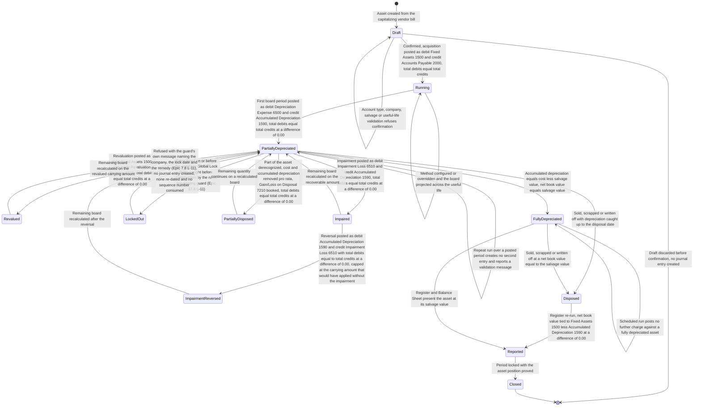
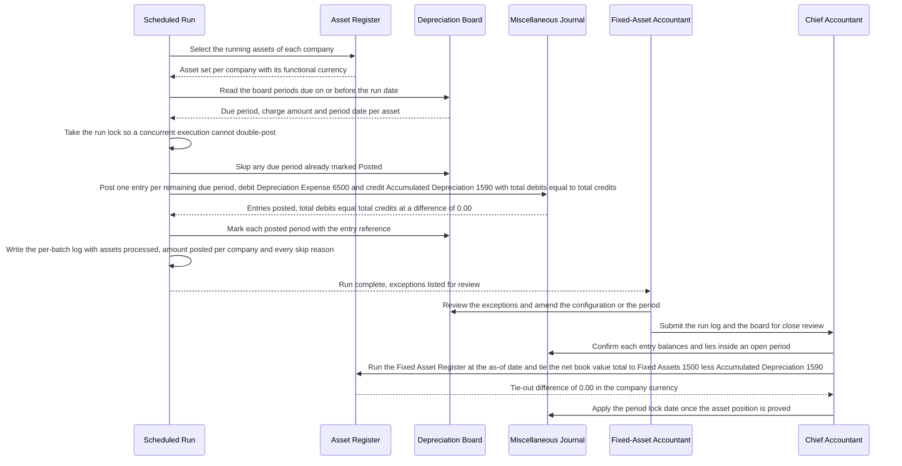

# FEATURE-001-08: Fixed Assets & Depreciation

---

## Metadata

| Attribute | Value |
|-----------|-------|
| **Feature ID** | `FEATURE-001-08` |
| **Title** | Fixed Assets & Depreciation |
| **Parent Epic** | [EPIC-001: Enterprise Accounting in Odoo](../EPIC-001-enterprise-accounting-odoo.md) |
| **Status** | Draft |
| **Priority** | 🟠 High |
| **Story Count** | 4 stories |
| **Last Updated** | 2026-08-16 |
| **Owner/Author** | Enterprise Accounting Team |

---

## 1. Feature Overview

### 1.1 Purpose and Business Value

This feature enables the **Fixed-Asset Accountant** and the **Chief Accountant** to run one governed asset sub-ledger inside Odoo across the whole life of a capital item: register the asset from the vendor bill that capitalized it, configure the depreciation method its class demands and read the projected depreciation board that method produces, post the periodic depreciation entry from that board as a balanced journal entry without duplicating it, and derecognize the asset on sale, scrapping or write-off with the gain or loss computed from net book value rather than from a spreadsheet. The **Financial Reporting Manager** presents the resulting net book value on the Balance Sheet, the **External Auditor** ties the asset register to the ledger and reads the impairment evidence behind it, and the **Tax Accountant** reads the book depreciation charge that the tax computation diverges from.

It is delivered against the following modules:

- **`account`** — the "Invoicing" application, version 1.4, category `Accounting/Accounting`, licence LGPL-3, present in this repository. It supplies `account.move` and `account.move.line` for the acquisition, depreciation, adjustment and disposal entries, `account.journal` for the Purchase and Miscellaneous journals those entries post through, `account.account` with the fixed-asset and depreciation account types the sub-ledger is anchored on, and the company lock-date fields that refuse a posting into a reported period.
- **`account_asset`** — the Enterprise asset application named in the Epic's module scope. It is **absent from `addons/`** in this repository, which the Epic records as a platform fact at [§5.4](../EPIC-001-enterprise-accounting-odoo.md#54-odoo-module-scope) rather than as a prohibition. Its absence is what makes the edition lock-in decision in §5.2 material: the asset register, the depreciation board and the disposal workflow this feature specifies must arrive either through an Odoo Enterprise subscription or through the Odoo Community Association (OCA) route with bespoke development for the residual gap.
- **`account_asset_management`** — present Community context at version 19.0.1.0.0 under AGPL-3, category `Accounting/Assets`, carrying `account.asset`, `account.asset.category` and `account.asset.depreciation.line` models together with `account.move` and `account.move.line` extensions, and the wizards `wizard/asset_disposal_wizard.py` and `wizard/asset_modification_wizard.py`. Discovery note **D-003** in the Epic credits it with asset registration, categories, the three depreciation methods, the depreciation board and scheduled posting, and originally recorded disposal, impairment, impairment reversal, partial disposal and the catch-up charge as this Feature's residual gap. **Read against the add-on that is present, that gap statement is too wide**: the manifest declares AM-005 revaluation, impairment and impairment reversal and AM-006 disposal with gain or loss, catch-up depreciation and partial disposal, all of which ship here. The gap is therefore restated criterion by criterion at [§5.2.1](#521-criterion-by-criterion-gap-analysis-against-account_asset_management), which is the statement every story of this Feature is priced and authorized against, so that no story builds a second disposal path beside a working one.
- **`analytic`** — "Analytic Accounting", version 1.2, licence LGPL-3, present in this repository. Optional: it carries the analytic distribution of the depreciation charge where cost-centre reporting is required, and FEATURE-001-09 reads that distribution as the actual side of depreciation-expense budget-versus-actual.

**Business Value Statement:**

> Every capital item is recorded once, depreciated from a schedule the system computes, and derecognized with a gain or loss the ledger can prove. The scheduled depreciation run posts 100% of the entries the depreciation board projects for the period (SM-008), so a charge is never missed and never entered twice; and the **Fixed Asset Register** ties to Fixed Assets 1500 less Accumulated Depreciation 1590 at a difference of `0.00 USD` (SM-009), so the net book value the Balance Sheet presents is the sub-ledger position rather than a restatement of it. That replaces the 8 to 16 hours of manual depreciation work a mid-sized portfolio consumes each month with a posted, evidenced sub-ledger, which is how this feature carries its part of the Epic's reduction of the close from 10 business days to 5 business days per legal entity (SM-003) and its 50% reduction in post-close audit adjustments (SM-016).

This feature serves the Epic's three objectives as follows:

| Epic Objective | Contribution of This Feature |
|----------------|------------------------------|
| Multi-entity financial operations | Each legal entity holds its own asset register in its own functional currency, with its own asset categories, its own asset reference sequence and its own Miscellaneous journal. Every register, board and tie-out statement in this feature names the company whose books are affected — `US-01`, `NL-01` or `GB-01` — because an asset belongs to one entity and its depreciation charge lands in that entity's Profit & Loss |
| Compliance reporting | Depreciation is measured under a named method whose formula is recorded against the asset, and derecognition, impairment and impairment reversal are measurement events with their own balanced entries and their own effective dates. That is the evidence IAS 16, IAS 36 and US GAAP ASC 360 require, and it is what the External Auditor reads instead of requesting an extract. The two frameworks are **not** treated as one: an impairment **reversal** is an IAS 36 paragraph 114 treatment and is admitted in the IFRS book only, because ASC 360-10-35-20 prohibits restoring an impairment loss on a long-lived asset held and used, so the reversal is scoped to a named book rather than posted framework-neutrally (§4.1) |
| Real-time financial visibility | Net book value is read from posted journal items and the projected board, so the asset position is current as of the last posted depreciation entry. The board also projects the charge forward across the remaining useful life, which is what makes future depreciation expense visible to budgeting before the period it lands in |

Ordering rule **ORD-001** in the Epic makes FEATURE-001-01 a prerequisite of every posting story here, because a depreciation entry cannot post without Fixed Assets 1500, Accumulated Depreciation 1590 and Depreciation Expense 6500, without the Miscellaneous journal, and without an open fiscal period. FEATURE-001-02 is the second prerequisite, because a capitalized vendor bill is the source record an asset is registered from. Ordering rule **ORD-004** makes this feature a prerequisite of FEATURE-001-07, whose Balance Sheet, Profit & Loss and close checklist consume the depreciation entries posted here. The Epic's implementation sequence places this feature in **Phase 4 — Group and sub-ledgers** alongside FEATURE-001-06 and FEATURE-001-09.

### 1.2 Problem Statement

Fixed assets are tracked in spreadsheets alongside the ledger rather than inside it, so the asset position on the Balance Sheet is a periodic transcription of a file that only one person maintains. Six consequences follow, and each recurs every month the portfolio is depreciated:

- **Depreciation is recomputed by hand every period.** A mid-sized portfolio consumes 8 to 16 hours of manual work per month: the Fixed-Asset Accountant reopens the spreadsheet, extends each schedule by one row, sums the column, and types one journal entry per asset class into the ledger. The work is repeated in full each period because nothing carries the previous period's computation forward.
- **Arithmetic errors reach the financial statements.** A mistyped useful life, a formula dragged one row short, or a salvage value omitted from the numerator produces a depreciation charge that is wrong in the Profit & Loss and an accumulated balance that is wrong in the Balance Sheet. Because the spreadsheet is also the control, the error is found when an auditor recomputes the schedule rather than when it is made.
- **Charges are missed or posted late.** With no scheduled run, the depreciation entry is posted when someone remembers it. A charge omitted from one period is either absent from that period's result or posted twice into the next, and both outcomes distort the period they land in and the comparative beside them.
- **There is no centralized history to audit.** An asset's acquisition cost, its category defaults, the method it was configured under, the revaluations and impairments applied to it, and the entries posted against it live in different files and different email threads. The External Auditor cannot walk from a Balance Sheet line to the asset that produced it, so every asset question becomes a data request.
- **Gain and loss on disposal are computed manually.** Disposal requires accumulated depreciation catch-up to the disposal date, net book value at that date, and the difference against proceeds. Each of those three figures is derived by hand, so a disposal that should recognize a `$4,500.00 USD` gain, stated to 2 decimal places at the USD rounding increment of 0.01, instead recognizes whatever the spreadsheet arrives at, and the asset is sometimes left on the books after it has left the building.
- **The register cannot be tied to the ledger.** Nothing reconciles the total net book value in the spreadsheet against Fixed Assets 1500 less Accumulated Depreciation 1590 in the general ledger. The two drift apart across periods, and by the time the difference is investigated there is no record of which period introduced it.

### 1.3 Key Capabilities

| Capability ID | Capability Description | Related Stories |
|---------------|------------------------|-----------------|
| CAP-001 | Register fixed assets with acquisition cost, acquisition date, category, useful life and salvage value | STORY-001-08-01 |
| CAP-002 | Configure depreciation methods per asset category and project the full depreciation board | STORY-001-08-02 |
| CAP-003 | Generate and post balanced depreciation journal entries on schedule, without duplication | STORY-001-08-03 |
| CAP-004 | Dispose of or sell an asset with automatic gain or loss recognition | STORY-001-08-04 |

The four capabilities are sequential across one asset's life: CAP-001 records the item and capitalizes it, CAP-002 fixes the measurement basis and projects every charge it implies, CAP-003 commits those charges to the ledger period by period, and CAP-004 derecognizes the item and books the difference between what it was carried at and what it realized.

**Depreciation methods in scope.** The three methods below are the measurement bases CAP-002 configures and the board projects. Each is stated as a formula so the board can be recomputed independently of the implementation, which is how the Fixed-Asset Accountant and the External Auditor verify it.

| Method | Basis | Notes |
|--------|-------|-------|
| Straight-line | (Cost − salvage value) ÷ useful life | Equal charge per period, with the useful life expressed in whole years or whole months. The rounding residual is absorbed in the final period so the accumulated total equals cost less salvage value exactly |
| Declining balance | Net book value × rate | Accelerated charge that falls each period, the rate commonly set at 150% or 200% of the straight-line rate. Optional switch to straight-line at the crossover period — the first period in which the straight-line charge on the remaining net book value over the remaining life exceeds the declining charge — after which the remaining periods carry an equal charge |
| Units of production | (Cost − salvage value) × units this period ÷ total estimated units | Charge varies with recorded usage. The per-unit rate is fixed at configuration, cumulative units are tracked against the total estimate, and the charge stops when cumulative units reach the estimate |

### 1.4 Success Criteria at Feature Level

| Criterion | Target | Verification Method |
|-----------|--------|---------------------|
| Straight-line board reconciles to cost | An asset registered in `US-01` with an acquisition cost of `$60,000.00 USD`, a 5-year useful life expressed as 60 months and a salvage value of `$0.00 USD` produces a 60-period **Depreciation Schedule (Depreciation Board)** whose every period reads `$1,000.00 USD` and whose accumulated total at period 60 reads `$60,000.00 USD`, each amount rounded to 2 decimal places at the USD rounding increment of 0.01, with any rounding residual absorbed in the final period so the accumulated total equals the acquisition cost less the salvage value at a difference of `0.00 USD` | Board recomputed from the straight-line formula and reconciled period by period to the asset cost, with the final-period residual asserted (C-009) |
| Rounding residual is absorbed, not dropped | An asset registered in `US-01` with an acquisition cost of `$50,000.00 USD`, a 36-month useful life and a salvage value of `$0.00 USD` charges `$1,388.89 USD` in each of periods 1 to 35 and `$1,388.85 USD` in period 36, each amount rounded to 2 decimal places at the USD rounding increment of 0.01, so the accumulated total reads `$50,000.00 USD` at a difference of `0.00 USD` from the acquisition cost | Board summed across all 36 periods and compared with the acquisition cost, with the final-period amount asserted as the residual-bearing period (SM-009, C-009) |
| Declining-balance crossover is asserted as an amount | The same `$60,000.00 USD` asset in `US-01` configured as declining balance at 40% per year over 5 annual periods with the switch to straight-line enabled charges `$24,000.00 USD`, `$14,400.00 USD` and `$8,640.00 USD` in periods 1 to 3, then switches at period 4 — the first period in which the straight-line charge on the remaining net book value of `$12,960.00 USD` over the remaining 2 periods, `$6,480.00 USD`, exceeds the declining charge of `$5,184.00 USD` — and charges `$6,480.00 USD` in each of periods 4 and 5, so the accumulated total reads `$60,000.00 USD` at a difference of `0.00 USD`, each amount rounded to 2 decimal places at the USD rounding increment of 0.01 | Board recomputed from the declining-balance formula, with the crossover period identified numerically and the accumulated total reconciled to cost (Epic Appendix C.3.5, C-009) |
| Units-of-production charge follows recorded usage | The same `$60,000.00 USD` asset in `US-01` configured as units of production over a total estimate of 100,000 units carries a per-unit rate of `$0.60 USD` and charges `$2,520.00 USD` for a period recording 4,200 units, each amount rounded to 2 decimal places at the USD rounding increment of 0.01, and the charge stops once cumulative units reach 100,000 with an accumulated total of `$60,000.00 USD` at a difference of `0.00 USD` from the acquisition cost | Per-unit rate recomputed from the formula, the period charge recomputed from recorded units, and the accumulated total reconciled to cost at cumulative-unit exhaustion (C-009) |
| Depreciation entry posts balanced | Each monthly depreciation entry for the worked asset posts in the **Miscellaneous** journal of `US-01` as debit Depreciation Expense 6500 `$1,000.00 USD` and credit Accumulated Depreciation 1590 `$1,000.00 USD`, so total debits of `$1,000.00 USD` equal total credits of `$1,000.00 USD` at a difference of `0.00 USD`, each amount rounded to 2 decimal places at the USD rounding increment of 0.01 | Posted entry inspected line by line with the debit-minus-credit difference asserted at `0.00 USD` (C-009) |
| Acquisition capitalizes balanced, **once** | The capitalization of a bill-sourced asset **is the vendor bill's own entry**: `INV-2025-0412`, posted in the **Purchase** journal of `US-01` by STORY-001-02-03, debits Fixed Assets 1500 `$60,000.00 USD` and credits Accounts Payable 2000 `$60,000.00 USD`, so total debits of `$60,000.00 USD` equal total credits of `$60,000.00 USD` at a difference of `0.00 USD`, each amount rounded to 2 decimal places at the USD rounding increment of 0.01. Confirming the asset against that posted bill line **creates no second entry** — it links the asset to it — so the count of journal entries the confirmation creates is 0, the count of debits to Fixed Assets 1500 attributable to the asset across the bill and the confirmation together is **exactly 1**, their total measures `$60,000.00 USD`, and the asset cost equals the capitalized bill line amount at a difference of `0.00 USD` | Posted entry inspected line by line with the difference asserted at `0.00 USD`; the confirmation asserted to create 0 entries; the debits to 1500 for the asset counted at 1 across both records; and the asset cost reconciled to the source bill line (ORD-001, FEATURE-001-02) |
| Scheduled posting automation is complete | 100% of the depreciation entries the board projects for the period are posted by the scheduled run, and the count of board periods due on or before the run date with no posted entry is 0 | Scheduled-run execution log compared line by line with the depreciation board for the same period and company (SM-008) |
| The run is idempotent | Re-running the depreciation job for a period already posted creates no second entry: the journal-entry count for the asset and the period is unchanged, and the attempt reports an Odoo validation message naming the asset, the period and the existing entry | Negative test executing the run twice over the same period, with the entry count asserted before and after and the message content asserted |
| Fixed Asset Register ties to the ledger | For company `US-01` and the as-of-date parameter 2025-12-31, the **Fixed Asset Register** presents the worked asset at an acquisition cost of `$60,000.00 USD`, accumulated depreciation of `$9,000.00 USD` and a net book value of `$51,000.00 USD` — board period 9 of its 60-period board, whose first period is dated 2025-04-30, so 9 charges of `$1,000.00 USD` stand posted at that date — within register totals of `$4,382,000.00 USD` cost, `$2,402,500.00 USD` accumulated depreciation and `$1,979,500.00 USD` net book value, and that net book value total equals Fixed Assets 1500 of `$4,382,000.00 USD` less Accumulated Depreciation 1590 of `$2,402,500.00 USD` at a difference of `0.00 USD`, each amount rounded to 2 decimal places at the USD rounding increment of 0.01 | Register-to-ledger tie-out worksheet per company per period, compared against the Trial Balance balances of 1500 and 1590 for the same as-of date and retained as close evidence (SM-009) |
| Disposal on sale recognizes gain balanced (Gain/Loss on Disposal is **7210** under the [FEATURE-001-01 §7.4 Group Chart-of-Accounts Extension Registry](./FEATURE-001-01-chart-of-accounts-fiscal-year.md#74-group-chart-of-accounts-extension-registry), distinct from the 7200 Foreign Exchange Gain/Loss FEATURE-001-06 holds) | Disposing the worked asset in `US-01` on 2027-09-30 — board period 30, where 30 charges of `$1,000.00 USD` stand posted — at a net book value of `$30,000.00 USD` for proceeds of `$34,500.00 USD` posts one entry in the **Miscellaneous** journal that debits Bank 1010 `$34,500.00 USD` and Accumulated Depreciation 1590 `$30,000.00 USD` and credits Fixed Assets 1500 `$60,000.00 USD` and Gain/Loss on Disposal 7210 `$4,500.00 USD`, so total debits of `$64,500.00 USD` equal total credits of `$64,500.00 USD` at a difference of `0.00 USD`, each amount rounded to 2 decimal places at the USD rounding increment of 0.01, and the asset leaves the register at that as-of date | Posted disposal entry inspected line by line with the difference asserted at `0.00 USD`, the gain recomputed as proceeds less net book value, and the register re-run to confirm removal |
| Scrapping at zero proceeds recognizes loss balanced | Scrapping the same asset at a net book value of `$30,000.00 USD` for proceeds of `$0.00 USD` posts one entry in the **Miscellaneous** journal that debits Accumulated Depreciation 1590 `$30,000.00 USD` and Gain/Loss on Disposal 7210 `$30,000.00 USD` and credits Fixed Assets 1500 `$60,000.00 USD`, so total debits of `$60,000.00 USD` equal total credits of `$60,000.00 USD` at a difference of `0.00 USD`, each amount rounded to 2 decimal places at the USD rounding increment of 0.01 | Posted disposal entry inspected line by line with the difference asserted at `0.00 USD`, and the zero-proceeds case exercised as the zero-amount edge case |
| Impairment and its reversal each post balanced | An impairment of the worked asset in `US-01` at 2027-09-30 — board period 30 — from a carrying amount of `$30,000.00 USD` to a recoverable amount of `$22,000.00 USD` posts an `$8,000.00 USD` charge: on **Branch I**, where no revaluation surplus stands, as debit Impairment Loss 6510 `$8,000.00 USD` against credit Accumulated Depreciation 1590 `$8,000.00 USD`; on **Branch RI**, where a `$6,000.00 USD` surplus stands, as debit Revaluation Reserve 3210 `$6,000.00 USD` and debit Impairment Loss 6510 `$2,000.00 USD` against the same `$8,000.00 USD` credit — each with total debits equal to total credits at a difference of `0.00 USD`. A later Branch I reversal at 2027-11-30 is capped at the **lowest of three ceilings** — the recovered recoverable amount, the no-impairment carrying amount and the original charge — and posts `$6,466.66 USD` as debit Accumulated Depreciation 1590 against credit Impairment Loss 6510 with total debits equal to total credits at a difference of `0.00 USD`; the reversal is admitted in the **IFRS book only**, because ASC 360-10-35-20 prohibits it for a long-lived asset held and used. Each amount is rounded to 2 decimal places at the USD rounding increment of 0.01 | Both branches' posted entries inspected line by line with the difference asserted at `0.00 USD`; the three reversal ceilings recomputed under IAS 36 (Epic Appendix C.3.5) with the binding one named; and the count of reversal entries in a US-GAAP book asserted at 0 |
| Locked period refused by the run's own guard | 100% of attempts to post a **capitalization**, depreciation, adjustment or disposal entry dated on or before the company's Global Lock Date — or its Hard Lock Date, which L-1's scope also covers — are refused by the pre-posting guard this feature delivers (Epic §7.8 **L-11**) — the guard inspecting the lock dates **before the journal entry is constructed**, so no `account.move` exists for the attempt and no journal sequence number is consumed — with the **guard's own message** naming the company, the violated lock date and the remedial action rather than the platform text of L-2, and no journal entry is created; the guard is required because the platform would otherwise post the entry re-dated into the first open period (L-1), and a depreciation charge re-dated out of its board period would break the board-to-ledger tie-out | Per-company test after the lock date is applied, asserting 0 created entries, the named refusal, and the board period left unposted for reprocessing |
| Test coverage | ≥80% for all 4 story implementations, with every board, balance, register and gain-or-loss assertion tested as an amount | Coverage tooling in the repository's configured test run (C-007, C-009) |
| Demonstrability | 4 of 4 stories demonstrated in the Odoo user interface, or over the JSON web-service surface the Epic's C-023 contract governs under a dedicated named integration principal holding no authority its human counterpart lacks, to the Finance Controller and the Product Owner | Recorded acceptance walkthrough per story |

---

## 2. User Personas

### 2.1 Persona Mapping

Every persona below is a named finance role drawn from the Epic's persona register at [§3.1](../EPIC-001-enterprise-accounting-odoo.md#31-user-personas). The five roles marked applicable take a registration, configuration, posting, measurement or review action inside the asset sub-ledger. The roles marked not applicable consume the asset balances and the depreciation charge this feature produces, and their work is specified in the features named against them.

| Persona | Role Description | Primary Use Cases | Applicable |
|---------|------------------|-------------------|------------|
| **Fixed-Asset Accountant** | Maintains the asset register and depreciation schedules | Registers an asset from its capitalizing vendor bill with acquisition cost, acquisition date, category, useful life and salvage value; assigns the asset to a category and overrides the inherited defaults where the item demands it; configures the depreciation method and reads the projected board period by period; applies revaluation and impairment and reads the recalculated remaining schedule; disposes of the asset by sale, scrapping, write-off or partial disposal and confirms the gain or loss against net book value | ☑ Yes |
| **Chief Accountant** | Owns the general ledger, the chart of accounts and the integrity of every posted entry | Approves the asset, accumulated-depreciation and depreciation-expense account assignment on each category; confirms that every depreciation, adjustment and disposal entry posts balanced through the **Miscellaneous** journal with total debits equal to total credits; aligns the depreciation period with the fiscal calendar and administers the Global Lock Date that the run's pre-posting guard reads before an entry is built (Epic [§7.8](../EPIC-001-enterprise-accounting-odoo.md#78-lock-date-behaviour-contract) **L-11**), the platform itself refusing only a change to an entry already posted inside the locked period (L-2, L-4); reviews the scheduled-run log at each close before the period is locked | ☑ Yes |
| **Financial Reporting Manager** | Produces statutory and management statements for each entity and the group | Presents Fixed Assets 1500 and the contra Accumulated Depreciation 1590 on the Balance Sheet and reads net book value as the difference between them; presents the Depreciation Expense 6500 movement and the Gain/Loss on Disposal 7210 result in the Profit & Loss; carries the register-to-ledger tie-out into the close evidence pack for each entity | ☑ Yes |
| **External Auditor** | Tests balances and controls and issues the audit opinion | Ties the **Fixed Asset Register** to Fixed Assets 1500 less Accumulated Depreciation 1590 at a `0.00` difference for the as-of date under test; recomputes a depreciation board from the recorded method, cost, salvage value and useful life; reads the impairment and impairment-reversal evidence with its effective dates and its recoverable-amount basis; drills from a Balance Sheet asset line to the journal items and the asset behind it | ☑ Yes |
| **Tax Accountant** | Determines tax on transactions and files statutory returns | Reads the book depreciation charge per asset and per period as the starting point of the book-to-tax reconciliation, because the tax computation applies a jurisdiction's own rates and lives to the same cost; reads the gain or loss on disposal as a book figure the taxable result is reconciled from; confirms that the divergence between book and tax depreciation is evidenced from the register rather than reconstructed | ☑ Yes |
| Accounts Payable Clerk | Captures vendor bills, runs three-way match and prepares payment runs | Captures the capitalizing vendor bill in FEATURE-001-02 whose line is directed to Fixed Assets 1500 rather than Expense 6100; takes no action on the asset record, its board or its disposal | ☐ No |
| Accounts Receivable Specialist | Issues customer invoices, allocates receipts and manages collections | Issues the customer invoice where an asset is sold to a third party on credit rather than settled to Bank 1010; takes no action inside the asset sub-ledger | ☐ No |
| Treasury Analyst | Owns bank and cash positions and statement reconciliation | Matches the disposal proceeds credited or debited against Bank 1010 to the imported statement line in FEATURE-001-04; takes no action on the asset record | ☐ No |
| FP&A Analyst | Builds budgets and explains variances to management | Reads the projected board as forward depreciation expense and the posted charge as the actual against Depreciation Expense 6500 in FEATURE-001-09; takes no action inside the asset sub-ledger | ☐ No |
| Group Controller | Governs group accounting policy and approves the consolidated result | Approves the group depreciation and impairment policy the categories are configured to, and reads the consolidated asset position in FEATURE-001-06; does not register, depreciate or dispose of an asset | ☐ No |
| Consolidation Accountant | Executes consolidation runs, eliminations and currency translation | Translates each entity's asset and accumulated-depreciation balances into the group reporting currency in FEATURE-001-06; takes no action inside an entity's asset register | ☐ No |
| CFO / Finance Director | Executive stakeholder accountable for financial health and compliance | Consumes the capital position and the depreciation charge; confirms the open platform and edition decisions recorded in §5.2 and §5.5 | ☐ No |

### 2.2 Persona-to-Story Mapping

Each story carries exactly one primary persona in its WHO statement. Secondary personas approve, review or consume the outcome, and they are named so that the access rights derived from these stories keep the role that maintains the register apart from the role that owns the ledger: the Fixed-Asset Accountant configures the method and initiates the disposal, and the Chief Accountant approves the account assignment and the period the entry lands in.

| Story | Primary Persona | Secondary Personas |
|-------|-----------------|--------------------|
| STORY-001-08-01 Register Fixed Assets with Acquisition Detail | Fixed-Asset Accountant | Chief Accountant (asset, accumulated-depreciation and expense account assignment), Accounts Payable Clerk (the capitalizing vendor bill the asset is registered from), External Auditor (asset reference, vendor and source-bill trail) |
| STORY-001-08-02 Configure Depreciation Methods and Projected Board | Fixed-Asset Accountant | Chief Accountant (method approval per category and fiscal-period alignment), Tax Accountant (book basis the tax computation diverges from), FP&A Analyst (projected charge as forward expense), External Auditor (board recomputed from the recorded method) |
| STORY-001-08-03 Post Automated Depreciation Entries | Chief Accountant | Fixed-Asset Accountant (board review and exception handling before the run), Financial Reporting Manager (the Depreciation Expense 6500 movement in the Profit & Loss), External Auditor (balanced-entry, run-log and lock-date evidence) |
| STORY-001-08-04 Dispose of Assets with Gain or Loss Recognition | Fixed-Asset Accountant | Chief Accountant (derecognition account assignment and period), Treasury Analyst (proceeds against Bank 1010), Financial Reporting Manager (Gain/Loss on Disposal 7210 in the Profit & Loss), External Auditor (net book value, impairment and disposal evidence) |

---

## 3. Story List

### 3.1 User Stories

| Story ID | Story Title | Persona | Priority | Status | Link |
|----------|-------------|---------|----------|--------|------|
| STORY-001-08-01 | Register Fixed Assets with Acquisition Detail | Fixed-Asset Accountant | 🟠 High | Draft | [STORY-001-08-01](./FEATURE-001-08/STORY-001-08-01-register-fixed-assets.md) |
| STORY-001-08-02 | Configure Depreciation Methods and Projected Board | Fixed-Asset Accountant | 🟠 High | Draft | [STORY-001-08-02](./FEATURE-001-08/STORY-001-08-02-configure-depreciation-methods.md) |
| STORY-001-08-03 | Post Automated Depreciation Entries | Chief Accountant | 🟠 High | Draft | [STORY-001-08-03](./FEATURE-001-08/STORY-001-08-03-post-depreciation-entries.md) |
| STORY-001-08-04 | Dispose of Assets with Gain or Loss Recognition | Fixed-Asset Accountant | 🟡 Medium | Draft | [STORY-001-08-04](./FEATURE-001-08/STORY-001-08-04-dispose-assets.md) |

**Priority legend:** 🟠 High — significant finance value that consumes what the transaction backbone creates and that the statements depend on; 🟡 Medium — required for the full release, and sequenced after the periodic charge it derecognizes against.

### 3.2 Story Count Assessment

| Count | Assessment | Status |
|-------|------------|--------|
| **4 stories** | Within the mandated range of 2 to 5 stories per feature | ✓ Feature is scoped for independent delivery |

This feature carries **4 stories**, inside the 2-to-5 range recorded in the Epic's decomposition guidelines at [§5.3](../EPIC-001-enterprise-accounting-odoo.md#53-feature-and-story-decomposition-guidelines). The earlier 3-to-7 guidance carried by the feature template is superseded by that bound and is not applied here. The count is stated identically in four places, and the four must stay equal: the Story Count row in §Metadata, this assessment, the 4 rows of §3.1, and the 4 links of §9.2. The Epic's feature summary declares the same count of 4 stories for `FEATURE-001-08`.

**The count is the result of a declared migration, not a reduction in scope.** The superseded flat-layout backlog held six asset stories. The Epic's retirement map at [Appendix C](../EPIC-001-enterprise-accounting-odoo.md#appendix-c-legacy-retirement-and-migration-map) folds them into these four:

| Retired story | Destination here | Obligation the destination carries |
|---------------|------------------|------------------------------------|
| Asset registration | STORY-001-08-01 | Rehomed one for one; the acquisition entry gains an explicit debits-equal-credits assertion under C-009 |
| Depreciation configuration **+** depreciation board | STORY-001-08-02 | Merged, because a board is the visible form of a configured method. The three methods, the start-date options, the declining-balance switch to straight-line and the board's accumulated total and net book value per period are each a named criterion, and the switch-over period is asserted numerically rather than described. The board export inherits the shared export convention and C-017 |
| Automatic depreciation entries | STORY-001-08-03 | Rehomed one for one; the locked-period case is retained as this story's accounting edge case |
| Asset modification **+** asset disposal | STORY-001-08-04 | Merged, and recorded as a high-risk merge. Revaluation crediting the reserve, impairment debiting the loss, impairment reversal, remaining-schedule recalculation, the audit trail with effective dates and partial disposal are measurement events and are criteria distinct from disposal, and each adjusting entry asserts debits equal credits at a difference of `0.00` in the company currency |

Splitting further would produce stories with no accounting proof of their own — a board has nothing to project until a method is configured against a registered asset, and a scheduled run has nothing to post until a board exists. Merging further would breach the Small criterion of INVEST, because registration, measurement configuration, periodic posting and derecognition are each demonstrated against a different artifact: a confirmed asset with a capitalized cost, a projected board reconciling to that cost, a posted balanced depreciation entry, and a posted disposal entry carrying a computed gain or loss.

### 3.3 Story Dependency Ordering

Each of the four stories delivers an outcome demonstrable on its own, which keeps them Independent under INVEST. The rows below are sequencing prerequisites — the record or configuration that must already exist for the dependent story to be demonstrated — and not shared implementation.

| Story | Depends On | Notes |
|-------|-----------|-------|
| STORY-001-08-01 (Register Fixed Assets with Acquisition Detail) | None within this feature | Foundation story; the confirmed asset carrying its acquisition cost, category, useful life and salvage value is the object every later story in this feature acts on |
| STORY-001-08-02 (Configure Depreciation Methods and Projected Board) | STORY-001-08-01 | A board is projected for a registered asset: the method, the useful life and the salvage value are measured against the acquisition cost recorded at registration, so there is nothing to project before an asset exists |
| STORY-001-08-03 (Post Automated Depreciation Entries) | STORY-001-08-02 | Postings follow the board: the scheduled run reads the projected period, its amount and its due date from the board, so the entry it posts has no source until the board is projected |
| STORY-001-08-04 (Dispose of Assets with Gain or Loss Recognition) | STORY-001-08-03 | Disposal removes cost and the accumulated depreciation already posted: net book value at the disposal date is the acquisition cost less the posted accumulated charge plus any catch-up to that date, so the gain or loss cannot be computed before depreciation posts |

Outside this feature, FEATURE-001-01 is a prerequisite of every posting story here under ORD-001 and FEATURE-001-02 supplies the capitalizing vendor bill an asset is registered from; both are recorded in §7.1.

### 3.4 Recommended Implementation Order

```text
1. STORY-001-08-01  Register Fixed Assets with Acquisition Detail
   Foundation: acquisition cost, acquisition date, category, useful life and salvage value
   on a confirmed asset, with a unique asset reference, the vendor and source vendor bill
   retained against it, and the acquisition capitalized as debit Fixed Assets 1500 /
   credit Accounts Payable 2000 in the Purchase journal, total debits equal total credits
        |
        v
2. STORY-001-08-02  Configure Depreciation Methods and Projected Board
   Measurement: straight-line, declining balance or units of production configured on the
   asset or inherited from its category, with the full Depreciation Schedule
   (Depreciation Board) projected across the useful life — period charge, accumulated
   total and net book value per period — reconciling to cost less salvage value
        |
        v
3. STORY-001-08-03  Post Automated Depreciation Entries
   Ledger: the scheduled run posts one balanced entry per due board period in the
   Miscellaneous journal — debit Depreciation Expense 6500, credit Accumulated
   Depreciation 1590, total debits equal total credits — idempotently, with a per-batch
   log and a refusal for a locked period or an incomplete configuration
        |
        v
4. STORY-001-08-04  Dispose of Assets with Gain or Loss Recognition
   Derecognition and measurement events: revaluation, impairment and impairment reversal
   with recalculated remaining schedules, then disposal by sale, scrapping, write-off or
   partial disposal — cost and accumulated depreciation removed, proceeds recorded and
   Gain/Loss on Disposal 7210 booked, total debits equal total credits
```

The four steps are strictly sequential because each acts on the artifact the previous step produced: an asset is registered before it is measured, measured before it is charged, and charged before the charge can be reversed out on derecognition. The whole feature is a prerequisite of FEATURE-001-07 under ORD-004, which is why the Epic sequences it in Phase 4 — Group and sub-ledgers, after the transaction backbone has produced the capitalizing bills this register is built from.

---

## 4. Acceptance Criteria Summary

### 4.1 Feature-Level Acceptance Criteria

**This section is this feature's Feature Definition of Done.** That is the name the programme's planning standard gives the completion gate every feature file carries, and the Epic publishes the three-level vocabulary once in [§5.3](../EPIC-001-enterprise-accounting-odoo.md#53-feature-and-story-decomposition-guidelines): the Epic-Level Definition of Done is [§13 of the Epic](../EPIC-001-enterprise-accounting-odoo.md#13-epic-level-definition-of-done), this section is the Feature Definition of Done, and each story closes on its own `Definition of Done`. The heading keeps the wording `Feature-Level Acceptance Criteria`, and so keeps its anchor `#41-feature-level-acceptance-criteria`, because links across this tree resolve to it — the two names denote one gate, and this file carries no second list of feature-completion conditions.

These are feature-level gates. The Given/When/Then acceptance criteria live in the four story files, where each is written against one workflow with 4 to 8 criteria and the coverage distribution the Epic requires.

The feature is considered complete when:

- [ ] All 4 stories within this feature have status "Done"
- [ ] All 4 stories achieve minimum 80% test coverage (C-007)
- [ ] Feature-level integration tests pass, with every board, balance, register and gain-or-loss assertion tested as an amount rather than inspected by eye (C-009)
- [ ] Each of the 4 stories has been demonstrated in the Odoo user interface, or over the JSON web-service surface the Epic's C-023 contract governs under a dedicated named integration principal holding no authority its human counterpart lacks, to the Finance Controller and the Product Owner, and the walkthrough is recorded against the story
- [ ] **The worked asset capitalizes balanced, and exactly once.** In `US-01` the capitalizing entry is the **vendor bill's own**: `INV-2025-0412`, posted in the **Purchase** journal by STORY-001-02-03, debits Fixed Assets 1500 `$60,000.00 USD` and credits Accounts Payable 2000 `$60,000.00 USD`, so total debits of `$60,000.00 USD` equal total credits of `$60,000.00 USD` at a difference of `0.00 USD`, each amount rounded to 2 decimal places at the USD rounding increment of 0.01, and the asset cost equals the capitalized bill line amount at a difference of `0.00 USD`. **Confirming the asset creates no second entry**: the count of journal entries created by the confirmation is 0 and the count of debits to Fixed Assets 1500 attributable to the asset across the bill and the confirmation together is 1. The route is settled here rather than left open, because `account_asset_management._create_acquisition_move` posts an acquisition entry on confirmation whose offset for a bill-sourced asset is the partner's payable account — which would debit 1500 a second time and credit Accounts Payable 2000 a second time — so **suppressing it for bill-sourced assets is a model change recorded as residual scope under D-003**, and the asset's own `journal_id` is the **Miscellaneous** journal of type `general` that the add-on's domain requires, not the Purchase journal
- [ ] Every registered asset carries an acquisition cost, an acquisition date, a category, a useful life and a salvage value, and the count of confirmed assets missing any one of the five is 0
- [ ] **Account assignment is validated before confirmation.** Confirmation is refused with an Odoo validation message naming the failing requirement when the asset account is not of the fixed-asset type, the depreciation expense account is not of the `expense_depreciation` type, the accumulated-depreciation account is not configured as a contra-asset against Fixed Assets 1500, any of the three belongs to a company other than the asset's own, or any of the three is archived; the asset stays in Draft and no journal entry is created by the refused attempt
- [ ] **Each asset carries a unique reference from the group's asset sequence, allocated when the draft record is created.** The `ir.sequence` record `account.asset` shipped by `account_asset_management` declares prefix `FA/%(year)s/`, padding `4`, `use_date_range = True` and **no company**, which renders `FA/2025/0001`. This programme **configures that same record** — prefix `FA/`, padding `5`, `use_date_range = False` — a customization the add-on's own data file anticipates by wrapping the record in `<data noupdate="1">` to preserve administrator changes to prefix, padding and starting number across upgrades, so the reference reads **`FA/00001`** for the first asset created and advances by 1 for each asset created after it. Three properties follow and are asserted rather than assumed: the sequence is **group-wide**, so a reference is unique across every company of the group, which is stronger than uniqueness within one company and makes the count of assets sharing a reference **0** group-wide; the number is allocated in `create`, so an asset carries its reference **while it stands in state `draft`** and not only on confirmation; and a **discarded draft leaves a permanent gap**, which is accepted and recorded because a gapless sequence cannot be guaranteed under concurrent creation without serializing creation — the audit trail requires uniqueness and monotonicity, not density. Reference order is **creation order and not in-service order**: `FA/00001` is the CNC milling centre created on its 2025-03-14 acquisition and `FA/00002` the delivery fleet registered after it, even though the fleet entered service on 2025-02-01
- [ ] The vendor and the source vendor bill are retained against the asset, and the bill line amount is compared with the acquisition cost with the difference asserted at `0.00` in the company currency, so the capitalization trail from the Balance Sheet line back to the vendor document is readable without a data request
- [ ] **Category defaults are inherited and overridable, and never retroactive.** An asset assigned to a category inherits that category's depreciation method, useful life, salvage basis, start-date option, declining-balance rate and the three accounts; each inherited value is overridable on the individual asset with the override recorded; and a later change to the category leaves assets already configured under it unchanged, proved by re-reading the board of an asset configured before the change
- [ ] **The straight-line board reconciles to cost.** The worked `$60,000.00 USD` asset in `US-01` with a 60-month useful life and a `$0.00 USD` salvage value projects 60 board periods each reading `$1,000.00 USD`, an accumulated total at period 60 of `$60,000.00 USD` and a net book value at period 60 of `$0.00 USD`, each amount rounded to 2 decimal places at the USD rounding increment of 0.01, so the accumulated total equals cost less salvage value at a difference of `0.00 USD`
- [ ] **The rounding residual is absorbed in the final period.** A `$50,000.00 USD` asset in `US-01` over 36 months with a `$0.00 USD` salvage value charges `$1,388.89 USD` in each of periods 1 to 35 and `$1,388.85 USD` in period 36, each amount rounded to 2 decimal places at the USD rounding increment of 0.01, so the accumulated total reads `$50,000.00 USD` at a difference of `0.00 USD` from cost and no fraction of a cent is lost or double-counted
- [ ] **The declining-balance switch to straight-line is asserted numerically.** The worked `$60,000.00 USD` asset in `US-01` at 40% per year over 5 annual periods with the switch enabled charges `$24,000.00 USD`, `$14,400.00 USD` and `$8,640.00 USD` in periods 1 to 3, switches at period 4 because the straight-line charge on the remaining net book value of `$12,960.00 USD` over 2 remaining periods, `$6,480.00 USD`, exceeds the declining charge of `$5,184.00 USD`, and charges `$6,480.00 USD` in each of periods 4 and 5, giving an accumulated total of `$60,000.00 USD` at a difference of `0.00 USD` from cost, each amount rounded to 2 decimal places at the USD rounding increment of 0.01
- [ ] **The units-of-production charge follows recorded usage.** The worked `$60,000.00 USD` asset in `US-01` over a total estimate of 100,000 units carries a per-unit rate of `$0.60 USD`, charges `$2,520.00 USD` for a period recording 4,200 units, tracks cumulative units against the estimate, and stops charging once cumulative units reach 100,000 with an accumulated total of `$60,000.00 USD` at a difference of `0.00 USD` from cost, each amount rounded to 2 decimal places at the USD rounding increment of 0.01
- [ ] **A mid-period acquisition is prorated on one stated convention and the board extends by one period.** The single day-weighting convention of this feature is **annual charge × chargeable days ÷ days in the year**, rounded half-up to 2 decimal places at the currency's rounding increment, with any residual absorbed whole in the final period; it is used by the prorated start option here and by the retirement catch-up charge of STORY-001-08-04 and by nothing else, and the board otherwise charges whole periods. A `$60,000.00 USD` asset in `US-01` acquired 2025-03-14 under the acquisition-date start option therefore charges `$591.78 USD` for the 18 days from 2025-03-14 to 2025-03-31 — `$12,000.00 USD × 18 ÷ 365` — `$1,000.00 USD` in each of periods 2 to 60, and `$408.22 USD` in period 61 absorbing the residual, so the accumulated total reads `$60,000.00 USD` at a difference of `0.00 USD` from cost. **Per-day proration is residual scope, not a credited add-on capability**: `account_asset_management._schedule_straight_line` generates exactly `useful_life_months` whole periods of `(cost − salvage) ÷ periods` advancing by `relativedelta(months=+1)` from the depreciation start date, with no day weighting and no 61st period, so this behaviour is bespoke work under D-003
- [ ] The four start-date options are each demonstrated against the same acquisition date — the acquisition date with proration, the first day of the acquisition month, the first day of the following month, and a manual date on or after the acquisition date — and a manual date earlier than the acquisition date is refused with an Odoo validation message naming both dates, with no board recomputed by the refused attempt
- [ ] **No depreciation is charged before the asset is available for use, and the option that would charge it is scoped to a named book.** IAS 16 paragraph 55 begins depreciation when an asset is available for use, so in the **IFRS book** the first board period is never dated earlier than the availability date and the count of IFRS board periods dated before it is 0. The **First Day of Current Month** option, which would charge the whole month of acquisition and so cover the 13 days of March 2025 before the 2025-03-14 acquisition of the worked asset, is therefore **not admissible for the IFRS book** and is available only where a tax or local statutory book permits a full-month convention; the book each option is in force for is recorded against the asset class by the Chief Accountant. The worked asset's IFRS board runs on **First Day of Next Month** — depreciation start 2025-04-01, 60 whole monthly periods dated 2025-04-30 through 2030-03-31 at `$1,000.00 USD` each — which is the board the Epic's canonical roll-forward carries
- [ ] **Depreciation configuration is validated as a set.** Saving the configuration is refused with an Odoo validation message naming the failing requirement when the method is unset, the useful life is not greater than zero for straight-line or declining balance, the declining-balance rate falls outside the range above 0% to 100%, the total estimated units is not greater than zero for units of production, the salvage value is negative, or the salvage value exceeds the acquisition cost; no board is projected until the set is complete
- [ ] **The Depreciation Schedule (Depreciation Board) presents four values per period and reconciles across them.** Each board period presents its period number and date, its depreciation charge, its accumulated depreciation as the running sum of all charges to that period, and its net book value as acquisition cost less that accumulated total, with the identity `cost − accumulated = net book value` asserted at a difference of `0.00` in the company currency on every period, and the net book value of the final period equal to the salvage value
- [ ] Each board period is marked Posted or Pending against the existence of a posted depreciation entry for that asset and period, the posted rows carry the reference of the entry that posted them, and the board drills from a posted row to the journal items behind it with the filters preserved
- [ ] The board filters and sorts by date range and by fiscal period, and it exports to PDF and to XLSX with every exported cell neutralized against formula injection **by cell type**, so an untrusted text cell whose first character is `=`, `+`, `-`, `@`, a tab or a carriage return is rendered as text while a numeric, date or boolean cell keeps its type and is never coerced to text (C-017)
- [ ] **Each depreciation entry posts balanced.** A monthly depreciation entry for the worked asset posts in the **Miscellaneous** journal of `US-01` as debit Depreciation Expense 6500 `$1,000.00 USD` and credit Accumulated Depreciation 1590 `$1,000.00 USD`, so total debits of `$1,000.00 USD` equal total credits of `$1,000.00 USD` at a difference of `0.00 USD`, each amount rounded to 2 decimal places at the USD rounding increment of 0.01, and the entry is dated on the board period date and references the asset and the period
- [ ] **Scheduled posting automation is complete.** 100% of the board periods due on or before the run date are posted by the scheduled run, the count of due periods with no posted entry is 0, and the run writes a per-batch log recording the assets processed, the entries created, the amount posted per company and every asset it skipped with the reason (SM-008)
- [ ] **The run is idempotent.** Re-running the depreciation job over a period already posted creates no second entry: the journal-entry count for the asset and the period is identical before and after, and the attempt reports an Odoo validation message naming the asset, the period and the existing entry
- [ ] **Concurrent runs do not double-post.** Two runs initiated over the same company and period produce one entry per due board period in total, proved by a concurrency test that asserts the entry count and the accumulated total on the board are unchanged by the second run
- [ ] The draft-versus-automatic posting option is demonstrated in both settings: under the draft setting the run creates the entry unposted for the Chief Accountant to review and post, and under the automatic setting the run posts it, with both paths asserting total debits equal total credits at a difference of `0.00` in the company currency
- [ ] **A fully depreciated asset receives no further charge.** An asset whose accumulated depreciation equals cost less salvage value carries a net book value equal to its salvage value, and the count of depreciation entries the run posts against it in any later period is 0
- [ ] **A zero-cost asset is refused.** Confirming an asset with an acquisition cost of `$0.00 USD`, stated to 2 decimal places at the USD rounding increment of 0.01, is refused with an Odoo validation message naming the asset and the cost, so no board is projected and no journal entry is created
- [ ] **An asset in a currency other than the group reporting currency rounds to its own currency.** A `£25,000.00 GBP` asset in `GB-01` over 36 months with a `£0.00 GBP` salvage value charges `£694.44 GBP` in each of periods 1 to 35 and `£694.60 GBP` in period 36, each amount rounded to 2 decimal places at the GBP rounding increment of 0.01, and each entry balances in the functional currency of `GB-01` at a difference of `0.00 GBP`
- [ ] **Revaluation clears the contra against gross cost, credits the reserve and recalculates the remaining schedule.** Revaluing the worked asset in `US-01` at 2027-09-30 from a carrying amount of `$30,000.00 USD` to a fair value of `$36,000.00 USD` under the **elimination method of IAS 16 paragraph 35(b)** posts one entry in the **Miscellaneous** journal holding four items — debit Accumulated Depreciation 1590 `$30,000.00 USD` and credit Fixed Assets 1500 `$30,000.00 USD`, eliminating the whole accumulated balance against gross cost, then debit Fixed Assets 1500 `$6,000.00 USD` and credit Revaluation Reserve 3210 `$6,000.00 USD` for the surplus — so total debits of `$36,000.00 USD` equal total credits of `$36,000.00 USD` at a difference of `0.00 USD`, and the **resulting balances read Fixed Assets 1500 `$36,000.00 USD`, Accumulated Depreciation 1590 `$0.00 USD` and a carrying amount of `$36,000.00 USD`**. Under the **proportionate method of paragraph 35(a)** the same change posts as debit Fixed Assets 1500 `$12,000.00 USD` against credit Accumulated Depreciation 1590 `$6,000.00 USD` and credit Revaluation Reserve 3210 `$6,000.00 USD`, totals `$12,000.00 USD` each side at a difference of `0.00 USD`, leaving 1500 at `$72,000.00 USD` and 1590 at `$36,000.00 USD`. The method in force is recorded on the asset; under either the carrying amount is `$36,000.00 USD` and the remaining 30 board periods are recalculated to `$1,200.00 USD` each, each amount rounded to 2 decimal places at the USD rounding increment of 0.01
- [ ] **Impairment charges the expense alone where no surplus stands, and the reserve first where one does.** Two branches are asserted and neither is measured from a figure the other produced. **Branch I**, no surplus standing: impairing the worked asset in `US-01` at 2027-09-30 — board period 30, with 30 periods still unposted — from a carrying amount of `$30,000.00 USD` to a recoverable amount of `$22,000.00 USD` posts one entry in the **Miscellaneous** journal that debits Impairment Loss 6510 `$8,000.00 USD` and credits Accumulated Depreciation 1590 `$8,000.00 USD`, totals `$8,000.00 USD` each side at a difference of `0.00 USD`, and the remaining 30 board periods are recalculated to `$733.33 USD` for the first 29 and `$733.43 USD` for the last, giving a recalculated accumulated total of `$22,000.00 USD` at a difference of `0.00 USD` from the recoverable amount. **Branch RI**, a `$6,000.00 USD` surplus standing because the revaluation above was posted and the asset then charged five periods of `$1,200.00 USD` to 2028-02-29: the same `$8,000.00 USD` charge posts as debit Revaluation Reserve 3210 `$6,000.00 USD` **first**, debit Impairment Loss 6510 `$2,000.00 USD` for the excess only, and credit Accumulated Depreciation 1590 `$8,000.00 USD`, totals `$8,000.00 USD` each side at a difference of `0.00 USD`, leaving the reserve at `$0.00 USD`, and the remaining 25 board periods are recalculated to `$880.00 USD` each, `$22,000.00 USD ÷ 25` exactly. Both branches reach a carrying amount of `$22,000.00 USD` and neither moves Fixed Assets 1500; the count of impairments debiting 6510 for more than the excess over an available surplus is 0. Each amount is rounded to 2 decimal places at the USD rounding increment of 0.01
- [ ] **Impairment reversal is capped at the lowest of three stated ceilings, posts balanced, and is admitted in the IFRS book only.** On Branch I at 2027-11-30, two board periods after the charge, the impaired carrying amount stands at `$20,533.34 USD` (`$22,000.00 USD` less two charges of `$733.33 USD`), the recoverable amount has recovered to `$27,000.00 USD` and the carrying amount the asset would have held without the impairment stands at `$28,000.00 USD` (`$30,000.00 USD` less two charges of `$1,000.00 USD`) — giving a recoverable ceiling of `$6,466.66 USD`, a no-impairment ceiling of `$7,466.66 USD` and an original-charge ceiling of `$8,000.00 USD`, of which the **lowest binds**, so the reversal is `$6,466.66 USD` and posts one entry in the **Miscellaneous** journal that debits Accumulated Depreciation 1590 `$6,466.66 USD` and credits Impairment Loss 6510 `$6,466.66 USD`, total debits equal to total credits at a difference of `0.00 USD`. On Branch RI the same three ceilings apply and the credit side splits: Impairment Loss 6510 is credited only up to the `$2,000.00 USD` that reached profit or loss and Revaluation Reserve 3210 carries the remainder. The reversal is an **IFRS/IAS 36 paragraph 114 treatment**: **US GAAP prohibits restoring an impairment loss on a long-lived asset held and used (ASC 360-10-35-20, codifying FASB Statement 144)**, so for the same asset and the same recovery a US-GAAP book posts a reversal of `$0.00 USD` and the count of reversal entries created in it is 0, with the recovery disclosed rather than posted. Each amount is rounded to 2 decimal places at the USD rounding increment of 0.01
- [ ] Each revaluation, impairment and impairment reversal is recorded with its effective date, its basis and its author, so the measurement history of an asset is readable in date order and the External Auditor reads the recoverable-amount basis behind an impairment without a data request
- [ ] **Disposal on sale recognizes the gain balanced.** Disposing the worked asset in `US-01` on 2027-09-30 — board period 30, where 30 charges of `$1,000.00 USD` stand posted — at a net book value of `$30,000.00 USD` for proceeds of `$34,500.00 USD` posts one entry in the **Miscellaneous** journal that debits Bank 1010 `$34,500.00 USD` and Accumulated Depreciation 1590 `$30,000.00 USD` and credits Fixed Assets 1500 `$60,000.00 USD` and Gain/Loss on Disposal 7210 `$4,500.00 USD`, so total debits of `$64,500.00 USD` equal total credits of `$64,500.00 USD` at a difference of `0.00 USD`, each amount rounded to 2 decimal places at the USD rounding increment of 0.01
- [ ] **Scrapping and write-off at zero proceeds recognize the loss balanced.** Scrapping or writing off the same asset at a net book value of `$30,000.00 USD` for proceeds of `$0.00 USD` posts one entry in the **Miscellaneous** journal that debits Accumulated Depreciation 1590 `$30,000.00 USD` and Gain/Loss on Disposal 7210 `$30,000.00 USD` and credits Fixed Assets 1500 `$60,000.00 USD`, so total debits of `$60,000.00 USD` equal total credits of `$60,000.00 USD` at a difference of `0.00 USD`, each amount rounded to 2 decimal places at the USD rounding increment of 0.01
- [ ] **Depreciation is caught up to the disposal date before the gain or loss is computed.** Where the disposal date falls after the last posted board period, the charge for the part-period to the disposal date is posted first as debit Depreciation Expense 6500 and credit Accumulated Depreciation 1590 with total debits equal to total credits at a difference of `0.00` in the company currency, and the net book value the gain or loss is measured against is the acquisition cost less the accumulated total including that catch-up
- [ ] **Partial disposal removes its share and leaves a proved remainder.** Disposing 1 of the 4 identical units carried in the worked `$60,000.00 USD` asset in `US-01` for proceeds of `$9,000.00 USD` removes a cost of `$15,000.00 USD` and accumulated depreciation of `$7,500.00 USD`, posts one entry in the **Miscellaneous** journal that debits Bank 1010 `$9,000.00 USD` and Accumulated Depreciation 1590 `$7,500.00 USD` and credits Fixed Assets 1500 `$15,000.00 USD` and Gain/Loss on Disposal 7210 `$1,500.00 USD`, so total debits of `$16,500.00 USD` equal total credits of `$16,500.00 USD` at a difference of `0.00 USD`, and the remaining asset carries a cost of `$45,000.00 USD`, accumulated depreciation of `$22,500.00 USD`, a net book value of `$22,500.00 USD` and a recalculated period charge of `$750.00 USD`, each amount rounded to 2 decimal places at the USD rounding increment of 0.01
- [ ] **Disposal is validated before it posts.** Disposal is refused with an Odoo validation message naming the failing requirement when the disposal date precedes the acquisition date, the asset is not in the running state, the proceeds amount is negative, a partial-disposal quantity is not greater than zero or exceeds the quantity remaining, or any of the asset, accumulated-depreciation, proceeds and gain-or-loss accounts is unconfigured; no journal entry is created by the refused attempt
- [ ] **Preparing a retirement and posting it are two rights, the posted figure is the previewed one, and a cancellation is atomic ([DSP-001](./FEATURE-001-08/STORY-001-08-04-dispose-assets.md#dsp-001--the-retirement-authority-snapshot-and-cancellation-contract)).** The prepare and post rights live in **distinct server groups** and neither implies the other, so the count of retirements posted by the role that prepared them is **0** and a preparer's attempt to post creates **0** entries and consumes no journal sequence number. The preview records a retirement event under a database unique constraint together with a **snapshot** of the gross cost, the accumulated depreciation and the proceeds; at posting the asset row is taken under a **row lock** and those three balances are re-read inside it, so a balance that moved between preview and confirmation **refuses** the posting with each moved balance stated at both values and **0** entries created, and the count of retirements whose posted **Gain/Loss on Disposal 7210** amount differs from the previewed amount is **0**. A replayed confirmation yields **1** retirement entry rather than 2. A cancellation posts the **linked** reversing entry and reinstates the asset's state, its cleared disposal fields and its depreciation board **in one database transaction**, so the count of assets in state `close` holding a reversed entry is **0**, the count in state `open` holding an unreversed one is **0**, and a failed cancellation leaves the retirement wholly in force with **0** reversing entries
- [ ] **The depreciation run's bounds, its `auto-post` authority and its resilience are binding rather than advisory ([RUN-001](./FEATURE-001-08/STORY-001-08-03-post-depreciation-entries.md#run-001--the-depreciation-runs-binding-bounds-authority-and-resilience)).** The run date is validated against four stated bounds — inside an open fiscal period, not earlier than the company's earliest board period date, not later than the current date beyond a declared maximum of `0` days, and within a declared maximum periods-per-run — each breach refused **before work begins** with the bound and the requested value named as two values and **0** entries created. A posting preference of `auto-post` takes effect only on the **Chief Accountant's** approval of that configuration version, an approval by the version's own author being refused, so the count of released `auto-post` versions whose approver equals their author is **0** and the count of entries auto-posted under an unapproved version is **0** — an unapproved override resolving to `draft`. Each attempt carries a declared timeout; a transient failure is retried against a bounded budget with exponential backoff **and jitter**; repeated failure opens a recorded circuit breaker; a spent budget leaves the board periods **Pending** and the run in a named terminal state an operator is alerted on; an interrupted run is recovered and its lease reclaimed; the idempotency guard is a **database unique constraint** over company, asset and board period date with the asset row under a row lock, so two concurrent or retried runs produce **1** entry per asset per period and the count of assets carrying two entries for one period is **0**; and the scheduled execution runs under a named service principal with the posting right in the target company only, creating **0** entries elsewhere. The completeness metric SM-008 is measured **per execution** as `posted ÷ eligible` — `9,999 ÷ 10,000` on the worked run carrying one failed asset — and **per period** as `posted ÷ eligible = 100%` after reprocessing, a period-level figure below `100%` blocking the close sign-off
- [ ] **The register's inputs and its schedules are bounded and uniquely allocated (MJ-18 surfaces).** A legacy asset extract carries a full contract — allowlisted media type and declared maximum size before parsing, a hardened reader for a ZIP-of-XML workbook, a declared column contract with per-column type, range and length, row-level rejection with a stated row number and **0** rows accepted after coercion, a file identity over company and file digest so **0** assets are created twice from one extract, all-or-nothing application per file with per-row outcomes recorded, a declared maximum row count, the C-025 artifact lifecycle, an append-only load history, and a reconciliation gate tying the loaded gross costs to **Fixed Assets 1500** and the loaded accumulated depreciation to **Accumulated Depreciation 1590** each at a difference of `0.00` before release. A capitalizing **bill line** is allocated to at most one asset under a database unique constraint, so the count of assets capitalized from one `$60,000.00 USD` bill line is **1** and the count of bill lines carrying two confirmed allocations is **0**, an explicit split summing to the line amount at a difference of `0.00 USD` being the only route to fund two assets. A board is capped by a declared maximum period count per asset and a declared maximum total rows per request, refused before work begins with the cap and the requested count named. Exactly **one** book per asset is the **posting book** under a database constraint, so the count of assets with two posting books is **0** and the count of entries produced from a non-posting book is **0**, with the IFRS-only revaluation and impairment-reversal treatments admitted only in a book recorded as IFRS. A disposal by sale links the retirement entry, the proceeds invoice line, its output tax and its payment as **one act**, the output tax asserted as its own tax code, base amount and tax amount and never folded into **Gain/Loss on Disposal 7210**
- [ ] **A posting into a locked period is refused by this feature's own guard, before any entry exists.** An attempt to post the **capitalizing entry of an asset confirmation**, or a depreciation, revaluation, impairment or disposal entry, dated on or before the Global Lock Date or the Hard Lock Date of the affected company is refused by the pre-posting guard this feature delivers (Epic §7.8 **L-11**) before the journal entry is constructed, so no `account.move` exists for the attempt and no journal sequence number is consumed; the message is the guard's own, naming the company, the violated lock date and the remedial action rather than the platform text of L-2; no journal entry is created, no entry is re-dated into another period (which is what the platform would otherwise do under L-1), and the affected board period stays unposted for reprocessing
- [ ] **The Fixed Asset Register ties to the ledger.** For company `US-01` and the as-of-date parameter 2025-12-31, the register presents the worked asset at a cost of `$60,000.00 USD`, accumulated depreciation of `$9,000.00 USD` and a net book value of `$51,000.00 USD` — board period 9 of its 60-period board — and register totals of `$4,382,000.00 USD` cost, `$2,402,500.00 USD` accumulated depreciation and `$1,979,500.00 USD` net book value, so the net book value total equals Fixed Assets 1500 of `$4,382,000.00 USD` less Accumulated Depreciation 1590 of `$2,402,500.00 USD` at a difference of `0.00 USD`, each amount rounded to 2 decimal places at the USD rounding increment of 0.01 (SM-009)
- [ ] The register is produced per company, so the register of `US-01` presents no asset belonging to `NL-01` or `GB-01`, and a group view of the three registers names each contributing company beside its own cost, accumulated-depreciation and net book value totals
- [ ] The register drills from an asset line to its board and from a board period to the journal items behind it, and it exports to PDF and to XLSX under the same formula-injection neutralization as the board (C-017)
- [ ] **The Balance Sheet presents the asset position from the same figures.** For `US-01` and the as-of-date parameter 2025-12-31, the Balance Sheet presents Fixed Assets 1500 at `$4,382,000.00 USD` and the contra Accumulated Depreciation 1590 at `$2,402,500.00 USD`, a net `$1,979,500.00 USD` equal to the register net book value total at a difference of `0.00 USD`, each amount rounded to 2 decimal places at the USD rounding increment of 0.01
- [ ] The book depreciation charge per asset and per period, and the gain or loss on disposal, are readable from the register and the board as the starting point of the book-to-tax reconciliation, so the divergence between book and tax depreciation is evidenced from the sub-ledger rather than reconstructed by the Tax Accountant
- [ ] **A hostile run-time report parameter is REJECTED, and that is a separate obligation from neutralizing an accepted value on export.** The two are never satisfied by one disjunctive assertion, because "rejected or neutralized" passes when neither happens to the case in hand. **Rejection (C-015, C-019, C-020, C-022):** a malformed as-of date, an out-of-range as-of date, an over-long filter value, a filter value carrying a search-domain payload and a filter value carrying a formula-injection payload are each **refused** with an error naming the parameter and the check that failed — the report does not render, `0` rows are produced, `0` board periods are altered, `0` journal entries are created, no stack trace or file-system path is disclosed, and the service answers the next request. **Neutralization (C-017, C-018), applied by cell type rather than by inspecting the rendered string:** a cell written from an **untrusted text** value that is **accepted** because it is legitimate business data yet begins `=`, `+`, `-`, `@`, a tab or a carriage return — an asset name, a category name, a disposal reason or a supporting-document reference — is written as **text** in every exported cell of the register and the board, so the exported file opens with the cell displaying the literal value and evaluating to no formula; while a cell written from a **numeric, date or boolean** value keeps its type and is never coerced to text, so an acquisition cost, a period charge, an accumulated total, a net book value and a negative gain or loss on disposal stay typed **numbers**, the count of numeric cells written as text is **0**, and the exported register still sums to the acquisition cost. Each obligation carries its own named test in the owning story; neither test may pass by way of the other's outcome
- [ ] The posted Depreciation Expense 6500 movement, the Fixed Assets 1500 and Accumulated Depreciation 1590 balances, the Gain/Loss on Disposal 7210 result and the projected board are handed to FEATURE-001-07 and FEATURE-001-09 as the posted data their stories consume, and the hand-over is recorded against ORD-004

### 4.2 Cross-Cutting Concerns

Every story in this feature inherits the criteria below from the Epic's constraint set.

| Concern | Acceptance Criterion |
|---------|----------------------|
| License | New modules are distributed under an AGPL-3.0 compatible licence, integration with `account` and `analytic` respects their LGPL-3 licence, and extension of the present `account_asset_management` add-on respects its AGPL-3 licence (C-001, C-002) |
| Dependencies | Every declared module dependency exists in the platform configuration confirmed by DEC-002, and delivered code stays consumable by the OCA add-on ecosystem including the `OCA/account-financial-tools` asset add-ons (C-003, C-004) |
| Coding Standards | Python follows Odoo and OCA standards including PEP 8, and static analysis passes with the repository's configured tooling in `ruff.toml` (C-005, C-006) |
| Test Coverage | Each story achieves minimum 80% test coverage, and each acceptance test is traceable to one Given/When/Then criterion (C-007, C-008) |
| Documentation | Public methods and models are documented with docstrings, and the depreciation formula per method, the declining-balance switch rule, the rounding-residual placement and the impairment-reversal ceiling are recorded alongside the code that computes them |
| Security | Access rights are defined per finance role and verified by an access-rights test matrix: the Fixed-Asset Accountant registers assets, configures methods, reads boards and initiates revaluation, impairment and disposal; the Chief Accountant approves account assignment, posts the depreciation and disposal entries and administers the lock date; the Financial Reporting Manager and the Tax Accountant hold read access to the register, the board and the posted charge without altering an asset; the External Auditor holds read-only access to assets, boards, measurement history and posted entries; and no role reads, depreciates or disposes of an asset in a company outside its allowed companies (C-014) |
| Segregation of duties | The role that initiates a disposal or an impairment and the role that posts the resulting entry are distinct, and a test proves that the initiating role cannot post the entry and that no role can alter an asset's acquisition cost after the acquisition entry is posted (C-014) |
| Multi-company isolation | Every criterion that touches more than one company names the company whose books are affected — `US-01`, `NL-01` or `GB-01` — an asset is held against exactly one company, and a test proves that a role restricted to one company can neither read nor depreciate another company's assets (C-014, D-007) |
| Build on the existing models | Acquisition, depreciation, revaluation, impairment and disposal entries are expressed on `account.move` and `account.move.line` in the company's **Miscellaneous** and **Purchase** journals rather than on a parallel posting structure, and account resolution reads `account.account` rather than duplicating the chart (C-012) |
| Untrusted input | The as-of dates, date ranges, filter values and grouping selections supplied to the register and the board at run time cross the trust boundary, as does any legacy asset extract loaded at migration. Two distinct controls apply and each is tested on its own: a **hostile parameter is refused** — validated before use, data access expressed through the ORM or parameterized SQL with no concatenated search domain, a named error disclosing no internal detail, `0` rows rendered and the service still answering — while an **accepted business value is neutralized on output**, so a cell beginning `=`, `+`, `-`, `@`, a tab or a carriage return is rendered as text in the export rather than evaluated. File type and size are checked against an allowlist at the ingestion boundary, and a hostile-input test proves the refusal with no journal entry created and the service still available (C-015, C-017, C-019, C-020, C-022) |
| Rendered text | Asset names, asset references, category names, vendor names and disposal memo text are sanitized and context-encoded before they are rendered into a PDF or XLSX register, a board row or a run-log entry, and templates render such values as escaped text rather than as raw markup (C-018) |
| Document parsing | No story in this feature parses an XML document, so the external-entity and entity-expansion surface does not arise here; if the legacy asset extract loaded at migration is implemented against a structured document format rather than a tabular extract, that path inherits C-016 in full — DTD processing and external-entity resolution disabled, entity expansion bounded, and schema validation before any field is read (C-016) |
| Credentials | No story in this feature holds an endpoint credential, API key or signing certificate; where the scheduled run notifies a recipient through an outbound mail server, its credentials are held outside module source and outside version control under the Epic's secret-handling rule (C-021) |
| Audit trail | Asset registration and confirmation, the category and method assignment with any override, each revaluation, impairment and impairment reversal with its effective date and basis, each posted depreciation entry, and the disposal with its method and proceeds are recorded with their author and timestamp and are readable by the External Auditor without a data request |
| Performance | The targets in §4.4 are met on a portfolio of 10,000 assets, a board of 600 periods and a scheduled run covering the whole portfolio |

### 4.3 Integration Requirements

| Integration Point | Requirement | Verification |
|-------------------|-------------|--------------|
| `account.move` | Write: the acquisition entry in the **Purchase** journal and the depreciation, revaluation, impairment and disposal entries in the **Miscellaneous** journal are created as `entry` documents, dated on the board period date or the event date, referencing the asset and the period. Read: the capitalizing vendor bill that is the asset's source record | Document-type, journal, date and reference assertions per created entry, with the asset cost reconciled to the source bill line at a difference of `0.00` in the company currency |
| `account.move.line` | Write: each depreciation entry produces one debit line on Depreciation Expense 6500 and one credit line on Accumulated Depreciation 1590, and each disposal entry produces the cost-removal, accumulated-depreciation-removal, proceeds and gain-or-loss lines; every entry posts only when total debits equal total credits at a difference of `0.00` in the company currency | Posted entry inspected line by line with the debit-minus-credit difference asserted at `0.00` in the company currency (C-009) |
| `account.account` | Read: Fixed Assets 1500 as the asset account, Accumulated Depreciation 1590 as the contra-asset, Depreciation Expense 6500 as the charge account, Gain/Loss on Disposal 7210 as the derecognition result account, Impairment Loss 6510 as the impairment charge account, Revaluation Reserve 3210 as the revaluation surplus account, and Accounts Payable 2000 and Bank 1010 as the acquisition and proceeds counterparts — every code a row of the Epic's canonical account register ([Appendix E.2](../EPIC-001-enterprise-accounting-odoo.md#e2-canonical-group-chart-of-accounts)) and, for the codes this feature adds, a claim in the [FEATURE-001-01 §7.4 Group Chart-of-Accounts Extension Registry](./FEATURE-001-01-chart-of-accounts-fiscal-year.md#74-group-chart-of-accounts-extension-registry), with Revaluation Reserve 3210 held apart from Currency Translation Adjustment 3200 and Gain/Loss on Disposal 7210 held apart from Foreign Exchange Gain/Loss 7200 and FX Gain/Loss 7100, each resolved by code and by account type on the asset's own company | Account resolution asserted per posted line, with the account type checked against the role the line plays and the company checked against the asset's company |
| `account.journal` | Read: the **Miscellaneous** journal of the asset's company carries the depreciation, revaluation, impairment and disposal entries, and the **Purchase** journal carries the capitalizing acquisition, each with its own sequence and default accounts as configured in FEATURE-001-01 | Journal assignment asserted per posted entry, with the journal type checked against the entry's role |
| Scheduled-action mechanism | Extend: the periodic depreciation run selects the board periods due on or before the run date across the assets of each company, creates one entry per due period, and is idempotent so a repeat over the same period creates no second entry; it writes a per-batch log and it takes a lock that prevents two concurrent runs from double-posting | Timed run against a seeded portfolio, executed twice, with the entry count asserted identical after the second execution and the log inspected for the assets processed, the amount posted per company and every skip reason (SM-008) |
| `ir.sequence` | Read and **configured**: the group-wide `account.asset` sequence, with its shipped prefix `FA/%(year)s/`, padding `4` and `use_date_range = True` reconfigured to prefix `FA/`, padding `5` and `use_date_range = False`, generates `FA/00001` for the first asset **created** and advances by 1 thereafter | Reference generation asserted at creation rather than at confirmation, the count of assets sharing a reference asserted at 0 **group-wide**, and a discarded draft asserted to leave a gap rather than to renumber |
| `res.company` | Read: the company that owns the asset, its functional currency and decimal precision, and the Global Lock Date the run's pre-posting guard reads before an entry is built (Epic §7.8 **L-11**) | Per-company test after the lock date is applied, asserting the named refusal with 0 entries created and 0 entries re-dated, plus the isolation test proving one company's assets are invisible to a role restricted to another |
| `res.currency` | Read: the rounding increment and decimal precision every cost, charge, accumulated total, net book value, proceeds and gain-or-loss amount is rounded to | Board and disposal assertions repeated for a USD asset in `US-01`, a EUR asset in `NL-01` and a GBP asset in `GB-01` |
| `analytic` | Optional: the analytic distribution carried on the depreciation charge, so a period's charge is attributable to a cost centre or a project without a parallel dimension model (C-013) | Analytic line creation asserted on a posted depreciation entry, with the analytic amounts summing to the entry's charge at a difference of `0.00` in the company currency |
| FEATURE-001-02 Accounts Payable & Vendor Bills | A capitalized vendor bill is the source record of an asset: its line is directed to Fixed Assets 1500 rather than Expense 6100, and the asset traces back to the bill that created it | Asset-creation test from a capitalized bill, asserting that the asset cost equals the capitalized bill line amount at a difference of `0.00` in the company currency |
| FEATURE-001-07 Financial Reporting & Period Close | Posted depreciation supplies the Depreciation Expense 6500 movement in the Profit & Loss, the Fixed Assets 1500 and contra Accumulated Depreciation 1590 balances give the net book value presented on the Balance Sheet, the Gain/Loss on Disposal 7210 result appears in the Profit & Loss, and the register-to-ledger tie-out is one of the close checklist's evidence items; that feature owns the shared export and drill-down convention the register and the board inherit rather than redefine | Balance Sheet and Profit & Loss section totals reconciled to the register and the board for the same as-of date and company at a difference of `0.00` in the company currency (ORD-004) |
| FEATURE-001-09 Budgeting & Variance Analysis | The posted charge on Depreciation Expense 6500 is the actual side of **depreciation-expense** budget-versus-actual, and the projected board is the forward charge a budget is planned against; capital expenditure is a separate flow, being the acquisition capitalized to Fixed Assets 1500 against Accounts Payable 2000 or a bank account | Actual amount for Depreciation Expense 6500 reconciled to the depreciation board for the same period, company and analytic distribution at a difference of `0.00` in the company currency |
| FEATURE-001-06 Multi-Company & Intercompany Consolidation | Asset registers are held per legal entity and translated into the group reporting currency for the consolidated position, and an asset transferred between entities is derecognized in one register and recognized in the other rather than shared | Group asset position compared against the sum of the entity registers at a difference of at most `0.02` in the group reporting currency from translation rounding |
| FEATURE-001-04 Bank Reconciliation & Cash Management | Disposal proceeds debited to Bank 1010 appear as a bank movement matched against the imported statement line, so the proceeds are cleared in the ledger rather than tracked outside it | Statement-line reconciliation test executed against the proceeds line of a posted disposal |

### 4.4 Performance Requirements

| Metric | Requirement | Measurement Method |
|--------|-------------|--------------------|
| Asset operations across the portfolio | Under 5 seconds for any single registration, configuration, revaluation, impairment or disposal operation in a portfolio of up to 10,000 assets | Timed operation on a seeded `US-01` portfolio of 10,000 assets, measured from submission to the record reaching its new state |
| Depreciation board render | Under 5 seconds to render a single asset's board of 600 periods, the maximum implied by a 50-year useful life measured monthly | Timed board load for a seeded 600-period asset, measured from request to the last period being readable |
| Depreciation board export | Under 5 seconds to export a single asset's 600-period board to XLSX with formula-injection neutralization applied to every cell | Timed export of the same seeded 600-period asset, with the exported cell count asserted at 600 data rows |
| Board filter and sort | Under 1 second to apply a date-range or fiscal-period filter, or a sort, to a 600-period board | Timed filter and sort operations on the same seeded asset |
| Scheduled depreciation run | Under 10 minutes to post the due entries for 10,000 assets, with a per-batch log written as the run proceeds | Timed scheduled-action run against the seeded 10,000-asset portfolio, with the posted entry count reconciled to the due board periods and the log inspected for batch progress (SM-008) |
| Fixed Asset Register render | Under 30 seconds for a 10,000-asset register at a fixed as-of date, including the cost, accumulated-depreciation and net book value totals | Timed register run for `US-01` as at 2025-12-31 on the seeded portfolio, with the net book value total tied to Fixed Assets 1500 less Accumulated Depreciation 1590 at a difference of `0.00 USD` (SM-009) |
| Disposal gain-or-loss computation | Under 2 seconds per disposal, including depreciation catch-up to the disposal date and the net book value it is measured against | Timed disposal on a seeded asset whose disposal date falls after its last posted board period |
| Register-to-ledger tie-out | Under 60 seconds to produce the tie-out worksheet for a 10,000-asset portfolio at a period end | Timed tie-out run comparing the register totals with the Trial Balance balances of 1500 and 1590 for the same as-of date |

---

## 5. Constraints (Inherited from Epic)

The constraint identifiers below are the Epic's own. They are restated here in the terms of this feature rather than renumbered, so a reviewer reads one constraint set across the whole tree.

### 5.1 License Requirements

| Constraint | Requirement | Rationale |
|------------|-------------|-----------|
| **C-001 — Licence compatibility** | New modules delivering the asset register, the depreciation board, the scheduled posting run, the measurement events and the register-to-ledger tie-out are distributed under an AGPL-3.0 compatible licence | Matches the licence of the Community-edition accounting add-ons already present in this repository, including `account_asset_management` at AGPL-3, so the delivered asset layer stays redistributable and contributable |
| **C-002 — Existing licence respected** | Extension of `account` and `analytic` respects their LGPL-3 licence, declared in `addons/account/__manifest__.py` and `addons/analytic/__manifest__.py`, and extension of `account_asset_management` respects its AGPL-3 licence declared in `addons/account_asset_management/__manifest__.py` | `account.move`, `account.move.line`, `account.account`, `account.journal` and the analytic models are LGPL-3 code, while the present asset add-on is AGPL-3. Derived and dependent code must remain licence-compatible with both, and an AGPL-3 extension of an LGPL-3 module is checked before it is written |

**Acceptance Criterion:** every module delivered by this feature declares an AGPL-3.0 compatible licence in its manifest, and no derived work misstates the licence of the `account`, `analytic` or `account_asset_management` code it extends.

### 5.2 Dependency and Edition Considerations

| Constraint | Requirement | Rationale |
|------------|-------------|-----------|
| **C-003 — Edition source is an open decision that gates this feature** | The edition that supplies the Enterprise-only fixed-asset capability is **not decided**. It is recorded as DEC-002 in the Epic's open decisions register, owned by the CFO / Finance Director with the Group Controller, and it must be confirmed before this feature enters development | `account_asset` is **absent from `addons/`** in this repository and is an Enterprise module. This is recorded as a platform fact, not as a prohibition: the earlier backlog forbade the module by name, and that blanket restriction is superseded. Two paths carry the capability — an Odoo Enterprise subscription, which supplies the asset register, the depreciation board and the disposal workflow as supported product, or the OCA route with the `OCA/account-financial-tools` asset add-ons alongside the present `account_asset_management` add-on, with bespoke development for the residual gap. The paths differ in licensing, cost and implementation approach, so the choice is confirmed with stakeholders rather than presumed |
| **C-004 — OCA ecosystem compatibility** | Whichever edition path is confirmed, the asset records, the categories, the projected board, the posted charge and the measurement history delivered here stay consumable by OCA add-ons | Preserves the option to adopt an OCA asset, batch-compute or disposal add-on, and keeps the present `account_asset_management` add-on usable against the same accounts, journals and analytic dimensions without restating this feature's records |
| **Present add-on is credited, not assumed complete — and not assumed incomplete either** | The capability already delivered by `account_asset_management` — the asset, asset-category and depreciation-line models, the three depreciation methods, the depreciation board, scheduled posting, the revaluation and impairment wizard, and the disposal wizard with its catch-up and partial-disposal paths — is credited **criterion by criterion** at [§5.2.1](#521-criterion-by-criterion-gap-analysis-against-account_asset_management) before any bespoke build is authorized | The residual is four bespoke items, three model changes, one configuration change and six confirmations, each with the file it was read from. Building what is already present would **split the asset record in two and let a board and a posted charge diverge**, which is why a per-capability gap statement does not settle it here and a per-criterion one does |

#### 5.2.1 Criterion-by-Criterion Gap Analysis Against `account_asset_management`

The Epic's discovery note **D-003** originally recorded disposal, impairment, impairment reversal, partial disposal and the catch-up charge as the *residual gap* of this Feature. Read against the add-on that is actually present in this repository, that is **wrong in five places**: `addons/account_asset_management` at `19.0.1.0.0` ships `wizard/asset_disposal_wizard.py` and `wizard/asset_modification_wizard.py`, and its manifest declares **AM-005** (IAS 16 revaluation, IAS 36 / ASC 360 impairment, impairment reversal, useful-life and salvage changes) and **AM-006** (disposal by sale, scrap or write-off with gain or loss computed against net book value, **catch-up depreciation through the disposal date**, and **partial disposal**). Recording those as absent would authorize a parallel workflow beside a working one — the single most expensive mistake available here, because two disposal paths against one `account.asset` produce two answers for one net book value.

The gap is therefore restated **per criterion** rather than per capability. Each row names the criterion, what the add-on provides, the residual work, and the file read to reach the answer. Where the residual is a **model change**, that is stated as such: a change to a shipped field, domain, constraint or method is not new development beside the add-on, and it is authorized only after the row's evidence has been re-read at implementation time.

| Criterion | What the present add-on provides | Residual work | Evidence read |
|-----------|---------------------------------|---------------|---------------|
| Asset registration, category defaults, `draft → open → close` state machine | Delivered — `account.asset`, `account.asset.category`, chatter and activity tracking | None | `models/account_asset.py`, `models/account_asset_category.py` |
| Unique asset reference | Delivered, but as a **group-wide annual** sequence rendering `FA/2025/0001` and allocated in `create` | **Configuration**, not code: prefix `FA/`, padding `5`, `use_date_range = False`. The per-company claim is withdrawn; a discarded draft leaves a recorded gap | `data/asset_sequence.xml` lines 14-23; `_default_reference` and `create` |
| Acquisition capitalization | Delivered, but `_create_acquisition_move` posts its own entry on confirmation, offsetting a bill-sourced asset to the partner's payable account | **Model change:** suppress that entry for a bill-sourced asset, so the vendor bill of STORY-001-02-03 is the only debit to Fixed Assets 1500 | `_create_acquisition_move` docstring and body |
| Accumulated-depreciation account of type `asset_fixed` | **Conflict:** `accumulated_depreciation_account_id` carries `domain=[('account_type','=','asset_non_current')]` and `_check_accumulated_account_type` | **Model change:** widen the domain and the constraint to admit `asset_fixed`, because the canonical **Accumulated Depreciation 1590** is `asset_fixed` and re-typing it would regroup it beside Investment in Subsidiary 1700 and break its contra presentation | `models/account_asset_category.py` accumulated-account field; `asset_account_id` constraint requiring `asset_fixed` |
| Depreciation journal | Delivered — `domain=[('type','=','general')]`, which the **Miscellaneous** journal satisfies | None. The **Purchase** journal requirement belongs to the bill, not to the asset | `models/account_asset_category.py` journal field help text |
| Straight line, declining balance with switch, units of production | Delivered — `_schedule_straight_line`, `_schedule_declining_balance`, `_schedule_units_of_production` | None | `models/account_asset.py` schedule methods |
| Four start-date options | Delivered — the `start_date_option` selector carries `acquisition_date`, `first_day_next_month`, `first_day_current_month` and `manual` | None for the selector. See the next row for what the `acquisition_date` option does **not** do | `start_date_option` field selection |
| **Per-day proration of a part period** | **Absent.** The manifest text claims "mid-period proration", but `_schedule_straight_line` generates exactly `useful_life_months` whole periods of `(cost − salvage) ÷ periods` and the add-on's own test records it: *"no per-day proration in the implementation — 'proration' is delivered by the start_date_option selector"* | **Bespoke:** the day-weighted charge — annual charge × chargeable days ÷ days in the year, residual absorbed whole in the final period — and the 61st period it produces. Used by the prorated start option and by the retirement catch-up, and nowhere else | `_schedule_straight_line`; `tests/test_am_004.py` `test_am_004_05_prorated_midperiod` docstring |
| Depreciation board with export | Delivered — read-only list, kanban and graph views with CSV / XLSX export | **Bespoke:** the **PDF** export this Feature mandates alongside XLSX, and the formula-injection neutralization of every exported cell | manifest AM-003 description |
| Scheduled posting with per-asset fault tolerance and idempotency | Delivered — a declarative `ir.cron` with batched posting and a per-asset savepoint | None | manifest AM-004; `models/account_asset_depreciation_line.py` |
| Posting preference | Delivered **at category level only** — `auto_post_depreciation`, read by the posting line as `getattr(asset.category_id, 'auto_post_depreciation', False)` | **Model change:** the company default and the per-asset override this Feature specifies. There is no company-level and no asset-level field today | `models/account_asset_category.py` line 353; `models/account_asset_depreciation_line.py` lines 396 and 492 |
| Revaluation | Delivered through `action_modify` and the modification wizard | **To confirm at implementation:** whether the wizard performs the **elimination** restatement of IAS 16 paragraph 35(b) — clearing the accumulated balance against gross cost — or only a net addition. If only the latter, the elimination shape is a model change | `wizard/asset_modification_wizard.py`; `action_modify` |
| Impairment and impairment reversal | Delivered — the manifest declares IAS 36 / ASC 360 impairment **and** reversal through the same wizard | **To confirm at implementation:** the reserve-first ordering against **Revaluation Reserve 3210**, the three reversal ceilings, and the **suppression of the reversal in a US-GAAP book** (ASC 360-10-35-20) | manifest AM-005; `wizard/asset_modification_wizard.py` |
| Disposal by sale, scrap and write-off with gain or loss | Delivered — `action_dispose` and `asset_disposal_wizard.py`, gain or loss computed against net book value | **To confirm at implementation:** the insurance-recovery variant against **Accounts Receivable 1200**, the no-result rule that writes **no** 7210 line at a `$0.00` difference, and the pre-posting lock-date check | `action_dispose`; `wizard/asset_disposal_wizard.py` |
| Catch-up depreciation through the disposal date | Delivered — declared by AM-006 | **To confirm at implementation:** that it posts as its **own** balanced entry before the retirement rather than being folded into it | manifest AM-006 |
| Partial disposal | Delivered — declared by AM-006 | **To confirm at implementation:** the proportional removal of cost and accumulated depreciation and the recalculated remainder | manifest AM-006 |
| Fixed Asset Register with the ledger tie-out at a `0.00` difference | **Absent** — no register report ships with the add-on | **Bespoke**, and it is the one wholly new artifact this Feature builds | `views/` contains board and asset views only |

**What follows from the table.** The residual work of this Feature is **four bespoke items** — the day-weighted part-period charge, the PDF export with cell neutralization, the Fixed Asset Register with its tie-out, and the pre-posting lock-date check — **three model changes** — suppressing the acquisition move for a bill-sourced asset, widening the accumulated-account domain to `asset_fixed`, and adding the company and per-asset posting preference — **one configuration change** to the asset sequence, and **six confirmations** against wizards that already exist. It is not the wholesale build of disposal and impairment that D-003 originally implied, and no story of this Feature authorizes one.
| **Absent module that bounds the residual scope** | Because `account_asset` is absent, the register presentation, the board view and the tie-out worksheet are specified here by their columns, their as-of-date parameter and their tie-out to Fixed Assets 1500 less Accumulated Depreciation 1590 rather than against one engine's internal structure | Keeps the acceptance criteria valid under either edition path, so a confirmed DEC-002 changes how a register is rendered without changing what it must prove |

**Acceptance Criterion:** DEC-002 is confirmed and recorded before development starts; no module delivered by this feature declares a dependency on a module absent from the configuration DEC-002 confirms; the register presentation and the board are demonstrated under each candidate edition path; and the model-and-report coverage of `account_asset_management` is compared against the four stories' criteria, with the comparison retained as the evidence that confirms or narrows the residual gap.

### 5.3 Coding Standards

| Constraint | Requirement | Rationale |
|------------|-------------|-----------|
| **C-005 — Odoo and OCA standards** | Python follows Odoo and OCA module guidelines, including PEP 8 | Keeps the delivered code reviewable by the Odoo community and eligible for OCA contribution |
| **C-006 — Static analysis** | Static analysis passes with the repository's configured tooling; `ruff.toml` at the repository root defines the lint configuration in force | A defect in the depreciation formula or the posting path propagates to every asset measured under it and to every period it charges, so it is caught before review rather than at the tie-out |
| **C-012 — Build on the existing models** | Acquisition, depreciation, revaluation, impairment and disposal entries are expressed on `account.move` and `account.move.line` in the company's existing journals, and account resolution reads `account.account`, rather than on a parallel posting or chart structure | Preserves one ledger and one audit trail, so a register net book value and the Fixed Assets 1500 less Accumulated Depreciation 1590 balance cannot disagree by construction |
| **C-013 — Analytic layer, not a parallel one** | Where the depreciation charge carries a cost-centre or project dimension, it is expressed on `account.analytic.account` and `account.analytic.plan` through the analytic distribution on the journal item | The analytic layer already provides the multi-dimensional allocation FEATURE-001-09 reads as the actual side of depreciation-expense budget-versus-actual; a parallel dimension would let the budget dimension and the posted dimension diverge |
| **C-019 — Data access discipline** | All data access in registration, board projection, scheduled posting, measurement events, disposal and reporting is expressed through the Odoo ORM or parameterized SQL, with no string-concatenated query construction, no shell invocation, and no file path derived from an uploaded legacy-extract file name | Register filters, as-of dates and any migration extract carry externally supplied values into search domains and file operations; concatenation and name-derived paths convert those values into injection and traversal paths |

**Acceptance Criterion:** static analysis reports zero violations for the delivered modules, no new model duplicates a field or a relation the existing accounting or asset models already provide, and no query in the delivered code is assembled by string concatenation.

### 5.4 Test Coverage

| Constraint | Requirement | Rationale |
|------------|-------------|-----------|
| **C-007 — Minimum coverage** | Minimum 80% test coverage for each of the four story implementations | Enterprise-grade assurance for the sub-ledger that carries the capital position on the Balance Sheet and the depreciation charge in the Profit & Loss |
| **C-008 — Test types and traceability** | Unit, integration and acceptance tests, with each acceptance test traceable to one Given/When/Then criterion in its story file | Makes each story's criteria executable rather than declarative |
| **C-009 — Numeric accounting assertions** | The accounting assertions of this feature are tested as amounts: the straight-line board of the worked `$60,000.00 USD` asset sums to `$60,000.00 USD` across 60 periods of `$1,000.00 USD`; the `$50,000.00 USD` asset over 36 months charges `$1,388.89 USD` for 35 periods and `$1,388.85 USD` for the last, summing to `$50,000.00 USD`; the declining-balance switch occurs at period 4 where `$6,480.00 USD` exceeds `$5,184.00 USD`; each depreciation entry reports total debits equal to total credits at a difference of `0.00 USD`; the sale disposal reports total debits of `$64,500.00 USD` equal to total credits of `$64,500.00 USD`; and the Fixed Asset Register net book value total of `$1,979,500.00 USD` equals Fixed Assets 1500 of `$4,382,000.00 USD` less Accumulated Depreciation 1590 of `$2,402,500.00 USD` at a difference of `0.00 USD`. Every amount in this row is rounded to 2 decimal places at its currency's rounding increment of 0.01 | Balance and reconciliation are the accounting contract; they are asserted numerically, not inspected by eye. The board is additionally recomputed from the recorded formula so the assertion does not depend on the implementation that produced it |
| **C-022 — Hostile-input tests, held apart from C-017 output protection** | `STORY-001-08-02` carries a **§ Hostile-Input Test Requirements** table of named tests submitting hostile input to the board's date-range and fiscal-period filters — an over-long filter value, an out-of-range as-of date, a malformed as-of date, an inverted date range and a search-domain payload — each asserting **refusal** with a named error, `0` rows rendered, `0` board periods altered, `0` journal entries created and the service still available; and, separately, a **§ Accepted-Data Output-Protection Test Requirements** table under C-017 and C-018 asserting that a **legitimate** asset name, category name or document reference beginning `=`, `+`, `-`, `@`, a tab or a carriage return is exported as text. `STORY-001-08-01` carries the equivalent refusal tests on any legacy asset extract loaded at migration, covering a malformed file, an oversized file and a disallowed file type; each asserts refusal with a named error, no journal entry created, and the service still available | The ingestion and rendering constraints C-015, C-017, C-019 and C-020 are proved only by tests that attempt the failure, and these tests discharge the invalid-input and error-handling coverage the Epic requires of every story |

**Acceptance Criterion:** each story implementation reports coverage of 80% or higher from the repository's coverage tooling, and the board-reconciliation, balanced-entry, gain-or-loss and register tie-out assertions are present as numeric test assertions rather than as narrative statements.

### 5.5 Version Compatibility

The platform target is an **open decision** and is stated here as the Epic states it. Three targets are on record and they are mutually exclusive:

| Constraint | Requirement | Notes |
|------------|-------------|-------|
| **C-010 — Platform version target** | Recorded as DEC-001 and confirmed with stakeholders before development, not chosen inside this feature | The originating programme request names **Odoo 17**; this repository is **Odoo 19.0 Community**, where `odoo/release.py` declares `version_info = (19, 0, 0, FINAL, 0, '')`; and the prior, superseded backlog targeted **18.0**. The three targets imply different `account.move` and `account.account` field surfaces, different lock-date administration and different migration effort |
| **C-011 — Language and database versions** | Python and PostgreSQL versions follow the confirmed platform target | The Odoo 19.0 baseline in this repository declares `MIN_PY_VERSION = (3, 10)`, `MAX_PY_VERSION = (3, 13)` and `MIN_PG_VERSION = 13` in `odoo/release.py`; an earlier platform target carries a different supported matrix |
| **Edition baseline** | `account` is present as the "Invoicing" application at version 1.4 under LGPL-3 and `analytic` as "Analytic Accounting" at version 1.2 under LGPL-3; `account_asset` is **absent**; `account_asset_management` is present at version 19.0.1.0.0 under AGPL-3 in category `Accounting/Assets`, carrying `account_asset.py`, `account_asset_category.py`, `account_asset_depreciation_line.py`, `account_move.py` and `account_move_line.py` | The present add-on was built for the 19.0 series. A confirmed target other than 19.0 changes whether it can be credited at all, which feeds directly into the residual-gap assessment under D-003 |

**Impact on this feature if DEC-001 resolves to a version other than 19.0:** the account-type values that anchor the asset, contra-asset and depreciation-expense accounts are restated for the confirmed version, because the account-type selection changed across the three candidate releases; the lock-date behaviour that refuses a depreciation or disposal posting is re-verified, because lock-date administration differs across those releases; the scheduled-action definition behind the periodic run is restated for that version; and the credit given to `account_asset_management` under D-003 is re-assessed, since a 19.0-series add-on is not directly installable on an earlier target. The decision is recorded in the Epic's open decisions register and is not resolved here.

---

### 5.6 Security, Interface and Reliability Contracts

The Epic's constraint register runs to **C-029**, and the Epic's [§7.7 acceptance criterion](../EPIC-001-enterprise-accounting-odoo.md#77-security-and-untrusted-input-handling) requires a feature to restate every constraint that reaches it **and** to record the reason and the evidence for one that does not. Every row below is therefore present, and the one that does not apply says so with the evidence.

| Constraint | Applies to this feature | How it is discharged, or why it does not apply |
|------------|-------------------------|-----------------------------------------------|
| **C-015 — Payload type and size validation** | Yes, at two boundaries | A **legacy asset extract** offered at migration and a **supporting document** attached to an asset or a disposal are each checked against a media-type allowlist and a declared maximum size before a byte is parsed or stored; and the **run-time parameters** of the depreciation run and the reports — the run date, the period, the company, the as-of date — are each checked against their declared type, range and maximum length before use |
| **C-016 — XML parsing is hardened, and a document is validated before it is read** | Yes, in its hardening half | No XML business document crosses a boundary into this feature, so the schema-validation half has no counterpart here — the UBL, CII, Factur-X and PEPPOL documents of this programme belong to [FEATURE-001-05](./FEATURE-001-05-tax-configuration-compliance.md). The **hardening** half does apply, because an XLSX or ODS legacy extract is a **ZIP container whose parts are XML** read through `addons/base_import`: document-type-declaration processing off, external-entity resolution off, bounded entity expansion, and bounded ZIP member count, declared member size and compression ratio, with a hostile workbook refused before a field is read and 0 assets created |
| **C-017 — Export and drill-down convention, applied by cell type** | Yes | The depreciation board and the Fixed Asset Register export to PDF and XLSX and every register line drills to the journal items behind it. Neutralization is applied **by cell type, not by inspecting the rendered string**: an untrusted text cell whose first character is `=`, `+`, `-`, `@`, a tab or a carriage return is written as text, while a numeric, date or boolean cell keeps its type — so a negative net book value or a loss on disposal stays a negative **number** and the exported board still sums to the acquisition cost |
| **C-018 — Output encoding of untrusted text** | Yes | Asset names, asset references, vendor names, entry references and skip reasons reach the board, the register, the run log, the notification body and every export, and are context-encoded at the point of rendering |
| **C-019 — Data access is parameterized** | Yes | Every board projection, run selection and register query is expressed through the ORM or parameterized SQL with no string-concatenated search domain. This feature makes no outbound request of its own, so the origin-allowlist half of C-019 has a counterpart only on the optional summary-notification path, where the mail server is configuration rather than data |
| **C-020 — A failure discloses the outcome, not the machinery** | Yes | A refused registration, projection, run or retirement names the field, the row, the cap, the moved balance or the violated lock date and the failed check, and discloses no traceback, query text or file-system path. A **scheduled-run** failure reports the run name, the company, the run date, the period, the asset set and the terminal state to an **operator** and the business outcome with its remedy to the **Chief Accountant**, with no cron definition, retry interval, worker identifier, queue state or server address on any persona-facing channel; a notification-delivery failure names the configured host and the **class** of a rejected address — a private range or a loopback address — and never the resolved address, the ports probed or the resolution chain; and the two records are correlated by an opaque reference |
| **C-021 — Credential custody** | Yes, on the one path that holds a credential | This feature reaches no external endpoint, so it holds no endpoint credential, API key or signing certificate. The two credentials it does touch are custodied on the C-021 terms: the outbound mail server behind the optional summary notification, and the bearer key of each C-023 integration principal — both held in system parameters or an external secret manager with a named rotation owner and interval, and present in no module source, fixture, log or export |
| **C-022 — Hostile-input tests are part of the stories, not a later pass** | Yes | The legacy-extract path carries one acceptance test per hostile case — a disallowed media type, an oversized file, a declared type contradicting the content, an external-entity payload, an expansion or compression ratio beyond its bound, an over-long field and a malformed row — each asserting a named refusal with 0 assets created and the service still answering; and the run and report parameter surfaces carry the malformed date, inverted range, out-of-range value and over-long filter cases |
| **C-023 — External interface and access contract** | Yes | Each story is reachable over the JSON web-service surface under a dedicated named integration principal — `asset-register-write`, `asset-board-write`, `depreciation-run-read` and `asset-retirement-read` — each with a recorded owner, a declared expiry and rotation interval, a revocation effective on its next call, a scope confined to its company, models and methods, execution under access rights and record rules rather than `sudo`, a per-principal rate ceiling and a per-call audit. No principal holds both the run right and the `auto-post` approval right, and none holds both DSP-001 retirement groups, so the counts of self-released `auto-post` versions and self-posted retirements are each **0**; the scheduled depreciation run executes under the separate RUN-001 service principal with the posting right in the target company only; and the deprecated XML-RPC and JSON-RPC transports carry no criterion, demonstration, test or integration of this feature |
| **C-024 — Portal and shared-link access** | **No** — and the reason is the absence of a portal surface, not an omission | No story here exposes an asset, a board, a register or a disposal to an unauthenticated or portal-authenticated party. All four are internal surfaces reached by the Fixed-Asset Accountant, the Chief Accountant, the Financial Reporting Manager and the External Auditor under an internal authenticated session scoped by C-014. The portal surfaces of this programme belong to [FEATURE-001-03](./FEATURE-001-03-accounts-receivable-customer-invoices.md). This row becomes applicable if an asset register or a disposal pack is ever published to a portal, an insurer extranet or a shared link |
| **C-025 — Artifact lifecycle** | Yes | The legacy extract, every supporting document — purchase invoice scan, delivery note, warranty certificate, sale invoice, scrapping certificate, insurance settlement, valuation report, impairment assessment — the exported board, the run log and the exported Fixed Asset Register are each held with a declared media type recorded separately from the file name, served with a non-executing content disposition and a name sanitized of path separators, addressed by an unguessable identifier, readable only inside the owning company, retained for the asset's statutory period **and** the stated period after its disposal, and deleted by a governed purge |
| **C-026 — Audit-evidence immutability** | Yes | The asset's measurement and document history, the configuration history, the run log and the retirement history are append-only: an attempt to edit or delete a row is refused, a correction is an appended row citing the row it corrects, the retention lock does **not** cascade onto the journal items or vendor bills described, and the External Auditor exports each of them for a company and a period without a data request |
| **C-027 — Operational resilience** | Yes | The legacy import, the board projection, the depreciation run, the retirement and the cancellation each carry a declared timeout, a bounded retry budget with backoff and jitter where a retry applies, a named terminal state an operator is alerted on, atomic write semantics per unit of work, and crash recovery — the run's obligations being binding under [RUN-001](./FEATURE-001-08/STORY-001-08-03-post-depreciation-entries.md#run-001--the-depreciation-runs-binding-bounds-authority-and-resilience) rather than advisory, and the cancellation's reversal and reinstatement moving as one act under [DSP-001](./FEATURE-001-08/STORY-001-08-04-dispose-assets.md#dsp-001--the-retirement-authority-snapshot-and-cancellation-contract) |
| **C-028 — Durable operation identity** | Yes | Five episode identities are held by database unique constraints with a row lock across the read-decide-write window and revalidation inside the lock: the asset confirmation and its bill-line allocation over the bill line and the asset; the legacy load over company and file digest; the board projection over company, asset and configuration revision; the depreciation posting over company, asset and board period date; and the retirement over company, asset, mode, disposal date and event version. None of the five guards is overridable by the role it constrains, and a stale lease or lock is reclaimed after its declared expiry with the reclamation recorded |
| **C-029 — Resource ceilings for reports, exports and files** | Yes | The legacy import row count and file size, the board-period count per asset and the total board rows per projection request, the depreciation run's periods-per-run cap and its four run-date bounds, the bulk-retirement asset count, and every PDF and XLSX export declare a hard maximum refused **before work begins** with the ceiling and the requested magnitude named as two values, a synchronous threshold above which the work is queued under a per-user quota and a queue-depth ceiling and stays cancellable, streamed rather than in-memory production, and atomic publication |

---

## 6. Technical Discovery Notes

> **Purpose:** these notes direct the codebase analysis that precedes implementation. This feature records what to investigate and what the outcome must prove; it does not choose the implementation.

### 6.1 Codebase Analysis Areas

| Analysis Area | Purpose | Key Questions |
|---------------|---------|---------------|
| `addons/account/models/account_account.py` | The account-type selection that anchors the sub-ledger: the fixed-asset type behind Fixed Assets 1500, the non-current-asset type commonly used for a contra-asset, the depreciation-expense type behind Depreciation Expense 6500, and the income and expense types the disposal result lands in | Which selection value carries a fixed asset in this release, and which value does the chart use for a contra-asset held against it? Is a contra-asset expressed by account type, by sign, or by a flag, and how does the Balance Sheet learn to present Accumulated Depreciation 1590 as a deduction rather than an addition? Which type is required of a depreciation-expense account, and is that requirement enforced or advisory? |
| `addons/account/models/account_move.py` | The entry model behind the acquisition, depreciation, revaluation, impairment and disposal entries: the `entry` document type, the draft-posted-cancelled state machine, the date and reference fields, and the validation that refuses an unbalanced entry | Which validation raises when total debits do not equal total credits, and what does its message name? What does the reference field carry for a system-generated entry, and is it enough to identify the asset and the period without reading the lines? Which transitions remain available after an entry is posted, and how is a posted depreciation entry reversed if a board is recomputed? |
| `addons/account/models/account_move_line.py` | The journal-item model that carries the charge line and the contra line, and the multi-line construction a four-line disposal entry needs | How are debit and credit amounts stored and rounded, and at which point is the currency rounding increment applied — per line or on the entry total? How is an analytic distribution attached to a line, and does it survive a batch create? |
| `addons/account/wizard/account_automatic_entry_wizard.py` | The automatic-entry pattern already in the codebase for generating an entry from a source record, which is the nearest precedent for generating a depreciation entry from a board period | Does this wizard's construction pattern extend to a per-asset, per-period entry, or is a scheduled model method the better fit? How does it handle the lock date, and what does it do when the target period is closed? |
| `odoo/addons/base/models/ir_cron.py` and the scheduled-action data pattern | The mechanism behind the periodic depreciation run: interval, next-call date, priority, failure handling and the transaction boundary each execution runs in | How is a scheduled action made idempotent so a repeat over the same period creates no second entry — by a uniqueness constraint on asset and period, by a posted-state check on the board period, or by both? How is a lock taken so two concurrent executions cannot double-post, and what happens to the batch if one asset raises? Where does per-batch progress get logged so the Chief Accountant can read the run at close? |
| `odoo/addons/base/models/ir_sequence.py` and `addons/account_asset_management/data/asset_sequence.xml` | The sequence mechanism behind the asset reference, and the shipped record this programme reconfigures: code `account.asset`, prefix `FA/%(year)s/`, padding `4`, `company_id` unset, `use_date_range = True`, wrapped in `<data noupdate="1">` | What guarantees uniqueness of a group-wide sequence under concurrent creation, and does the reconfiguration to `FA/` with padding `5` survive an upgrade as the `noupdate` comment claims? `account.asset.create` allocates the number through `_default_reference`, so a discarded draft leaves a gap — is that gap acceptable to the audit trail, and is it recorded as a decision rather than discovered? |
| `addons/account_asset_management/models/account_asset.py` | The present Community asset model: its state machine, its cost, salvage, useful-life and start-date fields, and the computation that produces the depreciation lines | Which of the four start-date options in §4.1 does it already implement, and how does it prorate a mid-period acquisition? Where does it place the rounding residual — in the first period, spread across periods, or in the final period as §4.1 requires? Is its state machine the draft-running-disposed model the workflow in §8 assumes? |
| `addons/account_asset_management/models/account_asset_category.py` | The present category model that carries the default method, useful life, salvage basis and the three accounts | Are category defaults copied onto the asset at assignment or read through at computation time? If read through, does a later category change alter an already-configured asset's board, and does that breach the non-retroactivity criterion in §4.1? |
| `addons/account_asset_management/models/account_asset_depreciation_line.py` | The present depreciation-line model behind the board: the per-period amount, its accumulated total, its net book value and its posted state | Does the model store the accumulated total and net book value per period or recompute them on read, and which behaviour meets the 5-second render target for 600 periods? How is the link from a line to its posted entry expressed, and does it support the drill-down in §4.1? |
| `addons/account_asset_management/models/account_move.py` and `account_move_line.py` | The extensions the present add-on makes to the entry and journal-item models, which reveal how an asset is linked to the entries posted against it | Is the asset linkage on the entry, on the line, or on both, and which direction does the register tie-out read? Does the extension prevent the deletion or reversal of a posted depreciation entry, and if not, what protects the accumulated total? |
| Depreciation formula precision and residual placement | The arithmetic behind the three methods, the placement of the rounding residual, and the declining-balance crossover to straight-line | Is each period's charge computed independently from cost, or cumulatively from the previous period's net book value, and which of the two keeps the accumulated total tied to cost under rounding? Where is the residual absorbed, and is the final period recomputed as `cost − salvage − accumulated to the penultimate period` rather than as a rounded quotient? Is the crossover period computed once at configuration or evaluated each period, and does the answer change the board a re-projection produces? |
| Impairment and revaluation measurement | The adjustment path behind an impairment, a revaluation and an impairment reversal, and the recalculation of the remaining board each triggers | Does the present add-on's revaluation cover the elimination restatement of IAS 16 paragraph 35(b) — clearing the accumulated balance against gross cost — as well as the proportionate restatement of paragraph 35(a), and does it cover impairment and impairment reversal at all, or only revaluation? Are the three IAS 36 reversal ceilings — the recovered recoverable amount, the carrying amount that would have applied without the impairment, and the original charge — derivable from the stored board, or does the no-impairment ceiling need a shadow schedule of its own? Where an entity reports in a US-GAAP book, how is the reversal suppressed for it while the IFRS book posts it (ASC 360-10-35-20)? How does an adjustment interact with a board period already posted? |
| `addons/account/models/company.py` | The lock-date fields on `res.company` and their per-user computed counterparts, which decide whether a depreciation or disposal entry may post into a given period | Which lock-date field refuses an `entry` document, and what does the refusal message name? How does the hard lock date differ in reversibility from the fiscal-year lock date, and which of the two governs a depreciation catch-up posted at disposal? |
| `addons/account_financial_report_ce/` | The Community-edition statement implementation at version 19.0.1.1.0, whose balance-sheet and trial-balance objects present the Fixed Assets 1500 and Accumulated Depreciation 1590 balances the register ties to | Does the present balance sheet already present a contra-asset as a deduction within the asset section, and does its trial balance expose the two account balances the tie-out worksheet needs at an as-of date? What is the residual gap between that output and the register in §4.1? |

### 6.2 Existing Odoo Modules to Examine

| Module | Path | Relevance to This Feature |
|--------|------|---------------------------|
| `account` | `addons/account/` | "Invoicing", version 1.4, licence LGPL-3: supplies `account.move` and `account.move.line` for every entry this feature posts, `account.account` with the asset, contra-asset and depreciation-expense types, `account.journal` for the Miscellaneous and Purchase journals, the automatic-entry wizard pattern, and the lock-date fields on `res.company` |
| `account_asset_management` | `addons/account_asset_management/` | Version 19.0.1.0.0, AGPL-3, category `Accounting/Assets`: the present Community asset implementation, carrying the asset, asset-category and depreciation-line models with `account.move` and `account.move.line` extensions, and declaring straight-line, declining-balance and units-of-production methods, the depreciation board, scheduled posting, revaluation and impairment. Credited under D-003 and confirmed story by story before any bespoke build |
| `analytic` | `addons/analytic/` | "Analytic Accounting", version 1.2, licence LGPL-3: the analytic distribution carried on the depreciation charge, consumed by FEATURE-001-09 as the actual side of depreciation-expense budget-versus-actual |
| `account_financial_report_ce` | `addons/account_financial_report_ce/` | Version 19.0.1.1.0, AGPL-3: the present balance-sheet and trial-balance implementation whose Fixed Assets 1500 and Accumulated Depreciation 1590 balances the register tie-out is asserted against |
| `account_payment` | `addons/account_payment/` | "Payment - Account", version 2.0, licence LGPL-3: the registration surface through which disposal proceeds reach Bank 1010 where the sale is settled in cash rather than on credit |
| `base` | `odoo/addons/base/` | `res.company`, `res.currency`, `ir.sequence` and `ir.cron`: the company owning the asset, the currency precision every amount is rounded to, the asset reference numbering, and the scheduled-action mechanism behind the periodic run |

### 6.3 OCA Module Compatibility Considerations

| OCA Module | Repository | Consideration |
|------------|------------|---------------|
| `account_asset_management` | OCA/account-financial-tools | The upstream of the add-on already present here; determine whether the present copy has diverged from upstream, and whether the residual gap is closed by adopting a later upstream release or by extending the local copy |
| Batch depreciation computation | OCA/account-financial-tools | **Two distinct modules share a similar name and neither claim about them is the one previously recorded here.** The batch module that exists today is **`account_asset_compute_batch`** — "Assets - Compute Depre. in Batch" in **OCA/account-financial-tools**, a companion to `account_asset_management` in the same repository. Its **18.0** branch is published and verified; **no 19.0 branch is published**, the 19.0 migration pull request being open and unmerged at the time of writing, so it is precedent rather than an installable dependency on this repository's series. A **different and older** module, `account_asset_batch_compute`, did exist on the 10.0, 14.0, 15.0 and 16.0 series, so the previous statement that "no module is published under that name" was itself inaccurate — the two are separate add-ons with reversed name components, and the current one is `account_asset_compute_batch`. Determine whether `account_asset_compute_batch` meets the 10-minute scheduled-run target for 10,000 assets in §4.4 and whether its batching is idempotent under a repeat execution; because it is unavailable on the 19.0 series and may be unavailable on whichever branch DEC-001 confirms, the scheduled run is bespoke scope under DEC-002 and the target is asserted against the bespoke implementation |
| Disposal workflow and gain or loss | OCA/account-financial-tools | **No module named `account_asset_disposal` is published under that name**; disposal is part of `account_asset_management`, which carries a removal or disposal path of its own. Determine whether that path covers sale, scrapping, write-off and partial disposal and whether its entry construction asserts total debits equal to total credits as C-009 requires; the residual — any of the four disposal reasons it does not cover — is bespoke scope under DEC-002 and is named in the estimate of [STORY-001-08-04](./FEATURE-001-08/STORY-001-08-04-dispose-assets.md) |
| `account_asset_management` | OCA/account-financial-tools | The Odoo Community Association asset register, published on the 13.0 through 19.0 series under AGPL-3 and **explicitly not compatible with the standard `account_asset` application**, so adopting it and adopting the Enterprise module are mutually exclusive paths under DEC-002. It also shares its name with the locally present `addons/account_asset_management/` add-on that an earlier phase of this programme delivered — the two are separate code bases and the assessment states which is credited for each capability. **No module named `account_asset_management_hierarchy` is published**: the register's per-company grouping and the group view in §4.1 are therefore served by this add-on's own grouping if it suffices, and are bespoke scope under DEC-002 if it does not |
| `account_financial_report` | OCA/account-financial-reporting | Renders the statutory statement set from posted journal items; determine whether the Balance Sheet presentation of Fixed Assets 1500 net of Accumulated Depreciation 1590 comes from it, from the `account_financial_report_ce` add-on already present, or from the engine DEC-002 confirms |
| `mis_builder` | OCA/mis-builder | Management reporting over posted balances; determine whether the register-to-ledger tie-out worksheet is expressed as a management report here or as a dedicated view |

The decision to integrate, extend or replace any add-on above belongs to DEC-002 in the Epic and is not taken in this feature.

### 6.4 Integration Points

| Integration Point | Model/Module | Integration Type | Notes |
|-------------------|--------------|------------------|-------|
| Acquisition entry | `account.move`, `account.move.line` | Write | Capitalization in the Purchase journal: debit Fixed Assets 1500, credit Accounts Payable 2000, total debits equal total credits |
| Depreciation entry | `account.move`, `account.move.line` | Write | One entry per due board period in the Miscellaneous journal: debit Depreciation Expense 6500, credit Accumulated Depreciation 1590, total debits equal total credits at a difference of `0.00` in the company currency |
| Measurement adjustments | `account.move`, `account.move.line` | Write | Revaluation as debit Fixed Assets 1500 and credit Revaluation Reserve 3210, impairment as debit Impairment Loss 6510 and credit Accumulated Depreciation 1590, and its reversal as the opposite pair, each in the Miscellaneous journal and each posting total debits equal to total credits at a difference of `0.00` in the company currency |
| Disposal entry | `account.move`, `account.move.line` | Write | Credit Fixed Assets 1500 to remove cost, debit Accumulated Depreciation 1590 to clear the contra balance, debit Bank 1010 with the proceeds and post the result to Gain/Loss on Disposal 7210, so total debits equal total credits at a difference of `0.00` in the company currency |
| Capitalizing vendor bill | `account.move` | Read | The source record of the asset, whose line amount the acquisition cost is reconciled against (FEATURE-001-02) |
| Account resolution | `account.account` | Read | Fixed Assets 1500, Accumulated Depreciation 1590, Depreciation Expense 6500, Gain/Loss on Disposal 7210, Impairment Loss 6510, Revaluation Reserve 3210, Accounts Payable 2000 and Bank 1010, each on the asset's own company |
| Journal selection | `account.journal` | Read | Miscellaneous for depreciation, adjustments and disposal; Purchase for the capitalizing acquisition; each as configured in FEATURE-001-01 |
| Periodic run | Scheduled-action mechanism | Extend | Idempotent per-period posting across each company's assets, with a lock against concurrent execution and a per-batch log |
| Asset reference numbering | `ir.sequence` | Read and configured | The group-wide `account.asset` sequence reconfigured to prefix `FA/` and padding `5`, producing `FA/00001` at record creation and advancing by 1, with uniqueness held group-wide under concurrent creation and a discarded draft leaving a recorded gap |
| Company and currency | `res.company`, `res.currency` | Read | The company owning the asset, its functional currency and decimal precision, and the Global Lock Date the run's pre-posting guard reads before an entry is built (Epic §7.8 **L-11**) |
| Analytic distribution | `account.analytic.account`, `account.analytic.plan` | Write, optional | The cost-centre or project dimension carried on the depreciation charge, consumed by FEATURE-001-09 |
| Statement presentation | `account_financial_report_ce` and the engine DEC-002 confirms | Read | The Balance Sheet and Trial Balance balances of Fixed Assets 1500 and Accumulated Depreciation 1590 the register tie-out is asserted against |

### 6.5 Discovery vs. Prescription Guidelines

> **Important:** this feature and its four stories describe WHAT fixed-asset outcome is needed and WHY finance needs it. They do not prescribe HOW it is built.

**Not specified by this feature or its stories:**

- New model names, field definitions or database schema decisions for the asset, category, depreciation-line or measurement-event records
- Whether a capability is delivered by extending `account_asset_management`, by adopting an OCA add-on, or by a new model
- Whether the depreciation board is stored as records or computed on read, and whether long boards are paginated, lazily loaded or cached
- Whether the periodic run is a scheduled model method, a queued job, or a scheduled action coordinating batches
- Whether impairment is presented against the accumulated-depreciation account or against a separate accumulated-impairment account, provided the Balance Sheet presentation and the register tie-out in §4.1 hold either way
- View architecture, including the choice between an OWL board component and a server-rendered list
- The specific Odoo API methods used to create, post, adjust or reverse an entry
- Module structure and file organization

**Deferred to agent discovery, under the Epic's discovery notes:**

- **D-002** — which edition path supplies the asset capability, and what remains bespoke under each option
- **D-003** — the residual gap for this feature, restated **per criterion** at [§5.2.1](#521-criterion-by-criterion-gap-analysis-against-account_asset_management) because the original per-capability statement credited too little to the present `account_asset_management` add-on: disposal, impairment, impairment reversal, partial disposal and the catch-up charge all ship in it. What remains is four bespoke items — the day-weighted part-period charge, the PDF export with cell neutralization, the **Fixed Asset Register** with its ledger tie-out at a `0.00` difference, and the pre-posting lock-date check — three model changes, one sequence configuration change, and six behaviours to confirm against wizards that already exist. No story of this Feature authorizes a second disposal or measurement path beside the add-on's own
- **D-004** — the report engine and the drill-down path from a Balance Sheet asset line to the board period and the journal items behind it, shared with the reporting feature
- **D-005** — extension versus new model for the measurement-event record that carries a revaluation, an impairment and an impairment reversal with its effective date and basis
- **D-007** — company isolation, record rules and the access-right groups implied by the five applicable personas of §2.1, including the separation of the role that initiates a disposal or an impairment from the role that posts the resulting entry
- **D-009** — the deterministic fixture set for the worked `$60,000.00 USD` asset and its board, the `$50,000.00 USD` residual-bearing asset and the `£25,000.00 GBP` asset in `GB-01` — each cost stated to 2 decimal places at its currency's rounding increment of 0.01 — together with the 600-period asset and the 10,000-asset portfolio, held apart from the hostile-input fixtures C-022 requires on the filter and export paths
- **D-010** — the migration treatment of the legacy asset register at cutover, so an in-life asset enters the register at its original acquisition cost and accumulated depreciation with its remaining board projected from the remaining life rather than from a fresh start, and the register ties to the opening Fixed Assets 1500 and Accumulated Depreciation 1590 balances at a difference of `0.00` in the company currency on day one

---

## 7. Dependencies

### 7.1 Related Features

| Feature | ID | Relationship | Notes |
|---------|----|--------------|-------|
| Chart of Accounts & Fiscal Year | FEATURE-001-01 | Prerequisite | Every entry this feature posts lands in accounts and a journal defined there — Fixed Assets 1500, Accumulated Depreciation 1590, Depreciation Expense 6500, Gain/Loss on Disposal 7210, Impairment Loss 6510, Revaluation Reserve 3210, Accounts Payable 2000 and Bank 1010, through the Miscellaneous and Purchase journals — and into a fiscal period opened there, with the Global Lock Date administered there read by this feature's own pre-posting check before an entry is built (Epic §7.8 **L-11**), since the platform would otherwise re-date a first posting rather than refuse it (L-1). Fixed Assets 1500 and Accumulated Depreciation 1590 are two of that feature's ten deterministic group codes; the depreciation, disposal, impairment and revaluation codes are added to the group chart under its governance rather than defined here. An entry cannot post without its accounts, its journal and an open period, which is ordering rule ORD-001 |
| Accounts Payable & Vendor Bills | FEATURE-001-02 | Prerequisite | An asset acquisition arrives as a vendor bill: the capitalized bill line is directed to Fixed Assets 1500 rather than Expense 6100, and the asset is registered from that bill with the vendor and the bill retained against it and the cost reconciled to the bill line at a difference of `0.00` in the company currency. Without the capitalizing bill there is no source record to register an asset from, and no audit trail from the Balance Sheet asset line back to the vendor document |
| Financial Reporting & Period Close | FEATURE-001-07 | Successor | Posted depreciation supplies the Depreciation Expense 6500 movement in the Profit & Loss, the Fixed Assets 1500 and contra Accumulated Depreciation 1590 balances give the net book value presented on the Balance Sheet, the Gain/Loss on Disposal 7210 result appears in the Profit & Loss, and the register-to-ledger tie-out at a `0.00` difference is one of the close checklist's evidence items. That feature also owns the shared export and drill-down convention the register and the board inherit rather than redefine (ORD-004) |
| Budgeting & Variance Analysis | FEATURE-001-09 | Related | Depreciation expense is budgeted against the account this feature charges: the projected board is the forward depreciation expense a budget is planned against, and the posted charge on Depreciation Expense 6500 is the actual placed beside it. That feature's own integration table names the same figure as its depreciation-expense actual. **Capital expenditure is a different flow and is not this account.** An acquisition is capitalized as a debit to Fixed Assets 1500 against Accounts Payable 2000 or a bank account, so a capital-expenditure budget is compared to those acquisition postings, while account 6500 carries the non-cash consumption of assets already held |
| Multi-Company & Intercompany Consolidation | FEATURE-001-06 | Related | Asset registers are per legal entity: `US-01`, `NL-01` and `GB-01` each hold their own assets, categories, reference sequence and Miscellaneous journal, and each register is proved against its own company's Fixed Assets 1500 and Accumulated Depreciation 1590. Consolidation translates those balances into the group reporting currency, and an asset transferred between entities is derecognized in one register and recognized in the other rather than shared across both |
| Bank Reconciliation & Cash Management | FEATURE-001-04 | Related | Disposal proceeds debited to Bank 1010 become a bank movement matched against the imported statement line there, so the cash side of a sale is cleared in the ledger rather than tracked outside it |

### 7.2 Required Odoo Modules

| Module | Technical Name | Dependency Type | Purpose |
|--------|----------------|-----------------|---------|
| Invoicing | `account` | Required | Supplies `account.move` and `account.move.line` for the acquisition, depreciation, adjustment and disposal entries, `account.account` with the asset, contra-asset and depreciation-expense types, `account.journal` for the Miscellaneous and Purchase journals, and the lock-date fields on `res.company`; present in this repository at version 1.4 under LGPL-3 |
| Fixed Assets | `account_asset` | Required capability | The Enterprise asset application named in the Epic's module scope, supplying the asset register, the depreciation board and the disposal workflow. **Absent from `addons/` in this repository**, which is recorded as a platform fact rather than a prohibition: the capability arrives through an Odoo Enterprise subscription or through the OCA route, and the choice is DEC-002 |
| Asset Management | `account_asset_management` | Present Community context, credited under D-003 | Present at version 19.0.1.0.0 under AGPL-3 in category `Accounting/Assets`, carrying the asset, asset-category and depreciation-line models with `account.move` and `account.move.line` extensions, and declaring the three depreciation methods, the depreciation board, scheduled posting, revaluation and impairment. Its coverage is credited and confirmed story by story before any bespoke build is authorized |
| Analytic Accounting | `analytic` | Optional | Supplies the analytic distribution carried on the depreciation charge where cost-centre or project reporting is required; consumed mainly by FEATURE-001-09 for depreciation-expense budget-versus-actual. Present at version 1.2 under LGPL-3 |
| Payment - Account | `account_payment` | Optional | Supplies the registration surface through which disposal proceeds reach Bank 1010 where a sale is settled in cash rather than on credit; present at version 2.0 under LGPL-3 |
| Financial Reports (Community edition) | `account_financial_report_ce` | Optional | Present at version 19.0.1.1.0 under AGPL-3: the balance-sheet and trial-balance implementation whose Fixed Assets 1500 and Accumulated Depreciation 1590 balances the register tie-out is asserted against |

### 7.3 External Standards and Specifications

| Standard | Reference | Application to This Feature |
|----------|-----------|-----------------------------|
| IFRS | IAS 16 — Property, Plant and Equipment | Initial measurement at cost, which is what the capitalizing vendor bill establishes; depreciation of the depreciable amount over the useful life on a systematic basis, which is what the three methods and the projected board express; review of useful life, residual value and method, which is what a recalculated remaining board records; the revaluation model, whose surplus is recognized in other comprehensive income and credited to Revaluation Reserve 3210; and derecognition, where the gain or loss is the difference between net disposal proceeds and the carrying amount and is recognized in the Profit & Loss through Gain/Loss on Disposal 7210 |
| IFRS | IAS 36 — Impairment of Assets | Recognition of an impairment loss where the carrying amount exceeds the recoverable amount, which is the `$8,000.00 USD` charge in §4.1; revision of the remaining depreciation charge over the remaining useful life after impairment; and the reversal of an impairment loss capped at the carrying amount that would have applied had no impairment been recognized, which is the ceiling asserted on the `$6,466.66 USD` reversal in §4.1 — each amount rounded to 2 decimal places at the USD rounding increment of 0.01 |
| US GAAP | FASB Accounting Standards Codification Topic 360 — Property, Plant and Equipment | Presentation of property, plant and equipment and of accumulated depreciation as a deduction from it, which is the Balance Sheet presentation of Fixed Assets 1500 net of Accumulated Depreciation 1590; recognition of depreciation as a systematic and rational allocation of cost over the service life; and recognition of the gain or loss on retirement or disposal in the period of derecognition |
| US GAAP | FASB Accounting Standards Codification | The accrual basis behind the periodic charge: depreciation expense is recognized in the period the asset was used rather than the period a payment was made, which is why the scheduled run posts to the board period date and a missed period is posted to the period it belongs to rather than to the current one |
| IFRS | IAS 1 — Presentation of Financial Statements | The current-versus-non-current split that places the asset net book value outside current assets, and the offsetting rules under which accumulated depreciation is presented as a deduction from the asset it relates to rather than netted off outside the ledger |
| IFRS | IAS 21 — The Effects of Changes in Foreign Exchange Rates | Translation of the asset and accumulated-depreciation balances of `NL-01` and `GB-01` into the group reporting currency for the consolidated position produced by FEATURE-001-06, with each entity's own amounts rounded to its own currency's decimal precision before translation |
| ISO 4217 | Currency codes and minor units | The decimal precision behind every rounding assertion in this feature: 2 decimal places at a rounding increment of 0.01 for USD, EUR and GBP, applied to every acquisition cost, salvage value, period charge, accumulated total, net book value, proceeds amount and gain-or-loss amount |
| Internal-control frameworks | COSO Internal Control — Integrated Framework, and the internal-control-over-financial-reporting expectations built on it | The scheduled depreciation run is an automated control, so its execution log, its skip reasons and its idempotency are retained as evidence; the register-to-ledger tie-out is a reconciliation control performed each period and retained; and the framework requires that the role initiating a disposal or an impairment is separate from the role posting the resulting entry, which is the segregation recorded in §4.2 and mapped in §2.2 |

---

## 8. Feature Workflow Diagram

### 8.1 Asset Lifecycle

The state model below is the one the four stories are demonstrated against. Depreciation drives the asset from Running through PartiallyDepreciated to FullyDepreciated, while revaluation and impairment are measurement branches that recalculate the remaining board and return the asset to the depreciating path. Derecognition is reachable from any depreciating state, because an asset can be sold, scrapped or written off before its useful life ends.



### 8.2 Acquisition to Register Tie-Out Workflow

```mermaid
flowchart TD
    A["Capitalized vendor bill posted in FEATURE-001-02:<br/>line directed to Fixed Assets 1500"] --> B["STORY-001-08-01<br/>Asset registered: cost, acquisition date, category,<br/>useful life, salvage value, vendor and source bill"]
    B --> C{"Asset, accumulated-depreciation and<br/>expense accounts valid, same company, active?"}
    C -->|"No"| D["Confirmation refused with a validation message<br/>naming the failed requirement, asset stays in Draft,<br/>no journal entry created"]
    D --> B
    C -->|"Yes"| E["Reference generated from the company sequence as FA/00001,<br/>acquisition posted in the Purchase journal:<br/>debit Fixed Assets 1500, credit Accounts Payable 2000,<br/>total debits equal total credits at a difference of 0.00"]
    E --> F["STORY-001-08-02<br/>Method configured or inherited from the category:<br/>straight-line, declining balance or units of production"]
    F --> G{"Method, useful life, rate, total units and<br/>salvage value complete and in range?"}
    G -->|"No"| H["Save refused with a validation message<br/>naming the failed requirement, no board projected"]
    H --> F
    G -->|"Yes"| I["Depreciation board projected across the useful life:<br/>period charge, accumulated total, net book value,<br/>rounding residual absorbed in the final period"]
    I --> J["STORY-001-08-03<br/>Scheduled run selects the board periods<br/>due on or before the run date"]
    J --> K{"Period already posted for this asset?"}
    K -->|"Yes"| L["No second entry created,<br/>validation message names the asset,<br/>the period and the existing entry"]
    K -->|"No"| M{"Period date on or before the<br/>company fiscal-year lock date?"}
    M -->|"Yes"| N["Refused by the run's pre-posting guard before construction (Epic §7.8 L-11):<br/>the guard's own message names the company, the violated lock date and the remedy;<br/>no account.move created, no sequence number consumed and none re-dated;<br/>board period stays unposted for reprocessing"]
    M -->|"No"| O["Entry posted in the Miscellaneous journal:<br/>debit Depreciation Expense 6500,<br/>credit Accumulated Depreciation 1590,<br/>total debits equal total credits at a difference of 0.00"]
    O --> P["Board period marked Posted with the entry reference,<br/>per-batch log written"]
    P --> Q["STORY-001-08-04<br/>Measurement event or derecognition"]
    Q --> R["Revaluation or impairment posted in the Miscellaneous journal,<br/>total debits equal total credits at a difference of 0.00,<br/>remaining board recalculated"]
    R --> P
    Q --> S["Depreciation caught up to the disposal date,<br/>then cost and accumulated depreciation removed,<br/>proceeds recorded and Gain/Loss on Disposal 7210 booked,<br/>total debits equal total credits at a difference of 0.00"]
    S --> T["Fixed Asset Register run per company at the as-of date:<br/>net book value total equals Fixed Assets 1500<br/>less Accumulated Depreciation 1590 at a difference of 0.00"]
    P --> T
    T --> U["Handed to FEATURE-001-07 for the Balance Sheet,<br/>the Profit & Loss and the close checklist,<br/>and to FEATURE-001-09 as depreciation-expense actuals"]
```



### 8.3 Periodic Depreciation Run



---

## 9. Related Documentation

### 9.1 Epic Reference

| Document | Link |
|----------|------|
| Parent Epic | [EPIC-001: Enterprise Accounting in Odoo](../EPIC-001-enterprise-accounting-odoo.md) |
| Epic success metrics SM-008 and SM-009, which this feature is measured on | [EPIC-001 §4.1 Measurable Outcomes](../EPIC-001-enterprise-accounting-odoo.md#41-measurable-outcomes) |
| Decomposition bounds, including the 2-to-5 stories per feature this file applies | [EPIC-001 §5.3 Feature and Story Decomposition Guidelines](../EPIC-001-enterprise-accounting-odoo.md#53-feature-and-story-decomposition-guidelines) |
| Odoo module scope, which records `account_asset` as absent from this repository | [EPIC-001 §5.4 Odoo Module Scope](../EPIC-001-enterprise-accounting-odoo.md#54-odoo-module-scope) |
| Ordering rules ORD-001 and ORD-004, which place this feature after the foundations and before reporting | [EPIC-001 §6.2 Inter-Feature Ordering](../EPIC-001-enterprise-accounting-odoo.md#62-inter-feature-ordering) |
| Phase 4 — Group and sub-ledgers, where this feature is sequenced | [EPIC-001 §6.3 Implementation Sequence](../EPIC-001-enterprise-accounting-odoo.md#63-implementation-sequence) |
| Constraint set C-001 to C-029, restated for this feature in §5, including §5.6 | [EPIC-001 §7 Constraints](../EPIC-001-enterprise-accounting-odoo.md#7-constraints) |
| Security and untrusted-input constraints C-015 to C-022, which govern the register filters, the board export and the migration extract | [EPIC-001 §7.7 Security and Untrusted-Input Handling](../EPIC-001-enterprise-accounting-odoo.md#77-security-and-untrusted-input-handling) |
| Discovery note D-003, which credits `account_asset_management` and records this feature's residual gap | [EPIC-001 §9.3 D-003](../EPIC-001-enterprise-accounting-odoo.md#93-d-003-reuse-of-the-existing-community-edition-accounting-add-ons) |
| Platform version and edition lock-in, the source of DEC-001 and DEC-002 | [EPIC-001 §10.1.1](../EPIC-001-enterprise-accounting-odoo.md#1011-platform-version-and-edition-lock-in) |
| Master data readiness, which requires the asset categories to be complete before these stories | [EPIC-001 §10.1.5](../EPIC-001-enterprise-accounting-odoo.md#1015-master-data-readiness) |
| Open decisions DEC-001 (platform version) and DEC-002 (edition source, which gates this feature) | [EPIC-001 Appendix B: Open Decisions Register](../EPIC-001-enterprise-accounting-odoo.md#appendix-b-open-decisions-register) |
| Retirement map, which records the six retired asset stories folding into these four | [EPIC-001 Appendix C: Legacy Retirement and Migration Map](../EPIC-001-enterprise-accounting-odoo.md#appendix-c-legacy-retirement-and-migration-map) |
| The asset merge obligations that STORY-001-08-02 and STORY-001-08-04 must carry | [EPIC-001 Appendix C.3.5](../EPIC-001-enterprise-accounting-odoo.md#c35-the-bank-budget-and-asset-mergers) |
| Prerequisite feature — accounts, journals, fiscal periods and lock dates | [FEATURE-001-01: Chart of Accounts & Fiscal Year](./FEATURE-001-01-chart-of-accounts-fiscal-year.md) |
| Prerequisite feature — the capitalizing vendor bill an asset is registered from | [FEATURE-001-02: Accounts Payable & Vendor Bills](./FEATURE-001-02-accounts-payable-vendor-bills.md) |
| Related feature — depreciation expense budgeted against the account this feature charges, capital expenditure being the separate acquisition flow | [FEATURE-001-09: Budgeting & Variance Analysis](./FEATURE-001-09-budgeting-variance-analysis.md) |

### 9.2 Story Files

| Story | Link |
|-------|------|
| STORY-001-08-01: Register Fixed Assets with Acquisition Detail | [STORY-001-08-01](./FEATURE-001-08/STORY-001-08-01-register-fixed-assets.md) |
| STORY-001-08-02: Configure Depreciation Methods and Projected Board | [STORY-001-08-02](./FEATURE-001-08/STORY-001-08-02-configure-depreciation-methods.md) |
| STORY-001-08-03: Post Automated Depreciation Entries | [STORY-001-08-03](./FEATURE-001-08/STORY-001-08-03-post-depreciation-entries.md) |
| STORY-001-08-04: Dispose of Assets with Gain or Loss Recognition | [STORY-001-08-04](./FEATURE-001-08/STORY-001-08-04-dispose-assets.md) |

### 9.3 External References

| Resource | URL | Purpose |
|----------|-----|---------|
| Odoo fixed-asset documentation | <https://www.odoo.com/documentation/19.0/applications/finance/accounting/vendor_bills/assets.html> | Functional behaviour of asset creation from a vendor bill, depreciation board and disposal in the baseline release |
| Odoo Accounting user documentation | <https://www.odoo.com/documentation/19.0/applications/finance/accounting.html> | Journal entries, account types and journal behaviour the asset entries post through |
| Odoo Editions comparison | <https://www.odoo.com/page/editions> | The Community and Enterprise capability split that places `account_asset` outside this repository and makes DEC-002 necessary |
| OCA/account-financial-tools | <https://github.com/OCA/account-financial-tools> | Home of `account_asset_management` (13.0 through 19.0, AGPL-3, not compatible with the standard `account_asset` application) together with its batch-depreciation companion: the asset register, batch depreciation and disposal patterns evaluated under DEC-002 |
| OCA/account-financial-reporting | <https://github.com/OCA/account-financial-reporting> | `account_financial_report` patterns for the Balance Sheet presentation of Fixed Assets 1500 net of Accumulated Depreciation 1590 |
| OCA/mis-builder | <https://github.com/OCA/mis-builder> | `mis_builder` management-reporting patterns assessed for the register-to-ledger tie-out worksheet |
| IFRS Foundation list of standards | <https://www.ifrs.org/issued-standards/list-of-standards/> | Source of IAS 16, IAS 36, IAS 1 and IAS 21 as applied in §7.3 |
| IAS 16 — Property, Plant and Equipment | <https://www.ifrs.org/issued-standards/list-of-standards/ias-16-property-plant-and-equipment/> | Measurement, depreciation, revaluation and derecognition requirements the board and the disposal entry answer to |
| IAS 36 — Impairment of Assets | <https://www.ifrs.org/issued-standards/list-of-standards/ias-36-impairment-of-assets/> | Impairment recognition, the revised remaining charge and the reversal ceiling asserted in §4.1 |
| FASB Accounting Standards Codification | <https://asc.fasb.org/> | US GAAP Topic 360 presentation of property, plant and equipment and accumulated depreciation, and the accrual basis behind the periodic charge |
| COSO Internal Control — Integrated Framework | <https://www.coso.org/guidance-on-ic> | Control expectations behind the automated depreciation run, the register-to-ledger reconciliation and the segregation of disposal initiation from posting |

---

## 10. Revision History

| Version | Date | Author | Changes |
|---------|------|--------|---------|
| 0.1 | 2026-08-13 | Enterprise Accounting Team | Initial draft: 4 stories indexed under `./FEATURE-001-08/`, capabilities CAP-001 to CAP-004 mapped to those stories, feature success criteria tied to SM-008 and SM-009, the worked `$60,000.00 USD` asset over 60 months at `$1,000.00 USD` per period — rounded to 2 decimal places at the USD rounding increment of 0.01 with the residual absorbed in the final period — fixed as the board archetype against Fixed Assets 1500, Accumulated Depreciation 1590 and Depreciation Expense 6500, the sale, scrapping and partial-disposal archetypes fixed against Gain/Loss on Disposal 7210 and Bank 1010, constraints restated from C-001 to C-022 — the range as at that revision, **superseded**: the register now runs to **C-001 to C-029**, and §5 of this file restates the current set including the external-interface, artifact-and-evidence, resilience-and-durable-identity and resource-ceiling contracts C-023 to C-029 including C-012 on building on the existing entry models and C-015 to C-022 on run-time report parameters and the migration extract, the platform-version and edition decisions carried forward as DEC-001 and DEC-002, `account_asset` recorded as absent from this repository with `account_asset_management` credited under D-003, and the six-story-to-four-story migration recorded with the Appendix C.3.5 merge obligations assigned to STORY-001-08-02 and STORY-001-08-04 |
| 0.2 | 2026-08-13 | Enterprise Accounting Team | Code-review remediation. (1) **Account codes reallocated to unique values** under the [FEATURE-001-01 §7.4 Group Chart-of-Accounts Extension Registry](./FEATURE-001-01-chart-of-accounts-fiscal-year.md#74-group-chart-of-accounts-extension-registry): Revaluation Reserve moves from 3200 to **3210** (7 references) and Gain/Loss on Disposal from 7200 to **7210** (19 references), because FEATURE-001-06 holds 3200 as Currency Translation Adjustment and 7200 as Foreign Exchange Gain/Loss and one code carries one meaning across the tree. Every posting, report line, account mapping, workflow diagram, standards reference and Definition of Done item in this feature now reads the new codes; FEATURE-001-07 follows in its two references to the disposal result. No amount changed — the worked disposal still debits Bank 1010 `$34,500.00 USD` and Accumulated Depreciation 1590 `$30,000.00 USD` against credits of Fixed Assets 1500 `$60,000.00 USD` and Gain/Loss on Disposal 7210 `$4,500.00 USD`, total debits of `$64,500.00 USD` equal to total credits of `$64,500.00 USD`. (2) The three module candidates that could not be verified under the names cited — `account_asset_batch_compute`, `account_asset_disposal` and `account_asset_management_hierarchy` — are withdrawn and replaced by what exists: `account_asset_management` in OCA/account-financial-tools, published on the 13.0 through 19.0 series under AGPL-3 and explicitly incompatible with the standard `account_asset` application, together with its batch-depreciation companion; the locally present `addons/account_asset_management/` add-on is distinguished from it as a separate code base delivered by an earlier programme phase; and the capability each candidate was standing in for — batch computation, the four disposal reasons and asset grouping — is now stated as either covered by that add-on or explicit bespoke scope under DEC-002. (3) The retired source paths this feature's content was migrated from are named for traceability: `tickets/features/FEATURE-004-asset-management.md`, `tickets/stories/asset-management/AM-001-asset-registration.md`, `tickets/stories/asset-management/AM-002-depreciation-configuration.md`, `tickets/stories/asset-management/AM-003-depreciation-board.md`, `tickets/stories/asset-management/AM-004-automatic-depreciation-entries.md`, `tickets/stories/asset-management/AM-005-asset-modification.md` and `tickets/stories/asset-management/AM-006-asset-disposal.md` |
| 0.3 | 2026-08-15 | Blitzy Platform — Finance Transformation Programme | Code-review remediation, 16 findings. **(1) The register tie-out is migrated to the Epic's canonical asset roll-forward:** cost `$4,382,000.00 USD`, accumulated depreciation `$2,402,500.00 USD` and net book value `$1,979,500.00 USD` at the as-of date 2025-12-31, replacing `$4,820,000.00`/`$1,930,000.00`/`$2,890,000.00`, and the worked asset's own line at that date reads `$9,000.00 USD` accumulated and `$51,000.00 USD` net — board period 9 of a board whose first period is dated 2025-04-30 — not `$30,000.00`/`$30,000.00`. **(2) The disposal, revaluation and impairment criteria are re-dated to 2027-09-30, board period 30**, which is the only date at which 30 charges of `$1,000.00 USD` stand posted and the carrying amount is `$30,000.00 USD`. **(3) The revaluation criterion now eliminates the accumulated balance against gross cost** per IAS 16 ¶35(b) — four lines, `$36,000.00 USD` on each side, resulting balances 1500 `$36,000.00` and 1590 `$0.00` — with the ¶35(a) proportionate alternative restated beside it. **(4) The impairment criterion is split into Branch I and Branch RI** so the reserve-first ordering is asserted against a surplus that a stated roll-forward produced. **(5) The reversal is capped at the lowest of three stated ceilings** — `$6,466.66`, `$7,466.66`, `$8,000.00` — and is **admitted in the IFRS book only**, because ASC 360-10-35-20 prohibits restoring an impairment on a long-lived asset held and used. **(6) The proration criterion carries one convention** — annual charge × chargeable days ÷ days in the year, `$591.78 USD` and `$408.22 USD` — and records per-day proration as residual scope, because `_schedule_straight_line` has none. **(7) A new criterion asserts that no depreciation is charged before the availability date** (IAS 16 ¶55) and scopes the First Day of Current Month option out of the IFRS book. **(8) The capitalization route is settled**: the vendor bill's entry is the only debit to Fixed Assets 1500 and the asset confirmation creates `0` entries. **(9) The sequence contract is restated from the shipped `account.asset` record** — group-wide, prefix reconfigured to `FA/` with padding 5, allocated in `create`, discarded drafts leaving recorded gaps. **(10) Hostile-parameter refusal is held apart from export neutralization**, with each obligation carrying its own named tests. **(11) A new [§5.2.1 criterion-by-criterion gap analysis](#521-criterion-by-criterion-gap-analysis-against-account_asset_management) replaces the per-capability D-003 statement**, which had recorded disposal, impairment, reversal, partial disposal and catch-up as absent when the add-on ships wizards for all five; the residual is now four bespoke items, three model changes, one configuration change and six confirmations, each with the file it was read from. |
| 0.4 | 2026-08-16 | Enterprise Accounting Team | Code-review remediation of CR-01, CR-07, MJ-01, MJ-09, MJ-17, MJ-18 and MJ-21. **CR-01**: the §1.4 success-criteria row, the §4.1 criterion, the state-diagram transition and the §8 workflow node now cite **L-11** for this feature's own pre-posting guard — inspecting the lock dates before the journal entry is constructed, so no `account.move` exists, no journal sequence number is consumed and the message is the guard's own rather than the platform text of L-2. **MJ-21**: the OCA coordinate is corrected twice over. The batch module is **`account_asset_compute_batch`** in OCA/account-financial-tools, verified on **18.0** with **no published 19.0 branch**; and the previous claim that "no module is published under the name `account_asset_batch_compute`" — recorded in revision 0.2 — was itself inaccurate, because a **different and older** module of that name existed on the 10.0, 14.0, 15.0 and 16.0 series. The two are named as distinct add-ons with reversed name components. **CR-07, MJ-17 and MJ-18**: three new §4.1 criteria carry the DSP-001 retirement authority, snapshot and cancellation controls, the RUN-001 run-date bounds, `auto-post` approval and binding resilience with the two-level SM-008 metric, and the MJ-18 surfaces — the legacy-extract contract, bill-line allocation uniqueness, the board caps, the single posting book and the atomic sale linkage. **MJ-01**: both demonstrability statements moved from "public API" to the C-023 JSON web-service surface under a dedicated named integration principal. **§5.6 Security, Interface and Reliability Contracts added** restating C-015 to C-029 — with **C-016 recorded as applying in its hardening half only** (a ZIP-of-XML workbook) and **C-024 recorded as not applicable** with its evidence and the boundary that would flip it — and §9.1 moved from C-001 to C-022 to C-001 to C-029. No story count, no capability mapping and no fixture amount changed |
| 0.5 | 2026-08-16 | Enterprise Accounting Team | Code-review remediation of the pre-posting guard's declared scope and of one state-diagram transition, with no change to story count, capability mapping, persona set or any canonical figure. **The guard's scope now includes the capitalizing entry.** The §1.4 success-criteria row and the §4.1 criterion bounded the L-11 guard to "a depreciation, adjustment, revaluation, impairment or disposal entry", which left the **capitalizing entry of an asset confirmation** outside the contract — so [STORY-001-08-01](./FEATURE-001-08/STORY-001-08-01-register-fixed-assets.md), whose Scenario 6 and edge case assert exactly that refusal, had no parent contract to cite. Both statements now name the capitalization first and record that the guard reads the Hard Lock Date alongside the Global Lock Date, because **L-1's scope includes the Hard Lock Date** and an unguarded Hard-Lock-covered acquisition would be re-dated rather than refused. **The state-diagram return transition** read "Refused with a validation message naming the company and the lock date" while the forward transition beside it already cited the guard; the Epic's [lock-date behaviour contract](../EPIC-001-enterprise-accounting-odoo.md#78-lock-date-behaviour-contract) extends its citation requirement to diagrams, so the transition now asserts the guard's own message with the remedy, cites L-11, and adds the 0-sequence-number count |
| 0.6 | 2026-08-16 | Blitzy Platform — Finance Transformation Programme | Code-review remediation of the C-017 export-neutralization semantics in the §4.1 hostile-parameter criterion, with no change to story count, capability mapping or any figure. The criterion's **Neutralization** clause said an accepted value "is rendered as **text** in every exported cell of the register and the board" — the semantic Epic revision 2.12.0 superseded, and the one that would have written this feature's own register and board as text. The superseded wording escaped by the **rendered first character**, which would coerce every negative amount into a text cell — so an exported statement would stop adding up and the mitigation would corrupt the report it protects (CWE-1236 mitigated at the cost of financial integrity). The corrected rule states two halves apart: a cell written from an **untrusted text** value whose first character is `=`, `+`, `-`, `@`, a tab or a carriage return is escaped or prefixed so the spreadsheet treats it as text, while a cell written from a **numeric, date, datetime or boolean** value keeps its type and is **never coerced to text**, so the count of numeric cells written as text is **0**. The clause now scopes the text half to untrusted text values and states that an acquisition cost, a period charge, an accumulated total, a net book value and a negative gain or loss on disposal stay typed numbers, with the count of numeric cells written as text at **0** and the exported register still summing to the acquisition cost. Its **Rejection** clause is unchanged, and the two obligations remain separately asserted. The matching paragraph in [STORY-001-08-02](./FEATURE-001-08/STORY-001-08-02-configure-depreciation-methods.md) was corrected in the same change. The authoritative wording is the Epic's [C-017](../EPIC-001-enterprise-accounting-odoo.md#7-constraints) |
| 0.7 | 2026-08-16 | Blitzy Platform — Finance Transformation Programme | Code-review remediation of the constraint-register range drift. This file's normative declaration in [§9.1](#91-epic-reference) already carried **C-001 to C-029** and its §5.6 already restated C-023 to C-029 contract by contract, so no normative text changed; what changed is the revision 0.1 narrative row, which recorded the constraint set as C-001 to C-022 without saying so of that revision only. That mention is now qualified as the range as at that revision and marked **superseded**, with the current range **C-001 to C-029** named beside it, so the audit trail of what revision 0.1 actually restated is preserved without a reader inferring a governing set that stops at C-022. No capability, story index entry, success criterion or acceptance criterion changed |
| 0.8 | 2026-08-16 | Blitzy Platform — Finance Transformation Programme | Code-review remediation of the Definition-of-Done naming gap. Section 4.1 carried the completion gate every feature file must have but never used the programme's name for it, so a reader searching this tree for a **Feature Definition of Done** found none in any of the nine feature files. Section 4.1 is now labelled in place as this feature's Feature Definition of Done, and the label states the three-level vocabulary — Epic-Level Definition of Done at [§13 of the Epic](../EPIC-001-enterprise-accounting-odoo.md#13-epic-level-definition-of-done), this section, and each story's own `Definition of Done`. The heading text is deliberately unchanged so its anchor `#41-feature-level-acceptance-criteria` keeps resolving for the links across this tree that target it; the two names denote one gate and this file carries no second list of completion conditions. No gate item, capability, story index entry, success criterion or amount changed |
