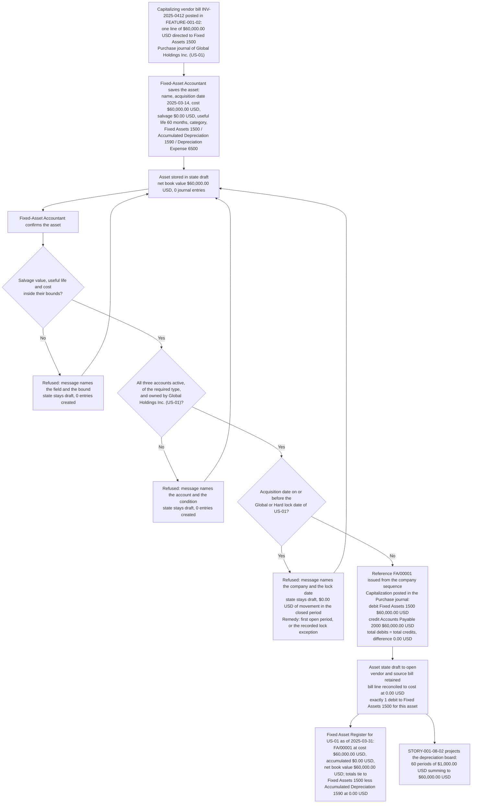

# STORY-001-08-01: Register Fixed Assets with Acquisition Detail

---

## Metadata

| Attribute | Value |
|-----------|-------|
| **Story ID** | `STORY-001-08-01` |
| **Title** | Register Fixed Assets with Acquisition Detail |
| **Parent Feature** | [FEATURE-001-08: Fixed Assets & Depreciation](../FEATURE-001-08-fixed-assets-depreciation.md) |
| **Parent Epic** | [EPIC-001: Enterprise Accounting in Odoo](../../EPIC-001-enterprise-accounting-odoo.md) |
| **Feature Capability** | CAP-001 — register fixed assets with acquisition cost, acquisition date, category, useful life and salvage value |
| **Epic Success Metrics** | **SM-009** — the **Fixed Asset Register** total agrees with Fixed Assets 1500 less Accumulated Depreciation 1590 at a `0.00` difference, and a registered asset is the unit that total is built from; **SM-008** — the scheduled depreciation run posts 100% of the board periods it is due to post, and it has nothing to select until an asset is registered and confirmed; **SM-003** and **SM-016** — an asset sub-ledger that carries its own cost, vendor and source document is part of the close running in 5 business days per entity and of the 50% reduction in post-close audit adjustments |
| **Status** | Draft |
| **Priority** | 🟠 High |
| **Estimate** | `5` (Fibonacci story points) |
| **Persona** | Fixed-Asset Accountant |
| **Secondary Personas** | Chief Accountant (approves the asset, accumulated-depreciation and depreciation-expense account assignment and owns the lock date the acquisition date is measured against), Accounts Payable Clerk (posts the capitalizing vendor bill the asset is registered from), External Auditor (reads the asset reference, the vendor and the source-bill trail behind a Balance Sheet asset line) |
| **Platform Target** | Open decision **DEC-001** — see [Version Compatibility](#version-compatibility) |
| **Last Updated** | 2026-08-13 |
| **Owner/Author** | Enterprise Accounting Team |

This is **story 1 of the 4** in FEATURE-001-08 and the foundation the other three act on. It creates the asset record, fixes the five values every later measurement is derived from — acquisition cost, acquisition date, category, useful life and salvage value — issues the asset its reference, retains the vendor and the capitalizing vendor bill against it, and capitalizes the acquisition as one balanced journal entry. [STORY-001-08-02](./STORY-001-08-02-configure-depreciation-methods.md) projects a depreciation board for what this story registers, [STORY-001-08-03](./STORY-001-08-03-post-depreciation-entries.md) posts the periodic charge from that board, and [STORY-001-08-04](./STORY-001-08-04-dispose-assets.md) derecognizes the asset and computes the gain or loss against its net book value. All three are consumers of this story; none of them is a prerequisite of it.

> **Persona note — one WHO, three reviewers, no substitution.** The **WHO** of this story is the **Fixed-Asset Accountant**, the role that maintains the asset register and answers for the completeness of an asset's acquisition detail. The **Chief Accountant** appears inside the criteria as the role that approves the account assignment and administers the lock date; the **Accounts Payable Clerk** appears as the role whose posted vendor bill establishes the cost; and the **External Auditor** appears as the role that reads the reference, vendor and source-bill trail. The four are named separately throughout, no criterion is written against an unnamed actor, and the generic role "Accountant" carried by the retired `AM-001` ticket is superseded by the named register maintainer.

> **Platform target.** This story states no platform version of its own. The target is the Epic's open decision **DEC-001** in the [Open Decisions Register](../../EPIC-001-enterprise-accounting-odoo.md#appendix-b-open-decisions-register): the originating programme request names Odoo 17, the superseded flat backlog named 18.0, and the baseline every field name, state value, account type and validation behaviour below was read against is **Odoo 19.0 Community**, where `odoo/release.py` declares `version_info = (19, 0, 0, FINAL, 0, '')`. The account-type selection and the lock-date administration differ across the three candidates, so the mismatch is surfaced for stakeholder confirmation rather than settled here.

> **Monetary and date conventions used throughout this ticket.** Every amount is stated in the currency it is denominated in, carried to 2 decimal places, and rounded **half-up at that currency's rounding increment of `0.01`** — the USD rounding increment for the books of **Global Holdings Inc. (`US-01`)** and the EUR rounding increment for a document denominated in EUR. Every computed figure — a net book value, a currency conversion, a register total — states that rule where it is computed rather than inheriting it silently. Dates are written `YYYY-MM-DD` in fixtures and in long form in prose. The **acquisition date** is the date the asset was placed under the company's control and is the date the capitalizing entry is recognised on; the **register as-of date** is a run-time report parameter and is a separate value.

---

## User Story

**As the** Fixed-Asset Accountant

**I want** to register a fixed asset in **Global Holdings Inc. (`US-01`)** with its acquisition cost, acquisition date, category, useful life, salvage value, vendor and capitalizing vendor bill, against Fixed Assets 1500, Accumulated Depreciation 1590 and Depreciation Expense 6500, and to have confirmation issue the asset a unique reference and capitalize it as one balanced entry in the **Purchase** journal

**So that** every capital item the company owns exists once in the ledger rather than in a spreadsheet, the **Fixed Asset Register** ties to Fixed Assets 1500 less Accumulated Depreciation 1590 at a difference of `0.00 USD`, the External Auditor walks from a Balance Sheet asset line back to the vendor document that established its cost without raising a data request, and [STORY-001-08-02](./STORY-001-08-02-configure-depreciation-methods.md) has an asset whose cost, useful life and salvage value a depreciation board can be projected from.

---

## Acceptance Criteria

### The Registration Fixture

Every criterion below is written against the fixture in this table. It is the parent Feature's worked asset — `$60,000.00 USD` over 60 months with a `$0.00 USD` salvage value against Fixed Assets 1500, Accumulated Depreciation 1590 and Depreciation Expense 6500 — reused without alteration so that registration, board projection, periodic posting and disposal are all proved against one record. Every figure is stated to 2 decimal places and rounded half-up at its currency's rounding increment of `0.01`.

| Element | Value |
|---------|-------|
| Company (`res.company`) | **Global Holdings Inc. (`US-01`)** — the United States parent, functional currency USD, per the Epic's [canonical legal-entity register](../../EPIC-001-enterprise-accounting-odoo.md#e4-canonical-legal-entity-register) |
| Asset record | `account.asset` named `CNC Milling Centre — Line 3`, entering in state `draft` |
| State path | `draft` → `open` → `close` — Draft while the acquisition detail is being completed, Running once confirmed and capitalized, Closed once fully depreciated or derecognized by [STORY-001-08-04](./STORY-001-08-04-dispose-assets.md) |
| Asset category (`account.asset.category`) | `Machinery — 60 Months Straight Line`, carrying **seven** defaults: the depreciation method (straight line), the useful life (60 months), the salvage basis (`$0.00 USD`), the start-date option (acquisition date with proration) and the three accounts **Fixed Assets 1500**, **Accumulated Depreciation 1590** and **Depreciation Expense 6500**. The declining-balance rate the parent Feature also holds on a category is a method parameter of [STORY-001-08-02](./STORY-001-08-02-configure-depreciation-methods.md) and is not asserted here, because the worked asset is a straight-line asset |
| Acquisition cost | **`$60,000.00 USD`** — 2 decimal places, USD rounding increment `0.01` |
| Salvage value | **`$0.00 USD`** — 2 decimal places, USD rounding increment `0.01`, so the depreciable base equals the acquisition cost of `$60,000.00 USD` and the 60 periods of `$1,000.00 USD` projected by [STORY-001-08-02](./STORY-001-08-02-configure-depreciation-methods.md) sum to it at a difference of `0.00 USD` |
| Useful life | 60 months |
| Acquisition date | `2025-03-14` |
| Asset account | **Fixed Assets 1500**, `account_type` `asset_fixed`, account group `15 Non-current Assets` (1500–1599) |
| Accumulated depreciation account | **Accumulated Depreciation 1590**, `account_type` `asset_fixed` held as a contra balance in the same group, so its credit balance is presented as a deduction from Fixed Assets 1500 on the Balance Sheet rather than as an addition to it |
| Depreciation expense account | **Depreciation Expense 6500**, `account_type` `expense_depreciation`, account group `6 Expenses` (6000–6999) |
| Acquisition counterpart | **Accounts Payable 2000**, `account_type` `liability_payable`, reconcilable — the credit side of the capitalization, borrowed from [FEATURE-001-02](../FEATURE-001-02-accounts-payable-vendor-bills.md) |
| Journal (`account.journal`) | **Purchase** — journal type `purchase`. The **Miscellaneous** journal is the journal of the depreciation, measurement and disposal entries and belongs to [STORY-001-08-03](./STORY-001-08-03-post-depreciation-entries.md) and [STORY-001-08-04](./STORY-001-08-04-dispose-assets.md), not to this story |
| Vendor (`res.partner`) | `Acme Industrial Supplies` — the same supplier partner FEATURE-001-02 raises its bills against |
| Capitalizing vendor bill (`account.move`) | `INV-2025-0412`, `move_type = 'in_invoice'`, bill date `2025-03-14`, carrying **one line of `$60,000.00 USD` directed to Fixed Assets 1500** rather than to Expense 6100, posted in the **Purchase** journal of `US-01` by [STORY-001-02-03](../FEATURE-001-02/STORY-001-02-03-post-vendor-bill-entries.md). That story's own untaxed posting archetype is the three-line bill `INV-2024-8871` totalling **`$12,450.00 USD`** against **Expense 6100**; `INV-2025-0412` is the capitalizing variant of the same posting shape, and the capitalizable-line direction to Fixed Assets 1500 is the group policy that story signs off |
| Asset reference (`ir.sequence`) | **`FA/00001`** for the first asset confirmed in `US-01`, advancing by 1 for each subsequent asset of the same company, so the second asset confirmed there reads `FA/00002`. The sequence is resolved with the asset's own company |
| Invalid-input variant | Salvage value `$65,000.00 USD` against an acquisition cost of `$60,000.00 USD`; and, separately, a useful life of `0` months |
| Locked-period variant | `fiscalyear_lock_date` of `US-01` set to `2025-02-28`, against an asset whose acquisition date is `2025-02-20` |
| Multi-currency variant | Capitalizing bill denominated `EUR 55,555.56` at the acquisition-date rate `1.0800 USD/EUR` → `$60,000.00 USD` in the functional currency of `US-01`, rounded half-up at the USD rounding increment of `0.01` |
| Register report | **Fixed Asset Register** for `US-01`, run with the as-of-date parameter `2025-03-31` |

### Register Reconciliation and Figure-Set Ownership

Five identity questions are settled here so that no criterion below has to carry a caveat:

- **The company is named from the register.** The Epic's [canonical legal-entity register](../../EPIC-001-enterprise-accounting-odoo.md#e4-canonical-legal-entity-register) makes `US-01` **Global Holdings Inc.**, and rule R-E5 of that appendix keeps an entity absent from the register out of every criterion. `US-01` is also the entity whose functional currency is USD, which is the currency every figure in this fixture is denominated in. The provisional company name carried by this story's authoring brief stands on no register row and is superseded; the substitution is recorded in [Notes](#provisional-values-superseded-by-the-canonical-registers) so that no criterion below has to carry it.
- **The account codes are the register's.** **Fixed Assets 1500** and **Accumulated Depreciation 1590** are two of the ten baseline codes [FEATURE-001-01](../FEATURE-001-01-chart-of-accounts-fiscal-year.md) creates in every company; **Depreciation Expense 6500** is introduced by this feature and claimed in the [FEATURE-001-01 §7.4 Group Chart-of-Accounts Extension Registry](../FEATURE-001-01-chart-of-accounts-fiscal-year.md#74-group-chart-of-accounts-extension-registry); **Accounts Payable 2000** is a baseline code consumed here from FEATURE-001-02. Each is written as concept-plus-code under rule R-E3 so a reader never resolves a bare number.
- **The capitalization is recorded once, and the no-double-count control says so.** Two routes can carry the debit to **Fixed Assets 1500**: the capitalizing vendor bill line itself, or the asset confirmation. Whichever route the delivered implementation takes, **the count of debits to Fixed Assets 1500 attributable to this asset is exactly 1 and their total measures `$60,000.00 USD`**. Criterion 2 asserts the shape of that single entry and the count together; which of the two routes writes it is a residual-gap question for discovery note **D-003** and is not prescribed here.
- **This story asserts its own asset and the register identity, never a population total.** The **Fixed Asset Register** population for `US-01` at the as-of date `2025-12-31` — cost `$4,820,000.00 USD`, accumulated depreciation `$1,930,000.00 USD` and net book value `$2,890,000.00 USD` — is owned by the parent Feature at [§4.1](../FEATURE-001-08-fixed-assets-depreciation.md#41-feature-level-acceptance-criteria), and the statement presentation of those balances is owned by [FEATURE-001-07](../FEATURE-001-07-financial-reporting-period-close.md). Criterion 6 asserts this asset's own line, the movement it contributes and the register-to-ledger identity at the as-of date `2025-03-31`, so it can never contradict either owner's totals.
- **The as-of date is the registration read, not the mid-life read.** At `2025-03-31` this asset stands confirmed with no depreciation entry posted against it, because the first board period is projected by [STORY-001-08-02](./STORY-001-08-02-configure-depreciation-methods.md) and posted by [STORY-001-08-03](./STORY-001-08-03-post-depreciation-entries.md). Its accumulated depreciation of `$0.00 USD` is therefore a statement about the registration state and is not in conflict with the `$30,000.00 USD` the parent Feature reads for the same asset at `2025-12-31`: one asset, two as-of dates, and the depreciation entries of STORY-001-08-03 standing between them.

### Coverage Distribution

Six criteria, inside the mandated band of 4 to 8. Each carries one non-compound **When**. Each **Then** asserts only what the Fixed-Asset Accountant, the Chief Accountant or the External Auditor observes in the Odoo user interface or reads back over the public API — no database statement, no method name and no widget language. Every monetary figure states its currency, its amount and its rounding rule; every criterion naming more than one company names the company whose books are affected; and **the criterion that posts states both the total debits and the total credits of the resulting entry and asserts their equality at a difference of `0.00 USD`**.

| Scenario | Coverage class | What it proves |
|----------|----------------|----------------|
| 1 | Valid input — happy path | The five acquisition values and the three accounts are captured on a `draft` asset whose net book value reads `$60,000.00 USD` and which has moved no balance |
| 2 | Valid input — happy-path posting | Confirmation capitalizes the asset as one entry in the **Purchase** journal: debit **Fixed Assets 1500** `$60,000.00 USD`, credit **Accounts Payable 2000** `$60,000.00 USD`, total debits equal total credits, reference `FA/00001`, state `draft` → `open` |
| 3 | Valid input — category defaults, reference uniqueness and the source-document trail | Category defaults populate and stay overridable, the reference is unique within the company, and the vendor and the capitalizing bill are retained with the bill line reconciled to the cost |
| 4 | Invalid or incomplete input — a blocked confirmation with a named Odoo validation message | A salvage value above the cost, and a useful life of `0` months, each hold the asset in `draft` with the offending field and the bound it breached named |
| 5 | Error handling — account and company validation | A cross-company account, an archived account and an account of the wrong type each block confirmation with the account and the failed condition named, and all three accounts belong to **Global Holdings Inc. (`US-01`)** before confirmation succeeds |
| 6 | Accounting edge case — the locked fiscal period, with the register tie-out | An acquisition dated inside a locked period creates no entry, and the **Fixed Asset Register** as of `2025-03-31` presents the confirmed asset at `$60,000.00 USD` and ties to Fixed Assets 1500 |

### Scenario 1: The five acquisition values are captured on a draft asset that has moved no balance

- **Given** the **Fixed-Asset Accountant** holds asset-creation rights in **Global Holdings Inc. (`US-01`)** and no rights over the assets of `NL-01`, `GB-01` or `SG-01`; and the chart of accounts released by [FEATURE-001-01](../FEATURE-001-01-chart-of-accounts-fiscal-year.md) exists in that company with **Fixed Assets 1500** of `account_type` `asset_fixed`, **Accumulated Depreciation 1590** held as a contra balance in the `15 Non-current Assets` group, and **Depreciation Expense 6500** of `account_type` `expense_depreciation`, each active and each owned by `US-01`; and the fiscal year holding `2025-03-14` is open in that company because its `fiscalyear_lock_date` and `hard_lock_date` stand earlier than `2025-03-01` or are empty
- **When** the **Fixed-Asset Accountant** saves a new asset record carrying the name `CNC Milling Centre — Line 3`, the acquisition date `2025-03-14`, an acquisition cost of `$60,000.00 USD`, a salvage value of `$0.00 USD`, a useful life of 60 months, the category `Machinery — 60 Months Straight Line`, and the three accounts **Fixed Assets 1500**, **Accumulated Depreciation 1590** and **Depreciation Expense 6500**
- **Then** the asset is stored in state `draft` in the books of **Global Holdings Inc. (`US-01`)**, and every one of the five acquisition values is readable back on the record as it was entered — cost `$60,000.00 USD`, salvage value `$0.00 USD`, useful life 60 months, acquisition date `2025-03-14` and category `Machinery — 60 Months Straight Line` — each monetary figure carried to 2 decimal places and rounded half-up at the USD rounding increment of `0.01`
  - **And** the computed net book value reads **`$60,000.00 USD`**, being the acquisition cost of `$60,000.00 USD` less accumulated depreciation of `$0.00 USD`, to 2 decimal places at the USD rounding increment of `0.01`
  - **And** the depreciable base reads **`$60,000.00 USD`**, being the acquisition cost of `$60,000.00 USD` less the salvage value of `$0.00 USD`, which is the figure the 60 board periods of [STORY-001-08-02](./STORY-001-08-02-configure-depreciation-methods.md) are measured against
  - **And** the count of journal entries existing for this asset is **0** and the count of journal items it has written to **Fixed Assets 1500** is **0**, so the movement it has contributed to that account measures `$0.00 USD` and a draft asset carries no balance
  - **And** the record is available for the method configuration of [STORY-001-08-02](./STORY-001-08-02-configure-depreciation-methods.md) while it stands in state `draft`, and a role restricted to `NL-01` can neither read nor alter it

### Scenario 2: Confirming the asset capitalizes it as one balanced entry to Fixed Assets 1500 and Accounts Payable 2000

- **Given** the asset of Scenario 1 stands in state `draft` in **Global Holdings Inc. (`US-01`)** with an acquisition cost of `$60,000.00 USD` — greater than `$0.00 USD`, to 2 decimal places at the USD rounding increment of `0.01` — its three accounts active and owned by that company, its acquisition date `2025-03-14` inside an open fiscal period, and the company holding a journal of type `purchase` labelled **Purchase** with its own sequence
- **When** the **Fixed-Asset Accountant** confirms that asset
- **Then** exactly **one** journal entry is created for the asset in the **Purchase** journal of **Global Holdings Inc. (`US-01`)**, dated on the acquisition date `2025-03-14`, and its reference carries the asset reference `FA/00001` so the entry is identifiable as this asset's capitalization without reading its lines
  - **And** the entry **debits Fixed Assets 1500 by `$60,000.00 USD`** on one journal item, and **credits Accounts Payable 2000 by `$60,000.00 USD`** on one reconcilable journal item carrying the vendor `Acme Industrial Supplies`
  - **And** the entry balances: **total debits of `$60,000.00 USD` equal total credits of `$60,000.00 USD`** at a difference of `0.00 USD`, each amount rounded half-up to 2 decimal places at the USD rounding increment of `0.01`
  - **And** the capitalization is recorded **once**: the count of debits to **Fixed Assets 1500** attributable to this asset — taken across the capitalizing vendor bill `INV-2025-0412` and this confirmation together — is **1**, and their total measures `$60,000.00 USD`, so the cost of one asset reaches the ledger one time
  - **And** the asset moves from state `draft` to state `open`, its net book value still reads `$60,000.00 USD` because accumulated depreciation stands at `$0.00 USD`, and the movement this asset contributes to the **Fixed Assets 1500** balance of **Global Holdings Inc. (`US-01`)** measures `$60,000.00 USD` debit where it measured `$0.00 USD` while the asset stood in state `draft`
  - **And** the confirmed asset is the record [STORY-001-08-02](./STORY-001-08-02-configure-depreciation-methods.md) projects a board for, and the acquisition cost of `$60,000.00 USD` is fixed against later alteration: an attempt to rewrite the cost of an asset whose capitalizing entry stands posted is refused, and the route to a change in carrying amount is the revaluation or impairment path of [STORY-001-08-04](./STORY-001-08-04-dispose-assets.md)

### Scenario 3: Category defaults populate and stay overridable, the reference is unique, and the source document is retained

- **Given** the asset category `Machinery — 60 Months Straight Line` exists in **Global Holdings Inc. (`US-01`)** carrying a default depreciation method of straight line, a default useful life of 60 months, a default salvage basis of `$0.00 USD`, a default start-date option of acquisition date with proration, and the three default accounts **Fixed Assets 1500**, **Accumulated Depreciation 1590** and **Depreciation Expense 6500**; the asset reference sequence of that company stands unused; and the capitalizing vendor bill `INV-2025-0412` from `Acme Industrial Supplies`, bill date `2025-03-14`, stands **posted** in the **Purchase** journal of `US-01` with one line of `$60,000.00 USD` directed to **Fixed Assets 1500** as [STORY-001-02-03](../FEATURE-001-02/STORY-001-02-03-post-vendor-bill-entries.md) posts it
- **When** the **Fixed-Asset Accountant** assigns that category to a new asset carrying the vendor `Acme Industrial Supplies` and the source bill `INV-2025-0412`, and confirms it
- **Then** all **seven** category defaults are populated onto the asset and readable there — straight line, 60 months, `$0.00 USD` salvage, acquisition date with proration, and the three accounts **Fixed Assets 1500**, **Accumulated Depreciation 1590** and **Depreciation Expense 6500** — and each remains overridable on this asset alone, with an override recorded against the asset and leaving the category untouched
  - **And** a later change to the category leaves this asset's values as they were populated, so a category edited after registration does not restate an asset already configured under it, and the count of confirmed assets whose values changed as a result of that category edit is **0**
  - **And** the asset carries the reference **`FA/00001`** issued from the asset reference sequence resolved with `US-01`, a second asset confirmed in the same company carries **`FA/00002`**, and the count of assets sharing a reference within one company is **0**
  - **And** the vendor `Acme Industrial Supplies` and the source bill `INV-2025-0412` are retained against the asset, and the bill's capitalized line amount of `$60,000.00 USD` equals the asset's acquisition cost of `$60,000.00 USD` at a difference of **`0.00 USD`**, each amount rounded half-up to 2 decimal places at the USD rounding increment of `0.01`
  - **And** the **External Auditor** reads the asset reference, the vendor, the source bill and the posted capitalizing entry from the asset record itself, so the trail from a Balance Sheet asset line back to the vendor document is walked without a data request

### Scenario 4: An out-of-bound salvage value or useful life holds the asset in Draft with the failing field named

- **Given** an asset stands in state `draft` in **Global Holdings Inc. (`US-01`)** carrying the name `CNC Milling Centre — Line 3`, the acquisition date `2025-03-14`, an acquisition cost of `$60,000.00 USD` and a **salvage value of `$65,000.00 USD`** — both figures to 2 decimal places at the USD rounding increment of `0.01`, so the salvage value exceeds the acquisition cost by `$5,000.00 USD` and the depreciable base would be negative at `-$5,000.00 USD`
- **When** the **Fixed-Asset Accountant** attempts to confirm that asset
- **Then** the confirmation is refused with an Odoo validation message that names the **salvage value** field, its entered value of `$65,000.00 USD`, and the bound it breached — that a salvage value may not exceed the acquisition cost of `$60,000.00 USD` — and the message discloses no stack trace, no database statement and no file-system path
  - **And** the asset stays in state `draft`, the count of journal entries created by the refused attempt is **0**, and the movement it contributes to the **Fixed Assets 1500** balance of **Global Holdings Inc. (`US-01`)** measures `$0.00 USD`
  - **And** the same refusal holds for each remaining bound in the set, one message per breach, each naming the field and the bound: a **useful life of `0` months**, which is refused because the useful life must be greater than zero for a straight-line or declining-balance asset; a **salvage value of `-$1.00 USD`**, which is refused because a salvage value may not be negative; and an **acquisition cost of `$0.00 USD`**, which is refused because a zero-cost asset has nothing to capitalize and nothing to depreciate
  - **And** the remedy available to the Fixed-Asset Accountant is to enter a salvage value at or below the acquisition cost — `$0.00 USD` for this asset — and a useful life greater than zero, after which confirmation yields the entry of Scenario 2 with total debits of `$60,000.00 USD` equal to total credits of `$60,000.00 USD` at a difference of `0.00 USD`; that correction is a second trigger and is exercised by its own acceptance test rather than asserted by this criterion

### Scenario 5: An account that fails the company, active-state or type check blocks confirmation and names the account

- **Given** an asset stands in state `draft` in **Global Holdings Inc. (`US-01`)** with an acquisition cost of `$60,000.00 USD`, to 2 decimal places at the USD rounding increment of `0.01`, whose **accumulated depreciation account belongs to Global Europe SARL (`NL-01`)** rather than to `US-01`, so the asset record and one of its three accounts stand in different sets of books
- **When** the **Fixed-Asset Accountant** attempts to confirm that asset
- **Then** the confirmation is refused with an Odoo validation message naming the offending account — the accumulated depreciation account **Accumulated Depreciation 1590** of **Global Europe SARL (`NL-01`)** — and the condition it failed, that every account carried by an asset belongs to the asset's own company, and the asset stays in state `draft` with **0** journal entries created by the refused attempt
  - **And** the same refusal holds for each remaining condition in the set, one message per breach, each naming the account and the failed condition: an **archived** asset, accumulated-depreciation or depreciation-expense account, which is refused because an archived account may not receive a posting; an asset account whose `account_type` is not the fixed-asset type — **Expense 6100** offered in place of **Fixed Assets 1500** — which is refused because the asset account must be a fixed-asset account; and a depreciation expense account whose `account_type` is not `expense_depreciation` — **Fixed Assets 1500** offered in place of **Depreciation Expense 6500** — which is refused on the same footing
  - **And** confirmation succeeds only once **all three accounts and the asset record belong to Global Holdings Inc. (`US-01`)**, all three are active, **Fixed Assets 1500** is a fixed-asset account, **Accumulated Depreciation 1590** is held as a contra balance whose credit balance is presented as a deduction from **Fixed Assets 1500** on the Balance Sheet, and **Depreciation Expense 6500** is of `account_type` `expense_depreciation`
  - **And** on that successful confirmation the capitalizing entry posts in the **Purchase** journal of `US-01` with total debits of `$60,000.00 USD` equal to total credits of `$60,000.00 USD` at a difference of `0.00 USD`, each amount rounded half-up to 2 decimal places at the USD rounding increment of `0.01`, and no journal item of that entry is written to the books of `NL-01`, `GB-01` or `SG-01`

### Scenario 6: An acquisition dated inside a locked period creates no entry, and the Fixed Asset Register ties to Fixed Assets 1500

- **Given** the Global Lock Date (`fiscalyear_lock_date`) of **Global Holdings Inc. (`US-01`)** reads `2025-02-28` as administered by [STORY-001-01-05](../FEATURE-001-01/STORY-001-01-05-configure-period-lock-dates.md); an asset stands in state `draft` in that company with an acquisition cost of `$60,000.00 USD`, to 2 decimal places at the USD rounding increment of `0.01`, and an **acquisition date of `2025-02-20`**, which falls inside the locked period; and a second, otherwise identical asset stands in state `draft` in the same company with the acquisition date `2025-03-14`, which falls in the first open period
- **When** the **Fixed-Asset Accountant** attempts to confirm the asset dated `2025-02-20`
- **Then** the confirmation is refused with an Odoo validation message naming **Global Holdings Inc. (`US-01`)**, the Global Lock Date `2025-02-28` and the acquisition date `2025-02-20` it stands inside; the count of journal entries created by the refused attempt is **0**; the asset stays in state `draft`; and the movement inside the locked period measures `$0.00 USD` on **Fixed Assets 1500** and `$0.00 USD` on **Accounts Payable 2000**, so a period the company has already reported is not restated by a capitalization
  - **And** the two remedies open to the Fixed-Asset Accountant are named rather than implied: set the acquisition date to a date in the first open period — `2025-03-01` or later — or obtain the time-boxed lock exception recorded on `account.lock_exception` and administered by [STORY-001-01-05](../FEATURE-001-01/STORY-001-01-05-configure-period-lock-dates.md); reopening a locked period is a lock-date decision and is not a registration decision
  - **And** the asset dated `2025-03-14` confirms on the same fixture, capitalizing in the **Purchase** journal with total debits of `$60,000.00 USD` equal to total credits of `$60,000.00 USD` at a difference of `0.00 USD`, each amount rounded half-up to 2 decimal places at the USD rounding increment of `0.01`
  - **And** the **Fixed Asset Register** run for **Global Holdings Inc. (`US-01`)** with the as-of-date parameter **`2025-03-31`** presents that confirmed asset on **one** line reading the reference `FA/00001`, a gross acquisition cost of **`$60,000.00 USD`**, accumulated depreciation of **`$0.00 USD`** and a net book value of **`$60,000.00 USD`**, each amount rounded half-up to 2 decimal places at the USD rounding increment of `0.01`; the accumulated figure reads `$0.00 USD` because no depreciation entry has yet been posted against the asset, the first board period being projected by [STORY-001-08-02](./STORY-001-08-02-configure-depreciation-methods.md) and posted by [STORY-001-08-03](./STORY-001-08-03-post-depreciation-entries.md)
  - **And** the register ties to the ledger: its gross-cost total for `US-01` at that as-of date equals the **Fixed Assets 1500** debit balance of the same company at the same date at a difference of **`0.00 USD`**, its accumulated-depreciation total equals the **Accumulated Depreciation 1590** credit balance at a difference of **`0.00 USD`**, and its net book value total equals the difference between the two at **`0.00 USD`** (SM-009)
  - **And** the movement this registration contributes is provable as a delta: the register's gross-cost total for `US-01` as of `2025-03-31` exceeds the same total as of `2025-02-28` by exactly **`$60,000.00 USD`**, which is this asset's cost and nothing else, while the register of `US-01` presents **0** assets belonging to `NL-01`, `GB-01` or `SG-01`

---

## INVEST Principles Compliance

| Principle | Compliance | Notes |
|-----------|------------|-------|
| **Independent** | ✅ | This story is the head of the chain in FEATURE-001-08 and has **no blocking predecessor inside this feature** — the parent Feature's own dependency table at [§3.3](../FEATURE-001-08-fixed-assets-depreciation.md#33-story-dependency-ordering) records "None within this feature" against it, and it blocks the other three. Its only prerequisites are configuration rather than code: **Fixed Assets 1500**, **Accumulated Depreciation 1590**, **Depreciation Expense 6500**, **Accounts Payable 2000**, the **Purchase** journal and an open fiscal period from [FEATURE-001-01](../FEATURE-001-01-chart-of-accounts-fiscal-year.md), and the capitalizing vendor bill from [STORY-001-02-03](../FEATURE-001-02/STORY-001-02-03-post-vendor-bill-entries.md). All of them are seedable as fixture data in a test company, so development and acceptance proceed without waiting on another story's code |
| **Negotiable** | ✅ | The outcome is fixed and the mechanism is open. What is fixed: the five acquisition values captured on the record, the three account assignments validated before confirmation, one unique reference per asset per company, the vendor and source bill retained, and one balanced capitalizing entry in the **Purchase** journal debiting **Fixed Assets 1500** and crediting **Accounts Payable 2000**. What is left to implementation discovery: whether the asset model is the present `account_asset_management` model extended or a new one, whether the debit to **Fixed Assets 1500** is written by the bill line or by the confirmation, where the category defaults are read from, and how the register is rendered (D-003, D-005) |
| **Valuable** | ✅ | Registration is the point at which a capital item stops being a spreadsheet row and becomes a ledger position with a named owner, a cost, a vendor and a source document. Without it, `$60,000.00 USD` of machinery sits on a vendor bill and in a file that one person maintains, and the Balance Sheet asset line is a transcription nobody can tie out. With it, the **Fixed Asset Register** ties to **Fixed Assets 1500** less **Accumulated Depreciation 1590** at a difference of `0.00 USD` (SM-009), the depreciation the scheduled run posts has a record to post against (SM-008), and the External Auditor reads the acquisition trail from the asset itself, which is part of the 50% reduction in post-close audit adjustments (SM-016) |
| **Estimable** | ✅ | The delivered surface is countable and inspectable: 5 acquisition values, 3 account assignments with 3 validation conditions each, 1 state transition (`draft` → `open`), 1 two-line journal entry, 1 per-company sequence, 2 retained document links and 1 register line with its tie-out — all on models that either exist in this repository under LGPL-3 (`account.move`, `account.move.line`, `account.account`, `account.journal`, `ir.sequence`, `res.company`) or exist as the present AGPL-3 `account_asset_management` add-on. Effort, complexity and uncertainty are assessed in [Estimation](#estimation) |
| **Small** | ✅ | One sprint-sized outcome: an asset record and the single entry its confirmation posts. It builds no depreciation method, no board, no scheduled run, no revaluation, no impairment and no disposal — those are [STORY-001-08-02](./STORY-001-08-02-configure-depreciation-methods.md), [STORY-001-08-03](./STORY-001-08-03-post-depreciation-entries.md) and [STORY-001-08-04](./STORY-001-08-04-dispose-assets.md) — and it builds no report engine, which belongs to [FEATURE-001-07](../FEATURE-001-07-financial-reporting-period-close.md). Sized at `5` story points |
| **Testable** | ✅ | Every criterion resolves to an amount, an account code, an account type, a date, a state value, a count or a named refusal. The capitalizing entry states both totals and asserts their equality at a difference of `0.00 USD` numerically rather than by inspection (C-009); each refusal names the validation message it is refused with and asserts `0` entries created; the register criterion names the report, the as-of date `2025-03-31`, the expected line values and the tie-out difference of `0.00 USD`; and each criterion maps to exactly one acceptance test in [Acceptance Test Mapping](#acceptance-test-mapping) (C-008) |

---

## Sub-Tasks

- [ ] **@functional-consultant** — Confirm the **asset field set** with the finance team and record it: the five values every asset must carry before confirmation (name, acquisition date, acquisition cost, useful life, salvage value), the three account assignments, the category link, and the vendor and source-bill links. State which fields are mandatory at save and which are mandatory only at confirmation, since Scenario 1 saves a `draft` asset that Scenario 2 later confirms
- [ ] **@functional-consultant** — Document the **category default map**: which of the **seven** defaults each category supplies (method, useful life, salvage basis, start-date option, and the three accounts), whether a default is copied onto the asset at assignment or read through at computation time, and the non-retroactivity rule that keeps a later category edit from restating an asset already configured under it. Include the override record an asset-level change writes
- [ ] **@functional-consultant** — Specify the **refusal set the Fixed-Asset Accountant sees and the remedy for each**: salvage value above cost, salvage value negative, useful life not greater than zero, acquisition cost of `$0.00 USD`, an account of the wrong `account_type`, an archived account, an account belonging to another company, and an acquisition date inside a locked period. Each entry states the message, the cause and the action, and none of them discloses a stack trace or a file-system path (C-020)
- [ ] **@developer** — Deliver the **asset record** on the models this repository already carries rather than a parallel structure (C-012): the five acquisition values, the three account assignments, the category link with its populated defaults and their overrides, the vendor and source-bill links, the `draft` → `open` → `close` state path, and the computed net book value as acquisition cost less accumulated depreciation, rounded half-up at the company currency's rounding increment of `0.01`
- [ ] **@developer** — Deliver the **`ir.sequence` numbering**: the asset reference sequence resolved with the asset's own company, producing `FA/00001` for the first asset confirmed in `US-01` and advancing by 1, with uniqueness held under concurrent confirmation so two Fixed-Asset Accountants confirming at the same moment cannot be issued the same reference
- [ ] **@developer** — Deliver the **capitalizing entry**: one `account.move` in the **Purchase** journal of the asset's company dated on the acquisition date, debiting **Fixed Assets 1500** and crediting **Accounts Payable 2000** for the acquisition cost, referencing the asset, with total debits equal to total credits at a difference of `0.00` in the company currency, and with the no-double-count control asserting exactly 1 debit to **Fixed Assets 1500** per asset across the capitalizing bill and the confirmation
- [ ] **@developer** — Deliver the **`@api.constrains` validations** as a set evaluated before confirmation: useful life greater than zero; salvage value not negative; salvage value not exceeding acquisition cost; acquisition cost greater than `0.00` in the company currency; each of the three accounts active, of the required `account_type` and owned by the asset's company; and the acquisition date outside every lock window in force on the company, with the company and the lock date named in the refusal
- [ ] **@qa** — Build the **acceptance suite covering all 6 scenarios**, one test per criterion (C-008), asserting **total debits against total credits at a difference of `0.00 USD` on the criterion that posts**, `0` entries created on each of the three refusal paths, the reference values `FA/00001` and `FA/00002`, and the **Fixed Asset Register** line and tie-out at the as-of date `2025-03-31`, with every amount asserted to the cent and every account asserted by code (C-009)
- [ ] **@qa** — Build the **boundary, concurrency and performance suite**: the zero-cost and salvage-equals-cost boundaries; two concurrent confirmations of the same draft asset yielding one reference and one entry; a `EUR 55,555.56` capitalizing bill converting to `$60,000.00 USD` at `1.0800 USD/EUR`, each amount rounded half-up to 2 decimal places at its own currency's rounding increment of `0.01`; company isolation proving a role restricted to `NL-01` can neither read nor confirm an asset of `US-01` (C-014, D-007); and a single registration completing in **under 5 seconds** on a seeded `US-01` portfolio of **10,000 assets**, per the budget in [FEATURE-001-08 §4.4](../FEATURE-001-08-fixed-assets-depreciation.md#44-performance-requirements)
- [ ] **@qa** — Build the **hostile-input suite C-022 assigns to this story** over any legacy asset extract loaded at migration: a malformed file, an oversized file and a file of a disallowed type are each rejected with a named error, with `0` journal entries created, `0` asset records created, no stack trace or file-system path disclosed, and the service still available afterwards (C-015, C-019, C-020, C-022)
- [ ] **@finance-sme** — Sign off that the **capitalization direction and the register tie-out reconcile**: that an acquisition debits **Fixed Assets 1500** and credits **Accounts Payable 2000** and never the reverse; that the asset's cost equals its capitalizing bill line at a difference of `0.00 USD`; that the cost of one asset reaches the ledger exactly once; and that the **Fixed Asset Register** gross-cost, accumulated-depreciation and net book value totals for `US-01` tie to **Fixed Assets 1500** less **Accumulated Depreciation 1590** at a difference of `0.00 USD` at the as-of date. Record the sign-off against this story so the direction is evidenced rather than inferred from a screenshot

---

## Edge Cases

- **Zero-amount or null acquisition cost.** An asset offered with an acquisition cost of `$0.00 USD`, or with the cost left empty, has no depreciable base and nothing to capitalize. **Control:** confirmation is refused with a validation message naming the asset and its cost, the record stays in state `draft`, the count of journal entries created is `0`, and the movement on **Fixed Assets 1500** measures `$0.00 USD` — which is the same control the parent Feature states at [§4.1](../FEATURE-001-08-fixed-assets-depreciation.md#41-feature-level-acceptance-criteria). A donated or internally constructed item with no vendor invoice is registered at its measured cost under IAS 16 rather than at `$0.00 USD`, and where that measurement is not yet available the asset stays in `draft` instead of being confirmed at zero.
- **Acquisition dated into a locked fiscal period.** While the Global Lock Date (`fiscalyear_lock_date`) or the irreversible Hard Lock Date (`hard_lock_date`) of **Global Holdings Inc. (`US-01`)** covers the acquisition date, no journal item of the capitalization is admitted to the covered period. **Control:** confirmation is refused with the company and the lock date named — `2025-02-28` against an acquisition date of `2025-02-20` — the asset stays in state `draft`, and the two remedies are an acquisition date in the first open period or the time-boxed exception on `account.lock_exception` administered by [STORY-001-01-05](../FEATURE-001-01/STORY-001-01-05-configure-period-lock-dates.md). The capitalization is refused rather than silently re-dated, because re-dating it would move the cost into a period the asset was not held in and would start the depreciation board on a date the asset did not exist on.
- **Salvage value equal to the acquisition cost.** An asset carried at `$60,000.00 USD` with a salvage value of `$60,000.00 USD`, each to 2 decimal places at the USD rounding increment of `0.01`, has a depreciable base of `$0.00 USD`. **Control:** the registration is admitted, because the bound is that salvage value may not *exceed* cost, and the capitalizing entry still posts with total debits of `$60,000.00 USD` equal to total credits of `$60,000.00 USD` at a difference of `0.00 USD`; the consequence is carried into [STORY-001-08-02](./STORY-001-08-02-configure-depreciation-methods.md), where the board projects `$0.00 USD` in every period and the asset's net book value stays at `$60,000.00 USD` until a measurement event changes it. The value is flagged to the **Chief Accountant** at confirmation so a data-entry error is not mistaken for a policy choice.
- **Multi-currency acquisition.** A capitalizing bill denominated `EUR 55,555.56` in the USD-functional books of **Global Holdings Inc. (`US-01`)** is converted at the acquisition-date rate `1.0800 USD/EUR` and carried at `$60,000.00 USD`, rounded half-up at the USD rounding increment of `0.01`, with the document amount of `EUR 55,555.56` retained beside it and the rate and its date recorded on the entry. **Control:** a residual cent is assigned **whole to one journal item** and never split across items or absorbed into a balancing plug, so the entry balances at `$60,000.00 USD` against `$60,000.00 USD` in company currency and at `EUR 55,555.56` against `EUR 55,555.56` in document currency, each at a difference of `0.00` in its own currency. The asset's cost is thereafter measured in the functional currency of `US-01`, in the manner IAS 21 requires of a non-monetary item recorded at a historical rate, so a later rate movement does not restate it.
- **Concurrent confirmation of one draft asset.** Two **Fixed-Asset Accountants** confirming the same `draft` asset at the same moment — one in the interface and one over the public API — must not produce two references or two capitalizations. **Control:** exactly **one** reference is issued, `FA/00001` and not also `FA/00002`; exactly **one** journal entry of `$60,000.00 USD` is created; the losing attempt is refused with a message reporting that the asset no longer stands in state `draft`, rather than failing silently; and the **Fixed Assets 1500** movement measures `$60,000.00 USD` debit once rather than `$120,000.00 USD`. The outcome is asserted by test rather than assumed, because a duplicated asset is discovered at the register tie-out, periods after it was created.

---

## Constraints

The constraint identifiers below are the Epic's own, restated in the terms of this story rather than renumbered, so one constraint set reads across the whole ticket tree. The full text is held in [EPIC-001 §7 Constraints](../../EPIC-001-enterprise-accounting-odoo.md#7-constraints) and in the parent Feature at [§5](../FEATURE-001-08-fixed-assets-depreciation.md#5-constraints-inherited-from-epic).

### License and Compliance

- [x] **C-001 — AGPL-3.0 compatibility**: any module delivering the asset record, the reference sequence, the account validations and the capitalizing entry is distributed under an AGPL-3.0 compatible licence, matching the licence of the Community-edition accounting add-ons already present in this repository, including `account_asset_management` at AGPL-3
- [x] **C-002 — Existing licence respected**: extension of `account` — the "Invoicing" application, version 1.4, category `Accounting/Accounting`, licence LGPL-3 — respects that licence, extension of the present `account_asset_management` add-on respects its AGPL-3 licence, and an AGPL-3 extension of LGPL-3 code is licence-checked before it is written
- [x] **C-003 — The edition source is an open decision (DEC-002), stated as a fact and not as a prohibition**: `account_asset`, the Enterprise fixed-asset application named in the Epic's [module scope](../../EPIC-001-enterprise-accounting-odoo.md#54-odoo-module-scope), is **absent from `addons/`** in this repository. That is a platform fact. The blanket "no Enterprise dependencies" prohibition carried by the superseded story template is **withdrawn and is not asserted by this story**: which path supplies the asset register — an Odoo Enterprise subscription, or the OCA route with the `OCA/account-financial-tools` asset add-ons alongside the present `account_asset_management` add-on plus bespoke development for the residual — is the Epic's open **edition lock-in** decision **DEC-002**, owned by the CFO / Finance Director with the Group Controller and recorded in the [Open Decisions Register](../../EPIC-001-enterprise-accounting-odoo.md#appendix-b-open-decisions-register). It is flagged for stakeholder confirmation rather than resolved here (AAP §0.8.3)
- [x] **What DEC-002 does and does not gate in this story**: every model the capitalizing entry writes is present in this repository under LGPL-3 — `account.move`, `account.move.line`, `account.account`, `account.journal` and `res.company` — and an asset model with categories and a reference sequence is present under AGPL-3 in `account_asset_management`, so the acquisition detail and the capitalization can be built against verified ground before the edition decision is confirmed. What the decision affects is the **engine that renders** the **Fixed Asset Register** of Criterion 6, which is why that criterion is written against the report's name, its as-of-date parameter, its line values and its tie-out difference rather than against one engine's internal structure
- [x] **C-004 — OCA ecosystem compatibility**: whichever edition path DEC-002 confirms, the asset records, categories and posted capitalizing entries created here stay consumable by OCA add-ons — including `account_asset_management` in `OCA/account-financial-tools`, which is published on the 13.0 through 19.0 series under AGPL-3 and is explicitly not compatible with the standard `account_asset` application — without a registered asset being restated
- [x] **C-005 / C-006 — Odoo and OCA coding standards**: Python follows Odoo and OCA module guidelines including PEP 8, and static analysis passes with the repository's configured tooling, whose lint configuration is `ruff.toml` at the repository root
- [x] **C-012 — Build on the existing models**: the capitalization is one `account.move` with its `account.move.line` rows in an `account.journal` of type `purchase`, and account resolution reads `account.account` on the asset's own company. No parallel posting structure, no shadow asset ledger and no second chart is introduced, so a register net book value and the **Fixed Assets 1500** less **Accumulated Depreciation 1590** balance cannot disagree by construction
- [x] **C-013 — Analytic layer, not a parallel one**: where a cost-centre or project dimension is carried, it is expressed as an analytic distribution on the journal item through `account.analytic.account` and `account.analytic.plan`. This story records the dimension on the asset so the later depreciation charge inherits it; the charge itself belongs to [STORY-001-08-03](./STORY-001-08-03-post-depreciation-entries.md) and its budget comparison to [FEATURE-001-09](../FEATURE-001-09-budgeting-variance-analysis.md)
- [x] **C-014 — Access rights and company isolation**: the **Fixed-Asset Accountant** who registers an asset is distinguishable from the **Chief Accountant** who approves the account assignment and administers the lock date; the acquisition cost of an asset whose capitalizing entry stands posted is alterable by neither, the route being a measurement event in [STORY-001-08-04](./STORY-001-08-04-dispose-assets.md); and a role restricted to `US-01` can neither read nor confirm an asset of `NL-01`, `GB-01` or `SG-01`, proven by test (D-007)
- [x] **C-015 / C-019 / C-020 / C-022 — Untrusted input at the migration boundary**: a legacy asset extract loaded at migration crosses the trust boundary, so its file type and size are checked against an allowlist at the ingestion boundary before a field is read, every value is validated before use, no file path is derived from the uploaded file name, data access is expressed through the Odoo ORM or parameterized SQL with no string-concatenated search domain, a rejected file returns a named error disclosing no stack trace and no file-system path, and the rejection is proven by the hostile-input tests C-022 assigns to this story
- [x] **C-018 — Rendered text is encoded**: asset names, asset references, category names and vendor names are sanitized and context-encoded before they are rendered into a register line, a PDF or an XLSX export, and templates render such values as escaped text rather than as raw markup
- [x] **C-021 — No secrets in source**: this story integrates with no external endpoint and requires no credential, certificate or key; none appears in its modules, fixtures, logs or exports

### Accounting Standards Compliance

- [x] **Double-entry integrity on the capitalizing entry**: the entry posts only when its total debits equal its total credits at a difference of `0.00` in the company currency — `$60,000.00 USD` against `$60,000.00 USD` on the worked asset — and the equality is **asserted numerically** in every test rather than inspected (C-009)
- [x] **IAS 16 — Property, Plant and Equipment**: the asset is recognised at cost, and the cost recognised is the amount the capitalizing vendor bill establishes, reconciled to the bill line at a difference of `0.00 USD`. The useful life and the residual (salvage) value are recorded at registration because they are the inputs the depreciable amount is measured from, and the depreciable amount recorded here — `$60,000.00 USD` less `$0.00 USD` — is what [STORY-001-08-02](./STORY-001-08-02-configure-depreciation-methods.md) allocates over the useful life
- [x] **US GAAP ASC 360 — Property, Plant and Equipment**: property, plant and equipment is presented at cost with accumulated depreciation shown as a deduction from it, which is why **Accumulated Depreciation 1590** is held as a contra balance in the `15 Non-current Assets` group against **Fixed Assets 1500** rather than as a separate liability, and why the net book value the Balance Sheet presents is the difference between the two
- [x] **IAS 1 — Presentation of Financial Statements**: the asset's net book value is presented outside current assets, and accumulated depreciation is presented as a deduction from the asset it relates to rather than netted off outside the ledger
- [x] **IAS 21 — Foreign-currency measurement**: a capitalizing bill denominated outside the functional currency is recorded at the rate in force on the acquisition date, with the document amount retained beside the company-currency amount and the rate and its date recorded on the entry. As a non-monetary item measured at historical cost, the asset is not retranslated at a later closing rate
- [x] **ISO 4217 minor units**: every amount is rounded **half-up** to its currency's decimal precision — 2 decimal places at a rounding increment of `0.01` for USD and EUR — and a residual fraction is carried whole on the journal item that produced it, so the same input always yields the same entry
- [x] **Nothing is capitalized into a closed period**: while a lock date covers the acquisition date, no journal item of this story is recognised on it; the acquisition is either dated into the first open period or released by the recorded lock exception, which keeps a reported period as it was reported
- [x] **Cost is immutable once posted, and is changed by a measurement event rather than an edit**: after the capitalizing entry posts, the acquisition cost is not rewritten; a change in carrying amount is a revaluation or an impairment under [STORY-001-08-04](./STORY-001-08-04-dispose-assets.md), so the ledger keeps both the original measurement and its revision
- [x] **Audit trail**: the registration, the category assignment with any override, the confirmation, the reference issued, the vendor and source-bill links and the posted capitalizing entry are each recorded with their author and timestamp and are readable by the **External Auditor** without a data request. The register-to-ledger tie-out is a period reconciliation control retained as close evidence, in the manner the COSO internal-control framework expects of a reconciliation

### Version Compatibility

- [x] **C-010 — The platform version target is open decision DEC-001, and this story hardcodes none**: the "Odoo 18.0 compatibility required" line carried by the superseded story template is **not restated as settled**. Three targets are on record and they are mutually exclusive — the originating programme request names **Odoo 17**, the superseded flat backlog named **18.0**, and this repository is **Odoo 19.0 Community**, where `odoo/release.py` declares `version_info = (19, 0, 0, FINAL, 0, '')`. The single source of truth is the Epic's platform version and edition constraint recorded as **DEC-001** in the [Open Decisions Register](../../EPIC-001-enterprise-accounting-odoo.md#appendix-b-open-decisions-register) and restated by the parent Feature at [§5.5](../FEATURE-001-08-fixed-assets-depreciation.md#55-version-compatibility); the mismatch is **flagged for stakeholder confirmation** (AAP §0.8.3) rather than chosen inside this story
- [x] **C-011 — Language and database versions follow the confirmed target**: the 19.0 baseline present here declares `MIN_PY_VERSION = (3, 10)`, `MAX_PY_VERSION = (3, 13)` and `MIN_PG_VERSION = 13` in `odoo/release.py`; an earlier platform target carries a different supported matrix
- [x] **Impact if DEC-001 resolves away from 19.0**: three statements in this file are re-verified against the confirmed release before development. First, the **account-type values** that anchor the assignment checks of Criterion 5 — the fixed-asset type behind **Fixed Assets 1500**, the contra treatment of **Accumulated Depreciation 1590** and `expense_depreciation` behind **Depreciation Expense 6500** — because the `account.account` type selection changed across the three candidate releases. Second, the **lock-date behaviour** of Criterion 6 and the text of the refusal it names, because lock-date administration differs across those releases. Third, the **credit given to `account_asset_management`** under discovery note D-003, because the add-on present here is a 19.0-series add-on at version 19.0.1.0.0 and is not directly installable on an earlier target, which changes how much of this story is configuration rather than code
- [x] **The edition baseline is recorded as fact**: `account` is present as "Invoicing" at version 1.4 under LGPL-3; `analytic` is present as "Analytic Accounting" at version 1.2 under LGPL-3; `account_payment` is present at version 2.0 under LGPL-3; `account_financial_report_ce` is present at version 19.0.1.1.0 under AGPL-3; `account_asset_management` is present at version 19.0.1.0.0 under AGPL-3 in category `Accounting/Assets`; and `account_asset` is **absent**. None of these facts is expressed as a prohibition, and the choice between the Enterprise and OCA paths remains DEC-002

---

## Technical Discovery Notes

> **Purpose:** these notes direct the codebase analysis that precedes implementation. They record what to investigate and what the outcome must prove; they do not choose the implementation. Every path below was read in this repository at the Odoo 19.0 Community baseline, so the implementing agent starts from verified ground rather than from assumption.

### Codebase Analysis Areas

| Area | Files/Modules to Examine | Analysis Focus |
|------|--------------------------|----------------|
| The capitalizing entry and its state path | `addons/account/models/account_move.py` | Entry creation for an `entry` document type, the state machine and its transitions, the date and reference fields, and the posting workflow the capitalization runs through. Establish which validation refuses an entry whose total debits do not equal its total credits and what its message names, what the reference field can carry so the entry is identifiable as this asset's capitalization from `FA/00001` alone, and which transitions remain available after the entry is posted |
| Debit and credit line construction | `addons/account/models/account_move_line.py` | How the debit and credit amounts of the two journal items are stored, computed and rounded, at which point the currency rounding increment is applied — per item or on the entry total — how the payable item is made reconcilable and carries the vendor, and how an analytic distribution is attached to an item and survives a batch create |
| Account-type definitions and validation | `addons/account/models/account_account.py` | The `account_type` selection that anchors the three assignments: the fixed-asset type behind **Fixed Assets 1500**, the treatment that presents **Accumulated Depreciation 1590** as a contra balance deducted from it, and `expense_depreciation` behind **Depreciation Expense 6500**. Establish whether a contra-asset is expressed by type, by sign or by a flag, whether the type requirement is enforced or advisory, and how `_ensure_code_is_unique` constrains a code across a company and its parent and child companies |
| Module structure and dependency declaration | `addons/account/__manifest__.py` | The manifest of the "Invoicing" application — version 1.4, category `Accounting/Accounting`, licence LGPL-3 — read as the pattern for how a delivered asset module declares its own dependencies, data files and licence, and read to confirm that no dependency is declared on a module absent from the configuration DEC-002 confirms |
| The journal the capitalization posts through | `addons/account/models/account_journal.py` | The `type` selection, in which `'purchase'` carries the label Purchase, the journal's default account, and the sequence that numbers the posted entry. Establish which account the **Purchase** journal supplies by default, which account the vendor's own record supplies for the payable item, and which of the two governs when they disagree |
| The posting window | `addons/account/models/company.py` | The lock-date fields on `res.company` — the Global Lock Date (`fiscalyear_lock_date`), the Tax Return Lock Date (`tax_lock_date`), the Sales Lock Date (`sale_lock_date`), the Purchase Lock Date (`purchase_lock_date`) and the irreversible Hard Lock Date (`hard_lock_date`) — their per-role resolution, which of them refuses an entry dated on the acquisition date, what the refusal message names, and how the time-boxed release on `account.lock_exception` is recorded |
| Asset reference numbering | `odoo/addons/base/models/ir_sequence.py` | Per-company sequence resolution and the prefix and padding that produce `FA/00001`. Establish what guarantees uniqueness under concurrent confirmation, what happens to numbering when an asset is created and then discarded, and whether a gap is acceptable to the audit trail |
| Currency precision and conversion | `odoo/addons/base/models/res_currency.py` | The `rounding` factor, whose shipped default is `0.01`, the `decimal_places` derived from it — 2 for USD and EUR — and the dated rate lookup that resolves `1.0800 USD/EUR` on the acquisition date. Establish where conversion happens relative to the balance check so a residual cent is carried whole on one item, and confirm the rate and its date are readable on the posted entry |
| The present Community asset model | `addons/account_asset_management/models/account_asset.py` | The asset model already present at version 19.0.1.0.0 under AGPL-3: its state machine against the `draft` → `open` → `close` path this story assumes, its cost, salvage, useful-life and start-date fields against the five acquisition values, its computed net book value, and its own validation set. Establish how much of this story is configuration of an existing model rather than new code (D-003) |
| The present category model | `addons/account_asset_management/models/account_asset_category.py` | The category model carrying the default method, useful life, salvage basis and the three accounts. Establish whether defaults are copied onto the asset at assignment or read through at computation time, because a read-through default would let a later category edit restate an already-registered asset and breach the non-retroactivity assertion of Criterion 3 |
| The asset-to-entry linkage | `addons/account_asset_management/models/account_move.py` and `account_move_line.py` | The extensions the present add-on makes to the entry and journal-item models, which reveal whether the asset linkage is held on the entry, on the item or on both, and which direction the register tie-out reads. Establish whether the extension already prevents the deletion or reversal of a posted capitalizing entry |
| The register presentation and tie-out | `addons/account_financial_report_ce/` | The present Community-edition statement implementation at version 19.0.1.1.0, whose balance-sheet and trial-balance objects expose the **Fixed Assets 1500** and **Accumulated Depreciation 1590** balances Criterion 6 ties the register to. Establish whether it already presents a contra-asset as a deduction inside the asset section, and what the residual gap is between its output and the **Fixed Asset Register** columns |
| The migration ingestion boundary | Any legacy asset extract loader delivered for this story | The allowlist check on file type and size applied before a field is read, the validation applied to each value, the absence of a file path derived from the uploaded file name, and the named error a rejected file returns. This is the surface the C-022 hostile-input tests exercise (C-015, C-019, C-020) |

### The Expected Journal Entry

The capitalization of the worked asset, stated once here so every criterion, test and review reads the same entry. Each amount is rounded half-up to 2 decimal places at the USD rounding increment of `0.01`.

| Journal item | Account | `account_type` | Debit | Credit |
|--------------|---------|----------------|-------|--------|
| 1 | **Fixed Assets 1500** | `asset_fixed` | `$60,000.00 USD` | — |
| 2 | **Accounts Payable 2000** (reconcilable, vendor `Acme Industrial Supplies`) | `liability_payable` | — | `$60,000.00 USD` |
| | **Totals** | | **`$60,000.00 USD`** | **`$60,000.00 USD`** |

- **Entry document:** one `account.move` of document type `entry`, in the **Purchase** journal (type `purchase`) of **Global Holdings Inc. (`US-01`)**, dated `2025-03-14`, referencing the asset reference `FA/00001`.
- **Balance:** total debits of `$60,000.00 USD` equal total credits of `$60,000.00 USD` at a difference of **`0.00 USD`**.
- **Count control:** exactly **1** debit to **Fixed Assets 1500** exists for this asset across the capitalizing vendor bill `INV-2025-0412` and the asset confirmation, totalling `$60,000.00 USD`.
- **Not written by this story:** the depreciation pair (debit **Depreciation Expense 6500**, credit **Accumulated Depreciation 1590**) in the **Miscellaneous** journal, which belongs to [STORY-001-08-03](./STORY-001-08-03-post-depreciation-entries.md), and the derecognition entry against **Bank 1010**, which belongs to [STORY-001-08-04](./STORY-001-08-04-dispose-assets.md).

### Relevant Existing Modules

| Module | Path | Relevance to this story |
|--------|------|------------------------|
| `account` | `addons/account/` | "Invoicing", version 1.4, category `Accounting/Accounting`, licence LGPL-3. Supplies everything the capitalization writes and reads: `account.move` and `account.move.line` for the two-item entry, `account.account` with the asset, contra-asset and depreciation-expense types, `account.journal` of type `purchase`, and the lock-date fields on `res.company` that bound the acquisition date |
| `account_asset_management` | `addons/account_asset_management/` | Version 19.0.1.0.0, AGPL-3, category `Accounting/Assets`. The present Community asset implementation, carrying `account.asset`, `account.asset.category` and `account.asset.depreciation.line` with `account.move` and `account.move.line` extensions. Credited under D-003 for asset registration and categories, and confirmed against these six criteria before any bespoke build is authorized |
| `account_asset` | Absent from `addons/` | The Enterprise fixed-asset application named in the Epic's module scope. Its absence is recorded as a platform fact and is what makes DEC-002 material; it is not a prohibition, and this story asserts none |
| `base` | `odoo/addons/base/` | `res.company` for the owning company and its lock dates, `res.partner` for the vendor `Acme Industrial Supplies`, `res.currency` for the `0.01` rounding increment and the acquisition-date rate, and `ir.sequence` for the `FA/00001` reference |
| `analytic` | `addons/analytic/` | "Analytic Accounting", version 1.2, licence LGPL-3. Optional: the analytic distribution recorded against the asset so the later depreciation charge carries a cost-centre or project dimension that [FEATURE-001-09](../FEATURE-001-09-budgeting-variance-analysis.md) reads as capital-expenditure actuals |
| `account_payment` | `addons/account_payment/` | "Payment - Account", version 2.0, licence LGPL-3. Not written here; the surface that later settles the **Accounts Payable 2000** item this capitalization credits |
| `account_financial_report_ce` | `addons/account_financial_report_ce/` | Version 19.0.1.1.0, AGPL-3. A present Community-edition candidate for the balance-sheet and trial-balance balances Criterion 6 ties the **Fixed Asset Register** to; whether the register itself is rendered from here, from an Enterprise engine or from an OCA add-on follows DEC-002 |

### OCA Module Compatibility

| OCA Repository | Module | Compatibility consideration |
|----------------|--------|-----------------------------|
| OCA/account-financial-tools | `account_asset_management` | The upstream of the add-on already present here, published on the 13.0 through 19.0 series under AGPL-3 and **explicitly not compatible with the standard `account_asset` application**, so adopting it and adopting the Enterprise module are mutually exclusive paths under DEC-002. Determine whether the present local copy has diverged from upstream, whether the upstream asset model already carries the five acquisition values, the category defaults with their non-retroactivity, the per-company reference sequence and the account-assignment validation set, and whether the residual is closed by a later upstream release or by extending the local copy. **Availability is not assumed:** the branch DEC-001 confirms is checked, and a bespoke alternative is held in reserve (C-003, C-004) |
| OCA/account-financial-tools | The asset-register grouping capability | **No module named `account_asset_management_hierarchy` is published**, so the per-company grouping the register needs is served by `account_asset_management`'s own grouping where it suffices and is bespoke scope under DEC-002 where it does not. Determine which of the two applies before the register is scoped |
| OCA/account-financial-reporting | `account_financial_report` | The leading Community-edition alternative for the statutory statement set, including the trial balance whose **Fixed Assets 1500** and **Accumulated Depreciation 1590** balances Criterion 6 ties to. Determine whether it exposes those two balances at an as-of date, whether it presents accumulated depreciation as a deduction inside the asset section, and whether adopting it is integration or replacement under DEC-002 |
| OCA/mis-builder | `mis_builder` | Management reporting over posted balances. Determine whether the register-to-ledger tie-out worksheet is expressed as a management report here or as a dedicated view, since Criterion 6 asserts the tie-out difference rather than the instrument that produces it |
| OCA/server-tools | The record-level access and audit-trail extension set | Determine whether an existing extension already supplies the author-and-timestamp trail the audit-trail constraint requires of the registration, the category override and the confirmation, or whether the platform's own tracking already evidences it |

### Discovery versus Prescription

This story describes WHAT a registered fixed asset must carry and WHY finance needs it. It does not prescribe HOW it is built. Not specified here: model names, field definitions or schema decisions; whether the asset model is the present `account_asset_management` model extended or a new model; whether the debit to **Fixed Assets 1500** is written by the capitalizing bill line or by the asset confirmation; whether category defaults are copied or read through; view architecture, including the choice between an OWL component and a server-rendered view; the report engine behind the **Fixed Asset Register**; and the Odoo API methods called to create an entry or read its items. Deferred to agent discovery: **D-003** (the residual gap against what `account` and `account_asset_management` already supply, which decides how much of this story is configuration rather than code), **D-005** (extension against new model for the acquisition detail, the category overrides and the source-document links), **D-007** (company isolation, record rules and the access-right groups that keep the registering Fixed-Asset Accountant apart from the approving Chief Accountant) and **D-009** (the deterministic fixture set, extended here with the out-of-bound, cross-company, archived-account, locked-period and `EUR 55,555.56` variants of the worked asset).

---

## Dependencies

### Story Dependencies

| Dependency Type | Story ID | Story Title | Relationship |
|-----------------|----------|-------------|--------------|
| Parent Feature | [FEATURE-001-08](../FEATURE-001-08-fixed-assets-depreciation.md) | Fixed Assets & Depreciation | This story is story 1 of the 4 in this feature and delivers its capability CAP-001 |
| Blocked By | — | — | **None inside this feature.** The parent Feature's dependency table at [§3.3](../FEATURE-001-08-fixed-assets-depreciation.md#33-story-dependency-ordering) records "None within this feature" against this story: it is the foundation the other three act on. Its prerequisites are the cross-feature configuration and source document listed under [External Dependencies](#external-dependencies), each seedable as fixture data |
| Blocks | [STORY-001-08-02](./STORY-001-08-02-configure-depreciation-methods.md) | Configure Depreciation Methods and Projected Board | A depreciation board is projected for a registered asset: the method, the useful life and the salvage value are measured against the acquisition cost of `$60,000.00 USD` recorded here, so there is nothing to project until an asset exists |
| Related | [STORY-001-08-03](./STORY-001-08-03-post-depreciation-entries.md) | Post Automated Depreciation Entries | The scheduled run posts the periodic charge in the **Miscellaneous** journal against the **Depreciation Expense 6500** and **Accumulated Depreciation 1590** accounts assigned here; it reads the board rather than the asset record, so it is a consumer of this story two steps downstream |
| Related | [STORY-001-08-04](./STORY-001-08-04-dispose-assets.md) | Dispose of Assets with Gain or Loss Recognition | Derecognition removes the `$60,000.00 USD` cost this story capitalized and the accumulated depreciation posted against it, and it owns the revaluation and impairment path by which the carrying amount of a registered asset is changed after the capitalizing entry is posted |
| Cross-feature prerequisite | [FEATURE-001-01](../FEATURE-001-01-chart-of-accounts-fiscal-year.md) | Chart of Accounts & Fiscal Year | Supplies **Fixed Assets 1500**, **Accumulated Depreciation 1590**, **Depreciation Expense 6500** and **Accounts Payable 2000** with their account types, the **Purchase** journal with its sequence, the fiscal calendar the acquisition date falls in, and the lock dates Criterion 6 is measured against. Ordering rule **ORD-001** makes this a prerequisite of every posting story |
| Cross-feature prerequisite | [STORY-001-02-03](../FEATURE-001-02/STORY-001-02-03-post-vendor-bill-entries.md) | Post Vendor Bill Journal Entries | Posts the capitalizing vendor bill `INV-2025-0412` whose line of `$60,000.00 USD` is directed to **Fixed Assets 1500** rather than to **Expense 6100**, which is the source record the asset is registered from and the amount its cost is reconciled against at a difference of `0.00 USD`. That story's untaxed archetype is the three-line bill `INV-2024-8871` totalling `$12,450.00 USD` against **Expense 6100** |
| Cross-feature prerequisite | [STORY-001-01-05](../FEATURE-001-01/STORY-001-01-05-configure-period-lock-dates.md) | Configure Period Lock Dates and Closing Controls | Administers the five lock dates of `US-01` and the time-boxed exception on `account.lock_exception`. This story reads the window and honours it; it neither sets a lock date nor reopens a period |
| Related | [FEATURE-001-07](../FEATURE-001-07-financial-reporting-period-close.md) | Financial Reporting & Period Close | Owner of the **Balance Sheet** presentation of **Fixed Assets 1500** net of **Accumulated Depreciation 1590**, and of the report-parameter, drill-down and export conventions the **Fixed Asset Register** of Criterion 6 inherits rather than redefines. Ordering rule **ORD-004** makes this feature a prerequisite of that one |
| Related | [FEATURE-001-06](../FEATURE-001-06-multi-company-consolidation.md) | Multi-Company & Intercompany Consolidation | Owner of the legal-entity hierarchy whose company names this story cites — **Global Holdings Inc. (`US-01`)** and its sister entities — configured by [STORY-001-06-01](../FEATURE-001-06/STORY-001-06-01-configure-company-hierarchy.md). An asset belongs to one entity; a transfer between entities is a derecognition in one register and a recognition in the other |

### External Dependencies

| Dependency | Type | Notes |
|------------|------|-------|
| Chart of accounts and the **Purchase** journal | Configuration — [FEATURE-001-01](../FEATURE-001-01-chart-of-accounts-fiscal-year.md) | **Fixed Assets 1500** (`asset_fixed`), **Accumulated Depreciation 1590** (contra, same group), **Depreciation Expense 6500** (`expense_depreciation`) and **Accounts Payable 2000** (`liability_payable`, reconcilable) must exist in the registering company, and that company must hold a journal of type `purchase` with its sequence. An entry cannot post to accounts that do not exist (ORD-001) |
| Fiscal calendar and lock-date policy | Configuration — [STORY-001-01-03](../FEATURE-001-01/STORY-001-01-03-define-fiscal-year-periods.md) and [STORY-001-01-05](../FEATURE-001-01/STORY-001-01-05-configure-period-lock-dates.md) | The fiscal year holding `2025-03-14`, and the Global and Hard lock dates of `US-01` together with the role permitted to change them and the recorded lock exception |
| Capitalizing vendor bill | Transaction data — [STORY-001-02-03](../FEATURE-001-02/STORY-001-02-03-post-vendor-bill-entries.md) | `INV-2025-0412` posted in the **Purchase** journal of `US-01` with one line of `$60,000.00 USD` directed to **Fixed Assets 1500**, which establishes the cost under IAS 16 and supplies the vendor and amount evidence the asset retains |
| Asset-category master data | Master data — Epic [§10.1.5](../../EPIC-001-enterprise-accounting-odoo.md#1015-master-data-readiness) | The Epic's master-data readiness table makes asset categories — asset class, depreciation method, useful life, asset and accumulated-depreciation accounts, expense account — the **Fixed-Asset Accountant**'s own data set, complete before the FEATURE-001-08 stories run |
| Vendor master data | Master data — Epic [§10.1.5](../../EPIC-001-enterprise-accounting-odoo.md#1015-master-data-readiness) | `Acme Industrial Supplies` as a `res.partner` with its payable account, so the credit item of the capitalization carries the vendor the register trail reads |
| Currency rates | Master data | The `1.0800 USD/EUR` rate in force on `2025-03-14`, held as a dated rate on the currency record. The rate feed and its refresh are owned by FEATURE-001-06; this story reads the acquisition-date rate and records it on the entry |
| Legacy asset extract | Data migration — Epic [§10.1.3](../../EPIC-001-enterprise-accounting-odoo.md#101-external-dependencies) | Where a legacy asset population is loaded at cut-over, its extract carries asset cost, in-service date, method, useful life and accumulated depreciation, and the loaded register total must agree with the migrated **Fixed Assets 1500** and **Accumulated Depreciation 1590** balances at a `0.00` difference (SM-009). The extract is untrusted input and is the surface the C-022 tests exercise |
| Register and statement engine | Open decision — DEC-002 | The engine that renders the **Fixed Asset Register** of Criterion 6 follows the edition decision. The criterion is written against the report name, its as-of-date parameter, its line values and its tie-out difference so it holds for either path |
| Platform version and edition | Open decision — DEC-001 and DEC-002 | Both are recorded in the Epic's [Open Decisions Register](../../EPIC-001-enterprise-accounting-odoo.md#appendix-b-open-decisions-register) and confirmed with stakeholders before development; neither is resolved by this story |

### Integration Points

| Odoo Model/Module | Integration Type | Purpose |
|-------------------|------------------|---------|
| `account.move` | Write | The capitalizing entry: one `account.move` of document type `entry` in the **Purchase** journal of the asset's company, dated on the acquisition date `2025-03-14` and referencing the asset reference `FA/00001`. Read: the capitalizing vendor bill `INV-2025-0412`, retained against the asset as its source document |
| `account.move.line` | Write | The debit and credit pair the entry is made of — one debit item on **Fixed Assets 1500** of `$60,000.00 USD` and one reconcilable credit item on **Accounts Payable 2000** of `$60,000.00 USD` carrying the vendor — with the document amount retained where the capitalizing bill is denominated outside the functional currency |
| `account.account` | Read | Resolution of the three assigned accounts plus the counterpart on the asset's own company, each checked by code and by type: **Fixed Assets 1500** of `account_type` `asset_fixed`, **Accumulated Depreciation 1590** held as a contra balance against it, **Depreciation Expense 6500** of `account_type` `expense_depreciation`, and **Accounts Payable 2000** of `account_type` `liability_payable` |
| `account.journal` | Read | The **Purchase** journal (type `purchase`) of the asset's company, its default account and the sequence that numbers the capitalizing entry. The **Miscellaneous** journal is read by [STORY-001-08-03](./STORY-001-08-03-post-depreciation-entries.md) and [STORY-001-08-04](./STORY-001-08-04-dispose-assets.md), not here |
| `ir.sequence` | Read | The asset reference sequence resolved with the asset's own company, producing `FA/00001` for the first asset confirmed in `US-01` and advancing by 1, with uniqueness held under concurrent confirmation |
| `res.partner` | Read | The vendor `Acme Industrial Supplies` retained against the asset and carried on the payable item, which is what makes the trail from a Balance Sheet asset line back to the vendor document readable |
| `res.company` | Read | The company that owns the asset and its register — **Global Holdings Inc. (`US-01`)** — its functional currency and decimal precision, and the lock dates that refuse a capitalization dated into a reported period. A register is produced per company, so an asset belongs to exactly one |
| `res.currency` | Read | The `0.01` rounding increment and the 2 decimal places every cost, salvage value and net book value is rounded half-up to, and the dated `1.0800 USD/EUR` rate a foreign-currency capitalizing bill is converted at |
| `analytic` / `account.analytic.account` | Write, optional | The analytic distribution recorded against the asset so the later depreciation charge carries a cost-centre or project dimension, which [FEATURE-001-09](../FEATURE-001-09-budgeting-variance-analysis.md) reads as the actual side of capital-expenditure budget-versus-actual (C-013) |

---

## Estimation

| Dimension | Rating | Justification |
|-----------|--------|---------------|
| **Effort** | Medium | The delivered surface is a record and a two-item entry, not an engine: five acquisition values, three account assignments, one category link with populated defaults and overrides, two retained document links, one per-company sequence and one state transition. What has to be built around it is the validation set and the evidence — the refusal messages, the override record, the author-and-timestamp trail and the register line — rather than new posting machinery, because the platform's own posting path already carries the balance guard and the lock-date refusal. An asset model with categories and a board is additionally present in `account_asset_management` at AGPL-3, so part of the effort is a documented reuse assessment under D-003 rather than new code |
| **Complexity** | Medium | Three points carry accounting consequence out of proportion to their size. The **account-assignment validation** must check three accounts on three conditions each — type, active state and company — because an asset whose accumulated-depreciation account belongs to another company breaks the register tie-out in both entities at once. The **no-double-count control** must guarantee exactly one debit to **Fixed Assets 1500** per asset even though two routes can write it, since a cost capitalized twice is discovered only at the tie-out. And the **category default map** must populate without becoming retroactive, because a read-through default would silently restate the board of an asset registered months earlier |
| **Uncertainty** | Medium | The models, field names, account types and lock-date behaviour are inspectable in this repository before development starts, which removes most of the unknown. What remains is decision-bound rather than design-bound: **DEC-001** has not named the release, and the `account.account` type selection and the lock-date administration differ across the three candidates; **DEC-002** has not named the edition, which decides whether the asset register arrives as supported product, as an OCA add-on or as bespoke code; and the credit given to `account_asset_management` under D-003 is a 19.0-series credit that an earlier target would withdraw. None of the three blocks a start, because the acquisition detail and the capitalization sit on models present here under LGPL-3 |
| **Story Points** | **`5`** | Fibonacci scale (1, 2, 3, 5, 8, 13). Above a `3` because this is not one field on one record: it covers five captured values, nine account-assignment checks, four out-of-bound checks, a per-company sequence with concurrency, two retained document links, one balanced entry with a no-double-count control, and a register line with a ledger tie-out — each asserted numerically. Below an `8` because no depreciation method, board, scheduled run, measurement event, disposal or report engine is built here, and because an asset model with categories already exists in the repository to be assessed and extended. **This replaces the `M (Medium)` T-shirt estimate carried by the retired `AM-001` ticket**, which stated no scale and could not be summed into a sprint; the Fibonacci value is the Epic's estimation standard |

---

## Test Requirements

### Coverage Requirement

| Metric | Requirement | Notes |
|--------|-------------|-------|
| **Minimum Test Coverage** | **80%** | Mandatory for all new functionality delivered by this story (C-007). The gate is inherited from the story template and restated here as a Definition of Done item |
| Unit Test Coverage | 80%+ | The four bound checks, the nine account-assignment checks, the net-book-value and depreciable-base computations, the sequence resolution and the lock-date evaluation |
| Integration Test Coverage | 80%+ | A capitalizing vendor bill through registration and confirmation to the posted entry and the **Fixed Asset Register** tie-out, in a named company |
| Assertion style | Numeric | Every amount is asserted to the cent, every account is asserted by code and by `account_type`, every refusal asserts a count of `0` entries created, and **the posted capitalizing entry is asserted for total debits against total credits with the difference stated at `0.00 USD`** (C-009) |
| Traceability | 1 test : 1 criterion | Each acceptance test maps to exactly one Given/When/Then criterion in this file (C-008) |
| Hostile-input tests | **Required of this story** | C-022 assigns this story the hostile-input tests over any legacy asset extract loaded at migration: a malformed file, an oversized file and a disallowed file type, each rejected with a named error, with `0` journal entries created, `0` asset records created and the service still available |

### Unit Test Scenarios

| Acceptance Scenario | Unit test focus | Key assertions |
|---------------------|-----------------|----------------|
| Scenario 1 | Capture of the five acquisition values on a `draft` asset | The record's state reads `draft`; cost `$60,000.00 USD`, salvage `$0.00 USD`, useful life 60 months, acquisition date `2025-03-14` and category `Machinery — 60 Months Straight Line` read back as entered; net book value computes to `$60,000.00 USD` and the depreciable base to `$60,000.00 USD`, each rounded half-up to 2 decimal places at the USD rounding increment of `0.01`; the count of journal entries for the asset is `0` and its movement on **Fixed Assets 1500** measures `$0.00 USD` |
| Scenario 2 | The capitalizing entry and its two sides | Exactly `1` entry exists for the asset, in the **Purchase** journal of `US-01`, dated `2025-03-14`, referencing `FA/00001`; one item debits **Fixed Assets 1500** `$60,000.00 USD` and one reconcilable item credits **Accounts Payable 2000** `$60,000.00 USD` carrying `Acme Industrial Supplies`; total debits of `$60,000.00 USD` equal total credits of `$60,000.00 USD` at a difference of `0.00 USD`; the asset state moves `draft` → `open`; the count of debits to **Fixed Assets 1500** for the asset across bill and confirmation is `1` totalling `$60,000.00 USD`; a write attempting to rewrite the posted cost is refused |
| Scenario 3 | Category defaults, sequence uniqueness and the source-document links | Six defaults populate onto the asset and each is overridable with the override recorded; a later category edit changes `0` already-confirmed assets; the first confirmed asset reads `FA/00001` and the second `FA/00002` with `0` assets sharing a reference in one company; the retained bill line amount of `$60,000.00 USD` equals the acquisition cost at a difference of `0.00 USD`; the vendor and bill are readable from the asset record |
| Scenario 4 | The four out-of-bound refusals | Salvage `$65,000.00 USD` against cost `$60,000.00 USD` raises a message naming the salvage-value field and the bound; useful life `0` months, salvage `-$1.00 USD` and cost `$0.00 USD` each raise their own named message; in each case the state stays `draft` and the count of entries created is `0`; after salvage is set to `$0.00 USD` and useful life to 60 months, confirmation yields totals of `$60,000.00 USD` against `$60,000.00 USD` at a difference of `0.00 USD` |
| Scenario 5 | The nine account-assignment checks | A cross-company accumulated-depreciation account raises a message naming the account and the company condition; an archived account raises its own message for each of the three roles; **Expense 6100** offered as the asset account and **Fixed Assets 1500** offered as the depreciation-expense account each raise a type message; in every case the state stays `draft` with `0` entries created; on the valid set, all three accounts and the asset belong to `US-01`, the entry posts with `$60,000.00 USD` against `$60,000.00 USD` at a difference of `0.00 USD`, and `0` journal items reach `NL-01`, `GB-01` or `SG-01` |
| Scenario 6 | The lock-date refusal and the register tie-out | With `fiscalyear_lock_date` of `US-01` at `2025-02-28` and an acquisition date of `2025-02-20`, confirmation raises a message naming the company, the lock date and the acquisition date; the count of entries created is `0`; movement inside the locked period measures `$0.00 USD` on **Fixed Assets 1500** and `$0.00 USD` on **Accounts Payable 2000**; the asset dated `2025-03-14` confirms with totals of `$60,000.00 USD` against `$60,000.00 USD` at a difference of `0.00 USD`; the **Fixed Asset Register** for `US-01` as of `2025-03-31` presents `FA/00001` at cost `$60,000.00 USD`, accumulated `$0.00 USD` and net book value `$60,000.00 USD`; register totals equal **Fixed Assets 1500** less **Accumulated Depreciation 1590** at a difference of `0.00 USD`; the gross-cost total exceeds the `2025-02-28` total by exactly `$60,000.00 USD`; the register presents `0` assets of another company |
| Concurrency | One asset, one reference, one entry | Two concurrent confirmations of the same `draft` asset produce exactly `1` reference `FA/00001`, exactly `1` entry of `$60,000.00 USD` and a **Fixed Assets 1500** movement of `$60,000.00 USD` rather than `$120,000.00 USD`; the losing attempt is refused with a message reporting the state is no longer `draft` |
| Multi-currency | Conversion at the acquisition-date rate | A capitalizing bill of `EUR 55,555.56` at the `1.0800 USD/EUR` rate of `2025-03-14` yields a cost of `$60,000.00 USD`; company-currency totals read `$60,000.00 USD` against `$60,000.00 USD` at a difference of `0.00 USD` and document-currency totals read `EUR 55,555.56` against `EUR 55,555.56` at a difference of `EUR 0.00`; the rate and its date are readable on the entry; the count of items altered to absorb a residual cent is `0` |
| Boundary | Salvage equal to cost | An asset at cost `$60,000.00 USD` with salvage `$60,000.00 USD` is admitted, its depreciable base computes to `$0.00 USD`, its capitalizing entry balances at `$60,000.00 USD` against `$60,000.00 USD` at a difference of `0.00 USD`, and the value is flagged to the **Chief Accountant** at confirmation |

### Integration Test Considerations

- [ ] Register and confirm the worked asset end to end in **Global Holdings Inc. (`US-01`)** from the posted capitalizing bill `INV-2025-0412` of `Acme Industrial Supplies`, and assert the posted entry item by item: a **Fixed Assets 1500** debit of `$60,000.00 USD` against an **Accounts Payable 2000** credit of `$60,000.00 USD`, total debits equal to total credits at a difference of `0.00 USD`, the reference `FA/00001` and the accounting date `2025-03-14`.
- [ ] Assert the no-double-count control across the two records: after both the bill and the asset confirmation, the count of debits to **Fixed Assets 1500** attributable to the asset is `1` and their total measures `$60,000.00 USD`.
- [ ] Run the **Fixed Asset Register** for `US-01` as of `2025-03-31` against the posted population and assert the tie-out worksheet: the gross-cost total equals the **Fixed Assets 1500** debit balance at a difference of `0.00 USD`, the accumulated-depreciation total equals the **Accumulated Depreciation 1590** credit balance at a difference of `0.00 USD`, and the asset's own line reads `$60,000.00 USD`, `$0.00 USD` and `$60,000.00 USD` (SM-009).
- [ ] Apply a Global Lock Date of `2025-02-28` to `US-01`, attempt to confirm an asset dated `2025-02-20`, and assert the named refusal, the retained `draft` state, `0` entries created and `$0.00 USD` of movement inside the locked period; then release the date through the recorded `account.lock_exception` and assert the capitalization posts balanced.
- [ ] Register the same asset in **Global Europe SARL (`NL-01`)** at `EUR 55,555.56` and assert that the rounding rule, the account-assignment checks and the balance assertion all hold at the EUR rounding increment of `0.01`, so the story is not USD-specific.
- [ ] Assert company isolation: a role restricted to `NL-01` can neither read, register nor confirm an asset of `US-01`, and the **Fixed Asset Register** of `US-01` presents `0` assets of `NL-01`, `GB-01` or `SG-01` (C-014, D-007).
- [ ] Assert the segregation of duties: the **Fixed-Asset Accountant** who registers the asset and the **Chief Accountant** who approves the account assignment and administers the lock date are distinct roles, and neither can rewrite the acquisition cost of an asset whose capitalizing entry stands posted.
- [ ] Exercise the C-022 hostile-input suite over the legacy asset extract at the ingestion boundary — a malformed file, an oversized file and a disallowed file type — and assert for each a named error, `0` asset records created, `0` journal entries created, no stack trace or file-system path in the message, and the service still responding afterwards.
- [ ] Time a single registration and confirmation on a seeded `US-01` portfolio of **10,000 assets** and assert it completes in **under 5 seconds**, per [FEATURE-001-08 §4.4](../FEATURE-001-08-fixed-assets-depreciation.md#44-performance-requirements). This budget supersedes the "under 2 seconds per asset" figure carried by the retired `AM-001` ticket.
- [ ] Assert the hand-over to the next story: the confirmed asset carrying cost `$60,000.00 USD`, salvage `$0.00 USD` and a useful life of 60 months is selectable by [STORY-001-08-02](./STORY-001-08-02-configure-depreciation-methods.md), whose board projects 60 periods of `$1,000.00 USD` summing to `$60,000.00 USD` at a difference of `0.00 USD`.

### Acceptance Test Mapping

| BDD Scenario | Test Method Name | Test Type |
|--------------|------------------|-----------|
| Scenario 1: The five acquisition values are captured on a draft asset | `test_draft_asset_captures_acquisition_values_and_moves_no_balance` | Acceptance |
| Scenario 2: Confirmation capitalizes to Fixed Assets 1500 and Accounts Payable 2000 | `test_confirm_asset_posts_balanced_capitalization_1500_against_2000` | Acceptance |
| Scenario 2, second trigger: the posted cost is immutable | `test_posted_acquisition_cost_cannot_be_rewritten` | Acceptance |
| Scenario 3: Category defaults populate and stay overridable | `test_category_defaults_populate_overridable_and_non_retroactive` | Acceptance |
| Scenario 3, second trigger: reference uniqueness and the source-document trail | `test_asset_reference_unique_per_company_and_source_bill_retained` | Acceptance |
| Scenario 4: An out-of-bound salvage value or useful life is refused | `test_confirm_refused_for_out_of_bound_salvage_and_useful_life` | Acceptance |
| Scenario 5: An account failing company, active-state or type is refused | `test_confirm_refused_for_cross_company_archived_or_mistyped_account` | Acceptance |
| Scenario 6: An acquisition inside a locked period creates no entry | `test_confirm_refused_when_acquisition_date_inside_lock_window` | Acceptance |
| Scenario 6, second trigger: the register line and the ledger tie-out | `test_fixed_asset_register_at_2025_03_31_ties_to_fixed_assets_1500` | Acceptance |
| Edge case: zero or null acquisition cost | `test_zero_cost_asset_is_refused_and_stays_draft` | Acceptance |
| Edge case: salvage value equal to acquisition cost | `test_salvage_equal_to_cost_admitted_with_zero_depreciable_base` | Acceptance |
| Edge case: multi-currency acquisition | `test_eur_capitalizing_bill_converts_at_acquisition_date_rate` | Acceptance |
| Edge case: concurrent confirmation | `test_concurrent_confirmations_issue_one_reference_and_one_entry` | Acceptance |
| C-022: hostile legacy asset extract | `test_legacy_asset_extract_rejects_malformed_oversized_and_disallowed_files` | Acceptance (security) |
| Performance budget | `test_single_registration_completes_within_five_seconds_at_ten_thousand_assets` | Acceptance (performance) |

---

## Definition of Done

### Implementation Checklist

- [ ] All **6** acceptance criteria scenarios pass, together with the three second-trigger tests they name
- [ ] **80% minimum test coverage achieved** for the delivered functionality (C-007)
- [ ] Unit tests written and passing, with every amount asserted to the cent, every account asserted by code and by `account_type`, and every refusal asserting `0` entries created (C-009)
- [ ] Integration tests written and passing, covering the capitalizing vendor bill through registration and confirmation to the **Fixed Asset Register** tie-out in a named company
- [ ] Every confirmed asset carries all five acquisition values and all three account assignments; the count of confirmed assets missing any one of the eight is `0`
- [ ] Every confirmed asset carries a reference issued from its own company's sequence; the count of assets sharing a reference within one company is `0`
- [ ] The count of confirmed assets whose capitalizing entry is dated inside a lock window in force at confirmation is `0`
- [ ] The count of assets for which more than one debit to **Fixed Assets 1500** exists is `0`
- [ ] The C-022 hostile-input tests over the legacy asset extract pass, each asserting a named error, `0` asset records created, `0` journal entries created and the service still available
- [ ] Static analysis reports zero violations for the delivered modules under the repository's `ruff.toml` configuration (C-006)

### Accounting Reconciliation Gate

This gate is the accounting contract of this ticket. The requirements the Epic's reconciliation gate mandates are stated first, followed by two this story adds, and every one of them is asserted as an amount or a count rather than inspected:

- [ ] **Total debits equal total credits on the capitalizing entry.** `$60,000.00 USD` of debit to **Fixed Assets 1500** against `$60,000.00 USD` of credit to **Accounts Payable 2000**, so total debits of `$60,000.00 USD` equal total credits of `$60,000.00 USD` at a difference of **`0.00 USD`**, each amount rounded half-up to 2 decimal places at the USD rounding increment of `0.01`. The same equality holds on the `EUR 55,555.56` variant in both currencies — `$60,000.00 USD` against `$60,000.00 USD` and `EUR 55,555.56` against `EUR 55,555.56`, each at a difference of `0.00` in its own currency and each amount rounded half-up to 2 decimal places at that currency's rounding increment of `0.01`. An entry that does not balance is not posted and is not made to balance by a plug
- [ ] **Tax amounts match.** This story's capitalizing entry carries **no tax line**: the recoverable input tax on the capital purchase is recorded on the vendor bill by [STORY-001-02-03](../FEATURE-001-02/STORY-001-02-03-post-vendor-bill-entries.md), which separates the tax code, the base amount and the tax amount and directs the tax to **Input Tax Receivable 1290** rather than adding it to the capitalized cost. The gate is discharged here by the assertion that **the acquisition cost equals the capitalized bill line amount** — `$60,000.00 USD` against `$60,000.00 USD` at a difference of **`0.00 USD`** — so no tax amount is capitalized into **Fixed Assets 1500** and the cost the register carries is the net capital cost
- [ ] **Report lines tie to the sub-ledger.** For **Global Holdings Inc. (`US-01`)** at the as-of date `2025-03-31`, the **Fixed Asset Register** presents this asset at a gross cost of `$60,000.00 USD`, accumulated depreciation of `$0.00 USD` and a net book value of `$60,000.00 USD`; its gross-cost total equals the **Fixed Assets 1500** ledger balance at a difference of **`0.00 USD`**, its accumulated-depreciation total equals the **Accumulated Depreciation 1590** ledger balance at a difference of **`0.00 USD`**, and its net book value total equals the difference between the two at **`0.00 USD`** (SM-009). The reconciliation is retained per company per period as close evidence
- [ ] **The cost of one asset reaches the ledger once.** The count of debits to **Fixed Assets 1500** attributable to one asset, taken across its capitalizing vendor bill and its confirmation, is `1`, and their total equals the recorded acquisition cost at a difference of `0.00` in the company currency, under sequential and concurrent confirmation alike
- [ ] **Nothing is capitalized into a closed period.** For every company, the movement this story posts into a period covered by a lock date in force measures `0.00` in that company's functional currency, and the release of a locked date is the recorded `account.lock_exception` rather than a silent re-dating

### Compliance Checklist

- [ ] AGPL-3.0 licence compliance verified for delivered modules, and the LGPL-3 licence of the `account` code and the AGPL-3 licence of the `account_asset_management` code being extended are respected (C-001, C-002)
- [ ] Code follows Odoo and OCA coding standards, including PEP 8 (C-005)
- [ ] The edition lock-in decision **DEC-002** is cited rather than pre-empted, no blanket prohibition on Enterprise modules is asserted, and no module declares a dependency on a module absent from the configuration DEC-002 confirms (C-003)
- [ ] The platform version decision **DEC-001** is cited rather than pre-empted, no release is hardcoded as settled, and the account-type values, lock-date behaviour and refusal texts asserted here are re-verified against the confirmed release (C-010, C-011)
- [ ] No parallel posting structure, shadow asset ledger or second chart is introduced; the capitalization is one `account.move` with its `account.move.line` rows (C-012)
- [ ] The reuse assessment against `account_asset_management` is completed and recorded before any bespoke asset model is written, with the residual gap named (D-003)
- [ ] Access rights separate the **Fixed-Asset Accountant** who registers an asset from the **Chief Accountant** who approves the account assignment and administers the lock date, and company isolation is proven by test (C-014, D-007)
- [ ] Every read behind a registration, a validation or a register run is expressed through the ORM or parameterized SQL (C-019); every refusal names the check that failed without disclosing a stack trace, a database statement or a file-system path (C-020); every ingested legacy extract is checked against a type-and-size allowlist before a field is read (C-015); and every rendered asset name, reference, category name and vendor name is context-encoded (C-018)
- [ ] Code reviewed and approved by the **Chief Accountant** for the account assignment and the capitalization direction, and by the **External Auditor** or their delegate for the reference, vendor and source-bill trail

### Documentation Checklist

- [ ] Docstrings complete for the public methods and models delivered by this story
- [ ] The registration runbook is published: the five mandatory acquisition values, the three account assignments with their type, active-state and company conditions, the category default map with its override and non-retroactivity rules, the reference sequence and its per-company resolution, and the refusal set with the remedy for each message
- [ ] The capitalization direction is documented with its worked entry — debit **Fixed Assets 1500** `$60,000.00 USD`, credit **Accounts Payable 2000** `$60,000.00 USD` — together with the no-double-count control and the route chosen for it under D-003
- [ ] The register tie-out procedure is published: which report is run, with which as-of-date parameter, which two ledger balances it is compared against, and where the retained worksheet is filed as close evidence
- [ ] The rule that a posted acquisition cost is revised by a measurement event rather than an edit is documented alongside the route to revaluation and impairment in [STORY-001-08-04](./STORY-001-08-04-dispose-assets.md)

### Quality Checklist

- [ ] No critical or high-severity defects open against the delivered registration path
- [ ] A single registration and confirmation completes in **under 5 seconds** on a portfolio of up to **10,000 assets**, and registration cost degrades no faster than linearly in the count of assets held ([FEATURE-001-08 §4.4](../FEATURE-001-08-fixed-assets-depreciation.md#44-performance-requirements))
- [ ] Refusal messages name the asset, the field or the account and the failed check, and disclose no stack trace, database statement or file-system path (C-020)
- [ ] No credential, endpoint secret or signing certificate appears in module source, fixtures, logs or exports (C-021)
- [ ] The deterministic fixture set — the worked asset plus its out-of-bound, cross-company, archived-account, mistyped-account, locked-period, salvage-equals-cost and `EUR 55,555.56` variants, and the hostile legacy extracts — is held together as one named set so a reviewer reproduces every criterion from the fixtures alone (D-009)

### Demonstration Path

**Demo path.** This story is demonstrated to the **Finance Controller** and the **Product Owner** in the Odoo user interface along the menu path **Accounting → Assets**, in company **Global Holdings Inc. (`US-01`)**. The walkthrough opens the posted capitalizing vendor bill `INV-2025-0412` of `Acme Industrial Supplies` to show the `$60,000.00 USD` line directed to **Fixed Assets 1500**, then has the **Fixed-Asset Accountant** create the asset `CNC Milling Centre — Line 3` with the acquisition date `2025-03-14`, an acquisition cost of `$60,000.00 USD`, a salvage value of `$0.00 USD`, a useful life of 60 months and the category `Machinery — 60 Months Straight Line`, and shows it saved in state **Draft** with a net book value of `$60,000.00 USD` and no journal entry against it. The Fixed-Asset Accountant then confirms it, and the walkthrough opens the resulting entry through **Accounting → Accounting → Journal Entries**, where the **Chief Accountant** reads the two sides line by line: a debit of `$60,000.00 USD` on **Fixed Assets 1500** against a credit of `$60,000.00 USD` on **Accounts Payable 2000**, total debits equal to total credits at a difference of `0.00 USD`, each amount rounded half-up to 2 decimal places at the USD rounding increment of `0.01`, with the reference `FA/00001` on the entry and the asset now in state **Running**. The refusals are demonstrated as deliberately as the successes: an asset offered with a salvage value of `$65,000.00 USD` is refused with the salvage-value field and the bound named and stays in **Draft**; an asset whose accumulated-depreciation account belongs to **Global Europe SARL (`NL-01`)** is refused with the account and the company condition named; and an asset dated `2025-02-20` against a Global Lock Date of `2025-02-28` is refused with the company and the lock date named, with `$0.00 USD` of movement inside the locked period. The walkthrough closes in **Accounting → Reporting** with the **Fixed Asset Register** for `US-01` run with the as-of-date parameter `2025-03-31`, where the asset appears on one line at a gross cost of `$60,000.00 USD`, accumulated depreciation of `$0.00 USD` and a net book value of `$60,000.00 USD`, and the register totals are shown tying to **Fixed Assets 1500** less **Accumulated Depreciation 1590** at a difference of `0.00 USD`.

For a headless environment, the same acceptance is available over the public API without interactive access: create and confirm the asset over XML-RPC or JSON-RPC in the **Purchase** journal company `US-01`, then read back the asset's five acquisition values, its state, its reference, its retained vendor and source bill, and the `account.move.line` rows of its capitalizing entry, presenting each account code, its debit and its credit, the two totals and their difference; then read the register rows for the as-of date `2025-03-31` and the two ledger balances the totals are compared against. Either walkthrough — interface or API — is recorded against this story as its acceptance evidence.

### Registration Workflow

---

## Revision History

| Version | Date | Author | Changes |
|---------|------|--------|---------|
| 0.1 | 2026-08-13 | Enterprise Accounting Team | Initial draft, migrated from the retired `tickets/stories/asset-management/AM-001-asset-registration.md` under the Epic's retirement map and re-authored to the current gates. Identifier `STORY-001-08-01` replaces `AM-001`; the persona moves from the generic "Accountant" to the named **Fixed-Asset Accountant**; the estimate moves from the `M (Medium)` T-shirt size to the Fibonacci value `5`; the six source scenarios are re-authored as six Given/When/Then criteria carrying the coverage distribution valid input, invalid input, error handling and accounting edge case, with the source's vendor and purchase-invoice linkage folded into Criterion 3 rather than held as a seventh criterion. Figures fixed against the parent Feature's worked asset — `$60,000.00 USD` cost, `$0.00 USD` salvage, 60 months, acquisition date `2025-03-14` — in **Global Holdings Inc. (`US-01`)** against **Fixed Assets 1500**, **Accumulated Depreciation 1590**, **Depreciation Expense 6500** and **Accounts Payable 2000** through the **Purchase** journal, with the reference `FA/00001`, the register as-of date `2025-03-31` and every amount rounded half-up to 2 decimal places at the USD rounding increment of `0.01`. Each of the five vague adverbs and adjectives the source used in place of a measurable fact — three of them in its criteria, two in its test table, covering the contra-asset configuration, the offset account of the acquisition entry and the outcome of three of its tests — is replaced by a statement naming the account, its code and the condition it must satisfy, so the file carries **zero** occurrences of the banned vocabulary. The performance budget moves from the source's per-asset figure of under 2 seconds to the parent Feature's under 5 seconds on a portfolio of up to 10,000 assets. The two positions the story template asserted as settled — a blanket ban on Enterprise-edition module dependencies, and a hardcoded 18.0 platform target — are both withdrawn and restated as the Epic's open decisions **DEC-002** and **DEC-001**, with `account_asset` recorded as absent from `addons/` as a platform fact rather than as a rule. The C-022 hostile-input obligation the parent Feature assigns to this story over the legacy asset extract is carried in Test Requirements and in the Definition of Done |

---

## Notes

### Business Context

Registration is the cheapest control in the asset sub-ledger and the one whose absence costs the most. Every later figure — the depreciation charge in the Profit & Loss, the net book value on the Balance Sheet, the gain or loss on disposal — is computed from the five values captured here, so a mistyped useful life or an omitted salvage value is not a data-entry error but a misstatement that repeats in every period until someone recomputes the schedule by hand. Capturing the vendor and the capitalizing bill against the asset is what turns the register from a list into evidence: the **External Auditor** who asks why `$60,000.00 USD` sits in **Fixed Assets 1500** reads the answer from the asset record rather than from a data request, which is how this story carries its share of the Epic's 50% reduction in post-close audit adjustments (SM-016).

### Persona Usage Patterns

The **Fixed-Asset Accountant** registers assets in batches as capital invoices are posted, typically in the days after each month's purchase run, and returns to the register at close to confirm that every capital bill of the period has an asset behind it. The **Chief Accountant** touches this story twice: once when a category's account assignment is approved, and once at close when the register-to-ledger tie-out is reviewed before the period is locked. The **Accounts Payable Clerk** never opens an asset record; the Clerk's contribution is upstream, in directing a capitalizable bill line to **Fixed Assets 1500** rather than to **Expense 6100**. The **External Auditor** reads only, and reads in one direction: from a Balance Sheet line, to the register, to the asset, to the vendor bill.

### Deterministic Artifact Set

The entity, accounts, journal, vendor, bill, dates, report and rounding rule used above are the parent Feature's fixed artifact set, so all four stories of FEATURE-001-08 read on one vocabulary and no assertion rests on an unnamed placeholder. Inherited: entities **Global Holdings Inc. (`US-01`)** (United States, functional currency USD), **Global Europe SARL (`NL-01`)** (Netherlands, EUR), **Global UK Ltd (`GB-01`)** (United Kingdom, GBP) and **Global Asia Pte Ltd (`SG-01`)** (Singapore, SGD); accounts **Fixed Assets 1500**, **Accumulated Depreciation 1590**, **Depreciation Expense 6500** and **Accounts Payable 2000**; the **Purchase** journal; the report **Fixed Asset Register**; and rounding half-up at 2 decimal places to an increment of `0.01`. Claimed by this story and confirmed against the shared set: the asset name `CNC Milling Centre — Line 3`, the category `Machinery — 60 Months Straight Line`, the capitalizing bill reference `INV-2025-0412` and the asset reference `FA/00001`. Not used here and named so a reader does not expect them: **Bank 1010** (the disposal-proceeds account of [STORY-001-08-04](./STORY-001-08-04-dispose-assets.md)), **Gain/Loss on Disposal 7210**, **Impairment Loss 6510**, **Revaluation Reserve 3210** and the **Miscellaneous** journal.

### Provisional Values Superseded by the Canonical Registers

Three illustrative values carried by this story's authoring brief are replaced by the values the Epic's registers and the parent Feature already publish, because a ticket that disagrees with those registers is wrong rather than the register (Appendix E.6, Precedence):

| Provisional value in the brief | Value used here | Why |
|-------------------------------|-----------------|-----|
| Company `Acme Manufacturing GmbH` | **Global Holdings Inc. (`US-01`)** | The name stands on no row of the Epic's [canonical legal-entity register](../../EPIC-001-enterprise-accounting-odoo.md#e4-canonical-legal-entity-register), and rule R-E5 keeps an off-register entity out of every criterion. The Acme prefix is additionally reserved by Appendix E.5 for the FEATURE-001-01 fixture pair `AC-01` and `AC-02`, which no ticket may treat as a group entity. `US-01` is also the USD-functional entity these figures are denominated in |
| Asset reference pattern `FA/2025/00017` | **`FA/00001`**, advancing by 1 | The parent Feature fixes the pattern at [§4.1](../FEATURE-001-08-fixed-assets-depreciation.md#41-feature-level-acceptance-criteria) and [§6.4](../FEATURE-001-08-fixed-assets-depreciation.md#64-integration-points) as `FA/00001` for the first asset confirmed in a company, advancing by 1 for each subsequent asset of that company. One pattern reads across the feature |
| Register as-of date `31 December 2025` with accumulated depreciation `$0.00 USD` | **As-of date `2025-03-31`** with accumulated depreciation `$0.00 USD` | The parent Feature already asserts the register for `US-01` at `2025-12-31` with this asset at accumulated depreciation of `$30,000.00 USD`, so a `$0.00 USD` assertion at that same date would contradict it. `2025-03-31` is the registration read — the acquisition month-end, before the first board period is posted by [STORY-001-08-03](./STORY-001-08-03-post-depreciation-entries.md) — and it carries the same report name, an as-of-date parameter and the expected line values the gate requires |

### Open Questions

- **Which route writes the debit to Fixed Assets 1500** — the capitalizing bill line, or the asset confirmation — is a residual-gap question for **D-003** and for the reuse assessment against `account_asset_management`. Either answer satisfies Criterion 2, because the criterion asserts the entry's shape and the count of `1` debit per asset rather than the mechanism that produces it. The question is recorded so the implementing agent resolves it once, in one place, rather than per story.
- **Whether the asset reference sequence resets annually** is undecided. The parent Feature fixes the format as `FA/00001` advancing by 1 within a company and states no reset, so this story asserts the format and the uniqueness rather than a reset rule; if the audit trail requires a year segment, the change is one row of the parent Feature's artifact set and a re-read of the two reference values asserted here.
- **The label of the asset state that follows confirmation** is `open` in the parent Feature's `draft` → `open` → `close` path and is presented as Running in the interface. Which label the confirmed release uses is re-verified under **DEC-001**; the criteria assert the state transition and the values, and the interface label is named in the demonstration path only.
- **Whether a legacy asset extract is loaded at all** in the cut-over depends on the migration decision recorded in the Epic's data-migration dependency. The C-022 hostile-input obligation this story carries applies to that extract where one exists; where the population is entered through the interface instead, the obligation is discharged by recording that decision rather than by omitting the tests without a reason.

