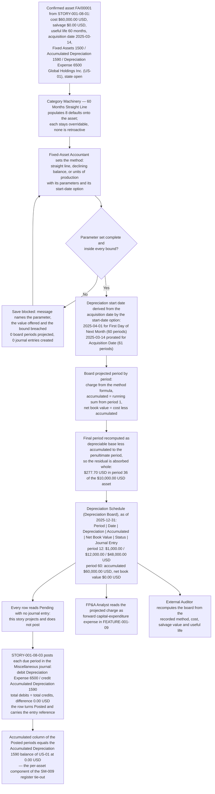

# STORY-001-08-02: Configure Depreciation Methods and Projected Board

---

## Metadata

| Attribute | Value |
|-----------|-------|
| **Story ID** | `STORY-001-08-02` |
| **Title** | Configure Depreciation Methods and Projected Board |
| **Parent Feature** | [FEATURE-001-08: Fixed Assets & Depreciation](../FEATURE-001-08-fixed-assets-depreciation.md) |
| **Parent Epic** | [EPIC-001: Enterprise Accounting in Odoo](../../EPIC-001-enterprise-accounting-odoo.md) |
| **Feature Capability** | CAP-002 — configure depreciation methods per asset category and project the full depreciation board, per [FEATURE-001-08 §1.3](../FEATURE-001-08-fixed-assets-depreciation.md#13-key-capabilities) |
| **Epic Success Metrics** | **SM-008** — the scheduled depreciation run posts 100% of the entries the board projects for the period, and it has no period to select and no amount to post until this story projects the board; **SM-009** — the **Fixed Asset Register** ties to Fixed Assets 1500 less Accumulated Depreciation 1590 at a `0.00` difference, and the board's accumulated column is the per-asset figure that total is assembled from; **SM-003** and **SM-016** — a schedule the ledger computes and the **External Auditor** recomputes from a recorded formula is part of the close running in 5 business days per entity and of the 50% reduction in post-close audit adjustments |
| **Status** | Draft |
| **Priority** | 🟠 High |
| **Estimate** | `8` (Fibonacci story points) |
| **Persona** | Fixed-Asset Accountant |
| **Secondary Personas** | Chief Accountant (approves the method each asset class is measured under and aligns the depreciation period with the fiscal calendar), Tax Accountant (reads the book charge this board projects as the basis the tax computation diverges from), FP&A Analyst (reads the projected charge as forward depreciation expense for capital-expenditure budgeting), External Auditor (recomputes the board from the recorded method, cost, salvage value and useful life) |
| **Platform Target** | Open decision **DEC-001** — see [Version Compatibility](#version-compatibility) |
| **Last Updated** | 2026-08-13 |
| **Owner/Author** | Enterprise Accounting Team |

This is **story 2 of the 4** in FEATURE-001-08. It takes the asset [STORY-001-08-01](./STORY-001-08-01-register-fixed-assets.md) confirmed, fixes the measurement basis that asset is depreciated under — one of three named methods, its useful life, its salvage value, its start date and, for declining balance, its rate and its optional switch — and projects the **Depreciation Schedule (Depreciation Board)** that basis implies across the whole remaining life, period by period, with the charge, the accumulated total and the net book value on every row. [STORY-001-08-03](./STORY-001-08-03-post-depreciation-entries.md) posts those projected periods to the ledger and [STORY-001-08-04](./STORY-001-08-04-dispose-assets.md) reads net book value from this board when it derecognizes the asset.

> **This story configures and projects; it does not post.** No criterion below creates a journal entry. A projected board row carries **no journal entry reference** until [STORY-001-08-03](./STORY-001-08-03-post-depreciation-entries.md) posts it, at which point that period becomes one balanced pair in the **Miscellaneous** journal — debit **Depreciation Expense 6500**, credit **Accumulated Depreciation 1590**, total debits equal to total credits at a difference of `0.00` in the company currency. Where a criterion below states that the board's accumulated column reconciles to the ledger, it is asserting that the posted lines standing behind the Posted rows are those balanced entries; the posting itself, its idempotency and its run log belong to STORY-001-08-03 and are not restated here. Changing a configuration re-projects the board; it never rewrites a posted period.

> **Merge note — two retired stories, one ticket, and no eighth criterion.** This story is the destination of the `AM-002` **+** `AM-003` merge recorded in the Epic's [Appendix C.3.5](../../EPIC-001-enterprise-accounting-odoo.md#c35-the-bank-budget-and-asset-mergers), because a board is the visible form of a configured method and neither half can be demonstrated without the other. The four behaviours that appendix names as at risk in this merge are each carried below: **the three depreciation methods** (Scenarios 1, 2 and 3), **the four start-date options** (the [Start-Date Options](#the-four-start-date-options) block and Scenario 1), **the declining-balance switch to straight-line** asserted numerically rather than described (Scenario 2), and **the board's accumulated total and net book value per period** (Scenario 4). FEATURE-001-08 is fixed at four stories, so no separate depreciation-board story exists and none is to be created.

> **Persona note — one WHO, four reviewers, no substitution.** The **WHO** is the **Fixed-Asset Accountant**, the role that fixes an asset's measurement basis and answers for the schedule it produces. The **Chief Accountant** appears inside the criteria as the role that approves the method per asset class and aligns the depreciation period with the fiscal calendar; the **Tax Accountant** as the role that reads the book charge the tax computation diverges from; the **FP&A Analyst** as the role that reads the projection as forward expense; and the **External Auditor** as the role that recomputes the board from the recorded formula. The five are named separately throughout, no criterion is written against an unnamed actor, and the generic role "Accountant" carried by the retired `AM-002` and `AM-003` tickets is superseded by the named measurement owner.

> **Platform target.** This story states no platform version of its own. The target is the Epic's open decision **DEC-001** in the [Open Decisions Register](../../EPIC-001-enterprise-accounting-odoo.md#appendix-b-open-decisions-register): the originating programme request names Odoo 17, the superseded flat backlog named 18.0, and the baseline every field name, state value, account type and validation behaviour below was read against is **Odoo 19.0 Community**, where `odoo/release.py` declares `version_info = (19, 0, 0, FINAL, 0, '')`. The account-type selection, the fiscal-period administration and the scheduled-action definition differ across the three candidates, so the mismatch is surfaced for stakeholder confirmation rather than settled here.

> **Monetary and date conventions used throughout this ticket.** Every amount is stated in the currency it is denominated in, carried to 2 decimal places, and rounded **half-up at that currency's rounding increment of `0.01`** — the USD rounding increment for the books of **Global Holdings Inc. (`US-01`)** and the GBP rounding increment for the sterling board of **Global UK Ltd (`GB-01`)**. Every computed figure — a period charge, an accumulated total, a net book value, a per-unit rate — states that rule where it is computed rather than inheriting it silently. **Where a depreciable base does not divide evenly across the periods, the difference between the sum of the rounded per-period charges and the depreciable base is absorbed whole in the final period and is never spread across periods**; that rule is stated with its arithmetic in [Scenario 5](#scenario-5-the-rounding-residual-is-absorbed-whole-in-the-final-period-so-accumulated-depreciation-equals-cost-less-salvage-value-to-the-cent). Dates are written `YYYY-MM-DD` in fixtures and in long form in prose. The **acquisition date** is fixed by STORY-001-08-01 and is an input here; the **depreciation start date** is derived from it by the start-date option; the **board as-of date** is a run-time report parameter and is a third, separate value.

---

## User Story

**As the** Fixed-Asset Accountant

**I want** to fix the depreciation basis of a registered asset in **Global Holdings Inc. (`US-01`)** — one of straight-line, declining balance or units of production, with its useful life, salvage value, start-date option, declining-balance rate and optional switch to straight-line, inherited from the asset's category and overridable on the asset — and to read the **Depreciation Schedule (Depreciation Board)** that basis projects across the whole useful life, with the period charge, the accumulated total and the net book value on every row against **Fixed Assets 1500**, **Accumulated Depreciation 1590** and **Depreciation Expense 6500**

**So that** the charge that will reach the Profit & Loss in every future period is computed once by the ledger from a recorded formula instead of being extended by hand in a spreadsheet each month, the accumulated total at the end of the schedule equals the depreciable amount to the cent and the closing net book value equals the salvage value to the cent, the **FP&A Analyst** budgets against a forward charge that is already visible, the **External Auditor** recomputes the schedule from the asset's own recorded method rather than requesting an extract, and [STORY-001-08-03](./STORY-001-08-03-post-depreciation-entries.md) has a dated, priced period to post.

---

## Acceptance Criteria

### The Configuration and Board Fixture

Every criterion below is written against the fixture in this table. Its core is the parent Feature's worked asset — `$60,000.00 USD` over 60 months with a `$0.00 USD` salvage value against **Fixed Assets 1500**, **Accumulated Depreciation 1590** and **Depreciation Expense 6500** — reused from [STORY-001-08-01](./STORY-001-08-01-register-fixed-assets.md) without alteration, so registration, board projection, periodic posting and disposal are all proved against one record. Every figure is stated to 2 decimal places and rounded half-up at its currency's rounding increment of `0.01`.

| Element | Value |
|---------|-------|
| Company (`res.company`) | **Global Holdings Inc. (`US-01`)** — the United States parent, functional currency USD, per the Epic's [canonical legal-entity register](../../EPIC-001-enterprise-accounting-odoo.md#e4-canonical-legal-entity-register) |
| Asset record | `CNC Milling Centre — Line 3`, reference **`FA/00001`**, standing in state `open` because [STORY-001-08-01](./STORY-001-08-01-register-fixed-assets.md) has confirmed and capitalized it |
| Acquisition cost | **`$60,000.00 USD`** — 2 decimal places, rounded half-up at the USD rounding increment `0.01` |
| Salvage value | **`$0.00 USD`** — 2 decimal places at the USD rounding increment `0.01`, so the depreciable base equals `$60,000.00 USD` |
| Useful life | 60 months, which is the same 5-year life expressed in whole months |
| Acquisition date | `2025-03-14` — an input here, fixed by STORY-001-08-01 and not altered by this story |
| Asset category (`account.asset.category`) | `Machinery — 60 Months Straight Line`, carrying **seven** defaults: the depreciation method, the useful life, the salvage basis, the start-date option and the three accounts **Fixed Assets 1500**, **Accumulated Depreciation 1590** and **Depreciation Expense 6500**. The declining-balance rate is an **eighth** default the category also holds, exercised by Scenario 2 and dormant on a straight-line asset |
| Asset account | **Fixed Assets 1500**, `account_type` `asset_fixed`, account group `15 Non-current Assets` (1500–1599) — the account net book value is measured against |
| Accumulated depreciation account | **Accumulated Depreciation 1590**, `account_type` `asset_fixed` held as a contra balance in the same group, so the board's accumulated column and this account's credit balance measure the same thing for the periods that have been posted |
| Depreciation expense account | **Depreciation Expense 6500**, `account_type` `expense_depreciation`, account group `6 Expenses` (6000–6999) |
| Journal (`account.journal`) | **Miscellaneous** — journal type `general`. It is named here because it is where the projected charge will eventually post, and no criterion below writes to it: the entry belongs to [STORY-001-08-03](./STORY-001-08-03-post-depreciation-entries.md). The **Purchase** journal of the capitalization belongs to STORY-001-08-01 |
| Straight-line board | 60 monthly periods of **`$1,000.00 USD`** each summing to exactly **`$60,000.00 USD`**, closing net book value **`$0.00 USD`** |
| Declining-balance variant | 40.00% per annum over 5 annual periods with the switch to straight-line enabled: `$24,000.00 USD`, `$14,400.00 USD`, `$8,640.00 USD`, then `$6,480.00 USD` in each of periods 4 and 5 |
| Units-of-production variant | Total estimate 100,000 units, per-unit rate **`$0.60 USD`**; a period recording 1,500 units charges `$900.00 USD` and a period recording 4,200 units charges `$2,520.00 USD` |
| Residual-bearing asset | An asset of **`$10,000.00 USD`** with a salvage value of `$0.00 USD` over **36** monthly periods: `$277.78 USD` in periods 1 to 35 and **`$277.70 USD`** in period 36 |
| Residual cases the parent Feature also asserts | `$50,000.00 USD` over 36 months in `US-01` → `$1,388.89 USD` ×35 and `$1,388.85 USD` in period 36; **`£25,000.00 GBP`** over 36 months in **Global UK Ltd (`GB-01`)** → `£694.44 GBP` ×35 and `£694.60 GBP` in period 36, each at the GBP rounding increment `0.01`. Both obey the same final-period rule as the `$10,000.00 USD` case ([FEATURE-001-08 §4.1](../FEATURE-001-08-fixed-assets-depreciation.md#41-feature-level-acceptance-criteria)) |
| Long-schedule asset | A 50-year asset measured monthly, giving **600** board periods — the upper bound the render and export budgets of [FEATURE-001-08 §4.4](../FEATURE-001-08-fixed-assets-depreciation.md#44-performance-requirements) are set against |
| Out-of-bound variants | Useful life `0`; declining-balance rate `0.00%`; declining-balance rate `120.00%`; salvage value `-$500.00 USD`; salvage value `$65,000.00 USD` against a cost of `$60,000.00 USD`; total estimated units `0` |
| Incomplete variants | Method set with the useful life absent; method set with the salvage value absent; a `manual` start date earlier than the acquisition date; an asset still in state `draft` |
| Hostile-input variants | An over-long date-range filter value, an out-of-range as-of date, a malformed as-of date, a fiscal-period filter carrying a search-domain payload, and an exported cell value beginning `=`, `+`, `-`, `@`, a tab or a carriage return (C-015, C-017, C-019, C-020, C-022) |
| Board report | **Depreciation Schedule (Depreciation Board)** for one asset, run with the as-of-date parameter `2025-12-31` |
| Board columns | **Period**, **Date**, **Depreciation**, **Accumulated Depreciation**, **Net Book Value**, **Status**, **Journal Entry** |

### The Three Methods, Stated as Formulae

The three formulae below are the whole measurement contract of this story. They are shown as plain text so the **External Auditor** and the **Chief Accountant** can recompute any board from the asset's recorded parameters without reading code, which is what makes Scenarios 1, 2 and 3 verifiable independently of the implementation that produced them.

```text
Straight-line
    charge per period = (acquisition cost - salvage value) / useful life in periods
    - an equal charge in every period
    - the final period absorbs the rounding residual (see Scenario 5)

Declining balance
    charge for a period = net book value at the start of that period x rate
    - the rate is applied to the remaining book value, so the charge falls each period
    - 150% declining balance:            rate = 1.5 / useful life
    - 200% declining balance (double):   rate = 2 / useful life
    - custom rate: a stated percentage above 0.00% and not above 100.00%
    - optional switch to straight-line: in each period compare
          declining charge    = net book value x rate
          straight-line charge = (net book value - salvage value)
                                 / remaining periods
      and once the straight-line charge is the greater of the two, the method
      switches to straight-line for the remainder of the useful life
    - the charge in any period is capped at the remaining depreciable amount, so
      net book value never falls below the salvage value

Units of production
    per-unit rate     = (acquisition cost - salvage value) / total estimated units
    charge for a period = units recorded in that period x per-unit rate
    - cumulative units are tracked against the total estimate
    - the charge stops once cumulative units reach the total estimate
```

**Final-period invariants, common to all three methods.** At the last period of any board, the accumulated depreciation column equals **acquisition cost less salvage value** at a difference of `0.00` in the company currency, and the net book value column equals **the salvage value** at a difference of `0.00` in the company currency. Scenario 5 is the criterion that protects both invariants when the division is not exact.

### The Four Start-Date Options

The start-date option converts the acquisition date fixed by STORY-001-08-01 into the depreciation start date this story's board runs from. All four are inherited from the category and overridable on the asset, and each is demonstrated against the same acquisition date of `2025-03-14`:

| Option | Depreciation start date from an acquisition date of `2025-03-14` | Effect on the board |
|--------|------------------------------------------------------------------|---------------------|
| First Day of Next Month | `2025-04-01` | 60 whole monthly periods, `2025-04-30` through `2030-03-31`, each charging `$1,000.00 USD`. **This is the option Scenarios 1, 4 and 5 are written against**, because a whole-period start is what makes the 60 charges equal |
| First Day of Current Month | `2025-03-01` | 60 whole monthly periods, `2025-03-31` through `2030-02-28`, each charging `$1,000.00 USD`. The asset carries a charge for the 13 days of March before it was acquired, which is why this option is a policy choice the **Chief Accountant** approves per asset class rather than a default |
| Acquisition Date | `2025-03-14`, prorated | **61** periods rather than 60: `$580.65 USD` for the 18 days from `2025-03-14` to `2025-03-31` of a 31-day period, `$1,000.00 USD` in each of periods 2 to 60, and `$419.35 USD` in period 61, each rounded half-up to 2 decimal places at the USD rounding increment of `0.01`, so the accumulated total still reads `$60,000.00 USD` at a difference of `0.00 USD` from the depreciable base ([FEATURE-001-08 §4.1](../FEATURE-001-08-fixed-assets-depreciation.md#41-feature-level-acceptance-criteria)) |
| Manual Date | Any date the **Fixed-Asset Accountant** states on or after `2025-03-14` | The board runs from the stated date. A manual date **earlier** than the acquisition date is refused, naming both dates, and no board is recomputed by the refused attempt — asserted in Scenario 6 |

### Figure-Set Ownership and Identity Questions Settled

Five identity questions are settled here so that no criterion below has to carry a caveat:

- **Two board lengths, one asset, no contradiction.** The parent Feature asserts both a **60-period** board of `$1,000.00 USD` charges and a **61-period** prorated board of `$580.65 USD` / `$1,000.00 USD` / `$419.35 USD` for the same worked asset. They are not competing figures: they are the same cost measured under two different start-date options, as the table above states. Scenarios 1, 4 and 5 are written against the whole-period start so the 60 charges are equal; the prorated variant is asserted as the Acquisition Date option, and both accumulate to `$60,000.00 USD` at a difference of `0.00 USD`.
- **A board row's values are schedule values; the as-of date governs only Posted versus Pending.** The period-12 charge of `$1,000.00 USD`, accumulated depreciation of `$12,000.00 USD` and net book value of `$48,000.00 USD` asserted in Scenario 4 are properties of the schedule the method produced. The **as-of-date parameter** `2025-12-31` decides which rows are presented and which of them read Posted rather than Pending; it changes no row's charge, accumulated total or net book value. **How many rows read Posted at a given as-of date is a function of what [STORY-001-08-03](./STORY-001-08-03-post-depreciation-entries.md) has posted, and this story asserts no posted count** — which is why the accumulated position the parent Feature reads for this asset in the **Fixed Asset Register** at `2025-12-31` is that Feature's and STORY-001-08-03's figure and can never be contradicted by a criterion here.
- **The residual figure set is additive, not competing.** The `$10,000.00 USD` / 36-period case in Scenario 5 is this story's worked residual instance; the parent Feature's `$50,000.00 USD` and `£25,000.00 GBP` cases are two further instances of the identical rule. The three are stated together in the fixture table precisely so that a reviewer checks one rule against three arithmetics rather than suspecting three rules.
- **The account codes and the company name are the Epic's registers'.** **Fixed Assets 1500** and **Accumulated Depreciation 1590** are two of the ten baseline codes [FEATURE-001-01](../FEATURE-001-01-chart-of-accounts-fiscal-year.md) creates in every company; **Depreciation Expense 6500** is introduced by this feature and claimed in the [FEATURE-001-01 §7.4 Group Chart-of-Accounts Extension Registry](../FEATURE-001-01-chart-of-accounts-fiscal-year.md#74-group-chart-of-accounts-extension-registry). Each is written as concept-plus-code under rule R-E3 so a reader never resolves a bare number. The company is **Global Holdings Inc. (`US-01`)** from the [canonical legal-entity register](../../EPIC-001-enterprise-accounting-odoo.md#e4-canonical-legal-entity-register); the provisional name carried by this story's authoring brief stands on no register row and is superseded under rule R-E5, with the substitution recorded in [Notes](#provisional-values-superseded-by-the-canonical-registers).
- **This story owns no report format.** The **Depreciation Schedule (Depreciation Board)** is named here with its columns, its as-of-date parameter and its expected line values. The export-and-drill-down convention it inherits — export to PDF and XLSX, exports that preserve the on-screen filters and carry the expanded detail, drill-down to journal items with filters preserved and breadcrumbs back — is owned by [FEATURE-001-07](../FEATURE-001-07-financial-reporting-period-close.md) under the Epic's [Appendix C.3.2](../../EPIC-001-enterprise-accounting-odoo.md#c32-fr-007--the-export-and-drill-down-fan-out) and is inherited rather than redefined, with every exported cell neutralized against formula injection under C-017.

### Coverage Distribution

**Seven** criteria, inside the mandated band of 4 to 8. Each carries one non-compound **When**. Each **Then** asserts only what the Fixed-Asset Accountant, the Chief Accountant or the External Auditor observes in the Odoo user interface or reads back over the public API — no database statement, no method name and no widget language. Every monetary figure states its currency, its amount and its rounding rule; the criteria that name more than one company name the company whose books are affected; and because **no criterion here posts an entry**, the debits-equal-credits obligation is discharged by naming the balanced pair the projected periods will become and attributing it to [STORY-001-08-03](./STORY-001-08-03-post-depreciation-entries.md).

| Scenario | Coverage class | What it proves |
|----------|----------------|----------------|
| 1 | Valid input — happy path, straight-line | 60 periods of `$1,000.00 USD` summing to exactly `$60,000.00 USD`, closing net book value `$0.00 USD`, from the formula (cost − salvage) ÷ useful life, with the category defaults populated and overridable |
| 2 | Valid input — declining balance with the switch asserted as an amount | `$24,000.00 USD`, `$14,400.00 USD`, `$8,640.00 USD`, then the switch at period 4 because `$6,480.00 USD` exceeds `$5,184.00 USD`, and `$6,480.00 USD` in each of periods 4 and 5 |
| 3 | Valid input — units of production | A per-unit rate of `$0.60 USD`, a 1,500-unit period charging `$900.00 USD`, a 4,200-unit period charging `$2,520.00 USD`, and the charge stopping at 100,000 cumulative units |
| 4 | Valid input — happy path, the projected board as a named report | Seven columns per row, period 12 at `$1,000.00 USD` / `$12,000.00 USD` / `$48,000.00 USD`, the accumulated column as the running sum from period 1, Posted rows carrying a journal-entry reference and Pending rows carrying none, and the filter and sort behaviour with filtered totals |
| 5 | Accounting edge case — the final-period rounding residual | `$277.78 USD` in periods 1 to 35, `$277.70 USD` in period 36 absorbing the `-$0.08 USD` residual, accumulated exactly `$10,000.00 USD`, closing net book value exactly `$0.00 USD` |
| 6 | Invalid or incomplete input — a blocked save with a named Odoo validation message | Six out-of-bound parameters and a backdated manual start date each block the save, project no board, and name the parameter and the bound breached |
| 7 | Error handling — an incomplete or ineligible asset, plus the render and export budget | A missing useful life or salvage value, and an asset still in `draft`, each yield a named message rather than an empty board; and a 600-period board renders and exports inside 5 seconds with matching headers |

### Scenario 1: Straight-line configuration projects 60 periods of $1,000.00 USD summing to the depreciable base

- **Given** the asset `CNC Milling Centre — Line 3`, reference `FA/00001`, stands in state `open` in **Global Holdings Inc. (`US-01`)** carrying an acquisition cost of `$60,000.00 USD` and a salvage value of `$0.00 USD` — each to 2 decimal places, rounded half-up at the USD rounding increment of `0.01` — as [STORY-001-08-01](./STORY-001-08-01-register-fixed-assets.md) confirmed and capitalized it; and its category `Machinery — 60 Months Straight Line` carries defaults of straight line, a 60-month useful life, a `$0.00 USD` salvage basis, the **First Day of Next Month** start-date option and the three accounts **Fixed Assets 1500** (`asset_fixed`), **Accumulated Depreciation 1590** (contra, same group) and **Depreciation Expense 6500** (`expense_depreciation`), each active and each owned by that company; and the fiscal years covering `2025-04-01` through `2030-03-31` are open in that company as [STORY-001-01-03](../FEATURE-001-01/STORY-001-01-03-define-fiscal-year-periods.md) defines them
- **When** the **Fixed-Asset Accountant** saves the depreciation configuration with the method set to straight line over a useful life of 60 monthly periods
- **Then** the projected **Depreciation Schedule (Depreciation Board)** holds exactly **60** periods, dated `2025-04-30` through `2030-03-31`, and each of the 60 periods carries a charge of **`$1,000.00 USD`** — the depreciable base of `$60,000.00 USD`, being the acquisition cost of `$60,000.00 USD` less the salvage value of `$0.00 USD`, divided by the 60 periods of the useful life — every charge rounded half-up to 2 decimal places at the USD rounding increment of `0.01`
  - **And** the 60 charges total exactly **`$60,000.00 USD`**, because 60 × `$1,000.00 USD` = `$60,000.00 USD`, which equals the depreciable base at a difference of **`0.00 USD`**, so no fraction of a cent is dropped and none is counted twice
  - **And** the accumulated depreciation column of period 60 reads **`$60,000.00 USD`** and its net book value column reads **`$0.00 USD`**, equal to the salvage value of `$0.00 USD` at a difference of **`0.00 USD`**
  - **And** all **eight** category defaults are populated onto the asset and readable there — the method, the 60-month useful life, the `$0.00 USD` salvage basis, the **First Day of Next Month** start-date option, the declining-balance rate held dormant on a straight-line asset, and the three accounts **Fixed Assets 1500**, **Accumulated Depreciation 1590** and **Depreciation Expense 6500** — and each remains overridable on this asset alone, with the override recorded against the asset and the category left as it was; a later edit to that category re-projects the board of **0** assets already configured under it
  - **And** the useful life is readable as both 60 whole months and 5 whole years, one life stated at two granularities, and the board projected from either statement holds the same 60 periods of `$1,000.00 USD` totalling `$60,000.00 USD`
  - **And** the count of journal entries created by this configuration is **0**, and the movement it contributes to **Depreciation Expense 6500** and to **Accumulated Depreciation 1590** measures `$0.00 USD` in each case: the board is a projection, and the balanced pair each period will become — debit **Depreciation Expense 6500** `$1,000.00 USD` against credit **Accumulated Depreciation 1590** `$1,000.00 USD` in the **Miscellaneous** journal, total debits equal to total credits at a difference of `0.00 USD` — is posted by [STORY-001-08-03](./STORY-001-08-03-post-depreciation-entries.md) and not by this story

### Scenario 2: Declining-balance configuration projects a falling charge and switches to straight-line at the period where the straight-line charge is the greater

- **Given** the same asset `FA/00001` stands in state `open` in **Global Holdings Inc. (`US-01`)** with an acquisition cost of `$60,000.00 USD` and a salvage value of `$0.00 USD`, each to 2 decimal places at the USD rounding increment of `0.01`, and its useful life is expressed as **5 annual periods** because the **Chief Accountant** has approved an accelerated basis for this asset class under IAS 16
- **When** the **Fixed-Asset Accountant** saves the configuration with the method set to declining balance at a rate of **40.00%** per annum with the switch to straight-line enabled
- **Then** the board projects five annual periods charging, in order, **`$24,000.00 USD`**, **`$14,400.00 USD`**, **`$8,640.00 USD`**, **`$6,480.00 USD`** and **`$6,480.00 USD`**, each rounded half-up to 2 decimal places at the USD rounding increment of `0.01`, each of the first three computed as the net book value at the start of the period multiplied by the 40.00% rate — `$60,000.00 USD` × 40.00% = `$24,000.00 USD` leaving a net book value of `$36,000.00 USD`; `$36,000.00 USD` × 40.00% = `$14,400.00 USD` leaving `$21,600.00 USD`; `$21,600.00 USD` × 40.00% = `$8,640.00 USD` leaving `$12,960.00 USD`
  - **And** the switch to straight-line occurs at **period 4** and is asserted as an amount rather than described: at period 4 the declining charge on the remaining net book value of `$12,960.00 USD` measures `$5,184.00 USD`, while the straight-line charge on that same `$12,960.00 USD` over the 2 remaining periods measures `$6,480.00 USD`; `$6,480.00 USD` is the greater of the two, so the method switches to straight-line for the remainder of the useful life and periods 4 and 5 each carry `$6,480.00 USD`
  - **And** the five charges total exactly **`$60,000.00 USD`** — `$24,000.00 USD` + `$14,400.00 USD` + `$8,640.00 USD` + `$6,480.00 USD` + `$6,480.00 USD` — equal to the depreciable base at a difference of **`0.00 USD`**, with the accumulated depreciation column of period 5 reading `$60,000.00 USD` and its net book value column reading `$0.00 USD`, equal to the salvage value at a difference of `0.00 USD`
  - **And** the two standard rate variants are derived from the useful life rather than typed by hand: on this 5-period life, **150% declining balance** resolves to a rate of 1.5 ÷ 5 = **30.00%** per annum and **200% declining balance (double declining)** resolves to 2 ÷ 5 = **40.00%** per annum, which is the rate this scenario is worked at; a custom rate is any stated percentage above `0.00%` and not above `100.00%`
  - **And** with the switch to straight-line disabled the charge stays on the declining formula for every period and the final period's charge is **capped at the remaining depreciable amount**, so the net book value column closes at the salvage value of `$0.00 USD` and no period drives it below that value
  - **And** the count of journal entries created by this configuration is **0** and the movement it contributes to **Depreciation Expense 6500** and to **Accumulated Depreciation 1590** measures `$0.00 USD` in each case; each projected period will post as one balanced pair against those two accounts under [STORY-001-08-03](./STORY-001-08-03-post-depreciation-entries.md), with total debits equal to total credits at a difference of `0.00 USD`

### Scenario 3: Units-of-production configuration prices each period from recorded usage at a fixed per-unit rate

- **Given** the same asset `FA/00001` stands in state `open` in **Global Holdings Inc. (`US-01`)** with an acquisition cost of `$60,000.00 USD` and a salvage value of `$0.00 USD`, each to 2 decimal places at the USD rounding increment of `0.01`, and the **Chief Accountant** has approved a usage basis for this asset class because its wear follows output rather than time
- **When** the **Fixed-Asset Accountant** saves the configuration with the method set to units of production over a total estimate of **100,000** units
- **Then** the per-unit rate reads **`$0.60 USD`**, being the depreciable base of `$60,000.00 USD` — the acquisition cost of `$60,000.00 USD` less the salvage value of `$0.00 USD` — divided by the total estimate of 100,000 units, rounded half-up to 2 decimal places at the USD rounding increment of `0.01`, and the rate is fixed at configuration so a later period is priced at the same rate as an earlier one
  - **And** a period in which **1,500** units are recorded carries a charge of **`$900.00 USD`**, being 1,500 × `$0.60 USD`, and a period in which **4,200** units are recorded carries a charge of **`$2,520.00 USD`**, being 4,200 × `$0.60 USD`, each rounded half-up to 2 decimal places at the USD rounding increment of `0.01`
  - **And** cumulative units are tracked against the 100,000-unit estimate on the asset, so once cumulative units reach 100,000 the accumulated depreciation column reads **`$60,000.00 USD`** at a difference of **`0.00 USD`** from the depreciable base, the net book value column reads **`$0.00 USD`** equal to the salvage value, and the count of further charges the board projects is **0**
  - **And** a period in which **0** units are recorded carries a charge of **`$0.00 USD`**, leaves the accumulated depreciation and net book value columns at the values the previous period closed at, and is **retained on the board** as a zero-charge row rather than dropped from it, so the period count is driven by the schedule and not by the amounts
  - **And** the identity **acquisition cost less accumulated depreciation equals net book value** holds on every projected row at a difference of `0.00 USD`, whatever the recorded usage of that row
  - **And** the count of journal entries created by this configuration is **0** and the movement it contributes to **Depreciation Expense 6500** and to **Accumulated Depreciation 1590** measures `$0.00 USD` in each case; a usage-priced period posts as one balanced pair against those two accounts under [STORY-001-08-03](./STORY-001-08-03-post-depreciation-entries.md), with total debits equal to total credits at a difference of `0.00 USD`

### Scenario 4: The Depreciation Schedule (Depreciation Board) presents seven columns per period, with period 12 reading $12,000.00 USD accumulated and $48,000.00 USD net book value

- **Given** the straight-line configuration of Scenario 1 stands saved against the asset `FA/00001` in **Global Holdings Inc. (`US-01`)**, so a 60-period schedule of `$1,000.00 USD` charges exists against an acquisition cost of `$60,000.00 USD` and a salvage value of `$0.00 USD`, each to 2 decimal places at the USD rounding increment of `0.01`; and the **Fixed-Asset Accountant** holds read access to the assets of that company and to no assets of `NL-01`, `GB-01` or `SG-01`
- **When** the **Fixed-Asset Accountant** opens the **Depreciation Schedule (Depreciation Board)** for that asset with the as-of-date parameter **31 December 2025** (`2025-12-31`)
- **Then** the board presents one row per board period, and every row carries the seven columns **Period**, **Date**, **Depreciation**, **Accumulated Depreciation**, **Net Book Value**, **Status** and **Journal Entry**
  - **And** the row for **period 12**, dated `2026-03-31`, reads a depreciation charge of **`$1,000.00 USD`**, accumulated depreciation of **`$12,000.00 USD`** and a net book value of **`$48,000.00 USD`**, each to 2 decimal places at the USD rounding increment of `0.01`
  - **And** the **Accumulated Depreciation** column of every row is the running sum of the charges of period 1 through that row: period 1 reads `$1,000.00 USD`, period 2 reads `$2,000.00 USD`, period 12 reads `$12,000.00 USD` and period 60 reads `$60,000.00 USD`, each at the USD rounding increment of `0.01`
  - **And** the identity **acquisition cost less accumulated depreciation equals net book value** holds on each of the 60 rows at a difference of **`0.00 USD`** — on period 12, `$60,000.00 USD` less `$12,000.00 USD` equals `$48,000.00 USD` — and the net book value of period 60 reads `$0.00 USD`, equal to the salvage value at a difference of `0.00 USD`
  - **And** each row's **Status** reads **Posted**, **Pending** or **Skipped**: a row reads **Posted** where a depreciation entry for this asset and this period stands posted in the **Miscellaneous** journal of **Global Holdings Inc. (`US-01`)**, and its **Journal Entry** column carries that entry's reference so the **External Auditor** drills from the row to the balanced `Depreciation Expense 6500` and `Accumulated Depreciation 1590` journal items behind it; a row reads **Pending** where no such entry exists, and its **Journal Entry** column carries **none**
  - **And** the as-of-date parameter `2025-12-31` governs which rows are presented and which of the presented rows read **Posted**; it alters no row's charge, accumulated total or net book value, the count of journal entries this board render creates is **0**, and the count of posted periods behind the Posted rows is established by [STORY-001-08-03](./STORY-001-08-03-post-depreciation-entries.md) rather than asserted here
  - **And** the board filters by **date range**, by **fiscal year**, by **fiscal period** and by **Status**, and sorts by **period date** ascending or descending, by **depreciation amount** and by **Status**; the totals presented with a filtered board measure **only the filtered subset**, so a date-range filter of `2025-04-01` to `2025-12-31` presents **9** rows whose charges total **`$9,000.00 USD`** while the unfiltered board presents 60 rows totalling `$60,000.00 USD`, each at the USD rounding increment of `0.01`
  - **And** the board exports to PDF and to XLSX under the export and drill-down convention [FEATURE-001-07](../FEATURE-001-07-financial-reporting-period-close.md) owns, so the export preserves the filters active on screen, carries the expanded rows rather than a collapsed summary, presents exported column headers matching the seven on-screen columns, and neutralizes every exported cell against formula injection (C-017)
  - **And** the board of an asset of `NL-01`, `GB-01` or `SG-01` is not presented to a role restricted to **Global Holdings Inc. (`US-01`)**, and the count of rows belonging to another company on this board is **0** (C-014, D-007)

### Scenario 5: The rounding residual is absorbed whole in the final period so accumulated depreciation equals cost less salvage value to the cent

- **Given** an asset stands in state `open` in **Global Holdings Inc. (`US-01`)** carrying an acquisition cost of **`$10,000.00 USD`** and a salvage value of **`$0.00 USD`**, each to 2 decimal places at the USD rounding increment of `0.01`, so its depreciable base measures `$10,000.00 USD`; and the configuration offered is straight line over **36** monthly periods, where dividing that base by 36 gives an unrounded quotient of `277.7777…` — an arithmetic intermediate the ledger never carries as an amount — which rounds half-up to the amount **`$277.78 USD`** at the USD rounding increment of `0.01`, and 36 × `$277.78 USD` = **`$10,000.08 USD`**, exceeding the depreciable base by **`$0.08 USD`**
- **When** the **Fixed-Asset Accountant** saves that configuration
- **Then** the board projects 36 periods in which **periods 1 through 35 each carry `$277.78 USD`**, totalling `$9,722.30 USD`, and the **final period 36 carries `$277.70 USD`** — the depreciable base of `$10,000.00 USD` less the `$9,722.30 USD` charged by the 35 periods before it — so period 36 absorbs the **`-$0.08 USD`** residual whole, each amount rounded half-up to 2 decimal places at the USD rounding increment of `0.01`
  - **And** the accumulated depreciation column of period 36 reads exactly **`$10,000.00 USD`**, equal to the acquisition cost of `$10,000.00 USD` less the salvage value of `$0.00 USD` at a difference of **`0.00 USD`**
  - **And** the net book value column of period 36 reads exactly **`$0.00 USD`**, equal to the salvage value of `$0.00 USD` at a difference of **`0.00 USD`**
  - **And** the residual is absorbed **whole in the final period and is never spread across periods**: the count of periods other than period 36 whose charge differs from `$277.78 USD` is **0**, and the final period's charge is computed as the depreciable base less the accumulated total of the periods before it rather than as a rounded quotient
  - **And** the rule holds in both rounding directions and in a currency other than USD, which is why the parent Feature's two further instances read the same way: a `$50,000.00 USD` asset over 36 months charges `$1,388.89 USD` in periods 1 to 35 and `$1,388.85 USD` in period 36, absorbing a **negative** residual of `-$0.04 USD` because 36 × `$1,388.89 USD` = `$50,000.04 USD` exceeds the base; and a **`£25,000.00 GBP`** asset in **Global UK Ltd (`GB-01`)** over 36 months charges `£694.44 GBP` in periods 1 to 35 and `£694.60 GBP` in period 36, absorbing a **positive** residual of `+£0.16 GBP` because 36 × `£694.44 GBP` = `£24,999.84 GBP` falls short of the base, each amount rounded half-up to 2 decimal places at the GBP rounding increment of `0.01` and each accumulating to its own base at a difference of `0.00` in its own currency
  - **And** the same final-period rule governs a declining-balance or units-of-production board, so the accumulated total of any method equals cost less salvage value at a difference of `0.00` in the company currency and the closing net book value equals the salvage value at a difference of `0.00` in the company currency
  - **And** the count of journal entries created by this configuration is **0**; when [STORY-001-08-03](./STORY-001-08-03-post-depreciation-entries.md) posts the residual-bearing period it posts `$277.70 USD` and not `$277.78 USD`, as one balanced pair debiting **Depreciation Expense 6500** `$277.70 USD` against crediting **Accumulated Depreciation 1590** `$277.70 USD`, total debits equal to total credits at a difference of `0.00 USD`

### Scenario 6: An out-of-bound parameter or a backdated manual start date blocks the save and names the bound it breached

- **Given** the **Fixed-Asset Accountant** is configuring depreciation on the asset `FA/00001` in **Global Holdings Inc. (`US-01`)**, whose acquisition cost is `$60,000.00 USD` and whose acquisition date is `2025-03-14`, and offers a parameter set carrying one of the following seven values, each of which breaches a stated bound: a useful life of **`0`** periods; a declining-balance rate of **`0.00%`**; a declining-balance rate of **`120.00%`**; a salvage value of **`-$500.00 USD`**; a salvage value of **`$65,000.00 USD`** against that acquisition cost of `$60,000.00 USD`, both to 2 decimal places at the USD rounding increment of `0.01`; a total estimated units of **`0`** under units of production; or a **Manual Date** depreciation start date of `2025-02-01`, earlier than the acquisition date of `2025-03-14`
- **When** the **Fixed-Asset Accountant** saves that configuration
- **Then** the save is **blocked** with an Odoo validation message naming the offending parameter, the value offered and the bound it breached — that the useful life must be greater than zero; that the declining-balance rate must be above `0.00%` and not above `100.00%`; that the salvage value must not be negative; that the salvage value of `$65,000.00 USD` must not exceed the acquisition cost of `$60,000.00 USD`; that the total estimated units must be greater than zero; and that a manual depreciation start date must fall on or after the acquisition date, with both `2025-02-01` and `2025-03-14` named
  - **And** **no board is projected** by the refused attempt: the count of board periods existing for the asset after the refusal equals the count before it, and where the asset carried no board it carries none
  - **And** the count of journal entries created by the refused attempt is **0**, and the movement it contributes to **Depreciation Expense 6500** and to **Accumulated Depreciation 1590** measures `$0.00 USD` in each case
  - **And** the message names the parameter and the failed condition and discloses no stack trace, database statement or file-system path (C-020)
  - **And** the parameter set is validated **as a set** rather than field by field, so an asset whose method is selected while its parameter set is incomplete stands unconfigured with no board rather than half-configured with a partial one — which is the condition [Scenario 7](#scenario-7-an-incomplete-or-ineligible-asset-yields-a-named-message-rather-than-an-empty-board-and-a-600-period-board-renders-and-exports-within-5-seconds) acts on
  - **And** once the offending value is replaced by one inside its bound — a useful life of 60 periods, a declining-balance rate of `40.00%`, a salvage value of `$0.00 USD`, a total estimate of 100,000 units, or a manual start date of `2025-04-01` — the save is admitted and the board of Scenario 1 is projected: 60 periods of `$1,000.00 USD` totalling `$60,000.00 USD` at a difference of `0.00 USD` from the depreciable base

### Scenario 7: An incomplete or ineligible asset yields a named message rather than an empty board, and a 600-period board renders and exports within 5 seconds

- **Given** three assets stand in **Global Holdings Inc. (`US-01`)**: the first carries a depreciation method of straight line with **no useful life** recorded; the second carries a depreciation method of straight line with **no salvage value** recorded; and the third carries a complete parameter set but stands in state **`draft`** because [STORY-001-08-01](./STORY-001-08-01-register-fixed-assets.md) has not confirmed it, so it has no capitalized cost for a board to be measured against
- **When** board generation is requested for each of the three assets
- **Then** **no schedule is produced** for any of the three, and each request returns an Odoo message naming what blocks it — the absent useful life on the first, the absent salvage value on the second, and the state `draft` together with the confirmation the third is waiting on — rather than presenting a board of zero rows or a board of `$0.00 USD` charges that a reader could mistake for a computed schedule
  - **And** the count of board periods created is **0** for each of the three, the count of journal entries created is **0**, and each message discloses no stack trace, database statement or file-system path (C-020)
  - **And** once the absent parameter is recorded on the first two assets and the third is confirmed by STORY-001-08-01, board generation on the same three assets is admitted, and each projects a schedule whose accumulated total at its final period equals its own depreciable base at a difference of **`0.00 USD`** and whose closing net book value equals its own salvage value at a difference of **`0.00 USD`**
  - **And** for the long-schedule asset whose board spans **600 periods** — a 50-year useful life measured monthly — the board **renders within 5 seconds** and its **XLSX or CSV export completes within 5 seconds**, carrying **600 data rows** and exported column headers matching the seven on-screen columns **Period**, **Date**, **Depreciation**, **Accumulated Depreciation**, **Net Book Value**, **Status** and **Journal Entry**, with every exported cell neutralized against formula injection so a value beginning `=`, `+`, `-`, `@`, a tab or a carriage return is rendered as text (C-017); and applying a date-range or fiscal-period filter, or a sort, to that same 600-period board completes **within 1 second** ([FEATURE-001-08 §4.4](../FEATURE-001-08-fixed-assets-depreciation.md#44-performance-requirements))
  - **And** a hostile run-time parameter is refused rather than rendered: an over-long date-range filter value, an out-of-range as-of date, a malformed as-of date and a fiscal-period filter carrying a search-domain payload are each rejected with an error naming the parameter and the check that failed, with **0** board periods altered, **0** journal entries created, no internal detail disclosed, and the service answering the next request (C-015, C-019, C-020, C-022)

---

## INVEST Principles Compliance

| Principle | Compliance | Notes |
|-----------|------------|-------|
| **Independent** | ✅ | **Stated honestly: in delivery order this story is blocked by [STORY-001-08-01](./STORY-001-08-01-register-fixed-assets.md)**, because a board is projected against a confirmed asset's cost, useful life and salvage value and there is nothing to project before that asset exists — the parent Feature's dependency table at [§3.3](../FEATURE-001-08-fixed-assets-depreciation.md#33-story-dependency-ordering) records STORY-001-08-01 against it. It is nonetheless **independently developable and independently testable**: the whole input surface is a fixture asset record carrying five values and three account references, seedable in a test company without STORY-001-08-01's code, and the whole output surface is a projected schedule that is verifiable **without any posting** — no journal entry, no scheduled run and no report engine stands between the formula and the assertion. Its downstream siblings are likewise not prerequisites: STORY-001-08-03 consumes this board and STORY-001-08-04 reads net book value from it |
| **Negotiable** | ✅ | The outcome is fixed and the mechanism is open. What is fixed: the three method formulae and their parameters, the four start-date options, the numeric declining-balance switch, the final-period residual placement, the seven board columns with the accumulated-and-net-book-value identity per row, the Posted-versus-Pending semantics, the filter and sort behaviour with filtered totals, and the render and export budgets. What is left to implementation discovery: whether the board is stored as records or computed on read, whether a long board is paginated, lazily loaded or cached, whether the crossover period is computed once at configuration or evaluated each period, whether category defaults are copied at assignment or read through at computation, and whether the schedule engine is the present `account_asset_management` code extended or something else (D-003, D-005) |
| **Valuable** | ✅ | This is the story that turns an asset's cost into a priced, dated forward schedule. Without it, `$60,000.00 USD` of machinery has a cost and no charge: the 8 to 16 hours a month the parent Feature records as manual depreciation work is spent extending a spreadsheet one row at a time, and the **FP&A Analyst** budgets against a number nobody can reproduce. With it, [STORY-001-08-03](./STORY-001-08-03-post-depreciation-entries.md) has a due period and an amount to post (SM-008), the board's accumulated column is the per-asset figure the **Fixed Asset Register** total is assembled from and tied to Fixed Assets 1500 less Accumulated Depreciation 1590 (SM-009), and the **External Auditor** recomputes the schedule from the asset's own recorded method instead of raising a data request, which is part of the 50% reduction in post-close audit adjustments (SM-016) |
| **Estimable** | ✅ | The delivered surface is countable and inspectable: **3** calculation engines, **1** period-by-period switch comparison, **4** start-date options, **1** final-period residual rule, **6** parameter bounds plus the backdated-start check, **8** inheritable category defaults, **7** board columns, **3** row statuses, **4** filter dimensions and **3** sort keys, **1** export path, and **4** timing budgets — all against models present in this repository under LGPL-3 (`account.account`, `account.move`, `account.move.line`, `account.journal`, `res.company`, `res.currency`) or present under AGPL-3 in `account_asset_management`, whose own `depreciation_method`, `declining_factor`, `switch_to_straight_line`, `units_production_total` and `start_date_option` fields are readable before development starts. Effort, complexity and uncertainty are assessed in [Estimation](#estimation) |
| **Small** | ✅ | One sprint-sized outcome: a measurement basis on an asset and the schedule it implies. It posts nothing, runs no scheduled job, builds no revaluation, impairment or disposal path, and builds no statement — those are [STORY-001-08-03](./STORY-001-08-03-post-depreciation-entries.md), [STORY-001-08-04](./STORY-001-08-04-dispose-assets.md) and [FEATURE-001-07](../FEATURE-001-07-financial-reporting-period-close.md). It is nonetheless larger than STORY-001-08-01, which is why it is sized at `8` rather than `5`: two retired tickets merged into it under the Epic's [Appendix C.3.5](../../EPIC-001-enterprise-accounting-odoo.md#c35-the-bank-budget-and-asset-mergers), and splitting them apart again would leave a board with no method to project and a method with no visible result |
| **Testable** | ✅ | Every criterion resolves to an amount, a count, a percentage, a date, a column name, a status value or a named refusal. Each of the three methods is asserted as a worked schedule to the cent; the declining-balance switch is asserted as `$6,480.00 USD` exceeding `$5,184.00 USD` at period 4 rather than described as a crossover; the residual is asserted as `$277.70 USD` in period 36 against `$277.78 USD` in the 35 before it; the board criterion names the report, the as-of date `2025-12-31` and the period-12 line values `$1,000.00 USD` / `$12,000.00 USD` / `$48,000.00 USD`; each refusal asserts `0` board periods and `0` journal entries created; the budgets are asserted as 5 seconds, 5 seconds and 1 second; and each criterion maps to exactly one acceptance test in [Acceptance Test Mapping](#acceptance-test-mapping) (C-008, C-009) |

---

## Sub-Tasks

- [ ] **@functional-consultant** — Agree the **method set and the per-asset-class policy** with the finance team and record it: which of straight line, declining balance and units of production each asset class is measured under, which declining-balance rate variant applies where an accelerated basis is approved (150% at 1.5 ÷ useful life, 200% at 2 ÷ useful life, or a stated custom rate), and whether the switch to straight-line is enabled for that class. Record the **Chief Accountant** as the approver of the class-to-method map, since the method fixes the charge that reaches the Profit & Loss for the whole life of the asset
- [ ] **@functional-consultant** — Document the **category-default policy** across all **eight** defaults — method, useful life, salvage basis, start-date option, declining-balance rate and the three accounts **Fixed Assets 1500**, **Accumulated Depreciation 1590** and **Depreciation Expense 6500** — stating for each whether it is populated onto the asset at assignment or read through at computation time, how an asset-level override is recorded, and the non-retroactivity rule that keeps a later category edit from re-projecting the board of an asset configured before the change
- [ ] **@functional-consultant** — Specify the **start-date policy per asset class**: which of the four options (Acquisition Date with proration, First Day of Current Month, First Day of Next Month, Manual Date) is the class default, and the consequence each carries — that the prorated option extends a 60-month board to **61** periods with `$580.65 USD` and `$419.35 USD` at its ends, and that First Day of Current Month charges the whole month of acquisition. Record that a manual start date earlier than the acquisition date is refused with both dates named
- [ ] **@functional-consultant** — Specify the **refusal set the Fixed-Asset Accountant sees and the remedy for each**: useful life not greater than zero; declining-balance rate at or below `0.00%` or above `100.00%`; total estimated units not greater than zero; salvage value negative; salvage value above the acquisition cost; a manual start date before the acquisition date; a method selected with the useful life or salvage value absent; and an asset still in state `draft`. Each entry states the message, the cause and the action, and none discloses a stack trace or a file-system path (C-020)
- [ ] **@developer** — Deliver the **three calculation engines** against the formulae recorded in [The Three Methods, Stated as Formulae](#the-three-methods-stated-as-formulae): straight line as (cost − salvage) ÷ useful life; declining balance as net book value × rate with the rate resolvable from the 150% and 200% variants; and units of production as a per-unit rate fixed at configuration, multiplied by the units recorded in the period, with cumulative units tracked against the total estimate and the charge stopping at exhaustion
- [ ] **@developer** — Deliver the **switch-to-straight-line comparison** as a per-period evaluation rather than a single precomputed crossover date: in each period compare the declining charge (net book value × rate) against the straight-line charge on the remaining net book value over the remaining periods, and switch for the remainder once the straight-line charge is the greater. The worked case must reproduce `$24,000.00 USD`, `$14,400.00 USD`, `$8,640.00 USD`, `$6,480.00 USD`, `$6,480.00 USD` and identify period 4 as the switch because `$6,480.00 USD` exceeds `$5,184.00 USD`
- [ ] **@developer** — Deliver the **final-period residual placement** for all three methods: the final period's charge is computed as the depreciable base less the accumulated total of the periods before it, not as a rounded quotient, so the residual is absorbed whole in that one period in either rounding direction. The three worked cases must reproduce `$277.70 USD` on the `$10,000.00 USD` / 36-period asset, `$1,388.85 USD` on the `$50,000.00 USD` / 36-period asset and `£694.60 GBP` on the `£25,000.00 GBP` / 36-period asset in `GB-01`, each rounded half-up to 2 decimal places at its currency's rounding increment of `0.01`, and each declining-balance charge must be capped at the remaining depreciable amount so net book value never closes below the salvage value
- [ ] **@developer** — Deliver the **four start-date options** and the derivation of the depreciation start date from the acquisition date, including the proration that extends the board by one period and the refusal of a manual date earlier than the acquisition date, with both dates named in the message
- [ ] **@developer** — Deliver the **board projection and its export**: one row per period carrying **Period**, **Date**, **Depreciation**, **Accumulated Depreciation**, **Net Book Value**, **Status** and **Journal Entry**; the accumulated column as the running sum from period 1 and the net book value column as cost less that accumulated total; the Posted / Pending / Skipped status resolved against the existence of a posted entry for that asset and period with the entry reference on Posted rows and none on Pending rows; the date-range, fiscal-year, fiscal-period and status filters and the period-date, amount and status sorts with totals measuring the filtered subset; and PDF and XLSX export under the [FEATURE-001-07](../FEATURE-001-07-financial-reporting-period-close.md) convention with every cell neutralized against formula injection (C-017)
- [ ] **@developer** — Deliver the **parameter validations as a set** evaluated before the configuration is saved, so no board is projected from an incomplete set, with each refusal naming the parameter, the offered value and the bound breached, and with all data access expressed through the Odoo ORM or parameterized SQL and no search domain assembled by string concatenation (C-019)
- [ ] **@qa** — Build the **acceptance suite covering all 7 scenarios**, one test per criterion (C-008), with every amount asserted to the cent, every account asserted by code, every refusal asserting `0` board periods and `0` journal entries created, and the board criterion asserting the report name, the as-of date `2025-12-31` and the period-12 line values `$1,000.00 USD`, `$12,000.00 USD` and `$48,000.00 USD` (C-009)
- [ ] **@qa** — Build the **calculation-accuracy table, one block per method**, recomputing each board independently of the implementation that produced it: straight line at 60 × `$1,000.00 USD` = `$60,000.00 USD`; declining balance at `$24,000.00` / `$14,400.00` / `$8,640.00` / `$6,480.00` / `$6,480.00` USD with the period-4 switch asserted as `$6,480.00 USD` against `$5,184.00 USD`; units of production at a `$0.60 USD` rate with `$900.00 USD` for 1,500 units, `$2,520.00 USD` for 4,200 units and `$0.00 USD` for a zero-unit period; the prorated 61-period board at `$580.65 USD` and `$419.35 USD`; and the three residual boards. Each block asserts the accumulated total against the depreciable base at a difference of `0.00` in its own currency and the closing net book value against the salvage value at a difference of `0.00` in its own currency
- [ ] **@qa** — Run the **600-period timing suite** on a seeded 50-year monthly asset: board render under 5 seconds, XLSX export under 5 seconds with 600 data rows and headers matching the seven on-screen columns, and filter or sort under 1 second; plus a single configuration save under 5 seconds on a seeded `US-01` portfolio of 10,000 assets ([FEATURE-001-08 §4.4](../FEATURE-001-08-fixed-assets-depreciation.md#44-performance-requirements))
- [ ] **@qa** — Build the **hostile-input suite C-022 assigns to this story** over the board's date-range and fiscal-period filters and its export path: an over-long filter value, an out-of-range date, a malformed date, a search-domain payload in a filter value and a formula-injection cell value are each rejected or neutralized, with a named error, `0` board periods altered, `0` journal entries created, no stack trace or file-system path disclosed, and the service still answering afterwards (C-015, C-017, C-019, C-020, C-022)
- [ ] **@finance-sme** — Verify each method's schedule against **IAS 16** and **US GAAP ASC 360**: that the depreciable amount is cost less residual value allocated on a systematic basis over the useful life; that the declining-balance pattern and its switch are a systematic allocation rather than an arbitrary one; that units of production is admissible where consumption follows output; and that the useful life, the residual value and the method are recorded so they can be reviewed. Record the sign-off against this story
- [ ] **@finance-sme** — Confirm the **residual rule** in writing: that the difference between the sum of the rounded per-period charges and the depreciable base is absorbed whole in the final period and never spread, that this holds in both rounding directions, and that the consequence — accumulated depreciation equal to cost less salvage value to the cent and a closing net book value equal to the salvage value to the cent — is the property the **Fixed Asset Register** tie-out of SM-009 depends on

---

## Edge Cases

- **A depreciable base that does not divide evenly across the periods.** `$10,000.00 USD` over 36 monthly periods gives an unrounded quotient of `277.7777…` — an arithmetic intermediate rather than an amount — which rounds half-up to `$277.78 USD` at the USD rounding increment of `0.01` and over-charges the base by `$0.08 USD` across 36 periods. **Control:** the final period is computed as the depreciable base less the accumulated total of the periods before it — `$10,000.00 USD` less `$9,722.30 USD` = `$277.70 USD` — so the residual is absorbed whole in period 36, the accumulated column closes at exactly `$10,000.00 USD` and net book value closes at exactly `$0.00 USD`. The residual is never spread across periods and never dropped, because a cent lost per asset per schedule is a **Fixed Asset Register** that will not tie to Fixed Assets 1500 less Accumulated Depreciation 1590 at `0.00 USD` (SM-009). The rule is direction-agnostic: on the `£25,000.00 GBP` board in **Global UK Ltd (`GB-01`)** the residual is `+£0.16 GBP` and the final period carries `£694.60 GBP`, above rather than below the `£694.44 GBP` of the 35 periods before it.
- **Salvage value equal to the acquisition cost.** An asset carried at `$60,000.00 USD` with a salvage value of `$60,000.00 USD`, each to 2 decimal places at the USD rounding increment of `0.01`, has a depreciable base of `$0.00 USD`. **Control:** the configuration is admitted, because the bound is that salvage value may not *exceed* cost — the boundary [STORY-001-08-01](./STORY-001-08-01-register-fixed-assets.md) already admits — and the board is projected in full with **every one of its periods charging `$0.00 USD`**, an accumulated column that stays at `$0.00 USD` and a net book value that stays at `$60,000.00 USD` equal to the salvage value on every row. The board is projected rather than suppressed so the position is visible, and the value is flagged to the **Chief Accountant** at save so a data-entry error is not mistaken for a policy choice. [STORY-001-08-03](./STORY-001-08-03-post-depreciation-entries.md) posts no entry for a `$0.00 USD` period, which is why this asset never reaches the ledger through this path.
- **A units-of-production period in which no units are recorded.** A production line idle for a month records `0` units, so the charge for that period measures `$0.00 USD` at a rate of `$0.60 USD` per unit. **Control:** the period is **retained on the board as a zero-charge row** rather than dropped from it, the accumulated column and the net book value column hold the values the previous period closed at, and cumulative units are unchanged. The schedule length is driven by the periods of the useful life and not by the amounts, so a reader counting rows counts periods; and because the charge stops only when cumulative units reach the 100,000-unit estimate, an idle period defers the exhaustion of the estimate rather than shortening the life.
- **A declining-balance net book value that would fall below the salvage value.** Declining balance applies a rate to a shrinking base and never reaches zero by arithmetic, so an unconstrained final period would drive net book value below the salvage value and the accumulated total above cost less salvage. **Control:** the charge in any period is **capped at the remaining depreciable amount** — net book value at the start of the period less the salvage value — so the accumulated column closes at exactly cost less salvage value and net book value closes at exactly the salvage value, each at a difference of `0.00` in the company currency. Where the switch to straight-line is enabled the cap is rarely reached, because the switch already distributes the remaining base across the remaining periods; the cap is what makes the disabled case terminate correspondingly.
- **The two boundary boards: a 600-period schedule, and a board in a currency other than the group presentation currency.** A 50-year asset measured monthly projects **600** rows, the upper bound of the render and export budgets, and a `£25,000.00 GBP` asset in **Global UK Ltd (`GB-01`)** is measured in GBP while the group presentation currency held against **Global Holdings Inc. (`US-01`)** is USD. **Control:** the 600-period board renders within 5 seconds and exports within 5 seconds with 600 data rows, and a filter or sort over it completes within 1 second ([FEATURE-001-08 §4.4](../FEATURE-001-08-fixed-assets-depreciation.md#44-performance-requirements)); and every amount on the sterling board is rounded half-up to 2 decimal places at the **GBP** rounding increment of `0.01` in the functional currency of `GB-01`, never at the USD rounding increment of the presentation currency, with translation into the group presentation currency owned by [FEATURE-001-06](../FEATURE-001-06-multi-company-consolidation.md) and performed after each entity's own amounts are rounded. Naming the company on every such assertion is what keeps an entity's board out of another entity's books (C-014, D-007).

---

## Constraints

The constraint identifiers below are the Epic's own, restated in the terms of this story rather than renumbered, so one constraint set reads across the whole ticket tree. The full text is held in [EPIC-001 §7 Constraints](../../EPIC-001-enterprise-accounting-odoo.md#7-constraints) and in the parent Feature at [§5](../FEATURE-001-08-fixed-assets-depreciation.md#5-constraints-inherited-from-epic).

### License and Compliance

- [x] **C-001 — AGPL-3.0 compatibility**: any module delivering the three calculation engines, the switch comparison, the residual placement, the start-date derivation and the board projection with its export is distributed under an AGPL-3.0 compatible licence, matching the licence of the Community-edition accounting add-ons already present in this repository, including `account_asset_management` at AGPL-3
- [x] **C-002 — Existing licence respected**: extension of `account` — the "Invoicing" application, version `1.4`, category `Accounting/Accounting`, licence **LGPL-3** — respects that licence, extension of the present `account_asset_management` add-on respects its **AGPL-3** licence, and an AGPL-3 extension of LGPL-3 code is licence-checked before it is written
- [x] **C-003 — The edition source is an open decision (DEC-002), stated as a fact and not as a prohibition**: `account_asset`, the Enterprise fixed-asset application named in the Epic's [module scope](../../EPIC-001-enterprise-accounting-odoo.md#54-odoo-module-scope), is **absent from `addons/`** in this repository. That is a platform fact about what this checkout contains. **The blanket "no Enterprise dependencies" prohibition carried by the superseded story template is withdrawn and is not asserted by this story.** Which path supplies the depreciation engine and the board — an Odoo Enterprise subscription, or the Odoo Community Association route with the `OCA/account-financial-tools` asset add-ons alongside the present `account_asset_management` add-on plus bespoke development for the residual — is the Epic's open **edition lock-in** decision **DEC-002**, owned by the CFO / Finance Director with the Group Controller and recorded in the [Open Decisions Register](../../EPIC-001-enterprise-accounting-odoo.md#appendix-b-open-decisions-register). It is flagged for stakeholder confirmation rather than resolved here (AAP §0.8.3)
- [x] **What DEC-002 does and does not gate in this story**: the arithmetic of all three methods, the switch comparison, the residual placement and the start-date derivation are pure computation over values already present on an asset record, and a schedule model carrying a per-period amount, an accumulated total, a net book value and a posted state is present under AGPL-3 in `account_asset_management`. The measurement contract can therefore be built and tested against verified ground before the edition decision is confirmed. What the decision affects is the **engine that renders and exports** the board of Scenario 4, which is why that criterion is written against the report's name, its as-of-date parameter, its seven columns, its line values and its status semantics rather than against one engine's internal structure
- [x] **C-004 — OCA ecosystem compatibility**: whichever edition path DEC-002 confirms, the configured method, its parameters and the projected schedule stay consumable by OCA add-ons — including `account_asset_management` in `OCA/account-financial-tools`, published on the 13.0 through 19.0 series under AGPL-3 and explicitly not compatible with the standard `account_asset` application — without a configured asset being restated
- [x] **C-005 / C-006 — Odoo and OCA coding standards**: Python follows Odoo and OCA module guidelines including PEP 8, and static analysis passes with the repository's configured tooling, whose lint configuration is `ruff.toml` at the repository root. A defect in a depreciation formula propagates to every asset measured under it and to every period it charges, so it is caught at review rather than at the register tie-out
- [x] **C-012 — Build on the existing models**: this story writes no journal entry, and the entry its projection anticipates is one `account.move` with its `account.move.line` rows in the company's **Miscellaneous** journal, posted by [STORY-001-08-03](./STORY-001-08-03-post-depreciation-entries.md). Account resolution reads `account.account` on the asset's own company. No parallel posting structure, no shadow schedule ledger and no second chart is introduced, so the board's accumulated column and the **Accumulated Depreciation 1590** balance cannot disagree by construction for the periods that have posted
- [x] **C-013 — Analytic layer, not a parallel one**: where a cost-centre or project dimension is carried on the depreciation charge it is expressed as an analytic distribution on the journal item through `account.analytic.account` and `account.analytic.plan`. This story reads the dimension recorded on the asset by STORY-001-08-01 so the projection can be attributed forward; the posted distribution belongs to STORY-001-08-03 and its budget comparison to [FEATURE-001-09](../FEATURE-001-09-budgeting-variance-analysis.md)
- [x] **C-014 — Access rights and company isolation**: the **Fixed-Asset Accountant** who configures the method is distinguishable from the **Chief Accountant** who approves the class-to-method map and aligns the depreciation period with the fiscal calendar; the **Tax Accountant**, the **FP&A Analyst** and the **External Auditor** hold read access to the board without altering a configuration; and a role restricted to `US-01` can neither read nor re-project the board of an asset of `NL-01`, `GB-01` or `SG-01`, proven by test (D-007)
- [x] **C-015 / C-017 / C-019 / C-020 / C-022 — Untrusted input at the board's parameter and export boundary**: the as-of date, the date-range bounds, the fiscal-year and fiscal-period selections and the status filter are run-time values that cross the trust boundary, so each is validated before use, data access is expressed through the Odoo ORM or parameterized SQL with no string-concatenated search domain, every exported cell beginning `=`, `+`, `-`, `@`, a tab or a carriage return is escaped or prefixed so the spreadsheet application treats it as text, a rejected value returns a named error disclosing no stack trace and no file-system path, and the rejection is proven by the hostile-input tests **C-022 assigns to this story** over the filter and export paths
- [x] **C-018 — Rendered text is encoded**: asset names, asset references, category names and journal-entry references are sanitized and context-encoded before they are rendered into a board row, a PDF or an XLSX export, and templates render such values as escaped text rather than as raw markup
- [x] **C-021 — No secrets in source**: this story integrates with no external endpoint and requires no credential, certificate or key; none appears in its modules, fixtures, logs or exports

### Accounting Standards Compliance

- [x] **This story projects; the balanced pair is STORY-001-08-03's**: no criterion here posts, so the double-entry obligation is discharged by naming what each projected period becomes — debit **Depreciation Expense 6500** and credit **Accumulated Depreciation 1590** for the period's charge in the **Miscellaneous** journal, total debits equal to total credits at a difference of `0.00` in the company currency, asserted numerically in that story's tests (C-009). A configuration change re-projects a Pending period and never rewrites a Posted one
- [x] **IAS 16 — Property, Plant and Equipment**: the depreciable amount is the asset's cost less its residual value, and it is allocated on a **systematic basis** over the useful life. Each of the three methods in scope is such a basis: straight line allocates it evenly, declining balance allocates it in proportion to the remaining carrying amount, and units of production allocates it in proportion to the expected pattern of consumption. The method, the useful life and the residual value are recorded against the asset so they can be reviewed and, where the expectation changes, revised — with the revision itself a measurement event owned by [STORY-001-08-04](./STORY-001-08-04-dispose-assets.md)
- [x] **US GAAP ASC 360 — Property, Plant and Equipment**: depreciation is a systematic and rational allocation of cost over the service life, and accumulated depreciation is presented as a deduction from the asset it relates to — which is why the board's accumulated column corresponds to the **Accumulated Depreciation 1590** contra balance held in the `15 Non-current Assets` group against **Fixed Assets 1500**, and why the net book value column is the difference between the two rather than a separately maintained figure
- [x] **The final-period invariants are the accounting contract of the schedule**: at the last period of every board the accumulated depreciation column equals cost less salvage value and the net book value column equals the salvage value, each at a difference of `0.00` in the company currency. Under-depreciating leaves a stub on the Balance Sheet after the asset has been consumed; over-depreciating drives the carrying amount below the residual value the standard sets as the floor. The final-period residual rule of Scenario 5 is what holds both ends
- [x] **ISO 4217 minor units**: every amount — the period charge, the accumulated total, the net book value, the per-unit rate and the declining-balance charge — is rounded **half-up** to its currency's decimal precision, 2 decimal places at a rounding increment of `0.01` for USD and GBP, and the schedule's residual is carried whole on the final period, so the same inputs always yield the same board
- [x] **The board is a projection and carries no accrual of its own**: a Pending period represents an expense not yet recognized. Recognition happens when [STORY-001-08-03](./STORY-001-08-03-post-depreciation-entries.md) posts the period to the period it belongs to, on the accrual basis rather than on a cash date, so a projection is never treated as a balance and a re-projection is never treated as an adjusting entry
- [x] **Fiscal-calendar alignment**: the board period dates are aligned to the company's fiscal calendar as [STORY-001-01-03](../FEATURE-001-01/STORY-001-01-03-define-fiscal-year-periods.md) defines it, so a period boundary on the board is a period boundary in the ledger and a charge does not straddle two reporting periods. The **Chief Accountant** owns that alignment
- [x] **Audit trail**: the method assignment, each category default populated onto the asset, each asset-level override, each start-date option selected and each re-projection are recorded with their author and timestamp, so the **External Auditor** reads which basis an asset was measured under, and when it changed, without a data request

### Version Compatibility

- [x] **C-010 — The platform version target is open decision DEC-001, and this story hardcodes none**: the "Odoo 18.0 compatibility required" line carried by the superseded story template is **not restated as settled**. Three targets are on record and they are mutually exclusive — the originating programme request names **Odoo 17**, the superseded flat backlog named **18.0**, and this repository is **Odoo 19.0 Community**, where `odoo/release.py` declares `version_info = (19, 0, 0, FINAL, 0, '')`. The single source of truth is the Epic's platform version and edition constraint recorded as **DEC-001** in the [Open Decisions Register](../../EPIC-001-enterprise-accounting-odoo.md#appendix-b-open-decisions-register) and restated by the parent Feature at [§5.5](../FEATURE-001-08-fixed-assets-depreciation.md#55-version-compatibility); the mismatch is **flagged for stakeholder confirmation** (AAP §0.8.3) rather than chosen inside this story
- [x] **C-011 — Language and database versions follow the confirmed target**: the 19.0 baseline present here declares `MIN_PY_VERSION = (3, 10)`, `MAX_PY_VERSION = (3, 13)` and `MIN_PG_VERSION = 13` in `odoo/release.py`; an earlier platform target carries a different supported matrix
- [x] **Impact if DEC-001 resolves away from 19.0**: four statements in this file are re-verified against the confirmed release before development. First, the **account-type values** behind **Fixed Assets 1500** (`asset_fixed`), the contra treatment of **Accumulated Depreciation 1590** and **Depreciation Expense 6500** (`expense_depreciation`), because the `account.account` type selection changed across the three candidate releases. Second, the **fiscal-period administration** the board dates are aligned to, because it differs across those releases. Third, the **field surface the board is projected onto**, since the schedule model present here belongs to a 19.0-series add-on. Fourth, the **credit given to `account_asset_management`** under discovery note **D-003**, because the add-on present here is version `19.0.1.0.0` and is not directly installable on an earlier target — which changes how much of this story is configuration rather than code
- [x] **The edition baseline is recorded as fact, not as a rule**: `account` is present as "Invoicing" at version `1.4` under LGPL-3; `analytic` is present as "Analytic Accounting" at version `1.2` under LGPL-3; `account_financial_report_ce` is present at version `19.0.1.1.0` under AGPL-3; `account_asset_management` is present at version `19.0.1.0.0` under AGPL-3 in category `Accounting/Assets`; and `account_asset` is **absent**. None of these facts is expressed as a prohibition, and the choice between the Enterprise and OCA paths remains **DEC-002**

---

## Technical Discovery Notes

> **Purpose:** these notes direct the codebase analysis that precedes implementation. They record what to investigate and what the outcome must prove; they do not choose the implementation. Every path below was read in this repository at the Odoo 19.0 Community baseline, so the implementing agent starts from verified ground rather than from assumption.

### Codebase Analysis Areas

| Area | Files / Modules to Examine | Analysis Focus |
|------|----------------------------|----------------|
| Account types behind the three accounts the configuration references | `addons/account/models/account_account.py` | Which `account_type` selection value carries a fixed asset in this release, which value the chart uses for a contra balance held against it, and which value is required of a depreciation-expense account. Whether a contra balance is expressed by type, by sign or by a flag, and how the Balance Sheet learns to present **Accumulated Depreciation 1590** as a deduction from **Fixed Assets 1500** rather than as an addition. Whether the type requirement on a depreciation-expense account is enforced or advisory, since Scenario 6 refuses a save on a failed check |
| The entry shape the projection anticipates | `addons/account/models/account_move.py` | The `entry` document type, the draft-posted-cancelled state machine, the date and reference fields, and the validation that refuses an unbalanced entry. What the reference of a system-generated entry carries, and whether it identifies the asset and the period without reading the lines — because the board's **Journal Entry** column presents exactly that reference on a Posted row. Which transitions remain available after posting, since a re-projection must leave a Posted period untouched |
| The journal-item shape and its rounding point | `addons/account/models/account_move_line.py` | How debit and credit amounts are stored and rounded, and whether the currency rounding increment is applied per line or on the entry total — the answer decides whether the board's per-period charge and the posted line can differ by a cent. How an analytic distribution is attached to a line and whether it survives a batch create, since the projection carries the dimension forward for FEATURE-001-09 |
| The generated-entry precedent | `addons/account/wizard/account_automatic_entry_wizard.py` | The pattern already in this codebase for generating an entry from a source record, which is the nearest precedent for a preview-then-confirm flow over projected periods. Whether its construction pattern extends to a per-asset, per-period entry, and how it behaves when the target period is closed |
| The present method engines and their parameters | `addons/account_asset_management/models/account_asset.py` | The present Community implementation already declares a `depreciation_method` selection of `straight_line`, `declining_balance` and `units_of_production`, together with `declining_factor`, `switch_to_straight_line`, `units_production_total`, `units_production_to_date`, `useful_life_unit`, `useful_life_years`, `useful_life_months`, `start_date_option` and `depreciation_start_date`, and helper computations named for the three schedules. Determine which of the criteria above each engine already satisfies to the cent, and where the residual gap lies. Its in-code comments already state that the final period absorbs the cumulative rounding error — confirm that against the three worked residual boards rather than trusting the comment |
| Category defaults and their retroactivity | `addons/account_asset_management/models/account_asset_category.py` | Whether the eight defaults are copied onto the asset at assignment or read through at computation time. If read through, whether a later category edit re-projects the board of an asset configured months earlier — which would breach the non-retroactivity assertion in Scenario 1 and is the single highest-consequence question in this area |
| The board's storage model and its render cost | `addons/account_asset_management/models/account_asset_depreciation_line.py` | Whether the per-period amount, accumulated total and net book value are stored per row or recomputed on read, and which behaviour meets the 5-second render budget at 600 periods. How the link from a row to its posted entry is expressed, and whether it supports the drill-down and the **Posted** / **Pending** / **Skipped** status of Scenario 4 |
| The asset-to-entry linkage | `addons/account_asset_management/models/account_move.py` and `account_move_line.py` | Whether the asset linkage sits on the entry, on the line or on both, and which direction the board's status resolution reads. Whether the extension prevents the deletion or reversal of a posted depreciation entry, since an unprotected posted period would let a re-projection and the ledger diverge |
| Residual placement and the crossover evaluation | The three schedule helpers in `addons/account_asset_management/models/account_asset.py` | Whether each period's charge is computed independently from cost or cumulatively from the previous period's net book value, and which of the two keeps the accumulated total tied to the base under rounding. Whether the final period is recomputed as `depreciable base − accumulated to the penultimate period` rather than as a rounded quotient. Whether the declining-balance crossover is computed once at configuration or evaluated each period, and whether the answer changes the board a re-projection produces |
| Fiscal periods and lock dates the board aligns to | `addons/account/models/company.py` | The fiscal-year fields the board's period dates are aligned to, and the lock-date fields that will refuse the eventual posting. This story neither sets a lock date nor posts through one; it reads the calendar so a board period boundary matches a ledger period boundary |
| Currency precision | `odoo/addons/base/models/res_currency.py` via `res.currency` | Where the rounding increment and decimal precision are held, and which rounding mode the platform applies — the half-up rounding at an increment of `0.01` asserted throughout has to be the mode the engine uses, or every worked figure above shifts by a cent |
| Statement presentation the board is read beside | `addons/account_financial_report_ce/` | The present Community-edition balance-sheet and trial-balance implementation at version `19.0.1.1.0`, whose **Fixed Assets 1500** and **Accumulated Depreciation 1590** balances the board's accumulated column is reconciled against for posted periods. What the residual gap is between that output and the board's own presentation |

### The Entry Each Projected Period Anticipates

This story creates none of the following. It is recorded so the projection and the posting cannot drift, and so a reviewer sees what a Posted row on the board stands for:

```text
Posted by STORY-001-08-03, one entry per due board period,
in the Miscellaneous journal of Global Holdings Inc. (US-01),
dated on the board period date, referencing the asset and the period:

    Debit   6500  Depreciation Expense          $1,000.00 USD
    Credit  1590  Accumulated Depreciation      $1,000.00 USD
    ------------------------------------------------------------
    Total debits  $1,000.00 USD
    Total credits $1,000.00 USD
    Difference        $0.00 USD

For the residual-bearing period 36 of the $10,000.00 USD asset the
same pair carries $277.70 USD on both sides, not $277.78 USD.
Each amount is rounded half-up to 2 decimal places at the USD
rounding increment of 0.01.
```

The board's **Accumulated Depreciation** column and the **Accumulated Depreciation 1590** credit balance measure the same quantity for the periods that have posted; that identity is the reconciliation gate of this ticket and the per-asset component of the **Fixed Asset Register** tie-out the parent Feature asserts under SM-009.

### Relevant Existing Modules

- `addons/account/` — "Invoicing", version `1.4`, licence **LGPL-3**, category `Accounting/Accounting`. Supplies `account.account` for the three accounts the configuration references, `account.journal` for the **Miscellaneous** journal the charge will post through, `account.move` and `account.move.line` as the shape the projection anticipates, and the company fiscal-calendar and lock-date fields the board dates are aligned to.
- `addons/account_asset_management/` — present Community context, version `19.0.1.0.0`, licence **AGPL-3**, category `Accounting/Assets`. Carries `account_asset.py`, `account_asset_category.py`, `account_asset_depreciation_line.py`, `account_move.py` and `account_move_line.py`, and already declares the three depreciation methods with their parameters, the four start-date options, the switch-to-straight-line flag and a depreciation-line model behind the board. **Credited under discovery note D-003** and confirmed against each criterion above before any bespoke engine is written; building a second engine would let a board and a posted charge diverge.
- `addons/analytic/` — "Analytic Accounting", version `1.2`, licence **LGPL-3**. Optional: the analytic distribution the depreciation charge carries where cost-centre or project reporting is required, read forward by [FEATURE-001-09](../FEATURE-001-09-budgeting-variance-analysis.md) as the actual side of capital-expenditure budget-versus-actual (C-013).
- `addons/account_financial_report_ce/` — version `19.0.1.1.0`, licence **AGPL-3**. The present balance-sheet and trial-balance implementation whose **Fixed Assets 1500** and **Accumulated Depreciation 1590** balances the board's accumulated column is reconciled against.
- `odoo/addons/base/` — `res.company` for the company that owns the asset and its fiscal calendar, and `res.currency` for the rounding increment and decimal precision every amount above is rounded to.
- `addons/account_asset/` — **absent from this repository.** Recorded as a platform fact under C-003, not as a prohibition; the capability arrives under whichever path **DEC-002** confirms.

### OCA Module Compatibility

| OCA Repository | Module | Compatibility Consideration |
|----------------|--------|-----------------------------|
| OCA/account-financial-tools | `account_asset_management` | The upstream of the add-on already present in `addons/`. Published on the 13.0 through 19.0 series under AGPL-3 and **explicitly not compatible with the standard `account_asset` application**, so adopting it and adopting the Enterprise module are mutually exclusive paths under **DEC-002**. It shares its name with the locally present `addons/account_asset_management/` add-on delivered by an earlier programme phase — the two are separate code bases, and the assessment states which is credited for the method engines, the start-date options, the switch rule, the residual placement and the board |
| OCA/account-financial-tools | Batch depreciation computation | **No module is published under the name `account_asset_batch_compute`.** The batch computation is a companion capability of `account_asset_management` in the same repository rather than a separately named add-on, so an implementing agent looking for that name will not find it. Determine whether the companion covers the 600-period projection and re-projection cost inside the render budget of [FEATURE-001-08 §4.4](../FEATURE-001-08-fixed-assets-depreciation.md#44-performance-requirements); where the companion is unavailable on the branch **DEC-001** confirms, the batch projection is bespoke scope under DEC-002 and the budget is asserted against the bespoke implementation |
| OCA/account-financial-reporting | `account_financial_report` | Renders the statutory statement set from posted journal items. Determine whether the Balance Sheet presentation of **Fixed Assets 1500** net of **Accumulated Depreciation 1590** — the balances the board's accumulated column is reconciled against — comes from it, from the `account_financial_report_ce` add-on already present, or from the engine DEC-002 confirms |
| OCA/mis-builder | `mis_builder` | Management reporting over posted balances. Determine whether the forward depreciation projection the **FP&A Analyst** budgets against is expressed here or read directly from the board, since a projection is not a posted balance and `mis_builder` reports on posted data |

> **Naming a repository asserts precedent, not installability.** Per the Epic's [OCA repository references](../../EPIC-001-enterprise-accounting-odoo.md#111-oca-repository-references), C-003 and C-004 are met only where a branch is stated for the confirmed platform target; where no port exists on that branch, the capability is recorded as bespoke scope rather than assumed available.

### Discovery versus Prescription

**Not specified by this story:** model names, field definitions or schema decisions; whether the board is stored as records or computed on read; whether a 600-period board is paginated, lazily loaded or cached; whether the crossover is computed once or evaluated per period; whether category defaults are copied or read through; whether the board is an OWL component or a server-rendered list; the specific API used to read or write a record; and module structure or file organization.

**Deferred to agent discovery, under the Epic's discovery notes:** **D-002** (which edition path supplies the capability, and what remains bespoke under each); **D-003** (the residual gap, with registration, categories, methods, board and scheduled posting credited to the present `account_asset_management` add-on and that credit confirmed against each criterion here before any bespoke build); **D-004** (the report engine and the drill-down path from a board row to the journal items behind it, shared with the reporting feature); **D-005** (extension versus new model for the schedule and the measurement-event record); **D-007** (company isolation, record rules and the access-right groups implied by the five personas above); **D-009** (the deterministic fixture set — the `$60,000.00 USD` worked asset and its three method boards, the `$10,000.00 USD`, `$50,000.00 USD` and `£25,000.00 GBP` residual boards, the 600-period asset and the 10,000-asset portfolio — held apart from the hostile-input fixtures C-022 requires on the filter and export paths); and **D-010** (the migration treatment of an in-life asset at cut-over, whose remaining board is projected from its remaining life rather than from a fresh start).

---

## Dependencies

### Story Dependencies

| Dependency Type | Story ID | Story Title | Relationship |
|-----------------|----------|-------------|--------------|
| Parent Feature | [FEATURE-001-08](../FEATURE-001-08-fixed-assets-depreciation.md) | Fixed Assets & Depreciation | This story is story 2 of the 4 in this feature and delivers its capability CAP-002 |
| Blocked By | [STORY-001-08-01](./STORY-001-08-01-register-fixed-assets.md) | Register Fixed Assets with Acquisition Detail | A board is projected against a **confirmed** asset: the acquisition cost of `$60,000.00 USD`, the salvage value of `$0.00 USD`, the 60-month useful life, the acquisition date `2025-03-14`, the category and the account triple **Fixed Assets 1500** / **Accumulated Depreciation 1590** / **Depreciation Expense 6500** are all inputs recorded there. Scenario 7 asserts the refusal for an asset still in state `draft`. The dependency is one of delivery order, not of code: the whole input surface is seedable as a fixture asset record |
| Blocks | [STORY-001-08-03](./STORY-001-08-03-post-depreciation-entries.md) | Post Automated Depreciation Entries | The scheduled run reads the due period, its date and its amount from this board, so it has nothing to select and nothing to post until the board is projected. The residual-bearing final period is the case that story must post at `$277.70 USD` rather than `$277.78 USD` |
| Related | [STORY-001-08-04](./STORY-001-08-04-dispose-assets.md) | Dispose of Assets with Gain or Loss Recognition | Derecognition measures the gain or loss against the **net book value** this board presents at the disposal date, and a revaluation, impairment or impairment reversal recorded there **re-projects the remaining periods of this board** — for example the remaining 30 periods recalculated to `$1,200.00 USD` after a revaluation to `$36,000.00 USD`, or to `$733.33 USD` and a residual-bearing `$733.43 USD` after an impairment to `$22,000.00 USD`. The recalculation obeys the same final-period residual rule as Scenario 5 |
| Cross-feature prerequisite | [FEATURE-001-01](../FEATURE-001-01-chart-of-accounts-fiscal-year.md) | Chart of Accounts & Fiscal Year | Supplies **Fixed Assets 1500** and **Accumulated Depreciation 1590** as two of its ten baseline codes and governs the addition of **Depreciation Expense 6500** through its [§7.4 Group Chart-of-Accounts Extension Registry](../FEATURE-001-01-chart-of-accounts-fiscal-year.md#74-group-chart-of-accounts-extension-registry), and supplies the **Miscellaneous** journal the projected charge will post through. Ordering rule **ORD-001** makes it a prerequisite of every posting story in this feature |
| Cross-feature prerequisite | [STORY-001-01-03](../FEATURE-001-01/STORY-001-01-03-define-fiscal-year-periods.md) | Define Fiscal Year and Accounting Periods | Defines the fiscal years and periods the board's period dates are aligned to, so that a board period boundary is a ledger period boundary and a `$1,000.00 USD` charge does not straddle two reporting periods. This story reads the calendar; it does not define one |
| Related | [STORY-001-01-05](../FEATURE-001-01/STORY-001-01-05-configure-period-lock-dates.md) | Configure Period Lock Dates and Closing Controls | Administers the lock dates that will refuse the eventual posting of a board period. This story projects into a locked period without objection, because a projection is not a posting; the refusal belongs to [STORY-001-08-03](./STORY-001-08-03-post-depreciation-entries.md) |
| Related | [FEATURE-001-07](../FEATURE-001-07-financial-reporting-period-close.md) | Financial Reporting & Period Close | Owner of the report-parameter, drill-down and export conventions the **Depreciation Schedule (Depreciation Board)** inherits rather than redefines, and of how the depreciation charge and the net book value this board projects are presented in the Profit & Loss and the Balance Sheet. Ordering rule **ORD-004** makes this feature a prerequisite of that one |
| Related | [FEATURE-001-09](../FEATURE-001-09-budgeting-variance-analysis.md) | Budgeting & Variance Analysis | Consumer of the **projected** side of this board: the forward charge on **Depreciation Expense 6500** is the capital-expenditure figure a budget is planned against, and the posted charge STORY-001-08-03 produces is the actual placed beside it. The **FP&A Analyst** reads the projection here and the comparison there |
| Related | [FEATURE-001-06](../FEATURE-001-06-multi-company-consolidation.md) | Multi-Company & Intercompany Consolidation | Owner of the legal-entity hierarchy this story names — **Global Holdings Inc. (`US-01`)** and **Global UK Ltd (`GB-01`)** — configured by [STORY-001-06-01](../FEATURE-001-06/STORY-001-06-01-configure-company-hierarchy.md), and of the translation of an entity's asset balances into the group presentation currency after each entity's own amounts are rounded at its own increment |

### External Dependencies

| Dependency | Type | Notes |
|------------|------|-------|
| A confirmed asset with its acquisition detail | Transaction data — [STORY-001-08-01](./STORY-001-08-01-register-fixed-assets.md) | `FA/00001` in state `open` in `US-01` carrying `$60,000.00 USD` cost, `$0.00 USD` salvage value, a 60-month useful life, the acquisition date `2025-03-14` and the three accounts. Without it there is no cost to allocate and no account triple to allocate it against |
| Chart of accounts and the **Miscellaneous** journal | Configuration — [FEATURE-001-01](../FEATURE-001-01-chart-of-accounts-fiscal-year.md) | **Fixed Assets 1500** (`asset_fixed`), **Accumulated Depreciation 1590** (contra, same group) and **Depreciation Expense 6500** (`expense_depreciation`) must exist in the asset's company, and that company must hold a journal of type `general` labelled **Miscellaneous** for the eventual charge (ORD-001) |
| Fiscal calendar | Configuration — [STORY-001-01-03](../FEATURE-001-01/STORY-001-01-03-define-fiscal-year-periods.md) | The fiscal years and periods covering `2025-04-01` through `2030-03-31` in `US-01`, which the 60 board period dates are aligned to |
| Asset-category master data | Master data — Epic [§10.1.5](../../EPIC-001-enterprise-accounting-odoo.md#1015-master-data-readiness) | The Epic's master-data readiness table makes asset categories — asset class, depreciation method, useful life, asset and accumulated-depreciation accounts, expense account — the **Fixed-Asset Accountant**'s own data set, complete before the FEATURE-001-08 stories run. This story adds the salvage basis, the start-date option and the declining-balance rate to the same category record as inheritable defaults |
| Group depreciation policy | Business decision — Chief Accountant with the Group Controller | Which method each asset class is measured under, which declining-balance rate variant applies, whether the switch to straight-line is enabled, and which start-date option is the class default. Recorded as a policy document rather than derived by the implementation |
| IAS 16, IAS 36 and US GAAP ASC 360 | Accounting standards | IAS 16 governs the allocation of the depreciable amount on a systematic basis over the useful life and the review of method, life and residual value; IAS 36 governs the impairment that re-projects the remaining board, owned by [STORY-001-08-04](./STORY-001-08-04-dispose-assets.md); ASC 360 governs the presentation of accumulated depreciation as a deduction from the asset. Sources are listed in [FEATURE-001-08 §7.3](../FEATURE-001-08-fixed-assets-depreciation.md#73-external-standards-and-specifications) |
| ISO 4217 minor units | Standard | The 2 decimal places and the `0.01` rounding increment behind every USD and GBP amount above, and the basis on which the residual arithmetic is stated |
| Currency records for a non-USD board | Master data | The GBP currency record with its `0.01` rounding increment and 2 decimal places, so the `£25,000.00 GBP` board in `GB-01` rounds at its own increment rather than the presentation currency's |
| Board render and export engine | Open decision — DEC-002 | The engine that renders and exports the **Depreciation Schedule (Depreciation Board)** follows the edition decision. Scenario 4 is written against the report name, its as-of-date parameter, its seven columns, its line values and its status semantics so it holds under either path |
| Platform version and edition | Open decision — DEC-001 and DEC-002 | Both are recorded in the Epic's [Open Decisions Register](../../EPIC-001-enterprise-accounting-odoo.md#appendix-b-open-decisions-register) and confirmed with stakeholders before development; neither is resolved by this story |

### Integration Points

| Odoo Model/Module | Integration Type | Purpose |
|-------------------|------------------|---------|
| `account.account` | Read | Resolution of the three accounts the configuration references on the asset's own company, each checked by code and by type: **Fixed Assets 1500** of `account_type` `asset_fixed` as the account net book value is measured against, **Accumulated Depreciation 1590** held as a contra balance in the same `15 Non-current Assets` group as the account the board's accumulated column corresponds to, and **Depreciation Expense 6500** of `account_type` `expense_depreciation` as the account each projected charge is destined for |
| `account.move` | Read | The posted depreciation entries of an asset, read to resolve a board row's **Status** as Posted rather than Pending and to place that entry's reference in the row's **Journal Entry** column. **This story writes no `account.move`**; the write belongs to [STORY-001-08-03](./STORY-001-08-03-post-depreciation-entries.md) |
| `account.move.line` | Read | The **Depreciation Expense 6500** debit item and the **Accumulated Depreciation 1590** credit item behind a Posted row, read so the drill-down from a board row reaches the journal items and so the accumulated column can be reconciled against the **Accumulated Depreciation 1590** balance for the posted periods. **Written only by STORY-001-08-03** |
| `account.journal` | Read | The **Miscellaneous** journal (type `general`) of the asset's company, named as the destination of the projected charge and read when a Posted row's entry is resolved. The **Purchase** journal of the capitalization belongs to [STORY-001-08-01](./STORY-001-08-01-register-fixed-assets.md) |
| `res.company` | Read | The company that owns the asset and its board — **Global Holdings Inc. (`US-01`)**, or **Global UK Ltd (`GB-01`)** for the sterling board — its functional currency and decimal precision, and its fiscal calendar the board period dates are aligned to. A board belongs to one company, and a role restricted to another company neither reads nor re-projects it (C-014, D-007) |
| `res.currency` | Read | The `0.01` rounding increment and the 2 decimal places every period charge, accumulated total, net book value and per-unit rate is rounded half-up to — the USD increment for `US-01` and the GBP increment for `GB-01` |
| `analytic` / `account.analytic.account` | Read, optional | The analytic distribution recorded against the asset, read so the projected charge carries a cost-centre or project dimension forward for [FEATURE-001-09](../FEATURE-001-09-budgeting-variance-analysis.md) to plan against. The distribution is written onto a journal item by STORY-001-08-03 (C-013) |

---

## Estimation

| Dimension | Rating | Justification |
|-----------|--------|---------------|
| **Effort** | High | Three separate calculation engines have to be built and proved to the cent, not one parameterized formula: straight line over a period count, declining balance over a shrinking base with a per-period comparison against the straight-line alternative, and units of production over recorded usage with a cumulative-unit ceiling. Around them sit the four start-date derivations including a proration that changes the period count, the final-period residual placement in either rounding direction, seven parameter validations evaluated as a set, and a board projection carrying seven columns with a running accumulated total, a net-book-value identity per row, three row statuses, four filter dimensions, three sort keys and a PDF and XLSX export. Two retired tickets merged into this one under the Epic's [Appendix C.3.5](../../EPIC-001-enterprise-accounting-odoo.md#c35-the-bank-budget-and-asset-mergers), and the merge is the reason the effort is concentrated here |
| **Complexity** | High | Four points carry accounting consequence out of proportion to their code size. The **switch-to-straight-line comparison** must be evaluated period by period against the remaining net book value and the remaining life, and the worked case has to land on period 4 at `$6,480.00 USD` against `$5,184.00 USD` — a comparison evaluated once at configuration would produce a different board after a re-projection. The **final-period residual** must be computed as the base less the accumulated total of the periods before it rather than as a rounded quotient, and it must hold when the residual is negative (`-$0.08 USD` on the `$10,000.00 USD` asset) and when it is positive (`+£0.16 GBP` on the `£25,000.00 GBP` asset) — a cent lost here is a **Fixed Asset Register** that will not tie to the ledger at `0.00` (SM-009). The **declining-balance cap at the remaining depreciable amount** is what makes a method that never reaches zero by arithmetic terminate at the salvage value. And the **category-default retroactivity rule** must populate without becoming read-through, because a read-through default would silently re-project the board of an asset configured months earlier and change a charge already presented to the **FP&A Analyst** |
| **Uncertainty** | Medium | Most of the unknown is removed before development starts, because the present `account_asset_management` add-on already carries a `depreciation_method` selection of `straight_line`, `declining_balance` and `units_of_production`, a `declining_factor`, a `switch_to_straight_line` flag, `units_production_total` and `units_production_to_date`, the four `start_date_option` values and a depreciation-line model, and its own code states that the final period absorbs the cumulative rounding error — all inspectable in this repository. What remains is decision-bound rather than design-bound: **DEC-001** has not named the release, and the account-type selection and the fiscal-period administration differ across the three candidates; **DEC-002** has not named the edition, which decides whether the board arrives as supported product, as an OCA add-on or as bespoke code; and the D-003 credit is a 19.0-series credit an earlier target would withdraw. Two open technical questions remain: whether the present engines reproduce all three worked boards to the cent, and whether a 600-period board meets the 5-second budget stored or computed |
| **Story Points** | **`8`** | Fibonacci scale (1, 2, 3, 5, 8, 13). **Above the `5` carried by [STORY-001-08-01](./STORY-001-08-01-register-fixed-assets.md)** because that story delivers a record and a two-item entry, while this one delivers **three calculation engines, one per-period switch comparison, one residual-placement rule, four start-date derivations and a seven-column board projection with its filters, its statuses and its export** — the content of two retired tickets in one story, with every schedule asserted numerically. Below a `13` because it posts nothing, runs no scheduled job, builds no revaluation, impairment or disposal path and builds no statement engine, and because a method-and-board implementation already exists in the repository to be assessed and extended rather than written from nothing. **This replaces the `M (Medium)` T-shirt estimates carried by the retired `AM-002` and `AM-003` tickets**, neither of which stated a scale and neither of which could be summed into a sprint; the Fibonacci value is the Epic's estimation standard |

---

## Test Requirements

### Coverage Requirement

| Metric | Requirement | Notes |
|--------|-------------|-------|
| **Minimum Test Coverage** | **80%** | Mandatory for all new functionality delivered by this story (C-007). The gate is inherited from the story template and restated here as a Definition of Done item |
| Unit Test Coverage | 80%+ | The three schedule engines, the per-period switch comparison, the final-period residual placement, the declining-balance cap at the remaining depreciable amount, the four start-date derivations including the proration, the seven parameter validations, the accumulated-total and net-book-value computations, and the Posted / Pending / Skipped status resolution |
| Integration Test Coverage | 80%+ | A confirmed asset from [STORY-001-08-01](./STORY-001-08-01-register-fixed-assets.md) through each of the three configurations to a rendered, filtered, sorted and exported board in a named company, with the accumulated column reconciled against the **Accumulated Depreciation 1590** balance for the periods that stand posted |
| Assertion style | Numeric | Every amount is asserted to the cent at its currency's rounding increment of `0.01`, every account is asserted by code, every refusal asserts `0` board periods and `0` journal entries created, every schedule asserts its accumulated total against its depreciable base at a difference of `0.00` and its closing net book value against its salvage value at a difference of `0.00`, and **the declining-balance switch period is asserted as `$6,480.00 USD` exceeding `$5,184.00 USD` rather than described** (C-009) |
| Independent recomputation | Required | Each board is recomputed in the test from the recorded formula, cost, salvage value and useful life rather than compared against the engine's own output, so a defect in the engine cannot make its own assertion pass |
| Traceability | 1 test : 1 criterion | Each acceptance test maps to exactly one Given/When/Then criterion in this file (C-008) |
| Hostile-input tests | **Required of this story** | C-022 assigns this story the hostile-input tests over the board's date-range and fiscal-period filters and its export path: an over-long filter value, an out-of-range date, a malformed date, a search-domain payload and a formula-injection cell value, each rejected or neutralized with a named error, `0` board periods altered, `0` journal entries created and the service still available |

### Unit Test Scenarios

| Acceptance Scenario | Unit test focus | Key assertions |
|---------------------|-----------------|----------------|
| Scenario 1 | The straight-line engine and the category defaults | The board holds exactly `60` periods dated `2025-04-30` through `2030-03-31`; every period charges `$1,000.00 USD`; the 60 charges sum to `$60,000.00 USD` at a difference of `0.00 USD` from the depreciable base; period 60 reads accumulated `$60,000.00 USD` and net book value `$0.00 USD`; all `8` category defaults populate and each is overridable with the override recorded; a later category edit re-projects `0` already-configured boards; a 5-year statement of the life yields the same 60-period board; the count of journal entries created is `0` and the movement on **Depreciation Expense 6500** and **Accumulated Depreciation 1590** measures `$0.00 USD` on each |
| Scenario 2 | The declining-balance engine and the switch comparison | The five charges read `$24,000.00`, `$14,400.00`, `$8,640.00`, `$6,480.00` and `$6,480.00 USD` in order; the net book value after each of the first three reads `$36,000.00`, `$21,600.00` and `$12,960.00 USD`; the switch is identified at period `4` with the straight-line charge of `$6,480.00 USD` asserted greater than the declining charge of `$5,184.00 USD`; the five charges sum to `$60,000.00 USD` at a difference of `0.00 USD`; the 150% variant resolves to `30.00%` and the 200% variant to `40.00%` on a 5-period life; with the switch disabled the final charge is capped so net book value closes at `$0.00 USD` and never below it; the count of journal entries created is `0` |
| Scenario 3 | The units-of-production engine | The per-unit rate reads `$0.60 USD`; a 1,500-unit period charges `$900.00 USD` and a 4,200-unit period charges `$2,520.00 USD`; a 0-unit period charges `$0.00 USD`, leaves the accumulated and net-book-value columns at the previous period's values and is retained as a row; cumulative units track against the 100,000 estimate and the count of charges after exhaustion is `0` with an accumulated total of `$60,000.00 USD` at a difference of `0.00 USD`; the cost-less-accumulated-equals-net-book-value identity holds on every row at `0.00 USD` |
| Scenario 4 | The board projection, its statuses and its filters | Each row carries the seven columns; period 12 dated `2026-03-31` reads `$1,000.00`, `$12,000.00` and `$48,000.00 USD`; the accumulated column reads `$1,000.00`, `$2,000.00`, `$12,000.00` and `$60,000.00 USD` at periods 1, 2, 12 and 60; the identity holds on all 60 rows at `0.00 USD`; a Posted row carries its entry reference and a Pending row carries none; the as-of date `2025-12-31` changes no row's amounts and creates `0` entries; a `2025-04-01`–`2025-12-31` filter presents `9` rows totalling `$9,000.00 USD` against an unfiltered `$60,000.00 USD`; the export headers match the seven on-screen columns; the count of rows of another company is `0` |
| Scenario 5 | The final-period residual placement | Periods 1 to 35 each charge `$277.78 USD` totalling `$9,722.30 USD` and period 36 charges `$277.70 USD`; the count of non-final periods differing from `$277.78 USD` is `0`; period 36 accumulated reads exactly `$10,000.00 USD` and net book value exactly `$0.00 USD`, each at a difference of `0.00 USD`; the `$50,000.00 USD` board reads `$1,388.89 USD` ×35 and `$1,388.85 USD` for a `-$0.04 USD` residual; the `£25,000.00 GBP` board in `GB-01` reads `£694.44 GBP` ×35 and `£694.60 GBP` for a `+£0.16 GBP` residual at the GBP rounding increment of `0.01`; the same rule holds on a declining-balance and a units-of-production board |
| Scenario 6 | The seven parameter refusals | A useful life of `0`, a rate of `0.00%`, a rate of `120.00%`, a salvage value of `-$500.00 USD`, a salvage value of `$65,000.00 USD` against a cost of `$60,000.00 USD`, a total estimate of `0` units and a manual start date of `2025-02-01` against an acquisition date of `2025-03-14` each raise a message naming the parameter, the value and the bound, with both dates named on the last; in each case the board-period count is unchanged and the count of journal entries created is `0`; no message discloses a stack trace, a database statement or a file-system path; after correction the Scenario 1 board projects at 60 × `$1,000.00 USD` = `$60,000.00 USD` |
| Scenario 7 | Incomplete and ineligible assets, and the budgets | An asset with no useful life, an asset with no salvage value and an asset in state `draft` each yield a named message, `0` board periods and `0` journal entries, and none renders an empty or `$0.00 USD` board; after correction each projects a schedule accumulating to its own base at `0.00 USD`; the 600-period board renders under `5` seconds, exports under `5` seconds with `600` data rows and matching headers, and filters or sorts under `1` second; four hostile parameter values are each rejected with `0` board periods altered and `0` entries created |
| Start-date options | All four derivations from one acquisition date | From `2025-03-14`: First Day of Next Month yields `2025-04-01` and 60 periods of `$1,000.00 USD`; First Day of Current Month yields `2025-03-01` and 60 periods of `$1,000.00 USD`; Acquisition Date yields `2025-03-14` and **61** periods reading `$580.65 USD`, `$1,000.00 USD` ×59 and `$419.35 USD`, accumulating to `$60,000.00 USD` at a difference of `0.00 USD`; a Manual Date on or after `2025-03-14` yields a board from that date; a Manual Date before it is refused with both dates named and `0` boards recomputed |
| Boundary | Salvage value equal to acquisition cost | An asset at cost `$60,000.00 USD` with salvage `$60,000.00 USD` has a depreciable base of `$0.00 USD`; the board projects in full with every period charging `$0.00 USD`, an accumulated column at `$0.00 USD` and a net book value of `$60,000.00 USD` on every row equal to the salvage value; the value is flagged to the **Chief Accountant** at save |
| Determinism | The same inputs always yield the same board | Re-projecting each of the three method boards from unchanged inputs yields byte-identical period amounts, so the residual and the switch period are reproducible rather than order-dependent |

### Integration Test Considerations

- [ ] Configure the confirmed asset `FA/00001` in **Global Holdings Inc. (`US-01`)** end to end under each of the three methods in turn, and assert each resulting board period by period against a schedule recomputed independently from the recorded formula, the `$60,000.00 USD` cost, the `$0.00 USD` salvage value and the stated life.
- [ ] Render the **Depreciation Schedule (Depreciation Board)** for that asset with the as-of-date parameter `2025-12-31` and assert the seven columns, the period-12 row at `$1,000.00 USD` / `$12,000.00 USD` / `$48,000.00 USD`, the accumulated column as a running sum, and the cost-less-accumulated-equals-net-book-value identity at `0.00 USD` on every one of the 60 rows.
- [ ] Post one board period through [STORY-001-08-03](./STORY-001-08-03-post-depreciation-entries.md) in a combined run and assert the hand-over both ways: that period's row moves from **Pending** to **Posted** and carries the entry reference, the drill-down from the row reaches the balanced **Depreciation Expense 6500** debit and **Accumulated Depreciation 1590** credit of `$1,000.00 USD` each with total debits equal to total credits at a difference of `0.00 USD`, and the board's accumulated column for the posted periods equals the **Accumulated Depreciation 1590** credit balance of `US-01` at a difference of `0.00 USD`.
- [ ] Assert that a configuration change re-projects only Pending periods: after one period is posted, change the useful life and assert that the posted period's amount and its entry reference are unchanged, that the count of posted periods altered is `0`, and that the remaining Pending periods are re-projected with the residual still absorbed in the new final period.
- [ ] Project and render the `£25,000.00 GBP` board in **Global UK Ltd (`GB-01`)** and assert that the rounding increment applied is the **GBP** `0.01` increment of that company's functional currency, that periods 1 to 35 read `£694.44 GBP` and period 36 reads `£694.60 GBP`, and that the accumulated total closes at `£25,000.00 GBP` at a difference of `£0.00 GBP` — so the story is not USD-specific.
- [ ] Assert company isolation: a role restricted to `NL-01` can neither read nor re-project the board of an asset of `US-01`, and the board rendered for `US-01` presents `0` rows belonging to `NL-01`, `GB-01` or `SG-01` (C-014, D-007).
- [ ] Assert the segregation of duties: the **Fixed-Asset Accountant** who configures the method is a distinct role from the **Chief Accountant** who approves the class-to-method map, and the **Tax Accountant**, **FP&A Analyst** and **External Auditor** read the board without being able to alter a configuration.
- [ ] Assert fiscal-calendar alignment: with the fiscal years of `US-01` defined by [STORY-001-01-03](../FEATURE-001-01/STORY-001-01-03-define-fiscal-year-periods.md), every board period date falls on a ledger period boundary and the count of board periods straddling two fiscal periods is `0`.
- [ ] Exercise the C-022 hostile-input suite on the board's filter and export paths — an over-long date-range value, an out-of-range as-of date, a malformed as-of date, a search-domain payload in a fiscal-period filter, and a cell value beginning `=`, `+`, `-`, `@`, a tab or a carriage return — and assert for each a named error or a neutralized cell, `0` board periods altered, `0` journal entries created, no stack trace or file-system path in the message, and the service answering the next request.
- [ ] Time the budgets on seeded data and assert each: a 600-period board rendering **under 5 seconds**, its XLSX export **under 5 seconds** with `600` data rows, a filter or sort over it **under 1 second**, and a single configuration save **under 5 seconds** on a `US-01` portfolio of **10,000 assets** ([FEATURE-001-08 §4.4](../FEATURE-001-08-fixed-assets-depreciation.md#44-performance-requirements)). These budgets supersede the "under 2 seconds" schedule-generation figure carried by the retired `AM-002` ticket.
- [ ] Assert the hand-over to [STORY-001-08-04](./STORY-001-08-04-dispose-assets.md): the net book value the board presents at a stated date is the figure the disposal gain or loss is measured against, and a revaluation or impairment recorded there re-projects the remaining Pending periods under the same final-period residual rule.

### Acceptance Test Mapping

| BDD Scenario | Test Method Name | Test Type |
|--------------|------------------|-----------|
| Scenario 1: Straight-line configuration projects 60 periods of `$1,000.00 USD` | `test_straight_line_board_projects_sixty_periods_summing_to_cost` | Acceptance |
| Scenario 1, second assertion: category defaults populate, override and stay non-retroactive | `test_category_defaults_populate_overridable_and_non_retroactive` | Acceptance |
| Scenario 2: Declining balance with the numeric switch to straight-line | `test_declining_balance_switches_at_period_four_when_straight_line_is_greater` | Acceptance |
| Scenario 2, second assertion: the 150% and 200% rate variants and the cap at the remaining base | `test_declining_balance_rate_variants_and_cap_at_remaining_depreciable_amount` | Acceptance |
| Scenario 3: Units of production priced from recorded usage | `test_units_of_production_charges_from_per_unit_rate_and_stops_at_estimate` | Acceptance |
| Scenario 4: The board's seven columns and the period-12 line values | `test_depreciation_board_columns_and_period_twelve_line_values` | Acceptance |
| Scenario 4, second assertion: statuses, filters, sorts and filtered totals | `test_board_status_filters_sorts_and_filtered_totals` | Acceptance |
| Scenario 5: The final-period rounding residual | `test_rounding_residual_absorbed_whole_in_final_period` | Acceptance |
| Scenario 5, second assertion: the residual rule in both directions and in GBP | `test_residual_rule_holds_for_negative_positive_and_gbp_boards` | Acceptance |
| Scenario 6: An out-of-bound parameter blocks the save | `test_save_refused_for_out_of_bound_depreciation_parameters` | Acceptance |
| Scenario 6, second assertion: a manual start date before the acquisition date | `test_manual_start_date_before_acquisition_date_is_refused` | Acceptance |
| Scenario 7: An incomplete or ineligible asset yields a named message | `test_board_generation_refused_for_incomplete_or_draft_asset` | Acceptance |
| Scenario 7, second assertion: the 600-period render and export budget | `test_six_hundred_period_board_renders_and_exports_within_five_seconds` | Acceptance (performance) |
| Start-date options: all four derivations including the prorated 61-period board | `test_four_start_date_options_including_prorated_sixty_one_period_board` | Acceptance |
| Edge case: salvage value equal to acquisition cost | `test_salvage_equal_to_cost_projects_board_of_zero_charges` | Acceptance |
| Edge case: a units-of-production period recording zero units | `test_zero_unit_period_charges_zero_and_is_retained_on_the_board` | Acceptance |
| Edge case: a board in a currency other than the presentation currency | `test_gbp_board_rounds_at_its_own_increment_in_gb_01` | Acceptance |
| C-022: hostile filter and export input | `test_board_filter_and_export_reject_hostile_input` | Acceptance (security) |
| Hand-over: a posted period moves Pending to Posted and its accumulated column reconciles to Accumulated Depreciation 1590 | `test_posted_period_status_and_accumulated_column_ties_to_1590` | Integration |
| Determinism: re-projection from unchanged inputs | `test_reprojection_from_unchanged_inputs_yields_identical_board` | Acceptance |

---

## Definition of Done

### Implementation Checklist

- [ ] All **7** acceptance criteria scenarios pass, together with the second-assertion tests they name
- [ ] **80% minimum test coverage achieved** for the delivered functionality (C-007)
- [ ] Unit tests written and passing, with every amount asserted to the cent at its currency's rounding increment of `0.01`, every account asserted by code, and every refusal asserting `0` board periods and `0` journal entries created (C-009)
- [ ] Integration tests written and passing, covering a confirmed asset through each of the three configurations to a rendered, filtered, sorted and exported board in a named company
- [ ] All **three** methods are implemented as the recorded formulae and each board is **recomputed independently** in test from cost, salvage value, useful life and the recorded parameters, so no assertion depends on the engine that produced it
- [ ] The declining-balance **switch period is asserted as an amount** — `$6,480.00 USD` greater than `$5,184.00 USD` at period 4 — and not as a described crossover
- [ ] All **four** start-date options are implemented and demonstrated against one acquisition date, including the proration that extends the 60-period board to **61** periods at `$580.65 USD` and `$419.35 USD`
- [ ] All **seven** parameter validations are evaluated as a set before the configuration is saved, and the count of boards projected from an incomplete parameter set is `0`
- [ ] The count of boards whose accumulated total at the final period differs from cost less salvage value by more than `0.00` in the company currency is `0`, and the count whose closing net book value differs from the salvage value by more than `0.00` in the company currency is `0`
- [ ] The count of boards in which a rounding residual is spread across periods rather than absorbed whole in the final period is `0`
- [ ] The count of **Posted** board periods altered by a configuration change or a re-projection is `0`
- [ ] The C-022 hostile-input tests over the board's filter and export paths pass, each asserting a named error or a neutralized cell, `0` board periods altered, `0` journal entries created and the service still available
- [ ] Static analysis reports zero violations for the delivered modules under the repository's `ruff.toml` configuration (C-006)

### Accounting Reconciliation Gate

This gate is the accounting contract of this ticket. The three requirements the Epic's reconciliation gate mandates are stated first, each answered in the terms of a story that **projects rather than posts**, followed by two this story adds. Every one of them is asserted as an amount or a count rather than inspected:

- [ ] **Debits equal credits.** This story **creates no journal entry**, so the equality is discharged by naming what each projected period becomes and asserting it where it is created: [STORY-001-08-03](./STORY-001-08-03-post-depreciation-entries.md) posts each due board period in the **Miscellaneous** journal as **debit Depreciation Expense 6500** against **credit Accumulated Depreciation 1590** for that period's charge, so total debits equal total credits at a difference of **`0.00`** in the company currency — `$1,000.00 USD` against `$1,000.00 USD` on the worked asset, and `$277.70 USD` against `$277.70 USD` on the residual-bearing period 36. The gate is discharged **here** by the assertions that the count of journal entries this story creates is `0`, that the movement it contributes to **Depreciation Expense 6500** and to **Accumulated Depreciation 1590** measures `0.00` in the company currency, and that the amount handed to STORY-001-08-03 for every period is the amount that board period carries — so a posted entry can never differ from the projection it came from
- [ ] **Tax amounts match.** This story carries **no tax line and no tax code**: depreciation is an internal allocation of a cost already recorded, not a transaction with a counterparty, so no base amount and no tax amount arise. The recoverable input tax on the original capital purchase was separated on the vendor bill by [STORY-001-02-03](../FEATURE-001-02/STORY-001-02-03-post-vendor-bill-entries.md) and directed to **Input Tax Receivable 1290** rather than capitalized, which is why the `$60,000.00 USD` this board allocates is the **net** capital cost. The gate is discharged here by the assertion that the depreciable base equals the recorded acquisition cost less the recorded salvage value — `$60,000.00 USD` less `$0.00 USD` — at a difference of **`0.00 USD`**, with no tax amount inside it. The book-to-tax divergence the **Tax Accountant** reconciles is a separate computation that reads this board as its book starting point
- [ ] **Report lines tie to the sub-ledger.** For **Global Holdings Inc. (`US-01`)** the **Depreciation Schedule (Depreciation Board)** at the as-of date `2025-12-31` presents period 12 at a charge of `$1,000.00 USD`, accumulated depreciation of `$12,000.00 USD` and a net book value of `$48,000.00 USD`; the accumulated column of every row equals the running sum of the charges of period 1 through that row at a difference of **`0.00 USD`**; the identity cost less accumulated equals net book value holds on every row at **`0.00 USD`**; and **for the periods that stand Posted, the board's accumulated column equals the Accumulated Depreciation 1590 credit balance of that company at a difference of `0.00 USD`**, which is the per-asset component of the **Fixed Asset Register** tie-out the parent Feature asserts under SM-009. Each amount is rounded half-up to 2 decimal places at the USD rounding increment of `0.01`
- [ ] **The schedule closes on its base, in every method and in every currency.** The accumulated total at the final period equals cost less salvage value and the closing net book value equals the salvage value, each at a difference of **`0.00`** in the company currency, for straight line, declining balance and units of production alike, and for the `$60,000.00 USD`, `$10,000.00 USD`, `$50,000.00 USD` and `£25,000.00 GBP` boards alike — with the residual absorbed whole in the final period whether it is negative (`-$0.08 USD`, `-$0.04 USD`) or positive (`+£0.16 GBP`)
- [ ] **A projection is never mistaken for a balance, and a re-projection never restates a posted period.** The count of board periods marked **Posted** without a posted journal entry behind them is `0`; the count marked **Pending** with an entry behind them is `0`; and the count of Posted periods whose amount or entry reference is altered by a later configuration change is `0`, so a re-projection moves only what has not yet been recognized

### Compliance Checklist

- [ ] AGPL-3.0 licence compliance verified for delivered modules, and the LGPL-3 licence of the `account` and `analytic` code and the AGPL-3 licence of the `account_asset_management` code being extended are respected (C-001, C-002)
- [ ] Code follows Odoo and OCA coding standards, including PEP 8 (C-005)
- [ ] The edition lock-in decision **DEC-002** is cited rather than pre-empted, **no blanket prohibition on Enterprise modules is asserted**, and no module declares a dependency on a module absent from the configuration DEC-002 confirms (C-003)
- [ ] The platform version decision **DEC-001** is cited rather than pre-empted, **no release is hardcoded as settled**, and the account-type values, the fiscal-period administration and the field surface asserted here are re-verified against the confirmed release (C-010, C-011)
- [ ] No parallel posting structure, shadow schedule ledger or second chart is introduced; the entry this board anticipates is one `account.move` with its `account.move.line` rows, written by STORY-001-08-03 (C-012)
- [ ] The reuse assessment against `account_asset_management` is completed and recorded before any bespoke schedule engine is written, with the residual gap named per criterion (D-003)
- [ ] Access rights separate the **Fixed-Asset Accountant** who configures the method from the **Chief Accountant** who approves the class-to-method map, the **Tax Accountant**, **FP&A Analyst** and **External Auditor** hold read access without alteration rights, and company isolation is proven by test (C-014, D-007)
- [ ] Every read behind a configuration, a projection or a board render is expressed through the ORM or parameterized SQL with no concatenated search domain (C-019); every refusal names the check that failed without disclosing a stack trace, a database statement or a file-system path (C-020); every exported cell is neutralized against formula injection (C-017); and every rendered asset name, reference, category name and entry reference is context-encoded (C-018)
- [ ] Code reviewed and approved by the **Chief Accountant** for the class-to-method map and the fiscal-period alignment, and by the **@finance-sme** for each method's schedule against IAS 16 and US GAAP ASC 360 and for the final-period residual rule

### Documentation Checklist

- [ ] Docstrings complete for the public methods and models delivered by this story
- [ ] The **three depreciation formulae**, the **declining-balance switch rule** and the **final-period residual placement** are recorded in prose alongside the code that computes them, so the **External Auditor** recomputes a board without reading Python
- [ ] The **configuration runbook** is published: the parameter set per method with its bounds, the eight inheritable category defaults with the override and non-retroactivity rules, the four start-date options with the period-count consequence of each, and the refusal set with the remedy for each message
- [ ] The **board reference** is published: the seven columns, the Posted / Pending / Skipped semantics, the four filter dimensions and three sort keys with the rule that totals measure the filtered subset, and the export behaviour inherited from [FEATURE-001-07](../FEATURE-001-07-financial-reporting-period-close.md) with the C-017 neutralization
- [ ] The rule that a configuration change re-projects Pending periods and leaves Posted periods untouched is documented alongside the re-projection path a revaluation or impairment triggers in [STORY-001-08-04](./STORY-001-08-04-dispose-assets.md)
- [ ] The performance budgets are documented with the figures they were measured at: 5 seconds to render 600 periods, 5 seconds to export them, 1 second to filter or sort them, and 5 seconds for a configuration save on 10,000 assets

### Quality Checklist

- [ ] No critical or high-severity defects open against the delivered configuration or board paths
- [ ] A 600-period board **renders within 5 seconds**, **exports within 5 seconds** with 600 data rows, and **filters or sorts within 1 second**; a single configuration save completes **within 5 seconds** on a portfolio of up to **10,000 assets** ([FEATURE-001-08 §4.4](../FEATURE-001-08-fixed-assets-depreciation.md#44-performance-requirements))
- [ ] Refusal messages name the parameter, the value offered and the bound breached, and disclose no stack trace, database statement or file-system path (C-020)
- [ ] No credential, endpoint secret or signing certificate appears in module source, fixtures, logs or exports (C-021)
- [ ] The deterministic fixture set — the `$60,000.00 USD` worked asset with its straight-line, declining-balance and units-of-production boards, the `$10,000.00 USD`, `$50,000.00 USD` and `£25,000.00 GBP` residual boards, the salvage-equals-cost and zero-unit boundary boards, the prorated 61-period board, the 600-period asset and the 10,000-asset portfolio, held apart from the hostile-input fixtures — is maintained as one named set so a reviewer reproduces every criterion from the fixtures alone (D-009)

### Demonstration Path

**Demo path.** This story is demonstrated to the **Finance Controller** and the **Product Owner** in the Odoo user interface along the menu path **Accounting → Assets**, in company **Global Holdings Inc. (`US-01`)**. The walkthrough opens the asset `CNC Milling Centre — Line 3`, reference `FA/00001`, in state **Running** with an acquisition cost of `$60,000.00 USD` and a salvage value of `$0.00 USD`, and has the **Fixed-Asset Accountant** set the depreciation method to **straight line** over a **60-month** useful life with the **First Day of Next Month** start-date option, showing the eight category defaults populated and one of them overridden on the asset alone. The **Depreciation Schedule (Depreciation Board)** is then opened for that asset with the as-of-date parameter `2025-12-31`, and read across its seven columns: **period 1** dated `2025-04-30` charging `$1,000.00 USD` with accumulated depreciation of `$1,000.00 USD` and a net book value of `$59,000.00 USD`; **period 12** dated `2026-03-31` charging `$1,000.00 USD` with accumulated depreciation of `$12,000.00 USD` and a net book value of `$48,000.00 USD`; and **period 60** dated `2030-03-31` closing at accumulated depreciation of `$60,000.00 USD` and a **net book value of `$0.00 USD`**, with the 60 charges shown summing to exactly `$60,000.00 USD`, each amount rounded half-up to 2 decimal places at the USD rounding increment of `0.01`. The board is then **exported to XLSX** and the file is confirmed to arrive **within 5 seconds** with headers matching the seven on-screen columns.

The walkthrough then demonstrates the three cases a reviewer would otherwise take on trust. The **declining-balance** basis is configured at `40.00%` per annum over 5 annual periods with the switch enabled, and the board is read at `$24,000.00`, `$14,400.00`, `$8,640.00`, `$6,480.00` and `$6,480.00 USD`, with **period 4** shown as the switch because the straight-line charge of `$6,480.00 USD` on the remaining net book value of `$12,960.00 USD` over 2 remaining periods exceeds the declining charge of `$5,184.00 USD`. The **residual** case is opened on the `$10,000.00 USD` / 36-period asset, where periods 1 to 35 read `$277.78 USD` and **period 36 reads `$277.70 USD`**, closing at accumulated `$10,000.00 USD` and a net book value of `$0.00 USD`. And the **refusals** are demonstrated as deliberately as the successes: a useful life of `0`, a declining-balance rate of `120.00%` and a salvage value of `$65,000.00 USD` against a cost of `$60,000.00 USD` are each blocked with the parameter and the bound named and no board projected, and board generation on an asset still in state **Draft** returns the state that blocks it rather than an empty board. The walkthrough closes by showing that **every row still reads Pending with an empty Journal Entry column**, because this story projects and [STORY-001-08-03](./STORY-001-08-03-post-depreciation-entries.md) posts.

For a headless environment the same acceptance is available over the public API without interactive access: write the configuration onto the asset over XML-RPC or JSON-RPC in company `US-01`, then read back the projected schedule row by row — period number, period date, charge, accumulated total, net book value, status and journal-entry reference — together with the sum of the charges, the final-period accumulated total and the closing net book value, and assert each against a schedule recomputed from the recorded formula. Then read the same board with a `2025-04-01` to `2025-12-31` date-range filter and confirm 9 rows totalling `$9,000.00 USD`. Either walkthrough — interface or API — is recorded against this story as its acceptance evidence.

### Configuration and Board Workflow



---

## Revision History

| Version | Date | Author | Changes |
|---------|------|--------|---------|
| 0.1 | 2026-08-13 | Enterprise Accounting Team | Initial draft, migrated from the retired `tickets/stories/asset-management/AM-002-depreciation-configuration.md` and `tickets/stories/asset-management/AM-003-depreciation-board.md` under the Epic's [retirement map](../../EPIC-001-enterprise-accounting-odoo.md#c35-the-bank-budget-and-asset-mergers) and re-authored to the current gates. **One identifier, `STORY-001-08-02`, replaces both `AM-002` and `AM-003`**, and the merge obligation that appendix records is discharged criterion by criterion: the three methods in Scenarios 1 to 3, the four start-date options in their own block and in Scenario 1, the declining-balance switch asserted **numerically** at period 4 as `$6,480.00 USD` against `$5,184.00 USD` in Scenario 2, and the board's accumulated total and net book value per period in Scenario 4. No separate depreciation-board story exists, because this Feature is fixed at four stories. The persona moves from the generic "Accountant" both sources used to the named **Fixed-Asset Accountant**, with the Chief Accountant, Tax Accountant, FP&A Analyst and External Auditor named as reviewers inside the criteria. The estimate moves from the `M (Medium)` T-shirt size both sources carried to the Fibonacci value **`8`**, above STORY-001-08-01's `5` because three calculation engines, the switch comparison, the residual arithmetic and the board projection land in one story. The thirteen source scenarios are re-authored as **seven** Given/When/Then criteria carrying the coverage distribution valid input, invalid input, error handling and accounting edge case, with the sources' start-date and category-default scenarios folded into the pre-scenario blocks and Scenario 1 rather than held as an eighth and ninth criterion. Every figure is fixed against the parent Feature's worked asset — `$60,000.00 USD` cost, `$0.00 USD` salvage, 60 months, 60 periods of `$1,000.00 USD` — in **Global Holdings Inc. (`US-01`)** against **Fixed Assets 1500**, **Accumulated Depreciation 1590** and **Depreciation Expense 6500**, with the **Miscellaneous** journal named as the destination of the eventual charge and every amount rounded half-up to 2 decimal places at its currency's rounding increment of `0.01`. **The final-period rounding residual is stated explicitly with its arithmetic** — `$277.78 USD` ×35 and `$277.70 USD` in period 36 of a `$10,000.00 USD` / 36-period asset, absorbing `-$0.08 USD` — alongside the parent Feature's `$50,000.00 USD` and `£25,000.00 GBP` instances of the same rule. The **sixteen** occurrences of the banned vocabulary the two sources carried between them — **eleven** in the configuration source and **five** in the board source, spanning **six** distinct banned words and appearing in a user-story statement, in acceptance criteria, in test-outcome tables and in a performance note — are each replaced by a measurable statement, and the file is linted so it carries **zero** occurrences of that vocabulary. Four of the replacements are named because they were the load-bearing ones: where the configuration source said the method for an asset class was chosen on judgement, this file names the method per class with its formula and records the **Chief Accountant** as the approver; where its test table said a computed annual amount was right, this file names the amount to the cent; where it said the declining-balance crossover was identified, Scenario 2 asserts `$6,480.00 USD` greater than `$5,184.00 USD` at period 4; and where the board source said a long board loaded well, Scenario 7 asserts a 600-period render and export inside 5 seconds each with a filter or sort inside 1 second. The performance budget moves from `AM-002`'s "< 2 seconds" schedule generation to the parent Feature's 5-second render, 5-second export and 1-second filter at 600 periods. The two positions the story template asserted as settled — a blanket ban on Enterprise-edition module dependencies, and a hardcoded 18.0 platform target — are both withdrawn and restated as the Epic's open decisions **DEC-002** and **DEC-001**, with `account_asset` recorded as absent from `addons/` as a platform fact. `AM-003`'s `./AM-00N-*.md` sibling links and the story template's `../features/...` parent-link convention are both dropped in favour of the nested relative paths, so no link points into the retired trees. The C-022 hostile-input obligation the parent Feature assigns to this story over the board's filter and export paths is carried in Test Requirements and in the Definition of Done |

---

## Notes

### Business Context

Configuration is the point at which an asset's cost becomes a schedule of charges, and it is the single highest-leverage entry in the asset sub-ledger: one method, one useful life and one salvage value fix every depreciation figure that will reach the Profit & Loss for the rest of the asset's life. The parent Feature records 8 to 16 hours of manual work per month on a mid-sized portfolio, and almost all of it is the work this story removes — reopening a spreadsheet, extending each schedule by one row, and summing a column that only one person can reproduce. The board is what replaces it: a projection the ledger computes from a recorded formula, that the **FP&A Analyst** can budget against before the period arrives, that the **Tax Accountant** can read as the book basis the tax computation diverges from, and that the **External Auditor** can recompute from the asset's own parameters rather than requesting an extract. The residual rule is the least visible part of the story and the one an auditor tests first: a cent lost per asset per schedule is a **Fixed Asset Register** that will not tie to Fixed Assets 1500 less Accumulated Depreciation 1590 at `0.00 USD`, which is SM-009 failing on arithmetic rather than on process.

### Persona Usage Patterns

The **Fixed-Asset Accountant** configures a method once per asset — usually at registration, in the same sitting — and returns to the board when a category default was wrong for a particular item or when a measurement event has re-projected the remaining periods. The **Chief Accountant** touches this story at policy level rather than per asset: the class-to-method map and the fiscal-period alignment are approved once and revisited when a class changes. The **FP&A Analyst** reads the board at budget time and reads the projection, not the posted charge. The **Tax Accountant** reads it at return time and reads the book charge per period. The **External Auditor** reads it during fieldwork and reads it in one direction: from a Balance Sheet asset line, to the register, to the board, to the journal items behind a Posted row.

### Deterministic Artifact Set

The entity, accounts, journal, dates, report and rounding rule used above are the parent Feature's fixed artifact set, so all four stories of FEATURE-001-08 read on one vocabulary and no assertion rests on an unnamed placeholder. Inherited: entities **Global Holdings Inc. (`US-01`)** (United States, functional currency USD) and **Global UK Ltd (`GB-01`)** (United Kingdom, GBP); accounts **Fixed Assets 1500**, **Accumulated Depreciation 1590** and **Depreciation Expense 6500**; the **Miscellaneous** journal; the asset `CNC Milling Centre — Line 3` with reference **`FA/00001`**, cost `$60,000.00 USD`, salvage `$0.00 USD`, 60-month life and acquisition date `2025-03-14`; the category `Machinery — 60 Months Straight Line`; the report **Depreciation Schedule (Depreciation Board)**; and rounding half-up at 2 decimal places to an increment of `0.01`. Claimed by this story and confirmed against the shared set: the `$10,000.00 USD` / 36-period residual asset, the 1,500-unit units-of-production period charging `$900.00 USD`, the board as-of date `2025-12-31`, the `2025-04-01`-to-`2025-12-31` filter window presenting 9 rows at `$9,000.00 USD`, and the 600-period long-schedule asset. Not used here and named so a reader does not expect them: **Accounts Payable 2000** and the **Purchase** journal (the capitalization of [STORY-001-08-01](./STORY-001-08-01-register-fixed-assets.md)), **Bank 1010** and **Gain/Loss on Disposal 7210** (the disposal of [STORY-001-08-04](./STORY-001-08-04-dispose-assets.md)), and **Impairment Loss 6510** and **Revaluation Reserve 3210** (the measurement events of that same story).

### Provisional Values Superseded by the Canonical Registers

Three illustrative values carried by this story's authoring brief are replaced by the values the Epic's registers and the parent Feature already publish, because a ticket that disagrees with those registers is wrong rather than the register (Epic Appendix E.6, Precedence):

| Provisional value in the brief | Value used here | Why |
|-------------------------------|-----------------|-----|
| Company `Acme Manufacturing GmbH` | **Global Holdings Inc. (`US-01`)** | The name stands on no row of the Epic's [canonical legal-entity register](../../EPIC-001-enterprise-accounting-odoo.md#e4-canonical-legal-entity-register), and rule **R-E5** keeps an off-register entity out of every criterion. The `Acme` prefix is additionally reserved by Appendix E.5 for the FEATURE-001-01 fixture pair `AC-01` Acme Group NV and `AC-02` Acme Industries Inc., which no ticket may treat as a group entity. `US-01` is also the USD-functional entity every figure here is denominated in, and it is the company [STORY-001-08-01](./STORY-001-08-01-register-fixed-assets.md) already substituted for the same reason — so the brief's instruction to stay consistent with 08-01 is honoured by using `US-01`, not by reintroducing the superseded name |
| A single residual illustration | **Three residual boards, the brief's `$10,000.00 USD` case worked in full** | The brief supplies `$10,000.00 USD` over 36 periods; the parent Feature already asserts `$50,000.00 USD` over 36 periods and `£25,000.00 GBP` over 36 periods for the same rule. All three are stated, because the GBP case is the one that proves the residual is absorbed in the final period when it is **positive** (`+£0.16 GBP`, final period **above** the others at `£694.60 GBP`) and not only when it is negative. Stating one and omitting the other two would leave this file silently narrower than its parent |
| An unqualified "60 periods of `$1,000.00 USD`" | **60 periods under a whole-period start option; 61 periods under the prorated Acquisition Date option** | The parent Feature asserts both a 60-period board of equal `$1,000.00 USD` charges and a 61-period prorated board reading `$580.65 USD` and `$419.35 USD` at its ends, for the same asset. They are one cost under two start-date options rather than two competing figures, so the [start-date table](#the-four-start-date-options) states the mapping and Scenarios 1, 4 and 5 name the whole-period option explicitly. An unqualified 60-period assertion would have contradicted the Feature's prorated criterion |

### Open Questions

- **Whether the declining-balance crossover is computed once at configuration or evaluated in each period** is a residual-gap question for **D-003** and for the reuse assessment against `account_asset_management`. Scenario 2 asserts the outcome — the switch at period 4, `$6,480.00 USD` greater than `$5,184.00 USD`, and five charges summing to `$60,000.00 USD` — rather than the mechanism, so either answer satisfies it; but the two differ after a re-projection, so the question is recorded to be resolved once rather than per asset class.
- **Whether the board is stored as records or computed on read** is undecided and is bounded by the 5-second render budget at 600 periods rather than by a design preference. A stored board makes the Posted status and the entry reference natural to hold and makes a re-projection an explicit write; a computed board removes the risk of a stored row drifting from its formula. The criteria are written against what the board presents, so both remain open under **D-005**.
- **Whether a category default is copied onto the asset at assignment or read through at computation time** is the highest-consequence open question in this story, because a read-through default would re-project the board of an asset configured months earlier and change a charge the **FP&A Analyst** has already budgeted against. Scenario 1 asserts the non-retroactivity outcome — `0` already-configured boards re-projected by a category edit — and the mechanism is left to discovery.
- **Whether the useful life is held in months, in years, or in both with a conversion** follows the field surface the confirmed release exposes. Scenario 1 asserts that 60 whole months and 5 whole years yield the same 60-period board, so the storage choice is unconstrained as long as the two statements agree.
- **What a board period reads while a re-projection is in flight** — whether a partially re-projected board is ever readable — is a concurrency question for discovery. The determinism test asserts that the same inputs always yield the same board; it does not assert what a reader sees mid-write, and that behaviour is specified during implementation alongside the run lock STORY-001-08-03 takes.
