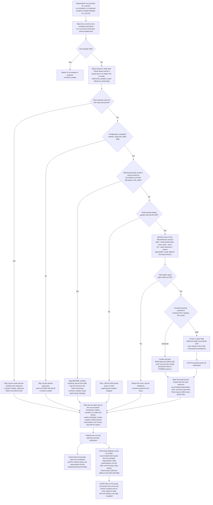

# STORY-001-08-03: Post Automated Depreciation Entries

---

## Metadata

| Attribute | Value |
|-----------|-------|
| **Story ID** | `STORY-001-08-03` |
| **Title** | Post Automated Depreciation Entries |
| **Parent Feature** | [FEATURE-001-08: Fixed Assets & Depreciation](../FEATURE-001-08-fixed-assets-depreciation.md) |
| **Parent Epic** | [EPIC-001: Enterprise Accounting in Odoo](../../EPIC-001-enterprise-accounting-odoo.md) |
| **Feature Capability** | CAP-003 — generate and post balanced depreciation journal entries on schedule, without duplication, per [FEATURE-001-08 §1.3](../FEATURE-001-08-fixed-assets-depreciation.md#13-key-capabilities) |
| **Epic Success Metrics** | **SM-008** — 100% of the depreciation entries the board projects as due for the period are posted by the scheduled run, and the count of due board periods with no posted entry is `0`; this story **is** the run that metric measures. **SM-009** — the **Fixed Asset Register** ties to Fixed Assets 1500 less Accumulated Depreciation 1590 at a `0.00` difference, and the credit balance this story builds on Accumulated Depreciation 1590 is the ledger side of that tie-out. **SM-003**, **SM-004** and **SM-016** — depreciation posted for every active asset is a prerequisite of the close running in 5 business days per entity, of the statements being available from the lock-date application, and of the 50% reduction in post-close audit adjustments |
| **Status** | Draft |
| **Priority** | 🟠 High |
| **Estimate** | `8` (Fibonacci story points) |
| **Persona** | Chief Accountant |
| **Secondary Personas** | Fixed-Asset Accountant (reviews the board and clears the run exceptions before the period is closed), Financial Reporting Manager (reads the posted Depreciation Expense 6500 movement in the Profit & Loss and the net book value on the Balance Sheet), External Auditor (reads the balanced-entry evidence, the run log and the lock-date refusals without a data request), Tax Accountant (reads the posted book charge per period as the starting point of the book-to-tax reconciliation) |
| **Platform Target** | Open decision **DEC-001** — see [Version Compatibility](#version-compatibility) |
| **Last Updated** | 2026-08-13 |
| **Owner/Author** | Enterprise Accounting Team |

This is **story 3 of the 4** in FEATURE-001-08 and the only one in the folder that reaches the general ledger on a recurring basis. It takes the **Depreciation Schedule (Depreciation Board)** that [STORY-001-08-02](./STORY-001-08-02-configure-depreciation-methods.md) projected against the asset [STORY-001-08-01](./STORY-001-08-01-register-fixed-assets.md) confirmed, selects the board periods due on or before the run date in each company, and commits each one to the books as a single balanced journal entry — **debit Depreciation Expense 6500**, **credit Accumulated Depreciation 1590** — once and only once. [STORY-001-08-04](./STORY-001-08-04-dispose-assets.md) then measures its gain or loss against the net book value this story's postings produced, and [FEATURE-001-07](../FEATURE-001-07-financial-reporting-period-close.md) presents the same postings as the depreciation charge in the Profit & Loss and as the contra balance behind net book value on the Balance Sheet.

> **This story posts; it computes no schedule.** Every amount it posts is read from a board period already projected and priced by [STORY-001-08-02](./STORY-001-08-02-configure-depreciation-methods.md) — including the residual-bearing final period, which this story posts at `$277.70 USD` and not at `$277.78 USD`. No criterion below recomputes a charge, changes a method, alters a useful life or re-projects a board. Where a board period and a posted entry could disagree, the board is the source and the entry is the copy, and the count of posted entries whose amount differs from the board period they were posted from is `0`.

> **The idempotency contract, stated once in one sentence.** **Re-running the depreciation run for a period already posted creates no second entry.** Everything else in this file — the skip reason in the run log, the unchanged Accumulated Depreciation 1590 balance, the unchanged asset accumulated total, the run lock that stops two concurrent executions from double-posting — is that one sentence made observable. It is asserted directly in [Scenario 3](#scenario-3-a-re-run-of-a-posted-period-creates-no-second-entry-and-the-accumulated-depreciation-1590-balance-is-unchanged) and it is the reason the parent Feature records idempotency as a named acceptance criterion at [§4.1](../FEATURE-001-08-fixed-assets-depreciation.md#41-feature-level-acceptance-criteria) rather than as an implementation nicety.

> **Persona note — the WHO changes here, and the change is deliberate.** [STORY-001-08-01](./STORY-001-08-01-register-fixed-assets.md), [STORY-001-08-02](./STORY-001-08-02-configure-depreciation-methods.md) and [STORY-001-08-04](./STORY-001-08-04-dispose-assets.md) are the **Fixed-Asset Accountant**'s stories, because each maintains the sub-ledger. This one is the **Chief Accountant**'s, because authorising and reviewing a period-end posting into the general ledger, confirming that each entry balances, and administering the period the entry lands in are that role's responsibilities under the parent Feature's persona mapping at [§2.1](../FEATURE-001-08-fixed-assets-depreciation.md#21-persona-mapping) and its story mapping at [§2.2](../FEATURE-001-08-fixed-assets-depreciation.md#22-persona-to-story-mapping). The Fixed-Asset Accountant is named inside the criteria as the role that clears the run's exceptions; the Financial Reporting Manager, the External Auditor and the Tax Accountant as the roles that read the posted result. No criterion is written against an unnamed actor, and the generic role "Accountant" carried by the retired flat-layout ticket this story supersedes is replaced by the named ledger owner.

> **Platform target.** This story states no platform version of its own. The target is the Epic's open decision **DEC-001** in the [Open Decisions Register](../../EPIC-001-enterprise-accounting-odoo.md#appendix-b-open-decisions-register): the originating programme request names Odoo 17, the superseded flat backlog named 18.0, and the baseline every field name, state value, journal type, lock-date field and scheduled-action behaviour below was read against is **Odoo 19.0 Community**, where `odoo/release.py` declares `version_info = (19, 0, 0, FINAL, 0, '')`. Lock-date administration, the `account.move` posting path and the scheduled-action definition differ across the three candidates, so the mismatch is surfaced for stakeholder confirmation rather than settled here (AAP §0.8.3).

> **Monetary and date conventions used throughout this ticket.** Every amount is stated in the currency of the company whose books it affects, carried to 2 decimal places, and rounded **half-up at that currency's rounding increment of `0.01`** — the USD increment for **Global Holdings Inc. (`US-01`)** and the GBP increment for **Global UK Ltd (`GB-01`)**. Every posted pair states **both** its debit total and its credit total and asserts their equality at a difference of `0.00` in that currency; no criterion says an entry balances without naming the two figures. **Where a depreciable base does not divide evenly across the periods, the residual is absorbed whole in the final period and never spread**, which is the rule [STORY-001-08-02](./STORY-001-08-02-configure-depreciation-methods.md) projects and this story posts unaltered. Dates are written `YYYY-MM-DD` in fixtures and in long form in prose. Three dates are distinct and never conflated: the **board period date** the entry is dated on, the **run date** the run executes on, and the **as-of date** a report is parameterized with.

---

## User Story

**As the** Chief Accountant

**I want** the depreciation run to post one balanced journal entry per due board period in the **Miscellaneous** journal of **Global Holdings Inc. (`US-01`)** — debiting **Depreciation Expense 6500** and crediting **Accumulated Depreciation 1590** for the amount that period's row on the **Depreciation Schedule (Depreciation Board)** already carries — for every asset in state `open`, once and only once per period, with a per-batch run log naming every asset it posted and every asset it skipped and why

**So that** the depreciation charge reaches the Profit & Loss in the period the asset was consumed rather than whenever somebody remembers to key it, the credit balance on **Accumulated Depreciation 1590** equals the accumulated column of the boards behind it so the **Fixed Asset Register** ties to Fixed Assets 1500 less Accumulated Depreciation 1590 at a difference of `0.00 USD` (SM-009), the count of due board periods left unposted at the close is `0` (SM-008), a repeated run can never double-charge a period and a run into a closed period can never restate books already reported, and [STORY-001-08-04](./STORY-001-08-04-dispose-assets.md) and [FEATURE-001-07](../FEATURE-001-07-financial-reporting-period-close.md) both read a net book value that the ledger itself computed.

---

## Acceptance Criteria

### The Run Fixture

Every criterion below is written against the fixture in this table. Its core is the parent Feature's worked asset — `$60,000.00 USD` over 60 monthly periods against **Fixed Assets 1500**, **Accumulated Depreciation 1590** and **Depreciation Expense 6500** — inherited unaltered from [STORY-001-08-01](./STORY-001-08-01-register-fixed-assets.md) and [STORY-001-08-02](./STORY-001-08-02-configure-depreciation-methods.md), so registration, projection, posting and disposal are all proved against one record. Every figure is stated to 2 decimal places and rounded half-up at its currency's rounding increment of `0.01`.

| Element | Value |
|---------|-------|
| Company (`res.company`) | **Global Holdings Inc. (`US-01`)** — the United States parent, functional currency USD, per the Epic's [canonical legal-entity register](../../EPIC-001-enterprise-accounting-odoo.md#e4-canonical-legal-entity-register). The run is company-scoped and posts to this company's books only |
| Worked asset | `CNC Milling Centre — Line 3`, reference **`FA/00001`**, state `open` (presented as **Running**), acquisition cost `$60,000.00 USD`, salvage value `$0.00 USD`, 60 monthly periods, depreciation start date `2025-04-01` under the **First Day of Next Month** option |
| Its board | 60 periods each carrying **`$1,000.00 USD`**: period 1 dated `2025-04-30`, period 12 dated `2026-03-31`, period 60 dated `2030-03-31`, confirmed by [STORY-001-08-02](./STORY-001-08-02-configure-depreciation-methods.md) and summing to exactly `$60,000.00 USD` |
| Residual-bearing asset | `Packaging Line Conveyor — Line 1`, reference **`FA/00007`**, state `open` in the same company, acquisition cost **`$10,000.00 USD`**, salvage value `$0.00 USD`, **36** monthly periods, depreciation start date `2025-01-01`, so period 1 is dated `2025-01-31` and **period 36 is dated `2027-12-31`**. Its board carries `$277.78 USD` in periods 1 to 35 and **`$277.70 USD`** in period 36 |
| Units-of-production asset | The same `$60,000.00 USD` cost measured over a 100,000-unit estimate at a per-unit rate of `$0.60 USD`; a period recording 1,500 units carries a board charge of **`$900.00 USD`** and a period recording `0` units carries **`$0.00 USD`** |
| Batch portfolio | **10,000** assets in state `open` in **Global Holdings Inc. (`US-01`)** with a board period due for the run period — the upper bound the run budget of [FEATURE-001-08 §4.4](../FEATURE-001-08-fixed-assets-depreciation.md#44-performance-requirements) is set against |
| Named three-asset batch | `FA/00001` due `$1,000.00 USD`, `FA/00007` due `$277.78 USD` and the units-of-production asset due `$900.00 USD`, so the run log's posted total for that batch reads exactly **`$2,177.78 USD`** at the USD rounding increment of `0.01` |
| Depreciation expense account | **Depreciation Expense 6500**, `account_type` `expense_depreciation`, account group `6 Expenses` (6000–6999) — the **debit** side of every entry below |
| Accumulated depreciation account | **Accumulated Depreciation 1590**, held as a contra balance in the `15 Non-current Assets` group — the **credit** side of every entry below |
| Fixed asset account | **Fixed Assets 1500**, `account_type` `asset_fixed` — **untouched by a depreciation entry.** Gross cost does not move when depreciation posts; only the contra balance grows, and net book value falls as the difference between the two |
| Journal (`account.journal`) | **Miscellaneous** — journal type `general`, the journal of every depreciation entry in this feature. The **Purchase** journal of the capitalization belongs to [STORY-001-08-01](./STORY-001-08-01-register-fixed-assets.md) |
| Entry document type | `entry` — a plain journal entry, not an invoice, bill, credit note or payment document type |
| Posting preference | Resolved in the order **company → asset category → individual asset**, each level able to override the one above it, with the two values `draft` and `auto-post` |
| Lock date | The Global Lock Date (`fiscalyear_lock_date`) of the company, administered by [STORY-001-01-05](../FEATURE-001-01/STORY-001-01-05-configure-period-lock-dates.md); the locked-period fixture sets it to **`2025-04-30`** against a board period dated `2025-04-30` |
| Incomplete-configuration variants | An asset with no depreciation method recorded; an asset with no useful life recorded; an asset whose **Depreciation Expense 6500** reference is absent; an asset whose **Accumulated Depreciation 1590** reference is absent |
| Reports | **Fixed Asset Register** for one company at a stated as-of date; **Depreciation Schedule (Depreciation Board)** for one asset; **Balance Sheet** and **Profit & Loss**, both owned by [FEATURE-001-07](../FEATURE-001-07-financial-reporting-period-close.md) and read here rather than defined here |
| Run log | One record per execution carrying the run timestamp, the initiating **Chief Accountant** or the scheduled process, the company, the run date and the period, the count of assets evaluated, the count of entries created, the count of entries posted, the total amount posted per company, and one row per skipped asset with its reason |

### The Entry This Story Posts

Exactly one shape is posted, and it is the same shape in every scenario below. It is written out here so that no criterion has to restate it and so that a reviewer sees the whole double entry on one screen:

```text
account.move  in the Miscellaneous journal (type general) of
              Global Holdings Inc. (US-01)
    date      = the board period date (2025-04-30 for period 1 of FA/00001)
    ref       = the asset reference and the period identifier
                (for example "FA/00001 - 2025-04 depreciation")
    move_type = entry

    Line 1   debit  6500  Depreciation Expense        $1,000.00 USD
             credit                                       $0.00 USD
             label  "Depreciation: CNC Milling Centre — Line 3 - 2025-04"

    Line 2   debit                                        $0.00 USD
             credit 1590  Accumulated Depreciation    $1,000.00 USD
             label  "Depreciation: CNC Milling Centre — Line 3 - 2025-04"
    ------------------------------------------------------------------
    Total debits   $1,000.00 USD
    Total credits  $1,000.00 USD
    Difference         $0.00 USD

Two lines, never three. No tax line arises: depreciation is an internal
allocation of a cost already recorded, not a transaction with a
counterparty. Fixed Assets 1500 is not a line of this entry and its
balance does not move.

Each amount is rounded half-up to 2 decimal places at the USD rounding
increment of 0.01. For period 36 of FA/00007 the identical pair carries
$277.70 USD on both sides.
```

### Coverage Distribution

**Seven** criteria, inside the mandated band of 4 to 8. Each carries one non-compound **When** — and because the run is a scheduled process, that **When** is always stated as *the depreciation run executes for the period*, never as a description of the scheduling mechanism's internals; the scheduled-action parameters are recorded as guidance in [Technical Discovery Notes](#scheduled-action-guidance) and are deliberately absent from the criteria. Each **Then** asserts only what the Chief Accountant, the Fixed-Asset Accountant, the Financial Reporting Manager or the External Auditor observes in the Odoo user interface or reads back over the public API — no database statement, no method name and no widget language. Every monetary assertion states its currency, its amount and its rounding rule, every journal-entry assertion states both totals and their difference, and every criterion names the company whose books are affected.

| Scenario | Coverage class | What it proves |
|----------|----------------|----------------|
| 1 | Valid input — happy path, the balanced period entry | One entry in the **Miscellaneous** journal of `US-01`, dated on the board period date, of type `entry`, with exactly two lines — debit **Depreciation Expense 6500** `$1,000.00 USD` and credit **Accumulated Depreciation 1590** `$1,000.00 USD` — total debits equal to total credits at a difference of `0.00 USD`, accumulated depreciation at `$1,000.00 USD` and net book value at `$59,000.00 USD` |
| 2 | Valid input — happy path, the batch run with fault isolation | 10,000 assets each receiving their own entry in a deterministic order, the run inside its 10-minute budget with each single posting inside 5 seconds, a run log carrying the counts and the `$2,177.78 USD` posted total of the named three-asset batch, and one asset's failure leaving the remaining assets posted |
| 3 | Accounting edge case — idempotency | A second run over a posted period creates **no second entry**: the entry count for the asset and the period is unchanged, accumulated depreciation stays `$1,000.00 USD`, the **Accumulated Depreciation 1590** balance is unchanged, and the log records the skip and the existing entry |
| 4 | Valid input — the draft-versus-auto-post preference | Under `draft` the entry exists in state `draft`, stands in the Chief Accountant's pending list and moves **`$0.00 USD`** on **Depreciation Expense 6500** and on **Accumulated Depreciation 1590**; under `auto-post` the entry is posted and both accounts move by `$1,000.00 USD` immediately; the preference resolves company → asset category → individual asset |
| 5 | Accounting edge case — the prorated first period | The charge computed as annual charge × days in period ÷ days in year (net book value × rate × days in period ÷ days in year for declining balance), posted as a balanced pair with both totals stated, flagged as prorated in the entry description, with full periods at the standard charge and the life still totalling cost less salvage exactly |
| 6 | Error handling **and** invalid or incomplete input | **No entry created** for an asset whose board period date falls inside the locked period, the lock date named in the log and the asset raised for review — the error-handling case; and an asset missing its method, its useful life or one of the two accounts skipped with the absent parameter named — the invalid-or-incomplete-input case, with the rest of the run posting throughout |
| 7 | Accounting edge case — the final residual, the fully depreciated asset and the register | Period 36 posting **`$277.70 USD`** on both sides to absorb the `-$0.08 USD` residual so accumulated depreciation reads exactly `$10,000.00 USD` and net book value equals the `$0.00 USD` salvage value; a further run creating **no** entry; and the **Fixed Asset Register** at `2027-12-31` presenting that asset at `$10,000.00 USD` / `$10,000.00 USD` / `$0.00 USD` and tying to the **Accumulated Depreciation 1590** ledger balance |

**All four mandated coverage classes are present and each is locatable.** **Valid input** — Scenarios 1, 2 and 4. **Invalid or incomplete input** — the four incomplete-configuration branches of Scenario 6, where an asset missing its depreciation method, its useful life, its **Depreciation Expense 6500** reference or its **Accumulated Depreciation 1590** reference is skipped with the absent parameter named. **Error handling** — the locked-period branch of Scenario 6, where the run declines to create an entry and logs the lock date that blocked it. **Accounting edge case** — Scenarios 3, 5 and 7: the idempotent re-run, the day-weighted prorated period, and the final-period rounding residual with the fully depreciated asset. The `$0.00 USD` charge, the salvage-value cap and the mid-period disposal are carried in [Edge Cases](#edge-cases) with their own tests rather than as an eighth criterion, because the mandated band closes at 8 and these three assert a skip or an ordering rather than a new posting behaviour.

### Scenario 1: A due board period posts as one two-line entry whose total debits equal its total credits

- **Given** the asset `CNC Milling Centre — Line 3`, reference `FA/00001`, stands in state `open` in **Global Holdings Inc. (`US-01`)** carrying an acquisition cost of `$60,000.00 USD` and a salvage value of `$0.00 USD`, each to 2 decimal places at the USD rounding increment of `0.01`, as [STORY-001-08-01](./STORY-001-08-01-register-fixed-assets.md) confirmed and capitalized it; its **Depreciation Schedule (Depreciation Board)** stands confirmed by [STORY-001-08-02](./STORY-001-08-02-configure-depreciation-methods.md) with **period 1 dated `2025-04-30` carrying a charge of `$1,000.00 USD`**; that asset carries **Depreciation Expense 6500** and **Accumulated Depreciation 1590** as its charge and contra accounts and the company holds a journal of type `general` labelled **Miscellaneous**; the fiscal period containing `2025-04-30` is open in that company, with the Global Lock Date (`fiscalyear_lock_date`) empty as [STORY-001-01-05](../FEATURE-001-01/STORY-001-01-05-configure-period-lock-dates.md) administers it; the asset's posting preference resolves to `auto-post`; and **no depreciation entry yet exists for `FA/00001` and period 1**
- **When** the depreciation run executes for the period ending `2025-04-30` in **Global Holdings Inc. (`US-01`)**
- **Then** exactly **one** journal entry is created for that asset and that period, in the **Miscellaneous** journal of that company, dated `2025-04-30` — the board period date, not the run date — of document type `entry`, carrying a reference that names both the asset reference `FA/00001` and the period identifier `2025-04` so the **External Auditor** identifies the asset and the period without opening the lines
  - **And** the entry holds **exactly two** lines: a **debit to Depreciation Expense 6500 of `$1,000.00 USD`** with a credit of `$0.00 USD`, and a **credit to Accumulated Depreciation 1590 of `$1,000.00 USD`** with a debit of `$0.00 USD`, each line labelled with the asset name and the period, each amount rounded half-up to 2 decimal places at the USD rounding increment of `0.01`
  - **And** **total debits of `$1,000.00 USD` equal total credits of `$1,000.00 USD`** at a difference of **`0.00 USD`**, and the count of lines on the entry is `2` — the charge is never split across three lines and never carries a tax line, because depreciation is an allocation of a cost already recorded rather than a transaction with a counterparty
  - **And** the amount posted equals the amount the board period carries at a difference of **`0.00 USD`**: the run reads `$1,000.00 USD` from the row and posts `$1,000.00 USD`, and the count of entries whose amount differs from their board period is `0`
  - **And** the entry stands in state `posted`, so the **Depreciation Expense 6500** debit balance of `US-01` rises by `$1,000.00 USD` and the **Accumulated Depreciation 1590** credit balance rises by `$1,000.00 USD`, each at the USD rounding increment of `0.01`
  - **And** the **Fixed Assets 1500** balance of that company is **unchanged** by the posting, moving `$0.00 USD`: gross cost stays at `$60,000.00 USD` and it is the contra balance that grows, which is what makes net book value the difference between the two rather than a maintained figure
  - **And** the asset's accumulated depreciation reads **`$1,000.00 USD`** and its net book value reads **`$59,000.00 USD`** — `$60,000.00 USD` less `$1,000.00 USD` at a difference of `0.00 USD` — and period 1 of its board moves from **Pending** to **Posted** and carries this entry's reference in its **Journal Entry** column
  - **And** the posting is recorded on the asset's chatter with its timestamp and the identity of the **Chief Accountant** or the scheduled process that ran it, so the audit trail exists without a data request

### Scenario 2: A period-end batch posts one entry per due asset, isolates a single failure, and logs what it did

- **Given** **10,000** assets stand in state `open` in **Global Holdings Inc. (`US-01`)**, each with a confirmed board carrying one period due on or before the run date, and among them the named three-asset batch `FA/00001` due `$1,000.00 USD`, `FA/00007` due `$277.78 USD` and the units-of-production asset due `$900.00 USD`, each amount to 2 decimal places at the USD rounding increment of `0.01`; the fiscal period is open in that company; and one asset in the portfolio carries a fault that will make its own posting fail
- **When** the depreciation run executes for that period in **Global Holdings Inc. (`US-01`)**
- **Then** each qualifying asset receives **its own** journal entry rather than one consolidated entry across assets, so the count of entries created equals the count of due board periods the run selected, and **every** entry states total debits equal to total credits at a difference of **`0.00 USD`** in the company currency
  - **And** the run posts to the books of **Global Holdings Inc. (`US-01`)** only: the count of entries this run creates in **Global Europe SARL (`NL-01`)**, **Global UK Ltd (`GB-01`)** or **Global Asia Pte Ltd (`SG-01`)** is **`0`**, and an asset held against another company is neither selected nor posted (C-014, D-007)
  - **And** the run processes the selected assets in a **deterministic order** — by company, then by asset reference, then by board period date — so two executions over the same due set select and post in the same sequence and a partial run is resumable at a known point
  - **And** the run **completes within 10 minutes** for the 10,000-asset portfolio, and any single asset's posting operation **completes within 5 seconds** within that same portfolio, each budget as [FEATURE-001-08 §4.4](../FEATURE-001-08-fixed-assets-depreciation.md#44-performance-requirements) states it, with the per-batch log written as the run proceeds rather than only at the end
  - **And** the run log records, for this execution: the run timestamp, the initiating **Chief Accountant** or the scheduled process, the company, the run date and the period, the count of assets evaluated, the count of entries created, the count of entries posted, and the **total amount posted for that company** — which for the named three-asset batch reads exactly **`$2,177.78 USD`**, the sum of `$1,000.00 USD`, `$277.78 USD` and `$900.00 USD` at the USD rounding increment of `0.01` — together with **one row per skipped asset carrying its reason**
  - **And** the log's total amount posted equals the sum of the debits the run placed on **Depreciation Expense 6500** for that company and period at a difference of **`0.00 USD`**, and it equals the sum of the credits placed on **Accumulated Depreciation 1590** at a difference of **`0.00 USD`**, so the log is reconcilable to the ledger rather than merely descriptive
  - **And** **the failure of one asset does not halt the run**: the faulted asset produces `0` entries and one log row naming it and its reason, while the remaining **9,999** assets are posted, so the count of assets left unprocessed because another asset failed is **`0`**
  - **And** the failed asset is reprocessable on its own once its cause is cleared, and reprocessing it creates exactly one entry for its due period and leaves every entry already posted by the earlier execution untouched
  - **And** where a notification recipient is configured, one summary message is sent after the execution carrying the counts, the total amount posted per company and the list of skipped assets needing attention; where none is configured the run completes and the log alone carries the same content, so the notification is a convenience and never a condition of posting

### Scenario 3: A re-run of a posted period creates no second entry and the Accumulated Depreciation 1590 balance is unchanged

- **Given** period 1 of `FA/00001`, dated `2025-04-30`, already stands **Posted** in **Global Holdings Inc. (`US-01`)** with one entry in the **Miscellaneous** journal debiting **Depreciation Expense 6500** `$1,000.00 USD` against a credit of `$1,000.00 USD` to **Accumulated Depreciation 1590**, total debits equal to total credits at a difference of `0.00 USD`, as Scenario 1 posted it; the asset's accumulated depreciation reads `$1,000.00 USD` and its net book value reads `$59,000.00 USD`; and the fiscal period remains open, so nothing outside the run prevents a second posting
- **When** the depreciation run executes **again** for that same period ending `2025-04-30` in the same company
- **Then** **no second entry is created**: the count of journal entries for `FA/00001` and period 1 is **`1`** after the second execution, exactly as it was before it, and the count of duplicate entries created across the whole execution is **`0`**
  - **And** the asset's accumulated depreciation still reads **`$1,000.00 USD`** and its net book value still reads **`$59,000.00 USD`** — each to 2 decimal places, rounded half-up at the USD rounding increment of `0.01` — at a difference of `0.00 USD` from the values the first execution left
  - **And** the **Accumulated Depreciation 1590** credit balance and the **Depreciation Expense 6500** debit balance of that company are **unchanged** by the second execution, each moving **`$0.00 USD`**, so a repeated run cannot double-charge a period that has already been reported
  - **And** the run log of the second execution records `FA/00001` as **skipped**, with the reason that an entry already exists for that asset and that period, and it names the existing entry's reference so the **Chief Accountant** reaches the original posting from the log rather than searching for it
  - **And** the skip is a **log entry and not a failure**: the second execution reports completion, and the other assets it evaluates are posted or skipped on their own merits
  - **And** the same guarantee holds under concurrency: when two executions for the same company and period overlap, the run lock admits one of them, the other reports that a run for that company and period is already in progress, and the count of assets carrying two entries for one period afterwards is **`0`**
  - **And** the guarantee is a property of the period and not of the run: posting the **next** due period of the same asset — period 2 dated `2025-05-31` at `$1,000.00 USD` — is admitted on the next execution, raising accumulated depreciation to `$2,000.00 USD` and net book value to `$58,000.00 USD`, so idempotency blocks repetition without blocking progress

### Scenario 4: The posting preference decides whether the entry is created in draft or posted, and it resolves company then category then asset

- **Given** **Global Holdings Inc. (`US-01`)** carries a company-level depreciation posting preference; its asset category `Machinery — 60 Months Straight Line` may carry a preference that overrides the company's; an individual asset may carry a preference that overrides both, so the resolution order is **company → asset category → individual asset**; and `FA/00001` has period 1 dated `2025-04-30` due at a charge of `$1,000.00 USD`, to 2 decimal places at the USD rounding increment of `0.01`, with no entry yet created for that period
- **When** the depreciation run executes for that period and generates that asset's entry
- **Then** under the **`draft`** preference the entry is created in state **`draft`** in the **Miscellaneous** journal of that company, dated `2025-04-30`, of type `entry`, already carrying its two lines — debit **Depreciation Expense 6500** `$1,000.00 USD` and credit **Accumulated Depreciation 1590** `$1,000.00 USD`, **total debits of `$1,000.00 USD` equal to total credits of `$1,000.00 USD`** at a difference of **`0.00 USD`** — and it stands in the **Chief Accountant**'s list of pending depreciation entries for that period and company
  - **And** while it stands in `draft`, the movement it contributes to **Depreciation Expense 6500** is **`$0.00 USD`** and to **Accumulated Depreciation 1590** is **`$0.00 USD`**, so an unposted entry changes no balance, appears in no statement and does not alter net book value, which stays at `$60,000.00 USD` until the entry is posted
  - **And** when the **Chief Accountant** posts that draft entry, its two balances move by `$1,000.00 USD` each, the asset's accumulated depreciation reads `$1,000.00 USD`, its net book value reads `$59,000.00 USD`, and the board period moves from **Pending** to **Posted** with the entry reference recorded against it
  - **And** under the **`auto-post`** preference the same run creates the entry **and posts it in the same execution**, so the **Depreciation Expense 6500** debit balance and the **Accumulated Depreciation 1590** credit balance of that company each move by **`$1,000.00 USD`** immediately, at the USD rounding increment of `0.01`, with no intervening manual step
  - **And** the resolution order is observable rather than implied: with the company set to `auto-post`, the category set to `draft` and the asset carrying no preference of its own, the entry is created in `draft`; with the asset then set to `auto-post`, the entry for the next due period is created and posted; and the count of assets whose resolved preference disagrees with this order is **`0`**
  - **And** the choice affects the state of the entry and nothing else about it: under either preference the journal is **Miscellaneous**, the date is the board period date, the document type is `entry`, the two lines and their accounts are identical, and total debits equal total credits at a difference of **`0.00 USD`**
  - **And** a draft depreciation entry left unposted at the close is reported as an exception on the run log and in the close checklist [STORY-001-07-05](../FEATURE-001-07/STORY-001-07-05-execute-period-close-deferrals.md) works from, because a period whose depreciation stands in `draft` has a charge missing from its Profit & Loss

### Scenario 5: A prorated first period posts the day-weighted charge as a balanced pair and the life still totals cost less salvage

- **Given** an asset stands in state `open` in **Global Holdings Inc. (`US-01`)** acquired part-way through a month under the **Acquisition Date** start-date option, so [STORY-001-08-02](./STORY-001-08-02-configure-depreciation-methods.md) has projected a **prorated first period covering 12 of that month's 31 days**; its board carries that prorated amount on period 1 and the standard charge on each full period that follows; and no entry yet exists for period 1
- **When** the depreciation run executes for that prorated first period
- **Then** the amount posted is the day-weighted charge the board carries, computed for the straight-line method as **annual charge × days in period ÷ days in year** and for the declining-balance method as **net book value × rate × days in period ÷ days in year** — the formula named outright, with the 12 chargeable days and the days in the year both stated on the board row — rounded half-up to 2 decimal places at the USD rounding increment of **`0.01`**
  - **And** the entry is one two-line pair in the **Miscellaneous** journal of that company, dated on the prorated period's board date, of type `entry`: a **debit to Depreciation Expense 6500** of the prorated amount and a **credit to Accumulated Depreciation 1590** of the same prorated amount, so **total debits equal total credits at a difference of `0.00 USD`**, both figures stated on the entry and asserted equal rather than described as balanced
  - **And** the entry's description records that the period is **prorated** and states the chargeable days it was weighted by, so the **External Auditor** distinguishes a short first period from a data-entry error without recomputing it
  - **And** the run posts the prorated amount the board carries and does **not** recompute it: the difference between the posted amount and the board period's amount is **`0.00 USD`**, and the count of prorated entries posted at the standard full-period charge is **`0`**
  - **And** each **subsequent full period** posts the standard charge — `$1,000.00 USD` on the worked `$60,000.00 USD` asset at the USD rounding increment of `0.01` — as its own balanced pair with total debits equal to total credits at a difference of `0.00 USD`, so proration affects the first period and the final period and no period between them
  - **And** across the whole useful life the sum of the amounts posted equals **acquisition cost less salvage value** at a difference of **`0.00 USD`** — `$60,000.00 USD` less `$0.00 USD` on the worked asset, spread over the **61** periods the prorated option produces rather than 60 — so proration redistributes the charge without changing the total the asset is depreciated by
  - **And** the accumulated depreciation on **Accumulated Depreciation 1590** after the prorated first period equals that period's posted amount at a difference of `0.00 USD`, and the asset's net book value equals its acquisition cost less that same amount at a difference of `0.00 USD`

### Scenario 6: A locked period and an incomplete configuration each stop one asset, name the cause, and leave the rest of the run posted

- **Given** the Global Lock Date (`fiscalyear_lock_date`) of **Global Holdings Inc. (`US-01`)** reads **`2025-04-30`** as [STORY-001-01-05](../FEATURE-001-01/STORY-001-01-05-configure-period-lock-dates.md) administers it, and `FA/00001` carries a due board period dated `2025-04-30` at `$1,000.00 USD`, which falls inside that closed period; four further assets stand in the same company each missing one required parameter — the first with **no depreciation method** recorded, the second with **no useful life** recorded, the third with **no Depreciation Expense 6500 reference**, the fourth with **no Accumulated Depreciation 1590 reference**; and the remaining assets of the company are complete and stand in an open period
- **When** the depreciation run executes for that period in **Global Holdings Inc. (`US-01`)**
- **Then** for `FA/00001` **no entry is created**: the count of journal entries created for that asset and that period is **`0`**, its board period stays **Pending** rather than turning Posted, the movement inside the closed period measures **`$0.00 USD`** on **Depreciation Expense 6500** and **`$0.00 USD`** on **Accumulated Depreciation 1590** — each to 2 decimal places at the USD rounding increment of `0.01` — and a period the company has already reported is therefore not restated by an automated charge
  - **And** the run log records that asset's reference `FA/00001`, the board period date `2025-04-30` it was due on, and **the Global Lock Date `2025-04-30` of Global Holdings Inc. (`US-01`) that blocked it**, and the asset is raised as an exception for the **Chief Accountant**'s review rather than left silently unposted
  - **And** the two remedies are named rather than implied: move the Global Lock Date forward once the period is genuinely open again, or obtain the time-boxed release recorded on `account.lock_exception` and administered by [STORY-001-01-05](../FEATURE-001-01/STORY-001-01-05-configure-period-lock-dates.md); re-dating the depreciation entry into a later period is **not** a remedy, because the charge belongs to the period the asset was consumed in
  - **And** each of the four incomplete assets is **skipped with the absent parameter named** — the depreciation method, the useful life, the **Depreciation Expense 6500** reference or the **Accumulated Depreciation 1590** reference — with the log row pointing the reader at [STORY-001-08-02](./STORY-001-08-02-configure-depreciation-methods.md) as the place the parameter is supplied; the count of entries created for those four assets is **`0`** and the count of partially posted entries, holding one line without its balancing counterpart, is **`0`**
  - **And** **the rest of the run posts throughout**: every complete asset in an open period receives its own balanced entry with total debits equal to total credits at a difference of **`0.00 USD`**, so the count of assets left unposted because another asset was blocked or incomplete is **`0`**
  - **And** each of the five blocked assets is **reprocessable** once its cause is cleared — the lock released or the absent parameter recorded — and the next execution posts its due period as one balanced pair dated on the original board period date rather than on the date of the later run, so the charge lands in the period it belongs to
  - **And** every message and log row names the asset, the period and the cause and discloses **no** stack trace, database statement or file-system path (C-020)

### Scenario 7: The final period absorbs the residual, a fully depreciated asset draws no further entry, and the Fixed Asset Register ties to Accumulated Depreciation 1590

- **Given** the asset `Packaging Line Conveyor — Line 1`, reference `FA/00007`, stands in state `open` in **Global Holdings Inc. (`US-01`)** with an acquisition cost of **`$10,000.00 USD`** and a salvage value of **`$0.00 USD`**, each to 2 decimal places at the USD rounding increment of `0.01`, over **36** monthly periods whose board [STORY-001-08-02](./STORY-001-08-02-configure-depreciation-methods.md) projected as `$277.78 USD` in periods 1 to 35 and **`$277.70 USD`** in period 36 dated `2027-12-31`; periods 1 to 35 stand **Posted**, so **`$9,722.30 USD`** of accumulated depreciation already stands on **Accumulated Depreciation 1590** against that asset; the fiscal period containing `2027-12-31` is open; and period 36 carries no entry
- **When** the depreciation run executes for the period ending `2027-12-31`
- **Then** the final entry posts **`$277.70 USD`** and not `$277.78 USD`: one two-line pair in the **Miscellaneous** journal of that company, dated `2027-12-31`, of type `entry`, **debiting Depreciation Expense 6500 `$277.70 USD`** against a **credit to Accumulated Depreciation 1590 of `$277.70 USD`**, so **total debits of `$277.70 USD` equal total credits of `$277.70 USD`** at a difference of **`0.00 USD`**, each amount rounded half-up to 2 decimal places at the USD rounding increment of `0.01`
  - **And** that final amount absorbs the **`-$0.08 USD`** rounding residual whole — `$10,000.00 USD` less the `$9,722.30 USD` posted by the 35 periods before it — so the residual lands in one period and is never spread across periods, and the count of non-final periods of this asset posted at an amount other than `$277.78 USD` is **`0`**
  - **And** after that posting the accumulated depreciation standing on **Accumulated Depreciation 1590** for the asset reads exactly **`$10,000.00 USD`**, equal to its acquisition cost of `$10,000.00 USD` less its salvage value of `$0.00 USD` at a difference of **`0.00 USD`**, and its net book value reads exactly **`$0.00 USD`**, equal to the salvage value to the cent
  - **And** **Fixed Assets 1500** still carries the asset's gross cost of `$10,000.00 USD` unchanged, having moved `$0.00 USD` across all 36 postings, so the asset is fully depreciated on the contra account rather than removed from the register — removal is derecognition and belongs to [STORY-001-08-04](./STORY-001-08-04-dispose-assets.md)
  - **And** once the asset is fully depreciated a **further run creates no additional entry**: the count of entries created for `FA/00007` by the next execution is **`0`**, the log records it as skipped because its board is exhausted, the accumulated total stays at `$10,000.00 USD` and the net book value stays at `$0.00 USD`; the asset may then move to state `close`, and while it stands in `close` it is not selected by any later run
  - **And** the **Fixed Asset Register** run for **Global Holdings Inc. (`US-01`)** with the as-of-date parameter **`2027-12-31`** presents that asset on **one** line reading the reference `FA/00007`, a gross value of **`$10,000.00 USD`**, accumulated depreciation of **`$10,000.00 USD`** and a net book value of **`$0.00 USD`**, each amount rounded half-up to 2 decimal places at the USD rounding increment of `0.01`
  - **And** that register line ties to the sub-ledger and to the ledger alike: its accumulated-depreciation figure equals the sum of the 36 depreciation entries posted against the asset at a difference of **`0.00 USD`**, it equals the accumulated column of period 36 of that asset's **Depreciation Schedule (Depreciation Board)** at a difference of **`0.00 USD`**, and the register's accumulated-depreciation total for the company equals the **Accumulated Depreciation 1590** credit balance of that company at the same as-of date at a difference of **`0.00 USD`** (SM-009). The register population totals for `US-01` at the as-of date `2025-12-31` are the parent Feature's figures at [§4.1](../FEATURE-001-08-fixed-assets-depreciation.md#41-feature-level-acceptance-criteria) and are not restated here

---

## INVEST Principles Compliance

| Principle | Compliance | Notes |
|-----------|------------|-------|
| **Independent** | ✅ | **Stated honestly: in delivery order this story sits third in the chain and is blocked by [STORY-001-08-02](./STORY-001-08-02-configure-depreciation-methods.md)**, because the run has no period to select and no amount to post until a board is projected, and transitively by [STORY-001-08-01](./STORY-001-08-01-register-fixed-assets.md), which creates the asset the board belongs to; the parent Feature records both at [§3.3](../FEATURE-001-08-fixed-assets-depreciation.md#33-story-dependency-ordering). It is nonetheless **independently developable and independently testable**: its whole input surface is a fixture asset carrying a pre-built schedule — a period date, an amount, a company, two account references and a due flag — which is seedable in a test company without either predecessor's code, and its whole output surface is a journal entry whose correctness is **verifiable from the entry alone**: two lines, two accounts, one date, one reference, and total debits equal to total credits at a difference of `0.00` in the company currency. No report, no statement and no consolidation stands between the run and the assertion. Its downstream siblings are not prerequisites either: [STORY-001-08-04](./STORY-001-08-04-dispose-assets.md) consumes the accumulated total this story builds, and [FEATURE-001-07](../FEATURE-001-07-financial-reporting-period-close.md) presents it |
| **Negotiable** | ✅ | The outcome is fixed and the mechanism is open. What is fixed: the two-line shape with **Depreciation Expense 6500** debited and **Accumulated Depreciation 1590** credited, the **Miscellaneous** journal and the `entry` document type, the board period date as the entry date, the amount read from the board rather than recomputed, the idempotency guarantee, the company scoping, the draft-versus-auto-post preference with its company → category → asset resolution, the day-weighted proration formula, the four skip branches, the run log's contents, and the register-to-ledger tie-out. What is left to implementation discovery: whether the periodic trigger is a scheduled action, a queued job or an operator-initiated wizard; whether idempotency is enforced by a database constraint, by a state flag on the board period or by a pre-selection filter; whether the batch is one transaction, one transaction per asset or a chunked compromise; whether the run lock is an advisory lock, a row lock or a lease record; and whether the log is a record set, an attachment or a chatter trail (D-004, D-005) |
| **Valuable** | ✅ | This is the story that turns a projection into an accounting fact. Without it, a board is a forecast: the Profit & Loss carries no depreciation charge, **Accumulated Depreciation 1590** stays empty, the Balance Sheet overstates net book value by the whole accumulated amount, and the **Fixed Asset Register** cannot tie to Fixed Assets 1500 less Accumulated Depreciation 1590 (SM-009) because the ledger side does not exist. With it, 100% of the due board periods are posted by the run rather than keyed by hand (SM-008), the 8 to 16 hours a month the parent Feature records as manual depreciation work stops being spent on data entry, the close can run in 5 business days per entity because the sub-ledger is posted before the checklist starts (SM-003, SM-004), and the **External Auditor** tests an automated control with a log and an idempotency guarantee instead of sampling manual entries (SM-016). The idempotency guarantee is the part with the sharpest value: a duplicated depreciation charge overstates expense and understates net book value in the same period, and it is the kind of defect that is found by an auditor rather than by an accountant |
| **Estimable** | ✅ | The delivered surface is countable and inspectable: **1** selection query over due board periods, **1** idempotency guard, **1** run lock, **1** two-line entry construction, **3** posting-preference resolution levels, **1** day-weighted proration pass-through, **4** skip branches (locked period, incomplete configuration, period already posted, board exhausted), **1** per-batch log with **9** recorded fields, **1** optional notification, **2** timing budgets, and **1** register-to-ledger tie-out assertion — all against models present in this repository under LGPL-3 (`account.move`, `account.move.line`, `account.journal`, `account.account`, `res.company`, `res.currency`) or present under AGPL-3 in `account_asset_management`, whose depreciation-line model and scheduled posting are readable before development starts. Effort, complexity and uncertainty are assessed in [Estimation](#estimation) |
| **Small** | ✅ | One sprint-sized outcome: the periodic charge reaching the ledger, once per period, per asset, per company. It computes no schedule, configures no method, registers no asset, derecognizes nothing, revalues nothing, and builds no statement — those are [STORY-001-08-02](./STORY-001-08-02-configure-depreciation-methods.md), [STORY-001-08-01](./STORY-001-08-01-register-fixed-assets.md), [STORY-001-08-04](./STORY-001-08-04-dispose-assets.md) and [FEATURE-001-07](../FEATURE-001-07-financial-reporting-period-close.md). It is sized at `8` rather than `5` because the idempotency guarantee, the batch fault isolation, the concurrency lock and four skip branches converge in one story and each has to be proved by a negative test; it is not larger than `8` because the posting itself is two lines and the amount is read rather than derived |
| **Testable** | ✅ | Every criterion resolves to an amount, a count, a date, an account code, a state value, a named skip reason or a timing budget. The standard entry is asserted as `$1,000.00 USD` against `$1,000.00 USD` at a difference of `0.00 USD`; the final residual entry as `$277.70 USD` against `$277.70 USD` absorbing `-$0.08 USD`; idempotency as an entry count of `1` before and `1` after a second execution with `$0.00 USD` of further movement on both accounts; fault isolation as `9,999` assets posted while `1` fails; the locked period as `0` entries created with the lock date `2025-04-30` named; the draft preference as `$0.00 USD` of movement on 6500 and 1590 while the entry stands unposted; the batch log as a posted total of `$2,177.78 USD`; the budgets as 10 minutes for 10,000 assets and 5 seconds for a single posting; and the register as `$10,000.00 USD` / `$10,000.00 USD` / `$0.00 USD` at the as-of date `2027-12-31` tying to the 1590 balance at `0.00 USD`. Each criterion maps to exactly one acceptance test in [Acceptance Test Mapping](#acceptance-test-mapping) (C-008, C-009) |

---

## Sub-Tasks

- [ ] **@functional-consultant** — Agree and record the **posting-preference policy** at each of the three resolution levels: the company default for **Global Holdings Inc. (`US-01`)** and for each other entity, the per-asset-category override where a class of assets is reviewed before it is charged, and the individual-asset override with the reason it was taken. State for each entity whether routine depreciation is `auto-post` or `draft`, and record the **Chief Accountant** as the approver, since the preference decides whether a period's charge reaches the Profit & Loss without a human step.
- [ ] **@functional-consultant** — Agree the **run calendar against the close timetable** with the **Chief Accountant** and the Financial Reporting Manager: on which day of the period the run executes, how far before the close checklist of [STORY-001-07-05](../FEATURE-001-07/STORY-001-07-05-execute-period-close-deferrals.md) it must have completed, who clears the exception list, and the rule that the Global Lock Date (`fiscalyear_lock_date`) is applied **after** depreciation is posted rather than before — because a lock applied first turns every due period into a blocked one.
- [ ] **@functional-consultant** — Specify the **exception handling the Chief Accountant and the Fixed-Asset Accountant see**: the four skip reasons (locked period, incomplete configuration, period already posted, board exhausted), the remedy for each, the owner of each remedy, and the re-run procedure that posts a cleared asset at its original board period date. Confirm that a draft depreciation entry left unposted at the close is an exception on the same list.
- [ ] **@developer** — Deliver the **run and its selection**: select the board periods due on or before the run date for the assets in state `open` of each company, in the deterministic order company then asset reference then board period date, scoped so an asset of another company is never selected, and read the period's amount from the board rather than recomputing it.
- [ ] **@developer** — Deliver the **idempotency guard** so that re-running a posted period creates no second entry, and the **run lock** so that two overlapping executions for one company and period cannot both post. Both are proved by negative tests: an entry count of `1` before and `1` after a second execution, and `0` assets carrying two entries for one period after two concurrent executions.
- [ ] **@developer** — Deliver the **two-line balanced entry**: an `account.move` in the company's **Miscellaneous** journal, dated on the board period date, of type `entry`, referencing the asset and the period, with one debit line on **Depreciation Expense 6500** and one credit line on **Accumulated Depreciation 1590** for the same amount, each rounded half-up to 2 decimal places at the company currency's rounding increment of `0.01`, and total debits equal to total credits at a difference of `0.00` before the entry is allowed to post. **Fixed Assets 1500** is not a line of this entry.
- [ ] **@developer** — Deliver the **posting-preference resolution** in the order company → asset category → individual asset, creating the entry in `draft` or creating and posting it, and deliver the pending-entries view the **Chief Accountant** posts a draft batch from.
- [ ] **@developer** — Deliver the **proration pass-through** so the prorated first period posts the day-weighted amount the board carries — annual charge × days in period ÷ days in year for straight line, net book value × rate × days in period ÷ days in year for declining balance — with the chargeable days recorded in the entry description and the posted amount equal to the board amount at a difference of `0.00` in the company currency.
- [ ] **@developer** — Deliver the **four skip branches** with their log rows: a board period date inside a period closed by the Global Lock Date (`fiscalyear_lock_date`), evaluated **before** the entry is created so no entry exists to be re-dated; an asset missing its method, its useful life, its **Depreciation Expense 6500** reference or its **Accumulated Depreciation 1590** reference; a period already posted; and a board already exhausted. Each branch creates `0` entries, names the cause, and leaves the remainder of the run posting.
- [ ] **@developer** — Deliver the **per-batch run log** carrying the run timestamp, the initiating user or scheduled process, the company, the run date and period, the counts of assets evaluated, entries created and entries posted, the total amount posted per company, and one row per skipped asset with its reason; write it as the run proceeds rather than at the end; mirror each asset's own posting onto its chatter; and deliver the optional summary notification without making posting conditional on it.
- [ ] **@qa** — Build the **acceptance suite covering all 7 scenarios**, one test per criterion (C-008), with every amount asserted to the cent at the company currency's rounding increment of `0.01`, every account asserted by code, and **total debits asserted equal to total credits at a difference of `0.00` on every entry the suite posts** (C-009).
- [ ] **@qa** — Build the **explicit double-run idempotency test**: post a period, execute the run again over the same company and period, and assert an entry count of `1` before and `1` after, `$0.00 USD` of further movement on **Depreciation Expense 6500** and on **Accumulated Depreciation 1590**, the skip reason recorded with the existing entry's reference, and the next due period still postable. Add the concurrency variant asserting `0` assets with two entries for one period after two overlapping executions.
- [ ] **@qa** — Build the **locked-period test**: with the Global Lock Date (`fiscalyear_lock_date`) of `US-01` at `2025-04-30` and a board period due on `2025-04-30`, assert `0` entries created, the board period still **Pending**, `$0.00 USD` of movement on both accounts inside the closed period, the lock date named in the log, and — the assertion that makes this test meaningful — that the entry was **not** created and silently re-dated into a later period, so the count of depreciation entries whose accounting date differs from their board period date is `0`.
- [ ] **@qa** — Run the **portfolio timing suite** on a seeded `US-01` portfolio of **10,000** assets: the whole run inside **10 minutes** with the log written as it proceeds, any single asset's posting inside **5 seconds**, the entry count reconciled to the count of due board periods, and the posted total reconciled to the sum of the debits on **Depreciation Expense 6500** at a difference of `0.00 USD` ([FEATURE-001-08 §4.4](../FEATURE-001-08-fixed-assets-depreciation.md#44-performance-requirements)). Add the fault-isolation case asserting `9,999` posted against `1` failed.
- [ ] **@finance-sme** — Confirm in writing that the posted depreciation **ties three ways** for a stated company and as-of date: the sum of the posted depreciation entries equals the **Accumulated Depreciation 1590** credit balance at a difference of `0.00` in the company currency, that balance equals the accumulated-depreciation total on the **Fixed Asset Register**, and the register's net book value total equals Fixed Assets 1500 less Accumulated Depreciation 1590 at a difference of `0.00` (SM-009).
- [ ] **@finance-sme** — Sign off the **final-period residual treatment**: that period 36 of the `$10,000.00 USD` asset posts `$277.70 USD` rather than `$277.78 USD`, that the `-$0.08 USD` residual is absorbed whole in that one period, and that the consequence — accumulated depreciation of exactly `$10,000.00 USD` and a closing net book value equal to the `$0.00 USD` salvage value — is the arithmetic SM-009 depends on. Confirm the treatment against **IAS 16** and **US GAAP ASC 360** and record the sign-off against this story.

---

## Edge Cases

- **The same period run twice, and two runs at the same moment.** A period-end run is the operation most likely to be repeated — an operator re-triggers it after a partial failure, a scheduled action fires while a manual run is still going, or a restart replays it. **Control:** the run is idempotent by period, so a second execution over a posted period creates **no second entry**: the entry count for the asset and the period stays at `1`, **Accumulated Depreciation 1590** and **Depreciation Expense 6500** each move `$0.00 USD`, and the log records the skip with the existing entry's reference. Concurrency is controlled separately by a run lock: of two overlapping executions for one company and period, one proceeds and the other reports a run already in progress, so the count of assets carrying two entries for one period is `0`. The guarantee is scoped to the period and not to the run, so the next due period still posts.
- **A board period date inside a period closed by the lock date, where the platform would re-date rather than refuse.** [STORY-001-01-05](../FEATURE-001-01/STORY-001-01-05-configure-period-lock-dates.md) records the behaviour of the platform baseline read in this repository: a draft entry whose accounting date falls inside a locked period is **not refused on posting** — `account.move._post` resolves the violated lock dates and moves the accounting date to the last day of the first open period before the state becomes posted. For an interactive entry that is a helpful default. For an automated depreciation charge it is a defect: an April charge would land in May, the board period date and the ledger date would disagree, and the accrual basis the parent Feature states at [§7.3](../FEATURE-001-08-fixed-assets-depreciation.md#73-external-standards-and-specifications) — that a charge is recognized in the period the asset was used — would be broken silently. **Control:** the run evaluates the lock date **before it creates anything**, so the asset is skipped with `0` entries created rather than posted into the wrong period; the board period stays **Pending**; the log names the lock date; and the count of depreciation entries whose accounting date differs from their board period date is `0`. Releasing the period is a lock-date decision owned by [STORY-001-01-05](../FEATURE-001-01/STORY-001-01-05-configure-period-lock-dates.md), not a posting decision.
- **An asset that reaches its salvage value part-way through the run, and one whose board is already exhausted.** Declining balance applies a rate to a shrinking base and never reaches zero by arithmetic, so an unconstrained charge in a late period would drive net book value below the salvage value and accumulated depreciation above cost less salvage. **Control:** the amount posted is the board amount, and the board caps each period at the **remaining depreciable amount** — net book value at the start of the period less the salvage value — so the last posted period brings accumulated depreciation to exactly cost less salvage and net book value to exactly the salvage value, each at a difference of `0.00` in the company currency. Once the board is exhausted the run creates `0` further entries for that asset, records it as skipped, and the asset may move to state `close`, after which no run selects it. The asset stays on the register at gross cost with a fully offsetting contra balance until [STORY-001-08-04](./STORY-001-08-04-dispose-assets.md) derecognizes it.
- **A units-of-production period in which no units were recorded, so the charge is `$0.00 USD`.** An idle production line records `0` units, and at a per-unit rate of `$0.60 USD` the board retains that period as a `$0.00 USD` row rather than dropping it. **Control:** the run posts **no journal entry for a `$0.00 USD` period** — a two-line entry of `$0.00 USD` against `$0.00 USD` would technically balance while adding an empty document to the ledger, an empty line to the audit trail and a meaningless row to the drill-down. The period is marked **Skipped** on the board with the reason that its charge is `$0.00 USD`, the log records it among the skipped assets, and the count of journal entries created with a total of `$0.00 USD` is `0`. Accumulated depreciation and net book value hold the values the previous posted period left, and because the charge stops only at cumulative-unit exhaustion an idle period defers the end of the board rather than shortening it.
- **An asset disposed of part-way through a period, so depreciation and derecognition compete for the same period.** [STORY-001-08-04](./STORY-001-08-04-dispose-assets.md) measures the gain or loss against net book value at the disposal date, and net book value is only right if the charge up to that date has been recognized. **Control:** the ordering is fixed rather than left to whichever process runs first — **catch-up depreciation to the disposal date is posted before the disposal entry**, as its own balanced pair debiting **Depreciation Expense 6500** and crediting **Accumulated Depreciation 1590** with total debits equal to total credits at a difference of `0.00` in the company currency, and only then does the disposal remove the gross cost and the accumulated balance. The periodic run does not select an asset already derecognized, so the count of depreciation entries dated after an asset's disposal date is `0`, and the count of disposals computed against a net book value missing its catch-up charge is `0`.

---

## Constraints

The constraint identifiers below are the Epic's own, restated in the terms of this story rather than renumbered, so one constraint set reads across the whole ticket tree. The full text is held in [EPIC-001 §7 Constraints](../../EPIC-001-enterprise-accounting-odoo.md#7-constraints) and in the parent Feature at [§5](../FEATURE-001-08-fixed-assets-depreciation.md#5-constraints-inherited-from-epic).

### License and Compliance

- [x] **C-001 — AGPL-3.0 compatibility**: any module delivering the depreciation run, its idempotency guard, its run lock, the two-line balanced entry, the posting-preference resolution, the four skip branches and the run log is distributed under an AGPL-3.0 compatible licence, matching the licence of the Community-edition accounting add-ons already present in this repository, including `account_asset_management` at AGPL-3.
- [x] **C-002 — Existing licence respected**: extension of `account` — the "Invoicing" application, version `1.4`, category `Accounting/Accounting`, licence **LGPL-3** — respects that licence, extension of the present `account_asset_management` add-on respects its **AGPL-3** licence, and an AGPL-3 extension of LGPL-3 code is licence-checked before it is written.
- [x] **C-003 — The edition source is an open decision (DEC-002), stated as a fact and not as a prohibition**: `account_asset`, the Enterprise fixed-asset application named in the Epic's [module scope](../../EPIC-001-enterprise-accounting-odoo.md#54-odoo-module-scope), is **absent from `addons/`** in this repository. That is a platform fact about what this checkout contains. **The blanket "no Enterprise dependencies" prohibition carried by the superseded story template is withdrawn and is not asserted by this story.** Which path supplies the depreciation engine and its scheduled posting — an Odoo Enterprise subscription, or the Odoo Community Association route with the `OCA/account-financial-tools` asset add-ons alongside the present `account_asset_management` add-on plus bespoke development for the residual — is the Epic's open **edition lock-in** decision **DEC-002**, owned by the CFO / Finance Director with the Group Controller and recorded in the [Open Decisions Register](../../EPIC-001-enterprise-accounting-odoo.md#appendix-b-open-decisions-register). It is flagged for stakeholder confirmation rather than resolved here (AAP §0.8.3).
- [x] **What DEC-002 does and does not gate in this story**: the entry this story posts is a plain `account.move` with two `account.move.line` rows in a journal of type `general`, and every model it needs — `account.move`, `account.move.line`, `account.journal`, `account.account`, `res.company`, `res.currency` — is present in this repository under LGPL-3. The posting path can therefore be built and tested against verified ground before the edition decision is confirmed. What the decision affects is **where the board and the scheduled trigger come from**, which is why every criterion above is written against the board period's amount, date and state rather than against one engine's schedule model.
- [x] **C-004 — OCA ecosystem compatibility**: whichever edition path DEC-002 confirms, the entries this run posts stay ordinary journal entries that any OCA add-on reads — including `account_asset_management` in `OCA/account-financial-tools`, published on the 13.0 through 19.0 series under AGPL-3 and explicitly not compatible with the standard `account_asset` application — so a posted period never has to be restated to move between paths.
- [x] **C-005 / C-006 — Odoo and OCA coding standards**: Python follows Odoo and OCA module guidelines including PEP 8, and static analysis passes with the repository's configured tooling, whose lint configuration is `ruff.toml` at the repository root. A defect in the posting path propagates to every asset and every period it charges and lands in reported books, so it is caught at review rather than at the register tie-out.
- [x] **C-012 — Build on the existing models**: the charge is expressed as one `account.move` with its two `account.move.line` rows in the company's existing **Miscellaneous** journal, and account resolution reads `account.account` on the asset's own company. No parallel posting structure, no shadow depreciation ledger and no second chart is introduced, so the **Accumulated Depreciation 1590** balance and the sum of the posted depreciation entries cannot disagree by construction.
- [x] **C-013 — Analytic layer, not a parallel one**: where the charge carries a cost-centre or project dimension, it is written as an analytic distribution on the **Depreciation Expense 6500** journal item through `account.analytic.account` and `account.analytic.plan`, read forward from the dimension [STORY-001-08-01](./STORY-001-08-01-register-fixed-assets.md) recorded on the asset. The analytic amounts on a posted entry sum to that entry's charge at a difference of `0.00` in the company currency, and [FEATURE-001-09](../FEATURE-001-09-budgeting-variance-analysis.md) reads the result as the actual side of capital-expenditure budget-versus-actual.
- [x] **C-014 — Access rights and company isolation**: the **Chief Accountant** who authorises and reviews the posting is distinguishable from the **Fixed-Asset Accountant** who maintains the asset and clears the exceptions, and the role that initiates a run is distinguishable from the role that posts a draft batch; the **Financial Reporting Manager**, the **Tax Accountant** and the **External Auditor** hold read access to the posted entries, the board and the run log without being able to post or alter one; and a run executed for **Global Holdings Inc. (`US-01`)** neither selects nor posts an asset of `NL-01`, `GB-01` or `SG-01`, proven by test (D-007).
- [x] **C-015 / C-019 / C-020 — Untrusted input at the run's parameter boundary**: the run date, the period selection and the company selection are run-time values that cross the trust boundary, so each is validated before use, data access is expressed through the Odoo ORM or parameterized SQL with no string-concatenated search domain, and a rejected value returns a named error disclosing no stack trace, database statement or file-system path. A refused run creates `0` journal entries and leaves the service answering the next request. The hostile-input suite **C-022** assigns to this feature sits on the board's filter and export paths in [STORY-001-08-02](./STORY-001-08-02-configure-depreciation-methods.md) and on the migration extract in [STORY-001-08-01](./STORY-001-08-01-register-fixed-assets.md); this story's own untrusted surface is the three run parameters above, and it is validated on the same terms.
- [x] **C-017 / C-018 — Rendered and exported text is neutralized and encoded**: asset names, asset references, entry references and skip reasons are sanitized and context-encoded before they are rendered into a run log, a notification message, a chatter entry or an exported exception list, templates render such values as escaped text rather than as raw markup, and any exported cell beginning `=`, `+`, `-`, `@`, a tab or a carriage return is escaped or prefixed so a spreadsheet application treats it as text.
- [x] **C-021 — No secrets in source**: the run integrates with no external endpoint. Where the optional summary notification is delivered through an outbound mail server, that server's credentials are held outside module source and outside version control under the Epic's secret-handling rule, and no credential, certificate or key appears in this story's modules, fixtures, logs or notifications.

### Accounting Standards Compliance

- [x] **Double entry, asserted on every posting**: every entry this story creates carries exactly two lines — a debit to **Depreciation Expense 6500** and a credit to **Accumulated Depreciation 1590** for the same amount — and it posts only when **total debits equal total credits at a difference of `0.00`** in the company currency, with both figures stated. That equality is asserted on the standard period entry (`$1,000.00 USD` against `$1,000.00 USD`), on the prorated first-period entry, and on the final residual entry (`$277.70 USD` against `$277.70 USD`).
- [x] **No tax arises on a depreciation entry, and the clause is stated rather than omitted**: depreciation is an internal allocation of a cost already recorded, not a transaction with a counterparty, so the entry carries **no tax code, no base amount and no tax amount**, and the count of tax lines on a depreciation entry is `0`. The recoverable input tax on the original capital purchase was separated on the capitalizing vendor bill by [STORY-001-02-03](../FEATURE-001-02/STORY-001-02-03-post-vendor-bill-entries.md) and directed to **Input Tax Receivable 1290** rather than capitalized, which is why the `$60,000.00 USD` this run allocates is the **net** capital cost. The book-to-tax divergence the **Tax Accountant** reconciles reads the posted book charge as its starting point and is a separate computation.
- [x] **IAS 16 — Property, Plant and Equipment**: the depreciable amount is cost less residual value, allocated on a **systematic basis** over the useful life. This story is the point at which that allocation is recognized period by period, which is why the amount posted is the board amount and why the sum of the postings across the life equals cost less salvage value at a difference of `0.00` in the company currency. Accumulated depreciation is accumulated on its own contra account rather than written off against the asset account, so the gross cost on **Fixed Assets 1500** remains readable for the whole life of the asset.
- [x] **US GAAP ASC 360 — Property, Plant and Equipment**: depreciation is a systematic and rational allocation of cost over the service life, and accumulated depreciation is presented as a **deduction** from the asset it relates to — which is why the credit accumulates on **Accumulated Depreciation 1590** inside the `15 Non-current Assets` group against **Fixed Assets 1500**, and why net book value is the difference between the two rather than a separately maintained figure.
- [x] **The accrual basis fixes the entry date**: the entry is dated on the **board period date** and not on the run date, so a charge is recognized in the period the asset was used and a period posted late is posted to the period it belongs to. This is why a locked period causes a skip rather than a re-dating, and why the count of depreciation entries whose accounting date differs from their board period date is `0`.
- [x] **ISO 4217 minor units**: every posted amount is rounded **half-up** to its currency's decimal precision — 2 decimal places at a rounding increment of `0.01` for USD, EUR and GBP — and the schedule's rounding residual is carried whole on the final period, so the accumulated total closes on the depreciable base to the cent in every currency.
- [x] **The residual is posted, not recomputed**: the final period's amount is the board's, so the run posts `$277.70 USD` where the board carries `$277.70 USD`. A run that re-derived the amount as a rounded quotient would post `$277.78 USD`, overstate accumulated depreciation by `$0.08 USD`, drive net book value `$0.08 USD` below the salvage value, and leave the **Fixed Asset Register** unable to tie to Fixed Assets 1500 less Accumulated Depreciation 1590 at `0.00 USD` — SM-009 failing on arithmetic rather than on process.
- [x] **Fiscal-calendar alignment and lock-date authority**: the board period dates the entries are dated on lie on the fiscal-period boundaries [STORY-001-01-03](../FEATURE-001-01/STORY-001-01-03-define-fiscal-year-periods.md) defines, so a charge does not straddle two reporting periods; and the boundary that closes a period is the lock date [STORY-001-01-05](../FEATURE-001-01/STORY-001-01-05-configure-period-lock-dates.md) administers, which this run reads and never sets.
- [x] **COSO internal control over financial reporting**: the depreciation run is an **automated control**, so its execution log, its skip reasons and its idempotency are retained as control evidence; the register-to-ledger tie-out is a period reconciliation control retained with the close evidence; and the role that maintains the asset is separate from the role that authorises the posting, which is the segregation the parent Feature records at [§4.2](../FEATURE-001-08-fixed-assets-depreciation.md#42-cross-cutting-concerns).
- [x] **Audit trail**: each execution, each posted entry and each skip is recorded with its author or scheduled process and its timestamp, and each asset's own posting is recorded on its chatter, so the **External Auditor** reads which periods were charged, which were skipped and why, without a data request.

### Version Compatibility

- [x] **C-010 — The platform version target is open decision DEC-001, and this story hardcodes none**: the "Odoo 18.0 compatibility required" line carried by the superseded story template is **not restated as settled**. Three targets are on record and they are mutually exclusive — the originating programme request names **Odoo 17**, the superseded flat backlog named **18.0**, and this repository is **Odoo 19.0 Community**, where `odoo/release.py` declares `version_info = (19, 0, 0, FINAL, 0, '')`. The single source of truth is the Epic's platform version and edition constraint recorded as **DEC-001** in the [Open Decisions Register](../../EPIC-001-enterprise-accounting-odoo.md#appendix-b-open-decisions-register) and restated by the parent Feature at [§5.5](../FEATURE-001-08-fixed-assets-depreciation.md#55-version-compatibility); the mismatch is **flagged for stakeholder confirmation** (AAP §0.8.3) rather than chosen inside this story.
- [x] **C-011 — Language and database versions follow the confirmed target**: the 19.0 baseline present here declares `MIN_PY_VERSION = (3, 10)`, `MAX_PY_VERSION = (3, 13)` and `MIN_PG_VERSION = 13` in `odoo/release.py`; an earlier platform target carries a different supported matrix.
- [x] **Impact if DEC-001 resolves away from 19.0**: four statements in this file are re-verified against the confirmed release before development. First, the **lock-date behaviour** — the five lock-date fields on `res.company`, the `account.lock_exception` release record and the re-dating path through `_get_accounting_date` that the pre-flight check exists to avoid — because lock-date administration differs across the three candidate releases. Second, the **`account.move` posting path**, its state machine and its balance validation, because the field surface differs across those releases. Third, the **scheduled-action definition** behind the periodic trigger. Fourth, the **credit given to `account_asset_management`** under discovery note **D-003**, because the add-on present here is version `19.0.1.0.0` and is not directly installable on an earlier target — which changes how much of this story is configuration rather than code.
- [x] **The edition baseline is recorded as fact, not as a rule**: `account` is present as "Invoicing" at version `1.4` under LGPL-3; `analytic` is present as "Analytic Accounting" at version `1.2` under LGPL-3; `account_financial_report_ce` is present at version `19.0.1.1.0` under AGPL-3; `account_asset_management` is present at version `19.0.1.0.0` under AGPL-3 in category `Accounting/Assets`; and `account_asset` is **absent**. None of these facts is expressed as a prohibition, and the choice between the Enterprise and OCA paths remains **DEC-002**.

---

## Technical Discovery Notes

> **Purpose:** these notes direct the codebase analysis that precedes implementation. They record what to investigate and what the outcome must prove; they do not choose the implementation. Every path below was read in this repository at the Odoo 19.0 Community baseline, so the implementing agent starts from verified ground rather than from assumption. **The scheduled-action parameters in this section are guidance for that analysis and are deliberately not acceptance criteria** — no criterion above prescribes an interval, a priority or a retry policy.

### Codebase Analysis Areas

| Area | Files / Modules to Examine | Analysis Focus |
|------|----------------------------|----------------|
| Entry creation, state and the balance check | `addons/account/models/account_move.py` | How an `entry` document is created and moved from `draft` to `posted`; where the debit-equals-credit validation is enforced and what it raises when it fails; how the accounting date is resolved at posting time, and specifically the path that re-dates an entry whose date falls inside a locked period — the behaviour [STORY-001-01-05](../FEATURE-001-01/STORY-001-01-05-configure-period-lock-dates.md) recorded and the reason this run checks the lock **before** it creates anything. Also what the reference of a system-generated entry carries, since the board's **Journal Entry** column presents it |
| The balanced pair and where rounding lands | `addons/account/models/account_move_line.py` | How debit and credit amounts are stored and rounded, and whether the currency rounding increment is applied per line or on the entry total — the answer decides whether a `$277.70 USD` board amount can post as `$277.78 USD`. How an analytic distribution is attached to a line and whether it survives a batch create, since C-013 carries the cost-centre dimension onto the **Depreciation Expense 6500** item |
| The generated-entry precedent | `addons/account/wizard/account_automatic_entry_wizard.py` | The pattern already in this codebase for generating entries from source records in bulk: how values are assembled for a batch create, how a preview-then-confirm flow is expressed, and how it behaves when a target period is closed. The nearest existing precedent for this story's run, and the place to establish whether a per-asset entry or a batched create is the better fit for the 10,000-asset budget |
| Journal selection and entry numbering | `addons/account/models/account_journal.py` | How the **Miscellaneous** journal of type `general` is resolved for a company, what constrains a `general` journal's entries, and how the sequence numbers a system-generated entry — including what happens when a batch creates thousands of entries against one sequence, which is a throughput question for the 10-minute budget |
| Lock dates and the fiscal calendar | `addons/account/models/company.py` | The five lock-date fields — `fiscalyear_lock_date`, `tax_lock_date`, `sale_lock_date`, `purchase_lock_date` and `hard_lock_date` — their computed per-user counterparts, and the `account.lock_exception` release record; plus the fiscal-year fields the board period dates are aligned to. Establish which field the pre-flight check must read for a depreciation entry and whether a release changes that answer |
| The present run and its schedule model | `addons/account_asset_management/models/account_asset.py` and `account_asset_depreciation_line.py` | The present Community implementation already carries a depreciation-line model with a per-period amount and a posted state, and a posting path from a line to an entry. Determine which of the criteria above it already satisfies to the cent, whether its generation step is idempotent by period, whether it takes a lock, whether it is company-aware, and where the residual gap lies — this is the D-003 assessment for this story and it precedes any bespoke build |
| The asset-to-entry linkage | `addons/account_asset_management/models/account_move.py` and `account_move_line.py` | Whether the asset linkage sits on the entry, on the line or on both, and which direction the idempotency check reads it. Whether the extension prevents the deletion or the reversal of a posted depreciation entry — an unprotected posted period would let the board and the ledger diverge, and would let a second run see an "unposted" period that has in fact already been charged |
| The scheduled-action mechanism | The `ir.cron` definitions of the accounting add-ons present in `addons/`, and `odoo/addons/base` for the model itself | How a periodic action is declared, how its interval, next execution and priority are expressed, how a failure is surfaced, and whether a long-running action is interrupted by the platform's time limits — the constraint behind the 10-minute run budget. Guidance only: the criteria above assert what the run produces, never how it is triggered |
| Concurrency and the run lock | `odoo/sql_db.py` and the locking patterns of the accounting add-ons present in `addons/` | Which locking primitive the platform makes available to a batch process, and whether an advisory lock, a row lock or a lease record best prevents two overlapping executions from double-posting one period. The criterion asserts the outcome — `0` assets with two entries for one period — so the primitive is a discovery decision |
| Currency precision | `odoo/addons/base/models/res_currency.py` via `res.currency` | Where the rounding increment and decimal precision are held and which rounding mode the platform applies — the half-up rounding at an increment of `0.01` asserted throughout has to be the mode the posting uses, or the `$277.70 USD` final period shifts by a cent |
| Statement and register presentation the postings feed | `addons/account_financial_report_ce/` | The present Community-edition balance-sheet and trial-balance implementation at version `19.0.1.1.0`, whose **Fixed Assets 1500** and **Accumulated Depreciation 1590** balances the register tie-out of Scenario 7 is asserted against. Establish whether it presents a contra-asset as a deduction inside the asset section, and what the residual gap is to the **Fixed Asset Register** columns |
| The chatter and notification surface | `mail.thread` and `mail.activity` as used by the accounting add-ons present in `addons/` | How a posting event is recorded on a record's chatter, and how a batch summary is delivered to a recipient without making the posting conditional on the delivery succeeding |

### Scheduled-Action Guidance

Recorded as **guidance for discovery, not as acceptance criteria.** No criterion above prescribes any of the following; each is a starting recommendation for the implementing agent to confirm against the confirmed platform target.

| Parameter | Recommendation | Why |
|-----------|----------------|-----|
| **Interval** | Daily | A daily execution cannot miss a board period date, because every due period is caught within a day of falling due and the selection is "due on or before the run date" rather than "due today". A monthly execution would miss a period whose date fell on a day the run did not fire |
| **Execution time** | Configurable, outside the interactive working window | The run writes thousands of entries and holds a lock while it does so; scheduling it outside working hours keeps it away from interactive posting |
| **Priority** | Low relative to interactive work | The charge is not time-critical to the minute; it is time-critical to the period. A low priority keeps the batch from delaying an accountant's own posting |
| **Retry** | Automatic retry on a transient failure, with an increasing back-off between attempts | A transient database or lock contention failure should not leave a period unposted until somebody notices. Retry is safe **because the run is idempotent by period**: a retry that overlaps a partially completed execution cannot double-post |
| **Timeout** | Configurable, sized against the 10-minute budget for 10,000 assets | A large portfolio must not be cut off mid-batch by a platform time limit. Whether the answer is a longer limit, a chunked run or a queued job is a discovery decision |
| **Resumability** | The deterministic selection order — company, then asset reference, then board period date — plus the idempotency guard | Together these make an interrupted run resumable by re-execution: the periods already posted are skipped and the remainder is posted, with no bookkeeping of a cursor |

### Relevant Existing Modules

- `addons/account/` — "Invoicing", version `1.4`, licence **LGPL-3**, category `Accounting/Accounting`. Supplies `account.move` and `account.move.line` as the entry this story writes, `account.journal` for the **Miscellaneous** journal it writes into, `account.account` for **Depreciation Expense 6500** and **Accumulated Depreciation 1590**, and the company lock-date and fiscal-calendar fields the pre-flight check reads.
- `addons/account_asset_management/` — present Community context, version `19.0.1.0.0`, licence **AGPL-3**, category `Accounting/Assets`. Carries the depreciation-line model behind the board and an existing posting path from a line to a journal entry. **Credited under discovery note D-003** and confirmed against each criterion above before any bespoke run is written; building a second posting path would let a board and the ledger diverge.
- `addons/analytic/` — "Analytic Accounting", version `1.2`, licence **LGPL-3**. Optional: the analytic distribution written onto the **Depreciation Expense 6500** item where cost-centre or project reporting is required, read forward by [FEATURE-001-09](../FEATURE-001-09-budgeting-variance-analysis.md) as the actual side of capital-expenditure budget-versus-actual (C-013).
- `addons/account_financial_report_ce/` — version `19.0.1.1.0`, licence **AGPL-3**. The present balance-sheet and trial-balance implementation whose **Fixed Assets 1500** and **Accumulated Depreciation 1590** balances Scenario 7's register tie-out is asserted against.
- `odoo/addons/base/` — `res.company` for the company the run is scoped to and its lock dates, `res.currency` for the rounding increment every posted amount is rounded at, and the scheduled-action model behind the periodic trigger.
- `addons/account_asset/` — **absent from this repository.** Recorded as a platform fact under C-003, not as a prohibition; the capability arrives under whichever path **DEC-002** confirms.

### OCA Module Compatibility

| OCA Repository | Module | Compatibility Consideration |
|----------------|--------|-----------------------------|
| OCA/account-financial-tools | `account_asset_management` | The upstream of the add-on already present in `addons/`. Published on the 13.0 through 19.0 series under AGPL-3 and **explicitly not compatible with the standard `account_asset` application**, so adopting it and adopting the Enterprise module are mutually exclusive paths under **DEC-002**. Assess its existing depreciation posting for the four properties this story requires: idempotency by period, a lock against concurrent runs, company scoping, and a per-batch log with skip reasons |
| OCA/account-financial-tools | Batch depreciation computation | **No module is published under the name `account_asset_batch_compute`.** The batch computation and posting is a companion capability of `account_asset_management` in the same repository rather than a separately named add-on, so an implementing agent looking for that name will not find it. Determine whether that companion posts inside the 10-minute budget for 10,000 assets and whether its fault isolation leaves the remaining assets posted; where it is unavailable on the branch **DEC-001** confirms, the batch run is bespoke scope under DEC-002 and the budget is asserted against the bespoke implementation |
| OCA/account-closing | `account_cutoff_base` and the period-close add-ons | Precedent for a period-end automated posting that must complete before a period is locked, and for how such a posting reports the exceptions a close checklist consumes. Relevant to the ordering this story shares with [STORY-001-07-05](../FEATURE-001-07/STORY-001-07-05-execute-period-close-deferrals.md), where depreciation must be posted before the close runs |
| OCA/account-financial-reporting | `account_financial_report` | Renders the statutory statement set from posted journal items. Determine whether the Balance Sheet presentation of **Fixed Assets 1500** net of **Accumulated Depreciation 1590** — the balances this story's postings build — comes from it, from the `account_financial_report_ce` add-on already present, or from the engine DEC-002 confirms |
| OCA/server-tools | Queued job processing | Where the 10,000-asset run is better expressed as queued work than as a single scheduled execution, this is the ecosystem precedent. It changes the trigger and the failure surface, not the entry: the criteria above assert what is posted, so either shape satisfies them |

> **Naming a repository asserts precedent, not installability.** Per the Epic's [OCA repository references](../../EPIC-001-enterprise-accounting-odoo.md#111-oca-repository-references), C-003 and C-004 are met only where a branch is stated for the confirmed platform target; where no port exists on that branch, the capability is recorded as bespoke scope rather than assumed available.

### Discovery versus Prescription

**Not specified by this story:** model names, field definitions or schema decisions; whether the periodic trigger is a scheduled action, a queued job or an operator-initiated wizard; whether idempotency is enforced by a database constraint, a state flag or a selection filter; whether the batch is one transaction, one per asset or chunked; which locking primitive prevents concurrent runs; whether the run log is a record set, an attachment or a chatter trail; the view architecture of the pending-entries list; and module structure or file organization.

**Deferred to agent discovery, under the Epic's discovery notes:** **D-002** (which edition path supplies the run, and what remains bespoke under each); **D-003** (the residual gap, with the existing depreciation posting of `account_asset_management` credited and that credit confirmed against each criterion here — in particular its idempotency, its locking, its company scoping and its logging — before any bespoke build); **D-004** (the drill-down path from a board row and a register line to the journal items behind them, shared with the reporting feature); **D-005** (extension versus new model for the run and its log); **D-007** (company isolation, record rules and the access-right groups implied by the personas above, including the separation of the role that runs the batch from the role that posts a draft batch); **D-009** (the deterministic fixture set — the `$60,000.00 USD` worked asset, the `$10,000.00 USD` residual asset, the named three-asset batch totalling `$2,177.78 USD`, the 10,000-asset portfolio, the locked-period fixture and the four incomplete-configuration assets); and **D-010** (the migration treatment of an in-life asset at cut-over, whose already-elapsed periods are represented by the migrated accumulated-depreciation balance rather than posted period by period by this run).

---

## Dependencies

### Story Dependencies

| Dependency Type | Story ID | Story Title | Relationship |
|-----------------|----------|-------------|--------------|
| Parent Feature | [FEATURE-001-08](../FEATURE-001-08-fixed-assets-depreciation.md) | Fixed Assets & Depreciation | This story is story 3 of the 4 in this feature and delivers its capability CAP-003 |
| Blocked By | [STORY-001-08-02](./STORY-001-08-02-configure-depreciation-methods.md) | Configure Depreciation Methods and Projected Board | **The run posts from that board.** The due period, its date and its amount — including the residual-bearing `$277.70 USD` final period — are all read from the schedule that story projects, so this story has nothing to select and nothing to post until the board exists. The dependency is one of delivery order, not of code: the whole input surface is a fixture board period seedable in a test company |
| Blocked By (transitively) | [STORY-001-08-01](./STORY-001-08-01-register-fixed-assets.md) | Register Fixed Assets with Acquisition Detail | The asset the board belongs to, its company, its state `open` and its three account references are recorded there. A board cannot be projected for an asset that does not exist, so this story inherits that prerequisite through STORY-001-08-02 rather than directly |
| Blocks | [STORY-001-08-04](./STORY-001-08-04-dispose-assets.md) | Dispose of Assets with Gain or Loss Recognition | **Disposal needs the posted accumulated depreciation.** Net book value at the disposal date is the acquisition cost less the accumulated charge this story posted, plus the catch-up to the disposal date this story posts before the disposal entry, so the gain or loss cannot be computed before depreciation posts. The disposal entry then removes the **Accumulated Depreciation 1590** balance this story built |
| Related | [FEATURE-001-07](../FEATURE-001-07-financial-reporting-period-close.md) | Financial Reporting & Period Close | Consumer of everything this story posts: the **Depreciation Expense 6500** movement is the depreciation charge in the Profit & Loss, and the **Fixed Assets 1500** balance net of the **Accumulated Depreciation 1590** balance is the net book value presented on the Balance Sheet. Ordering rule **ORD-004** makes this feature a prerequisite of that one |
| Related | [STORY-001-07-05](../FEATURE-001-07/STORY-001-07-05-execute-period-close-deferrals.md) | Execute Period Close and Deferrals | **The close requires depreciation to be posted first.** Its checklist cannot be evidenced while a due board period stands unposted or while a depreciation entry stands in `draft`, because the period's Profit & Loss would be missing its charge; and the Global Lock Date it applies at the end of the close is the boundary that blocks this run afterwards, which is why the run calendar is agreed against the close timetable |
| Related | [STORY-001-07-01](../FEATURE-001-07/STORY-001-07-01-generate-balance-sheet.md) | Generate Balance Sheet | Where the result of this story presents: **Fixed Assets 1500** at gross cost with **Accumulated Depreciation 1590** as a deduction inside the non-current asset section, and net book value as the difference between the two. A due period left unposted overstates that net book value by the missing charge |
| Cross-feature prerequisite | [FEATURE-001-01](../FEATURE-001-01-chart-of-accounts-fiscal-year.md) | Chart of Accounts & Fiscal Year | Supplies **Accumulated Depreciation 1590** and **Fixed Assets 1500** as two of its ten baseline codes, governs the addition of **Depreciation Expense 6500** through its [§7.4 Group Chart-of-Accounts Extension Registry](../FEATURE-001-01-chart-of-accounts-fiscal-year.md#74-group-chart-of-accounts-extension-registry), and supplies the **Miscellaneous** journal of type `general` every entry here is posted through. Ordering rule **ORD-001** makes it a prerequisite of every posting story in this feature |
| Cross-feature prerequisite | [STORY-001-01-05](../FEATURE-001-01/STORY-001-01-05-configure-period-lock-dates.md) | Configure Period Lock Dates and Closing Controls | **The lock dates gate this posting.** The Global Lock Date (`fiscalyear_lock_date`) this run reads before it creates anything is administered there, together with the time-boxed release on `account.lock_exception` that is one of the two remedies for a blocked asset. This story reads the boundary; it never sets one |
| Cross-feature prerequisite | [STORY-001-01-03](../FEATURE-001-01/STORY-001-01-03-define-fiscal-year-periods.md) | Define Fiscal Year and Accounting Periods | Defines the fiscal years and periods the board period dates lie on, so an entry dated on a board period date is dated on a ledger period boundary and a charge does not straddle two reporting periods |
| Related | [FEATURE-001-09](../FEATURE-001-09-budgeting-variance-analysis.md) | Budgeting & Variance Analysis | Consumer of the **posted** side of the charge: the amount this run places on **Depreciation Expense 6500**, with its analytic distribution, is the actual measured against the capital-expenditure budget, while the projection of [STORY-001-08-02](./STORY-001-08-02-configure-depreciation-methods.md) is the plan |
| Related | [FEATURE-001-06](../FEATURE-001-06-multi-company-consolidation.md) | Multi-Company & Intercompany Consolidation | Owner of the legal-entity hierarchy this run is scoped by — **Global Holdings Inc. (`US-01`)**, **Global Europe SARL (`NL-01`)**, **Global UK Ltd (`GB-01`)** and **Global Asia Pte Ltd (`SG-01`)**, configured by [STORY-001-06-01](../FEATURE-001-06/STORY-001-06-01-configure-company-hierarchy.md) — and of the translation of each entity's posted asset and accumulated-depreciation balances into the group presentation currency after each entity's own amounts are rounded at its own increment |
| Related | [STORY-001-02-03](../FEATURE-001-02/STORY-001-02-03-post-vendor-bill-entries.md) | Post Vendor Bill Journal Entries | Where the recoverable input tax on the capital purchase was separated to **Input Tax Receivable 1290** rather than capitalized, which is why the cost this run allocates is the net capital cost and why no tax arises on a depreciation entry |

### External Dependencies

| Dependency | Type | Notes |
|------------|------|-------|
| A confirmed board with a due, priced period | Transaction data — [STORY-001-08-02](./STORY-001-08-02-configure-depreciation-methods.md) | Each period must carry a date, an amount and a posted-or-pending state before the run can select it. The residual-bearing final period must already carry `$277.70 USD`; a board that carried `$277.78 USD` there would make this story post the wrong amount without being wrong itself |
| A confirmed asset in state `open` | Transaction data — [STORY-001-08-01](./STORY-001-08-01-register-fixed-assets.md) | `FA/00001` and `FA/00007` in **Global Holdings Inc. (`US-01`)** with their acquisition costs, salvage values, useful lives and the three account references. An asset in `draft` or `close` is not selected by the run |
| Chart of accounts and the **Miscellaneous** journal | Configuration — [FEATURE-001-01](../FEATURE-001-01-chart-of-accounts-fiscal-year.md) | **Depreciation Expense 6500** (`expense_depreciation`) and **Accumulated Depreciation 1590** (contra, in the `15 Non-current Assets` group with **Fixed Assets 1500**) must exist and be active in the asset's company, and that company must hold a journal of type `general` labelled **Miscellaneous** (ORD-001) |
| Fiscal calendar and lock dates | Configuration — [STORY-001-01-03](../FEATURE-001-01/STORY-001-01-03-define-fiscal-year-periods.md) and [STORY-001-01-05](../FEATURE-001-01/STORY-001-01-05-configure-period-lock-dates.md) | The periods the board dates lie on, and the Global Lock Date (`fiscalyear_lock_date`) the pre-flight check reads. The `account.lock_exception` release record is the remedy for a legitimately late charge |
| Group depreciation posting policy | Business decision — Chief Accountant with the Group Controller | Whether routine depreciation is `auto-post` or `draft` per company and per asset category, when in the period the run executes relative to the close, and who clears the exception list. Recorded as a policy document rather than derived by the implementation |
| A periodic execution mechanism | Platform capability — open decision **DEC-002** | The trigger that fires the run on a schedule. The criteria are written against what the run posts, so a scheduled action, a queued job or an operator-initiated execution each satisfy them; the choice follows the confirmed edition and is guided by the [Scheduled-Action Guidance](#scheduled-action-guidance) above |
| An outbound mail server | Infrastructure, optional | Only for the summary notification. Its credentials are held outside module source and outside version control (C-021), and posting is never conditional on delivery succeeding |
| IAS 16 and US GAAP ASC 360 | Accounting standards | IAS 16 governs the systematic allocation of the depreciable amount over the useful life that this run recognizes period by period; ASC 360 governs the presentation of accumulated depreciation as a deduction from the asset. The accrual basis behind the entry date and COSO's treatment of an automated control are listed with them in [FEATURE-001-08 §7.3](../FEATURE-001-08-fixed-assets-depreciation.md#73-external-standards-and-specifications) |
| ISO 4217 minor units | Standard | The 2 decimal places and the `0.01` rounding increment behind every posted amount, and the basis of the `-$0.08 USD` residual arithmetic |
| Platform version and edition | Open decisions — DEC-001 and DEC-002 | Both are recorded in the Epic's [Open Decisions Register](../../EPIC-001-enterprise-accounting-odoo.md#appendix-b-open-decisions-register) and confirmed with stakeholders before development; neither is resolved by this story |

### Integration Points

| Odoo Model/Module | Integration Type | Purpose |
|-------------------|------------------|---------|
| `account.move` | **Write** | Creates one journal entry per due board period in the company's **Miscellaneous** journal, dated on the board period date, of document type `entry`, referencing the asset and the period, and either left in state `draft` or posted according to the resolved posting preference. Also **read**, to establish whether an entry already exists for an asset and a period — the idempotency check |
| `account.move.line` | **Write** | Creates the balanced pair on each entry: one debit line on **Depreciation Expense 6500** and one credit line on **Accumulated Depreciation 1590** for the same amount, each labelled with the asset name and the period, with total debits equal to total credits at a difference of `0.00` in the company currency and the count of lines per entry asserted at `2` |
| `account.journal` | Read | Resolves the **Miscellaneous** journal (type `general`) of the asset's own company as the destination of every entry, and supplies the sequence that numbers it. The **Purchase** journal of the capitalization belongs to [STORY-001-08-01](./STORY-001-08-01-register-fixed-assets.md) |
| `account.account` | Read | Resolves **Depreciation Expense 6500** of `account_type` `expense_depreciation` as the debit account and **Accumulated Depreciation 1590**, held as a contra balance in the `15 Non-current Assets` group, as the credit account, each by code and by type on the asset's own company. **Fixed Assets 1500** is read for the net-book-value and register assertions and is never a line of the entry |
| `res.company` | Read | The company the run is scoped to — its functional currency, its decimal precision, its fiscal calendar and its five lock-date fields, of which `fiscalyear_lock_date` is the one the pre-flight check evaluates. A run posts to one company's books, and the count of entries it creates in another company is `0` (C-014, D-007) |
| `res.currency` | Read | The rounding increment and decimal precision every posted amount is rounded half-up to — the USD increment of `0.01` for `US-01` and the GBP increment of `0.01` for `GB-01` |
| Scheduled actions (`ir.cron`) | **Extend** | The periodic trigger that executes the run without an operator. Its interval, execution time, priority, retry policy and timeout are recorded as [guidance](#scheduled-action-guidance) rather than as criteria, and the run remains executable on demand so it is demonstrable and testable without waiting for a schedule |
| `account.lock_exception` | Read | The time-boxed release administered by [STORY-001-01-05](../FEATURE-001-01/STORY-001-01-05-configure-period-lock-dates.md), read as one of the two remedies that lets a blocked asset post at its original board period date. This story reads the release; it never creates one |
| `analytic` / `account.analytic.account` | Write, optional | The analytic distribution written onto the **Depreciation Expense 6500** journal item where a cost-centre or project dimension is carried on the asset, with the analytic amounts summing to the entry's charge at a difference of `0.00` in the company currency, read by [FEATURE-001-09](../FEATURE-001-09-budgeting-variance-analysis.md) as the actual side of capital-expenditure budget-versus-actual (C-013) |
| `mail.thread` / `mail.activity` | Write | Records each posting on the asset's own chatter with its timestamp and the identity of the **Chief Accountant** or the scheduled process, raises the exception activity for the **Fixed-Asset Accountant** on a skipped asset, and delivers the optional per-batch summary message |

---

## Estimation

| Dimension | Rating | Justification |
|-----------|--------|---------------|
| **Effort** | Medium-High | The posted artifact is small — two lines, two accounts, one date — and almost all of the work sits around it. A selection over due board periods in a deterministic order across companies; an idempotency guard; a run lock; a posting-preference resolution across three levels; a proration pass-through; four skip branches each with its own log row and its own remedy path; a per-batch log carrying nine fields and written as the run proceeds; an optional notification; the chatter trail; and a batch that must stay inside 10 minutes at 10,000 assets while isolating a single asset's failure. Each of those is individually modest and each needs its own negative test, which is where the effort accumulates |
| **Complexity** | High | Four points carry accounting consequence far out of proportion to their code size. **Idempotency** is the sharpest: a duplicated depreciation charge overstates expense and understates net book value in the same period, is arithmetically balanced, and therefore passes every check except a count — so it has to be guaranteed by construction and proved by a double-run test rather than argued. **The locked-period pre-flight check** inverts a platform default: the baseline read in this repository re-dates an entry whose date falls inside a locked period rather than refusing it ([STORY-001-01-05](../FEATURE-001-01/STORY-001-01-05-configure-period-lock-dates.md)), which for an automated charge would silently move an April cost into May, so the check must happen **before** the entry is created and the test must assert that no entry exists rather than that a message appeared. **Fault isolation with a transactional batch** pulls in two directions — one asset's failure must not roll back 9,999 successful postings, and no asset may be left holding one line without its counterpart. And **the residual pass-through** means the run must post the board's `$277.70 USD` and never re-derive `$277.78 USD`, because a cent of drift breaks the SM-009 tie-out |
| **Uncertainty** | Medium | Most of the unknown is removed before development starts: `account.move`, `account.move.line`, `account.journal`, `account.account`, `res.company` and `res.currency` are all present under LGPL-3 and readable in this repository, the five lock-date fields and the `_get_accounting_date` re-dating path have already been read and recorded, and `account_asset_management` at `19.0.1.0.0` already carries a depreciation-line model and a posting path to assess under D-003. What remains is decision-bound and platform-bound rather than design-bound: **DEC-001** has not named the release, and lock-date administration and the posting path differ across the three candidates; **DEC-002** has not named the edition, which decides whether the run arrives as supported product, as an OCA add-on or as bespoke code; and two technical questions stay open — which locking primitive the platform makes available for the run lock, and whether the 10,000-asset batch meets its budget as one transaction, one per asset or chunked |
| **Story Points** | **`8`** | Fibonacci scale (1, 2, 3, 5, 8, 13). **Above the `5` carried by [STORY-001-08-01](./STORY-001-08-01-register-fixed-assets.md)** and level with the `8` of [STORY-001-08-02](./STORY-001-08-02-configure-depreciation-methods.md), because the **idempotency guarantee**, the **batch fault-isolation behaviour**, the **proration pass-through** and the **four error branches** converge in this one story and each has to be proved by a negative test, alongside a concurrency lock and two timing budgets. Below a `13` because the artifact itself is a two-line entry whose amount is read rather than computed, no schedule engine is built here, and an existing posting path is present in the repository to be assessed and extended rather than written from nothing. **This replaces the `L (Large)` T-shirt estimate carried by the retired flat-layout ticket**, which stated no scale and could not be summed into a sprint; the Fibonacci value is the Epic's estimation standard, and no unsized or deferred estimate remains anywhere in this file |

---

## Test Requirements

### Coverage Requirement

| Metric | Requirement | Notes |
|--------|-------------|-------|
| **Minimum Test Coverage** | **80%** | Mandatory for all new functionality delivered by this story (C-007). The gate is inherited from the story template and restated here as a Definition of Done item |
| Unit Test Coverage | 80%+ | The due-period selection and its ordering, the idempotency guard, the run lock, the entry and line construction, the posting-preference resolution across three levels, the proration pass-through, each of the four skip branches, the run-log assembly, and the accumulated-total and net-book-value effects |
| Integration Test Coverage | 80%+ | A confirmed asset with a projected board through a full run to a posted, balanced entry in a named company, then through a second run proving no duplicate, then to a **Fixed Asset Register** whose accumulated total ties to the **Accumulated Depreciation 1590** credit balance at a difference of `0.00` in the company currency |
| Assertion style | Numeric | Every amount is asserted to the cent at its currency's rounding increment of `0.01`, every account is asserted by code, **every posted entry asserts both its debit total and its credit total and their difference at `0.00`**, every skip asserts `0` entries created, and every count — entries per period, lines per entry, entries in another company, duplicate entries — is asserted as a number (C-009) |
| Independent recomputation | Required | The expected amount for each period is taken from the board row and re-derived in the test from the recorded cost, salvage value, useful life and method, so a defect in the schedule engine cannot make this story's assertion pass |
| Traceability | 1 test : 1 criterion | Each acceptance test maps to exactly one Given/When/Then criterion in this file (C-008) |
| Negative tests | **Required** | The double run, the two concurrent runs, the locked period, the four incomplete configurations, the exhausted board, the `$0.00 USD` charge and the single-asset failure inside a 10,000-asset batch are each proved by a test that attempts the failure, because each of these behaviours is invisible in a positive test |

### Unit Test Scenarios

| Acceptance Scenario | Unit test focus | Key assertions |
|---------------------|-----------------|----------------|
| Scenario 1 | Entry and line construction for one due period | Exactly `1` entry created for `FA/00001` period 1; journal is **Miscellaneous** of type `general`; `move_type` is `entry`; date is `2025-04-30` and not the run date; the reference names `FA/00001` and `2025-04`; the count of lines is `2`; line 1 debits **Depreciation Expense 6500** `$1,000.00 USD` with credit `$0.00 USD`; line 2 credits **Accumulated Depreciation 1590** `$1,000.00 USD` with debit `$0.00 USD`; total debits `$1,000.00 USD` equal total credits `$1,000.00 USD` at a difference of `0.00 USD`; the count of tax lines is `0`; **Fixed Assets 1500** moves `$0.00 USD`; accumulated depreciation reads `$1,000.00 USD` and net book value `$59,000.00 USD`; the board period reads **Posted** and carries the entry reference |
| Scenario 2 | Batch selection, ordering, logging and fault isolation | Entries created equals due board periods selected; every entry balances at a difference of `0.00 USD`; the count of entries in `NL-01`, `GB-01` and `SG-01` is `0`; the selection order is company, asset reference, board period date and is identical across two executions; the run finishes inside `10` minutes at 10,000 assets and any single posting inside `5` seconds; the log carries `9` fields and a posted total of `$2,177.78 USD` for the named three-asset batch; the log total equals the sum of the 6500 debits and the sum of the 1590 credits at `0.00 USD` each; with one asset faulted, `9,999` are posted, the faulted asset yields `0` entries and `1` log row, and assets left unprocessed because of it number `0` |
| Scenario 3 | The idempotency guard and the run lock | Entry count for `FA/00001` period 1 is `1` before and `1` after a second execution; duplicates created is `0`; accumulated depreciation stays `$1,000.00 USD` and net book value `$59,000.00 USD`; **Depreciation Expense 6500** and **Accumulated Depreciation 1590** each move `$0.00 USD` on the second execution; the log records the skip with the existing entry's reference; the second execution reports completion rather than failure; two overlapping executions leave `0` assets with two entries for one period; period 2 dated `2025-05-31` still posts `$1,000.00 USD` taking accumulated to `$2,000.00 USD` and net book value to `$58,000.00 USD` |
| Scenario 4 | Posting-preference resolution and the draft state | Under `draft` the entry exists in state `draft` with both lines already present and total debits equal to total credits at `0.00 USD`, appears in the pending list, and moves `$0.00 USD` on 6500 and `$0.00 USD` on 1590 with net book value unchanged at `$60,000.00 USD`; posting it moves each by `$1,000.00 USD` and turns the board period **Posted**; under `auto-post` the same run creates and posts in one execution; the company → category → asset order is asserted by the three-way fixture; the count of assets whose resolved preference disagrees with that order is `0`; journal, date, type, lines and accounts are identical under both preferences |
| Scenario 5 | The prorated pass-through | The posted amount equals the board's prorated amount at a difference of `0.00 USD`; the amount equals annual charge × days in period ÷ days in year recomputed independently for straight line, and net book value × rate × days in period ÷ days in year for declining balance; the entry is two lines with total debits equal to total credits at `0.00 USD`; the description records the proration and the chargeable days; prorated entries posted at the full standard charge number `0`; each following full period posts `$1,000.00 USD`; the sum across the `61` periods equals `$60,000.00 USD` at a difference of `0.00 USD` |
| Scenario 6 | The lock-date pre-flight check and the four incomplete configurations | With `fiscalyear_lock_date` of `US-01` at `2025-04-30` and a period due on `2025-04-30`: entries created is `0`, the board period stays **Pending**, movement inside the closed period is `$0.00 USD` on 6500 and `$0.00 USD` on 1590, the log names `FA/00001`, `2025-04-30` and the lock date, and **the count of entries whose accounting date differs from their board period date is `0`** — proving no entry was created and re-dated. Each of the four incomplete assets yields `0` entries with the absent parameter named; partially posted entries number `0`; every complete asset in an open period still posts balanced at `0.00 USD`; assets unposted because another was blocked number `0`; no message discloses a stack trace, database statement or file-system path |
| Scenario 7 | The final residual, board exhaustion and the register tie-out | Period 36 of `FA/00007` posts `$277.70 USD` debit **Depreciation Expense 6500** against `$277.70 USD` credit **Accumulated Depreciation 1590**, total debits equal total credits at `0.00 USD`; non-final periods posted at an amount other than `$277.78 USD` number `0`; accumulated depreciation reads exactly `$10,000.00 USD` and net book value exactly `$0.00 USD`; **Fixed Assets 1500** moved `$0.00 USD` across all 36 postings and still reads `$10,000.00 USD`; a further execution creates `0` entries and logs the exhausted board; an asset in state `close` is selected `0` times; the **Fixed Asset Register** for `US-01` as of `2027-12-31` presents one line reading `FA/00007`, `$10,000.00 USD`, `$10,000.00 USD` and `$0.00 USD`; the register's accumulated total equals the sum of the 36 entries, equals the board's period-36 accumulated column, and equals the **Accumulated Depreciation 1590** credit balance, each at a difference of `0.00 USD` |
| Zero-amount period | A units-of-production period recording no units | A `$0.00 USD` board charge creates `0` journal entries; entries created with a total of `$0.00 USD` number `0`; the board period is marked **Skipped** with the `$0.00 USD` reason; the log records it among the skipped assets; accumulated depreciation and net book value hold the previous posted period's values |
| Salvage-value cap | An asset reaching its salvage value in the period being posted | The amount posted is the board's capped amount; accumulated depreciation closes at exactly cost less salvage value and net book value at exactly the salvage value, each at a difference of `0.00` in the company currency; boards driven past the salvage value number `0` |
| Disposal interaction | Catch-up depreciation before derecognition | Catch-up to the disposal date posts as its own balanced pair with both totals stated and a difference of `0.00` in the company currency, before the disposal entry; depreciation entries dated after an asset's disposal date number `0`; disposals computed against a net book value missing its catch-up number `0` |
| Multi-currency | A GBP asset in **Global UK Ltd (`GB-01`)** | The posted amount is rounded half-up at the **GBP** increment of `0.01` in that company's functional currency, not at the USD increment of the presentation currency; total debits equal total credits at a difference of `£0.00 GBP`; the run executed for `US-01` creates `0` entries in `GB-01` |
| Determinism | The same due set always posts the same entries | Two executions over the same seeded due set, with the first rolled back, produce identical entry dates, references, accounts and amounts, so the run is reproducible rather than order-dependent |

### Integration Test Considerations

- [ ] Run the full chain in one test: register `FA/00001` through [STORY-001-08-01](./STORY-001-08-01-register-fixed-assets.md), project its board through [STORY-001-08-02](./STORY-001-08-02-configure-depreciation-methods.md), execute the run for period 1, and assert the posted entry line by line with total debits equal to total credits at a difference of `0.00 USD`, the board row turned **Posted** with the entry reference, and the drill-down from the row reaching the two journal items.
- [ ] Execute the run **twice** over the same company and period in the same test and assert the entry count identical before and after, `$0.00 USD` of further movement on **Depreciation Expense 6500** and on **Accumulated Depreciation 1590**, and the skip recorded with the existing entry's reference.
- [ ] Execute two runs **concurrently** for one company and period and assert that one proceeds, the other reports a run in progress, and `0` assets carry two entries for that period afterwards.
- [ ] Post all 36 periods of `FA/00007` in sequence and assert the accumulated total after each; assert period 36 at `$277.70 USD`; then run the **Fixed Asset Register** for `US-01` as of `2027-12-31` and tie its accumulated-depreciation total to the **Accumulated Depreciation 1590** credit balance and its net book value total to **Fixed Assets 1500** less that balance, each at a difference of `0.00 USD` (SM-009).
- [ ] Assert the SM-008 completeness claim directly: for a seeded company and period, compare the run log line by line with the board periods due on or before the run date and assert that the count of due periods with no posted entry is `0` and that `100%` of the due periods were posted.
- [ ] Apply the Global Lock Date (`fiscalyear_lock_date`) **after** the run in one test and **before** the run in another, and assert that the first leaves every due period posted while the second leaves them **Pending** with `0` entries created and the lock date logged — which is the evidence behind the run-calendar rule that the lock is applied after depreciation posts.
- [ ] Assert the hand-over to [STORY-001-07-05](../FEATURE-001-07/STORY-001-07-05-execute-period-close-deferrals.md): with one due period unposted and one entry left in `draft`, the close checklist reports both as exceptions; once the period is posted and the draft entry posted, the checklist is evidenced.
- [ ] Assert the presentation hand-over to [STORY-001-07-01](../FEATURE-001-07/STORY-001-07-01-generate-balance-sheet.md) and the Profit & Loss: the depreciation charge for the period in the Profit & Loss equals the sum of the **Depreciation Expense 6500** debits this run posted at a difference of `0.00 USD`, and the net book value in the non-current asset section equals **Fixed Assets 1500** less **Accumulated Depreciation 1590** at a difference of `0.00 USD`.
- [ ] Assert the hand-over to [STORY-001-08-04](./STORY-001-08-04-dispose-assets.md): dispose of an asset part-way through a period and assert that catch-up depreciation to the disposal date is posted as a balanced pair **before** the disposal entry, and that the gain or loss is measured against the net book value that catch-up produced.
- [ ] Assert company isolation and segregation of duties: a run executed for `US-01` creates `0` entries in `NL-01`, `GB-01` or `SG-01`; a role restricted to `NL-01` can neither execute the run for `US-01` nor post its draft entries; the **Fixed-Asset Accountant** can clear an exception but not post a draft depreciation batch; and the **Financial Reporting Manager**, **Tax Accountant** and **External Auditor** read the entries, the board and the log without being able to post or alter one (C-014, D-007).
- [ ] Assert the analytic pass-through: with a cost-centre distribution recorded on the asset, the posted **Depreciation Expense 6500** item carries that distribution and the analytic amounts sum to the entry's charge at a difference of `0.00 USD` (C-013), and the amount is readable by [FEATURE-001-09](../FEATURE-001-09-budgeting-variance-analysis.md) as an actual.
- [ ] Time the budgets on a seeded `US-01` portfolio of **10,000** assets and assert each: the whole run **under 10 minutes** with the log written as it proceeds, and any single asset's posting operation **under 5 seconds** ([FEATURE-001-08 §4.4](../FEATURE-001-08-fixed-assets-depreciation.md#44-performance-requirements)). These are the two figures that govern this story; the 5-second figure is the per-operation budget and the 10-minute figure is the batch budget, and neither is used in place of the other.
- [ ] Validate the three run parameters at their boundary: an out-of-range run date, a malformed run date and a company selection the executing role is not allowed are each rejected with a named error, `0` journal entries created, no stack trace or file-system path disclosed, and the service answering the next request (C-015, C-019, C-020).

### Acceptance Test Mapping

| BDD Scenario | Test Method Name | Test Type |
|--------------|------------------|-----------|
| Scenario 1: A due board period posts as one two-line balanced entry | `test_due_period_posts_two_line_entry_with_debits_equal_credits` | Acceptance |
| Scenario 1, second assertion: the entry date, reference and the untouched Fixed Assets 1500 | `test_entry_dated_on_board_period_date_and_gross_cost_unchanged` | Acceptance |
| Scenario 2: The batch run posts one entry per due asset within its budget | `test_batch_run_posts_one_entry_per_due_asset_within_ten_minutes` | Acceptance (performance) |
| Scenario 2, second assertion: fault isolation and the run log | `test_single_asset_failure_isolated_and_run_log_totals_reconcile` | Acceptance |
| Scenario 3: A re-run of a posted period creates no second entry | `test_rerun_of_posted_period_creates_no_second_entry` | Acceptance |
| Scenario 3, second assertion: two concurrent runs post one set of entries | `test_concurrent_runs_produce_no_duplicate_entries` | Acceptance |
| Scenario 4: The draft preference creates an unposted entry that moves no balance | `test_draft_preference_creates_unposted_entry_moving_zero` | Acceptance |
| Scenario 4, second assertion: auto-post and the company-category-asset resolution | `test_auto_post_preference_and_three_level_resolution_order` | Acceptance |
| Scenario 5: The prorated first period posts the day-weighted charge balanced | `test_prorated_first_period_posts_day_weighted_balanced_charge` | Acceptance |
| Scenario 6: A board period inside a locked period creates no entry | `test_locked_period_creates_no_entry_and_logs_the_lock_date` | Acceptance |
| Scenario 6, second assertion: an incomplete configuration is skipped by name | `test_incomplete_configuration_skipped_naming_absent_parameter` | Acceptance |
| Scenario 7: The final period absorbs the rounding residual | `test_final_period_posts_residual_bearing_amount` | Acceptance |
| Scenario 7, second assertion: a fully depreciated asset draws no further entry | `test_exhausted_board_creates_no_further_entry` | Acceptance |
| Scenario 7, third assertion: the Fixed Asset Register ties to Accumulated Depreciation 1590 | `test_fixed_asset_register_ties_to_accumulated_depreciation_1590` | Integration |
| Edge case: a units-of-production period recording zero units | `test_zero_amount_period_creates_no_journal_entry` | Acceptance |
| Edge case: an asset reaching its salvage value in the posted period | `test_charge_capped_at_remaining_depreciable_amount` | Acceptance |
| Edge case: catch-up depreciation before a mid-period disposal | `test_catch_up_depreciation_posts_before_disposal_entry` | Integration |
| Multi-currency: a GBP asset in Global UK Ltd | `test_gbp_asset_posts_at_its_own_rounding_increment` | Acceptance |
| Completeness: SM-008 measured against the board | `test_all_due_board_periods_posted_for_period_and_company` | Integration |
| Company isolation and segregation of duties | `test_run_scoped_to_one_company_and_posting_role_separated` | Acceptance (security) |
| Run-parameter validation at the trust boundary | `test_run_parameters_rejected_without_creating_entries` | Acceptance (security) |
| Determinism: the same due set posts the same entries | `test_identical_due_set_produces_identical_entries` | Acceptance |

---

## Definition of Done

### Implementation Checklist

- [ ] All **7** acceptance criteria scenarios pass, together with the second- and third-assertion tests they name
- [ ] **80% minimum test coverage achieved** for the delivered functionality (C-007)
- [ ] Unit tests written and passing, with every amount asserted to the cent at its currency's rounding increment of `0.01`, every account asserted by code, and every skip asserting `0` entries created (C-009)
- [ ] Integration tests written and passing, covering registration through board projection to a posted balanced entry, a second run proving no duplicate, and a register tie-out in a named company
- [ ] Every entry the run posts carries **exactly two lines** — one debit on **Depreciation Expense 6500**, one credit on **Accumulated Depreciation 1590** — and the count of entries carrying a third line, a tax line or a line on **Fixed Assets 1500** is `0`
- [ ] The count of entries whose **posted amount differs from the board period amount** it was posted from is `0`, so the residual-bearing final period posts `$277.70 USD` and never `$277.78 USD`
- [ ] The count of entries whose **accounting date differs from their board period date** is `0`, so no charge has been silently re-dated out of the period the asset was used in
- [ ] The **idempotency guarantee is proved by test**: the entry count for an asset and a period is identical before and after a second execution, and the count of assets carrying two entries for one period after two concurrent executions is `0`
- [ ] A single asset's failure inside the batch leaves the remaining assets posted: the count of assets left unprocessed because another asset failed is `0`, and the count of partially posted entries holding one line without its counterpart is `0`
- [ ] All **four** skip branches are implemented with their log rows — locked period, incomplete configuration, period already posted, board exhausted — each creating `0` entries and naming its cause
- [ ] The posting preference resolves **company → asset category → individual asset**, and the count of assets whose resolved preference disagrees with that order is `0`
- [ ] The per-batch run log is written **as the run proceeds** and carries the run timestamp, the initiating user or scheduled process, the company, the run date and period, the counts of assets evaluated, entries created and entries posted, the total amount posted per company, and one row per skipped asset with its reason
- [ ] The run is **company-scoped**: the count of entries a run for one company creates in another company is `0` (C-014, D-007)
- [ ] Static analysis reports zero violations for the delivered modules under the repository's `ruff.toml` configuration (C-006)

### Accounting Reconciliation Gate

This gate is the accounting contract of this ticket, and this story is the one in FEATURE-001-08 where all three of the Epic's reconciliation requirements are discharged by direct assertion rather than by attribution. Every item is asserted as an amount or a count rather than inspected:

- [ ] **Debits equal credits — on every posted depreciation entry, without exception.** Each entry states **both** totals and their difference: the standard period entry posts total debits of `$1,000.00 USD` equal to total credits of `$1,000.00 USD` at a difference of **`0.00 USD`**; the prorated first-period entry posts its day-weighted amount on both sides at a difference of **`0.00 USD`**; and the final residual entry posts total debits of `$277.70 USD` equal to total credits of `$277.70 USD` at a difference of **`0.00 USD`**. Across the whole run, the count of posted depreciation entries whose total debits differ from their total credits by more than `0.00` in the company currency is **`0`**, and the sum of the debits placed on **Depreciation Expense 6500** equals the sum of the credits placed on **Accumulated Depreciation 1590** for the period and company at a difference of **`0.00`** in the company currency
- [ ] **Tax amounts match — and the reason no tax arises is stated rather than omitted.** A depreciation entry carries **no tax code, no base amount and no tax amount**, because depreciation is an internal allocation of a cost already recorded and not a transaction with a counterparty; the count of tax lines on a posted depreciation entry is **`0`** and the tax movement it contributes is **`0.00`** in the company currency. The match is therefore asserted where the tax actually arose: the recoverable input tax on the capital purchase was separated on the capitalizing vendor bill by [STORY-001-02-03](../FEATURE-001-02/STORY-001-02-03-post-vendor-bill-entries.md) and directed to **Input Tax Receivable 1290** rather than capitalized, so the amount this run allocates is the **net** capital cost — `$60,000.00 USD` on the worked asset, equal to the recorded acquisition cost less the recorded salvage value at a difference of **`0.00 USD`**, with no tax amount inside it. The **Tax Accountant**'s book-to-tax reconciliation reads this posted book charge as its starting point and is a separate computation
- [ ] **Report lines tie to the sub-ledger.** For **Global Holdings Inc. (`US-01`)** the **Fixed Asset Register** at the as-of date **`2027-12-31`** presents `FA/00007` on one line reading a gross value of **`$10,000.00 USD`**, accumulated depreciation of **`$10,000.00 USD`** and a net book value of **`$0.00 USD`**, and the tie holds three ways at a difference of **`0.00 USD`** each: the register's accumulated-depreciation figure equals **the sum of the 36 depreciation entries posted against that asset**; it equals **the accumulated column of period 36 of that asset's Depreciation Schedule (Depreciation Board)** for the periods that stand Posted; and the register's accumulated-depreciation total for the company equals **the Accumulated Depreciation 1590 credit balance** of that company at the same as-of date, with the register's net book value total equal to **Fixed Assets 1500 less Accumulated Depreciation 1590** at a difference of **`0.00 USD`** (SM-009). Each amount is rounded half-up to 2 decimal places at the USD rounding increment of `0.01`
- [ ] **The period is complete.** For the company and period under test, the count of board periods due on or before the run date with **no posted entry** is **`0`**, and the count of depreciation entries left in state `draft` at the close is **`0`** — which is SM-008 asserted as a number and the precondition [STORY-001-07-05](../FEATURE-001-07/STORY-001-07-05-execute-period-close-deferrals.md) closes the period on
- [ ] **The charge is recognized once and in the right period.** The count of assets carrying two posted entries for one board period is **`0`**; the count of entries dated outside the board period they were posted from is **`0`**; and the count of entries posted into a period closed by the Global Lock Date (`fiscalyear_lock_date`) is **`0`**, so books already reported are never restated by an automated charge

### Compliance Checklist

- [ ] AGPL-3.0 licence compliance verified for delivered modules, and the LGPL-3 licence of the `account` and `analytic` code and the AGPL-3 licence of the `account_asset_management` code being extended are respected (C-001, C-002)
- [ ] Code follows Odoo and OCA coding standards, including PEP 8 (C-005)
- [ ] The edition lock-in decision **DEC-002** is cited rather than pre-empted, **no blanket prohibition on Enterprise modules is asserted**, and no module declares a dependency on a module absent from the configuration DEC-002 confirms (C-003)
- [ ] The platform version decision **DEC-001** is cited rather than pre-empted, **no release is hardcoded as settled**, and the lock-date behaviour, the posting path and the scheduled-action definition asserted here are re-verified against the confirmed release (C-010, C-011)
- [ ] No parallel posting structure, shadow depreciation ledger or second chart is introduced: the charge is one `account.move` with two `account.move.line` rows in the company's existing **Miscellaneous** journal (C-012)
- [ ] The reuse assessment against the existing depreciation posting in `account_asset_management` is completed and recorded before any bespoke run is written, with its idempotency, its locking, its company scoping and its logging each confirmed or named as a gap (D-003)
- [ ] Access rights separate the **Chief Accountant** who authorises and posts from the **Fixed-Asset Accountant** who maintains the asset and clears exceptions; the **Financial Reporting Manager**, **Tax Accountant** and **External Auditor** hold read access without posting or alteration rights; and company isolation is proven by test (C-014, D-007)
- [ ] Every read and write in the run is expressed through the ORM or parameterized SQL with no concatenated search domain (C-019); every refused run parameter names the check that failed without disclosing a stack trace, database statement or file-system path (C-020); every rendered or exported asset name, reference, entry reference and skip reason is context-encoded and neutralized against formula injection (C-017, C-018); and no credential appears in module source, fixtures, logs or notifications (C-021)
- [ ] Code reviewed and approved by the **Chief Accountant** for the posting path, the entry date rule and the lock-date treatment, and by the **@finance-sme** for the three-way register tie-out and the final-period residual treatment against IAS 16 and US GAAP ASC 360

### Documentation Checklist

- [ ] Docstrings complete for the public methods and models delivered by this story
- [ ] The **two-line entry shape** — journal, date rule, reference convention, the two accounts and the balance requirement — is recorded in prose alongside the code that builds it, so the **External Auditor** reads what a depreciation entry must look like without reading Python
- [ ] The **idempotency contract** is documented in one sentence beside the guard that enforces it: re-running a posted period creates no second entry
- [ ] The **run operations runbook** is published: how the run is triggered on schedule and on demand, the posting-preference policy per company and category, the run calendar against the close timetable with the rule that the lock date is applied after depreciation posts, and the four skip reasons with the owner and the remedy for each
- [ ] The **lock-date treatment** is documented with its reason: that the platform baseline re-dates rather than refuses an entry dated inside a locked period, that this run therefore checks before it creates, and that a legitimately late charge is admitted through the `account.lock_exception` release rather than by re-dating
- [ ] The **run log fields** and the notification content are documented, together with the rule that posting is never conditional on a notification being delivered
- [ ] The performance budgets are documented with the figures they were measured at: **10 minutes** for a run over 10,000 assets and **5 seconds** for any single posting operation within that portfolio

### Quality Checklist

- [ ] No critical or high-severity defects open against the run, the entry construction, the idempotency guard or the log
- [ ] The run **completes within 10 minutes** on a seeded portfolio of **10,000** assets with the log written as it proceeds, and any **single posting operation completes within 5 seconds** within that portfolio ([FEATURE-001-08 §4.4](../FEATURE-001-08-fixed-assets-depreciation.md#44-performance-requirements))
- [ ] Skip and refusal messages name the asset, the period and the cause, and disclose no stack trace, database statement or file-system path (C-020)
- [ ] No credential, endpoint secret or signing certificate appears in module source, fixtures, logs or notifications (C-021)
- [ ] The deterministic fixture set — the `$60,000.00 USD` worked asset `FA/00001` with its 60-period board, the `$10,000.00 USD` residual asset `FA/00007` with its 36-period board, the named three-asset batch totalling `$2,177.78 USD`, the 10,000-asset portfolio, the locked-period fixture at `2025-04-30`, the four incomplete-configuration assets, the zero-unit period and the GBP asset in **Global UK Ltd (`GB-01`)** — is maintained as one named set so a reviewer reproduces every criterion from the fixtures alone (D-009)

### Demonstration Path

**Demo path.** This story is demonstrated to the **Finance Controller** and the **Product Owner** in the Odoo user interface along the menu paths **Accounting → Assets** and **Accounting → Journal Entries**, in company **Global Holdings Inc. (`US-01`)**. The walkthrough opens the asset `CNC Milling Centre — Line 3`, reference `FA/00001`, in state **Running** with a **Depreciation Schedule (Depreciation Board)** whose period 1, dated `2025-04-30`, reads a charge of `$1,000.00 USD` and a **Status** of **Pending** with an empty **Journal Entry** column. The **Chief Accountant** then **triggers the depreciation run for the period ending `2025-04-30`**.

The posted entry is opened in the **Miscellaneous** journal and read line by line: dated `2025-04-30`, of type `entry`, referencing `FA/00001` and `2025-04`, with **debit Depreciation Expense 6500 `$1,000.00 USD`** against **credit Accumulated Depreciation 1590 `$1,000.00 USD`**, total debits of `$1,000.00 USD` shown equal to total credits of `$1,000.00 USD` at a difference of `$0.00 USD`, two lines and no third, no tax line, and **Fixed Assets 1500** shown still carrying `$60,000.00 USD` unmoved. The asset is reopened to show accumulated depreciation at `$1,000.00 USD`, net book value at `$59,000.00 USD`, and the board row now reading **Posted** with the entry reference against it.

The **same run is then triggered again for the same period**, and the walkthrough shows that **no second entry appears**: the journal-entry list for `FA/00001` and period 1 still holds exactly one entry, the asset's accumulated depreciation still reads `$1,000.00 USD`, the **Accumulated Depreciation 1590** balance is unchanged, and the run log records the asset as skipped because an entry already exists — naming the existing entry. This is the single most important thing the reviewer sees, because it is the guarantee that cannot be inferred from a first successful run.

The walkthrough then closes on the three cases a reviewer would otherwise take on trust. The **Fixed Asset Register** for **Global Holdings Inc. (`US-01`)** is run **as of the period end** and the accumulated-depreciation figure is read against the **Accumulated Depreciation 1590** balance for the same date, tying at a difference of `$0.00 USD`; on the fully depreciated asset `FA/00007` the register is run **as of `2027-12-31`** and read at gross `$10,000.00 USD`, accumulated `$10,000.00 USD` and net book value `$0.00 USD`, with its final entry shown posting `$277.70 USD` on both sides rather than `$277.78 USD`. The **locked-period case** is shown by setting the Global Lock Date (`fiscalyear_lock_date`) to `2025-04-30` and re-running: the board period stays **Pending**, no entry is created, and the log names the lock date — and the reviewer is shown that no entry was created and quietly re-dated into May. And the **draft preference** is shown by switching the company preference and running the next period, so the entry appears in the Chief Accountant's pending list with both its lines present while **Depreciation Expense 6500** and **Accumulated Depreciation 1590** still read `$0.00 USD` of movement until it is posted.

For a headless environment the same acceptance is available over the public API without interactive access: execute the run for a stated company and period over XML-RPC or JSON-RPC, then read back the created entry — its journal, date, document type, reference, its two lines with their accounts and amounts, and its debit and credit totals — and assert their equality at a difference of `0.00` in the company currency; execute the run a second time and assert the entry count unchanged and the skip reason recorded; then read the **Fixed Asset Register** for the company and as-of date and assert its accumulated total against the **Accumulated Depreciation 1590** balance at `0.00`. Either walkthrough — interface or API — is recorded against this story as its acceptance evidence.

### Periodic Depreciation Run Workflow



---

## Revision History

| Version | Date | Author | Changes |
|---------|------|--------|---------|
| 0.1 | 2026-08-13 | Enterprise Accounting Team | Initial draft, migrated from the retired flat-layout automatic-depreciation-entries story that stood under `tickets/stories/asset-management/`, per the row the Epic's [retirement map](../../EPIC-001-enterprise-accounting-odoo.md#appendix-c-legacy-retirement-and-migration-map) records for it, and re-authored to the current gates. **The identifier `STORY-001-08-03` replaces the retired story's own identifier**, whose sibling cross-references — each of them a reference to another retired story in the same deleted tree — are dropped rather than rewritten, as is the story template's `../features/...` parent-link convention, so **no link and no identifier in this file points into the retired `tickets/features/` or `tickets/stories/` trees**. The persona moves from the generic "Accountant" to the named **Chief Accountant** — the one story in FEATURE-001-08 whose WHO is not the Fixed-Asset Accountant, because authorising and reviewing a period-end posting into the general ledger is the ledger owner's responsibility under the parent Feature's [§2.2](../FEATURE-001-08-fixed-assets-depreciation.md#22-persona-to-story-mapping) — with the Fixed-Asset Accountant, Financial Reporting Manager, External Auditor and Tax Accountant named as reviewers inside the criteria. The estimate moves from the source's `L (Large)` T-shirt size, which stated no scale and could not be summed into a sprint, to the Fibonacci value **`8`**, level with STORY-001-08-02 and above STORY-001-08-01's `5`, so every estimate in this file is a Fibonacci integer. The source's **six** scenarios are re-authored as **seven** Given/When/Then criteria carrying the coverage distribution valid input, invalid or incomplete input, error handling and accounting edge case, with the source's separate notification-and-logging scenario folded into the batch criterion and the chatter trail rather than held as a criterion of its own, and its four-branch error scenario re-authored as one error-handling criterion covering the locked period and the incomplete configuration with the already-posted and exhausted-board branches carried by Scenarios 3 and 7. **The three occurrences of the banned vocabulary the source carried are each replaced by a measurable statement and the file is linted to zero.** Two of them were load-bearing: where the source said the batch's processing time scaled well with the number of assets, this file states the two budgets the parent Feature sets at [§4.4](../FEATURE-001-08-fixed-assets-depreciation.md#44-performance-requirements) — a run inside **10 minutes** for **10,000** assets, and any single posting inside **5 seconds** within that portfolio; and where the source said the prorated calculation used a fitting formula, Scenario 5 names the formula outright as annual charge × days in period ÷ days in year, and as net book value × rate × days in period ÷ days in year for declining balance. The third, in the source's test table, is replaced by the amount asserted to the cent. Every figure is fixed against the parent Feature's worked asset — `FA/00001`, `$60,000.00 USD`, 60 periods of `$1,000.00 USD` — in **Global Holdings Inc. (`US-01`)** against **Depreciation Expense 6500** and **Accumulated Depreciation 1590**, in the **Miscellaneous** journal, with **Fixed Assets 1500** explicitly untouched, and every amount rounded half-up to 2 decimal places at its currency's rounding increment of `0.01`. **The final-period rounding residual is stated with its arithmetic and posted rather than recomputed** — `$277.78 USD` in periods 1 to 35 totalling `$9,722.30 USD` and **`$277.70 USD`** in period 36 dated `2027-12-31`, absorbing the `-$0.08 USD` residual so accumulated depreciation on 1590 reads exactly `$10,000.00 USD` and net book value equals the `$0.00 USD` salvage value — consistent to the cent with the identical rule in [STORY-001-08-02](./STORY-001-08-02-configure-depreciation-methods.md). **The idempotency contract is stated explicitly in one sentence** and asserted in Scenario 3 as an entry count of `1` before and `1` after a second execution with `$0.00 USD` of further movement on both accounts, with the concurrency variant added because the source mentioned locking only as a model consideration. The source's scheduled-action parameter table is retained as [Technical Discovery guidance](#scheduled-action-guidance) and is deliberately **not** expressed as acceptance criteria, so no criterion prescribes an interval, a priority or a retry policy; the criteria state the trigger as "the depreciation run executes for the period". The two positions the story template asserted as settled — a blanket ban on Enterprise-edition module dependencies, and a hardcoded 18.0 platform target — are both withdrawn and restated as the Epic's open decisions **DEC-002** and **DEC-001**, with `account_asset` recorded as absent from `addons/` as a platform fact. Three provisional values carried by this story's authoring brief are superseded by the values the Epic's registers and the parent Feature publish, each recorded with its reason in [Notes](#provisional-values-superseded-by-the-canonical-registers): the off-register company name, the batch performance figure, and the module name that no OCA repository publishes |

---

## Notes

### Business Context

Everything before this story is preparation and everything after it is consequence. An asset register with no posted depreciation is a spreadsheet with better validation: the Profit & Loss carries no charge, **Accumulated Depreciation 1590** stays empty, the Balance Sheet overstates net book value by the whole accumulated amount, and the **Fixed Asset Register** cannot tie to the ledger because the ledger side does not exist. The parent Feature records 8 to 16 hours of manual work a month on a mid-sized portfolio, and the part this story removes is the part nobody wants to do twice — opening each asset, reading its schedule, keying a two-line entry, and reconciling the total at the end of the month. What replaces it is an automated control: a run that posts 100% of the due periods (SM-008), logs what it did and what it skipped, and cannot be made to charge a period twice however often it is triggered.

The idempotency guarantee is the least visible requirement in the file and the one an auditor tests first, because a duplicated depreciation charge is **arithmetically balanced**. It overstates expense and understates net book value in the same period, it passes every debit-equals-credit check, and it is found by a count rather than by a control total — which is exactly why it is asserted here as a count. The locked-period pre-flight check is the second such requirement: the platform's own default would helpfully move a blocked entry into the next open period, and for an automated depreciation charge that help is a misstatement, because a March cost recognized in April is wrong in both months.

### Persona Usage Patterns

The **Chief Accountant** touches this story twice per period: once when the run executes — reviewing the log, clearing or delegating the exceptions, and posting the draft batch where the company preference is `draft` — and once at the close, confirming that every due period is posted and no entry stands in `draft` before the Global Lock Date is applied. The **Fixed-Asset Accountant** works the exception list rather than the postings: a missing account, an absent useful life, an asset still in `draft`. The **Financial Reporting Manager** reads the result in aggregate, as the depreciation charge in the Profit & Loss and the contra balance behind net book value. The **Tax Accountant** reads the posted book charge per asset per period as the starting point of the book-to-tax reconciliation. The **External Auditor** reads it as control evidence and in one direction: from a Balance Sheet asset line, to the register, to the 1590 balance, to a posted entry, to the board period behind it — and separately tests the run itself by executing it twice.

### Deterministic Artifact Set

The entity, accounts, journal, asset, dates, reports and rounding rule used above are the parent Feature's fixed artifact set, so all four stories of FEATURE-001-08 read on one vocabulary and no assertion rests on an unnamed placeholder. **Inherited:** entities **Global Holdings Inc. (`US-01`)** (United States, functional currency USD) and **Global UK Ltd (`GB-01`)** (United Kingdom, GBP); accounts **Fixed Assets 1500**, **Accumulated Depreciation 1590** and **Depreciation Expense 6500**; the **Miscellaneous** journal of type `general`; the asset `CNC Milling Centre — Line 3` with reference **`FA/00001`**, cost `$60,000.00 USD`, salvage `$0.00 USD`, a 60-month life, the acquisition date `2025-03-14` and the depreciation start date `2025-04-01` under the **First Day of Next Month** option; its board of 60 periods at `$1,000.00 USD` dated `2025-04-30` through `2030-03-31`; the `$10,000.00 USD` / 36-period residual case with `$277.78 USD` and `$277.70 USD`; the reports **Fixed Asset Register**, **Depreciation Schedule (Depreciation Board)** and **Balance Sheet**; and rounding half-up at 2 decimal places to an increment of `0.01`. **Claimed by this story and confirmed against the shared set:** the reference **`FA/00007`** and the name `Packaging Line Conveyor — Line 1` for the residual-bearing asset, distinct from the `FA/00001` and `FA/00002` references [STORY-001-08-01](./STORY-001-08-01-register-fixed-assets.md) issues; that asset's depreciation start date `2025-01-01`, so its period 1 falls on `2025-01-31` and its **period 36 falls on `2027-12-31`**, which is the as-of date Scenario 7's register criterion is run at; the locked-period fixture at a Global Lock Date of `2025-04-30`; the named three-asset batch totalling **`$2,177.78 USD`**; and the four incomplete-configuration variants. **Not used here and named so a reader does not expect them:** **Accounts Payable 2000** and the **Purchase** journal (the capitalization of STORY-001-08-01), **Bank 1010** and **Gain/Loss on Disposal 7210** (the disposal of [STORY-001-08-04](./STORY-001-08-04-dispose-assets.md)), and **Impairment Loss 6510** and **Revaluation Reserve 3210** (the measurement events of that same story).

### Provisional Values Superseded by the Canonical Registers

Three illustrative values carried by this story's authoring brief are replaced by the values the Epic's registers and the parent Feature already publish, because a ticket that disagrees with those registers is wrong rather than the register (Epic Appendix E.6, Precedence):

| Provisional value in the brief | Value used here | Why |
|-------------------------------|-----------------|-----|
| Company `Acme Manufacturing GmbH` | **Global Holdings Inc. (`US-01`)** | The name stands on no row of the Epic's [canonical legal-entity register](../../EPIC-001-enterprise-accounting-odoo.md#e4-canonical-legal-entity-register), and rule **R-E5** keeps an off-register entity out of every criterion. The `Acme` prefix is additionally reserved by Appendix E.5 for the FEATURE-001-01 fixture pair `AC-01` Acme Group NV and `AC-02` Acme Industries Inc., which no ticket may treat as a group entity. `US-01` is the USD-functional entity every figure here is denominated in, and it is the company [STORY-001-08-01](./STORY-001-08-01-register-fixed-assets.md) and [STORY-001-08-02](./STORY-001-08-02-configure-depreciation-methods.md) both already substituted for the same reason — so the brief's instruction to stay consistent with 08-01 and 08-02 is honoured by using `US-01`, not by reintroducing a name neither of them contains |
| A run that "completes within 5 seconds for a portfolio of 10,000 assets" | **A run inside 10 minutes for 10,000 assets, and any single posting inside 5 seconds within that portfolio** | The parent Feature's performance table at [§4.4](../FEATURE-001-08-fixed-assets-depreciation.md#44-performance-requirements) sets two separate budgets, and this story's operation is named in both: "Asset operations across the portfolio — **under 5 seconds** for any single registration, configuration, revaluation, impairment or disposal operation in a portfolio of up to 10,000 assets", and "**Scheduled depreciation run — under 10 minutes** to post the due entries for 10,000 assets, with a per-batch log written as the run proceeds". The retired feature file the brief cites as the source of the 5-second figure states it as "**asset operations** complete in <5 seconds for portfolios up to 10,000 assets" — a per-operation budget, not a whole-batch one. Asserting 5 seconds for the batch would have contradicted the parent Feature and set a budget 120 times tighter than the one the programme agreed, so **both** figures are stated against the rows that own them. Either way the source's banned "scales well with the number of assets" phrasing is replaced by a measurable figure, which is what the gate requires |
| OCA module `account_asset_batch_compute` | **The batch capability of `account_asset_management` in `OCA/account-financial-tools`** | No module is published under the name `account_asset_batch_compute`; the batch computation and posting is a companion capability of `account_asset_management` in the same repository, which is the correction [STORY-001-08-02](./STORY-001-08-02-configure-depreciation-methods.md) already recorded. Naming a module that cannot be found would send the implementing agent looking for a dependency that does not exist, so the OCA table names the repository and the real capability and states that naming a repository asserts precedent rather than installability |

### Open Questions

- **Whether the batch is one transaction, one transaction per asset, or chunked** is undecided and is bounded by two requirements that pull against each other: a single asset's failure must not roll back thousands of successful postings, and no asset may be left holding one journal line without its balancing counterpart. Scenario 2 asserts the outcome — `9,999` posted while `1` fails, and `0` partially posted entries — so any of the three shapes satisfies it, and the choice is a **D-005** discovery decision measured against the 10-minute budget.
- **Which locking primitive prevents two concurrent runs from double-posting** is open. Scenario 3 asserts the outcome — `0` assets carrying two entries for one period after two overlapping executions — rather than the mechanism, so an advisory lock, a row lock or a lease record each satisfy it. The question is recorded because the answer interacts with the transaction shape above and with whether the run is expressed as a scheduled action or as queued work.
- **Whether a draft depreciation entry should block the period close or merely be reported as an exception** is a policy question for the **Chief Accountant** rather than a technical one. This file asserts that a draft entry is an exception on the run log and on the close checklist of [STORY-001-07-05](../FEATURE-001-07/STORY-001-07-05-execute-period-close-deferrals.md) and that the count of drafts at the close must reach `0` before the period is evidenced; whether the close is hard-blocked or soft-warned is agreed in the run-calendar sub-task.
- **How an in-life asset migrated at cut-over is treated** is recorded under **D-010** and is deliberately outside this story's criteria: its already-elapsed periods are represented by the migrated accumulated-depreciation balance rather than posted period by period by this run, so the run's first posting for such an asset is its first period **after** cut-over. The interaction to confirm during discovery is that the migrated balance and the board's accumulated column agree at the cut-over date, because this story's register tie-out assumes they do.
- **Whether a `$0.00 USD` period should be recorded as a skipped board row or as a posted zero-value entry** is settled in this file as a **skip with no entry**, on the reasoning that an empty document adds nothing to the ledger and something to every drill-down. It is recorded here as a decision rather than an assumption, because the opposite choice would make the count of entries equal the count of due periods in every case and is the more mechanical rule; if the **Chief Accountant** prefers a complete one-entry-per-period trail, only the zero-amount edge case and its test change.
