# STORY-001-08-04: Dispose of Assets with Gain or Loss Recognition

---

## Metadata

| Attribute | Value |
|-----------|-------|
| **Story ID** | `STORY-001-08-04` |
| **Title** | Dispose of Assets with Gain or Loss Recognition |
| **Parent Feature** | [FEATURE-001-08: Fixed Assets & Depreciation](../FEATURE-001-08-fixed-assets-depreciation.md) |
| **Parent Epic** | [EPIC-001: Enterprise Accounting in Odoo](../../EPIC-001-enterprise-accounting-odoo.md) |
| **Status** | Draft |
| **Priority** | 🟡 Medium |
| **Estimate** | `8` (Fibonacci story points) |
| **Persona** | Fixed-Asset Accountant |
| **Feature Capability** | CAP-004 — dispose of or sell an asset with automatic gain or loss recognition, per [FEATURE-001-08 §1.3](../FEATURE-001-08-fixed-assets-depreciation.md#13-key-capabilities). The measurement events that adjust carrying amount before derecognition — revaluation, impairment and impairment reversal — are carried by this same story under the merge the parent Feature records at [§3.2](../FEATURE-001-08-fixed-assets-depreciation.md#32-story-count-assessment) |
| **Epic Success Metrics** | **SM-009** — the **Fixed Asset Register** ties to Fixed Assets 1500 less Accumulated Depreciation 1590 at a `0.00` difference; this story is where an asset *leaves* both sides of that tie, so a disposal that clears one account and not the other is the single most direct way to break the metric. **SM-016** — the 50% reduction in post-close audit adjustments depends on the gain or loss being computed by the ledger from posted balances rather than reconstructed in a spreadsheet, and on each revaluation and impairment carrying its effective date and its basis. **SM-003** — the close runs in 5 business days per legal entity only if an asset that has left the building has also left the books in the same period |
| **Secondary Personas** | Chief Accountant (approves the derecognition account assignment and the period the entry lands in, and posts it), Treasury Analyst (matches the proceeds against Bank 1010 to the imported statement line in [FEATURE-001-04](../FEATURE-001-04-bank-reconciliation-cash-management.md)), Financial Reporting Manager (reads the Gain/Loss on Disposal 7210 result in the Profit & Loss and the removal of the asset from the Balance Sheet), External Auditor (reads the net book value, the impairment basis and the disposal evidence without a data request), Tax Accountant (reads the book gain or loss as the figure the taxable result is reconciled from) |
| **Platform Target** | Open decision **DEC-001** — see [Version Compatibility](#version-compatibility) |
| **Last Updated** | 2026-08-16 |
| **Owner/Author** | Enterprise Accounting Team |

This is **story 4 of the 4** in FEATURE-001-08 and the terminal story of the asset life. It takes the asset [STORY-001-08-01](./STORY-001-08-01-register-fixed-assets.md) capitalized, measured on the board [STORY-001-08-02](./STORY-001-08-02-configure-depreciation-methods.md) projected, and carrying the accumulated depreciation [STORY-001-08-03](./STORY-001-08-03-post-depreciation-entries.md) posted, and it does two things to it: **remeasures** the carrying amount where fair value or recoverable amount has moved, and **retires** it — by sale, by scrapping, by write-off or in part — removing gross cost and accumulated depreciation from the books and booking the difference against proceeds to **Gain/Loss on Disposal 7210**. [FEATURE-001-07](../FEATURE-001-07-financial-reporting-period-close.md) then presents that result in the Profit & Loss and the asset's absence on the Balance Sheet.

> **One story, four entry families, one unifying frame.** Revaluation, impairment, catch-up depreciation and disposal look like four features and are one: each **adjusts the carrying amount of an asset and posts a balanced journal entry for the adjustment**. The parent Feature merged them deliberately, and records the merge as a high-risk one at [§3.2](../FEATURE-001-08-fixed-assets-depreciation.md#32-story-count-assessment) precisely because measurement events are the content most likely to be dropped when a disposal story is written on its own. They are not dropped here: revaluation is [Scenario 4](#scenario-4-a-revaluation-under-ias-16-eliminates-the-accumulated-depreciation-against-gross-cost-credits-revaluation-reserve-3210-and-recalculates-the-remaining-board), impairment with its other-comprehensive-income ordering is [Scenario 5](#scenario-5-an-impairment-under-ias-36-charges-the-expense-alone-where-no-surplus-stands-and-consumes-the-revaluation-reserve-3210-surplus-first-where-one-does), and both carry their own worked figures, their own balance assertions and their own audit-trail requirements. **No fifth story exists in this folder**: it holds four, which is the bound the Epic sets at [§5.3](../../EPIC-001-enterprise-accounting-odoo.md#53-feature-and-story-decomposition-guidelines).

> **What this story computes, and what it reads.** It **computes** one figure — the gain or loss, as proceeds less net book value — and posts it. It **reads** everything that figure is built from: the gross cost recorded at registration, the accumulated depreciation posted by the periodic run, any prior impairment, and any revaluation surplus standing on **Revaluation Reserve 3210**. Where the disposal date falls after the last posted board period, the missing charge is **posted first** as its own balanced entry rather than folded silently into the disposal, so the accumulated total the disposal clears is a figure the ledger already holds. The count of disposals measured against a net book value missing its catch-up charge is `0`.

> **Persona note.** The WHO is the **Fixed-Asset Accountant**, the role that maintains the sub-ledger and initiates a remeasurement or a retirement, matching the parent Feature's story mapping at [§2.2](../FEATURE-001-08-fixed-assets-depreciation.md#22-persona-to-story-mapping). The generic role "Accountant" carried by the two retired flat-layout tickets this story supersedes is replaced by that named role. The **Chief Accountant** approves the derecognition account assignment and posts the entry, which is the segregation of duties the parent Feature requires at [§4.2](../FEATURE-001-08-fixed-assets-depreciation.md#42-cross-cutting-concerns): the role that initiates a disposal or an impairment is not the role that posts it. The **Treasury Analyst**, the **Financial Reporting Manager**, the **External Auditor** and the **Tax Accountant** are named inside the criteria as the roles that consume the result. No criterion is written against an unnamed actor.

> **Platform target.** This story states no platform version of its own. The target is the Epic's open decision **DEC-001** in the [Open Decisions Register](../../EPIC-001-enterprise-accounting-odoo.md#appendix-b-open-decisions-register): the originating programme request names Odoo 17, the superseded flat backlog named 18.0, and the baseline every field name, state value, journal type and lock-date behaviour below was read against is **Odoo 19.0 Community**, where `odoo/release.py` declares `version_info = (19, 0, 0, FINAL, 0, '')`. The three candidates differ in their `account.move` field surface and in lock-date administration, so the mismatch is surfaced for stakeholder confirmation rather than settled here (AAP §0.8.3).

> **Monetary, account and date conventions used throughout this ticket.** Every amount is stated in the currency of the company whose books it affects, carried to **2 decimal places**, and rounded **half-up at that currency's rounding increment of `0.01`** — the USD increment for **Global Holdings Inc. (`US-01`)** and the GBP increment for **Global UK Ltd (`GB-01`)**. Every posted entry states **both** its total debits and its total credits and asserts their equality at a difference of `0.00` in that currency; no criterion says an entry balances without naming the two figures. Every account is written as its concept and its code together — **Fixed Assets 1500**, **Accumulated Depreciation 1590**, **Depreciation Expense 6500**, **Impairment Loss 6510**, **Gain/Loss on Disposal 7210**, **Revaluation Reserve 3210**, **Bank 1010** — each one a row of the Epic's [canonical account register](../../EPIC-001-enterprise-accounting-odoo.md#e2-canonical-group-chart-of-accounts), so a reader never resolves a bare number. Three dates are distinct and never conflated: the **disposal date** a retirement is dated on, the **effective date** a remeasurement is dated on, and the **as-of date** a report is parameterized with. Dates are written `YYYY-MM-DD` in fixtures and in long form in prose.

---

## User Story

**As the** Fixed-Asset Accountant

**I want** to remeasure an asset when its carrying amount has moved — revaluing it upward under the IAS 16 revaluation model against **Revaluation Reserve 3210**, or impairing it under IAS 36 against **Impairment Loss 6510** — and to retire it when it leaves the business by sale, by scrapping, by write-off or in part, with the depreciation caught up to the retirement date first, the gain or loss computed as proceeds less net book value and posted to **Gain/Loss on Disposal 7210**, and every one of those events posted as a single balanced journal entry in the **Miscellaneous** journal of the company whose books it affects

**So that** the asset position the Balance Sheet presents is the position the business actually holds rather than a register of items some of which left the building months ago; the gain or loss reaching the Profit & Loss is the figure the ledger computed from a posted gross cost and a posted accumulated balance rather than a figure someone derived in a spreadsheet; the **Fixed Asset Register** still ties to Fixed Assets 1500 less Accumulated Depreciation 1590 at a difference of `0.00 USD` after a retirement, because both sides of the asset cleared in the same entry (SM-009); and the **External Auditor** reads the effective date, the basis and the balanced entry behind every remeasurement and every retirement without raising a data request, which is what makes the 50% reduction in post-close audit adjustments achievable (SM-016).

### Scope Boundary

The parent Feature records this story as a **high-risk merge** of two retired source tickets at [§3.2](../FEATURE-001-08-fixed-assets-depreciation.md#32-story-count-assessment), and it carries two work packages rather than one: **measurement** (revaluation, impairment, impairment reversal and the resulting board recalculation) and **retirement** (the four modes, the partial case and the catch-up ordering). Delivering them as two separate stories was considered and is **not available**: the Epic bounds a Feature at 2 to 5 stories at [§5.3](../../EPIC-001-enterprise-accounting-odoo.md#53-feature-and-story-decomposition-guidelines) and this folder already holds the four the parent Feature indexes, so a fifth file would breach the bound the programme is authored to. The compensating control is stated rather than assumed: the two packages are **independently deliverable and independently testable**, each has its own criteria, its own entry families and its own suite in [Acceptance Test Mapping](#acceptance-test-mapping) — measurement is [Scenario 4](#scenario-4-a-revaluation-under-ias-16-eliminates-the-accumulated-depreciation-against-gross-cost-credits-revaluation-reserve-3210-and-recalculates-the-remaining-board) and [Scenario 5](#scenario-5-an-impairment-under-ias-36-charges-the-expense-alone-where-no-surplus-stands-and-consumes-the-revaluation-reserve-3210-surplus-first-where-one-does), retirement is Scenarios 1, 2, 3 and 7 — and either may be delivered and accepted in a sprint without the other. The estimate is `8` rather than `5` because it carries both; see [Estimation](#estimation).

Everything below is **excluded from this story** and is named with the place it is delivered, so a reader does not look for it here and an estimator does not price it in.

| Excluded from this story | Where it is delivered | Why it is not here |
|--------------------------|-----------------------|--------------------|
| The **depreciation-schedule projection engine** that computes a period charge from a method, a life, a salvage value and a start date | [STORY-001-08-02](./STORY-001-08-02-configure-depreciation-methods.md) | The remeasurement criteria assert the **resulting** schedule — `$1,200.00 USD`, `$733.33 USD`, `$880.00 USD` — and call the engine STORY-001-08-02 builds. This story recalculates a board; it does not build the thing that projects one |
| The **day-weighting formula** for a part-period charge — annual charge × chargeable days ÷ days in the year | [STORY-001-08-03](./STORY-001-08-03-post-depreciation-entries.md) | The `$657.53 USD` catch-up applies that one convention. This story owns the **ordering** — catch-up first, retirement second — and not the arithmetic convention, which is defined once on the posting side |
| The **periodic depreciation run**, its batch selection, its idempotency guarantee, its run log and its notification | [STORY-001-08-03](./STORY-001-08-03-post-depreciation-entries.md) | Every event here is a single-pass computation on one asset triggered by a person. There is no batch, no schedule and no concurrency lock to choose |
| The **Fixed Asset Register** report itself — its columns, its filters, its drill-down and its export | [STORY-001-08-01](./STORY-001-08-01-register-fixed-assets.md) and [FEATURE-001-08 §4.1](../FEATURE-001-08-fixed-assets-depreciation.md#41-feature-level-acceptance-criteria) | This story **reads** the register to prove the asset has left both sides of the ledger. It adds a disposed-history reading to a report it does not build |
| The **Balance Sheet** and **Profit & Loss** presentation of **Fixed Assets 1500**, **Accumulated Depreciation 1590**, **Impairment Loss 6510** and **Gain/Loss on Disposal 7210** | [STORY-001-07-01](../FEATURE-001-07/STORY-001-07-01-generate-balance-sheet.md) and [STORY-001-07-02](../FEATURE-001-07/STORY-001-07-02-generate-profit-loss.md) | Those two reports are FEATURE-001-07's. The reading after a retirement is a cross-story test named in the mapping, not a criterion here |
| The **lock-date administration** — setting the Global Lock Date, the Tax Lock Date and the irreversible Hard Lock Date, and granting the time-boxed `account.lock_exception` | [STORY-001-01-05](../FEATURE-001-01/STORY-001-01-05-configure-period-lock-dates.md) | This story asserts the **refusal** a lock produces and names the two remedies. It grants nothing and releases nothing |
| The **capitalization** of an asset and its acquisition entry | [STORY-001-08-01](./STORY-001-08-01-register-fixed-assets.md) | Gross cost reaches **Fixed Assets 1500** once, on the capitalizing vendor bill. This story only removes it |
| The **10,000-asset portfolio** performance fixture and the operation budgets measured against it | [FEATURE-001-08 §4.4](../FEATURE-001-08-fixed-assets-depreciation.md#44-performance-requirements) | The budgets are the parent Feature's and are asserted here by reference in [Test Requirements](#test-requirements) rather than restated as criteria |
| **Intercompany transfer** of an asset between group entities | [FEATURE-001-06](../FEATURE-001-06-multi-company-consolidation.md), with the sending entity's retirement posted under this story | A transfer is a retirement in one register and a registration in the other; the intercompany balance and its elimination are the consolidation Feature's |

---

## Acceptance Criteria

### The Derecognition Fixture

Every criterion below is written against the fixture in this table. Its core is the parent Feature's worked asset — `$60,000.00 USD` of gross cost against **Fixed Assets 1500**, depreciated through **Accumulated Depreciation 1590** — inherited unaltered from [STORY-001-08-01](./STORY-001-08-01-register-fixed-assets.md), [STORY-001-08-02](./STORY-001-08-02-configure-depreciation-methods.md) and [STORY-001-08-03](./STORY-001-08-03-post-depreciation-entries.md), so registration, projection, posting, remeasurement and retirement are all proved against one record. Every figure is stated to 2 decimal places and rounded half-up at its currency's rounding increment of `0.01`.

| Element | Value |
|---------|-------|
| Company (`res.company`) | **Global Holdings Inc. (`US-01`)** — the United States parent, functional currency USD, per the Epic's [canonical legal-entity register](../../EPIC-001-enterprise-accounting-odoo.md#e4-canonical-legal-entity-register). Every entry below affects **this company's books only**, because an asset register is held per legal entity and an asset belongs to exactly one company |
| Worked asset | `CNC Milling Centre — Line 3`, reference **`FA/00001`**, state `open` (presented as **Running**), gross cost **`$60,000.00 USD`** on **Fixed Assets 1500**, salvage value `$0.00 USD`, 60 monthly board periods of `$1,000.00 USD` |
| Its posted position at the worked disposal date | Posted accumulated depreciation of **`$30,000.00 USD`** standing on **Accumulated Depreciation 1590** against the asset, giving a **carrying amount (net book value) of `$30,000.00 USD`** — `$60,000.00 USD` less `$30,000.00 USD` at a difference of `0.00 USD`. The figure is **derived, not asserted**: it is the accumulated column of **board period 30** of the 60-period board [STORY-001-08-02](./STORY-001-08-02-configure-depreciation-methods.md) projects and [STORY-001-08-03](./STORY-001-08-03-post-depreciation-entries.md) posts — `30` periods × `$1,000.00 USD` — and the roll-forward that reaches it is set out in [The Board Position This Story Measures Against](#the-board-position-this-story-measures-against) below |
| Worked disposal date | **`2027-09-30`** — the date of **board period 30**, the last period posted against the asset — so Scenarios 1 to 6 need no catch-up charge because nothing stands unposted at that date. The catch-up case carries its own later date |
| Catch-up variant | The same asset with its last posted board period dated **`2027-09-30`** (period 30) and a **disposal date of `2027-10-20`**, so the **20** chargeable days from `2027-10-01` to `2027-10-20` of a 365-day year stand unposted at retirement. `2027` is not a leap year, so the year carries 365 days |
| Sale proceeds — gain case | **`$34,500.00 USD`** receivable to **Bank 1010**, above the carrying amount of `$30,000.00 USD`, so the difference is a **gain of `$4,500.00 USD`** |
| Sale proceeds — loss case | **`$26,000.00 USD`** receivable to **Bank 1010**, below the carrying amount of `$30,000.00 USD`, so the difference is a **loss of `$4,000.00 USD`** |
| Scrapping and write-off proceeds | **`$0.00 USD`**, so the whole carrying amount of `$30,000.00 USD` is the loss |
| Insurance recovery on the write-off variant | **`$18,000.00 USD`** receivable from the insurer, recorded against **Accounts Receivable 1200** with the claim reference retained, so the loss reaching **Gain/Loss on Disposal 7210** is `$30,000.00 USD` less `$18,000.00 USD` = **`$12,000.00 USD`** |
| Partial-disposal variant | The worked asset carries **4** identical units. **1** unit is retired for proceeds of **`$9,000.00 USD`**, removing a proportional cost of **`$15,000.00 USD`** and proportional accumulated depreciation of **`$7,500.00 USD`** |
| Revaluation variant | Carrying amount **`$30,000.00 USD`** revalued to a supported fair value of **`$36,000.00 USD`** at an effective date, under a company accounting policy that permits the IAS 16 revaluation model, with an appraisal reference recorded — a surplus of **`$6,000.00 USD`** |
| Impairment variant | Carrying amount **`$30,000.00 USD`** against a recoverable amount of **`$22,000.00 USD`** — the higher of fair value less costs to sell and value in use — at the effective date `2027-09-30`, with the impairment indicators recorded: a charge of **`$8,000.00 USD`** |
| Impairment-reversal variant | The impaired asset's recoverable amount later recovers to **`$27,000.00 USD`** while its impaired carrying amount stands at **`$20,533.34 USD`** and the carrying amount it would have held without the impairment stands at **`$28,000.00 USD`**, so the reversal is capped at **`$6,466.66 USD`** |
| Fixed asset account | **Fixed Assets 1500**, `account_type` `asset_fixed` — **credited for the full gross cost** by every retirement, and **debited** by a revaluation surplus |
| Accumulated depreciation account | **Accumulated Depreciation 1590**, held as a contra balance in the `15 Non-current Assets` group — **debited for the whole accumulated total** by every retirement, and credited by an impairment charge and by catch-up depreciation |
| Depreciation expense account | **Depreciation Expense 6500**, `account_type` `expense_depreciation` — debited by the catch-up charge only. A retirement never debits it |
| Derecognition result account | **Gain/Loss on Disposal 7210**, `account_type` `income_other`, in the `7 Other Income and Expense` group — **credited** where proceeds exceed carrying amount and **debited** where they fall short. Held apart from **Foreign Exchange Gain/Loss 7200** and **FX Gain/Loss 7100**, which carry the IAS 21 retranslation and the realized settlement difference respectively ([Epic Appendix E.2](../../EPIC-001-enterprise-accounting-odoo.md#e2-canonical-group-chart-of-accounts)) |
| Revaluation surplus account | **Revaluation Reserve 3210**, `account_type` **`equity`**, in the `3 Equity` group — credited by a revaluation increase and debited first by a later impairment of the same asset. Held apart from **Currency Translation Adjustment 3200**, which is the IAS 21 translation reserve |
| Impairment charge account | **Impairment Loss 6510**, `account_type` **`expense`**, in the `6 Expenses` group — debited only by the part of an impairment that exceeds any surplus standing on **Revaluation Reserve 3210** |
| Proceeds accounts | **Bank 1010** (`asset_cash`) where the sale settles in cash, and **Accounts Receivable 1200** (`asset_receivable`, reconcilable) where it settles on credit or where an insurance recovery is claimed |
| Journal (`account.journal`) | **Miscellaneous** — journal type `general`, the journal of every catch-up, revaluation, impairment, reversal and disposal entry in this story. The **Purchase** journal of the capitalization belongs to [STORY-001-08-01](./STORY-001-08-01-register-fixed-assets.md) |
| Entry document type | `entry` — a plain journal entry, not an invoice, bill, credit note or payment document type |
| Entry references | `FA/00001 - Disposal - Sale`, `FA/00001 - Disposal - Scrapped`, `FA/00001 - Disposal - Write-off`, `FA/00001 - Disposal - Partial`, `FA/00001 - Revaluation`, `FA/00001 - Impairment`, `FA/00001 - Impairment reversal`, and `FA/00001 - Depreciation catch-up` — each naming the asset reference and the event, so the **External Auditor** identifies both without opening the lines |
| Asset state transitions | `open` → `close` on a full retirement (presented as **Disposed**); `open` → `open` on a revaluation, an impairment, a reversal or a partial retirement, because the asset continues to be held and continues to depreciate |
| Lock date | The Global Lock Date (`fiscalyear_lock_date`) of the company, administered by [STORY-001-01-05](../FEATURE-001-01/STORY-001-01-05-configure-period-lock-dates.md); the locked-period fixture sets it to **`2027-09-30`** against a disposal dated `2027-09-30` |
| Invalid-input variants | A disposal date of `2025-03-01`, earlier than the acquisition date `2025-03-14`; a proceeds amount of **`-$500.00 USD`**; an impairment whose stated recoverable amount of `$45,000.00 USD` exceeds the carrying amount of `$30,000.00 USD`; a retirement of an asset still in state `draft`; a partial-disposal quantity of `0`; a partial-disposal quantity of `5` against `4` units held; an asset whose **Gain/Loss on Disposal 7210** reference is absent |
| Multi-currency variant | The `£25,000.00 GBP` asset of **Global UK Ltd (`GB-01`)** whose board [STORY-001-08-02](./STORY-001-08-02-configure-depreciation-methods.md) projects at `£694.44 GBP` and `£694.60 GBP`, retired in its own functional currency at the GBP rounding increment of `0.01` |
| Reports | **Fixed Asset Register** and **Balance Sheet** for one company at a stated as-of date, and the **Depreciation Schedule (Depreciation Board)** for one asset. The Balance Sheet and the Profit & Loss are owned by [FEATURE-001-07](../FEATURE-001-07-financial-reporting-period-close.md) and are read here rather than defined here |
| Measurement history | One immutable record per remeasurement or retirement carrying the event type, the effective or disposal date, the prior and the new carrying amount, the amount of the change, the acting **Fixed-Asset Accountant**, the timestamp, the supporting-document reference and a link to the journal entry |
| Prior-period disposal read by FEATURE-001-07 | `Delivery Van — Fleet 2019`, reference **`FA/00006`**, retired **by sale inside `2024-01-01` to `2024-03-31`** in **Global Holdings Inc. (`US-01`)** for cash proceeds of **`$46,000.00 USD`** to **Bank 1010** against a carrying amount of **`$40,000.00 USD`** — a gross cost of `$120,000.00 USD` less accumulated depreciation of `$80,000.00 USD` — giving a **gain of `$6,000.00 USD`** credited to **Gain/Loss on Disposal 7210**, so total debits of `$126,000.00 USD` (`$46,000.00 USD` plus `$80,000.00 USD`) equal total credits of `$126,000.00 USD` (`$120,000.00 USD` plus `$6,000.00 USD`) at a difference of `0.00 USD`, each amount at the USD rounding increment of `0.01`. It is **historical relative to every criterion below** and is stated here because [STORY-001-07-03](../FEATURE-001-07/STORY-001-07-03-generate-cash-flow-statement.md) (edge case EC-3) and the comparative Profit & Loss of [STORY-001-07-02](../FEATURE-001-07/STORY-001-07-02-generate-profit-loss.md) both read a `$6,000.00 USD` disposal gain and `$46,000.00 USD` of investing proceeds **from this story**, and a figure attributed to a story is a figure that story has to hold. Its retirement closed before the `2024-12-31` opening balance the Epic's [canonical asset roll-forward](../../EPIC-001-enterprise-accounting-odoo.md#f5-canonical-us-01-fixed-asset-roll-forward--2025) carries, so it changes no figure in that roll-forward and none of the 2025 register totals |

**The accumulated total is asserted, not the period count.** Every criterion below states the accumulated depreciation this asset carries as an **amount** — `$30,000.00 USD` — and asserts that the amount cleared on **Accumulated Depreciation 1590** by the retirement equals **the sum of the depreciation entries [STORY-001-08-03](./STORY-001-08-03-post-depreciation-entries.md) actually posted against the asset, plus any catch-up this story posts, at a difference of `0.00 USD`**. It is written that way on purpose: the identity holds however many board periods stand posted, it is the identity that guarantees no residual is stranded on the contra account after the asset has gone, and it is testable against the ledger rather than against a period count that a reader would have to re-derive from a board.

#### The Board Position This Story Measures Against

Every carrying amount below is reached by arithmetic a reader can repeat, not by assertion. The asset is the one the Epic's [canonical US-01 fixed-asset roll-forward](../../EPIC-001-enterprise-accounting-odoo.md#f5-canonical-us-01-fixed-asset-roll-forward--2025) registers: `FA/00001`, acquired **`2025-03-14`**, **available for use `2025-04-01`**, first charge dated **`2025-04-30`**, `60` whole monthly periods of **`$1,000.00 USD`** running through `2030-03-31` under the **First Day of Next Month** start-date option [STORY-001-08-02](./STORY-001-08-02-configure-depreciation-methods.md) projects it on. Board period *n* is therefore dated on the last day of the month `n − 1` months after April 2025.

| Board period | Period date | Charge | Accumulated depreciation | Carrying amount | What this story does at that date |
|-------------:|-------------|-------:|-------------------------:|----------------:|-----------------------------------|
| 1 | `2025-04-30` | `$1,000.00 USD` | `$1,000.00 USD` | `$59,000.00 USD` | Nothing — the first posted period, owned by [STORY-001-08-03](./STORY-001-08-03-post-depreciation-entries.md) |
| 9 | `2025-12-31` | `$1,000.00 USD` | **`$9,000.00 USD`** | **`$51,000.00 USD`** | Nothing. This is the asset's position at the register as-of date the parent Feature ties out ([FEATURE-001-08 §4.1](../FEATURE-001-08-fixed-assets-depreciation.md#41-feature-level-acceptance-criteria)), and it is **not** the position any criterion below is written against |
| 30 | **`2027-09-30`** | `$1,000.00 USD` | **`$30,000.00 USD`** | **`$30,000.00 USD`** | **The worked date of this story.** `30` periods remain unposted, which is the divisor every board recalculation below uses |
| 31 | `2027-10-31` | recalculated | — | — | Posted only on the branches that continue to depreciate; the retirement scenarios have already closed the asset |
| 60 | `2030-03-31` | `$1,000.00 USD` | `$60,000.00 USD` | `$0.00 USD` | Nothing — the salvage value at the end of life |

**Why the worked date is `2027-09-30` and not the close of 2025.** A carrying amount of `$30,000.00 USD` on a `$60,000.00 USD` asset charging `$1,000.00 USD` a month is the position after **exactly 30 charges**, and the thirtieth charge of a board whose first period is dated `2025-04-30` falls on `2027-09-30`. At `2025-12-31` only **9** charges stand posted, so the asset carries `$9,000.00 USD` of accumulated depreciation and `$51,000.00 USD` of carrying amount there — which is the figure the register tie-out reads and which no criterion in this file uses. Half a life of depreciation is the interesting position for a retirement, a revaluation and an impairment alike, because it is the only position at which cost, accumulated depreciation and carrying amount are three different non-zero numbers; the date it occurs on is arithmetic rather than choice.

### The Three Measurement Branches, and Why They Are Not One Record

A remeasurement changes the carrying amount the *next* remeasurement is computed from, so a file that states a revaluation and an impairment against the same starting figure without saying how the asset got from one to the other is stating an impossibility. The three branches below are therefore **named, dated and individually rolled forward**, and each criterion says which branch it is written against. No two of them are ever applied to one asset record in one test run except where the roll-forward between them is stated in full.

| Branch | Starting position | Event and effective date | Position after the event | Board after the event |
|--------|-------------------|--------------------------|--------------------------|-----------------------|
| **Branch R** — revaluation | Board period 30, `2027-09-30`: **1500** `$60,000.00 USD`, **1590** `$30,000.00 USD`, carrying `$30,000.00 USD`, **3210** `$0.00 USD`, `30` periods unposted | Revaluation to a fair value of `$36,000.00 USD` at `2027-09-30` | **1500** `$36,000.00 USD`, **1590** `$0.00 USD`, carrying **`$36,000.00 USD`**, **3210** `$6,000.00 USD` | `30` periods at **`$1,200.00 USD`** each |
| **Branch I** — impairment with no surplus standing | The same board period 30 position, `2027-09-30`, reached without a revaluation | Impairment to a recoverable amount of `$22,000.00 USD` at `2027-09-30` — a charge of `$8,000.00 USD`, all of it expensed | **1500** `$60,000.00 USD` (unmoved), **1590** `$38,000.00 USD`, carrying **`$22,000.00 USD`**, **3210** `$0.00 USD` | `30` periods at **`$733.33 USD`** with **`$733.43 USD`** in the last |
| **Branch RI** — impairment where a surplus stands | **Branch R carried forward five periods**: periods 31 to 35 post `5 × $1,200.00 USD = $6,000.00 USD`, so at `2028-02-29` **1500** reads `$36,000.00 USD`, **1590** `$6,000.00 USD`, carrying `$30,000.00 USD` and **3210** still `$6,000.00 USD` | Impairment to a recoverable amount of `$22,000.00 USD` at `2028-02-29` — a charge of `$8,000.00 USD`, `$6,000.00 USD` of it against the reserve and `$2,000.00 USD` expensed | **1500** `$36,000.00 USD`, **1590** `$14,000.00 USD`, carrying **`$22,000.00 USD`**, **3210** **`$0.00 USD`** | `25` periods at **`$880.00 USD`** each — `$22,000.00 USD ÷ 25` exactly, with no residual |

Three properties hold across the table and are asserted as such. **Both impairment branches land on the same carrying amount of `$22,000.00 USD`**, because the recoverable amount is the same measurement in both — the ordering rule changes which accounts are debited and never the total. **Branch RI's carrying amount before its impairment is `$30,000.00 USD` and is arrived at by posting depreciation, not by resetting a figure** — the five intervening charges are stated, and the count of criteria that impair a revalued asset without accounting for the charges posted between the two events is `0`. And **Branch R is terminal inside this story**: nothing else is done to it here beyond the retirement of [Scenario 1](#scenario-1-a-sale-above-carrying-amount-posts-one-four-line-entry-whose-total-debits-equal-its-total-credits-and-the-asset-closes), whose within-equity transfer of the remaining surplus is stated in [Edge Cases](#edge-cases).

The **impairment reversal** belongs to Branch I and is dated `2027-11-30`, two board periods after the charge, which is what makes its three ceilings three different numbers rather than a restatement of one. The arithmetic is in entry family 3 below.

### The Four Entry Families This Story Posts

Four shapes are posted and no others. They are written out here so that no criterion has to restate a whole entry and so that a reviewer sees every double entry on one screen. **Each one states both totals and their difference.** Every amount is rounded half-up to 2 decimal places at the USD rounding increment of `0.01`, and every entry is an `account.move` of document type `entry` in the **Miscellaneous** journal (type `general`) of **Global Holdings Inc. (`US-01`)**.

```text
FAMILY 1 — CATCH-UP DEPRECIATION  (posted only where the retirement date
                                   falls after the last posted board period)
    date = the disposal date            2027-10-20
    ref  = "FA/00001 - Depreciation catch-up"

    debit  6500  Depreciation Expense               $657.53 USD
    credit 1590  Accumulated Depreciation           $657.53 USD
    ---------------------------------------------------------------
    Total debits    $657.53 USD
    Total credits   $657.53 USD
    Difference        $0.00 USD

    $657.53 USD = annual charge $12,000.00 USD x 20 chargeable days
                  / 365 days in the year, rounded half-up at 0.01.
    Fixed Assets 1500 does not move: $0.00 USD.


FAMILY 2 — REVALUATION UNDER IAS 16  (BRANCH R: carrying amount
                                      $30,000.00 USD at 2027-09-30
                                      revalued to $36,000.00 USD)
    date = the effective date           2027-09-30
    ref  = "FA/00001 - Revaluation"

  Elimination method, IAS 16 paragraph 35(b) (the fixture).  The whole
  accumulated balance is eliminated against gross cost FIRST, and the
  net figure is then restated to fair value.  Two pairs, one entry:
    debit  1590  Accumulated Depreciation  (eliminated) $30,000.00 USD
    credit 1500  Fixed Assets     (gross reduced to NBV) $30,000.00 USD
    debit  1500  Fixed Assets     (restated to fair value) $6,000.00 USD
    credit 3210  Revaluation Reserve  (equity)            $6,000.00 USD
    ---------------------------------------------------------------
    Total debits  $36,000.00 USD = 30,000.00 + 6,000.00
    Total credits $36,000.00 USD = 30,000.00 +  6,000.00
    Difference        $0.00 USD

    Resulting balances for the asset:
        1500 Fixed Assets            = 60,000.00 - 30,000.00 + 6,000.00
                                     = $36,000.00 USD
        1590 Accumulated Depreciation = 30,000.00 - 30,000.00
                                     =      $0.00 USD
        carrying amount              = $36,000.00 USD

  Proportionate method, IAS 16 paragraph 35(a) (the alternative,
  restated in full):
    debit  1500  Fixed Assets                    $12,000.00 USD
    credit 1590  Accumulated Depreciation         $6,000.00 USD
    credit 3210  Revaluation Reserve  (equity)    $6,000.00 USD
    ---------------------------------------------------------------
    Total debits $12,000.00 USD   Total credits $12,000.00 USD
    Difference        $0.00 USD

    Gross cost and accumulated depreciation are both restated in the
    ratio 36,000.00 / 30,000.00 = 1.2, so gross cost becomes
    $72,000.00 USD and accumulated depreciation $36,000.00 USD, and
    the carrying amount moves by $12,000.00 USD less $6,000.00 USD
    = $6,000.00 USD
    under either method, reaching $36,000.00 USD either way.


FAMILY 3 — IMPAIRMENT UNDER IAS 36  (two branches, never one record)

  BRANCH I - no surplus stands on 3210.  Carrying amount $30,000.00 USD
  at 2027-09-30 against a recoverable amount of $22,000.00 USD -> a
  charge of $8,000.00 USD, the whole of it an expense:
    date = the effective date           2027-09-30
    ref  = "FA/00001 - Impairment"

    debit  6510  Impairment Loss      (expense)              $8,000.00 USD
    credit 1590  Accumulated Depreciation                    $8,000.00 USD
    ---------------------------------------------------------------
    Total debits  $8,000.00 USD   Total credits $8,000.00 USD
    Difference        $0.00 USD

    Resulting balances: 1500 = $60,000.00 USD (unmoved),
    1590 = 30,000.00 + 8,000.00 = $38,000.00 USD,
    carrying amount = $22,000.00 USD, 3210 = $0.00 USD.
    30 board periods remain, recalculated to $733.33 USD each in
    periods 31 to 59 and $733.43 USD in period 60.

  BRANCH RI - a surplus of $6,000.00 USD stands on 3210 because
  BRANCH R was posted first and the asset then depreciated on for five
  periods.  The roll-forward is stated rather than assumed:

    2027-09-30  BRANCH R posts: 1500 $36,000.00, 1590 $0.00,
                carrying $36,000.00, 3210 $6,000.00,
                30 periods remaining at $1,200.00 USD each
    periods 31 to 35 post 5 x $1,200.00 = $6,000.00 USD of charge:
                1590 $6,000.00, carrying $30,000.00, 3210 $6,000.00
    2028-02-29  the impairment effective date, carrying $30,000.00 USD
                against a recoverable amount of $22,000.00 USD ->
                a charge of $8,000.00 USD

    date = the effective date           2028-02-29
    ref  = "FA/00001 - Impairment"

  The ordering IAS 36 requires - reserve first, expense second:
    debit  3210  Revaluation Reserve  (equity, through OCI)  $6,000.00 USD
    debit  6510  Impairment Loss      (expense, the excess)  $2,000.00 USD
    credit 1590  Accumulated Depreciation                    $8,000.00 USD
    ---------------------------------------------------------------
    Total debits  $8,000.00 USD = 6,000.00 + 2,000.00
    Total credits $8,000.00 USD
    Difference        $0.00 USD

    Resulting balances: 1500 = $36,000.00 USD (unmoved by the
    impairment), 1590 = 6,000.00 + 8,000.00 = $14,000.00 USD,
    carrying amount = 36,000.00 - 14,000.00 = $22,000.00 USD,
    3210 = 6,000.00 - 6,000.00 = $0.00 USD.
    25 board periods remain, recalculated to $880.00 USD each -
    22,000.00 / 25 exactly, with no rounding residual.

  THE REVERSAL, stated on BRANCH I.  Two board periods after the
  charge - periods 31 and 32, dated 2027-10-31 and 2027-11-30, each
  charging $733.33 USD - the recoverable amount recovers and a
  reversal is measured at 2027-11-30:
    date = the effective date           2027-11-30
    ref  = "FA/00001 - Impairment reversal"

    impaired carrying amount   = 22,000.00 - 2 x 733.33 = $20,533.34 USD
    recoverable amount                                  = $27,000.00 USD
    carrying amount without the impairment = 30,000.00 - 2 x 1,000.00
                                                        = $28,000.00 USD
    original charge                                     =  $8,000.00 USD

    ceiling 1, the recoverable amount:  27,000.00 - 20,533.34
                                                        =  $6,466.66 USD
    ceiling 2, the no-impairment carrying amount:
                                        28,000.00 - 20,533.34
                                                        =  $7,466.66 USD
    ceiling 3, the original charge                      =  $8,000.00 USD
    the reversal is the LOWEST of the three            ->  $6,466.66 USD
    (ceiling 1 binds; the other two are slack)

    debit  1590  Accumulated Depreciation                    $6,466.66 USD
    credit 6510  Impairment Loss                             $6,466.66 USD
    ---------------------------------------------------------------
    Total debits $6,466.66 USD   Total credits $6,466.66 USD
    Difference       $0.00 USD

  On BRANCH RI the same ceiling arithmetic applies and only the credit
  side changes: the reversal credits 6510 Impairment Loss up to the
  $2,000.00 USD that reached profit or loss and credits 3210
  Revaluation Reserve with the remainder, because IAS 36 treats the
  reversal of an impairment on a revalued asset as a revaluation
  increase except to the extent the loss was expensed.
FAMILY 4 — DISPOSAL  (the four-line retirement; sale at a gain shown)
    date = the disposal date            2027-09-30
    ref  = "FA/00001 - Disposal - Sale"

    debit  1010  Bank                    (proceeds)     $34,500.00 USD
    debit  1590  Accumulated Depreciation (cleared)     $30,000.00 USD
    credit 1500  Fixed Assets            (gross cost)   $60,000.00 USD
    credit 7210  Gain/Loss on Disposal   (the gain)      $4,500.00 USD
    ---------------------------------------------------------------
    Total debits  $64,500.00 USD = 34,500.00 + 30,000.00
    Total credits $64,500.00 USD = 60,000.00 +  4,500.00
    Difference        $0.00 USD

    The gain is arithmetic, not judgement:
        net book value = $60,000.00 USD less $30,000.00 USD
                       = $30,000.00 USD
        gain           = $34,500.00 USD less $30,000.00 USD
                       =  $4,500.00 USD
    A loss reverses the sign of the 7210 line and nothing else; a
    zero difference removes the 7210 line altogether, leaving a
    three-line entry on a sale and a two-line entry on a scrapping.
    No tax line arises on any of the four families: see the
    Accounting Reconciliation Gate.
```

### Coverage Distribution

**Eight** criteria, at the top of the mandated band of 4 to 8. Each carries **one non-compound When** — a single discrete trigger, with every input stated as a **Given** precondition rather than chained into the trigger, which is the anti-pattern the two retired source tickets carried and this file does not. Each **Then** asserts only what the **Fixed-Asset Accountant**, the **Chief Accountant**, the **Financial Reporting Manager**, the **Treasury Analyst** or the **External Auditor** observes in the Odoo user interface or reads back over the C-023 JSON web-service surface — no database statement, no method name and no widget language. Every monetary assertion states its currency, its amount and its rounding rule; every entry assertion states both totals and their difference; and every criterion names **Global Holdings Inc. (`US-01`)** as the company whose books are affected.

| Scenario | Coverage class | What it proves |
|----------|----------------|----------------|
| 1 | Valid input — happy path, the four-line retirement at a gain | One entry in the **Miscellaneous** journal of `US-01` dated on the disposal date, holding debit **Bank 1010** `$34,500.00 USD`, debit **Accumulated Depreciation 1590** `$30,000.00 USD`, credit **Fixed Assets 1500** `$60,000.00 USD` and credit **Gain/Loss on Disposal 7210** `$4,500.00 USD`, so total debits of `$64,500.00 USD` equal total credits of `$64,500.00 USD` at a difference of `0.00 USD`; the asset moves to state `close` |
| 2 | Valid input — happy path, the three retirement modes below carrying amount | A sale at `$26,000.00 USD` posting a **debit** to 7210 of `$4,000.00 USD` with both totals at `$60,000.00 USD`; a scrapping at `$0.00 USD` posting the whole `$30,000.00 USD` carrying amount to 7210 with both totals at `$60,000.00 USD`; a write-off with an `$18,000.00 USD` insurance claim splitting the loss to `$12,000.00 USD`; and the rule that a fully depreciated asset at a `$0.00 USD` carrying amount produces **no 7210 line at all** |
| 3 | Valid input — the computed figure shown before confirmation, and the proportional case | Gain or loss displayed as proceeds less net book value before anything posts, with a positive figure identified as a credit to 7210, a negative as a debit and `$0.00 USD` as no line; the computation accounting for posted depreciation, catch-up, prior impairment and any surplus on 3210; and the partial retirement removing `$15,000.00 USD` of cost against `$7,500.00 USD` of depreciation with both totals at `$16,500.00 USD` |
| 4 | Valid input — remeasurement upward, entry family 2, **Branch R** | A revaluation at `2027-09-30` eliminating `$30,000.00 USD` of accumulated depreciation against gross cost and restating the net figure to a fair value of `$36,000.00 USD`, so **Fixed Assets 1500** reads `$36,000.00 USD`, **Accumulated Depreciation 1590** reads `$0.00 USD` and **Revaluation Reserve 3210** is credited `$6,000.00 USD`, with total debits of `$36,000.00 USD` equal to total credits of `$36,000.00 USD` at a difference of `0.00 USD`; the surplus tracked per asset; the remaining 30 board periods recalculated to `$1,200.00 USD` each; posted periods untouched; and the immutable audit record written |
| 5 | Accounting edge case — remeasurement downward with the IAS 36 ordering, entry family 3, **Branches I and RI** | On **Branch I** an impairment of `$8,000.00 USD` at `2027-09-30` debiting **Impairment Loss 6510** in full against a credit of `$8,000.00 USD` to **Accumulated Depreciation 1590**, both totals `$8,000.00 USD`, the carrying amount reduced to `$22,000.00 USD` and the board recalculated to `$733.33 USD` with a final `$733.43 USD`; on **Branch RI** the same `$8,000.00 USD` charge at `2028-02-29` debiting **Revaluation Reserve 3210** `$6,000.00 USD` **first** and 6510 only for the `$2,000.00 USD` excess, the board recalculated to `$880.00 USD` over 25 periods; and the Branch I reversal at `2027-11-30` capped at `$6,466.66 USD`, the lowest of three stated ceilings |
| 6 | Invalid or incomplete input | **Nothing is created** for a disposal date before the acquisition date, proceeds of `-$500.00 USD`, a recoverable amount of `$45,000.00 USD` above a carrying amount of `$30,000.00 USD`, an asset in state `draft`, a partial quantity of `0` or of `5` against `4` units, or an absent **Gain/Loss on Disposal 7210** reference — the state and the carrying amount unchanged and the failing input named |
| 8 | Error handling — the [DSP-001](#dsp-001--the-retirement-authority-snapshot-and-cancellation-contract) authority, snapshot and cancellation controls | A preparer that attempts to post is refused with the missing right named and **0** entries created; a confirmation whose snapshot balances have moved is refused with each moved balance stated at both values and **0** entries created; a replayed confirmation yields **1** retirement entry rather than 2; and a cancellation reverses the retirement and reinstates the asset in one atomic act — **0** assets left in state `close` with a reversed entry and **0** left in state `open` with an unreversed one |
| 7 | Error handling **and** accounting edge case, with the report tie-out | **No entry created** for a retirement dated inside the period closed by the Global Lock Date `2027-09-30`, the lock date named and the asset left in `open` — the error-handling case; **catch-up depreciation of `$657.53 USD` posted first** as its own balanced pair before a `2027-10-20` retirement, so the `$30,657.53 USD` cleared on 1590 equals the total posted to the cent — the edge case; and the **Balance Sheet** and **Fixed Asset Register** at the as-of date proving the asset has left both sides of the ledger |

**All four mandated coverage classes are present and each is locatable.** **Valid input** — Scenarios 1, 2, 3 and 4, covering the gain, the three modes at or below carrying amount, the pre-confirmation computation with the partial case, and the revaluation. **Invalid or incomplete input** — Scenario 6, whose seven branches each assert `0` entries created with the offending input named. **Error handling** — the locked-period branch of Scenario 7, where the retirement is declined and the lock date that blocked it is named. **Accounting edge case** — Scenario 5 (the other-comprehensive-income ordering an impairment must follow on **Branch RI**, which is the rule most often got wrong, held against the plain expense treatment of **Branch I**) and the catch-up branch of Scenario 7 (a retirement mid-period, where net book value is wrong until the missing charge is posted). The multi-currency retirement, the disposal of an asset still carrying a surplus, the reversal's own trigger, the posting of the partial retirement and the refusal of a remeasurement against an asset outside state `open` are carried in [Edge Cases](#edge-cases) and in [Acceptance Test Mapping](#acceptance-test-mapping) with their own named discrete tests rather than as an eighth criterion, because the mandated band closes at 8 and each asserts a variant of an entry family already proved above.

### DSP-001 — The Retirement Authority, Snapshot and Cancellation Contract

A retirement reads three ledger balances, shows a figure, and then derecognizes an asset against that figure. Three things therefore have to be fixed before the criteria below can be relied on: **who** may prepare it and who may post it, what happens if a balance moves **between** the preview and the posting, and what a **cancellation** leaves behind. Each is stated once here and asserted in the criteria that follow.

**Preparing a retirement and posting it are two rights held by two server groups.** The **Fixed-Asset Accountant** prepares a retirement — the disposal date, the retirement mode, the proceeds and the unit count — and requests the preview; the **Chief Accountant** posts it. The two rights live in **distinct server groups** (`group_asset_retirement_prepare` and `group_asset_retirement_post` in the delivered module's security data, named here so an implementing agent creates two groups rather than one), and neither group implies the other: a role holding only the prepare right that attempts to post is refused with a message naming the missing right, creating **0** journal entries and consuming no journal sequence number, and the count of retirements posted by the role that prepared them is **0**. The preparing role holds no override of that refusal — a retirement waits for a holder of the post right rather than proceeding — and where one person holds both groups the assignment is itself the control failure, so the access-rights test matrix asserts the two groups are disjoint and that the count of users holding both is **0**. A C-023 integration principal is granted at most one of the two groups, so the count of principals able to prepare and post the same retirement is **0**.

**The posted figure is the previewed figure, because the preview is a snapshot that is revalidated inside a lock before anything posts.** The preview records a **retirement event** carrying its own identity — the company, the asset, the retirement mode, the disposal date and an event version — held by a **database unique constraint**, together with a **snapshot** of the three balances it measured: the gross cost on **Fixed Assets 1500**, the accumulated depreciation on **Accumulated Depreciation 1590**, and the proceeds offered. At posting the asset row is taken under a **row lock** (`SELECT ... FOR UPDATE`), and **inside that lock** the three balances are re-read and compared with the snapshot. Where any of them has moved — a depreciation entry posted by [STORY-001-08-03](./STORY-001-08-03-post-depreciation-entries.md), a revaluation or an impairment landing between the preview and the confirmation — the posting is **refused** rather than posted at either figure: **0** journal entries are created, no journal sequence number is consumed, the refusal names the asset, each moved balance with its snapshot value and its current value, and the remedy is to re-preview. This is what makes the assertion that the posted **Gain/Loss on Disposal 7210** amount equals the previewed amount true under concurrency rather than only in a quiet system, and it is why the count of retirements whose posted 7210 amount differs from the previewed amount is **0**. A replayed confirmation of an event already posted resolves to the existing entry, so a double confirmation produces **1** retirement entry rather than 2; the guard is **not** overridable by the confirming role; and a stale lock held by a process that died is reclaimed after its declared expiry with the reclamation recorded (C-028).

**A cancelled retirement is reversed and the asset reinstated as one atomic act, or nothing changes.** A retirement may be cancelled only while its own company's period is open, and cancelling it performs **one linked, atomic operation**: a reversing entry is created in the **Miscellaneous** journal, dated the later of the disposal date and the first open date, referenced `FA/00001 - Disposal reversal` and **linked to the entry it reverses**, restoring the gross cost of `$60,000.00 USD` to **Fixed Assets 1500** and the accumulated depreciation of `$30,000.00 USD` to **Accumulated Depreciation 1590**, removing the `$4,500.00 USD` from **Gain/Loss on Disposal 7210** and the `$34,500.00 USD` from **Bank 1010**, with total debits of `$64,500.00 USD` equal to total credits of `$64,500.00 USD` at a difference of `0.00 USD`; **and in the same database transaction** the asset returns from state `close` to state `open`, its disposal date, retirement mode and proceeds are cleared, and its depreciation board is reinstated so a later run charges it again. The two halves cannot separate: the count of assets standing in state `close` with a reversed retirement entry is **0**, the count standing in state `open` with an unreversed retirement entry is **0**, and a failure inside the cancellation leaves the retirement wholly in force with **0** reversing entries rather than a half-derecognized asset. Where the reversal cannot be posted because its period is closed, the cancellation is **refused** rather than partially applied — the asset stays disposed, the message names the company and the violated lock date under Epic §7.8 **L-11**, and the remedy is the recorded lock-exception path (L-10). Every preview, refusal, posting, cancellation and reinstatement is appended to the asset's immutable measurement history with its actor, its timestamp, the prior and new carrying amounts and a link to the entry, never edited in place (C-026).

### Scenario 1: A sale above carrying amount posts one four-line entry whose total debits equal its total credits, and the asset closes

- **Given** the asset `CNC Milling Centre — Line 3`, reference `FA/00001`, stands in state `open` in **Global Holdings Inc. (`US-01`)** carrying a gross cost of **`$60,000.00 USD`** on **Fixed Assets 1500** and posted accumulated depreciation of **`$30,000.00 USD`** on **Accumulated Depreciation 1590**, giving a net book value of **`$30,000.00 USD`**, each amount to 2 decimal places at the USD rounding increment of `0.01`; the disposal date `2027-09-30` coincides with the asset's last posted board period, so no depreciation stands unposted at that date; the sale has been agreed at proceeds of **`$34,500.00 USD`** settling to **Bank 1010**; the company holds a journal of type `general` labelled **Miscellaneous**; **Gain/Loss on Disposal 7210** is configured on the asset as its derecognition result account; the fiscal period containing `2027-09-30` is open, with the Global Lock Date (`fiscalyear_lock_date`) standing before it as [STORY-001-01-05](../FEATURE-001-01/STORY-001-01-05-configure-period-lock-dates.md) administers it; and no disposal entry yet exists for the asset
- **When** the **Fixed-Asset Accountant** confirms the retirement of that asset by sale
- **Then** exactly **one** journal entry is created for the retirement, in the **Miscellaneous** journal of **Global Holdings Inc. (`US-01`)**, dated **`2027-09-30`** — the disposal date, not the date of confirmation — of document type `entry`, carrying the reference `FA/00001 - Disposal - Sale` so the asset and the retirement mode are both identifiable without opening the lines
  - **And** the entry holds **exactly four** lines: a **debit to Bank 1010 of `$34,500.00 USD`** for the proceeds, a **debit to Accumulated Depreciation 1590 of `$30,000.00 USD`** clearing the whole contra balance the asset had accumulated, a **credit to Fixed Assets 1500 of `$60,000.00 USD`** removing the whole gross cost, and a **credit to Gain/Loss on Disposal 7210 of `$4,500.00 USD`** for the difference, each amount rounded half-up to 2 decimal places at the USD rounding increment of `0.01`
  - **And** **total debits of `$64,500.00 USD` equal total credits of `$64,500.00 USD`** at a difference of **`0.00 USD`**, with the arithmetic on both sides open to inspection: the debits are `$34,500.00 USD` plus `$30,000.00 USD` and the credits are `$60,000.00 USD` plus `$4,500.00 USD`
  - **And** the `$4,500.00 USD` credited to **Gain/Loss on Disposal 7210** is the proceeds of `$34,500.00 USD` less the net book value of `$30,000.00 USD`, and that net book value is the gross cost of `$60,000.00 USD` less the accumulated depreciation of `$30,000.00 USD`, each subtraction stated at a difference of `0.00 USD` so the figure is recomputable by the **External Auditor** from two ledger balances and one proceeds amount
  - **And** the **`$60,000.00 USD` credited to Fixed Assets 1500 is the gross cost and not the net book value**, and the `$30,000.00 USD` debited to **Accumulated Depreciation 1590** equals the sum of the depreciation entries [STORY-001-08-03](./STORY-001-08-03-post-depreciation-entries.md) posted against this asset at a difference of **`0.00 USD`** — so both sides of the asset clear together and the count of retirements leaving a residual balance on either account for a disposed asset is **`0`**
  - **And** the asset moves from state `open` to state **`close`** (presented as **Disposed**) carrying the disposal date, the retirement mode `sale`, the proceeds amount and a link to this entry, and the count of depreciation entries any later run posts against it is **`0`** because a run selects only assets in state `open`
  - **And** the retirement is written to the asset's immutable measurement history with the event type, the disposal date, the prior carrying amount of `$30,000.00 USD`, the new carrying amount of `$0.00 USD`, the acting **Fixed-Asset Accountant**, the timestamp and a link to the entry, and the same event is recorded on the asset's chatter, so the trail exists without a data request
  - **And** the movement is confined to the books of **Global Holdings Inc. (`US-01`)**: the count of journal items this retirement creates in **Global Europe SARL (`NL-01`)**, **Global UK Ltd (`GB-01`)** or **Global Asia Pte Ltd (`SG-01`)** is **`0`** (C-014, D-007)
  - **And** the **Bank 1010** debit stands available to the **Treasury Analyst** as an open bank movement for matching against the imported statement line in [FEATURE-001-04](../FEATURE-001-04-bank-reconciliation-cash-management.md), so the cash side of the sale is cleared inside the ledger rather than tracked beside it

### Scenario 2: A sale below carrying amount, a scrapping and a write-off each post the loss to Gain/Loss on Disposal 7210 as a balanced entry

- **Given** the same asset `FA/00001` stands in state `open` in **Global Holdings Inc. (`US-01`)** with a gross cost of `$60,000.00 USD`, accumulated depreciation of `$30,000.00 USD` and a net book value of `$30,000.00 USD`, each to 2 decimal places at the USD rounding increment of `0.01`, in an open fiscal period at the disposal date `2027-09-30`; three retirement outcomes are prepared against it — a sale agreed at proceeds of **`$26,000.00 USD`** to **Bank 1010**, below carrying amount; a scrapping of an item damaged beyond repair at proceeds of **`$0.00 USD`**; and a write-off of an item lost or destroyed at proceeds of `$0.00 USD` with an insurance claim of **`$18,000.00 USD`** receivable and its claim reference recorded; and a fourth, fully depreciated asset in the same company whose accumulated depreciation equals its gross cost so its net book value is **`$0.00 USD`**
- **When** the **Fixed-Asset Accountant** confirms the retirement in the mode that applies to the asset — **one** act, executed once against each of the four prepared cases, each case standing on its own rather than being chained onto another case's outcome
- **Then** for the **sale below carrying amount** one entry is created in the **Miscellaneous** journal of that company, dated `2027-09-30`, referenced `FA/00001 - Disposal - Sale`, holding a **debit to Bank 1010 of `$26,000.00 USD`**, a **debit to Accumulated Depreciation 1590 of `$30,000.00 USD`**, a **debit to Gain/Loss on Disposal 7210 of `$4,000.00 USD`** — a **loss**, being proceeds of `$26,000.00 USD` less a net book value of `$30,000.00 USD` — and a **credit to Fixed Assets 1500 of `$60,000.00 USD`**, so **total debits of `$60,000.00 USD` equal total credits of `$60,000.00 USD`** at a difference of **`0.00 USD`**
  - **And** for the **scrapping at `$0.00 USD` proceeds** one entry is created, referenced `FA/00001 - Disposal - Scrapped` and carrying the scrapping reason, holding a **debit to Accumulated Depreciation 1590 of `$30,000.00 USD`**, a **debit to Gain/Loss on Disposal 7210 of `$30,000.00 USD`** for the whole unrecovered carrying amount, and a **credit to Fixed Assets 1500 of `$60,000.00 USD`**, so **total debits of `$60,000.00 USD` equal total credits of `$60,000.00 USD`** at a difference of **`0.00 USD`** — three lines, because with no proceeds there is no bank or receivable line to write
  - **And** for the **write-off with an insurance recovery** one entry is created, referenced `FA/00001 - Disposal - Write-off` and carrying the claim reference as its supporting-document reference, holding a **debit to Accounts Receivable 1200 of `$18,000.00 USD`** for the recovery claimed from the insurer, a **debit to Accumulated Depreciation 1590 of `$30,000.00 USD`**, a **debit to Gain/Loss on Disposal 7210 of `$12,000.00 USD`** — the carrying amount of `$30,000.00 USD` less the recovery of `$18,000.00 USD` — and a **credit to Fixed Assets 1500 of `$60,000.00 USD`**, so **total debits of `$60,000.00 USD` equal total credits of `$60,000.00 USD`** at a difference of **`0.00 USD`**; where no recovery is claimed the receivable line is absent and the whole `$30,000.00 USD` is debited to 7210
  - **And** for the **fully depreciated asset retired at `$0.00 USD` proceeds** the entry carries **no Gain/Loss on Disposal 7210 line at all**: it is a two-line entry debiting **Accumulated Depreciation 1590** and crediting **Fixed Assets 1500** for the same gross cost, with total debits equal to total credits at a difference of **`0.00 USD`** and a movement on 7210 of **`$0.00 USD`** — because a carrying amount of `$0.00 USD` retired for `$0.00 USD` produces neither a gain nor a loss, and the count of entries carrying a `$0.00 USD` line on 7210 is **`0`**
  - **And** in every one of the four cases the whole gross cost leaves **Fixed Assets 1500** and the whole accumulated total leaves **Accumulated Depreciation 1590**, so the count of disposed assets still contributing a balance to either account is **`0`**, and the asset moves to state `close` carrying its retirement mode, its disposal date, its reason where one was recorded and its documentation reference where one was recorded
  - **And** the **loss recognized on 7210 reaches the Profit & Loss of the period the retirement is dated in**, presented by [STORY-001-07-02](../FEATURE-001-07/STORY-001-07-02-generate-profit-loss.md) inside the other income and expense section rather than being netted against revenue, so the **Financial Reporting Manager** reads the result of the retirement as its own line
  - **And** each retirement is written to the asset's immutable measurement history and to its chatter with the acting **Fixed-Asset Accountant**, the timestamp, the mode, the proceeds and the reason, and the history record cannot be edited or deleted afterwards

### Scenario 3: The gain or loss is computed and displayed before confirmation, and a partial retirement removes only its proportional share

- **Given** the asset `FA/00001` stands in state `open` in **Global Holdings Inc. (`US-01`)** with a gross cost of `$60,000.00 USD` and posted accumulated depreciation of `$30,000.00 USD`, each to 2 decimal places at the USD rounding increment of `0.01`; a retirement has been prepared but **not** confirmed, carrying a disposal date and a proceeds amount; and in the partial variant the asset carries **4** identical units of which **1** is to be retired for proceeds of **`$9,000.00 USD`**
- **When** the **Fixed-Asset Accountant** requests the retirement preview for the prepared values
- **Then** the computed figure is displayed **before** anything is posted, stated as **Gain or Loss = proceeds − net book value**, where net book value is the gross cost of `$60,000.00 USD` less the accumulated depreciation of `$30,000.00 USD`, each figure shown with its currency and its amount to 2 decimal places at the USD rounding increment of `0.01`, and the count of journal entries created by requesting the preview is **`0`**
  - **And** the sign of the result is resolved on the preview rather than at posting: a **positive** result is identified as a **gain to be credited to Gain/Loss on Disposal 7210** — `$4,500.00 USD` on proceeds of `$34,500.00 USD`; a **negative** result as a **loss to be debited to Gain/Loss on Disposal 7210** — `$4,000.00 USD` on proceeds of `$26,000.00 USD`; and a result of exactly **`$0.00 USD`** as **no 7210 line at all**, so proceeds of `$30,000.00 USD` against a carrying amount of `$30,000.00 USD` produce a three-line entry with a movement on 7210 of `$0.00 USD`
  - **And** the net book value the preview measures against is built from **three ledger balances and nothing else**, each named: the gross cost standing on **Fixed Assets 1500** for the asset; the accumulated depreciation standing on **Accumulated Depreciation 1590** for it, which already carries every charge [STORY-001-08-03](./STORY-001-08-03-post-depreciation-entries.md) has posted **and** any prior impairment, because an impairment is credited to that same contra account; and any **catch-up depreciation** posted from the last board period through the disposal date, which reaches the same contra account before the preview reads it — so net book value is `1500` less `1590` at a difference of `0.00 USD` and the count of previews that compute it from anything else is **`0`**
  - **And** the **revaluation surplus standing on Revaluation Reserve 3210 is not an input to net book value**, and the reason is stated rather than assumed: a revaluation has already been posted to **Fixed Assets 1500** and **Accumulated Depreciation 1590**, so the carrying balances the preview reads *already contain* it and adding the reserve would count it twice. The reserve is an **equity** component with its own treatment — under IAS 16 the remaining surplus is transferred within equity to **Retained Earnings 3100** on retirement as its own balanced entry rather than recycled through the Profit & Loss — so the count of previews that add or subtract a **Revaluation Reserve 3210** balance when computing net book value is **`0`**, and the count of retirements that route a revaluation surplus through **Gain/Loss on Disposal 7210** is **`0`**
  - **And** the preview figure equals the amount the confirmed entry posts to **Gain/Loss on Disposal 7210** at a difference of **`0.00 USD`**, so the number the **Fixed-Asset Accountant** approved is the number the **Chief Accountant** posts, and the count of retirements whose posted 7210 amount differs from the previewed amount is **`0`**
  - **And** for the **partial retirement** the proportional figures are shown from the ratio of `1` unit to the `4` units held: a proportional gross cost of **`$15,000.00 USD`** (one quarter of `$60,000.00 USD`), proportional accumulated depreciation of **`$7,500.00 USD`** (one quarter of `$30,000.00 USD`), a proportional net book value of **`$7,500.00 USD`**, and a **gain of `$1,500.00 USD`** on proceeds of `$9,000.00 USD`, each at the USD rounding increment of `0.01`
  - **And** the preview of that partial retirement is the whole of what this criterion asserts: **`0`** entries are created by it, the **posting** of that partial retirement being a **separate act with its own trigger** rather than chained onto the preview here

### Scenario 4: A revaluation under IAS 16 eliminates the accumulated depreciation against gross cost, credits Revaluation Reserve 3210 and recalculates the remaining board

- **Given** the asset `FA/00001` stands on **Branch R** in state `open` in **Global Holdings Inc. (`US-01`)** at board period 30, dated `2027-09-30`, with a gross cost of `$60,000.00 USD` on **Fixed Assets 1500**, posted accumulated depreciation of `$30,000.00 USD` on **Accumulated Depreciation 1590** and therefore a carrying amount of **`$30,000.00 USD`**, each to 2 decimal places at the USD rounding increment of `0.01`; the accounting policy of that company permits the **IAS 16 revaluation model** for the asset's class, as agreed with the **Group Controller**; an independent appraisal supports a fair value of **`$36,000.00 USD`** and its report reference has been recorded against the asset; **Revaluation Reserve 3210** is configured as the surplus account and is an account of type **`equity`** in the `3 Equity` group; the company's restatement method is recorded as **elimination**; **30** board periods remain unposted; the effective date `2027-09-30` falls in an open fiscal period; and the asset carries no prior surplus, so **Revaluation Reserve 3210** reads `$0.00 USD` for it
- **When** the **Fixed-Asset Accountant** confirms the revaluation at the effective date
- **Then** one journal entry is created in the **Miscellaneous** journal of **Global Holdings Inc. (`US-01`)**, dated on the **effective date** `2027-09-30` and referenced `FA/00001 - Revaluation`, of document type `entry`, which under the recorded **elimination** method of IAS 16 paragraph 35(b) holds **four** journal items: a **debit to Accumulated Depreciation 1590 of `$30,000.00 USD`** eliminating the whole contra balance, a **credit to Fixed Assets 1500 of `$30,000.00 USD`** reducing gross cost to the carrying amount, a **debit to Fixed Assets 1500 of `$6,000.00 USD`** restating that net figure to the appraised fair value, and a **credit to Revaluation Reserve 3210 of `$6,000.00 USD`** for the surplus — so **total debits of `$36,000.00 USD` equal total credits of `$36,000.00 USD`** at a difference of **`0.00 USD`**, each amount rounded half-up to 2 decimal places at the USD rounding increment of `0.01`
  - **And** the **resulting balances are stated and not implied**: **Fixed Assets 1500** reads **`$36,000.00 USD`** for the asset — `$60,000.00 USD` less the `$30,000.00 USD` eliminated plus the `$6,000.00 USD` restatement — **Accumulated Depreciation 1590** reads **`$0.00 USD`**, and the carrying amount reads **`$36,000.00 USD`**, being the fair value at a difference of `0.00 USD`; the count of revaluations that credit the reserve while leaving the eliminated accumulated balance standing on 1590 is **`0`**
  - **And** the surplus is credited to **equity and not to income**: the movement this entry contributes to **Gain/Loss on Disposal 7210** and to every account in the `4 Income` and `7 Other Income and Expense` groups is **`$0.00 USD`**, because an IAS 16 revaluation increase is recognized in other comprehensive income rather than in profit or loss
  - **And** under the **proportionate method** of IAS 16 paragraph 35(a) — the alternative the company may record instead — the same `$6,000.00 USD` change in carrying amount is expressed by restating both figures in the ratio `36,000.00 ÷ 30,000.00 = 1.2`: a **debit to Fixed Assets 1500 of `$12,000.00 USD`** taking gross cost to `$72,000.00 USD`, a **credit to Accumulated Depreciation 1590 of `$6,000.00 USD`** taking the contra balance to `$36,000.00 USD`, and the **credit to Revaluation Reserve 3210 of `$6,000.00 USD`**, where **total debits of `$12,000.00 USD` equal total credits of `$12,000.00 USD`** at a difference of **`0.00 USD`**; the method in force is recorded on the asset, and under either method the carrying amount after the entry is **`$36,000.00 USD`** and the surplus is `$6,000.00 USD`
  - **And** the surplus standing on **Revaluation Reserve 3210** is **tracked against the asset** rather than pooled, so its balance for `FA/00001` reads `$6,000.00 USD` and is available to two later events: an impairment of the same asset, which consumes it first — the **Branch RI** roll-forward of [Scenario 5](#scenario-5-an-impairment-under-ias-36-charges-the-expense-alone-where-no-surplus-stands-and-consumes-the-revaluation-reserve-3210-surplus-first-where-one-does) — and the asset's retirement, on which the remaining surplus is transferred within equity to **Retained Earnings 3100** rather than recycled through the Profit & Loss
  - **And** the **remaining 30 board periods are recalculated** on the revalued carrying amount over the **unchanged** remaining useful life and the unchanged salvage value of `$0.00 USD`, giving a period charge of **`$1,200.00 USD`** — `$36,000.00 USD` over 30 periods — each at the USD rounding increment of `0.01`, with any rounding residual absorbed whole in the final period so the recalculated accumulated total closes on the revalued amount at a difference of **`0.00 USD`** and the closing net book value equals the **`$0.00 USD`** salvage value
  - **And** the **periods already posted are untouched**: the count of posted depreciation entries this revaluation alters, reverses or re-dates is **`0`**, the `$30,000.00 USD` already charged stands as posted history even though its balance has been eliminated from **Accumulated Depreciation 1590** by this entry, and the **Depreciation Schedule (Depreciation Board)** marks the revaluation point so the **External Auditor** sees where the charge changed and why without recomputing the whole board
  - **And** the change is written to the asset's **immutable audit trail** carrying the event type `revaluation`, the effective date `2027-09-30`, the prior carrying amount of `$30,000.00 USD`, the new carrying amount of `$36,000.00 USD`, the change of `$6,000.00 USD`, the restatement method in force, the acting **Fixed-Asset Accountant**, the timestamp, the appraisal report reference and a link to this journal entry; the record cannot be edited or deleted; and the history is readable in date order and exportable for the audit file
  - **And** the eligibility rule the entry is admitted under is stated with it: a revaluation is admitted **only** against an asset in state `open`, so the count of revaluation entries standing against an asset in state `draft` or `close` is **`0`** — the refusal itself is a separate act with its own trigger

### Scenario 5: An impairment under IAS 36 charges the expense alone where no surplus stands, and consumes the Revaluation Reserve 3210 surplus first where one does

- **Given** two branches of the same asset `FA/00001` in **Global Holdings Inc. (`US-01`)**, each in state `open` and each with its position stated in full at its own effective date, so neither is measured from a figure the other produced: on **Branch I** the asset stands at board period 30, dated **`2027-09-30`**, with a gross cost of `$60,000.00 USD`, accumulated depreciation of `$30,000.00 USD`, a carrying amount of **`$30,000.00 USD`**, `$0.00 USD` on **Revaluation Reserve 3210** and **30** board periods unposted; on **Branch RI** the asset has been revalued by [Scenario 4](#scenario-4-a-revaluation-under-ias-16-eliminates-the-accumulated-depreciation-against-gross-cost-credits-revaluation-reserve-3210-and-recalculates-the-remaining-board) at `2027-09-30` and has then posted board periods 31 to 35 at `$1,200.00 USD` each, so at **`2028-02-29`** it stands with a gross cost of `$36,000.00 USD`, accumulated depreciation of `$6,000.00 USD`, a carrying amount of **`$30,000.00 USD`**, a surplus of **`$6,000.00 USD`** on **Revaluation Reserve 3210** and **25** board periods unposted; in both branches impairment indicators have been recorded — a market decline, physical damage, obsolescence or an adverse regulatory change — with the assessment reference retained, the **recoverable amount** has been measured at **`$22,000.00 USD`**, being the **higher of fair value less costs to sell and value in use**, **Impairment Loss 6510** is configured as the charge account and is an account of type **`expense`** in the `6 Expenses` group, and the effective date falls in an open fiscal period; every amount is stated to 2 decimal places at the USD rounding increment of `0.01`
- **When** the **Fixed-Asset Accountant** confirms the impairment at the effective date of the branch in front of them
- **Then** the charge is **`$8,000.00 USD`** on both branches — the carrying amount of `$30,000.00 USD` less the recoverable amount of `$22,000.00 USD` at a difference of `0.00 USD` — and it is posted as one journal entry in the **Miscellaneous** journal of that company referenced `FA/00001 - Impairment`, of document type `entry`, dated `2027-09-30` on **Branch I** and `2028-02-29` on **Branch RI**
  - **And** on **Branch I**, where **no surplus stands** on **Revaluation Reserve 3210**, the charge posts as two lines — a **debit to Impairment Loss 6510 of `$8,000.00 USD`** against a **credit to Accumulated Depreciation 1590 of `$8,000.00 USD`**, **total debits of `$8,000.00 USD` equal to total credits of `$8,000.00 USD`** at a difference of **`0.00 USD`** — leaving **Fixed Assets 1500** at `$60,000.00 USD`, **Accumulated Depreciation 1590** at `$38,000.00 USD` and the carrying amount at `$22,000.00 USD`
  - **And** on **Branch RI**, where the **`$6,000.00 USD` surplus stands**, the ordering IAS 36 requires is followed and is observable: the entry **debits Revaluation Reserve 3210 `$6,000.00 USD` first**, through other comprehensive income, exhausting the surplus for that asset to `$0.00 USD`; it debits **Impairment Loss 6510** only for the **`$2,000.00 USD` excess** that the surplus does not absorb; and it credits **Accumulated Depreciation 1590 `$8,000.00 USD`** — so **total debits of `$8,000.00 USD`, being `$6,000.00 USD` plus `$2,000.00 USD`, equal total credits of `$8,000.00 USD`** at a difference of **`0.00 USD`**, the amount reaching profit or loss is `$2,000.00 USD` rather than `$8,000.00 USD`, and the resulting balances read **Fixed Assets 1500** `$36,000.00 USD`, **Accumulated Depreciation 1590** `$14,000.00 USD` and **Revaluation Reserve 3210** `$0.00 USD`
  - **And** the ordering rule changes which accounts are debited and never the total: both branches post `$8,000.00 USD`, both reach a carrying amount of **`$22,000.00 USD`** — the recoverable amount, at a difference of `0.00 USD` — and the count of impairments that debit **Impairment Loss 6510** for more than the excess over an available surplus for the same asset is **`0`**
  - **And** the write-down is carried on the **contra account rather than against gross cost**: **Fixed Assets 1500** moves **`$0.00 USD`** on either branch, so the cost figure the asset carries into the impairment is the cost figure it carries out of it, and the **Fixed Asset Register** presents gross cost, accumulated depreciation and impairment against one asset rather than a silently reduced cost
  - **And** the **remaining board periods are recalculated on the impaired carrying amount** over the unchanged remaining useful life and the unchanged `$0.00 USD` salvage value, and the divisor is the branch's own count of unposted periods rather than a shared figure: on **Branch I** the **30** remaining periods read **`$733.33 USD`** in each of the first 29 and **`$733.43 USD`** in the last, closing on `$22,000.00 USD` at a difference of `0.00 USD` with the rounding residual absorbed whole in the final period; on **Branch RI** the **25** remaining periods read **`$880.00 USD`** each — `$22,000.00 USD ÷ 25` exactly, so no residual arises — closing on `$22,000.00 USD` at a difference of `0.00 USD`; on both branches the periods already posted are untouched, the count of posted entries the impairment alters is **`0`**, and the board marks the impairment point
  - **And** the charge is **tracked against the asset with its recoverable-amount basis**, so a later reversal — a separate measurement event with its own effective date and its own trigger — is measured against **three stated ceilings and takes the lowest**: on **Branch I** at the effective date `2027-11-30`, two board periods after the charge, the impaired carrying amount stands at **`$20,533.34 USD`** (`$22,000.00 USD` less two charges of `$733.33 USD`), the recovered recoverable amount is **`$27,000.00 USD`**, and the carrying amount the asset would have held without the impairment is **`$28,000.00 USD`** (`$30,000.00 USD` less two charges of `$1,000.00 USD`) — giving a recoverable ceiling of **`$6,466.66 USD`**, a no-impairment ceiling of **`$7,466.66 USD`** and an original-charge ceiling of **`$8,000.00 USD`**, of which the **recoverable ceiling binds**, so the reversal the tracked charge admits is **`$6,466.66 USD`** — a figure this criterion asserts as the **computed ceiling standing against the asset**, because posting the reversal is a **separate measurement event with its own effective date and its own trigger**
  - **And** the reversal is an **IFRS treatment and is admitted in the IFRS book only**: IAS 36 paragraph 114 requires the reversal of an impairment loss on an asset other than goodwill where the estimates used to measure the recoverable amount have changed, while **US GAAP prohibits it** for a long-lived asset held and used — ASC 360-10-35-20, the codification of FASB Statement 144 — so a write-down once taken is not restored. The book the reversal posts in is therefore named: in the **IFRS reporting book** of `US-01` the `$6,466.66 USD` reversal is admitted, and in a **US-GAAP statutory or tax book** for the same asset and the same recovery the reversal amount is **`$0.00 USD`** and the count of reversal entries created is **`0`**, with the recovery recorded against the asset as a disclosure rather than posted — so the count of reversals posted into a US-GAAP book is **`0`** and the divergence is evidenced for the **Tax Accountant**'s book-to-tax reconciliation rather than discovered at the audit
  - **And** on **Branch RI** the same three ceilings are computed the same way and only the credit side differs: the reversal credits **Impairment Loss 6510** up to the **`$2,000.00 USD`** that reached profit or loss and credits **Revaluation Reserve 3210** with the remainder, because IAS 36 treats the reversal of an impairment on a revalued asset as a revaluation increase except to the extent the loss was expensed — so the count of reversals that credit profit or loss with more than the amount the impairment charged to it is **`0`**
  - **And** the impairment is written to the asset's **immutable audit trail** with the event type `impairment`, its branch's effective date — `2027-09-30` or `2028-02-29` — the prior carrying amount of `$30,000.00 USD`, the new carrying amount of `$22,000.00 USD`, the change of `$8,000.00 USD`, the split between **Revaluation Reserve 3210** and **Impairment Loss 6510**, the recoverable-amount basis and the indicators recorded, the acting **Fixed-Asset Accountant**, the timestamp, the assessment reference and a link to the entry — which is the evidence the **External Auditor** reads instead of raising a data request

### Scenario 6: An invalid or incomplete retirement or remeasurement is declined, creates no entry, and names the input that failed

- **Given** the asset `FA/00001` stands in state `open` in **Global Holdings Inc. (`US-01`)** with a gross cost of `$60,000.00 USD`, accumulated depreciation of `$30,000.00 USD`, a carrying amount of `$30,000.00 USD` and an acquisition date of `2025-03-14`, each amount to 2 decimal places at the USD rounding increment of `0.01`; and **seven** requests are prepared against it or against a sibling asset, each carrying exactly one defect — a retirement dated **`2025-03-01`**, earlier than the acquisition date; a retirement carrying proceeds of **`-$500.00 USD`**; an impairment whose stated recoverable amount of **`$45,000.00 USD`** exceeds the carrying amount of `$30,000.00 USD`, so it is not an impairment at all; a retirement of a sibling asset still in state **`draft`**, which has never been capitalized; a partial retirement of a quantity of **`0`** units; a partial retirement of **`5`** units against the **4** units held; and a retirement of an asset whose **Gain/Loss on Disposal 7210** reference is absent
- **When** the **Fixed-Asset Accountant** attempts to confirm one of those requests
- **Then** the request is **declined with an Odoo validation message that names the offending input and the condition it failed** — the disposal date beside the acquisition date it precedes; the proceeds amount beside the rule that proceeds are `$0.00 USD` or greater; the recoverable amount beside the carrying amount it exceeds; the asset state `draft` beside the required state `open`; the quantity beside the rule that a partial quantity is greater than `0` and at most the quantity held; and the absent account beside the role it fills — so the reader is told which value to change rather than that something went wrong
  - **And** **no journal entry is created by any declined attempt**: the count of entries created across all seven attempts is **`0`**, and the count of partially written entries holding one line without its balancing counterpart is **`0`**
  - **And** the asset is left exactly as it stood: its state is **unchanged** — `open` stays `open` and `draft` stays `draft` — its gross cost on **Fixed Assets 1500** still reads `$60,000.00 USD`, its accumulated depreciation on **Accumulated Depreciation 1590** still reads `$30,000.00 USD`, its carrying amount still reads `$30,000.00 USD`, its unit count still reads `4`, and the movement contributed to **Gain/Loss on Disposal 7210**, **Impairment Loss 6510** and **Revaluation Reserve 3210** by the declined attempts is **`$0.00 USD`** on each
  - **And** the asset's **board is not recalculated** by a declined remeasurement: the count of board periods whose charge changed is **`0`**, so a rejected impairment cannot leave a schedule measured on a carrying amount the ledger never recorded
  - **And** the recoverable-amount case is declined **as a classification rather than as an arithmetic error**: a recoverable amount above the carrying amount is not an impairment, and the message states that an increase in value is recognized through the revaluation route of [Scenario 4](#scenario-4-a-revaluation-under-ias-16-eliminates-the-accumulated-depreciation-against-gross-cost-credits-revaluation-reserve-3210-and-recalculates-the-remaining-board) where the accounting policy permits it, or through an impairment reversal where a prior impairment exists — so the **Fixed-Asset Accountant** is pointed at the treatment that applies
  - **And** the count of declined attempts that write to the asset's measurement history is **`0`**, because a rejected request is not a measurement event; the attempt is recorded for the **Chief Accountant** as a failed action with its reason rather than as an entry in the asset's valuation record
  - **And** every message names the asset, the value and the condition and discloses **no** stack trace, database statement or file-system path (C-020), and the service remains available to the next request

### Scenario 7: A locked period blocks the retirement, an unposted period is caught up first, and the reports show the asset gone from both sides of the ledger

- **Given** two variants of the same asset `FA/00001` in **Global Holdings Inc. (`US-01`)**, each with a gross cost of `$60,000.00 USD` and posted accumulated depreciation of `$30,000.00 USD` at 2 decimal places and the USD rounding increment of `0.01`: in the **locked variant** the Global Lock Date (`fiscalyear_lock_date`) of that company reads **`2027-09-30`** as [STORY-001-01-05](../FEATURE-001-01/STORY-001-01-05-configure-period-lock-dates.md) administers it, and the retirement is dated `2027-09-30`, inside the closed period; in the **catch-up variant** the fiscal period is open, the last posted board period is dated `2027-09-30`, the retirement is dated **`2027-10-20`**, and the **20** chargeable days from `2027-10-01` to `2027-10-20` of a 365-day year stand unposted, with proceeds of `$34,500.00 USD` agreed to **Bank 1010**
- **When** the **Fixed-Asset Accountant** confirms the retirement of the variant in front of them
- **Then** for the **locked variant no journal entry is created**: the count of entries created for that asset is **`0`**, the movement inside the closed period is **`$0.00 USD`** on **Fixed Assets 1500**, **`$0.00 USD`** on **Accumulated Depreciation 1590** and **`$0.00 USD`** on **Gain/Loss on Disposal 7210**, the asset stays in state **`open`** with its carrying amount of `$30,000.00 USD` intact, and the validation message **names Global Holdings Inc. (`US-01`) and the Global Lock Date `2027-09-30`** that blocked it — so a period the company has already reported is not restated by a retirement
  - **And** the two remedies are named rather than implied: move the Global Lock Date **back** to a date before the retirement date — a controlled administrative act reserved to the **Group Controller**, because moving it *forward* closes further dates rather than opening them, or obtain the time-boxed release recorded on `account.lock_exception` and administered by [STORY-001-01-05](../FEATURE-001-01/STORY-001-01-05-configure-period-lock-dates.md). **Re-dating the retirement into a later open period is not a remedy** where the asset left the business inside the closed period, because the derecognition belongs to the period the disposal occurred in; the lock check is therefore evaluated **before** any line is written, and the count of retirement entries whose accounting date differs from their recorded disposal date is **`0`**
  - **And** for the **catch-up variant the missing depreciation is posted first, as its own entry**: one balanced pair in the **Miscellaneous** journal dated `2027-10-20` and referenced `FA/00001 - Depreciation catch-up`, holding a **debit to Depreciation Expense 6500 of `$657.53 USD`** against a **credit to Accumulated Depreciation 1590 of `$657.53 USD`**, so **total debits of `$657.53 USD` equal total credits of `$657.53 USD`** at a difference of **`0.00 USD`**; the amount is the day-weighted straight-line charge — **annual charge `$12,000.00 USD` × 20 chargeable days ÷ 365 days in the year** — rounded half-up to 2 decimal places at the USD rounding increment of `0.01`, with the chargeable days recorded in the entry description
  - **And** only then is the retirement entry created, measured against the caught-up position: accumulated depreciation of **`$30,657.53 USD`**, a net book value of **`$29,342.47 USD`**, and a **gain of `$5,157.53 USD`** on proceeds of `$34,500.00 USD` — posted as a **debit to Bank 1010 of `$34,500.00 USD`**, a **debit to Accumulated Depreciation 1590 of `$30,657.53 USD`**, a **credit to Fixed Assets 1500 of `$60,000.00 USD`** and a **credit to Gain/Loss on Disposal 7210 of `$5,157.53 USD`**, so **total debits of `$65,157.53 USD` equal total credits of `$65,157.53 USD`** at a difference of **`0.00 USD`**
  - **And** **no residual is left stranded on the contra account**: the `$30,657.53 USD` cleared from **Accumulated Depreciation 1590** by the retirement equals, **to the cent**, the `$30,000.00 USD` of depreciation entries [STORY-001-08-03](./STORY-001-08-03-post-depreciation-entries.md) posted against the asset plus the `$657.53 USD` this story posted as catch-up — a difference of **`0.00 USD`** — and the balance either account carries for the disposed asset afterwards is **`$0.00 USD`** on both, so the count of disposed assets leaving a residual on 1500 or on 1590 is **`0`**
  - **And** the ordering is fixed rather than incidental: the count of retirements posted before their outstanding catch-up charge is **`0`**, and the count of depreciation entries dated after an asset's disposal date is **`0`**, so the charge stops at the retirement and never runs past it
  - **And** the **Fixed Asset Register** — the report this feature owns — read for the same company **at an as-of date on or after the retirement it is meant to show**, which is `2027-09-30` for the worked sale dated `2027-09-30` and `2027-10-31` for the catch-up variant retired on `2027-10-20`, **no longer lists the asset among its active assets**: the count of active register lines carrying the reference `FA/00001` is **`0`**, while it is **retained in the disposed history** with its gross cost of `$60,000.00 USD`, its accumulated depreciation, its proceeds, its disposal date and its gain or loss, so a retirement removes an asset from the position without erasing it from the record; and the register's net book value total still equals **Fixed Assets 1500 less Accumulated Depreciation 1590** for that company at that as-of date at a difference of **`0.00 USD`** (SM-009); the **Balance Sheet** presentation of the same two balances belongs to [STORY-001-07-01](../FEATURE-001-07/STORY-001-07-01-generate-balance-sheet.md) rather than being run here

---

### Scenario 8: A preparer cannot post, a moved balance refuses the posting, and a cancellation reverses and reinstates as one act

- **Given** asset `FA/00001` of **Global Holdings Inc. (`US-01`)** stands in state `open` carrying a gross cost of `$60,000.00 USD` on **Fixed Assets 1500** and accumulated depreciation of `$30,000.00 USD` on **Accumulated Depreciation 1590**, so its net book value is `$30,000.00 USD`; the **Fixed-Asset Accountant** has prepared a retirement by sale dated `2027-09-30` for proceeds of `$34,500.00 USD` and taken the preview, which recorded a retirement event with its own identity and a snapshot of those three values and displayed a gain of `$4,500.00 USD`; every figure is rounded half-up to 2 decimal places at the USD rounding increment of `0.01`; the fiscal period covering `2027-09-30` is open in `US-01`; and a second holder of the post right exists
- **When** the **Fixed-Asset Accountant** who prepared that retirement confirms the posting of it
- **Then** the posting is refused with a message naming the missing post right and the asset `FA/00001`, and stating the remedy — the retirement is posted by a holder of the post right; the count of journal entries the refused attempt creates is **0**, no journal sequence number is consumed, and the asset stays in state `open` carrying the same `$60,000.00 USD` on Fixed Assets 1500 and `$30,000.00 USD` on Accumulated Depreciation 1590; the preparing role holds no override, so the count of routes by which it can post its own retirement is **0** and the count of retirements posted by the role that prepared them is **0**
- **And** the snapshot is revalidated inside a row lock before anything posts: with a depreciation entry of `$657.53 USD` posted against `FA/00001` after the preview and before the confirmation, the **Chief Accountant**'s confirmation is refused rather than posted at either figure — the refusal names the asset, **Accumulated Depreciation 1590** at its snapshot value of `$30,000.00 USD` and its current value of `$30,657.53 USD`, and the remedy of re-previewing; the count of journal entries created is **0**, no journal sequence number is consumed, and the count of retirements whose posted **Gain/Loss on Disposal 7210** amount differs from the previewed amount stays **0**. After a re-preview against the caught-up position the **Chief Accountant**'s confirmation posts the retirement at a gain of `$5,157.53 USD` on a net book value of `$29,342.47 USD`, with total debits of `$65,157.53 USD` equal to total credits of `$65,157.53 USD` at a difference of `0.00 USD`; a **replayed** confirmation of that same retirement event resolves to the entry already posted, so the count of retirement entries for `FA/00001` is **1** rather than 2 and the guard is not overridable by the confirming role
- **And** cancelling that posted retirement while the period stays open performs **one atomic act**: a reversing entry referenced `FA/00001 - Disposal reversal`, linked to the entry it reverses, restores `$60,000.00 USD` to **Fixed Assets 1500** and `$30,657.53 USD` to **Accumulated Depreciation 1590**, removes `$5,157.53 USD` from **Gain/Loss on Disposal 7210** and `$34,500.00 USD` from **Bank 1010**, with total debits of `$65,157.53 USD` equal to total credits of `$65,157.53 USD` at a difference of `0.00 USD`; and in the same database transaction the asset returns to state `open`, its disposal date, retirement mode and proceeds are cleared and its depreciation board is reinstated, so the next scheduled run charges it again. The count of assets in state `close` holding a reversed retirement entry is **0** and the count in state `open` holding an unreversed one is **0**; a failure inside the cancellation leaves the retirement wholly in force with **0** reversing entries; and where the reversal's period is closed the cancellation is refused before any entry is constructed — no `account.move` created, no journal sequence number consumed, the guard's own message naming `US-01` and the violated lock date (Epic §7.8 **L-11**) with the recorded lock-exception path (L-10) as the remedy. Every preview, refusal, posting, cancellation and reinstatement is appended to the asset's measurement history with its actor, its timestamp, the prior and new carrying amounts and a link to the entry, and the count of history rows modified in place is **0**. Each refusal and each success in this criterion is asserted over the JSON web-service surface C-023 governs as well as over the user interface, where a principal holds at most one of the two retirement groups, so the count of principals able to prepare and post the same retirement is **0**

---

## INVEST Principles Compliance

| Principle | Compliance | Notes |
|-----------|------------|-------|
| **Independent** | ✅ | **Stated honestly: in delivery order this story is last in the chain and is blocked by [STORY-001-08-03](./STORY-001-08-03-post-depreciation-entries.md)**, because a gain or loss cannot be measured until the accumulated depreciation it is measured against has been posted, and transitively by [STORY-001-08-02](./STORY-001-08-02-configure-depreciation-methods.md), which projects the board the catch-up charge is weighted from, and [STORY-001-08-01](./STORY-001-08-01-register-fixed-assets.md), which creates the asset and its gross cost; the parent Feature records the chain at [§3.3](../FEATURE-001-08-fixed-assets-depreciation.md#33-story-dependency-ordering). It is nonetheless **independently developable and independently testable**: its whole input surface is a **fixture asset carrying a known gross cost and a known accumulated depreciation** — `$60,000.00 USD` against `$30,000.00 USD` on two account references in one company — which is seedable in a test company without any predecessor's code, and its whole output surface is a journal entry whose correctness is **verifiable from the entry alone**: three or four lines, four accounts, one date, one reference, and total debits equal to total credits at a difference of `0.00` in the company currency. Nothing downstream is a prerequisite either: this story **blocks nothing inside FEATURE-001-08** — it is the terminal story of the feature — and [FEATURE-001-07](../FEATURE-001-07-financial-reporting-period-close.md) consumes its result rather than enabling it |
| **Negotiable** | ✅ | The outcome is fixed and the mechanism is open. What is fixed: the four entry families and their accounts — **Bank 1010** or **Accounts Receivable 1200** for proceeds, **Accumulated Depreciation 1590** cleared, **Fixed Assets 1500** credited at gross cost, **Gain/Loss on Disposal 7210** for the difference, **Revaluation Reserve 3210** for an IAS 16 surplus and **Impairment Loss 6510** for the excess of an IAS 36 charge over that surplus; the **Miscellaneous** journal and the `entry` document type; the disposal or effective date as the entry date; the gain-or-loss arithmetic and its sign rule; the catch-up-before-retirement ordering; the other-comprehensive-income ordering on an impairment; the reversal ceiling; the lock-date refusal; and the audit-trail contents. What is left to implementation discovery: whether a retirement is expressed as a wizard, an action on the asset or an API call; whether the measurement history is a dedicated model, a chatter trail or an attachment; whether the four families are built by one construction routine or four; whether the elimination or the proportionate revaluation method is the configured default; and whether the preview is a computed field, an on-change or a confirmation step (D-004, D-005) |
| **Valuable** | ✅ | This is the story that stops the asset register from becoming a list of items the business no longer owns. Without it, a sold machine stays on **Fixed Assets 1500** with its contra balance on **Accumulated Depreciation 1590**, the Balance Sheet overstates the capital position by the carrying amount of everything already retired, the gain or loss never reaches the Profit & Loss, and the register-to-ledger tie-out (SM-009) passes while describing a fiction. The parent Feature records at [§1.2](../FEATURE-001-08-fixed-assets-depreciation.md#12-problem-statement) that gain and loss on disposal are computed by hand today from three separately derived figures, and that an asset is sometimes left on the books after it has left the building. With this story the figure is the ledger's own arithmetic, the retirement clears both sides of the asset in one balanced entry, and every remeasurement carries its effective date and its basis — which is the evidence behind the 50% reduction in post-close audit adjustments (SM-016) and behind a close that can run in 5 business days per entity (SM-003). The **impairment ordering** is the sharpest single point of value: charging the whole `$8,000.00 USD` to **Impairment Loss 6510** while a `$6,000.00 USD` surplus stands unused on **Revaluation Reserve 3210** overstates the period's expense by `$6,000.00 USD` and understates equity by the same, and both statements would still balance |
| **Estimable** | ✅ | The delivered surface is countable and inspectable: **1** gain-or-loss computation with **3** sign outcomes, **4** retirement modes (sale, scrapping, write-off, partial), **4** entry families, **2** revaluation methods, **1** other-comprehensive-income ordering rule, **1** reversal ceiling measured against **3** stated caps of which the lowest binds, **1** catch-up-before-retirement ordering rule, **1** board recalculation shared with the two remeasurement events, **7** validation branches, **1** lock-date pre-flight check, **1** immutable measurement history with **9** recorded fields, and **2** report assertions — all against models present in this repository under LGPL-3 (`account.move`, `account.move.line`, `account.journal`, `account.account`, `res.company`, `res.currency`, `res.partner`) or present under AGPL-3 in `account_asset_management`, whose asset model and revaluation path are readable before development starts. Effort, complexity and uncertainty are assessed in [Estimation](#estimation) |
| **Small** | ✅ | One sprint-sized outcome: an asset's carrying amount is remeasured or the asset is retired, and the ledger records the consequence. It registers no asset, configures no method, projects no board and runs no periodic batch — those are [STORY-001-08-01](./STORY-001-08-01-register-fixed-assets.md), [STORY-001-08-02](./STORY-001-08-02-configure-depreciation-methods.md) and [STORY-001-08-03](./STORY-001-08-03-post-depreciation-entries.md) — and it builds no statement, which is [FEATURE-001-07](../FEATURE-001-07-financial-reporting-period-close.md). The four entry families are variations on one act: adjust the carrying amount, post the balanced consequence. It is sized at `8` rather than `5` because it carries **two work packages** — measurement and retirement — that a smaller story would carry one of, and the Epic's four-story bound at [§5.3](../../EPIC-001-enterprise-accounting-odoo.md#53-feature-and-story-decomposition-guidelines) is what keeps them in one file; the boundary that keeps `8` from becoming `13` is published at [Scope Boundary](#scope-boundary), which pushes the projection engine, the day-weighting convention, the periodic run, the register report, the two statements, the lock administration and the performance fixture out to the stories and the parent Feature that own them. See [Estimation](#estimation) |
| **Testable** | ✅ | Every criterion resolves to an amount, a count, a date, an account code, a state value or a named refusal. The gain is asserted as `$4,500.00 USD` from `$34,500.00 USD` less `$30,000.00 USD` with total debits of `$64,500.00 USD` equal to total credits of `$64,500.00 USD`; the loss as `$4,000.00 USD` with both totals at `$60,000.00 USD`; the scrapping as `$30,000.00 USD` to 7210; the write-off as an `$18,000.00 USD` receivable against a `$12,000.00 USD` loss; the fully depreciated retirement as `0` lines on 7210; the partial retirement as `$16,500.00 USD` on both sides leaving `$45,000.00 USD` / `$22,500.00 USD` / `$750.00 USD`; the Branch R revaluation as `$36,000.00 USD` on both sides under the elimination method — `$30,000.00 USD` of contra eliminated plus a `$6,000.00 USD` surplus — or `$12,000.00 USD` on both sides under the proportionate method, leaving 1500 at `$36,000.00 USD`, 1590 at `$0.00 USD` and the board at `$1,200.00 USD`; the Branch I impairment as `$8,000.00 USD` on both sides with the board at `$733.33 USD` and `$733.43 USD`; the Branch RI impairment as `$6,000.00 USD` plus `$2,000.00 USD` against `$8,000.00 USD` with the board at `$880.00 USD` over 25 periods; the reversal as `$6,466.66 USD`, the lowest of ceilings of `$6,466.66 USD`, `$7,466.66 USD` and `$8,000.00 USD`; the seven invalid inputs as `0` entries created with the input named; the locked period as `0` entries with the lock date `2027-09-30` named; the catch-up as `$657.53 USD` on both sides taking the cleared contra balance to `$30,657.53 USD` to the cent; and the reports as a `$60,000.00 USD` reduction on the **Fixed Assets 1500** line and `0` active register lines for the asset. Each criterion maps to exactly one acceptance test in [Acceptance Test Mapping](#acceptance-test-mapping) (C-008, C-009) |

---

## Sub-Tasks

- [ ] **@functional-consultant** — Agree and record the **retirement approval path** with the **Chief Accountant** and the **Group Controller**: who may initiate a retirement, who approves the proceeds figure, who posts the entry, and the value threshold above which a second approval is required. Record that the initiating role and the posting role are distinct, which is the segregation of duties the parent Feature requires at [§4.2](../FEATURE-001-08-fixed-assets-depreciation.md#42-cross-cutting-concerns), and record which of **Bank 1010** and **Accounts Receivable 1200** carries the proceeds under a cash sale, a credit sale and an insurance claim.
- [ ] **@functional-consultant** — Agree the **revaluation-model policy** per asset class with the **Group Controller**: whether the IAS 16 revaluation model is adopted at all, for which classes, at what frequency fair value is reassessed, what evidence supports a fair value, and whether the **elimination** or the **proportionate** method restates accumulated depreciation. Record the answer against each asset category, because a revaluation posted under a policy that does not permit the model is a misstatement rather than a data-entry error.
- [ ] **@functional-consultant** — Specify the **impairment-indicator triggers** and the assessment workflow with the finance team: which indicators oblige an assessment (market decline, physical damage, obsolescence, adverse regulatory change), who measures the recoverable amount as the higher of fair value less costs to sell and value in use, what evidence is retained, and at what point in the close calendar the assessment runs so that a charge lands in the period the indicator arose.
- [ ] **@developer** — Deliver the **gain-or-loss computation and its preview**: net book value as gross cost less accumulated depreciation less any impairment, the gain or loss as proceeds less that net book value, the three sign outcomes (credit 7210, debit 7210, no 7210 line), and the preview that displays the figure with its currency and rounding **before** any entry is created, with the posted amount equal to the previewed amount at a difference of `0.00` in the company currency.
- [ ] **@developer** — Deliver the **four-line retirement entry** as one `account.move` of type `entry` in the company's **Miscellaneous** journal, dated on the disposal date and referenced with the asset and the mode: **Fixed Assets 1500** credited at gross cost, **Accumulated Depreciation 1590** debited for the whole accumulated total, **Bank 1010** or **Accounts Receivable 1200** debited for proceeds, and **Gain/Loss on Disposal 7210** debited or credited for the difference — with total debits equal to total credits at a difference of `0.00` in the company currency before the entry is allowed to post.
- [ ] **@developer** — Deliver the **four retirement modes**: sale, scrapping at zero proceeds, write-off with an optional insurance recovery debited to **Accounts Receivable 1200** and a documentation reference retained, and partial retirement removing a proportional share of gross cost and accumulated depreciation and leaving the remainder in state `open` on a recalculated board.
- [ ] **@developer** — Deliver the **revaluation entry** under both restatement methods — the **elimination** method of IAS 16 paragraph 35(b), which debits **Accumulated Depreciation 1590** for the whole contra balance, credits **Fixed Assets 1500** by the same amount to bring gross cost down to the carrying amount, then debits 1500 by the surplus and credits **Revaluation Reserve 3210**, leaving 1500 at the fair value and 1590 at `$0.00 USD`; and the **proportionate** method of paragraph 35(a), which debits 1500 and credits both 1590 and 3210 in the revaluation ratio — with the surplus tracked per asset for later consumption by an impairment or transfer to **Retained Earnings 3100** on retirement, and with the movement on every income account asserted at `$0.00 USD`.
- [ ] **@developer** — Deliver the **impairment entry with its other-comprehensive-income ordering**: consume any surplus standing on **Revaluation Reserve 3210** for that asset **first**, debit **Impairment Loss 6510** only for the excess, credit **Accumulated Depreciation 1590** for the whole charge, and leave **Fixed Assets 1500** unmoved. Deliver the **reversal** against its **three** caps — the recovered recoverable amount, the carrying amount the asset would have held without the impairment, and the original charge — taking the **lowest**, and crediting **Impairment Loss 6510** only up to the amount the impairment charged to profit or loss with any remainder credited to **Revaluation Reserve 3210**.
- [ ] **@developer** — Deliver the **remaining-schedule recalculation** shared by both remeasurement events: future periods recomputed on the new carrying amount over the unchanged remaining useful life and salvage value, the rounding residual absorbed whole in the final period so the accumulated total closes on the new carrying amount at a difference of `0.00`, posted periods immutable, and the modification point marked on the **Depreciation Schedule (Depreciation Board)**.
- [ ] **@developer** — Deliver the **catch-up-before-retirement ordering**: where the disposal date falls after the last posted board period, post the day-weighted charge — annual charge × chargeable days ÷ days in the year — as its own balanced **Depreciation Expense 6500** to **Accumulated Depreciation 1590** entry with the chargeable days recorded in its description, **then** build the retirement against the caught-up position, so the contra balance cleared equals the total posted to the cent.
- [ ] **@developer** — Deliver the **sale linkage as one atomic act across the four records a disposal by sale touches**, so a sale is never half-recorded. Where the retirement mode is `sale` and a customer invoice carries the proceeds, the retirement entry, the invoice line that recognizes the proceeds, the **output tax** that invoice line bears and the **payment** that settles it are linked to the asset by its reference `FA/00001` and to each other, and the records that must move together move in **one database transaction**: the count of retirements posted with a proceeds invoice line that failed to create is `0`, the count of proceeds invoice lines carrying no link back to the asset is `0`, and the count of retirements whose **Bank 1010** debit was posted without the matching bank movement being available to the **Treasury Analyst** for reconciliation in [FEATURE-001-04](../FEATURE-001-04-bank-reconciliation-cash-management.md) is `0`. The tax on the proceeds is **not** an input to the gain or loss and is asserted separately as its own three values — the tax code from the register of [FEATURE-001-05](../FEATURE-001-05-tax-configuration-compliance.md), the base amount and the tax amount — so the count of retirements whose **Gain/Loss on Disposal 7210** amount includes an output-tax amount is `0`; and the `$34,500.00 USD` of proceeds asserted in these criteria is the **tax-exclusive** figure, stated as such wherever a tax-bearing sale is described. Settlement is a **later, separately triggered act** owned by [FEATURE-001-03](../FEATURE-001-03-accounts-receivable-customer-invoices.md): the retirement does not wait for it, an unsettled proceeds invoice leaves the retirement posted and the receivable open, and the count of retirements blocked by an unpaid proceeds invoice is `0` — `@developer`
- [ ] **@developer** — Deliver the [**DSP-001**](#dsp-001--the-retirement-authority-snapshot-and-cancellation-contract) authority, snapshot and cancellation machinery: the two disjoint server groups `group_asset_retirement_prepare` and `group_asset_retirement_post` with the refusal that names the missing right and no override for the preparing role; the retirement event carrying company, asset, mode, disposal date and version under a database unique constraint together with the snapshot of the gross cost, the accumulated depreciation and the proceeds the preview measured; the row lock on the asset with in-lock revalidation of those three balances and the refusal that names each moved balance at both values; the replay resolution that yields 1 retirement entry rather than 2, with stale-lock reclamation; and the cancellation that posts the linked reversing entry and reinstates the asset's state, cleared disposal fields and depreciation board **in one database transaction**, refusing rather than partially applying where the reversal's period is closed — `@developer`
- [ ] **@developer** — Deliver the **validation set and the lock-date pre-flight check**: the seven refusal branches of [Scenario 6](#scenario-6-an-invalid-or-incomplete-retirement-or-remeasurement-is-declined-creates-no-entry-and-names-the-input-that-failed), each naming the offending value and creating `0` entries; and a lock-date check evaluated **before** any line is written so a retirement dated inside a period closed by the Global Lock Date (`fiscalyear_lock_date`) is refused with the company and the lock date named rather than created and re-dated.
- [ ] **@developer** — Deliver the **immutable measurement history**: one record per revaluation, impairment, reversal, partial retirement and retirement carrying the event type, the effective or disposal date, the prior and new carrying amount, the amount of the change, the acting user, the timestamp, the supporting-document reference and a link to the journal entry; readable in date order, not editable and not deletable, and exportable for the audit file with every exported cell neutralized against formula injection (C-017).
- [ ] **@qa-engineer** — Build the **acceptance suite covering all 8 scenarios**, one test per criterion (C-008), including the Scenario 8 DSP-001 controls — the preparer's refused posting, the moved-snapshot refusal, the replayed confirmation and the atomic cancellation — over both the user interface and the C-023 surface, with every amount asserted to the cent at the company currency's rounding increment of `0.01`, every account asserted by code, every asset state asserted by value, and **total debits asserted equal to total credits at a difference of `0.00` on every entry the suite posts** (C-009).
- [ ] **@qa-engineer** — Build the **gain-or-loss arithmetic table** as a parameterized test across the three sign outcomes on the same `$30,000.00 USD` carrying amount: proceeds **above** it at `$34,500.00 USD` asserting a `$4,500.00 USD` credit to **Gain/Loss on Disposal 7210**; proceeds **below** it at `$26,000.00 USD` asserting a `$4,000.00 USD` debit; and proceeds **equal** to it at `$30,000.00 USD` asserting `0` lines on 7210 and `$0.00 USD` of movement on it. Add the zero-carrying-amount row asserting `0` lines on 7210 at `$0.00 USD` proceeds.
- [ ] **@qa-engineer** — Build the **balance assertions across all four entry families** as one suite so that no family can be delivered unbalanced: catch-up at `$657.53 USD` on both sides; revaluation at `$36,000.00 USD` on both sides under elimination — asserting the resulting 1500 balance of `$36,000.00 USD` and 1590 balance of `$0.00 USD` — and `$12,000.00 USD` on both sides under proportionate; impairment at `$8,000.00 USD` on both sides on Branch I and on Branch RI, plus the reversal at `$6,466.66 USD`; and the retirement at `$64,500.00 USD`, `$60,000.00 USD`, `$16,500.00 USD` and `$65,157.53 USD` on both sides across the gain, loss, partial and catch-up cases — with the count of posted entries whose totals differ by more than `0.00` in the company currency asserted at `0`.
- [ ] **@qa-engineer** — Build the **negative suite**: the seven invalid inputs, the locked period, a remeasurement of an asset outside state `open`, and a retirement attempted before its outstanding catch-up charge — each asserting `0` entries created, the asset state and carrying amount unchanged, `0` board periods recalculated where the request was a remeasurement, and no stack trace, database statement or file-system path in the message (C-020).
- [ ] **@finance-sme** — Confirm in writing the treatment under **IAS 16**, **IAS 36** and **US GAAP ASC 360**: that the retirement removes gross cost and accumulated depreciation and recognizes the difference against net proceeds in profit or loss; that a revaluation surplus is recognized in other comprehensive income and transferred within equity to **Retained Earnings 3100** on retirement rather than recycled through **Gain/Loss on Disposal 7210**; that an impairment consumes any surplus for the same asset before it reaches **Impairment Loss 6510**; that the reversal ceiling is the **lowest** of the recovered recoverable amount, the carrying amount the asset would have held without the impairment, and the original charge; and — the divergence that has to be recorded rather than assumed — that the **reversal is admitted in the IFRS book only**, because **ASC 360-10-35-20** prohibits restoring an impairment loss on a long-lived asset held and used, so the same recovery posts `$6,466.66 USD` in the IFRS book and `$0.00 USD` in a US-GAAP book. Record which book each of the group's entities reports in and which of the two treatments therefore applies.
- [ ] **@finance-sme** — Confirm the **post-retirement position ties out** for a stated company and as-of date: that the balance **Fixed Assets 1500** and **Accumulated Depreciation 1590** each carry for a disposed asset is `$0.00 USD`, that the **Fixed Asset Register** carries `0` active lines for it while retaining it in the disposed history, and that the register's net book value total still equals Fixed Assets 1500 less Accumulated Depreciation 1590 at a difference of `0.00` in the company currency (SM-009). Record the sign-off against this story.

---

## Edge Cases

- **A fully depreciated asset scrapped at zero proceeds, where the arithmetic produces no result line.** An asset whose accumulated depreciation equals its gross cost less its salvage value carries a net book value equal to that salvage value — `$0.00 USD` on the worked fixture — and scrapping it realizes nothing. The naive implementation writes a `$0.00 USD` line to **Gain/Loss on Disposal 7210** because the computation ran; the honest one does not, because there is neither a gain nor a loss to recognize. **Control:** the 7210 line is written **only where the computed difference is not `$0.00 USD`**, so the retirement is a two-line entry debiting **Accumulated Depreciation 1590** and crediting **Fixed Assets 1500** for the same gross cost, with total debits equal to total credits at a difference of `0.00 USD`, a movement on 7210 of `$0.00 USD`, and the count of retirement entries carrying a `$0.00 USD` line on 7210 asserted at `0`. The asset still leaves the register, because derecognition is an event about ownership rather than about value.
- **A retirement dated into a period closed by the lock date, where the platform would re-date rather than refuse.** [STORY-001-01-05](../FEATURE-001-01/STORY-001-01-05-configure-period-lock-dates.md) records the behaviour of the baseline read in this repository: a draft entry whose accounting date falls inside a locked period is **not refused on posting** — the lock dates are resolved and the accounting date is moved to the last day of the first open period before the state becomes posted. For an interactive entry that is a helpful default. For a derecognition it is a misstatement: an asset sold in December would be shown as sold in January, the gain or loss would land in the wrong period, and the Balance Sheet of the closed period would still carry an asset the business no longer owned. **Control:** the lock date is evaluated **before any line is written**, so the retirement is refused with `0` entries created and the company and the lock date named, the asset stays in state `open` with its carrying amount intact, and the count of retirement entries whose accounting date differs from their recorded disposal date is `0`. Releasing the period is a lock-date decision owned by [STORY-001-01-05](../FEATURE-001-01/STORY-001-01-05-configure-period-lock-dates.md), not a retirement decision.
- **A retirement with depreciation periods still unposted, so net book value is wrong at the moment of measurement.** A disposal on `2027-10-20` against a board last posted on `2027-09-30` leaves 20 chargeable days uncharged. Measuring the gain against the stale carrying amount overstates it by the missing charge and leaves the period under-depreciated, and both errors survive a debits-equal-credits check. **Control:** the ordering is fixed — the catch-up charge of `$657.53 USD` posts **first** as its own balanced **Depreciation Expense 6500** to **Accumulated Depreciation 1590** pair, and only then is the retirement built, against accumulated depreciation of `$30,657.53 USD` and a net book value of `$29,342.47 USD`. The count of retirements posted before their outstanding catch-up is `0`, the count of depreciation entries dated after a disposal date is `0`, and the amount cleared from 1590 equals the amount posted to it to the cent. This is the same ordering [STORY-001-08-03](./STORY-001-08-03-post-depreciation-entries.md) records from the depreciation side, stated once on each side of the boundary.
- **An asset retired while a revaluation surplus still stands on Revaluation Reserve 3210.** Under IAS 16 the surplus that remains in equity when a revalued asset is derecognized is **transferred within equity** — to **Retained Earnings 3100** — and is **not** recycled through profit or loss. An implementation that closes the reserve into **Gain/Loss on Disposal 7210** produces a balanced entry that overstates the period's result by the whole surplus. **Control:** the retirement entry carries no 7210 amount for the surplus; a separate balanced transfer debits **Revaluation Reserve 3210** and credits **Retained Earnings 3100** for the remaining surplus, total debits equal to total credits at a difference of `0.00` in the company currency, and the count of retirements routing a revaluation surplus through 7210 is `0`. The surplus tracked per asset is what makes this computable rather than a manual adjustment at the close.
- **A retirement in a currency other than the company's functional currency.** The `£25,000.00 GBP` asset of **Global UK Ltd (`GB-01`)** is retired in GBP, its functional currency, and every line of the entry is rounded half-up to 2 decimal places at the **GBP** rounding increment of `0.01` rather than at the USD increment of the group presentation currency, with total debits equal to total credits at a difference of `£0.00 GBP`. Where the **proceeds** are agreed in a currency other than the company's own — EUR proceeds on a USD-functional asset in **Global Holdings Inc. (`US-01`)** — the retirement entry is measured in USD at the disposal-date rate, so the gain or loss on 7210 is a derecognition result and nothing else; the **later settlement difference**, arising if the receipt clears at a different rate, is the realized settlement difference recognized on **FX Gain/Loss 7100** by [FEATURE-001-04](../FEATURE-001-04-bank-reconciliation-cash-management.md), and the IAS 21 retranslation of a monetary balance is recognized on **Foreign Exchange Gain/Loss 7200** by [FEATURE-001-06](../FEATURE-001-06-multi-company-consolidation.md). Three events, three codes, and the count of exchange differences written to 7210 is `0` ([Epic Appendix E.2](../../EPIC-001-enterprise-accounting-odoo.md#e2-canonical-group-chart-of-accounts)).

---

## Constraints

The constraint identifiers below are the Epic's own, restated in the terms of this story rather than renumbered, so one constraint set reads across the whole ticket tree. The full text is held in [EPIC-001 §7 Constraints](../../EPIC-001-enterprise-accounting-odoo.md#7-constraints) and in the parent Feature at [§5](../FEATURE-001-08-fixed-assets-depreciation.md#5-constraints-inherited-from-epic).

### License and Compliance

- [x] **C-001 — AGPL-3.0 compatibility**: any module delivering the gain-or-loss computation, the four retirement modes, the revaluation and impairment entries, the schedule recalculation, the catch-up ordering and the measurement history is distributed under an AGPL-3.0 compatible licence, matching the licence of the Community-edition accounting add-ons already present in this repository, including `account_asset_management` at AGPL-3.
- [x] **C-002 — Existing licence respected**: extension of `account` — the "Invoicing" application, version `1.4`, category `Accounting/Accounting`, licence **LGPL-3** — respects that licence, extension of the present `account_asset_management` add-on respects its **AGPL-3** licence, and an AGPL-3 extension of LGPL-3 code is licence-checked before it is written.
- [x] **C-003 — The edition source is an open decision (DEC-002), stated as a fact and not as a prohibition**: `account_asset`, the Enterprise fixed-asset application named in the Epic's [module scope](../../EPIC-001-enterprise-accounting-odoo.md#54-odoo-module-scope), is **absent from `addons/`** in this repository. That is a platform fact about what this checkout contains. **The blanket "no Enterprise dependencies" prohibition carried by the superseded story template is withdrawn and is not asserted by this story.** Which path supplies the disposal workflow and the measurement events — an Odoo Enterprise subscription, or the Odoo Community Association route with the `OCA/account-financial-tools` asset add-ons alongside the present `account_asset_management` add-on plus bespoke development for the residual — is the Epic's open **edition lock-in** decision **DEC-002**, owned by the CFO / Finance Director with the Group Controller and recorded in the [Open Decisions Register](../../EPIC-001-enterprise-accounting-odoo.md#appendix-b-open-decisions-register). It is flagged for stakeholder confirmation rather than resolved here (AAP §0.8.3).
- [x] **What DEC-002 does and does not gate in this story**: every entry this story posts is a plain `account.move` with three or four `account.move.line` rows in a journal of type `general`, and every model it needs — `account.move`, `account.move.line`, `account.journal`, `account.account`, `res.company`, `res.currency`, `res.partner` — is present in this repository under LGPL-3. The computation and the posting path can therefore be built and tested against verified ground before the edition decision is confirmed. What the decision affects is **where the asset record, its board and its state machine come from**, which is why every criterion above is written against a gross cost, an accumulated total, a carrying amount and a proceeds figure rather than against one engine's asset model. Discovery note **D-003** credits `account_asset_management` with asset registration, the three depreciation methods, the board, scheduled posting and **revaluation**, and records the residual gap for this feature as **disposal with gain or loss on sale, scrapping and write-off, impairment and impairment reversal, partial disposal, and the register-to-ledger tie-out at a `0.00` difference** — which is this story almost exactly, and which is why the reuse assessment matters more here than anywhere else in the folder.
- [x] **C-004 — OCA ecosystem compatibility**: whichever edition path DEC-002 confirms, the entries this story posts stay ordinary journal entries that any OCA add-on reads — including `account_asset_management` in `OCA/account-financial-tools`, published on the 13.0 through 19.0 series under AGPL-3 and explicitly not compatible with the standard `account_asset` application — so a posted retirement never has to be restated to move between paths.
- [x] **C-005 / C-006 — Odoo and OCA coding standards**: Python follows Odoo and OCA module guidelines including PEP 8, and static analysis passes with the repository's configured tooling, whose lint configuration is `ruff.toml` at the repository root. A defect in the gain-or-loss computation reaches the Profit & Loss of the period it posts in and is found by an auditor rather than by an accountant, so it is caught at review.
- [x] **C-012 — Build on the existing models**: each event is expressed as one `account.move` with its `account.move.line` rows in the company's existing **Miscellaneous** journal, and account resolution reads `account.account` on the asset's own company. No parallel posting structure, no shadow asset ledger and no second chart is introduced, so the **Fixed Assets 1500** and **Accumulated Depreciation 1590** balances and the asset sub-ledger cannot disagree by construction.
- [x] **C-013 — Analytic layer, not a parallel one**: where the derecognition result carries a cost-centre or project dimension, it is written as an analytic distribution on the **Gain/Loss on Disposal 7210** journal item through `account.analytic.account` and `account.analytic.plan`, read forward from the dimension [STORY-001-08-01](./STORY-001-08-01-register-fixed-assets.md) recorded on the asset, with the analytic amounts summing to the line at a difference of `0.00` in the company currency.
- [x] **C-014 — Access rights, segregation of duties and company isolation**: the **Fixed-Asset Accountant** who initiates a remeasurement or a retirement is distinguishable from the **Chief Accountant** who approves the account assignment and posts the entry, and a test proves that the initiating role cannot post it; the **Financial Reporting Manager**, the **Treasury Analyst**, the **Tax Accountant** and the **External Auditor** hold read access to the entries, the register and the measurement history without being able to alter one; no role reads, remeasures or retires an asset in a company outside its allowed companies; and no role alters an asset's gross cost after the acquisition entry is posted (D-007).
- [x] **C-015 / C-019 / C-020 — Untrusted input at the retirement's parameter boundary**: the disposal date, the effective date, the proceeds amount, the recoverable amount, the fair value, the partial quantity and any report as-of date are run-time values that cross the trust boundary, so each is validated before use, data access is expressed through the Odoo ORM or parameterized SQL with no string-concatenated search domain, and a rejected value returns a named error disclosing no stack trace, database statement or file-system path. A refused retirement creates `0` journal entries and leaves the service answering the next request. The hostile-input suite **C-022** assigned to this feature sits on the board's filter and export paths in [STORY-001-08-02](./STORY-001-08-02-configure-depreciation-methods.md) and on the migration extract in [STORY-001-08-01](./STORY-001-08-01-register-fixed-assets.md); this story's own untrusted surface is the parameter set above, validated on the same terms.
- [x] **C-017 / C-018 — Rendered and exported text is neutralized and encoded**: asset names, asset references, entry references, disposal reasons, claim references and appraisal references are sanitized and context-encoded before they are rendered into a register, a measurement-history view or an exported audit file, templates render such values as escaped text rather than as raw markup, and any exported cell beginning `=`, `+`, `-`, `@`, a tab or a carriage return is escaped or prefixed so a spreadsheet application treats it as text.
- [x] **C-021 — No secrets in source**: this story integrates with no external endpoint and holds no API key, certificate or signing key. No credential appears in its modules, fixtures, tests or exported files.

### Accounting Standards Compliance

- [x] **Double entry, asserted on every one of the four families**: every entry states **both** totals and asserts their equality at a difference of `0.00` in the company currency, with the figures named — catch-up at `$657.53 USD` against `$657.53 USD`; revaluation at `$36,000.00 USD` against `$36,000.00 USD` under the elimination method and `$12,000.00 USD` against `$12,000.00 USD` under the proportionate method; impairment at `$8,000.00 USD` against `$8,000.00 USD` on Branch I and on Branch RI alike, and its reversal at `$6,466.66 USD` against `$6,466.66 USD`; and the retirement at `$64,500.00 USD`, `$60,000.00 USD`, `$16,500.00 USD` and `$65,157.53 USD` on each side across the gain, loss, partial and catch-up cases. No entry is described as balanced without its two figures.
- [x] **IAS 16 — Property, Plant and Equipment**: derecognition removes the **carrying amount** by removing both of the figures that compose it — the gross cost from **Fixed Assets 1500** and the accumulated depreciation from **Accumulated Depreciation 1590** — and the gain or loss is the difference between net disposal proceeds and that carrying amount, recognized in profit or loss through **Gain/Loss on Disposal 7210**. Under the revaluation model a surplus is recognized in other comprehensive income and credited to **Revaluation Reserve 3210**, the remaining schedule is recalculated on the revalued amount over the unchanged remaining useful life, and the surplus that stands in equity on derecognition is **transferred within equity to Retained Earnings 3100 rather than recycled through profit or loss**.
- [x] **IAS 36 — Impairment of Assets**: an impairment loss is recognized where the carrying amount exceeds the **recoverable amount**, which is the higher of fair value less costs to sell and value in use; the loss **first reduces any revaluation surplus for the same asset through other comprehensive income** and only the excess is recognized as an expense on **Impairment Loss 6510**; the remaining depreciation charge is revised over the remaining useful life on the impaired carrying amount; and a reversal is capped at the lower of the original charge and the carrying amount that would have applied had no impairment been recognized, restoring the reserve first where the charge had been taken against it.
- [x] **US GAAP ASC 360 — Property, Plant and Equipment, and where it diverges from IAS 36**: the gain or loss on retirement or disposal is recognized in the period of derecognition, and accumulated depreciation is presented as a deduction from the asset it relates to — which is why the contra balance is cleared by the retirement rather than netted off outside the ledger, and why an impairment is credited to **Accumulated Depreciation 1590** rather than written off against gross cost.
- [x] **The event date fixes the entry date**: a retirement is dated on the **disposal date** and a remeasurement on its **effective date**, never on the date of data entry, so the result lands in the period the event occurred in. This is why a locked period causes a refusal rather than a re-dating, and why the count of retirement entries whose accounting date differs from their recorded disposal date is `0`.
- [x] **ISO 4217 minor units**: every amount is rounded **half-up** to its currency's decimal precision — 2 decimal places at a rounding increment of `0.01` for USD, EUR and GBP — and the catch-up charge is rounded at that increment before it is posted, so the accumulated total the retirement clears closes on the amount actually posted to the cent.
- [x] **Fiscal-calendar alignment and lock-date authority**: the periods a retirement or remeasurement may be dated into are the fiscal periods [STORY-001-01-03](../FEATURE-001-01/STORY-001-01-03-define-fiscal-year-periods.md) defines, and the boundary that closes one is the lock date [STORY-001-01-05](../FEATURE-001-01/STORY-001-01-05-configure-period-lock-dates.md) administers. This story reads that boundary; it never sets one.
- [x] **COSO internal control over financial reporting**: a retirement is an authorised, evidenced transaction rather than an adjustment — the role that initiates it is separate from the role that posts it, the proceeds figure is approved before the entry is created, the immutable measurement history is retained as control evidence, and the register-to-ledger tie-out after the retirement is a period reconciliation control retained with the close evidence.
- [x] **Audit trail**: each revaluation, impairment, reversal, partial retirement and retirement is recorded with its event type, its effective or disposal date, the prior and new carrying amount, the amount of the change, the acting **Fixed-Asset Accountant**, the timestamp, the supporting-document reference and a link to its journal entry; the record is neither editable nor deletable; and the history is readable in date order and exportable, so the **External Auditor** reads the basis of every valuation change without a data request.

### Version Compatibility

- [x] **C-010 — The platform version target is open decision DEC-001, and this story hardcodes none**: the "Odoo 18.0 compatibility required" line carried by the superseded story template is **not restated as settled**. Three targets are on record and they are mutually exclusive — the originating programme request names **Odoo 17**, the superseded flat backlog named **18.0**, and this repository is **Odoo 19.0 Community**, where `odoo/release.py` declares `version_info = (19, 0, 0, FINAL, 0, '')`. The single source of truth is the Epic's platform version and edition constraint recorded as **DEC-001** in the [Open Decisions Register](../../EPIC-001-enterprise-accounting-odoo.md#appendix-b-open-decisions-register) and restated by the parent Feature at [§5.5](../FEATURE-001-08-fixed-assets-depreciation.md#55-version-compatibility); the mismatch is **flagged for stakeholder confirmation** (AAP §0.8.3) rather than chosen inside this story.
- [x] **C-011 — Language and database versions follow the confirmed target**: the 19.0 baseline present here declares `MIN_PY_VERSION = (3, 10)`, `MAX_PY_VERSION = (3, 13)` and `MIN_PG_VERSION = 13` in `odoo/release.py`; an earlier platform target carries a different supported matrix.
- [x] **Impact if DEC-001 resolves away from 19.0**: four statements in this file are re-verified against the confirmed release before development. First, the **account-type values** that anchor **Fixed Assets 1500** (`asset_fixed`), **Impairment Loss 6510** (`expense`), **Revaluation Reserve 3210** (`equity`) and **Gain/Loss on Disposal 7210** (`income_other`), because the `account.account` type selection changed across the three candidate releases. Second, the **lock-date behaviour** the pre-flight check exists to avoid — the lock-date fields on `res.company`, the `account.lock_exception` release record, and the path that re-dates an entry dated inside a locked period — because lock-date administration differs across those releases. Third, the **`account.move` posting path**, its state machine and its balance validation, because the field surface differs. Fourth, the **credit given to `account_asset_management`** under **D-003**, because the add-on present here is version `19.0.1.0.0` and is not directly installable on an earlier target, which changes how much of this story is configuration rather than code.
- [x] **The edition baseline is recorded as fact, not as a rule**: `account` is present as "Invoicing" at version `1.4` under LGPL-3; `analytic` is present as "Analytic Accounting" at version `1.2` under LGPL-3; `account_payment` is present at version `2.0` under LGPL-3; `account_financial_report_ce` is present at version `19.0.1.1.0` under AGPL-3; `account_asset_management` is present at version `19.0.1.0.0` under AGPL-3 in category `Accounting/Assets`; and `account_asset` is **absent**. None of these facts is expressed as a prohibition, and the choice between the Enterprise and OCA paths remains **DEC-002**.

---

### Interface, Artifact, Evidence and Resilience Contracts

- [x] **C-023 — Machine access is a named principal, not a shared key**: every programmatic read of an asset's balances, a retirement preview or a posted retirement happens over the JSON web-service surface C-023 governs under the dedicated named principal **`asset-retirement-read`**, with a recorded owner, a declared expiry and rotation interval, a revocation effective on its next call, a scope confined to `US-01` and to the models and methods it needs, execution under access rights and record rules rather than `sudo`, a per-principal rate ceiling and a per-call audit. It is granted at most one of the two DSP-001 retirement groups, so the count of retirements it can prepare and post alone is **0**; the deprecated XML-RPC and JSON-RPC transports carry no criterion, test or integration of this story
- [x] **C-025 — The disposal's supporting documents are artifacts with a lifecycle**: the sale invoice or scrapping certificate, the insurance settlement letter, the valuation report behind a revaluation and the impairment assessment are checked against a media-type allowlist and a declared maximum size before storage, held with the declared type recorded separately from the file name, served with a non-executing content disposition and a sanitized name, addressed by an unguessable identifier, readable only by a role entitled to the owning company, retained for the statutory period after disposal that the policy states, and deleted by a governed purge. The count of disposal documents reachable by a role outside the owning company is **0**
- [x] **C-026 — The measurement history is evidence, so it is append-only**: every preview, refusal, posting, revaluation, impairment, reversal, cancellation and reinstatement is appended with its actor, its timestamp, the prior and new carrying amounts and a link to the entry; an attempt to edit or delete a history row is refused; a correction is an appended row citing the row it corrects; the retention lock does **not** cascade onto the journal items it describes; and the count of history rows modified in place is **0**
- [x] **C-027 — A retirement or a cancellation that fails part-way leaves nothing half-done**: the retirement entry and the asset's state change are written in one database transaction, the cancellation's reversing entry and the asset's reinstatement in another, so a failure inside either leaves the position wholly before or wholly after it — 0 half-derecognized assets and 0 reversing entries after a failed cancellation — and the sale linkage across the retirement entry, the proceeds invoice line, its output tax and its payment moves as one act
- [x] **C-028 — A retirement is posted once**: the DSP-001 retirement event identity over company, asset, mode, disposal date and event version is held by a database unique constraint, with the asset row under a row lock, in-lock revalidation of the snapshot balances, stale-lock reclamation and no override for the confirming role, so a replayed confirmation yields 1 retirement entry rather than 2
- [x] **C-029 — Bulk retirement and the register export are bounded**: a request beyond the declared maximum asset count or export row count is refused before work begins with the ceiling and the requested magnitude named as two values, a request above the synchronous threshold is queued under a per-user quota and a queue-depth ceiling and stays cancellable, and an export streams and is published atomically
- [x] **C-020 — A failure discloses the outcome, not the machinery**: a refused retirement, remeasurement or cancellation names the input, the moved balance or the violated lock date and the remedy, and discloses no traceback, query text or file-system path

## Technical Discovery Notes

> **Purpose:** these notes direct the codebase analysis that precedes implementation. They record what to investigate and what the outcome must prove; they do not choose the implementation. Every path below was read in this repository at the Odoo 19.0 Community baseline, so the implementing agent starts from verified ground rather than from assumption.

### Codebase Analysis Areas

| Area | Files / Modules to Examine | Analysis Focus |
|------|----------------------------|----------------|
| Multi-line entry construction, posting and state | `addons/account/models/account_move.py` | How an `entry` document carrying **more than two lines** is assembled and moved from `draft` to `posted`; where the debit-equals-credit validation is enforced and what it raises when a four-line set does not balance; how the accounting date is resolved at posting time, and specifically the path that **re-dates** an entry whose date falls inside a locked period — the behaviour [STORY-001-01-05](../FEATURE-001-01/STORY-001-01-05-configure-period-lock-dates.md) recorded and the reason the lock check here runs before any line is written. Also what the reference of a system-generated entry carries, since the retirement mode is read from it |
| The balanced set across more than two lines, and where rounding lands | `addons/account/models/account_move_line.py` | How debit and credit amounts are stored and rounded, and whether the currency rounding increment is applied **per line or on the entry total** — the answer decides whether a four-line set whose lines each round can still report a `0.00` difference, and whether the `$657.53 USD` catch-up amount survives unchanged into the accumulated total the retirement clears. Also how a partner is carried on a proceeds line and how an analytic distribution is attached to the **Gain/Loss on Disposal 7210** item |
| Account-type validation for the four result accounts | `addons/account/models/account_account.py` | Which selection value carries each of the roles this story needs: `asset_fixed` for **Fixed Assets 1500**, the contra treatment for **Accumulated Depreciation 1590**, **`equity`** for **Revaluation Reserve 3210**, **`expense`** for **Impairment Loss 6510**, `income_other` for **Gain/Loss on Disposal 7210**, `asset_cash` for **Bank 1010** and `asset_receivable` for **Accounts Receivable 1200**. Establish whether the type requirement is enforced or advisory, and how a contra-asset is expressed — by type, by sign or by a flag — since an impairment credited to 1590 depends on that answer |
| Journal selection and entry numbering | `addons/account/models/account_journal.py` | How the **Miscellaneous** journal of type `general` is resolved for a company, what constrains a `general` journal's entries, and how the sequence numbers a system-generated entry. The **Purchase** journal of the capitalization is out of scope here |
| Lock dates and the fiscal calendar | `addons/account/models/company.py` | The lock-date fields — `fiscalyear_lock_date`, `tax_lock_date`, `sale_lock_date`, `purchase_lock_date` and `hard_lock_date` — their computed per-user counterparts, and the `account.lock_exception` release record. Establish which field a retirement must read, whether a sale-type lock is relevant to a `general`-journal derecognition, and whether a release changes the answer |
| The generated-entry precedent | `addons/account/wizard/account_automatic_entry_wizard.py` | The pattern already in this codebase for generating an entry from a source record, including a preview-then-confirm flow — the nearest existing precedent for the retirement preview this story requires before anything is posted, and for how such a wizard behaves when the target period is closed |
| The present asset model, its states, its disposal wizard and its modification wizard | `addons/account_asset_management/models/account_asset.py`, `wizard/asset_disposal_wizard.py`, `wizard/asset_modification_wizard.py` | The present Community implementation's state machine (`draft`, `open`, `close`), its cost, salvage, carrying-amount and useful-life fields, `action_dispose` and `action_modify`, and **what the two wizards already do** for revaluation, impairment, reversal, catch-up and partial disposal — all of which the manifest declares and the per-criterion gap analysis credits. Establish exactly which of the criteria above it satisfies to the cent, whether it recalculates the remaining schedule after a value change, whether it holds a surplus per asset, and where the residual gap lies: disposal with gain or loss, impairment, impairment reversal and partial disposal |
| The present depreciation line and the board it drives | `addons/account_asset_management/models/account_asset_depreciation_line.py` | How the per-period amount, its accumulated total and its posted state are held, because the remaining-schedule recalculation this story triggers must rewrite the unposted rows and leave the posted rows untouched. Establish whether posted rows are protected, and how the residual is placed after a recalculation |
| The asset-to-entry linkage | `addons/account_asset_management/models/account_move.py` and `account_move_line.py` | Whether the asset linkage sits on the entry, on the line or on both, and whether the extension prevents the deletion or reversal of a posted entry — because an unprotected retirement entry would let an asset be resurrected on the register without a corresponding reversal in the ledger |
| Currency precision and rounding mode | `odoo/addons/base/models/res_currency.py` via `res.currency` | Where the rounding increment and decimal precision are held and which rounding mode the platform applies — the half-up rounding at an increment of `0.01` asserted throughout has to be the mode the posting uses, or the `$657.53 USD` catch-up shifts by a cent and the contra balance no longer clears exactly |
| The proceeds counterparty | `odoo/addons/base/models/res_partner.py` via `res.partner`, and `addons/account_payment/` | How the buyer is carried on the proceeds line of a sale, and how a receipt against **Bank 1010** is registered where the sale settles in cash rather than on credit; `account_payment` is present at version `2.0` under LGPL-3 and supplies that surface |
| Statement and register presentation the retirement feeds | `addons/account_financial_report_ce/` | The present Community-edition balance-sheet and trial-balance implementation at version `19.0.1.1.0`, whose **Fixed Assets 1500** and **Accumulated Depreciation 1590** balances the report assertions of Scenario 7 are made against. Establish whether it presents a contra-asset as a deduction inside the asset section, and what the residual gap is to the **Fixed Asset Register** disposed-history columns |
| The measurement history surface | `mail.thread` and `mail.activity` as used by the accounting add-ons present in `addons/` | How an event is recorded on a record's chatter with its author and timestamp, and whether the chatter alone satisfies the immutability the audit trail requires or whether a dedicated history model is needed (**D-005**) |

### Relevant Existing Modules

- `addons/account/` — "Invoicing", version `1.4`, licence **LGPL-3**, category `Accounting/Accounting`. Supplies `account.move` and `account.move.line` as the entries this story writes, `account.journal` for the **Miscellaneous** journal they are written into, `account.account` for **Fixed Assets 1500**, **Accumulated Depreciation 1590**, **Depreciation Expense 6500**, **Impairment Loss 6510**, **Revaluation Reserve 3210**, **Gain/Loss on Disposal 7210**, **Bank 1010** and **Accounts Receivable 1200**, and the company lock-date and fiscal-calendar fields the pre-flight check reads.
- `addons/account_asset_management/` — present Community context, version `19.0.1.0.0`, licence **AGPL-3**, category `Accounting/Assets`. Carries `account.asset`, `account.asset.category` and `account.asset.depreciation.line` with `account.move` and `account.move.line` extensions, and the wizards **`wizard/asset_disposal_wizard.py`** and **`wizard/asset_modification_wizard.py`**. Its manifest declares **AM-005** — IAS 16 revaluation, IAS 36 / ASC 360 impairment **and impairment reversal** — and **AM-006** — disposal by sale, scrap or write-off with gain or loss computed against net book value, **catch-up depreciation through the disposal date** and **partial disposal**. Almost everything this story describes therefore **already exists in some form**, and the honest position is that this story **confirms and corrects** rather than builds: what remains is set out row by row at [FEATURE-001-08 §5.2.1](../FEATURE-001-08-fixed-assets-depreciation.md#521-criterion-by-criterion-gap-analysis-against-account_asset_management) — the reserve-first ordering, the three reversal ceilings, the US-GAAP suppression of the reversal, the elimination restatement, the insurance-recovery variant, the no-result rule, and the pre-posting lock-date check. **No criterion here authorizes a second disposal or measurement path beside the wizards that ship**, because two paths against one `account.asset` produce two answers for one net book value. **Credited under discovery note D-003** and confirmed against each criterion above before any bespoke build: this story sits almost entirely inside the residual gap that note records, so the assessment decides how much of it is configuration rather than code.
- `addons/account_payment/` — "Payment - Account", version `2.0`, licence **LGPL-3**. Optional: the registration surface through which sale proceeds reach **Bank 1010** where a retirement settles in cash rather than on credit.
- `addons/analytic/` — "Analytic Accounting", version `1.2`, licence **LGPL-3**. Optional: the analytic distribution written onto the **Gain/Loss on Disposal 7210** item where cost-centre or project reporting is required (C-013).
- `addons/account_financial_report_ce/` — version `19.0.1.1.0`, licence **AGPL-3**. The present balance-sheet and trial-balance implementation whose **Fixed Assets 1500** and **Accumulated Depreciation 1590** balances the Scenario 7 report assertions are made against.
- `odoo/addons/base/` — `res.company` for the company whose books each entry affects and its lock dates, `res.currency` for the rounding increment every amount is rounded at, and `res.partner` for the buyer on a sale and the insurer on a claim.
- `addons/account_asset/` — **absent from this repository.** Recorded as a platform fact under C-003, not as a prohibition; the capability arrives under whichever path **DEC-002** confirms.

### OCA Module Compatibility

| OCA Repository | Module | Compatibility Consideration |
|----------------|--------|-----------------------------|
| OCA/account-financial-tools | `account_asset_management` | The upstream of the add-on already present in `addons/`. Published on the 13.0 through 19.0 series under AGPL-3 and **explicitly not compatible with the standard `account_asset` application**, so adopting it and adopting the Enterprise module are mutually exclusive paths under **DEC-002**. Assess its existing value-change path for the five properties this story requires: a disposal with a computed gain or loss across all four modes, an impairment with the other-comprehensive-income ordering, an impairment reversal with its two caps, a partial disposal with proportional removal, and a remaining-schedule recalculation that leaves posted rows untouched |
| OCA/account-financial-tools | Asset disposal and impairment companions | The disposal and impairment behaviour of this repository's asset add-ons is a companion capability of `account_asset_management` rather than a separately named module, so an implementing agent searching for a dedicated disposal add-on will not find one. Determine on the branch **DEC-001** confirms whether that companion computes the gain or loss to the cent and whether it follows the IAS 36 reserve-first ordering; where it does not, that ordering is bespoke scope under DEC-002 |
| OCA/account-closing | `account_cutoff_base` and the period-close add-ons | Precedent for an event that must be recognized in the period it occurred in and must not be re-dated into the next open one — the same requirement as the retirement's lock-date refusal. Relevant to the ordering this story shares with [STORY-001-07-05](../FEATURE-001-07/STORY-001-07-05-execute-period-close-deferrals.md), where a retirement must be posted before the close is evidenced |
| OCA/account-financial-reporting | `account_financial_report` | Renders the statutory statement set from posted journal items. Determine whether the Balance Sheet presentation of **Fixed Assets 1500** net of **Accumulated Depreciation 1590** after a retirement — and the presentation of the **Gain/Loss on Disposal 7210** result in the Profit & Loss — comes from it, from the `account_financial_report_ce` add-on already present, or from the engine DEC-002 confirms |
| OCA/server-tools | Audit-log and record-immutability add-ons | The ecosystem precedent for an append-only history that cannot be edited or deleted, which is what the measurement trail requires. It changes how immutability is enforced, not what the trail must contain: the criteria above assert the fields and the ordering, so a dedicated model, a protected chatter or an audit-log add-on each satisfy them |

> **Naming a repository asserts precedent, not installability.** Per the Epic's [OCA repository references](../../EPIC-001-enterprise-accounting-odoo.md#111-oca-repository-references), C-003 and C-004 are met only where a branch is stated for the confirmed platform target; where no port exists on that branch, the capability is recorded as bespoke scope rather than assumed available.

### Discovery versus Prescription

**Not specified by this story:** model names, field definitions or schema decisions; whether a retirement is expressed as a wizard, a button action on the asset or an API call; whether the measurement history is a dedicated model, a protected chatter trail or an attachment; whether the four entry families share one construction routine or have four; whether the preview is a computed field, an on-change or an explicit confirmation step; how the board recalculation rewrites unposted rows; the view architecture of the disposed-history section of the register; and module structure or file organization.

**Deferred to agent discovery, under the Epic's discovery notes:** **D-002** (which edition path supplies the asset record and its state machine, and what remains bespoke under each); **D-003** (the residual gap, restated **per criterion** at [FEATURE-001-08 §5.2.1](../FEATURE-001-08-fixed-assets-depreciation.md#521-criterion-by-criterion-gap-analysis-against-account_asset_management) because the original per-capability statement placed this whole story inside the gap when the add-on in fact ships a disposal wizard and a modification wizard covering revaluation, impairment, reversal, catch-up and partial disposal — so the existing paths are credited and the credit is confirmed against each criterion here, in particular the reserve-first impairment ordering, the reversal caps, the partial-disposal proportions and the schedule recalculation, before any bespoke build); **D-004** (the drill-down path from a register line and a measurement-history record to the journal items behind them, shared with the reporting feature); **D-005** (extension versus new model for the retirement, the remeasurement and the history); **D-007** (company isolation, record rules and the access-right groups implied by the personas above, including the separation of the role that initiates a retirement from the role that posts it); and **D-009** (the deterministic fixture set recorded in [Notes](#deterministic-artifact-set)).

---

## Dependencies

### Story Dependencies

| Dependency Type | Story ID | Story Title | Relationship |
|-----------------|----------|-------------|--------------|
| Parent Feature | [FEATURE-001-08](../FEATURE-001-08-fixed-assets-depreciation.md) | Fixed Assets & Depreciation | This story is story 4 of the 4 in this feature and delivers its capability CAP-004, together with the measurement events merged into it |
| Blocked By | [STORY-001-08-03](./STORY-001-08-03-post-depreciation-entries.md) | Post Automated Depreciation Entries | **The gain or loss is measured against posted accumulated depreciation.** Net book value at the retirement date is the gross cost less the accumulated charge that story posted, plus the catch-up this story posts to reach the retirement date, so there is no figure to measure against until depreciation posts. The dependency is one of delivery order, not of code: the whole input surface is a fixture asset carrying a known gross cost and a known accumulated total, seedable in a test company |
| Blocked By (transitively) | [STORY-001-08-02](./STORY-001-08-02-configure-depreciation-methods.md) | Configure Depreciation Methods and Projected Board | The board this story recalculates after a revaluation or an impairment, and the day-weighted proration formula the catch-up charge is computed with, are both defined there. This story rewrites unposted board rows; it does not define how a board is projected |
| Blocked By (transitively) | [STORY-001-08-01](./STORY-001-08-01-register-fixed-assets.md) | Register Fixed Assets with Acquisition Detail | The asset, its company, its gross cost on **Fixed Assets 1500**, its reference `FA/00001`, its unit count and its account references are recorded there. Nothing can be remeasured or retired before it exists, so this story inherits that prerequisite through the two stories above rather than directly |
| Blocks | — | — | **Nothing inside FEATURE-001-08.** This is the **terminal story of the feature**: no story in this folder waits on it, which is why its priority is 🟡 Medium against the 🟠 High of the three that precede it. What waits on it is outside the folder — [FEATURE-001-07](../FEATURE-001-07-financial-reporting-period-close.md) presents its result — and that is a consumption relationship rather than a block |
| Related | [FEATURE-001-07](../FEATURE-001-07-financial-reporting-period-close.md) | Financial Reporting & Period Close | Consumer of everything this story posts. Ordering rule **ORD-004** makes this feature a prerequisite of that one, and the export and drill-down convention the register inherits is owned there rather than restated here |
| Related | [STORY-001-07-01](../FEATURE-001-07/STORY-001-07-01-generate-balance-sheet.md) | Generate Balance Sheet | Where a retirement is visible as an **absence**: the **Fixed Assets 1500** line falls by the gross cost removed and the contra **Accumulated Depreciation 1590** line falls by the accumulated total cleared, so the net book value the non-current asset section reports falls by exactly the carrying amount the asset held. A retirement that cleared one account and not the other would show here as a balance with nothing behind it |
| Related | [STORY-001-07-02](../FEATURE-001-07/STORY-001-07-02-generate-profit-loss.md) | Generate Profit & Loss Statement | Where the result of a retirement and of an impairment presents: the **Gain/Loss on Disposal 7210** amount inside the other income and expense section, and the **Impairment Loss 6510** charge inside expenses. The **Revaluation Reserve 3210** surplus deliberately does **not** appear there, because an IAS 16 revaluation increase is recognized in other comprehensive income |
| Related | [STORY-001-07-05](../FEATURE-001-07/STORY-001-07-05-execute-period-close-deferrals.md) | Execute Period Close and Deferrals | **A retirement belongs to the period the asset left the business in.** Its checklist cannot be evidenced while an agreed disposal stands unposted in the period being closed, because the Balance Sheet would carry an asset the business no longer owns; and the Global Lock Date it applies at the end of the close is the boundary that refuses this story's postings afterwards |
| Cross-feature prerequisite | [FEATURE-001-01](../FEATURE-001-01-chart-of-accounts-fiscal-year.md) | Chart of Accounts & Fiscal Year | Supplies **Fixed Assets 1500**, **Accumulated Depreciation 1590**, **Bank 1010** and **Accounts Receivable 1200** among its ten baseline codes, and governs the addition of **Depreciation Expense 6500**, **Impairment Loss 6510**, **Revaluation Reserve 3210** and **Gain/Loss on Disposal 7210** through its [§7.4 Group Chart-of-Accounts Extension Registry](../FEATURE-001-01-chart-of-accounts-fiscal-year.md#74-group-chart-of-accounts-extension-registry), which is the single point at which a code beyond the baseline is allocated. It also supplies the **Miscellaneous** journal of type `general`. Ordering rule **ORD-001** makes it a prerequisite of every posting story in this feature |
| Cross-feature prerequisite | [STORY-001-01-05](../FEATURE-001-01/STORY-001-01-05-configure-period-lock-dates.md) | Configure Period Lock Dates and Closing Controls | **The lock dates gate the disposal date.** The Global Lock Date (`fiscalyear_lock_date`) the pre-flight check reads before any line is written is administered there, together with the time-boxed release on `account.lock_exception` that is one of the two remedies for a blocked retirement. This story reads the boundary; it never sets one |
| Cross-feature prerequisite | [STORY-001-01-03](../FEATURE-001-01/STORY-001-01-03-define-fiscal-year-periods.md) | Define Fiscal Year and Accounting Periods | Defines the fiscal years and periods a disposal date or an effective date is measured against, so a retirement is dated inside a period the ledger recognizes and the catch-up charge covers days inside one period rather than straddling two |
| Related | [FEATURE-001-04](../FEATURE-001-04-bank-reconciliation-cash-management.md) | Bank Reconciliation & Cash Management | Consumer of the proceeds line: the **Bank 1010** debit becomes a bank movement the **Treasury Analyst** matches against the imported statement line, so the cash side of a sale is cleared inside the ledger. It also owns **FX Gain/Loss 7100**, the realized settlement difference that arises if a foreign-currency receipt clears at a rate other than the disposal-date rate — an event distinct from the derecognition result on 7210 |
| Related | [FEATURE-001-05](../FEATURE-001-05-tax-configuration-compliance.md) | Tax Configuration & Compliance | Owner of the tax treatment of a sale. Output tax on the sale of an asset, where the jurisdiction imposes it, is determined by the tax rules and fiscal positions of that feature on the **sale document** raised to the buyer; it is not part of the asset-retirement entry, which carries `0` tax lines. This boundary is stated so a reader is not left inferring that a taxable sale posts its tax inside the derecognition |
| Related | [FEATURE-001-03](../FEATURE-001-03-accounts-receivable-customer-invoices.md) | Accounts Receivable & Customer Invoices | Where a sale of an asset on credit raises the customer invoice against **Accounts Receivable 1200**, so the proceeds line of the retirement is a receivable rather than a bank movement. The asset sub-ledger records the derecognition; the receivable feature records the collection |
| Related | [FEATURE-001-06](../FEATURE-001-06-multi-company-consolidation.md) | Multi-Company & Intercompany Consolidation | Owner of the legal-entity hierarchy this story is scoped by — **Global Holdings Inc. (`US-01`)**, **Global Europe SARL (`NL-01`)**, **Global UK Ltd (`GB-01`)** and **Global Asia Pte Ltd (`SG-01`)**, configured by [STORY-001-06-01](../FEATURE-001-06/STORY-001-06-01-configure-company-hierarchy.md) — and of **Foreign Exchange Gain/Loss 7200** and **Currency Translation Adjustment 3200**, the two codes held apart from this story's 7210 and 3210. An asset moved between entities is **derecognized in one register and recognized in the other** rather than shared |
| Related | [FEATURE-001-09](../FEATURE-001-09-budgeting-variance-analysis.md) | Budgeting & Variance Analysis | Reads the consequence of a retirement on the forward charge: an asset retired part-way through its life removes the remaining projected **Depreciation Expense 6500** from the depreciation-expense forecast, and a revaluation or an impairment changes it, so the plan is re-based on the recalculated board |
| Related | [STORY-001-02-03](../FEATURE-001-02/STORY-001-02-03-post-vendor-bill-entries.md) | Post Vendor Bill Journal Entries | Where the gross cost this story removes was originally capitalized and where the recoverable input tax on the purchase was separated to **Input Tax Receivable 1290** rather than capitalized — which is why the `$60,000.00 USD` credited back to **Fixed Assets 1500** on retirement is a net capital cost carrying no tax inside it |

### External Dependencies

| Dependency | Type | Notes |
|------------|------|-------|
| An asset in state `open` with a posted gross cost | Transaction data — [STORY-001-08-01](./STORY-001-08-01-register-fixed-assets.md) | `FA/00001` in **Global Holdings Inc. (`US-01`)** at `$60,000.00 USD` on **Fixed Assets 1500**, with its unit count, its account references and its acquisition date `2025-03-14`. An asset in state `draft` or `close` is refused |
| Posted accumulated depreciation | Transaction data — [STORY-001-08-03](./STORY-001-08-03-post-depreciation-entries.md) | The `$30,000.00 USD` credit standing on **Accumulated Depreciation 1590** for the asset. It is the figure the retirement clears and the figure the carrying amount is derived from; the amount cleared must equal the amount posted at a difference of `0.00 USD` |
| A projected board with unposted periods | Transaction data — [STORY-001-08-02](./STORY-001-08-02-configure-depreciation-methods.md) | The unposted rows a revaluation or an impairment recalculates, and the day-weighted proration formula the catch-up charge is computed with. A remeasurement of an asset with no remaining periods changes no charge and is recorded as a value change alone |
| Chart of accounts and the **Miscellaneous** journal | Configuration — [FEATURE-001-01](../FEATURE-001-01-chart-of-accounts-fiscal-year.md) | **Fixed Assets 1500**, **Accumulated Depreciation 1590**, **Depreciation Expense 6500**, **Impairment Loss 6510** (`expense`), **Revaluation Reserve 3210** (`equity`), **Gain/Loss on Disposal 7210** (`income_other`), **Bank 1010**, **Accounts Receivable 1200** and **Retained Earnings 3100** must exist and be active in the asset's company, and that company must hold a journal of type `general` labelled **Miscellaneous** (ORD-001) |
| Fiscal calendar and lock dates | Configuration — [STORY-001-01-03](../FEATURE-001-01/STORY-001-01-03-define-fiscal-year-periods.md) and [STORY-001-01-05](../FEATURE-001-01/STORY-001-01-05-configure-period-lock-dates.md) | The periods a disposal or effective date may fall in, and the Global Lock Date (`fiscalyear_lock_date`) the pre-flight check reads. The `account.lock_exception` release record is one of the two remedies for a blocked retirement |
| The revaluation-model policy per asset class | Business decision — Group Controller with the Chief Accountant | Whether the IAS 16 revaluation model is adopted, for which classes, how often fair value is reassessed, what evidence supports it, and whether accumulated depreciation is restated by the elimination or the proportionate method. Recorded as a policy document rather than derived by the implementation |
| An independent fair-value appraisal | Business input | The evidence behind a revaluation, referenced on the entry and retained in the measurement history. A revaluation with no supported fair value is a judgement without a basis, and the **External Auditor** reads the reference rather than the judgement |
| A recoverable-amount measurement | Business input | The higher of fair value less costs to sell and value in use, measured outside the system by the finance team and entered as the basis of an impairment, with the indicators recorded |
| An approved proceeds figure and a buyer | Business input | The sale price agreed with the buyer carried as `res.partner`, and the insurance claim reference where a write-off carries a recovery. The proceeds figure is approved before the entry is created, which is the control the retirement approval path records |
| IAS 16, IAS 36 and US GAAP ASC 360 | Accounting standards | IAS 16 governs derecognition, the revaluation model and the within-equity transfer of a surplus on retirement; IAS 36 governs impairment, the recoverable amount, the reserve-first ordering and the reversal ceiling; ASC 360 governs recognition of the gain or loss in the period of derecognition. Listed with the other standards this feature answers to at [FEATURE-001-08 §7.3](../FEATURE-001-08-fixed-assets-depreciation.md#73-external-standards-and-specifications) |
| ISO 4217 minor units | Standard | The 2 decimal places and the `0.01` rounding increment behind every amount here, and the basis of the `$657.53 USD` day-weighted catch-up arithmetic |
| Platform version and edition | Open decisions — DEC-001 and DEC-002 | Both are recorded in the Epic's [Open Decisions Register](../../EPIC-001-enterprise-accounting-odoo.md#appendix-b-open-decisions-register) and confirmed with stakeholders before development; neither is resolved by this story |

### Integration Points

| Odoo Model/Module | Integration Type | Purpose |
|-------------------|------------------|---------|
| `account.move` | **Write** | Creates one journal entry per event in the company's **Miscellaneous** journal, of document type `entry`, dated on the disposal date or the effective date and referenced with the asset and the event — `Disposal - Sale`, `Disposal - Scrapped`, `Disposal - Write-off`, `Disposal - Partial`, `Revaluation`, `Impairment`, `Impairment reversal` or `Depreciation catch-up`. Also **read**, to establish that no retirement entry already exists for the asset |
| `account.move.line` | **Write** | Creates the multi-line balanced sets: the four-line retirement (proceeds, contra clearance, cost removal, result), the three-line scrapping and write-off variants, the two- or three-line revaluation, the two- or three-line impairment, and the two-line catch-up and reversal — every one posting only when total debits equal total credits at a difference of `0.00` in the company currency, with the line count per entry asserted |
| `account.account` | Read | Resolves **Fixed Assets 1500** (`asset_fixed`), **Accumulated Depreciation 1590** (contra, in the `15 Non-current Assets` group), **Depreciation Expense 6500** (`expense_depreciation`), **Impairment Loss 6510** (`expense`), **Revaluation Reserve 3210** (`equity`), **Gain/Loss on Disposal 7210** (`income_other`), **Bank 1010** (`asset_cash`), **Accounts Receivable 1200** (`asset_receivable`, reconcilable) and **Retained Earnings 3100** (`equity`), each by code and by account type on the asset's own company, and each a row of the Epic's [canonical account register](../../EPIC-001-enterprise-accounting-odoo.md#e2-canonical-group-chart-of-accounts) |
| `account.journal` | Read | Resolves the **Miscellaneous** journal (type `general`) of the asset's own company as the destination of every entry, and supplies the sequence that numbers it |
| `res.company` | Read | The company whose books each entry affects — its functional currency, its decimal precision, its fiscal calendar and its lock-date fields, of which `fiscalyear_lock_date` is the one the pre-flight check evaluates. An asset belongs to one company, and the count of journal items a retirement creates in another company is `0` (C-014, D-007) |
| `res.currency` | Read | The rounding increment and decimal precision every gross cost, accumulated total, carrying amount, proceeds, catch-up charge, surplus, impairment and gain-or-loss amount is rounded half-up to — the USD increment of `0.01` for `US-01` and the GBP increment of `0.01` for `GB-01` |
| `res.partner` | Read | The buyer carried on the proceeds line of a sale, and the insurer carried on the receivable line of a write-off recovery, so the trail from a **Gain/Loss on Disposal 7210** amount back to the counterparty is readable |
| `account.lock_exception` | Read | The time-boxed release administered by [STORY-001-01-05](../FEATURE-001-01/STORY-001-01-05-configure-period-lock-dates.md), read as one of the two remedies that admits a legitimately late retirement at its original disposal date. This story reads the release; it never creates one |
| `analytic` / `account.analytic.account` | Write, optional | The analytic distribution written onto the **Gain/Loss on Disposal 7210** item where a cost-centre or project dimension is carried on the asset, with the analytic amounts summing to the line at a difference of `0.00` in the company currency (C-013) |
| `mail.thread` / `mail.activity` | **Write** | Records each remeasurement and each retirement on the asset's chatter with its author and timestamp, and raises the review activity for the **Chief Accountant** where a retirement awaits posting or a value above the approval threshold has been proposed |

---

## Estimation

| Dimension | Rating | Justification |
|-----------|--------|---------------|
| **Effort** | Medium to high | The core computation is one subtraction — proceeds less net book value — and the core artifact is one journal entry of three or four lines. What multiplies the work is **breadth rather than depth**: four retirement modes, four entry families, two revaluation restatement methods, one shared board recalculation, seven validation branches, one lock-date pre-flight check, one preview, one immutable history with nine fields, and two report assertions. Each is individually small and each needs its own test, which is where the effort accumulates. There is no batch, no schedule, no run log and no concurrency surface to build, and that absence is the largest single difference between this story and the two before it |
| **Complexity** | Medium-High | Three points carry accounting consequence out of proportion to their code size. **The IAS 36 reserve-first ordering** is the sharpest: charging the whole `$8,000.00 USD` to **Impairment Loss 6510** while a `$6,000.00 USD` surplus stands on **Revaluation Reserve 3210** produces a balanced entry that overstates the period's expense by `$6,000.00 USD` and understates equity by the same, so the defect passes every debit-equals-credit check and is caught only by asserting the split. **The catch-up ordering** is the second: measuring a gain against a stale carrying amount overstates it by the missing charge, and the error is invisible in the entry itself — it is caught only by asserting that the amount cleared from 1590 equals the amount posted to it to the cent. **The within-equity transfer of a remaining surplus on retirement** is the third: recycling it through **Gain/Loss on Disposal 7210** is the intuitive move and is wrong under IAS 16. The multi-line balance across four lines and the proportional arithmetic of a partial disposal are arithmetically simple by comparison |
| **Uncertainty** | Medium | Most of the unknown is removed before development starts: `account.move`, `account.move.line`, `account.journal`, `account.account`, `res.company`, `res.currency` and `res.partner` are present under LGPL-3 and readable here, the lock-date fields and the re-dating path have already been read and recorded, and `account_asset_management` at `19.0.1.0.0` **already declares revaluation**, so part of entry family 2 may be configuration rather than code. What remains is decision-bound and assessment-bound rather than design-bound: **DEC-001** has not named the release, and the account-type selection and lock-date administration differ across the three candidates; **DEC-002** has not named the edition; and discovery note **D-003** places disposal, impairment, impairment reversal and partial disposal inside the residual gap, so how much of this story is bespoke is not known until that assessment is complete. The **revaluation-model policy** and the **impairment-indicator triggers** are also business inputs rather than technical ones, and both are sub-tasks above rather than assumptions |
| **Story Points** | **`8`** | Fibonacci scale (1, 2, 3, 5, 8, 13). **Level with [STORY-001-08-02](./STORY-001-08-02-configure-depreciation-methods.md) and [STORY-001-08-03](./STORY-001-08-03-post-depreciation-entries.md) at `8`, and above the `5` carried by [STORY-001-08-01](./STORY-001-08-01-register-fixed-assets.md).** The value was `5` and is corrected here, because `5` priced the retirement package alone: each event is a **single-pass computation against one asset** with **no batch to size, no schedule to define, no idempotency guarantee to prove by a double-run test, no run log to assemble and no concurrency lock to choose** — the four properties that pushed 08-03 to `8` — and no projection engine to build, which is what pushed 08-02 to `8`. What `5` did not price is the **second work package**: three measurement branches with their own roll-forwards, two IAS 16 restatement methods, the IAS 36 reserve-first ordering, a three-ceiling reversal with an IFRS-versus-US-GAAP divergence, and a board recalculation on each branch — all of which stay in this file because the Epic bounds the folder at four stories. `8` is the value that carries both packages; the [Scope Boundary](#scope-boundary) is what keeps it from being `13`, by pushing the projection engine, the day-weighting convention, the periodic run, the register report, the two statements, the lock administration and the performance fixture out to their owners. **This also replaces the `L (Large)` T-shirt estimates carried by the two retired flat-layout tickets merged into this file**, neither of which stated a scale that could be summed into a sprint; the Fibonacci value is the Epic's estimation standard, and no unsized or deferred estimate remains anywhere in this file |

---

## Test Requirements

### Coverage Requirement

| Metric | Requirement | Notes |
|--------|-------------|-------|
| **Minimum Test Coverage** | **80%** | Mandatory for all new functionality delivered by this story (C-007). The gate is inherited from the story template and restated here as a Definition of Done item |
| Unit Test Coverage | 80%+ | The gain-or-loss computation and its three sign outcomes, the net-book-value derivation across posted depreciation, catch-up, prior impairment and any surplus, the four retirement modes, the proportional arithmetic of a partial retirement, both revaluation restatement methods, the impairment ordering and its two reversal caps, the board recalculation, the catch-up day-weighting, the seven validation branches, the lock-date pre-flight check and the measurement-history assembly |
| Integration Test Coverage | 80%+ | A registered asset carrying a posted board, through a revaluation and an impairment, to a retirement, to a **Fixed Asset Register** and a **Balance Sheet** at the same as-of date whose figures tie to **Fixed Assets 1500** less **Accumulated Depreciation 1590** at a difference of `0.00` in the company currency |
| Assertion style | Numeric | Every amount is asserted to the cent at its currency's rounding increment of `0.01`, every account is asserted by code, every asset state is asserted by value, **every posted entry asserts both its debit total and its credit total and their difference at `0.00`**, every refusal asserts `0` entries created, and every count — lines per entry, entries per asset, register lines for a disposed asset, board periods recalculated — is asserted as a number (C-009) |
| Independent recomputation | Required | The expected gain or loss is re-derived in the test from the gross cost, the accumulated total and the proceeds rather than read from the record under test, and the catch-up charge is re-derived from the annual charge, the chargeable days and the days in the year, so a defect in the computation cannot make its own assertion pass |
| Traceability | 1 test : 1 criterion | Each acceptance test maps to exactly one Given/When/Then criterion in this file (C-008) |
| Negative tests | **Required** | The seven invalid inputs, the locked period, a remeasurement of an asset outside state `open`, a retirement attempted before its outstanding catch-up, a `$0.00 USD` gain-or-loss producing no 7210 line, and a surplus wrongly routed through 7210 are each proved by a test that attempts the failure, because each of these behaviours is invisible in a positive test |

### Unit Test Scenarios

| Acceptance Scenario | Unit test focus | Key assertions |
|---------------------|-----------------|----------------|
| Scenario 1 | The four-line retirement at a gain | Exactly `1` entry created for the asset; journal is **Miscellaneous** of type `general`; `move_type` is `entry`; date is `2027-09-30`; the reference names `FA/00001` and `Disposal - Sale`; the line count is `4`; debit **Bank 1010** `$34,500.00 USD`; debit **Accumulated Depreciation 1590** `$30,000.00 USD`; credit **Fixed Assets 1500** `$60,000.00 USD`; credit **Gain/Loss on Disposal 7210** `$4,500.00 USD`; total debits `$64,500.00 USD` equal total credits `$64,500.00 USD` at a difference of `0.00 USD`; the amount credited to 1500 equals gross cost and not carrying amount; the amount debited to 1590 equals the sum of the posted depreciation entries at `0.00 USD`; the asset state moves `open` → `close`; the count of journal items in `NL-01`, `GB-01` or `SG-01` is `0` |
| Scenario 2 | The three modes at or below carrying amount, and the zero-result case | Loss on sale: debit 7210 `$4,000.00 USD` with both totals `$60,000.00 USD` at `0.00 USD`. Scrapping: `3` lines, debit 7210 `$30,000.00 USD`, both totals `$60,000.00 USD`. Write-off: debit **Accounts Receivable 1200** `$18,000.00 USD`, debit 7210 `$12,000.00 USD`, both totals `$60,000.00 USD`, claim reference retained. Fully depreciated: `2` lines, `0` lines on 7210, movement on 7210 `$0.00 USD`, both totals equal to gross cost at `0.00 USD`. In every case the balance left on 1500 and on 1590 for the asset is `$0.00 USD` |
| Scenario 3 | The preview, the sign rule and the proportional case | `0` entries created by the preview; the previewed figure equals the posted 7210 amount at `0.00 USD`; positive `$4,500.00 USD` resolves to a credit, negative `$4,000.00 USD` to a debit, and `$0.00 USD` to `0` lines on 7210; the net book value is built from `1500` less `1590` — the contra already carrying any prior impairment — plus any catch-up, with the **Revaluation Reserve 3210** balance excluded from it and `0` retirements routing a surplus through 7210. Partial **preview**: cost `$15,000.00 USD`, depreciation `$7,500.00 USD`, net book value `$7,500.00 USD`, gain `$1,500.00 USD`. Partial **posting**, in its own regression test: both totals `$16,500.00 USD` at `0.00 USD` and the asset left `open` at `$45,000.00 USD` / `$22,500.00 USD` / `$22,500.00 USD` with `3` units and a `$750.00 USD` period charge |
| Scenario 4 | The Branch R revaluation entry and the recalculated board | Elimination method, IAS 16 paragraph 35(b), `4` lines: debit **Accumulated Depreciation 1590** `$30,000.00 USD`, credit **Fixed Assets 1500** `$30,000.00 USD`, debit 1500 `$6,000.00 USD`, credit **Revaluation Reserve 3210** `$6,000.00 USD`, both totals `$36,000.00 USD` at `0.00 USD`; resulting balances 1500 `$36,000.00 USD` and 1590 `$0.00 USD`. Proportionate method, paragraph 35(a), `3` lines: debit 1500 `$12,000.00 USD`, credit 1590 `$6,000.00 USD`, credit 3210 `$6,000.00 USD`, both totals `$12,000.00 USD` at `0.00 USD`, gross cost `$72,000.00 USD` and contra `$36,000.00 USD`. Under either: carrying amount `$36,000.00 USD`; movement on every income account `$0.00 USD`; surplus tracked per asset at `$6,000.00 USD`; the remaining 30 periods each `$1,200.00 USD` summing to `$36,000.00 USD` at `0.00 USD`; posted periods altered `0`; the audit record carries all nine fields |
| Scenario 5 | The two impairment branches, their recalculated boards and the reversal ceilings | **Branch I** at `2027-09-30`: debit **Impairment Loss 6510** `$8,000.00 USD` against credit **Accumulated Depreciation 1590** `$8,000.00 USD`, both totals `$8,000.00 USD` at `0.00 USD`, resulting 1500 `$60,000.00 USD` and 1590 `$38,000.00 USD`, `30` periods at `$733.33 USD` ×29 and `$733.43 USD` summing to `$22,000.00 USD` at `0.00 USD`. **Branch RI** at `2028-02-29`, entered from Branch R plus `5 × $1,200.00 USD` of charge: debit **Revaluation Reserve 3210** `$6,000.00 USD`, debit 6510 `$2,000.00 USD`, credit 1590 `$8,000.00 USD`, both totals `$8,000.00 USD` at `0.00 USD`, surplus left `$0.00 USD`, amount reaching profit or loss `$2,000.00 USD`, resulting 1500 `$36,000.00 USD` and 1590 `$14,000.00 USD`, `25` periods at `$880.00 USD` summing to `$22,000.00 USD` at `0.00 USD` exactly. In both branches the movement on **Fixed Assets 1500** is `$0.00 USD` and the carrying amount is `$22,000.00 USD`. **Reversal**, Branch I at `2027-11-30`: ceilings of `$6,466.66 USD` (recoverable `$27,000.00 USD` less impaired carrying `$20,533.34 USD`), `$7,466.66 USD` (no-impairment carrying `$28,000.00 USD` less the same) and `$8,000.00 USD` (the original charge), the **lowest** binding, posting debit 1590 against credit 6510 with both totals `$6,466.66 USD` at `0.00 USD` |
| Scenario 6 | The seven refusal branches | For each of the disposal date `2025-03-01` before the acquisition date `2025-03-14`, proceeds of `-$500.00 USD`, a recoverable amount of `$45,000.00 USD` above a carrying amount of `$30,000.00 USD`, an asset in state `draft`, a partial quantity of `0`, a partial quantity of `5` against `4` units, and an absent **Gain/Loss on Disposal 7210** reference: `0` entries created, `0` partially written entries, the state unchanged, gross cost still `$60,000.00 USD`, contra still `$30,000.00 USD`, carrying amount still `$30,000.00 USD`, unit count still `4`, `$0.00 USD` of movement on 7210, 6510 and 3210, `0` board periods recalculated, `0` measurement-history records written, and the message naming the value and the condition with no stack trace, database statement or file-system path |
| Scenario 7 | The lock-date refusal, the catch-up ordering and the reports | Locked: `0` entries created, `$0.00 USD` of movement on 1500, 1590 and 7210 inside the closed period, the asset still `open` at `$30,000.00 USD`, and the message naming `US-01` and the Global Lock Date `2027-09-30`; the count of retirement entries whose accounting date differs from the recorded disposal date is `0`. Catch-up: debit **Depreciation Expense 6500** `$657.53 USD` against credit **Accumulated Depreciation 1590** `$657.53 USD` with both totals at `0.00 USD`, the amount re-derived as `$12,000.00 USD × 20 ÷ 365`; then the retirement at accumulated `$30,657.53 USD`, net book value `$29,342.47 USD`, gain `$5,157.53 USD`, both totals `$65,157.53 USD` at `0.00 USD`; the cleared contra equals `$30,000.00 USD` plus `$657.53 USD` at `0.00 USD`; `0` retirements posted before their catch-up and `0` depreciation entries dated after the disposal date. Reports: the **Fixed Asset Register** read at `2027-09-30` for the worked sale and at `2027-10-31` for the catch-up variant carries `0` active lines for the asset and `1` disposed-history line, and its net book value total equals 1500 less 1590 at `0.00 USD`; read at `2027-08-31`, before the retirement, it still carries the asset active at `$60,000.00 USD` / `$29,000.00 USD` / `$31,000.00 USD`; the **Balance Sheet** fall of `$60,000.00 USD` on the **Fixed Assets 1500** line is the cross-story assertion of STORY-001-07-01 |
| Scenario 8 | The DSP-001 authority, snapshot and cancellation controls | Preparer posts: refused with the missing right and `FA/00001` named, `0` entries created, no sequence consumed, the asset still `open` at `$60,000.00 USD` / `$30,000.00 USD`, `0` override routes and `0` retirements posted by their preparer. Moved snapshot: a `$657.53 USD` depreciation entry posted between preview and confirmation refuses the posting with **Accumulated Depreciation 1590** stated at `$30,000.00 USD` and `$30,657.53 USD`, `0` entries created, and `0` retirements whose posted 7210 amount differs from the previewed amount; after a re-preview the posting carries a gain of `$5,157.53 USD` with both totals at `$65,157.53 USD` and a difference of `0.00 USD`. Replay: `1` retirement entry for `FA/00001` rather than 2, the guard not overridable. Cancellation: the linked reversal restores `$60,000.00 USD` to 1500 and `$30,657.53 USD` to 1590, removes `$5,157.53 USD` from 7210 and `$34,500.00 USD` from 1010 with both totals at `$65,157.53 USD`, the asset returns to `open` with its disposal fields cleared and its board reinstated in the same transaction, `0` assets in `close` with a reversed entry, `0` in `open` with an unreversed one, `0` reversing entries after a failed cancellation, and a closed reversal period refusing before construction under L-11 with L-10 as the remedy |
| Surplus on retirement | An asset retired while a surplus stands on 3210 | The remaining surplus transfers within equity — debit **Revaluation Reserve 3210**, credit **Retained Earnings 3100**, both totals equal at a difference of `0.00` in the company currency — and the count of retirements crediting or debiting a surplus to **Gain/Loss on Disposal 7210** is `0` |
| Multi-currency | The `£25,000.00 GBP` asset in **Global UK Ltd (`GB-01`)** | Every line is rounded half-up at the **GBP** increment of `0.01` in that company's functional currency and not at the USD increment of the presentation currency; total debits equal total credits at a difference of `£0.00 GBP`; a retirement executed in `US-01` creates `0` journal items in `GB-01` |
| Foreign-currency proceeds | EUR proceeds on a USD-functional asset in `US-01` | The retirement is measured in USD at the disposal-date rate; the gain or loss on **Gain/Loss on Disposal 7210** carries no exchange element; and the count of exchange differences written to 7210 is `0`, with the settlement difference belonging to **FX Gain/Loss 7100** and the IAS 21 retranslation to **Foreign Exchange Gain/Loss 7200** |
| Segregation of duties | The initiating role against the posting role | The **Fixed-Asset Accountant** can prepare and confirm a retirement but cannot post the resulting entry; the **Chief Accountant** can post it; the **Financial Reporting Manager**, **Treasury Analyst**, **Tax Accountant** and **External Auditor** can read the entry, the register and the measurement history and can alter none of them (C-014) |
| Immutability | The measurement history and the posted entry | An attempt to edit or delete a measurement-history record is refused; an attempt to alter the gross cost of an asset after its acquisition entry is posted is refused; and the count of posted retirement entries deleted rather than reversed is `0` |
| Performance | A single retirement inside a seeded portfolio | Any single retirement, revaluation or impairment operation completes **within 5 seconds** in a `US-01` portfolio of **10,000** assets, and the gain-or-loss computation including the catch-up completes **within 2 seconds** per disposal ([FEATURE-001-08 §4.4](../FEATURE-001-08-fixed-assets-depreciation.md#44-performance-requirements)) |

### Integration Test Considerations

- [ ] Run the whole life in one test: register `FA/00001` through [STORY-001-08-01](./STORY-001-08-01-register-fixed-assets.md), project its board through [STORY-001-08-02](./STORY-001-08-02-configure-depreciation-methods.md), post depreciation to an accumulated total of `$30,000.00 USD` through [STORY-001-08-03](./STORY-001-08-03-post-depreciation-entries.md), then retire it at `$34,500.00 USD` and assert the posted entry line by line with total debits of `$64,500.00 USD` equal to total credits of `$64,500.00 USD` at a difference of `0.00 USD`, the asset in state `close`, and `$0.00 USD` left on **Fixed Assets 1500** and on **Accumulated Depreciation 1590** for that asset.
- [ ] Chain the two remeasurements in one test so the ordering is proved end to end: revalue from `$30,000.00 USD` to `$36,000.00 USD` and assert the `$6,000.00 USD` surplus on **Revaluation Reserve 3210** with the board at `$1,200.00 USD`; then impair to a recoverable amount that produces an `$8,000.00 USD` charge and assert that `$6,000.00 USD` was debited to the reserve **before** `$2,000.00 USD` reached **Impairment Loss 6510**, with both totals at `$8,000.00 USD` and the surplus left at `$0.00 USD`.
- [ ] Assert the **catch-up ordering across the story boundary**: with the board last posted at `2027-09-30` and a retirement dated `2027-10-20`, assert that the `$657.53 USD` depreciation entry exists and is dated before or on the retirement, that the retirement clears `$30,657.53 USD`, and that the two figures reconcile to the cent — and assert the negative, that `0` retirements were posted while a catch-up charge stood outstanding.
- [ ] Assert the lock-date refusal from both sides: apply the Global Lock Date **after** the retirement in one test and **before** it in another, and assert that the first leaves the retirement posted at its disposal date while the second leaves `0` entries created, the asset in state `open`, and the lock date named — and specifically that no entry was created and silently re-dated into the next open period.
- [ ] Assert the report hand-over to [STORY-001-07-01](../FEATURE-001-07/STORY-001-07-01-generate-balance-sheet.md) and [STORY-001-07-02](../FEATURE-001-07/STORY-001-07-02-generate-profit-loss.md): run the **Balance Sheet** for `US-01` at the as-of date before and after the retirement and assert that **Fixed Assets 1500** falls by `$60,000.00 USD` and the contra **Accumulated Depreciation 1590** falls by the accumulated total cleared; run the **Profit & Loss** for the same period and assert the **Gain/Loss on Disposal 7210** amount and the **Impairment Loss 6510** charge appear as their own lines, and that the **Revaluation Reserve 3210** surplus appears in neither.
- [ ] Assert the register tie-out after a retirement: run the **Fixed Asset Register** for `US-01` at the as-of date and assert `0` active lines for the disposed asset, `1` disposed-history line carrying its gross cost, proceeds, disposal date and result, and a net book value total equal to **Fixed Assets 1500** less **Accumulated Depreciation 1590** at a difference of `0.00 USD` (SM-009).
- [ ] Assert the hand-over to [STORY-001-07-05](../FEATURE-001-07/STORY-001-07-05-execute-period-close-deferrals.md): with an agreed disposal left unposted in the period being closed, the close checklist reports it as an exception; once posted, the checklist is evidenced.
- [ ] Assert the proceeds hand-over to [FEATURE-001-04](../FEATURE-001-04-bank-reconciliation-cash-management.md): the **Bank 1010** debit of a cash sale is available for matching against an imported statement line, and the **Accounts Receivable 1200** debit of a credit sale or an insurance claim is reconcilable against its later receipt.
- [ ] Assert the tax boundary: the retirement entry carries `0` tax lines and contributes `$0.00 USD` of tax movement, and where the jurisdiction imposes output tax on the sale, that tax is recorded on the sale document under the rules of [FEATURE-001-05](../FEATURE-001-05-tax-configuration-compliance.md) with its tax code, its base amount and its tax amount stated separately there.
- [ ] Assert company isolation and segregation of duties: a retirement in `US-01` creates `0` journal items in `NL-01`, `GB-01` or `SG-01`; a role restricted to `NL-01` can neither read nor retire a `US-01` asset; the **Fixed-Asset Accountant** cannot post the entry they initiated; and the read-only roles can alter nothing (C-014, D-007).
- [ ] Time the budgets on a seeded `US-01` portfolio of **10,000** assets and assert each: any single retirement, revaluation or impairment operation **under 5 seconds**, and the gain-or-loss computation including its catch-up **under 2 seconds** per disposal. These are two separate budgets from [FEATURE-001-08 §4.4](../FEATURE-001-08-fixed-assets-depreciation.md#44-performance-requirements) and neither is used in place of the other.
- [ ] Validate the parameter boundary: a malformed disposal date, an out-of-range effective date, an over-long disposal reason, a proceeds value that is not a number, and a report as-of date carrying a formula-injection payload are each rejected with a named error, `0` journal entries created, no stack trace or file-system path disclosed, and the service answering the next request (C-015, C-019, C-020, C-022).

### Acceptance Test Mapping

| BDD Scenario | Test Method Name | Test Type |
|--------------|------------------|-----------|
| Scenario 1: A sale above carrying amount posts one four-line balanced entry | `test_sale_at_gain_posts_four_line_entry_with_debits_equal_credits` | Acceptance |
| Scenario 1, second assertion: gross cost removed, contra cleared, asset closed | `test_retirement_clears_gross_cost_and_accumulated_and_closes_asset` | Acceptance |
| Scenario 2: A sale below carrying amount debits the loss to 7210 | `test_sale_at_loss_debits_gain_loss_on_disposal_7210` | Acceptance |
| Scenario 2, second assertion: scrapping and write-off with an insurance recovery | `test_scrapping_and_write_off_post_loss_balanced_with_recovery` | Acceptance |
| Scenario 2, third assertion: a fully depreciated asset recognizes no result | `test_fully_depreciated_retirement_creates_no_7210_line` | Acceptance |
| Scenario 3: The gain or loss is displayed before confirmation | `test_disposal_preview_shows_gain_or_loss_without_creating_entry` | Acceptance |
| Scenario 3, second assertion: the three sign outcomes | `test_gain_loss_sign_rule_credit_debit_and_no_line` | Acceptance |
| Scenario 3, third assertion: the partial-retirement preview shows its proportional figures | `test_partial_disposal_preview_shows_proportional_cost_and_depreciation` | Acceptance |
| Regression: posting the partial retirement and the recalculated remainder — a four-line entry at `$16,500.00 USD` on both sides leaves the reduced asset in state `open` at `$45,000.00 USD` gross cost, `$22,500.00 USD` accumulated depreciation, `$22,500.00 USD` carrying amount, **3** units and a recalculated period charge of `$750.00 USD`, with its own measurement-history record | `test_partial_disposal_posts_and_leaves_recalculated_remainder` | Regression |
| Scenario 4: A revaluation eliminates the contra against gross cost and credits Revaluation Reserve 3210 balanced | `test_revaluation_eliminates_accumulated_and_credits_revaluation_reserve_3210` | Acceptance |
| Scenario 4, resulting balances: 1500 at `$36,000.00 USD` and 1590 at `$0.00 USD` | `test_elimination_method_leaves_gross_cost_at_fair_value_and_contra_at_zero` | Acceptance |
| Regression: a revaluation against an asset outside state `open` is refused and creates `0` entries | `test_revaluation_refused_against_asset_outside_state_open` | Regression |
| Scenario 4, second assertion: the proportionate restatement method | `test_proportionate_revaluation_restates_cost_and_accumulated_balanced` | Acceptance |
| Scenario 4, third assertion: the remaining board is recalculated and posted rows stand | `test_revaluation_recalculates_remaining_board_leaving_posted_rows` | Acceptance |
| Scenario 5: An impairment consumes the surplus before the expense | `test_impairment_debits_reserve_3210_before_impairment_loss_6510` | Acceptance |
| Scenario 5, second assertion: no surplus present, the whole charge is expense | `test_impairment_without_surplus_debits_6510_in_full_balanced` | Acceptance |
| Scenario 5, third assertion: the three reversal ceilings and the one that binds | `test_impairment_reversal_ceilings_computed_and_lowest_identified` | Acceptance |
| Regression: posting the Branch I reversal at the binding ceiling — a balanced `1590`-against-`6510` entry at `$6,466.66 USD` on both sides, dated at its own effective date `2027-11-30` | `test_impairment_reversal_capped_at_lowest_of_three_ceilings` | Regression |
| Regression: the Branch RI reversal credits 6510 only up to the amount expensed | `test_branch_ri_reversal_credits_6510_then_revaluation_reserve_3210` | Regression |
| Regression: the Branch RI roll-forward from revaluation to impairment | `test_branch_ri_five_charges_bring_carrying_amount_back_to_30000` | Regression |
| Scenario 6: An invalid retirement or remeasurement creates no entry | `test_invalid_disposal_inputs_refused_without_creating_entries` | Acceptance |
| Scenario 6, second assertion: a recoverable amount above carrying amount | `test_recoverable_amount_above_carrying_amount_refused_as_not_impairment` | Acceptance |
| Scenario 7: A retirement inside a locked period creates no entry | `test_locked_period_refuses_retirement_naming_company_and_lock_date` | Acceptance |
| Scenario 7, second assertion: catch-up depreciation posts first | `test_catch_up_depreciation_posts_before_retirement_entry` | Acceptance |
| Scenario 7, third assertion: no residual left on Accumulated Depreciation 1590 | `test_cleared_accumulated_equals_total_posted_to_the_cent` | Acceptance |
| Scenario 7, fourth assertion: the Fixed Asset Register at an as-of date on or after the retirement | `test_register_shows_asset_removed_at_as_of_date_on_or_after_retirement` | Integration |
| Cross-story: the Balance Sheet after the retirement (owned by STORY-001-07-01) | `test_balance_sheet_after_retirement_falls_by_the_carrying_amount` | Cross-story |
| Regression: a report dated before the retirement is unaffected by it | `test_register_at_2027_08_31_still_shows_the_asset_active` | Regression |
| Regression: the impairment reversal is refused in a US-GAAP book (ASC 360-10-35-20) | `test_impairment_reversal_not_posted_in_us_gaap_book` | Regression |
| Cross-story: the 2024-Q1 disposal of `FA/00006` that FEATURE-001-07 reads | `test_prior_period_disposal_posts_46000_proceeds_and_6000_gain` | Cross-story |
| Edge case: a surplus standing on 3210 at retirement | `test_remaining_revaluation_surplus_transfers_to_retained_earnings_3100` | Acceptance |
| Edge case: a GBP asset retired in its own functional currency | `test_gbp_asset_retires_at_its_own_rounding_increment` | Acceptance |
| Edge case: foreign-currency proceeds keep the exchange element off 7210 | `test_foreign_currency_proceeds_write_no_exchange_difference_to_7210` | Acceptance |
| Tax boundary: the retirement entry carries no tax line | `test_retirement_entry_carries_zero_tax_lines` | Acceptance |
| Company isolation and segregation of duties | `test_retirement_scoped_to_one_company_and_posting_role_separated` | Acceptance (security) |
| Immutability of the measurement history and the posted entry | `test_measurement_history_and_posted_entry_are_immutable` | Acceptance (security) |
| Parameter validation at the trust boundary | `test_retirement_parameters_rejected_without_creating_entries` | Acceptance (security) |
| Performance: a single retirement inside a 10,000-asset portfolio | `test_single_retirement_completes_within_five_seconds` | Acceptance (performance) |
| Performance: the gain-or-loss computation including catch-up | `test_gain_loss_computation_completes_within_two_seconds` | Acceptance (performance) |
| Scenario 8: A preparer cannot post its own retirement | `test_retirement_prepare_group_cannot_post` | Acceptance |
| Scenario 8: A moved snapshot balance refuses the posting | `test_retirement_posting_refused_when_snapshot_balance_moved` | Acceptance |
| Scenario 8: A replayed confirmation yields one retirement entry | `test_replayed_retirement_confirmation_posts_once` | Acceptance |
| Scenario 8: A cancellation reverses and reinstates atomically | `test_retirement_cancellation_reverses_and_reinstates_atomically` | Acceptance |
| Scenario 8: The same controls hold over the C-023 surface | `test_retirement_authority_and_snapshot_over_json_web_service` | Acceptance |

---

## Definition of Done

### Implementation Checklist

- [ ] All **7** acceptance criteria scenarios pass, together with the second-, third- and fourth-assertion tests they name
- [ ] **80% minimum test coverage achieved** for the delivered functionality (C-007)
- [ ] Unit tests written and passing, with every amount asserted to the cent at its currency's rounding increment of `0.01`, every account asserted by code, every asset state asserted by value, and every refusal asserting `0` entries created (C-009)
- [ ] Integration tests written and passing, covering registration through board projection and posted depreciation to a revaluation, an impairment and a retirement, and on to a **Fixed Asset Register** and a **Balance Sheet** that tie to the ledger
- [ ] The **gain or loss is the ledger's arithmetic and not an entered figure**: it is computed as proceeds less net book value, where net book value is gross cost less accumulated depreciation less any impairment, and the count of retirements whose posted **Gain/Loss on Disposal 7210** amount differs from that computation is `0`
- [ ] The **previewed figure equals the posted figure**: the count of retirements whose posted 7210 amount differs from the amount displayed before confirmation is `0`, and the count of journal entries created by requesting a preview is `0`
- [ ] All **four retirement modes** are implemented — sale, scrapping at zero proceeds, write-off with an optional insurance recovery, and partial retirement — each with its own reference, its own reason or documentation field where one applies, and its own balanced entry
- [ ] All **four entry families** are implemented and each posts balanced: catch-up depreciation, revaluation, impairment with its reversal, and retirement. The count of posted entries whose total debits differ from their total credits by more than `0.00` in the company currency is `0`, and the count of partially written entries holding one line without its counterpart is `0`
- [ ] The **impairment reversal is framework-scoped and proved as such**: the `$6,466.66 USD` reversal posts in the IFRS book and the count of reversal entries created in a US-GAAP book for the same asset and the same recovery is `0` (ASC 360-10-35-20)
- [ ] The **IAS 36 ordering is implemented and proved**: an impairment consumes any surplus standing on **Revaluation Reserve 3210** for that asset before it debits **Impairment Loss 6510**, and the count of impairments debiting 6510 for more than the excess over an available surplus is `0`
- [ ] The **catch-up-before-retirement ordering is implemented and proved**: the count of retirements posted while a catch-up charge stood outstanding is `0`, and the count of depreciation entries dated after an asset's disposal date is `0`
- [ ] The **remaining-schedule recalculation** rewrites only unposted board rows: the count of posted depreciation entries a revaluation or an impairment alters, reverses or re-dates is `0`, and the recalculated accumulated total closes on the new carrying amount at a difference of `0.00` in the company currency with the residual absorbed whole in the final period
- [ ] The **lock-date check runs before any line is written**: the count of retirement or remeasurement entries created and then re-dated out of the period their event occurred in is `0`
- [ ] The **immutable measurement history** is implemented with all nine fields — event type, effective or disposal date, prior carrying amount, new carrying amount, amount of change, acting user, timestamp, supporting-document reference and a link to the journal entry — readable in date order, neither editable nor deletable, and exportable with every cell neutralized against formula injection (C-017)
- [ ] Every event is **company-scoped**: the count of journal items a retirement or remeasurement in one company creates in another company is `0` (C-014, D-007)
- [ ] Static analysis reports zero violations for the delivered modules under the repository's `ruff.toml` configuration (C-006)

### Accounting Reconciliation Gate

This gate is the accounting contract of this ticket. Every item is asserted as an amount or a count rather than inspected by eye, and this story is the one in FEATURE-001-08 where the debits-equal-credits requirement has to be discharged **four times over**, once per entry family:

- [ ] **Debits equal credits — on every one of the four entry families, with both figures named.** **Catch-up depreciation:** total debits of `$657.53 USD` equal total credits of `$657.53 USD` at a difference of **`0.00 USD`**. **Revaluation (Branch R):** total debits of `$36,000.00 USD` equal total credits of `$36,000.00 USD` under the elimination method — `$30,000.00 USD` of contra eliminated against gross cost plus the `$6,000.00 USD` surplus — and total debits of `$12,000.00 USD` equal total credits of `$12,000.00 USD` under the proportionate method, each at a difference of **`0.00 USD`**, leaving **Fixed Assets 1500** at `$36,000.00 USD` and **Accumulated Depreciation 1590** at `$0.00 USD` under elimination. **Impairment:** total debits of `$8,000.00 USD` — `$8,000.00 USD` on **Impairment Loss 6510** alone on **Branch I**, or `$6,000.00 USD` on **Revaluation Reserve 3210** plus `$2,000.00 USD` on 6510 on **Branch RI** — equal total credits of `$8,000.00 USD` on **Accumulated Depreciation 1590** at a difference of **`0.00 USD`**, and the reversal posts `$6,466.66 USD` on each side at the same difference. **Retirement:** total debits of `$64,500.00 USD` equal total credits of `$64,500.00 USD` on the worked sale — `$34,500.00 USD` plus `$30,000.00 USD` against `$60,000.00 USD` plus `$4,500.00 USD` — and the loss, scrapping, write-off, partial and catch-up variants post `$60,000.00 USD`, `$60,000.00 USD`, `$60,000.00 USD`, `$16,500.00 USD` and `$65,157.53 USD` on each side respectively, every one at a difference of **`0.00 USD`**. Across the whole story, the count of posted entries whose total debits differ from their total credits by more than `0.00` in the company currency is **`0`**
- [ ] **Tax amounts match — and the disposal-tax question is answered rather than omitted.** None of the four entry families carries a tax line: the count of tax lines on a catch-up, revaluation, impairment, reversal or retirement entry is **`0`** and the tax movement each contributes is **`0.00`** in the company currency. That is not an oversight and it is not an assertion that a disposal is tax-free. **Where a jurisdiction imposes output tax on the sale of an asset, that tax arises on the sale document raised to the buyer and is determined by the tax codes and fiscal positions of [FEATURE-001-05](../FEATURE-001-05-tax-configuration-compliance.md)**, which states its tax code, its base amount and its tax amount separately and settles it through **Tax Payable 2200** — the retirement entry beside it records only the derecognition of the asset and the result against **Gain/Loss on Disposal 7210**. Splitting the two is what keeps the gain or loss free of a tax element and keeps the tax return reconcilable to the tax control account. On the acquisition side, the recoverable input tax was separated to **Input Tax Receivable 1290** by [STORY-001-02-03](../FEATURE-001-02/STORY-001-02-03-post-vendor-bill-entries.md) rather than capitalized, so the `$60,000.00 USD` this story removes from **Fixed Assets 1500** is the net capital cost. The **Tax Accountant** reads the posted book gain or loss as the starting point of the taxable-result reconciliation, which is a separate computation
- [ ] **Report lines tie to the sub-ledger — after the asset has gone.** For **Global Holdings Inc. (`US-01`)** at an as-of date **on or after the retirement date** — `2027-09-30` for the worked sale and `2027-10-31` for the catch-up variant retired on `2027-10-20`, because a report dated before an event cannot show it: the **Balance Sheet** produced by [STORY-001-07-01](../FEATURE-001-07/STORY-001-07-01-generate-balance-sheet.md) presents the **Fixed Assets 1500** line reduced by the `$60,000.00 USD` gross cost removed and the contra **Accumulated Depreciation 1590** line reduced by the accumulated total cleared, so the net book value the non-current asset section reports falls by exactly the carrying amount the asset held; the **Fixed Asset Register** at the same as-of date carries **`0`** active lines for the disposed asset while retaining **`1`** disposed-history line with its gross cost, proceeds, disposal date and result; the balance **Fixed Assets 1500** carries for that asset is **`$0.00 USD`** and the balance **Accumulated Depreciation 1590** carries for it is **`$0.00 USD`**, so **both sides cleared together and neither is stranded**; and the register's net book value total still equals **Fixed Assets 1500 less Accumulated Depreciation 1590** for that company at that as-of date at a difference of **`0.00 USD`** (SM-009). Each amount is rounded half-up to 2 decimal places at the USD rounding increment of `0.01`
- [ ] **The accumulated total cleared equals the accumulated total posted, to the cent.** The amount debited to **Accumulated Depreciation 1590** by a retirement equals the sum of the depreciation entries [STORY-001-08-03](./STORY-001-08-03-post-depreciation-entries.md) posted against that asset **plus** any catch-up this story posted, at a difference of **`0.00`** in the company currency — `$30,000.00 USD` on the worked sale and `$30,657.53 USD` on the catch-up variant — and the count of disposed assets leaving a residual balance on **Fixed Assets 1500** or on **Accumulated Depreciation 1590** is **`0`**
- [ ] **Equity and profit are kept apart where the standards require it.** An IAS 16 revaluation increase contributes **`$0.00 USD`** to every income account, including **Gain/Loss on Disposal 7210**; a surplus remaining at retirement transfers within equity to **Retained Earnings 3100** as its own balanced entry, and the count of retirements routing a revaluation surplus through 7210 is **`0`**; an impairment reaches profit or loss only for the excess over an available surplus, `$2,000.00 USD` of the worked `$8,000.00 USD` charge; and **Revaluation Reserve 3210** is never written at **Currency Translation Adjustment 3200**, nor **Gain/Loss on Disposal 7210** at **Foreign Exchange Gain/Loss 7200** or **FX Gain/Loss 7100** ([Epic Appendix E.2](../../EPIC-001-enterprise-accounting-odoo.md#e2-canonical-group-chart-of-accounts), rules R-E1 and R-E2)

### Compliance Checklist

- [ ] AGPL-3.0 licence compliance verified for delivered modules, and the LGPL-3 licence of the `account`, `analytic` and `account_payment` code and the AGPL-3 licence of the `account_asset_management` code being extended are respected (C-001, C-002)
- [ ] Code follows Odoo and OCA coding standards, including PEP 8 (C-005)
- [ ] The edition lock-in decision **DEC-002** is cited rather than pre-empted, **no blanket prohibition on Enterprise modules is asserted**, and no module declares a dependency on a module absent from the configuration DEC-002 confirms (C-003)
- [ ] The platform version decision **DEC-001** is cited rather than pre-empted, **no release is hardcoded as settled**, and the account-type values, the lock-date behaviour and the posting path asserted here are re-verified against the confirmed release (C-010, C-011)
- [ ] No parallel posting structure, shadow asset ledger or second chart is introduced: each event is one `account.move` with its `account.move.line` rows in the company's existing **Miscellaneous** journal (C-012)
- [ ] The reuse assessment against `account_asset_management` is completed and recorded before any bespoke build, **against the per-criterion gap analysis at [FEATURE-001-08 §5.2.1](../FEATURE-001-08-fixed-assets-depreciation.md#521-criterion-by-criterion-gap-analysis-against-account_asset_management)** rather than against a per-capability claim: the shipped disposal and modification wizards are credited, and the residual scoped against each criterion above is the reserve-first ordering, the three reversal ceilings, the US-GAAP suppression of the reversal, the IAS 16 elimination restatement, the insurance-recovery variant, the no-result rule and the pre-posting lock-date check — with the count of parallel disposal or measurement paths delivered beside the add-on's own asserted at `0` (**D-003**)
- [ ] Access rights separate the **Fixed-Asset Accountant** who initiates a remeasurement or a retirement from the **Chief Accountant** who approves the account assignment and posts it; the **Financial Reporting Manager**, **Treasury Analyst**, **Tax Accountant** and **External Auditor** hold read access without alteration rights; company isolation is proven by test; and no role alters an asset's gross cost after its acquisition entry is posted (C-014, D-007)
- [ ] Every read and write is expressed through the ORM or parameterized SQL with no concatenated search domain (C-019); every refused input names the check that failed without disclosing a stack trace, database statement or file-system path (C-020); every rendered or exported asset name, reference, reason and document reference is context-encoded and neutralized against formula injection (C-017, C-018); and no credential appears in module source, fixtures or exports (C-021)
- [ ] Code reviewed and approved by the **Chief Accountant** for the four entry shapes, the event-date rule and the lock-date treatment, and by the **@finance-sme** for the IAS 16 derecognition and within-equity transfer, the IAS 36 reserve-first ordering and reversal ceiling, and the ASC 360 recognition period

### Documentation Checklist

- [ ] Docstrings complete for the public methods and models delivered by this story
- [ ] The **four entry shapes** — the journal, the date rule, the reference convention, the accounts on each line and the balance requirement — are recorded in prose alongside the code that builds them, so the **External Auditor** reads what a retirement, a revaluation and an impairment must look like without reading Python
- [ ] The **gain-or-loss formula** is documented beside the code that computes it, with its **three** net-book-value inputs named — the gross cost on **Fixed Assets 1500**, the accumulated balance on **Accumulated Depreciation 1590** including any prior impairment, and any catch-up depreciation posted to the disposal date — and with the **exclusion** of the **Revaluation Reserve 3210** balance recorded beside them, together with the separate within-equity transfer to **Retained Earnings 3100** that disposes of a remaining surplus
- [ ] The **IAS 36 ordering** is documented in one sentence beside the code that enforces it: an impairment reduces any revaluation surplus for that asset through other comprehensive income before it is recognized as an expense
- [ ] The **catch-up-before-retirement rule** is documented with its reason: net book value is wrong until the charge to the disposal date is posted, so the ordering is fixed rather than left to whichever process runs first
- [ ] The **lock-date treatment** is documented with its reason: the platform baseline re-dates rather than refuses an entry dated inside a locked period, so the check runs before anything is created, and a legitimately late retirement is admitted through the `account.lock_exception` release rather than by re-dating
- [ ] The **retirement operations runbook** is published: who initiates, who approves the proceeds, who posts, the approval threshold, the revaluation-model policy per asset class, the impairment-indicator triggers, and the treatment of a surplus standing at retirement
- [ ] The performance budgets are documented with the figures they were measured at: **5 seconds** for any single retirement, revaluation or impairment operation inside a 10,000-asset portfolio, and **2 seconds** for the gain-or-loss computation including its catch-up

### Quality Checklist

- [ ] No critical or high-severity defects open against the computation, the four entry families, the schedule recalculation or the measurement history
- [ ] Any single retirement, revaluation or impairment operation **completes within 5 seconds** on a seeded `US-01` portfolio of **10,000** assets, and the gain-or-loss computation including its catch-up **completes within 2 seconds** per disposal ([FEATURE-001-08 §4.4](../FEATURE-001-08-fixed-assets-depreciation.md#44-performance-requirements))
- [ ] Refusal messages name the asset, the value and the condition, and disclose no stack trace, database statement or file-system path (C-020)
- [ ] No credential, endpoint secret or signing certificate appears in module source, fixtures or exported files (C-021)
- [ ] The deterministic fixture set recorded in [Notes](#deterministic-artifact-set) is maintained as one named set — the `$60,000.00 USD` worked asset at `$30,000.00 USD` of accumulated depreciation, the four proceeds figures, the `$18,000.00 USD` insurance claim, the 4-unit partial case, the `$36,000.00 USD` revaluation, the `$22,000.00 USD` recoverable amount, the `$27,000.00 USD` recovery, the `2027-10-20` catch-up variant, the locked-period fixture at `2027-09-30`, the seven invalid inputs and the `£25,000.00 GBP` asset in `GB-01` — so a reviewer reproduces every criterion from the fixtures alone (**D-009**)

## Demonstration Path

**Demo path.** This story is demonstrated to the **Finance Controller** and the **Product Owner** in the Odoo user interface along the menu paths **Accounting → Assets**, **Accounting → Accounting → Journal Entries** and **Accounting → Reporting**, in company **Global Holdings Inc. (`US-01`)**. The walkthrough opens the asset `CNC Milling Centre — Line 3`, reference `FA/00001`, in state **Running**, and reads its three figures aloud: a gross cost of **`$60,000.00 USD`** on **Fixed Assets 1500**, accumulated depreciation of **`$30,000.00 USD`** on **Accumulated Depreciation 1590**, and therefore a net book value of **`$30,000.00 USD`**, each rounded half-up to 2 decimal places at the USD rounding increment of `0.01`.

The **Fixed-Asset Accountant** then records a sale at proceeds of **`$34,500.00 USD`** dated `2027-09-30` and — before confirming anything — shows the **computed gain of `$4,500.00 USD`** on the preview, with the arithmetic visible as `$34,500.00 USD` less `$30,000.00 USD`, and shows that no journal entry yet exists for the asset. Only then is the retirement confirmed. The resulting entry is opened in the **Miscellaneous** journal and read line by line: dated `2027-09-30`, of type `entry`, referenced `FA/00001 - Disposal - Sale`, holding **debit Bank 1010 `$34,500.00 USD`**, **debit Accumulated Depreciation 1590 `$30,000.00 USD`**, **credit Fixed Assets 1500 `$60,000.00 USD`** and **credit Gain/Loss on Disposal 7210 `$4,500.00 USD`**, with **total debits of `$64,500.00 USD` shown equal to total credits of `$64,500.00 USD` at a difference of `$0.00 USD`** and four lines and no fifth. The asset is reopened to show it in state **Disposed** with a carrying amount of `$0.00 USD` and the entry linked against it.

The walkthrough then closes in **Accounting → Reporting** on the two reports that prove the asset has left both sides of the ledger. The **Balance Sheet** for `US-01` is run with the as-of-date parameter **`2027-09-30`** and the **Fixed Assets 1500** line is shown **reduced by `$60,000.00 USD`** with the contra **Accumulated Depreciation 1590** line reduced by the `$30,000.00 USD` cleared with it, so the net non-current asset position falls by exactly `$30,000.00 USD`. The **Fixed Asset Register** for the same company and as-of date is then run and shown **no longer listing `FA/00001` among its active assets** — while the disposed-history section still carries it with its cost, its proceeds, its disposal date and its `$4,500.00 USD` gain — and the register's net book value total is tied to **Fixed Assets 1500** less **Accumulated Depreciation 1590** at a difference of `$0.00 USD`.

Four further cases are demonstrated as deliberately as the success, because each is a rule a reviewer would otherwise take on trust. The **revaluation** is shown on a second asset standing at the same board position — **Branch R** — a carrying amount of `$30,000.00 USD` revalued to `$36,000.00 USD` at `2027-09-30`, posting the four-line elimination entry: **debit Accumulated Depreciation 1590 `$30,000.00 USD`**, **credit Fixed Assets 1500 `$30,000.00 USD`**, **debit Fixed Assets 1500 `$6,000.00 USD`** and **credit Revaluation Reserve 3210 `$6,000.00 USD`**, with both totals shown at `$36,000.00 USD`, and the reviewer is shown the resulting balances — **1500** at `$36,000.00 USD` and **1590** at `$0.00 USD` — and the remaining 30 board periods recalculated from `$1,000.00 USD` to `$1,200.00 USD` each with the posted periods unchanged. The **impairment** is then shown twice, because the two branches are two different entries and the walkthrough does not pretend otherwise. On a third asset standing at the unrevalued board position — **Branch I** — a recoverable amount of `$22,000.00 USD` against a carrying amount of `$30,000.00 USD` at `2027-09-30` posts **debit Impairment Loss 6510 `$8,000.00 USD`** against **credit Accumulated Depreciation 1590 `$8,000.00 USD`**. Then the **Branch R** asset is carried forward five monthly charges of `$1,200.00 USD` — shown on its board, bringing its carrying amount back to `$30,000.00 USD` at `2028-02-29` while the `$6,000.00 USD` surplus still stands — and impaired there, and the reviewer is shown the entry debiting **Revaluation Reserve 3210 `$6,000.00 USD` first** and **Impairment Loss 6510** for only the **`$2,000.00 USD`** excess, against a credit of `$8,000.00 USD` to **Accumulated Depreciation 1590**: this is the single most important thing in the walkthrough, because charging the whole `$8,000.00 USD` to expense would have balanced just as neatly. The **locked-period refusal** is shown by setting the Global Lock Date (`fiscalyear_lock_date`) to `2027-09-30` and attempting a retirement dated inside it: no entry is created, the asset stays in **Running** with its carrying amount intact, and the message names the company and the lock date — and the reviewer is shown that no entry was created and quietly re-dated into October. And the **catch-up** is shown by retiring an asset on `2027-10-20` against a board last posted on `2027-09-30`: the `$657.53 USD` depreciation entry appears **first** as its own balanced pair, and the retirement that follows clears `$30,657.53 USD` and recognizes a gain of `$5,157.53 USD` with both totals at `$65,157.53 USD`.

For a headless environment the same acceptance is available over the **JSON web-service surface the Epic's C-023 contract governs** (`/json/2/<model>/<method>` on the platform baseline, restated once DEC-001 confirms the version) without interactive access, authenticated by a bearer API key held on the dedicated named integration principal **`asset-retirement-read`** — never a persona's personal key, never the administrator and never a key shared with another integration. The principal has a recorded owner, a declared expiry and rotation interval, and a revocation that takes effect on its next call; its key is held under C-021 and appears in no module source, fixture, log or export. Its scope is confined to company `US-01` and to the models and methods this demonstration touches, it executes under the same access rights and record rules as its human counterpart so it holds no authority that counterpart lacks and no `sudo` escalation, each call is audited with the principal, the company, the model, the method, the record count and the outcome, and it is bounded by a per-principal rate ceiling. The deprecated XML-RPC and JSON-RPC transports are written against by no criterion, demonstration, test or integration in this story. Over that surface the demonstration reads the asset's gross cost and accumulated total, requests the preview and asserts the returned gain against the arithmetic, then reads back the posted retirement entry, the asset's state and its measurement history, so the same eight criteria are observable without the screen. The principal is granted at most one of the two DSP-001 retirement groups, so the count of retirements it can prepare and post alone is 0.

### Remeasurement and Retirement Workflow

```mermaid
flowchart TD
    A["Fixed-Asset Accountant opens an asset in state open<br/>in Global Holdings Inc. (US-01):<br/>gross cost $60,000.00 USD on Fixed Assets 1500,<br/>accumulated $30,000.00 USD on Accumulated Depreciation 1590"] --> B{"Which event?"}
    B -->|"Remeasure upward"| C{"Does the accounting policy<br/>permit the IAS 16<br/>revaluation model?"}
    C -->|"No"| D["Refused: policy named<br/>0 entries created, carrying amount unchanged"]
    C -->|"Yes, fair value $36,000.00 USD supported<br/>by an appraisal reference"| E["BRANCH R revaluation entry, Miscellaneous journal, 2027-09-30:<br/>debit 1590 $30,000.00 USD / credit 1500 $30,000.00 USD (elimination)<br/>debit 1500 $6,000.00 USD / credit 3210 $6,000.00 USD (surplus)<br/>totals $36,000.00 USD = $36,000.00 USD, difference $0.00 USD<br/>resulting 1500 $36,000.00 USD, 1590 $0.00 USD"]
    E --> F["Surplus tracked per asset at $6,000.00 USD<br/>remaining 30 board periods recalculated to $1,200.00 USD<br/>posted periods untouched; BRANCH R is terminal here"]
    B -->|"Remeasure downward"| G{"Is the recoverable amount<br/>below the carrying amount?"}
    G -->|"No — $45,000.00 USD exceeds $30,000.00 USD"| H["Refused: this is not an impairment<br/>0 entries created, 0 board periods recalculated"]
    G -->|"Yes — recoverable $22,000.00 USD,<br/>charge $8,000.00 USD"| I{"Does a surplus stand<br/>on Revaluation Reserve 3210<br/>for this asset?"}
    I -->|"Yes, $6,000.00 USD — BRANCH RI at 2028-02-29,<br/>reached from BRANCH R plus 5 x $1,200.00 USD"| J["Impairment entry, reserve first:<br/>debit 3210 $6,000.00 USD + debit 6510 $2,000.00 USD /<br/>credit 1590 $8,000.00 USD<br/>totals $8,000.00 USD = $8,000.00 USD, difference $0.00 USD<br/>25 periods remain at $880.00 USD each"]
    I -->|"No — BRANCH I at 2027-09-30"| K["Impairment entry, expense only:<br/>debit 6510 $8,000.00 USD /<br/>credit 1590 $8,000.00 USD<br/>totals $8,000.00 USD = $8,000.00 USD, difference $0.00 USD<br/>30 periods remain at $733.33 USD and a final $733.43 USD"]
    J --> L["Carrying amount $22,000.00 USD on either branch<br/>Fixed Assets 1500 moves $0.00 USD"]
    K --> L
    L --> M["Later recovery at 2027-11-30: three ceilings —<br/>recoverable $6,466.66 USD, no-impairment $7,466.66 USD,<br/>original charge $8,000.00 USD — the LOWEST binds<br/>debit 1590 / credit 6510 $6,466.66 USD, difference $0.00 USD"]
    B -->|"Retire"| N{"Is the disposal date inside a period closed<br/>by the Global Lock Date (fiscalyear_lock_date)?"}
    N -->|"Yes — lock date 2027-09-30"| O["Refused BEFORE any line is written:<br/>company and lock date named<br/>0 entries created, asset stays open"]
    N -->|"No"| P{"Do board periods stand unposted<br/>up to the disposal date?"}
    P -->|"Yes — retirement dated 2027-10-20,<br/>board last posted 2027-09-30"| Q["Catch-up depreciation posts FIRST:<br/>debit 6500 $657.53 USD / credit 1590 $657.53 USD<br/>= $12,000.00 USD x 20 days / 365<br/>totals equal, difference $0.00 USD"]
    P -->|"No"| R["Compute and display before confirmation:<br/>net book value = cost - accumulated - impairment<br/>gain or loss = proceeds - net book value"]
    Q --> R
    R --> S{"Sign of the result?"}
    S -->|"Positive $4,500.00 USD"| T["Credit Gain/Loss on Disposal 7210"]
    S -->|"Negative $4,000.00 USD"| U["Debit Gain/Loss on Disposal 7210"]
    S -->|"Exactly $0.00 USD"| V["No 7210 line at all"]
    T --> W["Retirement entry in the Miscellaneous journal:<br/>debit 1010 proceeds + debit 1590 accumulated /<br/>credit 1500 gross cost + credit 7210 result<br/>totals $64,500.00 USD = $64,500.00 USD, difference $0.00 USD"]
    U --> W
    V --> W
    W --> X{"Full or partial?"}
    X -->|"Partial, 1 of 4 units"| Y["Proportional removal: cost $15,000.00 USD,<br/>accumulated $7,500.00 USD, gain $1,500.00 USD<br/>totals $16,500.00 USD = $16,500.00 USD<br/>asset stays open at $45,000.00 USD / $22,500.00 USD,<br/>charge recalculated to $750.00 USD"]
    X -->|"Full"| Z["Asset state open to close (Disposed)<br/>1500 and 1590 both clear to $0.00 USD for the asset"]
    Z --> AA{"Surplus still standing<br/>on Revaluation Reserve 3210?"}
    AA -->|"Yes"| AB["Transfer within equity:<br/>debit 3210 / credit Retained Earnings 3100<br/>NOT through 7210, totals equal, difference $0.00 USD"]
    AA -->|"No"| AC["Immutable measurement history written:<br/>event, date, prior and new carrying amount,<br/>change, actor, timestamp, document reference, entry link"]
    AB --> AC
    Y --> AC
    F --> AC
    M --> AC
    AC --> AD["Balance Sheet at an as-of date ON OR AFTER the retirement<br/>(2027-09-30 worked sale, 2027-10-31 catch-up variant):<br/>Fixed Assets 1500 reduced by $60,000.00 USD, contra 1590<br/>reduced by the accumulated total cleared (STORY-001-07-01)"]
    AC --> AE["Fixed Asset Register at the same as-of date: 0 active lines<br/>for the asset, 1 disposed-history line, net book value<br/>total = 1500 less 1590 at a difference of $0.00 USD (SM-009)"]
    AD --> AF["Profit & Loss: Gain/Loss on Disposal 7210 and<br/>Impairment Loss 6510 present as their own lines;<br/>the 3210 surplus appears in neither (STORY-001-07-02)"]
    AE --> AF
```



---

## Revision History

| Version | Date | Author | Changes |
|---------|------|--------|---------|
| 0.1 | 2026-08-13 | Enterprise Accounting Team | Initial draft, **migrated from the two retired flat-layout asset stories** that stood under `tickets/stories/asset-management/` — the asset-disposal story and the asset-modification story — per the merge the Epic's [retirement map](../../EPIC-001-enterprise-accounting-odoo.md#appendix-c-legacy-retirement-and-migration-map) records and the parent Feature restates at [§3.2](../FEATURE-001-08-fixed-assets-depreciation.md#32-story-count-assessment), and re-authored to the current gates. **The identifier `STORY-001-08-04` replaces both retired identifiers**, whose sibling cross-references — each of them a reference to another retired story in the same deleted tree — are dropped rather than rewritten, as is the story template's `../features/...` parent-link convention, so **no link and no identifier in this file points into the retired `tickets/features/` or `tickets/stories/` trees**. The merge is honoured in full rather than in name: revaluation, impairment, the impairment reversal with both of its ceilings, the remaining-schedule recalculation, the immutable audit trail and partial disposal are all present as criteria with their own worked figures and their own balance assertions, which is what the Epic's high-risk-merge note required, and **no fifth story is created** — this folder holds four. The persona moves from the generic "Accountant" carried by both sources to the named **Fixed-Asset Accountant** of the parent Feature's [§2.2](../FEATURE-001-08-fixed-assets-depreciation.md#22-persona-to-story-mapping), with the Chief Accountant, Treasury Analyst, Financial Reporting Manager, External Auditor and Tax Accountant named inside the criteria as the roles that approve, post or consume the result. The estimate moves from the `L (Large)` T-shirt size both sources carried, which stated no scale and could not be summed into a sprint, to the Fibonacci value **`5`** — level with STORY-001-08-01 and below the `8` of STORY-001-08-02 and STORY-001-08-03 — so every estimate in this file is a Fibonacci integer and no "TBD" remains. The sources' **twelve** scenarios (six in each) are re-authored as **seven** Given/When/Then criteria carrying the mandated coverage distribution of valid input, invalid or incomplete input, error handling and accounting edge case, with the three retirement modes consolidated into one criterion, partial disposal folded into the computation criterion, the disposal-date validation split between the invalid-input criterion and the locked-period branch of the error-handling criterion, and the impairment reversal carried as a tracked-ceiling assertion inside the impairment criterion rather than as an eighth criterion. **The compound When clauses both sources carried are split**: where the disposal source chained "I enter the sale proceeds And I specify the disposal date And I optionally link the sale to a customer invoice" into a single trigger, every input is stated as a Given precondition and each criterion carries exactly one discrete trigger. **The nine occurrences of the banned vocabulary the two sources carried between them are each replaced by a measurable statement and the file is linted to zero, case-insensitively** — including the two capitalized variants a case-sensitive check would have missed. Three of the replacements were load-bearing: where the disposal source said the entry would remove assets from the books in the right manner, this file states the two figures removed and asserts that the balances left on **Fixed Assets 1500** and **Accumulated Depreciation 1590** for the asset are `$0.00 USD` each; where the modification source said the accounts fit the modification type, this file names them and their types — **Revaluation Reserve 3210** is `equity`, **Impairment Loss 6510** is `expense`; and where both sources said the gain or loss would be calculated in the right way, this file states the arithmetic outright — a gain of `$4,500.00 USD`, being proceeds of `$34,500.00 USD` less a net book value of `$30,000.00 USD`. Every figure is fixed against the parent Feature's worked asset — `FA/00001`, gross cost `$60,000.00 USD`, accumulated depreciation `$30,000.00 USD` — in **Global Holdings Inc. (`US-01`)**, in the **Miscellaneous** journal, with every amount rounded half-up to 2 decimal places at its currency's rounding increment of `0.01`. **All four entry families assert both totals and their difference**: catch-up at `$657.53 USD`, revaluation at `$6,000.00 USD` (or `$12,000.00 USD` under the proportionate method), impairment at `$8,000.00 USD` with the reserve-first split of `$6,000.00 USD` and `$2,000.00 USD` and its `$6,466.66 USD` reversal, and the retirement at `$64,500.00 USD`, `$60,000.00 USD`, `$16,500.00 USD` and `$65,157.53 USD` across its variants. The IAS 36 requirement that an impairment consume a revaluation surplus through other comprehensive income before it reaches expense — one line in the modification source and the rule most often got wrong — is promoted to a criterion with a worked split. The two positions the story template asserted as settled — a blanket ban on Enterprise-edition module dependencies, and a hardcoded 18.0 platform target — are both withdrawn and restated as the Epic's open decisions **DEC-002** and **DEC-001**, with `account_asset` recorded as absent from `addons/` as a platform fact. **Six provisional values carried by this story's authoring brief are superseded** by the values the Epic's registers and the parent Feature publish, each recorded with its reason in [Notes](#provisional-values-superseded-by-the-canonical-registers): two account codes, one company name, one worked-figure set, one performance figure, and the treatment of two accounts the brief asked to be referenced by type alone |
| 1.1 | 2026-08-15 | Blitzy Platform — Finance Transformation Programme | Code-review remediation, 12 findings, and a correction to the claim revision 0.1 made. **Revision 0.1 said the compound When clauses of the two source tickets were split. That was true of the sources and not of this file**: Scenarios 2 to 5 and 7 still chained a second act — a confirmation after a preview, a refusal against a different asset state, a reversal after an impairment, two report runs after a retirement — onto one trigger. Each is now relocated to a named discrete test and the criteria carry one observable trigger apiece. **The worked position is re-dated from 2025-12-31 to 2027-09-30.** A `$60,000.00 USD` asset charging `$1,000.00 USD` a month from a first period dated 2025-04-30 carries `$30,000.00 USD` of accumulated depreciation after exactly 30 charges, and the thirtieth falls on 2027-09-30; at 2025-12-31 only 9 charges stand and the asset carries `$9,000.00 USD`. A new **Board Position** table publishes the roll-forward, and every monetary figure in the file is unchanged because only the date was wrong. **The measurement events are separated into three named branches** — Branch R, Branch I and Branch RI — because a revaluation to `$36,000.00 USD` and an impairment from `$30,000.00 USD` cannot both act on one record without the charges between them; Branch RI states its five intervening periods of `$1,200.00 USD`, its 2028-02-29 effective date and its `$880.00 USD` recalculated board. **The elimination method now eliminates**: IAS 16 ¶35(b) clears the whole `$30,000.00 USD` contra balance against gross cost before restating the net figure, so the entry totals `$36,000.00 USD` on each side and leaves 1500 at `$36,000.00 USD` and 1590 at `$0.00 USD`. **The reversal states three ceilings and names the one that binds** — `$6,466.66`, `$7,466.66` and `$8,000.00` — and is admitted **in the IFRS book only**, since ASC 360-10-35-20 prohibits restoring an impairment on a long-lived asset held and used. **Net book value is built from three ledger balances**, and the revaluation surplus on 3210 is recorded as equity that the carrying balances already contain rather than as a fourth input. **The post-retirement reports are dated on or after the event** — 2027-09-30 for the worked sale, 2027-10-31 for the catch-up variant — with a pre-event reading at 2027-08-31 kept as a regression test. **A prior-period disposal fixture `FA/00006` is added** so the `$46,000.00 USD` of proceeds and `$6,000.00 USD` of gain that STORY-001-07-02 and STORY-001-07-03 attribute to this story exist here. **The lock-date remedy is corrected** to moving the lock date back rather than forward. **The estimate moves from `5` to `8`** and a new **Scope Boundary** publishes the ten exclusions that keep it from being `13`. **The add-on's shipped disposal and modification wizards are credited**, and no criterion authorizes a second path beside them. |
| 1.2 | 2026-08-15 | Blitzy Platform — Finance Transformation Programme | Code-review remediation of finding X-012, which requires an acceptance criterion to carry business-observable behaviour rather than a test identifier or a pointer at a test section. Criteria 3, 4, 5 and 7 no longer name a regression or cross-story test: the preview, the eligibility rule, the binding reversal ceiling and the register readings stay in the criteria, and the partial-retirement posting, the refused revaluation and the Branch I reversal entry are now stated in full in their own § Acceptance Test Mapping rows. No figure, account, company, date, trigger or scenario count changes, and every named test named before this pass is still named in § Test Requirements or § Acceptance Test Mapping. |
| 1.3 | 2026-08-16 | Blitzy Platform — Finance Transformation Programme | Code-review remediation of CR-07, MJ-01, MJ-03, MJ-06 and MJ-18. **CR-07**: the new **DSP-001** contract fixes the three things the retirement path left open. Preparing and posting are **distinct server groups** — `group_asset_retirement_prepare` and `group_asset_retirement_post`, named so an implementing agent creates two — neither implying the other, so a preparer's attempt to post is refused with the missing right named, creating 0 entries and consuming no sequence number, and 0 retirements are posted by the role that prepared them. The preview now records a **retirement event** under a database unique constraint together with a **snapshot** of the gross cost, the accumulated depreciation and the proceeds; at posting the asset row is taken under a **row lock** and those balances are re-read inside it, so a `$657.53 USD` depreciation entry landing between preview and confirmation **refuses** the posting with each moved balance stated at both values rather than posting at either figure — which is what makes the previously unqualified claim that the posted **Gain/Loss on Disposal 7210** amount equals the previewed amount true under concurrency. A replayed confirmation yields 1 retirement entry rather than 2. A **cancellation** posts the linked reversing entry and reinstates the asset's state, cleared disposal fields and depreciation board **in one database transaction**, so 0 assets stand in `close` with a reversed entry, 0 stand in `open` with an unreversed one, and a failed cancellation leaves 0 reversing entries; a closed reversal period refuses the cancellation before construction under **L-11** with the L-10 exception path as the remedy. **New Scenario 8** asserts the whole of it (criteria 7 to 8, at the top of the mandated band) with the re-previewed gain of `$5,157.53 USD` and both totals at `$65,157.53 USD` at a difference of `0.00 USD`. **MJ-18**: a new sub-task makes the **sale linkage atomic** across the retirement entry, the proceeds invoice line, its output tax and its payment, states the `$34,500.00 USD` proceeds as the tax-exclusive figure, keeps output tax out of 7210, and records settlement as a separately triggered act that does not block the retirement. **MJ-03 and MJ-06**: a contracts block adds the C-025 lifecycle for every disposal document, C-026 immutability of the measurement history, C-027 atomicity, the C-028 event identity and C-029 ceilings. **MJ-01**: the headless demonstration moved to the C-023 surface under the named principal `asset-retirement-read`, granted at most one retirement group. One coverage row, one developer sub-task, one key-assertions row and five acceptance-mapping rows were added; no existing figure, account, company or date changed |
| 1.4 | 2026-08-16 | Blitzy Platform — Finance Transformation Programme | Metadata correction of the `Last Updated` field, which still read **2026-08-15** while revision **1.3** of **2026-08-16** was already recorded above it, so a reader comparing the field with the history was given two dates for one state of the file and could not tell which revision the field described. The field now carries the date of the newest revision row, and this row records the correction so the discrepancy is visible in the history rather than silently overwritten. No acceptance criterion, edge case, estimate, fixture amount, constraint or link in this file changed |

---

## Notes

### Business Context

The three stories before this one build a sub-ledger; this one is what stops that sub-ledger from slowly becoming a work of fiction. The parent Feature records at [§1.2](../FEATURE-001-08-fixed-assets-depreciation.md#12-problem-statement) that an asset is sometimes left on the books after it has left the building, and that gain and loss on disposal are computed by hand from three separately derived figures — accumulated depreciation to the disposal date, net book value at that date, and the difference against proceeds. Each of those three is a chance to be wrong, and none of them is checked by anything, because a spreadsheet that is also the control cannot detect its own error. What this story replaces that with is arithmetic the ledger performs on balances it already holds: gross cost from **Fixed Assets 1500**, accumulated depreciation from **Accumulated Depreciation 1590**, proceeds as approved, and the difference to **Gain/Loss on Disposal 7210** — with both sides of the asset clearing in the same balanced entry so the register still ties to the ledger afterwards (SM-009).

Two of the rules in this file are worth more than the rest of it put together, and both are invisible in a successful test. The first is the **IAS 36 ordering**: an impairment reduces any revaluation surplus for the same asset through other comprehensive income before it is recognized as an expense. Charging the whole `$8,000.00 USD` to **Impairment Loss 6510** while `$6,000.00 USD` sits unused on **Revaluation Reserve 3210** produces an entry that balances perfectly, overstates the period's expense by `$6,000.00 USD`, understates equity by the same, and is found by an auditor rather than by an accountant. The second is the **catch-up ordering**: a gain measured against a carrying amount that is missing three weeks of depreciation is overstated by exactly that charge, and the retirement entry that records it is internally consistent. Both defects pass a debits-equal-credits check, which is why both are asserted here as splits and identities rather than as balances.

### Persona Usage Patterns

The **Fixed-Asset Accountant** touches this story at three moments: when an appraisal or an impairment indicator arrives and the carrying amount has to be remeasured; when an asset is sold, scrapped, written off or partly retired and the proceeds have to be recorded against a carrying amount; and when the preview shows a gain or loss that has to be checked before anything is posted. The **Chief Accountant** touches it twice: approving the derecognition account assignment and the period, and posting the entry — which is a different person from the one who initiated it, by design. The **Treasury Analyst** sees only the **Bank 1010** movement and matches it to a statement line. The **Financial Reporting Manager** reads the **Gain/Loss on Disposal 7210** result and the **Impairment Loss 6510** charge as lines of the Profit & Loss and the asset's absence as a fall in the non-current asset section. The **Tax Accountant** reads the book gain or loss as the figure the taxable result is reconciled from, knowing the tax on the sale itself was recorded elsewhere. The **External Auditor** reads it in one direction and tests it in another: from a Balance Sheet asset line to the register to the two ledger balances to a posted entry, and separately by recomputing a gain from a gross cost, an accumulated total and a proceeds figure, and by asking what basis supported a fair value or a recoverable amount — which the immutable measurement history answers without a data request.

### Deterministic Artifact Set

The entity, accounts, journal, asset, dates, reports and rounding rule used above are the parent Feature's fixed artifact set, so all four stories of FEATURE-001-08 read on one vocabulary and no assertion rests on an unnamed placeholder. **Inherited:** the entity **Global Holdings Inc. (`US-01`)** (United States, functional currency USD) and **Global UK Ltd (`GB-01`)** (United Kingdom, GBP); the accounts **Fixed Assets 1500**, **Accumulated Depreciation 1590** and **Depreciation Expense 6500**; the **Miscellaneous** journal of type `general`; the asset `CNC Milling Centre — Line 3` with reference **`FA/00001`**, gross cost `$60,000.00 USD`, salvage `$0.00 USD`, a 60-month life, a `$1,000.00 USD` monthly charge and the acquisition date `2025-03-14`; its posted accumulated depreciation of **`$30,000.00 USD`** and carrying amount of **`$30,000.00 USD`** at the as-of date **`2027-09-30`**; the `£25,000.00 GBP` asset of `GB-01`; the reports **Fixed Asset Register**, **Balance Sheet** and **Depreciation Schedule (Depreciation Board)**; and rounding half-up at 2 decimal places to an increment of `0.01`. **Claimed by this story and confirmed against the shared set:** the four proceeds figures `$34,500.00 USD`, `$26,000.00 USD`, `$0.00 USD` and `$9,000.00 USD`; the `$18,000.00 USD` insurance claim against **Accounts Receivable 1200**; the 4-unit partial-disposal case and its `$15,000.00 USD` / `$7,500.00 USD` / `$1,500.00 USD` / `$750.00 USD` figures; the `$36,000.00 USD` revaluation and its `$6,000.00 USD` surplus with the `$1,200.00 USD` recalculated charge; the `$22,000.00 USD` recoverable amount, its `$8,000.00 USD` charge, its `$6,000.00 USD` / `$2,000.00 USD` split and its `$733.33 USD` / `$733.43 USD` recalculated board; the `$27,000.00 USD` recovery with its `$20,533.34 USD` impaired carrying amount, its `$28,000.00 USD` unimpaired ceiling and its `$6,466.66 USD` reversal; the `2027-10-20` catch-up variant with its `$657.53 USD` charge, its `$30,657.53 USD` cleared contra and its `$5,157.53 USD` gain; the locked-period fixture at a Global Lock Date of `2027-09-30`; the **Branch RI** roll-forward with its `5 × $1,200.00 USD` of intervening charge, its `2028-02-29` effective date and its `$880.00 USD` recalculated board; the prior-period disposal `FA/00006` of `2024-01-01` to `2024-03-31` with its `$120,000.00 USD` cost, `$80,000.00 USD` accumulated depreciation, `$46,000.00 USD` proceeds and `$6,000.00 USD` gain, which [STORY-001-07-02](../FEATURE-001-07/STORY-001-07-02-generate-profit-loss.md) and [STORY-001-07-03](../FEATURE-001-07/STORY-001-07-03-generate-cash-flow-statement.md) read as their comparative-period disposal; and the seven invalid-input variants. **Also read here and named so their ownership is unambiguous:** **Bank 1010** and **Accounts Receivable 1200** for proceeds and claims, **Impairment Loss 6510**, **Revaluation Reserve 3210** and **Gain/Loss on Disposal 7210** as the three codes FEATURE-001-08 introduces beyond the baseline, and **Retained Earnings 3100** for the within-equity transfer of a surplus on retirement. **Not used here and named so a reader does not expect them:** **Accounts Payable 2000** and the **Purchase** journal (the capitalization of [STORY-001-08-01](./STORY-001-08-01-register-fixed-assets.md)), **Currency Translation Adjustment 3200** and **Foreign Exchange Gain/Loss 7200** (the IAS 21 codes of FEATURE-001-06), **FX Gain/Loss 7100** (the realized settlement difference of FEATURE-001-04 and FEATURE-001-03), and **Tax Payable 2200** and **Input Tax Receivable 1290** (the tax codes of FEATURE-001-05 and FEATURE-001-02).

### Provisional Values Superseded by the Canonical Registers

Six illustrative values carried by this story's authoring brief are replaced by the values the Epic's registers and the parent Feature already publish, because a ticket that disagrees with those registers is wrong rather than the register ([Epic Appendix E.6](../../EPIC-001-enterprise-accounting-odoo.md#e6-using-and-amending-these-registers), Precedence). Each substitution is recorded here with its reason so the change is auditable rather than silent.

| Provisional value in the brief | Value used here | Why |
|-------------------------------|-----------------|-----|
| Gain/Loss on Disposal at code **7200** | **Gain/Loss on Disposal 7210** | The Epic's [canonical account register](../../EPIC-001-enterprise-accounting-odoo.md#e2-canonical-group-chart-of-accounts) binds **7200** to the IAS 21 **Foreign Exchange Gain/Loss** of FEATURE-001-06 and moved the derecognition result to **7210** when the register was published, recording the move at [Appendix E.3](../../EPIC-001-enterprise-accounting-odoo.md#e3-code-assignments-corrected-when-this-register-was-published) and naming FEATURE-001-07 and FEATURE-001-08 as the tickets corrected. Rules **R-E1** (one code, one concept) and **R-E2** (one concept, one code) make settlement (7100), retranslation (7200) and derecognition (7210) three codes for three events. The parent Feature already asserts **7210** throughout [§4.1](../FEATURE-001-08-fixed-assets-depreciation.md#41-feature-level-acceptance-criteria), so writing 7200 here would have made this story contradict both its parent and the register |
| Revaluation Reserve at code **3200** | **Revaluation Reserve 3210** | Same correction, same appendix: **3200** is the IAS 21 **Currency Translation Adjustment** of the consolidation and reporting Features, and the IAS 16 revaluation surplus is a separate equity component that took **3210**. Both are `equity`; neither substitutes for the other |
| The revaluation reserve and the impairment loss account referenced "by type" with no code, to avoid minting a clashing code | **Revaluation Reserve 3210** (`equity`) and **Impairment Loss 6510** (`expense`), each named with its type | The brief's caution was sound and its conclusion is superseded by fact: both codes were already **allocated to FEATURE-001-08** on the canonical register and claimed once in the [FEATURE-001-01 §7.4 Group Chart-of-Accounts Extension Registry](../FEATURE-001-01-chart-of-accounts-fiscal-year.md#74-group-chart-of-accounts-extension-registry), so no code is minted here. Rule **R-E3** additionally requires that a monetary assertion write the concept and the code together, and rule **R-E5** bars anything off-register; referring to an on-register account by type alone would have been weaker than the register allows. The account **type** is stated beside each code exactly as the brief asked |
| Company **Acme Manufacturing GmbH** | **Global Holdings Inc. (`US-01`)** | The name stands on no row of the Epic's [canonical legal-entity register](../../EPIC-001-enterprise-accounting-odoo.md#e4-canonical-legal-entity-register), and rule **R-E5** keeps an off-register entity out of every criterion. The `Acme` prefix is additionally reserved by [Appendix E.5](../../EPIC-001-enterprise-accounting-odoo.md#e5-foundation-and-migration-fixture-companies) for the FEATURE-001-01 fixture pair `AC-01` Acme Group NV and `AC-02` Acme Industries Inc., which no ticket may treat as a group entity. `US-01` is the USD-functional entity every figure here is denominated in, and it is the company [STORY-001-08-01](./STORY-001-08-01-register-fixed-assets.md), [STORY-001-08-02](./STORY-001-08-02-configure-depreciation-methods.md) and [STORY-001-08-03](./STORY-001-08-03-post-depreciation-entries.md) all already substituted for the same reason — so the brief's instruction to stay consistent with the other three stories is honoured by using `US-01`, not by reintroducing a name none of them contains |
| Accumulated depreciation of `$50,000.00 USD`, proceeds of `$14,000.00 USD`, a gain of `$4,000.00 USD` and totals of `$64,000.00 USD`; a revaluation from `$40,000.00 USD` to `$52,000.00 USD`; an impairment from `$40,000.00 USD` to `$28,000.00 USD` | Accumulated depreciation of **`$30,000.00 USD`**, proceeds of **`$34,500.00 USD`**, a gain of **`$4,500.00 USD`** and totals of **`$64,500.00 USD`**; a revaluation from `$30,000.00 USD` to **`$36,000.00 USD`**; an impairment from `$30,000.00 USD` to **`$22,000.00 USD`** | The parent Feature fixes all three figure sets as **feature-level acceptance criteria** at [§4.1](../FEATURE-001-08-fixed-assets-depreciation.md#41-feature-level-acceptance-criteria) and repeats the disposal totals in its numeric-assertion constraint **C-009**, and the board it indexes carries this asset at `$60,000.00 USD` / `$30,000.00 USD` / `$30,000.00 USD` at **board period 30**, dated `2027-09-30` — the position set out at [The Board Position This Story Measures Against](#the-board-position-this-story-measures-against). The parent Feature's register tie-out reads the same asset at `$60,000.00 USD` / `$9,000.00 USD` / `$51,000.00 USD` at its own as-of date of `2025-12-31`, which is board period 9 of the same board and not a competing figure. An asset is retired once, so the brief's `$50,000.00 USD` accumulated total and the Feature's `$30,000.00 USD` cannot both describe the same retirement; asserting the brief's set would have put this story in conflict with its parent, with **C-009**, and with the register tie-out that SM-009 is measured by. The brief's teaching points are all preserved on the canonical figures — a gain above carrying amount, a `$4,000.00 USD` **loss** below it at proceeds of `$26,000.00 USD`, and a worked reserve-first impairment split — so nothing was dropped in the substitution, only re-based |
| Asset operations complete within **5 seconds** for portfolios up to 10,000 assets, superseding the source's "under 2 seconds per disposal" | **Both budgets, stated against the rows that own them:** any single retirement, revaluation or impairment operation **under 5 seconds** in a portfolio of up to 10,000 assets, **and** the gain-or-loss computation including its depreciation catch-up **under 2 seconds** per disposal | The parent Feature's performance table at [§4.4](../FEATURE-001-08-fixed-assets-depreciation.md#44-performance-requirements) carries **two separate rows** and this story's operation is named in both: "Asset operations across the portfolio — under 5 seconds for any single registration, configuration, revaluation, impairment or **disposal** operation in a portfolio of up to 10,000 assets", and "**Disposal gain-or-loss computation** — under 2 seconds per disposal, including depreciation catch-up to the disposal date". The two measure different things — the whole operation against the computation inside it — so the 2-second figure was not superseded by the 5-second one; it was scoped by it. Dropping the tighter figure would have removed a budget the programme agreed, so both are stated and both are tested |

### Open Questions

- **Whether the elimination or the proportionate method is the group default for restating accumulated depreciation on a revaluation** is a policy question for the **Group Controller** rather than a technical one. This file states both methods with their full balanced figures — `$36,000.00 USD` on both sides under elimination, which eliminates the `$30,000.00 USD` contra balance against gross cost before restating the net figure by the `$6,000.00 USD` surplus, and `$12,000.00 USD` on both sides under proportionate, with a carrying amount of `$36,000.00 USD` either way — and records the method in force against the asset. The fixture uses the elimination method because IAS 16 paragraph 35(b) is what the parent Feature asserts; the answer is recorded in the revaluation-policy sub-task and changes which shape is posted, not what it must prove.
- **Whether a retirement should require a second approval above a value threshold** is undecided and is a control question rather than an accounting one. This file asserts the segregation of duties — the role that initiates a retirement is not the role that posts it — and leaves the threshold and the second approver to the retirement-approval sub-task, because the answer depends on the group's delegated-authority policy rather than on IAS 16.
- **Whether the disposed-history section of the Fixed Asset Register is a mode of the same report or a report of its own** is a presentation decision deferred to discovery under **D-004**. The criteria assert the outcome — `0` active lines for a disposed asset and `1` history line carrying its cost, proceeds, date and result at the same as-of date — so either shape satisfies them, and the export and drill-down convention is [FEATURE-001-07](../FEATURE-001-07-financial-reporting-period-close.md)'s to define.
- **Two register rows this story reads are now named in their own "Read or posted by" column, and the point is closed rather than left open.** **Accounts Receivable 1200**, read for a credit sale and for an insurance recovery, and **Retained Earnings 3100**, read for the within-equity transfer of a remaining revaluation surplus on retirement, both list FEATURE-001-08 among their consumers at [Appendix E.2](../../EPIC-001-enterprise-accounting-odoo.md#e2-canonical-group-chart-of-accounts), added under the amendment procedure at [Appendix E.6](../../EPIC-001-enterprise-accounting-odoo.md#e6-using-and-amending-these-registers) so the register's blast-radius column names this story's reads. Neither is a new code and neither needed a new row in the [FEATURE-001-01 §7.4 extension registry](../FEATURE-001-01-chart-of-accounts-fiscal-year.md#74-group-chart-of-accounts-extension-registry), because both are baseline accounts of the ten-account chart; rule **R-E5** was already satisfied and no criterion above is affected by the amendment.
- **How an asset transferred between group entities is handled** is deliberately outside this story's criteria and is recorded so a reader does not look for it here: the parent Feature states at [§4.3](../FEATURE-001-08-fixed-assets-depreciation.md#43-integration-requirements) that such an asset is **derecognized in one register and recognized in the other** rather than shared, so the sending entity posts a retirement under this story and the receiving entity posts a registration under [STORY-001-08-01](./STORY-001-08-01-register-fixed-assets.md), with the intercompany balance and its elimination owned by [FEATURE-001-06](../FEATURE-001-06-multi-company-consolidation.md). The interaction to confirm during discovery is whether the transfer price or the carrying amount is the recognition basis in the receiving entity, which is a group-policy question.
- **Whether an impairment should be credited to Accumulated Depreciation 1590 or to a separate accumulated-impairment account** is settled in this file as **1590**, because that is what the parent Feature asserts at [§4.1](../FEATURE-001-08-fixed-assets-depreciation.md#41-feature-level-acceptance-criteria) and in its asset-lifecycle diagram, and because it keeps gross cost on **Fixed Assets 1500** readable for the whole life of the asset. It is recorded here as a decision rather than an assumption: a separate accumulated-impairment account would present depreciation and impairment as two contra balances on the Balance Sheet, which is a presentation improvement for the **External Auditor** and a new code on the register — so if the Group Controller prefers it, only the credit account of entry family 3, the reversal's debit account and one row of Appendix E.2 change, and every total asserted above is unaffected.
