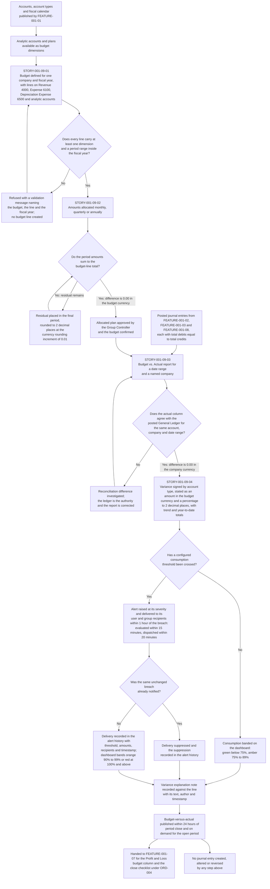

# FEATURE-001-09: Budgeting & Variance Analysis

---

## Metadata

| Attribute | Value |
|-----------|-------|
| **Feature ID** | `FEATURE-001-09` |
| **Title** | Budgeting & Variance Analysis |
| **Parent Epic** | [EPIC-001: Enterprise Accounting in Odoo](../EPIC-001-enterprise-accounting-odoo.md) |
| **Status** | Draft |
| **Priority** | 🟠 High |
| **Story Count** | 4 stories |
| **Last Updated** | 2026-08-15 |
| **Owner/Author** | Enterprise Accounting Team |

---

## 1. Feature Overview

### 1.1 Purpose and Business Value

This feature enables the **FP&A Analyst** and the **Group Controller** to hold the group's financial plan inside the accounting system rather than beside it: budgets defined across the general-ledger account, the analytic account and the analytic plan; those budgets allocated across the periods of a fiscal year; the plan compared with the actuals that posted journal entries produced; and the resulting variance analysed, explained and alerted on when a spending threshold is crossed.

It is delivered against three module families, and their availability in this repository differs:

- **`account`** — the "Invoicing" application, version 1.4, category `Accounting/Accounting`, licence LGPL-3, **present** in `addons/`. It supplies `account.account` for the budgeted accounts, and `account.move` with `account.move.line` as the single source of every actual amount this feature reports.
- **`analytic`** — "Analytic Accounting", version 1.2, licence LGPL-3, **present** in `addons/`. It supplies `account.analytic.account` and `account.analytic.plan`, the second and third budget dimensions, which constraint **C-013** in the Epic requires this feature to budget and analyse against rather than duplicate.
- **`account_budget`** — the budget definition, allocation and budget-versus-actual capability named in the Epic's module scope. It is **absent from `addons/`** in this repository and is an Odoo Enterprise capability. That absence is recorded here as a platform fact and is resolved by decision **DEC-002**, not by this feature. Two paths carry the capability: an Odoo Enterprise subscription, or the Odoo Community Association route with `mis_builder` for management and budget reporting. Alongside either path, `account_budget_management` version 19.0.1.0.0 under AGPL-3 is **present** in this repository from an earlier programme phase and already holds budgets, period allocations, a budget-versus-actual report and threshold alerts inside Odoo; discovery note **D-003** credits it with definition, period allocation, budget-versus-actual reporting and threshold alerts, and leaves budget-history load for comparatives, multi-company budget scope and retained variance explanation as the residual gap.

**Business Value Statement:**

> Budget control moves from a month-end spreadsheet exercise to a figure read from posted data. Budget-versus-actual reporting with variance analysis is published within 24 hours of period close and is available on demand for the open period, against a baseline in which the comparison was compiled by hand after the month had ended (SM-014). Because the actual column is read from posted journal entries whose total debits equal their total credits at a difference of `0.00` in the company currency, and never written back to them, a variance figure and the general ledger behind it cannot disagree; and because a threshold breach raises an alert within 1 hour of the breach, overspend is seen while the period is still open rather than after the commitment has been made.

This feature carries the Epic's third objective and supports the first:

| Epic Objective | Contribution of This Feature |
|----------------|------------------------------|
| Real-time visibility into financial health | Budget, actual, variance amount and variance percentage are computed from posted journal items for the requested date range, so the figure is current as of the last posted entry and is available for the open period without waiting for the close |
| Multi-entity financial operations | A budget is held against one company and one analytic plan, so each legal entity's plan is separated from every other entity's, and a group view is a roll-up of entity budgets rather than a re-keyed summary |
| Compliance reporting | Budget approval, threshold configuration, breach alerts and variance explanations are recorded with their author and timestamp inside the system, which is the evidence of budget control an External Auditor tests; budget figures themselves stay outside the statutory statements, as §7.3 records |

Ordering rule **ORD-004** in the Epic places this feature ahead of FEATURE-001-07, because the budget columns beside the Profit & Loss and the budget review inside the close checklist consume what this feature publishes. The Epic's implementation sequence places it in **Phase 4 — Group and sub-ledgers**, alongside FEATURE-001-06 and FEATURE-001-08, since budgeting consumes the posted record that the Critical features create rather than creating it.

### 1.2 Problem Statement

The group's budgets live in spreadsheets outside Odoo, and each period they are reconciled against Odoo actuals by hand. Five consequences follow, and each recurs every period:

- **The comparison arrives after the decision.** Budget against actual is available only once an analyst has exported the ledger, re-keyed it beside the plan and re-checked the totals, so the figure lands days after the period it describes and after the spend it would have questioned was already committed.
- **Extraction and re-keying introduce error.** Every hand-off between the ledger and the spreadsheet is a chance for a mis-typed amount, a stale export, a formula that no longer covers a new account, or a total that no longer ties to the sub-ledger it came from — and nothing in the workflow forces the two to agree.
- **No notification fires when a budget is exceeded.** Overspend is discovered by reading a report, so a budget can pass its limit and stay unremarked until the next month-end compilation; there is no threshold, no recipient list and no delivery record.
- **Analyst time goes into compilation rather than analysis.** The FP&A Analyst spends the days after period end assembling data instead of explaining variance, so the explanation that management acts on is the part of the work that gets compressed.
- **Budget control cannot be evidenced.** Approval of a budget, the thresholds set on it, the alerts it raised and the explanations recorded against its variances exist as spreadsheet history at best, so the External Auditor has no in-system record to test and the control cannot be demonstrated for the period under audit.

### 1.3 Key Capabilities

| Capability ID | Capability Description | Related Stories |
|---------------|------------------------|-----------------|
| CAP-001 | Define budgets by general-ledger account, analytic account and analytic plan, per company and fiscal year | STORY-001-09-01 |
| CAP-002 | Allocate budget amounts across monthly, quarterly or annual periods with deterministic rounding | STORY-001-09-02 |
| CAP-003 | Report Budget vs. Actual for a date range, drawing actuals from posted journal entries | STORY-001-09-03 |
| CAP-004 | Analyse variance with favourable and unfavourable signing and raise threshold alerts | STORY-001-09-04 |

The four capabilities are cumulative: CAP-001 creates the plan and the dimensions it is held against, CAP-002 spreads that plan across the fiscal calendar so a period can be compared at all, CAP-003 places the posted actual beside the period budget, and CAP-004 turns the difference into a signed, explained and alerted figure. Nothing in the chain writes to the ledger — the ledger is the input.

### 1.4 Success Criteria at Feature Level

| Criterion | Target | Verification Method |
|-----------|--------|---------------------|
| Budget dimension coverage | 100% of the three budget dimensions are usable on a budget line — general-ledger account, analytic account and analytic plan — and the count of budget lines carrying none of the three is 0 | Dimension completeness report per budget per company, with the dimensionless-line count asserted at 0 |
| Deterministic account baseline | Budget lines exist against Revenue 4000, Expense 6100 and Depreciation Expense 6500 for each in-scope company and fiscal year, each line naming the company whose books it plans | Budget-line listing per company compared against the group budget policy, signed off by the Group Controller |
| Allocation arithmetic ties to the budget total | An annual budget of `$1,200,000.00 USD` allocated monthly produces 12 period amounts of `$100,000.00 USD`, each rounded to 2 decimal places half-up at the USD rounding increment of 0.01, with any allocation residual placed in the final period, and the 12 periods summing to `$1,200,000.00 USD` at a difference of `0.00 USD` | Allocation reconciliation: the sum of period amounts compared with the budget-line total at a `0.00 USD` tolerance, repeated for a EUR budget at the EUR rounding increment of 0.01 |
| Budget vs. Actual report ties to the ledger | The **Budget vs. Actual** report run for the date range 2025-01-01 to 2025-03-31 for company **US-01**, the group's United States operating entity, reports Expense 6100 with a budget of `$300,000.00 USD` and an actual of `$312,450.00 USD` — the subset of that account's Q1 postings carrying the budget line's analytic distribution, published in [Epic Appendix F.6](../EPIC-001-enterprise-accounting-odoo.md#f6-analytic-subsets-the-fy2025-operating-budget-compares-against) beside the whole-account figure of `$1,392,550.00 USD` — and its actual column agrees with the posted General Ledger for the same account, company, analytic scope and date range at a difference of `0.00 USD` | Report-to-ledger reconciliation worksheet per company per date range, retained as close evidence (SM-014, C-009) |
| Variance is stated as an amount and a percentage | The same line reports an unfavourable variance of `$12,450.00 USD`, rounded to 2 decimal places at the USD rounding increment of 0.01, and a variance percentage of 4.15%, stated to 2 decimal places, with the unfavourable signing taken from the account type of Expense 6100 | **Budget Variance Analysis** report run for 2025-01-01 to 2025-03-31 for company US-01, with the amount and the percentage both asserted numerically |
| Actuals are drawn from balanced posted entries only | 100% of amounts in the actual column originate in posted journal entries whose total debits equal their total credits at a difference of `0.00` in the company currency; draft and cancelled entries contribute 0.00, and the reported comparison creates, alters or reverses no journal entry | Ledger-mutation check: the journal-entry count and the account balances of the reported company and date range are identical before and after the report is run |
| Variance availability after close | Published within 24 hours of period close, and available on demand for the open period | Timestamp difference between application of the period lock date and publication of budget-versus-actual (SM-014) |
| Threshold alert delivery | An alert is delivered to its configured recipients within 1 hour of the breach that raised it, and the delivery is recorded with its timestamp and recipient list. The 1 hour is reached by a chain with headroom rather than by a single hourly pass: the threshold evaluation is scheduled **every 15 minutes**, so a breach waits at most 15 minutes to be evaluated; the evaluation run itself completes inside 10 minutes for 1,000 active budgets; and the notification is dispatched inside 20 minutes of the alert event being recorded — a worst case of 45 minutes, leaving 15 minutes inside the target | Timed scheduled-action run against a seeded budget driven past its threshold, with the breach posted **immediately after** a completed run so the worst case rather than the best case is measured, compared with the retained alert history |
| Out-of-calendar budget lines are refused | A budget line whose period range falls outside the fiscal year of its budget is refused with an Odoo validation message naming the budget, the line and the fiscal year, and no budget line is created by the refused attempt | Negative test executed per company against a line dated outside the fiscal-year boundary |
| Run-time report parameters are checked | Every date range, filter value and threshold percentage supplied at run time is validated before use, and a rejected value returns an error naming the parameter and the check that failed, with no stack trace, query text or file-system path disclosed | Hostile-input tests required by C-022, executed against the report and threshold parameters (C-015, C-019, C-020) |
| Test coverage | ≥80% for all 4 story implementations, with the allocation, comparison and variance arithmetic asserted numerically | Coverage tooling in the repository's configured test run (C-007, C-009) |
| Demonstrability | 4 of 4 stories demonstrated in the Odoo user interface, or through its public API, to the Finance Controller and the Product Owner | Recorded acceptance walkthrough per story |

#### 1.4.1 The Canonical Consumption Classification (CONS-001)

Consumption of a budget is classified **once**, here, and the four stories of this feature read that one classification rather than each defining its own. The alert rungs fire **at** the band boundaries rather than beside them, so one consumption percentage cannot sit in one band on a report and in a different band on a dashboard.

| Band | Consumption of the budget amount | Line status value | Dashboard colour | Rung that fires on entering the band | Alert severity |
|---|---|---|---|---|---|
| 1 | Below 75.00% | `normal` | Green | None | — |
| 2 | 75.00% to 89.99% | `warning` | Amber | 75% | Warning |
| 3 | 90.00% to 99.99% | `alert` | Orange | 90% | Alert |
| 4 | 100.00% and above | `over_budget` | Red | 100%, and 110% escalating inside the same band | Critical, then Over-budget |

- **One classification, two readings.** [STORY-001-09-03](./FEATURE-001-09/STORY-001-09-03-report-budget-vs-actual.md) presents the consumption percentage and the band it falls in; [STORY-001-09-04](./FEATURE-001-09/STORY-001-09-04-analyze-variances.md) evaluates the rungs, delivers the alert and renders the dashboard. Neither re-derives a band from a second set of boundaries.
- **The status and the severity are two different fields whose vocabularies overlap.** The status value is a property of the budget line and answers "where does this line stand"; the severity is a property of an alert event and answers "how loudly was this crossing announced". A line standing in band 3 carries the status `alert`, and the event its 90% rung raised carries the severity Alert — the same word for two records, which is why each is named with its own field above.
- **The earlier three-band scheme is retired.** The superseded backlog banded consumption as normal below 80%, warning from 80% to 100% and over budget above 100%. Those boundaries do not coincide with the 75/90/100/110 rungs: a line at 76.00% reads `normal` under the retired scheme and `warning` under this one, and a line at 95.00% reads `warning` under the retired scheme and `alert` under this one. The four bands above are the single scheme, and the 80% boundary is used nowhere in this feature.
- **The boundaries are configuration, not constants in code.** The four percentages are stored against the budget line, are modifiable by the Group Controller while the budget stands in `draft` or `confirmed`, and every change is recorded with its author and its timestamp. The values above are the group default the four stories are demonstrated against.
- **A zero budget has no band.** A budget amount of `0.00` in the budget currency yields no consumption percentage and therefore no band: the line is reported as unmonitored rather than green, and no rung is derivable from it, which is the guard [STORY-001-09-04](./FEATURE-001-09/STORY-001-09-04-analyze-variances.md) carries in its edge cases.
- **The present implementation bands differently, and that difference is residual work.** `_compute_threshold_status` in `addons/account_budget_management/models/budget_budget_line.py` returns `over_budget` at 110.00% and above, `alert` from 100.00% to 109.99%, `warning` from 90.00% to 99.99% and `normal` for everything below 90.00%. It therefore has **no separate band below 75.00% and no separate 75.00%-to-89.99% band**, and all three of its non-normal boundaries sit one rung higher than CONS-001 places them. Re-banding it is item 14 of [§5.2.1](#521-criterion-by-criterion-gap-analysis-against-account_budget_management).

---

## 2. User Personas

### 2.1 Persona Mapping

Every persona below is a named finance role drawn from the Epic's persona register. The five roles marked applicable act inside this feature — they build the plan, approve it, stand behind the actuals it reads, present it beside the statements or test it as a control. The roles marked not applicable post the transactions that become this feature's actuals, and their work is specified in the features named against them.

| Persona | Role Description | Primary Use Cases | Applicable |
|---------|------------------|-------------------|------------|
| **FP&A Analyst** | Builds budgets and explains variances to management; the primary persona of this feature | Defines budgets against Revenue 4000, Expense 6100, Depreciation Expense 6500 and the analytic accounts of a plan; allocates the annual amount across the fiscal calendar; runs **Budget vs. Actual** for a date range; records the explanation against a variance line | ☑ Yes |
| **Group Controller** | Governs group accounting policy and approves the consolidated result | Approves a budget before it becomes active; owns the threshold percentages and the alert recipient list; reviews variance across entities; owns the group budget policy that entity budgets are held to | ☑ Yes |
| **Chief Accountant** | Owns the general ledger and the integrity of every posted entry | Stands behind the actual column: confirms that the postings the comparison reads are posted and balanced, and that reversals and late entries move the actual figure rather than the budget | ☑ Yes |
| **Financial Reporting Manager** | Produces statutory and management statements for each entity and the group | Presents the budget column beside the Profit & Loss in FEATURE-001-07 and reconciles the budget-versus-actual actual column to the statement it sits beside | ☑ Yes |
| **External Auditor** | Tests balances and controls and issues the audit opinion | Reads budget approval, the threshold configuration, the retained alert history and the variance explanations as evidence that budget control operated; drills from a variance line to the journal items behind it | ☑ Yes |
| Accounts Payable Clerk | Captures vendor bills, runs three-way match and prepares payment runs | Posts to Expense 6100 through the Purchase journal in FEATURE-001-02; those postings become actuals here but the clerk takes no budgeting action | ☐ No |
| Accounts Receivable Specialist | Issues customer invoices, allocates receipts and manages collections | Posts to Revenue 4000 through the Sales journal in FEATURE-001-03; those postings become actuals here but the specialist takes no budgeting action | ☐ No |
| Treasury Analyst | Owns bank and cash positions and statement reconciliation | Settles the balances created elsewhere in FEATURE-001-04; cash movement is not budgeted by this feature | ☐ No |
| Tax Accountant | Determines tax on transactions and files statutory returns | Works the tax position in FEATURE-001-05; tax amounts reach the ledger as postings and are budgeted only where a tax expense account is on a budget line | ☐ No |
| CFO / Finance Director | Executive stakeholder accountable for financial health and compliance | Consumes the published variance and owns decision DEC-002 with the Group Controller; takes no configuration action inside this feature | ☐ No |

### 2.2 Persona-to-Story Mapping

Each story carries exactly one primary persona in its WHO statement. Secondary personas approve, verify or consume the outcome, and they are named so that the access rights derived from these stories keep the preparing role and the approving role apart: the FP&A Analyst who builds a budget is not the role that approves it or that sets the thresholds it is policed by.

| Story | Primary Persona | Secondary Personas |
|-------|-----------------|--------------------|
| STORY-001-09-01 Define Budgets by Account and Analytic Dimension | FP&A Analyst | Group Controller (budget approval), Chief Accountant (account and analytic-dimension validity) |
| STORY-001-09-02 Allocate Budget Amounts Across Periods | FP&A Analyst | Group Controller (approval of the allocated plan), Financial Reporting Manager (period alignment with the reporting calendar) |
| STORY-001-09-03 Report Budget vs. Actual | FP&A Analyst | Chief Accountant (actual column ties to the ledger), Financial Reporting Manager (presentation beside the Profit & Loss), External Auditor (drill-down to journal items) |
| STORY-001-09-04 Analyse Variances and Configure Threshold Alerts | Group Controller | FP&A Analyst (variance explanation notes), External Auditor (evidence of budget control), CFO / Finance Director (alert recipient) |

---

## 3. Story List

### 3.1 User Stories

| Story ID | Story Title | Persona | Priority | Status | Link |
|----------|-------------|---------|----------|--------|------|
| STORY-001-09-01 | Define Budgets by Account and Analytic Dimension | FP&A Analyst | 🟠 High | Draft | [STORY-001-09-01](./FEATURE-001-09/STORY-001-09-01-define-budgets.md) |
| STORY-001-09-02 | Allocate Budget Amounts Across Periods | FP&A Analyst | 🟠 High | Draft | [STORY-001-09-02](./FEATURE-001-09/STORY-001-09-02-allocate-budget-periods.md) |
| STORY-001-09-03 | Report Budget vs. Actual | FP&A Analyst | 🟠 High | Draft | [STORY-001-09-03](./FEATURE-001-09/STORY-001-09-03-report-budget-vs-actual.md) |
| STORY-001-09-04 | Analyse Variances and Configure Threshold Alerts | Group Controller | 🟡 Medium | Draft | [STORY-001-09-04](./FEATURE-001-09/STORY-001-09-04-analyze-variances.md) |

**Priority legend:** 🟠 High — significant finance value that consumes posted data produced by the Critical features; 🟡 Medium — extends analysis and automation once the plan and the comparison exist. The feature itself is High in the Epic's feature summary, which matches the priority of its first three stories; STORY-001-09-04 is Medium because variance signing and alerting extend a comparison that is already usable without them.

### 3.2 Story Count Assessment

| Count | Assessment | Status |
|-------|------------|--------|
| **4 stories** | Within the mandated range of 2 to 5 stories per feature | ✓ Feature is scoped for independent delivery |

This feature carries **4 stories**, inside the 2-to-5 bound recorded in the Epic's decomposition guidelines. The 3-to-7 guidance carried by the feature template is superseded by that bound and is not applied here. The count is stated identically in four places, and the four must stay equal: the Story Count row in §Metadata, this assessment, the 4 rows of §3.1, and the 4 links of §9.2. The Epic's feature summary declares the same count of 4 stories for `FEATURE-001-09`.

**The count is 4 rather than 5 by migration, not by omission.** The superseded flat-layout backlog held five budget stories. Variance analysis and budget alerting were merged into STORY-001-09-04 under the Epic's retirement map, which records the obligation that merger carries: two alert severities at distinct thresholds, a configurable recipient list, a retained alert history and the dashboard summary are acceptance criteria of the destination story alongside the variance analysis, with the warning threshold and the exceeded threshold asserted as distinct amounts in the budget currency. Register entry **CF-004** adds three further requirements that the destination story must carry — multi-period trend variance with year-to-date totals, variance explanation notes that survive a regeneration of the report, and the consumption bands of the alert dashboard (green below 75%, amber from 75% to 89%, orange from 90% to 99%, red at 100% and above) — and records that the story carries them inside eight acceptance criteria rather than by adding a fifth file. No story identifier from the superseded flat-layout backlog survives into this tree; every story here is named on the `STORY-001-09-SS` convention.

Splitting further would produce stories with nothing to prove on their own: an allocation with no budget to allocate, or a threshold with no comparison to police. Merging would breach the Small criterion of INVEST, because definition, allocation, comparison and variance are each demonstrated by a different action against a different artifact — a saved budget, a set of period amounts, a report that ties to the ledger, and a signed variance with a delivered alert.

### 3.3 Story Dependency Ordering

Each story delivers an outcome demonstrable on its own, which keeps the four Independent under INVEST. The rows below are sequencing prerequisites — configuration or data that must already exist for the dependent story to be demonstrated — and not shared implementation. The chain is linear because each story consumes the artifact the previous one produces.

| Story | Depends On | Notes |
|-------|-----------|-------|
| STORY-001-09-01 (Define Budgets) | None within this feature | Foundation story; the budget record and its account and analytic dimensions are the object every later story acts on. Its external prerequisites are the accounts and fiscal calendar of FEATURE-001-01 and the analytic master data recorded in the Epic's master-data readiness dependency |
| STORY-001-09-02 (Allocate Across Periods) | STORY-001-09-01 | An allocation distributes the total of an existing budget line across periods, so the budget and its line must exist before an amount can be spread over the fiscal calendar |
| STORY-001-09-03 (Report Budget vs. Actual) | STORY-001-09-02 | The comparison is made per period against a period budget, so the allocation supplies the budget column; posted journal entries from FEATURE-001-02, FEATURE-001-03 and FEATURE-001-08 supply the actual column |
| STORY-001-09-04 (Variances and Threshold Alerts) | STORY-001-09-03 | Variance is the difference the comparison produces and consumption is the ratio it produces, so both the signed variance and the threshold evaluation consume the comparison rather than recomputing it |

### 3.4 Recommended Implementation Order

```text
1. STORY-001-09-01  Define Budgets by Account and Analytic Dimension
   Foundation: the budget record, its company and fiscal year, and its lines
   against Revenue 4000, Expense 6100, Depreciation Expense 6500 and the
   analytic accounts of a plan
        |
        v
2. STORY-001-09-02  Allocate Budget Amounts Across Periods
   Calendar: monthly, quarterly or annual period amounts whose sum ties to the
   budget-line total at a 0.00 difference in the budget currency
        |
        v
3. STORY-001-09-03  Report Budget vs. Actual
   Comparison: the Budget vs. Actual report for a date range and a named
   company, with the actual column read from posted journal entries and tied to
   the General Ledger at a 0.00 difference
        |
        v
4. STORY-001-09-04  Analyse Variances and Configure Threshold Alerts
   Analysis and control: signed variance with amount and percentage, trend and
   year-to-date totals, explanation notes, threshold configuration, delivered
   alerts and the consumption-band dashboard
```

The four steps are delivered in order because each consumes the previous step's artifact. Step 1 can begin as soon as FEATURE-001-01 has published the accounts and the fiscal calendar and the analytic plans exist; step 3 additionally waits on posted data from the transaction features, so it is demonstrated against a period that already carries postings. The whole feature precedes FEATURE-001-07 under ORD-004, because the budget column beside the Profit & Loss and the budget review inside the close checklist consume what step 4 publishes.

---

## 4. Acceptance Criteria Summary

### 4.1 Feature-Level Acceptance Criteria

These are feature-level gates. The Given/When/Then acceptance criteria live in the four story files, where each story states 4 to 8 criteria against one workflow, with the coverage distribution the Epic requires: a valid-input case, an invalid or incomplete input, an error-handling case and an accounting edge case.

The feature is considered complete when:

- [ ] All 4 stories within this feature have status "Done"
- [ ] All 4 stories achieve minimum 80% test coverage (C-007)
- [ ] Feature-level integration tests pass, with the allocation, comparison, variance and consumption arithmetic asserted as amounts and percentages rather than inspected by eye (C-009)
- [ ] Each of the 4 stories has been demonstrated in the Odoo user interface, or through its public API, to the Finance Controller and the Product Owner, and the walkthrough is recorded against the story
- [ ] A budget can be defined against a general-ledger account, against an analytic account and against an analytic plan, in every combination the group budget policy permits, and each budget names the company and the fiscal year it plans for
- [ ] A budget line exists against Revenue 4000, Expense 6100 and Depreciation Expense 6500 for the demonstrated company, and a line that carries none of the three budget dimensions is refused
- [ ] An annual budget of `$1,200,000.00 USD` allocated monthly produces 12 period amounts of `$100,000.00 USD`, each rounded to 2 decimal places half-up at the USD rounding increment of 0.01, with any allocation residual placed in the final period, and the 12 periods sum to `$1,200,000.00 USD` at a difference of `0.00 USD`; the same assertion is made for a EUR budget at the EUR rounding increment of 0.01 and for a zero-decimal currency at its own precision
- [ ] Quarterly allocation of the same annual budget produces 4 period amounts of `$300,000.00 USD` whose sum is `$1,200,000.00 USD` at a difference of `0.00 USD`, and annual allocation produces a single period amount equal to the budget-line total
- [ ] The **Budget vs. Actual** report run for the date range 2025-01-01 to 2025-03-31 for company **US-01** reports Expense 6100 with a budget of `$300,000.00 USD`, an actual of `$312,450.00 USD` and a consumption of 104.15% stated to 2 decimal places, and its actual column agrees with the posted General Ledger for the same account, company, analytic scope and date range at a difference of `0.00 USD`; the `$312,450.00 USD` is the analytic subset published in [Epic Appendix F.6](../EPIC-001-enterprise-accounting-odoo.md#f6-analytic-subsets-the-fy2025-operating-budget-compares-against), not the whole-account Q1 movement of `$1,392,550.00 USD` that the Profit & Loss of FEATURE-001-07 presents
- [ ] Every amount in the actual column originates in posted journal entries whose total debits equal their total credits at a difference of `0.00` in the company currency; entries in draft or cancelled state contribute 0.00 to the actual column
- [ ] Running the comparison, the variance analysis or the alert evaluation creates, alters and reverses no journal entry: the journal-entry count and the account balances of the reported company and date range are identical before and after each run
- [ ] The **Budget Variance Analysis** report run for 2025-01-01 to 2025-03-31 for company US-01 reports the same line with an unfavourable variance of `$12,450.00 USD`, rounded to 2 decimal places at the USD rounding increment of 0.01, and a variance percentage of 4.15% stated to 2 decimal places
- [ ] Variance signing follows the account type: on Expense 6100 an actual above budget is unfavourable and an actual below budget is favourable, while on Revenue 4000 an actual above budget is favourable and an actual below budget is unfavourable; the favourable and unfavourable totals are each stated as an amount in the budget currency to 2 decimal places
- [ ] Trend analysis across consecutive periods reports budget, actual, variance amount and variance percentage per period at monthly, quarterly or custom granularity, together with cumulative year-to-date budget, actual, variance and variance percentage and a trend direction per line of improving, stable or deteriorating; every monetary figure carries its ISO 4217 currency code and is stated to 2 decimal places rounded half-up at that currency's rounding increment of 0.01, every percentage is stated to 2 decimal places, and a period with no posted activity reads `0.00` in the company currency (CF-004)
- [ ] A variance explanation note records its text, its author and its timestamp against the budget line it explains; more than one note per line is retained; notes remain visible when the same date range is run again; and a note is editable and deletable under permission with its edit history retained (CF-004)
- [ ] Threshold alerts are configured at the rungs of [CONS-001](#141-the-canonical-consumption-classification-cons-001) as percentages of the period budget with at least two severities at distinct thresholds — a warning threshold and an exceeded threshold — and the amount at which each fires is asserted as a distinct amount in the budget currency: on a period budget of `$100,000.00 USD` the 75% warning fires at `$75,000.00 USD` and the 100% breach fires at `$100,000.00 USD`, each rounded to 2 decimal places at the currency's rounding increment of 0.01
- [ ] A breach delivers an alert to its configured recipients — named users and named groups — within 1 hour of the breach, and the retained alert history records the budget, the threshold, the consumption percentage, the budget and actual amounts in the company currency to 2 decimal places, the severity, the recipients and the delivery timestamp
- [ ] A repeated evaluation of the same unchanged breach does not re-deliver the same alert, and the suppression is visible in the alert history rather than silent
- [ ] The alert dashboard bands consumption as [CONS-001](#141-the-canonical-consumption-classification-cons-001) defines it — green below 75%, amber from 75% to 89%, orange from 90% to 99% and red at 100% and above; budgets past a threshold are ordered ahead of the rest; each line shows the budget name, the consumption percentage, the budget amount against the actual amount in the company currency to 2 decimal places, the latest alert state and the days remaining in the budget period; and a line drills down to the budget behind it (CF-004)
- [ ] A budget line whose period range falls outside the fiscal year of its budget is refused with an Odoo validation message naming the budget, the line and the fiscal year, and no budget line is created by the refused attempt
- [ ] A budget line whose budgeted amount is `0.00` in the budget currency, at that currency's decimal precision, reports a variance equal to the actual amount stated in the same currency to 2 decimal places and reports no variance percentage rather than a division result, and the guard is stated in the story's edge cases (CF-004)
- [ ] A late or reversing entry posted into a date range already reported moves the actual figure and the variance on the next run of the same date range, and leaves the budget amount unchanged
- [ ] Budget-versus-actual with variance analysis is published within 24 hours of period close for the closed period, and is available on demand for the open period (SM-014)
- [ ] Every report and dashboard in this feature exports to PDF and to XLSX, the export preserves the filters active on screen and contains the expanded detail rather than the collapsed summary, every summary line drills down to the journal items behind its actual amount, and drill-down preserves the active filters and carries breadcrumbs back to the summary it came from
- [ ] Exported cell values are neutralized against spreadsheet formula injection, so a value beginning with `=`, `+`, `-`, `@`, a tab or a carriage return is written as text (C-017)
- [ ] Every date range, filter value, grouping selection and threshold percentage supplied at run time is validated before use; a rejected value returns an error naming the parameter and the check that failed and discloses no stack trace, query text, file-system path or credential; and at least one hostile-input test per ingesting story proves the rejection with the ledger unchanged (C-015, C-019, C-020, C-022)
- [ ] A persona restricted to one company can neither read nor report another company's budgets, budget lines, alerts or actual amounts (C-014)
- [ ] The published budget-versus-actual figures are handed to FEATURE-001-07 for presentation beside the Profit & Loss and for the budget review inside the close checklist, and the hand-over is recorded against ORD-004

### 4.2 Cross-Cutting Concerns

Every story in this feature inherits the criteria below from the Epic's constraint set.

| Concern | Acceptance Criterion |
|---------|----------------------|
| License | New modules are distributed under an AGPL-3.0 compatible licence, and integration with `account` and `analytic` respects their LGPL-3 licence; extension of the present `account_budget_management` add-on respects its AGPL-3 licence (C-001, C-002) |
| Dependencies | Every declared module dependency exists in the platform configuration confirmed by DEC-002, and delivered code stays consumable by the OCA add-on ecosystem including `mis_builder` (C-003, C-004) |
| Analytic dimensions | Budget and cost-centre dimensions are expressed on `account.analytic.account` and `account.analytic.plan` rather than on a parallel dimension model, and actuals are attributed through the analytic distribution already carried on the journal item (C-013) |
| Coding Standards | Python follows Odoo and OCA standards including PEP 8, and static analysis passes with the repository's configured tooling in `ruff.toml` (C-005, C-006) |
| Test Coverage | Each story achieves minimum 80% test coverage, and each acceptance test is traceable to one Given/When/Then criterion (C-007, C-008) |
| Documentation | Public methods and models are documented with docstrings, and the group budget policy, the signing rule per account type and the consumption bands are recorded alongside the code that applies them |
| Security | Access rights are defined per finance role and verified by an access-rights test matrix: the FP&A Analyst builds and allocates budgets and records explanations, the Group Controller approves budgets and maintains thresholds and recipient lists, the Chief Accountant and the Financial Reporting Manager read budgets and the comparison, the External Auditor holds read-only access to budgets, thresholds, alert history and explanation notes, and no role reads or reports in a company outside its allowed companies (C-014) |
| Multi-company isolation | Every criterion that touches more than one company names the company whose books are affected; a budget is held against one company, and a test proves that a role restricted to one company can neither read nor report another company's budgets or actual amounts (C-014, D-007) |
| Ledger immutability | No story in this feature writes to `account.move` or `account.move.line`. Budget definition, allocation, comparison, variance analysis and alert evaluation are read-only against the ledger, and each carries a test asserting that the journal-entry count and the account balances of the reported company and date range are unchanged by the run |
| Untrusted input | The date ranges, filter values, grouping selections and threshold percentages supplied at run time cross the trust boundary, as does any budget-history file loaded for comparatives: file type and size are checked against an allowlist at the ingestion boundary, values are validated before use, data access is expressed through the ORM or parameterized SQL with no concatenated search domain, exported cell values are neutralized against formula injection, a rejected value returns a named error that discloses no internal detail, and a hostile-input test proves the rejection with no journal entry created and the service still available (C-015, C-017, C-019, C-020, C-022) |
| Rendered text | Budget names, analytic account names, references and note text are sanitized and context-encoded before they are rendered into a PDF or XLSX report, a dashboard line or an alert email body, and templates render such values as escaped text rather than as raw markup (C-018) |
| Document parsing | No story in this feature parses an XML document, so the XML external-entity and entity-expansion surface does not arise here; if the budget-history load for comparatives is implemented against a structured document format rather than a tabular extract, that path inherits C-016 in full — DTD processing and external-entity resolution disabled, entity expansion bounded, and schema validation before any field is read (C-016) |
| Credentials | No story in this feature holds an endpoint credential, API key or signing certificate; where alert delivery uses an outbound mail server, its credentials are held outside module source and outside version control under the Epic's secret-handling rule (C-021) |
| Audit trail | Budget approval, threshold changes, recipient-list changes, delivered alerts and variance explanation notes are each recorded with their author and timestamp and are readable by the External Auditor without a data request |
| Performance | The targets in §4.4 are met against 100,000 posted journal items and 500 budget lines allocated across 12 periods |

### 4.3 Integration Requirements

| Integration Point | Requirement | Verification |
|-------------------|-------------|--------------|
| `account.move.line` | Read only: actual amounts are aggregated from posted journal items by account, by analytic distribution and by date, restricted to entries in the posted state | Actual column compared with the posted General Ledger for the same account, company and date range at a `0.00` difference in the company currency, with the journal-entry count unchanged by the run |
| `account.move` | Read only: the posted state and the entry date of each contributing entry are read, and the balance of each contributing entry is confirmed as total debits equal to total credits at a difference of `0.00` in the company currency | Reconciliation test that excludes draft and cancelled entries and asserts a `0.00` difference in the company currency on every contributing entry |
| `account.account` | Read: the budgeted accounts and their account type, which supplies the favourable and unfavourable signing rule — income behaviour for Revenue 4000, expense behaviour for Expense 6100 and Depreciation Expense 6500 | Signing test asserting an income line and an expense line with the same numeric variance sign classified in opposite directions |
| `account.analytic.account` | Read: the analytic account a budget line is held against, and the analytic distribution on the journal item that attributes an actual to it | Budget-versus-actual grouped by analytic account, with the group totals summing to the ungrouped total at a `0.00` difference in the company currency |
| `account.analytic.plan` | Read: the plan hierarchy a budget rolls up through, so a parent level aggregates its children without a re-keyed list | Hierarchy walk from each plan level to its budget lines, with the roll-up total compared against the sum of its children at a `0.00` difference in the company currency |
| `res.company` | Read: the company that holds the budget, its currency and its decimal precision, and the fiscal-year boundary a budget line must fall inside | Company-scoped budget listing, plus the negative test for a line dated outside the fiscal year |
| `res.currency` | Read: the rounding increment and decimal precision every budget, actual, variance and threshold amount is rounded to | Allocation and variance assertions repeated for a USD budget, a EUR budget and a zero-decimal-currency budget |
| Scheduled-action mechanism | Extend: threshold evaluation runs every 15 minutes against confirmed budgets, and each breach it finds becomes an alert record with its consumption percentage and amounts. The present record in `data/budget_alert_cron.xml` is configured hourly, which cannot hold a 1-hour delivery target for a breach that lands immediately after a run, so the cadence change is required work rather than a configuration preference | Timed scheduled-action run against a seeded population, with alert delivery measured from the breach |
| `mail` | Extend: an alert is delivered to its configured user and group recipients through the messaging layer, and the delivery is recorded with its timestamp | Delivery test asserting the recipient list, the timestamp and the retained history entry, including suppression of a repeat of the same unchanged breach |
| FEATURE-001-01 Chart of Accounts and Fiscal Year | Consumes the accounts, the account types and the fiscal calendar that budgets are defined against and allocated across | Budget definition and allocation demonstrated against that feature's configuration (ORD-001) |
| FEATURE-001-02 Accounts Payable and Vendor Bills | Vendor-bill postings to Expense 6100 are committed spend and appear in the actual column of the same account and date range | Actual amount for Expense 6100 reconciled to the payable sub-ledger postings for the date range |
| FEATURE-001-03 Accounts Receivable and Customer Invoices | Customer-invoice postings to Revenue 4000 appear in the actual column, where income signing applies | Actual amount for Revenue 4000 reconciled to the receivable sub-ledger postings for the date range |
| FEATURE-001-08 Fixed Assets and Depreciation | Depreciation entries posted from the depreciation board through the Miscellaneous journal, balanced with total debits equal to total credits at a difference of `0.00` in the company currency, appear as the **depreciation-expense** actuals against Depreciation Expense 6500 — a non-cash period charge, not capital expenditure, which is the acquisition of an asset capitalized to Fixed Assets 1500 and settled through Accounts Payable 2000 or a bank account | Actual amount for Depreciation Expense 6500 reconciled to the depreciation board for the same period |
| FEATURE-001-07 Financial Reporting and Period Close | The Profit & Loss presents a budget column beside the actual column for the same date range and company, and the close checklist carries the budget-versus-actual review; the export and drill-down convention owned by that feature is inherited by the reports here | Profit & Loss budget column reconciled to the **Budget vs. Actual** report for the same parameters at a `0.00` difference in the company currency, and export and drill-down demonstrated against the convention (ORD-004) |
| FEATURE-001-06 Multi-Company and Intercompany Consolidation | Budgets are held per legal entity and roll up to a group view without re-keying, and the group roll-up names each contributing company | Group roll-up compared against the sum of the entity budgets at a `0.00` difference in the group reporting currency |

### 4.4 Performance Requirements

| Metric | Requirement | Measurement Method |
|--------|-------------|--------------------|
| Budget vs. Actual report generation | Under 30 seconds over 100,000 posted journal items | Timed report run for a quarter-length date range on a seeded company holding 100,000 posted journal items |
| Budget allocation across periods | Under 10 seconds to allocate 500 budget lines across 12 periods | Timed allocation on a seeded budget of 500 lines, with the summed period amounts asserted against the line totals at a `0.00` difference in the budget currency |
| Variance availability after period close | Within 24 hours of the period lock date being applied, and on demand for the open period | Timestamp difference between lock-date application and publication of budget-versus-actual (SM-014) |
| Threshold alert delivery | Within 1 hour of the breach that raised it, measured from a breach posted immediately after a completed evaluation run | Elapsed time from the posting that crossed the threshold to the recorded delivery timestamp |
| Threshold evaluation cadence | Every 15 minutes, with a guard that refuses to start a second run while one is in progress | The scheduled action's configured interval, and a test that a second invocation during a run is refused rather than queued twice |
| Threshold evaluation run | Under 10 minutes for 1,000 active budgets, so a run completes inside its own 15-minute cadence window | Timed scheduled-action run against a seeded population of 1,000 active budgets |
| Notification dispatch after the alert event | Within 20 minutes of the alert event being recorded, including when 100 alerts are recorded by one run | Elapsed time from the recorded alert event to the recorded delivery timestamp on a seeded 100-alert run |
| Variance computation per budget line | Under 100 ms per line | Timed computation over a seeded set of budget lines, reported as a per-line figure |
| Alert dashboard render | Under 5 seconds for the consumption-band summary across 1,000 active budgets | Timed load of the dashboard on the same seeded population |

---

## 5. Constraints (Inherited from Epic)

The constraint identifiers below are the Epic's own. They are restated here in the terms of this feature rather than renumbered, so a reviewer reads one constraint set across the whole tree.

### 5.1 License Requirements

| Constraint | Requirement | Rationale |
|------------|-------------|-----------|
| **C-001 — Licence compatibility** | New modules delivering budget definition, period allocation, budget-versus-actual reporting, variance analysis and threshold alerting are distributed under an AGPL-3.0 compatible licence | Matches the licence of the Community-edition accounting add-ons already present in this repository, including `account_budget_management` at AGPL-3, so the delivered budgeting layer stays redistributable and contributable |
| **C-002 — Existing licence respected** | Extension of `account` and `analytic` respects their LGPL-3 licence, declared in `addons/account/__manifest__.py` and `addons/analytic/__manifest__.py`; extension of `account_budget_management` respects its AGPL-3 licence | `account.move.line`, `account.account`, `account.analytic.account` and `account.analytic.plan` are LGPL-3 code, and the present budgeting add-on is AGPL-3; derived and dependent code must remain licence-compatible with each, and an AGPL-3 extension cannot be redistributed under weaker terms |

**Acceptance Criterion:** every module delivered by this feature declares an AGPL-3.0 compatible licence in its manifest, and no derived work misstates the licence of the `account`, `analytic` or `account_budget_management` code it extends.

### 5.2 Dependency and Edition Considerations

| Constraint | Requirement | Rationale |
|------------|-------------|-----------|
| **C-003 — Edition source is an open decision that gates this feature** | The edition that supplies the Enterprise-only budgeting capability is **not decided**. It is recorded as DEC-002 in the Epic's open decisions register, owned by the CFO / Finance Director with the Group Controller, and it must be confirmed before this feature enters development | `account_budget` is **absent from `addons/`** in this repository and is an Enterprise module. This is recorded as a platform fact, not as a prohibition: the earlier backlog forbade the module by name, and that blanket restriction is superseded. Two paths carry the capability — an Odoo Enterprise subscription, which supplies budgets as supported product, or the OCA route with `mis_builder` for management and budget reporting alongside the present `account_budget_management` add-on, with bespoke development for the residual gap. The paths differ in licensing, cost and implementation approach, so the choice is confirmed with stakeholders rather than presumed |
| **C-004 — OCA ecosystem compatibility** | Whichever edition path is confirmed, the budget structure, the period allocation and the variance output stay consumable by OCA add-ons | Preserves the option to render management and budget reporting with `mis_builder`, and keeps the present `account_budget_management` add-on usable against the same accounts and analytic dimensions |
| **C-013 — Analytic layer, not a parallel one** | Budget and cost-centre dimensions are expressed on `account.analytic.account` and `account.analytic.plan`, and actuals are attributed through the analytic distribution already carried on the journal item | The analytic layer already provides the multi-dimensional allocation budgeting needs. A parallel dimension model would let a budget dimension and a posted dimension diverge, and the variance figure would then depend on which of the two was read |
| **Present add-on is credited, not assumed complete** | The capability already delivered by `account_budget_management` — budget records, budget lines, period allocation, the budget-versus-actual report and threshold alerts with a scheduled evaluation — is credited under D-003 and confirmed against each story's acceptance criteria before any bespoke build is authorized | The residual gap is recorded criterion by criterion in §5.2.1 rather than as a summary sentence. Building what is already present would give one plan **two budget records**, one question **two budget-versus-actual answers** and one control **two alert histories**; no journal entry is duplicated, because no story in this feature writes one |

**Acceptance Criterion:** DEC-002 is confirmed and recorded before development starts; no module delivered by this feature declares a dependency on a module absent from the configuration DEC-002 confirms; and the model-and-report coverage of `account_budget_management` is compared against the four stories' criteria, with the comparison retained as the evidence that confirms or narrows the residual gap.

#### 5.2.1 Criterion-by-Criterion Gap Analysis Against `account_budget_management`

D-003 credits the add-on present at `addons/account_budget_management/` with the capability it was read and found to deliver. Credit given as a summary sentence cannot be tested, so the credit is given here criterion group by criterion group, with the file and the reading each answer came from. Every "Evidence read" entry is a path in this repository.

| # | Criterion group | What the present add-on provides | Residual work | Evidence read |
|---|---|---|---|---|
| 1 | Budget header for one company and one fiscal year (09-01 Sc 1, 7) | `budget.budget` with `name`, `reference`, `description`, `user_id`, `company_id`, `currency_id`, `date_from`, `date_to`, `period_type`, `total_planned`, `copied_from_id`, `mail.thread` tracking | None — the header is delivered | `models/budget_budget.py` L83-330 |
| 2 | Budget lifecycle states and transitions (09-01 Sc 1, 3, 4, 5) | Four states `draft`, `confirmed`, `closed`, `cancelled`; `action_confirm`, `action_close`, `action_reset_draft` (manager-only), `action_cancel`, each posting to the chatter | None for the states themselves; §8.1 of this feature is restated to these four rather than to an invented five | `models/budget_budget.py` L208-226, L485-632 |
| 3 | Confirm-time refusal of an empty or trivial plan (09-01 Sc 4) | `action_confirm` refuses a budget with no lines, and refuses one where no line carries a positive planned amount | The refusal message names the budget but not the offending line's ordinal position, which Sc 3 and Sc 5 require | `models/budget_budget.py` L485-531 |
| 4 | Budget line against a general-ledger account (09-01 Sc 1) | `budget.budget.line` with `account_id`, `planned_amount`, `currency_id`, `company_id`, a `_check_account_type` restricting the line to income and expense types, and `_check_planned_amount` refusing a negative amount | None — the account-bearing line is delivered | `models/budget_budget_line.py` L160-247, L728-760 |
| 5 | Budget line held on analytic dimensions alone (09-01 Sc 3) | `_inherit = ['analytic.mixin']`, so `analytic_distribution` is carried and indexed | **Model change**: `account_id` is `required=True`, so a line carrying only an analytic distribution cannot persist. Making it optional, with a constraint requiring at least one of an account or a distribution, is bespoke | `models/budget_budget_line.py` L204-207 |
| 6 | Line period range inside the fiscal year, and refused outside it (09-01 Sc 6, Edge Case 5) | `date_from` and `date_to` on the line, and `_check_dates` on the header | **Model change**: the line's dates are `related='budget_id.date_from'` / `date_to` with `store=True`, so a line has no period range of its own to validate. An independently settable line range, and the refusal that tests it, are bespoke | `models/budget_budget_line.py` L178-193; `budget_budget.py` L417-448 |
| 7 | Lock-date integration on a budget line (09-01 Sc 6) | Nothing — no lock-date field is read anywhere in the add-on | Bespoke: read `res.company.fiscalyear_lock_date` at line save and refuse a range closed by it, with a message naming the company, the lock date and the rejected range. The refusal is a planning-data control, not an `account.move` refusal, so [Epic §7.8](../EPIC-001-enterprise-accounting-odoo.md#78-lock-date-behaviour-contract) does not govern it | repository-wide read of `account_budget_management/` |
| 8 | Reference numbering (09-01 Sc 1, 7, 8) | Sequence `budget.budget`, prefix `BUD/`, padding 5, `implementation='no_gap'`, allocated in `create` through `next_by_code` | The sequence record carries `company_id=False`, and `next_by_code` searches `company_id in (company, False)` ordered by `company_id`, so **one counter is shared by every company**. The numbering is group-wide unique rather than per company, which is what the stories now assert; a per-company scheme would need one sequence record per company as explicit data work | `data/budget_data.xml`; `models/budget_budget.py` L450-484; `odoo/addons/base/models/ir_sequence.py` L279-292 |
| 9 | Duplication of a prior-year plan with an audit link (09-01 Sc 8) | `copied_from_id` on the header and a `copy_data` override | The copy's reference, its state and the retention of the source's distribution keys are asserted by the story and confirmed against `copy_data` rather than assumed | `models/budget_budget.py` L316-329, L633-668 |
| 10 | Period allocation and its four methods (09-02 Sc 1-4) | `budget.period` with `allocated_amount`, an `allocation_method` selection of `equal`, `manual`, `copy_previous` and `percentage`, and a generator that emits the period grid from the fiscal calendar | The day-weighted method is out of scope by decision; the percentage-shape reuse asserts a stored share per period, which is confirmed against the existing `percentage` method rather than assumed | `models/budget_period.py` |
| 11 | The period-sum invariant (09-02 Sc 1-8) | `_check_sum_matches_line`, an `@api.constrains` raising `ValidationError` unless the sibling period amounts sum to `planned_amount` within one `currency_id.rounding` unit, with the residual assigned to the final period | None for the invariant. The story's three named resolutions and the audit-trail record of an override are bespoke; and because the constraint refuses a persisted mismatch, an "acknowledged variance" is not a reachable state | `models/budget_period.py` L628-651 |
| 12 | Regeneration over an existing grid (09-02 Sc 3) | A `UserError` naming the line and its existing allocation count, refusing generation until the existing periods are removed | None — the refusal is delivered. The story states the two-step replacement it implies rather than a silent clobber | `models/budget_period.py` L849-874 |
| 13 | Actual aggregation from posted journal items (09-03 Sc 1, 2) | `budget.vs.actual.report` reading `account.move.line` through `_read_group` with `parent_state = 'posted'` and `balance:sum` per account | Sign normalization by account type is absent: a revenue credit aggregates negative and is presented positive by the stories. Item 15 below | `report/budget_vs_actual_report.py` L321-349 |
| 14 | Consumption percentage and its banding (09-03 Sc 1, 6; 09-04 Sc 6) | `variance_consumption_percent` on the line and `_compute_threshold_status` mapping consumption to `over_budget`, `alert`, `warning` or `normal` | Two items: the consumed percentage falls back to `0.0` on a zero planned amount where the stories require the **absence** of a percentage; and the status ladder has no separate band below 75.00% and no separate 75.00%-to-89.99% band, so it is re-banded to [CONS-001](#141-the-canonical-consumption-classification-cons-001) | `models/budget_budget_line.py` L602-682; `report/budget_vs_actual_report.py` L160-225 |
| 15 | One signed variance convention (09-03 Sc 1; 09-04 Sc 1) | Two paths, computing **opposite** signs: the report returns `planned - actual`, the line stores `variance_actual - planned_amount` | One path is normalized and the other retired, under the [VAR-001](./FEATURE-001-09/STORY-001-09-03-report-budget-vs-actual.md#var-001--the-signed-variance-ledger-sign-and-analytic-attribution-contract) contract, so one question has one answer | `report/budget_vs_actual_report.py` L171, L211-223; `models/budget_budget_line.py` L602-610 |
| 16 | Analytic attribution of an actual (09-01 Sc 2; 09-03 Sc 3) | Two partial paths: the report parses distribution keys with `int(key_str)` and `continue`s on failure — silently dropping every comma-joined composite key — but does apply the percentage; the line does match composite keys through `analytic.mixin` but then sums the **whole** balance, attributing 100% where the key carries 60% | One resolver that both parses the composite key and applies its percentage, under VAR-001 part 3, with the count of skipped keys asserted at 0 | `report/budget_vs_actual_report.py` L455-492; `models/budget_budget_line.py` L556-596, L684-722 |
| 17 | Variance classification and explanation (09-04 Sc 1, 3) | `_classify_variance` returning favorable, unfavorable or neutral from the stored related `account_type` over the same six types the stories name, and a `variance_explanation_note` field | The note is a **single value** on the line, where the story requires more than one note per line with author, timestamp and edit history; and there are no cross-line favourable, unfavourable and net totals | `models/budget_budget_line.py` L602-656 |
| 18 | Threshold configuration, the alert event and its delivery (09-04 Sc 4-8) | `budget.alert` with a fixed `THRESHOLDS = ('75','90','100','110')` selection, `alert_type`, computed `alert_severity`, `alert_consumption_percent`, `alert_actual_amount`, `alert_planned_amount`, `alert_date`, `alert_recipient_user_ids`, `alert_recipient_group_ids`, `alert_notification_channels`, `alert_notified`, `alert_notification_date`, `alert_mail_message_id`, and `write()` and `unlink()` overrides holding the event immutable; plus an `ir.cron` evaluating thresholds | Six items: the four rungs are a fixed selection rather than configurable per budget line; the breach **amount** per rung is not stored; group recipients are held but their expansion to users at delivery time is not evidenced; a suppressed re-evaluation records nothing, where the story requires the suppression to be visible; re-arming after a reversal is not modelled; and the cron is hourly, which cannot hold the 1-hour target for a breach landing immediately after a run | `models/budget_alert.py`; `data/budget_alert_cron.xml` |
| 19 | Multi-company scope (09-01 Sc 7; 09-04 Sc 4) | **Present, not absent**: `company_id` is declared on `budget.budget` (L151), `budget.budget.line` (L160), `budget.period` (L219), `budget.alert` (L175) and `wizard/budget_variance_wizard.py` (L123) | The record rules that make a persona restricted to one company unable to read another's budgets are confirmed against `security/` rather than assumed, and the superuser cron's per-company attribution of an alert is bespoke | `models/*.py` as cited; `security/` |
| 20 | Export of the variance analysis (09-03 filters and exports) | An `action_export_xlsx` that **always raises** a `UserError` directing the user to the standard export menu | Bespoke: the PDF and XLSX exports the feature requires, carrying the applied filters and the expanded detail, with cell values neutralized against formula injection (C-017) | `wizard/budget_variance_wizard.py` L1319-1340 |

**What the count comes to.** Of the twenty criterion groups above, **six** are delivered outright (1, 2, 4, 9, 10, 12), **two** are model changes (5, 6), **eleven** carry bespoke work over an existing foundation (3, 7, 11, 13, 14, 15, 16, 17, 18, 19, 20) and **one** is a configuration change (the cron cadence inside 18). Two statements the earlier one-line summary of D-003 carried are corrected here: multi-company scope is **present**, and the gap list omitted the two opposite variance signs, the composite-analytic-key defect, the percentage-less line attribution, the fixed rung selection and an export action that always errors. The hazard this table exists to prevent is stated plainly: **building what is already present splits the record in two and lets two paths answer one question two ways** — which is exactly what items 15 and 16 already are inside the add-on itself.

### 5.3 Coding Standards

| Constraint | Requirement | Rationale |
|------------|-------------|-----------|
| **C-005 — Odoo and OCA standards** | Python follows Odoo and OCA module guidelines, including PEP 8 | Keeps the delivered code reviewable by the Odoo community and eligible for OCA contribution |
| **C-006 — Static analysis** | Static analysis passes with the repository's configured tooling; `ruff.toml` at the repository root defines the lint configuration in force | Defects are caught before review, where a defect in an aggregation or a rounding step silently changes every variance figure it feeds |
| **C-012 — Build on the existing models** | Actuals are read from `account.move` and `account.move.line`, accounts from `account.account`, and dimensions from `account.analytic.account` and `account.analytic.plan`, rather than from a copied or cached budget-side ledger | Preserves one ledger and one audit trail. A cached actual is a second version of the truth, and a variance computed from it cannot be reconciled to the General Ledger |
| **Read-only against the ledger** | No module delivered by this feature writes, alters or reverses `account.move` or `account.move.line` | A budget is a plan, not a posting. Comparison must not be able to change the figure it is comparing against, and the immutability is asserted by test rather than assumed by design |

**Acceptance Criterion:** static analysis reports zero violations for the delivered modules; no new model duplicates a field or a relation the existing accounting and analytic models already provide; and a test proves that no code path in this feature creates, alters or reverses a journal entry.

### 5.4 Test Coverage

| Constraint | Requirement | Rationale |
|------------|-------------|-----------|
| **C-007 — Minimum coverage** | Minimum 80% test coverage for each of the four story implementations | Enterprise-grade assurance for the layer that management acts on when it reads a variance |
| **C-008 — Test types and traceability** | Unit, integration and acceptance tests, with each acceptance test traceable to one Given/When/Then criterion in its story file | Makes each story's criteria executable rather than declarative |
| **C-009 — Numeric accounting assertions** | The arithmetic of this feature is tested as amounts and percentages: the 12 period amounts sum to the budget-line total at a `0.00` difference in the budget currency; the actual column equals the posted General Ledger total for the same account, company and date range at a `0.00` difference; the variance equals actual minus budget to the cent; and the variance percentage is asserted to 2 decimal places | Reconciliation is the accounting contract of a budget report. It is asserted numerically, not inspected by eye, and the zero-budget case is asserted as the absence of a percentage rather than as a division result |
| **C-022 — Hostile-input tests** | Each story that accepts a run-time date range, filter value, grouping selection or threshold percentage, and any story that loads a budget-history file for comparatives, carries at least one acceptance test that submits a malformed value, an out-of-range value and an over-long value, and asserts rejection with a named error, no journal entry created, and the service still available | The ingestion constraints C-015 through C-021 are proved only by tests that attempt the failure. Report parameters are the untrusted-input surface the Epic names for this feature |

**Acceptance Criterion:** each story implementation reports coverage of 80% or higher from the repository's coverage tooling, the allocation, tie-out, variance and percentage assertions are present as numeric test assertions, and the ledger-immutability and hostile-input tests are present and passing.

### 5.5 Version Compatibility

The platform target is an **open decision** and is stated here as the Epic states it. Three targets are on record and they are mutually exclusive:

| Constraint | Requirement | Notes |
|------------|-------------|-------|
| **C-010 — Platform version target** | Recorded as DEC-001 and confirmed with stakeholders before development, not chosen inside this feature | The originating programme request names **Odoo 17**; this repository is **Odoo 19.0 Community**, where `odoo/release.py` declares `version_info = (19, 0, 0, FINAL, 0, '')`; and the prior, superseded backlog targeted **18.0**. The three targets imply different API surfaces and different migration effort |
| **C-011 — Language and database versions** | Python and PostgreSQL versions follow the confirmed platform target | The Odoo 19.0 baseline in this repository declares `MIN_PY_VERSION = (3, 10)`, `MAX_PY_VERSION = (3, 13)` and `MIN_PG_VERSION = 13` in `odoo/release.py`; an earlier platform target carries a different supported matrix |
| **Edition baseline** | `account` is present as the "Invoicing" application at version 1.4 under LGPL-3 and `analytic` as "Analytic Accounting" at version 1.2 under LGPL-3; `account_budget` is absent; `account_budget_management` is present at version 19.0.1.0.0 under AGPL-3 and declares `depends` of `account` and `analytic` | The present add-on was built for the 19.0 series. A confirmed target other than 19.0 changes whether it can be credited at all, which feeds directly into the residual-gap assessment under D-003 |

**Impact on this feature if DEC-001 resolves to a version other than 19.0:** the analytic distribution mechanism that attributes an actual to an analytic account is re-checked for the confirmed version, because analytic distribution storage on the journal item differs across the three candidate releases; the scheduled-action definition that evaluates thresholds is restated for that version; and the credit given to `account_budget_management` under D-003 is re-assessed, since a 19.0-series add-on is not directly installable on an earlier target. The decision is recorded in the Epic's open decisions register and is not resolved here.

---

## 6. Technical Discovery Notes

> **Purpose:** these notes direct the codebase analysis that precedes implementation. This feature records what to investigate and what the outcome must prove; it does not choose the implementation.

### 6.1 Codebase Analysis Areas

| Analysis Area | Purpose | Key Questions |
|---------------|---------|---------------|
| `addons/analytic/models/analytic_account.py` | The first analytic dimension: `account.analytic.account` with `plan_id`, `root_plan_id` related to `plan_id.root_id`, `company_id`, and the `balance`, `debit` and `credit` monetary fields computed by `_compute_debit_credit_balance` | How does the existing date filtering on that computation behave, and does it give a period-bounded actual figure a budget line can be compared against without a second aggregation? What does the computation return for an analytic account whose company differs from the budget's company? |
| `addons/analytic/models/analytic_plan.py` | The plan hierarchy: `_parent_store` with `parent_path`, `parent_id`, `account_ids` and `all_account_count` | Does a parent plan level aggregate the budget lines of its descendants through the stored path without a recursive query per level? What does a roll-up total do when an analytic account belongs to a plan whose parent chain crosses companies? |
| `addons/analytic/models/analytic_mixin.py` | `analytic.mixin`, which carries `analytic_distribution` as a JSON field with a compute and a search method plus `analytic_precision`, and creates a GIN index over the distribution keys | How is a percentage distribution across two or more analytic accounts turned into per-account actual amounts, and where is the rounding applied so the split amounts still sum to the journal item's own amount? Does the search method hold the §4.4 target of under 30 seconds when a report is filtered by analytic account over 100,000 journal items? |
| `addons/account/models/account_move_line.py` | The single source of actual amounts: `account_id`, `date`, `balance`, the stored related `parent_state` taken from `move_id.state`, `analytic_distribution` and `analytic_line_ids` | Is `parent_state` the correct filter for restricting the actual column to posted entries, and does it stay accurate when an entry is reset to draft or cancelled? Which of `balance`, `debit` and `credit` gives the signed figure a variance needs per account type? |
| `addons/account/models/account_account.py` | The budgeted accounts and the `account_type` selection that supplies the favourable and unfavourable signing rule | Which `account_type` values behave as income and which as expense for signing purposes, and what is the intended treatment of a line budgeted against an account type that is neither? |
| `addons/account_budget_management/models/` | The present Community-edition budgeting implementation: `budget_budget`, `budget_budget_line`, `budget_period`, `budget_alert`, plus `account_analytic_account` and `account_move` extensions | `budget.budget` already carries `company_id`, `currency_id`, `date_from`, `date_to`, a `period_type` selection of monthly, quarterly, annual and custom, a state machine of draft, confirmed, closed and cancelled, `total_planned`, `total_actual`, `total_variance`, `consumption_percent` and `copied_from_id`. Which of the four stories' criteria does this already satisfy, which does it satisfy only for a single company, and where is the residual gap D-003 names? |
| `addons/account_budget_management/report/budget_vs_actual_report.py` and `wizard/budget_variance_wizard.py` | The present budget-versus-actual report and variance wizard | Does the existing report aggregate posted journal items or analytic lines, and does its actual column already tie to the General Ledger for the same account, company and date range at a `0.00` difference in the company currency? Does it accept a date range as a parameter, and how is that parameter validated before use? |
| `addons/account_budget_management/data/budget_alert_cron.xml` and `models/budget_alert.py` | The present threshold-alert mechanism and its scheduled action | `budget.alert` already carries `alert_threshold_percent`, `alert_severity`, `alert_type`, `alert_recipient_user_ids`, `alert_recipient_group_ids`, `alert_notification_channels`, `alert_notified`, `alert_notification_date` and `alert_mail_message_id`. Does the scheduled evaluation meet the 1-hour delivery target, and does it suppress a repeat of an unchanged breach or re-notify on every run? |
| `addons/account_budget_management/security/` | The access rules already shipped with the present add-on | Do the existing access rules separate the role that builds a budget from the role that approves it and sets thresholds, and do the record rules isolate budgets per company as C-014 requires? |
| `addons/account_financial_report_ce/` | The present Community-edition statement implementations, which classify on `account_type` | If the Profit & Loss is to present a budget column beside its actual column under FEATURE-001-07, what does that statement already group on, so the budget column aligns to the same grouping rather than to a second classification? |

### 6.2 Existing Odoo Modules to Examine

| Module | Path | Relevance to This Feature |
|--------|------|---------------------------|
| `account` | `addons/account/` | "Invoicing", version 1.4, licence LGPL-3: supplies `account.move` and `account.move.line` as the source of every actual amount, and `account.account` with the `account_type` selection that supplies the signing rule |
| `analytic` | `addons/analytic/` | "Analytic Accounting", version 1.2, licence LGPL-3: supplies `account.analytic.account`, `account.analytic.plan` and the `analytic.mixin` distribution field — the second and third budget dimensions C-013 requires |
| `account_budget_management` | `addons/account_budget_management/` | Version 19.0.1.0.0, AGPL-3, `depends` of `account` and `analytic`: the present budgeting implementation credited by D-003 with definition, period allocation, budget-versus-actual reporting and threshold alerts |
| `mail` | `addons/mail/` | The messaging layer that delivers a threshold alert to its user and group recipients and records the delivery |
| `base` | `odoo/addons/base/` | `res.company` and `res.currency`: the company a budget is held against, and the rounding increment and decimal precision every amount in this feature is rounded to |
| `account_financial_report_ce` | `addons/account_financial_report_ce/` | Version 19.0.1.1.0, AGPL-3: the present statement implementations, which the budget column of FEATURE-001-07 must align to rather than reclassify |

### 6.3 OCA Module Compatibility Considerations

| OCA Module | Repository | Consideration |
|------------|------------|---------------|
| `mis_builder` | OCA/mis-builder | Builds management statements and budget columns from account code expressions; determine whether the budget structure and period allocation defined here feed it without a translation layer under the OCA path of DEC-002, and how it treats an analytic dimension that is not expressible as an account code |
| `account_budget_oca` | OCA/account-budgeting | An Odoo Community Association budgeting implementation, distributed from the **OCA/account-budgeting** repository and a different code base from the locally present `addons/account_budget_management` add-on, which an earlier phase of this programme delivered into this repository and which is **not** an Odoo Community Association module. Determine whether the OCA add-on overlaps, competes with or complements that local implementation, and whether running both against the same accounts would produce two budget records for one plan. Availability on the branch DEC-001 confirms is verified before adoption; where no port exists on that branch the capability stays with the local add-on and its residual gap under D-003, or falls to bespoke scope under DEC-002 |
| `account_financial_report` | OCA/account-financial-reporting | Renders the statement set the budget column sits beside; determine whether its grouping matches the grouping this feature's budget dimension uses, so a budget column and an actual column on one statement line come from the same classification |

The decision to integrate, extend or replace any add-on above belongs to DEC-002 in the Epic and is not taken in this feature.

### 6.4 Integration Points

| Integration Point | Model/Module | Integration Type | Notes |
|-------------------|--------------|------------------|-------|
| Actual amounts by account and date | `account.move.line` | Read | Aggregated for the requested date range, restricted to posted entries; never written by this feature |
| Posting state and entry balance | `account.move` | Read | The posted state gates inclusion, and each contributing entry's total debits equal its total credits at a `0.00` difference in the company currency |
| Budgeted accounts and signing rule | `account.account` | Read | The account and its `account_type`, which decides whether an actual above budget is favourable or unfavourable |
| Analytic dimension | `account.analytic.account` | Read | The analytic account a budget line is held against, matched to the analytic distribution on the journal item |
| Dimension hierarchy | `account.analytic.plan` | Read | The plan a budget rolls up through, using the stored parent path rather than a re-keyed list |
| Company, currency and fiscal boundary | `res.company`, `res.currency` | Read | The company that holds the budget, its currency, its decimal precision and the fiscal-year boundary a budget line must fall inside |
| Budget records and period allocation | `budget.budget`, `budget.budget.line`, `budget.budget.period` in `account_budget_management` | Read and extend | The present implementation is credited under D-003; extension covers the residual gap rather than replacing what exists |
| Threshold evaluation | Scheduled-action mechanism | Extend | Periodic evaluation of active budgets against their thresholds, producing alert records with consumption percentage and amounts |
| Alert delivery and history | `budget.alert`, `mail` | Read, write and extend | Delivery to configured user and group recipients, with the recipient list, severity, amounts and timestamp retained as history |
| Budget column on the statements | FEATURE-001-07 reporting | Hand-over | The published budget-versus-actual figures feed the Profit & Loss budget column and the close checklist under ORD-004 |

### 6.5 Discovery vs. Prescription Guidelines

> **Important:** this feature and its four stories describe WHAT budgeting outcome is needed and WHY finance needs it. They do not prescribe HOW it is built.

**Not specified by this feature or its stories:**

- New model names, field definitions or database schema decisions for budget, allocation, variance or alert storage
- Whether a capability is delivered by extending `account_budget_management`, by adopting an OCA add-on, or by a new model
- Whether variance and consumption are stored fields or computed on read
- View architecture, including the choice between an OWL dashboard component and a server-rendered report
- The specific Odoo API methods used to aggregate journal items, evaluate thresholds or deliver an alert
- Module structure and file organization

**Deferred to agent discovery, under the Epic's discovery notes:**

- **D-003** — the residual gap for this feature, enumerated criterion by criterion in [§5.2.1](#521-criterion-by-criterion-gap-analysis-against-account_budget_management) rather than summarized. Budget definition, period allocation, budget-versus-actual reporting and threshold alerts are credited to the present `account_budget_management` add-on where the add-on was read and found to deliver them; the gap analysis records the eighteen items that remain, and it corrects two statements the earlier summary carried: **multi-company scope is present**, not absent — `company_id` is declared on `budget.budget`, `budget.budget.line`, `budget.period`, `budget.alert` and the variance wizard — while the summary omitted the two opposite variance-sign paths, the composite-analytic-key defect, the fixed threshold selection and an XLSX export action that always raises
- **D-004** — the report engine and the drill-down path from a variance line to the journal items behind its actual amount, shared with the reporting feature
- **D-005** — extension versus new model for the budget, allocation, variance and alert objects
- **D-007** — company isolation, record rules and the access-right groups implied by the five personas of §2.1, including separation of the role that builds a budget from the role that approves it and sets its thresholds
- **D-009** — reuse of the repository's deterministic fixtures, and the fixture set needed for a seeded 100,000-journal-item company, a 500-line budget and a 1,000-budget alert population
- **D-010** — the migration approach for the budget history that comparative variance analysis needs, which is loaded before the first variance report is accepted, and the hostile-input handling that load inherits

---

## 7. Dependencies

### 7.1 Related Features

| Feature | ID | Relationship | Notes |
|---------|----|--------------|-------|
| Chart of Accounts & Fiscal Year | [FEATURE-001-01](./FEATURE-001-01-chart-of-accounts-fiscal-year.md) | Prerequisite | Supplies the accounts a budget is defined against — Revenue 4000, Expense 6100, Depreciation Expense 6500 — their account types, and the fiscal calendar a budget line's period range must fall inside (ORD-001) |
| Accounts Payable & Vendor Bills | FEATURE-001-02 | Related | Vendor-bill postings to Expense 6100 are the committed spend that appears in the actual column and drives consumption toward its thresholds |
| Accounts Receivable & Customer Invoices | FEATURE-001-03 | Related | Customer-invoice postings to Revenue 4000 are the income actuals, where an actual above budget is favourable rather than unfavourable |
| Fixed Assets & Depreciation | FEATURE-001-08 | Related | Depreciation entries posted from the depreciation board through the Miscellaneous journal, each balanced with total debits equal to total credits at a difference of `0.00` in the company currency, are the **depreciation-expense** actuals against Depreciation Expense 6500. The two are held apart deliberately: depreciation is a non-cash charge that consumes an operating-expense budget line, whereas capital expenditure is the acquisition of an asset, debited to Fixed Assets 1500 against Accounts Payable 2000 or a bank account, and a capital-expenditure budget is compared to that acquisition flow rather than to account 6500 |
| Multi-Company & Intercompany Consolidation | FEATURE-001-06 | Related | Budgets are held per legal entity and per analytic plan, and roll up to a group view; the company hierarchy that feature defines is what a roll-up aggregates across |
| Financial Reporting & Period Close | FEATURE-001-07 | Successor | The Profit & Loss presents a budget column beside its actual column, the close checklist carries the budget-versus-actual review, and the export and drill-down convention owned by that feature is inherited by the reports here (ORD-004) |
| Tax Configuration & Compliance | FEATURE-001-05 | Related | Tax amounts reach the ledger as postings and appear as actuals only where a tax expense account is carried on a budget line; no tax determination happens in this feature |

### 7.2 Required Odoo Modules

| Module | Technical Name | Dependency Type | Purpose |
|--------|----------------|-----------------|---------|
| Invoicing | `account` | Required | Supplies `account.move`, `account.move.line` and `account.account`; present in this repository at version 1.4 under LGPL-3 |
| Analytic Accounting | `analytic` | Required | Supplies `account.analytic.account`, `account.analytic.plan` and the analytic distribution on the journal item; present at version 1.2 under LGPL-3, and required by C-013 |
| Budget capability | `account_budget` | Required capability — source undecided | The budget definition, allocation and budget-versus-actual capability named in the Epic's module scope. **Absent from `addons/`** in this repository; it is an Odoo Enterprise module, so the capability arrives through an Enterprise subscription or through the OCA route, per DEC-002 |
| Budget Management | `account_budget_management` | Present in this repository | Version 19.0.1.0.0 under AGPL-3, `depends` of `account` and `analytic`: the Community-edition budgeting implementation credited by D-003 with definition, period allocation, budget-versus-actual reporting and threshold alerts |
| Discuss | `mail` | Required | Delivers a threshold alert to its configured user and group recipients and records the delivery for the retained alert history; present in this repository at version 1.19 under LGPL-3 |
| Base | `base` | Required | `res.company` and `res.currency`: the company a budget belongs to, and the rounding increment and decimal precision every amount is rounded to |

### 7.3 External Standards and Specifications

| Standard | Reference | Application to This Feature |
|----------|-----------|-----------------------------|
| GAAP and IFRS management-reporting practice | US FASB Accounting Standards Codification; IFRS Foundation Standards | Budget figures are management information, not statutory amounts: they are presented beside the actual column of a management report and are excluded from the statutory Balance Sheet and Profit & Loss that FEATURE-001-07 publishes. This boundary is why no story in this feature posts to the ledger |
| IAS 1 | Presentation of Financial Statements | Governs the statutory presentation the budget column sits beside; a budget column is supplementary information and does not alter a statutory caption or its amount |
| Management accounting practice | Institute of Management Accountants statements on management accounting | Variance analysis convention: absolute variance stated as an amount in the budget currency, percentage variance stated to 2 decimal places, and favourable or unfavourable signing taken from the account type rather than from the arithmetic sign alone |
| Internal control over financial reporting | COSO Internal Control — Integrated Framework; Sarbanes-Oxley Act section 404 | Budget approval, threshold configuration, alert delivery and retained variance explanations are the monitoring and control activities an External Auditor tests, which is why each is recorded in-system with its author and timestamp |

---

## 8. Feature Workflow Diagram

### 8.1 Budget Lifecycle

A budget moves through the **four states its model declares** — `draft`, `confirmed`, `closed` and `cancelled` — and **only a budget in the `confirmed` state contributes to threshold evaluation and variance reporting**, which is the rule the present add-on's own field help states. The lifecycle is what makes budget control evidence: the transition into `confirmed` is the approval an External Auditor tests, and the transition into `closed` is what freezes the plan a closed period was measured against.

Three names the superseded backlog used are mapped rather than added, because inventing a state the model does not carry would leave a transition no story delivers:

| Name used by the superseded backlog | What it is in this feature | Where it is delivered |
|---|---|---|
| Approved | The `confirmed` state itself. The Group Controller approves the **allocated** plan, and that approval is what moves the budget out of `draft` | [STORY-001-09-01](./FEATURE-001-09/STORY-001-09-01-define-budgets.md) delivers the transition; [STORY-001-09-02](./FEATURE-001-09/STORY-001-09-02-allocate-budget-periods.md) is the allocation gate that precedes it |
| Active | Not a state. A `confirmed` budget **is** the evaluated one: variance reporting and threshold evaluation read `confirmed` budgets and no others | [STORY-001-09-03](./FEATURE-001-09/STORY-001-09-03-report-budget-vs-actual.md) and [STORY-001-09-04](./FEATURE-001-09/STORY-001-09-04-analyze-variances.md) |
| Revised | Not a state. A revision is a manager-only reset to `draft`, an edit to the plan, and a re-confirmation — three recorded transitions rather than one new state, which is also what keeps the period-sum invariant intact through a revision | [STORY-001-09-02](./FEATURE-001-09/STORY-001-09-02-allocate-budget-periods.md) Edge Case 5 |

```mermaid
stateDiagram-v2
    [*] --> Draft : FP&A Analyst creates the budget for a company and fiscal year
    Draft --> Draft : Budget lines added against Revenue 4000, Expense 6100,<br/>Depreciation Expense 6500 and analytic accounts
    Draft --> Draft : Amounts allocated across monthly, quarterly or annual periods
    Draft --> Confirmed : Group Controller approves the allocated plan and it is confirmed;<br/>only a Confirmed budget is evaluated or reported on
    Draft --> Cancelled : Plan withdrawn before it is confirmed
    Confirmed --> Confirmed : Posted journal entries move the actual column;<br/>the budget amount is unchanged
    Confirmed --> Confirmed : Threshold crossed and an alert is delivered to its recipients
    Confirmed --> Draft : Accounting manager resets the budget to Draft to revise the plan;<br/>the reset is recorded with its author and timestamp
    Confirmed --> Closed : Fiscal year end reached and the plan frozen
    Confirmed --> Cancelled : Plan withdrawn after confirmation
    Closed --> Draft : Accounting manager reopens a closed plan;<br/>recorded, and the only route out of Closed
    Cancelled --> [*] : Retained for audit history
    Closed --> [*] : Retained as the plan the closed periods were measured against
```



Every transition above is a method the present add-on already exposes — `action_confirm`, `action_close`, `action_reset_draft` restricted to `account.group_account_manager`, and `action_cancel` — and each posts to the record's chatter, which is what makes the state history readable by the External Auditor without a data request. The residual work on the lifecycle is recorded as item 2 and item 3 of [§5.2.1](#521-criterion-by-criterion-gap-analysis-against-account_budget_management).

### 8.2 Definition to Alert Workflow



---

## 9. Related Documentation

### 9.1 Epic Reference

| Document | Link |
|----------|------|
| Parent Epic | [EPIC-001: Enterprise Accounting in Odoo](../EPIC-001-enterprise-accounting-odoo.md) |
| Epic success metric SM-014, which this feature is measured on | [EPIC-001 §4.1 Measurable Outcomes](../EPIC-001-enterprise-accounting-odoo.md#41-measurable-outcomes) |
| Ordering rule ORD-004, which places this feature ahead of reporting and period close | [EPIC-001 §6.2 Inter-Feature Ordering](../EPIC-001-enterprise-accounting-odoo.md#62-inter-feature-ordering) |
| Phase 4 — Group and sub-ledgers, where this feature is sequenced | [EPIC-001 §6.3 Implementation Sequence](../EPIC-001-enterprise-accounting-odoo.md#63-implementation-sequence) |
| Constraint set C-001 to C-022, restated for this feature in §5 | [EPIC-001 §7 Constraints](../EPIC-001-enterprise-accounting-odoo.md#7-constraints) |
| Security and untrusted-input constraints C-015 to C-022, which name this feature's run-time report parameters | [EPIC-001 §7.7 Security and Untrusted-Input Handling](../EPIC-001-enterprise-accounting-odoo.md#77-security-and-untrusted-input-handling) |
| Discovery note D-003, which records the residual gap after crediting `account_budget_management` | [EPIC-001 §9.3 D-003](../EPIC-001-enterprise-accounting-odoo.md#93-d-003-reuse-of-the-existing-community-edition-accounting-add-ons) |
| Platform version and edition lock-in, the source of DEC-001 and DEC-002 | [EPIC-001 §10.1.1](../EPIC-001-enterprise-accounting-odoo.md#1011-platform-version-and-edition-lock-in) |
| Open decisions DEC-001 (platform version) and DEC-002 (edition source, which gates this feature) | [EPIC-001 Appendix B: Open Decisions Register](../EPIC-001-enterprise-accounting-odoo.md#appendix-b-open-decisions-register) |
| Carry-forward entry CF-004, whose trend, explanation-note and dashboard requirements are mandatory in STORY-001-09-04 | [EPIC-001 Appendix D: Legacy Backlog Carry-Forward Register](../EPIC-001-enterprise-accounting-odoo.md#appendix-d-legacy-backlog-carry-forward-register) |

### 9.2 Story Files

| Story | Link |
|-------|------|
| STORY-001-09-01: Define Budgets by Account and Analytic Dimension | [STORY-001-09-01](./FEATURE-001-09/STORY-001-09-01-define-budgets.md) |
| STORY-001-09-02: Allocate Budget Amounts Across Periods | [STORY-001-09-02](./FEATURE-001-09/STORY-001-09-02-allocate-budget-periods.md) |
| STORY-001-09-03: Report Budget vs. Actual | [STORY-001-09-03](./FEATURE-001-09/STORY-001-09-03-report-budget-vs-actual.md) |
| STORY-001-09-04: Analyse Variances and Configure Threshold Alerts | [STORY-001-09-04](./FEATURE-001-09/STORY-001-09-04-analyze-variances.md) |

### 9.3 External References

| Resource | URL | Purpose |
|----------|-----|---------|
| Odoo Accounting user documentation | <https://www.odoo.com/documentation/19.0/applications/finance/accounting.html> | Functional behaviour of journal entries, accounts and the analytic dimension the actual column is aggregated from |
| Odoo analytic accounting documentation | <https://www.odoo.com/documentation/19.0/applications/finance/accounting/reporting/analytic_accounting.html> | Behaviour of analytic accounts, analytic plans and analytic distribution as budget dimensions |
| Odoo Editions comparison | <https://www.odoo.com/page/editions> | The Community and Enterprise capability split that places `account_budget` outside this repository and makes DEC-002 necessary |
| OCA/mis-builder | <https://github.com/OCA/mis-builder> | `mis_builder` management and budget reporting patterns under the OCA path of DEC-002 |
| OCA/account-budgeting | <https://github.com/OCA/account-budgeting> | Odoo Community Association budgeting add-on patterns (`account_budget_oca`), assessed for overlap with the locally present `addons/account_budget_management` add-on — a programme-delivered add-on in this repository, not an Odoo Community Association module; availability on the branch DEC-001 confirms is verified before adoption |
| FASB Accounting Standards Codification | <https://asc.fasb.org/> | US GAAP source for the statutory presentation the budget column sits beside |
| IFRS Foundation list of standards | <https://www.ifrs.org/issued-standards/list-of-standards/> | IFRS source for the statutory presentation, including IAS 1 |
| COSO Internal Control — Integrated Framework | <https://www.coso.org/guidance-on-ic> | Internal-control expectations for budget approval and monitoring that the audit evidence in §4.1 answers to |

---

## 10. Revision History

| Version | Date | Author | Changes |
|---------|------|--------|---------|
| 0.1 | 2026-08-13 | Enterprise Accounting Team | Initial draft: 4 stories indexed under `./FEATURE-001-09/`, capabilities CAP-001 to CAP-004 mapped to those stories, feature success criteria tied to SM-014, constraints restated from C-001 to C-022 including C-013 on the analytic dimensions and C-015 to C-022 on run-time report parameters, the platform-version and edition decisions carried forward as DEC-001 and DEC-002, `account_budget` recorded as absent from this repository with `account_budget_management` credited under D-003, and the five-story-to-four-story migration recorded with the CF-004 trend, explanation-note and consumption-band requirements assigned to STORY-001-09-04 |
| 0.2 | 2026-08-13 | Enterprise Accounting Team | Code-review remediation. Budgeting dependency attribution corrected in §6.3 and in the reference table of §9: `account_budget_oca` is stated as the Odoo Community Association module distributed from OCA/account-budgeting, and the locally present `addons/account_budget_management` is credited as a programme-delivered add-on in this repository rather than an Odoo Community Association one, so the two are assessed for overlap as separate code bases. Each row now requires availability on the branch DEC-001 confirms to be verified before adoption, with the residual gap staying under D-003 or falling to bespoke scope under DEC-002. |
| 0.3 | 2026-08-15 | Blitzy Platform — Finance Transformation Programme | Code-review remediation, twenty-nine findings across this feature, with no change to story count, story naming or module scope. **The Q1 2025 worked figure is settled at `$312,450.00 USD`**: §1.4 and §4.1 carried `$318,450.00 USD`, `$18,450.00 USD`, 6.15% and 106.15% while both story files carried `$312,450.00 USD`, `$12,450.00 USD`, 4.15% and 104.15%; the story value is adopted because it is the analytic subset of [Epic Appendix F.6](../EPIC-001-enterprise-accounting-odoo.md#f6-analytic-subsets-the-fy2025-operating-budget-compares-against), it is the sum of its own monthly composition and of its 60/40 analytic split, and it reconciles to the whole-account `$1,392,550.00 USD` the Profit & Loss presents — and both feature-level rows now state that the actual is the subset rather than the whole account. **New [§1.4.1 CONS-001](#141-the-canonical-consumption-classification-cons-001)** publishes one consumption classification — normal below 75%, warning 75% to 89%, alert 90% to 99%, over budget at 100% and above, with the 110% rung escalating inside the red band — retiring the three-band 80-and-100 scheme the comparison story carried and recording that the add-on's own `_compute_threshold_status` bands everything below 90.00% as `normal`. **New [§5.2.1](#521-criterion-by-criterion-gap-analysis-against-account_budget_management)** replaces the one-sentence D-003 credit with a twenty-group criterion-by-criterion inventory naming the file and line each answer came from, and corrects two statements the sentence carried: multi-company scope is present, and the summary omitted the two opposite variance-sign paths, the composite-analytic-key defect, the fixed rung selection and an XLSX action that always raises. **§8.1 is restated in the four states the model declares** — `draft`, `confirmed`, `closed`, `cancelled` — with the superseded `Approved`, `Active` and `Revised` mapped onto them rather than added to them, since no story delivered a transition into a state the model has no field for. **The 1-hour alert target is given a chain that reaches it**: evaluation every 15 minutes with an overlap guard, a run under 10 minutes across 1,000 active budgets, and dispatch within 20 minutes — a 45-minute worst case measured from a breach posted immediately after a run, where the shipped hourly cron spends the hour before the crossing is seen. A read-only feature is no longer described as duplicating postings: what duplicate work would duplicate is the budget record, the report answer and the alert history. |
