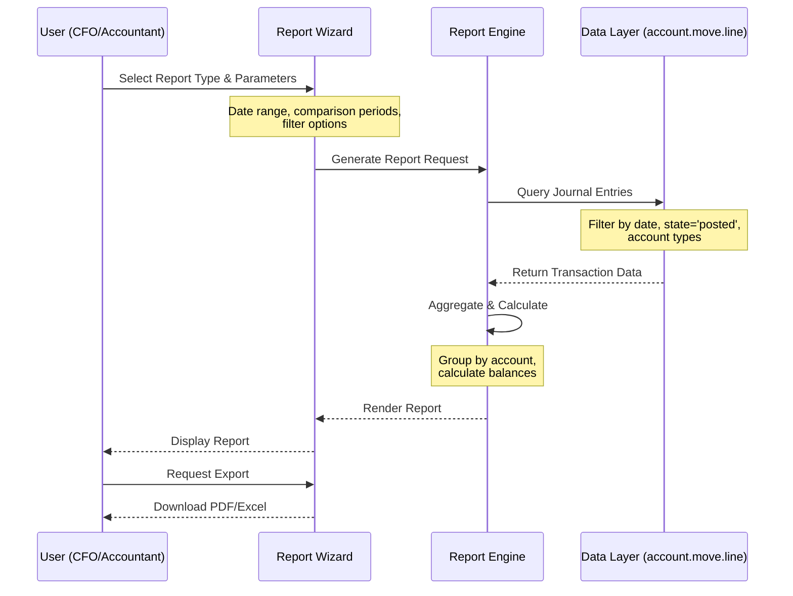
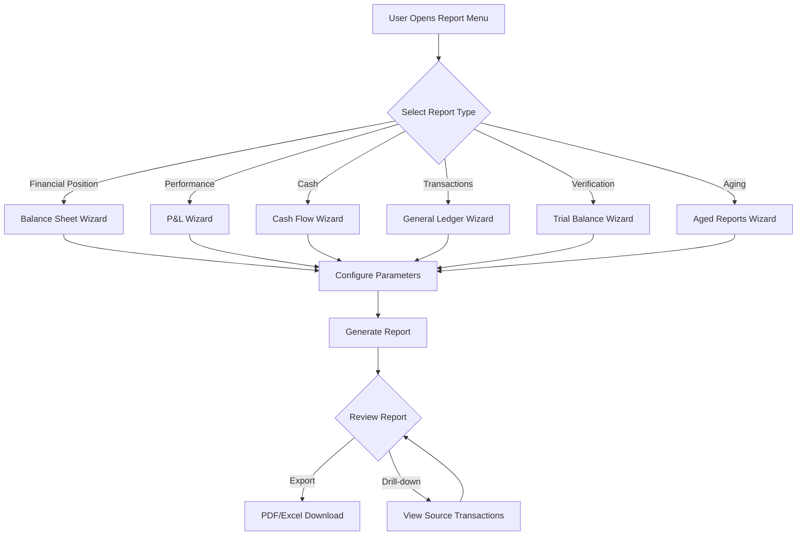
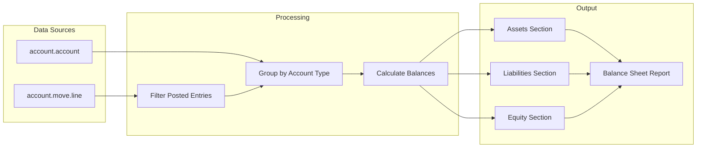

# FEATURE-001: Financial Reporting

---

## Metadata

| Attribute | Value |
|-----------|-------|
| **Feature ID** | FEATURE-001 |
| **Title** | Financial Reporting |
| **Parent Epic** | [EPIC-001: Enterprise Accounting Capabilities](../EPIC-001-enterprise-accounting.md) |
| **Status** | Draft |
| **Priority** | Critical |
| **Story Count** | 7 stories |
| **Last Updated** | 2024 |
| **Owner/Author** | Enterprise Accounting Team |

---

## 1. Feature Overview

### 1.1 Purpose and Business Value

This feature enables CFOs, Finance Directors, Accountants, Auditors, and Business Owners to generate **GAAP/IFRS-compliant financial statements** for enterprise reporting needs by providing automated report generation with comparative periods and drill-down capabilities.

**Business Value Delivered:**

- **All standard financial statements** (Balance Sheet, P&L, Cash Flow) producible for regulatory compliance
- **Investor reporting** capability with professional-grade financial documents
- **Bank loan applications** supported with auditable financial reports
- **Internal financial management** enhanced through real-time reporting visibility

> This feature addresses the core gap between Odoo Community Edition and Enterprise Edition for financial reporting, enabling SMEs to produce enterprise-grade financial statements without Enterprise licensing costs.

### 1.2 Problem Statement

Currently, Odoo Community Edition users must **manually compile financial data from multiple sources** and format reports in spreadsheets to produce Balance Sheets, P&L statements, Cash Flow statements, and other standard financial reports. This results in:

- **40+ hours of effort per quarter** for period-end reporting
- **High risk of calculation errors** in manual aggregation
- **Delayed reporting** to stakeholders, regulators, and financial institutions
- **Inconsistent formatting** that fails regulatory and audit requirements
- **No drill-down capability** to verify report figures against source transactions

### 1.3 Key Capabilities

| Capability ID | Capability Description | Related Stories |
|---------------|------------------------|-----------------|
| CAP-001 | Generate Balance Sheet report with Assets, Liabilities, Equity sections per GAAP/IFRS format | FR-001 |
| CAP-002 | Generate Profit & Loss statement with Revenue, Expenses, Net Income sections | FR-002 |
| CAP-003 | Create Cash Flow Statement with Operating, Investing, Financing activities | FR-003 |
| CAP-004 | Display General Ledger with all transactions by account | FR-004 |
| CAP-005 | Generate Trial Balance with debit/credit verification | FR-005 |
| CAP-006 | Produce Aged AR/AP reports with 30/60/90/120+ day aging buckets | FR-006 |
| CAP-007 | Support comparative periods (current vs prior period/year) | FR-001, FR-002, FR-003 |
| CAP-008 | Enable drill-down from report line to source transactions | FR-007 |
| CAP-009 | Export reports to PDF and Excel formats | FR-007 |

### 1.4 Success Criteria at Feature Level

| Criterion | Target | Verification Method |
|-----------|--------|---------------------|
| All standard reports available | 100% coverage (6 report types) | Feature completion checklist |
| Report accuracy | Zero calculation errors | Reconciliation with source journal entries |
| Comparative period support | At least 2 prior periods | Report parameter verification |
| Export functionality | PDF and Excel formats | Export operation testing |
| Drill-down capability | All report lines linkable to transactions | UI interaction testing |
| Performance | Reports generate in <30 seconds for typical datasets | Load testing with 100,000 transactions |
| Test coverage | ≥80% for all story implementations | Code coverage measurement |

---

## 2. User Personas

### 2.1 Persona Mapping

| Persona | Role Description | Primary Use Cases | Applicable |
|---------|------------------|-------------------|------------|
| CFO / Finance Director | Executive responsible for financial strategy and reporting | Balance Sheet for financial position; P&L for profitability analysis; Cash Flow for liquidity management; board presentations | ☑ Primary |
| Accountant / Bookkeeper | Day-to-day financial operations and transaction processing | General Ledger for transaction verification; Trial Balance for period close; daily operational reporting | ☑ Primary |
| Controller | Budget oversight and variance management | P&L with budget comparison (cross-feature integration) | ☐ Secondary (Budget feature) |
| Auditor | Transaction verification and compliance review | Drill-down in General Ledger; verify Trial Balance accuracy; report data integrity | ☑ Secondary |
| Business Owner | Overall business health and cash position | Cash Flow statement for liquidity; Aged Receivables for AR management | ☑ Secondary |

### 2.2 Persona Priority Summary

| Priority Level | Personas | Primary Stories |
|----------------|----------|-----------------|
| **Primary** | CFO/Finance Director, Accountant/Bookkeeper | FR-001, FR-002, FR-003, FR-004, FR-005 |
| **Secondary** | Auditor, Business Owner | FR-006, FR-007 |

---

## 3. Story List

### 3.1 User Stories

| Story ID | Story Title | Persona | Priority | Status | Link |
|----------|-------------|---------|----------|--------|------|
| FR-001 | Balance Sheet Report | CFO | Critical | Draft | [FR-001](../stories/financial-reporting/FR-001-balance-sheet-report.md) |
| FR-002 | Profit & Loss Statement | CFO | Critical | Draft | [FR-002](../stories/financial-reporting/FR-002-profit-loss-statement.md) |
| FR-003 | Cash Flow Statement | CFO | Critical | Draft | [FR-003](../stories/financial-reporting/FR-003-cash-flow-statement.md) |
| FR-004 | General Ledger Report | Accountant | High | Draft | [FR-004](../stories/financial-reporting/FR-004-general-ledger-report.md) |
| FR-005 | Trial Balance Report | Accountant | High | Draft | [FR-005](../stories/financial-reporting/FR-005-trial-balance-report.md) |
| FR-006 | Aged Receivable/Payable Reports | Accountant | High | Draft | [FR-006](../stories/financial-reporting/FR-006-aged-reports.md) |
| FR-007 | Report Export & Drill-down | Auditor | High | Draft | [FR-007](../stories/financial-reporting/FR-007-report-export-drilldown.md) |

### 3.2 Story Count Assessment

| Count | Assessment | Status |
|-------|------------|--------|
| **7 stories** | **Optimal range (3-7)** | Feature is well-scoped for independent delivery |

### 3.3 Story Dependency Ordering

| Story | Depends On | Notes |
|-------|------------|-------|
| FR-003 (Cash Flow) | FR-004 (General Ledger) | Cash flow derives from categorized ledger transaction data |
| FR-007 (Export & Drill-down) | FR-001, FR-002, FR-003, FR-004, FR-005, FR-006 | Export and drill-down functionality requires all reports to exist |
| FR-005 (Trial Balance) | FR-004 (General Ledger) | Trial Balance summarizes General Ledger account balances |

### 3.4 Implementation Sequence Recommendation

```
Phase 1 (Foundation):  FR-004 (General Ledger) → FR-005 (Trial Balance)
Phase 2 (Core Reports): FR-001 (Balance Sheet) → FR-002 (P&L) → FR-003 (Cash Flow)
Phase 3 (Supporting):   FR-006 (Aged Reports) → FR-007 (Export & Drill-down)
```

---

## 4. Acceptance Criteria Summary

### 4.1 Feature-Level Acceptance Criteria

The feature is considered complete when:

- [ ] All 7 stories within this feature have status "Done"
- [ ] All stories achieve minimum 80% test coverage
- [ ] Feature-level integration tests pass
- [ ] All 6 standard financial reports can be generated successfully
- [ ] Reports support comparison with at least 2 prior periods
- [ ] All reports can be exported to PDF and Excel formats
- [ ] Report data reconciles with underlying journal entries
- [ ] Drill-down from any report line navigates to source transactions
- [ ] Performance meets <30 second generation time for typical datasets

### 4.2 Report-Specific Acceptance Criteria

| Report | Key Acceptance Criteria |
|--------|------------------------|
| **Balance Sheet** | Assets, Liabilities, Equity sections per GAAP/IFRS format; Assets = Liabilities + Equity validation |
| **P&L Statement** | Revenue, Expenses, Net Income sections; Gross Profit and Operating Income subtotals |
| **Cash Flow Statement** | Operating, Investing, Financing activities; Direct or Indirect method support |
| **General Ledger** | All transactions by account with opening/closing balances; date range filtering |
| **Trial Balance** | Debit/Credit columns with totals; Total Debits = Total Credits validation |
| **Aged AR/AP** | 30/60/90/120+ day aging buckets; partner-level detail with drill-down |

### 4.3 Cross-Cutting Concerns

| Concern | Acceptance Criterion |
|---------|---------------------|
| License | All implementations use AGPL-3.0 compatible license |
| Dependencies | No imports from Odoo Enterprise modules (specifically `account_reports`) |
| Coding Standards | Code passes OCA quality checks (pre-commit, pylint-odoo) |
| Test Coverage | Each story achieves minimum 80% test coverage |
| Documentation | Public APIs documented with docstrings |
| Security | Access rights properly configured for Accountant and Manager roles |
| Performance | Reports generate in <30 seconds for datasets up to 100,000 transactions |

### 4.4 Integration Requirements

| Integration Point | Requirement | Verification |
|-------------------|-------------|--------------|
| Budget Management (FEATURE-003) | P&L can display budget vs actual columns | Report shows variance correctly when budget data exists |
| Bank Reconciliation (FEATURE-002) | Reconciled status reflected in General Ledger | GL marks reconciled transactions appropriately |
| `account.move` | Reports derive data from posted journal entries | Data reconciliation tests pass |
| `account.move.line` | Reports aggregate line items by account | Aggregation accuracy verified |
| `account.account` | Reports use account hierarchy and types | Proper grouping in Balance Sheet sections |
| `res.partner` | Aged reports show partner details | Partner drill-down functional |

### 4.5 Performance Requirements

| Metric | Requirement | Measurement Method |
|--------|-------------|-------------------|
| Report generation time | <30 seconds for 100,000 transactions | Load test with sample dataset |
| Export to PDF | <15 seconds for typical report | Timed export operation |
| Export to Excel | <10 seconds for typical report | Timed export operation |
| Drill-down response | <2 seconds to load transaction details | UI interaction timing |
| Comparative period calculation | <5 seconds additional per comparison period | Incremental timing test |

---

## 5. Constraints (Inherited from Epic)

### 5.1 License Requirements

| Constraint | Requirement | Rationale |
|------------|-------------|-----------|
| **License Compatibility** | AGPL-3.0 | All new modules must be distributed under AGPL-3.0 compatible license |
| **Existing License Respect** | LGPL-3 (base modules) | Integration with existing Odoo `account` module must respect LGPL-3 licensing |

**Acceptance Criterion:** Module distributed under AGPL-3.0 compatible license.

### 5.2 Dependency Restrictions

| Constraint | Requirement | Rationale |
|------------|-------------|-----------|
| **No Enterprise Dependencies** | Zero imports from Enterprise Edition | Ensures solution works for Community Edition users |
| **Specifically Excluded** | `account_reports` Enterprise module | This is the Enterprise equivalent being replaced |
| **OCA Compatibility** | Compatible with OCA modules | Allows integration with existing OCA ecosystem |

**Acceptance Criterion:** No imports or dependencies on Odoo Enterprise edition modules.

### 5.3 Coding Standards

| Constraint | Requirement | Rationale |
|------------|-------------|-----------|
| **Odoo Guidelines** | Follow Odoo coding standards | Consistency with Odoo ecosystem |
| **OCA Standards** | Adhere to OCA module guidelines | Enables potential OCA contribution |
| **PEP 8 Compliance** | Python code follows PEP 8 | Standard Python style compliance |

**Acceptance Criterion:** Code passes OCA quality checks (pre-commit hooks, pylint-odoo).

### 5.4 Test Coverage

| Constraint | Requirement | Rationale |
|------------|-------------|-----------|
| **Minimum Coverage** | 80% test coverage | Ensures reliability and maintainability |
| **Test Types** | Unit, Integration, Acceptance | Comprehensive testing at all levels |
| **BDD Alignment** | Tests match acceptance criteria | Stories are verifiable through automated tests |

**Acceptance Criterion:** Implementation achieves minimum 80% test coverage.

### 5.5 Version Compatibility

| Constraint | Requirement | Notes |
|------------|-------------|-------|
| **Target Version** | Odoo 18.0 | Per user requirements specification |
| **Repository Version** | Odoo 19.0 | Repository uses version 19.0; migration considerations may apply |
| **Python Version** | Python 3.10+ | Odoo version-dependent requirement |

**Note:** User stories are written version-agnostic where possible. Implementation agents should evaluate version-specific APIs during discovery phase.

---

## 6. Technical Discovery Notes

> **Purpose:** These notes guide implementing agents in their codebase analysis before making implementation decisions. User stories describe WHAT and WHY; implementation details emerge from agent discovery of the codebase.

### 6.1 Codebase Analysis Areas

| Analysis Area | Purpose | Key Questions |
|---------------|---------|---------------|
| `addons/account/report/` | Understand existing report patterns | How are current reports structured? What patterns exist for SQL-based reports vs QWeb? |
| `addons/account/report/account_invoice_report.py` | Study SQL view report implementation | How does `_auto = False` pattern work? How is `_table_query` constructed? |
| `addons/account/models/account_move.py` | Transaction data source patterns | How to efficiently query posted journal entries? What indexes exist? |
| `addons/account/models/account_move_line.py` | Line item aggregation | How to aggregate by account for report sections? Currency handling? |
| `addons/account/models/account_account.py` | Account classification | How does `account_type` field map to Balance Sheet sections? How does `internal_group` work? |
| `addons/account/views/*_report*.xml` | Report UI patterns | How are report wizards implemented? What parameters are common? |

### 6.2 Account Type Mapping for Reports

Based on analysis of `addons/account/models/account_account.py`, account types map to financial statement sections:

| Account Type | Internal Group | Balance Sheet Section | P&L Section |
|--------------|---------------|----------------------|-------------|
| `asset_receivable` | Asset | Current Assets | - |
| `asset_cash` | Asset | Cash and Cash Equivalents | - |
| `asset_current` | Asset | Current Assets | - |
| `asset_non_current` | Asset | Non-current Assets | - |
| `asset_prepayments` | Asset | Prepaid Expenses | - |
| `asset_fixed` | Asset | Fixed Assets | - |
| `liability_payable` | Liability | Current Liabilities | - |
| `liability_credit_card` | Liability | Current Liabilities | - |
| `liability_current` | Liability | Current Liabilities | - |
| `liability_non_current` | Liability | Non-current Liabilities | - |
| `equity` | Equity | Equity | - |
| `equity_unaffected` | Equity | Retained Earnings | - |
| `income` | Income | - | Revenue |
| `income_other` | Income | - | Other Income |
| `expense` | Expense | - | Operating Expenses |
| `expense_other` | Expense | - | Other Expenses |
| `expense_depreciation` | Expense | - | Depreciation |
| `expense_direct_cost` | Expense | - | Cost of Revenue |
| `off_balance` | Off Balance | Off-Balance Sheet | - |

### 6.3 Existing Odoo Modules to Examine

| Module | Path | Relevance to This Feature |
|--------|------|---------------------------|
| `account` | `addons/account/` | Core accounting models, existing report infrastructure, account types |
| `analytic` | `addons/analytic/` | Analytic account integration for report filtering |
| `base` | `odoo/addons/base/` | Partner and company models for report context |

### 6.4 OCA Module Compatibility Considerations

| OCA Module | Repository | Consideration |
|------------|------------|---------------|
| `account_financial_report` | [OCA/account-financial-reporting](https://github.com/OCA/account-financial-reporting) | Provides General Ledger, Trial Balance, Aged Partner Balance - evaluate for extension vs. replacement |
| `report_xlsx` | [OCA/reporting-engine](https://github.com/OCA/reporting-engine) | Excel export functionality - potential integration for XLSX exports |
| `mis_builder` | [OCA/mis-builder](https://github.com/OCA/mis-builder) | Financial report builder - evaluate for report engine patterns |

### 6.5 Report Data Sources

| Report | Primary Data Source | Key Model Fields |
|--------|---------------------|------------------|
| Balance Sheet | `account.account` aggregated by type | `account_type`, `internal_group`, balance computation |
| P&L Statement | `account.move.line` by date range | `balance`, `debit`, `credit`, `account_id.account_type` |
| Cash Flow | `account.move.line` by cash accounts | Transaction classification by activity type |
| General Ledger | `account.move.line` | All transaction fields, partner, date, reference |
| Trial Balance | `account.account` balances | Opening balance, period movement, closing balance |
| Aged Reports | `account.move.line` with date analysis | `date_maturity`, `amount_residual`, `partner_id` |

### 6.6 Integration Points

| Integration Point | Model/Module | Integration Type | Notes |
|-------------------|--------------|------------------|-------|
| Transaction data | `account.move` | Read | Query posted journal entries (`state = 'posted'`) |
| Line items | `account.move.line` | Read | Aggregate by account for report sections |
| Account hierarchy | `account.account` | Read | Group accounts by type for Balance Sheet/P&L sections |
| Partner data | `res.partner` | Read | Customer/vendor details for aged reports |
| Company settings | `res.company` | Read | Currency, fiscal year settings, report headers |
| Currency rates | `res.currency` | Read | Multi-currency report support |

### 6.7 Discovery vs. Prescription Guidelines

> **Important:** User stories and feature specifications describe WHAT functionality is needed and WHY users need it. They do NOT prescribe HOW to implement.

**DO NOT specify in user stories:**
- Specific model names or field definitions
- Database schema decisions
- UI component architecture (OWL vs. legacy)
- Specific Odoo API methods to use
- Module structure or file organization

**DO defer to agent discovery:**
- D-001: Model inheritance patterns (extension vs. new model)
- D-002: OCA module integration strategy (extend `account_financial_report` or create new)
- D-003: Report engine approach (QWeb templates, SQL views, or dedicated engine)
- D-004: UI component patterns (wizard implementation, report preview)
- D-005: Data model extension approach (computed fields vs. SQL views)

---

## 7. Dependencies

### 7.1 Related Features

| Feature | ID | Relationship | Notes |
|---------|-----|--------------|-------|
| Budget Management | FEATURE-003 | Related | P&L can show budget vs actual comparison when budget data exists |
| Bank Reconciliation | FEATURE-002 | Related | Reconciled status reflected in General Ledger transactions |
| Asset Management | FEATURE-004 | Related | Depreciation entries appear in P&L and General Ledger |
| Deferred Revenue | FEATURE-005 | Related | Recognition entries appear in P&L and General Ledger |

### 7.2 Required Odoo Modules

| Module | Technical Name | Dependency Type | Purpose |
|--------|---------------|-----------------|---------|
| Invoicing | `account` | Required | Core accounting models (`account.move`, `account.move.line`, `account.account`) |
| Analytic Accounting | `analytic` | Required | Analytic dimension support for report filtering |
| Portal | `portal` | Optional | External user report access (if applicable) |
| Base | `base` | Required | Partner, company, currency models |

### 7.3 External Standards and Specifications

| Standard | Reference | Application to This Feature |
|----------|-----------|----------------------------|
| **GAAP** | US FASB ASC | Balance Sheet, P&L format and presentation requirements |
| **IFRS** | IFRS Foundation Standards | International financial statement format compliance |
| **IFRS for SMEs** | Section 3-8 | Simplified financial statement requirements for smaller entities |

---

## 8. Feature Workflow Diagram

### 8.1 Financial Report Generation Workflow



### 8.2 Report Type Selection Flow



### 8.3 Data Flow for Balance Sheet Generation



---

## 9. Report Types Reference

### 9.1 Financial Statement Reports

| Report | GAAP/IFRS Section | Data Source | Key Calculations |
|--------|-------------------|-------------|------------------|
| **Balance Sheet** | Statement of Financial Position | `account.account` aggregated by `account_type` | Assets = Liabilities + Equity |
| **P&L Statement** | Statement of Comprehensive Income | `account.move.line` by date range | Revenue - Expenses = Net Income |
| **Cash Flow** | Statement of Cash Flows | `account.move.line` by cash accounts | Operating + Investing + Financing = Net Change |

### 9.2 Supporting Schedule Reports

| Report | Purpose | Data Source | Key Features |
|--------|---------|-------------|--------------|
| **General Ledger** | Transaction detail by account | `account.move.line` | Opening balance, transactions, closing balance |
| **Trial Balance** | Debit/credit verification | `account.account` balances | Total Debits = Total Credits |
| **Aged AR/AP** | Receivable/payable aging | `account.move.line` by due date | 30/60/90/120+ day buckets |

### 9.3 Report Parameters Matrix

| Parameter | Balance Sheet | P&L | Cash Flow | General Ledger | Trial Balance | Aged Reports |
|-----------|--------------|-----|-----------|----------------|---------------|--------------|
| As-of Date | ✓ | - | - | - | ✓ | ✓ |
| Date Range | - | ✓ | ✓ | ✓ | - | - |
| Comparison Periods | ✓ | ✓ | ✓ | - | ✓ | - |
| Account Filter | ✓ | ✓ | ✓ | ✓ | ✓ | - |
| Partner Filter | - | - | - | ✓ | - | ✓ |
| Journal Filter | - | - | - | ✓ | - | - |
| Show Zero Balances | ✓ | ✓ | - | ✓ | ✓ | - |
| Currency | ✓ | ✓ | ✓ | ✓ | ✓ | ✓ |

---

## 10. Related Documentation

### 10.1 Epic Reference

| Document | Link |
|----------|------|
| Parent Epic | [EPIC-001: Enterprise Accounting Capabilities](../EPIC-001-enterprise-accounting.md) |

### 10.2 Story Files

| Story | Link |
|-------|------|
| FR-001: Balance Sheet Report | [FR-001](../stories/financial-reporting/FR-001-balance-sheet-report.md) |
| FR-002: Profit & Loss Statement | [FR-002](../stories/financial-reporting/FR-002-profit-loss-statement.md) |
| FR-003: Cash Flow Statement | [FR-003](../stories/financial-reporting/FR-003-cash-flow-statement.md) |
| FR-004: General Ledger Report | [FR-004](../stories/financial-reporting/FR-004-general-ledger-report.md) |
| FR-005: Trial Balance Report | [FR-005](../stories/financial-reporting/FR-005-trial-balance-report.md) |
| FR-006: Aged Receivable/Payable Reports | [FR-006](../stories/financial-reporting/FR-006-aged-reports.md) |
| FR-007: Report Export & Drill-down | [FR-007](../stories/financial-reporting/FR-007-report-export-drilldown.md) |

### 10.3 External References

| Resource | URL | Purpose |
|----------|-----|---------|
| OCA account-financial-reporting | https://github.com/OCA/account-financial-reporting | Financial report module patterns and potential integration |
| OCA reporting-engine | https://github.com/OCA/reporting-engine | Excel export functionality (`report_xlsx`) |
| Odoo Accounting Documentation | https://www.odoo.com/documentation/18.0/applications/finance/accounting.html | Official accounting module documentation |
| FASB ASC | https://asc.fasb.org/ | US GAAP accounting standards reference |
| IFRS Standards | https://www.ifrs.org/issued-standards/ | International financial reporting standards |

### 10.4 Source Code References

| File | Purpose |
|------|---------|
| `addons/account/report/account_invoice_report.py` | SQL view report pattern reference |
| `addons/account/models/account_account.py` | Account type classifications for report sections |
| `addons/account/models/account_move.py` | Journal entry model for transaction data |
| `addons/account/__manifest__.py` | Module dependency patterns |

---

## 11. Revision History

| Version | Date | Author | Changes |
|---------|------|--------|---------|
| 1.0 | 2024 | Enterprise Accounting Team | Initial feature specification |

---

## Appendix A: Glossary

| Term | Definition |
|------|------------|
| **GAAP** | Generally Accepted Accounting Principles - US accounting standards |
| **IFRS** | International Financial Reporting Standards - global accounting standards |
| **Balance Sheet** | Financial statement showing assets, liabilities, and equity at a point in time |
| **P&L Statement** | Profit and Loss statement showing revenue and expenses over a period |
| **Cash Flow Statement** | Statement showing cash inflows and outflows by activity type |
| **General Ledger** | Complete record of all financial transactions by account |
| **Trial Balance** | Summary of all account balances verifying debit/credit equality |
| **Aged Report** | Analysis of receivables or payables by how long they've been outstanding |
| **Drill-down** | Navigation from summary to underlying transaction detail |
| **Comparative Period** | Prior period shown alongside current period for comparison |
