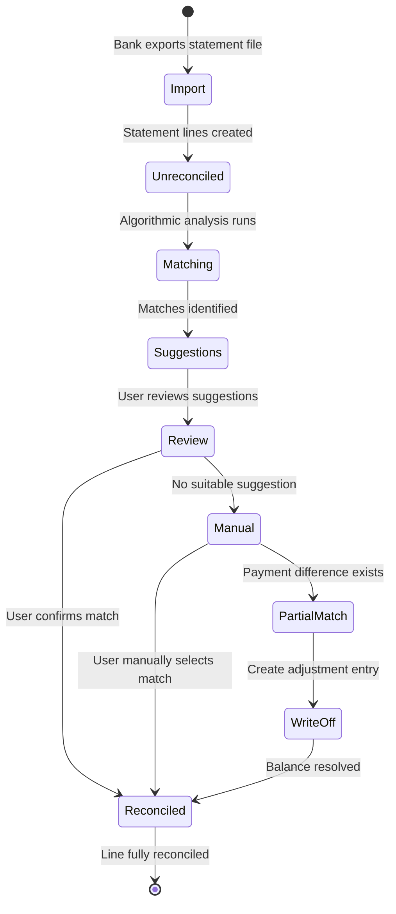
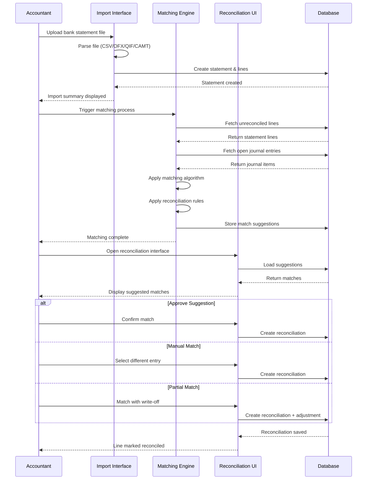
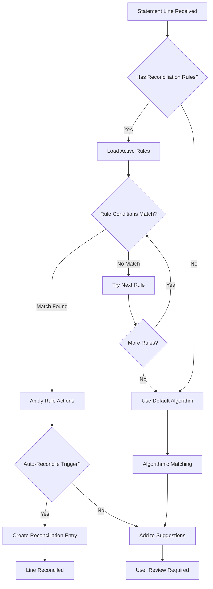

# FEATURE-002: Bank Reconciliation

---

## Metadata

| Attribute | Value |
|-----------|-------|
| **Feature ID** | `FEATURE-002` |
| **Title** | Bank Reconciliation |
| **Parent Epic** | [EPIC-001: Enterprise Accounting Capabilities](../EPIC-001-enterprise-accounting.md) |
| **Status** | Draft |
| **Priority** | Critical |
| **Story Count** | 5 stories |
| **Last Updated** | 2024 |
| **Owner/Author** | Enterprise Accounting Team |

---

## 1. Feature Overview

### 1.1 Purpose and Business Value

This feature enables **Accountants and Bookkeepers** to efficiently reconcile bank statements with journal entries by providing **algorithmic matching suggestions, configurable reconciliation rules, and multi-format statement import capabilities**. It addresses the critical business need for accurate and timely bank reconciliation, which is fundamental to maintaining reliable financial records.

**Business Value Statement:**
> Bank reconciliation matching accuracy ≥95% with algorithmic suggestions, reducing manual reconciliation effort by 70-80% and enabling daily reconciliation completion within minutes instead of hours.

### 1.2 Problem Statement

Currently, organizations using Odoo Community Edition must either:
- **Manually match** every bank statement line with corresponding journal entries, a time-consuming and error-prone process
- **Use Enterprise Edition** features (`account_accountant` module) which requires additional licensing costs
- **Rely on basic matching** without intelligent suggestions or pattern-based automation

This results in:
- **Hours of manual effort** per bank account per month
- **Delayed period-close activities** waiting for reconciliation completion
- **Increased risk of errors** in matching transactions
- **Limited audit trail** for reconciliation decisions

### 1.3 Key Capabilities

| Capability ID | Capability Description | Related Stories |
|---------------|----------------------|-----------------|
| CAP-001 | Import bank statements in multiple formats (CSV, OFX, QIF, CAMT.053) | BR-001 |
| CAP-002 | Automatically suggest matches using algorithmic analysis of amount, date, reference, and partner | BR-002 |
| CAP-003 | Provide interface for manual reconciliation of unmatched or disputed items | BR-003 |
| CAP-004 | Configure reusable reconciliation rules for pattern-based automatic matching | BR-004 |
| CAP-005 | Support partial reconciliation for payment differences and split transactions | BR-005 |

### 1.4 Success Criteria at Feature Level

| Criterion | Target | Verification Method |
|-----------|--------|-------------------|
| Algorithmic matching accuracy | ≥95% correct matches | Test scenarios with known reconciliation pairs |
| Import format support | 4 formats (CSV, OFX, QIF, CAMT.053) | Import tests for each format |
| Reconciliation time reduction | 70-80% reduction vs manual | Time comparison before/after implementation |
| Test coverage | ≥80% for all story implementations | Code coverage analysis tools |
| Unreconciled items visibility | 100% traceability | UI verification of unmatched items |

---

## 2. User Personas

### 2.1 Persona Mapping

| Persona | Role Description | Primary Use Cases | Applicable |
|---------|------------------|-------------------|------------|
| CFO / Finance Director | Executive responsible for financial strategy and reporting | Review reconciliation status reports for period close | ☐ No |
| **Accountant / Bookkeeper** | Day-to-day financial operations and transaction processing | All reconciliation workflows: import, matching, rules, manual reconciliation | ☑ **Primary** |
| Controller | Budget oversight and variance management | N/A - Budget feature focus | ☐ No |
| Auditor | Transaction verification and compliance review | Review reconciliation audit trail | ☐ Secondary |
| Business Owner | Overall business health and cash position | View reconciliation summary for cash position | ☐ Secondary |

### 2.2 Primary Persona Detail: Accountant / Bookkeeper

The **Accountant / Bookkeeper** is the primary user of this feature, responsible for:

- **Daily Activities**: Importing bank statements, reviewing matching suggestions, confirming or rejecting matches
- **Weekly Activities**: Creating reconciliation rules for recurring transactions, handling exceptions
- **Monthly Activities**: Ensuring all transactions are reconciled before period close, generating reconciliation reports
- **Pain Points Addressed**: Eliminates tedious manual matching, provides intelligent suggestions, reduces errors

### 2.3 Persona-to-Story Mapping

| Story ID | Primary Persona | Secondary Personas | Use Context |
|----------|----------------|-------------------|-------------|
| BR-001 | Accountant | None | Daily statement import |
| BR-002 | Accountant | None | Daily transaction matching |
| BR-003 | Accountant | Auditor | Exception handling, audit review |
| BR-004 | Accountant | None | Rule setup and maintenance |
| BR-005 | Accountant | None | Complex transaction handling |

---

## 3. Story List

### 3.1 User Stories

| Story ID | Story Title | Persona | Priority | Status | Link |
|----------|-------------|---------|----------|--------|------|
| BR-001 | Statement Import | Accountant | Critical | Draft | [BR-001](../stories/bank-reconciliation/BR-001-statement-import.md) |
| BR-002 | Algorithmic Matching | Accountant | Critical | Draft | [BR-002](../stories/bank-reconciliation/BR-002-algorithmic-matching.md) |
| BR-003 | Manual Reconciliation | Accountant | High | Draft | [BR-003](../stories/bank-reconciliation/BR-003-manual-reconciliation.md) |
| BR-004 | Reconciliation Rules | Accountant | High | Draft | [BR-004](../stories/bank-reconciliation/BR-004-reconciliation-rules.md) |
| BR-005 | Partial Reconciliation | Accountant | Medium | Draft | [BR-005](../stories/bank-reconciliation/BR-005-partial-reconciliation.md) |

### 3.2 Story Count Assessment

| Count | Assessment | Status |
|-------|------------|--------|
| **5 stories** | **Optimal range (3-7)** | ✓ Feature is well-scoped for independent delivery |

### 3.3 Story Dependency Ordering

| Story | Depends On | Notes |
|-------|-----------|-------|
| BR-002 (Algorithmic Matching) | BR-001 (Statement Import) | Matching requires imported statement lines to process |
| BR-003 (Manual Reconciliation) | BR-001 (Statement Import) | Manual reconciliation operates on imported statement lines |
| BR-004 (Reconciliation Rules) | BR-002 (Algorithmic Matching) | Rules extend/configure the matching algorithm |
| BR-005 (Partial Reconciliation) | BR-003 (Manual Reconciliation) | Partial reconciliation is a specialized manual workflow |

### 3.4 Recommended Implementation Order

```
1. BR-001 (Statement Import)        - Foundation: Import capabilities
     ↓
2. BR-002 (Algorithmic Matching)    - Core: Automatic matching engine
     ↓
3. BR-003 (Manual Reconciliation)   - Essential: Exception handling
     ↓
4. BR-004 (Reconciliation Rules)    - Enhancement: Pattern automation
     ↓
5. BR-005 (Partial Reconciliation)  - Advanced: Complex scenarios
```

---

## 4. Acceptance Criteria Summary

### 4.1 Feature-Level Acceptance Criteria

The feature is considered complete when:

- [ ] All 5 stories within this feature have status "Done"
- [ ] All stories achieve minimum 80% test coverage
- [ ] Feature-level integration tests pass
- [ ] Bank statements can be imported in CSV, OFX, QIF, and CAMT.053 (ISO 20022) formats
- [ ] Algorithmic matching achieves ≥95% accuracy on standard test scenarios
- [ ] Manual reconciliation interface allows matching/unmatching of any statement line
- [ ] Reconciliation rules can be created, edited, and applied automatically
- [ ] Partial reconciliation supports split matching with write-off handling

### 4.2 Cross-Cutting Concerns

| Concern | Acceptance Criterion |
|---------|---------------------|
| License | All implementations use AGPL-3.0 compatible license |
| Dependencies | No imports from Odoo Enterprise modules (specifically `account_accountant`) |
| Coding Standards | Code passes OCA quality checks (pre-commit, pylint-odoo) |
| Test Coverage | Each story achieves minimum 80% test coverage |
| Documentation | Public APIs documented with docstrings |
| Security | Access rights properly configured for Accountant/Bookkeeper role |
| Performance | Matching algorithm completes within 5 seconds for 1,000 statement lines |

### 4.3 Integration Requirements

| Integration Point | Requirement | Verification |
|-------------------|-------------|--------------|
| `account.bank.statement` | Statement import creates valid statement records | Statement integrity validation |
| `account.bank.statement.line` | Statement lines properly linked to statements | Line-statement relationship tests |
| `account.move` / `account.move.line` | Reconciliation links statement lines to journal entries | Reconciliation state verification |
| `account.reconcile.model` | Reconciliation rules extend existing model patterns | Rule execution tests |
| `res.partner` | Partner matching for customer/vendor identification | Partner matching accuracy tests |
| `account.journal` | Bank journal association maintained | Journal-statement linkage tests |

### 4.4 Performance Requirements

| Metric | Requirement | Measurement Method |
|--------|-------------|-------------------|
| Statement import time | <10 seconds for 500 lines | Timed import test |
| Algorithmic matching time | <5 seconds for 1,000 lines | Timed matching test |
| Manual reconciliation response | <2 seconds per action | UI interaction timing |
| Rule evaluation time | <1 second per rule application | Rule execution benchmark |

---

## 5. Constraints (Inherited from Epic)

### 5.1 License Requirements

| Constraint | Requirement | Rationale |
|------------|-------------|-----------|
| **License Compatibility** | AGPL-3.0 | All new modules must be distributed under AGPL-3.0 compatible license |
| **Existing License Respect** | LGPL-3 (base modules) | Integration with existing Odoo `account` module must respect its LGPL-3 licensing |

**Acceptance Criterion:** Module distributed under AGPL-3.0 compatible license.

### 5.2 Dependency Restrictions

| Constraint | Requirement | Rationale |
|------------|-------------|-----------|
| **No Enterprise Dependencies** | Zero imports from Enterprise Edition | Ensures solution works for Community Edition users |
| **Specific Exclusion** | No `account_accountant` module dependency | This is the Enterprise bank reconciliation module |
| **OCA Compatibility** | Compatible with OCA modules | Allows integration with existing OCA ecosystem |

**Acceptance Criterion:** No imports or dependencies on Odoo Enterprise edition modules.

### 5.3 Coding Standards

| Constraint | Requirement | Rationale |
|------------|-------------|-----------|
| **Odoo Guidelines** | Follow Odoo coding standards | Consistency with Odoo ecosystem |
| **OCA Standards** | Adhere to OCA module guidelines | Enables potential OCA contribution |
| **PEP 8 Compliance** | Python code follows PEP 8 | Standard Python style compliance |

**Acceptance Criterion:** Code passes OCA quality checks (pre-commit hooks, pylint-odoo).

### 5.4 Test Coverage

| Constraint | Requirement | Rationale |
|------------|-------------|-----------|
| **Minimum Coverage** | 80% test coverage | Ensures reliability and maintainability |
| **Test Types** | Unit, Integration, Acceptance | Comprehensive testing at all levels |
| **BDD Alignment** | Tests match acceptance criteria | Stories are verifiable |

**Acceptance Criterion:** Implementation achieves minimum 80% test coverage.

### 5.5 Version Compatibility

| Constraint | Requirement | Notes |
|------------|-------------|-------|
| **Target Version** | Odoo 18.0 | As specified in user requirements |
| **Repository Version** | Odoo 19.0 | Repository is newer; stories written version-agnostic |
| **Python Version** | Python 3.10+ | Odoo version-dependent |

**Note:** User requirements specify Odoo 18.0 target, but repository is Odoo 19.0. Implementation agents should note potential migration considerations in their discovery phase.

---

## 6. Technical Discovery Notes

> **Purpose:** These notes guide implementing agents in their codebase analysis before making implementation decisions. User stories describe WHAT and WHY; implementation details emerge from agent discovery of the codebase.

### 6.1 Codebase Analysis Areas

| Analysis Area | Purpose | Key Questions |
|---------------|---------|---------------|
| `addons/account/models/account_bank_statement.py` | Understand statement model structure | How are statements and lines structured? What computed fields exist for balance tracking? |
| `addons/account/models/account_reconcile_model.py` | Understand existing reconciliation patterns | What trigger types exist (manual/auto)? How are matching conditions defined (amount, label regex)? |
| `addons/account/views/account_bank_statement_views.xml` | Statement UI patterns | How are statements displayed and edited? What wizards exist for import? |
| `addons/account/views/account_reconcile_model_views.xml` | Rule configuration UI | How are reconciliation rules configured in the UI? |
| `addons/account/wizard/` | Existing wizards | Are there existing import wizards? What patterns are used for user interactions? |

### 6.2 Key Source Code Findings

Based on preliminary analysis of source files:

**`account.bank.statement` Model:**
- Fields: `name`, `reference`, `date`, `balance_start`, `balance_end`, `balance_end_real`
- Computed fields for `is_complete` (balance matches) and `is_valid` (sequential integrity)
- Line relationship via `line_ids` to `account.bank.statement.line`
- Ordering by `first_line_index` for statement sequencing

**`account.reconcile.model` Model:**
- Trigger types: `manual` and `auto_reconcile`
- Match conditions: `match_label` (contains, not_contains, match_regex)
- Match conditions: `match_amount` (lower, greater, between)
- Partner matching: `match_partner_ids`
- Journal filtering: `match_journal_ids`
- Line templates: `line_ids` for write-off/adjustment entries

### 6.3 Existing Odoo Modules to Examine

| Module | Path | Relevance to This Feature |
|--------|------|--------------------------|
| `account` | `addons/account/` | Core accounting models, statement models, reconciliation models |
| `base_import` | `addons/base_import/` | Generic import patterns for CSV and other formats |
| `base` | `odoo/addons/base/` | Partner model for customer/vendor matching |

### 6.4 OCA Module Compatibility Considerations

| OCA Module | Repository | Consideration |
|------------|------------|---------------|
| `account_reconcile_oca` | OCA/account-reconcile | Community reconciliation interface - evaluate for extension vs. replacement |
| `account_statement_import` | OCA/bank-statement-import | Multi-format import capabilities - potential foundation for BR-001 |
| `account_statement_import_ofx` | OCA/bank-statement-import | OFX format support - specific import handler |
| `account_statement_import_camt` | OCA/bank-statement-import | CAMT.053 (ISO 20022) support - European standard |

### 6.5 Integration Points

| Integration Point | Model/Module | Integration Type | Notes |
|-------------------|--------------|------------------|-------|
| Statement storage | `account.bank.statement` | Extend | Import creates statement records |
| Statement lines | `account.bank.statement.line` | Extend | Lines store individual transactions |
| Journal entries | `account.move` / `account.move.line` | Read | Reconciliation links to journal items |
| Reconciliation rules | `account.reconcile.model` | Extend | Rules drive automatic matching |
| Partner matching | `res.partner` | Read | Match customer/vendor names and references |
| Bank journals | `account.journal` | Read | Associate statements with bank accounts |

### 6.6 Discovery vs. Prescription Guidelines

> **Important:** User stories and feature specifications describe WHAT functionality is needed and WHY users need it. They do NOT prescribe HOW to implement.

**DO NOT specify in user stories:**
- Specific model names or field definitions for new functionality
- Database schema decisions for matching algorithm storage
- UI component architecture (OWL vs. legacy) for reconciliation interface
- Specific Odoo API methods to use for import parsing
- Module structure or file organization

**DO defer to agent discovery:**
- D-001: Model inheritance patterns for statement enhancements
- D-002: OCA module integration strategy for import formats
- D-003: Matching algorithm implementation approach
- D-004: UI component patterns for reconciliation interface
- D-005: Data model extension approach for partial reconciliation

---

## 7. Supported Import Formats

### 7.1 Format Specifications

| Format | Standard | Description | Common Use |
|--------|----------|-------------|------------|
| **CSV** | Generic | Comma-separated values with configurable column mapping | Universal, any bank |
| **OFX** | Open Financial Exchange | XML-based US banking standard | US and Canadian banks |
| **QIF** | Quicken Interchange Format | Legacy text-based format | Older banking systems |
| **CAMT.053** | ISO 20022 | XML-based European banking standard | European SEPA banks |

### 7.2 Format-Specific Requirements

**CSV Import:**
- Configurable column mapping (date, amount, reference, description)
- Support for multiple date formats
- Currency handling for multi-currency accounts
- Header row detection

**OFX Import:**
- OFX 1.x and 2.x version support
- Transaction type mapping (debit/credit)
- Bank account verification
- Balance extraction (start/end)

**QIF Import:**
- Standard QIF field mapping
- Category handling
- Memo/description extraction

**CAMT.053 Import:**
- ISO 20022 XML parsing
- Bank-to-customer statement support
- Entry and detail level extraction
- Multi-currency transaction handling

---

## 8. Feature Workflow Diagram

### 8.1 Bank Reconciliation Workflow



### 8.2 Detailed Process Flow



### 8.3 Reconciliation Rule Application Flow



---

## 9. Dependencies

### 9.1 Related Features

| Feature | ID | Relationship | Notes |
|---------|-----|--------------|-------|
| Financial Reporting | FEATURE-001 | Related | General Ledger shows reconciled vs unreconciled status |
| Payment Follow-ups | FEATURE-006 | Related | Follow-ups consider reconciled payments |

### 9.2 Required Odoo Modules

| Module | Technical Name | Dependency Type | Purpose |
|--------|---------------|-----------------|---------|
| Invoicing | `account` | Required | Core accounting models, statement infrastructure |
| Base | `base` | Required | Partner model for matching |

### 9.3 External Standards and Specifications

| Standard | Reference | Application to This Feature |
|----------|-----------|----------------------------|
| ISO 20022 | CAMT.053 Message | Bank-to-customer statement format for European banks |
| Open Financial Exchange | OFX Specification 2.2 | US banking data exchange format |
| Quicken Interchange Format | QIF Specification | Legacy import format support |
| CSV | RFC 4180 | Generic delimiter-separated values import |

---

## 10. Related Documentation

### 10.1 Epic Reference

| Document | Link |
|----------|------|
| Parent Epic | [EPIC-001: Enterprise Accounting Capabilities](../EPIC-001-enterprise-accounting.md) |

### 10.2 Story Files

| Story | Link |
|-------|------|
| BR-001: Statement Import | [BR-001](../stories/bank-reconciliation/BR-001-statement-import.md) |
| BR-002: Algorithmic Matching | [BR-002](../stories/bank-reconciliation/BR-002-algorithmic-matching.md) |
| BR-003: Manual Reconciliation | [BR-003](../stories/bank-reconciliation/BR-003-manual-reconciliation.md) |
| BR-004: Reconciliation Rules | [BR-004](../stories/bank-reconciliation/BR-004-reconciliation-rules.md) |
| BR-005: Partial Reconciliation | [BR-005](../stories/bank-reconciliation/BR-005-partial-reconciliation.md) |

### 10.3 External References

| Resource | URL | Purpose |
|----------|-----|---------|
| OCA account-reconcile | https://github.com/OCA/account-reconcile | Community reconciliation interface patterns |
| OCA bank-statement-import | https://github.com/OCA/bank-statement-import | Multi-format statement import modules |
| ISO 20022 Message Definitions | https://www.iso20022.org/catalogue-messages | CAMT.053 specification |
| OFX Specification | https://www.ofx.net/downloads.html | Open Financial Exchange format |
| Odoo Accounting Documentation | https://www.odoo.com/documentation/18.0/applications/finance/accounting.html | Official accounting module docs |

---

## 11. Revision History

| Version | Date | Author | Changes |
|---------|------|--------|---------|
| 1.0 | 2024 | Enterprise Accounting Team | Initial feature specification |

---

## Appendix A: Matching Algorithm Considerations

> **Note:** The following describes functional requirements for matching. Implementation approach is determined through agent discovery.

### A.1 Matching Criteria Priority

The algorithmic matching should consider the following criteria in order of reliability:

| Priority | Criterion | Description | Typical Weight |
|----------|-----------|-------------|----------------|
| 1 | Exact amount | Statement line amount matches journal entry exactly | Highest |
| 2 | Reference match | Bank reference matches payment/invoice reference | High |
| 3 | Partner identification | Partner name/account in statement matches journal partner | High |
| 4 | Date proximity | Transaction date within configurable window | Medium |
| 5 | Fuzzy reference | Partial reference match (contains, regex) | Medium |
| 6 | Amount tolerance | Amount within configurable tolerance percentage | Lower |

### A.2 Matching Confidence Levels

| Confidence | Criteria Met | Recommended Action |
|------------|--------------|-------------------|
| **High (90-100%)** | Exact amount + Reference + Partner | Auto-reconcile (if enabled) |
| **Medium (70-89%)** | Exact amount + (Reference OR Partner) | Suggest to user with high confidence |
| **Low (50-69%)** | Amount + Date proximity only | Suggest to user, require confirmation |
| **No Match (<50%)** | Insufficient criteria | No suggestion, manual reconciliation required |

### A.3 Edge Cases to Handle

- **Multiple Matches**: When multiple journal entries could match a single statement line
- **One-to-Many**: One statement line matching multiple smaller journal entries
- **Many-to-One**: Multiple statement lines matching one journal entry
- **Currency Differences**: Multi-currency transactions with exchange rate variances
- **Duplicate Detection**: Preventing re-import of already processed statements
