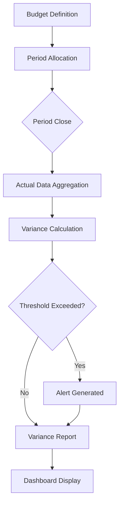
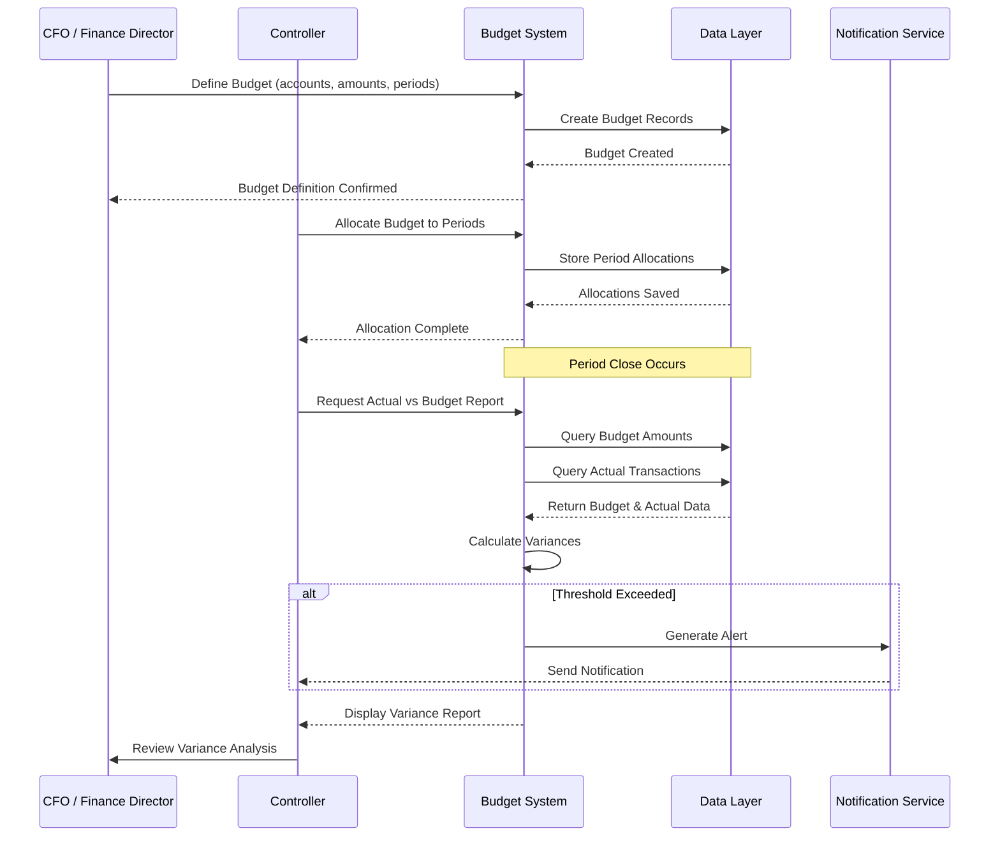
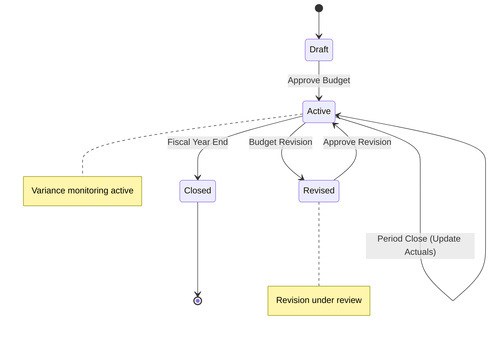

# FEATURE-003: Budget Management

| Attribute | Value |
|-----------|-------|
| **Feature ID** | FEATURE-003 |
| **Title** | Budget Management |
| **Parent Epic** | [EPIC-001: Enterprise Accounting Capabilities](../EPIC-001-enterprise-accounting.md) |
| **Status** | Draft |
| **Priority** | High |
| **Story Count** | 5 stories |
| **Last Updated** | 2024 |
| **Owner/Author** | Blitzy Platform |

---

## Table of Contents

1. [Feature Overview](#1-feature-overview)
2. [User Personas](#2-user-personas)
3. [Story List](#3-story-list)
4. [Acceptance Criteria Summary](#4-acceptance-criteria-summary)
5. [Constraints](#5-constraints)
6. [Technical Discovery Notes](#6-technical-discovery-notes)
7. [Dependencies](#7-dependencies)
8. [Feature Workflow Diagram](#8-feature-workflow-diagram)
9. [Related Documentation](#9-related-documentation)
10. [Revision History](#10-revision-history)

---

## 1. Feature Overview

### 1.1 Purpose and Business Value

This feature enables **CFOs, Finance Directors, and Controllers** to implement comprehensive **financial planning, budget tracking, and variance analysis** capabilities by providing budget definition, period allocation, and actual vs. budget comparison functionality. It addresses the critical need for proactive financial management and delivers **budget variance reports available within 24 hours of period close**.

The Budget Management feature bridges the gap between Odoo Community Edition and Enterprise by providing enterprise-grade budgeting capabilities without requiring Odoo Enterprise licensing.

### 1.2 Problem Statement

Currently, organizations using Odoo Community Edition must **manually track budgets in external spreadsheets** and perform time-consuming reconciliation against actual transactions recorded in Odoo. This results in:

- **Delayed visibility**: Budget vs. actual comparisons available only after manual effort
- **Error-prone processes**: Manual data extraction and calculation increases error risk
- **Lack of proactive alerts**: No automated notification when budgets are exceeded
- **Inefficient resource allocation**: Controllers spend significant time on data compilation rather than analysis
- **Compliance gaps**: Inability to demonstrate proper budget controls for audit purposes

### 1.3 Key Capabilities

| Capability ID | Capability Description | Related Stories |
|---------------|----------------------|-----------------|
| CAP-001 | Define budgets by GL account, analytic account, or analytic plan dimensions | BM-001 |
| CAP-002 | Allocate budget amounts across periods (monthly, quarterly, annual) | BM-002 |
| CAP-003 | Compare actual transactions against budgeted amounts | BM-003 |
| CAP-004 | Generate variance analysis reports with favorable/unfavorable indicators | BM-004 |
| CAP-005 | Configure threshold-based alerts when budgets are exceeded | BM-005 |

### 1.4 Success Criteria at Feature Level

| Criterion | Target | Verification Method |
|-----------|--------|-------------------|
| Budget variance reports available after period close | Within 24 hours | Report generation timing test |
| All budget dimensions supported | 100% (GL account, analytic account, analytic plan) | Feature verification |
| Budget vs actual accuracy | Zero calculation errors | Reconciliation with source transactions |
| Test coverage | ≥80% for all story implementations | Code coverage tools |
| Alert notification delivery | <1 hour after threshold breach | Scheduled job verification |

---

## 2. User Personas

### 2.1 Persona Mapping

| Persona | Role Description | Primary Use Cases | Applicable |
|---------|------------------|-------------------|------------|
| **CFO / Finance Director** | Executive responsible for financial strategy and reporting | Define annual budgets, review variance analysis at executive level, approve budget adjustments | ☑ Primary |
| **Controller** | Manager overseeing budget performance and variance management | All budget monitoring: period allocation, actual vs budget comparison, variance analysis, alert management | ☑ Primary |
| **Accountant / Bookkeeper** | Day-to-day financial operations and transaction processing | Assist with period allocation, generate reports for controller review | ☑ Secondary |
| Auditor | Transaction verification and compliance review | Verify budget control compliance, review variance explanations | ☐ No |
| Business Owner | Overall business health and cash position | Review budget summaries (via CFO/Controller reports) | ☐ No |

### 2.2 Persona Priority

| Persona | Priority Level | Story Assignments |
|---------|---------------|-------------------|
| CFO / Finance Director | Primary | BM-001 (Budget Definition), BM-004 (Variance Analysis) |
| Controller | Primary | BM-002, BM-003, BM-004, BM-005 (All monitoring stories) |
| Accountant | Secondary | BM-002 (Period Allocation assistance) |

### 2.3 Persona-to-Story Mapping Guidelines

- **CFO/Finance Director** focuses on strategic budget definition and high-level variance analysis
- **Controller** handles operational monitoring across all budget lifecycle stages
- **Accountant** supports period allocation activities under Controller oversight
- Each story maintains focus on one primary persona while serving broader stakeholder needs

---

## 3. Story List

### 3.1 User Stories

| Story ID | Story Title | Persona | Priority | Status | Link |
|----------|-------------|---------|----------|--------|------|
| BM-001 | Budget Definition | CFO / Finance Director | High | Draft | [BM-001](../stories/budget-management/BM-001-budget-definition.md) |
| BM-002 | Budget Period Allocation | Controller | High | Draft | [BM-002](../stories/budget-management/BM-002-budget-period-allocation.md) |
| BM-003 | Actual vs Budget Reporting | Controller | High | Draft | [BM-003](../stories/budget-management/BM-003-actual-vs-budget-reporting.md) |
| BM-004 | Variance Analysis | CFO / Finance Director | High | Draft | [BM-004](../stories/budget-management/BM-004-variance-analysis.md) |
| BM-005 | Budget Alerts | Controller | Medium | Draft | [BM-005](../stories/budget-management/BM-005-budget-alerts.md) |

### 3.2 Story Count Assessment

| Count | Assessment | Status |
|-------|------------|--------|
| **5 stories** | **Optimal range (3-7)** | Feature is well-scoped for independent delivery |

### 3.3 Story Dependency Ordering

| Story | Depends On | Notes |
|-------|-----------|-------|
| BM-002 (Period Allocation) | BM-001 (Budget Definition) | Allocation requires budget to exist |
| BM-003 (Actual vs Budget) | BM-001, BM-002 | Reporting requires defined and allocated budgets |
| BM-004 (Variance Analysis) | BM-003 | Variance analysis builds on actual vs budget comparison |
| BM-005 (Budget Alerts) | BM-001, BM-002 | Alerts require budget definitions with thresholds |

### 3.4 Recommended Implementation Order

```
1. BM-001 (Budget Definition) ──► Foundation for all budget functionality
        │
        ▼
2. BM-002 (Period Allocation) ──► Distributes budget across time periods
        │
        ▼
3. BM-003 (Actual vs Budget) ──► Enables basic comparison reporting
        │
        ├────────────────────┐
        ▼                    ▼
4. BM-004 (Variance)    5. BM-005 (Alerts)
   (Detailed analysis)     (Proactive notification)
```

---

## 4. Acceptance Criteria Summary

### 4.1 Feature-Level Acceptance Criteria

The feature is considered complete when:

- [ ] All 5 stories within this feature have status "Done"
- [ ] All stories achieve minimum 80% test coverage
- [ ] Feature-level integration tests pass
- [ ] Budgets can be defined by GL account, analytic account, or analytic plan dimensions
- [ ] Budget amounts can be allocated across monthly, quarterly, or annual periods
- [ ] Actual transactions are compared to budget with configurable thresholds
- [ ] Variance analysis reports display favorable/unfavorable indicators with percentages
- [ ] Budget threshold alerts trigger notifications within 1 hour of breach
- [ ] Budget variance reports are available within 24 hours of period close

### 4.2 Cross-Cutting Concerns

| Concern | Acceptance Criterion |
|---------|---------------------|
| License | All implementations use AGPL-3.0 compatible license |
| Dependencies | No imports from Odoo Enterprise modules (specifically `account_budget` Enterprise module) |
| Coding Standards | Code passes OCA quality checks (pre-commit, pylint-odoo) |
| Test Coverage | Each story achieves minimum 80% test coverage |
| Documentation | Public APIs documented with docstrings |
| Security | Access rights properly configured for CFO, Controller, Accountant roles |
| Performance | Budget comparison reports generate in <30 seconds for typical datasets |

### 4.3 Integration Requirements

| Integration Point | Requirement | Verification |
|-------------------|-------------|--------------|
| Financial Reporting | P&L can display budget vs actual columns | Report shows variance correctly |
| `account.analytic.account` | Budget by analytic dimension | Budget amounts link to analytic accounts |
| `account.analytic.plan` | Multi-level budget structures | Budget hierarchies follow analytic plans |
| `account.analytic.line` | Actual transaction data source | Actuals aggregate correctly from analytic lines |
| `account.account` | Budget by GL account | Budget assignments link to chart of accounts |
| `account.move.line` | Journal entry actual amounts | Actuals reconcile to posted journal entries |

### 4.4 Performance Requirements

| Metric | Requirement | Measurement Method |
|--------|-------------|-------------------|
| Budget vs actual report generation | <30 seconds for 50,000 transactions | Load test with sample dataset |
| Variance calculation per budget line | <100ms per line | Unit test timing |
| Alert evaluation job | Complete within 15 minutes for 1,000 budgets | Scheduled job timing |
| Dashboard refresh | <5 seconds for summary display | UI interaction timing |

---

## 5. Constraints (Inherited from Epic)

### 5.1 License Requirements

| Constraint | Requirement | Rationale |
|------------|-------------|-----------|
| **License Compatibility** | AGPL-3.0 | All new modules must be distributed under AGPL-3.0 compatible license |
| **Existing License Respect** | LGPL-3 (base modules) | Integration with existing Odoo analytic module must respect LGPL-3 licensing |

**Acceptance Criterion:** Module distributed under AGPL-3.0 compatible license.

### 5.2 Dependency Restrictions

| Constraint | Requirement | Rationale |
|------------|-------------|-----------|
| **No Enterprise Dependencies** | Zero imports from Enterprise Edition | Specifically prohibits use of `account_budget` Enterprise module |
| **OCA Compatibility** | Compatible with OCA modules | Allows integration with OCA `mis-builder` and related modules |

**Acceptance Criterion:** No imports or dependencies on Odoo Enterprise edition modules.

### 5.3 Coding Standards

| Constraint | Requirement | Rationale |
|------------|-------------|-----------|
| **Odoo Guidelines** | Follow Odoo coding standards | Consistency with Odoo ecosystem |
| **OCA Standards** | Adhere to OCA module guidelines | Enables potential OCA contribution |
| **PEP 8 Compliance** | Python code follows PEP 8 | Standard Python style compliance |

**Acceptance Criterion:** Code passes OCA quality checks (pre-commit hooks, pylint-odoo).

### 5.4 Test Coverage

| Constraint | Requirement | Rationale |
|------------|-------------|-----------|
| **Minimum Coverage** | 80% test coverage | Ensures reliability and maintainability |
| **Test Types** | Unit, Integration, Acceptance | Comprehensive testing at all levels |
| **BDD Alignment** | Tests match acceptance criteria | Stories are verifiable |

**Acceptance Criterion:** Implementation achieves minimum 80% test coverage.

### 5.5 Version Compatibility

| Constraint | Requirement | Notes |
|------------|-------------|-------|
| **Target Version** | Odoo 18.0 | User requirement specification |
| **Repository Version** | Odoo 19.0 | Repository contains Odoo 19.0; migration considerations may apply |
| **Python Version** | Python 3.10+ | Odoo version-dependent |

**Note:** User requirements specify Odoo 18.0; repository analysis reveals Odoo 19.0. Implementation agents should evaluate API compatibility during discovery.

---

## 6. Technical Discovery Notes

> **Purpose:** These notes guide implementing agents in their codebase analysis before making implementation decisions. User stories describe WHAT and WHY; implementation details emerge from agent discovery of the codebase.

### 6.1 Codebase Analysis Areas

| Analysis Area | Purpose | Key Questions |
|---------------|---------|---------------|
| `addons/analytic/models/analytic_account.py` | Understand analytic dimension integration | How are balance, debit, credit computed? How to extend for budget tracking? |
| `addons/analytic/models/analytic_plan.py` | Multi-dimensional budgeting patterns | How do analytic plans create hierarchies? How to structure budget hierarchies? |
| `addons/analytic/models/analytic_line.py` | Actual transaction aggregation | How are analytic lines created? How to efficiently query for budget comparison? |
| `addons/account/models/account_account.py` | GL account integration | How to link budgets to chart of accounts? Account type considerations? |
| `addons/account/models/account_move_line.py` | Journal entry data | How to aggregate actuals from journal entries for comparison? |

### 6.2 Key Findings from Source Analysis

Based on analysis of the analytic module source code:

**`account.analytic.account` Model:**
- Contains `balance`, `debit`, `credit` computed fields derived from `line_ids`
- Links to `account.analytic.plan` via `plan_id` field
- Supports company-specific data through `company_id`
- Uses `_compute_debit_credit_balance` method with date filtering via context (`from_date`, `to_date`)

**`account.analytic.plan` Model:**
- Hierarchical structure using `parent_store` pattern (`parent_path`)
- Supports parent/child relationships for multi-level planning
- Contains `account_ids` linking to all accounts in the plan
- Provides `all_account_count` for hierarchy aggregation

**Integration Implications:**
- Budget models can leverage existing analytic dimension infrastructure
- Period filtering pattern (context-based dates) already established
- Hierarchical aggregation patterns available through analytic plans

### 6.3 Existing Odoo Modules to Examine

| Module | Path | Relevance to This Feature |
|--------|------|--------------------------|
| `analytic` | `addons/analytic/` | Core analytic accounting infrastructure for multi-dimensional budgeting |
| `account` | `addons/account/` | GL account structure, journal entries for actual transactions |
| `mail` | `addons/mail/` | Notification infrastructure for budget alerts |

### 6.4 OCA Module Compatibility Considerations

| OCA Module | Repository | Consideration |
|------------|------------|---------------|
| `mis_builder` | [OCA/mis-builder](https://github.com/OCA/mis-builder) | Management Information System / Budget reporting patterns - evaluate for integration or inspiration |
| `account_budget_oca` | [OCA/account-budgeting](https://github.com/OCA/account-budgeting) | OCA budget module patterns - evaluate for compatibility |

**Discovery Decision:** Agents should determine whether to:
- Build new budget functionality extending analytic infrastructure
- Integrate with existing OCA budget modules
- Create a hybrid approach

### 6.5 Integration Points

| Integration Point | Model/Module | Integration Type | Notes |
|-------------------|--------------|------------------|-------|
| Budget by analytic dimension | `account.analytic.account` | Extend/Reference | Link budgets to analytic accounts |
| Multi-level budget structures | `account.analytic.plan` | Reference | Use plan hierarchy for budget rollup |
| Actual transaction data | `account.analytic.line` | Read | Aggregate actuals for comparison |
| Budget by GL account | `account.account` | Reference | Alternative/complementary dimension |
| Alert notifications | `mail.message` / `mail.activity` | Write | Notification delivery mechanism |

### 6.6 Discovery vs. Prescription Guidelines

> **Important:** User stories describe WHAT functionality is needed and WHY users need it. They do NOT prescribe HOW to implement.

**DO NOT specify in user stories:**
- Specific model names or field definitions for budget storage
- Database schema decisions (new tables vs. extended tables)
- UI component architecture (form views, tree views, dashboard widgets)
- Specific Odoo API methods for budget calculation
- Module structure or file organization

**DO defer to agent discovery:**
- D-001: Model design (new `budget.budget` model vs. extending `account.analytic.account`)
- D-002: OCA module integration strategy (`mis_builder` compatibility)
- D-003: Variance calculation approach (stored vs. computed fields)
- D-004: Alert mechanism (scheduled actions vs. real-time triggers)
- D-005: Reporting engine (QWeb reports vs. dedicated dashboard)

---

## 7. Dependencies

### 7.1 Related Features

| Feature | ID | Relationship | Notes |
|---------|-----|--------------|-------|
| Financial Reporting | FEATURE-001 | Related | P&L can show budget vs actual comparison; variance in report columns |
| Asset Management | FEATURE-004 | Related | Asset depreciation entries affect budget actuals |
| Deferred Revenue | FEATURE-005 | Related | Revenue recognition affects budget actuals timing |

### 7.2 Required Odoo Modules

| Module | Technical Name | Dependency Type | Purpose |
|--------|---------------|-----------------|---------|
| Invoicing | `account` | Required | Core accounting models, GL accounts |
| Analytic Accounting | `analytic` | Required | Multi-dimensional analytic structure |
| Mail | `mail` | Required | Notification infrastructure for alerts |
| Base | `base` | Required | User/company/partner models |

### 7.3 External Standards and Specifications

| Standard | Reference | Application to This Feature |
|----------|-----------|----------------------------|
| Management Accounting | IMA Standards | Budget variance analysis best practices |
| Internal Controls | COSO Framework | Budget control and monitoring requirements |

---

## 8. Feature Workflow Diagram

### 8.1 Budget Management Lifecycle



### 8.2 Detailed Process Flow



### 8.3 Budget States



---

## 9. Related Documentation

### 9.1 Epic Reference

| Document | Link |
|----------|------|
| Parent Epic | [EPIC-001: Enterprise Accounting Capabilities](../EPIC-001-enterprise-accounting.md) |

### 9.2 Story Files

| Story | Link |
|-------|------|
| BM-001: Budget Definition | [BM-001](../stories/budget-management/BM-001-budget-definition.md) |
| BM-002: Budget Period Allocation | [BM-002](../stories/budget-management/BM-002-budget-period-allocation.md) |
| BM-003: Actual vs Budget Reporting | [BM-003](../stories/budget-management/BM-003-actual-vs-budget-reporting.md) |
| BM-004: Variance Analysis | [BM-004](../stories/budget-management/BM-004-variance-analysis.md) |
| BM-005: Budget Alerts | [BM-005](../stories/budget-management/BM-005-budget-alerts.md) |

### 9.3 External References

| Resource | URL | Purpose |
|----------|-----|---------|
| OCA mis-builder | https://github.com/OCA/mis-builder | MIS/Budget reporting patterns |
| OCA account-budgeting | https://github.com/OCA/account-budgeting | OCA budget module reference |
| Odoo Analytic Docs | https://www.odoo.com/documentation/18.0/applications/finance/accounting/get_started/multi_currency.html | Analytic accounting documentation |
| Odoo Developer Docs | https://www.odoo.com/documentation/18.0/developer.html | Odoo development guidelines |

### 9.4 Source Code References

| File | Purpose |
|------|---------|
| `addons/analytic/models/analytic_account.py` | Analytic account model with balance computation |
| `addons/analytic/models/analytic_plan.py` | Analytic plan hierarchy structure |
| `addons/account/__manifest__.py` | Account module dependencies |

---

## 10. Revision History

| Version | Date | Author | Changes |
|---------|------|--------|---------|
| 1.0 | 2024 | Blitzy Platform | Initial feature specification |

---

## Summary

The **Budget Management** feature (FEATURE-003) provides comprehensive financial planning and variance analysis capabilities for Odoo Community Edition users. With 5 user stories covering budget definition, period allocation, actual vs. budget reporting, variance analysis, and threshold alerts, this feature enables CFOs, Controllers, and Accountants to implement enterprise-grade budgeting without Odoo Enterprise licensing.

**Key Deliverables:**
- Budget definition by multiple dimensions (GL account, analytic account, analytic plan)
- Flexible period allocation (monthly, quarterly, annual)
- Real-time actual vs. budget comparison
- Variance analysis with favorable/unfavorable indicators
- Proactive threshold-based alerts

**Success Metric:** Budget variance reports available within 24 hours of period close.
