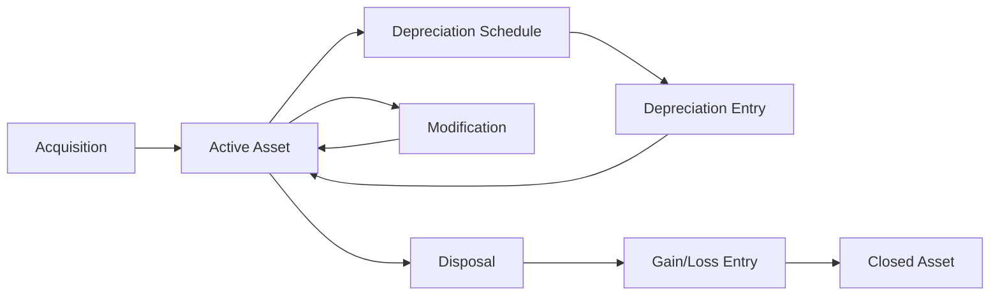
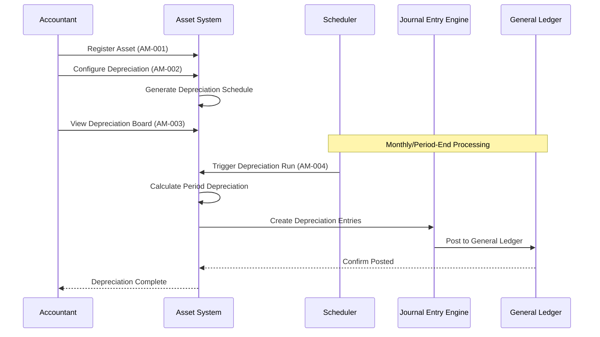
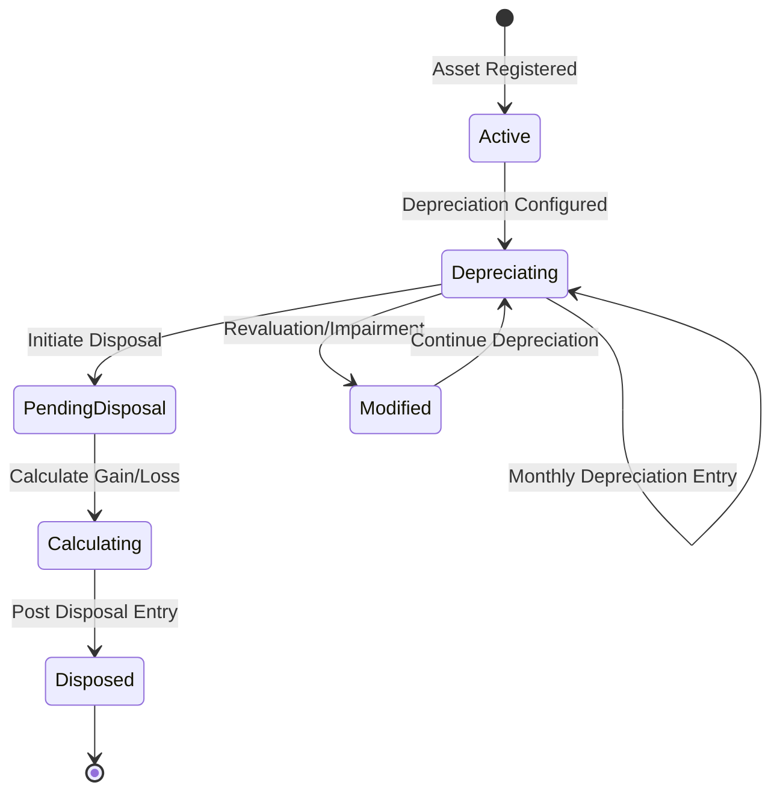

# FEATURE-004: Asset Management

| Attribute | Value |
|-----------|-------|
| **Feature ID** | FEATURE-004 |
| **Title** | Asset Management |
| **Parent Epic** | [EPIC-001: Enterprise Accounting Capabilities](../EPIC-001-enterprise-accounting.md) |
| **Status** | Draft |
| **Priority** | High |
| **Story Count** | 6 stories |
| **Last Updated** | 2024 |
| **Owner/Author** | Blitzy Platform |

---

## 1. Feature Overview

### 1.1 Purpose and Business Value

This feature enables Accountants and Bookkeepers to track and manage fixed assets throughout their complete lifecycle—from acquisition through depreciation to disposal—by providing a comprehensive asset management system with automated depreciation entries. It addresses the critical need for accurate asset valuation on financial statements and delivers significant reduction in manual effort for depreciation processing while ensuring compliance with GAAP and IFRS fixed asset accounting standards.

**Key Business Value:**
- **Automated Depreciation**: Generate depreciation journal entries automatically per configured schedules, eliminating manual calculation errors
- **Accurate Asset Valuation**: Maintain real-time book value of all fixed assets for financial reporting
- **Compliance Assurance**: Support multiple depreciation methods required by various accounting standards
- **Complete Audit Trail**: Track entire asset lifecycle with full documentation of all modifications and disposals

### 1.2 Problem Statement

Currently, Odoo Community Edition users must manually track fixed assets in spreadsheets and calculate depreciation amounts for each accounting period. This results in:

- **Time-Intensive Processing**: 8-16 hours per month for medium-sized asset portfolios
- **Calculation Errors**: Risk of incorrect depreciation amounts affecting financial statements
- **Missed Entries**: Manual processes lead to forgotten or delayed depreciation postings
- **Audit Challenges**: No centralized system to verify asset history and depreciation calculations
- **Disposal Complications**: Complex gain/loss calculations performed manually with error risk

### 1.3 Key Capabilities

| Capability ID | Capability Description | Related Stories |
|---------------|----------------------|-----------------|
| CAP-001 | Register fixed assets with acquisition details including cost, date, category, and useful life | AM-001 |
| CAP-002 | Configure multiple depreciation methods for different asset categories | AM-002 |
| CAP-003 | View projected depreciation schedule over the full useful life of assets | AM-003 |
| CAP-004 | Automatically generate and post depreciation journal entries per schedule | AM-004 |
| CAP-005 | Process asset modifications including revaluation and impairment adjustments | AM-005 |
| CAP-006 | Handle asset disposal with automatic gain/loss calculation and journal entry generation | AM-006 |

### 1.4 Success Criteria at Feature Level

| Criterion | Target | Verification Method |
|-----------|--------|-------------------|
| Asset registration completeness | All required fields captured for GAAP/IFRS compliance | Field validation tests |
| Depreciation calculation accuracy | 100% accuracy for all supported methods | Calculation verification tests against manual calculations |
| Automatic entry generation | Depreciation entries created without manual intervention | Scheduled job execution verification |
| Disposal gain/loss accuracy | Zero calculation errors | Reconciliation with manual verification |
| Test coverage | ≥80% for all story implementations | Code coverage tools |
| Performance | Asset operations complete in <5 seconds for portfolios up to 10,000 assets | Load testing |

---

## 2. User Personas

### 2.1 Persona Mapping

| Persona | Role Description | Primary Use Cases | Applicable |
|---------|------------------|-------------------|------------|
| CFO / Finance Director | Executive responsible for financial strategy and reporting | Review asset reports for board presentations; Oversee depreciation policies | ☐ No |
| **Accountant / Bookkeeper** | Day-to-day financial operations and transaction processing | All asset management workflows: registration, depreciation, modification, disposal | ☑ Yes (Primary) |
| Controller | Budget oversight and variance management | Asset budget vs actual tracking (via Budget feature integration) | ☐ No |
| Auditor | Transaction verification and compliance review | Verify depreciation calculations and disposal entries | ☐ No (via Financial Reporting) |
| Business Owner | Overall business health and cash position | Capital expenditure overview | ☐ No |

### 2.2 Persona-to-Story Mapping

The Accountant/Bookkeeper persona is the primary user for all stories in this feature as they handle:

- Day-to-day asset tracking and registration
- Depreciation schedule configuration and monitoring
- Period-end depreciation entry generation
- Asset modification processing for revaluations and impairments
- Asset disposal processing and gain/loss recognition

All user stories are written from the Accountant's perspective to ensure the feature addresses daily operational needs while supporting compliance requirements.

---

## 3. Story List

### 3.1 User Stories

| Story ID | Story Title | Persona | Priority | Status | Link |
|----------|-------------|---------|----------|--------|------|
| AM-001 | Asset Registration | Accountant | High | Draft | [AM-001](../stories/asset-management/AM-001-asset-registration.md) |
| AM-002 | Depreciation Configuration | Accountant | High | Draft | [AM-002](../stories/asset-management/AM-002-depreciation-configuration.md) |
| AM-003 | Depreciation Board | Accountant | High | Draft | [AM-003](../stories/asset-management/AM-003-depreciation-board.md) |
| AM-004 | Automatic Depreciation Entries | Accountant | Critical | Draft | [AM-004](../stories/asset-management/AM-004-automatic-depreciation-entries.md) |
| AM-005 | Asset Modification | Accountant | Medium | Draft | [AM-005](../stories/asset-management/AM-005-asset-modification.md) |
| AM-006 | Asset Disposal | Accountant | High | Draft | [AM-006](../stories/asset-management/AM-006-asset-disposal.md) |

### 3.2 Story Count Assessment

| Count | Assessment | Status |
|-------|------------|--------|
| **6 stories** | **Optimal range (3-7)** | ✓ Feature is well-scoped for independent delivery |

### 3.3 Story Dependency Ordering

| Story | Depends On | Notes |
|-------|-----------|-------|
| AM-002 (Depreciation Configuration) | AM-001 | Depreciation setup requires asset categories from registration |
| AM-003 (Depreciation Board) | AM-001, AM-002 | Board displays assets with configured depreciation schedules |
| AM-004 (Automatic Depreciation Entries) | AM-001, AM-002 | Automatic entries require configured assets |
| AM-005 (Asset Modification) | AM-001 | Modifications apply to registered assets |
| AM-006 (Asset Disposal) | AM-001, AM-003 | Disposal requires registered asset with current book value |

**Recommended Implementation Order:**
1. AM-001: Asset Registration (foundation)
2. AM-002: Depreciation Configuration
3. AM-003: Depreciation Board
4. AM-004: Automatic Depreciation Entries
5. AM-005: Asset Modification
6. AM-006: Asset Disposal

---

## 4. Acceptance Criteria Summary

### 4.1 Feature-Level Acceptance Criteria

The feature is considered complete when:

- [ ] All 6 stories within this feature have status "Done"
- [ ] All stories achieve minimum 80% test coverage
- [ ] Feature-level integration tests pass
- [ ] Fixed assets can be registered with complete acquisition details (cost, date, category, useful life)
- [ ] Multiple depreciation methods are supported (straight-line, declining balance, units of production)
- [ ] Depreciation board displays complete schedule over asset useful life
- [ ] Automatic depreciation entries generate and post per schedule without manual intervention
- [ ] Asset modifications (revaluation, impairment) are properly recorded with journal entries
- [ ] Asset disposal calculates and records gain/loss correctly
- [ ] All asset transactions create proper journal entries in the general ledger

### 4.2 Cross-Cutting Concerns

| Concern | Acceptance Criterion |
|---------|---------------------|
| License | All implementations use AGPL-3.0 compatible license |
| Dependencies | No imports from Odoo Enterprise modules (specifically `account_asset`) |
| Coding Standards | Code passes OCA quality checks (pre-commit, pylint-odoo) |
| Test Coverage | Each story achieves minimum 80% test coverage |
| Documentation | Public APIs documented with docstrings |
| Security | Access rights properly configured—Accountant group required for asset operations |
| Performance | Depreciation calculations complete in <2 seconds for individual assets; batch processing handles 1,000+ assets in <60 seconds |

### 4.3 Integration Requirements

| Integration Point | Requirement | Verification |
|-------------------|-------------|--------------|
| `account.move` | All asset transactions create journal entries | Journal entry count and balance verification |
| `account.move.line` | Depreciation and disposal entries create proper debit/credit lines | Line item validation tests |
| `account.account` | Asset, depreciation, expense accounts properly linked | Account type verification (`asset_fixed`, `expense_depreciation`) |
| Financial Reporting (FEATURE-001) | Asset values reflected in Balance Sheet | Report reconciliation tests |
| Analytic Accounting | Optional analytic dimension assignment for assets | Analytic line creation tests |

### 4.4 Performance Requirements

| Metric | Requirement | Measurement Method |
|--------|-------------|-------------------|
| Asset registration | <2 seconds per asset | Timed operation tests |
| Depreciation board load | <5 seconds for 100 assets | Page load timing |
| Batch depreciation generation | <60 seconds for 1,000 assets | Scheduled job timing |
| Asset disposal calculation | <2 seconds per disposal | Timed operation tests |

---

## 5. Constraints (Inherited from Epic)

### 5.1 License Requirements

| Constraint | Requirement | Rationale |
|------------|-------------|-----------|
| **License Compatibility** | AGPL-3.0 | All new modules must be distributed under AGPL-3.0 compatible license |
| **Existing License Respect** | LGPL-3 (base modules) | Integration with existing Odoo `account` module must respect its LGPL-3 licensing |

**Acceptance Criterion:** Module distributed under AGPL-3.0 compatible license.

### 5.2 Dependency Restrictions

| Constraint | Requirement | Rationale |
|------------|-------------|-----------|
| **No Enterprise Dependencies** | Zero imports from Enterprise Edition | Ensures solution works for Community Edition users without `account_asset` Enterprise module |
| **OCA Compatibility** | Compatible with OCA modules | Allows integration with existing OCA ecosystem (`account-financial-tools`) |

**Acceptance Criterion:** No imports or dependencies on Odoo Enterprise edition modules, specifically `account_asset`.

### 5.3 Coding Standards

| Constraint | Requirement | Rationale |
|------------|-------------|-----------|
| **Odoo Guidelines** | Follow Odoo coding standards | Consistency with Odoo ecosystem |
| **OCA Standards** | Adhere to OCA module guidelines | Enables potential OCA contribution |
| **PEP 8 Compliance** | Python code follows PEP 8 | Standard Python style compliance |

**Acceptance Criterion:** Code passes OCA quality checks (pre-commit hooks, pylint-odoo).

### 5.4 Test Coverage

| Constraint | Requirement | Rationale |
|------------|-------------|-----------|
| **Minimum Coverage** | 80% test coverage | Ensures reliability and maintainability |
| **Test Types** | Unit, Integration, Acceptance | Comprehensive testing at all levels |
| **BDD Alignment** | Tests match acceptance criteria | Stories are verifiable |

**Acceptance Criterion:** Implementation achieves minimum 80% test coverage.

### 5.5 Version Compatibility

| Constraint | Requirement | Notes |
|------------|-------------|-------|
| **Target Version** | Odoo 18.0 | User-specified target version |
| **Repository Version** | Odoo 19.0 | Repository identified as 19.0 in `odoo/release.py` |
| **Python Version** | Python 3.10+ | Odoo version-dependent |

**Note:** User requirements specify Odoo 18.0; however, the repository is Odoo 19.0. Implementation agents should note potential compatibility considerations and ensure backward-compatible patterns where possible.

---

## 6. Technical Discovery Notes

> **Purpose:** These notes guide implementing agents in their codebase analysis before making implementation decisions. User stories describe WHAT and WHY; implementation details emerge from agent discovery of the codebase.

### 6.1 Codebase Analysis Areas

| Analysis Area | Purpose | Key Questions |
|---------------|---------|---------------|
| `addons/account/models/account_move.py` | Understand journal entry creation patterns | How are journal entries created programmatically? What fields are required? How to handle multi-line entries? |
| `addons/account/models/account_account.py` | Understand account types and structures | How are `asset_fixed` and `expense_depreciation` account types used? What is the account hierarchy? |
| `addons/account/models/account_move_line.py` | Understand line item patterns | How are debit/credit lines created? How is reconciliation handled? |
| `addons/account/__manifest__.py` | Module dependency structure | What dependencies exist? How to structure new asset module dependencies? |
| `odoo/addons/base/data/ir_cron_data.xml` | Scheduled action patterns | How are scheduled jobs configured? What is the pattern for automated processing? |

### 6.2 Existing Odoo Modules to Examine

| Module | Path | Relevance to This Feature |
|--------|------|--------------------------|
| `account` | `addons/account/` | Core accounting models, journal entry creation, account types (`asset_fixed`, `expense_depreciation`) |
| `analytic` | `addons/analytic/` | Analytic account integration for asset tracking by cost center |
| `base` | `odoo/addons/base/` | Company model for multi-company asset support, currency handling |
| `product` | `addons/product/` | Product category patterns (may inform asset category design) |

### 6.3 OCA Module Compatibility Considerations

| OCA Module | Repository | Consideration |
|------------|------------|---------------|
| `account_asset_management` | OCA/account-financial-tools | Existing OCA asset management module—evaluate for extension vs. replacement strategy |
| `account_asset_batch_compute` | OCA/account-financial-tools | Batch depreciation patterns for performance optimization |
| `account_asset_disposal` | OCA/account-financial-tools | Disposal workflow patterns and gain/loss calculation approaches |

**Discovery Decision Points:**
- Should implementation extend existing OCA modules or create standalone functionality?
- What level of compatibility with OCA asset modules is required?
- Are there gaps in OCA modules that this implementation should address?

### 6.4 Integration Points

| Integration Point | Model/Module | Integration Type | Notes |
|-------------------|--------------|------------------|-------|
| Journal Entries | `account.move` | Write | Create depreciation and disposal entries |
| Line Items | `account.move.line` | Write | Create debit/credit lines for entries |
| Asset Accounts | `account.account` | Read | Link to asset, depreciation expense, accumulated depreciation accounts |
| Partners (optional) | `res.partner` | Read | Vendor information for asset acquisition |
| Company | `res.company` | Read | Multi-company support, currency settings |
| Analytic | `account.analytic.account` | Read/Write | Cost center assignment for assets |

### 6.5 Key Source Code Insights

From analysis of `addons/account/models/account_account.py`:
- Account type `asset_fixed` (line 51) is available for Fixed Assets
- Account type `expense_depreciation` (line 62) is available for Depreciation expenses
- These account types integrate with the existing chart of accounts structure

From analysis of `addons/account/models/account_move.py`:
- `AccountMove` model (line 71) inherits from multiple mixins for portal, mail, and sequencing
- Journal entries use the `_order = 'date desc, name desc, invoice_date desc, id desc'` ordering
- Entry types defined in `TYPE_REVERSE_MAP` (line 57) show existing move type patterns

### 6.6 Discovery vs. Prescription Guidelines

> **Important:** User stories and feature specifications describe WHAT functionality is needed and WHY users need it. They do NOT prescribe HOW to implement.

**DO NOT specify in user stories:**
- Specific model names or field definitions for asset records
- Database schema decisions for depreciation tracking
- UI component architecture (OWL vs. legacy views)
- Specific Odoo API methods to use for calculations
- Module structure or file organization

**DO defer to agent discovery:**
- D-001: Asset model design (new model vs. extension of existing patterns)
- D-002: OCA module integration strategy (extend OCA/account-financial-tools or standalone)
- D-003: Depreciation calculation engine approach
- D-004: Scheduled job configuration for automatic depreciation
- D-005: UI component patterns for depreciation board

---

## 7. Dependencies

### 7.1 Related Features

| Feature | ID | Relationship | Notes |
|---------|-----|--------------|-------|
| Financial Reporting | FEATURE-001 | Successor | Asset values appear in Balance Sheet reports |
| Budget Management | FEATURE-003 | Related | Capital expenditure budgets may track asset acquisitions |

### 7.2 Required Odoo Modules

| Module | Technical Name | Dependency Type | Purpose |
|--------|---------------|-----------------|---------|
| Invoicing | `account` | Required | Core accounting models, journal entries, account types |
| Analytic Accounting | `analytic` | Optional | Analytic dimension support for asset cost centers |

### 7.3 External Standards and Specifications

| Standard | Reference | Application to This Feature |
|----------|-----------|----------------------------|
| GAAP | US FASB ASC 360 (Property, Plant, and Equipment) | Fixed asset recognition, depreciation, impairment |
| IFRS | IAS 16 (Property, Plant and Equipment) | International fixed asset accounting standards |
| IFRS | IAS 36 (Impairment of Assets) | Asset impairment testing and recognition |

---

## 8. Feature Workflow Diagram

### 8.1 Asset Lifecycle Diagram

### 8.2 Depreciation Processing Workflow

### 8.3 Asset Disposal Workflow

---

## 9. Depreciation Methods

### 9.1 Supported Methods

| Method | Calculation Approach | Use Case |
|--------|---------------------|----------|
| **Straight-line** | (Cost - Salvage Value) / Useful Life | Most common method; equal depreciation each period |
| **Declining Balance** | Book Value × Depreciation Rate | Accelerated depreciation; higher expense in early years |
| **Units of Production** | (Cost - Salvage Value) × (Units Used / Total Expected Units) | Usage-based depreciation; manufacturing equipment |

### 9.2 Method Details

**Straight-line Depreciation:**
- Equal depreciation expense each period
- Formula: Annual Depreciation = (Acquisition Cost - Salvage Value) / Useful Life in Years
- Monthly Depreciation = Annual Depreciation / 12

**Declining Balance Depreciation:**
- Fixed percentage applied to remaining book value
- Commonly 150% or 200% of straight-line rate (accelerated)
- Formula: Period Depreciation = Book Value × (Depreciation Rate / Periods per Year)

**Units of Production Depreciation:**
- Depreciation based on actual usage or output
- Requires tracking of usage units per period
- Formula: Period Depreciation = (Cost - Salvage) × (Period Units / Total Expected Units)

---

## 10. Related Documentation

### 10.1 Epic Reference

| Document | Link |
|----------|------|
| Parent Epic | [EPIC-001: Enterprise Accounting Capabilities](../EPIC-001-enterprise-accounting.md) |

### 10.2 Story Files

| Story | Link |
|-------|------|
| AM-001: Asset Registration | [AM-001-asset-registration.md](../stories/asset-management/AM-001-asset-registration.md) |
| AM-002: Depreciation Configuration | [AM-002-depreciation-configuration.md](../stories/asset-management/AM-002-depreciation-configuration.md) |
| AM-003: Depreciation Board | [AM-003-depreciation-board.md](../stories/asset-management/AM-003-depreciation-board.md) |
| AM-004: Automatic Depreciation Entries | [AM-004-automatic-depreciation-entries.md](../stories/asset-management/AM-004-automatic-depreciation-entries.md) |
| AM-005: Asset Modification | [AM-005-asset-modification.md](../stories/asset-management/AM-005-asset-modification.md) |
| AM-006: Asset Disposal | [AM-006-asset-disposal.md](../stories/asset-management/AM-006-asset-disposal.md) |

### 10.3 External References

| Resource | URL | Purpose |
|----------|-----|---------|
| OCA account-financial-tools | https://github.com/OCA/account-financial-tools | Asset management module patterns and compatibility reference |
| Odoo Accounting Docs | https://www.odoo.com/documentation/18.0/applications/finance/accounting.html | Official accounting documentation |
| FASB ASC 360 | https://asc.fasb.org/ | US GAAP Property, Plant, and Equipment standards |
| IAS 16 | https://www.ifrs.org/issued-standards/list-of-standards/ias-16-property-plant-and-equipment/ | IFRS fixed asset accounting standards |

---

## 11. Revision History

| Version | Date | Author | Changes |
|---------|------|--------|---------|
| 1.0 | 2024 | Blitzy Platform | Initial draft - complete feature specification |

---

## Appendix A: Account Type Reference

The following account types from `addons/account/models/account_account.py` are relevant to Asset Management:

| Account Type | Selection Value | Purpose in Asset Management |
|--------------|-----------------|----------------------------|
| Fixed Assets | `asset_fixed` | Asset acquisition cost account |
| Non-current Assets | `asset_non_current` | Alternative asset classification |
| Depreciation | `expense_depreciation` | Depreciation expense account |
| Expenses | `expense` | General expense for asset-related costs |

Source: `addons/account/models/account_account.py`, lines 44-65
