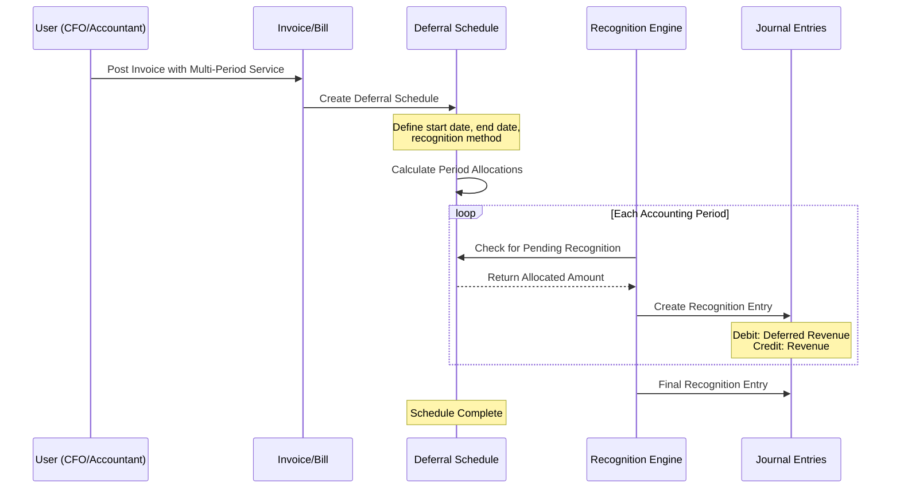
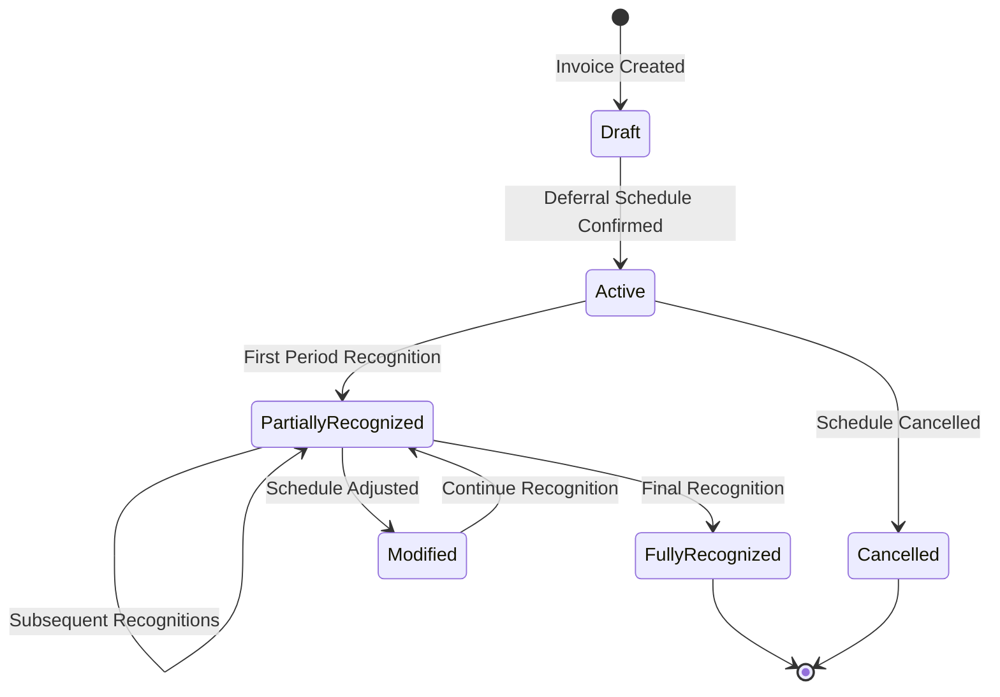
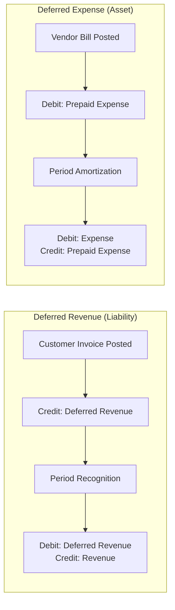
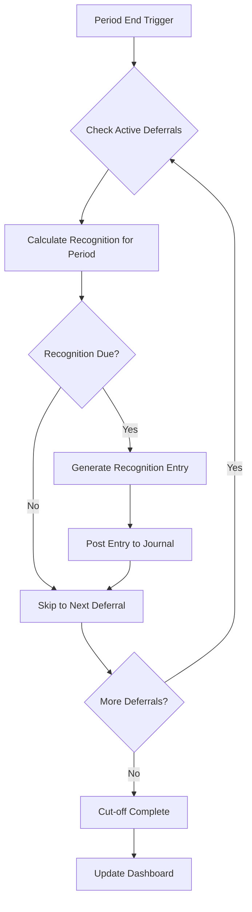

# FEATURE-005: Deferred Revenue/Expenses

---

## Metadata

| Attribute | Value |
|-----------|-------|
| **Feature ID** | FEATURE-005 |
| **Title** | Deferred Revenue/Expenses |
| **Parent Epic** | [EPIC-001: Enterprise Accounting Capabilities](../EPIC-001-enterprise-accounting.md) |
| **Status** | Draft |
| **Priority** | High |
| **Story Count** | 4 stories |
| **Last Updated** | 2024 |
| **Owner/Author** | Enterprise Accounting Team |

---

## 1. Feature Overview

### 1.1 Purpose and Business Value

This feature enables CFOs, Finance Directors, and Accountants to implement **ASC 606/IFRS 15-compliant revenue recognition and expense deferral** by providing automated deferral schedules, period-based allocation, and cut-off entry generation capabilities.

**Business Value Delivered:**

- **Regulatory compliance** with ASC 606 (Revenue from Contracts with Customers) and IFRS 15 standards
- **Accurate financial reporting** through proper matching of revenue and expenses to the periods in which they are earned or incurred
- **Automated period-end processing** reducing manual cut-off entry preparation
- **Audit readiness** with clear deferral schedules and recognition documentation

> This feature addresses the critical need for proper revenue recognition and expense matching, which is required for GAAP/IFRS compliance. Without proper deferral management, financial statements misrepresent the economic reality of multi-period contracts and prepaid expenses.

### 1.2 Problem Statement

Currently, Odoo Community Edition users must **manually track and calculate deferred revenue and expense allocations** for contracts and prepaid items spanning multiple accounting periods. This results in:

- **Significant period-end effort** for calculating and posting cut-off entries
- **High risk of recognition errors** that misstate revenue or expenses
- **Non-compliance with ASC 606/IFRS 15** revenue recognition standards
- **Audit findings** related to improper revenue/expense timing
- **Inconsistent allocation methods** across different accountants or periods

### 1.3 Key Capabilities

| Capability ID | Capability Description | Related Stories |
|---------------|------------------------|-----------------|
| CAP-001 | Define deferral schedules with start/end dates and recognition method | DR-001 |
| CAP-002 | Support straight-line and date-based recognition methods | DR-001 |
| CAP-003 | Automatically allocate deferred amounts across accounting periods | DR-002 |
| CAP-004 | Generate cut-off journal entries for period-end close | DR-003 |
| CAP-005 | Dashboard visibility into pending deferrals and recognition status | DR-004 |
| CAP-006 | Track recognition progress and remaining deferred balances | DR-004 |
| CAP-007 | Handle both deferred revenue and deferred expense scenarios | DR-001, DR-002 |

### 1.4 Success Criteria at Feature Level

| Criterion | Target | Verification Method |
|-----------|--------|---------------------|
| Deferral schedule creation | 100% coverage of revenue and expense types | Feature completion checklist |
| Period allocation accuracy | Zero calculation errors in recognition amounts | Reconciliation with contract values |
| Cut-off entry automation | Automatic generation within period-end workflow | Scheduled job verification |
| ASC 606/IFRS 15 compliance | 100% adherence to recognition principles | Standard compliance validation |
| Recognition dashboard | Real-time visibility into deferral status | Dashboard functionality testing |
| Test coverage | ≥80% for all story implementations | Code coverage measurement |

---

## 2. User Personas

### 2.1 Persona Mapping

| Persona | Role Description | Primary Use Cases | Applicable |
|---------|------------------|-------------------|------------|
| CFO / Finance Director | Executive responsible for financial strategy and reporting | Define deferral policies; review recognition schedules; ensure compliance oversight | ☑ Primary |
| Accountant / Bookkeeper | Day-to-day financial operations and transaction processing | Create deferral schedules; process period allocations; generate cut-off entries | ☑ Primary |
| Controller | Budget oversight and variance management | Monitor recognized vs deferred amounts for budget comparisons | ☐ Secondary |
| Auditor | Transaction verification and compliance review | Verify recognition schedules; review cut-off entry accuracy | ☐ Secondary |
| Business Owner | Overall business health and cash position | Understand deferred revenue impact on financial position | ☐ Secondary |

### 2.2 Persona Priority Summary

| Priority Level | Personas | Primary Stories |
|----------------|----------|-----------------|
| **Primary** | CFO/Finance Director, Accountant | DR-001, DR-002, DR-003, DR-004 |
| **Secondary** | Controller, Auditor | DR-004 (dashboard visibility) |

---

## 3. Story List

### 3.1 User Stories

| Story ID | Story Title | Persona | Priority | Status | Link |
|----------|-------------|---------|----------|--------|------|
| DR-001 | Deferral Schedule Definition | CFO | High | Draft | [DR-001](../stories/deferred-revenue/DR-001-deferral-schedule-definition.md) |
| DR-002 | Automatic Period Allocation | Accountant | High | Draft | [DR-002](../stories/deferred-revenue/DR-002-automatic-period-allocation.md) |
| DR-003 | Cut-off Entry Generation | Accountant | High | Draft | [DR-003](../stories/deferred-revenue/DR-003-cutoff-entry-generation.md) |
| DR-004 | Recognition Dashboard | CFO | Medium | Draft | [DR-004](../stories/deferred-revenue/DR-004-recognition-dashboard.md) |

### 3.2 Story Count Assessment

| Count | Assessment | Status |
|-------|------------|--------|
| **4 stories** | **Optimal range (3-7)** | Feature is well-scoped for independent delivery |

### 3.3 Story Dependency Ordering

| Story | Depends On | Notes |
|-------|------------|-------|
| DR-002 (Automatic Period Allocation) | DR-001 (Deferral Schedule Definition) | Period allocation requires schedule to be defined first |
| DR-003 (Cut-off Entry Generation) | DR-002 (Automatic Period Allocation) | Cut-off entries generated from allocation data |
| DR-004 (Recognition Dashboard) | DR-001, DR-002 | Dashboard displays schedule and allocation data |

### 3.4 Implementation Sequence Recommendation

```
Phase 1 (Foundation):  DR-001 (Deferral Schedule Definition)
Phase 2 (Core):        DR-002 (Automatic Period Allocation)
Phase 3 (Operations):  DR-003 (Cut-off Entry Generation)
Phase 4 (Visibility):  DR-004 (Recognition Dashboard)
```

---

## 4. Acceptance Criteria Summary

### 4.1 Feature-Level Acceptance Criteria

The feature is considered complete when:

- [ ] All 4 stories within this feature have status "Done"
- [ ] All stories achieve minimum 80% test coverage
- [ ] Feature-level integration tests pass
- [ ] Deferral schedules can be defined with configurable recognition methods
- [ ] Automatic period allocation correctly spreads amounts across periods
- [ ] Cut-off entries are generated accurately for period-end close
- [ ] Dashboard provides clear visibility into deferred amounts and recognition status
- [ ] Implementation complies with ASC 606/IFRS 15 revenue recognition principles
- [ ] Both deferred revenue and deferred expense scenarios are supported

### 4.2 Deferral Type-Specific Acceptance Criteria

| Type | Key Acceptance Criteria |
|------|------------------------|
| **Deferred Revenue** | Recognize revenue over service delivery period; track performance obligations; support straight-line and milestone methods |
| **Deferred Expense** | Amortize prepaid expenses over benefit period; automatic allocation based on expense type and duration |
| **Cut-off Entries** | Generate reversing entries for new period; maintain audit trail of all recognition entries |
| **Recognition Schedules** | Visual schedule showing period-by-period recognition; support for schedule modifications |

### 4.3 Cross-Cutting Concerns

| Concern | Acceptance Criterion |
|---------|---------------------|
| License | All implementations use AGPL-3.0 compatible license |
| Dependencies | No imports from Odoo Enterprise modules (specifically `account_deferred_revenue`) |
| Coding Standards | Code passes OCA quality checks (pre-commit, pylint-odoo) |
| Test Coverage | Each story achieves minimum 80% test coverage |
| Documentation | Public APIs documented with docstrings |
| Security | Access rights properly configured for Accountant and Manager roles |
| Standards Compliance | ASC 606 / IFRS 15 revenue recognition principles followed |

### 4.4 Integration Requirements

| Integration Point | Requirement | Verification |
|-------------------|-------------|--------------|
| Financial Reporting (FEATURE-001) | Deferred revenue/expense appears correctly in Balance Sheet | Liability/Asset sections show deferred amounts |
| Financial Reporting (FEATURE-001) | Recognition entries appear in P&L | Revenue/Expense recognized in correct periods |
| `account.move` | Deferral and recognition entries created as journal entries | Journal entry creation tests |
| `account.move.line` | Individual deferral line items tracked | Line item traceability tests |
| `account.account` | Uses appropriate deferral accounts | Account configuration validation |

### 4.5 Performance Requirements

| Metric | Requirement | Measurement Method |
|--------|-------------|-------------------|
| Schedule creation time | <5 seconds for typical contract | UI interaction timing |
| Period allocation calculation | <10 seconds for 36+ period schedules | Batch processing timing |
| Cut-off entry generation | <30 seconds for 100+ active deferrals | Scheduled job timing |
| Dashboard load time | <5 seconds for summary view | Dashboard rendering timing |

---

## 5. Constraints (Inherited from Epic)

### 5.1 License Requirements

| Constraint | Requirement | Rationale |
|------------|-------------|-----------|
| **License Compatibility** | AGPL-3.0 | All new modules must be distributed under AGPL-3.0 compatible license |
| **Existing License Respect** | LGPL-3 (base modules) | Integration with existing Odoo `account` module must respect LGPL-3 licensing |

**Acceptance Criterion:** Module distributed under AGPL-3.0 compatible license.

### 5.2 Dependency Restrictions

| Constraint | Requirement | Rationale |
|------------|-------------|-----------|
| **No Enterprise Dependencies** | Zero imports from Enterprise Edition | Ensures solution works for Community Edition users |
| **Specifically Excluded** | `account_deferred_revenue` Enterprise module | This is the Enterprise equivalent being replaced |
| **OCA Compatibility** | Compatible with OCA modules | Allows integration with existing OCA ecosystem |

**Acceptance Criterion:** No imports or dependencies on Odoo Enterprise edition modules.

### 5.3 Coding Standards

| Constraint | Requirement | Rationale |
|------------|-------------|-----------|
| **Odoo Guidelines** | Follow Odoo coding standards | Consistency with Odoo ecosystem |
| **OCA Standards** | Adhere to OCA module guidelines | Enables potential OCA contribution |
| **PEP 8 Compliance** | Python code follows PEP 8 | Standard Python style compliance |

**Acceptance Criterion:** Code passes OCA quality checks (pre-commit hooks, pylint-odoo).

### 5.4 Test Coverage

| Constraint | Requirement | Rationale |
|------------|-------------|-----------|
| **Minimum Coverage** | 80% test coverage | Ensures reliability and maintainability |
| **Test Types** | Unit, Integration, Acceptance | Comprehensive testing at all levels |
| **BDD Alignment** | Tests match acceptance criteria | Stories are verifiable through automated tests |

**Acceptance Criterion:** Implementation achieves minimum 80% test coverage.

### 5.5 Version Compatibility

| Constraint | Requirement | Notes |
|------------|-------------|-------|
| **Target Version** | Odoo 18.0 | Per user requirements specification |
| **Repository Version** | Odoo 19.0 | Repository uses version 19.0; migration considerations may apply |
| **Python Version** | Python 3.10+ | Odoo version-dependent requirement |

**Note:** User stories are written version-agnostic where possible. Implementation agents should evaluate version-specific APIs during discovery phase.

---

## 6. Technical Discovery Notes

> **Purpose:** These notes guide implementing agents in their codebase analysis before making implementation decisions. User stories describe WHAT and WHY; implementation details emerge from agent discovery of the codebase.

### 6.1 Codebase Analysis Areas

| Analysis Area | Purpose | Key Questions |
|---------------|---------|---------------|
| `addons/account/wizard/account_automatic_entry_wizard.py` | Understand existing automatic entry patterns | How does `change_period` action work? How are accrual accounts configured? |
| `addons/account/models/account_move.py` | Journal entry creation patterns | How to create deferral and recognition entries? What fields are required? |
| `addons/account/models/account_move_line.py` | Line item handling | How to link recognition entries to original deferral? |
| `addons/account/models/company.py` | Company-level deferral account configuration | How are `expense_accrual_account_id` and `revenue_accrual_account_id` used? |
| `addons/account/views/` | Wizard and form view patterns | How to present deferral schedule interface? |

### 6.2 Existing Odoo Patterns for Automatic Entries

Based on analysis of `addons/account/wizard/account_automatic_entry_wizard.py`:

| Pattern | Description | Application to Deferral |
|---------|-------------|------------------------|
| `change_period` action | Moves revenue/expense between periods using accrual accounts | Core pattern for deferral recognition |
| `revenue_accrual_account` | Company-configured deferred revenue account | Use for deferred revenue liability |
| `expense_accrual_account` | Company-configured deferred expense account | Use for prepaid expense asset |
| `account_type` field | Distinguishes 'income' vs 'expense' | Determines which accrual account to use |
| Cut-off label format | `"Cut-off {label}"` pattern | Apply to recognition entry descriptions |
| `adjusting_entry_origin_move_ids` | Links adjusting entries to source | Track relationship to original invoice |

### 6.3 Existing Odoo Modules to Examine

| Module | Path | Relevance to This Feature |
|--------|------|---------------------------|
| `account` | `addons/account/` | Core accounting models, automatic entry wizard, accrual account setup |
| `analytic` | `addons/analytic/` | Analytic dimension support for deferral tracking |
| `base` | `odoo/addons/base/` | Company configuration models |

### 6.4 OCA Module Compatibility Considerations

| OCA Module | Repository | Consideration |
|------------|------------|---------------|
| `account_cutoff_accrual_base` | [OCA/account-closing](https://github.com/OCA/account-closing) | Base module for cut-off entry functionality - evaluate for extension vs. replacement |
| `account_cutoff_accrual_dates` | [OCA/account-closing](https://github.com/OCA/account-closing) | Date-based accrual calculation - potential integration |
| `account_cutoff_start_end_dates` | [OCA/account-closing](https://github.com/OCA/account-closing) | Start/end date tracking on invoices - may provide patterns |

### 6.5 Integration Points

| Integration Point | Model/Module | Integration Type | Notes |
|-------------------|--------------|------------------|-------|
| Deferral entries | `account.move` | Write | Create deferral schedule entries |
| Recognition entries | `account.move` | Write | Create periodic recognition entries |
| Line items | `account.move.line` | Write | Track individual deferral line items |
| Accrual accounts | `res.company` | Read | Access `revenue_accrual_account_id`, `expense_accrual_account_id` |
| Account types | `account.account` | Read | Identify revenue vs expense accounts |
| Scheduled actions | `ir.cron` | Write | Automatic recognition execution |

### 6.6 Deferral Recognition Methods

| Method | Description | Use Case |
|--------|-------------|----------|
| **Straight-line** | Equal amounts recognized each period | Subscription services, rent |
| **Based on dates** | Pro-rata recognition based on days in period | Contracts with specific start/end dates |
| **Milestone-based** | Recognition based on performance completion | Project-based services |

### 6.7 Discovery vs. Prescription Guidelines

> **Important:** User stories and feature specifications describe WHAT functionality is needed and WHY users need it. They do NOT prescribe HOW to implement.

**DO NOT specify in user stories:**
- Specific model names or field definitions
- Database schema decisions
- UI component architecture (OWL vs. legacy)
- Specific Odoo API methods to use
- Module structure or file organization

**DO defer to agent discovery:**
- D-001: Model inheritance patterns (extend `account.move` or create new model)
- D-002: OCA module integration strategy (extend `account_cutoff_*` or create new)
- D-003: Recognition scheduling approach (cron jobs vs. manual triggers)
- D-004: UI component patterns (wizard implementation, schedule visualization)
- D-005: Data model extension approach (computed fields vs. stored fields)

---

## 7. Dependencies

### 7.1 Related Features

| Feature | ID | Relationship | Notes |
|---------|-----|--------------|-------|
| Financial Reporting | FEATURE-001 | Related | Deferred amounts appear in Balance Sheet; recognition in P&L |
| Asset Management | FEATURE-004 | Related | Similar depreciation/amortization scheduling patterns |
| Budget Management | FEATURE-003 | Related | Recognized amounts can be compared against budget |

### 7.2 Required Odoo Modules

| Module | Technical Name | Dependency Type | Purpose |
|--------|---------------|-----------------|---------|
| Invoicing | `account` | Required | Core accounting models (`account.move`, `account.move.line`, accrual accounts) |
| Analytic Accounting | `analytic` | Optional | Analytic dimension support for deferral tracking |
| Base | `base` | Required | Company configuration, scheduled actions |

### 7.3 External Standards and Specifications

| Standard | Reference | Application to This Feature |
|----------|-----------|----------------------------|
| **ASC 606** | FASB Revenue from Contracts with Customers | Five-step revenue recognition model; performance obligations |
| **IFRS 15** | IFRS Revenue from Contracts with Customers | International equivalent to ASC 606 |
| **ASC 340-10** | FASB Other Assets and Deferred Costs | Prepaid expense amortization guidance |
| **IAS 38** | IFRS Intangible Assets | Deferred cost amortization principles |

---

## 8. Feature Workflow Diagram

### 8.1 Deferral and Recognition Workflow



### 8.2 Deferral Lifecycle State Diagram



### 8.3 Deferred Revenue vs Deferred Expense Flow



### 8.4 Period-End Cut-off Process



---

## 9. Recognition Methods Reference

### 9.1 Straight-Line Recognition

| Aspect | Description |
|--------|-------------|
| **Calculation** | Total Amount ÷ Number of Periods = Amount per Period |
| **Use Cases** | Subscription services, SaaS contracts, rent income/expense |
| **Example** | $12,000 contract over 12 months = $1,000 recognized per month |

### 9.2 Date-Based (Pro-Rata) Recognition

| Aspect | Description |
|--------|-------------|
| **Calculation** | Total Amount × (Days in Period ÷ Total Days) |
| **Use Cases** | Contracts starting/ending mid-period, partial month services |
| **Example** | $10,000 contract from Jan 15 to Apr 14 (90 days), January recognition = $10,000 × (17/90) = $1,888.89 |

### 9.3 Recognition Schedule Example

| Period | Straight-Line ($12,000/12 mo) | Pro-Rata (Jan 15 - Dec 14) |
|--------|------------------------------|---------------------------|
| January | $1,000.00 | $548.39 (17 days) |
| February | $1,000.00 | $903.23 (28 days) |
| March | $1,000.00 | $1,000.00 (31 days) |
| ... | ... | ... |
| December | $1,000.00 | $451.61 (14 days) |
| **Total** | **$12,000.00** | **$12,000.00** |

---

## 10. Related Documentation

### 10.1 Epic Reference

| Document | Link |
|----------|------|
| Parent Epic | [EPIC-001: Enterprise Accounting Capabilities](../EPIC-001-enterprise-accounting.md) |

### 10.2 Story Files

| Story | Link |
|-------|------|
| DR-001: Deferral Schedule Definition | [DR-001](../stories/deferred-revenue/DR-001-deferral-schedule-definition.md) |
| DR-002: Automatic Period Allocation | [DR-002](../stories/deferred-revenue/DR-002-automatic-period-allocation.md) |
| DR-003: Cut-off Entry Generation | [DR-003](../stories/deferred-revenue/DR-003-cutoff-entry-generation.md) |
| DR-004: Recognition Dashboard | [DR-004](../stories/deferred-revenue/DR-004-recognition-dashboard.md) |

### 10.3 External References

| Resource | URL | Purpose |
|----------|-----|---------|
| OCA account-closing | https://github.com/OCA/account-closing | Cut-off and accrual module patterns |
| ASC 606 Summary | https://www.fasb.org/page/PageContent?pageId=/standards/ac/topic606.html | US GAAP revenue recognition standard |
| IFRS 15 Summary | https://www.ifrs.org/issued-standards/list-of-standards/ifrs-15-revenue-from-contracts-with-customers/ | International revenue recognition standard |
| Odoo Accounting Documentation | https://www.odoo.com/documentation/18.0/applications/finance/accounting.html | Official accounting module documentation |

### 10.4 Source Code References

| File | Purpose |
|------|---------|
| `addons/account/wizard/account_automatic_entry_wizard.py` | Automatic entry patterns, cut-off functionality |
| `addons/account/models/account_move.py` | Journal entry creation patterns |
| `addons/account/models/company.py` | Accrual account configuration |
| `addons/account/__manifest__.py` | Module dependency patterns |

---

## 11. Revision History

| Version | Date | Author | Changes |
|---------|------|--------|---------|
| 1.0 | 2024 | Enterprise Accounting Team | Initial feature specification |

---

## Appendix A: Glossary

| Term | Definition |
|------|------------|
| **Deferred Revenue** | Revenue received but not yet earned; recorded as a liability until service is delivered |
| **Deferred Expense** | Expense paid but not yet consumed; recorded as an asset until benefit is received |
| **ASC 606** | Accounting Standards Codification Topic 606: Revenue from Contracts with Customers (US GAAP) |
| **IFRS 15** | International Financial Reporting Standard 15: Revenue from Contracts with Customers |
| **Recognition** | The process of recording revenue or expense in the period when earned/incurred |
| **Cut-off Entry** | Journal entry to adjust revenue/expense to the correct accounting period |
| **Performance Obligation** | A promise to deliver goods or services to a customer (ASC 606/IFRS 15 concept) |
| **Straight-line** | Recognition method that allocates equal amounts to each period |
| **Pro-rata** | Recognition method that allocates based on the portion of time elapsed |

## Appendix B: ASC 606 / IFRS 15 Five-Step Model

| Step | Description | Application to This Feature |
|------|-------------|----------------------------|
| **Step 1** | Identify the contract | Contract/invoice triggers deferral schedule creation |
| **Step 2** | Identify performance obligations | Each deliverable may have separate recognition schedule |
| **Step 3** | Determine transaction price | Total amount to be deferred and recognized |
| **Step 4** | Allocate price to obligations | Split deferral across performance obligations |
| **Step 5** | Recognize revenue | Automatic recognition as obligations are satisfied |

---

*This feature specification follows the standard template defined in [tickets/templates/feature-template.md](../templates/feature-template.md)*
