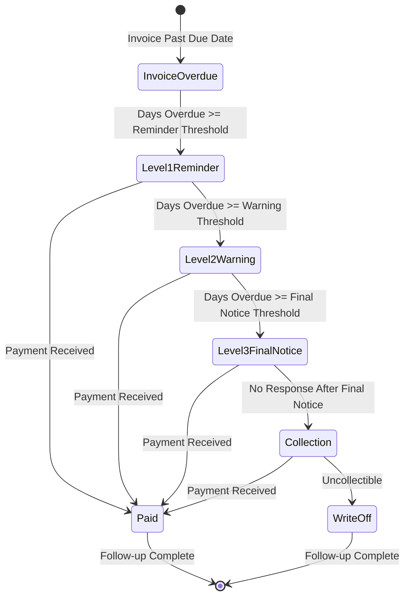
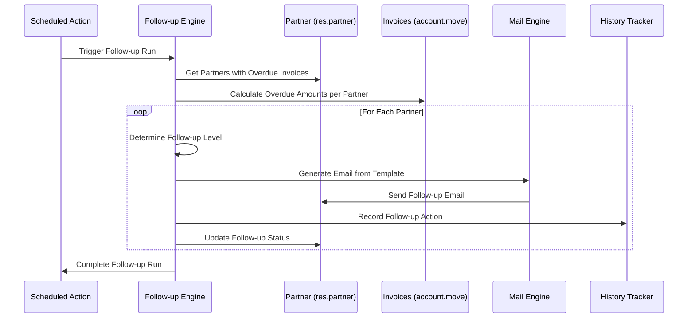
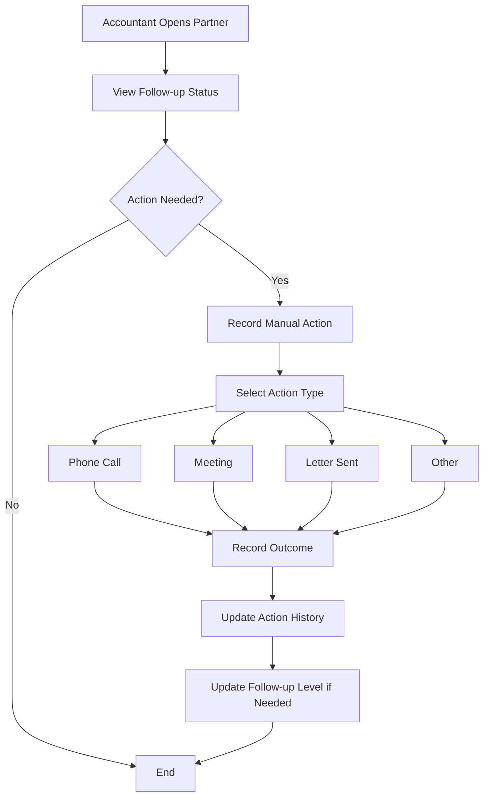

# FEATURE-006: Payment Follow-ups

---

## Metadata

| Attribute | Value |
|-----------|-------|
| **Feature ID** | FEATURE-006 |
| **Title** | Payment Follow-ups |
| **Parent Epic** | [EPIC-001: Enterprise Accounting Capabilities](../EPIC-001-enterprise-accounting.md) |
| **Status** | Draft |
| **Priority** | High |
| **Story Count** | 5 stories |
| **Last Updated** | 2024 |
| **Owner/Author** | Enterprise Accounting Team |

---

## 1. Feature Overview

### 1.1 Purpose and Business Value

This feature enables Accountants, Bookkeepers, and Business Owners to **automate customer payment collection workflows** for overdue receivables by providing configurable follow-up levels, automated email generation, action tracking, and overdue calculation capabilities.

**Business Value Delivered:**

- **Reduce overdue receivables by 15-25%** through systematic automated follow-up processes
- **Improve cash flow** with timely payment reminders and escalation procedures
- **Save 10+ hours per week** previously spent on manual follow-up activities
- **Standardize collection processes** with consistent messaging and timing
- **Maintain customer relationships** through professional, timely communication

> This feature addresses the gap between Odoo Community Edition and Enterprise Edition for payment follow-up automation, enabling SMEs to implement enterprise-grade collection workflows without Enterprise licensing costs.

### 1.2 Problem Statement

Currently, Odoo Community Edition users must **manually track overdue invoices and send payment reminders** to customers. This results in:

- **Inconsistent follow-up timing** leading to delayed collections
- **No standardized escalation process** from reminder to warning to final notice
- **High administrative burden** tracking which customers need follow-up
- **Lost revenue** from invoices that slip through manual tracking processes
- **No audit trail** of collection activities for internal and external review
- **Difficult DSO (Days Sales Outstanding) management** without automated intervention

### 1.3 Key Capabilities

| Capability ID | Capability Description | Related Stories |
|---------------|------------------------|-----------------|
| CAP-001 | Configure multiple follow-up levels (reminder, warning, final notice) with customizable timing and escalation rules | PF-001 |
| CAP-002 | Generate automated payment reminder emails per follow-up schedule with customizable templates | PF-002 |
| CAP-003 | Generate follow-up reports showing customers at each follow-up level with aging analysis | PF-003 |
| CAP-004 | Track complete action history per partner including all communications and manual actions | PF-004 |
| CAP-005 | Calculate overdue amounts based on payment terms, due dates, and partial payments | PF-005 |
| CAP-006 | Support manual follow-up actions (phone calls, meetings) with outcome recording | PF-004 |
| CAP-007 | Integrate with existing partner credit data (credit limit, trust level, DSO) | PF-001, PF-005 |

### 1.4 Success Criteria at Feature Level

| Criterion | Target | Verification Method |
|-----------|--------|---------------------|
| Overdue receivables reduction | 15-25% improvement in collection rate | Pre/post implementation comparison |
| Follow-up automation coverage | 100% of overdue invoices tracked | System audit of overdue items |
| Email delivery success rate | >98% successful delivery | Email delivery logs |
| Action history completeness | 100% of follow-up actions recorded | Audit trail verification |
| Report generation accuracy | Zero calculation errors in overdue amounts | Reconciliation with source data |
| Performance | Follow-up processing completes in <5 minutes for 1,000 partners | Batch processing timing |
| Test coverage | ≥80% for all story implementations | Code coverage measurement |

---

## 2. User Personas

### 2.1 Persona Mapping

| Persona | Role Description | Primary Use Cases | Applicable |
|---------|------------------|-------------------|------------|
| CFO / Finance Director | Executive responsible for financial strategy and reporting | Overview of collection effectiveness; DSO monitoring | ☐ Secondary |
| Accountant / Bookkeeper | Day-to-day financial operations and transaction processing | Configure follow-up levels; execute follow-up runs; record manual actions; generate reports | ☑ Primary |
| Controller | Budget oversight and variance management | Monitor AR aging impact on cash projections | ☐ Not Applicable |
| Auditor | Transaction verification and compliance review | Review action history for compliance | ☐ Secondary |
| Business Owner | Overall business health and cash position | Overdue reports; AR visibility; customer relationship decisions | ☑ Primary |

### 2.2 Persona Priority Summary

| Priority Level | Personas | Primary Stories |
|----------------|----------|-----------------|
| **Primary** | Accountant/Bookkeeper, Business Owner | PF-001, PF-002, PF-003, PF-004, PF-005 |
| **Secondary** | CFO/Finance Director, Auditor | PF-003, PF-004 |

---

## 3. Story List

### 3.1 User Stories

| Story ID | Story Title | Persona | Priority | Status | Link |
|----------|-------------|---------|----------|--------|------|
| PF-001 | Follow-up Level Configuration | Accountant | High | Draft | [PF-001](../stories/payment-followups/PF-001-followup-level-configuration.md) |
| PF-002 | Automated Email Generation | Accountant | High | Draft | [PF-002](../stories/payment-followups/PF-002-automated-email-generation.md) |
| PF-003 | Follow-up Report Generation | Accountant | High | Draft | [PF-003](../stories/payment-followups/PF-003-followup-report-generation.md) |
| PF-004 | Action History Tracking | Accountant | Medium | Draft | [PF-004](../stories/payment-followups/PF-004-action-history-tracking.md) |
| PF-005 | Overdue Calculation | Accountant | High | Draft | [PF-005](../stories/payment-followups/PF-005-overdue-calculation.md) |

### 3.2 Story Count Assessment

Per INVEST decomposition principles:

| Count | Assessment | Status |
|-------|------------|--------|
| **5 stories** | **Optimal range (3-7)** | ☑ Feature is well-scoped for independent delivery |

### 3.3 Story Dependency Ordering

| Story | Depends On | Notes |
|-------|-----------|-------|
| PF-002 (Automated Email Generation) | PF-001 (Follow-up Level Configuration) | Email generation requires follow-up levels to be defined |
| PF-003 (Follow-up Report Generation) | PF-005 (Overdue Calculation) | Reports need overdue calculation logic |
| PF-004 (Action History Tracking) | PF-001 (Follow-up Level Configuration) | Actions are tied to follow-up levels |

**Recommended Implementation Order:**

1. PF-005 (Overdue Calculation) - Foundation for all other stories
2. PF-001 (Follow-up Level Configuration) - Defines follow-up structure
3. PF-002 (Automated Email Generation) - Requires levels and overdue data
4. PF-004 (Action History Tracking) - Requires levels for context
5. PF-003 (Follow-up Report Generation) - Aggregates all other functionality

---

## 4. Acceptance Criteria Summary

### 4.1 Feature-Level Acceptance Criteria

The feature is considered complete when:

- [ ] All 5 stories within this feature have status "Done"
- [ ] All stories achieve minimum 80% test coverage
- [ ] Feature-level integration tests pass
- [ ] Configurable follow-up levels (reminder, warning, final notice) fully functional
- [ ] Automated email generation per follow-up schedule operational
- [ ] Action history tracking records all communications per partner
- [ ] Overdue calculation based on payment terms and due dates accurate
- [ ] Follow-up report generation with aging analysis available
- [ ] Integration with existing partner credit data (`res.partner`) verified

### 4.2 Cross-Cutting Concerns

| Concern | Acceptance Criterion |
|---------|---------------------|
| License | All implementations use AGPL-3.0 compatible license |
| Dependencies | No imports from Odoo Enterprise modules (specifically no `account_followup` Enterprise module) |
| Coding Standards | Code passes OCA quality checks (pre-commit, pylint-odoo) |
| Test Coverage | Each story achieves minimum 80% test coverage |
| Documentation | Public APIs documented with docstrings |
| Security | Access rights properly configured for Accountant and Business Owner roles |
| Performance | Follow-up batch processing handles 1,000+ partners in <5 minutes |
| Email Compliance | Email templates include required footer elements (unsubscribe, company info) |

### 4.3 Integration Requirements

| Integration Point | Requirement | Verification |
|-------------------|-------------|--------------|
| Partner Model (`res.partner`) | Access existing credit, trust, payment terms fields | Credit data displays correctly in follow-up |
| Invoice Model (`account.move`) | Query overdue invoices by partner | Overdue amounts match invoice due dates |
| Mail Templates (`mail.template`) | Follow existing Odoo email template patterns | Emails use consistent template structure |
| Scheduled Actions (`ir.cron`) | Integrate with Odoo scheduling for automated execution | Follow-ups execute on schedule |
| Financial Reporting (FEATURE-001) | Aged Receivables report shows follow-up status | Cross-feature data consistency |

### 4.4 Performance Requirements

| Metric | Requirement | Measurement Method |
|--------|-------------|-------------------|
| Follow-up calculation | Process 1,000 partners in <5 minutes | Batch timing with test dataset |
| Email generation | Generate 100 emails in <30 seconds | Bulk email creation timing |
| Report generation | Follow-up report in <10 seconds for 500 partners | Report rendering timing |
| Database queries | No N+1 query patterns in follow-up processing | Query count monitoring |

---

## 5. Constraints (Inherited from Epic)

### 5.1 License Requirements

| Constraint | Requirement | Rationale |
|------------|-------------|-----------|
| **License Compatibility** | AGPL-3.0 | All new modules must be distributed under AGPL-3.0 compatible license |
| **Existing License Respect** | LGPL-3 (base modules) | Integration with existing Odoo modules must respect their LGPL-3 licensing |

**Acceptance Criterion:** Module distributed under AGPL-3.0 compatible license.

### 5.2 Dependency Restrictions

| Constraint | Requirement | Rationale |
|------------|-------------|-----------|
| **No Enterprise Dependencies** | Zero imports from Enterprise Edition | Ensures solution works for Community Edition users |
| **No account_followup Enterprise** | No dependency on Odoo Enterprise `account_followup` module | Core requirement for Community Edition |
| **OCA Compatibility** | Compatible with OCA modules | Allows integration with existing OCA ecosystem |

**Acceptance Criterion:** No imports or dependencies on Odoo Enterprise edition modules.

### 5.3 Coding Standards

| Constraint | Requirement | Rationale |
|------------|-------------|-----------|
| **Odoo Guidelines** | Follow Odoo coding standards | Consistency with Odoo ecosystem |
| **OCA Standards** | Adhere to OCA module guidelines | Enables potential OCA contribution |
| **PEP 8 Compliance** | Python code follows PEP 8 | Standard Python style compliance |

**Acceptance Criterion:** Code passes OCA quality checks (pre-commit hooks, pylint-odoo).

### 5.4 Test Coverage

| Constraint | Requirement | Rationale |
|------------|-------------|-----------|
| **Minimum Coverage** | 80% test coverage | Ensures reliability and maintainability |
| **Test Types** | Unit, Integration, Acceptance | Comprehensive testing at all levels |
| **BDD Alignment** | Tests match acceptance criteria | Stories are verifiable |

**Acceptance Criterion:** Implementation achieves minimum 80% test coverage.

### 5.5 Version Compatibility

| Constraint | Requirement | Notes |
|------------|-------------|-------|
| **Target Version** | Odoo 18.0 | Per user requirements |
| **Repository Version** | Odoo 19.0 | Note: Repository is 19.0, stories written version-agnostic |
| **Python Version** | Python 3.10+ | Odoo version-dependent |

**Note:** Stories are written version-agnostic. Implementation agents should note potential migration considerations in their discovery phase.

---

## 6. Technical Discovery Notes

> **Purpose:** These notes guide implementing agents in their codebase analysis before making implementation decisions. User stories describe WHAT and WHY; implementation details emerge from agent discovery of the codebase.

### 6.1 Codebase Analysis Areas

| Analysis Area | Purpose | Key Questions |
|---------------|---------|---------------|
| `addons/account/models/partner.py` | Understand existing partner credit data structures | What credit-related fields exist? (`credit`, `credit_limit`, `trust`, `days_sales_outstanding`) How is payment term data accessed? |
| `addons/account/data/mail_template_data.xml` | Understand email template patterns | How are existing templates structured? What Jinja2/QWeb patterns are used for dynamic content? |
| `addons/account/models/account_move.py` | Understand invoice due date and payment state | How are due dates calculated? How is partial payment tracked? |
| `addons/account/views/partner_view.xml` | Partner form view patterns | Where should follow-up information be displayed? |
| `odoo/addons/mail/models/` | Mail template and automation patterns | How are automated emails scheduled and sent? |

### 6.2 Existing Odoo Modules to Examine

| Module | Path | Relevance to This Feature |
|--------|------|--------------------------|
| `account` | `addons/account/` | Core accounting: partner credit data, invoice/payment models, existing email templates |
| `mail` | `addons/mail/` | Email template engine, mail composition, automated sending patterns |
| `base` | `odoo/addons/base/` | Partner model inheritance patterns, scheduled action (ir.cron) patterns |

### 6.3 Existing Partner Credit Fields (from `partner.py` analysis)

The existing `res.partner` model includes these relevant fields for follow-up:

| Field | Type | Description | Source Reference |
|-------|------|-------------|------------------|
| `credit` | Monetary | Total amount this customer owes (computed) | `partner.py` line 507 |
| `credit_limit` | Float | Credit limit specific to this partner | `partner.py` line 514 |
| `trust` | Selection | Degree of trust (good/normal/bad debtor) | `partner.py` line 565 |
| `days_sales_outstanding` | Float | DSO calculation for the customer | `partner.py` line 524 |
| `property_payment_term_id` | Many2one | Customer payment terms | `partner.py` line 550 |
| `total_invoiced` | Monetary | Total invoiced amount (computed) | `partner.py` line 532 |

### 6.4 Existing Email Template Patterns (from `mail_template_data.xml` analysis)

Key patterns observed in existing templates:

| Pattern | Example | Application to Follow-ups |
|---------|---------|---------------------------|
| Dynamic sender | `{{ object.invoice_user_id.email_formatted or object.company_id.email_formatted }}` | Follow-up emails should use similar pattern |
| Partner addressing | `<t t-out="object.partner_id.name or ''">` | Address customer by name |
| Amount formatting | `` | Format overdue amounts |
| Conditional content | `<t t-if="object.payment_state">` | Show different content based on follow-up level |
| User signature | `<t t-out="object.invoice_user_id.signature or ''">` | Include accountant signature |

### 6.5 OCA Module Compatibility Considerations

| OCA Module | Repository | Consideration |
|------------|------------|---------------|
| `account_credit_control` | OCA/account-financial-tools | Similar functionality - evaluate for extension vs. replacement |
| `account_invoice_overdue_reminder` | OCA/account-invoicing | Simpler reminder functionality - potential pattern reference |
| `partner_statement` | OCA/account-financial-reporting | Statement generation patterns |

### 6.6 Integration Points

| Integration Point | Model/Module | Integration Type | Notes |
|-------------------|--------------|------------------|-------|
| Partner data | `res.partner` | Extend | Add follow-up level, last follow-up date, follow-up action history |
| Invoice data | `account.move` | Read | Query overdue invoices, calculate overdue amounts |
| Payment terms | `account.payment.term` | Read | Calculate due dates per payment terms |
| Mail templates | `mail.template` | Create | New templates for each follow-up level |
| Scheduled actions | `ir.cron` | Create | Automated follow-up processing |
| Action history | New model | Create | Track all follow-up communications and actions |

### 6.7 Discovery vs. Prescription Guidelines

> **Important:** User stories and feature specifications describe WHAT functionality is needed and WHY users need it. They do NOT prescribe HOW to implement.

**DO NOT specify in user stories:**
- Specific model names or field definitions
- Database schema decisions
- UI component architecture (OWL vs. legacy)
- Specific Odoo API methods to use
- Module structure or file organization

**DO defer to agent discovery:**
- D-001: Model inheritance patterns (extend `res.partner` vs. new model)
- D-002: OCA module integration strategy (integrate with `account_credit_control` or independent)
- D-003: Email engine approach (mail.template vs. dedicated)
- D-004: UI component patterns (form views, list views, smart buttons)
- D-005: Follow-up level data structure (many2one vs. selection field)

---

## 7. Dependencies

### 7.1 Related Features

| Feature | ID | Relationship | Notes |
|---------|-----|--------------|-------|
| Financial Reporting | FEATURE-001 | Related | Aged Receivables report (FR-006) shows related data; follow-up status may display in reports |
| Bank Reconciliation | FEATURE-002 | Related | Reconciled payments clear follow-up status |

### 7.2 Required Odoo Modules

| Module | Technical Name | Dependency Type | Purpose |
|--------|---------------|-----------------|---------|
| Invoicing | `account` | Required | Core accounting: invoices, payments, partner credit |
| Discuss/Mail | `mail` | Required | Email template engine, mail composition |
| Base | `base` | Required | Partner model, scheduled actions |

### 7.3 External Standards and Specifications

| Standard | Reference | Application to This Feature |
|----------|-----------|----------------------------|
| CAN-SPAM Act | US FTC Guidelines | Email compliance requirements for automated reminders |
| GDPR | EU Regulation | Data handling for partner communications history |
| Dunning Letter Standards | General Accounting Practice | Follow-up escalation timing conventions |

---

## 8. Feature Workflow Diagram

### 8.1 Follow-up Lifecycle State Diagram

### 8.2 Follow-up Process Sequence Diagram

### 8.3 Manual Action Recording Flow

---

## 9. Related Documentation

### 9.1 Epic Reference

| Document | Link |
|----------|------|
| Parent Epic | [EPIC-001: Enterprise Accounting Capabilities](../EPIC-001-enterprise-accounting.md) |

### 9.2 Story Files

| Story | Link |
|-------|------|
| PF-001: Follow-up Level Configuration | [PF-001](../stories/payment-followups/PF-001-followup-level-configuration.md) |
| PF-002: Automated Email Generation | [PF-002](../stories/payment-followups/PF-002-automated-email-generation.md) |
| PF-003: Follow-up Report Generation | [PF-003](../stories/payment-followups/PF-003-followup-report-generation.md) |
| PF-004: Action History Tracking | [PF-004](../stories/payment-followups/PF-004-action-history-tracking.md) |
| PF-005: Overdue Calculation | [PF-005](../stories/payment-followups/PF-005-overdue-calculation.md) |

### 9.3 External References

| Resource | URL | Purpose |
|----------|-----|---------|
| OCA account-financial-tools | https://github.com/OCA/account-financial-tools | Credit control module patterns (`account_credit_control`) |
| OCA account-invoicing | https://github.com/OCA/account-invoicing | Invoice reminder patterns |
| Odoo Mail Documentation | https://www.odoo.com/documentation/18.0/developer/reference/backend/mail.html | Mail template and automation reference |
| Odoo Partner Documentation | https://www.odoo.com/documentation/18.0/applications/finance/accounting/receivables.html | Partner receivables management |

---

## 10. Revision History

| Version | Date | Author | Changes |
|---------|------|--------|---------|
| 0.1 | 2024 | Enterprise Accounting Team | Initial draft |

---

## Appendix A: Follow-up Level Examples

The following are typical follow-up level configurations (exact values determined by implementing agents):

| Level | Name | Days After Due | Tone | Action |
|-------|------|----------------|------|--------|
| 1 | Friendly Reminder | 7-14 days | Polite reminder | Email only |
| 2 | Warning Notice | 30 days | Firm but professional | Email + optional call |
| 3 | Final Notice | 45-60 days | Urgent, consequences stated | Email + call + letter |
| 4 | Collection | 90+ days | Legal/collection handoff | Manual escalation |

## Appendix B: Success Metric Measurement

| Metric | Baseline Measurement | Target | Measurement Period |
|--------|---------------------|--------|-------------------|
| Overdue receivables | Total AR >30 days pre-implementation | 15-25% reduction | Quarterly |
| Days Sales Outstanding (DSO) | Average DSO pre-implementation | 10-20% reduction | Monthly |
| Collection effort | Hours spent on manual follow-up | 50% reduction | Weekly |
| Customer response rate | Percentage responding to first reminder | >60% | Monthly |
