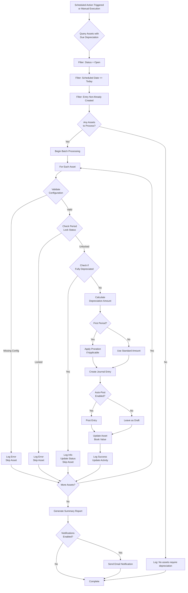

# AM-004: Automatic Depreciation Entries

| Attribute       | Value                                                    |
|-----------------|----------------------------------------------------------|
| **Story ID**    | AM-004                                                   |
| **Title**       | Automatic Depreciation Entries                           |
| **Parent Feature** | [FEATURE-004: Asset Management](../../features/FEATURE-004-asset-management.md) |
| **Status**      | Draft                                                    |
| **Priority**    | Critical                                                 |
| **Estimate**    | L (Large)                                                |

---

## User Story

**As an** Accountant

**I want** to have depreciation journal entries automatically generated and posted according to the configured depreciation schedules without manual intervention

**So that** I can eliminate manual data entry errors, ensure depreciation entries are never missed or delayed, maintain accurate book values of assets at all times, and significantly reduce the time spent on repetitive period-end depreciation processing tasks

---

## Acceptance Criteria

### Scenario 1: Automatic generation of depreciation entry on scheduled date

- **Given** an asset is in "open" (active) status with a confirmed depreciation configuration
  - And the asset has a valid depreciation schedule generated in the depreciation board (AM-003)
  - And the current date matches or exceeds a scheduled depreciation date in the depreciation schedule
  - And no depreciation entry has been created for this specific scheduled period
- **When** the automatic depreciation job executes (via scheduled action or manual trigger)
- **Then** a depreciation journal entry is created for the asset
  - And the journal entry debits the configured depreciation expense account
  - And the journal entry credits the configured accumulated depreciation account
  - And the debit and credit amounts equal the scheduled depreciation amount for that period
  - And the journal entry is dated on the scheduled depreciation date
  - And the journal entry reference includes the asset identifier for traceability
  - And the asset's cumulative depreciation is updated to reflect the new entry
  - And the asset's current book value (net book value) is recalculated

### Scenario 2: Batch processing of multiple assets at period end

- **Given** multiple assets exist with depreciation schedules that have entries due
  - And all assets are in "open" (active) status with valid configurations
  - And the scheduled depreciation dates fall on or before the current processing date
- **When** the automatic depreciation batch job is executed for a specific date or period
- **Then** depreciation entries are generated for all qualifying assets in a single batch run
  - And each asset receives its own individual journal entry (or line items on a consolidated entry based on configuration)
  - And the batch job processes assets in a consistent, deterministic order
  - And the total processing time scales efficiently with the number of assets
  - And a summary report or log is generated showing:
    - Total number of assets processed
    - Total depreciation amount recorded
    - Any assets that failed to process with error details
  - And the batch job completes successfully even if individual assets encounter errors (fault tolerance)

### Scenario 3: Draft versus auto-post configuration options

- **Given** an asset has a valid depreciation configuration
  - And the company or asset has a depreciation posting preference configured
- **When** automatic depreciation entries are generated
- **Then** the system respects the configured posting preference:
  - **If "Draft" mode is configured:**
    - Journal entries are created in "draft" status
    - Entries require manual review and posting by an Accountant
    - Entries appear in a list of pending depreciation entries for review
  - **If "Auto-Post" mode is configured:**
    - Journal entries are created and automatically posted (status = "posted")
    - No manual intervention is required for routine depreciation
    - The entry is immediately reflected in financial statements and account balances
- **And** the posting preference can be set at:
  - Company level (default for all assets)
  - Asset category level (override company default)
  - Individual asset level (override category and company defaults)

### Scenario 4: Prorated depreciation for assets acquired mid-period

- **Given** an asset was acquired during the middle of a depreciation period (not on the first day of the period)
  - And the depreciation start date configuration determines prorating behavior
  - And the asset's depreciation schedule includes a prorated first entry
- **When** automatic depreciation is generated for the first period
- **Then** the depreciation amount is prorated based on the number of days from the start date to the period end
  - And the prorated calculation uses the appropriate formula:
    - For straight-line: (Annual Depreciation × Days in Period / Days in Year)
    - For declining balance: (Book Value × Rate × Days in Period / Days in Year)
  - And the prorated amount is clearly indicated in the journal entry description
  - And subsequent full periods receive the standard (non-prorated) depreciation amount
  - And the total depreciation over the asset's useful life still equals (Acquisition Cost - Salvage Value)

### Scenario 5: Notification and logging of generated entries

- **Given** automatic depreciation entries have been generated (via scheduled job or batch processing)
- **When** the depreciation generation process completes
- **Then** a detailed activity log is created containing:
  - Timestamp of the depreciation run
  - User or system process that initiated the run
  - Total number of assets evaluated
  - Number of entries successfully created
  - Number of entries posted (if auto-post enabled)
  - Number of assets skipped (with reasons)
  - Any warnings or informational messages
- **And** if configured, email notifications are sent to designated users containing:
  - Summary of depreciation entries generated
  - List of any errors or warnings requiring attention
  - Link to view the generated journal entries
- **And** each asset's chatter/activity history is updated to record the depreciation entry creation
- **And** the log is retained for audit trail purposes and is searchable/filterable

### Scenario 6: Error handling for locked periods or missing configuration

- **Given** the automatic depreciation job is executing
- **When** an asset encounters an error condition during processing
- **Then** the system handles the following error scenarios gracefully:

  **Locked Period Error:**
  - If the depreciation date falls within a locked fiscal period
  - The entry is NOT created for that asset
  - An error is logged indicating the asset ID and the lock date conflict
  - Other assets continue to process normally (fault isolation)
  - The asset is flagged for manual review

  **Missing Configuration Error:**
  - If the asset is missing required depreciation configuration (accounts, method, useful life)
  - The entry is NOT created for that asset
  - An error is logged with specific details about which configuration is missing
  - A recommendation is provided to complete the configuration via AM-002

  **Already Depreciated Error:**
  - If a depreciation entry already exists for the scheduled period
  - The asset is skipped (no duplicate entry created)
  - A warning is logged indicating the entry already exists
  - The process continues without error

  **Fully Depreciated Asset:**
  - If the asset's book value has reached the salvage value (fully depreciated)
  - No additional depreciation entries are created
  - The asset status is optionally updated to "close" or "fully depreciated"
  - An informational message is logged

- **And** at the end of processing, a consolidated error report is available showing all issues
- **And** failed assets can be reprocessed individually after configuration corrections

---

## Technical Notes

### Codebase Analysis Areas

The following areas of the existing codebase should be analyzed during implementation:

| Source File | Analysis Focus |
|-------------|----------------|
| `addons/account/models/account_move.py` | Journal entry creation patterns, `_create_move` method patterns, state management (`draft`, `posted`), line item creation with `Command.create()`, date and period handling |
| `addons/account/models/account_move_line.py` | Debit/credit line creation, account assignment, balance computation, partner and analytic assignment |
| `addons/account/wizard/account_automatic_entry_wizard.py` | Patterns for automatic entry generation, batch processing logic, preview/confirm workflow, error handling in entry creation |
| `addons/account/models/account_journal.py` | Journal selection and validation, journal type constraints, sequence generation for entry numbering |

### Key Integration Points

| Integration | Description |
|-------------|-------------|
| `account.move` | Depreciation entries use the standard journal entry model with move_type = 'entry' |
| `account.move.line` | Each depreciation entry has two lines: debit (expense) and credit (accumulated depreciation) |
| `account.account` | Account type filtering ensures correct accounts are used for expense and contra-asset entries |
| `ir.cron` | Scheduled action (cron job) for automatic periodic depreciation processing |
| `mail.thread` | Activity logging and notification functionality for entry generation events |
| `AM-001 Asset Model` | Asset records provide source data for depreciation calculation |
| `AM-002 Depreciation Config` | Configuration parameters drive calculation amounts and timing |
| `AM-003 Depreciation Board` | Schedule data determines when entries should be generated |

### Scheduled Action Considerations

The automatic depreciation generation should be implemented as a scheduled action (`ir.cron`) with the following characteristics:

| Parameter | Recommendation |
|-----------|----------------|
| **Interval** | Daily execution (to catch depreciation dates reliably) |
| **Execution Time** | Configurable; typically early morning or after business hours |
| **Priority** | Low priority to avoid blocking critical operations |
| **Retry Logic** | Automatic retry on transient failures with exponential backoff |
| **Timeout** | Configurable timeout for large asset portfolios |

### Journal Entry Structure

Each depreciation journal entry should follow this structure:

```
Journal Entry (account.move)
├── Header
│   ├── date: Scheduled depreciation date
│   ├── ref: Asset reference + period identifier
│   ├── journal_id: Depreciation journal (or miscellaneous)
│   └── move_type: 'entry'
│
└── Lines (account.move.line)
    ├── Line 1 (Debit)
    │   ├── account_id: Depreciation expense account
    │   ├── debit: Depreciation amount
    │   ├── credit: 0.00
    │   └── name: "Depreciation: [Asset Name] - [Period]"
    │
    └── Line 2 (Credit)
        ├── account_id: Accumulated depreciation account
        ├── debit: 0.00
        ├── credit: Depreciation amount
        └── name: "Depreciation: [Asset Name] - [Period]"
```

### Model Considerations

- Depreciation entry generation method should be idempotent (safe to run multiple times)
- Use database transactions to ensure atomicity of batch operations
- Implement proper locking to prevent concurrent depreciation runs
- Consider using `with_delay()` for large batch processing (if `queue_job` is available)
- Proper use of `@api.model` for scheduled action methods
- Company-aware processing (`self.env.company` or explicit company filter)

### Performance Optimization

| Strategy | Implementation |
|----------|----------------|
| **Batch Writing** | Create all journal entries in a single `create()` call with a list of values |
| **Prefetch Related Data** | Use `sudo().with_context(prefetch_fields=...)` for efficient data loading |
| **Index Utilization** | Ensure queries use indexes on asset status, company, and schedule dates |
| **Progress Logging** | Log progress at intervals (e.g., every 100 assets) for monitoring |

---

## Dependencies

### Story Dependencies

| Dependency Type | Story | Description |
|-----------------|-------|-------------|
| **Depends On** | AM-001 | Asset Registration provides the asset records to process |
| **Depends On** | AM-002 | Depreciation Configuration provides calculation parameters (method, useful life, accounts) |
| **Depends On** | AM-003 | Depreciation Board provides the schedule of when entries should be generated |
| **Required By** | AM-005 | Asset Modification may recalculate future depreciation entries |
| **Required By** | AM-006 | Asset Disposal may require processing final depreciation before disposal |

### Dependency Flow

```
AM-001 (Asset Registration)
    │
    ▼
AM-002 (Depreciation Configuration)
    │
    ▼
AM-003 (Depreciation Board)
    │
    ▼
AM-004 (Automatic Depreciation Entries) ◄── You are here
    │
    ├──► AM-005 (Asset Modification)
    │
    └──► AM-006 (Asset Disposal)
```

### Module Dependencies

| Module | Dependency Type | Purpose |
|--------|-----------------|---------|
| `account` | Required | Core accounting models (`account.move`, `account.move.line`, `account.journal`) |
| `base` | Required | Base models (`res.company`, `ir.cron` for scheduled actions) |
| `mail` | Required | Activity logging, chatter updates, and email notifications |
| Asset module (new) | Required | Asset model from AM-001, depreciation config from AM-002, schedule from AM-003 |

### External Dependencies

| Constraint | Requirement |
|------------|-------------|
| **No Enterprise Dependencies** | Implementation must NOT import or depend on Odoo Enterprise `account_asset` module |
| **OCA Compatibility** | Should be compatible with OCA `account-financial-tools` patterns where applicable |

---

## Test Requirements

### Coverage Target

| Metric | Target |
|--------|--------|
| **Minimum Test Coverage** | 80% |
| **Unit Test Coverage** | All depreciation calculation methods, entry creation logic, error handling branches |
| **Integration Test Coverage** | Full workflow from schedule to posted entry, batch processing, scheduled action execution |

### Required Test Scenarios

| Test ID | Scenario | Expected Outcome |
|---------|----------|------------------|
| T-AM-004-01 | Generate single depreciation entry on exact scheduled date | Entry created with correct debit/credit amounts and accounts |
| T-AM-004-02 | Generate depreciation entry for date in the past (catch-up) | Entry created with historical date matching the schedule |
| T-AM-004-03 | Batch process 100+ assets with varying depreciation dates | All qualifying assets processed, summary report accurate |
| T-AM-004-04 | Test draft mode - entries created in draft status | Entries remain in draft, appear in pending list |
| T-AM-004-05 | Test auto-post mode - entries automatically posted | Entries posted immediately, reflected in account balances |
| T-AM-004-06 | Prorate first period for mid-month acquisition | Prorated amount calculated correctly based on days |
| T-AM-004-07 | Attempt depreciation in locked period | Error logged, entry not created, other assets continue |
| T-AM-004-08 | Attempt depreciation with missing expense account | Error logged, entry not created, specific error message |
| T-AM-004-09 | Attempt depreciation on already-depreciated period | Entry skipped, warning logged, no duplicate created |
| T-AM-004-10 | Process fully depreciated asset | No entry created, asset status updated, info logged |
| T-AM-004-11 | Verify journal entry structure (debit/credit balance) | Entry is balanced, accounts match configuration |
| T-AM-004-12 | Verify notification sent after batch completion | Email notification sent with correct summary |
| T-AM-004-13 | Verify activity log created on asset record | Chatter shows depreciation entry creation event |
| T-AM-004-14 | Test scheduled action (ir.cron) execution | Cron job executes and processes due assets |
| T-AM-004-15 | Multi-company asset depreciation | Assets processed within correct company context |

### Validation Criteria

| Validation Area | Criteria |
|-----------------|----------|
| **Entry Amount Accuracy** | Debit amount equals credit amount; both equal scheduled depreciation |
| **Account Assignment** | Expense account type is `expense_depreciation`; accumulated account is contra-asset |
| **Date Accuracy** | Entry date matches scheduled depreciation date exactly |
| **Reference Traceability** | Entry reference contains asset identifier for audit trail |
| **Book Value Update** | Asset's net book value decreases by depreciation amount |
| **Idempotency** | Running job twice for same period does not create duplicate entries |
| **Fault Isolation** | One asset's failure does not prevent other assets from processing |

### Performance Benchmarks

| Benchmark | Target | Test Method |
|-----------|--------|-------------|
| Single asset entry generation | < 1 second | Unit test timing |
| Batch processing (100 assets) | < 30 seconds | Integration test timing |
| Batch processing (1,000 assets) | < 5 minutes | Load test timing |
| Batch processing (10,000 assets) | < 30 minutes | Stress test timing |

---

## Constraints (Inherited from Epic)

### License Requirements

| Constraint | Requirement |
|------------|-------------|
| **License** | AGPL-3.0 compatible |
| **Compliance** | Module must be distributable under AGPL-3.0 license |

### Coding Standards

| Standard | Requirement |
|----------|-------------|
| **OCA Guidelines** | Follow OCA coding standards and module structure |
| **Odoo Guidelines** | Adhere to Odoo development best practices |
| **Pre-commit Hooks** | Code must pass pre-commit and pylint-odoo checks |

### Performance Requirements

| Metric | Target |
|--------|--------|
| **Single Entry Generation** | < 1 second per asset |
| **Batch Processing** | Scale linearly with asset count |
| **Scheduled Job** | Complete within configurable timeout |
| **Memory Usage** | Efficient processing for 10,000+ asset portfolios |

---

## INVEST Checklist

| Principle | Assessment | Notes |
|-----------|------------|-------|
| **I**ndependent | ✓ Pass | Depends on AM-001, AM-002, AM-003 for data, but entry generation logic is self-contained |
| **N**egotiable | ✓ Pass | Describes outcomes (entries generated, logged, errors handled) not implementation |
| **V**aluable | ✓ Pass | Clear business value: eliminates manual work, ensures accuracy, maintains compliance |
| **E**stimable | ✓ Pass | Well-defined scope with measurable acceptance criteria and test scenarios |
| **S**mall | ✓ Pass | Focused on entry generation; modification and disposal are separate stories |
| **T**estable | ✓ Pass | All scenarios have objective pass/fail criteria with specific validation requirements |

---

## Workflow Diagram



---

## Related Documentation

- [EPIC-001: Enterprise Accounting Capabilities](../../EPIC-001-enterprise-accounting.md)
- [FEATURE-004: Asset Management](../../features/FEATURE-004-asset-management.md)
- [AM-001: Asset Registration](./AM-001-asset-registration.md)
- [AM-002: Depreciation Configuration](./AM-002-depreciation-configuration.md)
- [AM-003: Depreciation Board](./AM-003-depreciation-board.md)
- [AM-005: Asset Modification](./AM-005-asset-modification.md)
- [AM-006: Asset Disposal](./AM-006-asset-disposal.md)
