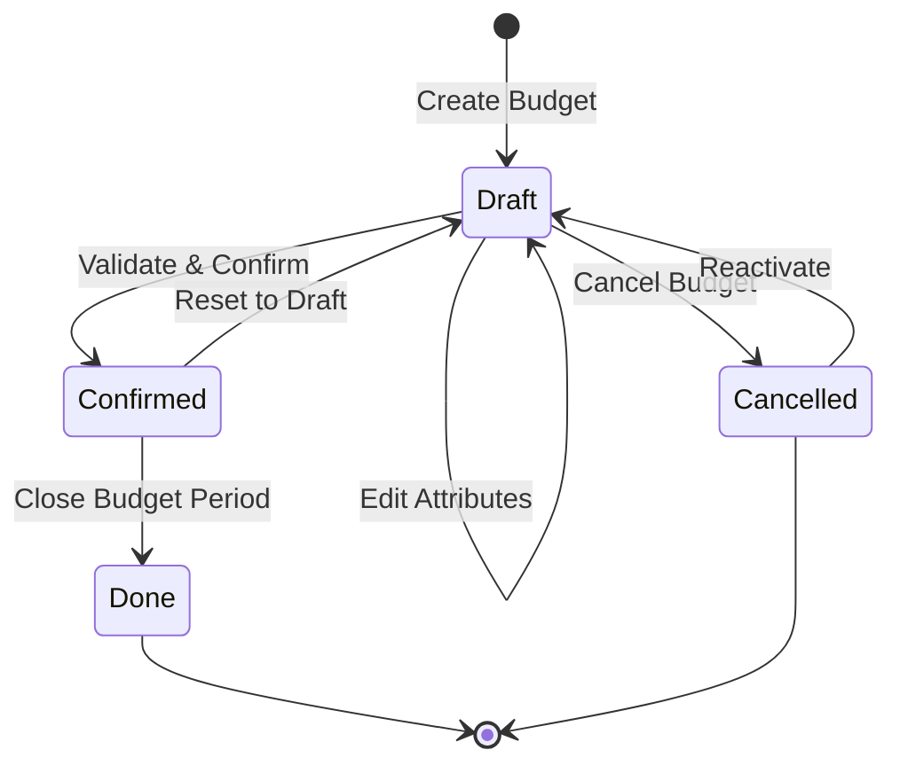
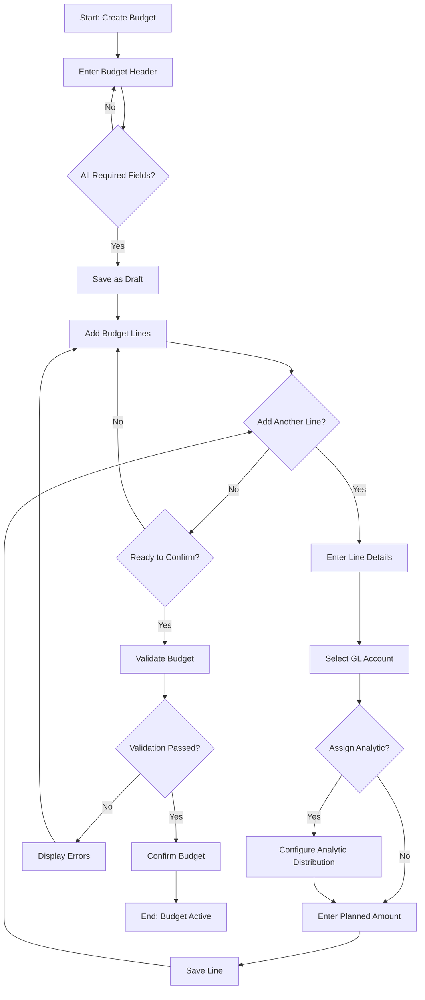

# BM-001: Budget Definition

| Attribute | Value |
|-----------|-------|
| **Story ID** | BM-001 |
| **Title** | Budget Definition |
| **Parent Feature** | [FEATURE-003: Budget Management](../../features/FEATURE-003-budget-management.md) |
| **Parent Epic** | [EPIC-001: Enterprise Accounting Capabilities](../../EPIC-001-enterprise-accounting.md) |
| **Status** | Draft |
| **Priority** | Critical |
| **Story Points** | TBD |
| **Created** | 2024 |
| **Last Updated** | 2024 |

---

## Table of Contents

1. [User Story](#1-user-story)
2. [Acceptance Criteria](#2-acceptance-criteria)
3. [Constraints](#3-constraints)
4. [Technical Discovery Notes](#4-technical-discovery-notes)
5. [Dependencies](#5-dependencies)
6. [Test Requirements](#6-test-requirements)
7. [Definition of Done](#7-definition-of-done)
8. [Workflow Diagram](#8-workflow-diagram)
9. [Revision History](#9-revision-history)

---

## 1. User Story

### 1.1 Story Statement

**As a** Controller, Finance Director, or CFO

**I want** to define budgets for specific general ledger accounts and analytic dimensions (departments, projects, cost centers)

**So that** I can establish financial targets and spending limits for planning and control purposes, enabling proactive financial management and variance tracking

### 1.2 Business Context

Budget definition is the **foundational capability** for the Budget Management feature. Without the ability to define budgets with associated accounts, analytic dimensions, and planned amounts, none of the subsequent budget monitoring capabilities (period allocation, actual vs. budget reporting, variance analysis, or alerts) can function.

This story enables organizations using Odoo Community Edition to:

- Establish annual, quarterly, or project-based budgets
- Link budgets to their existing chart of accounts
- Leverage Odoo's multi-dimensional analytic accounting (departments, projects, cost centers) for granular budget tracking
- Create budget templates from prior periods for efficient planning cycles
- Implement proper budget approval workflows with state management

### 1.3 User Value Proposition

| Persona | Value Delivered |
|---------|-----------------|
| **CFO / Finance Director** | Establish strategic financial targets aligned with organizational goals; oversee budget approval process |
| **Controller** | Define detailed budgets by account and dimension; manage budget lifecycle from draft to confirmed |
| **Accountant** | Support budget entry with proper account assignments; ensure budget data integrity |

### 1.4 Acceptance Criteria Traceability

| Scenario | Business Requirement | Success Metric Alignment |
|----------|---------------------|-------------------------|
| Scenario 1 | Create budget records with key attributes | Foundation for all budget functionality |
| Scenario 2 | Link budgets to GL accounts | Enables actual vs. budget comparison at account level |
| Scenario 3 | Assign analytic dimensions | Supports multi-dimensional budget analysis |
| Scenario 4 | Validate before activation | Ensures budget data integrity |
| Scenario 5 | Duplicate existing budgets | Efficient planning cycle support |
| Scenario 6 | Unique identification | Supports search, filtering, and audit trail |

---

## 2. Acceptance Criteria

### Scenario 1: Create a New Budget Record

**Given** I am a user with budget management permissions

**When** I create a new budget record

**Then** I can specify the following attributes:
- Budget name (required)
- Fiscal year or budget period (required)
- Responsible person (optional)
- Budget description/notes (optional)

**And** the budget is saved in **draft** state for further configuration

**And** the system generates a unique budget reference number

---

### Scenario 2: Assign Budget to General Ledger Accounts

**Given** a budget record has been created in draft state

**When** I add budget lines for specific general ledger accounts

**Then** I can select accounts from the company's chart of accounts
- Expense accounts (account types: `expense`, `expense_other`, `expense_depreciation`, `expense_direct_cost`)
- Income accounts (account types: `income`, `income_other`)

**And** each budget line has an associated planned amount

**And** the budget line displays the account code and name for clarity

**And** I can add multiple budget lines to a single budget record

---

### Scenario 3: Assign Budget to Analytic Dimensions

**Given** analytic plans exist in the system (e.g., departments, projects, cost centers as defined in `account.analytic.plan`)

**And** analytic accounts exist within those plans (e.g., specific departments, specific projects as defined in `account.analytic.account`)

**When** I create budget lines with analytic distribution

**Then** I can assign budget amounts to specific analytic accounts

**And** I can combine multiple analytic dimensions on a single budget line (e.g., Marketing department AND Website Redesign project)

**And** the analytic distribution follows the same JSON format used by `analytic.mixin` (`analytic_distribution` field pattern)

**And** the sum of distribution percentages can total 100% per analytic plan

---

### Scenario 4: Validate Budget Before Activation

**Given** a budget has been defined with one or more budget lines

**When** I attempt to confirm/activate the budget

**Then** the system validates that:
- At least one budget line exists
- Each budget line has a complete required information (account or analytic assignment)
- The total budget amount is greater than zero (positive)
- Required fields (name, fiscal period) are populated

**And** if validation passes, the budget transitions from **draft** to **confirmed** state

**And** if validation fails, the system displays specific validation error messages

**And** confirmed budgets cannot be modified without first resetting to draft state

---

### Scenario 5: Duplicate an Existing Budget

**Given** an active or confirmed budget exists from a previous period

**When** I choose to duplicate the budget for a new period

**Then** the system creates a new budget record with:
- The same structure (accounts and analytic assignments)
- The same budget line configuration
- A new budget name (with "(copy)" suffix or user-specified name)
- **Draft** state (regardless of source budget state)

**And** I can modify the amounts for the new period

**And** the original budget remains unchanged

**And** the new budget references the source budget for audit trail purposes

---

### Scenario 6: Budget Naming and Identification

**Given** multiple budgets exist for different fiscal years, departments, or purposes

**When** I view the budget list

**Then** each budget has:
- A unique system-generated reference number
- A user-defined budget name
- Associated fiscal year/period displayed
- Responsible person displayed (if assigned)
- Current state (draft/confirmed) displayed

**And** I can search budgets by:
- Budget name (partial match)
- Reference number (exact match)
- Fiscal year/period
- Responsible person
- State (draft/confirmed)

**And** I can filter the budget list by:
- Active/inactive status
- Budget state
- Fiscal period
- Responsible person

---

## 3. Constraints

### 3.1 License Requirements

| Constraint ID | Constraint | Requirement |
|---------------|------------|-------------|
| **C-001** | License Compatibility | Module distributed under AGPL-3.0 compatible license |
| **C-002** | Existing License Respect | Integration with existing Odoo modules must respect LGPL-3 licensing |

### 3.2 Dependency Restrictions

| Constraint ID | Constraint | Requirement |
|---------------|------------|-------------|
| **C-003** | No Enterprise Dependencies | No imports or dependencies on Odoo Enterprise edition modules |
| **C-004** | Specifically Prohibited | No use of `account_budget` Enterprise module |
| **C-005** | OCA Compatibility | Should be compatible with OCA modules (e.g., `mis-builder`) |

### 3.3 Coding Standards

| Constraint ID | Constraint | Requirement |
|---------------|------------|-------------|
| **C-006** | Odoo Guidelines | Implementation follows Odoo coding standards |
| **C-007** | OCA Standards | Adherence to OCA module guidelines for potential community contribution |
| **C-008** | PEP 8 Compliance | Python code follows PEP 8 style guidelines |

### 3.4 Test Coverage

| Constraint ID | Constraint | Requirement |
|---------------|------------|-------------|
| **C-009** | Minimum Coverage | Implementation achieves minimum 80% test coverage |
| **C-010** | Test Types | Unit tests, integration tests, and acceptance tests required |

### 3.5 Acceptance Criteria Constraints (Mandatory for All Scenarios)

All acceptance criteria must include verification of:

```
- Module distributed under AGPL-3.0 compatible license
- No imports or dependencies on Odoo Enterprise edition modules
- Implementation follows Odoo and OCA coding standards
- Implementation achieves minimum 80% test coverage
```

---

## 4. Technical Discovery Notes

> **Purpose:** These notes guide implementing agents in their codebase analysis before making implementation decisions. User stories describe **WHAT** and **WHY**; implementation details emerge from agent discovery of the codebase.

### 4.1 Key Source Files to Analyze

| Source File | Analysis Purpose | Key Questions |
|-------------|------------------|---------------|
| `addons/analytic/models/analytic_plan.py` | Understand hierarchical analytic plans structure | How do plans create parent/child relationships? How to structure budget hierarchies? What is `parent_store` pattern? |
| `addons/analytic/models/analytic_account.py` | Analytic account structure and balance computation | How are `balance`, `debit`, `credit` computed? How does `plan_id` link work? Company isolation pattern? |
| `addons/analytic/models/analytic_mixin.py` | Analytic distribution JSON field patterns | How is `analytic_distribution` JSON structured? How to validate distribution percentages? |
| `addons/account/models/account_account.py` | GL account structure and types | What are the account type selections? How to filter expense/income accounts? |

### 4.2 Source Analysis Findings

Based on analysis of the Odoo source code:

**`account.analytic.plan` Model Key Features:**
- Uses `_parent_store = True` for hierarchical data with `parent_path` field
- Contains `parent_id` for tree structure (`ondelete='cascade'`)
- Has `root_id` computed field for finding the top-level plan
- Contains `account_ids` One2many relation to `account.analytic.account`
- Includes `default_applicability` selection: `optional`, `mandatory`, `unavailable`
- Provides `children_count` and `all_account_count` computed fields

**`account.analytic.account` Model Key Features:**
- Links to plan via `plan_id` (required Many2one to `account.analytic.plan`)
- Has `root_plan_id` as related field to `plan_id.root_id`
- Contains `balance`, `debit`, `credit` computed fields via `_compute_debit_credit_balance`
- Supports `company_id` for multi-company isolation
- Includes `line_ids` One2many to `account.analytic.line`

**`analytic.mixin` Model Key Features:**
- Provides `analytic_distribution` as JSON field storing distribution data
- Distribution format: keys are comma-separated analytic account IDs, values are percentages
- Example: `{"123": 50.0, "124,125": 50.0}` (50% to account 123, 50% to accounts 124+125)
- Contains `distribution_analytic_account_ids` computed Many2many for UI display
- Uses GIN index for efficient JSON path queries

**`account.account` Model Key Features:**
- Uses `account_type` selection field with 18 account type options
- Expense types: `expense`, `expense_other`, `expense_depreciation`, `expense_direct_cost`
- Income types: `income`, `income_other`
- Contains `internal_group` computed field for high-level grouping
- Supports multi-company via `company_ids` Many2many field

### 4.3 Recommended Design Patterns

| Pattern | Recommendation | Rationale |
|---------|----------------|-----------|
| **State Management** | Use Odoo's standard `state` field with selection | Consistent with Odoo patterns; enables workflow integration |
| **Analytic Distribution** | Follow `analytic.mixin` JSON pattern | Consistency with existing Odoo infrastructure; reuse UI components |
| **Sequence Generation** | Use `ir.sequence` for budget reference numbers | Standard Odoo pattern for document numbering |
| **Access Rights** | Create dedicated security groups for budget management | Proper role-based access control |

### 4.4 OCA Module Considerations

| OCA Module | Repository | Consideration |
|------------|------------|---------------|
| `mis_builder` | [OCA/mis-builder](https://github.com/OCA/mis-builder) | Evaluate for budget reporting integration; may provide report engine patterns |
| `account_budget_oca` | [OCA/account-budgeting](https://github.com/OCA/account-budgeting) | Evaluate for compatibility; potential reference implementation |

**Discovery Decision:** Implementation agents should determine whether to:
- Build new budget models from scratch using analytic infrastructure
- Integrate with or extend existing OCA budget modules
- Provide compatibility layer for OCA module interoperability

### 4.5 Model Structure Considerations (Discovery-Dependent)

> **Note:** The following structure is suggested based on source analysis but should be validated through codebase discovery during implementation.

**Potential Model Structure:**

```
budget.budget (Main Budget Record)
├── name: Char (required)
├── reference: Char (sequence-generated)
├── fiscal_year_id: Many2one (account.fiscal.year or date range)
├── user_id: Many2one (res.users - responsible person)
├── state: Selection (draft, confirmed, done, cancelled)
├── company_id: Many2one (res.company)
├── line_ids: One2many (budget.budget.line)
└── notes: Text

budget.budget.line (Budget Line Items)
├── budget_id: Many2one (budget.budget)
├── account_id: Many2one (account.account)
├── analytic_distribution: Json (following analytic.mixin pattern)
├── planned_amount: Monetary
├── date_from: Date
├── date_to: Date
└── company_id: Many2one (related to budget.company_id)
```

---

## 5. Dependencies

### 5.1 Story Dependencies

| Dependency Type | Reference | Description |
|----------------|-----------|-------------|
| **Parent Feature** | [FEATURE-003](../../features/FEATURE-003-budget-management.md) | Budget Management feature specification |
| **Parent Epic** | [EPIC-001](../../EPIC-001-enterprise-accounting.md) | Enterprise Accounting epic definition |

### 5.2 Blocking Relationships

| Relationship | Story | Description |
|--------------|-------|-------------|
| **Blocks** | [BM-002](./BM-002-budget-period-allocation.md) | Budget Period Allocation requires budget definition to exist |
| **Blocks** | [BM-003](./BM-003-actual-vs-budget-reporting.md) | Actual vs Budget Reporting requires defined budgets |
| **Blocks** | [BM-004](./BM-004-variance-analysis.md) | Variance Analysis requires budgets for comparison |
| **Blocks** | [BM-005](./BM-005-budget-alerts.md) | Budget Alerts require budget thresholds to monitor |
| **Blocked By** | None | This is the foundational story for Budget Management |

### 5.3 External Model Dependencies

| Model | Module | Dependency Type | Usage |
|-------|--------|-----------------|-------|
| `account.analytic.plan` | `analytic` | Integration | Multi-dimensional budget structure |
| `account.analytic.account` | `analytic` | Integration | Analytic dimension assignments |
| `account.account` | `account` | Integration | GL account assignments for budget lines |
| `res.company` | `base` | Integration | Multi-company budget isolation |
| `res.users` | `base` | Integration | Budget responsible person assignment |
| `account.fiscal.year` | `account` | Integration | Fiscal year/period association (if available) |

### 5.4 Integration Points

| Integration Point | Description | Verification Method |
|-------------------|-------------|---------------------|
| **Chart of Accounts** | Budget lines link to `account.account` | Budget line account selection works correctly |
| **Analytic Plans** | Budgets support analytic plan hierarchies | Budget analytic distribution validates against plans |
| **Analytic Accounts** | Budget lines distribute to analytic accounts | Analytic distribution follows `analytic.mixin` pattern |
| **Multi-Company** | Budgets isolated per company | Budget data properly filtered by company |
| **User/Security** | Proper access rights for budget operations | CRUD operations respect security groups |

---

## 6. Test Requirements

### 6.1 Coverage Requirements

| Requirement | Target | Measurement |
|-------------|--------|-------------|
| **Overall Test Coverage** | ≥80% | Code coverage analysis tools |
| **Unit Test Coverage** | ≥90% for business logic | Method-level coverage |
| **Integration Test Coverage** | ≥80% for model interactions | Cross-model test scenarios |

### 6.2 Unit Test Scenarios

| Test Category | Test Scenario | Expected Result |
|---------------|---------------|-----------------|
| **CRUD Operations** | Create budget with required fields | Budget created successfully in draft state |
| **CRUD Operations** | Create budget without name (required field) | Validation error raised |
| **CRUD Operations** | Read budget and budget lines | Correct data returned |
| **CRUD Operations** | Update budget in draft state | Update successful |
| **CRUD Operations** | Update budget in confirmed state | Operation blocked or state reset required |
| **CRUD Operations** | Delete budget in draft state | Deletion successful |
| **CRUD Operations** | Delete budget with linked transactions | Appropriate error or warning |
| **Validation Rules** | Confirm budget with no lines | Validation error |
| **Validation Rules** | Confirm budget with zero total amount | Validation error |
| **Validation Rules** | Confirm budget with valid data | State changes to confirmed |
| **State Transitions** | Transition draft → confirmed | State updated, validation executed |
| **State Transitions** | Transition confirmed → draft | State reset, edit mode enabled |
| **Budget Duplication** | Duplicate budget with all lines | New draft budget created with same structure |
| **Budget Duplication** | Duplicate budget - original unchanged | Source budget remains unmodified |

### 6.3 Integration Test Scenarios

| Test Category | Test Scenario | Expected Result |
|---------------|---------------|-----------------|
| **Analytic Integration** | Assign budget line to analytic account | Distribution stored correctly |
| **Analytic Integration** | Multi-dimension distribution | Multiple analytic accounts assigned |
| **Analytic Integration** | Invalid analytic account reference | Validation error |
| **Account Integration** | Assign budget line to GL account | Account link established |
| **Account Integration** | Filter accounts by type (expense/income) | Only appropriate accounts available |
| **Multi-Company** | Create budget in Company A | Budget isolated to Company A |
| **Multi-Company** | Access budget from Company B | Access denied or filtered |
| **Sequence Generation** | Create multiple budgets | Unique references generated |

### 6.4 Acceptance Test Scenarios (BDD Alignment)

| Scenario | Test | Verification |
|----------|------|--------------|
| Scenario 1 | Create budget with all fields | All attributes stored correctly |
| Scenario 2 | Add budget lines with GL accounts | Lines created with proper account links |
| Scenario 3 | Assign analytic distribution | JSON distribution stored and validated |
| Scenario 4 | Validate and confirm budget | State transition and validation rules |
| Scenario 5 | Duplicate existing budget | Copy created with draft state |
| Scenario 6 | Search and filter budgets | Search and filter operations work correctly |

### 6.5 Security Test Scenarios

| Test Category | Test Scenario | Expected Result |
|---------------|---------------|-----------------|
| **Access Rights** | User with budget permission creates budget | Operation successful |
| **Access Rights** | User without permission attempts create | Access denied |
| **Access Rights** | Budget manager confirms budget | Operation successful |
| **Access Rights** | Non-manager attempts confirmation | Access denied |
| **Data Isolation** | User in Company A views budgets | Only Company A budgets visible |

---

## 7. Definition of Done

### 7.1 Acceptance Checklist

| # | Criterion | Status |
|---|-----------|--------|
| 1 | All 6 acceptance criteria scenarios pass | [ ] |
| 2 | Unit tests achieve ≥90% coverage for business logic | [ ] |
| 3 | Overall test coverage achieves ≥80% | [ ] |
| 4 | Integration tests pass for all external dependencies | [ ] |
| 5 | No dependencies on Odoo Enterprise modules verified | [ ] |
| 6 | AGPL-3.0 license compliance verified | [ ] |
| 7 | Code follows Odoo and OCA coding standards | [ ] |
| 8 | Analytic account integration working correctly | [ ] |
| 9 | Budget validation rules enforced | [ ] |
| 10 | State management (draft → confirmed) functional | [ ] |
| 11 | Budget duplication feature working | [ ] |
| 12 | Search and filter capabilities implemented | [ ] |
| 13 | Multi-company isolation verified | [ ] |
| 14 | Security/access rights configured and tested | [ ] |
| 15 | Code review completed and approved | [ ] |
| 16 | Documentation (docstrings, README) complete | [ ] |

### 7.2 Quality Gates

| Gate | Requirement | Verification Method |
|------|-------------|---------------------|
| **Code Quality** | Passes pylint-odoo checks | CI/CD pipeline |
| **Test Quality** | All tests pass | Test suite execution |
| **Coverage Quality** | ≥80% coverage | Coverage report |
| **Security Review** | Access rights properly configured | Security audit |
| **Documentation** | Public APIs documented | Documentation review |

---

## 8. Workflow Diagram

### 8.1 Budget Definition State Flow



### 8.2 Budget Creation Workflow



### 8.3 Budget Duplication Flow


---

## 9. Revision History

| Version | Date | Author | Changes |
|---------|------|--------|---------|
| 1.0 | 2024 | Blitzy Platform | Initial story creation |

---

## Related Documentation

- [EPIC-001: Enterprise Accounting Capabilities](../../EPIC-001-enterprise-accounting.md)
- [FEATURE-003: Budget Management](../../features/FEATURE-003-budget-management.md)
- [BM-002: Budget Period Allocation](./BM-002-budget-period-allocation.md)
- [BM-003: Actual vs Budget Reporting](./BM-003-actual-vs-budget-reporting.md)
- [BM-004: Variance Analysis](./BM-004-variance-analysis.md)
- [BM-005: Budget Alerts](./BM-005-budget-alerts.md)

---

**Source Code References:**
- `addons/analytic/models/analytic_plan.py` - Analytic plan hierarchical structure
- `addons/analytic/models/analytic_account.py` - Analytic account model with balance computation
- `addons/analytic/models/analytic_mixin.py` - Analytic distribution JSON field pattern
- `addons/account/models/account_account.py` - GL account types and structure
