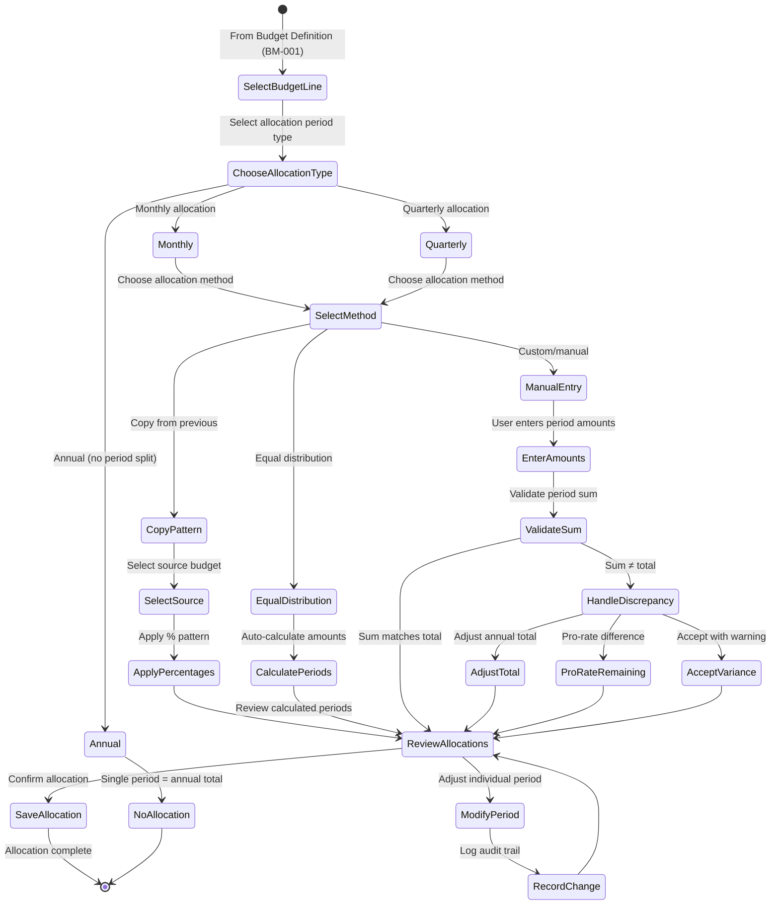
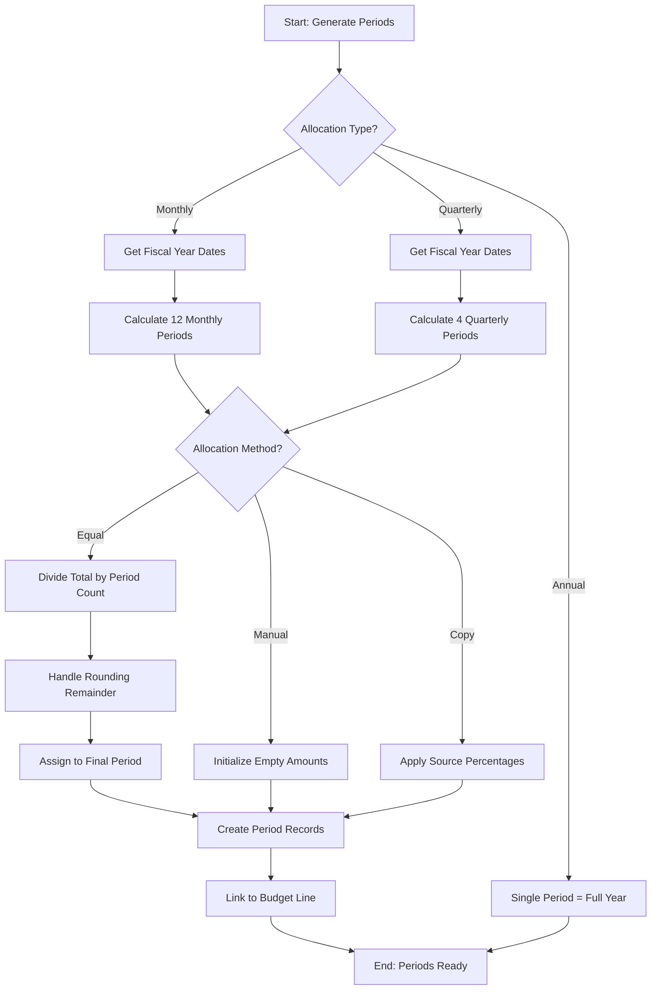
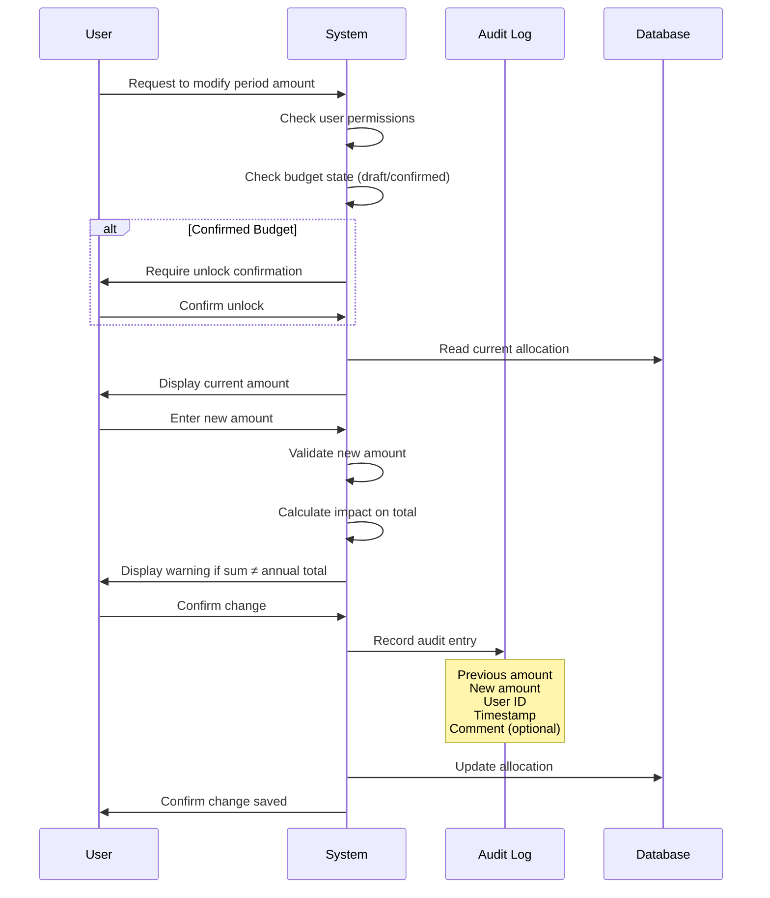
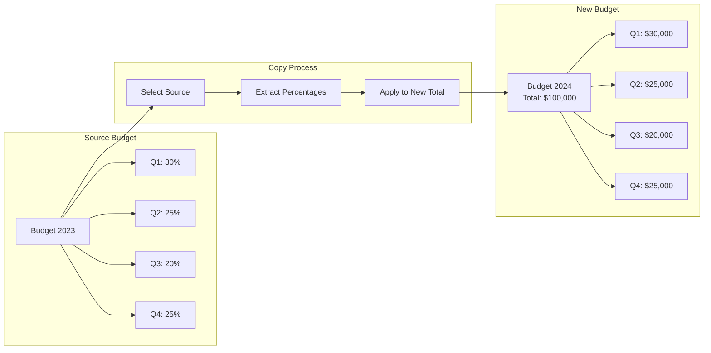

# BM-002: Budget Period Allocation

| Attribute | Value |
|-----------|-------|
| **Story ID** | BM-002 |
| **Title** | Budget Period Allocation |
| **Parent Feature** | [FEATURE-003: Budget Management](../../features/FEATURE-003-budget-management.md) |
| **Parent Epic** | [EPIC-001: Enterprise Accounting Capabilities](../../EPIC-001-enterprise-accounting.md) |
| **Status** | Draft |
| **Priority** | Critical |
| **Story Points** | TBD |
| **Created** | 2024 |
| **Last Updated** | 2024 |

---

## Table of Contents

1. [User Story](#1-user-story)
2. [Acceptance Criteria](#2-acceptance-criteria)
3. [Constraints](#3-constraints)
4. [Technical Discovery Notes](#4-technical-discovery-notes)
5. [Dependencies](#5-dependencies)
6. [Test Requirements](#6-test-requirements)
7. [Definition of Done](#7-definition-of-done)
8. [Workflow Diagram](#8-workflow-diagram)
9. [Revision History](#9-revision-history)

---

## 1. User Story

### 1.1 Story Statement

**As a** Controller, Finance Director, or CFO

**I want** to allocate budget amounts across different time periods (monthly, quarterly, annual)

**So that** I can track budget consumption over time and ensure appropriate fund distribution throughout the fiscal year, enabling period-by-period variance analysis and proactive financial management

### 1.2 Business Context

Budget Period Allocation is the **critical capability** that transforms a static annual budget into a dynamic, time-bound financial control tool. Without period allocation, organizations cannot:

- Track budget consumption against time-based expectations
- Identify when spending is ahead of or behind schedule
- Generate meaningful period variance reports
- Implement seasonal adjustments for cyclical expenses
- Support rolling forecast updates

This story enables organizations using Odoo Community Edition to:

- Distribute annual budgets across monthly periods for granular tracking
- Allocate by quarter for quarterly business review cycles
- Apply equal distribution formulas to simplify allocation
- Implement custom allocation patterns for seasonal businesses
- Copy allocation patterns from prior periods for consistency

### 1.3 User Value Proposition

| Persona | Value Delivered |
|---------|-----------------|
| **CFO / Finance Director** | Strategic oversight of budget pacing; ensure fiscal year spending aligns with organizational cash flow planning |
| **Controller** | Granular budget monitoring by period; identify variances early; adjust allocations proactively |
| **Accountant** | Clear period-based targets for expense monitoring; support month-end close with defined budget benchmarks |

### 1.4 Acceptance Criteria Traceability

| Scenario | Business Requirement | Success Metric Alignment |
|----------|---------------------|-------------------------|
| Scenario 1 | Monthly budget allocation | Enables monthly variance tracking per success metrics |
| Scenario 2 | Quarterly budget allocation | Supports quarterly business review cycles |
| Scenario 3 | Equal distribution method | Simplifies budget allocation for consistent expenses |
| Scenario 4 | Custom/manual allocation | Accommodates seasonal and variable expense patterns |
| Scenario 5 | Modify allocated amounts | Supports mid-year budget adjustments |
| Scenario 6 | Copy allocation from previous budget | Efficient annual planning cycle support |

---

## 2. Acceptance Criteria

### Scenario 1: Define Budget with Monthly Allocation

**Given** a budget has been defined with an annual total amount (per BM-001 Budget Definition)

**And** the budget is associated with a fiscal year period

**When** I select the monthly allocation method for a budget line

**Then** I can specify budget amounts for each month of the fiscal year (12 periods)

**And** the interface displays all 12 months with their period dates

**And** I can enter a specific planned amount for each month

**And** the sum of monthly amounts must equal the annual budget line total

**And** the system displays a running total as amounts are entered

**And** any discrepancy between period sum and annual total is highlighted

---

### Scenario 2: Define Budget with Quarterly Allocation

**Given** a budget has been defined with an annual total amount (per BM-001 Budget Definition)

**And** the budget is associated with a fiscal year period

**When** I select the quarterly allocation method for a budget line

**Then** I can specify budget amounts for each quarter (Q1, Q2, Q3, Q4)

**And** each quarter corresponds to the appropriate fiscal quarter dates based on company fiscal year settings

**And** I can enter a specific planned amount for each quarter

**And** the sum of quarterly amounts must equal the annual budget line total

**And** the system displays the date range for each quarter

**And** any discrepancy between period sum and annual total is highlighted

---

### Scenario 3: Equal Distribution Allocation Method

**Given** a budget line has been defined with a specific total amount

**When** I select the equal distribution allocation method

**Then** the system automatically divides the total equally across all periods (monthly or quarterly based on allocation type)

**And** the system handles any rounding differences by applying the remainder to the final period

**And** currency precision is respected in all calculations

**And** I can see the calculated amount per period before confirming

**And** I can override individual period amounts after equal distribution (converting to custom allocation)

---

### Scenario 4: Custom/Manual Allocation Method

**Given** a budget line has been defined with a specific total amount

**When** I select the custom allocation method

**Then** I can manually enter different amounts for each period

**And** I am not constrained to equal distribution

**And** the system validates that period totals match the annual budget line total

**And** the system warns if there is a discrepancy between period sum and annual total

**And** I can choose to:
- Adjust the annual total to match period sum
- Pro-rate the discrepancy across remaining periods
- Leave as-is with acknowledgment of the variance

**And** the allocation preserves the exact amounts entered without automatic adjustment

---

### Scenario 5: Modify Allocated Amounts

**Given** a budget exists with period allocations (monthly or quarterly)

**And** the budget is in draft or confirmed state (with appropriate permissions for confirmed budgets)

**When** I modify the amount for a specific period

**Then** the system recalculates the remaining available to allocate

**And** displays the new total versus the annual budget amount

**And** maintains an audit trail of allocation changes including:
- Previous amount
- New amount
- Date of change
- User who made the change
- Reason for change (optional comment field)

**And** I am warned if the modification causes the period sum to deviate from the annual total

**And** confirmed budgets require explicit unlock/edit action before modification

---

### Scenario 6: Copy Allocation from Previous Budget

**Given** a previous year's budget exists with period allocations

**And** I am creating a new budget for a new fiscal period (per BM-001 duplication)

**When** I choose to copy the allocation pattern from a source budget

**Then** the system applies the same **percentage distribution** pattern to the new budget total

**And** the copied allocation respects the new budget's fiscal year dates

**And** monthly percentages (e.g., 10% in January, 8% in February) are preserved

**And** I can adjust individual period amounts after copying

**And** the original source budget's allocations remain unchanged

**And** the new budget references the source budget for audit trail purposes

---

## 3. Constraints

### 3.1 License Requirements

| Constraint ID | Constraint | Requirement |
|---------------|------------|-------------|
| **C-001** | License Compatibility | Module distributed under AGPL-3.0 compatible license |
| **C-002** | Existing License Respect | Integration with existing Odoo modules must respect LGPL-3 licensing |

### 3.2 Dependency Restrictions

| Constraint ID | Constraint | Requirement |
|---------------|------------|-------------|
| **C-003** | No Enterprise Dependencies | No imports or dependencies on Odoo Enterprise edition modules |
| **C-004** | Specifically Prohibited | No use of `account_budget` Enterprise module |
| **C-005** | OCA Compatibility | Should be compatible with OCA modules (e.g., `mis-builder`) |

### 3.3 Coding Standards

| Constraint ID | Constraint | Requirement |
|---------------|------------|-------------|
| **C-006** | Odoo Guidelines | Implementation follows Odoo coding standards |
| **C-007** | OCA Standards | Adherence to OCA module guidelines for potential community contribution |
| **C-008** | PEP 8 Compliance | Python code follows PEP 8 style guidelines |

### 3.4 Test Coverage

| Constraint ID | Constraint | Requirement |
|---------------|------------|-------------|
| **C-009** | Minimum Coverage | Implementation achieves minimum 80% test coverage |
| **C-010** | Test Types | Unit tests, integration tests, and acceptance tests required |

### 3.5 Fiscal Period Constraints

| Constraint ID | Constraint | Requirement |
|---------------|------------|-------------|
| **C-011** | Fiscal Year Support | Must support company-specific fiscal year definitions (non-calendar year) |
| **C-012** | Date Precision | Period dates must align precisely with company fiscal period boundaries |
| **C-013** | Leap Year Handling | Allocation logic must correctly handle leap years for February |

### 3.6 Acceptance Criteria Constraints (Mandatory for All Scenarios)

All acceptance criteria must include verification of:

```
- Module distributed under AGPL-3.0 compatible license
- No imports or dependencies on Odoo Enterprise edition modules
- Implementation follows Odoo and OCA coding standards
- Implementation achieves minimum 80% test coverage
```

---

## 4. Technical Discovery Notes

> **Purpose:** These notes guide implementing agents in their codebase analysis before making implementation decisions. User stories describe **WHAT** and **WHY**; implementation details emerge from agent discovery of the codebase.

### 4.1 Key Source Files to Analyze

| Source File | Analysis Purpose | Key Questions |
|-------------|------------------|---------------|
| `addons/analytic/models/analytic_plan.py` | Hierarchical plan structures for multi-dimensional allocation | How do plan hierarchies affect budget allocation? Can allocations cascade through plan levels? |
| `addons/analytic/models/analytic_account.py` | Analytic account structure for budget dimension | How to aggregate allocations by analytic account? |
| `addons/account/models/account_account.py` | GL account types for filtering budget accounts | How to identify budget-appropriate account types? |
| `addons/account/models/account_fiscal_year.py` or fiscal patterns | Fiscal year/period definitions | Does `account.fiscal.year` model exist? How are fiscal periods defined? |
| `addons/account/models/res_company.py` | Company fiscal settings | How is fiscal year start configured? Lock date patterns? |
| `addons/base/models/ir_sequence.py` | Sequence patterns | How to generate period-based sequences? |

### 4.2 Source Analysis Findings

Based on analysis of the Odoo source code:

**`account.analytic.plan` Model Key Features (for multi-dimensional allocation):**
- Uses `_parent_store = True` for hierarchical data with `parent_path` field
- Contains `default_applicability` selection: `optional`, `mandatory`, `unavailable`
- Plans can have children via `children_ids` One2many relation
- `root_id` computed field identifies top-level plan for any child
- Consider: Budget period allocation may need to support allocation per analytic plan dimension

**`account.analytic.account` Model Key Features:**
- Links to plan via `plan_id` (required Many2one to `account.analytic.plan`)
- Has `root_plan_id` as related field to `plan_id.root_id`
- Contains `balance`, `debit`, `credit` computed fields
- Supports `company_id` for multi-company isolation
- Consider: Period allocations may be associated with specific analytic accounts

**`account.account` Model Key Features:**
- Uses `account_type` selection field with 18 account type options
- Budget-relevant types include expense and income categories
- Supports multi-company via `company_ids` Many2many field
- Consider: Period allocation should inherit account filtering from BM-001

**Fiscal Period Patterns to Investigate:**
- Check for `account.fiscal.year` model existence in Odoo 19.0
- Review `res.company` for `fiscalyear_last_month` and `fiscalyear_last_day` fields
- Analyze date range patterns used elsewhere in accounting module
- Consider: May need to create/use date range model for period definitions

### 4.3 Recommended Design Patterns

| Pattern | Recommendation | Rationale |
|---------|----------------|-----------|
| **Period Definition** | Use date range approach (date_from, date_to) for maximum flexibility | Supports non-standard fiscal periods and partial year budgets |
| **Allocation Method** | Use Selection field with options: `equal`, `manual`, `percentage` | Clear user choice; aligns with common accounting software patterns |
| **Allocation Storage** | One2many relation to period allocation lines | Allows flexible period count; supports both monthly and quarterly |
| **Percentage Precision** | Use Float with 2-4 decimal places for percentages | Balance between precision and usability |
| **Monetary Precision** | Follow `currency_id.decimal_places` from company currency | Consistent with Odoo monetary field patterns |

### 4.4 Period Model Structure Considerations (Discovery-Dependent)

> **Note:** The following structure is suggested based on source analysis but should be validated through codebase discovery during implementation.

**Potential Period Allocation Model Structure:**

```
budget.budget.period (Budget Period Allocation)
├── budget_line_id: Many2one (budget.budget.line - required)
├── name: Char (computed - e.g., "January 2024", "Q1 2024")
├── date_from: Date (period start - required)
├── date_to: Date (period end - required)
├── sequence: Integer (period ordering)
├── planned_amount: Monetary (allocated amount for this period)
├── allocation_percentage: Float (percentage of annual total - computed or stored)
├── company_id: Many2one (related to budget.company_id)
└── currency_id: Many2one (related to budget.currency_id)

budget.budget.line (Extended from BM-001)
├── allocation_type: Selection [monthly, quarterly, annual]
├── period_ids: One2many (budget.budget.period)
├── planned_amount: Monetary (annual total - sum constraint with periods)
└── allocation_method: Selection [equal, manual, percentage_copy]
```

### 4.5 Calculation Logic Considerations

**Equal Distribution Logic:**
```
per_period_amount = total_amount / number_of_periods
remainder = total_amount - (per_period_amount * number_of_periods)
final_period_amount = per_period_amount + remainder
```

**Percentage-Based Allocation:**
```
period_amount = annual_total * (period_percentage / 100)
validation: sum(period_percentages) should equal 100%
```

**Rounding Considerations:**
- Use company currency precision for monetary calculations
- Apply banker's rounding (round half to even) for consistency
- Always place rounding adjustments in the final period

### 4.6 OCA Module Considerations

| OCA Module | Repository | Consideration |
|------------|------------|---------------|
| `mis_builder` | [OCA/mis-builder](https://github.com/OCA/mis-builder) | Evaluate for period-based reporting patterns |
| `account_fiscal_year` | [OCA/account-financial-tools](https://github.com/OCA/account-financial-tools) | May provide fiscal year model if not in core |
| `date_range` | [OCA/server-ux](https://github.com/OCA/server-ux) | Reusable date range patterns for period definition |

**Discovery Decision:** Implementation agents should determine whether to:
- Use existing Odoo fiscal period mechanisms
- Implement custom period generation based on company fiscal settings
- Integrate with OCA date_range module for period flexibility

---

## 5. Dependencies

### 5.1 Story Dependencies

| Dependency Type | Reference | Description |
|----------------|-----------|-------------|
| **Parent Feature** | [FEATURE-003](../../features/FEATURE-003-budget-management.md) | Budget Management feature specification |
| **Parent Epic** | [EPIC-001](../../EPIC-001-enterprise-accounting.md) | Enterprise Accounting epic definition |

### 5.2 Blocking Relationships

| Relationship | Story | Description |
|--------------|-------|-------------|
| **Blocked By** | [BM-001](./BM-001-budget-definition.md) | Budget Definition must exist before allocating periods |
| **Blocks** | [BM-003](./BM-003-actual-vs-budget-reporting.md) | Actual vs Budget Reporting requires period allocations for time-based comparison |
| **Blocks** | [BM-004](./BM-004-variance-analysis.md) | Variance Analysis requires period allocations for period variance calculations |
| **Blocks** | [BM-005](./BM-005-budget-alerts.md) | Budget Alerts may monitor period-level thresholds |

### 5.3 External Model Dependencies

| Model | Module | Dependency Type | Usage |
|-------|--------|-----------------|-------|
| `budget.budget` | New (BM-001) | Hard Dependency | Parent budget record |
| `budget.budget.line` | New (BM-001) | Hard Dependency | Budget line to allocate |
| `account.analytic.plan` | `analytic` | Integration | Multi-dimensional allocation support |
| `account.analytic.account` | `analytic` | Integration | Analytic dimension for allocations |
| `res.company` | `base` | Integration | Fiscal year settings, currency |
| `res.currency` | `base` | Integration | Monetary precision for calculations |

### 5.4 Integration Points

| Integration Point | Description | Verification Method |
|-------------------|-------------|---------------------|
| **Budget Lines** | Period allocation attached to budget lines from BM-001 | Period allocations sum to line total |
| **Fiscal Year** | Periods align with company fiscal year boundaries | Period dates match fiscal year settings |
| **Multi-Company** | Allocations isolated per company | Period data properly filtered by company |
| **Currency Precision** | Amounts respect company currency decimals | Monetary calculations accurate to currency precision |
| **Audit Trail** | Allocation changes tracked | Change history preserved and queryable |

---

## 6. Test Requirements

### 6.1 Coverage Requirements

| Requirement | Target | Measurement |
|-------------|--------|-------------|
| **Overall Test Coverage** | ≥80% | Code coverage analysis tools |
| **Unit Test Coverage** | ≥90% for allocation calculations | Method-level coverage |
| **Integration Test Coverage** | ≥80% for model interactions | Cross-model test scenarios |

### 6.2 Unit Test Scenarios

| Test Category | Test Scenario | Expected Result |
|---------------|---------------|-----------------|
| **Equal Distribution** | Distribute 12000 across 12 months | 1000 per month |
| **Equal Distribution** | Distribute 10000 across 12 months | Handles remainder correctly |
| **Equal Distribution** | Distribute 10000 across 4 quarters | 2500 per quarter |
| **Equal Distribution** | Zero amount distribution | All periods have zero |
| **Rounding Precision** | Currency with 2 decimals, odd division | Final period absorbs rounding |
| **Rounding Precision** | Currency with 0 decimals (JPY pattern) | Integer allocation correct |
| **Validation Rules** | Period sum exceeds annual total | Validation error or warning |
| **Validation Rules** | Period sum less than annual total | Validation error or warning |
| **Validation Rules** | Period dates outside fiscal year | Validation error |
| **Leap Year** | February allocation in leap year | Correct date handling |
| **Leap Year** | February allocation in non-leap year | Correct date handling |
| **Percentage Copy** | Copy 60/40 Q1/Q2 pattern to new budget | Percentages preserved, amounts recalculated |
| **Custom Allocation** | Manual entry with imbalance | Warning displayed, user can proceed |

### 6.3 Integration Test Scenarios

| Test Category | Test Scenario | Expected Result |
|---------------|---------------|-----------------|
| **BM-001 Integration** | Create allocation for budget line | Allocation linked correctly |
| **BM-001 Integration** | Delete budget line with allocations | Cascade delete allocations |
| **Fiscal Year** | Create monthly allocation for calendar year | 12 periods January-December |
| **Fiscal Year** | Create monthly allocation for July fiscal year | 12 periods July-June |
| **Fiscal Year** | Create quarterly allocation | 4 periods with correct boundaries |
| **Multi-Company** | Allocation with different company fiscal years | Each company's periods aligned correctly |
| **Currency** | Allocation in multi-currency environment | Correct currency used per budget |
| **Audit Trail** | Modify allocation | Change recorded with user/timestamp |

### 6.4 Acceptance Test Scenarios (BDD Alignment)

| Scenario | Test | Verification |
|----------|------|--------------|
| Scenario 1 | Monthly allocation creation | 12 periods created, sum equals total |
| Scenario 2 | Quarterly allocation creation | 4 periods created, sum equals total |
| Scenario 3 | Equal distribution calculation | Amounts calculated correctly with rounding |
| Scenario 4 | Custom allocation with warning | User warned of imbalance, can proceed |
| Scenario 5 | Modify existing allocation | Change saved, audit trail recorded |
| Scenario 6 | Copy allocation pattern | Percentages applied to new budget |

### 6.5 Edge Case Test Scenarios

| Test Category | Test Scenario | Expected Result |
|---------------|---------------|-----------------|
| **Partial Year** | Mid-year budget (starts in June) | Only 7 monthly periods created |
| **Partial Year** | Single quarter budget | Only 1 quarterly period |
| **Extreme Values** | Very large budget amount | No overflow, correct precision |
| **Extreme Values** | Very small budget amount (0.01) | Distributes without error |
| **Date Edge Cases** | Fiscal year ending Feb 28 | Correct month-end handling |
| **Date Edge Cases** | Fiscal year spanning leap year | Correct day counts |
| **Concurrent Edits** | Two users edit same allocation | Proper locking/conflict handling |

### 6.6 Security Test Scenarios

| Test Category | Test Scenario | Expected Result |
|---------------|---------------|-----------------|
| **Access Rights** | Controller creates allocation | Operation successful |
| **Access Rights** | User without permission modifies | Access denied |
| **Access Rights** | Finance Director copies allocation pattern | Operation successful |
| **Data Isolation** | User in Company A views allocations | Only Company A allocations visible |
| **Audit Access** | Read allocation change history | Appropriate users can view |

---

## 7. Definition of Done

### 7.1 Acceptance Checklist

| # | Criterion | Status |
|---|-----------|--------|
| 1 | All 6 acceptance criteria scenarios pass | [ ] |
| 2 | Unit tests achieve ≥90% coverage for allocation calculations | [ ] |
| 3 | Overall test coverage achieves ≥80% | [ ] |
| 4 | Integration tests pass for all external dependencies | [ ] |
| 5 | No dependencies on Odoo Enterprise modules verified | [ ] |
| 6 | AGPL-3.0 license compliance verified | [ ] |
| 7 | Code follows Odoo and OCA coding standards | [ ] |
| 8 | Monthly allocation (12 periods) working correctly | [ ] |
| 9 | Quarterly allocation (4 periods) working correctly | [ ] |
| 10 | Equal distribution method calculates correctly | [ ] |
| 11 | Custom/manual allocation method functional | [ ] |
| 12 | Allocation modification with audit trail working | [ ] |
| 13 | Copy allocation pattern feature functional | [ ] |
| 14 | Period sum validation enforced | [ ] |
| 15 | Fiscal year alignment verified | [ ] |
| 16 | Rounding/currency precision handling correct | [ ] |
| 17 | Multi-company isolation verified | [ ] |
| 18 | Security/access rights configured and tested | [ ] |
| 19 | Code review completed and approved | [ ] |
| 20 | Documentation (docstrings, README) complete | [ ] |

### 7.2 Quality Gates

| Gate | Requirement | Verification Method |
|------|-------------|---------------------|
| **Code Quality** | Passes pylint-odoo checks | CI/CD pipeline |
| **Test Quality** | All tests pass | Test suite execution |
| **Coverage Quality** | ≥80% coverage | Coverage report |
| **Security Review** | Access rights properly configured | Security audit |
| **Documentation** | Public APIs documented | Documentation review |
| **Performance** | Period generation completes in <1 second | Performance test |

---

## 8. Workflow Diagram

### 8.1 Budget Period Allocation Flow



### 8.2 Period Generation Workflow



### 8.3 Allocation Modification Audit Flow



### 8.4 Copy Allocation Pattern Flow



---

## 9. Revision History

| Version | Date | Author | Changes |
|---------|------|--------|---------|
| 1.0 | 2024 | Blitzy Platform | Initial story creation |

---

## Related Documentation

- [EPIC-001: Enterprise Accounting Capabilities](../../EPIC-001-enterprise-accounting.md)
- [FEATURE-003: Budget Management](../../features/FEATURE-003-budget-management.md)
- [BM-001: Budget Definition](./BM-001-budget-definition.md)
- [BM-003: Actual vs Budget Reporting](./BM-003-actual-vs-budget-reporting.md)
- [BM-004: Variance Analysis](./BM-004-variance-analysis.md)
- [BM-005: Budget Alerts](./BM-005-budget-alerts.md)

---

*This user story follows INVEST principles: Independent (can be developed after BM-001), Negotiable (describes outcomes not implementation), Valuable (enables period-based budget tracking), Estimable (well-defined scope), Small (focused on allocation only), Testable (clear BDD acceptance criteria).*
