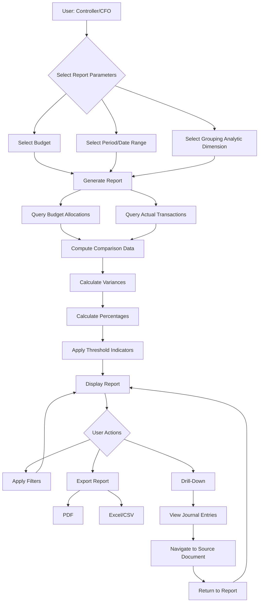
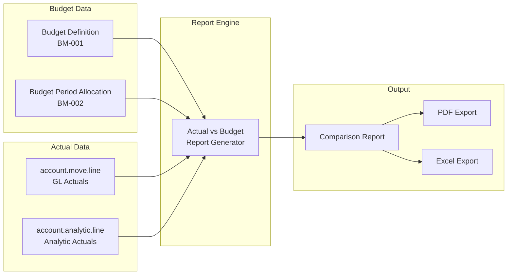
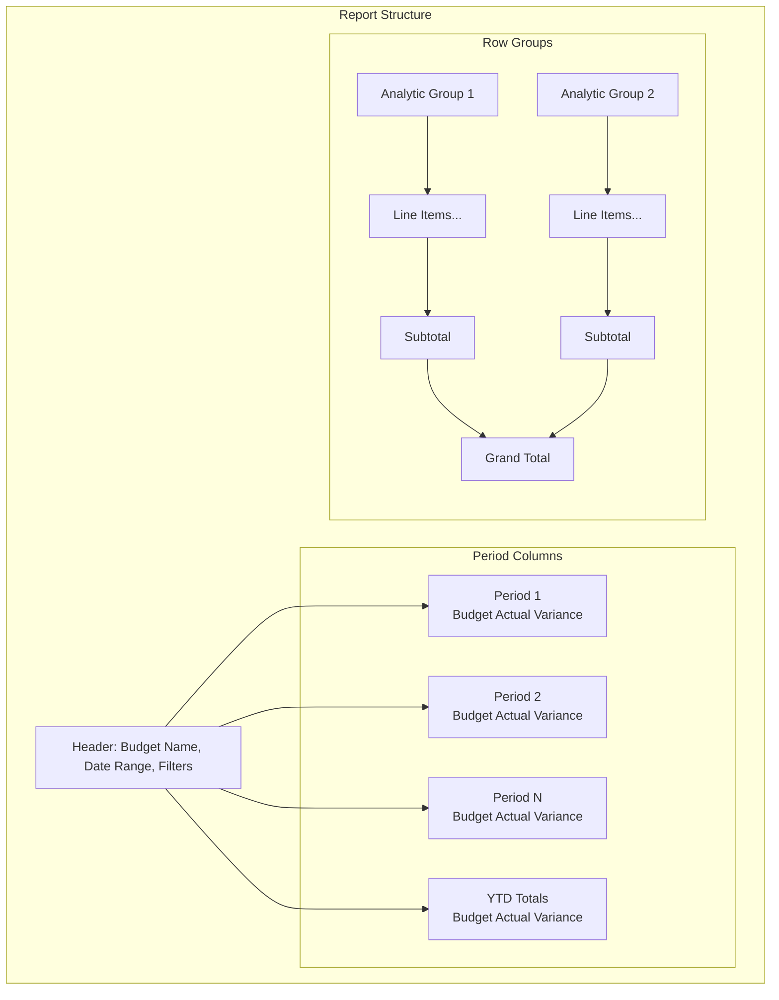

# BM-003: Actual vs Budget Reporting

| Attribute | Value |
|-----------|-------|
| **Story ID** | BM-003 |
| **Title** | Actual vs Budget Reporting |
| **Parent Feature** | [FEATURE-003: Budget Management](../../features/FEATURE-003-budget-management.md) |
| **Parent Epic** | [EPIC-001: Enterprise Accounting Capabilities](../../EPIC-001-enterprise-accounting.md) |
| **Status** | Draft |
| **Priority** | Critical |
| **Story Points** | TBD |
| **Created** | 2024 |
| **Last Updated** | 2024 |

---

## Table of Contents

1. [User Story](#1-user-story)
2. [Acceptance Criteria](#2-acceptance-criteria)
3. [Constraints](#3-constraints)
4. [Technical Discovery Notes](#4-technical-discovery-notes)
5. [Dependencies](#5-dependencies)
6. [Test Requirements](#6-test-requirements)
7. [Definition of Done](#7-definition-of-done)
8. [Workflow Diagram](#8-workflow-diagram)
9. [Revision History](#9-revision-history)

---

## 1. User Story

### 1.1 Story Statement

**As a** Controller, Finance Director, or CFO

**I want** to generate reports comparing actual financial results against budgeted amounts

**So that** I can monitor financial performance, identify deviations early, and take corrective action to ensure organizational financial goals are achieved

### 1.2 Business Context

Actual vs Budget Reporting is the **core budget monitoring capability** that transforms budget data into actionable financial intelligence. This story builds on BM-001 (Budget Definition) and BM-002 (Budget Period Allocation) to deliver the comparative analysis that finance teams depend on for:

- **Performance Monitoring**: Real-time visibility into how actual spending compares to planned budgets
- **Early Warning Detection**: Identification of cost overruns or under-spending before they become critical
- **Decision Support**: Data-driven insights for resource allocation and financial planning
- **Accountability**: Clear metrics for departmental and project financial performance
- **Compliance Documentation**: Evidence of budget controls for audit and regulatory purposes

This story enables organizations using Odoo Community Edition to:

- Generate side-by-side comparisons of budgeted vs. actual amounts
- Analyze budget performance across multiple dimensions (departments, projects, cost centers)
- Track budget consumption over time with period-by-period analysis
- Export reports for stakeholder distribution and presentation
- Drill down from summary figures to underlying transactions

### 1.3 User Value Proposition

| Persona | Value Delivered |
|---------|-----------------|
| **CFO / Finance Director** | Executive-level visibility into financial performance against strategic budget targets; compliance assurance for board and investor reporting |
| **Controller** | Comprehensive budget monitoring capability; early identification of variances; support for proactive budget management |
| **Accountant / Bookkeeper** | Clear understanding of period-based budget status; efficient preparation of budget reports for management review |

### 1.4 Acceptance Criteria Traceability

| Scenario | Business Requirement | Success Metric Alignment |
|----------|---------------------|-------------------------|
| Scenario 1 | Basic budget vs actual comparison | Foundation for all budget monitoring |
| Scenario 2 | Hierarchical reporting by analytic dimension | Supports departmental/project accountability |
| Scenario 3 | Multi-period comparison | Budget variance reports within 24 hours of period close (SM-003) |
| Scenario 4 | Filtering and export | Stakeholder distribution and presentation needs |
| Scenario 5 | Percentage consumed visualization | Early warning for budget overruns |
| Scenario 6 | Transaction drill-down | Audit trail and variance investigation |

---

## 2. Acceptance Criteria

### Scenario 1: Generate Basic Comparison Report

**Given** a budget exists with period allocations (per BM-001 Budget Definition and BM-002 Budget Period Allocation)

**And** actual transactions have been recorded against the budgeted accounts in the accounting system

**When** I generate an actual vs budget report for a specific period

**Then** the report displays the following for each budget line:
- Budget amount (planned)
- Actual amount (from recorded transactions)
- Variance amount (Budget - Actual or Actual - Budget, based on account type)
- Variance indicator (favorable/unfavorable)

**And** the report clearly identifies the reporting period (date range)

**And** the report includes budget line identifiers (GL account, analytic account)

**And** the report is available within 24 hours of period close (per success metric SM-003)

---

### Scenario 2: Report by Analytic Account Hierarchy

**Given** budgets have been allocated to multiple analytic accounts representing different dimensions (departments, projects, cost centers as defined in `account.analytic.plan`)

**When** I generate an actual vs budget report grouped by analytic plan hierarchy

**Then** the report displays budget vs actual at each level of the analytic hierarchy:
- Analytic plan level (e.g., "Departments")
- Analytic account level (e.g., "Marketing", "Sales", "Operations")
- Sub-level accounts if hierarchy exists

**And** subtotals are calculated at each grouping level

**And** totals are provided at the report level

**And** I can expand/collapse hierarchy levels for navigation

**And** the hierarchy structure reflects the analytic plan configuration

---

### Scenario 3: Multi-Period Comparison Report

**Given** budget data exists for multiple periods (e.g., monthly allocations for a fiscal year per BM-002)

**And** actual transactions span the same periods

**When** I generate a multi-period comparison report selecting multiple periods

**Then** I see columns for each selected period containing:
- Budget amount for the period
- Actual amount for the period
- Variance for the period

**And** cumulative year-to-date (YTD) totals are calculated showing:
- YTD Budget
- YTD Actual
- YTD Variance

**And** I can select the period granularity (monthly, quarterly)

**And** the period columns align with the fiscal calendar configuration

**And** the report handles periods with no activity gracefully (showing zero amounts)

---

### Scenario 4: Filter and Export Report

**Given** an actual vs budget report has been generated

**When** I apply filters to narrow the report scope

**Then** I can filter by the following dimensions:
- Department (analytic account)
- General ledger account
- Date range (within the budget period)
- Analytic dimension/plan
- Budget name/reference

**And** the report updates dynamically to show only matching budget lines

**And** filter selections are clearly displayed in the report header

**And** I can clear filters to return to the full report view

**When** I choose to export the filtered report

**Then** I can export to the following formats:
- PDF format (for distribution and archival)
- Spreadsheet format (Excel/XLSX or CSV for further analysis)

**And** the exported file includes:
- Report title and generation timestamp
- Applied filter criteria
- All visible columns and data
- Subtotals and totals

---

### Scenario 5: Report with Percentage Consumed

**Given** a budget exists with actual transactions recorded

**When** I view the actual vs budget report

**Then** each budget line displays the percentage of budget consumed:
- Calculated as: (Actual Amount / Budget Amount) × 100
- Displayed with appropriate decimal precision (e.g., 85.5%)

**And** visual indicators highlight consumption status:
- Normal range (e.g., 0-80%): Standard display
- Warning threshold (e.g., 80-100%): Warning indicator (configurable)
- Over budget (e.g., >100%): Alert indicator (configurable)

**And** consumption thresholds are configurable at the system or budget level

**And** the percentage calculation handles edge cases:
- Zero budget amount: Display "N/A" or specific indicator
- Negative actuals: Display correctly as negative percentage

**And** I can configure which threshold levels to display

---

### Scenario 6: Drill-Down to Transaction Details

**Given** an actual vs budget report is displayed showing actual amounts

**When** I click on an actual amount to drill down

**Then** I can view the individual journal entries that comprise the actual total:
- Journal entry reference
- Journal entry date
- Posting date
- Amount
- Account
- Description/label

**And** I can navigate from journal entries to source documents:
- Vendor bills
- Customer invoices
- Expense entries
- Manual journal entries

**And** the drill-down maintains the context of:
- Budget line (account/analytic)
- Reporting period

**And** I can return to the summary report from the detail view

**And** the transaction list supports sorting and filtering

---

## 3. Constraints

### 3.1 License Requirements

| Constraint ID | Constraint | Requirement |
|---------------|------------|-------------|
| **C-001** | License Compatibility | Module distributed under AGPL-3.0 compatible license |
| **C-002** | Existing License Respect | Integration with existing Odoo modules must respect LGPL-3 licensing |

### 3.2 Dependency Restrictions

| Constraint ID | Constraint | Requirement |
|---------------|------------|-------------|
| **C-003** | No Enterprise Dependencies | No imports or dependencies on Odoo Enterprise edition modules |
| **C-004** | Specifically Prohibited | No use of `account_reports` or `account_budget` Enterprise modules |
| **C-005** | OCA Compatibility | Should be compatible with OCA reporting modules (e.g., `account_financial_report`, `mis-builder`) |

### 3.3 Coding Standards

| Constraint ID | Constraint | Requirement |
|---------------|------------|-------------|
| **C-006** | Odoo Guidelines | Implementation follows Odoo coding standards |
| **C-007** | OCA Standards | Adherence to OCA module guidelines for potential community contribution |
| **C-008** | PEP 8 Compliance | Python code follows PEP 8 style guidelines |

### 3.4 Test Coverage

| Constraint ID | Constraint | Requirement |
|---------------|------------|-------------|
| **C-009** | Minimum Coverage | Implementation achieves minimum 80% test coverage |
| **C-010** | Test Types | Unit tests, integration tests, and acceptance tests required |

### 3.5 Performance Requirements

| Constraint ID | Constraint | Requirement |
|---------------|------------|-------------|
| **C-011** | Report Availability | Budget variance reports must be available within 24 hours of period close (per SM-003) |
| **C-012** | Response Time | Report generation should complete in reasonable time for large transaction volumes |

### 3.6 Acceptance Criteria Constraints (Mandatory for All Scenarios)

All acceptance criteria must include verification of:

```
- Module distributed under AGPL-3.0 compatible license
- No imports or dependencies on Odoo Enterprise edition modules
- Implementation follows Odoo and OCA coding standards
- Implementation achieves minimum 80% test coverage
- Report generation meets 24-hour availability target
```

---

## 4. Technical Discovery Notes

> **Purpose:** These notes guide implementing agents in their codebase analysis before making implementation decisions. User stories describe **WHAT** and **WHY**; implementation details emerge from agent discovery of the codebase.

### 4.1 Key Source Files to Analyze

| Source File | Analysis Purpose | Key Questions |
|-------------|------------------|---------------|
| `addons/account/report/account_invoice_report.py` | SQL-view based analytics pattern | How does Odoo implement analytical reports using `_auto = False`? What patterns exist for aggregation? |
| `addons/analytic/models/analytic_account.py` | Balance computation | How does `_compute_debit_credit_balance` aggregate amounts from `account.analytic.line`? |
| `addons/analytic/models/analytic_line.py` | Transaction detail | What fields are available for grouping and filtering analytic transactions? |
| `addons/account/models/account_move_line.py` | Actual transaction source | How are journal items structured? What is the relationship with analytic distribution? |

### 4.2 Existing Patterns to Evaluate

| Pattern | Location | Relevance |
|---------|----------|-----------|
| SQL View Reports | `account_invoice_report.py` | Pattern for creating read-only analytical views |
| Balance Computation | `analytic_account.py` lines 163-203 | Method for computing debit/credit/balance from analytic lines |
| Period Filtering | `_compute_debit_credit_balance` | Context-based date filtering (`from_date`, `to_date`) |
| Analytic Distribution | `analytic.mixin`, `account_move_line.py` | How actuals link to analytic accounts |

### 4.3 OCA Reference Patterns

| OCA Module | Repository | Analysis Purpose |
|------------|------------|------------------|
| `account_financial_report` | OCA/account-financial-reporting | Trial Balance, General Ledger report patterns |
| `mis_builder` | OCA/mis-builder | Management Information System report architecture |
| `account_financial_report_qweb` | OCA/account-financial-reporting | QWeb report templates for financial reports |

### 4.4 Discovery Questions for Implementation

| Question | Area | Impact |
|----------|------|--------|
| How should actuals be aggregated by budget line? | Data Model | Determines query structure for actual amounts |
| Should reports use SQL views or computed fields? | Report Architecture | Affects performance and maintainability |
| How to handle multi-currency actuals against single-currency budgets? | Currency Handling | May require conversion logic |
| What export framework exists in Odoo Community? | Export Functionality | Determines approach for PDF/Excel generation |
| How to implement hierarchical grouping in reports? | UI/Report Design | May require custom rendering logic |

### 4.5 Integration Points Analysis Required

| Integration Point | Related Model | Analysis Needed |
|-------------------|---------------|-----------------|
| Budget definitions | Budget model (from BM-001) | How to link reports to budget records |
| Period allocations | Budget period model (from BM-002) | How to compare period-specific allocations |
| GL account actuals | `account.move.line` | Query patterns for actual amounts by account |
| Analytic actuals | `account.analytic.line` | Query patterns for actual amounts by analytic dimension |
| Export infrastructure | `ir.actions.report` | PDF generation capabilities; XLSX libraries available |

### 4.6 Report Engine Considerations

> **Note:** The specific report engine approach should be determined through codebase discovery. Options include:

| Option | Pros | Cons |
|--------|------|------|
| QWeb Reports | Native Odoo pattern, PDF support | May be less flexible for complex layouts |
| SQL Views | High performance, direct DB queries | Read-only, requires careful optimization |
| Computed Reports | Flexible, Python-based logic | May have performance implications |
| XLSX Reports | Excel native format | Requires additional library (xlsxwriter) |

---

## 5. Dependencies

### 5.1 Story Dependencies

| Dependency Type | Story ID | Title | Relationship |
|-----------------|----------|-------|--------------|
| **Blocking** | BM-001 | Budget Definition | Requires budget records to exist |
| **Blocking** | BM-002 | Budget Period Allocation | Requires period allocations for period-based reporting |
| **Related** | BM-004 | Variance Analysis | Extends actual vs budget with variance calculations |
| **Related** | BM-005 | Budget Alerts | May use consumption data from this report |

### 5.2 Feature Dependencies

| Feature | Relationship |
|---------|--------------|
| FEATURE-003: Budget Management | Parent feature |
| FEATURE-001: Financial Reporting | May share report patterns and export capabilities |

### 5.3 External Dependencies

| Dependency | Version | Purpose | Status |
|------------|---------|---------|--------|
| Odoo Core `account` module | 19.0 | GL accounts, journal entries, move lines | Required (exists) |
| Odoo Core `analytic` module | 19.0 | Analytic accounts, plans, lines | Required (exists) |
| Python `xlsxwriter` or similar | Latest compatible | Excel export functionality | To be verified |
| OCA modules | N/A | Reference patterns only | Optional |

### 5.4 Integration Points

| Integration Point | Model/Module | Purpose |
|-------------------|--------------|---------|
| Budget Model | Custom (from BM-001) | Source of budget definitions and line items |
| Budget Period Model | Custom (from BM-002) | Source of period-specific budget allocations |
| `account.move.line` | Odoo Core | Source of actual GL transactions |
| `account.analytic.line` | Odoo Core | Source of actual analytic transactions |
| `account.account` | Odoo Core | GL account master data |
| `account.analytic.account` | Odoo Core | Analytic account master data |
| `account.analytic.plan` | Odoo Core | Analytic plan hierarchy |

---

## 6. Test Requirements

### 6.1 Coverage Requirements

| Requirement | Target | Verification |
|-------------|--------|--------------|
| Overall test coverage | ≥80% | Code coverage tools (coverage.py) |
| Unit test coverage | ≥80% | Individual function/method tests |
| Integration test coverage | ≥70% | Cross-module interaction tests |

### 6.2 Unit Test Scenarios

| Test ID | Scenario | Purpose |
|---------|----------|---------|
| UT-001 | Calculate variance for expense account (Budget - Actual) | Verify variance calculation logic |
| UT-002 | Calculate variance for income account (Actual - Budget) | Verify reverse variance for income |
| UT-003 | Calculate percentage consumed | Verify (Actual / Budget) × 100 calculation |
| UT-004 | Handle zero budget amount | Verify graceful handling of division by zero |
| UT-005 | Aggregate actuals by account | Verify correct summation of journal items |
| UT-006 | Aggregate actuals by analytic account | Verify correct summation of analytic lines |
| UT-007 | Filter by date range | Verify period filtering accuracy |
| UT-008 | Filter by analytic dimension | Verify analytic filtering accuracy |
| UT-009 | Calculate subtotals by hierarchy | Verify rollup calculations |
| UT-010 | Calculate YTD totals | Verify cumulative calculations |

### 6.3 Integration Test Scenarios

| Test ID | Scenario | Purpose |
|---------|----------|---------|
| IT-001 | Generate report from defined budget | End-to-end report generation |
| IT-002 | Report with multi-period allocations | Period-by-period reporting |
| IT-003 | Report with analytic hierarchy | Hierarchical grouping |
| IT-004 | Export to PDF | PDF generation functionality |
| IT-005 | Export to Excel/CSV | Spreadsheet export functionality |
| IT-006 | Drill-down to journal entries | Navigation and context preservation |
| IT-007 | Report with no actuals | Empty actual handling |
| IT-008 | Report with partial period data | Incomplete period handling |

### 6.4 Edge Case Test Scenarios

| Test ID | Scenario | Expected Behavior |
|---------|----------|-------------------|
| EC-001 | Budget with zero amount | Display "N/A" for percentage |
| EC-002 | Negative actual amounts | Display negative percentage, correct variance |
| EC-003 | Multi-currency actuals | Convert to budget currency or display multiple currencies |
| EC-004 | Large transaction volume | Report generates within acceptable time |
| EC-005 | Missing period allocations | Display budget without period breakdown |
| EC-006 | Archived analytic accounts | Include or exclude based on filter |
| EC-007 | Multi-company environment | Respect company boundaries |

### 6.5 Performance Test Scenarios

| Test ID | Scenario | Target |
|---------|----------|--------|
| PT-001 | Report generation with 1,000 transactions | <10 seconds |
| PT-002 | Report generation with 10,000 transactions | <60 seconds |
| PT-003 | Report generation with 100,000 transactions | <5 minutes |
| PT-004 | PDF export for large report | <30 seconds |
| PT-005 | Excel export for large report | <30 seconds |

### 6.6 Acceptance Test Scenarios

| Test ID | Scenario | Mapped to |
|---------|----------|-----------|
| AT-001 | Generate basic comparison report | Scenario 1 |
| AT-002 | Generate hierarchical report | Scenario 2 |
| AT-003 | Generate multi-period report | Scenario 3 |
| AT-004 | Apply filters and export | Scenario 4 |
| AT-005 | View percentage consumed with thresholds | Scenario 5 |
| AT-006 | Drill-down to source documents | Scenario 6 |

---

## 7. Definition of Done

### 7.1 Story Completion Checklist

| Item | Requirement | Status |
|------|-------------|--------|
| **Acceptance Criteria** | All 6 scenarios implemented and verified | [ ] |
| **Test Coverage** | Minimum 80% test coverage achieved | [ ] |
| **License Compliance** | AGPL-3.0 license header in all files | [ ] |
| **Enterprise Independence** | No Enterprise module dependencies | [ ] |
| **OCA Standards** | Code follows OCA coding guidelines | [ ] |
| **Performance Target** | Reports available within 24 hours of period close | [ ] |
| **Export Functionality** | PDF and Excel export working | [ ] |
| **Drill-Down Navigation** | Transaction drill-down functional | [ ] |
| **Documentation** | Code documentation complete | [ ] |
| **Code Review** | Peer review completed and approved | [ ] |

### 7.2 Scenario-Specific Verification

| Scenario | Verification Method | Status |
|----------|---------------------|--------|
| Scenario 1: Basic Comparison | Generate report with test budget | [ ] |
| Scenario 2: Analytic Hierarchy | Generate report with multi-level analytics | [ ] |
| Scenario 3: Multi-Period | Generate 12-month comparison report | [ ] |
| Scenario 4: Filter and Export | Apply filters, export PDF and Excel | [ ] |
| Scenario 5: Percentage Consumed | Verify threshold indicators | [ ] |
| Scenario 6: Drill-Down | Navigate from report to journal entries | [ ] |

### 7.3 Quality Gates

| Gate | Criteria | Status |
|------|----------|--------|
| **Code Quality** | No critical or major code smells | [ ] |
| **Security** | No security vulnerabilities identified | [ ] |
| **Performance** | Report generation within targets | [ ] |
| **Accessibility** | Report readable and navigable | [ ] |
| **Localization** | String externalization complete | [ ] |

---

## 8. Workflow Diagram

### 8.1 Report Generation Workflow



### 8.2 Data Flow Diagram



### 8.3 Period Comparison Layout



---

## 9. Revision History

| Version | Date | Author | Changes |
|---------|------|--------|---------|
| 1.0.0 | 2024 | Blitzy Platform | Initial story creation |

---

## Related Documentation

| Document | Link |
|----------|------|
| Parent Feature | [FEATURE-003: Budget Management](../../features/FEATURE-003-budget-management.md) |
| Parent Epic | [EPIC-001: Enterprise Accounting Capabilities](../../EPIC-001-enterprise-accounting.md) |
| Blocking Story | [BM-001: Budget Definition](./BM-001-budget-definition.md) |
| Blocking Story | [BM-002: Budget Period Allocation](./BM-002-budget-period-allocation.md) |
| Related Story | [BM-004: Variance Analysis](./BM-004-variance-analysis.md) |
| Related Story | [BM-005: Budget Alerts](./BM-005-budget-alerts.md) |

---

*This user story follows BDD (Behavior-Driven Development) format with Given/When/Then acceptance criteria per project documentation standards. Implementation details are intentionally omitted to allow discovering agents to analyze the codebase and determine optimal approaches.*
