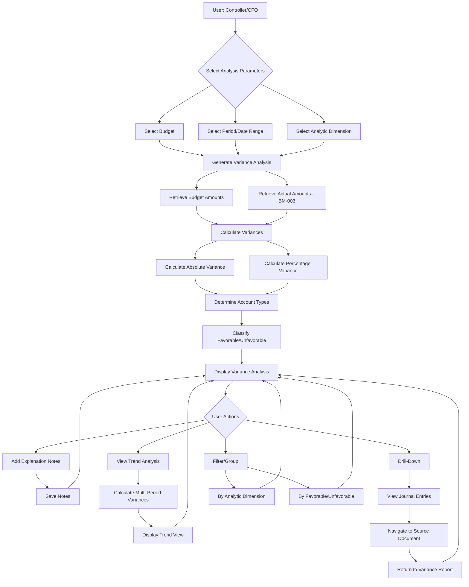
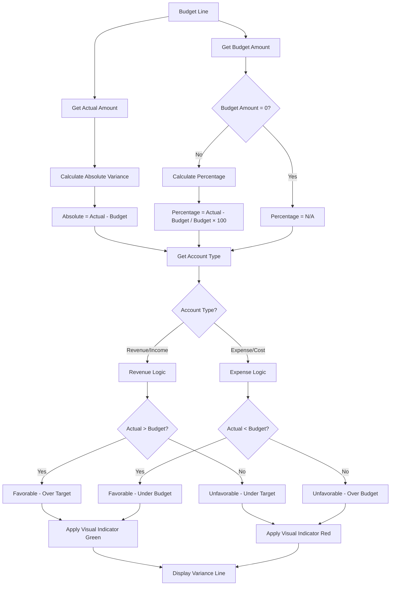
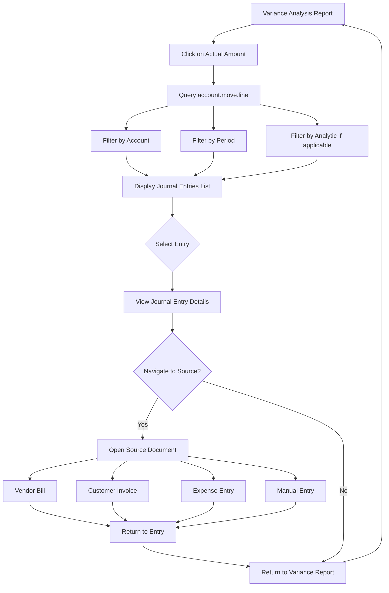

# BM-004: Variance Analysis

| Attribute | Value |
|-----------|-------|
| **Story ID** | BM-004 |
| **Title** | Variance Analysis |
| **Parent Feature** | [FEATURE-003: Budget Management](../../features/FEATURE-003-budget-management.md) |
| **Parent Epic** | [EPIC-001: Enterprise Accounting Capabilities](../../EPIC-001-enterprise-accounting.md) |
| **Status** | Draft |
| **Priority** | High |
| **Story Points** | TBD |
| **Created** | 2024 |
| **Last Updated** | 2024 |

---

## Table of Contents

1. [User Story](#1-user-story)
2. [Acceptance Criteria](#2-acceptance-criteria)
3. [Constraints](#3-constraints)
4. [Technical Discovery Notes](#4-technical-discovery-notes)
5. [Dependencies](#5-dependencies)
6. [Test Requirements](#6-test-requirements)
7. [Definition of Done](#7-definition-of-done)
8. [Workflow Diagram](#8-workflow-diagram)
9. [Revision History](#9-revision-history)

---

## 1. User Story

### 1.1 Story Statement

**As a** Controller, Finance Director, or CFO

**I want** to analyze variances between budgeted and actual amounts with detailed explanations and drill-down capabilities

**So that** I can understand the drivers of financial performance, identify root causes of deviations, and make informed decisions for corrective actions to ensure organizational financial targets are achieved

### 1.2 Business Context

Variance Analysis is the **analytical and investigative capability** that transforms raw budget vs. actual data into actionable management insights. Building on BM-003 (Actual vs Budget Reporting), this story delivers the deep analysis capabilities that finance leaders require for:

- **Performance Understanding**: Quantify and explain why financial results differ from budgets
- **Root Cause Identification**: Drill down to source transactions to understand variance drivers
- **Decision Support**: Provide data-driven insights for corrective action planning
- **Accountability**: Document variance explanations for management review and audit purposes
- **Trend Analysis**: Track variance patterns over time to improve future budget accuracy
- **Favorable/Unfavorable Classification**: Clearly distinguish between positive and negative performance indicators

This story enables organizations using Odoo Community Edition to:

- Calculate both absolute (monetary) and percentage variances
- Analyze variances by analytic dimension (departments, projects, cost centers)
- Distinguish favorable from unfavorable variances based on account type
- Track variance trends across multiple periods
- Add explanation notes to significant variance line items
- Drill down from variance amounts to underlying journal entries and source documents

### 1.3 User Value Proposition

| Persona | Value Delivered |
|---------|-----------------|
| **CFO / Finance Director** | Strategic variance insights for board reporting; understanding of financial performance drivers; compliance documentation for external stakeholders |
| **Controller** | Detailed variance analysis for cost management; root cause investigation capability; variance explanation documentation for audit trail |
| **Accountant / Bookkeeper** | Support variance investigation with transaction-level detail; prepare variance documentation for controller review |

### 1.4 Acceptance Criteria Traceability

| Scenario | Business Requirement | Success Metric Alignment |
|----------|---------------------|-------------------------|
| Scenario 1 | Calculate absolute and percentage variance | Foundation for all variance analysis (SM-003) |
| Scenario 2 | Analyze variance by analytic dimension | Supports multi-dimensional performance evaluation |
| Scenario 3 | Classify favorable/unfavorable variances | Enables quick identification of positive/negative performance |
| Scenario 4 | Track variance trends across periods | Improves budget accuracy and planning |
| Scenario 5 | Add variance explanation notes | Provides audit trail and accountability documentation |
| Scenario 6 | Drill-down to source transactions | Enables root cause investigation |

---

## 2. Acceptance Criteria

### Scenario 1: Calculate Basic Variance

**Given** a budget exists with defined amounts for specific GL accounts and/or analytic dimensions (per BM-001 Budget Definition)

**And** actual transactions have been recorded against the budgeted accounts in the accounting system

**When** I generate a variance analysis for the budget

**Then** the system calculates the **absolute variance** for each budget line:
- Variance Amount = Actual Amount - Budget Amount
- Positive variance indicates over-budget (for expenses) or over-target (for revenue)
- Negative variance indicates under-budget (for expenses) or under-target (for revenue)

**And** the system calculates the **percentage variance** for each budget line:
- Percentage Variance = ((Actual - Budget) / Budget) × 100
- Displayed with appropriate decimal precision (e.g., 12.5%)

**And** the variance calculations handle edge cases:
- Zero budget amount: Display "N/A" for percentage (avoid division by zero)
- Negative budget values: Calculate correctly with appropriate sign handling
- Zero actual amount: Display variance equal to budget amount

**And** the variance analysis displays:
- Budget line identifier (GL account and/or analytic account)
- Budget amount (planned)
- Actual amount (from transactions)
- Absolute variance amount
- Percentage variance
- Reporting period context

**And** the variance analysis is available within 24 hours of period close (per success metric SM-003)

---

### Scenario 2: Variance Analysis by Analytic Dimension

**Given** a budget has been allocated across multiple analytic accounts representing different dimensions (departments, projects, cost centers as defined in `account.analytic.plan`)

**And** actual transactions have been recorded with analytic distribution assignments

**When** I generate a variance analysis with breakdown by analytic dimension

**Then** I see variance calculations for each analytic account separately:
- Analytic account name/code
- Budget amount allocated to that analytic account
- Actual amount attributed to that analytic account
- Absolute variance for the analytic account
- Percentage variance for the analytic account

**And** I can drill down into variance analysis by each analytic plan level:
- Plan level (e.g., "Departments", "Projects", "Cost Centers")
- Individual analytic account within each plan
- Sub-accounts if hierarchy exists

**And** I can identify which dimensions are over or under budget:
- Over-budget dimensions highlighted (e.g., "Marketing: 15% over budget")
- Under-budget dimensions highlighted (e.g., "Operations: 8% under budget")

**And** subtotals are calculated at each grouping level

**And** I can expand/collapse analytic hierarchy levels for navigation

**And** the analytic breakdown reflects the actual analytic plan configuration from `account.analytic.plan`

---

### Scenario 3: Favorable vs Unfavorable Variance Identification

**Given** variances have been calculated for budget lines that include both income and expense accounts

**When** the variance analysis is displayed

**Then** revenue/income accounts follow revenue variance logic:
- Actual > Budget = **Favorable** (revenue over-target)
- Actual < Budget = **Unfavorable** (revenue under-target)

**And** expense/cost accounts follow expense variance logic:
- Actual < Budget = **Favorable** (spending under-budget)
- Actual > Budget = **Unfavorable** (spending over-budget)

**And** visual indicators distinguish favorable from unfavorable variances:
- Color coding (e.g., green for favorable, red for unfavorable)
- Icon indicators (e.g., ↑ for favorable, ↓ for unfavorable)
- Text labels (e.g., "Favorable", "Unfavorable")

**And** the favorable/unfavorable classification is determined by account type:
- Based on `account.account.account_type` classification
- Revenue types: income, income_other
- Expense types: expense, expense_depreciation, expense_direct_cost

**And** the total favorable and unfavorable variance amounts are summarized:
- Total favorable variance across all lines
- Total unfavorable variance across all lines
- Net variance position

**And** users can filter to show only favorable or only unfavorable variances

---

### Scenario 4: Trend Variance Analysis Across Periods

**Given** budget data exists for multiple periods (monthly, quarterly) as allocated in BM-002 (Budget Period Allocation)

**And** actual transaction data spans the same multiple periods

**When** I request a trend variance analysis selecting multiple periods

**Then** I see variance progression across the selected periods in columnar format:
- Period 1: Budget | Actual | Variance | %
- Period 2: Budget | Actual | Variance | %
- Period N: Budget | Actual | Variance | %

**And** cumulative year-to-date (YTD) variance totals are calculated:
- YTD Budget (sum of all period budgets)
- YTD Actual (sum of all period actuals)
- YTD Variance (sum of all period variances)
- YTD Variance Percentage

**And** I can identify patterns in budget performance over time:
- Consistent over-budget trends
- Seasonal variance patterns
- Improving or deteriorating variance trends

**And** trend indicators show variance direction:
- Improving (variance getting smaller/more favorable)
- Stable (variance consistent across periods)
- Deteriorating (variance getting larger/more unfavorable)

**And** I can select the period granularity:
- Monthly view (12 columns for annual budget)
- Quarterly view (4 columns for annual budget)
- Custom period ranges

**And** the period columns align with the fiscal calendar configuration

**And** periods with no activity display zero amounts appropriately

---

### Scenario 5: Variance Explanation Notes

**Given** a variance analysis is displayed showing significant deviations from budget

**When** I add explanation notes to a specific variance line item

**Then** the notes are saved and associated with the variance record:
- Note content (free text explanation)
- Author of the note
- Timestamp of note creation
- Associated budget line/variance record reference

**And** notes are visible in subsequent variance reports:
- Notes display inline with variance data or via indicator
- Multiple notes per variance line supported
- Notes persist across report regeneration

**And** I can edit or delete existing notes (with appropriate permissions):
- Edit own notes
- Edit history tracked
- Deletion requires confirmation

**And** notes support rich context:
- Reference to specific transactions (via drill-down link)
- Root cause categorization (optional tagging)
- Action items or corrective measures

**And** variance notes are available for:
- Management review meetings
- Audit documentation
- Historical analysis

**And** I can search or filter variance lines by note presence:
- Show lines with notes
- Show lines without notes
- Search within note content

---

### Scenario 6: Variance Drill-Down to Source Transactions

**Given** a variance analysis is displayed showing budget variance amounts

**And** the variance includes actual amounts that exceed or fall below budget

**When** I drill down on a specific variance amount (actual amount)

**Then** I see the underlying journal entries contributing to the actual total:
- Journal entry reference number (`account.move.name`)
- Journal entry date
- Posting date
- Line amount
- Account code and name
- Transaction description/label
- Analytic account (if applicable)

**And** I can navigate from journal entries to source documents:
- Vendor bills (`account.move` with `move_type` = 'in_invoice')
- Customer invoices (`account.move` with `move_type` = 'out_invoice')
- Expense entries
- Manual journal entries
- Credit notes and refunds

**And** the drill-down maintains the context of:
- Budget line reference (GL account, analytic account)
- Reporting period (date range filter preserved)
- Variance type (favorable/unfavorable)

**And** I can trace back to original source documents:
- View attached documents
- Navigate to related purchase orders, sales orders, or contracts
- Access approval history

**And** I can return to the variance summary report from the detail view

**And** the transaction list within drill-down supports:
- Sorting by date, amount, or reference
- Additional filtering within the transaction list
- Subtotals of displayed transactions

**And** the drill-down query uses efficient patterns from existing Odoo models:
- `account.move.line` for GL transaction details
- `account.analytic.line` for analytic transaction details

---

## 3. Constraints

### 3.1 License Requirements

| Constraint ID | Constraint | Requirement |
|---------------|------------|-------------|
| **C-001** | License Compatibility | Module distributed under AGPL-3.0 compatible license |
| **C-002** | Existing License Respect | Integration with existing Odoo modules must respect LGPL-3 licensing |

### 3.2 Dependency Restrictions

| Constraint ID | Constraint | Requirement |
|---------------|------------|-------------|
| **C-003** | No Enterprise Dependencies | No imports or dependencies on Odoo Enterprise edition modules |
| **C-004** | Specifically Prohibited | No use of `account_reports` or `account_budget` Enterprise modules |
| **C-005** | OCA Compatibility | Should be compatible with OCA modules (e.g., `mis-builder`, `account_financial_report`) |

### 3.3 Coding Standards

| Constraint ID | Constraint | Requirement |
|---------------|------------|-------------|
| **C-006** | Odoo Guidelines | Implementation follows Odoo coding standards |
| **C-007** | OCA Standards | Adherence to OCA module guidelines for potential community contribution |
| **C-008** | PEP 8 Compliance | Python code follows PEP 8 style guidelines |

### 3.4 Test Coverage

| Constraint ID | Constraint | Requirement |
|---------------|------------|-------------|
| **C-009** | Minimum Coverage | Implementation achieves minimum 80% test coverage for variance calculation logic |
| **C-010** | Test Types | Unit tests, integration tests, and acceptance tests required |

### 3.5 Performance Requirements

| Constraint ID | Constraint | Requirement |
|---------------|------------|-------------|
| **C-011** | Report Availability | Budget variance reports must be available within 24 hours of period close (per SM-003) |
| **C-012** | Calculation Performance | Variance calculation per budget line should complete in <100ms |
| **C-013** | Large Dataset Handling | Variance analysis must handle large transaction volumes efficiently |

### 3.6 Acceptance Criteria Constraints (Mandatory for All Scenarios)

All acceptance criteria must include verification of:

```
- Module distributed under AGPL-3.0 compatible license
- No imports or dependencies on Odoo Enterprise edition modules
- Implementation follows Odoo and OCA coding standards
- Implementation achieves minimum 80% test coverage
- Variance reports meet 24-hour availability target
- Variance calculations are mathematically accurate
```

---

## 4. Technical Discovery Notes

> **Purpose:** These notes guide implementing agents in their codebase analysis before making implementation decisions. User stories describe **WHAT** and **WHY**; implementation details emerge from agent discovery of the codebase.

### 4.1 Key Source Files to Analyze

| Source File | Analysis Purpose | Key Questions |
|-------------|------------------|---------------|
| `addons/analytic/models/analytic_line.py` | Actual transaction aggregation by analytic dimension | How are analytic lines structured? What fields support grouping? How does `AccountAnalyticLine` aggregate amounts? |
| `addons/analytic/models/analytic_account.py` | Balance computation patterns | How does `_compute_debit_credit_balance` (lines 163-203) aggregate amounts? What context-based filtering exists? |
| `addons/account/report/account_invoice_report.py` | SQL-view analytics pattern | How does Odoo implement analytical reports? What patterns exist for variance-type calculations? |
| `addons/account/models/account_move_line.py` | Journal entry structure | How are journal items structured? What is the relationship with analytic distribution? |
| `addons/account/models/account_account.py` | Account type classification | How are accounts classified as revenue vs expense for variance direction? |

### 4.2 Existing Patterns to Evaluate

| Pattern | Location | Relevance |
|---------|----------|-----------|
| Balance Computation | `analytic_account.py` lines 162-203 | `_compute_debit_credit_balance` method shows aggregation pattern with date filtering via context |
| Currency Conversion | `analytic_account.py` lines 164-170 | Currency conversion function for multi-currency handling |
| Date Filtering | `analytic_account.py` lines 172-176 | Context-based date filtering (`from_date`, `to_date`) for period analysis |
| Analytic Plan Columns | `analytic_line.py` lines 57-66 | `_get_plan_fnames()` and `_get_analytic_accounts()` for multi-dimensional queries |
| SQL View Reports | `account_invoice_report.py` lines 76-77 | `_table_query` property for read-only analytical views |

### 4.3 OCA Reference Patterns

| OCA Module | Repository | Analysis Purpose |
|------------|------------|------------------|
| `mis_builder` | OCA/mis-builder | Management Information System variance calculation patterns |
| `account_financial_report` | OCA/account-financial-reporting | Financial report architecture with variance capabilities |
| `budget_management` | OCA/account-budgeting | If exists, analyze budget variance patterns |

### 4.4 Discovery Questions for Implementation

| Question | Area | Impact |
|----------|------|--------|
| How to determine account type for favorable/unfavorable classification? | Variance Logic | Critical for Scenario 3 classification |
| How should variance explanations/notes be stored? | Data Model | Determines persistence strategy for Scenario 5 |
| What drill-down patterns exist in Odoo reports? | UI/Navigation | Affects Scenario 6 implementation |
| How to efficiently calculate trend variances across multiple periods? | Performance | Affects Scenario 4 performance |
| Should variance analysis use same report engine as BM-003? | Architecture | Consistency with Actual vs Budget Reporting |
| How to handle multi-currency variances? | Currency | May require conversion standardization |

### 4.5 Integration Points Analysis Required

| Integration Point | Related Model | Analysis Needed |
|-------------------|---------------|-----------------|
| Budget Model | Custom (from BM-001) | How to access budget line amounts |
| Budget Period Model | Custom (from BM-002) | How to access period-specific allocations for trend analysis |
| Actual vs Budget Data | Custom (from BM-003) | How to leverage consumption data already calculated |
| `account.move.line` | Odoo Core | Drill-down to journal items |
| `account.analytic.line` | Odoo Core | Drill-down to analytic details |
| `account.account` | Odoo Core | Account type for favorable/unfavorable logic |
| `account.analytic.account` | Odoo Core | Analytic dimension grouping |
| `account.analytic.plan` | Odoo Core | Analytic plan hierarchy for dimensional analysis |

### 4.6 Variance Calculation Considerations

> **Note:** The specific variance calculation engine approach should be determined through codebase discovery. Key considerations:

| Consideration | Options | Notes |
|---------------|---------|-------|
| Variance Direction | Fixed (Actual - Budget) vs Configurable | Consider user preference for variance sign convention |
| Percentage Calculation | Handle zero budget, negative values | Edge case handling critical |
| Multi-Currency | Convert to base currency vs preserve original | Currency strategy needed |
| Trend Analysis | Cached calculations vs real-time | Performance vs freshness tradeoff |
| Note Storage | Separate model vs inline JSON | Persistence pattern decision |

---

## 5. Dependencies

### 5.1 Story Dependencies

| Dependency Type | Story ID | Title | Relationship |
|-----------------|----------|-------|--------------|
| **Blocking** | BM-001 | Budget Definition | Requires budget records with line amounts to exist |
| **Blocking** | BM-003 | Actual vs Budget Reporting | Provides consumption data and comparison foundation; variance extends comparison with analysis |
| **Related** | BM-002 | Budget Period Allocation | Required for trend variance analysis across periods (Scenario 4) |
| **Related** | BM-005 | Budget Alerts | May use variance data for alert triggering |

### 5.2 Feature Dependencies

| Feature | Relationship |
|---------|--------------|
| FEATURE-003: Budget Management | Parent feature |
| FEATURE-001: Financial Reporting | May share drill-down patterns to journal entries |

### 5.3 External Dependencies

| Dependency | Version | Purpose | Status |
|------------|---------|---------|--------|
| Odoo Core `account` module | 19.0 | GL accounts, journal entries, move lines, account types | Required (exists) |
| Odoo Core `analytic` module | 19.0 | Analytic accounts, plans, lines | Required (exists) |
| OCA modules | N/A | Reference patterns only (mis_builder, account_financial_report) | Optional reference |

### 5.4 Integration Points

| Integration Point | Model/Module | Purpose |
|-------------------|--------------|---------|
| Budget Model | Custom (from BM-001) | Source of budget definitions and line amounts |
| Budget Period Model | Custom (from BM-002) | Source of period allocations for trend analysis |
| Budget Comparison | Custom (from BM-003) | Source of actual vs budget consumption data |
| `account.move.line` | Odoo Core | Drill-down to GL transaction details |
| `account.analytic.line` | Odoo Core | Drill-down to analytic transaction details |
| `account.account` | Odoo Core | Account type for favorable/unfavorable classification |
| `account.analytic.account` | Odoo Core | Analytic dimension grouping and aggregation |
| `account.analytic.plan` | Odoo Core | Analytic plan hierarchy structure |

---

## 6. Test Requirements

### 6.1 Coverage Requirements

| Requirement | Target | Verification |
|-------------|--------|--------------|
| Overall test coverage | ≥80% | Code coverage tools (coverage.py) |
| Unit test coverage for variance formulas | ≥90% | Critical calculation tests |
| Integration test coverage | ≥70% | Cross-module interaction tests |

### 6.2 Unit Test Scenarios

| Test ID | Scenario | Purpose |
|---------|----------|---------|
| UT-001 | Calculate absolute variance (Actual - Budget) | Verify basic variance formula |
| UT-002 | Calculate percentage variance ((A-B)/B × 100) | Verify percentage calculation |
| UT-003 | Handle zero budget amount (avoid division by zero) | Edge case: percentage shows "N/A" |
| UT-004 | Handle negative budget values | Edge case: correct sign handling |
| UT-005 | Handle negative actual values | Edge case: correct variance calculation |
| UT-006 | Classify expense favorable variance (Actual < Budget) | Verify expense classification logic |
| UT-007 | Classify expense unfavorable variance (Actual > Budget) | Verify expense classification logic |
| UT-008 | Classify revenue favorable variance (Actual > Budget) | Verify revenue classification logic |
| UT-009 | Classify revenue unfavorable variance (Actual < Budget) | Verify revenue classification logic |
| UT-010 | Calculate YTD cumulative variance | Verify multi-period summation |
| UT-011 | Aggregate variance by analytic account | Verify dimensional grouping |
| UT-012 | Determine account type from account.account | Verify account classification lookup |

### 6.3 Integration Test Scenarios

| Test ID | Scenario | Purpose |
|---------|----------|---------|
| IT-001 | Generate variance analysis from defined budget | End-to-end variance generation |
| IT-002 | Variance analysis with multi-period data | Period-by-period variance calculation |
| IT-003 | Variance by analytic hierarchy | Dimensional variance breakdown |
| IT-004 | Drill-down from variance to journal entries | Navigation and context preservation |
| IT-005 | Drill-down to source documents | End-to-end transaction tracing |
| IT-006 | Add variance explanation note | Note creation and persistence |
| IT-007 | Edit and delete variance notes | Note modification workflow |
| IT-008 | Variance with mixed account types | Revenue and expense combined |
| IT-009 | Variance with BM-003 data integration | Leverage Actual vs Budget reporting |

### 6.4 Edge Case Test Scenarios

| Test ID | Scenario | Expected Behavior |
|---------|----------|-------------------|
| EC-001 | Budget with zero amount | Percentage shows "N/A"; absolute variance = -Actual |
| EC-002 | Negative actual amounts | Correct variance calculation with sign |
| EC-003 | 100% variance (actual equals budget) | Zero variance, 0% percentage |
| EC-004 | Very large variance (>1000%) | Display correctly without overflow |
| EC-005 | Multi-currency budget and actuals | Convert to common currency |
| EC-006 | Budget with no actuals recorded | Variance = full budget amount unfavorable |
| EC-007 | Actuals with no budget defined | Handle gracefully (no variance or 100% over) |
| EC-008 | Partial period data in trend analysis | Handle missing periods gracefully |
| EC-009 | Archived analytic accounts | Include based on historical transactions |

### 6.5 Performance Test Scenarios

| Test ID | Scenario | Target |
|---------|----------|--------|
| PT-001 | Variance calculation per budget line | <100ms per line |
| PT-002 | Variance analysis with 100 budget lines | <5 seconds total |
| PT-003 | Variance analysis with 1,000 budget lines | <30 seconds total |
| PT-004 | Trend analysis across 12 periods | <60 seconds |
| PT-005 | Drill-down query for 10,000 transactions | <10 seconds |
| PT-006 | Variance report available after period close | <24 hours (SM-003) |

### 6.6 Acceptance Test Scenarios

| Test ID | Scenario | Mapped to |
|---------|----------|-----------|
| AT-001 | Calculate basic variance with absolute and percentage | Scenario 1 |
| AT-002 | Generate variance by analytic dimension | Scenario 2 |
| AT-003 | Display favorable/unfavorable indicators | Scenario 3 |
| AT-004 | Generate trend variance across periods | Scenario 4 |
| AT-005 | Add and view variance explanation notes | Scenario 5 |
| AT-006 | Drill-down to source transactions | Scenario 6 |

---

## 7. Definition of Done

### 7.1 Story Completion Checklist

| Item | Requirement | Status |
|------|-------------|--------|
| **Acceptance Criteria** | All 6 scenarios implemented and verified | [ ] |
| **Test Coverage** | Minimum 80% test coverage achieved | [ ] |
| **License Compliance** | AGPL-3.0 license header in all files | [ ] |
| **Enterprise Independence** | No Enterprise module dependencies | [ ] |
| **OCA Standards** | Code follows OCA coding guidelines | [ ] |
| **Performance Target** | Variance reports available within 24 hours of period close | [ ] |
| **Variance Calculation** | Absolute and percentage calculations accurate | [ ] |
| **Favorable/Unfavorable Logic** | Correct classification by account type | [ ] |
| **Drill-Down Functionality** | Transaction drill-down working | [ ] |
| **Notes Feature** | Variance explanation notes functional | [ ] |
| **Documentation** | Code documentation complete | [ ] |
| **Code Review** | Peer review completed and approved | [ ] |

### 7.2 Scenario-Specific Verification

| Scenario | Verification Method | Status |
|----------|---------------------|--------|
| Scenario 1: Basic Variance | Calculate variance with test budget; verify absolute and percentage | [ ] |
| Scenario 2: Analytic Dimension | Generate variance breakdown by department/project | [ ] |
| Scenario 3: Favorable/Unfavorable | Test with revenue and expense accounts; verify classification | [ ] |
| Scenario 4: Trend Analysis | Generate 12-month trend variance report | [ ] |
| Scenario 5: Explanation Notes | Add, edit, view notes on variance lines | [ ] |
| Scenario 6: Drill-Down | Navigate from variance to journal entries to source documents | [ ] |

### 7.3 Quality Gates

| Gate | Criteria | Status |
|------|----------|--------|
| **Code Quality** | No critical or major code smells | [ ] |
| **Security** | No security vulnerabilities identified | [ ] |
| **Performance** | Variance calculations within targets (<100ms/line) | [ ] |
| **Accuracy** | Variance calculations verified against manual calculations | [ ] |
| **Accessibility** | Variance report readable and navigable | [ ] |
| **Localization** | String externalization complete | [ ] |

---

## 8. Workflow Diagram

### 8.1 Variance Analysis Workflow



### 8.2 Variance Calculation Logic Flow



### 8.3 Drill-Down Navigation Flow



---

## 9. Revision History

| Version | Date | Author | Changes |
|---------|------|--------|---------|
| 1.0 | 2024 | Blitzy Platform | Initial draft creation |

---

## Appendix A: Variance Formula Reference

### A.1 Absolute Variance

```
Absolute Variance = Actual Amount - Budget Amount
```

- **Positive value**: Actual exceeds budget
- **Negative value**: Actual is below budget

### A.2 Percentage Variance

```
Percentage Variance = ((Actual - Budget) / Budget) × 100
```

- **Special case**: When Budget = 0, display "N/A" to avoid division by zero

### A.3 Favorable/Unfavorable Classification

| Account Type | Favorable Condition | Unfavorable Condition |
|--------------|--------------------|-----------------------|
| Revenue/Income | Actual > Budget (over-target) | Actual < Budget (under-target) |
| Expense/Cost | Actual < Budget (under-budget) | Actual > Budget (over-budget) |

---

## Appendix B: Related Odoo Models Quick Reference

### B.1 Analytic Models

| Model | Purpose | Key Fields |
|-------|---------|------------|
| `account.analytic.account` | Analytic account dimension | `name`, `code`, `plan_id`, `balance` |
| `account.analytic.plan` | Analytic plan hierarchy | `name`, `parent_id`, `children_ids` |
| `account.analytic.line` | Analytic transaction lines | `amount`, `date`, `account_id`, `name` |

### B.2 Account Models

| Model | Purpose | Key Fields |
|-------|---------|------------|
| `account.account` | GL accounts | `code`, `name`, `account_type` |
| `account.move` | Journal entries | `name`, `date`, `state`, `move_type` |
| `account.move.line` | Journal items | `debit`, `credit`, `balance`, `account_id`, `analytic_distribution` |

---

*This user story is part of [FEATURE-003: Budget Management](../../features/FEATURE-003-budget-management.md) within [EPIC-001: Enterprise Accounting Capabilities](../../EPIC-001-enterprise-accounting.md).*
