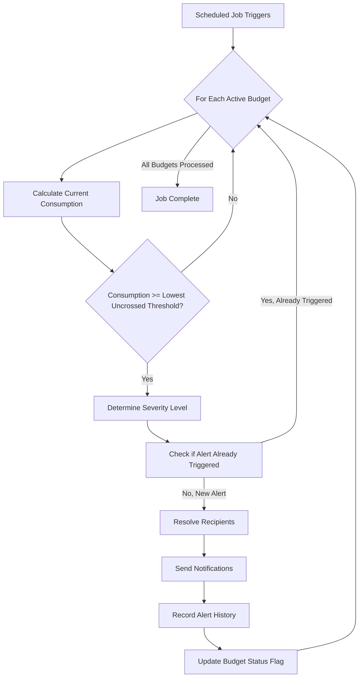
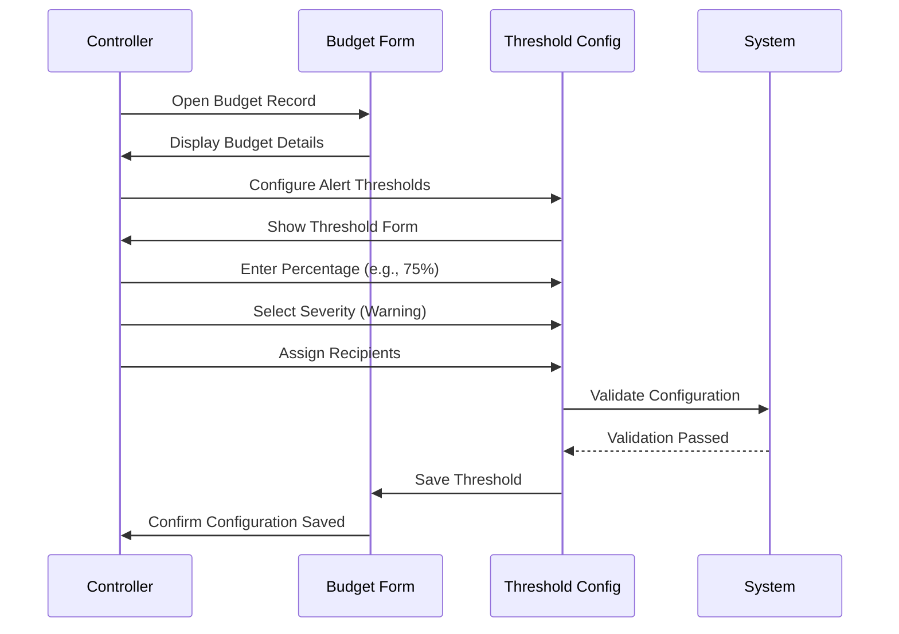
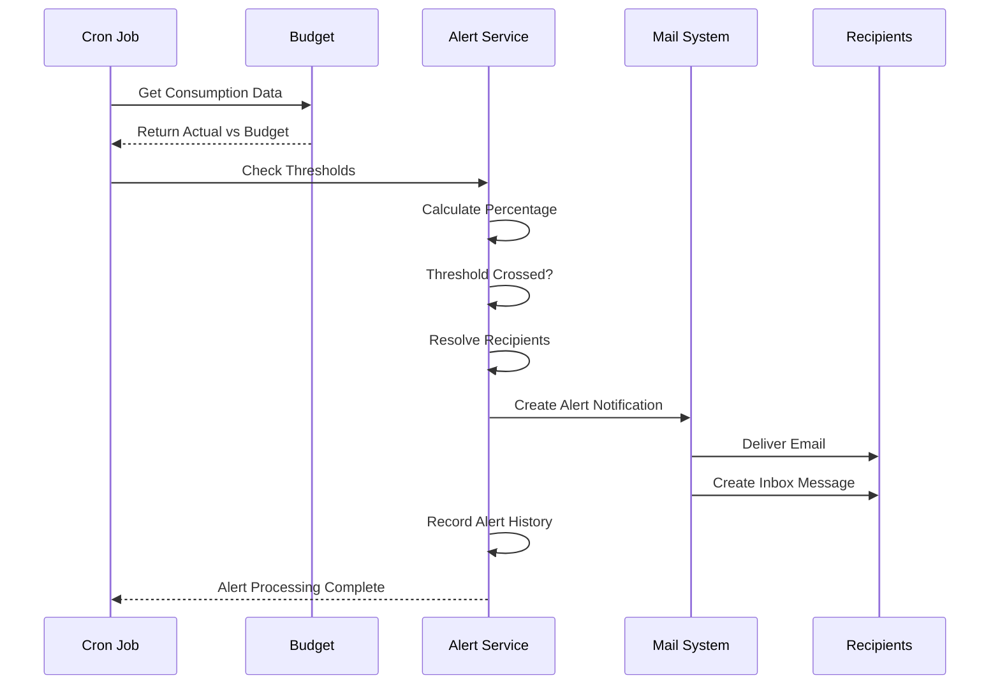
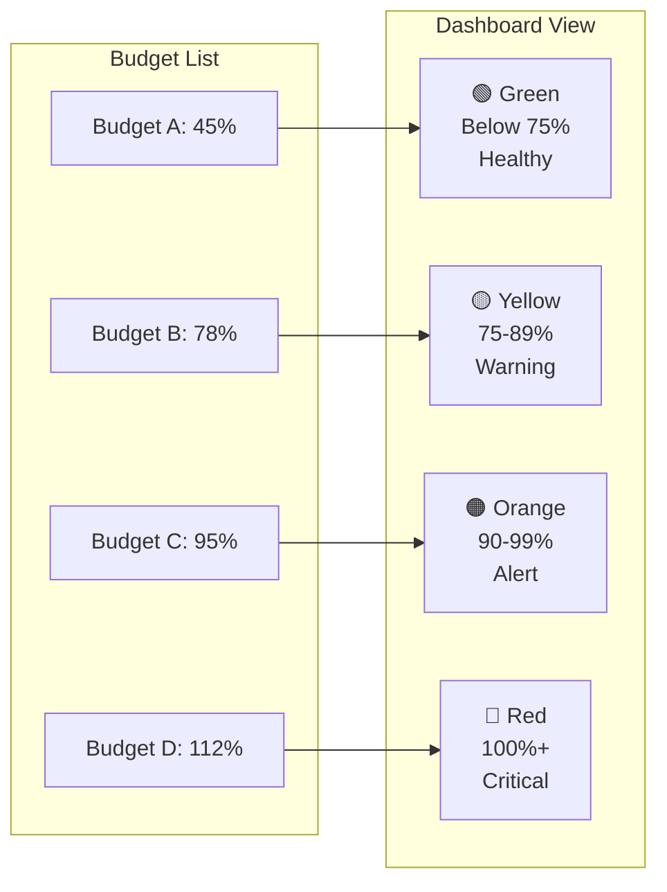

# BM-005: Budget Alerts

| Attribute | Value |
|-----------|-------|
| **Story ID** | BM-005 |
| **Title** | Budget Alerts |
| **Parent Feature** | [FEATURE-003: Budget Management](../../features/FEATURE-003-budget-management.md) |
| **Parent Epic** | [EPIC-001: Enterprise Accounting Capabilities](../../EPIC-001-enterprise-accounting.md) |
| **Status** | Draft |
| **Priority** | High |
| **Story Points** | TBD |
| **Created** | 2024 |
| **Last Updated** | 2024 |

---

## Table of Contents

1. [User Story](#1-user-story)
2. [Acceptance Criteria](#2-acceptance-criteria)
3. [Constraints](#3-constraints)
4. [Technical Discovery Notes](#4-technical-discovery-notes)
5. [Dependencies](#5-dependencies)
6. [Test Requirements](#6-test-requirements)
7. [Definition of Done](#7-definition-of-done)
8. [Workflow Diagram](#8-workflow-diagram)
9. [Revision History](#9-revision-history)

---

## 1. User Story

### 1.1 Story Statement

**As a** Controller or Finance Director

**I want** to receive automatic alerts when budget consumption approaches or exceeds defined thresholds

**So that** I can take proactive corrective action before budget overruns occur and maintain financial control over organizational spending

### 1.2 Business Context

Budget Alerts is a **critical proactive financial management capability** that transforms budget monitoring from reactive to proactive. Rather than discovering budget overruns after the fact through periodic report review, this story enables:

- **Real-time Budget Monitoring**: Automated threshold surveillance eliminates manual checking
- **Early Warning System**: Multiple threshold levels (75%, 90%, 100%, 110%) provide graduated alerts
- **Proactive Cost Control**: Finance teams receive warnings before budgets are exceeded
- **Accountability Enhancement**: Alert history creates audit trail of budget threshold events
- **Response Time Improvement**: Configurable recipients ensure the right stakeholders are notified immediately

This story enables organizations using Odoo Community Edition to:

- Configure customizable alert thresholds per budget
- Receive automated notifications when spending approaches budget limits
- Track all alert events for audit and accountability purposes
- Designate specific users or groups as alert recipients
- View at-a-glance budget health indicators via dashboard

### 1.3 User Value Proposition

| Persona | Value Delivered |
|---------|-----------------|
| **Controller** | Real-time visibility into budget health; early warning enables corrective action; reduced time spent on manual monitoring; clear accountability through alert history |
| **CFO / Finance Director** | Proactive cost control; strategic oversight of organizational spending; compliance evidence for budget controls; dashboard visibility into budget risk areas |
| **Accountant / Bookkeeper** | Awareness of budget constraints; avoidance of processing expenditures that would breach budget; clear escalation path when thresholds are reached |

### 1.4 Acceptance Criteria Traceability

| Scenario | Business Requirement | Success Metric Alignment |
|----------|---------------------|-------------------------|
| Scenario 1 | Configurable threshold-based alerting | Foundation for proactive budget management |
| Scenario 2 | First threshold warning alerts | Early warning system for budget consumption |
| Scenario 3 | Critical over-budget notifications | Immediate response to budget overruns |
| Scenario 4 | Recipient configuration and audit | Alert delivery to designated stakeholders |
| Scenario 5 | Alert history and tracking | Accountability and audit trail |
| Scenario 6 | Dashboard visualization | Budget variance reports within 24 hours (SM-003) |

---

## 2. Acceptance Criteria

### Scenario 1: Configure Threshold-Based Alerts

**Given** a budget exists with defined amount for a period (per BM-001 Budget Definition)

**When** I configure alert thresholds for that budget

**Then** I can specify multiple threshold levels as percentages (e.g., 75%, 90%, 100%, 110%)

**And** each threshold level has an associated severity classification:
- **Warning** (e.g., 75% - approaching budget)
- **Alert** (e.g., 90% - nearing budget limit)
- **Critical** (e.g., 100% - budget reached)
- **Over-budget** (e.g., 110% - budget exceeded)

**And** the system saves the threshold configuration for that budget

**And** the configured thresholds are displayed in the budget summary view

**And** I can modify thresholds while the budget is in draft or confirmed state

---

### Scenario 2: Trigger Warning Alert at First Threshold

**Given** a budget with an alert configured at 75% threshold

**And** actual expenditure against that budget is being tracked (per BM-003 Actual vs Budget Reporting)

**When** actual expenditure reaches or exceeds 75% of the budgeted amount

**Then** the system generates a warning notification to designated recipients

**And** the notification includes:
- Budget name and reference
- Current consumption level (amount and percentage)
- Configured threshold that was triggered
- Remaining budget amount
- Link to budget details for investigation

**And** the system records the alert event with:
- Timestamp of alert generation
- Threshold level triggered
- Current consumption percentage
- Actual amount at trigger time
- Recipients notified

**And** subsequent transactions below the next threshold do not re-trigger the same alert

---

### Scenario 3: Trigger Critical Alert at Exceeded Threshold

**Given** a budget with an alert configured at 100% threshold

**And** actual expenditure against that budget has been accumulating

**When** actual expenditure exceeds 100% of the budgeted amount

**Then** the system generates a critical over-budget notification

**And** the notification includes:
- Clear "BUDGET EXCEEDED" or equivalent critical indicator
- Budget name and reference
- Variance amount (how much over budget)
- Variance percentage (e.g., "105% of budget consumed")
- Period impacted
- Responsible person (if assigned to budget)

**And** the critical notification is visually distinct from warning notifications

**And** the alert event is recorded with critical severity in the alert history

**And** the budget record is flagged with over-budget status for dashboard visibility

---

### Scenario 4: Configure Alert Recipients

**Given** a budget with configured alert thresholds

**When** I specify alert recipients for that budget

**Then** I can select from:
- Individual users (via `res.users`)
- User groups (via `res.groups`)
- The budget's responsible person (automatic inclusion option)

**And** different thresholds can have different recipient configurations (escalation)

**And** only designated recipients receive notifications when thresholds are triggered

**And** the alert configuration (who receives which alerts) is auditable

**And** I can preview the effective recipient list before saving

**And** recipients can be modified without resetting the alert history

---

### Scenario 5: View Alert History

**Given** alerts have been triggered for various budgets over time

**When** I access the budget alert history

**Then** I see a comprehensive log of all triggered alerts containing:
- Alert date and time
- Budget name and reference
- Threshold level that was triggered
- Severity classification
- Actual consumption at trigger time (amount and percentage)
- Recipients who were notified
- Notification delivery status

**And** I can filter the alert history by:
- Budget (specific budget or all budgets)
- Period (date range)
- Severity level (warning, alert, critical, over-budget)
- Threshold percentage
- Recipient

**And** I can export the alert history for audit purposes

**And** alert records cannot be deleted (audit trail preservation)

---

### Scenario 6: Budget Alert Dashboard Summary

**Given** multiple budgets exist with varying consumption levels

**And** some budgets have triggered alerts while others have not

**When** I view the budget monitoring dashboard

**Then** I see color-coded status indicators for each budget:
- **Green**: Below first threshold (healthy)
- **Yellow/Amber**: Warning threshold reached (75%)
- **Orange**: Alert threshold reached (90%)
- **Red**: Critical/Over-budget threshold reached (100%+)

**And** budgets exceeding thresholds are prominently highlighted at the top

**And** the dashboard displays for each budget:
- Budget name
- Current consumption percentage
- Budget amount vs. actual amount
- Latest alert status (if any)
- Days remaining in budget period

**And** I can drill down from any dashboard item to the full budget details

**And** the dashboard refreshes periodically or on-demand to show current status

---

## 3. Constraints

### 3.1 License Requirements

| Constraint ID | Constraint | Requirement |
|---------------|------------|-------------|
| **C-001** | License Compatibility | Module distributed under AGPL-3.0 compatible license |
| **C-002** | Existing License Respect | Integration with existing Odoo modules must respect LGPL-3 licensing |

### 3.2 Dependency Restrictions

| Constraint ID | Constraint | Requirement |
|---------------|------------|-------------|
| **C-003** | No Enterprise Dependencies | No imports or dependencies on Odoo Enterprise edition modules |
| **C-004** | Specifically Prohibited | No use of `account_budget` Enterprise module |
| **C-005** | OCA Compatibility | Should be compatible with OCA modules (e.g., `mis-builder`) |

### 3.3 Coding Standards

| Constraint ID | Constraint | Requirement |
|---------------|------------|-------------|
| **C-006** | Odoo Guidelines | Implementation follows Odoo coding standards |
| **C-007** | OCA Standards | Adherence to OCA module guidelines for potential community contribution |
| **C-008** | PEP 8 Compliance | Python code follows PEP 8 style guidelines |

### 3.4 Test Coverage

| Constraint ID | Constraint | Requirement |
|---------------|------------|-------------|
| **C-009** | Minimum Coverage | Implementation achieves minimum 80% test coverage |
| **C-010** | Test Types | Unit tests, integration tests, and acceptance tests required |

### 3.5 Performance Requirements

| Constraint ID | Constraint | Requirement |
|---------------|------------|-------------|
| **C-011** | Alert Evaluation | Alert threshold checking job must complete within 15 minutes for 1,000 budgets |
| **C-012** | Notification Delivery | Alert notifications delivered within 1 hour of threshold breach |
| **C-013** | Dashboard Performance | Budget alert dashboard refreshes in less than 5 seconds |

### 3.6 Acceptance Criteria Constraints (Mandatory for All Scenarios)

All acceptance criteria must include verification of:

```
- Module distributed under AGPL-3.0 compatible license
- No imports or dependencies on Odoo Enterprise edition modules
- Implementation follows Odoo and OCA coding standards
- Implementation achieves minimum 80% test coverage
```

---

## 4. Technical Discovery Notes

> **Purpose:** These notes guide implementing agents in their codebase analysis before making implementation decisions. User stories describe **WHAT** and **WHY**; implementation details emerge from agent discovery of the codebase.

### 4.1 Key Source Files to Analyze

| Source File | Analysis Purpose | Key Questions |
|-------------|------------------|---------------|
| `addons/account/data/mail_template_data.xml` | Email notification template patterns | How are email templates structured? What placeholders are used? How to create alert-specific templates? |
| `addons/analytic/models/analytic_line.py` | Transaction tracking that triggers alerts | How is `account.analytic.line` structured? How to monitor transaction accumulation? What is `amount` field behavior? |
| `addons/analytic/models/analytic_account.py` | Balance computation for threshold checking | How are `balance`, `debit`, `credit` computed? How does `_compute_debit_credit_balance` work? |
| `addons/mail/models/mail_thread.py` | Notification system integration | How does `mail.thread` handle notifications? How to implement `message_post` for alerts? |
| `addons/base/models/ir_cron.py` | Scheduled action patterns | How to implement threshold-checking cron jobs? What are best practices for periodic checks? |

### 4.2 Source Analysis Findings

Based on analysis of the Odoo source code:

**`account.analytic.line` Model Key Features:**
- Contains `amount` field (Monetary, required, default=0.0) for transaction amounts
- Has `date` field (Date, required) for filtering by period
- Links to analytic accounts via `auto_account_id` (magic Many2one computed field)
- Supports `company_id` for multi-company isolation
- Uses `category` selection field (currently `other` as default)
- Includes fiscal year search capability via `_search_fiscal_date`

**`account.analytic.account` Model Key Features:**
- Computed fields `balance`, `debit`, `credit` via `_compute_debit_credit_balance`
- Balance computation respects `from_date` and `to_date` context parameters
- Groups transactions by analytic plan column name
- Supports currency conversion to company currency
- Inherits from `mail.thread` for activity tracking

**Email Template Patterns (from `mail_template_data.xml`):**
- Templates use `mail.template` model with `model_id` reference
- Support for Jinja-like placeholders: `{{ object.field_name }}`
- Can include conditional rendering with `t-if` directives
- Support for `email_from`, `partner_to`, `subject`, `body_html` fields
- Can attach report templates via `report_template_ids`
- `auto_delete` flag for cleanup of sent notifications

**Cron Job Patterns:**
- Use `ir.cron` model for scheduled actions
- Key fields: `interval_number`, `interval_type`, `numbercall`, `model_id`, `code`
- Can call Python methods via `code` field (e.g., `model.method_name()`)
- Support for active/inactive state and next execution time

### 4.3 Recommended Design Patterns

| Pattern | Recommendation | Rationale |
|---------|----------------|-----------|
| **Alert Checking** | Implement as scheduled action (cron job) | Consistent with Odoo patterns for periodic tasks; allows configurable frequency |
| **Notification Delivery** | Use `mail.thread` and `message_post` | Leverages Odoo's built-in notification infrastructure; supports channels (email, inbox) |
| **Threshold Configuration** | One2many relation from budget to threshold lines | Allows flexible multi-threshold configuration per budget |
| **Alert History** | Dedicated `budget.alert.history` model | Clean separation of concerns; immutable audit trail |
| **Recipient Management** | Many2many to `res.users` and `res.groups` | Standard Odoo pattern for user/group assignment |
| **Dashboard Display** | Kanban or list view with computed status field | Visual status indicators; efficient filtering |

### 4.4 Alert Mechanism Considerations

| Approach | Pros | Cons | Discovery Decision |
|----------|------|------|-------------------|
| **Real-time (on transaction save)** | Immediate notification | Performance impact on high-volume systems | Suitable for critical (100%+) alerts only |
| **Scheduled job (periodic)** | Consistent performance; batch processing | Slight delay in notification (configurable) | Recommended for warning/alert thresholds |
| **Hybrid approach** | Best of both worlds | Implementation complexity | Optimal solution if feasible |

**Discovery Decision:** Implementation agents should determine the optimal approach based on:
- Transaction volume analysis
- Acceptable notification latency requirements
- System performance constraints

### 4.5 Model Structure Considerations (Discovery-Dependent)

> **Note:** The following structure is suggested based on source analysis but should be validated through codebase discovery during implementation.

**Potential Model Structure:**

```
budget.alert.threshold (Threshold Configuration)
├── budget_id: Many2one (budget.budget)
├── threshold_percentage: Float (e.g., 75.0, 90.0, 100.0, 110.0)
├── severity: Selection (warning, alert, critical, over_budget)
├── user_ids: Many2many (res.users - specific recipients)
├── group_ids: Many2many (res.groups - group recipients)
├── include_responsible: Boolean (auto-include budget owner)
└── active: Boolean (enable/disable threshold)

budget.alert.history (Alert Audit Trail)
├── budget_id: Many2one (budget.budget)
├── threshold_id: Many2one (budget.alert.threshold)
├── trigger_date: Datetime
├── threshold_percentage: Float (snapshot at trigger time)
├── severity: Selection (snapshot)
├── actual_amount: Monetary
├── budget_amount: Monetary
├── consumption_percentage: Float
├── recipient_ids: Many2many (res.users - who was notified)
├── notification_sent: Boolean
└── message_id: Many2one (mail.message - for tracking)
```

### 4.6 OCA Module Considerations

| OCA Module | Repository | Consideration |
|------------|------------|---------------|
| `mis_builder` | [OCA/mis-builder](https://github.com/OCA/mis-builder) | May have alert/threshold patterns to reference |
| `mail_activity_board` | [OCA/social](https://github.com/OCA/social) | Activity dashboard patterns for alert dashboard |

**Discovery Decision:** Implementation agents should determine whether to:
- Build alert infrastructure from scratch using Odoo mail/notification system
- Integrate with OCA notification or activity modules for enhanced functionality
- Ensure compatibility with common OCA accounting modules

---

## 5. Dependencies

### 5.1 Story Dependencies

| Dependency Type | Reference | Description |
|----------------|-----------|-------------|
| **Parent Feature** | [FEATURE-003](../../features/FEATURE-003-budget-management.md) | Budget Management feature specification |
| **Parent Epic** | [EPIC-001](../../EPIC-001-enterprise-accounting.md) | Enterprise Accounting epic definition |

### 5.2 Blocking Relationships

| Relationship | Story | Description |
|--------------|-------|-------------|
| **Blocked By** | [BM-001](./BM-001-budget-definition.md) | Budget Definition - alerts require budget records to exist with configured thresholds |
| **Blocked By** | [BM-003](./BM-003-actual-vs-budget-reporting.md) | Actual vs Budget Reporting - alerts require consumption data to compare against thresholds |
| **Related To** | [BM-002](./BM-002-budget-period-allocation.md) | Period allocation affects which transactions are counted toward budget consumption |
| **Related To** | [BM-004](./BM-004-variance-analysis.md) | Variance analysis provides context for alert investigation |
| **Blocks** | None | This is the final story in the Budget Management feature |

### 5.3 External Model Dependencies

| Model | Module | Dependency Type | Usage |
|-------|--------|-----------------|-------|
| `budget.budget` | Budget module (BM-001) | Integration | Parent budget record for threshold configuration |
| `account.analytic.line` | `analytic` | Integration | Source of actual consumption data |
| `account.analytic.account` | `analytic` | Integration | Balance computation for budget consumption |
| `res.users` | `base` | Integration | Alert recipient configuration (individual users) |
| `res.groups` | `base` | Integration | Alert recipient configuration (user groups) |
| `mail.template` | `mail` | Integration | Email notification templates |
| `mail.message` | `mail` | Integration | Alert notification delivery and tracking |
| `ir.cron` | `base` | Integration | Scheduled threshold checking job |
| `res.company` | `base` | Integration | Multi-company alert isolation |

### 5.4 Integration Points

| Integration Point | Description | Verification Method |
|-------------------|-------------|---------------------|
| **Budget Model** | Alert thresholds linked to budget records | Threshold CRUD operations on budget |
| **Analytic Lines** | Consumption calculated from analytic line amounts | Alert triggers when threshold crossed |
| **Mail System** | Notifications sent via Odoo mail infrastructure | Email delivery and inbox notification |
| **Cron Jobs** | Scheduled threshold evaluation | Job execution and timing verification |
| **User/Group Assignment** | Recipients configured via standard Odoo patterns | Correct users receive notifications |
| **Dashboard** | Alert status displayed in budget overview | Visual indicators match alert state |

---

## 6. Test Requirements

### 6.1 Coverage Requirements

| Requirement | Target | Measurement |
|-------------|--------|-------------|
| **Overall Test Coverage** | ≥80% | Code coverage analysis tools |
| **Unit Test Coverage** | ≥90% for threshold calculation logic | Method-level coverage |
| **Integration Test Coverage** | ≥80% for notification delivery | Cross-model test scenarios |

### 6.2 Unit Test Scenarios

| Test Category | Test Scenario | Expected Result |
|---------------|---------------|-----------------|
| **Threshold Configuration** | Create threshold with valid percentage | Threshold saved successfully |
| **Threshold Configuration** | Create threshold with invalid percentage (<0 or >200) | Validation error |
| **Threshold Configuration** | Create multiple thresholds for same budget | All thresholds saved |
| **Threshold Configuration** | Modify threshold on confirmed budget | Update successful |
| **Consumption Calculation** | Calculate consumption percentage | Correct percentage returned |
| **Consumption Calculation** | Calculate with zero budget amount | Handled gracefully (no division error) |
| **Consumption Calculation** | Calculate with negative actuals | Correct handling per account type |
| **Alert Triggering** | Consumption reaches exactly threshold | Alert triggered |
| **Alert Triggering** | Consumption exceeds threshold | Alert triggered |
| **Alert Triggering** | Consumption below threshold | No alert triggered |
| **Alert Triggering** | Same threshold not re-triggered | Duplicate prevention works |
| **Recipient Resolution** | Resolve individual user recipients | Correct users returned |
| **Recipient Resolution** | Resolve group recipients | All group members returned |
| **Recipient Resolution** | Include responsible person option | Budget owner included |
| **Recipient Resolution** | No recipients configured | Graceful handling (log warning) |

### 6.3 Integration Test Scenarios

| Test Category | Test Scenario | Expected Result |
|---------------|---------------|-----------------|
| **Email Notification** | Alert triggers email to recipients | Emails delivered with correct content |
| **Email Notification** | Email contains all required information | Budget name, percentage, variance included |
| **Inbox Notification** | Alert creates inbox message | Users see notification in Odoo inbox |
| **Alert History** | Alert event recorded in history | History record created with all fields |
| **Alert History** | Multiple alerts recorded chronologically | Correct ordering and filtering |
| **Cron Job** | Scheduled job evaluates all budgets | All budgets checked, alerts triggered |
| **Cron Job** | Job completes within performance limit | <15 minutes for 1,000 budgets |
| **Multi-Company** | Alerts isolated per company | Company A alerts don't notify Company B users |
| **Dashboard** | Status indicators update after alert | Correct color coding displayed |
| **Dashboard** | Drill-down navigates to budget | Budget details accessible from dashboard |

### 6.4 Acceptance Test Scenarios (BDD Alignment)

| Scenario | Test | Verification |
|----------|------|--------------|
| Scenario 1 | Configure thresholds (75%, 90%, 100%, 110%) | All thresholds saved with severity levels |
| Scenario 2 | Trigger 75% warning alert | Notification sent, history recorded |
| Scenario 3 | Trigger 100%+ critical alert | Critical notification with variance details |
| Scenario 4 | Configure recipients (users and groups) | Only designated recipients notified |
| Scenario 5 | View and filter alert history | Complete log with filtering works |
| Scenario 6 | Dashboard displays color-coded status | Correct indicators for all budgets |

### 6.5 Performance Test Scenarios

| Test Category | Test Scenario | Expected Result |
|---------------|---------------|-----------------|
| **Threshold Checking** | Evaluate 1,000 budgets | Complete in <15 minutes |
| **Notification Delivery** | Send 100 concurrent alerts | All delivered within 1 hour of trigger |
| **Dashboard Load** | Load dashboard with 500 budgets | Render in <5 seconds |
| **Alert History Query** | Query history with 10,000 records | Results returned in <3 seconds |

### 6.6 Security Test Scenarios

| Test Category | Test Scenario | Expected Result |
|---------------|---------------|-----------------|
| **Access Rights** | User with alert permission configures threshold | Operation successful |
| **Access Rights** | User without permission attempts configuration | Access denied |
| **Access Rights** | Non-recipient attempts to view alert details | Access denied |
| **Data Isolation** | User in Company A views alerts | Only Company A alerts visible |
| **Audit Trail** | Attempt to delete alert history | Deletion blocked (immutable) |

### 6.7 Success Metric Verification

| Metric | Test | Verification |
|--------|------|--------------|
| **SM-003** | Budget variance reports within 24 hours | Alert dashboard reflects current status within period |
| **Alert Notification Timing** | Threshold breach to notification | <1 hour latency verified |

---

## 7. Definition of Done

### 7.1 Acceptance Checklist

| # | Criterion | Status |
|---|-----------|--------|
| 1 | All 6 acceptance criteria scenarios pass | [ ] |
| 2 | Threshold configuration CRUD operations work correctly | [ ] |
| 3 | Alert notifications delivered to correct recipients | [ ] |
| 4 | Alert history accurately tracks all triggered alerts | [ ] |
| 5 | Dashboard displays correct color-coded status indicators | [ ] |
| 6 | Cron job evaluates thresholds within performance limits | [ ] |
| 7 | Unit tests achieve ≥90% coverage for calculation logic | [ ] |
| 8 | Overall test coverage achieves ≥80% | [ ] |
| 9 | Integration tests pass for notification delivery | [ ] |
| 10 | No dependencies on Odoo Enterprise modules verified | [ ] |
| 11 | AGPL-3.0 license compliance verified | [ ] |
| 12 | Code follows Odoo and OCA coding standards | [ ] |
| 13 | Alert history immutable (cannot be deleted) | [ ] |
| 14 | Multi-company isolation verified | [ ] |
| 15 | Security/access rights configured and tested | [ ] |
| 16 | Code review completed and approved | [ ] |
| 17 | Documentation (docstrings, README) complete | [ ] |

### 7.2 Quality Gates

| Gate | Requirement | Verification Method |
|------|-------------|---------------------|
| **Code Quality** | Passes pylint-odoo checks | CI/CD pipeline |
| **Test Quality** | All tests pass | Test suite execution |
| **Coverage Quality** | ≥80% coverage | Coverage report |
| **Performance** | Alert job <15 minutes for 1,000 budgets | Performance test |
| **Security Review** | Access rights properly configured | Security audit |
| **Documentation** | Public APIs documented | Documentation review |

---

## 8. Workflow Diagram

### 8.1 Alert Threshold Checking Flow



### 8.2 Alert Configuration Workflow



### 8.3 Alert Notification Flow



### 8.4 Dashboard Status Visualization



---

## 9. Revision History

| Version | Date | Author | Changes |
|---------|------|--------|---------|
| 1.0 | 2024 | Blitzy Platform | Initial story creation |

---

## Related Documentation

- [EPIC-001: Enterprise Accounting Capabilities](../../EPIC-001-enterprise-accounting.md)
- [FEATURE-003: Budget Management](../../features/FEATURE-003-budget-management.md)
- [BM-001: Budget Definition](./BM-001-budget-definition.md)
- [BM-002: Budget Period Allocation](./BM-002-budget-period-allocation.md)
- [BM-003: Actual vs Budget Reporting](./BM-003-actual-vs-budget-reporting.md)
- [BM-004: Variance Analysis](./BM-004-variance-analysis.md)
