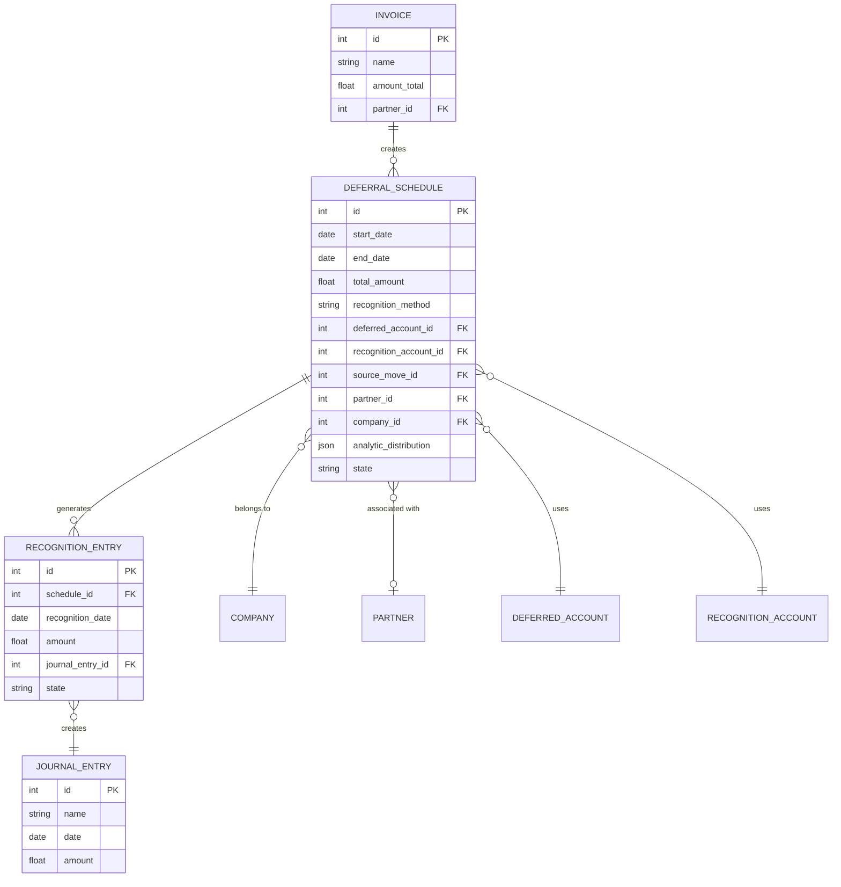

# DR-001 Deferral Schedule Definition

| Attribute       | Value                                                    |
|-----------------|----------------------------------------------------------|
| **Story ID**    | DR-001                                                   |
| **Title**       | Deferral Schedule Definition                             |
| **Parent Feature** | [FEATURE-005: Deferred Revenue/Expenses](../../features/FEATURE-005-deferred-revenue.md) |
| **Status**      | Draft                                                    |
| **Priority**    | High                                                     |
| **Estimate**    | L (Large)                                                |

---

## User Story

**As a** CFO / Finance Director

**I want** to define deferral schedules for revenue and expenses

**So that** I can properly recognize revenue and expenses across the appropriate accounting periods per ASC 606/IFRS 15 requirements, ensuring accurate financial statements and regulatory compliance

---

## Acceptance Criteria

### Scenario 1: Create Deferral Schedule from Invoice

- **Given** I have a posted customer invoice with revenue that should be deferred
  - And the invoice line is associated with a revenue account
- **When** I create a deferral schedule for the invoice line
- **Then** a new deferral schedule should be created linked to the invoice
  - And the original revenue account should be replaced with the deferred revenue account
  - And the total deferral amount should equal the invoice line amount
  - And the recognition period should be configurable

### Scenario 2: Define Recognition Period Parameters

- **Given** I am creating a new deferral schedule
- **When** I configure the recognition period
- **Then** I should be able to set the start date for recognition
  - And I should be able to set the end date or number of periods
  - And I should be able to select the recognition method (straight-line, date-based)
  - And the system should calculate the per-period recognition amount

### Scenario 3: Configure Deferral Accounts

- **Given** I am creating a deferral schedule
- **When** I configure the accounting settings
- **Then** I should be able to select the deferred revenue/expense account
  - And I should be able to select the recognition revenue/expense account
  - And default accounts should be suggested based on company settings
  - And only accounts of appropriate type should be available for selection

### Scenario 4: Create Manual Deferral Schedule

- **Given** I need to defer revenue or expense without an existing invoice
- **When** I create a manual deferral schedule
- **Then** I should be able to enter the total amount to defer
  - And I should be able to specify the partner/customer
  - And I should be able to attach reference documents
  - And the schedule should be tracked independently of any invoice

### Scenario 5: Validate Recognition Period Bounds

- **Given** I am configuring a deferral schedule
- **When** I set recognition parameters that exceed typical bounds
- **Then** I should receive a warning for recognition periods over 60 months
  - And I should not be able to set an end date before the start date
  - And I should not be able to set a start date in a locked period
  - And the system should validate period dates against fiscal year settings

### Scenario 6: Link Schedule to Analytic Accounts

- **Given** I am creating a deferral schedule
  - And the original transaction has analytic distribution
- **When** recognition entries are generated
- **Then** the analytic distribution should be preserved
  - And budget tracking should reflect the deferred amounts
  - And cost center allocations should carry forward to recognition entries

---

## Constraints

### License and Compliance

- [ ] **AGPL-3.0 Compatibility**: Module/feature must be distributed under AGPL-3.0 compatible license
- [ ] **No Enterprise Dependencies**: No imports or dependencies on Odoo Enterprise edition modules (specifically, no dependency on `account_deferred_revenue` Enterprise module)
- [ ] **OCA Coding Standards**: Implementation must follow Odoo and OCA (Odoo Community Association) coding standards

### Version Compatibility

- [ ] **Target Version**: Odoo 18.0 compatibility required
- [ ] **Repository Note**: Current repository is Odoo 19.0; implementation should be version-agnostic where possible

### Business Rules

- [ ] **ASC 606/IFRS 15 Compliance**: Must support revenue recognition per transfer of control and performance obligation satisfaction principles
- [ ] **account.move Integration**: Must integrate with existing Odoo accounting journal entry model

---

## Technical Discovery Notes

### Codebase Analysis Areas

| Area | Files/Modules to Examine | Analysis Focus |
|------|-------------------------|----------------|
| Automatic Entry Wizard | `addons/account/wizard/account_automatic_entry_wizard.py` | Existing `action='change_period'` pattern for deferral/accrual entries; cut-off label formatting |
| Company Accrual Settings | `addons/account/models/company.py` | `revenue_accrual_account_id` and `expense_accrual_account_id` fields; `automatic_entry_default_journal_id` |
| Account Move Model | `addons/account/models/account_move.py` | Journal entry creation patterns; lock date validation; `adjusting_entry_origin_move_ids` |
| Account Model | `addons/account/models/account_account.py` | Account types and domains for filtering deferred accounts |
| Analytic Distribution | `addons/account/wizard/account_automatic_entry_wizard.py` | Handling of `analytic_distribution` field in automatic entries |

### Relevant Existing Modules

- `addons/account/` - Core accounting module containing:
  - `account_automatic_entry_wizard.py` provides existing cut-off/period-change functionality
  - Company-level accrual account configuration (`revenue_accrual_account_id`, `expense_accrual_account_id`)
  - Lock date validation patterns for period restrictions
- `addons/analytic/` - Analytic accounting module for:
  - Budget tracking integration
  - Analytic distribution preservation in deferred entries

### OCA Module Compatibility

| OCA Repository | Module | Compatibility Consideration |
|----------------|--------|----------------------------|
| OCA/account-closing | `account_cutoff_accrual_picking` | Similar accrual/deferral patterns for reference |
| OCA/account-financial-tools | `account_cutoff_base` | Cut-off entry patterns and period handling |

### Key Implementation Patterns from Source Analysis

The existing `account_automatic_entry_wizard.py` provides important patterns:

1. **Accrual Account Selection**: Uses `self.revenue_accrual_account` and `self.expense_accrual_account` computed from company settings
2. **Account Type Detection**: Automatically determines income vs expense based on balance sign (`account_type` computed field)
3. **Percentage-Based Deferral**: Supports partial deferral via `percentage` field (0-100%)
4. **Lock Date Validation**: `_check_date` constraint validates against locked periods
5. **Analytic Distribution**: Preserves `analytic_distribution` from source lines to generated entries

---

## Dependencies

### Story Dependencies

| Dependency Type | Story ID | Story Title | Relationship |
|-----------------|----------|-------------|--------------|
| Parent Feature | FEATURE-005 | Deferred Revenue/Expenses | This story is part of this feature |
| Blocks | DR-002 | Automatic Period Allocation | Schedule definition required before period allocation |
| Blocks | DR-003 | Cut-off Entry Generation | Schedule required before cut-off entries |
| Blocks | DR-004 | Recognition Dashboard | Schedule data required for dashboard display |

### External Dependencies

| Dependency | Type | Notes |
|------------|------|-------|
| ASC 606 (Revenue from Contracts with Customers) | Accounting Standard | Recognition criteria must align with transfer of control principles |
| IFRS 15 (Revenue from Contracts with Customers) | Accounting Standard | International revenue recognition requirements |
| Company Fiscal Year Configuration | System Configuration | Period boundaries for recognition scheduling |

### Integration Points

| Odoo Model/Module | Integration Type | Purpose |
|-------------------|------------------|---------|
| `account.move` | Extend | Link deferral schedules to source invoices and generate recognition entries |
| `account.move.line` | Read | Access invoice line details for deferral calculation |
| `account.account` | Read | Validate and filter deferral and recognition accounts |
| `res.company` | Read | Access default accrual accounts and fiscal settings |
| `res.partner` | Read | Associate schedules with customers/vendors |
| `analytic.account` | Read | Preserve analytic distribution for budget tracking |

---

## Test Requirements

### Coverage Requirement

| Metric | Requirement | Notes |
|--------|-------------|-------|
| **Minimum Test Coverage** | **80%** | Mandatory for all new functionality |
| Unit Test Coverage | 80%+ | Business logic, model methods |
| Integration Test Coverage | 80%+ | Module interactions, data flow |

### Unit Test Scenarios

| Acceptance Scenario | Unit Test Focus | Key Assertions |
|---------------------|-----------------|----------------|
| Scenario 1: Create from Invoice | Schedule creation method | Schedule linked to invoice; amounts match; account substitution |
| Scenario 2: Recognition Period | Period calculation logic | Start/end dates valid; recognition method applied; per-period amounts calculated |
| Scenario 3: Account Configuration | Account selection and defaults | Company defaults applied; account type validation |
| Scenario 4: Manual Schedule | Manual entry creation | All required fields captured; no invoice linkage required |
| Scenario 5: Period Validation | Boundary validation | Warning for >60 months; end > start; lock date enforcement |
| Scenario 6: Analytic Integration | Analytic distribution handling | Distribution preserved; budget amounts reflect deferrals |

### Integration Test Considerations

- [ ] Test integration with `account.move` model for invoice-linked schedules
- [ ] Test integration with `account.move.line` model for line-level deferrals
- [ ] Test company-level default account propagation
- [ ] Test analytic distribution preservation across schedule creation
- [ ] Test lock date validation against company fiscal settings
- [ ] Test multi-company scenarios for schedule creation

### Acceptance Test Mapping

| BDD Scenario | Test Method Name | Test Type |
|--------------|------------------|-----------|
| Scenario 1: Create from Invoice | `test_deferral_schedule_from_invoice` | Acceptance |
| Scenario 2: Recognition Period | `test_recognition_period_configuration` | Acceptance |
| Scenario 3: Account Configuration | `test_deferral_account_configuration` | Acceptance |
| Scenario 4: Manual Schedule | `test_manual_deferral_schedule` | Acceptance |
| Scenario 5: Period Validation | `test_recognition_period_validation` | Acceptance |
| Scenario 6: Analytic Integration | `test_analytic_distribution_preservation` | Acceptance |

---

## Entity Relationship Diagram

---

## Accounting Standards Reference

### ASC 606 - Revenue from Contracts with Customers

**Recognition Criteria:**
- Revenue recognized when control of goods/services transfers to customer
- Performance obligations identified and allocated transaction price
- Recognition occurs over time or at a point in time based on criteria

**Relevance to Deferral Schedules:**
- Enables recognition of revenue across the performance period
- Supports straight-line recognition for services delivered evenly over time
- Supports date-based recognition for milestone-driven performance

### IFRS 15 - Revenue from Contracts with Customers

**Five-Step Model:**
1. Identify the contract
2. Identify performance obligations
3. Determine transaction price
4. Allocate transaction price
5. Recognize revenue when/as performance obligations satisfied

**Relevance to Deferral Schedules:**
- Deferred revenue represents contract liability until performance
- Recognition schedule reflects pattern of performance obligation satisfaction

---

## Definition of Done

### Implementation Checklist

- [ ] All acceptance criteria scenarios pass
- [ ] 80% minimum test coverage achieved
- [ ] Unit tests written and passing
- [ ] Integration tests written and passing

### Compliance Checklist

- [ ] No Enterprise module dependencies introduced
- [ ] AGPL-3.0 license compliance verified
- [ ] Code follows OCA coding standards
- [ ] Code reviewed and approved

### Documentation Checklist

- [ ] Code documentation (docstrings, comments) complete
- [ ] User-facing documentation updated (if applicable)
- [ ] Technical documentation updated (if applicable)

### Quality Checklist

- [ ] No critical or high-severity bugs
- [ ] Performance acceptable (no significant degradation)
- [ ] Security considerations addressed

---

## Revision History

| Version | Date | Author | Changes |
|---------|------|--------|---------|
| 1.0 | 2024 | Enterprise Accounting Team | Initial story creation |

---

## Notes

### ASC 606/IFRS 15 Compliance Notes

This story establishes the foundation for ASC 606/IFRS 15 compliant revenue recognition by enabling:
- **Contract liability tracking** through deferred revenue accounts
- **Period-over-time recognition** through configurable recognition schedules
- **Performance obligation mapping** through invoice line linkage

### Implementation Guidance

The existing `account_automatic_entry_wizard.py` in the Odoo account module demonstrates the pattern for:
- Moving amounts between original and accrual accounts
- Handling percentage-based partial deferrals
- Preserving analytic distribution in generated entries
- Validating against lock dates

This story builds upon these patterns to create persistent deferral schedules that support:
- Multiple recognition entries over time (vs. single cut-off entry)
- Dashboard visibility into outstanding deferrals
- Direct linkage to source transactions for audit trail

### Relationship to Other Stories

| Story | Dependency Direction | Description |
|-------|---------------------|-------------|
| DR-002 | DR-001 → DR-002 | Period allocation uses schedule definition |
| DR-003 | DR-001 → DR-003 | Cut-off entries generated from schedules |
| DR-004 | DR-001 → DR-004 | Dashboard displays schedule data |

This is the **foundational story** for the Deferred Revenue/Expenses feature - all other stories depend on the schedule definition capability.
