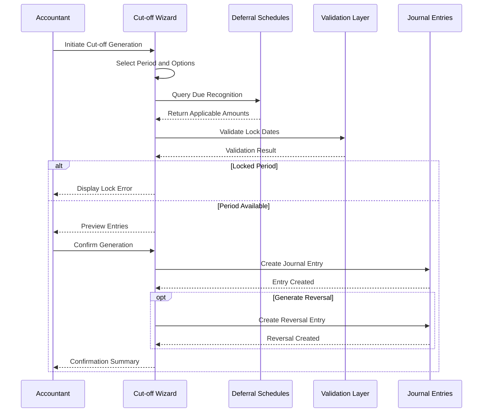

# DR-003 Cut-off Entry Generation

| Attribute       | Value                                                    |
|-----------------|----------------------------------------------------------|
| **Story ID**    | DR-003                                                   |
| **Title**       | Cut-off Entry Generation                                 |
| **Parent Feature** | [FEATURE-005: Deferred Revenue/Expenses](../../features/FEATURE-005-deferred-revenue.md) |
| **Status**      | Draft                                                    |
| **Priority**    | High                                                     |
| **Estimate**    | M (Medium)                                               |

---

## User Story

**As an** Accountant / Bookkeeper

**I want** to generate cut-off entries for deferred revenue and expenses at period close

**So that** financial statements accurately reflect the portion of revenue/expenses applicable to each accounting period, ensuring compliance with the matching principle and ASC 606/IFRS 15 revenue recognition standards

---

## Acceptance Criteria

### Scenario 1: Generate Cut-off Entries for Single Period

- **Given** I have active deferral schedules with amounts due for recognition
  - And the current period is due for recognition based on the allocation schedule
- **When** I initiate cut-off entry generation for the current period
- **Then** recognition journal entries should be created for all applicable schedules
  - And entries should debit the deferral account and credit the revenue/expense account
  - And entries should be dated on the period end date
  - And each entry should reference the source deferral schedule

### Scenario 2: Preview Cut-off Entries Before Posting

- **Given** I have pending recognition amounts for the period
  - And I need to review entries before committing
- **When** I request a preview of cut-off entries
- **Then** I should see a summary of entries to be generated
  - And I should see debit and credit amounts per account
  - And I should see the total impact by journal
  - And entries should not be posted until I explicitly confirm

### Scenario 3: Batch Generate Cut-off Entries

- **Given** I have multiple deferral schedules with recognition due
  - And schedules may span different journals or accounts
- **When** I select batch cut-off entry generation
- **Then** all qualifying schedules should be processed in a single operation
  - And a single journal entry should be created per journal
  - And line items should be grouped by account for efficient posting
  - And a summary of processed schedules should be provided

### Scenario 4: Handle Partial Period Recognition

- **Given** I have a deferral schedule that started mid-period
  - And the recognition method is date-based (calendar days)
- **When** I generate cut-off entries for that period
- **Then** recognition amount should be prorated based on days in period
  - And the calculation method should be consistent with ASC 606/IFRS 15
  - And the prorated amount should match the allocation schedule preview
  - And a note should indicate the proration applied

### Scenario 5: Generate Reversal Entry for Next Period

- **Given** I have generated cut-off entries for period close
  - And the reversal option is enabled in generation settings
- **When** the option to generate reversal entries is selected
- **Then** reversing entries should be created dated first day of next period
  - And reversal should exactly offset the cut-off entry amounts
  - And reversal entries should be clearly linked to the original cut-off entries
  - And auto-post option should be available for reversals

### Scenario 6: Respect Lock Date Constraints

- **Given** a fiscal lock date is set for a prior period
  - And I attempt to generate entries for that locked period
- **When** I initiate cut-off entry generation for the locked period
- **Then** I should receive an error message indicating the period is locked
  - And no journal entries should be created
  - And the error should specify which lock date constraint was violated
  - And I should be advised on the next available posting date

---

## Workflow Diagram

---

## Cut-off Entry Structure

### Entry Components

| Component | Deferred Revenue | Deferred Expense |
|-----------|------------------|------------------|
| **Debit Account** | Deferred Revenue (Liability) | Expense Account |
| **Credit Account** | Revenue Account | Deferred Expense (Asset) |
| **Entry Date** | Period End Date | Period End Date |
| **Reference** | Deferral Schedule ID | Deferral Schedule ID |
| **Reversal Date** | First Day of Next Period | First Day of Next Period |

### Example Cut-off Entry

| Line | Account | Debit | Credit | Description |
|------|---------|-------|--------|-------------|
| 1 | 2100 - Deferred Revenue | $1,000 | | Cut-off Schedule #DEF-001 |
| 2 | 4100 - Service Revenue | | $1,000 | Cut-off Schedule #DEF-001 |

---

## Constraints

### License and Compliance

- [ ] **AGPL-3.0 Compatibility**: Module/feature must be distributed under AGPL-3.0 compatible license
- [ ] **No Enterprise Dependencies**: No imports or dependencies on Odoo Enterprise edition modules (specifically, no dependency on `account_deferred_revenue` Enterprise module)
- [ ] **OCA Coding Standards**: Implementation must follow Odoo and OCA (Odoo Community Association) coding standards

### Version Compatibility

- [ ] **Target Version**: Odoo 18.0 compatibility required
- [ ] **Repository Note**: Current repository is Odoo 19.0; implementation should be version-agnostic where possible

### Business Rules

- [ ] **Lock Date Enforcement**: Must respect all company lock dates (fiscal, tax, sale, purchase, hard)
- [ ] **Reversibility**: Generated entries must be reversible per accounting standards
- [ ] **Audit Trail**: All cut-off entries must maintain clear linkage to source deferral schedules
- [ ] **ASC 606/IFRS 15 Compliance**: Recognition entries must follow transfer of control principles

---

## Technical Discovery Notes

### Codebase Analysis Areas

| Area | Files/Modules to Examine | Analysis Focus |
|------|-------------------------|----------------|
| Automatic Entry Wizard | `addons/account/wizard/account_automatic_entry_wizard.py` | `_get_move_dict_vals_change_period()` and `_do_action_change_period()` methods for cut-off entry creation patterns |
| Cut-off Label Formatting | `addons/account/wizard/account_automatic_entry_wizard.py` | `_get_cut_off_label_format()` method for entry reference formatting |
| Move Line Generation | `addons/account/wizard/account_automatic_entry_wizard.py` | `_get_move_line_dict_vals_change_period()` method for proper debit/credit handling |
| Lock Date Validation | `addons/account/wizard/account_automatic_entry_wizard.py` | `_check_date` constraint and `_compute_lock_date_message` for period restrictions |
| Move Reversal Patterns | `addons/account/wizard/account_move_reversal.py` | `reverse_moves()` and `_prepare_default_reversal()` methods for reversal entry creation |
| Company Accrual Accounts | `addons/account/models/company.py` | `revenue_accrual_account_id`, `expense_accrual_account_id`, and `automatic_entry_default_journal_id` fields |
| Journal Entry Creation | `addons/account/models/account_move.py` | `_get_violated_lock_dates()` and `_get_lock_date_message()` for lock date enforcement |

### Relevant Existing Modules

- `addons/account/` - Core accounting module containing:
  - `account_automatic_entry_wizard.py` provides existing cut-off/period-change functionality with `change_period` action
  - Lock date validation patterns via `_check_date` constraint
  - Company-level accrual account configuration
  - Journal entry creation and posting methods
  - Move reversal functionality in `account_move_reversal.py`

### OCA Module Compatibility

| OCA Repository | Module | Compatibility Consideration |
|----------------|--------|----------------------------|
| OCA/account-closing | `account_cutoff_base` | Base cut-off entry patterns and period handling; evaluate for integration |
| OCA/account-closing | `account_cutoff_accrual_picking` | Similar accrual/deferral patterns for goods-related deferrals |
| OCA/account-financial-tools | Various | Additional cut-off and period-end processing patterns |

### Key Implementation Patterns from Source Analysis

The existing `account_automatic_entry_wizard.py` provides critical patterns:

1. **Cut-off Entry Generation**: The `_get_move_dict_vals_change_period()` method creates move data for cut-off entries with:
   - Proper date handling using `fields.Date.to_string()`
   - Reference formatting via `_format_strings()` with cut-off label format
   - Lock-safe date calculation via `_get_lock_safe_date()`
   - `adjusting_entry_origin_move_ids` for audit trail

2. **Line Item Creation**: The `_get_move_line_dict_vals_change_period()` method handles:
   - Percentage-based recognition (`(self.percentage / 100) * aml.debit/credit`)
   - Accrual account selection based on `account_type` (income vs expense)
   - Currency handling with `amount_currency` field
   - Analytic distribution preservation

3. **Lock Date Enforcement**: Multiple validation points:
   - `_check_date` constraint validates against violated lock dates
   - `_compute_lock_date_message` provides user-friendly lock messages
   - `move._get_violated_lock_dates()` returns active lock date violations

4. **Reversal Patterns**: `account_move_reversal.py` provides:
   - `_prepare_default_reversal()` for reversal entry defaults
   - `reverse_moves()` for batch reversal processing
   - Auto-post option for future-dated reversals

---

## Dependencies

### Story Dependencies

| Dependency Type | Story ID | Story Title | Relationship |
|-----------------|----------|-------------|--------------|
| Parent Feature | FEATURE-005 | Deferred Revenue/Expenses | This story is part of this feature |
| Blocked By | DR-001 | Deferral Schedule Definition | Requires deferral schedules to exist |
| Blocked By | DR-002 | Automatic Period Allocation | Requires allocation data for recognition amounts |
| Related | DR-004 | Recognition Dashboard | Dashboard displays cut-off entry status |

### External Dependencies

| Dependency | Type | Notes |
|------------|------|-------|
| ASC 606 (Revenue from Contracts with Customers) | Accounting Standard | Cut-off timing must align with performance obligation satisfaction |
| IFRS 15 (Revenue from Contracts with Customers) | Accounting Standard | International revenue recognition timing requirements |
| Company Fiscal Calendar | System Configuration | Period boundaries determine cut-off dates |
| Lock Date Configuration | System Configuration | Determines which periods are available for posting |

### Integration Points

| Odoo Model/Module | Integration Type | Purpose |
|-------------------|------------------|---------|
| `account.move` | Write | Create cut-off and reversal journal entries |
| `account.move.line` | Write | Create individual debit/credit lines for recognition |
| `account.account` | Read | Access deferral and recognition accounts |
| `res.company` | Read | Access accrual account defaults and lock date settings |
| Deferral Schedule Model | Read | Query due recognition amounts per period |
| Allocation Schedule Model | Read | Get period-specific recognition amounts |

---

## Test Requirements

### Coverage Requirement

| Metric | Requirement | Notes |
|--------|-------------|-------|
| **Minimum Test Coverage** | **80%** | Mandatory for all new functionality |
| Unit Test Coverage | 80%+ | Cut-off calculations, date handling, amount proration |
| Integration Test Coverage | 80%+ | Wizard processing, journal entry creation, lock date enforcement |

### Unit Test Scenarios

| Acceptance Scenario | Unit Test Focus | Key Assertions |
|---------------------|-----------------|----------------|
| Scenario 1: Single Period | Entry creation method | Correct accounts debited/credited; proper date; schedule linkage |
| Scenario 2: Preview | Preview data generation | Summary totals accurate; no entries created; data matches expectations |
| Scenario 3: Batch Generation | Batch processing logic | All schedules processed; grouping by journal correct; summary accurate |
| Scenario 4: Partial Period | Proration calculation | Calendar day proration accurate; amount matches allocation schedule |
| Scenario 5: Reversal Entry | Reversal generation | Amounts exactly offset; correct date; auto-post option works |
| Scenario 6: Lock Date | Lock date validation | Error raised for locked periods; no entries created; correct error message |

### Integration Test Considerations

- [ ] Test integration with `account.move` model for journal entry creation
- [ ] Test integration with `account.move.line` model for line item creation
- [ ] Test reversal entry linkage to original cut-off entries
- [ ] Test batch processing with schedules from multiple journals
- [ ] Test lock date enforcement across different lock date types (fiscal, tax, hard)
- [ ] Test multi-currency scenarios with exchange rate handling
- [ ] Test analytic distribution preservation in cut-off entries
- [ ] Test partial period proration accuracy with various start dates

### Acceptance Test Mapping

| BDD Scenario | Test Method Name | Test Type |
|--------------|------------------|-----------|
| Scenario 1: Single Period | `test_generate_cutoff_single_period` | Acceptance |
| Scenario 2: Preview | `test_preview_cutoff_entries_no_post` | Acceptance |
| Scenario 3: Batch Generation | `test_batch_cutoff_generation` | Acceptance |
| Scenario 4: Partial Period | `test_partial_period_proration` | Acceptance |
| Scenario 5: Reversal Entry | `test_reversal_entry_generation` | Acceptance |
| Scenario 6: Lock Date | `test_lock_date_enforcement` | Acceptance |

### Additional Test Scenarios

| Test Category | Test Case | Expected Behavior |
|---------------|-----------|-------------------|
| Multi-currency | Cut-off for EUR deferral in USD company | Amounts in both currencies; exchange rate applied |
| Analytic | Cut-off with analytic distribution | Distribution preserved in cut-off entries |
| Zero Balance | Schedule with no remaining balance | No entry generated; informational message |
| Past Due | Multiple past-due periods | All periods processed or user choice to select |
| Company Defaults | No accrual accounts configured | Validation error with clear guidance |

---

## Definition of Done

### Implementation Checklist

- [ ] All acceptance criteria scenarios pass
- [ ] 80% minimum test coverage achieved
- [ ] Unit tests written and passing
- [ ] Integration tests written and passing
- [ ] Batch processing performs within acceptable time limits (<30 seconds for 100+ schedules)

### Compliance Checklist

- [ ] No Enterprise module dependencies introduced
- [ ] AGPL-3.0 license compliance verified
- [ ] Code follows OCA coding standards
- [ ] Code reviewed and approved
- [ ] Lock date constraints properly enforced

### Documentation Checklist

- [ ] Code documentation (docstrings, comments) complete
- [ ] Wizard help text and field descriptions provided
- [ ] Error messages are clear and actionable
- [ ] User-facing documentation updated (if applicable)

### Quality Checklist

- [ ] No critical or high-severity bugs
- [ ] Performance acceptable (batch processing benchmarked)
- [ ] Security considerations addressed (access rights verified)
- [ ] Audit trail maintained for all entries

---

## Revision History

| Version | Date | Author | Changes |
|---------|------|--------|---------|
| 1.0 | 2024 | Enterprise Accounting Team | Initial story creation |

---

## Notes

### Implementation Considerations

1. **Wizard Pattern**: Following the existing `account_automatic_entry_wizard.py` pattern, the cut-off generation should be implemented as a transient model wizard that:
   - Allows period selection and options configuration
   - Provides preview functionality before posting
   - Creates journal entries upon confirmation
   - Optionally generates reversal entries

2. **Batch Processing**: For performance with many active deferral schedules, consider:
   - Grouping entries by journal to minimize move count
   - Using `create()` with list of values for batch creation
   - Providing progress feedback for large batches

3. **Reversal Strategy**: Based on `account_move_reversal.py` patterns:
   - Use `_reverse_moves()` method for consistent reversal handling
   - Support `auto_post='at_date'` for future-dated reversals
   - Maintain linkage between original and reversal entries

4. **Lock Date Handling**: Multiple lock date types must be checked:
   - `fiscalyear_lock_date` - Global accounting lock
   - `tax_lock_date` - Tax return lock
   - `hard_lock_date` - Irreversible lock
   - Use `_get_violated_lock_dates()` for comprehensive validation

### ASC 606/IFRS 15 Compliance Notes

Cut-off entries must support:
- **Point-in-time recognition**: Full amount recognized when performance obligation satisfied
- **Over-time recognition**: Proportional recognition based on:
  - Output methods (milestones, units delivered)
  - Input methods (costs incurred, time elapsed)
- **Variable consideration**: Adjustments for estimated amounts that may change

### Edge Cases to Address

1. **Multi-company**: Ensure entries respect company context and access rights
2. **Different Fiscal Years**: Handle schedules spanning fiscal year boundaries
3. **Zero Recognition**: Skip schedules with no recognition due in period
4. **Negative Amounts**: Handle credit notes and expense reversals correctly
5. **Rounding**: Ensure final period captures any rounding differences
