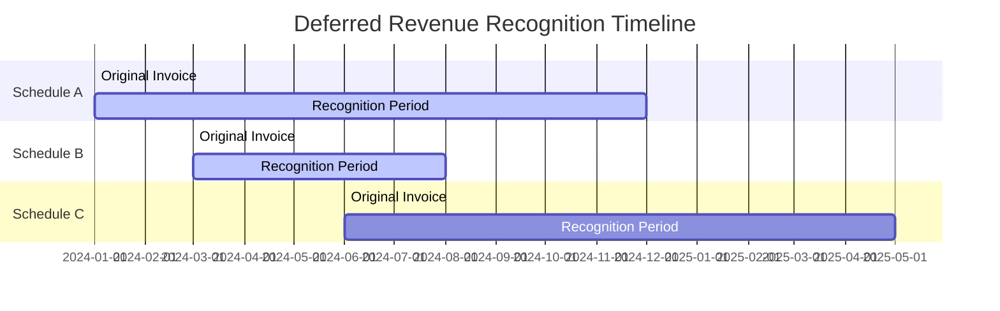
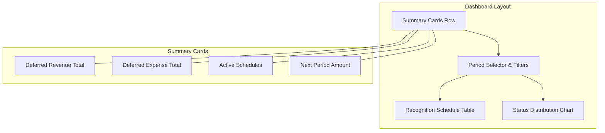

# DR-004 Recognition Dashboard

| Attribute       | Value                                                    |
|-----------------|----------------------------------------------------------|
| **Story ID**    | DR-004                                                   |
| **Title**       | Recognition Dashboard                                    |
| **Parent Feature** | [FEATURE-005: Deferred Revenue/Expenses](../../features/FEATURE-005-deferred-revenue.md) |
| **Status**      | Draft                                                    |
| **Priority**    | Medium                                                   |
| **Estimate**    | M (Medium)                                               |

---

## User Story

**As a** CFO / Finance Director

**I want** a dashboard showing all pending deferred revenue/expenses and their recognition status

**So that** I can monitor revenue recognition compliance and forecast cash flow impact of future recognitions, ensuring ASC 606/IFRS 15 adherence and informed financial decision-making

---

## Acceptance Criteria

### Scenario 1: View Pending Deferrals Summary

- **Given** I have active deferral schedules with amounts not yet recognized
  - And the schedules include both deferred revenue and deferred expense types
- **When** I access the recognition dashboard
- **Then** I should see total deferred revenue pending recognition
  - And I should see total deferred expenses pending recognition
  - And amounts should be displayed in company currency
  - And summary should show count of active schedules per type

### Scenario 2: View Upcoming Recognitions by Period

- **Given** I have deferral schedules with future recognition dates
  - And schedules span multiple upcoming accounting periods
- **When** I select a future accounting period on the dashboard
- **Then** I should see scheduled recognition amounts for that period
  - And I should see which deferral schedules will be recognized
  - And I should see the recognition percentage or amount per schedule
  - And totals should break down by revenue vs expense categories

### Scenario 3: Filter Dashboard by Date Range

- **Given** I have deferral schedules spanning multiple periods
  - And I need to analyze a specific time window
- **When** I apply a date range filter to the dashboard
- **Then** I should see only recognitions within the selected date range
  - And summary totals should reflect the filtered data
  - And I should be able to clear filters to see all data
  - And filter selections should persist within my session

### Scenario 4: Drill-down to Source Transactions

- **Given** I am viewing the recognition dashboard
  - And I need to verify details of a specific deferral
- **When** I click on a deferral schedule entry
- **Then** I should navigate to the deferral schedule detail view
  - And I should see the source invoice and original transaction
  - And I should see all recognition entries generated for that schedule
  - And I should be able to navigate back to the dashboard

### Scenario 5: View Recognition Completion Status

- **Given** I have a mix of active and completed deferral schedules
  - And completed schedules have fully recognized their deferred amounts
- **When** I view the dashboard
- **Then** I should see schedules grouped by status (Active, Completed)
  - And active schedules should show remaining amount to recognize
  - And completed schedules should show fully recognized indicator
  - And I should be able to filter by status

---

## Dashboard Components

### Summary Cards

| Component | Content | Update Frequency |
|-----------|---------|------------------|
| **Total Deferred Revenue** | Sum of unrecognized deferred revenue | Real-time |
| **Total Deferred Expenses** | Sum of unrecognized deferred expenses | Real-time |
| **Active Schedules** | Count of schedules with pending recognition | Real-time |
| **Next Period Recognition** | Total amounts due for recognition in next period | Real-time |

### Period-based View

| Element | Description | Interaction |
|---------|-------------|-------------|
| **Period Selector** | Dropdown or calendar to select accounting period | Filter data by selected period |
| **Period Totals** | Revenue and expense recognition totals for selected period | Display only |
| **Schedule Breakdown** | List of schedules with recognition due in period | Click to drill-down |

### Status Distribution

| Status | Definition | Visual Indicator |
|--------|------------|------------------|
| **Active** | Schedules with remaining amounts to recognize | Green/Active badge |
| **Completed** | Schedules with all amounts fully recognized | Grey/Completed badge |
| **On Hold** | Schedules with recognition temporarily suspended | Yellow/Warning badge |

---

## Data Visualization

### Recognition Timeline Chart

### Dashboard Layout Concept

---

## Constraints

### License and Compliance

- [ ] **AGPL-3.0 Compatibility**: Module/feature must be distributed under AGPL-3.0 compatible license
- [ ] **No Enterprise Dependencies**: No imports or dependencies on Odoo Enterprise edition modules (specifically, no dependency on `account_deferred_revenue` Enterprise module)
- [ ] **OCA Coding Standards**: Implementation must follow Odoo and OCA (Odoo Community Association) coding standards

### Version Compatibility

- [ ] **Target Version**: Odoo 18.0 compatibility required
- [ ] **Repository Note**: Current repository is Odoo 19.0; implementation should be version-agnostic where possible

### Business Rules

- [ ] **ASC 606/IFRS 15 Disclosure**: Dashboard must support disclosure requirements for contract assets, contract liabilities, and deferred revenue
- [ ] **Real-time Data**: Dashboard must reflect current state of deferral schedules without manual refresh
- [ ] **Multi-currency Display**: Support display of amounts in company currency with source currency reference

---

## Technical Discovery Notes

### Codebase Analysis Areas

| Area | Files/Modules to Examine | Analysis Focus |
|------|-------------------------|----------------|
| Existing Dashboards | `addons/account/views/` | Dashboard widget patterns and layouts used in accounting module |
| OWL Components | `addons/account/static/src/components/` | Existing OWL component patterns for interactive UI elements |
| Report Patterns | `addons/account/report/` | SQL-based aggregation patterns in `account_invoice_report.py` |
| Journal Item Model | `addons/account/models/account_move_line.py` | Querying deferred account balances |
| Company Configuration | `addons/account/models/company.py` | Accrual account definitions for filtering deferred amounts |
| Automatic Entry Wizard | `addons/account/wizard/account_automatic_entry_wizard.py` | Understanding of deferral account relationships and period calculations |

### Relevant Existing Modules

- `addons/account/` - Core accounting module containing:
  - Dashboard patterns in accounting views
  - SQL-based report models in `account_invoice_report.py`
  - Company-level accrual account configuration (`revenue_accrual_account_id`, `expense_accrual_account_id`)
  - Journal entry querying patterns
- `addons/analytic/` - Analytic accounting module for:
  - Potential analytic dimension filtering in dashboard views
- `addons/web/` - Web framework for:
  - OWL component patterns
  - Dashboard widget infrastructure

### OCA Module Compatibility

| OCA Repository | Module | Compatibility Consideration |
|----------------|--------|----------------------------|
| OCA/account-financial-reporting | `account_financial_report` | Dashboard and reporting patterns for deferred amounts |
| OCA/mis-builder | `mis_builder` | Management dashboard patterns and KPI definitions |
| OCA/reporting-engine | Various | Chart and visualization patterns for financial dashboards |

### Key Implementation Patterns from Source Analysis

The existing Odoo account module provides these patterns for dashboard development:

1. **SQL Aggregation**: `account_invoice_report.py` demonstrates SQL-based aggregation for reporting
2. **Accrual Accounts**: Company-level `revenue_accrual_account_id` and `expense_accrual_account_id` for filtering deferred amounts
3. **Period Handling**: `account_automatic_entry_wizard.py` demonstrates period-based calculations and date-range filtering
4. **Amount Rounding**: `company_id.currency_id.round()` for proper currency display
5. **Lock Date Awareness**: Respect for fiscal periods in date filtering

---

## Dependencies

### Story Dependencies

| Dependency Type | Story ID | Story Title | Relationship |
|-----------------|----------|-------------|--------------|
| Parent Feature | FEATURE-005 | Deferred Revenue/Expenses | This story is part of this feature |
| Blocked By | DR-001 | Deferral Schedule Definition | Schedule data required for dashboard display |
| Related | DR-002 | Automatic Period Allocation | Allocation data informs period-based dashboard views |
| Related | DR-003 | Cut-off Entry Generation | Recognition entries affect completion status display |

### External Dependencies

| Dependency | Type | Notes |
|------------|------|-------|
| ASC 606 (Revenue from Contracts with Customers) | Accounting Standard | Dashboard must support required disclosures for contract assets/liabilities |
| IFRS 15 (Revenue from Contracts with Customers) | Accounting Standard | International disclosure requirements for deferred revenue |
| Company Fiscal Year Configuration | System Configuration | Period boundaries for recognition scheduling and filtering |

### Integration Points

| Odoo Model/Module | Integration Type | Purpose |
|-------------------|------------------|---------|
| Deferral Schedule Model (from DR-001) | Read | Query schedule data for dashboard display |
| `account.move` | Read | Access recognition journal entries for drill-down |
| `account.move.line` | Read | Query deferred account balances for summary totals |
| `account.account` | Read | Filter accounts by deferred revenue/expense type |
| `res.company` | Read | Access fiscal settings and default accrual accounts |
| `res.currency` | Read | Currency formatting for multi-currency display |

---

## Test Requirements

### Coverage Requirement

| Metric | Requirement | Notes |
|--------|-------------|-------|
| **Minimum Test Coverage** | **80%** | Mandatory for all new functionality |
| Unit Test Coverage | 80%+ | Data aggregation methods, filtering logic |
| Integration Test Coverage | 80%+ | Dashboard data flow, drill-down navigation |

### Unit Test Scenarios

| Acceptance Scenario | Unit Test Focus | Key Assertions |
|---------------------|-----------------|----------------|
| Scenario 1: Pending Deferrals Summary | Summary calculation methods | Totals match sum of active schedule balances |
| Scenario 2: Upcoming Recognitions | Period-based aggregation | Amounts correctly grouped by period |
| Scenario 3: Date Range Filter | Filter application logic | Filtered totals match expected subset |
| Scenario 4: Drill-down | Navigation and data retrieval | Correct schedule/entry details displayed |
| Scenario 5: Completion Status | Status calculation and grouping | Schedules correctly categorized by status |

### Integration Test Considerations

- [ ] Test dashboard loading with large number of deferral schedules
- [ ] Test filter combinations (date range + status)
- [ ] Test drill-down navigation to schedule detail views
- [ ] Test drill-down navigation to source invoices
- [ ] Test multi-currency display with various currency combinations
- [ ] Test real-time data refresh after recognition entry posting
- [ ] Test period boundary handling across fiscal years

### Acceptance Test Mapping

| BDD Scenario | Test Method Name | Test Type |
|--------------|------------------|-----------|
| Scenario 1: Pending Deferrals Summary | `test_dashboard_pending_deferrals_summary` | Acceptance |
| Scenario 2: Upcoming Recognitions | `test_dashboard_upcoming_recognitions_by_period` | Acceptance |
| Scenario 3: Date Range Filter | `test_dashboard_date_range_filter` | Acceptance |
| Scenario 4: Drill-down | `test_dashboard_drilldown_navigation` | Acceptance |
| Scenario 5: Completion Status | `test_dashboard_completion_status_grouping` | Acceptance |

---

## Accounting Standards Reference

### ASC 606 - Revenue from Contracts with Customers

**Disclosure Requirements:**

- Revenue recognized from contracts with customers
- Beginning and ending balances of receivables, contract assets, and contract liabilities
- Revenue recognized from amounts previously included in contract liability balance
- Performance obligations satisfied at a point in time versus over time

**Dashboard Support:**
- Summary totals enable disclosure of contract liability balances
- Period-based view supports revenue recognition timing disclosures
- Status tracking enables beginning/ending balance reconciliation

### IFRS 15 - Revenue from Contracts with Customers

**Disclosure Requirements:**

- Disaggregation of revenue by type
- Contract balances (receivables, contract assets, contract liabilities)
- Performance obligations (timing of satisfaction)
- Significant judgments in determining transaction price and timing

**Dashboard Support:**
- Classification of deferred revenue vs deferred expenses
- Period-based recognition schedule visibility
- Drill-down capability for audit and review

---

## Definition of Done

### Implementation Checklist

- [ ] All acceptance criteria scenarios pass
- [ ] 80% minimum test coverage achieved
- [ ] Unit tests written and passing
- [ ] Integration tests written and passing

### Compliance Checklist

- [ ] No Enterprise module dependencies introduced
- [ ] AGPL-3.0 license compliance verified
- [ ] Code follows OCA coding standards
- [ ] Code reviewed and approved

### Documentation Checklist

- [ ] Code documentation (docstrings, comments) complete
- [ ] User-facing documentation updated (if applicable)
- [ ] Technical documentation updated (if applicable)

### Quality Checklist

- [ ] No critical or high-severity bugs
- [ ] Performance acceptable (dashboard loads within 3 seconds for typical data volumes)
- [ ] Security considerations addressed (user access controls respected)

---

## Revision History

| Version | Date | Author | Changes |
|---------|------|--------|---------|
| 1.0 | 2024 | Enterprise Accounting Team | Initial story creation |

---

## Notes

### ASC 606/IFRS 15 Compliance Notes

This dashboard story enables finance leadership to monitor and report on:
- **Contract liabilities** (deferred revenue) awaiting recognition
- **Prepaid expenses** (deferred expenses) awaiting allocation
- **Recognition timing** aligned with performance obligation satisfaction
- **Period-end disclosures** required by both US GAAP and IFRS standards

### Implementation Guidance

The dashboard should leverage existing Odoo patterns:
- SQL-based aggregation from `account_invoice_report.py` for efficient data summarization
- OWL component architecture for interactive filtering and drill-down
- Respect for company-level settings including fiscal periods and currency configuration

### User Experience Considerations

| Consideration | Recommendation |
|---------------|----------------|
| **Data Freshness** | Display last refresh timestamp; auto-refresh on navigation |
| **Performance** | Lazy-load schedule details on drill-down; paginate large lists |
| **Accessibility** | Ensure WCAG 2.1 AA compliance for color contrast and keyboard navigation |
| **Mobile Support** | Responsive design for tablet viewing of dashboard |

### Relationship to Other Stories

| Story | Dependency Direction | Description |
|-------|---------------------|-------------|
| DR-001 | DR-001 → DR-004 | Schedule definition provides data for dashboard display |
| DR-002 | DR-002 → DR-004 | Period allocation determines upcoming recognition amounts |
| DR-003 | DR-003 → DR-004 | Cut-off entries affect recognition completion status |

This is the **visibility and monitoring story** for the Deferred Revenue/Expenses feature - it depends on all other stories for complete data, but is essential for CFO oversight and compliance monitoring.
