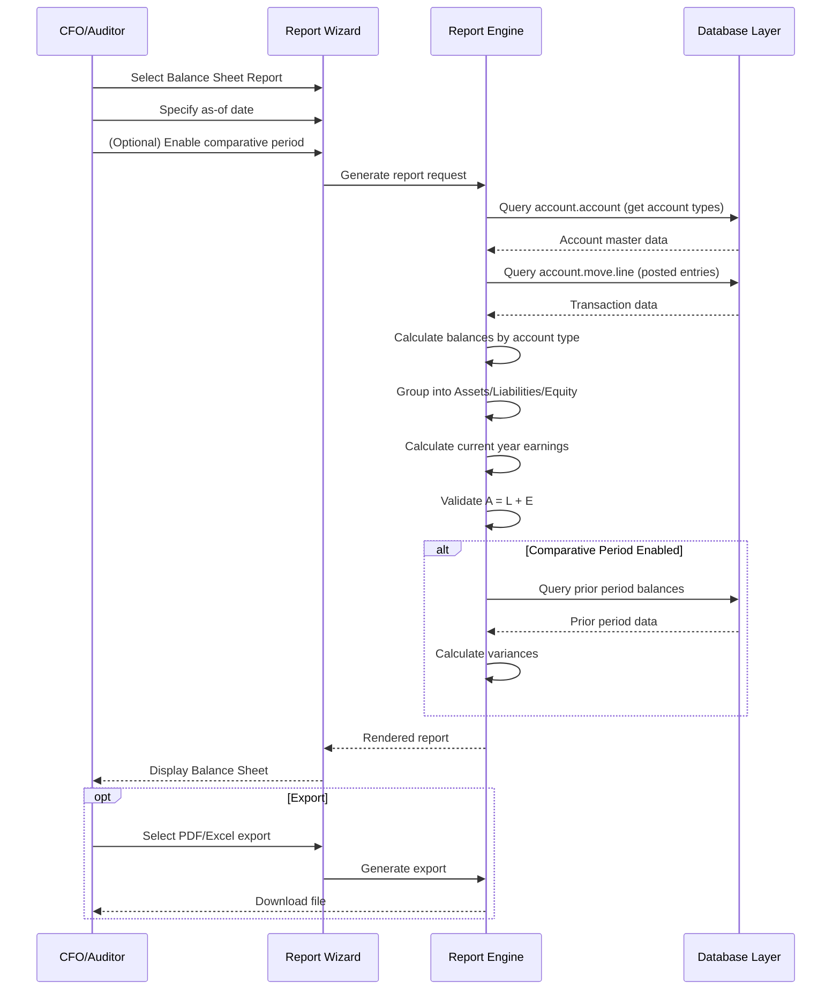
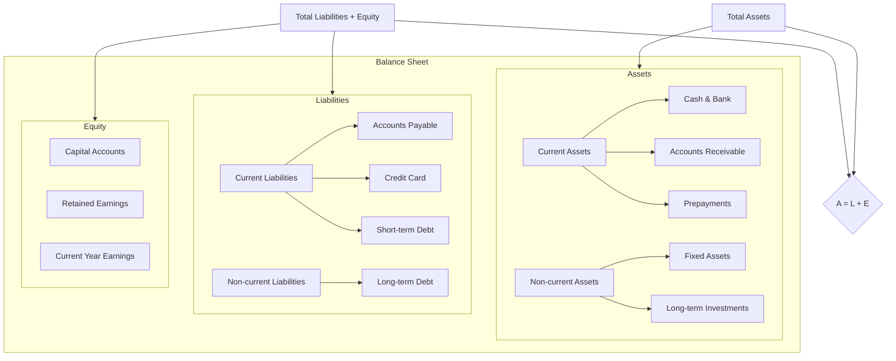

# FR-001: Balance Sheet Report

---

## Metadata

| Attribute          | Value                                                                                     |
|--------------------|-------------------------------------------------------------------------------------------|
| **Story ID**       | FR-001                                                                                    |
| **Title**          | Balance Sheet Report                                                                      |
| **Parent Feature** | [FEATURE-001: Financial Reporting](../../features/FEATURE-001-financial-reporting.md)    |
| **Status**         | Draft                                                                                     |
| **Priority**       | Critical                                                                                  |
| **Estimate**       | TBD (To be estimated during sprint planning)                                              |

---

## User Story

**As a** CFO

**I want** to generate a balance sheet showing assets, liabilities, and equity as of a specific date

**So that** I can report the company's financial position to stakeholders, comply with regulatory requirements, and support loan applications

---

## INVEST Principles Compliance

| Principle | Compliance | Notes |
|-----------|------------|-------|
| **Independent** | ✅ | Can be developed independently; only requires core account models |
| **Negotiable** | ✅ | Describes outcomes (financial position report), not specific implementation |
| **Valuable** | ✅ | Clear business value: regulatory compliance, stakeholder reporting, loan applications |
| **Estimable** | ✅ | Scope is well-defined with clear acceptance criteria |
| **Small** | ✅ | Single report type with focused functionality |
| **Testable** | ✅ | BDD scenarios enable objective pass/fail determination |

---

## Acceptance Criteria

### Scenario 1: Generate Balance Sheet for reporting date

- **Given** I am on the financial reports menu
- **When** I select Balance Sheet report and specify an as-of date
- **Then** I see a statement showing total assets, total liabilities, and total equity where assets equal liabilities plus equity

### Scenario 2: Asset classification

- **Given** a Balance Sheet is generated
- **When** I view the assets section
- **Then** I see assets properly classified as:
  - **Current Assets**: receivables, cash, bank accounts, prepayments
  - **Non-current Assets**: fixed assets, long-term investments

### Scenario 3: Liability classification

- **Given** a Balance Sheet is generated
- **When** I view the liabilities section
- **Then** I see liabilities properly classified as:
  - **Current Liabilities**: payables, credit card balances, current portion of debt
  - **Non-current Liabilities**: long-term debt, deferred liabilities

### Scenario 4: Equity section with retained earnings

- **Given** a Balance Sheet is generated for a date during the fiscal year
- **When** I view the equity section
- **Then** I see:
  - Capital accounts (share capital, additional paid-in capital)
  - Retained earnings (accumulated profits from prior periods)
  - Current year earnings (unaffected earnings calculated from income/expense accounts)

### Scenario 5: Comparative Balance Sheet

- **Given** I want to compare financial position year-over-year
- **When** I enable comparative period option and select prior year-end date
- **Then** I see:
  - Current period balances in the first column
  - Prior period balances in the second column
  - Variance columns showing absolute difference and percentage change

### Scenario 6: Balance validation (Assets = Liabilities + Equity)

- **Given** a Balance Sheet is generated
- **When** I view the statement totals
- **Then** total assets equals total liabilities plus total equity, confirming the fundamental accounting equation (A = L + E)

---

## Constraints

### License and Compliance

- [x] **AGPL-3.0 Compatibility**: Module/feature must be distributed under AGPL-3.0 compatible license
- [x] **No Enterprise Dependencies**: No imports or dependencies on Odoo Enterprise edition modules (specifically excludes `account_reports`)
- [x] **OCA Coding Standards**: Implementation must follow Odoo and OCA (Odoo Community Association) coding standards

### Accounting Standards Compliance

- [x] **GAAP Compliance**: Balance Sheet format must comply with US GAAP presentation requirements
- [x] **IFRS Compliance**: Balance Sheet format must support IFRS (IAS 1) presentation requirements
- [x] **Statement of Financial Position**: Report may also be titled "Statement of Financial Position" per IFRS terminology

### Version Compatibility

- [x] **Target Version**: Odoo 18.0 compatibility required
- [x] **Repository Note**: Current repository is Odoo 19.0; implementation should be version-agnostic where possible

---

## Technical Discovery Notes

> **Purpose:** These notes guide implementing agents in their codebase analysis before making implementation decisions. User stories describe WHAT and WHY; implementation details emerge from agent discovery of the codebase.

### Codebase Analysis Areas

| Area | Files/Modules to Examine | Analysis Focus |
|------|-------------------------|----------------|
| Account Types | `addons/account/models/account_account.py` | Analyze `account_type` field selection values for classification |
| Asset Account Types | `addons/account/models/account_account.py` | `asset_receivable`, `asset_cash`, `asset_current`, `asset_non_current`, `asset_prepayments`, `asset_fixed` |
| Liability Account Types | `addons/account/models/account_account.py` | `liability_payable`, `liability_credit_card`, `liability_current`, `liability_non_current` |
| Equity Account Types | `addons/account/models/account_account.py` | `equity`, `equity_unaffected` (Current Year Earnings) |
| Balance Forward Logic | `addons/account/models/account_account.py` | `include_initial_balance` field - determines which accounts carry forward balances |
| Internal Group | `addons/account/models/account_account.py` | `internal_group` computed field for balance sheet classification (`asset`, `liability`, `equity`) |
| Journal Items | `addons/account/models/account_move_line.py` | Transaction data source with debit/credit balances |
| Report Patterns | `addons/account/report/account_invoice_report.py` | SQL-view based reporting patterns for aggregation |

### Account Type to Balance Sheet Section Mapping

Based on source code analysis of `addons/account/models/account_account.py`:

| Account Type | Internal Group | Balance Sheet Section | Include Initial Balance |
|--------------|----------------|----------------------|------------------------|
| `asset_receivable` | `asset` | Current Assets | Yes |
| `asset_cash` | `asset` | Current Assets | Yes |
| `asset_current` | `asset` | Current Assets | Yes |
| `asset_prepayments` | `asset` | Current Assets | Yes |
| `asset_non_current` | `asset` | Non-current Assets | Yes |
| `asset_fixed` | `asset` | Non-current Assets | Yes |
| `liability_payable` | `liability` | Current Liabilities | Yes |
| `liability_credit_card` | `liability` | Current Liabilities | Yes |
| `liability_current` | `liability` | Current Liabilities | Yes |
| `liability_non_current` | `liability` | Non-current Liabilities | Yes |
| `equity` | `equity` | Equity | Yes |
| `equity_unaffected` | `equity` | Equity (Current Year Earnings) | No* |

*Note: `equity_unaffected` is a special account type for current year earnings that aggregates income and expense account balances.

### Relevant Existing Modules

| Module | Path | Relevance |
|--------|------|-----------|
| `account` | `addons/account/` | Core accounting models (`account.account`, `account.move`, `account.move.line`) |
| `analytic` | `addons/analytic/` | Analytic account dimensions (if filtering by cost center needed) |

### OCA Module Compatibility

| OCA Repository | Module | Compatibility Consideration |
|----------------|--------|----------------------------|
| `OCA/account-financial-reporting` | `account_financial_report` | Reference implementation for Balance Sheet report |
| `OCA/account-financial-reporting` | `account_financial_report_qweb` | QWeb-based report rendering patterns |

### Key Implementation Considerations

1. **Balance Calculation Logic**
   - For balance-forward accounts (`include_initial_balance = True`): Sum all journal items from beginning of time
   - For income/expense accounts: Sum only within fiscal year
   - Current year earnings: Calculated as sum of income accounts minus sum of expense accounts

2. **Fiscal Year Handling**
   - Balance Sheet is point-in-time (as-of date), not period-based
   - Prior period retained earnings must include all income/expense up to prior fiscal year end
   - Current year earnings = Income - Expenses from fiscal year start to as-of date

3. **Multi-Currency Considerations**
   - Report amounts should be in company currency
   - Consider `balance` field on `account.move.line` which is always in company currency

4. **Account Hierarchy/Grouping**
   - Consider `account.group` model for account grouping in presentation
   - Consider `account.root` for report structure organization

---

## Dependencies

### Story Dependencies

| Dependency Type | Story ID | Story Title | Relationship |
|-----------------|----------|-------------|--------------|
| Parent Feature | FEATURE-001 | Financial Reporting | This story is part of this feature |
| Related | FR-002 | Profit & Loss Statement | Current year earnings in equity section derives from P&L accounts |
| Related | FR-005 | Trial Balance Report | Balance Sheet totals should reconcile with Trial Balance |
| Related | FR-007 | Report Export & Drill-down | Provides export and drill-down capabilities for this report |

### External Dependencies

| Dependency | Type | Notes |
|------------|------|-------|
| GAAP | Accounting Standard | US Generally Accepted Accounting Principles for balance sheet presentation |
| IFRS/IAS 1 | Accounting Standard | International Financial Reporting Standards for statement of financial position |

### Integration Points

| Odoo Model/Module | Integration Type | Purpose |
|-------------------|------------------|---------|
| `account.account` | Read | Account master data with type classification |
| `account.move.line` | Read | Transaction data for balance calculations |
| `account.move` | Read | Journal entry header for posting status |
| `res.company` | Read | Company configuration for fiscal year, currency |
| `account.group` | Read | Account grouping structure (optional) |

---

## Test Requirements

### Coverage Requirement

| Metric | Requirement | Notes |
|--------|-------------|-------|
| **Minimum Test Coverage** | **80%** | Mandatory for all new functionality |
| Unit Test Coverage | 80%+ | Balance calculation logic, account classification |
| Integration Test Coverage | 80%+ | Full report generation, data aggregation |

### Unit Test Scenarios

| Acceptance Scenario | Unit Test Focus | Key Assertions |
|---------------------|-----------------|----------------|
| Scenario 1: Generate Balance Sheet | Report generation | Report returns valid data structure with all required sections |
| Scenario 2: Asset classification | Account type mapping | Asset accounts correctly grouped into current vs non-current |
| Scenario 3: Liability classification | Account type mapping | Liability accounts correctly grouped into current vs non-current |
| Scenario 4: Equity section | Retained earnings calculation | Current year earnings = Income - Expenses for fiscal period |
| Scenario 5: Comparative Balance Sheet | Period comparison | Prior period balances calculated correctly with variance |
| Scenario 6: Balance validation | Accounting equation | Total Assets = Total Liabilities + Total Equity |

### Integration Test Scenarios

| Test Scenario | Test Description | Expected Result |
|---------------|------------------|-----------------|
| Full Balance Sheet generation | Generate report with sample data | All sections populated, equation balanced |
| Multi-account type verification | Test with various account types | Correct classification into sections |
| Balance forward accounts | Test `include_initial_balance` logic | Balance-forward accounts include all historical transactions |
| Zero-balance handling | Test accounts with no transactions | Accounts may be included/excluded based on configuration |
| Multi-currency scenario | Test with foreign currency transactions | Amounts converted to company currency |

### Specific Test Cases

| Test Case ID | Description | Preconditions | Expected Outcome |
|--------------|-------------|---------------|------------------|
| TC-FR001-01 | Accounting equation validation | Posted journal entries exist | A = L + E returns True |
| TC-FR001-02 | Current asset total | Cash, receivables, prepayments posted | Sum matches current assets section |
| TC-FR001-03 | Non-current asset total | Fixed assets posted | Sum matches non-current assets section |
| TC-FR001-04 | Current liability total | Payables, credit card balances posted | Sum matches current liabilities section |
| TC-FR001-05 | Non-current liability total | Long-term debt posted | Sum matches non-current liabilities section |
| TC-FR001-06 | Current year earnings | Income and expense entries posted | Calculated as Income - Expenses |
| TC-FR001-07 | Comparative period variance | Two periods with different balances | Variance calculated correctly |
| TC-FR001-08 | Balance-forward account | Asset account with historical transactions | Balance includes all historical amounts |

---

## Workflow Diagram

---

## Balance Sheet Structure Diagram

---

## Acceptance Checklist

Before marking this story as "Done", verify:

- [ ] Balance Sheet can be generated for any as-of date
- [ ] Assets section correctly classifies current vs non-current
- [ ] Liabilities section correctly classifies current vs non-current
- [ ] Equity section includes capital, retained earnings, and current year earnings
- [ ] Comparative period option displays prior period with variance
- [ ] Accounting equation (A = L + E) is always satisfied
- [ ] GAAP presentation format supported
- [ ] IFRS presentation format supported
- [ ] No dependencies on Odoo Enterprise modules
- [ ] Minimum 80% test coverage achieved
- [ ] Code follows OCA coding standards

---

## References

### Accounting Standards

- **US GAAP**: ASC 210 - Balance Sheet
- **IFRS**: IAS 1 - Presentation of Financial Statements (Statement of Financial Position)

### OCA Modules (Reference)

- [OCA/account-financial-reporting](https://github.com/OCA/account-financial-reporting) - Community financial reports

### Source Code References

- `addons/account/models/account_account.py` - Account type definitions and `include_initial_balance` logic
- `addons/account/models/account_move_line.py` - Journal item model for balance calculations
- `addons/account/report/account_invoice_report.py` - SQL-view reporting pattern reference

---

## Change History

| Date | Author | Change Description |
|------|--------|-------------------|
| 2024 | Enterprise Accounting Team | Initial story creation |
