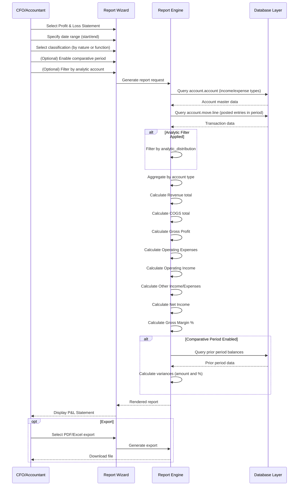
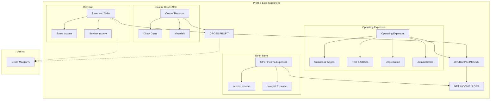
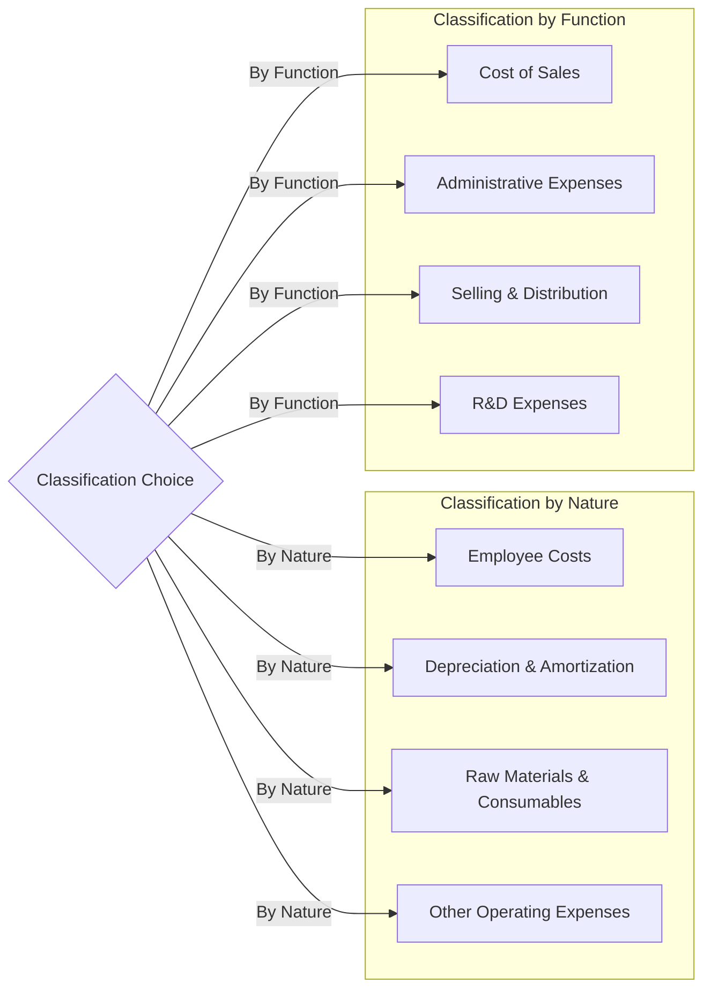

# FR-002: Profit & Loss Statement

---

## Metadata

| Attribute          | Value                                                                                     |
|--------------------|-------------------------------------------------------------------------------------------|
| **Story ID**       | FR-002                                                                                    |
| **Title**          | Profit & Loss Statement                                                                   |
| **Parent Feature** | [FEATURE-001: Financial Reporting](../../features/FEATURE-001-financial-reporting.md)    |
| **Status**         | Draft                                                                                     |
| **Priority**       | Critical                                                                                  |
| **Estimate**       | TBD (To be estimated during sprint planning)                                              |

---

## User Story

**As a** CFO

**I want** to generate a profit and loss statement showing revenues, expenses, and net income for a specified period

**So that** I can assess the company's profitability, identify trends, and make strategic business decisions

---

## INVEST Principles Compliance

| Principle | Compliance | Notes |
|-----------|------------|-------|
| **Independent** | ✅ | Can be developed independently; only requires core account models with income/expense types |
| **Negotiable** | ✅ | Describes outcomes (profitability report), not specific implementation |
| **Valuable** | ✅ | Clear business value: profitability analysis, trend identification, strategic decision-making |
| **Estimable** | ✅ | Scope is well-defined with clear acceptance criteria for income statement generation |
| **Small** | ✅ | Single report type with focused functionality on period-based financial performance |
| **Testable** | ✅ | BDD scenarios enable objective pass/fail determination with numeric accuracy validation |

---

## Acceptance Criteria

### Scenario 1: Generate P&L for reporting period

- **Given** I am on the financial reports menu
- **When** I select Profit & Loss Statement and specify a date range (e.g., fiscal year, quarter, month)
- **Then** I see a statement showing:
  - **Revenue**: Total income from operations
  - **Cost of Goods Sold**: Direct costs of revenue
  - **Gross Profit**: Revenue minus Cost of Goods Sold
  - **Operating Expenses**: General operating costs
  - **Operating Income**: Gross Profit minus Operating Expenses
  - **Other Income/Expenses**: Non-operating income and expenses
  - **Net Income**: Final profit or loss for the period

### Scenario 2: Comparative period analysis

- **Given** I am generating a P&L for the current quarter
- **When** I enable comparative period option and select prior year same quarter
- **Then** I see:
  - Current period amounts in the first column
  - Prior period amounts in the second column
  - Variance showing absolute difference (amount)
  - Variance showing relative difference (percentage change)

### Scenario 3: Expense classification by nature

- **Given** I want expenses classified by their nature (e.g., salaries, rent, utilities, depreciation)
- **When** I select the "classification by nature" option
- **Then** expenses are grouped by their account nature rather than by functional department, showing line items such as:
  - Employee costs
  - Depreciation and amortization
  - Raw materials and consumables
  - Other operating expenses

### Scenario 4: Expense classification by function

- **Given** I want expenses classified by their function (e.g., cost of sales, administrative, selling)
- **When** I select the "classification by function" option
- **Then** expenses are grouped by their functional classification, showing line items such as:
  - Cost of Sales
  - Administrative Expenses
  - Selling and Distribution Expenses
  - Research and Development Expenses

### Scenario 5: Filter by analytic account

- **Given** I want to view profitability for a specific cost center or project
- **When** I filter the P&L by analytic account or analytic plan
- **Then** only revenues and expenses allocated to that analytic dimension are included in the report

### Scenario 6: Gross margin calculation

- **Given** a P&L is generated with revenue and cost of sales accounts properly configured
- **When** I view the gross profit section
- **Then** I see:
  - Gross Profit calculated as Revenue minus Cost of Goods Sold
  - Gross Margin Percentage displayed as (Gross Profit / Revenue) × 100

---

## Constraints

### License and Compliance

- [x] **AGPL-3.0 Compatibility**: Module/feature must be distributed under AGPL-3.0 compatible license
- [x] **No Enterprise Dependencies**: No imports or dependencies on Odoo Enterprise edition modules (specifically excludes `account_reports`)
- [x] **OCA Coding Standards**: Implementation must follow Odoo and OCA (Odoo Community Association) coding standards

### Accounting Standards Compliance

- [x] **GAAP Compliance**: Income Statement format must comply with US GAAP presentation requirements
- [x] **IFRS Compliance**: Income Statement format must support IAS 1 presentation requirements, supporting both classification by nature and classification by function
- [x] **Multi-Step Format**: Report supports multi-step income statement format showing gross profit and operating income subtotals

### Version Compatibility

- [x] **Target Version**: Odoo 18.0 compatibility required
- [x] **Repository Note**: Current repository is Odoo 19.0; implementation should be version-agnostic where possible

---

## Technical Discovery Notes

> **Purpose:** These notes guide implementing agents in their codebase analysis before making implementation decisions. User stories describe WHAT and WHY; implementation details emerge from agent discovery of the codebase.

### Codebase Analysis Areas

| Area | Files/Modules to Examine | Analysis Focus |
|------|-------------------------|----------------|
| Income Account Types | `addons/account/models/account_account.py` | Analyze `account_type` selection values: `income`, `income_other` |
| Expense Account Types | `addons/account/models/account_account.py` | Analyze `account_type` selection values: `expense`, `expense_other`, `expense_depreciation`, `expense_direct_cost` |
| Internal Group | `addons/account/models/account_account.py` | `internal_group` computed field for P&L classification (`income`, `expense`) |
| Balance Forward Logic | `addons/account/models/account_account.py` | `include_initial_balance` field - income/expense accounts have `False` (reset at fiscal year) |
| Journal Items | `addons/account/models/account_move_line.py` | Transaction data source with debit/credit/balance fields |
| Analytic Integration | `addons/account/models/account_move_line.py` | `analytic.mixin` inheritance for analytic dimension filtering |
| Report Patterns | `addons/account/report/account_invoice_report.py` | SQL-view based reporting patterns for aggregation |
| Analytic Accounts | `addons/analytic/models/analytic_account.py` | Analytic dimension structure for cost center filtering |
| Analytic Plans | `addons/analytic/models/analytic_plan.py` | Multi-dimensional analytic structure |

### Account Type to P&L Section Mapping

Based on source code analysis of `addons/account/models/account_account.py`:

| Account Type | Internal Group | P&L Section | Include Initial Balance |
|--------------|----------------|-------------|------------------------|
| `income` | `income` | Revenue / Sales | No |
| `income_other` | `income` | Other Income | No |
| `expense_direct_cost` | `expense` | Cost of Goods Sold / Cost of Revenue | No |
| `expense` | `expense` | Operating Expenses | No |
| `expense_other` | `expense` | Other Expenses | No |
| `expense_depreciation` | `expense` | Depreciation and Amortization | No |

**Important Note:** All income and expense accounts have `include_initial_balance = False`, meaning they are reset to zero at the start of each fiscal year. P&L reports must only aggregate transactions within the specified reporting period.

### Gross Profit and Net Income Calculations

```
Revenue (income accounts)
- Cost of Goods Sold (expense_direct_cost accounts)
= GROSS PROFIT

Gross Profit
- Operating Expenses (expense, expense_depreciation accounts)
= OPERATING INCOME

Operating Income
+ Other Income (income_other accounts)
- Other Expenses (expense_other accounts)
= NET INCOME (Profit/Loss)
```

### Relevant Existing Modules

| Module | Path | Relevance |
|--------|------|-----------|
| `account` | `addons/account/` | Core accounting models (`account.account`, `account.move`, `account.move.line`) |
| `analytic` | `addons/analytic/` | Analytic account dimensions for cost center and project filtering |

### OCA Module Compatibility

| OCA Repository | Module | Compatibility Consideration |
|----------------|--------|----------------------------|
| `OCA/account-financial-reporting` | `account_financial_report` | Reference implementation for Profit & Loss report |
| `OCA/account-financial-reporting` | `account_financial_report_qweb` | QWeb-based report rendering patterns |
| `OCA/mis-builder` | `mis_builder` | Alternative MIS-based reporting approach for P&L |

### Key Implementation Considerations

1. **Period-Based Calculation**
   - P&L is a period report (date range), not point-in-time like Balance Sheet
   - Sum only transactions within the specified date range
   - Do NOT include transactions from prior fiscal years

2. **Fiscal Year Handling**
   - Default period may be current fiscal year
   - Support custom date ranges (month, quarter, custom)
   - Comparative periods should align (e.g., Q1 2024 vs Q1 2023)

3. **Classification Options**
   - By Nature: Group by account type characteristics (salaries, depreciation, materials)
   - By Function: Group by business function (cost of sales, admin, selling)
   - May require account tags or additional configuration for functional classification

4. **Multi-Currency Considerations**
   - Report amounts should be in company currency
   - Use `balance` field on `account.move.line` which is always in company currency

5. **Analytic Filtering**
   - Use `analytic_distribution` field on journal items for filtering
   - Support filtering by single analytic account or analytic plan
   - Ensure proper handling of partial allocations

---

## Dependencies

### Story Dependencies

| Dependency Type | Story ID | Story Title | Relationship |
|-----------------|----------|-------------|--------------|
| Parent Feature | FEATURE-001 | Financial Reporting | This story is part of this feature |
| Related | FR-001 | Balance Sheet Report | Net income from P&L flows to retained earnings in Balance Sheet |
| Related | FR-003 | Cash Flow Statement | Net income is starting point for indirect method cash flow |
| Related | FR-005 | Trial Balance Report | P&L totals should reconcile with Trial Balance income/expense accounts |
| Related | FR-007 | Report Export & Drill-down | Provides export and drill-down capabilities for this report |

### External Dependencies

| Dependency | Type | Notes |
|------------|------|-------|
| GAAP | Accounting Standard | US Generally Accepted Accounting Principles for income statement presentation |
| IFRS/IAS 1 | Accounting Standard | International Financial Reporting Standards for statement of profit or loss |

### Integration Points

| Odoo Model/Module | Integration Type | Purpose |
|-------------------|------------------|---------|
| `account.account` | Read | Account master data with income/expense type classification |
| `account.move.line` | Read | Transaction data for revenue and expense aggregation |
| `account.move` | Read | Journal entry header for posting status validation |
| `account.analytic.account` | Read | Analytic dimensions for cost center filtering |
| `account.analytic.plan` | Read | Analytic plan structure for multi-dimensional filtering |
| `res.company` | Read | Company configuration for fiscal year, currency |

---

## Test Requirements

### Coverage Requirement

| Metric | Requirement | Notes |
|--------|-------------|-------|
| **Minimum Test Coverage** | **80%** | Mandatory for all new functionality |
| Unit Test Coverage | 80%+ | Revenue/expense aggregation, gross profit calculation, net income calculation |
| Integration Test Coverage | 80%+ | Full report generation, analytic filtering, comparative periods |

### Unit Test Scenarios

| Acceptance Scenario | Unit Test Focus | Key Assertions |
|---------------------|-----------------|----------------|
| Scenario 1: Generate P&L for period | Report generation | Report returns valid data structure with all required sections |
| Scenario 2: Comparative period analysis | Period comparison logic | Prior period amounts and variance calculations are accurate |
| Scenario 3: Classification by nature | Account type grouping | Expenses grouped by account type characteristics |
| Scenario 4: Classification by function | Functional grouping | Expenses grouped by business function |
| Scenario 5: Analytic filtering | Analytic dimension query | Only transactions with matching analytic distribution included |
| Scenario 6: Gross margin calculation | Margin percentage | Gross margin = (Gross Profit / Revenue) × 100 |

### Integration Test Scenarios

| Test Scenario | Test Description | Expected Result |
|---------------|------------------|-----------------|
| Full P&L generation | Generate report with sample revenue and expense data | All sections populated with correct calculations |
| Revenue aggregation | Test with multiple income accounts | Total revenue equals sum of all income account balances |
| Expense aggregation | Test with various expense account types | Expenses correctly categorized (COGS, operating, other) |
| Gross profit validation | Test with revenue and direct cost entries | Gross Profit = Revenue - COGS |
| Net income validation | Test complete income statement | Net Income = All Income - All Expenses |
| Period boundary test | Test fiscal year boundary handling | Only includes transactions within specified period |
| Comparative period test | Test year-over-year comparison | Variance calculations accurate |
| Analytic filtering test | Test with analytic distributions | Report filters correctly by analytic dimension |

### Specific Test Cases

| Test Case ID | Description | Preconditions | Expected Outcome |
|--------------|-------------|---------------|------------------|
| TC-FR002-01 | Revenue total accuracy | Posted sales invoices exist | Total revenue matches sum of income accounts |
| TC-FR002-02 | COGS total accuracy | Posted cost entries exist | COGS matches sum of expense_direct_cost accounts |
| TC-FR002-03 | Gross profit calculation | Revenue and COGS entries posted | Gross Profit = Revenue - COGS |
| TC-FR002-04 | Operating expense total | Operating expense entries posted | Sum matches operating expenses section |
| TC-FR002-05 | Operating income calculation | Gross profit and OpEx data available | Operating Income = Gross Profit - Operating Expenses |
| TC-FR002-06 | Net income calculation | All income and expense entries posted | Net Income = Total Income - Total Expenses |
| TC-FR002-07 | Gross margin percentage | Revenue > 0 | Gross Margin % = (Gross Profit / Revenue) × 100 |
| TC-FR002-08 | Comparative variance (amount) | Two periods with different values | Variance = Current - Prior |
| TC-FR002-09 | Comparative variance (percent) | Prior period value > 0 | Variance % = ((Current - Prior) / Prior) × 100 |
| TC-FR002-10 | Analytic filter accuracy | Transactions with analytic allocations | Only matching analytic entries included |
| TC-FR002-11 | Period isolation | Transactions across fiscal years | Report excludes prior fiscal year transactions |

---

## Workflow Diagram



---

## P&L Structure Diagram



---

## Classification Options Diagram



---

## Acceptance Checklist

Before marking this story as "Done", verify:

- [ ] P&L Statement can be generated for any date range (month, quarter, year, custom)
- [ ] Revenue section correctly aggregates all income accounts
- [ ] Cost of Goods Sold correctly aggregates expense_direct_cost accounts
- [ ] Gross Profit calculated correctly as Revenue - COGS
- [ ] Operating Expenses correctly aggregates operating expense accounts
- [ ] Operating Income calculated correctly as Gross Profit - Operating Expenses
- [ ] Other Income/Expenses section correctly aggregates income_other and expense_other accounts
- [ ] Net Income calculated correctly as total income minus total expenses
- [ ] Gross Margin percentage displayed correctly
- [ ] Classification by nature option groups expenses by account type
- [ ] Classification by function option groups expenses by business function
- [ ] Comparative period option displays prior period with amount and percentage variance
- [ ] Analytic filtering correctly limits report to selected cost center/project
- [ ] GAAP presentation format supported
- [ ] IFRS presentation format supported (both classification methods)
- [ ] No dependencies on Odoo Enterprise modules
- [ ] Minimum 80% test coverage achieved
- [ ] Code follows OCA coding standards

---

## References

### Accounting Standards

- **US GAAP**: ASC 225 - Income Statement
- **IFRS**: IAS 1 - Presentation of Financial Statements (Statement of Profit or Loss)
- **IFRS**: IAS 1.99-105 - Classification of expenses (by nature vs by function)

### OCA Modules (Reference)

- [OCA/account-financial-reporting](https://github.com/OCA/account-financial-reporting) - Community financial reports including P&L
- [OCA/mis-builder](https://github.com/OCA/mis-builder) - Management Information System builder for custom P&L reports

### Source Code References

- `addons/account/models/account_account.py` - Account type definitions (`income`, `income_other`, `expense`, `expense_other`, `expense_depreciation`, `expense_direct_cost`)
- `addons/account/models/account_move_line.py` - Journal item model for revenue/expense aggregation with analytic support
- `addons/account/report/account_invoice_report.py` - SQL-view reporting pattern reference
- `addons/analytic/models/analytic_account.py` - Analytic dimension structure for cost center filtering

---

## Notes

### GAAP vs IFRS Presentation Differences

**Classification by Nature (permitted under IFRS):**
- Groups expenses by what they are (e.g., depreciation, employee costs, materials)
- Often simpler to prepare as it follows account structure
- Less useful for understanding cost behavior

**Classification by Function (required for public companies under GAAP, permitted under IFRS):**
- Groups expenses by purpose (e.g., cost of sales, selling, administrative)
- More useful for understanding where costs are incurred
- Requires additional allocation or tagging of expenses

**Implementation Note:** Supporting both classification methods may require account tags or a mapping configuration to assign accounts to functional categories.

### Analytic Dimension Considerations

- Reports filtered by analytic account should only include transactions with matching `analytic_distribution`
- Partial allocations (e.g., 50% to Project A, 50% to Project B) should be handled proportionally
- Consider allowing filtering by multiple analytic accounts or by analytic plan

### Relationship to Balance Sheet

The Net Income from the P&L flows to the Balance Sheet as follows:
- Net Income for current fiscal year → Equity section as "Current Year Earnings" (`equity_unaffected`)
- At fiscal year close, Current Year Earnings → Retained Earnings

This relationship should be verified during testing to ensure consistency between reports.
