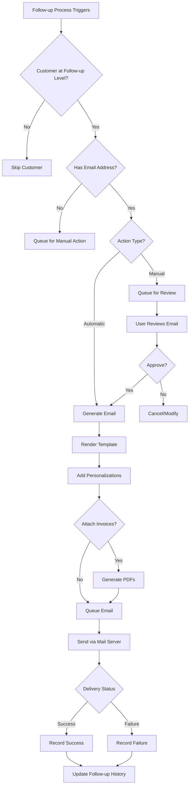

# PF-002: Automated Email Generation

---

## Metadata

| Attribute | Value |
|-----------|-------|
| **Story ID** | PF-002 |
| **Title** | Automated Email Generation |
| **Feature** | [FEATURE-006: Payment Follow-ups](../../features/FEATURE-006-payment-followups.md) |
| **Epic** | [EPIC-001: Enterprise Accounting Capabilities](../../EPIC-001-enterprise-accounting.md) |
| **Status** | Draft |
| **Priority** | High |
| **Story Points** | TBD (Implementation team to estimate) |
| **Personas** | Accountant, Credit Controller |
| **Created** | 2024 |
| **Last Updated** | 2024 |

---

## 1. User Story

### 1.1 Primary User Story

**As an** Accountant,

**I want** the system to automatically generate and send follow-up emails to customers based on their overdue status and configured follow-up level,

**So that** I can reduce manual effort in payment collection while ensuring consistent, timely communication with customers.

### 1.2 Secondary User Story

**As a** Credit Controller,

**I want** to customize email templates for each follow-up level with appropriate tone and urgency,

**So that** communication escalates appropriately from friendly reminder to final notice.

---

## 2. Business Value

### 2.1 Value Statement

Automated email generation transforms the payment collection process by:

- **Eliminating manual effort** spent composing and sending individual payment reminders
- **Ensuring consistency** in customer communications with standardized templates
- **Improving timeliness** of follow-up actions through scheduled automation
- **Maintaining professional relationships** with appropriate escalation messaging
- **Increasing collection rates** through systematic, persistent follow-up

### 2.2 Success Metrics

| Metric | Target | Rationale |
|--------|--------|-----------|
| Manual email reduction | 80% reduction in manually composed payment reminders | Measure automation effectiveness |
| Email delivery success rate | >98% successful delivery | Ensure communications reach customers |
| Collection improvement | 15-25% reduction in overdue receivables | Primary business outcome |
| Response time | Emails sent within 24 hours of triggering conditions | Measure process timeliness |
| Template utilization | 100% of automated emails use configured templates | Ensure consistency |

### 2.3 Business Rules

| Rule ID | Rule Description |
|---------|------------------|
| BR-001 | Emails are only generated for customers who have reached a configured follow-up level |
| BR-002 | Each email must include all overdue invoices for the customer (consolidated communication) |
| BR-003 | Email templates must support dynamic field substitution for customer and invoice data |
| BR-004 | PDF invoice attachments are optional and configurable per follow-up level |
| BR-005 | Customers with email addresses on file receive automated emails; others require manual action |
| BR-006 | Email generation respects the manual vs automatic action type configured on the follow-up level |
| BR-007 | Email delivery status must be tracked and available in follow-up history |

---

## 3. Acceptance Criteria

> **Note:** All acceptance criteria follow BDD (Behavior-Driven Development) format using Given/When/Then syntax. Each scenario describes observable behavior without prescribing implementation details.

### Scenario 1: Automatic Email Generation Based on Follow-up Level

**Given** a customer has reached a specific follow-up level (e.g., "First Reminder")

**And** the follow-up level has an email template configured

**And** the follow-up level action type is set to "Automatic"

**When** the follow-up automation process runs

**Then** an email is generated using the template associated with that follow-up level

**And** the email is populated with customer and invoice details

**And** the email is queued for delivery through the standard outgoing mail server

**And** the action is recorded in the customer's follow-up history

---

### Scenario 2: Email Template Personalization

**Given** I have configured an email template for a follow-up level

**When** an email is generated for a customer

**Then** the email includes all of the following personalized information:
  - Customer name (and company name if applicable)
  - List of overdue invoices with invoice numbers, amounts, and due dates
  - Total overdue amount across all listed invoices
  - Currency of the amounts
  - Days overdue for each invoice
  - Payment instructions (bank account details, payment methods)
  - Company signature and contact information

**And** the template supports QWeb placeholders for dynamic field substitution

**And** the email renders correctly in the customer's preferred language (if configured)

---

### Scenario 3: Attach Overdue Invoice Documents

**Given** the follow-up level is configured to attach invoice PDF documents

**When** the follow-up email is generated

**Then** the relevant overdue invoice documents are automatically attached to the email

**And** each invoice PDF is generated using the company's invoice report template

**And** attachments are named clearly (e.g., "Invoice_INV-2024-0001.pdf")

**And** the total attachment size is validated against email server limits

---

### Scenario 4: Preview Email Before Sending

**Given** I am reviewing customers due for follow-up

**When** I select a customer and choose to preview the follow-up email

**Then** I can see the complete email content exactly as it will be sent

**And** I can see the list of recipients (To, CC)

**And** I can see the list of attachments that will be included

**And** I have the option to edit the email content before sending

**And** I have the option to change the follow-up level being applied

**And** I can proceed to send or cancel the preview

---

### Scenario 5: Manual Email Trigger

**Given** I am viewing a customer with overdue invoices

**When** I manually trigger a follow-up email at a specific level

**Then** the email is generated using the selected follow-up level's template

**And** the email is sent (or queued) immediately regardless of the automated schedule

**And** the manual action is recorded in the customer's follow-up history with user attribution

**And** the customer's current follow-up status is updated appropriately

---

### Scenario 6: Email Delivery Tracking

**Given** a follow-up email has been sent to a customer

**When** I view the customer's follow-up history

**Then** I can see the email send status with one of the following states:
  - **Queued**: Email is waiting to be sent
  - **Sent**: Email was successfully sent to the mail server
  - **Delivered**: Email was confirmed delivered (if tracking available)
  - **Failed**: Email delivery failed with error details

**And** I can see the timestamp of when the email was sent

**And** I can see a link to view the full email content and attachments

**And** I can see which follow-up level triggered the email

---

### Scenario 7: Bulk Email Generation

**Given** multiple customers have reached their respective follow-up levels

**When** the automated follow-up process runs (via scheduled action or manual batch)

**Then** emails are generated for all eligible customers

**And** each customer receives a single consolidated email listing all their overdue invoices

**And** processing continues even if individual emails fail (with errors logged)

**And** a summary is provided showing total emails sent, failed, and skipped

---

### Scenario 8: Email Template with Payment Link

**Given** online payment is enabled for the company

**And** the follow-up email template includes a payment link placeholder

**When** the email is generated

**Then** the email includes a secure link to the customer's portal showing their overdue invoices

**And** the customer can pay directly from the portal link

**And** the link is specific to the customer's account (not generic)

---

## 4. Technical Notes

> **Purpose:** These notes guide implementing agents in their codebase analysis. Stories describe WHAT and WHY; implementation details emerge from agent discovery.

### 4.1 Codebase Analysis Areas

| File/Module | Analysis Purpose | Key Patterns to Reference |
|-------------|------------------|---------------------------|
| `addons/account/data/mail_template_data.xml` | Email template definition patterns | QWeb template structure with `t-out` directives, dynamic field references using `object.field_name`, `format_amount()` helper usage |
| `addons/account/models/account_move_send.py` | Email sending service patterns | `_get_default_mail_template_id()`, `_get_default_mail_body()`, `_get_default_mail_partner_ids()` methods |
| `addons/account/models/partner.py` | Partner credit/debit computation | `_credit_debit_get()` method (lines 365-407), `credit` and `debit` field patterns |
| `mail.template` model | Odoo mail template framework | Template rendering, field placeholders, attachment handling |
| `mail.mail` model | Email queueing and delivery | Send state tracking, failure handling |
| `ir.cron` model | Scheduled action patterns | Automated processing triggers |

### 4.2 Email Template Structure Reference

Based on analysis of `addons/account/data/mail_template_data.xml`, follow-up email templates should follow this pattern:

| Element | Pattern | Example |
|---------|---------|---------|
| `model_id` | Reference to partner or follow-up model | `ref="base.model_res_partner"` |
| `email_from` | Dynamic sender using company fallback | `{{ object.company_id.email_formatted }}` |
| `use_default_to` | Auto-resolve recipient | `eval="True"` |
| `subject` | Dynamic with company name | `{{ object.company_id.name }} Payment Reminder` |
| `body_html` | QWeb HTML template | `<t t-out="object.name">Customer</t>` |
| `report_template_ids` | PDF attachment references | `eval="[(4, ref('account.account_invoices'))]"` |

### 4.3 Design Considerations

| Consideration | Notes |
|---------------|-------|
| Template association | Follow-up levels (PF-001) store `email_template_id` linking to `mail.template` |
| Bulk processing | Use `mail.mail.sudo().send()` pattern for batch sending |
| Error handling | Log failures but continue processing; never fail entire batch for single email error |
| Language support | Use `mail_template._render_lang()` for partner language detection |
| Attachment generation | Use `ir.actions.report._render_qweb_pdf()` for invoice PDFs |
| Portal link | Use `partner._get_share_url()` pattern for secure portal access |

### 4.4 Integration Points

| Integration | Description |
|-------------|-------------|
| `mail.template` | Template storage and rendering |
| `mail.mail` | Email queueing and delivery tracking |
| `mail.message` | Communication history integration |
| `ir.attachment` | PDF invoice attachments |
| `ir.cron` | Scheduled automated email generation |
| `ir.actions.report` | Invoice PDF generation |
| `res.partner` | Recipient information and follow-up status |

### 4.5 Scheduler Pattern Reference

For automated email generation, the scheduled action should follow this pattern:

| Field | Value Pattern |
|-------|---------------|
| `name` | Payment Follow-up: Send Reminders |
| `model_id` | Reference to follow-up processing model |
| `state` | code |
| `code` | `model.process_followup_emails()` |
| `interval_number` | 1 |
| `interval_type` | days |
| `numbercall` | -1 (unlimited) |

---

## 5. Dependencies

### 5.1 Story Dependencies

| Dependency Type | Related Item | Notes |
|-----------------|--------------|-------|
| **Depends On** | [PF-001: Follow-up Level Configuration](./PF-001-followup-level-configuration.md) | Provides email templates and trigger definitions |
| **Depends On** | [PF-005: Overdue Calculation](./PF-005-overdue-calculation.md) | Determines which customers need follow-up |

### 5.2 Downstream Dependencies

Stories that depend on PF-002:

| Story ID | Story Title | Dependency Reason |
|----------|-------------|-------------------|
| PF-004 | Action History Tracking | Email sends are recorded in action history |
| PF-003 | Follow-up Report Generation | Reports show email send statistics |

### 5.3 External Dependencies

| Dependency | Description |
|------------|-------------|
| `mail.template` | Odoo mail template model for email composition |
| `mail.mail` | Odoo mail model for email queueing and sending |
| `ir.mail_server` | Outgoing mail server configuration |
| `ir.actions.report` | PDF report generation for attachments |
| `res.partner` | Customer information and email addresses |

---

## 6. Constraints

### 6.1 License Constraint

| Constraint | Requirement |
|------------|-------------|
| **Module License** | Module distributed under AGPL-3.0 compatible license |

### 6.2 Dependency Constraints

| Constraint | Requirement |
|------------|-------------|
| **No Enterprise Dependencies** | No imports or dependencies on Odoo Enterprise modules |
| **No account_followup** | Specifically no dependency on Enterprise `account_followup` module |

### 6.3 Coding Standards

| Constraint | Requirement |
|------------|-------------|
| **Odoo Guidelines** | Follow Odoo coding standards for mail template models |
| **OCA Standards** | Adhere to OCA module guidelines for potential contribution |
| **Template Standards** | Follow existing patterns in `addons/account/data/mail_template_data.xml` |

### 6.4 Email Compliance

| Constraint | Requirement |
|------------|-------------|
| **Standard Mail Server** | Support standard Odoo outgoing mail server configuration |
| **Email Validation** | Validate recipient email addresses before sending |
| **Unsubscribe Support** | Email footer should include company contact information |
| **Attachment Limits** | Respect mail server attachment size limitations |

---

## 7. Test Requirements

### 7.1 Coverage Requirement

| Requirement | Target |
|-------------|--------|
| **Minimum Test Coverage** | 80% test coverage for email generation logic |

### 7.2 Test Scenarios

| Test Category | Test Scenario | Priority |
|---------------|---------------|----------|
| **Template Rendering** | Render email template with valid customer data | High |
| **Template Rendering** | Render template with multiple overdue invoices | High |
| **Template Rendering** | Render template with different currencies | Medium |
| **Template Rendering** | Render template in customer's language | Medium |
| **Template Rendering** | Handle missing optional fields gracefully | High |
| **Email Generation** | Generate email for customer at first reminder level | High |
| **Email Generation** | Generate email for customer at final notice level | High |
| **Email Generation** | Skip email for customer with no email address | High |
| **Email Generation** | Respect manual vs automatic action type | High |
| **Attachment Handling** | Attach invoice PDFs when configured | High |
| **Attachment Handling** | Generate multiple invoice attachments | Medium |
| **Attachment Handling** | Handle attachment generation failure | High |
| **Delivery Tracking** | Track email queued status | High |
| **Delivery Tracking** | Track email sent status | High |
| **Delivery Tracking** | Track email failed status with error | High |
| **Bulk Processing** | Process multiple customers in batch | High |
| **Bulk Processing** | Continue batch on individual failure | High |
| **Bulk Processing** | Generate summary statistics | Medium |
| **Manual Trigger** | Manually send email for specific customer | High |
| **Manual Trigger** | Override follow-up level on manual send | Medium |
| **Preview Function** | Preview email before sending | High |
| **Preview Function** | Edit preview and send | Medium |
| **Scheduled Action** | Verify cron job triggers processing | High |
| **Scheduled Action** | Verify scheduled processing respects timing | Medium |

### 7.3 Integration Test Scenarios

| Test Scenario | Components Involved | Priority |
|---------------|---------------------|----------|
| End-to-end follow-up email | Follow-up levels + Email generation + History tracking | High |
| Multi-company email isolation | Company-specific templates and recipients | High |
| Portal payment link | Email with portal link leads to correct invoices | Medium |
| Email with multi-currency invoices | Proper formatting of mixed currencies | Medium |

---

## 8. Workflow Diagram



---

## 9. Email Template Example Structure

The following illustrates the expected structure of a follow-up email template (for reference during implementation):

```xml
<!-- Example structure based on addons/account/data/mail_template_data.xml patterns -->
<record id="email_template_followup_reminder" model="mail.template">
    <field name="name">Payment Follow-up: First Reminder</field>
    <field name="model_id" ref="base.model_res_partner"/>
    <field name="email_from">{{ object.company_id.email_formatted }}</field>
    <field name="use_default_to" eval="True"/>
    <field name="subject">{{ object.company_id.name }} - Payment Reminder</field>
    <field name="body_html" type="html">
        <div style="margin: 0px; padding: 0px;">
            <p>Dear <t t-out="object.name">Customer Name</t>,</p>
            <p>This is a friendly reminder about overdue invoices...</p>
            <!-- Invoice list rendered dynamically -->
            <p>Total overdue: <t t-out="format_amount(total_overdue, object.currency_id)">$1,000.00</t></p>
            <p>Please remit payment at your earliest convenience.</p>
            <!-- Company signature -->
        </div>
    </field>
</record>
```

---

## 10. Acceptance Criteria Traceability

| Acceptance Criterion | Test Scenarios | Business Rule |
|---------------------|----------------|---------------|
| Scenario 1: Automatic Email Generation | Email Generation tests | BR-001, BR-006 |
| Scenario 2: Email Template Personalization | Template Rendering tests | BR-002, BR-003 |
| Scenario 3: Attach Invoice Documents | Attachment Handling tests | BR-004 |
| Scenario 4: Preview Before Sending | Preview Function tests | BR-006 |
| Scenario 5: Manual Email Trigger | Manual Trigger tests | BR-005, BR-006 |
| Scenario 6: Email Delivery Tracking | Delivery Tracking tests | BR-007 |
| Scenario 7: Bulk Email Generation | Bulk Processing tests | BR-001, BR-002 |
| Scenario 8: Payment Link | Integration tests | BR-003 |

---

## 11. Related Documentation

| Document | Relevance |
|----------|-----------|
| [FEATURE-006: Payment Follow-ups](../../features/FEATURE-006-payment-followups.md) | Parent feature specification |
| [EPIC-001: Enterprise Accounting](../../EPIC-001-enterprise-accounting.md) | Parent epic context |
| [PF-001: Follow-up Level Configuration](./PF-001-followup-level-configuration.md) | Prerequisite story |
| [PF-004: Action History Tracking](./PF-004-action-history-tracking.md) | Related story for history |
| [PF-005: Overdue Calculation](./PF-005-overdue-calculation.md) | Prerequisite story |

---

## 12. Revision History

| Version | Date | Author | Changes |
|---------|------|--------|---------|
| 1.0 | 2024 | Enterprise Accounting Team | Initial story creation |
